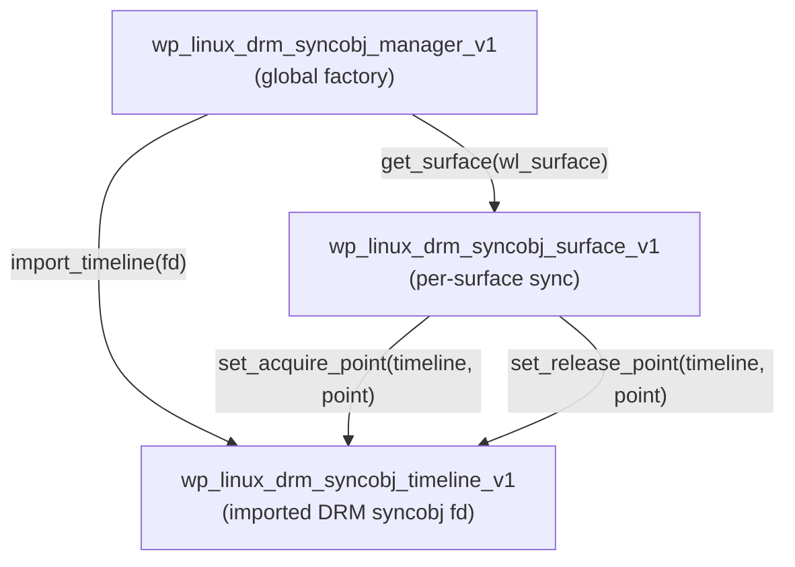
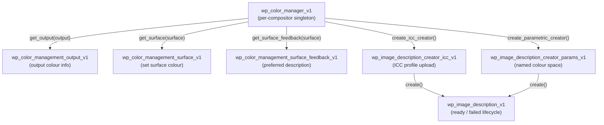
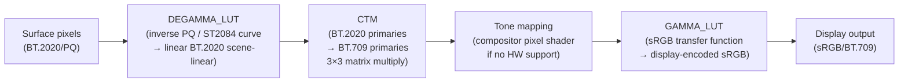
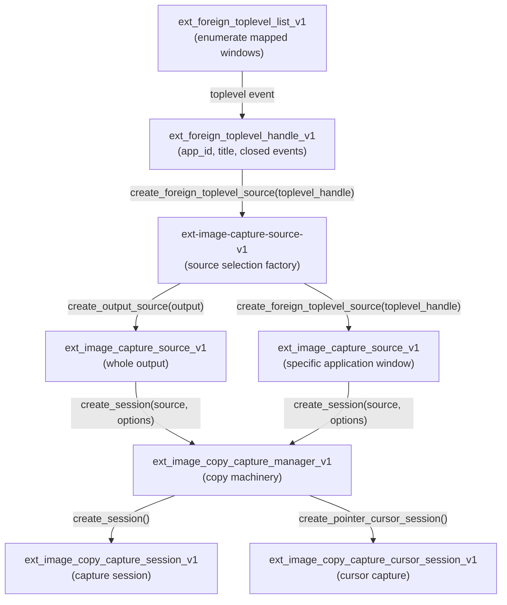
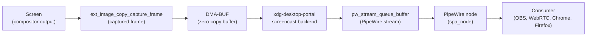

# Chapter 46: The Evolving Wayland Protocol Ecosystem

**Target audiences:** Systems and driver developers; graphics application developers; browser and web platform engineers.

This chapter covers the wave of staging protocols that reached compositor implementation in 2024–2026, directly addressing the limitation gaps catalogued in Chapter 20 §13. These protocols resolve long-standing deficiencies: GPU-fence–based explicit synchronisation for NVIDIA, cross-compositor HDR colour management, standardised screen capture, application-paced frame scheduling, and an expanded portal surface for sandboxed applications. Readers should treat version references as tied to the mid-2026 snapshot (Mutter 50.x, KWin 6.7.x, wlroots 0.18.x, xdg-desktop-portal 1.22.x); the graduation trajectory to "stable" status is clearly signalled where known.

---

## Table of Contents

1. [Background: The Staging Tier](#1-background-the-staging-tier)
2. [Explicit Synchronisation: `wp_linux_drm_syncobj_v1`](#2-explicit-synchronisation-wp_linux_drm_syncobj_v1)
3. [HDR Colour Management: `wp_color_management_v1`](#3-hdr-colour-management-wp_color_management_v1)
4. [Cross-Compositor Screen Capture: `ext-image-copy-capture-v1`](#4-cross-compositor-screen-capture-ext-image-copy-capture-v1)
5. [Frame Scheduling: `wp_fifo_v1`](#5-frame-scheduling-wp_fifo_v1)
6. [Portal Evolution](#6-portal-evolution)
7. [Protocols Still Unresolved](#7-protocols-still-unresolved)
8. [Integrations](#8-integrations)

---

## 1. Background: The Staging Tier

**`wayland-protocols`** uses three tiers: **stable** (frozen ABI), **staging** (actively maintained, backward-compatible changes allowed within a version), and **unstable** (prefixed **`zwp_`**, effectively draft). A staging protocol may accumulate breaking interface redesigns as major version bumps; once two independent compositors ship it and the protocol committee is satisfied with the design, it graduates to stable.

The criteria for stable graduation, as documented in the **`wayland-protocols`** contribution guide:

1. At least two independent compositor implementations exist.
2. At least two independent client-side implementations (toolkits or applications) exist.
3. The protocol committee has reviewed the design for protocol-level correctness (no resource leaks, clear error conditions, correct event ordering guarantees).
4. No known design issues remain open that would require a breaking interface change.

All protocols discussed in this chapter live under **`wayland-protocols/staging/`**. Their **XML** sources are at:

```
https://gitlab.freedesktop.org/wayland/wayland-protocols/-/tree/main/staging
```

**Discovering protocol support at runtime.** **Wayland** clients discover compositor capabilities by listening to **`wl_registry.global`** events. Each protocol that a compositor supports is advertised as a named global with a version number. A client should bind to the interface at the version it requires and check for `NULL` return — if the compositor doesn't advertise the interface, the bind returns `NULL` and the client must fall back:

```c
static void registry_global(void *data, struct wl_registry *registry,
    uint32_t name, const char *interface, uint32_t version)
{
    struct app_state *state = data;
    if (strcmp(interface, wp_linux_drm_syncobj_manager_v1_interface.name) == 0)
        state->syncobj_manager = wl_registry_bind(registry, name,
            &wp_linux_drm_syncobj_manager_v1_interface,
            MIN(version, 1));
    else if (strcmp(interface, wp_color_manager_v1_interface.name) == 0)
        state->color_manager = wl_registry_bind(registry, name,
            &wp_color_manager_v1_interface,
            MIN(version, 1));
    /* ... */
}
```

Because **`wl_registry`** is the only capability discovery mechanism, application developers must handle `NULL` for each optional interface and degrade gracefully — for example, skipping explicit sync setup if `syncobj_manager == NULL`, and falling back to **`glFinish()`** before commit. The absence of a dedicated capability-query protocol (§7.5) is itself an unresolved design gap in the ecosystem.

Protocol namespaces used in this chapter:

| Prefix | Namespace | Registry |
|---|---|---|
| `wp_` | Wayland protocol (cross-desktop staging) | wayland-protocols/staging |
| `ext_` | Extension (cross-desktop stable) | wayland-protocols/stable or staging |
| `zwlr_` | wlroots-specific unstable | wlr-protocols (separate repo) |
| `xdp_` | xdg-desktop-portal D-Bus API | flatpak/xdg-desktop-portal |

This chapter covers five major protocol areas. Section 2 examines **`wp_linux_drm_syncobj_v1`**, the explicit synchronisation protocol that resolves the longstanding GPU-fence corruption problem for **NVIDIA** users, building on **DRM** timeline sync objects (**`DRM_IOCTL_SYNCOBJ_CREATE`**, **`DRM_IOCTL_SYNCOBJ_TRANSFER`**), **Mesa**'s **EGL** and **Vulkan WSI** client integration, and implementations in **Mutter**, **KWin**, and **wlroots**. Section 3 covers **`wp_color_management_v1`** and its companion **`wp_color_representation_v1`**: the image-description model (**`wp_image_description_v1`**), **ICC** profile upload, parametric colour spaces (**sRGB**, **Display P3**, **BT.2020**, **PQ/ST2084**, **HLG/BT2100**), surface colour management, output colour feedback, and the **KMS** colour pipeline (**`DEGAMMA_LUT`**, **`CTM`**, **`GAMMA_LUT`**) driven by both **Mutter** and **KWin**. Section 4 addresses cross-compositor screen capture via **`ext-image-copy-capture-v1`** paired with the source-selection companion **`ext-image-capture-source-v1`** and the window-enumeration protocol **`ext-foreign-toplevel-list-v1`**; it traces the full lifecycle from capture session through **DMA-BUF** frame delivery to **PipeWire** integration for **OBS**, **WebRTC**, and browser screencast use-cases. Section 5 covers frame scheduling with **`wp_fifo_v1`** — the barrier/wait-barrier mechanism designed for gaming workloads on **Steam Deck** (**AMD RDNA2**) — plus its companion **`wp_commit_timing_v1`** for timestamp-driven presentation scheduling used by media players and **VRR** displays; both are authored by **Valve Corporation**. Section 6 surveys the evolution of **`xdg-desktop-portal`**, including the **`org.freedesktop.portal.GlobalShortcuts`** portal that closes the **`XGrabKey`** gap for sandboxed **Flatpak** applications, **`org.freedesktop.portal.RemoteDesktop`** improvements (clipboard support, session persistence, and the underlying **`zwp_virtual_keyboard_v1`** / **`zwp_virtual_pointer_v1`** stack), the **`org.freedesktop.portal.InputCapture`** portal for accessibility and remote-desktop input injection, and **`wp_security_context_v1`** which allows the portal daemon to tag **Wayland** socket connections with per-application policy metadata. Section 7 catalogs protocols that remain unresolved as of mid-2026: system tray / **`org.freedesktop.StatusNotifierItem`** (**SNI**), the **`ext-workspace-v1`** virtual desktop protocol, **`ext-session-lock-v1`**, network transparency via **Waypipe** (and its **H.264**/**zstd** re-compression architecture over **SSH**), and the absence of a **`wl_registry`**-level capability discovery mechanism.

**Chapter protocol summary** (mid-2026 snapshot):

| Protocol | wayland-protocols version | Tier | Mutter | KWin | wlroots |
|---|---|---|---|---|---|
| `wp_linux_drm_syncobj_v1` | 1.40 (2024) | staging | ✓ GNOME 46 | ✓ Plasma 6.0 | ✓ 0.17 |
| `wp_color_management_v1` | 1.45 (2024) | staging | ✓ GNOME 47 | ✓ Plasma 6.1 | partial |
| `wp_color_representation_v1` | 1.45 (2024) | staging | partial | ✓ Plasma 6.2 | partial |
| `ext-image-copy-capture-v1` | 1.44 (2024) | staging | ✗ | ✓ Plasma 6.2 | ✓ 0.17 |
| `ext-image-capture-source-v1` | 1.37 (2023) | staging | ✗ | ✓ | ✓ 0.17 |
| `ext-foreign-toplevel-list-v1` | 1.37 (2023) | staging | partial | ✓ | ✓ |
| `wp_fifo_v1` | 1.38 (2024) | staging | in-progress | in-progress | ✓ (Smithay) |
| `wp_commit_timing_v1` | 1.38 (2024) | staging | in-progress | in-progress | ✓ (Smithay) |
| `wp_security_context_v1` | 1.41 (2024) | staging | partial | ✓ Plasma 6.0 | ✓ |

---

## 2. Explicit Synchronisation: `wp_linux_drm_syncobj_v1`

### 2.1 The Problem: Implicit Sync on a Multi-Vendor Desktop

Wayland's original buffer model uses implicit synchronisation: when a client calls `wl_surface.commit()`, the compositor is expected to have the GPU reading fence available via the DMA-BUF itself. Linux DMA-BUFs carry an `IN_FENCE_FD` (acquire fence) in `struct dma_buf_export_info`, and every import through `zwp_linux_dmabuf_v1` expects the compositor to wait on it implicitly.

The mechanism works for Mesa drivers (AMD, Intel, Nouveau), which encode GPU fence state in DMA-BUF metadata understood by the kernel's DMA fence framework. NVIDIA's proprietary driver (`nvidia.ko`) and the open-kernel module (`nvidia-open`) maintain their own timeline in driver-private memory, not in a DRM syncobj that the kernel fence framework can export. As a result, when a Wayland compositor attempts to read a buffer produced by an NVIDIA GL/Vulkan context, it can display corrupted frames — the compositor's scanout begins before NVIDIA's GPU has finished rendering.

Chapter 3 §7 describes the DRM fence framework (`struct dma_fence`, timeline sync objects, `drm_syncobj`). Chapter 20 §8 documents the per-compositor workarounds (busy-loop glFinish, forced triple-buffering) that predated an explicit-sync protocol.

### 2.2 DRM Timeline Sync Objects

A DRM timeline sync object (`DRM_IOCTL_SYNCOBJ_CREATE` with `DRM_SYNCOBJ_CREATE_SIGNALED = 0`) is a 64-bit monotonically increasing counter. Each point on the timeline is either pending or signalled. Drivers export GPU-side completion at a timeline point; waiters subscribe via `DRM_IOCTL_SYNCOBJ_TIMELINE_WAIT`.

```c
/* Create a timeline syncobj */
struct drm_syncobj_create create = { .flags = 0 };
ioctl(drm_fd, DRM_IOCTL_SYNCOBJ_CREATE, &create);
uint32_t timeline_handle = create.handle;

/* Signal point 1 from Vulkan via VkSemaphore export */
struct drm_syncobj_transfer transfer = {
    .src_handle = vk_semaphore_syncobj,
    .dst_handle = timeline_handle,
    .src_point  = 0,   /* binary semaphore */
    .dst_point  = 1,   /* timeline point  */
    .flags      = 0,
};
ioctl(drm_fd, DRM_IOCTL_SYNCOBJ_TRANSFER, &transfer);
```

The fd exported from a timeline handle via `DRM_IOCTL_SYNCOBJ_HANDLE_TO_FD` (with `DRM_SYNCOBJ_HANDLE_TO_FD_FLAGS_EXPORT_SYNC_FILE`) is a sync_file that can cross the Wayland socket into the compositor.

[Source: `include/uapi/drm/drm.h`, linux/torvalds, v6.9](https://github.com/torvalds/linux/blob/v6.9/include/uapi/drm/drm.h)

### 2.3 Protocol Mechanics

`wp_linux_drm_syncobj_v1` (wayland-protocols 1.40, landed 2024) introduces three interfaces:



**`wp_linux_drm_syncobj_manager_v1`** — global factory:
- `get_surface(id, surface)` — attaches an explicit-sync object to a `wl_surface`; error `surface_exists` if one already exists
- `import_timeline(id, fd)` — imports a DRM syncobj fd, returning a `wp_linux_drm_syncobj_timeline_v1`
- `destroy()` — releases the factory without affecting existing objects

**`wp_linux_drm_syncobj_timeline_v1`** — an imported timeline:
- `destroy()` — releases the import; timelines previously set on surface objects remain valid until the next commit

**`wp_linux_drm_syncobj_surface_v1`** — per-surface synchronisation:
- `set_acquire_point(timeline, point_hi, point_lo)` — the compositor must wait for this 64-bit timeline point before reading the buffer
- `set_release_point(timeline, point_hi, point_lo)` — the compositor signals this point when it no longer needs the buffer

Both points are set in the same commit cycle as the `wl_buffer.attach` / `wl_surface.commit`. The 64-bit point is split into two `uint32` arguments because Wayland's wire protocol does not natively transport 64-bit integers.

```xml
<!-- wayland-protocols/staging/linux-drm-syncobj/linux-drm-syncobj-v1.xml -->
<request name="set_acquire_point">
  <arg name="timeline" type="object" interface="wp_linux_drm_syncobj_timeline_v1"/>
  <arg name="point_hi" type="uint"/>
  <arg name="point_lo" type="uint"/>
</request>
<request name="set_release_point">
  <arg name="timeline" type="object" interface="wp_linux_drm_syncobj_timeline_v1"/>
  <arg name="point_hi" type="uint"/>
  <arg name="point_lo" type="uint"/>
</request>
```

[Source: wayland-protocols, linux-drm-syncobj-v1.xml](https://gitlab.freedesktop.org/wayland/wayland-protocols/-/blob/main/staging/linux-drm-syncobj/linux-drm-syncobj-v1.xml)

### 2.4 Compositor Implementations

**Mutter (GNOME 46, 2024).** Implemented in `src/wayland/meta-wayland-linux-drm-syncobj.c`. On receiving a `set_acquire_point`, Mutter passes the timeline fd to KMS via `drmModeAtomicReq` using the `IN_FENCE_FD` plane property (Ch3 §7). The release point is signalled after the compositor's scanout engine reports frame completion via the KMS `OUT_FENCE_PTR` property, then via `DRM_IOCTL_SYNCOBJ_TIMELINE_SIGNAL`.

[Source: gnome/mutter, meta-wayland-linux-drm-syncobj.c (GNOME 46)](https://gitlab.gnome.org/GNOME/mutter/-/blob/main/src/wayland/meta-wayland-linux-drm-syncobj.c)

**KWin (Plasma 6.0, 2024).** Implemented in `src/wayland/linux_drm_syncobj_v1.cpp`. KWin's render loop passes the acquire point to its EGL/Vulkan backend; the NVIDIA backend uses the `NV_timeline_semaphore` extension to bridge GPU timelines.

[Source: KDE/kwin, src/wayland/linux_drm_syncobj_v1.cpp (Plasma 6)](https://invent.kde.org/plasma/kwin/-/blob/master/src/wayland/linux_drm_syncobj_v1.cpp)

**wlroots (0.17+).** Implemented via `wlr_linux_drm_syncobj_v1.c`. wlroots delegates timeline waiting to the backend's KMS integration; Sway 1.11 (June 2025) shipped this for all wlroots-based compositors.

### 2.5 Mesa Client Integration

On the client side, Mesa's EGL Wayland platform (`src/egl/drivers/dri2/platform_wayland.c`) exports both the DMA-BUF and the acquire/release timeline points:

```c
/* Simplified from Mesa src/egl/drivers/dri2/platform_wayland.c */
/* After rendering into the back buffer: */
dri2_create_image_from_dmabuf(surf->back->dri_image, &acquire_fd);

wp_linux_drm_syncobj_surface_v1_set_acquire_point(
    surf->syncobj_surface,
    surf->acquire_timeline,
    (uint32_t)(acquire_point >> 32),
    (uint32_t)(acquire_point & 0xffffffff));

wp_linux_drm_syncobj_surface_v1_set_release_point(
    surf->syncobj_surface,
    surf->release_timeline,
    (uint32_t)(release_point >> 32),
    (uint32_t)(release_point & 0xffffffff));

wl_surface_commit(surf->wl_surface);
```

The Vulkan WSI path in `src/vulkan/wsi/wsi_common_wayland.c` mirrors this, exporting `VkSemaphore` handles as DRM timeline points.

### 2.6 NVIDIA Driver Integration

NVIDIA's open-kernel driver (`nvidia-open`, included in `nvidia-utils` 545+) exports GPU timeline fences through `nvidia-drm.ko`'s DRM `syncobj` infrastructure. When a Vulkan application on NVIDIA calls `vkQueueSubmit` with a `VkSemaphore` of type `VK_SEMAPHORE_TYPE_TIMELINE_KHR`, the NVIDIA Vulkan driver internally maps the semaphore to a DRM syncobj timeline. Mesa's WSI layer (for Mesa-on-NVIDIA via `VK_LAYER_NV_optimus` or via NVK, Ch10) exports this as the acquire point for `wp_linux_drm_syncobj_v1`.

For the proprietary NVIDIA OpenGL driver (libGL.so from `nvidia-utils`), the explicit sync path uses `EGL_NV_stream_consumer_gltexture_yuv` and `EGL_NV_sync_timeline` extensions. Mesa's EGL Wayland platform wraps these extensions to produce a DRM syncobj fd compatible with `import_timeline()`.

Debugging explicit sync on NVIDIA:

```bash
# Verify compositor supports the protocol
wayland-info | grep linux_drm_syncobj

# Check that acquire/release points are flowing (weston debug log):
WAYLAND_DEBUG=client weston-simple-egl 2>&1 | grep syncobj

# Confirm NVIDIA driver exports timeline fds:
nvidia-smi --query-gpu=driver_version --format=csv  # need >=545
ls /dev/dri/card*  # check nvidia-drm is loaded
cat /sys/module/nvidia_drm/parameters/modeset  # must be 'Y'
```

### 2.7 Impact and Residual Issues

After GNOME 46 and Plasma 6 shipped explicit sync in early 2024, NVIDIA users on Wayland reported resolution of frame tearing and corruption that had persisted since Wayland's inception. The transition required coordinated updates to Mesa, the NVIDIA driver, and all three major compositors within a single development cycle — a rare example of multi-vendor protocol adoption moving rapidly.

Residual issues as of mid-2026:
- Applications using `zwp_linux_explicit_synchronization_unstable_v1` (the older, incompatible predecessor protocol from `wlr-protocols`) must be updated to `wp_linux_drm_syncobj_v1`; the unstable predecessor is on a deprecation path.
- Applications that bypass Mesa and use `libGL.so` directly (e.g., some proprietary games via DXVK's NVAPI path) may still rely on the compositor's implicit-sync fallback.
- shm buffer clients (those using `wl_shm` instead of DMA-BUF) had to perform blocking `cpu_sync` waits before commit; wayland-protocols 1.42 extended the syncobj protocol to allow explicit sync for shm buffers too, via a `cpu_acquire_fence` mechanism.

---

## 3. HDR Colour Management: `wp_color_management_v1`

### 3.1 Protocol History

Wayland has lacked a colour management protocol since its inception. Monitor-level colour correction occurred only through compositor-internal ICC loading (e.g., `colord` feeding the KMS `GAMMA_LUT` property). Applications producing wide-colour-gamut or HDR content could not signal their colour space to the compositor, resulting in clipping or desaturation.

Three design iterations preceded the current protocol:

| Version | Name | Reason superseded |
|---|---|---|
| 2019–2022 | `wp_color_management` draft | Redesigned after WaylandDB colour feedback model changed |
| 2022–2024 | `xx_color_management_v4` | "xx_" prefix indicates frozen unstable; breaking changes accumulated |
| 2024–present | `wp_color_management_v1` | Staging, backward-compatible in v1; minted in wayland-protocols 1.45 |

[Source: wayland-protocols changelog, 2024](https://gitlab.freedesktop.org/wayland/wayland-protocols/-/blob/main/CHANGES)

### 3.2 Core Concepts: Image Descriptions

The protocol models colour information as **image descriptions** — objects that describe the colour space and transfer function of pixel data in a buffer. A compositor also advertises an image description for each output, representing the display's native colour capabilities.

Key interfaces:

**`wp_color_manager_v1`** — per-compositor singleton:
- `get_output(output)` → `wp_color_management_output_v1` — access output colour info
- `get_surface(surface)` → `wp_color_management_surface_v1` — set surface colour
- `get_surface_feedback(surface)` → `wp_color_management_surface_feedback_v1` — preferred description
- `create_icc_creator()` → `wp_image_description_creator_icc_v1`
- `create_parametric_creator()` → `wp_image_description_creator_params_v1`



**`wp_image_description_v1`** lifecycle: create → `ready(identity)` event or `failed(cause, msg)` event → use in surface requests → `destroy()`.

The `identity` value in the `ready` event is a 64-bit image description ID (corrected from the original 32-bit design that could wrap in 1.4 years under high-throughput usage).

[Source: wayland.app/protocols/color-management-v1](https://wayland.app/protocols/color-management-v1)

### 3.3 Creating Image Descriptions

**Via ICC profile upload:**

```c
struct wp_image_description_creator_icc_v1 *icc_creator =
    wp_color_manager_v1_create_icc_creator(color_manager);

int icc_fd = open("/usr/share/color/icc/Display_P3.icc", O_RDONLY);
wp_image_description_creator_icc_v1_set_icc_file(icc_creator, icc_fd, 0, file_size);
close(icc_fd);

struct wp_image_description_v1 *desc =
    wp_image_description_creator_icc_v1_create(icc_creator);
wp_image_description_creator_icc_v1_destroy(icc_creator);

/* Wait for the ready event */
wl_display_roundtrip(display);  /* desc receives ready or failed */
```

**Via named colour space parameters:**

The parametric creator accepts `set_primaries_named()` (sRGB, Display P3, BT.2020, Adobe RGB, ...) and `set_tf_named()` (sRGB, linear, PQ/ST2084, HLG/BT2100, gamma 2.2, ...) for common colour spaces without requiring an ICC file.

### 3.4 Surface Colour Management

```c
struct wp_color_management_surface_v1 *cms =
    wp_color_manager_v1_get_surface(color_manager, wl_surface);

/* Attach the image description and a render intent */
wp_color_management_surface_v1_set_image_description(
    cms,
    image_desc,
    WP_COLOR_MANAGER_V1_RENDER_INTENT_PERCEPTUAL);
```

Render intent enum values:
- `perceptual (0)` — compositor remaps the full gamut
- `relative (1)` — media-relative colorimetric; out-of-gamut colours clipped
- `saturation (2)` — preserves vividness, used for presentation graphics
- `absolute (3)` — ICC-absolute colorimetric; no white point adaptation
- `relative_bpc (4)` — relative colorimetric with black point compensation
- `absolute_no_adaptation (5)` — added in wayland-protocols 1.47 for colour proofing

The compositor is responsible for transforming from the surface's image description to the output's image description — for example, tone-mapping HDR PQ content to a display-referred brightness range on an SDR monitor.

### 3.5 Output Colour Feedback

```c
struct wp_color_management_output_v1 *out_cm =
    wp_color_manager_v1_get_output(color_manager, wl_output);

/* The compositor emits image_description_changed when the display changes */
/* Use get_image_description() to retrieve the current preferred description */
struct wp_image_description_v1 *display_desc =
    wp_color_management_output_v1_get_image_description(out_cm);
```

Applications use this to know whether the connected display is HDR-capable, and select the matching surface image description to avoid unnecessary tone-mapping.

The companion `wp_color_representation_v1` protocol (wayland-protocols 1.45) addresses video colour matrix signalling — signalling BT.601/BT.709/BT.2020 matrix coefficients and limited/full range to the compositor for YCbCr surfaces — which is distinct from the colour management protocol but complementary.

[Source: wayland.app/protocols/color-representation-v1](https://wayland.app/protocols/color-representation-v1)

### 3.6 Compositor KMS Backend

Both Mutter and KWin drive the KMS colour pipeline (Ch3 §6) in response to protocol surface requests. The KMS properties involved are:

| KMS Property | Level | Purpose |
|---|---|---|
| `DEGAMMA_LUT` | CRTC | Remove input gamma (linearise); 1D LUT indexed by channel |
| `CTM` | CRTC | 3×3 colour transform matrix (S31.32 fixed point per element) |
| `GAMMA_LUT` | CRTC | Re-encode with output gamma; 1D LUT indexed by channel |
| `DEGAMMA_LUT_SIZE` | CRTC | Number of entries in the degamma LUT |
| `GAMMA_LUT_SIZE` | CRTC | Number of entries in the gamma LUT |

A typical HDR surface-to-SDR-display pipeline, when the surface image description is BT.2020/PQ and the display image description is sRGB/BT.709:



```
Surface pixels (BT.2020/PQ)
  → DEGAMMA_LUT: inverse PQ (ST2084) curve → linear BT.2020 scene-linear
  → CTM: BT.2020 primaries → BT.709 primaries (3×3 matrix multiply)
  → tone mapping (compositor may apply in a pixel shader if no HW support)
  → GAMMA_LUT: sRGB transfer function → display-encoded sRGB output
```

KWin's implementation (`src/backends/drm/drm_output.cpp`) reads the `wp_color_management_v1` surface state, calls `drm_atomic_add_property()` for each CRTC colour property, and submits the atomic commit. For tone mapping (which has no dedicated KMS property), KWin composites the surface through an OpenGL render pass that applies a Reinhard or ACES tone map shader before the KMS output stage.

Mutter's implementation (`src/backends/kms/meta-kms-crtc.c`, merged GNOME 47–48, led by Red Hat and SUSE) uses a colour pipeline object model that maps directly to the atomic KMS properties. The `MetaKmsCrtcColorPipeline` struct tracks degamma, CTM, and gamma state across display hotplug events.

### 3.7 Current Status

`wp_color_management_v1` (v1) is staging in wayland-protocols 1.45+. KWin (Plasma 6.1+) and Mutter (GNOME 47+) both implement it. Chromium added support in 2025, enabling HDR video rendering on KDE Plasma 6.4. GTK4 and Qt 6.8 added support for advertising surface image descriptions on Wayland. Toolkit support is partial; full application adoption is expected by 2027.

---

## 4. Cross-Compositor Screen Capture: `ext-image-copy-capture-v1`

### 4.1 Fragmentation Before This Protocol

Screen capture was the most fragmented subsystem in the Wayland ecosystem. Three mutually incompatible solutions existed:

| Protocol | Scope | Notes |
|---|---|---|
| `zwlr_screencopy_manager_v1` | wlroots compositors only | Lives in `wlr-protocols`, never in `wayland-protocols` |
| `org.gnome.Shell.Screenshot` | Mutter/GNOME only | D-Bus API, shell-extension-level access |
| `org.kde.KWin.ScreenShot2` | KWin/Plasma only | D-Bus API with portal backing |

OBS Studio, PipeWire's screencast portal backend, and tools like `grim` and `scrot` maintained separate codepaths per compositor. Cross-desktop applications like WebRTC screen sharing in browsers had to enumerate the compositor at runtime.

`ext-image-copy-capture-v1` (wayland-protocols 1.44, authored by Andri Yngvason and Simon Ser/`@emersion`, merged January 2025) defines a unified protocol with companion source-selection protocol `ext-image-capture-source-v1`.

[Source: Phoronix, Wayland Merges New Screen Capture Protocols](https://www.phoronix.com/news/Wayland-Merges-Screen-Capture)

### 4.2 Protocol Architecture

The screen capture design splits into two companion protocols: **source selection** (`ext-image-capture-source-v1`) and **pixel copying** (`ext-image-copy-capture-v1`). Splitting them allows future source types (e.g., capture of a specific layer or a virtual camera) to reuse the copy machinery.



**Source selection: `ext-image-capture-source-v1`**

This companion protocol provides factory requests to create typed capture sources:
- `create_output_source(output)` → `ext_image_capture_source_v1` representing a whole output
- `create_foreign_toplevel_source(toplevel_handle)` → source for a specific application window, where `toplevel_handle` is obtained via `ext-foreign-toplevel-list-v1` (see below)

**Window enumeration: `ext-foreign-toplevel-list-v1`** (stable, wayland-protocols 1.37)

This stable protocol lets any client (subject to compositor policy) enumerate the set of mapped toplevel windows:

```c
/* Bind ext_foreign_toplevel_list_v1 from the registry */
struct ext_foreign_toplevel_list_v1 *tl_list = wl_registry_bind(
    registry, name, &ext_foreign_toplevel_list_v1_interface, 1);

/* The compositor emits a toplevel event for each mapped window */
static void on_toplevel(void *data,
    struct ext_foreign_toplevel_list_v1 *list,
    struct ext_foreign_toplevel_handle_v1 *handle)
{
    /* handle carries app_id, title, and state events */
    ext_foreign_toplevel_handle_v1_add_listener(handle, &tl_listener, NULL);
}
```

Each `ext_foreign_toplevel_handle_v1` delivers `app_id`, `title`, and `closed` events. The handle can then be passed to `create_foreign_toplevel_source()` to create a pixel-capture source for that specific window.

[Source: wayland.app/protocols/ext-foreign-toplevel-list-v1](https://wayland.app/protocols/ext-foreign-toplevel-list-v1)

**Copy machinery: `ext_image_copy_capture_manager_v1`**:
- `create_session(source, options)` → `ext_image_copy_capture_session_v1`
- `create_pointer_cursor_session(source, pointer, options)` → `ext_image_copy_capture_cursor_session_v1`
- `destroy()`

### 4.3 Capture Session Lifecycle

```
Client                                      Compositor
  |                                              |
  |-- create_session(source, 0) --------------->|
  |<-- buffer_size(width, height) --------------|
  |<-- shm_format(DRM_FORMAT_XRGB8888) ---------|
  |<-- dmabuf_device(dev_t) -------------------|
  |<-- dmabuf_format(DRM_FORMAT_ABGR16161616F) -|
  |<-- done() ----------------------------------|
  |                                              |
  | [allocate DMA-BUF]                          |
  |-- create_frame() -------------------------->|
  |-- attach_buffer(dmabuf) ------------------>|
  |-- capture() -------------------------------->|
  |<-- damage(x, y, width, height) -------------|
  |<-- presentation_time(tv_sec, tv_nsec) ------|
  |<-- ready() ---------------------------------|
  |                                              |
  | [read pixels, render overlay, loop] ------->|
```

Format negotiation: after `create_session`, the compositor emits zero-or-more `shm_format`, `dmabuf_format`, and optionally one `dmabuf_device` event, terminated by `done`. The client selects a format and allocates buffers before the first `create_frame`. This mirrors the DMA-BUF format negotiation in `zwp_linux_dmabuf_v1` (Ch4 §4).

The `damage` event on the frame delivers the region that changed relative to the previous frame, enabling efficient partial re-encoding in screen-recording pipelines.

### 4.4 Cursor Sessions

The cursor is captured independently via `ext_image_copy_capture_cursor_session_v1`:

- `enter` / `leave` events: cursor entered or left the capture source
- `position(x, y)` event: cursor position within the captured output
- `hotspot(x, y)` event: cursor image hotspot
- The cursor bitmap is a `wl_buffer` attachment, not embedded in the frame

This allows compositing the cursor above the captured frame in software without re-requesting a new full capture.

### 4.5 Compositor Status (mid-2026)

| Compositor | Status |
|---|---|
| wlroots 0.17+ | Full implementation, shipped in Sway 1.11, labwc 0.8, niri 0.1.7 |
| KWin (Plasma 6.2+) | Implemented |
| GNOME Mutter | Not implemented; GNOME continues to use D-Bus + PipeWire-native path |
| cosmic-comp | Implemented |
| Hyprland 0.40+ | Implemented |

GNOME's absence is structural: the GNOME Shell screencasting pipeline is tightly integrated with the Mutter compositor's PipeWire export node, and the team has not committed to implementing the standard protocol. For GNOME, the `org.freedesktop.portal.ScreenCast` portal still routes through the Mutter D-Bus API.

### 4.6 PipeWire Integration Path

The `xdg-desktop-portal` screencast backend (portal version 1.21+) uses `ext-image-copy-capture-v1` on compositors that support it, feeding captured DMA-BUF frames into a PipeWire `spa_node` (Ch38). The PipeWire node exposes the screen as a video stream that WebRTC implementations (Chrome, Firefox, PipeWire GStreamer plugins) can subscribe to:



```
Screen → ext_image_copy_capture_frame → DMA-BUF → portal backend
       → pw_stream_queue_buffer → PipeWire node → consumer (OBS, WebRTC)
```

Zero-copy is preserved end-to-end: the DMA-BUF handle passes from the compositor through PipeWire to the consumer without CPU involvement if the consumer understands DMA-BUF import.

---

## 5. Frame Scheduling: `wp_fifo_v1`

### 5.1 The Throttling Problem

Without explicit frame pacing, a Wayland client that renders faster than the display refresh rate will queue up frames in the compositor's surface state, adding latency without improving visual quality. The `wp_presentation` protocol (Ch20 §7) provides accurate timestamps after each frame is displayed, enabling manual self-throttling — but it requires the client to measure feedback and implement its own pacing logic.

`wp_fifo_v1` (wayland-protocols 1.38, authored by Valve Corporation, 2023–2024) provides a declarative constraint: the client tells the compositor "don't process my next commit until you've shown my previous one."

### 5.2 Protocol Interfaces

**`wp_fifo_manager_v1`**:
- `get_fifo(surface)` → `wp_fifo_v1`; error `already_exists` if one already exists for the surface
- `destroy()`

**`wp_fifo_v1`**:
- `set_barrier()` — marks this commit as a FIFO barrier: "this commit must be shown for at least one complete refresh cycle before the next constrained commit"
- `wait_barrier()` — marks this commit as FIFO-constrained: "don't present this until the previous barrier commit has completed its display cycle"
- `destroy()`

[Source: wayland.app/protocols/fifo-v1](https://wayland.app/protocols/fifo-v1)

### 5.3 How the Barrier Mechanism Works

The protocol uses a two-phase commit cycle for pacing:

```c
/* Render frame N */
render_frame(N);
wl_surface_attach(surface, buffer_N, 0, 0);
wp_fifo_v1_set_barrier(fifo);   /* frame N is a barrier */
wl_surface_commit(surface);

/* Render frame N+1 (client continues on GPU while compositor shows frame N) */
render_frame(N+1);
wl_surface_attach(surface, buffer_N1, 0, 0);
wp_fifo_v1_wait_barrier(fifo);  /* don't show N+1 until N has been shown */
wl_surface_commit(surface);
```

The `wait_barrier` constraint blocks the server-side commit processing at the compositor's latch point. The client's CPU and GPU can continue rendering frame N+1 while waiting; only the commit application is delayed. This provides natural backpressure matched to display refresh without the client needing to poll `wp_presentation` timestamps.

### 5.4 Motivation: Gaming on Steam Deck

The protocol was designed specifically for gaming workloads on Steam Deck (AMD RDNA2, 800p @ 60 Hz). On a game running at 55 fps on a 60 Hz display, frame-pacing instability caused microstutters when the compositor double-presented some frames. FIFO constraints regularise the presentation interval by guaranteeing that the compositor will not present frame N+1 until frame N's refresh cycle is complete, eliminating the stutter without requiring the game to add sleep-based pacing.

[Source: Redefining Content Updates in Wayland — Sebastian Wick](https://blog.sebastianwick.net/posts/wayland-content-updates/)

### 5.5 Interaction with VRR

On a variable-refresh-rate (VRR) display (Ch3 §8), there is no fixed refresh period, so "shown for one complete refresh cycle" has a different meaning: the compositor will present the barrier frame at the earliest natural latch opportunity, then present the constrained frame at the next one. The protocol specification notes that on VRR displays, the timing guarantees are relaxed to "the barrier commit has been presented at least once before the constrained commit is considered ready."

Godot 4.4+ added `wp_fifo_v1` support in its Wayland windowing backend, correctly suspending its render loop when the compositor signals the barrier is not yet consumed.

[Source: Godot, PR #101454 — Handle fifo_v1 and clean up suspension logic](https://github.com/godotengine/godot/pull/101454)

### 5.6 Companion: `wp_commit_timing_v1`

`wp_commit_timing_v1` (wayland-protocols 1.38, same release as FIFO) allows a client to attach a desired presentation timestamp to a surface commit. The compositor uses this as a hint to schedule the commit's activation at the display latch closest to the requested time:

**Interfaces:**

**`wp_commit_timing_manager_v1`**:
- `get_timer(surface)` → `wp_commit_timing_v1`
- `destroy()`

**`wp_commit_timing_v1`**:
- `set_timestamp(tv_sec_hi, tv_sec_lo, tv_nsec)` — target presentation time as a 64-bit `CLOCK_MONOTONIC` value
- `destroy()`

The timestamp is attached per-commit, similar to `set_barrier`/`wait_barrier`. A commit with `set_timestamp(T)` is not presented before time T, but there is no penalty if the compositor misses T — it presents at the next available opportunity.

Use cases:
- **Media players**: a video decoder submitting frames ahead of schedule marks each with the decode PTS translated to `CLOCK_MONOTONIC`; the compositor holds the frame and latches it at the correct display time, eliminating the need for application-side sleep loops.
- **Jitter smoothing**: WebRTC and screen-share clients use commit timing to smooth network jitter by pre-buffering a render-ahead of frames.
- **VRR precision**: on a VRR display, `set_timestamp` tells the compositor the ideal moment to insert a scanout, enabling more accurate frame pacing than the client could achieve by self-throttling with `wp_presentation` feedback.

`wp_commit_timing_v1` and `wp_fifo_v1` address complementary use-cases: FIFO provides backpressure (pace to display refresh), while commit timing provides forwarding of desired time (schedule for a future moment). Both are authored by Valve Corporation and target the same class of gaming and media workloads.

[Source: wayland.app/protocols/commit-timing-v1](https://wayland.app/protocols/commit-timing-v1)

### 5.7 Compositor Status

Mutter and KWin both have `wp_fifo_v1` and `wp_commit_timing_v1` support in progress as of mid-2026. wlroots 0.18 shipped reference implementations via the Smithay library (Rust compositor framework: `smithay::wayland::fifo` and `smithay::wayland::commit_timing`). Together, FIFO and commit-timing cover the full "when to show" use-case space.

---

## 6. Portal Evolution

The `xdg-desktop-portal` daemon (a D-Bus service that mediates sandboxed application access to system resources) has evolved substantially in 2024–2026. This section covers the most significant changes.

### 6.1 `org.freedesktop.portal.GlobalShortcuts` (v2, stable in 1.20+)

The GlobalShortcuts portal allows sandboxed applications to register system-wide keyboard shortcuts without requiring direct access to `/dev/input` or Wayland `wl_seat` grabs — both of which are blocked in Flatpak sandboxes.

Key D-Bus methods:

| Method | Description |
|---|---|
| `CreateSession({})` | Creates a global shortcut session; returns session handle |
| `BindShortcuts(session, shortcuts, parent_window, activation_token)` | Registers named shortcuts (id, description, preferred_trigger) |
| `ListShortcuts(session)` | Returns currently bound shortcuts and their triggers |

Key D-Bus signals:

| Signal | Description |
|---|---|
| `Activated(session_handle, shortcut_id, timestamp, options)` | Shortcut triggered |
| `Deactivated(session_handle, shortcut_id, timestamp, options)` | Modifier key released |

Portal version 1.21 added `ConfigureShortcuts(session)`, which opens a compositor-native UI for the user to rebind shortcuts — analogous to KDE's "Custom Shortcuts" configuration but accessible from within a sandboxed app.

This protocol closes the `XGrabKey` gap: X11 applications could call `XGrabKey` directly to register global shortcuts, but Wayland forbids this. Prior to GlobalShortcuts, most sandboxed applications simply lacked global shortcut support on Wayland.

[Source: XDG Desktop Portal documentation — GlobalShortcuts](https://flatpak.github.io/xdg-desktop-portal/docs/doc-org.freedesktop.portal.GlobalShortcuts.html)

Both `xdg-desktop-portal-gnome` (GNOME portal backend) and `xdg-desktop-portal-kde` implement v2. The underlying mechanism is compositor-specific: KDE's backend calls `org.kde.KWin.GlobalShortcutsServer` internally.

### 6.2 RemoteDesktop Portal Improvements (1.21–1.22)

The `org.freedesktop.portal.RemoteDesktop` portal (first introduced in xdg-desktop-portal 1.9) allows remote desktop applications (RDP servers, VNC, accessibility tools) to capture screen content and inject input. In 2024–2026 it received:

- **Clipboard support** (1.21.1): remote desktop sessions can now read and write the clipboard, closing the most complained-about gap for RDP implementations like gnome-remote-desktop.
- **Session persistence**: sessions survive brief compositor restarts (e.g., Mutter crash recovery) without requiring the remote client to reconnect.

**Underlying Wayland protocol stack:**

The portal daemon holds a privileged Wayland connection to the compositor and uses the following protocols on behalf of the unprivileged RemoteDesktop client:

| Action | Wayland protocol used |
|---|---|
| Screen capture | `ext-image-copy-capture-v1` (or compositor-specific fallback) |
| Keyboard input injection | `zwp_virtual_keyboard_v1` (wayland-protocols unstable) |
| Pointer input injection | `zwp_virtual_pointer_v1` (wlr-protocols) |
| Touch input injection | `zwp_virtual_touch_v1` (wlr-protocols) |
| Pointer confinement release | `zwp_pointer_constraints_v1` (wayland-protocols stable) |

The portal daemon coordinates these by opening a `ScreenCast` session for pixel capture, and a `RemoteDesktop` session for input injection. The two sessions share a handle and run concurrently.

**RFB/RDP server architecture using the portal:**

```
Client (SSH or network) ←→  FreeRDP/vncserver
                                   ↕ D-Bus
              xdg-desktop-portal (privileged Wayland client)
                    ↕ ext-image-copy-capture-v1   ↕ zwp_virtual_keyboard_v1
                                  Compositor
```

Note: RemoteDesktop over Wayland is necessarily higher latency than X11 network forwarding (XDMCP, SSH X forwarding). X11 forwarded individual rendering commands (draw rectangle, blit pixmap), which are compact. Wayland always sends full pixel frames — even DMA-BUF zero-copy requires a frame capture and re-compression step for network transmission.

### 6.3 InputCapture Portal (1.21+)

The `org.freedesktop.portal.InputCapture` portal mediates applications that need to capture all pointer and keyboard input — primarily accessibility tools (screen magnifiers, switch access, eye tracking) and remote-desktop edge cases.

Key methods:

| Method | Description |
|---|---|
| `CreateSession({capabilities})` | Request keyboard and/or pointer capture |
| `GetZones(session)` | Returns display zones where barriers can be placed |
| `SetPointerBarriers(session, zones, barriers, serial)` | Sets pointer barriers at zone edges; pointer crossing a barrier triggers capture |
| `Enable(session)` | Activates capture |
| `Disable(session)` | Deactivates capture |

The InputCapture portal uses `zwp_input_method_keyboard_grab_v2` and `zwp_virtual_pointer_v1` as its underlying Wayland mechanism, both of which require compositor-level trust. The portal daemon's privileged Wayland connection bridges this for sandboxed callers.

[Source: XDG Desktop Portal documentation — InputCapture](https://flatpak.github.io/xdg-desktop-portal/docs/doc-org.freedesktop.portal.InputCapture.html)

### 6.4 `wp_security_context_v1` (staging)

`wp_security_context_v1` (wayland-protocols 1.41, 2024) allows a privileged compositor client — specifically the `xdg-desktop-portal` daemon — to attach a security context to a Wayland socket connection before handing it off to a sandboxed application. The compositor then enforces per-application protocol restrictions based on the context metadata.

**Interfaces:**

**`wp_security_context_manager_v1`**:
- `create_listener(socket_fd, close_fd)` → `wp_security_context_v1` — takes a bound socket fd that will be used for the sandboxed client connection

**`wp_security_context_v1`**:
- `set_sandbox_engine("flatpak")` — identifies the sandbox technology
- `set_app_id("org.gnome.Gedit")` — the Flatpak application ID
- `set_instance_id("…")` — unique instance identifier
- `commit()` — activates the policy; further set_ calls are forbidden

**Handshake flow:**

```c
/* portal daemon sets up a tagged Wayland socket before handing to sandbox */
struct wp_security_context_manager_v1 *sc_manager = /* bound from registry */;

/* Create a socket pair; give sandboxed_socket to the Flatpak app */
int sandboxed_socket, close_fd;
/* ... socketpair or abstract socket creation ... */

struct wp_security_context_v1 *sc =
    wp_security_context_manager_v1_create_listener(
        sc_manager, sandboxed_socket, close_fd);

wp_security_context_v1_set_sandbox_engine(sc, "flatpak");
wp_security_context_v1_set_app_id(sc, "org.gnome.Gedit");
wp_security_context_v1_set_instance_id(sc, instance_id_str);
wp_security_context_v1_commit(sc);
wp_security_context_v1_destroy(sc);

/* sandboxed_socket is now tagged; hand it to the Flatpak app via seccomp */
```

After `commit()`, any client that connects to the tagged socket is subject to the compositor's security policy for that app ID. KWin (Plasma 6.0+) uses this to allow or restrict staging protocols on a per-application basis — for example, preventing arbitrary Flatpak apps from binding `zwlr_layer_shell_v1` (panel/overlay surfaces) while allowing trusted system UI applications.

The `close_fd` is a file descriptor that the portal holds open; when it closes (e.g., if the portal crashes), the compositor removes the policy entry. This prevents zombie security contexts from persisting across portal restarts.

[Source: Phoronix, Wayland Security Context Protocol Merged](https://www.phoronix.com/news/Wayland-Security-Context-Protocol)

---

## 7. Protocols Still Unresolved

### 7.1 System Tray / Status Notification

No `ext-tray-v1` exists in wayland-protocols as of mid-2026. The de-facto standard is the D-Bus `org.freedesktop.StatusNotifierItem` (SNI) specification, originating from KDE and adopted by most desktops. GNOME uses GNOME Shell extensions to aggregate SNI items via a private compositor protocol.

The architectural difficulty: a system tray aggregator (the tray host) needs to position small icon surfaces inside a privileged bar/panel surface, receive pointer events per-icon, and handle per-application menus. This requires either a `wl_subsurface`-based protocol where the panel hosts icon surfaces (complex privilege model) or a purely D-Bus protocol where the compositor draws icons on behalf of applications (forces compositor-level tray logic). Neither design has achieved consensus.

### 7.2 `ext-workspace-v1`

Workspace (virtual desktop) management has a staging candidate (`ext-workspace-v1`) with full implementation in wlroots. Mutter and KWin both have their own workspace management protocols and have declined to adopt `ext-workspace-v1`, citing design differences. A cross-desktop workspace protocol remains an open problem as of mid-2026.

### 7.3 `ext-session-lock-v1`

The session lock protocol, which allows a custom lock screen surface to draw over all outputs, is staging with implementations in wlroots and River. Desktop compositors (Mutter, KWin) consider the lock screen a security-critical component and maintain their own protocols. GNOME uses `org.gnome.ScreenSaver` D-Bus; KWin uses its own Wayland lock screen mechanism.

### 7.4 Network Transparency: Waypipe

Waypipe (https://gitlab.freedesktop.org/mstoeckl/waypipe) provides Wayland-over-SSH by intercepting the Wayland socket at both ends and recompressing GPU buffers for network transmission. Waypipe 0.11.0 (April 2026) supports `ext-image-copy-capture-v1` for capture and `zwp_linux_dmabuf_v1` re-encoding.

**Architecture:**

```
[Remote host]                              [Local host]
  Application → waypipe (server)  ---SSH--→  waypipe (client)  → Compositor
                     |                              |
              reads DMA-BUF pixels            receives compressed frame
              compresses H.264/zstd           uploads to DMA-BUF
              sends over wire                 presents as wl_buffer
```

The fundamental limitation: DMA-BUF file descriptors are kernel objects that cannot cross a network boundary. Every zero-copy path must be unwound — the intercepting process reads pixels from the DMA-BUF (forcing a GPU→CPU download), compresses them (H.264 or zstd), transmits, decompresses, and uploads to a fresh DMA-BUF on the remote end.

X11 network forwarding (XDMCP, `ssh -X`) did not have this problem because the X11 protocol is a rendering-command protocol: it transmitted `XDrawString`, `XFillRectangle`, `XCopyArea` — compact draw commands that the local X server re-executed. Wayland has no rendering commands; every pixel update is a buffer swap.

Waypipe is suitable for remote terminal-based development tools and low-update-rate GUI applications over high-latency links (>50 ms round trip). For latency-sensitive workloads or 3D applications, it is not production-ready. The Waypipe project had minimal maintenance activity in 2024–2025, reflecting the absence of a viable architecture for the core network transparency problem.

An alternative approach used by some teams is to run a local virtual compositor (e.g., a headless `weston` or `cage`) inside a container or VM, export its output via PipeWire (§4.6), and consume that PipeWire stream on the remote end — trading Wayland transparency for a more robust media-streaming model.

### 7.5 Capability Discovery

The only mechanism for a Wayland client to discover compositor capabilities is `wl_registry` enumeration — bind to a global, check if binding succeeded. There is no `wp_capabilities_v1` that would let a client query "does this compositor support `wp_linux_drm_syncobj_v1`?" without attempting to bind it. A capability-discovery protocol has been discussed but not prioritised; in the interim, clients iterate `wl_registry_listener.global` callbacks and build a feature table.

---

## 8. Integrations

- **`wp_linux_drm_syncobj_v1`** is the Wayland surface of the DRM sync object infrastructure described in Chapter 3 §7 (timeline sync objects, `DRM_IOCTL_SYNCOBJ_TIMELINE_SIGNAL`) and the DMA-BUF import/export pipeline of Chapter 4 §3. Its Mesa client implementation lives in `src/egl/drivers/dri2/platform_wayland.c` and `src/vulkan/wsi/wsi_common_wayland.c` (Ch12). This protocol resolves the NVIDIA implicit-sync problem documented in Chapter 20 §8.

- **`wp_color_management_v1`** programs the KMS colour pipeline (CTM, DEGAMMA_LUT, GAMMA_LUT properties in Ch3 §6) through the compositor's KMS backend (Ch21 §4, Ch22 §3). Its companion `wp_color_representation_v1` handles YCbCr surfaces produced by the VA-API video pipeline (Ch26).

- **`ext-image-copy-capture-v1`** feeds DMA-BUF frames into PipeWire (Ch38) for screen recording, screencast portal, and WebRTC screen sharing. The capture source selection companion (`ext-image-capture-source-v1`) uses `ext-foreign-toplevel-list-v1` (Ch20 §11) for per-window capture.

- **`wp_fifo_v1`** and **`wp_commit_timing_v1`** are complementary application-facing counterparts to `wp_presentation` (Ch20 §7). FIFO provides backpressure (pace to display refresh, Steam Deck gaming workloads); commit timing provides forward scheduling (media player PTS alignment). Both interact with VRR KMS properties (Ch3 §8): on a VRR display, the FIFO "barrier shown for one cycle" guarantee is relaxed to "barrier presented at least once", while commit timing's target presentation timestamp guides the compositor's dynamic refresh rate selection.

- **The portal evolution** closes the gaps identified in Chapter 20 §13 (missing tray, network transparency, workspace management) and extends Chapter 23's coverage of `xdg-desktop-portal`. `wp_security_context_v1` is the Wayland-layer complement to Flatpak's seccomp/namespace sandbox described in Chapter 23 §4. The RemoteDesktop portal's underlying input injection protocols (`zwp_virtual_keyboard_v1`, `zwp_virtual_pointer_v1`) are covered in Chapter 20 §10.

- **Network transparency (§7.4)** is architecturally coupled to the DMA-BUF model (Ch4 §3): the inability to forward fds over a network connection is the root cause of Waypipe's limitations. Systems that require genuine remote rendering should consider the virtio-gpu path (Appendix F) instead.

- **Chapter 46 as a whole** is a snapshot chapter for mid-2026: protocols at the frontier of shipping but not yet stable. The graduation trajectory from staging → stable is driven by two independent compositor implementations and a protocol committee review. Readers should consult the `wayland-protocols` changelog at `https://gitlab.freedesktop.org/wayland/wayland-protocols/-/blob/main/CHANGES` for post-2026 graduations.
