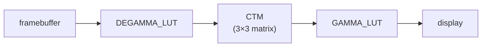
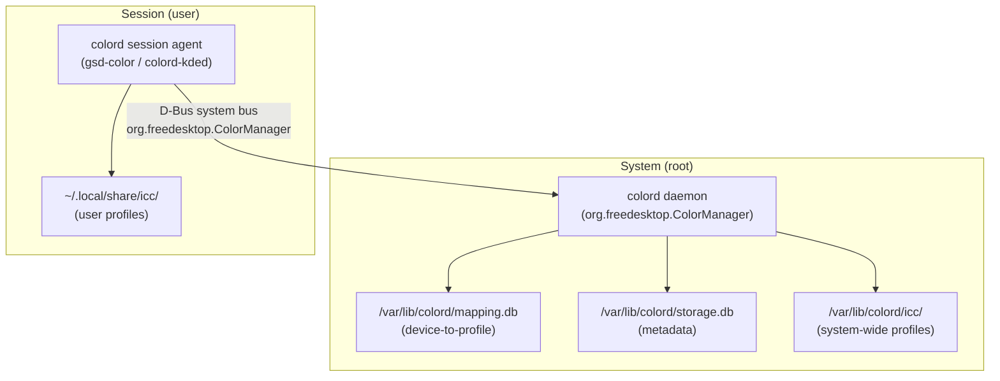
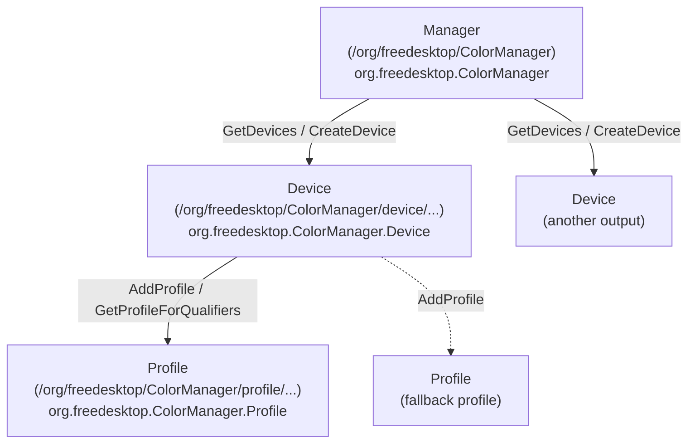
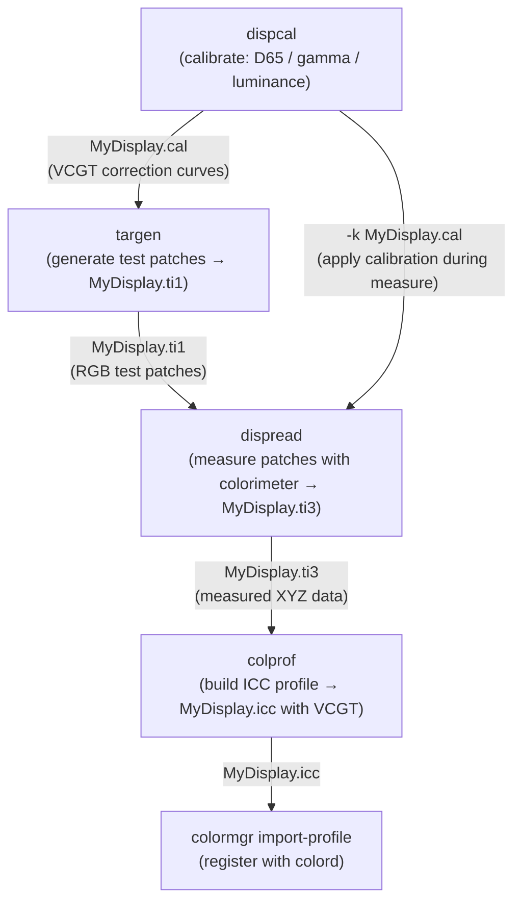
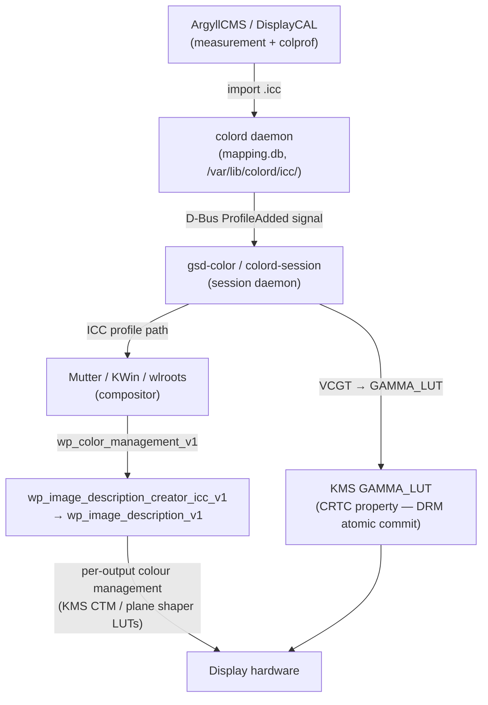
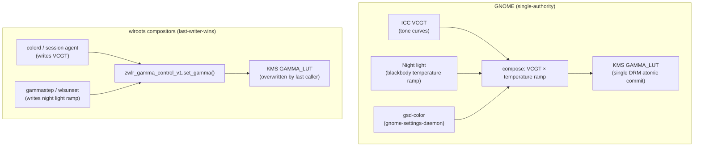

# Chapter 53: Display Calibration and colord

**Target audiences:** Graphics application developers; systems and driver developers.

This chapter covers display colour calibration on Linux: why uncalibrated panels produce incorrect colours, how the ICC profile standard characterises display behaviour, and how the `colord` daemon manages the calibration pipeline from hardware measurement through to compositor and KMS. It is relevant to graphics application developers who need consistent colour rendering across diverse displays, and to systems developers integrating calibration into compositors and desktop sessions. The chapter bridges the KMS colour pipeline (Ch3), the `wp_color_management_v1` Wayland protocol (Ch46), and the compositor layer (Ch22).

---

## Table of Contents

1. [The Calibration Problem](#1-the-calibration-problem)
2. [ICC Profile Format](#2-icc-profile-format)
3. [The colord Daemon](#3-the-colord-daemon)
4. [VCGT: Video Card Gamma Table](#4-vcgt-video-card-gamma-table)
5. [ArgyllCMS and DisplayCAL: Measurement Workflow](#5-argyllcms-and-displaycal-measurement-workflow)
6. [The Calibration-to-Compositor Pipeline](#6-the-calibration-to-compositor-pipeline)
7. [GNOME Color and KDE Colour Management UI](#7-gnome-color-and-kde-colour-management-ui)
8. [Night Light and Blue-Light Reduction](#8-night-light-and-blue-light-reduction)
9. [HDR Calibration](#9-hdr-calibration)
10. [Integrations](#10-integrations)

---

## 1. The Calibration Problem

Every display panel leaves the factory with measurable deviations from any colour standard. White-point drift, gamma curve non-linearity, and primary chromaticity errors compound: two panels of the same model can produce visibly different colours for identical **RGB** values. For photography post-processing, print production, medical imaging, and any workflow where colour accuracy matters, this is unacceptable.

**Calibration vs. profiling.** These terms are related but distinct:

- *Calibration* adjusts the display's hardware or software response to reach a target state — typically **D65** white point, 2.2 gamma, and 80–120 cd/m² luminance. Calibration is done once and encodes the corrections in a 1D **LUT** loaded into the GPU's gamma hardware.
- *Profiling* (characterisation) measures the calibrated display's remaining deviations from a standard colour space and records them in an **ICC** profile. Software then uses the profile to transform colours before they reach the display.

The two operations are complementary and are usually performed together by tools like **ArgyllCMS**/**DisplayCAL**.

**Colorimetry and the ICC profile connection to KMS.** All modern GPUs expose a per-**CRTC** gamma **LUT** through the **KMS** (Kernel Mode Setting) **API** as the **GAMMA_LUT** **CRTC** property [Source: KMS CRTC colour properties](https://www.kernel.org/doc/html/latest/gpu/drm-kms.html). The colour pipeline in the kernel (Ch3) exposes three post-blending stages in order:

```
framebuffer → DEGAMMA_LUT → CTM (3×3 matrix) → GAMMA_LUT → display
```

The **DEGAMMA_LUT** converts framebuffer values from the display's native gamma to linear light. The **CTM** (Colour Transformation Matrix) maps between colour primaries — e.g., from the display's native gamut to **sRGB** or **BT.2020**. The **GAMMA_LUT** converts from linear back to the display's native tone curve, applying any calibration corrections.



Calibration tools load the **VCGT** tag from the active **ICC** profile into **GAMMA_LUT**. Profile-aware applications apply the **ICC** characterisation matrix in software before handing pixels to the compositor. The compositor may additionally apply **CTM** for wide-gamut or **HDR** outputs. These interactions are managed by the **colord** daemon and the compositor.

**ICC profile format.** Chapter 2 covers the binary structure of **ICC** profiles as defined in **ICC.1:2022**: the 128-byte header, tag table, and tagged data elements. The two principal display profile types are matrix + **TRC** (Tone Reproduction Curve) profiles — which encode per-channel tone curves plus a 3×3 colourimetry matrix mapping linearised **RGB** to the **PCS** (**CIE XYZ** at **D50**) — and multidimensional **LUT** profiles using **A2B0**/**B2A0** tags for more complex gamut mapping. Chromatic adaptation between **D65** and **D50** illuminants uses the **Bradford CAT** (Chromatic Adaptation Transform) mandated by **ICC v4**. The **VCGT** private tag (signature `0x76636774`) stores the per-channel 1D gamma correction curves that must be loaded into the GPU's hardware gamma ramp.

**The colord daemon.** The **colord** daemon is a **D-Bus** system service (well-known name **org.freedesktop.ColorManager**) that maintains a persistent, system-wide registry of colour devices and their associated **ICC** profiles in two **SQLite** databases (**mapping.db** and **storage.db** under **/var/lib/colord/**). Its **D-Bus** object model exposes **Manager**, **Device**, and **Profile** interfaces. Device-to-profile associations are matched via **EDID**-derived device IDs and managed at the command line with the **colormgr** tool. The **libcolord** **GObject**-based C library provides a high-level **API** (**CdClient**, **CdDevice**, **CdProfile**) for compositor and desktop code. Automatic profile assignment via **udev** includes generating fallback profiles from **EDID** chromaticity data.

**VCGT loading.** Chapter 4 details how the **gsd-color** plugin within **gnome-settings-daemon** reads the **VCGT** tag from the active **ICC** file using **lcms2** (**cmsReadTag()**, **cmsSigVcgtTag**) and programs the hardware gamma ramp via **GAMMA_LUT** using **DRM** atomic commit (**drmModeAtomicAddProperty()**, **drmModeAtomicCommit()**). It covers **logind** interaction for seat-switch VCGT reload, **GAMMA_LUT_SIZE** depth resolution differences across hardware (256 for legacy, 1024 for **Intel i915**, 4096 for **AMD**/**NVIDIA**), and the inherent limitations of 1D **VCGT** correction versus full 3D **LUT** profiles.

**Measurement workflow.** Chapter 5 describes the full **ArgyllCMS** five-step calibration and profiling pipeline — **dispcal** (calibration), **targen** (patch generation), **dispread** (measurement), **colprof** (profile building), and **colormgr** (installation) — along with supported colorimeters (**X-Rite i1Display Pro**, **Datacolor Spyder X**, **X-Rite i1Pro 2**) and the **CGATS**-format **.ti3** measurement file. **DisplayCAL** wraps these steps in a **GUI** and provides a `displaycal-profile-loader` background process for VCGT reloading.

**Calibration-to-compositor pipeline.** Chapter 6 traces the full pipeline from **ICC** profile in **colord** through the **D-Bus** **ProfileAdded** signal to **gsd-color**, which simultaneously programs **GAMMA_LUT** via **DRM** atomic commit and delivers the **ICC** profile to the compositor via the **wp_color_management_v1** **Wayland** protocol. The **wp_image_description_creator_icc_v1** interface accepts an **ICC** file descriptor and creates a **wp_image_description_v1** object; compositors such as **Mutter** and **KWin** then apply per-output colour transforms using **KMS** **CTM** and plane shaper **LUT**s.

**Desktop environment integration.** Chapter 7 covers the **GNOME Color Manager** (**gnome-color-manager**), the **Colour** panel in **GNOME Settings**, and per-**CRTC** gamma programming by **gsd-color**. Multi-monitor configurations use per-output **colord** device records; **X11** applications retrieve display profiles via the **_ICC_PROFILE** **X11** atom. **KDE Plasma**'s colour management is provided by **colord-kde** (**colord-kded**), which bridges **KScreen** with **colord** and provides the **Colour Correction** panel in **KDE System Settings**.

**Night light and blue-light reduction.** Chapter 8 examines how tools such as **gammastep**, **wlsunset**, and **redshift** shift colour temperature after sunset by writing a warm gamma **LUT** via the **wlr-gamma-control-unstable-v1** protocol (**zwlr_gamma_control_v1.set_gamma()**) on **wlroots**-based compositors (**Sway**, **Hyprland**). On **GNOME**, night light is handled inside **gsd-color**, which composes the **VCGT** tone curves with a blackbody temperature ramp (**cd_color_get_blackbody_rgb_full()**) in a single **DRM** atomic write, avoiding the last-writer-wins conflict that affects wlroots compositors.

**HDR calibration.** Chapter 9 addresses the distinct challenges of **HDR** display characterisation: **MaxCLL** and **MaxFALL** metadata (**CTA-861.3** / **SMPTE ST.2086**), **BT.2020** and **Display P3** colour primaries, the **ST.2084 PQ** (Perceptual Quantizer) **EOTF**, and **HLG**. It covers the current gaps in **ICC v4** and **colord** for **HDR** (no **PQ EOTF** support; no built-in **HDR** profiling workflow), the **iccMAX** (version 5) format additions, and how **KWin Plasma 6** reads **HDR** capabilities from the **EDID** HDR Static Metadata Data Block via the **HDR_OUTPUT_METADATA** **DRM** connector property and the **hdr_output_metadata** struct (defined in **include/uapi/linux/hdmi.h**), using **wp_color_management_v1** named transfer functions (**WP_COLOR_MANAGER_V1_TRANSFER_FUNCTION_ST2084_PQ**, **WP_COLOR_MANAGER_V1_TRANSFER_FUNCTION_HLG**) as the more mature **HDR** integration path on **Wayland**.

---

## 2. ICC Profile Format

The International Colour Consortium (ICC) defines the profile format in [ICC.1:2022](https://www.color.org/icc_specs2.xalter). A profile is a binary blob with a 128-byte header, a tag table, and tagged data elements. The header encodes profile class (`Display`, `Output`, `Input`, `DeviceLink`), version (2 or 4), colour space (e.g., `RGB`), and the Profile Connection Space (PCS), which is always CIE XYZ or CIELAB at D50.

### Matrix + TRC profiles

The simplest and most common display profile type uses:

1. **Three Tone Reproduction Curves (TRCs)** — one per channel — mapping device values to linear light. These can be represented as a parametric power-law curve or as a sampled 1D LUT.
2. **A 3×3 matrix** — mapping the display's linearised RGB to the PCS (CIE XYZ at D50).

The forward transform (device → PCS) is:

```
XYZ_pcs = M · [R_linear, G_linear, B_linear]^T
```

where `M` is the colourimetry matrix derived from measurements of the display's red, green, and blue primaries, and the white point.

An sRGB profile, for instance, contains a matrix encoding the sRGB primary chromaticities (R: 0.64/0.33, G: 0.30/0.60, B: 0.15/0.06) and D65 white point adapted to D50 using a Bradford chromatic adaptation transform [Source: sRGB specification](https://www.color.org/srgb.pdf).

### Chromatic adaptation and the Bradford matrix

The ICC Profile Connection Space (PCS) is always CIE XYZ at an illuminant of D50 (CIE standard illuminant representing noon daylight, 5003 K). Most display primaries and content colour spaces are specified with a D65 white point (6504 K, representing average daylight). Adapting between the two illuminants requires a **chromatic adaptation transform (CAT)**.

The ICC v4 specification mandates the use of the **Bradford CAT** for computing adapted matrices in profiles [Source: sRGB color space to profile](https://ninedegreesbelow.com/photography/srgb-color-space-to-profile.html). The Bradford transform applies a 3×3 matrix in a cone-response space (a sharpened von Kries adaptation space) and has been shown to produce more perceptually uniform results than the simpler von Kries diagonal model.

For a display with primaries specified at D65, the adapted colourimetry matrix stored in the ICC profile is:

```
M_pcs = Bradford_D65_to_D50 · M_D65
```

where `M_D65` maps the display's linearised RGB to CIE XYZ at D65. The ICC profile stores the composed matrix in the `rXYZ`, `gXYZ`, `bXYZ`, and `wtpt` tags.

This distinction matters in practice: if a colour-managed application applies a profile matrix to convert from display RGB to PCS XYZ, then a second matrix to convert from PCS XYZ to a working space like sRGB, the intermediate D50 PCS must be correctly accounted for or a colour cast results. Colour management libraries such as `lcms2` handle this automatically when chaining profiles via the PCS.

### LUT profiles

For more complex colour transformations — gamut mapping, perceptual rendering intent, or high-accuracy characterisation — profiles use multidimensional lookup tables (`A2B0`, `B2A0` tags). A display LUT profile might embed a 17×17×17 3D LUT mapping device RGB to PCS XYZ. These profiles are larger and slower to apply but capture device non-linearities that the matrix model cannot represent.

The `A2B0` tag encodes the forward transform (device → PCS) and the `B2A0` tag the inverse. A full LUT display profile stores up to three rendering-intent variants (perceptual, colorimetric, saturation) in tags `A2B0`, `A2B1`, `A2B2` respectively. ArgyllCMS generates LUT profiles with the `-al` flag to `colprof`, while the simpler matrix/shaper model uses `-as`.

### The VCGT private tag

The `vcgt` tag (tag signature `0x76636774`, ASCII "vcgt") was registered with the ICC as a private tag by Apple in the late 1990s. It holds a 1D LUT for each of the three RGB channels, encoding the calibration corrections that must be loaded into the video card's hardware gamma ramp before any profile-based colour management is applied. The VCGT corrects for display gamma deviation, white point drift, and channel-to-channel imbalances.

The tag data layout (simplified for formula type 0):

```c
/* Approximate layout of vcgt formula type 0 — Simplified */
struct vcgt_formula {
    uint32_t type;          /* 0 = formula, 1 = table */
    /* For type 1 (table): */
    uint16_t num_channels;  /* 3 */
    uint16_t num_entries;   /* e.g. 256 or 1024 */
    uint16_t entry_size;    /* 1 (uint8) or 2 (uint16) */
    /* Followed by num_channels × num_entries × entry_size bytes */
};
```

[Source: ICC Display Profiles with Control over the VCGT](https://www.color.org/groups/medical/displays/controllingVCGT.pdf)

The VCGT is distinct from the ICC characterisation data: it is a system-level gamma pre-correction applied before any application-level profile transform. When colord loads a display profile, it extracts the VCGT and programs the KMS `GAMMA_LUT`. Applications then apply the ICC matrix/LUT on top for accurate colour rendering.

---

## 3. The colord Daemon

`colord` is a system-level D-Bus service maintained by Richard Hughes at [github.com/hughsie/colord](https://github.com/hughsie/colord). It provides a persistent, system-wide registry of colour devices and their associated ICC profiles, surviving across sessions and reboots.

### Architecture

The daemon runs as root (or a dedicated system user) and exposes its functionality via D-Bus at the well-known name `org.freedesktop.ColorManager` on the system bus. It maintains two SQLite databases:

- `/var/lib/colord/mapping.db` — persistent device-to-profile associations.
- `/var/lib/colord/storage.db` — persistent device and profile metadata.

ICC profiles are stored under `/var/lib/colord/icc/` for system-wide profiles, with user profiles read from `~/.local/share/icc/`. The security model separates the system daemon (which must access system-wide data and hardware) from per-user session agents that can access home directory profiles.

[Source: colord architecture overview](https://github.com/hughsie/colord)



### D-Bus Object Model

Three principal object types are exposed on the bus:

| Object | Interface | Object path prefix |
|--------|-----------|-------------------|
| Manager | `org.freedesktop.ColorManager` | `/org/freedesktop/ColorManager` |
| Device | `org.freedesktop.ColorManager.Device` | `/org/freedesktop/ColorManager/device/...` |
| Profile | `org.freedesktop.ColorManager.Profile` | `/org/freedesktop/ColorManager/profile/...` |

The three object types form a containment hierarchy: the Manager owns Device objects, and each Device owns one or more Profile objects.



**Manager interface** — key methods:

```
CreateDevice(device_id: s, scope: s, properties: a{ss}) → object_path: o
CreateProfile(profile_id: s, scope: s, properties: a{ss}) → object_path: o
FindDeviceById(device_id: s) → object_path: o
FindProfileById(profile_id: s) → object_path: o
GetDevices() → object_paths: ao
GetProfiles() → object_paths: ao
```

The `scope` parameter is one of `"temp"` (current session), `"disk"` (persistent), or `"normal"` (default: temporary).

**Device interface** — key methods and properties:

```
AddProfile(relation: s, profile: o) → void
RemoveProfile(profile: o) → void
MakeProfileDefault(profile: o) → void
GetProfileForQualifiers(qualifiers: as) → object_path: o
ProfileAdded(profile: o) → signal
ProfileRemoved(profile: o) → signal

Properties:
  Model: s
  Vendor: s
  Kind: s         (e.g. "display", "printer", "camera")
  Colorspace: s   (e.g. "rgb")
  Mode: s         (e.g. "physical", "virtual")
  Profiles: ao
  Enabled: b
```

[Source: colord Device D-Bus reference](https://www.freedesktop.org/software/colord//gtk-doc/Device.html)

**Profile interface** — key properties:

```
Filename: s      (absolute path to the .icc file)
Title: s
Kind: s          (e.g. "display-device", "abstract")
Format: s        (e.g. "ColorSpace.MixedSpace..")
Qualifiers: as
IsSystemWide: b
```

### Creating a device and assigning a profile via D-Bus (C example)

The following example shows the low-level libdbus approach. In practice, most code uses the higher-level `libcolord` C library.

```c
/* colord/examples/device-create.c — simplified */
/* Source: https://github.com/hughsie/colord/blob/main/examples/ */
#include <dbus/dbus.h>
#include <stdio.h>

static void
colord_create_device(DBusConnection *conn, const char *device_id)
{
    DBusMessage *msg, *reply;
    DBusMessageIter iter, dict;
    DBusError err;
    const char *scope = "temp";

    dbus_error_init(&err);

    msg = dbus_message_new_method_call(
        "org.freedesktop.ColorManager",
        "/org/freedesktop/ColorManager",
        "org.freedesktop.ColorManager",
        "CreateDevice");

    dbus_message_iter_init_append(msg, &iter);
    dbus_message_iter_append_basic(&iter, DBUS_TYPE_STRING, &device_id);
    dbus_message_iter_append_basic(&iter, DBUS_TYPE_STRING, &scope);

    /* Properties dict: Colorspace=RGB, Kind=display */
    dbus_message_iter_open_container(&iter, DBUS_TYPE_ARRAY,
        "{ss}", &dict);
    /* ... append key/value pairs ... */
    dbus_message_iter_close_container(&iter, &dict);

    reply = dbus_connection_send_with_reply_and_block(conn, msg, -1, &err);
    if (reply) {
        const char *obj_path;
        dbus_message_get_args(reply, &err,
            DBUS_TYPE_OBJECT_PATH, &obj_path,
            DBUS_TYPE_INVALID);
        printf("Created device at: %s\n", obj_path);
        dbus_message_unref(reply);
    }
    dbus_message_unref(msg);
}
```

### Automatic profile assignment via udev

When a display is connected, colord queries udev for device metadata including the EDID. colord reads the EDID to extract the monitor's manufacturer ID, model, and serial number, which together form a stable device ID like `xrandr-Manufacturer_Model_Serial`. It then queries `mapping.db` for any previously assigned profile for that device ID and automatically assigns it.

For displays with no user-assigned profile, colord generates a fallback profile from the EDID's embedded colorimetry data (if present in EDID >= 1.4 or DisplayID). EDID 1.4+ includes 10-bit chromaticity coordinates for the red, green, blue, and white primaries in bytes 25–34 of the EDID base block, stored as (x, y) pairs in a compact unsigned fixed-point format [Source: Auto-EDID ICC profiles Richard Hughes](https://blogs.gnome.org/hughsie/2013/04/24/auto-edid-icc-profiles/). colord reads these values via the DRM sysfs interface (`/sys/class/drm/card0-HDMI-A-1/edid`) and constructs a matrix ICC profile from them.

These auto-generated profiles are stored under `/var/lib/colord/icc/` with names like `edid-deadbeef.icc`. They provide a better colour match than assuming sRGB for every display, but they are not a substitute for measured profiles: EDID chromaticity data is often inaccurate (reported values may be nominal factory spec rather than the actual unit's measurements), and EDID profiles contain no VCGT calibration data.

### The libcolord high-level C API

Most compositor and desktop code uses `libcolord` (a GObject-based library shipping alongside the daemon) rather than raw D-Bus calls. The library provides synchronous and asynchronous variants of all operations:

```c
/* libcolord example: find a display device and get its default profile */
/* Compile: cc -o find-profile find-profile.c $(pkg-config --cflags --libs colord) */
#include <colord.h>
#include <stdio.h>

int main(void)
{
    CdClient *client = cd_client_new();
    GError *error = NULL;

    /* Connect to the colord daemon */
    if (!cd_client_connect_sync(client, NULL, &error)) {
        g_printerr("Cannot connect to colord: %s\n", error->message);
        return 1;
    }

    /* Find the device for a known XRandR output name */
    const char *device_id = "xrandr-LG_Electronics_LG_ULTRAFINE_0x00000001";
    CdDevice *device = cd_client_find_device_sync(
        client, device_id, NULL, &error);
    if (!device) {
        g_printerr("Device not found: %s\n", error->message);
        return 1;
    }

    /* Connect to the device object to populate its properties */
    cd_device_connect_sync(device, NULL, &error);

    /* Retrieve the currently active (default) profile */
    CdProfile *profile = cd_device_get_default_profile(device);
    if (!profile) {
        g_print("No profile assigned to %s\n", device_id);
    } else {
        cd_profile_connect_sync(profile, NULL, &error);
        g_print("Active profile: %s\n  File: %s\n",
            cd_profile_get_title(profile),
            cd_profile_get_filename(profile));
        g_object_unref(profile);
    }

    g_object_unref(device);
    g_object_unref(client);
    return 0;
}
```

[Source: libcolord CdClient reference](https://www.freedesktop.org/software/colord/gtk-doc/CdClient.html)

### The colormgr command-line tool

`colormgr` is the interactive CLI for colord:

```bash
# List all colour-managed devices
colormgr get-devices

# Find a specific display device
colormgr find-device "xrandr-LG_Electronics_LG_ULTRAFINE_0x00000001"

# List profiles available for a device
colormgr device-get-default-profile \
    "xrandr-LG_Electronics_LG_ULTRAFINE_0x00000001"

# Import a custom ICC profile into the system store
colormgr import-profile /path/to/MyDisplay.icc

# Assign the profile to a device (persistent)
colormgr device-add-profile \
    "xrandr-LG_Electronics_LG_ULTRAFINE_0x00000001" \
    "icc-<sha1-hash>"

# Create a profile entry from an existing .icc file
cd-create-profile --filename=/path/to/MyDisplay.icc
```

[Source: colormgr man page](https://man.archlinux.org/man/extra/colord/colormgr.1.en)

---

## 4. VCGT: Video Card Gamma Table

The VCGT mechanism bridges software calibration data and display hardware gamma correction. It is the first stage of the colour pipeline applied to every pixel rendered by the GPU.

### How colord-session / gsd-color reads and loads the VCGT

On GNOME, the component that actually loads the VCGT is the `gsd-color` plugin within `gnome-settings-daemon`. It monitors colord via D-Bus signals and responds to device/profile changes at login and when monitors are hot-plugged.

The VCGT extraction and application sequence is:

1. `gsd-color` receives a `ProfileAdded` or `Changed` signal from colord for a display device.
2. It calls `cd_device_get_default_profile()` from `libcolord` to obtain the active ICC profile object path.
3. It loads the ICC file using `lcms2` and reads the `vcgt` tag:

```c
/* gsd-color-state.c — VCGT extraction via lcms2 */
/* Source: https://github.com/endlessm/gnome-settings-daemon/blob/master/plugins/color/gsd-color-state.c */
cmsHPROFILE lcms_profile = cd_icc_get_handle(icc);
const cmsToneCurve **vcgt = cmsReadTag(lcms_profile, cmsSigVcgtTag);

if (vcgt == NULL || vcgt[0] == NULL) {
    /* Profile has no VCGT; use a linear ramp */
    g_debug("profile does not have any VCGT data");
}
```

4. It samples each tone curve to build R/G/B arrays of 16-bit values sized to the CRTC's gamma LUT depth (queried via `gnome_rr_output_get_gamma_size()`).
5. It calls `gnome_rr_crtc_set_gamma()` which, on Wayland/KMS, translates to a DRM atomic property commit setting `GAMMA_LUT` on the relevant CRTC:

```c
/* Simplified KMS path — actual code in gnome-desktop/gnome-rr */
drmModeAtomicAddProperty(req, crtc_id,
    gamma_lut_prop_id, gamma_lut_blob_id);
drmModeAtomicCommit(drm_fd, req, DRM_MODE_ATOMIC_NONBLOCK, NULL);
```

[Source: gsd-color-state.c gnome-settings-daemon](https://github.com/endlessm/gnome-settings-daemon/blob/master/plugins/color/gsd-color-state.c)

### logind interaction

On seat switch (virtual terminal change), the hardware gamma LUT is reset to a linear ramp by the kernel. colord-session must reload the VCGT on return to the session. It does this by listening to the `org.freedesktop.login1.Session.TakeControl` / `ReleaseControl` D-Bus signals from `logind`. When the session regains the seat, `gsd-color` re-applies the VCGT for each connected display.

### KMS gamma LUT depth and resolution

The `GAMMA_LUT_SIZE` property (also a CRTC read-only property) reports the number of entries the hardware gamma LUT supports. Common values are 256 (legacy VGA-era hardware), 1024 (Intel i915), and 4096 (AMD, NVIDIA). Higher resolutions reduce banding in smooth gradients, particularly in low-luminance regions where the eye is most sensitive to small differences.

colord's session layer queries this size and generates a VCGT table sampled at the correct resolution. If the ICC VCGT tag has fewer entries than the hardware LUT size, the missing entries are interpolated from the existing tone curve samples using cubic spline interpolation.

```bash
# Query the gamma LUT size for a CRTC via DRM debugfs (kernel >= 5.7)
cat /sys/kernel/debug/dri/0/crtc-0/state | grep gamma
# or check via drm-info:
drm-info | grep GAMMA
```

### VCGT scope and limitations

The VCGT is a **1D LUT** — three independent tone curves, one per channel. It can correct gamma, white point, and per-channel gain/offset, but it cannot correct colour cross-talk (e.g., the display's red phosphor contaminating the green measurement). For that, an ICC 3D LUT profile and software-side colour management is required.

The VCGT is also **applied system-wide** before any application colour management. This means the display hardware's native response as seen by an ICC-aware application is the *calibrated* response, and the application's ICC transform should be computed relative to the post-VCGT state, not raw hardware. ArgyllCMS handles this correctly by incorporating the calibration state into the measurement procedure.

In practice, the calibration workflow (dispcal) measures the display *without* any VCGT correction loaded, computes the correction curves needed to bring the display to the target state, and stores those curves in the `.cal` and subsequently in the `vcgt` ICC tag. Subsequent profiling measurements (`dispread -k MyDisplay.cal`) are taken with the VCGT correction applied, so the measured characterisation data describes the *post-calibration* display. The ICC profile's matrix/TRC then encodes the remaining deviation from the target colour space (sRGB, AdobeRGB, etc.) in the calibrated state.

---

## 5. ArgyllCMS and DisplayCAL: Measurement Workflow

ArgyllCMS is the reference open-source colour measurement and profile generation suite, written by Graeme Gill. DisplayCAL is a graphical front-end for ArgyllCMS, available on Linux through most distribution repositories.

[Source: ArgyllCMS Documentation](https://www.argyllcms.com/doc/ArgyllDoc.html) | [Source: DisplayCAL](https://displaycal.net/)

### Supported colorimeters

ArgyllCMS supports a wide range of display measurement instruments via USB:

| Instrument | Type | Notes |
|-----------|------|-------|
| X-Rite i1Display Pro | Colorimeter | Very common; recommended for most uses |
| X-Rite ColorMunki Display | Colorimeter | Consumer-grade |
| Datacolor Spyder X / SpyderX2 | Colorimeter | Widely used; full ArgyllCMS support |
| X-Rite i1Pro 2 | Spectrophotometer | High accuracy; measures spectral data |
| Klein K-10 | Colorimeter | Professional |

Instrument detection on Linux requires no proprietary drivers — ArgyllCMS communicates directly via libusb. The `spotread` tool verifies that the instrument is correctly detected:

```bash
# Verify colorimeter detection and take a single spot reading
spotread -v
```

### Full profiling workflow

The complete ArgyllCMS workflow for a display profile with VCGT is a five-step pipeline: calibration, patch generation, measurement, profile building, and installation.



**Step 1: Calibrate the display (dispcal)**

`dispcal` interactively guides placement of the colorimeter on the display and measures the display's response, then computes and applies a calibration to bring the display to the calibration target:

```bash
# Calibrate to D65 white point, 2.2 gamma, 120 cd/m² luminance
# -v: verbose  -d1: display 1  -q h: high quality  -t 6504: 6504K white
# -g 2.2: gamma target  -b 120: luminance target
dispcal -v -d 1 -qh -t 6504 -g 2.2 -b 120 MyDisplay
```

This produces `MyDisplay.cal` (the calibration file) and, with `-o`, also `MyDisplay.icm` containing a basic matrix profile. The `.cal` file encodes the VCGT correction curves.

**Step 2: Generate measurement target (targen)**

```bash
# Generate 500 test patches for an RGB display (-d3 = video RGB)
targen -v -d3 -f 500 MyDisplay
```

This produces `MyDisplay.ti1` — a set of device-space RGB test patches distributed in a way that covers the display's gamut effectively.

**Step 3: Measure the display (dispread)**

```bash
# Measure the patches while applying the calibration
# -k: apply calibration file, -v: verbose
dispread -v -d 1 -k MyDisplay.cal MyDisplay
```

This displays each patch from `MyDisplay.ti1` and reads the colorimetric response using the attached colorimeter. It produces `MyDisplay.ti3` — the measurement data file — containing the device RGB values alongside their measured CIE XYZ values.

### The .ti3 measurement file format

The `.ti3` file (CGATS text format) stores the raw measurement data. A fragment:

```
CTI3
ORIGINATOR "Argyll dispcal"
DESCRIPTOR "Display device measurement data"

NUMBER_OF_FIELDS 7
BEGIN_DATA_FORMAT
SAMPLE_ID RGB_R RGB_G RGB_B XYZ_X XYZ_Y XYZ_Z
END_DATA_FORMAT

NUMBER_OF_SETS 500
BEGIN_DATA
1 100.00 100.00 100.00  95.05 100.00 108.88
2  50.00  50.00  50.00  18.26  19.21  20.91
3 100.00   0.00   0.00  41.24   2.13   1.93
...
END_DATA
```

[Source: ArgyllCMS dispread documentation](https://www.argyllcms.com/doc/dispread.html)

**Step 4: Build the ICC profile (colprof)**

```bash
# Build a matrix+shaper profile with medium quality, absolute colorimetric intent
# -q m: medium quality  -a s: matrix/shaper model
colprof -v -D "LG UltraFine 5K Calibrated" -qm -as MyDisplay
```

This reads `MyDisplay.ti3` and fits a 3×3 colourimetry matrix plus per-channel tone curves (TRCs) to the measurement data. The resulting `MyDisplay.icc` includes the fitted characterisation data and the VCGT calibration curves from `MyDisplay.cal`.

**Step 5: Install and register the profile**

```bash
# Copy to the system ICC store
sudo cp MyDisplay.icc /var/lib/colord/icc/

# Or install to user-local store
cp MyDisplay.icc ~/.local/share/icc/

# Register with colord and assign to the display device
colormgr import-profile ~/.local/share/icc/MyDisplay.icc
colormgr device-add-profile \
    "xrandr-LG_Electronics_LG_ULTRAFINE_0x00000001" \
    "icc-$(sha1sum ~/.local/share/icc/MyDisplay.icc | cut -d' ' -f1)"
```

### DisplayCAL

DisplayCAL wraps these steps in a GUI, adds spectral accuracy corrections for colorimeters (using reference spectrophotometer measurements), generates detailed calibration verification reports, and produces profiles in multiple rendering intents. The DisplayCAL GUI calls the same ArgyllCMS binaries internally — the resulting `.icc` files are identical in format to those produced at the command line.

DisplayCAL's "Profile Loader" component (the `displaycal-profile-loader` background process) monitors colord for profile changes and reloads the VCGT when profiles are switched, providing a redundant VCGT loading path alongside `gsd-color`.

---

## 6. The Calibration-to-Compositor Pipeline

The full pipeline from ICC profile in colord to pixels on screen involves several layers:

```
ArgyllCMS/DisplayCAL
        │
        ▼ imports .icc
    colord daemon
  (mapping.db, /var/lib/colord/icc/)
        │
        ▼ D-Bus ProfileAdded signal
    gsd-color / colord-session
        │
        ├─── VCGT → KMS GAMMA_LUT (CRTC property)
        │        (DRM atomic commit)
        │
        └─── ICC profile path → compositor
                 │
                 ▼ wp_color_management_v1
           Mutter / KWin / wlroots
                 │
                 ▼ wp_image_description_creator_icc_v1
           wp_image_description_v1
                 │
                 ▼ per-output color management
             KMS CTM / plane shaper LUTs
```

The pipeline has two parallel downstream paths from `gsd-color`: one programs hardware gamma directly via KMS, the other delivers the ICC profile to the compositor via the Wayland colour management protocol.



### colord → wp_color_management_v1 bridging

The `wp_color_management_v1` Wayland protocol (Ch46) allows compositors to expose output colour properties and accept per-surface image descriptions from clients. The ICC creator interface (`wp_image_description_creator_icc_v1`) accepts an ICC profile file descriptor and creates an immutable `wp_image_description_v1` object from it.

A compositor implementing `wp_color_management_v1` that also integrates with colord follows this flow:

1. At startup, the compositor queries colord via D-Bus to obtain the active ICC profile for each output.
2. For each output, it opens the profile file and passes it to `wp_image_description_creator_icc_v1.set_icc_file()`, then calls `create()` to produce a `wp_image_description_v1`.
3. It associates this image description with the output via `wp_color_management_output_v1`, signalling to ICC-aware clients what colour space the display is in.
4. When clients attach a surface image description (via `wp_color_management_surface_v1.set_image_description()`), the compositor performs the required colour transform between surface space and output space.

The ICC profile requirements for this interface are strict: version 2 or 4, 3-channel, class Display or ColorSpace, max 32 MB [Source: wp_color_management_v1 protocol](https://wayland.app/protocols/color-management-v1).

```c
/* Compositor-side ICC profile loading via wp_color_management_v1 */
/* Pseudocode illustrating the integration */
static void
compositor_load_colord_profile(struct output *output,
                               const char *icc_path)
{
    int fd = open(icc_path, O_RDONLY | O_CLOEXEC);
    struct stat st;
    fstat(fd, &st);

    struct wp_image_description_creator_icc_v1 *creator =
        wp_color_manager_v1_new_icc_creator(output->color_manager);

    wp_image_description_creator_icc_v1_set_icc_file(
        creator, fd, 0, (uint32_t)st.st_size);

    struct wp_image_description_v1 *desc =
        wp_image_description_creator_icc_v1_create(creator);
    wp_image_description_creator_icc_v1_destroy(creator);
    close(fd);

    /* Associate with output — compositor listens for ready event */
    output->image_description = desc;
}
```

### Setting GAMMA_LUT via KMS atomic commit

The actual hardware write in the Wayland/KMS path uses the DRM atomic commit API. The compositor (or `gsd-color` on GNOME) creates a blob containing the sampled LUT data and programs the CRTC property:

```c
/*
 * Pseudocode: programming GAMMA_LUT via DRM atomic commit
 * Real implementation in gnome-desktop/libgnome-desktop
 * or compositor-specific KMS backend code.
 */
#include <xf86drm.h>
#include <xf86drmMode.h>

struct drm_color_lut *lut = calloc(gamma_size, sizeof(*lut));
for (uint32_t i = 0; i < gamma_size; i++) {
    lut[i].red   = red[i];    /* 16-bit fixed-point values */
    lut[i].green = green[i];
    lut[i].blue  = blue[i];
}

uint32_t blob_id;
drmModeCreatePropertyBlob(drm_fd, lut,
    gamma_size * sizeof(struct drm_color_lut), &blob_id);
free(lut);

drmModeAtomicReqPtr req = drmModeAtomicAlloc();
drmModeAtomicAddProperty(req, crtc_id, gamma_lut_prop_id, blob_id);
drmModeAtomicCommit(drm_fd, req,
    DRM_MODE_ATOMIC_NONBLOCK | DRM_MODE_ATOMIC_ALLOW_MODESET, NULL);
drmModeAtomicFree(req);
drmModeDestroyPropertyBlob(drm_fd, blob_id);
```

The `drm_color_lut` structure (defined in `include/uapi/drm/drm_mode.h`) stores each entry as three `uint16_t` values representing the output intensity in the range [0, 65535]. The `GAMMA_LUT_SIZE` property reports the number of entries required in the blob.

[Source: KMS CRTC colour properties](https://www.kernel.org/doc/html/latest/gpu/drm-kms.html)

### D-Bus profile assignment and Wayland ICC creator interface

The chain of trust flows in one direction: colord stores the authoritative device-to-profile mapping, and compositors (or session daemons like `gsd-color`) are responsible for reading it and translating it into hardware state. This design means profile selection (user preference, device matching, fallback logic) is centralised in colord, while hardware programming is handled by the component with appropriate privileges (the compositor or `gsd-color`).

An important nuance: colord assigns profiles persistently across sessions. A newly connected display is matched against `mapping.db` by its EDID-derived device ID. This means that on re-login or monitor reconnect, the correct calibrated profile and VCGT are automatically reapplied without user intervention, as long as the colord daemon is running and `gsd-color` (or the compositor) is listening for `ProfileAdded` signals.

---

## 7. GNOME Color and KDE Colour Management UI

### GNOME Color Manager

`gnome-color-manager` (gcm) provides the GNOME UI for display colour management, available at [gitlab.gnome.org/GNOME/gnome-color-manager](https://gitlab.gnome.org/GNOME/gnome-color-manager). Its primary interface is `gcm-viewer` (for viewing profile properties) and the **Colour** panel in GNOME Settings.

The GNOME Settings Colour panel:

- Lists all detected display outputs (queried from colord via `GetDevices`).
- Shows the currently assigned profile for each output.
- Allows importing new ICC files and assigning them to outputs.
- Shows profile metadata: white point, primaries, gamut diagram.

The backend for profile assignment and loading is the `gsd-color` plugin within `gnome-settings-daemon`. At login:

1. `gsd-color` starts and connects to colord.
2. It iterates all display devices and retrieves their default profiles.
3. For each profile with a VCGT tag, it calls `gnome_rr_crtc_set_gamma()` to program the CRTC gamma LUT.
4. It registers for `ProfileAdded`, `ProfileRemoved`, and `DeviceChanged` signals to respond to runtime profile changes.

### Multi-monitor profile assignment

In multi-monitor configurations, each physical output is a separate colord device with its own profile. The `gsd-color` plugin handles per-CRTC gamma programming for each output independently.

For X11 applications that read the `_ICC_PROFILE` X11 atom (used by applications like GIMP, Firefox, and darktable to get the display profile), `gsd-color` and `xiccd` set the atom for the primary output. For secondary outputs, atoms `_ICC_PROFILE_1`, `_ICC_PROFILE_2`, etc. are set. Applications must query the correct atom for the output their window is on — a per-output window manager hint (the `_NET_WM_FULLSCREEN_MONITORS` family) is used to determine this [Source: Linux color management multi-monitor issues](https://www.lieberbiber.de/2018/02/24/open-source-color-management-is-broken/).

### KDE Colour Management

KDE Plasma's colour management is provided by `colord-kde`, a KDE daemon that bridges KDE's `KScreen` display management with colord. The KDE System Settings **Colour Correction** panel (under **Display and Monitor**) allows:

- Per-output profile selection from profiles registered in colord.
- Profile import.
- Calibration launch (opening DisplayCAL via D-Bus activation).

`colord-kde`'s daemon (`colord-kded`) runs as a session service and uses the `org.freedesktop.ColorManager` D-Bus API. When a profile is assigned to an output, `colord-kded` reads the ICC file, extracts the VCGT, and calls KScreen's gamma API to program the CRTC LUT.

```bash
# KDE: list connected outputs and their assigned profiles
kscreen-doctor --outputs

# Assign a profile via colormgr (KDE and GNOME share the same colord backend)
colormgr device-add-profile \
    "xrandr-Dell_U2720Q_ABC123" \
    "icc-abc123def456"
```

[Source: KDE Color Management UserBase](https://userbase.kde.org/Color_Management/en)

---

## 8. Night Light and Blue-Light Reduction

Night light (blue-light reduction, colour temperature shifting) works by modifying the display's gamma LUT to warm the colour temperature after sunset, reducing short-wavelength blue emission to mitigate circadian rhythm disruption.

### gammastep, wlsunset, redshift

Three main tools implement night light on Linux:

| Tool | Protocol support | Notes |
|------|-----------------|-------|
| `redshift` | X11 XRandR gamma | Original; Wayland support limited |
| `gammastep` | `wlr-gamma-control-unstable-v1`, XRandR | Fork of redshift; active Wayland support |
| `wlsunset` | `wlr-gamma-control-unstable-v1` | Minimal Wayland-native tool |

On compositors implementing `wlr-gamma-control-unstable-v1` (wlroots-based: Sway, River, Wayfire, Hyprland), these tools send a warm-shifted gamma LUT directly to the compositor. The compositor then programs the KMS `GAMMA_LUT` accordingly.

On GNOME (Mutter), night light is integrated into `gsd-color` as a built-in feature rather than an external tool. GNOME does not expose `wlr-gamma-control-unstable-v1`, so third-party tools like `gammastep` cannot operate through the compositor on GNOME Wayland [Source: redshift/gammastep Wayland discussion](https://github.com/lxqt/lxqt/discussions/2681).

### Interaction between calibration VCGT and night-light ramp

Night light and ICC VCGT calibration both modify the hardware gamma LUT — a resource with only a single hardware-level entry point per CRTC. There is therefore a compositing problem: how to apply both simultaneously.

The two desktop environments resolve the conflict differently: GNOME centralises all gamma writes in one component, while wlroots compositors allow multiple independent clients to overwrite the same LUT.



**GNOME's approach.** `gsd-color` manages both in a single compositing step. When applying gamma, it combines the VCGT tone curves with a blackbody-coloured temperature ramp:

```c
/* gsd-color-state.c — combining VCGT and night light temperature */
/* Source: https://github.com/endlessm/gnome-settings-daemon/blob/master/plugins/color/gsd-color-state.c */
cd_color_get_blackbody_rgb_full(color_temperature, &temp_rgb,
    CD_COLOR_BLACKBODY_FLAG_USE_PLANCKIAN);

for (i = 0; i < gamma_size; i++) {
    /* Sample VCGT curve at position i, then multiply by temperature RGB */
    double r_vcgt = cmsEvalToneCurveFloat(vcgt[0], (float)i / (gamma_size-1));
    double g_vcgt = cmsEvalToneCurveFloat(vcgt[1], (float)i / (gamma_size-1));
    double b_vcgt = cmsEvalToneCurveFloat(vcgt[2], (float)i / (gamma_size-1));

    red[i]   = (uint16_t)(r_vcgt * temp_rgb.R * 65535.0);
    green[i] = (uint16_t)(g_vcgt * temp_rgb.G * 65535.0);
    blue[i]  = (uint16_t)(b_vcgt * temp_rgb.B * 65535.0);
}
```

This ensures that when night light is active, the composite ramp (VCGT × temperature) is loaded into the hardware, preserving calibration accuracy as much as the 1D LUT model allows.

**wlroots-based compositors.** When `gammastep` uses `wlr-gamma-control-unstable-v1`, it sends its own gamma table, overwriting whatever calibration VCGT was previously loaded. This is a known limitation: calibration state is not preserved when external gamma control tools take ownership of the gamma LUT. The `colord` project is aware of this and the recommended workaround is to use colord-integrated night light rather than standalone tools [Source: gnome-gamma-tool — VCGT + night light non-interference](https://github.com/zb3/gnome-gamma-tool).

A gnome-gamma-tool-style workaround embeds the desired gamma correction directly into an ICC VCGT tag, so that `gsd-color` applies it as part of its composite VCGT+temperature ramp, avoiding the need for external gamma control protocols entirely.

### gammastep configuration

On wlroots compositors, `gammastep` is typically configured via `~/.config/gammastep/config.ini`:

```ini
[general]
location-provider=manual
adjustment-method=wayland

[manual]
lat=51.5
lon=-0.1

[temperature]
night=3500
day=6500

[brightness]
night=0.8
day=1.0
```

`wlsunset` uses a simpler CLI-only interface:

```bash
# Start wlsunset for London coordinates with 3500 K night temperature
wlsunset -l 51.5 -L -0.1 -t 3500 -T 6500
```

Both tools use the `zwlr_gamma_control_v1` interface from `wlr-gamma-control-unstable-v1` protocol (a wlroots extension, not yet in upstream wayland-protocols as of mid-2026). The protocol lets a privileged client call `zwlr_gamma_control_v1.set_gamma()` to program the compositor's gamma LUT for a given output directly.

The conflict with ICC calibration VCGT is architectural: `wlr-gamma-control-unstable-v1` does not compose with colord's VCGT — whoever last called `set_gamma()` wins. This is fundamentally different from GNOME's approach where the session daemon is the single authority that composes both corrections.

---

## 9. HDR Calibration

High dynamic range displays present qualitatively different calibration challenges. While SDR calibration targets a fixed luminance range (80–120 cd/m²) and a single standard colour space (sRGB or AdobeRGB), HDR calibration must characterise:

- **Peak luminance** (MaxCLL): the maximum sustained luminance the display can produce, expressed in cd/m² (nits). Typical consumer HDR displays: 400–1000 nits. Professional reference monitors: 4000+ nits.
- **Minimum black level**: the display's minimum luminance, often 0.001–0.005 cd/m² for OLED or 0.01–0.05 cd/m² for MiniLED.
- **Colour gamut**: HDR content uses BT.2020 or Display P3 primaries, substantially wider than sRGB.
- **EOTF (Electro-Optical Transfer Function)**: HDR10 uses the ST.2084 PQ (Perceptual Quantizer) EOTF rather than BT.1886 or sRGB gamma.

### MaxCLL and MaxFALL metadata

MaxCLL (Maximum Content Light Level) and MaxFALL (Maximum Frame-Average Light Level) are defined in CTA-861.3 / SMPTE ST.2086 and are carried as static metadata in HDR video streams and HDMI/DisplayPort signalling [Source: HDR-10 Metadata SMPTE ST.2086](https://www.linkedin.com/pulse/hdr-10-metadata-smpte-st2086-maxfall-maxcll-carlos-carmona):

- **MaxCLL**: the maximum luminance of any single pixel across the entire content, in nits.
- **MaxFALL**: the maximum average luminance of any single frame, in nits.

These values are used by tone mapping algorithms to scale content luminance to match the target display's peak capability. A display with MaxCLL = 600 nits receiving content mastered at 4000 nits must tone-map the highlights to avoid clipping.

ICC profiles do not natively carry MaxCLL/MaxFALL. These values belong to the **content** rather than the display. For HDR display characterisation, the relevant metadata is the display's own peak luminance capability, encoded in SMPTE ST.2086 mastering display metadata.

### HDR and the current ICC / colord limitations

The current ICC v4 profile format and the colord ecosystem have significant gaps for HDR:

1. **No PQ EOTF in ICC v4.** The `vcgt` tag was designed for SDR gamma curves. ICC v4 TRC tags support parametric curves but not the full PQ or HLG EOTFs. ICC iccMAX (version 5, not yet widely deployed) adds proper HDR EOTF support via the `matf` and `cvst` tags.

2. **colord has no HDR profiling workflow.** As of mid-2026, colord lacks a built-in mechanism for HDR display characterisation. ArgyllCMS has partial HDR support (`dispcal -3` for PQ displays) but it is not integrated with colord's D-Bus API or automatic profile loading.

3. **`wp_color_management_v1` bridges the gap.** The Wayland colour management protocol (Ch46) defines HDR metadata separately from ICC profiles, using named primaries and transfer function enumerations:

```
WP_COLOR_MANAGER_V1_TRANSFER_FUNCTION_ST2084_PQ   /* HDR10 PQ */
WP_COLOR_MANAGER_V1_TRANSFER_FUNCTION_HLG          /* HLG */
WP_COLOR_MANAGER_V1_PRIMARIES_BT2020               /* Rec.2020 */
```

Plasma 6 implements this path: when HDR mode is enabled on an output, KWin programs the CRTC's `GAMMA_LUT` with a PQ inverse-EOTF and uses the `CTM` property for BT.2020-to-display gamut mapping, reading display peak luminance from the EDID's HDR Static Metadata Data Block (VSDB type 6) [Source: HDR and color management in KWin 2023](https://zamundaaa.github.io/wayland/2023/12/18/update-on-hdr-and-colormanagement-in-plasma.html).

4. **MaxCLL/MaxFALL in display metadata.** For HDR displays that report their capabilities via EDID's CTA-861.3 HDR Metadata, colord can in principle read MaxCLL/MaxFALL from the EDID and store them in the device record. In practice this is not yet implemented in colord; compositors read the EDID HDR metadata directly via the `drm_connector` sysfs interface or the libdisplay-info library.

**Note: needs verification.** The colord HDR roadmap items referenced here are based on project discussion threads as of mid-2026. The upstream status of HDR profiling in colord may have changed. Check [github.com/hughsie/colord/issues](https://github.com/hughsie/colord/issues) for current status.

### The EDID HDR Static Metadata Data Block

For automatic HDR capability detection without profiling, compositors read the display's HDR Static Metadata Data Block from the CTA-861-G extension block in EDID. This block (type tag `0x6`, under the CTA Data Block Collection) reports:

- Supported HDR EOTFs (SDR gamma, HDR gamma, SMPTE ST.2084, HLG).
- Desired content max luminance (MaxCLL) in the display's reference range.
- Desired content max frame-average luminance (MaxFALL).
- Minimum luminance of the display.

Compositors read this via the kernel DRM connector property `HDR_OUTPUT_METADATA`, whose blob value is a `hdr_output_metadata` struct defined in `include/uapi/linux/hdmi.h`:

```c
/* include/uapi/linux/hdmi.h — HDR metadata blob */
struct hdr_static_metadata {
    __u8 eotf;                    /* enum: SDR, HDR, PQ, HLG */
    __u8 metadata_type;           /* 0 = Static Metadata Type 1 */
    struct hdr_metadata_infoframe {
        __u8  eotf;
        __u8  metadata_type;
        struct {
            __u16 x, y;           /* CIE xy primaries × 50000 */
        } display_primaries[3];
        struct { __u16 x, y; } white_point;
        __u16 max_display_mastering_luminance;  /* nits × 1 */
        __u16 min_display_mastering_luminance;  /* nits × 10000 */
        __u16 max_cll;            /* MaxCLL nits */
        __u16 max_fall;           /* MaxFALL nits */
    } hdmi_metadata_type1;
};
```

This metadata is what KWin Plasma 6 uses to populate the HDR luminance range for tone mapping, independently of any ICC profile in colord.

### Practical HDR calibration on Linux

For professionals requiring HDR display calibration today, the practical path is:

1. Use DisplayCAL with ArgyllCMS `dispcal -3` (PQ profile mode) against a high-accuracy spectrophotometer (X-Rite i1Pro or equivalent).
2. Generate the ICC profile with embedded ST.2086 metadata using `colprof -3`.
3. Load the profile manually via `colormgr` or configure the compositor to use it directly.
4. Rely on `wp_color_management_v1` and compositor HDR metadata for tone mapping rather than ICC-only approaches.

**Note: needs verification.** ArgyllCMS's HDR calibration flags and the interaction with `colord`'s profile loading for HDR outputs are under active development as of mid-2026. The `wp_color_management_v1` HDR named primaries and transfer function paths in Mutter/KWin represent the more mature integration path for HDR colour accuracy on Wayland.

---

## Roadmap

### Near-term (6–12 months)

- **colord HDR profiling integration:** colord lacks built-in HDR display characterisation as of mid-2026; active discussion in [hughsie/colord issues](https://github.com/hughsie/colord/issues) targets a D-Bus API extension to register HDR profiles with ST.2086 metadata alongside conventional ICC entries. Note: needs verification of specific issue tracking.
- **ArgyllCMS 3.x icclib rewrite:** ArgyllCMS has undergone extensive re-writing of `icclib` to switch to a processing-element pipeline for colour transforms and to improve future-proofing for iccMAX tags; version 3.x bumps are expected to land in distributions within 12 months [Source: ArgyllCMS](http://www.argyllcms.com/).
- **Wayland Protocols colour management revisions:** `wayland-protocols` 1.47 relaxed `maxCLL`/`maxFALL` restrictions in `wp_color_management_v1` to align with CTA-861-H; further revisions to named primaries and transfer function enumerations are in-flight [Source: Phoronix — Wayland Protocols 1.47](https://www.phoronix.com/news/Wayland-Protocols-1.47).
- **mpv ICC + HDR Wayland path:** mpv merged `wp-color-management-v1` ICC support and `wp-color-representation-v1` in late 2025, making `--icc-auto` functional on Wayland; remaining work targets HDR tone-mapping integration with the protocol [Source: mpv PR #15178](https://github.com/mpv-player/mpv/pull/15178).
- **Chromium `wp_color_management_v1` support:** Chromium committed initial colour management protocol support for the Vulkan Wayland platform; broader rollout covering Canvas and WebGPU colour spaces is expected in 2026 [Source: Chromium commit 07c9a59](https://github.com/chromium/chromium/commit/07c9a59c2a5256ce49c22445a6c5108182c7da11).

### Medium-term (1–3 years)

- **iccMAX (ICC.2:2023) adoption in colord and lcms2:** The ICC.2:2023 iccMAX specification was approved October 2023 and adds `matf`/`cvst` tags for PQ and HLG EOTFs, spectral data, and BRDF elements; colord and lcms2 will need iccMAX parser support before HDR ICC-based workflows become practical [Source: ICC iccMAX](https://www.color.org/iccmax/index.xalter).
- **3D LUT KMS pipeline integration:** Current VCGT loading uses only the 1D `GAMMA_LUT` KMS property; planned compositor work aims to use the full KMS colour pipeline (degamma + CTM + 3D shaper LUTs where hardware supports them, as exposed by the `COLOROP` atomic property patchsets) for full-gamut ICC LUT profiles. Note: needs verification of upstream kernel patch status.
- **colord D-Bus API for Wayland image descriptions:** A proposed extension would allow colord to directly vend `wp_image_description_v1` object parameters over D-Bus, removing the current two-step path where compositors independently re-parse ICC files already registered with colord. Note: needs verification.
- **Hyprland colour management:** Hyprland issue #4377 tracks `wp_color_management_v1` compositor-side implementation; completion would bring colord-based profile loading to the wlroots-successor ecosystem [Source: Hyprland issue #4377](https://github.com/hyprwm/Hyprland/issues/4377).
- **W3C wide colour gamut / HDR workshop outcomes:** The W3C web-wcg-hdr workshop is examining iccMAX complexity for browser colour pipelines; outcomes may influence how Dawn/WebGPU and CSS Color 4 interact with ICC profiles on Linux [Source: W3C web-wcg-hdr workshop issue #11](https://github.com/w3c/web-wcg-hdr-workshop/issues/11).

### Long-term

- **Full iccMAX spectral and BRDF profile support:** iccMAX enables spectral colour spaces and BRDF-based rendering; long-term integration into compositor and GPU colour pipelines would allow per-material reflectance profiling for advanced rendering workflows, though practical deployment depends on hardware vendor support.
- **Unified SDR/HDR calibration daemon:** The current architecture requires separate paths for SDR ICC profiles (colord), HDR metadata (EDID HDR Static Metadata via DRM), and Wayland colour descriptions (`wp_color_management_v1`); a future colord or replacement daemon might unify all three into a single session service with a coherent D-Bus API covering both SDR and HDR outputs.
- **Kernel-level ICC profile caching:** Long-term proposals have suggested the kernel exposing calibration state as a sysfs or DRM blob so that GPU reset, VT switch, and multi-seat scenarios automatically reload the correct profile without userspace polling; this remains speculative. Note: needs verification.

---

## 10. Integrations

Display calibration and colord sit at the intersection of multiple subsystems described elsewhere in this book.

**Ch3 — KMS/DRM colour pipeline.** The KMS `GAMMA_LUT`, `DEGAMMA_LUT`, and `CTM` CRTC properties are the hardware targets that colord and its session helpers ultimately program. Understanding the three-stage KMS colour pipeline (degamma → CTM → gamma) is essential for understanding how VCGT corrections, night-light ramps, and ICC matrix transforms interact at the hardware level.

**Ch22 — Production compositors.** Mutter (GNOME) and KWin (KDE) are the principal consumers of colord's D-Bus API. Both implement `ProfileAdded` signal handlers and program per-CRTC gamma LUTs. Compositors also mediate between the ICC colour management world (profiles, VCGT) and the Wayland protocol world (`wp_color_management_v1`, image descriptions).

**Ch46 — The Evolving Wayland Protocol Ecosystem.** The `wp_color_management_v1` protocol and its `wp_image_description_creator_icc_v1` sub-interface are the Wayland-layer bridge between colord's ICC profiles and compositor colour management. When colord assigns a profile to a display device, compositors create a `wp_image_description_v1` from the ICC file to describe the output's colour properties to clients. The ICC profile format (version 2 or 4, 3-channel, Display class) directly constrains what colord can register.

**Ch26 — VA-API and video decode.** Hardware-accelerated video decode (VA-API) carries its own colour space metadata in `VAProcPipelineParameterBuffer` — BT.601/BT.709/BT.2020 primaries, limited/full range, and PQ/HLG EOTF. This metadata is separate from display ICC profiles and is processed by the compositor or video player's colour conversion path independently of colord. When a video player uses `wp_color_management_v1` to signal video colour space to the compositor, the compositor must reconcile video colour metadata with the display's ICC profile to perform a combined video-to-display colour transform.

---

*Copyright © 2026 jreuben11. Licensed under [CC BY 4.0](https://creativecommons.org/licenses/by/4.0/).*
