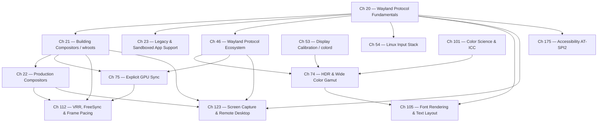

# Part VI — The Display Stack

Parts I–V establish the substrate: kernel memory management, DRM/KMS atomic modesetting, Mesa, and the Vulkan driver stack. Part VI is where that substrate becomes visible. It covers every layer between a rendered DMA-BUF and the photons leaving the display panel: the Wayland compositor protocol, compositor toolkits and production compositor implementations, backward compatibility for X11 applications, the input pathway from kernel interrupt to Wayland event, colour science and calibration, the advanced synchronisation and colour-management protocols that define the state of the art in 2026, font rendering and text layout, variable-refresh-rate display technology, and privacy-respecting screen capture and remote desktop. The compositor is the conductor of this stack — it orchestrates KMS, GPU buffers, input, colour management, and adaptive timing into a coherent user experience. Nothing that reaches a screen passes outside this part's scope.

## What a Compositor Is and Does

A **Wayland compositor** is a single privileged process that is simultaneously a Wayland server, a DRM/KMS client, and a libinput consumer. It occupies the architectural intersection of three systems and is the only process with unmediated access to all of them at once. Understanding its role precisely makes the rest of this part coherent.

**As a Wayland server**, the compositor accepts connections from every application that wants to display output. Each application is a Wayland client. When a client wants to show a window, it:
1. Allocates a GPU buffer (typically via GBM or EGL) and renders into it.
2. Exports the buffer as a DMA-BUF file descriptor.
3. Announces the buffer to the compositor via the `zwp_linux_dmabuf_v1` protocol, attaching it to a `wl_surface`.
4. Commits the surface (`wl_surface.commit`), which transfers ownership of the buffer to the compositor until the compositor releases it.

The compositor receives these buffer fds from potentially hundreds of clients simultaneously. It is the only process that sees all surfaces.

**As a KMS client**, the compositor owns the DRM device fd for the display hardware. After compositing all client surfaces into a final frame (via GPU rendering), it submits the result to the display via `drmModeAtomicCommit()`. The compositor decides:
- Which surfaces go directly onto hardware KMS overlay planes (direct scanout — no GPU compositing).
- Which surfaces must be composited via a GPU render pass (multiple surfaces blended together).
- The final timing: the commit is gated on a GPU fence (`IN_FENCE_FD`) and completes at VBLANK.

**As a libinput consumer**, the compositor reads raw input events from `/dev/input/event*`, processes them through libinput (normalisation, gesture recognition, pointer acceleration), and routes them to the focused Wayland client via `wl_pointer`, `wl_keyboard`, `wl_touch`, or the appropriate `wp_tablet_v2` / `wp_relative_pointer_v1` protocols. No other process receives input events; the compositor is the exclusive input arbiter.

**Additional responsibilities**: The compositor manages window geometry (position, size, stacking order — or in the Wayland model, which surfaces are visible and where), keyboard/pointer focus, XDG shell surface roles (toplevel windows, popups, layer-shell surfaces), window decorations (server-side or client-side), animation and transition effects, and the security boundary that prevents one application from reading another's surface content.

The short definition: **a compositor owns the display hardware, arbitrates all surface presentation, and arbitrates all input routing.** It is not just a "window manager" in the X11 sense — on Wayland, the compositor and the display server are the same process.

## VBLANK: The Display Timing Heartbeat

**VBLANK** (Vertical Blanking Interval) is the period between the end of one video frame's scanout and the start of the next. During scanout, the display controller reads pixels row by row from the framebuffer and sends them to the display panel at a rate determined by the pixel clock. After the last row of a frame is sent, there is a short gap — the blanking interval — before the controller begins reading the next frame. This gap is the VBLANK period.

The VBLANK is important for three reasons:

1. **Buffer swap safety**: If the compositor swaps the framebuffer (changes which buffer the display controller is reading) during active scanout, the panel shows part of the old frame and part of the new frame — a horizontal tear. Waiting for VBLANK to perform the swap ensures a clean transition. `drmModeAtomicCommit()` with the `DRM_MODE_PAGE_FLIP_EVENT` flag waits for the next VBLANK before applying the new plane configuration.

2. **Timing synchronisation**: The compositor schedules its render-and-commit cycle to complete just before the next VBLANK. Applications receive `wp_presentation` feedback timestamps indicating exactly when their frame appeared on screen, allowing render loops to maintain precise frame pacing.

3. **Power gating**: The GPU and display engine can perform power-saving operations during VBLANK when no pixels are being read.

**Duration**: VBLANK duration equals `1 / refresh_rate` seconds:
- 60 Hz: 16.67 ms per frame; the blanking interval is a small fraction (typically 1–2 ms) of this
- 120 Hz: 8.33 ms per frame
- 144 Hz: 6.94 ms per frame
- 240 Hz: 4.17 ms per frame
- VRR (Variable Refresh Rate): frame duration is variable within the panel's supported range (e.g., 48–165 Hz); VBLANK occurs when the compositor commits a new frame or when a timeout forces a refresh

**Kernel interface**: The kernel DRM subsystem delivers VBLANK events to userspace via the DRM file descriptor:

```c
/* Request VBLANK event notification */
struct drm_wait_vblank vblank = {
    .request.type = _DRM_VBLANK_RELATIVE | _DRM_VBLANK_EVENT,
    .request.sequence = 1,
    .request.signal = (unsigned long)user_data,
};
drmIoctl(drm_fd, DRM_IOCTL_WAIT_VBLANK, &vblank);

/* Read events from DRM fd (epoll/poll) */
drmEventContext evctx = {
    .version = DRM_EVENT_CONTEXT_VERSION,
    .vblank_handler = my_vblank_handler,  /* DRM_EVENT_VBLANK */
    .page_flip_handler2 = my_flip_handler, /* DRM_EVENT_FLIP_COMPLETE */
};
drmHandleEvent(drm_fd, &evctx);
```

`drmModeAtomicCommit()` with `DRM_MODE_PAGE_FLIP_EVENT` delivers a `DRM_EVENT_FLIP_COMPLETE` event on the next VBLANK after the new buffer becomes active. This is the signal compositors use to know when it is safe to release the old buffer back to the client and to schedule the next frame.

## When the Display Stack Is Bypassed

The compositor-mediated path through Wayland and KMS is not the only path from GPU to display. Several scenarios bypass some or all of this stack:

### Direct KMS from an Application (`VK_KHR_display` / `VK_EXT_acquire_drm_display`)

A Vulkan application can enumerate connected displays with `vkGetPhysicalDeviceDisplayPropertiesKHR()`, create a display surface with `vkCreateDisplayPlaneSurfaceKHR()`, and drive KMS scanout directly from its swapchain — entirely outside any compositor. The Wayland compositor, if running, is bypassed or must release the display first.

`VK_EXT_acquire_drm_display` is the explicit version: the application calls `vkAcquireDrmDisplayEXT()` passing the DRM lease or direct fd, then presents via a `VkSwapchainKHR` backed by direct KMS plane assignment. Mesa's WSI layer implements this in `wsi_common_drm.c`.

**When used**: Kiosk applications, digital signage, GPU benchmarking tools that want zero-compositor-latency display, any application that is itself the only output consumer.

### DRM Leasing for VR Headsets (`DRM_IOCTL_MODE_CREATE_LEASE`)

**DRM lease** allows the compositor to grant a subset of its DRM resources (specific CRTCs, connectors, and planes) to a VR runtime for the duration of an XR session. The VR runtime receives its own DRM fd with restricted scope — it can drive the leased display resources directly, bypassing compositor compositing entirely, without the compositor surrendering all its other displays.

```c
/* Compositor creates a lease for the VR connector */
struct drm_mode_create_lease lease_req = {
    .object_ids = (uint64_t)(uintptr_t)lease_objects,
    .object_count = n_objects,
    .flags = 0,
};
drmIoctl(drm_fd, DRM_IOCTL_MODE_CREATE_LEASE, &lease_req);
/* lease_req.fd is the new restricted DRM fd handed to the VR runtime */
```

**Monado** (the open-source OpenXR runtime) uses DRM leasing to drive the HMD display at full refresh rate without compositor involvement. Chapter 121 covers DRM leasing in detail.

### TTY Virtual Console Switch

When a user switches to a Linux virtual console (`Ctrl+Alt+F2`), the kernel's VT subsystem takes over the display hardware. The compositor receives a `VT_RELDISP` ioctl signal, must suspend its DRM usage, and relinquishes the DRM master role. The text console or framebuffer console drives the display directly via the `fbdev` or `simplefb` driver. When the user switches back, the compositor reclaims DRM master and resumes normal operation.

During the TTY switch, the compositor, Wayland clients, and all Wayland protocol activity is suspended. No frames are presented.

### Headless / Compute Workloads

On systems without a physical display (cloud GPU instances, render farm nodes, CI servers), there is no KMS output and no compositor. Mesa provides:

- **GBM headless**: `gbm_create_device(drmOpenRender("/dev/dri/renderD128"))` — allocates GPU buffers without a display. Used by off-screen rendering pipelines.
- **`EGL_EXT_platform_device`**: Creates an EGL display from a DRM render node without a windowing system. Used by headless Vulkan/OpenGL rendering in containers and server workloads.
- **`VK_KHR_display` with no connected monitors**: On some headless machines, a virtual connector can be created; on others, applications simply never call `vkCreateSwapchainKHR` and render into `VkImage` objects that are read back via `vkMapMemory()` or copied to host via a staging buffer.

Chapter 107 covers headless rendering in depth.

## The IPC Foundation: Unix Sockets and File Descriptor Passing

Every Wayland connection begins with a **Unix domain socket** located at `$XDG_RUNTIME_DIR/wayland-0` (overridden by `WAYLAND_DISPLAY`). A client calls [`wl_display_connect()`](https://wayland.freedesktop.org/docs/html/apb.html#Client-classwl__display_1a4c3f1b9cb0f5bec8e53acf0c0ad4febb) to open this socket, which then acts as a full-duplex byte stream. The critical property of a Unix socket — compared to TCP or pipes — is that it can carry file descriptors out-of-band alongside data bytes, using the `SCM_RIGHTS` ancillary message type delivered via `sendmsg()`/`recvmsg()` ([UNIX man page](https://man7.org/linux/man-pages/man7/unix.7.html)). When a Wayland client submits a GPU buffer for display, it exports a **DMA-BUF** file descriptor from Mesa/GBM and sends it to the compositor over the socket using `SCM_RIGHTS`. The compositor receives the fd, imports the buffer, and reads the pixel data directly — the GPU memory is shared without copying. This is zero-copy buffer sharing at the IPC layer: `SCM_RIGHTS` passes the *capability to access* a buffer, not a copy of its contents.

## GPU Buffers and the Scanout Pipeline

Before a DMA-BUF can be submitted to Wayland, the buffer must be allocated in a format that the display hardware can scan out. **GBM (Generic Buffer Manager)**, provided by [libgbm](https://gitlab.freedesktop.org/mesa/drm), is the standard userspace API for this. A compositor creates a `gbm_device` from a DRM fd, allocates scanout-capable `gbm_bo` objects with `gbm_bo_create_with_modifiers2()`, and retrieves the DMA-BUF fd via `gbm_bo_get_fd()`. The DRM format modifier returned by `gbm_bo_get_modifier()` encodes the tiling and compression layout the display engine requires — without the correct modifier, hardware planes reject the buffer. GBM is the bridge between EGL rendering and KMS presentation.

The compositor delivers its rendered output to the display through a **DRM atomic commit** ([`drmModeAtomicCommit()`](https://www.kernel.org/doc/html/latest/gpu/drm-kms.html#atomic-modeset-support)). The atomic state object carries all plane, CRTC, and connector property changes as a single transaction — either all changes take effect at the next VBLANK, or none do. Two fence properties are key to correctness: `IN_FENCE_FD` holds a GPU fence that KMS must wait for before scanning out a new buffer (ensuring the GPU has finished rendering), and `OUT_FENCE_FD` delivers a fence the compositor can use to know when the display engine is done reading the old buffer. This pair forms the foundation of **explicit GPU synchronisation** in the compositor — no frame tears into a partially-rendered surface.

**Damage tracking** (`wl_surface.damage_buffer`) lets clients tell the compositor which regions of a surface have changed. The compositor avoids re-rendering unchanged regions and submits only the damaged area to the GPU compositing pass. When a client surface meets additional criteria — correct pixel format, no alpha blending, aligning to a hardware plane — the compositor can perform **hardware-plane promotion**: it assigns the surface directly to a KMS overlay plane and removes it from the GPU compositing pass entirely (direct scanout). Fewer GPU operations per frame translate directly to lower power consumption and latency. The wlroots scene graph (`wlr_scene`) and Mutter's KMS backend both implement plane promotion; see [wlroots commit history](https://gitlab.freedesktop.org/wlroots/wlroots) for implementation details.

## Frame Timing: Pacing, FIFO, and Tearing

**Frame-pacing** is the discipline of delivering frames to the display at the right moment. A well-paced compositor schedules its render to complete just before VBLANK, commits the atomic state, and relies on `wp_presentation` ([wayland-protocols](https://gitlab.freedesktop.org/wayland/wayland-protocols)) to deliver precise presentation timestamps back to the application. Committing too early wastes a frame slot; too late misses VBLANK and adds a frame of latency.

**`wp_fifo_v1`** (authored by Valve, staging in wayland-protocols) solves a related problem for clients that render faster than the display refresh rate. A client marks a commit as a FIFO barrier with `set_barrier()`; the compositor withholds the *next* commit from presentation until the barrier has been displayed. This creates natural backpressure — the client's render loop paces to display refresh without polling timestamps.

**Tearing** is the visual artifact produced when a buffer swap happens mid-scanout: two frames appear split across the panel. KMS VBLANK synchronisation prevents this in the standard compositor path. For low-latency gaming scenarios, `DRM_MODE_PAGE_FLIP_ASYNC` allows an immediate (tearing) flip; Vulkan applications can request the same via `VK_PRESENT_MODE_IMMEDIATE_KHR`. Gamescope and KWin expose tearing-allowed modes for competitive gaming use cases.

**Fractional scaling** (`wp_fractional_scale_v1`) allows clients to render at non-integer scale factors such as 1.25×, 1.5×, or 1.75× for HiDPI displays where 1× is too small and 2× wastes pixels. The client renders at the correspondingly higher resolution; the compositor downscales to the output. Subpixel alignment and font rendering quality under fractional scaling are ongoing challenges compared to X11's integer-scaling approach.

## The Input Stack: From Interrupt to Wayland Event

The **evdev model** is the kernel's universal input abstraction. Every keyboard, mouse, touchpad, and gamepad produces `struct input_event` records — each carrying a `type` (EV_KEY, EV_REL, EV_ABS, EV_SYN), a `code`, and a `value` — on a `/dev/input/event*` node ([kernel docs](https://www.kernel.org/doc/html/latest/input/input.html)). Applications and compositors never read evdev directly; instead, **libinput** ([source](https://gitlab.freedesktop.org/libinput/libinput)) provides device normalisation: pointer acceleration curves (flat, adaptive, none), touchpad gesture recognition (pinch, swipe, rotate), and a quirks database that corrects device-specific misbehaviours. The full chain is: kernel interrupt → evdev node → libinput → Wayland compositor → `wl_pointer`/`wl_keyboard` events to the client.

**Wacom** tablet support in libinput uses `libwacom` to identify stylus devices by USB/Bluetooth ID, providing pressure, tilt, and rotation axes. These are delivered to Wayland clients via the `wp_tablet` protocol; Krita and GIMP rely on this path for pressure-sensitive drawing on Wayland.

**HID and SDL2** cover the gaming controller layer. The kernel's HID subsystem (`hid-xbox`, `hid-sony`, `hid-nintendo`) normalises gamepad hardware to evdev ABS/KEY events. SDL2 abstracts these further via `SDL_GameController`, with a Wayland backend that routes events through the compositor's seat model. Steam Input adds a virtual controller layer via `uinput` that allows remapping regardless of the physical device.

## Colour, Calibration, and HDR

Display calibration begins with measuring the physical display and producing an **ICC profile** — a binary standard format containing the display's colour primaries, white point, tone response curve, and per-channel gamma ramps ([ICC specification](https://www.color.org/specification/ICC.1-2022-05.pdf)). The **colord** D-Bus daemon ([source](https://www.freedesktop.org/software/colord/)) manages device–profile associations: it exposes `CdDevice` and `CdProfile` objects on `org.freedesktop.ColorManager` and notifies compositors when the active profile changes. ICC profiles contain a **VCGT (Video Card Gamma Table)** tag — a per-channel lookup table for display hardware calibration. The `colord-session` service extracts the VCGT at login and programs it into the KMS **`GAMMA_LUT`** CRTC property via `drmModeAtomicCommit()`. `GAMMA_LUT` is a `drm_color_lut` array applied to the output signal before the DAC, giving the compositor per-channel colour correction without touching application-level rendering ([KMS colour pipeline docs](https://www.kernel.org/doc/html/latest/gpu/drm-kms.html#color-management-properties)).

**HDR and Wide Color Gamut** extend the compositor's colour pipeline from the sRGB/BT.709 baseline to BT.2020 primaries and the **PQ (Perceptual Quantizer)** transfer function ([SMPTE ST 2084](https://ieeexplore.ieee.org/document/7291452)) used by HDR10 content. The compositor receives HDR static metadata (MaxCLL, MaxFALL, SMPTE ST 2086 mastering display data) from clients via `wp_color_management_v1` (wayland-protocols staging, v3 in 1.45) and passes it to the display via the KMS `HDR_OUTPUT_METADATA` connector property and the per-plane DRM Colour Pipeline API (merged Linux 6.9). For SDR displays, the compositor performs **tone mapping** — algorithms such as Reinhard, ACES filmic, or Hable compress the wider HDR luminance range into the SDR gamut. For **HDR video passthrough**, the compositor bypasses tone mapping entirely and lets the application's image description flow through to the display unmodified; MPV uses this path for direct HDR playback via VA-API surfaces.

**Screen-cast** on Wayland is architecturally more constrained than on X11, where any application could screenshot any window. The compositor is the only party with access to all surfaces. `wlr-screencopy` (wlroots-specific) and the cross-compositor `ext-image-copy-capture-v1` (wayland-protocols staging) allow authorised capture; the `org.freedesktop.portal.ScreenCast` D-Bus interface in **xdg-desktop-portal** routes these requests through PipeWire, delivering DMA-BUF frames to consumers such as OBS and WebRTC stacks without granting broad window access.

## Font Rendering and the Text Pipeline

Every visible string on a Linux desktop passes through a stack of libraries that collectively transform Unicode codepoints into antialiased glyph bitmaps blended onto a GPU surface. **fontconfig** discovers and matches fonts by family, weight, and style attributes using a rules engine that consults `/etc/fonts/fonts.conf` and per-user overrides. **FreeType2** loads the matched font file, interprets its outline geometry (TrueType quadratic splines or OpenType cubic Béziers), and rasterizes each glyph at the requested pixel size with hinting adjustments that align strokes to the pixel grid — trading mathematical fidelity for on-screen sharpness. **HarfBuzz** handles the difficult problem that precedes rasterization: given a run of Unicode text in a given script, which glyph sequence does the font's OpenType GSUB and GPOS tables specify, and at what advance widths and kerning offsets? HarfBuzz turns a codepoint sequence into a positioned glyph sequence. **Pango** orchestrates paragraph layout above HarfBuzz: it performs Unicode bidirectional analysis (UAX #9), segments a paragraph into script-homogeneous runs, shapes each run via HarfBuzz, and wraps lines. **Cairo** composites the resulting glyph bitmaps onto a surface, blending the antialiased coverage values against the background. GPU-accelerated text pipelines (used in Chromium, Firefox, Alacritty, and GNOME's GTK4) bypass the CPU compositing path and render glyph bitmaps directly into texture atlases on the GPU. Subpixel rendering — exploiting the RGB stripe geometry of LCD panels — provides additional horizontal resolution at the cost of colour fringing on non-matching backgrounds, a trade-off that fractional-scale HiDPI displays handle differently than integer-scale ones.

## Variable Refresh Rate and Frame Pacing

Fixed-rate display refreshes and variable-rate GPU rendering are fundamentally in tension: the display expects a new frame every 16.67 ms at 60 Hz, but GPU frame time varies with scene complexity and thermal state. **Variable Refresh Rate (VRR)** — implemented as AMD FreeSync (an open VESA Adaptive Sync standard) and NVIDIA G-Sync on Linux — resolves this by letting the compositor instruct the display to hold the current frame until the next rendered frame is ready, within a supported refresh-rate window (typically 48–144 Hz). At the kernel level, VRR is controlled via the KMS `VRR_ENABLED` connector property; at the Wayland level, `wp_presentation` feedback timestamps allow compositors and games to measure per-frame presentation latency and adjust pacing dynamically. Gamescope implements a VRR-aware frame scheduler that uses `WP_PRESENTATION_FEEDBACK_KIND_HW_CLOCK` timestamps to decide when to submit frames. Both Mutter and KWin expose per-output VRR toggles in their compositor settings and honour per-application VRR opt-in via the `VK_EXT_present_mode_fifo_latest_ready` and tearing swap chain extensions. Frame pacing strategies — pacing to a fixed target, pacing to predicted VBLANK, pacing with the FIFO barrier protocol — are deeply intertwined with the VRR window: a frame submitted too late falls below the minimum refresh, causing a visible stutter even with VRR enabled.

## Screen Capture and Remote Desktop

Wayland's strict client isolation — no client may read another client's surfaces — demands a new architecture for screen capture. The compositor is the only process with access to all surfaces and the KMS scanout buffer. Two capture protocols address this: **`wlr-screencopy`** (wlroots-ecosystem, implemented by Sway and Hyprland) and the cross-compositor **`ext-image-copy-capture-v1`** (wayland-protocols staging), which supersedes the older protocol and adds damage-region reporting so a capturer only copies changed pixels. Above these protocols, **PipeWire** acts as the media bus: the compositor connects to PipeWire as a stream producer, advertising screen-cast sessions as video sources. The **`org.freedesktop.portal.ScreenCast`** xdg-desktop-portal interface gates access behind a user consent dialog and routes the DMA-BUF frames to consumers such as OBS Studio (via the PipeWire camera input), WebRTC stacks in Chromium and Firefox (via the `GetDisplayMedia` portal path), and remote desktop clients. For **remote desktop**, the same capture path provides the pixel stream; input injection uses the **`org.freedesktop.portal.RemoteDesktop`** portal, which creates a `uinput` virtual device the portal daemon controls on the client's behalf. RDP and VNC servers (FreeRDP, KasmVNC) integrate with these portals and with KMS writeback connectors that allow directly capturing the scanout buffer to a CPU-accessible buffer without a compositor round-trip, enabling lower-latency streaming for thin-client scenarios.

## Dependency Map

The diagram below shows the structural dependencies among the chapters in this part. Arrows point from prerequisite to dependent chapter.



The diagram reveals two independent tributaries that merge at the advanced chapters. The **protocol tributary** runs CH20 → CH21 → CH22 → CH46, then fans out to CH74, CH75, CH112, and CH123. The **colour tributary** runs CH53 → CH101 → CH74, converging with the protocol work at the HDR chapter. Font rendering (CH105) sits downstream of both the protocol layer (CH20) and the HDR colour pipeline (CH74), since colour-managed text requires both correct Wayland surface semantics and an understanding of output colour spaces. VRR (CH112) depends on compositor internals (CH21, CH22), presentation timing (CH46 via `wp_presentation`), and explicit sync (CH75), because VRR flips must be gated behind the same GPU fence mechanism as ordinary atomic commits. Screen capture (CH123) is the most protocol-interconnected chapter: it draws on the Wayland isolation model (CH20), compositor implementation details (CH21, CH22), the staging capture protocols (CH46), and explicit sync (CH75), since captured frames must be GPU-fence-complete before they are valid for encoding or transmission.

## Chapter Progression

The chapters in this part form a deliberate progression from protocol foundations to high-level compositor features:

- **Chapter 20 — Wayland Protocol Fundamentals** is the prerequisite for the entire part. It explains the wire protocol, the Unix socket IPC model, `zwp_linux_dmabuf_v1` for DMA-BUF submission, `wp_presentation` for frame timing, and the security model. Read this first.
- **Chapter 21 — Building Compositors with wlroots** moves to the compositor side, covering the DRM/KMS backend, GBM allocation, scene graph with damage tracking and hardware-plane promotion, and the libinput seat model. Systems developers should read this second.
- **Chapter 22 — Production Compositors** examines Mutter (GNOME), KWin (KDE), Sway, Hyprland, gamescope, and cosmic-comp through the lens of their KMS backends, rendering pipelines, and protocol-extension support matrices.
- **Chapter 23 — Legacy and Sandboxed App Support** covers XWayland (rootless mode, Glamor, HiDPI, explicit sync) and xdg-desktop-portal (screen-cast, Flatpak GPU access).
- **Chapter 46 — The Evolving Wayland Protocol Ecosystem** documents the 2024–2026 staging protocols: `wp_linux_drm_syncobj_v1`, `wp_color_management_v1`, `ext-image-copy-capture-v1`, and `wp_fifo_v1`.
- **Chapter 53 — Display Calibration and colord** covers the full ICC profiling and VCGT→GAMMA_LUT pipeline.
- **Chapter 54 — The Linux Input Stack** traces the vertical path from evdev interrupt to Wayland client event in depth.
- **Chapters 74, 75, and 101** go deeper on HDR/WCG, explicit GPU synchronisation, and colour science respectively, building on the foundations laid in Chapters 20 and 46.
- **Chapter 105 — Font Rendering and Text Layout** covers the complete fontconfig → FreeType2 → HarfBuzz → Pango → Cairo → GPU atlas pipeline. It connects to the HDR and colour chapters because correct text rendering on wide-gamut and HDR displays requires understanding the output colour space that the compositor programs into KMS. Application developers and browser engineers should read it after Chapter 20 and the colour chapters.
- **Chapter 112 — VRR, FreeSync, and Frame Pacing** covers the KMS `VRR_ENABLED` property, FreeSync/G-Sync hardware requirements, `wp_presentation` feedback-driven frame scheduling, and the interaction between VRR and explicit sync fences. Game developers targeting Steam Deck and desktop Linux should read it after Chapters 21, 22, and 75.
- **Chapter 123 — Screen Capture and Remote Desktop on Wayland** covers the `wlr-screencopy` and `ext-image-copy-capture-v1` protocols, PipeWire screen-cast session management, the xdg-desktop-portal ScreenCast and RemoteDesktop D-Bus interfaces, OBS Studio and WebRTC integration, and KMS writeback connectors for low-latency streaming. Streaming engineers and compositor authors should read it after Chapters 20–23 and 46.

Readers should arrive here having read Parts I–IV: familiarity with `drmModeAtomicCommit()`, `gbm_bo_create_with_modifiers2()`, DMA-BUF file descriptors, EGLImage, and `VkSemaphore` is assumed throughout. Parts VII and VIII (Application APIs and the Gaming Layer) depend heavily on this part's coverage of compositor protocol extensions, explicit sync, and the HDR pipeline.

## Additional Chapters in This Part

**Chapter 74 — HDR and Wide Color Gamut on Linux** examines how the display stack delivers high dynamic range and wide-gamut colour end to end: from `wp_color_management_v1` surface metadata through KMS `HDR_OUTPUT_METADATA` and `COLORSPACE` connector properties, `drm_color_lut` LUT programming, Mutter and KWin tone-mapping implementations, and application-level colour space declaration in Vulkan (`VkSwapchainCreateInfoKHR` colour space fields) and EGL (`EGL_EXT_gl_colorspace`). The chapter covers BT.2100 PQ and HLG transfer functions, scRGB extended-range framebuffers for HDR10 and Dolby Vision content on supported panels, and practical measurement with `colorimeter` and `colord` to verify pipeline accuracy.

**Chapter 75 — Explicit GPU Synchronisation: Timeline Semaphores and sync_file** covers the evolution from implicit `dma_resv` fences to explicit synchronisation across API and process boundaries. It explains the kernel `sync_file` / `sw_sync` model, `drm_syncobj` timeline semaphores, `VK_KHR_timeline_semaphore`, the `wp_linux_drm_syncobj_v1` Wayland protocol, and how compositors use explicit sync to eliminate GPU flicker when a client frame is not yet ready. Readers learn how to import and export `VkSemaphore` objects as `sync_file` FDs, how `dma_resv` wait/signal points map to Vulkan timeline values, and the NVIDIA explicit-sync path that resolved frame-tearing on XWayland.

**Chapter 101 — Colour Science and ICC Profiles on Linux** provides the theoretical and practical foundation for the colour chapters in this part. It covers the CIE XYZ and Lab colour models, the ICC Profile Specification (v4), `lcms2` as the Linux reference colour-management engine, the colord D-Bus interface for device calibration, and how compositors apply per-output ICC profiles via `drm_color_lut` and the KMS `DEGAMMA_LUT` / `CTM` / `GAMMA_LUT` pipeline. The chapter also addresses colour-managed rendering in GTK4 (`GdkColorSpace`), the relationship between ICC gamut mapping and `wp_color_management_v1` primaries, and profiling hardware with ArgyllCMS and DisplayCAL.

**Chapter 128 — DisplayPort MST: Multi-Stream Transport and Daisy-Chain Displays** covers the `drm_dp_mst_topology_*` API for managing multi-monitor DP daisy chains: topology discovery, virtual channel allocation, DSC bandwidth negotiation, and the compositor changes needed to drive MST hubs from a single connector.

**Chapter 130 — Wayland Protocol Development: Writing Custom Extensions** explains the wayland-scanner toolchain, the unstable→staging→stable lifecycle, xml schema conventions, and a worked example of implementing a private compositor protocol extension from spec through kernel KMS property to client library.

**Chapter 131 — Touch and Tablet Input on Wayland** covers `wp_tablet_v2`, `wl_touch`, libinput's pressure and tilt axis normalisation, Wacom device detection via libwacom, and how drawing applications such as Krita and Inkscape consume high-resolution tablet events delivered through the Wayland seat model.

**Chapter 132 — Wayland Security Model and Protocol Sandboxing** examines how Wayland's client-isolation design prevents cross-client surface access, how xdg-desktop-portal gates privileged operations (screen capture, input injection), and how compositor authors implement capability-based access control for sensitive protocol extensions.

**Chapter 138 — Wayland Fractional Scaling** documents the `wp_fractional_scale_v1` protocol, compositor-side downscaling implementation, per-output scale factors, subpixel positioning challenges under fractional scale, and font rendering quality considerations compared to integer-scale HiDPI.

**Chapter 140 — HDMI and DisplayPort Audio: DRM Audio Integration** covers how the kernel's ALSA HDA driver and the DRM connector audio infrastructure co-operate to deliver audio over HDMI and DisplayPort, including ELD (EDID-Like Data) for audio capability negotiation, the `drm_audio_component` ops, and audio-video synchronisation at the compositor level.

**Chapter 145 — XWayland Architecture and Compatibility** provides a dedicated treatment of the rootless XWayland server: how it runs as a Wayland client, how it implements DRI3 and Present over the Wayland connection, how Glamor accelerates X11 rendering via OpenGL ES, HiDPI and fractional scale support, and the explicit sync (`xwayland-explicit-synchronization`) patch that resolved NVIDIA compatibility issues.

**Chapter 151 — Wayland Text Input and IME** covers the `zwp_text_input_v3` and `zwp_input_method_v2` protocols, input method editor (IME) integration for CJK and complex scripts, on-screen keyboard compositor support, and how toolkits (GTK4, Qt6) bridge the Wayland text-input protocol to their internal input method APIs.

**Chapter 158 — HDR on the Linux Desktop: End-to-End Pipeline** is an integration chapter tracing the complete HDR pipeline from application color space declaration through `wp_color_management_v1`, compositor tone mapping, KMS `HDR_OUTPUT_METADATA` connector property, and display EOTF selection, with per-compositor implementation status for Mutter, KWin, and gamescope.

**Chapter 175 — Linux Compositor Accessibility: AT-SPI2, Screen Readers, and the Wayland Gap** covers the full Linux accessibility stack from the AT-SPI2 D-Bus protocol (`org.a11y.atspi.Accessible`, `org.a11y.atspi.Text`, `org.a11y.atspi.Registry`) through GTK4's `GtkATContext`/`GtkAtSpiContext` and Qt6's `QAccessible` AT-SPI2 bridge to the **Orca** screen reader (speech via `libspeech-dispatcher`, braille via `brlapi`). The chapter explains the Wayland security gap: Wayland's client isolation prevents global keyboard hooks and cross-client window inspection that Orca relied on under X11, and examines the GNOME/KDE solutions (toolkit-side AT-SPI2, compositor D-Bus keyboard interfaces), the **Newton** three-layer accessibility protocol proposal, and terminal emulator accessibility coverage. Readers building accessible Wayland applications will find the GTK4 `GtkAccessibleText` vfunc reference and the `accerciser`/`dbus-monitor` testing workflow.

---

*Part VI spans Chapters 20–23, 46, 53, 54, 74, 75, 101, 105, 112, 123, 128, 130, 131, 132, 138, 140, 145, 151, 158, and 175. Chapter 20 is the entry point; begin there.*
