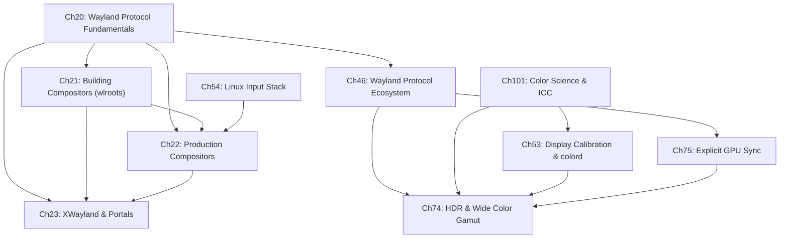

# Part VI — The Display Stack

Parts I–V establish the substrate: kernel memory management, **DRM/KMS** atomic modesetting, **Mesa** and the **Vulkan** driver stack, and the GPU command scheduler. Part VI is where that substrate is made visible. It covers every layer between a rendered **DMA-BUF** and the photons that leave the display panel: the **Wayland** compositor protocol, the compositor toolkits and production compositor implementations, backward compatibility for **X11** applications, the input pathway from kernel interrupt to Wayland event, colour science and calibration, and the advanced synchronisation and colour-management protocols that define the state of the art in 2026. This part is the connective tissue of the book — the chapters here are referenced by almost every chapter in Parts VII–XVIII, because everything that reaches a screen passes through the display stack.

## Chapters in This Part

**Chapter 20 — Wayland Protocol Fundamentals** is the conceptual foundation of the entire part. It explains the **Wayland** object model (**wl_proxy**, **wl_resource**, **wl_registry**), the binary wire protocol carried over a **Unix domain socket** with **SCM_RIGHTS** file-descriptor passing, and every core interface a Wayland client needs: **wl_surface**, **xdg-shell**, **zwp_linux_dmabuf_v1**, **wp_presentation**, and **wp_linux_drm_syncobj_v1**. It closes with the security model, the **wayland-protocols** stability ladder, and a catalogue of known protocol gaps. Application developers and systems developers alike should read this chapter first — nothing else in the part is fully intelligible without it.

**Chapter 21 — Building Compositors with wlroots** moves to the compositor side. **wlroots** is the shared compositor toolkit on which **Sway**, **Hyprland**, **Wayfire**, **labwc**, and dozens of other compositors are built. The chapter covers the backend abstraction (**DRM/KMS** atomic commit, **GBM**, headless, nested **Wayland**), the **wlr_renderer** / **wlr_allocator** abstraction, the **wlr_scene** scene graph with damage tracking and hardware-plane promotion, input handling via **libinput** and the **wlr_seat** model, and the full set of **wlr_*** protocol implementations. A complete walkthrough of **tinywl.c** bridges theory and practice.

**Chapter 22 — Production Compositors** surveys the five compositors that collectively define the Linux desktop in 2026: **Mutter** (**GNOME Shell**), **KWin** (**KDE Plasma**), **Sway**, **Hyprland**, and **gamescope** (Valve), with additional coverage of **cosmic-comp** (System76, **smithay**/Rust). Each is examined through the lens of its **DRM/KMS** backend, rendering pipeline, protocol-extension support matrix, and frame-pacing strategy. The chapter provides the protocol compatibility table that application developers need when targeting multiple compositors.

**Chapter 23 — Legacy and Sandboxed App Support** covers the two major compatibility layers. **XWayland** is examined in depth — its startup handshake, rootless mode, **Glamor** GPU acceleration, clipboard and **XDND** bridging, **HiDPI** scaling via **wp_fractional_scale_v1**, and explicit synchronisation via **wp_linux_drm_syncobj_v1**. The **xdg-desktop-portal** architecture is explained alongside its compositor-specific backends, the screen-cast and remote-desktop portals, **PipeWire** **DMA-BUF** zero-copy path, and **Flatpak** GPU-access security trade-offs.

**Chapter 46 — The Evolving Wayland Protocol Ecosystem** documents the wave of staging protocols that matured in 2024–2026, directly resolving the gaps catalogued in Chapter 20. Coverage includes **wp_linux_drm_syncobj_v1** (explicit GPU sync), **wp_color_management_v1** (HDR colour management), **ext-image-copy-capture-v1** (cross-compositor screen capture), **wp_fifo_v1** (protocol-level FIFO frame scheduling), and the evolution of the **xdg-desktop-portal** surface. The chapter tracks each protocol's graduation status through the **wayland-protocols** stability ladder.

**Chapter 53 — Display Calibration and colord** covers the workflow that connects physical display measurement to the **KMS** colour pipeline. It explains the distinction between calibration and profiling, the **ICC** profile binary format, the **colord** D-Bus daemon's device and profile registry, **VCGT** loading into the **GAMMA_LUT** **KMS** property via **drmModeAtomicCommit**, the **ArgyllCMS**/**DisplayCAL** five-step measurement pipeline, and Night Light blue-light reduction. This chapter bridges **KMS** colour hardware and the **wp_color_management_v1** Wayland protocol.

**Chapter 54 — The Linux Input Stack** traces the vertical path from kernel interrupt to Wayland client event. It covers **struct input_event** and the **evdev** model, **libinput** device normalisation and the quirks database, **libwacom** tablet identification, gaming controllers via **HID** and **SDL2**, pointer constraints (**zwp_pointer_constraints_v1**, **zwp_locked_pointer_v1**, **zwp_relative_pointer_v1**), touch and gesture protocols, accessibility via **AT-SPI2** and the **InputCapture** portal, and input-latency measurement. The chapter is the authoritative treatment of input delivery for both application and compositor authors.

**Chapter 74 — HDR and Wide Color Gamut on Linux** covers the full HDR stack from signal fundamentals through compositor integration. It explains **PQ** (**SMPTE ST 2084**) and **HLG** (**ITU-R BT.2100**) transfer functions, **BT.2020** wide-gamut primaries, **HDR10** static metadata via **HDR_OUTPUT_METADATA**, the per-plane **DRM Color Pipeline API** (merged Linux 6.19), **Mutter** and **KWin** HDR implementations, **wp_color_management_v1** and **color-representation-v1** protocols, **Vulkan** HDR via **VK_EXT_swapchain_colorspace** and **VK_EXT_hdr_metadata**, tone mapping operators, and HDR video passthrough via **VA-API** and **Vulkan Video**.

**Chapter 75 — Explicit GPU Synchronisation** provides the low-level foundations of GPU fence management. It covers **struct dma_fence** and **dma_resv** implicit fences, the **drm_syncobj** kernel primitive and its timeline extension, **Vulkan** timeline semaphores and their mapping onto **drm_syncobj** in **RADV**, **ANV**, and **NVK**, the **wp_linux_drm_syncobj_v1** Wayland protocol, **EGL** fence sync objects, and the industry-wide implicit-to-explicit fence migration driven by **NVIDIA** driver constraints. Performance analysis covers latency, fence accumulation, and frame scheduling trade-offs.

**Chapter 101 — Color Science and the ICC Profile Pipeline** is the science companion to Chapters 53 and 74. It builds from **CIE XYZ** colour-matching functions and the **xy chromaticity diagram** through **ICC** profile binary structure, the **LittleCMS (lcms2)** engine API, **colord** daemon internals, **ArgyllCMS** measurement workflows, the **VCGT** versus **KMS** colour pipeline comparison, application-level colour management in **GTK 4**, **Qt**, and **Cairo**, soft-proofing, print workflows, and HDR colour management. Readers who want to understand *why* the Linux colour stack is built the way it is should read this chapter before Chapters 53 and 74.

## How the Chapters Interrelate

Chapter 20 is the prerequisite for everything else in this part. It defines the object model, wire protocol, and core surface primitives that all subsequent chapters build on. Chapter 21 is the natural second read for systems developers: it shows how the protocol is implemented on the compositor side using **wlroots**, and its treatment of the **DRM** backend, scene graph, and **wlr_seat** input model is assumed by Chapter 22. Chapter 22 in turn is required reading before Chapter 23, because the **XWayland** architecture and **xdg-desktop-portal** backend selection both presuppose familiarity with the production compositors.

Chapter 46 is the evolution chapter: it picks up where Chapter 20 §13 left off and documents how staging protocols resolved the gaps. It feeds forward into Chapters 74 and 75, which describe the full implementations of those protocols — **wp_color_management_v1** and **wp_linux_drm_syncobj_v1** — at the kernel, Mesa, compositor, and application layers.

The colour and synchronisation sub-cluster has its own internal ordering. Chapter 101 is the science foundation: it builds from **CIE XYZ** through **ICC** profiles to **LittleCMS** and should be read before Chapters 53 and 74. Chapter 53 then covers the calibration workflow and the **colord** daemon, while Chapter 74 extends that foundation into HDR territory with **PQ**, **HLG**, and **BT.2020**. Chapter 75 underpins the synchronisation dimension: understanding **drm_syncobj** timeline fences is necessary to reason about the acquisition and release points in **wp_linux_drm_syncobj_v1** (introduced in Chapter 46 and applied throughout Chapter 74's HDR passthrough pipeline).

Chapter 54 is somewhat orthogonal to the display pipeline — it follows a different vertical path (interrupt → **evdev** → **libinput** → **wlr_seat** → Wayland event) — but it shares the same protocol substrate as Chapter 20 and the same compositor infrastructure as Chapter 22. Readers who are primarily interested in input handling can read Chapter 54 after Chapter 20 without requiring Chapter 21 or 22 first.

The thematic threads tying the part together are: the **DMA-BUF** buffer object (shared across Chapters 20, 21, 22, 23, 74, and 75 as the universal GPU buffer transport); the **KMS** atomic commit (the bottom of every output pipeline in Chapters 21, 22, 53, 74, and 75); and the **wayland-protocols** staging tier (the governance mechanism that connects Chapters 20, 46, 74, and 75).

## Prerequisites and What Comes Next

Readers should arrive at this part having read Part I (DRM/KMS architecture and atomic modesetting), Part II (Mesa, **GBM**, and **EGL**), and Part III (Vulkan driver internals), because Chapters 20–75 assume familiarity with **drmModeAtomicCommit**, **gbm_bo_create_with_modifiers2**, **DMA-BUF** file descriptors, **EGLImage**, and **VkSemaphore**. Basic familiarity with **D-Bus** is helpful for Chapters 23, 53, and 54. Part VII (Application APIs: **VA-API**, **OpenXR**, **PipeWire**) and Part VIII (Gaming and the Steam platform) both depend heavily on this part — the compositor protocol extensions, explicit sync foundations, and HDR pipeline established here are the APIs those parts build on.

---
