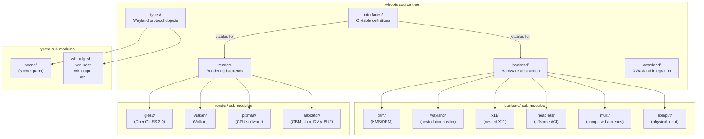
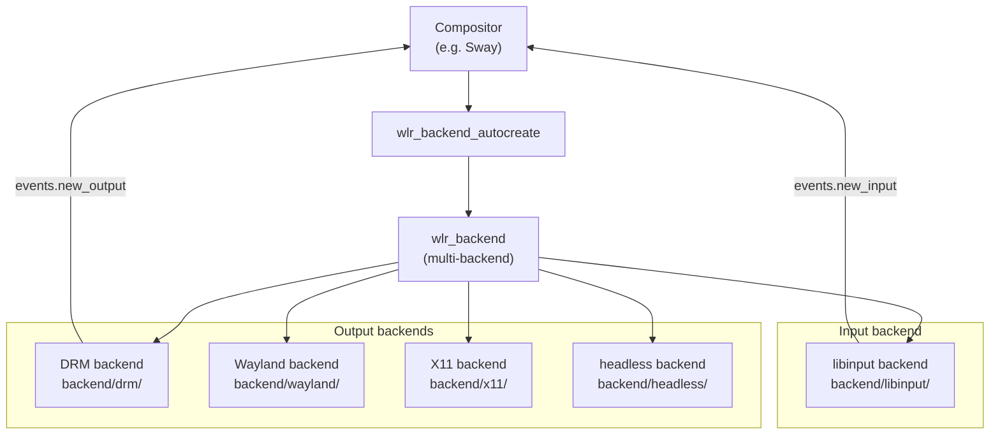
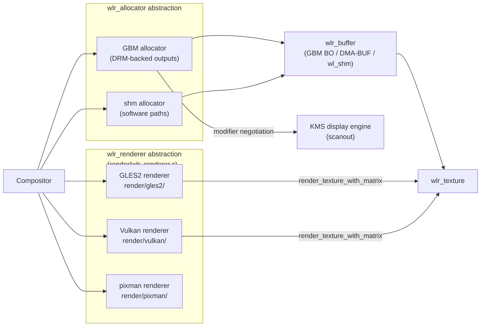
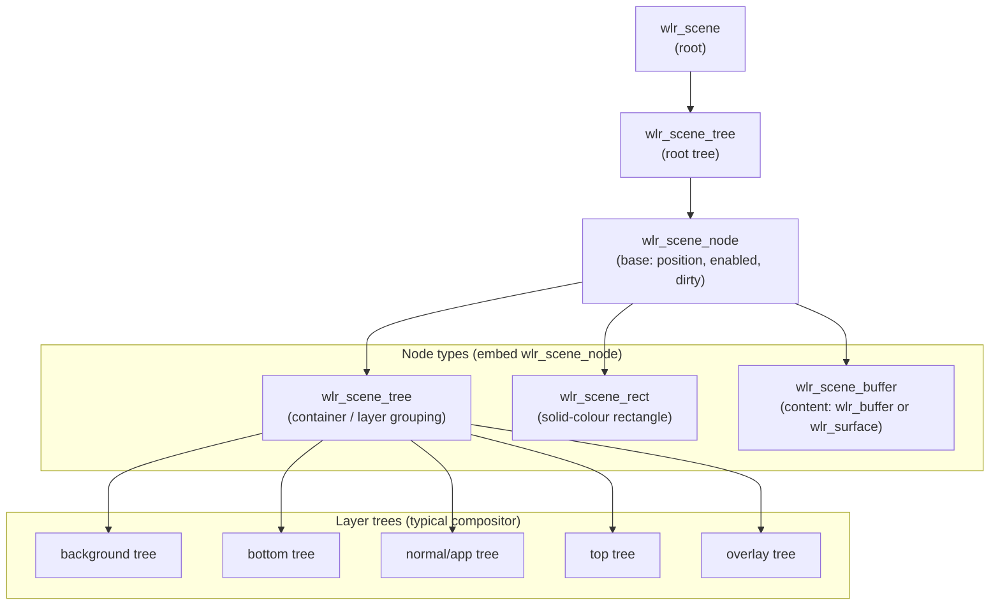
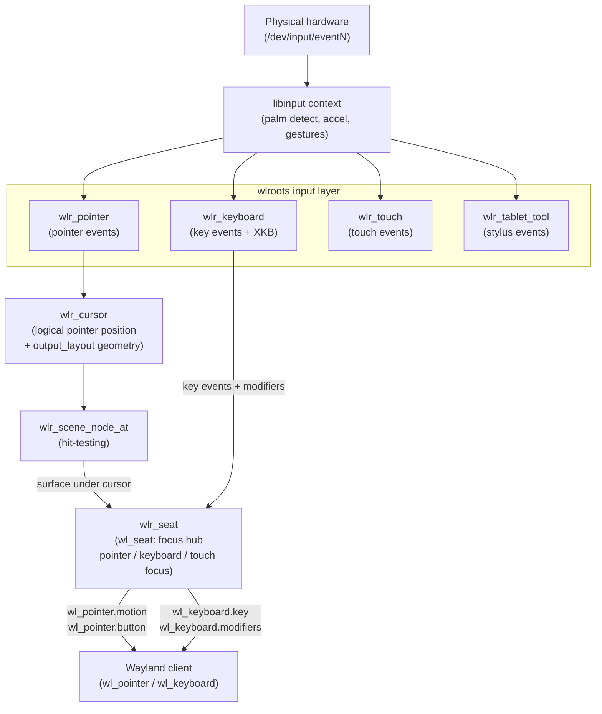
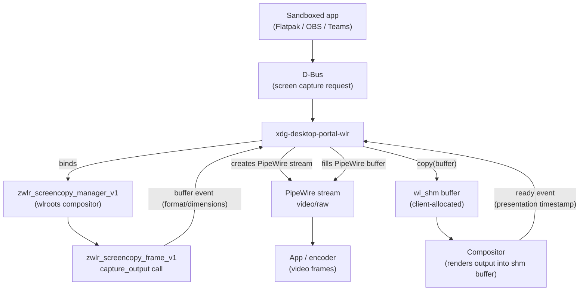

# Chapter 21: Building Compositors with wlroots

> **Part**: Part VI — The Display Stack
> **Audience**: Systems developers — this chapter is primarily for those who want to build Wayland compositors or deeply understand how compositors are implemented; application developers will find the compositor-side perspective valuable for understanding protocol semantics
> **Status**: First draft — 2026-06-06

## Table of Contents

- [Overview](#overview)
- [1. wlroots Architecture Overview](#1-wlroots-architecture-overview)
- [2. The Backend Abstraction](#2-the-backend-abstraction)
- [3. Output and Mode Management](#3-output-and-mode-management)
- [4. The Renderer Abstraction](#4-the-renderer-abstraction)
- [5. The Scene Graph API](#5-the-scene-graph-api)
- [6. Input Handling](#6-input-handling)
- [6a. The Linux Input Stack and libinput](#6a-the-linux-input-stack-and-libinput)
- [6b. Seat Management: logind, seatd, and libseat](#6b-seat-management-logind-seatd-and-libseat)
- [7. Protocol Implementations in wlroots](#7-protocol-implementations-in-wlroots)
- [8. XWayland Integration](#8-xwayland-integration)
- [9. Walkthrough: A Minimal Compositor](#9-walkthrough-a-minimal-compositor)
- [10. Screencopy and PipeWire Integration](#10-screencopy-and-pipewire-integration)
- [11. Smithay: The Rust Alternative to wlroots](#11-smithay-the-rust-alternative-to-wlroots)
- [Integrations](#integrations)
- [References](#references)

---

## Overview

**wlroots** is the dominant library for building **Wayland** compositors on Linux. Where **Weston** is a monolithic reference compositor, **wlroots** is a modular toolkit providing loosely coupled components that a compositor author can assemble into a complete compositor:

- **Backend abstraction** — over **DRM/KMS**, nested **Wayland**, **X11**, and headless outputs
- **Rendering infrastructure** — supporting **GLES2**, **Vulkan**, and **CPU**-based **pixman**
- **Scene graph** — with damage tracking
- **Input handling** — via **libinput**
- **Wayland protocol implementations** — a rich, extensible set

**Sway**, **Wayfire**, **labwc**, and dozens of smaller compositors are built on **wlroots**. (Hyprland was wlroots-based until 2024, when it migrated to its own **Aquamarine** backend library — see Chapter 22 §5.) Understanding **wlroots** means understanding how the entire output path from client commit to pixel works in practice.

The chapter opens with the **wlroots** architecture and source-tree layout, covering the **"bring your own event loop"** design built on **`wl_event_loop`** and the **ABI instability** policy. Source-tree modules:

- **`backend/`** — hardware abstraction
- **`render/`** — rendering backends
- **`types/`** — server-side Wayland protocol object implementations
- **`xwayland/`** — XWayland integration
- **`interfaces/`** — C vtable definitions

The backend abstraction layer is examined in depth:

- **`wlr_backend`** / **`wlr_backend_impl`** — vtable model
- **DRM backend** — connector enumeration via **`drmModeGetResources`**, hotplug via **udev**, atomic modesetting using **`drmModeAtomicCommit`** / **`drmModeAtomicAlloc`**, hardware cursor and overlay plane assignment, page flip events via **`DRM_EVENT_FLIP_COMPLETE`**, and scanout buffer allocation with **GBM** (**`gbm_bo_create_with_modifiers2`**)
- **Nested Wayland backend**, **headless backend**, and **multi-backend** — composed by **`wlr_backend_autocreate`**

Output and mode management explores:

- **`wlr_output`** — fields (name, physical dimensions, modes)
- **`wlr_output_state`** / **`wlr_output_commit_state`** — transactional pending-state model
- **`VRR_ENABLED`** — adaptive sync via the **KMS** connector property
- **`GAMMA_LUT`** — gamma correction
- Output transforms and **HiDPI** scaling
- **`wlr_output_layout`** — multi-monitor layout

The renderer abstraction section covers:

- **`wlr_renderer`** — vtable abstraction
- **`wlr_texture`** / **`wlr_buffer`** — lifecycle management
- **`EGL_EXT_image_dma_buf_import`** — **DMA-BUF** import in the **GLES2** renderer
- **`VK_EXT_external_memory_dma_buf`** — **DMA-BUF** import in the **Vulkan** renderer
- **GLSL** shader set — in **`render/gles2/`**
- **`VK_EXT_swapchain_colorspace`** — **HDR** compositing in **`render/vulkan/`**
- **Pixman** software renderer
- **`wlr_allocator`** — with **GBM** and shared-memory backends

The scene graph section explains why damage tracking matters, then details:

- **`wlr_scene`** / **`wlr_scene_tree`** / **`wlr_scene_buffer`** / **`wlr_scene_rect`** — node hierarchy
- **`wlr_scene_surface_create`** and **`wlr_scene_xdg_surface_create`** — surface integration
- **`wlr_scene_output`** and **`wlr_scene_output_commit`** — output binding
- **`pixman_region32_union`** — double-buffered damage accumulation
- Hardware plane promotion to **KMS** overlay planes
- **`wlr_layer_shell_v1`** — layer ordering

Input handling is treated at three levels:

- **Linux evdev** — the **`/dev/input/eventN`** character devices enumerated via **libudev**
- **libinput** — palm detection, pointer acceleration, gesture recognition, multitouch slot tracking, tablet stylus events
- **wlroots seat layer** — **`wlr_seat`**, **`wlr_cursor`**, **`wlr_xcursor_manager`**, hardware cursor via **`wlr_output_cursor`**; protocol implementations: **`zwp_pointer_gestures_v1`**, **`zwp_pointer_constraints_v1`**, **`zwp_tablet_v2`**, **`zwp_text_input_v3`**, **`zwp_input_method_v2`**; **XKB** keymap serialisation via **`memfd_create`** and software key-repeat via **`wl_event_source_timer_create`**

The protocol implementations section surveys the full set of **`wlr_*`** protocol managers:

- **`wlr_xdg_shell`** — configure/ack/commit cycle
- **`wlr_layer_shell_v1`** — exclusive zones and anchor
- **`wlr_data_device_manager`** — clipboard and **drag-and-drop**
- **`wlr_output_management_v1`** — output configuration
- **`wlr_screencopy_manager_v1`** — screen capture
- **`wlr_export_dmabuf_manager_v1`** — DMA-BUF frame export
- **`wlr_gamma_control_manager_v1`** — gamma control
- **`wlr_foreign_toplevel_management_v1`** — toplevel management
- **wlr-protocols** (**`zwlr_*`**) — relationship to upstream **wayland-protocols** standardisation process

**XWayland** integration covers:

- **`wlr_xwayland_create`** — process management and lazy startup
- **`wlr_xwayland_surface`** — configure requests, override-redirect windows, stacking via **`wlr_xwayland_surface_restack`**
- **HiDPI** **`Xft.dpi`** configuration
- Explicit sync via the **DRI3/Present** extension

The practical walkthrough builds a minimal compositor following **`tinywl.c`**:

- **Initialisation sequence** — **`wl_display_create`**, **`wlr_backend_autocreate`**, **`wlr_renderer_autocreate`**, **`wlr_allocator_autocreate`**, **`wlr_scene_create`**, **`wlr_xdg_shell_create`**, **`wlr_seat_create`**
- **Output configuration handler** — **`wlr_output_commit_state`**, **`wlr_scene_output_create`**
- **XDG surface handler** — **`wlr_scene_xdg_surface_create`**
- **Keyboard and pointer input routing** — **`wlr_seat_keyboard_notify_enter`** and **`wlr_scene_node_at`** hit-testing
- **Common pitfalls** — missing **`ack_configure`**, coordinate system mismatches, **`wl_display_flush_clients`**, transform/scale propagation

Finally, screencopy and **PipeWire** integration details:

- **`zwlr_screencopy_v1`** — frame-capture protocol
- **`zwlr_export_dmabuf_v1`** — zero-copy **GPU**-to-**GPU** export path
- **`xdg-desktop-portal-wlr`** — **D-Bus** bridge feeding captured frames into a **PipeWire** `video/raw` stream consumed by **OBS Studio**, video conferencing tools, and remote desktop clients
- **`wp_security_context_v1`** — compositor-side permission gating and security considerations

After reading this chapter, a systems developer will be able to write a functional **Wayland** compositor from scratch, understand how every line in the **wlroots** **DRM** backend maps to the **KMS** concepts from Chapter 2, and understand the design trade-offs that distinguish **wlroots**-based compositors from those with custom backends like **Mutter** and **KWin**.

---

## 1. wlroots Architecture Overview

wlroots was founded by Drew DeVault in 2017 as the foundation for Sway, his tiling Wayland compositor. The key design decision was to build a protocol-implementing middleware library rather than an opinionated compositor framework: wlroots provides the building blocks but makes no decisions about window management policy, keybinding handling, or compositor behaviour. This philosophy is why Sway (tiling), Hyprland (dynamic tiling with animations), Wayfire (plugin-extensible), and labwc (stacking, openbox-like) can all be built on the same library while behaving completely differently.

The wlroots source tree is organised into well-defined modules:

- **`backend/`**: Hardware abstraction. Sub-directories for each backend: `drm/` (DRM/KMS, the primary path on bare metal), `wayland/` (nested Wayland compositor acting as a client), `x11/` (nested in an X11 session), `headless/` (offscreen, used in CI and for virtual outputs), and `multi/` (composing multiple backends together). The `libinput/` sub-directory under `backend/` handles all physical input devices.
- **`render/`**: Rendering backends. `gles2/` for OpenGL ES 2.0, `vulkan/` for Vulkan, `pixman/` for CPU-based software rendering, and `allocator/` for buffer allocation (GBM, shared memory, DMA-BUF). The renderer abstraction lives in `render/wlr_renderer.c`.
- **`types/`**: Server-side Wayland protocol object implementations. Each protocol results in a `wlr_*` type here — `wlr_xdg_shell`, `wlr_layer_shell_v1`, `wlr_seat`, `wlr_output`, `wlr_screencopy_v1`, and so on. The `scene/` sub-directory under `types/` implements the scene graph.
- **`xwayland/`**: XWayland integration — launching the XWayland process, managing the X11 window list, and bridging X11 window state to the compositor.
- **`interfaces/`**: C vtable definitions (pure-virtual interfaces in C terms) that back the backend and renderer abstractions. Every backend and renderer implements these structs of function pointers.



The **"bring your own event loop"** design is fundamental. wlroots uses `wl_event_loop` from libwayland-server; compositors add their own event sources via `wl_event_loop_add_fd`, `wl_event_loop_add_timer`, and `wl_event_loop_add_signal`. The compositor drives everything by calling `wl_display_run`, which internally calls `wl_event_loop_dispatch` in a loop. wlroots never spawns threads for its own purposes; all wlroots callbacks fire on the compositor's main event loop.

A critical aspect of using wlroots is its **ABI instability policy**: wlroots explicitly does not guarantee a stable ABI or API between major versions. Compositors must be co-developed with the wlroots version they target — Sway pins to specific wlroots releases, and Hyprland maintains its own fork (`wlroots-hyprland`) to manage its own patch set. Major wlroots versions (0.16, 0.17, 0.18) have required non-trivial compositor updates; the book's code examples target wlroots 0.17+.

All public types use the **`wlr_` prefix**, with implementation details hidden in internal headers under `backend/*/`. The struct/vtable naming convention is consistent: the public struct carries the data members and a `const struct wlr_foo_impl *impl` pointer to the vtable of function pointers.

Key source paths: [`wlroots/include/wlr/`](https://gitlab.freedesktop.org/wlroots/wlroots/-/tree/master/include/wlr), [`wlroots/backend/`](https://gitlab.freedesktop.org/wlroots/wlroots/-/tree/master/backend), [`wlroots/render/`](https://gitlab.freedesktop.org/wlroots/wlroots/-/tree/master/render).

---

## 2. The Backend Abstraction

The backend is the wlroots component that bridges between the physical hardware layer (DRM/KMS, libinput, udev) and the compositor's logical view of outputs and input devices. Everything below this boundary — DRM node selection, KMS atomic commits, libinput context management, udev monitoring — is hidden behind the backend API.

### wlr_backend and wlr_backend_impl

`struct wlr_backend` (`include/wlr/backend.h`) is the root abstraction. Its `impl` pointer references a `const struct wlr_backend_impl` vtable with the following function pointers:

- `start(backend)`: brings the backend online — opens devices, starts udev monitoring, and begins emitting output and input device signals.
- `destroy(backend)`: tears down all backend state cleanly.
- `get_drm_fd(backend)`: returns the DRM render node file descriptor used by this backend for buffer allocation. The caller must not close this fd; the backend owns it.

The `wlr_backend` struct exposes two primary signals that compositors must listen to:

- `events.new_output`: fired when a new `wlr_output` is available (e.g., a monitor is connected). The signal carries a `wlr_output *`.
- `events.new_input`: fired when a new input device is detected. The signal carries a `wlr_input_device *`.

`wlr_backend_autocreate(wl_display, session)` selects the correct backend based on environment: if `WAYLAND_DISPLAY` is set it creates a Wayland backend; if `DISPLAY` is set it creates an X11 backend; otherwise it attempts DRM. In all cases, `wlr_backend_autocreate` returns a multi-backend that wraps the selected backend together with a libinput backend for physical input handling. [Source: `wlroots/backend/backend.c`](https://github.com/swaywm/wlroots/blob/master/backend/backend.c)

### The DRM Backend in Depth

The DRM backend (`backend/drm/`) is the most complex and most important backend — it is the path from a physical machine to KMS page flips. Its internal structure mirrors the KMS object model from Chapter 2.

**Enumeration**: On `start`, the DRM backend opens `/dev/dri/cardN` (using `libseat` for privilege escalation), calls `drmModeGetResources` to enumerate connectors, encoders, and CRTCs, and calls `drmModeGetPlaneResources` (with `DRM_CLIENT_CAP_UNIVERSAL_PLANES` enabled) for the full plane list. Each connector is wrapped in a `wlr_drm_connector`; each CRTC in a `wlr_drm_crtc`. CRTC-to-connector assignments are stored in a table that the atomic commit path uses when composing the property request.

**Hotplug**: The DRM backend registers a udev monitor on the `drm` subsystem. When a `drm` device node emits a uevent with `HOTPLUG=1`, the backend calls `drmModeGetConnector` for each connector to re-probe connection status. Newly connected connectors trigger `wlr_backend.events.new_output`; disconnected outputs trigger `wlr_output.events.destroy`.

**Atomic modesetting path**: The atomic commit path in `backend/drm/atomic.c` uses `drmModeAtomicAlloc()` to create a request object, then populates it with `drmModeAtomicAddProperty()` calls for each property to change (CRTC `ACTIVE`, connector `CRTC_ID`, plane `FB_ID`, plane `CRTC_X/Y/W/H`, plane `SRC_X/Y/W/H`). The resulting request is submitted with `drmModeAtomicCommit()`. Configuration validation uses `DRM_MODE_ATOMIC_TEST_ONLY` before the live commit — wlroots validates a proposed output configuration (mode, modifiers, formats) before applying it. [Source: `wlroots/backend/drm/atomic.c`](https://github.com/swaywm/wlroots/blob/master/backend/drm/atomic.c)

```c
/* Source: wlroots/backend/drm/atomic.c — simplified illustration */
static bool drm_commit(struct wlr_drm_backend *drm,
                       struct wlr_drm_connector *conn,
                       uint32_t flags) {
    drmModeAtomicReq *req = drmModeAtomicAlloc();

    /* Set CRTC active */
    drmModeAtomicAddProperty(req, conn->crtc->id,
        conn->crtc->props.active, 1);

    /* Assign CRTC to connector */
    drmModeAtomicAddProperty(req, conn->id,
        conn->props.crtc_id, conn->crtc->id);

    /* Set mode blob on CRTC */
    drmModeAtomicAddProperty(req, conn->crtc->id,
        conn->crtc->props.mode_id, conn->crtc->mode_id);

    /* Assign framebuffer to primary plane */
    drmModeAtomicAddProperty(req, conn->crtc->primary->id,
        conn->crtc->primary->props.fb_id, fb_id);
    drmModeAtomicAddProperty(req, conn->crtc->primary->id,
        conn->crtc->primary->props.crtc_id, conn->crtc->id);

    int ret = drmModeAtomicCommit(drm->fd, req,
        flags | DRM_MODE_ATOMIC_ALLOW_MODESET, NULL);
    drmModeAtomicFree(req);
    return ret == 0;
}
```

**Plane assignment**: The DRM backend selects planes for each output from the available pool. The primary plane is always assigned; if the output has a hardware cursor and the cursor plane supports the required format, `wlr_output_cursor_set_buffer` uses the cursor plane. Overlay planes are used for direct-scan-out optimisation when the scene graph promotes a buffer (Section 5).

**Page flip events**: The DRM backend registers a `drm_event_context` with `page_flip_handler2` set. When a flip completes, the kernel delivers a `DRM_EVENT_FLIP_COMPLETE` event on the DRM fd; the backend's `wl_event_source` callback reads it and emits `wlr_output.events.present`.

**GBM buffer allocation for scanout**: The DRM backend uses GBM (`Generic Buffer Management`) to allocate scanout-capable buffers. `gbm_bo_create_with_modifiers2` creates a buffer with the format modifiers negotiated from KMS plane properties; `gbm_bo_get_fd_for_plane` exports each plane as a DMA-BUF file descriptor for import into the display engine. The modifier list is obtained by reading the `IN_FORMATS` property blob from each KMS plane. [Source: `wlroots/render/allocator/gbm.c`](https://github.com/swaywm/wlroots/blob/master/render/allocator/gbm.c)

### Other Backends

The **Wayland backend** (`backend/wayland/`) acts as a Wayland client: it connects to a host compositor via `WAYLAND_DISPLAY`, binds `wl_compositor`, `xdg_wm_base`, and `zwp_linux_dmabuf_v1`, creates a `wl_surface` and `xdg_toplevel` for each virtual output, and presents rendered frames using linux-dmabuf for zero-copy delivery. This enables nested compositor testing without physical hardware.

The **headless backend** (`backend/headless/`) allocates offscreen buffers via the `wlr_allocator` interface without any hardware display. It is the backend used in automated testing (compositor CI, headless screenshot testing) and as the backing for virtual outputs in Wayland screencasting without a physical display.

The **multi-backend** (`backend/multi/`) composes multiple backends under a single `wlr_backend` interface. The typical configuration on a physical machine is DRM + libinput, where the DRM backend provides outputs and the libinput backend provides input devices. `wlr_backend_autocreate` always returns a multi-backend even if only one sub-backend is active, giving compositors a uniform API regardless of the environment.



---

## 3. Output and Mode Management

`struct wlr_output` (`include/wlr/types/wlr_output.h`) is the compositor's logical representation of a display. It carries the current and available modes, physical dimensions, DPI, transform, scale, and the event signals that compositors use to react to output state changes.

### Key wlr_output Fields

The most important fields and sub-structures on `wlr_output`:

- `name` (e.g., `"HDMI-A-1"`, `"eDP-1"`), `description` (human-readable model string from EDID), `make`, `model`, `serial`.
- `phys_width`, `phys_height`: physical dimensions in millimetres from EDID; used to calculate DPI for font and UI scaling.
- `modes`: a `wl_list` of `wlr_output_mode` structs, each carrying `width`, `height`, `refresh` (in mHz), and `preferred` flag.
- `current_mode`: the currently active `wlr_output_mode *`.
- `enabled`: whether the output is currently active and scanning out.
- Events: `events.frame` (the primary compositing signal, fired at each vblank opportunity), `events.present` (fired after confirmed page flip with `wlr_output_event_present`), `events.destroy` (output was removed), `events.mode` (mode changed).

### The wlr_output_state Pending State Model

wlroots 0.17 replaced the older `wlr_output_set_*` setter API with `struct wlr_output_state`, a transactional pending-state object modelled after KMS atomic commits. Compositors construct a pending state with:

```c
/* Source: wlroots/include/wlr/types/wlr_output.h */
struct wlr_output_state state;
wlr_output_state_init(&state);

/* Set desired mode */
wlr_output_state_set_mode(&state, preferred_mode);

/* Enable the output */
wlr_output_state_set_enabled(&state, true);

/* Apply atomically — returns false on failure, output unchanged */
if (!wlr_output_commit_state(output, &state)) {
    /* Handle failure — the output remains in its previous state */
}

wlr_output_state_finish(&state);
```

`wlr_output_commit_state` maps directly to a `drmModeAtomicCommit` call in the DRM backend. If the commit fails (for example, because the requested mode is not achievable with the current connector/CRTC/encoder path), the function returns `false` and the output remains in its previous state. Compositors can test a configuration without applying it by calling `wlr_output_test_state` first, which uses `DRM_MODE_ATOMIC_TEST_ONLY` internally.

### Adaptive Sync, Gamma, and Transforms

`wlr_output_state_set_adaptive_sync_enabled(&state, true)` enables variable refresh rate (VRR) if the connector supports it. This sets the KMS `VRR_ENABLED` connector property. Not all connectors support VRR; compositors should test with `wlr_output_test_state` before committing.

`wlr_output_state_set_gamma_lut(&state, ramp_size, r, g, b)` passes a gamma LUT to the `GAMMA_LUT` KMS property, used by night-light applications to shift colour temperature.

`wlr_output_state_set_transform(&state, WL_OUTPUT_TRANSFORM_90)` and `wlr_output_state_set_scale(&state, 2.0)` configure output rotation and HiDPI scaling. The scene graph respects these when rendering to the output.

### Output Layout and Multi-Monitor

`wlr_output_layout` (`types/output/wlr_output_layout.c`) manages the 2D spatial arrangement of multiple outputs. It tracks each output's position in a global coordinate space and provides helpers to convert between output-local and layout-global coordinates. The scene graph uses `wlr_scene_output_layout` to keep `wlr_scene_output` instances automatically synchronised with the layout.

Mode negotiation uses `wlr_output_preferred_mode(output)` to find the monitor's preferred mode (the first mode with the `preferred` flag from EDID), then applies it with `wlr_output_commit_state`. Custom modes (for virtual outputs or headless outputs) are created with `wlr_output_mode_create`.

---

## 4. The Renderer Abstraction

`struct wlr_renderer` (`include/wlr/render/wlr_renderer.h`) abstracts over GLES2, Vulkan, and pixman (CPU) rendering backends. Compositors rarely call renderer functions directly when using the scene graph, but the renderer underpins all compositing operations.

### Core Renderer Interface

The `wlr_renderer` vtable (`interfaces/wlr_renderer.h`) defines the compositor-facing operations:

- `begin(renderer, width, height)` / `end(renderer)`: marks the start and end of a rendering frame.
- `clear(renderer, color)`: fills the render target with a solid colour.
- `render_texture_with_matrix(renderer, texture, matrix, alpha)`: renders a texture at the position and orientation encoded in the 3x3 projection matrix.
- `render_rect(renderer, box, color, matrix)`: renders a solid-colour rectangle.
- `get_render_formats(renderer, ...)`: returns the DRM format+modifier combinations this renderer can produce for scanout.

### Texture Lifecycle and Buffer Import

`wlr_texture` is created from a `wlr_buffer` via `wlr_texture_from_buffer`. The `wlr_buffer` abstraction (`include/wlr/render/wlr_buffer.h`) unifies GBM BOs, DMA-BUF file descriptors, and `wl_shm` shared-memory buffers. When a Wayland client commits a frame, the compositor calls `wlr_client_buffer_create` to wrap the `wl_resource` buffer into a `wlr_buffer`, which the renderer can then import as a texture.

For DMA-BUF import (the zero-copy path), the GLES2 renderer uses `EGL_EXT_image_dma_buf_import` to create an `EGLImage` from the DMA-BUF's file descriptor and modifier, then attaches it to a GL texture via `glEGLImageTargetTexture2DOES`. The Vulkan renderer uses `vkImportSemaphoreFdKHR` and `VK_EXT_external_memory_dma_buf` for the same purpose.

### GLES2 Renderer

The GLES2 renderer (`render/gles2/`) compiles a set of GLSL shader programs at startup: one for RGBA textures, one for RGBX (opaque) textures, one for external OES textures (used for hardware-decoded video and some DMA-BUF imports), and a solid-colour shader for `wlr_scene_rect` nodes. Each output gets its own EGL context. The renderer allocates GBM-backed buffers for the render target and presents them to the display via KMS.

The GLES2 renderer has been the production default since wlroots' inception. It is well-tested across all GPU vendors and is required for the vast majority of hardware. However, it cannot implement HDR compositing correctly because GLES2 lacks the precision and colour space management needed for high dynamic range output — that capability requires the Vulkan renderer.

### Vulkan Renderer

The Vulkan renderer (`render/vulkan/`) is the path forward for HDR compositing and for explicit GPU synchronisation. It uses timeline semaphores (`VK_KHR_timeline_semaphore`) to express dependencies between client rendering and compositor compositing without CPU-side waits. The render pass structure uses a single `VkRenderPass` per output with one colour attachment. Descriptor pool management allocates per-texture `VkDescriptorSet` instances for the texture sampler binding.

The primary motivation for the Vulkan renderer is HDR compositing: `VK_EXT_swapchain_colorspace` and `VK_EXT_hdr_metadata` allow the compositor to configure the output colour space and HDR metadata correctly, whereas GLES2 compositing always produces SDR output. As of wlroots 0.17, the Vulkan renderer is functional but less battle-tested than GLES2; Hyprland uses it by default when the GPU supports it.

### Pixman Renderer and wlr_allocator

The pixman renderer (`render/pixman/`) is a fully CPU-based renderer using the pixman pixel manipulation library. It requires no GPU and is used for the headless backend and for software-only rendering paths in constrained environments. No EGL or Vulkan dependencies are required.

`wlr_allocator` (`include/wlr/render/allocator/wlr_allocator.h`) abstracts buffer allocation independently from rendering. `wlr_allocator_autocreate` selects the appropriate allocator: the GBM allocator for DRM-backed outputs, the shared-memory allocator for software paths. The allocator is responsible for picking formats and modifiers that are compatible with both the renderer's input requirements and the display engine's scanout requirements — it queries the intersection of renderer-supported and KMS-plane-supported modifier sets.



---

## 5. The Scene Graph API

The scene graph is the highest-level abstraction in wlroots for managing what gets rendered on each output. Without a scene graph, compositors must track damage manually, rebuild render lists on every frame, and perform their own hit-testing. The wlroots scene graph (`types/scene/`) automates damage tracking, z-ordering, surface tree management, and hardware plane promotion, letting compositor authors focus on window management policy rather than rendering mechanics.

### Motivation: Why Damage Tracking Matters

A naive compositor re-renders the entire output on every frame, even if nothing has changed. At 4K@60Hz, that means uploading and compositing the entire framebuffer 60 times per second even for a static desktop — wasting GPU bandwidth and power. Damage tracking identifies which rectangular regions of the output have changed since the last frame and restricts GPU rendering to those regions only, leaving unchanged areas from the previous frame's buffer intact.

### The Scene Tree Structure

`struct wlr_scene` is the root of the scene tree, created with `wlr_scene_create()`. It contains a single root `wlr_scene_tree`, under which all scene nodes are parented. Every node in the tree is a `wlr_scene_node` (the base struct embedded in each node type) with a position relative to its parent, an enabled/disabled state, and a dirty flag for damage propagation.

Node types:

- **`wlr_scene_tree`**: A container node for grouping. Compositors create multiple scene trees for layer ordering — typically one tree per layer-shell layer (background, bottom, normal, top, overlay). Z-order within a tree is determined by the linked-list order of child nodes; `wlr_scene_node_raise_to_top` and `wlr_scene_node_lower_to_bottom` manipulate this list.
- **`wlr_scene_rect`**: A solid-colour rectangle for window borders, desktop backgrounds, or overlays. Created with `wlr_scene_rect_create(parent_tree, width, height, color)`.
- **`wlr_scene_buffer`**: The primary content node, backed by a `wlr_buffer` or a `wlr_surface`. Created with `wlr_scene_buffer_create`. When backed by a `wlr_surface`, it automatically subscribes to the surface's `commit` event and marks itself dirty on each commit.



### Surface Integration

`wlr_scene_surface_create(parent_tree, wlr_surface)` creates a `wlr_scene_buffer` that tracks a Wayland surface. It recursively handles the surface's subsurface tree — each `wl_subsurface` becomes its own `wlr_scene_buffer` node, positioned relative to the parent surface according to the `wl_subsurface.set_position` protocol request. When a frame is committed, the scene graph is automatically updated without compositor intervention.

For XDG shell windows, `wlr_scene_xdg_surface_create(parent_tree, xdg_surface)` creates the surface node and all subsurface nodes, and configures the scene tree to respect the XDG surface's committed geometry (the region of the surface that should be visible, excluding shadow and resize handles).

### wlr_scene_output: Binding the Scene to a Display

`wlr_scene_output_create(scene, wlr_output)` creates a binding between a scene tree and a physical output. The scene output tracks which region of the scene's global coordinate space is visible on this output (based on the output's position in the `wlr_output_layout`).

`wlr_scene_output_commit(scene_output, NULL)` performs the compositing and presentation for one frame:

1. Collects all dirty scene nodes visible on this output.
2. Computes the damage region: the union of all dirty node bounding boxes clipped to the output.
3. Begins a renderer frame.
4. Renders only the damaged region: non-damaged pixels are preserved from the previous frame's buffer (in double-buffered mode, the damage from both the current and previous frame is unioned to handle the second buffer).
5. Ends the renderer frame and calls `wlr_output_commit_state` to schedule the page flip.

After rendering, `wlr_scene_output_send_frame_done(scene_output, when)` iterates all visible surfaces and calls `wlr_surface_send_frame_done`, which delivers `wl_surface.frame` callbacks to clients that requested them, telling them the time at which their content was presented and allowing them to schedule their next frame.

### Damage Accumulation Details

The damage model tracks two kinds of damage:

- **Surface damage**: from `wl_surface.damage` and `wl_surface.damage_buffer` protocol requests that clients send to indicate which parts of their buffer changed.
- **Node damage**: from node position changes, enable/disable, or explicit `wlr_scene_node_damage_whole` calls.

When double-buffering is in use (the standard case for smooth animation), the previous frame's damage must be re-applied to the current frame's buffer because the two buffers may have diverged on the previous two frames. The scene graph unions current-frame damage with the saved previous-frame damage before clipping the render region.

```c
/* Source: wlroots/types/scene/wlr_scene.c — damage accumulation pattern */
/* On frame N, scene_output tracks damage in scene_output->damage */
/* On frame N+1, it unions previous_damage into current damage */
pixman_region32_union(&current_damage,
    &current_damage,
    &scene_output->previous_damage);
/* Render only current_damage, saving it as previous_damage for frame N+2 */
pixman_region32_copy(&scene_output->previous_damage, &current_damage);
```

### Hardware Plane Promotion

When a `wlr_scene_buffer` node's buffer is directly scannable by a KMS overlay plane (correct format, modifier, and size for the plane's constraints), `wlr_scene_output_commit` can promote it to a hardware plane assignment. The scene output's plane assignment logic queries the available KMS planes, checks format/modifier compatibility using `wlr_drm_format_set_has`, and — if compatible — adds the buffer directly to the KMS atomic commit as an overlay plane rather than compositing it in the GPU renderer. This zero-copy path is particularly valuable for video playback and for static backgrounds.

Hardware plane promotion is version-sensitive and has evolved significantly: it reached a stable and reliable state in wlroots 0.17. Compositors should not assume it will always fire; it is an optimisation, and the scene graph falls back to GPU compositing transparently when plane assignment is not possible.

### Layer Shell Integration

`wlr_layer_shell_v1` (`types/wlr_layer_shell_v1.c`) implements the `zwlr_layer_shell_v1` protocol for panels, wallpapers, notification overlays, and lock screens. Each `wlr_layer_surface_v1` is placed into one of four `wlr_scene_tree` layers: background, bottom, normal/application, top, and overlay. Exclusive zones (requesting the compositor to not place normal windows under a panel) are tracked in the layer surface and used by the compositor to compute the usable screen area.

---

## 6. Input Handling

Input in wlroots flows through three abstraction layers: libinput (physical device events), `wlr_seat` (Wayland protocol focus state), and `wlr_cursor` (the logical pointer position). Understanding how these layers interact is essential for implementing correct focus semantics.



### wlr_seat: The Wayland Focus Hub

`struct wlr_seat` (`types/seat/wlr_seat.c`) corresponds to the `wl_seat` Wayland object. One seat serves all connected clients; the compositor decides which client holds each type of focus. A seat is created with `wlr_seat_create(display, "seat0")` and its capabilities (pointer, keyboard, touch) advertised with `wlr_seat_set_capabilities`.

**Pointer focus and event delivery**:

```c
/* Hit-test the scene graph to find the surface under the cursor */
struct wlr_scene_node *node =
    wlr_scene_node_at(&scene->tree.node, cursor->x, cursor->y, &sx, &sy);

/* Update pointer focus */
if (node && node->type == WLR_SCENE_NODE_BUFFER) {
    struct wlr_surface *surface = /* extract from scene buffer node */;
    wlr_seat_pointer_notify_enter(seat, surface, sx, sy);
    wlr_seat_pointer_notify_motion(seat, time_msec, sx, sy);
} else {
    wlr_seat_pointer_clear_focus(seat);
}
```

Pointer event delivery functions: `wlr_seat_pointer_notify_motion(seat, time, sx, sy)`, `wlr_seat_pointer_notify_button(seat, time, button, state)`, `wlr_seat_pointer_notify_axis(seat, time, orientation, value, value_discrete, source, relative_direction)`, and `wlr_seat_pointer_notify_frame(seat)`. The `frame` call sends `wl_pointer.frame` to batch atomic delivery — it must be called after each logical event group.

**Keyboard focus**: `wlr_seat_keyboard_notify_enter(seat, surface, keycodes, num_keycodes, modifiers)` grants keyboard focus to a surface. Before calling this, `wlr_seat_set_keyboard(seat, keyboard)` must be called to tell the seat which `wlr_keyboard` is active, so the client receives the correct XKB keymap. Individual key events are sent with `wlr_seat_keyboard_notify_key(seat, time, key, state)` and modifier updates with `wlr_seat_keyboard_notify_modifiers(seat, modifiers)`.

### wlr_cursor: The Logical Pointer

`wlr_cursor` (`types/cursor/wlr_cursor.c`) is a high-level pointer abstraction that tracks the cursor's logical position and manages hardware vs. software cursor rendering. Input devices are attached with `wlr_cursor_attach_input_device(cursor, device)`. Movement is applied with `wlr_cursor_move(cursor, device, dx, dy)` for relative events and `wlr_cursor_warp_absolute(cursor, device, x, y)` for absolute events (tablet, touchscreen). `wlr_cursor` automatically applies the `wlr_output_layout`'s geometry to confine the cursor to the active output area.

Software cursor rendering uses `wlr_xcursor_manager` to load a theme from the filesystem and obtain `wlr_xcursor_image` instances. These are uploaded as textures and rendered as a scene node (or via `wlr_output_cursor` for hardware cursor paths).

### Hardware Cursor

`wlr_output_cursor_create(output)` creates a hardware cursor tracked by the output. `wlr_output_cursor_set_buffer(output_cursor, buffer, hotspot_x, hotspot_y)` uploads a new cursor image to the KMS cursor plane. `wlr_output_cursor_move(output_cursor, x, y)` updates cursor position via a non-blocking KMS cursor plane update — much more efficient than re-rendering the scene just to move the cursor. When the hardware cursor plane is unavailable (format not supported, or during screen capture that doesn't handle the cursor plane), the compositor falls back to rendering the cursor as a `wlr_scene_buffer` node.

### Gesture Recognition, Pointer Constraints, and Tablet

`wlr_pointer_gestures_v1` implements the `zwp_pointer_gestures_v1` protocol for swipe and pinch gesture events sourced from libinput. The compositor connects libinput gesture signals from `wlr_pointer` to the protocol object.

`wlr_input_inhibit_manager_v1` implements input inhibition for lock screens: when a `zwp_input_inhibit_manager_v1` lock is held, the compositor routes all input events only to the lock screen surface, ignoring other surfaces' focus state.

`wlr_tablet_manager_v2` implements the `zwp_tablet_v2` protocol, routing libinput tablet events (stylus proximity, tilt, pressure, rotation) to the appropriate `zwp_tablet_tool_v2` protocol object.

---

## 6a. The Linux Input Stack and libinput

### Architecture of the Linux Input Stack

Linux input devices expose themselves through `/dev/input/eventN` character devices. The kernel fills a ring buffer of `struct input_event` entries (defined in `linux/input.h`), each carrying three fields: `type` (event class), `code` (specific event within the class), and `value` (signed 32-bit quantity). Userspace reads these with a simple `read()` call.

The **evdev protocol taxonomy** classifies events by the `type` field:

- `EV_KEY` — discrete key and button state changes; `value` 1 = press, 0 = release, 2 = autorepeat.
- `EV_REL` — relative axis deltas (mouse movement, scroll wheel); `code` selects the axis (`REL_X`, `REL_Y`, `REL_WHEEL`, `REL_HWHEEL`).
- `EV_ABS` — absolute axis position (touchscreens, joysticks, tablets); `code` selects the axis (`ABS_X`, `ABS_Y`, `ABS_PRESSURE`, `ABS_MT_SLOT`).
- `EV_MSC` — miscellaneous events; `MSC_SCAN` carries hardware scan codes before key mapping.
- `EV_SYN` — synchronisation markers; `SYN_REPORT` signals the end of a logical event frame. Compositors must accumulate events up to `SYN_REPORT` before acting.
- Multi-touch slots: `ABS_MT_SLOT` selects the active touch slot; subsequent `ABS_MT_*` codes (`ABS_MT_POSITION_X/Y`, `ABS_MT_TRACKING_ID`) describe that slot's state. A `ABS_MT_TRACKING_ID` of -1 signals slot release.

Compositors must not poll `/dev/input/` directly. Instead they use **libudev** to enumerate and monitor devices. `udev_enumerate` with the `ID_INPUT=1` filter lists all input devices already present. `udev_monitor` watches for `add`/`remove` uevent actions on the `input` subsystem for hotplug. Key udev properties that compositors inspect: `ID_INPUT_KEYBOARD`, `ID_INPUT_MOUSE`, `ID_INPUT_TOUCHPAD`, `ID_INPUT_TOUCHSCREEN`, `ID_INPUT_TABLET`, `ID_INPUT_JOYSTICK` — synthesised by `udev-hwdb` rules.

Device seat assignment: `ID_SEAT` (default `seat0`) enables multi-seat setups. `logind` or `seatd` mediates device access and grants the compositor file descriptors via D-Bus or `libseat`. Compositors must not open `/dev/input/` devices directly with root privilege; using `libseat_open_device` is the correct and accepted pattern for production compositors.

### libinput

libinput is the canonical userspace normalisation library for evdev input ([source repository](https://gitlab.freedesktop.org/libinput/libinput)). Raw evdev is device-specific and noisy; libinput applies palm detection, touchpad acceleration curves, multitouch slot tracking, gesture recognition, and tablet normalisation to produce clean, high-level events for compositors.

**Context creation and udev integration**:

```c
/* Source: libinput API — libinput.h */
static int open_restricted(const char *path, int flags, void *data) {
    /* Use libseat_open_device instead of direct open() */
    struct libseat *seat = data;
    int device_id;
    int fd = libseat_open_device(seat, path, &device_id);
    return fd;
}

static void close_restricted(int fd, void *data) {
    struct libseat *seat = data;
    libseat_close_device(seat, fd);
}

static const struct libinput_interface interface = {
    .open_restricted = open_restricted,
    .close_restricted = close_restricted,
};

struct udev *udev = udev_new();
struct libinput *li = libinput_udev_create_context(&interface, seat, udev);
libinput_udev_assign_seat(li, "seat0");

/* Integrate with the Wayland event loop */
int li_fd = libinput_get_fd(li);
wl_event_loop_add_fd(event_loop, li_fd, WL_EVENT_READABLE,
                     handle_libinput_readable, server);
```

The `open_restricted`/`close_restricted` callback pair is the privilege boundary: these callbacks open `/dev/input/` devices with elevated privilege, mediated by `logind` (via `sd_session_take_device`) or `seatd`/`libseat`. Hardcoding root access is not acceptable in production compositors.

When `li_fd` becomes readable, the compositor calls `libinput_dispatch(li)` then drains events with `libinput_get_event(li)` in a loop until `NULL` is returned.

**Pointer events**: `LIBINPUT_EVENT_POINTER_MOTION` carries relative motion; `libinput_event_pointer_get_dx/dy` return floating-point deltas after pointer acceleration. The `_unaccelerated` variants return raw hardware deltas for the relative pointer protocol (`zwp_relative_pointer_v1`, used by FPS games). `libinput_event_pointer_get_scroll_value_v120` provides high-resolution wheel data (120 units per detent, per the HID standard); this function requires libinput >= 1.19.

**Touch events**: `LIBINPUT_EVENT_TOUCH_DOWN/UP/MOTION/CANCEL/FRAME`. `libinput_event_touch_get_slot(ev)` returns the slot index (0-based). `libinput_event_touch_get_x/y_transformed(ev, w, h)` returns coordinates normalised to output size. `LIBINPUT_EVENT_TOUCH_FRAME` is analogous to `SYN_REPORT`: all touch state changes within a frame should be applied atomically before dispatching to the compositor.

**Gesture events**: `LIBINPUT_EVENT_GESTURE_SWIPE_BEGIN/UPDATE/END`, `LIBINPUT_EVENT_GESTURE_PINCH_BEGIN/UPDATE/END`, `LIBINPUT_EVENT_GESTURE_HOLD_BEGIN/END`. Gesture hold events require libinput >= 1.20. `libinput_event_gesture_get_finger_count(ev)` distinguishes 2-finger from 3-finger and 4-finger gestures. Note: two-finger scroll is delivered as `LIBINPUT_EVENT_POINTER_SCROLL_FINGER`, not as a gesture event. Gesture events begin only when libinput's heuristic determines the motion is not a scroll.

**Tablet and stylus events**: `LIBINPUT_EVENT_TABLET_TOOL_AXIS`, `LIBINPUT_EVENT_TABLET_TOOL_PROXIMITY`, `LIBINPUT_EVENT_TABLET_TOOL_TIP`, `LIBINPUT_EVENT_TABLET_TOOL_BUTTON`. `libinput_event_tablet_tool_get_pressure` returns 0.0–1.0; `libinput_event_tablet_tool_get_tilt_x/y` returns degrees; `libinput_event_tablet_tool_get_rotation` returns 0–360°. The `libinput_device_config_calibration_set_matrix` function accepts a row-major 3x2 (not 3x3) affine matrix mapping raw touch coordinates to output space; this is a common source of confusion when reading the documentation.

**Keyboard events**: `LIBINPUT_EVENT_KEYBOARD_KEY`. `libinput_event_keyboard_get_key(ev)` returns the Linux evdev key code (`KEY_A`, `KEY_LEFTCTRL`) — not an X keysym. A critical point: **libinput does not generate key repeat events**. The evdev kernel layer does (via `EV_KEY` with `value=2`), but libinput suppresses kernel repeats. The three-layer key repeat model in wlroots is:

1. The kernel generates hardware repeat events — suppressed by libinput.
2. The compositor implements software key repeat using `wl_event_source_timer_create`, reading rate/delay from `wlr_keyboard.repeat_info` (set from XKB configuration).
3. The compositor sends `wl_keyboard.repeat_info` to clients so text input widgets can implement their own display-side repeat for text fields.

### wlroots Input Integration

The libinput backend in wlroots (`backend/libinput/backend.c`) calls `libinput_dispatch` in its fd-readable callback, iterates events, and emits `wlr_backend.events.new_input` for newly enumerated devices. For existing devices, per-event signals on `wlr_pointer`, `wlr_keyboard`, `wlr_touch`, and `wlr_tablet_tool` are emitted as events arrive.

**`wlr_keyboard_set_keymap(keyboard, xkb_keymap)`** assigns an XKB keymap to the keyboard. wlroots serialises the keymap to a shared memory file (via `memfd_create` + `mmap`) and delivers it to clients via `wl_keyboard.keymap` with `WL_KEYBOARD_KEYMAP_FORMAT_XKB_V1`. XKB state tracking in the compositor calls `xkb_state_update_key` for each key event to maintain modifier state; `xkb_state_serialize_mods` produces the four modifier bitmasks sent in `wl_keyboard.modifiers`.

### The Wayland Input Protocol Chain

The Wayland core seat protocols (`wl_seat`, `wl_pointer`, `wl_keyboard`, `wl_touch`) are the foundational interfaces defined in `wayland.xml`. The `wl_seat.capabilities` bitmask advertises available input types; clients bind the sub-interfaces only for advertised capabilities.

The **relative pointer protocol** (`zwp_relative_pointer_v1`, from `relative-pointer-unstable-v1.xml`) provides raw, unaccelerated mouse deltas for FPS games, CAD applications, and remote desktop tools. The compositor sends `zwp_relative_pointer_v1.relative_motion` in parallel with `wl_pointer.motion`, using libinput's `_unaccelerated` delta values. [Protocol source](https://gitlab.freedesktop.org/wayland/wayland-protocols/-/blob/main/unstable/relative-pointer/relative-pointer-unstable-v1.xml)

The **pointer constraints protocol** (`zwp_pointer_constraints_v1`) provides:
- `zwp_confined_pointer_v1`: restricts cursor movement to a region; cursor remains visible but cannot leave.
- `zwp_locked_pointer_v1`: locks cursor to a fixed position; all motion is delivered as relative events. Used by FPS games. **Common compositor bug**: subtle errors in how the constraint is deactivated and reactivated on focus changes cause games to lose control. Compositors must re-activate the constraint when the surface regains focus, and deactivate it cleanly on focus loss.

The **text input and IME chain** (`zwp_text_input_v3`, `zwp_input_method_v2`) routes between text-entry surfaces (GTK4, Qt6 text fields) and IME applications (fcitx5, ibus). The compositor acts as relay: it forwards `zwp_text_input_v3` state from the focused text field to the active `zwp_input_method_v2`, and routes IME output back as `commit_string`, `preedit_string`, `delete_surrounding_text`. wlroots provides `wlr_text_input_manager_v3` and `wlr_input_method_manager_v2`. Both protocols are technically in the `unstable` namespace but are widely deployed (GTK4, Qt6, fcitx5, ibus all support them). The `ext_input_method_v1` standardisation in wayland-protocols staging is ongoing.

---

## 6b. Seat Management: logind, seatd, and libseat

A Wayland compositor needs privileged access to at least two classes of kernel device: DRM/KMS nodes (`/dev/dri/card0`) and input event nodes (`/dev/input/event*`). Both are owned by `root:input` or `root:video` with mode `0660`. A production compositor must not run as root and must not be setuid. The solution is a **seat manager** — a privileged daemon that brokers device file descriptors to the compositor on behalf of the logged-in user's session.

### Why a Seat Manager Is Necessary

Three kernel mechanisms make unprivileged compositor access possible, but they require a privileged intermediary to set up:

1. **`DRM_IOCTL_SET_MASTER`** — only the process holding the active VT, or one with `CAP_SYS_ADMIN`, can become DRM master (the entity that issues KMS commits). A normal user process cannot call this ioctl directly.
2. **`udev uaccess` tagging** — udev rules tag GPU and input devices with `TAG+="uaccess"`. The seat manager uses `udevd`'s ACL mechanism to grant the active session user `rw` permission on those nodes dynamically, at login.
3. **VT switching** — when the user switches VTs, DRM master must transfer atomically to the compositor on the new VT. This requires signalling both compositors to pause/resume in a coordinated way that only a seat-level daemon can orchestrate.

The seat manager is the process that holds root (or the relevant capabilities), owns the open device fds, and passes them to the compositor as ancillary data over a Unix socket or D-Bus. The compositor never opens the DRM or input nodes directly.

### systemd-logind

`systemd-logind` is the seat manager included with systemd. It manages *sessions* (a user's login context) and *seats* (the set of hardware devices assigned to one physical location). It exposes its API via D-Bus at `org.freedesktop.login1`.

**Relevant D-Bus methods on `org.freedesktop.login1.Session`:**

| Method | What it does |
|---|---|
| `TakeControl(force)` | Grants the caller exclusive control of the session; required before `TakeDevice` |
| `TakeDevice(major, minor)` | Opens the device node and passes back a paused fd via SCM_RIGHTS |
| `ReleaseDevice(major, minor)` | Releases a previously taken device fd |
| `SetType(type)` | Sets the session type (`wayland`, `x11`, `tty`) — compositors call this at startup |

**VT switching signals on the session object:**

| Signal | Meaning |
|---|---|
| `PauseDevice(major, minor, type)` | Compositor must stop using the device (DRM: drop master; input: stop reading) |
| `ResumeDevice(major, minor, fd)` | Compositor may resume; a fresh fd is delivered if `type` was `"pause"` |

The full compositor startup sequence with logind:

```c
// 1. Connect to D-Bus system bus
sd_bus *bus;
sd_bus_open_system(&bus);

// 2. Find our own session path
char *session_path;
sd_bus_call_method(bus, "org.freedesktop.login1",
    "/org/freedesktop/login1",
    "org.freedesktop.login1.Manager",
    "GetSessionByPID", NULL, &reply, "u", getpid());
// extract session_path from reply…

// 3. Take control of the session
sd_bus_call_method(bus, "org.freedesktop.login1", session_path,
    "org.freedesktop.login1.Session",
    "TakeControl", NULL, NULL, "b", false);

// 4. Open the DRM card node via logind (not directly)
struct stat st;
stat("/dev/dri/card0", &st);
sd_bus_call_method(bus, "org.freedesktop.login1", session_path,
    "org.freedesktop.login1.Session",
    "TakeDevice", NULL, &reply,
    "uu", major(st.st_rdev), minor(st.st_rdev));
// reply contains fd (via SCM_RIGHTS) and paused (bool)

// 5. Set session type so logind knows we are a Wayland compositor
sd_bus_call_method(bus, "org.freedesktop.login1", session_path,
    "org.freedesktop.login1.Session",
    "SetType", NULL, NULL, "s", "wayland");
```

[Source: sd-login(3)](https://www.freedesktop.org/software/systemd/man/latest/sd-login.html) [Source: logind D-Bus API](https://www.freedesktop.org/software/systemd/man/latest/org.freedesktop.login1.html)

### seatd

`seatd` (by kennylevinsen) is a minimal standalone seat management daemon with no systemd dependency. It runs as a small privileged process (`/usr/sbin/seatd`) and exposes a Unix socket at `$SEATD_SOCK` (typically `/run/seatd.sock`). The protocol is a simple custom binary protocol — not D-Bus — which makes it lighter and easier to audit than logind.

`seatd` is the default seat manager on non-systemd Linux distributions (Alpine Linux, Void Linux, Artix) and on OpenBSD. It supports the same fundamental operations as logind: opening device nodes and passing fds, pausing/resuming on VT switch.

The seatd daemon is started as a root service:

```bash
# OpenRC (Alpine/Artix)
rc-service seatd start
rc-update add seatd default

# Or run directly (for testing):
seatd -g video    # grant access to members of the 'video' group
```

Compositors communicate with seatd via the `libseat` library — they never speak the seatd binary protocol directly. [Source: seatd repository](https://git.sr.ht/~kennylevinsen/seatd)

### libseat: The Portability Abstraction

`libseat` is a small C library that provides a single API for seat management, with pluggable backends:

- **`builtin` backend** — speaks the seatd Unix socket protocol; used when seatd is running
- **`logind` backend** — speaks logind's D-Bus API via `sd-bus`; used when systemd-logind is running
- **`noop` backend** — opens devices directly as root; used for testing or in embedded environments with no seat manager

The backend is selected automatically at runtime based on what is available (`SEATD_SOCK` env var → builtin; systemd session → logind; fallback → noop).

**Core libseat API:**

```c
#include <libseat.h>

// Open a seat connection (auto-selects backend)
struct libseat *seat = libseat_open_seat(&(struct libseat_seat_listener){
    .enable_seat  = on_enable_seat,   // called when seat becomes active (resume)
    .disable_seat = on_disable_seat,  // called when seat becomes inactive (pause/VT switch)
}, userdata);

// Open a privileged device — returns an fd the compositor can use directly
int fd, device_id;
device_id = libseat_open_device(seat, "/dev/dri/card0", &fd);

// Release a device (called on compositor exit or suspend)
libseat_close_device(seat, device_id);

// Dispatch pending seat events (VT switch notifications, etc.)
// Call this whenever the libseat fd is readable
libseat_dispatch(seat, 0);

// Close the seat connection
libseat_close_seat(seat);
```

The `enable_seat` / `disable_seat` callbacks are the VT switch hooks: when the user switches away, `disable_seat` fires and the compositor must drop DRM master and stop reading input; when the user switches back, `enable_seat` fires and the compositor resumes.

wlroots uses libseat in its session abstraction (`backend/session/session.c`). All device opens in the DRM and libinput backends go through `wlr_session_open_file`, which calls `libseat_open_device` internally. This is why wlroots-based compositors (Sway, river, wayfire, Hyprland) work on both systemd and non-systemd systems without recompilation — libseat's backend selection happens at runtime. [Source: wlroots session backend](https://gitlab.freedesktop.org/wlroots/wlroots/-/blob/master/backend/session/session.c)

### elogind: logind Without systemd

`elogind` is a fork of `systemd-logind` extracted from systemd and packaged as a standalone daemon. It provides the same `org.freedesktop.login1` D-Bus interface as logind, so compositors using the logind D-Bus API (or libseat's logind backend) work unchanged. elogind is used on Gentoo, Devuan, and other systemd-free distributions that nevertheless want the full logind feature set (multi-seat, XDG_RUNTIME_DIR management, DPMS inhibitors).

### udev and Device ACLs

The seat manager's device access grant is implemented via POSIX ACLs set by udev when a session becomes active:

```bash
# udev rule (installed by systemd or elogind):
# /usr/lib/udev/rules.d/73-seat-late.rules
TAG=="uaccess", RUN+="/usr/lib/udev/uaccess %p %M:%m"
```

`uaccess` calls `setfacl` to grant the session user `rw` on the device node:

```bash
# What logind/elogind does at login for /dev/dri/card0:
setfacl -m u:1000:rw /dev/dri/card0

# What it does at logout or VT switch away:
setfacl -x u:1000 /dev/dri/card0
```

This means the compositor's `libseat_open_device` call returns an fd that the compositor owns directly — the fd persists even if the seat manager crashes, because file descriptors are reference-counted by the kernel independently of any daemon. [Source: systemd uaccess](https://github.com/systemd/systemd/blob/main/src/udev/udev-builtin-uaccess.c)

### Seat Manager Comparison

| Aspect | systemd-logind | seatd | elogind |
|---|---|---|---|
| Interface | D-Bus (`org.freedesktop.login1`) | Unix socket (binary protocol) | D-Bus (`org.freedesktop.login1`) |
| Dependency | systemd | None | libsystemd (extracted) |
| Multi-seat support | Yes | Yes | Yes |
| `XDG_RUNTIME_DIR` management | Yes | No (needs `pam_rundir` or similar) | Yes |
| DPMS / idle inhibit API | Yes (`org.freedesktop.login1.Manager.Inhibit`) | No | Yes |
| Distributions | Arch, Fedora, Ubuntu, Debian, openSUSE | Alpine, Void, Artix, OpenBSD | Gentoo, Devuan |
| libseat backend name | `logind` | `builtin` | `logind` |
| Runtime selection | Automatic (sd-bus session detection) | `SEATD_SOCK` env var | Automatic (sd-bus) |

For compositor authors: target `libseat`. Do not call logind D-Bus methods or seatd's socket protocol directly. libseat handles backend selection, and wlroots' session layer wraps libseat — compositors built on wlroots get portability for free. Direct logind calls are appropriate only when building a compositor from scratch without wlroots, or when needing logind-specific features such as idle inhibitors (`org.freedesktop.login1.Manager.Inhibit`) not exposed by libseat. [Source: libseat](https://git.sr.ht/~kennylevinsen/seatd/tree/master/item/libseat)

---

## 7. Protocol Implementations in wlroots

wlroots implements Wayland protocols as modular `wlr_*` types in `types/`. The common pattern: create the protocol manager with a single `wlr_foo_create(display)` call, then listen to its `events.new_*` signal to receive compositor-relevant objects. The compositor wires up its policy logic in the signal handlers.

**`wlr_xdg_shell`** implements `xdg-shell.xml`. `wlr_xdg_shell_create(display, version)` registers the `xdg_wm_base` global. The `events.new_surface` signal carries a `wlr_xdg_surface *`. Each XDG surface is either a `wlr_xdg_toplevel` (main windows) or a `wlr_xdg_popup` (menus, tooltips). The configure/ack/commit enforcement cycle is critical: the compositor sends a configure event (with proposed size), the client acknowledges with `ack_configure`, and only then commits its new buffer. Compositors that do not track the configure serial and enforce the ack requirement will experience protocol errors with well-behaved clients.

**`wlr_layer_shell_v1`** implements `zwlr_layer_shell_v1` for panels, wallpapers, and overlays. It exposes exclusive zones (requesting compositor exclusion from window placement), anchor and margin for precise screen-edge positioning, and three keyboard interactivity levels (none, on-demand, exclusive).

**`wlr_data_device_manager`** implements clipboard and drag-and-drop. `wlr_data_offer` represents clipboard content offered by a client; `wlr_data_source` is what the clipboard owner provides. MIME type negotiation follows the `wl_data_offer.offer/accept/receive` sequence.

**`wlr_output_management_v1`** implements `zwlr_output_management_v1`, enabling external tools like `wlr-randr` to query and configure outputs without modifying the compositor's internal state directly. The compositor applies the configuration by translating `wlr_output_configuration_v1` into `wlr_output_state` commits.

**`wlr_screencopy_manager_v1`** implements `zwlr_screencopy_v1` for frame-by-frame output capture. Each `zwlr_screencopy_frame_v1` capture is a compositor-side render of the output into a client-provided `wl_buffer`. The `with_damage` flag enables damage-aware capture: the compositor waits until the output has changed before delivering a new frame, reducing unnecessary CPU/GPU work for idle desktops.

**`wlr_export_dmabuf_manager_v1`** exports output frames as DMA-BUF directly from the output's current render buffer. This is lower overhead than screencopy for GPU-to-GPU copies (e.g., game streaming) because no pixel readback occurs.

**`wlr_gamma_control_manager_v1`** exposes per-output gamma/LUT control for night-light applications. `wlr_gamma_control_v1` sets a gamma LUT that maps to the KMS `GAMMA_LUT` property.

**`wlr_foreign_toplevel_management_v1`** (`zwlr_foreign_toplevel_management_v1`) exposes the compositor's window list to taskbars and docks, enabling them to show app icons and control window state (activate, minimise, maximise, close).

**wlr-protocols vs wayland-protocols**: wlroots maintains its own `zwlr_*` protocols in a separate `wlr-protocols` repository ([https://gitlab.freedesktop.org/wlroots/wlr-protocols](https://gitlab.freedesktop.org/wlroots/wlr-protocols)) that are not in the official `wayland-protocols` repository. Some of these are undergoing upstream standardisation: `zwlr_layer_shell_v1` is being standardised as `ext_layer_shell_v1`; `zwlr_screencopy_v1` is being superseded by `ext_image_copy_capture_v1`. Compositors should track this standardisation and plan migrations accordingly.

---

## 8. XWayland Integration

XWayland enables running legacy X11 applications in a Wayland compositor by embedding a full X server as a Wayland client. The wlroots XWayland integration (`xwayland/`) manages the XWayland process lifetime and exposes X11 windows as `wlr_xwayland_surface` objects that the compositor handles alongside native Wayland surfaces.

### Process Management

`wlr_xwayland_create(display, compositor, lazy)` launches the XWayland process and creates a special Wayland client object with elevated trust (XWayland must be able to read screen content, set input focus globally, and create grab windows). When `lazy=true`, the XWayland process is not started until the first X11 client attempts to connect to the `DISPLAY` socket — saving startup time for compositors that rarely need X11.

The `events.ready` signal fires when XWayland is fully initialised and has connected back as a Wayland client. The compositor must handle `events.new_surface` to receive `wlr_xwayland_surface` objects for newly-created X11 windows.

### wlr_xwayland_surface

Each X11 window is represented as a `wlr_xwayland_surface` with properties mirrored from the X11 window's state: `title`, `class`, `instance`, `role`, `pid`, `modal`, `fullscreen`, `maximized_horz`, `maximized_vert`.

**Configure requests**: X11 applications frequently request specific positions and sizes. The `request_configure` event carries the desired `x`, `y`, `width`, `height` and mask of which fields are set. The compositor responds with `wlr_xwayland_surface_configure(surface, x, y, w, h)` to grant or modify the request, then expects the application to resize and redraw.

**Override-redirect windows**: Windows with `override_redirect=true` (tooltips, context menus, drag-and-drop icons, popup menus) bypass the compositor's window management. The compositor must render them without frame decorations and in the stacking position they request. Checking `wlr_xwayland_surface.override_redirect` in the `new_surface` handler is mandatory.

**Window stacking**: The `events.set_parent` and `events.map` signals, combined with `wlr_xwayland_surface_restack(surface, sibling, mode)`, maintain the correct Z-order for X11 windows relative to each other.

**DPI scaling**: X11 applications use the `Xft.dpi` X resource for font scaling. The compositor should set this resource (via `XChangeProperty` or through `wlr_xwayland`'s X11 connection) to `96 * output_scale` to make X11 applications render at the correct size on HiDPI displays.

**Explicit sync with XWayland**: The `wlr_xwayland_surface_from_wlr_surface` helper retrieves the `wlr_xwayland_surface` associated with a Wayland surface object (XWayland backs its windows with Wayland surfaces). The fence-passing mechanism for explicit synchronisation between X11 client rendering and compositor use is mediated through the XWayland DRI3/Present extension.

Key source paths: [`wlroots/xwayland/`](https://gitlab.freedesktop.org/wlroots/wlroots/-/tree/master/xwayland), [`wlroots/include/wlr/xwayland/`](https://gitlab.freedesktop.org/wlroots/wlroots/-/tree/master/include/wlr/xwayland).

---

## 9. Walkthrough: A Minimal Compositor

This section walks through the construction of a functional single-output Wayland compositor. The canonical reference for this is `tinywl.c` in the wlroots repository ([`wlroots/tinywl/tinywl.c`](https://github.com/swaywm/wlroots/blob/master/tinywl/tinywl.c)), which is deliberately kept minimal and co-developed with wlroots. The walkthrough below follows tinywl's structure while adding explanatory context and a hardware cursor path.

### Initialisation Sequence

```c
/* Source: based on wlroots/tinywl/tinywl.c */
#include <wlr/backend.h>
#include <wlr/render/allocator/wlr_allocator.h>
#include <wlr/render/wlr_renderer.h>
#include <wlr/types/wlr_compositor.h>
#include <wlr/types/wlr_output_layout.h>
#include <wlr/types/wlr_scene.h>
#include <wlr/types/wlr_seat.h>
#include <wlr/types/wlr_xdg_shell.h>
#include <wayland-server-core.h>

struct server {
    struct wl_display *display;
    struct wlr_backend *backend;
    struct wlr_renderer *renderer;
    struct wlr_allocator *allocator;
    struct wlr_scene *scene;
    struct wlr_output_layout *output_layout;
    struct wlr_seat *seat;
    struct wlr_cursor *cursor;
    struct wlr_xcursor_manager *cursor_mgr;
    struct wl_list outputs;       /* list of struct output */
    struct wl_list views;         /* list of struct view */
    struct wl_listener new_output;
    struct wl_listener new_xdg_surface;
    struct wl_listener cursor_motion;
    struct wl_listener cursor_button;
};

void server_init(struct server *server) {
    /* Step 1: Create the Wayland display and get its event loop */
    server->display = wl_display_create();
    struct wl_event_loop *loop = wl_display_get_event_loop(server->display);

    /* Step 2: Auto-create the backend (DRM+libinput or nested) */
    server->backend = wlr_backend_autocreate(server->display, NULL);

    /* Step 3: Auto-create renderer; wlr_renderer_init_wl_display registers
     * wl_shm and linux-dmabuf globals so clients can allocate buffers */
    server->renderer = wlr_renderer_autocreate(server->backend);
    wlr_renderer_init_wl_display(server->renderer, server->display);

    /* Step 4: Auto-create the buffer allocator */
    server->allocator = wlr_allocator_autocreate(server->backend,
                                                  server->renderer);

    /* Step 5: Register wl_compositor and wl_subcompositor globals */
    wlr_compositor_create(server->display, 5, server->renderer);
    wlr_subcompositor_create(server->display);
    wlr_data_device_manager_create(server->display);

    /* Step 6: Create the scene graph */
    server->scene = wlr_scene_create();
    struct wlr_scene_output_layout *scene_layout =
        wlr_scene_attach_output_layout(server->scene, server->output_layout);

    /* Step 7: Create the XDG shell and listen for new surfaces */
    struct wlr_xdg_shell *xdg_shell =
        wlr_xdg_shell_create(server->display, 3);
    server->new_xdg_surface.notify = handle_new_xdg_surface;
    wl_signal_add(&xdg_shell->events.new_surface,
                  &server->new_xdg_surface);

    /* Step 8: Create the seat and cursor */
    server->cursor = wlr_cursor_create();
    wlr_cursor_attach_output_layout(server->cursor, server->output_layout);
    server->cursor_mgr = wlr_xcursor_manager_create("default", 24);
    server->seat = wlr_seat_create(server->display, "seat0");

    /* Step 9: Create output layout and listen for new outputs */
    server->output_layout = wlr_output_layout_create(server->display);
    server->new_output.notify = handle_new_output;
    wl_signal_add(&server->backend->events.new_output,
                  &server->new_output);

    /* Start the backend; this triggers output and input enumeration */
    wlr_backend_start(server->backend);

    /* Create the UNIX socket and run the event loop */
    const char *socket = wl_display_add_socket_auto(server->display);
    setenv("WAYLAND_DISPLAY", socket, true);

    /* Step 10: Enter the event loop */
    wl_display_run(server->display);
}
```

### Output Configuration Handler

```c
/* Source: based on wlroots/tinywl/tinywl.c */
static void handle_new_output(struct wl_listener *listener, void *data) {
    struct server *server = wl_container_of(listener, server, new_output);
    struct wlr_output *output = data;

    /* Bind the output to the renderer and allocator */
    wlr_output_init_render(output, server->allocator, server->renderer);

    /* Select the preferred mode */
    struct wlr_output_state state;
    wlr_output_state_init(&state);
    wlr_output_state_set_enabled(&state, true);

    struct wlr_output_mode *mode = wlr_output_preferred_mode(output);
    if (mode) {
        wlr_output_state_set_mode(&state, mode);
    }

    /* Commit: this performs the KMS atomic modesetting commit */
    wlr_output_commit_state(output, &state);
    wlr_output_state_finish(&state);

    /* Add the output to the layout (arranges outputs left-to-right) */
    wlr_output_layout_add_auto(server->output_layout, output);

    /* Create a scene output binding for damage-aware rendering */
    struct wlr_scene_output *scene_output =
        wlr_scene_output_create(server->scene, output);
    wlr_scene_output_layout_add_output(server->scene_layout,
                                       scene_output, NULL);

    /* Listen for frame events to drive rendering */
    struct output *o = calloc(1, sizeof(*o));
    o->output = output;
    o->server = server;
    o->frame.notify = handle_output_frame;
    wl_signal_add(&output->events.frame, &o->frame);
}

static void handle_output_frame(struct wl_listener *listener, void *data) {
    struct output *o = wl_container_of(listener, o, frame);
    struct wlr_scene_output *scene_output =
        wlr_scene_get_scene_output(o->server->scene, o->output);

    /* Render the scene; this performs incremental damage-aware compositing */
    wlr_scene_output_commit(scene_output, NULL);

    /* Notify surfaces that their frame has been presented */
    struct timespec now;
    clock_gettime(CLOCK_MONOTONIC, &now);
    wlr_scene_output_send_frame_done(scene_output, &now);
}
```

### XDG Surface Handler

```c
/* Source: based on wlroots/tinywl/tinywl.c */
struct view {
    struct wl_list link;
    struct server *server;
    struct wlr_xdg_toplevel *xdg_toplevel;
    struct wlr_scene_tree *scene_tree;
    struct wl_listener map;
    struct wl_listener unmap;
    struct wl_listener destroy;
    struct wl_listener request_move;
    struct wl_listener request_resize;
};

static void handle_new_xdg_surface(struct wl_listener *listener, void *data) {
    struct server *server = wl_container_of(listener, server, new_xdg_surface);
    struct wlr_xdg_surface *xdg_surface = data;

    /* We only handle toplevels; popups are handled by their parent surface */
    if (xdg_surface->role != WLR_XDG_SURFACE_ROLE_TOPLEVEL) {
        return;
    }

    struct view *view = calloc(1, sizeof(*view));
    view->server = server;
    view->xdg_toplevel = xdg_surface->toplevel;

    /* Add the surface to the scene graph — scene tree handles subsurfaces */
    view->scene_tree = wlr_scene_xdg_surface_create(
        &server->scene->tree, xdg_surface);
    view->scene_tree->node.data = view;

    /* Listen for map/unmap/destroy events */
    view->map.notify = handle_view_map;
    wl_signal_add(&xdg_surface->surface->events.map, &view->map);
    view->unmap.notify = handle_view_unmap;
    wl_signal_add(&xdg_surface->surface->events.unmap, &view->unmap);

    wl_list_insert(&server->views, &view->link);
}
```

### Input Routing

**Keyboard routing**: When focus changes to a view, the compositor calls:

```c
/* Source: based on wlroots/tinywl/tinywl.c */
static void focus_view(struct server *server, struct view *view) {
    struct wlr_surface *surface = view->xdg_toplevel->base->surface;
    struct wlr_keyboard *keyboard = wlr_seat_get_keyboard(server->seat);

    /* Raise the view to the top of the z-order */
    wlr_scene_node_raise_to_top(&view->scene_tree->node);

    /* Tell the seat which keyboard is active (needed for keymap delivery) */
    if (keyboard) {
        wlr_seat_keyboard_notify_enter(server->seat, surface,
            keyboard->keycodes, keyboard->num_keycodes,
            &keyboard->modifiers);
    }
}
```

**Pointer motion**: In the cursor motion handler, after calling `wlr_cursor_move`, the compositor hit-tests the scene graph:

```c
static void process_cursor_motion(struct server *server, uint32_t time) {
    double sx, sy;
    struct wlr_scene_node *node = wlr_scene_node_at(
        &server->scene->tree.node,
        server->cursor->x, server->cursor->y,
        &sx, &sy);

    struct wlr_surface *surface = NULL;
    if (node && node->type == WLR_SCENE_NODE_BUFFER) {
        struct wlr_scene_buffer *scene_buffer =
            wlr_scene_buffer_from_node(node);
        struct wlr_scene_surface *scene_surface =
            wlr_scene_surface_try_from_buffer(scene_buffer);
        if (scene_surface) {
            surface = scene_surface->surface;
        }
    }

    if (surface) {
        wlr_seat_pointer_notify_enter(server->seat, surface, sx, sy);
        wlr_seat_pointer_notify_motion(server->seat, time, sx, sy);
    } else {
        wlr_cursor_set_xcursor(server->cursor,
                               server->cursor_mgr, "default");
        wlr_seat_pointer_clear_focus(server->seat);
    }

    wlr_seat_pointer_notify_frame(server->seat);
}
```

**Click-to-raise** in the button handler calls `wlr_scene_node_raise_to_top` on the view's scene tree node when a button press is received on an unfocused window.

### Common Pitfalls

Building on tinywl, compositor authors regularly encounter:

1. **Forgetting to `ack_configure`**: The XDG shell requires the client to call `xdg_surface.ack_configure` before committing a new buffer after a configure sequence. If the compositor sends a configure and the client commits without acking, it is a protocol error. Track the pending configure serial and enforce the ordering.
2. **Coordinate system mismatch**: `wlr_cursor` position is in output-layout global coordinates; scene graph hit-testing works in the same space. But `wlr_seat_pointer_notify_enter` takes surface-local coordinates (the `sx`/`sy` from `wlr_scene_node_at`). Mixing these up causes cursor-to-content misalignment.
3. **Missing `wl_display_flush_clients`**: `wl_display_run` calls `wl_display_flush_clients` internally, but if you implement your own event loop, you must call it explicitly to push buffered protocol events to clients before going back to sleep.
4. **Output transform and scale**: When using `wlr_output_state_set_transform` or `wlr_output_state_set_scale`, the scene graph must be told about the scale (`wlr_output_set_scale` or via the state commit) so it adjusts damage and surface positions correctly.

---

## 10. Screencopy and PipeWire Integration

Screen recording, video conferencing, and remote desktop on Wayland require the compositor to expose output content to requesting applications. wlroots provides two protocols for this: `zwlr_screencopy_v1` for frame-by-frame capture and `zwlr_export_dmabuf_v1` for zero-copy GPU buffer export.

### zwlr_screencopy_v1: Frame-by-Frame Capture

`wlr_screencopy_manager_v1_create(display)` registers the `zwlr_screencopy_manager_v1` global. A client (such as the `xdg-desktop-portal-wlr` bridge) requests a frame by calling `zwlr_screencopy_manager_v1.capture_output`, providing a `wl_buffer` (typically `wl_shm` backed) into which the compositor renders the output. The flow:

1. Client binds `zwlr_screencopy_manager_v1` and calls `capture_output(overlay_cursor, output)`, receiving a `zwlr_screencopy_frame_v1` object.
2. The compositor's `wlr_screencopy_frame_v1` implementation sends `buffer` events advertising the required format and dimensions.
3. The client allocates a `wl_shm` buffer of the correct size/format and calls `copy(buffer)` on the frame object.
4. On the next output frame, the compositor renders to the output, then copies the output's rendered pixels into the client's `wl_shm` buffer.
5. The compositor sends `ready(tv_sec_hi, tv_sec_lo, tv_nsec)` with the presentation timestamp, signalling the frame is complete.
6. If the client calls `copy_with_damage(buffer)`, it also receives the damage region via `damage` events before `ready`, allowing it to update only changed regions of a screencasting stream.

### zwlr_export_dmabuf_v1: Zero-Copy GPU Export

`wlr_export_dmabuf_manager_v1_create(display)` registers the `zwlr_export_dmabuf_manager_v1` global. Instead of pixel readback, this protocol exports the output's current KMS framebuffer as a DMA-BUF file descriptor. A GPU-to-GPU consumer (e.g., a game streaming encoder) can import this DMA-BUF directly into an encoder hardware queue without any pixel copies, yielding substantially lower latency and CPU overhead than screencopy.

The limitation is that the consumer must handle whatever format/modifier the KMS framebuffer uses, which may not be `RGBA8888`; it will typically be a vendor-specific tiling modifier that the encoding hardware supports directly via DMA-BUF import.

### The xdg-desktop-portal-wlr Bridge

`xdg-desktop-portal-wlr` ([https://github.com/emersion/xdg-desktop-portal-wlr](https://github.com/emersion/xdg-desktop-portal-wlr)) is the portal backend for wlroots compositors. It listens on D-Bus for screen capture and remote desktop requests from sandboxed applications (Flatpaks, Snaps). On a screen capture request:

1. It connects to the compositor's Wayland socket and binds `zwlr_screencopy_manager_v1`.
2. It creates a PipeWire stream node of type `video/raw` with the output's resolution and format.
3. It runs a frame capture loop: for each PipeWire buffer that becomes available, it calls `capture_output` on the frame protocol and fills the PipeWire buffer with the captured pixels.
4. Applications receive video frames via the PipeWire stream, with the compositor's full scene (including cursors, overlays) captured correctly.



OBS Studio, Microsoft Teams, and most video conferencing applications use this path via PipeWire's `screencast` portal. The screencopy approach works well for 30–60 fps capture but introduces one-frame latency (the capture happens after the compositor has already rendered and presented the frame) and requires pixel readback to CPU memory, making it unsuitable for low-latency game streaming. For game streaming, the `zwlr_export_dmabuf_v1` path is preferred.

### Security Considerations

`wlr_screencopy_manager_v1` requires compositor permission. While wlroots does not itself implement a permission model (by design), compositors are expected to use `xdg-desktop-portal` as the mediation layer, which prompts the user for consent before granting screen capture access. Compositors should also consider implementing `wp_security_context_v1` to gate access from sandboxed clients to sensitive globals like screencopy.

The `with_damage` throttle flag (`zwlr_screencopy_frame_v1.copy_with_damage`) is important for efficiency: without it, the capture loop fires on every frame even for a static desktop. With damage tracking, the compositor only delivers a new frame to the screencopy client when the output has actually changed, drastically reducing CPU and GPU overhead for screencasting an idle desktop.

---

## 11. Smithay: The Rust Alternative to wlroots

**smithay** (`github.com/smithay/smithay`, v0.7.0, June 2025) is a Rust library providing the building blocks for Wayland compositors. Its relationship to the compositor you build is analogous to wlroots: it handles DRM/KMS, input, buffer allocation, and protocol dispatch, leaving window management and rendering logic to the compositor author. Where wlroots is a C library with a callback/listener architecture, smithay models compositor state in Rust's ownership system, using the type checker rather than runtime convention to enforce correct resource lifetime. [Source: smithay/smithay](https://github.com/smithay/smithay)

Production compositors built on smithay include **cosmic-comp** (System76's COSMIC desktop, shipped in Pop!_OS 24.04 — see §9), **niri** (a scrollable-tiling compositor), **MagmaWM**, and **Pinnacle**.

### Architecture: State Struct and Delegate Macros

The central architectural choice in smithay is that all mutable compositor state lives in a single user-defined struct. Protocol handlers, backend callbacks, and input events all receive a `&mut State` reference. Because Rust's borrow checker enforces exclusive access, the event loop can pass mutable state into any callback without mutex locks — a callback can never alias another active callback's state. This eliminates entire categories of wlroots bugs caused by dangling listener pointers or re-entrant callback invocations.

smithay uses the **`calloop`** event loop crate. `calloop` dispatches events sequentially; there is no thread pool and callbacks are never concurrent. This is deliberate: the goal is "centralized mutable state without synchronization" — fewer `Arc<Mutex<T>>` wrappers, simpler reasoning.

Protocol handling is structured as three cooperating components:

1. **`*State` storage struct**: each protocol module (e.g., `CompositorState`, `XdgShellState`) holds the protocol-specific Wayland globals and object registries. These are embedded in the compositor's top-level `State` struct.

2. **Handler trait**: the compositor implements a module-specific trait on its `State` (e.g., `CompositorHandler`, `XdgShellHandler`) with methods that contain the application-specific logic — what to do when a surface commits, when a toplevel is created.

3. **`delegate_*!` macros**: these macros generate the `wayland_server` trait implementations that wire the Wayland protocol dispatch machinery to the `*State` and the handler trait. They are called once in the compositor's module, never in hot paths.

A minimal example binding the `wl_compositor` global:

```rust
// Source: smithay compositor example (simplified)
// The delegate_compositor! macro generates the required wayland_server
// dispatch impl, connecting wl_compositor requests to CompositorHandler.
use smithay::{
    delegate_compositor,
    wayland::compositor::{CompositorHandler, CompositorState, SurfaceData},
};

pub struct State {
    pub compositor_state: CompositorState,
    // ... other protocol states
}

impl CompositorHandler for State {
    fn compositor_state(&mut self) -> &mut CompositorState {
        &mut self.compositor_state
    }
    fn commit(&mut self, _dh: &DisplayHandle, surface: &WlSurface) {
        // application-specific surface commit logic
        on_commit_buffer_handler::<Self>(surface);
    }
}

delegate_compositor!(State);  // generates wayland_server impls
```

Smithay ships over 40 such `delegate_*!` macros, covering `xdg_shell`, `layer_shell`, `linux_dmabuf`, `wp_linux_drm_syncobj` (explicit sync), `wp_presentation_time`, `xdg_activation`, `data_device`, `primary_selection`, `virtual_keyboard`, `input_method`, `session_lock`, and more.

### Backend Modules

**`backend::drm`** wraps libdrm and provides:

- `DrmDevice` — wraps a DRM file descriptor, discovers connectors, encoders, CRTCs, and planes
- `DrmSurface` — manages a fixed CRTC/plane assignment for double-buffered rendering
- `DrmCompositor` — the high-level composition path: manages triple-buffer swap chains, waits for page-flip events, handles modeset recovery, and supports direct scanout (`queue_frame()` with `ScanoutError` fallback for frames that pass the hardware plane test)

```rust
// Source: smithay docs, backend::drm
// DrmCompositor wraps DrmSurface with a full triple-buffer + atomic-commit pipeline.
// queue_frame() attempts direct scanout; if the plane TEST_ONLY commit fails,
// it falls back to rendering the frame through GlesRenderer.
compositor.queue_frame(
    None,           // dmabuf damage (None = full-frame)
    None,           // color transform
    |renderer| {
        // render_frame() draws client surfaces into the output buffer
        render_frame::<_, _, GlesTexture>(renderer, &elements, clear_color)
    },
)?;
compositor.frame_submitted()?;  // called after page-flip event
```

**`backend::renderer`** provides:

| Renderer | Description |
|---|---|
| `GlesRenderer` | OpenGL ES 2 via EGL — primary production renderer |
| `PixmanRenderer` | Software rendering via libpixman — no GPU required |
| `GlMultiRenderer` | Multi-GPU compositor: routes each output to its local GPU context |

A Vulkan renderer is not yet available in smithay's `backend::renderer` module as of v0.7.0; the `backend::vulkan` module provides Vulkan instance/device/surface helpers for compositors that want to build their own Vulkan path, but there is no ready-to-use `VulkanRenderer` equivalent to `GlesRenderer`.

**`backend::session`** handles seat/session management: TTY VT switching, logind D-Bus session, and libseat integration — the same mechanisms wlroots abstracts via `wlr_session`.

**`backend::udev`** handles hotplug: it watches udev events, discovers DRM and input devices, and connects them to the compositor's event loop via calloop.

**`backend::libinput`** wraps libinput, translating hardware events into smithay's `InputEvent` enum that the compositor's `InputHandler` processes.

### DMA-BUF Feedback

smithay's `wayland::dmabuf` module implements the `zwp_linux_dmabuf_v1` protocol including the v4 feedback extension. The feedback system communicates per-surface optimal buffer parameters to clients, allowing a client to allocate buffers in the exact format/modifier pair the compositor can scanout directly, avoiding format conversion copies:

```rust
// Source: smithay backend::drm + wayland::dmabuf
// DmabufFeedbackBuilder constructs a feedback object from the DRM device's
// supported format/modifier pairs. TrancheFlags::Scanout signals that buffers
// in this tranche can go directly to KMS without GPU blit.
let feedback = DmabufFeedbackBuilder::new(drm.dev_id(), formats)
    .add_preference_tranche(
        drm.dev_id(),
        Some(TrancheFlags::Scanout),
        scanout_formats.clone(),
    )
    .build()?;
dmabuf_state.create_global_with_default_feedback::<State>(&dh, &feedback);
```

### Comparison with wlroots

| Dimension | wlroots | smithay |
|---|---|---|
| Language | C | Rust |
| Version (mid-2026) | 0.20 | 0.7.0 |
| Compositor lifecycle | C pointers + listener callbacks | `State` struct + `delegate_*!` macros |
| Event loop | wl_event_loop (libwayland) | calloop |
| DRM backend | `wlr_drm` / `wlr_backend` | `DrmDevice` / `DrmCompositor` |
| Renderer | GLES2 (stable), Vulkan (landing) | `GlesRenderer`, `PixmanRenderer`; Vulkan allocator only |
| Multi-GPU | `wlr_multi_backend` | `GlMultiRenderer` |
| Dmabuf feedback | `wlr_linux_dmabuf_v1` | `DmabufFeedbackBuilder` |
| Protocol count | ~45 implementations | ~40 `delegate_*!` macros |
| ABI stability | Intentionally unstable | Semver (crates.io) |
| Memory safety | Manual (address sanitiser in CI) | Guaranteed by borrow checker |
| Production compositors | Sway, Wayfire, labwc, River, … | cosmic-comp, niri, MagmaWM, Pinnacle |

The key architectural tradeoff: wlroots gives compositor authors a full working framework they can use directly (the tinywl example is ~700 lines); smithay gives compositors more explicit control but requires more assembly. smithay's ownership model makes it impossible to accidentally hold a dangling listener pointer across a DRM hotplug event — the type system enforces the contract that wlroots enforces only by convention.

---

## Roadmap

### Near-term (6–12 months)

- **wlroots 0.21 and Sway 1.12 stabilisation**: wlroots 0.20 (released March 2026) landed `color-management-v1` minor version 2 and full Vulkan renderer coverage for HDR10; Sway 1.12-rc1 is already testing this path. The near-term focus is hardening these features for a stable Sway 1.12 release. [Source](https://www.phoronix.com/news/wlroots-0.20-Sway-1.12-rc1)
- **`ext-workspace-v1` adoption**: wlroots 0.20 added the `ext-workspace-v1` protocol; compositor authors are expected to wire it into sway-ipc and Waybar-style status bars over the next release cycle. [Source](https://www.phoronix.com/news/wlroots-0.20-Sway-1.12-rc1)
- **`xdg-toplevel-tag-v1` and `cursor-shape-v1` v2**: Both shipped in wlroots 0.20; downstream toolkits (GTK4, Qt 6) are expected to adopt them during 2026 to eliminate server-side cursor image uploads. [Source](https://www.phoronix.com/news/wlroots-0.20-Sway-1.12-rc1)
- **Broader `linux-drm-syncobj-v1` rollout**: Explicit sync support landed in wlroots 0.19 and is now in wayland-protocols 1.34; the near-term work is ensuring all wlroots-based compositors (Wayfire, labwc, River) consistently enable it for NVIDIA and AMD drivers. [Source](https://9to5linux.com/sway-1-11-tiling-wayland-compositor-adds-support-for-explicit-synchronization)
- **Xfce xfwm4 Wayland compositor integration**: Xfce's xfwm4 merged wlroots-based Wayland compositor code; stabilising this integration and reaching feature parity with the X11 path is a near-term goal for the Xfce project. [Source](https://www.phoronix.com/news/Xfce-xfwm4-Merges-Wayland-Code)

### Medium-term (1–3 years)

- **ABI / API stabilisation discussion**: wlroots' deliberate ABI-instability policy has forced major version upgrades on all downstream compositors at every release. There are ongoing discussions in the wlroots ecosystem about whether a stable subset API could be offered to reduce porting burden; no concrete proposal has been merged as of June 2026. Note: needs verification against current gitlab.freedesktop.org/wlroots/wlroots issue tracker.
- **Hyprland ecosystem divergence**: Hyprland completed its migration off wlroots in 2024–2025, replacing the wlroots backend with the independent **Aquamarine** library for DRM/KMS/libinput abstraction. This fragmentation may push wlroots to sharpen its modular boundaries so that backend-only consumers can depend on a smaller surface area. [Source](https://blog.vaxry.net/articles/2024-wlrootsRewrite)
- **Smithay (Rust) as an alternative ecosystem**: The Smithay project provides a Rust-native compositor framework that covers most of the same protocol surface as wlroots. As Rust gains ground in the Linux display stack, wlroots may coexist with or eventually influence a Rust-safe FFI boundary. Note: needs verification on Smithay's current feature parity status.
- **`color-representation-v1` and wide-gamut display pipelines**: wlroots 0.20 shipped `color-representation-v1`; medium-term work involves compositors plumbing per-surface color metadata through the DRM `CRTC_DEGAMMA_LUT` / `PLANE_CTM` / `CRTC_GAMMA_LUT` chain to support BT.2020 and P3 content on OLED and HDR displays. [Source](https://www.phoronix.com/news/wlroots-0.20-Sway-1.12-rc1)
- **`wp_security_context_v1` and portal permission model hardening**: As Flatpak and snap sandboxed desktops mature, wlroots-based compositors are expected to extend security context enforcement beyond screencopy to additional sensitive globals (`wlr_gamma_control_manager_v1`, `wlr_export_dmabuf_manager_v1`). Note: needs verification on current implementation status.

### Long-term

- **Potential ABI-stable "libwlroots" split**: There is speculative interest in separating the stable-ish protocol-object layer (`types/`) from the volatile backend/renderer layer, enabling compositor authors to target a versioned library without mandatory full rewrites on every wlroots release. Note: needs verification; no formal proposal exists as of mid-2026.
- **Vulkan-first rendering pipeline**: The wlroots GLES2 renderer is increasingly legacy; long-term architectural direction is toward a Vulkan-only render path with zero-copy DMA-BUF import (`VK_EXT_external_memory_dma_buf`) as the default, retiring the GLES2 path for compositors that can require Vulkan-capable hardware.
- **Wayland protocol graduation**: Several `zwlr_*` protocols (screencopy, export-dmabuf, layer-shell) remain in the wlr-protocols unstable namespace. Long-term, some are candidates for graduation into the upstream wayland-protocols `stable/` tree; `ext-layer-shell-v1` in particular has active discussion. Note: needs verification on standardisation progress. [Source](https://gitlab.freedesktop.org/wlroots/wlr-protocols)
- **GPU-accelerated remote desktop**: The `zwlr_export_dmabuf_v1` + PipeWire path enables low-latency remote desktop via RDP/VNC backends; long-term integration of a native `wp_remote_display` protocol (analogous to RDP's `dxgi-output` export) is a speculative but widely discussed direction in the Wayland community.

---

## Integrations

- **Chapter 2 (KMS)**: The wlroots DRM backend is a direct implementation of the KMS atomic commit API; every concept in Chapter 2 (CRTC, planes, connectors, page flip events) has a corresponding code path in `wlroots/backend/drm/`. The `drmModeAtomicCommit` calls in `backend/drm/atomic.c` are the culmination of Chapter 2's theory.
- **Chapter 3 (Advanced Display)**: wlroots exposes VRR via `wlr_output_state_set_adaptive_sync_enabled` → KMS `VRR_ENABLED`; the Vulkan renderer is the required path for HDR compositing; explicit sync in wlroots uses `wlr_surface_set_sync_obj` mirroring the `wp_linux_drm_syncobj_v1` protocol discussed in Chapter 3.
- **Chapter 4 (GPU Memory)**: `wlr_allocator` wraps GBM; `wlr_buffer` abstracts DMA-BUF; GBM modifier selection in the DRM backend is the practical application of the modifier negotiation concepts from Chapter 4.
- **Chapter 20 (Wayland Fundamentals)**: wlroots is the server-side implementation of all the protocols Chapter 20 describes from the client side; every `wlr_*` type corresponds to a protocol object; the `wl_seat`/`wl_pointer`/`wl_keyboard` protocol chain described in Chapter 20 is implemented in wlroots' seat and input handling code.
- **Chapter 22 (Production Compositors)**: Sway and Hyprland are wlroots consumers; their architecture variations (Sway's IPC, Hyprland's animation system) are built on top of the scene graph and protocol infrastructure described here.
- **Chapter 23 (Legacy/Sandboxed)**: `wlr_xwayland` provides XWayland integration; `xdg-desktop-portal-wlr` uses screencopy for portal-mediated screen capture; the `wp_security_context_v1` implementation in wlroots gates sandboxed application access to sensitive globals.
- **Chapter 24 (Vulkan/EGL)**: the Vulkan renderer in wlroots uses `VK_EXT_image_drm_format_modifier` for DMA-BUF import; the rendering pipeline inside wlroots mirrors what applications do with Mesa Vulkan drivers.
- **Chapter 26 (Hardware Video)**: PipeWire receives frames via `xdg-desktop-portal-wlr`'s screencopy loop; `zwlr_export_dmabuf_manager_v1` is the zero-copy alternative for GPU-to-GPU paths used in game streaming.

---

## References

1. **wlroots repository** — primary source; `tinywl/` and `examples/` are canonical learning material: https://gitlab.freedesktop.org/wlroots/wlroots
2. **wlroots wiki / README**: https://gitlab.freedesktop.org/wlroots/wlroots/-/wikis/home
3. **tinywl.c** — minimal wlroots compositor example: https://github.com/swaywm/wlroots/blob/master/tinywl/tinywl.c
4. **Sway source** (production wlroots compositor): https://github.com/swaywm/sway
5. **Hyprland source** (modern wlroots compositor): https://github.com/hyprwm/Hyprland
6. **"Writing a Wayland compositor with wlroots"** (Drew DeVault blog, 2018): https://drewdevault.com/2018/02/17/Writing-a-Wayland-compositor-1.html
7. **LWN: "wlroots — building blocks for Wayland compositors"** (2018): https://lwn.net/Articles/748277/
8. **wlroots backend/drm/atomic.c**: https://github.com/swaywm/wlroots/blob/master/backend/drm/atomic.c
9. **wlroots scene graph header**: https://github.com/swaywm/wlroots/blob/master/include/wlr/types/wlr_scene.h
10. **KMS atomic documentation**: https://www.kernel.org/doc/html/latest/gpu/drm-kms.html#atomic-modeset
11. **libinput documentation**: https://wayland.freedesktop.org/libinput/doc/latest/
12. **libinput source repository**: https://gitlab.freedesktop.org/libinput/libinput
13. **xdg-desktop-portal-wlr**: https://github.com/emersion/xdg-desktop-portal-wlr
14. **zwlr-screencopy-unstable XML**: https://gitlab.freedesktop.org/wlroots/wlr-protocols/-/blob/master/unstable/wlr-screencopy-unstable-v1.xml
15. **Simon Ser's blog on Wayland compositor internals**: https://emersion.fr/blog/
16. **Wayfire compositor** (wlroots-based, plugin-extensible): https://github.com/WayfireWM/wayfire
17. **LWN: "Wayland and explicit synchronization"**: https://lwn.net/Articles/908499/
18. **Linux kernel input subsystem documentation**: https://www.kernel.org/doc/html/latest/input/input.html
19. **Linux evdev event codes** (`linux/input-event-codes.h`): https://www.kernel.org/doc/html/latest/input/event-codes.html
20. **relative-pointer-unstable-v1.xml**: https://gitlab.freedesktop.org/wayland/wayland-protocols/-/blob/main/unstable/relative-pointer/relative-pointer-unstable-v1.xml
21. **pointer-constraints-unstable-v1.xml**: https://gitlab.freedesktop.org/wayland/wayland-protocols/-/blob/main/unstable/pointer-constraints/pointer-constraints-unstable-v1.xml
22. **tablet-unstable-v2.xml**: https://gitlab.freedesktop.org/wayland/wayland-protocols/-/blob/main/unstable/tablet/tablet-unstable-v2.xml
23. **text-input-unstable-v3.xml**: https://gitlab.freedesktop.org/wayland/wayland-protocols/-/blob/main/unstable/text-input/text-input-unstable-v3.xml
24. **libseat** (seat management library): https://git.sr.ht/~kennylevinsen/seatd
25. **wlr-protocols repository**: https://gitlab.freedesktop.org/wlroots/wlr-protocols

---

*Copyright © 2026 jreuben11. Licensed under [CC BY 4.0](https://creativecommons.org/licenses/by/4.0/).*
