# Chapter 22: Production Compositors

> **Part**: Part VI — The Display Stack
> **Audience**: Both — systems developers gain architectural insight into production compositor internals; application developers understand the feature capabilities and extension support that determines what their applications can rely on
> **Status**: First draft — 2026-06-06

## Table of Contents

- [Overview](#overview)
- [1. Compositor Landscape Overview](#1-compositor-landscape-overview)
- [2. Mutter: GNOME Shell's Compositor](#2-mutter-gnome-shells-compositor)
- [3. KWin: KDE Plasma's Compositor](#3-kwin-kde-plasmas-compositor)
- [4. Sway: Tiling with wlroots](#4-sway-tiling-with-wlroots)
- [5. Hyprland: Animations and Extensibility](#5-hyprland-animations-and-extensibility)
- [6. Wayfire: Plugin-Extensible Composition](#6-wayfire-plugin-extensible-composition)
- [7. labwc: Lightweight Stacking Compositor](#7-labwc-lightweight-stacking-compositor)
- [8. gamescope: Valve's Micro-Compositor](#8-gamescope-valves-micro-compositor)
- [9. COSMIC Compositor: Smithay and Rust-Native Wayland](#9-cosmic-compositor-smithay-and-rust-native-wayland)
- [10. Protocol Extension Landscape and Compositor Compatibility](#10-protocol-extension-landscape-and-compositor-compatibility)
- [11. Common Compositor Debugging Techniques](#11-common-compositor-debugging-techniques)
- [12. Measuring Compositor Latency and Frame Pacing](#12-measuring-compositor-latency-and-frame-pacing)
- [Integrations](#integrations)
- [References](#references)

---

## Overview

Seven production **Wayland** compositors define the Linux desktop experience in 2026:

- **Mutter** — powers **GNOME Shell**
- **KWin** — powers **KDE Plasma**
- **Sway** — provides **i3**-compatible tiling on Wayland
- **Hyprland** — delivers animated dynamic tiling with an extensible plugin system
- **Wayfire** — plugin-extensible compositor built on **wlroots**; default compositor for **Raspberry Pi OS Bookworm**
- **labwc** — minimal stacking compositor with **openbox**-compatible configuration
- **cosmic-comp** — developed by System76 for their **COSMIC** desktop environment on **Pop!_OS**; built entirely in **Rust** on the **smithay** Wayland server library
- **gamescope** — Valve's game-focused micro-compositor; session compositor on **Steam Deck**

Each compositor has made architectural trade-offs that reflect its design goals, and those trade-offs propagate into every corner of the graphics stack — from which **DRM/KMS** features get exposed to applications, to which Wayland protocol extensions developers can safely target.

This chapter examines each compositor's architecture from the perspective of graphics developers and systems programmers: how they drive **KMS**, how they structure their rendering pipeline, how they handle multi-GPU configurations, and which protocol extensions they support. The material builds directly on Chapter 20 (Wayland Fundamentals) and Chapter 21 (wlroots), and connects forward to Chapter 23 (XWayland), Chapter 26 (hardware video), and Chapter 28 (Windows compatibility via Proton). The goal is not to document user-facing configuration but to explain the internal mechanisms that matter when you are writing clients, drivers, or compositor extensions.

Per-compositor architectural highlights:

- **Mutter** — architecture centres on **MetaBackendNative** as its **DRM/KMS** backend; **ClutterActor**/**ClutterStage** scene graph for compositing; **MetaKmsUpdate** abstraction dispatching all **DRM_IOCTL_ATOMIC_COMMIT** calls from a dedicated **KMS thread**; window effects via the **MetaPlugin** interface; colour management through **MetaColorManager** and **colord** ICC profiles; **XWayland** supervision via **MetaXWaylandManager**; legacy **EGLStreams** buffer-sharing path removed in GNOME 51 in favour of **GBM**/**linux-dmabuf**
- **KWin** — **SceneOpenGL** renderer using KWin's own **OpenGL**/**GLES2** wrapper; **ScenePainter** software fallback; rich effect system (`Effect` base class with Kawase blur, Wobbly Windows, and Overview effects); **DRM/KMS** backend (`DrmBackend`/`DrmGpu`/`DrmAtomicCommit`); **direct scanout** via `DrmOutput::tryDirectScanout`; **HDR** support via `HDR_OUTPUT_METADATA` and `COLORSPACE` **KMS** properties (Plasma 6.0); **explicit synchronisation** via **`wp_linux_drm_syncobj_v1`** (Plasma 6.1); **VRR** (variable refresh rate) via `DrmOutput::setVrrPolicy`; **JavaScript** scripting API for window management rules
- **Sway** — rooted-tree layout (`sway_container`) compatible with **i3** configuration syntax; **IPC** socket protocol via **`swaymsg`**; **`zwlr_layer_shell_v1`** for system UI; **`ext_session_lock_v1`** for secure lock screens
- **Hyprland** — full animation system (`CHyprAnimationManager`/`CAnimatedVariable`) with bezier-curve easing; custom **GLES2** rendering pipeline with rounded corners and per-window blur; third-party plugin API managed via **hyprpm**; compositor-specific protocols including **`hyprland_global_shortcuts_manager_v1`** and **`hyprland_toplevel_export_manager_v1`**
- **gamescope** — **Vulkan**-first compositing pipeline in `steamcompmgr.cpp` and `rendervulkan.cpp`; imports game frame buffers via **`VK_EXT_image_drm_format_modifier`** as **DMA-BUF** objects; **FSR** (FidelityFX Super Resolution) upscaling as **Vulkan** compute shaders; composites overlays including **MangoHud** and the **Steam** overlay; supports nested mode and direct **KMS** mode; hardware plane assignment via **libliftoff**
- **cosmic-comp** — uses **smithay**'s `DrmDevice`/`GbmAllocator`/`GlMultiRenderer` backend stack; Rust's ownership model for compositor safety; exposes **`wlr-layer-shell-v1`**-compatible surface for **COSMIC** panel and dock components

The chapter then addresses the broader **Wayland** protocol ecosystem:

- **Protocol stability ladder** — `stable`, `staging`, and `unstable` extension tiers
- **Cross-compositor support matrix** covering **`xdg-shell`**, **`wp_presentation`**, **`linux-dmabuf-v1`**, **`wp_linux_drm_syncobj_v1`**, **`wp_color_management_v1`** (staging, version 2, as of 2025), **`zwlr_layer_shell_v1`**, **`zwlr_screencopy_manager_v1`**, and **`ext_session_lock_v1`**
- **Portability strategies** using the **`wl_registry`** bind pattern
- **xdg-desktop-portal** **D-Bus** layer — compositor-agnostic abstraction for screen capture and file access, with backends: **xdg-desktop-portal-gnome**, **xdg-desktop-portal-kde**, **xdg-desktop-portal-wlr**

Debugging coverage spans:

- **`WAYLAND_DEBUG`** — protocol-level tracing
- **`MUTTER_DEBUG_REDRAWS`** and **`KWIN_DRM_USE_MODIFIERS`** — compositor-specific debug variables
- **`drm.debug`** — kernel module parameter
- **`LIBDRM_DEBUG`** — libdrm debug variable
- **`drm:drm_vblank_event`** — **ftrace** event captured via **`trace-cmd`**
- **`wayland-info`** — globals enumerator

Latency and frame-pacing measurement is covered through:

- **Motion-to-photon latency** and **frame pacing consistency** — conceptual foundations
- **`wp_presentation`** feedback protocol — **`VSYNC`**/**`HW_CLOCK`**/**`ZERO_COPY`** flags for precise timing data
- **Hardware ground-truth methods** — capture cards, high-speed cameras
- **Compositor scheduling models** — **KWin**'s `RenderLoop::estimatedVBlankTime()`, **Mutter**'s **`ClutterFrameClock`**, **gamescope**'s **`POLLPRI`**-driven loop
- **MangoHud** — CSV logging for frame timing
- **ftrace KMS events** — kernel-level frame timing
- **IGT GPU Tools** — `kms_flip`, `kms_atomic_interruptible`
- **vkBasalt** (`VK_LAYER_vkbasalt_post_processing`) — Vulkan present-path timing

After reading this chapter you will understand why Mutter offloads all KMS ioctls to a dedicated thread, why KWin was able to implement HDR and explicit synchronisation ahead of every other desktop compositor, what makes gamescope uniquely suited to gaming workloads, and how to approach the problem of writing portable Wayland applications when protocol support varies across compositors.

---

## 1. Compositor Landscape Overview

The Linux compositor ecosystem can be characterised along several axes. The first is backend provenance: Sway, Hyprland, Wayfire, and labwc are built on wlroots, the shared compositor toolkit described in Chapter 21, while Mutter, KWin, and gamescope each maintain a custom DRM/KMS backend. This distinction matters because wlroots-based compositors inherit the same rendering abstractions and protocol implementations from a shared library, while custom-backend compositors are free to optimise — or specialise — their entire display path. gamescope takes this the furthest, implementing a Vulkan-first compositor where wlroots would be entirely the wrong abstraction. cosmic-comp takes the opposite approach: it builds on the smithay Rust library, achieving memory-safety guarantees across the entire compositor stack.

The second axis is purpose. Mutter and KWin are full desktop compositors deeply integrated with their respective desktop environments; they manage the session, handle input, run window management logic, and provide a rich effects pipeline. Sway, Hyprland, Wayfire, and labwc are standalone compositors with no desktop shell dependency — each implements a different productivity model. gamescope is a micro-compositor: it hosts a single application (or a small cluster of applications forming a game plus overlays) and presents the result to a display with the lowest possible latency.

The third axis is layout philosophy. KWin and Mutter both support floating and tiling window arrangements (the latter via GNOME's overview mode and KDE's Window Tiling feature). Sway implements strict tree-based tiling in the style of i3. Hyprland implements dynamic tiling with first-class animation support. Wayfire implements stacking window management extended by a runtime plugin system — its built-in cube and expo plugins provide workspace navigation, while the wobbly and fire plugins provide effects. labwc is a minimalist stacking compositor in the openbox tradition: windows float freely, focus follows the keyboard, and configuration is expressed in an XML file format directly compatible with openbox's rc.xml. gamescope does not implement window management in the traditional sense at all: it gives the game the full display.

Looking at protocol extension support, KWin leads the field: it was the first desktop compositor to ship `wp_linux_drm_syncobj_v1` (explicit sync, Plasma 6.1), and it has the most complete implementation of HDR output management via `HDR_OUTPUT_METADATA` KMS properties (Plasma 6.0). Mutter added `wp_color_management_v1` server support in GNOME 48 (2025). gamescope implements its own HDR pipeline independently of the standardised protocols, bypassing the compositor protocol layer entirely when running in direct KMS mode. Sway and Hyprland, being wlroots-based, inherit new protocol implementations as wlroots adds them, which means they tend to lag the custom-backend compositors on cutting-edge features but gain those features without compositor-specific engineering effort.

The following sections examine each compositor in detail, beginning with the two most architecturally complex: Mutter and KWin.

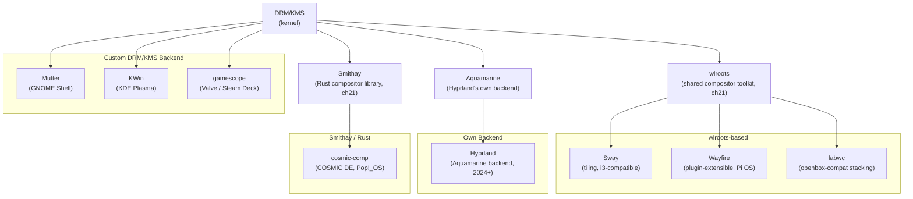

The eight compositors covered in this chapter span a wide range of architectural choices, target audiences, and protocol ambitions. The table below provides a bird's-eye comparison across the dimensions that matter most to graphics developers: the underlying toolkit, implementation language, primary use case, session model, Wayland protocol coverage, GPU API, and the single most distinctive technical characteristic of each compositor. These dimensions are unpacked in detail in the sections that follow.

| Compositor | Foundation | Language | Primary DE / use case | Session type | Protocol tier | GPU API | Notable differentiator |
|---|---|---|---|---|---|---|---|
| Mutter | Custom (MetaBackendNative) | C | GNOME Shell | Wayland + X11 (XWayland) | Extensive (xdg-shell, KMS overlay, HDR) | OpenGL (NGL renderer) | GTK/GNOME integration; Clutter scene graph; MetaPlugin/GJS scripting |
| KWin | Custom (DrmBackend) | C++/QML | KDE Plasma | Wayland + X11 (XWayland) | Extensive (xdg-shell, KMS overlay, HDR, explicit sync) | OpenGL + software (ScenePainter) | Qt/QML scene graph; most complete protocol coverage of any desktop compositor |
| Sway | wlroots | C | Tiling WM (i3 replacement) | Wayland-only | Core (xdg-shell, layer-shell) | GLES2 (wlr_renderer) | i3-compatible config; minimal, scriptable via IPC |
| Hyprland | Aquamarine (own backend, 2024+) | C++ | Dynamic tiling + animation | Wayland-only | Core + Hyprland extensions | GLES2 (custom renderer) | Bezier animations; hyprpm plugin API; Aquamarine rendering-API-agnostic backend |
| Wayfire | wlroots | C++ | Plugin-extensible stacking (Pi OS default) | Wayland-only | Core + extensions | GLES2 (wlr_renderer + wf::OpenGL) | Runtime plugin system (dlopen); default compositor on Raspberry Pi OS Bookworm |
| labwc | wlroots | C | Minimal stacking (openbox-compatible) | Wayland-only | Core (12 protocols) | GLES2 (wlr_renderer) | openbox rc.xml config; adopted by LXQt; minimal footprint |
| gamescope | Vulkan (custom) + libvulkan | C++ | Gaming / Steam Deck | Nested Wayland or KMS-direct | Gaming-focused (VRR, HDR, latency) | Vulkan | FSR/NIS upscaling as Vulkan compute; libliftoff plane assignment; Steam Deck display stack |
| COSMIC Compositor | Smithay (Rust) | Rust | COSMIC DE (System76) | Wayland-only | Growing | GLES2 + multi-GPU (GlMultiRenderer) | First major Rust-native production compositor; safe ownership model via Smithay |

### Feature Matrix: Compositors vs. Toolkit Libraries (ch21 ↔ ch22)

The table below zooms in on feature support and maps each production compositor back to the toolkit libraries from Chapter 21 that supply — or don't supply — those features. The first two rows (wlroots and Smithay) are included as library baselines, not compositors. Features marked *via lib* mean the compositor inherits the capability from its upstream toolkit library rather than implementing it directly; this matters because it tells you which capabilities land in multiple wlroots-based compositors simultaneously when the library is updated.

**Columns:**
- **VRR**: Variable-refresh-rate via `VRR_ENABLED` KMS connector property
- **HDR**: High dynamic range output — colour metadata via `HDR_OUTPUT_METADATA` KMS blob or ICC profile pipeline
- **Direct scanout**: Promoting a client buffer directly to a KMS overlay plane, bypassing the compositor render pass
- **Explicit sync**: `wp_linux_drm_syncobj_v1` — GPU timeline fence synchronisation between client and compositor (see Chapter 20 §8)
- **Multi-GPU**: Rendering across two or more GPUs with cross-device DMA-BUF handoff
- **XWayland**: Running X11 clients inside the Wayland session
- **Plugin/ext API**: A stable extension point for third-party code (shared library plugins or scripted effect APIs)

| | Type | Lang | DRM backend | Renderer(s) | Scene graph | XWayland | VRR | HDR | Direct scanout | Explicit sync¹ | Multi-GPU | Plugin API |
|---|---|---|---|---|---|---|---|---|---|---|---|---|
| **wlroots** (ch21 §1–10) | Library | C | drm, wayland, headless, X11 | GLES2, Vulkan, pixman | `wlr_scene` | yes (`wlr_xwayland`) | yes | Vulkan path only (partial) | yes (`wlr_scene` hw planes) | yes (0.18+) | partial | N/A — library |
| **Smithay** (ch21 §11) | Library | Rust | DRM, wayland, winit | GlesRenderer, PixmanRenderer, GlMultiRenderer | `smithay::desktop::space` | yes | yes | no (0.7.0) | yes (`DrmCompositor`) | no (0.7.0) | yes (GlMultiRenderer) | N/A — library |
| **Mutter** | Compositor lib | C | Custom (`MetaBackendNative`) | OpenGL (NGL), Cogl legacy | `ClutterStage` / `ClutterActor` | yes (`MetaXWaylandManager`) | yes (GNOME 45+) | yes (colord ICC, GNOME 47+) | yes (`MetaKmsPlane`) | yes (GNOME 48+) | yes | yes (`MetaPlugin` via GJS) |
| **KWin** | Compositor | C++ | Custom (`DrmBackend`, `DrmGpu`) | OpenGL (`SceneOpenGL`), software (`ScenePainter`) | KWin `SceneFrame` / `WindowItem` | yes | yes | yes (Plasma 6.0) | yes (`tryDirectScanout`) | yes (Plasma 6.1) | yes | yes (Effects API, QML scripting) |
| **Sway** | Compositor | C | via wlroots | GLES2 (via wlroots) | `wlr_scene` (via wlroots) | yes (optional build flag) | yes (*via lib*) | no | yes (*via lib*) | yes (*via lib*, wlroots 0.18+) | limited | no (IPC + config scripting) |
| **Hyprland** | Compositor | C++ | Aquamarine (own) | GLES2 (own renderer) | Own scene graph | yes (optional) | yes | experimental | yes | yes | yes (`DrmCompositor`-style) | yes (hyprpm C++ `.so` plugins) |
| **Wayfire** | Compositor | C++ | via wlroots | GLES2 (`wlr_renderer` + `wf::OpenGL`) | `wf::scene` (extends `wlr_scene`) | yes (optional) | yes (*via lib*) | no | partial (*via lib*) | yes (*via lib*, wlroots 0.18+) | limited | yes (`wf::plugin_interface_t` dlopen) |
| **labwc** | Compositor | C | via wlroots | GLES2 (via wlroots) | `wlr_scene` (via wlroots) | yes | yes (*via lib*) | no | yes (*via lib*) | yes (*via lib*, wlroots 0.18+) | limited | no |
| **gamescope** | Micro-compositor | C++ | Vulkan + direct KMS (`libvulkan`, `libdrm`) | Vulkan (`rendervulkan.cpp`) | Simple plane list (`steamcompmgr`) | yes (required — hosts Xwayland game) | yes | yes (own HDR pipeline, no colord) | yes (`libliftoff` plane assignment) | yes | yes | no |
| **cosmic-comp** | Compositor | Rust | via Smithay (`DrmDevice`) | GLES2 + multi-GPU (via Smithay) | `smithay::desktop::space` (via Smithay) | yes (via Smithay) | yes (*via lib*) | no | yes (*via lib*, `DrmCompositor`) | no (*lib* limitation, Smithay 0.7.0) | yes (*via lib*, `GlMultiRenderer`) | no |

¹ `wp_linux_drm_syncobj_v1` — requires kernel DRM syncobj support and a client that advertises `linux_drm_syncobj_surface_v1`.

**Reading the table.** The *via lib* annotation is the key insight: wlroots-based compositors (Sway, Wayfire, labwc) and Smithay-based compositors (cosmic-comp) inherit capability additions automatically when the upstream library gains them. When wlroots 0.18 shipped `wp_linux_drm_syncobj_v1` support in 2024, all three wlroots-based compositors gained explicit sync in the same release cycle. Conversely, if a feature requires compositor-level policy (HDR tone-mapping decisions, plugin isolation, layout logic) it cannot come from the library alone — each compositor must implement it independently. The HDR column illustrates this: wlroots has partial Vulkan-path HDR, but no wlroots-based compositor has shipped a complete user-visible HDR pipeline as of 2026, while Mutter, KWin, and gamescope — all with custom backends — have done so.

Hyprland's migration to Aquamarine (§5) gives it the autonomy of the custom-backend compositors without the legacy C codebase: it can ship VRR, direct scanout, multi-GPU, and its own explicit-sync implementation on its own schedule, independent of wlroots releases. The cost is full ownership of the backend stack.

gamescope stands apart from every other row: it is the only compositor that makes Vulkan the *primary* rendering API rather than a secondary renderer, and the only one where XWayland is a *hard dependency* (it hosts the game's X11 window) rather than an optional legacy bridge. Its HDR pipeline bypasses both `colord` and `wp_color_management_v1` in favour of direct `HDR_OUTPUT_METADATA` KMS blob writes, giving it lower latency at the cost of compositing-stack portability.

---

## 2. Mutter: GNOME Shell's Compositor

### Architecture

Mutter is a library, not an application. GNOME Shell loads Mutter as a library and exposes its functionality through a GObject-based API to GNOME Shell's JavaScript (GJS) scripting environment. This separation of concerns is important: window management policy lives in GNOME Shell's JavaScript code, while the mechanics of compositing, KMS interaction, and Wayland protocol handling live in Mutter's C implementation. When users see GNOME's animations — the workspace slide, the application spread, the magic lamp minimize — those animations are implemented as JavaScript calling into Mutter's Clutter-based scene graph.

The central architectural divide in Mutter is the choice of backend. `MetaBackendNative` is the production backend for Wayland sessions: it directly owns the DRM file descriptor, drives KMS, allocates GBM buffers, and manages EGL surfaces. `MetaBackendX11` is used when Mutter runs as a compositing manager inside an existing X11 session, relying on X11's window system infrastructure rather than raw KMS. On a modern GNOME desktop, `MetaBackendNative` is what runs.

### The KMS Object Model

Mutter wraps the KMS resource hierarchy described in Chapter 2 with a set of GObject classes. A `MetaGpu` represents a GPU (a `/dev/dri/cardN` device). Each GPU contains `MetaCrtc` objects (hardware display controllers) and `MetaOutput` objects (physical connectors). `MetaMonitor` represents the logical display as presented to the user — a monitor can be formed from multiple CRTCs in the case of hardware cloning, or from a single CRTC for the common case. `MetaMonitorManager` is the singleton that tracks all monitors, processes hotplug events from DRM, and exposes the display layout to GNOME Shell.

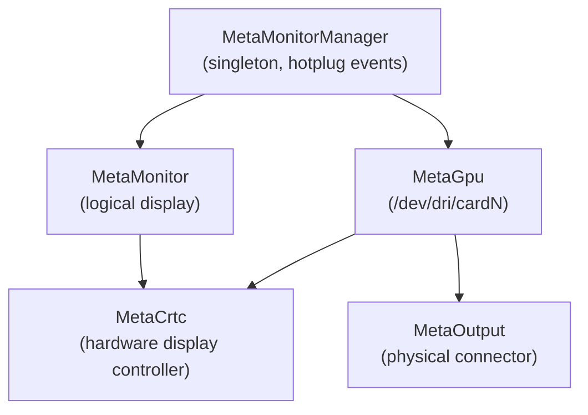

### The KMS Thread

The most sophisticated piece of engineering in Mutter is its KMS thread design. The problem it solves is straightforward to state but subtle to implement: `ioctl(DRM_IOCTL_ATOMIC_COMMIT)` can block for up to one full VBlank interval (16.7 ms at 60 Hz) when the kernel is waiting for the previous page flip to complete before accepting the next one. If this ioctl runs on the Clutter main thread — where all GJS execution, input event dispatch, and scene graph traversal also happen — then every frame causes the entire shell UI to stall for up to one VBlank. At 60 Hz this is acceptable in most cases, but under real-time scheduling constraints or on high-refresh-rate displays, it becomes a source of jitter and dropped frames.

Mutter's solution is the `MetaKms` subsystem: all KMS ioctls run on a dedicated kernel mode-setting thread. The public-facing `MetaKms` API is safe to call from the main thread; it enqueues work items that the KMS thread processes asynchronously. A `MetaKmsUpdate` object represents a transactional batch of KMS operations — plane assignments, mode sets, property changes — that will be processed atomically when posted via `meta_kms_device_post_pending_update`. The KMS thread picks up these updates, submits the atomic commit, and notifies the main thread via a callback when the page flip event arrives.

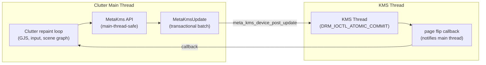

```c
/* Source: mutter/src/backends/native/meta-kms-update.h and meta-kms-device.h
 * (GNOME/mutter main branch, June 2026)
 * MetaKmsUpdate represents a single atomic commit transaction.
 * Callers build up the update on the main thread, then post it;
 * the KMS thread owns the actual DRM_IOCTL_ATOMIC_COMMIT call.
 */

/* Create a new update transaction for a specific device */
MetaKmsUpdate *update = meta_kms_update_new(kms_device);

/* Assign a framebuffer to a plane; last arg is MetaKmsAssignPlaneFlag */
meta_kms_update_assign_plane(update, crtc, plane, buffer,
                              src_rect, dst_rect,
                              META_KMS_ASSIGN_PLANE_FLAG_NONE);

/* Set the CRTC gamma via a MetaGammaLut struct */
meta_kms_update_set_crtc_gamma(update, crtc, gamma);

/* Post asynchronously; the KMS thread takes ownership and calls
 * DRM_IOCTL_ATOMIC_COMMIT without blocking the Clutter loop.
 * Use meta_kms_device_process_update_sync() for a blocking variant. */
meta_kms_device_post_update(kms_device, update,
                             META_KMS_UPDATE_FLAG_NONE);
```

In 2024, Mutter switched the KMS thread from real-time (`SCHED_RR`) priority to high-priority scheduling to avoid situations where the real-time thread could hold the CPU indefinitely and cause GNOME Shell's process to be killed by the watchdog. The underlying design — a dedicated thread owning all KMS ioctls — remains unchanged.

### The Clutter Scene Graph and Repaint Loop

Mutter uses the Clutter toolkit as its scene graph. Every visible element is a `ClutterActor`; the root is a `ClutterStage` mapped to one EGL surface per CRTC. Within the scene graph, `MetaSurfaceActor` wraps a `MetaWaylandSurface` (for Wayland clients) or an XWayland window (as `MetaSurfaceActorX11`). Each window is represented by a `MetaWindowActor` that contains a `MetaSurfaceActor` plus space for decorations, shadows, and effect rendering.

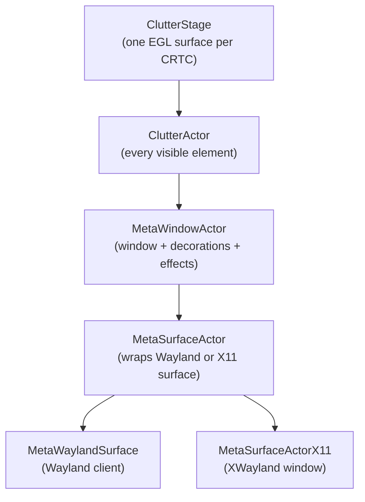

The repaint loop is damage-driven. When a client commits a new buffer to a `wl_surface`, Mutter marks the corresponding `MetaSurfaceActor` as damaged and calls `clutter_stage_schedule_update`. Clutter's frame clock — a `ClutterFrameClock` tracking VBlank intervals using `CLOCK_MONOTONIC` timestamps from DRM page flip events — schedules a repaint callback timed to arrive just before the predicted VBlank. The repaint traverses the scene graph, composites dirty actors into the EGL framebuffer, and then posts a `MetaKmsUpdate` with the result to the KMS thread for atomic commit.

### Effects and the MetaPlugin Interface

GNOME Shell effects are implemented through `MetaPlugin`, a GObject interface that receives lifecycle notifications for windows. The `map`, `minimize`, `destroy`, and `switch_workspace` virtual methods are called by Mutter at the appropriate moments; GNOME Shell's default plugin implements them using Clutter timeline transitions. GPU shader effects are applied via `ClutterEffect` and `ClutterOffscreenEffect`, which redirect a subtree of the scene graph to an offscreen framebuffer, apply a fragment shader, and composite the result back.

### Colour Management

Mutter's `MetaColorManager` reads ICC profiles from `colord`, maps them to KMS colour transformation matrix (`CTM`) and gamma (`GAMMA_LUT`) properties, and programs them through the `MetaKmsUpdate` path. With GNOME 48, Mutter merged server-side support for `wp_color_management_v1` — but note that as of wayland-protocols 1.47 (December 2025), this protocol remains in the **staging** category (not yet promoted to stable), at version 2. Applications using `wp_color_management_v1` should check for protocol availability at runtime and handle its absence gracefully, as discussed in Section 7.

### XWayland in Mutter

`MetaXWaylandManager` supervises the XWayland process. Mutter starts XWayland lazily on first demand from an X11 application and emits a "ready" signal when XWayland's listening socket is available. Override-redirect windows (tooltips, popup menus, xdg-popup equivalents in the X11 world) require special handling because they bypass the normal window manager stack; Mutter tracks them via `META_WINDOW_OVERRIDE_REDIRECT` and composites them above all other windows. See Chapter 23 for the full XWayland architecture.

### EGLStreams Removed in GNOME 51

GNOME 51 (2025) removed `EGLDevice` / `EGLStreams` support from Mutter. EGLStreams was an NVIDIA-proprietary buffer-sharing mechanism dating from the GNOME 3.x era that allowed NVIDIA's proprietary driver to hand buffers to Mutter without going through the GBM / `linux-dmabuf` path used by every other GPU driver. The mechanism required Mutter to maintain a separate code path — a `MetaRendererNativeGpuData` mode for EGLDevice alongside the standard GBM mode — increasing complexity without benefiting users on modern hardware.

The removal is safe because all current NVIDIA configurations on Wayland use GBM and `linux-dmabuf`. NVIDIA's proprietary driver added GBM support in driver version 495; nvidia-open, which ships with all Turing+ GPUs in distributions that adopt it, has used GBM from its first release. Explicit sync via `wp_linux_drm_syncobj_v1` (Chapter 3) — the mechanism that closed the NVIDIA tearing and frame-race issue — operates on top of `linux-dmabuf`, not EGLStreams. The EGLStreams removal does not affect explicit sync. See Chapter 3 for the distinction between these two mechanisms.

---

## 3. KWin: KDE Plasma's Compositor

### Architecture Overview

KWin is a C++/Qt application — not a library — that is simultaneously an X11 window manager and a Wayland compositor. This distinguishes it structurally from Mutter, which is a library loaded by GNOME Shell (§2). KWin embeds a `QQmlEngine` for its own effect and scripting system; the Plasma Shell (desktop widgets, panels, system tray) runs as a separate `plasmashell` process and communicates with KWin via the `org_kde_plasma_shell` Wayland protocol. KDE Frameworks 6 (KF6) at version 6.27+ forms the middleware layer between Qt 6.10 and KWin: `KConfig` provides settings persistence, `KDecoration3` supplies the decoration plugin API for Qt Quick-based window themes, `KWindowSystem` provides cross-desktop window management abstractions, `KGlobalAccel` handles global keyboard shortcuts, and `KPackage` loads QML effect bundles from disk. [Source: `kwin/CMakeLists.txt`](https://invent.kde.org/plasma/kwin/-/blob/master/CMakeLists.txt)

In an X11 session KWin uses the X Composite extension to obtain off-screen redirects of all windows and composites them using OpenGL or QPainter. In a Wayland session it is the DRM/KMS owner and composites Wayland surfaces directly. The `KWin::Compositor` class hierarchy handles both modes; the Wayland path is routed through `KWin::WaylandCompositor`, which owns the `DrmBackend`. KWin registers itself on D-Bus as `org.kde.KWin` at startup — this is the interface used by `kscreen` for display configuration, by the lock screen to verify the compositor's liveness, and by scripts invoking `qdbus org.kde.KWin`.

### The Rendering Scene

KWin's rendering is abstracted by a scene system. `SceneOpenGL` is the production renderer: it uses KWin's own OpenGL/GLES2 wrapper layer (`GLPlatform`, `GLShader`, `GLFramebuffer`) rather than calling Mesa directly, which gives KWin control over shader compilation and caching. `ScenePainter` is a software fallback using QPainter, used in cases where GPU rendering is unavailable. A Vulkan backend has been under development but was not in production use as of early 2026. Each output gets a `SceneDelegate` that owns the per-output rendering pass.

### The Effect System

KWin's effect system is the most powerful in any Linux desktop compositor. Every effect is a shared library implementing the `Effect` base class. At render time, KWin calls each effect's `prePaintScreen`, `paintScreen`, `prePaintWindow`, and `paintWindow` hooks, allowing effects to intercept and modify the rendering pipeline at multiple levels.

```cpp
/* Source: kwin/src/effect/effect.h and a typical effect plugin
 * An effect overrides paintWindow to modify how each window is drawn.
 * PaintWindowData carries opacity, brightness, saturation, and the
 * damage region; effects can alter these before calling the next stage.
 */
class MyEffect : public KWin::Effect {
    Q_OBJECT
public:
    void paintWindow(KWin::PaintWindowData &data) override {
        if (isAnimating(data.window())) {
            data.setOpacity(data.opacity() * m_animProgress);
        }
        effects->drawWindow(data);  /* call down the chain */
    }
private:
    float m_animProgress = 1.0f;
};
```

Built-in effects include the Kawase blur (a dual-pass blur using progressive downscaling that achieves large blur radii at low cost), the "Magic Lamp" minimize animation, "Wobbly Windows" (a spring-mesh simulation applied to window vertices at render time), and the Overview effect that implements the GNOME-style expose view. The blur effect uses a compositor-specific Wayland extension — `org_kde_kwin_blur` — to allow clients to request blurred backgrounds beneath transparent windows.

### DRM/KMS Backend

KWin's DRM backend is implemented in `kwin/src/backends/drm/`. The object hierarchy mirrors the kernel's: `DrmBackend` owns one or more `DrmGpu` objects, each of which contains `DrmOutput`, `DrmCrtc`, `DrmPlane`, and `DrmConnector` objects. All modesetting uses the atomic API; `DrmAtomicCommit` wraps the `drmModeAtomicCommit` call with TEST_ONLY support for validating configurations before committing them.

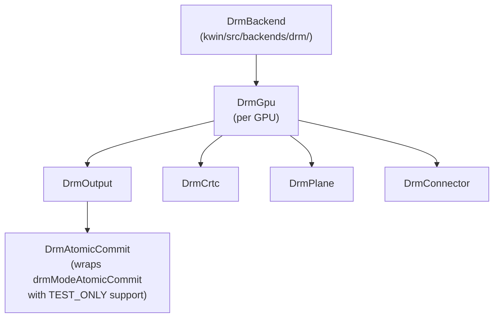

Multi-GPU operation places the rendering GPU (typically the discrete GPU) as the primary and uses secondary GPUs for outputs. The `DrmGpu::renderingEnabled()` flag controls whether a GPU participates in rendering or only in scanout, enabling configurations like an NVIDIA discrete GPU driving an external display via KMS while an integrated Intel GPU handles the internal laptop panel.

### Direct Scanout

When a Wayland client presents a buffer that is already at the correct display resolution, in a format and with a modifier that the target KMS plane supports natively, KWin can bypass its compositing pass entirely and place the client buffer directly on a hardware plane. The check in `DrmOutput::tryDirectScanout` tests the buffer's format and DRM format modifier against the plane's supported list, then submits a TEST_ONLY atomic commit to verify that the kernel's driver will accept the assignment. If the test passes, KWin submits the real commit with the client buffer occupying the primary plane — no GPU compositing occurs. For full-screen games on native resolution this can eliminate a full GPU render pass per frame and reduce latency significantly.

### HDR Support (Plasma 6.0+)

KWin's HDR implementation, the most complete on any Linux desktop compositor as of 2026, was introduced in Plasma 6.0 (released February 2024). The central abstraction is `ColorDescription`, which models the colour volume, peak luminance, and transfer function of a surface or output. KWin's compositing shader performs tone mapping from the source colour space to the output colour space for every window — an HDR game can be composited alongside SDR desktop windows because KWin operates in a linearised scene-referred colour space throughout.

On the output side, KWin maps `ColorDescription` to the `HDR_OUTPUT_METADATA` and `COLORSPACE` KMS properties via `DrmOutput::setColorDescription`. It discovers HDR-capable displays by reading EDID HDRDB (HDR Static Metadata Descriptor Block) information through the `DrmOutput::information()` path and checking for `HDR_OUTPUT_METADATA` plane support in the atomic property namespace.

Client-side HDR metadata arrives via `wp_color_management_v1` (staging, version 2 as of 2025) and is attached to the surface's `ColorDescription`. KWin then incorporates that metadata into its tone-mapping pass.

### Explicit Synchronisation (Plasma 6.1+)

The `wp_linux_drm_syncobj_v1` protocol, which allows clients and compositors to express acquire/release synchronisation using DRM timeline semaphores, was first implemented in KWin for Plasma 6.1 (June 2024). This was a particularly important feature for NVIDIA proprietary driver users: before explicit sync, the implicit synchronisation model in Wayland caused severe rendering artefacts because NVIDIA's kernel driver does not participate in the implicit fence infrastructure that Mesa-based drivers provide. With explicit sync, clients attach DRM syncobj timeline points to each buffer commit; KWin waits on the acquire point before reading the buffer and signals the release point after the compositing pass completes. This eliminated an entire class of visual corruption that had plagued NVIDIA Wayland users.

```cpp
/* Source: kwin/src/backends/drm/drm_output.cpp (illustrative)
 * When explicit sync is active, the DRM atomic commit carries timeline
 * fence acquire/release points rather than relying on implicit fencing.
 * The acquire point must be signalled by the client before KWin reads
 * the buffer; the release point is signalled after scanout completes.
 */
DrmAtomicCommit commit(m_pipeline->gpu());
if (m_syncObj) {
    commit.addProperty(m_primaryPlane, DrmPlane::PropertyIndex::InFence,
                       m_syncObj->acquireTimelinePoint());
    commit.addProperty(m_primaryPlane, DrmPlane::PropertyIndex::OutFence,
                       m_syncObj->releaseTimelinePoint());
}
commit.addProperty(m_primaryPlane, DrmPlane::PropertyIndex::FbId,
                   m_currentBuffer->framebuffer()->id());
commit.commit();
```

### VRR and Scripting

KWin implements per-output VRR (Variable Refresh Rate / adaptive sync) through `DrmOutput::setVrrPolicy`. Applications can request VRR via the `wp_fifo_v1` protocol or via KWin's own game detection heuristics. The scripting API allows users to write JavaScript rules that are evaluated for every window (`KWin.readConfig`, `registerShortcut`, the `org.kde.kwin.qml` QML context), enabling custom window management policies without writing a KWin plugin.

### Window and Workspace Model

KWin's window management centres on a small set of `QObject` subclasses. `KWin::Workspace` is a process-level singleton that owns all managed windows and outputs. `KWin::Window` is the abstract `QObject` base class for every manageable surface; its concrete subclasses include `X11Window` (manages an X11 client via XCB), `WaylandWindow` (manages a Wayland `xdg_toplevel`, `xdg_popup`, or layer-shell surface), and `InternalWindow` (KWin's own pop-up surfaces such as effect overlays and drag-and-drop windows). [Source: `kwin/src/window.h`, `kwin/src/x11window.h`, `kwin/src/waylandwindow.h`](https://invent.kde.org/plasma/kwin/-/tree/master/src)

```cpp
/* Source: kwin/src/window.h (simplified)
 * Window is the abstract base for all manageable surfaces.
 * X11Window, WaylandWindow, and InternalWindow override virtual methods
 * to provide protocol-specific implementations.
 */
class KWIN_EXPORT Window : public QObject
{
    Q_OBJECT
    Q_PROPERTY(bool active       READ isActive       NOTIFY activeChanged)
    Q_PROPERTY(bool minimized    READ isMinimized    NOTIFY minimizedChanged)
    Q_PROPERTY(bool fullScreen   READ isFullScreen   NOTIFY fullScreenChanged)
    Q_PROPERTY(QRectF frameGeometry READ frameGeometry NOTIFY frameGeometryChanged)
public:
    virtual bool acceptsFocus() const = 0;
    virtual bool isClient() const;
    virtual void closeWindow() = 0;
    virtual WindowType windowType() const = 0;
Q_SIGNALS:
    void activeChanged();
    void frameGeometryChanged();
    void minimizedChanged();
    void desktopsChanged();
};
```

`KWin::Workspace` exposes the policy layer: `findWindow()`, `activateWindow()`, `raiseWindow()`, `sendWindowToDesktops()`, `setShowingDesktop()`. All window lifecycle events emit Qt signals — `windowAdded(Window *)`, `windowRemoved(Window *)`, `windowActivated(Window *)`, `stackingOrderChanged()`, `outputOrderChanged()` — that the effect system and QML scripting layer connect to. `VirtualDesktopManager` tracks the virtual desktop set; each `Window` carries a `QList<VirtualDesktop *>` accessible via `desktops()`.

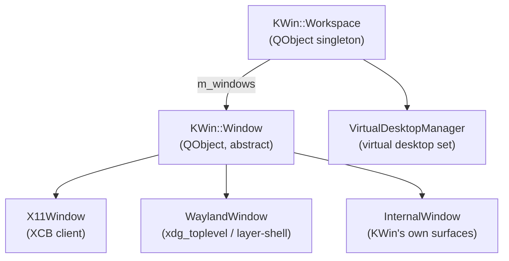

From QML and JavaScript scripts, the `KWin.clientList()` function (exposed via the `org.kde.kwin` QML module) returns an array of `Window` objects whose `Q_PROPERTY` values — `active`, `minimized`, `fullScreen`, `frameGeometry`, `caption`, `desktops` — are accessible as plain QML property references. A script can bind `item.opacity = window.minimized ? 0 : 1` and the QML engine re-evaluates the binding whenever `minimizedChanged` fires, with no boilerplate signal connection in the script code.

### KDE Frameworks Integration

KDE Frameworks 6 (KF6) at version 6.27+ forms the middleware layer between Qt 6 and KWin. The frameworks used directly by KWin include:

| Framework | Purpose in KWin |
|---|---|
| `KConfig` | Reading and writing user settings (compositor options, per-effect configuration) |
| `KWindowSystem` | Cross-desktop window management abstraction; taskbar/pager integration |
| `KDecoration3` | Decoration plugin API — the interface that lets Qt Quick-based themes render title bars |
| `KGlobalAccel` | Global keyboard shortcut registration and dispatch |
| `KPackage` | Loading packaged QML/JavaScript effect bundles from the file system |
| `KCrash` | Crash handler that generates backtraces and optionally restarts the compositor |
| `KAuth` | PolicyKit-based privilege escalation for display configuration |
| `KDBusAddons` | D-Bus service registration; KWin registers `org.kde.KWin` at startup |

**`KDecoration3`** is the most renderer-visible of these. Window decorations in KDE Plasma are not drawn by KWin directly — they are Qt Quick applications loaded as `KDecoration3::Decoration` plugins. Each plugin renders its decoration into a `QImage` or a Qt Quick `Item`, which KWin composites around the window frame. Changing the KDE window theme installs a different `KDecoration3` plugin; no compositor code changes are required. The decoration API declares virtual methods `paint()`, `init()`, `resize()`, and `settings()` that each theme implements, with `KDecoration3::DecoratedClient` providing the window state (caption, active state, button list) that the theme reads for rendering.

**Plasma Shell** is the most architecturally significant Wayland client of KWin. The `plasmashell` process (part of `plasma-workspace`) connects to KWin as a Wayland client and uses the `org_kde_plasma_shell` protocol (see below) to declare surface roles — panel, desktop, on-screen display — to the compositor. The desktop widgets, notification popups, task manager, and system tray are all QML `Item` objects rendered by Plasma Shell's own `QQmlEngine` and composited by KWin as plasma-shell or layer-shell surfaces. This mirrors the GNOME Shell / Mutter relationship (§2), with the difference that GNOME Shell loads Mutter as a library and runs in the same process, while Plasma Shell is a fully separate process communicating via Wayland.

### KDE-Specific Wayland Protocols

KWin implements a suite of KDE-private Wayland protocols that extend the standard `wayland-protocols` and `xdg-shell` interfaces. These live in `kwin/src/wayland/` as XML protocol files compiled to C++ stubs by `wayland-scanner`. [Source: `kwin/src/wayland/CMakeLists.txt`](https://invent.kde.org/plasma/kwin/-/blob/master/src/wayland/CMakeLists.txt)

| Protocol XML | Interface prefix | Purpose |
|---|---|---|
| `shadow.xml` | `org_kde_kwin_shadow` | Clients request drop shadows composited by KWin |
| `blur.xml` | `org_kde_kwin_blur` | Clients request background blur beneath transparent regions |
| `slide.xml` | `org_kde_kwin_slide` | Clients declare slide-in direction for map/unmap animations |
| `server-decoration.xml` | `org_kde_kwin_server_decoration` | Negotiate client-side vs server-side (`KDecoration3`) window borders |
| `plasma-shell.xml` | `org_kde_plasma_shell` | Plasma Shell declares surface roles: panel, desktop, on-screen display |
| `plasma-window-management.xml` | `org_kde_plasma_window_management` | Taskbar/pager integration: window list, thumbnails, close/minimize/activate |
| `kde-output-management-v2.xml` | `kde_output_management_v2` | `kscreen` daemon sends display layout changes (resolution, position, rotation) |
| `kde-output-order-v1.xml` | `kde_output_order_v1` | Compositor declares the primary output ordering used by KScreen |
| `org-kde-plasma-virtual-desktop.xml` | `org_kde_plasma_virtual_desktop` | Taskbar queries and modifies the virtual desktop set |
| `dpms.xml` | `org_kde_kwin_dpms` | Remote power-management: blank/unblank individual outputs |
| `zkde-screencast-unstable-v1.xml` | `zkde_kwin_screencast_unstable_v1` | Screen recording via PipeWire — used by Spectacle and OBS |

`org_kde_kwin_blur` and `org_kde_kwin_shadow` are consumed entirely inside the compositor: a window that binds these interfaces attaches a blur or shadow object to its `wl_surface`; KWin reads the attachment during its compositing pass and includes the corresponding effect in that surface's render item. No round-trip to another process is required — the protocol is a direct hint from the client surface to the in-process renderer.

`kde_output_management_v2` demonstrates a different pattern: the external `kscreen` daemon (part of Plasma) uses this protocol to instruct KWin to apply display layout changes atomically. This separates display configuration policy (in `kscreen`) from mechanism (in KWin), analogous to how `colord` separates ICC profile management from Mutter's `MetaColorManager` (§2).

`zkde_kwin_screencast_unstable_v1` underpins all screen recording and screencasting on KDE Plasma. When a client requests a stream, KWin allocates a DMA-BUF-backed PipeWire stream, feeds it rendered frames, and returns the PipeWire node ID to the client. Spectacle (the screenshot tool), KDE Connect's screen mirroring, and OBS on Wayland all consume this stream.

### XWayland in KWin

KWin's XWayland integration follows the same structural pattern as Mutter's `MetaXWaylandManager` (§2) but is implemented in C++/Qt style in `kwin/src/xwayland/`. When KWin starts a Wayland session it creates an `Xwayland` object that manages the lifecycle of the `Xwayland` process, opens the listening socket, and emits a Qt signal `started()` when XWayland reports its `DISPLAY` number. `KWin::X11Window` objects are created for each XWayland client as it maps windows; they inherit from `KWin::Window` and participate in the same focus, stacking-order, and virtual-desktop machinery as `WaylandWindow` objects. Because `X11Window` satisfies the same `Window` interface, effects and scripting that operate on the window list work transparently across Wayland and XWayland clients.

Override-redirect X11 windows — tooltips, popup menus, drag-and-drop windows — are handled as `X11Window` instances with `overrideRedirect()` returning true; KWin composites them above the normal stacking order without applying window management policy (no decorations, no virtual desktop placement). This is architecturally equivalent to Mutter's `META_WINDOW_OVERRIDE_REDIRECT` path described in §2. For the full XWayland protocol architecture, rootful vs rootless modes, and security boundaries, see Chapter 23.

---

## 4. Sway: Tiling with wlroots

### Relationship to i3 and Architecture

Sway is the spiritual successor to i3 on Wayland. It implements the same configuration file syntax, the same tree-based tiling algorithm, and the same IPC protocol as i3, allowing users to migrate from an i3 X11 setup with minimal change to their workflows. Underneath, Sway is built on wlroots — it delegates DRM/KMS management, input handling, EGL/GLES2 rendering, and core Wayland protocol implementations to the wlroots library described in Chapter 21.

The top-level initialisation in `sway/server.c` creates a `wlr_backend` (which wlroots auto-selects as DRM, libinput, and Wayland/X11 as appropriate), a `wlr_renderer` (GLES2 for hardware, Pixman for software), and a `wlr_compositor`. From there, Sway registers listeners for wlroots events — `wlr_xdg_shell::new_surface`, `wlr_output::frame`, `wlr_seat::pointer_grab_begin` — and implements its window management logic on top of them.

### The Container Tree

Sway's layout is a rooted tree. At the top level, a workspace belongs to an output; within a workspace, containers can be arranged in horizontal or vertical split mode or in tabbed/stacked mode. Leaf nodes are `sway_container` objects that wrap a `wlr_xdg_surface` (for Wayland clients) or a `wlr_xwayland_surface`. Floating windows exist in a separate list attached to the workspace and are rendered above tiled containers.

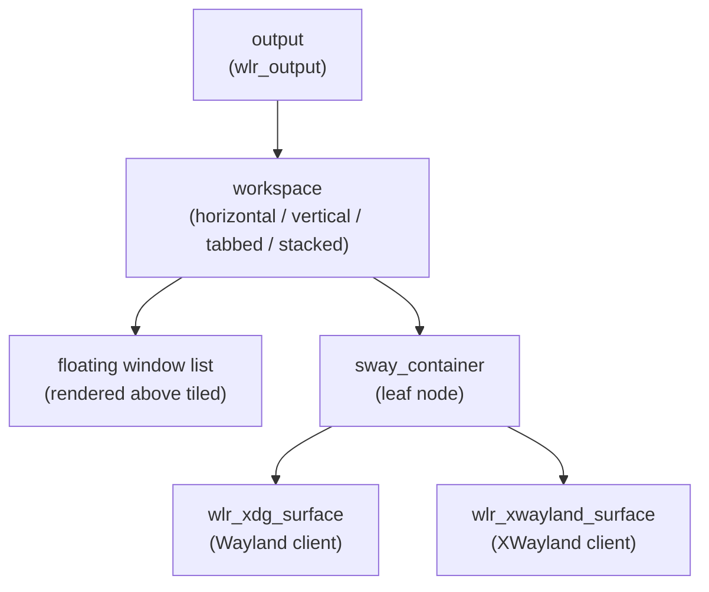

Window criteria — the `[app_id="firefox"]` matchers familiar from i3 — are evaluated against the `app_id` and `title` properties of `wlr_xdg_toplevel` (for Wayland) or the WM_CLASS and WM_NAME X11 properties (for XWayland). Sway evaluates criteria at window creation and when window properties change, allowing `assign` rules to direct specific applications to pre-determined workspaces or layouts.

### IPC Protocol

Sway's IPC protocol is a superset of i3's, carried over a Unix domain socket. Commands are JSON-encoded messages with a fixed 14-byte header (magic string, payload length, message type). The `swaymsg -t subscribe '["window", "workspace"]'` command subscribes to events; Sway emits a JSON object for each event containing the event type, the affected container's properties (app_id, title, focused, PID, workspace), and the triggering action.

```bash
# Source: sway IPC protocol, sway-ipc(7) manpage
# Subscribe to window focus events and print each event as it arrives.
swaymsg -t subscribe '["window"]' | while IFS= read -r event; do
    echo "$event" | jq '.change, .container.app_id, .container.focused'
done
```

Applications that need to communicate with Sway — status bars, window switchers, notification daemons — use this IPC interface. The `swaybar` protocol extends IPC to allow a status bar program to stream JSON "blocks" to Sway for rendering in the bar, identical to i3's JSON bar protocol.

### Layer Shell and Security

Sway uses `zwlr_layer_shell_v1` for its own system UI: `swaybar` is a layer shell surface on the bottom layer, `swaylock` uses `ext_session_lock_v1` to present a secure lock screen that the compositor prevents other surfaces from covering or screenshotting. When `ext_session_lock_v1` is active, Sway does not allow `zwlr_screencopy_manager_v1` captures, preventing applications from screenshotting through the lock screen — a security property that depends on Sway's cooperation and is not enforced at the Wayland protocol level alone.

Sway's rendering path does not include a custom effects pipeline. Window transitions are instantaneous; there are no animations. The wlroots scene graph handles damage tracking and GLES2 compositing. This simplicity is a feature for users who prioritise latency and predictability over visual effects.

---

## 5. Hyprland: Animations and Extensibility

### Design Philosophy

Hyprland occupies a position between Sway's minimalism and KWin's full-featured complexity. It has invested heavily in a custom rendering layer, a first-class animation system, and an extensible plugin API — features that Sway deliberately excludes. The result is a compositor that offers animated workspace transitions, rounded window corners, per-window blur, and drop shadows. Hyprland was originally built on wlroots, but completed a migration to its own **Aquamarine** backend library in 2024–2025, replacing wlroots entirely. [Source: Hyprland dev blog](https://blog.vaxry.net/articles/2024-wlrootsRewrite)

This rapid evolution comes with a trade-off: Hyprland's internal APIs change frequently between versions. The discussion here focuses on stable, documented concepts rather than internal function signatures that may change in a minor release.

### The Animation System

`CHyprAnimationManager` manages all time-varying properties in Hyprland. Every animatable property — window position, workspace render offset, window alpha, blur radius — is wrapped in an `CAnimatedVariable` that holds a current value, a target value, a duration, and a bezier-curve easing function. On each compositor frame, `CHyprAnimationManager` advances all active animations by the elapsed frame time and marks affected windows as needing repaint.

The bezier curve system is user-configurable via the `hypr-animations.conf` DSL: users define named curves by their two control points (`bezier = mySmooth, 0.05, 0.9, 0.1, 1.05`) and assign them to specific animation categories (`animation = windows, 1, 7, mySmooth`). This gives fine-grained control over the feel of each animation type without requiring a plugin.

### Custom Rendering Pipeline

Hyprland implements its own `CRenderer` class — post-Aquamarine migration, rendering no longer goes through the wlroots GLES2 renderer — which adds additional rendering passes on top of the EGL/GLES2 context that Aquamarine provides. Rounded window corners are implemented by rendering each window to an offscreen buffer, then sampling that buffer through a GLSL fragment shader that discards fragments outside a rounded rectangle mask. Window blur is a separate multi-pass operation: Hyprland captures the area behind a transparent window, applies iterative downscaling and upscaling blur passes, and composites the result as a background before drawing the window itself.

Window animation during close uses `renderSnapshot` — a mechanism that captures a window's last rendered state into a texture and continues animating that texture even after the underlying Wayland surface has been destroyed. This is architecturally similar to how other compositors handle close animations but implemented independently in Hyprland's rendering layer.

### The Plugin API

Hyprland's plugin API allows third-party code to hook into the compositor at well-defined points. Plugins are shared libraries loaded via `hyprpm`, Hyprland's plugin manager. The `HyprlandAPI` header declares the stable interface: plugins register for lifecycle hooks (`HyprlandAPI::registerHook`), keybindings, configuration variables, and IPC commands.

```cpp
/* Source: Hyprland/src/plugins/PluginAPI.hpp and a typical plugin
 * The APICALL macro handles cross-library symbol visibility.
 * Plugins register hooks at load time and Hyprland calls them at the
 * appropriate points in the render/event pipeline.
 */
APICALL EXPORT std::string PLUGIN_API_VERSION() {
    return HYPRLAND_API_VERSION;
}

APICALL EXPORT PLUGIN_DESCRIPTION_INFO PLUGIN_INIT(HANDLE handle) {
    HyprlandAPI::registerHook(handle, "preRender",
        [](void *self, SCallbackInfo &info, std::any data) {
            auto *wksp = std::any_cast<CWorkspace *>(data);
            /* manipulate render state before drawing this workspace */
        });
    return {"My Plugin", "Example hook plugin", "1.0.0"};
}
```

The `hyprspace` overview plugin is a widely-used example: it implements a GNOME-like expose mode by scaling and repositioning all windows into a grid, using Hyprland's animation infrastructure for the transition.

### Hyprland-Specific Protocols

Hyprland defines several compositor-specific Wayland protocols: `hyprland_global_shortcuts_manager_v1` allows applications to register global keybindings; `hyprland_toplevel_export_manager_v1` enables per-window screenshots without going through the full `zwlr_screencopy_manager_v1` path; `hyprland_focus_grab_v1` provides a session-modal focus grab mechanism. These protocols are only available on Hyprland; applications using them must detect availability via `wl_registry` and implement fallback behaviour for other compositors.

### IPC Protocol and hyprctl

Hyprland's IPC system is not compatible with i3 or Sway's protocol. It exposes two Unix domain sockets per running instance, identified by `$HYPRLAND_INSTANCE_SIGNATURE` — a unique string generated at compositor startup that prevents conflicts when multiple Hyprland instances run simultaneously (common during compositor development). Since Hyprland v0.40.0, the sockets live under `$XDG_RUNTIME_DIR` rather than `/tmp`:

```
$XDG_RUNTIME_DIR/hypr/$HYPRLAND_INSTANCE_SIGNATURE/.socket.sock   # command/query
$XDG_RUNTIME_DIR/hypr/$HYPRLAND_INSTANCE_SIGNATURE/.socket2.sock  # event stream
```

**`.socket.sock` — request/response.** Commands are sent as UTF-8 strings over `AF_UNIX`/`SOCK_STREAM`. The response is either a human-readable string or a JSON document, selected by an optional `j/` prefix on the command:

```bash
# Send a raw command over the socket (no hyprctl required):
echo -n "j/clients" | socat - UNIX-CONNECT:$XDG_RUNTIME_DIR/hypr/$HYPRLAND_INSTANCE_SIGNATURE/.socket.sock
```

Without the `j/` prefix the compositor returns human-readable text; with it, the response is a JSON array or object. There is no binary framing, no length header — the connection is closed by the compositor after each response, signalling EOF to the reader. [Source: `src/debug/HyprCtl.cpp`, hyprwm/Hyprland](https://github.com/hyprwm/Hyprland/blob/main/src/debug/HyprCtl.cpp)

**`hyprctl`** is the official command-line client. It wraps the socket protocol with ergonomic flags:

| Flag | Effect |
|------|--------|
| `-j` | Request JSON output (sends `j/` prefix on the socket) |
| `-i <sig>` | Target a specific Hyprland instance by its signature |
| `--batch 'cmd1; cmd2; ...'` | Send multiple commands in one invocation |

**Query commands** (read-only, all support `-j`):

| Command | Returns |
|---------|---------|
| `hyprctl monitors` | Per-monitor: name, geometry, refresh rate, active workspace, VRR status, DPMS state |
| `hyprctl clients` | All mapped windows: hex address, class, title, geometry, floating/fullscreen/pinned flags, PID, workspace |
| `hyprctl workspaces` | All workspaces and their window counts |
| `hyprctl activeworkspace` | The currently focused workspace |
| `hyprctl activewindow` | The currently focused window (same fields as `clients`) |
| `hyprctl layers` | Layer surfaces per monitor (background, bottom, top, overlay) |
| `hyprctl devices` | Keyboards, mice, tablets, touch devices — name, driver, libinput config |
| `hyprctl binds` | All registered keybindings with modifier mask and action |
| `hyprctl animations` | Active animation curves and their bezier parameters |
| `hyprctl version` | Compositor version string and build flags |
| `hyprctl systeminfo` | Mesa/GPU info, kernel version, environment variables |
| `hyprctl globalshortcuts` | Shortcuts registered via `hyprland_global_shortcuts_manager_v1` |
| `hyprctl workspacerules` | Persistent per-workspace layout rules |
| `hyprctl configerrors` | Parse errors from the last config reload |
| `hyprctl rollinglog` | Last N lines of the compositor log (useful for debugging) |

**Dispatcher commands** — `hyprctl dispatch <name> [args]` — fire window management and workspace actions. Selected dispatchers:

| Dispatcher | Args | Effect |
|------------|------|--------|
| `exec` | `<cmd>` | Launch a program |
| `workspace` | `<N\|name\|prev\|next\|last>` | Switch workspace |
| `movetoworkspace` | `<ws>[,<window>]` | Move focused (or specified) window to workspace |
| `togglefloating` | `[<window>]` | Toggle floating mode |
| `fullscreen` | `<0\|1\|2>` | 0=real fullscreen, 1=maximize, 2=fullscreen without bar |
| `killactive` | — | Close focused window |
| `focuswindow` | `<window>` | Focus window by class, title, or address |
| `movefocus` | `<l\|r\|u\|d>` | Move keyboard focus in direction |
| `movewindow` | `<l\|r\|u\|d>` | Move tiled window in direction |
| `resizeactive` | `<dx> <dy>` | Resize focused window by pixel delta |
| `splitratio` | `<float>` | Adjust tiling split ratio |
| `pseudo` | — | Toggle pseudo-tiling (tiled position, floating size) |
| `pin` | — | Pin window (visible on all workspaces) |
| `layoutmsg` | `<msg>` | Send message to the active layout plugin |
| `movecurrentworkspacetomonitor` | `<monitor>` | Move workspace to a different monitor |
| `swapactiveworkspaces` | `<mon1> <mon2>` | Swap workspaces between two monitors |
| `submap` | `<name\|reset>` | Enter/exit a named keybind submap |

**Runtime configuration.** Two additional commands bypass the config file entirely:

```bash
# Change a config keyword at runtime (survives until next reload):
hyprctl keyword general:gaps_in 4
hyprctl keyword decoration:rounding 8
hyprctl keyword input:touchpad:natural_scroll true

# Set a per-window property by address:
hyprctl setprop address:0x... rounding 0
hyprctl setprop address:0x... forcenoblur 1
hyprctl setprop address:0x... animationstyle slide

# Force a config file reload:
hyprctl reload
```

`keyword` is particularly useful in scripting: a startup script can apply per-application overrides after querying `hyprctl clients` to find a window's address, without touching `hyprland.conf`.

**`.socket2.sock` — event stream.** Clients connect and then read newline-delimited events emitted by the compositor. Each event follows the format `eventname>>data1,data2,...\n`:

```
workspace>>2
activewindow>>kitty,zsh
openwindow>>0x5641f3c2a0,2,kitty,kitty
closewindow>>0x5641f3c2a0
movewindow>>0x5641f3c2a0,3
submap>>resize
submap>>
fullscreen>>1
monitoradded>>HDMI-A-1
screencast>>1,1
```

Selected events and their data fields:

| Event | Data | Meaning |
|-------|------|---------|
| `workspace` | `<id>` | Active workspace changed |
| `workspacev2` | `<id>,<name>` | Active workspace changed (with name) |
| `focusedmon` | `<monitor>,<workspace>` | Focused monitor changed |
| `activewindow` | `<class>,<title>` | Focused window changed |
| `activewindowv2` | `<address>` | Focused window (hex address) |
| `openwindow` | `<addr>,<ws>,<class>,<title>` | Window mapped |
| `closewindow` | `<address>` | Window unmapped/destroyed |
| `movewindow` | `<addr>,<ws>` | Window moved to a different workspace |
| `windowtitlev2` | `<addr>,<title>` | Window title updated |
| `fullscreen` | `<0\|1>` | Fullscreen state toggled |
| `monitoradded` | `<name>` | Output connected |
| `monitorremoved` | `<name>` | Output disconnected |
| `createworkspace` | `<name>` | New workspace created |
| `destroyworkspace` | `<name>` | Workspace destroyed |
| `submap` | `<name>` | Keybind submap entered (empty = returned to default) |
| `changefloatingmode` | `<addr>,<0\|1>` | Window floating state changed |
| `screencast` | `<state>,<owner>` | Screen-share session started (1) or stopped (0) |
| `urgent` | `<address>` | Window raised urgency hint |

Status bar programs (waybar, ags, eww) typically open `.socket2.sock`, parse the event stream, and re-query `.socket.sock` with `j/activewindow` or `j/workspaces` on relevant events to update workspace indicators, window title displays, and tray widgets. The socket protocol has language bindings for Rust (`hyprland-rs`), Python (`hyprpy`), and Go, all following the same two-socket pattern.

### Aquamarine Backend

Aquamarine (`github.com/hyprwm/aquamarine`) is the backend library Hyprland developed to replace wlroots as its DRM/KMS and input abstraction layer. The migration was completed across 2024–2025; as of Aquamarine v0.12.1 the library is the sole backend dependency for Hyprland's hardware access layer. [Source: hyprwm/aquamarine](https://github.com/hyprwm/aquamarine)

The motivations for the migration, documented in the Hyprland dev blog, were: wlroots' lack of documentation making debugging difficult; a lengthy protocol approval process (a tearing implementation waited nine months despite being ready); and the wish to have direct control over the codebase governing Hyprland's DRM and input paths. Aquamarine is written in C++ (as Hyprland itself is), eliminating the C–C++ impedance mismatch that existed when wrapping wlroots.

Aquamarine describes itself as "a very light linux rendering backend library" that is rendering-API-agnostic — it provides hardware access but does not mandate OpenGL or Vulkan, leaving the rendering context to the compositor. It supports four backend types:

| Backend | Purpose |
|---|---|
| DRM | Direct hardware access — full KMS atomic commit, multi-CRTC, cursor planes |
| Wayland nested | Runs Hyprland as a Wayland client inside another compositor |
| Headless | Virtual outputs for CI, VNC, screencasting without a display |
| Null | No-op implementation for testing |

The public API is defined by three principal C++ abstract classes in `include/aquamarine/`:

**`CBackend`** — the top-level factory and event pump:

```cpp
/* Source: hyprwm/aquamarine include/aquamarine/backend/Backend.hpp */
class CBackend {
  public:
    static SP<CBackend> create(
        const std::vector<AQ_BACKEND_TYPE>& backends,
        SP<CBackendImplementationOptions> options);

    bool start();                     /* initialise all selected backends */
    std::vector<SPollFD> getPollFDs();/* fds for the compositor's event loop */
    void dispatchEvents();            /* process pending backend events */
    int  drmFD();                     /* primary DRM device fd */
    int  drmRenderNodeFD();           /* render-only DRM node fd */

    struct {
        CSignal<SP<IOutput>>        newOutput;
        CSignal<SP<IKeyboard>>      newKeyboard;
        CSignal<SP<IPointer>>       newPointer;
        CSignal<SP<ITouch>>         newTouch;
        CSignal<SP<ISwitch>>        newSwitch;
        CSignal<SP<ITablet>>        newTablet;
    } events;

    SP<IAllocator> primaryAllocator;
};
```

`CBackend::create()` accepts a prioritised list of backend types; it attempts each in order and returns the first that initialises successfully. The compositor integrates the returned poll fds into its event loop (`epoll`) and calls `dispatchEvents()` on readability.

**`IOutput`** — one logical display connector:

```cpp
/* Source: hyprwm/aquamarine include/aquamarine/output/Output.hpp */
class IOutput {
  public:
    bool commit();        /* submit pending state (atomic KMS commit) */
    bool test();          /* validate state without applying (TEST_ONLY) */
    void scheduleFrame(); /* request a new frame callback */
    void setCursor(SP<IBuffer> buffer, const Vector2D& hotspot);
    void moveCursor(const Vector2D& pos);

    std::vector<SP<SOutputMode>> modes;
    SP<SOutputMode> preferredMode();
    std::vector<uint32_t> getRenderFormats();

    struct {
        CSignal<>         frame;      /* vblank — render now */
        CSignal<>         present;    /* frame successfully displayed */
        CSignal<>         destroy;
        CSignal<bool>     state;      /* connector connect/disconnect */
    } events;
};
```

`IOutput::test()` maps directly to a `DRM_IOCTL_ATOMIC_COMMIT` with `DRM_MODE_ATOMIC_TEST_ONLY`; `commit()` is the real commit. This gives Hyprland the same test-before-commit pattern used by gamescope and wlroots.

**Input device hierarchy** — `IKeyboard`, `IPointer`, `ITouch`, `ISwitch`, `ITablet`, `ITabletTool`, `ITabletPad` — each emits typed event signals (e.g., `IKeyboard::events.key` carries an `SKeyEvent` with timestamp, keycode, and modifier state; `IPointer::events.motion` carries a `SMotionEvent` with delta and unaccelerated delta).

Hyprland's compositor loop calls `getPollFDs()` at startup and adds each fd to its `epoll` set. On readability, it calls `dispatchEvents()`, which emits the appropriate backend signals. Hyprland's signal handlers update the compositor state (map new outputs, route input to the focused surface) identically to how it previously handled wlroots listener callbacks — the external behaviour from a Wayland client's perspective is unchanged.

---

## 6. Wayfire: Plugin-Extensible Composition

### Architecture and Design Goals

Wayfire is a wlroots-based Wayland compositor whose defining characteristic is its runtime plugin system. Where Hyprland exposes a plugin API as a power-user feature, Wayfire's entire feature set is structured as a collection of plugins layered over a minimal core: window decorations, workspace management, animations, input gestures, and visual effects are all plugins that the compositor loads at startup. This makes Wayfire highly configurable without source modification and allows the core to remain small.

Wayfire became the default Wayland compositor for **Raspberry Pi OS Bookworm** (released October 2023), replacing the Mutter-based session that proved too slow on the hardware. On Raspberry Pi 4 and 5, Wayfire runs on top of the **V3D** Mesa driver (OpenGL ES 3.1) and the **V3DV** Vulkan driver. On Pi 5 the RP1 south bridge handles display output via the `vc4` KMS driver, and Wayfire drives it through the standard wlroots DRM backend. [Source: Raspberry Pi blog, October 2023](https://www.raspberrypi.com/news/bookworm-the-new-version-of-raspberry-pi-os/)

Wayfire inherits wlroots for DRM/KMS, input device management, buffer allocation (GBM), and the core Wayland protocol implementations (`xdg_shell`, `zwlr_layer_shell_v1`, `xdg_output_manager_v1`, `zwlr_foreign_toplevel_management_v1`). Wayfire's own code adds the scene graph, the plugin loader, the configuration system, and the set of built-in plugins.

### Scene Graph

Wayfire represents the visual hierarchy via `wf::scene::node_t`, an abstract base class for objects that contribute geometry to the compositor output. Concrete node types include `wf::scene::view_node_t` (a Wayland toplevel or layer-surface), `wf::scene::output_layout_node_t` (the root node holding all outputs), and plugin-defined nodes that overlay or transform content. Scene nodes participate in damage tracking: when a node marks itself dirty, Wayfire repaints only the damaged region of the output, reducing GPU bandwidth for static scenes.

Rendering is performed via wlroots' `wlr_renderer` interface, backed by GLES2. Per-node rendering is dispatched in `wf::output_t::render_frame()`, which traverses the scene tree and calls `wf::scene::node_t::gen_render_instances()` to collect the list of `wf::scene::render_instance_t` objects that contribute to the current frame. Plugins can insert custom render instances to draw effects — the blur plugin injects blur passes between the node's back-to-front traversal order.

### The Plugin API

Every Wayfire capability — including core desktop functions like window movement and workspace switching — is implemented as a plugin. Plugins are shared libraries (`.so` files) compiled against the Wayfire API headers and listed in `[core]plugins` in `wayfire.ini`. Wayfire loads them with `dlopen` at startup.

The plugin base class is `wf::plugin_interface_t`, defined in `src/api/wayfire/plugin.hpp`:

```cpp
/* Source: WayfireWM/wayfire src/api/wayfire/plugin.hpp */
class plugin_interface_t
{
  public:
    virtual void init() = 0;          /* called once after dlopen */
    virtual void fini();              /* called before dlclose */
    virtual bool is_unloadable() { return true; }
    virtual int  get_order_hint() const { return 0; }
    virtual ~plugin_interface_t() = default;
};
```

A plugin's `init()` method uses `wf::get_core()` to obtain a reference to `wf::compositor_core_t`, from which it accesses outputs, the seat, the view list, and the signal provider. The signal system uses a typed connection template:

```cpp
/* Source: WayfireWM/wayfire src/api/wayfire/signal-provider.hpp */
template<class SignalType>
class connection_t {
  public:
    connection_t() = default;
    connection_t(std::function<void(SignalType*)> callback);
    void disconnect();
    /* RAII: disconnects automatically when destroyed */
};
```

Signal connections are RAII objects: when a `connection_t<T>` goes out of scope or is destroyed, it automatically disconnects from the provider. Plugins store connections as member variables so they are live for the plugin's lifetime. The source of a signal — an output, a view, the core object — calls `provider_t::emit(SignalType *data)` to broadcast to all registered connections.

A minimal plugin that reacts to every newly mapped view looks like this:

```cpp
/* Example Wayfire plugin skeleton */
#include <wayfire/plugin.hpp>
#include <wayfire/signal-definitions.hpp>
#include <wayfire/view.hpp>
#include <wayfire/core.hpp>

class my_plugin_t : public wf::plugin_interface_t {
    wf::signal::connection_t<wf::view_mapped_signal> on_mapped;

  public:
    void init() override {
        on_mapped = [this](wf::view_mapped_signal *ev) {
            /* ev->view is the newly mapped wf::view_t */
            LOGD("view mapped: ", ev->view->get_title());
        };
        wf::get_core().connect(&on_mapped);
    }

    void fini() override {
        /* on_mapped destructor disconnects automatically */
    }
};

DECLARE_WAYFIRE_PLUGIN(my_plugin_t)
```

The `DECLARE_WAYFIRE_PLUGIN` macro expands to the extern-C factory function that Wayfire calls after `dlopen`.

### Configuration

Wayfire reads `~/.config/wayfire.ini` (or the path from `WAYFIRE_CONFIG_FILE`). The `[core]` section lists active plugins by name; each plugin reads its own named section:

```ini
[core]
plugins = expo cube wobbly fire blur move resize

[expo]
# key to enter workspace grid overview
toggle = <super> KEY_E

[wobbly]
# spring constant for window wobble on drag
spring_k = 8.0
friction = 3.0

[cube]
# cycle through workspaces arranged as faces of a cube
activate = <ctrl><super> KEY_RIGHT

[blur]
# Kawase two-pass blur radius for transparent windows
blur_type = kawase
kawase_passes = 2
kawase_denoize = 1
```

Plugin options are declared in C++ via `wf::option_sptr_t<T>` and read with `wf::option_sptr_t<T> opt = wf::get_option_wrapper<T>(name)`. The option system supports live reload: when `wayfire.ini` changes on disk, each plugin's option objects update without restarting the compositor. **wcm** (Wayfire Config Manager) provides a GTK3 GUI for editing these options and managing the active plugin list; it queries plugin metadata from a JSON descriptor file each plugin ships alongside its `.so`.

### IPC

Wayfire exposes a socket-based IPC allowing clients to query and modify compositor state at runtime. The `wf-msg` command-line tool is the primary interface:

```bash
# list all open views with their titles and geometry
wf-msg get-view-info

# move the focused view to workspace column 2, row 1
wf-msg -m set-view-workspace 2 1

# invoke the expo plugin to open the workspace overview
wf-msg -p expo toggle
```

The IPC protocol is JSON over a Unix domain socket at the path given by `WAYFIRE_SOCKET`. Wayfire plugins can expose additional IPC commands by registering handlers with `wf::get_core().ipc_server`.

### Embedded and Single-Board Computer Use

Wayfire's low overhead relative to GNOME Shell or KDE Plasma makes it suitable for constrained environments. On Raspberry Pi OS Bookworm the `raspi-config` tool switches between X11 and Wayland sessions, with Wayfire as the Wayland option. The Wayfire session on Raspberry Pi uses the `vc4` KMS driver for the display path and the V3D Mesa OpenGL ES driver for rendering. On Pi 5 the V3DV Vulkan driver is also available, but Wayfire's rendering path uses GLES2 via wlroots and does not require Vulkan.

The Wayfire project also targets embedded and IoT use cases via the **wf-shell** companion package, which provides a minimal panel and background application built using the `zwlr_layer_shell_v1` protocol.

---

## 7. labwc: Lightweight Stacking Compositor

### Design Philosophy

labwc is a stacking Wayland compositor built on wlroots with a deliberate design constraint: be as close to openbox as is reasonable on Wayland. Windows float freely on screen, focus and raise are triggered by clicking, and all configuration is expressed in XML files using openbox's established schema. labwc adds no tiling, no built-in animations, and no scripting language — its scope is the minimum necessary to host a functional desktop environment where the window management behaviour is predictable.

This design makes labwc well-suited to two contexts. First, for users migrating from X11 desktops built around openbox, it preserves existing `rc.xml` configuration files and mental models. Second, for environment integrators building embedded desktops (kiosk panels, industrial HMIs, lightweight session managers), labwc offers a predictable, dependency-minimal wlroots compositor that supports the full set of `zwlr_layer_shell_v1` clients needed to build a desktop shell without requiring a full GNOME or KDE stack. **LXQt** adopted labwc as its primary Wayland compositor.

### Configuration Files

labwc reads four configuration files from `~/.config/labwc/` (or the XDG path equivalents):

- **`rc.xml`**: the primary configuration file — keybindings, mouse bindings, window rules, theme selection, and output configuration
- **`menu.xml`**: the right-click desktop menu definition (openbox menu format)
- **`autostart`**: a shell script executed after compositor startup
- **`environment`**: environment variable assignments exported to child processes

The `rc.xml` schema is a subset of openbox's XML format. A representative excerpt:

```xml
<!-- Source: labwc documentation, labwc-config(5)
     File: ~/.config/labwc/rc.xml -->
<labwc_config>
  <core>
    <gap>8</gap>           <!-- gap between windows and screen edges (px) -->
    <adaptiveSync>yes</adaptiveSync>
  </core>

  <theme>
    <name>Clearlooks-3.4</name>   <!-- openbox-3 themerc format -->
    <cornerRadius>6</cornerRadius>
    <font place="ActiveWindow">
      <name>Sans</name>
      <size>10</size>
    </font>
  </theme>

  <keyboard>
    <!-- super+return: open terminal -->
    <keybind key="W-Return">
      <action name="Execute">
        <command>foot</command>
      </action>
    </keybind>

    <!-- alt+F4: close focused window -->
    <keybind key="A-F4">
      <action name="Close"/>
    </keybind>

    <!-- super+arrow: snap window to screen edge -->
    <keybind key="W-Left">
      <action name="SnapToEdge"><direction>left</direction></action>
    </keybind>
    <keybind key="W-Up">
      <action name="ToggleMaximize"/>
    </keybind>

    <!-- super+shift+arrow: send window to adjacent workspace -->
    <keybind key="W-S-Right">
      <action name="GoToDesktop"><to>right</to><wrap>yes</wrap></action>
    </keybind>
  </keyboard>

  <mouse>
    <context name="Titlebar">
      <mousebind button="Left" action="Press">
        <action name="Raise"/>
        <action name="Focus"/>
      </mousebind>
      <mousebind button="Left" action="Drag">
        <action name="Move"/>
      </mousebind>
      <mousebind button="Double" action="DoubleClick">
        <action name="ToggleMaximize"/>
      </mousebind>
    </context>
    <context name="Root">
      <mousebind button="Right" action="Press">
        <action name="ShowMenu"><menu>root-menu</menu></action>
      </mousebind>
    </context>
  </mouse>

  <windowRules>
    <!-- open terminal windows without decoration -->
    <windowRule identifier="foot">
      <serverDecoration>no</serverDecoration>
    </windowRule>
  </windowRules>
</labwc_config>
```

Key modifiers in labwc's keybind syntax: `S` (Shift), `C` (Control), `A`/`Mod1` (Alt), `W`/`Mod4` (Super/Meta), `H`/`Mod3` (Hyper). Action names include `Execute`, `Close`, `Move`, `Resize`, `ResizeRelative`, `SnapToEdge`, `SnapToRegion`, `MoveToEdge`, `ToggleMaximize`, `ToggleDecorations`, `GoToDesktop`, `SendToDesktop`, `ZoomIn`, `ZoomOut`. [Source: labwc/labwc docs/labwc-config.5.scd](https://github.com/labwc/labwc/blob/main/docs/labwc-config.5.scd)

### Themes

labwc uses the **openbox-3** theme format. A theme directory lives at `~/.themes/<name>/openbox-3/themerc` and contains dimension and colour variables:

```
# Sample openbox-3 themerc excerpt (labwc-compatible)
border.width: 1
window.active.title.bg: Solid Flat
window.active.title.bg.color: #3d5e73
window.active.label.text.color: #f2f2f2
window.inactive.title.bg: Solid Flat
window.inactive.title.bg.color: #2a2a2a
window.active.button.unpressed.image.color: #f2f2f2
padding.width: 4
padding.height: 4
```

The `cornerRadius` property in `rc.xml` adds rounded corners to window decorations, rendered by labwc's server-side decoration path. labwc uses server-side decorations (SSD) by default via the `xdg_decoration_manager_v1` protocol; clients that request client-side decorations (CSD) are accommodated, but the compositor does not mandate CSD as Sway and Hyprland do.

### Window Management

labwc implements stacking window management: windows overlap freely, the Z-order is determined by focus history and explicit raise/lower actions, and there is no automatic tiling. Snap-to-edge (`SnapToEdge` action) places a window against a screen edge or into a screen quadrant; `SnapToRegion` allows administrator-defined snap regions in `rc.xml`:

```xml
<regions>
  <region name="left-half">
    <x>0%</x><y>0%</y><width>50%</width><height>100%</height>
  </region>
  <region name="right-half">
    <x>50%</x><y>0%</y><width>50%</width><height>100%</height>
  </region>
</regions>
```

Window rules (`<windowRules>`) match windows by `appId`, `title`, or `identifier` and can set initial geometry, workspace, maximisation state, fullscreen, decoration mode, and whether the window is fixed in place.

### Protocol Support

labwc implements the following protocol set (as of labwc 0.8.x):

| Protocol | Status |
|---|---|
| `xdg-shell` (stable) | Full |
| `zwlr_layer_shell_v1` | Full |
| `xdg_output_manager_v1` | Full |
| `xdg_activation_v1` | Full |
| `xdg_decoration_manager_v1` | Full (prefers SSD) |
| `xwayland` | Full |
| `wlr_output_management_v1` | Full (compatible with `wlr-randr`, `kanshi`) |
| `wlr_foreign_toplevel_management_v1` | Full |
| `ext_session_lock_v1` | Full |
| `zwp_input_method_v2` | Full |
| `zwp_virtual_keyboard_v1` | Full |
| `ext_idle_notify_v1` | Full |
| `wp_cursor_shape_v1` | Full |

The `wlr_output_management_v1` support means labwc is compatible with `kanshi` for persistent multi-monitor profiles and `wlr-randr` for ad-hoc display configuration — the same tools used with Sway and other wlroots-based compositors. The `zwp_input_method_v2` implementation enables Fcitx5 and other IMEs that use the native Wayland input method protocol (see Chapter 151).

### Ecosystem and Deployment

labwc integrates cleanly with the wlroots ecosystem of clients:

- **Bars**: `waybar`, `sfwbar`, `yambar` — all use `zwlr_layer_shell_v1`
- **Launchers**: `fuzzel`, `wofi`, `bemenu` — use layer-shell or xdg-shell
- **Session management**: `wlogout` for the session-end menu
- **Output configuration**: `kanshi` for multi-monitor profiles, `wlr-randr` for manual control
- **Screen locking**: `swaylock` (extended-compatible via `ext_session_lock_v1`), `waylock`
- **Notifications**: `mako`, `dunst` — use `zwlr_layer_shell_v1`

For desktop menu generation, `labwc-menu-generator` scans XDG application directories and produces a `menu.xml` compatible with labwc's format, enabling an application menu without manual XML editing.

labwc's IPC uses a socket at `$LABWC_SOCKET`. The `labwc-client` tool (and the lower-level socket protocol) supports reconfiguring the compositor at runtime — reloading `rc.xml`, reconfiguring outputs, and querying the window list. The format is line-oriented text rather than JSON, consistent with labwc's philosophy of minimal dependencies.

---

## 8. gamescope: Valve's Micro-Compositor

### Design Goals and Architecture

gamescope is a purpose-built compositor for games. Its job is to accept one or more Wayland surfaces from a game (or a game and its overlays), optionally apply upscaling and colour processing, and present the result to a display with the lowest achievable latency. Every design decision follows from this mandate: gamescope does not implement a general-purpose window manager, does not have an effects pipeline for window animations, and does not attempt to be a drop-in desktop compositor.

gamescope operates in two modes. In nested mode it runs as a Wayland client inside the desktop compositor, presenting the composited game output as a single surface. This is the mode most desktop users encounter. In direct KMS mode — the default on Steam Deck — gamescope takes exclusive ownership of the DRM file descriptor, bypasses the desktop compositor entirely, and drives the display hardware directly. Direct KMS mode eliminates the latency contribution of the outer compositor and allows gamescope to control VBlank timing precisely.

The backend abstraction in `gamescope/src/Backends/` supports multiple display backends: DRM (direct KMS), SDL, Wayland (nested), and Headless (for testing). `gamescope/src/steamcompmgr.cpp` contains the main compositor loop — at over 5,000 lines it is intentionally dense, encoding Valve's accumulated knowledge of game-specific edge cases, XWayland window management quirks, and HDR metadata handling. The Vulkan renderer lives in `gamescope/src/rendervulkan.cpp`.

### The Vulkan Compositing Pipeline

gamescope's compositing is Vulkan-first. Rather than using OpenGL/GLES2, all compositing operations — layer blending, upscaling, colour space conversion — are implemented as Vulkan compute or graphics shaders. This choice was motivated by the need for precise control over GPU resources and by Vulkan's explicit synchronisation model, which dovetails naturally with gamescope's DMA-BUF import workflow.

The compositing pipeline for a typical game frame proceeds as follows. The game renders a frame via either `VK_KHR_wayland_surface` or `wl_egl_surface` and commits it to a Wayland surface. gamescope imports the committed buffer as a DMA-BUF, using `VK_EXT_image_drm_format_modifier` to import it into a Vulkan image with the exact DRM format modifier that the GPU allocated. The buffer is then passed through the configured colour transform (SDR-to-HDR tone mapping if the display is HDR-capable, or identity if already correct). If upscaling is requested, the image passes through the upscaling shader. Finally, overlays — MangoHud, the Steam overlay — are composited on top, and the result is presented to KMS via an atomic commit.

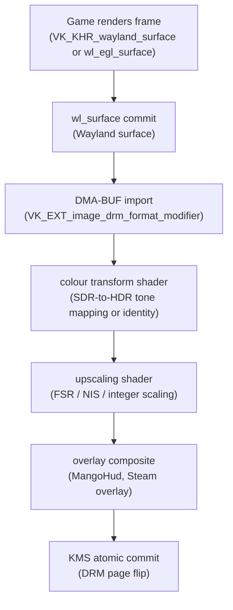

### FSR Upscaling

AMD's FidelityFX Super Resolution (FSR) algorithm is integrated directly into gamescope as a Vulkan compute shader. The `fsr_upscale.comp` compute shader implements the FSR 1.0 (EASU + RCAS) algorithm: a spatial edge-adaptive upsampling pass followed by a contrast-adaptive sharpening pass. The game renders at a lower-than-native resolution (for example, 720p on Steam Deck's 800p panel), and gamescope upscales to display resolution using FSR.

```glsl
/* Source: gamescope/src/shaders/fsr_upscale.comp
 * FSR1 EASU (Edge Adaptive Spatial Upsampling) compute shader.
 * Push constants carry the upscale ratio and sharpness parameters.
 * Input: game framebuffer at native render resolution (e.g. 720p)
 * Output: upscaled framebuffer at display resolution (e.g. 800p)
 */
layout(push_constant) uniform PushConstants {
    uvec4 const0;   /* EASU input/output dimensions */
    uvec4 const1;
    uvec4 const2;
    uvec4 const3;
    uvec4 sample;   /* RCAS sharpness */
} pc;

layout(local_size_x = 64) in;
void main() {
    uvec2 gxy = gl_GlobalInvocationID.xy;
    /* FsrEasuF reads from input image, writes to output image */
    AF3 color;
    FsrEasuF(color, gxy, pc.const0, pc.const1, pc.const2, pc.const3);
    imageStore(outputImage, ivec2(gxy), vec4(color, 1.0));
}
```

The `GAMESCOPE_FORCE_WINDOWS_FULLSCREEN` and `--fsr-upscaling` flags control upscaling activation. gamescope also supports FSR 2 (temporal upscaling, which requires motion vector input from the game), NIS (NVIDIA Image Scaling, applicable on non-AMD hardware), and integer scaling for pixel-art games.

### HDR Pipeline

gamescope's HDR support predates any standardised Wayland colour management protocol. It detects HDR-capable displays by reading the `HDR_OUTPUT_METADATA` KMS property and EDID HDRDB data from the connected display. The `GAMESCOPE_HDR_ENABLED` environment variable enables HDR mode; `GAMESCOPE_HDR_PEAK_NITS` overrides the peak luminance target.

For SDR games on an HDR display, gamescope applies a tone mapping curve in a compute shader that maps the SDR colour volume (0–100 nit reference white) into the HDR colour volume of the connected display, providing a subjectively brighter and more saturated image than simple SDR passthrough. For games that natively render in HDR (games using `VK_EXT_hdr_metadata` via DXVK or native Vulkan), gamescope passes the HDR metadata through to KMS, instructing the display hardware to operate in PQ (Perceptual Quantizer) or HLG mode.

Setting the HDR output state requires programming two KMS properties on the CRTC or connector: `HDR_OUTPUT_METADATA` (a blob containing the SMPTE ST 2086 static metadata structure) and `COLORSPACE` (selecting the BT.2020 primaries / ST 2084 PQ transfer function combination). gamescope does this through its custom DRM backend rather than via a higher-level abstraction, as described in Chapter 3.

### Direct Scanout

When the game's buffer meets all conditions for hardware plane scanout — it is at display resolution, in a format and modifier that the KMS primary plane supports, without any overlays that would require compositing — gamescope bypasses the Vulkan compositing pass entirely. The game's buffer is placed directly on the KMS plane via the `liftoff_layer` assignment (see below), achieving zero-copy presentation. The `drm_plane::can_do_direct_scanout()` check in gamescope's DRM backend encapsulates all the conditions: format compatibility, modifier support, no scaling required, no colour space mismatch.

This optimisation is critical for latency: the Vulkan compositing pass takes measurable GPU time, and on Steam Deck's mobile GPU that time is a significant fraction of the frame budget at 60 Hz. Direct scanout can eliminate 2–4 ms of GPU time per frame in the common case.

### libliftoff Integration

gamescope uses libliftoff — the lightweight KMS plane allocation library from Simon Ser — to manage hardware plane assignment for multi-layer scenes. libliftoff's API is straightforward: you create a `liftoff_device` from a DRM file descriptor, register all available planes with `liftoff_device_register_all_planes`, create a `liftoff_output` for each CRTC, and create `liftoff_layer` objects for each compositor layer (game window, overlay, cursor).

For each frame, you call `liftoff_layer_set_property` to set KMS properties on each layer — `FB_ID`, `CRTC_X`, `CRTC_Y`, `CRTC_W`, `CRTC_H`, `SRC_X`, `SRC_Y`, `SRC_W`, `SRC_H`, `ZPOS` — and then call `liftoff_output_apply` with a `drmModeAtomicReq`. libliftoff attempts to assign each layer to a hardware plane using a TEST_ONLY atomic commit; layers that cannot be assigned to hardware planes fall back to composition by the Vulkan renderer.

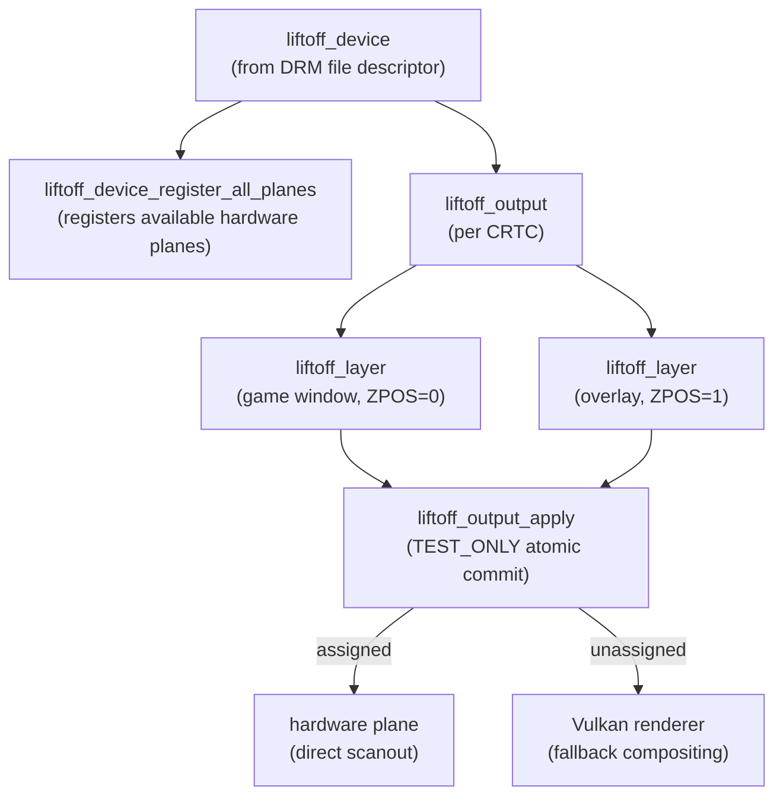

```c
/* Source: gamescope/src/Backends/ (illustrative, based on libliftoff API) */
struct liftoff_layer *game_layer = liftoff_layer_create(output);
struct liftoff_layer *overlay_layer = liftoff_layer_create(output);

/* Set properties for the game frame at display resolution */
liftoff_layer_set_property(game_layer, "FB_ID", game_fb_id);
liftoff_layer_set_property(game_layer, "CRTC_W", display_width);
liftoff_layer_set_property(game_layer, "CRTC_H", display_height);
liftoff_layer_set_property(game_layer, "ZPOS", 0);

/* Set properties for the overlay (MangoHud, Steam overlay) */
liftoff_layer_set_property(overlay_layer, "FB_ID", overlay_fb_id);
liftoff_layer_set_property(overlay_layer, "ZPOS", 1);

/* libliftoff performs TEST_ONLY commits to find the optimal plane
 * assignment; layers that cannot be hardware-composited fall back.
 * liftoff_output_apply signature: (output, req, flags) — 3 args */
drmModeAtomicReq *req = drmModeAtomicAlloc();
if (liftoff_output_apply(output, req, 0) < 0) {
    /* fall back to Vulkan compositing for unassigned layers */
}
drmModeAtomicCommit(drm_fd, req, DRM_MODE_ATOMIC_NONBLOCK |
                    DRM_MODE_PAGE_FLIP_EVENT, NULL);
```

The value of this approach is that gamescope can handle configurations ranging from a single full-screen game (likely to achieve full hardware direct scanout) to a game with multiple overlays (requiring plane allocation for cursor, overlay, and game layers) without hard-coding plane assignment logic.

### Steam Deck Session

On Steam Deck, gamescope runs as the session compositor via `gamescope-session`. It owns the display from session start, hosts XWayland for games using Proton/DXVK, and manages the Steam UI as a layer shell-equivalent surface. The `STEAM_DISPLAY_REFRESH_LIMITS` interface allows Steam to communicate per-game frame-rate limits to gamescope, enabling Steam Deck's "FPS limiter" feature. Performance counters — GPU busy percentage via `/sys/class/drm/card0/device/gpu_busy_percent` on AMD hardware, frame timing via `wp_presentation` from the game client — feed MangoHud's telemetry overlay.

---

## 9. COSMIC Compositor: Smithay and Rust-Native Wayland

System76's COSMIC desktop, introduced with Pop!_OS 24.04, ships **cosmic-comp** — a Wayland compositor written entirely in Rust using the **smithay** Wayland server library. cosmic-comp represents the most production-capable implementation of the smithay stack as of 2025, and its architecture offers a sharply different perspective from the C-centric wlroots ecosystem.

### The smithay Wayland Library

**smithay** ([gitlab.freedesktop.org/smithay/smithay](https://gitlab.freedesktop.org/smithay/smithay)) is a Rust library providing the building blocks for a Wayland compositor: Wayland server protocol dispatch, DRM/KMS direct-mode rendering, input handling, and a suite of higher-level helpers for common compositor patterns (layer shell, xdg-shell, foreign toplevel management).

Key architectural decisions that distinguish smithay from wlroots:

- **Ownership-based safety:** wlroots uses a callback/listener model where objects are passed as pointers; smithay models compositor state as a single `State` struct that implementors define, using Rust's borrow checker to prevent use-after-free in callback chains. The `delegate_*!` macros bind Wayland protocol implementations to methods on this struct.
- **Backend abstraction:** smithay's `backend::drm` module wraps libdrm and provides `DrmDevice`, `DrmSurface`, and `GbmDevice` wrappers. The `backend::renderer` module provides `GlesRenderer` (for EGL/GLES rendering) and `GlMultiRenderer` for multi-GPU output rendering. smithay supports `MultiRenderer` — a renderer that dispatches to different GPU surfaces — enabling output-aware rendering with different GLES contexts per DRM device.
- **Explicit state machine:** the `WaylandState` trait and the `CalloopEventLoop` integration make the compositor's main loop explicit and composable. Event sources (Wayland client I/O, DRM page-flip events, input device events, timers) are registered with the calloop event loop, which dispatches them without hidden callbacks.

### cosmic-comp Architecture

cosmic-comp's top-level structure is a single `State` struct containing:

```rust
// cosmic-comp: src/state.rs
pub struct State {
    pub common: Common,
    pub backend: BackendData,
}

pub struct Common {
    pub display_handle: DisplayHandle,
    pub event_loop: LoopHandle<'static, State>,
    pub shell: Arc<RwLock<Shell>>,
    // ... Wayland protocol delegates
}
```

[Source: `cosmic-comp/src/state.rs`](https://github.com/pop-os/cosmic-comp/blob/master/src/state.rs)

The `Shell` struct manages the workspace model — COSMIC's distinctive "workspaces-on-outputs" design, where each output has its own independent set of workspaces arranged in a 2D grid. The workspace model is entirely compositor-side logic implemented in Rust, without depending on any shell extension protocol.

### DRM Backend and Rendering

cosmic-comp's DRM backend wraps smithay's `DrmDevice` and uses `GbmAllocator` for GBM-backed buffer allocation:

```rust
// cosmic-comp: src/backend/kms.rs — surface rendering loop
fn render_surface(
    surface: &mut Surface,
    renderer: &mut GlMultiRenderer,
    elements: &[CosmicElement<GlMultiRenderer>],
) -> Result<bool, RenderError<GlMultiRenderer>> {
    let output_render_elements = /* layer shell, windows, cursor */;
    surface.compositor.render_frame(renderer, &output_render_elements, CLEAR_COLOR)?;
    Ok(true)
}
```

[Source: `cosmic-comp/src/backend/kms.rs`](https://github.com/pop-os/cosmic-comp/blob/master/src/backend/kms.rs)

The `OutputCompositor` (from smithay's `backend::drm::compositor`) handles the KMS commit path: it manages the triple-buffer swap chain, waits for page-flip events, and handles modeset recovery. Direct-mode scanout (passing a client buffer directly to a KMS plane without compositor GPU processing) is supported for fullscreen Wayland clients via smithay's `DrmCompositor::queue_frame()` with `ScanoutError` fallback.

### XWayland Integration

cosmic-comp embeds XWayland using smithay's `xwayland` crate. The `XWaylandKeyboardGrab` protocol and X11 property-based window class/role detection are used to associate X11 windows with the COSMIC workspace model. All windows — Wayland or X11 — are managed through the unified `Shell::map_window()` abstraction.

### Protocol Support Matrix

As of cosmic-comp 0.1 (Pop!_OS 24.04 LTS):

| Protocol | Status |
|---|---|
| `xdg-shell` | Full |
| `xdg-output-v1` | Supported |
| `wlr-layer-shell-v1` | Supported (used by cosmic-panel) |
| `ext-session-lock-v1` | Supported |
| `wp-drm-lease-v1` | Supported (VR direct-mode display leasing) |
| `wlr-screencopy-v1` | Supported |
| `ext-idle-notify-v1` | Supported |
| `wp-color-management-v1` | Planned |

The use of `wlr-layer-shell-v1` rather than a COSMIC-specific protocol means panel, dock, and notification software written for wlroots compositors runs unmodified under cosmic-comp.

### Comparison with wlroots

| Dimension | wlroots | smithay/cosmic-comp |
|---|---|---|
| Language | C | Rust |
| Rendering backend | wlr_renderer (GLES/Vulkan) | smithay GlesRenderer / GlMultiRenderer |
| DRM backend | wlr_drm | smithay DrmDevice |
| Input | libinput via wlr_input_device | smithay input (libinput bindings) |
| Memory safety | Manual | Enforced by Rust borrow checker |
| Ecosystem maturity | Large (Sway, Hyprland, KWin via KWinft) | Growing (cosmic-comp primary consumer) |

[Source: smithay](https://github.com/smithay/smithay), [cosmic-comp](https://github.com/pop-os/cosmic-comp)

---

## 10. Protocol Extension Landscape and Compositor Compatibility

### The Extension Stability Ladder

Wayland protocol extensions are distributed across several categories that carry different stability guarantees. The `stable` directory in wayland-protocols contains protocols with frozen APIs: `xdg-shell`, `presentation-time`, `viewporter`, `linux-dmabuf-v1` (v1 stable). Applications can depend on these unconditionally on any reasonably modern compositor. The `staging` directory contains protocols that are implemented and expected to be stable but are still in a testing phase — API may change with a version bump but breakage is rare. `wp_color_management_v1` and `wp_linux_drm_syncobj_v1` are staging as of 2025. The `unstable` directory contains deprecated protocols superseded by staging/stable equivalents; `xdg-output-unstable-v1` is superseded by `xdg-output` in staging.

Beyond the shared repository, each compositor maintains its own extensions. KDE protocols (`org_kde_kwin_blur`, `org_kde_kwin_server_decoration`) are stable within the KDE ecosystem but not available elsewhere. wlroots protocols (`zwlr_layer_shell_v1`, `zwlr_screencopy_manager_v1`) are implemented by Sway, Hyprland, and any other wlroots-based compositor, but not by Mutter or KWin (both of which have their own equivalents or alternatives). Hyprland protocols are Hyprland-only.

### Extension Support Matrix

The following table summarises protocol availability across all eight compositors as of 2025–2026. "Yes" means the compositor implements the server side; "No" means it does not; "Partial" means implementation is in progress or only partially complete. Entries annotated *(wlroots)* or *(Smithay)* indicate the capability is inherited from the upstream toolkit library rather than implemented directly by the compositor — these will advance in lockstep with the library.

| Protocol | Mutter (GNOME 48) | KWin (Plasma 6.1) | Sway | Hyprland | Wayfire | labwc | gamescope | cosmic-comp |
|---|---|---|---|---|---|---|---|---|
| `xdg-shell` | Yes | Yes | Yes | Yes | Yes *(wlroots)* | Yes *(wlroots)* | Yes | Yes *(Smithay)* |
| `wp_presentation` | Yes | Yes | Yes *(wlroots)* | Yes | Yes *(wlroots)* | Yes *(wlroots)* | Yes | Yes *(Smithay)* |
| `linux-dmabuf-v1` | Yes | Yes | Yes *(wlroots)* | Yes | Yes *(wlroots)* | Yes *(wlroots)* | Yes | Yes *(Smithay)* |
| `wp_linux_drm_syncobj_v1` | Yes (GNOME 48) | Yes (Plasma 6.1) | Yes *(wlroots 0.18)* | Yes (Aquamarine) | Yes *(wlroots 0.18)* | Yes *(wlroots 0.18)* | No | No *(Smithay 0.7.0)* |
| `wp_color_management_v1` | Yes (GNOME 48) | Yes (Plasma 6.2) | Partial *(wlroots)* | Partial | Partial *(wlroots)* | Partial *(wlroots)* | No | No |
| `wp_fifo_v1` | Partial | Yes | Yes *(wlroots)* | Yes | Yes *(wlroots)* | Yes *(wlroots)* | No | Partial |
| `zwlr_layer_shell_v1` | No | No | Yes *(wlroots)* | Yes | Yes *(wlroots)* | Yes *(wlroots)* | No | Yes *(Smithay)* |
| `zwlr_screencopy_manager_v1` | No | No | Yes *(wlroots)* | Yes | Yes *(wlroots)* | Yes *(wlroots)* | Partial | Yes *(Smithay)* |
| `ext_session_lock_v1` | No | No | Yes *(wlroots)* | Yes | Yes *(wlroots)* | Yes *(wlroots)* | No | Yes *(Smithay)* |
| `xdg_decoration` | Yes | Yes | Yes *(wlroots)* | Yes | Yes *(wlroots)* | Yes *(wlroots)* | No | Yes *(Smithay)* |

**Notes on selected entries:**
- `wp_linux_drm_syncobj_v1` for Mutter was upgraded to "Yes" in GNOME 48 (2025); earlier GNOME versions had a partial/experimental implementation.
- Hyprland's `wp_linux_drm_syncobj_v1` is implemented in Aquamarine, not inherited from wlroots — the compositor migrated away from wlroots in 2024–2025.
- cosmic-comp lacks `wp_linux_drm_syncobj_v1` because Smithay 0.7.0 does not yet expose it; this will be resolved when smithay gains the protocol.
- Mutter and KWin do not implement `zwlr_layer_shell_v1` because GNOME and KDE use their own (more tightly integrated) mechanisms for panel and dock placement.
- gamescope's `zwlr_screencopy_manager_v1` support is partial — it supports DMA-BUF export from the nested Wayland mode but not the full screencopy API in KMS-direct mode.

### Portability Strategies

For application developers targeting multiple compositors, the safest baseline is the `stable` category. `wp_viewporter` (scaling and cropping surfaces without client-side rendering), `wp_single_pixel_buffer_v1` (creating solid-colour surfaces without allocating GPU memory), and `wp_presentation` (frame timing feedback) are stable and widely implemented. For capabilities that exist only in `staging` or compositor-specific protocols, use the `wl_registry_add_listener` pattern to detect availability at runtime:

```c
/* Source: Wayland client application, wl_registry listener pattern */
static void registry_global(void *data, struct wl_registry *registry,
                             uint32_t name, const char *interface,
                             uint32_t version) {
    struct app_state *app = data;
    if (strcmp(interface, wp_presentation_interface.name) == 0) {
        app->presentation = wl_registry_bind(registry, name,
                                             &wp_presentation_interface,
                                             MIN(version, 1));
    } else if (strcmp(interface, wp_color_manager_v1_interface.name) == 0) {
        app->color_manager = wl_registry_bind(registry, name,
                                              &wp_color_manager_v1_interface,
                                              MIN(version, 2));
    }
    /* absence of wp_color_manager_v1 is handled gracefully downstream */
}

/* After registering the listener, do a synchronous roundtrip to
 * ensure all globals are enumerated before proceeding. */
wl_display_roundtrip(display);
```

### The xdg-desktop-portal Layer

For high-level application needs — screen capture, file chooser, clipboard, inhibiting screen blanking — the xdg-desktop-portal D-Bus service provides a compositor-agnostic interface. The portal backend (the component that translates portal D-Bus calls into compositor actions) is provided by each desktop environment: `xdg-desktop-portal-gnome` for GNOME, `xdg-desktop-portal-kde` for KDE, `xdg-desktop-portal-wlr` for wlroots-based compositors. Applications using portals for screen capture do not need to know which compositor is running; the portal handles the `zwlr_screencopy_manager_v1` or `org_kde_kwin_screencasting` details internally. This is the recommended approach for any application that does not require direct compositor feature access.

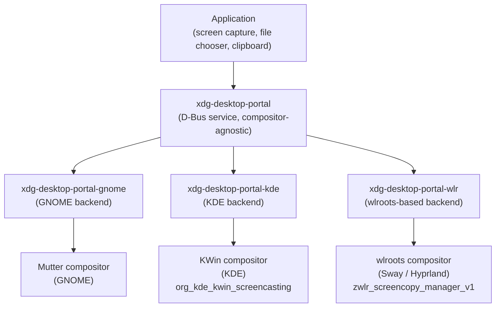

---

## 11. Common Compositor Debugging Techniques

### Protocol-Level Debugging

The `WAYLAND_DEBUG=1` environment variable is the first tool in any Wayland debugging session. When set, the wayland-client library logs every protocol message sent and received, tagged with the object ID, interface name, and opcode. This is indispensable for diagnosing common issues: a client that is not acknowledging `xdg_surface.configure` events, a buffer that is being committed before the compositor has sent a `wl_buffer.release`, or a protocol sequence that is valid in one compositor but triggers an error in another. Setting `WAYLAND_DEBUG=server` on the compositor side shows the server's view of the protocol traffic.

Each compositor also exposes its own debug variables. Mutter responds to `MUTTER_DEBUG_REDRAWS=1` (marks damaged regions on screen), `MUTTER_DEBUG_PAINT=1` (logs the repaint loop), and `MUTTER_DEBUG_KMS_THREADING=1` (logs KMS thread activity). KWin's `KWIN_OPENGL_INTERFACE` selects the GL backend (`egl` or `glx`); `KWIN_DRM_USE_MODIFIERS=0` disables DRM format modifiers for debugging modifier compatibility issues. For Sway, `SWAY_DEBUG` can be set along with Sway's `--verbose` flag for detailed wlroots-level logging.

### DRM and Kernel Debugging

For issues at the KMS layer — atomic commit failures, mode setting errors, VRR not activating — the kernel's `drm.debug` module parameter is essential. Setting `drm.debug=0xff` (all bits set) in the kernel command line or via `echo 0xff > /sys/module/drm/parameters/debug` enables verbose DRM logging in `dmesg`. Atomic commit failures appear as messages of the form `[drm:drm_atomic_helper_commit_modeset_disables] FAILED to commit modeset` with the specific property or plane that caused the rejection. `LIBDRM_DEBUG=1` enables libdrm's own logging of ioctl arguments and return codes, which is useful for verifying that the compositor is submitting the expected atomic state.

The kernel's `drm` ftrace event group provides structured, low-overhead event tracing at the KMS level:

```bash
# Source: Linux kernel ftrace infrastructure
# Capture page flip events and CRTC state changes for 5 seconds
trace-cmd record -e 'drm:drm_vblank_event' \
                 -e 'drm:drm_crtc_state' \
                 -p nop -- sleep 5
trace-cmd report | grep drm_vblank_event | head -20
```

The `drm:drm_vblank_event` event records the `CLOCK_MONOTONIC` timestamp at which each VBlank interrupt was delivered to the kernel, the CRTC index, and the frame sequence number. Comparing these timestamps with compositor-level frame timestamps isolates where scheduling latency originates.

### Frame Timing Tools

`wayland-info` enumerates all globals advertised by a running compositor — useful for quickly checking which protocol extensions are available. The `wp_presentation` protocol provides per-frame timing feedback; the minimal frame timing logger pattern described in Section 9 can be used to collect production-quality latency data from any `wp_presentation`-capable compositor.

For GPU hang situations — which manifest as DRM error messages and a frozen display — the compositor typically attempts a GPU reset followed by a re-initialisation of its rendering context. On modern kernels, AMD and Intel GPUs support context-level reset without requiring a full GPU hang (TDR-style recovery); NVIDIA's open-source kernel module also supports this. If the compositor fails to recover, a session restart is required. The `journalctl -b -p err` command collects the relevant kernel and compositor error messages from the current boot.

---

## 12. Measuring Compositor Latency and Frame Pacing

### Measurement Concepts

Before reaching for tools, it is important to distinguish between two related but distinct metrics. Motion-to-photon latency is the end-to-end time from an input event — a mouse click, gamepad button press, touchscreen tap — to the corresponding change appearing on the display. This is the metric that determines perceived responsiveness; for gaming and VR applications, latencies above 20 ms are perceptible. Frame pacing, by contrast, is about consistency: delivering frames at regular intervals (every 16.67 ms at 60 Hz) rather than in irregular bursts. Uneven pacing is perceptually worse than a slightly lower mean frame rate, because the human visual system is acutely sensitive to motion stutters even when the average frame rate is acceptable.

The compositor contributes to both metrics. Its compositing pass adds GPU time between the client's `wl_surface.commit` and the KMS page flip. Its scheduling policy determines how much of the frame budget remains available to the application after the compositor's work is done. A compositor that schedules its repaint too early in the VBlank interval reduces application render time; one that schedules too late risks missing the VBlank and adding a full frame of latency.

The latency budget decomposition for a Wayland game looks like: application render time + compositor compositing time + display propagation delay (panel response, backlight modulation). The compositor contributes the middle term and can inflate the first term through scheduling decisions.

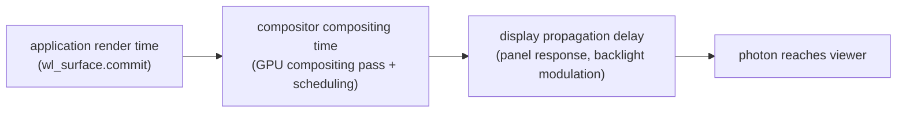

### The wp_presentation Protocol

The `wp_presentation` Wayland protocol provides the foundation for software-based frame timing measurement. A client binds the `wp_presentation` global from the registry and calls `wp_presentation.feedback(surface)` at each commit to request a feedback object for that frame. The compositor responds with one of three events on the feedback object: `presented` (the frame was actually shown on the display), `discarded` (the frame was superseded before display, for example because a newer frame arrived before the previous VBlank), or `invalid` (timing data is unavailable, for example when software rendering is active).

The `presented` event carries four fields: `tv_sec` and `tv_nsec` are the `CLOCK_MONOTONIC` timestamp of the actual hardware page flip; `refresh` is the display period in nanoseconds (one billion divided by the display's refresh rate in Hz); `seq` is a monotonically increasing hardware frame counter; and `flags` is a bitmask including `VSYNC` (frame aligned to VBlank), `HW_CLOCK` (timestamp from hardware), `HW_COMPLETION` (hardware completed the flip), and `ZERO_COPY` (the client buffer was scanned out directly without a compositing pass). The `ZERO_COPY` flag is particularly valuable for gaming diagnostics: its presence confirms that direct scanout is active and the compositor compositing pass was bypassed.

A minimal frame timing logger can be built around `wp_presentation`:

```c
/* Source: example wp_presentation client (application developer pattern)
 * This pattern records commit timestamps and correlates them with
 * presented events to compute per-frame compositor latency.
 */
struct frame_record {
    struct timespec commit_time;
    struct wp_presentation_feedback *feedback;
};

static const struct wp_presentation_feedback_listener feedback_listener = {
    .sync_output = noop,
    .presented = handle_presented,
    .discarded = handle_discarded,
};

static void handle_presented(void *data,
                              struct wp_presentation_feedback *feedback,
                              uint32_t tv_sec_hi, uint32_t tv_sec_lo,
                              uint32_t tv_nsec, uint32_t refresh,
                              uint32_t seq_hi, uint32_t seq_lo,
                              uint32_t flags) {
    struct frame_record *rec = data;
    struct timespec flip = {
        .tv_sec  = ((uint64_t)tv_sec_hi << 32) | tv_sec_lo,
        .tv_nsec = tv_nsec,
    };
    /* Compute latency: flip time minus commit time */
    double latency_ms = (flip.tv_sec - rec->commit_time.tv_sec) * 1000.0
                      + (flip.tv_nsec - rec->commit_time.tv_nsec) / 1e6;
    fprintf(stdout, "latency=%.2fms refresh=%uns flags=0x%x\n",
            latency_ms, refresh, flags);
    wp_presentation_feedback_destroy(feedback);
    free(rec);
}

/* At commit time: */
struct frame_record *rec = calloc(1, sizeof(*rec));
clock_gettime(CLOCK_MONOTONIC, &rec->commit_time);
rec->feedback = wp_presentation_feedback(app->presentation, surface);
wp_presentation_feedback_add_listener(rec->feedback,
                                       &feedback_listener, rec);
wl_surface_commit(surface);
```

Accumulating the `latency_ms` values over many frames and computing P50, P95, and P99 percentiles reveals the compositor's frame scheduling behaviour. On a healthy 60 Hz system, P50 should be around 8–12 ms (half a frame); spikes above 33 ms (two frames) indicate dropped frames.

An important caveat: the `HW_CLOCK` and `HW_COMPLETION` flags are only set when the compositor has genuine hardware page flip timestamps from the DRM page flip event. On virtual machines, with software rendering active, or on compositors that synthesise timestamps rather than reading them from the kernel's VBlank interrupt handler, the timestamps will be less precise. The measurement methodology is most reliable on bare-metal hardware with a compositing-capable GPU.

### Ground-Truth Measurement Methods

Software timestamps from `wp_presentation` capture compositor-reported latency, which excludes display propagation delay and may include compositor scheduling artefacts. For end-to-end motion-to-photon measurement, hardware-based methods provide ground truth.

Display capture cards — the Elgato 4K60 Pro, AVerMedia Live Gamer 4K, and similar devices — capture the actual display output as a video stream with hardware timestamps. By comparing the application's frame submission timestamps (from `wp_presentation` or Vulkan timestamp queries) against the capture-card timestamp when the frame becomes visible, the full end-to-end latency is measured without relying on compositor-reported times. This method requires a capture card with a known, low-latency capture pipeline and careful timestamp alignment between the capture card's clock and the host's `CLOCK_MONOTONIC`.

The high-speed camera method is a cost-effective alternative for single-point measurements. Recording the display and input device simultaneously at 240 fps or higher, then counting frames between the input event (a key press indicator or mouse button LED) and the visible change on the display, gives end-to-end latency with no software instrumentation. A standard 240 fps camera provides 4.2 ms per-frame resolution, sufficient for distinguishing 8 ms vs. 16 ms differences but not for sub-frame precision.

Valve's Steam Deck frame pacing research, published at XDC 2022, provides a detailed case study. The work identified that VBlank interrupt timing jitter of ±50 µs at the kernel level compounded across gamescope's scheduling logic to produce visible pacing artefacts at 40 Hz. The fix adjusted gamescope's present scheduling to target the midpoint of the VBlank window rather than its leading edge, reducing sensitivity to interrupt jitter. This research validated the importance of comparing kernel-level VBlank timestamps (from ftrace) against compositor-level scheduling timestamps when diagnosing pacing problems.

### Compositor Scheduling Models

Each compositor implements a different scheduling model for triggering repaints relative to VBlank.

KWin's approach uses `RenderLoop::estimatedVBlankTime()`, which predicts the next VBlank by extrapolating from the most recent hardware page flip timestamp and the display's nominal refresh period. KWin schedules repaints to complete with a configurable safety margin before the predicted VBlank, trading some application render budget for reduced risk of missing the flip. The safety margin is adaptive: if recent frames have consistently completed early, the margin shrinks; if frames are arriving close to the deadline, it grows.

Mutter's `ClutterFrameClock` tracks VBlank intervals using `CLOCK_MONOTONIC` timestamps from DRM page flip events and dispatches repaint callbacks at `vblank_time - render_time_estimate`, where `render_time_estimate` is a rolling average of recent frame render times. The estimate updates automatically as rendering load changes.

gamescope's scheduler is the simplest: a dedicated async repaint loop keyed to `POLLPRI` on the DRM file descriptor. VBlank notification triggers immediate frame composition and atomic commit submission, with minimal buffering by design. This approach minimises latency at the cost of offering less scheduling flexibility — gamescope cannot easily adapt to a varying application render time the way KWin does.

### Tools

**MangoHud** is the most accessible frame timing tool for Vulkan and OpenGL games. Setting `MANGOHUD=1` enables the overlay, which renders per-frame timing graphs showing frame time, GPU time, CPU time, and VRAM usage. The logging mode — `MANGOHUD_CONFIG=log_duration=10,output_file=/tmp/mango.log` — captures per-frame timing data to a CSV file from which P95 and P99 latency percentiles can be computed. MangoHud hooks into Vulkan and OpenGL present calls via a Vulkan layer and LD_PRELOAD mechanism, so it measures the timing of the present call from the application's perspective, below the compositor boundary. This makes it useful for measuring application-side frame production time independently of compositor scheduling.

**ftrace KMS events** provide ground-truth timestamps from the kernel's VBlank interrupt handler, bypassing all compositor and userspace timing. The `drm:drm_vblank_event` trace event records the exact `CLOCK_MONOTONIC` timestamp at which each VBlank interrupt was processed, independent of when the compositor woke up to handle it. Comparing these kernel timestamps with compositor-level repaint timestamps quantifies compositor wake-up latency — the time between the VBlank interrupt and the compositor's response to it.

```bash
# Source: Linux kernel trace-cmd usage
# Record VBlank events and CRTC state transitions for a 10-second window
trace-cmd record -e 'drm:drm_vblank_event' \
                 -e 'drm:drm_crtc_state'   \
                 -- sleep 10
# Analyse: extract VBlank timestamps and compute inter-frame intervals
trace-cmd report trace.dat | awk '
  /drm_vblank_event/ { 
    ts = $1+0; 
    if (prev > 0) printf "interval=%.3fms\n", (ts-prev)*1000; 
    prev=ts 
  }'
```

The `trace-cmd` output, combined with `wp_presentation` feedback data, can produce a full picture of compositor latency: kernel VBlank timestamp, compositor wake-up timestamp, application commit timestamp, and final presentation timestamp are all correlated.

**IGT GPU Tools** contains KMS benchmark tests that bypass the compositor entirely and measure raw atomic commit latency. The `kms_flip` and `kms_atomic_interruptible` tests schedule page flips and record the time between the commit ioctl and the kernel's flip completion callback. These measurements establish the hardware lower bound: the minimum latency any compositor can achieve on this hardware, given zero compositing overhead. Comparing IGT results with MangoHud or `wp_presentation` measurements quantifies how much overhead a specific compositor adds above that minimum.

**vkBasalt** is a Vulkan post-processing layer (`VK_LAYER_vkbasalt_post_processing`) that applies effects (CAS sharpening, SMAA, etc.) between the application's Vulkan rendering and the present call. It records present timestamps via `VK_EXT_display_control` where available, providing per-frame timing data from the Vulkan present path independently of the compositor's `wp_presentation` mechanism. When both `wp_presentation` timestamps and vkBasalt timestamps are available for the same frame sequence, the difference isolates the time between the Vulkan `vkQueuePresentKHR` call and the compositor's actual page flip — the compositor-internal scheduling delay.

---

## Roadmap

### Near-term (6–12 months)

- **KWin drops X11 session support**: KDE developer David Edmundson announced that Plasma 6.7 is the last release to ship an X11 session; Plasma 6.8 (due late 2026) removes all X11 compositor code, making the Wayland path unconditional. [Source](https://windowsnews.ai/article/kde-kwin-wayland-latency-patches-millisecond-gains-for-plasma-6-gaming.425010)
- **KWin input-latency patches for gaming**: A batch of KWin compositor-timing patches targeting Plasma 6 Wayland is expected to land by mid-2026, with early click-to-photon benchmarks showing up to 40 % latency reduction, bringing Linux closer to Windows 11 parity for competitive gaming. [Source](https://windowsnews.ai/article/kde-kwin-wayland-latency-patches-millisecond-gains-for-plasma-6-gaming.425010)
- **`wp_color_management_v1` stabilisation across compositors**: Wayland Protocols 1.47 shipped revisions to the staging colour-management protocol; KWin already exposes the `xx_color_management` variant by default and plans to migrate to the stable `wp_color_management_v1` once the protocol graduates from staging. [Source](https://www.phoronix.com/news/Wayland-Protocols-1.47) Mutter added server-side `wp_color_management_v1` in GNOME 48 (2025) and continues to iterate on per-surface colour transform support.
- **gamescope adds FSR 4 and HDMI 2.1/VRR**: Valve shipped FSR 4 upscaling and HDMI 2.1 (enabling higher frame-rate VRR modes) to SteamOS and gamescope in May 2026, ahead of the Steam Machine hardware launch. [Source](https://www.geeky-gadgets.com/steam-machine-os-update-2026/) Further FSR 4 quality-preset tuning and new Steam console hardware support are expected throughout 2026.
- **COSMIC compositor pointer constraints and gaming hardening**: COSMIC Epoch 1.0.15 (June 2026) added `wp_pointer_constraints` support, resolving a major gap for gaming workloads. VRR and HDR for the COSMIC compositor remain in-flight and are scheduled for near-term milestones. [Source](https://www.phoronix.com/news/COSMIC-Epoch-1.0.15)

### Medium-term (1–3 years)

- **Wayland colour-management protocol promotion to `stable`**: The `wp_color_management_v1` protocol is still in the `staging` tier as of mid-2026. The joint effort across KWin, Mutter, wlroots, GTK, Qt, SDL, and Mesa described in [Collabora's 12-year retrospective](https://www.collabora.com/news-and-blog/news-and-events/12-years-of-incubating-wayland-color-management.html) is expected to converge on a `stable` promotion, at which point compositors can drop their experimental `xx_` prefixed variants. [Source](https://wayland.app/protocols/color-management-v1)
- **Mutter WebRender-style damage tracking**: GNOME engineering discussions point toward a more granular damage-tracking model in Mutter's Clutter scene graph, reducing GPU bandwidth and enabling efficient partial repaints — particularly relevant for mixed-DPI and high-refresh-rate configurations. Note: needs verification on exact timeline.
- **gamescope Steam Machine and VR integration**: Valve's 2026 hardware announcements (Steam Machine, Steam Frame VR headset) position gamescope as the display compositor for both a living-room SteamOS console and a standalone VR device. gamescope extensions for reprojection and VR lens distortion are expected to follow the hardware releases. [Source](https://www.tomsguide.com/computing/virtual-reality/valve-announces-steam-frame-vr-headset-a-premium-standalone-rival-to-the-meta-quest-3)
- **Hyprland Aquamarine backend maturation**: Hyprland migrated from wlroots to its own `aquamarine` backend in 2024. The medium-term roadmap centres on stabilising aquamarine's DRM/KMS abstraction layer, adding explicit synchronisation (`wp_linux_drm_syncobj_v1`) support, and expanding the plugin API surface to include renderer hooks. [Source](https://en.wikipedia.org/wiki/Hyprland)
- **KWin Vulkan renderer**: KWin's scene graph currently uses an OpenGL/GLES2 renderer; a Vulkan-based scene renderer has been discussed on the KDE mailing list as a path to better GPU resource isolation and explicit synchronisation throughout the compositing pipeline. Note: needs verification on official planning status.

### Long-term

- **Full X11 elimination across the desktop**: With KDE targeting Plasma 6.8 for X11 session removal and GNOME having been Wayland-only since GNOME 50 (2025), the remaining X11 surface in all major compositors is XWayland for legacy application compatibility. The long-term direction is XWayland becoming an optional, user-initiated compatibility shim rather than a session-level requirement. [Source](https://windowsnews.ai/article/kde-kwin-wayland-latency-patches-millisecond-gains-for-plasma-6-gaming.425010)
- **Compositor-neutral HDR and tone-mapping via `wp_color_management_v1`**: Once the colour-management protocol is stable and widely deployed, the goal is that applications submit HDR content tagged with a standard primaries/transfer-function descriptor, and compositors perform tone-mapping to the display's capabilities without each compositor needing a bespoke HDR pipeline. This unifies the current fragmented approaches in KWin (KMS `HDR_OUTPUT_METADATA`), gamescope (Vulkan compute tone-mapping), and Mutter (`MetaColorManager`). [Source](https://zamundaaa.github.io/wayland/2024/05/11/more-hdr-and-color.html)
- **COSMIC compositor as a third major desktop Wayland backend**: System76's smithay/Rust-native COSMIC compositor represents the most architecturally distinct new entrant in the Linux desktop space. If the COSMIC desktop gains significant market share on non-System76 hardware, cosmic-comp will exert architectural pressure on the protocol ecosystem — particularly around the smithay-native approach to Vulkan compositing via `wgpu`. Long-term, smithay may become a second shared compositor toolkit alongside wlroots, with COSMIC driving protocol implementations analogous to how KWin drives them today. Note: needs verification on smithay/wgpu production-Vulkan timeline.

---

## Integrations

**Chapter 2 (KMS and Atomic Modesetting)**: The atomic commit API described in Chapter 2 is the substrate on which every compositor in this chapter builds. Mutter's `MetaKmsUpdate` is an abstraction over `DRM_IOCTL_ATOMIC_COMMIT`; KWin's `DrmAtomicCommit` wraps the same ioctl; gamescope drives it directly through its custom DRM backend. Direct scanout — the hardware plane promotion optimisation that eliminates the GPU compositing pass — is a specific use of KMS overlay planes discussed in Chapter 2; KWin's `DrmOutput::tryDirectScanout` and gamescope's `drm_plane::can_do_direct_scanout()` implement the same underlying technique.

**Chapter 3 (Advanced Display Features)**: KWin's HDR implementation programs `HDR_OUTPUT_METADATA` and `COLORSPACE` KMS properties using the interfaces described in Chapter 3. gamescope's HDR pipeline reads EDID-reported luminance limits via KMS property introspection. The explicit sync implementation in KWin (`wp_linux_drm_syncobj_v1`, Plasma 6.1) uses DRM timeline semaphores described in Chapter 3's synchronisation section. VRR activation via `DrmOutput::setVrrPolicy` in KWin uses the `VRR_ENABLED` KMS connector property.

**Chapter 4 (GPU Memory Management and DMA-BUF)**: gamescope imports game frame buffers as DMA-BUF objects using `VK_EXT_image_drm_format_modifier`, the Vulkan extension that allows Vulkan to import a DMA-BUF with an explicit DRM format modifier. KWin's direct scanout path checks the `DrmPlane`'s supported format/modifier list against the client buffer's format modifier before attempting hardware promotion. Mutter's `MetaRendererNative` allocates GBM buffers for the EGL framebuffer using `gbm_bo_create_with_modifiers`.

**Chapter 15 (ACO: The AMD Compiler Backend)**: gamescope's FSR compute shaders (`fsr_upscale.comp`, colour transform shaders) compile through Mesa's NIR/ACO pipeline on AMD hardware. Shader compilation latency affects game startup time when gamescope first dispatches these shaders. The Vulkan pipeline cache mechanisms described in Chapter 15 apply here: gamescope should (and does) use persistent pipeline caches to amortise shader compilation across sessions.

**Chapter 18 (Vulkan Drivers)**: gamescope uses Mesa RADV (AMD) and ANV (Intel) for its Vulkan compositing pass. `VK_EXT_image_drm_format_modifier` is a required Vulkan extension for gamescope's DMA-BUF import workflow; this extension is implemented in both RADV and ANV. The `VK_KHR_timeline_semaphore` extension is used for synchronisation between the Vulkan compositing pass and KMS scanout in the non-direct-scanout case.

**Chapter 20 (Wayland Fundamentals)**: All five compositors implement the server side of the protocols introduced in Chapter 20. The `wp_presentation` protocol's `presented` event structure — `tv_sec`, `tv_nsec`, `refresh`, `seq`, `flags` — is the core data source for the latency measurement methodology in Section 9. The `wp_linux_drm_syncobj_v1` protocol described in Chapter 20's synchronisation section was first shipped in a desktop compositor by KWin for Plasma 6.1. The extension support matrix in Section 7 completes the picture of which protocols are safe for application developers to target.

**Chapter 21 (wlroots)**: Sway and Hyprland both build on wlroots; gamescope, Mutter, and KWin do not. This distinction means that wlroots protocol additions (new staging protocol implementations, renderer improvements) flow automatically to Sway and Hyprland on a version update, while Mutter and KWin must implement each protocol independently. The trade-off is that Mutter and KWin can optimise their entire display path — Mutter's KMS thread, KWin's direct scanout logic — in ways that are not possible within wlroots' more general abstraction.

**Chapter 23 (XWayland and Legacy Application Compatibility)**: All five compositors run XWayland. gamescope is the deployment target for Proton on Steam Deck; it hosts XWayland for DXVK/VKD3D-Proton games. Mutter's `MetaXWaylandManager` and KWin's XWayland integration are the primary paths for X11 applications on modern GNOME and Plasma desktops. The override-redirect handling discussed in the Mutter section is a recurring source of compatibility issues between X11 application expectations and Wayland compositor behaviour.

**Chapter 26 (Hardware Video Acceleration)**: The screencopy protocol implementations in each compositor — `zwlr_screencopy_manager_v1` in Sway and Hyprland, compositor-specific interfaces in KWin and Mutter — are the source of the PipeWire video capture streams used by screen recorders and video conferencing applications. gamescope's DMA-BUF export path provides compositor frames to recording software on Steam Deck.

**Chapter 28 (Windows Compatibility via Proton)**: gamescope is the production deployment environment for Proton on Steam Deck. DXVK (Direct3D 9/10/11 on Vulkan) and VKD3D-Proton (Direct3D 12 on Vulkan) games run as gamescope Wayland clients. gamescope's FSR upscaling activates for games that do not natively render at the display's native resolution, which is the common case for older titles that have fixed render resolution settings.

**Chapter 29 (Upscaling Algorithms)**: gamescope FSR 1 and FSR 2 integration is covered in depth in Section 6 of this chapter. The FSR compute shader pipeline — EASU upsampling pass followed by RCAS sharpening — is the implementation of the algorithm described in Chapter 29. vkBasalt operates below the compositor boundary as a Vulkan layer; its CAS sharpening pass and the frame timing instrumentation described in Section 9 are complementary tools to the upscaling pipeline.

**Chapter 30 (GPU Performance Profiling)**: The latency measurement methodology in Section 9 — MangoHud CSV logging, ftrace `drm:drm_vblank_event` capture, `wp_presentation` frame timing loggers, and IGT KMS benchmarks — feeds into the broader GPU performance profiling workflow in Chapter 30. The pattern of comparing IGT lower-bound measurements with application-level measurements to quantify compositor overhead is directly applicable to any GPU performance investigation that involves a compositor in the display path.

---

## References

1. [Mutter source — GNOME/mutter](https://gitlab.gnome.org/GNOME/mutter) — primary source for MetaKms, MetaBackendNative, Clutter scene graph, and wp_color_management_v1 server implementation; `src/backends/native/` and `src/compositor/`
2. [KWin source — KDE/kwin](https://invent.kde.org/plasma/kwin) — primary source for DrmBackend, SceneOpenGL, effect system, HDR pipeline, and explicit sync; `src/backends/drm/` and `src/scene/`
3. [Sway source — swaywm/sway](https://github.com/swaywm/sway) — primary source for IPC protocol, container tree, and wlroots integration
4. [Hyprland source — hyprwm/Hyprland](https://github.com/hyprwm/Hyprland) — primary source for CHyprAnimationManager, CRenderer, plugin API, and Hyprland-specific protocols
5. [gamescope source — ValveSoftware/gamescope](https://github.com/ValveSoftware/gamescope) — primary source; `src/steamcompmgr.cpp` for the compositor loop, `src/rendervulkan.cpp` for Vulkan compositing, `src/Backends/` for DRM/Wayland/SDL backends
6. [libliftoff — emersion/libliftoff](https://gitlab.freedesktop.org/emersion/libliftoff) — KMS plane allocation library used by gamescope; `include/libliftoff.h` for the full API surface (the GitHub mirror is archived; the canonical repository is on freedesktop.org GitLab)
7. [XDC 2023 — KWin HDR (Xaver Hugl)](https://indico.freedesktop.org/event/4/contributions/107/) — detailed walkthrough of KWin's HDR implementation and tone-mapping shader design
8. [XDC 2022 — gamescope and direct KMS (Joshua Ashton / Pierre-Loup Griffais)](https://indico.freedesktop.org/event/2/contributions/62/) — gamescope architecture, direct KMS mode, and VBlank jitter analysis
9. [LWN: "The KWin compositor gets HDR support" (2023)](https://lwn.net/Articles/939063/) — accessible summary of Plasma 6.0 HDR landing
10. [LWN: "Gamescope: an exploration" (2022)](https://lwn.net/Articles/908613/) — architectural overview of gamescope's design goals and compositor loop
11. [Valve Steam Deck HDR blog post](https://store.steampowered.com/news/app/1675200/view/3698022584126307632) — Valve's description of Steam Deck HDR implementation and tuning
12. [KWin Effect API — effecthandler.h](https://invent.kde.org/plasma/kwin/-/blob/master/src/effect/effecthandler.h) — canonical reference for the KWin effect plugin API
13. [Hyprland plugin documentation](https://wiki.hyprland.org/Plugins/Development/) — stable plugin API reference; HyprlandAPI header and lifecycle macros
14. [FOSDEM 2024 — Colour management on Linux (Sebastian Wick)](https://fosdem.org/2024/schedule/event/fosdem-2024-2588-color-management-on-linux/) — history and current status of wp_color_management_v1 standardisation
15. [LWN: "Explicit synchronisation in Wayland compositors" (2024)](https://lwn.net/Articles/959765/) — technical background on wp_linux_drm_syncobj_v1 and KWin's implementation
16. [wp_presentation Wayland protocol specification](https://gitlab.freedesktop.org/wayland/wayland-protocols/-/blob/main/stable/presentation-time/presentation-time.xml) — normative specification for the presentation feedback protocol
17. [MangoHud documentation and source](https://github.com/flightlessmango/MangoHud) — logging mode, config reference, and Vulkan layer implementation
18. [Valve Steam Deck frame pacing post-mortem (Pierre-Loup Griffais, XDC 2022)](https://indico.freedesktop.org/event/2/) — VBlank jitter analysis and gamescope scheduling fix methodology
19. [IGT GPU Tools — kms_flip and kms_atomic tests](https://gitlab.freedesktop.org/drm/igt-gpu-tools) — atomic commit latency benchmarks that establish the compositor-bypassed performance baseline
20. [Linux kernel ftrace documentation — DRM events](https://www.kernel.org/doc/html/latest/gpu/drm-uapi.html) — DRM uAPI reference including KMS property namespaces; see also `Documentation/trace/events.rst` for ftrace event infrastructure
21. [vkBasalt source and configuration](https://github.com/DadSchoorse/vkBasalt) — Vulkan post-processing layer with frame timing instrumentation via VK_EXT_display_control
22. [wp_color_management_v1 protocol — Wayland Explorer](https://wayland.app/protocols/color-management-v1) — current staging status (version 2) and interface documentation
23. [Mutter KMS abstractions documentation](https://github.com/GNOME/mutter/blob/main/doc/mutter-kms-abstractions.md) — official Mutter documentation on MetaKms, MetaKmsDevice, MetaKmsUpdate design
24. [Phoronix: GNOME Mutter Switches To High Priority KMS Thread](https://www.phoronix.com/news/GNOME-High-Priority-KMS-Thread) — coverage of the 2024 KMS thread priority change from SCHED_RR to high priority
25. [Phoronix: KDE's KWin Merges Wayland Explicit Sync Support](https://www.phoronix.com/news/KDE-KWin-Lands-Explicit-Sync) — coverage of wp_linux_drm_syncobj_v1 landing in KWin for Plasma 6.1

---

*Copyright © 2026 jreuben11. Licensed under [CC BY 4.0](https://creativecommons.org/licenses/by/4.0/).*
