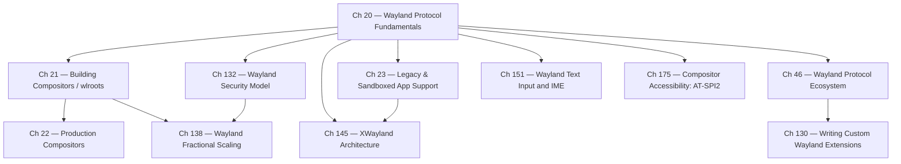

# Part VI-A — Wayland Protocol and Compositor Architecture

Parts I–V establish the substrate: kernel memory management, DRM/KMS atomic modesetting, Mesa, and the Vulkan driver stack. Part VI-A is where that substrate acquires its coordination layer. It covers the Wayland wire protocol, the compositor as the privileged process that owns display hardware and arbitrates all surface presentation, the compositor toolkits and production compositor implementations that practitioners deploy, the XWayland compatibility bridge for legacy X11 applications, the extension mechanisms by which the protocol ecosystem evolves, the security model that enforces client isolation, fractional scaling for HiDPI displays, the text-input and IME protocols that enable complex-script input, and the accessibility infrastructure that exposes the compositor's surface tree to screen readers. Chapters covering the display services that run above the compositor — input processing, colour calibration, HDR, font rendering, VRR, and screen capture — appear in Part VI-B; Part VI-A focuses on the compositor itself and the Wayland protocol layer it implements.

## What a Compositor Is and Does

A **Wayland compositor** is a single privileged process that is simultaneously a Wayland server, a DRM/KMS client, and a libinput consumer. It occupies the architectural intersection of three systems and is the only process with unmediated access to all of them at once. Understanding its role precisely makes the rest of this part coherent.

**As a Wayland server**, the compositor accepts connections from every application that wants to display output. Each application is a Wayland client. When a client wants to show a window, it:
1. Allocates a GPU buffer (typically via GBM or EGL) and renders into it.
2. Exports the buffer as a DMA-BUF file descriptor.
3. Announces the buffer to the compositor via the `zwp_linux_dmabuf_v1` protocol, attaching it to a `wl_surface`.
4. Commits the surface (`wl_surface.commit`), which transfers ownership of the buffer to the compositor until the compositor releases it.

The compositor receives these buffer fds from potentially hundreds of clients simultaneously. It is the only process that sees all surfaces.

**As a KMS client**, the compositor owns the DRM device fd for the display hardware. After compositing all client surfaces into a final frame (via GPU rendering), it submits the result to the display via `drmModeAtomicCommit()`. The compositor decides:
- Which surfaces go directly onto hardware KMS overlay planes (direct scanout — no GPU compositing).
- Which surfaces must be composited via a GPU render pass (multiple surfaces blended together).
- The final timing: the commit is gated on a GPU fence (`IN_FENCE_FD`) and completes at VBLANK.

**As a libinput consumer**, the compositor reads raw input events from `/dev/input/event*`, processes them through libinput (normalisation, gesture recognition, pointer acceleration), and routes them to the focused Wayland client via `wl_pointer`, `wl_keyboard`, `wl_touch`, or the appropriate `wp_tablet_v2` / `wp_relative_pointer_v1` protocols. No other process receives input events; the compositor is the exclusive input arbiter.

**Additional responsibilities**: The compositor manages window geometry (position, size, stacking order — or in the Wayland model, which surfaces are visible and where), keyboard/pointer focus, XDG shell surface roles (toplevel windows, popups, layer-shell surfaces), window decorations (server-side or client-side), animation and transition effects, and the security boundary that prevents one application from reading another's surface content.

The short definition: **a compositor owns the display hardware, arbitrates all surface presentation, and arbitrates all input routing.** It is not just a "window manager" in the X11 sense — on Wayland, the compositor and the display server are the same process.

## Scale of the Wayland Ecosystem

The Wayland ecosystem is deliberately layered, and codebase sizes reflect the separation of concerns: the core protocol is small and stable; complexity accumulates in the compositors that implement it.

| Component | Language | Approx. LOC | Role |
|---|---|---|---|
| **libwayland** | C | ~35k | Protocol marshalling, Unix socket transport, object model |
| **wayland-protocols** | XML | ~12k | Protocol definitions (XML only; generated C code is separate) |
| **wlroots** | C | ~52k | Compositor library: DRM backend, scene graph, protocol implementations |
| **Sway** | C | ~22k | Tiling compositor built on wlroots |
| **Mutter** (GNOME) | C | ~280–300k | Production compositor for GNOME Shell; includes the Clutter scene graph |
| **KWin** (KDE) | C++ | ~290k | Production compositor for KDE Plasma; includes its own effects engine |

For comparison, **Mesa** — the GPU driver layer that every compositor depends on for rendering — stands at approximately **5.9 million lines** (end 2025) and grows by ~1 million lines per year. The Wayland protocol itself is thin by design; the complexity in this part of the stack lives in the compositors above it and the GPU drivers beneath it.

## VBLANK: The Display Timing Heartbeat

**VBLANK** (Vertical Blanking Interval) is the period between the end of one video frame's scanout and the start of the next. During scanout, the display controller reads pixels row by row from the framebuffer and sends them to the display panel at a rate determined by the pixel clock. After the last row of a frame is sent, there is a short gap — the blanking interval — before the controller begins reading the next frame. This gap is the VBLANK period.

The VBLANK is important for three reasons:

1. **Buffer swap safety**: If the compositor swaps the framebuffer (changes which buffer the display controller is reading) during active scanout, the panel shows part of the old frame and part of the new frame — a horizontal tear. Waiting for VBLANK to perform the swap ensures a clean transition. `drmModeAtomicCommit()` with the `DRM_MODE_PAGE_FLIP_EVENT` flag waits for the next VBLANK before applying the new plane configuration.

2. **Timing synchronisation**: The compositor schedules its render-and-commit cycle to complete just before the next VBLANK. Applications receive `wp_presentation` feedback timestamps indicating exactly when their frame appeared on screen, allowing render loops to maintain precise frame pacing.

3. **Power gating**: The GPU and display engine can perform power-saving operations during VBLANK when no pixels are being read.

**Duration**: VBLANK duration equals `1 / refresh_rate` seconds:
- 60 Hz: 16.67 ms per frame; the blanking interval is a small fraction (typically 1–2 ms) of this
- 120 Hz: 8.33 ms per frame
- 144 Hz: 6.94 ms per frame
- 240 Hz: 4.17 ms per frame
- VRR (Variable Refresh Rate): frame duration is variable within the panel's supported range (e.g., 48–165 Hz); VBLANK occurs when the compositor commits a new frame or when a timeout forces a refresh

**Kernel interface**: The kernel DRM subsystem delivers VBLANK events to userspace via the DRM file descriptor:

```c
/* Request VBLANK event notification */
struct drm_wait_vblank vblank = {
    .request.type = _DRM_VBLANK_RELATIVE | _DRM_VBLANK_EVENT,
    .request.sequence = 1,
    .request.signal = (unsigned long)user_data,
};
drmIoctl(drm_fd, DRM_IOCTL_WAIT_VBLANK, &vblank);

/* Read events from DRM fd (epoll/poll) */
drmEventContext evctx = {
    .version = DRM_EVENT_CONTEXT_VERSION,
    .vblank_handler = my_vblank_handler,  /* DRM_EVENT_VBLANK */
    .page_flip_handler2 = my_flip_handler, /* DRM_EVENT_FLIP_COMPLETE */
};
drmHandleEvent(drm_fd, &evctx);
```

`drmModeAtomicCommit()` with `DRM_MODE_PAGE_FLIP_EVENT` delivers a `DRM_EVENT_FLIP_COMPLETE` event on the next VBLANK after the new buffer becomes active. This is the signal compositors use to know when it is safe to release the old buffer back to the client and to schedule the next frame.

## When the Display Stack Is Bypassed

The compositor-mediated path through Wayland and KMS is not the only path from GPU to display. Several scenarios bypass some or all of this stack:

### Direct KMS from an Application (`VK_KHR_display` / `VK_EXT_acquire_drm_display`)

A Vulkan application can enumerate connected displays with `vkGetPhysicalDeviceDisplayPropertiesKHR()`, create a display surface with `vkCreateDisplayPlaneSurfaceKHR()`, and drive KMS scanout directly from its swapchain — entirely outside any compositor. The Wayland compositor, if running, is bypassed or must release the display first.

`VK_EXT_acquire_drm_display` is the explicit version: the application calls `vkAcquireDrmDisplayEXT()` passing the DRM lease or direct fd, then presents via a `VkSwapchainKHR` backed by direct KMS plane assignment. Mesa's WSI layer implements this in `wsi_common_drm.c`.

**When used**: Kiosk applications, digital signage, GPU benchmarking tools that want zero-compositor-latency display, any application that is itself the only output consumer.

### DRM Leasing for VR Headsets (`DRM_IOCTL_MODE_CREATE_LEASE`)

**DRM lease** allows the compositor to grant a subset of its DRM resources (specific CRTCs, connectors, and planes) to a VR runtime for the duration of an XR session. The VR runtime receives its own DRM fd with restricted scope — it can drive the leased display resources directly, bypassing compositor compositing entirely, without the compositor surrendering all its other displays.

```c
/* Compositor creates a lease for the VR connector */
struct drm_mode_create_lease lease_req = {
    .object_ids = (uint64_t)(uintptr_t)lease_objects,
    .object_count = n_objects,
    .flags = 0,
};
drmIoctl(drm_fd, DRM_IOCTL_MODE_CREATE_LEASE, &lease_req);
/* lease_req.fd is the new restricted DRM fd handed to the VR runtime */
```

**Monado** (the open-source OpenXR runtime) uses DRM leasing to drive the HMD display at full refresh rate without compositor involvement. Chapter 121 covers DRM leasing in detail.

### TTY Virtual Console Switch

When a user switches to a Linux virtual console (`Ctrl+Alt+F2`), the kernel's VT subsystem takes over the display hardware. The compositor receives a `VT_RELDISP` ioctl signal, must suspend its DRM usage, and relinquishes the DRM master role. The text console or framebuffer console drives the display directly via the `fbdev` or `simplefb` driver. When the user switches back, the compositor reclaims DRM master and resumes normal operation.

During the TTY switch, the compositor, Wayland clients, and all Wayland protocol activity is suspended. No frames are presented.

### Headless / Compute Workloads

On systems without a physical display (cloud GPU instances, render farm nodes, CI servers), there is no KMS output and no compositor. Mesa provides:

- **GBM headless**: `gbm_create_device(drmOpenRender("/dev/dri/renderD128"))` — allocates GPU buffers without a display. Used by off-screen rendering pipelines.
- **`EGL_EXT_platform_device`**: Creates an EGL display from a DRM render node without a windowing system. Used by headless Vulkan/OpenGL rendering in containers and server workloads.
- **`VK_KHR_display` with no connected monitors**: On some headless machines, a virtual connector can be created; on others, applications simply never call `vkCreateSwapchainKHR` and render into `VkImage` objects that are read back via `vkMapMemory()` or copied to host via a staging buffer.

Chapter 107 covers headless rendering in depth.

## The IPC Foundation: Unix Sockets and File Descriptor Passing

Every Wayland connection begins with a **Unix domain socket** located at `$XDG_RUNTIME_DIR/wayland-0` (overridden by `WAYLAND_DISPLAY`). A client calls [`wl_display_connect()`](https://wayland.freedesktop.org/docs/html/apb.html#Client-classwl__display_1a4c3f1b9cb0f5bec8e53acf0c0ad4febb) to open this socket, which then acts as a full-duplex byte stream. The critical property of a Unix socket — compared to TCP or pipes — is that it can carry file descriptors out-of-band alongside data bytes, using the `SCM_RIGHTS` ancillary message type delivered via `sendmsg()`/`recvmsg()` ([UNIX man page](https://man7.org/linux/man-pages/man7/unix.7.html)). When a Wayland client submits a GPU buffer for display, it exports a **DMA-BUF** file descriptor from Mesa/GBM and sends it to the compositor over the socket using `SCM_RIGHTS`. The compositor receives the fd, imports the buffer, and reads the pixel data directly — the GPU memory is shared without copying. This is zero-copy buffer sharing at the IPC layer: `SCM_RIGHTS` passes the *capability to access* a buffer, not a copy of its contents.

## GPU Buffers and the Scanout Pipeline

Before a DMA-BUF can be submitted to Wayland, the buffer must be allocated in a format that the display hardware can scan out. **GBM (Generic Buffer Manager)**, provided by [libgbm](https://gitlab.freedesktop.org/mesa/drm), is the standard userspace API for this. A compositor creates a `gbm_device` from a DRM fd, allocates scanout-capable `gbm_bo` objects with `gbm_bo_create_with_modifiers2()`, and retrieves the DMA-BUF fd via `gbm_bo_get_fd()`. The DRM format modifier returned by `gbm_bo_get_modifier()` encodes the tiling and compression layout the display engine requires — without the correct modifier, hardware planes reject the buffer. GBM is the bridge between EGL rendering and KMS presentation.

The compositor delivers its rendered output to the display through a **DRM atomic commit** ([`drmModeAtomicCommit()`](https://www.kernel.org/doc/html/latest/gpu/drm-kms.html#atomic-modeset-support)). The atomic state object carries all plane, CRTC, and connector property changes as a single transaction — either all changes take effect at the next VBLANK, or none do. Two fence properties are key to correctness: `IN_FENCE_FD` holds a GPU fence that KMS must wait for before scanning out a new buffer (ensuring the GPU has finished rendering), and `OUT_FENCE_FD` delivers a fence the compositor can use to know when the display engine is done reading the old buffer. This pair forms the foundation of **explicit GPU synchronisation** in the compositor — no frame tears into a partially-rendered surface.

**Damage tracking** (`wl_surface.damage_buffer`) lets clients tell the compositor which regions of a surface have changed. The compositor avoids re-rendering unchanged regions and submits only the damaged area to the GPU compositing pass. When a client surface meets additional criteria — correct pixel format, no alpha blending, aligning to a hardware plane — the compositor can perform **hardware-plane promotion**: it assigns the surface directly to a KMS overlay plane and removes it from the GPU compositing pass entirely (direct scanout). Fewer GPU operations per frame translate directly to lower power consumption and latency. The wlroots scene graph (`wlr_scene`) and Mutter's KMS backend both implement plane promotion; see [wlroots commit history](https://gitlab.freedesktop.org/wlroots/wlroots) for implementation details.

## Frame Timing: Pacing, FIFO, and Tearing

**Frame-pacing** is the discipline of delivering frames to the display at the right moment. A well-paced compositor schedules its render to complete just before VBLANK, commits the atomic state, and relies on `wp_presentation` ([wayland-protocols](https://gitlab.freedesktop.org/wayland/wayland-protocols)) to deliver precise presentation timestamps back to the application. Committing too early wastes a frame slot; too late misses VBLANK and adds a frame of latency.

**`wp_fifo_v1`** (authored by Valve, staging in wayland-protocols) solves a related problem for clients that render faster than the display refresh rate. A client marks a commit as a FIFO barrier with `set_barrier()`; the compositor withholds the *next* commit from presentation until the barrier has been displayed. This creates natural backpressure — the client's render loop paces to display refresh without polling timestamps.

**Tearing** is the visual artifact produced when a buffer swap happens mid-scanout: two frames appear split across the panel. KMS VBLANK synchronisation prevents this in the standard compositor path. For low-latency gaming scenarios, `DRM_MODE_PAGE_FLIP_ASYNC` allows an immediate (tearing) flip; Vulkan applications can request the same via `VK_PRESENT_MODE_IMMEDIATE_KHR`. Gamescope and KWin expose tearing-allowed modes for competitive gaming use cases.

**Fractional scaling** (`wp_fractional_scale_v1`) allows clients to render at non-integer scale factors such as 1.25×, 1.5×, or 1.75× for HiDPI displays where 1× is too small and 2× wastes pixels. The client renders at the correspondingly higher resolution; the compositor downscales to the output. Subpixel alignment and font rendering quality under fractional scaling are ongoing challenges compared to X11's integer-scaling approach; Chapter 138 covers the protocol and compositor implementation in depth.

## Dependency Map

The diagram below shows the structural dependencies among the chapters in this part. Arrows point from prerequisite to dependent chapter.



The protocol fundamentals chapter (CH20) is the single root of the dependency tree. Every other chapter in this sub-part depends on it, directly or transitively. The core progression runs CH20 → CH21 → CH22, establishing the protocol, the compositor library layer, and the production implementations. CH46 branches off from CH20 to cover the evolving staging protocol ecosystem; its output (the staging protocol landscape) is a prerequisite for CH130 (writing your own extensions, which requires understanding the lifecycle). CH132 (security model) depends on CH20 (protocol isolation model) and feeds into CH138 (fractional scaling requires understanding the security context of scale negotiation). CH145 (XWayland deep dive) benefits from CH23 (which introduces XWayland at a higher level). CH151 (text input) and CH175 (accessibility) are independent leaf nodes that each require only CH20.

## Chapter Progression

The chapters in this part form a deliberate progression from protocol foundations to specialised compositor features:

- **Chapter 20 — Wayland Protocol Fundamentals** is the prerequisite for the entire sub-part. It explains the wire protocol, the Unix socket IPC model, `zwp_linux_dmabuf_v1` for DMA-BUF submission, `wp_presentation` for frame timing, and the security model that prevents cross-client surface inspection. Read this first.
- **Chapter 21 — Building Compositors with wlroots** moves to the compositor side, covering the DRM/KMS backend, GBM allocation, the `wlr_scene` scene graph with damage tracking and hardware-plane promotion, and the libinput seat model. Systems developers and compositor authors should read this second.
- **Chapter 22 — Production Compositors** examines Mutter (GNOME Shell), KWin (KDE Plasma), Sway, Hyprland, gamescope, and cosmic-comp through the lens of their KMS backends, rendering pipelines, and protocol-extension support matrices. It is the reference chapter for understanding the production ecosystem.
- **Chapter 23 — Legacy and Sandboxed App Support** covers XWayland (rootless mode, Glamor GPU acceleration, HiDPI, explicit sync) and xdg-desktop-portal (screen-cast gating, Flatpak GPU access). Application developers moving from X11 should read this before Chapter 145.
- **Chapter 46 — The Evolving Wayland Protocol Ecosystem** documents the 2024–2026 staging protocols: `wp_linux_drm_syncobj_v1`, `wp_color_management_v1`, `ext-image-copy-capture-v1`, `wp_fifo_v1`, and `wp_tearing_control_v1`. It is the reference for the protocol landscape as of wayland-protocols 1.45–1.48.
- **Chapter 130 — Wayland Protocol Development: Writing Custom Extensions** explains the wayland-scanner toolchain, the unstable→staging→stable lifecycle, XML schema conventions, and a worked example implementing a private compositor protocol extension end-to-end. Read after Chapter 46.
- **Chapter 132 — Wayland Security Model and Protocol Sandboxing** examines how Wayland's client-isolation design prevents cross-client surface access, how xdg-desktop-portal gates privileged operations (screen capture, input injection), and how compositor authors implement capability-based access control for sensitive protocol extensions.
- **Chapter 138 — Wayland Fractional Scaling** documents the `wp_fractional_scale_v1` protocol, compositor-side downscaling implementation, per-output scale factors, subpixel positioning challenges under fractional scale, and font rendering quality considerations compared to integer-scale HiDPI.
- **Chapter 145 — XWayland Architecture and Compatibility** provides a dedicated deep-dive into the rootless XWayland server: how it runs as a Wayland client, how it implements DRI3 and Present over the Wayland connection, how Glamor accelerates X11 rendering via OpenGL ES, HiDPI and fractional scale support, and the explicit sync (`xwayland-explicit-synchronization`) implementation that resolved NVIDIA compatibility issues. Read after Chapter 23.
- **Chapter 151 — Wayland Text Input and IME** covers the `zwp_text_input_v3` and `zwp_input_method_v2` protocols, input method editor (IME) integration for CJK and complex scripts, on-screen keyboard compositor support, and how toolkits (GTK4, Qt6) bridge the Wayland text-input protocol to their internal input method APIs.
- **Chapter 175 — Linux Compositor Accessibility: AT-SPI2, Screen Readers, and the Wayland Gap** covers the full Linux accessibility stack from the AT-SPI2 D-Bus protocol through GTK4's `GtkATContext`/`GtkAtSpiContext` and Qt6's `QAccessible` AT-SPI2 bridge to the Orca screen reader (speech via `libspeech-dispatcher`, braille via `brlapi`). It explains the Wayland security gap — Wayland's client isolation prevents global keyboard hooks and cross-client window inspection that Orca relied on under X11 — and examines the GNOME/KDE solutions, the Newton three-layer accessibility protocol proposal, and terminal emulator accessibility coverage.

Readers should arrive here having read Parts I–IV: familiarity with `drmModeAtomicCommit()`, `gbm_bo_create_with_modifiers2()`, DMA-BUF file descriptors, EGLImage, and `VkSemaphore` is assumed throughout. Part VI-B (Display Services, Input, and Color) builds on this sub-part's compositor and protocol coverage; Part VII-A (GPU APIs and Extended Reality) depends on the compositor protocol extensions and explicit sync foundations laid here.

## Additional Chapters in This Part

**Chapter 130 — Wayland Protocol Development: Writing Custom Extensions** explains the wayland-scanner toolchain, the unstable→staging→stable protocol lifecycle, XML schema conventions, and a worked example of implementing a private compositor protocol extension from spec through kernel KMS property to client library.

**Chapter 132 — Wayland Security Model and Protocol Sandboxing** examines how Wayland's client-isolation design prevents cross-client surface access, how xdg-desktop-portal gates privileged operations (screen capture, input injection), and how compositor authors implement capability-based access control for sensitive protocol extensions.

**Chapter 138 — Wayland Fractional Scaling** documents the `wp_fractional_scale_v1` protocol, compositor-side downscaling implementation, per-output scale factors, subpixel positioning challenges under fractional scale, and font rendering quality considerations compared to integer-scale HiDPI.

**Chapter 145 — XWayland Architecture and Compatibility** provides a dedicated treatment of the rootless XWayland server: how it runs as a Wayland client, how it implements DRI3 and Present over the Wayland connection, how Glamor accelerates X11 rendering via OpenGL ES, HiDPI and fractional scale support, and the explicit sync (`xwayland-explicit-synchronization`) patch that resolved NVIDIA compatibility issues.

**Chapter 151 — Wayland Text Input and IME** covers the `zwp_text_input_v3` and `zwp_input_method_v2` protocols, input method editor (IME) integration for CJK and complex scripts, on-screen keyboard compositor support, and how toolkits (GTK4, Qt6) bridge the Wayland text-input protocol to their internal input method APIs.

**Chapter 175 — Linux Compositor Accessibility: AT-SPI2, Screen Readers, and the Wayland Gap** covers the full Linux accessibility stack from the AT-SPI2 D-Bus protocol (`org.a11y.atspi.Accessible`, `org.a11y.atspi.Text`, `org.a11y.atspi.Registry`) through GTK4's `GtkATContext`/`GtkAtSpiContext` and Qt6's `QAccessible` AT-SPI2 bridge to the **Orca** screen reader (speech via `libspeech-dispatcher`, braille via `brlapi`). The chapter explains the Wayland security gap: Wayland's client isolation prevents global keyboard hooks and cross-client window inspection that Orca relied on under X11, and examines the GNOME/KDE solutions (toolkit-side AT-SPI2, compositor D-Bus keyboard interfaces), the **Newton** three-layer accessibility protocol proposal, and terminal emulator accessibility coverage. Readers building accessible Wayland applications will find the GTK4 `GtkAccessibleText` vfunc reference and the `accerciser`/`dbus-monitor` testing workflow.

---

*Part VI-A spans Chapters 20–23, 46, 130, 132, 138, 145, 151, and 175. Chapter 20 is the entry point; begin there.*

---

## Part Roadmap Summary

*Synthesised from the Roadmap sections of this part's chapters.*

### Near-term (6–12 months)

**X11 session retirement.** KDE Plasma 6.8 (late 2026) drops the X11 login session entirely, following GNOME's earlier Wayland-only transition. XWayland hardens in response: explicit sync via `linux-drm-syncobj-v1` is completing across all major compositors, `xwayland-satellite` proliferates as a compositor-decoupled XWM (allowing XWayland to run without being embedded in any specific compositor), and RHEL 10 ships without the standalone Xorg server. The remaining X11 surface is XWayland for legacy games and ISV software. These changes directly affect Chapters 23 and 145.

**Protocol ecosystem housekeeping.** `xdg-session-management-v1` and `xx-keyboard-filter-v1` enter the experimental namespace (wayland-protocols 1.48). `ext-tray-v1` enters staging. `zwp_input_timestamps_v1` is a candidate for stable promotion. The `ext-image-copy-capture-v1` standard capture protocol supersedes `wlr-screencopy-unstable-v1` in wlroots-family compositors. Newton Wayland accessibility protocol ships its first GNOME-integrated prototype, directly relevant to Chapter 175 and Chapter 46.

**Input and compositor synchronisation.** `udev-hid-bpf` matures as the canonical per-device input quirk path, displacing many libinput quirks-database entries. libinput 1.31–1.32 stabilises the Lua plugin ABI for tablet quirks. `wlroots` and downstream compositors complete `linux-drm-syncobj-v1` edge-case fixes for multi-GPU and NVIDIA configurations.

### Medium-term (1–3 years)

**Wayland protocol governance.** The `ext-workspace-v1`, `wp_security_context_v1`, and input-related unstable protocols converge across Mutter, KWin, and wlroots through the two-compositor governance rule. A formal clipboard isolation protocol enters staging. Snap sandbox integration with `wp_security_context_v1` follows Flatpak. XWayland privilege separation (restricted namespace with limited GPU access) is prototyped. DP 2.1 UHBR MST support is architected in `drm_dp_mst_topology` to handle the 64-slot allocation model (affects compositor connector management in Chapter 22).

**Accessibility and input method protocols.** `ext_text_input_v1` and `ext_input_method_v1` stable protocols replace the decade-old `zwp_text_input_v3`/`zwp_input_method_v2` unstable interfaces (directly affects Chapter 151). Newton accessibility sub-tree delegation for web content is designed. A standardised cross-compositor Wayland accessibility protocol enters the wayland-protocols repository. GPU-accelerated terminals (Ghostty, Alacritty, WezTerm) adopt AccessKit's AT-SPI2 Rust adapter (Chapter 175).

**Compositor implementation evolution.** COSMIC compositor (cosmic-comp) matures as the third major wlroots-alternative compositor codebase. Gamescope adopts `wp_linux_drm_syncobj_v1` and explicit sync fences for all clients. The `wlr_scene` plane promotion algorithm in wlroots gains multi-plane assignment support. Mutter's KMS backend completes migration to fully atomic plane state with per-CRTC color pipeline integration.

### Long-term

- **Full X11 elimination.** The native X11 session disappears from all major distributions; XWayland becomes an optional, user-initiated compatibility shim for Proton/Wine games and legacy ISV software. `xwayland-satellite`'s XWM-decoupled model may become the standard, removing per-compositor XWM code entirely. `dma_resv`-based implicit GPU sync is deprecated kernel-wide once the ecosystem completes migration to explicit sync.
- **Newton replaces AT-SPI2 as the Wayland accessibility foundation.** Once GTK, Qt, Electron, and web engines ship Newton-native providers, AT-SPI2 becomes a legacy compatibility shim. A standardised compositor-level screen capture protocol replaces privileged shell-plugin framebuffer access for magnifiers and accessibility tools.
- **Spatial and XR compositor integration.** Monado's hand-tracking and eye-gaze input are reconciled with the Wayland seat model. Compositor-side ML models predict stylus trajectories and pointer positions to reduce motion-to-photon latency. The long-term proposal of a unified compositor handling both desktop Wayland windows and XR layers in a single process would eliminate the DRM-lease handoff to separate XR runtimes entirely.

---

*Copyright © 2026 jreuben11. Licensed under [CC BY 4.0](https://creativecommons.org/licenses/by/4.0/).*
