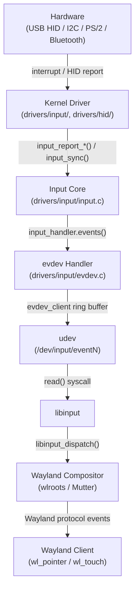
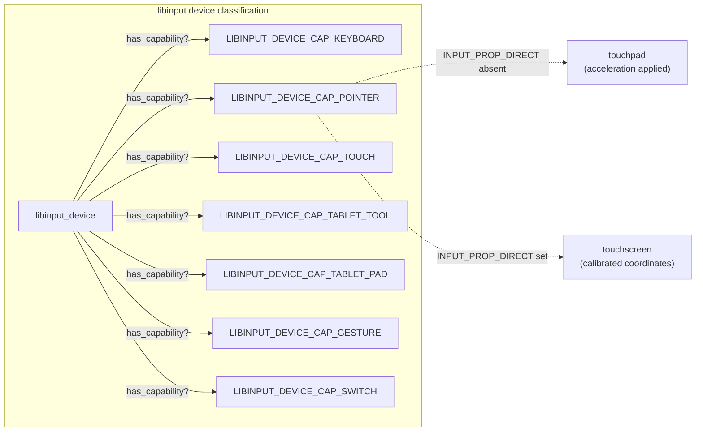
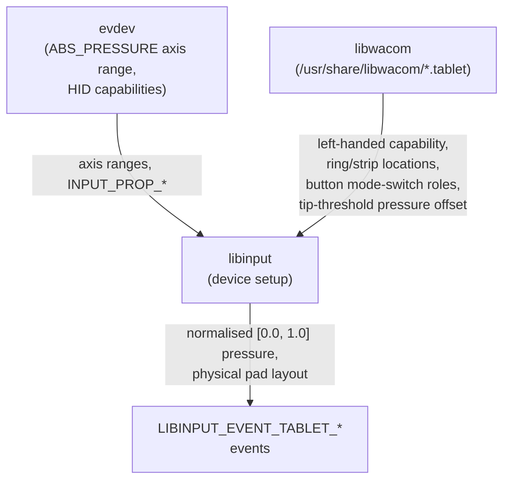
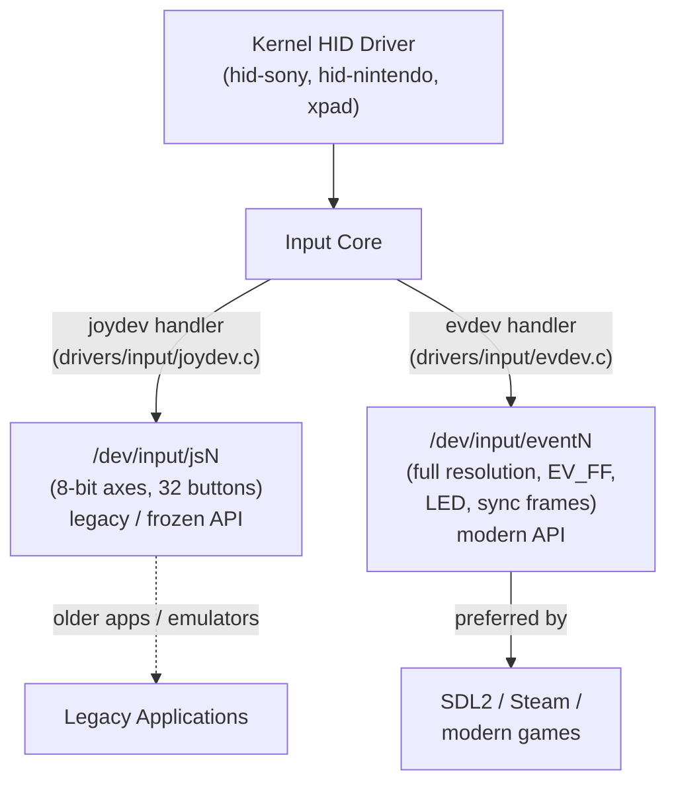
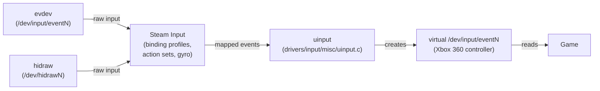
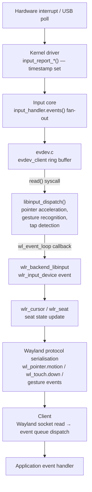
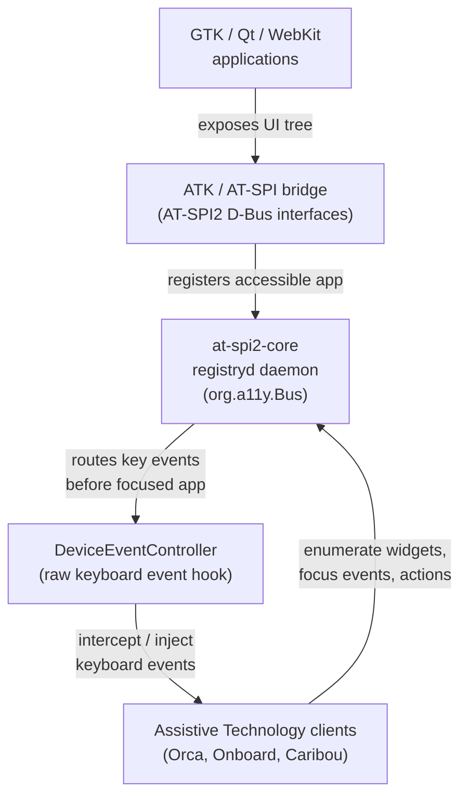

# Chapter 54: The Linux Input Stack

This chapter targets **systems and driver developers** who need to understand the full pathway from hardware interrupt to Wayland client event, and **graphics application developers** who must handle pointer constraints, touch gestures, and gaming controllers in their applications. It traces the vertical slice from kernel device nodes through libinput to Wayland protocol delivery, covering every layer at which latency, accuracy, or device semantics can be lost or transformed.

---

## Table of Contents

1. [Kernel Input Subsystem](#1-kernel-input-subsystem)
   - [struct input_event](#11-struct-input_event)
   - [Event Types and Codes](#12-event-types-and-codes)
   - [Registering an Input Device](#13-registering-an-input-device)
   - [The evdev Driver](#14-the-evdev-driver)
   - [udev Rules for Device Permissions](#15-udev-rules-for-device-permissions)
   - [1.6 What is the Linux Input Subsystem?](#16-what-is-the-linux-input-subsystem)
   - [1.7 What is evdev?](#17-what-is-evdev)
   - [1.8 What is libinput?](#18-what-is-libinput)
2. [libinput: The Device Abstraction Layer](#2-libinput-the-device-abstraction-layer)
   - [Core API](#21-core-api)
   - [Device Type Detection](#22-device-type-detection)
   - [The Quirks Database](#23-the-quirks-database)
   - [Touchscreen Calibration Matrices](#24-touchscreen-calibration-matrices)
   - [Diagnosing with libinput debug-events](#25-diagnosing-with-libinput-debug-events)
3. [libwacom: Graphics Tablet Identification](#3-libwacom-graphics-tablet-identification)
   - [Device Database and C API](#31-device-database-and-c-api)
   - [Pressure Curves and Multi-Ring Capability](#32-pressure-curves-and-multi-ring-capability)
   - [How libinput Uses libwacom](#33-how-libinput-uses-libwacom)
4. [Gaming Controllers](#4-gaming-controllers)
   - [Kernel HID Drivers](#41-kernel-hid-drivers)
   - [evdev vs. Legacy jsdev](#42-evdev-vs-legacy-jsdev)
   - [SDL2 GameController API](#43-sdl2-gamecontroller-api)
   - [udev Rules for Unprivileged Access](#44-udev-rules-for-unprivileged-access)
   - [Steam Input and uinput](#45-steam-input-and-uinput)
5. [Pointer Constraints on Wayland](#5-pointer-constraints-on-wayland)
   - [zwp_pointer_constraints_v1](#51-zwp_pointer_constraints_v1)
   - [zwp_locked_pointer_v1 — FPS Mouse Look](#52-zwp_locked_pointer_v1--fps-mouse-look)
   - [zwp_confined_pointer_v1 — Drag Operations](#53-zwp_confined_pointer_v1--drag-operations)
   - [zwp_relative_pointer_v1 — Raw Motion](#54-zwp_relative_pointer_v1--raw-motion)
6. [Touch and Gesture Protocols](#6-touch-and-gesture-protocols)
   - [wl_touch for Multi-Touch](#61-wl_touch-for-multi-touch)
   - [zwp_pointer_gestures_v1](#62-zwp_pointer_gestures_v1)
   - [zwp_input_timestamps_v1](#63-zwp_input_timestamps_v1)
   - [The Full Delivery Chain](#64-the-full-delivery-chain)
7. [Accessibility Input](#7-accessibility-input)
   - [AT-SPI2 Accessibility Bus](#71-at-spi2-accessibility-bus)
   - [Switch Access via evdev](#72-switch-access-via-evdev)
   - [Eye Tracking Devices](#73-eye-tracking-devices)
   - [The InputCapture Portal](#74-the-inputcapture-portal)
8. [Input Latency](#8-input-latency)
   - [evdev Kernel Ring Buffer](#81-evdev-kernel-ring-buffer)
   - [libinput Batching Model](#82-libinput-batching-model)
   - [Wayland Frame-Aligned Input Delivery](#83-wayland-frame-aligned-input-delivery)
   - [Measuring Latency](#84-measuring-latency)
9. [Integrations](#integrations)

---

## 1. Kernel Input Subsystem

The Linux input subsystem, resident in **drivers/input/**, forms the lowest layer of the input stack visible to userspace. Hardware drivers translate interrupts or **USB HID** reports into a unified event model; the kernel then fans those events out to registered handlers, of which **evdev** is the most important. The entire chapter traces a vertical slice from kernel device nodes through userspace libraries to **Wayland** protocol delivery, covering every layer at which latency, accuracy, or device semantics can be lost or transformed. [Source: Linux kernel input documentation](https://docs.kernel.org/input/input.html)

Within the kernel subsystem, all communication between the kernel and userspace passes through **struct input_event** (defined in **include/uapi/linux/input.h**), a type-code-value triple that carries every event class — **EV_KEY**, **EV_REL**, **EV_ABS**, **EV_SYN**, and others — without format changes across kernel versions. Kernel drivers allocate a **struct input_dev**, declare capability bitmasks, and call **input_register_device()** to publish the device; the **evdev** handler (**drivers/input/evdev.c**) maintains a per-client circular ring buffer (**evdev_client**) that userspace drains with **read()** syscalls. Device nodes appear at **/dev/input/eventN** and are made accessible through **udev** rules using **TAG+="uaccess"** delegation via **systemd-logind**.

Above the kernel, **libinput** provides the device abstraction layer: unified lifecycle management through **libinput_udev_create_context()** and **libinput_dispatch()**, hardware-specific quirk application via an **ini**-format quirks database under **/usr/share/libinput/**, and semantic event interpretation including pointer acceleration, tap-to-click, gesture detection, and palm rejection. **libinput** classifies devices by capability flags (**LIBINPUT_DEVICE_CAP_KEYBOARD**, **_POINTER**, **_TOUCH**, **_TABLET_TOOL**, **_TABLET_PAD**, **_GESTURE**, **_SWITCH**) using **libinput_device_has_capability()**. Absolute devices such as touchscreens receive coordinate transformation through a 3×3 affine **LIBINPUT_CALIBRATION_MATRIX** applied to raw **ABS_X**/**ABS_Y** axes. The **libinput debug-events** tool is the primary diagnostic aid for device behaviour.

Graphics tablet identification is handled by **libwacom** (**linuxwacom/libwacom**), a key-value database with a C API exposing device physical dimensions, button counts, stylus pressure resolution, and ring/strip topology via **WacomDevice** and **WacomDeviceDatabase**. **libinput** links against **libwacom** to determine left-handed capability, pressure tip thresholds, and pad button mode-switch roles that are absent from the kernel **HID** descriptor.

Gaming controllers are served by vendor kernel **HID** drivers — **hid-sony** (DualShock 3/4, **DualSense**), **hid-nintendo** (Switch Pro, Joy-Cons), and **xpad** (Xbox) — which map hardware axes to **ABS_X**/**ABS_RX**/**ABS_Z** and buttons to **BTN_A**/**BTN_TL** etc. Controllers are exposed via both the legacy **/dev/input/jsN** joystick API and the modern **/dev/input/eventN** **evdev** path; **SDL2**'s **SDL_GameController** API normalises across both. **SDL2**'s **HIDAPI** driver path communicates directly via **/dev/hidrawN** for well-known controllers, bypassing the kernel driver. **Steam Input** reads raw **evdev** or **hidraw** events, applies per-game binding profiles, and synthesises a virtual controller through the **uinput** kernel module (**drivers/input/misc/uinput.c**), creating a new **/dev/input/eventN** that games see as a standard controller.

On **Wayland**, pointer constraints are delivered through the **pointer-constraints-unstable-v1** extension: **zwp_pointer_constraints_v1** is the factory interface, **zwp_locked_pointer_v1** implements FPS mouse-look by suppressing **wl_pointer.motion** while forwarding deltas, **zwp_confined_pointer_v1** restricts pointer movement to a **wl_region** for drag operations, and **zwp_relative_pointer_v1** delivers unaccelerated hardware motion deltas. Touch and gesture events are delivered through **wl_touch** (multi-touch point tracking with per-session integer IDs and **frame** synchronisation events), **zwp_pointer_gestures_v1** (swipe, pinch, and hold gestures detected by **libinput** from **ABS_MT_*** tracking data), and **zwp_input_timestamps_v1** (nanosecond-resolution kernel **evdev** timestamps extending **wl_pointer**, **wl_keyboard**, and **wl_touch**).

Accessibility input is provided through **AT-SPI2** (Assistive Technology Service Provider Interface 2), a **D-Bus**-based framework whose **registryd** daemon exposes a **DeviceEventController** interface used by screen readers such as **Orca** and on-screen keyboards such as **Onboard**. Switch access devices enumerate as standard **EV_KEY** **evdev** nodes. Eye trackers from vendors such as **Tobii** expose gaze data through **EV_ABS** axes. The **org.freedesktop.portal.InputCapture** portal, backed by the **libei**/**EIS** protocol, provides compositor-level input capture and injection for remote desktop, **KVM**, and accessibility applications.

Input latency is introduced at multiple independently controllable points: the **evdev_client** ring buffer accumulates events until **read()** is called; **libinput** batches all events within a **SYN_REPORT** frame into one processing unit; **Wayland** compositors align event dispatch to the frame callback cycle, introducing up to one frame period of variance. Latency measurement uses **MangoHud**, the **wp_presentation** protocol for frame timestamps, and **zwp_input_timestamps_v1** for kernel-side event timestamps.



### 1.1 struct input_event

All communication between the kernel and userspace passes through `struct input_event`, defined in `include/uapi/linux/input.h`:

```c
/* include/uapi/linux/input.h */
struct input_event {
    struct timeval time;   /* kernel timestamp of the hardware interrupt */
    __u16          type;   /* event category: EV_KEY, EV_REL, EV_ABS, … */
    __u16          code;   /* event-specific identifier: KEY_A, REL_X, ABS_X, … */
    __s32          value;  /* signed 32-bit payload */
};
```

The `timeval` timestamp captures the moment the kernel input core called `input_event()`; this is the earliest point at which software latency accumulates. The `type`, `code`, and `value` triple is dimensioned to carry any present or future input class without format changes. On 64-bit kernels, `struct timeval` contains two 64-bit words, making `sizeof(struct input_event)` 24 bytes; on 32-bit kernels it is 16 bytes. Userspace programs that need to be ABI-stable across word sizes should use `struct input_event` from `<linux/input.h>` rather than a hand-rolled struct. [Source: UAPI input.h](https://github.com/torvalds/linux/blob/master/include/uapi/linux/input.h)

### 1.2 Event Types and Codes

Event types partition the input namespace into orthogonal classes. All defined types and their code namespaces live in `include/uapi/linux/input-event-codes.h`:

| Type constant | Value | Meaning |
|---|---|---|
| `EV_SYN` | 0x00 | Synchronisation marker |
| `EV_KEY` | 0x01 | Key press / release / autorepeat |
| `EV_REL` | 0x02 | Relative axis change |
| `EV_ABS` | 0x03 | Absolute axis report |
| `EV_MSC` | 0x04 | Miscellaneous (scancode, raw HID, …) |
| `EV_SW`  | 0x05 | Switch states (lid, tablet mode) |
| `EV_LED` | 0x11 | LED control |
| `EV_REP` | 0x14 | Autorepeat parameters |

`EV_SYN / SYN_REPORT` (code 0) terminates a logical *event frame*. Everything the driver emits before a `SYN_REPORT` is considered one atomic hardware event; userspace must process the entire frame before reacting. If the ring buffer fills and events are dropped, the kernel emits `EV_SYN / SYN_DROPPED` to signal the gap.

**EV_KEY** codes range from `KEY_RESERVED` (0) through `KEY_MAX` (0x2ff) and include both keyboard scancodes (`KEY_A` = 30) and pointing-device buttons (`BTN_LEFT` = 0x110). The `value` field is 0 (release), 1 (press), or 2 (autorepeat).

**EV_REL** codes express unbounded incremental motion. The most common are `REL_X` (0), `REL_Y` (1), `REL_WHEEL` (8), and `REL_HWHEEL` (6) for horizontal scroll. Value is a signed integer in device-dependent units — typically counts-per-millimetre for optical mice.

**EV_ABS** codes carry calibrated or uncalibrated absolute positions. Each axis is described by a companion `struct input_absinfo`:

```c
/* include/uapi/linux/input.h */
struct input_absinfo {
    __s32 value;     /* current value */
    __s32 minimum;
    __s32 maximum;
    __s32 fuzz;      /* noise tolerance */
    __s32 flat;      /* dead zone around center */
    __s32 resolution;/* units/mm or units/radian */
};
```

Touchscreen and digitiser axes (`ABS_X`, `ABS_Y`, `ABS_PRESSURE`, `ABS_TILT_X`, `ABS_TILT_Y`) follow this scheme. Multi-touch tracking uses `ABS_MT_*` codes in the range 0x30–0x3f together with slots (see `ABS_MT_SLOT`). [Source: input-event-codes.h](https://github.com/torvalds/linux/blob/master/include/uapi/linux/input-event-codes.h)

### 1.3 Registering an Input Device

Kernel drivers allocate a `struct input_dev` with `input_allocate_device()`, fill in capability bitmasks and axis parameters, then call `input_register_device()`. A minimal touchpad driver skeleton:

```c
/* drivers/input/my_touchpad.c — illustrative skeleton */
#include <linux/input.h>
#include <linux/module.h>

static struct input_dev *tp_dev;

static int __init tp_init(void)
{
    int err;

    tp_dev = input_allocate_device();
    if (!tp_dev)
        return -ENOMEM;

    tp_dev->name    = "My Touchpad";
    tp_dev->id.bustype = BUS_I2C;
    tp_dev->id.vendor  = 0x04f3;   /* Elan */
    tp_dev->id.product = 0x3057;

    /* Declare capabilities */
    __set_bit(EV_ABS, tp_dev->evbit);
    __set_bit(EV_KEY, tp_dev->evbit);
    __set_bit(BTN_TOUCH, tp_dev->keybit);
    __set_bit(BTN_LEFT,  tp_dev->keybit);
    __set_bit(INPUT_PROP_POINTER,    tp_dev->propbit);
    __set_bit(INPUT_PROP_BUTTONPAD,  tp_dev->propbit);

    /* Configure absolute axes */
    input_set_abs_params(tp_dev, ABS_X, 0, 4096, 4, 0);
    input_set_abs_params(tp_dev, ABS_Y, 0, 2560, 4, 0);
    input_set_abs_params(tp_dev, ABS_PRESSURE, 0, 255, 0, 0);

    err = input_register_device(tp_dev);
    if (err) {
        input_free_device(tp_dev);
        return err;
    }
    return 0;
}
```

`input_register_device()` may sleep; it must not be called from interrupt context or with a spinlock held. Once registered, the device appears under `/sys/class/input/inputN` and udev creates `/dev/input/eventN`. [Source: kernel input programming guide](https://docs.kernel.org/input/input-programming.html)

Inside interrupt or polling handlers the driver calls the typed report helpers and then `input_sync()`:

```c
/* Inside the interrupt handler or polling work function */
input_report_abs(tp_dev, ABS_X, x_coord);
input_report_abs(tp_dev, ABS_Y, y_coord);
input_report_abs(tp_dev, ABS_PRESSURE, pressure);
input_report_key(tp_dev, BTN_TOUCH, 1);
input_sync(tp_dev);   /* emits EV_SYN / SYN_REPORT */
```

### 1.4 The evdev Driver

The `evdev` handler (`drivers/input/evdev.c`) is the default userspace interface. When an input device registers, the input core calls `input_handler.connect()` on each matching handler; `evdev` matches everything. For each open file descriptor, the kernel maintains a private `evdev_client` structure that holds a per-client circular event buffer.

```
Buffer constants (drivers/input/evdev.c):
  EVDEV_MIN_BUFFER_SIZE  = 64   events (for basic devices)
  EVDEV_BUF_PACKETS      = 8    SYN_REPORT frames (scaled for MT devices)
```

The effective buffer size is `max(EVDEV_MIN_BUFFER_SIZE, EVDEV_BUF_PACKETS * slots * 2)` rounded up to the nearest power of two, ensuring modulo-free index arithmetic. The `evdev_client` maintains three offsets — `head`, `tail`, and `packet_head` — forming a lock-free ring with SYN_REPORT–aligned packet boundaries. On overflow, the kernel clamps `tail` to `packet_head` and injects a synthetic `EV_SYN / SYN_DROPPED`. [Source: evdev.c ring buffer analysis](https://programming.vip/docs/ring-buffer-for-event-processing-layer-evdev-of-input-subsystem.html)

Device nodes live at `/dev/input/eventN` with major 13, minor 64–95 for the first 32 devices and minor 256+ for additional devices. Capabilities are exposed as ioctls:

```bash
# Read device name
ioctl(fd, EVIOCGNAME(256), buf)
# Read absolute axis info for ABS_X
ioctl(fd, EVIOCGABS(ABS_X), &absinfo)
# Read supported event type bitmask
ioctl(fd, EVIOCGBIT(EV_KEY, KEY_MAX/8+1), keybits)
```

Persistent symlinks are created by `60-persistent-input.rules` under `/dev/input/by-id/` and `/dev/input/by-path/`.

### 1.5 udev Rules for Device Permissions

By default, `/dev/input/eventN` nodes are owned by `root:input`, mode 660. Users in the `input` group gain access; many distros add desktop users automatically. For constrained environments (kiosks, game consoles), explicit udev rules target devices by vendor/product:

```udev
# /etc/udev/rules.d/70-game-controllers.rules
# Sony DualSense (USB)
SUBSYSTEM=="input", ATTRS{idVendor}=="054c", ATTRS{idProduct}=="0ce6", \
    GROUP="input", MODE="0664", TAG+="uaccess"

# Nintendo Switch Pro Controller (USB)
SUBSYSTEM=="input", ATTRS{idVendor}=="057e", ATTRS{idProduct}=="2009", \
    GROUP="input", MODE="0664", TAG+="uaccess"
```

The `TAG+="uaccess"` directive delegates ownership to `systemd-logind`, which grants the currently active session user access to the device node regardless of group membership. This is the mechanism underlying Steam's ability to read controllers without a setuid helper.

### 1.6 What is the Linux Input Subsystem?

The Linux input subsystem, resident in `drivers/input/`, is the kernel layer responsible for receiving events from hardware input devices and exposing them to userspace through a unified, device-agnostic interface. Before this subsystem existed each class of input hardware required application-specific kernel glue; the input subsystem introduces a single abstraction — the `struct input_event` triple of type, code, and value — that covers keyboards, mice, touchscreens, tablets, gaming controllers, and any other human interface device through one consistent API. Kernel device drivers translate interrupts, USB HID reports, I2C reads, or Bluetooth streams into calls to `input_report_key()`, `input_report_abs()`, `input_report_rel()`, and `input_sync()`; the input core then fans those events out to registered handlers. The `evdev` handler is by far the most widely used: it provides a character device at `/dev/input/eventN` that userspace opens and reads with standard file I/O. The subsystem also maintains per-device capability bitmasks that declare which event types and codes a device can produce; these are exposed through `ioctl` calls and via sysfs at `/sys/class/input/`. This chapter builds upward from this layer, tracing how events flow from the kernel through libinput, Wayland compositor dispatch, and finally to application-visible protocol events. [Source: Linux kernel input documentation](https://docs.kernel.org/input/input.html)

### 1.7 What is evdev?

evdev (Event Device) is the kernel's primary input event interface, implemented in `drivers/input/evdev.c`. It is a generic handler that attaches to every input device registered with the kernel input core and exposes each device through a character device node at `/dev/input/eventN`. Userspace programs open these nodes and call `read()` to receive a stream of `struct input_event` records; `poll()` or `epoll()` waits efficiently for events without busy-looping. Before evdev, each device class had its own kernel interface — keyboards through `/dev/tty`, mice through a private protocol on `/dev/input/mouseN`, joysticks through the legacy `/dev/input/jsN` API — making it difficult to write software that handled multiple input types uniformly. evdev unifies all of these under a single read format and exposes device capabilities through `ioctl` calls (`EVIOCGBIT`, `EVIOCGABS`, `EVIOCGNAME`), allowing library code to discover what a device can produce before processing any events. Wayland compositors and libinput both consume input exclusively through the evdev interface; the legacy mouse and joystick interfaces are maintained only for backward compatibility. The `uinput` kernel module (`drivers/input/misc/uinput.c`) provides the reverse path: programs that open `/dev/uinput` can synthesise virtual input devices that appear to other software as real evdev nodes. [Source: kernel evdev documentation](https://docs.kernel.org/input/input.html)

### 1.8 What is libinput?

libinput ([upstream repository](https://gitlab.freedesktop.org/libinput/libinput)) is the canonical userspace library for consuming kernel input events on Linux desktops. It sits above the evdev layer and provides three services that raw evdev cannot: unified device lifecycle management, hardware-specific quirk correction, and semantic event interpretation. Device lifecycle management means that a single library context, attached to a udev seat, automatically handles device hotplug — device-added and device-removed events are delivered through the same event queue as pointer motion and key presses. Quirk correction applies per-device overrides stored in an ini-format database under `/usr/share/libinput/` (and locally under `/etc/libinput/local-overrides.quirks`) to compensate for firmware bugs such as incorrect axis ranges, touchpad pressure thresholds, or missing capability declarations. Semantic interpretation converts raw evdev events into higher-level libinput events: pointer acceleration is applied to `EV_REL` motion, tap-to-click detection converts `ABS_MT_*` contact data into `BTN_LEFT` presses, multi-finger swipes and pinch gestures are synthesised from concurrent touchpad contacts, and palm rejection suppresses contacts that match size or position heuristics for accidental touch. Wayland compositors such as wlroots and Mutter consume input exclusively through libinput; X.Org uses it via the `xf86-input-libinput` driver. [Source: libinput documentation](https://wayland.freedesktop.org/libinput/doc/latest/what-is-libinput.html)

---

## 2. libinput: The Device Abstraction Layer

libinput ([source repository](https://gitlab.freedesktop.org/libinput/libinput)) sits above evdev and provides three key services: unified device lifecycle management, hardware-specific quirk application, and semantic event interpretation (pointer acceleration, tap-to-click, gesture detection, palm rejection). [Source: libinput what-is-libinput](https://wayland.freedesktop.org/libinput/doc/latest/what-is-libinput.html)

The library deliberately excludes joysticks: "Joysticks have no clear interaction with a desktop environment." SDL2 and game engines read controllers directly from evdev or via their own HID layer.

### 2.1 Core API

The primary event loop over a udev-managed seat:

```c
#include <libinput.h>
#include <libudev.h>
#include <fcntl.h>
#include <unistd.h>

static int open_restricted(const char *path, int flags, void *data)
{
    return open(path, flags | O_CLOEXEC | O_NONBLOCK);
}

static void close_restricted(int fd, void *data)
{
    close(fd);
}

static const struct libinput_interface iface = {
    .open_restricted  = open_restricted,
    .close_restricted = close_restricted,
};

int main(void)
{
    struct udev *udev = udev_new();
    struct libinput *li = libinput_udev_create_context(&iface, NULL, udev);
    libinput_udev_assign_seat(li, "seat0");

    int fd = libinput_get_fd(li);   /* poll this for readability */

    /* ... poll/epoll on fd ... */

    libinput_dispatch(li);

    struct libinput_event *ev;
    while ((ev = libinput_get_event(li)) != NULL) {
        enum libinput_event_type t = libinput_event_get_type(ev);

        if (t == LIBINPUT_EVENT_POINTER_MOTION) {
            struct libinput_event_pointer *p =
                libinput_event_get_pointer_event(ev);
            double dx = libinput_event_pointer_get_dx(p);
            double dy = libinput_event_pointer_get_dy(p);
            /* dx/dy are in mm/event, pointer-acceleration applied */
        }

        libinput_event_destroy(ev);
    }

    libinput_unref(li);
    udev_unref(udev);
    return 0;
}
```

Events are heap-allocated and reference-counted; callers must call `libinput_event_destroy()` after processing. The file descriptor returned by `libinput_get_fd()` is a timerfd or eventfd used for wakeup — it must not be read directly. [Source: libinput device API](https://wayland.freedesktop.org/libinput/doc/latest/api/group__device.html)

Key device query functions:

```c
/* Capability testing */
int libinput_device_has_capability(struct libinput_device *dev,
                                   enum libinput_device_capability cap);
/* cap values: LIBINPUT_DEVICE_CAP_KEYBOARD, _POINTER, _TOUCH,
               _TABLET_TOOL, _TABLET_PAD, _GESTURE, _SWITCH */

/* Identity */
const char *libinput_device_get_name(struct libinput_device *dev);
unsigned int libinput_device_get_id_vendor(struct libinput_device *dev);
unsigned int libinput_device_get_id_product(struct libinput_device *dev);

/* Physical size (may return 0 if unknown) */
int libinput_device_get_size(struct libinput_device *dev,
                             double *width, double *height);
```

### 2.2 Device Type Detection

libinput does not expose a single "device type" enum. Instead it reports a set of capabilities through `libinput_device_has_capability()`. A device reporting both `LIBINPUT_DEVICE_CAP_POINTER` and `INPUT_PROP_POINTER` from evdev without `INPUT_PROP_DIRECT` is classified as a touchpad; one with `INPUT_PROP_DIRECT` is a touchscreen. The distinction matters for pointer acceleration: touchpad events go through a configurable acceleration profile; direct-touch devices pass through their absolute coordinates unchanged (after calibration).

Event types dispatched per capability:

| Capability | Event types returned |
|---|---|
| `_CAP_KEYBOARD` | `LIBINPUT_EVENT_KEYBOARD_KEY` |
| `_CAP_POINTER` | `LIBINPUT_EVENT_POINTER_MOTION`, `_MOTION_ABSOLUTE`, `_BUTTON`, `_SCROLL_*`, `_AXIS` |
| `_CAP_TOUCH` | `LIBINPUT_EVENT_TOUCH_DOWN`, `_MOTION`, `_UP`, `_CANCEL`, `_FRAME` |
| `_CAP_TABLET_TOOL` | `LIBINPUT_EVENT_TABLET_TOOL_AXIS`, `_PROXIMITY`, `_TIP`, `_BUTTON` |
| `_CAP_TABLET_PAD` | `LIBINPUT_EVENT_TABLET_PAD_BUTTON`, `_RING`, `_STRIP` |
| `_CAP_GESTURE` | `LIBINPUT_EVENT_GESTURE_SWIPE_*`, `_PINCH_*`, `_HOLD_*` |
| `_CAP_SWITCH` | `LIBINPUT_EVENT_SWITCH_TOGGLE` |



### 2.3 The Quirks Database

The quirks system addresses the long tail of firmware bugs, incorrect capability reports, and vendor-specific behaviours. Files shipped at `/usr/share/libinput/*.quirks` are standard `.ini` files; local overrides belong in `/etc/libinput/local-overrides.quirks`. [Source: libinput device quirks](https://wayland.freedesktop.org/libinput/doc/latest/device-quirks.html)

File structure:

```ini
# /usr/share/libinput/50-mouse.quirks (excerpt)
[Logitech MX Master 3 — disable middle-button scroll]
MatchVendor=0x046d
MatchProduct=0x4082
MatchUdevType=mouse
AttrScrollButtonLock=1

[HP Elitebook touchpad — phantom clicks on flex]
MatchVendor=0x04f3
MatchUdevType=touchpad
MatchDMIModalias=dmi:bvnHewlett-Packard*bvr*:pnHPEliteBook*
ModelTouchpadPhantomClicks=1
```

Match directives: `MatchBus` (usb/bluetooth/ps2/i2c), `MatchVendor`/`MatchProduct`/`MatchVersion` (hex with `0x`), `MatchUdevType`, `MatchName` (fnmatch glob), `MatchDMIModalias`, `MatchDeviceTree`.

Attribute quirks that affect tablet and touchpad behaviour: `AttrSizeHint` (physical dimensions in mm), `AttrResolutionHint` (units/mm), `AttrPressureRange` (tip activation range), `AttrPalmSizeThreshold`, `AttrLidSwitchReliability`, `AttrInputProp` (add or remove evdev `INPUT_PROP_*` bits).

To inspect which quirks apply to a device:

```bash
libinput quirks list /dev/input/event4
libinput quirks list --verbose /dev/input/event4  # shows all files parsed
```

> **Note:** Model quirks are internal API. Their names and semantics can change between libinput releases without a deprecation period.

### 2.4 Touchscreen Calibration Matrices

Absolute devices (touchscreens, pen tablets) may need coordinate transformation to align with display orientation or compensate for manufacturing offsets. libinput applies a 3×3 affine transformation matrix to raw ABS_X/Y coordinates before emitting events. [Source: libinput absolute axes](https://wayland.freedesktop.org/libinput/doc/1.11.3/absolute_axes.html)

The matrix is set through a udev property in a rule file:

```udev
# /etc/udev/rules.d/99-touchscreen-cal.rules
# LIBINPUT_CALIBRATION_MATRIX is six floats representing the
# upper 2×3 of the 3×3 homogeneous matrix (row-major, third row is 0 0 1).
# Identity: "1 0 0 0 1 0"
# 90° clockwise: "0 1 0 -1 0 1"
# Mirror X: "-1 0 1 0 1 0"
SUBSYSTEM=="input", ATTRS{idVendor}=="2149", ATTRS{idProduct}=="2703", \
    ENV{LIBINPUT_CALIBRATION_MATRIX}="0 1 0 -1 0 1"
```

Or at runtime through the API:

```c
float matrix[6] = {0, 1, 0, -1, 0, 1};  /* 90° clockwise */
libinput_device_config_calibration_set_matrix(dev, matrix);
```

The matrix coefficients encode: `a b c / d e f` → `x' = a*x + b*y + c`, `y' = d*x + e*y + f`, with x and y normalised to [0, 1] over the device range.

### 2.5 Diagnosing with libinput debug-events

The `libinput debug-events` tool is the primary diagnostic aid. It opens all devices on the default seat and prints every event with a timestamp:

```bash
sudo libinput debug-events                  # all devices
sudo libinput debug-events --device /dev/input/event4  # single device
sudo libinput debug-events --verbose        # show quirks and config
```

Sample output for a touchpad tap:

```
-event4  DEVICE_ADDED     SynPS/2 Synaptics TouchPad     seat0 default group1  cap:pointer gesture
 event4  POINTER_MOTION    +1.50s	 -0.34/ 2.50 ( -0.67/ 4.94 unaccel)
 event4  POINTER_MOTION    +1.52s	  1.12/-1.08 (  2.21/-2.14 unaccel)
 event4  POINTER_BUTTON   +1.58s	LEFT (272) pressed, seat count: 1
 event4  POINTER_BUTTON   +1.68s	LEFT (272) released, seat count: 0
```

The `unaccel` values are the raw motion before pointer acceleration; the primary values have the configured acceleration profile applied.

---

## 3. libwacom: Graphics Tablet Identification

libwacom ([linuxwacom/libwacom](https://github.com/linuxwacom/libwacom)) is a tablet description library: a key-value database with a thin C API wrapper. Despite the name it covers tablets from Huion, XP-Pen, Gaomon, ELAN, and any other vendor, not just Wacom. The kernel identifies *that* a tablet is connected and exposes its axes; libwacom explains *what kind* of tablet it is. [Source: libwacom README](https://github.com/linuxwacom/libwacom/blob/master/README.md)

### 3.1 Device Database and C API

Each tablet model has a `.tablet` description file under `/usr/share/libwacom/`. Stylus definitions live in `wacom.stylus`. A minimal C consumer:

```c
#include <libwacom/libwacom.h>

WacomDeviceDatabase *db = libwacom_database_new();

/* Identify by evdev path */
WacomDevice *dev = libwacom_new_from_path(db, "/dev/input/event5",
                                          WFALLBACK_NONE, NULL);
if (!dev) {
    /* Try the USB ID */
    dev = libwacom_new_from_usbid(db, 0x056a, 0x037a, NULL);
}

if (dev) {
    printf("Name:       %s\n", libwacom_get_name(dev));
    printf("Width(mm):  %d\n", libwacom_get_width(dev));
    printf("Height(mm): %d\n", libwacom_get_height(dev));
    printf("Buttons:    %d\n", libwacom_get_num_buttons(dev));
    printf("Rings:      %d\n", libwacom_get_num_rings(dev));
    printf("Strips:     %d\n", libwacom_get_num_strips(dev));

    WacomIntegrationFlags flags = libwacom_get_integration_flags(dev);
    if (flags & WACOM_DEVICE_INTEGRATED_DISPLAY)
        printf("Integrated display tablet\n");

    libwacom_destroy(dev);
}
libwacom_database_destroy(db);
```

The command-line tool `libwacom-list-devices` dumps the full database in a human-readable form and is useful for verifying that a new device is recognised.

### 3.2 Pressure Curves and Multi-Ring Capability

The `wacom.stylus` file records per-tool pressure resolution and axis ranges. Pressure curves (gamma-like response shaping) are an application concern: libwacom reports the hardware range and nominal resolution, and the application or toolkit (GIMP, Krita) maps the linear hardware pressure to a perceptual curve.

libwacom exposes ring and strip counts:

```c
int rings  = libwacom_get_num_rings(dev);   /* ExpressKey rings */
int strips = libwacom_get_num_strips(dev);  /* touch strips */
WacomButtonFlags bf = libwacom_get_button_flag(dev, 'A');
/* WACOM_BUTTON_RING_MODESWITCH, WACOM_BUTTON_STRIP_MODESWITCH, etc. */
```

Mode switching — where one physical ring/strip serves multiple logical functions toggled by a mode button — is modelled through `WacomButtonFlags` and `libwacom_get_ring_num_modes()`.

### 3.3 How libinput Uses libwacom

libinput links against libwacom at build time and calls it during device setup. The primary use is determining whether a tablet can operate in left-handed mode (which requires rotating the coordinate system 180°). The documentation states explicitly: "libinput requires libwacom to determine if a tablet is capable of being switched to left-handed mode." [Source: libinput tablet support](https://wayland.freedesktop.org/libinput/doc/latest/tablet-support.html)

libinput also queries libwacom to associate `LIBINPUT_EVENT_TABLET_PAD_RING` and `_STRIP` events with their physical locations on the device so callers can display correct UI overlays. Button semantics (which button has a mode-switch role) are read from libwacom because that information is not present in the kernel's HID descriptor.

Pressure normalisation to the [0.0, 1.0] range is done by libinput itself using the `ABS_PRESSURE` axis range from evdev; libwacom contributes the tip-threshold pressure offset. libinput 1.20+ added `libinput_tablet_tool_config_pressure_range_set()` to let compositors or toolkits adjust the effective pressure range at runtime.



---

## 4. Gaming Controllers

### 4.1 Kernel HID Drivers

The kernel's Human Interface Device (HID) layer lives in `drivers/hid/`. Vendor-specific drivers bind to HID devices that need fixups beyond the generic HID-to-input mapping:

**hid-sony** (`drivers/hid/hid-sony.c`): Handles DualShock 3, DualShock 4, DualSense (PS5), and SIXAXIS. It synthesises `EV_FF` force feedback, sets up motion sensors as additional axes, and works around the DS4's non-standard HID descriptors. The DualSense over USB uses HID output reports for haptics and adaptive trigger resistance.

**hid-nintendo** (`drivers/hid/hid-nintendo.c`): Added in Linux 5.16, covers Switch Pro Controller and Joy-Cons. Joy-Cons are particularly complex: two controllers can be paired into a virtual single controller, each with its own IMU, and the driver synthesises a merged `input_dev` for the pair.

**xpad** (`drivers/input/joystick/xpad.c`): The legacy Xbox controller driver. `xpadneo` (an out-of-tree driver) provides better Xbox One/Series support including improved rumble scheduling and trigger force feedback. Note that `hid-xbox` in newer kernels consolidates some Xbox HID handling.

Each driver maps hardware axes to `ABS_X`, `ABS_Y`, `ABS_RX`, `ABS_RY`, `ABS_Z`, `ABS_RZ` and buttons to `BTN_A`/`BTN_B`/`BTN_X`/`BTN_Y`/`BTN_TL`/`BTN_TR`/etc., following the standard Linux gamepad layout.

### 4.2 evdev vs. Legacy jsdev

Linux exposes controllers through two parallel interfaces:

- `/dev/input/jsN` — the legacy joystick API (`drivers/input/joydev.c`), providing 8-bit axis values and a 32-button bitmask. Button numbers differ from evdev codes. This API is frozen; no new features will be added.
- `/dev/input/eventN` (evdev) — the modern interface with full resolution, force feedback, LED access, and synchronisation frames. SDL2, Steam, and all modern games prefer this path.



The jsdev interface survives for backwards compatibility with older applications and emulators that hard-code `/dev/input/js0`. To query which evdev node corresponds to a controller:

```bash
udevadm info /dev/input/js0 | grep -i symlink
# Shows the evdev counterpart under /dev/input/by-id/
```

### 4.3 SDL2 GameController API

SDL2's `SDL_GameController` API normalises the physical button/axis layout onto a virtual "standard" gamepad (Xbox button names by convention). The mapping database lives in `gamecontrollerdb.txt` and is loaded at startup:

```c
#include <SDL2/SDL.h>

/* Enumerate and open the first controller */
for (int i = 0; i < SDL_NumJoysticks(); i++) {
    if (SDL_IsGameController(i)) {
        SDL_GameController *ctrl = SDL_GameControllerOpen(i);
        const char *name = SDL_GameControllerName(ctrl);

        /* Read left stick */
        Sint16 lx = SDL_GameControllerGetAxis(ctrl,
                        SDL_CONTROLLER_AXIS_LEFTX);
        Sint16 ly = SDL_GameControllerGetAxis(ctrl,
                        SDL_CONTROLLER_AXIS_LEFTY);

        /* Check A button */
        Uint8 a = SDL_GameControllerGetButton(ctrl,
                      SDL_CONTROLLER_BUTTON_A);
    }
}
```

SDL2's HIDAPI driver path bypasses evdev entirely for well-known controllers (DualShock 4, DualSense, Switch Pro, Xbox One) and communicates directly via the raw HID interface (`/dev/hidrawN`). This avoids the double-processing that occurs when both the kernel driver and SDL normalise the same device, and gives access to features like the DualShock 4's touchpad and motion sensors that the kernel driver may not fully expose through evdev. [Source: SDL2 HIDAPI joystick drivers](https://www.phoronix.com/news/SDL2-HIDAPI-Joystick-Drivers)

### 4.4 udev Rules for Unprivileged Access

`/dev/hidrawN` nodes default to root-only access. Unprivileged game processes need explicit rules:

```udev
# /usr/lib/udev/rules.d/70-steam-input.rules (excerpt from Steam distribution)
# Sony DualSense
SUBSYSTEM=="hidraw", ATTRS{idVendor}=="054c", ATTRS{idProduct}=="0ce6", \
    MODE="0664", GROUP="input", TAG+="uaccess"

# Generic: all hidraw devices reachable by the seat owner
SUBSYSTEM=="hidraw", TAG+="uaccess"
```

Steam ships its own rules file (`70-steam-input.rules`) to `/usr/lib/udev/rules.d/` during installation. The same `TAG+="uaccess"` mechanism used for event nodes delegates access to `systemd-logind`.

### 4.5 Steam Input and uinput

Steam Input is Valve's controller abstraction layer, implemented inside the Steam client. It performs:

1. Reads raw controller input directly from evdev or hidraw.
2. Applies per-game binding profiles (button remapping, action sets, gyro aiming).
3. Synthesises a *virtual* controller via the `uinput` kernel module and injects the mapped events, creating a new `/dev/input/eventN` that games see as a standard Xbox 360 controller.



`uinput` (`drivers/input/misc/uinput.c`) allows userspace processes to create arbitrary input devices:

```c
#include <linux/uinput.h>

int uifd = open("/dev/uinput", O_WRONLY | O_NONBLOCK);

/* Declare the virtual device */
ioctl(uifd, UI_SET_EVBIT, EV_KEY);
ioctl(uifd, UI_SET_KEYBIT, BTN_A);
ioctl(uifd, UI_SET_EVBIT, EV_ABS);
ioctl(uifd, UI_SET_ABSBIT, ABS_X);

struct uinput_setup usetup = {
    .name = "Steam Virtual Controller",
    .id   = { .bustype = BUS_VIRTUAL, .vendor = 0x28de,
              .product = 0x11ff, .version = 1 },
};
ioctl(uifd, UI_DEV_SETUP, &usetup);

struct uinput_abs_setup abs = {
    .code = ABS_X,
    .absinfo = { .minimum = -32768, .maximum = 32767, .resolution = 1 },
};
ioctl(uifd, UI_ABS_SETUP, &abs);
ioctl(uifd, UI_DEV_CREATE);

/* Inject an event */
struct input_event ev = {
    .type = EV_KEY, .code = BTN_A, .value = 1
};
write(uifd, &ev, sizeof(ev));
/* ... followed by EV_SYN/SYN_REPORT ... */
```

The virtual device is indistinguishable from a physical device to any other process reading from evdev. [Source: kernel uinput documentation](https://www.kernel.org/doc/html/v5.8/input/uinput.html)

---

## 5. Pointer Constraints on Wayland

Wayland's security model prevents any client from reading absolute cursor coordinates or warping the pointer arbitrarily. The `pointer-constraints-unstable-v1` extension provides two focused mechanisms: locking (capture the pointer in place) and confining (restrict movement to a region). [Source: Wayland pointer constraints protocol](https://wayland.app/protocols/pointer-constraints-unstable-v1)

### 5.1 zwp_pointer_constraints_v1

The global factory interface. A client that binds `zwp_pointer_constraints_v1` can create locking or confining objects for any surface it owns:

```c
/* Requests on zwp_pointer_constraints_v1: */

/* Create a locked pointer on 'surface' using 'pointer' from the seat.
   'region' may be NULL (entire surface). 'lifetime' is oneshot or persistent. */
zwp_pointer_constraints_v1_lock_pointer(constraints,
    surface, pointer, region,
    ZWP_POINTER_CONSTRAINTS_V1_LIFETIME_PERSISTENT);

zwp_pointer_constraints_v1_confine_pointer(constraints,
    surface, pointer, region,
    ZWP_POINTER_CONSTRAINTS_V1_LIFETIME_ONESHOT);
```

**Lifetime semantics:**
- `ONESHOT` (1): The constraint deactivates after the first deactivation event and cannot be reactivated. Used for drag operations that end when the mouse button is released.
- `PERSISTENT` (2): The compositor reactivates the constraint whenever its conditions are met (e.g. the surface regains keyboard focus). Used for FPS games.

### 5.2 zwp_locked_pointer_v1 — FPS Mouse Look

A locked pointer suppresses all `wl_pointer.motion` events. The physical cursor does not move on screen, but relative motion is still emitted on associated `zwp_relative_pointer_v1` objects. This is the canonical implementation of FPS mouse-look on Wayland:

```c
struct zwp_locked_pointer_v1 *lock =
    zwp_pointer_constraints_v1_lock_pointer(
        constraints, game_surface, wl_pointer, NULL,
        ZWP_POINTER_CONSTRAINTS_V1_LIFETIME_PERSISTENT);

/* Listen for activation */
zwp_locked_pointer_v1_add_listener(lock, &lock_listener, NULL);

static void locked(void *data, struct zwp_locked_pointer_v1 *lp) {
    /* Lock is now active; begin reading relative motion */
}
static void unlocked(void *data, struct zwp_locked_pointer_v1 *lp) {
    /* Lock released (e.g. alt-tab); pause game */
}
static const struct zwp_locked_pointer_v1_listener lock_listener = {
    .locked   = locked,
    .unlocked = unlocked,
};
```

`set_cursor_position_hint()` on the locked object provides a hint for where the compositor should place the cursor after the lock is released, preventing an abrupt jump:

```c
zwp_locked_pointer_v1_set_cursor_position_hint(lock,
    wl_fixed_from_int(surface_width / 2),
    wl_fixed_from_int(surface_height / 2));
```

### 5.3 zwp_confined_pointer_v1 — Drag Operations

A confined pointer is restricted to a `wl_region` on the surface. The compositor may warp the pointer into the region when confinement activates. Confinement is used for drag-and-drop regions, sliders that should not escape a widget, and window resize handles:

```c
/* Confine to bottom half of window */
struct wl_region *region = wl_compositor_create_region(compositor);
wl_region_add(region, 0, height/2, width, height/2);

struct zwp_confined_pointer_v1 *conf =
    zwp_pointer_constraints_v1_confine_pointer(
        constraints, surface, pointer, region,
        ZWP_POINTER_CONSTRAINTS_V1_LIFETIME_ONESHOT);

wl_region_destroy(region);
```

The region can be updated double-buffered (takes effect at the next `wl_surface.commit`):

```c
zwp_confined_pointer_v1_set_region(conf, new_region);
wl_surface_commit(surface);
```

### 5.4 zwp_relative_pointer_v1 — Raw Motion

The `relative-pointer-unstable-v1` extension delivers unaccelerated mouse deltas. It is a necessary companion to pointer locking. [Source: Wayland relative pointer protocol](https://wayland.app/protocols/relative-pointer-unstable-v1)

```c
struct zwp_relative_pointer_manager_v1 *rel_mgr = /* bind from registry */;
struct zwp_relative_pointer_v1 *rel_ptr =
    zwp_relative_pointer_manager_v1_get_relative_pointer(rel_mgr, wl_pointer);

static void relative_motion(void *data,
                            struct zwp_relative_pointer_v1 *rp,
                            uint32_t utime_hi, uint32_t utime_lo,
                            wl_fixed_t dx,     wl_fixed_t dy,
                            wl_fixed_t dx_unaccel, wl_fixed_t dy_unaccel)
{
    /* dx/dy have compositor pointer acceleration applied.
       dx_unaccel/dy_unaccel are raw hardware motion in surface coordinates. */
    double raw_x = wl_fixed_to_double(dx_unaccel);
    double raw_y = wl_fixed_to_double(dy_unaccel);
    update_camera_angles(raw_x * sensitivity, raw_y * sensitivity);
}
```

The timestamp is a 64-bit microsecond value split across two `uint32_t` fields for wire-format compatibility. Games that need sub-frame accuracy should pair this with `zwp_input_timestamps_v1` (Section 6.3) to obtain nanosecond-resolution timestamps.

The mapping through the stack: hardware motion → evdev `EV_REL/REL_X` → libinput `LIBINPUT_EVENT_POINTER_MOTION` (with acceleration applied) + `get_dx_unaccel()`/`get_dy_unaccel()` → compositor reads both values and forwards them to the `zwp_relative_pointer_v1` event.

---

## 6. Touch and Gesture Protocols

### 6.1 wl_touch for Multi-Touch

The core `wl_touch` object (part of `wl_seat`) delivers multi-touch events. Touch points are identified by per-session integer IDs:

```
wl_touch events:
  down  (serial, time, surface, id, x, y)  — new touch point
  up    (serial, time, id)                 — touch point released
  motion(time, id, x, y)                  — touch point moved
  frame ()                                 — end of a logical event frame
  cancel()                                 — compositor cancelling all touches
```

Each `id` is unique among currently active touch points. The `frame` event plays the same role as `EV_SYN / SYN_REPORT` in evdev: all events between consecutive `frame` events form one atomic update. Cancellation occurs when the compositor steals touches for a system gesture (e.g. a three-finger swipe for workspace switching). [Source: wl_touch protocol book](https://wayland-book.com/seat/touch.html)

### 6.2 zwp_pointer_gestures_v1

Touchpad gesture recognition lives in libinput and is exported to Wayland clients through `pointer-gestures-unstable-v1`. Three gesture types are defined in version 3: [Source: Wayland pointer gestures protocol](https://wayland.app/protocols/pointer-gestures-unstable-v1)

**Swipe** (`zwp_pointer_gesture_swipe_v1`):

```
events:
  begin  (serial, time, surface, fingers)  — gesture recognised
  update (time, dx, dy)                    — cumulative motion in surface coords
  end    (serial, time, cancelled)         — finger lift or cancellation
```

**Pinch** (`zwp_pointer_gesture_pinch_v1`):

```
events:
  begin  (serial, time, surface, fingers)
  update (time, dx, dy, scale, rotation)   — scale is ratio relative to start
  end    (serial, time, cancelled)
```

**Hold** (`zwp_pointer_gesture_hold_v1`, since v3):

```
events:
  begin (serial, time, surface, fingers)
  end   (serial, time, cancelled)
```

A client subscribes by calling `get_swipe_gesture(id, pointer)` on the global:

```c
struct zwp_pointer_gesture_pinch_v1 *pinch =
    zwp_pointer_gestures_v1_get_pinch_gesture(gestures, wl_pointer);
zwp_pointer_gesture_pinch_v1_add_listener(pinch, &pinch_listener, NULL);

static void pinch_update(void *data,
                         struct zwp_pointer_gesture_pinch_v1 *g,
                         uint32_t time,
                         wl_fixed_t dx, wl_fixed_t dy,
                         wl_fixed_t scale, wl_fixed_t rotation)
{
    double s = wl_fixed_to_double(scale);
    zoom_viewport(s);
}
```

libinput detects two-finger pinch from `EV_ABS / ABS_MT_*` tracking data and emits `LIBINPUT_EVENT_GESTURE_PINCH_UPDATE`; the compositor reads this and synthesises the Wayland protocol events.

### 6.3 zwp_input_timestamps_v1

Wayland protocol timestamps are `uint32_t` milliseconds — sufficient for most purposes but lossy for high-frequency input analysis. The `input-timestamps-unstable-v1` protocol extends `wl_pointer`, `wl_keyboard`, and `wl_touch` with nanosecond-resolution timestamps. [Source: Wayland input timestamps protocol](https://wayland.app/protocols/input-timestamps-unstable-v1)

```c
struct zwp_input_timestamps_manager_v1 *ts_mgr = /* bind */;
struct zwp_input_timestamps_v1 *pts =
    zwp_input_timestamps_manager_v1_get_pointer_timestamps(ts_mgr, wl_pointer);

static void timestamp_event(void *data,
                            struct zwp_input_timestamps_v1 *ts,
                            uint32_t tv_sec_hi, uint32_t tv_sec_lo,
                            uint32_t tv_nsec)
{
    uint64_t sec = ((uint64_t)tv_sec_hi << 32) | tv_sec_lo;
    uint64_t ns  = sec * 1000000000ULL + tv_nsec;
    /* ns is the kernel evdev timestamp in nanoseconds */
}
```

The `timestamp` event fires immediately before the first pointer event it annotates. It carries the kernel's `struct timeval`-derived timestamp converted to a split 64-bit seconds + 32-bit nanoseconds encoding.

### 6.4 The Full Delivery Chain

Understanding end-to-end latency requires tracing every handoff:

```
[Hardware interrupt / USB poll]
         ↓
[Kernel driver: input_report_*()] — timestamp set here (kernel timeval)
         ↓
[Input core: input_handler.events() fan-out]
         ↓
[evdev.c: write to evdev_client ring buffer]
         ↓ (read() syscall from userspace)
[libinput: libinput_dispatch() → event interpretation]
  - Pointer acceleration (for _POINTER_MOTION events)
  - Gesture recognition (temporal aggregation)
  - Tap detection (state machine with timers)
         ↓ (compositor wl_event_loop callback)
[wlr_backend_libinput → wlr_input_device event]
         ↓
[wlr_cursor / wlr_seat: seat state update]
         ↓ (Wayland protocol serialisation)
[wl_pointer.motion / wl_touch.down / gesture events]
         ↓
[Client: Wayland socket read → event queue dispatch]
         ↓
[Application event handler]
```

[Source: wlroots input handling](https://drewdevault.com/2018/07/17/Input-handling-in-wlroots.html)



In wlroots-based compositors, `wlr_libinput_backend` is the concrete `wlr_backend` implementation that creates `wlr_input_device` structures from libinput events. Mutter uses an analogous `MetaSeatNative` path via `clutter-seat-evdev`. Both ultimately wrap the libinput context, poll its fd alongside the Wayland display fd, and dispatch events on each frame.

---

## 7. Accessibility Input

### 7.1 AT-SPI2 Accessibility Bus

AT-SPI2 (Assistive Technology Service Provider Interface 2) is a D-Bus based accessibility framework for the Linux desktop. It defines a D-Bus protocol through which applications expose their UI tree to assistive technologies (ATs) like Orca (screen reader), Onboard (on-screen keyboard), and Caribou. [Source: AT-SPI2 freedesktop](https://www.freedesktop.org/wiki/Accessibility/AT-SPI2/)

The architecture has three components:

1. **at-spi2-core**: The `registryd` daemon on the accessibility bus (`org.a11y.Bus`). It maintains a registry of accessible applications.
2. **ATK/AT-SPI bridge**: GTK, Qt, and WebKit expose accessibility trees through this bridge, which implements the AT-SPI2 D-Bus interfaces.
3. **Assistive Technology clients**: Applications like Orca query the accessibility bus to enumerate widgets, receive focus events, and trigger actions.



AT-SPI2 also exposes a `DeviceEventController` interface that allows ATs to register for raw keyboard events *before* they reach the focused application. This is how Orca intercepts the numpad keys used to navigate the screen reader, and how Onboard injects synthetic key events.

Input-side accessibility works by monitoring `ATSPI_KEY_PRESSED_EVENT` and `ATSPI_KEY_RELEASED_EVENT` notifications on the accessibility bus, or by using the `org.gnome.Mutter.RemoteDesktop` portal for key injection on Wayland.

### 7.2 Switch Access via evdev

Switch access devices (for users with limited mobility who operate a computer with one or two buttons) enumerate as standard HID keyboards or joysticks and appear as evdev nodes. A switch interface box like an AbleNet BIG Red connect as `EV_KEY` devices, emitting `KEY_SPACE` or `KEY_ENTER` on activation.

Switch access software (GNOME's Switch Access or custom AT-SPI2 clients) reads these events from the evdev node directly (with appropriate udev permissions) or through the AT-SPI2 key event hook:

```bash
# Check switch device enumeration
evtest /dev/input/event7
# Expected output:
# Event: time 1718345678.123456, type 1 (EV_KEY), code 57 (KEY_SPACE), value 1
# Event: type 0 (EV_SYN), code 0 (SYN_REPORT), value 0
```

### 7.3 Eye Tracking Devices

Eye trackers from vendors such as Tobii (Tobii Eye Tracker 5) and HTC (VIVE Pro Eye) expose their gaze data through the evdev `EV_ABS` interface, registering as absolute pointing devices. The coordinates map to screen pixels or normalised [0, 32767] ranges on `ABS_X` / `ABS_Y`.

```bash
# Identify eye tracker axes
evtest /dev/input/event8
# ABS_X range 0–32767 (gaze X)
# ABS_Y range 0–32767 (gaze Y)
# ABS_PRESSURE 0–1000 (gaze confidence / pupil dilation proxy)
```

> **Note: needs verification.** The specific evdev axis mapping and confidence encoding varies by tracker model and driver; the Tobii SDK provides a higher-level API that wraps evdev. Confirm axis semantics with `evtest` on a real device.

libinput does not handle eye trackers as pointer devices — they require calibrated gaze-to-screen mapping and filtering that is application-specific. Most deployments bypass libinput and read evdev directly, then apply gaze-specific smoothing filters before forwarding events to the AT stack.

### 7.4 The InputCapture Portal

The `org.freedesktop.portal.InputCapture` portal provides a secure mechanism for remote desktop, KVM, and accessibility applications to capture all input events at the compositor level and inject synthetic events back. It uses libei (the EIS — Emulated Input Server — protocol) for actual event transport. [Source: InputCapture portal](https://flatpak.github.io/xdg-desktop-portal/docs/doc-org.freedesktop.portal.InputCapture.html)

The workflow:

```
1. CreateSession2() → session handle
2. GetZones()       → available screen zones with zone_set_id
3. SetPointerBarriers(zone_set_id, barriers) → place trigger lines at screen edges
4. Enable()         → arm the capture
5. [User moves pointer across a barrier]
6. Activated signal → capture is active; libei delivers raw events
7. Release()        → return pointer to normal compositor operation
```

Pointer barriers are axis-aligned line segments on zone boundaries. When the cursor crosses a barrier, the compositor activates the session and routes subsequent physical input events to the application's libei connection rather than updating the on-screen cursor.

Capabilities are a bitmask:
- `1` — KEYBOARD
- `2` — POINTER
- `4` — TOUCHSCREEN

This portal is covered in depth in (Ch46).

---

## 8. Input Latency

Input latency is the time between a hardware event occurring and the rendered frame that reflects it reaching the display. On Linux the stack introduces latency at multiple independently controllable points.

### 8.1 evdev Kernel Ring Buffer

The kernel assigns the event timestamp at `input_event()` call time, which occurs in the interrupt handler or a work queue scheduled from it. This timestamp is the authoritative record of when the hardware event occurred.

Events accumulate in the `evdev_client` ring buffer until userspace calls `read()`. On a system with a responsive compositor, the ring buffer depth stays at one or two frames. The buffer overflow case (SYN_DROPPED) appears under extremely high event rates — notably high-frequency multi-touch on digitisers producing hundreds of ABS_MT events per second.

The minimum buffer size (64 events) is sufficient for keyboards and mice. High-rate multi-touch devices scale the buffer to `8 * (MT_slot_count * 2)` events rounded to the next power of two, accommodating a full MT state dump per slot per frame.

### 8.2 libinput Batching Model

libinput batches evdev events within a single `SYN_REPORT` frame into one logical processing unit. For pointers, multiple `EV_REL` events within one frame are summed into a single `LIBINPUT_EVENT_POINTER_MOTION`. For touchpads in multi-touch tracking mode, libinput accumulates all `ABS_MT_*` changes from one frame and runs gesture state machines over the complete snapshot.

The latency contribution from libinput is bounded by one `SYN_REPORT` frame, which occurs at the hardware's native report rate (typically 125 Hz for USB HID, 1000 Hz for gaming mice, up to 480 Hz for some PS/2 touchpads). At 1000 Hz, that is a maximum of 1 ms batching delay. [Source: libinput vs evdev latency discussion](https://venam.net/blog/unix/2025/11/27/input_devices_linux.html)

### 8.3 Wayland Frame-Aligned Input Delivery

Wayland compositors process input events on their main event loop alongside frame callbacks. The critical path is:

1. libinput fd becomes readable (kernel wakeup from evdev ring buffer write).
2. Compositor's `wl_event_loop` wakes up, calls `libinput_dispatch()`.
3. Events are processed, updating seat state (`wlr_cursor` position, pressed keys, etc.).
4. At the next `wl_display_flush_clients()` cycle, `wl_pointer.motion` and related events are serialised to all interested clients.

The problematic scenario is when the compositor is in the middle of compositing a frame (GPU-busy) when an input event arrives. The event is queued in the libinput context and not delivered until the current frame completes. This introduces up to one full frame period (16.7 ms at 60 Hz) of additional latency.

Wayland's `wp_presentation` and `xdg_surface.configure` feedback mechanisms allow the compositor to perform *frame-aligned input dispatch*: input events arriving after the frame deadline are held and dispatched together with the next frame's `frame` callback, reducing the variance if not the average. Some compositors (Mutter/GNOME Shell) implement *input dispatch on next VBlank* to ensure motion events and frame rendering are always processed together.

### 8.4 Measuring Latency

**MangoHud** (Ch29) can display input-to-photon latency measurements by reading the libinput event timestamp from the evdev stream and correlating it with the DRM page-flip completion timestamp. [Source: MangoHud latency](https://github.com/flightlessmango/MangoHud)

`wp_presentation_feedback` protocol timestamps give the kernel monotonic clock time at which a specific frame's pixels reached the display. Comparing this against the libinput timestamp of the input event that triggered the frame gives a ground-truth latency measurement.

The `zwp_input_timestamps_v1` protocol (Section 6.3) exposes the kernel evdev timestamp in nanoseconds to Wayland clients, enabling them to measure their own end-to-end latency:

```c
/* Compute input-to-commit latency from within a client */
uint64_t input_ns  = /* from zwp_input_timestamps_v1 timestamp event */;
uint64_t commit_ns = /* clock_gettime(CLOCK_MONOTONIC) at wl_surface_commit() */;
uint64_t latency_us = (commit_ns - input_ns) / 1000;
```

Typical end-to-end latency budget for a compositor running at 60 Hz:

| Stage | Typical contribution |
|---|---|
| Hardware interrupt to evdev ring buffer | < 0.5 ms |
| evdev ring buffer to libinput read | 0–1 ms (rate-dependent) |
| libinput processing | < 0.1 ms |
| Compositor event loop wakeup | 0–1 ms |
| Wayland socket serialisation | < 0.1 ms |
| Client processing to surface commit | 0–N ms (application-dependent) |
| Compositor frame render | 0–16.7 ms (worst case: frame missed) |
| Display scanout + panel response time | 1–5 ms |

The dominant sources of variance are the compositor's frame scheduling (whether input arrives before or after the scanout deadline) and the application's own render loop latency.

---

## Roadmap

### Near-term (6–12 months)

- **HID-BPF as the standard quirk path.** The `udev-hid-bpf` tooling (written in Rust by Peter Hutterer and Benjamin Tissoires at Red Hat) is maturing toward being the canonical path for shipping per-device input fixes without kernel driver patches. Kernel 6.11 added new HID-BPF helpers and hooks; expect the approach to displace many entries in the libinput quirks database for hardware-level fixups. [Source: Phoronix udev-hid-bpf](https://www.phoronix.com/news/udev-hid-bpf) [Source: kernel HID-BPF docs](https://docs.kernel.org/hid/hid-bpf.html)
- **libei / EIS stabilisation and wider compositor adoption.** `libei` 1.0 declared its C API and protocol stable; the near-term work is integrating the `org.freedesktop.portal.InputCapture` portal into additional compositors (KDE Plasma, Hyprland) and KVM-over-IP tools such as Input Leap. [Source: libei 1.0 announcement](https://lists.freedesktop.org/archives/wayland-devel/2023-May/042717.html) [Source: Phoronix libei 1.0 RC](https://www.phoronix.com/news/libei-1.0-RC)
- **`zwp_input_timestamps_v1` promotion to stable.** The nanosecond-resolution input timestamp protocol remains in the `unstable/` tree despite widespread compositor support; a promotion MR to `stable/` is an expected near-term housekeeping step. Note: needs verification for exact timeline.
- **High-frequency gaming mouse support improvements.** Mice reporting at 4000–8000 Hz (e.g., Razer HyperPolling, Logitech LIGHTSPEED at 2000 Hz) stress the `evdev_client` ring buffer and libinput batching model; kernel and libinput work to correctly handle burst event accumulation at these rates is ongoing. Note: needs verification.
- **Bluetooth LE HID support hardening.** The `hid-btle` and BlueZ HID host profile continue to gain fixes for LE Audio controllers and next-generation Bluetooth 5.4 HID devices that use the new HOGP extensions. Note: needs verification.

### Medium-term (1–3 years)

- **Wayland pointer-constraints promotion and extension.** The `pointer-constraints-unstable-v1` protocol, in unstable/ since 2016, is a candidate for stabilisation and potential extension with region-warp semantics used by game engines and remote-desktop tools. Discussion exists in the `wayland-protocols` GitLab issues. Note: needs verification for specific MR numbers.
- **Touchscreen gesture recognition in libinput.** Currently libinput passes raw touch points to compositors for gesture interpretation; there is a long-standing design discussion about whether libinput should recognise touchscreen (as opposed to touchpad) swipe and pinch gestures centrally. [Source: libinput gestures documentation](https://wayland.freedesktop.org/libinput/doc/latest/gestures.html)
- **eBPF-based pointer acceleration.** Extending HID-BPF from report fixups to pointer acceleration curves would allow per-device, user-space-loaded acceleration profiles without compositor changes — a design direction discussed informally on input-related mailing threads. Note: needs verification.
- **Unified `wp_input_device` stable protocol.** There are proposals to expose richer input device metadata (vendor/product, device type, capability sets) to Wayland clients through a stable protocol, enabling clients to adapt UI to the available input modalities without consulting libinput directly. Note: needs verification.
- **Pressure-sensitive stylus improvements via `zwp_tablet_v3`.** The current `zwp_tablet_unstable_v2` protocol has been stable in practice for years; a `v3` revision addressing tilt normalization, eraser proximity events, and multi-barrel button disambiguation is discussed in the libinput / wayland-protocols communities. Note: needs verification.

### Long-term

- **Kernel input subsystem migration to Rust.** As the Linux kernel's Rust-for-Linux effort progresses, safe Rust abstractions over `struct input_dev` and `input_register_device()` are an eventual target — enabling memory-safe HID and input driver development matching the trajectory of the Nova/NVK GPU driver work (Ch10). Note: speculative; no published timeline.
- **High-resolution scroll standardisation.** `REL_WHEEL_HI_RES` exists in the kernel but compositor and toolkit support remains incomplete; long-term convergence on a single high-resolution scroll model across Wayland, GTK4, and Qt6 is expected as high-resolution mice and touchpads proliferate. Note: needs verification.
- **Compositor-side input prediction.** Extrapolating pointer position to reduce motion-to-photon latency (as Android and ChromeOS do) is an architectural direction for Wayland compositors; this would require new protocol feedback between the compositor and clients to provide predicted versus actual positions. Note: speculative direction, no concrete specification exists.
- **XR / spatial input standardisation.** As OpenXR on Linux matures (Ch27), there is architectural pressure to reconcile Monado's hand-tracking and eye-gaze input with the Wayland seat model — potentially through new Wayland protocol extensions or a parallel XR input channel alongside `wl_seat`. Note: speculative.

---

## Integrations

This chapter describes the input stack that feeds every other interactive subsystem in the book.

**Wayland compositors (Ch21, Ch22).** wlroots (`wlr_libinput_backend`) and Mutter (`MetaSeatNative`) both instantiate a `libinput` context, poll its file descriptor on their event loop, and convert `LIBINPUT_EVENT_*` into `wlr_input_device` events or ClutterEvent notifications respectively. The full evdev→libinput→`wlr_seat`→`wl_pointer` chain described in Section 6.4 is the actual implementation path in sway, Hyprland, and GNOME Shell.

**Wayland protocol ecosystem (Ch46).** The pointer constraint protocols (`zwp_pointer_constraints_v1`, `zwp_locked_pointer_v1`, `zwp_confined_pointer_v1`, `zwp_relative_pointer_v1`) and gesture protocols (`zwp_pointer_gestures_v1`, `zwp_input_timestamps_v1`) described in this chapter are part of the `wayland-protocols` repository's unstable/ tree. The InputCapture portal (Ch46) represents the higher-level desktop portal layer above these raw Wayland extensions.

**Gaming controller events via SDL2 (Ch28, Part VIII).** SDL2's `SDL_GameController` API straddles the evdev and HIDAPI paths described in Section 4. Games using SDL2 on Linux receive controller events through this normalisation layer. The Steam Input virtual controller (Section 4.5) creates a uinput device that SDL2 then reads as a standard evdev node, making the Steam Input layer transparent to game code.

**VR / AR — Monado (Ch27).** Monado, the OpenXR runtime for Linux, uses libinput to consume head-tracking and controller tracking data from devices that enumerate as evdev pointing devices (including some 6DOF trackers and tracker dongles). The libinput context within Monado runs on the same seat as the compositor, requiring careful coordination to avoid conflicting device ownership. The `libinput_udev_assign_seat()` call in Section 2.1 is also how Monado acquires its device set.

**InputCapture portal (Ch46).** The `org.freedesktop.portal.InputCapture` D-Bus portal (Section 7.4) sits above the Wayland compositor and uses libei/EIS to inject synthetic input events back into the stack at the compositor level, bypassing the kernel input layer entirely. This is the sanctioned path for remote desktop applications, KVM software (Barrier, Deskflow), and accessibility tools that need compositor-level input injection on Wayland.

**Display and latency tooling (Ch29).** MangoHud's input latency overlay reads evdev timestamps directly from the libinput event stream and correlates them with DRM page-flip timestamps to compute end-to-end latency. The `wp_presentation` protocol timestamps described in Ch29 (frame presentation timing) are the display-side counterpart to the `zwp_input_timestamps_v1` kernel-side timestamps described in Section 6.3, together enabling full input-to-photon measurement.

---

*Copyright © 2026 jreuben11. Licensed under [CC BY 4.0](https://creativecommons.org/licenses/by/4.0/).*
