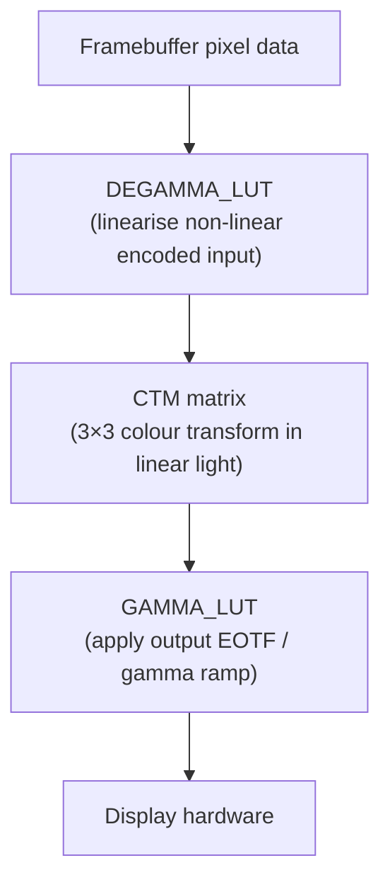
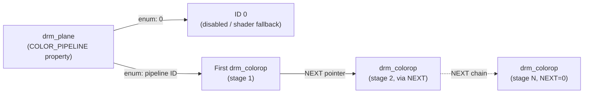
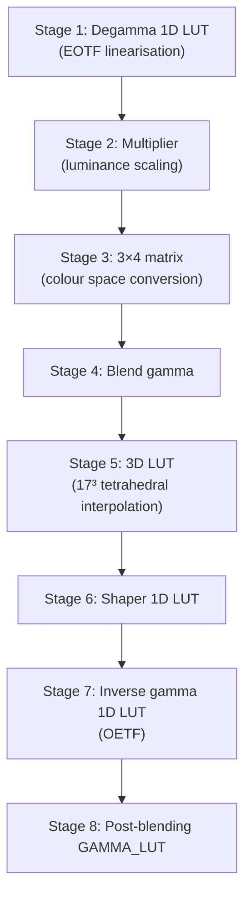
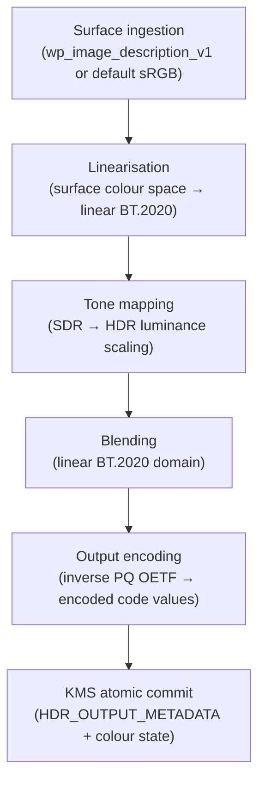
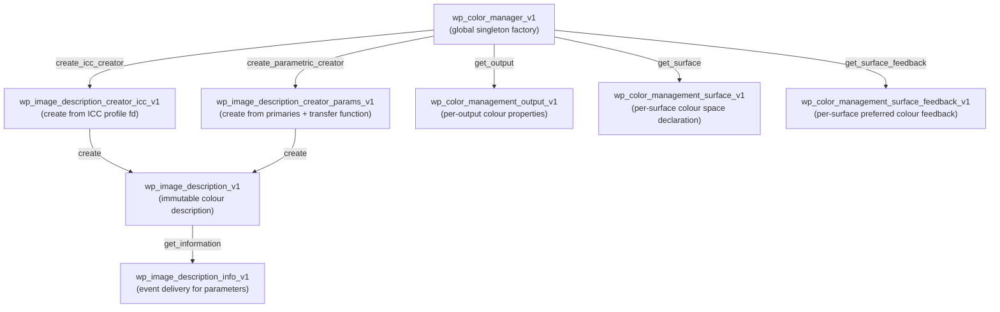
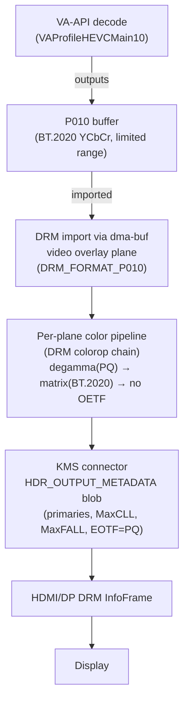

# Chapter 74 — HDR and Wide Color Gamut on Linux

**Target audiences:** Systems and driver developers working on display pipelines and kernel color management; graphics application developers integrating HDR rendering via Vulkan or VA-API; browser and web platform engineers mapping wide-color-gamut content to Linux display infrastructure; compositor authors implementing the Wayland color-management protocol.

> **Scope:** This chapter owns the end-to-end Linux color pipeline:
>
> - **`DEGAMMA_LUT`/`CTM`/`GAMMA_LUT`** — KMS hardware color pipeline properties
> - **`wp_color_management_v1`** — Wayland color management protocol
> - per-plane HDR metadata
> - tone-mapping integration
>
> **Ch101** covers color science theory (CIE models, ICC profile internals, LittleCMS). **Ch158** covers HDR-specific signaling metadata (HDMI InfoFrames, DP HDR descriptor) and display-side tone-mapping options. Cross-references in those chapters that mention KMS LUT configuration should be resolved here.

---

## Table of Contents

1. [HDR Fundamentals](#hdr-fundamentals)
2. [HDR Metadata Standards](#hdr-metadata-standards)
3. [KMS Color Pipeline](#kms-color-pipeline)
4. [Per-Plane HDR and the DRM Color Pipeline API](#per-plane-hdr-and-the-drm-color-pipeline-api)
5. [Mutter HDR Support](#mutter-hdr-support)
6. [KWin HDR Support](#kwin-hdr-support)
7. [The color-management-v1 Wayland Protocol](#the-color-management-v1-wayland-protocol)
8. [The color-representation-v1 Wayland Protocol](#the-color-representation-v1-wayland-protocol)
9. [Vulkan and HDR](#vulkan-and-hdr)
10. [Tone Mapping in the Compositor](#tone-mapping-in-the-compositor)
11. [HDR Video Passthrough](#hdr-video-passthrough)
12. [wp_color_management_v1: The Wayland Color Management Protocol](#wp_color_management_v1-the-wayland-color-management-protocol)
13. [Integrations](#integrations)

---

## HDR Fundamentals

Standard dynamic range (**SDR**) television and desktop displays target a peak luminance of around 80–100 cd/m² (nits) with a black level of roughly 0.1 cd/m², giving a dynamic range of about 1,000:1. High dynamic range (**HDR**) upends this constraint: HDR consumer displays routinely reach 600–2,000 nits peak, while professional mastering monitors and specialised direct-view **LED** walls can sustain 4,000–10,000 nits. More important than the absolute ceiling is the simultaneous black level: local-dimming **OLED** and mini-**LED** panels achieve <0.001 cd/m² while showing peak highlights in the same frame, producing a simultaneous contrast ratio of 1,000,000:1 or better.

This chapter covers the full Linux HDR and wide-color-gamut stack from signal fundamentals to compositor integration. It begins with why luminance range matters for human vision, then defines the transfer functions — **OETF**, **EOTF**, and **OOTF** — that govern how linear scene light is encoded and decoded, with detailed treatment of the **Perceptual Quantizer** (**PQ** / **SMPTE ST 2084**) and **Hybrid Log-Gamma** (**HLG** / **ITU-R BT.2100**). Wide-color-gamut primaries — **sRGB** / **Rec.709**, **DCI-P3**, and **BT.2020** / **Rec.2020** — are explained together with the concept of colour volume.

The **HDR metadata standards** section covers **SMPTE ST 2086** and **CTA-861-H** static metadata (**MaxCLL**, **MaxFALL**, mastering display primaries), **HDR10+** scene-by-scene dynamic metadata (**SMPTE ST 2094-40**), and how the Linux kernel exposes metadata to userspace through the **`HDR_OUTPUT_METADATA`** **DRM** connector property and the **`drm_hdmi_infoframe_set_hdr_metadata()`** helper in **`drm_hdmi_state_helper.c`**.

The **KMS color pipeline** section describes the classic three-stage model — **`DEGAMMA_LUT`**, **`CTM`** matrix, and **`GAMMA_LUT`** — enabled via **`drm_crtc_enable_color_mgmt()`**, the **`drm_color_lut`** structure for LUT entries, the **`drm_color_ctm`** and **`drm_color_ctm_3x4`** structures for **S31.32** sign-magnitude fixed-point matrices, and a worked example of **BT.2020**-to-**BT.709** gamut conversion via **`drmModeAtomicCommit()`**.

The limitations of the per-**CRTC** model lead into the **DRM Color Pipeline API** (merged in **Linux 6.19**), which introduces the **`drm_colorop`** object model for per-plane hardware-accelerated colour transforms. Compositors discover available pipelines via the **`COLOR_PIPELINE`** enumeration property on each **`drm_plane`**; the API is illustrated with **AMD**'s **DCN 3.x** eight-stage pipeline and **NVIDIA**'s preview support.

Compositor implementations are examined for both **GNOME**'s **Mutter** — covering its incremental HDR delivery across **GNOME 46–48**, the **`hdr_output_metadata`** **UAPI** structure, display capability discovery via **libdisplay-info** and **`di_info_get_hdr_static_metadata()`**, and the full Mutter output HDR pipeline — and **KDE**'s **KWin**, covering the **Plasma 6** series, **KWin**'s fully colour-managed compositor architecture, **`ICtCp`**-domain tone mapping, and per-**DRM**-plane colour pipeline support added in **Plasma 6.6**.

The **`color-management-v1`** **Wayland** protocol — merged in **wayland-protocols 1.41** — is described in depth: the **`wp_color_manager_v1`** singleton factory, **`wp_image_description_v1`**, **`wp_image_description_creator_icc_v1`** and **`wp_image_description_creator_params_v1`** factories, named transfer functions and primaries, application-side usage via **GTK 4** and **`GdkColorState`**, and compositor adoption across **Mutter**, **KWin**, **SDL 3**, **Qt 6**, and **Weston**. The companion **`color-representation-v1`** protocol (merged in **wayland-protocols 1.44**) addresses **YCbCr**-to-**RGB** conversion parameters for hardware-decoded video buffers via **`wp_color_representation_surface_v1`**.

The **Vulkan** and HDR section explains **`VK_EXT_swapchain_colorspace`** and its **`VkColorSpaceKHR`** enumerants (**`VK_COLOR_SPACE_HDR10_ST2084_EXT`**, **`VK_COLOR_SPACE_HDR10_HLG_EXT`**, **`VK_COLOR_SPACE_EXTENDED_SRGB_LINEAR_EXT`**), **`VK_EXT_hdr_metadata`** and the **`VkHdrMetadataEXT`** structure, swapchain format selection (**`VK_FORMAT_A2B10G10R10_UNORM_PACK32`**, **`VK_FORMAT_R16G16B16A16_SFLOAT`** / **scRGB**), and **`VK_EXT_surface_maintenance1`** present-mode compatibility.

Tone mapping in the compositor is covered through the Reinhard, Hable filmic, and **ACES** operators; **KWin**'s **ICtCp**-domain brightness-remapping pipeline; **Mutter**'s linear **BT.2020** luminance adaptation to the 203-nit **SDR** reference white (**ITU-R BT.2408**); **Gamescope**'s gaming-oriented inverse tone mapping (**`--hdr-itm-enable`**), 3D LUT looks, and mura compensation on **Steam Deck OLED**; and **scRGB** / **`EGL_EXT_gl_colorspace_scrgb_linear`** as an emerging intermediate representation.

Finally, **HDR** video passthrough covers **VA-API** hardware decode with **`VAProfileHEVCMain10`** and **`VA_FOURCC_P010`** surfaces, the **`VAHdrMetaDataHDR10`** structure, end-to-end pipeline from **VA-API** decode through **dma-buf** import to per-plane **DRM** colorop chains and **`HDR_OUTPUT_METADATA`**, **DisplayPort 1.4** and **HDMI 2.1** HDR transport including **DSC** and **VRR**, **Vulkan Video** (**`VK_KHR_video_decode_h265`** / **`VK_KHR_video_decode_av1`**) for shader-integrated HDR decode, and colour space signalling via **HDMI AVI InfoFrame** and **DisplayPort** **MSA** / **HDRIF**.

### Why Luminance Range Matters

Human vision is contrast-driven, not absolute-luminance-driven. The visual system adapts over several orders of magnitude, but in any single scene it resolves fine detail across roughly a 10,000:1 local dynamic range. **SDR** content that clips bright highlights or lifts black levels loses perceptually significant detail. **HDR** allows source content to carry the full scene luminance, deferring the clipping decision to the display (or, on limited displays, to a tone-mapping operator chosen by the compositor or application).

### Transfer Functions: OETF, EOTF, and OOTF

Two transfer functions govern how linear scene light is encoded into a video signal and decoded back into display light.

**OETF (Opto-Electronic Transfer Function)** converts scene-referred linear light into the non-linear code values stored in a video file or sent over a display link. It is applied in the camera or rendering pipeline.

**EOTF (Electro-Optical Transfer Function)** is the inverse, applied by the display itself: it converts the non-linear code values back into display luminance. The traditional **sRGB** / **Rec.709** **EOTF** is a piecewise gamma-2.2-like curve that spans 0–100 cd/m².

**OOTF (Opto-Optical Transfer Function)** covers any residual scene-to-display mapping and accounts for the different viewing environment assumed at capture vs. at playback. For **HDR**, **OOTF** is often explicitly defined in the standard rather than being implicit.

### Perceptual Quantizer (PQ / SMPTE ST 2084)

The **Perceptual Quantizer** was developed by **Dolby Laboratories** and standardised by **SMPTE** as **ST 2084** and incorporated into **ITU-R BT.2100**. It maps code values to absolute luminance from 0 to 10,000 cd/m² using a curve tuned to the threshold of human visual sensitivity at each luminance level, so that perceptual steps are roughly uniform across the entire range — a property **SDR** gamma cannot achieve above ~100 nits. [Source](https://en.wikipedia.org/wiki/Perceptual_quantizer)

The **PQ** **EOTF** (display decoding) is:

```
F_D = 10000 × [max((E'^(1/m₂) − c₁), 0) / (c₂ − c₃·E'^(1/m₂))]^(1/m₁)
```

where `E'` is the normalised code value in [0, 1] and `F_D` is display luminance in cd/m². The constants are:

| Symbol | Exact Fraction | Decimal |
|--------|----------------|---------|
| m₁     | 2610/16384     | 0.15930… |
| m₂     | 2523/32        | 78.844… |
| c₁     | 107/128        | 0.8359… |
| c₂     | 2413/128       | 18.851… |
| c₃     | 2392/128       | 18.687… |

The inverse (**OETF**, signal encoding) is:

```
E' = [(c₁ + c₂·Y^m₁) / (1 + c₃·Y^m₁)]^m₂,   Y = F_D / 10000
```

**PQ** is not backward-compatible with **SDR**: an **SDR** display receiving an unprocessed **PQ** signal will render it far too dark.

### Hybrid Log-Gamma (HLG / ITU-R BT.2100)

**HLG** was jointly developed by the **BBC** and **NHK** for broadcast use. It is scene-referred rather than display-referred: a normalised scene luminance of 1 corresponds to a reference white, with luminances up to 12× reference encoded in the upper logarithmic segment. This makes **HLG** backward-compatible with **SDR** receivers, which see the lower segment (a √E curve) as a plausible gamma-2.0 signal. [Source](https://en.wikipedia.org/wiki/Hybrid_log%E2%80%93gamma)

The **HLG** **OETF** (**Rec. 2100** form):

```
E' = √(3E)               for 0 ≤ E ≤ 1/12
E' = a·ln(12E − b) + c  for 1/12 < E ≤ 1
```

with a = 0.17883277, b = 0.28466892, c = 0.55991073. The **HLG** system gamma (1.2 at reference viewing conditions) allows a single stream to display acceptably on both **SDR** monitors and **HDR** screens.

### Wide Color Gamut: BT.2020, DCI-P3, and sRGB

Color gamut describes the range of reproducible chromaticities. The three dominant standards on desktop Linux are:

**sRGB / Rec.709** (broadcast HD television): Red primary at **CIE** xy (0.640, 0.330), green at (0.300, 0.600), blue at (0.150, 0.060). **D65** white point. Covers about 35.9% of the **CIE 1931** chromaticity diagram.

**DCI-P3** (digital cinema): Red at (0.680, 0.320), green at (0.265, 0.690), blue at (0.150, 0.060). **DCI-P3** with a **D65** white point (**Display P3**) is the native gamut of Apple displays and many consumer wide-gamut panels. Covers about 45.5% of **CIE 1931** — roughly 25% larger than **sRGB**.

**BT.2020 / Rec.2020** (**UHDTV**): Red at (0.708, 0.292), green at (0.170, 0.797), blue at (0.131, 0.046). **D65** white point. Covers about 75.8% of **CIE 1931**. **BT.2020** is the mandatory colour container for **HDR10**, **HDR10+**, and **HLG** content. Current consumer displays cover roughly 70–80% of **BT.2020** by area metric. [Source](https://en.wikipedia.org/wiki/Rec._2020)

The combination of a large gamut (**BT.2020**) with an absolute-luminance transfer function (**PQ**) defines the **colour volume** — the set of colours representable at each luminance level. **HDR10** content is described in this colour volume; compositors must map it into whatever sub-volume the output display can actually reproduce.

---

## HDR Metadata Standards

### SMPTE ST 2086 and CTA-861-H: Static Metadata

HDR10 carries **static metadata** that describes the mastering display and the content's light levels. These values are constant for the duration of a programme:

- **Mastering display primaries**: CIE xy chromaticity of red, green, blue, and white, describing the display on which colour grading was performed. Encoded as 16-bit values in units of 0.00002 CIE xy (range 0–50,000).
- **Max mastering luminance** and **min mastering luminance**: Peak and black level of the mastering display in cd/m².
- **MaxCLL (Maximum Content Light Level)**: The highest single-pixel luminance value anywhere in the entire programme, in nits.
- **MaxFALL (Maximum Frame Average Light Level)**: The highest frame-average luminance over all frames, in nits.

CTA-861-H (formerly CEA-861-G) defines the HDMI Dynamic Range and Mastering InfoFrame (DRM InfoFrame), the wire format used to carry this metadata from source to sink. The infoframe is sent over the HDMI AUX channel during blanking. [Source](https://lwn.net/Articles/783575/)

### HDR10+ and Dynamic Metadata

HDR10+ extends HDR10 by carrying **scene-by-scene or frame-by-frame** dynamic metadata (SMPTE ST 2094-40). Rather than a single set of luminance targets for the whole programme, dynamic metadata can specify tone-mapping guidance per-frame, allowing the display to optimise shadows and highlights within every cut. The dynamic metadata is transmitted using the HDMI Vendor-Specific InfoFrame (VSIF) extension over HDMI 2.0 or later. HDR10+ is royalty-free (managed by the HDR10+ Technologies consortium, including Samsung and Amazon).

Dolby Vision takes a similar approach with 12-bit encoding and proprietary dynamic metadata (carried in RPU NAL units in the video stream itself), but requires licensed hardware and display firmware and is not yet supported in the mainline Linux display stack.

HLG carries no static or dynamic mastering metadata; it is self-contained in the signal. This makes HLG simpler to implement and naturally backward-compatible, which is why broadcasters favour it for live production.

### The HDR_OUTPUT_METADATA Connector Property

The Linux kernel exposes HDR metadata to userspace via the `HDR_OUTPUT_METADATA` DRM connector property. This is a blob property carrying an `hdr_output_metadata` structure (wrapping the `hdr_metadata_infoframe` defined in `include/linux/hdmi.h`), which userspace — the compositor — populates after deciding on the desired EOTF, mastering display description, MaxCLL, and MaxFALL. The kernel then passes this to the driver, which assembles the HDMI DRM InfoFrame and sends it to the display via the AUX or DDC channel. [Source: `drm: Enable HDR infoframe support`, commit 2cdbfd66](https://github.com/torvalds/linux/commit/2cdbfd66a82969770ce1a7032fb1e2155a08cee8)

Drivers attach the property at initialisation time with `drm_connector_attach_hdr_output_metadata_property()`. At atomic commit, the connector helper function `drm_hdmi_infoframe_set_hdr_metadata()` reads `conn_state->hdr_output_metadata` and fills the HDMI DRM infoframe:

```mermaid
graph LR
    COMP["Compositor\n(Mutter / KWin / Gamescope)"]
    PROP["HDR_OUTPUT_METADATA\nconnector property blob"]
    KERNEL["DRM Kernel\n(drm_hdmi_state_helper.c)"]
    HELPER["drm_hdmi_infoframe_set_hdr_metadata()"]
    DRIVER["Display Driver\n(connector helper)"]
    INFOFRAME["HDMI DRM InfoFrame\n(CTA-861-H)"]
    DISPLAY["Display\n(via AUX / DDC channel)"]

    COMP -- "populates" --> PROP
    PROP -- "read at atomic commit" --> KERNEL
    KERNEL -- "calls" --> HELPER
    HELPER -- "fills" --> INFOFRAME
    INFOFRAME -- "transmitted by" --> DRIVER
    DRIVER -- "sends" --> DISPLAY
```



```c
/* drivers/gpu/drm/drm_hdmi_state_helper.c (simplified) */
int drm_hdmi_infoframe_set_hdr_metadata(struct hdmi_drm_infoframe *frame,
                                         const struct drm_connector_state *conn_state)
{
    struct drm_device *dev = conn_state->connector->dev;
    struct hdr_output_metadata *hdr_metadata;

    if (!conn_state->hdr_output_metadata)
        return -EINVAL;

    hdr_metadata = conn_state->hdr_output_metadata->data;
    /* Validates EOTF value then fills infoframe fields */
    ...
    return 0;
}
```

The display's HDR capabilities are reflected in the `hdr_sink_metadata` field of `drm_connector.display_info`, populated during EDID parsing — specifically bit SM_0 of the CTA HDR Static Metadata Data Block (SMPTE ST 2086), which indicates Static Metadata Type 1 support. If SM_0 is 0, the display does not understand HDR infoframes and the compositor should not attempt to send them.

---

## KMS Color Pipeline

### The Classic Three-Stage Model

The traditional DRM color management API exposes three CRTC-level properties, implemented in `drivers/gpu/drm/drm_color_mgmt.c` and described in `include/drm/drm_crtc.h`:

```
Framebuffer pixel data
        │
        ▼
  [DEGAMMA_LUT]    — linearise non-linear encoded input
        │
        ▼
   [CTM matrix]   — 3×3 colour transform in linear light
        │
        ▼
  [GAMMA_LUT]     — apply output EOTF / gamma ramp
        │
        ▼
   Display hardware
```



A driver advertises support by calling `drm_crtc_enable_color_mgmt()` during driver initialisation:

```c
/* drivers/gpu/drm/drm_color_mgmt.c */
void drm_crtc_enable_color_mgmt(struct drm_crtc *crtc,
                                 uint             degamma_lut_size,
                                 bool             has_ctm,
                                 uint             gamma_lut_size);
```

[Source](https://github.com/torvalds/linux/blob/master/drivers/gpu/drm/drm_color_mgmt.c)

### drm_color_lut

LUT entries use the `drm_color_lut` structure, defined in `include/uapi/drm/drm_mode.h`:

```c
/* include/uapi/drm/drm_mode.h */
struct drm_color_lut {
    __u16 red;
    __u16 green;
    __u16 blue;
    __u16 reserved;
};
```

Values are in the range 0–0xFFFF (unsigned 16-bit). A driver receiving a DEGAMMA_LUT blob iterates the entries with `drm_color_lut_size()` to obtain the element count, then maps the hardware registers accordingly.

### drm_color_ctm: The 3×3 Matrix

The CTM blob carries a `drm_color_ctm` structure — nine `__u64` values in **S31.32 sign-magnitude** (not two's complement) fixed-point format, arranged row-major. Some hardware (AMD DCN) uses a 3×4 matrix with an additional translation row; this is accommodated by the `drm_color_ctm_3x4` structure added in later kernel versions:

```c
/* include/uapi/drm/drm_mode.h */
struct drm_color_ctm {
    __u64 matrix[9];    /* S31.32 sign-magnitude, row-major */
};

struct drm_color_ctm_3x4 {
    __u64 matrix[12];   /* S31.32 sign-magnitude, row-major 3×4 */
};
```

The 3×3 matrix multiply is:

```
|R_out|   |M[0] M[1] M[2]|   |R_in|
|G_out| = |M[3] M[4] M[5]| × |G_in|
|B_out|   |M[6] M[7] M[8]|   |B_in|
```

S31.32 sign-magnitude encoding: the most significant bit is the sign, and the remaining 63 bits represent the magnitude as a 31.32 fixed-point number. A value of -0.5876 is encoded as `(1ULL << 63) | (uint64_t)(0.5876 * (1ULL << 32))`. Note that this format does **not** use two's complement — care must be taken in conversion helpers.

[Source](https://patchwork.kernel.org/project/dri-devel/patch/1485859714-26619-1-git-send-email-brian.starkey@arm.com/)

### Example: BT.2020 to BT.709 Gamut Conversion via Atomic Commit

A compositor that receives BT.2020 content and needs to display it on a BT.709 monitor programs the conversion matrix through the CTM property. The standard 3×3 BT.2020-to-BT.709 matrix (operating in linear light) is:

```
 1.6605  -0.5876  -0.0728
-0.1246   1.1329  -0.0083
-0.0182  -0.1006   1.1187
```

The following sketch shows how a DRM compositor would commit this (simplified, error handling omitted):

```c
/* Pseudocode — simplified for illustration */
#include <drm/drm_mode.h>
#include <xf86drm.h>
#include <xf86drmMode.h>

static __u64 s31_32(double v) {
    /* Sign-magnitude S31.32 encoding */
    __u64 sign = (v < 0) ? (1ULL << 63) : 0;
    return sign | ((__u64)(fabs(v) * (1ULL << 32)));
}

void set_bt2020_to_bt709_ctm(int drm_fd, uint32_t crtc_id,
                              uint32_t ctm_prop_id)
{
    struct drm_color_ctm ctm = { .matrix = {
        s31_32( 1.6605), s31_32(-0.5876), s31_32(-0.0728),
        s31_32(-0.1246), s31_32( 1.1329), s31_32(-0.0083),
        s31_32(-0.0182), s31_32(-0.1006), s31_32( 1.1187),
    }};
    uint32_t blob_id;
    drmModeCreatePropertyBlob(drm_fd, &ctm, sizeof(ctm), &blob_id);

    drmModeAtomicReqPtr req = drmModeAtomicAlloc();
    drmModeAtomicAddProperty(req, crtc_id, ctm_prop_id, blob_id);
    drmModeAtomicCommit(drm_fd, req, DRM_MODE_ATOMIC_NONBLOCK, NULL);
    drmModeAtomicFree(req);
    drmModeDestroyPropertyBlob(drm_fd, blob_id);
}
```

In practice this would be combined with a DEGAMMA_LUT that linearises the input (e.g., removes sRGB gamma) and a GAMMA_LUT that re-applies the output encoding (e.g., PQ or sRGB). For HDR10 output the GAMMA_LUT would be left empty or bypassed — the display itself applies the PQ EOTF — while the `HDR_OUTPUT_METADATA` connector property carries the mastering display description.

---

## Per-Plane HDR and the DRM Color Pipeline API

### Limitations of the CRTC-Level Model

The three-stage DEGAMMA/CTM/GAMMA API applies to the entire CRTC output, acting on the composited result after all planes have been blended. This is adequate for uniform-gamut desktops but breaks down when multiple planes carry content in different colour spaces simultaneously — for example, an HDR video plane composited over an sRGB desktop.

### The DRM Color Pipeline API (Linux 6.19+)

The DRM Color Pipeline API, merged to `drm-misc-next` in November 2025 and included in **Linux 6.19**, introduces the `drm_colorop` object model for per-plane (pre-blending) hardware-accelerated colour transforms. [Source](https://docs.kernel.org/gpu/rfc/color_pipeline.html)

The fundamental building block is:

```c
/* Conceptual structure — see Documentation/gpu/rfc/color_pipeline.rst */
struct drm_colorop {
    /* TYPE: enumerated_1d_curve | custom_1d_lut | matrix_3x3 | matrix_3x4 | lut_3d */
    /* BYPASS: bool — disable without restructuring the chain */
    /* NEXT: ID of the following colorop, or 0 if terminal */
};
```

Compositors discover available pipelines by reading the **`COLOR_PIPELINE`** enumeration property on each `drm_plane`. The enum always includes ID 0 (disabled, meaning fall back to shader-side processing) plus the IDs of the first-stage colorop in each hardware pipeline the driver exposes. Userspace walks the chain via `NEXT` pointers to assess whether the offered pipeline matches its needs.



AMD's DCN 3.x display engine exposes an **eight-stage pipeline** per plane:

1. Degamma 1D LUT (EOTF linearisation)
2. Multiplier (luminance scaling)
3. 3×4 colour space conversion matrix
4. Blend gamma
5. 3D LUT (17³ tetrahedral interpolation)
6. Shaper 1D LUT
7. Inverse gamma 1D LUT (OETF)
8. Post-blending GAMMA_LUT



[Source](https://www.mail-archive.com/amd-gfx@lists.freedesktop.org/msg127290.html)

The supported transfer functions include: sRGB EOTF, PQ EOTF (scaled to 0.0–125.0 in the normalised domain where 1.0 = 80 nits SDR reference white), BT.2020/BT.709 OETF, Gamma 2.2, and their inverses. This is sufficient to handle an HDR10 plane (BT.2020/PQ) composited alongside an sRGB plane without a round-trip through the shader.

NVIDIA announced preview support for the DRM per-plane color pipeline in April 2026, targeting driver alignment with the upstream API. [Source](https://www.gamingonlinux.com/2026/04/nvidia-announce-a-preview-of-drm-per-plane-color-pipeline-api-support-on-linux-good-for-hdr/)

**Note:** The `drm_plane_state.hdr_mult` field mentioned in some vendor-specific patches has not been merged as stable upstream UAPI as of kernel 6.19. Per-plane luminance scaling is instead expressed through a **multiplier-type `drm_colorop`** in the color pipeline chain.

---

## Mutter HDR Support

### Timeline

GNOME's Mutter compositor has pursued HDR support through a sequence of incremental merges:

- **GNOME 46 (early 2024)**: Experimental HDR mode landed behind a `MUTTER_DEBUG_COLOR_MANAGEMENT_PROTOCOL=1` environment variable flag.
- **GNOME 47 (September 2024)**: Jonas Ådahl's colour-state transform work merged, enabling the compositor to transform SDR/sRGB surface content for HDR-enabled outputs. When HDR mode is active, the stage view composites into a linear BT.2020 intermediate framebuffer; each surface is linearised (EOTF applied), gamut-mapped to BT.2020, and luminance-adapted. [Source](https://www.phoronix.com/news/Mutter-Color-State-Transform)
- **GNOME 48 (March 2025)**: `wp_color_management_v1` protocol support merged as a late feature addition. HDR is now enabled via `gdctl --color-mode bt2100` and toggled per-monitor in Display Settings. [Source](https://www.phoronix.com/news/GNOME-48-HDR) [Source: Phoronix GNOME 48 Mutter](https://www.phoronix.com/news/GNOME-wp_color_management_v1)

### The hdr_output_metadata UAPI Structure

When Mutter (or any compositor) sets the `HDR_OUTPUT_METADATA` connector property, it creates a blob containing the following UAPI structure:

```c
/* include/uapi/linux/types.h + CTA-861 mapping */
struct hdr_static_metadata {
    __u8  eotf;                  /* 0=SDR, 1=HDR, 2=ST2084 PQ, 3=HLG */
    __u8  metadata_type;         /* 0 = Static Metadata Type 1 */
    __u16 max_cll;               /* MaxCLL in cd/m² */
    __u16 max_fall;              /* MaxFALL in cd/m² */
    __u16 min_display_mastering_luminance; /* 0.0001 cd/m² units */
    __u16 max_display_mastering_luminance; /* 1 cd/m² units */
    /* mastering display primaries: x[3], y[3], white_x, white_y */
};
```

**Note:** The exact layout of `hdr_output_metadata` is defined in `include/uapi/linux/hdmi.h` via the `hdr_metadata_infoframe` struct; consult the kernel source for the exact field names as the above is a schematic representation.

### Reading Display HDR Capabilities via libdisplay-info

Mutter uses **libdisplay-info** (maintained by Simon Ser / Collabora) to parse EDID and DisplayID extensions, including the CTA HDR Static Metadata Data Block defined in CTA-861-H. [Source](https://gitlab.freedesktop.org/emersion/libdisplay-info)

The key API:

```c
/* libdisplay-info/include/libdisplay-info/info.h */

struct di_hdr_static_metadata {
    float desired_content_max_luminance;       /* cd/m², 0 if unset */
    float desired_content_max_frame_avg_luminance;
    float desired_content_min_luminance;
    bool  type1;           /* Static Metadata Type 1 */
    bool  traditional_sdr; /* EOTF: SDR gamma */
    bool  traditional_hdr; /* EOTF: traditional HDR gamma */
    bool  pq;              /* EOTF: ST 2084 PQ */
    bool  hlg;             /* EOTF: HLG */
};

const struct di_hdr_static_metadata *
di_info_get_hdr_static_metadata(const struct di_info *info);
```

[Source](https://emersion.pages.freedesktop.org/libdisplay-info/libdisplay-info/info.h.html)

Mutter calls `di_info_get_hdr_static_metadata()` to determine whether the connected display supports PQ or HLG, then checks the reported peak luminance to decide whether to advertise HDR capabilities to applications via the Wayland color-management protocol.

### The Mutter Output HDR Pipeline

When HDR mode is active for an output, Mutter's pipeline operates as follows:

1. **Surface ingestion**: Each surface carries a `wp_image_description_v1` created by the application (or defaults to sRGB).
2. **Linearisation**: The compositor converts surface pixels from their declared colour space to linear BT.2020 light.
3. **Tone mapping**: SDR surfaces are tone-mapped to the HDR output range using a luminance-scaling operator (see Section 10).
4. **Blending**: Linearised, gamut-adapted pixels from all surfaces are blended in the linear BT.2020 domain.
5. **Output encoding**: The compositor applies the inverse PQ OETF to produce encoded code values, sets `HDR_OUTPUT_METADATA` on the KMS connector property, and queues the KMS atomic commit with the appropriate colour state.



---

## KWin HDR Support

### Plasma 6 Series: Incremental Delivery

KDE's KWin compositor shipped HDR support as a series of improvements throughout the Plasma 6 series, with key contributions from Xaver Hugl:

- **Plasma 6.0 (February 2024)**: Initial HDR display output, static HDR metadata signalling (`HDR_OUTPUT_METADATA` via PQ EOTF), BT.2020 output colour space. ICC profile support per display. [Source](https://zamundaaa.github.io/wayland/2023/12/18/update-on-hdr-and-colormanagement-in-plasma.html)
- **Plasma 6.2 (September 2024)**: SDR gamut scaling control and SDR brightness control on HDR outputs.
- **Plasma 6.3 (January 2025)**: Corrected night light/color temperature using chromatic adaptation in ICtCp colour space rather than naive gamma multiplication, eliminating hue distortion. [Source](https://zamundaaa.github.io/wayland,/colormanagement/2025/01/07/fixing-night-light.html)
- **Plasma 6.6 (December 2025)**: Per-DRM-plane colour pipeline support via the new kernel Color Pipeline API (MR !6600). This enables direct scanout and overlay planes to work with non-sRGB content, improving efficiency for HDR gaming, video, and colour-profiled screens. [Source](https://invent.kde.org/plasma/kwin/-/merge_requests/6600) [Source: Phoronix Plasma 6.6](https://www.webpronews.com/kde-plasma-6-6-debuts-advanced-color-management-and-hdr-support/)

### KWin's Color Pipeline Architecture

KWin operates as a **fully colour-managed compositor**: every surface is converted from its declared input colour space to a common working space (linear BT.2020 in HDR mode), composited there, and then converted to the output encoding.

In HDR mode KWin:

1. Sets the output colour space to BT.2020 with D65 white point.
2. Enables static HDR metadata via `HDR_OUTPUT_METADATA` with the display's preferred brightness values reported from EDID.
3. Uses **sRGB gamma 2.2** for sRGB-declared surfaces (rather than the piecewise sRGB transfer function) to match real display characteristics in SDR mode.
4. For tone mapping (HDR→SDR and SDR→HDR), applies an **ICtCp-domain** brightness-mapping function (see Section 10).

The per-plane Color Pipeline API (added in Plasma 6.6) allows KWin to program DRM colorops for 1D LUTs, multipliers, and 3×3 matrices directly in display hardware, bypassing the shader pipeline for compatible operations and enabling direct scanout of HDR content planes.

### Tone Mapping in KWin

KWin's tone mapping implementation uses the ICtCp colour space (BT.2100 Annex 2). ICtCp separates perceived brightness (I) from chroma (Ct for blue-yellow, Cp for red-green), allowing tone mapping to operate on the intensity channel alone without shifting hue. The pipeline transforms RGB to ICtCp, applies a brightness-remapping curve to the I component, then converts back to RGB. [Source](https://zamundaaa.github.io/wayland/2024/11/06/hdr-and-color-management-in-kwin-part-5.html) [Source: KWin MR !6249](https://invent.kde.org/plasma/kwin/-/merge_requests/6249)

---

## The color-management-v1 Wayland Protocol

### History and Merger

After twelve years of incubation — the first design dating to 2012, a major merge request open for five years accumulating 820 comments — the **`color-management-v1`** extension was accepted into the Wayland protocols repository on **13 February 2025** as part of **wayland-protocols 1.41**. It resides in the `staging/color-management/` directory and uses the `wp_` namespace prefix throughout. [Source](https://www.collabora.com/news-and-blog/news-and-events/12-years-of-incubating-wayland-color-management.html) [Source: GamingOnLinux](https://www.gamingonlinux.com/2025/02/wayland-colour-management-and-hdr-protocol-finally-merged/)

### Interface Overview

The protocol is discoverable via the Wayland registry as `wp_color_manager_v1` (the singleton global). The full interface set: [Source](https://wayland.app/protocols/color-management-v1)

| Interface | Role |
|-----------|------|
| `wp_color_manager_v1` | Global singleton; factory for all other objects |
| `wp_color_management_output_v1` | Per-output colour properties; delivers `image_description_changed` event |
| `wp_color_management_surface_v1` | Per-surface colour space declaration |
| `wp_color_management_surface_feedback_v1` | Per-surface preferred colour description feedback |
| `wp_image_description_v1` | Immutable colour description object |
| `wp_image_description_creator_icc_v1` | Factory: create a description from an ICC profile file descriptor |
| `wp_image_description_creator_params_v1` | Factory: create a description from parametric primaries + transfer function |
| `wp_image_description_info_v1` | Event delivery for image description parameters |



### Key Request Flows

**Application declaring its surface colour space:**

```
# Application creates a parametric image description for HDR10 content
wp_color_manager_v1::create_parametric_creator → creator
creator::set_tf_named(tf_name: "pq")
creator::set_primaries_named(primaries_name: "bt2020")
creator::set_luminances(min_lum: 0.005, max_lum: 1000.0, ref_lum: 203.0)
creator::set_max_cll(max_cll: 1000.0)
creator::set_max_fall(max_fall: 400.0)
creator::create → wp_image_description_v1
# Bind to surface
wp_color_management_surface_v1::set_image_description(desc, render_intent: perceptual)
```

**Application querying output capabilities:**

```
wp_color_manager_v1::get_output(wl_output) → wp_color_management_output_v1
output::get_image_description → wp_image_description_v1
# Compositor sends: ready event with ID, then...
wp_image_description_v1::get_information → wp_image_description_info_v1
# Receives: tf_named, primaries_named, luminances, target_max_cll events
info::done
```

### Named Transfer Functions

The protocol's `wp_image_description_creator_params_v1` supports named transfer functions including: `bt1886`, `gamma22`, `gamma28`, `st240`, `ext_srgb` (extended-range linear), `srgb`, `st2084_pq`, `st428`, and `hlg`. The named primaries include `srgb`, `pal_m`, `pal`, `ntsc`, `generic_film`, `bt2020`, `xyz`, `dcip3`, `displayp3`, and `adobergb`.

Support for specific features is advertised through the `supported_tf_named` and `supported_primaries_named` events sent on the manager interface at bind time. Applications must check these before constructing image descriptions.

### Application-Side Usage: GTK 4

GTK 4 (from GTK 4.16 onwards) implements the `wp_color_management_v1` protocol on the client side. Each `GdkSurface` can carry a `GdkColorState` that describes the surface's encoding. GTK exposes two HDR-relevant states: `GDK_COLOR_STATE_REC2100_PQ` (BT.2020 primaries, PQ transfer function) and `GDK_COLOR_STATE_REC2100_LINEAR` (linear BT.2020, for intermediate compositing). [Source](https://blog.gtk.org/2024/08/11/the-colors-of-gtk/)

Developers can test GTK's HDR rendering path with environment variables:
```bash
GDK_DEBUG=hdr    myapp    # Renders internally in BT.2100-PQ
GDK_DEBUG=linear myapp    # Forces linear compositing
```

When GTK receives the compositor's preferred colour description via `wp_color_management_surface_feedback_v1::preferred_changed`, it adjusts its internal rendering colour space accordingly and declares the resulting surface encoding to the compositor via `wp_color_management_surface_v1::set_image_description`.

### Adoption

GNOME Mutter 48, KDE KWin (Plasma 6.6), GTK 4, Qt 6, SDL 3, Weston 15, and Chromium have all landed or are merging `wp_color_management_v1` support as of mid-2026. [Source: 12 years of Wayland color management](https://www.collabora.com/news-and-blog/news-and-events/12-years-of-incubating-wayland-color-management.html)

---

## The color-representation-v1 Wayland Protocol

The **`color-representation-v1`** protocol is a companion extension merged in **wayland-protocols 1.44**. While `color-management-v1` describes the colour space of RGB surfaces, `color-representation-v1` handles the **YCbCr-to-RGB conversion parameters** for hardware-decoded video buffers. [Source](https://wayland.app/protocols/color-representation-v1) [Source: Phoronix 1.44](https://www.phoronix.com/news/Wayland-Protocols-1.44)

### Interfaces

| Interface | Role |
|-----------|------|
| `wp_color_representation_manager_v1` | Global singleton; factory |
| `wp_color_representation_surface_v1` | Per-surface YCbCr metadata |

### Key Requests

```
# For a VA-API decoded P010 surface in BT.2020 limited range:
wp_color_representation_manager_v1::get_surface(wl_surface)
    → wp_color_representation_surface_v1

surface::set_coefficients_and_range(
    coefficients: bt2020,
    range: limited)

surface::set_chroma_location(chroma_location: 0)  /* left-aligned, type 0 */
```

The `coefficients` enum includes `identity`, `bt709`, `fcc`, `bt601`, `smpte240`, `bt2020`, `bt2020_cl`, and `ictcp`. The compositor uses these parameters when constructing the YCbCr→RGB conversion matrix for hardware video planes, complementing the colour space information from `color-management-v1`.

---

## Vulkan and HDR

### VK_EXT_swapchain_colorspace

`VK_EXT_swapchain_colorspace` extends `VkColorSpaceKHR` with additional enumerants for wide-colour-gamut and HDR surfaces. An application calls `vkGetPhysicalDeviceSurfaceFormatsKHR()` to query supported format/color-space pairs and selects the appropriate combination when creating the swapchain. [Source](https://docs.vulkan.org/refpages/latest/refpages/source/VkColorSpaceKHR.html)

The principal HDR entries:

| Enumerant | Transfer Function | Primaries | Notes |
|-----------|-------------------|-----------|-------|
| `VK_COLOR_SPACE_HDR10_ST2084_EXT` | PQ (ST 2084) | BT.2020, D65 | HDR10 output |
| `VK_COLOR_SPACE_HDR10_HLG_EXT` | HLG | BT.2020, D65 | Broadcast HDR |
| `VK_COLOR_SPACE_DOLBYVISION_EXT` | Proprietary | — | Marked legacy; no metadata signalling |
| `VK_COLOR_SPACE_DISPLAY_P3_NONLINEAR_EXT` | Display P3 gamma | DCI-P3, D65 | Wide gamut consumer |
| `VK_COLOR_SPACE_EXTENDED_SRGB_LINEAR_EXT` | Linear | sRGB / BT.709 | scRGB / compositing |

**Critical note**: for non-sRGB swapchains, the application is responsible for applying the correct OETF in its fragment shader. The implementation does **not** automatically apply the PQ or HLG OETF — it is the application's responsibility to write correctly-encoded values. Only `VK_COLOR_SPACE_SRGB_NONLINEAR_KHR` receives automatic sRGB encoding by the implementation.

### VK_EXT_hdr_metadata

`VK_EXT_hdr_metadata` allows applications to communicate mastering display metadata and content light levels to the implementation, which forwards them to the display as the HDMI/DP infoframe. [Source](https://docs.vulkan.org/refpages/latest/refpages/source/VkHdrMetadataEXT.html)

```c
typedef struct VkHdrMetadataEXT {
    VkStructureType sType;                 /* VK_STRUCTURE_TYPE_HDR_METADATA_EXT */
    const void*     pNext;
    VkXYColorEXT    displayPrimaryRed;     /* CIE xy chromaticity */
    VkXYColorEXT    displayPrimaryGreen;
    VkXYColorEXT    displayPrimaryBlue;
    VkXYColorEXT    whitePoint;
    float           maxLuminance;          /* nits — display maximum */
    float           minLuminance;          /* nits — display minimum */
    float           maxContentLightLevel;  /* nits — MaxCLL */
    float           maxFrameAverageLightLevel; /* nits — MaxFALL */
} VkHdrMetadataEXT;
```

Usage pattern for an HDR10 swapchain:

```c
/* After creating the swapchain with VK_COLOR_SPACE_HDR10_ST2084_EXT: */
VkXYColorEXT bt2020_r = { 0.708f, 0.292f };
VkXYColorEXT bt2020_g = { 0.170f, 0.797f };
VkXYColorEXT bt2020_b = { 0.131f, 0.046f };
VkXYColorEXT d65      = { 0.3127f, 0.3290f };

VkHdrMetadataEXT meta = {
    .sType                     = VK_STRUCTURE_TYPE_HDR_METADATA_EXT,
    .displayPrimaryRed         = bt2020_r,
    .displayPrimaryGreen       = bt2020_g,
    .displayPrimaryBlue        = bt2020_b,
    .whitePoint                = d65,
    .maxLuminance              = 1000.0f,   /* mastering display peak */
    .minLuminance              = 0.005f,
    .maxContentLightLevel      = 1000.0f,
    .maxFrameAverageLightLevel = 200.0f,
};
vkSetHdrMetadataEXT(device, 1, &swapchain, &meta);
```

Unknown values should be set to 0. The call is idempotent and may be repeated per-frame for dynamic metadata approximation (though `VK_EXT_hdr_metadata` itself carries only static metadata semantics).

### Selecting the Right Swapchain Format

Applications targeting HDR10 should enumerate formats with `vkGetPhysicalDeviceSurfaceFormatsKHR()` and look for:

```c
/* Preferred HDR10 combination: 10-bit per channel, PQ encoded */
VkSurfaceFormatKHR preferred = {
    .format     = VK_FORMAT_A2B10G10R10_UNORM_PACK32, /* or R10G10B10A2 */
    .colorSpace = VK_COLOR_SPACE_HDR10_ST2084_EXT,
};

/* Alternative: 16-bit float for scRGB / linear HDR compositing */
VkSurfaceFormatKHR scrgb = {
    .format     = VK_FORMAT_R16G16B16A16_SFLOAT,
    .colorSpace = VK_COLOR_SPACE_EXTENDED_SRGB_LINEAR_EXT,
};
```

`VK_FORMAT_A2B10G10R10_UNORM_PACK32` provides 10 bits of unsigned normalised precision per colour channel, sufficient to represent PQ code values without banding. The 16-bit float variant (`R16G16B16A16_SFLOAT`) with `VK_COLOR_SPACE_EXTENDED_SRGB_LINEAR_EXT` (scRGB linear) is preferred for compositor-adjacent rendering because the higher precision avoids quantisation artefacts in the linear domain.

### VK_EXT_surface_maintenance1 Interaction

`VK_EXT_surface_maintenance1` (promoted into Vulkan 1.4 maintenance) adds `VkSurfacePresentModeCompatibilityEXT`, allowing the application to query which present modes are compatible with a given colour space. This matters for HDR because some platforms require exclusive-fullscreen mode or a specific present mode to enable the HDR signal path to the display. On Wayland under KWin, HDR mode is activated by the compositor when a surface with a PQ image description is visible in full-screen, so the exclusive-fullscreen constraint does not apply — instead the compositor manages the display mode change.

---

## Tone Mapping in the Compositor

### The Tone-Mapping Problem

A compositor managing an HDR display must handle two opposing cases:

1. **SDR content on an HDR display**: The SDR surface was authored assuming 80–100 nit peak brightness. Naively emitting its sRGB values at 1:1 on a 1,000 nit display makes white appear at only 100 nits, looking dim and washed-out relative to HDR-aware content. The compositor must **expand** the SDR luminance range to occupy an appropriate region of the display's headroom.

2. **HDR content on an SDR display**: The content may contain highlights at 1,000–4,000 nits that the display physically cannot reproduce at more than ~300 nits. The compositor must **compress** luminance into the display's range without crushing shadow detail or blowing out highlights — the classical tone-mapping problem.

### Tone-Mapping Operators

Common operators span a spectrum from simple to perceptually sophisticated:

**Reinhard (global)**: The simplest operator, `L_out = L_in / (L_in + 1)`. Compresses all luminances toward a finite asymptote but loses highlight contrast.

**Hable filmic (Uncharted 2)**: A piecewise polynomial tuned to preserve shadow and highlight contrast while applying a gentle S-curve through the midtones. Uses the form `f(x) = (x·(A·x + C·B) + D·E) / (x·(A·x + B) + D·F) − E/F`.

**ACES (Academy Color Encoding System)**: The reference tone-mapping curve used in cinema post-production. The full ACES pipeline involves a Reference Rendering Transform (RRT) and an Output Device Transform (ODT), but a simplified "ACES approximation" (Stephen Hill's fit) is widely used in real-time applications.

**Content-adaptive / scene-aware**: Analyses frame statistics (average log luminance, histogram) and adjusts the mapping per-frame or per-scene. Produces the most perceptually uniform results but requires feedback from the scene and introduces temporal adaptation latency.

### KWin: ICtCp-Domain Tone Mapping

KWin's approach operates entirely in the **ICtCp colour space** (BT.2100 Annex 2, PQ-encoded), which has the property that the I (intensity) component closely matches perceived brightness, while Ct and Cp carry chroma orthogonally. The compositor:

1. Converts RGB (in linear BT.2020) to ICtCp.
2. Applies a **brightness-remapping function** to the I channel only, mapping the source luminance range to the destination range.
3. Converts back to linear BT.2020 RGB.

This preserves hue and saturation under tone compression far better than RGB-space operators, because RGB operators produce hue shifts when one channel clips before another. [Source](https://zamundaaa.github.io/wayland/2024/11/06/hdr-and-color-management-in-kwin-part-5.html)

### Mutter: Luminance Adaptation

Mutter (from GNOME 47 onwards) performs linearisation and luminance adaptation in a linear BT.2020 intermediate buffer. When compositing SDR surfaces for HDR output, each surface's linear luminance is scaled to occupy the SDR reference white level of the HDR output (standardised at 203 nits per ITU-R BT.2408). [Source](https://www.phoronix.com/news/Mutter-Color-State-Transform)

This approach — mapping SDR 1.0 (white) to 203 nits in the HDR output — preserves the appearance of SDR content while leaving headroom above 203 nits for HDR-signalled highlights. Tone mapping for HDR-to-SDR scenarios is an active development area in Mutter.

### Gamescope and Gaming-Oriented Tone Mapping

Valve's **Gamescope** compositor (used in SteamOS and Steam Deck) implements more aggressive tone-mapping strategies oriented toward gaming. Key features include: [Source](https://wiki.archlinux.org/title/Gamescope)

- **`--hdr-enabled`**: Activates HDR10 output mode (PQ EOTF, BT.2020) on supported displays.
- **`--hdr-itm-enable`**: Enables inverse tone mapping (ITM), converting SDR game content up to HDR headroom. **`--hdr-itm-sdr-nits`** specifies the assumed SDR white point (default 100 nits, max 1,000 nits).
- **3D LUT "looks"**: Gamescope can apply film-look colour transformations via 3D LUTs, composited before the display pipeline.
- **Mura compensation**: On Steam Deck OLED hardware, spatially-varying display non-uniformity (mura) is corrected via a per-pixel LUT applied during composition.

The Steam Deck OLED screen peaks at 600 nits SDR and 1,000 nits HDR peak brightness, with a DCI-P3 native gamut. Gamescope maps wide-gamut content to BT.2020 for HDMI-docked HDR output.

Gamescope originally used `VALVE1_`-prefixed DRM plane properties for its colour pipeline, predating the upstream DRM Color Pipeline API. These proprietary plane properties have been progressively replaced by the standardised `COLOR_PIPELINE` property as the kernel API stabilised in Linux 6.19.

### scRGB / Extended Linear sRGB

An emerging intermediate representation gaining traction in compositor stacks is **scRGB** — the IEC 61966-2-2 extended-range sRGB space — combined with a half-float (FP16) buffer format. In scRGB, values outside [0, 1] represent colours beyond the sRGB gamut and luminances above the SDR reference white. The `VK_COLOR_SPACE_EXTENDED_SRGB_LINEAR_EXT` Vulkan colour space and the `EGL_EXT_gl_colorspace_scrgb_linear` extension provide the rendering-side interface. In the Wayland color-management protocol, the `create_windows_scrgb` request on `wp_color_manager_v1` creates a Windows-compatible scRGB image description, enabling interoperability with Wine/Proton HDR games that use the Windows HDR path. [Source: GNOME Mutter scRGB issue](https://gitlab.gnome.org/GNOME/mutter/-/work_items/4083)

---

## HDR Video Passthrough

### VA-API and HDR10 Decode

Hardware-accelerated HDR video decode on Linux uses VA-API (Video Acceleration API). For HEVC HDR10 content:

- **Profile**: `VAProfileHEVCMain10` (10-bit HEVC). For VP9 HDR: `VAProfileVP9Profile2` or `Profile3`.
- **Surface format**: `VA_FOURCC_P010` (10-bit planar YCbCr 4:2:0, little-endian, 16-bit per sample). [Source: libva](https://github.com/intel/libva/blob/master/va/va_vpp.h)

The HDR mastering metadata is available in the decoded `AVFrame`'s side data when using FFmpeg/libavcodec, and passed to the display pipeline separately from the pixel data.

### VAHdrMetaDataHDR10

The VA-API `VAHdrMetaDataHDR10` structure carries the HDR10 static metadata for video post-processing operations: [Source](http://intel.github.io/libva/structVAHdrMetaDataHDR10.html)

```c
typedef struct {
    uint16_t display_primaries_x[3];   /* [green, blue, red] CIE x ×50000 */
    uint16_t display_primaries_y[3];   /* [green, blue, red] CIE y ×50000 */
    uint16_t white_point_x;            /* D65 = 15635 */
    uint16_t white_point_y;            /* D65 = 16450 */
    uint32_t max_display_mastering_luminance; /* 0.0001 cd/m² units */
    uint32_t min_display_mastering_luminance; /* 0.0001 cd/m² units */
    uint16_t max_content_light_level;  /* MaxCLL, cd/m² */
    uint16_t max_pic_average_light_level; /* MaxFALL, cd/m² */
    uint16_t reserved[VA_PADDING_HIGH];
} VAHdrMetaDataHDR10;
```

Note the **unit mismatch**: mastering luminance values are in 0.0001 cd/m² (so 10,000,000 = 1,000 nits), while content light levels are in 1 cd/m². This can cause bugs if values are used interchangeably. [Source: intel/media-driver issue #827](https://github.com/intel/media-driver/issues/827)

### End-to-End HDR Passthrough Pipeline

A complete HDR video passthrough pipeline from decode to display:

```
VA-API decode (VAProfileHEVCMain10)
        │ P010 buffer (BT.2020 YCbCr, limited range)
        ▼
DRM import (dma-buf) → video overlay plane
        │ DRM_FORMAT_P010
        │ COLOR_ENCODING = BT.2020 YCbCr
        │ COLOR_RANGE = limited
        ▼
Per-plane color pipeline (DRM colorop):
  degamma(PQ)  →  matrix(BT.2020 passthrough)  →  no OETF (display applies)
        │
        ▼
KMS connector: HDR_OUTPUT_METADATA blob
  (mastering display primaries, MaxCLL, MaxFALL, EOTF=PQ)
        │
        ▼
HDMI/DP DRM InfoFrame → Display
```



When the compositor (KWin, Mutter, or Gamescope) orchestrates this, it handles the HDR↔SDR and HDR10↔HLG mode transitions as atomic KMS commits, switching `HDR_OUTPUT_METADATA` and the output EOTF atomically with the new framebuffer.

### DisplayPort 1.4 and HDMI 2.1 HDR Transport

**DisplayPort 1.4** (March 2016) introduced HDR support via an updated version of CTA-861-G InfoFrame transport over DP AUX. It also added DSC (Display Stream Compression) enabling 8K HDR at 60 Hz over a single cable.

**HDMI 2.1** (2017) increased bandwidth to 48 Gbps and added support for dynamic HDR metadata (extended InfoFrame protocol) as well as Variable Refresh Rate (VRR), both relevant to HDR gaming. The Linux kernel HDMI subsystem handles HDMI 2.1 features through the standard `drm_hdmi_infoframe_set_hdr_metadata()` helper.

### Vulkan Video and HDR

Vulkan Video (`VK_KHR_video_decode_h265`, `VK_KHR_video_decode_h264`, `VK_KHR_video_decode_av1`) provides a hardware-accelerated decode API that integrates natively with Vulkan rendering. For HDR10 HEVC content, applications use `VkVideoDecodeCapabilitiesKHR` to verify 10-bit P010 surface support and carry HDR side data through the pipeline alongside decoded frames. The decoded surface can be directly sampled in a Vulkan shader applying PQ→linear conversion for compositor integration.

### Colour Space Signalling over HDMI and DisplayPort

Both HDMI and DisplayPort carry colour space information in band:

**HDMI AVI InfoFrame** (HDMI specification): Carries the colourimetry (BT.601, BT.709, BT.2020, xvYCC) and quantisation range (full vs. limited). For HDR, the AVI InfoFrame is supplemented by the **DRM InfoFrame** defined in CTA-861-H carrying the mastering display metadata.

**DisplayPort Colour Space** is signalled through the VESA DP standard's MSA (Main Stream Attributes) and the Colorimetry InfoFrame in the secondary data packet stream. DisplayPort 1.4 adds the **HDR Metadata InfoFrame** (HDRIF), standardised in VESA DSC 1.2, which carries equivalent metadata to the HDMI DRM InfoFrame.

The Linux kernel assembles and programmes both formats from the same `hdr_output_metadata` blob, with driver-specific helpers translating the abstract description into the wire format expected by the hardware link encoder.

---

## Roadmap

### Near-term (6–12 months)

- **NVIDIA full DRM Color Pipeline API integration**: NVIDIA released a preview Linux driver in April 2026 supporting the per-plane DRM color pipeline API merged in Linux 6.19; full production driver support for NVIDIA GPUs on Wayland HDR compositors is expected to land in stable driver releases by late 2026. [Source](https://www.phoronix.com/news/NVIDIA-Preview-DRM-Color-Pipe)
- **Mesa Vulkan WSI color management stabilisation**: Mesa 25.1 integrated `wp_color_management_v1` into its Vulkan windowing system, enabling `VK_EXT_swapchain_colorspace` and `VK_EXT_hdr_metadata` over Wayland; further stabilisation across radv, anv, and nvk drivers is ongoing. [Source](https://www.phoronix.com/news/Mesa-Vulkan-WSI-HDR-CM)
- **Broader compositor adoption of `color-representation-v1`**: wlroots-based compositors (Sway, Hyprland) are in the process of adopting the `color-representation-v1` and `color-management-v1` protocols; uptake is expected within the 6–12 month window as the protocol has reached stable status in wayland-protocols 1.44. [Source](https://wayland.app/protocols/color-management-v1)
- **Mesa 26.x frame synchronisation improvements for HDR**: Mesa 26.2 is enhancing frame synchronisation capabilities relevant to latency-sensitive HDR display paths; tighter integration with DRM timeline semaphores for color-pipeline-programmed planes is a stated goal. [Source](https://www.fosslinux.com/156596/the-gaming-standard-proton-10-wayland-and-hdr-on-linux.htm)
- **GStreamer and mpv Wayland color management adoption**: GStreamer video output and mpv are actively integrating `wp_color_management_v1` for HDR playback pipelines, expected to reach stable releases in the near term. [Source](https://www.collabora.com/news-and-blog/news-and-events/12-years-of-incubating-wayland-color-management.html)

### Medium-term (1–3 years)

- **HDR10+ dynamic metadata in the DRM UAPI**: HDR10+ (`SMPTE ST 2094-40`) scene-by-scene dynamic metadata is not yet formally exposed through the DRM connector property model; a `HDR_OUTPUT_METADATA` extension or new blob type to carry per-frame dynamic metadata is anticipated once compositor pipelines mature. Note: needs verification against current kernel RFC patchsets.
- **Dolby Vision Linux support**: Dolby Vision's dynamic metadata and dual-layer encoding remain largely absent from the open Linux stack due to its proprietary licensing model; community discussions exist around read-only passthrough mode for HDMI Dolby Vision signalling, but no upstream kernel patches are merged. [Source](https://en.wikipedia.org/wiki/Dolby_Vision)
- **Intel i915 / Xe DRM Color Pipeline API support**: AMD's DCN 3.x and NVIDIA's preview driver cover the major dGPU bases; Intel's Xe driver is expected to add DRM colorop chain support for its display engine over the 1–3 year window as the API stabilises. Note: needs verification against current Xe driver roadmap.
- **`color-management-v1` v2 refinements**: The wayland-protocols working group is tracking implementation experience across KWin, Mutter, Weston, and SDL to inform a potential revision of the protocol addressing edge cases in ICC profile negotiation and extended color volume description. [Source](https://www.collabora.com/news-and-blog/news-and-events/12-years-of-incubating-wayland-color-management.html)
- **Vulkan HDR swapchain on X11/XWayland**: HDR Vulkan surfaces under XWayland remain a known gap; work is ongoing to plumb `VK_EXT_swapchain_colorspace` through the XWayland translation layer so that legacy X11 applications benefit from compositor HDR without modification. Note: needs verification.

### Long-term

- **Hardware-accelerated 3D LUT tone mapping in the DRM colorop API**: The current DRM colorop model supports 1D LUTs and matrices; a standardised `drm_colorop` object type for hardware tetrahedral 3D LUTs (beyond AMD-specific driver properties) would enable display-engine-accelerated tone mapping without compositor GPU shaders, improving power efficiency on mobile platforms.
- **Per-display ICC profile enforcement at the KMS level**: Long-term architectural goal of having the kernel (or a privileged colour server) own the per-display ICC profile and enforce it atomically in hardware, removing the need for each compositor to independently manage LUT programming and reducing the risk of colour-state races across VT switches.
- **Standardised Linux HDR certification tooling**: As HDR display support matures, industry interest is growing in automated compliance testing (analogous to the VESA DisplayHDR certification suite) that exercises the full Linux kernel-to-compositor-to-display chain; no upstream project currently exists for this but it is a natural long-term complement to the libdisplay-info and KMS infrastructure.
- **AV1 HDR10+ decode integration with DRM colorop**: `VK_KHR_video_decode_av1` and VA-API AV1 profiles are gaining HDR10+ dynamic metadata carriage; integrating per-frame metadata extraction into the DRM per-plane colorop pipeline for AV1 HDR10+ streams is a logical long-term evolution as AV1 becomes the dominant streaming codec.

---

## wp_color_management_v1: The Wayland Color Management Protocol

### What It Is and Why It Matters

**`wp_color_management_v1`** is the official Wayland color management protocol, accepted into the [wayland-protocols](https://gitlab.freedesktop.org/wayland/wayland-protocols/-/tree/main/staging/color-management) repository on 13 February 2025 in the `staging/color-management/` directory. It supersedes a decade of draft protocols — the `weston-color-management` experiment, the GNOME-private `xx_color_manager` drafts, and the KDE-private protocols — by providing a single, vendor-neutral wire protocol that any Wayland compositor can implement and any Wayland application can use. [Source: wayland-protocols staging/color-management](https://gitlab.freedesktop.org/wayland/wayland-protocols/-/tree/main/staging/color-management)

The fundamental problem the protocol solves is **surface color space declaration**: a Wayland compositor has historically had no way to know what color encoding a client surface uses. Every surface was assumed to be sRGB. This caused HDR content displayed on an HDR-capable output to be incorrectly interpreted: a PQ-encoded 10-bit surface from a media player or game would be treated as sRGB gamma and rendered at the wrong luminance. `wp_color_management_v1` gives clients a standard mechanism to attach a color description — a transfer function plus primaries — to each `wl_surface`, and gives compositors a standard mechanism to advertise the output's color capabilities.

### Protocol Naming: xx_ to wp_ Progression

The protocol went through two distinct naming phases that still appear in compositor and application code as of 2025–2026:

**Experimental phase (`xx_color_manager_v4` / `xx_color_management_v4`)**: The fourth major design revision was prefixed `xx_` to signal "experimental, subject to breaking change". Compositor implementations in KWin 6.0–6.1 and early Mutter 47 patchsets used this prefix. The `xx_` interfaces include `xx_color_manager_v4`, `xx_image_description_v4`, `xx_image_description_creator_icc_v4`, and `xx_image_description_creator_params_v4`. These remain in the wild in older compositor releases and some downstream application SDKs.

**Staging phase (`wp_color_management_v1`)**: Once accepted into `wayland-protocols`, the protocol was renamed with the `wp_` namespace, which signals "officially maintained, backward-compatible within a version". The staging designation (`staging/`, rather than `stable/`) indicates the protocol is stable enough for production use but may still receive additive extensions. The principal interfaces are now `wp_color_manager_v1`, `wp_color_management_surface_v1`, `wp_color_management_output_v1`, `wp_image_description_v1`, `wp_image_description_creator_icc_v1`, and `wp_image_description_creator_params_v1`. [Source: wayland-protocols 1.41 release](https://www.gamingonlinux.com/2025/02/wayland-colour-management-and-hdr-protocol-finally-merged/)

Compositors and applications must negotiate which version they support. During the transition period (2024–2026), many implementations advertise both the `xx_color_manager_v4` and `wp_color_manager_v1` globals simultaneously for backward compatibility.

**Note:** Some experimental image description features — particularly advanced parametric volume descriptions and certain HDR static metadata fields — continue to use `xx_`-prefixed sub-interfaces even within wayland-protocols staging, because those features were not yet considered stable at merge time. Always consult the current `.xml` protocol file for the authoritative interface names.

### Core Interface Design

#### wp_image_description_v1: Encoding a Color Space

The central object is `wp_image_description_v1`, an immutable reference-counted object that encodes a color space as a combination of:

1. **Transfer function (TF)**: How code values map to luminance (OETF/EOTF).
2. **Primaries**: The chromaticity coordinates of the red, green, and blue primaries plus the white point.
3. **Target luminance range**: The intended minimum and maximum display luminance in cd/m².
4. **Optional content metadata**: MaxCLL and MaxFALL for HDR content.

The `wp_image_description_creator_params_v1` factory is used to construct parametric descriptions. Named transfer functions supported by the protocol include:

| TF Name (protocol enum) | Standard | Notes |
|-------------------------|----------|-------|
| `srgb` | IEC 61966-2-1 | Standard desktop color |
| `gamma22` | Simple 2.2 power law | Approximates sRGB on many displays |
| `gamma28` | Simple 2.8 power law | PAL/SECAM legacy |
| `bt1886` | ITU-R BT.1886 | Reference EOTF for studio monitors |
| `st2084_pq` | SMPTE ST 2084 | PQ — absolute luminance, 0–10,000 nits |
| `hlg` | ITU-R BT.2100 HLG | Scene-referred, broadcast HDR |
| `ext_srgb` | IEC 61966-2-2 | scRGB — extended range, linear sRGB |
| `linear` | Linear light | No OETF; 1:1 code value to luminance |

Named primary sets supported:

| Primaries Name (protocol enum) | Standard | Gamut coverage (CIE 1931) |
|-------------------------------|----------|--------------------------|
| `srgb` | IEC 61966-2-1 / Rec.709 | ~35.9% |
| `bt2020` | ITU-R BT.2020 / Rec.2020 | ~75.8% |
| `dcip3` | SMPTE RP 431-2 | ~41.5% |
| `displayp3` | Apple Display P3 (DCI-P3 + D65) | ~41.5% |
| `adobergb` | Adobe RGB (1998) | ~52.1% |
| `xyz` | CIE XYZ D50 | — |

[Source: wayland-protocols color-management.xml](https://gitlab.freedesktop.org/wayland/wayland-protocols/-/blob/main/staging/color-management/color-management.xml)

#### wp_color_management_surface_v1: Declaring Surface Color Space

`wp_color_management_surface_v1` is the per-surface extension object obtained from `wp_color_manager_v1::get_surface(wl_surface)`. Its primary request is:

```
wp_color_management_surface_v1::set_image_description(
    image_description: wp_image_description_v1,
    render_intent: uint)
```

The `render_intent` enum follows ICC rendering intent semantics: `perceptual` (0), `relative_colorimetric` (1), `saturation` (2), and `absolute_colorimetric` (3). For HDR applications `perceptual` is the standard choice, allowing the compositor freedom to tone-map when the display cannot reproduce the full color volume. For color-critical calibration use `absolute_colorimetric`.

After `set_image_description` is committed via the surface's commit cycle, the compositor knows the color space of that surface's buffer and can apply the appropriate conversion in its blending pipeline.

#### wp_color_management_output_v1: Querying Display Color Space

`wp_color_management_output_v1` is the per-output extension obtained from `wp_color_manager_v1::get_output(wl_output)`. Applications use it to discover what the display is capable of before deciding their rendering color space:

```
wp_color_management_output_v1::get_image_description
    → wp_image_description_v1   (compositor sends 'ready' event with description ID)
```

The application then calls `wp_image_description_v1::get_information → wp_image_description_info_v1` and receives a sequence of informational events (`tf_named`, `primaries_named`, `luminances`, `target_max_cll`) followed by `done`. A smart application rendering HDR content queries the output description first, and only enables its HDR rendering path if the output reports a PQ or HLG transfer function with a target luminance above the SDR reference (~203 nits per ITU-R BT.2408).

The output description also changes over time. When the user switches the monitor's HDR mode or the compositor adjusts color state, `wp_color_management_output_v1` emits an `image_description_changed` event; the application should re-query and update its surface image description accordingly.

#### ICC Profile Path: wp_image_description_creator_icc_v1

For displays and applications that use ICC profiles rather than parametric descriptions, `wp_image_description_creator_icc_v1` accepts a file descriptor to an ICC profile blob:

```
wp_color_manager_v1::create_icc_creator → wp_image_description_creator_icc_v1
creator::set_icc_file(icc_fd: fd, offset: uint, length: uint)
creator::create → wp_image_description_v1
```

The compositor reads the ICC profile from the fd, validates it, and uses it as the color description for subsequent `set_image_description` calls. The equivalent experimental name was `xx_image_description_creator_icc_v4`. This path is useful for display calibration tools that generate ICC profiles via colorimeter measurements and want to apply them at the compositor level without programming LUTs directly. [Source: wayland-protocols staging/color-management](https://gitlab.freedesktop.org/wayland/wayland-protocols/-/tree/main/staging/color-management)

### Compositor Implementation: KWin 6.2+

KWin was the first major production compositor to ship `wp_color_management_v1` support, integrating it in **KWin 6.2 (Plasma 6.2, September 2024)** with the `xx_color_manager_v4` interface and transitioning to `wp_color_manager_v1` as the protocol was finalised for staging. [Source: Plasma 6.2 release notes](https://zamundaaa.github.io/wayland/2023/12/18/update-on-hdr-and-colormanagement-in-plasma.html)

KWin's implementation connects the Wayland protocol directly to the KMS color pipeline and Vulkan swapchain:

**1. Output image description → VkColorSpaceKHR**: When KWin creates a Vulkan swapchain for rendering a display output, it maps the output's image description to the appropriate `VkColorSpaceKHR`. An output with `tf=st2084_pq` and `primaries=bt2020` selects `VK_COLOR_SPACE_HDR10_ST2084_EXT`; `tf=hlg` selects `VK_COLOR_SPACE_HDR10_HLG_EXT`; SDR outputs use `VK_COLOR_SPACE_SRGB_NONLINEAR_KHR`. [Source: VkColorSpaceKHR reference](https://docs.vulkan.org/refpages/latest/refpages/source/VkColorSpaceKHR.html)

**2. Surface image description → tone-mapping decision**: When a surface declares a PQ image description (via `set_image_description`), KWin knows it must not apply sRGB EOTF to that surface. Instead it marks the surface as HDR-encoded and routes it through its ICtCp-domain tone mapping pipeline when compositing alongside SDR surfaces.

**3. HDR output → VkHdrMetadataEXT**: For HDR-enabled outputs, KWin sets the swapchain's `VkHdrMetadataEXT` metadata from the display's EDID capabilities (parsed via libdisplay-info), forwarding mastering primaries, MaxCLL, and MaxFALL to the Vulkan driver which populates the HDMI/DP infoframe.

**4. DRM color properties**: KWin programs KMS for HDR output by setting the following DRM connector and CRTC properties atomically:

| DRM Property | Object | Value for HDR10 |
|-------------|--------|----------------|
| `HDR_OUTPUT_METADATA` | Connector | Blob with EOTF=ST2084, mastering primaries, MaxCLL, MaxFALL |
| `Colorspace` | Connector | `BT2020_RGB` or `BT2020_YCC` |
| `CTM` | CRTC | 3×3 identity or gamut-mapping matrix |
| `GAMMA_LUT` | CRTC | Bypassed (display applies PQ EOTF itself) |

For HDR gaming with per-plane color pipelines (Plasma 6.6+, Linux 6.19+), KWin additionally programs `COLOR_PIPELINE` drm plane properties with degamma(PQ) colorops on the video overlay plane, enabling direct scanout of PQ-encoded game framebuffers without a shader round-trip. [Source: KWin MR !6600](https://invent.kde.org/plasma/kwin/-/merge_requests/6600)

### Compositor Implementation: Mutter/GNOME 47+

GNOME's **Mutter 47** (September 2024) shipped the `xx_color_manager_v4` interface with a full implementation backed by a linear BT.2020 intermediate compositing buffer. **Mutter 48** (March 2025) transitioned to `wp_color_manager_v1`. [Source: GNOME 48 Mutter wp_color_management_v1](https://www.phoronix.com/news/GNOME-wp_color_management_v1)

Mutter's compositor pipeline when handling a PQ surface on an HDR output:

1. Receives the surface's `wp_image_description_v1` (tf=st2084_pq, primaries=bt2020, luminances=[0.005, 1000.0]).
2. Applies the PQ EOTF to linearise the surface pixel data into absolute scene luminance.
3. Converts from BT.2020 to the compositor's working space (linear BT.2020, D65).
4. Composites with other surfaces.
5. Re-encodes to PQ for the output (inverse OETF).
6. Sets `HDR_OUTPUT_METADATA` and the `Colorspace` DRM connector property for the atomic commit.

### wlroots 0.18 Support

**wlroots 0.18** (late 2024) added color management protocol support, implementing both `wp_color_management_v1` and the companion `color-representation-v1` for YCbCr video surfaces. This enables wlroots-based compositors — including Sway, Wayfire, and Hyprland — to gain HDR support through their compositor-side wlroots integration without reimplementing the protocol from scratch. [Source: wlroots 0.18 changelog](https://gitlab.freedesktop.org/wlroots/wlroots/-/releases)

### Application-Side C Client Example

The following example shows a Wayland client using `wp_color_management_v1` to declare an HDR10 (PQ, BT.2020) surface encoding and a separate scRGB (linear extended sRGB) surface encoding for an intermediate compositing surface. Error handling is omitted for brevity.

```c
/*
 * Client-side wp_color_management_v1 usage example.
 * Protocol headers generated from:
 *   wayland-protocols staging/color-management/color-management.xml
 * Link: https://gitlab.freedesktop.org/wayland/wayland-protocols/-/tree/main/staging/color-management
 */
#include <wayland-client.h>
#include "color-management-v1-client-protocol.h"  /* generated by wayland-scanner */

/* Globals obtained from registry */
struct wl_compositor         *compositor;
struct wp_color_manager_v1   *color_manager;   /* bound from registry */
struct wl_output             *output;

/* Per-surface state */
struct wl_surface                     *surface;
struct wp_color_management_surface_v1 *cm_surface;
struct wp_image_description_v1        *img_desc;

/*
 * Example 1: HDR10 surface — PQ transfer function, BT.2020 primaries,
 * luminance range [0.005, 1000.0] nits, SDR reference white 203 nits.
 */
void setup_hdr10_surface(void)
{
    /* Create a parametric image description for HDR10 */
    struct wp_image_description_creator_params_v1 *creator =
        wp_color_manager_v1_create_parametric_creator(color_manager);

    wp_image_description_creator_params_v1_set_tf_named(
        creator,
        WP_IMAGE_DESCRIPTION_CREATOR_PARAMS_V1_TF_NAMED_ST2084_PQ);

    wp_image_description_creator_params_v1_set_primaries_named(
        creator,
        WP_IMAGE_DESCRIPTION_CREATOR_PARAMS_V1_PRIMARIES_NAMED_BT2020);

    /* Luminances: min_lum (cd/m²×10000), max_lum (cd/m²×10000), ref_lum */
    wp_image_description_creator_params_v1_set_luminances(
        creator,
        50,        /* min = 0.005 nits × 10000 */
        10000000,  /* max = 1000.0 nits × 10000 */
        2030000);  /* reference white = 203.0 nits × 10000 */

    /* MaxCLL and MaxFALL for static HDR metadata */
    wp_image_description_creator_params_v1_set_max_cll(creator, 10000000);  /* 1000 nits */
    wp_image_description_creator_params_v1_set_max_fall(creator, 4000000);  /* 400 nits */

    img_desc = wp_image_description_creator_params_v1_create(creator);
    wp_image_description_creator_params_v1_destroy(creator);

    /* Attach the color description to the surface */
    cm_surface = wp_color_manager_v1_get_surface(color_manager, surface);
    wp_color_management_surface_v1_set_image_description(
        cm_surface,
        img_desc,
        WP_COLOR_MANAGEMENT_SURFACE_V1_RENDER_INTENT_PERCEPTUAL);

    /* Color description takes effect on the next wl_surface::commit */
    wl_surface_commit(surface);
}

/*
 * Example 2: scRGB surface — linear extended sRGB for intermediate HDR compositing.
 * Used by compositor-aware applications that render in linear light and rely on
 * the compositor to apply tone mapping.
 */
void setup_scrgb_surface(void)
{
    struct wp_image_description_creator_params_v1 *creator =
        wp_color_manager_v1_create_parametric_creator(color_manager);

    wp_image_description_creator_params_v1_set_tf_named(
        creator,
        WP_IMAGE_DESCRIPTION_CREATOR_PARAMS_V1_TF_NAMED_LINEAR);

    wp_image_description_creator_params_v1_set_primaries_named(
        creator,
        WP_IMAGE_DESCRIPTION_CREATOR_PARAMS_V1_PRIMARIES_NAMED_SRGB);

    /* Target luminance: SDR reference white at 203 nits, max 1000 nits */
    wp_image_description_creator_params_v1_set_luminances(
        creator,
        0,         /* black level */
        10000000,  /* max 1000 nits */
        2030000);  /* SDR ref white 203 nits */

    img_desc = wp_image_description_creator_params_v1_create(creator);
    wp_image_description_creator_params_v1_destroy(creator);

    cm_surface = wp_color_manager_v1_get_surface(color_manager, surface);
    wp_color_management_surface_v1_set_image_description(
        cm_surface,
        img_desc,
        WP_COLOR_MANAGEMENT_SURFACE_V1_RENDER_INTENT_PERCEPTUAL);

    wl_surface_commit(surface);
}

/*
 * Query the output's image description to decide whether to enable HDR rendering.
 * The compositor sends 'ready' event on the image_description_v1 when available.
 */
static void output_image_desc_ready(void *data,
                                     struct wp_image_description_v1 *desc,
                                     uint32_t identity)
{
    /* Retrieve informational events via get_information */
    struct wp_image_description_info_v1 *info =
        wp_image_description_v1_get_information(desc);
    /* Register listener on info to receive tf_named, primaries_named,
       luminances, target_max_cll events, then done */
    (void)info;  /* see full listener pattern in compositor code */
}

void query_output_color(void)
{
    struct wp_color_management_output_v1 *cm_output =
        wp_color_manager_v1_get_output(color_manager, output);

    struct wp_image_description_v1 *out_desc =
        wp_color_management_output_v1_get_image_description(cm_output);

    static const struct wp_image_description_v1_listener desc_listener = {
        .ready  = output_image_desc_ready,
        .failed = NULL,
    };
    wp_image_description_v1_add_listener(out_desc, &desc_listener, NULL);

    wl_display_roundtrip(/* wl_display */NULL);  /* process events */
}
```

**Note:** The exact enum constant names (`WP_IMAGE_DESCRIPTION_CREATOR_PARAMS_V1_TF_NAMED_*`, etc.) are generated by `wayland-scanner` from the `.xml` protocol file. The luminance values in `set_luminances` and `set_max_cll`/`set_max_fall` are in units of `0.0001 cd/m²` (i.e., multiply nit values by 10,000) per the protocol XML — consult the authoritative [color-management.xml](https://gitlab.freedesktop.org/wayland/wayland-protocols/-/blob/main/staging/color-management/color-management.xml) for exact unit definitions, as they changed between the `xx_` and `wp_` revisions.

### Status as of Mid-2025 and Mid-2026

**Stable (merged to wayland-protocols staging)**: The core `wp_color_management_v1` interfaces — `wp_color_manager_v1`, `wp_color_management_surface_v1`, `wp_color_management_output_v1`, `wp_color_management_surface_feedback_v1`, `wp_image_description_v1`, `wp_image_description_creator_icc_v1`, `wp_image_description_creator_params_v1`, `wp_image_description_info_v1` — are stable in `wayland-protocols 1.41` and later. These are the interfaces applications and compositors should target. [Source: wayland-protocols 1.41](https://www.collabora.com/news-and-blog/news-and-events/12-years-of-incubating-wayland-color-management.html)

**Still `xx_` (experimental)**: Certain advanced image description features that were not yet stable at merge time continue to use `xx_`-prefixed names in the `wayland-protocols` staging directory. Examples include advanced parametric color volume features beyond the core named-TF/named-primaries model. Consult the current protocol XML for the definitive list.

**Compositor version support**:

| Compositor | Version | Protocol Support |
|-----------|---------|----------------|
| KWin (KDE Plasma) | 6.0 | `xx_color_manager_v4` (experimental) |
| KWin (KDE Plasma) | 6.2+ | `xx_color_manager_v4` + transitioning to `wp_color_management_v1` |
| Mutter (GNOME) | 47 | `xx_color_manager_v4` (experimental) |
| Mutter (GNOME) | 48+ | `wp_color_management_v1` |
| wlroots | 0.18+ | `wp_color_management_v1` |
| Weston | 15+ | `wp_color_management_v1` |
| Sway | pending wlroots 0.18 uptake | via wlroots |
| Hyprland | pending wlroots 0.18 uptake | via wlroots |

**Toolkit support**: GTK 4 (from GTK 4.16), Qt 6.8+, SDL 3.2+, and Chromium's Ozone/Wayland backend have implemented or are implementing `wp_color_management_v1` client-side support. The GTK implementation is described in Section 7 of this chapter and in the `GdkColorState` API surface. [Source: GTK Blog — The Colors of GTK](https://blog.gtk.org/2024/08/11/the-colors-of-gtk/)

---

## Integrations

This chapter connects to the following chapters in the book:

**Ch2 — KMS Display Pipeline**: The foundational KMS/DRM concepts — CRTC, plane, connector, atomic commit — underpin everything in Sections 3 and 4 of this chapter. The `drm_color_mgmt.c` implementation details build directly on the KMS object model explained there.

**Ch3 — Advanced Display Features**: EDID parsing, HDCP, and variable refresh rate are covered alongside the HDR infoframe mechanisms described in Section 2. The `HDR_OUTPUT_METADATA` connector property is part of the same extended property set.

**Ch20 — Wayland Protocol Fundamentals**: The wl_surface, wl_output, and registry bind mechanisms are prerequisites for understanding the `wp_color_manager_v1` protocol flow in Section 7.

**Ch22 — Production Compositors**: Mutter (Section 5) and KWin (Section 6) are two of the five production compositors surveyed in Ch22. The HDR architecture explored here provides depth on the display pipelines described more broadly there.

**Ch26 — Hardware Video Acceleration**: VA-API decode profiles, surface formats, and the dma-buf import path for video planes described in Section 11 connect directly to the hardware decode infrastructure covered in Ch26.

**Ch46 — Wayland Protocol Ecosystem**: The `color-management-v1` and `color-representation-v1` protocols (Sections 7–8) are part of the broader wayland-protocols staging ecosystem surveyed in Ch46, alongside xdg-shell, linux-dmabuf, and presentation-time.

**Ch53 — Display Calibration**: ICC profiles and colorimetry measurement covered in Ch53 are the SDR counterpart to the HDR capabilities described here. libdisplay-info (Section 5) is also used in display calibration workflows.

**Ch63 — KTX2 and Texture Compression**: HDR texture formats (BC6H, ASTC HDR) stored in KTX2 containers feed directly into HDR rendering pipelines. The wide-gamut primaries described in Section 1 apply equally to texture-sourced content.

**Ch75 — Explicit GPU Sync**: HDR atomic KMS commits require careful synchronisation between GPU rendering completion and scanout. The `drm_syncobj` and timeline-semaphore mechanisms covered in Ch75 are used to ensure colour-pipeline-programmed planes scan out at the correct moment.

---

*Copyright © 2026 jreuben11. Licensed under [CC BY 4.0](https://creativecommons.org/licenses/by/4.0/).*
