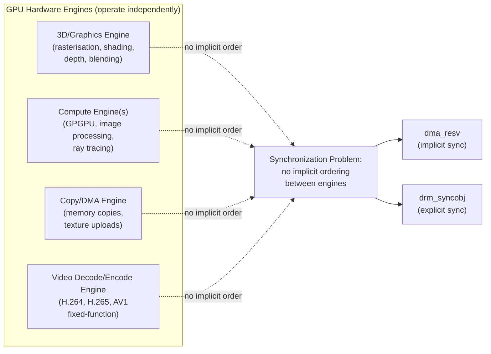
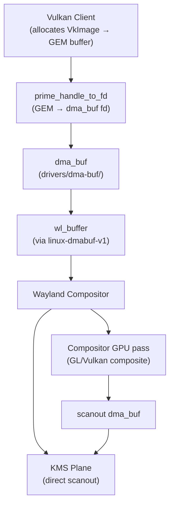
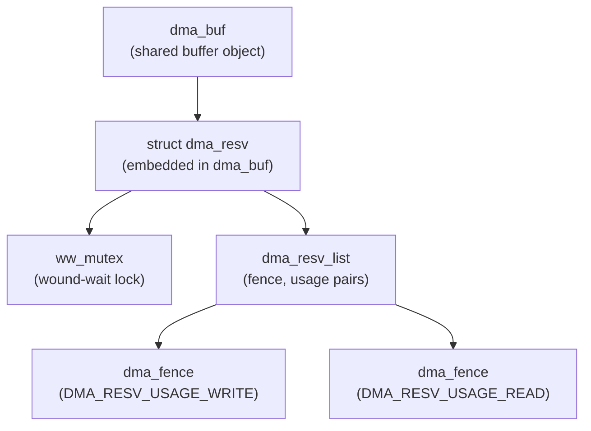
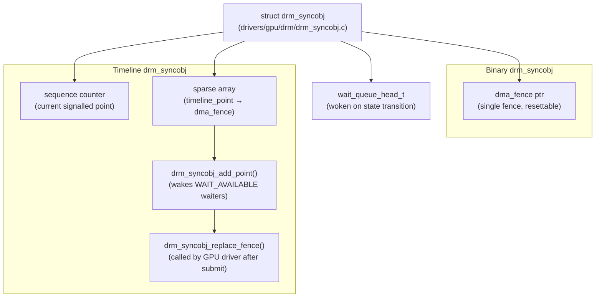
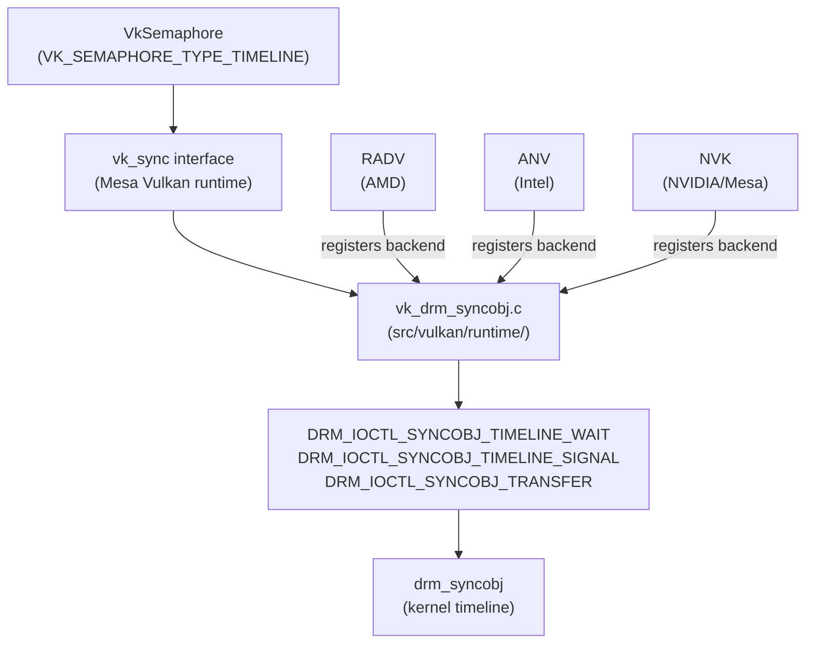
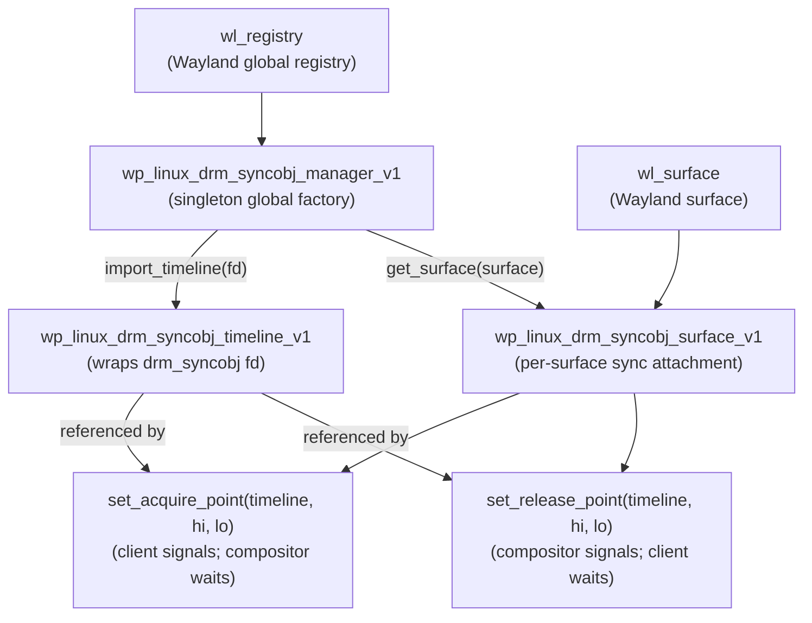
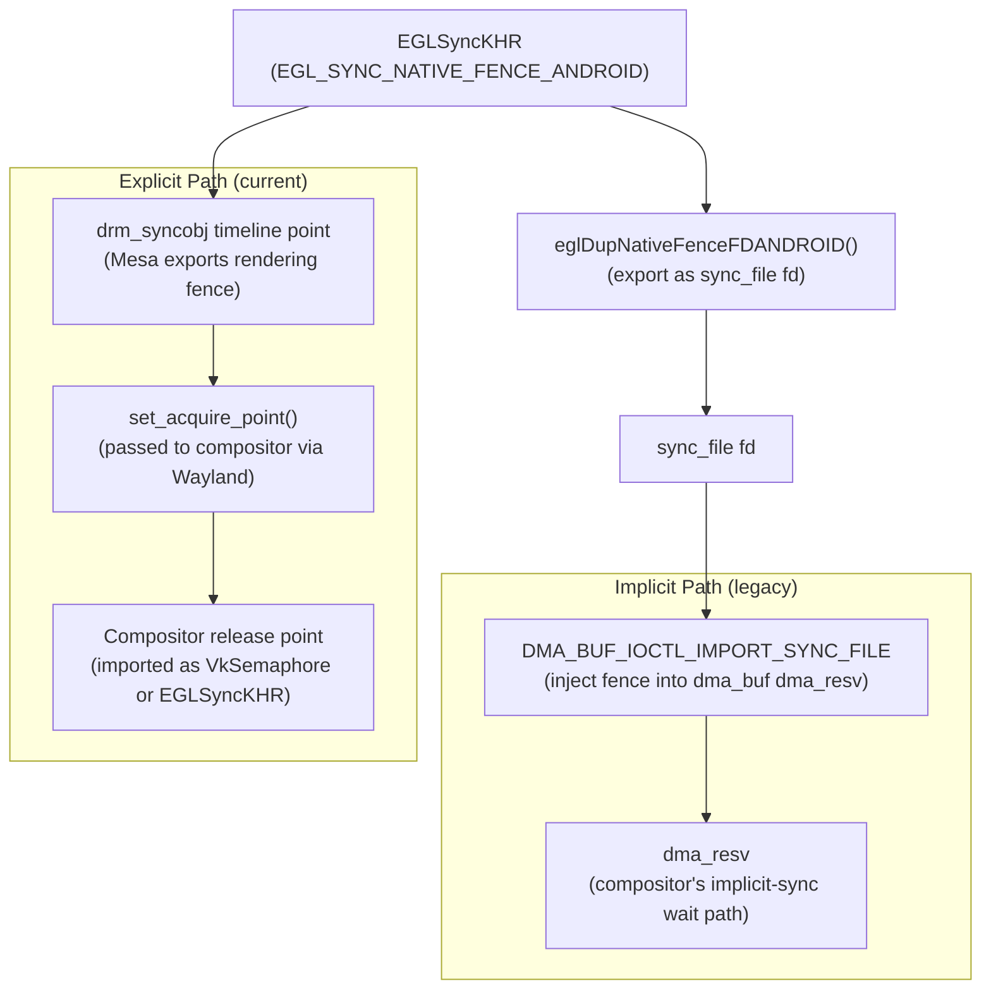
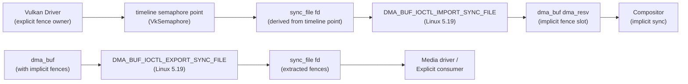

# Chapter 75: Explicit GPU Synchronization

**Audiences targeted**:

- **Systems and driver developers** — who work on DRM, Mesa, or compositor internals
- **Graphics application developers** — who need to reason about fence objects and Vulkan semaphore lifecycles
- **Browser and web platform engineers** — who encounter synchronization boundaries in Chrome's Viz compositor
- **Terminal and TUI developers** — may find Sections 2 and 5 useful context for understanding why their compositor behaves differently under NVIDIA versus AMD/Intel

---

## Table of Contents

- [Section 1: The GPU Synchronization Problem](#section-1-the-gpu-synchronization-problem)
  - [1.1 Multi-Queue GPU Architectures](#11-multi-queue-gpu-architectures)
  - [1.2 DMA-BUF as the Universal Buffer Abstraction](#12-dma-buf-as-the-universal-buffer-abstraction)
  - [1.3 The Cross-Process Boundary](#13-the-cross-process-boundary)
- [Section 2: DMA-BUF Implicit Fences — The Legacy Model](#section-2-dma-buf-implicit-fences--the-legacy-model)
  - [2.1 struct dma_fence](#21-struct-dma_fence)
  - [2.2 struct dma_resv — The Implicit Fence Container](#22-struct-dma_resv--the-implicit-fence-container)
  - [2.3 Exposing Implicit Fences to Userspace](#23-exposing-implicit-fences-to-userspace)
  - [2.3b The Wound-Wait Mutex in Detail](#23b-the-wound-wait-mutex-in-detail)
  - [2.4 Why Implicit Sync Causes Problems](#24-why-implicit-sync-causes-problems)
- [Section 3: drm_syncobj — The Kernel's Explicit Sync Primitive](#section-3-drm_syncobj--the-kernels-explicit-sync-primitive)
  - [3.1 Binary drm_syncobj](#31-binary-drm_syncobj)
  - [3.2 Timeline drm_syncobj](#32-timeline-drm_syncobj)
  - [3.3 Exporting and Importing syncobj as File Descriptors](#33-exporting-and-importing-syncobj-as-file-descriptors)
  - [3.4 Remaining drm_syncobj Ioctls](#34-remaining-drm_syncobj-ioctls)
  - [3.5 drm_syncobj Internal Architecture](#35-drm_syncobj-internal-architecture)
- [Section 4: Vulkan Timeline Semaphores](#section-4-vulkan-timeline-semaphores)
  - [4.1 Creating a Timeline Semaphore](#41-creating-a-timeline-semaphore)
  - [4.2 Submitting with Timeline Semaphores](#42-submitting-with-timeline-semaphores)
  - [4.3 Timeline Semaphores in RADV, ANV, and NVK](#43-timeline-semaphores-in-radv-anv-and-nvk)
- [Section 5: linux-drm-syncobj-v1 — The Wayland Protocol](#section-5-linux-drm-syncobj-v1--the-wayland-protocol)
  - [5.1 Protocol Objects](#51-protocol-objects)
  - [5.2 Acquire vs. Release: Direction Matters](#52-acquire-vs-release-direction-matters)
  - [5.3 Protocol Flow Example](#53-protocol-flow-example)
  - [5.4 Compositor Implementations](#54-compositor-implementations)
  - [5.5 The DRI3/Present Equivalent for X11](#55-the-dri3present-equivalent-for-x11)
- [Section 6: EGL Sync Objects](#section-6-egl-sync-objects)
  - [6.1 EGL_KHR_fence_sync](#61-egl_khr_fence_sync)
  - [6.2 EGL_ANDROID_native_fence_sync](#62-egl_android_native_fence_sync)
  - [6.3 EGL Fences and the Wayland EGL Surface Path](#63-egl-fences-and-the-wayland-egl-surface-path)
- [Section 7: The Implicit-to-Explicit Migration](#section-7-the-implicit-to-explicit-migration)
  - [7.1 Why the Migration Is Necessary](#71-why-the-migration-is-necessary)
  - [7.2 The DMA-BUF Conversion Shim (Linux 5.19)](#72-the-dma-buf-conversion-shim-linux-519)
  - [7.3 Timeline of the Migration](#73-timeline-of-the-migration)
  - [7.4 What Changed for NVIDIA Users](#74-what-changed-for-nvidia-users)
- [Section 8: Cross-Process Synchronization](#section-8-cross-process-synchronization)
  - [8.1 The Full Flow](#81-the-full-flow)
  - [8.2 Security Considerations](#82-security-considerations)
- [Section 9: Performance Implications](#section-9-performance-implications)
  - [9.1 Latency: Explicit vs. Implicit Sync](#91-latency-explicit-vs-implicit-sync)
  - [9.2 Measuring Sync Overhead](#92-measuring-sync-overhead)
  - [9.3 Frame Scheduling with Explicit Sync](#93-frame-scheduling-with-explicit-sync)
  - [9.4 CPU-Side vs. GPU-Side Fence Waiting](#94-cpu-side-vs-gpu-side-fence-waiting)
  - [9.5 Avoiding Common Explicit Sync Performance Pitfalls](#95-avoiding-common-explicit-sync-performance-pitfalls)
  - [9.6 Timeline Fence Accumulation and Garbage Collection](#96-timeline-fence-accumulation-and-garbage-collection)
- [Section 10: io_uring and sync_file: Unified Event Loop for GPU and I/O](#section-10-io_uring-and-sync_file-unified-event-loop-for-gpu-and-io)
  - [10.1 sync_file as a Pollable Fence](#101-sync_file-as-a-pollable-fence)
  - [10.2 IORING_OP_POLL_ADD on sync_file — Async Fence Completion](#102-ioring_op_poll_add-on-sync_file--async-fence-completion)
  - [10.3 Compositor Unified Event Loop with io_uring](#103-compositor-unified-event-loop-with-io_uring)
  - [10.4 linux-drm-syncobj-v1 and io_uring: Polling the Release Timeline](#104-linux-drm-syncobj-v1-and-io_uring-polling-the-release-timeline)
  - [10.5 Limitations and Current State](#105-limitations-and-current-state)
- [Section 11: Integrations](#section-11-integrations)
- [References](#references)

---

## Section 1: The GPU Synchronization Problem

The central challenge of GPU synchronization on Linux is temporal: the CPU, the GPU, and the display controller are three independent engines that operate in parallel, each producing or consuming data at its own pace. The CPU submits command buffers and moves on; the GPU executes those commands asynchronously and writes results into shared memory; the display controller scans out that memory at a fixed refresh rate. When a compositor presents a frame, it must ensure three ordering constraints hold simultaneously:

1. The client's GPU rendering into the buffer is complete before the compositor reads from it.
2. The compositor's own compositing pass (if any) is complete before **KMS** scans out the result.
3. The display controller has finished scanning out the previous frame before the client may reuse or modify the buffer.

Any violation of these constraints produces one of two failure modes. **Tearing** occurs when the display scans out a buffer that is still being written — the display reads a partial frame, producing a visible horizontal split between the old and new content. **Deadlock or excessive stall** occurs when a component waits for a fence that will never be signalled (because the producer hung, the fence was never inserted, or the wrong fence object was waited on), or waits so conservatively that throughput collapses to single-buffered performance.

The Linux graphics stack has evolved two distinct models for solving this problem. **Implicit synchronization** (Section 2) attaches fences invisibly to buffer objects via the **`dma_fence`** and **`struct dma_resv`** kernel structures; the **`ww_mutex`** (wound-wait mutex) inside **`dma_resv`** serialises multi-buffer lock acquisition to prevent deadlock. Userspace can observe implicit fence state by calling **`poll()`** on a **`dma_buf`** fd or by using the **`DMA_BUF_IOCTL_EXPORT_SYNC_FILE`** / **`DMA_BUF_IOCTL_IMPORT_SYNC_FILE`** ioctls added in **Linux 5.19**. The implicit model breaks down in practice (Section 2.4) because the compositor cannot pipeline its work, and because **NVIDIA**'s proprietary driver historically did not attach implicit fences to its **DMA-BUF**s, causing widespread flickering and corruption for **Wayland** users.

**Explicit synchronization** (Sections 3–9) replaces invisible fence bookkeeping with deliberate fence exchange. The kernel primitive enabling explicit sync is **`drm_syncobj`** (Section 3), which comes in two variants: **binary `drm_syncobj`** (Section 3.1), which holds a single **`dma_fence`** and can be reset for reuse across frames, and **timeline `drm_syncobj`** (Section 3.2), which carries a monotonically increasing 64-bit sequence counter allowing wait-before-signal pipelining. **`drm_syncobj`** handles can be exported as file descriptors and imported across process boundaries (Section 3.3). Additional ioctls including **`DRM_IOCTL_SYNCOBJ_EVENTFD`** allow event-loop-based compositors to receive fence completion notifications without a blocking thread (Section 3.4); the internal architecture of **`drm_syncobj`** — including **`drm_syncobj_add_point()`**, **`drm_syncobj_replace_fence()`**, and the **`wait_queue_head_t`** used for state transitions — is detailed in Section 3.5.

At the **Vulkan** layer (Section 4), timeline semaphores (**`VK_KHR_timeline_semaphore`**, promoted to **Vulkan 1.2** core) are the high-level face of kernel **`drm_syncobj`** timelines. Applications create them via **`VkSemaphoreTypeCreateInfo`** with **`VK_SEMAPHORE_TYPE_TIMELINE`**, submit signal and wait operations via **`VkTimelineSemaphoreSubmitInfo`** in **`vkQueueSubmit()`**, and block the CPU with **`vkWaitSemaphores()`** or advance the timeline from host code with **`vkSignalSemaphore()`**. In **Mesa**, all three major open-source Vulkan drivers — **RADV** (AMD), **ANV** (Intel), and **NVK** (NVIDIA) — implement timeline semaphores via the shared **`vk_drm_syncobj.c`** backend in **`src/vulkan/runtime/`**, using **`DRM_IOCTL_SYNCOBJ_TIMELINE_WAIT`**, **`DRM_IOCTL_SYNCOBJ_TIMELINE_SIGNAL`**, and **`DRM_IOCTL_SYNCOBJ_TRANSFER`** under the hood. A **`VkSemaphore`** can be exported as an **OPAQUE_FD** handle via **`vkGetSemaphoreFdKHR()`**, producing a **`drm_syncobj`** fd that the compositor can import directly (Section 4.3).

At the **Wayland** protocol layer (Section 5), the **`wp_linux_drm_syncobj_v1`** protocol (merged in **wayland-protocols** 1.34, 2024) is the definitive compositor-client synchronization solution. Clients bind the **`wp_linux_drm_syncobj_manager_v1`** global to import **`drm_syncobj`** fds as **`wp_linux_drm_syncobj_timeline_v1`** objects and obtain per-surface **`wp_linux_drm_syncobj_surface_v1`** attachments. Before each **`wl_surface.commit()`**, the client calls **`set_acquire_point()`** (the timeline point the compositor must wait for before reading the buffer) and **`set_release_point()`** (the point the compositor signals when it is done). Section 5.2 explains the directional semantics; Section 5.3 gives a full protocol flow example. Major compositor families shipped support in 2024: **Mutter** (**GNOME** 46.1, March 2024), **KWin** (**KDE Plasma** 6.1, June 2024, requiring **NVIDIA** driver **555.58**), **wlroots** 0.18 (July 2024) and the **Sway** and **Hyprland** compositors built on it (Section 5.4). For **X11** and **XWayland**, the equivalent mechanism uses the **DRI3** and **Present** extensions with **`XSyncFence`** objects, **`DRI3FenceFromFD`** / **`DRI3FDFromFence`**, and the **`wait_fence`** / **`idle_fence`** parameters on **`PresentPixmap`**; explicit sync support was merged into **XWayland** in April 2024 (Section 5.5).

**EGL** provides its own synchronization bridge via **`EGLSyncKHR`** objects (Section 6). **`EGL_KHR_fence_sync`** inserts fence commands into a **GL** context's command stream and allows CPU-side waits via **`eglClientWaitSyncKHR()`**. **`EGL_ANDROID_native_fence_sync`** extends this with **`eglDupNativeFenceFDANDROID()`**, which exports an **EGL** sync as a **`sync_file`** fd that can be passed as **`IN_FENCE_FD`** to a **KMS** atomic commit or imported into a **`drm_syncobj`**. **Mesa**'s **Wayland** **EGL** WSI backend (**`src/egl/drivers/dri2/platform_wayland.c`**) uses these two extensions together to implement both the legacy implicit sync path (injecting a **`sync_file`** into the **`dma_buf`**'s **`dma_resv`** via **`DMA_BUF_IOCTL_IMPORT_SYNC_FILE`**) and the current explicit sync path (exporting a **`drm_syncobj`** timeline point via **`set_acquire_point()`**) (Section 6.3).

Section 7 covers the ongoing implicit-to-explicit migration, including the **`DMA_BUF_IOCTL_EXPORT_SYNC_FILE`** / **`DMA_BUF_IOCTL_IMPORT_SYNC_FILE`** conversion shim added in **Linux 5.19** by Jason Ekstrand, a chronological timeline of the migration from 2019 to 2026, and what changed for **NVIDIA** users after **NVIDIA** driver **555.58** enabled end-to-end explicit sync. Section 8 traces the complete cross-process explicit sync handshake — from **`DRM_IOCTL_SYNCOBJ_CREATE`** and **`DRM_IOCTL_SYNCOBJ_HANDLE_TO_FD`** on the client side, through **Wayland** socket transmission via **`SCM_RIGHTS`**, to **`DRM_IOCTL_SYNCOBJ_FD_TO_HANDLE`** and **`DRM_IOCTL_SYNCOBJ_TIMELINE_SIGNAL`** on the compositor side — and discusses the security constraints on **`drm_syncobj`** fd sharing (Section 8.2). Section 9 examines performance: the latency advantage of GPU-side fence waits over CPU-side waits (Section 9.1), how to measure sync overhead with **`perf`**, **`intel_gpu_top`**, **`radeontop`**, and **`nvidia-smi dmon`** (Section 9.2), using **`OUT_FENCE_PTR`** and **`IN_FENCE_FD`** KMS atomic properties for low-latency frame scheduling (Section 9.3), the fundamental distinction between CPU-side waits (**`vkWaitSemaphores()`**, **`DRM_IOCTL_SYNCOBJ_TIMELINE_WAIT`**, **`poll()`** on a **`sync_file`** fd) and GPU-side waits (**`VkSubmitInfo::pWaitSemaphores`**, **`IN_FENCE_FD`**) (Section 9.4), common explicit sync performance pitfalls including unnecessary CPU flushes and premature release point signalling (Section 9.5), and timeline fence accumulation and garbage collection via **RCU**-protected **`dma_resv_list`** pruning (Section 9.6).

### 1.1 Multi-Queue GPU Architectures

Modern GPU hardware does not expose a single serialised queue of work. A contemporary **AMD RDNA** or **NVIDIA Ada Lovelace** GPU exposes multiple hardware engines that operate independently:

- **3D/graphics engine**: Rasterisation, vertex/fragment shading, depth testing, blending.
- **Compute engine(s)**: General-purpose **GPGPU** work, image processing, ray tracing via separate dedicated units.
- **Copy/DMA engine**: Memory copies, texture uploads, buffer transfers; on discrete GPUs this can run at **PCIe** bus bandwidth while the 3D engine is occupied with shading.
- **Video decode/encode engine**: Separate fixed-function hardware for **H.264**, **H.265**, **AV1** decode/encode on most modern GPUs.

Work submitted to one engine has no implicit ordering relationship with work submitted to another — not on the hardware level, and not at the kernel driver level unless the driver explicitly inserts a synchronisation point. A **Vulkan** application that submits geometry rendering to the graphics queue and then submits a compute pass to the compute queue must insert a pipeline barrier or semaphore if the compute pass reads the geometry output; otherwise the two pieces of work execute in an undefined order.

This creates a non-trivial bookkeeping problem at the driver level: when a buffer is handed off from one subsystem to another — say, from a **Vulkan** renderer to a **KMS** atomic commit — the receiving component must know which GPU engines wrote the buffer and which fences those engines inserted at completion. With implicit synchronization, the kernel attempts to track this automatically via **`dma_resv`**; with explicit synchronization, the application or middleware is responsible for threading the right fence through the handoff.



### 1.2 DMA-BUF as the Universal Buffer Abstraction

The **`dma_buf`** kernel subsystem (**`drivers/dma-buf/`**) was designed precisely to allow a buffer allocated by one driver to be shared with another driver without a copy. A typical cross-subsystem flow looks like:

```
[Vulkan client]
    allocate VkImage → underlying GEM buffer → dma_buf fd (via prime_handle_to_fd)
    render into it via GPU
    wl_buffer created from dma_buf fd via zwp_linux_dmabuf_unstable_v1 / linux-dmabuf-v1
    
[Wayland compositor]
    receives wl_buffer → imports dma_buf fd → can scanout directly via KMS plane
    OR composite it via GL/Vulkan into a different dma_buf → scans out that result
```

At each handoff, a synchronization decision must be made: is the buffer ready to read? With implicit sync the **`dma_resv`** inside the **`dma_buf`** holds pending write fences that the consumer should wait on; with explicit sync the consumer knows the fence from an out-of-band channel (the **Wayland** **`set_acquire_point`** request, or a **`sync_file`** passed as **`IN_FENCE_FD`** to **KMS**). The same physical memory is accessed by at least three processes (the client, the compositor, and the kernel-side **KMS**/display driver) without any copies; ensuring correctness across all three accesses is the fundamental problem this chapter addresses.



### 1.3 The Cross-Process Boundary

In a **Wayland** compositor pipeline, the rendering process and the compositing process are different Linux processes. They share no address space, no **GEM** handle namespace, and no GPU command queue. Their relationship is:

- **Buffer ownership**: Shared via **`dma_buf`** file descriptor passed over the **Wayland** socket as ancillary data (via **`sendmsg`**/**`recvmsg`** with **`SCM_RIGHTS`**).
- **Fence ownership**: Before explicit sync, not shared at all — the compositor had to derive fence state by inspecting the **`dma_resv`** indirectly or by trusting the commit arrived after rendering. With explicit sync, shared via a **`drm_syncobj`** fd also passed as **`SCM_RIGHTS`** through the **Wayland** socket by the **`wp_linux_drm_syncobj_manager_v1`** protocol.

This cross-process constraint is why the kernel synchronization primitive must be representable as a file descriptor: fd passing via Unix socket is the only general-purpose mechanism for sharing a kernel object reference across a process boundary without a shared parent process. A **DRM** handle integer is only meaningful within the **DRM** file context that created it; a **`drm_syncobj`** fd is a reference-counted kernel object reference that survives **`dup()`**, **`fork()`**, and **`sendmsg()`** across process boundaries, just like any file descriptor.

The Linux graphics stack has evolved two distinct models for solving this: **implicit synchronization**, in which fences are attached invisibly to buffer objects and managed by the kernel without application involvement, and **explicit synchronization**, in which applications and drivers exchange fence file descriptors directly and wait on them deliberately. As of 2024–2026, the stack is in the middle of a migration from implicit to explicit, and understanding both models — their internal structures, their failure modes, and the conversion path between them — is essential for anyone writing or debugging code at any layer of the display pipeline.

---

## Section 2: DMA-BUF Implicit Fences — The Legacy Model

The implicit synchronization model is built on two kernel structures: `dma_fence` and `dma_resv`.



### 2.1 struct dma_fence

`struct dma_fence` (`include/linux/dma-fence.h`) is the atom of the synchronization model: a one-shot, reference-counted kernel object representing a single asynchronous GPU operation that will complete exactly once. It is created in a pending state by a GPU driver when a command buffer is submitted, and signalled (via `dma_fence_signal()`) from an interrupt handler when the hardware reports completion. Callbacks registered with `dma_fence_add_callback()` fire synchronously inside `dma_fence_signal()`. CPU threads can block on a fence with `dma_fence_wait()` or `dma_fence_wait_timeout()`. A fence cannot be reset or reused — once signalled it is permanently done until all references drop and the object is freed. [Source: `include/linux/dma-fence.h`, https://github.com/torvalds/linux/blob/master/include/linux/dma-fence.h]

### 2.2 struct dma_resv — The Implicit Fence Container

Every `dma_buf` embeds a `struct dma_resv` (`include/linux/dma-resv.h`), which is the container that glues implicit fences to a shared buffer:

```c
/* include/linux/dma-resv.h */
struct dma_resv {
    struct ww_mutex lock;               /* wound-wait mutex protecting fences */
    struct dma_resv_list __rcu *fences; /* array of (fence, usage) pairs      */
};
```

The wound-wait mutex serialises all modifications to the fence list. Drivers add fences to a reservation object with:

```c
/* Caller must hold dma_resv_lock() */
void dma_resv_add_fence(struct dma_resv *obj,
                        struct dma_fence *fence,
                        enum dma_resv_usage usage);
```

`usage` is one of `DMA_RESV_USAGE_WRITE` (exclusive — all subsequent accessors must wait) or `DMA_RESV_USAGE_READ` (shared — only writers must wait). [Source: `include/linux/dma-resv.h`, https://github.com/torvalds/linux/blob/master/include/linux/dma-resv.h]

Other drivers or memory managers can wait on all fences attached to a reservation object:

```c
long dma_resv_wait_timeout(struct dma_resv *obj,
                           enum dma_resv_usage usage,
                           bool intr,
                           unsigned long timeout);
```

They can also query all current fences without waiting:

```c
int dma_resv_get_fences(struct dma_resv *obj,
                        enum dma_resv_usage usage,
                        unsigned int *num_fences,
                        struct dma_fence ***fences);
```

[Source: `include/linux/dma-resv.h`, https://github.com/torvalds/linux/blob/master/include/linux/dma-resv.h]

### 2.3 Exposing Implicit Fences to Userspace

Userspace has two narrow windows into the implicit fence state of a `dma_buf`:

**`poll()` on the dma_buf fd**: Calling `poll(fd, POLLIN, ...)` blocks until the exclusive (write) fence signals; `POLLOUT` blocks until all fences (read and write) signal. This is sufficient for the simple use case of waiting before mapping the buffer for CPU access, but gives no ability to inspect fence state, merge multiple fences, or forward a fence to another component. [Source: `drivers/dma-buf/dma-buf.c`, https://github.com/torvalds/linux/blob/master/drivers/dma-buf/dma-buf.c]

**`DMA_BUF_IOCTL_EXPORT_SYNC_FILE` / `DMA_BUF_IOCTL_IMPORT_SYNC_FILE`** (Linux 5.19): These two ioctls, added to close the implicit-explicit conversion gap (discussed in Section 7), allow userspace to extract the current fences from a `dma_buf` as a `sync_file` fd, and to insert a `sync_file` back into the `dma_buf`'s reservation object. [Source: `include/uapi/linux/dma-buf.h`, https://github.com/torvalds/linux/blob/master/include/uapi/linux/dma-buf.h; kernel docs: https://docs.kernel.org/driver-api/dma-buf.html]

### 2.3b The Wound-Wait Mutex in Detail

The `ww_mutex` in `dma_resv` deserves explanation: when multiple drivers need to lock the reservation objects of multiple buffers simultaneously (for example, when a GPU is performing a blit from buffer A to buffer B and needs to add itself as a reader of A and a writer of B atomically), naive locking of multiple mutexes in arbitrary order leads to deadlock. The **wound-wait algorithm** resolves this by assigning a ticket to each locking context (`struct ww_acquire_ctx`): if a context holding lock X tries to acquire lock Y, and Y is already held by a lower-ticket context, the higher-ticket holder "wounds" (forces an -EDEADLK return on) the lower-ticket holder, which must then drop all its locks, wait briefly, and retry from the beginning. This prevents the ABBA deadlock pattern without requiring a global total lock order. [Source: `include/linux/ww_mutex.h`, https://github.com/torvalds/linux/blob/master/include/linux/ww_mutex.h; `Documentation/locking/ww-mutex-design.rst`, https://www.kernel.org/doc/html/latest/locking/ww-mutex-design.html]

### 2.4 Why Implicit Sync Causes Problems

The implicit model's fundamental problem is that the compositor is blind to the client's GPU timeline. When a Wayland client submits a `wl_surface.commit()`, the compositor receives a DMA-BUF handle — a file descriptor pointing to a shared buffer — but no information about whether the GPU commands that produced the current frame's content have completed. The compositor must either:

- **Guess based on CPU timestamps**: Assume rendering is done because the commit arrived. This is correct for CPU-rendered buffers but wrong for GPU-rendered ones. NVIDIA's proprietary driver historically did not attach implicit fences to its DMA-BUFs, so the compositor's guess was systematically incorrect — the buffer it scanned out might still be actively written by NVIDIA's GPU, producing the flickering and corruption that NVIDIA Wayland users experienced for years.

- **Export and poll**: Call `dma_resv_get_fences()` on the buffer's reservation object, create a `sync_file` from the fence, and wait for it before compositing. This requires compositor access to the DRM device node of the client's GPU, and creates latency because the compositor blocks on the fence before it can determine whether to scan out the buffer directly or composite it. The fence wait is serialised, meaning the compositor cannot pipeline its GPU work with the client's GPU work.

- **Use explicit sync**: Require the client to tell it exactly when the buffer is ready, via a mechanism the compositor understands natively. This is what the `wp_linux_drm_syncobj_v1` protocol (Section 5) provides.

---

## Section 3: drm_syncobj — The Kernel's Explicit Sync Primitive

`drm_syncobj` is the kernel primitive that makes explicit synchronization possible. It differs from `dma_fence` in one critical respect: it is **resettable and reusable** across frames, and it can be named and shared across processes via file descriptors. [Source: `drivers/gpu/drm/drm_syncobj.c`, https://github.com/torvalds/linux/blob/master/drivers/gpu/drm/drm_syncobj.c; `include/uapi/drm/drm.h`, https://github.com/torvalds/linux/blob/master/include/uapi/drm/drm.h]

### 3.1 Binary drm_syncobj

A binary `drm_syncobj` holds one `dma_fence`. It begins in an unsignalled state (no fence), transitions to signalled when a fence is attached and completes, and can be reset to unsignalled for reuse:

```c
/* Create a syncobj; returns an integer handle valid in this DRM fd context */
struct drm_syncobj_create {
    __u32 handle;  /* out: integer handle */
    __u32 flags;   /* DRM_SYNCOBJ_CREATE_SIGNALED to start signalled */
};
#define DRM_IOCTL_SYNCOBJ_CREATE DRM_IOWR(0xBF, struct drm_syncobj_create)
```

Userspace can wait for a binary syncobj to be signalled:

```c
struct drm_syncobj_wait {
    __u64 handles;          /* pointer to array of uint32_t handles */
    __s64 timeout_nsec;     /* absolute timeout */
    __u32 count_handles;    /* number of handles */
    __u32 flags;            /* DRM_SYNCOBJ_WAIT_FLAGS_WAIT_ALL, etc. */
    __u32 first_signaled;   /* out: index of first signalled handle */
    __u32 pad;
};
#define DRM_IOCTL_SYNCOBJ_WAIT DRM_IOWR(0xC3, struct drm_syncobj_wait)
```

[Source: `include/uapi/drm/drm.h`, https://github.com/torvalds/linux/blob/master/include/uapi/drm/drm.h]

### 3.2 Timeline drm_syncobj

Timeline syncobjs extend the binary model with a **monotonically increasing 64-bit sequence counter**. Each integer point on the timeline maps to a `dma_fence`. The timeline can be waited at any specific point value, and once a point is signalled all lower points are permanently signalled. Timeline syncobjs were introduced in Linux 5.2:

```c
/* Wait for specific timeline points */
struct drm_syncobj_timeline_wait {
    __u64 handles;          /* pointer to array of uint32_t handles */
    __u64 points;           /* pointer to array of uint64_t timeline points */
    __s64 timeout_nsec;
    __u32 count_handles;
    __u32 flags;            /* DRM_SYNCOBJ_WAIT_FLAGS_WAIT_AVAILABLE for wait-before-signal */
    __u32 first_signaled;
    __u32 pad;
};
#define DRM_IOCTL_SYNCOBJ_TIMELINE_WAIT   DRM_IOWR(0xCA, struct drm_syncobj_timeline_wait)
#define DRM_IOCTL_SYNCOBJ_TIMELINE_SIGNAL DRM_IOWR(0xCD, struct drm_syncobj_timeline_array)
#define DRM_IOCTL_SYNCOBJ_TRANSFER        DRM_IOWR(0xCC, struct drm_syncobj_transfer)
#define DRM_IOCTL_SYNCOBJ_QUERY           DRM_IOWR(0xCB, struct drm_syncobj_timeline_array)
```

The `DRM_SYNCOBJ_WAIT_FLAGS_WAIT_AVAILABLE` flag (wait-before-signal semantics) is particularly important: it allows a waiter to block until a timeline point has a fence *assigned* to it, even before that fence has signalled. This enables pipelining submission dependencies without knowing submission order in advance.

[Source: `drivers/gpu/drm/drm_syncobj.c`, https://github.com/torvalds/linux/blob/master/drivers/gpu/drm/drm_syncobj.c]

### 3.3 Exporting and Importing syncobj as File Descriptors

A `drm_syncobj` handle is an integer in a DRM fd's private context — it is not a file descriptor and cannot be directly `dup()`'d or passed to another process. To share a syncobj across processes, userspace exports it as a file descriptor:

```c
struct drm_syncobj_handle {
    __u32 handle;   /* integer handle within this DRM fd */
    __u32 flags;    /* DRM_SYNCOBJ_HANDLE_TO_FD_FLAGS_EXPORT_SYNC_FILE for sync_file */
    __s32 fd;       /* out: the file descriptor */
    __u32 pad;
};
#define DRM_IOCTL_SYNCOBJ_HANDLE_TO_FD DRM_IOWR(0xC1, struct drm_syncobj_handle)
#define DRM_IOCTL_SYNCOBJ_FD_TO_HANDLE DRM_IOWR(0xC2, struct drm_syncobj_handle)
```

Without the `EXPORT_SYNC_FILE` flag, `DRM_IOCTL_SYNCOBJ_HANDLE_TO_FD` produces a **drm_syncobj fd** — a file descriptor that represents ownership of the syncobj timeline and can be shared across process boundaries. The receiving process imports it with `DRM_IOCTL_SYNCOBJ_FD_TO_HANDLE` to obtain a local handle in its own DRM fd context. This is the mechanism used by the `wp_linux_drm_syncobj_v1` Wayland protocol (Section 5) to share timeline syncobjs between a Wayland client and the compositor.

With the `EXPORT_SYNC_FILE` flag, the ioctl exports the **current fence** as a `sync_file` fd instead — a one-shot snapshot that can be passed as `IN_FENCE_FD` to a KMS atomic commit. [Source: `drivers/gpu/drm/drm_syncobj.c`, https://github.com/torvalds/linux/blob/master/drivers/gpu/drm/drm_syncobj.c]

### 3.4 Remaining drm_syncobj Ioctls

The full set of drm_syncobj ioctls is larger than the common create/wait/signal/export cycle:

```c
/* Reset a syncobj to unsignalled state (binary syncobj only) */
struct drm_syncobj_array {
    __u64 handles;        /* pointer to array of uint32_t handles */
    __u32 count_handles;
    __u32 pad;
};
#define DRM_IOCTL_SYNCOBJ_RESET   DRM_IOWR(0xC4, struct drm_syncobj_array)
/* Force-signal a binary syncobj without attaching a fence */
#define DRM_IOCTL_SYNCOBJ_SIGNAL  DRM_IOWR(0xC5, struct drm_syncobj_array)

/* Destroy a syncobj handle */
struct drm_syncobj_destroy {
    __u32 handle;
    __u32 pad;
};
#define DRM_IOCTL_SYNCOBJ_DESTROY DRM_IOWR(0xC0, struct drm_syncobj_destroy)

/* Wait with eventfd notification instead of blocking syscall */
struct drm_syncobj_eventfd {
    __u32 handle;
    __u32 flags;
    __u64 point;       /* timeline point; 0 for binary */
    __s32 fd;          /* eventfd to signal */
    __u32 pad;
};
#define DRM_IOCTL_SYNCOBJ_EVENTFD DRM_IOWR(0xCF, struct drm_syncobj_eventfd)
```

`DRM_IOCTL_SYNCOBJ_EVENTFD` is worth special attention: rather than blocking the calling thread, it registers an eventfd that will be written when the given timeline point (or binary syncobj) signals. This allows an event loop (such as a Wayland compositor's main loop, which is typically structured around `epoll`) to receive fence completion notifications without a dedicated blocking thread. The compositor can add the eventfd to its `epoll_fd` and process the signal in its normal event dispatch loop, eliminating the need for a separate "fence watcher" thread. [Source: `include/uapi/drm/drm.h`, https://github.com/torvalds/linux/blob/master/include/uapi/drm/drm.h]

### 3.5 drm_syncobj Internal Architecture

Inside the kernel, a `drm_syncobj` is a reference-counted structure (`struct drm_syncobj` in `drivers/gpu/drm/drm_syncobj.c`) that contains:

- A pointer to the current `dma_fence` (for binary syncobjs) or a sparse array of `(timeline_point → dma_fence)` mappings (for timeline syncobjs).
- A wait queue (`wait_queue_head_t`) that is woken whenever the syncobj transitions state.
- A sequence counter (for timeline syncobjs) tracking the current signalled point.

When `DRM_IOCTL_SYNCOBJ_TIMELINE_WAIT` is called with `WAIT_AVAILABLE` semantics, the kernel registers a wait-queue entry that fires when a fence is *assigned* to the timeline at the requested point — not just when that fence signals. This mechanism relies on `drm_syncobj_add_point()` sending a wakeup to all `WAIT_AVAILABLE` waiters whenever a new fence is attached at any point. The fence assignment itself (the "signal" from the GPU submission driver) is done by the driver calling `drm_syncobj_replace_fence()` after the command buffer is submitted to hardware. [Source: `drivers/gpu/drm/drm_syncobj.c`, https://github.com/torvalds/linux/blob/master/drivers/gpu/drm/drm_syncobj.c]



---

## Section 4: Vulkan Timeline Semaphores

Vulkan's synchronization model is entirely explicit: no fence is ever attached to a buffer or resource without the application's knowledge. The application expresses all GPU-to-GPU and GPU-to-CPU ordering as semaphore and fence operations on submit calls. Timeline semaphores, introduced as `VK_KHR_timeline_semaphore` and promoted to core Vulkan 1.2 in January 2020, are the high-level face of the `drm_syncobj` timeline in Mesa Vulkan drivers. [Source: Khronos Vulkan specification §"Timeline Semaphores", https://registry.khronos.org/vulkan/specs/latest/man/html/VkSemaphoreTypeCreateInfo.html]

### 4.1 Creating a Timeline Semaphore

A timeline semaphore is created by chaining `VkSemaphoreTypeCreateInfo` into the standard `VkSemaphoreCreateInfo.pNext`:

```c
/* Vulkan 1.2 core — VK_KHR_timeline_semaphore alias also available */
typedef struct VkSemaphoreTypeCreateInfo {
    VkStructureType    sType;         /* VK_STRUCTURE_TYPE_SEMAPHORE_TYPE_CREATE_INFO */
    const void*        pNext;
    VkSemaphoreType    semaphoreType; /* VK_SEMAPHORE_TYPE_TIMELINE */
    uint64_t           initialValue;  /* Starting payload, typically 0 */
} VkSemaphoreTypeCreateInfo;

/* Usage: */
VkSemaphoreTypeCreateInfo timeline_info = {
    .sType        = VK_STRUCTURE_TYPE_SEMAPHORE_TYPE_CREATE_INFO,
    .semaphoreType = VK_SEMAPHORE_TYPE_TIMELINE,
    .initialValue  = 0,
};
VkSemaphoreCreateInfo sem_info = {
    .sType = VK_STRUCTURE_TYPE_SEMAPHORE_CREATE_INFO,
    .pNext = &timeline_info,
};
VkSemaphore timeline_sem;
vkCreateSemaphore(device, &sem_info, NULL, &timeline_sem);
```

[Source: https://registry.khronos.org/vulkan/specs/latest/man/html/VkSemaphoreTypeCreateInfo.html; Khronos blog: https://www.khronos.org/blog/vulkan-timeline-semaphores]

### 4.2 Submitting with Timeline Semaphores

Signal and wait values are specified per-semaphore via `VkTimelineSemaphoreSubmitInfo`:

```c
/* Signal point 1 when this submission's GPU work completes */
uint64_t signal_value = 1;
uint64_t wait_value   = 1;

VkTimelineSemaphoreSubmitInfo timeline_submit = {
    .sType                     = VK_STRUCTURE_TYPE_TIMELINE_SEMAPHORE_SUBMIT_INFO,
    .signalSemaphoreValueCount = 1,
    .pSignalSemaphoreValues    = &signal_value,
    .waitSemaphoreValueCount   = 1,
    .pWaitSemaphoreValues      = &wait_value,
};
VkSubmitInfo submit = {
    .sType                = VK_STRUCTURE_TYPE_SUBMIT_INFO,
    .pNext                = &timeline_submit,
    .signalSemaphoreCount = 1,
    .pSignalSemaphores    = &timeline_sem,
    /* ... command buffers and wait stages ... */
};
vkQueueSubmit(queue, 1, &submit, VK_NULL_HANDLE);

/* CPU-side wait: block until timeline_sem reaches value 1 */
VkSemaphoreWaitInfo wait_info = {
    .sType          = VK_STRUCTURE_TYPE_SEMAPHORE_WAIT_INFO,
    .semaphoreCount = 1,
    .pSemaphores    = &timeline_sem,
    .pValues        = &wait_value,
};
vkWaitSemaphores(device, &wait_info, UINT64_MAX);

/* CPU-side signal: advance the semaphore from host code */
VkSemaphoreSignalInfo signal_info = {
    .sType     = VK_STRUCTURE_TYPE_SEMAPHORE_SIGNAL_INFO,
    .semaphore = timeline_sem,
    .value     = 2,
};
vkSignalSemaphore(device, &signal_info);
```

[Source: Khronos Vulkan specification "vkWaitSemaphores", https://registry.khronos.org/vulkan/specs/latest/man/html/vkWaitSemaphores.html; "vkSignalSemaphore", https://registry.khronos.org/vulkan/specs/latest/man/html/vkSignalSemaphore.html]

### 4.3 Timeline Semaphores in RADV, ANV, and NVK

In all Mesa Vulkan drivers, timeline semaphores are implemented as kernel `drm_syncobj` timelines. The common Vulkan runtime in Mesa provides `vk_drm_syncobj.c` (`src/vulkan/runtime/vk_drm_syncobj.c`), which implements the abstract `vk_sync` interface using `DRM_IOCTL_SYNCOBJ_TIMELINE_WAIT`, `DRM_IOCTL_SYNCOBJ_TIMELINE_SIGNAL`, and `DRM_IOCTL_SYNCOBJ_TRANSFER` under the hood. Each driver (RADV for AMD, ANV for Intel, NVK for NVIDIA) registers this backend as its primary sync type and delegates all timeline semaphore operations to it. [Source: Mesa `src/vulkan/runtime/vk_drm_syncobj.c`, https://gitlab.freedesktop.org/mesa/mesa/-/blob/main/src/vulkan/runtime/vk_drm_syncobj.c]



This tight coupling means that exporting a `VkSemaphore` as an `OPAQUE_FD` handle via `vkGetSemaphoreFdKHR()` produces a `drm_syncobj` fd that the kernel, Wayland compositor, and other processes understand natively:

```c
VkSemaphoreGetFdInfoKHR get_fd_info = {
    .sType      = VK_STRUCTURE_TYPE_SEMAPHORE_GET_FD_INFO_KHR,
    .semaphore  = timeline_sem,
    .handleType = VK_EXTERNAL_SEMAPHORE_HANDLE_TYPE_OPAQUE_FD_BIT_KHR,
};
int syncobj_fd;
vkGetSemaphoreFdKHR(device, &get_fd_info, &syncobj_fd);
/* syncobj_fd is now a drm_syncobj fd that can be passed to
   wp_linux_drm_syncobj_manager_v1.import_timeline() */
```

Note: timeline semaphores cannot be exported as `SYNC_FD` (a `sync_file` fd) per the Vulkan specification — only `OPAQUE_FD` (`drm_syncobj` fd) is supported for the timeline variant. [Source: Vulkan spec, `VkSemaphoreGetFdInfoKHR`, https://registry.khronos.org/vulkan/specs/latest/man/html/VkSemaphoreGetFdInfoKHR.html]

---

## Section 5: linux-drm-syncobj-v1 — The Wayland Protocol

The `wp_linux_drm_syncobj_v1` Wayland protocol, merged in `wayland-protocols` 1.34 in 2024, is the definitive solution to the compositor-client synchronisation problem. It allows a Wayland client and compositor to share `drm_syncobj` timeline file descriptors and agree on specific acquire and release points for each buffer commit. [Source: Wayland protocol documentation, https://wayland.app/protocols/linux-drm-syncobj-v1]

### 5.1 Protocol Objects

The protocol defines three interface objects:

**`wp_linux_drm_syncobj_manager_v1`** — A singleton global factory, advertised by compositors that support explicit sync. Clients bind it via `wl_registry_bind()`. It provides two requests:
- `get_surface(surface)` → creates a `wp_linux_drm_syncobj_surface_v1` for the given `wl_surface`
- `import_timeline(fd)` → imports a `drm_syncobj` fd and creates a `wp_linux_drm_syncobj_timeline_v1`

**`wp_linux_drm_syncobj_timeline_v1`** — A Wayland wrapper around a `drm_syncobj` fd. Once imported, the fd is owned by the protocol object. Clients do not call any methods on it beyond `destroy()`.

**`wp_linux_drm_syncobj_surface_v1`** — The per-surface synchronisation attachment. Before each `wl_surface.commit()` that attaches a non-null buffer, the client must call both:
- `set_acquire_point(timeline, point_hi, point_lo)` — specifies the 64-bit timeline point that the compositor must wait for before reading the attached buffer. This point is signalled by the client's GPU when rendering into the buffer is complete.
- `set_release_point(timeline, point_hi, point_lo)` — specifies a 64-bit timeline point that the compositor will signal when it has finished reading the buffer. After this point signals, the client may safely reuse or modify the buffer.

The 64-bit point values are passed as two 32-bit unsigned integers (`point_hi` and `point_lo`) because the Wayland wire protocol's `uint` type is 32-bit. The release point must be strictly greater than the acquire point on the same timeline to prevent ordering inversions. [Source: `linux-drm-syncobj-v1` protocol, https://wayland.app/protocols/linux-drm-syncobj-v1]



### 5.2 Acquire vs. Release: Direction Matters

A critical semantic detail that is often stated backwards: the **acquire point is set by the client** and waited on by the **compositor**. It represents the moment the client's GPU finishes rendering and the buffer is safe for the compositor to read. The **release point is set by the client** as a reservation into the future, and signalled by the **compositor** when it is done compositing from the buffer. The client waits on the release point before reusing the buffer for the next frame.

In Vulkan terms: the client signals the acquire point as a timeline semaphore via `vkQueueSubmit`; the compositor's implementation signals the release point via a `DRM_IOCTL_SYNCOBJ_TIMELINE_SIGNAL` ioctl after the KMS `OUT_FENCE_PTR` signals (or after compositing completes on the compositor's own GPU timeline).

### 5.3 Protocol Flow Example

```
Client                                  Compositor
------                                  ----------
vkQueueSubmit(..., signal timeline_sem value 7)
  → GPU renders into buf
  
set_acquire_point(timeline_obj, hi=0, lo=7)
  # compositor must wait for timeline point 7 (render done)
  
set_release_point(timeline_obj, hi=0, lo=8)
  # client will wait for point 8 before reusing buf
  
wl_surface.attach(buf, ...)
wl_surface.commit()
  ─────────────────────────────────────────────────►
                         receive commit;
                         wait for timeline point 7;
                         composite from buf;
                         scan out via KMS;
                         DRM_IOCTL_SYNCOBJ_TIMELINE_SIGNAL(8);
  ◄─────────────────────────────────────────────────
Client's VkSemaphore at value 8 is now signalled.
vkWaitSemaphores(timeline_sem, value=8)
  → returns; buf is safe to reuse
```

### 5.4 Compositor Implementations

Three major compositor families shipped explicit sync support in 2024:

**Mutter (GNOME 46.1, March 2024)**: Implementation in `meta-wayland-linux-drm-syncobj.c`. Mutter waits for the acquire point using its frame scheduling machinery before promoting the surface for compositing. The release point is signalled after the KMS atomic commit returns. [Source: https://www.phoronix.com/news/GNOME-Linux-DRM-Sync-Obj-v1]

**KWin (KDE Plasma 6.1, June 2024)**: Implementation in the `linux_drm_syncobj_v1` backend. Plasma 6.1 was the first major desktop release to ship NVIDIA explicit sync support end-to-end, requiring NVIDIA driver 555.58 or later.

**wlroots 0.18 (July 2024)**: The `wlr_linux_drm_syncobj_v1` implementation in wlroots 0.18 added compositor-side protocol support; Sway 1.11 (built on wlroots 0.18+) subsequently added client-visible explicit sync.

**Hyprland** similarly gained explicit sync support via wlroots 0.18 updates.

### 5.5 The DRI3/Present Equivalent for X11

For X11 and XWayland, the equivalent mechanism is the DRI3 and Present extensions. DRI3 provides `DRI3Open` to share a GPU DRM fd with the X server, and `DRI3FenceFromFD` / `DRI3FDFromFence` to convert between `sync_file` file descriptors and X11 `XSyncFence` objects. The Present extension then uses these fences on its `PresentPixmap` request as `wait_fence` (acquire) and `idle_fence` (release) parameters. Explicit sync support was merged into XWayland in April 2024, enabling NVIDIA users running X11 applications via XWayland under a Wayland compositor to also benefit from explicit synchronization. [Source: Phoronix, https://www.phoronix.com/news/Explicit-GPU-Sync-XWayland-Go; LWN, https://lwn.net/Articles/569701/]

---

## Section 6: EGL Sync Objects

EGL provides its own synchronization abstraction layer, `EGLSyncKHR`, which bridges between OpenGL ES/GL command streams and the underlying kernel fence infrastructure.

### 6.1 EGL_KHR_fence_sync

`EGL_KHR_fence_sync` introduces `EGLSyncKHR` objects that represent fence conditions in the GL command stream:

```c
/* Create a fence sync: inserts a fence command into the current GL context */
EGLSyncKHR sync = eglCreateSyncKHR(display,
                                   EGL_SYNC_FENCE_KHR,
                                   NULL);
/* Block CPU until the GL commands before the fence have completed */
EGLint result = eglClientWaitSyncKHR(display, sync,
                                     EGL_SYNC_FLUSH_COMMANDS_BIT_KHR,
                                     EGL_FOREVER_KHR);
eglDestroySyncKHR(display, sync);
```

[Source: EGL extension registry, https://registry.khronos.org/EGL/extensions/KHR/EGL_KHR_fence_sync.txt]

### 6.2 EGL_ANDROID_native_fence_sync

`EGL_ANDROID_native_fence_sync` extends this model with the crucial ability to wrap and unwrap kernel `sync_file` file descriptors as EGL sync objects, enabling interoperation between EGL's fence model and the Linux kernel's synchronization subsystem:

```c
/* Import an existing sync_file fd into an EGL sync object */
EGLint attribs[] = {
    EGL_SYNC_NATIVE_FENCE_FD_ANDROID, sync_file_fd,
    EGL_NONE,
};
EGLSyncKHR egl_sync = eglCreateSyncKHR(display,
                                        EGL_SYNC_NATIVE_FENCE_ANDROID,
                                        attribs);
/* The EGL context will now wait for sync_file_fd before proceeding */

/* Export an EGL sync object's fence as a sync_file fd */
EGLSyncKHR render_sync = eglCreateSyncKHR(display,
                                           EGL_SYNC_NATIVE_FENCE_ANDROID,
                                           NULL);
/* ...issue GL rendering commands... */
eglFlush(display);  /* flush to ensure fence is in the command stream */
int exported_fd = eglDupNativeFenceFDANDROID(display, render_sync);
/* exported_fd is a sync_file that can be passed as IN_FENCE_FD
   to a KMS atomic commit, or imported into drm_syncobj */
```

[Source: Khronos EGL extension registry, https://registry.khronos.org/EGL/extensions/ANDROID/EGL_ANDROID_native_fence_sync.txt]

### 6.3 EGL Fences and the Wayland EGL Surface Path

On a Wayland EGL surface, Mesa's EGL WSI backend (`src/egl/drivers/dri2/platform_wayland.c`) uses these two extensions together to implement both the legacy implicit sync path and the newer explicit sync path:

**Implicit path (legacy)**: When the compositor does not advertise `wp_linux_drm_syncobj_manager_v1`, Mesa creates an EGL native fence sync at the point where rendering is complete, exports it as a `sync_file` via `eglDupNativeFenceFDANDROID()`, and imports it into the `dma_buf`'s reservation object using `DMA_BUF_IOCTL_IMPORT_SYNC_FILE`. This makes the rendering fence visible to the compositor's implicit-sync wait path.

**Explicit path (current)**: When explicit sync is available, Mesa exports the rendering fence as a `drm_syncobj` timeline point and passes it to the compositor via `set_acquire_point()`. The compositor's release point is imported back as a `VkSemaphore` or `EGLSyncKHR` that the client waits on before reusing the buffer. [Source: Mesa `src/egl/drivers/dri2/platform_wayland.c`, https://gitlab.freedesktop.org/mesa/mesa/-/blob/main/src/egl/drivers/dri2/platform_wayland.c]



---

## Section 7: The Implicit-to-Explicit Migration

The Linux graphics stack offers several synchronisation primitives, each with different kernel representations, Wayland protocol bindings, cross-process capabilities, and ordering guarantees. Choosing the right primitive depends on where in the stack you are working and what compatibility constraints you face. The table below maps each primitive to its key properties and primary use cases; subsequent subsections explain the migration path that moved the ecosystem from implicit DMA-BUF fences toward explicit `drm_syncobj` timelines.

| **Mechanism** | **Kernel object** | **Wayland protocol** | **NVIDIA compatible** | **Cross-process** | **Ordering guarantees** | **When to use** |
|---|---|---|---|---|---|---|
| Implicit DMA-BUF fence | `dma_fence` attached to `dma_buf` | `linux-dmabuf-v1` (implicit, older) | Only with proprietary driver (not open stack) | Yes (fences travel with buffer FD) | Acquire/release on buffer access | Legacy pipelines; X11/GLX; VA-API video surfaces that predate explicit sync |
| `drm_syncobj` (binary) | `drm_syncobj` (point-in-time signal) | `linux-drm-syncobj-v1` (acquire/release points) | Yes (nouveau/NVK + explicit sync kernel patch) | Yes (exportable as `sync_file` FD) | Signal once, wait once; no reuse without reset | Wayland compositor↔client explicit sync; one-shot GPU→CPU waits |
| `drm_syncobj` (timeline) | `drm_syncobj` with u64 seqno | `linux-drm-syncobj-v1` (point payloads) | Yes | Yes | Monotonically increasing seqno; multi-point ordering | Complex multi-queue work graphs; mirrors Vulkan timeline semaphores at kernel level |
| Vulkan binary semaphore | `VkSemaphore` (binary) | — (Vulkan-internal) | Yes (all Vulkan drivers) | No (within device) | Submit→submit ordering within `VkQueue` | Cross-queue sync within a single Vulkan device |
| Vulkan timeline semaphore | `VkSemaphore` (`VK_SEMAPHORE_TYPE_TIMELINE`) | — (Vulkan-internal; can be exported as `sync_file`) | Yes | Exportable via `VK_EXT_external_semaphore_fd` | Arbitrary u64 wait/signal points | Multi-frame overlap, CPU–GPU sync, replacing fence arrays |

### 7.1 Why the Migration Is Necessary

The implicit synchronization model was designed for a world where a single GPU driver managed all accesses to a buffer. In that world, the kernel could track which operations were in flight by attaching fences to the buffer's reservation object, and any component reading or writing the buffer could discover those fences by inspecting the `dma_resv`. This worked acceptably for the X11 DRI model, where the X server and the GL driver ran in the same process context and shared the same DRM fd.

Wayland breaks these assumptions in three ways. First, Wayland's security model deliberately prevents the compositor from opening the same DRM file as the client — they use separate file descriptors, so the compositor cannot call `dma_resv_get_fences()` on the client's buffer (it would need to look up the `dma_buf` object by fd and access the resv, which requires kernel cooperation). Second, Vulkan was designed from the ground up for explicit sync — the specification requires that the driver not insert any implicit ordering, and NVIDIA's proprietary driver honours this rigorously. Third, modern compositors pipeline their GPU work: they begin compositing the next frame while the previous one is still in flight, and implicit sync provides no way for the compositor to express "wait for this specific previous operation" without blocking its entire GPU queue.

### 7.2 The DMA-BUF Conversion Shim (Linux 5.19)

The two ioctls `DMA_BUF_IOCTL_EXPORT_SYNC_FILE` and `DMA_BUF_IOCTL_IMPORT_SYNC_FILE` were added in Linux 5.19 (released July 2022, authored by Jason Ekstrand) as an explicit-to-implicit conversion shim:

```c
/* include/uapi/linux/dma-buf.h */
struct dma_buf_export_sync_file {
    __u32 flags;  /* DMA_BUF_SYNC_READ, DMA_BUF_SYNC_WRITE, or both */
    __s32 fd;     /* out: sync_file fd wrapping current dma_resv fences */
};
struct dma_buf_import_sync_file {
    __u32 flags;  /* DMA_BUF_SYNC_READ or DMA_BUF_SYNC_WRITE */
    __s32 fd;     /* in: sync_file fd to insert into dma_buf's dma_resv */
};
#define DMA_BUF_IOCTL_EXPORT_SYNC_FILE _IOWR(DMA_BUF_BASE, 2, struct dma_buf_export_sync_file)
#define DMA_BUF_IOCTL_IMPORT_SYNC_FILE _IOW(DMA_BUF_BASE,  3, struct dma_buf_import_sync_file)
```

[Source: `include/uapi/linux/dma-buf.h`, https://github.com/torvalds/linux/blob/master/include/uapi/linux/dma-buf.h; kernel docs: https://docs.kernel.org/driver-api/dma-buf.html]

These ioctls are the linchpin of the transition period: a Vulkan driver that manages its own explicit fences can call `DMA_BUF_IOCTL_IMPORT_SYNC_FILE` to inject a `sync_file` (derived from the Vulkan submission's timeline semaphore point) into the buffer's implicit fence slot, making it visible to compositors that still use implicit sync. Conversely, a compositor or media driver that still expects implicit sync can call `DMA_BUF_IOCTL_EXPORT_SYNC_FILE` to extract whatever fences are present as a `sync_file` and wait on them before processing the buffer. [Source: Collabora blog, https://www.collabora.com/news-and-blog/blog/2022/06/09/bridging-the-synchronization-gap-on-linux/]



### 7.3 Timeline of the Migration

| Year | Event |
|------|-------|
| 2019 | `zwp_linux_explicit_synchronization_unstable_v1` proposed (predecessor, required driver-side fence creation before signalling — did not meet NVIDIA's requirements) |
| 2020 | `VK_KHR_timeline_semaphore` promoted to Vulkan 1.2 core; Mesa timeline syncobj support in RADV and ANV |
| 2022 | Linux 5.19 (July 2022): `DMA_BUF_IOCTL_EXPORT_SYNC_FILE` / `IMPORT_SYNC_FILE` added |
| 2024 Feb | `linux-drm-syncobj-v1` merged into `wayland-protocols` 1.34 |
| 2024 Mar | Mutter (GNOME 46.1) ships explicit sync support |
| 2024 Apr | Explicit GPU sync merged into XWayland / X.Org server (DRI3 and Present extensions) |
| 2024 Jun | KDE Plasma 6.1 + NVIDIA driver 555.58: end-to-end explicit sync for NVIDIA Wayland users |
| 2024 Jul | wlroots 0.18 ships `wp_linux_drm_syncobj_v1` compositor implementation |
| 2024+ | NVK (NVIDIA's open-source Mesa driver) ships with explicit sync native; implicit sync shim no longer needed on NVK paths |

The migration is not yet complete. As of mid-2026, some media frameworks, VA-API drivers, and legacy GL paths still use the implicit model, and the conversion shim ioctls remain important for interoperability.

### 7.4 What Changed for NVIDIA Users

Before explicit sync: NVIDIA's proprietary kernel driver (`nvidia-drm`) did not attach implicit fences to its DMA-BUFs. The Wayland compositor would receive a buffer commit, attempt to look up implicit fences, find none, and proceed to scan out or composite a buffer that NVIDIA's GPU was still writing. The result was flickering, tearing-like corruption, and in some cases complete desktop instability.

After explicit sync (NVIDIA driver 555.58 + Plasma 6.1 or GNOME 46.1): The compositor's explicit sync path waits for the acquire point (which NVIDIA's driver now signals correctly) before reading from the buffer. The compositor signals the release point after display, allowing NVIDIA's driver to reuse the buffer. The requirement for kernel 6.8 or later with specific bug fixes is stated in NVIDIA's own documentation. [Source: https://9to5linux.com/nvidia-555-58-linux-graphics-driver-released-with-explicit-sync-on-wayland]

---

## Section 8: Cross-Process Synchronization

Zero-copy buffer presentation between a Vulkan application and a Wayland compositor requires synchronizing two processes that share a DMA-BUF but have no shared memory or shared kernel context. The `drm_syncobj` file descriptor is the bridge.

### 8.1 The Full Flow

A complete cross-process explicit sync handshake proceeds as follows:

```
Application process                    Compositor process
------------------                     ------------------
1. Create drm_syncobj timeline:
   DRM_IOCTL_SYNCOBJ_CREATE → handle_A

2. Export as fd:
   DRM_IOCTL_SYNCOBJ_HANDLE_TO_FD
   → timeline_fd

3. Pass timeline_fd to compositor
   via Wayland:
   wp_linux_drm_syncobj_manager_v1
     .import_timeline(timeline_fd)
   ──────────────────────────────────►
                                       4. Compositor receives timeline_fd;
                                          imports into its DRM fd context:
                                          DRM_IOCTL_SYNCOBJ_FD_TO_HANDLE
                                          → handle_C (local alias of same obj)

5. For each frame N:
   a. Submit GPU rendering:
      vkQueueSubmit(signal timeline_sem
                    at value N)
   b. Set acquire point:
      set_acquire_point(timeline_obj,
        hi=0, lo=N)
      set_release_point(timeline_obj,
        hi=0, lo=N+1)
   c. wl_surface.commit()
   ──────────────────────────────────►
                                       6. Wait for timeline point N:
                                          DRM_IOCTL_SYNCOBJ_TIMELINE_WAIT
                                          (handle_C, point=N)
                                       7. Composite and present buffer.
                                       8. Signal timeline point N+1:
                                          DRM_IOCTL_SYNCOBJ_TIMELINE_SIGNAL
                                          (handle_C, point=N+1)
   ◄──────────────────────────────────
9. vkWaitSemaphores(timeline_sem, N+1)
   → returns; buffer safe to reuse
```

The key insight is that both sides hold file descriptors that reference the same kernel `drm_syncobj` object. When the compositor calls `DRM_IOCTL_SYNCOBJ_TIMELINE_SIGNAL` on its local handle, the kernel updates the shared object, and the application's `vkWaitSemaphores` (which also references the same object via its local handle obtained during import) wakes up. No userspace IPC is needed for the fence signal itself — the kernel's `drm_syncobj` is the shared object. [Source: `drivers/gpu/drm/drm_syncobj.c`, https://github.com/torvalds/linux/blob/master/drivers/gpu/drm/drm_syncobj.c]

### 8.2 Security Considerations

The `drm_syncobj` fd does not grant access to any GPU memory or command buffer — it is purely a signalling channel. A malicious process that receives a `drm_syncobj` fd can wait on it (observing when another process's GPU work finishes, which may be timing-sensitive information) and can signal it (potentially waking up the other process prematurely and causing a rendering glitch or use-after-free in the buffer). For these reasons, compositors should only share `drm_syncobj` fds with clients via the controlled `wp_linux_drm_syncobj_manager_v1` channel, not as raw file descriptors passed through arbitrary Wayland socket ancillary data.

---

## Section 9: Performance Implications

### 9.1 Latency: Explicit vs. Implicit Sync

The latency difference between implicit and explicit sync is most pronounced in the compositor's compositing pipeline. With implicit sync, the compositor's options are:

1. **Export fence + wait on CPU**: Call `dma_resv_wait_timeout()` or poll the `dma_buf` fd before starting compositing. This serialises the compositor's GPU work after the fence completes — the compositing GPU pass cannot overlap with the client's final rendering pass.

2. **Race without waiting**: Begin compositing optimistically, assuming the buffer is ready. This risks reading an incomplete frame.

With explicit sync, the compositor passes the acquire point to its own GPU as an in-fence dependency. Modern GPU drivers (and KMS itself via `IN_FENCE_FD`) can wait on a fence *on the GPU*: the GPU command processor stalls the pipeline at the fence boundary without involving the CPU. This enables true GPU-to-GPU pipelining:

```
Client GPU:     [render frame N  ]──signal(acquire_N)
                                         │
Compositor GPU: [wait acquire_N]──[composite N]──signal(release_N)
                                                           │
KMS:            [wait in_fence]──[scanout N at VBLANK]───►
```

All three stages overlap in time — the client can start rendering frame N+1 as soon as it has the release fence from the compositor for frame N, without waiting for the display scanout to complete.

### 9.2 Measuring Sync Overhead

The overhead of explicit sync operations is measurable with standard Linux tracing tools:

```bash
# Trace DRM atomic commit timeline including fence wait time
perf record -e drm:drm_vblank_event,drm:drm_atomic_commit \
    -a --sleep 5
perf script | grep -E 'fence|commit|vblank'

# Monitor compositor GPU utilisation and frame timing
intel_gpu_top   # Intel
radeontop       # AMD
nvidia-smi dmon # NVIDIA
```

The kernel's `drm_syncobj` implementation uses `dma_fence_add_callback()` internally to implement waits without polling: when `DRM_IOCTL_SYNCOBJ_TIMELINE_WAIT` is called and the requested point has not yet signalled, the waiting thread is put to sleep in the kernel's wait queue and woken by the fence callback. CPU usage during a wait is zero (not a busy-loop), and wakeup latency is bounded by the interrupt latency of the GPU's completion interrupt — typically sub-100 microseconds on modern hardware. [Source: `drivers/gpu/drm/drm_syncobj.c`, https://github.com/torvalds/linux/blob/master/drivers/gpu/drm/drm_syncobj.c]

### 9.3 Frame Scheduling with Explicit Sync

The `OUT_FENCE_PTR` DRM atomic property enables the compositor to use hardware-vblank timing directly:

```c
/* Set up explicit sync on KMS atomic commit */
uint64_t out_fence_ptr = 0;
drmModeAtomicAddProperty(req, plane_id, in_fence_fd_prop, render_sync_fd);
drmModeAtomicAddProperty(req, crtc_id, out_fence_ptr_prop,
                         (uintptr_t)&out_fence_ptr);
drmModeAtomicCommit(drm_fd, req, DRM_MODE_ATOMIC_NONBLOCK, NULL);

/* out_fence_ptr now holds a sync_file fd that signals at VBLANK */
/* Poll it rather than spinning on DRM_IOCTL_WAIT_VBLANK */
struct pollfd pfd = { .fd = (int)out_fence_ptr, .events = POLLIN };
poll(&pfd, 1, -1);
/* VBLANK occurred; begin next frame */
```

This approach is lower-latency than `DRM_IOCTL_WAIT_VBLANK` because the `OUT_FENCE_PTR` sync_file signals at the moment the hardware VBLANK counter increments, with no kernel event-queue round-trip. The compositor can begin GPU work for the next frame at the earliest possible moment. [Source: Linux kernel docs, `Documentation/gpu/drm-kms.rst`, https://www.kernel.org/doc/html/latest/gpu/drm-kms.html]

### 9.4 CPU-Side vs. GPU-Side Fence Waiting

There is a fundamental performance distinction between CPU-side and GPU-side fence waits that is often overlooked:

**CPU-side wait** (`vkWaitSemaphores`, `DRM_IOCTL_SYNCOBJ_TIMELINE_WAIT`, `poll()` on a sync_file fd): The CPU thread blocks until the fence signals. This introduces a CPU-GPU synchronization point that breaks pipelining. It is appropriate when the CPU needs to access the result (e.g., readback, frame capture, buffer reuse decision).

**GPU-side wait** (`VkSubmitInfo::pWaitSemaphores`, `IN_FENCE_FD` on a KMS commit): The GPU command processor stalls at the fence boundary internally. The CPU returns immediately from `vkQueueSubmit()` or `drmModeAtomicCommit()` and can proceed to record the next frame's commands. The GPU handles the ordering without CPU involvement. This is the correct model for frame pipelining.

The `wp_linux_drm_syncobj_v1` protocol is designed to use GPU-side waits exclusively: the compositor passes the acquire point to its own GPU as an in-fence when it begins compositing, and the KMS driver receives the compositing fence as `IN_FENCE_FD`. The CPU is never blocked waiting for fence completion on the critical path.

### 9.5 Avoiding Common Explicit Sync Performance Pitfalls

Even a correctly implemented explicit sync pipeline can underperform if common pitfalls are not avoided:

**Unnecessary CPU flushes between submit and fence export.** A common mistake when using `EGL_ANDROID_native_fence_sync` or exporting a timeline semaphore is calling `glFlush()` or `eglFlush()` to ensure the fence is in the command stream, followed by an immediate `vkWaitSemaphores()` or `eglClientWaitSyncKHR()` on the CPU to "ensure the fence is valid" before exporting. The flush is necessary; the CPU wait is not. The fence is valid as soon as it is created from the flush point — the GPU will signal it when it reaches that point in the command stream, with no CPU involvement required.

**Signalling release points from the CPU instead of the GPU.** If a compositor signals the release point via `DRM_IOCTL_SYNCOBJ_TIMELINE_SIGNAL` from CPU code immediately after submitting a KMS commit (before the actual display scanout completes), the client will see the release signal early and may begin writing the buffer while the display controller is still scanning it. The correct implementation is to wait for the KMS `OUT_FENCE_PTR` sync_file to signal (which happens at the hardware VBLANK after the new buffer takes effect) and only then signal the release point. Some compositor implementations attach this as a fence dependency chain rather than a CPU wait, using `DRM_IOCTL_SYNCOBJ_TRANSFER` to forward the display's `OUT_FENCE_PTR` sync_file directly into the timeline syncobj at the release point.

**Two-queue pipelining and timeline point skipping.** When a compositor uses both a 3D compositing queue and a copy queue, it may submit work on both queues for the same frame. The release point should be set to the *last* operation on *any* queue that touches the client's buffer, not the first. Using `VkSemaphore` signal operations chained between the queues (with a transfer fence forwarded to the syncobj timeline) ensures the release point correctly represents "all GPU work on this buffer is done."

**Fence merge for multi-source buffers.** When a single buffer is produced by multiple GPU submissions (for example, a texture upload on the copy queue followed by a rendering pass on the 3D queue), the acquire point presented to the compositor must represent both. The standard idiom is to create a temporary binary drm_syncobj, use `DRM_IOCTL_SYNCOBJ_TRANSFER` to merge both timeline points into it as a single fence, export that fence as a `sync_file`, and present the `sync_file` as the effective acquire via `DMA_BUF_IOCTL_IMPORT_SYNC_FILE` (for the implicit path) or by signalling the timeline point from a Vulkan submit that waits on both upstream semaphores (for the explicit path). Failing to account for one of the queues is a common source of corruption that is race-dependent and hard to reproduce.

### 9.6 Timeline Fence Accumulation and Garbage Collection

One non-obvious implementation concern with timeline drm_syncobjs is that every signalled point creates a `dma_fence` kernel object that must eventually be freed. In a long-running compositor session that processes thousands of frames, if the timeline points advance monotonically but old fence objects are not released, the kernel's `dma_resv` or `drm_syncobj` internal arrays can grow without bound.

The kernel's implementation handles this via RCU-protected lists and periodic pruning: `dma_resv_list` entries for already-signalled fences are eligible for removal. On the `drm_syncobj` side, when a timeline is advanced with `TIMELINE_SIGNAL`, the kernel replaces the internal fence for that point and drops the reference to the old fence. Applications should not assume that old timeline points remain queryable indefinitely; in practice, `DRM_IOCTL_SYNCOBJ_QUERY` on a point far below the current timeline head may return a signalled state immediately (the point was signalled and the fence was freed, leaving only the "already signalled" indication in the syncobj's state machine). [Source: `drivers/gpu/drm/drm_syncobj.c`, https://github.com/torvalds/linux/blob/master/drivers/gpu/drm/drm_syncobj.c]

---

## Section 10: io_uring and sync_file: Unified Event Loop for GPU and I/O

The preceding sections have established that GPU synchronization on Linux is fundamentally file-descriptor-based: every fence primitive — `sync_file`, `drm_syncobj` fd, KMS `OUT_FENCE_PTR` — is a pollable file descriptor. This architectural choice was not accidental. It means that a Wayland compositor can in principle wait on GPU fence completion, Wayland socket messages, DRM vblank events, and input device reads all in a single event loop, without threads or blocking ioctls. **io_uring**, the Linux asynchronous I/O framework introduced in Linux 5.1 (2019), offers a compelling path toward that unified loop: its `IORING_OP_POLL_ADD` operation can watch any pollable file descriptor, including `sync_file` fds carrying GPU fences.

### 10.1 sync_file as a Pollable Fence

The `sync_file` kernel object (`drivers/dma-buf/sync_file.c`, `include/linux/sync_file.h`) was ported from the Android kernel, where it underpinned the Android explicit sync framework (`CONFIG_SYNC_FILE`). Its defining property for the event-loop use case is that it is a fully pollable file descriptor: `poll()`, `select()`, `epoll()`, and `io_uring` can all wait on it.

The `sync_file_poll()` handler in the kernel is straightforward:

```c
/* drivers/dma-buf/sync_file.c — simplified */
static __poll_t sync_file_poll(struct file *file, poll_table *wait)
{
    struct sync_file *sync_file = file->private_data;

    poll_wait(file, &sync_file->wq, wait);

    if (list_empty(&sync_file->cb_list)) {
        /* First poll call: register fence callback so wq wakes on signal */
        if (!test_and_set_bit(POLL_ENABLED, &sync_file->flags))
            dma_fence_add_callback(sync_file->fence,
                                   &sync_file->cb,
                                   fence_check_cb_func);
    }

    return dma_fence_is_signaled(sync_file->fence) ? EPOLLIN : 0;
}
```

The key behaviours are:

- `EPOLLIN` is returned when the underlying `dma_fence` has signalled — i.e., the GPU operation the fence represents is complete.
- Fence signalling is lazy: `dma_fence_add_callback()` is only registered on the first `poll()` call, avoiding overhead for fences that are checked a different way.
- The callback (`fence_check_cb_func`) calls `wake_up_all(&sync_file->wq)` when the GPU signals, waking all waiters including `epoll` and `io_uring` poll operations.

[Source: `drivers/dma-buf/sync_file.c`, https://github.com/torvalds/linux/blob/master/drivers/dma-buf/sync_file.c; sync_file API guide: https://docs.kernel.org/driver-api/sync_file.html]

The file operations structure for `sync_file` confirms the `poll` handler:

```c
static const struct file_operations sync_file_fops = {
    .release        = sync_file_release,
    .poll           = sync_file_poll,
    .unlocked_ioctl = sync_file_ioctl,
    .compat_ioctl   = compat_ptr_ioctl,
};
```

[Source: `drivers/dma-buf/sync_file.c`, https://github.com/torvalds/linux/blob/master/drivers/dma-buf/sync_file.c]

A `sync_file` fd is obtained from one of three sources:

**Vulkan — `vkGetSemaphoreFdKHR` with `VK_EXTERNAL_SEMAPHORE_HANDLE_TYPE_SYNC_FD_BIT`**: This handle type exports the current binary semaphore payload as a `sync_file` fd. It is valid only for binary semaphores (not timeline semaphores, which must use `VK_EXTERNAL_SEMAPHORE_HANDLE_TYPE_OPAQUE_FD_BIT` as noted in Section 4.3). An implementation may return `-1` for a semaphore that has already signalled; per the Vulkan specification, `-1` is treated as a pre-signalled fence. [Source: Vulkan spec, `VkSemaphoreGetFdInfoKHR`, https://docs.vulkan.org/refpages/latest/refpages/source/VkSemaphoreGetFdInfoKHR.html]

**DRM — `DRM_IOCTL_SYNCOBJ_HANDLE_TO_FD` with `DRM_SYNCOBJ_HANDLE_TO_FD_FLAGS_EXPORT_SYNC_FILE`**: As described in Section 3.3, this flag causes the ioctl to export the syncobj's *current fence* as a `sync_file` snapshot rather than exporting the live syncobj fd. The resulting `sync_file` fd captures the fence at the moment of export. [Source: `include/uapi/drm/drm.h`, https://github.com/torvalds/linux/blob/master/include/uapi/drm/drm.h]

**EGL — `eglDupNativeFenceFDANDROID`**: As described in Section 6.2, this function exports an `EGLSyncKHR` object (created with `EGL_SYNC_NATIVE_FENCE_ANDROID`) as a `sync_file` fd. It is the EGL path for GL/GLES renderers that do not use Vulkan. [Source: https://registry.khronos.org/EGL/extensions/ANDROID/EGL_ANDROID_native_fence_sync.txt]

### 10.2 IORING_OP_POLL_ADD on sync_file — Async Fence Completion

`IORING_OP_POLL_ADD` is io_uring's async equivalent of `epoll_ctl(EPOLL_CTL_ADD)`. It watches a file descriptor for events specified in the `poll_events` field of the submission queue entry (SQE). When the specified event fires, io_uring posts a completion queue entry (CQE) whose `res` field holds the returned event mask. By default `IORING_OP_POLL_ADD` operates in one-shot mode: it fires once and must be resubmitted; setting `IORING_POLL_ADD_MULTI` in the SQE `len` field enables multi-shot mode for repeated events. [Source: io_uring_enter(2) man page, https://man7.org/linux/man-pages/man2/io_uring_enter.2.html]

Since `sync_file` is an ordinary pollable file descriptor (its `file_operations.poll` handler is `sync_file_poll`), `IORING_OP_POLL_ADD` can watch it for `EPOLLIN` with no special driver support. The following example shows the liburing API to wait for both a Wayland client socket event and a GPU fence completion in a single io_uring submission batch:

```c
#include <liburing.h>
#include <wayland-client.h>

/*
 * Submit poll requests for both the Wayland display fd and a GPU sync_file fd,
 * then wait for whichever fires first. This is the minimal structure of a
 * unified compositor/application event loop using io_uring.
 *
 * sync_fd:   sync_file fd obtained from vkGetSemaphoreFdKHR or
 *             DRM_IOCTL_SYNCOBJ_HANDLE_TO_FD w/ EXPORT_SYNC_FILE
 * wl_fd:     wl_display_get_fd(display) — Wayland socket
 */
void submit_gpu_and_wayland_polls(struct io_uring *ring,
                                  int sync_fd,
                                  int wl_fd)
{
    struct io_uring_sqe *sqe;

    /* Poll the GPU fence: EPOLLIN fires when dma_fence signals */
    sqe = io_uring_get_sqe(ring);
    io_uring_prep_poll_add(sqe, sync_fd, EPOLLIN);
    io_uring_sqe_set_data64(sqe, (uint64_t)sync_fd);  /* user tag */

    /* Poll the Wayland socket: EPOLLIN fires when server sends events */
    sqe = io_uring_get_sqe(ring);
    io_uring_prep_poll_add(sqe, wl_fd, EPOLLIN);
    io_uring_sqe_set_data64(sqe, (uint64_t)wl_fd);    /* user tag */

    io_uring_submit(ring);
}

/*
 * Reap completions and dispatch. Both GPU-fence-done and Wayland-events
 * arrive as CQEs in the same completion loop — no separate epoll() needed.
 */
void completion_loop(struct io_uring *ring, struct wl_display *display,
                     int sync_fd)
{
    struct io_uring_cqe *cqe;
    unsigned head;
    int nr;

    nr = io_uring_wait_cqe(ring, &cqe);
    if (nr < 0)
        return;

    if ((int)io_uring_cqe_get_data64(cqe) == sync_fd) {
        /* GPU fence signalled — buffer is safe to composite or scan out */
        handle_gpu_fence_done();
    } else {
        /* Wayland socket readable — dispatch protocol events */
        wl_display_dispatch(display);
    }
    io_uring_cqe_seen(ring, cqe);
}
```

The liburing function `io_uring_prep_poll_add()` is defined in `src/include/liburing.h` as a thin wrapper that fills in the SQE fields. [Source: liburing, https://github.com/axboe/liburing; `io_uring_prep_poll_add` man page, https://man7.org/linux/man-pages/man3/io_uring_prep_poll_add.3.html]

The `EPOLLIN` event used here is semantically identical to passing `POLLIN` to `poll(2)` — the kernel maps both through the same `vfs_poll()` path. Since `sync_file_poll()` uses the standard `poll_wait()` infrastructure, `io_uring`'s internal poll mechanism (which also uses `vfs_poll()` and wait queues) works without any sync_file-specific support.

### 10.3 Compositor Unified Event Loop with io_uring

A wlroots-based compositor's main loop is traditionally structured around a `wl_event_loop`, which internally uses `epoll`. In an io_uring-based unified loop, the same logical waits would be expressed as `IORING_OP_POLL_ADD` operations, all feeding into one completion queue:

```c
/*
 * Hypothetical io_uring compositor event loop skeleton.
 * Combines GPU fence, Wayland protocol, DRM page-flip/vblank,
 * and input events in a single io_uring_wait_cqes() call.
 *
 * Tags (user_data) identify which fd caused the wakeup.
 */
#define TAG_GPU_FENCE   1
#define TAG_WAYLAND_FD  2
#define TAG_DRM_FD      3
#define TAG_INPUT_FD    4

void compositor_loop(struct io_uring *ring,
                     int gpu_sync_fd,   /* sync_file from client acquire point */
                     int wl_fd,         /* wl_display_get_fd(display)          */
                     int drm_fd,        /* /dev/dri/cardN (vblank events)      */
                     int input_fd)      /* libinput fd                         */
{
    struct io_uring_sqe *sqe;

    /* ARM: GPU fence — signals when client render is complete */
    sqe = io_uring_get_sqe(ring);
    io_uring_prep_poll_add(sqe, gpu_sync_fd, EPOLLIN);
    io_uring_sqe_set_data64(sqe, TAG_GPU_FENCE);

    /* ARM: Wayland socket — client commits, protocol events */
    sqe = io_uring_get_sqe(ring);
    io_uring_prep_poll_add(sqe, wl_fd, EPOLLIN);
    io_uring_sqe_set_data64(sqe, TAG_WAYLAND_FD);

    /*
     * ARM: DRM fd — vblank and page-flip completion events.
     * DRM writes a struct drm_event_vblank to the fd on flip;
     * poll() on drm_fd returns EPOLLIN when events are pending,
     * which are then dispatched with drmHandleEvent(drm_fd, &evctx).
     * This replaces the blocking DRM_IOCTL_WAIT_VBLANK.
     */
    sqe = io_uring_get_sqe(ring);
    io_uring_prep_poll_add(sqe, drm_fd, EPOLLIN);
    io_uring_sqe_set_data64(sqe, TAG_DRM_FD);

    /* ARM: Input device — keyboard, pointer, touch */
    sqe = io_uring_get_sqe(ring);
    io_uring_prep_poll_add(sqe, input_fd, EPOLLIN);
    io_uring_sqe_set_data64(sqe, TAG_INPUT_FD);

    io_uring_submit(ring);

    /* Single wait — whichever fd fires first produces a CQE */
    struct io_uring_cqe *cqe;
    io_uring_wait_cqe(ring, &cqe);

    switch (io_uring_cqe_get_data64(cqe)) {
    case TAG_GPU_FENCE:
        /* Client GPU rendering complete; begin compositing pass */
        compositor_begin_compositing();
        break;
    case TAG_WAYLAND_FD:
        /* Dispatch protocol messages from clients */
        wl_display_dispatch(wl_display);
        break;
    case TAG_DRM_FD:
        /* Read DRM events: vblank, page-flip complete */
        drmHandleEvent(drm_fd, &evctx);
        break;
    case TAG_INPUT_FD:
        libinput_dispatch(li);
        break;
    }
    io_uring_cqe_seen(ring, cqe);
}
```

In this structure, `IORING_OP_POLL_ADD` on the DRM fd serves as the non-blocking alternative to `DRM_IOCTL_WAIT_VBLANK`. When the kernel delivers a vblank event or page-flip completion, it writes a `struct drm_event` or `struct drm_event_vblank` record to the DRM fd, which becomes readable (`EPOLLIN`). The compositor then calls `drmHandleEvent()` — from libdrm — to parse the event record and dispatch to registered callbacks. This is the same mechanism used by traditional `epoll`-based compositor loops; io_uring changes only *how* the compositor waits for the readable condition. [Source: DRM userland interfaces, https://docs.kernel.org/gpu/drm-uapi.html; David Herrmann's DRM mode-setting tutorial, https://dvdhrm.wordpress.com/2012/12/21/advanced-drm-mode-setting-api/]

An alternative for the GPU fence wait — avoiding a `sync_file` export entirely — is `DRM_IOCTL_SYNCOBJ_EVENTFD`, added in Linux 6.6. This ioctl registers an eventfd with a `drm_syncobj` timeline point; the eventfd counter is incremented by one when the timeline point signals. The resulting eventfd is also pollable with `IORING_OP_POLL_ADD`:

```c
struct drm_syncobj_eventfd evfd_args = {
    .handle = syncobj_handle,
    .flags  = 0,
    .point  = acquire_point,  /* 0 for binary syncobj */
    .fd     = efd,            /* pre-created eventfd */
    .pad    = 0,
};
ioctl(drm_fd, DRM_IOCTL_SYNCOBJ_EVENTFD, &evfd_args);

/* Now arm io_uring to poll the eventfd — fires when acquire_point signals */
sqe = io_uring_get_sqe(ring);
io_uring_prep_poll_add(sqe, efd, EPOLLIN);
io_uring_sqe_set_data64(sqe, TAG_GPU_FENCE);
io_uring_submit(ring);
```

`DRM_IOCTL_SYNCOBJ_EVENTFD` was designed precisely for this compositor event-loop use case: the existing `DRM_IOCTL_SYNCOBJ_TIMELINE_WAIT` blocks the calling thread, making it unsuitable for non-blocking event-driven architectures. With the eventfd bridge, the blocking wait is eliminated entirely and the compositor remains single-threaded. [Source: drm/syncobj eventfd patch, https://www.spinics.net/lists/dri-devel/msg405693.html; `include/uapi/drm/drm.h` `DRM_IOCTL_SYNCOBJ_EVENTFD`, https://github.com/torvalds/linux/blob/master/include/uapi/drm/drm.h]

### 10.4 linux-drm-syncobj-v1 and io_uring: Polling the Release Timeline

The `wp_linux_drm_syncobj_v1` Wayland protocol (Section 5) hands `drm_syncobj` timeline file descriptors between compositor and client. When a compositor receives a surface commit containing an acquire point, it must wait for that point to signal before it can safely composite from the client's buffer. The blocking `DRM_IOCTL_SYNCOBJ_TIMELINE_WAIT` ioctl is inappropriate for an event-driven compositor: it stalls the entire event loop thread.

The io_uring approach uses `DRM_IOCTL_SYNCOBJ_EVENTFD` (Linux 6.6) together with `IORING_OP_POLL_ADD` to express the wait without blocking:

```c
/*
 * Compositor-side handling of linux-drm-syncobj-v1 acquire point,
 * integrated into an io_uring event loop.
 *
 * syncobj_handle:  imported from client's drm_syncobj fd
 *                  (via DRM_IOCTL_SYNCOBJ_FD_TO_HANDLE)
 * acquire_point:   the 64-bit timeline point set_acquire_point() specified
 * efd:             eventfd(0, EFD_NONBLOCK | EFD_CLOEXEC)
 */
void compositor_wait_acquire_async(struct io_uring *ring,
                                   int drm_fd,
                                   uint32_t syncobj_handle,
                                   uint64_t acquire_point,
                                   int efd)
{
    struct drm_syncobj_eventfd args = {
        .handle = syncobj_handle,
        .flags  = 0,
        .point  = acquire_point,
        .fd     = efd,
        .pad    = 0,
    };
    /* Non-blocking registration: the eventfd is written when the
       client's GPU render completes and the timeline point signals */
    ioctl(drm_fd, DRM_IOCTL_SYNCOBJ_EVENTFD, &args);

    /* Add the eventfd to the io_uring poll set */
    struct io_uring_sqe *sqe = io_uring_get_sqe(ring);
    io_uring_prep_poll_add(sqe, efd, EPOLLIN);
    io_uring_sqe_set_data64(sqe, TAG_GPU_FENCE);
    io_uring_submit(ring);

    /*
     * The compositor's main loop continues handling other events.
     * When the CQE fires with TAG_GPU_FENCE, it is safe to composite
     * from the client's buffer and proceed with the KMS atomic commit.
     */
}
```

After compositing completes and the KMS `OUT_FENCE_PTR` sync_file signals at vblank (indicating the display controller has finished scanning the old frame), the compositor signals the release point:

```c
/* Signal the release timeline point so the client may reuse its buffer.
   This is done after the KMS OUT_FENCE_PTR fires (via io_uring poll on
   the out_fence fd), ensuring the display is truly done with the buffer. */
struct drm_syncobj_timeline_array sig_args = {
    .handles = (uintptr_t)&syncobj_handle,
    .points  = (uintptr_t)&release_point,
    .count_handles = 1,
    .flags   = 0,
};
ioctl(drm_fd, DRM_IOCTL_SYNCOBJ_TIMELINE_SIGNAL, &sig_args);
```

This closes the loop: the client's `vkWaitSemaphores()` on the release-point timeline semaphore wakes up, and it may safely reuse the buffer for the next frame. The entire synchronization path — from the client's GPU rendering through compositor fence wait, compositing, KMS scanout, and buffer release — is expressed without any blocking ioctls or dedicated waiter threads.

### 10.5 Limitations and Current State

Several important caveats qualify the io_uring-based unified event loop as of mid-2026:

**`IORING_OP_POLL_ADD` on `sync_file` works today without special driver support.** Since `sync_file_poll()` is a standard `vfs_poll()` implementation, any kernel version that supports both `CONFIG_SYNC_FILE` and io_uring (Linux 5.1 or later for io_uring; `CONFIG_SYNC_FILE` has been present since the Android fence framework was upstreamed in Linux 4.6) can use `IORING_OP_POLL_ADD` to wait on GPU fences. No graphics driver changes are required.

**`DRM_IOCTL_SYNCOBJ_EVENTFD` requires Linux 6.6.** The eventfd bridge for syncobj timeline points was added in Linux 6.6 (released October 2023). It is the preferred approach for compositor acquire-point waiting because it avoids the overhead of exporting a `sync_file` snapshot — it watches the live timeline point directly. The eventfd itself is then polled by io_uring or `epoll` as usual. [Source: kernelnewbies.org Linux 6.6 changelog, https://kernelnewbies.org/Linux_6.6; patch: https://www.spinics.net/lists/dri-devel/msg405693.html]

**True async DRM page-flip submission (`IORING_OP_URING_CMD` / `IORING_OP_IOCTL`) is not widely adopted.** `IORING_OP_URING_CMD` (the io_uring command-passthrough mechanism, merged in Linux 5.19) is designed for file-specific async commands including DRM ioctls. However, the DRM subsystem has not implemented `file_operations->uring_cmd()` handlers for page-flip ioctls as of 2026 — the `DRM_IOCTL_MODE_PAGE_FLIP` and atomic commit ioctls are still submitted as blocking calls from the compositor thread, relying on `DRM_MODE_ATOMIC_NONBLOCK` for non-blocking execution rather than io_uring for async dispatch. The liburing issue tracker has noted this gap. [Source: io_uring IOCTL support LWN discussion, https://lwn.net/Articles/807442/; liburing issue #818, https://github.com/axboe/liburing/issues/818]

**DRM vblank events via `poll()`/io_uring on the DRM fd are the established pattern.** The DRM fd becomes readable (`EPOLLIN`) when vblank events or page-flip completions are available to read. This is already used by `epoll`-based compositor loops (wlroots, Mutter, KWin all use a variant of this pattern). Replacing `epoll_wait()` with `io_uring_wait_cqes()` for these events is straightforward and requires no kernel changes. The blocking `DRM_IOCTL_WAIT_VBLANK` is the pattern being retired; polling the DRM fd is the current standard. [Source: DRM userland interfaces, https://docs.kernel.org/gpu/drm-uapi.html]

**Pure io_uring compositor event loops are research/experimental territory.** No production Wayland compositor (Mutter, KWin, wlroots, Sway, Hyprland) has yet replaced its core `wl_event_loop` / `epoll` loop with io_uring as of mid-2026. The Smithay Rust compositor framework (which powers the Cosmic desktop) has explored async I/O patterns using `calloop` (an epoll-based event loop), but not io_uring. The architectural argument is compelling — a single `io_uring_wait_cqes()` replacing separate epoll waits for Wayland, DRM, sync_file, and input fds — but the engineering effort to port an existing compositor and the marginal performance improvement over `epoll` have not yet motivated a production adoption.

> Note: The `IORING_OP_URING_CMD` path for async DRM ioctls remains an open design space. Any implementation that uses it for `DRM_IOCTL_MODE_PAGE_FLIP` or `DRM_IOCTL_MODE_ATOMIC` would require corresponding `uring_cmd` handlers in the DRM core or individual DRM drivers; verify status against `drivers/gpu/drm/drm_ioctl.c` and mailing-list activity before implementing.

---

## Section 11: Integrations

This chapter sits at the intersection of the kernel DRM/KMS layer, the Mesa Vulkan/EGL driver layer, the Wayland protocol layer, and the compositor implementation layer. The following chapters cover the components referenced here:

**Section 10 of this chapter** (io_uring and sync_file) connects directly to the event-loop and I/O multiplexing concerns of every layer below; see also Appendix G for a concise sync-primitive conversion table that covers the `sync_file`/eventfd/io_uring paths.

**Ch1 — DRM Architecture** (`chapters/part-01-kernel-layer/ch01-drm-architecture.md`): The `drm_syncobj` kernel infrastructure lives in the DRM subsystem. Chapter 1 covers the DRM driver model, GEM object lifecycle, and the DRM file descriptor context from which syncobj handles are valid. The render node isolation model described in Chapter 1 is the security boundary that makes sharing syncobj fds (rather than sharing GEM handles) the correct cross-process sync mechanism.

**Ch2 — KMS Display Pipeline** (`chapters/part-01-kernel-layer/ch02-kms-display-pipeline.md`): The `IN_FENCE_FD` and `OUT_FENCE_PTR` atomic properties described in Section 9 of this chapter are KMS properties. Chapter 2 covers the full KMS atomic commit flow, CRTC/plane object model, and how compositors drive modesetting. The explicit sync KMS fence properties close the display-side synchronization loop described there.

**Ch4 — GPU Memory Management** (`chapters/part-01-kernel-layer/ch04-gpu-memory-management.md`): Chapter 4 covers GBM, DMA-BUF, and the `dma_resv` implicit fence model in depth. This chapter (Ch75) extends that coverage with the explicit sync migration and the `DMA_BUF_IOCTL_EXPORT/IMPORT_SYNC_FILE` conversion shim. Sections 2 and 7 here are the direct complement to Chapter 4's treatment of implicit fences.

**Ch20 — Wayland Protocol Fundamentals** (`chapters/part-06a-wayland-compositor/ch20-wayland-protocol-fundamentals.md`): Chapter 20 covers the core Wayland object model, linux-dmabuf buffer passing, and the `wp_presentation` protocol for timing feedback. The explicit sync protocol (Section 5 of this chapter) is the synchronization companion to linux-dmabuf: one provides the buffer handle, the other provides the fence to know when it is safe to use.

**Ch21 — Building Compositors with wlroots** (`chapters/part-06a-wayland-compositor/ch21-building-compositors-wlroots.md`): wlroots 0.18's explicit sync implementation is the reference compositor implementation of `wp_linux_drm_syncobj_v1`. Chapter 21 covers the wlroots architecture and DRM backend that backs the syncobj compositor implementation described in Section 5.4.

**Ch22 — Production Compositors** (`chapters/part-06a-wayland-compositor/ch22-production-compositors.md`): Mutter's `meta-wayland-linux-drm-syncobj.c` and KWin's explicit sync backend are the production compositor implementations covered in Chapter 22. The Plasma 6.1 + NVIDIA 555.58 milestone (Section 7.3) is a central event in the production compositor chapter's narrative.

**Ch24 — Vulkan and EGL for Application Developers**: The `VkSemaphore` timeline API (Section 4), `VK_KHR_external_semaphore_fd`, `vkGetSemaphoreFdKHR`, and `vkImportSemaphoreFdKHR` are documented in Chapter 24. The EGL sync objects in Section 6 are also covered in depth there. The complete Vulkan-to-kernel sync primitive conversion matrix is in Appendix G.

**Ch46 — The Evolving Wayland Protocol Ecosystem** (`chapters/part-06a-wayland-compositor/ch46-wayland-protocol-ecosystem.md`): Chapter 46 provides the broad survey of 2024–2026 staging Wayland protocols. The `wp_linux_drm_syncobj_v1` protocol is treated in Chapter 46 §"Explicit synchronisation in depth" alongside `wp_color_management_v1`, `ext-image-copy-capture-v1`, and `wp_fifo_v1`. Chapter 75 (this chapter) provides the deeper kernel-layer and cross-layer treatment that Chapter 46's survey section points to.

**Ch50 — Vulkan Video**: Vulkan Video (Chapter 50) decodes video into `VkImage` objects and presents decoded frames to the compositor. Explicit sync is required to ensure the decoder's output fence is respected before the compositor reads the decoded frame. The `VkVideoDecodeInfoKHR` submission that signals a timeline semaphore uses the same `drm_syncobj` timeline machinery described in Section 3.

**Ch74 — HDR Display**: HDR frame delivery requires precise synchronization between the tone-mapping pass (which may run on the GPU or the display engine) and the compositor's scanout. Chapter 74 (HDR Display) and this chapter share the `OUT_FENCE_PTR` / `IN_FENCE_FD` KMS path as the synchronization mechanism for HDR frames at the KMS boundary.

**Appendix G — Synchronisation Primitives Reference** (`chapters/appendices/appendix-g-sync-reference.md`): Appendix G is the single-place reference for all twelve synchronization primitives in the Linux graphics stack, with per-primitive state machine diagrams, a complete 12×12 conversion matrix, and per-primitive pitfall entries. This chapter (Ch75) is the expanded narrative treatment; Appendix G is the reference companion that should be open while writing or reviewing synchronization-sensitive code.

---

## Roadmap

### Near-term (6–12 months)

- **io_uring-based GPU job submission at the DRM framework level**: Arm's Liviu Dudau proposed at XDC 2024 integrating io_uring into the DRM core so all GPU drivers can accept job submissions through an io_uring submission queue carrying only buffer and fence pointers, eliminating kernel copies and aligning naturally with explicit sync. Implementation work is ongoing in the Panthor Mali driver as a prototype. [Source](https://www.phoronix.com/news/DRM-Graphics-Drivers-IO_uring)
- **Standardised `drm_syncobj` fd handle type in Vulkan**: KhronosGroup issue #2473 tracks the absence of a distinct `VK_EXTERNAL_SEMAPHORE_HANDLE_TYPE` enum value for raw DRM `syncobj` fds, forcing userspace to use `OPAQUE_FD` with no way to distinguish the underlying object type. A new `VK_EXTERNAL_SEMAPHORE_HANDLE_TYPE_DRM_SYNCOBJ_FD_BIT` or relaxed import/export rules for timeline semaphores via `SYNC_FD` is under Khronos specification review. [Source](https://github.com/KhronosGroup/Vulkan-Docs/issues/2473)
- **Full implicit-sync removal from open-source Mesa drivers**: The Mesa DRM interop layer still provides compatibility shims (`DMA_BUF_IOCTL_IMPORT_SYNC_FILE`) for applications and toolkits that have not yet adopted `wp_linux_drm_syncobj_v1`. Near-term work targets deprecating the shim path in RADV and ANV once GTK4, Qt, and Electron-based compositors have completed their explicit-sync migrations. Note: needs verification for exact timeline.
- **Sway and Hyprland stabilisation of `linux-drm-syncobj-v1`**: Both compositors merged initial `linux-drm-syncobj-v1` support via wlroots 0.18 (2024); ongoing point releases are addressing edge cases with multi-GPU setups and NVIDIA closed-source driver interop. [Source](https://9to5linux.com/sway-1-11-tiling-wayland-compositor-adds-support-for-explicit-synchronization)
- **Cross-GPU and cross-adapter synchronisation**: KhronosGroup issue #2443 discusses explicit sync across discrete and integrated GPU pairs (e.g., NVIDIA dGPU + Intel iGPU in hybrid laptop configurations), where `dma_fence` and `drm_syncobj` currently provide no cross-device signalling path without a CPU round-trip. [Source](https://github.com/KhronosGroup/Vulkan-Docs/issues/2443)

### Medium-term (1–3 years)

- **io_uring `IORING_OP_URING_CMD` for async DRM syncobj timeline waits**: The current path for non-blocking timeline fence waits requires either a dedicated kernel thread using `DRM_IOCTL_SYNCOBJ_TIMELINE_WAIT` or an `eventfd` bridge via `DRM_IOCTL_SYNCOBJ_EVENTFD`. The RFC discussion on `IORING_OP_URING_CMD` in the io_uring subsystem (tracked in liburing issue #818) would allow a compositor's event loop to submit a syncobj timeline wait as an io_uring SQE and receive a CQE on completion, fully unifying GPU and I/O event handling. [Source](https://github.com/axboe/liburing/issues/818)
- **Wayland protocol extension for cross-device fence export**: The `wp_linux_drm_syncobj_v1` protocol currently assumes all parties share the same DRM device. A successor protocol or extension to handle cross-device scenarios — exporting a `sync_file` fd whose fence is importable on a different GPU's `dma_resv` — is in early discussion on the wayland-devel mailing list. Note: needs verification for draft status.
- **Vulkan Roadmap 2026 milestone GPU sync requirements**: The Vulkan Roadmap 2026 profile mandates `VK_KHR_synchronization2` (already promoted to Vulkan 1.3 core) and strengthens requirements for external semaphore interoperability. Conformant implementations on Linux will need verified `drm_syncobj` export/import round-trip semantics for all timeline semaphore operations. [Source](https://registry.khronos.org/vulkan/specs/latest/man/html/VK_KHR_synchronization2.html)
- **`dma_resv` locking scalability improvements**: The wound-wait mutex (`ww_mutex`) inside `dma_resv` serialises multi-buffer lock acquisition to prevent deadlock but creates contention at high frame rates with many shared buffers. Kernel maintainers have discussed replacing or supplementing the wound-wait approach with lock-free RCU reads for the common read-only case. Note: needs verification for patch status.
- **NVK (Nouveau Vulkan) explicit sync feature parity**: NVK, the open-source NVIDIA Vulkan driver in Mesa, shipped initial timeline semaphore support via the shared `vk_drm_syncobj.c` backend but lags behind ANV/RADV in fence merge optimisations and sparse resource synchronization. Continued upstream NVK development aims to close this gap as NVIDIA's open-source GSP firmware matures. Note: needs verification for exact NVK roadmap.

### Long-term

- **Kernel-native GPU timeline abstraction**: Long-term architectural discussions propose a unified kernel timeline object that subsumes `drm_syncobj`, `dma_fence_chain`, and `sync_file` under a single file-descriptor type with standardised poll, eventfd, and io_uring semantics — eliminating the current proliferation of conversion ioctls. This would require coordinated changes across DRM, V4L2, and the io_uring subsystem. Note: needs verification — this reflects architectural direction discussed at XDC rather than a committed proposal.
- **Hardware-accelerated fence signalling on heterogeneous SoCs**: On mobile and embedded platforms (Arm Mali, Qualcomm Adreno), GPU and display controller fences are already signalled in hardware without CPU involvement; the long-term goal is to bring equivalent zero-CPU-overhead fence signalling to desktop discrete GPU drivers, reducing compositor latency to the theoretical minimum of one scanout interval.
- **Full deprecation of implicit synchronization in the Linux kernel**: Once all major userspace consumers (Xorg, XWayland, legacy OpenGL toolkits) have migrated to explicit sync paths, kernel maintainers may deprecate `dma_resv`-based implicit fence attachment for GPU buffers. This is a multi-year effort gated on ecosystem-wide adoption of `wp_linux_drm_syncobj_v1` and equivalent explicit sync protocols. Note: needs verification — no concrete deprecation timeline has been announced.

---

## References

1. Linux kernel source: `drivers/gpu/drm/drm_syncobj.c` — drm_syncobj implementation. [https://github.com/torvalds/linux/blob/master/drivers/gpu/drm/drm_syncobj.c](https://github.com/torvalds/linux/blob/master/drivers/gpu/drm/drm_syncobj.c)

2. Linux kernel source: `include/linux/dma-resv.h` — dma_resv structure and API. [https://github.com/torvalds/linux/blob/master/include/linux/dma-resv.h](https://github.com/torvalds/linux/blob/master/include/linux/dma-resv.h)

3. Linux kernel source: `include/linux/dma-fence.h` — dma_fence structure and callback API. [https://github.com/torvalds/linux/blob/master/include/linux/dma-fence.h](https://github.com/torvalds/linux/blob/master/include/linux/dma-fence.h)

4. Linux kernel source: `include/linux/dma-buf.h` — dma_buf structure, poll support, resv linkage. [https://github.com/torvalds/linux/blob/master/include/linux/dma-buf.h](https://github.com/torvalds/linux/blob/master/include/linux/dma-buf.h)

5. Linux kernel source: `include/uapi/drm/drm.h` — DRM_IOCTL_SYNCOBJ_* definitions and all syncobj structs. [https://github.com/torvalds/linux/blob/master/include/uapi/drm/drm.h](https://github.com/torvalds/linux/blob/master/include/uapi/drm/drm.h)

6. Linux kernel source: `include/uapi/linux/dma-buf.h` — DMA_BUF_IOCTL_EXPORT_SYNC_FILE / IMPORT_SYNC_FILE. [https://github.com/torvalds/linux/blob/master/include/uapi/linux/dma-buf.h](https://github.com/torvalds/linux/blob/master/include/uapi/linux/dma-buf.h)

7. Linux kernel documentation: "Buffer Sharing and Synchronization (dma-buf)". [https://docs.kernel.org/driver-api/dma-buf.html](https://docs.kernel.org/driver-api/dma-buf.html)

8. Linux kernel documentation: "Explicit Fencing Properties" in `Documentation/gpu/drm-kms.rst`. [https://www.kernel.org/doc/html/latest/gpu/drm-kms.html](https://www.kernel.org/doc/html/latest/gpu/drm-kms.html)

9. Wayland protocol: `linux-drm-syncobj-v1`. wayland-protocols 1.34. [https://wayland.app/protocols/linux-drm-syncobj-v1](https://wayland.app/protocols/linux-drm-syncobj-v1)

10. Mesa source: `src/vulkan/runtime/vk_drm_syncobj.c` — Vulkan drm_syncobj backend implementing VkSemaphore timeline. [https://gitlab.freedesktop.org/mesa/mesa/-/blob/main/src/vulkan/runtime/vk_drm_syncobj.c](https://gitlab.freedesktop.org/mesa/mesa/-/blob/main/src/vulkan/runtime/vk_drm_syncobj.c)

11. Mesa source: `src/egl/drivers/dri2/platform_wayland.c` — EGL Wayland platform, explicit/implicit sync bridge. [https://gitlab.freedesktop.org/mesa/mesa/-/blob/main/src/egl/drivers/dri2/platform_wayland.c](https://gitlab.freedesktop.org/mesa/mesa/-/blob/main/src/egl/drivers/dri2/platform_wayland.c)

12. Vulkan specification: `VkSemaphoreTypeCreateInfo` (Vulkan 1.2 core / VK_KHR_timeline_semaphore). [https://registry.khronos.org/vulkan/specs/latest/man/html/VkSemaphoreTypeCreateInfo.html](https://registry.khronos.org/vulkan/specs/latest/man/html/VkSemaphoreTypeCreateInfo.html)

13. Vulkan specification: `vkWaitSemaphores`. [https://registry.khronos.org/vulkan/specs/latest/man/html/vkWaitSemaphores.html](https://registry.khronos.org/vulkan/specs/latest/man/html/vkWaitSemaphores.html)

14. Vulkan specification: `vkSignalSemaphore`. [https://registry.khronos.org/vulkan/specs/latest/man/html/vkSignalSemaphore.html](https://registry.khronos.org/vulkan/specs/latest/man/html/vkSignalSemaphore.html)

15. Vulkan specification: `VkSemaphoreGetFdInfoKHR` (VK_KHR_external_semaphore_fd). [https://registry.khronos.org/vulkan/specs/latest/man/html/VkSemaphoreGetFdInfoKHR.html](https://registry.khronos.org/vulkan/specs/latest/man/html/VkSemaphoreGetFdInfoKHR.html)

16. Khronos blog: "Vulkan Timeline Semaphores". [https://www.khronos.org/blog/vulkan-timeline-semaphores](https://www.khronos.org/blog/vulkan-timeline-semaphores)

17. EGL extension: `EGL_KHR_fence_sync`. Khronos EGL registry. [https://registry.khronos.org/EGL/extensions/KHR/EGL_KHR_fence_sync.txt](https://registry.khronos.org/EGL/extensions/KHR/EGL_KHR_fence_sync.txt)

18. EGL extension: `EGL_ANDROID_native_fence_sync`. Khronos EGL registry. [https://registry.khronos.org/EGL/extensions/ANDROID/EGL_ANDROID_native_fence_sync.txt](https://registry.khronos.org/EGL/extensions/ANDROID/EGL_ANDROID_native_fence_sync.txt)

19. Collabora blog: "Bridging the synchronization gap on Linux" (2022). [https://www.collabora.com/news-and-blog/blog/2022/06/09/bridging-the-synchronization-gap-on-linux/](https://www.collabora.com/news-and-blog/blog/2022/06/09/bridging-the-synchronization-gap-on-linux/)

20. Phoronix: "GNOME's Mutter Lands DRM Sync Obj v1 Support" (March 2024). [https://www.phoronix.com/news/GNOME-Linux-DRM-Sync-Obj-v1](https://www.phoronix.com/news/GNOME-Linux-DRM-Sync-Obj-v1)

21. 9to5Linux: "NVIDIA 555.58 Linux Graphics Driver Released with Explicit Sync on Wayland" (June 2024). [https://9to5linux.com/nvidia-555-58-linux-graphics-driver-released-with-explicit-sync-on-wayland](https://9to5linux.com/nvidia-555-58-linux-graphics-driver-released-with-explicit-sync-on-wayland)

22. Phoronix: "Explicit GPU Synchronization Merged For XWayland" (April 2024). [https://www.phoronix.com/news/Explicit-GPU-Sync-XWayland-Go](https://www.phoronix.com/news/Explicit-GPU-Sync-XWayland-Go)

23. Xaver Hugl (zamundaaa) blog: "Explicit sync" (April 2024). [https://zamundaaa.github.io/wayland/2024/04/05/explicit-sync.html](https://zamundaaa.github.io/wayland/2024/04/05/explicit-sync.html)

24. LWN.net: "drm: add syncobj timeline support v9". [https://lwn.net/Articles/768998/](https://lwn.net/Articles/768998/)

25. LWN.net: "DRI3 and Present". [https://lwn.net/Articles/569701/](https://lwn.net/Articles/569701/)

26. Phoronix: "Linux 5.19 Advances In Quest To Improve Explicit Synchronization For Graphics". [https://www.phoronix.com/news/Linux-5.19-Better-Graphics-Sync](https://www.phoronix.com/news/Linux-5.19-Better-Graphics-Sync)

27. Linux kernel source: `drivers/dma-buf/sync_file.c` — sync_file implementation including `sync_file_poll()` and `fence_check_cb_func`. [https://github.com/torvalds/linux/blob/master/drivers/dma-buf/sync_file.c](https://github.com/torvalds/linux/blob/master/drivers/dma-buf/sync_file.c)

28. Linux kernel documentation: "Sync File API Guide" — sync_file Android origins, driver-side API for creating and consuming sync_file fds. [https://docs.kernel.org/driver-api/sync_file.html](https://docs.kernel.org/driver-api/sync_file.html)

29. io_uring_enter(2) man page — IORING_OP_POLL_ADD semantics, poll_events field, one-shot vs. multi-shot modes, completion result mask. [https://man7.org/linux/man-pages/man2/io_uring_enter.2.html](https://man7.org/linux/man-pages/man2/io_uring_enter.2.html)

30. io_uring_prep_poll_add(3) man page — liburing helper for IORING_OP_POLL_ADD SQE setup. [https://man7.org/linux/man-pages/man3/io_uring_prep_poll_add.3.html](https://man7.org/linux/man-pages/man3/io_uring_prep_poll_add.3.html)

31. DRI development mailing list: "[PATCH v4] drm/syncobj: add IOCTL to register an eventfd" (July 2023) — DRM_IOCTL_SYNCOBJ_EVENTFD motivation, design, and event-loop integration rationale. [https://www.spinics.net/lists/dri-devel/msg405693.html](https://www.spinics.net/lists/dri-devel/msg405693.html)

32. Vulkan specification: `VkSemaphoreGetFdInfoKHR` (VK_KHR_external_semaphore_fd) — VK_EXTERNAL_SEMAPHORE_HANDLE_TYPE_SYNC_FD_BIT semantics, binary-semaphore-only restriction, -1 for pre-signalled. [https://docs.vulkan.org/refpages/latest/refpages/source/VkSemaphoreGetFdInfoKHR.html](https://docs.vulkan.org/refpages/latest/refpages/source/VkSemaphoreGetFdInfoKHR.html)

33. LWN.net: "ioctl() for io_uring" — RFC discussion of IORING_OP_IOCTL / IORING_OP_URING_CMD, DRM/dma-buf use cases, limitations. [https://lwn.net/Articles/844875/](https://lwn.net/Articles/844875/)

34. liburing GitHub issue #818: "Support for DRM_IOCTL_SYNCOBJ_TIMELINE_WAIT" — discussion of async syncobj timeline wait via io_uring vs. eventfd approach. [https://github.com/axboe/liburing/issues/818](https://github.com/axboe/liburing/issues/818)

35. David Herrmann: "Advanced DRM Mode-Setting API" (2012) — DRM fd poll()/epoll/select integration for vblank events and page-flip completions, drmHandleEvent() usage. [https://dvdhrm.wordpress.com/2012/12/21/advanced-drm-mode-setting-api/](https://dvdhrm.wordpress.com/2012/12/21/advanced-drm-mode-setting-api/)

36. kernelnewbies.org: Linux 6.6 changelog — DRM_IOCTL_SYNCOBJ_EVENTFD merge confirmation. [https://kernelnewbies.org/Linux_6.6](https://kernelnewbies.org/Linux_6.6)

---

*Copyright © 2026 jreuben11. Licensed under [CC BY 4.0](https://creativecommons.org/licenses/by/4.0/).*
