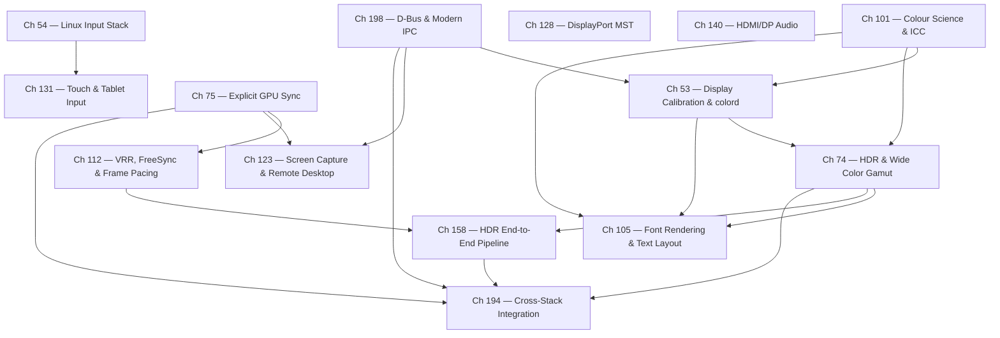

# Part VI-B — Display Services, Input, and Color

Part VI-A established the Wayland compositor as the conductor of the display stack: the single privileged process that owns the DRM device, arbitrates surface presentation, and routes input. This sub-part covers the services that feed that conductor and the outputs that flow from it — the parts of the display stack that are *not* the compositor's core presentation loop but without which a modern desktop cannot deliver correct colour, responsive input, high dynamic range, smooth frame pacing, accessible screen capture, or multi-monitor topologies. Where Part VI-A answered "how does a rendered DMA-BUF become photons," Part VI-B answers a broader set of adjacent questions: how the photons are made *colorimetrically correct* (calibration, ICC profiles, HDR), how input events travel from a kernel interrupt to a client (evdev, libinput, tablets, touch), how GPU work is *sequenced* across process boundaries (explicit synchronisation), how the refresh cadence adapts to render time (VRR), how one client's pixels reach another authorised consumer (screen capture and remote desktop), how a single connector drives a daisy chain of monitors (DisplayPort MST), how audio rides the same cable as video (HDMI/DP audio), and finally the coordination substrate — Wayland protocol extensions and D-Bus IPC — that stitches these independent services into a coherent whole.

These are "services" in a precise sense: most run as separate processes or daemons (`colord`, `xdg-desktop-portal`, `pipewire`, `dbus-broker`), communicate over D-Bus or Wayland extension protocols rather than in-process function calls, and are consumed by the compositor and applications alike. The chapters assume familiarity with the Wayland wire protocol, `zwp_linux_dmabuf_v1`, `drmModeAtomicCommit()`, GBM allocation, and `VkSemaphore` — all covered in Parts I–VI-A. Read those first if the following pages assume machinery you have not yet met.

## The Display Calibration Pipeline

Colour correctness on Linux begins with a physical measurement and ends with a hardware lookup table applied during scanout. The intermediate machinery is a chain of well-defined userspace and kernel interfaces.

A colorimeter or spectrophotometer measures the display's response and produces an **ICC profile** — a binary file conforming to the ICC.1 specification that records the display's colour primaries (the CIE xy chromaticities of its red, green, and blue), its white point, its tone response curve, and, critically for calibration, a **VCGT (Video Card Gamma Table)** tag. The VCGT is a per-channel lookup table intended to be loaded into the display hardware's gamma ramp so that the panel's native response is linearised or corrected toward a target ([ICC specification](https://www.color.org/specification/ICC.1-2022-05.pdf)).

The **colord** daemon ([source](https://www.freedesktop.org/software/colord/)) is the system service that manages the association between physical devices and profiles. It exposes the `org.freedesktop.ColorManager` interface on the system bus. Its object model is small and precise:

- **`CdDevice`** — represents a colour-managed device (a display, scanner, printer, or webcam), identified by a stable device ID derived from its EDID or connection. It carries properties such as `Kind`, `Colorspace`, `Vendor`, `Model`, and an ordered list of associated profiles.
- **`CdProfile`** — represents an ICC profile known to the system, carrying its filename, checksum, colorspace, and metadata. A profile is *assigned* to a device, and one assigned profile is the *default*.

When a user calibrates a display (with ArgyllCMS, DisplayCAL, or a desktop calibration wizard), the resulting ICC profile is imported into colord and assigned to the corresponding `CdDevice`. At login, a session component — `colord-session` under X11, or the compositor's own colour-management path under Wayland — extracts the VCGT curve from the assigned profile and programs it into the display hardware.

Under KMS, this programming target is the **`GAMMA_LUT`** CRTC property. `GAMMA_LUT` is a blob property holding an array of `struct drm_color_lut` entries (16-bit red, green, blue, and reserved fields), applied to the output signal *after* compositing and *before* the panel's electrical interface. The compositor pushes the VCGT-derived LUT with `drmModeAtomicCommit()`, and the correction applies to every pixel scanned out on that CRTC regardless of which client rendered it ([KMS colour pipeline docs](https://www.kernel.org/doc/html/latest/gpu/drm-kms.html#color-management-properties)). This gives per-output, per-channel calibration "for free" — no application need be colour-aware for basic display calibration to take effect.

`GAMMA_LUT` is the last stage of a **three-stage KMS colour pipeline** exposed on capable hardware:

1. **`DEGAMMA_LUT`** — a per-channel LUT applied *first*, typically to linearise a non-linear input signal (undoing the encoding transfer function so subsequent operations happen in linear light).
2. **`CTM`** (Colour Transformation Matrix) — a 3×3 fixed-point matrix (`struct drm_color_ctm`) applied in linear light, used for colour-space conversion, gamut mapping, or channel mixing.
3. **`GAMMA_LUT`** — a per-channel LUT applied *last*, re-encoding the signal (applying the output transfer function, or in the calibration case, the VCGT correction).

The DEGAMMA → CTM → GAMMA ordering matters: a matrix multiply is only correct in linear light, so the degamma stage must precede it and the gamma stage must follow. Not all hardware exposes all three properties, and newer hardware exposes a far richer per-plane `drm_colorop` chain (discussed in the HDR chapters) that supersedes the fixed three-stage model. Chapter 53 covers the calibration pipeline end to end; Chapter 101 provides the colour-science foundation beneath it.

## The Input Processing Chain

Input on Linux travels a fixed vertical path from a hardware interrupt to a client-side event, with each layer adding a specific transformation. Understanding the layers individually is what makes input debugging tractable.

**Kernel interrupt → evdev.** When a key is pressed or a pointer moves, the device raises an interrupt; the kernel's input core (fed by USB HID, I²C, PS/2, or platform drivers) translates the hardware report into the universal **evdev** representation and publishes it on a `/dev/input/event*` character device. Every event is a `struct input_event`:

```c
struct input_event {
    struct timeval time;   /* timestamp */
    __u16 type;            /* EV_KEY, EV_REL, EV_ABS, EV_SYN, ... */
    __u16 code;            /* KEY_A, REL_X, ABS_MT_POSITION_X, ... */
    __s32 value;           /* key state, relative delta, absolute position */
};
```

The `type`/`code`/`value` triple is the entire input vocabulary of the kernel: `EV_KEY` with `code=KEY_A, value=1` is "A pressed," `EV_REL` with `code=REL_X, value=3` is "pointer moved 3 units right," `EV_ABS` with `code=ABS_MT_POSITION_X` reports a multitouch contact coordinate, and `EV_SYN`/`SYN_REPORT` frames a batch of events into an atomic packet ([kernel input docs](https://www.kernel.org/doc/html/latest/input/input.html)). Evdev is deliberately dumb: it reports what the hardware said, unnormalised and unaccelerated.

**evdev → libinput.** Applications and compositors do not read evdev directly. **libinput** ([source](https://gitlab.freedesktop.org/libinput/libinput)) sits above evdev and performs the transformations that make heterogeneous hardware behave consistently:

- **Device normalisation** — mapping each device's native resolution and axis ranges onto a consistent coordinate model, so a 1000-DPI mouse and a high-resolution touchpad produce comparable motion.
- **Pointer acceleration** — applying a velocity-dependent transfer curve (selectable profiles: `flat` for no acceleration, `adaptive` for the default velocity-scaled curve) so slow motion is precise and fast motion covers distance.
- **Gesture recognition** — interpreting multi-finger touchpad contacts as pinch, swipe, and rotate gestures, emitting high-level gesture events rather than raw contact coordinates.
- **The quirks database** — a data-driven correction layer (`quirks/` in the libinput tree, and increasingly `udev-hid-bpf` for per-device fixups) that works around specific hardware bugs: inverted axes, spurious wakeups, misreported button masks.

**libinput → compositor → client.** The Wayland compositor is libinput's consumer and the exclusive input arbiter. It aggregates devices into a **`wl_seat`** (a collection of one keyboard, one pointer, one touch device from the client's perspective) and dispatches events to the focused client via the seat's capability objects: **`wl_pointer`** (motion, button, axis/scroll), **`wl_keyboard`** (key events plus an xkb keymap delivered as a shared-memory fd), **`wl_touch`** (down/up/motion per contact), and the tablet extension **`wp_tablet_v2`** for stylus devices. No Wayland client ever sees raw evdev or libinput state; the compositor decides who is focused and therefore who receives events. This is both the security model (one client cannot snoop another's keystrokes) and the reason input injection for remote desktop requires a privileged portal path.

**Gamepads take a parallel route.** Game controllers surface as evdev `EV_ABS`/`EV_KEY` devices through kernel HID drivers (`hid-playstation`, `hid-nintendo`, and the xpad/`hid-microsoft` family for Xbox pads). **SDL2/SDL3** abstract these behind `SDL_GameController`, matching devices against a controller-mapping database, and Steam Input layers a virtual controller via **`uinput`** — a kernel facility that lets userspace *create* an input device — so that remapped inputs re-enter the evdev stream as if from real hardware. Chapter 54 traces the full vertical path; Chapter 131 goes deep on the tablet and touch branches.

## Colour Science and HDR

The calibration pipeline above assumes a target colour space; colour science defines what those targets *are*, and HDR extends them well beyond the sRGB desktop baseline.

The foundation is the **CIE 1931 XYZ** colour space — a device-independent model in which any colour is three tristimulus values derived from the standard observer's response, and its perceptually-uniform derivative **CIE Lab**, in which Euclidean distance approximates perceived colour difference (the basis of ΔE metrics). An **ICC profile** describes how to convert a device's native encoding to and from a **profile connection space** (PCS), which is XYZ or Lab. The **ICC v4** specification defines the profile structure: a header, a tag table, and typed tag data (curves, matrices, multidimensional lookup tables). **lcms2** (Little CMS) is the Linux reference **colour management module (CMM)**: it parses ICC profiles, builds optimised transform pipelines between them, and executes pixel conversions — it is the engine beneath colord, GIMP, and countless colour-managed tools.

**HDR and wide colour gamut** push the pipeline past sRGB/BT.709 in three orthogonal dimensions:

- **Wider primaries** — **BT.2020** (and its container BT.2100) defines primaries enclosing a far larger fraction of the visible locus than BT.709, so saturated reds and greens that sRGB clips are representable.
- **Higher dynamic range** — HDR content encodes luminance up to 10,000 cd/m² (nits) rather than the ~100-nit sRGB reference, via new transfer functions. **PQ (Perceptual Quantizer, SMPTE ST 2084)** ([spec](https://ieeexplore.ieee.org/document/7291452)) maps code values to *absolute* luminance and is used by HDR10 and Dolby Vision. **HLG (Hybrid Log-Gamma)** is a relative, backward-compatible transfer function favoured for broadcast.
- **Extended-range framebuffers** — **scRGB** uses BT.709 primaries with a linear encoding and 16-bit float channels, allowing values below 0.0 and above 1.0 to represent out-of-sRGB-gamut and above-white colours; it is a common working space for compositors blending HDR and SDR surfaces.

On the kernel side, HDR reaches the panel through the **`HDR_OUTPUT_METADATA`** connector property — a blob carrying the InfoFrame that tells an HDMI/DP sink the content's EOTF (PQ, HLG, or traditional gamma) and its SMPTE ST 2086 mastering-display metadata (primaries, white point, min/max luminance) plus MaxCLL/MaxFALL. Setting this property, together with a BT.2020 `COLORSPACE`, switches the panel into HDR mode. On the Wayland side, clients declare their surface's colour space and HDR characteristics through **`wp_color_management_v1`**, which progressed from staging to stable in **wayland-protocols 1.47 (December 2025)**. The compositor reconciles every client's declared colour space against the output's capabilities — performing **tone mapping** (Reinhard, Hable, ACES-derived operators) to compress HDR content for SDR panels, or **passthrough** to hand HDR metadata straight to an HDR panel, as mpv does for direct HDR video playback via VA-API surfaces. Chapter 101 grounds the science, Chapter 74 covers the HDR/WCG mechanics, and Chapter 158 traces the complete pipeline end to end.

## Explicit GPU Synchronisation

For most of Linux graphics history, GPU work was sequenced **implicitly**: buffers carried `dma_resv` fence objects, and when a consumer (the compositor's GPU, the display engine) touched a buffer, the kernel automatically inserted a wait on the producer's fence. Implicit sync is convenient but coarse — it synchronises on the *buffer*, cannot express fine-grained ordering, does not compose across process and API boundaries cleanly, and forces conservative waits that stall pipelines. The industry has moved to an **explicit** model in which producers and consumers exchange named synchronisation primitives directly.

The kernel primitives are:

- **`sync_file`** — a file descriptor wrapping one or more `dma_fence` objects. A `sync_file` fd can be polled, passed between processes over a Unix socket, and merged. The **`sw_sync`** driver (a debug/test facility) creates software-signalled sync timelines for testing and CPU-driven ordering.
- **`drm_syncobj`** — a kernel-managed synchronisation object. In **binary** mode it holds a single fence; in **timeline** mode it holds a monotonically increasing 64-bit counter, and waiters block until the counter reaches a specified *point*. Timeline syncobjs are the kernel expression of timeline semaphores: one object, many ordered signal/wait points, no allocation churn per frame.

These map directly onto the Vulkan world. **`VK_KHR_timeline_semaphore`** (core in Vulkan 1.2) exposes a `VkSemaphore` whose value is a 64-bit counter; `vkWaitSemaphores`/`vkSignalSemaphore` and queue submissions wait or signal at specific values. A `VkSemaphore` can be **exported as a `sync_file` fd** via `VK_EXTERNAL_SEMAPHORE_HANDLE_TYPE_SYNC_FD_BIT`, or as a `drm_syncobj` via the opaque-fd/syncobj handle types, letting an application hand a GPU-completion fence to the compositor or to another API.

On the Wayland side, **`wp_linux_drm_syncobj_v1`** lets a client attach explicit acquire and release timeline points to a surface commit: the client says "do not scan out this buffer until my `drm_syncobj` reaches acquire point N, and I will not reuse it until you signal release point M." This eliminates a long-standing class of bugs where a compositor scanned out a buffer the client's GPU had not finished rendering — visible as flicker or partial frames — and it is the mechanism behind the **NVIDIA explicit-sync path** that resolved persistent frame-tearing and glitching on XWayland, where the proprietary driver's lack of implicit-sync support had made the implicit model unworkable. Chapter 75 covers explicit sync in full; it is a prerequisite for VRR (Chapter 112), whose flips must be fence-gated, and for screen capture (Chapter 123), whose captured frames must be fence-complete before encoding.

## Font Rendering and the Text Pipeline

Every visible glyph on a Linux desktop is produced by a pipeline of libraries, each solving one well-scoped sub-problem, composing from font discovery down to pixels on a GPU surface.

- **fontconfig** answers "which font file satisfies this request?" It maintains an index of installed fonts and matches by family, weight, slant, and language coverage using a rules engine driven by `/etc/fonts/fonts.conf` and per-user configuration, applying substitutions and fallback chains so that a request for a missing family degrades gracefully.
- **FreeType2** loads the matched font file and rasterizes glyphs. It interprets outline geometry — TrueType **quadratic** B-splines or OpenType/CFF **cubic** Béziers — and renders each glyph at the requested size, applying **hinting** to snap stems and edges to the pixel grid for sharpness at small sizes. It also handles bitmap and colour (`COLR`/`CBDT`) fonts.
- **HarfBuzz** performs **OpenType shaping**: given a run of Unicode text in one script and font, it consults the font's **GSUB** (substitution: ligatures, contextual forms, script-specific glyph selection) and **GPOS** (positioning: kerning, mark attachment) tables to produce a sequence of positioned glyph IDs with advance widths. This is where complex scripts — Arabic joining, Indic reordering, mark stacking — are made correct; a codepoint sequence is *not* a glyph sequence, and HarfBuzz is the bridge.
- **Pango** orchestrates paragraph-level layout above HarfBuzz: it runs the Unicode Bidirectional Algorithm (UAX #9) to resolve mixed left-to-right and right-to-left text, segments the paragraph into script- and font-homogeneous runs, shapes each run via HarfBuzz, and performs line breaking and justification.
- **Cairo** composites the resulting glyph coverage bitmaps onto a destination surface, blending antialiased alpha against the background. GPU-accelerated toolkits and browsers — GTK4's **GSK**/Skia renderer, Chromium and Firefox's **WebRender**-style pipelines — instead upload glyph bitmaps into a **GPU glyph atlas** (a texture packed with rendered glyphs) and draw text as textured quads, bypassing per-frame CPU compositing.

Two rendering subtleties recur throughout the chapter. **LCD subpixel rendering** exploits the horizontal RGB stripe geometry of a fixed panel to triple horizontal resolution — but it depends on knowing the exact subpixel layout and orientation, which a Wayland compositor cannot guarantee once surfaces may be rotated, scaled, or transformed arbitrarily; consequently subpixel antialiasing is commonly disabled in composited Wayland sessions in favour of greyscale antialiasing. **Fractional-scale HiDPI** (rendering at 1.25×, 1.5×, 1.75×) changes the effective pixel grid the hinter targets and interacts with glyph-atlas caching, making crisp text under fractional scaling a harder problem than under integer scaling. Colour-managed text on wide-gamut and HDR outputs additionally requires the pipeline to know the output colour space — the reason this chapter depends on the calibration (Chapter 53) and colour-science (Chapter 101) material. Chapter 105 covers the full pipeline.

## VRR and Frame Pacing

Fixed-rate displays and variable-rate rendering are in fundamental tension: a 60 Hz panel expects a frame every 16.67 ms, but GPU frame time varies with scene complexity. **Variable Refresh Rate (VRR)** resolves this by letting the display hold the current frame until the next rendered frame is ready, within a hardware-supported window.

On Linux, VRR is exposed as AMD **FreeSync** (built on the open VESA Adaptive-Sync standard) and NVIDIA **G-Sync**. The hardware requirements are concrete: the panel must advertise a VRR range in its EDID (a minimum and maximum refresh rate, e.g. 48–165 Hz), and the GPU display engine must support variable blanking-interval scanout. At the kernel level, VRR is armed through the **`VRR_ENABLED`** connector property; when set, atomic page flips within the panel's range stretch or shorten the vertical blanking interval to match frame arrival rather than snapping to a fixed cadence.

Frame pacing is the discipline of submitting frames at the right instant. The compositor and applications observe presentation timing through **`wp_presentation`** feedback, whose timestamps — flagged `WP_PRESENTATION_FEEDBACK_KIND_HW_CLOCK` when derived from the display's hardware clock — report exactly when a frame reached the panel, letting a render loop measure and correct its pacing. For clients that must not outrun the display, **`wp_fifo_v1`** provides a barrier protocol: a client marks a commit as a FIFO barrier, and the compositor withholds the following commit from presentation until the barrier frame has been shown, creating clean backpressure without timestamp polling. At the opposite extreme, **`DRM_MODE_PAGE_FLIP_ASYNC`** requests an immediate (tearing) flip mid-scanout for minimum-latency gaming, mirrored by Vulkan's `VK_PRESENT_MODE_IMMEDIATE_KHR`. **Gamescope** implements a VRR-aware scheduler that combines these mechanisms, using hardware-clock presentation feedback to decide when to submit so that frames land inside the VRR window rather than below its floor (which would cause a stutter even with VRR enabled). Chapter 112 covers VRR and pacing; it feeds the end-to-end HDR integration chapter (158), since VRR and HDR state changes increasingly share a single atomic commit.

## Screen Capture and Remote Desktop

Wayland's client-isolation model — no client may read another client's surfaces — deliberately breaks the X11 assumption that any application can screenshot the whole screen. The compositor is the only party with access to every surface and to the KMS scanout buffer, so capture must be mediated by the compositor and gated by user consent.

Two capture protocols address this. **`wlr-screencopy`** is the wlroots-ecosystem protocol (Sway, Hyprland), and **`ext-image-copy-capture-v1`** is its cross-compositor successor in wayland-protocols staging, adding **damage-region reporting** so a capturer copies only the pixels that changed since the last frame. Above the protocol, **PipeWire** acts as the media bus: the compositor becomes a PipeWire stream producer advertising a screen-cast session, and PipeWire negotiates buffer formats (including DMA-BUF handles for zero-copy) and delivers frames to consumers. Access is gated by **`org.freedesktop.portal.ScreenCast`** in **xdg-desktop-portal**, whose D-Bus interface presents the user with a consent dialog choosing what to share (a monitor, a window, a region) before any pixels flow — the consent gate that replaces X11's implicit全-access model. Consumers include OBS Studio (via its PipeWire capture source) and the WebRTC stacks in Chromium and Firefox (via the `getDisplayMedia` portal path).

**Remote desktop** extends capture with input injection. The pixel stream uses the same capture path; input travels through **`org.freedesktop.portal.RemoteDesktop`**, which creates a **`uinput`** virtual input device that the portal daemon drives on the remote client's behalf, re-entering the evdev stream so the compositor routes injected events exactly as it would physical ones. **FreeRDP** and **KasmVNC** integrate with these portals. For the lowest-latency path, **KMS writeback connectors** let the display engine copy the composited scanout buffer directly into a CPU- or GPU-accessible buffer without a compositor GPU round-trip — valuable for thin-client and remote scenarios where every millisecond of the capture round-trip matters. Chapter 123 covers the full capture and remote-desktop stack.

## DisplayPort Multi-Stream Transport

A single DisplayPort connector can drive multiple independent displays through **Multi-Stream Transport (MST)** — the technology behind DP daisy chains and MST hubs, where two or three monitors hang off one physical port. MST works by time-multiplexing several video streams onto the DP main link and routing them through a tree of branch devices.

The kernel exposes MST through the **`drm_dp_mst_topology_*`** API. When a source detects an MST-capable branch device, it performs **topology discovery**: it walks the tree over the DisplayPort AUX channel and its sideband message protocol (`drm_dp_sideband`), enumerating branch and sink devices and building a `drm_dp_mst_topology_mgr` model of the daisy chain. Each downstream sink is presented to the rest of KMS as its own connector, so from the compositor's perspective an MST hub with three monitors looks like three connectors on one physical port. Driving those streams requires **virtual channel (VC) payload allocation**: the finite bandwidth of the DP main link is partitioned into time slots, and the driver allocates a VC payload for each active stream sized to its pixel clock and bit depth, then programs the branch devices' payload tables. When the aggregate bandwidth of the requested modes exceeds the link, **DSC (Display Stream Compression)** bandwidth negotiation reduces per-stream bandwidth via visually-lossless compression so that more or higher-resolution streams fit. Chapter 128 covers MST topology discovery, VC allocation, and DSC negotiation; it is largely self-contained, depending only on the atomic-KMS foundations from Part VI-A.

## HDMI and DisplayPort Audio

HDMI and DisplayPort carry audio on the same cable as video, and Linux integrates that audio path with the DRM connector model rather than treating it as an independent sound device. The audio itself is handled by ALSA's **HDA (High Definition Audio)** driver, which exposes the GPU's audio codec as a sound card; the crucial coupling is that audio capability and hotplug state depend on the *display* connection.

The negotiation datum is the **ELD (EDID-Like Data)** — a compact block, derived from the sink's EDID, describing the connected display's audio capabilities: supported formats (PCM, AC-3, DTS), channel counts, and sample rates. When a display is hotplugged, the DRM driver parses the EDID's audio data blocks and populates the ELD, which the HDA driver reads to advertise the correct PCM capabilities to userspace — so a receiver capable of 7.1 LPCM and a stereo monitor present different capabilities to ALSA. The bridge between the DRM and audio subsystems is **`drm_audio_component`**, a small ops interface through which the audio driver queries the display driver for ELD and hotplug notifications without the two drivers depending on each other directly. Because audio and video traverse different subsystems with different latencies, **audio-video synchronisation** ultimately falls to the compositor and media pipeline, which timestamp and align audio playback against the presentation feedback of the corresponding video frames. Chapter 140 covers the ALSA HDA ↔ DRM connector audio integration; like MST, it is largely self-contained.

## The Coordination Layer: Wayland Protocols and D-Bus IPC

The services in this part do not run in isolation — they must coordinate, and two IPC substrates do that coordination.

The **Wayland protocol ecosystem** is the compositor-facing coordination bus. Beyond the core protocol, a growing set of extensions carries exactly the cross-cutting concerns of this part: **`wp_linux_drm_syncobj_v1`** (explicit sync), **`wp_color_management_v1`** (colour and HDR), **`wp_fifo_v1`** and **`wp_tearing_control_v1`** (frame pacing and tearing), **DMA-BUF format modifiers** (zero-copy buffer transport with correct tiling/compression layout), and **KMS overlay plane promotion** (moving eligible surfaces off the GPU compositing pass onto hardware planes). Chapter 194 treats this ecosystem as the stack's coordination layer, examining the systemic costs of the graphics stack's modular design — latency stalls, redundant copies, colour-space blindness, implicit-sync hazards, debuggability gaps — and the cross-component mechanisms (including Mesa's **NIR** as the cross-driver shader-IR unifier) developed to address them. It is a synthesis chapter, downstream of the individual HDR (74), explicit-sync (75), and end-to-end HDR (158) chapters.

The **D-Bus** bus is the service-facing coordination substrate — the message bus over which `colord`, `xdg-desktop-portal`, and the PipeWire session manager expose their interfaces and are activated on demand. **dbus-broker** is the modern, socket-activated D-Bus daemon that has largely replaced the reference `dbus-daemon`, offering a smaller, faster, systemd-integrated bus implementation while speaking the same wire protocol. Beyond classic D-Bus, the chapter surveys the evolving IPC landscape: **Varlink**, a typed, schema-described IPC protocol adopted by systemd and emerging freedesktop services; **zbus**, the pure-Rust D-Bus library increasingly used by Rust desktop components; **hyprwire**, Hyprland's custom IPC transport; and the **BUS1** proposal for capability-based IPC implemented in the kernel. Chapter 198 covers this IPC substrate; it is a supporting chapter referenced by the calibration (53), screen-capture (123), and cross-stack (194) chapters, all of which lean on D-Bus for their control planes.

## Dependency Map

The diagram below shows the structural dependencies among the fourteen chapters in this part. Arrows point from prerequisite to dependent chapter.



Three tributaries organise the part. The **colour tributary** runs CH101 → CH53 → CH74 → CH158, with CH101 supplying the science, CH53 the calibration mechanism, CH74 the HDR/WCG extension, and CH158 the end-to-end synthesis; font rendering (CH105) hangs off this tributary because colour-managed text needs the calibration and output-colour-space knowledge that CH53, CH101, and CH74 provide. The **input tributary** is short and independent: CH54 (the general input stack) → CH131 (its touch and tablet specialisation). The **synchronisation-and-timing tributary** runs from CH75 (explicit sync) into both CH112 (VRR flips must be fence-gated) and CH123 (captured frames must be fence-complete), with CH112 feeding forward into CH158. Two chapters are effectively standalone display-hardware topics — CH128 (DisplayPort MST) and CH140 (HDMI/DP audio) — depending only on the atomic-KMS foundations from Part VI-A rather than on other chapters in this part. Underpinning several control planes, CH198 (D-Bus and modern IPC) is upstream of CH53, CH123, and CH194, since colord, the screen-cast portal, and the cross-stack coordination layer all rely on the D-Bus substrate. CH194 (cross-stack integration) is the confluence: a synthesis read that draws together the HDR (CH74), explicit-sync (CH75), end-to-end HDR (CH158), and IPC (CH198) threads.

## Chapter Progression

The chapters admit two natural entry points depending on interest, and then converge:

- **Chapter 53 — Display Calibration and colord** is the entry point for readers interested in colour. It covers the full ICC profiling and VCGT → `GAMMA_LUT` pipeline, the colord D-Bus daemon, and its `CdDevice`/`CdProfile` object model. Read it first if your focus is calibration and colour correctness.
- **Chapter 54 — The Linux Input Stack** is the entry point for readers interested in input. It traces the vertical path from a kernel interrupt through evdev (`struct input_event`) and libinput (normalisation, acceleration, gestures, quirks) to the Wayland seat and client events, including the gamepad/SDL2/`uinput` path. Read it first if your focus is input processing.
- **Chapter 101 — Colour Science and ICC Profiles on Linux** provides the theoretical grounding — CIE XYZ/Lab, ICC v4 structure, lcms2, and the DEGAMMA_LUT/CTM/GAMMA_LUT pipeline — beneath the calibration and HDR chapters. Read it alongside or just after Chapter 53; the two are mutually reinforcing.
- **Chapter 74 — HDR and Wide Color Gamut on Linux** builds on 53 and 101 to cover BT.2020 primaries, PQ/HLG transfer functions, scRGB framebuffers, `HDR_OUTPUT_METADATA`, `wp_color_management_v1`, and compositor tone mapping and passthrough.
- **Chapter 75 — Explicit GPU Synchronisation** covers the `sync_file`/`sw_sync` and `drm_syncobj` timeline model, `VK_KHR_timeline_semaphore`, `wp_linux_drm_syncobj_v1`, and the NVIDIA explicit-sync path. It is a prerequisite for the VRR and screen-capture chapters.
- **Chapter 105 — Font Rendering and Text Layout** covers the fontconfig → FreeType2 → HarfBuzz → Pango → Cairo → GPU-atlas pipeline, LCD subpixel and fractional-scale HiDPI considerations. Read it after the colour chapters, since correct wide-gamut and HDR text depends on output-colour-space knowledge.
- **Chapter 112 — VRR, FreeSync, and Frame Pacing** covers `VRR_ENABLED`, FreeSync/G-Sync EDID requirements, `wp_presentation` feedback, `wp_fifo_v1`, `DRM_MODE_PAGE_FLIP_ASYNC`, and the Gamescope scheduler. Read it after Chapter 75.
- **Chapter 123 — Screen Capture and Remote Desktop on Wayland** covers `wlr-screencopy`, `ext-image-copy-capture-v1`, PipeWire screen-cast, the xdg-desktop-portal ScreenCast/RemoteDesktop interfaces, OBS/WebRTC integration, and KMS writeback connectors. Read it after Chapter 75 (fence-complete frames) and Chapter 198 (its portal control plane).
- **Chapter 128 — DisplayPort MST** covers the `drm_dp_mst_topology_*` API, topology discovery, virtual-channel allocation, and DSC bandwidth negotiation. It is self-contained and can be read at any point after Part VI-A.
- **Chapter 131 — Touch and Tablet Input on Wayland** covers `wp_tablet_v2`, `wl_touch`, libinput pressure/tilt axis normalisation, libwacom device detection, and Krita/Inkscape integration. Read it after Chapter 54.
- **Chapter 140 — HDMI and DisplayPort Audio** covers ALSA HDA ↔ DRM connector audio, ELD-based capability negotiation, `drm_audio_component` ops, and A/V synchronisation. It is self-contained.
- **Chapter 158 — HDR on the Linux Desktop: End-to-End Pipeline** is an integration chapter tracing application colour-space declaration → `wp_color_management_v1` → compositor tone mapping → `HDR_OUTPUT_METADATA` → display EOTF, with per-compositor status for Mutter, KWin, and gamescope. Read it after Chapters 74 and 112.
- **Chapter 194 — Cross-Stack Integration** synthesises the protocol, synchronisation, and colour threads of the whole stack. Read it last among the technical chapters, after 74, 75, and 158.
- **Chapter 198 — D-Bus, dbus-broker, and Modern Linux IPC** covers the IPC substrate connecting the display services — D-Bus activation, dbus-broker, Varlink, zbus, hyprwire, and the BUS1 proposal. It can be read early as background for the D-Bus-dependent chapters (53, 123, 194) or as a reference when those chapters invoke a D-Bus interface.

Readers should arrive having read Parts I–VI-A: familiarity with `drmModeAtomicCommit()`, atomic KMS properties, DMA-BUF file descriptors, GBM allocation, the Wayland wire protocol, and `VkSemaphore` is assumed throughout.

---

## Part Roadmap Summary

*Synthesised from the Roadmap sections of this part's chapters.*

### Near-term (6–12 months)

**Colour management reaching the ecosystem.** With `wp_color_management_v1` stable in wayland-protocols 1.47 (December 2025), the near-term work is roll-out and client adoption: KWin exposes colour management by default, Mutter carries server-side support, and application clients (Chromium, GStreamer, mpv, SDL3) complete their integrations. colord gains HDR-aware profiling APIs so that calibration workflows produce ICC profiles carrying HDR metadata. NVIDIA's preview DRM Color Pipeline support and RADV/ANV stabilisation in Mesa close the discrete-GPU HDR gap; Intel Xe colorop coverage follows.

**KMS colour pipeline generalising.** The fixed DEGAMMA_LUT/CTM/GAMMA_LUT triple gives way on new hardware to the per-plane `drm_colorop` chain, letting compositors express degamma, matrix, and re-gamma stages (and CSC objects) per surface rather than per CRTC. VCGT-based calibration migrates onto this richer model, enabling per-surface ICC transforms without a compositor GPU shader.

**Input quirks moving into eBPF.** `udev-hid-bpf` matures as the canonical per-device input-fixup path, displacing many static libinput quirks-database entries with loadable BPF programs that correct misbehaving HID devices at the kernel boundary. libinput stabilises its plugin ABI for tablet and touchpad quirks; tablet pressure-curve customisation improves for `wp_tablet_v2` consumers.

**Explicit sync completing across compositors.** `wp_linux_drm_syncobj_v1` edge cases for multi-GPU and NVIDIA configurations are resolved in wlroots and downstream compositors, and the XWayland explicit-sync path stabilises, closing the last major source of NVIDIA Wayland frame-glitching. `sync_file`/`drm_syncobj` timeline usage becomes the default producer/consumer contract for new compositor code.

**Capture and remote-desktop consolidation.** `ext-image-copy-capture-v1` supersedes `wlr-screencopy-unstable-v1` in wlroots-family compositors, adding damage reporting for lower-bandwidth capture. The xdg-desktop-portal ScreenCast and RemoteDesktop interfaces gain wider consumer support; PipeWire DMA-BUF negotiation matures for zero-copy screen-cast into browsers and OBS.

**Display-hardware protocol expansion.** DisplayPort MST gains DP 2.0 support in AMDGPU and Arm SoC display drivers, with DSC negotiation tuned for high-resolution daisy chains. HDMI 2.1 FRL work unlocks high-bandwidth modes and the associated high-bitrate audio (Dolby Atmos, DTS:X) over the DRM connector audio path; ELD parsing and `drm_audio_component` hotplug handling harden accordingly.

### Medium-term (1–3 years)

**Per-plane colour management in hardware.** The `drm_colorop` chain graduates to broad hardware support (AMD DCN, Intel Xe, and NVIDIA display engines), enabling hardware-accelerated BT.2020→sRGB gamut conversion, 3D-LUT tone mapping, and per-surface ICC transforms without compositor GPU shaders — cutting HDR compositing power draw, especially on mobile. iccMAX (ICC v5) parsing reaches lcms2 and colord, enabling scene-referred HDR workflows.

**Explicit sync becomes the default and implicit sync recedes.** `wp_linux_drm_syncobj_v1` graduates to stable and Mesa deprecates implicit-sync shim paths for RADV/ANV. Timeline-fence waits unify with I/O event handling (via `io_uring` uring-cmd), and cross-device fence export matures for hybrid dGPU+iGPU laptops. NVK closes remaining timeline-semaphore optimisation gaps with the mainline Vulkan drivers.

**VRR, HDR, and pacing converge in the atomic commit.** VRR and HDR state transitions are unified into single atomic commits so that mode, colour, and refresh changes are glitch-free. `wp_fifo_v1` and `wp_tearing_control_v1` see wide compositor adoption; async atomic page-flip progresses toward mainline for tearing-allowed low-latency paths. A kernel VRR floor property is designed for OLED burn-in mitigation.

**Text rendering under fractional scale and wide gamut.** Fractional-scale hinting and glyph-atlas caching improve so that crisp text at 1.25×–1.75× approaches integer-scale quality. Colour-managed text pipelines flow output-colour-space information from `wp_color_management_v1` down through Pango/Skia so that wide-gamut and HDR text render in the correct space rather than assuming sRGB.

**IPC substrate modernisation.** dbus-broker becomes the default session and system bus across major distributions. Varlink adoption widens among systemd and freedesktop services for typed, introspectable IPC, and Rust desktop components standardise on zbus. Capability-based IPC proposals (BUS1 and successors) inform the design of sandbox-friendly service activation for display services behind portals.

### Long-term

- **Unified colour and display hardware abstraction.** A vendor-agnostic `drm_colorop` chain expresses the complete HDR pipeline across AMD, Intel, and NVIDIA display hardware, with per-display ICC enforcement moving toward the KMS layer and hardware 3D-LUT tone mapping eliminating compositor shader overhead. Dynamic HDR metadata (HDR10+, Dolby Vision) integrates with the per-plane colorop pipeline.
- **Implicit GPU sync deprecated kernel-wide.** Once the ecosystem completes migration to explicit `drm_syncobj` timelines, `dma_resv`-based implicit sync is deprecated across the kernel, simplifying the buffer-sharing contract and removing a long-standing class of latency and correctness hazards.
- **Input beyond the pointer/keyboard/touch model.** Spatial and XR input — hand tracking, eye gaze from XR runtimes — is reconciled with the Wayland seat model, and compositor-side prediction models reduce stylus and pointer motion-to-photon latency. Gamepad and adaptive-controller support becomes a first-class Wayland concern rather than an SDL/uinput bolt-on.
- **Capture, remote desktop, and the IPC bus.** A standardised compositor-level capture protocol serves magnifiers, accessibility tools, and remote desktop uniformly, gated by a unified consent model. The D-Bus/Varlink IPC substrate hosts these control planes with capability-scoped access, so that a remote-desktop grant cannot silently escalate into broad surface or input access.

---

*Part VI-B spans Chapters 53, 54, 74, 75, 101, 105, 112, 123, 128, 131, 140, 158, 194, and 198. Chapter 53 or Chapter 54 are natural entry points depending on whether your interest is colour calibration or input processing.*

---

*Copyright © 2026 jreuben11. Licensed under [CC BY 4.0](https://creativecommons.org/licenses/by/4.0/).*
