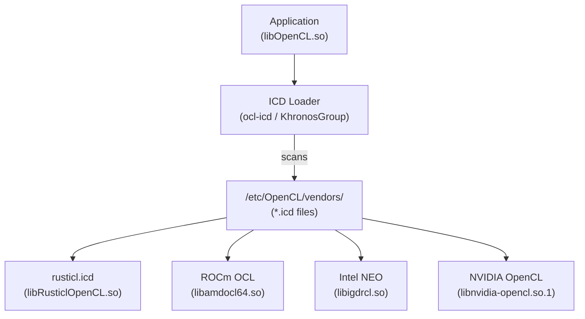
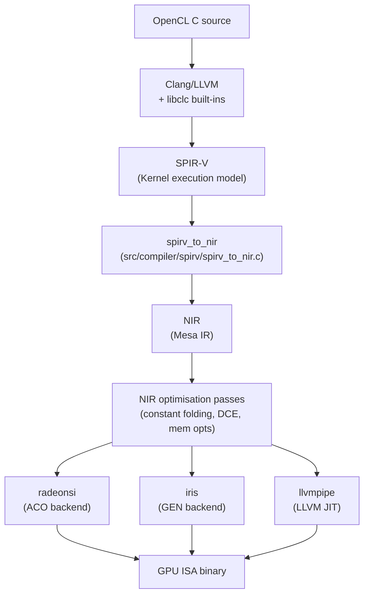
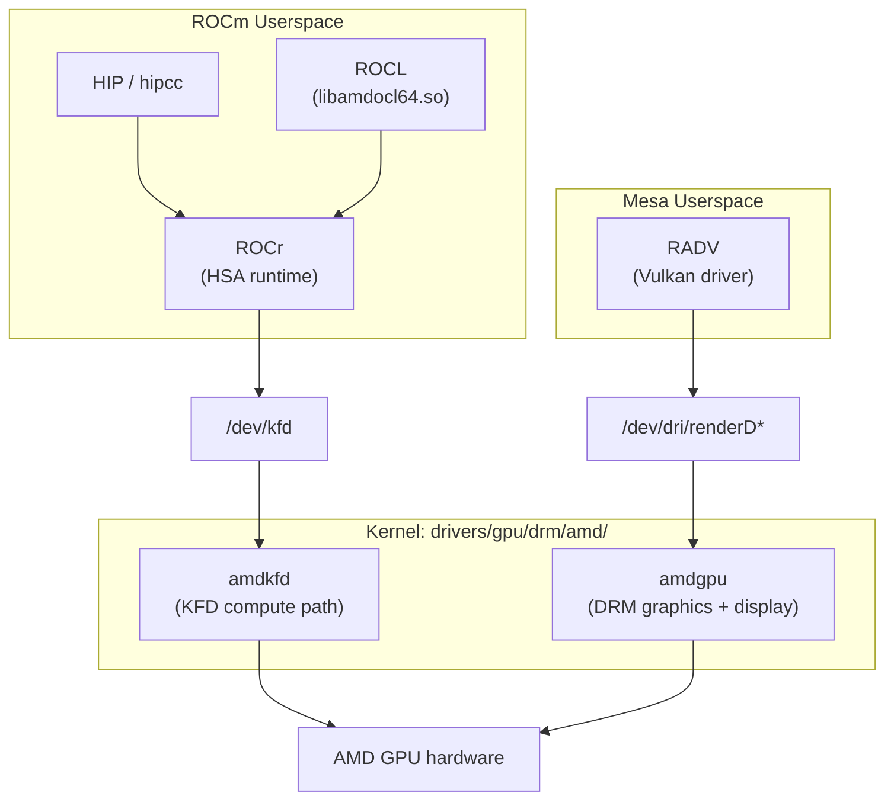
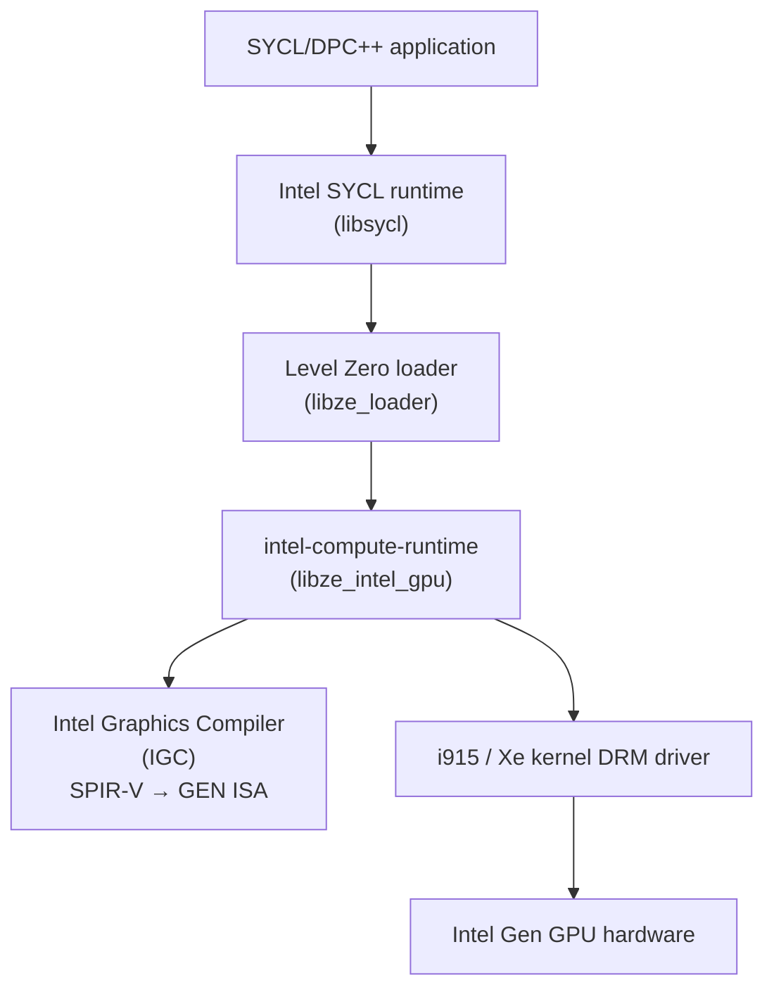
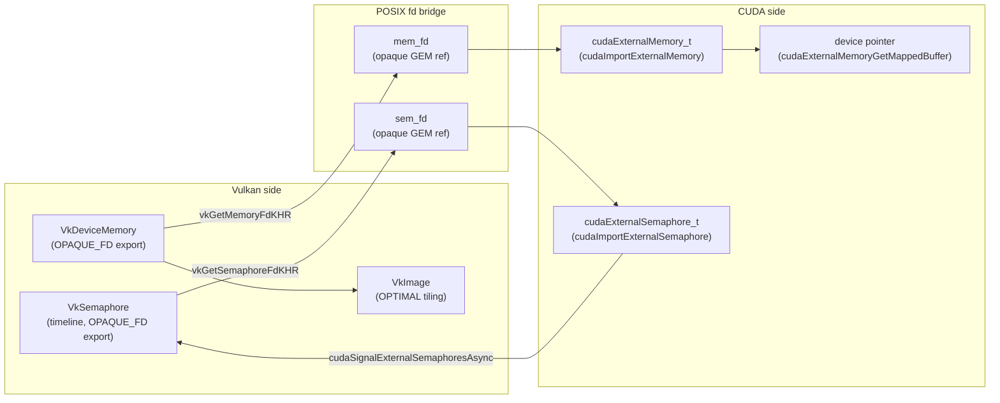
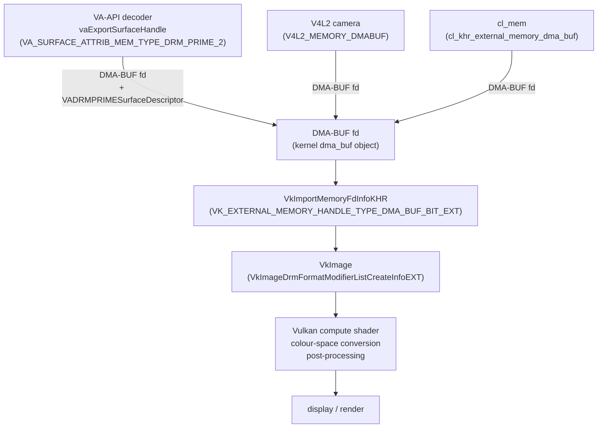
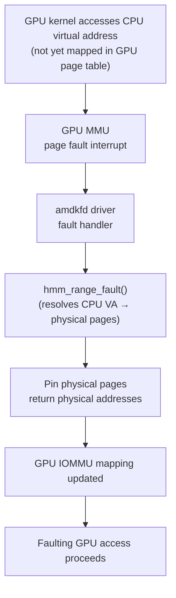
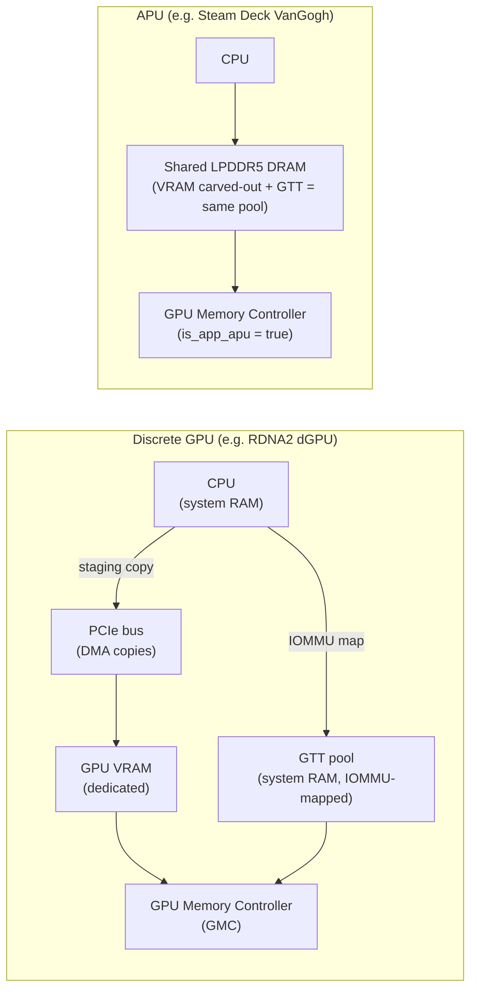

# Chapter 25: GPU Compute

**Part**: VII — Application APIs and Middleware  
**Audiences**: Application developers targeting OpenCL, Vulkan compute, and ROCm; systems developers understanding how compute interfaces map onto kernel drivers and Mesa internals.

GPU compute on Linux is a fragmented landscape where multiple **OpenCL** implementations, **Vulkan** compute pipelines, **CUDA**, and AMD's **ROCm**/**HIP** stack all coexist and partially overlap. This chapter maps that terrain with precision, explaining the kernel and **Mesa** foundations each implementation builds on and equipping application developers to choose the right path for a given workload.

The chapter opens with the **OpenCL** **ICD** (Installable Client Driver) discovery mechanism — how the **ocl-icd** and **KhronosGroup** loaders scan `/etc/OpenCL/vendors/` and multipulate `OCL_ICD_VENDORS` — and surveys the four major implementations: **rusticl** (`libRusticlOpenCL.so`), **ROCm OCL** (`libamdocl64.so`), **Intel NEO** (`libigdrcl.so`), and **NVIDIA OpenCL** (`libnvidia-opencl.so.1`). It then covers **rusticl** in depth: Mesa's **OpenCL** 3.0 implementation written in Rust and layered on the **Gallium** pipe driver abstraction (`pipe_screen`, `pipe_context`, `pipe_resource`), with its **OpenCL C** → **SPIR-V** → **NIR** → driver-backend compilation pipeline through **Clang**/**LLVM**, **libclc**, and `spirv_to_nir`. AMD's **ROCm** stack follows — covering **HIP**, **ROCr** (the **HSA** runtime), the **AMDKFD** kernel module (`drivers/gpu/drm/amd/amdkfd/`), and the library ecosystem (**rocBLAS**, **MIOpen**, **rocFFT**). Intel's compute offering is treated next: **Intel Level Zero** (`ze_` API), **intel-compute-runtime** (`libze_intel_gpu`), the **Intel Graphics Compiler** (**IGC**) as the **SPIR-V** → **GEN ISA** backend, and the **oneAPI** / **DPC++** / **SYCL** programming model layer.

The chapter then goes deep on the two most technically demanding topics: **Vulkan** compute architecture — **VkComputePipelineCreateInfo**, descriptor types (**VK_DESCRIPTOR_TYPE_STORAGE_BUFFER**, **VK_DESCRIPTOR_TYPE_STORAGE_IMAGE**), pipeline barriers via **vkCmdPipelineBarrier2**, subgroup operations (**GL_KHR_shader_subgroup**), specialisation constants, async compute queues (AMD **ACE** blocks), and GPU timestamp queries — and **CUDA**–**Vulkan** interoperability, the critical bridge for workloads combining NVIDIA compute with real-time graphics. The interop coverage spans external memory sharing via `OPAQUE_FD` handles (**VkExportMemoryAllocateInfo**, **vkGetMemoryFdKHR**, **cudaImportExternalMemory**), external semaphore synchronisation without CPU round-trips (**VkExportSemaphoreCreateInfo**, **cudaSignalExternalSemaphoresAsync**, **cudaWaitExternalSemaphoresAsync**), timeline semaphore pipelining, and common pitfalls including queue family ownership transfer from **VK_QUEUE_FAMILY_EXTERNAL** and validation with **Nsight Systems**.

**DMA-BUF** interop is covered as the universal zero-copy buffer-sharing mechanism: **VA-API** surface → **Vulkan** image import (`vaExportSurfaceHandle`, **VkImportMemoryFdInfoKHR**, **VkImageDrmFormatModifierListCreateInfoEXT**), **OpenCL** → **Vulkan** via `cl_khr_external_memory_dma_buf`, **ROCm** → **Vulkan** via `hipExternalMemoryHandleDesc`, and **V4L2** camera → **Vulkan** compute pipelines using `V4L2_MEMORY_DMABUF`. A detailed treatment of AMD's unified memory model and **Linux HMM** (`hmm_range_fault()`, `Documentation/mm/hmm.rst`) follows, including the **AMDKFD** SVM allocator (`kfd_svm.c`, `svm_range_add()`), the **HIP** managed memory API (**hipMallocManaged**, **hipMemAdvise**, **hipMemPrefetchAsync**), and the practical implications for **APU** platforms such as the **Steam Deck** (VanGogh **RDNA2** iGPU) and **Ryzen AI** series. The unified memory section also covers **Vulkan** memory topology: **Small BAR** (256 MB host-visible device-local heap), **ReBAR** / **Smart Access Memory** (**SAM**) full-VRAM host-visible access, and zero-copy **VK_MEMORY_PROPERTY_HOST_COHERENT_BIT** patterns on both discrete and integrated GPUs. The chapter concludes with a complete worked example — a two-pass separable Gaussian blur on **Vulkan** compute — tying together pipeline creation, pipeline barriers, specialisation constants, **push constants**, and GPU timestamp queries.

The chapter deliberately avoids GPU algorithm design and parallel programming theory; those subjects belong to domain-specific references. Instead it focuses on Linux-specific concerns: **ICD** discovery, render-node permissions (`/dev/dri/renderD*`, `/dev/kfd`), buffer sharing across API boundaries, synchronisation between compute and graphics queues, and the **DMA-BUF** infrastructure enabling zero-copy compute-to-display pipelines.

---

## Table of Contents

1. [The OpenCL Landscape on Linux: ICD Discovery and Implementation Survey](#1-the-opencl-landscape-on-linux-icd-discovery-and-implementation-survey)
2. [rusticl: OpenCL on Mesa's Gallium Infrastructure](#2-rusticl-opencl-on-mesas-gallium-infrastructure)
3. [ROCm: AMD's Compute Stack](#3-rocm-amds-compute-stack)
4. [Intel Level Zero, oneAPI, and the Intel Compute Runtime](#4-intel-level-zero-oneapi-and-the-intel-compute-runtime)
5. [Vulkan Compute Pipelines](#5-vulkan-compute-pipelines)
6. [CUDA–Vulkan Interoperability](#6-cudavulkan-interoperability)
7. [DMA-BUF Interop: Sharing Buffers Across Compute and Graphics Pipelines](#7-dma-buf-interop-sharing-buffers-across-compute-and-graphics-pipelines)
8. [Unified Memory and HMM in GPU Compute](#8-unified-memory-and-hmm-in-gpu-compute)
9. [Practical: GPU-Accelerated Image Processing with Vulkan Compute](#9-practical-gpu-accelerated-image-processing-with-vulkan-compute)
10. [io_uring and Async GPU Command Submission](#10-io_uring-and-async-gpu-command-submission)
11. [Integrations](#11-integrations)
12. [References](#12-references)

---

## 1. The OpenCL Landscape on Linux: ICD Discovery and Implementation Survey

Linux hosts at least five distinct GPU compute APIs because no single API satisfies every combination of hardware target, programming model, ecosystem maturity, and portability requirement. OpenCL emerged first as the cross-vendor standard, CUDA captured the machine-learning ecosystem on NVIDIA hardware, ROCm/HIP provides an AMD-centric path that mirrors CUDA's programming model, SYCL/oneAPI offers a modern C++ abstraction aimed at Intel GPUs and HPC portability, and Vulkan compute entered the field as the lowest-common-denominator graphics-and-compute API already implemented by every major vendor's open-source driver. The table below summarises the five APIs across the dimensions that matter most when choosing a compute back end for a Linux workload.

| **API** | **Portability** | **Vendor lock-in** | **Memory model** | **Kernel language** | **Linux driver requirement** | **ML framework support** | **Best for** |
|---|---|---|---|---|---|---|---|
| OpenCL 3.0 | High (any vendor) | None | Explicit buffers / SVM (optional) | OpenCL C / C++ for OpenCL | ICD loader; vendor runtime | PyOpenCL; limited (most ML uses CUDA/ROCm) | Cross-vendor compute; image processing; embedded |
| CUDA 12.x | NVIDIA only | High | Unified Virtual Addressing (UVA); NVLink P2P | CUDA C/C++; PTX | proprietary nvidia driver or nvidia-open | PyTorch (primary), TF, JAX | NVIDIA-only training; maximum performance on NVIDIA |
| ROCm / HIP 6.x | AMD (+ limited Intel via HIP-Intel) | Medium (HIP is CUDA-like) | Fine-grained SVM; xGMI P2P | HIP C++ (CUDA-source compatible) | AMDGPU + KFD (`/dev/kfd`) | PyTorch ROCm, TF-ROCm | AMD GPU training and inference; CUDA portability layer |
| SYCL 2020 (Intel oneAPI DPC++) | Intel, AMD, NVIDIA (via plugins) | Low (open standard) | USM (Unified Shared Memory, pointer-based) | Modern C++17/20 | Level Zero (Intel); CUDA/ROCm plugin | Limited ML; HPC | HPC portability; Intel GPU; replacing OpenCL in Intel stack |
| Vulkan Compute (1.3+) | Very high (any Vulkan driver) | None | Explicit (descriptor sets, push constants) | GLSL/HLSL→SPIR-V; Slang; WGSL | Any Mesa Vulkan or nvidia-open | llama.cpp, GGML, IREE | Cross-platform inference; games; embedded; when CUDA/ROCm unavailable |

OpenCL on Linux is delivered through an *Installable Client Driver* (ICD) mechanism that decouples the application-facing ABI from the underlying hardware implementations. Applications link against a single `libOpenCL.so` — the ICD loader — which multiplexes calls across all installed implementations. Two ICD loader projects exist: the Khronos reference ICD loader ([KhronosGroup/OpenCL-ICD-Loader](https://github.com/KhronosGroup/OpenCL-ICD-Loader)) and the independent `ocl-icd` project ([OCL-dev/ocl-icd](https://github.com/OCL-dev/ocl-icd)). Most Linux distributions ship `ocl-icd`; both comply with the same discovery protocol and are ABI-compatible from the application's perspective.

**ICD discovery** follows a simple filesystem protocol. At startup the loader scans `/etc/OpenCL/vendors/` and reads every file whose name ends with `.icd`. Each such file contains a single line: the path to the shared library implementing the OpenCL platform. The loader calls `dlopen(3)` on that path and, if the library exports the `clIcdGetPlatformIDsKHR` symbol, registers it as an available platform. The environment variable `OCL_ICD_VENDORS` overrides the scan directory entirely: if it names a directory, that directory replaces `/etc/OpenCL/vendors/`; if it names a `.icd` file directly, only that implementation is loaded; if it names a bare library filename with no slashes, the loader first attempts `/etc/OpenCL/vendors/$OCL_ICD_VENDORS`. This override is the primary mechanism for testing a specific implementation without disturbing the system-wide configuration.



**The four major implementations** on Linux differ substantially in architecture and hardware scope:

*rusticl* (`/etc/OpenCL/vendors/rusticl.icd`, library `libRusticlOpenCL.so`) is Mesa's OpenCL implementation, written in Rust and sitting atop the Gallium pipe driver abstraction. It achieved official OpenCL 3.0 conformance on Intel Gen12 Xe graphics with the Iris Gallium3D driver as of Mesa 23.x, and radeonsi conformance followed shortly after. Because it reuses Gallium, any driver that implements `pipe_screen` and `pipe_context` can serve as a rusticl backend.

*ROCm OCL* (`libamdocl64.so`) ships separately from Mesa as part of the ROCm stack. It is frequently confused with `libMesaOpenCL.so`, an older AMD OpenCL front end that predates rusticl and is now deprecated; do not conflate them. ROCm's OpenCL front end is one component of a much larger compute ecosystem built on the HIP/HCC/HSA runtime described in Section 3.

*Intel NEO* (`intel-opencl-icd`, library `libigdrcl.so`) is Intel's compute runtime, targeting Gen9 integrated GPUs through Intel Arc discrete GPUs. It supports OpenCL 3.0 on Gen12 and later. The ICD file typically resides at `/etc/OpenCL/vendors/intel.icd`.

*NVIDIA OpenCL* (`libnvidia-opencl.so.1`) ships with the proprietary NVIDIA driver. It supports CL 1.2 on older hardware and CL 3.0 optional features on Ampere and later. The `.icd` entry is installed at `/etc/OpenCL/vendors/nvidia.icd`.

**Runtime capability queries** use the standard OpenCL introspection API. The following C fragment enumerates platforms and prints the implementation name and CL version — the programmatic equivalent of `clinfo`:

```c
/* Enumerate OpenCL platforms — pedagogical example */
#include <CL/cl.h>
#include <stdio.h>

int main(void) {
    cl_uint num_platforms;
    clGetPlatformIDs(0, NULL, &num_platforms);

    cl_platform_id *platforms = alloca(sizeof(cl_platform_id) * num_platforms);
    clGetPlatformIDs(num_platforms, platforms, NULL);

    for (cl_uint i = 0; i < num_platforms; i++) {
        char name[256], version[256], extensions[4096];
        clGetPlatformInfo(platforms[i], CL_PLATFORM_NAME,    sizeof(name),       name,       NULL);
        clGetPlatformInfo(platforms[i], CL_PLATFORM_VERSION, sizeof(version),    version,    NULL);
        clGetPlatformInfo(platforms[i], CL_PLATFORM_EXTENSIONS, sizeof(extensions), extensions, NULL);
        printf("Platform %u: %s  [%s]\n", i, name, version);

        cl_uint num_devices;
        clGetDeviceIDs(platforms[i], CL_DEVICE_TYPE_ALL, 0, NULL, &num_devices);
        cl_device_id *devices = alloca(sizeof(cl_device_id) * num_devices);
        clGetDeviceIDs(platforms[i], CL_DEVICE_TYPE_ALL, num_devices, devices, NULL);
        for (cl_uint j = 0; j < num_devices; j++) {
            char dname[256]; cl_uint cu;
            clGetDeviceInfo(devices[j], CL_DEVICE_NAME, sizeof(dname), dname, NULL);
            clGetDeviceInfo(devices[j], CL_DEVICE_MAX_COMPUTE_UNITS, sizeof(cu), &cu, NULL);
            printf("  Device %u: %s  CUs=%u\n", j, dname, cu);
        }
    }
    return 0;
}
```

**Permissions** are the most common source of failure. All implementations ultimately open a DRM render node (`/dev/dri/renderD128` or similar). On most distributions the render node is owned by the `render` or `video` group, and the user must be a member. The command `stat /dev/dri/renderD128` shows the owning group; `groups $(whoami)` shows the current user's memberships. Rootless containers require the render node to be passed in explicitly. A process that lacks render-node access will receive `CL_DEVICE_NOT_FOUND` at `clGetPlatformIDs` or silently enumerate zero devices.

The `CL_PLATFORM_EXTENSIONS` string signals which optional CL 3.0 features an implementation supports. Key extensions to check in compute workloads: `cl_khr_fp64` (double precision), `cl_khr_int64_base_atomics`, `cl_khr_subgroups`, and `cl_khr_external_memory_dma_buf` (cross-API buffer sharing, discussed in Section 6).

---

## 2. rusticl: OpenCL on Mesa's Gallium Infrastructure

rusticl lives at `src/gallium/frontends/rusticl/` in the Mesa source tree ([Mesa GitLab](https://gitlab.freedesktop.org/mesa/mesa/-/tree/main/src/gallium/frontends/rusticl)). It was the first Rust code merged into Mesa — a deliberate choice by its primary author, Karol Herbst of Red Hat, motivated by the complexity of the OpenCL runtime state machine. OpenCL's asynchronous event model, with reference-counted command queues, events, and memory objects that can outlive the context that created them, is notoriously hard to implement correctly in C without use-after-free errors. Rust's ownership model eliminates whole classes of such bugs at compile time, making the implementation more maintainable even though it introduces a new language dependency.

**The Gallium pipe interface as an OpenCL backend.** rusticl exposes OpenCL to applications while delegating all hardware interaction to Gallium abstractions. A `pipe_screen` represents the device; a `pipe_context` represents a command stream; `pipe_resource` objects hold buffer and image memory. This layering means that any driver implementing the Gallium interface — radeonsi, iris, nouveau, r600, softpipe/llvmpipe, and (work-in-progress) panfrost — automatically gains OpenCL support through rusticl without driver-specific code. The driver maintainer must opt in by enabling the backend in Meson (`-Dgallium-rusticl=true`) and setting the `gallium-rusticl-enable-drivers` option; this opt-in gate exists because rusticl's conformance tests can reveal bugs in the underlying Gallium driver.

**The compilation pipeline** from OpenCL C source to GPU machine code traverses four distinct representations:

1. **OpenCL C → SPIR-V** via Clang/LLVM with the `libclc` runtime library. The function `clc_compile_c_to_spirv()` in Mesa's embedded compiler infrastructure invokes the Clang front end with OpenCL semantics and emits a SPIR-V binary. The `libclc` library supplies built-in functions (`get_global_id`, `barrier`, math intrinsics) as LLVM bitcode that is linked before SPIR-V emission. Build requirements are LLVM 15.0+ (19.0 recommended) and Clang 15.0+.
2. **SPIR-V → NIR** via Mesa's `spirv_to_nir` translator (`src/compiler/spirv/spirv_to_nir.c`). OpenCL uses a superset of Vulkan SPIR-V — the `Kernel` execution model and OpenCL-specific capabilities like `Addresses` and `Linkage`. Mesa's translator handles these OpenCL capabilities alongside the graphics subset.
3. **NIR optimisation passes** — the same constant folding, dead-code elimination, and memory access optimisation passes that graphics shaders run through. This is a key advantage of the Gallium architecture: rusticl gets all optimisation work done for graphics shaders for free.
4. **NIR → driver backend** — radeonsi's ACO-based lowering, iris's GEN backend, or llvmpipe's LLVM JIT, each producing ISA binary for the target GPU.



**The memory model** maps cleanly onto Gallium. A `cl_mem` buffer object wraps a `pipe_resource` with `PIPE_BIND_SHADER_BUFFER`. Image objects use `PIPE_BIND_SAMPLER_VIEW` or `PIPE_BIND_IMAGE`. Sub-buffer objects (`clCreateSubBuffer`) are implemented as offsets into the parent `pipe_resource`, relying on the driver's ability to bind a sub-range as an SSBO.

**Command queue execution** maps CL command queues to Gallium command streams. In-order queues map to a single `pipe_context` command stream; out-of-order queues are implemented with multiple contexts and Gallium fences for inter-queue synchronisation. CL event dependencies are translated to fence wait operations at flush time. The `CL_COMMAND_COPY_BUFFER`, `CL_COMMAND_NDRANGE_KERNEL`, and `CL_COMMAND_READ/WRITE_BUFFER` commands become `pipe_context::resource_copy_region`, `pipe_context::launch_grid`, and `pipe_context::buffer_subdata` / `pipe_context::transfer_map` calls respectively.

**Enabling rusticl at runtime:**

```bash
# Enable rusticl on radeonsi and iris; list available devices
RUSTICL_ENABLE=radeonsi,iris clinfo

# Enable Mesa OpenCL debug output
MESA_OPENCL_DEBUG=1 RUSTICL_ENABLE=radeonsi clinfo 2>&1 | head -40

# Use only rusticl (suppress other ICDs)
OCL_ICD_VENDORS=/etc/OpenCL/vendors/rusticl.icd clinfo
```

The `RUSTICL_ENABLE` variable accepts a comma-separated list of Gallium driver names. When unset, only drivers that have explicitly opted in to being enabled by default are exposed.

**DMA-BUF interop** in rusticl is implemented via the `cl_khr_external_memory` extension family. The `cl_khr_external_memory_dma_buf` extension — which lets a `cl_mem` object wrap a DMA-BUF file descriptor — reached partial implementation in Mesa 24.x. Full support, including image imports, remained in progress as of Mesa 24.3. The related `cl_khr_semaphore` and `cl_khr_external_semaphore` extensions for GPU-side synchronisation across API boundaries were also under active development.

**Conformance status:** rusticl achieved official OpenCL 3.0 conformance recognition from the Khronos Group on Intel Gen12 hardware running the iris Gallium3D driver (Mesa 23.x). Radeonsi conformance on AMD GCN/RDNA hardware followed. The `llvmpipe` software renderer supports rusticl for testing and CI purposes but is not submitted for conformance. Importantly, a common misconception is that rusticl is "experimental" — it is production-ready for many compute workloads on radeonsi and iris as of Mesa 23.x.

---

## 3. ROCm: AMD's Compute Stack

ROCm (Radeon Open Compute) is a full GPU compute ecosystem, not merely an OpenCL driver. A common misconception is that "ROCm is just OpenCL" — in reality OpenCL is one front end among several. The ROCm stack comprises:

- **HIP** (Heterogeneous-compute Interface for Portability): a CUDA-like C++ programming model with source-level portability between AMD and NVIDIA GPUs. The `hipcc` compiler driver wraps Clang; `__hip_platform_amd__` is defined on AMD targets.
- **ROCr** (ROCm Runtime): the HSA (Heterogeneous System Architecture) runtime that manages GPU agents, queues, and signals.
- **ROCL**: the ROCm OpenCL front end (`libamdocl64.so`), built on top of ROCr.
- **ROCm libraries**: rocBLAS (BLAS), rocFFT (FFT), MIOpen (deep learning), rocRAND (random numbers), rocSPARSE (sparse linear algebra).
- **HCC/HIP-Clang**: the compiler toolchain producing AMD GPU ISA from HIP C++.

**The kernel interface** is the most important distinction between ROCm and Mesa-based compute. ROCm does not primarily use the DRM command submission path that graphics drivers use. Instead it relies on the **AMDKFD** (AMD Kernel Fusion Driver), a separate kernel module that coexists with `amdgpu`. Both live under `drivers/gpu/drm/amd/` in the Linux kernel source tree: `amdgpu/` for the DRM graphics and display driver, `amdkfd/` for the KFD compute path. Key source files include `drivers/gpu/drm/amd/amdkfd/amdgpu_amdkfd_gpuvm.c` (GPU VM management for compute), `kfd_process.c` (per-process compute state), and `kfd_kernel_queue.c` (hardware queue setup).

The KFD exposes compute queues directly to userspace through `ioctl` calls on `/dev/kfd`. This contrasts with the DRM path where userspace submits command buffers through `DRM_IOCTL_AMDGPU_CS`. The KFD path gives ROCm lower-latency queue submission and supports the HSA queue model where the GPU polls a doorbell register for new work without a kernel round-trip. An HSA agent is an abstraction for a compute processing element — either a CPU or GPU — identified by a `hsa_agent_t` handle. The `rocminfo` tool (ROCm's equivalent of `clinfo`) queries HSA agents and reports topology, memory regions, and compute unit counts.

**ROCm and Mesa coexistence**: ROCm and RADV (Mesa's Vulkan driver) can and do share the same `amdgpu` kernel device simultaneously. RADV uses the DRM render node (`/dev/dri/renderD*`) for graphics; ROCm uses the KFD node (`/dev/kfd`) for compute. The underlying hardware queues are partitioned between these paths by the kernel driver. A process can hold both a RADV Vulkan device and an active CUDA/HIP context on the same physical GPU without conflict, which is the foundation for ROCm–Vulkan interoperability.



**Architecture coverage**: GFX9 (Vega/Polaris), GFX10 (RDNA1/RDNA2), and GFX11 (RDNA3) are the primary targets for ROCm 5.x and 6.x. Consumer integrated GPUs (APUs) without dedicated VRAM historically required ROCm 5.5+ for basic support; full APU managed-memory support depends on `HSA_XNACK=1` and kernel HMM support (see Section 7).

**When to choose ROCm versus Vulkan compute:** ROCm/HIP offers the richest library ecosystem (rocBLAS, MIOpen) and source portability with CUDA. Vulkan compute is more appropriate when the compute work is tightly coupled with rendering, when cross-vendor support (Intel, NVIDIA, AMD) is required, or when the application already maintains a Vulkan device for graphics. For pure compute workloads at scale — machine learning training, molecular dynamics, large-scale FFT — ROCm's HIP programming model and library ecosystem are superior.

---

## 4. Intel Level Zero, oneAPI, and the Intel Compute Runtime

Intel's GPU compute stack is stratified into three layers: the **kernel driver** (i915/Xe), the **compute runtime** (`intel-compute-runtime`, which implements both OpenCL 3.0 and Intel Level Zero), and the **programming model layer** (oneAPI / DPC++ / SYCL). Understanding this layering is essential because the Level Zero API is the *userspace interface* to the compute runtime, while SYCL/oneAPI is the *programmer interface* that compiles down to Level Zero.

### Level Zero: Intel's Low-Level Compute API

**Intel Level Zero** ([github.com/oneapi-src/level-zero](https://github.com/oneapi-src/level-zero)) is an explicit, low-level GPU API analogous to Vulkan — but for compute only. Like Vulkan, Level Zero exposes explicit memory management, command list creation, explicit synchronisation with fences and events, and kernel compilation. The API surface uses the `ze_` prefix:

```c
#include <level_zero/ze_api.h>

ze_driver_handle_t driver;
ze_device_handle_t device;
ze_context_handle_t context;

zeInit(ZE_INIT_FLAG_GPU_ONLY);
uint32_t count = 1;
zeDriverGet(&count, &driver);
uint32_t deviceCount = 1;
zeDeviceGet(driver, &deviceCount, &device);

ze_context_desc_t ctxDesc = {ZE_STRUCTURE_TYPE_CONTEXT_DESC};
zeContextCreate(driver, &ctxDesc, &context);

/* Allocate unified shared memory visible to both CPU and GPU */
ze_device_mem_alloc_desc_t devMemDesc = {ZE_STRUCTURE_TYPE_DEVICE_MEM_ALLOC_DESC};
ze_host_mem_alloc_desc_t hostMemDesc = {ZE_STRUCTURE_TYPE_HOST_MEM_ALLOC_DESC};
void *buffer;
zeMemAllocShared(context, &devMemDesc, &hostMemDesc,
                 size, alignment, device, &buffer);
```

[Source: Level Zero specification](https://spec.oneapi.io/level-zero/latest/), [oneapi-src/level-zero](https://github.com/oneapi-src/level-zero)

**Command lists and command queues** are distinct. A `ze_command_list_handle_t` records GPU commands (kernel launches, memory copies, barrier insertions). A `ze_command_queue_handle_t` submits command lists for execution. This enables CPU-side parallel command list recording (one list per thread) followed by single-queue submission, matching the Vulkan `VkCommandBuffer`/`VkQueue` distinction:

```c
ze_command_list_handle_t list;
ze_command_queue_handle_t queue;
ze_command_list_desc_t listDesc = {ZE_STRUCTURE_TYPE_COMMAND_LIST_DESC};
ze_command_queue_desc_t queueDesc = {ZE_STRUCTURE_TYPE_COMMAND_QUEUE_DESC};
zeCommandListCreate(context, device, &listDesc, &list);
zeCommandQueueCreate(context, device, &queueDesc, &queue);

ze_group_count_t groupCount = {N/64, 1, 1};
zeCommandListAppendLaunchKernel(list, kernel, &groupCount, nullptr, 0, nullptr);
zeCommandListClose(list);
zeCommandQueueExecuteCommandLists(queue, 1, &list, fence);
zeCommandQueueSynchronize(queue, UINT64_MAX);
```

**Unified Shared Memory (USM)** is Level Zero's memory model: pointers are valid on both CPU and GPU. `zeMemAllocShared()` returns a pointer that the CPU and GPU can both dereference; the IOMMU and driver ensure coherency. This contrasts with OpenCL's buffer object model and with ROCm's opt-in HMM approach.

### intel-compute-runtime: The OpenCL and Level Zero Implementation

**intel-compute-runtime** ([github.com/intel/compute-runtime](https://github.com/intel/compute-runtime)) is Intel's open-source userspace compute stack implementing:

- **OpenCL 3.0** — conformant on Gen9 (Skylake) through Xe2 (Lunar Lake); [Khronos conformance](https://www.khronos.org/conformance/adopters/conformant-products/opencl)
- **Intel Level Zero** — the primary interface for oneAPI/SYCL workloads

The stack:

```
SYCL/DPC++ application
      ↓
Intel SYCL runtime (libsycl)
      ↓
Level Zero loader (libze_loader)
      ↓
intel-compute-runtime (libze_intel_gpu)
      ↓
i915 / Xe kernel DRM driver
      ↓
Intel Gen GPU hardware
```

The compute runtime uses the **Intel Graphics Compiler (IGC)** ([github.com/intel/intel-graphics-compiler](https://github.com/intel/intel-graphics-compiler)) as its kernel compiler backend. IGC accepts SPIR-V — from SYCL kernels, OpenCL C, or Vulkan GLSL compute shaders — and emits GEN ISA binary. IGC is also used by Intel's ANV Vulkan driver (Chapter 18) for the same SPIR-V→GEN ISA path.



**OpenCL 3.0 conformance:** compute-runtime achieved OpenCL 3.0 conformance for Gen9 and later in 2021. Optional features supported on Intel include: unified shared memory (`cl_intel_unified_shared_memory`), subgroup operations (`cl_intel_subgroups`), and `cl_khr_fp64` double precision.

**rusticl OpenCL 3.0 (Mesa):** Mesa's rusticl OpenCL implementation achieved Khronos OpenCL 3.0 conformance certification in Mesa 24.1 (June 2024) — the first open-source OpenCL implementation to reach this milestone. rusticl uses the Gallium `pipe_context` making it vendor-agnostic (covered in Section 5).

### oneAPI, DPC++, and SYCL

**oneAPI** is Intel's open programming model for heterogeneous compute. **DPC++** (Data Parallel C++) is Intel's SYCL 2020 compiler, built on LLVM. A simple SYCL kernel:

```cpp
#include <sycl/sycl.hpp>
using namespace sycl;

queue q(gpu_selector_v);
buffer<float> a_buf(a.data(), range<1>(N));
buffer<float> b_buf(b.data(), range<1>(N));
buffer<float> c_buf(c.data(), range<1>(N));

q.submit([&](handler &h) {
    auto a_acc = a_buf.get_access<access::mode::read>(h);
    auto b_acc = b_buf.get_access<access::mode::read>(h);
    auto c_acc = c_buf.get_access<access::mode::write>(h);
    h.parallel_for(range<1>(N), [=](id<1> i) {
        c_acc[i] = a_acc[i] + b_acc[i];
    });
});
q.wait();
```

The DPC++ compiler compiles device code to SPIR-V, which IGC then compiles to GEN ISA at runtime through compute-runtime. The host code dispatches through the SYCL runtime → Level Zero loader → compute-runtime → i915/Xe kernel.

**Installation on Linux:**

```bash
# Verify Level Zero device enumeration (Intel GPU)
ls /dev/dri/renderD*
clinfo | grep "CL_DEVICE_VERSION"   # Should show OpenCL 3.0

# Install compute-runtime (Debian/Ubuntu)
apt install intel-opencl-icd intel-level-zero-gpu level-zero
```

[Source: intel-compute-runtime](https://github.com/intel/compute-runtime), [IGC](https://github.com/intel/intel-graphics-compiler), [oneAPI DPC++ compiler](https://github.com/intel/llvm)

### Choosing Between Intel's Compute Stacks

| Scenario | Recommended stack |
|---|---|
| Image processing tightly coupled with OpenGL | OpenCL 3.0 via compute-runtime |
| Machine learning inference on Intel iGPU | OpenVINO → compute-runtime (Level Zero backend) |
| Cross-vendor portability (AMD, NVIDIA, Intel) | Vulkan compute or rusticl (Section 5) |
| High-performance compute with library ecosystem | oneAPI / DPC++ → Level Zero → IGC |
| GPU-accelerated browser rendering | Dawn (Vulkan backend, Chapter 35) |

---

## 5. Vulkan Compute Pipelines

Vulkan compute pipelines are substantially simpler to create than graphics pipelines. A `VkComputePipelineCreateInfo` requires only a single shader stage (`VkPipelineShaderStageCreateInfo` with `VK_SHADER_STAGE_COMPUTE_BIT`) and a pipeline layout; there are no vertex input, rasterisation, or fragment state structures. This simplicity does not mean compute is limited — compute shaders have full access to all descriptor types, push constants, subgroup operations, and synchronisation primitives.

**Compute shaders** are written in GLSL with a mandatory `layout(local_size_x = X, local_size_y = Y, local_size_z = Z) in;` qualifier or equivalently in SPIR-V with `OpExecutionMode LocalSize`. The local size defines the work-group dimensions; a dispatch call `vkCmdDispatch(cmdBuf, groupCountX, groupCountY, groupCountZ)` launches `groupCountX * groupCountY * groupCountZ` work groups, each executing the shader with `local_size_x * local_size_y * local_size_z` invocations. For image processing workloads an 8×8 or 16×16 local size is common; for reduction operations a 1D local size of 64 or 256 matches subgroup sizes on typical hardware.

**Minimal Vulkan compute pipeline creation:**

```c
/* Minimal Vulkan compute pipeline — pedagogical example */

/* 1. Load SPIR-V compute shader */
VkShaderModuleCreateInfo smci = {
    .sType    = VK_STRUCTURE_TYPE_SHADER_MODULE_CREATE_INFO,
    .codeSize = spv_size,
    .pCode    = spv_data,
};
VkShaderModule shader_module;
vkCreateShaderModule(device, &smci, NULL, &shader_module);

/* 2. Descriptor set layout: two storage images */
VkDescriptorSetLayoutBinding bindings[2] = {
    { .binding = 0, .descriptorType = VK_DESCRIPTOR_TYPE_STORAGE_IMAGE,
      .descriptorCount = 1, .stageFlags = VK_SHADER_STAGE_COMPUTE_BIT },
    { .binding = 1, .descriptorType = VK_DESCRIPTOR_TYPE_STORAGE_IMAGE,
      .descriptorCount = 1, .stageFlags = VK_SHADER_STAGE_COMPUTE_BIT },
};
VkDescriptorSetLayoutCreateInfo dslci = {
    .sType = VK_STRUCTURE_TYPE_DESCRIPTOR_SET_LAYOUT_CREATE_INFO,
    .bindingCount = 2, .pBindings = bindings,
};
VkDescriptorSetLayout dsl;
vkCreateDescriptorSetLayout(device, &dslci, NULL, &dsl);

/* 3. Push constant range for per-dispatch params */
VkPushConstantRange pcr = {
    .stageFlags = VK_SHADER_STAGE_COMPUTE_BIT,
    .offset = 0, .size = sizeof(uint32_t) * 4,
};

/* 4. Pipeline layout */
VkPipelineLayoutCreateInfo plci = {
    .sType = VK_STRUCTURE_TYPE_PIPELINE_LAYOUT_CREATE_INFO,
    .setLayoutCount = 1, .pSetLayouts = &dsl,
    .pushConstantRangeCount = 1, .pPushConstantRanges = &pcr,
};
VkPipelineLayout pipeline_layout;
vkCreatePipelineLayout(device, &plci, NULL, &pipeline_layout);

/* 5. Compute pipeline */
VkComputePipelineCreateInfo cpci = {
    .sType  = VK_STRUCTURE_TYPE_COMPUTE_PIPELINE_CREATE_INFO,
    .stage  = {
        .sType  = VK_STRUCTURE_TYPE_PIPELINE_SHADER_STAGE_CREATE_INFO,
        .stage  = VK_SHADER_STAGE_COMPUTE_BIT,
        .module = shader_module,
        .pName  = "main",
    },
    .layout = pipeline_layout,
};
VkPipeline compute_pipeline;
vkCreateComputePipelines(device, VK_NULL_HANDLE, 1, &cpci, NULL, &compute_pipeline);
```

**Descriptor types for compute** include `VK_DESCRIPTOR_TYPE_STORAGE_BUFFER` (raw read/write buffer access), `VK_DESCRIPTOR_TYPE_STORAGE_IMAGE` (random-access image read/write via `imageLoad`/`imageStore`), `VK_DESCRIPTOR_TYPE_UNIFORM_BUFFER` (read-only structured data), and `VK_DESCRIPTOR_TYPE_COMBINED_IMAGE_SAMPLER` (filtered texture read). Storage buffers and images require the `VK_BUFFER_USAGE_STORAGE_BUFFER_BIT` / `VK_IMAGE_USAGE_STORAGE_BIT` flags at creation time.

**Pipeline barriers for compute** are critical to correctness. In Vulkan's synchronisation model, the compute shader has no implicit knowledge of what other shaders wrote. The application must emit `vkCmdPipelineBarrier2` (Vulkan 1.3 core, available via `VK_KHR_synchronization2` on older drivers) to establish happens-before ordering. A typical pattern transitioning a storage image for compute write then fragment read:

```c
/* Storage image: UNDEFINED → GENERAL (for compute write) */
VkImageMemoryBarrier2 img_barrier = {
    .sType         = VK_STRUCTURE_TYPE_IMAGE_MEMORY_BARRIER_2,
    .srcStageMask  = VK_PIPELINE_STAGE_2_NONE,
    .srcAccessMask = VK_ACCESS_2_NONE,
    .dstStageMask  = VK_PIPELINE_STAGE_2_COMPUTE_SHADER_BIT,
    .dstAccessMask = VK_ACCESS_2_SHADER_STORAGE_WRITE_BIT,
    .oldLayout     = VK_IMAGE_LAYOUT_UNDEFINED,
    .newLayout     = VK_IMAGE_LAYOUT_GENERAL,
    .image         = image,
    .subresourceRange = { VK_IMAGE_ASPECT_COLOR_BIT, 0, 1, 0, 1 },
};
VkDependencyInfo dep = {
    .sType = VK_STRUCTURE_TYPE_DEPENDENCY_INFO,
    .imageMemoryBarrierCount = 1,
    .pImageMemoryBarriers    = &img_barrier,
};
vkCmdPipelineBarrier2(cmd, &dep);

vkCmdBindPipeline(cmd, VK_PIPELINE_BIND_POINT_COMPUTE, compute_pipeline);
vkCmdBindDescriptorSets(cmd, VK_PIPELINE_BIND_POINT_COMPUTE,
                        pipeline_layout, 0, 1, &descriptor_set, 0, NULL);
uint32_t params[4] = { image_width, image_height, 0, 0 };
vkCmdPushConstants(cmd, pipeline_layout, VK_SHADER_STAGE_COMPUTE_BIT,
                   0, sizeof(params), params);
vkCmdDispatch(cmd, (image_width + 7) / 8, (image_height + 7) / 8, 1);

/* GENERAL → SHADER_READ_ONLY_OPTIMAL (for fragment shader sampling) */
img_barrier.srcStageMask  = VK_PIPELINE_STAGE_2_COMPUTE_SHADER_BIT;
img_barrier.srcAccessMask = VK_ACCESS_2_SHADER_STORAGE_WRITE_BIT;
img_barrier.dstStageMask  = VK_PIPELINE_STAGE_2_FRAGMENT_SHADER_BIT;
img_barrier.dstAccessMask = VK_ACCESS_2_SHADER_SAMPLED_READ_BIT;
img_barrier.oldLayout     = VK_IMAGE_LAYOUT_GENERAL;
img_barrier.newLayout     = VK_IMAGE_LAYOUT_SHADER_READ_ONLY_OPTIMAL;
vkCmdPipelineBarrier2(cmd, &dep);
```

**Subgroup operations** allow invocations within a subgroup (wave) to communicate without shared memory. Enabled via `GL_KHR_shader_subgroup` in GLSL, key built-ins include `gl_SubgroupSize` (32 on NVIDIA Turing+, 32 or 64 on AMD RDNA depending on wave mode), `gl_SubgroupInvocationID`, `subgroupBroadcast`, `subgroupAdd`, and `subgroupBallot`. The extension `VK_EXT_subgroup_size_control` lets the application request a specific subgroup size; on AMD RDNA, requesting wave32 or wave64 is sometimes performance-critical because wave64 doubles register pressure but halves the number of occupancy slots. Query `VkPhysicalDeviceSubgroupProperties.subgroupSize` and `supportedOperations` before relying on specific subgroup features.

**Specialisation constants** allow pipeline variants to be collapsed into a single pipeline binary by substituting constant values at pipeline creation time. In GLSL, `layout(constant_id = 0) const uint KERNEL_RADIUS = 4u;` declares a specialisation constant. This is preferable to multiple pipeline variants for parameters like blur radius or array stride that are fixed per execution but vary across workloads.

**Async compute queues**: most discrete GPUs expose separate compute queue families distinct from the graphics queue family. Submitting compute work to a dedicated compute queue allows the GPU to overlap compute and graphics execution on separate fixed-function blocks. On AMD GCN/RDNA, the dedicated compute queues map to Asynchronous Compute Engine (ACE) blocks that run in parallel with the GFX queue. To use a separate queue, find a queue family with `VK_QUEUE_COMPUTE_BIT` but not `VK_QUEUE_GRAPHICS_BIT` at device creation. When transferring a resource from the graphics queue family to the compute queue family, a queue family ownership transfer is required: a release barrier on the graphics queue and an acquire barrier on the compute queue, both specifying `srcQueueFamilyIndex` / `dstQueueFamilyIndex`.

**Timing with timestamp queries:**

```c
VkQueryPoolCreateInfo qpci = {
    .sType      = VK_STRUCTURE_TYPE_QUERY_POOL_CREATE_INFO,
    .queryType  = VK_QUERY_TYPE_TIMESTAMP,
    .queryCount = 2,
};
VkQueryPool query_pool;
vkCreateQueryPool(device, &qpci, NULL, &query_pool);
vkCmdResetQueryPool(cmd, query_pool, 0, 2);
vkCmdWriteTimestamp2(cmd, VK_PIPELINE_STAGE_2_COMPUTE_SHADER_BIT, query_pool, 0);
/* ... dispatch ... */
vkCmdWriteTimestamp2(cmd, VK_PIPELINE_STAGE_2_COMPUTE_SHADER_BIT, query_pool, 1);

/* After queue submission and wait: */
uint64_t timestamps[2];
vkGetQueryPoolResults(device, query_pool, 0, 2, sizeof(timestamps), timestamps,
                      sizeof(uint64_t), VK_QUERY_RESULT_64_BIT | VK_QUERY_RESULT_WAIT_BIT);
double ns = (timestamps[1] - timestamps[0]) *
            physical_device_properties.limits.timestampPeriod;
```

The `timestampPeriod` field converts raw timestamp ticks to nanoseconds; it is device-specific and must be read from `VkPhysicalDeviceLimits`.

---

## 6. CUDA–Vulkan Interoperability

### 5a. Overview and Motivation

The canonical use case for CUDA–Vulkan interoperability is a pipeline where CUDA performs ML inference or scientific simulation and Vulkan renders the results in real time. Without interop, the workflow requires `cudaMemcpy` to system RAM followed by a Vulkan upload — two PCIe round-trips that serialise the pipeline and saturate memory bandwidth. With interop, CUDA and Vulkan share the same physical GPU memory allocation; the only cross-API coordination needed is ordering via semaphores.

The two complementary mechanisms are **external memory** (sharing buffer or image allocations) and **external semaphores** (GPU-side ordering without CPU intervention). On Linux, both use POSIX file descriptors as opaque handles. Two handle types exist: `OPAQUE_FD` (an opaque DRM GEM object reference, suitable for same-GPU sharing) and `DMA_BUF_BIT` (a DMA-BUF file descriptor, suitable for cross-vendor sharing). For same-GPU CUDA–Vulkan interop, `OPAQUE_FD` handles are almost always the right choice; `DMA_BUF` is covered in Section 6.



**Device UUID matching** is a prerequisite that is often overlooked. Before attempting interop, verify that the CUDA device and the Vulkan physical device correspond to the same physical GPU:

```c
/* Device UUID verification — must match before interop */
VkPhysicalDeviceIDProperties id_props = {
    .sType = VK_STRUCTURE_TYPE_PHYSICAL_DEVICE_ID_PROPERTIES,
};
VkPhysicalDeviceProperties2 props2 = {
    .sType = VK_STRUCTURE_TYPE_PHYSICAL_DEVICE_PROPERTIES_2,
    .pNext = &id_props,
};
vkGetPhysicalDeviceProperties2(physical_device, &props2);
/* id_props.deviceUUID is a uint8_t[VK_UUID_SIZE] */

int cuda_device = 0; /* target CUDA device index */
cudaDeviceProp cuda_props;
cudaGetDeviceProperties(&cuda_props, cuda_device);
/* cuda_props.uuid.bytes is also 16 bytes */

if (memcmp(id_props.deviceUUID, cuda_props.uuid.bytes, VK_UUID_SIZE) != 0) {
    fprintf(stderr, "CUDA device %d does not match Vulkan physical device!\n",
            cuda_device);
    exit(1);
}
```

### 5b. External Memory: Sharing Vulkan Allocations with CUDA

**Vulkan side — allocation and export:**

```c
/* Required extensions: VK_KHR_external_memory, VK_KHR_external_memory_fd */

/* Dedicated allocation required for image export on most drivers */
VkMemoryDedicatedAllocateInfo dedicated = {
    .sType  = VK_STRUCTURE_TYPE_MEMORY_DEDICATED_ALLOCATE_INFO,
    .image  = vk_image,   /* the image this memory backs, or VK_NULL_HANDLE for buffer */
    .buffer = VK_NULL_HANDLE,
};
VkExportMemoryAllocateInfo export_info = {
    .sType       = VK_STRUCTURE_TYPE_EXPORT_MEMORY_ALLOCATE_INFO,
    .pNext       = &dedicated,
    .handleTypes = VK_EXTERNAL_MEMORY_HANDLE_TYPE_OPAQUE_FD_BIT,
};
VkMemoryAllocateInfo mai = {
    .sType           = VK_STRUCTURE_TYPE_MEMORY_ALLOCATE_INFO,
    .pNext           = &export_info,
    .allocationSize  = memory_requirements.size,
    .memoryTypeIndex = find_memory_type(memory_requirements.memoryTypeBits,
                                         VK_MEMORY_PROPERTY_DEVICE_LOCAL_BIT),
};
VkDeviceMemory vk_memory;
vkAllocateMemory(device, &mai, NULL, &vk_memory);
vkBindImageMemory(device, vk_image, vk_memory, 0);

/* Export as POSIX file descriptor */
VkMemoryGetFdInfoKHR get_fd_info = {
    .sType      = VK_STRUCTURE_TYPE_MEMORY_GET_FD_INFO_KHR,
    .memory     = vk_memory,
    .handleType = VK_EXTERNAL_MEMORY_HANDLE_TYPE_OPAQUE_FD_BIT,
};
int mem_fd;
vkGetMemoryFdKHR(device, &get_fd_info, &mem_fd);
/* mem_fd is now owned by the application; pass to CUDA */
```

The dedicated allocation requirement deserves emphasis. The Vulkan spec requires a `VkMemoryDedicatedAllocateInfo` in the pNext chain whenever `vkGetPhysicalDeviceExternalBufferProperties` or `vkGetPhysicalDeviceImageFormatProperties2` reports that the handle type requires dedicated allocation. On NVIDIA drivers, exporting image memory as `OPAQUE_FD` generally requires dedicated allocation; buffer memory typically does not. Always query before assuming.

**CUDA side — import and map:**

```c
/* Import the Vulkan memory fd into CUDA */
cudaExternalMemoryHandleDesc ext_mem_desc = {};
ext_mem_desc.type                = cudaExternalMemoryHandleTypeOpaqueFd;
ext_mem_desc.handle.fd           = mem_fd;  /* transfers ownership */
ext_mem_desc.size                = memory_requirements.size;
ext_mem_desc.flags               = 0;       /* not cudaExternalMemoryDedicated for buffers */
/* For dedicated image allocations: ext_mem_desc.flags = cudaExternalMemoryDedicated */

cudaExternalMemory_t ext_mem;
cudaImportExternalMemory(&ext_mem, &ext_mem_desc);
/* mem_fd is now owned by CUDA; do not close it */

/* Map as a device pointer (for buffer-backed memory) */
cudaExternalMemoryBufferDesc buf_desc = {};
buf_desc.offset = 0;
buf_desc.size   = buffer_size;
buf_desc.flags  = 0;

void *cuda_ptr;
cudaExternalMemoryGetMappedBuffer(&cuda_ptr, ext_mem, &buf_desc);
/* cuda_ptr is a device pointer valid for kernel launches */
```

For images, `cudaExternalMemoryGetMappedMipmappedArray` is used instead of `cudaExternalMemoryGetMappedBuffer`, producing a `cudaMipmappedArray_t` that can be bound to CUDA surface objects for `surf2Dread`/`surf2Dwrite`.

**Memory coherency**: NVIDIA device-local (`DEVICE_LOCAL`) memory is always coherent between CUDA and Vulkan on the same physical device. There is no need to flush GPU caches when transferring ownership between CUDA and Vulkan; the external semaphore signal and wait are sufficient to establish ordering. This is a common misconception: developers sometimes insert explicit cache-flush operations believing GPU caches are separate between CUDA and Vulkan contexts on NVIDIA hardware — they are not.

**The DMA_BUF tiling pitfall**: if you export a Vulkan image with `VK_EXTERNAL_MEMORY_HANDLE_TYPE_DMA_BUF_BIT_EXT` instead of `OPAQUE_FD`, the image must use `VK_IMAGE_TILING_LINEAR` on most drivers. Optimal tiling (the default, and much more efficient for GPU sampling) is typically not exportable as DMA-BUF because the swizzle pattern is driver-private. For same-GPU CUDA–Vulkan interop, always use opaque fd handles to preserve optimal tiling.

### 5c. External Semaphores: Synchronising Without CPU Round-trips

Without external semaphores, synchronising CUDA and Vulkan requires CPU involvement: wait for Vulkan to signal a fence, then submit CUDA work on the CPU. With external semaphores, both sides communicate on the GPU timeline without returning to the CPU, which is essential for low-latency pipelining.

**Vulkan side — semaphore creation and export:**

```c
/* VkExportSemaphoreCreateInfo chains into VkSemaphoreCreateInfo */

/* For timeline semaphores (preferred for multi-frame pipelining): */
VkSemaphoreTypeCreateInfo type_info = {
    .sType         = VK_STRUCTURE_TYPE_SEMAPHORE_TYPE_CREATE_INFO,
    .semaphoreType = VK_SEMAPHORE_TYPE_TIMELINE,
    .initialValue  = 0,
};
VkExportSemaphoreCreateInfo export_sem = {
    .sType       = VK_STRUCTURE_TYPE_EXPORT_SEMAPHORE_CREATE_INFO,
    .pNext       = &type_info,
    .handleTypes = VK_EXTERNAL_SEMAPHORE_HANDLE_TYPE_OPAQUE_FD_BIT,
};
VkSemaphoreCreateInfo sci = {
    .sType = VK_STRUCTURE_TYPE_SEMAPHORE_CREATE_INFO,
    .pNext = &export_sem,
};
VkSemaphore timeline_semaphore;
vkCreateSemaphore(device, &sci, NULL, &timeline_semaphore);

/* Export the fd */
VkSemaphoreGetFdInfoKHR sem_fd_info = {
    .sType      = VK_STRUCTURE_TYPE_SEMAPHORE_GET_FD_INFO_KHR,
    .semaphore  = timeline_semaphore,
    .handleType = VK_EXTERNAL_SEMAPHORE_HANDLE_TYPE_OPAQUE_FD_BIT,
};
int sem_fd;
vkGetSemaphoreFdKHR(device, &sem_fd_info, &sem_fd);
```

**CUDA side — import and use:**

```c
cudaExternalSemaphoreHandleDesc sem_desc = {};
sem_desc.type         = cudaExternalSemaphoreHandleTypeTimelineSemaphoreFd;
/* For binary semaphores: cudaExternalSemaphoreHandleTypeOpaqueFd */
sem_desc.handle.fd    = sem_fd;  /* ownership transferred */
sem_desc.flags        = 0;

cudaExternalSemaphore_t ext_sem;
cudaImportExternalSemaphore(&ext_sem, &sem_desc);

/* Signal from CUDA stream at timeline value 1 */
cudaExternalSemaphoreSignalParams sig_params = {};
sig_params.params.fence.value = 1;  /* timeline value to signal */
sig_params.flags              = 0;
cudaSignalExternalSemaphoresAsync(&ext_sem, &sig_params, 1, cuda_stream);

/* Wait in CUDA stream until timeline value 2 (set by Vulkan) */
cudaExternalSemaphoreWaitParams wait_params = {};
wait_params.params.fence.value = 2;
wait_params.flags              = 0;
cudaWaitExternalSemaphoresAsync(&ext_sem, &wait_params, 1, cuda_stream);
```

Timeline semaphore support in CUDA requires CUDA 11.2+ and the `cudaExternalSemaphoreHandleTypeTimelineSemaphoreFd` handle type. Earlier CUDA versions only supported binary semaphores (`cudaExternalSemaphoreHandleTypeOpaqueFd`). The distinction is critical for multi-frame pipelines: binary opaque-fd semaphores are consumed on wait (one signal per wait), while timeline semaphores can be signalled to increasing values and multiple parties can wait on different thresholds.

**`SYNC_FD` versus `OPAQUE_FD`**: `VK_EXTERNAL_SEMAPHORE_HANDLE_TYPE_SYNC_FD_BIT` exports a Linux sync file descriptor — a one-shot file descriptor that becomes readable when the GPU work completes. This is useful for integration with Android SurfaceFlinger and other components that consume sync_file, but it does not integrate with CUDA's external semaphore API. For CUDA interop, use `OPAQUE_FD`.

### 5d. Practical Patterns

**Pattern 1: CUDA image processing → Vulkan display.** Allocate a `VK_IMAGE_TILING_OPTIMAL` Vulkan image with `VK_IMAGE_USAGE_STORAGE_BIT | VK_IMAGE_USAGE_SAMPLED_BIT`. Export as opaque fd. Import into CUDA as a mipmapped array backed by a surface object. CUDA writes processed pixels via `surf2Dwrite`. CUDA signals the external semaphore. Vulkan waits on the semaphore in `VkSubmitInfo2.pWaitSemaphoreInfos`, transitions the image from `VK_IMAGE_LAYOUT_GENERAL` to `VK_IMAGE_LAYOUT_SHADER_READ_ONLY_OPTIMAL` (since CUDA wrote to it through the same GENERAL layout binding), samples it in the fragment shader, and presents. The Vulkan-side pipeline barrier before sampling must set `srcQueueFamilyIndex = VK_QUEUE_FAMILY_EXTERNAL` if the application uses queue family ownership transfer; on NVIDIA devices this is optional since the GPU hardware has unified cache coherency.

**Pattern 2: CUDA physics simulation → Vulkan vertex buffer.** Allocate a Vulkan buffer with `VK_BUFFER_USAGE_STORAGE_BUFFER_BIT | VK_BUFFER_USAGE_VERTEX_BUFFER_BIT`. Export as opaque fd. Import into CUDA as a mapped buffer device pointer. CUDA writes simulation results directly into the buffer. CUDA signals; Vulkan waits. Vulkan issues a pipeline barrier transitioning access from `VK_ACCESS_2_SHADER_STORAGE_WRITE_BIT` (compute domain) to `VK_ACCESS_2_VERTEX_ATTRIBUTE_READ_BIT` (vertex input), then issues a draw call that reads from the same buffer.

**Pattern 3: Multi-frame pipelining.** Maintain `N` sets of external semaphores (one per frame in flight). CUDA signals frame-N semaphore when compute is done. Vulkan waits on frame-N semaphore and renders while CUDA immediately starts frame N+1. Vulkan signals a second semaphore (the "render done" semaphore) when the frame is complete so CUDA can reuse the shared buffer. This pattern fully overlaps GPU compute and GPU rendering with no CPU stall between them.

### 5e. Pitfalls and Validation

Queue ownership transfer on Vulkan's side is the most frequent source of bugs. If the Vulkan graphics and compute work are on different queue families, a resource that CUDA last wrote must go through a queue family ownership transfer from `VK_QUEUE_FAMILY_EXTERNAL` to the graphics queue family before the graphics command buffer accesses it. The release barrier is implicit (CUDA does not issue Vulkan barriers), so the Vulkan side must issue an acquire barrier with `srcQueueFamilyIndex = VK_QUEUE_FAMILY_EXTERNAL`.

The Vulkan validation layers do not cross the CUDA API boundary. Synchronisation validation inside a single Vulkan command buffer is checked, but accesses made by CUDA kernels are opaque to the validator. Manual reasoning about ordering is required for the CUDA–Vulkan handshake. NVIDIA's `Nsight Systems` and `Nsight Graphics` tools provide timeline views that show both CUDA stream operations and Vulkan queue submissions, making it possible to verify correct ordering visually.

For multi-GPU configurations (two physical GPUs, e.g., CUDA on NVIDIA + display on Intel), opaque-fd interop does not work — opaque fds are device-specific GEM objects. In this scenario, DMA-BUF handles must be used instead, but the cross-vendor path requires linear image tiling and introduces format-modifier negotiation overhead (Section 6).

---

## 7. DMA-BUF Interop: Sharing Buffers Across Compute and Graphics Pipelines

DMA-BUF is the Linux kernel's mechanism for sharing GPU memory between drivers and API layers without CPU copies. A DMA-BUF file descriptor is a reference to a `dma_buf` kernel object that can be passed across process boundaries, driver boundaries, and API boundaries. The exporting driver calls `dma_buf_export()` and the importing driver calls `dma_buf_attach()` and `dma_buf_map_attachment()`. This infrastructure, described in detail in Chapter 4 (GPU Memory), is the foundation for all zero-copy cross-API compute.

**VA-API → Vulkan** is the most common cross-API DMA-BUF use case. A VA-API video decoder (Chapter 26) allocates surfaces as DMA-BUF objects. After decoding, the application calls `vaExportSurfaceHandle` with `VA_SURFACE_ATTRIB_MEM_TYPE_DRM_PRIME_2` to obtain a DMA-BUF fd and a `VADRMPRIMESurfaceDescriptor` containing plane offsets, pitches, and the DRM format modifier. On the Vulkan side, the image is imported using `VkImageDrmFormatModifierListCreateInfoEXT` chained into the `VkImageCreateInfo`, specifying the exact modifier to use, and `VkImportMemoryFdInfoKHR` with `VK_EXTERNAL_MEMORY_HANDLE_TYPE_DMA_BUF_BIT_EXT` to import the DMA-BUF fd as device memory. The resulting Vulkan image can be used as a `VK_DESCRIPTOR_TYPE_COMBINED_IMAGE_SAMPLER` for post-processing without any data copy.



**OpenCL → Vulkan via DMA-BUF** uses the `cl_khr_external_memory_dma_buf` extension. On rusticl-based OpenCL, a `cl_mem` object backed by a DMA-BUF is created with `clCreateBufferWithProperties` passing `CL_MEM_DEVICE_HANDLE_LIST_KHR` and `CL_EXTERNAL_MEMORY_HANDLE_DMA_BUF_KHR`. As noted in Section 2, rusticl's implementation of this extension was partial as of Mesa 24.x.

**ROCm → Vulkan** mirrors the CUDA path. HIP's external memory API (`hipExternalMemoryHandleDesc`, `hipImportExternalMemory`) uses the same `hipExternalMemoryHandleTypeOpaqueFd` mechanism as CUDA on the same AMD physical device. Cross-device scenarios require DMA-BUF handles.

**V4L2 camera → Vulkan compute** is a real-time video processing pattern. V4L2 with `V4L2_MEMORY_DMABUF` allocates camera buffers that are exported as DMA-BUF fds. These are imported into Vulkan with `VkImportMemoryFdInfoKHR`. A compute shader then performs colour-space conversion (YUYV → RGBA), noise reduction, or ML pre-processing on the captured frame, producing a Vulkan storage image ready for display or further processing.

**Format modifier negotiation** is mandatory for cross-driver DMA-BUF import. The exporter and importer must agree on the memory layout before allocation. The importer queries supported modifiers with `vkGetPhysicalDeviceFormatProperties2` using `VkDrmFormatModifierPropertiesListEXT`. For display, `DRM_FORMAT_MOD_LINEAR` is universally supported but inefficient; tiled modifiers (e.g., AMD's `AMD_FMT_MOD` family) are more efficient but must be negotiated. The modifier used at export time is communicated to the importer in the `VADRMPRIMESurfaceDescriptor` or an equivalent descriptor structure.

---

## 8. Unified Memory and HMM in GPU Compute

### 7a. HSA Memory Model and Linux HMM

The HSA (Heterogeneous System Architecture) memory model defines a *shared virtual address space* where CPU and GPU see the same pointer values. A pointer returned by `malloc()` on the CPU is valid to pass directly to a GPU kernel; the GPU will fault, the kernel will handle the fault, and execution continues. This eliminates the need for explicit staging copies in many workloads.

Linux HMM (Heterogeneous Memory Management), documented at `Documentation/mm/hmm.rst` ([kernel.org](https://www.kernel.org/doc/html/latest/mm/hmm.html)), provides the kernel mechanisms that make this possible. The key API is `hmm_range_fault()`, which allows a GPU driver to demand-page CPU virtual memory onto the GPU. When a GPU kernel accesses a CPU virtual address that has not yet been mapped in the GPU page table, the GPU MMU raises a page fault interrupt. The amdkfd driver handles this fault by calling `hmm_range_fault()`, which resolves the CPU virtual address to physical pages, pins them, and returns the physical addresses. The GPU IOMMU mapping is updated, and the faulting access can proceed. The `hmm_range_fault()` API stabilised in Linux 5.13; ROCm 4.x targeted the older HMM API available in kernel 5.6+.



The `AMDKFD` (AMD Kernel Fusion Driver) kernel module at `drivers/gpu/drm/amd/amdkfd/` is the component that exposes ROCm's HSA queue model to userspace. Key files:

- `amdgpu_amdkfd_gpuvm.c`: GPU VM allocation and management for compute — this file handles the allocation of GPU page tables, the mapping of userspace virtual memory into the GPU address space, and the interaction with HMM for demand migration.
- `kfd_process.c`: per-process compute context — one KFD process maps to one PASID (Process Address Space Identifier) on the GPU, which is the hardware mechanism that isolates address spaces between processes.
- `kfd_kernel_queue.c`: hardware queue initialisation — the KFD sets up MQD (Memory Queue Descriptor) structures in the same format the GPU's scheduler hardware expects.

The SVM (Shared Virtual Memory) allocator in ROCm's KFD builds on HMM. `svm_range_add()` in `kfd_svm.c` registers a CPU virtual address range as accessible from the GPU without immediately migrating it. On first GPU access, HMM demand-faults pages onto the GPU. `hipMemPrefetchAsync` calls `svm_range_prefetch_pages()` to migrate pages proactively, hiding the first-fault latency.

### 7b. APU Implications: Steam Deck and Ryzen iGPU

On AMD APUs (CPU and iGPU on the same die sharing a single DRAM pool), PCIe DMA copies between CPU and GPU memory are absent — there is no PCIe bus because both processor complexes access the same physical DRAM. The Steam Deck (VanGogh APU, RDNA2 iGPU, 16 GB LPDDR5) is the most widely deployed example. The Ryzen AI series (Phoenix, Hawk Point, Strix Point) follows the same architecture.

The amdgpu driver detects APU topology via `adev->gmc.is_app_apu`. When this flag is set, the GPU Memory Controller (GMC) is configured for unified memory access rather than the discrete GPU model with separate VRAM and GTT (Graphics Translation Table) pools. VRAM is a carved-out region of system RAM (allocated by UEFI/firmware as a BIOS-reserved range), and GTT is the remainder of system RAM visible to the GPU via the IOMMU. On an APU, the VRAM/GTT distinction collapses: both reference the same physical DRAM.



For `hipMallocManaged` on an APU, the migration step — physically moving pages from CPU DRAM to GPU VRAM — is a no-op because they are the same memory pool. The driver still maintains page table state and enforces cache coherency semantics, but the bandwidth cost of migration is eliminated. Memory bandwidth is the sole bottleneck; there is no copy overhead.

### 7c. Practical HIP/ROCm Unified Memory API

The managed memory lifecycle in HIP:

```c
/* Full managed-memory lifecycle with correct synchronisation */
const size_t N = 1 << 20;  /* 4 MB of float */
float *data;

/* Allocate managed memory accessible from CPU and GPU */
hipMallocManaged((void **)&data, N * sizeof(float), hipMemAttachGlobal);

/* Hint: this data will primarily be read by the GPU */
hipMemAdvise(data, N * sizeof(float),
             hipMemAdviseSetPreferredLocation, hipGetDevice());
hipMemAdvise(data, N * sizeof(float),
             hipMemAdviseSetReadMostly, hipGetDevice());

/* Prefetch to GPU before the kernel runs, hiding migration latency */
hipStream_t stream;
hipStreamCreate(&stream);
hipMemPrefetchAsync(data, N * sizeof(float), hipGetDevice(), stream);

/* CPU initialises data — this is safe BEFORE the prefetch completes
   because the write happens before the stream operations */
for (size_t i = 0; i < N; i++) data[i] = (float)i;

/* Launch kernel — data is on GPU after prefetch */
process_kernel<<<N / 256, 256, 0, stream>>>(data, N);

/* CRITICAL: synchronise before reading from CPU */
hipStreamSynchronize(stream);
/* Without this sync, data[] reads on the CPU will return stale values */

float sum = 0.0f;
for (size_t i = 0; i < N; i++) sum += data[i];
printf("Sum: %f\n", sum);

hipFree(data);
hipStreamDestroy(stream);
```

The `hipMemAdvise` flags serve as migration hints to the KFD:
- `hipMemAdviseSetPreferredLocation` with a device ID biases placement toward that device's local memory; with `hipCpuDeviceId` biases toward system RAM.
- `hipMemAdviseSetReadMostly` enables replication: the KFD may keep read-mostly pages simultaneously mapped on the CPU and the GPU, avoiding migration on every access.
- `hipMemAdviseSetAccessedBy` establishes a direct mapping on the specified device without triggering migration; useful for read-mostly data accessed infrequently from a secondary device.

A common bug is reading `hipMallocManaged` memory from the CPU immediately after a kernel launch, before any synchronisation call. The GPU writes are not visible to the CPU until `hipStreamSynchronize` or `hipDeviceSynchronize` completes. Even on APUs where hardware is cache-coherent at the memory subsystem level, the software-level guarantee requires the explicit sync call — the HIP runtime uses it as a point to issue cache invalidation and TLB coherency operations.

### 7d. Vulkan Compute and Unified Memory

On discrete GPUs, Vulkan exposes two classes of memory relevant to unified-memory patterns:

**Small BAR**: A 256 MB host-visible device-local heap that is physically resident on GPU VRAM but mapped through the PCIe BAR window. Memory type flags: `VK_MEMORY_PROPERTY_DEVICE_LOCAL_BIT | VK_MEMORY_PROPERTY_HOST_VISIBLE_BIT`. CPU writes go over PCIe at ~16 GB/s (PCIe 4.0 ×16); GPU reads are from VRAM at full bandwidth. Historically the only host-visible device-local heap available; effective for small constant buffers and per-frame uniforms.

**ReBAR (Resizable BAR) / Smart Access Memory (SAM)**: Exposes the full GPU VRAM as host-visible by enlarging the PCIe BAR window. Requires PCIe 4.0 (or later), UEFI firmware support, platform compatibility, and Linux 5.12+ amdgpu driver. When ReBAR is active, the host-visible device-local heap size approaches the full VRAM capacity (e.g., 8 GB or 16 GB) rather than the 256 MB small-BAR ceiling.

**Detecting ReBAR programmatically:**

```c
/* ReBAR detection via VkPhysicalDeviceMemoryProperties */
VkPhysicalDeviceMemoryProperties mem_props;
vkGetPhysicalDeviceMemoryProperties(physical_device, &mem_props);

bool rebar_available = false;
uint32_t rebar_type_index = UINT32_MAX;

for (uint32_t i = 0; i < mem_props.memoryTypeCount; i++) {
    VkMemoryPropertyFlags flags = mem_props.memoryTypes[i].propertyFlags;
    const VkMemoryPropertyFlags rebar_flags =
        VK_MEMORY_PROPERTY_DEVICE_LOCAL_BIT |
        VK_MEMORY_PROPERTY_HOST_VISIBLE_BIT  |
        VK_MEMORY_PROPERTY_HOST_COHERENT_BIT;

    if ((flags & rebar_flags) == rebar_flags) {
        uint32_t heap_idx = mem_props.memoryTypes[i].heapIndex;
        VkDeviceSize heap_size = mem_props.memoryHeaps[heap_idx].size;
        /* Heuristic: small BAR is ≤256 MB; full ReBAR is the VRAM size */
        if (heap_size > 256ULL * 1024 * 1024) {
            rebar_available   = true;
            rebar_type_index  = i;
            printf("ReBAR available: heap %u, size %.1f GB\n",
                   heap_idx, heap_size / 1e9);
        } else {
            printf("Small BAR only: heap %u, size %.1f MB\n",
                   heap_idx, heap_size / 1e6);
        }
    }
}
```

The 256 MB threshold is a practical heuristic, not a specification guarantee. Future hardware could vary. The definitive check is to compare the heap size of the `DEVICE_LOCAL | HOST_VISIBLE` type against `VkPhysicalDeviceMemoryProperties2` with `VkPhysicalDeviceMemoryBudgetPropertiesEXT` to see how much VRAM is total.

**Zero-copy Vulkan compute with ReBAR:**

```c
/* Zero-copy compute: CPU writes directly into device-local memory */
VkBufferCreateInfo bci = {
    .sType = VK_STRUCTURE_TYPE_BUFFER_CREATE_INFO,
    .size  = data_size,
    .usage = VK_BUFFER_USAGE_STORAGE_BUFFER_BIT,
    .sharingMode = VK_SHARING_MODE_EXCLUSIVE,
};
VkBuffer buffer;
vkCreateBuffer(device, &bci, NULL, &buffer);

VkMemoryRequirements mr;
vkGetBufferMemoryRequirements(device, buffer, &mr);

VkMemoryAllocateInfo mai = {
    .sType           = VK_STRUCTURE_TYPE_MEMORY_ALLOCATE_INFO,
    .allocationSize  = mr.size,
    .memoryTypeIndex = rebar_type_index,  /* DEVICE_LOCAL|HOST_VISIBLE|HOST_COHERENT */
};
VkDeviceMemory memory;
vkAllocateMemory(device, &mai, NULL, &memory);
vkBindBufferMemory(device, buffer, memory, 0);

/* CPU writes directly — no staging buffer, no transfer command */
void *mapped;
vkMapMemory(device, memory, 0, data_size, 0, &mapped);
memcpy(mapped, cpu_data, data_size);
vkUnmapMemory(device, memory);
/* HOST_COHERENT: no vkFlushMappedMemoryRanges needed */

/* Dispatch compute shader that reads from this buffer */
/* ... bind descriptor set, vkCmdDispatch ... */
```

With `VK_MEMORY_PROPERTY_HOST_COHERENT_BIT`, CPU writes are immediately visible to the GPU without calling `vkFlushMappedMemoryRanges`. If the memory type lacks `HOST_COHERENT_BIT` (which can happen with small-BAR memory on some older drivers), explicit flush and invalidate calls are required.

**On APU (Vulkan)**, the common memory type is `DEVICE_LOCAL | HOST_VISIBLE | HOST_COHERENT` for virtually all allocations, because device-local memory is system RAM. There is no performance penalty for using host-visible device-local allocations; ReBAR detection is irrelevant because there is no BAR window. The developer should check `VkPhysicalDeviceMemoryProperties` at runtime and select the most efficient type dynamically rather than hardcoding assumptions about discrete vs. integrated GPU topology.

---

## 9. Practical: GPU-Accelerated Image Processing with Vulkan Compute

This section builds a complete two-pass separable Gaussian blur on Vulkan compute as a worked example tying together the pipeline creation, barriers, specialisation constants, and timing concepts from Section 4.

**Problem statement**: apply a separable Gaussian blur (horizontal pass then vertical pass) to a 4K RGBA image, entirely on the GPU, with a configurable kernel radius and per-pass timing.

**Horizontal pass GLSL compute shader:**

```glsl
/* File: gaussian_h.comp — horizontal Gaussian blur pass */
#version 450
#extension GL_KHR_shader_subgroup_basic : enable

layout(local_size_x = 16, local_size_y = 8, local_size_z = 1) in;

/* Specialisation constant: kernel radius (default 4, range 1–16) */
layout(constant_id = 0) const uint RADIUS = 4u;

layout(binding = 0, rgba8) uniform readonly  image2D src_image;
layout(binding = 1, rgba8) uniform writeonly image2D dst_image;

/* Precomputed Gaussian weights uploaded via UBO or push constants */
layout(push_constant) uniform PushConstants {
    uint width;
    uint height;
    float weights[17];  /* weights[0..RADIUS], symmetric */
} pc;

void main() {
    ivec2 coord = ivec2(gl_GlobalInvocationID.xy);
    if (coord.x >= int(pc.width) || coord.y >= int(pc.height)) return;

    vec4 result = imageLoad(src_image, coord) * pc.weights[0];
    for (uint r = 1u; r <= RADIUS; r++) {
        ivec2 left  = ivec2(max(coord.x - int(r), 0),                 coord.y);
        ivec2 right = ivec2(min(coord.x + int(r), int(pc.width) - 1), coord.y);
        result += (imageLoad(src_image, left) + imageLoad(src_image, right))
                  * pc.weights[r];
    }
    imageStore(dst_image, coord, result);
}
```

The vertical pass is identical with the offset direction transposed (vary `y` instead of `x`).

**Two-pass dispatch with specialisation constants:**

```c
/* Gaussian blur kernel radius — set at pipeline creation time */
uint32_t kernel_radius = 4;
VkSpecializationMapEntry spec_entry = {
    .constantID = 0,          /* matches layout(constant_id = 0) */
    .offset     = 0,
    .size       = sizeof(uint32_t),
};
VkSpecializationInfo spec_info = {
    .mapEntryCount = 1,
    .pMapEntries   = &spec_entry,
    .dataSize      = sizeof(uint32_t),
    .pData         = &kernel_radius,
};
/* Attach spec_info to VkPipelineShaderStageCreateInfo.pSpecializationInfo */

/* Dispatch horizontal pass */
vkCmdWriteTimestamp2(cmd, VK_PIPELINE_STAGE_2_COMPUTE_SHADER_BIT, query_pool, 0);
vkCmdBindPipeline(cmd, VK_PIPELINE_BIND_POINT_COMPUTE, h_pipeline);
vkCmdBindDescriptorSets(cmd, VK_PIPELINE_BIND_POINT_COMPUTE,
                        pipeline_layout, 0, 1, &h_desc_set, 0, NULL);
PushConstants pc = { .width = 3840, .height = 2160 };
gaussian_weights(pc.weights, kernel_radius);
vkCmdPushConstants(cmd, pipeline_layout, VK_SHADER_STAGE_COMPUTE_BIT,
                   0, sizeof(pc), &pc);
vkCmdDispatch(cmd, (3840 + 15) / 16, (2160 + 7) / 8, 1);
vkCmdWriteTimestamp2(cmd, VK_PIPELINE_STAGE_2_COMPUTE_SHADER_BIT, query_pool, 1);

/* Barrier between passes: wait for H-pass writes before V-pass reads */
VkImageMemoryBarrier2 pass_barrier = {
    .sType         = VK_STRUCTURE_TYPE_IMAGE_MEMORY_BARRIER_2,
    .srcStageMask  = VK_PIPELINE_STAGE_2_COMPUTE_SHADER_BIT,
    .srcAccessMask = VK_ACCESS_2_SHADER_STORAGE_WRITE_BIT,
    .dstStageMask  = VK_PIPELINE_STAGE_2_COMPUTE_SHADER_BIT,
    .dstAccessMask = VK_ACCESS_2_SHADER_STORAGE_READ_BIT,
    .oldLayout     = VK_IMAGE_LAYOUT_GENERAL,
    .newLayout     = VK_IMAGE_LAYOUT_GENERAL,
    .image         = intermediate_image,
    .subresourceRange = { VK_IMAGE_ASPECT_COLOR_BIT, 0, 1, 0, 1 },
};
VkDependencyInfo dep = {
    .sType = VK_STRUCTURE_TYPE_DEPENDENCY_INFO,
    .imageMemoryBarrierCount = 1,
    .pImageMemoryBarriers    = &pass_barrier,
};
vkCmdPipelineBarrier2(cmd, &dep);

/* Dispatch vertical pass */
vkCmdWriteTimestamp2(cmd, VK_PIPELINE_STAGE_2_COMPUTE_SHADER_BIT, query_pool, 2);
vkCmdBindPipeline(cmd, VK_PIPELINE_BIND_POINT_COMPUTE, v_pipeline);
vkCmdBindDescriptorSets(cmd, VK_PIPELINE_BIND_POINT_COMPUTE,
                        pipeline_layout, 0, 1, &v_desc_set, 0, NULL);
vkCmdPushConstants(cmd, pipeline_layout, VK_SHADER_STAGE_COMPUTE_BIT,
                   0, sizeof(pc), &pc);
vkCmdDispatch(cmd, (3840 + 15) / 16, (2160 + 7) / 8, 1);
vkCmdWriteTimestamp2(cmd, VK_PIPELINE_STAGE_2_COMPUTE_SHADER_BIT, query_pool, 3);
```

**Extension to CUDA interop**: if the source image arrives from a CUDA network inference step (e.g., super-resolution), attach the CUDA write step before the horizontal dispatch. Allocate `src_image` with `VK_IMAGE_USAGE_STORAGE_BIT` and export its memory as an opaque fd. Import into CUDA, write the inference output, signal an external semaphore. In the Vulkan command buffer, wait on that semaphore in the submission's `pWaitSemaphoreInfos` before the horizontal dispatch. This requires no extra CPU synchronisation — the GPU executes: CUDA inference → semaphore signal → (GPU wait) → horizontal blur → barrier → vertical blur → (optionally) present.

---

## 10. io_uring and Async GPU Command Submission

**Audience**: Systems programmers building high-frequency GPU dispatch loops — ML inference servers, real-time signal processing pipelines, game engine job systems — who want to minimise per-dispatch latency and overlap CPU work with GPU command submission on Linux.

### The Blocking Problem: GPU Dispatch on the Critical Path

Every GPU command submission on Linux ultimately crosses the kernel boundary through a driver `ioctl`. For Vulkan on AMD hardware, `vkQueueSubmit` ultimately calls `DRM_IOCTL_AMDGPU_CS` on the DRM render node; for Intel Vulkan (ANV), the equivalent is `DRM_IOCTL_I915_GEM_EXECBUFFER2` (i915) or `DRM_IOCTL_XE_EXEC` (Xe driver); for Mesa's software path it is analogous ioctls for command ring management. These ioctls are *synchronous by default*: the calling thread enters the kernel, the driver validates the command stream, schedules it onto a hardware ring, and only then returns to userspace. For large batches of GPU work — a single frame of a rendered scene, or a large compute dispatch — the ioctl cost is negligible compared to actual GPU execution time. But for high-frequency, fine-grained workloads the per-dispatch cost compounds:

- **ML inference servers** processing many small requests must submit one GPU dispatch per request. An LLM serving system running at 100 QPS with per-request GPU dispatches spends non-trivial CPU time blocked in `ioctl` calls.
- **Real-time signal processing** — radar processing, audio synthesis — requires submitting compute kernels at sub-millisecond intervals. A single blocking `ioctl` can introduce jitter exceeding the scheduling period.
- **Game engine job systems** building fine-grained GPU task graphs may submit hundreds of small compute dispatches per frame. A thread blocked per-dispatch cannot overlap CPU job scheduling with GPU command recording.

The conventional solution is a *dedicated GPU submission thread*: a single thread whose sole purpose is blocking in GPU `ioctl` calls while the rest of the application runs asynchronously on other threads. This works but wastes a thread and adds cross-thread communication overhead (a queue, a mutex, a condvar or pipe) for every submit.

`io_uring` offers an alternative: submitting kernel operations — including those that map to driver ioctls — asynchronously from the same event loop that handles file I/O and network sockets, without a dedicated thread.

### io_uring Architecture: SQEs, CQEs, and IORING_OP_URING_CMD

`io_uring` is a Linux kernel interface for asynchronous I/O, introduced in Linux 5.1 by Jens Axboe. Applications communicate with the kernel through two shared-memory ring buffers: the *Submission Queue* (SQ) where the application enqueues *Submission Queue Entries* (SQEs) describing operations, and the *Completion Queue* (CQ) where the kernel posts *Completion Queue Entries* (CQEs) after each operation finishes. The key property is that neither queue requires a system call for normal operation: `io_uring_submit` batches all pending SQEs into the kernel with a single `io_uring_enter(2)` call, and completions appear in the CQ ring without any syscall. [Source: io_uring paper, Jens Axboe](https://kernel.dk/io_uring.pdf)

The io_uring opcode relevant to GPU command submission is **`IORING_OP_URING_CMD`**, which landed in Linux 5.19 as the mechanism for device-specific passthrough commands. [Source: linux/include/uapi/linux/io_uring.h](https://github.com/torvalds/linux/blob/master/include/uapi/linux/io_uring.h) It is important to note what `IORING_OP_URING_CMD` is *not*: there is **no generic `IORING_OP_IOCTL` opcode** in the Linux kernel. An early RFC proposed one in 2021, but it was not merged. [Source: LWN RFC discussion, 2021](https://lwn.net/Articles/807442/) Instead, `IORING_OP_URING_CMD` requires the target device's `file_operations` to implement a `->uring_cmd()` callback; the io_uring core routes the SQE to that callback asynchronously.

**NVMe** was the first subsystem to implement `->uring_cmd()` (for NVMe passthrough, Linux 5.19). **No mainline DRM driver** had a `->uring_cmd()` handler at the time of writing (mid-2026). This means that submitting `DRM_IOCTL_AMDGPU_CS` or `DRM_IOCTL_XE_EXEC` through `IORING_OP_URING_CMD` is **not yet possible on upstream Linux**. The application area is actively developing: Qualcomm engineers posted an RFC patch in June 2025 adding `drm_uring_cmd()` to the DRM/accel driver framework, reporting 50% speedups in ioctl execution time for large batches (128 concurrent ioctls) on the Qualcomm Cloud AI 100 accelerator. [Source: dri-devel RFC, Zack McKevitt, June 2025](https://lists.freedesktop.org/archives/dri-devel/2025-June/509457.html) The patch adds a `DRM_URING_CMD_IOCTL` operation code within the DRM uring_cmd layer that routes ioctl numbers through the existing `drm_ioctl()` dispatcher, making the change additive without requiring per-driver modifications.

### Async Shader and Texture Loading with IORING_OP_READ and IOSQE_IO_LINK

While GPU command submission via io_uring awaits DRM driver support, one immediately practical use of io_uring in GPU pipelines is *chained texture and shader loading*. Reading compressed texture data (e.g. KTX2/BCn) from disk and uploading it to the GPU is a multi-step operation:

1. Allocate a host-visible Vulkan staging buffer (`VK_MEMORY_PROPERTY_HOST_VISIBLE_BIT`).
2. Read texture file data into the staging buffer via `read(2)`.
3. Submit a GPU copy command that transfers the staging buffer to a `DEVICE_LOCAL` Vulkan image.

Without io_uring, step 2 blocks the calling thread; step 3 cannot begin until step 2 completes and the thread unblocks. With io_uring, these steps can be encoded as *linked SQEs*:

```c
/*
 * Chained io_uring pattern: file read → staging buffer, then GPU work notify.
 *
 * NOTE: As of mid-2026, step B must be a conventional ioctl (vkQueueSubmit)
 * or a POLL_ADD on a sync_file, NOT IORING_OP_URING_CMD, because no
 * upstream DRM driver implements ->uring_cmd() yet.
 */
#include <liburing.h>
#include <linux/io_uring.h>

struct io_uring ring;
io_uring_queue_init(256, &ring, 0);

/* === Step A: read texture data into staging buffer === */
struct io_uring_sqe *read_sqe = io_uring_get_sqe(&ring);
io_uring_prep_read(read_sqe,
                   texture_fd,           /* open texture file */
                   staging_buffer_ptr,   /* VkDeviceMemory mapped pointer */
                   texture_file_size,
                   0 /* offset */);
/* IOSQE_IO_LINK: do not start the next SQE until this one completes */
io_uring_sqe_set_flags(read_sqe, IOSQE_IO_LINK);
read_sqe->user_data = USER_DATA_TEXTURE_READ;

/*
 * === Step B: signal an eventfd so the main loop can call vkQueueSubmit ===
 *
 * When DRM uring_cmd support lands, this would instead be an
 * IORING_OP_URING_CMD SQE that dispatches DRM_URING_CMD_IOCTL
 * wrapping DRM_IOCTL_AMDGPU_CS or DRM_IOCTL_XE_EXEC directly.
 */
struct io_uring_sqe *notify_sqe = io_uring_get_sqe(&ring);
io_uring_prep_write(notify_sqe, upload_eventfd, &(uint64_t){1}, sizeof(uint64_t), 0);
/* No IOSQE_IO_LINK on the last entry in the chain */
notify_sqe->user_data = USER_DATA_GPU_NOTIFY;

/* Submit both SQEs; they execute in order due to the link */
io_uring_submit(&ring);

/* Meanwhile, do other CPU work (parse next asset, handle network, etc.) */
do_other_cpu_work();

/* Collect completions */
struct io_uring_cqe *cqe;
io_uring_wait_cqe(&ring, &cqe);     /* waits for texture read done */
assert(cqe->res > 0);               /* bytes read; < 0 means error */
io_uring_cqe_seen(&ring, cqe);

io_uring_wait_cqe(&ring, &cqe);     /* waits for notify write done */
io_uring_cqe_seen(&ring, cqe);

/* Now issue the GPU upload: the staging buffer is populated */
vkQueueSubmit(compute_queue, 1, &gpu_copy_submit, VK_NULL_HANDLE);
```

[Source: IOSQE_IO_LINK semantics, io_uring(7)](https://man7.org/linux/man-pages/man7/io_uring.7.html)

The IOSQE_IO_LINK flag enforces sequential execution within the chain without blocking the submission thread. If the file read fails (returns a negative `res`), io_uring cancels the subsequent linked SQE automatically and sets its `res` to `-ECANCELED`. Chains can be arbitrarily long; the tail of the chain is the first SQE without `IOSQE_IO_LINK` set.

For bulk asset streaming — loading hundreds of texture mips and mesh buffers at level-of-detail transition time — an io_uring submission batch can contain dozens of such read+notify chains submitted in a single `io_uring_enter` syscall, dramatically reducing per-file syscall overhead compared to issuing individual `read(2)` calls.

### Vulkan Timeline Semaphores, sync_file, and io_uring POLL_ADD

The most immediately practical io_uring integration available today for GPU completion notification is **`IORING_OP_POLL_ADD` on a sync_file fd**. The mechanism exploits a property of the kernel's `sync_file` subsystem: a sync_file file descriptor — which wraps one or more `dma_fence` objects — becomes readable (`POLLIN`) when all its constituent fences signal. Since `io_uring`'s `IORING_OP_POLL_ADD` can monitor any file descriptor that implements `->poll()`, and `sync_file` does implement `->poll()` (via `sync_file_poll()` in `drivers/dma-buf/sync_file.c`), GPU fence completion can be integrated into the same io_uring event loop as file I/O and network sockets. [Source: Sync File API Guide, kernel.org](https://docs.kernel.org/driver-api/sync_file.html) [Source: Buffer Sharing and Synchronization, kernel.org](https://docs.kernel.org/driver-api/dma-buf.html)

The workflow on the Vulkan side uses `VK_EXTERNAL_SEMAPHORE_HANDLE_TYPE_SYNC_FD_BIT`:

```c
/*
 * Vulkan timeline semaphore → sync_file → io_uring POLL_ADD
 *
 * Prerequisites: VK_KHR_external_semaphore + VK_KHR_external_semaphore_fd
 * extensions enabled (both core in Vulkan 1.1+).
 */

/* 1. Create a Vulkan binary semaphore that can be exported as sync_fd */
VkExportSemaphoreCreateInfo export_info = {
    .sType       = VK_STRUCTURE_TYPE_EXPORT_SEMAPHORE_CREATE_INFO,
    .handleTypes = VK_EXTERNAL_SEMAPHORE_HANDLE_TYPE_SYNC_FD_BIT,
};
VkSemaphoreCreateInfo sci = {
    .sType = VK_STRUCTURE_TYPE_SEMAPHORE_CREATE_INFO,
    .pNext = &export_info,
};
VkSemaphore gpu_done_semaphore;
vkCreateSemaphore(device, &sci, NULL, &gpu_done_semaphore);

/* 2. Submit GPU work; the semaphore signals when work completes */
VkSubmitInfo2 submit = {
    .sType                    = VK_STRUCTURE_TYPE_SUBMIT_INFO_2,
    .commandBufferInfoCount   = 1,
    .pCommandBufferInfos      = &cmd_info,
    .signalSemaphoreInfoCount = 1,
    .pSignalSemaphoreInfos    = &(VkSemaphoreSubmitInfo){
        .sType     = VK_STRUCTURE_TYPE_SEMAPHORE_SUBMIT_INFO,
        .semaphore = gpu_done_semaphore,
        .stageMask = VK_PIPELINE_STAGE_2_ALL_COMMANDS_BIT,
    },
};
vkQueueSubmit2(queue, 1, &submit, VK_NULL_HANDLE);

/*
 * 3. Export the semaphore as a sync_fd.
 *    IMPORTANT: vkGetSemaphoreFdKHR with SYNC_FD *consumes* the semaphore
 *    signal — the semaphore is reset to unsignalled after the export.
 *    The exported fd is a one-shot sync_file that becomes POLLIN when
 *    the underlying dma_fence signals.
 */
VkSemaphoreGetFdInfoKHR get_fd = {
    .sType      = VK_STRUCTURE_TYPE_SEMAPHORE_GET_FD_INFO_KHR,
    .semaphore  = gpu_done_semaphore,
    .handleType = VK_EXTERNAL_SEMAPHORE_HANDLE_TYPE_SYNC_FD_BIT,
};
int sync_fd;
vkGetSemaphoreFdKHR(device, &get_fd, &sync_fd);
/* sync_fd is now a Linux sync_file fd; readable when GPU work is done */

/* 4. Register the sync_fd with io_uring for asynchronous completion polling */
struct io_uring_sqe *poll_sqe = io_uring_get_sqe(&ring);
io_uring_prep_poll_add(poll_sqe, sync_fd, POLLIN);
poll_sqe->user_data = USER_DATA_GPU_DONE;
io_uring_submit(&ring);

/*
 * 5. The calling thread is now free to process network requests,
 *    submit I/O for the next batch, or respond to other events.
 *    GPU completion arrives as a CQE in the same ring as file I/O completions.
 */
struct io_uring_cqe *cqe;
io_uring_wait_cqe(&ring, &cqe);
if (cqe->user_data == USER_DATA_GPU_DONE && cqe->res & POLLIN) {
    /* GPU work has completed; safe to read results, free buffers, etc. */
    process_gpu_results();
}
io_uring_cqe_seen(&ring, cqe);
close(sync_fd);  /* one-shot: close after use */
```

This pattern is the strongest case for io_uring in GPU workloads today. An LLM inference server, for example, can use a single io_uring event loop to: read request batches from a network socket (`IORING_OP_RECV`), submit GPU inference dispatches (conventional `vkQueueSubmit`), poll for GPU completion on sync_file fds (`IORING_OP_POLL_ADD`), and write responses back to sockets (`IORING_OP_SEND`) — all without spawning a dedicated GPU-completion thread. The sync_file integration acts as the bridge between the GPU's fence-based completion model and io_uring's fd-based event model.

The liburing issue tracker has an open discussion about `DRM_IOCTL_SYNCOBJ_TIMELINE_WAIT` support via io_uring, proposing either eventfd integration or a dedicated `IORING_OP_URING_CMD` path for non-blocking timeline waits. [Source: liburing issue #818](https://github.com/axboe/liburing/issues/818) As of mid-2026, the sync_file POLL_ADD approach described above is the production-ready alternative.

### The Emerging DRM uring_cmd Interface

The Qualcomm RFC patch ([dri-devel, June 2025](https://lists.freedesktop.org/archives/dri-devel/2025-June/509457.html)) proposes adding `->uring_cmd` support to the DRM/accel driver layer through a new `drm_uring_cmd()` function and a `drm_uring_cmd_ioctl` 16-byte structure:

```c
/*
 * Proposed DRM uring_cmd interface — NOT YET MERGED as of mid-2026.
 * Structures as described in the RFC patch by Zack McKevitt (Qualcomm).
 * Source: https://lists.freedesktop.org/archives/dri-devel/2025-June/509457.html
 */

/* RFC struct embedded in the io_uring_sqe command[] field */
struct drm_uring_cmd_ioctl {
    __u32 cmd;        /* DRM ioctl command number, e.g. DRM_IOCTL_AMDGPU_CS */
    __u32 pad;        /* must be zero */
    __u64 arg;        /* pointer to ioctl argument struct */
};

enum drm_uring_cmd_op {
    DRM_URING_CMD_IOCTL = 0,
};

/*
 * Hypothetical future usage (REQUIRES DRM driver uring_cmd support):
 *
 *   struct io_uring_sqe *sqe = io_uring_get_sqe(&ring);
 *   sqe->opcode = IORING_OP_URING_CMD;
 *   sqe->fd     = drm_render_fd;
 *   sqe->cmd_op = DRM_URING_CMD_IOCTL;
 *   // populate sqe->cmd[] with drm_uring_cmd_ioctl { .cmd = DRM_IOCTL_AMDGPU_CS,
 *   //                                                 .arg = (uint64_t)&cs_ioctl }
 *   io_uring_submit(&ring);
 *   // ... do CPU work ...
 *   io_uring_wait_cqe(&ring, &cqe);  // GPU command scheduled asynchronously
 */
```

> **Note**: This interface is RFC-only and not merged into mainline Linux as of mid-2026. Performance results (50% speedup for batches of 128 ioctls) were measured on a Qualcomm Cloud AI 100 accelerator, not on consumer AMD/Intel/NVIDIA GPUs. General-purpose GPU (AMDGPU, i915, Xe) `->uring_cmd` support would require additional patches beyond the DRM/accel RFC.

An Arm engineer presented a complementary analysis at XDC 2025 ("io_uring for DRM"), exploring the latency benefits for display and render workloads, suggesting vendor interest beyond Qualcomm. [Source: XDC 2025 presentation](https://indico.freedesktop.org/event/6/contributions/309/)

### Current Adoption Status (mid-2026)

The table below summarises what is available today versus what is on the horizon:

| Mechanism | Status | Use case |
|---|---|---|
| `IORING_OP_POLL_ADD` on sync_file fd | Available now (Linux 5.1+, Vulkan 1.1+) | GPU completion notification in io_uring event loop |
| `IORING_OP_READ` + `IOSQE_IO_LINK` for staging uploads | Available now (Linux 5.1+) | Pipelined disk-to-staging-buffer reads |
| `IORING_OP_URING_CMD` for DRM ioctls | RFC patch (dri-devel, June 2025); not merged | Async GPU command submission proper |
| Mesa io_uring submission path | No patch; experimental interest only | Would require Mesa Vulkan/radeonsi changes |
| wgpu (Rust) io_uring submission | Open issue (wgpu #9051, Feb 2026); not implemented | Async polling API for wgpu device |

Most production GPU workloads — training jobs, inference services, game engines — still use **dedicated GPU submission threads with blocking ioctls**. The dedicated-thread model is well understood, debuggable, and the per-submit ioctl cost is typically dominated by actual GPU execution time for large-batch workloads. The io_uring integration adds most value when submitting many *small* GPU dispatches interleaved with file I/O or network I/O.

### When Not to Use io_uring for GPU Work

The overhead of io_uring machinery — SQE preparation, ring management, the `io_uring_enter(2)` batching syscall — is non-trivial for a single large GPU dispatch. The appropriate question is not "can I submit this GPU command via io_uring?" but "does the submission latency of this GPU command appear on the critical path, and do I have other work to overlap it with?"

For a compute dispatch that will run for 50 ms on the GPU, shaving 50 µs off submission overhead is irrelevant — the bottleneck is entirely GPU execution time. io_uring GPU integration is appropriate when:

- GPU dispatches are small (sub-millisecond GPU execution time) and numerous per second.
- The application already has an io_uring event loop for file I/O or networking (an ML inference server reading data batches from storage while concurrently running GPU inference is the canonical example).
- The goal is eliminating a dedicated GPU-completion thread rather than reducing per-dispatch latency.

It is inappropriate when:
- GPU dispatches are large and sustained: a training step, a full 4K frame render. The bottleneck is GPU throughput, not ioctl cost.
- The driver stack is not yet adapted (i.e., standard DRM drivers without `->uring_cmd` support): submitting through an eventfd notification path adds latency compared to a direct blocking `ioctl`.

The trajectory is clear: as inference workloads push toward smaller, more numerous GPU dispatches, and as ML serving architectures converge on unified event loops handling data loading, model inference, and result streaming, the case for io_uring GPU integration strengthens. The DRM/accel RFC and Arm's XDC presentation signal that kernel and driver maintainers are taking this path seriously for the next kernel cycle.

---

## 11. Integrations

This chapter connects to several other chapters in the book:

**Chapter 1 (DRM Architecture)**: Render nodes (`/dev/dri/renderD*`) are the permission boundary for all compute access. ROCm's KFD uses DRM render nodes alongside its own `/dev/kfd` interface. `DRM_IOCTL_PRIME_HANDLE_TO_FD` is the kernel ioctl underlying `vkGetMemoryFdKHR` and all DMA-BUF export operations. The GEM object lifecycle is the physical substrate for every external memory handle.

**Chapter 4 (GPU Memory)**: DMA-BUF is the universal carrier for buffer sharing between compute APIs. The kernel `dma_buf` infrastructure — `dma_buf_export`, `dma_buf_attach`, `dma_buf_map_attachment` — is the mechanism behind VA-API → Vulkan, OpenCL → Vulkan, and V4L2 → Vulkan zero-copy patterns described in Section 6. Section 7d's BAR and ReBAR discussion connects to the driver's memory type reporting covered in Chapter 4.

**Chapter 5 (x86 Platform Drivers)**: The amdgpu driver exposes both the graphics queue (DRM) and compute queues (KFD). The kernel-level treatment of HMM page fault handling and `amdgpu_amdkfd_gpuvm.c` internals lives in Chapter 5's AMD HMM section; Section 7 of this chapter is the application-level companion.

**Chapter 13 (Gallium3D)**: rusticl's Gallium pipe driver backend — the `pipe_screen`, `pipe_context`, and `pipe_resource` abstractions — is the same infrastructure used by OpenGL drivers. The same optimisation investment in the Gallium layer benefits OpenCL without additional driver work.

**Chapter 14 (NIR)**: The OpenCL C → SPIR-V → NIR compilation path in rusticl reuses the same NIR optimisation passes as graphics shaders. The `spirv_to_nir` translator handles OpenCL's `Kernel` execution model in addition to the Vulkan `GLCompute` model.

**Chapter 15 (ACO)**: RADV's ACO backend is also used for compute pipelines — both Vulkan compute (via RADV) and rusticl (via radeonsi's ACO path). Wave32 versus wave64 considerations are equally relevant for compute as for graphics.

**Chapter 18 (Vulkan Drivers)**: RADV's async compute queue implementation (the ACE queues) is the mechanism described in Section 4's async-compute discussion. The same RADV command buffer infrastructure handles both graphics and compute submissions.

**Chapter 24 (Vulkan/EGL)**: External memory and semaphore export described in Section 5 extends the synchronisation model described in Chapter 24. The VK_KHR_external_memory, VK_KHR_external_memory_fd, VK_KHR_external_semaphore, and VK_KHR_external_semaphore_fd extensions discussed here build on the Vulkan synchronisation fundamentals from Chapter 24.

**Chapter 26 (Hardware Video)**: The VA-API surface → DMA-BUF → Vulkan image pattern in Section 6 is the application of the cross-API DMA-BUF mechanism to video decode outputs. Chapter 26 covers the VA-API implementation side; this chapter covers the Vulkan import side.

**Chapter 28 (Windows Compatibility)**: DXVK uses Vulkan compute shaders for D3D11/D3D12 compute operations. VKD3D-Proton relies on async compute queues. Both use the Vulkan compute pipeline infrastructure described in Section 4.

---

## 12. References

1. Vulkan specification — compute pipelines: [https://registry.khronos.org/vulkan/specs/1.3-extensions/html/vkspec.html#pipelines-compute](https://registry.khronos.org/vulkan/specs/1.3-extensions/html/vkspec.html#pipelines-compute)

2. Vulkan specification — VK_KHR_external_memory_fd: [https://registry.khronos.org/vulkan/specs/1.3-extensions/man/html/VK_KHR_external_memory_fd.html](https://registry.khronos.org/vulkan/specs/1.3-extensions/man/html/VK_KHR_external_memory_fd.html)

3. Vulkan specification — VK_KHR_external_semaphore_fd: [https://registry.khronos.org/vulkan/specs/1.3-extensions/man/html/VK_KHR_external_semaphore_fd.html](https://registry.khronos.org/vulkan/specs/1.3-extensions/man/html/VK_KHR_external_semaphore_fd.html)

4. CUDA runtime API — external resource interoperability: [https://docs.nvidia.com/cuda/cuda-runtime-api/group__CUDART__EXTRES__INTEROP.html](https://docs.nvidia.com/cuda/cuda-runtime-api/group__CUDART__EXTRES__INTEROP.html)

5. NVIDIA CUDA-Vulkan interop sample: [https://github.com/NVIDIA/cuda-samples/tree/master/Samples/5_Domain_Specific/vulkanCUDAInterop](https://github.com/NVIDIA/cuda-samples/tree/master/Samples/5_Domain_Specific/vulkanCUDAInterop)

6. Mesa rusticl source: [https://gitlab.freedesktop.org/mesa/mesa/-/tree/main/src/gallium/frontends/rusticl](https://gitlab.freedesktop.org/mesa/mesa/-/tree/main/src/gallium/frontends/rusticl)

7. Mesa rusticl documentation: [https://docs.mesa3d.org/rusticl.html](https://docs.mesa3d.org/rusticl.html)

8. Mesa rusticl OpenCL 3.0 conformance — Phoronix: [https://www.phoronix.com/news/Rusticl-OpenCL-3.0-Conformance](https://www.phoronix.com/news/Rusticl-OpenCL-3.0-Conformance)

9. ROCm HIP programming guide: [https://rocmdocs.amd.com/en/latest/Programming_Guides/HIP-GUIDE.html](https://rocmdocs.amd.com/en/latest/Programming_Guides/HIP-GUIDE.html)

10. HIP unified memory documentation: [https://rocm.docs.amd.com/projects/HIP/en/docs-6.3.3/how-to/hip_runtime_api/memory_management/unified_memory.html](https://rocm.docs.amd.com/projects/HIP/en/docs-6.3.3/how-to/hip_runtime_api/memory_management/unified_memory.html)

11. AMD AMDKFD kernel source: [https://github.com/torvalds/linux/tree/master/drivers/gpu/drm/amd/amdkfd](https://github.com/torvalds/linux/tree/master/drivers/gpu/drm/amd/amdkfd)

12. amdgpu_amdkfd_gpuvm.c — GPU VM management: [https://github.com/torvalds/linux/blob/master/drivers/gpu/drm/amd/amdkfd/amdgpu_amdkfd_gpuvm.c](https://github.com/torvalds/linux/blob/master/drivers/gpu/drm/amd/amdkfd/amdgpu_amdkfd_gpuvm.c)

13. Khronos OpenCL 3.0 specification: [https://registry.khronos.org/OpenCL/specs/3.0-unified/html/OpenCL_API.html](https://registry.khronos.org/OpenCL/specs/3.0-unified/html/OpenCL_API.html)

14. cl_khr_external_memory extension spec: [https://registry.khronos.org/OpenCL/extensions/cl_khr_external_memory.html](https://registry.khronos.org/OpenCL/extensions/cl_khr_external_memory.html)

15. Linux kernel HMM documentation: [https://www.kernel.org/doc/html/latest/mm/hmm.html](https://www.kernel.org/doc/html/latest/mm/hmm.html)

16. LWN: HMM-based SVM memory manager for KFD: [https://lwn.net/Articles/851771/](https://lwn.net/Articles/851771/)

17. KhronosGroup OpenCL ICD Loader: [https://github.com/KhronosGroup/OpenCL-ICD-Loader](https://github.com/KhronosGroup/OpenCL-ICD-Loader)

18. ocl-icd — OpenCL ICD loader: [https://github.com/OCL-dev/ocl-icd](https://github.com/OCL-dev/ocl-icd)

19. Vulkan subgroup tutorial — Khronos blog: [https://www.khronos.org/blog/vulkan-subgroup-tutorial](https://www.khronos.org/blog/vulkan-subgroup-tutorial)

20. External memory and synchronisation — Vulkan documentation project: [https://docs.vulkan.org/guide/latest/extensions/external.html](https://docs.vulkan.org/guide/latest/extensions/external.html)

21. AMD Smart Access Memory (SAM / ReBAR) overview: [https://www.amd.com/en/technologies/smart-access-memory](https://www.amd.com/en/technologies/smart-access-memory)

22. NVIDIA blog — semaphore and memory sharing for Vulkan/OpenCL interop: [https://developer.nvidia.com/blog/using-semaphore-and-memory-sharing-extensions-for-vulkan-interop-with-opencl/](https://developer.nvidia.com/blog/using-semaphore-and-memory-sharing-extensions-for-vulkan-interop-with-opencl/)

23. Vulkan-CUDA memory interoperability — Mikolaj Gucki (Medium): [https://medium.com/@mikolaj.gucki/vulkan-cuda-memory-interoperability-5442f3b43c3d](https://medium.com/@mikolaj.gucki/vulkan-cuda-memory-interoperability-5442f3b43c3d)

24. ROCm GPU memory documentation: [https://rocm.docs.amd.com/en/docs-6.0.0/conceptual/gpu-memory.html](https://rocm.docs.amd.com/en/docs-6.0.0/conceptual/gpu-memory.html)

25. io_uring paper — Jens Axboe: [https://kernel.dk/io_uring.pdf](https://kernel.dk/io_uring.pdf)

26. linux/include/uapi/linux/io_uring.h — IORING_OP enum: [https://github.com/torvalds/linux/blob/master/include/uapi/linux/io_uring.h](https://github.com/torvalds/linux/blob/master/include/uapi/linux/io_uring.h)

27. LWN: io_uring IORING_OP_IOCTL RFC (2021, not merged): [https://lwn.net/Articles/807442/](https://lwn.net/Articles/807442/)

28. io_uring(7) Linux manual page — IOSQE_IO_LINK and SQE flags: [https://man7.org/linux/man-pages/man7/io_uring.7.html](https://man7.org/linux/man-pages/man7/io_uring.7.html)

29. Kernel Sync File API Guide — sync_file poll/POLLIN: [https://docs.kernel.org/driver-api/sync_file.html](https://docs.kernel.org/driver-api/sync_file.html)

30. Kernel DMA-BUF and sync_file documentation: [https://docs.kernel.org/driver-api/dma-buf.html](https://docs.kernel.org/driver-api/dma-buf.html)

31. RFC PATCH: drm: Add support for io_uring's uring_cmd in DRM/accel (Qualcomm, June 2025): [https://lists.freedesktop.org/archives/dri-devel/2025-June/509457.html](https://lists.freedesktop.org/archives/dri-devel/2025-June/509457.html)

32. Phoronix: IO_uring shows promising potential for Linux accelerator drivers: [https://www.phoronix.com/news/IO_uring-DRM-Accelerator-2025](https://www.phoronix.com/news/IO_uring-DRM-Accelerator-2025)

33. XDC 2025: io_uring for DRM (Arm/Liviu Dudau): [https://indico.freedesktop.org/event/6/contributions/309/](https://indico.freedesktop.org/event/6/contributions/309/)

34. liburing issue #818 — DRM_IOCTL_SYNCOBJ_TIMELINE_WAIT support: [https://github.com/axboe/liburing/issues/818](https://github.com/axboe/liburing/issues/818)

35. wgpu issue #9051 — async polling API (open, February 2026): [https://github.com/gfx-rs/wgpu/issues/9051](https://github.com/gfx-rs/wgpu/issues/9051)

36. axboe/liburing — liburing user-space helper library: [https://github.com/axboe/liburing](https://github.com/axboe/liburing)

---

*Copyright © 2026 jreuben11. Licensed under [CC BY 4.0](https://creativecommons.org/licenses/by/4.0/).*
