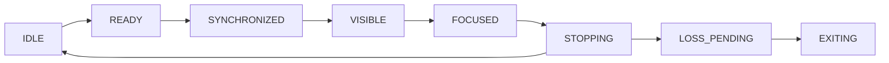
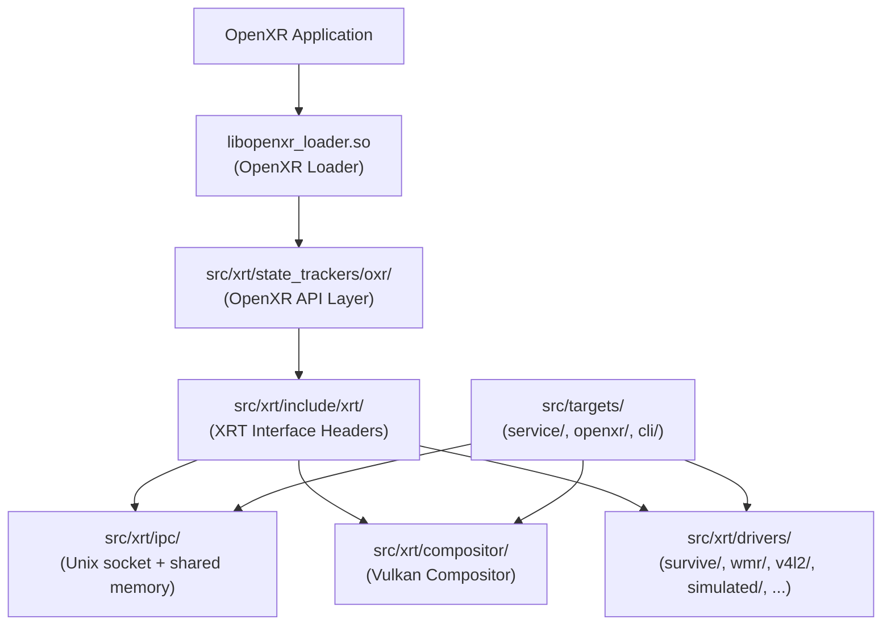
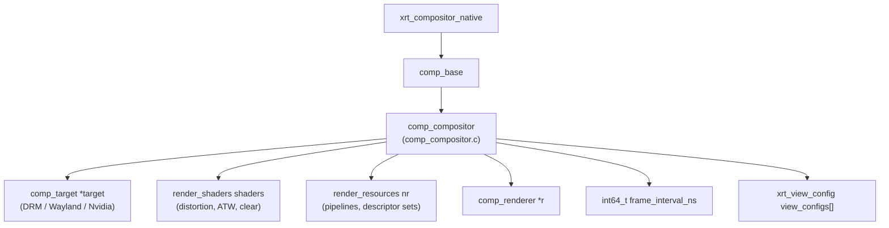
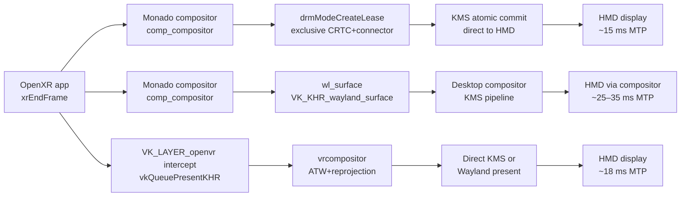
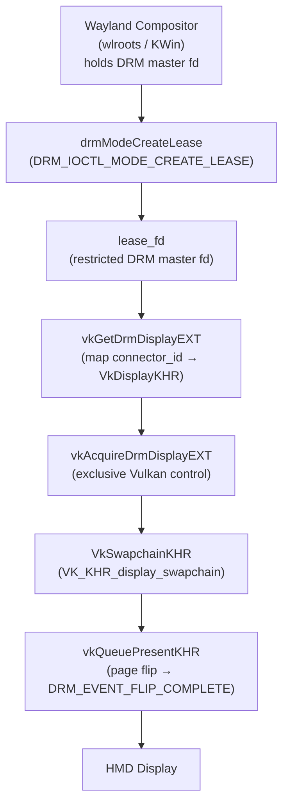
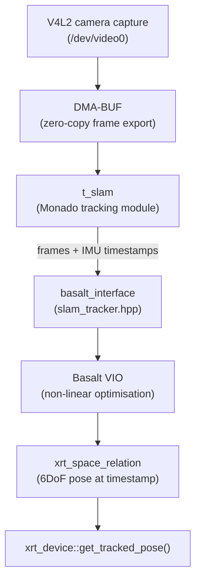
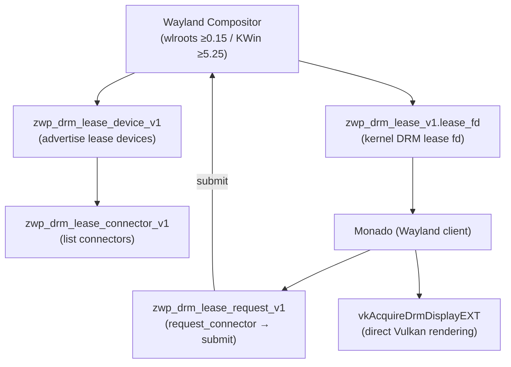

# Chapter 27: VR, AR, and OpenXR

**Audiences**: Application developers building OpenXR-based VR/AR software on Linux; systems developers understanding how Monado drives hardware through the kernel and Mesa stack. The chapter assumes familiarity with Vulkan fundamentals (covered in Chapter 24) and DRM/KMS concepts (Chapters 1–2).

---

## Table of Contents

1. [OpenXR Programming Model: Sessions, Swapchains, and the Action System](#1-openxr-programming-model-sessions-swapchains-and-the-action-system)
2. [OpenXR Swapchains and Compositor Layers](#2-openxr-swapchains-and-compositor-layers)
3. [Monado: Runtime Architecture and the Driver Interface](#3-monado-runtime-architecture-and-the-driver-interface)
4. [Display Backend: Direct Mode and the DRM Path](#4-display-backend-direct-mode-and-the-drm-path)
5. [Reprojection, Timewarp, and Latency](#5-reprojection-timewarp-and-latency)
6. [Tracking Systems: IMU, V4L2 Cameras, and SLAM](#6-tracking-systems-imu-v4l2-cameras-and-slam)
7. [Wayland and OpenXR Integration](#7-wayland-and-openxr-integration)
8. [Practical: Writing a Minimal OpenXR Vulkan Application on Linux](#8-practical-writing-a-minimal-openxr-vulkan-application-on-linux)
9. [Integrations](#9-integrations)
10. [References](#10-references)

---

## 1. OpenXR Programming Model: Sessions, Swapchains, and the Action System

### Why a Standard Was Needed

Before **OpenXR**, every VR/AR platform shipped its own runtime SDK: **OpenVR** for **SteamVR** and **HTC Vive**, **OculusVR** for the Rift, **Windows Mixed Reality** for Microsoft headsets, and proprietary mobile SDKs for Samsung and others. An application targeting multiple headsets had to link multiple incompatible libraries, implement duplicate code paths, and ship separate binaries. The Khronos Group standardised this fragmentation with the **OpenXR** specification, whose 1.0 release landed in July 2019 and whose 1.1 specification (as of 2024) is the current stable baseline. [Source: OpenXR 1.1 Specification](https://registry.khronos.org/OpenXR/specs/1.1/html/xrspec.html)

**OpenXR**'s design philosophy mirrors **OpenGL** and **Vulkan**: an application links against a loader library (**`libopenxr_loader.so`**), which at runtime discovers the active runtime via JSON manifest files. On Linux the loader searches **`XDG_CONFIG_HOME`**`/openxr/1/active_runtime.json` and `/etc/xdg/openxr/1/active_runtime.json`, with the environment variable **`XR_RUNTIME_JSON`** providing an override path. The JSON manifest points to the runtime's shared library (**`libopenxr_monado.so`** for **Monado**, **`libvrserver.so`** for **SteamVR**). This **ICD**-style dispatch means an application binary is portable across runtimes without recompilation.

This chapter covers the full breadth of **OpenXR** on Linux. Section 1 establishes the programming model: **`XrInstance`** and **`XrSystemId`** creation, graphics API binding via **`XR_KHR_vulkan_enable2`**, the **`XrSession`** lifecycle state machine, spatial reasoning with **`XrSpace`** reference spaces (**`XR_REFERENCE_SPACE_TYPE_STAGE`**, **`XR_REFERENCE_SPACE_TYPE_LOCAL`**, **`XR_REFERENCE_SPACE_TYPE_VIEW`**), and the action system for abstracting controller input. Section 2 goes deeper on **`XrSwapchain`** management — the acquire/wait/release cycle (**`xrAcquireSwapchainImage`**, **`xrWaitSwapchainImage`**, **`xrReleaseSwapchainImage`**), compositor layer types (**`XrCompositionLayerProjection`**, **`XrCompositionLayerQuad`**, **`XrCompositionLayerCylinder`**, **`XrCompositionLayerEquirect2KHR`**, **`XrCompositionLayerPassthrough`**), and the **`xrEndFrame`** frame loop. Section 3 covers **Monado**, the reference open-source **OpenXR** runtime for Linux: the **XRT** (XR Framework) architecture, the **`xrt_device`** virtual interface, the **Vulkan** compositor built on **`comp_compositor`**, the hardware driver survey (including the **survive** driver wrapping **libsurvive** for **Lighthouse** tracking, the **wmr** driver for **Windows Mixed Reality**, the **RealSense** driver, and the **simulated** driver), and the choice between service mode (**`monado-service`** daemon with **Unix socket** **IPC** and **`SCM_RIGHTS`**-based **DMA-BUF** sharing) and in-process mode. Section 4 examines the display backend: how **Monado** achieves low-latency direct-mode output by taking exclusive ownership of the HMD's **DRM** connector, using the `non-desktop` **DRM** connector property, **`drmModeCreateLease`** / **`DRM_IOCTL_MODE_CREATE_LEASE`** for **DRM leasing** (exposed to Wayland clients via **`wp_drm_lease_v1`**), **`VK_EXT_acquire_drm_display`** (**`vkAcquireDrmDisplayEXT`**, **`vkGetDrmDisplayEXT`**), **GBM** scan-out buffer allocation, atomic modesetting, and the **Nvidia** direct-mode path via **`vkAcquireXlibDisplayEXT`**. Section 5 analyses the latency budget and the reprojection techniques that protect frame delivery: pose prediction via **IMU** integration, **Asynchronous Timewarp** (**ATW**) as a **Vulkan** compute shader warp, **Asynchronous SpaceWarp** (**ASW**) using optical flow between frames (optionally using depth from **`XR_KHR_composition_layer_depth`**), and **`xrWaitFrame`**-based frame pacing. Section 6 covers tracking: **3DoF** vs **6DoF**, **MEMS IMU** orientation fusion with complementary and Mahony/Madgwick filters in **`m_imu_3dof.c`**, inside-out camera tracking via **V4L2** with **DMA-BUF** zero-copy export, **Basalt VIO** integration through the **`slam_tracker.hpp`** abstraction, **Lighthouse** tracking via **libsurvive**, and camera-based hand tracking via ML inference. Section 7 addresses **Wayland** integration: full-immersion mode versus mixed-reality overlay mode, the **`wp_drm_lease_v1`** protocol sequence, nested **Wayland** development mode using **`VK_KHR_wayland_surface`**, **SteamVR** runtime arbitration via **`XR_RUNTIME_JSON`**, vendor **`MNDX`** extensions (**`XR_MNDX_system_buttons`**, **`XR_EXTX_overlay`**), **`XR_EXT_hand_tracking`** (26-joint skeleton via **`xrLocateHandJointsEXT`**), and **`XR_EXT_eye_gaze_interaction`** for foveated rendering. Section 8 provides a practical walkthrough for writing a minimal **OpenXR** **Vulkan** application on Linux — dependencies, CMake build setup, the complete initialisation sequence, and common mistakes to avoid.

### Instance and System Creation

The root object in **OpenXR** is the **`XrInstance`**. An application creates one by filling an **`XrInstanceCreateInfo`** struct that names the application, requests API layers (analogous to **Vulkan** validation layers), and enumerates required extensions:

```c
// Pedagogical example — OpenXR instance creation with Vulkan extension
XrInstanceCreateInfo create_info = {
    .type                    = XR_TYPE_INSTANCE_CREATE_INFO,
    .next                    = NULL,
    .applicationInfo = {
        .applicationName    = "MyXRApp",
        .applicationVersion = 1,
        .engineName         = "MyEngine",
        .engineVersion      = 1,
        .apiVersion         = XR_MAKE_VERSION(1, 0, 0),
    },
    .enabledExtensionCount  = 1,
    .enabledExtensionNames  = (const char *[]){ XR_KHR_VULKAN_ENABLE2_EXTENSION_NAME },
};

XrInstance instance;
XrResult result = xrCreateInstance(&create_info, &instance);
if (XR_FAILED(result)) {
    // handle error
}
```

With the instance in hand, the application queries for an **`XrSystemId`** — the identifier of the physical XR hardware present in the system. The system is obtained via **`xrGetSystem`**, passing an **`XrSystemGetInfo`** that specifies the form factor:

```c
XrSystemGetInfo system_info = {
    .type        = XR_TYPE_SYSTEM_GET_INFO,
    .formFactor  = XR_FORM_FACTOR_HEAD_MOUNTED_DISPLAY,
};
XrSystemId system_id;
xrGetSystem(instance, &system_info, &system_id);
```

The **`XrSystemId`** is not a handle to an object but an integer identifier. **`xrGetSystemProperties`** returns a rich descriptor including the vendor ID, system name, graphics properties (maximum swapchain image resolution and layer count), and tracking properties (whether orientation and position tracking are supported, and whether hand tracking is available).

### Graphics API Binding

**OpenXR** is graphics-API-agnostic at the session layer, but an application must bind a concrete graphics API before creating a session. The preferred path for modern applications is **`XR_KHR_vulkan_enable2`**. This extension introduces a critical constraint: **the application must use the specific `VkPhysicalDevice` that Monado (or whichever runtime is active) selects**. The reason is physical topology: the HMD is connected to a specific GPU via PCIe or USB, and presenting frames rendered on a different GPU would require expensive cross-GPU buffer copies.

The two-step **Vulkan** device creation sequence is:

```c
// Step 1: Ask the OpenXR runtime which physical device to use
PFN_xrGetVulkanGraphicsDevice2KHR pfn_get_device;
xrGetInstanceProcAddr(instance, "xrGetVulkanGraphicsDevice2KHR",
                      (PFN_xrVoidFunction *)&pfn_get_device);

XrVulkanGraphicsDeviceGetInfoKHR dev_info = {
    .type           = XR_TYPE_VULKAN_GRAPHICS_DEVICE_GET_INFO_KHR,
    .systemId       = system_id,
    .vulkanInstance = vk_instance,
};
VkPhysicalDevice physical_device;
pfn_get_device(instance, &dev_info, &physical_device);

// Step 2: Create the VkDevice with THAT physical device
// ... standard vkCreateDevice call with physical_device ...
```

Using a different **`VkPhysicalDevice`** than the one returned here is a common mistake; it silently succeeds but results in **Monado** having to perform CPU-side buffer copies, destroying latency.

The **`XR_KHR_opengl_enable`** extension provides a comparable path for **OpenGL** applications, but new code should prefer the **Vulkan** path for explicit control over synchronisation.

### Session Lifecycle State Machine

An **`XrSession`** ties the graphics binding to a system and moves through a well-defined state machine. The states are:

`IDLE → READY → SYNCHRONIZED → VISIBLE → FOCUSED → STOPPING → LOSS_PENDING → EXITING`



The application polls for state transitions via **`xrPollEvent`**, which drains the event queue into an **`XrEventDataBuffer`**. A state change arrives as **`XrEventDataSessionStateChanged`**:

```c
// Session state machine handler — pedagogical
XrEventDataBuffer event = { .type = XR_TYPE_EVENT_DATA_BUFFER };
while (xrPollEvent(instance, &event) == XR_SUCCESS) {
    switch (event.type) {
    case XR_TYPE_EVENT_DATA_SESSION_STATE_CHANGED: {
        XrEventDataSessionStateChanged *state_event =
            (XrEventDataSessionStateChanged *)&event;
        switch (state_event->state) {
        case XR_SESSION_STATE_READY:
            xrBeginSession(session, &(XrSessionBeginInfo){
                .type                         = XR_TYPE_SESSION_BEGIN_INFO,
                .primaryViewConfigurationType =
                    XR_VIEW_CONFIGURATION_TYPE_PRIMARY_STEREO,
            });
            break;
        case XR_SESSION_STATE_STOPPING:
            xrEndSession(session);
            break;
        case XR_SESSION_STATE_LOSS_PENDING:
        case XR_SESSION_STATE_EXITING:
            // Clean up and exit
            break;
        default: break;
        }
        break;
    }
    default: break;
    }
    event.type = XR_TYPE_EVENT_DATA_BUFFER; // reset for reuse
}
```

`READY` means the runtime is ready for the application to begin rendering. `FOCUSED` means the session has input focus — the application receives action state. `STOPPING` is the signal to call **`xrEndSession`**. Failing to handle `STOPPING` gracefully causes the runtime to forcibly terminate the session, which manifests as a frozen HMD display.

### Reference Spaces

Spatial reasoning in **OpenXR** is performed in *reference spaces*. Three standard types cover most use cases:

- **`XR_REFERENCE_SPACE_TYPE_STAGE`**: origin at the centre of the physical play area, Y-up, floor level. Room-scale applications anchor their world here.
- **`XR_REFERENCE_SPACE_TYPE_LOCAL`**: origin at the head position at session start, floor-level Y. Suitable for seated experiences.
- **`XR_REFERENCE_SPACE_TYPE_VIEW`**: origin tracks the view (head), used for HUD elements that must remain head-locked.

**`xrCreateReferenceSpace`** allocates an **`XrSpace`** handle, and **`xrLocateSpace`** queries the relationship between two spaces at a specific time:

```c
XrSpaceLocation head_location = { .type = XR_TYPE_SPACE_LOCATION };
xrLocateSpace(head_space, stage_space, predicted_display_time, &head_location);
// head_location.pose contains position + orientation if XR_SPACE_LOCATION_POSE_VALID_BIT is set
```

The `predicted_display_time` parameter is the timestamp returned by **`xrWaitFrame`**; using this predicted future time for space queries is how the runtime compensates for render latency.

### The Action System

**OpenXR**'s action system abstracts input hardware. Rather than querying button X on controller Y, an application declares semantic actions ("trigger pressed", "grip pose") and *suggests* bindings for specific interaction profiles (`/interaction_profiles/valve/index_controller`, `/interaction_profiles/oculus/touch_controller`, etc.). The runtime remaps these onto the actual hardware connected at run time.

```c
// Create an action set
XrActionSetCreateInfo set_info = {
    .type          = XR_TYPE_ACTION_SET_CREATE_INFO,
    .priority      = 0,
    .actionSetName = "gameplay",
    .localizedActionSetName = "Gameplay",
};
XrActionSet action_set;
xrCreateActionSet(instance, &set_info, &action_set);

// Create a boolean trigger action
XrActionCreateInfo trigger_info = {
    .type             = XR_TYPE_ACTION_CREATE_INFO,
    .actionType       = XR_ACTION_TYPE_BOOLEAN_INPUT,
    .actionName       = "fire",
    .localizedActionName = "Fire",
    .countSubactionPaths = 2,
    .subactionPaths   = (XrPath[]){ left_hand_path, right_hand_path },
};
XrAction trigger_action;
xrCreateAction(action_set, &trigger_info, &trigger_action);
```

After attaching the action set to the session with **`xrAttachSessionActionSets`**, the per-frame loop calls **`xrSyncActions`** to update all action states, then **`xrGetActionStateBoolean`** to read the trigger. Haptic output uses **`xrApplyHapticFeedback`** with an **`XrHapticVibration`** specifying amplitude, frequency (Hz), and duration (nanoseconds).

---

## 2. OpenXR Swapchains and Compositor Layers

### The OpenXR Swapchain Model

OpenXR swapchains are not `VkSwapchainKHR`s. A `VkSwapchainKHR` manages the presentation engine's connection to a surface (an OS window or DRM output). An `XrSwapchain` is a pool of `VkImage`s owned by the runtime compositor; the application renders into them and the runtime presents them after lens distortion and ATW. The distinction is crucial: the application does not drive vsync or direct DRM output — the runtime does.

Swapchain creation involves enumerating the formats the runtime will accept, then allocating the swapchain:

```c
// Enumerate acceptable formats
uint32_t format_count;
xrEnumerateSwapchainFormats(session, 0, &format_count, NULL);
int64_t *formats = malloc(sizeof(int64_t) * format_count);
xrEnumerateSwapchainFormats(session, format_count, &format_count, formats);
// Choose VK_FORMAT_R8G8B8A8_SRGB (87) or VK_FORMAT_R16G16B16A16_SFLOAT (103) for HDR

// Create a stereo swapchain with arraySize=2
XrSwapchainCreateInfo sc_info = {
    .type        = XR_TYPE_SWAPCHAIN_CREATE_INFO,
    .usageFlags  = XR_SWAPCHAIN_USAGE_COLOR_ATTACHMENT_BIT |
                   XR_SWAPCHAIN_USAGE_SAMPLED_BIT,
    .format      = VK_FORMAT_R8G8B8A8_SRGB,
    .sampleCount = 1,
    .width       = 2064,   // per-eye resolution, from xrGetSystemProperties
    .height      = 2096,
    .faceCount   = 1,
    .arraySize   = 2,      // layer 0 = left eye, layer 1 = right eye
    .mipCount    = 1,
};
XrSwapchain swapchain;
xrCreateSwapchain(session, &sc_info, &swapchain);

// Obtain the VkImage handles
uint32_t image_count;
xrEnumerateSwapchainImages(swapchain, 0, &image_count, NULL);
XrSwapchainImageVulkan2KHR *images =
    calloc(image_count, sizeof(XrSwapchainImageVulkan2KHR));
for (uint32_t i = 0; i < image_count; i++)
    images[i].type = XR_TYPE_SWAPCHAIN_IMAGE_VULKAN2_KHR;
xrEnumerateSwapchainImages(swapchain, image_count, &image_count,
                            (XrSwapchainImageBaseHeader *)images);
// images[i].image is a VkImage usable for rendering
```

The `XrSwapchainUsageFlagBits` values map directly to `VkImageUsageFlags`; Monado creates the underlying `VkImage` with the requested usage flags when the swapchain is allocated. [Source: OpenXR Spec — XrSwapchain](https://registry.khronos.org/OpenXR/specs/1.0/man/html/XrSwapchain.html)

### Acquire/Wait/Release Cycle

Each frame, the application acquires an image index, waits for the runtime to signal it is safe to render into, renders, then releases it:

```c
// Per-frame acquire/render/release for one eye (repeat for second with same swapchain)
uint32_t image_index;
xrAcquireSwapchainImage(swapchain, NULL, &image_index);

XrSwapchainImageWaitInfo wait_info = {
    .type    = XR_TYPE_SWAPCHAIN_IMAGE_WAIT_INFO,
    .timeout = XR_INFINITE_DURATION,
};
xrWaitSwapchainImage(swapchain, &wait_info);

// Render left eye to images[image_index].image, layer index 0
// Render right eye to images[image_index].image, layer index 1
// (using VkImageViewCreateInfo with baseArrayLayer 0 or 1)

xrReleaseSwapchainImage(swapchain, NULL);
```

This replaces `vkAcquireNextImageKHR`. The `xrWaitSwapchainImage` call blocks until the compositor has finished reading the previously submitted image. On the Vulkan path, Monado uses timeline semaphores internally to track readiness; the application sees only the opaque wait call, not the semaphore. This design avoids the application having to manage fence/semaphore chains across the compositor boundary.

### Compositor Layer Types

`xrEndFrame` accepts an array of layer pointers, enabling rich multi-layer compositing:

- **`XrCompositionLayerProjection`**: The standard full-scene stereo layer. Contains two `XrCompositionLayerProjectionView` structs — one per eye — each with a pose (position + orientation of the eye in the reference space) and a field-of-view (left, right, up, down angles). This is where the application's 3D world goes.

- **`XrCompositionLayerQuad`**: A flat rectangular panel anchored in a reference space. Use this for 2D UI panels that should appear to float in the world. The quad's pose specifies its centre and orientation; its size is in metres.

- **`XrCompositionLayerCylinder`**: A curved cylindrical surface; useful for panoramic UI or curved video displays.

- **`XrCompositionLayerEquirect2KHR`**: Maps the swapchain image onto a sphere using equirectangular projection; the standard format for 360° video playback.

- **`XrCompositionLayerPassthrough`** (via extensions like `XR_FB_passthrough`): Blends camera passthrough imagery as a layer, enabling mixed reality.

Layers are ordered in the array passed to `xrEndFrame`; lower indices are underneath higher indices, with the standard alpha-blending rules applying. The `XR_KHR_composition_layer_depth` extension allows the application to submit a depth buffer alongside each projection view. When present, Monado can perform 3D reprojection rather than 2D image warping, dramatically improving the visual quality of missed-frame recovery (see Section 5).

### The Frame Loop

The frame loop is the central runtime rhythm of an OpenXR application:

```c
// Complete frame loop (simplified, pedagogical)
while (running) {
    // 1. Poll events and handle session state transitions
    poll_events_and_handle_states();
    if (!session_running) { continue; }

    // 2. Wait for the runtime to signal rendering may begin
    XrFrameState frame_state = { .type = XR_TYPE_FRAME_STATE };
    xrWaitFrame(session, NULL, &frame_state);
    xrBeginFrame(session, NULL);

    XrCompositionLayerProjection proj_layer = {
        .type      = XR_TYPE_COMPOSITION_LAYER_PROJECTION,
        .space     = stage_space,
        .viewCount = 2,
        .views     = proj_views,  // XrCompositionLayerProjectionView[2]
    };

    if (frame_state.shouldRender) {
        // 3. Locate views for this frame's predicted display time
        uint32_t view_count = 2;
        XrView views[2] = { {.type=XR_TYPE_VIEW}, {.type=XR_TYPE_VIEW} };
        XrViewState view_state = { .type = XR_TYPE_VIEW_STATE };
        XrViewLocateInfo locate_info = {
            .type            = XR_TYPE_VIEW_LOCATE_INFO,
            .viewConfigurationType =
                XR_VIEW_CONFIGURATION_TYPE_PRIMARY_STEREO,
            .displayTime     = frame_state.predictedDisplayTime,
            .space           = stage_space,
        };
        xrLocateViews(session, &locate_info, &view_state,
                      view_count, &view_count, views);

        // 4. For each eye: acquire → wait → render → release
        for (int eye = 0; eye < 2; eye++) {
            uint32_t idx;
            xrAcquireSwapchainImage(swapchain, NULL, &idx);
            xrWaitSwapchainImage(swapchain,
                &(XrSwapchainImageWaitInfo){
                    .type    = XR_TYPE_SWAPCHAIN_IMAGE_WAIT_INFO,
                    .timeout = XR_INFINITE_DURATION,
                });
            render_eye(eye, images[idx].image, views[eye]);
            xrReleaseSwapchainImage(swapchain, NULL);

            proj_views[eye] = (XrCompositionLayerProjectionView){
                .type    = XR_TYPE_COMPOSITION_LAYER_PROJECTION_VIEW,
                .pose    = views[eye].pose,
                .fov     = views[eye].fov,
                .subImage = {
                    .swapchain      = swapchain,
                    .imageRect      = { {0,0}, {width, height} },
                    .imageArrayIndex = (uint32_t)eye,
                },
            };
        }
    }

    // 5. Submit the frame
    const XrCompositionLayerBaseHeader *layers[] =
        { (XrCompositionLayerBaseHeader *)&proj_layer };
    xrEndFrame(session, &(XrFrameEndInfo){
        .type                = XR_TYPE_FRAME_END_INFO,
        .displayTime         = frame_state.predictedDisplayTime,
        .environmentBlendMode= XR_ENVIRONMENT_BLEND_MODE_OPAQUE,
        .layerCount          = frame_state.shouldRender ? 1 : 0,
        .layers              = layers,
    });
}
```

`xrWaitFrame` blocks until the runtime grants permission to begin rendering. Monado drives this from its display vsync interrupt: it signals the client at the start of each display refresh window. The `predictedDisplayTime` embedded in `XrFrameState` is the timestamp at which the photons will actually leave the display — approximately one frame interval in the future. Applications must use this timestamp for all `xrLocateSpace` and `xrLocateViews` calls to obtain a forward-predicted pose that will be correct when the image is actually displayed.

---

## 3. Monado: Runtime Architecture and the Driver Interface

### Project Overview

Monado is the reference OpenXR implementation for Linux, developed primarily by Collabora under the freedesktop.org umbrella. It is written in C (with some C++) and provides a fully conformant OpenXR runtime that passes the Khronos OpenXR Conformance Test Suite (CTS). Unlike SteamVR, which ships as a proprietary binary, Monado is entirely open-source under the BSL-1.0 licence. [Source: Monado Developer Documentation](https://monado.pages.freedesktop.org/monado/index.html)

The repository is organised around a central abstraction layer called XRT (XR Framework):

- `src/xrt/include/xrt/` — All interface headers; defines the contracts between subsystems
- `src/xrt/drivers/` — Hardware device drivers (`survive/`, `wmr/`, `v4l2/`, `simulated/`, etc.)
- `src/xrt/compositor/` — The Vulkan compositor (`main/`, `render/`, `util/`)
- `src/xrt/ipc/` — IPC protocol (client library + server handler)
- `src/xrt/state_trackers/oxr/` — The OpenXR API layer mapping XR API calls onto XRT interfaces
- `src/targets/` — Build targets that wire components together (`service/`, `openxr/`, `cli/`)



### The xrt_device Interface

Every hardware device in Monado implements `struct xrt_device`, defined in `src/xrt/include/xrt/xrt_device.h`. This is a virtual function table in C: a struct of function pointers. [Source: Monado xrt_device Reference](https://monado.pages.freedesktop.org/monado/structxrt__device.html)

```c
// Simplified from src/xrt/include/xrt/xrt_device.h
struct xrt_device {
    // Identification
    char str[XRT_DEVICE_NAME_LEN];
    char serial[XRT_DEVICE_NAME_LEN];
    enum xrt_device_name name;

    // Capabilities
    struct xrt_hmd_parts *hmd;          // non-NULL for HMDs; contains view geometry
    struct xrt_tracking_origin *tracking_origin;
    struct xrt_input *inputs;
    uint32_t input_count;
    struct xrt_output *outputs;
    uint32_t output_count;

    // Function pointers (the virtual method table)
    void (*update_inputs)(struct xrt_device *xdev);
    void (*get_tracked_pose)(struct xrt_device *xdev,
                             enum xrt_input_name name,
                             int64_t at_timestamp_ns,
                             struct xrt_space_relation *out_relation);
    void (*get_view_poses)(struct xrt_device *xdev,
                           const struct xrt_vec3 *default_eye_relation,
                           int64_t at_timestamp_ns,
                           uint32_t view_count,
                           struct xrt_space_relation *out_head_relation,
                           struct xrt_fov *out_fovs,
                           struct xrt_pose *out_poses);
    bool (*compute_distortion)(struct xrt_device *xdev,
                               uint32_t view,
                               float u, float v,
                               struct xrt_uv_triplet *out_result);
    void (*get_hand_tracking)(struct xrt_device *xdev,
                              enum xrt_input_name name,
                              int64_t desired_timestamp_ns,
                              struct xrt_hand_joint_set *out_value,
                              int64_t *out_timestamp_ns);
    void (*set_output)(struct xrt_device *xdev,
                       enum xrt_output_name name,
                       const union xrt_output_value *value);
    void (*destroy)(struct xrt_device *xdev);
};
```

`get_tracked_pose` is the most performance-critical function: it is called with a future timestamp (`at_timestamp_ns`), and the driver must return the predicted `xrt_space_relation` at that time. The `xrt_space_relation` struct bundles position, orientation, linear velocity, and angular velocity along with validity flags indicating which components are available. The simulated driver in `src/xrt/drivers/simulated/simulated_device.c` provides a reference implementation that returns a fixed identity pose — useful for CI testing and desktop development without hardware.

The `compute_distortion` function is called during compositor initialisation to build the per-eye distortion mesh. The compositor steps through a grid of (u, v) coordinates in normalised image space and queries the driver for the actual display-space coordinates, constructing a lookup texture or mesh used to correct lens barrel/pincushion distortion in hardware.

### Compositor Architecture

The compositor is organised around `struct xrt_compositor` (the abstract interface) and its concrete implementation `struct comp_compositor`, defined in `src/xrt/compositor/main/comp_compositor.c`. [Source: comp_compositor Reference](https://monado.pages.freedesktop.org/monado/structcomp__compositor.html)

`comp_compositor` extends `comp_base` (which extends `xrt_compositor_native`) and holds:

- `comp_target *target` — the display target (DRM direct mode, Wayland window, or Nvidia direct display)
- `render_shaders shaders` — compiled Vulkan shader modules for distortion, ATW, and clear passes
- `render_resources nr` — Vulkan resources: pipelines, descriptor sets, sampler pools
- `comp_renderer *r` — the renderer helper that issues draw calls
- `int64_t frame_interval_ns` — current display refresh period
- `xrt_view_config view_configs[]` — per-eye geometry



The compositor's Vulkan rendering pipeline composites all `xrEndFrame` layers into a final scan-out image per eye, applies the lens distortion mesh in a fragment shader (or compute shader path), and schedules the resulting image for DRM page flip. ATW is implemented as a separate compute shader that runs immediately before the page flip if an application frame is late (see Section 5).

### Driver Survey

Monado ships drivers for the following devices (as of 2024):

- **Valve Index / HTC Vive (survive driver)**: wraps `libsurvive`, which implements the Lighthouse 1.0 and 2.0 protocols in user space. Provides 6DoF tracking via photodiode sweep detection and full controller input.
- **Windows Mixed Reality (wmr driver)**: reverse-engineered USB protocol for Acer, HP, Lenovo, and Samsung WMR headsets. Includes 4-camera inside-out tracking via the SLAM pipeline.
- **North Star (ns driver)**: a hobbyist AR headset by Leap Motion / Project North Star; Monado provides basic tracking and display support.
- **RealSense (rs driver)**: wraps `librealsense` for Intel RealSense cameras; supports T265 (VIO-enabled), D435i, and D455 for tracking.
- **Simulated (simulated driver)**: a software-only device returning configurable static or animated poses; used for CI, development, and testing without hardware.

The WMR and HoloLens drivers demonstrate Monado's ability to fully reverse-engineer a proprietary headset's USB protocol and SLAM pipeline. The WMR driver communicates with the headset firmware over a custom USB HID interface and feeds camera frames into Basalt for 6DoF tracking.

### Service Mode vs. In-Process Mode

Monado supports two deployment models:

**Service mode** (`XRT_FEATURE_SERVICE=ON`): A persistent `monado-service` daemon runs in user space and manages the HMD hardware. Multiple OpenXR applications can share one service instance (though only one can have focus). The service communicates with clients via a Unix domain socket at `$XDG_RUNTIME_DIR/monado_comp_ipc`. The client-side is `libopenxr_monado.so`, a thin IPC proxy. Systemd integration provides socket activation via `monado.socket` user unit, enabling the service to start lazily when a client connects. [Source: Monado IPC Design](https://monado.pages.freedesktop.org/monado/ipc-design.html)

**In-process mode** (`XRT_FEATURE_SERVICE=OFF`): The entire runtime is loaded directly into the application process. Simpler for debugging and for embedded or single-application targets (e.g., a dedicated VR kiosk).

The IPC protocol (`src/xrt/ipc/`) uses three mechanisms: the Unix socket for control messages and small RPC calls; POSIX shared memory (passed via `SCM_RIGHTS` ancillary data on the socket) for device state and tracking data that must be updated at high frequency; and DMA-BUF file descriptors passed over the socket to share swapchain image buffers between the application process and the service. No data copying occurs for graphics buffers — only the file descriptor crosses the process boundary, and both sides map the same GPU memory.

---

## 4. Display Backend: Direct Mode and the DRM Path

Three display pipeline architectures are available to an OpenXR runtime on Linux. They differ by over an order of magnitude in motion-to-photon latency.



| Path | Runtime | Latency (MTP) | DRM Lease | Compositor bypass | GPU requirement |
|---|---|---|---|---|---|
| A — DRM Lease direct | Monado | ~15 ms | Yes (`drmModeCreateLease`) | Full — bypasses desktop compositor | AMD/Intel open-source drivers; Nvidia via `vkAcquireXlibDisplayEXT` |
| B — Wayland nested | Monado | ~25–35 ms | No | None — desktop compositor in critical path | Any Vulkan-capable GPU |
| C — SteamVR compositor | SteamVR (`vrcompositor`) | ~18 ms | Via SteamVR | Partial — SteamVR compositor replaces desktop compositor | Requires `VK_KHR_external_memory_fd` + `VK_KHR_external_semaphore_fd` |

Path A is the production path for any VR runtime serious about latency: it eliminates the desktop compositor from the frame delivery chain entirely, driving KMS atomic commits directly from Monado's compositor clock. Path B trades that latency advantage for development convenience — no special hardware permissions, no `non-desktop` EDID quirk required, and the HMD appears as an ordinary Wayland window; the tradeoff is the additional frame of latency introduced by the desktop compositor's own KMS pipeline. Path C delegates the display backend to SteamVR's own `vrcompositor`, which performs Asynchronous Timewarp before submitting to either a direct KMS path or the Wayland compositor; SteamVR's ATW pipeline recovers some of the latency lost to the compositor indirection, landing between Paths A and B in practice.

### The Problem with Desktop Compositor Passthrough

A naive approach would have Monado present frames to a Wayland compositor as a regular client, letting the compositor scanout to the HMD via its normal KMS pipeline. This works functionally but introduces unacceptable latency. The Wayland compositor typically renders at its own refresh rate, blends the Monado client surface with other surfaces, and submits to the DRM KMS pipeline. This adds at minimum one full frame of latency (11ms at 90Hz) beyond the application's own frame time. For comfortable VR, the total motion-to-photon latency budget is approximately 20ms, and compositor overhead consumes 20–50% of it. Moreover, screen tears and compositor scheduling jitter cause visible artefacts in the HMD. [Source: Monado Direct Mode](https://monado.freedesktop.org/direct-mode.html)

Direct mode solves this: Monado takes exclusive ownership of the HMD's DRM connector and drives KMS directly, bypassing the Wayland compositor entirely for that display.

### Identifying the HMD Display

The Linux kernel marks known HMD displays with the `non-desktop` DRM connector property, set to 1 in the kernel quirk database (`drivers/gpu/drm/drm_edid.c`) based on EDID vendor/product identifiers. A display with `non-desktop=1` is excluded from `xrandr` enumeration and does not appear as a regular desktop output. Monado's prober enumerates DRM connectors, reads the `non-desktop` property, and selects the matching connector as the HMD target. For unrecognised hardware, the environment variable `XRT_COMPOSITOR_FORCE_NVIDIA_DISPLAY` (on Nvidia) or the `XRT_COMPOSITOR_DESIRED_MODE` variable can override the selection.

On AMD and Intel (open-source drivers), the connector remains accessible via the DRM device node at `/dev/dri/card0`. Monado can open this node and issue KMS ioctls to configure the CRTC and plane directly.

### DRM Leasing

Opening `/dev/dri/card0` directly requires either the session to hold the DRM master credential (only one process at a time) or a DRM render node. Taking the DRM master from the running Wayland compositor would kill the desktop. The kernel's DRM leasing mechanism solves this: the DRM master grants a sub-lease of specific connectors, encoders, and CRTCs to another process, which receives a restricted DRM file descriptor with access only to those resources. [Source: DRM Leasing — keithp.com](https://keithp.com/blogs/DRM-lease/)

The kernel call is:

```c
// drmModeCreateLease: creates a restricted DRM fd for the specified resources
// Defined in libdrm; wraps DRM_IOCTL_MODE_CREATE_LEASE

uint32_t objects[] = {
    connector_id,   // the HMD connector
    encoder_id,     // the encoder driving it
    crtc_id,        // the CRTC allocated for the HMD
};
uint32_t lessee_id;
int lease_fd = drmModeCreateLease(
    drm_fd,          // the DRM master fd (held by the Wayland compositor)
    objects, 3,      // resources to lease
    0,               // flags
    &lessee_id
);
// lease_fd is now a new DRM master fd restricted to {connector, encoder, crtc}
// It can be passed to Monado (or another process) via SCM_RIGHTS
```

The Wayland compositor exposes this mechanism to clients via the `wp_drm_lease_v1` protocol, merged into wayland-protocols as a staging protocol in August 2021 and implemented in wlroots by September 2021. Compositors implementing this protocol (wlroots 0.15+, KWin 5.25+, and later KDE Plasma/Wayland-based desktops) allow Monado's "wayland direct" target to request a lease without needing a privileged process. [Source: GamingOnLinux — DRM Lease](https://www.gamingonlinux.com/2021/08/wayland-gets-drm-lease-protocol-support-to-help-vr-on-linux/)



### Vulkan Direct Display

Once Monado holds the lease fd, it acquires the display from Vulkan's side via `VK_EXT_acquire_drm_display`:

```c
// vkGetDrmDisplayEXT: look up which VkDisplayKHR corresponds to the DRM connector
VkDisplayKHR display;
vkGetDrmDisplayEXT(
    physical_device,
    lease_fd,        // the leased DRM fd
    connector_id,
    &display
);

// vkAcquireDrmDisplayEXT: take exclusive Vulkan control of the display
vkAcquireDrmDisplayEXT(physical_device, lease_fd, display);
```

After `vkAcquireDrmDisplayEXT`, the HMD display is under exclusive Vulkan control. Monado then creates a `VkSwapchainKHR` via `VK_KHR_display_swapchain` targeting this display. Frames are presented via `vkQueuePresentKHR` with mode `VK_PRESENT_MODE_FIFO_KHR` (vsync) or `VK_PRESENT_MODE_MAILBOX_KHR` depending on the latency requirements. The page-flip completion callback (signalled by the Vulkan presentation engine at each vsync) drives Monado's compositor clock and the `xrWaitFrame` pacing signal sent to clients.

### Monado's DRM Backend

Monado's primary DRM backend is `src/xrt/compositor/main/comp_window_direct_drm.c`. It uses GBM to allocate scan-out buffers:

```c
// Typical GBM surface setup in Monado's DRM backend (illustrative)
struct gbm_device *gbm_dev = gbm_create_device(drm_fd);
struct gbm_surface *gbm_surface = gbm_surface_create(
    gbm_dev,
    display_width, display_height,
    GBM_FORMAT_XRGB8888,
    GBM_BO_USE_SCANOUT | GBM_BO_USE_RENDERING
);
// GBM surface is then imported into EGL (for GL) or Vulkan via
// VK_EXT_image_drm_format_modifier / VkImageDrmFormatModifierExplicitCreateInfoEXT
```

Atomic modesetting is used for the HMD output, enabling Monado to update the CRTC mode and plane source atomically (zero tearing during mode changes). The page-flip completion signal flows from the kernel via `DRM_EVENT_FLIP_COMPLETE` on the DRM fd, driving the timer that determines when to wake up the `xrWaitFrame` caller and when to run the ATW pass.

### Nvidia Direct Mode

On Nvidia, the proprietary driver uses a different mechanism. The driver maintains an internal allowlist of HMD EDID identifiers; matched displays are hidden from X11/Wayland entirely and exposed only through the `VK_KHR_display` extension. Monado's Nvidia direct-mode backend (`comp_window_direct_nvidia.c`) enumerates `VkDisplayKHR` objects, matches them against its own HMD allowlist (extended by `XRT_COMPOSITOR_FORCE_NVIDIA_DISPLAY`), and acquires the display via `vkAcquireXlibDisplayEXT` (the X11 counterpart). This approach pre-dates DRM leasing and remains Nvidia-specific.

---

## 5. Reprojection, Timewarp, and Latency

### The Latency Budget

VR comfort depends critically on keeping motion-to-photon latency below 20ms. Every stage of the pipeline consumes part of this budget:

| Stage | Typical cost |
|---|---|
| IMU sample read (USB polling) | 0.5–2ms |
| IMU data to host (USB latency) | 1–4ms |
| Pose prediction computation | <0.1ms |
| Application frame CPU work | 1–4ms |
| GPU rendering | 4–10ms |
| Compositor distortion pass | 0.5–2ms |
| DRM page flip latency | 0–2ms |
| Display scanout (rolling shutter) | 0–11ms |
| **Total** | **~7–35ms** |

At 90Hz, a single frame interval is 11.1ms. To hit a 20ms budget, the GPU rendering must complete within one frame interval, and everything else must fit in the remaining ~9ms. At 120Hz (8.3ms per frame), the constraints tighten further.

The key insight driving timewarp is that most of the latency budget is dominated by GPU rendering time, and by the time a rendered frame reaches the display, the user's head may have rotated by several tenths of a degree. At a display resolution of 2000×2000 pixels per eye, a 0.3° rotation shift corresponds to ~10 pixels of error — enough to cause perceptible judder and nausea.

### Pose Prediction

`xrWaitFrame` returns `XrFrameState::predictedDisplayTime` — the predicted timestamp when photons will leave the display for the current frame. This is typically 15–50ms in the future depending on the system's measured rendering time. Monado computes this prediction by integrating the IMU data:

```c
// Conceptual: Monado's pose prediction (xrt_relation_chain in
// src/xrt/auxiliary/math/m_relation_history.c)
// 1. Record IMU samples with timestamps
// 2. At prediction request, integrate gyroscope angular velocity forward:
//    orientation(t + dt) = orientation(t) * exp(gyro * dt)
// 3. Integrate accelerometer for position (after gravity removal)
// 4. Return combined pose as xrt_space_relation
```

The `xrt_relation_chain` type in `src/xrt/include/xrt/xrt_defines.h` represents a chain of composed transformations; `xrt_relation_chain_resolve` collapses the chain into a single `xrt_space_relation`.

### Asynchronous Timewarp (ATW)

When an application misses its frame deadline — the GPU did not finish rendering before the vsync deadline — Monado can synthesise a replacement frame from the previous one by applying a rotational warp. This is Asynchronous Timewarp (ATW). [Source: UploadVR — Reprojection Explained](https://www.uploadvr.com/reprojection-explained/)

ATW works because pure rotation is a projective transformation on image space. If the head has rotated by a matrix ΔR between the time the previous frame was rendered and the current vsync, the previous eye image can be re-projected into the new orientation by:

```
new_pixel(u,v) = project(ΔR × unproject(u,v))
```

where `unproject` maps a pixel to a ray through the virtual camera, and `project` maps the rotated ray back to a pixel. This 2D image warp runs as a compute shader on a high-priority Vulkan queue, completing in <1ms on modern hardware.

**Critical limitation**: ATW only corrects rotation, not translation. If the user moves their head (translation), nearby objects would appear to shift relative to distant ones (parallax). ATW ignores this, so reprojected frames have incorrect parallax for nearby surfaces. This is why Valve recommends keeping head-locked UI at least 0.75m from the virtual eyes, and why nearby geometry during fast head translation still judders under ATW.

Monado's ATW implementation lives in the compute shader path of the compositor, enabled by the `debug.atw_off = false` flag in `comp_compositor`. Per-scanline timewarp is a refinement that samples fresh IMU data at different phases of the rolling-shutter display output, correcting for the phase difference between the top and bottom of the display being scanned out.

### Asynchronous SpaceWarp (ASW)

ASW extends ATW by synthesising an entirely new frame rather than warping the previous one. The synthesised frame is computed using optical flow between two previous frames to estimate per-pixel motion, then extrapolating pixels to their expected positions. This handles translation as well as rotation, at the cost of GPU compute time for the optical flow pass.

ASW requires the application to submit depth information (via `XR_KHR_composition_layer_depth`) for highest quality, enabling 3D reprojection rather than 2D extrapolation at depth discontinuities. Monado has a compute-shader-based implementation that is functional but less sophisticated than Valve's or Meta's ML-accelerated approaches. The `XR_KHR_composition_layer_depth` extension is fully supported in Monado since 2022, making it straightforward for applications to submit depth.

### Frame Pacing

Monado paces application rendering using `xrWaitFrame` as a throttle. When called, if the application is early (the previous frame is still being displayed), Monado blocks the application thread until the render window opens. When called late (application missed a deadline), Monado returns immediately so the application can catch up. Under consistent load, the application runs at exactly the HMD refresh rate.

Applications that render faster than the display rate enter a mailbox-like behaviour: Monado accepts their frames but only presents the most recent one at the next vsync. This prevents the application from getting more than one frame ahead of the display, capping the pipeline depth. A common mistake is calling `xrWaitFrame` but using a cached pose timestamp from a previous frame — this causes the wrong pose to be used for rendering, resulting in a frame that is correct for the old time but visually incorrect for the actual display time.

---

## 6. Tracking Systems: IMU, V4L2 Cameras, and SLAM

### Degrees of Freedom

Tracking systems are characterised by their degrees of freedom (DoF):

- **3DoF** (rotation-only): an accelerometer and gyroscope measure orientation but not position. The user can look around but not move through the virtual space. Used in early mobile VR (Cardboard, Gear VR) and as a fallback when position tracking fails.
- **6DoF** (rotation + translation): the headset's full pose in 3D space is known. This enables room-scale VR and correct parallax for nearby objects.

Two hardware approaches achieve 6DoF: **outside-in** (external base stations track markers on the headset — Lighthouse, Oculus Constellation) and **inside-out** (cameras on the headset observe the environment and compute position from visual features — Meta Quest, Windows Mixed Reality, Valve Index).

### IMU-Based Orientation Tracking

All headsets include a MEMS IMU: an accelerometer measuring gravity + linear acceleration, a gyroscope measuring angular velocity, and optionally a magnetometer. Integrating the gyroscope yields orientation; the accelerometer corrects long-term gyroscope drift by aligning the down direction with gravity.

Monado's IMU fusion is in `src/xrt/auxiliary/math/m_imu_pre.h` and `m_imu_3dof.c`. The primary filter is a complementary filter (a weighted combination of gyroscope-integrated orientation and accelerometer-derived orientation), with optional Mahony or Madgwick filter variants for better noise rejection. IMU data arrives over USB at 250–1000Hz; Monado timestamps each sample using the host clock, compensating for USB round-trip latency.

Gyroscope drift is the primary error source for 3DoF tracking. A consumer MEMS gyroscope drifts at approximately 0.1–1°/s; without correction, this accumulates to tens of degrees over minutes. The accelerometer provides a continuous gravity reference, but it is sensitive to linear acceleration, making fast head movements introduce transient errors. Magnetometers can correct yaw drift but are unreliable near metal structures. Most consumer runtimes use a combination of complementary filtering and visual correction (from SLAM) to bound drift to sub-degree levels.

### Inside-Out Camera Tracking and V4L2

Modern consumer headsets (Meta Quest, WMR, Valve Index) carry two to four global-shutter infrared cameras. These observe the environment, and the SLAM pipeline computes the headset's 6DoF pose in the world frame by tracking visual features between frames.

In Monado, cameras are accessed via V4L2 (`src/xrt/drivers/v4l2/v4l2_device.c`). The driver negotiates a capture format:

```c
// V4L2 camera setup in Monado — illustrative, based on
// src/xrt/drivers/v4l2/v4l2_device.c

int fd = open("/dev/video0", O_RDWR);

// Negotiate grayscale format (SLAM pipelines require luminance only)
struct v4l2_format fmt = {
    .type = V4L2_BUF_TYPE_VIDEO_CAPTURE,
    .fmt.pix = {
        .width       = 640,
        .height      = 480,
        .pixelformat = V4L2_PIX_FMT_GREY,   // 8-bit grayscale
        .field       = V4L2_FIELD_NONE,
    },
};
ioctl(fd, VIDIOC_S_FMT, &fmt);

// Request DMA-BUF export for zero-copy into SLAM pipeline
struct v4l2_requestbuffers reqbufs = {
    .count  = 4,
    .type   = V4L2_BUF_TYPE_VIDEO_CAPTURE,
    .memory = V4L2_MEMORY_DMABUF,
};
ioctl(fd, VIDIOC_REQBUFS, &reqbufs);
```

Camera frames are exported as DMA-BUF file descriptors (`VIDIOC_EXPBUF` ioctl), enabling zero-copy transfer into the SLAM processing pipeline. The same DMA-BUF can be imported by a Vulkan pipeline (via `VK_EXT_external_memory_dma_buf`) if GPU-accelerated feature extraction is used, or mapped by the CPU for software SLAM. This mirrors the V4L2 DMA-BUF export pattern used in VA-API video decode (Chapter 26).

### Basalt VIO/SLAM Integration

Monado's primary visual tracking backend is Basalt (Visual-Inertial Odometry), an open-source VIO system from TU Munich. Basalt uses a sliding window of keyframes with non-linear optimisation to estimate the camera trajectory, fusing IMU measurements with visual feature matches. [Source: Collabora — Visual-Inertial Tracking for Monado](https://www.collabora.com/news-and-blog/blog/2022/04/05/visual-inertial-tracking-support-for-monado-openxr/)

Monado abstracts the SLAM backend behind a `slam_tracker.hpp` interface (`src/xrt/auxiliary/tracking/t_slam_tracker.h`), enabling different backends (ORB-SLAM3, Kimera-VIO, or Basalt) to be swapped. The current primary backend is a Monado-specific fork of Basalt (`basalt-monado`). The integration architecture:



The `slam_tracker.hpp` interface exposes `push_imu_sample`, `push_frame`, and `get_last_pose`. Monado's tracking module feeds camera frames and IMU samples into the pipeline continuously; pose queries from `get_tracked_pose` call `get_last_pose` and then apply IMU integration forward to the requested future timestamp.

Basalt is extremely fast for real-time use: on a modern laptop CPU, it processes 20Hz camera frames with full optimisation. For devices with IMU at 500Hz, the integration step runs at full IMU rate, providing smooth predictions between camera frames.

### Lighthouse Tracking (SteamVR)

Valve's Lighthouse tracking takes an entirely different approach. The HMD and controllers carry arrays of photodiodes. Two fixed base stations sweep laser beams horizontally and vertically across the room. Each photodiode registers the precise timing of the beam crossing, and from these timings the firmware computes the 3D angle to each base station. Triangulation from two or more base stations yields a highly accurate 6DoF pose.

`libsurvive` is the reverse-engineered open-source implementation of the Lighthouse protocol, handling both v1 (Vive) and v2 (Index, Vive Pro 2) base stations. [Source: libsurvive](https://github.com/cntools/libsurvive) Monado's `survive` driver wraps `libsurvive` and exposes the resulting pose via `xrt_device::get_tracked_pose`. Lighthouse provides sub-millimetre position accuracy and minimal latency (IMU is fused with the optical measurements), making it the reference standard for accuracy in consumer VR.

### Hand Tracking

`XR_EXT_hand_tracking` exposes 26 joint poses per hand (wrist, metacarpals, proximal/intermediate/distal phalanges, fingertips). Monado implements hand tracking via camera-based ML inference. The camera stream (from the same V4L2 pipeline) feeds into a hand keypoint detection model; the joint positions are fitted from the 2D keypoint predictions.

The quality of Monado's hand tracking varies by backend. A MediaPipe-based implementation processes frames on the CPU and provides reasonable accuracy for development. GPU-accelerated inference via TensorFlow Lite or ONNX Runtime on a Vulkan compute backend is in development; this path would use the Vulkan compute infrastructure described in Chapter 25 for the inference pass.

---

## 7. Wayland and OpenXR Integration

### Two Modes of HMD Use

From the Wayland compositor's perspective, OpenXR applications operate in two modes:

**Full-immersion mode**: The OpenXR app takes over the HMD entirely via DRM leasing (Section 4). The desktop compositor continues driving the desktop displays; the HMD is absent from its output list. This is the standard mode for VR gaming and productivity.

**Mixed reality / overlay mode**: The OpenXR app composites 3D content on top of a passthrough view of the physical world, or overlays content onto the desktop seen through an AR headset. This is the AR use case.

### `wp_drm_lease_v1` Protocol

The `wp_drm_lease_v1` Wayland protocol, merged into wayland-protocols as a staging protocol in August 2021, is the mechanism by which a Wayland client (such as Monado) requests a DRM lease from the compositor. The protocol sequence is:

1. The compositor advertises available lease devices via `zwp_drm_lease_device_v1`
2. The client lists available connectors via `zwp_drm_lease_connector_v1`
3. The client requests a lease: `zwp_drm_lease_device_v1.create_lease_request` → `zwp_drm_lease_request_v1.request_connector` → `zwp_drm_lease_request_v1.submit`
4. The compositor creates the kernel DRM lease and sends the lease fd to the client via the event `zwp_drm_lease_v1.lease_fd`
5. The client receives the fd, acquires the display via Vulkan, and begins direct rendering



This protocol is implemented server-side in wlroots (≥0.15) and KWin (≥5.25, KDE Plasma Wayland). The important implication is that **DRM leasing via Wayland does not require root privileges**. The Wayland compositor holds the DRM master credential and grants a restricted sub-lease to the client application running as a regular user.

### Development Mode: Nested Wayland

For development without a physical HMD, Monado can run in nested Wayland mode: it renders to a regular Wayland client window instead of the HMD. This uses `VK_KHR_wayland_surface` to create a `VkSurfaceKHR` backed by a `wl_surface`, and presents frames to a desktop window. The left-eye render is typically mirrored to this window. This mode incurs the additional compositor latency described in Section 4 but requires no special hardware permissions and works on any Wayland desktop.

The "mirror window" feature in Monado (`comp_window_peek`) displays one eye's output in a desktop window even when the main compositor target is direct-mode. This is useful for spectators or development previews.

### SteamVR and Runtime Arbitration

SteamVR on Linux ships its own OpenXR runtime (`vrserver`), which exposes a different `openxr/1/active_runtime.json`. When both SteamVR and Monado are installed, the `XR_RUNTIME_JSON` environment variable determines which runtime an application uses:

```bash
# Use Monado as the OpenXR runtime
export XR_RUNTIME_JSON=/usr/share/openxr/1/openxr_monado.json

# Use SteamVR as the OpenXR runtime
export XR_RUNTIME_JSON=~/.local/share/Steam/steamapps/common/SteamVR/steamxr_linux64.json
```

The active runtime can also be set persistently via the JSON symlink at `~/.config/openxr/1/active_runtime.json` — this is the file that the OpenXR loader reads if `XR_RUNTIME_JSON` is unset. The loader searches this path first, then `/usr/share/openxr/1/active_runtime.json`, then `/etc/openxr/1/active_runtime.json` for system-wide defaults.

**SteamVR on Linux** uses a userspace Vulkan layer (`VK_LAYER_openvr`) to submit reprojected frames. The layer intercepts `vkQueuePresentKHR` and redirects the eye textures to SteamVR's compositor (`vrcompositor`), which handles ATW (Asynchronous Time Warp) and direct-mode display output. SteamVR requires the Vulkan driver to support `VK_KHR_external_memory_fd` and `VK_KHR_external_semaphore_fd` for zero-copy frame handoff — extensions that RADV, ANV, NVK, and the proprietary NVIDIA driver all support.

A common misconception is that SteamVR is required for native Linux VR. Monado is fully independent; SteamVR is only needed for SteamVR-specific applications or for Valve Index Lighthouse tracking. **libsurvive** ([github.com/cntools/libsurvive](https://github.com/cntools/libsurvive)) is an open-source implementation of Lighthouse 1.0 and 2.0 base station tracking that Monado can use without SteamVR. libsurvive interfaces with the base stations via USB and implements the angle-of-arrival computation in software. For OpenXR-native applications, Monado is typically preferred on Linux for lower latency and better integration with the freedesktop.org stack.

**Runtime arbitration for mixed setups:** users who want Monado for some applications and SteamVR for others can use per-launch `XR_RUNTIME_JSON` overrides in Steam launch options:

```
XR_RUNTIME_JSON=~/.local/share/Steam/steamapps/common/SteamVR/steamxr_linux64.json %command%
```

The OpenXR loader (from Khronos; package `libopenxr-loader1`) is the only common component between runtimes — it loads the runtime-specified JSON and `dlopen()`s the runtime library named in the `library_path` field. Applications link only against the loader; runtime selection is purely a runtime JSON configuration concern.

### Monado-Specific Extensions

Monado publishes several vendor (`MNDX`) extensions that expose capabilities not yet standardised in OpenXR:

- `XR_MNDX_system_buttons`: exposes system-button input from headsets that don't have an OpenXR interaction profile yet
- `XR_MNDX_ball_on_a_stick_interaction_profile`: a minimal controller profile for development
- `XR_EXTX_overlay`: allows OpenXR content to be composited as an overlay layer on top of the Wayland desktop — the AR overlay use case

The future `ext_xr_session` Wayland protocol proposal aims to integrate XR sessions at the Wayland protocol level, enabling the compositor to manage XR session focus and input routing natively. As of 2025 this is a design proposal, not yet merged.

### Hand Tracking: XR_EXT_hand_tracking

`XR_EXT_hand_tracking` is a ratified OpenXR extension that provides a 26-joint skeleton of each hand, updated per-frame. Each joint is described by an `XrHandJointLocationEXT` with position, orientation, and a radius estimate:

```c
XrHandTrackerEXT handTracker;
XrHandTrackerCreateInfoEXT createInfo = {
    .type = XR_TYPE_HAND_TRACKER_CREATE_INFO_EXT,
    .hand = XR_HAND_LEFT_EXT,
    .handJointSet = XR_HAND_JOINT_SET_DEFAULT_EXT,
};
xrCreateHandTrackerEXT(session, &createInfo, &handTracker);

/* Per-frame: */
XrHandJointLocationsEXT jointLocations = {
    .type = XR_TYPE_HAND_JOINT_LOCATIONS_EXT,
    .jointCount = XR_HAND_JOINT_COUNT_EXT,
    .jointLocations = joints,
};
XrHandJointsLocateInfoEXT locateInfo = {
    .type = XR_TYPE_HAND_JOINTS_LOCATE_INFO_EXT,
    .baseSpace = localSpace,
    .time = frameState.predictedDisplayTime,
};
xrLocateHandJointsEXT(handTracker, &locateInfo, &jointLocations);

if (jointLocations.isActive) {
    XrPosef wristPose = joints[XR_HAND_JOINT_WRIST_EXT].pose;
    /* use wristPose.position and wristPose.orientation */
}
```

[Source: OpenXR specification, `XR_EXT_hand_tracking`](https://registry.khronos.org/OpenXR/specs/1.0/html/xrspec.html#XR_EXT_hand_tracking)

On Linux, `XR_EXT_hand_tracking` support depends on both the runtime and the hardware. **Monado** implements the extension for depth-camera-based hand tracking (via hand tracking drivers for Intel RealSense and similar). SteamVR exposes the extension for Valve Index (skeletal animation via the capacitive finger sensors) and Meta Quest Link (optical hand tracking over USB). As of 2024, bare-metal optical hand tracking without SteamVR on Linux is limited to camera-based Monado drivers and is hardware-dependent.

The 26-joint skeleton (`XR_HAND_JOINT_SET_DEFAULT_EXT`) covers wrist, palm, and all four finger segments (proximal/intermediate/distal + tip) plus the thumb. The `XR_HAND_JOINT_PALM_EXT` joint is the canonical reference point for placing UI elements relative to the hand.

### Eye Gaze: XR_EXT_eye_gaze_interaction

`XR_EXT_eye_gaze_interaction` provides a 6DOF action space representing the combined gaze direction from the headset's eye-tracking cameras. On Linux, this extension is supported by:

- **SteamVR** for headsets with hardware eye tracking (Pimax Crystal, Varjo Aero when connected via SteamVR)
- **Monado** via the `XR_EXT_eye_gaze_interaction` driver for cameras/sensors that expose gaze data (implementation status varies by device)

The extension adds a new action space to the standard interaction profile model:

```c
/* Enumerate eye gaze action */
XrActionCreateInfo gazeAction = {
    .type = XR_TYPE_ACTION_CREATE_INFO,
    .actionType = XR_ACTION_TYPE_POSE_INPUT,
    .countSubactionPaths = 0,
};
strncpy(gazeAction.actionName, "eye_gaze", XR_MAX_ACTION_NAME_SIZE);
strncpy(gazeAction.localizedActionName, "Eye Gaze", XR_MAX_LOCALIZED_ACTION_NAME_SIZE);
xrCreateAction(actionSet, &gazeAction, &gazeActionHandle);

/* Bind to /user/eyes_ext/input/gaze_ext/pose */
XrPath eyeGazePath;
xrStringToPath(instance, "/user/eyes_ext/input/gaze_ext/pose", &eyeGazePath);
/* ... XrActionSuggestedBinding setup ... */

/* Per-frame: locate the gaze space relative to the view space */
XrSpaceLocation gazeLocation = {XR_TYPE_SPACE_LOCATION};
xrLocateSpace(gazeSpace, viewSpace, predictedTime, &gazeLocation);
if (gazeLocation.locationFlags & XR_SPACE_LOCATION_ORIENTATION_VALID_BIT) {
    /* gazeLocation.pose.orientation is the eye gaze direction */
}
```

[Source: OpenXR specification, `XR_EXT_eye_gaze_interaction`](https://registry.khronos.org/OpenXR/specs/1.0/html/xrspec.html#XR_EXT_eye_gaze_interaction)

Eye gaze is primarily used for foveated rendering (rendering the gaze point at full resolution, periphery at reduced resolution) and for UI interaction in XR applications. On Linux, foveated rendering via eye gaze requires the compositor to support variable-rate shading (VRS) or texture-based foveated rendering; the `XR_FB_foveation` extension family and the Monado-specific `XR_MNDX_xdev_space` extension cover these cases.

---

## 8. Practical: Writing a Minimal OpenXR Vulkan Application on Linux

### Dependencies and Build

A minimal OpenXR Vulkan application requires:
- `openxr-loader` (Arch: `openxr`, Ubuntu: `libopenxr-loader-dev`)
- `vulkan-loader` (`libvulkan-dev`)
- `vulkan-headers`
- A CMakeLists.txt with `find_package(OpenXR REQUIRED)` and `find_package(Vulkan REQUIRED)`

Link with `OpenXR::openxr_loader` and `Vulkan::Vulkan`.

### Complete Minimal Session Loop

The following annotated sequence shows the complete initialisation path:

**Step 1 — Create the instance with Vulkan enable extension**:

```c
const char *extensions[] = {
    XR_KHR_VULKAN_ENABLE2_EXTENSION_NAME,
    // Optional: XR_EXT_DEBUG_UTILS_EXTENSION_NAME for debug output
};
XrInstance instance;
xrCreateInstance(&(XrInstanceCreateInfo){
    .type                   = XR_TYPE_INSTANCE_CREATE_INFO,
    .applicationInfo        = { "HelloXR", 1, "None", 0,
                                 XR_MAKE_VERSION(1,0,0) },
    .enabledExtensionCount  = 1,
    .enabledExtensionNames  = extensions,
}, &instance);
```

**Step 2 — Get the system**:

```c
XrSystemId system_id;
xrGetSystem(instance, &(XrSystemGetInfo){
    .type       = XR_TYPE_SYSTEM_GET_INFO,
    .formFactor = XR_FORM_FACTOR_HEAD_MOUNTED_DISPLAY,
}, &system_id);
```

**Step 3 — Create the Vulkan instance and query the required physical device**:

```c
// xrGetVulkanGraphicsRequirements2KHR gives the minimum Vulkan version
PFN_xrGetVulkanGraphicsRequirements2KHR pfn_req;
xrGetInstanceProcAddr(instance, "xrGetVulkanGraphicsRequirements2KHR",
    (PFN_xrVoidFunction *)&pfn_req);
XrGraphicsRequirementsVulkan2KHR reqs = {
    .type = XR_TYPE_GRAPHICS_REQUIREMENTS_VULKAN2_KHR };
pfn_req(instance, system_id, &reqs);
// reqs.minApiVersionSupported tells us the minimum VkApiVersion to use

// Create VkInstance (standard Vulkan, omitted for brevity)
VkInstance vk_instance = create_vulkan_instance(reqs.minApiVersionSupported);

// Get the physical device that MUST be used
PFN_xrGetVulkanGraphicsDevice2KHR pfn_dev;
xrGetInstanceProcAddr(instance, "xrGetVulkanGraphicsDevice2KHR",
    (PFN_xrVoidFunction *)&pfn_dev);
VkPhysicalDevice physical_device;
pfn_dev(instance, &(XrVulkanGraphicsDeviceGetInfoKHR){
    .type           = XR_TYPE_VULKAN_GRAPHICS_DEVICE_GET_INFO_KHR,
    .systemId       = system_id,
    .vulkanInstance = vk_instance,
}, &physical_device);

// Create VkDevice with that physical device (standard Vulkan, omitted for brevity)
VkDevice vk_device = create_vulkan_device(physical_device);
```

**Step 4 — Create the XrSession with the Vulkan binding**:

```c
// XrGraphicsBindingVulkan2KHR is an alias for XrGraphicsBindingVulkanKHR in OpenXR 1.1
XrGraphicsBindingVulkan2KHR graphics_binding = {
    .type              = XR_TYPE_GRAPHICS_BINDING_VULKAN2_KHR,
    .instance          = vk_instance,
    .physicalDevice    = physical_device,
    .device            = vk_device,
    .queueFamilyIndex  = graphics_queue_family,
    .queueIndex        = 0,
};
XrSession session;
xrCreateSession(instance, &(XrSessionCreateInfo){
    .type     = XR_TYPE_SESSION_CREATE_INFO,
    .next     = &graphics_binding,
    .systemId = system_id,
}, &session);
```

**Step 5 — Create the reference space and swapchain**:

```c
XrSpace stage_space;
xrCreateReferenceSpace(session, &(XrReferenceSpaceCreateInfo){
    .type               = XR_TYPE_REFERENCE_SPACE_CREATE_INFO,
    .referenceSpaceType = XR_REFERENCE_SPACE_TYPE_STAGE,
    .poseInReferenceSpace = { .orientation = {0,0,0,1}, .position = {0,0,0} },
}, &stage_space);

// Enumerate formats and pick VK_FORMAT_R8G8B8A8_SRGB
// ... (as shown in Section 2) ...

XrSwapchain swapchain;
xrCreateSwapchain(session, &(XrSwapchainCreateInfo){
    .type       = XR_TYPE_SWAPCHAIN_CREATE_INFO,
    .usageFlags = XR_SWAPCHAIN_USAGE_COLOR_ATTACHMENT_BIT,
    .format     = VK_FORMAT_R8G8B8A8_SRGB,
    .sampleCount = 1, .width = 2064, .height = 2096,
    .faceCount  = 1, .arraySize = 2, .mipCount = 1,
}, &swapchain);
```

### Common Mistakes

**Wrong physical device**: The most frequent bug is creating the `VkDevice` from `vkEnumeratePhysicalDevices` index 0 rather than from `xrGetVulkanGraphicsDevice2KHR`. On multi-GPU systems (e.g., laptop with integrated Intel + discrete AMD), the first enumerated GPU may not be the one the HMD is connected to. The application runs but Monado must copy every frame across the PCIe bus, destroying latency and throughput.

**Not handling `XR_SESSION_STATE_STOPPING`**: When the user removes the headset or the runtime shuts down, the state machine enters `STOPPING`. The application must call `xrEndSession`; if it does not, the session hangs and the runtime times out, causing unpredictable behaviour.

**Using a stale `predictedDisplayTime`**: Applications that cache the `displayTime` from a previous `xrWaitFrame` call and reuse it for `xrLocateSpace` will render a pose that is correct for the previous frame's display time, not the current one. The result is subtle lag: the rendered frame appears correct but is always one frame behind the actual head pose.

**Skipping `xrWaitFrame` during invisible frames**: Even when `shouldRender = false` (headset removed), `xrWaitFrame` must still be called to pace the event loop and allow the runtime to process state transitions. Applications that skip the frame loop when `shouldRender = false` may hang indefinitely waiting for the session to re-enter the `FOCUSED` state.

**Action system not attached before session enters FOCUSED**: `xrAttachSessionActionSets` must be called before the session reaches the `FOCUSED` state. If called after, the runtime returns `XR_ERROR_ACTIONSETS_ALREADY_ATTACHED` on subsequent calls, and action state queries silently fail.

---

## Roadmap

### Near-term (6–12 months)

- **OpenXR Spatial Entities extensions landing in Monado**: The Khronos OpenXR Working Group released a standardised suite of spatial-entities extensions (plane detection, spatial anchors, marker tracking, cross-session persistence) in late 2024 with implementations targeted throughout 2025–2026. Monado's Collabora team is among the collaborating runtimes. [Source](https://www.khronos.org/blog/openxr-spatial-entities-extensions-released-for-developer-feedback)
- **`XR_EXT_future` async operations**: Monado 25.1.0 introduced the internal `xrt_future` system and support for `XR_EXT_future`, enabling asynchronous OpenXR operations that block on expensive runtime tasks (world-lock queries, anchor persistence) without stalling the render thread. Wider use of this primitive across Monado's driver layer is planned. [Source](https://www.collabora.com/news-and-blog/news-and-events/monado-25-1-0-enabling-tomorrows-openxr-experiences.html)
- **Persistent SLAM mapping with Basalt VIO**: Monado's Basalt-based inside-out tracking fork (`vit_interface`) is gaining persistent map saving and re-localization so that virtual objects placed in a room survive session restarts. This builds on the existing Basalt VIO integration and is in active development. [Source](https://www.collabora.com/news-and-blog/news-and-events/openxr-and-monado-recent-progress-and-whats-to-come.html)
- **Expanded hardware driver coverage**: Recent Monado releases (25.0.0, 25.1.0) added drivers for Blubur S1, Rift DK2, SolarXR IPC, Xreal Air 2 Ultra, and Fujitsu headsets. Near-term work continues to widen the device catalogue, particularly for USB-C and standalone Android-class headsets. [Source](https://www.gamingonlinux.com/2025/12/open-source-xr-runtime-monado-25-1-0-released-with-expanded-hardware-support/)
- **XR vendor industry consolidation around Monado**: As of early 2026, multiple XR hardware vendors (PICO, Varjo, ByteDance and others) are contributing to or adopting Monado as an open reference runtime, accelerating conformance and feature parity. [Source](https://www.opensourceforu.com/2026/03/xr-vendors-rally-around-open-source-monado-runtime/)

### Medium-term (1–3 years)

- **OpenXR Spatial Entities full implementation**: Plane detection (`XR_EXT_plane_detection`), spatial anchors (`XR_EXT_spatial_anchor`), and mesh-based environment reconstruction are expected to reach stable implementation in Monado, enabling mixed-reality overlays that are anchored to real-world geometry. Further extensions for image and object tracking are under working-group discussion. Note: specific implementation timeline needs verification. [Source](https://www.khronos.org/blog/openxr-spatial-entities-extensions-released-for-developer-feedback)
- **Standalone and Android/mobile Monado support**: Monado already has Android support; the medium-term goal is full standalone-device deployment (self-contained ARM SoC headsets without a desktop host), requiring rework of the display backend, power management, and the compositor's Vulkan present path. [Source](https://www.collabora.com/news-and-blog/news-and-events/monado-25-0-0-reaching-next-leve-openxr.html)
- **GPU-accelerated ML inference for hand and eye tracking**: Monado's hand tracking currently uses camera + heuristics or libsurvive data. The roadmap moves toward on-device neural-network inference via Vulkan compute (ONNX/TFLite over `VK_KHR_pipeline_compute`), using the same GPU path as Vulkan compute shaders described in Chapter 25. Note: needs verification of specific timeline.
- **Windows port maturation**: A Monado Windows port is in progress; medium-term stabilisation would allow cross-platform OpenXR content testing without requiring Linux hardware. [Source](https://www.collabora.com/news-and-blog/news-and-events/openxr-and-monado-recent-progress-and-whats-to-come.html)
- **DRM leasing improvements for multi-GPU and USB-C headsets**: As USB4/Thunderbolt headsets become common, DRM leasing (`DRM_IOCTL_MODE_CREATE_LEASE`) will need to handle hot-plug, lease revocation on disconnect, and cross-GPU buffer sharing. Kernel and Wayland protocol work is expected to address these cases. Note: specific patchsets needs verification.

### Long-term

- **OpenXR 2.0 or major revision**: The Khronos OpenXR working group is accumulating extension experience that may crystallise into a revised core specification. Potential inclusions: native spatial-mesh types, standardised ML inference hooks for tracking, and a formalised passthrough API replacing vendor extensions (`XR_FB_passthrough`, `XR_EXTX_overlay`). Note: no public timeline confirmed.
- **Foveated rendering with real eye tracking**: `XR_EXT_eye_gaze_interaction` currently provides gaze for interaction; long-term the ecosystem is moving toward Variable Rate Shading (VRS) driven by calibrated eye-tracking data, reducing per-pixel cost outside the foveal region. Monado would need driver-level eye-tracker calibration and a compositor path to pass VRS hints to the application's Vulkan shaders.
- **Unified XR compositor with Wayland desktop integration**: The architectural boundary between the Monado compositor and a Wayland desktop compositor (KWin, Sway) remains a source of complexity. Long-term proposals envision a unified compositor that handles both desktop windows and XR layers in a single process, eliminating the DRM-lease handoff entirely. Note: speculative direction, no committed design exists.
- **Standardised AR scene graph and semantic labelling**: As spatial computing matures, industry consensus may emerge around a scene-graph API above OpenXR — analogous to what WebXR does in browsers — providing semantic labels (floor, wall, table) and persistent object anchors across runtimes. Note: speculative; active in AR research community but no Khronos standard proposed.

---

## 9. Integrations

**Chapter 1 (DRM Architecture)**: DRM leasing (`DRM_IOCTL_MODE_CREATE_LEASE`, `drmModeCreateLease`) is the kernel mechanism enabling Monado's direct-mode display path. The DRM connector property `non-desktop` is set in the kernel's EDID quirk table to mark HMD displays. DRM render nodes (`/dev/dri/renderD128`) are used for Vulkan device creation in OpenXR.

**Chapter 2 (KMS and Mode Setting)**: Monado's DRM backend drives atomic modesetting on the HMD output. The `DRM_EVENT_FLIP_COMPLETE` page-flip callback is the clock that drives the compositor's frame interval and the `xrWaitFrame` pacing mechanism.

**Chapter 3 (Advanced Display — VRR and Explicit Sync)**: Variable Refresh Rate (VRR) is potentially applicable to HMD displays for render-budget flexibility. Explicit sync between the Monado compositor and DRM scanout is essential for tight latency control.

**Chapter 4 (GPU Memory — GBM, DMA-BUF)**: GBM allocates the scan-out buffers in Monado's DRM backend. DMA-BUF carries camera frames from V4L2 capture into the Basalt SLAM pipeline with zero copy, using the same DMA-BUF export mechanism as VA-API video decode.

**Chapter 14 (NIR and Shader Compilation)**: Monado's distortion correction and ATW reprojection shaders compile through Mesa's NIR pipeline on AMD/Intel, ultimately becoming ISA-specific machine code for the GPU.

**Chapter 18 (Vulkan Drivers in Mesa)**: OpenXR applications use the same Mesa Vulkan drivers (RADV, ANV, Turnip) as any other Vulkan application. `xrGetVulkanGraphicsDevice2KHR` selects the specific `VkPhysicalDevice` exposed by Mesa's Vulkan instance.

**Chapter 24 (Vulkan and EGL)**: OpenXR swapchain management builds on the Vulkan memory and synchronisation primitives described in Chapter 24. Monado uses timeline semaphores (`VK_KHR_timeline_semaphore`) for compositor-application synchronisation, enabling the compositor to signal image availability without polling.

**Chapter 25 (GPU Compute)**: Monado's ATW and ASW reprojection passes run as Vulkan compute shaders. Future GPU-accelerated hand tracking ML inference would use the Vulkan compute infrastructure for ONNX/TFLite inference.

**Chapter 26 (Hardware Video Decode — VA-API and V4L2)**: V4L2 camera capture in Monado shares the subsystem with hardware video decode. DMA-BUF export from V4L2 for SLAM tracking uses the same kernel interface as DMA-BUF export from V4L2M2M video decoders.

**Chapter 28 (Windows Compatibility — Wine, DXVK, Proton)**: SteamVR games running under Proton can target OpenXR through SteamVR's OpenXR runtime or, with `XR_RUNTIME_JSON` override, through Monado. VR games originally using OpenVR (SteamVR's proprietary API) can use OpenComposite as a compatibility shim that translates OpenVR calls to OpenXR, enabling them to run on Monado.

**Chapter 30 (Debugging — RenderDoc, apitrace)**: RenderDoc can capture OpenXR application frames by intercepting the Vulkan API layer below OpenXR. Vulkan Validation Layers run inside the OpenXR Vulkan binding layer and report errors to the OpenXR debug utils messenger.

**Chapter 31 (Conformance — CTS)**: Monado runs the Khronos OpenXR Conformance Test Suite in CI. The CTS validates every core function and optional extension including `XR_KHR_vulkan_enable2`, `XR_KHR_composition_layer_depth`, and `XR_EXT_hand_tracking`.

**Chapter 20–21 (Wayland Protocols and wlroots)**: The `wp_drm_lease_v1` Wayland protocol connects the compositor to Monado's direct display path. wlroots implements the server-side lease protocol (≥0.15), enabling KWin and Sway-based desktops to grant HMD access to Monado without compositor teardown.

---

## 10. References

1. **OpenXR 1.1 Specification** — Khronos Group. Complete API reference for all OpenXR functions, structs, and extensions. [https://registry.khronos.org/OpenXR/specs/1.1/html/xrspec.html](https://registry.khronos.org/OpenXR/specs/1.1/html/xrspec.html)

2. **Monado Developer Documentation** — freedesktop.org. Official developer reference for Monado internals, XRT interfaces, IPC design, and compositor architecture. [https://monado.pages.freedesktop.org/monado/index.html](https://monado.pages.freedesktop.org/monado/index.html)

3. **Monado xrt_device Interface Reference** — Full API documentation for the `struct xrt_device` virtual method table. [https://monado.pages.freedesktop.org/monado/structxrt__device.html](https://monado.pages.freedesktop.org/monado/structxrt__device.html)

4. **Monado IPC Design** — Technical description of the Unix socket, shared memory, and SCM_RIGHTS-based IPC protocol. [https://monado.pages.freedesktop.org/monado/ipc-design.html](https://monado.pages.freedesktop.org/monado/ipc-design.html)

5. **VK_EXT_acquire_drm_display Specification** — Vulkan extension for exclusive DRM display acquisition (`vkAcquireDrmDisplayEXT`, `vkGetDrmDisplayEXT`). [https://docs.vulkan.org/refpages/latest/refpages/source/VK_EXT_acquire_drm_display.html](https://docs.vulkan.org/refpages/latest/refpages/source/VK_EXT_acquire_drm_display.html)

6. **Monado Direct Mode** — Official Monado page explaining direct-mode display, the non-desktop kernel quirk, DRM leasing, and Nvidia's allowlist mechanism. [https://monado.freedesktop.org/direct-mode.html](https://monado.freedesktop.org/direct-mode.html)

7. **DRM Leasing — keithp.com** — Keith Packard's design blog post on DRM leasing for VR headsets, covering `drmModeCreateLease` and the Vulkan direct display extensions. [https://keithp.com/blogs/DRM-lease/](https://keithp.com/blogs/DRM-lease/)

8. **DRM Leasing: VR for Wayland** — Drew DeVault's technical overview of DRM leasing and how it enables VR headsets on Wayland. [https://drewdevault.com/2019/08/09/DRM-leasing-and-VR-for-Wayland.html](https://drewdevault.com/2019/08/09/DRM-leasing-and-VR-for-Wayland.html)

9. **Wayland gets DRM lease protocol support** — GamingOnLinux news coverage of the `wp_drm_lease_v1` protocol merge and its significance for Linux VR. [https://www.gamingonlinux.com/2021/08/wayland-gets-drm-lease-protocol-support-to-help-vr-on-linux/](https://www.gamingonlinux.com/2021/08/wayland-gets-drm-lease-protocol-support-to-help-vr-on-linux/)

10. **Visual-Inertial Tracking for Monado** — Collabora technical blog post on integrating Basalt VIO and the `slam_tracker.hpp` interface. [https://www.collabora.com/news-and-blog/blog/2022/04/05/visual-inertial-tracking-support-for-monado-openxr/](https://www.collabora.com/news-and-blog/blog/2022/04/05/visual-inertial-tracking-support-for-monado-openxr/)

11. **Service Process and Out-of-Process Compositing in Monado** — Collabora article on Monado's service mode architecture and IPC compositing. [https://www.collabora.com/news-and-blog/news-and-events/service-process-and-out-of-process-compositing-in-monado.html](https://www.collabora.com/news-and-blog/news-and-events/service-process-and-out-of-process-compositing-in-monado.html)

12. **Monado SLAM Datasets (MSD)** — Collabora/Monado paper on the egocentric visual-inertial SLAM datasets and Basalt evaluation. [https://arxiv.org/html/2508.00088v1](https://arxiv.org/html/2508.00088v1)

13. **libsurvive — Lighthouse Tracking** — Open-source implementation of the Valve Lighthouse v1/v2 tracking protocol, used by Monado's survive driver. [https://github.com/cntools/libsurvive](https://github.com/cntools/libsurvive)

14. **Reprojection, Timewarp, and Motion Smoothing Explained** — UploadVR technical explainer covering ATW, ASW, and reprojection techniques across VR platforms. [https://www.uploadvr.com/reprojection-explained/](https://www.uploadvr.com/reprojection-explained/)

15. **OpenXR Tutorial for Linux/Vulkan** — Step-by-step OpenXR tutorial covering swapchain setup, frame loops, and composition layers. [https://openxr-tutorial.com/linux/vulkan/3-graphics.html](https://openxr-tutorial.com/linux/vulkan/3-graphics.html)

16. **XrGraphicsBindingVulkan2KHR Reference** — OpenXR specification page for the Vulkan session graphics binding struct. [https://registry.khronos.org/OpenXR/specs/1.0/man/html/XrGraphicsBindingVulkan2KHR.html](https://registry.khronos.org/OpenXR/specs/1.0/man/html/XrGraphicsBindingVulkan2KHR.html)

17. **XDC 2017 — DRM Leases (Keith Packard, Valve)** — Conference presentation introducing DRM leasing to the X.Org developer community. [https://www.x.org/wiki/Events/XDC2017/packard_drm_lease.pdf](https://www.x.org/wiki/Events/XDC2017/packard_drm_lease.pdf)

18. **LWN — The OpenXR Ecosystem on Linux** (2021) — Overview of the OpenXR runtime landscape on Linux, Monado's conformance status, and the path to mainstream adoption. [https://lwn.net/Articles/874514/](https://lwn.net/Articles/874514/)

---

*Copyright © 2026 jreuben11. Licensed under [CC BY 4.0](https://creativecommons.org/licenses/by/4.0/).*
