# Chapter 39: Qt and GTK GPU Rendering

> **Part**: Part VII — Application APIs & Middleware
> **Audience**: Graphics application developers building desktop applications with Qt6 or GTK4 who want to understand how their toolkit's GPU rendering pipeline maps to the Vulkan and Wayland stack; systems developers who need to trace how application-level rendering reaches the compositor
> **Status**: First draft — 2026-06-18

## Table of Contents

- [Overview](#overview)
- [1. Qt6 Rendering Architecture: QRhi and Scene Graph](#1-qt6-rendering-architecture-qrhi-and-scene-graph)
- [2. Qt Wayland Integration and Swapchain](#2-qt-wayland-integration-and-swapchain)
- [3. Qt Shader Pipeline: qsb and SPIR-V](#3-qt-shader-pipeline-qsb-and-spir-v)
- [3.5 The Qt Meta-Object System](#35-the-qt-meta-object-system)
- [4. GTK4 Rendering Architecture: GskRenderer](#4-gtk4-rendering-architecture-gskrenderer)
- [4.6 Gdk-Pixbuf and GLib: Supporting Infrastructure](#46-gdk-pixbuf-and-glib-supporting-infrastructure)
- [4.7 The GObject Type System](#47-the-gobject-type-system)
- [5. GTK4 Wayland Integration and Explicit Sync](#5-gtk4-wayland-integration-and-explicit-sync)
- [6. GTK4 Shader Pipeline and CSS GPU Effects](#6-gtk4-shader-pipeline-and-css-gpu-effects)
- [7. Font and Text Rendering: FreeType, HarfBuzz, and Glyph Atlases](#7-font-and-text-rendering-freetype-harfbuzz-and-glyph-atlases)
- [8. WebKitGTK: Embedding Web Content in GTK Applications](#8-webkitgtk-embedding-web-content-in-gtk-applications)
- [Integrations](#integrations)
- [References](#references)

---

## Overview

**Qt6** and **GTK4** are the two dominant GUI toolkit families on Linux. Between 2020 and 2022, both underwent major GPU-rendering rearchitectures that replaced legacy CPU-bound paths with modern graphics API abstractions. Understanding those rearchitectures is essential for any developer tracing how an application frame is produced, submitted to the compositor, and ultimately scanned out to the display.

**Qt6** introduced the **QRhi** (Rendering Hardware Interface), a portable abstraction layer that sits above **Vulkan**, **OpenGL ES**, **Metal**, and **Direct3D 11**. The **Qt Quick** scene graph, which drives **QML** rendering, uses **QRhi** exclusively; every draw call goes through **QRhi**'s command buffer API — backed by resource types **QRhiTexture**, **QRhiBuffer**, **QRhiGraphicsPipeline**, **QRhiCommandBuffer**, and **QRhiSwapChain** — rather than directly touching the underlying graphics API. The **QSGRenderLoop** drives the multi-threaded render pipeline, synchronising the **QSGNode** tree built by **QQuickItem::updatePaintNode()** on the GUI thread with the **QSGRenderer** on the render thread. Custom materials are expressed via **QSGMaterial** and **QSGMaterialShader**, with the backend selected at runtime via the **QSG_RHI_BACKEND** environment variable or **QQuickWindow::setGraphicsApi()**.

**Qt**'s **Wayland** integration is provided by the **QtWayland** platform plugin, whose key types — **QWaylandIntegration**, **QWaylandWindow**, **QWaylandVulkanInstance**, and **QWaylandEglWindow** — implement the Qt Platform Abstraction (**QPA**) interfaces. On the **Vulkan** path, **QWaylandVulkanInstance** creates a **VkInstance** with the **VK_KHR_wayland_surface** extension and wraps a **wl_surface** in a **VkSurfaceKHR** for swapchain creation; on the **OpenGL** path, **QWaylandEglWindow** creates a **wl_egl_window** and an **EGLSurface** via **EGL_PLATFORM_WAYLAND_KHR**. Frame pacing relies on **wl_callback** frame callbacks registered after each **wl_surface_commit**, with accurate presentation-time feedback from the **wp_presentation** protocol. Surface-type selection is controlled via **QSurface::SurfaceType**.

**Qt**'s shader pipeline centres on the **qsb** (**Qt Shader Baker**) command-line tool from the **Qt Shader Tools** module. It compiles **Vulkan**-flavoured **GLSL** to **SPIR-V** via the embedded **glslang** library, then cross-compiles to **GLSL ES**, **HLSL**, and **MSL** using **SPIRV-Cross**, packaging all blobs and reflection metadata (**QShaderDescription**) into a binary **.qsb** container. At runtime, **QRhiGraphicsPipeline** selects the appropriate blob — passing **SPIR-V** to **vkCreateShaderModule()** on **Vulkan**, or **GLSL** to **glCompileShader()** on **OpenGL** — via **QShader::fromSerialized()**. Custom **Qt Quick** materials are wired into this pipeline via **QSGMaterialShader::setShaderFileName()**, with **CMake** integration through **qt_add_shaders()**.

**GTK4** replaced **GTK 3**'s **Cairo**-based **GdkWindow** drawing model with a two-stage architecture: widget code calls **GtkSnapshot** APIs — **gtk_snapshot_push_*()**, **gtk_snapshot_append_*()**, and **gtk_snapshot_pop()** — that build a tree of immutable **GskRenderNode** objects. Specialised node subtypes include **GskColorNode**, **GskTextureNode**, **GskBlurNode**, **GskShadowNode**, **GskTransformNode**, **GskRoundedClipNode**, **GskLinearGradientNode**, **GskOpacityNode**, **GskCairoNode**, **GskTextNode**, **GskSubsurfaceNode**, and **GskGLShaderNode**. A separate **GskRenderer** then traverses that tree and issues GPU commands. The renderer is chosen via the **GSK_RENDERER** environment variable; the abstract **GskGpuDevice** base class is implemented by **GskVulkanDevice** and **GskGLDevice**. **GTK 4.14** introduced a unified GPU renderer (**gsk/gpu/**) that shares sources between its **GskNglRenderer** (**OpenGL 3.3+/GLES 3.0+**) and **GskVulkanRenderer** (**Vulkan 1.0+**) back-ends, using per-node-type shaders and an ubershader approach; the legacy **GskGLRenderer** (**gsk/gl/**) is deprecated. **GTK 4.16** promoted **GskVulkanRenderer** to the default on **Wayland** systems with capable drivers, while **GskNglRenderer** remains the default on **X11** and fallback platforms. [Source](https://blogs.gnome.org/gtk/2024/01/28/new-renderers-for-gtk/) The **GskVulkanRenderer** compiles prebuilt **SPIR-V** for all shader passes; **CSS** visual properties — `opacity`, `filter: blur()`, `box-shadow`, `border-radius`, `transform` — map to **GskRenderNode** types and GPU shader passes. Custom **OpenGL** rendering integrates through **GtkGLArea**, which renders into a framebuffer object (**FBO**) and exposes the result as a **GskTextureNode**.

**GTK4**'s **Wayland** integration lives in **gdk/wayland/**. **GdkWaylandDisplay** wraps **wl_display**, **GdkWaylandSurface** wraps a **wl_surface** and **xdg_toplevel**, and **GdkWaylandGLContext** owns the **wl_egl_window** and **EGLSurface** for the **NGL** path. The backend is activated via **$WAYLAND_DISPLAY** or **GDK_BACKEND=wayland**. Buffer submission on the **OpenGL** path goes through **eglSwapBuffers()** with **wl_surface_damage_buffer()** for partial repaints, with the **EGL_KHR_partial_update** extension used to restrict fragment work to dirty regions. The **Vulkan** path presents swapchain images via **vkQueuePresentKHR()** after **VK_KHR_wayland_surface** surface creation. **GTK 4.16** added explicit GPU synchronisation via the **wp_linux_drm_syncobj_v1** **Wayland** protocol, attaching **DRM** timeline syncobj acquire and release points to each **wl_surface_commit** to enable zero-copy buffer sharing without compositor pipeline stalls — critical for **NVIDIA** and other drivers lacking implicit sync.

For font and text rendering, both toolkits share the same underlying stack: **Fontconfig** (**libfontconfig**) maps font requests (**FcPattern**) to font files via **FcFontMatch()**; **FreeType** rasterises glyphs in **FT_RENDER_MODE_NORMAL**, **FT_RENDER_MODE_LCD**, or **FT_RENDER_MODE_SDF** modes; and **HarfBuzz** performs **OpenType** text shaping (ligatures, bidirectional ordering, **COLRv1** colour font support via **hb_paint_*()** APIs). **Qt Quick** manages **SDF** (signed-distance-field) glyphs in a **GPU** texture atlas via **QSGDistanceFieldGlyphCache**, using **VK_FORMAT_R8_UNORM** / **GL_RED** single-channel textures; pre-generation is supported via the **Qt Distance Field Generator** tool. **GTK4** routes text through **Pango** — **pango_itemize()**, **pango_shape_full()**, **PangoGlyphString**, and **PangoLayout** — producing **GskTextNode** nodes resolved against a **GskGpuCachedGlyph** atlas in the unified renderer. Subpixel (**LCD**) rendering is disabled for composited **Wayland** windows; **Fontconfig** settings (**rgba**, **lcdfilter**) govern it on **X11**. Colour emoji in **COLRv1**, **CBDT**, and **sbix** formats are pre-rasterised to **RGBA** textures by both toolkits.

For application developers, the practical impact is twofold. First, GPU acceleration is now automatic: both toolkits route their scene graph through hardware-accelerated paths without any **OpenGL** boilerplate in application code. Second, the rendering path from application frame to **KMS** page-flip is now longer and more structured than in the GTK 3 / Qt 5 era. A system developer tracing a frame submitted by a **Qt Quick** or **GTK4** application must understand **QRhi**/**GskRenderer**, the **Wayland** platform plugin or **GDK Wayland** backend, **EGL** or **Vulkan** surface management, and the compositor's buffer import path — topics covered in depth in this chapter.

---

## 1. Qt6 Rendering Architecture: QRhi and Scene Graph

### 1.1 QRhi: The Rendering Hardware Interface

Qt's Rendering Hardware Interface, `QRhi`, is an internal abstraction layer over graphics APIs that was promoted to a fully public API in Qt 6.6 and lives in `src/gui/rhi/` in the `qtbase` repository. [Source](https://code.qt.io/cgit/qt/qtbase.git/tree/src/gui/rhi) The design goal is to allow Qt's rendering code to run unchanged across Vulkan, OpenGL ES 2.0+, Metal, Direct3D 11, and Direct3D 12 without per-backend specialisations in higher-level code.

The central class is `QRhi` itself. An application or library creates a `QRhi` instance by calling `QRhi::create()` with an `Implementation` enum and a `QRhiInitParams` subclass appropriate for the chosen backend:

```cpp
// qtbase/src/gui/rhi/qrhi.cpp
QRhi *rhi = QRhi::create(QRhi::Vulkan, &vulkanInitParams, QRhi::Flags(), nullptr);
```

The `QRhi::Implementation` enum lists the available backends [Source](https://doc.qt.io/qt-6/qrhi.html):

| Value | Backend |
|---|---|
| `QRhi::Null` | Dummy no-op backend for testing |
| `QRhi::Vulkan` | Vulkan 1.0 or newer |
| `QRhi::OpenGLES2` | OpenGL 2.1 / OpenGL ES 2.0 or newer |
| `QRhi::D3D11` | Direct3D 11.2 (Windows only) |
| `QRhi::D3D12` | Direct3D 12 (Windows only) |
| `QRhi::Metal` | Metal 1.2 or newer (macOS/iOS only) |

`QRhi` by design performs no automatic fallback: if the requested implementation is unavailable, `QRhi::create()` returns `nullptr`. The caller is responsible for choosing an alternative.

Key resource classes expose the graphics objects that map — with different degrees of directness — to native concepts:

- **`QRhiTexture`** — a 2D, 3D, cube, or array texture. On Vulkan it wraps a `VkImage`/`VkImageView` pair; on OpenGL it wraps an `GLuint` texture object.
- **`QRhiBuffer`** — a vertex, index, or uniform buffer. On Vulkan this is a `VkBuffer` backed by `VkDeviceMemory`; on OpenGL an `GL_ARRAY_BUFFER` or `GL_UNIFORM_BUFFER`.
- **`QRhiGraphicsPipeline`** — the full pipeline state. On Vulkan this compiles to a `VkPipeline`; on OpenGL it assembles the shader program and caches the rasterization state.
- **`QRhiCommandBuffer`** — a recording interface. No native draw call is issued until `QRhi::endFrame()` is called; all commands are queued, enabling the backend to translate them to native command buffers (Vulkan) or issue immediate OpenGL calls at flush time.
- **`QRhiRenderPassDescriptor`** and **`QRhiSwapChain`** — frame management; `QRhiSwapChain` wraps the surface-specific swap chain and holds the depth-stencil buffer.

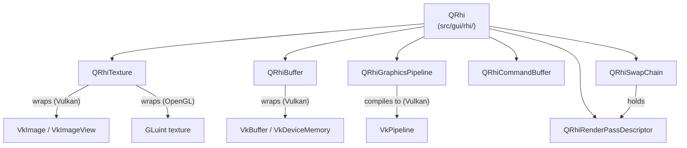

```cpp
// Typical QRhi frame lifecycle
QRhiCommandBuffer *cb;
if (rhi->beginFrame(swapChain) != QRhi::FrameOpSuccess)
    return;
cb = swapChain->currentFrameCommandBuffer();
QRhiRenderTarget *rt = swapChain->currentFrameRenderTarget();
cb->beginPass(rt, Qt::black, { 1.0f, 0 });
cb->setGraphicsPipeline(pipeline);
cb->setShaderResources();
cb->draw(3);
cb->endPass();
rhi->endFrame(swapChain);
```

### 1.2 Qt Quick Scene Graph

Qt Quick — the QML-based UI framework — renders its scene through a retained-mode **scene graph** built from `QSGNode` instances. The scene graph lives on a **render thread** (class `QSGRenderLoop`; the default implementation is `QSGThreadedRenderLoop`) separate from the main/GUI thread. [Source](https://doc.qt.io/qt-6/qtquick-visualcanvas-scenegraph.html)

The rendering pipeline for a single frame proceeds as follows:

1. **Animation phase** — Qt's animation framework advances all running animations on the GUI thread.
2. **Polish phase** — each `QQuickItem` can refine its layout in `updatePolish()`.
3. **Synchronise phase** — the GUI thread and render thread synchronise: `QQuickItem::updatePaintNode()` is called for each dirty item, which creates or updates `QSGNode` objects. This is the only window during which both threads interact.
4. **Render phase** — the render thread calls `QSGRenderer::render()`, which traverses the node tree, batches compatible draw calls, and issues QRhi commands.
5. **Swap** — `QRhi::endFrame()` submits the command buffer and signals the swap chain to present.

```
┌─────────────────────────────────────────────────────────┐
│  GUI Thread                                              │
│  QQuickItem tree → updatePolish() → updatePaintNode()   │
└───────────────────────────┬─────────────────────────────┘
                            │  sync barrier
┌───────────────────────────▼─────────────────────────────┐
│  Render Thread                                           │
│  QSGNode tree → QSGRenderer → QRhi → native API calls   │
│  → QRhiSwapChain::endFrame() → compositor buffer swap   │
└─────────────────────────────────────────────────────────┘
```

The scene graph provides two extension points for custom rendering:

**`QSGGeometry`** describes the mesh of a custom item: attribute layout (position, texture coordinate, colour), vertex data, and index data. **`QSGMaterial`** pairs with the geometry to provide the shader and pipeline state. Application code subclasses `QSGMaterial` and `QSGMaterialShader`; the material's `createShader()` method returns the shader that the scene graph compiles into a `QRhiGraphicsPipeline`. [Source](https://doc.qt.io/qt-6/qsgmaterial.html)

```cpp
// Minimal custom material (qtdeclarative/src/quick/scenegraph/coreapi/)
class MyMaterial : public QSGMaterial {
public:
    QSGMaterialType *type() const override { return &s_type; }
    QSGMaterialShader *createShader(QSGRendererInterface::RenderMode) const override;
    static QSGMaterialType s_type;
};

class MyShader : public QSGMaterialShader {
public:
    MyShader() {
        setShaderFileName(VertexStage, QLatin1String(":/shaders/my.vert.qsb"));
        setShaderFileName(FragmentStage, QLatin1String(":/shaders/my.frag.qsb"));
    }
    bool updateUniformData(RenderState &state,
                           QSGMaterial *newMat, QSGMaterial *oldMat) override;
};
```

### 1.3 Backend Selection and Environment Variables

On Linux, the default QSG (Qt Quick Scene Graph) RHI backend is **OpenGL**, not Vulkan. The Qt documentation states explicitly: "The defaults are currently Direct3D 11 for Windows, Metal for macOS, OpenGL elsewhere." [Source](https://doc.qt.io/qt-6/qtquick-visualcanvas-scenegraph-renderer.html) Vulkan must be explicitly requested, either at runtime via the `QSG_RHI_BACKEND` environment variable or programmatically before any `QQuickWindow` is constructed:

```bash
# Select Vulkan backend for Qt Quick
export QSG_RHI_BACKEND=vulkan
```

```cpp
// In main(), before constructing any QQuickWindow
QQuickWindow::setGraphicsApi(QSGRendererInterface::Vulkan);
```

Other accepted values for `QSG_RHI_BACKEND` are `opengl`, `d3d11`, `d3d12`, `metal`, and `null`. For `QRhi` used directly (outside Qt Quick), the backend is always chosen explicitly by the caller through `QRhi::create()` — there is no platform default.

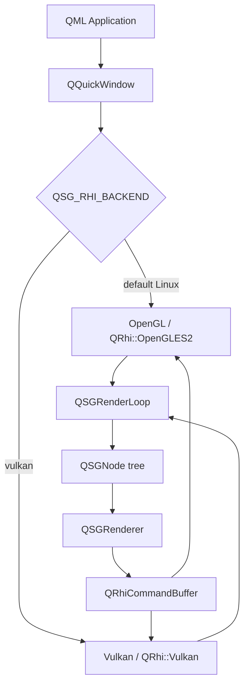

---

## 2. Qt Wayland Integration and Swapchain

### 2.1 QtWayland Client Platform Plugin

When a Qt application starts under a Wayland compositor, the `QtWayland` platform plugin (`wayland`) is loaded. This plugin lives in `src/plugins/platforms/wayland/` in the `qtwayland` repository. [Source](https://github.com/qt/qtwayland) It implements the Qt Platform Abstraction (QPA) interfaces:

- **`QWaylandIntegration`** — the top-level platform integration; creates the Wayland connection (`wl_display`), the `wl_registry`, and the event thread.
- **`QWaylandWindow`** (implementing `QPlatformWindow`) — owns a `wl_surface`. One `QWaylandWindow` exists per `QWindow` in the application.
- **`QPlatformVulkanInstance`** — provided by `QWaylandVulkanInstance`, which loads `libvulkan.so` and creates the `VkInstance` with `VK_KHR_wayland_surface` in the instance extension list.
- **`QPlatformOpenGLContext`** — provided by `QWaylandEglWindow` and backed by EGL using `EGL_PLATFORM_WAYLAND_KHR`.

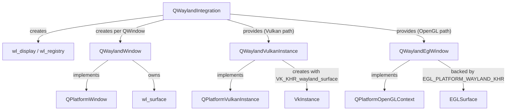

### 2.2 Vulkan Swapchain on Wayland

When the Vulkan backend is active, Qt creates a `VkSurfaceKHR` for each `QWaylandWindow` via the `VK_KHR_wayland_surface` extension:

```cpp
// Pseudocode based on qtbase/src/plugins/platforms/wayland/
VkWaylandSurfaceCreateInfoKHR info = {};
info.sType   = VK_STRUCTURE_TYPE_WAYLAND_SURFACE_CREATE_INFO_KHR;
info.display = waylandDisplay;
info.surface = waylandSurface;   // the wl_surface*
vkCreateWaylandSurfaceKHR(instance, &info, nullptr, &vkSurface);
```

`QRhiVulkan` then calls `vkGetPhysicalDeviceSurfaceCapabilitiesKHR()` to query swapchain support and creates a `VkSwapchainKHR` with `VK_PRESENT_MODE_FIFO_KHR` (vsync) or `MAILBOX` if available. The swapchain images are wrapped in `QRhiTexture` objects and presented via `vkQueuePresentKHR()`.

If the `wl_surface` is destroyed (for example on window hide), the `VkSurfaceKHR` becomes invalid. Qt handles this by destroying and recreating both the Vulkan surface and swapchain when the Wayland surface is recreated.

### 2.3 OpenGL/EGL Swapchain on Wayland

When the OpenGL backend is active, `QWaylandEglWindow` creates a `wl_egl_window` (the Mesa/libwayland-egl abstraction) and passes it to `eglCreateWindowSurface()`:

```c
// libwayland-egl / Mesa wl_egl_window path
struct wl_egl_window *egl_window =
    wl_egl_window_create(wl_surface, width, height);
EGLSurface egl_surface =
    eglCreateWindowSurface(egl_display, config,
                           (EGLNativeWindowType)egl_window, nullptr);
```

`eglSwapBuffers()` on the EGL surface translates internally to a `wl_surface_commit` on the Wayland surface, attaching the rendered buffer and notifying the compositor.

### 2.4 Frame Pacing: wl_callback and wp_presentation

Qt throttles its render thread using Wayland **frame callbacks**. After each `wl_surface_commit`, `QWaylandWindow` registers a `wl_surface_frame` callback. The compositor fires the callback when it has displayed the current frame and is ready for the next one. Qt's render loop (`QSGThreadedRenderLoop`) blocks on this callback before starting the next frame, preventing the application from getting ahead of the compositor. [Source](https://github.com/qt/qtwayland/blob/dev/src/client/qwaylandwindow.cpp)

For accurate refresh-rate reporting and presentation-time feedback, Qt implements the **`wp_presentation`** Wayland protocol (Presentation Time). The `QWaylandPresentationTime` class (compositor-side API) and its client counterpart parse the `wp_presentation_feedback` events to measure the actual frame presentation timestamp. [Source](https://doc.qt.io/qt-6/qwaylandpresentationtime.html) This feeds back into `QScreen::refreshRate()` accuracy and can be used to implement frame-rate–limited animations with correct pacing.

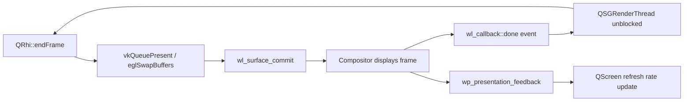

### 2.5 QSurface::SurfaceType and Platform Selection

Qt applications select the rendering surface type through `QSurface::SurfaceType`. The most relevant types for GPU rendering are:

- `QSurface::VulkanSurface` — a Vulkan-rendered surface.
- `QSurface::OpenGLSurface` — an EGL/OpenGL surface.
- `QSurface::RasterGLSurface` — composites rasterised content into an OpenGL texture.

`QWaylandIntegration::createPlatformWindow()` reads the `SurfaceType` and instantiates the correct `QWaylandWindow` subclass accordingly.

---

## 3. Qt Shader Pipeline: qsb and SPIR-V

### 3.1 The qsb Tool

Qt's shader cross-compilation pipeline centres on the **`qsb`** (Qt Shader Baker) command-line tool, part of the **Qt Shader Tools** module. [Source](https://doc.qt.io/qt-6/qtshadertools-qsb.html) It takes a Vulkan-flavoured GLSL source file as input — always compiled first to SPIR-V via the embedded `glslang` library — and then uses `SPIRV-Cross` to translate the SPIR-V into the target shading languages:

```bash
# Compile vertex and fragment shaders to .qsb packages
qsb --glsl "100 es,120,150" --hlsl 50 --msl 12 \
    -o myshader.vert.qsb myshader.vert
qsb --glsl "100 es,120,150" --hlsl 50 --msl 12 \
    -o myshader.frag.qsb myshader.frag
```

The input file extension determines the shader stage: `.vert`, `.frag`, `.comp`, `.tesc`, `.tese`, `.geom`. The `--batchable` (`-b`) flag for vertex shaders generates an additional variant that Qt Quick's scene graph uses for instanced/batched rendering.

### 3.2 The .qsb File Format

A `.qsb` file is a binary container that packs:

1. **Reflection metadata** (`QShaderDescription`): a JSON-encoded description of inputs, outputs, uniform blocks (`layout(std140)`), push constant blocks, and combined image samplers. The description is used by Qt to allocate uniform buffers and bind descriptor sets correctly at runtime.
2. **Per-target shader blobs**: one entry per `(language, version, variant)` triple. The SPIR-V blob is always present; GLSL ES, HLSL, and MSL blobs are present when the corresponding `--glsl`/`--hlsl`/`--msl` flags were passed.

Inspecting a `.qsb` file:

```bash
qsb --dump myshader.frag.qsb
```

Typical output:

```
Stage: Fragment
QShaderDescription:
  Inputs:  v_texcoord (vec2, location 0)
  Uniforms: buf { matrix(mat4), opacity(float) } binding 0
Shaders:
  [SPIRV 100] 1412 bytes
  [GLSL 100 es] 312 bytes
  [GLSL 120] 287 bytes
  [HLSL 50] 445 bytes
  [MSL 12] 389 bytes
```

### 3.3 Runtime Selection in QRhi

When `QRhiGraphicsPipeline::create()` is called, it reads the attached `QShader` objects — loaded from `.qsb` files via `QShader::fromSerialized()` — and selects the appropriate blob for the active backend:

- **Vulkan path**: uses the `SPIRV 100` blob, passes it to `vkCreateShaderModule()`.
- **OpenGL/ES path**: uses the `GLSL 100 es` or `GLSL 120` blob, passes it to `glShaderSource()` / `glCompileShader()`.
- **Metal path**: uses the MSL blob.
- **D3D11 path**: uses the HLSL blob, passes it to `D3DCompile()` (or uses a precompiled DXBC blob if generated with `--fxc`).

```cpp
// Loading a .qsb shader in application code
QShader vs = loadShader(QLatin1String(":/shaders/myshader.vert.qsb"));
QShader fs = loadShader(QLatin1String(":/shaders/myshader.frag.qsb"));

QRhiGraphicsPipeline *ps = rhi->newGraphicsPipeline();
ps->setShaderStages({
    { QRhiShaderStage::Vertex,   vs },
    { QRhiShaderStage::Fragment, fs },
});
ps->create();
```

`QShader::fromSerialized()` deserialises the `.qsb` binary into a `QShader` value containing all target blobs and the `QShaderDescription`. The `QShaderDescription` includes the uniform block layout, which `QRhi` uses to create correctly-sized `QRhiBuffer` objects for uniform data.

### 3.4 Custom Materials in Qt Quick

In the Qt Quick scene graph, custom shader effects follow this pipeline:

1. Write Vulkan-style GLSL `.vert` and `.frag` files following Qt's uniform block conventions.
2. Run `qsb` (typically via CMake's `qt_add_shaders()` function) to generate `.qsb` files embedded in the Qt resource system.
3. Subclass `QSGMaterialShader`, call `setShaderFileName()` with the resource path in the constructor.
4. Subclass `QSGMaterial` and implement `createShader()` to return the custom shader instance.
5. Override `updateUniformData()` in the shader subclass to upload per-frame constants (model-view-projection matrix, custom parameters).

```cmake
# CMakeLists.txt — automatic qsb compilation
qt_add_shaders(myapp "myapp_shaders"
    PREFIX "/shaders"
    FILES
        shaders/myeffect.vert
        shaders/myeffect.frag
)
```

```glsl
// shaders/myeffect.frag — Vulkan-style GLSL input to qsb
#version 440
layout(location = 0) in vec2 v_texcoord;
layout(location = 0) out vec4 fragColor;
layout(std140, binding = 0) uniform buf {
    mat4 qt_Matrix;
    float qt_Opacity;
    float time;
};
layout(binding = 1) uniform sampler2D qt_Texture;
void main() {
    fragColor = texture(qt_Texture, v_texcoord) * qt_Opacity;
}
```

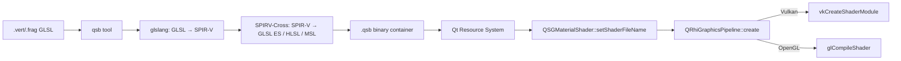

---

## 3.5 The Qt Meta-Object System

Every Qt type in the rendering pipeline — `QRhi`, `QSGRenderLoop`, `QSGMaterial`, `QWaylandWindow`, `QSGDistanceFieldGlyphCache` — is a `QObject` subclass. Qt's meta-object system is the runtime backbone behind signals and slots, property bindings, and the QML engine that drives Qt Quick. Understanding it is necessary for reading Qt and KWin internals or writing custom `QObject` subclasses that plug into the rendering stack — custom `QSGMaterial` implementations, `QWaylandClientExtension` bindings, KWin `Effect` plugins.

### `QObject` and `Q_OBJECT`

`QObject` is Qt's base class for any object participating in signals, slots, or properties. The `Q_OBJECT` macro, placed in the class declaration, marks the class for processing by `moc`, the Meta-Object Compiler. Unlike GObject (§4.7), where the type system registration happens at runtime via `G_DEFINE_TYPE` and `g_signal_new`, Qt's meta-object data is generated at compile time from the class header:

```cpp
/* A QSGMaterial subclass participating in the Qt rendering pipeline */
class WaterMaterial : public QSGMaterial
{
    Q_OBJECT
    Q_PROPERTY(float time READ time WRITE setTime NOTIFY timeChanged)
public:
    explicit WaterMaterial(QObject *parent = nullptr);
    QSGMaterialType *type() const override;
    QSGMaterialShader *createShader(QSGRendererInterface::RenderMode) const override;

    float time() const { return m_time; }
    void setTime(float t);

Q_SIGNALS:
    void timeChanged(float time);

private:
    float m_time = 0.0f;
};
```

### `moc` — the Meta-Object Compiler

`moc` reads class headers containing `Q_OBJECT` and generates a corresponding `moc_<classname>.cpp` file that contains:

- A static `qt_static_metacall()` function — the vtable for signal emission, slot invocation, and property access.
- A `QMetaObject` literal — an in-process table of the class's methods, signals, properties, and enumerators with their types and names encoded as UTF-8 string data.
- Implementations of `metaObject()`, `qt_metacast()`, and `qt_metacall()` — the three virtual functions that `QObject` declares and that `moc` fills in per class.

Because `moc` output is fully resolved at compile time into static data, signal/slot connections using the pointer-to-member syntax are type-checked at compile time:

```cpp
/* Source: Qt signals/slots documentation (qt6/doc/qtcore/signalsandslots.html)
 * Pointer-to-member connect() is checked at compile time:
 * if signal and slot signatures are incompatible the build fails.
 */
connect(renderLoop, &QSGRenderLoop::sceneGraphInitialized,
        rhi, &QRhi::beginFrame);               /* type-safe, compile-time */

/* Qt 4 string-based syntax — still supported, but errors are runtime */
connect(renderLoop, SIGNAL(sceneGraphInitialized()),
        rhi, SLOT(beginFrame()));               /* dynamic, no type check */
```

This is the key distinction from GObject signals (§4.7): `g_signal_new()` registers signal metadata at runtime and `G_CALLBACK()` silences type mismatches with a cast macro — errors in signal connection only surface when the code executes. Qt's compile-time path catches them during the build.

### `QMetaObject` and Runtime Introspection

Every `QObject` subclass has a `staticMetaObject` member and a virtual `metaObject()` accessor. `QMetaObject` provides runtime inspection of a class's methods, properties, and signals — analogous to GObject Introspection typelibs (§4.7), but encoded directly in the process image. `QMetaObject::invokeMethod()` calls any slot or invokable method by name at runtime, which is the mechanism by which the QML engine calls C++ methods from script code:

```cpp
/* Source: Qt6 QMetaObject documentation
 * Used internally by QQmlEngine to call C++ methods from QML bindings
 * without the caller needing to know the class at compile time.
 */
QMetaObject::invokeMethod(compositorObject, "startFrame",
                          Qt::QueuedConnection,
                          Q_ARG(int, frameNumber));
```

### `Q_PROPERTY` and `QProperty<T>`

`Q_PROPERTY` declarations expose named, typed properties to the QML engine and to `QObject::property()` / `setProperty()` — Qt's equivalent of `g_object_get`/`g_object_set`. Qt 6 added `QProperty<T>` and `QBindable<T>`, a C++20-based property binding system that enables declarative dependencies — when one property changes, all dependent properties update automatically without explicit signal connections:

```cpp
/* Qt 6 QProperty: declarative binding without signal boilerplate
 * Source: Qt6 QProperty documentation (qt6/doc/qtcore/qproperty.html)
 */
class OutputState : public QObject
{
    Q_OBJECT
public:
    QProperty<int>  nominalRate{60};
    QProperty<bool> vrrEnabled{false};
    /* effectiveRate auto-recalculates when nominalRate or vrrEnabled changes */
    QProperty<int>  effectiveRate{[this] {
        return vrrEnabled ? 144 : nominalRate;
    }};
};
```

KWin uses `Q_PROPERTY` extensively on `KWin::Window` (Chapter 22 §3) — the properties `active`, `minimized`, `fullScreen`, `frameGeometry`, and `desktops` are all `Q_PROPERTY` declarations, which is how the QML scripting layer accesses them as `window.active`, `window.frameGeometry`, and so on, with QML's property binding engine subscribing to `NOTIFY` signals automatically.

### `QQmlEngine` and the QML Runtime

The QML engine is a JavaScript interpreter — the V4 engine, a custom ECMAScript 5.1 / partial ES6 implementation — embedded in Qt Quick. `QQmlEngine` is a `QObject` subclass that owns the global `QQmlContext`, manages QML component compilation and bytecode caching, and evaluates property bindings reactively. QML files (`.qml`) are compiled to V4 bytecode; Qt 6 optionally ahead-of-time compiles them to C++ via `qmlcachegen` for embedded targets.

```cpp
/* Loading a QML effect component at runtime — the model used by KWin
 * for QML-based window effects and the Plasma Shell desktop.
 */
QQmlEngine *engine = new QQmlEngine(this);
engine->addImportPath(QStringLiteral("/usr/lib/qt6/qml"));

QQmlComponent component(engine,
    QUrl::fromLocalFile("/usr/share/kwin/effects/overview/main.qml"));
QObject *effect = component.create();
/* QML property bindings on Window objects update automatically:
 *   Item { opacity: window.minimized ? 0 : 1 }
 * The engine subscribes to Window::minimizedChanged and re-evaluates.
 */
```

KWin loads QML-based effects through `KPackage`; within each package a `main.qml` declares a QML component that KWin instantiates in its embedded `QQmlEngine`. The `org.kde.kwin` QML module (a `QQmlExtensionPlugin`) exposes compositor state — `KWin.clientList()`, `KWin.readConfig()`, `KWin.activeScreen` — as QML-accessible properties. The Overview effect, the desktop grid, and screen-edge triggers are all QML applications running inside the compositor process. The JavaScript scripting API (`KWin.registerShortcut`, window rule scripts) runs in a `QJSEngine` — a lighter-weight interpreter without the full QML runtime overhead, used for rule evaluation and keybinding callbacks.

### Comparison with GObject

The contrast with GObject (§4.7) is instructive for readers coming from the GTK side:

| | Qt meta-object (`moc`) | GObject |
|---|---|---|
| Type registration | Compile time (`moc`-generated `.cpp`) | Runtime (`G_DEFINE_TYPE`, `g_type_register_*`) |
| Signal/slot type check | Compile time (pointer-to-member `connect`) | Runtime (marshaller validation at emission) |
| Introspection | In-process `QMetaObject` literal | Separate `.gir`/`.typelib` file (GObject Introspection) |
| Scripting bridge | `QQmlEngine` (V4 JS) / `QJSEngine` with QML bindings | GJS (SpiderMonkey) with GIR typelib |
| Property binding | `QProperty<T>` / `QBindable<T>` (C++20 reactive) | No first-class binding; `notify` signals + re-query |
| Language bindings | QML, Python (PyQt6/PySide6), Rust (`qmetaobject-rs`) | Python (PyGObject), JavaScript (GJS), Rust (`gtk-rs`) |

The compile-time approach means `moc` errors surface during the build rather than at runtime, at the cost of a mandatory preprocessor step in the build system. GObject's runtime registration is more dynamic — signals can be added to existing types at runtime, properties can be added to instances via `g_object_class_install_property` in a subclass — but errors in signal connection (wrong argument count, wrong type) appear only when the code executes. §4.7 contains a more detailed comparison of the two systems; readers building application code that spans both toolkits should read both sections together.

---

## 4. GTK4 Rendering Architecture: GskRenderer

### 4.1 The Three-Layer Model

GTK4's rendering architecture separates concerns across three distinct layers:

1. **Widget tree** (`GtkWidget` hierarchy) — the application-visible object model: buttons, labels, boxes, text views. Widgets describe *what* to render, not *how*.
2. **Render node tree** (`GskRenderNode` hierarchy) — a serialisable, immutable tree of GPU-oriented drawing primitives produced by snapshotting the widget tree each frame.
3. **Renderer** (`GskRenderer`) — consumes the render node tree and emits GPU commands via OpenGL or Vulkan.

The separation between widget tree and render node tree is crucial: the widget tree lives on the main thread and can be mutated freely; the render node tree is handed off to the renderer (which may run on a separate thread or context) after snapshot.

### 4.2 Building the Render Node Tree: GtkSnapshot

`GtkSnapshot` is the drawing context passed to each widget's `snapshot` virtual function (the GTK4 replacement for the `draw` callback). Widgets call `gtk_snapshot_push_*()` / `gtk_snapshot_append_*()` / `gtk_snapshot_pop()` methods to build up a stack of `GskRenderNode` objects:

```c
// Widget snapshot vfunc (GtkWidgetClass.snapshot)
static void my_widget_snapshot(GtkWidget *widget, GtkSnapshot *snapshot)
{
    // Push a rounded clip
    gtk_snapshot_push_rounded_clip(snapshot, &rounded_rect);

    // Append a solid colour fill
    gtk_snapshot_append_color(snapshot, &color, &bounds);

    // Append a texture (e.g. a GdkTexture loaded from a file)
    gtk_snapshot_append_texture(snapshot, texture, &texture_bounds);

    gtk_snapshot_pop(snapshot);  // pop rounded clip
}
```

`GtkSnapshot` internally creates `GskRenderNode` objects for each append call and nests them under the current transform/clip. The resulting tree is extracted via `gtk_snapshot_to_node()` and passed to `gsk_renderer_render()`. [Source](https://docs.gtk.org/gtk4/class.Snapshot.html)

### 4.3 GskRenderNode Subtypes

`GskRenderNode` is abstract; all rendering is expressed through specialised subtypes that are immutable once created. Key types and their GPU mapping [Source](https://docs.gtk.org/gsk4/class.RenderNode.html):

| Node type | Description | GPU mapping |
|---|---|---|
| `GskColorNode` | Solid colour rectangle | Flat-colour shader pass |
| `GskTextureNode` | Sample a `GdkTexture` | Textured quad draw call |
| `GskTextureScaleNode` | Scaled texture with filter | Textured quad + filter mode |
| `GskBlurNode` | Gaussian blur of child | Multi-pass convolution (or single-pass with compute) |
| `GskShadowNode` | Drop shadow behind child | Blur + offset + blend |
| `GskTransformNode` | Affine/perspective transform | GPU matrix push |
| `GskRoundedClipNode` | Clip to rounded rectangle | Stencil or shader-based clipping |
| `GskLinearGradientNode` | CSS linear-gradient | Gradient shader |
| `GskOpacityNode` | Alpha multiplication of child | Blend state or intermediate FBO |
| `GskCairoNode` | Fallback Cairo paint | Upload CPU-rendered pixmap to GL texture |
| `GskTextNode` | Text run (Pango glyphs) | Glyph atlas draw calls |
| `GskSubsurfaceNode` | Delegate to a child subsurface | `wl_subsurface` (Wayland native) |
| `GskGLShaderNode` | Custom GLSL fragment shader | Direct shader execution (legacy) |

### 4.4 GskRenderer Implementations

As of GTK 4.16, three hardware-accelerated renderers exist, all in `gsk/`:

**`GskCairoRenderer`** — software fallback. Renders the node tree to a Cairo surface via `cairo_t`, then uploads the resulting pixmap as a texture. Correct but slow; used when no GPU is available.

**Legacy `GskGLRenderer`** (pre-4.14 default) — lives in `gsk/gl/`. Used per-node-type shader programs; required frequent offscreen intermediate rendering for effects like blur and opacity stacking. Deprecated in favour of the unified GPU renderer.

**`GskNglRenderer` / `GskVulkanRenderer`** (GTK 4.14+ unified renderer, `gsk/gpu/`) — these are the two faces of a shared codebase. The unified renderer is modelled on Vulkan concepts: it uses a scene-graph traversal shared between the OpenGL and Vulkan paths, employs "per-node shaders" and an "ubershader" approach (a complex shader that interprets a node-type token and parameters packed into a GPU buffer), and avoids offscreen rendering for the common case. [Source](https://blogs.gnome.org/gtk/2024/01/28/new-renderers-for-gtk/)

The `GskNglRenderer` (new GL renderer) targets OpenGL 3.3+ and GLES 3.0+; `GskVulkanRenderer` targets Vulkan 1.0+. From GTK 4.16, `GskVulkanRenderer` is the default when the GDK backend is Wayland and a Vulkan implementation is available; `GskNglRenderer` is the default on X11 and other platforms. [Source](https://blog.gtk.org/2024/04/)

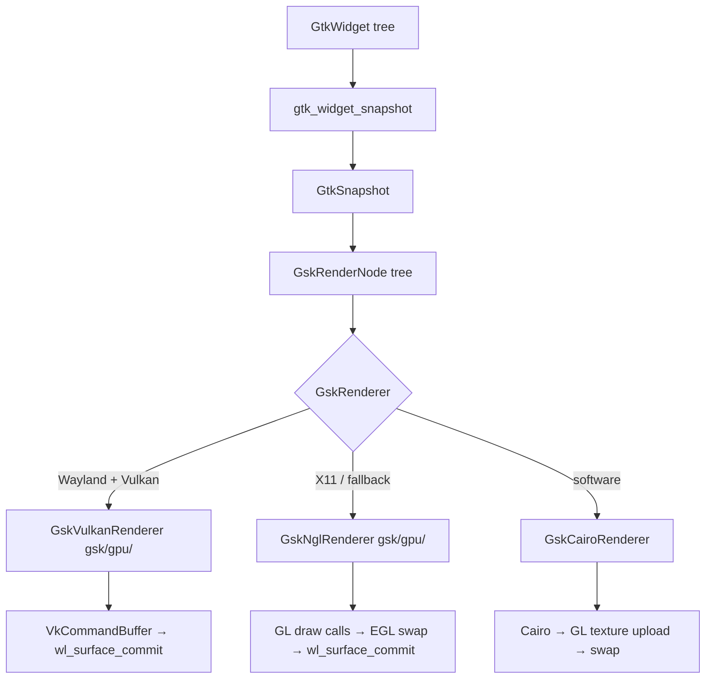

### 4.5 Selecting the Renderer

The renderer is selected at application startup through the `GSK_RENDERER` environment variable [Source](https://docs.gtk.org/gtk4/running.html):

```bash
GSK_RENDERER=vulkan  myapp   # force Vulkan renderer
GSK_RENDERER=gl      myapp   # force NGL (OpenGL) renderer
GSK_RENDERER=cairo   myapp   # force software Cairo fallback
GSK_RENDERER=help    myapp   # print available options and exit
```

The Vulkan and GL renderers share the same node handling code in `gsk/gpu/`; only the low-level device abstraction differs. A `GskGpuDevice` base class (in `gsk/gpu/gskgpudevice.c`) abstracts resource allocation and command submission, with `GskVulkanDevice` (in `gsk/gpu/gskvulkandevice.c`) and `GskGLDevice` (in `gsk/gpu/gskgldevice.c`) as the concrete implementations. Both are confirmed in the GTK source tree as `GObject` subclasses of `GskGpuDevice`.

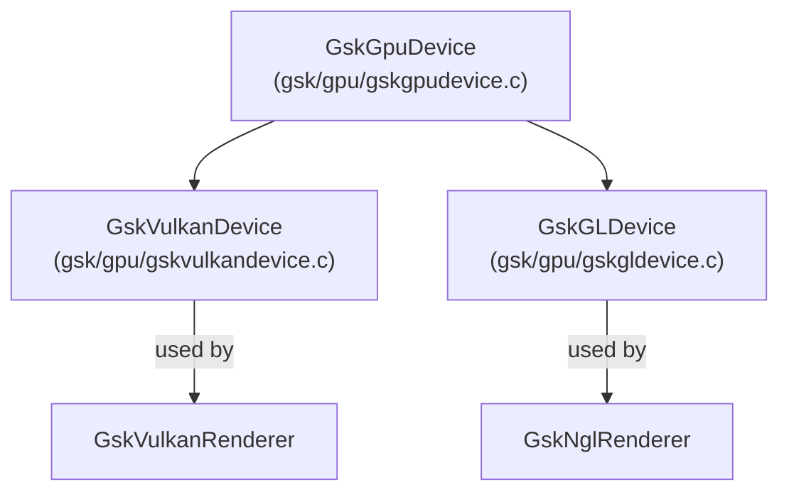

### 4.6 Gdk-Pixbuf and GLib: Supporting Infrastructure

Two foundational GNOME libraries sit beneath the GTK4 rendering stack and are prerequisites for understanding how images reach the GPU and how the render loop is driven.

#### Gdk-Pixbuf: Raster Images into the GPU Texture Pipeline

**`GdkPixbuf`** (package `gdk-pixbuf-2.0`) is GTK's image loading library. It decodes JPEG, PNG, WebP, TIFF, and other formats into a CPU-side RGBA pixel buffer. From a GPU rendering perspective its role is narrow but important: it is the path by which raster images from disk enter the `GskTextureNode` pipeline.

```c
/* Load a PNG file from disk into a CPU-side pixel buffer */
GError *err = NULL;
GdkPixbuf *pixbuf = gdk_pixbuf_new_from_file("icon.png", &err);

/* Upload to the GPU: GdkTexture wraps the pixbuf and owns a GL/Vulkan texture object */
GdkTexture *texture = gdk_texture_new_for_pixbuf(pixbuf);
g_object_unref(pixbuf);   /* GPU copy exists; CPU buffer can be freed */

/* Use in a widget snapshot — becomes a GskTextureNode in the render tree */
gtk_snapshot_append_texture(snapshot, texture, &bounds);
```

The conversion chain is:
```
gdk_pixbuf_new_from_file()   → GdkPixbuf  (CPU RGBA buffer)
gdk_texture_new_for_pixbuf() → GdkTexture (uploads to GL texture / VkImage on first use)
gtk_snapshot_append_texture()→ GskTextureNode in render node tree
gsk_renderer_render()        → textured quad draw call
```

For resource-embedded images, GTK 4.12+ introduces `GdkTexture` constructors that bypass `GdkPixbuf` entirely by loading directly into a GPU texture from compressed data, avoiding the CPU round-trip. The preferred modern API for static assets is `gdk_texture_new_from_resource()` with a `.png` file embedded in a GResource bundle.

`GdkPixbuf` also provides pixel-level image manipulation — scaling (`gdk_pixbuf_scale_simple()`), compositing, and colour-space transforms — that happens on the CPU before the texture upload. For simple display without transformation, applications should prefer `GdkTexture` directly.

#### GLib Main Loop: Driving the GTK4 Render Loop

**GLib** (package `glib-2.0`) provides the event loop, object system, and thread primitives that GTK4 builds on. The **`GMainLoop`** / **`GMainContext`** pair is the mechanism by which all GTK rendering events are dispatched:

```
GMainLoop (driven by gtk_main() or g_application_run())
  │
  GMainContext  ← polls multiple GSource instances
    │
    ├── GdkWaylandEventSource    ← wl_display fd, Wayland protocol events
    ├── GdkFrameClockIdle        ← frame pacing (GdkFrameClock)
    ├── Timer GSources           ← g_timeout_add(), CSS animations
    └── I/O GSources             ← file descriptors, DBus, network
```

The critical path for rendering is `GdkFrameClock`, GTK4's frame scheduler. It replaces the raw `wl_callback` frame event with a higher-level API:

```c
GdkFrameClock *clock = gtk_widget_get_frame_clock(widget);

/* Request a repaint — GTK will schedule it on the next frame clock tick */
gtk_widget_queue_draw(widget);

/* The frame clock signals "update" just before rendering each frame */
g_signal_connect(clock, "update", G_CALLBACK(on_frame_update), NULL);
g_signal_connect(clock, "paint",  G_CALLBACK(on_frame_paint),  NULL);
```

Internally, `GdkFrameClock` wraps the Wayland `wl_callback` frame notification: after each `wl_surface_commit`, the GDK Wayland backend registers a `wl_callback` listener; when the compositor sends `done`, the callback fires a GLib idle source that advances the `GdkFrameClock`, which in turn triggers widget snapshot, render node tree construction, and `GskRenderer` submission.

```
wl_surface_commit()
  │
  wl_callback (compositor fires "done" when buffer can be replaced)
    │
    GdkWaylandEventSource wakes GMainContext
      │
      GdkFrameClock::update signal
        │
        gtk_widget_snapshot() on dirty widgets
          │
          GskRenderNode tree → GskRenderer → next wl_surface_commit()
```

This loop gives GTK frame pacing without busy-waiting: the render thread sleeps in `g_main_context_iteration()` (or `epoll_wait` at the kernel level) until the compositor acknowledges the previous frame, then wakes to render the next one. The `GdkFrameTimings` API exposes presentation timestamps from the `wp_presentation` protocol for latency-sensitive applications.

---

### 4.7 The GObject Type System

Every GTK4 type involved in the rendering pipeline — `GskRenderer`, `GskRenderNode`, `GdkTexture`, `GdkFrameClock`, `GskGpuDevice` — is a GObject subclass. GObject is GLib's runtime type system: it supplies single inheritance, interfaces, a property mechanism, and a signal system for C, without a preprocessor step. Understanding it is necessary for reading GTK4 and GDK internals or writing custom GObject subclasses that plug into the rendering stack (custom `GskRenderNode` subclasses, custom `GdkContentSerializer` implementations, Mutter `MetaPlugin` subclasses).

**GType and `G_DEFINE_TYPE`.** Every type has a `GType` identifier — a `gsize` — obtained at first use by calling `*_get_type()`. The `G_DEFINE_TYPE` macro generates that function plus class-init and instance-init stubs:

```c
/* gsk/gpu/gskgpudevice.c — simplified */
G_DEFINE_TYPE(GskGpuDevice, gsk_gpu_device, G_TYPE_OBJECT)

static void
gsk_gpu_device_class_init(GskGpuDeviceClass *klass)
{
    GObjectClass *object_class = G_OBJECT_CLASS(klass);
    object_class->dispose    = gsk_gpu_device_dispose;
    object_class->finalize   = gsk_gpu_device_finalize;
    object_class->get_property = gsk_gpu_device_get_property;
    object_class->set_property = gsk_gpu_device_set_property;
    /* install properties ... */
}

static void
gsk_gpu_device_init(GskGpuDevice *self)
{
    /* zero-initialise instance fields */
}
```

The Vulkan renderer extends this with `G_DEFINE_TYPE(GskVulkanDevice, gsk_vulkan_device, GSK_TYPE_GPU_DEVICE)`, making `GskVulkanDevice` a concrete leaf subclass of `GskGpuDevice`. [Source: `gsk/gpu/gskgpudevice.c`, GTK 4.16](https://gitlab.gnome.org/GNOME/gtk/-/blob/main/gsk/gpu/gskgpudevice.c)

**`GObjectClass` vtable.** The class struct (e.g. `GskGpuDeviceClass`) overlays `GObjectClass` at offset zero, giving every subclass access to four critical virtual slots:

| Slot | When called | Rendering use |
|------|-------------|---------------|
| `dispose` | `g_object_unref` when refcount hits zero; may run multiple times | Release `VkDevice`, free command pools, drop EGL context |
| `finalize` | After `dispose`; runs exactly once | Free `self`-owned C memory (`g_free`, `g_slice_free`) |
| `get_property` | `g_object_get(obj, "prop", &val, NULL)` | Expose renderer capabilities to CSS engine |
| `set_property` | `g_object_set(obj, "prop", val, NULL)` | Accept scale-factor or display-colorspace updates |

Releasing GPU resources in `dispose` (not `finalize`) matters because another object may briefly `g_object_ref` the device during teardown — `dispose` handles that; `finalize` must not.

**Properties and `GParamSpec`.** Properties are named, typed, introspectable slots declared in `class_init` via `g_object_class_install_property()`:

```c
static GParamSpec *props[N_PROPS];

props[PROP_SCALE_FACTOR] =
    g_param_spec_int("scale-factor", NULL, NULL,
                     1, 4, 1,
                     G_PARAM_READWRITE | G_PARAM_CONSTRUCT_ONLY | G_PARAM_STATIC_STRINGS);

g_object_class_install_properties(object_class, N_PROPS, props);
```

`GParamSpec` records the property's `GType`, default value, valid range, and flags. GTK4's CSS animation engine resolves animated values through `g_object_get`/`g_object_set` on widget properties — property notifications (`g_object_notify`) trigger a re-snapshot and a fresh `GskRenderNode` tree.

**Signals.** GObject signals are typed, named hooks on which arbitrary handlers can be connected. `GdkFrameClock` (§4.6) registers its render-loop signals in `class_init`:

```c
/* gdk/gdkframeclock.c */
signals[UPDATE] =
    g_signal_new("update",
                 G_TYPE_FROM_CLASS(klass),
                 G_SIGNAL_RUN_LAST,
                 0, NULL, NULL,
                 NULL,            /* marshaller — NULL uses generic va_list path */
                 G_TYPE_NONE, 0); /* return type, n_params */

signals[PAINT] =
    g_signal_new("paint", G_TYPE_FROM_CLASS(klass),
                 G_SIGNAL_RUN_LAST, 0, NULL, NULL, NULL, G_TYPE_NONE, 0);
```

`g_signal_emit(clock, signals[UPDATE], 0)` runs all connected handlers in registration order. `G_CALLBACK()` is a cast macro that silences the type mismatch between a concrete handler signature and `GCallback` (`void (*)(void)`). Unlike Qt signals, GObject signal connections are dynamic runtime registrations; there is no compile-time type checking, but the marshaller validates argument counts and types at emission.

**Reference counting and floating references.** All GObject instances are heap-allocated and reference-counted. `g_object_ref`/`g_object_unref` manage the count; reaching zero invokes `dispose` then `finalize`. `GskRenderNode` uses `GInitiallyUnowned` — a subclass that begins life with a *floating* reference. The first `g_object_ref_sink()` call claims ownership; subsequent calls increment normally. This allows render node constructors to return without the caller immediately calling `ref`:

```c
GskRenderNode *node = gsk_color_node_new(&color, &bounds);
/* node is floating — no ref needed yet */
gsk_render_node_ref_sink(node);  /* now we own it; refcount == 1 */
/* ... */
gsk_render_node_unref(node);     /* frees */
```

[Source: `gsk/gskrendernode.h`](https://gitlab.gnome.org/GNOME/gtk/-/blob/main/gsk/gskrendernode.h)

**Interfaces.** GObject supports multiple interfaces via `G_IMPLEMENT_INTERFACE`. `GdkPaintable` is the canonical rendering interface — it is implemented by `GdkTexture`, `GdkPixbuf` wrappers, and custom paintable types, all through:

```c
G_DEFINE_TYPE_WITH_CODE(GdkMemoryTexture, gdk_memory_texture, GDK_TYPE_TEXTURE,
    G_IMPLEMENT_INTERFACE(GDK_TYPE_PAINTABLE, gdk_memory_texture_paintable_init))
```

The `_paintable_init` function fills in the `GdkPaintableInterface` vtable with snapshot and flag implementations.

**Comparison with Qt's QObject.** Qt achieves a similar feature set through `moc`, a compile-time preprocessor that generates `Q_OBJECT` metaclass data. The result is stronger compile-time type checking for signal/slot connections (`connect(&sender, &Sender::signal, &receiver, &Receiver::slot)`), but requires the moc step in the build. GObject's registration is entirely at runtime, making it more dynamic (signals can be installed on existing types, property sets can be extended) but with errors surfacing only at runtime rather than at compile time. Both systems achieve language-binding generation: GObject via GObject Introspection (GIR/typelib files), Qt via its own Qt meta-object protocol.

**GObject Introspection.** The `g-ir-scanner` tool processes GTK4 headers and emits `.gir` XML files, which are compiled to binary `.typelib` files. GNOME Shell loads these at startup so that its GJS (JavaScript) runtime can invoke `Meta.Plugin`, `Clutter.Actor`, and `St.Widget` APIs directly — enabling the CSS-animated workspace transitions and notification pop-ups to be scripted in JavaScript without a separate IPC layer. The typelib path is the mechanism by which GNOME Shell's `js/` tree calls down into the same Mutter/Clutter C renderer described in Chapter 22 §2. [Source: `https://gi.readthedocs.io/en/latest/`]

---

## 5. GTK4 Wayland Integration and Explicit Sync

### 5.1 GDK Wayland Backend

GTK4's Wayland integration lives in `gdk/wayland/`. The key types are:

- **`GdkWaylandDisplay`** — wraps `wl_display`; owns the Wayland connection and the registry listener that binds global objects (`wl_compositor`, `xdg_wm_base`, etc.).
- **`GdkWaylandSurface`** — wraps a `wl_surface` and an `xdg_surface`/`xdg_toplevel` for window management. Each `GdkToplevel` or `GdkPopup` maps to one `GdkWaylandSurface`.
- **`GdkWaylandGLContext`** — the EGL context used by the GL renderer; owns the `wl_egl_window` and `EGLSurface`.

The Wayland backend is selected automatically when `$WAYLAND_DISPLAY` is set (or via `GDK_BACKEND=wayland`).

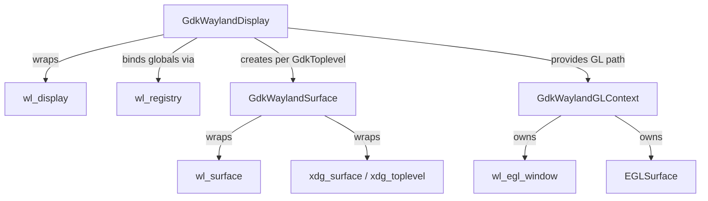

### 5.2 Buffer Submission: EGL on Wayland

The NGL renderer submits frames through EGL. The sequence is:

1. `wl_egl_window_create(wl_surface, width, height)` — creates a `wl_egl_window` wrapping the Wayland surface.
2. `eglCreateWindowSurface(display, config, (EGLNativeWindowType)egl_window, NULL)` — creates an EGL surface backed by the Wayland window.
3. At frame end, `eglSwapBuffers()` — the Mesa EGL Wayland backend translates this to `wl_surface_attach()` (attaching the rendered `wl_buffer`) followed by `wl_surface_commit()`.

Damage information (`wl_surface_damage_buffer()`) is passed before commit to tell the compositor which regions have changed. The GDK Wayland backend uses buffer-space coordinates (via `wl_surface_damage_buffer` rather than the older `wl_surface_damage`) because EGL surfaces may be at arbitrary buffer transforms. [Source](https://docs.gtk.org/gtk4/wayland.html)

### 5.3 Buffer Submission: Vulkan on Wayland

The Vulkan renderer acquires and presents swapchain images directly. `GskVulkanDevice` (confirmed in `gsk/gpu/gskvulkandevice.c`, subclassing `GskGpuDevice`) creates a `VkSwapchainKHR` for each `GdkWaylandSurface` via `VK_KHR_wayland_surface`, and `vkQueuePresentKHR()` triggers the compositor-side buffer import. Where available, incremental present extensions may be used to communicate damage regions to the presentation engine.

### 5.4 Explicit Synchronisation with wp_linux_drm_syncobj_v1

GTK 4.16 added support for the `wp_linux_drm_syncobj_v1` Wayland protocol, which implements GPU-native explicit synchronisation using Linux DRM synchronisation objects. [Source](https://wayland.app/protocols/linux-drm-syncobj-v1)

Without explicit sync, the compositor must use implicit fencing (waiting for the GPU driver's internal fence) or insert a full GPU pipeline stall before importing a client buffer. With `wp_linux_drm_syncobj_v1`, GTK attaches a pair of DRM timeline syncobj points to each surface commit:

- **Acquire point** — the compositor must wait for this point to be signalled (i.e., GTK's rendering GPU work to complete) before scanning out the buffer.
- **Release point** — the compositor signals this point when it has finished using the buffer, so GTK can safely reuse it.

This eliminates the need for the compositor to stall on buffer import, enabling zero-copy GPU buffer sharing with correct synchronisation — critical for NVIDIA (which lacked implicit sync support on Wayland for years) and beneficial on all drivers.

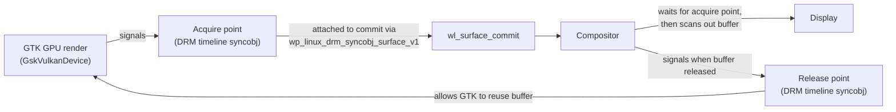

```c
// Pseudocode: GTK GDK Wayland explicit sync attachment
wp_linux_drm_syncobj_surface_v1_set_acquire_point(
    syncobj_surface, acquire_timeline, acquire_point);
wp_linux_drm_syncobj_surface_v1_set_release_point(
    syncobj_surface, release_timeline, release_point);
wl_surface_commit(wl_surface);
```

### 5.5 Damage Tracking and Partial Repaints

The unified GPU renderer (`gsk/gpu/`) tracks dirty regions in the `GskRenderNode` tree across frames. Nodes that have not changed since the last frame are not re-rendered; only dirty subtrees are re-traversed. The resulting damage rectangle is passed to `wl_surface_damage_buffer()` before each commit. On the OpenGL path, the EGL `EGL_KHR_partial_update` extension is used to restrict GL rendering to the dirty region, avoiding redundant fragment shader work outside the updated area. [Source](https://docs.gtk.org/gsk4/class.Renderer.html)

---

## 6. GTK4 Shader Pipeline and CSS GPU Effects

### 6.1 The Unified GPU Renderer's Shader Architecture

The unified renderer in `gsk/gpu/` uses a two-tier shader approach:

1. **Per-node-type shaders** — specialised GLSL programs for common node types (`GskColorNode`, `GskTextureNode`, `GskLinearGradientNode`). These are fast paths that avoid branching overhead.
2. **Ubershader** — a single complex GLSL fragment shader that encodes all node types as integer tokens packed into a GPU-side buffer. The shader interprets the token at runtime to handle arbitrary render-node trees. This eliminates CPU-side draw-call splitting for complex scenes at the cost of more shader complexity.

The shaders are compiled from GLSL sources that live in `gsk/gpu/shaders/` (for the unified renderer). The Vulkan path uses the same GLSL sources but compiles them offline to SPIR-V via `glslang` at build time and stores the SPIR-V in the binary; the OpenGL path compiles GLSL at runtime via the GL driver.

### 6.2 CSS Properties and GPU Shader Passes

CSS visual properties that GTK4 supports map to `GskRenderNode` types and ultimately to GPU operations:

| CSS property | GskRenderNode | GPU effect |
|---|---|---|
| `opacity: 0.5` | `GskOpacityNode` | Alpha blend of child |
| `filter: blur(4px)` | `GskBlurNode` | Gaussian convolution pass |
| `box-shadow: ...` | `GskOutsetShadowNode` / `GskInsetShadowNode` | Blur + translate + blend |
| `background: linear-gradient(...)` | `GskLinearGradientNode` | Gradient shader |
| `border-radius: ...` | `GskRoundedClipNode` | Rounded clip in shader |
| `transform: rotate(45deg)` | `GskTransformNode` | Matrix multiply in vertex shader |
| Custom GL shader (via `GtkGLShaderNode`) | `GskGLShaderNode` | Direct GLSL fragment effect |

`GskBlurNode` is worth examining in detail. The unified renderer implements Gaussian blur as a two-pass separable filter (horizontal pass then vertical pass), rendering into intermediate textures. The blur radius is passed as a uniform; for large radii, the renderer may switch to a lower-resolution downsampled pass to maintain performance.

### 6.3 GskVulkanRenderer: SPIR-V Pipeline

The Vulkan renderer builds `VkPipeline` objects at startup from precompiled SPIR-V. Shaders are compiled from the same GLSL sources used for the GL renderer, with minor Vulkan-specific adjustments (binding model, push constants), and embedded into the GTK binary as byte arrays. The renderer creates `VkDescriptorSetLayout` objects per shader type and allocates `VkDescriptorSet` objects per draw, binding textures and uniform buffers.

Push constants are used for small per-draw constants (transform matrix, colour, opacity) to avoid the overhead of `vkUpdateDescriptorSets()` per node. Larger per-node data arrays (used by the ubershader) are passed via GPU buffers bound as descriptors; the exact descriptor type (uniform buffer or storage buffer) varies by node type and GPU limitations. *(Note: the exact binding strategy for the ubershader's node parameter buffer is an implementation detail — consult the `gsk/gpu/shaders/` sources for the current scheme.)*

### 6.4 GtkGLArea: Custom GL Rendering

`GtkGLArea` is a widget that lets application code render custom OpenGL content while remaining integrated with GTK's frame lifecycle. It creates its own `GdkGLContext` (an EGL context sharing the display with GTK's own GL context) and emits the `render` signal each frame with the context already bound:

```c
// Custom GtkGLArea render handler
static gboolean on_render(GtkGLArea *area, GdkGLContext *context, gpointer user_data)
{
    glClearColor(0.0f, 0.0f, 0.0f, 1.0f);
    glClear(GL_COLOR_BUFFER_BIT);
    // ... custom GL draw calls ...
    return TRUE;  // indicate render was handled
}

// In widget setup:
g_signal_connect(gl_area, "render", G_CALLBACK(on_render), NULL);
gtk_gl_area_set_required_version(GTK_GL_AREA(gl_area), 3, 3);
```

`GtkGLArea` renders into a GTK-managed framebuffer object (FBO), whose colour attachment is then wrapped as a `GdkTexture` and fed into the main render-node tree as a `GskTextureNode`. This allows custom GL content to participate in the compositor's normal damage-tracking and transform pipeline. [Source](https://docs.gtk.org/gtk4/class.GLArea.html)

When GTK4 is using the Vulkan renderer, `GtkGLArea` still uses OpenGL; the resulting texture is shared via `EGL_KHR_gl_image`/dmabuf to cross the API boundary.

---

## 7. Font and Text Rendering: FreeType, HarfBuzz, and Glyph Atlases

### 7.1 The Shared Text Rendering Stack

Both Qt and GTK4 rest on the same underlying text-rendering foundations, though they layer differently on top:

```
Application text (Unicode string)
         │
         ▼
HarfBuzz (shaping: cluster analysis, OpenType feature application,
          ligature substitution, bidirectional ordering)
         │
         ▼
FreeType (glyph rasterisation: outline → bitmap at a given size and hinting mode)
         │
         ▼
Fontconfig (font discovery and matching: family → font file + face index)
         │
         ▼
Glyph atlas texture (GPU texture holding rendered glyph bitmaps or
                     signed-distance-field encodings)
         │
         ▼
GPU quad per glyph (vertex: position, texture coordinate; fragment: atlas sample)
```

**HarfBuzz** performs OpenType text shaping: given a Unicode string, a font, and a language/script tag, it returns a list of `hb_glyph_info_t` records (glyph IDs and cluster indices) and `hb_glyph_position_t` records (advance widths, kerning offsets). [Source](https://harfbuzz.github.io) This resolves ligatures (`fi`, `ffi`), applies mark positioning (diacritics), handles bidirectional text (Arabic, Hebrew interleaved with Latin), and applies OpenType features such as small capitals or tabular numerals.

**FreeType** rasterises individual glyphs from the shaped list at the required point size and subpixel offset. The primary rendering modes relevant here are:

- `FT_RENDER_MODE_NORMAL` — 8-bit greyscale anti-aliasing.
- `FT_RENDER_MODE_LCD` / `FT_RENDER_MODE_LCD_V` — subpixel rendering for RGB stripe LCD panels; activates `FT_LCD_FILTER_*` convolution to reduce colour fringing.
- `FT_RENDER_MODE_SDF` — signed-distance-field output for GPU SDF rendering.

**Fontconfig** maps font family names (e.g. `"Noto Sans"`) and properties (weight, width, slant) to font files and face indices on disk, with per-user and system-wide font directories. Both Qt and GTK use Fontconfig on Linux.

### 7.2 Qt: QSGDistanceFieldGlyphCache

Qt Quick renders text using **signed distance field (SDF)** glyphs, which are resolution-independent representations stored in a GPU texture atlas. The `QSGDistanceFieldGlyphCache` (in `qtdeclarative/src/quick/scenegraph/`) manages this atlas. [Source](https://doc.qt.io/qt-6/qtdistancefieldgenerator-index.html)

For each glyph needed in the scene, the cache:

1. Rasterises the glyph at a fixed internal resolution via FreeType (the exact size is configurable; Qt's default produces a glyph texture suitable for use across a range of display sizes).
2. Converts the rasterised bitmap to a signed-distance-field representation, where each texel stores the signed distance to the nearest glyph edge (positive inside, negative outside).
3. Packs the SDF glyph into a 2D atlas texture (one or more `GL_RED` / `VK_FORMAT_R8_UNORM` single-channel textures).
4. At render time, each text character is a GPU quad sampling the atlas; the fragment shader thresholds the SDF value to reconstruct the glyph edge at arbitrary scale and rotation without aliasing.

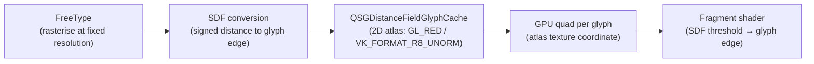

The key advantage of SDF glyphs is that a single atlas entry works across a wide range of font sizes: a single SDF glyph can render crisply at small or large sizes by adjusting the threshold value. This is in contrast to bitmap glyph caches, which require a separate rasterisation per size and subpixel shift.

For applications rendering large amounts of static text at a known size, the **Qt Distance Field Generator** tool (`qtdistancefieldgenerator`) pre-generates the atlas, avoiding the first-frame rasterisation cost at application startup.

### 7.3 GTK4: Pango and the Glyph Cache

GTK4 uses **Pango** as its text layout engine. Pango wraps FreeType and HarfBuzz:

1. `pango_itemize()` breaks a paragraph into `PangoItem` runs (one run per font / script / direction combination).
2. `pango_shape_full()` calls HarfBuzz to shape each run, producing a `PangoGlyphString` with glyph IDs and positions.
3. A `PangoLayout` assembles the shaped runs into lines with word wrapping and bidirectional reordering.

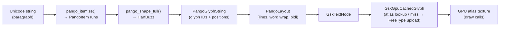

When a renderer encounters a `GskTextNode`, it looks up each glyph in a GPU glyph cache backed by a texture atlas. The implementation differs by renderer generation:

**Legacy `GskGLRenderer`** (pre-4.14, `gsk/gl/`): used `GskGlGlyphLibrary`, which rasterised glyphs to bitmap at the exact requested size and subpixel shift via FreeType, then uploaded them via `glTexSubImage2D()`. Each `(glyph_id, scale, subpixel_shift)` triple got its own atlas slot in a `GL_RGBA` texture using a shelf allocator. Unlike Qt's SDF approach, this was a per-size bitmap cache.

**Unified GPU renderer** (GTK 4.14+, `gsk/gpu/`): glyph caching is handled by `GskGpuCachedGlyph` objects within the shared `GskGpuCache`. Text nodes store raw glyph records that are looked up in the cache; on a miss, glyphs are rendered via Pango/FreeType and uploaded as atlas tiles. The cache manages eviction of stale glyphs and atlas compaction. [Source](https://blogs.gnome.org/gtk/2024/01/28/new-renderers-for-gtk/)

At the time of writing, the Glyphy approach (GPU-side arc-segment SDF encoding) was explored as an experimental direction for GTK's GPU text path [Source](https://blogs.gnome.org/chergert/2022/03/20/rendering-text-with-glyphy/) but is not the shipping default; the unified renderer uses CPU-rasterised bitmap glyphs uploaded to GPU atlas textures.

### 7.4 Subpixel Rendering and Compositor Compositing

Subpixel (LCD) font rendering — where the red, green, and blue LCD strips are addressed independently to triple horizontal resolution — interacts problematically with alpha-compositing. A composited layer carrying subpixel-rendered text must be composited onto a known background colour; compositing a subpixel layer onto an unknown or transparent background produces incorrect colour fringing.

For this reason, both Qt and GTK4 disable subpixel rendering for composited text layers under a Wayland compositor (where every window is alpha-composited). Greyscale anti-aliasing (`FT_RENDER_MODE_NORMAL`) is used instead, which composes correctly as a single-channel alpha value.

On X11 with a compositing manager that knows the background colour, subpixel rendering may be enabled via FreeType's `FT_LCD_FILTER_DEFAULT` mode and Fontconfig's `rgba` and `lcdfilter` settings.

### 7.5 Colour Emoji

COLRv1 (OpenType color fonts, version 1), CBDT (colour bitmap), and sbix fonts carry per-glyph colour information in multiple layers. HarfBuzz 2.x+ supports colour font rendering via `hb_ot_color_*` APIs, and both Qt (via `QFontEngine::glyphImage()`) and GTK4 (via Pango/Cairo's COLR support) render colour glyphs as RGBA textures, which are then placed in the atlas or submitted as individual textures per glyph.

For COLRv1 specifically, which supports gradients, compositing operations, and affine transforms per layer, correct rendering requires either full vector processing per glyph (expensive) or pre-rasterisation at a fixed size to an RGBA texture (the common approach in both toolkits). HarfBuzz's `hb_paint_*` callback API (added in HarfBuzz 7.0) allows renderers to implement COLRv1 layer traversal.

### 7.6 Fontconfig Integration

Fontconfig (`libfontconfig`) is the font discovery and matching layer used by both toolkits on Linux. The matching pipeline is:

1. An application specifies a font request as an `FcPattern` (family, size, weight, slant, etc.).
2. `FcFontSort()` or `FcFontMatch()` searches the Fontconfig cache (built by `fc-cache`) and returns a sorted list of matching `FcPattern` objects with the actual font file path and face index.
3. FreeType opens the font file at the matched path; HarfBuzz wraps the FreeType face with `hb_ft_face_create()`.

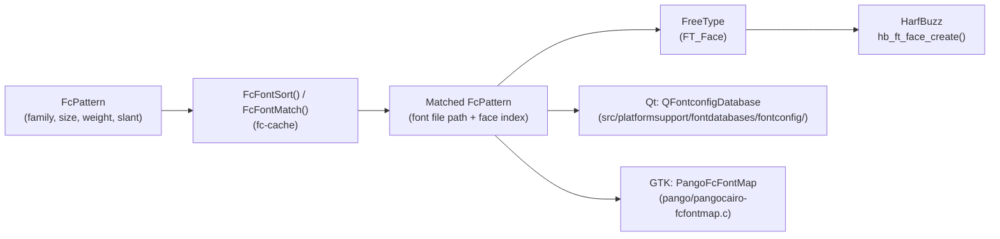

Qt uses Fontconfig via `QFontconfigDatabase` (in `src/platformsupport/fontdatabases/fontconfig/`). GTK uses Fontconfig through Pango's `PangoFcFontMap` (in `pango/pangocairo-fcfontmap.c`). Both maintain a cache of open `FT_Face` objects to avoid repeated font file I/O.

---

## 8. WebKitGTK: Embedding Web Content in GTK Applications

**WebKitGTK** is the GTK port of the WebKit browser engine — the same engine that powers Safari on macOS and iOS. On Linux it is the primary mechanism for embedding live web content (HTML, CSS, JavaScript) inside a native GTK application. Its most prominent consumers are **GNOME Web** (Epiphany, the default GNOME browser), **Geary** (email HTML rendering), **Evolution** (email/calendar), and **Liferea** (RSS). It is also the rendering engine used by **Tauri** on Linux via the Wry crate (Ch193).

Understanding WebKitGTK completes the GTK4 rendering picture: the `WebKitWebView` widget that an application embeds is, from GTK4's perspective, an ordinary `GtkWidget` node in the widget tree — but behind that widget lies a full multi-process browser stack with its own GPU compositor, its own EGL context, and its own path to the Wayland display server, largely independent of GSK.

### 8.1 API Versions: webkit2gtk-4.1 vs webkitgtk-6.0

WebKitGTK ships under two distinct API series that differ in both GTK version and network library:

| Package | GTK version | Network library | WebKit API namespace | Use case |
|---|---|---|---|---|
| `webkit2gtk-4.0` | GTK3 | libsoup2 | `WebKit2` | Legacy; deprecated |
| `webkit2gtk-4.1` | GTK3 | libsoup3 | `WebKit2` | Current GTK3 target; Tauri 2.0 |
| `webkitgtk-6.0` | GTK4 | libsoup3 | `WebKit` | Modern GTK4 applications |

The `4.x` in `webkit2gtk-4.1` is a WebKit API soname version, not the GTK version. GTK3 applications — including Tauri via Tao — must use `webkit2gtk-4.1`. GTK4 applications such as GNOME Web 45+ use `webkitgtk-6.0`. The underlying WebCore layout engine and JavaScriptCore are identical between these packages; the difference is only in the GTK widget integration layer and the GObject type hierarchy.

On-disk the packages install different shared libraries and pkg-config names:
```bash
# GTK3 / webkit2gtk-4.1
pkg-config --libs webkit2gtk-4.1
# → -lwebkit2gtk-4.1 -ljavascriptcoregtk-4.1

# GTK4 / webkitgtk-6.0
pkg-config --libs webkitgtk-6.0
# → -lwebkitgtk-6.0 -ljavascriptcoregtk-6.0
```

Both libraries can be installed simultaneously on the same system; they do not conflict.

### 8.2 The WebKit2 Multi-Process Architecture

WebKitGTK uses the **WebKit2** multi-process model, which isolates untrusted web content from the application process:

```
┌─────────────────────────────────────────────────────┐
│  UI Process (the GTK application)                    │
│  WebKitWebView widget ← GTK4 widget tree → GSK      │
│  WebKitWebContext  WebKitCookieManager               │
│  WebKitUserContentManager                            │
└──────────────────┬──────────────────────────────────┘
                   │  WebKit IPC (Unix domain socket)
       ┌───────────┴──────────────┐
       │                          │
       ▼                          ▼
┌─────────────────┐   ┌───────────────────────────────┐
│  Network Process │   │  Web Content Process           │
│  libsoup3 HTTP   │   │  WebCore: HTML/CSS layout      │
│  DNS, TLS        │   │  JavaScriptCore: JIT + WASM    │
│  Cache, cookies  │   │  WebKit threaded compositor    │
└─────────────────┘   │  EGL context → Mesa GL ES      │
                       │  → offscreen GBM surface       │
                       └───────────────────────────────┘
```

The **UI Process** is the GTK application itself. It hosts the `WebKitWebView` widget and all application-level APIs (`WebKitSettings`, `WebKitUserContentManager`, `WebKitCookieManager`). It never executes web content.

The **Web Content Process** (`WebKitWebProcess`) is spawned automatically when a `WebKitWebView` is created. It runs WebCore (HTML parsing, CSS cascade, layout, paint) and JavaScriptCore (a tiered JIT compiler for JavaScript and WebAssembly). Critically, it also runs **WebKit's threaded compositor** — a background thread that assembles the painted layer tree into a composited GPU frame using OpenGL ES.

The **Network Process** (introduced in WebKitGTK 2.26) handles all network I/O: HTTP/HTTPS via libsoup3, DNS resolution, TLS certificate validation, and the HTTP cache. Isolating it means a compromised web page cannot directly observe or modify network traffic.

The three processes communicate via **WebKit's internal IPC layer** (Unix domain sockets with structured message serialisation), which is entirely separate from the Wayland protocol or GTK's event loop.

### 8.3 GPU Rendering in the Web Content Process

WebKit's threaded compositor renders web page content into an **offscreen GPU surface** inside the Web Content Process. This is the key architectural point: the GPU commands for web content are issued entirely within the Web Content Process, not in the UI process that owns the GTK widget.

The rendering path inside the Web Content Process:

```
WebCore paint() — display list
  │
WebKit Threaded Compositor
  │  layer tree → composited frame
  │  CSS transforms, animations, filters applied as GL operations
  ▼
OpenGL ES 3.0 via EGL (Mesa GLES state tracker)
  │  eglCreateContext(EGL_PLATFORM_WAYLAND_KHR, ...)
  │  render into offscreen EGLImage backed by GBM buffer object
  ▼
GBM buffer object (DRM GEM)
  │
DMA-BUF file descriptor
  │  sent to UI process via WebKit IPC socket
  ▼
UI Process: WebKitWebView widget
```

The EGL context is created against `EGL_PLATFORM_WAYLAND_KHR` pointing to the user-session `wl_display`. The Web Content Process is **not** a Wayland client — it does not own a `wl_surface`. It renders into a GBM-backed offscreen surface and exports the result as a DMA-BUF fd via `gbm_bo_get_fd()`, then sends that fd to the UI process over the WebKit IPC socket.

> **Important**: The web content renderer uses **OpenGL ES via Mesa's GL state tracker** — not Vulkan, and not ANGLE. Unlike Chromium (which routes WebGL through ANGLE's GL-ES-to-Vulkan translation), WebKitGTK calls Mesa's OpenGL ES API directly. On AMD hardware this goes to `radeonsi`'s OpenGL state tracker; on Intel to `iris`; on NVIDIA to `nouveau` or the proprietary driver. The Vulkan path in webkitgtk-6.0 is under development upstream but not yet the default as of mid-2026.

### 8.4 Displaying Web Content in the GTK Widget: GskTextureNode

Once the DMA-BUF fd arrives in the UI process, the `WebKitWebView` widget presents it to GTK4's rendering pipeline as a `GskTextureNode` — the same node type used by `GtkGLArea` (§4) and `GskSubsurfaceNode`:

```
UI Process receives DMA-BUF fd from Web Content Process
  │
  │  EGL import: eglCreateImageKHR(EGL_LINUX_DMA_BUF_EXT, ...)
  ▼
GdkTexture backed by EGLImage (or VkImage with external memory on Vulkan GTK path)
  │
GskTextureNode inserted into GSK render tree by WebKitWebView::snapshot()
  │
GskRenderer (GskVulkanRenderer or GskNglRenderer)
  │  composites WebKitWebView texture alongside other GTK4 widgets
  ▼
wl_surface::commit → Wayland compositor → KMS → display
```

With `webkitgtk-6.0` and GTK 4.14+, the `WebKitWebView` can produce a `GskSubsurfaceNode` instead of a `GskTextureNode` when the Wayland compositor supports the `wp_linux_drm_syncobj_v1` explicit-sync protocol (§5). In that mode, the WebKit surface is assigned a Wayland subsurface by GTK, allowing it to be promoted by the compositor to a KMS overlay plane — the same zero-copy scanout path described in Ch45 for terminal emulators.

### 8.5 The Key C API

**Creating and embedding a WebView** (webkitgtk-6.0 / GTK4):

```c
#include <webkit/webkit.h>

/* A WebKitWebContext manages shared state across WebViews */
WebKitWebContext *ctx = webkit_web_context_new();

/* Enable the seccomp-based sandbox for the Web Content Process */
webkit_web_context_set_sandbox_enabled(ctx, TRUE);

/* Create a WebView — it is a GtkWidget */
WebKitWebView *view = WEBKIT_WEB_VIEW(
    webkit_web_view_new_with_context(ctx));

/* Add directly to the GTK4 widget tree */
gtk_box_append(GTK_BOX(box), GTK_WIDGET(view));

/* Load content */
webkit_web_view_load_uri(view, "https://gnome.org/");
```

`WebKitWebView` derives from `GtkWidget` in `webkitgtk-6.0`, so standard GTK4 layout APIs apply: `gtk_box_append()`, `gtk_grid_attach()`, `gtk_widget_set_hexpand()`, and so on.

**Configuring rendering behaviour** via `WebKitSettings`:

```c
WebKitSettings *settings = webkit_web_view_get_settings(view);

/* Force GPU accelerated compositing (default: ALWAYS on desktop) */
webkit_settings_set_hardware_acceleration_policy(settings,
    WEBKIT_HARDWARE_ACCELERATION_POLICY_ALWAYS);

/* Disable JavaScript for a static content viewer */
webkit_settings_set_enable_javascript(settings, FALSE);

/* Enable WebGL */
webkit_settings_set_enable_webgl(settings, TRUE);

/* Zoom factor (1.0 = 100%) */
webkit_settings_set_zoom_text_only(settings, FALSE);
webkit_web_view_set_zoom_level(view, 1.25);
```

**Injecting JavaScript and receiving messages** via `WebKitUserContentManager`:

```c
WebKitUserContentManager *mgr =
    webkit_web_view_get_user_content_manager(view);

/* Register a message handler: JS calls window.webkit.messageHandlers.myapp.postMessage(...) */
webkit_user_content_manager_register_script_message_handler(mgr, "myapp", NULL);

g_signal_connect(mgr, "script-message-received::myapp",
    G_CALLBACK(on_message_received), NULL);

/* Inject a script that runs at document start */
WebKitUserScript *script = webkit_user_script_new(
    "window.myAppVersion = '1.0';",
    WEBKIT_USER_CONTENT_INJECT_ALL_FRAMES,
    WEBKIT_USER_SCRIPT_INJECT_AT_DOCUMENT_START,
    NULL, NULL);
webkit_user_content_manager_add_script(mgr, script);
webkit_user_script_unref(script);
```

**Cookie and private browsing management**:

```c
/* Default persistent context */
WebKitCookieManager *cookies =
    webkit_web_context_get_cookie_manager(ctx);
webkit_cookie_manager_set_persistent_storage(cookies,
    "/home/user/.local/share/myapp/cookies.db",
    WEBKIT_COOKIE_PERSISTENT_STORAGE_SQLITE);

/* Ephemeral (private) context — no on-disk storage */
WebKitWebContext *private_ctx =
    webkit_web_context_new_ephemeral();
WebKitWebView *private_view = WEBKIT_WEB_VIEW(
    webkit_web_view_new_with_context(private_ctx));
```

**Custom URI scheme handler** — serve application assets without a network server:

```c
webkit_web_context_register_uri_scheme(ctx, "app",
    uri_scheme_request_cb, NULL, NULL);

static void uri_scheme_request_cb(WebKitURISchemeRequest *request,
                                   gpointer user_data) {
    const char *path = webkit_uri_scheme_request_get_path(request);
    GBytes *data = load_asset(path);  /* application-defined */
    GInputStream *stream = g_memory_input_stream_new_from_bytes(data);
    webkit_uri_scheme_request_finish(request, stream,
        g_bytes_get_size(data), "text/html");
    g_object_unref(stream);
    g_bytes_unref(data);
}
```

### 8.6 Security: Sandboxing the Web Content Process

WebKitGTK supports sandboxing the Web Content Process via **bubblewrap** (`bwrap`) and **seccomp-BPF** when `webkit_web_context_set_sandbox_enabled(ctx, TRUE)` is set. The sandbox:

- Uses Linux namespaces (`CLONE_NEWUSER`, `CLONE_NEWNS`, `CLONE_NEWNET`) to isolate the process from the host filesystem and network stack.
- Applies a seccomp-BPF syscall allowlist restricting the Web Content Process to a whitelist of syscalls needed for rendering.
- Allows only the DRM render node (`/dev/dri/renderD128`) through bind-mounting, not the DRM master node.

The sandbox model is less strict than Chromium's (Ch33): there is no GPU process boundary — the Web Content Process holds the EGL context directly. A GPU exploit in the Web Content Process can call arbitrary GL commands, though the seccomp filter prevents most kernel escape routes.

GNOME Web enables the sandbox by default. Applications embedding WebKitGTK in security-sensitive contexts (browser, email client with remote images) should enable it; applications embedding only trusted local content (app help pages, changelogs) may omit it at the cost of a simpler deployment.

### 8.7 GNOME Web (Epiphany): Reference Consumer

**GNOME Web** (`gnome-web`, package `epiphany-browser`) is the reference GTK4 application embedding `webkitgtk-6.0`. Its architecture illustrates patterns applicable to any GTK4+WebKit application:

- `EphyEmbed` wraps a `WebKitWebView` in a container widget that adds a progress bar, find toolbar, and status overlay — all standard GTK4 widgets composited alongside the WebKit surface via GSK.
- **Tab management**: each tab owns a separate `WebKitWebView` instance sharing a common `WebKitWebContext`. This means cookies, localStorage, and the HTTP cache are shared across tabs, but each tab has an independent Web Content Process.
- **Web Extensions**: GNOME Web supports WebKit web extensions — shared libraries loaded into the Web Content Process at startup via `webkit_web_context_set_web_process_extensions_directory()`. Extensions can intercept DOM events, inject scripts, and communicate back to the UI process via GDBus.
- **GNOME 45+ migration**: GNOME Web 45 (2023) completed the migration from `webkit2gtk-4.1` (GTK3) to `webkitgtk-6.0` (GTK4), taking advantage of GTK4's `GskSubsurfaceNode` for zero-copy WebKit surface presentation and the improved fractional scaling support in `GdkWaylandSurface`.

### 8.8 WPE: WebKitGTK Without GTK

**WPE WebKit** (`wpe-webkit`) is the embedded port of WebKit that removes the GTK dependency entirely. Where WebKitGTK uses GTK widgets for window management and Cairo/GSK for displaying the composited WebKit surface, WPE renders directly to a GBM surface or DMA-BUF buffer and submits it to whatever display system is present — DRM/KMS directly, a Wayland compositor, or a custom EGL compositor.

```
WPE architecture on embedded Linux:
  WebCore + JSC + WPE compositor
    │  GL ES → GBM buffer → DMA-BUF
    ▼
  wpe-backend-fdo (Wayland) or wpe-backend-drm (direct KMS)
    │
  Wayland compositor or DRM atomic commit
    │
  Display
```

WPE is targeted at:
- **Automotive HMI** (no desktop compositor; full-screen WebKit surface scanned out via KMS)
- **Smart TV / set-top-box** (STB) UIs
- **Kiosk displays**
- **Embedded IoT** displays

From a graphics stack perspective WPE is simpler than WebKitGTK: there is no GTK rendering pipeline, no GSK compositor, no `GdkWaylandSurface` — just WebKit's own GL compositor writing to a GBM buffer and handing it directly to the display system. This makes WPE architecturally closer to a standalone browser process (like Chrome's GPU process) than to an embeddable widget.

For desktop application developers, WPE is generally not the right choice — it provides no window management, no native dialogs, and no system tray. The Tauri project tracks a WPE backend for Wry as a long-term goal for embedded Linux targets (Ch193 §13).

---

## Roadmap

### Near-term (6–12 months)

- **Qt 6.12 indirect rendering and `VK_EXT_device_fault`**: Qt 6.12 (beta as of June 2026, targeting September 2026 release) adds indirect rendering support for `QRhi`, allowing GPU-driven draw calls via indirect draw buffers, and exposes Vulkan's `VK_EXT_device_fault` extension for improved GPU crash diagnostics. [Source](https://www.phoronix.com/news/Qt-6.12-Beta-1)
- **Qt 6.12 QRhi Direct3D 12 graduation**: The D3D12 `QRhi` backend, added in Qt 6.6, is expected to become the default Windows backend in Qt 6.12, replacing D3D11; variable-rate shading support across D3D12, Vulkan, and Metal was already added in Qt 6.9. [Source](https://doc.qt.io/qt-6/whatsnew69.html)
- **GTK 4.21+ GSK renderer refactoring**: GTK 4.21.x (in-development trunk) includes significant GSK renderer refactoring to close gaps in rendering infrastructure required for full SVG filter support, targeting COLRv1 and CSS `filter` effects that are currently partial or absent in the GPU path. [Source](https://discourse.gnome.org/t/gtk-planning-call-minutes-for-2026-04-24/34806)
- **GTK `GskSubsurfaceNode` stabilisation**: The `GskSubsurfaceNode` type (used for Wayland subsurfaces and video overlays) introduced in GTK 4.14 is undergoing bug-fixing for hole-handling regressions; stabilisation is expected before GTK 4.22. Note: needs verification for exact milestone.
- **webkitgtk-6.0 Vulkan compositor**: WebKit's web content GL compositor (currently OpenGL ES / Mesa only) has an upstream work-in-progress branch exploring a Vulkan render path for the threaded compositor, which would allow the Web Content Process to export frames as Vulkan external memory objects rather than DMA-BUF EGLImages. Not yet merged as of mid-2026. Note: needs verification for current upstream status.
- **Qt Quick XR and multiview by default**: Qt Quick 3D XR's use of multiview rendering (added in Qt 6.8) is being expanded to 2D AR glass targets via the Qt 6.12 XR module; this exercises `QRhi`'s `MultiView` feature flag on Vulkan 1.1+. [Source](https://www.phoronix.com/news/Qt-6.12-Beta-1)

### Medium-term (1–3 years)

- **GTK5 API planning**: GTK developers are actively identifying which features require API breaks for a future GTK5, with rendering architecture changes (possible re-evaluation of `GskRenderNode` hierarchy, CSS engine integration, and potential Vulkan 1.2+ baseline) among the topics under discussion. [Source](https://blogs.gnome.org/gtk/2026/02/06/gtk-hackfest-2026-edition/)
- **GTK unstable/experimental API opt-in**: A proposal under discussion would allow GTK to ship unstable renderer APIs behind an opt-in flag, enabling faster iteration on GPU path experimentation (e.g., mesh shader support, `VK_EXT_descriptor_buffer`) without breaking the stable ABI. [Source](https://www.phoronix.com/news/GTK-2026-Planning-FOSDEM)
- **Qt QRhi mesh shader support**: Qt's longer-term QRhi roadmap includes mesh and task shader exposure (analogous to `VK_EXT_mesh_shader` / D3D12 amplification shaders) for Qt Quick 3D GPU-driven geometry, currently tracked but not yet scheduled for a specific release. Note: needs verification for current tracking status.
- **`wp_color_management_v1` integration in both toolkits**: The Wayland colour-management protocol (`wp_color_management_v1`), standardised in 2025, is expected to be wired into `GdkWaylandSurface` (GTK) and `QWaylandWindow` (Qt) to enable HDR surface submission with correct ICC profile metadata, a prerequisite for HDR-capable desktop applications on Linux.
- **HarfBuzz COLRv1 full vector path in GTK**: GTK's unified GPU renderer currently pre-rasterises COLRv1 colour glyphs to RGBA textures; a medium-term goal is to implement the full `hb_paint_*` vector traversal path in the GSK renderer, reducing rasterisation artefacts at large display sizes.

### Long-term

- **Full GPU-driven scene graph in Qt Quick**: Longer-term speculation in the Qt community centres on replacing Qt Quick's current batch-and-sort renderer with a fully GPU-driven architecture using indirect draw, bindless resources, and persistent command buffers — analogous to what id Tech 7 / Unreal 5 do in games. This would require a `QRhi` redesign at the command-buffer level. Note: needs verification; no public RFC exists as of mid-2026.
- **GTK Vulkan 1.2+ baseline and timeline semaphores**: As GPU driver Vulkan coverage matures, GTK may raise its minimum Vulkan requirement from 1.0 to 1.2, enabling use of timeline semaphores natively (rather than the `VK_KHR_timeline_semaphore` extension shim) and improving pipelining between the toolkit, the Wayland compositor, and KMS. Note: needs verification for specific planning status.
- **Convergence of font rendering to SDF-first**: Both Qt (via `QSGDistanceFieldGlyphCache`) and GTK (via future GSK renderer work) may converge on SDF-first text rendering for all glyph sizes, eliminating the current size-threshold heuristics and enabling resolution-independent text at any zoom level, particularly relevant for XR and high-DPI displays.
- **Wayland `ext_image_copy_capture` for toolkit screenshot APIs**: The proposed `ext_image_copy_capture` Wayland protocol (successor to `zwlr_screencopy`) would allow toolkits to expose screenshot and screen-capture APIs without compositor cooperation, affecting how both GTK and Qt implement accessibility and remote-desktop features. Note: needs verification for protocol ratification status.

---

## Integrations

This chapter is part of a broader narrative about how GPU work flows from application to display. Key related chapters:

- **Chapter 14 (NIR — Mesa Intermediate Representation)**: The GTK4 Vulkan renderer submits SPIR-V shaders that Mesa's Vulkan drivers compile through NIR. Understanding NIR illuminates how GTK's ubershader is optimised by the driver.

- **Chapter 16 (Mesa Vulkan Common Infrastructure)**: `GskVulkanDevice` calls into Mesa's Vulkan common infrastructure for `VkDevice` creation, memory allocation, and queue management. The `vulkan/wsi/wsi_common_wayland.c` path in Mesa handles the `VK_KHR_wayland_surface` extension used by both Qt and GTK.

- **Chapter 20 (Wayland Protocol Fundamentals)**: The `wl_surface`, `wl_surface_commit`, `wl_callback` (frame callbacks), and `wp_presentation` protocols described in that chapter are the low-level mechanisms that both `QWaylandWindow` and `GdkWaylandSurface` use to submit rendered frames to the compositor.

- **Chapter 24 (Vulkan and EGL for Application Developers)**: The `VkSwapchainKHR` creation, presentation, and synchronisation patterns covered there are exactly what `QRhiVulkan` and `GskVulkanDevice` implement internally. Reading Chapter 24 alongside this chapter shows both the public API and the toolkit-level implementation.

- **Chapter 46 (Wayland Protocol Ecosystem — Extended Protocols)**: The `wp_linux_drm_syncobj_v1` protocol implemented in GTK 4.16 is analysed in depth in that chapter, covering the DRM timeline syncobj kernel interface and the protocol wire format.

- **Chapter 47 (Font and Text Rendering)**: The FreeType, HarfBuzz, and Fontconfig stack described in Section 7 of this chapter is covered end-to-end in Chapter 47, including OpenType layout engine internals, `hb_paint_*` COLRv1 support, and Fontconfig's cache invalidation protocol.

- **Chapter 61 (SPIR-V Ecosystem)**: The `qsb` tool's SPIR-V output, Qt's use of `glslang` and `SPIRV-Cross`, and GTK's offline SPIR-V compilation for the Vulkan renderer are all part of the SPIR-V toolchain ecosystem described in Chapter 61.

- **Chapter 193 (Tauri and WebKitGTK Desktop Applications)**: Section 8 of this chapter describes WebKitGTK as embedded widget technology. Chapter 193 covers the next layer up: the Tauri application framework, which uses `webkit2gtk-4.1` via the Wry and Tao crates to build cross-platform Rust desktop applications with a WebKit-rendered frontend and a native Rust backend connected via a JavaScript IPC bridge.

---

## References

- Qt QRhi documentation: [https://doc.qt.io/qt-6/qrhi.html](https://doc.qt.io/qt-6/qrhi.html)
- Qt Quick Scene Graph documentation: [https://doc.qt.io/qt-6/qtquick-visualcanvas-scenegraph.html](https://doc.qt.io/qt-6/qtquick-visualcanvas-scenegraph.html)
- Qt Quick Scene Graph Default Renderer (backend selection): [https://doc.qt.io/qt-6/qtquick-visualcanvas-scenegraph-renderer.html](https://doc.qt.io/qt-6/qtquick-visualcanvas-scenegraph-renderer.html)
- Qt Shader Tools / qsb manual: [https://doc.qt.io/qt-6/qtshadertools-qsb.html](https://doc.qt.io/qt-6/qtshadertools-qsb.html)
- QSGMaterialShader documentation: [https://doc.qt.io/qt-6/qsgmaterialshader.html](https://doc.qt.io/qt-6/qsgmaterialshader.html)
- Qt Wayland / qtwayland source: [https://github.com/qt/qtwayland](https://github.com/qt/qtwayland)
- QWaylandPresentationTime: [https://doc.qt.io/qt-6/qwaylandpresentationtime.html](https://doc.qt.io/qt-6/qwaylandpresentationtime.html)
- GTK blog: New renderers for GTK (January 2024): [https://blogs.gnome.org/gtk/2024/01/28/new-renderers-for-gtk/](https://blogs.gnome.org/gtk/2024/01/28/new-renderers-for-gtk/)
- GTK 4.16 Vulkan default: Phoronix coverage: [https://www.phoronix.com/news/GTK-4.16-Released](https://www.phoronix.com/news/GTK-4.16-Released)
- GTK Running and Debugging: [https://docs.gtk.org/gtk4/running.html](https://docs.gtk.org/gtk4/running.html)
- GskRenderNode documentation: [https://docs.gtk.org/gsk4/class.RenderNode.html](https://docs.gtk.org/gsk4/class.RenderNode.html)
- GtkSnapshot documentation: [https://docs.gtk.org/gtk4/class.Snapshot.html](https://docs.gtk.org/gtk4/class.Snapshot.html)
- GtkGLArea documentation: [https://docs.gtk.org/gtk4/class.GLArea.html](https://docs.gtk.org/gtk4/class.GLArea.html)
- GTK Wayland documentation: [https://docs.gtk.org/gtk4/wayland.html](https://docs.gtk.org/gtk4/wayland.html)
- wp_linux_drm_syncobj_v1 protocol: [https://wayland.app/protocols/linux-drm-syncobj-v1](https://wayland.app/protocols/linux-drm-syncobj-v1)
- Glyphy text rendering: [https://blogs.gnome.org/chergert/2022/03/20/rendering-text-with-glyphy/](https://blogs.gnome.org/chergert/2022/03/20/rendering-text-with-glyphy/)
- Qt Distance Field Generator: [https://doc.qt.io/qt-6/qtdistancefieldgenerator-index.html](https://doc.qt.io/qt-6/qtdistancefieldgenerator-index.html)
- HarfBuzz documentation: [https://harfbuzz.github.io](https://harfbuzz.github.io)
- GTK graphics architecture (Pango): [https://www.gtk.org/docs/architecture/pango](https://www.gtk.org/docs/architecture/pango)
- GSK API reference: [https://docs.gtk.org/gsk4/](https://docs.gtk.org/gsk4/)

---

*Copyright © 2026 jreuben11. Licensed under [CC BY 4.0](https://creativecommons.org/licenses/by/4.0/).*
