# Chapter 39: Qt and GTK GPU Rendering

> **Part**: Part VII — Application APIs & Middleware
> **Audience**: Graphics application developers building desktop applications with Qt6 or GTK4 who want to understand how their toolkit's GPU rendering pipeline maps to the Vulkan and Wayland stack; systems developers who need to trace how application-level rendering reaches the compositor
> **Status**: First draft — 2026-06-18

## Table of Contents

- [Overview](#overview)
- [1. Qt6 Rendering Architecture: QRhi and Scene Graph](#1-qt6-rendering-architecture-qrhi-and-scene-graph)
- [2. Qt Wayland Integration and Swapchain](#2-qt-wayland-integration-and-swapchain)
- [3. Qt Shader Pipeline: qsb and SPIR-V](#3-qt-shader-pipeline-qsb-and-spir-v)
- [4. GTK4 Rendering Architecture: GskRenderer](#4-gtk4-rendering-architecture-gskrenderer)
- [5. GTK4 Wayland Integration and Explicit Sync](#5-gtk4-wayland-integration-and-explicit-sync)
- [6. GTK4 Shader Pipeline and CSS GPU Effects](#6-gtk4-shader-pipeline-and-css-gpu-effects)
- [7. Font and Text Rendering: FreeType, HarfBuzz, and Glyph Atlases](#7-font-and-text-rendering-freetype-harfbuzz-and-glyph-atlases)
- [Integrations](#integrations)
- [References](#references)

---

## Overview

Qt6 and GTK4 are the two dominant GUI toolkit families on Linux. Between 2020 and 2022, both underwent major GPU-rendering rearchitectures that replaced legacy CPU-bound paths with modern graphics API abstractions. Understanding those rearchitectures is essential for any developer tracing how an application frame is produced, submitted to the compositor, and ultimately scanned out to the display.

Qt6 introduced the **QRhi** (Rendering Hardware Interface), a portable abstraction layer that sits above Vulkan, OpenGL ES, Metal, and Direct3D 11. The Qt Quick scene graph, which drives QML rendering, uses QRhi exclusively; every draw call goes through QRhi's command buffer API rather than directly touching the underlying graphics API. This gives Qt applications a single code path that can target Vulkan on a high-end Linux workstation or OpenGL ES on an embedded board, without touching application-level shader code.

GTK4 replaced GTK 3's Cairo-based `GdkWindow` drawing model with a two-stage architecture: widget code no longer paints directly onto a surface but instead calls snapshot APIs that build a tree of immutable **GskRenderNode** objects. A separate **GskRenderer** then traverses that tree and issues GPU commands. GTK 4.14 (released early 2024) introduced a unified GPU renderer (`gsk/gpu/`) that shares sources between its OpenGL and Vulkan back-ends; GTK 4.16 (September 2024) promoted the Vulkan renderer to the default on Wayland systems with capable drivers, while the NGL renderer (modern OpenGL) remains the default on X11 and fallback platforms. [Source](https://blogs.gnome.org/gtk/2024/01/28/new-renderers-for-gtk/)

For application developers, the practical impact is twofold. First, GPU acceleration is now automatic: both toolkits route their scene graph through hardware-accelerated paths without any OpenGL boilerplate in application code. Second, the rendering path from application frame to KMS page-flip is now longer and more structured than in the GTK 3 / Qt 5 era. A system developer tracing a frame submitted by a Qt Quick or GTK4 application must understand QRhi/GskRenderer, the Wayland platform plugin or GDK Wayland backend, EGL or Vulkan surface management, and the compositor's buffer import path — topics covered in depth in this chapter.

---

## 1. Qt6 Rendering Architecture: QRhi and Scene Graph

### 1.1 QRhi: The Rendering Hardware Interface

Qt's Rendering Hardware Interface, `QRhi`, is an internal abstraction layer over graphics APIs that was promoted to a fully public API in Qt 6.6 and lives in `src/gui/rhi/` in the `qtbase` repository. [Source](https://code.qt.io/cgit/qt/qtbase.git/tree/src/gui/rhi) The design goal is to allow Qt's rendering code to run unchanged across Vulkan, OpenGL ES 2.0+, Metal, Direct3D 11, and Direct3D 12 without per-backend specialisations in higher-level code.

The central class is `QRhi` itself. An application or library creates a `QRhi` instance by calling `QRhi::create()` with an `Implementation` enum and a `QRhiInitParams` subclass appropriate for the chosen backend:

```cpp
// qtbase/src/gui/rhi/qrhi.cpp
QRhi *rhi = QRhi::create(QRhi::Vulkan, &vulkanInitParams, QRhi::Flags(), nullptr);
```

The `QRhi::Implementation` enum lists the available backends [Source](https://doc.qt.io/qt-6/qrhi.html):

| Value | Backend |
|---|---|
| `QRhi::Null` | Dummy no-op backend for testing |
| `QRhi::Vulkan` | Vulkan 1.0 or newer |
| `QRhi::OpenGLES2` | OpenGL 2.1 / OpenGL ES 2.0 or newer |
| `QRhi::D3D11` | Direct3D 11.2 (Windows only) |
| `QRhi::D3D12` | Direct3D 12 (Windows only) |
| `QRhi::Metal` | Metal 1.2 or newer (macOS/iOS only) |

`QRhi` by design performs no automatic fallback: if the requested implementation is unavailable, `QRhi::create()` returns `nullptr`. The caller is responsible for choosing an alternative.

Key resource classes expose the graphics objects that map — with different degrees of directness — to native concepts:

- **`QRhiTexture`** — a 2D, 3D, cube, or array texture. On Vulkan it wraps a `VkImage`/`VkImageView` pair; on OpenGL it wraps an `GLuint` texture object.
- **`QRhiBuffer`** — a vertex, index, or uniform buffer. On Vulkan this is a `VkBuffer` backed by `VkDeviceMemory`; on OpenGL an `GL_ARRAY_BUFFER` or `GL_UNIFORM_BUFFER`.
- **`QRhiGraphicsPipeline`** — the full pipeline state. On Vulkan this compiles to a `VkPipeline`; on OpenGL it assembles the shader program and caches the rasterization state.
- **`QRhiCommandBuffer`** — a recording interface. No native draw call is issued until `QRhi::endFrame()` is called; all commands are queued, enabling the backend to translate them to native command buffers (Vulkan) or issue immediate OpenGL calls at flush time.
- **`QRhiRenderPassDescriptor`** and **`QRhiSwapChain`** — frame management; `QRhiSwapChain` wraps the surface-specific swap chain and holds the depth-stencil buffer.

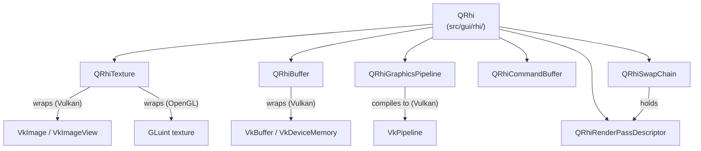

```cpp
// Typical QRhi frame lifecycle
QRhiCommandBuffer *cb;
if (rhi->beginFrame(swapChain) != QRhi::FrameOpSuccess)
    return;
cb = swapChain->currentFrameCommandBuffer();
QRhiRenderTarget *rt = swapChain->currentFrameRenderTarget();
cb->beginPass(rt, Qt::black, { 1.0f, 0 });
cb->setGraphicsPipeline(pipeline);
cb->setShaderResources();
cb->draw(3);
cb->endPass();
rhi->endFrame(swapChain);
```

### 1.2 Qt Quick Scene Graph

Qt Quick — the QML-based UI framework — renders its scene through a retained-mode **scene graph** built from `QSGNode` instances. The scene graph lives on a **render thread** (class `QSGRenderLoop`; the default implementation is `QSGThreadedRenderLoop`) separate from the main/GUI thread. [Source](https://doc.qt.io/qt-6/qtquick-visualcanvas-scenegraph.html)

The rendering pipeline for a single frame proceeds as follows:

1. **Animation phase** — Qt's animation framework advances all running animations on the GUI thread.
2. **Polish phase** — each `QQuickItem` can refine its layout in `updatePolish()`.
3. **Synchronise phase** — the GUI thread and render thread synchronise: `QQuickItem::updatePaintNode()` is called for each dirty item, which creates or updates `QSGNode` objects. This is the only window during which both threads interact.
4. **Render phase** — the render thread calls `QSGRenderer::render()`, which traverses the node tree, batches compatible draw calls, and issues QRhi commands.
5. **Swap** — `QRhi::endFrame()` submits the command buffer and signals the swap chain to present.

```
┌─────────────────────────────────────────────────────────┐
│  GUI Thread                                              │
│  QQuickItem tree → updatePolish() → updatePaintNode()   │
└───────────────────────────┬─────────────────────────────┘
                            │  sync barrier
┌───────────────────────────▼─────────────────────────────┐
│  Render Thread                                           │
│  QSGNode tree → QSGRenderer → QRhi → native API calls   │
│  → QRhiSwapChain::endFrame() → compositor buffer swap   │
└─────────────────────────────────────────────────────────┘
```

The scene graph provides two extension points for custom rendering:

**`QSGGeometry`** describes the mesh of a custom item: attribute layout (position, texture coordinate, colour), vertex data, and index data. **`QSGMaterial`** pairs with the geometry to provide the shader and pipeline state. Application code subclasses `QSGMaterial` and `QSGMaterialShader`; the material's `createShader()` method returns the shader that the scene graph compiles into a `QRhiGraphicsPipeline`. [Source](https://doc.qt.io/qt-6/qsgmaterial.html)

```cpp
// Minimal custom material (qtdeclarative/src/quick/scenegraph/coreapi/)
class MyMaterial : public QSGMaterial {
public:
    QSGMaterialType *type() const override { return &s_type; }
    QSGMaterialShader *createShader(QSGRendererInterface::RenderMode) const override;
    static QSGMaterialType s_type;
};

class MyShader : public QSGMaterialShader {
public:
    MyShader() {
        setShaderFileName(VertexStage, QLatin1String(":/shaders/my.vert.qsb"));
        setShaderFileName(FragmentStage, QLatin1String(":/shaders/my.frag.qsb"));
    }
    bool updateUniformData(RenderState &state,
                           QSGMaterial *newMat, QSGMaterial *oldMat) override;
};
```

### 1.3 Backend Selection and Environment Variables

On Linux, the default QSG (Qt Quick Scene Graph) RHI backend is **OpenGL**, not Vulkan. The Qt documentation states explicitly: "The defaults are currently Direct3D 11 for Windows, Metal for macOS, OpenGL elsewhere." [Source](https://doc.qt.io/qt-6/qtquick-visualcanvas-scenegraph-renderer.html) Vulkan must be explicitly requested, either at runtime via the `QSG_RHI_BACKEND` environment variable or programmatically before any `QQuickWindow` is constructed:

```bash
# Select Vulkan backend for Qt Quick
export QSG_RHI_BACKEND=vulkan
```

```cpp
// In main(), before constructing any QQuickWindow
QQuickWindow::setGraphicsApi(QSGRendererInterface::Vulkan);
```

Other accepted values for `QSG_RHI_BACKEND` are `opengl`, `d3d11`, `d3d12`, `metal`, and `null`. For `QRhi` used directly (outside Qt Quick), the backend is always chosen explicitly by the caller through `QRhi::create()` — there is no platform default.

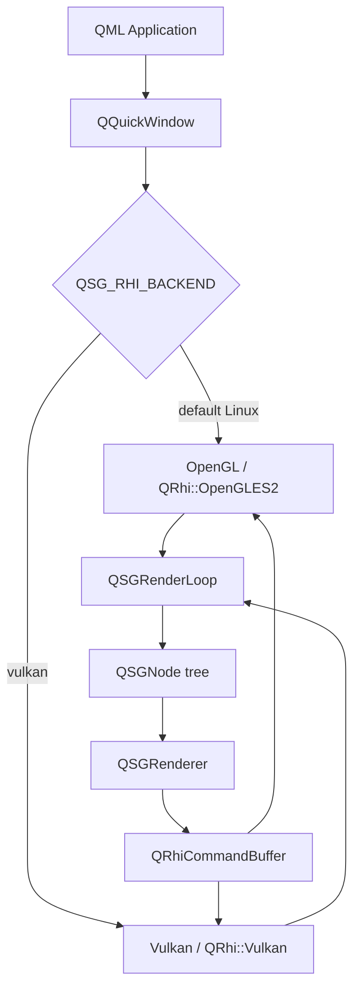

---

## 2. Qt Wayland Integration and Swapchain

### 2.1 QtWayland Client Platform Plugin

When a Qt application starts under a Wayland compositor, the `QtWayland` platform plugin (`wayland`) is loaded. This plugin lives in `src/plugins/platforms/wayland/` in the `qtwayland` repository. [Source](https://github.com/qt/qtwayland) It implements the Qt Platform Abstraction (QPA) interfaces:

- **`QWaylandIntegration`** — the top-level platform integration; creates the Wayland connection (`wl_display`), the `wl_registry`, and the event thread.
- **`QWaylandWindow`** (implementing `QPlatformWindow`) — owns a `wl_surface`. One `QWaylandWindow` exists per `QWindow` in the application.
- **`QPlatformVulkanInstance`** — provided by `QWaylandVulkanInstance`, which loads `libvulkan.so` and creates the `VkInstance` with `VK_KHR_wayland_surface` in the instance extension list.
- **`QPlatformOpenGLContext`** — provided by `QWaylandEglWindow` and backed by EGL using `EGL_PLATFORM_WAYLAND_KHR`.

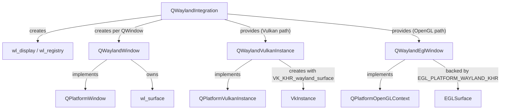

### 2.2 Vulkan Swapchain on Wayland

When the Vulkan backend is active, Qt creates a `VkSurfaceKHR` for each `QWaylandWindow` via the `VK_KHR_wayland_surface` extension:

```cpp
// Pseudocode based on qtbase/src/plugins/platforms/wayland/
VkWaylandSurfaceCreateInfoKHR info = {};
info.sType   = VK_STRUCTURE_TYPE_WAYLAND_SURFACE_CREATE_INFO_KHR;
info.display = waylandDisplay;
info.surface = waylandSurface;   // the wl_surface*
vkCreateWaylandSurfaceKHR(instance, &info, nullptr, &vkSurface);
```

`QRhiVulkan` then calls `vkGetPhysicalDeviceSurfaceCapabilitiesKHR()` to query swapchain support and creates a `VkSwapchainKHR` with `VK_PRESENT_MODE_FIFO_KHR` (vsync) or `MAILBOX` if available. The swapchain images are wrapped in `QRhiTexture` objects and presented via `vkQueuePresentKHR()`.

If the `wl_surface` is destroyed (for example on window hide), the `VkSurfaceKHR` becomes invalid. Qt handles this by destroying and recreating both the Vulkan surface and swapchain when the Wayland surface is recreated.

### 2.3 OpenGL/EGL Swapchain on Wayland

When the OpenGL backend is active, `QWaylandEglWindow` creates a `wl_egl_window` (the Mesa/libwayland-egl abstraction) and passes it to `eglCreateWindowSurface()`:

```c
// libwayland-egl / Mesa wl_egl_window path
struct wl_egl_window *egl_window =
    wl_egl_window_create(wl_surface, width, height);
EGLSurface egl_surface =
    eglCreateWindowSurface(egl_display, config,
                           (EGLNativeWindowType)egl_window, nullptr);
```

`eglSwapBuffers()` on the EGL surface translates internally to a `wl_surface_commit` on the Wayland surface, attaching the rendered buffer and notifying the compositor.

### 2.4 Frame Pacing: wl_callback and wp_presentation

Qt throttles its render thread using Wayland **frame callbacks**. After each `wl_surface_commit`, `QWaylandWindow` registers a `wl_surface_frame` callback. The compositor fires the callback when it has displayed the current frame and is ready for the next one. Qt's render loop (`QSGThreadedRenderLoop`) blocks on this callback before starting the next frame, preventing the application from getting ahead of the compositor. [Source](https://github.com/qt/qtwayland/blob/dev/src/client/qwaylandwindow.cpp)

For accurate refresh-rate reporting and presentation-time feedback, Qt implements the **`wp_presentation`** Wayland protocol (Presentation Time). The `QWaylandPresentationTime` class (compositor-side API) and its client counterpart parse the `wp_presentation_feedback` events to measure the actual frame presentation timestamp. [Source](https://doc.qt.io/qt-6/qwaylandpresentationtime.html) This feeds back into `QScreen::refreshRate()` accuracy and can be used to implement frame-rate–limited animations with correct pacing.

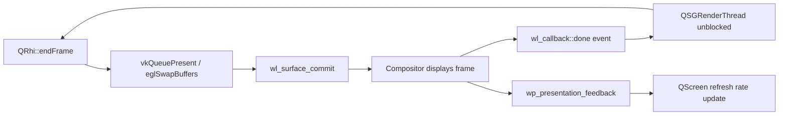

### 2.5 QSurface::SurfaceType and Platform Selection

Qt applications select the rendering surface type through `QSurface::SurfaceType`. The most relevant types for GPU rendering are:

- `QSurface::VulkanSurface` — a Vulkan-rendered surface.
- `QSurface::OpenGLSurface` — an EGL/OpenGL surface.
- `QSurface::RasterGLSurface` — composites rasterised content into an OpenGL texture.

`QWaylandIntegration::createPlatformWindow()` reads the `SurfaceType` and instantiates the correct `QWaylandWindow` subclass accordingly.

---

## 3. Qt Shader Pipeline: qsb and SPIR-V

### 3.1 The qsb Tool

Qt's shader cross-compilation pipeline centres on the **`qsb`** (Qt Shader Baker) command-line tool, part of the **Qt Shader Tools** module. [Source](https://doc.qt.io/qt-6/qtshadertools-qsb.html) It takes a Vulkan-flavoured GLSL source file as input — always compiled first to SPIR-V via the embedded `glslang` library — and then uses `SPIRV-Cross` to translate the SPIR-V into the target shading languages:

```bash
# Compile vertex and fragment shaders to .qsb packages
qsb --glsl "100 es,120,150" --hlsl 50 --msl 12 \
    -o myshader.vert.qsb myshader.vert
qsb --glsl "100 es,120,150" --hlsl 50 --msl 12 \
    -o myshader.frag.qsb myshader.frag
```

The input file extension determines the shader stage: `.vert`, `.frag`, `.comp`, `.tesc`, `.tese`, `.geom`. The `--batchable` (`-b`) flag for vertex shaders generates an additional variant that Qt Quick's scene graph uses for instanced/batched rendering.

### 3.2 The .qsb File Format

A `.qsb` file is a binary container that packs:

1. **Reflection metadata** (`QShaderDescription`): a JSON-encoded description of inputs, outputs, uniform blocks (`layout(std140)`), push constant blocks, and combined image samplers. The description is used by Qt to allocate uniform buffers and bind descriptor sets correctly at runtime.
2. **Per-target shader blobs**: one entry per `(language, version, variant)` triple. The SPIR-V blob is always present; GLSL ES, HLSL, and MSL blobs are present when the corresponding `--glsl`/`--hlsl`/`--msl` flags were passed.

Inspecting a `.qsb` file:

```bash
qsb --dump myshader.frag.qsb
```

Typical output:

```
Stage: Fragment
QShaderDescription:
  Inputs:  v_texcoord (vec2, location 0)
  Uniforms: buf { matrix(mat4), opacity(float) } binding 0
Shaders:
  [SPIRV 100] 1412 bytes
  [GLSL 100 es] 312 bytes
  [GLSL 120] 287 bytes
  [HLSL 50] 445 bytes
  [MSL 12] 389 bytes
```

### 3.3 Runtime Selection in QRhi

When `QRhiGraphicsPipeline::create()` is called, it reads the attached `QShader` objects — loaded from `.qsb` files via `QShader::fromSerialized()` — and selects the appropriate blob for the active backend:

- **Vulkan path**: uses the `SPIRV 100` blob, passes it to `vkCreateShaderModule()`.
- **OpenGL/ES path**: uses the `GLSL 100 es` or `GLSL 120` blob, passes it to `glShaderSource()` / `glCompileShader()`.
- **Metal path**: uses the MSL blob.
- **D3D11 path**: uses the HLSL blob, passes it to `D3DCompile()` (or uses a precompiled DXBC blob if generated with `--fxc`).

```cpp
// Loading a .qsb shader in application code
QShader vs = loadShader(QLatin1String(":/shaders/myshader.vert.qsb"));
QShader fs = loadShader(QLatin1String(":/shaders/myshader.frag.qsb"));

QRhiGraphicsPipeline *ps = rhi->newGraphicsPipeline();
ps->setShaderStages({
    { QRhiShaderStage::Vertex,   vs },
    { QRhiShaderStage::Fragment, fs },
});
ps->create();
```

`QShader::fromSerialized()` deserialises the `.qsb` binary into a `QShader` value containing all target blobs and the `QShaderDescription`. The `QShaderDescription` includes the uniform block layout, which `QRhi` uses to create correctly-sized `QRhiBuffer` objects for uniform data.

### 3.4 Custom Materials in Qt Quick

In the Qt Quick scene graph, custom shader effects follow this pipeline:

1. Write Vulkan-style GLSL `.vert` and `.frag` files following Qt's uniform block conventions.
2. Run `qsb` (typically via CMake's `qt_add_shaders()` function) to generate `.qsb` files embedded in the Qt resource system.
3. Subclass `QSGMaterialShader`, call `setShaderFileName()` with the resource path in the constructor.
4. Subclass `QSGMaterial` and implement `createShader()` to return the custom shader instance.
5. Override `updateUniformData()` in the shader subclass to upload per-frame constants (model-view-projection matrix, custom parameters).

```cmake
# CMakeLists.txt — automatic qsb compilation
qt_add_shaders(myapp "myapp_shaders"
    PREFIX "/shaders"
    FILES
        shaders/myeffect.vert
        shaders/myeffect.frag
)
```

```glsl
// shaders/myeffect.frag — Vulkan-style GLSL input to qsb
#version 440
layout(location = 0) in vec2 v_texcoord;
layout(location = 0) out vec4 fragColor;
layout(std140, binding = 0) uniform buf {
    mat4 qt_Matrix;
    float qt_Opacity;
    float time;
};
layout(binding = 1) uniform sampler2D qt_Texture;
void main() {
    fragColor = texture(qt_Texture, v_texcoord) * qt_Opacity;
}
```

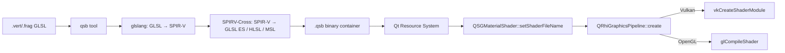

---

## 4. GTK4 Rendering Architecture: GskRenderer

### 4.1 The Three-Layer Model

GTK4's rendering architecture separates concerns across three distinct layers:

1. **Widget tree** (`GtkWidget` hierarchy) — the application-visible object model: buttons, labels, boxes, text views. Widgets describe *what* to render, not *how*.
2. **Render node tree** (`GskRenderNode` hierarchy) — a serialisable, immutable tree of GPU-oriented drawing primitives produced by snapshotting the widget tree each frame.
3. **Renderer** (`GskRenderer`) — consumes the render node tree and emits GPU commands via OpenGL or Vulkan.

The separation between widget tree and render node tree is crucial: the widget tree lives on the main thread and can be mutated freely; the render node tree is handed off to the renderer (which may run on a separate thread or context) after snapshot.

### 4.2 Building the Render Node Tree: GtkSnapshot

`GtkSnapshot` is the drawing context passed to each widget's `snapshot` virtual function (the GTK4 replacement for the `draw` callback). Widgets call `gtk_snapshot_push_*()` / `gtk_snapshot_append_*()` / `gtk_snapshot_pop()` methods to build up a stack of `GskRenderNode` objects:

```c
// Widget snapshot vfunc (GtkWidgetClass.snapshot)
static void my_widget_snapshot(GtkWidget *widget, GtkSnapshot *snapshot)
{
    // Push a rounded clip
    gtk_snapshot_push_rounded_clip(snapshot, &rounded_rect);

    // Append a solid colour fill
    gtk_snapshot_append_color(snapshot, &color, &bounds);

    // Append a texture (e.g. a GdkTexture loaded from a file)
    gtk_snapshot_append_texture(snapshot, texture, &texture_bounds);

    gtk_snapshot_pop(snapshot);  // pop rounded clip
}
```

`GtkSnapshot` internally creates `GskRenderNode` objects for each append call and nests them under the current transform/clip. The resulting tree is extracted via `gtk_snapshot_to_node()` and passed to `gsk_renderer_render()`. [Source](https://docs.gtk.org/gtk4/class.Snapshot.html)

### 4.3 GskRenderNode Subtypes

`GskRenderNode` is abstract; all rendering is expressed through specialised subtypes that are immutable once created. Key types and their GPU mapping [Source](https://docs.gtk.org/gsk4/class.RenderNode.html):

| Node type | Description | GPU mapping |
|---|---|---|
| `GskColorNode` | Solid colour rectangle | Flat-colour shader pass |
| `GskTextureNode` | Sample a `GdkTexture` | Textured quad draw call |
| `GskTextureScaleNode` | Scaled texture with filter | Textured quad + filter mode |
| `GskBlurNode` | Gaussian blur of child | Multi-pass convolution (or single-pass with compute) |
| `GskShadowNode` | Drop shadow behind child | Blur + offset + blend |
| `GskTransformNode` | Affine/perspective transform | GPU matrix push |
| `GskRoundedClipNode` | Clip to rounded rectangle | Stencil or shader-based clipping |
| `GskLinearGradientNode` | CSS linear-gradient | Gradient shader |
| `GskOpacityNode` | Alpha multiplication of child | Blend state or intermediate FBO |
| `GskCairoNode` | Fallback Cairo paint | Upload CPU-rendered pixmap to GL texture |
| `GskTextNode` | Text run (Pango glyphs) | Glyph atlas draw calls |
| `GskSubsurfaceNode` | Delegate to a child subsurface | `wl_subsurface` (Wayland native) |
| `GskGLShaderNode` | Custom GLSL fragment shader | Direct shader execution (legacy) |

### 4.4 GskRenderer Implementations

As of GTK 4.16, three hardware-accelerated renderers exist, all in `gsk/`:

**`GskCairoRenderer`** — software fallback. Renders the node tree to a Cairo surface via `cairo_t`, then uploads the resulting pixmap as a texture. Correct but slow; used when no GPU is available.

**Legacy `GskGLRenderer`** (pre-4.14 default) — lives in `gsk/gl/`. Used per-node-type shader programs; required frequent offscreen intermediate rendering for effects like blur and opacity stacking. Deprecated in favour of the unified GPU renderer.

**`GskNglRenderer` / `GskVulkanRenderer`** (GTK 4.14+ unified renderer, `gsk/gpu/`) — these are the two faces of a shared codebase. The unified renderer is modelled on Vulkan concepts: it uses a scene-graph traversal shared between the OpenGL and Vulkan paths, employs "per-node shaders" and an "ubershader" approach (a complex shader that interprets a node-type token and parameters packed into a GPU buffer), and avoids offscreen rendering for the common case. [Source](https://blogs.gnome.org/gtk/2024/01/28/new-renderers-for-gtk/)

The `GskNglRenderer` (new GL renderer) targets OpenGL 3.3+ and GLES 3.0+; `GskVulkanRenderer` targets Vulkan 1.0+. From GTK 4.16, `GskVulkanRenderer` is the default when the GDK backend is Wayland and a Vulkan implementation is available; `GskNglRenderer` is the default on X11 and other platforms. [Source](https://blog.gtk.org/2024/04/)

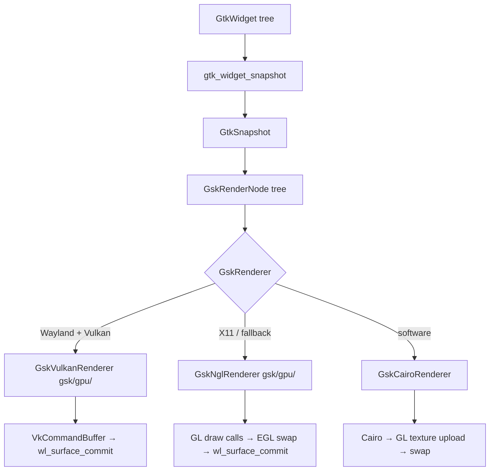

### 4.5 Selecting the Renderer

The renderer is selected at application startup through the `GSK_RENDERER` environment variable [Source](https://docs.gtk.org/gtk4/running.html):

```bash
GSK_RENDERER=vulkan  myapp   # force Vulkan renderer
GSK_RENDERER=gl      myapp   # force NGL (OpenGL) renderer
GSK_RENDERER=cairo   myapp   # force software Cairo fallback
GSK_RENDERER=help    myapp   # print available options and exit
```

The Vulkan and GL renderers share the same node handling code in `gsk/gpu/`; only the low-level device abstraction differs. A `GskGpuDevice` base class (in `gsk/gpu/gskgpudevice.c`) abstracts resource allocation and command submission, with `GskVulkanDevice` (in `gsk/gpu/gskvulkandevice.c`) and `GskGLDevice` (in `gsk/gpu/gskgldevice.c`) as the concrete implementations. Both are confirmed in the GTK source tree as `GObject` subclasses of `GskGpuDevice`.

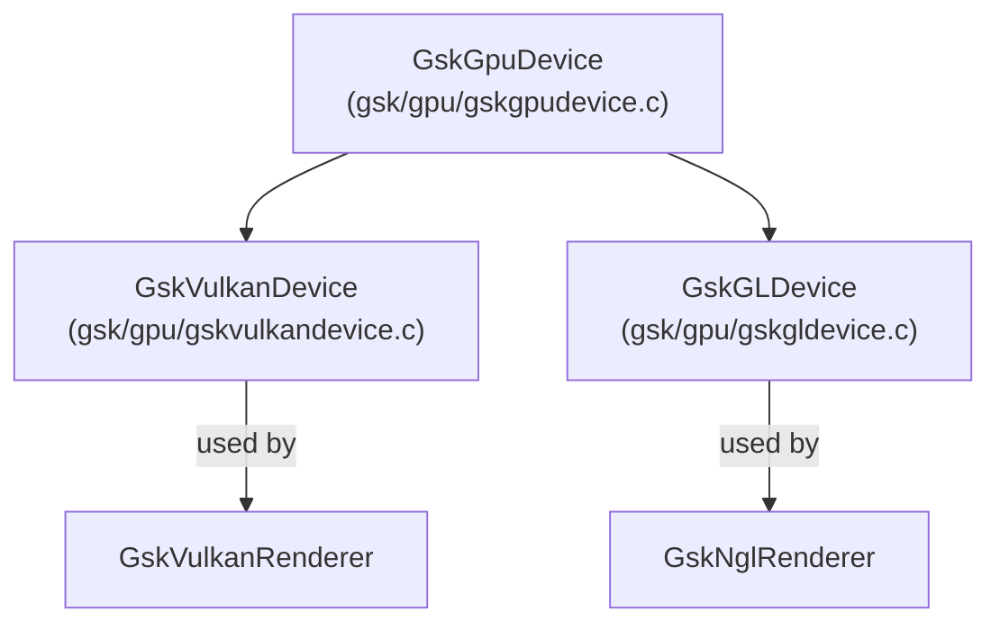

---

## 5. GTK4 Wayland Integration and Explicit Sync

### 5.1 GDK Wayland Backend

GTK4's Wayland integration lives in `gdk/wayland/`. The key types are:

- **`GdkWaylandDisplay`** — wraps `wl_display`; owns the Wayland connection and the registry listener that binds global objects (`wl_compositor`, `xdg_wm_base`, etc.).
- **`GdkWaylandSurface`** — wraps a `wl_surface` and an `xdg_surface`/`xdg_toplevel` for window management. Each `GdkToplevel` or `GdkPopup` maps to one `GdkWaylandSurface`.
- **`GdkWaylandGLContext`** — the EGL context used by the GL renderer; owns the `wl_egl_window` and `EGLSurface`.

The Wayland backend is selected automatically when `$WAYLAND_DISPLAY` is set (or via `GDK_BACKEND=wayland`).

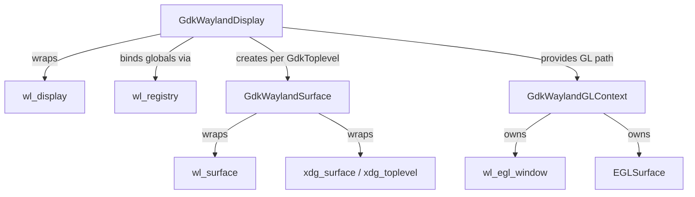

### 5.2 Buffer Submission: EGL on Wayland

The NGL renderer submits frames through EGL. The sequence is:

1. `wl_egl_window_create(wl_surface, width, height)` — creates a `wl_egl_window` wrapping the Wayland surface.
2. `eglCreateWindowSurface(display, config, (EGLNativeWindowType)egl_window, NULL)` — creates an EGL surface backed by the Wayland window.
3. At frame end, `eglSwapBuffers()` — the Mesa EGL Wayland backend translates this to `wl_surface_attach()` (attaching the rendered `wl_buffer`) followed by `wl_surface_commit()`.

Damage information (`wl_surface_damage_buffer()`) is passed before commit to tell the compositor which regions have changed. The GDK Wayland backend uses buffer-space coordinates (via `wl_surface_damage_buffer` rather than the older `wl_surface_damage`) because EGL surfaces may be at arbitrary buffer transforms. [Source](https://docs.gtk.org/gtk4/wayland.html)

### 5.3 Buffer Submission: Vulkan on Wayland

The Vulkan renderer acquires and presents swapchain images directly. `GskVulkanDevice` (confirmed in `gsk/gpu/gskvulkandevice.c`, subclassing `GskGpuDevice`) creates a `VkSwapchainKHR` for each `GdkWaylandSurface` via `VK_KHR_wayland_surface`, and `vkQueuePresentKHR()` triggers the compositor-side buffer import. Where available, incremental present extensions may be used to communicate damage regions to the presentation engine.

### 5.4 Explicit Synchronisation with wp_linux_drm_syncobj_v1

GTK 4.16 added support for the `wp_linux_drm_syncobj_v1` Wayland protocol, which implements GPU-native explicit synchronisation using Linux DRM synchronisation objects. [Source](https://wayland.app/protocols/linux-drm-syncobj-v1)

Without explicit sync, the compositor must use implicit fencing (waiting for the GPU driver's internal fence) or insert a full GPU pipeline stall before importing a client buffer. With `wp_linux_drm_syncobj_v1`, GTK attaches a pair of DRM timeline syncobj points to each surface commit:

- **Acquire point** — the compositor must wait for this point to be signalled (i.e., GTK's rendering GPU work to complete) before scanning out the buffer.
- **Release point** — the compositor signals this point when it has finished using the buffer, so GTK can safely reuse it.

This eliminates the need for the compositor to stall on buffer import, enabling zero-copy GPU buffer sharing with correct synchronisation — critical for NVIDIA (which lacked implicit sync support on Wayland for years) and beneficial on all drivers.

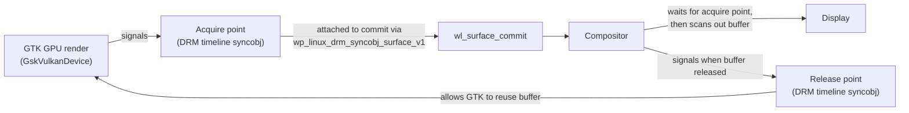

```c
// Pseudocode: GTK GDK Wayland explicit sync attachment
wp_linux_drm_syncobj_surface_v1_set_acquire_point(
    syncobj_surface, acquire_timeline, acquire_point);
wp_linux_drm_syncobj_surface_v1_set_release_point(
    syncobj_surface, release_timeline, release_point);
wl_surface_commit(wl_surface);
```

### 5.5 Damage Tracking and Partial Repaints

The unified GPU renderer (`gsk/gpu/`) tracks dirty regions in the `GskRenderNode` tree across frames. Nodes that have not changed since the last frame are not re-rendered; only dirty subtrees are re-traversed. The resulting damage rectangle is passed to `wl_surface_damage_buffer()` before each commit. On the OpenGL path, the EGL `EGL_KHR_partial_update` extension is used to restrict GL rendering to the dirty region, avoiding redundant fragment shader work outside the updated area. [Source](https://docs.gtk.org/gsk4/class.Renderer.html)

---

## 6. GTK4 Shader Pipeline and CSS GPU Effects

### 6.1 The Unified GPU Renderer's Shader Architecture

The unified renderer in `gsk/gpu/` uses a two-tier shader approach:

1. **Per-node-type shaders** — specialised GLSL programs for common node types (`GskColorNode`, `GskTextureNode`, `GskLinearGradientNode`). These are fast paths that avoid branching overhead.
2. **Ubershader** — a single complex GLSL fragment shader that encodes all node types as integer tokens packed into a GPU-side buffer. The shader interprets the token at runtime to handle arbitrary render-node trees. This eliminates CPU-side draw-call splitting for complex scenes at the cost of more shader complexity.

The shaders are compiled from GLSL sources that live in `gsk/gpu/shaders/` (for the unified renderer). The Vulkan path uses the same GLSL sources but compiles them offline to SPIR-V via `glslang` at build time and stores the SPIR-V in the binary; the OpenGL path compiles GLSL at runtime via the GL driver.

### 6.2 CSS Properties and GPU Shader Passes

CSS visual properties that GTK4 supports map to `GskRenderNode` types and ultimately to GPU operations:

| CSS property | GskRenderNode | GPU effect |
|---|---|---|
| `opacity: 0.5` | `GskOpacityNode` | Alpha blend of child |
| `filter: blur(4px)` | `GskBlurNode` | Gaussian convolution pass |
| `box-shadow: ...` | `GskOutsetShadowNode` / `GskInsetShadowNode` | Blur + translate + blend |
| `background: linear-gradient(...)` | `GskLinearGradientNode` | Gradient shader |
| `border-radius: ...` | `GskRoundedClipNode` | Rounded clip in shader |
| `transform: rotate(45deg)` | `GskTransformNode` | Matrix multiply in vertex shader |
| Custom GL shader (via `GtkGLShaderNode`) | `GskGLShaderNode` | Direct GLSL fragment effect |

`GskBlurNode` is worth examining in detail. The unified renderer implements Gaussian blur as a two-pass separable filter (horizontal pass then vertical pass), rendering into intermediate textures. The blur radius is passed as a uniform; for large radii, the renderer may switch to a lower-resolution downsampled pass to maintain performance.

### 6.3 GskVulkanRenderer: SPIR-V Pipeline

The Vulkan renderer builds `VkPipeline` objects at startup from precompiled SPIR-V. Shaders are compiled from the same GLSL sources used for the GL renderer, with minor Vulkan-specific adjustments (binding model, push constants), and embedded into the GTK binary as byte arrays. The renderer creates `VkDescriptorSetLayout` objects per shader type and allocates `VkDescriptorSet` objects per draw, binding textures and uniform buffers.

Push constants are used for small per-draw constants (transform matrix, colour, opacity) to avoid the overhead of `vkUpdateDescriptorSets()` per node. Larger per-node data arrays (used by the ubershader) are passed via GPU buffers bound as descriptors; the exact descriptor type (uniform buffer or storage buffer) varies by node type and GPU limitations. *(Note: the exact binding strategy for the ubershader's node parameter buffer is an implementation detail — consult the `gsk/gpu/shaders/` sources for the current scheme.)*

### 6.4 GtkGLArea: Custom GL Rendering

`GtkGLArea` is a widget that lets application code render custom OpenGL content while remaining integrated with GTK's frame lifecycle. It creates its own `GdkGLContext` (an EGL context sharing the display with GTK's own GL context) and emits the `render` signal each frame with the context already bound:

```c
// Custom GtkGLArea render handler
static gboolean on_render(GtkGLArea *area, GdkGLContext *context, gpointer user_data)
{
    glClearColor(0.0f, 0.0f, 0.0f, 1.0f);
    glClear(GL_COLOR_BUFFER_BIT);
    // ... custom GL draw calls ...
    return TRUE;  // indicate render was handled
}

// In widget setup:
g_signal_connect(gl_area, "render", G_CALLBACK(on_render), NULL);
gtk_gl_area_set_required_version(GTK_GL_AREA(gl_area), 3, 3);
```

`GtkGLArea` renders into a GTK-managed framebuffer object (FBO), whose colour attachment is then wrapped as a `GdkTexture` and fed into the main render-node tree as a `GskTextureNode`. This allows custom GL content to participate in the compositor's normal damage-tracking and transform pipeline. [Source](https://docs.gtk.org/gtk4/class.GLArea.html)

When GTK4 is using the Vulkan renderer, `GtkGLArea` still uses OpenGL; the resulting texture is shared via `EGL_KHR_gl_image`/dmabuf to cross the API boundary.

---

## 7. Font and Text Rendering: FreeType, HarfBuzz, and Glyph Atlases

### 7.1 The Shared Text Rendering Stack

Both Qt and GTK4 rest on the same underlying text-rendering foundations, though they layer differently on top:

```
Application text (Unicode string)
         │
         ▼
HarfBuzz (shaping: cluster analysis, OpenType feature application,
          ligature substitution, bidirectional ordering)
         │
         ▼
FreeType (glyph rasterisation: outline → bitmap at a given size and hinting mode)
         │
         ▼
Fontconfig (font discovery and matching: family → font file + face index)
         │
         ▼
Glyph atlas texture (GPU texture holding rendered glyph bitmaps or
                     signed-distance-field encodings)
         │
         ▼
GPU quad per glyph (vertex: position, texture coordinate; fragment: atlas sample)
```

**HarfBuzz** performs OpenType text shaping: given a Unicode string, a font, and a language/script tag, it returns a list of `hb_glyph_info_t` records (glyph IDs and cluster indices) and `hb_glyph_position_t` records (advance widths, kerning offsets). [Source](https://harfbuzz.github.io) This resolves ligatures (`fi`, `ffi`), applies mark positioning (diacritics), handles bidirectional text (Arabic, Hebrew interleaved with Latin), and applies OpenType features such as small capitals or tabular numerals.

**FreeType** rasterises individual glyphs from the shaped list at the required point size and subpixel offset. The primary rendering modes relevant here are:

- `FT_RENDER_MODE_NORMAL` — 8-bit greyscale anti-aliasing.
- `FT_RENDER_MODE_LCD` / `FT_RENDER_MODE_LCD_V` — subpixel rendering for RGB stripe LCD panels; activates `FT_LCD_FILTER_*` convolution to reduce colour fringing.
- `FT_RENDER_MODE_SDF` — signed-distance-field output for GPU SDF rendering.

**Fontconfig** maps font family names (e.g. `"Noto Sans"`) and properties (weight, width, slant) to font files and face indices on disk, with per-user and system-wide font directories. Both Qt and GTK use Fontconfig on Linux.

### 7.2 Qt: QSGDistanceFieldGlyphCache

Qt Quick renders text using **signed distance field (SDF)** glyphs, which are resolution-independent representations stored in a GPU texture atlas. The `QSGDistanceFieldGlyphCache` (in `qtdeclarative/src/quick/scenegraph/`) manages this atlas. [Source](https://doc.qt.io/qt-6/qtdistancefieldgenerator-index.html)

For each glyph needed in the scene, the cache:

1. Rasterises the glyph at a fixed internal resolution via FreeType (the exact size is configurable; Qt's default produces a glyph texture suitable for use across a range of display sizes).
2. Converts the rasterised bitmap to a signed-distance-field representation, where each texel stores the signed distance to the nearest glyph edge (positive inside, negative outside).
3. Packs the SDF glyph into a 2D atlas texture (one or more `GL_RED` / `VK_FORMAT_R8_UNORM` single-channel textures).
4. At render time, each text character is a GPU quad sampling the atlas; the fragment shader thresholds the SDF value to reconstruct the glyph edge at arbitrary scale and rotation without aliasing.

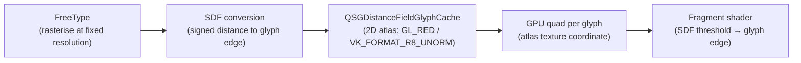

The key advantage of SDF glyphs is that a single atlas entry works across a wide range of font sizes: a single SDF glyph can render crisply at small or large sizes by adjusting the threshold value. This is in contrast to bitmap glyph caches, which require a separate rasterisation per size and subpixel shift.

For applications rendering large amounts of static text at a known size, the **Qt Distance Field Generator** tool (`qtdistancefieldgenerator`) pre-generates the atlas, avoiding the first-frame rasterisation cost at application startup.

### 7.3 GTK4: Pango and the Glyph Cache

GTK4 uses **Pango** as its text layout engine. Pango wraps FreeType and HarfBuzz:

1. `pango_itemize()` breaks a paragraph into `PangoItem` runs (one run per font / script / direction combination).
2. `pango_shape_full()` calls HarfBuzz to shape each run, producing a `PangoGlyphString` with glyph IDs and positions.
3. A `PangoLayout` assembles the shaped runs into lines with word wrapping and bidirectional reordering.

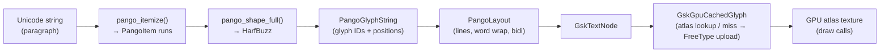

When a renderer encounters a `GskTextNode`, it looks up each glyph in a GPU glyph cache backed by a texture atlas. The implementation differs by renderer generation:

**Legacy `GskGLRenderer`** (pre-4.14, `gsk/gl/`): used `GskGlGlyphLibrary`, which rasterised glyphs to bitmap at the exact requested size and subpixel shift via FreeType, then uploaded them via `glTexSubImage2D()`. Each `(glyph_id, scale, subpixel_shift)` triple got its own atlas slot in a `GL_RGBA` texture using a shelf allocator. Unlike Qt's SDF approach, this was a per-size bitmap cache.

**Unified GPU renderer** (GTK 4.14+, `gsk/gpu/`): glyph caching is handled by `GskGpuCachedGlyph` objects within the shared `GskGpuCache`. Text nodes store raw glyph records that are looked up in the cache; on a miss, glyphs are rendered via Pango/FreeType and uploaded as atlas tiles. The cache manages eviction of stale glyphs and atlas compaction. [Source](https://blogs.gnome.org/gtk/2024/01/28/new-renderers-for-gtk/)

At the time of writing, the Glyphy approach (GPU-side arc-segment SDF encoding) was explored as an experimental direction for GTK's GPU text path [Source](https://blogs.gnome.org/chergert/2022/03/20/rendering-text-with-glyphy/) but is not the shipping default; the unified renderer uses CPU-rasterised bitmap glyphs uploaded to GPU atlas textures.

### 7.4 Subpixel Rendering and Compositor Compositing

Subpixel (LCD) font rendering — where the red, green, and blue LCD strips are addressed independently to triple horizontal resolution — interacts problematically with alpha-compositing. A composited layer carrying subpixel-rendered text must be composited onto a known background colour; compositing a subpixel layer onto an unknown or transparent background produces incorrect colour fringing.

For this reason, both Qt and GTK4 disable subpixel rendering for composited text layers under a Wayland compositor (where every window is alpha-composited). Greyscale anti-aliasing (`FT_RENDER_MODE_NORMAL`) is used instead, which composes correctly as a single-channel alpha value.

On X11 with a compositing manager that knows the background colour, subpixel rendering may be enabled via FreeType's `FT_LCD_FILTER_DEFAULT` mode and Fontconfig's `rgba` and `lcdfilter` settings.

### 7.5 Colour Emoji

COLRv1 (OpenType color fonts, version 1), CBDT (colour bitmap), and sbix fonts carry per-glyph colour information in multiple layers. HarfBuzz 2.x+ supports colour font rendering via `hb_ot_color_*` APIs, and both Qt (via `QFontEngine::glyphImage()`) and GTK4 (via Pango/Cairo's COLR support) render colour glyphs as RGBA textures, which are then placed in the atlas or submitted as individual textures per glyph.

For COLRv1 specifically, which supports gradients, compositing operations, and affine transforms per layer, correct rendering requires either full vector processing per glyph (expensive) or pre-rasterisation at a fixed size to an RGBA texture (the common approach in both toolkits). HarfBuzz's `hb_paint_*` callback API (added in HarfBuzz 7.0) allows renderers to implement COLRv1 layer traversal.

### 7.6 Fontconfig Integration

Fontconfig (`libfontconfig`) is the font discovery and matching layer used by both toolkits on Linux. The matching pipeline is:

1. An application specifies a font request as an `FcPattern` (family, size, weight, slant, etc.).
2. `FcFontSort()` or `FcFontMatch()` searches the Fontconfig cache (built by `fc-cache`) and returns a sorted list of matching `FcPattern` objects with the actual font file path and face index.
3. FreeType opens the font file at the matched path; HarfBuzz wraps the FreeType face with `hb_ft_face_create()`.

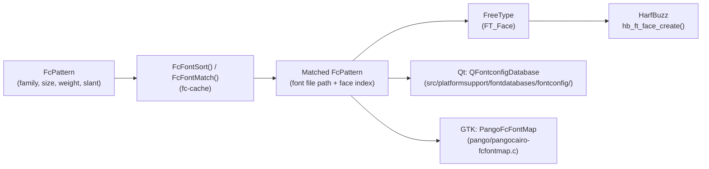

Qt uses Fontconfig via `QFontconfigDatabase` (in `src/platformsupport/fontdatabases/fontconfig/`). GTK uses Fontconfig through Pango's `PangoFcFontMap` (in `pango/pangocairo-fcfontmap.c`). Both maintain a cache of open `FT_Face` objects to avoid repeated font file I/O.

---

## Integrations

This chapter is part of a broader narrative about how GPU work flows from application to display. Key related chapters:

- **Chapter 14 (NIR — Mesa Intermediate Representation)**: The GTK4 Vulkan renderer submits SPIR-V shaders that Mesa's Vulkan drivers compile through NIR. Understanding NIR illuminates how GTK's ubershader is optimised by the driver.

- **Chapter 16 (Mesa Vulkan Common Infrastructure)**: `GskVulkanDevice` calls into Mesa's Vulkan common infrastructure for `VkDevice` creation, memory allocation, and queue management. The `vulkan/wsi/wsi_common_wayland.c` path in Mesa handles the `VK_KHR_wayland_surface` extension used by both Qt and GTK.

- **Chapter 20 (Wayland Protocol Fundamentals)**: The `wl_surface`, `wl_surface_commit`, `wl_callback` (frame callbacks), and `wp_presentation` protocols described in that chapter are the low-level mechanisms that both `QWaylandWindow` and `GdkWaylandSurface` use to submit rendered frames to the compositor.

- **Chapter 24 (Vulkan and EGL for Application Developers)**: The `VkSwapchainKHR` creation, presentation, and synchronisation patterns covered there are exactly what `QRhiVulkan` and `GskVulkanDevice` implement internally. Reading Chapter 24 alongside this chapter shows both the public API and the toolkit-level implementation.

- **Chapter 46 (Wayland Protocol Ecosystem — Extended Protocols)**: The `wp_linux_drm_syncobj_v1` protocol implemented in GTK 4.16 is analysed in depth in that chapter, covering the DRM timeline syncobj kernel interface and the protocol wire format.

- **Chapter 47 (Font and Text Rendering)**: The FreeType, HarfBuzz, and Fontconfig stack described in Section 7 of this chapter is covered end-to-end in Chapter 47, including OpenType layout engine internals, `hb_paint_*` COLRv1 support, and Fontconfig's cache invalidation protocol.

- **Chapter 61 (SPIR-V Ecosystem)**: The `qsb` tool's SPIR-V output, Qt's use of `glslang` and `SPIRV-Cross`, and GTK's offline SPIR-V compilation for the Vulkan renderer are all part of the SPIR-V toolchain ecosystem described in Chapter 61.

---

## References

- Qt QRhi documentation: [https://doc.qt.io/qt-6/qrhi.html](https://doc.qt.io/qt-6/qrhi.html)
- Qt Quick Scene Graph documentation: [https://doc.qt.io/qt-6/qtquick-visualcanvas-scenegraph.html](https://doc.qt.io/qt-6/qtquick-visualcanvas-scenegraph.html)
- Qt Quick Scene Graph Default Renderer (backend selection): [https://doc.qt.io/qt-6/qtquick-visualcanvas-scenegraph-renderer.html](https://doc.qt.io/qt-6/qtquick-visualcanvas-scenegraph-renderer.html)
- Qt Shader Tools / qsb manual: [https://doc.qt.io/qt-6/qtshadertools-qsb.html](https://doc.qt.io/qt-6/qtshadertools-qsb.html)
- QSGMaterialShader documentation: [https://doc.qt.io/qt-6/qsgmaterialshader.html](https://doc.qt.io/qt-6/qsgmaterialshader.html)
- Qt Wayland / qtwayland source: [https://github.com/qt/qtwayland](https://github.com/qt/qtwayland)
- QWaylandPresentationTime: [https://doc.qt.io/qt-6/qwaylandpresentationtime.html](https://doc.qt.io/qt-6/qwaylandpresentationtime.html)
- GTK blog: New renderers for GTK (January 2024): [https://blogs.gnome.org/gtk/2024/01/28/new-renderers-for-gtk/](https://blogs.gnome.org/gtk/2024/01/28/new-renderers-for-gtk/)
- GTK 4.16 Vulkan default: Phoronix coverage: [https://www.phoronix.com/news/GTK-4.16-Released](https://www.phoronix.com/news/GTK-4.16-Released)
- GTK Running and Debugging: [https://docs.gtk.org/gtk4/running.html](https://docs.gtk.org/gtk4/running.html)
- GskRenderNode documentation: [https://docs.gtk.org/gsk4/class.RenderNode.html](https://docs.gtk.org/gsk4/class.RenderNode.html)
- GtkSnapshot documentation: [https://docs.gtk.org/gtk4/class.Snapshot.html](https://docs.gtk.org/gtk4/class.Snapshot.html)
- GtkGLArea documentation: [https://docs.gtk.org/gtk4/class.GLArea.html](https://docs.gtk.org/gtk4/class.GLArea.html)
- GTK Wayland documentation: [https://docs.gtk.org/gtk4/wayland.html](https://docs.gtk.org/gtk4/wayland.html)
- wp_linux_drm_syncobj_v1 protocol: [https://wayland.app/protocols/linux-drm-syncobj-v1](https://wayland.app/protocols/linux-drm-syncobj-v1)
- Glyphy text rendering: [https://blogs.gnome.org/chergert/2022/03/20/rendering-text-with-glyphy/](https://blogs.gnome.org/chergert/2022/03/20/rendering-text-with-glyphy/)
- Qt Distance Field Generator: [https://doc.qt.io/qt-6/qtdistancefieldgenerator-index.html](https://doc.qt.io/qt-6/qtdistancefieldgenerator-index.html)
- HarfBuzz documentation: [https://harfbuzz.github.io](https://harfbuzz.github.io)
- GTK graphics architecture (Pango): [https://www.gtk.org/docs/architecture/pango](https://www.gtk.org/docs/architecture/pango)
- GSK API reference: [https://docs.gtk.org/gsk4/](https://docs.gtk.org/gsk4/)

---

*Copyright © 2026 jreuben11. Licensed under [CC BY 4.0](https://creativecommons.org/licenses/by/4.0/).*
