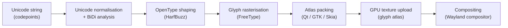
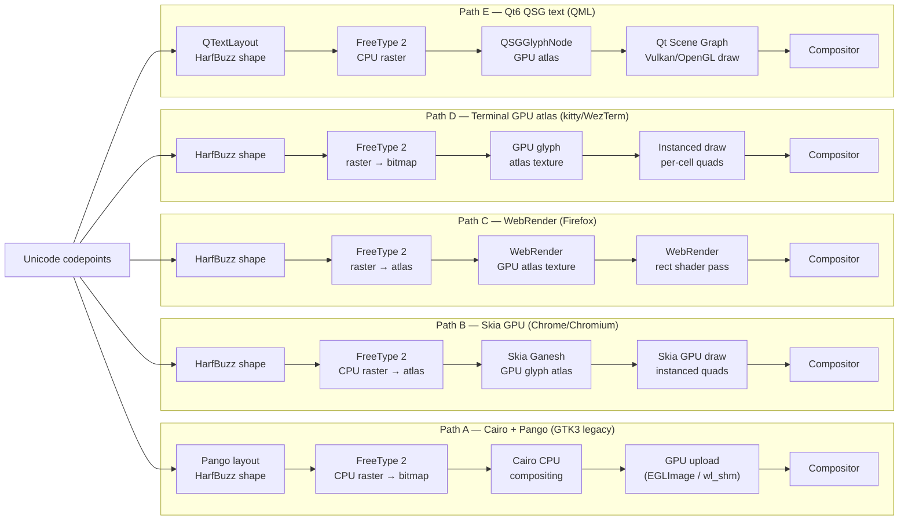
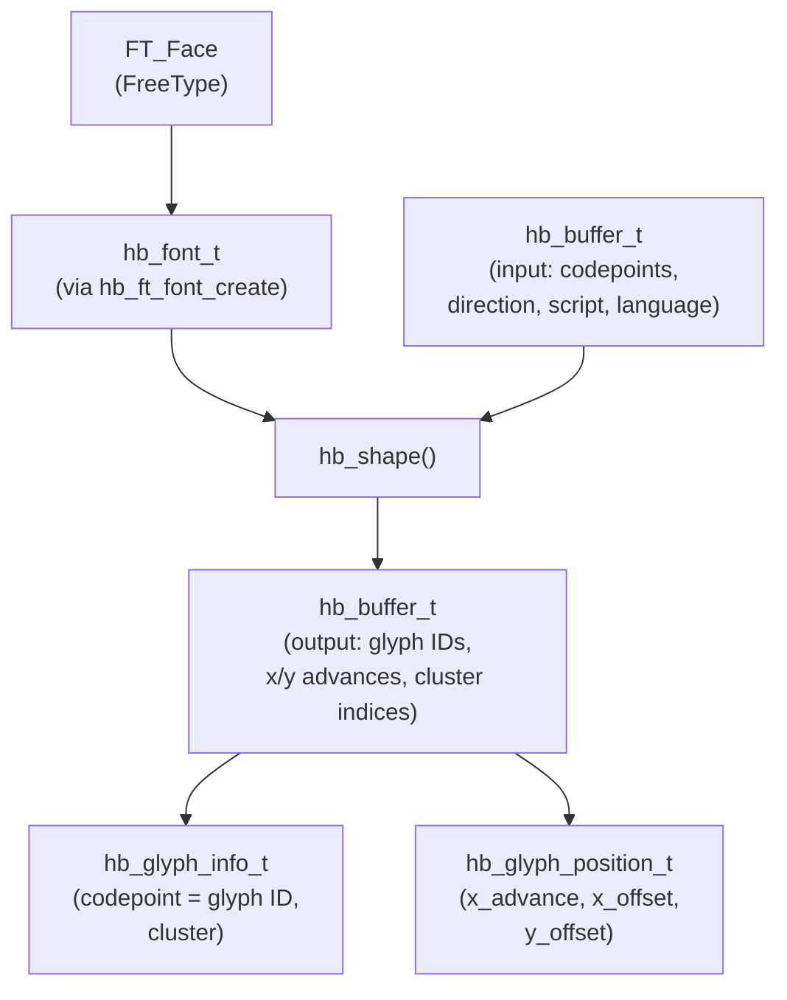
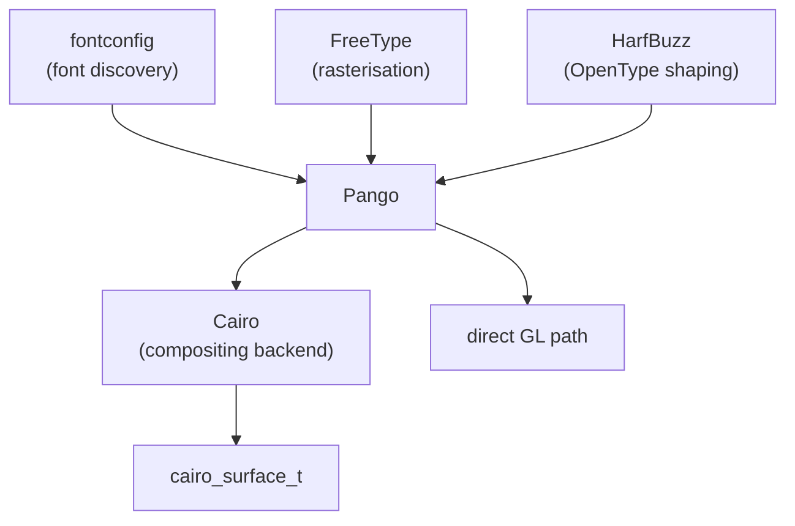
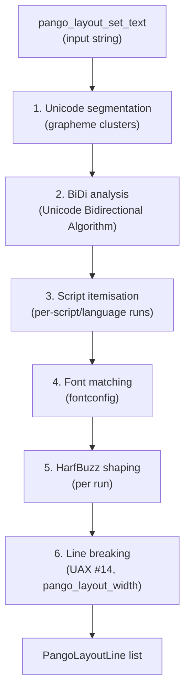
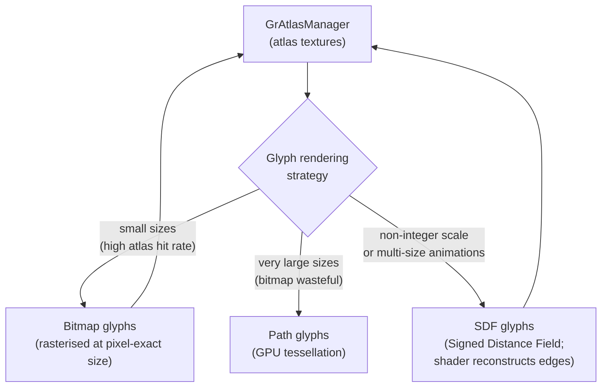
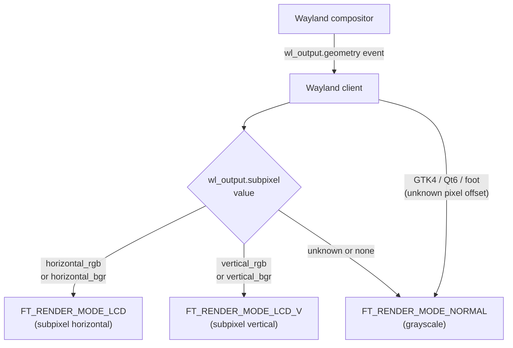

# Chapter 47: Font and Text Rendering Pipeline

> **Part**: Part VII — Application APIs & Middleware
> **Audience**: Graphics application developers who need to understand how text reaches the screen; browser and web platform engineers who need to trace how CSS font properties and Unicode text map to GPU glyph atlases; terminal and TUI developers who need to understand how glyphs are rasterised and composited in a Wayland session.
> **Status**: First draft — 2026-06-12

## Table of Contents

- [Overview](#overview)
- [1. FreeType 2: Glyph Rasterisation Pipeline](#1-freetype-2-glyph-rasterisation-pipeline)
- [2. HarfBuzz: OpenType Shaping Engine](#2-harfbuzz-opentype-shaping-engine)
- [3. fontconfig: Font Matching and Configuration](#3-fontconfig-font-matching-and-configuration)
- [4. Cairo: 2D Compositing Library](#4-cairo-2d-compositing-library)
- [5. Pango: Text Layout Engine](#5-pango-text-layout-engine)
- [6. Glyph Atlas Management](#6-glyph-atlas-management)
- [7. Subpixel Rendering on Wayland](#7-subpixel-rendering-on-wayland)
- [8. Variable Fonts](#8-variable-fonts)
- [Integrations](#integrations)
- [References](#references)

---

## Overview

Text is the most performance-critical rendering workload on a typical desktop or web page: every visible character on screen has passed through a multi-library pipeline that spans **Unicode** normalisation, **OpenType** shaping, glyph rasterisation, atlas packing, **GPU** upload, and compositing. This chapter traces that pipeline end-to-end, from the **FreeType 2** rasteriser that converts vector outlines to bitmaps through the **HarfBuzz** shaping engine that selects and positions the correct glyphs for a given script and language, up to the **Pango** layout engine that breaks paragraphs into lines and the glyph atlas systems inside **Qt**, **GTK**, and **Skia** that amortise GPU upload cost across many draw calls.



Section 1 covers the **FreeType 2** glyph rasterisation pipeline in detail: the **FT_Load_Glyph()** / **FT_Render_Glyph()** call sequence, the full set of **FT_LOAD_** flag values, and the three hinting modes — the **bytecode interpreter (BCI)** (including the v35, v38, and v40 interpreter generations), the **autohinter**, and unhinted rendering. It also covers subpixel rendering via **FT_RENDER_MODE_LCD** and **FT_RENDER_MODE_LCD_V**, the **FT_LCD_FILTER_DEFAULT** FIR filter and its companion **FT_Library_SetLcdFilterWeights()**, the patent history of **Microsoft ClearType** (which delayed **FT_CONFIG_OPTION_SUBPIXEL_RENDERING** until patents expired in 2019), and the gamma-correction blending that must be applied by the rendering layer since **FreeType** rasterises in linear light.

Section 2 covers **HarfBuzz**, the **OpenType** shaping engine. It explains the core data types — **hb_buffer_t**, **hb_font_t**, **hb_glyph_info_t**, and **hb_glyph_position_t** — and the **hb_shape()** call that processes **GSUB** (glyph substitution, including Arabic positional forms and ligatures) and **GPOS** (glyph positioning, including kerning and mark attachment). It describes the **Unicode Bidirectional Algorithm (UBA)** as it relates to shaping-run segmentation, the per-script shapers for Arabic, Indic scripts (**Devanagari**, **Bengali**, etc.), **Hangul**, and **Myanmar**, and the cluster model in **hb_glyph_info_t.cluster** that supports cursor positioning and hit-testing.

Section 3 covers **fontconfig**, the system-level font discovery and matching library. It describes the **FcPattern** pattern language (properties: `family`, `weight`, `slant`, `lang`, `charset`, and others), font family alias chains (`sans-serif` → **DejaVu Sans** → **Arial**), per-application overrides via **fonts.conf** (`$XDG_CONFIG_HOME/fontconfig/fonts.conf`), and the binary font cache maintained by **fc-cache** with command-line tools **fc-list**, **fc-match**, and **fc-scan**.

Section 4 covers **Cairo**, the **PostScript**-inspired 2D compositing library used by **GTK3/GTK2** and **Pango**. It describes the three-layer painting model (source, mask, **CAIRO_OPERATOR_OVER**), the available surface backends (**cairo_image_surface_t**, **XCB**, **PDF**, and the **EGL**/**OpenGL** surface via **cairo_egl_device_create()**), and text rendering via **cairo_show_glyphs()** with pre-shaped glyph arrays from **HarfBuzz**.

Section 5 covers **Pango**, the full text layout engine for the **GNOME/GTK** ecosystem, which integrates **fontconfig**, **FreeType**, **HarfBuzz**, and **Cairo**. It describes **PangoContext**, **PangoFontDescription**, the **PangoLayout** paragraph layout pipeline (Unicode segmentation, **BiDi** analysis, script itemisation, font matching, **HarfBuzz** shaping, and **UAX #14** line-breaking), **PangoLayoutLine** iteration, and bidirectional text reordering.

Section 6 covers glyph atlas management across four toolkits: **Qt**'s **QFontEngineFT** and shelf-packing **QSGRhiAtlasTexture**; **GTK4**'s **GSK** Vulkan renderer with its **VkImage**-backed atlas and **PangoCairoFcFontMap**; **Skia**'s layered **SkStrikeCache** / **GrTextBlobRedrawCoordinator** / **GrAtlasManager** system with bitmap, path, and **SDF (Signed Distance Field)** glyph strategies; and **WebRender** (Firefox's Rust-based renderer) with its **GpuCacheTexture** and separate sub-atlases for grayscale and colour emoji glyphs.

The chapter also covers two important cross-cutting concerns: why the transition from **X11** to **Wayland** broke the **LCD** subpixel rendering that made fonts look sharp on **RGB** stripe panels (including the **wl_output.subpixel** hint and why **GTK4**, **Qt6**, and **foot** still default to grayscale), and how **OpenType** variable fonts are handled at both the **FreeType** (**FT_Set_Var_Design_Coordinates()**, **FT_MM_Var**, **gvar**/**CFF2** delta tables) and **HarfBuzz** (**hb_font_set_variations()**) layers, including the variation-axis cache-key challenge for glyph atlases. Readers from the terminal and TUI world will find the atlas management and **Wayland** subpixel sections directly applicable to how GPU-accelerated terminal emulators like **Ghostty**, **WezTerm**, and **foot** manage their glyph caches.

---

## Text Rendering Pipeline Paths

Text rendering on Linux is not a single pipeline — five distinct paths exist across the ecosystem. All share FreeType 2 as the glyph rasteriser but diverge sharply on CPU vs. GPU rasterisation strategy, atlas management architecture, and where in the compositing chain the rasterised bitmaps are handed off to the compositor. Understanding which path a given application or toolkit takes is essential for diagnosing rendering quality issues, debugging atlas pressure, and reasoning about Wayland subpixel constraints.



| Path | CPU raster | GPU atlas | Subpixel (Wayland) | Colour emoji | Used by |
|---|---|---|---|---|---|
| A: Cairo + Pango | Yes (FreeType) | No — CPU surface uploaded via EGLImage or wl_shm | No (grayscale) | Via separate Cairo surface | GTK3 applications, legacy GTK2 |
| B: Skia GPU | Yes (FreeType) | Yes — GrAtlasManager; bitmap/path/SDF strategies | No (grayscale) | Separate colour atlas | Chrome, Chromium, Electron apps |
| C: WebRender | Yes (FreeType) | Yes — GpuCacheTexture; separate grayscale + colour sub-atlases | No (grayscale) | Colour emoji sub-atlas | Firefox 57+ |
| D: Terminal GPU atlas | Yes (FreeType) | Yes — per-font-size texture atlas | No (grayscale) | Colour glyph slot in atlas | kitty, WezTerm, Ghostty |
| E: Qt6 QSG | Yes (FreeType) | Yes — QSGRhiAtlasTexture; shelf-packing | No (grayscale) | Colour glyph slot in atlas | Qt6 QML applications |

**Subpixel rendering is absent from all Wayland paths.** Wayland compositors composite client surfaces without knowing the physical subpixel order at render time: a client buffer may be placed at any pixel offset, scaled by a fractional scale factor, or rotated, all of which invalidate the assumption that a given logical pixel maps to a specific physical R/G/B subpixel column. While the `wl_output.subpixel` hint (see §7.3) can advertise the panel's physical layout, it is necessary but not sufficient — the client cannot know its position in output coordinates. Consequently GTK4, Qt6, foot, kitty, WezTerm, and Ghostty all default to `FT_RENDER_MODE_NORMAL` (grayscale AA) under Wayland, discarding the LCD rendering available under X11.

---

## 1. FreeType 2: Glyph Rasterisation Pipeline

FreeType 2 is the de-facto glyph rasteriser on Linux. It converts the outline data in a font file — TrueType cubic or quadratic Bézier splines, Type 1 curves, or CFF/OpenType outlines — into an anti-aliased pixel bitmap that can be blended into a glyph atlas or composited directly onto a surface. [Source: FreeType project overview](https://freetype.org/)

### 1.1 Loading a Glyph

The minimal rasterisation sequence is three calls:

```c
/* freetype/include/freetype/freetype.h */
#include <ft2build.h>
#include FT_FREETYPE_H

FT_Library  library;
FT_Face     face;
FT_Error    error;

error = FT_Init_FreeType(&library);

/* Load a font file; face_index 0 selects the first face */
error = FT_New_Face(library, "/usr/share/fonts/truetype/liberation/LiberationSans-Regular.ttf",
                    0, &face);

/* Set the pixel size at 16 px, or use FT_Set_Char_Size for point sizes */
FT_Set_Pixel_Sizes(face, 0, 16);

/* Convert a Unicode codepoint to a glyph index */
FT_UInt glyph_index = FT_Get_Char_Index(face, 0x0041); /* 'A' */

/* Load the outline into face->glyph, applying hinting */
error = FT_Load_Glyph(face, glyph_index, FT_LOAD_DEFAULT);

/* Rasterise the loaded outline into face->glyph->bitmap */
error = FT_Render_Glyph(face->glyph, FT_RENDER_MODE_NORMAL);
```

`FT_Load_Glyph` is the central function. Its flags argument controls the entire pipeline: whether hinting runs, which hinter is used, and which render path is targeted. Key flag values:

| Flag | Meaning |
|---|---|
| `FT_LOAD_DEFAULT` (0) | Load outline; apply hinting; use native hinter if available |
| `FT_LOAD_NO_HINTING` | Disable hinting entirely; generates slightly blurrier glyphs |
| `FT_LOAD_FORCE_AUTOHINT` | Use FreeType's autohinter even when the font has native bytecode |
| `FT_LOAD_NO_AUTOHINT` | Disable the autohinter; fall back to unhinted outlines |
| `FT_LOAD_RENDER` | Combine load and rasterise in one call |
| `FT_LOAD_TARGET_LCD` | Hint for horizontal subpixel rendering |
| `FT_LOAD_TARGET_LCD_V` | Hint for vertical subpixel rendering |
| `FT_LOAD_TARGET_LIGHT` | Minimal hinting; preserves outline shape better than `DEFAULT` |
| `FT_LOAD_TARGET_MONO` | 1-bit bitmap output |

[Source: FreeType FT_LOAD_FLAGS documentation](https://freetype.org/freetype2/docs/reference/ft2-base_interface.html)

### 1.2 Hinting Modes

Hinting aligns glyph outlines to the pixel grid so that stems, serifs, and crossbars land on whole-pixel boundaries at small sizes. FreeType provides three hinting paths:

**Bytecode interpreter (BCI).** TrueType fonts embed hinting bytecode — a Turing-complete virtual machine that manipulates control points before rasterisation. FreeType's BCI executes this bytecode. Three interpreter versions have been shipped. Version 35 (v35) is the legacy path matching pre-Vista Windows rendering. Version 38 (v38), the "Infinality" mode contributed around 2012, aimed to match or exceed Windows rendering quality and provided extensive configuration; it was eventually disabled by default because it was too slow. Version 40 (v40) strips v38 down to the bare minimum without configurability, achieving the same performance as v35 while correcting several hinting defects and supporting subpixel hinting. [Source: FreeType v40 TrueType interpreter mode](https://freetype.org/freetype2/docs/hinting/subpixel-hinting.html)

**Autohinter.** For fonts without native TrueType bytecode (e.g. Type 1, CFF, or TrueType fonts that ship without hints), FreeType's autohinter analyses the glyph outline algorithmically. It detects dominant writing directions, identifies stems, and generates hinting instructions on-the-fly. Passing `FT_LOAD_FORCE_AUTOHINT` overrides native bytecode even for TrueType fonts.

**No hinting.** Passing `FT_LOAD_NO_HINTING` skips all hinting. This is appropriate when rendering at large sizes (where hinting distorts proportions more than it helps), when doing sub-pixel-accurate layout (hinting changes advance widths), or in test suites where pixel-perfect reproducibility matters.

### 1.3 Subpixel Rendering and LCD Filtering

Modern LCD panels are composed of red, green, and blue subpixels arranged in a horizontal stripe pattern. Subpixel rendering exploits this arrangement: instead of treating each pixel as an atomic unit, it renders each colour channel at triple horizontal resolution, dramatically improving apparent resolution for text.

To render into three separate colour channels, use `FT_RENDER_MODE_LCD` (horizontal subpixel layout) or `FT_RENDER_MODE_LCD_V` (vertical layout for panels rotated 90°):

```c
/* Set an LCD filter to reduce colour fringing */
FT_Library_SetLcdFilter(library, FT_LCD_FILTER_DEFAULT);

/* Load with hinting tuned for LCD subpixel layout */
FT_Load_Glyph(face, glyph_index, FT_LOAD_TARGET_LCD);

/* Rasterise to a 3x-wide bitmap; each run of 3 bytes = one logical pixel */
FT_Render_Glyph(face->glyph, FT_RENDER_MODE_LCD);

/* face->glyph->bitmap.width is 3x the logical pixel width */
/* face->glyph->bitmap.pixel_mode == FT_PIXEL_MODE_LCD */
```

The LCD filter is a FIR filter applied across the three colour channels to attenuate the chromatic aberration (colour fringing) that subpixel rendering introduces. Available filters: [Source: FreeType LCD subpixel API](https://freetype.org/freetype2/docs/reference/ft2-lcd_rendering.html)

```c
FT_LCD_FILTER_NONE     /* raw subpixel output; severe colour fringe */
FT_LCD_FILTER_DEFAULT  /* five-tap filter: [0x08 0x4D 0x56 0x4D 0x08] */
FT_LCD_FILTER_LIGHT    /* three-tap: [0x00 0x55 0x56 0x55 0x00]; less blur */
FT_LCD_FILTER_LEGACY   /* older asymmetric filter; retained for compatibility */
```

Custom filter weights can be set via `FT_Library_SetLcdFilterWeights(library, weights)` where `weights` is a five-element array of `FT_Byte` values summing to 256.

The `FT_Library_SetLcdGeometry` function (added in 2.8) allows specifying arbitrary subpixel layouts for non-standard panel arrangements.

### 1.4 Patent History of Subpixel Rendering

Microsoft's ClearType technology, introduced with Windows XP in 2001, was covered by a cluster of US patents filed in 1998–1999 (including US 6,219,025; 6,239,783; 6,307,566 and others). The FreeType project's analysis concluded that the patents did not cover subpixel rendering per se — which is established prior art predating Microsoft's work — but specifically covered the five-tap colour balancing filter used as the final step. [Source: FreeType patents analysis](https://freetype.org/patents.html)

As a result, FreeType enabled subpixel rendering code as a compile-time option (`FT_CONFIG_OPTION_SUBPIXEL_RENDERING`) that distributors had to explicitly activate. Most Linux distributions either shipped with it disabled or activated a different, patent-clear "Harmony" rendering path. The Harmony path avoids the patented filter by using a different technique for fringe suppression.

All ClearType-related Microsoft patents expired by August 2019. Since FreeType 2.10.3, released after this expiry, `FT_LCD_FILTER_DEFAULT` is enabled by default and the `FT_CONFIG_OPTION_SUBPIXEL_RENDERING` restriction no longer applies. [Source: FreeType patents page](https://freetype.org/patents.html)

### 1.5 Gamma Correction

FreeType rasterises in linear light, but most display pipelines assume gamma-encoded (sRGB) output. Without correction, blending anti-aliased glyph coverage values in gamma space makes stems appear thinner than they should. The fix is to linearise (via gamma decode) the background pixels before blending glyph coverage, then re-encode the result. At a gamma of 2.2:

```c
/* Pseudo-code: gamma-correct blend of a glyph pixel at coverage alpha */
float linear_bg = pow(bg / 255.0f, 2.2f);
float linear_fg = pow(fg / 255.0f, 2.2f);
float blended   = linear_fg * alpha + linear_bg * (1.0f - alpha);
output = (uint8_t)(pow(blended, 1.0f / 2.2f) * 255.0f);
```

FreeType itself does not perform gamma correction; that responsibility belongs to the rendering layer (Cairo, Skia, GPU shader). Cairo does not linearise colours before blending by default — it composites in the surface's encoded (gamma) colour space, which is a known limitation — so applications that require perceptually uniform text weight should use a GPU shader path or a toolkit that performs linear-light blending. GPU-accelerated text renderers (Skia with Ganesh/Graphite, WebRender) typically perform the linearisation in the fragment shader or work entirely in a linear colour space end-to-end.

---

## 2. HarfBuzz: OpenType Shaping Engine

Text shaping is the process of converting a Unicode string into an ordered sequence of font glyphs with correct positions. For simple scripts like ASCII Latin, it is nearly trivial. For Arabic, Devanagari, Hangul, or complex ligature fonts, the mapping from codepoints to glyph IDs is non-trivial: glyphs must be substituted, reordered, and positioned according to script-specific OpenType rules. HarfBuzz implements this logic. [Source: HarfBuzz what does it do](https://harfbuzz.github.io/what-does-harfbuzz-do.html)

### 2.1 Core Data Types

**`hb_buffer_t`** serves a dual role. Before shaping it holds the input: a sequence of Unicode codepoints tagged with direction (`HB_DIRECTION_LTR`, `HB_DIRECTION_RTL`), script (`HB_SCRIPT_ARABIC`, `HB_SCRIPT_DEVANAGARI`, ...), and language (`hb_language_from_string("ar", -1)`). After `hb_shape()` returns, the same buffer holds the shaped output: glyph IDs, positions (x/y advance, x/y offset), and cluster indices mapping output glyphs back to input codepoints. [Source: HarfBuzz hb-buffer manual](https://harfbuzz.github.io/harfbuzz-hb-buffer.html)

**`hb_font_t`** wraps a font face at a particular scale. It is created from an `hb_face_t` — typically loaded from a FreeType `FT_Face` via `hb_ft_font_create(ft_face, NULL)`. Font objects are lightweight; they reference the face but can carry per-instance variation coordinates. [Source: HarfBuzz fonts and faces](https://harfbuzz.github.io/fonts-and-faces.html)



### 2.2 The Shaping Call

```c
#include <hb.h>
#include <hb-ft.h>

/* Create a HarfBuzz font from an FT_Face already sized to the target size */
hb_font_t *hb_font = hb_ft_font_create(ft_face, NULL);

/* Create an input buffer */
hb_buffer_t *buf = hb_buffer_create();

/* Add UTF-8 text; -1 means null-terminated */
hb_buffer_add_utf8(buf, "مرحبا", -1, 0, -1);

/* Set segment properties — HarfBuzz will infer these if not set,
   but explicit is more reliable */
hb_buffer_set_direction(buf, HB_DIRECTION_RTL);
hb_buffer_set_script(buf,    HB_SCRIPT_ARABIC);
hb_buffer_set_language(buf,  hb_language_from_string("ar", -1));

/* Run the shaper — applies GSUB/GPOS rules from the font's OpenType tables */
hb_shape(hb_font, buf, NULL, 0);

/* Retrieve output */
unsigned int glyph_count;
hb_glyph_info_t     *glyph_info = hb_buffer_get_glyph_infos(buf, &glyph_count);
hb_glyph_position_t *glyph_pos  = hb_buffer_get_glyph_positions(buf, &glyph_count);

for (unsigned int i = 0; i < glyph_count; i++) {
    hb_codepoint_t gid    = glyph_info[i].codepoint; /* glyph ID after shaping */
    uint32_t       cluster = glyph_info[i].cluster;  /* index into source string */
    hb_position_t  x_adv  = glyph_pos[i].x_advance;
    hb_position_t  x_off  = glyph_pos[i].x_offset;
    hb_position_t  y_off  = glyph_pos[i].y_offset;
}

hb_buffer_destroy(buf);
hb_font_destroy(hb_font);
```

### 2.3 GSUB and GPOS Table Processing

HarfBuzz processes two core OpenType tables:

**GSUB (Glyph Substitution)** replaces individual glyph IDs with alternative IDs according to contextual rules. For Arabic, GSUB applies the mandatory `init`/`medi`/`fina`/`isol` positional forms — the same Arabic letter has up to four glyph forms depending on whether it appears at the start, middle, or end of a connected run, or in isolation. GSUB also handles ligatures: the Arabic pair lam + alef is always represented as a single combined glyph, not two separate ones. For Latin, GSUB handles optional ligatures like fi, fl, ffi. [Source: HarfBuzz OpenType features](https://harfbuzz.github.io/shaping-opentype-features.html)

**GPOS (Glyph Positioning)** adjusts advance widths and placement offsets. For Arabic and other scripts with attached diacritics (marks), GPOS encodes the exact pixel offset at which a vowel mark should be placed relative to its base consonant. For Latin, GPOS provides kerning data (the negative x_offset when 'A' follows 'V') more flexibly than the older kern table.

HarfBuzz applies these tables in the order specified by the OpenType spec for each script, consulting the script/language tags on the buffer's segment properties to select the correct lookup chain.

### 2.4 Unicode Bidirectional Algorithm

The Unicode Bidirectional Algorithm (UBA, Unicode Standard Annex #9) defines how runs of left-to-right and right-to-left text should be ordered in a paragraph. HarfBuzz does not implement the full UBA itself — that is typically handled at the Pango/ICU level before text is segmented into shaping runs. What HarfBuzz does consume is the per-run direction that results from UBA analysis: each call to `hb_shape()` operates on a single-direction, single-script, single-language run. The caller (Pango's itemiser, or Gecko's text run layer, or Chrome's Blink) is responsible for splitting mixed-direction paragraphs into such runs before handing them to HarfBuzz.

### 2.5 Complex Script Support

HarfBuzz contains per-script shapers:

- **Arabic shaper**: handles cursive joining, mandatory positional substitution, mark attachment, and the lam-alef ligature. Used for Arabic, Persian (Farsi), Urdu, Pashto, Syriac, and related scripts.
- **Indic shapers**: Devanagari, Bengali, Gurmukhi, Gujarati, Tamil, and related scripts require reordering of vowel matras (pre-consonant vowels are stored after the consonant in Unicode but must render before it visually) and complex conjunct consonant formation.
- **Hangul shaper**: Korean syllable blocks composed of initial consonant (choseong), vowel (jungseong), and optional final consonant (jongseong) may require decomposition and recomposition.
- **Myanmar shaper**: handles kinzi consonant stacking and specific medial consonant forms.

### 2.6 Cluster Model

The cluster value in `hb_glyph_info_t.cluster` maps each output glyph back to the byte offset in the input string of the first codepoint that contributed to that glyph. This mapping is essential for:
- Cursor positioning (knowing which input character is "under" the text cursor at a given pixel x-coordinate)
- Selection highlighting (knowing which glyphs to highlight for a given character range)
- Hit-testing (click-to-caret conversion)

Clusters are monotonically increasing (LTR text) or decreasing (RTL text) in the output glyph array, but multiple output glyphs can share the same cluster value (a multi-glyph expansion of one input codepoint), and a single output glyph can cover multiple input codepoints (a ligature).

---

## 3. fontconfig: Font Matching and Configuration

fontconfig is the system-level font discovery and matching library on Linux. It maintains a database of installed fonts and provides a pattern-based query interface. When an application asks for "Sans-serif, weight 700, size 12", fontconfig translates that abstract request into a concrete font file path and face index. [Source: fontconfig user documentation](https://www.freedesktop.org/software/fontconfig/fontconfig-user.html)

### 3.1 Pattern Language

A fontconfig pattern is a set of property/value pairs expressed as a colon-separated string on the command line or as an `FcPattern` struct in C:

```
Sans:bold:italic:pixelsize=16
```

Properties include `family`, `style`, `weight`, `slant`, `size`, `pixelsize`, `spacing`, `lang`, `charset`, and many others. Matching proceeds in two phases:

1. **Edit phase**: the system `fonts.conf` and user configuration files modify the pattern, adding defaults and applying alias chains.
2. **Scoring phase**: fontconfig measures the distance from the edited pattern to each known font and returns the closest match.

### 3.2 Font Families, Styles, Weights, and Alias Chains

fontconfig defines symbolic family names like `sans-serif`, `serif`, and `monospace` that alias to concrete families. The alias chain for `sans-serif` typically resolves: `sans-serif` → `DejaVu Sans` → `Bitstream Vera Sans` → `Arial` → `Helvetica`. The first installed match in the chain wins:

```xml
<!-- /etc/fonts/conf.d/30-metric-aliases.conf pattern -->
<alias>
  <family>sans-serif</family>
  <prefer>
    <family>DejaVu Sans</family>
    <family>Bitstream Vera Sans</family>
    <family>Verdana</family>
    <family>Arial</family>
  </prefer>
</alias>
```

If none of the preferred families is installed, fontconfig continues to the next alias level. Aliases can be `prefer` (insert at the start of the family list), `accept` (insert after existing), or `default` (insert at the end as a last resort).

### 3.3 Per-Application Overrides via fonts.conf

User-level configuration lives in `$XDG_CONFIG_HOME/fontconfig/fonts.conf` (typically `~/.config/fontconfig/fonts.conf`). This file is sourced by `/etc/fonts/conf.d/50-user.conf` and takes precedence over system configuration files with a higher numeric prefix. An example per-application override using the `FC_MATCH_APPLICATION` environment mechanism (note: the standard mechanism is application name via `FcMatchPattern`):

```xml
<?xml version="1.0"?>
<!DOCTYPE fontconfig SYSTEM "urn:fontconfig:fonts.dtd">
<fontconfig>
  <!-- Force a specific monospace font for terminal applications -->
  <match>
    <test name="family"><string>monospace</string></test>
    <edit name="family" mode="prepend" binding="strong">
      <string>JetBrains Mono</string>
    </edit>
  </match>

  <!-- Disable hinting for a particular font family -->
  <match target="font">
    <test name="family"><string>Cantarell</string></test>
    <edit name="hinting" mode="assign"><bool>false</bool></edit>
  </match>
</fontconfig>
```

### 3.4 Binary Cache and Command-Line Tools

fontconfig builds and maintains a binary font cache at `~/.cache/fontconfig/` and in `/var/cache/fontconfig/` (populated by the `fc-cache` utility). The cache stores pre-parsed font metadata so that `FcFontList()` calls do not require opening every font file on every application startup.

Essential tools:

```bash
# List all fonts known to fontconfig (family, style, file)
fc-list

# List all monospace fonts, showing file path
fc-list :spacing=mono file

# Query which font fontconfig would actually select for a pattern
fc-match "Sans:bold"
fc-match "monospace:size=12"

# Show full pattern expansion (all properties after matching)
fc-match --verbose "serif:italic"

# Scan a directory and update the cache
fc-scan /usr/share/fonts/truetype/
fc-cache -fv
```

---

## 4. Cairo: 2D Compositing Library

Cairo is a 2D vector graphics library with a PostScript-inspired compositing model. Its primary consumer on the Linux desktop is the GTK3/GTK2 widget toolkit and Pango; GTK4 moved to GSK but Cairo remains relevant for many applications and for the Pango rendering backend. [Source: Cairo documentation](https://cairographics.org/)

### 4.1 Painting Model

Cairo's painting model has three conceptual layers:

- **Source**: what you are painting with — a solid colour (`cairo_set_source_rgb`), a pattern, a gradient, or another surface.
- **Mask**: controls where the paint is applied — a path clipped to the destination, or an explicit alpha mask.
- **Operator**: how source and destination are composited — the default is `CAIRO_OPERATOR_OVER` (Porter-Duff over), but Cairo supports `CLEAR`, `SOURCE`, `IN`, `OUT`, `ATOP`, `DEST_OVER`, `XOR`, and others.

Paint operations follow a consistent sequence: set the source, construct a path or mask, then call a paint verb (`cairo_fill()`, `cairo_stroke()`, `cairo_paint()`, `cairo_mask()`).

### 4.2 Surfaces

Cairo renders into abstract `cairo_surface_t` objects. The most important surface backends:

| Backend | Constructor | Notes |
|---|---|---|
| Image | `cairo_image_surface_create()` | CPU-side ARGB32 or RGB24 buffer |
| PNG | `cairo_image_surface_create_from_png()` | Reads PNG into an image surface |
| XCB | `cairo_xcb_surface_create()` | Renders into an X11 drawable |
| PDF | `cairo_pdf_surface_create()` | Vector output to PDF |
| GL (EGL) | `cairo_gl_surface_create_for_egl()` | OpenGL-accelerated via EGL |

### 4.3 The GL Backend

Cairo's GL backend is experimental but functional. It accelerates fill, stroke, and glyph operations by issuing OpenGL draw calls instead of software rasterising into an image surface. The EGL surface path:

```c
/* cairo/src/cairo-gl.h */
#include <cairo-gl.h>

/* Create a Cairo device wrapping an existing EGL context */
cairo_device_t *device = cairo_egl_device_create(egl_display, egl_context);

/* Create a Cairo surface wrapping an EGL window surface */
cairo_surface_t *surface = cairo_gl_surface_create_for_egl(
    device, egl_surface, width, height);

cairo_t *cr = cairo_create(surface);

/* Normal Cairo drawing calls now go to OpenGL */
cairo_set_source_rgb(cr, 1.0, 0.0, 0.0);
cairo_rectangle(cr, 10, 10, 100, 50);
cairo_fill(cr);

cairo_gl_surface_swapbuffers(surface);
```

[Source: Cairo with OpenGL](https://www.cairographics.org/OpenGL/)

### 4.4 Text Rendering via cairo_show_glyphs

Cairo's text rendering API accepts pre-shaped glyphs:

```c
/* Path: fontconfig selects the font; Cairo loads it via FreeType */
cairo_select_font_face(cr, "Sans", CAIRO_FONT_SLANT_NORMAL, CAIRO_FONT_WEIGHT_BOLD);
cairo_set_font_size(cr, 18.0);

/* High-level: Cairo does its own shaping (ASCII only, no OpenType) */
cairo_move_to(cr, 50.0, 50.0);
cairo_show_text(cr, "Hello");

/* Low-level: pass pre-shaped glyphs from HarfBuzz */
cairo_glyph_t glyphs[N];
/* ... populate glyph IDs and positions from HarfBuzz output ... */
cairo_show_glyphs(cr, glyphs, N);
```

In practice, applications that need correct Unicode rendering always use the Pango layer above Cairo, which integrates HarfBuzz for shaping and Cairo for compositing. `cairo_show_text` is suitable only for ASCII or when the calling code manages shaping externally.

---

## 5. Pango: Text Layout Engine

Pango is the text layout library for the GNOME/GTK ecosystem. It integrates fontconfig for font discovery, FreeType for rasterisation, HarfBuzz for OpenType shaping, and Cairo or a direct GL path for rendering. Unlike raw HarfBuzz (which operates on single shaping runs), Pango handles multi-paragraph, multi-script, bidirectional text with line breaking, justification, and ellipsisation. [Source: Pango Layout documentation](https://docs.gtk.org/Pango/class.Layout.html)



### 5.1 PangoContext and PangoFontDescription

Every Pango operation requires a `PangoContext`, which captures the rendering backend (Cairo surface, XFT, etc.), font map, default language, and base direction. When using the Cairo backend:

```c
#include <pango/pangocairo.h>

/* Create a Pango context matched to the current Cairo surface/transform */
PangoContext *context = pango_cairo_create_context(cr);

/* Describe the desired font */
PangoFontDescription *font_desc = pango_font_description_from_string("DejaVu Sans 14");
pango_font_description_set_weight(font_desc, PANGO_WEIGHT_BOLD);
```

`PangoFontDescription` is Pango's analogue to a CSS `font` shorthand property. It encodes family, style (normal/italic/oblique), weight (thin=100 to ultraheavy=1000), variant (small-caps), stretch (condensed to expanded), and size.

### 5.2 PangoLayout: Paragraph Layout

`PangoLayout` is the high-level entry point for typesetting a full paragraph of text, including line breaking:

```c
PangoLayout *layout = pango_cairo_create_layout(cr);
pango_layout_set_font_description(layout, font_desc);
pango_layout_set_width(layout, 400 * PANGO_SCALE);  /* wrap at 400 logical pixels */
pango_layout_set_wrap(layout, PANGO_WRAP_WORD_CHAR);
pango_layout_set_ellipsize(layout, PANGO_ELLIPSIZE_END);

/* Set text with optional PangoAttrList for per-character attributes */
pango_layout_set_text(layout, "Hello, مرحبا, नमस्ते!", -1);

/* Render to Cairo surface */
pango_cairo_show_layout(cr, layout);

g_object_unref(layout);
```

Internally, `pango_layout_set_text` triggers:
1. **Unicode segmentation** — split the string into grapheme clusters.
2. **BiDi analysis** — run the Unicode Bidirectional Algorithm to determine run directions.
3. **Script itemisation** — split into runs of the same script and language (using ICU or a lightweight built-in detector).
4. **Font matching** — for each run, query fontconfig to find a font covering the required Unicode range.
5. **HarfBuzz shaping** — shape each run with the matched font.
6. **Line breaking** — break the shaped glyph stream into lines that fit `pango_layout_width`, respecting word boundaries and UAX #14 line-break rules.



### 5.3 PangoLayoutLine: Line Iteration

Individual lines can be iterated after layout:

```c
int line_count = pango_layout_get_line_count(layout);
for (int i = 0; i < line_count; i++) {
    PangoLayoutLine *line = pango_layout_get_line_readonly(layout, i);
    PangoRectangle logical_rect;
    pango_layout_line_get_extents(line, NULL, &logical_rect);
    /* logical_rect.{x,y,width,height} in Pango units (1/PANGO_SCALE pixels) */
}
```

`PangoLayoutLine` exposes `runs` — a `GSList` of `PangoLayoutRun` (alias for `PangoItem` + `PangoGlyphString`). Each run is a single HarfBuzz-shaped segment, allowing per-run access to glyph IDs, cluster maps, and positions.

### 5.4 BiDi Text

Pango implements the Unicode Bidirectional Algorithm fully. A paragraph containing both Arabic and English text is split into LTR and RTL runs at the Pango itemiser level. Each run is shaped separately by HarfBuzz with the correct direction set. When rendering, Pango reorders the runs on each line from logical to visual order according to the Unicode BiDi algorithm's L2 rule (reversing embedded RTL runs within LTR lines and vice versa). The embedding level of each run is available via `PangoLayoutRun.item->analysis.level`.

---

## 6. Glyph Atlas Management

Uploading a new texture to the GPU for each individual glyph would be prohibitively expensive. Instead, rendering toolkits pack glyph bitmaps into large GPU textures called glyph atlases and reuse them across frames. This section describes the approaches taken by Qt, GTK/Pango, and Skia.

### 6.1 Qt: QFontEngine and Glyph Cache

Qt's text rendering path routes through `QFontEngine` subclasses. `QFontEngineFT` wraps FreeType and HarfBuzz. After shaping, `QFontEngineFT` looks up each glyph ID in its `QHash<glyph_t, QFontEngineFT::QGlyphSet::GlyphInfo>` cache. On a cache miss, it rasterises the glyph via FreeType and uploads it to a `QSGRhiAtlasTexture` — a GPU texture managed by the Qt Quick Scene Graph's resource system. Qt uses a shelf-packing algorithm to place new glyphs: the atlas is partitioned into horizontal shelves of equal height, and each new glyph occupies the first shelf where it fits.

The atlas texture is shared across all text items rendered in the same Qt Quick scene. When the atlas fills up, Qt evicts the least-recently-used glyphs using an LRU policy and compacts the atlas by re-packing remaining glyphs. [Note: the specific field names of the internal Qt glyph cache structures are subject to change across Qt versions; the above reflects Qt 6.x source structure in `qtbase/src/gui/text/freetype/qfontengine_ft.cpp` — needs verification against current source.]

### 6.2 GTK: PangoCairoFcFontMap and the Glyph Cache

GTK4 uses GSK (GTK Scene Kit) for its rendering pipeline, with a Vulkan or GL backend. Text goes through Pango, which uses `PangoCairoFcFontMap` — a font map that combines fontconfig (for font selection) and Cairo/FreeType (for rasterisation). GSK's Vulkan renderer (`gsk/vulkan/`) manages a glyph atlas as a 2D `VkImage` in device-local memory. On a cache miss, Pango rasterises the glyph to a CPU buffer, which GSK then uploads via a staging buffer.

GTK's atlas eviction strategy: the Vulkan renderer tracks glyph usage and evicts entries that have not been referenced recently. The atlas dimensions are constrained by `VkPhysicalDeviceLimits.maxImageDimension2D`. [Note: eviction policy details may change across GTK versions — needs verification against current gsk/vulkan source.] [Source: GTK source gsk/vulkan](https://gitlab.freedesktop.org/gnome/gtk/-/tree/main/gsk/vulkan)

### 6.3 Skia: SkStrikeServer and GrTextBlob

Skia maintains a glyph cache across two layers. At the CPU layer, `SkStrikeCache` stores rasterised glyph bitmaps indexed by `(typeface ID, size, CTM, renderMode)`. At the GPU layer, `GrTextBlobRedrawCoordinator` manages `GrTextBlob` objects, each holding a set of glyph quads with pre-computed GPU vertices. Glyph bitmaps are packed into `GrAtlasManager`'s set of atlas textures.

Skia supports three glyph rendering strategies depending on size and scale:
1. **Bitmap glyphs**: rasterised at pixel-exact size; suitable for small sizes where the atlas hit rate is high.
2. **Path glyphs**: rendered as vector paths via GPU tessellation; suitable for very large sizes where a bitmap would be wasteful.
3. **SDF (Signed Distance Field) glyphs**: a single distance-field texture encodes the glyph at a reference size; a shader reconstructs sharp edges at arbitrary scales. Skia uses SDF glyphs when the display scale factor is not an integer, or when the same glyph is expected to appear at multiple sizes (as in animations). [Source: Skia text rendering internals](https://skia.googlesource.com/skia/+/refs/heads/main/src/text/gpu/)



The SDF approach trades texture resolution for scale-invariance. A 64×64 SDF texture for a glyph occupies much less memory than the bitmaps required for all the discrete sizes the glyph might be rendered at. The SDF shader in the fragment stage reconstructs the glyph boundary via `smoothstep` on the distance value, with the threshold adjusted for the current scale factor.

### 6.4 WebRender: Glyph Rasterisation in Firefox

Firefox's WebRender renderer (written in Rust) manages its own glyph atlas. The `swgl` (software GL) backend rasterises glyphs via FreeType on the CPU; the native GPU backend uploads pre-rasterised glyph bitmaps into a `GpuCacheTexture`. The glyph cache is keyed on font identity, glyph index, subpixel offset, and transform. WebRender uses separate sub-atlases for grayscale and colour (emoji) glyphs. [Note: the exact cache key tuple and atlas sizing may differ across WebRender versions — needs verification against current source.] [Source: WebRender glyph rasteriser](https://searchfox.org/mozilla-central/source/gfx/wr/webrender/src/glyph_rasterizer/)

---

## 7. Subpixel Rendering on Wayland

### 7.1 Why X11 Subpixel Rendering Worked

Under X11, the X server composed all client windows into a shared framebuffer. When a client rendered text at position (x, y), the server knew the exact mapping from logical to physical pixel coordinates, including which subpixel column each logical pixel corresponded to. FreeType was configured system-wide (via `fonts.conf` `rgba` property) to match the monitor's physical subpixel layout, and the server composited the LCD-rendered glyph bitmaps without any further transformation.

### 7.2 Why Wayland Breaks Subpixel Rendering

In a Wayland session, each client renders into its own private buffer. The client does not know where on the screen its buffer will be placed by the compositor, nor whether the compositor will apply scaling, rotation, or translation transforms. Critically:

1. **Unknown pixel offset**: LCD subpixel rendering assumes the glyph lands at a specific sub-pixel alignment relative to the panel. If the compositor places the client buffer at an odd x-coordinate, the client's assumption about which physical subpixel corresponds to which colour channel is wrong, causing visible colour fringing.

2. **Compositor scaling**: on HiDPI displays, a Wayland compositor may scale a client's 1x buffer to 2x physical pixels, destroying the carefully aligned LCD bitmap.

3. **Client-side decoration transforms**: surface transforms (rotation for tablet mode, fractional scaling via `wp_viewporter`) further break subpixel alignment assumptions.

The result is that most Wayland-native toolkits fall back to **grayscale anti-aliasing** (`FT_RENDER_MODE_NORMAL`) when running under a Wayland compositor, even on RGB stripe panels where subpixel rendering would theoretically be available.

### 7.3 The wl_output.subpixel Hint

The Wayland protocol's `wl_output` interface provides a `subpixel` enum that a compositor can advertise to clients:

```
wl_output.subpixel enum:
  unknown         = 0   /* compositor does not know or cannot determine */
  none            = 1   /* e.g. e-ink, OLED with no subpixel structure */
  horizontal_rgb  = 2   /* standard landscape LCD: R-G-B from left to right */
  horizontal_bgr  = 3   /* BGR-order panel */
  vertical_rgb    = 4   /* portrait orientation or rotated panel */
  vertical_bgr    = 5
```

This information is sent to clients via the `wl_output.geometry` event when the client binds to the `wl_output` global. A client that performs its own compositing without any intermediate scaling could use this hint to enable subpixel rendering with the correct orientation. [Source: Smithay wl_output Subpixel enum](https://smithay.github.io/wayland-rs/wayland_client/protocol/wl_output/enum.Subpixel.html)

In practice, most toolkits do not use the `wl_output.subpixel` hint for enabling subpixel font rendering because condition (1) — unknown pixel offset — remains unresolved. There is no Wayland protocol that tells a client its exact pixel-aligned position within the output coordinate space in a way that survives compositor transformation. As a result:

- **GTK4**: ignores wl_output.subpixel for font rendering; always uses grayscale under Wayland.
- **Qt6**: similarly defaults to grayscale on Wayland.
- **foot**: uses grayscale AA under Wayland; no LCD path.
- **FreeType configuration**: when a toolkit calls `FT_Load_Glyph` under Wayland, it uses `FT_RENDER_MODE_NORMAL` (grayscale) rather than `FT_RENDER_MODE_LCD`.



### 7.4 Configuring FreeType per Display

For applications that do control their exact screen position (e.g. a custom compositor or a kiosk application rendering directly to a KMS framebuffer), FreeType can be configured per output:

```c
/* Query the wl_output.subpixel from the Wayland registry, then select the
   appropriate FreeType render mode */
FT_Render_Mode select_render_mode(enum wl_output_subpixel sp) {
    switch (sp) {
    case WL_OUTPUT_SUBPIXEL_HORIZONTAL_RGB:
    case WL_OUTPUT_SUBPIXEL_HORIZONTAL_BGR:
        return FT_RENDER_MODE_LCD;
    case WL_OUTPUT_SUBPIXEL_VERTICAL_RGB:
    case WL_OUTPUT_SUBPIXEL_VERTICAL_BGR:
        return FT_RENDER_MODE_LCD_V;
    default:
        return FT_RENDER_MODE_NORMAL;
    }
}
```

For the BGR cases, the channel order in the rasterised bitmap must be swapped before uploading to a texture, or the shader must reverse the channel mapping.

---

## 8. Variable Fonts

OpenType variable fonts (introduced in OpenType 1.8 in 2016) embed continuous design spaces along named axes, replacing what previously required dozens of static font files. A single variable font file can cover the entire weight range from thin (100) to black (900), all intermediate widths, and optical sizes.

### 8.1 OpenType Variation Axes

The OpenType specification defines five registered axes with four-character tags:

| Tag | Axis | Range | Notes |
|---|---|---|---|
| `wght` | Weight | 1–1000 | 400 = regular, 700 = bold |
| `wdth` | Width | 1–1000 | 100% = normal, expressed as a percentage |
| `slnt` | Slant | −90 to +90 | degrees; distinct from italic |
| `ital` | Italic | 0–1 | binary or continuous |
| `opsz` | Optical size | 1–∞ | point size for which letterforms are optimised |

Font designers may register additional private axes (e.g. `GRAD` for grade, `CASL` for casual), using four-character tags that begin with uppercase letters for registered axes and lowercase for private.

### 8.2 FreeType Variable Font API

FreeType supports variable fonts since version 2.7. The core functions:

```c
/* freetype/include/freetype/ftmm.h */
#include FT_MULTIPLE_MASTERS_H

/* Retrieve the variation descriptor — describes all axes and named instances */
FT_MM_Var *mm_var;
FT_Get_MM_Var(face, &mm_var);

printf("Number of axes: %u\n", mm_var->num_axis);
for (unsigned i = 0; i < mm_var->num_axis; i++) {
    FT_Var_Axis *ax = &mm_var->axis[i];
    /* ax->tag: four-char tag as FT_ULong, e.g. 0x77676874 = 'wght' */
    /* ax->minimum, ax->def, ax->maximum: FT_Fixed (16.16 fixed point) */
    printf("  Axis %u: tag=0x%08lx  min=%f  def=%f  max=%f\n",
           i, ax->tag,
           ax->minimum / 65536.0,
           ax->def     / 65536.0,
           ax->maximum / 65536.0);
}

/* Set a specific design coordinate (FT_Fixed values) */
FT_Fixed coords[2] = {
    700 * 65536,    /* wght = 700 (bold) */
    75  * 65536,    /* wdth = 75 (condensed) */
};
FT_Set_Var_Design_Coordinates(face, mm_var->num_axis, coords);

/* Or select a named instance by 1-based index */
/* Named instances are pre-defined points in variation space, e.g. "SemiBold" */
FT_Set_Named_Instance(face, 2);  /* [Since FreeType 2.9] */

FT_Done_MM_Var(library, mm_var);
```

[Source: FreeType multiple masters/variable fonts API](https://freetype.org/freetype2/docs/reference/ft2-multiple_masters.html)

After setting variation coordinates, all subsequent `FT_Load_Glyph` calls rasterise the glyph at the requested point in variation space. FreeType interpolates the delta tables embedded in the font's `gvar` (TrueType) or `CFF2` (OpenType/CFF) table to generate the interpolated outline.

### 8.3 HarfBuzz Variation API

HarfBuzz also needs to know the current variation coordinates to apply the correct GSUB/GPOS substitutions for variable fonts. The `gvar` delta tables affect not only outlines but also advance widths and mark placements encoded in GPOS. HarfBuzz manages variations through `hb_font_set_variations`:

```c
#include <hb.h>

/* hb_variation_t encodes one axis setting */
hb_variation_t variations[] = {
    { HB_TAG('w','g','h','t'), 700.0f },   /* wght = 700 */
    { HB_TAG('w','d','t','h'),  75.0f },   /* wdth = 75 */
};

hb_font_set_variations(hb_font, variations, 2);

/* Subsequent hb_shape() calls use these variation coordinates */
hb_shape(hb_font, buf, NULL, 0);
```

[Source: HarfBuzz variable fonts manual](https://harfbuzz.github.io/fonts-and-faces-variable.html)

When using the HarfBuzz–FreeType integration via `hb_ft_font_create`, the variations set on the `hb_font_t` are automatically synchronised to the underlying `FT_Face` before shaping, so application code typically only needs to call `hb_font_set_variations` once per font instance configuration.

### 8.4 Variation Instances and the Font Cache

Variable fonts introduce a challenge for glyph atlas caching: a glyph at weight 400 and a glyph at weight 700 have different outlines and thus different bitmaps, even though they share the same glyph ID and font face. The cache key must include the variation coordinates (or a quantised approximation) in addition to the glyph ID and pixel size. Most toolkits quantise the variation axes to a small number of steps (e.g. 50-unit buckets for `wght`) to avoid cache explosion.

---

## Roadmap

### Near-term (6–12 months)

- **HarfBuzz GPU paint API stabilisation**: As of April 2026 the experimental `hb_gpu_paint_t` raster/vector/GPU libraries completed code review; the API is expected to graduate from experimental status in the near term, enabling COLRv0 and COLRv1 paint-tree encoding directly into a compact GPU-ready blob without a CPU intermediate pass. [Source](https://github.com/harfbuzz/harfbuzz/issues/5919)
- **HarfBuzz 14.x maintenance and subsetting fixes**: HarfBuzz 14.2.0 (April 2026) is the current stable release; active work continues on fixing variable COLRv1 subsetting (where `ItemVariationStore` is incorrectly dropped, leaving `VarIndex` references dangling). [Source](https://github.com/harfbuzz/harfbuzz/issues/4085)
- **FreeType 2.14.x continued maintenance**: FreeType 2.14.3 (March 2026) is the current stable release; autohinter improvements for diacritic separation at small sizes shipped recently and incremental maintenance continues. [Source](https://freetype.org/)
- **Pango petite-caps and OpenType feature parity**: Pango 1.57.0 (August 2025) added petite-caps support; near-term work focuses on closing remaining OpenType feature gaps before a potential architectural split with GTK 5. [Source](https://lwn.net/Articles/987176/)
- **COLRv1 Linux ecosystem adoption**: COLRv1 support now exists in FreeType, HarfBuzz, and Chrome but remains absent from GTK's Pango path and most terminal glyph atlas implementations; near-term work by downstream toolkit maintainers is expected to close this gap. Note: needs verification for specific patchset timelines.

### Medium-term (1–3 years)

- **GTK 5 text layout architecture**: Matthias Clasen (GTK maintainer) has proposed absorbing HarfBuzz-based text layout from Pango directly into GTK 5 and experimenting with GPU-based rasterisers to replace the FreeType CPU path; no final design decisions have been made. [Source](https://lwn.net/Articles/987176/)
- **Variable COLRv1 full-stack support**: Complete variable COLRv1 rendering (colour axes animated by `wght`, `opsz`, etc.) requires coordinated updates to FreeType's `COLR` table renderer, HarfBuzz's paint subsetter, and toolkit glyph atlas key schemes to include colour-axis variation coordinates alongside outline axes. [Source](https://groups.google.com/a/chromium.org/g/blink-dev/c/oMcbPblmD-k)
- **Fractional-scale-aware glyph caching**: As `wp_fractional_scale_v1` becomes the norm, toolkits must cache glyphs at non-integer physical pixel sizes. Medium-term work aims to extend SDF (Signed Distance Field) rendering strategies in Skia and GTK's GSK renderer so that a single cached SDF glyph covers a continuous range of fractional scales without per-scale re-rasterisation. Note: needs verification for specific upstream issues.
- **HarfBuzz subset 2.0 streaming API**: The `hb-subset` library is targeting a streaming subsetting API that does not require loading the full font into memory, reducing memory pressure for web-font subsetting in browser renderers. Note: needs verification for release timeline.
- **fontconfig cache format v10 and incremental scanning**: Discussions on the fontconfig mailing list have proposed an incremental directory-scan model and a revised binary cache format to reduce cold-start latency on systems with large font trees. Note: needs verification for specific RFC patchset status.

### Long-term

- **GPU-native glyph rasterisation**: The medium-term HarfBuzz GPU paint work points toward a long-term architecture where glyph outlines are rasterised directly on the GPU via compute shaders (bypassing FreeType's CPU scan-converter entirely), analogous to pathfinder/vello approaches already prototyped in the Rust graphics ecosystem. [Source](https://behdad.org/text2024/)
- **Unified color-emoji and outline atlas**: Current toolkit implementations maintain separate atlas textures for grayscale glyphs, COLRv0/v1 colour emoji, and bitmap emoji (CBDT/CBLC/sbix). A unified atlas with a per-glyph-slot format tag is a long-term architectural goal to reduce GPU texture memory and draw-call fragmentation. Note: needs verification.
- **Wayland subpixel rendering revival**: Long-term proposals (discussed at XDC and in Wayland protocol issues) would allow a compositor to communicate per-surface subpixel geometry after accounting for fractional scale and output transform, potentially re-enabling LCD subpixel hinting for axis-aligned surfaces. Adoption depends on protocol standardisation and toolkit opt-in. Note: needs verification for specific protocol draft status.

---

## Integrations

This chapter has described the foundational font and text rendering libraries that every higher-level component in the Linux graphics stack depends on. The key integration points are:

**Qt and GTK (Ch39)**: Both toolkits integrate HarfBuzz for OpenType shaping and FreeType for rasterisation. Qt's `QFontEngineFT` wraps FreeType directly; GTK3/4 routes through Pango, which integrates both libraries. fontconfig provides font selection for both. The glyph atlas textures produced by Qt and GTK flow into their respective GPU rendering pipelines: Qt's `QRhi` abstraction and GTK's GSK Vulkan/GL renderers.

**Skia (Ch37)**: Skia's `SkTypeface_FreeType` backend wraps FreeType for rasterisation. HarfBuzz shaping is used by Skia's text blob API. On Linux, Skia calls `FcFontMatch` (fontconfig) for font discovery when no explicit typeface is provided. The Skia glyph atlas described in §6.3 feeds the same GPU texture pipeline used by Chrome's Viz compositor (Ch36), making font rendering a key throughput consideration for web page compositing.

**Terminal emulators (Ch44, Ch45)**: GPU-accelerated terminals (Ghostty, WezTerm, Kitty) all maintain per-font-size glyph atlases, structurally identical to those described in §6. They call FreeType directly (or via a Rust wrapper like `freetype-rs`) and in some cases HarfBuzz for combining character sequences and emoji. Kitty, WezTerm, and Ghostty use the same FreeType LCD filter API. fontconfig is used for system font discovery when no explicit font path is provided. The Wayland subpixel issue (§7) directly affects these terminals — all three default to grayscale anti-aliasing under Wayland.

**Cairo GL backend → Mesa OpenGL (Ch19)**: The `cairo_egl_device_create` path described in §4.3 creates an OpenGL context that runs through Mesa's GL implementation. All GL commands issued by Cairo (VBO uploads, shader programs for glyph compositing) pass through Mesa's state tracker and ultimately to the hardware driver (iris/radeonsi/nouveau).

**Wayland wl_output.subpixel (Ch20)**: The `wl_output.subpixel` hint advertised by the compositor is the only protocol-level mechanism by which a Wayland client can learn the panel's physical subpixel geometry. As discussed in §7.3, it is necessary but not sufficient for enabling subpixel font rendering in practice. The Wayland output management chapter covers the full `wl_output` event sequence and how compositors like Mutter and KWin determine and advertise the subpixel geometry.

**Compositor HiDPI scaling (Ch22)**: A compositor's fractional scaling factor (set via the `wp_fractional_scale_v1` or `wl_surface.set_buffer_scale` protocols) directly affects the pixel size at which glyphs must be rasterised. A glyph requested at 14pt at 1.5× scale must be rasterised at an equivalent of 21pt physical pixels but in a client buffer sized for 14pt logical pixels, with the compositor upscaling. This tension between logical and physical glyph metrics affects FreeType's `FT_Set_Pixel_Sizes` call, glyph atlas granularity, and the point at which SDF rendering (§6.3) becomes preferable to integer-size bitmap caching.

---

## References

- [FreeType 2 Documentation](https://freetype.org/freetype2/docs/reference/)
- [FreeType LCD Subpixel Rendering API](https://freetype.org/freetype2/docs/reference/ft2-lcd_rendering.html)
- [FreeType Multiple Masters / Variable Fonts API](https://freetype.org/freetype2/docs/reference/ft2-multiple_masters.html)
- [FreeType v40 TrueType Interpreter Mode](https://freetype.org/freetype2/docs/hinting/subpixel-hinting.html)
- [FreeType and Patents](https://freetype.org/patents.html)
- [HarfBuzz Manual](https://harfbuzz.github.io/)
- [HarfBuzz hb-buffer API](https://harfbuzz.github.io/harfbuzz-hb-buffer.html)
- [HarfBuzz OpenType Features](https://harfbuzz.github.io/shaping-opentype-features.html)
- [HarfBuzz Variable Fonts](https://harfbuzz.github.io/fonts-and-faces-variable.html)
- [fontconfig User Manual](https://www.freedesktop.org/software/fontconfig/fontconfig-user.html)
- [Cairo Documentation](https://cairographics.org/)
- [Cairo with OpenGL](https://www.cairographics.org/OpenGL/)
- [Pango Layout class](https://docs.gtk.org/Pango/class.Layout.html)
- [GTK gsk/vulkan renderer source](https://gitlab.freedesktop.org/gnome/gtk/-/tree/main/gsk/vulkan)
- [Skia text/gpu source](https://skia.googlesource.com/skia/+/refs/heads/main/src/text/gpu/)
- [WebRender glyph rasteriser](https://searchfox.org/mozilla-central/source/gfx/wr/webrender/src/glyph_rasterizer/)
- [Subpixel rendering — Wikipedia](https://en.wikipedia.org/wiki/Subpixel_rendering)
- [Smithay wl_output::Subpixel enum](https://smithay.github.io/wayland-rs/wayland_client/protocol/wl_output/enum.Subpixel.html)
