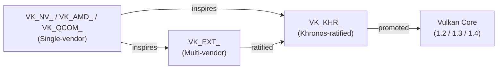
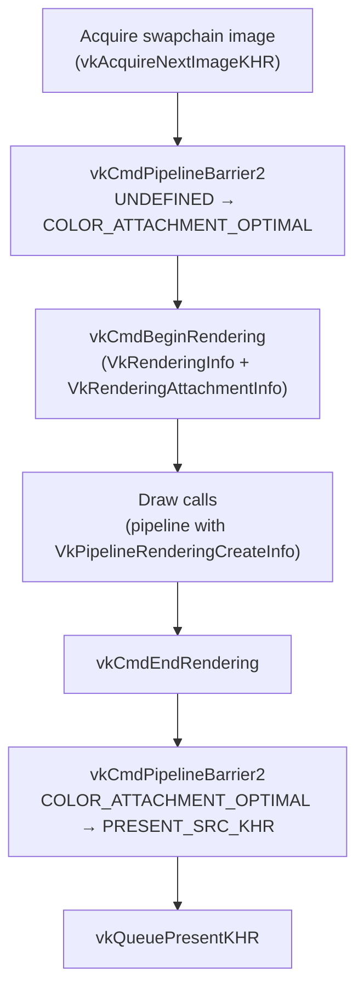
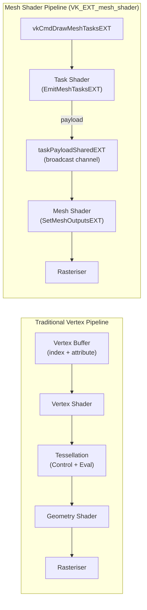
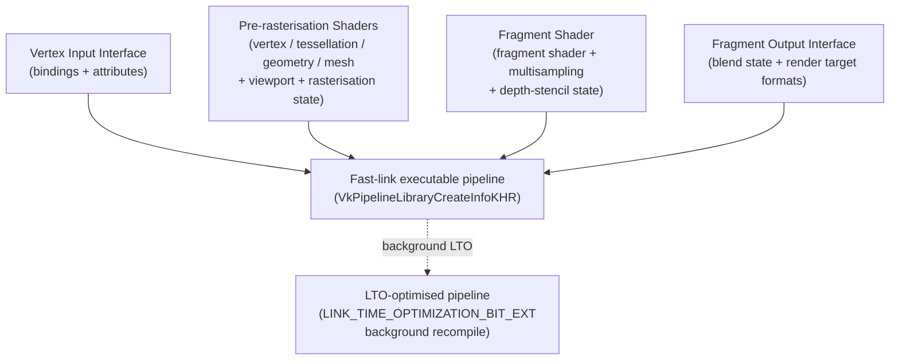

# Chapter 76: Modern Vulkan Extensions

**Audiences:** Graphics application developers writing Vulkan-native code or translation layers; systems developers optimizing driver implementations in RADV, ANV, or NVK; browser and game-engine engineers integrating Vulkan with DXVK, VKD3D-Proton, Bevy, or Godot 4.

---

## Table of Contents

1. [The Extension Model](#1-the-extension-model)
2. [VK_KHR_dynamic_rendering (Vulkan 1.3)](#2-vk_khr_dynamic_rendering-vulkan-13)
3. [Descriptor Indexing and Bindless Resources](#3-descriptor-indexing-and-bindless-resources)
4. [Mesh Shaders (VK_EXT_mesh_shader)](#4-mesh-shaders-vk_ext_mesh_shader)
5. [Cooperative Matrices (VK_KHR_cooperative_matrix)](#5-cooperative-matrices-vk_khr_cooperative_matrix)
6. [Shader Objects (VK_EXT_shader_object)](#6-shader-objects-vk_ext_shader_object)
7. [Graphics Pipeline Libraries (VK_EXT_graphics_pipeline_library)](#7-graphics-pipeline-libraries-vk_ext_graphics_pipeline_library)
8. [Extended Dynamic State 3 (VK_EXT_extended_dynamic_state3)](#8-extended-dynamic-state-3-vk_ext_extended_dynamic_state3)
9. [Driver Adoption Status](#9-driver-adoption-status)
10. [Integrations](#10-integrations)

---

## 1. The Extension Model

**Vulkan** was deliberately launched in 2016 with a lean core and a principled extension mechanism to allow the API to evolve without breaking backwards compatibility. Understanding how extensions work is essential before examining the individual features that define post-1.2 "modern **Vulkan**" usage.

### Prefix Taxonomy

**Vulkan** extensions carry one of three prefixes that encode their provenance and degree of standardisation:



- **`VK_KHR_`** — **Khronos**-ratified extensions. These undergo an IP rights review by the **Khronos** Board of Promoters and must be approved by vote. **KHR** extensions are the canonical candidates for eventual promotion to a core **Vulkan** version.
- **`VK_EXT_`** — Multi-vendor extensions agreed upon by two or more IHVs but not necessarily ratified (though **Khronos** has begun retroactively ratifying selected **EXT** extensions). **EXT** extensions often reach a broader implementation base than vendor-specific work.
- **`VK_NV_`**, **`VK_AMD_`**, **`VK_QCOM_`**, etc. — Single-vendor extensions that expose proprietary hardware features. They may later inspire a multi-vendor **EXT** or be superseded by **KHR** standardisation. **`VK_NV_cooperative_matrix`** is a canonical example: the **NV** extension shipped first on Turing GPUs, then drove the **KHR** standardisation effort that produced **`VK_KHR_cooperative_matrix`**.

### Promotion Path

When a feature has proven its design, **Khronos** promotes it into a core minor version. The chain for several features covered in this chapter is:

```
VK_KHR_dynamic_rendering  →  promoted to Vulkan 1.3 core
VK_EXT_descriptor_indexing →  promoted to Vulkan 1.2 core
VK_EXT_extended_dynamic_state  →  promoted to Vulkan 1.3 core
VK_EXT_extended_dynamic_state2 →  promoted to Vulkan 1.3 core
VK_KHR_maintenance4         →  promoted to Vulkan 1.3 core
VK_EXT_mesh_shader          →  multi-vendor EXT (not yet core as of 2026)
VK_EXT_graphics_pipeline_library → multi-vendor EXT (not yet core)
VK_EXT_shader_object        →  multi-vendor EXT (not yet core)
VK_KHR_cooperative_matrix   →  KHR ratified (not yet core as of 2026)
VK_EXT_extended_dynamic_state3 → multi-vendor EXT (not yet core)
```

After promotion, application code should prefer the unprefixed core entry points (e.g. **`vkCmdBeginRendering`** rather than **`vkCmdBeginRenderingKHR`**) when targeting the promoted version.

### Querying and Enabling Extensions

Before enabling an extension, an application must verify that the physical device supports it:

```c
// Query extension count
uint32_t extCount = 0;
vkEnumerateDeviceExtensionProperties(physDevice, NULL, &extCount, NULL);

VkExtensionProperties *exts = malloc(extCount * sizeof(*exts));
vkEnumerateDeviceExtensionProperties(physDevice, NULL, &extCount, exts);

// Scan for desired extension
bool hasMeshShader = false;
for (uint32_t i = 0; i < extCount; i++) {
    if (strcmp(exts[i].extensionName, VK_EXT_MESH_SHADER_EXTENSION_NAME) == 0)
        hasMeshShader = true;
}
```

Extensions often expose granular feature bits that must each be opted-in separately. **Vulkan** 1.1 introduced the **`pNext`**-chaining mechanism on **`VkPhysicalDeviceFeatures2`**, allowing any number of feature structs to be queried and later enabled during device creation:

```c
// Query features via pNext chain
VkPhysicalDeviceMeshShaderFeaturesEXT meshFeatures = {
    .sType = VK_STRUCTURE_TYPE_PHYSICAL_DEVICE_MESH_SHADER_FEATURES_EXT,
};
VkPhysicalDeviceDescriptorIndexingFeatures diFeatures = {
    .sType = VK_STRUCTURE_TYPE_PHYSICAL_DEVICE_DESCRIPTOR_INDEXING_FEATURES,
    .pNext = &meshFeatures,
};
VkPhysicalDeviceFeatures2 features2 = {
    .sType = VK_STRUCTURE_TYPE_PHYSICAL_DEVICE_FEATURES_2,
    .pNext = &diFeatures,
};
vkGetPhysicalDeviceFeatures2(physDevice, &features2);

// Enable chosen features at device-create time via the same pNext chain
VkDeviceCreateInfo devCI = {
    .sType               = VK_STRUCTURE_TYPE_DEVICE_CREATE_INFO,
    .pNext               = &features2,   // same chain, bits already set
    .enabledExtensionCount   = enabledExtCount,
    .ppEnabledExtensionNames = enabledExtNames,
};
vkCreateDevice(physDevice, &devCI, NULL, &device);
```

[Source: Khronos Vulkan Guide — Enabling Extensions](https://github.com/KhronosGroup/Vulkan-Guide/blob/main/chapters/enabling_extensions.adoc)

### The "Modern Vulkan" Extension Set

The extensions that together define post-1.2 usage patterns — the ones that Valve's **Proton** stack, game engines, and the **Mesa** drivers collectively depend on — are covered in the remainder of this chapter. Mastering them means understanding a fundamentally different programming model: render passes disappear, pipelines can be assembled lazily or bypassed entirely, descriptors become a flat global namespace, and new shader stages take over geometry amplification and matrix arithmetic.

**`VK_KHR_dynamic_rendering`**, promoted to **Vulkan** 1.3 core, abolishes **`VkRenderPass`** and **`VkFramebuffer`** objects for the common single-subpass case. Applications instead record rendering instances using **`vkCmdBeginRendering`** with a **`VkRenderingInfo`** structure that attaches **`VkRenderingAttachmentInfo`** descriptors directly. Explicit **`vkCmdPipelineBarrier2`** calls replace the implicit image layout transitions that render pass objects previously managed. The chapter covers the complete render loop, tile memory implications for **TBDR** architectures such as **ARM Mali**, **Qualcomm Adreno**, and **Imagination PowerVR**, and the **`VK_KHR_dynamic_rendering_local_read`** extension (promoted to **Vulkan** 1.4) that restores intra-pass read-back via **`vkCmdSetRenderingAttachmentLocationsKHR`** and **`vkCmdSetRenderingInputAttachmentIndicesKHR`**.

**`VK_EXT_descriptor_indexing`**, promoted to **Vulkan** 1.2 core and exposed via **`VkPhysicalDeviceDescriptorIndexingFeatures`**, enables bindless resource access. Applications populate a single large descriptor array once and shaders select resources at runtime using integer indices. The key feature bits — **`runtimeDescriptorArray`**, **`descriptorBindingPartiallyBound`**, and **`descriptorBindingUpdateAfterBind`** — are examined alongside the **`UPDATE_AFTER_BIND`** pool pattern and a complete bindless material system using **`VK_DESCRIPTOR_BINDING_PARTIALLY_BOUND_BIT`**, **`GL_EXT_nonuniform_qualifier`**, and the **`nonuniformEXT`** qualifier in **GLSL**. Real-world adoption by **Doom Eternal**, **Unreal Engine 5** (Nanite, Lumen), and **Godot 4** is discussed.

**`VK_EXT_mesh_shader`** replaces the traditional vertex → tessellation → geometry pipeline with two compute-like stages: **task shaders** (dispatched via **`vkCmdDrawMeshTasksEXT`**, terminating in **`EmitMeshTasksEXT`**) and **mesh shaders** (emitting vertices and primitives via **`SetMeshOutputsEXT`**). The chapter covers the **`taskPayloadSharedEXT`** broadcast channel between stages, two-phase **Hi-Z** occlusion culling using **`imageAtomicMin`** depth pyramids, indirect dispatch via **`vkCmdDrawMeshTasksIndirectEXT`** and **`VkDrawMeshTasksIndirectCommandEXT`**, and hardware mapping to **RDNA 2/3** wave32 compute and **NVIDIA** Turing/Ada **SM** tensor and primitive-export hardware.

**`VK_KHR_cooperative_matrix`**, ratified in 2023, provides **SPIR-V** operations that map to hardware **tensor cores** (**NVIDIA**) and **matrix engines** (**Intel Xe**, **AMD RDNA4**). The chapter explains how to query supported configurations via **`vkGetPhysicalDeviceCooperativeMatrixPropertiesKHR`** and **`VkCooperativeMatrixPropertiesKHR`**, write **GLSL** compute shaders using **`coopMatMulAdd`** (lowered to **`OpCooperativeMatrixMulAddKHR`** in **SPIR-V**), and target real use cases including **FSR4** neural upscaling in **VKD3D-Proton 3.0** and **RTX Neural Shading**. The vendor extension **`VK_NV_cooperative_matrix2`** extending this with per-element and reduce-redistribute operations is also described, along with driver support in **RADV** (**GFX11/RDNA3+**, **Mesa 23.3+**, using `v_wmma_*` instructions) and **NVK** (via the **NAK** shader backend).

**`VK_EXT_shader_object`** abolishes **`VkPipeline`** for graphics rendering entirely. Shaders are compiled individually as **`VkShaderEXT`** objects via **`vkCreateShadersEXT`** using **`VkShaderCreateInfoEXT`**, bound at draw time with **`vkCmdBindShadersEXT`**, and all formerly pipeline-baked state is set dynamically. Both binary blobs (**`VK_SHADER_CODE_TYPE_BINARY_EXT`**) and **SPIR-V** sources (**`VK_SHADER_CODE_TYPE_SPIRV_EXT`**) are accepted. Driver strategies in **RADV** (fast-link ISA caching, default since **Mesa 24.1**) and **ANV** (deferred linking for Intel EU ISA) are compared against the pipeline cache trade-offs relevant to **DXVK** and mobile targets.

**`VK_EXT_graphics_pipeline_library`** (**GPL**) decomposes the monolithic **`VkPipeline`** into four independently compilable segments — Vertex Input Interface, Pre-rasterisation Shaders, Fragment Shader, and Fragment Output Interface — linked via **`VkPipelineLibraryCreateInfoKHR`**. The `graphicsPipelineLibraryFastLinking` property controls whether final linking can happen at draw time. **`VK_PIPELINE_CREATE_LINK_TIME_OPTIMIZATION_BIT_EXT`** triggers a background **LTO** recompile for peak throughput. Adoption by **DXVK 2.0** and **VKD3D-Proton** for shader-stutter elimination is examined in detail.

**`VK_EXT_extended_dynamic_state3`** (**EDS3**) adds approximately 33 additional dynamic states beyond those promoted to **Vulkan** 1.3 core by **`VK_EXT_extended_dynamic_state`** and **`VK_EXT_extended_dynamic_state2`**. Coverage includes rasterisation mode (**`vkCmdSetPolygonModeEXT`**), sample count (**`vkCmdSetRasterizationSamplesEXT`**), per-attachment colour blend (**`vkCmdSetColorBlendEnableEXT`**, **`vkCmdSetColorBlendEquationEXT`**, **`vkCmdSetColorWriteMaskEXT`**), conservative rasterisation, and **NVIDIA**-specific states. Driver state tracking impact on **RADV** (via `radv_dynamic_state`) and **ANV** (Xe-HPG 3D-state packets) is analysed. EDS3 is implicitly required by **`VK_EXT_shader_object`**.

The chapter concludes with a driver adoption matrix spanning **RADV**, **ANV**, **NVK**, the **NVIDIA** proprietary driver, and **AMDVLK** as of **Mesa 25.x–26.x**, **Vulkan CTS** conformance notes (including the **AMDGPU** gang-submit kernel requirement for mesh-shader task-payload correctness), and real-world adoption profiles for **DXVK**, **VKD3D-Proton 3.0**, **Bevy 0.14**, **Godot 4**, and **Unreal Engine 5**.

---

## 2. VK_KHR_dynamic_rendering (Vulkan 1.3)

### Motivation: The Render Pass Object Tax

The original Vulkan render pass model (`VkRenderPass`, `VkFramebuffer`, `VkSubpassDescription`) was designed to give tile-based GPU drivers full information about inter-pass memory dependencies so they could schedule tile flushes optimally. In practice, most desktop applications use a single subpass per render pass, the objects impose significant boilerplate at creation time, and rebuilding them when attachment formats change is a common source of stutter. `VK_KHR_dynamic_rendering`, ratified as part of Vulkan 1.3 in January 2022, abolishes render pass objects for the common case. [Source: Khronos Vulkan 1.3 release](https://www.khronos.org/news/permalink/khronos-releases-vulkan-1.3/)

### Core Structures

`VkRenderingInfo` replaces `VkRenderPassBeginInfo`. Its canonical definition is:

```c
typedef struct VkRenderingInfo {
    VkStructureType                     sType;       // VK_STRUCTURE_TYPE_RENDERING_INFO
    const void*                         pNext;
    VkRenderingFlags                    flags;       // e.g. VK_RENDERING_CONTENTS_SECONDARY_COMMAND_BUFFERS_BIT
    VkRect2D                            renderArea;
    uint32_t                            layerCount;
    uint32_t                            viewMask;    // non-zero enables multiview
    uint32_t                            colorAttachmentCount;
    const VkRenderingAttachmentInfo*    pColorAttachments;
    const VkRenderingAttachmentInfo*    pDepthAttachment;   // nullable
    const VkRenderingAttachmentInfo*    pStencilAttachment; // nullable
} VkRenderingInfo;
```

Each attachment is described by `VkRenderingAttachmentInfo`:

```c
typedef struct VkRenderingAttachmentInfo {
    VkStructureType          sType;        // VK_STRUCTURE_TYPE_RENDERING_ATTACHMENT_INFO
    const void*              pNext;
    VkImageView              imageView;
    VkImageLayout            imageLayout;
    VkResolveModeFlagBits    resolveMode;
    VkImageView              resolveImageView;
    VkImageLayout            resolveImageLayout;
    VkAttachmentLoadOp       loadOp;
    VkAttachmentStoreOp      storeOp;
    VkClearValue             clearValue;
} VkRenderingAttachmentInfo;
```

[Source: Vulkan Documentation Project — VkRenderingAttachmentInfo](https://docs.vulkan.org/refpages/latest/refpages/source/VkRenderingAttachmentInfo.html)

### A Complete Render Loop Without vkCreateRenderPass

The following illustrates a full frame that renders to a swapchain image. Image layout transitions that render passes previously managed implicitly must now be issued as explicit pipeline barriers.

```c
// 1. Transition swapchain image to COLOR_ATTACHMENT_OPTIMAL
VkImageMemoryBarrier2 toAttachment = {
    .sType            = VK_STRUCTURE_TYPE_IMAGE_MEMORY_BARRIER_2,
    .srcStageMask     = VK_PIPELINE_STAGE_2_TOP_OF_PIPE_BIT,
    .dstStageMask     = VK_PIPELINE_STAGE_2_COLOR_ATTACHMENT_OUTPUT_BIT,
    .dstAccessMask    = VK_ACCESS_2_COLOR_ATTACHMENT_WRITE_BIT,
    .oldLayout        = VK_IMAGE_LAYOUT_UNDEFINED,
    .newLayout        = VK_IMAGE_LAYOUT_COLOR_ATTACHMENT_OPTIMAL,
    .image            = swapchainImage,
    .subresourceRange = { VK_IMAGE_ASPECT_COLOR_BIT, 0, 1, 0, 1 },
};
VkDependencyInfo dep = {
    .sType = VK_STRUCTURE_TYPE_DEPENDENCY_INFO,
    .imageMemoryBarrierCount = 1,
    .pImageMemoryBarriers    = &toAttachment,
};
vkCmdPipelineBarrier2(cmd, &dep);   // VK_KHR_synchronization2, also core in 1.3

// 2. Describe attachment: clear to opaque black, store result
VkRenderingAttachmentInfo colorAtt = {
    .sType       = VK_STRUCTURE_TYPE_RENDERING_ATTACHMENT_INFO,
    .imageView   = swapchainImageView,
    .imageLayout = VK_IMAGE_LAYOUT_COLOR_ATTACHMENT_OPTIMAL,
    .loadOp      = VK_ATTACHMENT_LOAD_OP_CLEAR,
    .storeOp     = VK_ATTACHMENT_STORE_OP_STORE,
    .clearValue  = { .color = { .float32 = {0.0f, 0.0f, 0.0f, 1.0f} } },
};

// 3. Begin dynamic render pass
VkRenderingInfo ri = {
    .sType                = VK_STRUCTURE_TYPE_RENDERING_INFO,
    .renderArea           = { {0, 0}, {width, height} },
    .layerCount           = 1,
    .colorAttachmentCount = 1,
    .pColorAttachments    = &colorAtt,
};
vkCmdBeginRendering(cmd, &ri);

// 4. Draw calls here (pipeline must have VkPipelineRenderingCreateInfo in pNext)
vkCmdDraw(cmd, vertexCount, 1, 0, 0);

vkCmdEndRendering(cmd);

// 5. Transition to PRESENT_SRC for the compositor
VkImageMemoryBarrier2 toPresent = { /* ... */ };
vkCmdPipelineBarrier2(cmd, &dep2);
```

Pipelines used inside dynamic rendering sessions must declare their attachment formats via `VkPipelineRenderingCreateInfo` in the pipeline's `pNext` chain instead of referencing a `VkRenderPass` object.

### Dynamic Rendering Frame Loop

The following diagram reflects the explicit frame-recording sequence described above: image layout transitions via `vkCmdPipelineBarrier2` bookend the rendering instance, replacing the implicit transitions that render pass objects previously managed.



### Mobile vs. Desktop Tile Memory Implications

For tile-based deferred renderers (TBDR) on mobile — ARM Mali, Qualcomm Adreno, Imagination PowerVR — the original render pass subpass mechanism conveyed whether inter-attachment dependencies could be satisfied entirely within tile SRAM, avoiding costly DRAM spills. Dynamic rendering sacrifices this explicit dependency declaration. On Mali, the driver must conservatively assume attachments can't share tile memory across a dynamic rendering instance boundary unless application-provided input attachments or `VK_KHR_dynamic_rendering_local_read` (a Vulkan 1.4 addition) communicate the dependency.

On desktop GPU architectures — AMD RDNA, NVIDIA Ada — there is no tile memory in the TBDR sense; the driver maps dynamic rendering directly to colour buffer and depth-stencil attachment bindings in the hardware command stream. The abstraction cost is effectively zero, and performance is typically indistinguishable from explicit render passes that also contained only a single subpass.

Performance guides from Qualcomm recommend continuing to use `VkSubpassDescription` on Adreno targets for complex multi-pass effects (G-buffer deferred, shadow-map sampling) while embracing dynamic rendering on platforms where per-draw descriptor rebinding is the dominant cost. [Source: Qualcomm Adreno Best Practices](https://docs.qualcomm.com/bundle/publicresource/topics/80-78185-2/mobile_best_practices.html)

### VK_KHR_dynamic_rendering_local_read (Vulkan 1.4)

The original dynamic rendering extension had one significant gap: it provided no mechanism for one fragment shader to read the colour or depth values written by a prior fragment shader in the same pass — the functionality used by deferred shading G-buffer reads and order-independent transparency. Those techniques required falling back to explicit render pass objects with `VkSubpassDependency`.

`VK_KHR_dynamic_rendering_local_read`, promoted to Vulkan 1.4 core, bridges this gap. It allows intra-pass read-back through two mechanisms:

1. **Pipeline barriers with `VK_DEPENDENCY_BY_REGION_BIT`** inside a dynamic rendering instance that involve only framebuffer-space stages. These do not perform layout transitions but signal to the driver that subsequent fragment invocations may read what prior invocations wrote, enabling tile-memory servicing on TBDR hardware.

2. **New API calls for attachment remapping**:
   - `vkCmdSetRenderingAttachmentLocationsKHR` — remaps shader colour-output locations to different attachment indices, allowing existing subpass-targeting shaders to be ported without source changes.
   - `vkCmdSetRenderingInputAttachmentIndicesKHR` — maps input attachment indices to colour or depth/stencil attachments for reading within the same rendering instance.

The dedicated image layout `VK_IMAGE_LAYOUT_RENDERING_LOCAL_READ_KHR` covers storage images and all attachment types when used in this intra-pass read mode.

On tile-based GPUs this maps to the existing tile-memory read path: the data never has to leave on-chip SRAM. On desktop (RDNA, Ada), the driver inserts an L1-cache flush and re-fetch, which is less optimal but correct. Together, dynamic rendering + local read effectively replaces subpasses for the vast majority of rendering algorithms without sacrificing mobile GPU bandwidth efficiency. [Source: Vulkan Documentation — VK_KHR_dynamic_rendering_local_read proposal](https://docs.vulkan.org/features/latest/features/proposals/VK_KHR_dynamic_rendering_local_read.html)

---

## 3. Descriptor Indexing and Bindless Resources

### The Traditional Descriptor Problem

Classic Vulkan requires that the exact set of resources a draw call will use be declared in `VkDescriptorSet` objects and bound at draw time via `vkCmdBindDescriptorSets`. For a scene with thousands of materials, this means thousands of descriptor updates per frame and one or more `vkCmdBindDescriptorSets` calls between many draw calls — significant CPU overhead and driver-side state tracking.

`VK_EXT_descriptor_indexing`, promoted to Vulkan 1.2 core and exposed via `VkPhysicalDeviceDescriptorIndexingFeatures`, eliminates the per-draw binding requirement. Instead, the application fills a single large descriptor set once (or infrequently) and shaders select resources at runtime using integer indices passed through push constants or storage buffers.

### Feature Bits

The feature struct contains 20 boolean fields. The three most important for a bindless architecture are:

```c
typedef struct VkPhysicalDeviceDescriptorIndexingFeatures {
    VkStructureType sType;
    void*           pNext;
    // ... (17 more feature bits) ...
    VkBool32        descriptorBindingUniformBufferUpdateAfterBind;
    VkBool32        descriptorBindingSampledImageUpdateAfterBind;
    VkBool32        descriptorBindingStorageImageUpdateAfterBind;
    VkBool32        descriptorBindingStorageBufferUpdateAfterBind;
    // ...
    VkBool32        descriptorBindingPartiallyBound;
    VkBool32        descriptorBindingVariableDescriptorCount;
    VkBool32        runtimeDescriptorArray;
} VkPhysicalDeviceDescriptorIndexingFeatures;
```

- **`runtimeDescriptorArray`** — enables SPIR-V `RuntimeDescriptorArray` capability, allowing array sizes declared as `[]` in GLSL/HLSL to be determined at runtime.
- **`descriptorBindingPartiallyBound`** — allows descriptors in a binding to be unused at draw time (indices that are never accessed need not be backed by valid resources).
- **`descriptorBindingUpdateAfterBind`** — allows the descriptor set to be updated on the CPU while in-flight GPU work (from a previous submission) is reading it. Requires `VK_DESCRIPTOR_POOL_CREATE_UPDATE_AFTER_BIND_BIT` on the pool.

[Source: Vulkan Documentation Project — VkPhysicalDeviceDescriptorIndexingFeatures](https://docs.vulkan.org/refpages/latest/refpages/source/VkPhysicalDeviceDescriptorIndexingFeatures.html)

### UPDATE_AFTER_BIND Pools

When new textures arrive (streamed terrain, loaded character assets), the application can write them into the global descriptor array while the GPU is rendering with previously loaded textures, provided it:

1. Created the pool with `VK_DESCRIPTOR_POOL_CREATE_UPDATE_AFTER_BIND_BIT`.
2. Created the layout binding with `VK_DESCRIPTOR_BINDING_UPDATE_AFTER_BIND_BIT`.
3. Ensures the shader invocations that will read the newly written slot execute in a command buffer submitted after the update.

### Bindless Material System Pattern

```c
// Descriptor set layout: one giant texture array
VkDescriptorSetLayoutBinding texBinding = {
    .binding         = 0,
    .descriptorType  = VK_DESCRIPTOR_TYPE_COMBINED_IMAGE_SAMPLER,
    .descriptorCount = 65536,          // runtime-sized; gpu won't touch all entries
    .stageFlags      = VK_SHADER_STAGE_FRAGMENT_BIT,
};
VkDescriptorBindingFlags texFlags =
    VK_DESCRIPTOR_BINDING_PARTIALLY_BOUND_BIT |
    VK_DESCRIPTOR_BINDING_UPDATE_AFTER_BIND_BIT;

VkDescriptorSetLayoutBindingFlagsCreateInfo flagsCI = {
    .sType        = VK_STRUCTURE_TYPE_DESCRIPTOR_SET_LAYOUT_BINDING_FLAGS_CREATE_INFO,
    .bindingCount = 1,
    .pBindingFlags = &texFlags,
};
VkDescriptorSetLayoutCreateInfo layoutCI = {
    .sType        = VK_STRUCTURE_TYPE_DESCRIPTOR_SET_LAYOUT_CREATE_INFO,
    .pNext        = &flagsCI,
    .flags        = VK_DESCRIPTOR_SET_LAYOUT_CREATE_UPDATE_AFTER_BIND_POOL_BIT,
    .bindingCount = 1,
    .pBindings    = &texBinding,
};
// ... create layout, pool, set once at startup ...

// Per-draw: push a single material index
struct PushConstants { uint32_t textureIndex; uint32_t materialIndex; };
vkCmdPushConstants(cmd, layout, VK_SHADER_STAGE_ALL_GRAPHICS,
                   0, sizeof(PushConstants), &pushConst);
vkCmdDraw(cmd, ...);   // no vkCmdBindDescriptorSets per draw
```

In the fragment shader (GLSL with `GL_EXT_nonuniform_qualifier`):

```glsl
#version 450
#extension GL_EXT_nonuniform_qualifier : require

layout(push_constant) uniform PC {
    uint textureIndex;
    uint materialIndex;
};

layout(set = 0, binding = 0) uniform sampler2D textures[];  // runtime array

layout(location = 0) out vec4 fragColor;

void main() {
    // nonuniformEXT informs the compiler that textureIndex may diverge across
    // invocations — required when the index is not dynamically uniform
    fragColor = texture(textures[nonuniformEXT(textureIndex)], texCoord);
}
```

The `nonuniformEXT` qualifier (mapped to SPIR-V `NonUniform` decoration) is mandatory when the index is not guaranteed to be the same across all active invocations in a subgroup; omitting it is a spec violation that manifests as corruption on many IHV implementations.

### Bindless Adoption in Practice

Doom Eternal (id Tech 7) shipped with a fully bindless resource model in 2020, achieving very few descriptor-set rebinds per frame. Unreal Engine 5 introduced bindless resource tables in UE5.3 (2023), enabling its Nanite geometry streaming and Lumen global illumination to reference millions of virtual textures without per-draw binding overhead. Godot 4's `RenderingDevice` Vulkan backend batches `vkCmdBindDescriptorSets` calls and uses `VK_DESCRIPTOR_POOL_CREATE_FREE_DESCRIPTOR_SET_BIT` elimination optimisations (adopting linear pool reset), but as of Godot 4.4 does not yet implement a full bindless model; its descriptor updates are batched per-frame rather than per-draw. [Source: Godot Vulkan optimization for Android](https://developer.android.com/stories/games/godot-vulkan)

---

## 4. Mesh Shaders (VK_EXT_mesh_shader)

### Why Replace the Vertex Pipeline?

The fixed vertex → primitive assembly → rasterizer pipeline assumes geometry arrives as indexed triangles in a vertex buffer. Modern techniques — GPU-driven occlusion culling, variable-density meshlets, procedural geometry, Level-of-Detail amplification — need to compute geometry on the GPU itself. Geometry shaders and tessellation provide partial answers but are notoriously difficult to implement efficiently in hardware: they produce variable-length output that must be staged through intermediate buffers.

`VK_EXT_mesh_shader`, published in 2022 and broadly adopted across RDNA 2+, Ada Lovelace, and Intel Xe, replaces vertex + tessellation + geometry with two compute-like stages: **task shaders** and **mesh shaders**.

[Source: Khronos Mesh Shading for Vulkan](https://www.khronos.org/blog/mesh-shading-for-vulkan)

### Mesh Shader Pipeline vs. Traditional Vertex Pipeline

`VK_EXT_mesh_shader` replaces vertex + tessellation + geometry stages with two compute-like stages. The diagram shows the replacement described in the text:



### Task Shaders and Payload Passing

The task shader is optional. It is dispatched by `vkCmdDrawMeshTasksEXT(cmd, groupCountX, groupCountY, groupCountZ)` and executes one workgroup per thread group. At the end of the task shader, `EmitMeshTasksEXT` (SPIR-V: `OpEmitMeshTasksEXT`) must be called in **uniform control flow** — every invocation in the workgroup must reach the call with the same arguments — to specify how many mesh shader workgroups to spawn. Payload data (written before `EmitMeshTasksEXT`) is broadcast to all spawned mesh workgroups via the `taskPayloadSharedEXT` storage class:

```glsl
#version 450
#extension GL_EXT_mesh_shader : require

layout(local_size_x = 32) in;

// Payload broadcast to all mesh shader workgroups spawned by this task workgroup
taskPayloadSharedEXT struct {
    uint meshletBase;
    uint meshletCount;
    uint instanceID;
} payload;

void main() {
    uint clusterId = gl_WorkGroupID.x;  // one cluster per task workgroup

    // Coarse culling: test cluster bounding sphere against frustum.
    // All invocations participate; result must be uniform across the workgroup
    // so that EmitMeshTasksEXT is called in uniform control flow.
    bool visible = frustumCull(clusterId);

    // Write payload shared by all mesh workgroups spawned from this task workgroup.
    // Payload writes must complete before EmitMeshTasksEXT.
    if (gl_LocalInvocationIndex == 0) {
        payload.meshletBase  = clusterId * MESHLETS_PER_CLUSTER;
        payload.meshletCount = visible ? MESHLETS_PER_CLUSTER : 0;
        payload.instanceID   = instanceID;
    }

    // EmitMeshTasksEXT MUST be called in uniform control flow — every invocation
    // in the workgroup must reach this call. Arguments must also be uniform.
    uint meshCount = visible ? MESHLETS_PER_CLUSTER : 0u;
    EmitMeshTasksEXT(meshCount, 1, 1);
}
```

The `TaskPayloadWorkgroupEXT` storage class makes the payload writable in the task shader and read-only in mesh shaders launched by it — functioning as a hardware-accelerated broadcast channel between the two stages.

[Source: Vulkan Documentation — VK_EXT_mesh_shader proposal](https://docs.vulkan.org/features/latest/features/proposals/VK_EXT_mesh_shader.html)

### Mesh Shaders

Each mesh shader workgroup emits a fixed-size collection of vertices and primitives. The built-in `SetMeshOutputsEXT(vertexCount, primitiveCount)` must be called before writing outputs:

```glsl
#version 450
#extension GL_EXT_mesh_shader : require

layout(local_size_x = 64) in;
layout(triangles, max_vertices = 64, max_primitives = 124) out;

// Read payload from task shader
taskPayloadSharedEXT struct {
    uint meshletBase;
    uint meshletCount;
    uint instanceID;
} payload;

layout(location = 0) out vec2 outUV[];
layout(location = 1) perprimitiveEXT out uint outMeshletID[];

void main() {
    uint meshletID = payload.meshletBase + gl_WorkGroupID.x;
    Meshlet m = meshlets[meshletID];

    SetMeshOutputsEXT(m.vertexCount, m.triangleCount);

    // Emit vertices
    if (gl_LocalInvocationIndex < m.vertexCount) {
        uint vi = meshletVertices[m.vertexOffset + gl_LocalInvocationIndex];
        gl_MeshVerticesEXT[gl_LocalInvocationIndex].gl_Position =
            mvpMatrix * vec4(vertices[vi].position, 1.0);
        outUV[gl_LocalInvocationIndex] = vertices[vi].uv;
    }

    // Emit triangle indices (packed as uvec3)
    if (gl_LocalInvocationIndex < m.triangleCount) {
        gl_PrimitiveTriangleIndicesEXT[gl_LocalInvocationIndex] =
            fetchMeshletTriangle(meshletID, gl_LocalInvocationIndex);
        outMeshletID[gl_LocalInvocationIndex] = meshletID;
    }
}
```

### Occlusion Culling via Two-Phase Task Shaders

A standard GPU-driven rendering pattern combines mesh shaders with a two-phase culling approach:

**Phase 1 (Depth Pre-pass):** A first indirect mesh-draw dispatches task shaders that test each cluster's bounding sphere/AABB against the previous frame's Hi-Z (hierarchical depth) pyramid stored as a mip-mapped depth texture. Clusters that are likely visible emit mesh workgroups and contribute to the current frame's depth buffer.

**Phase 2 (Resolve pass):** A second indirect dispatch, fed by a compute shader that re-tests clusters against the freshly written depth buffer (reprojected), resolves any false-positive occlusions and draws the few remaining visible clusters. This two-phase approach eliminates the one-frame lag in occlusion accuracy.

The depth pyramid is built with a series of compute dispatches after Phase 1, using `imageAtomicMin` or independent fullscreen reductions to produce min-depth mips at each level. Task shaders sample the pyramid using a conservative texel footprint matching the projected cluster diameter.

```glsl
// Task shader snippet: depth-pyramid occlusion test
bool clusterVisible(uint clusterId) {
    vec4 aabb  = projectAABB(clusterBounds[clusterId], mvpMatrix);
    float minZ = textureLod(depthPyramid, aabb.xy + aabb.zw * 0.5,
                            log2(max(aabb.z, aabb.w) * pyramidSize)).r;
    return aabb.z > 0.0 && minZ > aabb.w;  // Compare near-z vs stored depth
}
```

### Indirect Dispatch

For GPU-driven pipelines, mesh draws are dispatched indirectly. The buffer holding the draw arguments is filled by a compute pre-pass:

```c
typedef struct VkDrawMeshTasksIndirectCommandEXT {
    uint32_t groupCountX;
    uint32_t groupCountY;
    uint32_t groupCountZ;
} VkDrawMeshTasksIndirectCommandEXT;

// One draw entry per cluster group, filled by the occlusion-culling compute shader
vkCmdDrawMeshTasksIndirectEXT(cmd, argsBuffer, 0, drawCount,
                              sizeof(VkDrawMeshTasksIndirectCommandEXT));
```

[Source: Vulkan Docs — VkDrawMeshTasksIndirectCommandEXT](https://docs.vulkan.org/refpages/latest/refpages/source/VkDrawMeshTasksIndirectCommandEXT.html)

### Hardware Mapping: AMD RDNA and NVIDIA Ada

**RDNA 2/3** implement mesh shaders via the hardware's existing Compute Shader Engine. Mesh workgroups are dispatched as wave32 wavefronts through the normal compute scheduler (RDNA defaults to 32-wide waves; GCN used 64-wide). The "primitive export" path bypasses the traditional vertex export channel and writes directly to the rasteriser's setup unit.

**NVIDIA Turing and later** extended the SM with per-CTA payload memory and hardware mesh export instructions to support DirectX 12 Ultimate mesh shaders; the same hardware capability is used by `VK_EXT_mesh_shader` on the Vulkan path.

Note: deep hardware microarchitecture details for RDNA mesh amplification and NVIDIA task culling behaviour are documented partially in AMD and NVIDIA architecture whitepapers and may vary across generations — readers implementing production mesh-shader renderers should consult architecture-specific performance guides.

---

## 5. Cooperative Matrices (VK_KHR_cooperative_matrix)

### Motivation

GPU shader code is written in terms of single invocations: a vertex shader processes one vertex, a fragment shader one fragment. Modern GPUs augment this with **tensor cores** (NVIDIA) or **matrix engines** (Intel Xe, AMD RDNA4 AI accelerators) — fixed-function circuits that multiply 16×16 (or similar) matrix tiles in a single clock cycle. These circuits are only accessible to multiple invocations acting in concert; a single invocation cannot issue a tensor-core instruction.

`VK_KHR_cooperative_matrix`, ratified in 2023, provides SPIR-V operations that map directly to tensor cores. The KHR extension standardises the vendor-specific `VK_NV_cooperative_matrix` originally introduced for NVIDIA Turing. [Source: Vulkan 1.3.300 release — VK_NV_cooperative_matrix2](https://www.phoronix.com/news/Vulkan-1.3.300-Released)

### Querying Supported Matrix Configurations

Not all dimension and type combinations are accelerated; the application queries which are:

```c
uint32_t propCount = 0;
vkGetPhysicalDeviceCooperativeMatrixPropertiesKHR(physDevice, &propCount, NULL);

VkCooperativeMatrixPropertiesKHR *props =
    malloc(propCount * sizeof(*props));
for (uint32_t i = 0; i < propCount; i++)
    props[i].sType = VK_STRUCTURE_TYPE_COOPERATIVE_MATRIX_PROPERTIES_KHR;

vkGetPhysicalDeviceCooperativeMatrixPropertiesKHR(physDevice, &propCount, props);

// Typical entry on an NVIDIA Ampere GPU:
// MSize=16, KSize=16, NSize=16
// AType=VK_COMPONENT_TYPE_FLOAT16_KHR, BType=VK_COMPONENT_TYPE_FLOAT16_KHR
// CType=VK_COMPONENT_TYPE_FLOAT32_KHR, ResultType=VK_COMPONENT_TYPE_FLOAT32_KHR
// scope=VK_SCOPE_SUBGROUP_KHR
```

`VkCooperativeMatrixPropertiesKHR` has fields `MSize`, `NSize`, `KSize`, `AType`, `BType`, `CType`, `ResultType`, and `scope`. The spec requires at least one entry with power-of-two dimensions for all three sizes. [Source: Vulkan Docs — VkCooperativeMatrixPropertiesKHR](https://docs.vulkan.org/refpages/latest/refpages/source/VkCooperativeMatrixPropertiesKHR.html)

### SPIR-V: OpCooperativeMatrixMulAddKHR

At the SPIR-V level, cooperative matrices are first-class types. A GLSL compute shader performing a 16×16 FP16→FP32 GEMM tile:

```glsl
#version 450
#extension GL_KHR_cooperative_matrix : require
#extension GL_EXT_shader_explicit_arithmetic_types_float16 : require

layout(local_size_x = 32) in;  // one subgroup per workgroup

const uint M = 16, N = 16, K = 16;

// Cooperative matrix types: scope=Subgroup, rows, cols, use
coopmat<float16_t, gl_ScopeSubgroup, M, K, gl_MatrixUseA> matA;
coopmat<float16_t, gl_ScopeSubgroup, K, N, gl_MatrixUseB> matB;
coopmat<float,     gl_ScopeSubgroup, M, N, gl_MatrixUseAccumulator> matC;
coopmat<float,     gl_ScopeSubgroup, M, N, gl_MatrixUseAccumulator> matResult;

layout(binding = 0) readonly buffer ABuffer { float16_t a[]; };
layout(binding = 1) readonly buffer BBuffer { float16_t b[]; };
layout(binding = 2)          buffer CBuffer { float c[]; };

void main() {
    uint tileRow = gl_WorkGroupID.y;
    uint tileCol = gl_WorkGroupID.x;

    matC = coopmat<float, gl_ScopeSubgroup, M, N, gl_MatrixUseAccumulator>(0.0);

    for (uint k = 0; k < totalK; k += K) {
        coopMatLoad(matA, a, tileRow * M * totalK + k, K, gl_CooperativeMatrixLayoutRowMajor);
        coopMatLoad(matB, b, k * totalN + tileCol * N, N, gl_CooperativeMatrixLayoutRowMajor);
        matC = coopMatMulAdd(matA, matB, matC);   // SPIR-V: OpCooperativeMatrixMulAddKHR
    }

    coopMatStore(matC, c, tileRow * M * totalN + tileCol * N, N, gl_CooperativeMatrixLayoutRowMajor);
}
```

The GLSL `coopMatMulAdd` function lowers to `OpCooperativeMatrixMulAddKHR` in SPIR-V, which the driver backend maps to tensor-core instructions. [Source: NVIDIA machine learning in Vulkan blog](https://developer.nvidia.com/blog/machine-learning-acceleration-vulkan-cooperative-matrices/)

### Use Cases: DLSS-Style Upscaling and Neural Inference

**VKD3D-Proton 3.0** (November 2025) exploits cooperative matrices to implement AMD FSR4 super-resolution — the ML-based upscaling algorithm requires FP8 matrix multiplications that map directly to `VK_KHR_cooperative_matrix` combined with `VK_EXT_shader_float8`. This allows FSR4 to run through Proton on AMD RDNA 4 hardware that exposes FP8 tensor support. [Source: VKD3D-Proton 3.0 release — GamingOnLinux](https://www.gamingonlinux.com/2025/11/vkd3d-proton-3-0-brings-fsr4-support-shader-backend-rewrite-lots-of-bug-fixes-and-performance-upgrades/)

RTX Neural Shading (Ch70) uses cooperative matrices through a Vulkan compute path for runtime neural texture and material inference, making `VK_KHR_cooperative_matrix` a prerequisite for the neural rendering features described there.

`VK_NV_cooperative_matrix2`, published in October 2024, extends the KHR base with per-element operations, reduce-and-redistribute instructions, and tensor memory load/store from shared memory — features aimed at transformer attention kernels. It is currently NVIDIA-only and builds on, rather than replacing, the KHR extension.

### Enabling Cooperative Matrix Features

Enabling cooperative matrices requires opting into the feature struct:

```c
VkPhysicalDeviceCooperativeMatrixFeaturesKHR coopMatFeatures = {
    .sType = VK_STRUCTURE_TYPE_PHYSICAL_DEVICE_COOPERATIVE_MATRIX_FEATURES_KHR,
    .cooperativeMatrix              = VK_TRUE,
    // cooperativeMatrixWorkgroupScope is optional; if true, workgroup-scope ops allowed
    .cooperativeMatrixWorkgroupScope = supportedFeatures.cooperativeMatrixWorkgroupScope,
};
```

The shader stage flag `VK_SHADER_STAGE_COMPUTE_BIT` (and optionally `VK_SHADER_STAGE_TASK_BIT_EXT`, `VK_SHADER_STAGE_MESH_BIT_EXT` if the implementation supports it) controls which stages can use cooperative matrices. The implementation's supported stage mask is queried per-property in `VkCooperativeMatrixPropertiesKHR.scope`.

**Mesa RADV support** (GFX11/RDNA3+, Mesa 23.3+) maps `OpCooperativeMatrixMulAddKHR` to the RDNA3 `v_wmma_*` wave-matrix instructions, which are native 16-wide wavefront matrix multiplication instructions in the GFX11 ISA. GFX12 (RDNA4) extends this with FP8 matrix types, enabling FSR4's neural upscaling.

**Mesa NVK** (Ada+, NVK 2024+) lowers cooperative matrix operations to the appropriate NVIDIA ISA tensor instructions through its NAK (NVIDIA Awesome Kompiler) Rust-written shader backend, merged in Mesa 24.0. As a Mesa open-source driver NVK does not use the proprietary PTX/NVVM toolchain. [Source: NAK merged in Mesa 24.0 — Phoronix](https://www.phoronix.com/news/NAK-Merged-Mesa-24.0)

**AMD AMDVLK** enables `VK_KHR_cooperative_matrix` targeting RDNA3+ compute, matching the open-source RADV behaviour. Driver versions shipping with cooperative matrix became widely available with Adrenalin 23.11 for GFX11 hardware.

---

## 6. Shader Objects (VK_EXT_shader_object)

### The Pipeline Compilation Problem

Vulkan `VkPipeline` objects are monolithic: every piece of GPU state — vertex input layout, shader stages, rasterisation, blending, depth-stencil — bakes into a single compiled object. The compilation step can take hundreds of milliseconds on first use; without a warm pipeline cache, this causes the notorious "shader compilation stutter" that plagues Vulkan game launches.

`VK_EXT_shader_object`, published in 2023 by Khronos with multi-vendor backing (RADV, ANV, NVK, and NVIDIA proprietary all expose it), takes a radically different approach: **abolish `VkPipeline` for graphics rendering**. Instead, shaders are compiled individually as `VkShaderEXT` objects, and state is set dynamically at draw time.

### VkShaderCreateInfoEXT and vkCreateShadersEXT

```c
// Compile two shaders from SPIR-V
VkShaderCreateInfoEXT shaderCIs[2] = {
    {
        .sType         = VK_STRUCTURE_TYPE_SHADER_CREATE_INFO_EXT,
        .flags         = VK_SHADER_CREATE_LINK_STAGE_BIT_EXT,  // cross-stage opt
        .stage         = VK_SHADER_STAGE_VERTEX_BIT,
        .nextStage     = VK_SHADER_STAGE_FRAGMENT_BIT,
        .codeType      = VK_SHADER_CODE_TYPE_SPIRV_EXT,
        .codeSize      = vertSpirv.size,
        .pCode         = vertSpirv.data,
        .pName         = "main",
        .setLayoutCount        = 1,
        .pSetLayouts           = &descriptorSetLayout,
        .pushConstantRangeCount = 1,
        .pPushConstantRanges   = &pushRange,
    },
    {
        .sType         = VK_STRUCTURE_TYPE_SHADER_CREATE_INFO_EXT,
        .flags         = VK_SHADER_CREATE_LINK_STAGE_BIT_EXT,
        .stage         = VK_SHADER_STAGE_FRAGMENT_BIT,
        .nextStage     = 0,
        .codeType      = VK_SHADER_CODE_TYPE_SPIRV_EXT,
        .codeSize      = fragSpirv.size,
        .pCode         = fragSpirv.data,
        .pName         = "main",
        // ... same layouts ...
    },
};

VkShaderEXT shaders[2];
vkCreateShadersEXT(device, 2, shaderCIs, NULL, shaders);
```

Passing both shaders to a single `vkCreateShadersEXT` call with `VK_SHADER_CREATE_LINK_STAGE_BIT_EXT` allows the driver to perform cross-stage optimisations (register allocation sharing, interface variable elimination) while still compiling each stage independently of fixed pipeline state.

The driver may also accept a driver-specific binary blob via `VK_SHADER_CODE_TYPE_BINARY_EXT` — analogous to a pipeline cache entry — for zero-cost startup on subsequent runs.

[Source: Vulkan Documentation — VK_EXT_shader_object proposal](https://docs.vulkan.org/features/latest/features/proposals/VK_EXT_shader_object.html)

### Binding Shaders at Draw Time

```c
VkShaderStageFlagBits stages[] = {
    VK_SHADER_STAGE_VERTEX_BIT,
    VK_SHADER_STAGE_FRAGMENT_BIT,
};
// Bind shaders (no VkPipeline object involved)
vkCmdBindShadersEXT(cmd, 2, stages, shaders);

// Set all previously-pipeline-baked state dynamically
vkCmdSetPolygonModeEXT(cmd, VK_POLYGON_MODE_FILL);
vkCmdSetCullMode(cmd, VK_CULL_MODE_BACK_BIT);
vkCmdSetRasterizationSamplesEXT(cmd, VK_SAMPLE_COUNT_1_BIT);
vkCmdSetColorBlendEnableEXT(cmd, 0, 1, (VkBool32[]){VK_FALSE});
vkCmdSetDepthTestEnable(cmd, VK_TRUE);
vkCmdSetDepthWriteEnable(cmd, VK_TRUE);

vkCmdDraw(cmd, ...);
```

### RADV and ANV Implementation Strategies

**RADV** (Mesa AMD Vulkan driver) enables `VK_EXT_shader_object` by default since Mesa 24.1. Internally, RADV maintains a "fast-link" path: the driver caches the compiled ISA for each `VkShaderEXT` and performs a lightweight linking step at first draw to resolve interface registers, avoiding full recompilation. The linking cost is small enough that the driver reports `VK_TRUE` for the `shaderObjectFastLinkingFeature` (an internal heuristic, not a spec feature bit).

**ANV** (Mesa Intel Vulkan driver) added `VK_EXT_shader_object` support in Mesa 25.x. Intel's EU ISA allows shaders to be compiled with virtualised bindings that are patched at draw time; this fits the shader-object model well. ANV uses a "deferred linking" strategy where the first draw with a particular (vertex, fragment) pair performs a fast shader-binding-table fixup rather than a full ISA recompile.

[Source: Phoronix — Intel ANV VK_EXT_shader_object](https://www.phoronix.com/news/Intel-ANV-VK_EXT_shader_object)

### Trade-offs vs. Pipeline Cache

Pipeline caches remain competitive when:
- The full set of state permutations is enumerable (as in many mobile games with a fixed material graph).
- The application targets platforms where `VK_EXT_shader_object` is unavailable (e.g., some older Mali or PowerVR devices).
- Cross-stage register allocation at link time provides measurable throughput gains.

Shader objects win when:
- State permutations are not enumerable at load time (D3D11 translation layers like DXVK, dynamic-state-heavy engines).
- Stutter elimination takes priority over peak throughput.
- Binary caching of `VkShaderEXT` objects provides equivalent warm-start performance.

---

## 7. Graphics Pipeline Libraries (VK_EXT_graphics_pipeline_library)

### Staged Compilation to Reduce Stutter

`VK_EXT_graphics_pipeline_library` (GPL) decomposes the monolithic `VkPipeline` into four independently compilable segments, linked into an executable pipeline either at load time or on demand:

| Segment | Flag | Contains |
|---------|------|----------|
| Vertex Input Interface | `VK_GRAPHICS_PIPELINE_LIBRARY_VERTEX_INPUT_INTERFACE_BIT_EXT` | Vertex binding and attribute descriptions |
| Pre-rasterisation Shaders | `VK_GRAPHICS_PIPELINE_LIBRARY_PRE_RASTERIZATION_SHADERS_BIT_EXT` | Vertex, tessellation, geometry, mesh shaders + viewport/rasterisation state |
| Fragment Shader | `VK_GRAPHICS_PIPELINE_LIBRARY_FRAGMENT_SHADER_BIT_EXT` | Fragment shader + multisampling + depth-stencil state |
| Fragment Output Interface | `VK_GRAPHICS_PIPELINE_LIBRARY_FRAGMENT_OUTPUT_INTERFACE_BIT_EXT` | Blend state + render target formats |

[Source: Vulkan Documentation — VK_EXT_graphics_pipeline_library proposal](https://docs.vulkan.org/features/latest/features/proposals/VK_EXT_graphics_pipeline_library.html)

### GPL Segment Decomposition and Linking

The four independently compilable segments and the two linking paths (fast-link at draw time vs. full optimising recompile in background) are shown below:



### Fast Linking vs. Full Compilation

```c
// Step 1: Compile a pre-rasterisation library from SPIR-V at material-load time
VkGraphicsPipelineLibraryCreateInfoEXT libraryCI = {
    .sType = VK_STRUCTURE_TYPE_GRAPHICS_PIPELINE_LIBRARY_CREATE_INFO_EXT,
    .flags = VK_GRAPHICS_PIPELINE_LIBRARY_PRE_RASTERIZATION_SHADERS_BIT_EXT,
};
VkGraphicsPipelineCreateInfo gpCI = {
    .sType = VK_STRUCTURE_TYPE_GRAPHICS_PIPELINE_CREATE_INFO,
    .pNext = &libraryCI,
    .flags = VK_PIPELINE_CREATE_LIBRARY_BIT_KHR |
             VK_PIPELINE_CREATE_RETAIN_LINK_TIME_OPTIMIZATION_INFO_BIT_EXT,
    // ... shader stages, no fragment or output state ...
};
VkPipeline preRastLib;
vkCreateGraphicsPipelines(device, cache, 1, &gpCI, NULL, &preRastLib);

// Step 2: At first draw, fast-link the four libraries into an executable pipeline
VkPipelineLibraryCreateInfoKHR linkCI = {
    .sType        = VK_STRUCTURE_TYPE_PIPELINE_LIBRARY_CREATE_INFO_KHR,
    .libraryCount = 4,
    .pLibraries   = (VkPipeline[]){ vertInputLib, preRastLib, fragLib, fragOutLib },
};
VkGraphicsPipelineCreateInfo execCI = {
    .sType = VK_STRUCTURE_TYPE_GRAPHICS_PIPELINE_CREATE_INFO,
    .pNext = &linkCI,
    .flags = 0,   // no LIBRARY_BIT → this is an executable pipeline
};
VkPipeline execPipeline;
vkCreateGraphicsPipelines(device, cache, 1, &execCI, NULL, &execPipeline);
```

The driver property `graphicsPipelineLibraryFastLinking` (queried via `VkPhysicalDeviceGraphicsPipelineLibraryPropertiesEXT`) indicates whether fast-link cost is low enough to do at draw time without causing perceptible stutter. When `true`, applications can defer linking until first use; when `false`, linking should be scheduled on a background thread.

Separately, `VK_PIPELINE_CREATE_LINK_TIME_OPTIMIZATION_BIT_EXT` on the final executable pipeline triggers a full cross-stage optimising recompile in the background, producing a higher-throughput replacement that can be swapped in without hitching.

### DXVK and VKD3D-Proton Usage

**DXVK 2.0** (2022) was the first major adoption of GPL in a D3D translation layer. On drivers with `VK_EXT_graphics_pipeline_library` and the `IndependentInterpolationDecoration` feature, DXVK compiles Vulkan fragment libraries when the game loads D3D shader bytecode — well before the first draw call that needs a complete pipeline. The vertex-input and fragment-output libraries are small and cheap to link at draw time, eliminating the spike that previously occurred on the first draw with a new material. Games loading shaders eagerly at startup (the majority of AAA titles) saw near-complete stutter elimination on NVIDIA hardware from day one (driver 520.56.06 on Linux). AMD driver support arrived in Catalyst 24.6.1. [Source: DXVK 2.0 — dsogaming.com](https://www.dsogaming.com/news/dxvk-2-0-released-aiming-to-minimize-shader-compilation-stutters-in-dx11-dx12-games/)

**VKD3D-Proton** uses GPL similarly for D3D12 root-signature and pipeline-state-object translation. Games that defer shader loading to draw time (Witcher 3, many UE4 titles) still exhibit some stutter because the pre-rasterisation library cannot be compiled until the shader bytecode is seen, but GPL removes the dominant spike.

---

## 8. Extended Dynamic State 3 (VK_EXT_extended_dynamic_state3)

### What Vulkan 1.3 Already Made Dynamic

`VK_EXT_extended_dynamic_state` and `VK_EXT_extended_dynamic_state2` were promoted wholesale to Vulkan 1.3 core. The state that became dynamic in 1.3 includes:

- Cull mode (`vkCmdSetCullMode`)
- Front face winding (`vkCmdSetFrontFace`)
- Primitive topology (`vkCmdSetPrimitiveTopology`)
- Viewport with count (`vkCmdSetViewportWithCount`)
- Scissor with count (`vkCmdSetScissorWithCount`)
- Depth test enable/write enable/compare op/bounds test enable
- Stencil test enable, stencil op
- Primitive restart enable
- Rasteriser discard enable
- Depth bias enable
- Logic op
- Patch control points

[Source: Khronos Vulkan EXT extended dynamic state man page](https://www.khronos.org/registry/vulkan/specs/1.2-extensions/man/html/VK_EXT_extended_dynamic_state.html)

### What EDS3 Adds

`VK_EXT_extended_dynamic_state3` is a separate extension that did **not** promote to core in 1.3. It adds approximately 33 additional dynamic states, covering everything that remained baked into pipeline objects. Because the implementation cost varies significantly across IHVs, each state is guarded by its own feature bit, allowing partial adoption. Key additions:

```
Rasterisation:
  VK_DYNAMIC_STATE_DEPTH_CLAMP_ENABLE_EXT         vkCmdSetDepthClampEnableEXT
  VK_DYNAMIC_STATE_POLYGON_MODE_EXT                vkCmdSetPolygonModeEXT
  VK_DYNAMIC_STATE_RASTERIZATION_SAMPLES_EXT       vkCmdSetRasterizationSamplesEXT
  VK_DYNAMIC_STATE_DEPTH_CLIP_ENABLE_EXT           vkCmdSetDepthClipEnableEXT
  VK_DYNAMIC_STATE_DEPTH_CLIP_NEGATIVE_ONE_TO_ONE_EXT

Line rasterisation:
  VK_DYNAMIC_STATE_LINE_RASTERIZATION_MODE_EXT     vkCmdSetLineRasterizationModeEXT
  VK_DYNAMIC_STATE_LINE_STIPPLE_ENABLE_EXT         vkCmdSetLineStippleEnableEXT

Per-attachment colour blend:
  VK_DYNAMIC_STATE_COLOR_BLEND_ENABLE_EXT          vkCmdSetColorBlendEnableEXT
  VK_DYNAMIC_STATE_COLOR_BLEND_EQUATION_EXT        vkCmdSetColorBlendEquationEXT
  VK_DYNAMIC_STATE_COLOR_WRITE_MASK_EXT            vkCmdSetColorWriteMaskEXT
  VK_DYNAMIC_STATE_LOGIC_OP_ENABLE_EXT             vkCmdSetLogicOpEnableEXT

Multisample:
  VK_DYNAMIC_STATE_SAMPLE_MASK_EXT                 vkCmdSetSampleMaskEXT
  VK_DYNAMIC_STATE_ALPHA_TO_COVERAGE_ENABLE_EXT    vkCmdSetAlphaToCoverageEnableEXT
  VK_DYNAMIC_STATE_ALPHA_TO_ONE_ENABLE_EXT

Tessellation:
  VK_DYNAMIC_STATE_TESSELLATION_DOMAIN_ORIGIN_EXT

NVIDIA-specific:
  VK_DYNAMIC_STATE_VIEWPORT_W_SCALING_ENABLE_NV
  VK_DYNAMIC_STATE_COVERAGE_TO_COLOR_ENABLE_NV
  VK_DYNAMIC_STATE_COVERAGE_MODULATION_MODE_NV
  VK_DYNAMIC_STATE_REPRESENTATIVE_FRAGMENT_TEST_ENABLE_NV

Conservative rasterisation:
  VK_DYNAMIC_STATE_CONSERVATIVE_RASTERIZATION_MODE_EXT
```

[Source: Vulkan Documentation — VK_EXT_extended_dynamic_state3 proposal](https://docs.vulkan.org/features/latest/features/proposals/VK_EXT_extended_dynamic_state3.html)

### Driver State Tracking Impact

With EDS3 fully enabled, a Vulkan driver that previously could bake all rasterisation and blend state into compiled command-stream packets must now track them as per-command-buffer mutable state and emit the appropriate register writes at draw time. On AMD RDNA, polygon mode, blend equations, and sample count changes require re-emitting context registers; the driver must shadow the current register state and minimise redundant writes. RADV implements this through its `radv_dynamic_state` tracking structure, emitting register updates only when state changes between draws.

On Intel Arc (Xe-HPG), the EU architecture uses "3D state" packets that can be independently updated for each state group; EDS3 maps well to the hardware's existing flexibility. ANV takes advantage of this to implement nearly all EDS3 states without performance penalties on Xe-HPG and Xe2 hardware.

The VK_EXT_shader_object extension implicitly requires all EDS3 state to be dynamically settable, which is why its adoption is tied to hardware that supports efficient dynamic-state emission.

---

## 9. Driver Adoption Status

The following table summarises the open-source Mesa driver status as of Mesa 25.x–26.x and the proprietary driver situation as of early 2026. **Note: extension support changes rapidly with driver releases; consult [vulkan.gpuinfo.org](https://vulkan.gpuinfo.org/) for current statistics.**

| Extension | RADV (Mesa) | ANV (Mesa) | NVK (Mesa) | NVIDIA Proprietary | AMDVLK |
|-----------|-------------|------------|------------|---------------------|--------|
| VK_KHR_dynamic_rendering | Core 1.3 — full | Core 1.3 — full | Core 1.3 — full | Core 1.3 — full | Full |
| VK_EXT_descriptor_indexing | Core 1.2 — full | Core 1.2 — full | Core 1.2 — full | Core 1.2 — full | Full |
| VK_EXT_mesh_shader | RDNA2+ (Mesa 22.3+, experimentally; production Mesa 24+) | Xe-HPG+, experimental | Yes (NVK Mesa 24+) | Full (Turing+) | Partial (RDNA2+) |
| VK_KHR_cooperative_matrix | RDNA3/GFX11+ (Mesa 23.3+) | Xe-HPG+ (Mesa 24+) | Ada+ (NVK 2024+) | Full (Turing+) | Enabled |
| VK_EXT_shader_object | Default since Mesa 24.1 | Mesa 25.x | Mesa 24+ | Full | Partial |
| VK_EXT_graphics_pipeline_library | Full (Mesa 22.x+) | Full | Full | Full (520.56+) | Full (Adrenalin 24+) |
| VK_EXT_extended_dynamic_state3 | Full (RADV) | Full (ANV) | Full (NVK) | Full | Partial |

Mesa 25.0 (February 2025) brought Vulkan 1.4 conformance across RADV, ANV, and NVK, including initial RDNA4/GFX12 support in RADV. [Source: Mesa 25.0 — Tux Machines](https://news.tuxmachines.org/n/2025/02/19/Mesa_25_0_Linux_Graphics_Stack_Brings_Vulkan_1_4_Support_on_RAD.shtml)

Mesa 26.0 (early 2026) extended support with `VK_KHR_maintenance10` across RADV, ANV, and NVK and additional ray-tracing performance improvements in RADV. [Source: Mesa 26.0 — GamingOnLinux](https://www.gamingonlinux.com/2026/02/mesa-26-0-is-out-bringing-ray-tracing-performance-improvements-for-amd-radv/)

### Conformance Testing

The Vulkan Conformance Test Suite (CTS) covers each of these extensions with dedicated test modules. As of 2025, RADV, ANV, and NVK all pass the mandatory CTS for the extensions they advertise; however, **mesh shader task-payload conformance** (particularly concurrent multi-process task submission deadlock avoidance) required kernel-level "gang submit" support in the AMDGPU kernel driver. Before gang submit landed in a recent kernel release, RADV gated task-shader use behind `RADV_PERFTEST=ext_ms` to prevent system hangs. Note: the exact kernel version where gang submit was merged should be verified against the AMDGPU driver changelog.

Proprietary NVIDIA and AMD drivers (on Windows) have held conformance since the extensions shipped, but the **Linux proprietary NVIDIA driver** exposed `VK_EXT_mesh_shader` ahead of the open-source NVK path because NVK requires Mesa-side lowering of task-payload semantics. NVK achieved conformant mesh shader support in 2024. [Source: Mesa 22.3 mesh shader support — wccftech.com](https://wccftech.com/mesa-22-3-gets-updated-radv-radeon-vulkan-driver-with-mesh-shader-support/)

### Real-World Adoption

**DXVK** depends on `VK_EXT_graphics_pipeline_library` for stutter elimination, `VK_EXT_descriptor_indexing` for resource indexing, and optionally `VK_EXT_shader_object` for fully pipeline-free rendering on drivers that support it. [Source: DXVK driver support wiki](https://github.com/doitsujin/dxvk/wiki/Driver-support)

**VKD3D-Proton 3.0** additionally exploits `VK_KHR_cooperative_matrix` for FSR4/neural upscaling via AMD RDNA4 and experimental `VK_EXT_mesh_shader` support for titles (e.g., Alan Wake 2) that use DirectX 12 Ultimate mesh shader pipelines. [Source: VKD3D-Proton 3.0](https://www.phoronix.com/news/VKD3D-Proton-3.0)

**Bevy 0.14** (2024) implemented virtual geometry (meshlet-based rendering) using `draw_indirect` rather than mesh shaders, because wgpu (Bevy's GPU abstraction) does not yet expose `VK_EXT_mesh_shader`. Bindless texture access and GPU-driven occlusion culling are implemented through buffer-index indirection rather than full `VK_EXT_descriptor_indexing` bindless descriptors. [Source: Bevy 0.14 Virtual Geometry](https://jms55.github.io/posts/2024-06-09-virtual-geometry-bevy-0-14/)

**Godot 4** uses `VK_KHR_dynamic_rendering` via its `RenderingDevice` Vulkan backend, optimises descriptor-set binding with batched `vkCmdBindDescriptorSets`, and uses linear descriptor pool resets. Godot 4.4 does not yet implement a full bindless descriptor model but lays the groundwork via its `RenderingDeviceVulkan` descriptor management refactor. [Source: Godot Android Vulkan optimization](https://developer.android.com/stories/games/godot-vulkan)

**Unreal Engine 5.3+** ships with bindless resource tables (UE's implementation of `VK_EXT_descriptor_indexing` runtime arrays) on Vulkan for Nanite and Lumen — these are conditionally enabled depending on driver support. Mesh shader support via `VK_EXT_mesh_shader` is used for Nanite cluster rendering on PC hardware (RDNA2+, Ada+) in UE5.4+.

Note: specific engine version details for UE5 Vulkan mesh shader adoption should be verified against Unreal's release notes, as feature gating across platforms can change between minor releases.

---

## Roadmap

The Vulkan ecosystem continues to evolve rapidly, with the Khronos Vulkan Working Group publishing annual roadmap milestones and a steady cadence of new extensions. The extensions covered in this chapter are themselves part of an ongoing arc from explicit but verbose (Vulkan 1.0) toward leaner, more GPU-native programming models.

### Near-term (6–12 months)

- **Vulkan Roadmap 2026 Milestone adoption in Mesa**: The Khronos-published Roadmap 2026 Milestone mandates variable-rate shading (`VK_KHR_fragment_shading_rate`), host-image copies (`VK_EXT_host_image_copy`), compute-shader derivatives, and higher descriptor/interface limits as a baseline for mid-to-high-end devices shipping in 2026. RADV, ANV, and NVK are expected to achieve this milestone profile during the Mesa 26.x cycle. [Source: Khronos — Vulkan Roadmap 2026](https://www.khronos.org/blog/vulkan-introduces-roadmap-2026-and-new-descriptor-heap-extension)

- **`VK_EXT_descriptor_heap` stabilisation**: Released alongside Roadmap 2026 in Vulkan 1.4.340 (SDK 1.4.341, February 2026), this extension provides direct CPU/GPU access to descriptor memory in a flat heap, removing the set/layout abstraction entirely. It is an `EXT` seeking broad developer feedback before potential promotion to `VK_KHR_descriptor_heap` and eventual core inclusion. Mesa driver implementations are in early bring-up as of mid-2026. [Source: Vulkan SDK 1.4.341 announcement](https://www.khronos.org/news/permalink/vulkan-sdk-1.4.341-released-now-supporting-vk-ext-descriptor-heap)

- **Mesa 26.1 NIR/URB mesh-shader unification**: Mesa 26.1 (May 2026) continued systematic conversion of mesh and task shader handling to use intrinsic URB in NIR, improving code quality and enabling better cross-driver sharing of mesh-shader lowering passes between ANV, RADV, and future drivers. [Source: Mesa 26.1.0 Release Notes](https://docs.mesa3d.org/relnotes/26.1.0.html)

- **Ray-tracing incremental extensions**: Vulkan 1.4.351 added six new extensions including ray-tracing improvements, extending the `VK_KHR_ray_tracing_*` family with further convenience and performance features. RADV has seen significant ray-tracing performance improvements in Mesa 26.0. [Source: Phoronix — Vulkan 1.4.351](https://www.phoronix.com/news/Vulkan-1.4.351-Released)

- **`VK_EXT_mesh_shader` and `VK_KHR_cooperative_matrix` promotion consideration**: Both extensions remain multi-vendor EXT/KHR as of 2026; conformance test coverage continues to expand, and Khronos is expected to evaluate promotion to Vulkan 1.5 core when a future minor version is declared. Note: no confirmed promotion timeline has been announced.

### Medium-term (1–3 years)

- **`VK_KHR_descriptor_heap` (KHR ratification)**: If developer feedback on `VK_EXT_descriptor_heap` is positive, Khronos has signalled intent to ratify it as a `KHR` extension and target it for a future Roadmap milestone, potentially unifying the bindless-descriptor programming model across Vulkan, Metal, and D3D12. [Source: Khronos Roadmap 2026 blog](https://www.khronos.org/blog/vulkan-introduces-roadmap-2026-and-new-descriptor-heap-extension)

- **Vulkan 1.5 core and Roadmap 2027**: Khronos publishes annual Roadmap milestones; a Roadmap 2027 milestone is anticipated, likely mandating `VK_EXT_mesh_shader`, `VK_KHR_cooperative_matrix`, and `VK_EXT_shader_object` as baseline features for high-end devices. Note: no formal Roadmap 2027 document has been published as of mid-2026; watch [docs.vulkan.org/spec/latest/appendices/roadmap.html](https://docs.vulkan.org/spec/latest/appendices/roadmap.html) for updates.

- **`VK_KHR_shader_object` promotion to core**: `VK_EXT_shader_object` is widely adopted in Mesa (RADV default since 24.1; ANV in 25.x) and NVIDIA proprietary drivers. The extension is a strong candidate for promotion to Vulkan 1.5 core given its role in enabling pipeline-free rendering and its relationship to Roadmap milestone requirements. Note: needs verification against Khronos WG discussions.

- **Improved SPIR-V cooperative-matrix types**: The Khronos SPIR-V working group is expected to extend `OpCooperativeMatrixMulAddKHR` to cover additional numeric formats (FP8, INT4) as AI-inference workloads drive demand for sub-8-bit accumulation. This would be exposed via updated `VK_KHR_cooperative_matrix` feature bits. Note: needs verification.

- **Variable-rate shading integration with mesh shaders**: Current `VK_KHR_fragment_shading_rate` interaction with mesh shaders has constraints on per-primitive shading-rate outputs; the Vulkan WG is working on lifting these for future hardware. Note: no public RFC tracked as of mid-2026.

### Long-term

- **Unified descriptor model across Vulkan, WebGPU, and Metal**: The long-term architectural goal of `VK_EXT_descriptor_heap` is API convergence — enabling translation layers (Dawn, ANGLE, DXVK) to map a single host-visible descriptor heap model without indirection. If adopted widely, this could simplify the Mesa Vulkan common layer's descriptor management code significantly. Note: speculative.

- **Ray tracing tier 2 / hardware BVH management**: Current Vulkan ray tracing places BVH build and traversal control entirely on the application. Future extensions may expose tighter integration with fixed-function BVH traversal units (as on Ada/RDNA4), including asynchronous BVH compaction and hardware-managed BVH caches. Note: speculative; informed by hardware roadmap signals from NVIDIA and AMD.

- **Neural/AI shader stages**: RTXNS (`VK_NV_cooperative_matrix2`, covered in Ch70) represents NVIDIA's vendor prototype for neural texture inference in shaders. A multi-vendor EXT or KHR path for AI-inference shader stages — combining cooperative matrices, bindless descriptors, and new data-type support — is a plausible long-term evolution of the extensions in this chapter. Note: speculative; no Khronos RFC published.

- **Convergence of `VK_EXT_shader_object` with pipeline caching**: As `VK_EXT_shader_object` binary exports and `VK_EXT_pipeline_creation_cache_control` mature, a future extension may provide a unified shader-binary cache that works across shader objects and pipeline libraries, eliminating the current dual-cache complexity in engines like DXVK and VKD3D-Proton. Note: speculative.

---

## 10. Integrations

This chapter connects to the following chapters across the book:

- **Ch16 — Mesa Vulkan Common Infrastructure**: The `VK_KHR_dynamic_rendering` and `VK_EXT_descriptor_indexing` features are partially implemented in Mesa's common Vulkan layer (`src/vulkan/`) shared by RADV, ANV, and NVK. The common layer handles feature struct copying, extension enumeration boilerplate, and parts of the descriptor-indexing validation.

- **Ch18 — Vulkan GPU Drivers (RADV, ANV, NVK)**: Driver-specific implementation of every extension in this chapter — ISA compilation for mesh and task shaders, cooperative-matrix lowering to WMMA/DLMMA instructions, shader-object binary caching, and EDS3 register emit.

- **Ch24 — Vulkan and EGL for Application Developers**: `VkRenderingInfo` replaces `VkRenderPassBeginInfo` in the frame loop described in Ch24. The swapchain image lifecycle (acquire → render → present) is unchanged; only the per-frame recording is simplified.

- **Ch25 — GPU Compute**: Cooperative matrices live in compute shaders (no graphics pipeline). The `vkGetPhysicalDeviceCooperativeMatrixPropertiesKHR` query, compute queue submission, and subgroup considerations described here complement the Vulkan compute content in Ch25.

- **Ch28 — Windows Compatibility Layer (DXVK, VKD3D-Proton)**: GPL and shader objects are the primary extensions enabling DXVK and VKD3D-Proton to eliminate shader compilation stutter. The cooperative-matrix FSR4 path in VKD3D-Proton 3.0 is the first production use of `VK_KHR_cooperative_matrix` in a Linux gaming context.

- **Ch56 — Ray Tracing on Linux**: `VK_EXT_mesh_shader` can be combined with ray tracing — task shaders cull mesh clusters before BVH traversal in hybrid rasterisation+RT pipelines. Dynamic rendering and shader objects are compatible with `VK_KHR_ray_tracing_pipeline`.

- **Ch61 — SPIR-V and the Shader Intermediate Representation**: `OpCooperativeMatrixMulAddKHR`, `OpEmitMeshTasksEXT`, the `RuntimeDescriptorArray` capability, and `NonUniform` decoration are all SPIR-V constructs. The SPIR-V lowering pipeline for each of these extensions is described in Ch61.

- **Ch70 — RTX Neural Shading (RTXNS)**: RTXNS relies on `VK_KHR_cooperative_matrix` to implement neural texture inference in fragment shaders on NVIDIA Ada hardware. The cooperative-matrix subgroup-scope execution described in this chapter is the hardware mechanism RTXNS exploits.

- **Ch71 — Intel ANV Vulkan Driver**: ANV's deferred-linking strategy for `VK_EXT_shader_object`, its efficient EDS3 register-emit path on Xe-HPG, and its `VK_KHR_cooperative_matrix` implementation on Intel Arc are examined in depth in Ch71.

- **Ch75 — Explicit GPU Synchronisation**: Dynamic rendering removes implicit subpass dependencies, requiring explicit `VkImageMemoryBarrier2` barriers (Ch75) around every rendering instance. The synchronisation patterns shown in §2 of this chapter are elaborated in Ch75.

- **Ch77 — Shader Toolchain (glslang, DXC, Tint, SPIRV-Cross)**: The GLSL extensions (`GL_EXT_mesh_shader`, `GL_KHR_cooperative_matrix`, `GL_EXT_nonuniform_qualifier`) used in this chapter's code examples are compiled to SPIR-V by glslang and DXC. Ch77 covers the compilation pipeline, including the SPIR-V validator rules for cooperative-matrix type checks and mesh-shader output-size limits.

---

*Copyright © 2026 jreuben11. Licensed under [CC BY 4.0](https://creativecommons.org/licenses/by/4.0/).*
