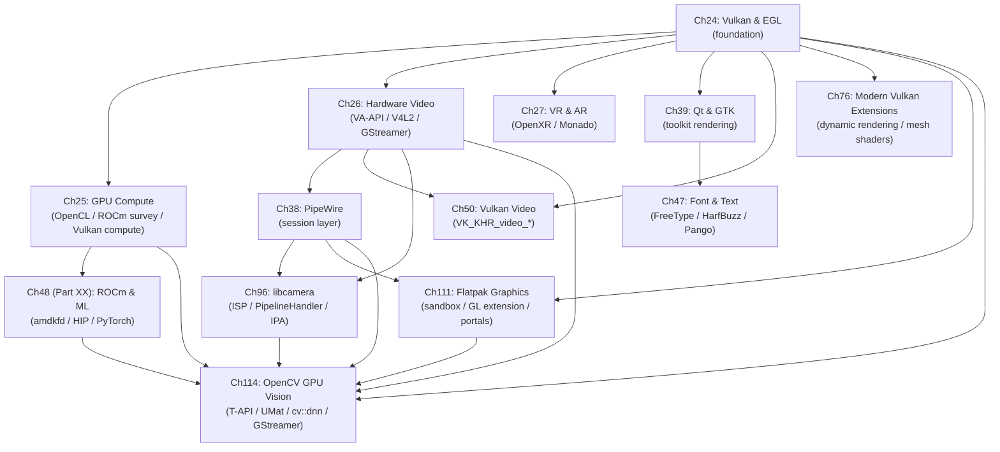

# Part VII — Application APIs & Middleware

The Linux graphics stack divides roughly into two halves: the lower half (Parts I–VI) builds up the substrate — kernel **DRM/KMS**, Mesa driver internals, **Wayland** compositor architecture, display pipelines, and GPU synchronisation primitives. This part begins the upper half. It is the layer where application-facing APIs — **Vulkan**, **EGL**, **OpenCL**, **VA-API**, **OpenXR**, **PipeWire** — are consumed by real software: games, media players, toolkits, ML inference engines, terminal emulators, and web browsers. The chapters here do not repeat what kernel internals exist; they explain exactly which kernel interfaces each API layer calls, how buffers cross subsystem boundaries without CPU copies, and what tradeoffs govern API choice for a given workload.

The unifying mechanism throughout this part is **DMA-BUF**: every major data flow — decoded video frames, captured camera images, rendered Vulkan swapchain images, PipeWire screen-capture streams — ultimately crosses subsystem boundaries as a **DMA-BUF** file descriptor carrying a **DRM format modifier**. Understanding how that mechanism is negotiated and what happens when it falls back to a CPU copy is the connective tissue that ties every chapter together.

## Chapters in This Part

**Chapter 24 — Vulkan and EGL for Application Developers** is the entry point for graphics application developers. It explains what happens beneath `vkCreateSwapchainKHR` on Linux — which kernel ioctls fire, how **linux-dmabuf** format and modifier negotiation proceeds on **Wayland**, and how timeline semaphores map onto **DRM sync objects** to close the explicit synchronisation loop from GPU to display. **EGL** is treated as a first-class citizen, not a legacy path, because it underpins headless rendering, **GBM**-backed surfaces, and **VA-API** interop.

**Chapter 25 — GPU Compute: OpenCL, CUDA, and ROCm** maps the fragmented Linux compute landscape: **OpenCL** ICD discovery, **rusticl** on **Gallium**, AMD **ROCm**/**HIP**, Intel **Level Zero**/**oneAPI**, and **Vulkan** compute pipelines. It covers the cross-API **DMA-BUF** interop that lets compute results feed graphics pipelines without CPU round-trips, and explains AMD's unified memory model and **Linux HMM** with concrete implications for **APU** platforms like the **Steam Deck**.

**Chapter 26 — Hardware Video: VA-API, V4L2, and libcamera** traces the complete hardware video pipeline from camera sensor or container to display. The chapter covers the **VA-API** surface model and driver dispatch, stateless **V4L2** codec drivers with the **Request API**, **GStreamer** zero-copy pipeline construction, **PipeWire** as a multimedia session layer, and **Vulkan Video** as the strategic forward API. The recurring theme is which API boundaries survive without a **DMA-BUF** export and where copies still occur.

**Chapter 27 — VR & AR: OpenXR and the Linux XR Stack** covers the **OpenXR** programming model from `XrInstance` creation through the **Monado** runtime's internal architecture. It explains how **Monado** acquires exclusive headset ownership via **DRM leasing** (`wp_drm_lease_v1`), drives direct-mode scan-out through **GBM** and `drmModeAtomicCommit`, and implements Asynchronous Timewarp as a **Vulkan** compute shader. Readers who understand Chapter 24 will see how **XrSwapchain** maps onto **Vulkan** swapchain concepts and how **V4L2** camera frames feed inside-out tracking.

**Chapter 38 — PipeWire: Unified Audio/Video Session Layer** explains the **SPA** plugin architecture, the node/link/port graph scheduler, and the **WirePlumber** session policy daemon in depth. It focuses on the three high-value data flows for graphics engineers: **Wayland** screen capture via `org.freedesktop.portal.ScreenCast`, zero-copy camera delivery from **V4L2** and **libcamera** sources, and GPU frame injection back into the graph as `SPA_DATA_DmaBuf` buffers. It also details **DRM format modifier** negotiation in **SPA** pods and the conditions under which the pipeline falls back to `SPA_DATA_MemFd`.

**Chapter 39 — Qt and GTK Rendering Pipelines** explains how the two dominant Linux GUI toolkits map their scene graphs to **Vulkan** and **OpenGL ES** on **Wayland**. It covers **Qt6**'s **QRhi** rendering hardware interface, the **Qt Quick** scene graph render loop, the **qsb** shader baker pipeline, **GTK4**'s **GskRenderer** unified GPU backend with its **GskVulkanRenderer** and **GskNglRenderer** paths, and how both toolkits add explicit GPU synchronisation via `wp_linux_drm_syncobj_v1` for **NVIDIA** compatibility. Font and text rendering — **FreeType**, **HarfBuzz**, **Pango**, and glyph atlas management — is introduced here and expanded in Chapter 47.

**Chapter 47 — Font and Text Rendering Pipeline** is a dedicated deep-dive into the text path that every toolkit, browser, and terminal relies on. It covers **FreeType 2** hinting modes, **HarfBuzz** OpenType shaping for complex scripts, **fontconfig** font matching, **Cairo** compositing, **Pango** layout, and glyph atlas strategies in **Qt**, **GTK4**, **Skia**, and **WebRender**. The chapter also explains why **LCD subpixel rendering** is disabled in composited **Wayland** sessions and how **OpenType variable fonts** challenge atlas cache-key design.

**Chapter 50 — Vulkan Video Extensions** covers the **Khronos** Vulkan Video extension family — `VK_KHR_video_queue`, `VK_KHR_video_decode_queue`, `VK_KHR_video_encode_queue`, and codec extensions for **H.264**, **H.265**, and **AV1** — from specification rationale through **RADV** and **ANV** driver implementation in Mesa to **FFmpeg** `hwaccel` integration. It explicitly compares **Vulkan Video** with **VA-API** on API complexity, render-pipeline integration, and hardware support, giving readers a principled basis for API selection.

**Chapter 76 — Modern Vulkan Extensions** documents the post-1.2 Vulkan extension landscape that defines contemporary engine and driver work: **VK_KHR_dynamic_rendering**, bindless descriptor indexing (`VK_EXT_descriptor_indexing`), mesh shaders (`VK_EXT_mesh_shader`), cooperative matrices (`VK_KHR_cooperative_matrix`), shader objects (`VK_EXT_shader_object`), graphics pipeline libraries, and extended dynamic state. It explains the extension promotion path from vendor-specific to `VK_EXT_` to `VK_KHR_` to core, and gives per-feature adoption status across **RADV**, **ANV**, and **NVK**.

**Chapter 96 — libcamera and the Linux Camera Stack** covers the unified camera abstraction that replaced a decade of fragmented SoC HALs. It explains **libcamera**'s **PipelineHandler** per-platform subclass model, the **IPA** sandbox for 3A algorithms, the **V4L2 Media Controller** graph configuration sequence, **FrameBuffer**/**DMA-BUF** integration, and how **PipeWire**'s camera portal makes frames available to WebRTC, **GStreamer**, and **OBS** through a single security gate. Hardware coverage includes **Raspberry Pi** (Unicam/PiSP), Intel **IPU3/CIO2**, and **Rockchip RKISP1/RKISP2**.

**Chapter 111 — Flatpak and Sandboxed Graphics Applications** is the chapter for application developers packaging GPU-accelerated software in **Flatpak** and for portal and compositor implementers who mediate that access. It explains why GPU sandboxing is structurally harder than CPU sandboxing: Mesa DRI drivers are architecture-specific shared objects whose ABI must version-match the host kernel driver, but **bubblewrap** establishes a separate mount namespace in which host library paths are absent. The chapter traces the complete data path from a Flatpak manifest's `finish-args` section through the bubblewrap namespace, the **GL extension** mounting mechanism (e.g., `org.freedesktop.Platform.GL.default`), **Vulkan ICD** discovery inside the sandbox, the **xdg-desktop-portal** ScreenCast and camera portals, and **VA-API** video decode under the sandbox. It closes with **Electron**/**CEF** nesting under Flatpak, a comparison with **Snap** and **AppImage**, and packaging best practices. Crucially, the chapter quantifies the security trade-offs: because the render node (`/dev/dri/renderD128`) must be bind-mounted into the sandbox, a compromised sandboxed application retains full GPU context access — the sandbox boundary stops at the kernel DRM interface, not at the GPU hardware.

**Chapter 114 — OpenCV and GPU-Accelerated Computer Vision on Linux** covers OpenCV as the terminal consumer of nearly every API thread in this part. It explains the **cv::UMat** / **Transparent API (T-API)** dispatch mechanism that routes image operations to an **OpenCL** backend (via **rusticl**, **intel-compute-runtime**, or **pocl**) without changing calling code, the **cv::cuda::GpuMat** and **Stream** model for NVIDIA hardware, and **VA-API** decode integration for zero-copy camera-to-inference pipelines. The chapter traces how a camera frame delivered by **libcamera** or **V4L2** can traverse the entire stack — decoded by **VA-API**, passed as a **DMA-BUF** to an **OpenCL** kernel running on the same GPU, processed by OpenCV's T-API, and composited into a **Wayland** surface via **EGL** — without ever touching CPU memory. The **cv::dnn** backend selector and **ONNX** inference path are covered with concrete backend configuration examples for Intel, AMD, and NVIDIA hardware. Integration with **GStreamer** pipelines is examined in detail, as OpenCV's `cv::VideoCapture` GStreamer backend is the primary zero-copy ingestion path for production vision systems.

**Chapter 106 — Vulkan Memory Model** covers `VK_KHR_vulkan_memory_model`, the formal memory model that governs visibility and ordering of Vulkan memory operations across shader invocations, queues, and devices, explaining acquire/release semantics, availability/visibility chains, and how the model interacts with `VkBarrier2` and timeline semaphores.

**Chapter 127 — Mesh Shaders and Variable Rate Shading** documents `VK_EXT_mesh_shader` (task and mesh shader stages replacing the vertex pipeline) and `VK_KHR_fragment_shading_rate` (per-tile, per-primitive, and per-draw shading rate control), covering RADV, ANV, and NVK driver implementations and game-engine integration patterns.

**Chapter 133 — Vulkan Compute Queues and Async Compute** explains how to use Vulkan compute queues independently of the graphics queue, covering queue family selection, `VkSubmitInfo2` timeline semaphore chaining, async compute overlap with graphics work, and per-vendor queue topology on AMD (SDMA + ACE queues), Intel (CCS), and NVIDIA (copy engines).

**Chapter 135 — Vulkan Ray Tracing** provides a comprehensive reference for `VK_KHR_ray_tracing_pipeline`, `VK_KHR_acceleration_structure`, and `VK_KHR_ray_query`: acceleration structure lifecycle, shader binding table layout, ray generation / intersection / any-hit / closest-hit / miss shader stages, and RADV/ANV driver implementation details.

**Chapter 141 — Vulkan Cooperative Matrices** covers `VK_KHR_cooperative_matrix` — the Vulkan API for matrix-multiply-accumulate operations on GPU tensor cores — including matrix type layouts, supported element types, GLSL/SPIR-V cooperative matrix extensions, and integration with ML inference workloads on AMD RDNA3 and NVIDIA Tensor Cores.

**Chapter 148 — Vulkan Synchronisation Reference** is a comprehensive reference chapter for Vulkan synchronisation primitives: pipeline stages, access masks, image and buffer memory barriers (`VkImageMemoryBarrier2`, `VkBufferMemoryBarrier2`), events, timeline semaphores, and `VkFence`, with worked examples of common synchronisation patterns and validation layer guidance.

**Chapter 150 — EGL Architecture and DMA-BUF Interop** provides an in-depth treatment of the EGL API beyond the survey in Chapter 24: EGL extensions for DMA-BUF import/export (`EGL_EXT_image_dma_buf_import`, `EGL_EXT_image_dma_buf_import_modifiers`), the EGLDevice and EGLOutput APIs for headless and direct-to-display rendering, and surfaceless EGL contexts for compute and video workloads.

**Chapter 152 — Rust GPU Ecosystem: wgpu, ash, and gpu-allocator** surveys the Rust-language GPU programming landscape on Linux: the `wgpu` safe GPU abstraction crate, `ash` raw Vulkan bindings, `gpu-allocator` for Vulkan/D3D12 memory management, `naga` shader compiler IR, and how Rust GPU crates integrate with the Mesa Vulkan driver stack.

**Chapter 154 — GPU-Driven Rendering** covers the architectural shift from CPU-driven draw call submission to GPU-driven pipelines where the GPU itself culls and dispatches geometry: indirect draw commands (`vkCmdDrawIndirect`, `vkCmdDrawIndexedIndirectCount`), GPU culling with compute shaders, meshlet-based rendering with `VK_EXT_mesh_shader`, and multi-draw indirect best practices on RDNA and Xe hardware.

**Chapter 157 — Vulkan Descriptor Binding Models** compares and contrasts the four Vulkan descriptor binding approaches — classic descriptor sets, push descriptors (`VK_KHR_push_descriptor`), descriptor buffers (`VK_EXT_descriptor_buffer`), and bindless/bindful hybrid models — with per-vendor performance characteristics and guidance on when to use each.

**Chapter 165 — Vulkan Video: Hardware Encode and Decode** covers the `VK_KHR_video_queue`, `VK_KHR_video_decode_queue`, `VK_KHR_video_encode_queue`, and codec extension family for H.264, H.265, AV1, and VP9 on Linux, with RADV and ANV implementation details, FFmpeg hwaccel integration, and a comparison with VA-API for decode pipeline selection.

**Chapter 173 — VK\_EXT\_shader\_object: Pipeline-Free Shader Binding in Vulkan** covers the `VkShaderEXT` object introduced by `VK_EXT_shader_object` (ratified EXT, revision 1, 2023): how shaders are compiled independently of pipeline state via `vkCreateShadersEXT`, bound per-stage with `vkCmdBindShadersEXT`, and serialised for instant reload via `vkGetShaderBinaryDataEXT`. The chapter explains why the extension requires extensive dynamic state (`VK_EXT_extended_dynamic_state` family) and must be used inside `VkRenderingInfo` (i.e. requires `VK_KHR_dynamic_rendering`). Driver implementation status is documented: RADV enabled by default in Mesa 24.1 (`src/amd/vulkan/radv_shader_object.c`), NVK added support in February 2024, ANV landed in Mesa 25.3-devel. The chapter includes a complete before/after migration example converting a static graphics pipeline to shader objects, and performance guidance from the spec's conformance floor (≤150% CPU cost vs. fully-static pipelines).

## How the Chapters Interrelate

The part has a clear dependency spine. **Chapter 24** must be read before most others: it establishes the **Vulkan** device model, the **EGL**/**GBM** context creation path, **linux-dmabuf** modifier negotiation, and **DRM sync objects**. Every subsequent chapter that sends frames to the display or imports **DMA-BUF** handles — Chapters 25, 26, 27, 38, 39, 50, 76, 111, and 114 — builds directly on those foundations.

**Chapter 25** (compute) provides a survey of the full compute landscape — **OpenCL** ICD discovery, **ROCm**/**HIP** overview, **Level Zero**/**oneAPI**, and Vulkan compute — establishing **DMA-BUF** interop patterns between compute, video, and graphics APIs. The deep treatment of the AMD ML stack (HIP, MIOpen, PyTorch ROCm, amdkfd, MI300X) has moved to **Chapter 48 in Part XX (AI/ML Inference)**. Readers interested in the AMD compute stack should read Chapter 25 here first, then Chapter 48 in Part XX. **Chapter 114** (OpenCV) builds on Chapter 25's compute landscape and, for DNN inference on ROCm, requires Chapter 48 (Part XX).

**Chapter 26** (video) and **Chapter 50** (Vulkan Video) are explicitly linked. Chapter 26 covers **VA-API** as the established production path; Chapter 50 covers **Vulkan Video** as its strategic successor, and its comparison section (§8) directly references Chapter 26's surface model. The **PipeWire** session layer section of Chapter 26 overlaps intentionally with **Chapter 38**, which expands the **SPA** internals; Chapter 38 is the definitive reference, Chapter 26's §7 is a summary oriented toward video pipeline authors. **Chapter 114** depends on Chapter 26 for VA-API decode, Chapter 38 for PipeWire-delivered camera frames, and Chapter 96 for the libcamera integration.

**Chapter 27** (OpenXR/VR) depends on Chapter 24 for **Vulkan** swapchain concepts, and on Parts II–III for **DRM leasing** and atomic modesetting mechanics. Its tracking pipeline (§6) uses **V4L2** camera capture in the same mode described in Chapter 26 §5.

**Chapters 39 and 47** form a natural pair on the toolkit rendering side: Chapter 39 covers **Qt6** and **GTK4** scene graph and GPU submission paths, introducing the text pipeline at a high level; Chapter 47 then provides the complete **FreeType**/**HarfBuzz**/**Pango** reference that underpins what Chapter 39 describes. Browser and terminal developers reading Chapter 47 will find the atlas management and **Wayland** subpixel sections directly relevant to **Skia**, **WebRender**, **Ghostty**, and **foot**.

**Chapter 76** (modern Vulkan extensions) can be read independently as a reference chapter, but it is most useful after Chapter 24 has established the core **Vulkan** device and pipeline model. Features like **VK_KHR_cooperative_matrix** tie back to ML workloads covered in Part XX; mesh shaders and pipeline libraries are relevant to the toolkit rendering paths in Chapter 39.

**Chapter 96** (libcamera) depends on the **V4L2 Media Controller** concepts introduced in Chapter 26 §5, and its **PipeWire** integration section (§8) is a direct consumer of the session model established in Chapter 38. It stands as a self-contained deep-dive for embedded and camera-oriented developers.

**Chapter 111** (Flatpak) is best read after Chapter 24, which establishes the Vulkan ICD loader and the EGL/GBM context model that the GL extension mechanism replicates inside the sandbox, and after Chapter 38, whose PipeWire portal model (the ScreenCast and camera portals) is the authoritative access path for screen capture and camera within the Flatpak security boundary. It also intersects Chapter 26 (VA-API decode under the sandbox) and Chapter 96 (libcamera frames through the portal). Readers packaging vision applications in Flatpak will need Chapter 111 before applying the patterns in Chapter 114.

**Chapter 114** (OpenCV) is designed as an integration chapter — it synthesises the camera, compute, video, and EGL/OpenGL threads from Chapters 24, 25, 26, 38, 96, and Part XX's Chapter 48 into a single end-to-end vision pipeline narrative. It can be read after any of those chapters and will reinforce how the individual API pieces compose. Its Flatpak packaging section cross-references Chapter 111 directly.

The shared data structures that thread through every chapter are `drm_prime` **DMA-BUF** file descriptors, **DRM format modifiers** (the 64-bit values like `DRM_FORMAT_MOD_LINEAR` or `AMD_FMT_MOD_*`), **DRM sync objects** (`drm_syncobj` / timeline semaphores), and **VkImage** as the universal GPU-resident buffer type. Understanding how these four primitives are negotiated, exported, imported, and synchronised across API boundaries is the practical skill this part conveys.

## Prerequisites and What Comes Next

Readers should arrive here having read Parts I–III: the **DRM/KMS** substrate (Part I), Mesa driver architecture and **NIR**/**Gallium** internals (Part II), and the **Wayland** compositor stack including buffer import paths and **linux-dmabuf** protocol (Part III). Familiarity with Parts IV–VI (display pipeline, synchronisation, and HDR) is helpful for the presentation-timing and explicit-sync discussions in Chapters 24, 39, and 50 but is not strictly required. Parts VIII–X build directly on this part: gaming and compatibility layers (**DXVK**, **VKD3D-Proton**, **Steam Play**) assume the compute, video, and modern Vulkan extension knowledge established here, and the browser chapters (Part X) rely on the **EGL**, **Vulkan Video**, **PipeWire**, and font pipeline foundations laid in Chapters 24, 26, 38, and 47. Chapter 111's Flatpak coverage is directly relevant to Part VIII's discussion of how Steam and Proton games are packaged and sandboxed on the Steam Deck. Chapter 114's vision pipeline patterns are a prerequisite for any robotics or automotive chapters that appear in later parts.

---
