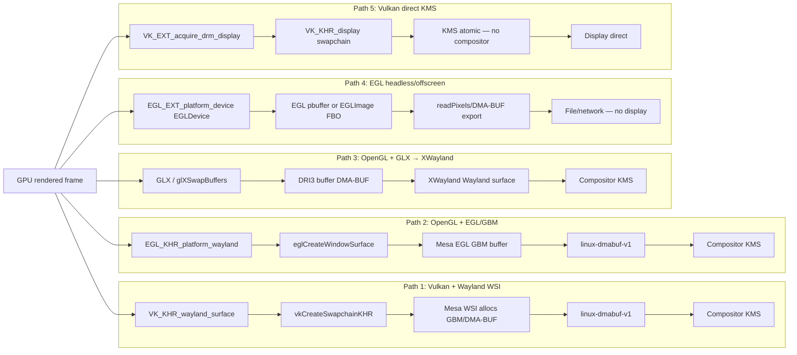

# Chapter 150: EGL Architecture and DMA-BUF Integration

**Target audiences**: Mesa and graphics application developers who need to understand the EGL binding layer, driver developers implementing EGL platforms, and systems engineers building zero-copy buffer pipelines between GPU, display, and video subsystems.

---

## Table of Contents

1. [Introduction](#introduction)
2. [EGL Architecture and Concepts](#egl-architecture-and-concepts)
3. [EGL Platforms: DRM, Wayland, and X11](#egl-platforms-drm-wayland-and-x11)
4. [EGLImage and Zero-Copy Buffer Sharing](#eglimage-and-zero-copy-buffer-sharing)
5. [DMA-BUF Import: EGL_EXT_image_dma_buf_import](#dma-buf-import-egl_ext_image_dma_buf_import)
6. [zwp_linux_dmabuf_v1 vs wl_drm](#zwp_linux_dmabuf_v1-vs-wl_drm)
7. [EGL Sync Objects and Fencing](#egl-sync-objects-and-fencing)
8. [EGL in Mesa: Driver Dispatch and Internals](#egl-in-mesa-driver-dispatch-and-internals)
9. [Practical Patterns and Pitfalls](#practical-patterns-and-pitfalls)
10. [NVIDIA EGL External Platform Architecture](#nvidia-egl-external-platform-architecture)
11. [Integrations](#integrations)

---

## Introduction

EGL (Embedded-system Graphics Library) is the binding layer between Khronos rendering APIs (OpenGL ES, OpenGL, OpenVG, Vulkan) and the native windowing system. On Linux, EGL sits between Mesa's driver implementations and the display subsystem — DRM, Wayland, and X11. Every GTK4 application, every Qt6 window, every Electron browser, and every Wayland compositor that uses OpenGL goes through EGL.

Despite its ubiquity, EGL is often treated as boilerplate. This chapter examines it in depth:

- **Display, surface, and context model** — EGL's three core object types and their initialization lifecycle
- **Platform extension mechanism** — enables EGL to work natively on DRM/KMS, Wayland, and X11 via `eglGetPlatformDisplay`
- **`EGLImage`** — zero-copy buffer sharing between GPU, V4L2 decoders, and the display engine
- **`EGL_EXT_image_dma_buf_import` extension chain** — the foundation of all DMA-BUF-based workflows on Linux

[EGL specification](https://registry.khronos.org/EGL/specs/eglspec.1.5.pdf) | [Mesa EGL source](https://gitlab.freedesktop.org/mesa/mesa/-/tree/main/src/egl)

---

## EGL Architecture and Concepts

### Three Core Objects

EGL builds on three fundamental objects:

```
EGLDisplay  — connection to a display system (GPU + output)
EGLSurface  — renderable surface (window, pixmap, or pbuffer)
EGLContext  — OpenGL ES / OpenGL rendering state
```

The typical initialisation sequence:

```c
#include <EGL/egl.h>
#include <EGL/eglext.h>

/* 1. Obtain display */
EGLDisplay display = eglGetDisplay(EGL_DEFAULT_DISPLAY);
// or platform-specific:
// display = eglGetPlatformDisplay(EGL_PLATFORM_WAYLAND_KHR, wl_display, NULL);
// display = eglGetPlatformDisplay(EGL_PLATFORM_GBM_KHR, gbm_device, NULL);

/* 2. Initialise */
EGLint major, minor;
eglInitialize(display, &major, &minor);
printf("EGL %d.%d (%s)\n", major, minor, eglQueryString(display, EGL_VENDOR));

/* 3. Choose config */
EGLint attribs[] = {
    EGL_SURFACE_TYPE,    EGL_WINDOW_BIT,
    EGL_RED_SIZE,        8,
    EGL_GREEN_SIZE,      8,
    EGL_BLUE_SIZE,       8,
    EGL_ALPHA_SIZE,      8,
    EGL_RENDERABLE_TYPE, EGL_OPENGL_ES3_BIT,
    EGL_NONE
};
EGLConfig config;
EGLint num_configs;
eglChooseConfig(display, attribs, &config, 1, &num_configs);

/* 4. Create surface from native window */
EGLSurface surface = eglCreateWindowSurface(display, config,
    (EGLNativeWindowType)native_window, NULL);

/* 5. Create context */
EGLint ctx_attribs[] = { EGL_CONTEXT_CLIENT_VERSION, 3, EGL_NONE };
EGLContext context = eglCreateContext(display, config, EGL_NO_CONTEXT, ctx_attribs);

/* 6. Make current */
eglMakeCurrent(display, surface, surface, context);
```

### EGL Extension Discovery

```c
const char *extensions = eglQueryString(display, EGL_EXTENSIONS);
// "EGL_KHR_image_base EGL_EXT_image_dma_buf_import EGL_KHR_surfaceless_context ..."

/* Function pointer resolution: */
PFNEGLCREATEIMAGEKHRPROC eglCreateImageKHR =
    (PFNEGLCREATEIMAGEKHRPROC)eglGetProcAddress("eglCreateImageKHR");
```

Unlike OpenGL, EGL functions are obtained via `eglGetProcAddress`, not via a platform extension mechanism. Mesa's EGL implementation lazy-loads extension functions.

---

## EGL Platforms: DRM, Wayland, and X11

### Platform Extension Model

EGL 1.5 introduced platform-agnostic display creation via `eglGetPlatformDisplay`. On Linux, three platforms matter:

| Platform | EGL Extension | Native Display Type | Native Window Type |
|---|---|---|---|
| X11 | `EGL_EXT_platform_x11` | `Display *` (Xlib) | `Window` |
| Wayland | `EGL_EXT_platform_wayland` | `wl_display *` | `wl_egl_window *` |
| GBM (DRM) | `EGL_EXT_platform_gbm` | `gbm_device *` | `gbm_surface *` |
| Surfaceless | `EGL_KHR_surfaceless_context` | `EGL_NO_DISPLAY` / render node | N/A |

### GBM/DRM Platform (Compositor Use)

Wayland compositors use EGL with GBM for rendering directly to DRM:

```c
#include <gbm.h>

/* Open DRM render node */
int drm_fd = open("/dev/dri/renderD128", O_RDWR | O_CLOEXEC);
struct gbm_device *gbm = gbm_create_device(drm_fd);

/* Create EGL display on GBM device */
EGLDisplay display = eglGetPlatformDisplay(EGL_PLATFORM_GBM_KHR, gbm, NULL);
eglInitialize(display, NULL, NULL);

/* Create GBM surface backed by DRM framebuffers */
struct gbm_surface *gbm_surf = gbm_surface_create(gbm,
    width, height, GBM_FORMAT_ARGB8888,
    GBM_BO_USE_SCANOUT | GBM_BO_USE_RENDERING);

EGLSurface surface = eglCreatePlatformWindowSurface(display, config,
    gbm_surf, NULL);

/* After eglSwapBuffers: */
struct gbm_bo *bo = gbm_surface_lock_front_buffer(gbm_surf);
uint32_t fb_id;
drmModeAddFB(drm_fd, width, height, 32, 32,
    gbm_bo_get_stride(bo), gbm_bo_get_handle(bo).u32, &fb_id);
drmModeSetCrtc(drm_fd, crtc_id, fb_id, 0, 0, &conn_id, 1, &mode);
// ... page flip ...
gbm_surface_release_buffer(gbm_surf, bo);
```

### Wayland Platform (Client Use)

Wayland clients use `wl_egl_window`:

```c
#include <wayland-egl.h>

struct wl_egl_window *egl_window =
    wl_egl_window_create(wl_surface, width, height);

EGLDisplay display =
    eglGetPlatformDisplay(EGL_PLATFORM_WAYLAND_KHR, wl_display, NULL);

EGLSurface surface = eglCreatePlatformWindowSurface(display, config,
    egl_window, NULL);

/* eglSwapBuffers → sends wl_buffer to compositor */
eglSwapBuffers(display, surface);
/* Under the hood: Mesa posts the rendered buffer as a wl_buffer
   via zwp_linux_dmabuf_v1 (or wl_drm on older compositors) */
```

### Surfaceless Rendering

For compute / offscreen rendering without a display:

```c
/* No native display needed; just the render node */
EGLDisplay display = eglGetPlatformDisplay(
    EGL_PLATFORM_SURFACELESS_MESA, EGL_DEFAULT_DISPLAY, NULL);
// OR:
// int fd = open("/dev/dri/renderD128", O_RDWR);
// eglGetDisplay((EGLNativeDisplayType)(intptr_t)fd);

eglInitialize(display, NULL, NULL);
eglBindAPI(EGL_OPENGL_ES_API);

EGLint ctx_attribs[] = { EGL_CONTEXT_CLIENT_VERSION, 3, EGL_NONE };
EGLContext ctx = eglCreateContext(display, config, EGL_NO_CONTEXT, ctx_attribs);
eglMakeCurrent(display, EGL_NO_SURFACE, EGL_NO_SURFACE, ctx);

/* Render to FBO, read back via glReadPixels or DMA-BUF export */
```

`EGL_MESA_platform_surfaceless` or `EGL_KHR_surfaceless_context` enable this. Used by headless CI (Ch107), server-side rendering, and compute-only workloads.

---

## EGLImage and Zero-Copy Buffer Sharing

### What Is EGLImage?

`EGLImage` (from `EGL_KHR_image_base`) is an abstract handle for a GPU resource (texture, renderbuffer) that can be shared across EGL contexts and even across APIs. It is the mechanism by which DMA-BUFs are imported into OpenGL ES as textures.

```c
/* EGLImage creation from a DMA-BUF FD: */
EGLint attribs[] = {
    EGL_WIDTH,                        width,
    EGL_HEIGHT,                       height,
    EGL_LINUX_DRM_FOURCC_EXT,         DRM_FORMAT_NV12,
    EGL_DMA_BUF_PLANE0_FD_EXT,        dma_buf_fd,
    EGL_DMA_BUF_PLANE0_OFFSET_EXT,    0,
    EGL_DMA_BUF_PLANE0_PITCH_EXT,     stride_y,
    EGL_DMA_BUF_PLANE1_FD_EXT,        dma_buf_fd,   /* same FD, different plane */
    EGL_DMA_BUF_PLANE1_OFFSET_EXT,    offset_uv,
    EGL_DMA_BUF_PLANE1_PITCH_EXT,     stride_uv,
    EGL_YUV_COLOR_SPACE_HINT_EXT,     EGL_ITU_REC709_EXT,
    EGL_SAMPLE_RANGE_HINT_EXT,        EGL_YUV_NARROW_RANGE_EXT,
    EGL_NONE
};

EGLImage image = eglCreateImageKHR(display, EGL_NO_CONTEXT,
    EGL_LINUX_DMA_BUF_EXT, NULL, attribs);
```

### Binding EGLImage to a Texture

```c
GLuint tex;
glGenTextures(1, &tex);
glBindTexture(GL_TEXTURE_EXTERNAL_OES, tex);
glEGLImageTargetTexture2DOES(GL_TEXTURE_EXTERNAL_OES, image);
/* tex is now backed by the DMA-BUF — zero copy */

/* In GLSL: */
// #extension GL_OES_EGL_image_external : require
// uniform samplerExternalOES videoTex;
// vec4 color = texture2D(videoTex, texCoord);
```

`GL_TEXTURE_EXTERNAL_OES` handles YUV→RGB conversion in hardware when the source format is NV12/YUV420. This is how `mpv` and `VLC` render video without any CPU-side format conversion.

### EGLImage Export (Texture to DMA-BUF)

The reverse direction — exporting a rendered texture as a DMA-BUF:

```c
/* EGL_MESA_image_dma_buf_export */
GLuint tex; /* rendered output texture */
EGLImage image = eglCreateImageKHR(display, context,
    EGL_GL_TEXTURE_2D_KHR, (EGLClientBuffer)(uintptr_t)tex, NULL);

int dma_buf_fd;
EGLint fourcc, num_planes, stride, offset;
eglExportDMABUFImageQueryMESA(display, image, &fourcc, &num_planes, NULL);
eglExportDMABUFImageMESA(display, image, &dma_buf_fd, &stride, &offset);
/* dma_buf_fd can now be passed to KMS for direct scanout (Ch139)
   or to V4L2 encoder for zero-copy video encoding */
```

[EGL_MESA_image_dma_buf_export spec](https://registry.khronos.org/EGL/extensions/MESA/EGL_MESA_image_dma_buf_export.txt)

---

## DMA-BUF Import: EGL_EXT_image_dma_buf_import

### Extension Chain

Full DMA-BUF import requires two extensions:

- `EGL_EXT_image_dma_buf_import` — basic import, up to 3 planes, no modifiers
- `EGL_EXT_image_dma_buf_import_modifiers` — adds DRM modifier support (tiling, compression)

```c
/* Check for modifier support: */
bool has_modifiers = strstr(
    eglQueryString(display, EGL_EXTENSIONS),
    "EGL_EXT_image_dma_buf_import_modifiers") != NULL;

/* Import with modifiers (e.g. AMD DCC compressed NV12): */
EGLuint64KHR modifier = AMD_FMT_MOD_DCC | (uint64_t)AMD_FMT_MOD_TILE_VER_GFX10;

EGLint attribs[] = {
    EGL_WIDTH,                         width,
    EGL_HEIGHT,                        height,
    EGL_LINUX_DRM_FOURCC_EXT,          DRM_FORMAT_NV12,
    EGL_DMA_BUF_PLANE0_FD_EXT,         fd,
    EGL_DMA_BUF_PLANE0_OFFSET_EXT,     0,
    EGL_DMA_BUF_PLANE0_PITCH_EXT,      stride_y,
    EGL_DMA_BUF_PLANE0_MODIFIER_LO_EXT, modifier & 0xFFFFFFFF,
    EGL_DMA_BUF_PLANE0_MODIFIER_HI_EXT, modifier >> 32,
    EGL_DMA_BUF_PLANE1_FD_EXT,         fd,
    EGL_DMA_BUF_PLANE1_OFFSET_EXT,     offset_uv,
    EGL_DMA_BUF_PLANE1_PITCH_EXT,      stride_uv,
    EGL_DMA_BUF_PLANE1_MODIFIER_LO_EXT, modifier & 0xFFFFFFFF,
    EGL_DMA_BUF_PLANE1_MODIFIER_HI_EXT, modifier >> 32,
    EGL_NONE
};

EGLImage img = eglCreateImageKHR(display, EGL_NO_CONTEXT,
    EGL_LINUX_DMA_BUF_EXT, NULL, attribs);
```

### Querying Supported Formats and Modifiers

```c
PFNEGLQUERYDMABUFFORMATSEXTPROC eglQueryDmaBufFormatsEXT =
    eglGetProcAddress("eglQueryDmaBufFormatsEXT");
PFNEGLQUERYDMABUFMODIFIERSEXTPROC eglQueryDmaBufModifiersEXT =
    eglGetProcAddress("eglQueryDmaBufModifiersEXT");

/* Get supported formats: */
EGLint num_formats;
eglQueryDmaBufFormatsEXT(display, 0, NULL, &num_formats);
EGLint formats[num_formats];
eglQueryDmaBufFormatsEXT(display, num_formats, formats, &num_formats);

/* For each format, get supported modifiers: */
for (int i = 0; i < num_formats; i++) {
    EGLint num_mods;
    eglQueryDmaBufModifiersEXT(display, formats[i], 0, NULL, NULL, &num_mods);
    EGLuint64KHR mods[num_mods];
    EGLBoolean external_only[num_mods];
    eglQueryDmaBufModifiersEXT(display, formats[i], num_mods,
        mods, external_only, &num_mods);
    /* external_only[i] = true → must use GL_TEXTURE_EXTERNAL_OES */
}
```

This is how Wayland compositors negotiate buffer formats with clients: the compositor queries EGL for supported formats/modifiers and advertises them via `zwp_linux_dmabuf_v1`.

---

## zwp_linux_dmabuf_v1 vs wl_drm

### The Legacy wl_drm Protocol

Mesa historically used `wl_drm` (a Mesa-private Wayland protocol) to pass GPU buffers from clients to compositors. The client would:
1. Render to an EGL surface
2. `eglSwapBuffers` → Mesa creates a `wl_drm` buffer with the GEM name
3. Compositor imports the GEM name via DRM PRIME

`wl_drm` had a critical flaw: GEM names are global and insecure (any process can import any GEM name with the right handle value). It also required the compositor and client to share a DRM device.

### zwp_linux_dmabuf_v1 (Modern Path)

`zwp_linux_dmabuf_v1` (in wayland-protocols) replaces `wl_drm`:

1. Compositor advertises supported formats+modifiers via `zwp_linux_dmabuf_v1.format` / `.modifier` events
2. Client allocates a GBM BO with a matching modifier
3. Client exports as DMA-BUF FD
4. Client creates `zwp_linux_buffer_params_v1`, adds the DMA-BUF FD, creates `wl_buffer`
5. Compositor receives `wl_buffer` and imports via `eglCreateImageKHR(EGL_LINUX_DMA_BUF_EXT)`

```c
/* Mesa's EGL Wayland platform (src/egl/drivers/dri2/platform_wayland.c)
   transparently uses this path in eglSwapBuffers. */

/* Client allocating a buffer with explicit modifiers: */
uint64_t modifier = DRM_FORMAT_MOD_LINEAR;
struct gbm_bo *bo = gbm_bo_create_with_modifiers(gbm,
    width, height, GBM_FORMAT_ARGB8888, &modifier, 1);

int fd = gbm_bo_get_fd(bo);
uint32_t stride = gbm_bo_get_stride(bo);
uint64_t mod = gbm_bo_get_modifier(bo);

/* Send to compositor via zwp_linux_dmabuf_v1 */
struct zwp_linux_buffer_params_v1 *params =
    zwp_linux_dmabuf_v1_create_params(dmabuf);
zwp_linux_buffer_params_v1_add(params, fd, 0 /*plane*/, 0, stride,
    mod >> 32, mod & 0xFFFFFFFF);
struct wl_buffer *buffer =
    zwp_linux_buffer_params_v1_create_immed(params, width, height,
        DRM_FORMAT_ARGB8888, 0 /*flags*/);
wl_surface_attach(surface, buffer, 0, 0);
```

### Cross-GPU Transfers

When client and compositor use different GPUs (e.g. PRIME render offload):
1. Client renders on dGPU → DMA-BUF export
2. Compositor receives DMA-BUF → imports on iGPU via EGL
3. EGL import triggers PCIe DMA transfer if GPUs can't share the buffer directly

`EGL_EXT_image_dma_buf_import` handles cross-device import transparently; Mesa uses `drm_prime_handle_to_fd` and `drm_prime_fd_to_handle` internally.

---

## EGL Sync Objects and Fencing

### EGL_KHR_fence_sync

EGL sync objects bridge EGL/OpenGL ES rendering with DMA-BUF implicit fences:

```c
/* Create a fence after a GL draw call: */
EGLSync fence = eglCreateSync(display, EGL_SYNC_FENCE_KHR, NULL);
glFlush(); /* must flush before the fence is meaningful */

/* CPU-side wait (blocks until GPU completes the draw): */
eglClientWaitSync(display, fence, EGL_SYNC_FLUSH_COMMANDS_BIT_KHR,
    EGL_FOREVER_KHR);
eglDestroySync(display, fence);
```

### EGL_ANDROID_native_fence_sync (Android Fence FD)

This extension (available in Mesa on Linux) allows exporting an EGL sync as a DRM sync file (fence FD):

```c
/* Export fence as a DRM sync file: */
EGLSync sync = eglCreateSync(display,
    EGL_SYNC_NATIVE_FENCE_ANDROID, NULL);
glFlush();

int fence_fd = eglDupNativeFenceFDANDROID(display, sync);
/* fence_fd is a DRM sync_file that can be:
   - Passed as an acquire fence to drmModeAtomicCommit
   - Passed to V4L2 VIDIOC_QBUF for sequenced GPU→encoder
   - Closed after use */
```

This is the foundation of explicit synchronisation on Wayland (Ch75): compositors receive both a DMA-BUF and a fence FD from clients.

### EGL_KHR_wait_sync (Server-Side Wait)

```c
/* Instead of CPU-side wait, block on the GPU: */
EGLSync other_context_sync = ...; /* from another EGL context */
eglWaitSync(display, other_context_sync, 0);
/* GPU command queue stalls until sync signals, then continues */
```

Used by multi-context pipelines (decode → render → encode) without CPU round-trips.

---

## EGL in Mesa: Driver Dispatch and Internals

### Mesa EGL Source Layout

```
src/egl/
  main/           — EGL API implementation (eglInitialize, eglCreateContext, etc.)
  drivers/dri2/   — DRI2/DRI3 backend; platform_wayland.c, platform_drm.c, platform_x11.c
  generate/       — egl.xml-based API table generation
```

[Mesa EGL source](https://gitlab.freedesktop.org/mesa/mesa/-/tree/main/src/egl)

### The DRI2 Extension Chain

Mesa's EGL implementation uses `dri2_dpy` (DRI2 display) internally, which wraps a DRI driver:

```
eglGetPlatformDisplay(EGL_PLATFORM_WAYLAND_KHR)
  → dri2_initialize_wayland() [src/egl/drivers/dri2/platform_wayland.c]
    → dri2_load_driver_swrast() or dri2_load_driver() based on GPU
    → loader_open_device("/dev/dri/renderD128")
    → dri2_create_screen()
```

### eglSwapBuffers on Wayland

```
eglSwapBuffers(display, surface)
  → dri2_swap_buffers() [platform_wayland.c]
    → dri2_flush_drawable_for_swapbuffers()
    → get_back_bo() → allocate GBM BO if needed
    → create_wl_buffer() → zwp_linux_dmabuf_v1_create_params
    → wl_surface_attach(surface, wl_buffer, 0, 0)
    → wl_surface_damage_buffer(surface, 0, 0, w, h)
    → wl_surface_commit(surface)
    → throttle: wl_callback (frame callback) or zwp_presentation-time
```

### EGL Config and Format Selection

EGL configs (`EGLConfig`) map to DRM format+modifier pairs. Mesa's `dri2_add_config()` creates one EGLConfig per (bpp, depth, stencil, samples) combination. On modern Mesa:

```c
/* Mesa internal config creation (conceptual): */
for each (format, modifier) in gbm_device_get_format_modifier_plane_count():
    dri2_add_config(display, format, modifier, rgb_sizes, alpha_size);
```

---

## Practical Patterns and Pitfalls

### Checking What's Available

```bash
# List EGL extensions for the default display:
eglinfo | head -60

# Mesa-specific: list platforms, drivers, extensions
EGL_PLATFORM=wayland eglinfo

# Or programmatically:
eglQueryString(EGL_NO_DISPLAY, EGL_EXTENSIONS)  /* client extensions */
eglQueryString(display, EGL_EXTENSIONS)          /* display extensions */
```

### Common Pitfall: Extension on EGL_NO_DISPLAY

Client extensions (available before `eglGetDisplay`) must be queried on `EGL_NO_DISPLAY`:

```c
/* WRONG — may return empty string before eglInitialize: */
const char *ext = eglQueryString(display, EGL_EXTENSIONS);

/* CORRECT for platform extensions: */
const char *client_ext = eglQueryString(EGL_NO_DISPLAY, EGL_EXTENSIONS);
bool has_wayland = strstr(client_ext, "EGL_EXT_platform_wayland") != NULL;
```

### Multi-Plane DMA-BUF (NV12, P010)

NV12 has two planes (Y + UV); each needs its own entry:

```c
/* Note: both planes can reference the same FD with different offsets,
   or different FDs. Both are valid. */
EGLint attribs[] = {
    EGL_WIDTH,                         1920,
    EGL_HEIGHT,                        1080,
    EGL_LINUX_DRM_FOURCC_EXT,          DRM_FORMAT_NV12,
    /* Y plane */
    EGL_DMA_BUF_PLANE0_FD_EXT,         fd,
    EGL_DMA_BUF_PLANE0_OFFSET_EXT,     0,
    EGL_DMA_BUF_PLANE0_PITCH_EXT,      1920,
    /* UV plane (interleaved) */
    EGL_DMA_BUF_PLANE1_FD_EXT,         fd,
    EGL_DMA_BUF_PLANE1_OFFSET_EXT,     1920 * 1080,
    EGL_DMA_BUF_PLANE1_PITCH_EXT,      1920,
    EGL_NONE
};
```

### EGL_BAD_MATCH on Import

Common causes:
1. Format not in `eglQueryDmaBufFormatsEXT` result — GPU doesn't support it
2. Modifier not supported — try `DRM_FORMAT_MOD_LINEAR` as fallback
3. `EGL_SAMPLE_RANGE_HINT_EXT` mismatched with format (not all formats support it)
4. FD not from a DMA-BUF (`O_CLOEXEC`-compatible FD required)

```bash
# Debug EGL errors:
EGL_LOG_LEVEL=debug MESA_DEBUG=1 ./app 2>&1 | grep -i egl
```

### Performance: Avoiding Implicit Sync Stalls

Without explicit sync, the kernel must wait for implicit DMA-BUF fences on import. Use `EGL_ANDROID_native_fence_sync` to export explicit fences:

```c
/* After rendering: */
EGLSync sync = eglCreateSync(display, EGL_SYNC_NATIVE_FENCE_ANDROID, NULL);
glFlush();
int explicit_fence_fd = eglDupNativeFenceFDANDROID(display, sync);

/* Pass both the DMA-BUF FD and the fence FD to the compositor/encoder */
/* Compositor can queue the next frame immediately; GPU signals when ready */
```

---

## Render-to-Screen: Five WSI Pipeline Paths

An application that has finished rendering must get pixels to the display. The WSI (Window System Integration) path choice determines compositor involvement, supported display targets, and headless support. Five distinct paths cover the full range of Linux deployment scenarios.



### Path Comparison

| Path | API | Requires compositor | X11/Wayland | Headless | Typical use |
|---|---|---|---|---|---|
| 1 — Vulkan + Wayland WSI | Vulkan (`VK_KHR_wayland_surface`) | Yes (Wayland) | Wayland | No | Native Vulkan apps, games, wlroots-based compositors |
| 2 — OpenGL + EGL/GBM | OpenGL ES / GL (`EGL_KHR_platform_wayland`) | Yes (Wayland) | Wayland | No | GTK4, Qt6, Electron, mpv on Wayland |
| 3 — OpenGL + GLX → XWayland | OpenGL (`GLX`) | Yes (XWayland + Wayland compositor) | X11 (via XWayland) | No | Legacy X11 apps running unmodified under Wayland |
| 4 — EGL headless/offscreen | OpenGL ES / GL (`EGL_EXT_platform_device`) | No | Neither | Yes | Server-side rendering, CI, video encoding, compute |
| 5 — Vulkan direct KMS | Vulkan (`VK_EXT_acquire_drm_display`) | No | Neither | No | Kiosks, VR runtimes, low-latency display pipelines |

### Analysis

**Paths 1 and 2** are the default paths for Wayland desktop applications. Both funnel through `zwp_linux_dmabuf_v1` and rely on the Wayland compositor to schedule KMS page flips; the GPU driver (Mesa WSI for Vulkan, Mesa EGL for OpenGL) handles GBM buffer allocation and DMA-BUF handoff transparently. Path 1 is preferred for new Vulkan applications; Path 2 is the dominant path for OpenGL/GLES toolkits such as GTK4 and Qt6.

**Path 3** carries the overhead of an extra protocol translation: GLX speaks DRI3 to XWayland, which re-wraps the DMA-BUF as a Wayland `wl_buffer` and forwards it to the real compositor. The extra hop adds latency and prevents tearing-control or presentation-time negotiation. It exists solely for compatibility with unmodified X11 applications.

**Path 4** omits the display entirely. `EGL_EXT_platform_device` (or `EGL_MESA_platform_surfaceless`) creates a context backed by a render node without any display output. The rendered result is consumed via `glReadPixels` or exported as a DMA-BUF for a downstream consumer (V4L2 encoder, file, network stream). This is the correct path for headless CI, server-side rendering, and GPU-accelerated video transcoding.

**Path 5** bypasses the compositor entirely. `VK_EXT_acquire_drm_display` lets a Vulkan application take exclusive ownership of a DRM display connector, then presents frames directly via `VK_KHR_display` swapchain and KMS atomic commits. This eliminates compositor latency and is used by VR runtimes (Monado, SteamVR), kiosk displays, and other latency-critical single-application deployments.

---

## NVIDIA EGL External Platform Architecture

Mesa's EGL implementation (described in §8) is designed exclusively for open-source drivers that use GBM or Wayland platform interfaces. NVIDIA's proprietary driver cannot use Mesa's EGL; instead it ships its own `libEGL_nvidia.so` which plugs into the EGL ICD dispatch mechanism and loads display-backend plugins through the **EGL External Platform** interface.

**eglexternalplatform** ([github.com/NVIDIA/eglexternalplatform](https://github.com/NVIDIA/eglexternalplatform), 70 stars) defines the plug-in ABI: a shared library exporting `loadEGLExternalPlatform()` and `unloadEGLExternalPlatform()` that returns a `EGLExtPlatformData` struct of function pointers. NVIDIA's EGL driver scans `/usr/share/egl/egl_external_platform.d/*.json` at startup to discover installed platform backends, similar to how Vulkan layers are loaded.

### EGLStream Model vs. DMA-buf Model

Two generations of NVIDIA Wayland EGL backend exist:

**egl-wayland** ([github.com/NVIDIA/egl-wayland](https://github.com/NVIDIA/egl-wayland), 329 stars) — the original backend, using NVIDIA's proprietary `EGLStream` mechanism. A Wayland compositor that supports the `wl_eglstream` Wayland extension (e.g., older GNOME under X11) receives rendered frames via an EGLStream consumer. This path is now considered legacy.

**egl-wayland2** ([github.com/NVIDIA/egl-wayland2](https://github.com/NVIDIA/egl-wayland2), 42 stars) — the current backend, using DMA-buf. Replaces EGLStream with the standard `zwp_linux_dmabuf_v1` Wayland protocol, allowing NVIDIA frames to interoperate with any standards-compliant compositor (KWin, Mutter, wlroots). This is what enables NVIDIA Wayland support on modern desktop environments without proprietary compositor extensions.

**egl-gbm** ([github.com/NVIDIA/egl-gbm](https://github.com/NVIDIA/egl-gbm), 27 stars) — EGL platform for GBM-backed surfaces. Used for headless rendering via a DRM/KMS device without a Wayland compositor.

**egl-x11** ([github.com/NVIDIA/egl-x11](https://github.com/NVIDIA/egl-x11), 27 stars) — EGL platform for X11 windows, replacing the older GLX-only path.

### Plugin Architecture

```text
Application calls eglGetDisplay(EGL_PLATFORM_WAYLAND_KHR, wl_display, NULL)
         │
         ▼
libEGL_nvidia.so (NVIDIA EGL ICD)
         │  scans /usr/share/egl/egl_external_platform.d/*.json
         │
         ├─ loads 10_nvidia_wayland2.json  → libnvidia-egl-wayland2.so
         │      ↓ egl-wayland2 plugin: uses zwp_linux_dmabuf_v1
         │      ↓ creates wl_surface, negotiates DMA-buf modifiers
         │      ↓ imports NVIDIA VRAM as DMA-buf for compositor
         │
         ├─ loads 15_nvidia_gbm.json       → libnvidia-egl-gbm.so
         │      ↓ egl-gbm plugin: allocates GBM buffers via libgbm
         │
         └─ loads 20_nvidia_x11.json       → libnvidia-egl-x11.so
                ↓ egl-x11 plugin: creates X11 pixmaps / windows
```

### egl-wayland2 Internals

The egl-wayland2 plugin's key operation is negotiating DMA-buf format + modifier support between the NVIDIA EGL driver and the Wayland compositor:

```c
/* Pseudocode: how egl-wayland2 establishes a DMA-buf surface */

/* 1. Bind zwp_linux_dmabuf_v1 from the Wayland registry */
struct zwp_linux_dmabuf_v1 *dmabuf = wl_registry_bind(...);

/* 2. Query supported formats and modifiers from compositor */
zwp_linux_dmabuf_v1_add_listener(dmabuf, &dmabuf_listener, NULL);
wl_display_roundtrip(display);

/* 3. For each frame: export NVIDIA VRAM as DMA-buf */
int dma_fd = nvidia_export_dmabuf(egl_surface);  /* via EGL_MESA_image_dma_buf_export equivalent */
uint64_t modifier = nvidia_get_modifier(egl_surface);

/* 4. Create wl_buffer from DMA-buf fd + modifier */
struct zwp_linux_buffer_params_v1 *params =
    zwp_linux_dmabuf_v1_create_params(dmabuf);
zwp_linux_buffer_params_v1_add(params, dma_fd, 0 /*plane*/, 0 /*offset*/,
                                stride, modifier >> 32, modifier & 0xffffffff);
struct wl_buffer *wl_buf =
    zwp_linux_buffer_params_v1_create_immed(params, width, height,
                                             DRM_FORMAT_XRGB8888, 0);

/* 5. Attach and commit — compositor imports the VRAM DMA-buf directly */
wl_surface_attach(wl_surface, wl_buf, 0, 0);
wl_surface_commit(wl_surface);
```

### Installation

```bash
# Ubuntu: NVIDIA driver packages install egl-wayland2 automatically since 525+
dpkg -l | grep libnvidia-egl
# libnvidia-egl-wayland1   (legacy egl-wayland)
# libnvidia-egl-wayland2   (current DMA-buf backend)
# libnvidia-egl-gbm1

# Verify platform discovery
cat /usr/share/egl/egl_external_platform.d/10_nvidia_wayland2.json

# Force egl-wayland2 for a Wayland app
EGL_PLATFORM=wayland GBM_BACKEND=nvidia-drm __NV_PRIME_RENDER_OFFLOAD=1 \
    __GLX_VENDOR_LIBRARY_NAME=nvidia glmark2-es2-wayland
```

| Backend | Wayland protocol | Status | Stars |
|---------|-----------------|--------|-------|
| egl-wayland (EGLStream) | `wl_eglstream` (proprietary) | Legacy | 329 |
| egl-wayland2 (DMA-buf) | `zwp_linux_dmabuf_v1` (standard) | Current | 42 |
| egl-gbm | DRM/GBM, no Wayland | Headless | 27 |
| egl-x11 | X11 Pixmap | X11 sessions | 27 |

[Source: eglexternalplatform GitHub](https://github.com/NVIDIA/eglexternalplatform)
[Source: egl-wayland GitHub](https://github.com/NVIDIA/egl-wayland)
[Source: egl-wayland2 GitHub](https://github.com/NVIDIA/egl-wayland2)

---

## Roadmap

### Near-term (6–12 months)

- **Legacy wl_drm and `EGL_WL_bind_wayland_display` removal**: Mesa 25.2 (August 2025) deprecated `EGL_WL_bind_wayland_display` behind the `-Dlegacy-wayland=bind-wayland-display` build flag and removed the pre-DMA-BUF `wl_drm` protocol path. The near-term expectation is that distros will drop the flag and complete the migration to exclusive DMA-BUF-based buffer sharing via `zwp_linux_dmabuf_v1`. [Source](https://docs.mesa3d.org/relnotes/25.2.0.html)
- **`GL_MESA_EGL_sync` promotion**: The `GL_MESA_EGL_sync` extension, proposed for the Khronos OpenGL registry, enables desktop OpenGL to use EGL fence sync objects (`EGL_KHR_fence_sync`) and produce Linux sync files compatible with `EGL_ANDROID_native_fence_sync`. Promotion to a multi-vendor extension or incorporation into a future EGL revision is actively discussed. [Source](https://www.phoronix.com/news/GL_MESA_EGL_sync-Spec)
- **Explicit sync (`linux-drm-syncobj-v1`) stabilisation**: The `wp_linux_drm_syncobj_v1` Wayland protocol (merged in wayland-protocols 1.34) is now implemented in Mesa, Mutter, and NVIDIA's `egl-wayland`. Near-term work focuses on completing support in remaining compositors (wlroots, KWin) and hardening the EGL fence-to-syncobj path. [Source](https://www.phoronix.com/news/GL_MESA_EGL_sync-Spec)
- **DRI2 code removal in Mesa**: Following DRI3's universal adoption, Mesa is removing the remaining DRI2 codepaths from the EGL DRM/GBM platform, simplifying the driver dispatch stack and eliminating a source of security-sensitive legacy GEM name handling. [Source](https://docs.mesa3d.org/relnotes/25.2.0.html)
- **NVIDIA `egl-wayland2` DMA-BUF-native library**: NVIDIA has published `egl-wayland2`, a rewrite of the EGL external platform library built entirely on DMA-BUF rather than the proprietary buffer channel used by the original `egl-wayland`. Adoption by major compositors is expected in this window. [Source](https://github.com/NVIDIA/egl-wayland2)

### Medium-term (1–3 years)

- **`zwp_linux_dmabuf_v1` version 5 or successor protocol**: The linux-dmabuf feedback mechanism (version 4) exposing per-surface format/modifier preference tables has stabilised; future protocol work may extend feedback to multi-GPU and heterogeneous display paths, and add explicit negotiation for compressed modifier tiling. Note: needs verification from wayland-protocols issue tracker.
- **EGL platform unification for AI/compute workloads**: Growing use of EGL's `EGL_EXT_platform_device` / `EGL_MESA_platform_surfaceless` for headless GPU inference (ML, video transcoding) is driving requests for better enumeration of multiple render nodes and device selection APIs within EGL. Mediapipe and similar frameworks have filed upstream requests. [Source](https://github.com/google/mediapipe/issues/2489)
- **Khronos EGL 1.6 specification**: EGL 1.5 (2014) is overdue for a revision. Discussions within the Khronos working group centre on incorporating `EGL_KHR_platform_*` as core, formalising DMA-BUF import/export semantics, and adding timeline semaphore interop analogous to Vulkan's `VK_KHR_timeline_semaphore`. No public draft exists yet; Note: needs verification from Khronos public meeting minutes.
- **Rust-safe EGL bindings and safety audit**: As Rust gains ground in Mesa (NVK, the Nova kernel driver), pressure is building to provide sound Rust wrappers for EGL's platform and image APIs, replacing raw `unsafe` FFI in compositor toolkits such as Smithay. [Source](https://smithay.github.io/smithay/wayland_protocols/wp/linux_dmabuf/zv1/server/zwp_linux_dmabuf_v1/struct.ZwpLinuxDmabufV1.html)
- **Multi-plane and compressed format modifier coverage**: Ongoing Mesa work extends `EGLImage` import to cover all format+modifier combinations reported by the kernel's KMS plane query, closing gaps for AFBC, UBWC, and Intel Xe tiling formats that currently require driver-specific workarounds.

### Long-term

- **EGL deprecation in favour of Vulkan WSI for new workloads**: Vulkan's `VK_KHR_wayland_surface` + `VK_EXT_external_memory_dma_buf` provides a semantically richer path than EGL for zero-copy buffer sharing. Long-term architectural direction in Mesa and Wayland toolkits points toward OpenGL-over-Vulkan (Zink) reducing EGL to a compatibility shim for legacy OpenGL and GLES applications.
- **Unified kernel DMA-BUF heap and EGL device model**: The Linux DMA-BUF heap subsystem (`/dev/dma_heap/`) is a candidate to replace per-driver GBM/ION allocation, which would simplify the EGL platform model by removing the need for a GPU-vendor-specific allocator and allowing EGL to target a kernel-level heap abstraction directly. Note: needs verification as a long-term design discussion.
- **Hardware-accelerated EGL stream compositing**: NVIDIA's EGL streams model (not standardised) demonstrated zero-copy frame delivery from producer to compositor without an intermediate DMA-BUF handle. Future Wayland protocol work may revisit the concept as display engines add native stream-capture hardware, potentially influencing a future `zwp_linux_dmabuf_v2` or stream protocol.

---

## Integrations

- **Ch4 (GPU Memory Management)** — DMA-BUF is the kernel-level buffer sharing mechanism; EGL is the userspace API for importing DMA-BUFs into OpenGL
- **Ch12 (Mesa Loader)** — EGL driver selection and dispatch; Mesa loads the appropriate DRI driver based on the EGL platform
- **Ch20 (Wayland)** — `zwp_linux_dmabuf_v1` protocol; compositor advertises EGL-queried formats+modifiers to clients
- **Ch24 (Vulkan/EGL)** — EGL and Vulkan side-by-side; Vulkan external memory interop with DMA-BUF (`VK_EXT_external_memory_dma_buf`)
- **Ch26 (Hardware Video)** — VA-API decoder exports NV12 DMA-BUF → EGLImage → `GL_TEXTURE_EXTERNAL_OES` for zero-copy video display
- **Ch39 (Qt/GTK)** — Both toolkits use EGL (via their Wayland QPA / GDK Wayland backend) transparently
- **Ch75 (Explicit Sync)** — `EGL_ANDROID_native_fence_sync` produces the DRM sync files used by `wp_linux_drm_syncobj_v1`
- **Ch139 (Hardware Planes)** — The zero-copy chain: GL render → EGLImage export as DMA-BUF → KMS plane import (no CPU involved)

---

*Copyright © 2026 jreuben11. Licensed under [CC BY 4.0](https://creativecommons.org/licenses/by/4.0/).*
