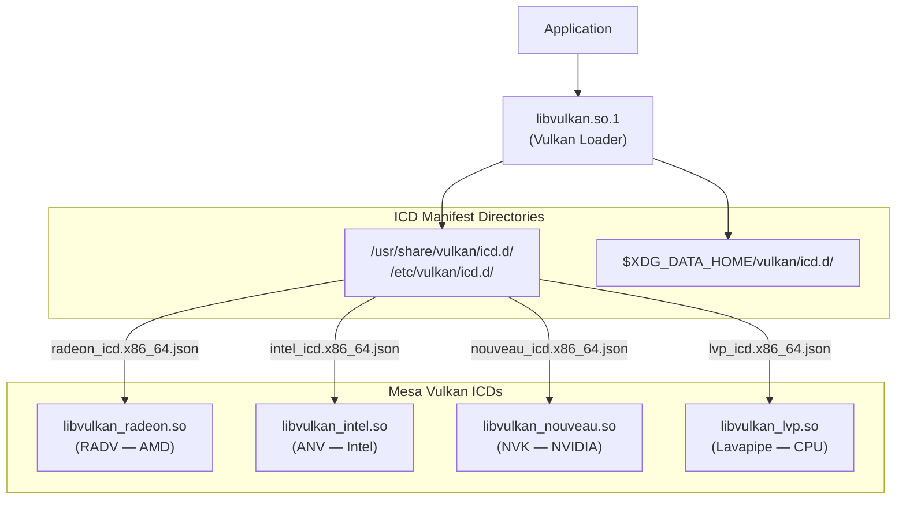
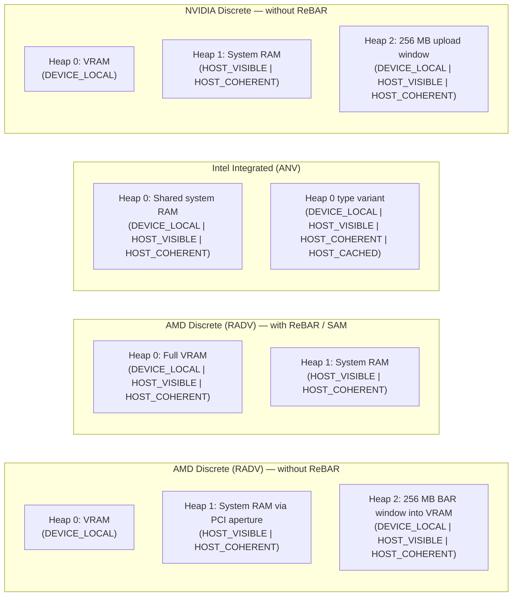
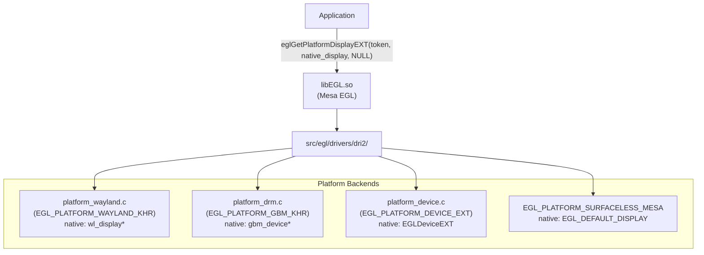
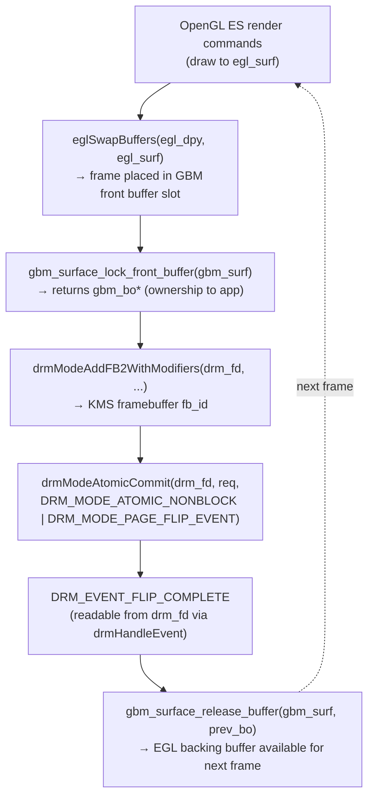
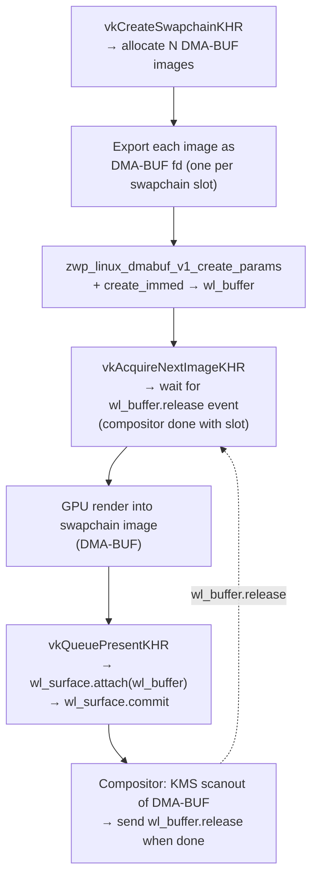
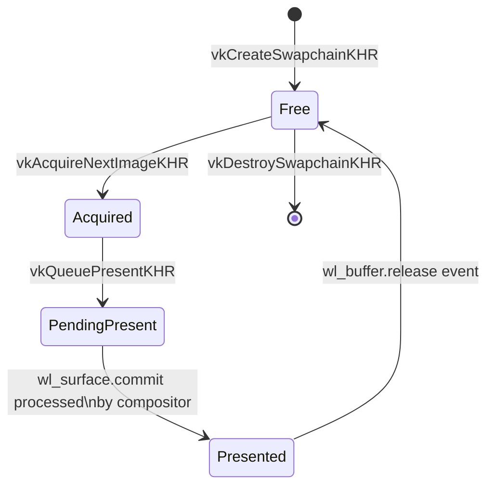
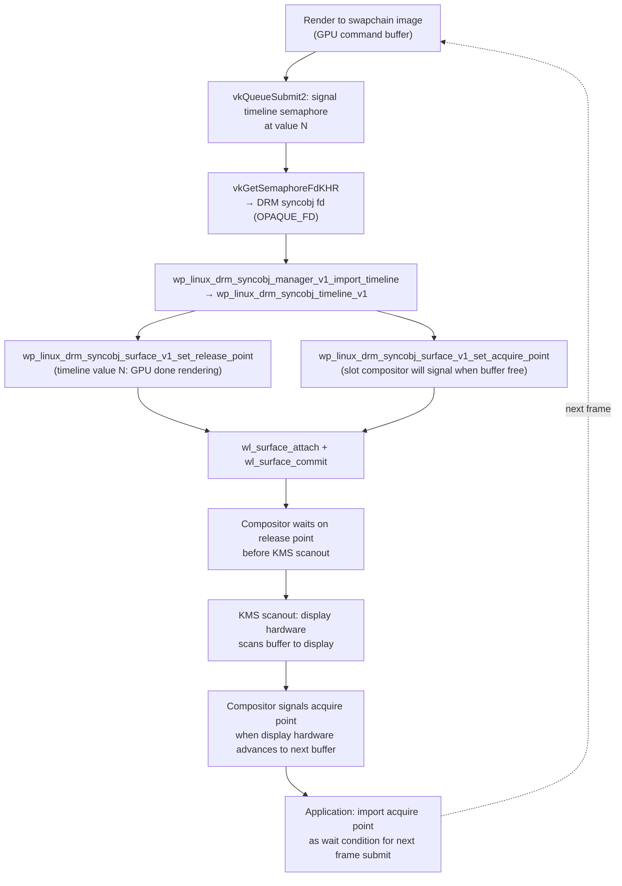

# Chapter 24: Vulkan and EGL for Application Developers

**Part VII — Application APIs and Middleware**
**Audiences**: Application developers (primary); systems developers (EGL/GBM internals, explicit sync)

---

## Scope

This chapter teaches application developers how to initialise and drive Vulkan and EGL correctly on Linux, with an emphasis on understanding the stack beneath the API rather than repeating tutorial introductions available elsewhere. It explains what happens below `vkCreateSwapchainKHR` — which kernel ioctls fire, which Mesa paths execute, and how a rendered frame reaches the display.

**Vulkan render passes** — `VkRenderPass` in Vulkan 1.0–1.2, or the streamlined `VkRenderingInfo` / `vkCmdBeginRendering` path introduced by `VK_KHR_dynamic_rendering` and promoted to Vulkan 1.3 core — describe the structure of a rendering operation: which image attachments the GPU reads and writes, whether each attachment is cleared or its prior contents loaded at the start, and whether results are stored or discarded at the end. A subpass within a render pass expresses intra-pass dependencies; tile-based mobile GPUs use these to avoid flushing intermediate results to DRAM, but on desktop discrete GPUs a render pass typically contains a single subpass. The dynamic rendering path (`vkCmdBeginRendering`) expresses the same attachment layout inline in the command buffer rather than through a pre-allocated `VkRenderPass` object, making it the preferred style for new Vulkan 1.3+ code. This chapter covers the presentation, memory, and synchronisation stack that underlies both styles.

The Wayland-centric presentation model differs meaningfully from Win32 or Android: buffer negotiation proceeds via `linux-dmabuf`, present-mode semantics are tied to the compositor's own pace, and an explicit synchronisation handshake spans the application, Mesa, and the compositor's KMS backend. EGL is the older windowing-system integration layer — it predates Vulkan WSI and was originally designed to bind OpenGL ES to platform window systems. For new Vulkan applications on Linux, `VK_KHR_wayland_surface` and the Vulkan WSI extensions (Sections 5–6) are the primary presentation path. EGL remains the right tool for three specific scenarios covered in this chapter:

- **OpenGL ES applications** — (Sections 3–4)
- **VA-API video import** — zero-copy import of VA-API-decoded video frames into GPU textures (Section 4)
- **Headless rendering** — contexts on infrastructure where Vulkan is unavailable (Section 8)

The long-term trajectory is a gradual narrowing of EGL's role as Vulkan WSI matures and `VK_KHR_video_queue` reduces the need for VA-API as an intermediary.

After reading this chapter, the reader will understand:

- how to select the right Vulkan memory type for a given workload on AMD, Intel, and NVIDIA hardware
- how Wayland swapchains interact with compositor pacing mechanisms
- how to integrate EGL into a GBM-based context for headless or KMS-direct rendering
- how timeline semaphores map onto the kernel-level DRM sync object mechanism, closing the explicit sync loop all the way from GPU to display

---

## Table of Contents

1. [Vulkan Instance and Device Initialisation on Linux](#1-vulkan-instance-and-device-initialisation-on-linux)
   - [1.1 What is Vulkan?](#11-what-is-vulkan)
   - [1.2 What is EGL?](#12-what-is-egl)
   - [1.3 What is GBM (Generic Buffer Management)?](#13-what-is-gbm-generic-buffer-management)
2. [Vulkan Memory Management on AMD, Intel, and NVIDIA](#2-vulkan-memory-management-on-amd-intel-and-nvidia)
2.5 [Shader Parameter Update Mechanisms](#25-shader-parameter-update-mechanisms-push-constants-ubos-and-specialization-constants)
3. [EGL: Display, Context, and Surface Creation](#3-egl-display-context-and-surface-creation)
4. [GBM-Backed EGL Surfaces and KMS-Direct Rendering](#4-gbm-backed-egl-surfaces-and-kms-direct-rendering)
5. [Swapchains on Wayland: VK_KHR_wayland_surface and Present Modes](#5-swapchains-on-wayland-vk_khr_wayland_surface-and-present-modes)
6. [Vulkan WSI Internals on Linux](#6-vulkan-wsi-internals-on-linux)
7. [Synchronisation: Fences, Semaphores, and the Explicit Sync Story](#7-synchronisation-fences-semaphores-and-the-explicit-sync-story)
8. [Headless EGL and Server-Side Rendering](#8-headless-egl-and-server-side-rendering)
9. [Vulkan Validation Layers in a Linux Development Workflow](#9-vulkan-validation-layers-in-a-linux-development-workflow)
10. [Handling VRAM Pressure and GPU Out-of-Memory](#10-handling-vram-pressure-and-gpu-out-of-memory)
11. [Integrations](#11-integrations)
12. [References](#12-references)

---

## 1. Vulkan Instance and Device Initialisation on Linux

This chapter covers the full application-developer path from **Vulkan** and **EGL** initialisation through to compositor presentation and VRAM management on Linux. Section 1 begins with the **Vulkan** loader, ICD selection, physical device enumeration, and queue family scoring. Section 2 examines **Vulkan** memory management on **AMD** (**RADV**), **Intel** (**ANV**), and **NVIDIA** (**NVK**) hardware, including heap topology, **Resizable BAR** (**ReBAR**/**SAM**), **VK_EXT_memory_budget**, **VK_EXT_memory_priority**, and the **Vulkan Memory Allocator** (**VMA**) library. Section 3 covers **EGL** display, context, and surface creation — **eglGetPlatformDisplayEXT**, the **EGL_KHR_image_base** extension family, **EGLImage** handles, and zero-copy **DMA-BUF** import via **EGL_EXT_image_dma_buf_import_modifiers**. Section 4 walks through **GBM**-backed (**libgbm**) **EGL** surfaces and **KMS**-direct rendering with **drmModeAtomicCommit**, including the **VA-API** interop path via **vaExportSurfaceHandle** that enables zero-copy decoded video frames to reach **OpenGL ES** textures. Section 5 describes **Wayland** swapchain creation with **VK_KHR_wayland_surface**, the **linux-dmabuf** format and modifier negotiation, present modes (**VK_PRESENT_MODE_FIFO_KHR**, **VK_PRESENT_MODE_MAILBOX_KHR**, **VK_PRESENT_MODE_IMMEDIATE_KHR**), **VK_EXT_swapchain_maintenance1**, and accurate frame pacing with **VK_KHR_present_id** and **VK_KHR_present_wait**. Section 6 covers **Vulkan WSI internals on Linux**: the Mesa WSI layer's DMA-BUF swapchain implementation for Wayland (`wsi_common_wayland.c`), the X11 DRI3 path (`wsi_common_x11.c`), present-mode semantics and why `VK_PRESENT_MODE_IMMEDIATE_KHR` requires DRM leasing on Wayland, `VK_EXT_swapchain_maintenance1`, and DRM leasing for VR direct display via `VK_EXT_acquire_drm_display`. Section 7 covers the full explicit synchronisation story: **VkFence**, binary and timeline **VkSemaphore**, **VK_KHR_synchronization2**, **DRM sync objects** (**drm_syncobj**), **VK_KHR_external_semaphore_fd**, the **wp_linux_drm_syncobj_v1** Wayland protocol, and the historical **EGLStreams** path. Section 8 addresses headless **EGL** and server-side rendering using the **EGL_EXT_device_base** extension family, **EGL_MESA_platform_surfaceless**, and **GBM** render nodes. Section 9 explains the **Vulkan** validation workflow under **VK_LAYER_KHRONOS_validation**, **VK_EXT_debug_utils**, **vkSetDebugUtilsObjectNameEXT**, and **RenderDoc** integration. Section 10 discusses **VRAM** pressure, **TTM** eviction, **VK_ERROR_OUT_OF_DEVICE_MEMORY** recovery patterns, and fine-grained residency via **VK_KHR_sparse_binding**.

The **Vulkan** loader sits between every application and the driver. On Linux the loader ships as **libvulkan.so.1**, installed by `libvulkan1` on Debian/Ubuntu or `vulkan-loader` on Fedora. When an application calls **vkCreateInstance**, the loader reads **ICD** manifest JSON files from a set of well-known directories: `/usr/share/vulkan/icd.d/`, `/etc/vulkan/icd.d/`, and, for per-user overrides, `$XDG_DATA_HOME/vulkan/icd.d/`. Each manifest names a shared library and a Vulkan API version. **Mesa** installs three primary manifests: `radeon_icd.x86_64.json` pointing at **libvulkan_radeon.so** (the **RADV** driver), `intel_icd.x86_64.json` pointing at **libvulkan_intel.so** (the **ANV** driver), and `nouveau_icd.x86_64.json` pointing at **libvulkan_nouveau.so** (the **NVK** driver). Software rendering is available through `lvp_icd.x86_64.json` (**Lavapipe**). Corresponding 32-bit manifests ending in `i686.json` support 32-bit Vulkan applications on 64-bit systems.



Two environment variables give developers fine-grained control over **ICD** selection. **VK_ICD_FILENAMES** accepts a colon-separated list of manifest paths and completely replaces the default search; **VK_ADD_DRIVER_FILES** (preferred since Vulkan loader 1.3.234) adds paths without overriding the standard ones. Neither variable should appear in production builds, but both are indispensable during development when switching between a distro driver and a locally compiled **Mesa**.

Instance extensions that matter most on Linux split into two categories. Display integration requires **VK_KHR_surface** plus at least one platform surface extension: **VK_KHR_wayland_surface** is the right choice for modern desktops, **VK_KHR_xcb_surface** covers legacy **X11** applications. Debugging requires **VK_EXT_debug_utils**, which supersedes the older **VK_EXT_debug_report**. Applications should enable **VK_KHR_get_physical_device_properties2** (promoted to core in Vulkan 1.1) or target Vulkan 1.1+ directly to unlock the `pNext`-chained property query APIs described below.

Physical device enumeration on Linux deserves careful handling because the system may expose more devices than expected. A modern laptop typically yields three: the discrete GPU (e.g., **VK_PHYSICAL_DEVICE_TYPE_DISCRETE_GPU**), the integrated GPU (**VK_PHYSICAL_DEVICE_TYPE_INTEGRATED_GPU**), and **Lavapipe** (**VK_PHYSICAL_DEVICE_TYPE_CPU**). Render-only devices exposed at `/dev/dri/renderD*` but lacking display capability still appear as physical devices with full compute and graphics support; they just return **VK_PHYSICAL_DEVICE_TYPE_DISCRETE_GPU** or **INTEGRATED_GPU** without display-capable queue families on some drivers. To distinguish **Lavapipe** from real hardware, check **VkPhysicalDeviceProperties**`.deviceType == VK_PHYSICAL_DEVICE_TYPE_CPU` or look for the driver ID **VK_DRIVER_ID_MESA_LLVMPIPE** in **VkPhysicalDeviceDriverProperties**.

Queue family selection is one of the more subtle initialisation tasks. **AMD** **RDNA** GPUs typically expose three queue families: a graphics+compute+transfer family, a compute+transfer family (the "async compute" queue), and a transfer-only **DMA** queue. **Intel Arc** discrete GPUs expose a similar three-family layout. Integrated **Intel** GPUs on older hardware may expose just one or two. **NVIDIA** (via **NVK**) exposes a graphics+compute family and a compute-only family on modern cards. For video workloads, look for queue families with **VK_QUEUE_VIDEO_DECODE_BIT_KHR** or **VK_QUEUE_VIDEO_ENCODE_BIT_KHR** flags — present on **RADV** since **Mesa** 23.1 and **ANV** since 23.3 for supported hardware. The selection procedure should avoid hard-coding vendor IDs: instead score families by the combination of capabilities required, then prefer the most-specialised family for each workload to avoid GPU command serialisation.

**vkGetPhysicalDeviceProperties2** is the correct entry point for all property queries because it supports extension-chained structures via `pNext`. To check for timeline semaphore support, chain **VkPhysicalDeviceTimelineSemaphoreFeatures**; to check for memory budget support, chain **VkPhysicalDeviceMemoryBudgetPropertiesEXT** on a **vkGetPhysicalDeviceMemoryProperties2** call. Any device extension must first be confirmed available through **vkEnumerateDeviceExtensionProperties** before being enabled in **VkDeviceCreateInfo**`::ppEnabledExtensionNames`.

Device extensions on **Mesa** fall into two tiers. Universally available on all major **Mesa** Vulkan drivers (**RADV**, **ANV**, **NVK**) since **Mesa** 22.x include: **VK_KHR_maintenance1** through **VK_KHR_maintenance6**, **VK_KHR_synchronization2** (promotes the **VK_KHR_timeline_semaphore** and **VK_KHR_external_semaphore** patterns into a cleaner API), **VK_KHR_dynamic_rendering**, and the base **WSI** extensions. Hardware-specific extensions include **VK_KHR_ray_tracing_pipeline** (**RADV** on **GCN5**/**RDNA2**+; **ANV** on **Xe HPG**+), **VK_EXT_mesh_shader** (**RADV** since **Mesa** 22.3; **ANV** since 23.0), and **VK_NV_*** extensions which remain **NVIDIA**-proprietary and are exposed only by the **NVIDIA** proprietary driver or **NVK** where applicable. Applications should probe for extensions and build a capability bitfield at startup rather than assuming any non-core extension is present.

```c
/* Pedagogical: physical device selection scoring helper */
typedef struct {
    VkPhysicalDevice device;
    int score;
} DeviceCandidate;

int score_device(VkPhysicalDevice dev, VkSurfaceKHR surface) {
    VkPhysicalDeviceProperties2 props = {
        .sType = VK_STRUCTURE_TYPE_PHYSICAL_DEVICE_PROPERTIES_2
    };
    vkGetPhysicalDeviceProperties2(dev, &props);

    /* Reject software renderers entirely for interactive use */
    if (props.properties.deviceType == VK_PHYSICAL_DEVICE_TYPE_CPU)
        return -1;

    int score = 0;
    if (props.properties.deviceType == VK_PHYSICAL_DEVICE_TYPE_DISCRETE_GPU)
        score += 1000;
    else if (props.properties.deviceType == VK_PHYSICAL_DEVICE_TYPE_INTEGRATED_GPU)
        score += 100;

    /* Prefer more VRAM (heapIndex 0 is typically the device-local heap) */
    VkPhysicalDeviceMemoryProperties mem_props;
    vkGetPhysicalDeviceMemoryProperties(dev, &mem_props);
    for (uint32_t i = 0; i < mem_props.memoryHeapCount; i++) {
        if (mem_props.memoryHeaps[i].flags & VK_MEMORY_HEAP_DEVICE_LOCAL_BIT)
            score += (int)(mem_props.memoryHeaps[i].size >> 28); /* per 256 MB */
    }

    /* Surface support required */
    VkBool32 present_support = VK_FALSE;
    uint32_t qfc = 0;
    vkGetPhysicalDeviceQueueFamilyProperties(dev, &qfc, NULL);
    for (uint32_t q = 0; q < qfc; q++) {
        vkGetPhysicalDeviceSurfaceSupportKHR(dev, q, surface, &present_support);
        if (present_support) break;
    }
    if (!present_support) return -1;

    return score;
}
```

### 1.1 What is Vulkan?

Vulkan is a low-overhead, explicit GPU API standardised by the Khronos Group, covering Linux, Windows, Android, and macOS (via MoltenVK). Where OpenGL and OpenGL ES maintain large driver-side state machines and perform implicit synchronisation, Vulkan places full control over command recording, memory allocation, render pass structure, and synchronisation directly in application code. On Linux the GPU driver splits into two components: a kernel-mode component accessed through the DRM subsystem at `/dev/dri/cardN` (for display) and `/dev/dri/renderDN` (for compute and rendering), and a user-space Installable Client Driver (ICD) loaded by the Vulkan loader (`libvulkan.so.1`). Mesa provides three open-source Vulkan ICDs — RADV for AMD GCN/RDNA hardware, ANV for Intel Gen 8 and later, and NVK for NVIDIA — all conformant to the Vulkan specification and available from distribution packages. ICD manifest JSON files in `/usr/share/vulkan/icd.d/` tell the loader which shared library implements which Vulkan API version. The API model is built around explicit objects: a `VkInstance` establishes the connection to the loader and enabled layers; a `VkPhysicalDevice` represents a GPU; a `VkDevice` is the logical handle with selected queues and extensions; `VkQueue` is the submission point for recorded `VkCommandBuffer` objects. This chapter covers the full initialisation path — instance creation, device selection, queue configuration, memory allocation, swapchain setup, and synchronisation — with an emphasis on the Linux-specific behaviour beneath the API surface.

### 1.2 What is EGL?

EGL is a platform integration API standardised by the Khronos Group that sits between a rendering API (OpenGL, OpenGL ES, or OpenVG) and the underlying native windowing system. On Linux, EGL creates GPU contexts and binds them to rendering surfaces without requiring application code to know the details of DRM, X11, or Wayland directly. The EGL display connection is established via `eglGetPlatformDisplayEXT`, which accepts platform tokens such as `EGL_PLATFORM_WAYLAND_EXT`, `EGL_PLATFORM_GBM_MESA`, or `EGL_PLATFORM_DEVICE_EXT` for headless use. Mesa's EGL implementation translates these platform calls into the appropriate DRM device node operations and Wayland protocol interactions. EGL predates Vulkan WSI and was designed for OpenGL ES environments; it remains the correct interface for three specific use cases on Linux: OpenGL ES rendering, zero-copy import of VA-API-decoded video frames into GPU textures via `EGL_EXT_image_dma_buf_import_modifiers`, and server-side headless rendering on render nodes. The `EGLImage` abstraction, defined by `EGL_KHR_image_base`, acts as a portable handle for GPU memory objects and is the bridge through which a DMA-BUF file descriptor becomes a texture accessible to OpenGL ES. For new Vulkan applications, EGL is not the presentation path — Vulkan WSI extensions handle that role directly — but it remains essential in the mixed-API workflows this chapter covers.

### 1.3 What is GBM (Generic Buffer Management)?

GBM, the Generic Buffer Management library (`libgbm`), is a Mesa-provided abstraction over DRM buffer allocation that lets applications create and manage GPU-accessible buffers through the `/dev/dri/renderDN` render node without using vendor-specific DRM ioctls directly. A `gbm_device` wraps a DRM file descriptor, a `gbm_surface` defines a scanout-capable buffer pool associated with that device, and a `gbm_bo` (buffer object) carries an opaque GEM handle plus format and modifier metadata needed to describe the buffer's tiling layout to the display engine. GBM is most relevant for two scenarios in this chapter: KMS-direct rendering (Section 4), where a GBM surface paired with an EGL context provides the buffer pool that `drmModeAtomicCommit` consumes for display scanout without any compositor intermediary; and headless EGL rendering (Section 8), where `EGL_PLATFORM_GBM_MESA` creates an EGL display from a GBM device. The library also underpins the `linux-dmabuf` buffer negotiation path: when Wayland compositors and Vulkan WSI allocate shared buffers, the DMA-BUF file descriptors and format modifiers exchanged over the protocol carry the same information that a `gbm_bo` stores internally. Understanding GBM therefore clarifies why modifiers appear throughout the explicit sync and presentation machinery even in purely Vulkan codebases, and why the render node — not the card node — is the correct device for application-level GPU access.

---

## 2. Vulkan Memory Management on AMD, Intel, and NVIDIA

Vulkan's memory model exposes heaps and types explicitly so applications can make informed placement decisions. A `VkMemoryHeap` describes a physical pool of memory (VRAM, system RAM) with a size and flags. A `VkMemoryType` describes how the CPU and GPU can access memory allocated from that heap, via `VkMemoryPropertyFlags`. The three flag combinations that define practical allocation strategy on discrete GPUs are: `DEVICE_LOCAL` only (fastest GPU access, no CPU mapping); `DEVICE_LOCAL | HOST_VISIBLE | HOST_COHERENT` (CPU-writable VRAM via PCI BAR); and `HOST_VISIBLE | HOST_COHERENT | HOST_CACHED` (system RAM, fast CPU reads, suitable for readback).

**AMD discrete GPUs** (RADV, Mesa) expose three heaps in a characteristic topology. Heap 0 is the full VRAM with the `DEVICE_LOCAL` flag, sized to the card's installed memory (e.g., 8 GB on an RX 7600). Heap 1 is system RAM visible only to the GPU via the PCI aperture, flagged `HOST_VISIBLE | HOST_COHERENT`. Heap 2 is a 256 MB PCI Base Address Register (BAR) window into VRAM that is simultaneously `DEVICE_LOCAL | HOST_VISIBLE | HOST_COHERENT` — this is the upload heap used for per-frame dynamic data like constant buffers and indirect draw arguments. When Resizable BAR (ReBAR, marketed by AMD as Smart Access Memory) is enabled in BIOS and supported by the chipset, the separate 256 MB heap disappears and the full VRAM becomes accessible as a `DEVICE_LOCAL | HOST_VISIBLE | HOST_COHERENT` type. RADV added SAM support in Mesa 21.0 and uses the full visible VRAM for command ring buffers and upload allocations when available, eliminating an entire round-trip through the 256 MB bottleneck.

**Intel integrated GPUs** (ANV) present the simplest topology: a single heap backed by shared system RAM, with two memory types both carrying `DEVICE_LOCAL | HOST_VISIBLE | HOST_COHERENT`, one of which additionally carries `HOST_CACHED` for CPU readback. Because the iGPU and CPU share the same physical memory, there is no distinction between "upload" and "device-local" allocations, and staging buffers for uniform uploads are unnecessary. However, tiled image formats still require a layout transition through `vkCmdCopyBufferToImage` because the GPU's texture sampler requires a non-linear tile layout even on shared memory. **Intel Arc discrete GPUs** (DG2, Battlemage, ANV with `I915_PARAM_CHIPSET_ID` identifying a dGPU) differ from integrated: they expose a true `DEVICE_LOCAL` VRAM heap alongside a separate `HOST_VISIBLE` system RAM heap, requiring the same staging buffer strategy as AMD and NVIDIA.

**NVIDIA discrete GPUs** (proprietary driver and NVK) maintain a strict two-heap separation. Heap 0 is VRAM flagged `DEVICE_LOCAL`, typically 8–16 GB on consumer RTX cards. Heap 1 is system RAM flagged `HOST_VISIBLE | HOST_COHERENT` (and a `HOST_CACHED` variant). Without ReBAR, NVIDIA exposes a small 256 MB heap combining `DEVICE_LOCAL | HOST_VISIBLE | HOST_COHERENT` for upload traffic, analogous to AMD's BAR heap but traditionally smaller. With ReBAR-capable systems (RTX 30 series and later, BIOS support required), the 256 MB limit is lifted in the proprietary driver and full VRAM becomes CPU-visible, though the behaviour and heap enumeration differs across driver generations. When writing code that must perform well on all three vendors, the correct strategy is: check for a type with both `DEVICE_LOCAL` and `HOST_VISIBLE` flags for your upload heap, falling back to a plain `HOST_VISIBLE | HOST_COHERENT` system RAM type if no such combined type exists. This single probe covers integrated Intel (always has it), AMD with or without ReBAR, and NVIDIA with ReBAR.



The `findMemoryType` helper is the most commonly re-implemented function in Vulkan codebases:

```c
/* Pedagogical: robust memory type selection handling ReBAR */
uint32_t find_memory_type(
    VkPhysicalDevice phys_dev,
    uint32_t type_filter,          /* bitmask from VkMemoryRequirements.memoryTypeBits */
    VkMemoryPropertyFlags required,
    VkMemoryPropertyFlags preferred) /* e.g., DEVICE_LOCAL as a bonus */
{
    VkPhysicalDeviceMemoryProperties props;
    vkGetPhysicalDeviceMemoryProperties(phys_dev, &props);

    /* First pass: require all flags, also want preferred */
    for (uint32_t i = 0; i < props.memoryTypeCount; i++) {
        if (!(type_filter & (1u << i))) continue;
        VkMemoryPropertyFlags f = props.memoryTypes[i].propertyFlags;
        if ((f & required) == required && (f & preferred) == preferred)
            return i;
    }
    /* Second pass: require only mandatory flags */
    for (uint32_t i = 0; i < props.memoryTypeCount; i++) {
        if (!(type_filter & (1u << i))) continue;
        if ((props.memoryTypes[i].propertyFlags & required) == required)
            return i;
    }
    fprintf(stderr, "No suitable Vulkan memory type found\n");
    abort();
}
```

For large allocations — render targets, swapchain images, dedicated textures — attach `VkMemoryDedicatedAllocateInfo` to `VkMemoryAllocateInfo`. This tells the driver that the allocation exists solely for one image or buffer, allowing optimisations like placing it at a 2 MB-aligned boundary or on a dedicated DDR channel. Drivers are free to ignore the hint but may use it for VRAM placement decisions.

`VK_EXT_memory_budget` (widely available since Mesa 19.x and NVIDIA proprietary 440.31+) adds `VkPhysicalDeviceMemoryBudgetPropertiesEXT` to the `vkGetPhysicalDeviceMemoryProperties2` chain. The extension provides `heapBudget[]` and `heapUsage[]` arrays, both indexed by `VkMemoryHeap` index. `heapBudget[i]` is a live driver estimate of remaining allocation headroom — not a fixed quota, but a dynamic figure that changes as other processes allocate and free GPU memory, as KMS scanout surfaces steal VRAM, and as TTM eviction pressure fluctuates. Applications must re-query this value periodically; caching it at startup will produce incorrect quality-scaling decisions once the runtime state changes.

`VK_EXT_memory_priority` (RADV Mesa 21.x+, ANV Mesa 22.x+) adds a `priority` field (0.0–1.0) to `VkMemoryAllocateInfo` via `VkMemoryPriorityAllocateInfoEXT`, giving the driver hints about eviction order when VRAM is constrained. High-priority allocations (1.0) are the last to be evicted to GTT; low-priority ones (near 0.0) are candidates for early eviction.

The Vulkan Memory Allocator (VMA) library from AMD GPUOpen encapsulates the full memory management layer including staging, defragmentation, and budget-aware allocation. Its `VMA_MEMORY_USAGE_AUTO` usage flag, combined with `VMA_ALLOCATION_CREATE_HOST_ACCESS_SEQUENTIAL_WRITE_BIT` or `VMA_ALLOCATION_CREATE_PREFER_HOST_MEMORY_BIT`, lets VMA select the optimal memory type for upload or readback traffic and fall back gracefully when VRAM headroom is tight. For most applications, VMA is the correct choice over rolling a custom suballocator.

Buffer-image granularity is a hardware constraint on certain older devices: a linear resource (buffer) and a non-linear resource (optimal-tiled image) may not share the same VkDeviceMemory page if their byte ranges would overlap within a `bufferImageGranularity`-sized window. Modern AMD, Intel, and NVIDIA hardware reports `bufferImageGranularity = 1`, meaning the constraint does not apply, but any code targeting mobile or older hardware must check `VkPhysicalDeviceLimits.bufferImageGranularity` and align suballocations accordingly.

---

## 2.5 Shader Parameter Update Mechanisms: Push Constants, UBOs, and Specialization Constants

Getting data from the CPU to a shader is not a single decision — Vulkan provides three fundamentally different mechanisms that trade off update frequency, data size, and compile-time vs runtime cost. Choosing the wrong one is a common source of unnecessary CPU overhead, GPU stalls, and missed driver optimisations.

| | Push Constants | Uniform Buffer Object | Specialization Constants |
|---|---|---|---|
| **Update granularity** | Per draw call | Per frame / per pass | Pipeline creation only |
| **Size limit** | 128–256 bytes | Up to `maxUniformBufferRange` (≥ 64 KB) | 4 bytes per constant (typical) |
| **Requires `VkBuffer` / `VkDescriptorSet`** | No | Yes (both) | No |
| **CPU→GPU barrier needed** | No | Yes (pipeline barrier) | No |
| **GPU cost** | Hardware constant cache | Hardware constant cache | Zero — compiled away |
| **Enables dead-code elimination** | No | No | Yes |
| **Typical use** | Object index, frame time, per-draw alpha | View-projection matrix, lighting params | Feature toggles, workgroup size |

The detailed rationale for each mechanism follows; the full decision flowchart is in the **Decision Guide** subsection below.

### Push Constants: Per-Draw Scalars with Zero Allocation Overhead

Push constants are small values (up to `VkPhysicalDeviceLimits::maxPushConstantsSize` — 128 bytes on NVIDIA/NVK and most AMD hardware, 256 bytes permitted by the spec) that are written directly into the command buffer stream at record time. There is no `VkBuffer`, no `VkDescriptorSet`, and no `vkUpdateDescriptorSets` call. The GPU reads them from a hardware constant cache alongside other per-draw state.

**Typical uses**: animation time, per-draw object index, per-instance transform override, debug flags, render pass selector.

**API pattern** — passing a per-frame timer and a per-draw index to a vertex shader:

```cpp
// At pipeline layout creation — declare the push constant range
VkPushConstantRange pcRange{
    .stageFlags = VK_SHADER_STAGE_VERTEX_BIT | VK_SHADER_STAGE_FRAGMENT_BIT,
    .offset     = 0,
    .size       = 8,    // two float32 values: [0]=time, [1]=objectIndex (as float)
};
VkPipelineLayoutCreateInfo layoutCI{
    .pushConstantRangeCount = 1,
    .pPushConstantRanges    = &pcRange,
    /* ... descriptor set layouts ... */
};
vkCreatePipelineLayout(device, &layoutCI, nullptr, &pipelineLayout);

// HLSL shader side (DXC -spirv)
struct PushConstants {
    float time;
    float objectIndex;
};
[[vk::push_constant]] PushConstants pc;

[numthreads(64,1,1)]
void VSMain(uint3 DTid : SV_DispatchThreadID) {
    float wave = sin(pc.time + DTid.x * 0.1);
    /* ... */
}

// Per-frame CPU update — called inside vkBeginCommandBuffer / vkEndCommandBuffer
struct { float time; float objectIndex; } pushData;
pushData.time        = currentTimeSeconds;
pushData.objectIndex = (float)drawIndex;

vkCmdPushConstants(
    commandBuffer,
    pipelineLayout,
    VK_SHADER_STAGE_VERTEX_BIT | VK_SHADER_STAGE_FRAGMENT_BIT,
    0,              /* offset into push constant range */
    8,              /* bytes to update */
    &pushData
);
vkCmdDraw(commandBuffer, vertexCount, 1, 0, 0);
// Next draw with different objectIndex: just call vkCmdPushConstants again — no sync needed
```

Push constants require no synchronisation between the CPU write and the GPU read because `vkCmdPushConstants` is recorded into the command buffer before submission, not written to a GPU-visible buffer. They are the lowest-latency path available for per-draw data.

**Limits**: 128 bytes is enough for a 4×4 float matrix (64 bytes) plus a handful of scalars. For anything larger, use a UBO.

### Uniform Buffer Objects: Per-Frame and Per-Pass Data

`VK_DESCRIPTOR_TYPE_UNIFORM_BUFFER` bindings hold data that is constant for the duration of a draw call but may change between frames. The GPU accesses UBOs through the hardware constant cache — a separate, broadcast-optimised cache tier that efficiently serves all threads in a warp that read the same offset simultaneously. This makes UBOs significantly faster than storage buffers for read-only, uniformly-accessed data such as view-projection matrices, lighting parameters, and material properties.

**When to use a UBO over a push constant**: the data is larger than 128 bytes, or it is shared between many draw calls and should be written once per frame rather than once per draw.

**Per-frame UBO pattern** — a view-projection matrix and the same animation timer, CPU-mapped for zero-copy update:

```cpp
// Allocate a host-visible, persistently-mapped UBO using VMA
struct FrameConstants {
    float viewProj[16];   // 64 bytes: 4×4 float matrix
    float time;           // 4 bytes
    float padding[3];     // 12 bytes (std140 alignment)
};  // total: 80 bytes, well under maxUniformBufferRange

VmaAllocationCreateInfo allocCI{
    .flags = VMA_ALLOCATION_CREATE_MAPPED_BIT |
             VMA_ALLOCATION_CREATE_HOST_ACCESS_SEQUENTIAL_WRITE_BIT,
    .usage = VMA_MEMORY_USAGE_AUTO,
};
VkBufferCreateInfo bufCI{
    .sType = VK_STRUCTURE_TYPE_BUFFER_CREATE_INFO,
    .size  = sizeof(FrameConstants),
    .usage = VK_BUFFER_USAGE_UNIFORM_BUFFER_BIT,
};
VkBuffer ubo;  VmaAllocation uboAlloc;
VmaAllocationInfo allocInfo;
vmaCreateBuffer(allocator, &bufCI, &allocCI, &ubo, &uboAlloc, &allocInfo);
FrameConstants *mapped = (FrameConstants *)allocInfo.pMappedData;
// mapped is valid for the lifetime of ubo — no vkMapMemory / vkUnmapMemory needed

// Per-frame CPU update (host-coherent memory — no explicit flush needed on AMD/NVIDIA/Intel)
mapped->time = currentTimeSeconds;
memcpy(mapped->viewProj, camera.viewProjectionMatrix().data(), 64);

// Barrier: ensure CPU write is visible before vertex stage reads the UBO.
// On host-coherent memory (HOST_COHERENT_BIT), the barrier is sufficient without
// explicit cache flush. Without the barrier, the GPU may read stale values.
VkBufferMemoryBarrier2 barrier{
    .sType         = VK_STRUCTURE_TYPE_BUFFER_MEMORY_BARRIER_2,
    .srcStageMask  = VK_PIPELINE_STAGE_2_HOST_BIT,
    .srcAccessMask = VK_ACCESS_2_HOST_WRITE_BIT,
    .dstStageMask  = VK_PIPELINE_STAGE_2_VERTEX_SHADER_BIT,
    .dstAccessMask = VK_ACCESS_2_UNIFORM_READ_BIT,
    .buffer = ubo, .offset = 0, .size = sizeof(FrameConstants),
};
VkDependencyInfo depInfo{ .bufferMemoryBarrierCount=1, .pBufferMemoryBarriers=&barrier };
vkCmdPipelineBarrier2(commandBuffer, &depInfo);
// Now safe to issue draw calls that read from `ubo`
```

On **ReBAR-enabled NVIDIA** (the `DEVICE_LOCAL | HOST_VISIBLE` memory type described in §2), the mapped pointer writes directly to VRAM over PCIe and `HOST_COHERENT_BIT` is set, so no `vkFlushMappedMemoryRanges` is needed. On systems without ReBAR (the `HOST_VISIBLE` GART heap), the same pattern applies — the CPU write goes to system RAM that the GPU reads over PCIe.

On **AMD RADV**, the device-local host-visible heap (the 256 MB or full-VRAM-size `DEVICE_LOCAL | HOST_VISIBLE | HOST_COHERENT` type) gives the same zero-copy access pattern.

### Specialization Constants: Compile-Time Shader Variants

Specialization constants are values that are fixed at `vkCreateGraphicsPipeline` / `vkCreateComputePipeline` time but can differ between pipeline objects. The key distinction from both push constants and UBOs: they are not runtime values at all — the driver compiles them away into the shader binary, and branches conditioned on them are dead-code-eliminated.

**When to use**: enabling or disabling a shader feature (shadow mapping, skinning, bloom), hard-coding an iteration count the compiler can use for loop unrolling, parameterising a workgroup size that affects register allocation.

**When not to use**: any value that changes between draw calls or frames. Specialization requires recreating the pipeline — that involves running the shader compiler, which is expensive. Pre-warm all pipeline variants at application startup.

```cpp
// Shader with two specialization constants: shadow map on/off, and PCF sample count
// HLSL:
//   [[vk::constant_id(0)]] bool  ENABLE_SHADOWS = true;
//   [[vk::constant_id(1)]] uint  PCF_SAMPLES    = 4;
//   if (ENABLE_SHADOWS) { /* shadow lookup loop, unrolled by compiler to PCF_SAMPLES iters */ }

// Create pipeline variant A: shadows enabled, 4 PCF samples
struct VariantA { uint32_t enableShadows = 1; uint32_t pcfSamples = 4; } varA;
VkSpecializationMapEntry entries[2]{
    { .constantID = 0, .offset = 0, .size = 4 },   // ENABLE_SHADOWS
    { .constantID = 1, .offset = 4, .size = 4 },   // PCF_SAMPLES
};
VkSpecializationInfo specA{
    .mapEntryCount = 2, .pMapEntries = entries,
    .dataSize = 8,      .pData = &varA,
};
// Pipeline A: the shadow lookup branch is compiled in; loop unrolled 4× by NAK/ACO
VkPipeline pipelineWithShadows;
createGraphicsPipeline(/* ... stage.pSpecializationInfo = &specA ... */, &pipelineWithShadows);

// Create pipeline variant B: shadows off — branch eliminated, no PCF code in binary
struct VariantB { uint32_t enableShadows = 0; uint32_t pcfSamples = 0; } varB;
VkSpecializationInfo specB{ /* ... .pData = &varB ... */ };
VkPipeline pipelineNoShadows;
createGraphicsPipeline(/* ... .pSpecializationInfo = &specB ... */, &pipelineNoShadows);

// At render time: select the pre-compiled pipeline, no compiler invocation
bool shadowsEnabled = settings.shadowQuality > 0;
vkCmdBindPipeline(cmd, VK_PIPELINE_BIND_POINT_GRAPHICS,
                  shadowsEnabled ? pipelineWithShadows : pipelineNoShadows);
```

The shader compiler (NAK for NVK, ACO for RADV) receives NIR where `ENABLE_SHADOWS` is already a compile-time `true` or `false`. Dead-code elimination removes the entire shadow branch in the `pipelineNoShadows` variant. The resulting SASS / GCN binary is shorter and uses fewer registers than an equivalent dynamic branch would, which improves warp occupancy.

### Decision Guide: Which Mechanism to Use

| Criterion | Push Constants | UBO | Specialization Constants |
|---|---|---|---|
| Update frequency | Per draw call | Per frame / per pass | Pipeline creation time only |
| Size limit | 128–256 bytes | Up to `maxUniformBufferRange` (≥64 KB) | Per-constant (typically 4 bytes each) |
| Requires `VkDescriptorSet` | No | Yes | No |
| Requires `VkBuffer` | No | Yes | No |
| Requires CPU→GPU barrier | No | Yes (pipeline barrier) | No |
| GPU access cost | ~10 cycles (constant cache) | ~10 cycles (constant cache) | Zero (compiled away) |
| Enables dead-code elimination | No | No | Yes |
| Can change value at runtime | Yes (per command buffer) | Yes (map + memcpy) | No (new pipeline required) |
| Example use | Frame time, per-draw index | View-projection matrix, lighting | Shadow enable/disable, workgroup size |

In practice, most applications use all three: specialization constants for shader feature variants compiled at startup, a UBO for per-frame camera and lighting data, and push constants for the per-draw-call scalars that change every draw (object ID, material index, alpha threshold). The three mechanisms are complementary rather than competing.

---

## 3. EGL: Display, Context, and Surface Creation

EGL is the platform-neutral binding layer that connects a rendering API (OpenGL, OpenGL ES, or rarely Vulkan via `EGL_KHR_vulkan_image`) to a native windowing or display system. It was standardised before Vulkan WSI existed, and remains the standard context-creation API for OpenGL ES. New Vulkan applications use `VK_KHR_wayland_surface` (Section 5) rather than EGL for window presentation; the EGL paths in this section are relevant when working with OpenGL ES, importing VA-API video frames, or creating headless contexts for offscreen rendering. On Linux the EGL implementation lives in Mesa's `libEGL.so`, which dispatches to platform-specific backends under `src/egl/drivers/dri2/`. The entry point for modern EGL code is `eglGetPlatformDisplayEXT` (or `eglGetPlatformDisplay` from EGL 1.5), not the legacy `eglGetDisplay`. The platform token selects the backend, and the `native_display` argument is an opaque pointer whose type is determined by the platform.



For Wayland applications, the call is:

```c
/* EGL_PLATFORM_WAYLAND_KHR: native_display is a wl_display* */
EGLDisplay egl_dpy = eglGetPlatformDisplayEXT(
    EGL_PLATFORM_WAYLAND_KHR,
    wl_display,   /* wl_display* obtained from wl_display_connect() */
    NULL);        /* attrib_list */
```

This causes Mesa's `platform_wayland.c` backend to open the appropriate DRM render node, initialise the DRI3 interface, and set up the Wayland event dispatch machinery. The resulting `EGLDisplay` is ready to negotiate DMA-BUF formats with the compositor.

For GBM-backed headless or KMS-direct rendering:

```c
/* EGL_PLATFORM_GBM_KHR: native_display is a gbm_device* */
int drm_fd = open("/dev/dri/renderD128", O_RDWR | O_CLOEXEC);
struct gbm_device *gbm = gbm_device_create(drm_fd);
EGLDisplay egl_dpy = eglGetPlatformDisplayEXT(
    EGL_PLATFORM_GBM_KHR,
    gbm,
    NULL);
```

For pure offscreen work without a display, `EGL_MESA_platform_surfaceless` (a Mesa extension available since Mesa 13.0) or the more portable `EGL_EXT_device_base` path (covered in Section 8) are the correct choices.

After obtaining a display, the standard initialisation sequence proceeds: `eglInitialize(dpy, &major, &minor)` probes the driver and returns the EGL version; `eglBindAPI(EGL_OPENGL_ES_API)` or `EGL_OPENGL_API` selects the rendering API before `eglCreateContext`; and `eglChooseConfig` filters `EGLConfig` objects by an attribute list specifying surface type, colour bit depths, depth/stencil requirements, and rendering type. A minimal GLES3 config:

```c
const EGLint config_attribs[] = {
    EGL_SURFACE_TYPE,    EGL_WINDOW_BIT,
    EGL_RENDERABLE_TYPE, EGL_OPENGL_ES3_BIT,
    EGL_RED_SIZE,        8,
    EGL_GREEN_SIZE,      8,
    EGL_BLUE_SIZE,       8,
    EGL_ALPHA_SIZE,      8,
    EGL_NONE
};
EGLConfig config;
EGLint num_configs;
eglChooseConfig(dpy, config_attribs, &config, 1, &num_configs);
```

Context creation uses `eglCreateContext` with `EGL_CONTEXT_MAJOR_VERSION` and `EGL_CONTEXT_MINOR_VERSION` attributes. Debug contexts (`EGL_CONTEXT_FLAGS_KHR` with `EGL_CONTEXT_OPENGL_DEBUG_BIT_KHR`) enable GL debug output callbacks equivalent to Vulkan's `VK_EXT_debug_utils`. The `EGL_KHR_no_config_context` and `EGL_KHR_surfaceless_context` extensions allow creating a context without a matching config or without a draw/read surface at bind time, which is necessary for texture-sharing scenarios where the context must be created before the surface geometry is known.

`EGL_MESA_query_driver` exposes a useful diagnostic: `eglQueryDriverNameMESA(dpy)` returns a string like `"radeonsi"`, `"iris"`, or `"zink"`, allowing an application or test harness to verify which Mesa driver is active without parsing `/proc/modules` or vendor strings.

EGL image extensions form the foundation of zero-copy buffer sharing. `EGL_KHR_image_base` defines `eglCreateImageKHR` and `eglDestroyImageKHR`, creating opaque `EGLImage` handles that wrap GPU memory. `EGL_EXT_image_dma_buf_import` and `EGL_EXT_image_dma_buf_import_modifiers` extend this to accept DMA-BUF file descriptors along with pixel format, width, height, stride, and DRM format modifier. This is the pathway used to import VA-API decoded frames, camera buffers, and GBM buffer objects into an OpenGL ES texture without a CPU copy.

```c
/* Import a DMA-BUF fd as an EGLImage (pedagogical, simplified) */
EGLint img_attribs[] = {
    EGL_WIDTH,                      frame_width,
    EGL_HEIGHT,                     frame_height,
    EGL_LINUX_DRM_FOURCC_EXT,       DRM_FORMAT_NV12,
    EGL_DMA_BUF_PLANE0_FD_EXT,      dmabuf_fd,
    EGL_DMA_BUF_PLANE0_OFFSET_EXT,  0,
    EGL_DMA_BUF_PLANE0_PITCH_EXT,   frame_stride,
    EGL_DMA_BUF_PLANE0_MODIFIER_LO_EXT, (EGLint)(modifier & 0xFFFFFFFF),
    EGL_DMA_BUF_PLANE0_MODIFIER_HI_EXT, (EGLint)(modifier >> 32),
    EGL_NONE
};
EGLImage img = eglCreateImageKHR(
    dpy, EGL_NO_CONTEXT,
    EGL_LINUX_DMA_BUF_EXT,
    (EGLClientBuffer)NULL,
    img_attribs);
/* Bind to texture: glEGLImageTargetTexture2DOES(GL_TEXTURE_2D, img) */
```

---

## 4. GBM-Backed EGL Surfaces and KMS-Direct Rendering

The Generic Buffer Manager (GBM), `libgbm`, provides a thin abstraction over DRM buffer objects (BOs) for use by EGL and Wayland compositors. Unlike wl_egl_window surfaces used by Wayland clients, GBM surfaces bypass the compositor entirely and communicate directly with KMS hardware — this is the pattern used by wlroots' DRM backend, KWin's DRM backend, and Mutter's KMS path. Application developers rarely write GBM/KMS code directly, but understanding the pattern is essential when building compositors, media players that target direct display, or CI environments without a Wayland session.

Initialising a GBM device requires an open DRM file descriptor. For rendering without display capability required, use a render node (`/dev/dri/renderD*`); for KMS output, you need a primary node (`/dev/dri/card*`) that grants access to `drmModeAtomicCommit`. The GBM device is a lightweight wrapper:

```c
int drm_fd = open("/dev/dri/card0", O_RDWR | O_CLOEXEC);
struct gbm_device *gbm = gbm_device_create(drm_fd);
```

Creating a GBM surface requires specifying width, height, a DRM pixel format (`GBM_FORMAT_XRGB8888`, `GBM_FORMAT_ARGB8888`, etc.), and usage flags. The flags `GBM_BO_USE_SCANOUT | GBM_BO_USE_RENDERING` are mandatory: `RENDERING` signals that the BO will be used as an EGL render target, and `SCANOUT` signals that the BO must be placed in a memory region the display engine can scan out. Without `SCANOUT`, the allocator may choose a tiled layout or compression format that the CRTC hardware cannot read. DRM format modifiers, negotiated between the EGL driver and the KMS driver via `EGL_EXT_image_dma_buf_import_modifiers`, allow scanout-compatible compressed formats (e.g., AMD's Display Compression, `I915_FORMAT_MOD_X_TILED` for Intel) to be used simultaneously for rendering and display.

```c
struct gbm_surface *gbm_surf = gbm_surface_create_with_modifiers2(
    gbm,
    width, height,
    GBM_FORMAT_XRGB8888,
    modifiers, num_modifiers,   /* negotiated via EGL modifier query */
    GBM_BO_USE_SCANOUT | GBM_BO_USE_RENDERING);

EGLSurface egl_surf = eglCreateWindowSurface(
    egl_dpy, egl_config,
    (EGLNativeWindowType)gbm_surf,
    NULL);
```

The render-and-flip loop follows a strict sequence that must not be violated. After rendering to `egl_surf` with OpenGL ES commands, `eglSwapBuffers` completes the frame and places the rendered image in the GBM surface's front buffer slot. `gbm_surface_lock_front_buffer` then extracts a `gbm_bo *` handle to that front buffer, transferring ownership from EGL to the application. The application creates a KMS framebuffer from this BO using `drmModeAddFB2WithModifiers` (which accepts format modifiers), then schedules a page flip:



```c
/* After eglSwapBuffers(egl_dpy, egl_surf): */
struct gbm_bo *bo = gbm_surface_lock_front_buffer(gbm_surf);

uint32_t handles[4] = { gbm_bo_get_handle(bo).u32 };
uint32_t strides[4] = { gbm_bo_get_stride(bo) };
uint32_t offsets[4] = { 0 };
uint64_t modifiers_fb[4] = { gbm_bo_get_modifier(bo) };

uint32_t fb_id;
drmModeAddFB2WithModifiers(drm_fd,
    gbm_bo_get_width(bo), gbm_bo_get_height(bo),
    GBM_FORMAT_XRGB8888,
    handles, strides, offsets, modifiers_fb,
    &fb_id, DRM_MODE_FB_MODIFIERS);

/* Atomic modeset commit — pedagogical, simplified */
drmModeAtomicReqPtr req = drmModeAtomicAlloc();
drmModeAtomicAddProperty(req, crtc_id,  PROP_ACTIVE,        1);
drmModeAtomicAddProperty(req, plane_id, PROP_FB_ID,         fb_id);
drmModeAtomicAddProperty(req, plane_id, PROP_CRTC_ID,       crtc_id);
drmModeAtomicAddProperty(req, plane_id, PROP_SRC_W,  width  << 16);
drmModeAtomicAddProperty(req, plane_id, PROP_SRC_H,  height << 16);
drmModeAtomicAddProperty(req, plane_id, PROP_CRTC_W,        width);
drmModeAtomicAddProperty(req, plane_id, PROP_CRTC_H,        height);
drmModeAtomicCommit(drm_fd, req,
    DRM_MODE_ATOMIC_NONBLOCK | DRM_MODE_PAGE_FLIP_EVENT,
    NULL);
drmModeAtomicFree(req);
```

After `drmModeAtomicCommit` returns, the application must not release the BO until the flip completes. The kernel sends a `DRM_EVENT_FLIP_COMPLETE` event readable from `drm_fd` via `drmHandleEvent`; inside the event handler, the previous BO can be released with `gbm_surface_release_buffer`, making its EGL backing buffer available for the next frame. Failing to observe this lifecycle — releasing too early — results in torn frames or GPU faults.

The VA-API interop pattern deserves explicit treatment because it is one of the most common reasons an application needs GBM or raw EGL DMA-BUF import. A hardware-decoded video frame emerges from `libva` as a `VAImage` or `VASurface`, both of which can be exported as a DMA-BUF file descriptor via `vaExportSurfaceHandle` with `VA_EXPORT_SURFACE_READ_ONLY | VA_EXPORT_SURFACE_COMPOSED_LAYERS`. That fd, along with the DRM format, width, height, stride, and modifier, is passed into `eglCreateImageKHR` with `EGL_LINUX_DMA_BUF_EXT` as shown in Section 3. The resulting `EGLImage` is bound to a GL texture with `glEGLImageTargetTexture2DOES`, enabling the decoded frame to be sampled, composited, tone-mapped, or blurred with a GLSL shader — entirely in GPU memory, with no CPU round-trip. This zero-copy path is the standard implementation in media players and video conferencing applications on Linux.

The `kmscube` project (`https://gitlab.freedesktop.org/mesa/kmscube`) is the canonical minimal reference for the GBM/EGL/KMS loop, including both the legacy `drmModeSetCrtc` and the modern atomic commit path in `drm-atomic.c`.

---

## 5. Swapchains on Wayland: VK_KHR_wayland_surface and Present Modes

Creating a Vulkan window surface for Wayland requires the `VK_KHR_wayland_surface` instance extension and two pointers from the application's Wayland session: the `wl_display *` obtained from `wl_display_connect()`, and the `wl_surface *` created by the compositor for the application window.

```c
VkWaylandSurfaceCreateInfoKHR surf_info = {
    .sType   = VK_STRUCTURE_TYPE_WAYLAND_SURFACE_CREATE_INFO_KHR,
    .display = wl_display,
    .surface = wl_surface,
};
VkSurfaceKHR vk_surface;
vkCreateWaylandSurfaceKHR(instance, &surf_info, NULL, &vk_surface);
```

What happens beneath this call is documented mainly in Mesa's `src/vulkan/wsi/wsi_common_wayland.c`. Mesa's WSI layer binds a `zwp_linux_dmabuf_v1` Wayland protocol listener to the display and queries the compositor for supported DRM formats and modifiers. This negotiation determines which `VkSurfaceFormat2KHR` entries `vkGetPhysicalDeviceSurfaceFormats2KHR` will return. Applications can query format capabilities at swapchain-creation time using `VkSurfaceFormatProperties2` with `VkImageFormatConstraintsInfoFUCHSIA` or simply iterate the returned format list. For SDR displays, `VK_FORMAT_B8G8R8A8_SRGB` with `VK_COLOR_SPACE_SRGB_NONLINEAR_KHR` is the universally safe choice and is always listed first on Mesa. For HDR displays, look for `VK_FORMAT_R16G16B16A16_SFLOAT` with `VK_COLOR_SPACE_HDR10_ST2084_EXT` or `VK_COLOR_SPACE_DISPLAY_P3_NONLINEAR_EXT`.

Wayland's `currentExtent` behaviour is unique among Vulkan platforms. `VkSurfaceCapabilitiesKHR.currentExtent` is always `{0xFFFFFFFF, 0xFFFFFFFF}` on Wayland, meaning the compositor does not dictate the surface size — the application controls its own extent. This is the opposite of most other platforms. Swapchain images should be created at the size specified by the `xdg_toplevel.configure` event, clamped between `minImageExtent` and `maxImageExtent`. `minImageCount` is usually 2 or 3; requesting one more than `minImageCount` provides triple buffering headroom on FIFO present modes.

Present modes on Wayland have distinct semantics that differ from their documentation-level descriptions:

`VK_PRESENT_MODE_FIFO_KHR` is the only mode required to be available. The application enqueues frames into a FIFO; the compositor consumes one per vblank. This is tearing-free and correctly paced to the display's refresh rate, but adds one frame of latency.

`VK_PRESENT_MODE_MAILBOX_KHR` appears in `vkGetPhysicalDeviceSurfacePresentModesKHR` on many Mesa builds, but its latency benefit only materialises when the compositor actively replaces queued frames rather than FIFO-draining them. Wayland compositors are not required to implement mailbox semantics; wlroots processes presented buffers in order, making MAILBOX equivalent to FIFO in practice. Applications should not assume MAILBOX provides lower latency.

`VK_PRESENT_MODE_IMMEDIATE_KHR` (tearing-permitted) requires `VK_EXT_surface_maintenance1` and the Wayland `wp_tearing_control_v1` staging protocol. The compositor and the Mesa driver must both signal support; Mesa 23.3+ and KWin 6.0+/Mutter 46+ implement the compositor side. This mode is appropriate for benchmarks and games where tearing is acceptable in exchange for minimum latency.

`VK_EXT_swapchain_maintenance1` (Mesa 23.1+) solves several longstanding WSI pain points. `VkSwapchainPresentModesCreateInfoEXT` chained onto `VkSwapchainCreateInfoKHR` pre-declares all present modes the swapchain may switch between, and `VkSwapchainPresentModeInfoEXT` chained on `VkPresentInfoKHR` switches modes per-present without swapchain recreation. `VkSwapchainPresentFenceInfoEXT` provides a `VkFence` per swapchain per present that signals when the presentation engine has finished reading the semaphores from `pWaitSemaphores`, enabling deterministic semaphore recycling — previously applications had to infer this timing from the next acquire's behaviour. `vkReleaseSwapchainImagesEXT` returns acquired images to the swapchain without presenting them, resolving the shutdown scenario where a swapchain recreation is triggered while images are in flight.

`VK_KHR_present_id` and `VK_KHR_present_wait` together provide the foundation of accurate frame pacing without busy-polling. At each `vkQueuePresentKHR`, chain `VkPresentIdKHR` with a monotonically increasing `presentId`. After submission, call `vkWaitForPresentKHR(device, swapchain, presentId, timeout_ns)` to block until the compositor has retired frame `presentId`. This replaces the pattern of inferring present completion from the next `vkAcquireNextImageKHR` success, which has undefined latency. Mesa 23.0 added an initial `VK_KHR_present_wait` implementation for RADV, ANV, and Turnip, initially opt-in via a driconf key; it became default-on in subsequent releases. NVIDIA proprietary driver supports this from 525+.

```c
/* Pedagogical: present_id/present_wait frame pacing loop */
uint64_t present_id = 0;
uint64_t last_present_ns = 0;

while (running) {
    /* Acquire, record, submit ... */

    VkPresentIdKHR present_id_info = {
        .sType          = VK_STRUCTURE_TYPE_PRESENT_ID_KHR,
        .swapchainCount = 1,
        .pPresentIds    = &(uint64_t){ ++present_id },
    };
    VkPresentInfoKHR present_info = {
        .sType              = VK_STRUCTURE_TYPE_PRESENT_INFO_KHR,
        .pNext              = &present_id_info,
        .swapchainCount     = 1,
        .pSwapchains        = &swapchain,
        .pImageIndices      = &image_index,
    };
    vkQueuePresentKHR(queue, &present_info);

    /* Block until compositor retired the previous frame, 16 ms timeout */
    if (present_id > 1) {
        vkWaitForPresentKHR(device, swapchain, present_id - 1,
                            16000000 /* ns */);
    }
}
```

Swapchain recreation on resize is a frequent source of bugs. The correct pattern when `vkQueuePresentKHR` returns `VK_ERROR_OUT_OF_DATE_KHR` (swapchain has become incompatible, must be recreated) or `VK_SUBOPTIMAL_KHR` (still functional but suboptimal) is: complete the current frame, allow all in-flight fences to signal (`vkWaitForFences` or `vkDeviceWaitIdle`), then destroy the old swapchain, and create a new one at the new extent. Critically, `VK_SUBOPTIMAL_KHR` does not require immediate recreation — presenting with a suboptimal swapchain is valid and preferable to interrupting in-flight work. Defer creation to the start of the next frame after all resources using old swapchain images have been released.

Multi-window Vulkan requires one `VkSwapchainKHR` per `VkSurfaceKHR`. Each swapchain is independent and can receive present operations from separate submit batches. `VkDeviceGroupPresentCapabilitiesKHR` and `VkDeviceGroupSwapchainCreateInfoKHR` cover multi-GPU scenarios (SLI/NVLink or AFR setups) but are rarely needed in single-GPU Linux deployments.

---

## 6. Vulkan WSI Internals on Linux

**Audiences**: Application developers who need to understand what happens below `vkCreateSwapchainKHR`; systems developers working on compositor integration or WSI layer code.

This section opens the lid on Mesa's WSI layer — the code path that converts Vulkan swapchain operations into Wayland protocol messages or X11 DRI3 transactions. Understanding these internals is necessary when debugging presentation anomalies, choosing the right present mode for a given deployment environment, or writing OpenXR compositors that need direct display access.

### 6.1 VK_KHR_wayland_surface: DMA-BUF Swapchain Internals

`VK_KHR_wayland_surface` is the entry point, but the substantive work happens in Mesa's `src/vulkan/wsi/wsi_common_wayland.c` ([source](https://gitlab.freedesktop.org/mesa/mesa/-/blob/main/src/vulkan/wsi/wsi_common_wayland.c)). When `vkCreateWaylandSurfaceKHR` is called, Mesa binds a `zwp_linux_dmabuf_v1` listener to the `wl_display` and accumulates the compositor's advertised (format, modifier) pairs via the `zwp_linux_dmabuf_v1.format` and `zwp_linux_dmabuf_v1.modifier` events. This negotiation determines the exact set of formats and modifiers exposed by `vkGetPhysicalDeviceSurfaceFormats2KHR` — the list is not hard-coded but derived from what the compositor declares it can accept.

At `vkCreateSwapchainKHR` time, Mesa allocates a pool of N swapchain images using the Vulkan driver's own allocator (e.g., RADV's `wsi_create_buffer` path). Each image is backed by a DMA-BUF file descriptor. The DMA-BUF is then imported into the Wayland compositor as a `wl_buffer` using `zwp_linux_dmabuf_v1.create_immed`:

```c
/*
 * Pedagogical sketch of Mesa WSI Wayland swapchain image setup.
 * Real code: src/vulkan/wsi/wsi_common_wayland.c, wsi_wl_image_init()
 * Mesa main branch (as of 2025-Q4).
 */

/* Each swapchain image: allocate as DMA-BUF, wrap as wl_buffer */
struct zwp_linux_buffer_params_v1 *params =
    zwp_linux_dmabuf_v1_create_params(display->dmabuf);

/* image->dma_buf_fd is the fd exported from the Vulkan driver allocator */
zwp_linux_buffer_params_v1_add(params,
    image->dma_buf_fd,
    0,                   /* plane index */
    image->offset,
    image->row_pitch,
    image->drm_modifier >> 32,     /* modifier_hi */
    image->drm_modifier & 0xFFFFFFFF); /* modifier_lo */

/* create_immed: synchronous buffer creation, returns wl_buffer immediately */
image->buffer = zwp_linux_buffer_params_v1_create_immed(
    params,
    swapchain->extent.width,
    swapchain->extent.height,
    wl_drm_format,   /* e.g. WL_DRM_FORMAT_ARGB8888 */
    0 /* flags */);
zwp_linux_buffer_params_v1_destroy(params);
```

The relationship is one-to-one: each `VkImage` in the swapchain corresponds to exactly one DMA-BUF file descriptor and one `wl_buffer` handle. The DMA-BUF is the physical GPU allocation; the `wl_buffer` is the compositor's handle to it. No pixel data is copied — the compositor's KMS backend reads the same memory the GPU renders into.

The `wl_buffer.release` event, sent by the compositor after it no longer needs a buffer for display, is what unblocks `vkAcquireNextImageKHR`. Mesa registers a `wl_buffer.release` listener; when the event fires, it marks that swapchain slot as available and wakes any thread blocked in `vkAcquireNextImageKHR`. `vkQueuePresentKHR` in turn calls `wl_surface.attach(surface, wl_buffer, 0, 0)` followed by `wl_surface.commit` — handing the rendered buffer to the compositor.



### 6.2 VK_KHR_xcb_surface and VK_KHR_xlib_surface: The X11 DRI3 Path

For X11 surfaces, Vulkan applications use either `VK_KHR_xcb_surface` (preferred, direct XCB connection) or `VK_KHR_xlib_surface` (wraps Xlib, which internally calls XCB). The create-info structures name their respective connection handles:

```c
/* XCB surface: direct XCB connection */
VkXcbSurfaceCreateInfoKHR xcb_info = {
    .sType      = VK_STRUCTURE_TYPE_XCB_SURFACE_CREATE_INFO_KHR,
    .connection = xcb_connection,  /* xcb_connection_t* from xcb_connect() */
    .window     = xcb_window,      /* xcb_window_t from xcb_create_window() */
};
VkSurfaceKHR vk_surface;
vkCreateXcbSurfaceKHR(instance, &xcb_info, NULL, &vk_surface);

/* Xlib surface: Xlib Display + Window (internally wraps to XCB) */
VkXlibSurfaceCreateInfoKHR xlib_info = {
    .sType  = VK_STRUCTURE_TYPE_XLIB_SURFACE_CREATE_INFO_KHR,
    .dpy    = x_display,    /* Display* from XOpenDisplay() */
    .window = x_window,     /* Window (XID) from XCreateWindow() */
};
vkCreateXlibSurfaceKHR(instance, &xlib_info, NULL, &vk_surface);
```

The `VK_USE_PLATFORM_XCB_KHR` and `VK_USE_PLATFORM_XLIB_KHR` preprocessor defines (set in `<vulkan/vulkan.h>` before the Vulkan headers are included) gate the declarations of these structures. The xlib path calls `XGetXCBConnection(dpy)` to extract an `xcb_connection_t *` and delegates to the same XCB logic — it adds no additional capabilities, only Xlib convenience.

The critical difference from the Wayland path is the buffer-sharing model. X11 Vulkan WSI uses **DRI3**, the Direct Rendering Infrastructure version 3 protocol, to share DMA-BUF file descriptors between the Vulkan application and the X compositor (Xorg, or XWayland running a Wayland compositor above it). Mesa's X11 WSI layer in `src/vulkan/wsi/wsi_common_x11.c` ([source](https://gitlab.freedesktop.org/mesa/mesa/-/blob/main/src/vulkan/wsi/wsi_common_x11.c)) issues `xcb_dri3_pixmap_from_buffers_checked` to register each swapchain DMA-BUF as an X11 Pixmap:

```c
/*
 * DRI3: register a DMA-BUF fd as an X11 Pixmap (pedagogical).
 * Real code: src/vulkan/wsi/wsi_common_x11.c, x11_image_init()
 */

/* Export the swapchain image's DMA-BUF fd */
int dma_buf_fd = /* obtained from wsi_image_get_dma_buf_fd(image) */;

xcb_pixmap_t pixmap = xcb_generate_id(xcb_conn);
xcb_dri3_pixmap_from_buffers_checked(
    xcb_conn,
    pixmap,
    xcb_window,
    num_planes,         /* 1 for RGBA, 2 for NV12, etc. */
    width, height,
    stride, 0,          /* stride for plane 0, offset */
    0, 0,               /* plane 1 stride/offset (unused for RGBA) */
    0, 0,               /* plane 2 */
    0, 0,               /* plane 3 */
    depth, bpp,
    drm_modifier >> 32,
    drm_modifier & 0xffffffff,
    &dma_buf_fd);       /* array of fds; ownership transferred to X server */
```

This approach — sharing DRM buffer objects directly via DRI3 — is the mechanism that eliminated the **MIT-SHM** copy that earlier X11 OpenGL implementations required. MIT-SHM allocated a shared memory segment, rendered into it on the CPU side, and then the X server copied those pixels into its internal scanout buffer. DRI3 replaces this with a file-descriptor handoff: the GPU renders into a DMA-BUF, the DRI3 Pixmap registration hands that fd to the X server, and the X Present extension (`xcb_present_pixmap`) schedules the GPU buffer for display at the correct vblank without any copy.

The **X Present extension** (distinct from Vulkan's present modes) is what drives `vkQueuePresentKHR` on X11. Mesa calls `xcb_present_pixmap` with the Pixmap corresponding to the rendered swapchain image, specifying the target MSC (Media Stamp Counter — the display's vblank counter), and an XSync fence that the application signals after GPU rendering completes. The X server waits for the fence before latching the new scanout.

On **XWayland** (X11 application running inside a Wayland session), the DRI3 path is preserved: XWayland acts as an X server, manages DRI3 Pixmaps internally, and translates them into `wl_buffer` objects passed to the outer Wayland compositor via `linux-dmabuf`. The Vulkan application sees only the XCB/Xlib surface; the Wayland protocol is hidden below.

### 6.3 Present Modes on Wayland: Why IMMEDIATE Is Impossible Without DRM Lease

A **present mode** (`VkPresentModeKHR`) controls the relationship between `vkQueuePresentKHR` submissions and the display's physical vblank signal — the hardware interrupt that fires once per refresh cycle when the display controller finishes scanning out the previous frame. The choice determines three properties of the swapchain: whether tearing is possible, how many frames of latency the pipeline introduces, and how buffer slots are reused when the application renders faster than the display refreshes.

The Vulkan spec defines four modes; only the first is universally required:

| Mode | Tearing | Latency | Buffer reuse | Availability |
|---|---|---|---|---|
| `FIFO` | Never | 1 frame (queue drain) | FIFO — oldest frame always shown | Guaranteed on all platforms |
| `FIFO_RELAXED` | On underrun only | 1 frame typical | FIFO, but skips vblank if queue empty | Optional; rarely used |
| `MAILBOX` | Never | Sub-frame (latest wins) | Only newest queued frame is shown | Optional; Wayland approximation |
| `IMMEDIATE` | Permitted | Minimum (sub-vblank) | Frames may be skipped | Optional; requires `wp_tearing_control_v1` on Wayland |

**Which mode to use:**

- **`FIFO`** — the safe default for all desktop applications: GUI tools, productivity software, video playback. Tearing-free, compositor-paced, correct latency for content that does not need to beat the vblank.
- **`MAILBOX`** — request it for games and interactive 3D applications to reduce input latency. On Wayland the gain is limited (see below), but on X11 and Windows true mailbox semantics apply.
- **`IMMEDIATE`** — games and benchmarks where tearing is acceptable in exchange for the lowest possible input-to-display latency. Only available on Wayland when both compositor and Mesa support `wp_tearing_control_v1`.
- **`FIFO_RELAXED`** — media players or any content that cannot always deliver frames before the vblank deadline; allows a late frame to scan out immediately rather than waiting an entire extra vblank cycle.

Wayland's architectural principle — that the compositor owns the display and all client buffers pass through it — has direct consequences for how these modes behave in practice.

**`VK_PRESENT_MODE_FIFO_KHR`** is the only mode the Vulkan spec requires to be available on any platform. On Wayland, it maps to the natural compositor pacing model: the application submits frames via `wl_surface.commit`, and the compositor presents one buffer per vblank cycle. The compositor's KMS backend drives the vblank timing; the application does not observe the vblank directly. This is synchronised, tearing-free, and latency-stable.

**`VK_PRESENT_MODE_MAILBOX_KHR`** is advertised by Mesa on Wayland builds but does not provide true mailbox semantics. In a true mailbox, a queued-but-not-yet-displayed frame can be atomically replaced by a newer frame, reducing latency without tearing. On Wayland, the compositor processes `wl_surface.commit` requests in order — there is no protocol mechanism for a client to supersede a pending buffer. Mesa's approximation allocates an extra swapchain image slot so the application can render ahead, but the presented sequence remains first-in-first-out. Applications expecting the latency reduction of a real mailbox queue will not observe it on Wayland.

**`VK_PRESENT_MODE_IMMEDIATE_KHR`** (tearing-permitted, minimum latency) requires a Wayland compositor-side implementation of `wp_tearing_control_v1` ([protocol XML](https://gitlab.freedesktop.org/wayland/wayland-protocols/-/blob/main/staging/tearing-control/tearing-control-v1.xml)). When both the compositor (KWin 6.0+, Mutter 46+, wlroots 0.17+) and Mesa 23.3+ support this protocol, `vkGetPhysicalDeviceSurfacePresentModesKHR` will include `VK_PRESENT_MODE_IMMEDIATE_KHR`. Even then, the compositor retains frame scheduling control — it attempts to present each committed buffer as quickly as possible, but cannot guarantee sub-vblank latency because the KMS page flip must still be scheduled by the kernel's display hardware. The "immediate" label means the compositor allows tearing rather than waiting for the next vblank; it does not bypass the compositor.

Without `wp_tearing_control_v1`, `VK_PRESENT_MODE_IMMEDIATE_KHR` is structurally **impossible** on Wayland. The Wayland protocol has no mechanism for a client to directly control display scanout timing — only the compositor can issue `drmModeAtomicCommit`. Contrast this with DRM direct mode (Section 6.6 below), where an application that has acquired a DRM lease can call `drmModeAtomicCommit` directly with `DRM_MODE_ATOMIC_ALLOW_MODESET`, achieving sub-vblank presentation at the cost of bypassing the compositor entirely.

### 6.4 VkSwapchainKHR Lifecycle on Wayland

The full lifecycle of a Wayland swapchain image traverses five distinct ownership states:

1. **Free**: the swapchain slot is available for the application to acquire.
2. **Acquired**: `vkAcquireNextImageKHR` has returned the image index; the application owns the image and may submit GPU work rendering into it.
3. **Pending present**: `vkQueuePresentKHR` has been called; the image is queued for presentation. The application must not access it.
4. **Presented**: the compositor holds the `wl_buffer` as its current scanout buffer. The GPU may still be rendering (release fence is pending).
5. **Released**: the compositor has sent `wl_buffer.release`; the slot returns to Free.



The minimum swapchain image count on Wayland is 2 (one being rendered while one is displayed), but triple buffering (3 images) is recommended to prevent the GPU from stalling while waiting for a `wl_buffer.release` during the compositor's scanout window. Mesa enforces a minimum of 2 in `wsi_common_wayland.c`; the `minImageCount` field of `VkSurfaceCapabilitiesKHR` reflects this.

A subtle implementation detail: `vkAcquireNextImageKHR` does not block on GPU completion — it blocks on the `wl_buffer.release` event. These are different signals. If the GPU has not finished rendering when the release arrives, the application is responsible for waiting on the per-image fence (or semaphore) before submitting new GPU work into the same image. Skipping this wait is a write-after-write hazard: the GPU will overwrite memory the compositor is still displaying.

### 6.5 VK_EXT_swapchain_maintenance1

`VK_EXT_swapchain_maintenance1` ([spec](https://docs.vulkan.org/features/latest/features/proposals/VK_EXT_swapchain_maintenance1.html), Mesa 23.1+) addresses several lifetime management gaps that the base swapchain extensions leave open.

**Per-present fences** (`VkSwapchainPresentFenceInfoEXT`): chains onto `VkPresentInfoKHR` to supply one `VkFence` per swapchain entry in `pSwapchains`. The fence signals when the presentation engine has finished consuming the semaphores listed in `VkPresentInfoKHR::pWaitSemaphores`. This enables the application to recycle those semaphores immediately after the fence signals, without having to infer readiness from the next acquire operation.

```c
VkFence present_fence;
/* ... create present_fence as a normal VkFence ... */

VkSwapchainPresentFenceInfoEXT fence_info = {
    .sType          = VK_STRUCTURE_TYPE_SWAPCHAIN_PRESENT_FENCE_INFO_EXT,
    .swapchainCount = 1,
    .pFences        = &present_fence,
};
VkPresentInfoKHR present_info = {
    .sType              = VK_STRUCTURE_TYPE_PRESENT_INFO_KHR,
    .pNext              = &fence_info,
    .swapchainCount     = 1,
    .pSwapchains        = &swapchain,
    .pImageIndices      = &image_index,
    .waitSemaphoreCount = 1,
    .pWaitSemaphores    = &render_done_semaphore,
};
vkQueuePresentKHR(queue, &present_info);
/* After vkWaitForFences(device, 1, &present_fence, VK_TRUE, UINT64_MAX),
   render_done_semaphore can be safely recycled or reset. */
```

**Explicit swapchain retirement** (`vkReleaseSwapchainImagesEXT`): returns one or more acquired-but-not-presented images back to the swapchain's free pool without presenting them. This is essential for clean swapchain recreation on resize: previously, an application that had already acquired an image when a resize was detected could not return the image — it had to either present it (wasting a frame) or let it leak until `vkDestroySwapchainKHR`. `vkReleaseSwapchainImagesEXT` eliminates this forced present.

**Present mode switching without recreation** (`VkSwapchainPresentModesCreateInfoEXT` + `VkSwapchainPresentModeInfoEXT`): the application declares at swapchain creation which present modes it may switch between; at each `vkQueuePresentKHR` it can specify the mode for that particular present via `VkSwapchainPresentModeInfoEXT` in the `pNext` chain. This allows dynamic switching between `FIFO` (power-save) and `IMMEDIATE` (minimum latency) without swapchain destruction.

### 6.6 DRM Leasing for VR and Direct Display

Standard Wayland Vulkan presentation routes all frames through the desktop compositor. Virtual reality headsets and professional direct-display applications need **exclusive ownership of a display connector**, bypassing the compositor entirely to achieve sub-millisecond latency and precise vblank control. Linux supports this via **DRM display leasing**, exposed to Vulkan through two extension pairs.

**Kernel-level leasing**: `DRM_IOCTL_MODE_CREATE_LEASE` ([kernel source](https://github.com/torvalds/linux/blob/master/drivers/gpu/drm/drm_lease.c)) creates a lease — a new DRM file descriptor that grants access to a specific set of DRM object IDs (CRTCs, connectors, encoders, planes) while revoking those objects from the primary DRM fd. The leasee can call `drmModeAtomicCommit` on the leased fd as if it owned the display hardware outright. The desktop compositor (KWin, Mutter) implements the Wayland `wp_drm_lease_v1` protocol ([XML](https://gitlab.freedesktop.org/wayland/wayland-protocols/-/blob/main/staging/drm-lease/drm-lease-v1.xml)) to expose lease offers to clients, allowing a VR compositor like Monado to request a lease for the HMD connector without requiring root privileges. This path is covered in detail in Chapter 121 (DRM Leasing).

**Vulkan extension path**: `VK_EXT_acquire_drm_display` ([spec](https://registry.khronos.org/vulkan/specs/1.3-extensions/man/html/VK_EXT_acquire_drm_display.html)) and `VK_EXT_direct_mode_display` ([spec](https://registry.khronos.org/vulkan/specs/1.3-extensions/man/html/VK_EXT_direct_mode_display.html)) bridge the DRM lease fd into a Vulkan `VkDisplayKHR` handle:

```c
/*
 * Acquire a DRM display for direct Vulkan presentation (VR compositor path).
 * Prerequisite: obtain a lease fd from wp_drm_lease_v1 or
 * directly from DRM_IOCTL_MODE_CREATE_LEASE.
 */

/* Step 1: Enumerate displays available on the lease fd */
uint32_t display_count = 0;
vkGetDrmDisplayEXT(physical_device,
    lease_drm_fd,            /* DRM fd from DRM_IOCTL_MODE_CREATE_LEASE */
    connector_id,            /* DRM connector ID for the HMD */
    &vk_display);            /* VkDisplayKHR output */

/* Step 2: Acquire exclusive control */
VkResult result = vkAcquireDrmDisplayEXT(
    physical_device,
    lease_drm_fd,
    vk_display);
/* After this succeeds, the Vulkan WSI layer owns the connector.
   The desktop compositor can no longer scan out to it. */

/* Step 3: Create a display surface for direct presentation */
VkDisplaySurfaceCreateInfoKHR surface_info = {
    .sType           = VK_STRUCTURE_TYPE_DISPLAY_SURFACE_CREATE_INFO_KHR,
    .displayMode     = display_mode,   /* from vkGetDisplayModePropertiesKHR */
    .planeIndex      = 0,
    .planeStackIndex = 0,
    .transform       = VK_SURFACE_TRANSFORM_IDENTITY_BIT_KHR,
    .alphaMode       = VK_DISPLAY_PLANE_ALPHA_OPAQUE_BIT_KHR,
    .imageExtent     = { width, height },
};
VkSurfaceKHR direct_surface;
vkCreateDisplayPlaneSurfaceKHR(instance, &surface_info, NULL, &direct_surface);

/* The resulting direct_surface supports VK_PRESENT_MODE_IMMEDIATE_KHR:
   the application owns the CRTC and controls vblank timing directly. */
```

The `vkAcquireXlibDisplayEXT` variant (from `VK_EXT_acquire_xlib_display`) provides an alternative entry point for X11 environments where the display lease is acquired via the `XRandR` extension rather than a DRM lease fd. This path is less common in modern Linux VR stacks, which prefer the Wayland `wp_drm_lease_v1` path.

**Monado** (the open-source OpenXR runtime, [source](https://gitlab.freedesktop.org/monado/monado)) uses this path for its DRM display backend: it requests a lease for the HMD connector from the desktop compositor (or obtains one directly if running without a compositor), calls `vkAcquireDrmDisplayEXT`, and runs its own Vulkan swapchain on the leased display. Because the application owns the CRTC, `VK_PRESENT_MODE_IMMEDIATE_KHR` is genuinely immediate — each `vkQueuePresentKHR` triggers a direct `drmModeAtomicCommit` on the leased fd without any compositor interposition.

### 6.7 Platform Selection in Practice

A portable Vulkan application must select the WSI extension that matches the windowing environment it is running in. The recommended approach queries `vkEnumerateInstanceExtensionProperties` and selects based on available extensions and environment variables:

```c
/* Portable WSI extension selection */
typedef enum {
    WSI_PLATFORM_WAYLAND,
    WSI_PLATFORM_XCB,
    WSI_PLATFORM_XLIB,
    WSI_PLATFORM_DIRECT_DISPLAY,
    WSI_PLATFORM_UNKNOWN,
} WsiPlatform;

WsiPlatform select_wsi_platform(void) {
    /* Check environment first: explicit override wins */
    const char *wayland_display = getenv("WAYLAND_DISPLAY");
    const char *x_display       = getenv("DISPLAY");

    /* Probe available instance extensions */
    uint32_t ext_count = 0;
    vkEnumerateInstanceExtensionProperties(NULL, &ext_count, NULL);
    VkExtensionProperties *exts = malloc(ext_count * sizeof(*exts));
    vkEnumerateInstanceExtensionProperties(NULL, &ext_count, exts);

    bool has_wayland = false, has_xcb = false, has_xlib = false;
    for (uint32_t i = 0; i < ext_count; i++) {
        if (!strcmp(exts[i].extensionName,
                    VK_KHR_WAYLAND_SURFACE_EXTENSION_NAME)) has_wayland = true;
        if (!strcmp(exts[i].extensionName,
                    VK_KHR_XCB_SURFACE_EXTENSION_NAME))     has_xcb = true;
        if (!strcmp(exts[i].extensionName,
                    VK_KHR_XLIB_SURFACE_EXTENSION_NAME))    has_xlib = true;
    }
    free(exts);

    /* Prefer Wayland when WAYLAND_DISPLAY is set and extension is present */
    if (wayland_display && has_wayland) return WSI_PLATFORM_WAYLAND;
    /* Fall back to XCB (preferred over Xlib: no Xlib threading issues) */
    if (x_display && has_xcb)           return WSI_PLATFORM_XCB;
    if (x_display && has_xlib)          return WSI_PLATFORM_XLIB;
    return WSI_PLATFORM_UNKNOWN;
}
```

**SDL3** abstracts this selection behind `SDL_CreateWindow` and `SDL_Vulkan_CreateSurface`. SDL3's Vulkan backend (`src/video/SDL_vulkan_utils.c`) checks for `WAYLAND_DISPLAY` and selects the Wayland video driver first, falling back to the X11 driver if Wayland is unavailable. Applications using SDL3 do not need to manage WSI extension selection manually. `SDL_Vulkan_GetInstanceExtensions` returns the correct set of required extensions for the selected backend.

**GLFW** follows the same pattern: `glfwGetRequiredInstanceExtensions` returns `{"VK_KHR_surface", "VK_KHR_wayland_surface"}` on a Wayland session and `{"VK_KHR_surface", "VK_KHR_xcb_surface"}` on an X11 session. GLFW uses `glfwGetPlatform()` (GLFW 3.4+) to determine the active backend; `GLFW_PLATFORM_WAYLAND` and `GLFW_PLATFORM_X11` are the two Linux platform values. The `GLFW_PLATFORM` init hint or the `GLFW_PLATFORM` environment variable can force a specific backend.

**Forcing a specific WSI** for testing is sometimes necessary — for example, to test the X11 path while running under XWayland. Setting `WAYLAND_DISPLAY=""` (empty string, or `unset WAYLAND_DISPLAY`) prevents GLFW and SDL from detecting Wayland. Conversely, `unset DISPLAY` suppresses X11 fallback. Mesa's WSI layer itself does not read `WAYLAND_DISPLAY` directly; the display backend is selected by whichever `wl_display *` or `xcb_connection_t *` the application passes into the surface create-info structure.

A common debugging scenario is verifying which WSI path is active. On Mesa, setting `MESA_LOADER_DRIVER_OVERRIDE` is not relevant for WSI selection, but enabling `LIBGL_DEBUG=verbose` (for EGL/GL paths) or checking `VK_LOADER_DEBUG=all` in the Vulkan loader output will show which instance extensions were enabled. For Wayland-specific WSI debugging, the environment variable `WAYLAND_DEBUG=1` prints all Wayland protocol messages — including `zwp_linux_dmabuf_v1` modifier advertisements and `wl_buffer.release` events — to stderr, providing a direct view of the swapchain buffer lifecycle.

---

## 7. Synchronisation: Fences, Semaphores, and the Explicit Sync Story

Vulkan's synchronisation primitives form a hierarchy. `VkFence` synchronises the CPU: it signals after a queue submission completes, allowing the CPU to wait via `vkWaitForFences`. Binary `VkSemaphore` synchronises GPU-to-GPU within a single device: one queue submission signals it, another waits on it, with no CPU visibility. Timeline `VkSemaphore` (promoted to core in Vulkan 1.2 from `VK_KHR_timeline_semaphore`) adds a 64-bit monotonically increasing counter that both the CPU and GPU can signal or wait on, enabling multi-frame dependency tracking without per-frame fence arrays.

Timeline semaphore operations use `vkTimelineSemaphoreSubmitInfo` (the Vulkan 1.1/KHR path) or the cleaner `VkSemaphoreSubmitInfo` inside `VkSubmitInfo2` (Vulkan 1.3 / `VK_KHR_synchronization2`). The key capability that binary semaphores lack is that a timeline semaphore can be waited on from the CPU at any time via `vkWaitSemaphores`, and can be manually signalled from the CPU via `vkSignalSemaphore`, enabling fine-grained pipelining between CPU work and GPU work. A common pattern tracks an `in_flight` semaphore value per frame: submit frame N waiting on value N-1 and signalling value N, then `vkWaitSemaphores` on value N-max_in_flight before re-using any per-frame resources.

```c
/* Pedagogical: timeline semaphore setup */
VkSemaphoreTypeCreateInfo type_info = {
    .sType         = VK_STRUCTURE_TYPE_SEMAPHORE_TYPE_CREATE_INFO,
    .semaphoreType = VK_SEMAPHORE_TYPE_TIMELINE,
    .initialValue  = 0,
};
VkSemaphoreCreateInfo sem_info = {
    .sType = VK_STRUCTURE_TYPE_SEMAPHORE_CREATE_INFO,
    .pNext = &type_info,
};
VkSemaphore timeline_sem;
vkCreateSemaphore(device, &sem_info, NULL, &timeline_sem);

/* Submit signalling value N */
uint64_t signal_value = current_frame_index;
VkSemaphoreSubmitInfo signal_info = {
    .sType     = VK_STRUCTURE_TYPE_SEMAPHORE_SUBMIT_INFO,
    .semaphore = timeline_sem,
    .value     = signal_value,
    .stageMask = VK_PIPELINE_STAGE_2_ALL_COMMANDS_BIT,
};
VkSubmitInfo2 submit = {
    .sType                  = VK_STRUCTURE_TYPE_SUBMIT_INFO_2,
    .signalSemaphoreInfoCount = 1,
    .pSignalSemaphoreInfos  = &signal_info,
};
vkQueueSubmit2(queue, 1, &submit, VK_NULL_HANDLE);

/* CPU wait: block until frame N - MAX_FRAMES_IN_FLIGHT is done */
if (current_frame_index >= MAX_FRAMES_IN_FLIGHT) {
    uint64_t wait_value = current_frame_index - MAX_FRAMES_IN_FLIGHT;
    VkSemaphoreWaitInfo wait_info = {
        .sType          = VK_STRUCTURE_TYPE_SEMAPHORE_WAIT_INFO,
        .semaphoreCount = 1,
        .pSemaphores    = &timeline_sem,
        .pValues        = &wait_value,
    };
    vkWaitSemaphores(device, &wait_info, UINT64_MAX);
}
```

The explicit synchronisation story on Linux requires tracing a chain that runs from the Vulkan timeline semaphore through the kernel's DRM sync object infrastructure to the Wayland compositor. This chain was incomplete until `wp_linux_drm_syncobj_v1` landed in wayland-protocols around mid-2023, with compositor support arriving in KWin 6.1 (KDE Plasma 6.1, released June 2024), Mutter 46+ (GNOME 46.1), and wlroots 0.17+. Mesa 23.3 added the client-side implementation.

**The kernel primitive: drm_syncobj.** A DRM sync object (`drm_syncobj`) is a kernel object — identifiable by a file descriptor — that wraps either a `dma_fence` (a binary signal) or a timeline of `dma_fence` points. Timeline sync objects, introduced in Linux 5.2, can be exported as `SYNC_FD` file descriptors using `DRM_IOCTL_SYNCOBJ_EXPORT_SYNC_FILE` or as opaque `OPAQUE_FD` handles. The `SYNC_FD` format is interoperable with the Android sync file framework and is usable with `poll()`.

**Exporting a Vulkan timeline semaphore as a sync_fd.** `VK_KHR_external_semaphore_fd` (universally supported on Mesa Vulkan drivers) allows a timeline semaphore to be backed by a DRM sync object handle. At creation time:

```c
/* Pedagogical: create semaphore exportable as OPAQUE_FD or SYNC_FD */
VkExportSemaphoreCreateInfo export_info = {
    .sType       = VK_STRUCTURE_TYPE_EXPORT_SEMAPHORE_CREATE_INFO,
    .handleTypes = VK_EXTERNAL_SEMAPHORE_HANDLE_TYPE_OPAQUE_FD_BIT
                 | VK_EXTERNAL_SEMAPHORE_HANDLE_TYPE_SYNC_FD_BIT,
};
VkSemaphoreTypeCreateInfo type_info = {
    .sType         = VK_STRUCTURE_TYPE_SEMAPHORE_TYPE_CREATE_INFO,
    .semaphoreType = VK_SEMAPHORE_TYPE_TIMELINE,
    .initialValue  = 0,
    .pNext         = NULL,
};
export_info.pNext = &type_info;  /* chain both */
VkSemaphoreCreateInfo sem_info = {
    .sType = VK_STRUCTURE_TYPE_SEMAPHORE_CREATE_INFO,
    .pNext = &export_info,
};
VkSemaphore export_sem;
vkCreateSemaphore(device, &sem_info, NULL, &export_sem);
```

After signalling the semaphore at a specific timeline value from a queue submission, export the underlying DRM sync object file descriptor:

```c
VkSemaphoreGetFdInfoKHR get_fd_info = {
    .sType      = VK_STRUCTURE_TYPE_SEMAPHORE_GET_FD_INFO_KHR,
    .semaphore  = export_sem,
    .handleType = VK_EXTERNAL_SEMAPHORE_HANDLE_TYPE_OPAQUE_FD_BIT,
};
int syncobj_fd;
vkGetSemaphoreFdKHR(device, &get_fd_info, &syncobj_fd);
```

**The wp_linux_drm_syncobj_v1 protocol.** The protocol exposes three interfaces: `wp_linux_drm_syncobj_manager_v1` (the factory, obtained from the registry), `wp_linux_drm_syncobj_timeline_v1` (wraps an imported DRM syncobj fd), and `wp_linux_drm_syncobj_surface_v1` (per-surface synchronisation state). The surface interface attaches acquire and release timeline points to each `wl_surface.commit`:

```c
/* Pedagogical: attach explicit sync to a Wayland surface commit */
/* syncobj_fd is the DRM syncobj file descriptor from vkGetSemaphoreFdKHR */
struct wp_linux_drm_syncobj_timeline_v1 *timeline =
    wp_linux_drm_syncobj_manager_v1_import_timeline(
        syncobj_manager, syncobj_fd);

struct wp_linux_drm_syncobj_surface_v1 *sync_surface =
    wp_linux_drm_syncobj_manager_v1_get_surface(
        syncobj_manager, wl_surface);

/* Release point: tell compositor at which timeline value rendering is done */
wp_linux_drm_syncobj_surface_v1_set_release_point(
    sync_surface,
    timeline,
    release_point_hi,   /* uint32_t: high 32 bits of 64-bit timeline value */
    release_point_lo);  /* uint32_t: low 32 bits */

/* Acquire point: compositor signals this when it is done reading the buffer */
wp_linux_drm_syncobj_surface_v1_set_acquire_point(
    sync_surface,
    timeline,
    acquire_point_hi,
    acquire_point_lo);

wl_surface_attach(wl_surface, wl_buffer, 0, 0);
wl_surface_commit(wl_surface);
close(syncobj_fd);
```

The **release point** is set by the application and tells the compositor the timeline value at which the GPU has finished rendering into the buffer. The compositor must wait for this point before sampling the buffer's contents for display. The **acquire point** is also set by the application as a slot; the compositor signals it when it has finished reading the buffer (after the frame has been displayed and the buffer is no longer in use), enabling safe buffer reuse.

**Why this matters for NVIDIA.** The proprietary NVIDIA driver does not participate in the implicit fence infrastructure that Mesa drivers use via `dma_buf` reservation objects. On Mesa drivers, every DMA-BUF carries implicit read and write fences that the kernel tracks automatically; a compositor can call `poll()` on a DMA-BUF fd and be woken when GPU rendering into it completes. The NVIDIA driver operates in a separate domain and does not attach implicit fences to its DMA-BUFs. Before `wp_linux_drm_syncobj_v1`, this made NVIDIA Wayland compositing inherently racy: the compositor could sample a buffer before the NVIDIA GPU finished rendering into it, causing flickering and corruption. Explicit sync via `wp_linux_drm_syncobj_v1` eliminates this race by making the synchronisation point an explicit contract, independent of whether the GPU driver supports implicit fencing.

**The pre-explicit-sync world.** Before `wp_linux_drm_syncobj_v1`, EGL applications used `EGL_ANDROID_native_fence_sync` and `EGL_KHR_fence_sync` to create fence objects tied to the GL command stream, export them as Android sync file descriptors, and pass them to a compositor via a bespoke protocol or side-channel. This approach worked for Mesa drivers that share the implicit fence infrastructure but was not a universal solution.

**Historical note — EGLStreams.** Before GBM became NVIDIA's Wayland path, NVIDIA shipped an alternative buffer-sharing mechanism called EGLStreams (`EGL_NV_stream_*`). Instead of allocating a GBM buffer object and exporting it as a `linux-dmabuf`, the NVIDIA driver and a supporting compositor (Mutter, KWin) would establish an `EGLStreamKHR` — a producer/consumer pair managed entirely within the EGL layer. Applications that targeted EGLStreams created surfaces via `eglCreateStreamProducerSurfaceKHR` rather than the standard `eglCreateWindowSurface` with a GBM window. GNOME 51 (2025) removed EGLStreams support from Mutter; KDE Plasma removed it earlier. No new application code should use EGLStreams. The standard path for all GPU vendors on Wayland is `EGLDisplay` from `EGL_KHR_platform_wayland` with a GBM-backed `wl_egl_window`, as described in this chapter.

The complete synchronisation chain for a Vulkan Wayland frame is therefore: render to swapchain image → signal timeline semaphore at value N → export DRM syncobj fd → attach as release point to Wayland surface → `wl_surface_commit` → compositor waits on release point before KMS scanout → compositor signals acquire point when display hardware moves to next buffer → application imports acquire point as wait condition for next frame's render submission.



---

## 8. Headless EGL and Server-Side Rendering

Headless GPU contexts are necessary for a wide class of Linux workloads: ML inference pipelines that want to visualise activations, render farms processing frames without a display, CI systems that run GPU-accelerated test suites, and video transcoding pipelines that use VA-API plus OpenGL ES for colour-space conversion. "Headless" means the GPU context is valid and rendering is possible, but no window system or display output is involved.

There are two distinct approaches, and choosing between them matters for portability and capability.

**The EGL device extension family.** `EGL_EXT_device_base` (equivalent to `EGL_EXT_device_enumeration` plus `EGL_EXT_device_query` combined) is the standard path and the one that works on both Mesa and NVIDIA EGL. Mesa 19.2+ and NVIDIA EGL 3.1+ support it. Device enumeration populates an array of opaque `EGLDeviceEXT` handles:

```c
/* Headless EGL: enumerate devices and select by DRM path */
PFNEGLQUERYDEVICESEXTPROC eglQueryDevicesEXT =
    (PFNEGLQUERYDEVICESEXTPROC)eglGetProcAddress("eglQueryDevicesEXT");
PFNEGLQUERYDEVICEATTRIBEXTPROC eglQueryDeviceAttribEXT =
    (PFNEGLQUERYDEVICEATTRIBEXTPROC)eglGetProcAddress("eglQueryDeviceAttribEXT");
PFNEGLQUERYDEVICESTRINGEXTPROC eglQueryDeviceStringEXT =
    (PFNEGLQUERYDEVICESTRINGEXTPROC)eglGetProcAddress("eglQueryDeviceStringEXT");
PFNEGLGETPLATFORMDISPLAYEXTPROC eglGetPlatformDisplayEXT =
    (PFNEGLGETPLATFORMDISPLAYEXTPROC)eglGetProcAddress("eglGetPlatformDisplayEXT");

EGLint num_devices = 0;
eglQueryDevicesEXT(0, NULL, &num_devices);   /* query count */
EGLDeviceEXT *devices = malloc(num_devices * sizeof(EGLDeviceEXT));
eglQueryDevicesEXT(num_devices, devices, &num_devices);

/* Select device by DRM device file path */
EGLDeviceEXT chosen_device = EGL_NO_DEVICE_EXT;
for (EGLint i = 0; i < num_devices; i++) {
    const char *drm_path = eglQueryDeviceStringEXT(
        devices[i], EGL_DRM_DEVICE_FILE_EXT);
    if (drm_path && strcmp(drm_path, "/dev/dri/renderD128") == 0) {
        chosen_device = devices[i];
        break;
    }
}

EGLDisplay egl_dpy = eglGetPlatformDisplayEXT(
    EGL_PLATFORM_DEVICE_EXT,
    chosen_device,
    NULL);
eglInitialize(egl_dpy, &major, &minor);
```

`EGL_DRM_DEVICE_FILE_EXT` returns the path to the DRM device associated with the EGL device, enabling selection by render node path. In cluster or multi-GPU environments, the caller can inspect `EGL_DRM_MASTER_FD_EXT` for an already-open fd or use the PCI BUS ID attribute (`EGL_DRM_DEVICE_FILE_EXT` on some drivers encodes the sysfs path).

Once the display is initialised, context creation proceeds identically to the Wayland case — `eglChooseConfig`, `eglBindAPI`, `eglCreateContext` — but the surface type in the config attribute list should be `EGL_PBUFFER_BIT` or `EGL_NO_SURFACE_TYPE` depending on the extension support present. With `EGL_KHR_surfaceless_context`, the context can be made current with `EGL_NO_SURFACE` as both draw and read surfaces:

```c
const EGLint ctx_attribs[] = {
    EGL_CONTEXT_MAJOR_VERSION, 3,
    EGL_CONTEXT_MINOR_VERSION, 2,
    EGL_NONE
};
EGLContext ctx = eglCreateContext(egl_dpy, config, EGL_NO_CONTEXT, ctx_attribs);
eglMakeCurrent(egl_dpy, EGL_NO_SURFACE, EGL_NO_SURFACE, ctx);
```

With the context current, rendering targets a user-created framebuffer object (FBO) backed by a texture or renderbuffer. Results are read back via `glReadPixels` for CPU consumption, or exported as a DMA-BUF via `EGL_MESA_image_dma_buf_export` for zero-copy handoff to another process or VA-API encoder.

**`EGL_MESA_platform_surfaceless`.** This Mesa-specific extension (`EGL_PLATFORM_SURFACELESS_MESA`) simplifies the setup by accepting `EGL_DEFAULT_DISPLAY` rather than requiring device enumeration:

```c
EGLDisplay egl_dpy = eglGetPlatformDisplayEXT(
    EGL_PLATFORM_SURFACELESS_MESA,
    EGL_DEFAULT_DISPLAY,
    NULL);
```

This is the shortest path for Mesa-only deployments (CI, render servers running Mesa exclusively), but the simpler path does not expose device selection — Mesa picks its default DRM device. For environments with multiple GPUs or non-Mesa drivers, `EGL_EXT_device_base` is the correct choice.

**GBM as an EGL platform for headless use.** Using `EGL_PLATFORM_GBM_KHR` with a render node (`/dev/dri/renderD128`) — as shown in Section 3 — works without display hardware. The gbm_device can be created from the render node fd, and the resulting EGL display supports the same surfaceless rendering pattern. This is the approach taken by media transcoding pipelines and Wayland compositor backends that need to allocate GPU buffers independently of display output.

**Headless EGL vs. headless Vulkan.** Vulkan can operate headlessly by simply never creating a `VkSurfaceKHR` or swapchain. A compute-capable queue family (every modern GPU exposes one) is sufficient for shader dispatch; results are written to `VkBuffer` objects and read back via mapped `HOST_VISIBLE` memory or `vkCmdCopyBufferToImage` followed by `vkGetMemoryFdKHR` for DMA-BUF export. The trade-off: EGL headless is the natural choice when the codebase already uses OpenGL ES or when VA-API surface interop is required; Vulkan headless is preferable for compute-heavy workloads, when explicit sync between multiple render passes is required, or when the workload involves multi-queue overlap on AMD/Intel async compute queues.

---

## 9. Vulkan Validation Layers in a Linux Development Workflow

Vulkan's explicit design makes errors invisible to the driver in release builds; validation is opt-in and handled entirely in user space by layers that intercept API calls. The `VK_LAYER_KHRONOS_validation` meta-layer is the standard debugging tool and wraps object lifetime tracking, synchronisation validation, best-practices checks, and GPU-assisted descriptor validation into a single layer identity. All major Linux distributions ship it via `vulkan-validationlayers`; the Vulkan SDK tarball and source builds from the KhronosGroup GitHub repo (`https://github.com/KhronosGroup/Vulkan-ValidationLayers`) are alternatives when distro packages lag upstream.

The layer loader searches `VK_LAYER_PATH` for manifest files before the standard system directories. Setting `VK_LAYER_PATH=/path/to/local/build/explicit_layer.d` allows testing a freshly built validation layer against a distro-installed Mesa driver without root access. Validation layers are enabled by name in `VkInstanceCreateInfo::ppEnabledLayerNames`, or, for development convenience, via the environment variable `VK_INSTANCE_LAYERS=VK_LAYER_KHRONOS_validation`.

Fine-grained control over which validation categories fire is available through either a `vk_layer_settings.txt` file placed alongside the application binary or programmatically via the `VK_EXT_layer_settings` instance extension (formerly `VK_EXT_validation_features`). The `VkValidationFeaturesEXT` structure's `pEnabledValidationFeatures` array accepts flags from `VkValidationFeatureEnableEXT`:

- `VK_VALIDATION_FEATURE_ENABLE_BEST_PRACTICES_EXT`: reports API misuse that is technically valid but suboptimal — examples include allocating more than 4096 descriptor sets, using non-dedicated allocations for render targets, or clearing an attachment in a render pass when the `loadOp` already does so.
- `VK_VALIDATION_FEATURE_ENABLE_GPU_ASSISTED_EXT`: instruments shaders to detect out-of-bounds descriptor array accesses and buffer device address reads/writes at runtime. This has non-trivial performance overhead but catches bugs that static validation cannot see.
- `VK_VALIDATION_FEATURE_ENABLE_SYNCHRONIZATION_VALIDATION_EXT`: the most useful single flag for application developers. It detects missing image layout transitions, absent pipeline barriers between render passes that read and write the same resource, incorrect access mask or pipeline stage combinations, and binary semaphore signal/wait imbalances. Run this on every render pipeline change.

`VK_EXT_debug_utils` (now promoted to the Vulkan SDK header set as a de-facto standard) is the mechanism by which validation layer messages reach the application. A `VkDebugUtilsMessengerEXT` object is created at instance creation time — or just after — with a callback function:

```c
static VKAPI_ATTR VkBool32 VKAPI_CALL debug_callback(
    VkDebugUtilsMessageSeverityFlagBitsEXT      severity,
    VkDebugUtilsMessageTypeFlagsEXT             type,
    const VkDebugUtilsMessengerCallbackDataEXT *data,
    void                                       *user_data)
{
    if (severity >= VK_DEBUG_UTILS_MESSAGE_SEVERITY_WARNING_BIT_EXT)
        fprintf(stderr, "[VK %s] %s\n", data->pMessageIdName, data->pMessage);
    /* Return VK_FALSE: do not abort. VK_TRUE aborts immediately (useful in tests). */
    return VK_FALSE;
}

VkDebugUtilsMessengerCreateInfoEXT dbg_info = {
    .sType           = VK_STRUCTURE_TYPE_DEBUG_UTILS_MESSENGER_CREATE_INFO_EXT,
    .messageSeverity = VK_DEBUG_UTILS_MESSAGE_SEVERITY_WARNING_BIT_EXT
                     | VK_DEBUG_UTILS_MESSAGE_SEVERITY_ERROR_BIT_EXT,
    .messageType     = VK_DEBUG_UTILS_MESSAGE_TYPE_GENERAL_BIT_EXT
                     | VK_DEBUG_UTILS_MESSAGE_TYPE_VALIDATION_BIT_EXT
                     | VK_DEBUG_UTILS_MESSAGE_TYPE_PERFORMANCE_BIT_EXT,
    .pfnUserCallback = debug_callback,
};
VkDebugUtilsMessengerEXT messenger;
vkCreateDebugUtilsMessengerEXT(instance, &dbg_info, NULL, &messenger);
```

Object naming via `vkSetDebugUtilsObjectNameEXT` is strongly recommended: assigning human-readable names to `VkBuffer`, `VkImage`, `VkPipeline`, and `VkCommandBuffer` objects causes validation messages and RenderDoc captures to reference names instead of hex handles. Debug label regions (`vkCmdBeginDebugUtilsLabelEXT` / `vkCmdEndDebugUtilsLabelEXT`) create named scopes visible in RenderDoc's event list and GPU profilers.

Common false positives on Linux include spurious best-practices warnings about `VK_FORMAT_B8G8R8A8_UNORM` swapchain images (the layer prefers `SRGB` variants, but UNORM is valid when the application handles gamma itself), and synchronisation validation messages on Mesa about implicit fence interactions when `EGL_ANDROID_native_fence_sync` is in use alongside Vulkan. Both categories can be suppressed per-message-id using a `vk_layer_settings.txt` filter list without disabling the entire validation category.

In a CI pipeline, running the test suite under `VK_INSTANCE_LAYERS=VK_LAYER_KHRONOS_validation VK_LAYER_SETTINGS_PATH=/ci/vk_layer_settings.txt` with `VALIDATION_ERROR_ABORT=1` (a layer setting that calls `abort()` on any error-severity message) provides an automated gate against Vulkan spec violations introduced by render pipeline changes.

---

## 10. Handling VRAM Pressure and GPU Out-of-Memory

VRAM scarcity is a first-order concern on consumer Linux systems. An 8 GB GPU is the mainstream configuration in 2024; large shadow maps, MSAA render targets, and asset texture arrays consume this budget quickly in demanding applications. The Linux kernel's TTM memory manager (described in Chapter 4) handles physical VRAM exhaustion by evicting BOs to GTT (system RAM mapped to the GPU's virtual address space) and, in the worst case, to ordinary system RAM. This eviction is transparent to the GPU command stream — the GPU does not fault — but the performance cost can be severe: a VRAM resident texture evicted to GTT may take 3–10× longer to access, and an eviction to system RAM is catastrophically slow. Applications that react to budget pressure proactively rather than waiting for the eviction machinery to engage will perform significantly better.

The error `VK_ERROR_OUT_OF_DEVICE_MEMORY` from `vkAllocateMemory` or `vkCreateImage` means the driver has exhausted the entire TTM eviction chain: VRAM, GTT, and system RAM fallback are all full. This condition may not appear until well after VRAM is visibly full, because GTT can absorb several gigabytes depending on available system RAM. `VK_ERROR_OUT_OF_HOST_MEMORY` is distinct: it indicates system RAM exhaustion, which is a process-wide crisis rather than a graphics-specific event, and should be treated as fatal for the allocation (with clean teardown rather than crash).

**Querying runtime budget with VK_EXT_memory_budget.** The extension must be explicitly enabled at device creation. Querying budget data is done by chaining `VkPhysicalDeviceMemoryBudgetPropertiesEXT` into `vkGetPhysicalDeviceMemoryProperties2`:

```c
VkPhysicalDeviceMemoryBudgetPropertiesEXT budget = {
    .sType = VK_STRUCTURE_TYPE_PHYSICAL_DEVICE_MEMORY_BUDGET_PROPERTIES_EXT,
};
VkPhysicalDeviceMemoryProperties2 mem_props2 = {
    .sType = VK_STRUCTURE_TYPE_PHYSICAL_DEVICE_MEMORY_PROPERTIES_2,
    .pNext = &budget,
};
vkGetPhysicalDeviceMemoryProperties2(phys_dev, &mem_props2);

/* Find the device-local heap and read budget/usage */
for (uint32_t i = 0; i < mem_props2.memoryProperties.memoryHeapCount; i++) {
    VkMemoryHeap heap = mem_props2.memoryProperties.memoryHeaps[i];
    if (heap.flags & VK_MEMORY_HEAP_DEVICE_LOCAL_BIT) {
        printf("Heap %u: budget = %zu MB, usage = %zu MB\n", i,
               (size_t)(budget.heapBudget[i] >> 20),
               (size_t)(budget.heapUsage[i] >> 20));
    }
}
```

`heapBudget[i]` is the driver's estimate of remaining allocation headroom for this process. On RADV, the budget calculation accounts for display scanout surfaces already consuming VRAM — the visible effect is that `heapBudget` for the VRAM heap is reduced by the size of active scanout framebuffers even before the application has allocated anything. On ANV (Intel integrated), the device-local heap is a window into shared system RAM; `heapBudget` reflects system RAM availability shared between CPU and iGPU, meaning CPU-side allocations shrink the GPU budget. These driver-specific behaviours mean applications must treat `heapBudget` as a live, dynamic estimate and re-query it at least once per frame during high-allocation periods.

**Application strategies.** The recommended approach organises VRAM management into three tiers of response:

At startup, query `heapBudget` for the device-local heap and select an asset quality tier. A common threshold scheme: budget > 4 GB selects high-quality assets (full-resolution shadow maps, 8× MSAA, 4K texture streaming); budget 2–4 GB selects medium quality (2K shadow maps, 4× MSAA, 2K textures); budget < 2 GB falls back to low quality (1K shadow maps, no MSAA, 1K textures). This prevents the application from loading assets it cannot sustain throughout a session.

Per large allocation, re-query budget immediately before allocating render targets, shadow map textures, and texture arrays. If the remaining headroom is less than 1.5× the requested allocation size, skip the optional allocation and fall back to a lower-quality alternative. For texture streaming systems, upload mip levels incrementally rather than loading full chains at asset-load time; use `VkImageCreateInfo::mipLevels` conservatively and load higher mips only when budget permits.

`VK_MEMORY_PROPERTY_LAZILY_ALLOCATED_BIT` deserves a brief note on desktop Linux: most discrete GPU drivers (RADV, ANV, NVK) do not expose this flag on any heap, because it is meaningful only on tile-based GPUs (mobile Adreno, Mali) where on-chip tile memory for transient MSAA resolve targets never needs to be flushed to DRAM if the render pass is self-contained. Desktop developers should check `VkPhysicalDeviceMemoryProperties` for support before assuming it, and should not depend on it being present.

**OOM recovery pattern.** The correct error recovery loop for device OOM is:

```c
/* Pedagogical: defensive large allocation with OOM recovery */
VkDeviceMemory alloc_with_oom_recovery(
    VkDevice device,
    VkPhysicalDevice phys_dev,
    const VkMemoryAllocateInfo *alloc_info,
    ResourceCache *cache)
{
    VkDeviceMemory memory = VK_NULL_HANDLE;
    VkResult result = vkAllocateMemory(device, alloc_info, NULL, &memory);

    if (result == VK_ERROR_OUT_OF_DEVICE_MEMORY) {
        /* First recovery: evict lowest-priority cached resources */
        resource_cache_evict_lru(cache, alloc_info->allocationSize);

        result = vkAllocateMemory(device, alloc_info, NULL, &memory);
        if (result != VK_SUCCESS) {
            /* Second failure: fall back to minimal rendering config */
            renderer_set_minimal_quality_config();
            fprintf(stderr,
                "VRAM exhausted after eviction; switched to minimal quality\n");
            return VK_NULL_HANDLE;
        }
    } else if (result == VK_ERROR_OUT_OF_HOST_MEMORY) {
        /* System RAM OOM: treat as fatal for this allocation */
        fprintf(stderr,
            "System RAM exhausted: cannot allocate GPU memory backing\n");
        return VK_NULL_HANDLE;
    }

    return memory;
}
```

**Sparse textures for fine-grained residency.** `VK_KHR_sparse_binding` (available on all major Mesa Vulkan drivers and NVIDIA proprietary) enables partially-resident images where only the mip tail and actively-sampled tiles are bound to physical VRAM. Sparse binding operations are submitted via a queue with `VK_QUEUE_SPARSE_BINDING_BIT` using `vkQueueBindSparse`; the bind operations take an array of `VkSparseImageMemoryBind` structures mapping tile coordinates to `VkDeviceMemory` ranges. This is the Vulkan equivalent of OpenGL's `ARB_sparse_texture` and provides the most granular VRAM control at the cost of significant implementation complexity — synchronisation between sparse bind operations and rendering commands requires careful use of semaphores because `vkQueueBindSparse` does not participate in the standard command buffer pipeline stage model.

---

## Roadmap

### Near-term (6–12 months)

- **VK_EXT_present_timing now in Mesa 26.1** — Hans-Kristian Arntzen (Valve) landed 19 patches wiring up `VK_EXT_present_timing` for X11 and Wayland WSI backends in RADV, ANV, NVK, PanVK, and Turnip, enabling applications to schedule presents to a precise display timestamp rather than relying on opaque FIFO pacing. Application developers should adopt this extension to replace the older `VK_KHR_present_wait` / `VK_KHR_present_id` polling pattern. [Source](https://www.phoronix.com/news/Mesa-Merges-Present-Timing)

- **Mesa 26.2 (mid-July 2026) ray-tracing and NVK refinements** — Mesa 26.2 is expected to continue closing feature gaps in NVK (NVIDIA open-source Vulkan driver) and to improve ray-tracing performance on RADV (RDNA 2/3) and ANV (Xe HPG+). Developers targeting NVIDIA hardware via Mesa should track NVK extension coverage in the Mesa 26.2 cycle. [Source](https://www.phoronix.com/news/Mesa-26.1-Released)

- **Vulkan Roadmap 2026 profile** — The Khronos Group's Roadmap 2026 milestone codifies a minimum extension baseline for mid-to-high-end devices shipping in 2026, including mandatory support for 8/16-bit integer and 16-bit float shader types, `VK_KHR_shader_maximal_reconvergence`, `VK_KHR_shader_quad_control`, and improved floating-point consistency. Application developers should validate against this profile rather than probing individual extensions. [Source](https://docs.vulkan.org/spec/latest/appendices/roadmap.html)

- **EGL and GBM headless improvements** — Ongoing Mesa work on `EGL_EXT_device_base` and `EGL_MESA_platform_surfaceless` continues to improve reliability for server-side and container-based rendering scenarios (CI, ML inference, cloud gaming). Note: tracking specific patches requires monitoring [mesa-dev mailing list](https://lists.freedesktop.org/archives/mesa-dev/).

- **`VK_EXT_swapchain_maintenance1` wider adoption** — Mesa's implementation of defer-retire semantics and per-present fence delivery via `VkSwapchainPresentFenceInfoEXT` is maturing; application developers using Wayland tearing control (`wp_tearing_control_v1`) should test with Mesa 26.x, which exposes the required `VK_EXT_surface_maintenance1` on both X11 and Wayland. [Source](https://docs.vulkan.org/features/latest/features/proposals/VK_EXT_swapchain_maintenance1.html)

### Medium-term (1–3 years)

- **`VK_KHR_cooperative_matrix` for GPU compute on Linux** — Mesa RADV and ANV are gaining support for `VK_KHR_cooperative_matrix`, enabling workloads such as LLM inference (llama.cpp already uses it on NVIDIA) to run on AMD and Intel hardware via the open-source stack. The `VK_KHR_shader_bfloat16` and `VK_KHR_shader_integer_dot_product` extensions are companion pieces for mixed-precision ML workloads. [Source](https://docs.vulkan.org/features/latest/features/proposals/VK_KHR_cooperative_matrix.html)

- **Video decode/encode extension maturation** — `VK_KHR_video_decode_h264`, `VK_KHR_video_decode_h265`, `VK_KHR_video_decode_av1`, and encode counterparts are stabilising across RADV and ANV. The EGL interop path (`EGL_EXT_image_dma_buf_import_modifiers` + VA-API) that this chapter describes is expected to be supplemented by direct Vulkan video queue pipelines, removing the need for VA-API as an intermediary in modern applications. Note: needs verification against 2026–2027 Mesa roadmap.

- **Wayland color management protocol stabilisation** — `wp_color_management_v1` (currently in the wayland-protocols staging area) will affect EGL and Vulkan WSI by requiring applications to declare HDR/wide-gamut colour spaces at surface-creation time. EGL and Vulkan WSI implementations in Mesa will need to wire up colour space negotiation — watch freedesktop GitLab for protocol finalisation. [Source](https://gitlab.freedesktop.org/wayland/wayland-protocols/-/tree/main/staging)

- **EGL migration to `EGL_EXT_platform_xcb`** — The long-standing `EGL_EXT_platform_x11` path (which relies on Xlib) is gradually being superseded by the XCB-based platform extension. Mesa's EGL already supports both; application developers using raw X11 EGL should plan the migration to avoid Xlib threading complexity. Note: needs verification for specific Mesa version targets.

- **Improved multi-GPU Vulkan presentation** — `VkDeviceGroupPresentCapabilitiesKHR` and the device-group WSI chain are still underused. Research work on heterogeneous iGPU+dGPU frame delivery (relevant for laptops and hybrid desktops) is expected to mature alongside `VK_NV_present_barrier` and future KHR equivalents. [Source](https://registry.khronos.org/vulkan/specs/1.3-extensions/html/vkspec.html#wsi-device-groups)

### Long-term

- **Unified explicit sync across all Linux subsystems** — The `wp_linux_drm_syncobj_v1` Wayland protocol and DRM syncobj timeline unify GPU-to-display synchronisation, but camera, video-codec, and media subsystems still use independent fence models (DMABUF implicit fences, V4L2 fences). Long-term architectural work aims to surface a single kernel timeline primitive spanning KMS, V4L2, and Vulkan, eliminating the EGL-to-VA-API impedance mismatch that currently requires explicit implicit-to-explicit fence conversion. [Source](https://www.collabora.com/news-and-blog/blog/2022/06/09/bridging-the-synchronization-gap-on-linux/)

- **EGL deprecation trajectory** — As Wayland matures and Vulkan WSI covers more use cases, EGL's role is narrowing to OpenGL ES contexts, VA-API interop, and legacy X11 surfaces. The 3–5 year outlook sees new applications using Vulkan + `VK_KHR_video_queue` rather than EGL + VA-API, though EGL will remain maintained for the OpenGL ES and embedded/automotive ecosystems. Note: speculative direction based on current community discussion.

- **`VK_KHR_display` and DRM-direct Vulkan** — Direct KMS presentation via Vulkan (bypassing a compositor) is currently viable only through `VK_KHR_display`, which has driver coverage gaps and lacks atomic KMS semantics. A future `VK_EXT_drm_display` or equivalent is periodically discussed as a way to expose KMS plane composition and CRTC selection directly through Vulkan, enabling Vulkan-native compositor backends. Note: no concrete patchset as of mid-2026; needs verification.

---

## 11. Integrations

This chapter connects in both directions with the hardware and protocol chapters that form the rest of the book.

**Chapter 1 (DRM Architecture)** covers render nodes — the `/dev/dri/renderD*` devices opened by Mesa's EGL and Vulkan ICD when applications call `eglGetPlatformDisplay` or `vkCreateDevice`. The DRI3 buffer passing model, which allows zero-copy buffer handoff between a Wayland client and compositor, is the substrate on which `VK_KHR_wayland_surface` buffer negotiation is built. The Present extension for X11 surfaces uses the same DRM infrastructure.

**Chapter 2 (KMS: Kernel Mode Setting)** describes atomic commits in detail. Section 4 of this chapter uses `drmModeAtomicCommit` for the GBM/EGL/KMS direct rendering path; the properties (CRTC_ID, FB_ID, SRC_W, SRC_H) set on plane objects in that example are the same KMS plane properties described in Chapter 2. The `DRM_EVENT_FLIP_COMPLETE` event handling discussed here maps directly to the flip-completion event infrastructure covered there.

**Chapter 3 (Advanced Display Features)** covers explicit sync at the KMS level via DRM sync objects. Section 7 of this chapter is the application-facing complement: `wp_linux_drm_syncobj_v1` exposes those DRM sync objects to Wayland clients. HDR swapchain format selection (Section 5's `VK_FORMAT_R16G16B16A16_SFLOAT`, `VK_COLOR_SPACE_HDR10_ST2084_EXT`) connects to the KMS colour metadata pipeline described in Chapter 3. VRR (Variable Refresh Rate) interacts with `VK_PRESENT_MODE_IMMEDIATE_KHR` and `wp_tearing_control_v1`.

**Chapter 4 (GPU Memory Management)** describes the TTM eviction chain — VRAM → GTT → system RAM — which is the kernel mechanism that underlies the `VK_ERROR_OUT_OF_DEVICE_MEMORY` error discussed in Section 10. `VK_EXT_memory_budget` exposes driver-side TTM pressure estimates to the application. GBM buffer allocation and DMA-BUF fd passing (Section 4 of this chapter) connect to the dma-buf framework described in Chapter 4.

**Chapter 12 (Mesa Loader and ICD Dispatch)** explains how `libvulkan.so` routes calls to the correct ICD via the JSON manifest mechanism described in Section 1. Mesa EGL's DRI interface initialisation is also described there.

**Chapter 16 (Mesa Vulkan Common Infrastructure)** covers the driver-side implementation of `vkCreateRenderPass`, descriptor set management, and the render-pass lowering that bridges the Vulkan API to Mesa's internal `nir_builder` and shader compilation paths — the layer of code that executes between Section 1's device creation calls and the GPU command stream.

**Chapter 20 (Wayland Fundamentals)** describes the `linux-dmabuf` protocol that backs `VK_KHR_wayland_surface`'s format and modifier negotiation, the `wp_presentation` protocol used by Mesa for `VK_KHR_present_wait` timestamps, and `wp_tearing_control_v1` needed for `VK_PRESENT_MODE_IMMEDIATE_KHR` tearing permission.

**Forward: Chapter 25 (GPU Compute)** shares all sync primitives and memory types described here. CUDA-Vulkan interop uses `VK_KHR_external_memory_fd` for buffer sharing, and headless EGL/Vulkan setups from Section 8 are the standard deployment context for GPU compute without display infrastructure.

**Forward: Chapter 26 (Hardware Video Acceleration)** relies on the VA-API → DMA-BUF → `eglCreateImageKHR` pipeline described in Section 4. Headless EGL (Section 8) is the standard context for hardware-accelerated transcoding pipelines.

**Forward: Chapter 27 (VR/AR)** OpenXR applications use `XrSwapchain` handles that internally correspond to the Vulkan swapchain model described in Section 5; the acquire/wait/release cycle of OpenXR images mirrors the Vulkan acquire/render/present cycle.

**Forward: Chapter 28 (Windows Compatibility)** DXVK uses the same ICD loader and memory allocation patterns from Sections 1 and 2; its swapchain implementation uses `VK_KHR_wayland_surface` on Wayland. vkd3d-proton similarly relies on timeline semaphores (Section 7) for its GPU-CPU synchronisation model.

**Forward: Chapter 30 (Debugging and Profiling)** Validation Layers and RenderDoc both hook into the layer dispatch mechanism above the Mesa Vulkan driver, at the API boundary described in Section 9. Debug regions (`vkCmdBeginDebugUtilsLabelEXT`) and object names (`vkSetDebugUtilsObjectNameEXT`) set in application code are visible directly in RenderDoc's capture interface.

---

## 12. References

1. Vulkan Loader Driver Interface documentation — how ICD manifests are found and loaded: https://vulkan.lunarg.com/doc/view/1.3.250.1/linux/LoaderDriverInterface.html

2. KhronosGroup/Vulkan-Loader — LoaderDriverInterface.md (authoritative specification of manifest search paths and `VK_ICD_FILENAMES`): https://github.com/KhronosGroup/Vulkan-Loader/blob/main/docs/LoaderDriverInterface.md

3. Arch Wiki: Vulkan — ICD manifest file locations, environment variables, and troubleshooting: https://wiki.archlinux.org/title/Vulkan

4. Adam Sawicki, "Vulkan Memory Types on PC and How to Use Them" — authoritative analysis of AMD three-heap, Intel shared, and NVIDIA topologies with and without ReBAR: https://asawicki.info/news_1740_vulkan_memory_types_on_pc_and_how_to_use_them

5. AMD GPUOpen, "How to get the most out of Smart Access Memory (SAM)" — RADV ReBAR support and upload buffer optimisations: https://gpuopen.com/learn/get-the-most-out-of-smart-access-memory/

6. Vulkan Memory Allocator — usage patterns and budget documentation: https://gpuopen-librariesandsdks.github.io/VulkanMemoryAllocator/html/usage_patterns.html

7. Vulkan Memory Allocator GitHub repository: https://github.com/GPUOpen-LibrariesAndSDKs/VulkanMemoryAllocator

8. Mesa EGL Wayland platform source — `src/egl/drivers/dri2/platform_wayland.c`: https://gitlab.freedesktop.org/mesa/mesa/-/blob/main/src/egl/drivers/dri2/platform_wayland.c

9. Mesa EGL GBM platform source — `src/egl/drivers/dri2/platform_drm.c`: https://gitlab.freedesktop.org/mesa/mesa/-/blob/main/src/egl/drivers/dri2/platform_drm.c

10. Mesa EGL device platform source — `src/egl/drivers/dri2/platform_device.c`: https://gitlab.freedesktop.org/mesa/mesa/-/blob/main/src/egl/drivers/dri2/platform_device.c

11. Mesa Vulkan WSI Wayland source — `src/vulkan/wsi/wsi_common_wayland.c`: https://gitlab.freedesktop.org/mesa/mesa/-/blob/main/src/vulkan/wsi/wsi_common_wayland.c

12. kmscube — minimal GBM/EGL/KMS example including atomic commit path (`drm-atomic.c`): https://gitlab.freedesktop.org/mesa/kmscube

13. wlroots DRM backend — reference implementation of GBM/EGL integration used by wlroots compositors: https://gitlab.freedesktop.org/wlroots/wlroots/-/tree/master/backend/drm

14. Wayland Explorer — `linux-drm-syncobj-v1` protocol documentation with interface descriptions: https://wayland.app/protocols/linux-drm-syncobj-v1

15. `wp_linux_drm_syncobj_v1` protocol XML (wayland-protocols, staging): https://gitlab.freedesktop.org/wayland/wayland-protocols/-/blob/main/staging/linux-drm-syncobj/linux-drm-syncobj-v1.xml

16. Collabora blog, "Bridging the synchronization gap on Linux" (Daniel Stone, 2022) — background on implicit vs. explicit fence history: https://www.collabora.com/news-and-blog/blog/2022/06/09/bridging-the-synchronization-gap-on-linux/

17. LWN, "Explicit synchronisation in the Wayland ecosystem" (2023): https://lwn.net/Articles/953958/

18. Vulkan specification — synchronisation chapter (fences, semaphores, timeline semaphores, pipeline barriers): https://registry.khronos.org/vulkan/specs/1.3-extensions/html/vkspec.html#synchronization

19. Vulkan specification — WSI extensions chapter: https://registry.khronos.org/vulkan/specs/1.3-extensions/html/vkspec.html#_wsi_extensions

20. `VK_EXT_swapchain_maintenance1` proposal documentation — `VkSwapchainPresentFenceInfoEXT`, `VkSwapchainPresentModesCreateInfoEXT`, defer-retire semantics: https://docs.vulkan.org/features/latest/features/proposals/VK_EXT_swapchain_maintenance1.html

21. `VK_KHR_present_id` specification: https://registry.khronos.org/vulkan/specs/1.3-extensions/man/html/VK_KHR_present_id.html

22. `VK_KHR_present_wait` specification and Mesa implementation (Phoronix): https://www.phoronix.com/news/Mesa-VK_KHR_present_wait

23. `VK_KHR_present_wait` Vulkan Documentation Project reference: https://docs.vulkan.org/refpages/latest/refpages/source/VK_KHR_present_wait.html

24. `VK_EXT_surface_maintenance1` proposal documentation — tearing control and present mode compatibility: https://docs.vulkan.org/features/latest/features/proposals/VK_EXT_surface_maintenance1.html

25. `wp_tearing_control_v1` Wayland protocol XML: https://gitlab.freedesktop.org/wayland/wayland-protocols/-/blob/main/staging/tearing-control/tearing-control-v1.xml

26. `VK_EXT_memory_budget` specification: https://registry.khronos.org/vulkan/specs/1.3-extensions/man/html/VK_EXT_memory_budget.html

27. `VK_EXT_memory_priority` specification: https://registry.khronos.org/vulkan/specs/1.3-extensions/man/html/VK_EXT_memory_priority.html

28. `VK_KHR_sparse_binding` and sparse resource chapter of the Vulkan specification: https://registry.khronos.org/vulkan/specs/1.3-extensions/html/vkspec.html#sparsememory

29. `EGL_EXT_device_base` extension specification (device enumeration and platform device): https://registry.khronos.org/EGL/extensions/EXT/EGL_EXT_device_base.txt

30. `EGL_MESA_platform_surfaceless` extension specification: https://registry.khronos.org/EGL/extensions/MESA/EGL_MESA_platform_surfaceless.txt

31. `EGL_EXT_image_dma_buf_import_modifiers` extension specification: https://registry.khronos.org/EGL/extensions/EXT/EGL_EXT_image_dma_buf_import_modifiers.txt

32. NVIDIA Technical Blog, "EGL Eye: OpenGL Visualization Without an X Server" — `EGL_EXT_device_base` on NVIDIA EGL: https://developer.nvidia.com/blog/egl-eye-opengl-visualization-without-x-server/

33. Phoronix, "Mesa 19.2 Now Exposes NVIDIA-Led EGL_EXT_platform_device Support": https://www.phoronix.com/news/Mesa-19.2-EGL-Plaform-Device

34. KhronosGroup/Vulkan-ValidationLayers — validation layer source and configuration documentation: https://github.com/KhronosGroup/Vulkan-ValidationLayers

35. Vulkan specification — WSI device group extensions (`VkDeviceGroupPresentCapabilitiesKHR`, multi-GPU present): https://registry.khronos.org/vulkan/specs/1.3-extensions/html/vkspec.html#wsi-device-groups

36. `VK_EXT_image_drm_format_modifier` specification — importing GPU-compressed textures directly via DRM modifiers: https://registry.khronos.org/vulkan/specs/1.3-extensions/man/html/VK_EXT_image_drm_format_modifier.html

37. Khronos blog, "VK_EXT_present_timing: the Journey to State-of-the-Art Frame Pacing in Vulkan" — background on `VK_KHR_present_wait` limitations and future direction: https://www.khronos.org/blog/vk-ext-present-timing-the-journey-to-state-of-the-art-frame-pacing-in-vulkan


---

*Copyright © 2026 jreuben11. Licensed under [CC BY 4.0](https://creativecommons.org/licenses/by/4.0/).*
