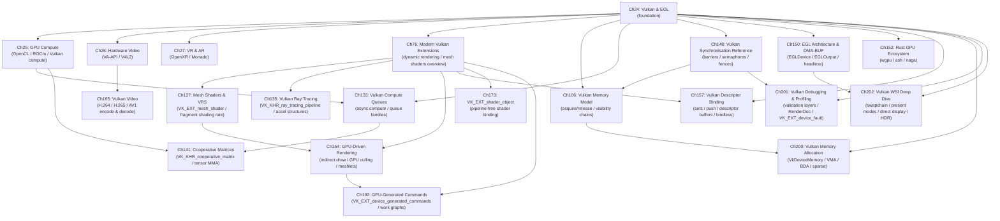

# Part VII-A — GPU APIs and Extended Reality

Parts I–VI establish the substrate and its coordination layer: kernel DRM/KMS, Mesa driver architecture, the Wayland compositor stack, and the display services — colour calibration, input routing, explicit synchronisation, and HDR — that run above it. Part VII-A begins the upper half of the stack. It is the layer where application-facing GPU APIs are consumed by real software: games, media players, inference engines, VR runtimes, and web browsers. The chapters here do not repeat kernel internals; they explain exactly which kernel interfaces each API layer calls, how GPU buffers cross subsystem boundaries without CPU copies, and what trade-offs govern API choice for a given workload. The focus is GPU APIs and Extended Reality: **Vulkan** (core usage, advanced extensions, compute, ray tracing, video, synchronisation, descriptors, shader binding, memory model, GPU-driven rendering), **EGL**, **OpenCL/ROCm**, **hardware video (VA-API / V4L2)**, **OpenXR / Monado**, and the **Rust GPU** ecosystem. Multimedia frameworks, GUI toolkits, font rendering, libcamera, Flatpak, and OpenCV appear in Part VII-B.

The unifying mechanism throughout this part is **DMA-BUF**: every major data flow — decoded video frames, captured camera images, rendered Vulkan swapchain images, PipeWire screen-capture streams — ultimately crosses subsystem boundaries as a **DMA-BUF** file descriptor carrying a **DRM format modifier**. Understanding how that mechanism is negotiated and what happens when it falls back to a CPU copy is the connective tissue that ties every chapter together.

## Chapters in This Part

**Chapter 24 — Vulkan and EGL for Application Developers** is the entry point for graphics application developers. It explains what happens beneath `vkCreateSwapchainKHR` on Linux — which kernel ioctls fire, how **linux-dmabuf** format and modifier negotiation proceeds on **Wayland**, and how timeline semaphores map onto **DRM sync objects** to close the explicit synchronisation loop from GPU to display. **EGL** is treated as a first-class citizen, not a legacy path, because it underpins headless rendering, **GBM**-backed surfaces, and **VA-API** interop.

**Chapter 25 — GPU Compute: OpenCL, CUDA, and ROCm** maps the fragmented Linux compute landscape: **OpenCL** ICD discovery, **rusticl** on **Gallium**, AMD **ROCm**/**HIP**, Intel **Level Zero**/**oneAPI**, and **Vulkan** compute pipelines. It covers the cross-API **DMA-BUF** interop that lets compute results feed graphics pipelines without CPU round-trips, and explains AMD's unified memory model and **Linux HMM** with concrete implications for **APU** platforms like the **Steam Deck**.

**Chapter 26 — Hardware Video: VA-API, V4L2, and libcamera** traces the complete hardware video pipeline from camera sensor or container to display. The chapter covers the **VA-API** surface model and driver dispatch, stateless **V4L2** codec drivers with the **Request API**, **GStreamer** zero-copy pipeline construction, **PipeWire** as a multimedia session layer, and **Vulkan Video** as the strategic forward API. The recurring theme is which API boundaries survive without a **DMA-BUF** export and where copies still occur.

**Chapter 27 — VR & AR: OpenXR and the Linux XR Stack** covers the **OpenXR** programming model from `XrInstance` creation through the **Monado** runtime's internal architecture. It explains how **Monado** acquires exclusive headset ownership via **DRM leasing** (`wp_drm_lease_v1`), drives direct-mode scan-out through **GBM** and `drmModeAtomicCommit`, and implements Asynchronous Timewarp as a **Vulkan** compute shader. Readers who understand Chapter 24 will see how **XrSwapchain** maps onto **Vulkan** swapchain concepts and how **V4L2** camera frames feed inside-out tracking.

**Chapter 76 — Modern Vulkan Extensions** documents the post-1.2 Vulkan extension landscape that defines contemporary engine and driver work: **VK_KHR_dynamic_rendering**, bindless descriptor indexing (`VK_EXT_descriptor_indexing`), mesh shaders (`VK_EXT_mesh_shader`), cooperative matrices (`VK_KHR_cooperative_matrix`), shader objects (`VK_EXT_shader_object`), graphics pipeline libraries, and extended dynamic state. It explains the extension promotion path from vendor-specific to `VK_EXT_` to `VK_KHR_` to core, and gives per-feature adoption status across **RADV**, **ANV**, and **NVK**.

**Chapter 106 — Vulkan Memory Model** covers `VK_KHR_vulkan_memory_model`, the formal memory model that governs visibility and ordering of Vulkan memory operations across shader invocations, queues, and devices, explaining acquire/release semantics, availability/visibility chains, and how the model interacts with `VkBarrier2` and timeline semaphores.

**Chapter 127 — Mesh Shaders and Variable Rate Shading** documents `VK_EXT_mesh_shader` (task and mesh shader stages replacing the vertex pipeline) and `VK_KHR_fragment_shading_rate` (per-tile, per-primitive, and per-draw shading rate control), covering RADV, ANV, and NVK driver implementations and game-engine integration patterns.

**Chapter 133 — Vulkan Compute Queues and Async Compute** explains how to use Vulkan compute queues independently of the graphics queue, covering queue family selection, `VkSubmitInfo2` timeline semaphore chaining, async compute overlap with graphics work, and per-vendor queue topology on AMD (SDMA + ACE queues), Intel (CCS), and NVIDIA (copy engines).

**Chapter 135 — Vulkan Ray Tracing** provides a comprehensive reference for `VK_KHR_ray_tracing_pipeline`, `VK_KHR_acceleration_structure`, and `VK_KHR_ray_query`: acceleration structure lifecycle, shader binding table layout, ray generation / intersection / any-hit / closest-hit / miss shader stages, and RADV/ANV driver implementation details.

**Chapter 141 — Vulkan Cooperative Matrices** covers `VK_KHR_cooperative_matrix` — the Vulkan API for matrix-multiply-accumulate operations on GPU tensor cores — including matrix type layouts, supported element types, GLSL/SPIR-V cooperative matrix extensions, and integration with ML inference workloads on AMD RDNA3 and NVIDIA Tensor Cores.

**Chapter 148 — Vulkan Synchronisation Reference** is a comprehensive reference chapter for Vulkan synchronisation primitives: pipeline stages, access masks, image and buffer memory barriers (`VkImageMemoryBarrier2`, `VkBufferMemoryBarrier2`), events, timeline semaphores, and `VkFence`, with worked examples of common synchronisation patterns and validation layer guidance.

**Chapter 150 — EGL Architecture and DMA-BUF Interop** provides an in-depth treatment of the EGL API beyond the survey in Chapter 24: EGL extensions for DMA-BUF import/export (`EGL_EXT_image_dma_buf_import`, `EGL_EXT_image_dma_buf_import_modifiers`), the EGLDevice and EGLOutput APIs for headless and direct-to-display rendering, and surfaceless EGL contexts for compute and video workloads.

**Chapter 152 — Rust GPU Ecosystem: wgpu, ash, and gpu-allocator** surveys the Rust-language GPU programming landscape on Linux: the `wgpu` safe GPU abstraction crate, `ash` raw Vulkan bindings, `gpu-allocator` for Vulkan/D3D12 memory management, `naga` shader compiler IR, and how Rust GPU crates integrate with the Mesa Vulkan driver stack.

**Chapter 154 — GPU-Driven Rendering** covers the architectural shift from CPU-driven draw call submission to GPU-driven pipelines where the GPU itself culls and dispatches geometry: indirect draw commands (`vkCmdDrawIndirect`, `vkCmdDrawIndexedIndirectCount`), GPU culling with compute shaders, meshlet-based rendering with `VK_EXT_mesh_shader`, and multi-draw indirect best practices on RDNA and Xe hardware.

**Chapter 157 — Vulkan Descriptor Binding Models** compares and contrasts the four Vulkan descriptor binding approaches — classic descriptor sets, push descriptors (`VK_KHR_push_descriptor`), descriptor buffers (`VK_EXT_descriptor_buffer`), and bindless/bindful hybrid models — with per-vendor performance characteristics and guidance on when to use each.

**Chapter 165 — Vulkan Video: Hardware Encode and Decode** covers the `VK_KHR_video_queue`, `VK_KHR_video_decode_queue`, `VK_KHR_video_encode_queue`, and codec extension family for H.264, H.265, AV1, and VP9 on Linux, with RADV and ANV implementation details, FFmpeg hwaccel integration, and a comparison with VA-API for decode pipeline selection.

**Chapter 173 — VK\_EXT\_shader\_object: Pipeline-Free Shader Binding in Vulkan** covers the `VkShaderEXT` object introduced by `VK_EXT_shader_object` (ratified EXT, revision 1, 2023): how shaders are compiled independently of pipeline state via `vkCreateShadersEXT`, bound per-stage with `vkCmdBindShadersEXT`, and serialised for instant reload via `vkGetShaderBinaryDataEXT`. The chapter explains why the extension requires extensive dynamic state (`VK_EXT_extended_dynamic_state` family) and must be used inside `VkRenderingInfo` (i.e. requires `VK_KHR_dynamic_rendering`). Driver implementation status is documented: RADV enabled by default in Mesa 24.1 (`src/amd/vulkan/radv_shader_object.c`), NVK added support in February 2024, ANV landed in Mesa 25.3-devel. The chapter includes a complete before/after migration example converting a static graphics pipeline to shader objects, and performance guidance from the spec's conformance floor (≤150% CPU cost vs. fully-static pipelines).

**Chapter 200 — Vulkan Memory Allocation and Resource Management** covers the practical side of GPU memory that Chapter 106's formal model does not: `VkPhysicalDeviceMemoryProperties` heap and type topology, `VK_EXT_memory_budget` for pressure monitoring, the **Vulkan Memory Allocator (VMA)** suballocation library (`VmaAllocator`, pool strategies, defragmentation), buffer device address (`VK_KHR_buffer_device_address`, core since Vulkan 1.2) for GPU-side pointer traversal, sparse resource binding (`vkQueueBindSparse`, virtual texturing), and the `VK_EXT_host_image_copy` (Vulkan 1.4 core) path that eliminates staging buffers for texture upload. The chapter also covers memory aliasing for transient attachment savings and per-driver allocator internals (RADV `radv_alloc_memory`, ANV `anv_device_alloc_bo`).

**Chapter 201 — Vulkan Debugging, Validation, and Profiling** is the "how do you actually develop with Vulkan" chapter. It covers `VK_LAYER_KHRONOS_validation` sub-layers (core validation, thread safety, best practices, GPU-Assisted Validation, synchronization validation, debug printf), `VK_EXT_debug_utils` (object naming, command buffer label regions, messenger callbacks), `VK_EXT_device_fault` for post-hang crash diagnostics, **RenderDoc** (frame capture mechanism, resource inspector, pipeline state viewer, GPU counter integration), **AMD Radeon GPU Profiler** (SQTT wave occupancy, barrier stall visualization), **Intel GPA** (Xe EU occupancy, L3 cache metrics), and **NVIDIA Nsight Graphics** (shader debugger, NV counter sets). The chapter closes with a practical debugging workflow and the `vkconfig` Vulkan Configurator tool from the Vulkan SDK.

**Chapter 202 — Vulkan WSI Deep Dive** provides a comprehensive treatment of the Vulkan window-system integration layer beyond the survey in Chapter 24. It covers the **Wayland WSI path** (`wsi_common_wayland.c`, linux-dmabuf modifier negotiation, `wp_linux_drm_syncobj_v1` integration), the **X11/XCB path** (DRI3 Present, redirect vs direct mode), **present mode trade-offs** (FIFO/MAILBOX/IMMEDIATE/FIFO_RELAXED) with per-driver support matrices, **`VK_EXT_swapchain_maintenance1`** (safe recreation without `vkDeviceWaitIdle`, per-present mode switching), **`VK_EXT_present_timing`** (sub-frame latency targeting, just merged in Mesa 26.1), **direct display** (`VK_KHR_display`, `VK_EXT_acquire_drm_display`), **headless WSI** (`VK_EXT_headless_surface`), **HDR swapchain color spaces** (scRGB, HDR10 ST2084, BT.2020), and the Mesa `wsi_common.c` shared infrastructure.

**Chapter 192 — GPU-Generated Commands: VK\_EXT\_device\_generated\_commands and Work Graphs** covers `VK_EXT_device_generated_commands` (ratified EXT, successor to the NVIDIA-specific `VK_NV_device_generated_commands`): the `VkIndirectCommandsLayout` token stream that allows the GPU to record its own draw, dispatch, pipeline-bind, and push-constant operations into a pre-processed execution buffer via `vkCmdExecuteGeneratedCommandsEXT`. The chapter covers DGC token types (`VK_INDIRECT_COMMANDS_TOKEN_TYPE_DRAW_INDEXED_EXT`, `VK_INDIRECT_COMMANDS_TOKEN_TYPE_SHADER_GROUP_EXT`), Indirect Execution Sets for bindless shader switching, pre-processing passes, and integration with `VK_AMDX_shader_enqueue` work graphs (GPU-side task scheduling with mesh nodes). Production status: RADV and NVK have initial support; ANV is in bring-up. VKD3D-Proton is an early consumer driving cross-vendor DGC demand.

## How the Chapters Interrelate

The part has a clear dependency spine. **Chapter 24** must be read before most others: it establishes the **Vulkan** device model, the **EGL**/**GBM** context creation path, **linux-dmabuf** modifier negotiation, and **DRM sync objects**. Every subsequent chapter that sends frames to the display or imports **DMA-BUF** handles — Chapters 25, 26, 27, 76, 106, 133, 148, 150, and 152 — builds directly on those foundations.

**Chapter 25** (compute) surveys the full compute landscape — **OpenCL** ICD discovery, **ROCm**/**HIP** overview, **Level Zero**/**oneAPI**, and Vulkan compute — establishing **DMA-BUF** interop patterns between compute, video, and graphics APIs. The deep treatment of the AMD ML stack (HIP, MIOpen, PyTorch ROCm, amdkfd, MI300X) has moved to **Chapter 48 in Part XX (AI/ML Inference)**. Readers interested in the AMD compute stack should read Chapter 25 here first, then Chapter 48 in Part XX. **Chapter 141** (cooperative matrices) and **Chapter 133** (compute queues) both require the Vulkan compute foundation from Chapter 25.

**Chapter 26** (hardware video) and **Chapter 165** (Vulkan Video) are explicitly linked. Chapter 26 covers **VA-API** as the established production path; Chapter 165 covers **Vulkan Video** as its strategic successor, with a direct comparison section. The **PipeWire** session layer section of Chapter 26 overlaps intentionally with **Chapter 38 in Part VII-B**, which expands the **SPA** internals; Chapter 38 is the definitive reference.

**Chapter 27** (OpenXR/VR) depends on Chapter 24 for **Vulkan** swapchain concepts, and on Parts II–III for **DRM leasing** and atomic modesetting mechanics. Its tracking pipeline uses **V4L2** camera capture in the same mode described in Chapter 26 §5.

**Chapter 76** (modern Vulkan extensions) can be read independently as a reference chapter after Chapter 24. It is a direct prerequisite for Chapters 127 (mesh shaders/VRS), 135 (ray tracing), 154 (GPU-driven rendering), 157 (descriptor binding), 173 (shader objects), and 192 (GPU-generated commands) — all of which depend on dynamic rendering, extended dynamic state, or pipeline library concepts introduced in Chapter 76.

**Chapter 106** (Vulkan Memory Model) is a stand-alone formal reference chapter most relevant after Chapter 24 has established core Vulkan primitives and Chapter 148 has introduced the synchronisation vocabulary. It explains *why* the barrier and semaphore rules in Chapter 148 have the shape they do.

**Chapter 148** (synchronisation reference) is the practical companion to Chapter 106's formal model. Read Chapter 148 after Chapter 24 for day-to-day synchronisation patterns; read Chapter 106 after Chapter 148 to understand the formal underpinning.

**Chapter 154** (GPU-driven rendering) requires Chapter 76 for dynamic rendering and Chapter 127 for mesh shader context. It is the bridge to Chapter 192 (GPU-generated commands), which takes GPU-driven dispatch one step further by having the GPU record its own command stream.

**Chapter 152** (Rust GPU) can be read after Chapter 24 and is most valuable for readers who want to use `wgpu` or `ash` rather than the C Vulkan API directly. Its `naga` shader compiler IR content connects to SPIR-V compilation topics relevant to any chapter that discusses shader authoring.

The shared data structures that thread through every chapter are `drm_prime` **DMA-BUF** file descriptors, **DRM format modifiers** (the 64-bit values like `DRM_FORMAT_MOD_LINEAR` or `AMD_FMT_MOD_*`), **DRM sync objects** (`drm_syncobj` / timeline semaphores), and **VkImage** as the universal GPU-resident buffer type. Understanding how these four primitives are negotiated, exported, imported, and synchronised across API boundaries is the practical skill this part conveys.

## Prerequisites and What Comes Next

Readers should arrive here having read Parts I–III: the **DRM/KMS** substrate (Part I), Mesa driver architecture and **NIR**/**Gallium** internals (Part II), and the **Wayland** compositor stack including buffer import paths and **linux-dmabuf** protocol (Part III). Familiarity with Parts VI-A and VI-B (compositor protocol extensions, explicit sync, and the HDR pipeline) is helpful for the presentation-timing and explicit-sync discussions in Chapters 24, 150, and 165 but is not strictly required.

**Part VII-B** (Multimedia Frameworks and Desktop Integration) covers the chapters that build on this part's GPU API foundations to reach specific application domains: PipeWire (Ch38) and ALSA (Ch38b) as the audio/video session layer, Qt6 and GTK4 rendering pipelines (Ch39), font and text rendering (Ch47), Vulkan Video from the application side (Ch50), libcamera (Ch96), Flatpak sandboxed graphics (Ch111), and OpenCV GPU vision (Ch114). Readers interested in those topics should finish Part VII-A's core GPU API chapters first, then continue to Part VII-B.

**Parts VIII–X** build directly on this part: gaming and compatibility layers (**DXVK**, **VKD3D-Proton**, **Steam Play**) assume the compute, video, and modern Vulkan extension knowledge established here, and the browser chapters (Part X) rely on the **EGL**, **Vulkan Video**, and font pipeline foundations. Chapter 111's Flatpak coverage (Part VII-B) is directly relevant to Part VIII's discussion of how Steam and Proton games are packaged and sandboxed on the Steam Deck.

---

## Part Roadmap Summary

*Synthesised from the Roadmap sections of this part's chapters.*

### Near-term (6–12 months)

- **Vulkan Roadmap 2026 baseline adoption across Mesa.** The Khronos Roadmap 2026 milestone (published alongside Vulkan 1.4.340) mandates `VK_KHR_fragment_shading_rate`, timeline semaphores, multi-draw indirect, shader draw parameters, host-image copies, and higher descriptor limits as a conformance baseline. RADV, ANV, and NVK are expected to meet this milestone during the Mesa 26.x cycle, which directly affects Chapters 24 (WSI), 76 (modern extensions), 127 (mesh shaders/VRS), 133 (compute queues), and 157 (descriptor binding).

- **Vulkan Video codec family completion.** VP9 decode (`VK_KHR_video_decode_vp9`) has landed in RADV and ANV; AV1 encode (`VK_KHR_video_encode_av1`) is shipping in RADV and in progress for ANV. The `VK_KHR_video_encode_quantization_map` and `VK_KHR_video_encode_intra_refresh` extensions are rolling out across Mesa drivers. FFmpeg Vulkan hwaccel path stabilisation covers the full H.264/H.265/AV1/VP9 matrix (Ch165).

- **EGL/DMA-BUF stack modernisation.** Mesa 25.2 deprecated `EGL_WL_bind_wayland_display` and the pre-DMA-BUF `wl_drm` path; DRI2 code removal is in progress. The `wp_linux_drm_syncobj_v1` explicit-sync Wayland protocol is being completed across compositors (Mutter, KWin, wlroots). NVIDIA's `egl-wayland2` library, built entirely on DMA-BUF, is being adopted. These changes consolidate the DMA-BUF/syncobj interop path underpinning Ch24, Ch150.

- **Mesa 26.x driver feature advances.** Mesa 26.1 NIR/URB mesh-shader unification improves cross-driver sharing. `VK_EXT_descriptor_heap` (published in Vulkan 1.4.340) is entering early bring-up in RADV and ANV. `VK_EXT_present_timing` was merged for RADV, ANV, NVK, PanVK, and Turnip WSI backends in Mesa 26.1, enabling precise present scheduling. NVK's `VK_EXT_shader_object` support arrived in early 2024; ANV landed in Mesa 25.3 (Ch173).

- **Rust GPU ecosystem stabilisation.** `wgpu` is targeting a stable 1.0 API; `naga` is consolidating into the `gfx-rs/wgpu` monorepo. `rust-gpu` is under community stewardship after Embark Studios handoff, focusing on SPIR-V backend stability. ROCm 8.0 (TheRock build system, mid-2026) adds gfx1151 support. `io_uring` `DRM_IOCTL_*` uring_cmd landing is tracked for Linux 6.13–6.15 (Ch152).

### Medium-term (1–3 years)

- **Vulkan Video replacing VA-API as the primary hardware video API.** GStreamer `vkvideo` elements (`vkh264dec`, `vkav1enc`, etc.) are expected to supersede `vaapi*` elements once encode completeness and sustained performance parity are achieved. Chromium is working toward replacing its VA-API GPU process hwaccel with native Vulkan Video. The Zink VA-API-on-Vulkan-Video bridge aims to serve legacy VA-API applications from Vulkan Video drivers. NVK Vulkan Video decode support is expected within one to two Mesa release cycles (Ch26, Ch165).

- **Cooperative matrices and ML inference on the open-source Vulkan stack.** `VK_KHR_cooperative_matrix` is maturing on RDNA4 (RADV) and Xe-HPG (ANV); `VK_NV_cooperative_matrix2` landed in RADV 25.2 targeting FSR4 and VKD3D-Proton. Sub-byte precision (`FP8`, `INT4`, `cl_khr_cooperative_matrix`) and SPIR-V type extensions are in Khronos discussion, driven by LLM inference workloads. AMD UDNA (CDNA/RDNA convergence, ~2027) and Intel Xe2 DPAS improvements will shape the ISA targets (Ch25, Ch133, Ch141).

- **GPU-driven rendering and descriptor binding modernisation.** `VK_EXT_device_generated_commands` (DGC) is shipping in production drivers; GPU work graphs (`VK_AMDX_shader_enqueue` with mesh nodes) are being tracked for cross-vendor KHR promotion. `VK_EXT_descriptor_heap` — replacing the descriptor-set subsystem with a flat GPU-visible heap — is seeking KHR ratification and potential mandating in a future Roadmap milestone. VKD3D-Proton is an early adopter. Indirect Execution Sets and subgroup reconvergence guarantees (Roadmap 2026) improve GPU-driven culling in open-source engines (Ch127, Ch133, Ch154, Ch157, Ch192).

- **Unified explicit synchronisation spanning all Linux GPU subsystems.** The `drm_syncobj` timeline model underpins Vulkan's timeline semaphores, `wp_linux_drm_syncobj_v1`, and `EGL_ANDROID_native_fence_sync`, but camera (V4L2), hardware video codecs (VA-API), and media subsystems still carry independent implicit-fence models. The architectural goal is a single kernel timeline primitive spanning KMS, V4L2, Vulkan, and media — with multi-process timeline FD export and a unified `drm_sched` arbiter scheduling Vulkan queues, CUDA streams, and V4L2/VA-API sessions with unified priority and preemption semantics (Ch24, Ch133, Ch148).

- **OpenXR / VR spatial computing.** Monado is gaining OpenXR Spatial Entities (`XR_EXT_plane_detection`, `XR_EXT_spatial_anchor`), persistent SLAM mapping via Basalt VIO, and Android/standalone-device deployment. GPU-accelerated ML inference (ONNX/TFLite via Vulkan compute) for hand and eye tracking is on the medium-term roadmap. DRM leasing improvements are needed for USB4/Thunderbolt headsets (Ch27).

### Long-term

- **Vulkan as the universal GPU substrate — compute, video, and inference convergence.** The long-term trajectories of Ch25 (compute), Ch165 (video), Ch76/Ch157 (modern extensions), and Ch141 (cooperative matrices) converge on Vulkan compute as the cross-vendor fallback for ML inference and video processing, with `VK_KHR_cooperative_matrix` providing matrix-MMA acceleration and Vulkan Video removing VA-API as an intermediary. CXL 3.x-attached HBM exposed as DMA-BUF heaps and NPU/GPU convergence under the DRM/accel subsystem are the furthest-horizon items.

- **EGL and pipeline-model deprecation.** EGL's role is narrowing to OpenGL ES, VA-API interop, and legacy X11 surfaces as Vulkan WSI and Zink (OpenGL-on-Vulkan) mature; new applications are expected to use Vulkan `VK_KHR_video_queue` rather than EGL + VA-API. Similarly, `VK_EXT_shader_object` — already default in RADV and shipped in ANV/NVK — may become the primary shader-binding model in a future Vulkan Roadmap milestone, with `VkPipeline` receding to a compatibility layer (Ch150, Ch173). The Rust GPU ecosystem's long-term goal of safe, zero-overhead Vulkan abstractions and rust-gpu as a first-class shader authoring path aligns with this direction (Ch152).

- **XR, foveated rendering, and compositor convergence.** OpenXR 2.0 or a major revision is accumulating spatial-mesh types, standardised ML tracking hooks, and a formal passthrough API. VRS driven by calibrated eye-tracking data (`VK_KHR_fragment_shading_rate` fed by on-chip neural inference) and OpenXR standardisation of per-layer rate control are expected for consumer headsets. The long-term proposal of a unified compositor handling both desktop Wayland windows and XR layers in a single process would eliminate the DRM-lease handoff entirely (Ch27, Ch127).

---

*Copyright © 2026 jreuben11. Licensed under [CC BY 4.0](https://creativecommons.org/licenses/by/4.0/).*
