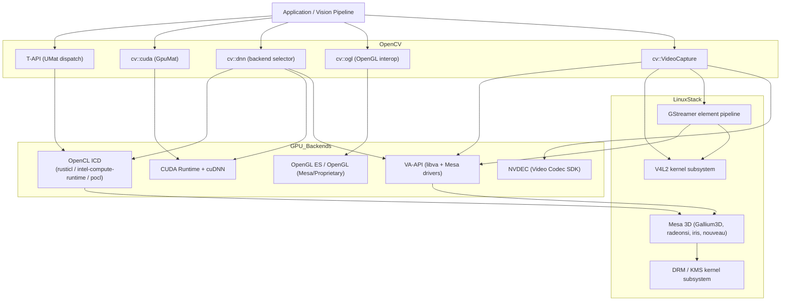
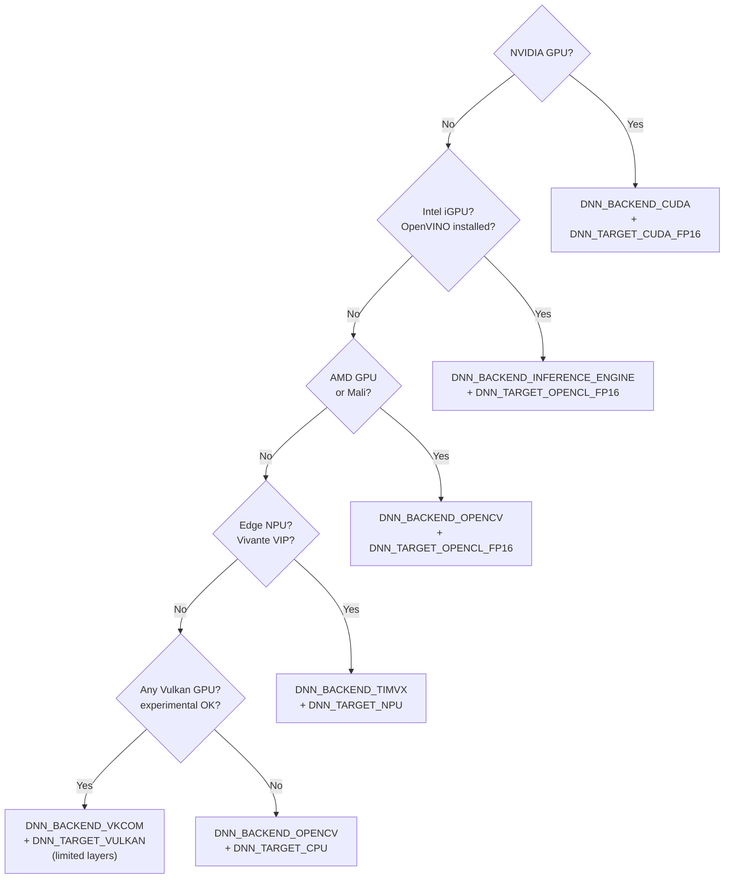
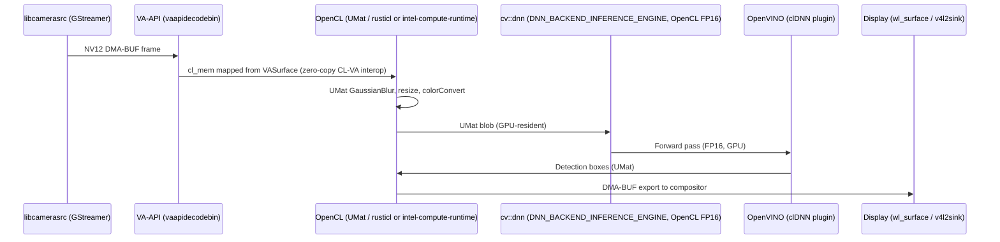

# Chapter 114: OpenCV and GPU-Accelerated Computer Vision on Linux

> **Part**: Part VII — Application APIs & Middleware
> **Audience**: Graphics application developers, embedded Linux engineers, vision pipeline developers
> **Status**: First draft — 2026-06-19

---

## Table of Contents

1. [Overview](#1-overview)
2. [cv::Mat and cv::UMat — The CPU/GPU Memory Abstraction](#2-cvmat-and-cvumat--the-cpugpu-memory-abstraction)
3. [T-API and OpenCL Dispatch](#3-t-api-and-opencl-dispatch)
4. [CUDA Module: GpuMat, Stream, and Accelerated Algorithms](#4-cuda-module-gpumat-stream-and-accelerated-algorithms)
5. [VA-API Decode Integration](#5-va-api-decode-integration)
6. [V4L2 and libcamera Pipeline Integration](#6-v4l2-and-libcamera-pipeline-integration)
7. [EGL and OpenGL Interop: cv::ogl](#7-egl-and-opengl-interop-cvogl)
8. [DNN Module: Backend Selection and ONNX Inference](#8-dnn-module-backend-selection-and-onnx-inference)
9. [GStreamer Pipeline Integration](#9-gstreamer-pipeline-integration)
10. [Building OpenCV from Source with GPU Backends](#10-building-opencv-from-source-with-gpu-backends)
11. [Production Patterns: VAAPI + OpenCL Zero-Copy Pipeline](#11-production-patterns-vaapi--opencl-zero-copy-pipeline)
12. [OpenCV 5 GPU Architecture Changes](#12-opencv-5-gpu-architecture-changes)
13. [Scene Analysis: Depth Estimation, Optical Flow, and Semantic Segmentation](#13-scene-analysis-depth-estimation-optical-flow-and-semantic-segmentation)
14. [GPU-Accelerated SLAM: ORB-SLAM3, DROID-SLAM, and MonoGS](#14-gpu-accelerated-slam-orb-slam3-droid-slam-and-monoGS)
15. [Integrations](#15-integrations)

---

## 1. Overview

OpenCV (Open Source Computer Vision Library) is the de facto standard for computer vision on Linux. While it began as a CPU-only library, GPU acceleration has been a first-class concern since OpenCV 3.0, driven by three distinct hardware paths that map directly onto the Linux graphics stack described in this book:

- **OpenCL** — via the Transparent API (T-API)
- **NVIDIA CUDA** — via the `opencv_contrib` CUDA modules
- **Hardware video decode** — via VA-API and NVDEC

### Audiences

This chapter targets three audiences who arrive at OpenCV from different directions:

- **Graphics application developers** who already work with Vulkan, EGL, or VA-API and need to integrate computer vision into their rendering pipelines — for example, post-processing a camera stream through a neural network before compositing it into a Wayland surface.
- **Embedded Linux and automotive engineers** building driver-monitoring systems, pedestrian-detection pipelines, or lane-tracking algorithms on SoCs with Mali GPUs, Intel iGPUs, or Qualcomm Adreno, where CUDA is unavailable but OpenCL and VA-API are.
- **Systems developers** building vision pipelines on Linux servers, where GStreamer, V4L2, libcamera, and PipeWire supply the video frames that OpenCV consumes and processes.

### OpenCV's Position in the Stack



The diagram shows how each OpenCV subsystem maps onto a separate layer of the Linux GPU stack. This chapter examines each path in depth.

---

## 2. cv::Mat and cv::UMat — The CPU/GPU Memory Abstraction

### cv::Mat

`cv::Mat` is the fundamental CPU-resident image container. It stores pixel data in a contiguous (or strided) block of system memory, accessible via `Mat::data` as a `uchar*`. The matrix type encodes both depth and number of channels: `CV_8UC3` is an 8-bit unsigned 3-channel image (BGR), `CV_32FC1` a single-channel 32-bit float. All classic OpenCV operations operate on `Mat`.

```c++
#include <opencv2/core.hpp>
#include <opencv2/imgcodecs.hpp>
#include <opencv2/imgproc.hpp>

// Allocate and read from disk
cv::Mat src = cv::imread("frame.png", cv::IMREAD_COLOR);  // CV_8UC3, BGR
if (src.empty()) { /* handle error */ }

// Create explicitly
cv::Mat zeros(480, 640, CV_8UC3, cv::Scalar(0, 0, 0));
cv::Mat roi = src(cv::Rect(0, 0, 320, 240));  // sub-matrix, no copy

// Access pixel data (host memory, always valid)
std::cout << "Pointer: " << static_cast<void*>(src.data) << "\n";
std::cout << "Step:    " << src.step[0] << " bytes/row\n";

// CPU processing
cv::Mat blurred;
cv::GaussianBlur(src, blurred, cv::Size(7, 7), 1.5);
```

### cv::UMat

`cv::UMat` (Unified Matrix) is the T-API counterpart introduced in OpenCV 3.0. It hides the device pointer: the caller cannot access `UMat::data` directly without mapping the buffer back to CPU memory. Internally, `UMat` stores a reference-counted handle to an OpenCL `cl_mem` object (or a CUDA allocation in OpenCV 5's universal HAL). Data transfers between host and device are deferred and coalesced by the runtime.

```c++
#include <opencv2/core/ocl.hpp>

// Upload via copyTo
cv::UMat usrc;
src.copyTo(usrc);   // host → OpenCL device; synchronous

// Alternative: getUMat() with an access flag
// ACCESS_READ: device may cache; ACCESS_RW: bidirectional
cv::UMat usrc2 = src.getUMat(cv::ACCESS_READ);

// Direct-to-UMat imread (avoids intermediate Mat on modern builds)
cv::UMat udst;
cv::GaussianBlur(usrc, udst, cv::Size(7, 7), 1.5);
// ^^^ internally dispatches to gaussianBlur3x3.cl / gaussianBlur5x5.cl

// Download when needed for CPU logic
cv::Mat result;
udst.copyTo(result);   // device → host; synchronous
```

The key invariant: as long as all operations accept `UMat`, the data never leaves the GPU. Inserting `copyTo(mat)` downloads it; subsequent `mat.copyTo(umat)` re-uploads. In hot loops this round-trip is expensive — avoid it by restructuring pipelines to stay on device until the final result is needed.

[Source: OpenCV Transparent API (LearnOpenCV)](https://learnopencv.com/opencv-transparent-api/)

### Memory Layout and Access Flags

| Flag | Meaning |
|---|---|
| `ACCESS_READ` | Host reads device memory; device buffer may be cached read-only |
| `ACCESS_WRITE` | Host writes; invalidates device cache |
| `ACCESS_RW` | Read-write; forces coherent mapping |
| `ACCESS_FAST` | Hint: prefer fast (device-local) allocation |

On discrete GPUs (NVIDIA, AMD Radeon dGPU), `UMat` allocates in device-local VRAM. On Intel integrated graphics sharing system RAM, the buffer may be physically the same memory with cache-domain attribution managed by the UMD (user-mode driver). OpenCV does not expose which memory type was selected; if that matters use the explicit OpenCL or CUDA APIs directly.

---

## 3. T-API and OpenCL Dispatch

### Architecture

Introduced in OpenCV 3.0, the Transparent API replaces the old explicit `cv::ocl::` parallel API from OpenCV 2.4. Instead of a separate API surface, OpenCL-accelerated paths are conditional branches inside the regular functions. The internal dispatch macro is `CV_OCL_RUN`, which guards each OpenCL attempt. If the OpenCL path fails or the device cannot handle the operation, OpenCV falls back silently to the CPU — no exception is thrown.

From `modules/imgproc/src/smooth.dispatch.cpp` (illustrative):

```c++
// Internal, not public API — shown to explain dispatch behaviour
CV_OCL_RUN(_dst.isUMat() && ksize.width == ksize.height && ...,
           ocl_GaussianBlur_8UC1(src, dst, ksize, sigma));
// Falls through to CPU implementation if condition fails
```

[Source: OpenCV OpenCL Optimizations Wiki](https://github.com/opencv/opencv/wiki/OpenCL-optimizations)

### Runtime Control

```c++
// Enable or disable OpenCL globally for this process
cv::ocl::setUseOpenCL(true);    // default: true if a compatible device is found
cv::ocl::setUseOpenCL(false);   // force CPU-only; useful for benchmarking

bool active = cv::ocl::useOpenCL();
bool avail  = cv::ocl::haveOpenCL();
```

[Source: cv::ocl namespace documentation](https://vovkos.github.io/doxyrest-showcase/opencv/sphinx_rtd_theme/group_core_opencl.html)

### Platform and Device Enumeration

```c++
#include <opencv2/core/ocl.hpp>

cv::ocl::setUseOpenCL(true);

std::vector<cv::ocl::PlatformInfo> platforms;
cv::ocl::getPlatfomsInfo(platforms);  // note: canonical upstream spelling with typo

for (const auto& plat : platforms) {
    std::cout << "Platform: " << plat.name() << "\n";
    for (int j = 0; j < plat.deviceNumber(); j++) {
        cv::ocl::Device dev;
        plat.getDevice(dev, j);
        std::cout << "  Device:    " << dev.name()     << "\n"
                  << "  Vendor:    " << dev.vendorName() << "\n"
                  << "  Driver:    " << dev.driverVersion() << "\n"
                  << "  Available: " << dev.available() << "\n";
    }
}

// Select a specific GPU and create context
cv::ocl::Context ctx;
if (!ctx.create(cv::ocl::Device::TYPE_GPU))
    std::cerr << "No GPU OpenCL device found\n";
```

Note: `getPlatfomsInfo` with the missing 'r' is the real upstream API spelling. Do not "correct" it in production code — it matches the header.

### OpenCL Device Selection via Environment Variables

```bash
# Disable OpenCL entirely
export OPENCV_OPENCL_RUNTIME=disabled

# Select a specific device: <Platform>:<Type>:<DeviceName or index>
export OPENCV_OPENCL_DEVICE="Intel:GPU:"         # first Intel GPU
export OPENCV_OPENCL_DEVICE="AMD:GPU|CPU:"       # AMD GPU or CPU fallback
export OPENCV_OPENCL_DEVICE=":GPU:1"             # second GPU on any platform
export OPENCV_OPENCL_DEVICE="Intel:CPU:"         # Intel CPU (pocl-style)

# Enable and persist kernel binary caching (avoids recompilation on startup)
export OPENCV_OPENCL_CACHE_ENABLE=1
export OPENCV_OPENCL_CACHE_WRITE=1
export OPENCV_OPENCL_CACHE_LOCK_ENABLE=1
# Cache location: ~/.cache/opencv/4.x/<platform_hash>/
```

### OpenCL Implementations on Linux

OpenCV's T-API will use whichever OpenCL ICD is discovered via `/etc/OpenCL/vendors/` at runtime. The main implementations on Linux:

**Mesa rusticl** is the recommended modern OpenCL 3.0 implementation built in Rust on top of Gallium3D. It supports `iris` (Intel), `radeonsi`/`r600` (AMD), `nouveau` (NVIDIA open-source), `panfrost` (Arm Mali), and `asahi` (Apple Silicon via Zink). [Source: Getting started with OpenCL using Mesa rusticl](https://nullr0ute.com/2023/12/getting-started-with-opencl-using-mesa-rusticl/)

```bash
# Enable rusticl for a specific Gallium driver
RUSTICL_ENABLE=iris clinfo --list        # Intel integrated GPU
RUSTICL_ENABLE=radeonsi clinfo --list    # AMD Radeon

# Install on Fedora
sudo dnf install mesa-libOpenCL mesa-dri-drivers spirv-llvm-translator spirv-tools-libs
```

**Mesa Clover** is the legacy OpenCL 1.1 implementation. It is being deprecated upstream; new code should use rusticl.

**Intel OpenCL (`intel-compute-runtime`)** supports Intel HD/UHD/Iris/Arc via the `ze` (Level Zero) backend and is separate from Mesa. It delivers the highest performance on Intel iGPUs for DNN workloads. Install on Ubuntu: `sudo apt install intel-opencl-icd`.

**pocl** provides a CPU-based portable OpenCL via LLVM. It is useful for fallback, CI, or testing T-API code paths on systems without GPU OpenCL. Install: `sudo apt install pocl-opencl-icd`.

When multiple ICDs coexist, select via `OPENCV_OPENCL_DEVICE` or programmatically via `getPlatfomsInfo()`.

### Integrating an External OpenCL Context

For applications that already manage their own OpenCL context (e.g., a Vulkan compute pipeline using an OpenCL interop extension, or a custom VA-API decode path):

```c++
// Bind an externally created cl_context to OpenCV (global, process-wide)
cv::ocl::attachContext(platform_name, cl_platform_id, cl_context, cl_device_id);

// Per-thread binding using OpenCLExecutionContext
auto execCtx = cv::ocl::OpenCLExecutionContext::create(
    platform_name, cl_platform_id, cl_context, cl_device_id);
execCtx.bind();   // active for this thread only

// Wrap a raw cl_mem buffer as a UMat (zero-copy where device supports it)
cv::UMat umat_dst;
cv::ocl::convertFromBuffer(cl_mem_buffer, step, rows, cols, CV_8UC4, umat_dst);

// Wrap a cl_mem image2d_t
cv::ocl::convertFromImage(cl_mem_image, umat_dst);
```

[Source: OpenCV opencl-opencv-interop sample](https://github.com/opencv/opencv/blob/master/samples/opencl/opencl-opencv-interop.cpp)

### Which Modules Have T-API Acceleration

The `modules/imgproc/src/opencl/` directory contains 54 `.cl` kernel files covering filtering (Gaussian, box, bilateral, median, Sobel, Laplacian), color conversion (HSV, Lab, RGB, YUV), geometric transforms (resize, warpAffine, warpPerspective, remap, pyrDown, pyrUp), histogram, integral, moments, template matching, Hough lines, morphology, threshold, CLAHE, and Canny. [Source: imgproc OpenCL kernels directory](https://github.com/opencv/opencv/tree/master/modules/imgproc/src/opencl)

The `core` module accelerates arithmetic (`add`, `subtract`, `multiply`, `bitwise_and`), math functions, and memory operations. The `video` module has OpenCL paths for DIS optical flow and background subtraction.

The `features2d` module has limited T-API coverage. ORB, SIFT, and AKAZE run on CPU even with `UMat` input; only SURF has a complete OpenCL kernel. For GPU-accelerated feature detection use `cudafeatures2d` from `opencv_contrib` (NVIDIA only).

---

## 4. CUDA Module: GpuMat, Stream, and Accelerated Algorithms

The CUDA modules live in `opencv_contrib` and require a separate build step (`-DWITH_CUDA=ON`). They expose a parallel API surface alongside — not replacing — the T-API: you use `cv::cuda::GpuMat` instead of `cv::UMat`, and `cv::cuda::` functions instead of `cv::`.

[Source: CUDA introduction in OpenCV docs](https://docs.opencv.org/3.4/d2/dbc/cuda_intro.html)

### cv::cuda::GpuMat

```c++
#include <opencv2/cudaarithm.hpp>

cv::Mat cpu_src = cv::imread("frame.png");
cv::cuda::GpuMat gpu_src, gpu_dst;

// Upload (host → device, blocking)
gpu_src.upload(cpu_src);

// Explicit construction
cv::cuda::GpuMat gpu_zeros(480, 640, CV_8UC3, cv::Scalar(0, 0, 0));
cv::cuda::GpuMat gpu_roi(gpu_src, cv::Rect(0, 0, 320, 240));  // ROI, no copy

// Non-blocking download with Stream
cv::cuda::Stream stream;
cv::Mat cpu_result;
gpu_dst.download(cpu_result, stream);   // enqueues copy; returns immediately
stream.waitForCompletion();             // blocks until copy finishes

// Raw CUDA device pointer
void* raw = gpu_src.cudaPtr();

// Type queries — same as Mat
int depth    = gpu_src.depth();
int channels = gpu_src.channels();
size_t elem  = gpu_src.elemSize();
bool cont    = gpu_src.isContinuous();
```

[Source: cv::cuda::GpuMat reference](https://docs.opencv.org/3.4/d0/d60/classcv_1_1cuda_1_1GpuMat.html)

### Custom Allocator (Pinned Memory)

For maximum upload/download throughput, allocate pinned (page-locked) host memory and pair it with `GpuMat`:

```c++
struct PinnedAllocator : cv::cuda::GpuMat::Allocator {
    void allocate(cv::cuda::GpuMat* mat, int rows, int cols, size_t elemSize) override {
        size_t step = cols * elemSize;
        cudaMallocHost(&mat->data, rows * step);
        mat->step = step;
    }
    void free(cv::cuda::GpuMat* mat) override {
        cudaFreeHost(mat->data);
    }
};
```

Pinned allocators allow the CUDA DMA engine to transfer directly to host memory without an intermediate staging copy.

### Key CUDA Operations

```c++
#include <opencv2/cudawarping.hpp>
#include <opencv2/cudafilters.hpp>
#include <opencv2/cudaimgproc.hpp>
#include <opencv2/cudaoptflow.hpp>
#include <opencv2/cudaobjdetect.hpp>

cv::cuda::Stream stream;

// Resize with bilinear interpolation
cv::cuda::resize(gpu_src, gpu_dst,
                 cv::Size(960, 540),
                 /*fx=*/0.0, /*fy=*/0.0,
                 cv::INTER_LINEAR,
                 stream);

// Color conversion
cv::cuda::GpuMat gpu_gray;
cv::cuda::cvtColor(gpu_src, gpu_gray, cv::COLOR_BGR2GRAY, /*dstCn=*/0, stream);

// Gaussian blur — factory pattern (filter objects are reusable)
auto gauss = cv::cuda::createGaussianFilter(
    CV_8UC3,          // srcType
    CV_8UC3,          // dstType
    cv::Size(5, 5),   // ksize
    1.5,              // sigma1
    0.0,              // sigma2 (uses sigma1 if 0)
    cv::BORDER_DEFAULT,
    /*columnBorderMode=*/-1);  // same as row border mode if -1
gauss->apply(gpu_src, gpu_dst, stream);

// Farneback dense optical flow
auto farneback = cv::cuda::FarnebackOpticalFlow::create(
    /*numLevels=*/5,  /*pyrScale=*/0.5, /*fastPyramids=*/false,
    /*winSize=*/15,   /*numIters=*/3,   /*polyN=*/5,
    /*polySigma=*/1.2, /*flags=*/0);
cv::cuda::GpuMat gpu_flow;   // CV_32FC2: (dx, dy) per pixel
farneback->calc(gpu_prev, gpu_curr, gpu_flow, stream);

// Cascade classifier (Viola-Jones, GPU-accelerated)
auto cascade = cv::cuda::CascadeClassifier::create(
    "haarcascade_frontalface_default.xml");
cv::cuda::GpuMat gpu_objects;
cascade->detectMultiScale(gpu_gray, gpu_objects, stream);
std::vector<cv::Rect> faces;
cascade->convert(gpu_objects, faces);
```

[Source: cv::cuda::resize docs](https://docs.opencv.org/4.x/db/d29/group__cudawarping.html) | [cv::cuda::CascadeClassifier](https://docs.opencv.org/4.x/d9/d80/classcv_1_1cuda_1_1CascadeClassifier.html)

### CUDA Module Inventory

| Module | Contents |
|---|---|
| `cudaarithm` | Matrix arithmetic, absolute, norm, log, exp, sqrt, LUT |
| `cudabgsegm` | Background subtraction (MOG, MOG2) |
| `cudacodec` | Hardware video encode/decode via NVDEC/NVENC |
| `cudafeatures2d` | ORB feature detection and description on GPU |
| `cudafilters` | Gaussian, box, Sobel, Laplacian, bilateral |
| `cudaimgproc` | Color conversion, histogram, Canny, Hough |
| `cudalegacy` | Older algorithms (optical flow BM, block matching) |
| `cudaobjdetect` | Cascade classifier, HOG people detector |
| `cudaoptflow` | Farneback, BroxOpticalFlow, SparsePyrLKOpticalFlow |
| `cudastereo` | Block matching stereo (BM, CSBP, ELAS) |
| `cudawarping` | resize, warpAffine, warpPerspective, remap |
| `cudev` | Device-layer utilities, functional transforms |

### NVDEC Hardware Video Decode

The `cudacodec` module provides `cv::cudacodec::VideoReader`, which decodes video frames directly into `GpuMat` using NVIDIA's NVDEC hardware engine:

```c++
#include <opencv2/cudacodec.hpp>

// Factory function; requires NVIDIA Video Codec SDK headers at build time
cv::Ptr<cv::cudacodec::VideoReader> reader =
    cv::cudacodec::createVideoReader("video.mp4");

// Configure output color format
reader->set(cv::cudacodec::ColorFormat::BGR,
            cv::cudacodec::BitDepth::UNCHANGED,
            /*planar=*/false);

cv::cuda::Stream stream;
cv::cuda::GpuMat gpu_frame;  // decoded directly onto GPU — no CPU involved

while (reader->nextFrame(gpu_frame, stream)) {
    stream.waitForCompletion();
    // gpu_frame is CV_8UC3 BGR; process entirely on GPU
    cv::cuda::GpuMat gpu_gray;
    cv::cuda::cvtColor(gpu_frame, gpu_gray, cv::COLOR_BGR2GRAY, 0, stream);
}
// Supported codecs: MPEG1, MPEG2, MPEG4, VC1, H264, JPEG, HEVC, VP8, VP9, AV1
```

[Source: cv::cudacodec::VideoReader reference](https://docs.opencv.org/4.x/db/ded/classcv_1_1cudacodec_1_1VideoReader.html)

---

## 5. VA-API Decode Integration

VA-API (Video Acceleration API) is the standard Linux hardware video decode interface, supported by Intel, AMD, and (via NVIDIA's open VA-API shim) NVIDIA GPUs. OpenCV integrates with VA-API through both the FFmpeg and GStreamer backends of `VideoCapture`.

### VideoAccelerationType Enum

```c++
// From <opencv2/videoio.hpp> since OpenCV 4.5.4
enum VideoAccelerationType {
    VIDEO_ACCELERATION_NONE  = 0,  // software-only decode
    VIDEO_ACCELERATION_ANY   = 1,  // prefer HW, fall back to SW
    VIDEO_ACCELERATION_D3D11 = 2,  // Windows DirectX 11 (not Linux)
    VIDEO_ACCELERATION_VAAPI = 3,  // Linux VA-API
    VIDEO_ACCELERATION_MFX   = 4,  // Intel MediaSDK / oneVPL
    VIDEO_ACCELERATION_DRM   = 5,  // Raspberry Pi V4L2 DRM
};
```

[Source: VideoAccelerationType enum in OpenCV Rust bindings](https://docs.rs/opencv/latest/opencv/videoio/enum.VideoAccelerationType.html)

### VideoCapture with VA-API via FFmpeg Backend

```c++
#include <opencv2/videoio.hpp>

// Open with VA-API hint; FFmpeg backend selects vaapi hwaccel
cv::VideoCapture cap;
cap.open("video.mp4", cv::CAP_FFMPEG, {
    cv::CAP_PROP_HW_ACCELERATION, cv::VIDEO_ACCELERATION_ANY,
    cv::CAP_PROP_HW_DEVICE,       0,    // GPU index
});

cv::Mat frame;
while (cap.read(frame)) {
    // frame is CPU-resident Mat; FFmpeg copies from VAAPI surface
    // Typical throughput: 2–3x software decode on Intel HD 530
    cv::imshow("frame", frame);
    if (cv::waitKey(1) == 'q') break;
}
```

**Important caveat**: As of OpenCV 4.x, the FFmpeg and GStreamer backends by default copy decoded frames back to system memory before returning from `cap.read()`. The returned `cv::Mat` is CPU-backed. True GPU-resident decoding requires the VAAPI–OpenCL interop path described below.

[Source: Video IO hardware acceleration Wiki](https://github.com/opencv/opencv/wiki/Video-IO-hardware-acceleration)

### Performance Numbers

Benchmarks on Intel HD 530 under Linux: H.264 VAAPI decode achieves 376 FPS versus 167 FPS in software (2.2x speedup); H.264 VAAPI encode achieves 193 FPS versus 51 FPS in software (3.8x speedup). [Source: Video capture and write benchmark](https://github.com/opencv/opencv/wiki/Video-capture-and-write-benchmark)

### VAAPI–OpenCL Zero-Copy Interop

When `CAP_PROP_HW_ACCELERATION_USE_OPENCL=1`, OpenCV creates an OpenCL context with the VA-API display attached, enabling `UMat` frames with no CPU round-trip:

```c++
cap.open("video.mp4", cv::CAP_FFMPEG, {
    cv::CAP_PROP_HW_ACCELERATION,            cv::VIDEO_ACCELERATION_VAAPI,
    cv::CAP_PROP_HW_ACCELERATION_USE_OPENCL, 1,
});

cv::UMat uframe;
cap.read(uframe);   // stays on GPU as UMat if interop succeeds

// Subsequent processing stays GPU-resident
cv::UMat uresult;
cv::GaussianBlur(uframe, uresult, cv::Size(5, 5), 1.5);
```

For manual control with libva:

```c++
#include <opencv2/core/va_intel.hpp>

// Obtain a VA display from a DRM render node
int drm_fd = open("/dev/dri/renderD128", O_RDWR);
VADisplay va_display = vaGetDisplayDRM(drm_fd);
int major, minor;
vaInitialize(va_display, &major, &minor);

// Create an OpenCL context tied to the VA display (Intel CL-VA extension)
cv::va_intel::ocl::initializeContextFromVA(va_display, /*tryInterop=*/true);

// Convert a VASurface to UMat — zero-copy on Intel
cv::UMat umat;
cv::va_intel::convertFromVASurface(va_display, surface_id, frame_size, umat);

// Convert back to a VASurface for encode or display
cv::va_intel::convertToVASurface(va_display, umat, surface_id, frame_size);
```

Build requirement: `-DWITH_VA_INTEL=ON -DWITH_VA=ON`. [Source: cv::va_intel API docs](https://docs.opencv.org/3.4/d1/daa/group__core__va__intel.html)

### Required System Packages (Ubuntu/Debian)

```bash
sudo apt install libva-dev vainfo intel-media-va-driver-non-free \
                 libmfx-dev ffmpeg libavcodec-dev libavformat-dev libswscale-dev \
                 gstreamer1.0-vaapi gstreamer1.0-plugins-bad
```

---

## 6. V4L2 and libcamera Pipeline Integration

### V4L2 Backend

The V4L2 backend (`modules/videoio/src/cap_v4l.cpp`) handles USB cameras, ISP devices, and raw sensor capture. It uses `mmap()` for zero-copy kernel-to-userspace buffer sharing via the `V4L2_MEMORY_MMAP` interface.

```c++
// Explicit V4L2 backend selection
cv::VideoCapture cap("/dev/video0", cv::CAP_V4L2);

// Configure resolution and frame rate
cap.set(cv::CAP_PROP_FRAME_WIDTH,  1920);
cap.set(cv::CAP_PROP_FRAME_HEIGHT, 1080);
cap.set(cv::CAP_PROP_FPS,         30.0);

// Request MJPEG pixel format (faster USB bandwidth than YUYV)
cap.set(cv::CAP_PROP_FOURCC, cv::VideoWriter::fourcc('M', 'J', 'P', 'G'));

// Reduce buffering latency (1 buffer = always newest frame)
cap.set(cv::CAP_PROP_BUFFERSIZE, 1);

cv::Mat frame;
cap.read(frame);  // Always returns CPU Mat; format converted internally
```

[Source: cap_v4l.cpp upstream](https://github.com/opencv/opencv/blob/master/modules/videoio/src/cap_v4l.cpp)

The backend tries pixel formats in priority order: `BGR24`, `RGB24`, `YVU420`, `YUV420`, `YUYV`, `UYVY`, `NV12`, `NV21`, `MJPEG`, `JPEG`, Bayer variants, and grayscale. All format conversion to BGR happens in system memory — there is no GPU path in the V4L2 backend itself. The ioctls used include `VIDIOC_QUERYCAP`, `VIDIOC_S_FMT`, `VIDIOC_REQBUFS`, `VIDIOC_QUERYBUF`, `VIDIOC_QBUF`/`VIDIOC_DQBUF`, `VIDIOC_STREAMON`/`VIDIOC_STREAMOFF`.

For GPU-accelerated V4L2 capture, route through GStreamer (see §9):

```c++
// V4L2 MJPEG → GPU JPEG decode via GStreamer
cv::VideoCapture cap(
    "v4l2src device=/dev/video0 ! "
    "image/jpeg,width=1920,height=1080,framerate=30/1 ! "
    "jpegdec ! video/x-raw,format=BGR ! appsink",
    cv::CAP_GSTREAMER);
```

### libcamera Integration

OpenCV has no direct libcamera C++ API binding. The recommended path uses GStreamer's `libcamerasrc` element:

```c++
#include <opencv2/videoio.hpp>

// libcamerasrc → NV12 → videoconvert → BGR → appsink
cv::VideoCapture cap(
    "libcamerasrc camera-name=/base/soc/i2c0mux/i2c@1/imx708@1a ! "
    "video/x-raw,width=1920,height=1080,framerate=30/1,format=NV12 ! "
    "queue ! videoconvert ! videoscale ! "
    "video/x-raw,width=640,height=480,format=BGR ! appsink",
    cv::CAP_GSTREAMER);

// Minimum buffer depth for lowest latency
cap.set(cv::CAP_PROP_BUFFERSIZE, 1);

cv::Mat frame;
while (cap.read(frame)) {
    cv::imshow("camera", frame);
    if (cv::waitKey(1) == 'q') break;
}
```

With VAAPI post-processing for large sensor resolutions:

```c++
// IMX708 12-megapixel: decode at 4K, GPU-downscale to 1280×720
cv::VideoCapture cap(
    "libcamerasrc ! "
    "video/x-raw,format=NV12,width=3840,height=2160,framerate=9/1 ! "
    "queue ! vaapipostproc ! "
    "video/x-raw,format=BGR,width=1280,height=720 ! "
    "queue ! appsink",
    cv::CAP_GSTREAMER);
```

[Source: OpenCV and GStreamer on Raspberry Pi 5](https://scientric.com/2024/09/24/opencv-and-gstreamer-on-the-raspberry-pi-5/)

**Known issue**: `cap.release()` on a libcamerasrc pipeline can trigger "Removing media device while still in use" from libcamera's GStreamer element. This is an upstream bug; the workaround is to drain the pipeline with a `cv::waitKey(100)` before release.

---

## 7. EGL and OpenGL Interop: cv::ogl

OpenCV's `cv::ogl` namespace provides interop objects that bridge OpenCV matrices with OpenGL buffers and textures, enabling zero-copy display pipelines and GPU-resident image data shared between vision processing and rendering.

```c++
#include <opencv2/core/opengl.hpp>
// Build requirement: -DWITH_OPENGL=ON (supports Win32, GTK, Qt backends)
```

### Core Types

**`cv::ogl::Buffer`** wraps an OpenGL buffer object (VBO or PBO). Its `Target` enum selects `ARRAY_BUFFER`, `ELEMENT_ARRAY_BUFFER`, `PIXEL_PACK_BUFFER`, or `PIXEL_UNPACK_BUFFER`.

**`cv::ogl::Texture2D`** wraps an OpenGL 2D texture. Internal formats include `RGBA`, `RGBA8`, `RGBA32F` and others.

### Usage Pattern

```c++
// Convert a CPU Mat to a GL texture (uploads to GPU)
cv::Mat cpu_img = cv::imread("image.png");
cv::ogl::Texture2D tex;
cv::ogl::convertToGLTexture2D(cpu_img, tex);

// Read a GL texture back to a CPU Mat
cv::Mat out;
cv::ogl::convertFromGLTexture2D(tex, out);

// Map a GL buffer as UMat for OpenCL processing (zero-copy when CL-GL interop available)
cv::ogl::Buffer gl_buf(480, 640, CV_8UC4, cv::ogl::Buffer::PIXEL_PACK_BUFFER);
cv::UMat umat = cv::ogl::mapGLBuffer(gl_buf, cv::ACCESS_RW);
cv::GaussianBlur(umat, umat, cv::Size(5, 5), 1.5);
cv::ogl::unmapGLBuffer(umat);

// Render a texture to the active GL window
cv::ogl::render(tex,
    cv::Rect_<double>(0, 0, 1, 1),   // source UV rect
    cv::Rect_<double>(0, 0, 1, 1));  // destination normalized rect

// CUDA–OpenGL interop (must call before any CUDA allocation)
cv::cuda::setGlDevice(0);
```

[Source: cv::ogl group docs](https://docs.opencv.org/4.x/d2/d3c/group__core__opengl.html)

### OpenCL–OpenGL Interop Details

The `cv::ogl::mapGLBuffer()` call internally invokes `clEnqueueAcquireGLObjects()` (from the `cl_khr_gl_sharing` extension) to transfer ownership of the buffer from OpenGL to the OpenCL command queue. After `unmapGLBuffer()`, `clEnqueueReleaseGLObjects()` returns it to OpenGL. On drivers that support the extension (Intel's `intel-compute-runtime`, the NVIDIA proprietary driver, and Mesa's rusticl on select platforms), this is a zero-copy ownership transfer — no pixel data moves across a bus. On unsupported platforms, OpenCV falls back to a CPU round-trip: GL readback into a `Mat`, then upload to `UMat`.

Checking extension support before relying on zero-copy:

```c++
// Check for CL-GL sharing before calling mapGLBuffer
const cv::ocl::Device& dev = cv::ocl::Device::getDefault();
std::string exts = dev.extensions();
bool hasGLSharing = exts.find("cl_khr_gl_sharing") != std::string::npos;
if (!hasGLSharing) {
    // Fall back to CPU: glReadPixels → Mat → UMat
    std::cerr << "Warning: CL-GL sharing unavailable; using CPU fallback\n";
}
```

### CUDA–OpenGL Interop

When using the CUDA modules alongside an OpenGL rendering pipeline, `cv::cuda::setGlDevice()` registers the CUDA device for OpenGL interop using `cudaGLSetGLDevice()` under the hood. After that call, `cudaGraphicsGLRegisterBuffer()` and `cudaGraphicsMapResources()` can wrap OpenGL VBOs and PBOs as `CUdeviceptr` values, which can then be passed to `cv::cuda::GpuMat` via its raw pointer constructor. This is useful for pipelines that render a scene with OpenGL and then post-process the rendered framebuffer with OpenCV CUDA operations before display.

### Wayland and Headless EGL Considerations

OpenCV's OpenGL support was designed for X11 with GLX. On Wayland, `cv::imshow()` works via the Qt or GTK HighGUI backend using XWayland or the native Wayland QPA/GDK backend if available. For headless EGL (no display server, common on servers with NVIDIA or AMD dGPUs):

1. Create an EGL context externally: `eglGetDisplay(EGL_DEFAULT_DISPLAY)` with `EGL_EXT_platform_device` for headless, then `eglCreateContext()`.
2. Bind the derived OpenCL context using `cv::ocl::initializeContextFromHandle()` or `cv::ocl::attachContext()`.
3. Use `cv::ogl::mapGLBuffer()` and `cv::ogl::convertToGLTexture2D()` for interop within that context.

Native Wayland EGL support for `cv::ogl` is not yet upstreamed. The workaround for Wayland display pipelines is to skip `cv::ogl` and output via `wl_surface` from a separate Wayland client, importing the OpenCV-processed `UMat` as a DMA-BUF. The DMA-BUF can be obtained by exporting the underlying OpenCL buffer handle using `clGetMemObjectInfo(CL_MEM_OBJECT_DX9_MEDIA_ADAPTER_TYPE_KHR)` or by wrapping a `cl_mem` that was created from a DRM prime fd via `CL_MEM_IMPORT_TYPE_DMA_BUF_IMG` on supported platforms.

[Source: opengl.cpp implementation](https://github.com/opencv/opencv/blob/master/modules/core/src/opengl.cpp)

---

## 8. DNN Module: Backend Selection and ONNX Inference

The `cv::dnn` module lets OpenCV load pre-trained models in ONNX, TensorFlow, Caffe, Darknet, and OpenVINO IR formats and run inference using multiple GPU backends. Backend selection is a runtime decision: the same model-loading and `forward()` calls work across all backends.

### Backend and Target Enums

```c++
#include <opencv2/dnn.hpp>

// cv::dnn::Backend
enum Backend {
    DNN_BACKEND_DEFAULT          = 0,  // selects OpenVINO if installed, else OPENCV
    DNN_BACKEND_HALIDE           = 1,  // Halide (CPU/GPU via LLVM)
    DNN_BACKEND_INFERENCE_ENGINE = 2,  // Intel OpenVINO / DLDT
    DNN_BACKEND_OPENCV           = 3,  // OpenCV native (CPU + OpenCL T-API)
    DNN_BACKEND_VKCOM            = 4,  // Vulkan compute (experimental)
    DNN_BACKEND_CUDA             = 5,  // NVIDIA CUDA + cuDNN
    DNN_BACKEND_WEBNN            = 6,  // WebNN (browser environments)
    DNN_BACKEND_TIMVX            = 7,  // TIM-VX NPU (edge devices)
    DNN_BACKEND_CANN             = 8,  // Huawei CANN / Ascend NPU
};

// cv::dnn::Target
enum Target {
    DNN_TARGET_CPU          = 0,
    DNN_TARGET_OPENCL       = 1,   // GPU via OpenCL (T-API backend)
    DNN_TARGET_OPENCL_FP16  = 2,   // FP16 on GPU; falls back if not supported
    DNN_TARGET_MYRIAD       = 3,   // Intel NCS2 VPU
    DNN_TARGET_VULKAN       = 4,   // GPU via Vulkan (VKCOM backend)
    DNN_TARGET_FPGA         = 5,
    DNN_TARGET_CUDA         = 6,   // NVIDIA CUDA
    DNN_TARGET_CUDA_FP16    = 7,   // CUDA FP16 (Tensor Cores, CC 7.0+)
    DNN_TARGET_HDDL         = 8,   // Intel VPU cluster
    DNN_TARGET_NPU          = 9,   // Generic NPU (TIM-VX, CANN)
    DNN_TARGET_CPU_FP16     = 10,  // ARM FP16 NEON (OpenCV 5)
};
```

### Core DNN API

```c++
using namespace cv::dnn;

// Load model
Net net = readNetFromONNX("model.onnx");
// Net net = readNet("model.pb", "model.pbtxt");    // TensorFlow
// Net net = readNet("model.caffemodel", "model.prototxt");  // Caffe
// Net net = readNet("model.xml", "model.bin");     // OpenVINO IR

// Select backend and target
net.setPreferableBackend(DNN_BACKEND_CUDA);
net.setPreferableTarget(DNN_TARGET_CUDA_FP16);  // Tensor Cores on Ampere/Hopper

// Prepare NCHW input blob
cv::Mat img = cv::imread("photo.jpg");
cv::Mat blob = blobFromImage(
    img,
    /*scalefactor=*/1.0 / 255.0,
    /*size=*/cv::Size(224, 224),
    /*mean=*/cv::Scalar(0.485 * 255, 0.456 * 255, 0.406 * 255),
    /*swapRB=*/true,    // BGR → RGB
    /*crop=*/false,
    /*ddepth=*/CV_32F);

net.setInput(blob);

// Single-output model
cv::Mat output = net.forward();

// Multi-output model
std::vector<cv::Mat> outs;
std::vector<std::string> output_names = net.getUnconnectedOutLayersNames();
net.forward(outs, output_names);
```

### CUDA + cuDNN Backend

Build with `-DWITH_CUDA=ON -DWITH_CUDNN=ON -DOPENCV_DNN_CUDA=ON`. At runtime:

```c++
net.setPreferableBackend(DNN_BACKEND_CUDA);
net.setPreferableTarget(DNN_TARGET_CUDA);       // FP32
// or:
net.setPreferableTarget(DNN_TARGET_CUDA_FP16);  // FP16 Tensor Cores (CC 7.0+)
```

cuDNN provides automatic layer fusion: convolution + batch normalisation + ReLU fuses into a single kernel invocation. The CUDA backend requires Compute Capability 5.3 or higher. [Source: OpenCV DNN module blog](https://opencv.org/blog/opencv-dnn-module/)

### OpenCL Backend (AMD iGPU, Intel iGPU, Mali)

```c++
net.setPreferableBackend(DNN_BACKEND_OPENCV);
net.setPreferableTarget(DNN_TARGET_OPENCL_FP16);  // works on AMD Radeon and Intel iGPU
```

Layer kernels are `.cl` files compiled JIT for the active OpenCL device. The output of `forward()` is a `UMat` if the input was also a `UMat`, keeping inference GPU-resident. This backend is the primary path for non-NVIDIA GPUs on Linux.

### OpenVINO / Inference Engine Backend (Intel)

```c++
// Build: -DWITH_OPENVINO=ON; source /opt/intel/openvino/setupvars.sh at runtime
net.setPreferableBackend(DNN_BACKEND_INFERENCE_ENGINE);
net.setPreferableTarget(DNN_TARGET_OPENCL);       // Intel iGPU via clDNN plugin
// net.setPreferableTarget(DNN_TARGET_OPENCL_FP16); // FP16 on Intel iGPU
// net.setPreferableTarget(DNN_TARGET_CPU);         // oneDNN on Intel CPU
// net.setPreferableTarget(DNN_TARGET_MYRIAD);      // Intel NCS2
```

For OpenVINO >= 2022.1, the backend constant is `DNN_BACKEND_OPENVINO`. ONNX models are auto-converted to OpenVINO IR internally. The Intel GPU plugin uses `clDNN` (Intel's GPU kernel library) under the hood on iGPUs, and `oneDNN` for CPU. [Source: Intel OpenVINO backend Wiki](https://github.com/opencv/opencv/wiki/Intel-OpenVINO-backend)

### Vulkan Backend (Experimental)

```c++
// Build: -DWITH_VULKAN=ON (no compile-time dep; uses dlopen at runtime)
net.setPreferableBackend(DNN_BACKEND_VKCOM);
net.setPreferableTarget(DNN_TARGET_VULKAN);
```

The Vulkan backend compiles SPIR-V compute shaders at runtime and is available on any GPU with a working Vulkan driver — including Mesa RADV, ANV, lavapipe (software), or NVIDIA proprietary. As of 2026, supported layers are limited to: Conv, Concat, ReLU, LRN, PriorBox, Softmax, MaxPooling, AvePooling, Permute, and Softmax. No performance optimisation (e.g., layer fusion) has been implemented. This backend is not suitable for production inference; it is useful for verifying that a model's supported layers run on any Vulkan-capable hardware. [Source: DNN Vulkan backend PR](https://github.com/opencv/opencv/pull/12703)

### TIM-VX Backend (NPU)

```c++
// Build: -DWITH_TIMVX=ON (links against Vivante VIP SDK)
net.setPreferableBackend(DNN_BACKEND_TIMVX);
net.setPreferableTarget(DNN_TARGET_NPU);
```

TIM-VX supports 8-bit quantized ONNX models on hardware NPUs found in SoCs such as the Amlogic A311D (Khadas VIM3). It achieves 10x+ CPU speedup for inference on supported models. An x86 simulator is available for development without physical hardware. [Source: TIM-VX NPU backend Wiki](https://github.com/opencv/opencv/wiki/TIM-VX-Backend-For-Running-OpenCV-On-NPU)

### Backend Decision Tree



---

## 9. GStreamer Pipeline Integration

GStreamer is OpenCV's highest-bandwidth video input path. Via the `CAP_GSTREAMER` backend, any GStreamer pipeline string is a valid `VideoCapture` source, enabling GPU-accelerated decode, hardware color conversion, and network input without CPU copies.

```c++
#include <opencv2/videoio.hpp>

// Basic MP4 decode via GStreamer auto-detect
cv::VideoCapture cap(
    "filesrc location=video.mp4 ! qtdemux ! decodebin ! "
    "video/x-raw,format=BGR ! videoconvert ! appsink",
    cv::CAP_GSTREAMER);

// H.264 with VAAPI hardware decode (Intel/AMD)
cv::VideoCapture cap_vaapi(
    "filesrc location=video.mp4 ! qtdemux ! vaapih264dec ! "
    "video/x-raw,format=BGR ! videoconvert ! appsink",
    cv::CAP_GSTREAMER);

// Auto-detect codec with vaapidecodebin
cv::VideoCapture cap_auto(
    "filesrc location=video.avi ! avidemux ! vaapidecodebin ! appsink",
    cv::CAP_GSTREAMER);

// RTSP network camera (zero latency tuning)
cv::VideoCapture cap_rtsp(
    "rtspsrc location=rtsp://camera.local/stream latency=0 ! "
    "rtph264depay ! h264parse ! vaapih264dec ! "
    "video/x-raw,format=BGR ! videoconvert ! appsink drop=true sync=false",
    cv::CAP_GSTREAMER);

cv::Mat frame;
while (cap.read(frame)) {
    // frame is CV_8UC3 BGR CPU Mat
    cv::imshow("gst", frame);
    cv::waitKey(1);
}
```

### Video Write via GStreamer

```c++
// Encode to H.264 VAAPI
cv::VideoWriter writer(
    "appsrc ! video/x-raw,format=BGR,width=1920,height=1080,framerate=30/1 ! "
    "videoconvert ! vaapipostproc ! vaapih264enc ! "
    "video/x-h264,profile=main ! h264parse ! mp4mux ! filesink location=out.mp4",
    cv::CAP_GSTREAMER,
    /*fourcc=*/0,
    /*fps=*/30.0,
    cv::Size(1920, 1080));

cv::Mat frame;
while (/* have frames */) {
    writer.write(frame);
}
```

### GStreamer Elements Relevant to OpenCV Pipelines

| Element | Function |
|---|---|
| `v4l2src` | V4L2 camera capture |
| `libcamerasrc` | libcamera source (Pi, ISP devices) |
| `vaapih264dec` / `vaapih265dec` | VAAPI hardware H.264/H.265 decode |
| `vaapidecodebin` | Auto-selects VAAPI decode element by codec |
| `vaapipostproc` | VAAPI GPU scaling and format conversion |
| `vaapih264enc` | VAAPI hardware H.264 encode |
| `nvh264dec` / `nvh265dec` | NVIDIA NVDEC decode (GStreamer bad plugins) |
| `jpegdec` | CPU JPEG decode |
| `videoconvert` | Software format conversion |
| `videoscale` | Software resize |
| `videorate` | Frame rate adjustment |
| `queue` | Decouples pipeline threads |
| `appsink` | Frame delivery to OpenCV |
| `appsrc` | Frame injection from OpenCV |

---

## 10. Building OpenCV from Source with GPU Backends

Building from source is required to enable CUDA, VA-API interop, the OpenVINO backend, and to select specific OpenCL libraries. The canonical approach:

### Prerequisites

```bash
# Ubuntu 22.04 / 24.04
sudo apt update
sudo apt install -y cmake build-essential git pkg-config \
    libopenblas-dev liblapack-dev libhdf5-dev \
    libgtk-3-dev libglib2.0-dev libeigen3-dev \
    libgstreamer1.0-dev libgstreamer-plugins-base1.0-dev \
    libavcodec-dev libavformat-dev libswscale-dev libswresample-dev \
    libva-dev vainfo intel-media-va-driver-non-free \
    ocl-icd-opencl-dev opencl-headers clinfo \
    libvulkan-dev glslang-tools \
    python3-dev python3-numpy

# For CUDA (after installing CUDA toolkit from developer.nvidia.com)
# export PATH=/usr/local/cuda/bin:$PATH
# export LD_LIBRARY_PATH=/usr/local/cuda/lib64:$LD_LIBRARY_PATH
```

### CMake Configuration

```cmake
cmake -D CMAKE_BUILD_TYPE=RELEASE \
      -D CMAKE_INSTALL_PREFIX=/usr/local \
      \
      -D WITH_OPENCL=ON \
      -D WITH_OPENCL_SVM=ON \
      \
      -D WITH_CUDA=ON \
      -D CUDA_ARCH_BIN="7.5;8.6;8.9;9.0" \
      -D WITH_CUDNN=ON \
      -D OPENCV_DNN_CUDA=ON \
      -D WITH_CUBLAS=ON \
      -D WITH_CUFFT=ON \
      \
      -D WITH_VA=ON \
      -D WITH_VA_INTEL=ON \
      -D WITH_MFX=ON \
      \
      -D WITH_VULKAN=ON \
      \
      -D WITH_GSTREAMER=ON \
      -D WITH_FFMPEG=ON \
      -D WITH_V4L=ON \
      -D WITH_OPENGL=ON \
      \
      -D OPENCV_EXTRA_MODULES_PATH=../opencv_contrib/modules \
      -D BUILD_opencv_cudacodec=ON \
      -D OPENCV_GENERATE_PKGCONFIG=ON \
      ..
```

[Source: OpenCV config reference](https://docs.opencv.org/4.x/db/d05/tutorial_config_reference.html) | [CUDA build guide (Ubuntu)](https://gist.github.com/raulqf/f42c718a658cddc16f9df07ecc627be7)

### Build and Verify

```bash
make -j$(nproc)
sudo make install
sudo ldconfig

# Verify CUDA and OpenCL at runtime
python3 - <<'EOF'
import cv2
print("OpenCV:", cv2.__version__)
print("CUDA devices:", cv2.cuda.getCudaEnabledDeviceCount())
print("OpenCL:", cv2.ocl.haveOpenCL())
cv2.ocl.setUseOpenCL(True)
print("Using OpenCL:", cv2.ocl.useOpenCL())
EOF
```

C++ runtime check:

```c++
#include <opencv2/core.hpp>
#include <opencv2/core/ocl.hpp>
#include <opencv2/cuda.hpp>

int gpu_count = cv::cuda::getCudaEnabledDeviceCount();
cv::cuda::setDevice(0);
cv::cuda::DeviceInfo info(0);
std::cout << info.name()
          << " CC=" << info.majorVersion() << "." << info.minorVersion()
          << "\n";

cv::ocl::setUseOpenCL(true);
auto& dev = cv::ocl::Device::getDefault();
std::cout << "OpenCL device: " << dev.name()
          << " (" << dev.vendorName() << ")\n";
```

### `CUDA_ARCH_BIN` Reference

| Architecture | Compute Capability | Representative GPUs |
|---|---|---|
| Turing | 7.5 | RTX 2060–2080, Quadro RTX |
| Ampere | 8.0 / 8.6 | A100 / RTX 3050–3090 |
| Ada Lovelace | 8.9 | RTX 4070–4090 |
| Hopper | 9.0 | H100, H200 |

Listing only the target architectures reduces build time significantly; the compiled fat binary will refuse to run on unlisted GPUs.

---

## 11. Production Patterns: VAAPI + OpenCL Zero-Copy Pipeline

This section assembles the individual components into a complete, GPU-resident pipeline: libcamera capture → VAAPI hardware decode → OpenCL processing → DNN inference → display. This pattern is representative of an automotive ADAS front-camera pipeline running on an Intel Tiger Lake SoC.

### Data-Flow Diagram



### Implementation

```c++
#include <opencv2/videoio.hpp>
#include <opencv2/imgproc.hpp>
#include <opencv2/dnn.hpp>
#include <opencv2/core/ocl.hpp>
#include <opencv2/core/va_intel.hpp>
#include <va/va.h>
#include <va/va_drm.h>
#include <fcntl.h>

int main() {
    // Step 1: Initialise VA-API and bind to OpenCL
    int drm_fd = open("/dev/dri/renderD128", O_RDWR);
    VADisplay va_dpy = vaGetDisplayDRM(drm_fd);
    int maj, min;
    vaInitialize(va_dpy, &maj, &min);
    cv::va_intel::ocl::initializeContextFromVA(va_dpy, /*tryInterop=*/true);

    // Step 2: Open camera pipeline via GStreamer + VAAPI
    cv::VideoCapture cap(
        "libcamerasrc ! "
        "video/x-raw,format=NV12,width=1920,height=1080,framerate=30/1 ! "
        "queue ! vaapidecodebin ! appsink",
        cv::CAP_GSTREAMER);

    // Step 3: Open an ONNX detection model on OpenVINO / Intel iGPU
    cv::dnn::Net net = cv::dnn::readNetFromONNX("yolov8n.onnx");
    net.setPreferableBackend(cv::dnn::DNN_BACKEND_INFERENCE_ENGINE);
    net.setPreferableTarget(cv::dnn::DNN_TARGET_OPENCL_FP16);

    cv::UMat uframe, uresized, ublob;

    while (cap.read(uframe)) {  // UMat stays GPU-resident

        // Step 4: Pre-process on GPU
        cv::resize(uframe, uresized, cv::Size(640, 640));
        cv::dnn::blobFromImages({uresized}, ublob,
                                1.0 / 255.0, cv::Size(640, 640),
                                cv::Scalar(), /*swapRB=*/true, false, CV_32F);

        // Step 5: Inference on Intel iGPU
        net.setInput(ublob);
        cv::Mat detections = net.forward();

        // Step 6: Post-process on CPU (boxes, scores, NMS)
        // ... parse detections tensor ...
    }

    vaTerminate(va_dpy);
    close(drm_fd);
    return 0;
}
```

### Performance Considerations

- **Avoid `UMat::copyTo(Mat)` in the hot path.** Every download from GPU to CPU costs one PCIe round-trip (or cache-domain flush on iGPU). Structure the pipeline to do all CPU work (logging, control logic) asynchronously.
- **Pin OpenCL kernel binaries.** `OPENCV_OPENCL_CACHE_ENABLE=1` eliminates ~200 ms JIT compilation per unique kernel on first run.
- **Use `cv::cuda::Stream` for CUDA pipelines.** Stream-ordered work overlaps data transfer with compute, improving GPU utilisation.
- **Profile with `cv::TickMeter`.** On iGPU platforms, the nominal throughput (frames per second) often drops under memory pressure even when the GPU is underloaded. `perf stat -e cache-misses` reveals whether frame buffers are evicting LLC cache.

### ADAS Example: Lane and Object Detection

A typical automotive ADAS pipeline combines:

1. **libcamerasrc** or **v4l2src** → VAAPI decode
2. **UMat-based pre-processing**: undistortion (`cv::remap`), resize to 1280×384
3. **Lane detection**: lightweight sliding-window algorithm in OpenCL (T-API) on the bird's-eye view
4. **Object detection**: YOLO or SSD variant via `cv::dnn` on OpenVINO FP16
5. **Tracking**: `cv::TrackerCSRT` or DeepSORT (CPU, runs on CPU core while GPU handles detection)
6. **Annotation**: `cv::polylines`, `cv::rectangle` on CPU Mat after download

The split (GPU inference, CPU tracking) reflects the practical reality that most OpenCV tracking algorithms lack GPU implementations. Only detection and the pre-processing pipeline benefit from GPU acceleration with the standard library.

---

## 12. OpenCV 5 GPU Architecture Changes

OpenCV 5.0, released through 2024–2025, introduces several changes that affect GPU usage on Linux.

### Universal Hardware Abstraction Layer

OpenCV 5 extends T-API with a Universal Hardware Abstraction Layer (UHAL) allowing `UMat` instances backed by different heterogeneous backends to coexist. A single `UMat` may hold CUDA memory; another may hold an OpenCL `cl_mem`. Operations between them trigger implicit transfers negotiated by the HAL. This eliminates the proliferation of separate types (`GpuMat`, `AclMat`, etc.) that required manual memory management in OpenCV 4. [Source: OpenCV 5 UHAL issue](https://github.com/opencv/opencv/issues/25025)

### New Native Data Types

OpenCV 5 adds `CV_16F` (FP16), `CV_16BF` (BF16), `CV_Bool`, `CV_64S`, and `CV_64U`. These are directly relevant to DNN inference precision control and data interchange with frameworks like PyTorch that operate in BF16 by default.

### DNN Engine Rewrite

OpenCV 5 introduces a new graph-based DNN engine with shape inference and constant folding. ONNX operator coverage reaches approximately 80%. GPU inference in the new engine is roadmapped for 5.x post-release; the classic engine (which supports CUDA and OpenCL as described in §8) remains as an opt-in fallback during the transition period. [Source: OpenCV 5 release page](https://opencv.org/opencv-5/)

### Module Restructuring

`calib3d` is split into `3d`, `calib`, and `stereo` modules. The GPU-accelerated `cudastereo` module from `opencv_contrib` is unchanged. The `features2d` module gains more complete T-API coverage in 5.x.

### Python Bindings and NumPy Interop

OpenCV 5 aligns Python bindings more closely with the C++ API. On the GPU side, `cv2.UMat` wraps `cv::UMat` and participates in T-API dispatch:

```python
import cv2
import numpy as np

# UMat from numpy array (upload to OpenCL device)
arr = np.random.randint(0, 255, (480, 640, 3), dtype=np.uint8)
umat = cv2.UMat(arr)

# T-API dispatch is automatic when UMat is passed
blurred = cv2.GaussianBlur(umat, (7, 7), 1.5)

# Download back to numpy
result = blurred.get()  # returns numpy ndarray

# DNN inference on GPU
net = cv2.dnn.readNetFromONNX("model.onnx")
net.setPreferableBackend(cv2.dnn.DNN_BACKEND_CUDA)
net.setPreferableTarget(cv2.dnn.DNN_TARGET_CUDA_FP16)
blob = cv2.dnn.blobFromImage(arr, 1.0 / 255.0, (224, 224), swapRB=True)
net.setInput(blob)
output = net.forward()
```

The `cv2.cuda.GpuMat` Python binding also exists but is less ergonomic than `cv2.UMat` for most tasks. CUDA module Python bindings are typically used by robotics applications that combine `cv2.cuda.VideoReader` with GPU processing before CPU-based control logic.

### Migration from OpenCV 4.x

Key breaking changes for GPU code in OpenCV 5:

| API in 4.x | Replacement in 5.x |
|---|---|
| `cv::cuda::GpuMat` for heterogeneous | Use `cv::UMat` with UHAL backend selector |
| `cv::dnn::DNN_BACKEND_INFERENCE_ENGINE` | Same constant; also `DNN_BACKEND_OPENVINO` alias |
| `cv::ocl::getPlatfomsInfo` | Unchanged (typo preserved for ABI stability) |
| `calib3d` module | Split: `3d`, `calib`, `stereo` headers |
| `CV_8U`, `CV_32F` type constants | Same values; `CV_16F`, `CV_16BF` added |

[Source: OpenCV 5 OE-5 Wiki](https://github.com/opencv/opencv/wiki/OE-5.-OpenCV-5)

---

## 13. Scene Analysis: Depth Estimation, Optical Flow, and Semantic Segmentation

Modern computer vision workloads go beyond classical OpenCV operations — they use large neural networks for **scene understanding**: estimating 3D structure, segmenting objects, and tracking motion. These workloads run on the same Linux GPU stack as rendering, and OpenCV's DNN module is often the integration point.

### Monocular Depth Estimation

**Depth Anything v2** ([github.com/DepthAnything/Depth-Anything-V2](https://github.com/DepthAnything/Depth-Anything-V2)) is the current state-of-the-art monocular depth estimator — a Vision Transformer (ViT) fine-tuned on a mixture of labelled and unlabelled data, producing relative depth maps from a single RGB image. Running it via OpenCV's DNN module:

```python
import cv2
import numpy as np

# Load the ONNX export of Depth Anything V2 (Small variant, 24M params)
net = cv2.dnn.readNetFromONNX("depth_anything_v2_vits.onnx")
net.setPreferableBackend(cv2.dnn.DNN_BACKEND_CUDA)
net.setPreferableTarget(cv2.dnn.DNN_TARGET_CUDA)

img = cv2.imread("scene.jpg")
blob = cv2.dnn.blobFromImage(img, scalefactor=1/255.0,
                              size=(518, 518),
                              mean=(0.485, 0.456, 0.406),
                              swapRB=True, crop=False)
# Normalise with ImageNet std (applied post-mean-subtraction)
blob[0] /= np.array([0.229, 0.224, 0.225]).reshape(3,1,1)

net.setInput(blob)
depth = net.forward()          # shape: (1, 1, 518, 518), relative depth
depth = cv2.resize(depth[0,0], (img.shape[1], img.shape[0]))
depth_vis = cv2.normalize(depth, None, 0, 255, cv2.NORM_MINMAX, cv2.CV_8U)
depth_colour = cv2.applyColorMap(depth_vis, cv2.COLORMAP_INFERNO)
```

For **metric depth** (absolute distances in metres), **ZoeDepth** and **Depth Pro** (Apple, 2024) provide calibrated outputs. These require the model to know the camera's intrinsics or include a focal-length estimation head.

**GPU memory note**: The ViT-Large Depth Anything v2 variant (335M params) requires ~1.4 GB VRAM in FP32 or ~700 MB in FP16. The Small variant (24M params) fits in under 200 MB. On systems with LPDDR-backed iGPUs (AMD Ryzen, Intel Iris), the model competes for shared DRAM bandwidth with display scanout — prefer the Small variant or use OpenCL backend.

### Optical Flow (CPU/GPU)

OpenCV provides two GPU-accelerated optical flow algorithms in `cv::cuda`:

```cpp
// Sparse Lucas-Kanade (feature point tracking)
cv::Ptr<cv::cuda::SparsePyrLKOpticalFlow> lk =
    cv::cuda::SparsePyrLKOpticalFlow::create(cv::Size(21,21), 3, 30);

cv::cuda::GpuMat prevGray, currGray, prevPts, nextPts, status;
lk->calc(prevGray, currGray, prevPts, nextPts, status);

// Dense Farnebäck (per-pixel flow field)
cv::Ptr<cv::cuda::FarnebackOpticalFlow> fb =
    cv::cuda::FarnebackOpticalFlow::create(5, 0.5, false, 15, 3, 5, 1.2, 0);
cv::cuda::GpuMat flow;  // 2-channel CV_32FC2: (dx, dy) per pixel
fb->calc(prevGray, currGray, flow);

// Extract and visualise flow magnitude
std::vector<cv::cuda::GpuMat> channels(2);
cv::cuda::split(flow, channels);
cv::cuda::GpuMat magnitude, angle;
cv::cuda::cartToPolar(channels[0], channels[1], magnitude, angle);
```

For hardware-accelerated optical flow on NVIDIA GPUs, see the `VK_NV_optical_flow` / NVOF SDK treatment in ch68 §11b. OpenCV's `cv::cuda` flow is a software compute implementation and runs 5–10× slower than the OFA hardware unit, but is cross-vendor and fully open-source.

**NVIDIA OF integration via GpuMat**: The NVOF SDK can output flow vectors into a CUDA device pointer that wraps as a `cv::cuda::GpuMat` for downstream OpenCV processing:

```cpp
// After nvOFExecute, wrap the CUDA output buffer
cv::cuda::GpuMat flowMat(height/4, width/4, CV_16SC2,
                          (void*)nvofOutputDevPtr, nvofPitch);
// Upscale 4×4 grid to full resolution
cv::cuda::GpuMat flowFull;
cv::cuda::resize(flowMat, flowFull, cv::Size(width, height),
                 0, 0, cv::INTER_LINEAR);
```

### Semantic Segmentation: SAM 2

**SAM 2** (Segment Anything Model 2, Meta, 2024) is a promptable segmentation model that runs on a single GPU and handles both images and video. It accepts point, box, or mask prompts and produces pixel-accurate object masks. Integration on Linux:

```python
import torch
from sam2.build_sam import build_sam2
from sam2.sam2_image_predictor import SAM2ImagePredictor

# Load model onto GPU (requires CUDA; ROCm via PyTorch ROCm wheels also works)
sam2 = build_sam2("sam2_hiera_large.yaml", "sam2_hiera_large.pt",
                  device="cuda")
predictor = SAM2ImagePredictor(sam2)

# Set image (BGR OpenCV → RGB)
predictor.set_image(cv2.cvtColor(frame, cv2.COLOR_BGR2RGB))

# Prompt with a point (x, y) and label (1=foreground, 0=background)
masks, scores, logits = predictor.predict(
    point_coords=np.array([[512, 384]]),
    point_labels=np.array([1]),
    multimask_output=True,
)
# masks: (3, H, W) bool arrays; scores: (3,) confidence

# Use OpenCV to apply mask as overlay
mask_overlay = frame.copy()
mask_overlay[masks[0]] = (0, 255, 0)  # green overlay on best mask
```

For video segmentation, SAM 2's memory-conditioned architecture propagates masks across frames without re-prompting. This is relevant for tracking objects through a scene for XR applications (ch27) and AR overlays (ch87).

**ROCm note**: SAM 2 uses FlashAttention internally. On ROCm, use `torch.backends.cuda.enable_flash_sdp(False)` if FlashAttention CUDA kernels are unavailable and fall back to `torch.nn.functional.scaled_dot_product_attention` with `attn_implementation="sdpa"`.

### Scene Graph and 3D Reconstruction Pipeline

A complete scene analysis pipeline for robotics or XR combines:

```
RGB frames  →  Depth Anything v2  →  metric depth map
     │                                      │
     └──────────► SAM 2 masks ──────────────┤
                                            ▼
                               Point cloud (Open3D / PCL)
                                            │
                               ICP registration / SLAM
                                            │
                               3D scene graph (objects + poses)
```

Key Linux libraries:
- **Open3D** (`pip install open3d`) — point cloud registration, TSDF fusion, ICP, PointNet++ — CUDA backend
- **PCL** (Point Cloud Library) — VTK-based, OpenCL backend for nearest-neighbour search
- **ORB-SLAM3** — GPU-accelerated keypoint extraction (`cv::cuda::ORB`), CPU-side map management

```cpp
// Convert depth + RGB into coloured point cloud using OpenCV + Open3D
cv::Mat depth_f32; depth.convertTo(depth_f32, CV_32F, 1.0/1000.0); // mm → m
open3d::geometry::Image o3d_depth, o3d_color;
// ... copy cv::Mat data into Open3D Image ...
auto rgbd = open3d::geometry::RGBDImage::CreateFromColorAndDepth(
    o3d_color, o3d_depth, /*depth_scale=*/1.0, /*depth_trunc=*/3.0);
auto pcd = open3d::geometry::PointCloud::CreateFromRGBDImage(
    *rgbd, open3d::camera::PinholeCameraIntrinsic(
        open3d::camera::PinholeCameraIntrinsicParameters::PrimeSenseDefault));
```

### Performance Summary

| Model / Algorithm | Input | GPU memory | Latency (RTX 4070) | Open source |
|---|---|---|---|---|
| Depth Anything V2-S | 518×518 RGB | 200 MB | ~8 ms | Yes (Apache 2.0) |
| Depth Anything V2-L | 518×518 RGB | 1.4 GB | ~25 ms | Yes |
| SAM 2 Hiera-Large | any resolution | 3.2 GB | ~50 ms/frame | Yes (Apache 2.0) |
| NVOF (OFA hardware) | 1080p | < 50 MB | ~0.5 ms | SDK closed, ext open |
| Farnebäck (CUDA) | 1080p | ~50 MB | ~8 ms | Yes (OpenCV BSD) |
| ORB-SLAM3 (GPU KPs) | 640×480 | ~300 MB | ~15 ms/frame | Yes (GPLv3) |

---

## 14. GPU-Accelerated SLAM: ORB-SLAM3, DROID-SLAM, and MonoGS

Simultaneous Localisation and Mapping (SLAM) jointly estimates a camera trajectory and a map of the scene from a live sensor stream. GPU acceleration is critical for real-time operation: feature extraction, bundle adjustment, and neural inference are all GPU-bound. This section covers three frameworks spanning classical, deep-learning, and Gaussian-splatting approaches, all running on Linux with CUDA or ROCm.

### 14.1 ORB-SLAM3

ORB-SLAM3 ([arxiv.org/abs/2007.11898](https://arxiv.org/abs/2007.11898), GPLv3) is the dominant classical SLAM system. It uses ORB (Oriented FAST and Rotated BRIEF) features for place recognition and visual-inertial odometry. GPU acceleration is applied to the front-end feature extraction step via an unofficial CUDA ORB extractor:

```cpp
// ORB feature extraction — CUDA accelerated (unofficial, ORB-SLAM3 community patch)
// Requires opencv_contrib CUDA ORB: cv::cuda::ORB
#include <opencv2/cudafeatures2d.hpp>

cv::Ptr<cv::cuda::ORB> orbDetector = cv::cuda::ORB::create(
    /* nfeatures */ 1000,
    /* scaleFactor*/ 1.2f,
    /* nlevels */    8
);

cv::cuda::GpuMat gpuFrame, gpuMask;
gpuFrame.upload(grayFrame);               // CPU → GPU (zero-copy if pinned)

std::vector<cv::KeyPoint> keypoints;
cv::cuda::GpuMat descriptors;
orbDetector->detectAndComputeAsync(gpuFrame, gpuMask,
                                    keypoints, descriptors,
                                    /* useProvidedKeypoints */ false,
                                    stream);
stream.waitForCompletion();
```

The SLAM back-end (local bundle adjustment, loop closure via DBoW2 bag-of-words) runs on CPU in ORB-SLAM3's threading model, but the per-frame feature extraction — the bottleneck at 30+ Hz — is GPU-accelerated. Multi-map support and IMU preintegration (VIO mode) are available for indoor RGB-D and monocular configurations.

**Building ORB-SLAM3 on Linux:**

```bash
git clone https://github.com/UZ-SLAMLab/ORB_SLAM3 && cd ORB_SLAM3
# Requires: OpenCV 4.x (with CUDA), Eigen3, Pangolin, DBoW2, g2o
./build.sh    # builds all examples with CUDA ORB if opencv_contrib CUDA is found

# Run on a TUM RGB-D sequence
./Examples/RGB-D/rgbd_tum \
    Vocabulary/ORBvoc.txt \
    Examples/RGB-D/TUM1.yaml \
    /data/rgbd_dataset_freiburg1_xyz \
    Examples/RGB-D/associations/fr1_xyz.txt
```

[Source: ORB-SLAM3, github.com/UZ-SLAMLab/ORB_SLAM3](https://github.com/UZ-SLAMLab/ORB_SLAM3)

### 14.2 DROID-SLAM

DROID-SLAM (Teed & Deng 2021, NeurIPS, [arxiv.org/abs/2108.10869](https://arxiv.org/abs/2108.10869)) replaces classical feature matching with a **differentiable Dense Bundle Adjustment (DBA)** layer executed entirely on GPU. A ResNet encoder extracts per-pixel feature maps; a correlation volume is built between frame pairs; and a flow-update network iteratively refines optical flow. The final step — computing camera poses from the refined flow — is expressed as a **Gauss-Newton iteration** implemented in CUDA via the `lietorch` SE3/Sim3 GPU ops library.

```python
# DROID-SLAM inference loop (Python, CUDA)
import torch
from droid import Droid

droid = Droid(weights="droid.pth")

for t, (image, intrinsics) in enumerate(video_stream):
    # image: (1, 3, H, W) float32 tensor on GPU
    # intrinsics: (fx, fy, cx, cy)
    droid.track(t, image, intrinsics=intrinsics)

# After stream ends: global bundle adjustment
droid.terminate()

# Retrieve estimated trajectory
trajectory = droid.video.poses[:droid.video.counter.value]  # (N, 7) SE3 quaternion
point_cloud = droid.video.disps_up                          # (N, H, W) disparity map
```

**CUDA custom ops.** DROID-SLAM depends on two CUDA libraries:
- `alt_cuda_corr` — an efficient correlation volume computation that avoids materialising the full 4D H×W×H×W volume
- `lietorch` — SO3/SE3/Sim3 operations (exponential map, logarithm, adjoint) implemented as CUDA custom ops registered into PyTorch autograd

```bash
# Build DROID-SLAM custom CUDA ops (requires CUDA 11.8+, PyTorch 2.x)
git clone https://github.com/princeton-vl/DROID-SLAM && cd DROID-SLAM
pip install -r requirements.txt
python setup.py install     # compiles alt_cuda_corr + lietorch with nvcc
python demo.py --imagedir=data/office --calib=calib/office.txt
```

[Source: DROID-SLAM, github.com/princeton-vl/DROID-SLAM](https://github.com/princeton-vl/DROID-SLAM)

### 14.3 MonoGS: Gaussian Splatting SLAM

MonoGS (Matsuki et al., ICRA 2024, [arxiv.org/abs/2312.06741](https://arxiv.org/abs/2312.06741)) uses 3D Gaussian Splatting as the scene map inside a SLAM system, with both camera tracking and map construction driven by photometric loss through the differentiable tile rasterizer (Ch115 §7).

**Architecture:**
- **Front-end (tracking):** Given the current 3DGS map, camera pose for the new frame is estimated by minimising the L1 photometric loss between the rendered Gaussian map and the observed RGB (+ optional depth). Gradient-based optimisation via Adam takes ~50 iterations per frame.
- **Back-end (mapping):** New Gaussians are seeded at unobserved pixels (using back-projected depth), and the active keyframe window is jointly optimised. Stale Gaussians are pruned by opacity thresholding.

```python
# MonoGS inference (simplified)
from monoGS import GaussianSLAM

slam = GaussianSLAM(config="configs/mono_gaussian.yaml",
                    device="cuda:0")

for t, (rgb, depth) in enumerate(camera_stream):
    # rgb: (H, W, 3) uint8; depth: (H, W) float32 in metres (None for monocular)
    if t == 0:
        slam.initialize(rgb, depth)     # seed first Gaussians from depth prior
    else:
        pose_se3 = slam.track(rgb)      # minimise photometric loss → camera pose
        slam.map_update(rgb, pose_se3)  # add/prune Gaussians for this keyframe

    if slam.should_visualise():
        slam.render_and_display()       # real-time Gaussian rasterizer preview

slam.save("output/scene.ply")          # export final Gaussian map as PLY
```

**ROCm/HIP.** MonoGS requires the `diff-gaussian-rasterization` CUDA extension. AMD support depends on `hipify-clang` conversion of the tile rasterizer kernel (Ch115 §10 for ROCm status on gsplat).

[Source: MonoGS, github.com/muskie82/MonoGS](https://github.com/muskie82/MonoGS)

### 14.4 ROS2 Integration

All three systems can publish to ROS2 topics for robot integration:

```python
# ROS2 publisher for SLAM output (Python, rclpy)
import rclpy
from rclpy.node import Node
from nav_msgs.msg import Odometry
from sensor_msgs.msg import PointCloud2
import sensor_msgs_py.point_cloud2 as pc2

class SLAMPublisher(Node):
    def __init__(self):
        super().__init__("slam_publisher")
        self.odom_pub = self.create_publisher(Odometry, "/slam/odometry", 10)
        self.map_pub  = self.create_publisher(PointCloud2, "/slam/map", 10)

    def publish(self, pose_se3, points_xyz):
        odom = Odometry()
        odom.header.frame_id = "map"
        odom.pose.pose.position.x = pose_se3[0]
        # ... fill quaternion from pose_se3[3:7]
        self.odom_pub.publish(odom)

        cloud = pc2.create_cloud_xyz32(odom.header, points_xyz.tolist())
        self.map_pub.publish(cloud)
```

### 14.5 Comparison

| System | Approach | GPU ops | Map type | Handles dynamics | Loop closure | ROCm |
|--------|----------|---------|----------|-----------------|-------------|------|
| ORB-SLAM3 | Feature-based VIO | CUDA ORB (optional) | Sparse keypoints | RANSAC rejection | Yes (DBoW2) | Partial |
| DROID-SLAM | Deep BA | CUDA alt_cuda_corr + lietorch | Dense disparity | Via flow estimation | Yes (global BA) | No |
| MonoGS | Gaussian SLAM | CUDA gsplat tile raster | 3DGS Gaussians | No (assumed static) | No (work in progress) | Partial |
| ElasticFusion | Dense surfels | CUDA (TSDF) | Surfel map | Partial (deformation) | Yes (SDF ICP) | No |

---

## Roadmap

### Near-term (6–12 months)

- **GPU inference in the native OpenCV 5.x DNN engine**: The OpenCV 5.0 graph-based DNN engine launched CPU-only; GPU execution providers (CUDA, OpenCL) for the new engine are the top post-release priority for the 5.x cycle. Until that lands, GPU inference routes through the `ENGINE_ORT` backend (ONNX Runtime with CUDA/TensorRT execution providers). [Source: OpenCV 5 release page](https://opencv.org/opencv-5/)
- **libcamera VideoCapture backend stabilisation**: A pull request adding a native `libcamera` backend for `cv::VideoCapture` was opened in July 2025 and is being integrated into the 5.x tree. This replaces the indirect `libcamerasrc` GStreamer path with a direct `CameraManager` binding. [Source: OpenCV GSoC 2026 wiki](https://github.com/opencv/opencv/wiki/GSoC_2026)
- **OpenCV 5.x T-API coverage expansion**: The `features2d` module gains more complete T-API (UMat/OpenCL) dispatch coverage in the 5.x maintenance releases following the 5.0 refactor. [Source: OpenCV OE-5 wiki](https://github.com/opencv/opencv/wiki/OE-5.-OpenCV-5)
- **Non-CPU HAL (Hardware Acceleration Layer) for vendor integration**: OpenCV 5 defines a plug-in HAL interface so SoC vendors (Qualcomm, MediaTek, Arm) can supply optimised compute kernels without forking the library. Work on specifying and documenting the non-CPU HAL ABI is ongoing. [Source: OpenCV 5 release page](https://opencv.org/opencv-5/)
- **WebGPU/Dawn DNN backend for OpenCV.js**: GSoC 2026 includes a project to add WebGPU (via Dawn) support to the DNN module as compiled to WebAssembly, bringing GPU-accelerated inference to browser deployments. [Source: GSoC 2026 GPU-enabled OpenCV.js](https://gist.github.com/NALLEIN/d7e0357574a958b7a8edb442e3488271)

### Medium-term (1–3 years)

- **Vulkan compute backend maturation**: Intel contributed an initial Vulkan compute backend for the DNN module that handles convolution, pooling, and activation layers. Expanding operator coverage to match the OpenCL T-API backend (which covers the full classic engine) is a design discussion item for OpenCV 5.x post-1.0 releases. [Source: Phoronix — Intel Begins Working On A Vulkan Compute Back-End For OpenCV](https://www.phoronix.com/news/Intel-Vulkan-OpenCV-Backend)
- **ONNX Runtime execution provider as first-class GPU path**: As OpenCV's own graph engine ramps up GPU support, the boundary between `DNN_BACKEND_ORT` and native GPU backends is expected to stabilise around a clear policy: ORT for production inference (TensorRT, DirectML, QNN), native engine for integration with T-API pipelines. Note: needs verification on final API shape.
- **PipeWire DMA-BUF camera source integration**: Deeper integration between PipeWire's camera portal (used on GNOME/KDE desktops) and `cv::VideoCapture`, including DMA-BUF zero-copy negotiation, is discussed on the OpenCV mailing list as a successor to the direct V4L2 path for sandboxed applications. Note: needs verification — no accepted patch yet.
- **Universal Intrinsics 2.0 (HAL) RISC-V Vector extension**: The HAL rewrite to Universal Intrinsics 2.0 in OpenCV 5 maps the same codebase to SSE, AVX-512, NEON, SVE, and RISC-V Vector (RVV). Upstream SiFive and Alibaba T-Head contributions to the RVV HAL path are expected to land in 5.x point releases. [Source: OpenCV 5 release page](https://opencv.org/opencv-5/)

### Long-term

- **Graph DNN engine as sole inference path**: The long-term architectural goal is for the new graph-based engine to subsume the classic DNN engine entirely, with CUDA, OpenCL, and Vulkan backends ported to the new IR. The classic engine will be deprecated and eventually removed once GPU backend coverage is sufficient.
- **Tighter Vulkan Video / KHR video decode interop**: As `VK_KHR_video_decode_h264/h265` stabilises across Mesa ANV/RADV and NVIDIA drivers, an OpenCV high-level API wrapping Vulkan-decoded frames (exported as DMA-BUF and imported into OpenCL or directly consumed by a Vulkan compute DNN kernel) is a speculative but architecturally natural extension of the existing VA-API interop path. Note: needs verification — no formal proposal yet.
- **OpenVX as an optional HAL target**: OpenVX was designed as a vision-specific acceleration API that multiple SoC vendors implement. A long-standing discussion in the OpenCV community is whether T-API should gain an OpenVX dispatch path alongside OpenCL, particularly for automotive/embedded targets. [Source: OpenVX Wikipedia](https://en.wikipedia.org/wiki/OpenVX)

---

## 15. Integrations

This chapter connects to the following chapters across the book:

- **Ch5 — amdgpu and i915 Kernel Drivers**: OpenCV's OpenCL T-API accesses AMD and Intel GPUs through DRM render nodes (`/dev/dri/renderD128`). The `amdgpu` driver exposes the radeonsi Gallium pipe driver used by Mesa rusticl; `i915`/`Xe` exposes the iris driver used by rusticl and the `intel-compute-runtime` for OpenCL 3.0. GPU memory allocation for OpenCL buffers flows through GEM (Ch4).

- **Ch25 — GPU Compute**: OpenCV's OpenCL T-API and the broader Linux OpenCL landscape (rusticl, intel-compute-runtime, ROCm) are the same ICD ecosystem described in Ch25. `cv::ocl::attachContext()` can bind a context created by ROCm or Level Zero, enabling shared buffers between OpenCV and HIP/SYCL compute kernels.

- **Ch26 — Hardware Video**: VA-API decode integration (§5) builds directly on the VA-API pipeline described in Ch26. The `cv::va_intel::` interop functions wrap the same `VADisplay`/`VASurface` objects, and the GStreamer `vaapih264dec` element is the same GStreamer plugin used in Ch26's transcoding pipelines. V4L2 capture (§6) is the kernel interface examined in depth there.

- **Ch38 — PipeWire**: PipeWire can deliver camera frames to OpenCV applications via `pipewiresrc`. The DMA-BUF buffer negotiation that PipeWire uses maps directly onto the `cv::va_intel::convertFromVASurface()` zero-copy path; a PipeWire DMA-BUF fd can be wrapped as a `cl_mem` via the CL-VA interop extension.

- **Ch48 — ROCm and ML on Linux GPUs**: For AMD GPU compute, ROCm/HIP provides an alternative to OpenCV's CUDA module. `cv::cuda::GpuMat` is CUDA-only; AMD users should use the T-API with `DNN_BACKEND_OPENCV` + `DNN_TARGET_OPENCL_FP16`, which leverages Mesa rusticl on radeonsi.

- **Ch50 — Vulkan Video Extensions**: `VK_KHR_video_decode_h264` surfaces decoded frames as `VkImage` objects. These can be exported as DMA-BUF handles and imported into OpenCV via the OpenCL DMA-BUF import extension, providing a Vulkan-decode → OpenCV-process zero-copy path as an alternative to VA-API interop.

- **Ch57 — FFmpeg and GStreamer**: OpenCV's `CAP_FFMPEG` backend is a thin wrapper around the same FFmpeg `AVCodecContext` + `hwaccel` path described in Ch57. The `CAP_GSTREAMER` backend composes standard GStreamer pipelines (Ch57's `gst-plugins-bad` VAAPI elements, `libcamerasrc`, `nvh264dec`). Benchmark numbers in §5 come from the same encode/decode benchmarking methodology.

- **Ch77 — Shader Toolchain**: OpenCV's Vulkan DNN backend (`DNN_BACKEND_VKCOM`) compiles SPIR-V compute shaders at runtime using `glslang`. The same SPIR-V toolchain described in Ch77 is the compilation path for these inference shaders.

- **Ch96 — libcamera and the Linux Camera Stack**: §6 uses `libcamerasrc` as the GStreamer interface to libcamera. The `CameraManager`, `PipelineHandler`, and `FrameBuffer` lifecycle described in Ch96 are the implementation underneath `libcamerasrc`. When `cap.release()` triggers the "Removing media device while still in use" bug, it is libcamera's GStreamer element handling that races.

---

*Copyright © 2026 jreuben11. Licensed under [CC BY 4.0](https://creativecommons.org/licenses/by/4.0/).*
