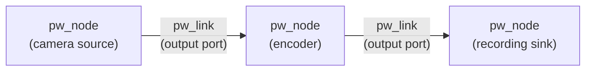
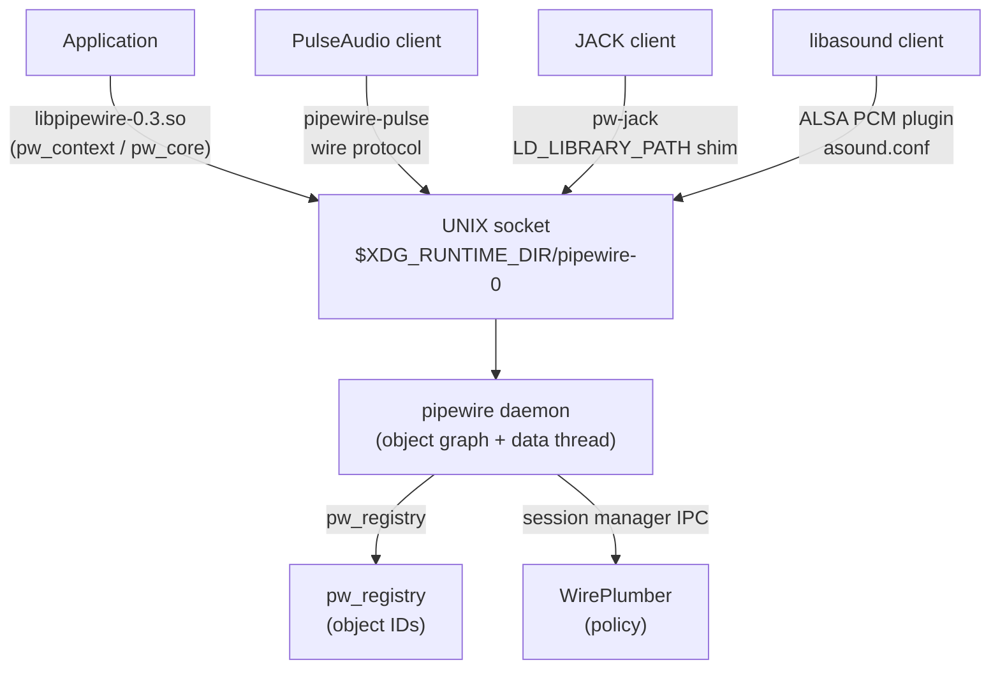
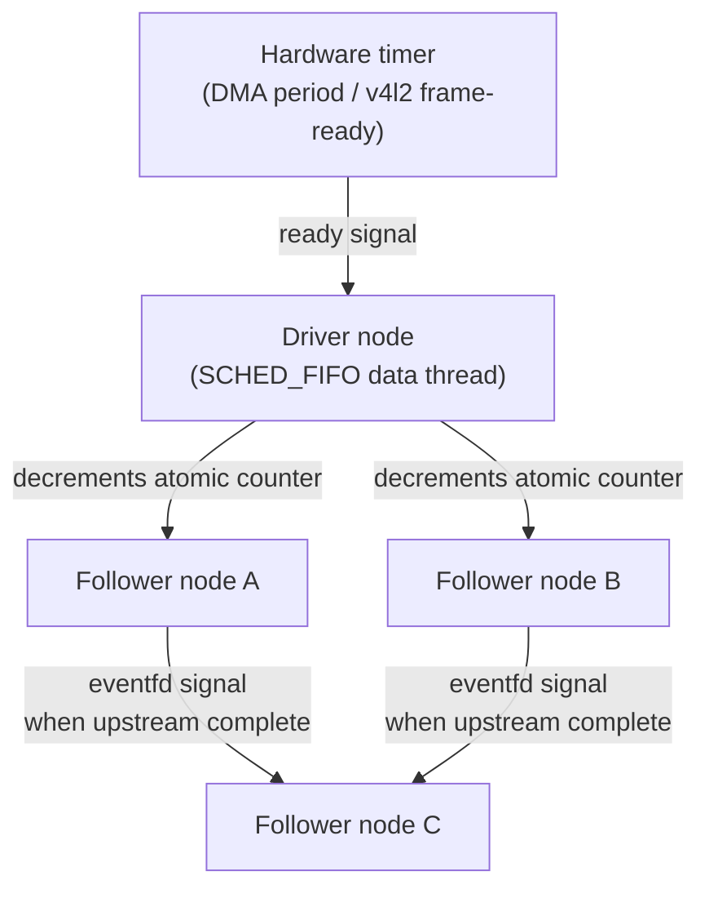
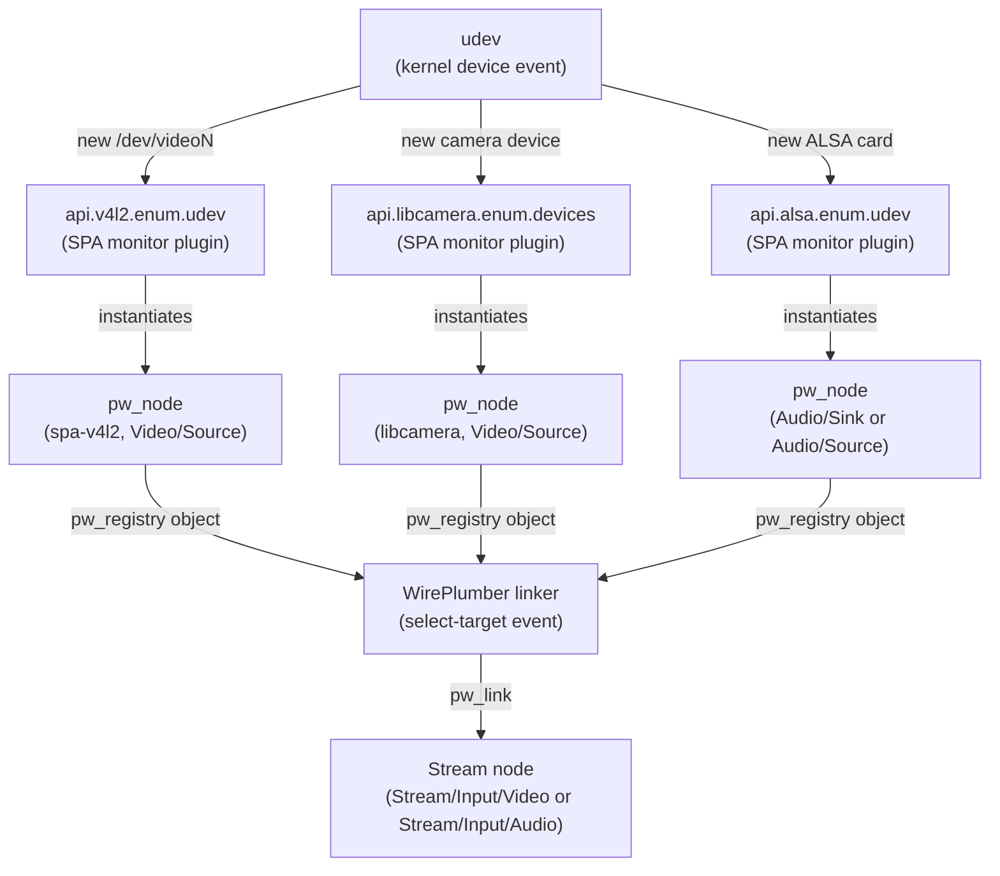
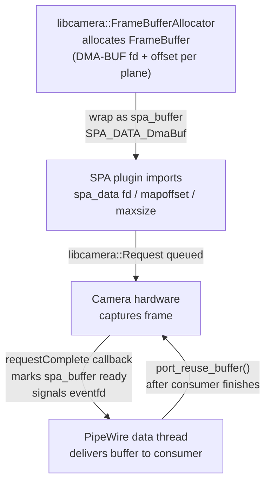
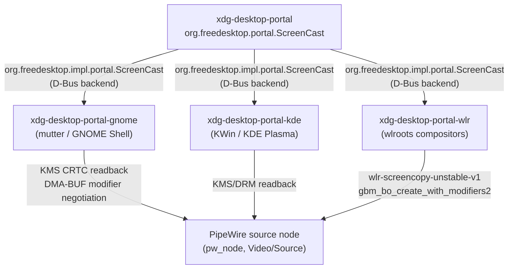
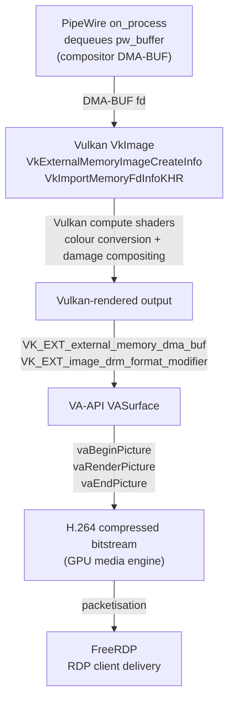

# Chapter 38: PipeWire and the Video Session Layer

> **Part**: Part VII — Application APIs & Middleware
> **Audience**: Graphics application developers who need to route GPU-produced buffers through the session-layer multimedia infrastructure; systems developers interested in the DMA-BUF / PipeWire integration that connects kernel video capture, GPU compute, and Wayland screen sharing
> **Status**: First draft — 2026-06-18

## Table of Contents

- [Overview](#overview)
- [1. PipeWire Architecture: The Graph Model and SPA](#1-pipewire-architecture-the-graph-model-and-spa)
- [2. Session Management: WirePlumber and Policy](#2-session-management-wireplumber-and-policy)
- [3. Video Capture Pipeline: V4L2 and libcamera Sources](#3-video-capture-pipeline-v4l2-and-libcamera-sources)
- [4. Screen Capture and Portal Integration](#4-screen-capture-and-portal-integration)
- [5. Remote Desktop and Streaming](#5-remote-desktop-and-streaming)
- [6. D-Bus Interface Reference](#6-dbus-interface-reference)
- [7. Buffer Formats and GPU Interop](#7-buffer-formats-and-gpu-interop)
- [Integrations](#integrations)
- [References](#references)

---

## Overview

**PipeWire** is the unified session-layer multimedia daemon that now underpins virtually every modern Linux desktop. Introduced by Wim Taymans at Red Hat and first shipping as default in Fedora 34 (2021), it replaced a historically fractured landscape:

- **PulseAudio** — handled audio routing
- **JACK** — served professional low-latency audio
- **ALSA** — accessed directly by many applications
- **V4L2** — video accessed through ioctl loops
- **v4l2loopback** — virtual video via kernel modules
- **GStreamer** — ad-hoc pipelines stitched together by compositors

**PipeWire** unifies all of these under a single graph-based multimedia engine, providing zero-copy **DMA-BUF** buffer passing, real-time scheduling, and a robust security model built on portal-controlled permissions.

The core architectural abstraction is the **node/link/port graph**: every multimedia entity is a **`pw_node`** exposing typed **`pw_link`**-connected ports. Applications typically use the higher-level **`pw_stream`** API, which wraps a **`pw_client_node`** proxy. Below **`libpipewire`** sits **SPA** (**Simple Plugin API**) — the plugin **ABI** that every codec, device backend, format negotiator, and buffer allocator implements via the **`spa_node`** interface. Parameters and format capabilities are exchanged as **SPA pods** (**`spa_pod`**), with video formats described by **`spa_video_info_raw`** and constructed using **`spa_pod_builder`**. The two-phase format negotiation — an enumeration phase using **`spa_node_port_enum_params(SPA_PARAM_EnumFormat)`** followed by a fixation phase using **`spa_node_port_set_param(SPA_PARAM_Format)`** and buffer negotiation via **`SPA_PARAM_Buffers`** — determines whether the data path uses **`SPA_DATA_DmaBuf`**, **`SPA_DATA_MemFd`**, or **`SPA_DATA_MemPtr`**. The daemon process owns the **UNIX domain socket** at **`$XDG_RUNTIME_DIR/pipewire-0`** and is accessed through **`libpipewire-0.3.so`**, with clients creating a **`pw_context`**, a **`pw_core`**, and monitoring objects through the **`pw_registry`**. Legacy protocol compatibility is provided by **`pipewire-pulse`** (a **PulseAudio** wire-protocol server), the **`pw-jack`** **`LD_LIBRARY_PATH`** shim, and the **ALSA PCM plugin**. The real-time data thread is driven by a *driver node* running at **`SCHED_FIFO`** priority, with the *quantum* (cycle size) governed by **`default.clock.quantum`** in **`pipewire.conf`**; real-time privileges are granted by **`module-rt`** (via **`RLIMIT_RTPRIO`**) or the **RTKit** D-Bus service, with **`RLIMIT_RTTIME`** acting as a safety cap.

Session policy — which nodes to link and which formats to negotiate — is entirely the domain of **WirePlumber**, a **GObject**-based daemon embedding a **Lua 5.4/5.5** scripting engine via **`wplua`**. **WirePlumber** uses **`WpObjectManager`** and **`WpObjectInterest`** to watch the **`pw_registry`** and react to device events via an *event dispatcher* model. It creates **`pw_node`** instances for hardware devices by loading **SPA** monitor plugins: **`api.v4l2.enum.udev`** for **V4L2** video devices, **`api.libcamera.enum.devices`** for **libcamera**-managed cameras, and **`api.alsa.enum.udev`** for ALSA cards — all discovered through **`udev`**. The linker maps `media.class` properties (e.g. **`Stream/Input/Video`**, **`Video/Source`**, **`Audio/Sink`**) to route streams to devices. Default sink/source assignments are persisted in a **`pw_metadata`** object (the `default` metadata), storing keys such as **`default.audio.sink`** and **`default.video.source`**. The security model uses per-object permission bitmasks (**`PW_PERM_R`**, **`PW_PERM_W`**, **`PW_PERM_X`**, **`PW_PERM_M`**); the **`portal-permissionstore`** plugin bridges **PipeWire** to the **XDG Desktop Portal** permission store for sandboxed application access.

For the graphics stack, **PipeWire** is not merely an audio daemon that happens to handle video: it is the primary conduit through which three high-value data flows operate:

- **Wayland screen capture** — the mechanism by which **OBS Studio**, video-conferencing applications, and **WebRTC** in browsers receive compositor output; travels through a **PipeWire** stream negotiated via the **`org.freedesktop.portal.ScreenCast`** **D-Bus** interface.
- **Hardware video capture** — from webcams through **V4L2** via the **`spa-v4l2`** plugin or **libcamera** via its **SPA** plugin; reaches applications as **DMA-BUF**-backed **PipeWire** streams, enabling zero-copy paths all the way from the camera sensor's **ISP** to a GPU encode engine.
- **GPU frame injection** — rendered frames from **Vulkan** or **EGL** applications injected back into **PipeWire** as **`SPA_DATA_DmaBuf`** buffers and consumed by encoders, recorders, or remote-desktop servers.

The **`spa-v4l2`** plugin wraps **`/dev/videoN`** devices, calling **`VIDIOC_ENUM_FMT`** to discover formats and using either **`V4L2_MEMORY_MMAP`** or **`V4L2_MEMORY_DMABUF`** (via **`VIDIOC_EXPBUF`** and **`VIDIOC_DQBUF`**) for buffer access. The **libcamera** **SPA** plugin wraps **`libcamera::Camera`** objects, managing **`FrameBuffer`** objects allocated through **`libcamera::FrameBufferAllocator`** and queued as **`libcamera::Request`** instances. Common video formats traversing these pipelines include **`SPA_VIDEO_FORMAT_YUY2`** (**YUYV**), **`SPA_VIDEO_FORMAT_NV12`** (**NV12**), and **`SPA_VIDEO_FORMAT_ENCODED`** (**MJPEG**, **H.264**); the **`spa-videoconvert`** plugin handles lightweight format conversion when producer and consumer capabilities do not directly match.

Screen capture flows through the **`org.freedesktop.portal.ScreenCast`** **D-Bus** interface (methods **`CreateSession`**, **`SelectSources`**, **`Start`**, **`OpenPipeWireRemote`**), which returns a scoped **PipeWire** file descriptor for use with **`pw_context_connect_fd()`**. The **`xdg-desktop-portal`** delegates to compositor-specific backends: **`xdg-desktop-portal-gnome`** (mutter/**GNOME Shell**), **`xdg-desktop-portal-kde`** (**KWin**/**KDE Plasma**), and **`xdg-desktop-portal-wlr`** (for **wlroots**-based compositors using the **`wlr-screencopy-unstable-v1`** protocol and **`gbm_bo_create_with_modifiers2()`**). Emerging standards **`ext-image-capture-source-v1`** and **`ext-image-copy-capture-v1`** are replacing the **wlroots**-specific protocol. On the consumer side, **`pw_stream_dequeue_buffer()`** and **`pw_stream_queue_buffer()`** manage buffer flow; **`SPA_META_Header`** carries presentation timestamps, **`SPA_META_VideoDamage`** carries changed rectangles, and **`SPA_META_VideoTransform`** signals rotation. **OBS Studio** integrates via its **`pipewire`** plugin and **`libportal`**; **Chromium**/**Chrome** (since Chrome 110) and **Firefox** use **`org.freedesktop.portal.ScreenCast`** for **`getDisplayMedia()`** under **Wayland**.

Remote desktop extends screen capture via **`org.freedesktop.portal.RemoteDesktop`** (methods **`SelectDevices`**, **`ConnectToEIS`**), adding input injection through **`libei`** (**Event Input System**). **`gnome-remote-desktop`** implements an **RDP** server using **PipeWire** as its video source and encoding frames through a zero-copy chain: **PipeWire** **DMA-BUF** → **Vulkan** **`VkImage`** import (via **`VkExternalMemoryImageCreateInfo`** / **`VkImportMemoryFdInfoKHR`**) → compute shader colour conversion → **VA-API** **`VASurface`** export (via **`VK_EXT_external_memory_dma_buf`** / **`VK_EXT_image_drm_format_modifier`**) → **`vaBeginPicture()`**/**`vaRenderPicture()`**/**`vaEndPicture()`** **H.264** encode → **FreeRDP** packetisation. **GStreamer**'s **`pipewiresrc`** and **`pipewiresink`** elements (from **`gst-plugin-pipewire`**), using **`gst_dmabuf_allocator_alloc()`** and the **`gst_caps_to_format`** helpers, provide a generic consumer/producer path enabling pipelines such as **`vaapipostproc`** + **`vaapih264enc`** for hardware encode, or **`V4L2_MEMORY_DMABUF`** import for **V4L2** stateless encode on **ARM SoCs**.

Buffer format and **GPU** interop is governed by **DRM format modifiers** — 64-bit values such as **`DRM_FORMAT_MOD_LINEAR`**, **`I915_FORMAT_MOD_X_TILED`**, **`I915_FORMAT_MOD_Y_TILED_CCS`**, and **`AMD_FMT_MOD_*`** — negotiated through **SPA** pod choices with **`SPA_POD_PROP_FLAG_DONT_FIXATE`** and **`DRM_FORMAT_MOD_INVALID`** as a fallback signal. Producers announce modifier capabilities via **`SPA_FORMAT_VIDEO_modifier`** in **`SPA_PARAM_EnumFormat`** pods; after fixation via **`spa_format_video_raw_parse()`** and **`pw_stream_update_params()`**, buffers are allocated with **`gbm_bo_create_with_modifiers2()`** or **`VkImageDrmFormatModifierExplicitCreateInfoEXT`** and exported via **`gbm_bo_get_modifier()`** / **`VkImageDrmFormatModifierPropertiesEXT`**. The **`on_add_buffer`** callback signals whether the negotiated type is **`SPA_DATA_DmaBuf`** (zero-copy) or **`SPA_DATA_MemFd`** (CPU-copy fallback, used with **`PW_STREAM_FLAG_MAP_BUFFERS`**). GPU-to-**PipeWire** injection is demonstrated by the **`pw-capture`** **`VkLayer`** (intercepting **`vkQueuePresentKHR`** and exporting via **`VK_EXTERNAL_MEMORY_HANDLE_TYPE_DMA_BUF_BIT_EXT`**) and natively by the **`spa/plugins/vulkan/`** **SPA** plugin introduced in **PipeWire 0.3.80**.

- **Graphics application developers** — sections 4 and 7: the portal **ScreenCast** flow and the **DMA-BUF** modifier negotiation that determines whether screen capture is zero-copy or falls back to a CPU blit.
- **Systems and driver developers** — sections 1–3: the **SPA** plugin **ABI**, the graph scheduler, the **V4L2** / **libcamera** source nodes, and the buffer-lifecycle contracts that cross kernel/userspace boundaries.
- **Browser and compositor engineers** — sections 4–5: the exact **D-Bus** interfaces, portal backend choices per compositor, and the **WebRTC** plumbing that makes in-browser screen sharing work.

---

## 1. PipeWire Architecture: The Graph Model and SPA

### 1.1 The Node/Link/Port Graph

PipeWire models all multimedia data flow as a directed graph of *nodes* connected by *links*. Each node (`pw_node`) represents an entity that either consumes, produces, or transforms buffers. Nodes expose *ports* — typed endpoints that carry data in one direction: output ports emit buffers into the graph; input ports consume them. A *link* (`pw_link`) connects one output port to one input port, provided they have compatible formats. [Source](https://docs.pipewire.org/page_overview.html)

Sources — such as a V4L2 camera node or a screen-capture node — have only output ports. Sinks — such as an ALSA PCM device or a recording sink — have only input ports. Processing nodes (resamplers, format converters, encoders) have both. Every object — node, link, port, device, session — is identified by an integer object ID visible through the `pw_registry`, and clients interact with remote objects through local *proxy* handles.

```
+--------------------+        pw_link         +--------------------+
|  pw_node (camera)  |   output ──────────►   |  pw_node (encoder) |
|                    |                         |                    |
|   spa_node impl    |   input  ◄──────────   |   spa_node impl    |
+--------------------+        pw_link         +--------------------+
```



Applications almost never interact with `pw_node` directly. Instead, they use the higher-level `pw_stream` API, which creates a node with a single port inside the PipeWire daemon, takes care of format negotiation, buffer allocation, and wires up the necessary event callbacks. The `pw_stream` wraps a `pw_client_node` proxy plus an adapter node that can perform lightweight format conversion on the data path.

The IPC substrate uses UNIX domain sockets at `$XDG_RUNTIME_DIR/pipewire-0` (configurable via `core.name` in `pipewire.conf`). Buffer data is shared via `memfd` or DMA-BUF file descriptors — the control channel carries only metadata and signals. This design means data never passes through the socket: file descriptors are exchanged once during negotiation, after which the data exchange is purely in shared memory or GPU memory. [Source](https://docs.pipewire.org/page_overview.html)

### 1.2 SPA: The Simple Plugin API

Below `libpipewire` sits SPA (Simple Plugin API) — the plugin ABI that every codec, device backend, format negotiator, and buffer allocator implements. SPA was designed around three constraints: no heap allocation inside plugin code (callers supply pre-sized memory for every object), a purely event-driven result model (no blocking calls), and stable binary compatibility across versions. [Source](https://docs.pipewire.org/page_spa_plugins.html)

An SPA plugin is a shared library that exports a single public symbol, `spa_handle_factory_enum`, returning an array of `spa_handle_factory` structures. Each factory enumerates the *interfaces* it can instantiate — a given `.so` may provide a video converter, a buffer allocator, and a format enumerator. Plugins are typically located under `/usr/lib/spa-0.2/` and found via a `SPA_PLUGIN_DIR` search path.

The central interface for a processing unit is `spa_node`:

```c
/* spa/include/spa/node/node.h (simplified) */
struct spa_node_methods {
    uint32_t version;
    int (*add_listener)(void *object, struct spa_hook *listener,
                        const struct spa_node_events *events, void *data);
    int (*set_callbacks)(void *object, const struct spa_node_callbacks *callbacks,
                         void *data);
    int (*enum_params)(void *object, int seq, uint32_t id, uint32_t start,
                       uint32_t num, const struct spa_pod *filter);
    int (*set_param)(void *object, uint32_t id, uint32_t flags,
                     const struct spa_pod *param);
    int (*port_enum_params)(void *object, int seq, enum spa_direction direction,
                            uint32_t port_id, uint32_t id, uint32_t start,
                            uint32_t num, const struct spa_pod *filter);
    int (*port_set_param)(void *object, enum spa_direction direction,
                          uint32_t port_id, uint32_t id, uint32_t flags,
                          const struct spa_pod *param);
    int (*port_use_buffers)(void *object, enum spa_direction direction,
                            uint32_t port_id, uint32_t flags,
                            struct spa_buffer **buffers, uint32_t n_buffers);
    int (*process)(void *object);
};
```
[Source: `spa/include/spa/node/node.h`, PipeWire GitLab](https://gitlab.freedesktop.org/pipewire/pipewire/-/blob/master/spa/include/spa/node/node.h)

Parameters — formats, buffer requirements, port capabilities — are exchanged as *SPA pods* (`spa_pod`). A pod is a self-describing binary value: a 32-bit size followed by a 32-bit type tag, then the payload. Pods compose: an `SPA_TYPE_OBJECT_Format` pod contains property pods keyed by SPA parameter constants such as `SPA_FORMAT_VIDEO_format`, `SPA_FORMAT_VIDEO_size`, and `SPA_FORMAT_VIDEO_modifier`. The `spa_pod_builder` API constructs pods on stack-allocated buffers; `spa_pod_parser` decodes them.

Video format objects use `spa_video_info_raw`, which is the concrete structure populated by `spa_format_video_raw_parse()` after format negotiation:

```c
/* spa/include/spa/param/video/raw.h */
struct spa_video_info_raw {
    enum spa_video_format  format;        /* e.g. SPA_VIDEO_FORMAT_NV12   */
    uint32_t               flags;
    uint64_t               modifier;      /* DRM modifier; only used with DMA-BUF */
    struct spa_rectangle   size;          /* width × height               */
    struct spa_fraction    framerate;     /* 0/1 = variable               */
    struct spa_fraction    max_framerate;
    uint32_t               views;
    enum spa_video_interlace_mode  interlace_mode;
    struct spa_fraction    pixel_aspect_ratio;
    /* … colorimetry fields … */
    enum spa_video_color_range      color_range;
    enum spa_video_color_matrix     color_matrix;
    enum spa_video_transfer_function transfer_function;
    enum spa_video_color_primaries  color_primaries;
};
```
[Source: PipeWire docs `spa_video_info_raw` Struct Reference](https://docs.pipewire.org/structspa__video__info__raw.html)

Note that `spa_video_info_raw` is the single structure used for both ordinary video and DMA-BUF video. The `modifier` field is populated only when DMA-BUF negotiation succeeds. There is no separate `spa_video_info_dma_buf` type; DMA-BUF-ness is indicated by setting `SPA_PARAM_BUFFERS_dataType` to `1 << SPA_DATA_DmaBuf` during buffer parameter negotiation.

### 1.3 The Daemon, Client Libraries, and Socket

The `pipewire` daemon process owns the native protocol socket and executes the real-time data thread. It does not implement policy (which nodes to link, which formats to negotiate) — that is left to the session manager. The daemon's responsibilities are: maintaining the object graph in shared memory, driving the data-processing cycle, and forwarding IPC messages between clients.

Applications link against `libpipewire-0.3.so` and communicate with the daemon through its native protocol. The library exposes a main loop (`pw_main_loop` or `pw_thread_loop`) that integrates with `epoll` via eventfd. A `pw_context` manages SPA plugin loading; a `pw_core` holds the connection to the daemon and the proxy to the `pw_registry`.

For compatibility, separate daemons implement legacy protocols on top of PipeWire's graph:
- `pipewire-pulse` — a PulseAudio wire-protocol server that creates virtual sink/source nodes.
- `pw-jack` — an `LD_LIBRARY_PATH`-based shim that redirects JACK clients through PipeWire.
- The ALSA PCM plugin in `~/.config/alsa/asound.conf` routes `libasound` playback into PipeWire streams.



### 1.4 Scheduling: The Driver Node and the Quantum

The PipeWire data thread operates on a pull-based *graph cycle* model. One node in the graph is elected as the *driver*: it owns a hardware timer (for ALSA, the DMA period interrupt; for video, a v4l2 frame-ready event) and emits a ready signal that propagates through the dependency graph. Other nodes are *followers*: they process only after all upstream dependencies have completed, signalled by decrementing an atomic counter and writing to an `eventfd`. [Source](https://docs.pipewire.org/page_scheduling.html)



The *quantum* is the number of samples (for audio) or frames (for video) processed per graph cycle. For audio it defaults to `default.clock.quantum = 1024` samples at `default.clock.rate = 48000 Hz`, giving a 21.3 ms period. Clients can request smaller quanta for lower latency (bounded by `default.clock.min-quantum = 32`) or larger quanta for efficiency (capped at `default.clock.quantum-limit = 8192`). The graph uses the smallest quantum requested by any running client, rounded down to a power of two. [Source](https://docs.pipewire.org/page_man_pipewire_conf_5.html)

The data thread runs with `SCHED_FIFO` real-time priority to prevent preemption by other processes. This is granted either via the `module-rt` module (which requires `RLIMIT_RTPRIO` to be set sufficiently for the calling process — typically via `/etc/security/limits.d/`) or via the RTKit D-Bus service (which implements privilege escalation for ordinary users without requiring raised resource limits). The kernel's `RLIMIT_RTTIME` limit caps the maximum wall-clock time a thread may spend in real-time scheduling without yielding, providing a safety valve against runaway real-time threads consuming all CPU. [Source: PipeWire RT module docs](https://docs.pipewire.org/page_module_rt.html)

### 1.5 Real-Time Scheduling and RTKit

**RTKit** (`org.freedesktop.RealtimeKit1`) is a D-Bus system service that allows unprivileged user processes to obtain real-time scheduling priorities without `CAP_SYS_NICE` or elevated `RLIMIT_RTPRIO`. It is the standard mechanism on desktop Linux for audio/video daemons to safely acquire `SCHED_FIFO` — used by PipeWire, PulseAudio, JACK, and any other latency-sensitive service running as a normal user account.

RTKit enforces its own policy limits independently of the kernel's per-process resource limits, making it a controlled, auditable privilege-escalation path rather than a blanket `setuid` binary. [Source: RTKit specification](https://github.com/heftig/rtkit)

#### The RTKit D-Bus Interface

The service exposes a single object at path `/org/freedesktop/RealtimeKit1` on the system bus. The two principal methods are:

```
org.freedesktop.RealtimeKit1.MakeThreadRealtime(thread: u64, priority: u32)
org.freedesktop.RealtimeKit1.MakeThreadHighPriority(thread: u64, niceness: i32)
```

`MakeThreadRealtime` applies `SCHED_FIFO` at the requested priority (subject to `MaxRealtimePriority`). `MakeThreadHighPriority` applies `SCHED_OTHER` with a negative nice value — useful for threads that need preference over normal workloads but do not need hard real-time guarantees.

The `thread` argument is the **kernel thread ID** (TID) of the calling thread, obtained with `gettid(2)` — not the pthread `pthread_t` handle. The caller must be the owning process (RTKit verifies `procfs` ownership before accepting the request).

RTKit also exposes readable properties that advertise the active policy limits:

| Property | Type | Typical value | Meaning |
|---|---|---|---|
| `MaxRealtimePriority` | `i32` | 20 | Highest `SCHED_FIFO` priority RTKit will grant |
| `MaxNiceLevel` | `i32` | −15 | Most-negative nice value for `MakeThreadHighPriority` |
| `RTTimeUSecMax` | `i64` | 200,000 | Per-thread `RLIMIT_RTTIME` ceiling (µs) |
| `MinNiceLevel` | `i32` | −15 | Same as `MaxNiceLevel` (legacy alias) |

`RTTimeUSecMax` sets `RLIMIT_RTTIME` on the thread after granting real-time priority. If the thread runs continuously in `SCHED_FIFO` for longer than this budget without voluntarily blocking, the kernel sends `SIGXCPU` (by default) and eventually `SIGKILL`, preventing a runaway real-time thread from starving the system.

#### Calling RTKit from C

PipeWire's `module-rt` wraps this sequence. The pattern is:

```c
#include <dbus/dbus.h>
#include <sys/syscall.h>
#include <unistd.h>

/* Obtain kernel TID of the calling thread */
static pid_t get_tid(void) { return (pid_t)syscall(SYS_gettid); }

/* Ask RTKit to promote this thread to SCHED_FIFO at 'priority' */
static int rtkit_make_realtime(DBusConnection *bus, int priority) {
    DBusMessage *m = dbus_message_new_method_call(
        "org.freedesktop.RealtimeKit1",          /* destination */
        "/org/freedesktop/RealtimeKit1",          /* object path */
        "org.freedesktop.RealtimeKit1",           /* interface */
        "MakeThreadRealtime");                    /* method */
    if (!m) return -ENOMEM;

    dbus_uint64_t tid  = (dbus_uint64_t)get_tid();
    dbus_uint32_t prio = (dbus_uint32_t)priority;
    dbus_message_append_args(m,
        DBUS_TYPE_UINT64, &tid,
        DBUS_TYPE_UINT32, &prio,
        DBUS_TYPE_INVALID);

    DBusError err;
    dbus_error_init(&err);
    DBusMessage *r = dbus_connection_send_with_reply_and_block(bus, m, -1, &err);
    dbus_message_unref(m);

    int ret = 0;
    if (dbus_error_is_set(&err)) {
        fprintf(stderr, "RTKit error: %s\n", err.message);
        dbus_error_free(&err);
        ret = -EPERM;
    }
    if (r) dbus_message_unref(r);
    return ret;
}
```

[Source: PipeWire `module-rt.c`](https://gitlab.freedesktop.org/pipewire/pipewire/-/blob/master/src/modules/module-rt.c)

#### How PipeWire's `module-rt` Uses RTKit

`module-rt` is loaded by the PipeWire daemon at startup via `pipewire.conf`:

```
context.modules = [
  { name = libpipewire-module-rt
    args = {
      nice.level    = -11      # nice level for the main thread
      rt.prio       = 88       # SCHED_FIFO priority for data threads
      rt.time.soft  = 200000   # RLIMIT_RTTIME soft limit (µs)
      rt.time.hard  = 200000   # RLIMIT_RTTIME hard limit (µs)
    }
    flags = [ ifexists nofail ]
  }
]
```

At runtime `module-rt` attempts two strategies in order:

1. **Direct `sched_setscheduler(2)`** — succeeds if the process has `RLIMIT_RTPRIO` set high enough (e.g., via `/etc/security/limits.d/95-pipewire.conf`: `@audio - rtprio 95`). This is the preferred path on professional audio setups running `realtime-privileges` or `audio` group membership.

2. **RTKit fallback** — if `sched_setscheduler` is denied with `EPERM`, the module connects to the system bus and calls `MakeThreadRealtime` for each data thread. This is the default path on stock desktop installs where the user is not in the `audio` group.

The module also sets `RLIMIT_RTTIME` directly on the thread after either path succeeds, using the `rt.time.soft` / `rt.time.hard` values from configuration. The soft limit triggers `SIGXCPU`; the hard limit causes `SIGKILL`. This ensures no PipeWire data thread can lock up the machine even if a plugin enters an infinite loop.

#### RTKit Security Model

RTKit enforces several additional guards beyond the priority cap:

- **Process ownership**: the calling process must own the TID it passes (checked via `/proc/<tid>/status`). Cross-process escalation is rejected.
- **`PolKit` integration** (optional, via `rtkit-daemon` policy): on some distributions, RTKit checks a `polkit` policy before granting real-time priority to processes not in the `audio` group. The policy is at `/usr/share/polkit-1/actions/org.freedesktop.RealtimeKit1.policy`.
- **Per-process thread count limit**: RTKit tracks how many threads each process has had promoted. Exceeding the limit (default: 20) is rejected, preventing a rogue process from monopolising real-time priority across a large thread pool.
- **`RLIMIT_RTTIME` enforcement**: RTKit sets the limit on the thread, not just the process, and the kernel enforces it independently per-thread — the limit is not inherited by child threads.

#### Verifying Real-Time Priority

After PipeWire starts, confirm its data thread obtained `SCHED_FIFO`:

```bash
# Find the PipeWire data thread TID
ps -eLo pid,tid,cls,rtprio,comm | grep pipewire

# Expected output (SCHED_FIFO = FF class, rtprio = 88):
# 12345  12347 FF      88 pipewire

# Inspect RTKit properties
dbus-send --system --print-reply \
  --dest=org.freedesktop.RealtimeKit1 \
  /org/freedesktop/RealtimeKit1 \
  org.freedesktop.DBus.Properties.GetAll \
  string:org.freedesktop.RealtimeKit1
```

If the `cls` column shows `TS` (time-sharing) instead of `FF`, the data thread did not obtain real-time scheduling — audio glitches and xruns are likely. Common causes: `RLIMIT_RTPRIO = 0` and RTKit not running (check `systemctl status rtkit-daemon`).

### 1.6 Format Negotiation via SPA Pods

Format negotiation between two nodes proceeds in two phases. During the *enumeration* phase, each port calls `spa_node_port_enum_params(SPA_PARAM_EnumFormat)` to list all format capabilities as an array of SPA pod objects — each encoding constraints on media type, format, size, and framerate using `SPA_CHOICE_Enum` or `SPA_CHOICE_Range` pods. The session manager or the adapter node intersects the capability sets to find a mutually acceptable format.

During the *fixation* phase, the negotiated format is committed with `spa_node_port_set_param(SPA_PARAM_Format)`, followed by buffer negotiation (`SPA_PARAM_Buffers`) that determines memory type (`SPA_DATA_MemFd`, `SPA_DATA_DmaBuf`), buffer count, stride, and alignment. This two-phase model is the foundation of the zero-copy DMA-BUF path explored in section 7.

---

## 2. Session Management: WirePlumber and Policy

### 2.1 The Role of the Session Manager

The PipeWire daemon deliberately has no built-in policy. It creates and manages graph objects but never decides which microphone to route to which application or whether a Flatpak is allowed to see the camera. These decisions are the exclusive domain of the *session manager* — a separate daemon that connects to PipeWire as a privileged client and uses the full object management API. [Source](https://docs.pipewire.org/page_session_manager.html)

Two session managers have existed: `pipewire-media-session` (the early reference implementation, now used mainly for debugging and embedded systems) and **WirePlumber** (the current standard on all major Linux desktops since 2021). This section covers WirePlumber exclusively.

### 2.2 WirePlumber Architecture

WirePlumber is a GObject-based daemon with a Lua 5.4/5.5 scripting engine embedded via the `wplua` library. The daemon itself is a thin plugin host: at startup it loads a set of C plugins (for the event loop, the PipeWire connection, the Lua engine) and then executes Lua scripts that implement all policy logic. [Source](https://pipewire.pages.freedesktop.org/wireplumber/)

The key architectural abstraction is the `WpObjectManager`, which watches the PipeWire object registry for objects matching a given `WpObjectInterest` (a type + property filter). When a matching object appears, the manager fires a Lua callback. Scripts use this to react to devices coming online, streams being created, or links changing state.

WirePlumber 0.5.x reorganised the main linking script from a monolithic `policy-node.lua` into an *event dispatcher* model with hooks. When a new stream node appears, the dispatcher raises a `select-target` event. A chain of prioritised hook scripts handles it: [Source](https://www.collabora.com/news-and-blog/blog/2023/10/30/wireplumber-exploring-lua-scripts-with-event-dispatcher/)

```lua
-- wireplumber/scripts/linking/find-best-target.lua (simplified illustration)
SimpleEventHook {
    name = "linking/find-best-target",
    after = "linking/find-default-target",
    before = "linking/prepare-link",
    execute = function(event)
        local si_props  = event:get_subject():get_properties()
        local media_cls = si_props["media.class"]
        -- find highest-priority node with matching media class
        local target = find_best_node(media_cls)
        if target then
            event:set_data("target", target)
        end
    end
}
```

Scripts are loaded from `/usr/share/wireplumber/scripts/` and can be overridden per-user from `~/.config/wireplumber/`. Administrators or embedded-system vendors supply entirely custom scripts without patching WirePlumber itself. [Source](https://gkiagia.gr/2025-04-22-wireplumber-configuration-on-embedded/)

### 2.3 Device and Node Lifecycle

WirePlumber creates `pw_node` instances for hardware devices by loading the appropriate SPA *monitor* plugin: `api.alsa.enum.udev` enumerates ALSA cards, `api.v4l2.enum.udev` enumerates V4L2 video devices, and `api.libcamera.enum.devices` enumerates libcamera-managed cameras. When `udev` reports a new `/dev/video0` device, the V4L2 monitor instantiates a `pw_node` wrapping the `spa-v4l2` plugin; when the device disappears, WirePlumber unlinks and destroys the node.

The *linking policy* maps media classes to each other. Stream nodes carry a `media.class` property such as `Stream/Output/Audio` (playback), `Stream/Input/Audio` (capture), or `Stream/Input/Video` (video capture). Device nodes carry `Audio/Sink`, `Audio/Source`, or `Video/Source`. The linker automatically routes `Stream/Input/Video` nodes to `Video/Source` nodes unless overridden by `node.target` or metadata. [Source](https://pipewire.pages.freedesktop.org/wireplumber/policies/linking.html)



Key linking properties on stream nodes:
- `target.object`: name or serial of the desired target node; accepts both device and stream names, enabling stream-to-stream routing.
- `node.dont-reconnect`: when `false` (default), the linker reconnects the stream if the target disappears.
- `node.dont-move`: when `true`, metadata changes cannot relink the stream at runtime.

### 2.4 Default Sink/Source and Metadata

PipeWire supports a `pw_metadata` object (keyed `default`) that stores key-value pairs persisted across sessions. WirePlumber writes `default.audio.sink`, `default.audio.source`, and `default.video.source` metadata keys to record which device the user has designated as the session default. Tools like `pavucontrol` and `pactl` read and write these keys; WirePlumber's `find-default-target.lua` hook consults them during link target selection.

### 2.5 Security Model: Permissions and Portals

PipeWire implements a permissions system analogous to UNIX file permissions. Every object in the graph has a permission bitmask per client: `PW_PERM_R` (read — see the object exists), `PW_PERM_W` (write — modify properties), `PW_PERM_X` (execute — call methods / connect to the object), and `PW_PERM_M` (metadata — read/write metadata for the object). [Source: PipeWire Session Manager docs](https://docs.pipewire.org/page_session_manager.html)

By default, WirePlumber grants ordinary clients a restrictive permission set. The `portal-permissionstore` plugin bridges PipeWire to the XDG Desktop Portal permission store: when a Flatpak application connects through the camera portal, WirePlumber checks the portal permission store entry for that application and grants `PW_PERM_R | PW_PERM_X` on camera nodes only if the user previously approved camera access. Ordinary sideloaded apps that connect directly to the PipeWire socket receive a *flat* permission set — full access to all graph objects — which is suitable for trusted system services but not for sandboxed applications.

```
graph TD
    A[Flatpak App] -->|D-Bus request| B[xdg-desktop-portal]
    B -->|permission check| C[portal permission store]
    C -->|approved| D[WirePlumber]
    D -->|grants PW_PERM_R+X on camera node| E[PipeWire daemon]
    A -->|PipeWire socket| E
    E -->|camera stream| A
```

The portal flow (section 4) extends this by providing a *scoped* PipeWire file descriptor that exposes only the specific screen-cast nodes authorised for the requesting application.

---

## 3. Video Capture Pipeline: V4L2 and libcamera Sources

### 3.1 The `spa-v4l2` Plugin

The `spa-v4l2` plugin (`spa/plugins/v4l2/`) wraps a V4L2 character device (`/dev/videoN`) as a PipeWire source node. WirePlumber loads it when the `api.v4l2.enum.udev` monitor discovers a V4L2 device, creating a `pw_node` with a single output port carrying video data. [Source](https://github.com/PipeWire/pipewire/blob/master/spa/plugins/v4l2/v4l2-utils.c)

The plugin calls `VIDIOC_ENUM_FMT` to discover all pixel formats the device supports, maps V4L2 fourcc codes to SPA format identifiers (e.g. `V4L2_PIX_FMT_YUYV` → `SPA_VIDEO_FORMAT_YUY2`, `V4L2_PIX_FMT_NV12` → `SPA_VIDEO_FORMAT_NV12`, `V4L2_PIX_FMT_MJPEG` → `SPA_VIDEO_FORMAT_ENCODED`), and exposes the complete capability set as `SPA_PARAM_EnumFormat` pods.

Buffer memory type negotiation distinguishes two paths:

- **`V4L2_MEMORY_MMAP`** (default for most UVC webcams): the kernel driver allocates buffers in a memory region mmapped into the PipeWire process. The SPA plugin wraps the mmapped pointer in an `spa_buffer` with `SPA_DATA_MemPtr` data type. Consumers cannot treat these as DMA-BUF handles.

- **`V4L2_MEMORY_DMABUF`**: the plugin exports each V4L2 buffer as a DMA-BUF file descriptor using `VIDIOC_EXPBUF`, then passes those fds as `SPA_DATA_DmaBuf` entries in the `spa_buffer`. This path is available on drivers that support it (most modern UVC, many platform camera drivers) and enables true zero-copy transfer to GPU encoders or display.

The plugin's format-negotiation code for the V4L2 DMABUF path is in `spa/plugins/v4l2/v4l2-utils.c`. When a consumer negotiates `SPA_DATA_DmaBuf`, the plugin sets `port->memtype = V4L2_MEMORY_DMABUF` in its stream setup and switches from `VIDIOC_DQBUF`-with-mmap to `VIDIOC_DQBUF`-with-exported fds.

A special case documented in the PipeWire DMA-BUF guide applies to V4L2 camera sources: unlike GPU-rendered buffers, V4L2 camera frames do not carry DRM tiling modifiers, because the kernel V4L2 API predates the DRM modifier concept. Both the plugin (producer) and the consumer advertise `SPA_DATA_DmaBuf` support via `SPA_PARAM_BUFFERS_dataType`, but neither announces modifiers. The consumer receives a linear DMA-BUF that is safe to `mmap()` and import into Vulkan with `VK_IMAGE_TILING_LINEAR`. [Source](https://eh5.pages.freedesktop.org/pipewire/page_dma_buf.html)

### 3.2 libcamera Integration

Modern embedded cameras (CSI-2 / MIPI) and complex USB cameras require per-lens configuration, auto-exposure pipelines, and ISP tuning that V4L2's ioctl interface cannot adequately express. libcamera provides a portable abstraction for these pipelines and is the primary interface for Raspberry Pi cameras, many ChromeOS sensors, and increasingly laptop webcams. [Source](https://blogs.gnome.org/uraeus/2021/10/01/pipewire-and-fixing-the-linux-video-capture-stack/)

PipeWire includes a `libcamera` SPA plugin (`spa/plugins/libcamera/`) that wraps a `libcamera::Camera` object as a PipeWire source node. The integration was merged into PipeWire mainline and is loaded by WirePlumber's `api.libcamera.enum.devices` monitor when libcamera is present. [Source](https://test.www.collabora.com/news-and-blog/blog/2020/09/11/integrating-libcamera-into-pipewire/)

The buffer lifecycle for libcamera frames is more complex than V4L2:

1. **Allocation**: libcamera allocates `FrameBuffer` objects through `libcamera::FrameBufferAllocator`. Each `FrameBuffer` consists of one or more `FrameBuffer::Plane` entries, each holding a DMA-BUF fd and an offset.
2. **Import into SPA**: The plugin wraps each `FrameBuffer` as an `spa_buffer`: `spa_data[0].type = SPA_DATA_DmaBuf`, `spa_data[0].fd = plane.fd`, `spa_data[0].mapoffset = plane.offset`, `spa_data[0].maxsize = plane.length`.
3. **Queueing**: The `libcamera::Request` is queued into the camera; on completion, the plugin's `requestComplete` callback fires. The plugin marks the corresponding `spa_buffer` as ready and signals the PipeWire data thread via eventfd.
4. **Reuse**: After downstream consumers finish with the buffer, PipeWire returns it via `port_reuse_buffer()`, and the plugin re-queues the `libcamera::Request`.



libcamera-based devices do not expose raw V4L2 format codes; the SPA plugin translates `libcamera::PixelFormat` to SPA format identifiers. Multi-planar formats (NV12, YUV420) produce multi-element `spa_buffer` arrays.

### 3.3 Format Negotiation: YUYV, NV12, MJPEG

A typical UVC webcam advertises three main format families:

| V4L2 fourcc | SPA format constant | Notes |
|---|---|---|
| `YUYV` | `SPA_VIDEO_FORMAT_YUY2` | Packed 4:2:2, universal but bandwidth-heavy |
| `NV12` | `SPA_VIDEO_FORMAT_NV12` | Semi-planar 4:2:0; preferred by VA-API encoders |
| `MJPEG` | `SPA_VIDEO_FORMAT_ENCODED` | In-camera JPEG; low USB bandwidth, requires decode |
| `H264` | `SPA_VIDEO_FORMAT_ENCODED` | UVC H.264 capable cameras |

When both the camera (producer) and the consumer (e.g. a video-conferencing app) have negotiated a format, the adapter node inside PipeWire can perform lightweight conversion — for example, from `YUY2` to `BGRA` for applications that only accept packed RGBA. The `spa-videoconvert` plugin handles this, and the session manager selects it automatically when producer and consumer formats do not match directly.

---

## 4. Screen Capture and Portal Integration

### 4.1 The `org.freedesktop.portal.ScreenCast` Interface

The XDG Desktop Portal defines `org.freedesktop.portal.ScreenCast` as the D-Bus interface through which sandboxed applications (Flatpaks, Snaps, or any browser) request Wayland screen capture. The portal enforces user consent: no application can capture screen content without the compositor presenting a picker dialog. [Source](https://flatpak.github.io/xdg-desktop-portal/docs/doc-org.freedesktop.portal.ScreenCast.html)

The interface (version 6 as of 2025) exposes the following methods:

- **`CreateSession`** — creates a session object; returns a session handle.
- **`SelectSources`** — configures which content to capture: `types` bitmask (MONITOR=1, WINDOW=2, VIRTUAL=4), `cursor_mode` (Hidden/Embedded/Metadata), `persist_mode` for token-based session restoration, and `multiple` to allow multi-monitor capture.
- **`Start`** — triggers the user picker dialog; on approval returns an array of stream descriptors, each carrying `pipewire-serial` (the stable 64-bit object serial of the PipeWire stream node), `source_type`, and spatial metadata.
- **`OpenPipeWireRemote`** — returns an `h` (UNIX fd) pointing to a PipeWire socket. The file descriptor connects to a scoped PipeWire context that exposes *only* the stream nodes authorised for this session. Applications use this fd with `pw_context_connect_fd()` to create a `pw_core` and then connect a `pw_stream` using the `pipewire-serial` as the `PW_KEY_TARGET_OBJECT`.

```
graph LR
    App -->|D-Bus CreateSession| Portal[xdg-desktop-portal]
    Portal -->|compositor portal backend| Compositor
    Compositor -->|user picks source| User
    User -->|approves| Compositor
    Compositor -->|creates pw_node| PW[PipeWire daemon]
    Portal -->|OpenPipeWireRemote fd| App
    App -->|pw_context_connect_fd| PW
    App -->|pw_stream_connect| PW
    PW -->|DMA-BUF frames| App
```

### 4.2 Compositor Portal Backends

The `xdg-desktop-portal` process forwards `ScreenCast` requests to a *backend* that implements `org.freedesktop.impl.portal.ScreenCast` — a private D-Bus interface answered by compositor-side code:

- **`xdg-desktop-portal-gnome`** (`xdpp-gnome`): integrated with GNOME Shell (mutter). Mutter implements the backend using a KMS CRTC readback or, for window capture, the `wlr-screencopy-unstable-v1`-compatible internal API. The captured frames are placed into DMA-BUF buffers and passed to a PipeWire source node. Full DMA-BUF modifier negotiation was implemented here to support NVIDIA's proprietary tiling formats. [Source](https://botmonster.com/self-hosting/wayland-screen-sharing-fix-video-calls-linux/)

- **`xdg-desktop-portal-kde`** (KDE Plasma / KWin): implemented in KWin directly. KWin uses its own KMS/DRM infrastructure to read back screen content into a PipeWire node. Supports monitor and window capture.

- **`xdg-desktop-portal-wlr`** (`xdpw`): for all wlroots-based compositors (Sway, Hyprland, river, niri). Implements capture using the `wlr-screencopy-unstable-v1` Wayland protocol, which allows a privileged client to receive compositor-rendered frames. The portal allocates GBM buffers using `gbm_bo_create_with_modifiers2()`, performs a test allocation to validate modifier compatibility, and offers the resulting DMA-BUF buffers to PipeWire. If modifier negotiation fails, it falls back to shared-memory (`SPA_DATA_MemFd`). [Source: `xdg-desktop-portal-wlr/src/screencast/pipewire_screencast.c`](https://github.com/emersion/xdg-desktop-portal-wlr/blob/master/src/screencast/pipewire_screencast.c)



The broader Wayland ecosystem is moving toward the standardised `ext-image-capture-source-v1` and `ext-image-copy-capture-v1` protocols, which will replace the wlroots-specific screencopy protocol across compositors. Support landed in wlroots and Sway in 2024–2025; hyprland-specific portal (`xdg-desktop-portal-hyprland`) already implements this newer path.

### 4.3 The Screen-Cast `pw_stream` on the Consumer Side

The screen-cast `pw_stream` returned by the portal carries DMA-BUF frames from the compositor. Setting up a consumer involves:

```c
/* Illustrative — simplified from xdg-desktop-portal consumer pattern */

/* 1. Connect to the scoped PipeWire remote */
struct pw_core *core = pw_context_connect_fd(ctx, portal_pipewire_fd,
                                             NULL, 0);

/* 2. Create a capture stream */
struct pw_stream *stream = pw_stream_new(core, "screen-capture",
    pw_properties_new(PW_KEY_MEDIA_TYPE,     "Video",
                      PW_KEY_MEDIA_CATEGORY, "Capture",
                      PW_KEY_TARGET_OBJECT,  pipewire_serial_str,
                      NULL));

/* 3. Announce DMA-BUF capability: offer both DMA-BUF and MemFd */
/* (format pod construction omitted for brevity; see section 7) */
pw_stream_connect(stream, PW_DIRECTION_INPUT,
                  PW_ID_ANY,
                  PW_STREAM_FLAG_AUTOCONNECT |
                  PW_STREAM_FLAG_MAP_BUFFERS,
                  params, n_params);

/* 4. In on_process callback: */
static void on_process(void *data) {
    struct pw_buffer *b = pw_stream_dequeue_buffer(stream);
    struct spa_buffer *buf = b->buffer;
    if (buf->datas[0].type == SPA_DATA_DmaBuf) {
        int dma_fd = buf->datas[0].fd;
        /* import into EGL/Vulkan for zero-copy rendering */
    }
    pw_stream_queue_buffer(stream, b);
}
```

The `SPA_META_Header` metadata block on each buffer carries a `pts` field (presentation timestamp in nanoseconds relative to `CLOCK_MONOTONIC`) and a `seq` sequence number. `SPA_META_VideoDamage` carries up to 16 changed rectangles, allowing consumers to perform partial updates rather than full-frame processing. `SPA_META_VideoTransform` signals 90/180/270 degree rotations (relevant for phone-orientation screen sharing).

### 4.4 OBS Studio and WebRTC Consumers

**OBS Studio** implements PipeWire screen capture via its `pipewire` plugin (`plugins/linux-pipewire/`). It calls `org.freedesktop.portal.ScreenCast` internally (through `libportal` or direct D-Bus), handles the `pw_stream` setup, and then feeds frames into OBS's internal buffer pipeline for encoding and streaming.

**Chromium / Chrome** has supported PipeWire-based screen capture since Chrome 110 (2023), where it was enabled by default on Wayland. When running under Wayland and a WebRTC `getDisplayMedia()` call is made, Chrome invokes the portal D-Bus interface, receives the PipeWire fd, and reads frames through its `webrtc_desktop_capture` `PipeWireCapturer` implementation. Mozilla Firefox uses a similar path via its own portal-aware screen-capture code. [Source: Screen Sharing on Wayland research](https://botmonster.com/self-hosting/wayland-screen-sharing-fix-video-calls-linux/)

### 4.5 libportal: The Application-Side Portal Client

Raw D-Bus portal access requires implementing the two-phase `Request`/`Response` protocol by hand: create a request object path, subscribe to its `Response` signal, parse the `(u response, a{sv} results)` tuple, and manage the session object lifetime across multiple method calls. **libportal** (LGPL-3.0, [github.com/flatpak/libportal](https://github.com/flatpak/libportal), current version 0.10.0, 2025-06-18) wraps all of this in GIO-style async callbacks, making portal calls look identical to any other GLib `GAsyncReadyCallback`-based API. It is the recommended client library for GTK and GObject-based applications. [Source: libportal documentation](https://libportal.org)

#### Core Types

```c
#include <libportal/portal.h>  /* pkg-config: libportal; GIR namespace: Xdp */

XdpPortal *xdp_portal_initable_new (GError **error);
/* XdpPortal implements GInitable; returns NULL on D-Bus failure instead of aborting */
```

The four central types (`libportal/types.h`):

```c
typedef struct _XdpPortal   XdpPortal;   /* main entry point; one per app */
typedef struct _XdpSession  XdpSession;  /* long-lived session (screencast, remote desktop) */
typedef struct _XdpParent   XdpParent;   /* opaque window handle for dialog parenting */
typedef struct _XdpSettings XdpSettings; /* portal-exposed system settings */
```

`XdpParent` is an opaque struct populated by a companion library — the core does not depend on any toolkit:

| Companion library | Pkg-config | Header | Constructor |
|---|---|---|---|
| `libportal-gtk4` | `libportal-gtk4` | `<libportal-gtk4/portal-gtk4.h>` | `xdp_parent_new_gtk(GtkWindow *)` |
| `libportal-gtk3` | `libportal-gtk3` | `<libportal-gtk3/portal-gtk3.h>` | `xdp_parent_new_gtk(GtkWindow *)` |
| `libportal-qt6` | `libportal-qt6` | `<libportal-qt6/portal-qt6.h>` | `xdp_parent_new_qt(QWindow *)` |
| `libportal-qt5` | `libportal-qt5` | `<libportal-qt5/portal-qt5.h>` | `xdp_parent_new_qt(QWindow *)` |

`XdpSession` is a `GObject` subclass. Its most important signal for video applications is `closed`, emitted when the compositor or portal daemon terminates the session:

```c
g_signal_connect (session, "closed", G_CALLBACK (on_session_closed), data);
```

#### ScreenCast Flow

The enumerations from `libportal/remote.h`:

```c
typedef enum {
    XDP_OUTPUT_MONITOR = 1 << 0,   /* whole display */
    XDP_OUTPUT_WINDOW  = 1 << 1,   /* individual application window */
    XDP_OUTPUT_VIRTUAL = 1 << 2,   /* virtual / synthetic display */
} XdpOutputType;                   /* bitmask */

typedef enum {
    XDP_CURSOR_MODE_HIDDEN   = 1 << 0,  /* no cursor in stream */
    XDP_CURSOR_MODE_EMBEDDED = 1 << 1,  /* cursor composited into video */
    XDP_CURSOR_MODE_METADATA = 1 << 2,  /* cursor as side-channel metadata */
} XdpCursorMode;

typedef enum {
    XDP_PERSIST_MODE_NONE       = 0,  /* one-shot; no restore token */
    XDP_PERSIST_MODE_TRANSIENT  = 1,  /* token valid for process lifetime */
    XDP_PERSIST_MODE_PERSISTENT = 2,  /* token stored until user revokes */
} XdpPersistMode;
```

A complete capture session from an application's perspective:

```c
/* Step 1: create the session (shows the source-chooser dialog) */
xdp_portal_create_screencast_session (
    portal,
    XDP_OUTPUT_MONITOR | XDP_OUTPUT_WINDOW,   /* allowed source types */
    XDP_SCREENCAST_FLAG_NONE,
    XDP_CURSOR_MODE_EMBEDDED,
    XDP_PERSIST_MODE_PERSISTENT,
    restore_token,                    /* NULL on first use */
    cancellable, on_session_created, data);

static void on_session_created (GObject *source, GAsyncResult *result,
                                gpointer data) {
    XdpSession *session =
        xdp_portal_create_screencast_session_finish (XDP_PORTAL (source),
                                                     result, &error);

    /* Step 2: start the session (may show a confirmation dialog) */
    xdp_session_start (session, parent, cancellable, on_session_started, data);
}

static void on_session_started (GObject *source, GAsyncResult *result,
                                gpointer data) {
    xdp_session_start_finish (XDP_SESSION (source), result, &error);

    /* Step 3: retrieve the selected PipeWire node IDs */
    GVariant *streams = xdp_session_get_streams (session);
    /* streams: a(ua{sv})
       Each tuple: (pipewire_node_id, {"position"->(ii), "size"->(ii)}) */

    /* Step 4: open the restricted PipeWire remote */
    int pw_fd = xdp_session_open_pipewire_remote (session);
    /* pw_fd: UNIX fd; only stream nodes authorised for this session are visible */

    struct pw_core *core = pw_context_connect_fd (pw_ctx, pw_fd, NULL, 0);
    /* Connect a pw_stream to the node ID from get_streams() */
}

/* Save the restore token so the next run skips the chooser dialog */
char *token = xdp_session_get_restore_token (session); /* caller frees */
```

#### Camera Flow

The camera flow is simpler — there is no `XdpSession` object, and camera nodes are discovered by enumerating the PipeWire graph after connecting with the returned fd:

```c
/* Check hardware availability */
if (!xdp_portal_is_camera_present (portal))
    return;

/* Request access (may show a consent dialog) */
xdp_portal_access_camera (portal, parent, XDP_CAMERA_FLAG_NONE,
                          cancellable, on_camera_access, data);

static void on_camera_access (GObject *source, GAsyncResult *result,
                              gpointer data) {
    xdp_portal_access_camera_finish (XDP_PORTAL (source), result, &error);

    /* Get the PipeWire fd scoped to camera nodes only */
    int pw_fd = xdp_portal_open_pipewire_remote_for_camera (portal);
    struct pw_core *core = pw_context_connect_fd (pw_ctx, pw_fd, NULL, 0);
    /* Enumerate pw_registry to discover camera Video/Source nodes */
}
```

Unlike the screencast case, `xdp_portal_open_pipewire_remote_for_camera()` does not return a node ID list — the application must enumerate the restricted PipeWire graph's `pw_registry` to find camera nodes, since a system may expose multiple cameras and libportal has no mechanism to present a camera chooser.

#### Portals Wrapped by libportal

libportal 0.10 wraps the following portal interfaces. Multimedia-relevant ones are highlighted:

| Portal interface | libportal module | Multimedia relevance |
|---|---|---|
| `org.freedesktop.portal.ScreenCast` | `remote.h` | **Primary** — see ScreenCast flow above |
| `org.freedesktop.portal.RemoteDesktop` | `remote.h` | Combined session with ScreenCast; exposes `NotifyPointerMotion` etc. |
| `org.freedesktop.portal.Camera` | `camera.h` | **Primary** — see Camera flow above |
| `org.freedesktop.portal.InputCapture` | `inputcapture.h` | Pointer-barrier capture for VM displays; `ConnectToEIS` fd |
| `org.freedesktop.portal.Inhibit` | `inhibit.h` | Prevent idle/sleep during playback |
| `org.freedesktop.portal.Screenshot` | `screenshot.h` | Single-frame grab; `PickColor` |
| `org.freedesktop.portal.Clipboard` | `clipboard.h` | Clipboard sync within a remote desktop session |
| `org.freedesktop.portal.Settings` | `settings.h` | Read `color-scheme`, `accent-color` |
| `org.freedesktop.portal.Notification` | `notification.h` | Desktop notifications |
| `org.freedesktop.portal.FileChooser` | `filechooser.h` | Save-to-disk for recorders |
| `org.freedesktop.portal.OpenURI` | `openuri.h` | Open URLs or files |
| `org.freedesktop.portal.Account` | `account.h` | User identity |
| `org.freedesktop.portal.Background` | `background.h` | Background process permission |
| `org.freedesktop.portal.DynamicLauncher` | `dynamic-launcher.h` | Install app launchers |
| `org.freedesktop.portal.Email` | `email.h` | Compose email |
| `org.freedesktop.portal.Location` | `location.h` | Geolocation |
| `org.freedesktop.portal.Print` | `print.h` | Printing |
| `org.freedesktop.portal.Spawn` | `spawn.h` | Spawn processes outside sandbox |
| `org.freedesktop.portal.Trash` | `trash.h` | Move files to trash |
| `org.freedesktop.portal.Wallpaper` | `wallpaper.h` | Set desktop background |

Portals **not** wrapped by libportal 0.10 (applications must use raw D-Bus): `GlobalShortcuts`, `GameMode`, `MemoryMonitor`, `NetworkMonitor`, `PowerProfileMonitor`, `Realtime`, `Documents`, `FileTransfer`, `Secret`, `USB`, `Registry`.

[Source: libportal source](https://github.com/flatpak/libportal); [libportal API docs](https://libportal.org)

---

## 5. Remote Desktop and Streaming

### 5.1 `org.freedesktop.portal.RemoteDesktop`

The `org.freedesktop.portal.RemoteDesktop` D-Bus interface extends the ScreenCast flow with input injection capabilities. A remote desktop session is initiated alongside (or independently from) a ScreenCast session: [Source](https://flatpak.github.io/xdg-desktop-portal/docs/doc-org.freedesktop.portal.RemoteDesktop.html)

- **`CreateSession`** — creates a remote desktop session handle.
- **`SelectDevices`** — specifies which input device categories to control via bitmask: `KEYBOARD=1`, `POINTER=2`, `TOUCHSCREEN=4`.
- **`Start`** — activates the session; in practice, user consent is shown only for the screen-content portion, not for input injection when both are requested together in the same session.
- **Input injection methods**: `NotifyPointerMotion` (relative delta), `NotifyPointerMotionAbsolute` (position in stream logical coordinates), `NotifyPointerButton` (Linux evdev button codes), `NotifyPointerAxis` (scroll events), `NotifyKeyboardKeycode`, `NotifyKeyboardKeysym`, and touch events.
- **`ConnectToEIS`** — returns an fd for a `libei` (Event Input System) connection. Once an EIS connection is established, input must be routed exclusively through EIS rather than through the individual `Notify*` D-Bus methods. The `mapping_id` field in ScreenCast stream properties correlates libei device regions to specific streams for absolute pointer positioning.

ScreenCast and RemoteDesktop sessions are designed to be combined: a client calls `org.freedesktop.portal.ScreenCast.SelectSources` and `OpenPipeWireRemote` on the same session object to receive both screen content and input access.

### 5.2 GNOME Remote Desktop and FreeRDP

GNOME's `gnome-remote-desktop` daemon implements an RDP server for sharing the GNOME desktop with Windows / macOS RDP clients. Internally, it uses PipeWire as the video source: mutter (the GNOME compositor) creates a screen-cast PipeWire node, and gnome-remote-desktop reads that stream, encodes it, and forwards the encoded data to FreeRDP for RDP client delivery.

A zero-copy rendering path was implemented (merged via GitLab MR !294) that threads DMA-BUF frames from the PipeWire source through a Vulkan import step and into VA-API hardware AVC (H.264) encoding, without any CPU blit: [Source](https://gitlab.gnome.org/GNOME/gnome-remote-desktop/-/merge_requests/294)

1. PipeWire `on_process` callback dequeues a `pw_buffer` containing a compositor DMA-BUF.
2. The buffer's fd is imported into a Vulkan `VkImage` via `VkExternalMemoryImageCreateInfo` / `VkImportMemoryFdInfoKHR`.
3. Colour conversion and damage region compositing run in Vulkan compute shaders.
4. The Vulkan-rendered output is exported as a VA-API `VASurface` via the `VK_EXT_external_memory_dma_buf` / `VK_EXT_image_drm_format_modifier` chain.
5. `vaBeginPicture` / `vaRenderPicture` / `vaEndPicture` encode the surface to H.264 using the GPU's dedicated media engine.
6. The compressed bitstream is passed to FreeRDP for packetisation and transmission to the RDP client.



This pipeline makes large-display remote desktop (4K, 8K) practical: the CPU touches only the compressed bitstream, never the raw frame data.

### 5.3 Hardware Encode via VA-API and V4L2 Stateless

PipeWire's capture node can be connected to hardware encode without any gnome-remote-desktop involvement. The GStreamer `pipewiresrc` element provides a standard `GstElement` source backed by a PipeWire stream, enabling arbitrary GStreamer pipelines to consume PipeWire nodes:

```bash
# Capture PipeWire node ID 43 and encode to H.264 using VA-API
gst-launch-1.0 -e \
  pipewiresrc path=43 do-timestamp=true ! \
  vaapipostproc ! queue ! \
  vaapih264enc ! h264parse ! \
  matroskamux ! filesink location=/tmp/screencast.mkv
```

The `path` parameter is the PipeWire node object serial (returned by the portal's `pipewire-serial` field). `vaapipostproc` handles colour-space conversion from whatever format the PipeWire node emits to the NV12 or BGRA that `vaapih264enc` expects. When the PipeWire node provides a DMA-BUF, VA-API can import it via `vaCreateBuffer` with `VAExternalMemoryDRMPrimeFD`, avoiding any CPU copy. [Source: GStreamer discourse, H264 PipeWire issues](https://discourse.gstreamer.org/t/h264-pipewire-issues/4764)

For V4L2 stateless encode (common on ARM SoCs and Raspberry Pi), the equivalent path imports the DMA-BUF fd into a V4L2 `CAPTURE` queue buffer using `V4L2_MEMORY_DMABUF`, feeding it directly to the codec's DMA engine.

```
graph TD
    PW[PipeWire screen-cast node] -->|DMA-BUF fd| GST[pipewiresrc GstElement]
    GST --> PP[vaapipostproc NV12 conversion]
    PP --> ENC[vaapih264enc VA-API encode]
    ENC --> H264[H.264 bitstream]
    H264 --> MKV[matroskamux / filesink]
```

### 5.4 GStreamer `pipewiresrc` as a Generic Consumer

PipeWire ships two GStreamer elements as part of `gst-plugin-pipewire`:

- **`pipewiresrc`**: implements `GstPushSrc`, creates a PipeWire `pw_stream` in input direction, and pushes `GstBuffer` objects wrapping DMA-BUF fds (via `gst_dmabuf_allocator_alloc`) or falls back to `GstMapInfo`-accessible memory.
- **`pipewiresink`**: implements `GstBaseSink`, creates a PipeWire `pw_stream` in output direction, pushing application-produced buffers into the PipeWire graph.

Format translation between GStreamer caps (`video/x-raw,format=NV12,width=1920,...`) and SPA pods is handled inside `gst-plugin-pipewire` by the `gst_caps_to_format` family of helper functions in `gst/pipewire/gstpipewiresrc.c`. DMA-BUF buffers are identified by the GStreamer feature `memory:DMABuf` on the caps.

---

## 6. D-Bus Interface Reference

PipeWire is not a D-Bus service itself — it communicates through a UNIX domain socket using its own native protocol — but it sits at the centre of a web of D-Bus interfaces that gate access to its streams, grant scheduling privileges, and manage device permissions. This section collects all freedesktop D-Bus interfaces relevant to the PipeWire and video-session-layer stack in one place, organised by bus and scope.

D-Bus interfaces in this space span two buses:

- **Session bus** — per-user, per-login-session. The XDG Desktop Portal frontend and all its backend implementations live here. Applications access these directly; Flatpak-sandboxed processes are restricted to specific portal interfaces.
- **System bus** — system-wide, runs as root. RTKit, `systemd-logind`, `colord`, and PolicyKit are here. Applications and portal backends call across from the session bus via privileged system services.

### 6.1 XDG Desktop Portal Frontend Interfaces (`org.freedesktop.portal.*`)

All portal frontend interfaces are registered by the `xdg-desktop-portal` daemon under the well-known D-Bus service name **`org.freedesktop.portal.Desktop`** on the session bus. Every method that involves user interaction is asynchronous: it returns a `Request` object immediately, and the `Response` signal fires when the user completes or cancels the dialog. Long-lived sessions (ScreenCast, RemoteDesktop, GlobalShortcuts, InputCapture) return a `Session` object that persists across multiple method calls.

#### Session Helper Objects

| Interface | Object Path | Key Members |
|---|---|---|
| `org.freedesktop.portal.Request` | `/org/freedesktop/portal/desktop/request/`*SENDER*`/`*TOKEN* | `Close()` method; `Response(u response, a{sv} results)` signal (`response`: 0=success, 1=cancelled, 2=other) |
| `org.freedesktop.portal.Session` | `/org/freedesktop/portal/desktop/session/`*SENDER*`/`*TOKEN* | `Close()` method; `Closed(a{sv} details)` signal; `version` property |

#### Multimedia and Input Portal Interfaces

The following table covers interfaces that directly affect PipeWire stream access, input injection, scheduling, and related session-layer concerns. All reside at object path `/org/freedesktop/portal/desktop`.

| Interface | Ver | Key Methods / Properties | PipeWire / Multimedia Relevance |
|---|---|---|---|
| `org.freedesktop.portal.ScreenCast` | 6 | `CreateSession(a{sv})→o`, `SelectSources(o,a{sv})→o` *(types: MONITOR=1, WINDOW=2, VIRTUAL=4; cursor_mode; persist_mode)*, `Start(o,s,a{sv})→o` *(response: `streams` array, `restore_token`)*, **`OpenPipeWireRemote(o,a{sv})→h`** *(scoped PW fd)*; properties `AvailableSourceTypes(u)`, `AvailableCursorModes(u)` | Primary portal for screen capture. `OpenPipeWireRemote` returns the fd passed to `pw_context_connect_fd()`; the response `pipewire-serial` is the `PW_KEY_TARGET_OBJECT` for `pw_stream_connect()`. Used by OBS, Chrome `getDisplayMedia()`, Firefox, WebRTC stacks |
| `org.freedesktop.portal.RemoteDesktop` | 2 | `CreateSession(a{sv})→o`, `SelectDevices(o,a{sv})→o` *(types: KEYBOARD=1, POINTER=2, TOUCHSCREEN=4)*, `Start(o,s,a{sv})→o`, **`ConnectToEIS(o,a{sv})→h`** *(v2+, libei fd)*, `NotifyPointerMotion(o,a{sv},dd)`, `NotifyPointerMotionAbsolute(o,a{sv},udd)`, `NotifyPointerButton(o,a{sv},iu)`, `NotifyPointerAxis(o,a{sv},dd)`, `NotifyPointerAxisDiscrete(o,a{sv},ui)`, `NotifyKeyboardKeycode(o,a{sv},iu)`, `NotifyKeyboardKeysym(o,a{sv},iu)`, touch variants; property `AvailableDeviceTypes(u)` | Extends ScreenCast with input injection. `ConnectToEIS` (v2) replaces individual `Notify*` calls with a `libei` file descriptor; `mapping_id` in stream properties correlates libei device regions to PW streams for absolute pointer positioning |
| `org.freedesktop.portal.Camera` | 1 | `AccessCamera(a{sv})→o` *(user consent dialog)*, **`OpenPipeWireRemote(a{sv})→h`** *(PW camera fd)*; property `IsCameraPresent(b)` | Same PW fd mechanism as ScreenCast but scoped to camera nodes (V4L2 / libcamera sources). Sandboxed apps (Flatpak) must use this instead of connecting to `/dev/videoN` directly |
| `org.freedesktop.portal.Realtime` | 1 | `MakeThreadRealtimeWithPID(tt,u)`, `MakeThreadHighPriorityWithPID(tt,i)`; properties `MaxRealtimePriority(i)=20`, `MinNiceLevel(i)=−15`, `RTTimeUSecMax(x)=200000` µs | Proxies `org.freedesktop.RealtimeKit1` on the system bus with PID-namespace translation. Sandboxed PipeWire clients (e.g. inside Flatpak) call this instead of RTKit directly. The non-sandboxed `pipewire` daemon calls RTKit on the system bus directly via `module-rt` |
| `org.freedesktop.portal.Inhibit` | 3 | `Inhibit(s window, u flags, a{sv})→o` *(flags: Logout=1, UserSwitch=2, Suspend=4, **Idle=8**)*, `CreateMonitor(s,a{sv})→o` *(v2+)*, `QueryEndResponse(o)` *(v3+, must ack within 1 s)*; signal `StateChanged(o,a{sv})` *(session-state: Running=1, QueryEnd=2, Ending=3)* | Used by media players, screen-sharing daemons, and conferencing apps to prevent display sleep or session lock during active capture or playback |
| `org.freedesktop.portal.Screenshot` | 3 | `Screenshot(s,a{sv})→o` *(options: interactive, target — Screen=1/Window=2/Area=4/ActiveWindow=8)*, `PickColor(s,a{sv})→o` *(response: `color` (ddd) sRGB [0,1])*; property `AvailableTargets(u)` | Single-frame screen grab; lighter-weight alternative to a ScreenCast session when only one image is needed |
| `org.freedesktop.portal.GlobalShortcuts` | 2 | `CreateSession(a{sv})→o`, `BindShortcuts(o,a(sa{sv}),s,a{sv})→o` *(each shortcut: `(id, {description, preferred_trigger})`)*, `ListShortcuts(o,a{sv})→o`, `ConfigureShortcuts(o,s,a{sv})` *(v2+)*; signals `Activated(o,s,t,a{sv})`, `Deactivated(o,s,t,a{sv})`, `ShortcutsChanged(o,a(sa{sv}))` | Used by OBS, screen recorders, and media players to register global hotkeys (e.g. record toggle) independent of input focus |
| `org.freedesktop.portal.InputCapture` | 2 | `CreateSession2(a{sv})→a{sv}`, `Start(o,s,a{sv})→o`, `GetZones(o,a{sv})→o`, `SetPointerBarriers(o,a{sv},aa{sv},u)→o`, `Enable/Disable(o,a{sv})`, `Release(o,a{sv})` *(option: `cursor_position`)*, **`ConnectToEIS(o,a{sv})→h`**; signals `Activated(o,a{sv})` *(activation_id, cursor_position, barrier_id)*, `Deactivated`, `ZonesChanged`; property `SupportedCapabilities(u)` | Pointer barrier / mouse-capture for VM display viewers and KVM-over-IP clients; pairs with `ConnectToEIS` to feed captured input into a libei backend |
| `org.freedesktop.portal.Clipboard` | 1 | `RequestClipboard(o,a{sv})`, `SetSelection(o,a{sv})`, `SelectionWrite(o,u)→h`, `SelectionWriteDone(o,u,b)`, `SelectionRead(o,s)→h`; signals `SelectionOwnerChanged(o,a{sv})`, `SelectionTransfer(o,s,u)` | Attaches clipboard sync to an existing ScreenCast or RemoteDesktop session; clipboard content is transferred via file descriptors |
| `org.freedesktop.portal.PowerProfileMonitor` | 1 | Property `power-saver-enabled(b)` | Lets multimedia applications back off GPU/encode workloads when the system is in battery-saver mode |
| `org.freedesktop.portal.Settings` | 2 | `ReadAll(as)→a{sa{sv}}`, `ReadOne(s,s)→v` *(v2+)*; signal `SettingChanged(s,s,v)`; key namespaces: `org.freedesktop.appearance` (`color-scheme`, `accent-color`, `contrast`, `reduced-motion`) | Read-only system appearance preferences; compositors and media players read `color-scheme` (0=none, 1=dark, 2=light) to match system theme |
| `org.freedesktop.portal.MemoryMonitor` | 1 | Signal `LowMemoryWarning(y level)` *(0–255 severity byte)* | Allows media daemons to release decode buffers or lower quality under memory pressure |
| `org.freedesktop.portal.NetworkMonitor` | 3 | `GetStatus()→a{sv}`, `GetConnectivity()→u` *(1=local, 2=limited, 3=captive, 4=full)*, `GetMetered()→b`, `CanReach(s,u)→b`; signal `changed()` | Streaming apps use this to detect metered connections and adapt bitrate accordingly |
| `org.freedesktop.portal.GameMode` | 4 | `RegisterGameByPIDFd(h,h)→i`, `UnregisterGameByPIDFd(h,h)→i`, `QueryStatusByPIDFd(h,h)→i`; return values: 0=inactive, 1=active, 2=active+registered, −1=error; property `Active(b)` | Proxies `com.feralinteractive.GameMode` with PID-fd sandboxing; boosts CPU governor and GPU performance profiles — relevant when PipeWire must compete with a game for real-time CPU budget |
| `org.freedesktop.portal.Documents` | 5 | `Add(h,b,b)→s`, `AddFull(ah,u,s,as)→(as,a{sv})`, `GrantPermissions(s,s,as)`, `GetMountPoint()→ay`; FUSE mount at `/run/user/$UID/doc/` | Grants sandboxed apps access to specific files; relevant when a capture app needs to write to a user-chosen output file path |

### 6.2 XDG Desktop Portal Backend Interfaces (`org.freedesktop.impl.portal.*`)

Backend interfaces are the private D-Bus contracts between `xdg-desktop-portal` and desktop-environment-specific backend daemons. Applications never call these directly; `xdg-desktop-portal` selects the correct backend at runtime and forwards frontend calls to it. On GNOME/Wayland, `xdg-desktop-portal-gnome` and GNOME Shell's `org.gnome.Shell.Portal` service together implement these.

| Interface | Implementing Daemon | Key Notes |
|---|---|---|
| `org.freedesktop.impl.portal.ScreenCast` | `xdg-desktop-portal-gnome`, `xdg-desktop-portal-kde`, `xdg-desktop-portal-wlr`, `xdg-desktop-portal-hyprland` | Methods mirror the frontend (`CreateSession`, `SelectSources`, `Start`) but responses are **synchronous** `(u response, a{sv} results)` pairs. The backend creates `pw_node` instances on the PipeWire daemon and returns their serials to the frontend. Properties `AvailableSourceTypes` and `AvailableCursorModes` reflect compositor capability |
| `org.freedesktop.impl.portal.RemoteDesktop` | Same backends | Mirrors the frontend interface; wraps compositor-specific input injection (Mutter `org.gnome.Mutter.RemoteDesktop`, KWin internal API). `ConnectToEIS` (v2) returns a compositor-side `libei` socket |
| `org.freedesktop.impl.portal.Inhibit` | `xdg-desktop-portal-gtk` | `Inhibit`, `CreateMonitor`, `QueryEndResponse`; emits `StateChanged`. On GNOME, forwards to `org.gnome.SessionManager.Inhibitor` |
| `org.freedesktop.impl.portal.Settings` | `xdg-desktop-portal-gtk`, compositor backends | `ReadAll(as)→a{sa{sv}}`, `SettingChanged` signal; reads from GSettings (`org.gnome.desktop.interface`) and emits changes as portal settings |
| `org.freedesktop.impl.portal.Lockdown` | `xdg-desktop-portal-gtk` | Properties-only: `disable-camera(b)`, `disable-microphone(b)`, `disable-sound-output(b)`, `disable-printing(b)`, `disable-save-to-disk(b)`. When `disable-camera` is `true`, the Camera portal frontend rejects all `AccessCamera` calls |
| `org.freedesktop.impl.portal.GlobalShortcuts` | Compositor backends | Relays shortcut registration to the compositor's keybinding system |
| `org.freedesktop.impl.portal.InputCapture` | Compositor backends | Same method set as frontend; compositor implements the actual pointer barrier and `libei` backend |
| `org.freedesktop.impl.portal.Background` | `xdg-desktop-portal-gtk` | `GetAppState()→a{sv}`, `NotifyBackground(o,s,s)→(u,a{sv})`; `RunningApplicationsChanged` signal |

#### Permission Store

| Interface | Service | Object Path | Key Members |
|---|---|---|---|
| `org.freedesktop.impl.portal.PermissionStore` | `org.freedesktop.impl.portal.PermissionStore` | `/org/freedesktop/impl/portal/PermissionStore` | `Lookup(s table, s id)→(a{sas}, v)`, `Set(s,b,s,a{sas},v)`, `SetPermission(s,b,s,s,as)`, `DeletePermission(s,s,s)` *(v2+)*, `GetPermission(s,s,s)→as`, `List(s)→as`; signal `Changed(s,s,b,v,a{sas})` |

WirePlumber's `portal-permissionstore` plugin queries this store (tables `"camera"`, `"screencast"`, `"microphone"`, `"background"`) to determine per-application PipeWire object permissions (`PW_PERM_R | PW_PERM_X` for approved apps; zero for denied). This is the bridge between portal user-consent dialogs and PipeWire graph access control.

### 6.3 System Bus Services

#### RTKit — Real-Time Scheduling (`org.freedesktop.RealtimeKit1`)

| Attribute | Value |
|---|---|
| Bus | System |
| Service | `org.freedesktop.RealtimeKit1` |
| Object path | `/org/freedesktop/RealtimeKit1` |
| Interface | `org.freedesktop.RealtimeKit1` |

| Member | Type | Signature | Notes |
|---|---|---|---|
| `MakeThreadRealtime` | method | `(t thread_id, u priority) → ()` | `thread_id` = kernel TID from `gettid(2)`, not `pthread_t`. Applies `SCHED_FIFO` at `priority` (≤ `MaxRealtimePriority`) |
| `MakeThreadHighPriority` | method | `(t thread_id, i niceness) → ()` | Applies `SCHED_OTHER` with negative nice value (≥ `MinNiceLevel`) |
| `MakeThreadRealtimeWithPID` | method | `(t process, t thread_id, u priority) → ()` | For promoting threads in another process; both PIDs verified via `/proc` |
| `MakeThreadHighPriorityWithPID` | method | `(t process, t thread_id, i niceness) → ()` | Cross-process high-priority variant |
| `MaxRealtimePriority` | property `i` | `20` | Ceiling `SCHED_FIFO` priority RTKit will grant |
| `MinNiceLevel` | property `i` | `−15` | Most-negative nice value grantable |
| `RTTimeUSecMax` | property `x` | `200000` | Per-thread `RLIMIT_RTTIME` cap (µs); triggers `SIGXCPU` at this threshold |

See section 1.5 for PipeWire's usage pattern and the `module-rt` fallback sequence.

#### systemd-logind (`org.freedesktop.login1`)

| Attribute | Value |
|---|---|
| Bus | System |
| Service | `org.freedesktop.login1` |

The logind interfaces most critical to the graphics stack are the **Manager** (for system-wide inhibition and sleep lifecycle) and the **Session** (for DRM device access and VT switching signals).

**Manager** — object path `/org/freedesktop/login1`:

| Member | Signature | Notes |
|---|---|---|
| `Inhibit` | `(s what, s who, s why, s mode) → h fd` | `what`: `"idle"`, `"sleep"`, `"shutdown"`, `"handle-power-key"`. `mode`: `"block"` (prevents action) or `"delay"` (defers action). Close the returned fd to release inhibit. Used by compositors, media players, and screen-sharing daemons |
| `PrepareForSleep` | signal `(b start)` | `start=true` fires before suspend; `start=false` fires after resume. Compositors drop DRM master before sleep and reacquire it after resume |
| `PrepareForShutdown` | signal `(b start)` | Same pattern for shutdown; critical for orderly GPU teardown |
| `GetSession` / `GetSessionByPID` | `(s id) → o` / `(u pid) → o` | Obtain the session object path for a given session or process |
| `ListSessions` | `() → a(susso)` | All active sessions: (id, uid, username, seat, object_path) |

**Session** — object path `/org/freedesktop/login1/session/`*ID*:

| Member | Signature | Notes |
|---|---|---|
| `TakeControl` | `(b force) → ()` | Must be called before `TakeDevice`. Makes the calling process the *session controller* (compositor acquires exclusive DRM access here) |
| `ReleaseControl` | `() → ()` | Releases session controller role; DRM master is returned |
| `TakeDevice` | `(u major, u minor) → (h fd, b inactive)` | Opens a DRM device (e.g. `/dev/dri/card0`, major=226) with DRM master; `inactive=true` if session is not currently active. The **primary mechanism** by which Wayland compositors acquire the DRM fd without `CAP_SYS_ADMIN` |
| `ReleaseDevice` | `(u major, u minor) → ()` | Returns a DRM fd previously taken |
| `PauseDeviceComplete` | `(u major, u minor) → ()` | Synchronous acknowledgement required when `PauseDevice` signal type is `"pause"` (as opposed to `"force"` or `"gone"`) |
| `SetBrightness` | `(s subsystem, s name, u brightness) → ()` | Backlight control: `("backlight", "intel_backlight", 500)` |
| `PauseDevice` | signal `(u major, u minor, s type)` | Fires when VT switch away or suspend begins. `type`: `"pause"` (ack required via `PauseDeviceComplete`), `"force"` (no ack), `"gone"` (device removed). Compositor must stop rendering and release DRM master on receipt |
| `ResumeDevice` | signal `(u major, u minor, h fd)` | Fires when VT returns or system resumes. Delivers a fresh, valid DRM fd — the old fd is invalid and must not be used |
| `Type` | property `s` | `"wayland"` / `"x11"` / `"tty"` — indicates the display server type for this session |
| `Active` | property `b` | `true` when this session is in the foreground |
| `VTNr` | property `u` | Virtual terminal number (e.g. `2` for the first graphical session) |

**Seat** — object path `/org/freedesktop/login1/seat/`*ID*:

| Member | Notes |
|---|---|
| `SwitchTo(u vtnr)` | Programmatic VT switch |
| `ActivateSession(s id)` | Bring a named session to the foreground |
| `CanGraphical` property `b` | Whether this seat supports a graphical display |

#### colord Color Management (`org.freedesktop.ColorManager`)

| Attribute | Value |
|---|---|
| Bus | System |
| Service | `org.freedesktop.ColorManager` |
| Object path | `/org/freedesktop/ColorManager` |

| Member | Signature | Notes |
|---|---|---|
| `CreateDevice` | `(s device_id, s scope, a{ss} props) → o` | Register a display device (called by compositors via `xrandr` or KMS connector name as `device_id`) |
| `CreateProfile` | `(s profile_id, s scope, a{ss} props) → o` | Register an ICC profile |
| `CreateProfileWithFd` | `(s profile_id, s scope, h fd, a{ss} props) → o` | Register ICC profile from an open file descriptor |
| `FindDeviceByProperty` | `(s name, s value) → o` | e.g. `("XRANDR_name", "eDP-1")` to locate a connector's device object |
| `GetDevices` / `GetProfiles` | `() → ao` | Enumerate all registered devices or profiles |
| `DeviceAdded` / `DeviceChanged` / `DeviceRemoved` | signals `(o device)` | Compositors subscribe to reload ICC profiles on hotplug |
| `ProfileAdded` / `ProfileChanged` / `ProfileRemoved` | signals `(o profile)` | |

**ColorDevice** — object path `/org/freedesktop/ColorManager/devices/`*id*:

| Member | Notes |
|---|---|
| `AddProfile(s relation, o profile)` | Attach ICC profile: `"soft"` (user intent) or `"hard"` (mandatory) |
| `MakeProfileDefault(o profile)` | Set the active ICC profile for rendering |
| `ProfilingInhibit()` / `ProfilingUninhibit()` | Disable colour correction during hardware calibration |
| `Embedded` property `b` | `true` for built-in panels |
| `Metadata` property `a{ss}` | `OutputEdidMd5`, `XRANDR_name` (connector name), `OutputPriority` |

**ColorProfile** — object path `/org/freedesktop/ColorManager/profiles/`*hash*:

| Property | Notes |
|---|---|
| `HasVcgt(b)` | Whether profile contains a VCGT (Video Card Gamma Table) for hardware LUT upload via `xcalib`/`dispwin` |
| `Filename(s)` | Absolute path to the ICC file |
| `Kind(s)` | `"display-device"`, `"input-device"`, `"output-device"` |
| `Metadata(a{ss})` | `STANDARD_space` (`"srgb"`, `"adobe-rgb"`), `GAMUT_coverage(srgb)` |

Mutter (GNOME) and KWin (KDE) register each connected output with colord at compositor startup, subscribe to `DeviceChanged`, and reload ICC profiles into their colour-managed compositing pipeline (see Chapter 22).

#### PolicyKit (`org.freedesktop.PolicyKit1`)

| Attribute | Value |
|---|---|
| Bus | System |
| Service | `org.freedesktop.PolicyKit1` |
| Object path | `/org/freedesktop/PolicyKit1/Authority` |
| Interface | `org.freedesktop.PolicyKit1.Authority` |

PolicyKit is the privilege-decision broker that RTKit, logind, and colord consult before acting. Portal backends also call it when they need to verify whether an operation is permitted for the requesting user.

| Member | Signature | Notes |
|---|---|---|
| `CheckAuthorization` | `((sa{sv}) subject, s action_id, a{ss} details, u flags, s cancellation_id) → (b is_authorized, b is_challenge, a{ss} details)` | `flags`: 0=none, 1=AllowUserInteraction. Returns `is_challenge=true` if a polkit authentication agent dialog is needed |
| `EnumerateActions` | `(s locale) → a(ssssssuuua{ss})` | Returns all known action descriptors |
| `Changed` | signal `()` | Fired when authorizations change (user added to `audio` group, etc.) |
| `BackendName` property `s` | `"js"` (JavaScript rules engine, polkit ≥ 0.106) |

Key action IDs for the multimedia stack:

| Action ID | Used By | Default (active session) |
|---|---|---|
| `org.freedesktop.RealtimeKit1.acquire-real-time` | RTKit `MakeThreadRealtime` | allowed |
| `org.freedesktop.RealtimeKit1.acquire-high-priority` | RTKit `MakeThreadHighPriority` | allowed |
| `org.freedesktop.color-manager.create-device` | colord (compositor) | allowed |
| `org.freedesktop.color-manager.create-profile` | colord (compositor) | allowed |
| `org.freedesktop.color-manager.install-icc-file` | `InstallSystemWide()` | auth-required |
| `org.freedesktop.login1.suspend` | logind suspend | allowed |
| `org.freedesktop.login1.inhibit-block-idle` | `Inhibit("idle","block")` | allowed |

### 6.4 Compositor-Specific Backend Interfaces (GNOME)

These interfaces are GNOME-internal and not part of the freedesktop specification, but they are the concrete mechanism by which `xdg-desktop-portal-gnome` and GNOME Shell implement the `org.freedesktop.impl.portal.ScreenCast` and `RemoteDesktop` backends on GNOME/Wayland systems.

| Interface | Service | Object Path | Version | Notes |
|---|---|---|---|---|
| `org.gnome.Mutter.ScreenCast` | `org.gnome.Shell.Portal` | `/org/gnome/Mutter/ScreenCast` | 4 | `CreateSession(a{sv})→o session`; session exposes `RecordMonitor`, `RecordWindow`, `RecordArea`, `RecordVirtualMonitor`; `PipeWireStreamAdded(u node_id)` signal delivers the PW source node ID |
| `org.gnome.Mutter.RemoteDesktop` | `org.gnome.Shell.Portal` | `/org/gnome/Mutter/RemoteDesktop` | 1 | `CreateSession()→o session`; property `SupportedDeviceTypes(u)=7` (all: KEYBOARD\|POINTER\|TOUCHSCREEN) |
| `org.gnome.Mutter.InputCapture` | `org.gnome.Shell.Portal` | `/org/gnome/Mutter/InputCapture` | — | Compositor side of `org.freedesktop.impl.portal.InputCapture` |
| `org.gnome.Mutter.DisplayConfig` | `org.gnome.Shell.Portal` | `/org/gnome/Mutter/DisplayConfig` | — | KMS/DRM output configuration (logical monitors, CRTC modes, output properties); used by GNOME Settings and colord to correlate connectors with display devices |

### 6.5 Interface Interaction Map

The following summarises the cross-bus call paths involved in a ScreenCast session from a sandboxed application through to PipeWire frames:

```
Flatpak app (session bus)
  │
  ▼  org.freedesktop.portal.ScreenCast.CreateSession / Start
xdg-desktop-portal (session bus)
  │
  ├─▶  org.freedesktop.impl.portal.ScreenCast (to backend, session bus)
  │         │
  │         ▼  org.gnome.Mutter.ScreenCast.CreateSession (GNOME Shell, session bus)
  │         │
  │         ▼  PipeWire native protocol (UNIX socket)
  │              GNOME Shell creates pw_node (Video/Source)
  │
  ├─▶  org.freedesktop.impl.portal.PermissionStore.Lookup("screencast", app_id)
  │         │   → WirePlumber grants PW_PERM_R|PW_PERM_X on the node
  │
  └─▶  org.freedesktop.portal.ScreenCast.OpenPipeWireRemote → h fd (to app)

App calls pw_context_connect_fd(fd)     ← PipeWire native protocol only from here
App calls pw_stream_connect(serial)
App receives SPA_DATA_DmaBuf frames
  │
  │  (PipeWire data thread needs SCHED_FIFO)
  │
  ▼  org.freedesktop.portal.Realtime.MakeThreadRealtimeWithPID (session bus)
  ▼  org.freedesktop.RealtimeKit1.MakeThreadRealtimeWithPID  (system bus)
  ▼  polkitd checks org.freedesktop.RealtimeKit1.acquire-real-time (system bus)
```

[Sources: [XDG Desktop Portal documentation](https://flatpak.github.io/xdg-desktop-portal/docs/); [RTKit specification](https://github.com/heftig/rtkit); [PipeWire module-rt](https://gitlab.freedesktop.org/pipewire/pipewire/-/blob/master/src/modules/module-rt.c); [colord D-Bus API](https://www.freedesktop.org/software/colord/gtk-doc/ref-dbus.html); [systemd-logind D-Bus API](https://www.freedesktop.org/software/systemd/man/latest/org.freedesktop.login1.html)]

---

## 7. Buffer Formats and GPU Interop

### 7.1 Exporting a Rendered Frame into PipeWire

A Vulkan or EGL application that produces video frames on the GPU can inject them into PipeWire as a producer (output) `pw_stream` with `SPA_DATA_DmaBuf` buffers. This enables a rendered scene to flow through the PipeWire graph to recorders, encoders, or virtual camera outputs without any GPU→CPU readback. [Source](https://docs.pipewire.org/page_dma_buf.html)

The output stream is created with `PW_DIRECTION_OUTPUT` and `media.class = "Video/Source"`. During format negotiation, the application must offer its DMA-BUF capabilities via `SPA_PARAM_EnumFormat` pods. According to the PipeWire DMA-BUF documentation, a producer must offer *two* format parameter objects per pixel format: one that includes `SPA_FORMAT_VIDEO_modifier` (for modifier-aware consumers) and one without (as a fallback): [Source: PipeWire DMA-BUF Sharing guide](https://eh5.pages.freedesktop.org/pipewire/page_dma_buf.html)

```c
/* Simplified modifier-aware format announcement (illustrative).
 * Real upstream examples: spa/examples/video-src-fixate.c */
static void build_format_with_modifiers(struct spa_pod_builder *b,
                                        uint32_t drm_format,
                                        uint64_t *modifiers, int n_mods)
{
    struct spa_pod_frame f[2];
    spa_pod_builder_push_object(b, &f[0], SPA_TYPE_OBJECT_Format,
                                SPA_PARAM_EnumFormat);
    spa_pod_builder_add(b,
        SPA_FORMAT_mediaType,    SPA_POD_Id(SPA_MEDIA_TYPE_video),
        SPA_FORMAT_mediaSubtype, SPA_POD_Id(SPA_MEDIA_SUBTYPE_raw),
        SPA_FORMAT_VIDEO_format, SPA_POD_Id(drm_format),
        0);
    /* Modifier choice: SPA_POD_PROP_FLAG_DONT_FIXATE lets the consumer
     * narrow the choice further before we commit. */
    spa_pod_builder_prop(b, SPA_FORMAT_VIDEO_modifier,
        SPA_POD_PROP_FLAG_MANDATORY | SPA_POD_PROP_FLAG_DONT_FIXATE);
    spa_pod_builder_push_choice(b, &f[1], SPA_CHOICE_Enum, 0);
    /* First entry is the preferred value */
    spa_pod_builder_long(b, modifiers[0]);
    for (int i = 0; i < n_mods; i++)
        spa_pod_builder_long(b, modifiers[i]);
    /* DRM_FORMAT_MOD_INVALID signals modifier-less DMA-BUF support */
    spa_pod_builder_long(b, DRM_FORMAT_MOD_INVALID);
    spa_pod_builder_pop(b, &f[1]);
    spa_pod_builder_pop(b, &f[0]);
}
```

### 7.2 The `spa_video_info_raw` Modifier Field

Once the consumer has selected a format, `param_changed` fires on the producer with `SPA_PARAM_Format`. The producer parses the negotiated pod:

```c
static void on_param_changed(void *data, uint32_t id,
                              const struct spa_pod *param)
{
    if (id != SPA_PARAM_Format || param == NULL) return;

    struct spa_video_info_raw info;
    spa_format_video_raw_parse(param, &info);
    /* info.format   = negotiated pixel format (e.g. SPA_VIDEO_FORMAT_NV12) */
    /* info.modifier = negotiated DRM modifier, or 0 if not negotiated       */

    /* Check whether fixation is still needed */
    const struct spa_pod_prop *mod_prop =
        spa_pod_find_prop(param, NULL, SPA_FORMAT_VIDEO_modifier);
    if (mod_prop &&
        (mod_prop->flags & SPA_POD_PROP_FLAG_DONT_FIXATE)) {
        /* Consumer wants us to fixate: select one modifier,
         * test-allocate, then call pw_stream_update_params() again
         * with a single-modifier EnumFormat pod (without DONT_FIXATE). */
        fixate_modifier(data, &info);
    } else {
        /* Modifier is fixed; allocate DMA-BUF with info.modifier */
        allocate_dma_buf(data, &info);
    }
}
```

The `modifier` field in `spa_video_info_raw` is the primary carrier of DRM format modifier information. It is valid only when the negotiated buffer type is `SPA_DATA_DmaBuf`; for shared-memory buffers the field is zero.

### 7.3 DRM Format and Modifier Negotiation

DRM format modifiers encode tiling and compression layout information as a 64-bit value. Examples relevant to screen capture:

| Modifier constant | Meaning |
|---|---|
| `DRM_FORMAT_MOD_LINEAR` | Pitch-linear layout; GPU-portable, safe to mmap |
| `I915_FORMAT_MOD_X_TILED` | Intel X-tiled layout; efficient for render targets |
| `I915_FORMAT_MOD_Y_TILED_CCS` | Intel Y-tiled + colour-compression (Xe1/Gen9+) |
| `AMD_FMT_MOD_*` | AMDGPU display-compression variants (DCN) |
| `DRM_FORMAT_MOD_INVALID` | Signal that modifier-less (linear) DMA-BUF is accepted |

A producer that renders into a GPU framebuffer typically creates the allocation with `gbm_bo_create_with_modifiers2()` or via Vulkan's `VkImageDrmFormatModifierExplicitCreateInfoEXT`. It then exports the DMA-BUF fd with `gbm_bo_get_fd()` or `vkGetMemoryFdKHR()` and announces the modifier obtained from `gbm_bo_get_modifier()` or `VkImageDrmFormatModifierPropertiesEXT`.

A consumer (such as the VA-API encoder or a compositor) imports the DMA-BUF using the modifier as a hint for its memory-access engine. If the consumer does not support the modifier, the negotiation phase eliminates it from consideration and falls back to `DRM_FORMAT_MOD_LINEAR` or, ultimately, to `SPA_DATA_MemFd`.

### 7.4 Zero-Copy Round-Trip vs CPU Fallback

The complete zero-copy path from GPU render to encode/stream is:

```
graph LR
    GPU[Vulkan render pass] -->|VkImage DMA-BUF export| DMABUF[DMA-BUF fd + modifier]
    DMABUF -->|SPA_DATA_DmaBuf| PW[PipeWire pw_stream]
    PW -->|portal ScreenCast stream| Portal[xdg-desktop-portal]
    Portal -->|DMA-BUF fd| OBS[OBS Studio / WebRTC]
    OBS -->|vaCreateBuffer VA_SURFACE| VAAPI[VA-API encode engine]
    VAAPI -->|H.264/HEVC bitstream| Net[network / file]
```

The zero-copy path degrades gracefully when modifier negotiation fails at any step:

1. **Producer cannot export the consumer's required modifier** → producer re-negotiates with `DRM_FORMAT_MOD_LINEAR` or drops to shared memory.
2. **Consumer cannot import the DMA-BUF at all** → SPA negotiation selects `SPA_DATA_MemFd`; PipeWire performs a CPU copy from the DMA-BUF (via mmap) into the shared memory region.
3. **Modifier-less V4L2 DMA-BUF is received by a GPU consumer** → the consumer imports the fd with `VK_IMAGE_TILING_LINEAR`; it can read the data but cannot apply hardware decompression.

The `on_add_buffer` callback in the consumer indicates which memory type was actually negotiated:

```c
static void on_add_buffer(void *data, struct pw_buffer *buf) {
    struct spa_buffer *sb = buf->buffer;
    if (sb->datas[0].type == SPA_DATA_DmaBuf) {
        /* Zero-copy path: import dma_fd into Vulkan/EGL/VA-API */
        int dma_fd = sb->datas[0].fd;
        import_gpu_buffer(dma_fd, info.modifier, info.size);
    } else {
        /* Fallback: sb->datas[0].data is a CPU-accessible pointer */
        /* (mapped by PipeWire when PW_STREAM_FLAG_MAP_BUFFERS is set) */
    }
}
```

### 7.5 Practical GPU-to-PipeWire Injection

The `pw-capture` project (archived 2025) demonstrated the Vulkan-layer approach: a `VkLayer` intercepts `vkQueuePresentKHR`, exports the swapchain image as a DMA-BUF via `VkExternalMemoryImageCreateInfo` with `VK_EXTERNAL_MEMORY_HANDLE_TYPE_DMA_BUF_BIT_EXT`, and pushes the fd into a `pw_stream` with `SPA_DATA_DmaBuf`. The consumer sees it as a standard PipeWire `Video/Source` node. [Source](https://github.com/EHfive/pw-capture)

From PipeWire 0.3.80 onwards, the built-in Vulkan SPA plugin (`spa/plugins/vulkan/`) also supports DMA-BUF, enabling PipeWire itself to run Vulkan compute shaders on frames passing through the graph — for example, deinterlacing or colour-correction filters applied in the data thread without any CPU involvement. [Source](https://www.phoronix.com/news/PipeWire-0.3.80)

---

## Roadmap

### Near-term (6–12 months)

- **Transaction system for atomic object linking**: WirePlumber and PipeWire are adding a client-facing transaction API that lets callers submit a set of objects (links, nodes, metadata changes) as a batch and commit them atomically, reducing the latency-inducing roundtrip chatter between the session manager and the daemon that currently occurs when linking complex graphs. [Source](https://arunraghavan.net/2026/06/notes-from-the-pipewire-hackfest-2026-part-2/)
- **Maximum volume limits as per-route property**: Wim Taymans has begun implementing per-route maximum volume limits managed by WirePlumber, replacing the ad-hoc node-level ceiling currently in use; this is a prerequisite for robust accessibility volume clamping. [Source](https://arunraghavan.net/2026/06/notes-from-the-pipewire-hackfest-2026-part-2/)
- **Click elimination via fade smoothing**: Stream start/stop transitions will gain fade-in/fade-out smoothing in the data thread to eliminate audible clicks caused by abrupt level changes, a long-standing complaint in professional audio use-cases. Note: needs verification of target release milestone.
- **PipeWire 1.6 series stabilisation**: The 1.6 branch (current stable as of May 2026) continues receiving point releases — PipeWire 1.6.6 shipped 2026-05-26 — addressing JACK glitches, ALSA sequencer crashes, Bluetooth A2DP regressions, and Pulse server correctness. [Source](https://news.tuxmachines.org/n/2026/05/26/PipeWire_1_6_6_Improves_the_Pulse_Server_Volume_Initialization_.shtml)
- **ACP to ALSA UCM migration**: The Audio Card Profile subsystem is being standardised on UCM2 configuration with richer expressiveness, unifying hardware capability description and removing a parallel configuration path that has caused maintenance burden. [Source](https://arunraghavan.net/2026/06/notes-from-the-pipewire-hackfest-2026-part-2/)

### Medium-term (1–3 years)

- **Vulkan video conversion filter**: A Vulkan-based `spa/plugins/vulkan/` format-conversion node, prototyped in a 2023 GSoC project, needs to be hardened with capability detection and fallback paths before it can be unconditionally activated. When complete, it enables automatic zero-copy linking of video ports with mismatched pixel formats and resolutions without any CPU involvement. [Source](https://www.collabora.com/news-and-blog/blog/2023/12/06/thoughts-on-pipewire-1-0-and-beyond/)
- **Transparent video filtering (background replacement etc.)**: PipeWire's graph model makes it architecturally possible to insert a Vulkan or ONNX-accelerated processing node between a camera source and any consumer, providing compositor-level background replacement or noise suppression without requiring individual applications to implement it. The `filter-graph` module's FFmpeg and ONNX plug-in support (landed in PipeWire 1.6) is the foundation for this direction. [Source](https://www.collabora.com/news-and-blog/blog/2023/12/06/thoughts-on-pipewire-1-0-and-beyond/)
- **Bluetooth LE Audio / Auracast**: A separate daemon managing Auracast broadcast audio (LE Audio broadcast source/sink) was demonstrated at the PipeWire Hackfest 2026 using PipeWire, WirePlumber, and BlueZ. Full integration requires reorganising Bluetooth policy from WirePlumber Lua scripts into higher-level PipeWire modules, addressing pairing complexity and inter-device synchronisation. [Source](https://arunraghavan.net/2026/06/notes-from-the-pipewire-hackfest-2026-part-2/)
- **WirePlumber Rust core with Lua policy layer**: An architectural direction to port WirePlumber's core bookkeeping to Rust for memory-safety and performance, while retaining Lua 5.4/5.5 as the scripting surface for device linking policy. LuaJIT is also being evaluated as an intermediate step for policy-script performance. [Source](https://arunraghavan.net/2026/06/notes-from-the-pipewire-hackfest-2026-part-2/)
- **Declarative session management**: WirePlumber's imperative Lua scripts are being refactored toward a declarative configuration model with explicit policy/action separation; device nodes would be persistently exposed with an availability state signal rather than being dynamically created and destroyed, simplifying hotplug handling and introspection. [Source](https://arunraghavan.net/2026/06/notes-from-the-pipewire-hackfest-2026-part-2/)

### Long-term

- **DSP capability federation**: Extending ALSA UCM to advertise available hardware DSP processing features (EQ, compression, beamforming) so that PipeWire's `audioconvert` node can delegate processing to internal hardware nodes, falling back to CPU only when hardware is unavailable. This mirrors how `spa/plugins/vulkan/` delegates GPU work today but for audio DSP blocks. [Source](https://arunraghavan.net/2026/06/notes-from-the-pipewire-hackfest-2026-part-2/)
- **Neural network audio processing integration**: Exploratory work toward in-graph text-to-speech, speech-to-text, and noise suppression using ONNX Runtime or similar inference engines as SPA plugin backends, potentially exposing these as standard filter nodes that compositors and portals can insert on demand. Implementation approach remains undetermined. [Source](https://arunraghavan.net/2026/06/notes-from-the-pipewire-hackfest-2026-part-2/)
- **Unified multimedia session bus**: The longer-term architectural vision expressed at the 2026 hackfest is for PipeWire to absorb more session management concern currently split across BlueZ, PulseAudio compatibility shims, and V4L2 management daemons, positioning it as the single IPC substrate for all Linux A/V session state, analogous to the role D-Bus plays for system services. Note: needs verification as a formally committed direction.
- **`ext-image-capture-source-v1` full ecosystem adoption**: The replacement Wayland protocols for screen capture (`ext-image-capture-source-v1`, `ext-image-copy-capture-v1`) are still rolling out across compositor portal backends; long-term, all portal backends should use these protocols uniformly, deprecating the wlroots-specific `wlr-screencopy-unstable-v1` path and enabling richer capture semantics (cursor visibility, window-level capture) across all compositors. [Source](https://flatpak.github.io/xdg-desktop-portal/docs/doc-org.freedesktop.portal.ScreenCast.html)

### IPC Substrate Tensions

PipeWire's portal layer sits on D-Bus, but D-Bus is under pressure from two directions in the broader Linux ecosystem. Neither has produced a concrete proposal touching PipeWire or WirePlumber as of mid-2026, but both are worth tracking.

**Varlink.** Varlink ([varlink.org](https://varlink.org)) is systemd's own peer-to-peer IPC protocol: JSON encoding over AF_UNIX sockets, no bus daemon, a text-based IDL, and runtime-discoverable interfaces via `GetInterfaceDescription()`. systemd 257 (late 2024) promoted it to a first-class library (`sd-varlink`) and is migrating `io.systemd.*` interfaces to it while retaining the `org.freedesktop.systemd1` D-Bus surface for compatibility. A community discussion exists on the xdg-desktop-portal issue tracker proposing that portal interfaces migrate to Varlink ([flatpak/xdg-desktop-portal #1449](https://github.com/flatpak/xdg-desktop-portal/discussions/1449)), but it has attracted no maintainer engagement. The structural obstacle for the multimedia stack is file descriptor passing: the portal interfaces for ScreenCast, Camera, and Realtime all return UNIX fds (`OpenPipeWireRemote`, `open_pipewire_remote_for_camera`, the RTKit `h` return types), and Varlink's original design had no fd-passing support. Whether systemd's `sd-varlink` layer closes this gap via AF_UNIX ancillary data is not yet settled for the portal use-case. [Source: LWN Varlink analysis](https://lwn.net/Articles/742675/); [systemd Varlink future — Phoronix](https://www.phoronix.com/news/Systemd-Varlink-D-Bus-Future)

**Hyprwire and Hyprtavern.** The Hyprland compositor project ([hyprwm](https://github.com/hyprwm)) is building its own D-Bus-free IPC stack. **Hyprwire** ([github.com/hyprwm/hyprwire](https://github.com/hyprwm/hyprwire), v0.3.0, February 2026) is a strictly-typed C++ wire-protocol library — the name refers to *wire protocol*, not WirePlumber — designed as a direct counterpoint to D-Bus's permissive `a{sv}` variant data. It supports file descriptor passing (added in v0.3.0) and is already used as the transport for hyprpaper, hyprlauncher, and hyprctl. **Hyprtavern** ([github.com/hyprwm/hyprtavern](https://github.com/hyprwm/hyprtavern), pre-release) sits above Hyprwire as a session-bus-equivalent: service discovery and IPC routing for the Hyprland ecosystem, explicitly positioned as a D-Bus session bus replacement. Its motivation is stated directly in Hyprland lead developer vaxry's post "D-Bus is a disgrace to the Linux desktop" ([blog.vaxry.net](https://blog.vaxry.net/articles/2025-dbusSucks)): enforced strict typing, a built-in permission model, and no dependency on GLib or a bus daemon. Neither Hyprwire nor Hyprtavern has any documented relationship to PipeWire or WirePlumber; they are compositor-tooling IPC, not multimedia session infrastructure. However, if Hyprtavern matures and Hyprland ships `xdg-desktop-portal-hyprland` on top of it rather than D-Bus, the portal backend landscape would diverge further from the current all-D-Bus assumption. [Source: hyprwire releases](https://github.com/hyprwm/hyprwire/releases); [Debian ITP hyprtavern Bug#1122656](https://lists.debian.org/debian-devel/2025/12/msg00102.html)

---

## Integrations

- **Chapter 4 — DMA-BUF Kernel Subsystem**: The `SPA_DATA_DmaBuf` type, modifier propagation, and the `VIDIOC_EXPBUF` path in the V4L2 SPA plugin all rely on the kernel `dma_buf` framework covered there. The modifier constants (`DRM_FORMAT_MOD_LINEAR`, `I915_FORMAT_MOD_Y_TILED_CCS`, etc.) are defined in `include/uapi/drm/drm_fourcc.h`.

- **Chapter 20 — Wayland Protocols: Screen Capture**: The `wlr-screencopy-unstable-v1` and `ext-image-copy-capture-v1` protocols are the compositor-side mechanisms that `xdg-desktop-portal-wlr` and `xdg-desktop-portal-hyprland` use to pull frames from the compositor into PipeWire. The protocol semantics (buffer format negotiation, damage tracking) are covered in depth in Chapter 20.

- **Chapter 22 — Production Compositors**: Mutter (GNOME), KWin (KDE), and wlroots implement the `org.freedesktop.impl.portal.ScreenCast` D-Bus backend. Their KMS/DRM readback paths and GBM buffer allocation strategies are covered in Chapter 22.

- **Chapter 26 — VA-API and Hardware Video Decode/Encode**: Section 5.2 of this chapter describes the zero-copy chain from PipeWire DMA-BUF to VA-API encode. Chapter 26 covers the VA-API surface lifecycle, `vaCreateBuffer(VAExternalMemoryDRMPrimeFD)`, and the relationship between VASurfaces and DRM objects.

- **Chapter 26 — V4L2**: The V4L2 kernel API, `VIDIOC_DQBUF`, `VIDIOC_EXPBUF`, `V4L2_MEMORY_DMABUF`, and the stateless codec interface used in section 5.3 are covered in detail in the V4L2 section of Chapter 26.

- **Chapter 39 — Qt and GTK Screen Capture APIs**: Qt's `QMediaCaptureSession` and GTK's `gtk_media_stream` both use portal APIs under the hood on Wayland. The portal flow described in section 4 is the shared substrate; Chapter 39 covers the toolkit-level wrapper abstractions.

- **Appendix K — Remote Display and Streaming**: The GNOME Remote Desktop / FreeRDP integration described in section 5.2, and the broader landscape of VNC, RDP, and WebRTC streaming on Linux, is catalogued in Appendix K.

---

## References

1. **PipeWire project documentation** — [https://docs.pipewire.org/](https://docs.pipewire.org/)
2. **PipeWire source repository** (GitLab mirror) — [https://github.com/PipeWire/pipewire](https://github.com/PipeWire/pipewire)
3. **PipeWire DMA-BUF Sharing guide** — [https://eh5.pages.freedesktop.org/pipewire/page_dma_buf.html](https://eh5.pages.freedesktop.org/pipewire/page_dma_buf.html)
4. **`spa_video_info_raw` Struct Reference** — [https://docs.pipewire.org/structspa__video__info__raw.html](https://docs.pipewire.org/structspa__video__info__raw.html)
5. **PipeWire `pw_stream` API** — [https://docs.pipewire.org/page_streams.html](https://docs.pipewire.org/page_streams.html)
6. **PipeWire SPA Plugins overview** — [https://docs.pipewire.org/page_spa_plugins.html](https://docs.pipewire.org/page_spa_plugins.html)
7. **PipeWire Graph Scheduling** — [https://docs.pipewire.org/page_scheduling.html](https://docs.pipewire.org/page_scheduling.html)
8. **PipeWire `pipewire.conf` man page** — [https://docs.pipewire.org/page_man_pipewire_conf_5.html](https://docs.pipewire.org/page_man_pipewire_conf_5.html)
9. **PipeWire RT module** — [https://docs.pipewire.org/page_module_rt.html](https://docs.pipewire.org/page_module_rt.html)
10. **PipeWire Session Manager overview** — [https://docs.pipewire.org/page_session_manager.html](https://docs.pipewire.org/page_session_manager.html)
11. **PipeWire Video Capture Tutorial (Part 5)** — [https://docs.pipewire.org/page_tutorial5.html](https://docs.pipewire.org/page_tutorial5.html)
12. **`spa_node` interface reference** — [https://docs.pipewire.org/devel/group__spa__node.html](https://docs.pipewire.org/devel/group__spa__node.html)
13. **WirePlumber documentation** — [https://pipewire.pages.freedesktop.org/wireplumber/](https://pipewire.pages.freedesktop.org/wireplumber/)
14. **WirePlumber linking policy** — [https://pipewire.pages.freedesktop.org/wireplumber/policies/linking.html](https://pipewire.pages.freedesktop.org/wireplumber/policies/linking.html)
15. **WirePlumber Event Dispatcher (Collabora blog)** — [https://www.collabora.com/news-and-blog/blog/2023/10/30/wireplumber-exploring-lua-scripts-with-event-dispatcher/](https://www.collabora.com/news-and-blog/blog/2023/10/30/wireplumber-exploring-lua-scripts-with-event-dispatcher/)
16. **WirePlumber configuration for embedded (Kiagiadakis, 2025)** — [https://gkiagia.gr/2025-04-22-wireplumber-configuration-on-embedded/](https://gkiagia.gr/2025-04-22-wireplumber-configuration-on-embedded/)
17. **`org.freedesktop.portal.ScreenCast` D-Bus reference** — [https://flatpak.github.io/xdg-desktop-portal/docs/doc-org.freedesktop.portal.ScreenCast.html](https://flatpak.github.io/xdg-desktop-portal/docs/doc-org.freedesktop.portal.ScreenCast.html)
18. **`org.freedesktop.portal.RemoteDesktop` D-Bus reference** — [https://flatpak.github.io/xdg-desktop-portal/docs/doc-org.freedesktop.portal.RemoteDesktop.html](https://flatpak.github.io/xdg-desktop-portal/docs/doc-org.freedesktop.portal.RemoteDesktop.html)
19. **`xdg-desktop-portal-wlr` screencasting source** — [`src/screencast/pipewire_screencast.c`](https://github.com/emersion/xdg-desktop-portal-wlr/blob/master/src/screencast/pipewire_screencast.c)
20. **GNOME Remote Desktop zero-copy rendering MR** — [https://gitlab.gnome.org/GNOME/gnome-remote-desktop/-/merge_requests/294](https://gitlab.gnome.org/GNOME/gnome-remote-desktop/-/merge_requests/294)
21. **PipeWire and fixing the Linux Video Capture Stack (Schaller/GNOME blog)** — [https://blogs.gnome.org/uraeus/2021/10/01/pipewire-and-fixing-the-linux-video-capture-stack/](https://blogs.gnome.org/uraeus/2021/10/01/pipewire-and-fixing-the-linux-video-capture-stack/)
22. **Integrating libcamera into PipeWire (Collabora, 2020)** — [https://test.www.collabora.com/news-and-blog/blog/2020/09/11/integrating-libcamera-into-pipewire/](https://test.www.collabora.com/news-and-blog/blog/2020/09/11/integrating-libcamera-into-pipewire/)
23. **PipeWire 0.3.80 Vulkan DMA-BUF support (Phoronix)** — [https://www.phoronix.com/news/PipeWire-0.3.80](https://www.phoronix.com/news/PipeWire-0.3.80)
24. **`pw-capture` Vulkan/OpenGL PipeWire capture** (archived) — [https://github.com/EHfive/pw-capture](https://github.com/EHfive/pw-capture)
25. **An Introduction to PipeWire (Bootlin)** — [https://bootlin.com/blog/an-introduction-to-pipewire/](https://bootlin.com/blog/an-introduction-to-pipewire/)
26. **GStreamer + PipeWire todo list (Raghavan, 2024)** — [https://arunraghavan.net/2024/12/gstreamer-pipewire-a-todo-list/](https://arunraghavan.net/2024/12/gstreamer-pipewire-a-todo-list/)
27. **V4L2 SPA plugin source** — [`spa/plugins/v4l2/v4l2-utils.c`](https://github.com/PipeWire/pipewire/blob/master/spa/plugins/v4l2/v4l2-utils.c)

---

*Copyright © 2026 jreuben11. Licensed under [CC BY 4.0](https://creativecommons.org/licenses/by/4.0/).*
