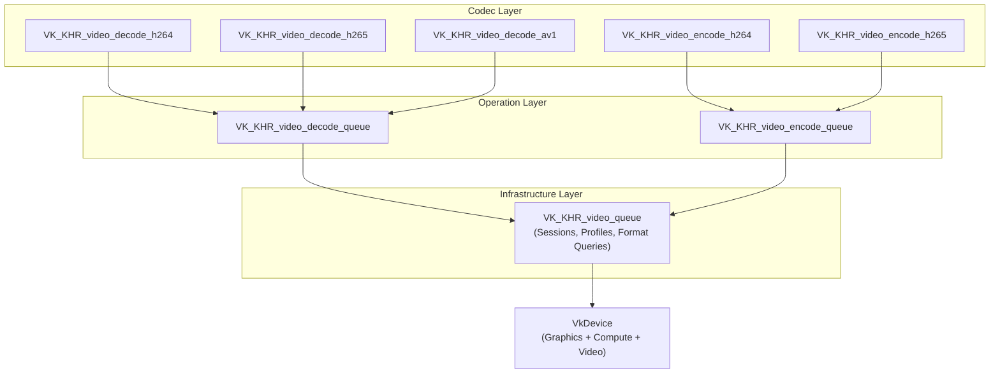
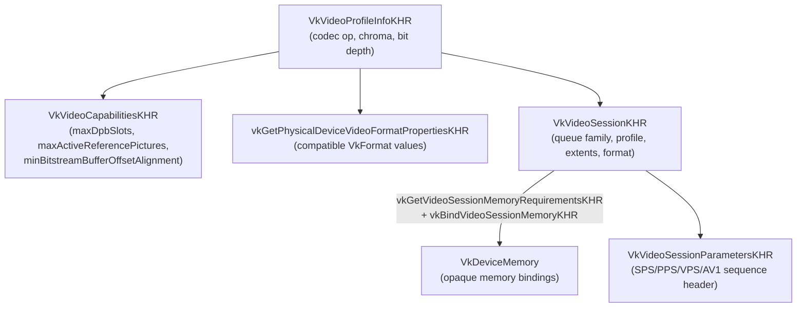
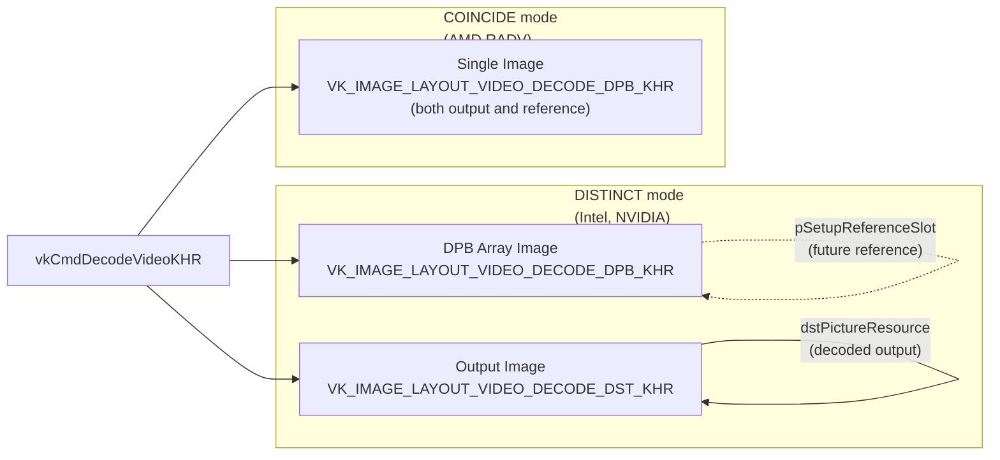
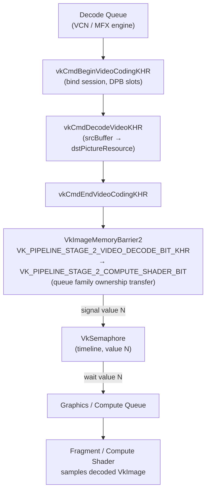
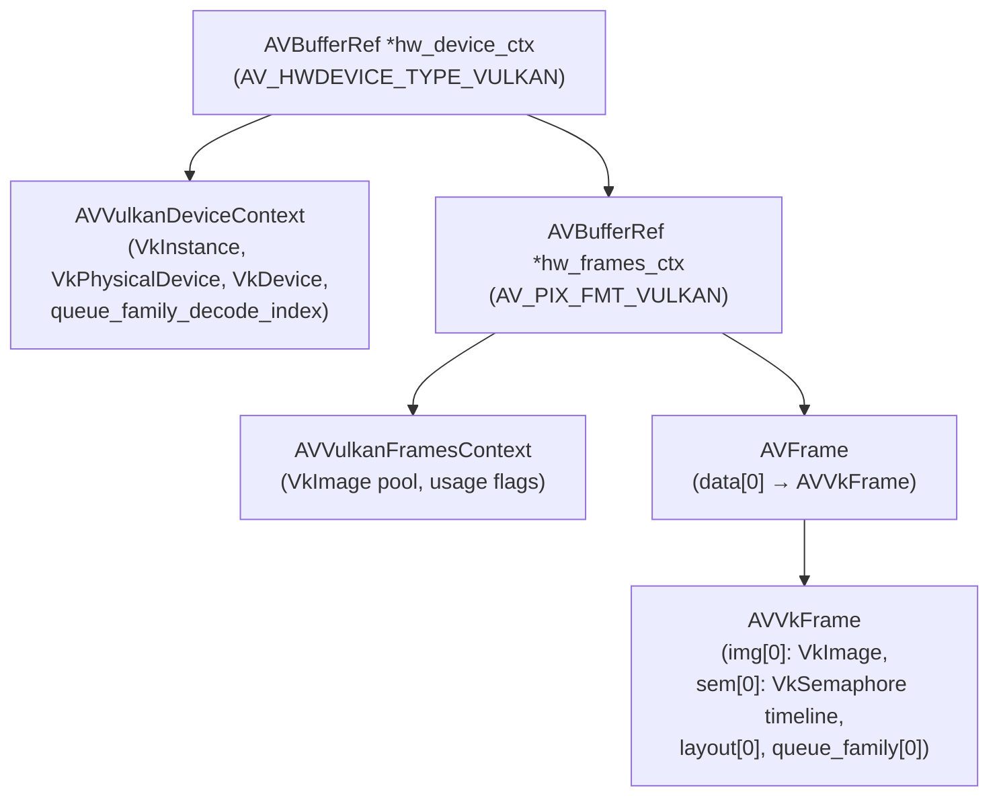
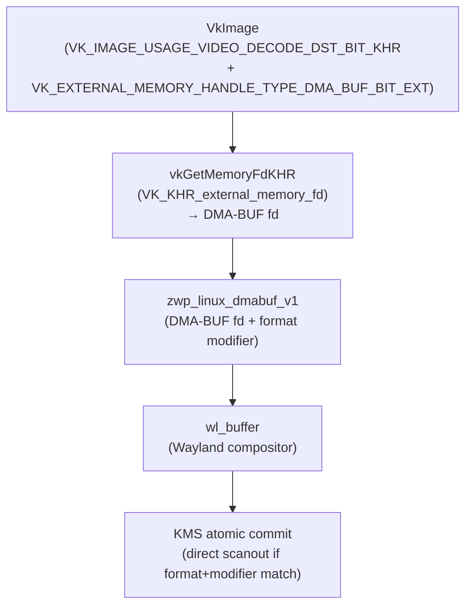
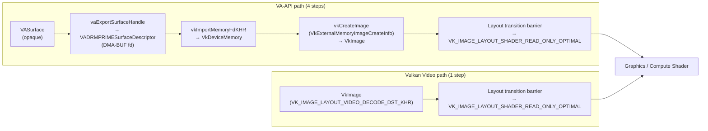

# Chapter 50: Vulkan Video Extensions

**Part VII — Application APIs and Middleware**

**Audiences targeted**: Graphics application developers building portable, GPU-resident video pipelines; browser and web platform engineers who need hardware video acceleration that integrates cleanly with a Vulkan rendering backend (WebGPU, WebGL, Chromium compositing).

Vulkan Video is the Khronos Group's answer to a decade of fragmented hardware video acceleration on Linux. Where VA-API, VDPAU, and platform-specific codec APIs each solved only part of the problem — decode only, specific hardware families, or a fixed C interface disconnected from the GPU command stream — Vulkan Video embeds accelerated encode and decode directly into the Vulkan device model. Decoded frames live in `VkImage` objects; synchronisation uses the same pipeline barriers and semaphores as graphics and compute; and the same `VkDevice` that renders a WebGPU scene can also decode the H.264 video that feeds a texture. This chapter traces the full extension family from specification ratification through Mesa driver implementation and into real-world FFmpeg usage.

---

## Table of Contents

1. [Why Vulkan Video: Fragmentation and the Unified Vision](#1-why-vulkan-video-fragmentation-and-the-unified-vision)
   - [1.1 What is Vulkan Video?](#11-what-is-vulkan-video)
   - [1.2 What is Hardware Video Acceleration?](#12-what-is-hardware-video-acceleration)
   - [1.3 What is the Decoded Picture Buffer (DPB)?](#13-what-is-the-decoded-picture-buffer-dpb)
2. [VK_KHR_video_queue: Sessions, Profiles, and Format Queries](#2-vk_khr_video_queue-sessions-profiles-and-format-queries)
3. [VK_KHR_video_decode_queue: Decode Lifecycle and DPB Management](#3-vk_khr_video_decode_queue-decode-lifecycle-and-dpb-management)
4. [Codec Extensions: H.264, H.265, and AV1 Decode](#4-codec-extensions-h264-h265-and-av1-decode)
5. [VK_KHR_video_encode_queue and H.264/H.265 Encode](#5-vk_khr_video_encode_queue-and-h264h265-encode)
6. [Mesa Implementation: RADV and ANV Vulkan Video](#6-mesa-implementation-radv-and-anv-vulkan-video)
7. [FFmpeg Vulkan hwaccel Integration](#7-ffmpeg-vulkan-hwaccel-integration)
8. [Comparison with VA-API: Tradeoffs and Migration](#8-comparison-with-va-api-tradeoffs-and-migration)
9. [Integrations](#9-integrations)

---

## 1. Why Vulkan Video: Fragmentation and the Unified Vision

Before **Vulkan Video**, Linux hardware video acceleration was a patchwork of at least three independent API families, each with distinct object models, synchronisation semantics, and integration paths into GPU rendering pipelines.

**VA-API** (Video Acceleration API), introduced by Intel in 2009, provides a driver-dispatch layer through **libva**. It handles decode, encode, and video processing via opaque **VASurface** objects that live in driver-managed memory. **VA-API** has broad driver coverage — **RadeonSI**, Intel **iHD**, and others — but its surface model is deliberately opaque. Exporting a decoded **VASurface** to a **VkImage** for shader sampling requires the `VASurfaceAttribMemoryType = VA_SURFACE_ATTRIB_MEM_TYPE_DRM_PRIME_2` export path, a **VADRMPRIMESurfaceDescriptor**, and explicit **DMA-BUF** import on the Vulkan side. Every implementation exposes a slightly different subset of **VAProfile** and **VAEntrypoint** values. Profile naming is not uniform across hardware generations. (Ch26 covers **VA-API** internals in depth.)

**VDPAU** (Video Decode and Presentation API for Unix) was created by NVIDIA in 2008. It covers **H.264**, **MPEG-2**, **VC-1**, and limited encode on NVIDIA hardware, but it is effectively orphaned for open-source purposes. No **Mesa** driver exposes **VDPAU** natively; **FFmpeg** wraps it through a compatibility layer. The API has no path to a Vulkan image without a CPU copy or proprietary interop extensions.

**Codec-specific Linux APIs** proliferated for mobile and embedded SoCs: **V4L2** stateless decoders (`/dev/videoN`), **Media SDK** on Intel, **AMF** on AMD. Each has its own buffer and synchronisation model.

The consequence for a browser engine or game engine is that cross-platform video acceleration requires a matrix of code paths: **VA-API** on AMD/Intel, **VDPAU** or **NVDEC** on NVIDIA, platform-specific paths on Windows and macOS. Synchronisation between decode and graphics requires **DMA-BUF** export/import sequences, explicit fence signalling, and careful queue ownership transfers.

**Vulkan Video**'s answer is to make the video codec hardware a first-class citizen of the Vulkan device. Decoded frames are **VkImage** objects in `VK_IMAGE_LAYOUT_VIDEO_DECODE_DPB_KHR` or `VK_IMAGE_LAYOUT_VIDEO_DECODE_DST_KHR`. The same **VkDevice** owns both the **3D** pipeline and the video decode engine. Synchronisation uses **VkSemaphore** timeline values, **VkEvent**, and pipeline stage flags that are understood by all Vulkan command buffers on all queues.

The extension family is organised in three layers. The shared infrastructure layer, **VK_KHR_video_queue**, provides queue family discovery via **VkQueueFamilyVideoPropertiesKHR**, capability and format queries (**vkGetPhysicalDeviceVideoCapabilitiesKHR**, **vkGetPhysicalDeviceVideoFormatPropertiesKHR**), the **VkVideoSessionKHR** object lifecycle (including opaque memory binding via **vkGetVideoSessionMemoryRequirementsKHR** and **vkBindVideoSessionMemoryKHR**), and the **VkVideoSessionParametersKHR** store for codec headers such as **SPS**, **PPS**, **VPS**, and **AV1** sequence header **OBU**s. On top of this sits the operation layer: **VK_KHR_video_decode_queue** (covering the decode lifecycle via **vkCmdBeginVideoCodingKHR**, **vkCmdDecodeVideoKHR**, and **vkCmdEndVideoCodingKHR**; **DPB** image array management including the distinct versus coincide output modes; reference picture list management; and the **VK_PIPELINE_STAGE_2_VIDEO_DECODE_BIT_KHR** synchronisation model) and **VK_KHR_video_encode_queue** (covering **vkCmdEncodeVideoKHR**, encoder quality levels, and rate control modes including **CBR** and **VBR**). The codec layer then adds per-format structures: **VK_KHR_video_decode_h264** (**H.264**/**AVC** decode with **SPS**/**PPS** session parameters and interlaced content support), **VK_KHR_video_decode_h265** (**H.265**/**HEVC** decode with **VPS**/**SPS**/**PPS** and slice segment handling), **VK_KHR_video_decode_av1** (**AV1** decode with single-sequence-header parameters objects, reference frame mapping, and film grain synthesis), **VK_KHR_video_encode_h264** (including **QP** range control and per-layer rate control via **VkVideoEncodeH264RateControlLayerInfoKHR**), and **VK_KHR_video_encode_h265**.

On the driver side, Section 6 covers the **Mesa** implementation: **RADV** (the **Radeon Vulkan** driver) implements Vulkan Video decode and encode for AMD **GCN** and **RDNA** hardware through the **VCN** (Video Core Next) engine (`src/amd/vulkan/radv_video.c`), with unified AMD video decode shared between **RadeonSI** and **RADV** via `src/amd/common/ac_vcn_*.c`; **ANV** (the Intel Vulkan driver) implements Vulkan Video through the **MFX** decode engine and **VDENC** encode engine (`src/intel/vulkan/anv_video.c`). Section 7 covers **FFmpeg**'s Vulkan **hwaccel** integration, including the **AVVulkanDeviceContext** / **AVVulkanFramesContext** / **AVVkFrame** hardware context hierarchy, internal functions such as **ff_vk_decode_init()**, **ff_vk_decode_frame()**, and **ff_vk_decode_add_slice()**, zero-copy decoded **VkImage** → **Wayland** display paths via **zwp_linux_dmabuf_v1** and **KMS** direct scanout, and command-line usage with `-hwaccel vulkan` and filters such as **scale_vulkan**. Section 8 then compares Vulkan Video with **VA-API** across dimensions of API complexity, rendering pipeline integration (avoiding the **vaExportSurfaceHandle** → **vkImportMemoryFdKHR** round-trip), a June 2026 hardware support matrix covering **RADV**, **ANV**, **NVK**, and the NVIDIA proprietary driver, a zero-copy display path comparison, and a practical migration strategy including use of **FFmpeg** as an integration layer and **Zink**'s experimental **VA-API**-on-Vulkan-Video bridge.

### Specification Timeline

The **Vulkan Video** extension family evolved through a provisional phase before final ratification:

| Extension | Provisional | Ratified | Notes |
|-----------|-------------|----------|-------|
| `VK_KHR_video_queue` | 2021-03 | 2022-12 | Core infrastructure |
| `VK_KHR_video_decode_queue` | 2021-03 | 2022-12 | Decode operations |
| `VK_KHR_video_decode_h264` | 2021-03 | 2022-12 | H.264/AVC decode |
| `VK_KHR_video_decode_h265` | 2021-03 | 2022-12 | H.265/HEVC decode |
| `VK_KHR_video_encode_queue` | 2022-07 | 2023-12 | Encode operations |
| `VK_KHR_video_encode_h264` | 2022-07 | 2023-12 | H.264 encode |
| `VK_KHR_video_encode_h265` | 2022-07 | 2023-12 | H.265 encode |
| `VK_KHR_video_decode_av1` | 2024-01 | 2024-01 | AV1 decode (Vulkan 1.3.277) |
| `VK_KHR_video_encode_av1` | 2024 | 2024 | AV1 encode |

[Source: Khronos Releases AV1 Decode and H.264/H.265 Encode](https://www.khronos.org/blog/khronos-releases-vulkan-video-av1-decode-extension-vulkan-sdk-now-supports-h.264-h.265-encode)

The architecture deliberately separates concerns into three layers: a shared infrastructure layer (**VK_KHR_video_queue**), an operation-type layer (decode or encode queue), and a codec layer (**H.264**, **H.265**, **AV1**). Applications only need to enable the layers relevant to their codec and operation.



### Browser and Web Platform Motivation

For browser engineers the case for **Vulkan Video** is particularly compelling. **Chromium**'s hardware video acceleration on Linux has historically been a source of instability: **VA-API** loaded through `dlopen` into the GPU process, with **LIBVA_DRIVER_NAME** environment variable lookup, driver-specific quirks around **VASurface** export formats, and a surface-sharing model that required careful inter-process **DMA-BUF** passing through the **Mojo** IPC layer. Bugs introduced by vendor **VA-API** driver updates have caused regressions that are difficult to bisect because the **VA-API** driver is not in the **Chromium** tree.

**Vulkan Video** eliminates the **VA-API** driver layer entirely. The same Vulkan device that **Chromium** uses for GPU compositing and **WebGPU** can handle hardware video decode. Decoded **VkImage** frames can be passed directly to the **Chromium** compositor as GPU textures with timeline semaphore synchronisation — no **DMA-BUF** round-trip, no inter-process file descriptor passing. The Khronos Vulkan Video **Chromium** integration design document describes this target architecture in detail. [Source: Vulkan Video Integration into Chromium](https://www.khronos.org/vulkan/chrome-video/vulkan_video_integration.html)

**Firefox** tracks similar interest through Bugzilla. [Source: Mozilla Bug 1753129 — Vulkan Video decode](https://bugzilla.mozilla.org/show_bug.cgi?id=1753129)

### 1.1 What is Vulkan Video?

Vulkan Video is a family of Khronos-ratified extensions that embed GPU-accelerated video encode and decode directly into the Vulkan device model. Where prior Linux video APIs treated hardware codec engines as separate subsystems with their own object models and synchronization primitives, Vulkan Video makes decoded and encoded frames first-class `VkImage` objects subject to the same pipeline barriers, queue ownership transfers, and timeline semaphore signaling used by graphics and compute workloads. The extension family is organized in three layers: a shared infrastructure layer (`VK_KHR_video_queue`) that provides session lifecycle and format query interfaces; an operation layer (`VK_KHR_video_decode_queue` and `VK_KHR_video_encode_queue`) that defines the command buffer operations for decode and encode; and a codec layer (`VK_KHR_video_decode_h264`, `VK_KHR_video_decode_h265`, `VK_KHR_video_decode_av1`, and corresponding encode extensions) that supplies the per-format structures and session parameters. The architecture targets a specific integration goal: a single `VkDevice` can own both the 3D graphics pipeline and the hardware video engine, eliminating the interop layer that prior APIs required when handing decoded frames to a GPU renderer.

### 1.2 What is Hardware Video Acceleration?

Hardware video acceleration refers to the offloading of computationally intensive codec operations to dedicated fixed-function or semi-programmable engines built into a GPU or SoC. Modern codecs such as H.264, H.265/HEVC, and AV1 require entropy decoding, motion compensation, intra prediction, deblocking filters, and (for AV1) film grain synthesis — operations whose memory access patterns and data dependencies are poorly suited to general-purpose CPU execution at resolutions above 1080p60. Hardware decode engines perform these operations in silicon, consuming far less power than a software implementation and enabling decode of 4K and 8K content in real time. On Linux, hardware video engines are exposed through several API families: VA-API through libva, VDPAU for legacy NVIDIA, stateless V4L2 for SoC decoders, and Vulkan Video as the unified modern interface. AMD GPUs expose their video engine as VCN (Video Core Next); Intel exposes MFX and Quick Sync Video; NVIDIA exposes NVDEC and NVENC. Each engine implements a fixed set of codec profiles and levels determined at hardware design time, which driver capability queries must accurately reflect before an application attempts a decode or encode session.

### 1.3 What is the Decoded Picture Buffer (DPB)?

The Decoded Picture Buffer is a required structural element of all modern inter-coded video standards. H.264, H.265, and AV1 allow frames to reference earlier and sometimes later frames for motion compensation: a P-frame predicts from one previously decoded reference, while a B-frame may reference frames on both sides in display order. The DPB is the collection of decoded frames held in memory so that subsequent frames can use them as references. The number of required DPB slots is determined by the codec profile and level: H.264 level 5.1 mandates a maximum DPB size expressed in macroblocks, which at 1080p translates to up to 17 frames. In Vulkan Video, the DPB is represented as an array of `VkImage` objects placed in `VK_IMAGE_LAYOUT_VIDEO_DECODE_DPB_KHR`. Each slot is tracked by the application through `VkVideoReferenceSlotInfoKHR` structures, and the driver maps logical slot indices to physical image array layers. The `VkVideoSessionKHR` is created with a `maxDpbSlots` parameter that must cover the reference distance required by the bitstream. Managing which slots are active, marking slots as long-term references, and evicting expired references is the application's responsibility and is a primary source of complexity in a Vulkan Video integration.

---

## 2. VK_KHR_video_queue: Sessions, Profiles, and Format Queries

`VK_KHR_video_queue` provides everything that is common to both encode and decode: the queue family advertisement mechanism, the session object lifecycle, and the format and capability query functions. It does not itself enable any video operations — it is the foundation on which the operation and codec layers build.

[Source: VK_KHR_video_queue proposal](https://docs.vulkan.org/features/latest/features/proposals/VK_KHR_video_queue.html)

### Queue Family Discovery

Video-capable queue families advertise themselves through `VkQueueFamilyProperties2` extended with `VkQueueFamilyVideoPropertiesKHR`:

```c
/* Application query — vk_video_queue_discovery.c */
VkQueueFamilyVideoPropertiesKHR video_props = {
    .sType = VK_STRUCTURE_TYPE_QUEUE_FAMILY_VIDEO_PROPERTIES_KHR,
};
VkQueueFamilyProperties2 props2 = {
    .sType = VK_STRUCTURE_TYPE_QUEUE_FAMILY_PROPERTIES_2,
    .pNext = &video_props,
};

uint32_t count = 0;
vkGetPhysicalDeviceQueueFamilyProperties2(phys_dev, &count, NULL);
/* allocate props2[count] and call again */
vkGetPhysicalDeviceQueueFamilyProperties2(phys_dev, &count, props2_array);

for (uint32_t i = 0; i < count; i++) {
    VkQueueFlags flags = props2_array[i].queueFamilyProperties.queueFlags;
    if (flags & VK_QUEUE_VIDEO_DECODE_BIT_KHR) {
        /* video_props_array[i].videoCodecOperations tells you which codecs */
    }
    if (flags & VK_QUEUE_VIDEO_ENCODE_BIT_KHR) {
        /* separate queue family, possibly on same index, possibly different */
    }
}
```

On AMD hardware with RADV, `VK_QUEUE_VIDEO_DECODE_BIT_KHR` and `VK_QUEUE_VIDEO_ENCODE_BIT_KHR` are exposed as distinct queue families backed by the VCN (Video Core Next) engine. The `videoCodecOperations` field is a bitmask of `VkVideoCodecOperationFlagBitsKHR` values such as `VK_VIDEO_CODEC_OPERATION_DECODE_H264_BIT_KHR`, `VK_VIDEO_CODEC_OPERATION_DECODE_H265_BIT_KHR`, and `VK_VIDEO_CODEC_OPERATION_DECODE_AV1_BIT_KHR`.

### Capability and Format Queries

Before creating a session, the application queries what the implementation supports for a specific video profile. A video profile bundles the codec operation, the chroma subsampling, the luma/chroma bit depth, and codec-specific parameters:

```c
/* Build a video profile for H.264 baseline decode */
VkVideoDecodeH264ProfileInfoKHR h264_profile = {
    .sType       = VK_STRUCTURE_TYPE_VIDEO_DECODE_H264_PROFILE_INFO_KHR,
    .stdProfileIdc = STD_VIDEO_H264_PROFILE_IDC_BASELINE,
    .pictureLayout = VK_VIDEO_DECODE_H264_PICTURE_LAYOUT_PROGRESSIVE_KHR,
};
VkVideoProfileInfoKHR profile = {
    .sType               = VK_STRUCTURE_TYPE_VIDEO_PROFILE_INFO_KHR,
    .pNext               = &h264_profile,
    .videoCodecOperation = VK_VIDEO_CODEC_OPERATION_DECODE_H264_BIT_KHR,
    .chromaSubsampling   = VK_VIDEO_CHROMA_SUBSAMPLING_420_BIT_KHR,
    .lumaBitDepth        = VK_VIDEO_COMPONENT_BIT_DEPTH_8_BIT_KHR,
    .chromaBitDepth      = VK_VIDEO_COMPONENT_BIT_DEPTH_8_BIT_KHR,
};

VkVideoCapabilitiesKHR caps = {
    .sType = VK_STRUCTURE_TYPE_VIDEO_CAPABILITIES_KHR,
};
vkGetPhysicalDeviceVideoCapabilitiesKHR(phys_dev, &profile, &caps);
/* caps.maxDpbSlots, caps.maxActiveReferencePictures, caps.minBitstreamBufferOffsetAlignment, ... */
```

The format query `vkGetPhysicalDeviceVideoFormatPropertiesKHR` enumerates compatible `VkFormat` values for images used as decode output or DPB references. The caller passes a `VkPhysicalDeviceVideoFormatInfoKHR` that includes the profile list and an image usage mask:

```c
VkVideoProfileListInfoKHR profile_list = {
    .sType        = VK_STRUCTURE_TYPE_VIDEO_PROFILE_LIST_INFO_KHR,
    .profileCount = 1,
    .pProfiles    = &profile,
};
VkPhysicalDeviceVideoFormatInfoKHR fmt_info = {
    .sType      = VK_STRUCTURE_TYPE_PHYSICAL_DEVICE_VIDEO_FORMAT_INFO_KHR,
    .pNext      = &profile_list,
    .imageUsage = VK_IMAGE_USAGE_VIDEO_DECODE_DST_BIT_KHR,
};

uint32_t fmt_count = 0;
vkGetPhysicalDeviceVideoFormatPropertiesKHR(phys_dev, &fmt_info, &fmt_count, NULL);
VkVideoFormatPropertiesKHR *fmt_props = alloca(sizeof(*fmt_props) * fmt_count);
for (uint32_t i = 0; i < fmt_count; i++)
    fmt_props[i].sType = VK_STRUCTURE_TYPE_VIDEO_FORMAT_PROPERTIES_KHR;
vkGetPhysicalDeviceVideoFormatPropertiesKHR(phys_dev, &fmt_info, &fmt_count, fmt_props);
/* fmt_props[0].format is typically VK_FORMAT_G8_B8R8_2PLANE_420_UNORM for 8-bit 4:2:0 */
```

### VkVideoSessionKHR

The video session is the central stateful object. It binds to a single queue family, a single video profile, and fixed image extents and format parameters. This separation of "session state" from "backing images" is deliberate: a single session can operate across many frames if the coded dimensions do not change, while the DPB image array is managed separately by the application.



```c
VkVideoSessionCreateInfoKHR session_ci = {
    .sType                        = VK_STRUCTURE_TYPE_VIDEO_SESSION_CREATE_INFO_KHR,
    .pNext                        = NULL,
    .queueFamilyIndex             = decode_queue_family,
    .pVideoProfile                = &profile,
    .pictureFormat                = VK_FORMAT_G8_B8R8_2PLANE_420_UNORM,
    .maxCodedExtent               = { .width = 1920, .height = 1080 },
    .referencePictureFormat       = VK_FORMAT_G8_B8R8_2PLANE_420_UNORM,
    .maxDpbSlots                  = 17,   /* H.264 level 5.1 maximum */
    .maxActiveReferencePictures   = 16,
    .pStdHeaderVersion            = &std_header_version,
};

VkVideoSessionKHR session;
vkCreateVideoSessionKHR(device, &session_ci, NULL, &session);
```

After creation, the session has memory requirements that must be satisfied before use. The implementation may require multiple opaque memory bindings:

```c
uint32_t req_count = 0;
vkGetVideoSessionMemoryRequirementsKHR(device, session, &req_count, NULL);
VkVideoSessionMemoryRequirementsKHR *reqs = alloca(sizeof(*reqs) * req_count);
/* fill sType for each element, then call again */
vkGetVideoSessionMemoryRequirementsKHR(device, session, &req_count, reqs);

VkBindVideoSessionMemoryInfoKHR *binds = alloca(sizeof(*binds) * req_count);
for (uint32_t i = 0; i < req_count; i++) {
    /* allocate VkDeviceMemory from reqs[i].memoryRequirements, store handle */
    binds[i] = (VkBindVideoSessionMemoryInfoKHR){
        .sType            = VK_STRUCTURE_TYPE_BIND_VIDEO_SESSION_MEMORY_INFO_KHR,
        .memoryBindIndex  = reqs[i].memoryBindIndex,
        .memory           = allocated_memory[i],
        .memoryOffset     = 0,
        .memorySize       = reqs[i].memoryRequirements.size,
    };
}
vkBindVideoSessionMemoryKHR(device, session, req_count, binds);
```

### VkVideoSessionParametersKHR

Codec headers such as H.264 SPS/PPS records, H.265 VPS/SPS/PPS records, or an AV1 sequence header OBU are stored in a `VkVideoSessionParametersKHR` object. This object acts as an immutable key-value store keyed by the header ID fields defined by the codec standard. Because parameters objects are immutable once created, they can be safely consumed by multiple concurrent command buffers without data races. An application creates a new parameters object whenever a new sequence header arrives in the bitstream.

---

## 3. VK_KHR_video_decode_queue: Decode Lifecycle and DPB Management

`VK_KHR_video_decode_queue` adds the commands and structures specific to video decoding. It requires `VK_KHR_synchronization2` for its `VK_PIPELINE_STAGE_2_VIDEO_DECODE_BIT_KHR` pipeline stage.

[Source: VK_KHR_video_decode_queue proposal](https://docs.vulkan.org/features/latest/features/proposals/VK_KHR_video_decode_queue.html)

### Decode Operation Lifecycle

Every decode command lives inside a *video coding scope* delimited by `vkCmdBeginVideoCodingKHR` and `vkCmdEndVideoCodingKHR`. The begin call must enumerate every DPB slot that will be read or written during the scope:

```c
/* Assume dpb_image is a VkImage array, dpb_image_views[] is a VkImageView array */
VkVideoReferenceSlotInfoKHR ref_slots[17];
for (uint32_t i = 0; i < active_ref_count; i++) {
    ref_slots[i] = (VkVideoReferenceSlotInfoKHR){
        .sType    = VK_STRUCTURE_TYPE_VIDEO_REFERENCE_SLOT_INFO_KHR,
        .slotIndex = i,
        .pPictureResource = &(VkVideoPictureResourceInfoKHR){
            .sType            = VK_STRUCTURE_TYPE_VIDEO_PICTURE_RESOURCE_INFO_KHR,
            .codedOffset      = {0, 0},
            .codedExtent      = {width, height},
            .baseArrayLayer   = i,           /* one array layer per DPB slot */
            .imageViewBinding = dpb_image_views[i],
        },
    };
}

VkVideoBeginCodingInfoKHR begin_info = {
    .sType                 = VK_STRUCTURE_TYPE_VIDEO_BEGIN_CODING_INFO_KHR,
    .videoSession          = session,
    .videoSessionParameters = session_params,
    .referenceSlotCount    = active_ref_count,
    .pReferenceSlots       = ref_slots,
};
vkCmdBeginVideoCodingKHR(cmd, &begin_info);

/* First use of session: reset to INITIAL state */
VkVideoCodingControlInfoKHR control = {
    .sType = VK_STRUCTURE_TYPE_VIDEO_CODING_CONTROL_INFO_KHR,
    .flags = VK_VIDEO_CODING_CONTROL_RESET_BIT_KHR,
};
vkCmdControlVideoCodingKHR(cmd, &control);
```

A reset must be issued at least once before the first decode operation. After the reset the session transitions from the INITIAL state to a state where decode commands are valid.

### vkCmdDecodeVideoKHR

The core decode command takes a `VkVideoDecodeInfoKHR` that identifies the input bitstream buffer region, the output picture destination, and the reference picture list:

```c
void vkCmdDecodeVideoKHR(
    VkCommandBuffer          commandBuffer,
    const VkVideoDecodeInfoKHR *pDecodeInfo);

/* VkVideoDecodeInfoKHR — simplified layout */
typedef struct VkVideoDecodeInfoKHR {
    VkStructureType                   sType;
    const void                       *pNext;     /* codec-specific info here */
    VkVideoDecodeFlagsKHR             flags;
    VkBuffer                          srcBuffer;
    VkDeviceSize                      srcBufferOffset;
    VkDeviceSize                      srcBufferRange;
    VkVideoPictureResourceInfoKHR     dstPictureResource;
    const VkVideoReferenceSlotInfoKHR *pSetupReferenceSlot;  /* DPB activation */
    uint32_t                          referenceSlotCount;
    const VkVideoReferenceSlotInfoKHR *pReferenceSlots;      /* active refs */
} VkVideoDecodeInfoKHR;
```

The `srcBuffer` must have been created with `VK_BUFFER_USAGE_VIDEO_DECODE_SRC_BIT_KHR`. The application is responsible for uploading the compressed bitstream data (a single access unit or the equivalent codec unit) into this buffer before submitting the command buffer.

### DPB Image Arrays and Output Modes

Decoded Picture Buffer management is one of the most complex aspects of Vulkan Video. Each DPB slot corresponds to one or more image layers that the implementation uses as reference frames for subsequent decode operations.

The `VkVideoDecodeCapabilitiesKHR` structure — retrieved by extending `VkVideoCapabilitiesKHR` with it — exposes two mutually exclusive flags that describe how an implementation handles the relationship between the decoded output picture and the DPB reconstructed picture:

**`VK_VIDEO_DECODE_CAPABILITY_DPB_AND_OUTPUT_DISTINCT_BIT_KHR`** — The decode output picture (`dstPictureResource`) and the reconstructed reference picture (`pSetupReferenceSlot`) must be *distinct* `VkImage` resources. The decoded output image uses layout `VK_IMAGE_LAYOUT_VIDEO_DECODE_DST_KHR`; the DPB image uses `VK_IMAGE_LAYOUT_VIDEO_DECODE_DPB_KHR`. This is the more common mode on Intel and NVIDIA hardware.

**`VK_VIDEO_DECODE_CAPABILITY_DPB_AND_OUTPUT_COINCIDE_BIT_KHR`** — The output and reconstructed picture must refer to the *same* `VkImage` resource, both in layout `VK_IMAGE_LAYOUT_VIDEO_DECODE_DPB_KHR`. This mode eliminates one image copy but constrains image lifetime. AMD RADV historically exposed this mode.

A portable application queries both flags and prepares image pools for each mode:



```c
VkVideoDecodeCapabilitiesKHR decode_caps = {
    .sType = VK_STRUCTURE_TYPE_VIDEO_DECODE_CAPABILITIES_KHR,
};
VkVideoCapabilitiesKHR caps = {
    .sType = VK_STRUCTURE_TYPE_VIDEO_CAPABILITIES_KHR,
    .pNext = &decode_caps,
};
vkGetPhysicalDeviceVideoCapabilitiesKHR(phys_dev, &profile, &caps);

bool distinct_dpb = (decode_caps.flags &
    VK_VIDEO_DECODE_CAPABILITY_DPB_AND_OUTPUT_DISTINCT_BIT_KHR) != 0;
```

In distinct mode, the typical DPB setup uses a single 2D array image with `maxDpbSlots` layers for the reference pool, plus a separate output image for the frame that will be consumed by the render pipeline.

### Reference Picture List Management

When calling `vkCmdDecodeVideoKHR`, `pReferenceSlots` lists all active reference pictures in terms of DPB slot indices. Each element associates a `slotIndex` with a `VkVideoPictureResourceInfoKHR` that points to the image layer holding that reference. For H.264, the codec-specific `pNext` chain on each slot contains a `VkVideoDecodeH264DpbSlotInfoKHR` that carries the `StdVideoDecodeH264ReferenceInfo` with the frame/field flags and POC values.

The `pSetupReferenceSlot` element identifies the DPB slot where the newly decoded picture will be stored as a future reference. Whether this actually activates the slot as a reference for subsequent operations is determined by codec-specific semantics (for H.264: whether the slice header marks the picture as a reference).

After the decode scope ends, the application is responsible for tracking which DPB slots contain valid reference pictures and managing their lifetimes. The implementation maintains the pixel data; the application maintains the mapping from slot index to codec-level reference information.

### Synchronisation Model

Vulkan Video operations participate in the standard Vulkan synchronisation framework. The `VK_PIPELINE_STAGE_2_VIDEO_DECODE_BIT_KHR` pipeline stage flag (defined by `VK_KHR_synchronization2`) allows pipeline barriers and semaphore wait/signal operations to precisely target the video decode engine.

A typical synchronisation sequence for feeding a decoded frame into a subsequent compute shader looks like:

```c
/* After recording vkCmdEndVideoCodingKHR: transition the output image */
VkImageMemoryBarrier2 barrier = {
    .sType            = VK_STRUCTURE_TYPE_IMAGE_MEMORY_BARRIER_2,
    .srcStageMask     = VK_PIPELINE_STAGE_2_VIDEO_DECODE_BIT_KHR,
    .srcAccessMask    = VK_ACCESS_2_VIDEO_DECODE_WRITE_BIT_KHR,
    .dstStageMask     = VK_PIPELINE_STAGE_2_COMPUTE_SHADER_BIT,
    .dstAccessMask    = VK_ACCESS_2_SHADER_READ_BIT,
    .oldLayout        = VK_IMAGE_LAYOUT_VIDEO_DECODE_DST_KHR,
    .newLayout        = VK_IMAGE_LAYOUT_SHADER_READ_ONLY_OPTIMAL,
    .srcQueueFamilyIndex = decode_queue_family,
    .dstQueueFamilyIndex = compute_queue_family,
    .image            = decoded_image,
    .subresourceRange = { VK_IMAGE_ASPECT_COLOR_BIT, 0, 1, 0, 1 },
};
VkDependencyInfo dep = {
    .sType                   = VK_STRUCTURE_TYPE_DEPENDENCY_INFO,
    .imageMemoryBarrierCount = 1,
    .pImageMemoryBarriers    = &barrier,
};
vkCmdPipelineBarrier2(cmd, &dep);
```

If the decode and compute/graphics operations live on different queue families (which is common — the VCN engine on AMD is a separate hardware block from the graphics shader array), the barrier must perform a queue family ownership transfer. The release operation is recorded in the decode command buffer; the acquire operation is recorded in the graphics/compute command buffer. A `VkSemaphore` signal/wait pair ensures ordering between the two submissions.

For multi-frame streaming pipelines, timeline semaphores are preferred over binary semaphores. The decode queue signals a timeline semaphore at value `N` after completing frame `N`; the graphics queue waits at value `N` before beginning to process frame `N` as a texture. This allows the decode queue to work `k` frames ahead of the display queue without requiring per-frame binary semaphore allocation.



---

## 4. Codec Extensions: H.264, H.265, and AV1 Decode

Each codec extension layers additional structures onto `VkVideoDecodeInfoKHR` via the `pNext` chain and onto the reference slot info structures. The codec-level parameter structures reference types defined in the Vulkan Video codec-specific headers (`vulkan_video_codec_h264std_decode.h`, `vulkan_video_codec_h265std_decode.h`, `vulkan_video_codec_av1std_decode.h`).

### VK_KHR_video_decode_h264

H.264 is the most widely deployed codec and the most mature Vulkan Video extension (ratified December 2022). [Source: Khronos Finalizes Vulkan Video H.264/H.265 Decode](https://www.khronos.org/blog/khronos-finalizes-vulkan-video-extensions-for-accelerated-h.264-h.265-decode)

**Session parameters** store SPS and PPS records keyed by their standard-defined IDs:

```c
/* Populate from parsed H.264 bitstream */
StdVideoH264SequenceParameterSet sps = { /* ... parsed values ... */ };
StdVideoH264PictureParameterSet  pps = { /* ... parsed values ... */ };

VkVideoDecodeH264SessionParametersAddInfoKHR add_info = {
    .sType        = VK_STRUCTURE_TYPE_VIDEO_DECODE_H264_SESSION_PARAMETERS_ADD_INFO_KHR,
    .stdSPSCount  = 1,
    .pStdSPSs     = &sps,
    .stdPPSCount  = 1,
    .pStdPPSs     = &pps,
};
VkVideoDecodeH264SessionParametersCreateInfoKHR h264_params_ci = {
    .sType             = VK_STRUCTURE_TYPE_VIDEO_DECODE_H264_SESSION_PARAMETERS_CREATE_INFO_KHR,
    .maxStdSPSCount    = 32,
    .maxStdPPSCount    = 256,
    .pParametersAddInfo = &add_info,
};
VkVideoSessionParametersCreateInfoKHR params_ci = {
    .sType                 = VK_STRUCTURE_TYPE_VIDEO_SESSION_PARAMETERS_CREATE_INFO_KHR,
    .pNext                 = &h264_params_ci,
    .videoSession          = session,
};
vkCreateVideoSessionParametersKHR(device, &params_ci, NULL, &session_params);
```

**Per-frame decode** attaches `VkVideoDecodeH264PictureInfoKHR` to `VkVideoDecodeInfoKHR.pNext`:

```c
VkVideoDecodeH264PictureInfoKHR h264_pic = {
    .sType          = VK_STRUCTURE_TYPE_VIDEO_DECODE_H264_PICTURE_INFO_KHR,
    .pStdPictureInfo = &std_pic_info,   /* StdVideoDecodeH264PictureInfo from bitstream parse */
    .sliceCount     = slice_count,
    .pSliceOffsets  = slice_offsets,    /* byte offsets within srcBuffer region */
};
/* Set h264_pic as pNext on VkVideoDecodeInfoKHR */
```

**Interlaced content** is handled through the `pictureLayout` field of `VkVideoDecodeH264ProfileInfoKHR`. The value `VK_VIDEO_DECODE_H264_PICTURE_LAYOUT_INTERLACED_INTERLEAVED_LINES_BIT_KHR` stores top and bottom field lines interleaved within a single image; `VK_VIDEO_DECODE_H264_PICTURE_LAYOUT_INTERLACED_SEPARATE_PLANES_BIT_KHR` uses the top half of the image for the top field and the bottom half for the bottom field.

### VK_KHR_video_decode_h265

The H.265/HEVC extension follows the same pattern as H.264 but adds VPS (Video Parameter Set) records to the parameters object alongside SPS and PPS. The session parameters create info is `VkVideoDecodeH265SessionParametersCreateInfoKHR` with `maxStdVPSCount`, `maxStdSPSCount`, and `maxStdPPSCount`. Per-frame decode uses `VkVideoDecodeH265PictureInfoKHR` with a `pSliceSegmentOffsets` array (H.265 uses slice segments rather than slices). The DPB slot info is `VkVideoDecodeH265DpbSlotInfoKHR` containing `StdVideoDecodeH265ReferenceInfo`.

H.265 introduces the concept of layer indices for multi-layer streams and the RPL (Reference Picture List) with up to 15 entries per list in the HEVC specification — all of which flow through the `pReferenceSlots` array with corresponding `VkVideoDecodeH265DpbSlotInfoKHR` elements.

### VK_KHR_video_decode_av1

AV1 decode was ratified in January 2024 (Vulkan 1.3.277) and is architecturally distinct from the H.264/H.265 extensions in several respects. [Source: VK_KHR_video_decode_av1 proposal](https://docs.vulkan.org/features/latest/features/proposals/VK_KHR_video_decode_av1.html)

**Session parameters** store a single AV1 sequence header per parameters object. AV1 bitstreams do not use parameter set identifiers the way H.264 does, so the extension mandates creating a new `VkVideoSessionParametersKHR` whenever a new sequence header OBU is encountered:

```c
VkVideoDecodeAV1SessionParametersCreateInfoKHR av1_params_ci = {
    .sType        = VK_STRUCTURE_TYPE_VIDEO_DECODE_AV1_SESSION_PARAMETERS_CREATE_INFO_KHR,
    .pStdSequenceHeader = &av1_seq_hdr,  /* StdVideoAV1SequenceHeader from bitstream */
};
```

**Reference frame mapping** is a key design difference. AV1 defines seven virtual reference frame slots (LAST_FRAME through ALTREF_FRAME) plus INTRA_FRAME. The Vulkan AV1 extension bypasses AV1's internal Virtual Buffer Index abstraction and instead provides a direct mapping from each AV1 reference name to an active DPB slot index. Multiple AV1 reference names may map to the same DPB slot (when the codec updates only a subset of reference frames).

**Film grain** support is integrated into the video profile rather than as a separate capability bit. When `VkVideoDecodeAV1ProfileInfoKHR.filmGrainSupport` is enabled, the implementation synthesises and applies film grain noise as part of the decode operation. Film grain typically requires distinct DPB and output images because the film grain is added to the output but not to the DPB reference.

**Bitstream format**: The bitstream buffer for AV1 decode must contain one or more *Frame OBUs*, each consisting of a frame header OBU followed by a tile group OBU, with all tiles for the frame included. Show Frame and Key Frame OBUs are represented as Frame OBUs for purposes of this extension.

---

## 5. VK_KHR_video_encode_queue and H.264/H.265 Encode

Video encode follows a symmetrical structure to decode: `VK_KHR_video_encode_queue` provides the common encode infrastructure, and `VK_KHR_video_encode_h264` / `VK_KHR_video_encode_h265` add codec-specific structures. Both encode extensions were ratified in December 2023. [Source: Khronos Finalizes Vulkan Video H.264/H.265 Encode](https://www.khronos.org/blog/khronos-finalizes-vulkan-video-extensions-for-accelerated-h.264-and-h.265-encode)

### vkCmdEncodeVideoKHR

The encode command is structurally parallel to the decode command:

```c
void vkCmdEncodeVideoKHR(
    VkCommandBuffer             commandBuffer,
    const VkVideoEncodeInfoKHR *pEncodeInfo);

typedef struct VkVideoEncodeInfoKHR {
    VkStructureType                   sType;
    const void                       *pNext;     /* codec-specific info */
    VkVideoEncodeFlagsKHR             flags;
    VkBuffer                          dstBuffer;
    VkDeviceSize                      dstBufferOffset;
    VkDeviceSize                      dstBufferRange;
    VkVideoPictureResourceInfoKHR     srcPictureResource;  /* input frame */
    const VkVideoReferenceSlotInfoKHR *pSetupReferenceSlot;
    uint32_t                          referenceSlotCount;
    const VkVideoReferenceSlotInfoKHR *pReferenceSlots;
    uint32_t                          precedingExternallyEncodedBytes;
} VkVideoEncodeInfoKHR;
```

The `dstBuffer` receives the compressed bitstream output and must have `VK_BUFFER_USAGE_VIDEO_ENCODE_DST_BIT_KHR`. After submission the application reads back the bitstream via result status queries.

### Quality Levels

Implementations expose encoder preset quality levels indexed from 0 to `maxQualityLevels - 1`. Level 0 is the default and applies implicitly at session creation. The quality level can be changed during a session via `vkCmdControlVideoCodingKHR` with `VK_VIDEO_CODING_CONTROL_ENCODE_QUALITY_LEVEL_BIT_KHR`. The implementation is free to define its own semantics for quality levels — they are encoder presets, not QP values.

Properties for a specific quality level are retrieved with `vkGetPhysicalDeviceVideoEncodeQualityLevelPropertiesKHR`, which returns default rate control settings appropriate for that quality level.

### Rate Control Modes

`VkVideoEncodeRateControlInfoKHR` specifies the rate control algorithm and its parameters. The rate control mode is selected from `VkVideoEncodeRateControlModeFlagBitsKHR`:

- `VK_VIDEO_ENCODE_RATE_CONTROL_MODE_DEFAULT_KHR`: Implementation-defined behaviour.
- `VK_VIDEO_ENCODE_RATE_CONTROL_MODE_DISABLED_BIT_KHR`: No rate control; the application sets QP values directly per picture.
- `VK_VIDEO_ENCODE_RATE_CONTROL_MODE_CBR_BIT_KHR`: Constant Bitrate. The implementation varies QP to maintain a target bitrate within a virtual buffer window measured in milliseconds (`vbvBufferSize`).
- `VK_VIDEO_ENCODE_RATE_CONTROL_MODE_VBR_BIT_KHR`: Variable Bitrate. The implementation may use lower bitrate on easy content and spike to a maximum on complex content, targeting an average bitrate.

### H.264 Encode: QP Ranges and Rate Control

The H.264 encode extension exposes implementation limits through `VkVideoEncodeH264CapabilitiesKHR`, which includes `minQp` and `maxQp` fields constraining the valid range of quantisation parameters. The flag `VK_VIDEO_ENCODE_H264_CAPABILITY_PER_PICTURE_TYPE_MIN_MAX_QP_BIT_KHR` indicates whether different QP bounds can be applied to I, P, and B frames separately.

Per-layer rate control configuration uses `VkVideoEncodeH264RateControlLayerInfoKHR`:

```c
VkVideoEncodeH264QpKHR min_qp = { .qpI = 18, .qpP = 20, .qpB = 22 };
VkVideoEncodeH264QpKHR max_qp = { .qpI = 36, .qpP = 38, .qpB = 40 };

VkVideoEncodeH264RateControlLayerInfoKHR h264_rc_layer = {
    .sType         = VK_STRUCTURE_TYPE_VIDEO_ENCODE_H264_RATE_CONTROL_LAYER_INFO_KHR,
    .useMinQp      = VK_TRUE,
    .minQp         = min_qp,
    .useMaxQp      = VK_TRUE,
    .maxQp         = max_qp,
    .useMaxFrameSize = VK_FALSE,
};
VkVideoEncodeRateControlLayerInfoKHR rc_layer = {
    .sType       = VK_STRUCTURE_TYPE_VIDEO_ENCODE_RATE_CONTROL_LAYER_INFO_KHR,
    .pNext       = &h264_rc_layer,
    .averageBitrate = 4000000,   /* 4 Mbit/s */
    .maxBitrate     = 6000000,
    .frameRateNumerator   = 30,
    .frameRateDenominator = 1,
};
VkVideoEncodeH264RateControlInfoKHR h264_rc = {
    .sType              = VK_STRUCTURE_TYPE_VIDEO_ENCODE_H264_RATE_CONTROL_INFO_KHR,
    .gopFrameCount      = 120,
    .idrPeriod          = 120,
    .consecutiveBFrameCount = 2,
    .temporalLayerCount = 1,
};
VkVideoEncodeRateControlInfoKHR rc = {
    .sType          = VK_STRUCTURE_TYPE_VIDEO_ENCODE_RATE_CONTROL_INFO_KHR,
    .pNext          = &h264_rc,
    .rateControlMode = VK_VIDEO_ENCODE_RATE_CONTROL_MODE_CBR_BIT_KHR,
    .layerCount      = 1,
    .pLayers         = &rc_layer,
    .virtualBufferSizeInMs     = 1000,
    .initialVirtualBufferSizeInMs = 0,
};
```

H.265 encode follows the same model with `VkVideoEncodeH265CapabilitiesKHR`, `VkVideoEncodeH265RateControlInfoKHR`, and `VkVideoEncodeH265RateControlLayerInfoKHR`, with the distinction that QP values for H.265 are `VkVideoEncodeH265QpKHR` with separate `qpI`, `qpP`, `qpB` fields.

---

## 6. Mesa Implementation: RADV and ANV Vulkan Video

### RADV: AMD Vulkan Video on VCN Hardware

The RADV (Radeon Vulkan) driver in Mesa implements Vulkan Video decode and encode for AMD Graphics Core Next and RDNA GPUs through their VCN (Video Core Next) media engine. The primary implementation file is `src/amd/vulkan/radv_video.c` in the Mesa source tree.

[Source: Mesa RADV Vulkan Video documentation](https://docs.mesa3d.org/drivers/radv.html)

AMD's VCN engine generations correspond to hardware families:

| VCN Generation | GPU Family | Notable Codecs |
|----------------|------------|----------------|
| VCN 1.x | RDNA 1 (Navi 1x), Vega | H.264, H.265, VP9 decode |
| VCN 2.x | RDNA 1 (Navi 1x), Arcturus, Van Gogh | H.264, H.265, VP9 decode; H.264, H.265 encode |
| VCN 3.x | RDNA 2 (Navi 2x) | H.264, H.265, VP9 decode; H.264, H.265 encode |
| VCN 4.x | RDNA 3 (Navi 3x), RDNA 4 | H.264, H.265, AV1 decode; H.264, H.265, AV1 encode |

As of Mesa 25.0, Vulkan Video decode and encode are enabled by default for VCN 2.x and VCN 3.x hardware, following successful passage of the Vulkan CTS conformance tests. This required AMD to submit updated firmware to the linux-firmware.git repository. VCN 1.x support requires the `RADV_PERFTEST=video_decode` environment variable to opt in, reflecting that it has not completed full CTS conformance at the time of writing.

In Mesa 26.1, AMD unified the video decode implementation so that RadeonSI (OpenGL/Gallium) and RADV share the same underlying VCN command buffer generation code through a common AMD video library (`src/amd/common/ac_vcn_*.c`), reducing code duplication and ensuring decode parity between the VA-API and Vulkan paths. [Source: AMD Video Decode Unified in Mesa 26.1](https://www.techedubyte.com/amd-video-decode-unified-mesa-26-1-radeonsi-radv-vulkan/)

AV1 decode on RADV was introduced in Mesa 24.1 for VCN 4.x hardware and is in active development for VCN 3.x. [Source: RADV Vulkan Video AV1 Decode](https://www.phoronix.com/news/RADV-VK_KHR_video_decode_av1)

The RADV decode pipeline submits commands directly to the UVD/VCN multimedia ring in the kernel DRM driver (amdgpu), bypassing the 3D ring entirely. This means the video decode queue is genuinely parallel to graphics — a long GOP decode does not stall rendering. The firmware running on VCN handles reference picture DMA, deblocking, and de-tiling internally; the kernel and driver only need to submit the compressed bitstream and DPB surface addresses.

Mesa 25.3.5 refined H.264 reference management in RADV, correcting edge cases in frame number wrapping and DPB eviction order that caused corruption on certain content. [Source: Mesa 25.3.5 RADV fixes](https://en.linuxadictos.com/table-25-3-5-reinforces-vulkan-video-in-radv-corrects-h-264-reference-management-and-temporarily-disables-video-encoding-in-intel-anv/)

### ANV: Intel Vulkan Video on MFX and VDENC

The Intel ANV (Anv Vulkan) driver implements Vulkan Video through Intel's MFX (Media Fixed Function) decode engine and VDENC (Video Encode) engine. The primary implementation file is `src/intel/vulkan/anv_video.c`.

Intel's video hardware support in ANV covers:

| Engine | Hardware | Codecs |
|--------|----------|--------|
| MFX / VDBox | Gen 8–12 (Skylake to Tiger Lake) | H.264, H.265 decode |
| VD-BOX + SFC | Gen 12+ (Xe, Arc) | H.264, H.265 decode; AV1 decode (in development) |
| VDENC | Gen 9+ | H.264, H.265 encode |

H.264 and H.265 decode via ANV became available in Mesa 23.x. H.264 and H.265 encode support was added in 2024. AV1 decode patches for ANV were submitted in late 2024 and were in review. Note: Intel ANV encode was temporarily disabled in Mesa 25.3.5 while a correctness issue was investigated — check the current Mesa release notes for the current status. [Source: Mesa 25.3.5 ANV encode status](https://en.linuxadictos.com/table-25-3-5-reinforces-vulkan-video-in-radv-corrects-h-264-reference-management-and-temporarily-disables-video-encoding-in-intel-anv/)

The Intel MFX engine uses a multi-frame batched submission model where several commands must be submitted in a strict sequence: HCP_PIPE_MODE_SELECT, HCP_SURFACE_STATE, HCP_PIPE_BUF_ADDR_STATE, HCP_BSD_OBJECT, etc. The ANV driver translates `vkCmdDecodeVideoKHR` into this command stream.

### Enabling Vulkan Video in Mesa

Vulkan Video support in Mesa drivers can be verified and optionally forced on or off through environment variables:

```bash
# Check what Vulkan Video extensions a device exposes
vulkaninfo --summary | grep -i video

# RADV: force-enable video on VCN1 hardware (not CTS-conformant, use for testing)
RADV_PERFTEST=video_decode,video_encode vulkaninfo

# Check actual Mesa driver for a device (useful when multiple GPUs are present)
VK_ICD_FILENAMES=/usr/share/vulkan/icd.d/radeon_icd.x86_64.json vulkaninfo

# Run FFmpeg with Vulkan hwaccel and verbose output for debugging
RADV_DEBUG=info ffmpeg -v debug -hwaccel vulkan -i test.mp4 -f null -
```

The Vulkan CTS (Conformance Test Suite) includes a `dEQP-VK.video.*` test group that covers every codec extension. Running the full video CTS on a new hardware generation is typically a prerequisite before enabling Vulkan Video by default in a Mesa release:

```bash
# Run Vulkan Video CTS for H.264 decode (requires CTS build)
deqp-vk -n dEQP-VK.video.decode.h264 --deqp-log-filename=h264_decode_results.qpa
```

---

## 7. FFmpeg Vulkan hwaccel Integration

FFmpeg has first-class support for Vulkan Video through its hardware acceleration framework. The Vulkan hwaccel backend is particularly significant because it is the first media framework backend that is simultaneously vendor-neutral, platform-portable, and GPU-resident without any CPU bounce copies.

[Source: FFmpeg vulkan_decode.c](https://ffmpeg.org/doxygen/7.0/vulkan__decode_8c_source.html)

### Hardware Context Hierarchy

FFmpeg's Vulkan hardware context is structured in three layers:



**`AVBufferRef *hw_device_ctx`** with type `AV_HWDEVICE_TYPE_VULKAN` — owns the `VkInstance`, `VkPhysicalDevice`, and `VkDevice`. Applications can create this from an existing Vulkan instance:

```c
AVBufferRef *hw_device_ctx;
AVHWDeviceContext *device_ctx;
AVVulkanDeviceContext *vk_device_ctx;

/* Create from existing Vulkan device */
av_hwdevice_ctx_alloc(&hw_device_ctx, AV_HWDEVICE_TYPE_VULKAN);
device_ctx = (AVHWDeviceContext *)hw_device_ctx->data;
vk_device_ctx = (AVVulkanDeviceContext *)device_ctx->hwctx;
vk_device_ctx->inst           = vk_instance;
vk_device_ctx->phys_dev       = vk_physical_device;
vk_device_ctx->act_dev        = vk_device;
vk_device_ctx->queue_family_decode_index = decode_queue_family;
av_hwdevice_ctx_init(hw_device_ctx);
```

**`AVBufferRef *hw_frames_ctx`** with format `AV_PIX_FMT_VULKAN` — manages the pool of `VkImage` objects used for decoded frames. The frame context is configured through `AVHWFramesContext` with a pointer to `AVVulkanFramesContext`:

```c
AVBufferRef *hw_frames_ctx = av_hwframe_ctx_alloc(hw_device_ctx);
AVHWFramesContext *frames_ctx = (AVHWFramesContext *)hw_frames_ctx->data;
AVVulkanFramesContext *vk_frames = (AVVulkanFramesContext *)frames_ctx->hwctx;

frames_ctx->format    = AV_PIX_FMT_VULKAN;
frames_ctx->sw_format = AV_PIX_FMT_NV12;   /* 8-bit 4:2:0 */
frames_ctx->width     = coded_width;
frames_ctx->height    = coded_height;
frames_ctx->initial_pool_size = 8;          /* number of frames to pre-allocate */

vk_frames->usage = VK_IMAGE_USAGE_VIDEO_DECODE_DST_BIT_KHR |
                   VK_IMAGE_USAGE_SAMPLED_BIT |
                   VK_IMAGE_USAGE_TRANSFER_SRC_BIT;
av_hwframe_ctx_init(hw_frames_ctx);
```

**`AVFrame`** with `data[0]` pointing to an `AVVkFrame` — the per-frame Vulkan image handle:

```c
/* Inside a decode callback or frame processing function */
AVVkFrame *vk_frame = (AVVkFrame *)av_frame->data[0];

/* vk_frame->img[0] is the VkImage (may be multi-plane; planes share a single image) */
/* vk_frame->sem[0] is a VkSemaphore (timeline semaphore) */
/* vk_frame->sem_value[0] is the timeline semaphore value to wait on before reading */
/* vk_frame->layout[0] is the current VkImageLayout */
/* vk_frame->queue_family[0] is the owning queue family */
```

The `AVVkFrame` synchronisation contract is important: the frame's timeline semaphore must be waited on before accessing the image, and after the external use is complete the semaphore must be signalled with an incremented value so FFmpeg can safely recycle the frame into the pool.

### Decoder Initialisation and Frame Pool Management

The internal FFmpeg Vulkan decode context (`FFVulkanDecodeContext`) manages the video session, session parameters, DPB images, and a slice data staging buffer. The key internal functions are:

- `ff_vk_decode_init()` — creates the `VkVideoSessionKHR`, allocates its memory bindings, and creates the initial session parameters object.
- `ff_vk_frame_params()` — queries `vkGetPhysicalDeviceVideoFormatPropertiesKHR` to select the optimal pixel format and configures the `AVVulkanFramesContext` accordingly.
- `ff_vk_decode_prepare_frame()` — acquires an `AVVkFrame` from the pool, creates or retrieves the `VkImageView` for the DPB slot, and transitions the image layout.
- `ff_vk_decode_add_slice()` — accumulates slice bitstream data into a staging buffer with proper alignment as reported by `caps.minBitstreamBufferOffsetAlignment`.
- `ff_vk_decode_frame()` — records the command buffer: image barriers, `vkCmdBeginVideoCodingKHR`, `vkCmdDecodeVideoKHR`, `vkCmdEndVideoCodingKHR`, and submission.

### Zero-Copy Decoder → Wayland Display Path

The zero-copy pipeline from decoded `VkImage` to Wayland compositor via linux-dmabuf proceeds as follows:

1. Decode into `VkImage` with `VK_IMAGE_USAGE_VIDEO_DECODE_DST_BIT_KHR` and `VK_EXTERNAL_MEMORY_HANDLE_TYPE_DMA_BUF_BIT_EXT` memory.
2. Export the `VkDeviceMemory` to a DMA-BUF file descriptor via `vkGetMemoryFdKHR` (`VK_KHR_external_memory_fd`).
3. Submit the DMA-BUF to the Wayland compositor via the `zwp_linux_dmabuf_v1` protocol (Ch20).
4. The compositor imports the DMA-BUF as a `wl_buffer` and may directly scanout the decoded frame via KMS atomic commit if the format and tiling are compatible with the display engine.



The critical requirement is that the decoded `VkImage` uses a format and modifier supported by both the Vulkan implementation and the KMS display engine. The application queries DRM format modifiers via `vkGetPhysicalDeviceImageFormatProperties2` with `VkImageDrmFormatModifierListCreateInfoEXT` and cross-references against the modifiers advertised by the Wayland compositor via `zwp_linux_dmabuf_v1::modifier` events.

For YCbCr content the pipeline typically involves one additional step: a Vulkan compute shader or graphics pass to convert from the native YCbCr `VkFormat` (e.g., `VK_FORMAT_G8_B8R8_2PLANE_420_UNORM`) to an RGB format suitable for display or compositing. FFmpeg provides the `scale_vulkan` and `overlay_vulkan` video filters for this purpose, keeping the entire conversion on the GPU.

Synchronisation between the decode queue and the subsequent graphics/compute queue uses a `VkSemaphore` (preferably timeline). The `AVVkFrame` semaphore mechanism described above maps directly to this pattern: FFmpeg signals the frame's timeline semaphore after decode completes, and the consumer waits on it before sampling the image.

### FFmpeg Command-Line Usage

FFmpeg exposes its Vulkan Video backend through the `-hwaccel vulkan` flag. The following example decodes an H.264 file entirely on the GPU, applies a GPU-resident scale filter, and outputs to a Vulkan-backed window:

```bash
# List Vulkan devices visible to FFmpeg
ffmpeg -v verbose -init_hw_device vulkan=gpu:0 -f lavfi -i nullsrc -t 0.1 -f null -

# Hardware-accelerated H.264 decode with Vulkan, scale on GPU, display
ffmpeg -hwaccel vulkan -hwaccel_output_format vulkan \
       -i input.mp4 \
       -vf "scale_vulkan=1280:720" \
       -f sdl2 output
```

The `-hwaccel_output_format vulkan` flag keeps the decoded frames as `AV_PIX_FMT_VULKAN` throughout the filter chain, avoiding any download to system memory. When the output sink does not natively accept `AV_PIX_FMT_VULKAN`, FFmpeg automatically inserts a `hwdownload` filter that reads the frame back to system memory — with the obvious performance cost.

For zero-copy transcoding — decoding one format and re-encoding another entirely on the GPU — the pipeline looks like:

```bash
# Zero-copy Vulkan Video: H.264 decode → H.265 encode, no CPU frames
ffmpeg -hwaccel vulkan -hwaccel_output_format vulkan \
       -i input_h264.mp4 \
       -c:v hevc_vulkan \
       -b:v 4M \
       output_h265.mp4
```

Note: `hevc_vulkan` encoder availability depends on the driver and codec support matrix above. The encoder name follows FFmpeg's pattern of `<codec>_<hwaccel>`. At the time of writing, `h264_vulkan` and `hevc_vulkan` encoders are implemented in FFmpeg's Vulkan hwaccel layer and exercise `VK_KHR_video_encode_h264` / `VK_KHR_video_encode_h265` on supported hardware.

---

## 8. Comparison with VA-API: Tradeoffs and Migration

### API Complexity

Vulkan Video is substantially more verbose than VA-API. A minimal H.264 decode session setup in VA-API requires roughly a dozen function calls; the equivalent Vulkan Video setup involves queue family discovery, capability queries, format queries, session creation, memory allocation and binding, session parameters creation, command pool and buffer allocation, and synchronisation object setup — easily fifty or more API calls before the first frame is decoded.

This verbosity is intentional: Vulkan Video exposes what VA-API hides. DPB image layout, memory binding, pipeline stage flags, and queue ownership are explicit rather than implicit, which means applications have complete control over memory placement, tiling, and synchronisation strategy. For a media player this is overhead; for a browser engine or game engine that already manages Vulkan resources, it is integration without seams.

### Integration with the Rendering Pipeline

VA-API surfaces are opaque. Exporting a decoded frame for use in a Vulkan render pass requires:
1. `vaExportSurfaceHandle` → `VADRMPRIMESurfaceDescriptor` with DMA-BUF fd.
2. `vkImportMemoryFdKHR` → `VkDeviceMemory` backed by the DMA-BUF.
3. `vkCreateImage` with `VkExternalMemoryImageCreateInfo` → `VkImage` wrapping the surface.
4. Layout transition barrier to the appropriate layout for sampling.

With Vulkan Video the decoded frame is already a `VkImage`. A layout transition barrier from `VK_IMAGE_LAYOUT_VIDEO_DECODE_DST_KHR` to `VK_IMAGE_LAYOUT_SHADER_READ_ONLY_OPTIMAL` is all that separates the decoded frame from use in a graphics or compute shader. No file descriptor exchange, no DMA-BUF import, no external memory wrapping.



### Hardware Support Matrix (June 2026)

| Driver | Decode | Encode | Notes |
|--------|--------|--------|-------|
| RADV (AMD, Mesa) | H.264, H.265, VP9, AV1 | H.264, H.265 | Default on VCN2+; AV1 encode on VCN4+ |
| ANV (Intel, Mesa) | H.264, H.265 | H.264, H.265 | AV1 decode in progress; encode under review |
| NVK (NVIDIA, Mesa) | Note: needs verification | Note: needs verification | NVK video status changing rapidly |
| NVIDIA proprietary | H.264, H.265, AV1, VP9 | H.264, H.265, AV1 | Full Vulkan Video CTS conformance |
| VA-API (all above) | Same codecs | Same codecs | Broader legacy application support |

VA-API retains significantly wider application support in 2026. MPV, GStreamer, Chromium (on Linux), and most media players can use VA-API for hardware decode today. Vulkan Video is increasingly supported in FFmpeg and is targeted by Chromium's long-term video strategy, but VA-API will remain the primary accelerated decode path for most Linux desktop applications for the near future.

### Zero-Copy Display Path Comparison

Both VA-API and Vulkan Video support zero-copy display paths through linux-dmabuf and KMS direct scanout. The VA-API path is more mature in practice: `radeonsi_drv_video.so` and `iHD_drv_video.so` have been exporting DMA-BUF surfaces for display composition since 2018. The Vulkan Video path is newer but architecturally cleaner because the decoded image is already a `VkImage` in the application's Vulkan device, avoiding the cross-API import dance.

The Zink OpenGL-on-Vulkan driver has experimental code implementing VA-API on top of Vulkan Video, which would allow VA-API applications to benefit from Vulkan Video driver coverage on hardware where only Vulkan Video drivers are available. This indicates the two APIs are converging at the driver level even as they remain distinct at the application level. [Source: Zink VA-API on Vulkan Video](https://www.phoronix.com/news/Zink-VA-API-On-Vulkan-Video)

### Migration Strategy

For new applications targeting both VA-API and Vulkan Video, the recommended approach is:

1. **Abstract the decode interface** behind a platform-agnostic frame pool that vends `VkImage` handles with timeline semaphore synchronisation. Both the VA-API DMA-BUF import path and the native Vulkan Video path can satisfy this interface.

2. **Prefer Vulkan Video when the application already uses Vulkan** for rendering (WebGPU backends, Vulkan-based games, GPU compositors). The synchronisation benefit alone justifies the additional setup complexity.

3. **Keep VA-API as the fallback** for hardware that does not yet have Vulkan Video driver coverage (older integrated Intel, Mesa NVK, embedded SoCs using V4L2 stateless decoders).

4. **Use FFmpeg as the integration layer** when possible. FFmpeg's Vulkan hwaccel abstracts the session lifecycle and frame pool management, exposes `AV_PIX_FMT_VULKAN` frames to downstream filters and sinks, and already handles the codec-specific bitstream parsing that Vulkan Video deliberately omits.

---

## Roadmap

### Near-term (6–12 months)

- **VP9 decode rollout across Mesa drivers**: `VK_KHR_video_decode_vp9` (ratified in Vulkan 1.4.317) has landed in RADV for RDNA1+ hardware and is under active integration in ANV. Wider Mesa driver adoption is expected through the Mesa 26.x release cycle. [Source: RADV VP9 Decode — Phoronix](https://www.phoronix.com/news/Mesa-RADV-Merges-VP9)
- **AV1 encode via `VK_KHR_video_encode_av1`**: The AV1 encode extension (ratified with Vulkan 1.3.302) is now implemented in AMD's proprietary Adrenalin driver (since 26.2.1) and is in progress for RADV on VCN4+ hardware. ANV AV1 encode support is under review for Xe2 and later Intel GPUs. [Source: Khronos AV1 Encode Announcement](https://www.khronos.org/blog/khronos-announces-vulkan-video-encode-av1-encode-quantization-map-extensions)
- **Intra-refresh encode (`VK_KHR_video_encode_intra_refresh`)**: AMD's proprietary driver added this extension in Adrenalin 26.3.1. Mesa RADV and ANV open-source implementations are expected to follow, enabling encoder-side intra-refresh for low-latency streaming use cases. [Source: Vulkan Driver Support — AMD](https://www.amd.com/en/resources/support-articles/release-notes/RN-RAD-WIN-VULKAN.html)
- **ANV AV1 decode on Battlemage and Lunar Lake**: Initial `VK_KHR_video_decode_av1` support for ANV on Xe2 (Battlemage) and Xe1.5 (Lunar Lake) merged in Mesa development leading to Mesa 25.2; further refinement and CTS conformance work continues through 2026. [Source: Intel ANV AV1 Decode — Phoronix](https://www.phoronix.com/news/Intel-ANV-Vulkan-AV1-Decode)
- **Chromium Vulkan Video integration**: Chromium's long-term video strategy targets replacing the VA-API hwaccel path in the GPU process with native Vulkan Video, eliminating the cross-API DMA-BUF round-trip. Active design discussion continues within the Chrome Media team; initial patches are expected to land in prototype form. [Source: Vulkan Video Integration into Chromium](https://www.khronos.org/vulkan/chrome-video/vulkan_video_integration.html)

### Medium-term (1–3 years)

- **NVK (Mesa NVIDIA) Vulkan Video support**: As of Mesa 26.1, NVK does not yet implement `VK_KHR_video_decode_queue` or encode equivalents. Community work is expected to bring video decode to NVK for Turing and later NVIDIA GPUs, leveraging the NVDEC firmware interface already used by the proprietary driver. Note: needs verification — no confirmed Mesa NVK video patchset as of June 2026.
- **Encode Quantization Map (`VK_KHR_video_encode_quantization_map`)**: Announced alongside AV1 encode, this extension gives applications fine-grained per-region QP (quantisation parameter) control for quality-optimised and ROI-aware encoding. Mesa driver implementations are expected to follow proprietary driver support. [Source: Khronos AV1 Encode and Quantization Map](https://www.khronos.org/blog/khronos-announces-vulkan-video-encode-av1-encode-quantization-map-extensions)
- **GStreamer and PipeWire Vulkan Video pipeline**: The GStreamer `vulkanvideodec` and `vulkanvideoenc` elements are maturing; deeper integration with PipeWire's `spa_buffer` DMA-BUF handling for screen sharing and WebRTC pipelines is an active area of development. [Source: Vulkan Video Status — Igalia](https://blogs.igalia.com/vjaquez/vulkan-video-status/)
- **Zink VA-API-on-Vulkan-Video**: The Zink OpenGL-on-Vulkan driver's experimental VA-API bridge, which allows legacy VA-API applications to be served by Vulkan Video drivers, is expected to progress toward production quality, ultimately allowing VA-API application coverage on hardware that only exposes Vulkan Video drivers. [Source: Zink VA-API on Vulkan Video — Phoronix](https://www.phoronix.com/news/Zink-VA-API-On-Vulkan-Video)
- **Vulkan Video CTS conformance expansion**: Khronos is expanding the Conformance Test Suite to cover VP9 decode, AV1 encode, and the new intra-refresh and quantization map extensions. Broader driver certification is expected as the CTS coverage widens.

### Long-term

- **Beyond H.264/H.265/AV1 — future codec extensions**: The Vulkan Video layered design anticipates future codec extensions (VVC/H.266, EVC, and potential next-generation codec standards). The VP9 decode extension's simplified session-parameters model (no global state object required) may serve as a template for similarly stateless future codecs. Note: needs verification — no formal Khronos working group announcement for VVC or EVC Vulkan Video extensions as of June 2026.
- **Unified video + graphics + compute timeline**: The long-term architectural goal is a single `VkQueue` timeline that interleaves video decode, graphics rendering, and compute without explicit queue ownership transfers or semaphore chains. This requires hardware scheduler support across all vendor GPU families — currently AMD VCN and Intel VDENC operate on dedicated fixed-function queues. Note: needs verification — speculative direction based on Vulkan roadmap discussions.
- **WebGPU video texture integration**: As WebGPU adoption grows, pressure will mount for a standardised video frame → GPU texture path that avoids the CPU-side `copyExternalImageToTexture` round-trip currently required for `<video>` elements. A Vulkan Video backend could supply decoded `VkImage` frames directly to Dawn/WebGPU without software conversion, pending W3C WebGPU working group and browser vendor alignment.
- **Embedded and mobile SoC adoption**: V4L2 stateless decoders on ARM SoCs currently lack a Vulkan Video driver path. Long-term convergence — either through a V4L2-backed Vulkan Video implementation or through SoC vendors shipping native Vulkan Video drivers — would extend the unified API to the embedded and Android Linux ecosystem.

---

## 9. Integrations

**Chapter 18 — Vulkan Device Model**: The video session (`VkVideoSessionKHR`) is a device-level object created from the same `VkDevice` as the graphics and compute pipelines. Queue family selection for video decode and encode uses the same `vkGetPhysicalDeviceQueueFamilyProperties2` mechanism as graphics queue selection.

**Chapter 24 — Vulkan EGL and Application Developers**: Decoded frames are `VkImage` objects backed by `VkDeviceMemory` allocated from the same device heap as render targets and textures described in Ch24. YCbCr sampler conversion (`VK_KHR_sampler_ycbcr_conversion`) enables direct sampling of decoded `VK_FORMAT_G8_B8R8_2PLANE_420_UNORM` frames in fragment shaders without an explicit colour space conversion pass.

**Chapter 20 — linux-dmabuf and Wayland Protocols**: Decoded `VkImage` objects backed by exportable `VkDeviceMemory` (via `VK_KHR_external_memory_fd`) produce DMA-BUF file descriptors that can be submitted to a Wayland compositor as `wl_buffer` objects via `zwp_linux_dmabuf_v1`. If the DRM format modifier of the image matches what the display engine supports, the compositor may scan out the decoded frame directly without a GPU copy.

**Chapter 26 — Hardware Video Decode/Encode**: VA-API remains the more widely supported hardware video API on Linux. Ch26 covers VA-API internals, VDPAU, V4L2 stateless decoders, and GStreamer integration. Vulkan Video is positioned as the strategic successor but does not yet have the breadth of application support that VA-API does. The Zink VA-API-on-Vulkan-Video layer bridges the two worlds.

**Chapter 38 — PipeWire**: PipeWire receives decoded video frames as DMA-BUF objects through its `spa_buffer` abstraction. A Vulkan Video decode pipeline can export frames as DMA-BUF and inject them into a PipeWire stream, enabling applications such as screen sharing over WebRTC (via PipeWire's portal integration) to consume GPU-decoded content without CPU copies.

---

*Sources consulted for this chapter:*

- [VK_KHR_video_queue specification](https://docs.vulkan.org/features/latest/features/proposals/VK_KHR_video_queue.html)
- [VK_KHR_video_decode_queue specification](https://docs.vulkan.org/features/latest/features/proposals/VK_KHR_video_decode_queue.html)
- [VK_KHR_video_decode_h264 specification](https://docs.vulkan.org/features/latest/features/proposals/VK_KHR_video_decode_h264.html)
- [VK_KHR_video_decode_av1 specification](https://docs.vulkan.org/features/latest/features/proposals/VK_KHR_video_decode_av1.html)
- [VK_KHR_video_encode_h264 specification](https://docs.vulkan.org/features/latest/features/proposals/VK_KHR_video_encode_h264.html)
- [Khronos: AV1 decode and H.264/H.265 encode ratification announcement](https://www.khronos.org/blog/khronos-releases-vulkan-video-av1-decode-extension-vulkan-sdk-now-supports-h.264-h.265-encode)
- [Maister: Vulkan Video + FFmpeg + RADV experiments](https://themaister.net/blog/2023/01/05/vulkan-video-shenanigans-ffmpeg-radv-integration-experiments/)
- [FFmpeg vulkan_decode.c source documentation](https://ffmpeg.org/doxygen/7.0/vulkan__decode_8c_source.html)
- [RADV Vulkan Video AV1 decode — Phoronix](https://www.phoronix.com/news/RADV-VK_KHR_video_decode_av1)
- [Mesa 26.1 unified AMD video decode](https://www.techedubyte.com/amd-video-decode-unified-mesa-26-1-radeonsi-radv-vulkan/)
- [Vulkan Video on VCN2/VCN3 enabled by default — Phoronix](https://www.phoronix.com/news/Vulkan-Video-VCN2-VCN3-Default)
- [Zink VA-API on Vulkan Video — Phoronix](https://www.phoronix.com/news/Zink-VA-API-On-Vulkan-Video)
- [Dave Airlie: RADV AV1 status blog](https://airlied.blogspot.com/2024/02/radv-vulkan-av1-video-decode-status.html)

---

*Copyright © 2026 jreuben11. Licensed under [CC BY 4.0](https://creativecommons.org/licenses/by/4.0/).*
