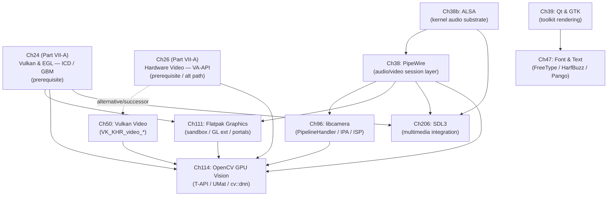

# Part VII-B — Multimedia Frameworks and Desktop Integration

Part VII-A treated the GPU-facing APIs — **Vulkan**, **EGL**, **OpenCL**, **VA-API**, **OpenXR** — as the raw material an application programmer works with. This sub-part is the middleware layer that sits between those APIs and the software users actually run: the multimedia session bus that routes audio and video streams, the GUI toolkits that turn scene graphs into GPU submissions, the cross-platform multimedia integration framework (**SDL3**) that bridges audio, input, windowing, and GPU access in a single portable API, the font engines that rasterise every glyph on screen, the hardware video codec stack, the camera abstraction that feeds sensor frames into the graph, the sandbox runtime that packages all of it for distribution, and the computer-vision framework that consumes the entire pipeline. These are the components a desktop, an embedded appliance, a WebRTC endpoint, or a robotics platform is built from. The chapters here do not re-derive the kernel or Mesa internals of Parts I–VI; they explain which of those interfaces each middleware layer calls, and where a buffer crosses a subsystem boundary with — or without — a CPU copy.

The unifying mechanism throughout this sub-part is **DMA-BUF**. A camera frame produced by **libcamera**, a decoded video surface from **Vulkan Video** or **VA-API**, a GPU render target from **Qt** or **GTK**, a **PipeWire** screen-capture buffer, and an **OpenCL** intermediate in an **OpenCV** pipeline are all, at bottom, the same object: a `dma_buf` file descriptor carrying a 64-bit **DRM format modifier** that describes its tiling and compression layout. Every chapter in this part is, in part, a study of how that descriptor is allocated, negotiated, exported across a process or namespace boundary, and imported by the next consumer. When negotiation fails — mismatched modifiers, a driver that cannot import a foreign tiling, a sandbox that cannot see the render node — the pipeline falls back to a shared memory buffer and a CPU copy, and the zero-copy promise breaks. Knowing exactly where those fallbacks occur is the practical skill this part conveys.

## PipeWire as the Multimedia Coordination Bus

**PipeWire** is the session-layer daemon that unifies audio and video routing on modern Linux. Its architecture rests on the **SPA** (Simple Plugin API), a stable, dependency-free ABI in which every processing element — a source, a sink, a format converter, a mixer — is a plugin exposing a uniform vtable of `process`, `port` enumeration, and parameter negotiation callbacks. The daemon assembles these plugins into a directed graph of **nodes** connected by **links** between typed **ports**, and a real-time scheduler walks that graph once per quantum, invoking each node's `process` callback in topological order. The graph is data-format agnostic: the same scheduler carries 48 kHz PCM audio and 4K DMA-BUF video frames, distinguishing them only by the media type negotiated on each port.

Policy — deciding *which* nodes link to which, what the default sink is, how a screen-share request is routed — is deliberately not the daemon's job. That responsibility belongs to **WirePlumber**, a separate session-management daemon driven by Lua scripts, which observes node creation events and programmatically establishes links according to configurable policy. This separation lets the real-time media core stay small and auditable while the policy engine evolves independently.

For graphics engineers, three PipeWire data flows matter most. The first is **Wayland screen capture**: a client asks `org.freedesktop.portal.ScreenCast` (an **xdg-desktop-portal** D-Bus interface) for a stream; the portal negotiates user consent, selects a source, and hands back a PipeWire node ID and a file descriptor. The compositor pushes captured frames into that node as DMA-BUF buffers, and the client — OBS, a WebRTC stack, a remote-desktop tool — pulls them out without the frame ever touching CPU memory. The second is **zero-copy camera delivery**: frames captured by **V4L2** or **libcamera** are published into the graph as `SPA_DATA_DmaBuf` buffers, allowing a camera to feed an encoder or a preview surface directly. The third is **GPU frame injection**: an application can push its own rendered `VkImage`-backed DMA-BUF buffers into the graph as a source.

The connective detail across all three is **DRM format modifier negotiation inside SPA pods**. A SPA pod is PipeWire's self-describing serialisation format for parameters; when two nodes negotiate a video format, they exchange pods enumerating the DRM fourcc formats and the modifier lists each side can produce or consume. Only when the intersection is non-empty and both sides advertise `SPA_DATA_DmaBuf` can a zero-copy DMA-BUF link be established. If the modifier sets do not intersect — a common failure when a producer emits a vendor-specific compressed tiling that the consumer's importer does not recognise — PipeWire falls back to `SPA_DATA_MemFd`, a memory-mapped shared buffer that requires a CPU-side copy or GPU download. This fallback is silent and correct, which is precisely why it is a performance trap: the pipeline still works, it just stopped being zero-copy.

Beneath PipeWire lies **ALSA**, the kernel audio subsystem that PipeWire abstracts over. PipeWire does not replace ALSA; it consumes it. Every hardware audio device PipeWire routes is, at the kernel boundary, an ALSA PCM device, and PipeWire's ALSA sink and source nodes are built on the same `libasound` API that pre-PipeWire applications used directly. The bridge in the other direction — legacy applications that still open `default` via `libasound` — is served by a PipeWire-provided ALSA plugin that transparently redirects those streams into the PipeWire graph. Understanding ALSA is therefore not optional archaeology; it is the substrate on which the entire session layer stands, and its ring-buffer and timing model (`hw_ptr`/`appl_ptr`, xrun recovery, `snd_pcm_hw_params` negotiation) directly determines the latency and glitch behaviour that surfaces at the PipeWire level. Chapter 38b covers this substrate — the `snd_pcm_ops` vtable, the mixer and UCM2 configuration model, the **ASoC** framework for embedded codecs with its **DAPM** dynamic power routing, and the **HDA** controller's CORB/RIRB command rings — for readers who need to reason below the PipeWire abstraction.

## GUI Toolkit Rendering Architecture

Every desktop application reaches the GPU through a toolkit, and on Linux the two that matter are **Qt** and **GTK**. Both have, over their most recent major versions, converged on the same architectural idea: an abstract rendering interface that expresses drawing in backend-neutral terms and then dispatches to a concrete **Vulkan** or **OpenGL ES** implementation selected at runtime.

**Qt6** builds on **QRhi**, the Rendering Hardware Interface — a thin abstraction over Vulkan, OpenGL, Direct3D, and Metal that lets Qt Quick's scene graph be authored once and executed on any backend. The **Qt Quick** scene graph batches UI elements into a retained tree of geometry nodes, and its render loop traverses that tree once per frame, emitting QRhi commands. Shaders are not written per-backend; they are authored in a single GLSL dialect and compiled ahead of time by the **qsb** shader baker into a container holding SPIR-V plus the reflected resource bindings, from which QRhi extracts the right variant for the active backend.

**GTK4** took the same step with **GskRenderer**, a unified GPU renderer that replaced GTK3's Cairo-on-CPU default. GskRenderer has two GPU paths — **GskVulkanRenderer** and **GskNglRenderer** (OpenGL) — chosen at startup based on driver capability, plus a Cairo fallback for software-only environments. GTK's render model is a tree of **render nodes** (a rounded rectangle, a texture, a blur, a colour matrix), which the renderer lowers into GPU draw calls and shader invocations.

The subtle cross-cutting concern for both toolkits is **explicit GPU synchronisation on Wayland**. When a toolkit submits a frame to the compositor as a DMA-BUF, the compositor must know when the GPU has finished rendering into that buffer before it scans it out. On most drivers, implicit fences carried in the kernel's `dma_resv` reservation object handle this invisibly. On **NVIDIA**, the historical absence of implicit sync caused flicker and tearing, and the fix is the `wp_linux_drm_syncobj_v1` Wayland protocol: the toolkit exports a **DRM sync object** timeline point alongside the buffer, and the compositor waits on that explicit fence before compositing. Both Qt6 and GTK4 now wire this protocol into their Wayland backends, which is what made NVIDIA a first-class Wayland target. Both toolkits also carry the entry point to the font pipeline — glyph shaping, rasterisation, and atlas management — which Chapter 39 introduces and Chapter 47 dissects.

## Cross-Platform Multimedia Integration: SDL3

Where Qt and GTK are widget toolkits that own a desktop object model, **SDL3** (Simple DirectMedia Layer 3) is a lower-level integration library: it exposes unified C APIs for windowing, audio output and capture, keyboard/mouse/gamepad input, camera access, and 2D rendering without providing a widget hierarchy. Games, multimedia tools, and emulators use it because the API surface is small and the mapping to platform primitives is direct.

SDL3.2.0, the first stable ABI-frozen release of the SDL 3 series, shipped in January 2025. SDL2, the predecessor, is now in maintenance mode. On Linux, SDL3 sits above the same platform primitives as Qt and GTK — the same Wayland protocols, the same EGL and Vulkan surface paths, the same Mesa drivers — but exposes them at a coarser granularity and prioritises portability over access to platform-specific extensions.

**The video backend** selects between Wayland (the SDL3 default on Linux) and X11 at startup. On Wayland, SDL3 implements `xdg_toplevel` window management, `libdecor` for client-side decoration on GNOME, `wp_fractional_scale_v1` + `wp_viewporter` for HiDPI, and `wp_security_context_v1` for compositor-side sandbox tagging. For OpenGL, SDL3 creates an EGL context (not GLX) when the Wayland backend is active. For Vulkan, `SDL_Vulkan_CreateSurface` returns a `VkSurfaceKHR` backed by `vkCreateWaylandSurfaceKHR` or `vkCreateXlibSurfaceKHR` transparently.

**The audio backend** probe order on modern Linux is PipeWire → PulseAudio → ALSA → JACK. The PipeWire driver — added to SDL2 in 2021 and the preferred backend in SDL3 — uses `libpipewire-0.3` directly, submitting SDL `SDL_AudioStream` buffers as PipeWire graph nodes. The `SDL_AudioStream` model in SDL3 replaces the SDL2 callback model with a push/pull queue that performs format conversion, resampling, channel remapping, gain, and pitch adjustment transparently, feeding whichever audio session layer is active below.

**The input backend** distinguishes two paths for gamepads. For known controllers — PlayStation, Xbox, Nintendo Switch, Steam — SDL3 uses **HIDAPI** (`/dev/hidraw*`), gaining access to features the generic kernel evdev interface does not expose: DualSense adaptive triggers, gyroscope/accelerometer, LED colour, touchpad, and battery state. For unrecognised controllers, SDL3 falls back to evdev (`/dev/input/event*`) with udev hotplug. Text input and IME are mediated through `zwp_text_input_v3` on Wayland; relative mouse motion through `zwp_relative_pointer_manager_v1` + `zwp_pointer_constraints_v1`.

The **satellite libraries** — **SDL3_image** (multi-format surface loading), **SDL3_mixer** (channel-based audio mixing), and **SDL3_ttf** (FreeType + HarfBuzz text rendering with a GPU-backed Text Engine API) — extend SDL3 without adding framework overhead, making it straightforward to build a multimedia application that loads compressed assets, mixes sound effects over background music, and renders HarfBuzz-shaped text, all through a single coherent API.

## The Font and Text Pipeline

Text is the single most universal rendering task on the desktop, and the path from a character string to lit pixels is a five-stage chain shared by every toolkit, browser, and terminal. **fontconfig** performs font matching: given a family request, a language, and style attributes, it resolves the best available font file on the system and returns a match pattern. **FreeType 2** loads that font and rasterises individual glyphs, applying one of several **hinting** modes (bytecode-interpreted TrueType instructions, the auto-hinter, or unhinted rendering) to grid-fit outlines at small sizes. **HarfBuzz** performs **OpenType shaping** — the transformation of a Unicode codepoint sequence into a positioned glyph sequence, applying ligatures, contextual substitutions, mark positioning, and the bidirectional and cursive-joining logic that complex scripts such as Arabic, Devanagari, and Thai require. **Pango** wraps shaping and font selection into a line-and-paragraph layout engine that handles bidi runs, line breaking, and justification. **Cairo** (in the GTK lineage) composites the resulting glyph bitmaps onto a surface.

The performance-critical structure underneath all of this is the **glyph atlas**: rather than re-rasterising a glyph every frame, toolkits cache rendered glyph bitmaps in a GPU texture and render text as a batch of textured quads indexed into that atlas. Qt, GTK4, **Skia** (used by Chrome and Flutter), and **WebRender** (used by Firefox) each implement their own atlas strategy, differing in packing algorithm, eviction policy, and cache-key design. Variable fonts complicate the cache key: an **OpenType variable font** exposes continuous axes (weight, width, optical size), so the naive `(glyph_id, size)` key no longer uniquely identifies a rasterised bitmap — the full axis coordinate tuple must participate, which inflates the cache and demands smarter eviction.

One counter-intuitive fact ties the font pipeline to the compositor: **LCD subpixel rendering is disabled in composited Wayland sessions**. Subpixel anti-aliasing exploits the fixed R-G-B stripe geometry of an LCD panel to triple horizontal resolution, but it only works if the toolkit knows the exact final pixel geometry and orientation of the glyph on the physical panel. Under a Wayland compositor, a surface may be scaled, rotated, or fractionally positioned before scan-out, so the subpixel structure the toolkit baked in no longer aligns with the panel — producing colour fringing. Composited Wayland sessions therefore fall back to grayscale anti-aliasing, and the font pipeline's subpixel path is a legacy of the X11 direct-scan-out era. This is one reason text on Wayland can look subtly different from the same font on X11.

## Hardware Video: Vulkan Video and the Codec Stack

Hardware video decode and encode on Linux has, for a decade, meant **VA-API** — a mature, widely deployed API with a surface model and a per-vendor driver backend. The strategic successor is the **Vulkan Video** extension family, which folds video codecs directly into the Vulkan device and queue model rather than living in a separate API with its own buffer types and its own interop dance.

The extension family is layered. `VK_KHR_video_queue` establishes the common infrastructure: a dedicated video queue family, video session objects, and the `VkVideoPictureResourceInfoKHR` model for reference-frame management. `VK_KHR_video_decode_queue` and `VK_KHR_video_encode_queue` add the decode and encode command families. On top of those, **codec extensions** — for **H.264**, **H.265**, and **AV1** decode and encode — supply the codec-specific parameter structures (SPS/PPS, slice headers, quantisation maps) that the generic queue infrastructure carries. In Mesa, **RADV** (AMD) and **ANV** (Intel) implement these extensions against the hardware video engines (AMD's VCN, Intel's media engine), and the support matrix advances codec-by-codec across Mesa releases.

The decisive advantage of Vulkan Video is integration: a decoded frame is a `VkImage` in the same device as the renderer, so it can be sampled by a graphics or compute pipeline with a memory barrier rather than an export-import cycle. **FFmpeg** exposes this through its `hwaccel` framework, and the GStreamer `vkvideo` elements do the same for pipeline-based workflows. The tradeoff is complexity and maturity: Vulkan Video's explicit reference-frame and DPB management is considerably more verbose than VA-API's surface pool, and its driver support is still filling in — which is exactly why the choice between VA-API and Vulkan Video is a real engineering decision rather than a foregone migration. Chapter 50 makes that comparison concrete, on API complexity, render-pipeline integration, and per-driver hardware coverage.

## The Camera Stack: libcamera and the V4L2 Media Controller

A camera on modern hardware is not a single device but a **media graph**: a sensor, one or more **ISP** (image signal processor) blocks, resizers, and multiple capture outputs, all wired together through the kernel's **V4L2 Media Controller** subsystem as a graph of linked sub-device entities. Configuring such a camera means walking that graph, setting formats and links on each pad — a task far beyond a single `ioctl`, and one that historically required a bespoke, closed userspace HAL per SoC.

**libcamera** is the unified abstraction that replaced that fragmentation. Its core is the **PipelineHandler**, a per-platform C++ subclass that encodes the knowledge of how a specific SoC's media graph is wired and how to translate a generic capture request into the correct sequence of V4L2 Media Controller configuration calls. Above the pipeline handler sits the **IPA** (Image Processing Algorithm) module — the **3A** logic (auto-exposure, auto-white-balance, auto-focus) — which libcamera runs inside a **sandbox** process, isolating vendor-supplied, often proprietary algorithm blobs from the application's address space. Frames are delivered as **FrameBuffer** objects backed by **DMA-BUF**, so a captured frame can flow to an encoder, a GPU, or a preview surface without a copy.

The security-relevant integration point is the **PipeWire camera portal**. Rather than granting an application raw access to `/dev/video*`, the portal mediates: an application requests camera access through `org.freedesktop.portal.Camera`, the user consents, and frames are delivered through a PipeWire node as DMA-BUF buffers. This single gate is what makes camera access safe for **WebRTC** browsers, **GStreamer** pipelines, and **OBS** simultaneously, and it is the same portal machinery that governs screen capture. Chapter 96 covers the pipeline handlers for **Raspberry Pi** (Unicam/PiSP), Intel **IPU3/CIO2**, and **Rockchip RKISP1/RKISP2** hardware in detail.

## Sandboxed Graphics: Flatpak and Portal Infrastructure

Distributing a GPU-accelerated application in a sandbox is structurally harder than sandboxing a pure-CPU program, and the reason is specific: **Mesa DRI drivers are architecture-specific shared objects whose ABI must version-match the host kernel driver**, but **bubblewrap** — the unprivileged sandbox mechanism underneath **Flatpak** — establishes a fresh mount namespace in which the host's driver libraries are simply not present. A naive sandbox has no working GPU driver at all.

Flatpak solves this with a **GL extension** mechanism: the host's Mesa userspace stack is packaged as a versioned runtime extension (for example `org.freedesktop.Platform.GL.default`), and Flatpak mounts the matching version into the sandbox at the path the application's `finish-args` requests. **Vulkan ICD** discovery works analogously — the loader inside the sandbox reads ICD manifest JSON files mounted from the GL extension, pointing at the driver `.so` inside the sandbox namespace. Access to devices and services beyond the GPU is mediated by **xdg-desktop-portal**: screen capture goes through the **ScreenCast** portal, camera access through the camera portal, both delivering frames via PipeWire as already described. **VA-API** decode works inside the sandbox provided the render node and the correct driver extension are mounted.

The security boundary has a hard edge worth stating plainly. Because GPU acceleration requires the render node `/dev/dri/renderD128` to be bind-mounted into the sandbox, a compromised sandboxed application retains full access to the GPU context — the sandbox stops at the kernel DRM interface, not at the GPU hardware. There is, at present, no per-application GPU isolation below the render node. This makes the render-node bind-mount the single most consequential line in a Flatpak manifest's GPU configuration. Chapter 111 closes with **Electron**/**CEF** nesting under Flatpak and a comparison with the **Snap** and **AppImage** models, which make different bind-mount and confinement tradeoffs.

## DMA-BUF as the Zero-Copy Backbone

The chapters in this part are separate subsystems, but a single data path threads through all of them, and it is worth tracing end to end. Consider a computer-vision application ingesting a live camera feed and compositing an annotated result to the screen. The camera frame is captured by **libcamera** and delivered as a **DMA-BUF**-backed `FrameBuffer`. It enters the **PipeWire** graph through the camera portal as a `SPA_DATA_DmaBuf` buffer, its format and DRM modifier negotiated in the SPA pod exchange. From there it can be decoded — if it arrives compressed — by **Vulkan Video** into a `VkImage`, or by **VA-API** into a VA surface, both exportable as DMA-BUF. **OpenCV**'s Transparent API imports that buffer into an **OpenCL** `cv::UMat` and runs the vision kernels on the same GPU. The annotated result, still a GPU-resident buffer, is handed to **EGL** as an `EGLImage` and composited into a **Wayland** surface. In the ideal path, from sensor to display, no pixel is ever copied through CPU memory.

That ideal is real but not yet universal, and honesty about where it breaks is the point. Copies still occur at several junctions today. When two subsystems cannot agree on a **DRM format modifier** — a producer emitting a vendor-compressed tiling the consumer's importer does not recognise — the negotiation falls back to a linear layout or, in PipeWire's case, to `SPA_DATA_MemFd`, forcing a CPU staging copy. **VA-API**-to-**Vulkan** and **Vulkan Video**-to-**OpenCL** interop paths are still maturing and sometimes require a round-trip through system memory. The **libcamera** software ISP path, used when no hardware ISP is available, debayers on the CPU. And any subsystem that lacks a DMA-BUF export — a legacy V4L2 mmap buffer, an OpenCL implementation without `cl_khr_external_memory` — breaks the chain at that point. The engineering discipline this part teaches is to know, for a given hardware and driver combination, exactly which of these junctions is zero-copy and which is not, because the difference between a matched-modifier DMA-BUF link and a `MemFd` fallback is the difference between a pipeline that sustains 4K60 and one that does not.

## Dependency Map

The diagram below shows the structural dependencies among the chapters in this part, built strictly from the prerequisite relationships each chapter carries. Arrows point from prerequisite to dependent chapter. Two nodes — **Ch24** and **Ch26** — live in **Part VII-A** and are shown as prerequisite references that a reader should already have entering this part.

The graph has a clear shape. **ALSA (Ch38b)** is the substrate beneath **PipeWire (Ch38)**, which is in turn the hub of the part: the camera stack (Ch96) reaches applications through PipeWire's camera portal, the sandbox chapter (Ch111) depends on PipeWire's portal model, and PipeWire delivers camera frames into the synthesis chapter (Ch114). **SDL3 (Ch206)** draws on both ALSA and PipeWire as its audio backends, and on the EGL/Vulkan foundations from Part VII-A (Ch24) for its windowing and GPU surface paths — it sits beside Qt/GTK as a peer multimedia integration layer. **Vulkan Video (Ch50)** sits as an alternative and successor path to the **VA-API** coverage that lives in Part VII-A's Chapter 26 (the dashed edge), and both feed OpenCV. **Qt/GTK (Ch39)** introduces the text pipeline that **font rendering (Ch47)** dissects — a self-contained pair on the toolkit side, independent of the media path. **OpenCV (Ch114)** is the terminal sink of the part: it draws on PipeWire (Ch38) for camera delivery, libcamera (Ch96) for the sensor stack, Vulkan Video (Ch50) and VA-API (Ch26) for decode, Flatpak (Ch111) for packaging, and the Vulkan/EGL foundations (Ch24) from Part VII-A. Two Part VII-A chapters — **Ch24** (the Vulkan ICD loader and EGL/GBM context model) and **Ch26** (VA-API decode) — are prerequisites carried into this part rather than chapters within it.

## Chapter Progression

The chapters form a deliberate progression from the media session substrate up to the synthesis chapter that consumes everything:

- **Chapter 38 — PipeWire: Unified Audio/Video Session Layer** is the recommended entry point. It explains the **SPA** plugin architecture, the node/link/port graph scheduler, and the **WirePlumber** session policy daemon, focusing on the three high-value data flows for graphics engineers: Wayland screen capture via `org.freedesktop.portal.ScreenCast`, zero-copy camera delivery from **V4L2** and **libcamera** as `SPA_DATA_DmaBuf`, and GPU frame injection back into the graph. It details **DRM format modifier** negotiation in **SPA** pods and the `SPA_DATA_MemFd` fallback. Read it first; most of the rest of the part references its portal and buffer model.

- **Chapter 38b — ALSA: The Linux Audio Subsystem** is the audio substrate PipeWire sits above. It covers the `snd_card`/`snd_pcm_ops` vtable, the `hw_ptr`/`appl_ptr` ring-buffer model and xrun recovery, hardware-parameter negotiation via `snd_pcm_hw_params`, the mixer API, the PCM plugin stack (`plug`/`dmix`/`dsnoop`/`pipewire`), **UCM2** use-case configuration, the **ASoC** framework with **DAPM** routing for embedded codecs, the **HDA** controller's CORB/RIRB rings, and the ALSA sequencer/MIDI/UMP path. Read it when you need to reason below the PipeWire abstraction — for embedded audio, low-latency work, or debugging glitches — and skip it if you only consume audio through PipeWire.

- **Chapter 39 — Qt and GTK Rendering Pipelines** covers how the two dominant Linux GUI toolkits map their scene graphs onto **Vulkan** and **OpenGL ES**: **Qt6**'s **QRhi** and the Qt Quick scene-graph render loop with the **qsb** shader baker, **GTK4**'s **GskRenderer** with its **GskVulkanRenderer** and **GskNglRenderer** paths, and how both add explicit sync via `wp_linux_drm_syncobj_v1` for **NVIDIA** compatibility. It introduces the font pipeline that the next chapter expands.

- **Chapter 206 — SDL3: Cross-Platform Multimedia Integration on Linux** covers the complete SDL3 API surface from a Linux systems perspective: the subsystem and hint model, video backend selection (Wayland-default with xdg-toplevel/libdecor/EGL, X11 fallback), HiDPI via `wp_fractional_scale_v1`, Vulkan surface creation, the `SDL_AudioStream` push/pull model with PipeWire/ALSA backend probe order, input (keyboard/mouse/gamepad/haptic/sensor), Wayland-specific limitations (no global mouse position, no window placement), the `SDL_Renderer` 2D pipeline (`SDL_Surface` vs `SDL_Texture`; `SDL_RenderTexture`), the satellite library trio (SDL3_image/mixer/ttf), and SDL3-only APIs — camera via V4L2/PipeWire, file dialogs via xdg-desktop-portal, the properties system, and main-callbacks. Closes with a full SDL2 → SDL3 migration table. Read alongside Chapter 39 for a complete view of Linux multimedia integration options.

- **Chapter 47 — Font and Text Rendering Pipeline** is the deep dive on the text path introduced in Chapter 39. It covers **FreeType 2** hinting, **HarfBuzz** OpenType shaping for complex scripts, **fontconfig** matching, **Cairo** compositing, **Pango** layout, and glyph-atlas strategies across **Qt**, **GTK4**, **Skia**, and **WebRender** — including why LCD subpixel rendering is disabled on composited Wayland and how **OpenType variable fonts** challenge atlas cache-key design. Browser and terminal developers should read Chapters 39 and 47 as a pair.

- **Chapter 50 — Vulkan Video Extensions** covers the `VK_KHR_video_queue`, `VK_KHR_video_decode_queue`, and `VK_KHR_video_encode_queue` family plus the H.264/H.265/AV1 codec extensions, from specification rationale through **RADV** and **ANV** implementation in Mesa to **FFmpeg** `hwaccel` integration, with an explicit comparison against **VA-API** for API selection. Read it after any Part VII-A exposure to VA-API (Chapter 26), which it positions itself against.

- **Chapter 96 — libcamera and the Linux Camera Stack** covers the **PipelineHandler** per-platform model, the **IPA** sandbox for 3A algorithms, the **V4L2 Media Controller** graph configuration sequence, **FrameBuffer**/**DMA-BUF** integration, and the **PipeWire** camera portal as the single security gate for WebRTC, GStreamer, and OBS consumers. Its PipeWire integration builds directly on Chapter 38. Hardware coverage spans Raspberry Pi (Unicam/PiSP), Intel IPU3/CIO2, and Rockchip RKISP1/RKISP2.

- **Chapter 111 — Flatpak and Sandboxed Graphics Applications** explains why GPU sandboxing is structurally hard, traces the path from a Flatpak manifest's `finish-args` through the **bubblewrap** namespace, the **GL extension** mounting mechanism, **Vulkan ICD** discovery inside the sandbox, the **xdg-desktop-portal** ScreenCast and camera portals, and **VA-API** decode under the sandbox — closing with the `/dev/dri/renderD128` bind-mount security boundary and a Snap/AppImage comparison. Read it after Chapter 38 (portal model) and with the Vulkan ICD knowledge from Part VII-A's Chapter 24.

- **Chapter 114 — OpenCV and GPU-Accelerated Computer Vision on Linux** is the synthesis chapter. It covers the **cv::UMat** / **Transparent API** dispatch to **OpenCL** (via **rusticl**, **intel-compute-runtime**, or **pocl**), the **cv::cuda::GpuMat**/**Stream** model for NVIDIA, **VA-API** decode for zero-copy camera-to-inference, the full libcamera/V4L2 → DMA-BUF → OpenCL → EGL pipeline, the **cv::dnn** backend selector with **ONNX**, and the **GStreamer** `VideoCapture` backend. It draws on Chapters 38, 96, 50, and 111 here plus Chapters 24, 25, and 26 in Part VII-A, and should be read last.

Readers should arrive here having read Part VII-A — specifically Chapter 24 (Vulkan device model, EGL/GBM, `linux-dmabuf` modifier negotiation, DRM sync objects) and Chapter 26 (VA-API surface model and V4L2 Media Controller basics) — and Parts I–III for the DRM/KMS, Mesa, and Wayland substrate. Parts VIII–X build on this part: the browser chapters rely on the PipeWire, Vulkan Video, and font foundations laid here; the gaming chapters (Part VIII) build on the Wayland and Vulkan surface model that SDL3 exercises; and any later robotics or embedded-vision material assumes Chapter 114's pipeline patterns.

## Part Roadmap Summary

*Synthesised from the Roadmap sections of this part's chapters. Version figures are kept consistent with Part VII-A.*

### Near-term (6–12 months)

- **PipeWire 1.6.x stabilisation.** The 1.6 series continues to harden the atomic transaction API for graph changes, completes the ACP-to-UCM audio-profile migration, and matures the `filter-graph` module with FFmpeg and ONNX backends — the foundation for in-graph ML video filtering. The Vulkan SPA plugin is being hardened for format conversion inside the graph, closing PipeWire–Vulkan-Video gaps.

- **Vulkan Video codec completion.** The H.264/H.265/AV1 decode and encode matrix continues to fill in across **RADV** and **ANV**, with GStreamer `vkvideo` elements and the FFmpeg Vulkan `hwaccel` path stabilising to cover it. Chapter 50's comparison against VA-API shifts as encode completeness approaches parity.

- **Toolkit and font evolution.** **Qt 6.12** (September 2026) adds indirect rendering in **QRhi**. **GTK 4.21+** is refactoring **GskRenderer** for SVG-filter and COLRv1 support, and **GTK5** API planning is underway. **HarfBuzz**'s `hb_gpu_paint_t` API is graduating from experimental status, and variable **COLRv1** full-stack support requires coordinated FreeType, HarfBuzz, and atlas updates. Fractional-scale-aware SDF glyph caching is becoming necessary as `wp_fractional_scale_v1` becomes the norm.

- **libcamera 0.7.x.** Multi-threaded software-ISP debayering and GPU-ISP (GLES 2.0) offload are landing, reducing the CPU-copy cost on hardware without a dedicated ISP. The PipeWire camera portal continues to gain richer control negotiation.

- **Flatpak and OpenCV updates.** Flatpak nested-sandbox improvements (Electron/CEF under Flatpak) continue, and **OpenCV 5.x** is ramping up GPU inference in its new graph DNN engine, with T-API dispatch and Vulkan compute DNN operator coverage expanding.

- **SDL3 ecosystem stabilisation.** SDL3 is filling in its satellite library matrix (SDL3_image, SDL3_mixer, SDL3_ttf all tracking the SDL3 API), hardening the PipeWire audio backend, completing the `SDL_GPUDevice` API introduced in SDL3 (Chapter 81), and expanding camera portal support. The sdl2-compat shim will continue to service the SDL2 installed base while the SDL2-to-SDL3 migration of major game engines and emulators progresses.

### Medium-term (1–3 years)

- **Vulkan Video replacing VA-API as the primary hardware video API.** GStreamer `vkvideo` elements are expected to supersede the `vaapi*` elements once encode completeness and sustained performance parity are reached, and browsers are working toward native Vulkan Video in place of the VA-API GPU-process path. A Zink-style VA-API-on-Vulkan-Video bridge would serve legacy VA-API applications from Vulkan Video drivers.

- **Zero-copy pipeline maturation from sensor to display.** The architectural ambition across libcamera, PipeWire, V4L2, and Vulkan Video is a single DMA-BUF-backed buffer traversing ISP, codec, compositor, and KMS without CPU copies. Remaining gaps are PipeWire–Vulkan-Video format-conversion nodes, a **PipeWire camera portal v2** with richer control negotiation, and deeper libcamera integration for burst HDR and zero-shutter-lag capture.

- **GPU-accelerated in-graph and vision workloads.** PipeWire's `filter-graph` FFmpeg/ONNX backends and OpenCV 5.x's graph DNN engine converge on running ML inference directly inside the media graph, on the GPU, on DMA-BUF frames that never leave device memory. OpenCV's T-API gains a native libcamera backend and a PipeWire DMA-BUF camera source.

- **Sandbox graphics virtualisation.** The **Venus**/**virglrenderer** virtio-GPU approach matures toward driver-agnostic sandbox graphics without loading host userspace drivers, and a per-capability GPU access model is expected to begin replacing coarse render-node grants — directly relevant to Chapter 111's security boundary.

### Long-term

- **Vulkan as the universal media substrate.** The long-term trajectory folds hardware video (Ch50) and GPU compute vision (Ch114) into Vulkan compute and Vulkan Video as the cross-vendor path, with `VK_KHR_cooperative_matrix` providing matrix-MMA acceleration for the DNN stages and Vulkan Video removing VA-API as an intermediary. EGL's role narrows to OpenGL ES and legacy interop as Vulkan WSI and Zink mature.

- **Unified explicit synchronisation across the media stack.** The `drm_syncobj` timeline model already spans Vulkan, `wp_linux_drm_syncobj_v1`, and Android native fences, but camera (V4L2), hardware codecs (VA-API), and the audio/media session layer still carry independent implicit-fence models. The architectural goal is a single kernel timeline primitive spanning KMS, V4L2, Vulkan, and the media subsystems — closing the last CPU-synchronisation gaps in the sensor-to-display path.

- **Fully zero-copy, sandbox-safe multimedia.** The convergence of libcamera GPU-ISP offload, PipeWire camera portal v2, Vulkan Video decode, Venus-mediated sandbox graphics, and per-capability GPU access describes a future in which a sandboxed application receives a camera or screen-capture frame, decodes and processes it on the GPU, and composites the result — with neither a CPU copy nor an unbounded GPU-hardware trust grant anywhere in the path. Chapter 114's end-to-end pipeline is the concrete target this convergence serves.

---

*Part VII-B spans Chapters 38, 38b, 39, 47, 50, 96, 111, 114, and 206. Chapter 38 (PipeWire) is the recommended entry point; Chapter 38b (ALSA) provides the audio substrate for readers who need it; Chapter 206 (SDL3) covers the portable multimedia integration layer that sits atop both.*

*Copyright © 2026 jreuben11. Licensed under [CC BY 4.0](https://creativecommons.org/licenses/by/4.0/).*
