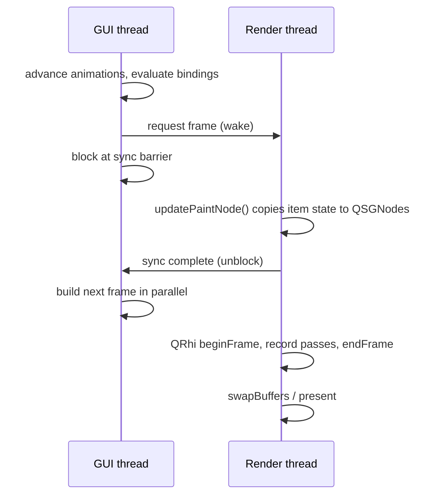
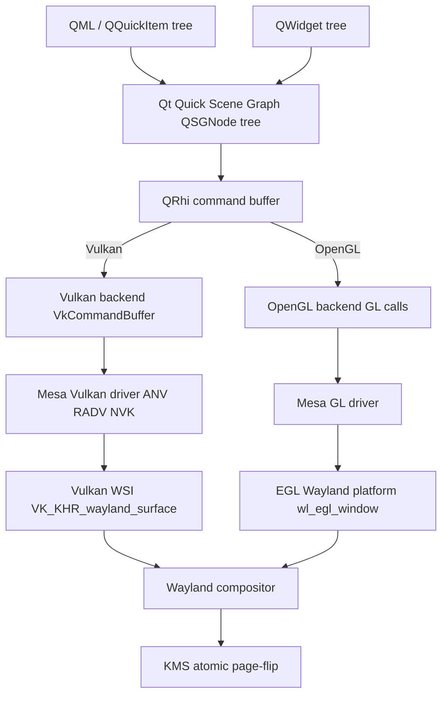
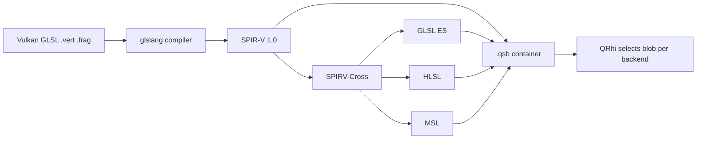

# Chapter 39a: Qt6 — The Application Framework, from QObject to QRhi

> **Part**: Part VII-C — Desktop Frameworks
> **Audience**: Graphics application developers building Qt6/QML applications; systems developers tracing the rendering pipeline from `QRhi` down to the KMS page-flip; platform engineers integrating Qt into a Linux graphics stack
> **Status**: Comprehensive reference — 2026-07-24

## Scope

Qt6 is a cross-platform C++ application framework whose reach extends from the meta-object system underpinning every `QObject`, through the QML declarative runtime, the Qt Quick scene graph, and the **Qt Rendering Hardware Interface (`QRhi`)**, out across the **Wayland** wire to a compositor and ultimately KMS. This chapter is a reference for all three audiences. Application developers get the Core, GUI, Widgets, QML/Quick, Network, Multimedia, Concurrency, i18n, testing, and deployment surface. Systems and graphics developers get the deep rendering path — scene graph, `QRhi`, the `qsb` shader pipeline, and the QtWayland platform plugin — that makes Qt a first-class client of the Linux graphics stack. Where a topic touches the kernel, Mesa, or a Wayland protocol, the chapter cross-links to the relevant part of the book rather than re-deriving it.

The chapter is long because Qt is large; it is organised so that a reader can jump to a single subsystem. The graphics-critical material (the scene graph, `QRhi`, QtWayland, and Multimedia's zero-copy video path) sits in §15, §17, and §18 and can be read on its own.

## Table of Contents

- [1. Architecture and Module Structure](#1-architecture-and-module-structure)
- [2. The Meta-Object System](#2-the-meta-object-system)
- [3. Signals and Slots](#3-signals-and-slots)
- [4. The Property and Binding System](#4-the-property-and-binding-system)
- [5. The Event System](#5-the-event-system)
- [6. Strings, Text Data, and Implicit Sharing](#6-strings-text-data-and-implicit-sharing)
- [7. Container Classes](#7-container-classes)
- [8. Timers and the Animation Framework](#8-timers-and-the-animation-framework)
- [9. The Resource System](#9-the-resource-system)
- [10. Serialization](#10-serialization)
- [11. Files, I/O, and IPC](#11-files-io-and-ipc)
- [12. Qt GUI Beyond Rendering](#12-qt-gui-beyond-rendering)
- [13. Qt Network](#13-qt-network)
- [14. QML and Qt Quick](#14-qml-and-qt-quick)
- [15. The Qt Quick Scene Graph and QRhi](#15-the-qt-quick-scene-graph-and-qrhi)
- [16. Qt Widgets](#16-qt-widgets)
- [17. QtWayland: Platform Integration](#17-qtwayland-platform-integration)
- [18. Qt Multimedia](#18-qt-multimedia)
- [19. Concurrency and Threading](#19-concurrency-and-threading)
- [20. Internationalization](#20-internationalization)
- [21. Accessibility](#21-accessibility)
- [22. Security](#22-security)
- [23. Testing](#23-testing)
- [24. Development Tools](#24-development-tools)
- [25. Deploying Qt Applications on Linux](#25-deploying-qt-applications-on-linux)
- [26. Porting Qt 5 to Qt 6](#26-porting-qt-5-to-qt-6)
- [27. Key Add-on Modules](#27-key-add-on-modules)
- [28. Performance and Debugging](#28-performance-and-debugging)
- [29. Integrations](#29-integrations)
- [References](#references)

---

## 1. Architecture and Module Structure

### 1.1 Module Structure

Qt6 is delivered as a set of CMake-built modules layered on a common foundation. The essential ones:

- **`qtbase`** — the foundation. It contains **Qt Core** (`QtCore`: the meta-object system, `QObject`, `QProperty`, containers, strings, I/O, threading), **Qt GUI** (`QtGui`: windowing, the `QRhi` graphics abstraction under `src/gui/rhi`, the QPA plugin interface, painting, images), **Qt Widgets** (`QtWidgets`: the classic desktop widget set), **Qt Network** (`QtNetwork`), **Qt D-Bus**, **Qt SQL**, **Qt Test**, **Qt Concurrent**, and **Qt XML**. The `QRhi` sources live at [`qtbase/src/gui/rhi`](https://code.qt.io/cgit/qt/qtbase.git/tree/src/gui/rhi).
- **`qtdeclarative`** — Qt Quick, QML, the V4 JavaScript engine, the scene graph (`QSGNode`, `QSGRenderer`, `QSGMaterial`), Qt Quick Controls, Qt Quick Layouts, and the QML tooling (`qmlcachegen`, `qmltc`, `qmllint`).
- **`qtwayland`** — both the client-side QPA plugin (`src/client`, `src/plugins/platforms/wayland`) and the `QtWaylandCompositor` server framework for building Wayland compositors in QML.
- **`qtshadertools`** — the `qsb` command-line shader baker and the `QShader`/`QShaderDescription` runtime container types.
- **`qtmultimedia`** — `QMediaPlayer`, `QCamera`, `QAudioOutput`, `QScreenCapture`, `QMediaRecorder`, and the pluggable FFmpeg/GStreamer backends.
- **Add-ons** — `qtsvg`, `qtimageformats`, `qtcharts`, `qtgraphs`, `qtnetworkauth`, `qtwebsockets`, `qthttpserver`, `qtgrpc`, `qtremoteobjects`, `qtscxml`, `qtstatemachine`, `qtpositioning`, `qtlocation`, `qtbluetooth`, `qtconnectivity`, `qtvirtualkeyboard`, `qtwebengine`, `qtpdf`, `qtquick3d`, and `qtquick3dphysics`.

The module boundaries are real linking boundaries. An embedded Qt Quick application can link `qtbase` + `qtdeclarative` + `qtwayland`, omit `QtWidgets` entirely, and never pull in a widget symbol. [Source](https://doc.qt.io/qt-6/qtmodules.html)

### 1.2 Licensing

Qt is dual-licensed. The open-source editions are available under **LGPL v3** and **GPL v3** (with some modules GPL-only or subject to The Qt Company's licensing terms), alongside a **commercial** license that removes LGPL obligations such as the requirement to allow relinking. [Source](https://doc.qt.io/qt-6/licensing.html) LGPL v3 permits dynamic linking from proprietary applications provided the user can substitute a modified Qt; static linking or modifying Qt itself triggers the copyleft obligations. Some add-on modules (for example, certain automotive and MCU offerings) are commercial-only, which is why the exact module set matters for compliance in shipped products.

### 1.3 CMake-First Build

Qt6 itself is built with CMake, and CMake — not `qmake` — is the recommended and best-supported build system for Qt6 applications. The Qt-specific CMake API replaces the old `.pro` file:

```cmake
cmake_minimum_required(VERSION 3.21)
project(myapp LANGUAGES CXX)

set(CMAKE_AUTOMOC ON)          # run moc automatically on Q_OBJECT headers
find_package(Qt6 REQUIRED COMPONENTS Core Gui Quick)

qt_standard_project_setup()    # sets C++17, RPATH, and Qt conventions

qt_add_executable(myapp main.cpp)

qt_add_qml_module(myapp
    URI MyApp
    VERSION 1.0
    QML_FILES Main.qml
)

target_link_libraries(myapp PRIVATE Qt6::Core Qt6::Gui Qt6::Quick)
```

The key functions are `qt_add_executable()`, `qt_add_library()`, `qt_add_qml_module()`, `qt_add_resources()`, and `qt_add_shaders()`. `qmake` remains available for compatibility but is not recommended for new projects. [Source](https://doc.qt.io/qt-6/cmake-manual.html)

### 1.4 What Changed from Qt5

For the graphics developer, three architectural shifts define the Qt5 → Qt6 transition:

1. **`QRhi` replaces direct OpenGL.** In Qt5, Qt Quick's scene graph issued OpenGL calls directly, and porting to Vulkan or Metal meant maintaining parallel back-ends. Qt6 inserts `QRhi` as a hard abstraction boundary; the scene graph now knows nothing about the underlying API (§15). [Source](https://www.qt.io/blog/graphics-in-qt-6.0-qrhi-qt-quick-qt-quick-3d)
2. **CMake-first build.** The tooling (`qt_add_executable`, `qt_add_qml_module`, `qt_add_shaders`) is CMake-native.
3. **`QProperty<T>` bindable properties.** Qt6 adds a C++ reactive property system that brings QML-style bindings to plain C++ objects, independent of the `Q_PROPERTY`/`NOTIFY` signal machinery (§4). [Source](https://doc.qt.io/qt-6/qproperty.html)

Beyond graphics, Qt6 raised the minimum language standard to **C++17** (with optional C++20 features such as `operator<=>()` support, §11.6), removed a number of long-deprecated classes (`QRegExp`, `QLinkedList`, the `QStringRef`/`QVariant::Type` idioms — §26), reworked the container classes (§7), and moved several Qt5 features into an opt-in **`qt5compat`** module for gradual migration. [Source](https://doc.qt.io/qt-6/portingguide.html)

---

## 2. The Meta-Object System

The meta-object system is the runtime reflection layer that makes signals/slots, properties, dynamic invocation, and QML type exposure possible for a language — C++ — that has no native introspection. It rests on three pillars: the `QObject` base class, the `Q_OBJECT` macro, and the **Meta-Object Compiler (`moc`)**. [Source](https://doc.qt.io/qt-6/metaobjects.html)

### 2.1 QObject, Q_OBJECT, and moc

Every type that participates in signals/slots, properties, or runtime type information derives from `QObject` and declares the `Q_OBJECT` macro in its private section. `moc` parses the header, finds `Q_OBJECT`, and generates a `moc_*.cpp` translation unit containing:

- a static, `constexpr`-friendly **`QMetaObject`** — a table describing the class's signals, slots, invokable methods, properties, enums, and class info;
- the **`qt_static_metacall`** dispatcher, which the meta-object uses to invoke methods and read/write properties by index without a virtual-table lookup per method;
- the signal function bodies (a signal is a `moc`-generated function that calls `QMetaObject::activate()`);
- `metaObject()`, `qt_metacast()`, and `qt_metacall()` overrides.

```cpp
// widget.h
class Thermostat : public QObject
{
    Q_OBJECT
    Q_PROPERTY(double temperature READ temperature WRITE setTemperature
               NOTIFY temperatureChanged)
public:
    explicit Thermostat(QObject *parent = nullptr);
    double temperature() const;
public slots:
    void setTemperature(double t);
signals:
    void temperatureChanged(double t);
private:
    double m_temperature = 20.0;
};
```

`moc` runs automatically when `CMAKE_AUTOMOC` is on (§1.3). The generated `staticMetaObject` is the object other subsystems query; `QObject::metaObject()` returns the most-derived `QMetaObject` for a live instance, which is how a base-class pointer reaches a derived class's reflection data. [Source](https://doc.qt.io/qt-6/qobject.html)

### 2.2 QMetaObject Runtime Introspection

The generated `QMetaObject` is queryable at runtime and drives dynamic invocation:

```cpp
const QMetaObject *mo = obj->metaObject();
qDebug() << "class:" << mo->className();
for (int i = mo->propertyOffset(); i < mo->propertyCount(); ++i) {
    QMetaProperty p = mo->property(i);
    qDebug() << p.name() << '=' << p.read(obj)
             << "bindable:" << p.isBindable();
}

// Invoke a method by name, optionally across threads.
QMetaObject::invokeMethod(obj, "refresh", Qt::QueuedConnection);

// Read/write a property by name (used by QML, animations, D-Bus, serialization).
obj->setProperty("temperature", 21.5);
QVariant v = obj->property("temperature");
```

`propertyOffset()`/`methodOffset()` skip inherited members, letting a class introspect only what it declares. This reflection underpins QML's ability to instantiate and wire C++ types by name, the animation framework's property targeting, `QVariant`-based generic storage, and the D-Bus and serialization bindings. [Source](https://doc.qt.io/qt-6/qmetaobject.html)

### 2.3 The Object Model and Object Trees

`QObject`s form **parent-owned trees**. Passing a parent to a `QObject` constructor (or calling `setParent()`) registers the child; deleting the parent deletes all descendants, in reverse order of construction. This is the ownership model that lets a QML engine, a widget hierarchy, or a `QMainWindow` manage the lifetime of hundreds of child objects without manual `delete`:

```cpp
auto *window = new QWidget;               // no parent — caller owns it
auto *layout = new QVBoxLayout(window);   // parented to window
auto *button = new QPushButton("OK");
layout->addWidget(button);                // reparents button under window
// deleting window deletes layout and button automatically
```

Two rules matter in practice. First, `QObject::children()` returns the direct child list, and `findChild<T>()`/`findChildren<T>()` walk the subtree by object name and type — the mechanism `uic`-generated code and test harnesses use to locate widgets. Second, **never `delete` a `QObject` that may still be on the event queue**; use `deleteLater()`, which posts a `DeferredDelete` event so the object is destroyed when control returns to the event loop, after any pending events targeting it have drained. [Source](https://doc.qt.io/qt-6/objecttrees.html)

`QObject` is deliberately **non-copyable** (its copy constructor and assignment are deleted): identity, parentage, and connections make a copy meaningless. Value semantics belong to the container and data classes (§6, §7), not to `QObject`.

### 2.4 Custom Types: QMetaType, QVariant, and Type Registration

`QVariant` is a type-erased value container that can hold any registered type. The built-in types are known to the meta-type system automatically; a custom type must be registered so it can be stored in a `QVariant`, queued across threads by a `Qt::QueuedConnection`, or exposed to QML:

```cpp
struct SensorReading {
    double value;
    QDateTime timestamp;
};
Q_DECLARE_METATYPE(SensorReading)   // enables QVariant storage, compile-time id

// For queued signal/slot connections and QMetaType-by-name lookups:
qRegisterMetaType<SensorReading>("SensorReading");

QVariant v = QVariant::fromValue(SensorReading{ 42.0, QDateTime::currentDateTime() });
SensorReading r = v.value<SensorReading>();
```

`Q_DECLARE_METATYPE` makes the type known to the template machinery at compile time; `qRegisterMetaType()` registers it in the runtime type registry (needed for name-based lookup and for `Qt::QueuedConnection`, which must construct/copy the argument in the receiving thread). Each registered type receives a stable `QMetaType` id, retrievable with `qMetaTypeId<T>()` or `QMetaType::fromType<T>()`. [Source](https://doc.qt.io/qt-6/qmetatype.html)

---

## 3. Signals and Slots

Signals and slots are Qt's type-safe observer mechanism: a signal is emitted when an object changes state; connected slots (or functors) run in response. Connections are managed automatically — when either sender or receiver is destroyed, the connection is severed, avoiding dangling-callback crashes. [Source](https://doc.qt.io/qt-6/signalsandslots.html)

### 3.1 Two Connection Syntaxes

Qt offers two `connect()` forms:

```cpp
// 1. Pointer-to-member (functor) form — checked at COMPILE time. Preferred.
connect(sender, &Sender::valueChanged, receiver, &Receiver::onValueChanged);

// Lambda receiver, with a context object for automatic disconnection on destroy:
connect(button, &QPushButton::clicked, this, [this] { m_model->refresh(); });

// 2. String-based (SIGNAL/SLOT macro) form — resolved at RUN time via QMetaObject.
connect(sender, SIGNAL(valueChanged(int)), receiver, SLOT(onValueChanged(int)));
```

The pointer-to-member form is checked by the compiler: a typo or an argument-type mismatch is a build error, not a silent runtime no-op. It also permits implicit argument conversions and connecting to lambdas or free functions. The string-based form resolves method names through the meta-object at runtime, so a mistyped signature fails silently (returning `false`) — it survives mainly for dynamic scenarios where the signal or slot name is known only at runtime. Always pass a **context object** as the third argument when connecting to a lambda, so the connection is torn down when that object is destroyed. [Source](https://doc.qt.io/qt-6/signalsandslots.html)

### 3.2 Connection Types

The fifth `connect()` argument selects the delivery semantics via `Qt::ConnectionType`:

| Type | Behaviour |
|---|---|
| `Qt::AutoConnection` (default) | Direct if sender and receiver share a thread; queued otherwise — decided at emit time |
| `Qt::DirectConnection` | Slot runs immediately, synchronously, in the emitting thread |
| `Qt::QueuedConnection` | Signal arguments are copied into an event posted to the receiver's thread; slot runs when that thread's event loop next spins |
| `Qt::BlockingQueuedConnection` | Like queued, but the emitting thread blocks until the slot returns — the emitting and receiving thread must differ or it deadlocks |
| `Qt::UniqueConnection` | OR-flag: refuses the connection if an identical one already exists |

`Qt::QueuedConnection` is the backbone of cross-thread communication: it is how a worker thread hands a result to the GUI thread without shared-state locking, provided every argument type is registered with the meta-type system (§2.4). `disconnect()` mirrors `connect()`, and the connection can also be stored as a `QMetaObject::Connection` handle and later passed to `disconnect()`. [Source](https://doc.qt.io/qt-6/qt.html#ConnectionType-enum)

---

## 4. The Property and Binding System

Qt6 has two complementary property mechanisms: the classic **`Q_PROPERTY`** meta-object property (introspectable, QML-visible, `NOTIFY`-signal-driven) and the new **`QProperty<T>`** bindable-property engine (Qt 6.0), which brings QML-style automatic dependency tracking to plain C++. [Source](https://doc.qt.io/qt-6/properties.html)

### 4.1 Q_PROPERTY

`Q_PROPERTY` declares a named, typed, introspectable property in the meta-object. Its attributes wire up accessors and change notification:

```cpp
Q_PROPERTY(double temperature
           READ temperature
           WRITE setTemperature
           NOTIFY temperatureChanged
           RESET resetTemperature
           BINDABLE bindableTemperature)   // exposes a QBindable (Qt 6.0+)
```

QML reads and binds to these through the meta-object; the `NOTIFY` signal is what tells QML (and any `QObject`-level observer) that the value changed and dependent bindings must re-evaluate. `READ`/`WRITE`/`NOTIFY`/`RESET` are the classic four; `BINDABLE` (Qt 6.0) exposes the underlying bindable storage so the property can participate in the new binding engine. [Source](https://doc.qt.io/qt-6/qobject.html#Q_PROPERTY)

### 4.2 QProperty and QBindable

`QProperty<T>` is a value wrapper supporting **lazy, automatically-tracked bindings** with no signal/slot involvement. A binding is a callable whose reads of other `QProperty` values are recorded; when any dependency changes, the property is marked dirty and re-evaluates lazily the next time it is read:

```cpp
#include <QProperty>

struct Box {
    QProperty<int> width  { 10 };
    QProperty<int> height { 5 };
    QProperty<int> area;

    Box() {
        // width/height reads inside the lambda are auto-tracked.
        area.setBinding([this] { return width.value() * height.value(); });
    }
};

Box b;
b.width = 20;                 // marks area dirty; does NOT compute yet (lazy)
int a = b.area.value();       // evaluates now: 20 * 5 == 100

// Observe changes explicitly:
auto handle = b.area.onValueChanged([&] { qDebug() << "area:" << b.area.value(); });
```

The binding engine builds a dependency graph, evaluates in dependency order, and detects cycles — replacing the ad-hoc, eager `NOTIFY`-cascade discipline of Qt5. `QBindable<T>` is a type-erased handle over any bindable property (whether a raw `QProperty` or a `Q_OBJECT`-integrated one), used to install or read bindings generically. [Source](https://doc.qt.io/qt-6/qproperty.html)

### 4.3 Bindable Properties on QObject

To expose a bindable property that also emits a `NOTIFY` signal for QML, Qt6 provides `Q_OBJECT_BINDABLE_PROPERTY`, which wires a `QProperty` into the meta-object so both the C++ binding engine and QML observe the same storage:

```cpp
class Rect : public QObject
{
    Q_OBJECT
    Q_PROPERTY(int width  READ width  WRITE setWidth  BINDABLE bindableWidth)
    Q_PROPERTY(int area   READ area   NOTIFY areaChanged BINDABLE bindableArea)
public:
    int width() const { return m_width; }
    void setWidth(int w) { m_width = w; }
    QBindable<int> bindableWidth() { return &m_width; }

    int area() const { return m_area; }
    QBindable<int> bindableArea() { return &m_area; }
signals:
    void areaChanged();
private:
    Q_OBJECT_BINDABLE_PROPERTY(Rect, int, m_width)
    Q_OBJECT_BINDABLE_PROPERTY(Rect, int, m_area, &Rect::areaChanged)
};
```

`Q_OBJECT_BINDABLE_PROPERTY` stores the value inside the object (versus `Q_OBJECT_COMPAT_PROPERTY`, which coexists with a hand-written setter). The macro's optional third argument names a `NOTIFY` signal member that fires when the value changes, so QML bindings and classic signal observers stay in sync. [Source](https://doc.qt.io/qt-6/qobjectbindableproperty.html)

### 4.4 Comparison with GObject

Qt's meta-object system and GLib's **GObject** (used by GTK4, Ch39b) solve the same problem — runtime introspection, signals, and properties for a language that lacks them natively — with different mechanics. GObject encodes classes, signals, and properties through **runtime registration functions** (`g_type_register_static`, `g_signal_new`, `g_object_class_install_property`) and relies on `GParamSpec` and closures; there is no code generator, but the boilerplate is written by hand or via macros. Qt instead relies on the **`moc` code generator** to emit the meta-object at compile time, trading a build step for terse, type-checked source. GObject signals dispatch through `g_signal_emit` with runtime name lookup; Qt's functor connections resolve at compile time. Both support cross-language binding — GObject-Introspection produces typelibs consumed by Python/JavaScript, while Qt exposes its meta-object to QML, PySide, and Qt for Python. Qt6's `QProperty` binding engine has no direct GObject analogue; GTK's equivalent reactive layer is `GBinding` plus the newer list-model/expression machinery.

---

## 5. The Event System

Where signals/slots connect known senders to known receivers, the **event system** delivers spontaneous input and system notifications through a per-object dispatch chain. An event is a `QEvent` subclass carrying a type and payload; the event loop pulls events from a queue and dispatches them to the target object's `event()` virtual. [Source](https://doc.qt.io/qt-6/eventsandfilters.html)

### 5.1 QEvent and Dispatch

`QEvent::type()` identifies the event (`QEvent::MouseButtonPress`, `KeyPress`, `Resize`, `Paint`, `Timer`, `Close`, and hundreds more; custom events use a type from `QEvent::registerEventType()`). Common subclasses carry typed accessors: `QMouseEvent::position()`, `QKeyEvent::key()`, `QResizeEvent::size()`, `QWheelEvent::angleDelta()`. Dispatch flows:

1. `QCoreApplication::notify()` is the single funnel through which every event passes.
2. Installed **event filters** get first look (§5.2).
3. The target's `QObject::event()` runs, dispatching to handler virtuals (`mousePressEvent()`, `keyPressEvent()`, `paintEvent()`, …) in `QWidget`/`QQuickItem`.

A handler calls `event->accept()` or `event->ignore()` to signal whether it consumed the event; unignored events may propagate to the parent (for example, an unhandled key event bubbles up the focus chain). [Source](https://doc.qt.io/qt-6/qevent.html)

### 5.2 event() Override vs eventFilter()

There are two interception points. Overriding `event()` (or a specific handler virtual) customises how an object handles its own events. Installing an **event filter** lets one object inspect another's events before they arrive — useful for intercepting input across many widgets without subclassing each:

```cpp
bool MyFilter::eventFilter(QObject *watched, QEvent *event)
{
    if (event->type() == QEvent::KeyPress) {
        auto *ke = static_cast<QKeyEvent *>(event);
        if (ke->key() == Qt::Key_Escape) {
            emit escapePressed();
            return true;             // consume: stop further delivery
        }
    }
    return QObject::eventFilter(watched, event);   // pass through
}
// install:
someWidget->installEventFilter(myFilter);
```

Returning `true` consumes the event; `false` lets it continue to the target. `QCoreApplication::instance()->installEventFilter()` installs an application-global filter that sees every event first — powerful but a performance-sensitive hot path. [Source](https://doc.qt.io/qt-6/qobject.html#installEventFilter)

### 5.3 postEvent() vs sendEvent()

Events can be delivered synchronously or asynchronously:

- **`QCoreApplication::sendEvent(receiver, event)`** dispatches *immediately and synchronously*, returning after the receiver's `event()` has run. The event is not deleted (typically stack-allocated).
- **`QCoreApplication::postEvent(receiver, event)`** *queues* a heap-allocated event and returns at once; the event loop delivers it later and then deletes it. `postEvent()` is thread-safe and is the primitive underneath `Qt::QueuedConnection` and `deleteLater()`.

`QCoreApplication::sendPostedEvents()` flushes the queue on demand. [Source](https://doc.qt.io/qt-6/qcoreapplication.html#postEvent)

### 5.4 The Event Loop and QEventLoop

`QCoreApplication::exec()` (or `QGuiApplication`/`QApplication`) starts the main event loop, which blocks on the platform event source (on Linux, ultimately `poll()`/`epoll` over the Wayland or X11 socket, timer fds, and socket notifiers) and dispatches events until `quit()`. A nested `QEventLoop` runs a local loop — the mechanism behind modal dialogs (`QDialog::exec()`) and synchronous waits that keep the UI responsive:

```cpp
QEventLoop loop;
QNetworkReply *reply = manager.get(request);
connect(reply, &QNetworkReply::finished, &loop, &QEventLoop::quit);
loop.exec();          // spins locally until the reply finishes, UI stays live
```

`QEventLoop::ProcessEventsFlag` (for example `ExcludeUserInputEvents`) tunes which events a nested loop processes. Nested loops must be used carefully — re-entrancy can surprise code that assumes single-loop execution. [Source](https://doc.qt.io/qt-6/qeventloop.html)

---

## 6. Strings, Text Data, and Implicit Sharing

### 6.1 QString, QStringView, and QByteArray

`QString` holds Unicode text as **UTF-16** internally (a sequence of `QChar`), which makes indexing and most string operations O(1) per code unit but means every construction from a UTF-8 `const char *` performs a decode. `QByteArray` holds raw 8-bit bytes — the type for binary data, file contents, and network payloads. The key value types:

- **`QString`** — owning UTF-16 string; rich API (`split`, `arg`, `number`, `toInt`, `mid`, `trimmed`, regular-expression matching via `QRegularExpression`).
- **`QStringView`** — a non-owning `(pointer, length)` view over existing UTF-16 data (Qt 5.10+, pervasive in Qt6). Passing `QStringView` by value avoids allocating and copying when a function only needs to read.
- **`QByteArray`** — owning byte buffer; `QByteArrayView` is its non-owning counterpart.
- **`QLatin1StringView`** (`QLatin1String` in older code) — a view over Latin-1 (ISO 8859-1) `const char *` data, comparable and concatenable against `QString` without a UTF-16 conversion allocation for ASCII literals.

```cpp
void log(QStringView msg);                 // takes a view — no copy at the call site

const QString name = u"Wayland"_s;         // QString UTF-16 literal (Qt 6.4+ _s)
log(name);                                 // view over the existing buffer
log(u"literal");                           // view over a UTF-16 string literal

const QString greeting = QStringLiteral("Hello, ") + name;  // one allocation
```

`QStringLiteral("...")` builds a `QString` whose UTF-16 data is baked into the binary at compile time, so no runtime decode or allocation occurs; use it for string constants passed where a `QString` is required. `QLatin1StringView("...")` avoids even that when the literal is ASCII and only compared. [Source](https://doc.qt.io/qt-6/qstring.html)

### 6.2 Encoding on Linux

`QString::fromUtf8()`/`toUtf8()` convert to and from UTF-8, the encoding of Linux filesystems, terminals, and most network protocols. The common gotcha: `QString(const char *)` interprets its argument as UTF-8 (via `fromUtf8`) since Qt 6, so a Latin-1 or locale-encoded byte string must be converted explicitly. For filesystem paths, `QFile` and friends accept `QString` and encode to the local 8-bit encoding through `QFile::encodeName()`; on Linux that is UTF-8 unless overridden. `QTextCodec` was removed from Qt Core in Qt6 (it lives in `qt5compat`); the modern replacement is `QStringConverter`/`QStringEncoder`/`QStringDecoder` for non-UTF encodings. [Source](https://doc.qt.io/qt-6/qstringconverter.html)

### 6.3 Implicit Sharing (Copy-on-Write)

Most Qt value classes — `QString`, `QByteArray`, `QList`, `QImage`, `QPixmap`, and others — use **implicit sharing**: copying an object copies only a pointer and atomically increments a reference count; the underlying data is duplicated (a "detach") only when a copy is about to be modified. This gives value semantics with the cost profile of a shared pointer for reads, and it is what makes returning a `QString` or `QList` by value cheap.

```cpp
QString a = QStringLiteral("shared");
QString b = a;          // O(1): refcount 2, same buffer
b.append('!');          // detach here: b copies the buffer, a is untouched
```

The mechanism is the **d-pointer (pImpl) idiom**: the public class holds a single pointer to a private data struct derived from `QSharedData`, whose refcount is a `QAtomicInt`. `QSharedDataPointer<T>` automates the detach-on-write; `QExplicitlySharedDataPointer<T>` gives the same shared storage but leaves detaching to the caller (no automatic copy on `operator->`). The d-pointer also delivers **binary compatibility**: adding a member to the private struct does not change the public class's size, so a shipped library can grow without breaking its ABI. [Source](https://doc.qt.io/qt-6/implicit-sharing.html) A caveat: implicitly shared containers are **not** safe to mutate concurrently from multiple threads even though the refcount is atomic — the atomic protects the sharing bookkeeping, not the element data.

---

## 7. Container Classes

Qt provides its own container types that predate and parallel the STL, chosen for implicit sharing, a stable ABI, and tight integration with the rest of Qt (streaming, `QVariant`, foreach). In Qt6 they were reworked to align more closely with the STL. [Source](https://doc.qt.io/qt-6/containers.html)

### 7.1 The Container Set

| Container | Role |
|---|---|
| `QList<T>` | The general-purpose sequential container. **In Qt6, `QVector<T>` is an alias for `QList<T>`** — the two merged |
| `QVarLengthArray<T, N>` | Stack-allocated for the first N elements, heap after — hot-path scratch buffers |
| `QHash<K,V>` | Unordered hash map; `QMultiHash` for multiple values per key |
| `QMap<K,V>` | Ordered (red-black tree) map; `QMultiMap` for duplicates |
| `QSet<T>` | Hash-based set |
| `QCache<K,V>` / `QContiguousCache<K,V>` | LRU-style caches |
| `std::pair` | `QPair` is a deprecated alias for `std::pair` in Qt6 |

### 7.2 Qt6 Container Changes

The most consequential Qt6 change is the **`QList`/`QVector` unification**: Qt5 had a memory-layout-differing `QList` and a contiguous `QVector`; Qt6 makes `QList` contiguous and aliases `QVector` to it, so `QList<T>` now stores elements directly (contiguously) rather than as an array of pointers for large types. A second change: Qt6 `QList` reserves growth room and its `operator[]`/`append` semantics were tightened; some Qt5 code relying on the old node-based `QList` behaviour needs review. `QHash`/`QSet` gained a new implementation and no longer guarantee any particular iteration order across runs (they never guaranteed insertion order). [Source](https://doc.qt.io/qt-6/qlist.html)

### 7.3 Iteration Idioms

Qt6 favours STL-style iterators and C++ range-based `for`. The Qt-specific `foreach` macro (`Q_FOREACH`) still exists but is discouraged because it copies the container (relying on implicit sharing to make the copy cheap) and predates range-`for`:

```cpp
QList<int> values { 1, 2, 3 };

for (int v : values) { /* preferred: range-for */ }
for (int v : std::as_const(values)) { /* avoids a detach if values is non-const */ }

// Legacy, discouraged in new code:
foreach (int v, values) { /* ... */ }
```

`std::as_const()` (or `qAsConst()` in older code) prevents an accidental detach when iterating a non-`const` container by range-`for`. The **Java-style iterators** (`QListIterator`, `QMutableListIterator`) still exist for compatibility but the STL-style iterators and range-`for` are the recommended interface in Qt6. [Source](https://doc.qt.io/qt-6/containers.html#the-iterator-classes)

---

## 8. Timers and the Animation Framework

### 8.1 Timers

`QTimer` fires a `timeout()` signal on an interval or once. Under the hood a `QObject` timer is driven by the event loop, so timers only fire while an event loop runs and never interrupt running code:

```cpp
auto *timer = new QTimer(this);
timer->setInterval(16);                       // ~60 Hz
timer->setTimerType(Qt::PreciseTimer);        // vs CoarseTimer / VeryCoarseTimer
connect(timer, &QTimer::timeout, this, &View::tick);
timer->start();

QTimer::singleShot(200, this, &View::flush);  // one-shot, no QTimer instance
```

`Qt::CoarseTimer` (the default for intervals ≥ 2 s tolerance) lets the platform coalesce wakeups to save power; `Qt::PreciseTimer` requests millisecond accuracy at higher power cost. For deadline arithmetic without a `QObject`, **`QDeadlineTimer`** (carried from Qt 5.8) captures a future instant and reports `remainingTime()`/`hasExpired()`, using a monotonic clock immune to wall-clock jumps. [Source](https://doc.qt.io/qt-6/qtimer.html)

### 8.2 The Animation Framework

The animation framework interpolates `QObject` properties over time on the GUI thread, driven by a shared timer. `QPropertyAnimation` targets a named `Q_PROPERTY`; groups compose animations:

```cpp
auto *fade = new QPropertyAnimation(widget, "windowOpacity");
fade->setDuration(250);
fade->setStartValue(0.0);
fade->setEndValue(1.0);
fade->setEasingCurve(QEasingCurve::InOutCubic);

auto *group = new QSequentialAnimationGroup(this);
group->addAnimation(fade);
group->addAnimation(slideIn);         // runs after fade completes
group->start(QAbstractAnimation::DeleteWhenStopped);
```

`QAbstractAnimation` is the base; `QSequentialAnimationGroup` and `QParallelAnimationGroup` compose children in series or together; `QEasingCurve` supplies the timing function (linear, cubic, elastic, bezier, or a custom `std::function`). Because these animate `Q_PROPERTY` values through the meta-object, they work on any `QObject` property — not only widgets. In QML, the analogous declarative animation types (`NumberAnimation`, `Behavior`, `Transition`) are covered in §14.6. [Source](https://doc.qt.io/qt-6/qpropertyanimation.html)

---

## 9. The Resource System

The **Qt Resource System** compiles data files — QML, images, shaders, translations, icons — into the application binary, so they are available at a virtual `:/` path regardless of the deployed filesystem layout. A `.qrc` XML manifest lists the files:

```xml
<!-- resources.qrc -->
<RCC>
    <qresource prefix="/shaders">
        <file>ramp.vert.qsb</file>
        <file>ramp.frag.qsb</file>
    </qresource>
    <qresource prefix="/icons">
        <file alias="app.png">assets/application-icon-64.png</file>
    </qresource>
</RCC>
```

In CMake, `qt_add_resources()` compiles the manifest and links the blob in; the files are then reachable through any Qt file API by their resource path:

```cmake
qt_add_resources(myapp "app_assets" PREFIX "/" FILES resources.qrc)
```

```cpp
QPixmap icon(":/icons/app.png");                    // loads from the compiled-in blob
QFile shader(":/shaders/ramp.frag.qsb");
```

Resources are memory-mapped read-only sections of the executable, so access is fast and needs no installation step; the `:/prefix/path` namespace is global across all linked resources. The `alias` attribute renames a file within the resource namespace, decoupling the deployed path from the source path. [Source](https://doc.qt.io/qt-6/resources.html)

---

## 10. Serialization

Qt offers four serialization surfaces, chosen by wire format:

- **`QDataStream`** — Qt's native **binary** format. It streams any built-in Qt type and any type with registered `operator<<`/`operator>>`, versioned by `setVersion(QDataStream::Qt_6_8)` so a newer reader can parse an older stream. It is the format behind `QSettings` binary storage, drag-and-drop `QMimeData`, and `QByteArray`-based IPC.
- **`QJsonDocument`/`QJsonObject`/`QJsonArray`/`QJsonValue`** — RFC 8259 **JSON**. `QJsonDocument::fromJson()`/`toJson()` parse and serialise; values are `double`, `bool`, `QString`, arrays, and objects. The DOM is implicitly shared.
- **`QCborValue`/`QCborMap`/`QCborArray`** — **CBOR** (RFC 8949), a compact binary format that round-trips with the JSON types (`toCbor()`/`fromCbor()`, `toJsonValue()`), used where JSON's verbosity or lack of binary support is a problem.
- **`QXmlStreamReader`/`QXmlStreamWriter`** — a fast, **non-DOM streaming XML** reader/writer that pulls or pushes one token at a time, suited to large documents.

```cpp
// Binary round-trip with QDataStream.
QByteArray blob;
{
    QDataStream out(&blob, QIODevice::WriteOnly);
    out.setVersion(QDataStream::Qt_6_8);
    out << QString("frame") << quint32(42) << QPointF(1.5, 2.0);
}
{
    QDataStream in(&blob, QIODevice::ReadOnly);
    in.setVersion(QDataStream::Qt_6_8);
    QString tag; quint32 n; QPointF p;
    in >> tag >> n >> p;
}

// JSON parse/serialise.
QJsonParseError err;
QJsonDocument doc = QJsonDocument::fromJson(bytes, &err);
if (err.error == QJsonParseError::NoError) {
    QJsonObject root = doc.object();
    int width = root.value("width").toInt();
}
```

Pinning `QDataStream` versions is essential for forward/backward compatibility: the binary layout of Qt types has evolved, so a stream written by one Qt version must declare its version for another to read it correctly. [Source](https://doc.qt.io/qt-6/qdatastream.html) [Source](https://doc.qt.io/qt-6/json.html)

---

## 11. Files, I/O, and IPC

### 11.1 The Filesystem API

`QFile`, `QDir`, `QFileInfo`, and the I/O device hierarchy abstract filesystem access. `QFile` is a `QIODevice`, so it shares an interface with sockets, processes, and buffers:

```cpp
QFile f("/etc/os-release");
if (f.open(QIODevice::ReadOnly | QIODevice::Text)) {
    QTextStream in(&f);
    while (!in.atEnd())
        process(in.readLine());
}
```

Key types: `QFileInfo` (metadata: size, timestamps, permissions, symlink target), `QDir` (directory navigation and filtering), `QTemporaryFile`/`QTemporaryDir` (auto-deleted scratch storage), and **`QSaveFile`** (carried from Qt 5.1), which writes to a temporary file and atomically renames it into place on `commit()`, so a crash mid-write never corrupts the target. [Source](https://doc.qt.io/qt-6/qsavefile.html)

**Directory iteration** has two APIs. `QDirIterator` is the long-standing recursive walker. **`QDirListing`** (new in **Qt 6.8**) is a modern, range-`for`-friendly directory lister whose behaviour is tuned by a `QDirListing::IteratorFlag` set (`Recursive`, `FilesOnly`, `DirsOnly`, `ExcludeHidden`, `FollowDirSymlinks`, and others); each iteration yields a `QDirListing::DirEntry` with lazily-computed metadata, avoiding a `stat()` per entry unless queried:

```cpp
using F = QDirListing::IteratorFlag;
for (const auto &entry : QDirListing("/usr/share/icons",
                                     F::Recursive | F::FilesOnly)) {
    if (entry.fileName().endsWith(u".png"))
        qDebug() << entry.filePath() << entry.size();
}
```

[Source](https://doc.qt.io/qt-6/qdirlisting.html)

### 11.2 I/O Devices and Streams

`QIODevice` is the common base for byte streams. `QTextStream` layers encoding-aware text formatting over any device (files, `stdout`, a `QString` buffer); `QDataStream` layers binary serialisation (§10); `QBuffer` presents an in-memory `QByteArray` as a device, letting stream-based code operate on RAM. Reading and writing are the same regardless of the underlying device — the same `QTextStream` code works on a file, a TCP socket, or a `QProcess` pipe.

### 11.3 IPC: Local Sockets, Shared Memory, and D-Bus

Qt provides several inter-process mechanisms:

- **`QLocalSocket`/`QLocalServer`** — a stream socket over a **Unix domain socket** on Linux (a named pipe on Windows). The API mirrors `QTcpSocket`, so the same protocol code works locally or over TCP.
- **`QSharedMemory`** — a named shared-memory segment for zero-copy bulk transfer between processes, guarded by `QSystemSemaphore`. On Linux it is backed by POSIX or System V shared memory.
- **`QDBus`** — the D-Bus binding, the primary desktop IPC bus on Linux.

D-Bus is the most Linux-central of the three. `QDBusConnection` obtains the session or system bus; `QDBusInterface` proxies a remote object's methods, and calls can be synchronous or asynchronous via `QDBusPendingCall`:

```cpp
QDBusConnection bus = QDBusConnection::sessionBus();

QDBusInterface portal("org.freedesktop.portal.Desktop",
                      "/org/freedesktop/portal/desktop",
                      "org.freedesktop.portal.Settings", bus);

QDBusMessage reply = portal.call("ReadOne", "org.freedesktop.appearance",
                                 "color-scheme");

// Asynchronous form with a pending-call watcher:
QDBusPendingCall async = portal.asyncCall("ReadOne",
        "org.freedesktop.appearance", "color-scheme");
auto *watcher = new QDBusPendingCallWatcher(async, this);
connect(watcher, &QDBusPendingCallWatcher::finished, this,
        [](QDBusPendingCallWatcher *w) { /* handle QDBusPendingReply */ w->deleteLater(); });
```

D-Bus is how a Qt application talks to XDG Desktop Portals (screen capture §18.3, file chooser, settings), to the AT-SPI2 accessibility bus (§21), and to system services like logind and NetworkManager. Qt can also **export** an object onto the bus with `registerObject()`, generating the introspection XML from the meta-object. [Source](https://doc.qt.io/qt-6/qtdbus-index.html)

### 11.4 QProcess

`QProcess` launches and communicates with child processes, exposing their `stdin`/`stdout`/`stderr` as `QIODevice` channels:

```cpp
QProcess proc;
proc.start("qsb", { "-o", "out.qsb", "in.frag" });
proc.waitForFinished();
QByteArray diagnostics = proc.readAllStandardError();
```

It supports asynchronous operation (signals on `readyReadStandardOutput()`, `finished()`), environment control, and pipelining one process into another with `setStandardOutputProcess()`. [Source](https://doc.qt.io/qt-6/qprocess.html)

### 11.5 Application Permissions

Qt 6.5 introduced a unified **permission API** for capabilities that a platform gates behind user consent — camera, microphone, location, Bluetooth, contacts, calendar. `QCoreApplication::checkPermission()` queries the current status and `requestPermission()` prompts asynchronously:

```cpp
QCameraPermission cameraPermission;
switch (qApp->checkPermission(cameraPermission)) {
case Qt::PermissionStatus::Undetermined:
    qApp->requestPermission(cameraPermission, this, [this](const QPermission &p) {
        if (p.status() == Qt::PermissionStatus::Granted)
            startCamera();
    });
    break;
case Qt::PermissionStatus::Granted:  startCamera(); break;
case Qt::PermissionStatus::Denied:   showPermissionError(); break;
}
```

On Linux the backing enforcement is thinner than on mobile platforms — desktop capability gating is largely the province of Flatpak/portal sandboxing (§22.4) — but the API unifies the request flow across platforms. [Source](https://doc.qt.io/qt-6/qpermission.html)

### 11.6 Comparison Helpers (Qt 6.7)

Qt 6.7 added first-class C++20-style three-way comparison support. `Qt::strong_ordering`, `Qt::weak_ordering`, and `Qt::partial_ordering` are Qt's ordering result types (usable in C++17, where `std::*_ordering` may be unavailable), and a family of helper macros — including `Q_DECLARE_EQUALITY_COMPARABLE` and the relational-comparison macros — generate the comparison operators for a type, emitting `operator<=>()` under C++20 and the full set of six operators under C++17:

```cpp
class Version {
public:
    Version(int major, int minor);
private:
    friend bool comparesEqual(const Version &a, const Version &b) noexcept;
    friend Qt::strong_ordering compareThreeWay(const Version &a,
                                               const Version &b) noexcept;
    Q_DECLARE_STRONGLY_ORDERED(Version)   // generates ==, !=, <, <=, >, >=
    int m_major, m_minor;
};
```

The pattern is to write the two hidden-friend primitives (`comparesEqual`, `compareThreeWay`) and let the macro synthesise the operator overloads portably. [Source](https://doc.qt.io/qt-6/whatsnew67.html)

---

## 12. Qt GUI Beyond Rendering

`QtGui` contains more than the `QRhi` graphics abstraction. Its CPU-side painting, imaging, rich-text, and drag-and-drop facilities serve both the widget stack and any code that produces pixels or text off the GPU path.

### 12.1 The Paint System

`QPainter` is Qt's vector-graphics drawing API — the software analogue of a 2D canvas — and it draws onto any `QPaintDevice`: a `QImage`, a `QPixmap`, a `QWidget`, a `QPicture`, or a printer. Each device has a `QPaintEngine` that turns painter calls into device operations (a raster engine for `QImage`, the platform engine for a window). The painter's state is the pen, brush, font, transform, and clip:

```cpp
QImage canvas(256, 256, QImage::Format_ARGB32_Premultiplied);
canvas.fill(Qt::transparent);

QPainter p(&canvas);
p.setRenderHint(QPainter::Antialiasing);
QLinearGradient g(0, 0, 256, 0);
g.setColorAt(0, QColor(20, 40, 220));
g.setColorAt(1, QColor(220, 60, 20));
p.setBrush(g);                              // QBrush from a gradient
p.setPen(QPen(Qt::white, 2));               // 2px white outline
p.drawRoundedRect(QRectF(16, 16, 224, 224), 24, 24);
p.end();
```

- **`QPen`** describes outlines (colour, width, style, cap, join).
- **`QBrush`** describes fills (solid colour, gradient, texture, pattern).
- **`QColor`** stores colours in several specs; alongside 8-bit RGB it supports `QColor::ExtendedRgb` (scRGB, floating-point components that may fall outside `0.0–1.0` for wide-gamut and HDR workflows) and `QColor::Cmyk`/`Hsv`/`Hsl`. Extended RGB predates Qt6 (it exists since Qt 5.15).
- **`QGradient`** has linear, radial, and conical variants, and a large set of named WebGradient presets.

`QPainter` on a `QImage` runs entirely on the CPU; the same painter code on a `QOpenGLWidget` or a Qt Quick paint node can be GPU-accelerated. This device-independence is why the same drawing code renders to screen, to an off-screen image for a thumbnail, and to a PDF or printer via `QPrinter`. [Source](https://doc.qt.io/qt-6/qpainter.html)

### 12.2 QImage and QPixmap

Two image types serve different purposes. **`QImage`** is a CPU-side pixel buffer with direct `pixel()`/`setPixel()`/`scanLine()` access and an explicit `QImage::Format` (for example `Format_ARGB32_Premultiplied`, the fast blend format, or `Format_RGB888`); it is the type for image processing, format conversion, and off-screen painting. **`QPixmap`** is an opaque, display-optimised image whose storage may live where the platform draws fastest; it is the type for on-screen display and caching. Conversion between them (`QPixmap::fromImage()`, `QPixmap::toImage()`) may cross the CPU/GPU boundary and is not free.

`QImageReader`/`QImageWriter` decode and encode with format auto-detection and options (scaled decoding, animation frames, embedded ICC profiles); `QImage::fromData()` decodes from an in-memory buffer. High-DPI handling is carried on the image itself via `setDevicePixelRatio()`, so a `@2x` asset reports half its pixel size in device-independent coordinates and paints crisply on a scaled output. The set of decodable formats is extended by the `qtimageformats` module (WEBP, TIFF, HEIF, and others) and by image-format plugins in the `imageformats/` plugin directory (§25.2). [Source](https://doc.qt.io/qt-6/qimage.html)

### 12.3 Rich Text

Qt models formatted text with a document object model. **`QTextDocument`** holds a tree of blocks (`QTextBlock`, roughly paragraphs) and inline fragments carrying `QTextCharFormat` (font, colour, weight) and `QTextBlockFormat` (alignment, indentation, list style). **`QTextCursor`** is the editing interface — it inserts text, images, tables, and lists and applies formats, exactly as a user's caret would. A document can be populated from a subset of **HTML** or **Markdown** and serialised back out:

```cpp
QTextDocument doc;
doc.setHtml("<h2>Frame report</h2><p>Dropped: <b>3</b> frames.</p>");

QTextCursor cur(&doc);
cur.movePosition(QTextCursor::End);
QTextCharFormat fmt;
fmt.setForeground(Qt::red);
cur.insertText("\nLate presentation detected.", fmt);
```

`QTextDocument` is the model behind `QTextEdit` (§16) and the QML `TextEdit`/`Text` types; its layout engine performs line breaking, BiDi resolution, and shaping through the font stack (FreeType + HarfBuzz on Linux, Ch47). The HTML support is a defined subset — a styling and layout vocabulary, not a full browser engine; for web content Qt uses Qt WebEngine (§27). [Source](https://doc.qt.io/qt-6/richtext.html)

### 12.4 Drag and Drop

Drag and drop is built on `QDrag` and the `QMimeData` payload. A drag source packages data under one or more MIME types; a drop target advertises which types it accepts and reads the payload on drop:

```cpp
void SourceWidget::startDrag()
{
    auto *mime = new QMimeData;
    mime->setText("frame-0042");
    mime->setUrls({ QUrl::fromLocalFile("/tmp/frame-0042.png") });

    auto *drag = new QDrag(this);
    drag->setMimeData(mime);
    drag->setPixmap(thumbnail);
    drag->exec(Qt::CopyAction | Qt::MoveAction);   // blocks until dropped
}
```

The target overrides `dragEnterEvent()` (call `acceptProposedAction()` if the MIME types match), `dragMoveEvent()`, and `dropEvent()`. On a Wayland session the cross-application transfer is carried by the **`wl_data_device`** protocol: the compositor mediates the offer, the negotiated MIME types, and the file-descriptor handoff for the payload, so Qt's `QMimeData` maps onto the Wayland data-device selection and drag machinery. Qt Quick has the parallel `Drag` attached property and `DropArea` item. [Source](https://doc.qt.io/qt-6/dnd.html)

---

## 13. Qt Network

`QtNetwork` (part of `qtbase`) covers HTTP, TLS, and raw sockets; add-on modules extend it to servers, WebSockets, and gRPC.

### 13.1 QNetworkAccessManager and HTTP

`QNetworkAccessManager` (QNAM) is the high-level HTTP/HTTPS client. One manager instance issues many requests, pools connections, and manages cookies and the cache. Requests are asynchronous, returning a `QNetworkReply` that signals completion:

```cpp
QNetworkAccessManager nam;
QNetworkRequest req(QUrl("https://example.org/api/frames"));
req.setHeader(QNetworkRequest::ContentTypeHeader, "application/json");
req.setAttribute(QNetworkRequest::Http2AllowedAttribute, true);

QNetworkReply *reply = nam.post(req, QJsonDocument(payload).toJson());
QObject::connect(reply, &QNetworkReply::finished, [reply] {
    if (reply->error() == QNetworkReply::NoError) {
        QByteArray body = reply->readAll();
        // ... parse ...
    }
    reply->deleteLater();
});
```

QNAM supports `get`/`post`/`put`/`deleteResource`/`head`/`sendCustomRequest`, HTTP/2 (and, in recent Qt, HTTP/3 over QUIC where built with the requisite backend), redirection policy, and streaming uploads/downloads via `QIODevice` sources. For OAuth flows the `qtnetworkauth` add-on provides `QOAuth2AuthorizationCodeFlow`. [Source](https://doc.qt.io/qt-6/qnetworkaccessmanager.html)

### 13.2 SSL/TLS

TLS runs through `QSslSocket` and its configuration types. On Linux the default backend is **OpenSSL**, loaded at runtime (Qt6 dlopens the system `libssl`/`libcrypto`); a Schannel/SecureTransport backend exists on other platforms. `QSslConfiguration` controls the protocol version, cipher suites, CA set, and peer-verification mode:

```cpp
QSslConfiguration cfg = QSslConfiguration::defaultConfiguration();
cfg.setProtocol(QSsl::TlsV1_3OrLater);
cfg.setPeerVerifyMode(QSslSocket::VerifyPeer);

// Certificate pinning: accept only a known leaf/CA certificate.
QList<QSslCertificate> pinned =
    QSslCertificate::fromPath(":/certs/service.pem");
cfg.setCaCertificates(pinned);
```

`QSslSocket::sslErrors()` reports verification failures before the handshake completes; an application pins a certificate by narrowing the accepted CA set or matching the peer certificate in the `sslErrors` handler. This is also the layer QNAM uses for `https://`. [Source](https://doc.qt.io/qt-6/qsslsocket.html)

### 13.3 TCP and UDP Sockets

Below the HTTP layer, `QTcpServer`/`QTcpSocket` and `QUdpSocket` expose stream and datagram sockets as `QIODevice`s, integrated with the event loop so reads and writes are signal-driven rather than blocking:

```cpp
QTcpServer server;
server.listen(QHostAddress::Any, 8080);
QObject::connect(&server, &QTcpServer::newConnection, [&] {
    QTcpSocket *client = server.nextPendingConnection();
    connect(client, &QTcpSocket::readyRead, [client] {
        client->write(client->readAll());     // echo
    });
});
```

`QUdpSocket` adds `bind()`, `readDatagram()`/`writeDatagram()`, and multicast group membership. Both share the `QAbstractSocket` state machine and error reporting. [Source](https://doc.qt.io/qt-6/qtcpsocket.html)

### 13.4 Qt HTTP Server

The `qthttpserver` module provides an embeddable HTTP server, `QHttpServer`, with a routing API. It was a technology preview in Qt 6.4 and was **promoted out of technology preview in Qt 6.8**:

```cpp
QHttpServer server;
server.route("/frames/<arg>", [](int id) {
    return QString("frame %1").arg(id);
});
server.route("/health", [] { return "ok"; });

auto *tcp = new QTcpServer;
tcp->listen(QHostAddress::Any, 8080);
server.bind(tcp);
```

Routes bind URL patterns (with typed placeholders) to handler callables returning a `QHttpServerResponse`; the module supports request bodies, WebSocket upgrades (with `qtwebsockets`), and TLS. [Source](https://doc.qt.io/qt-6/whatsnew68.html)

### 13.5 Qt WebSockets

`qtwebsockets` implements RFC 6455. `QWebSocket` is a client (or a server-side connection); `QWebSocketServer` accepts connections and can share a port with `QHttpServer` for HTTP-then-upgrade servers:

```cpp
QWebSocket socket;
connect(&socket, &QWebSocket::textMessageReceived, this, &Feed::onMessage);
connect(&socket, &QWebSocket::connected, this,
        [&] { socket.sendTextMessage("subscribe:frames"); });
socket.open(QUrl("wss://example.org/live"));
```

The API is message-oriented (`sendTextMessage`, `sendBinaryMessage`), with signals for connection lifecycle and per-message delivery, integrated with the event loop. [Source](https://doc.qt.io/qt-6/qtwebsockets-index.html)

### 13.6 Qt gRPC and Qt Protobuf

The `qtgrpc` and `qtprotobuf` modules — introduced as **technology preview in Qt 6.5** — bring Protocol Buffers and gRPC to Qt with `QObject`-based generated types. A `protoc` plugin (`qtprotobufgen`, `qtgrpcgen`) compiles `.proto` files into Qt C++ classes; `QGrpcChannel` (and its HTTP/2 implementation) carries the RPCs, and generated service clients return `QGrpcCallReply`-style async results that integrate with signals/slots and, when registered, with QML. Because the module was a technology preview at introduction, its API and ABI stability were explicitly not guaranteed in 6.5 — pin the Qt version if depending on it. [Source](https://doc.qt.io/qt-6/whatsnew65.html)

---

## 14. QML and Qt Quick

**QML** is a declarative language for describing object trees with property bindings and JavaScript expressions; **Qt Quick** is the standard library of visual QML types (items, animations, models, views, controls) rendered by the scene graph (§15). Together they are Qt's primary UI technology for new applications, especially where fluid animation and hardware acceleration matter.

### 14.1 The QML Engine and the V4 JavaScript Engine

A QML document is loaded and executed by a `QQmlEngine` (the GUI-facing subclass `QQmlApplicationEngine` adds root-window management). The engine owns the **V4** JavaScript engine — Qt's own ECMAScript implementation with a bytecode interpreter and a JIT on supported architectures. Property bindings in QML are JavaScript expressions compiled to V4 bytecode; the reads they perform are captured to build a dependency graph, so a binding re-evaluates exactly when one of its inputs changes — the same reactive discipline as `QProperty` (§4.2). The modern entry point loads a component from a registered module:

```cpp
int main(int argc, char *argv[])
{
    QGuiApplication app(argc, argv);
    QQmlApplicationEngine engine;
    QObject::connect(&engine, &QQmlApplicationEngine::objectCreationFailed,
                     &app, [] { QCoreApplication::exit(-1); },
                     Qt::QueuedConnection);
    engine.loadFromModule("MyApp", "Main");   // URI + component name
    return app.exec();
}
```

`QQmlComponent` compiles and instantiates a single document; `QQmlContext` supplies the name-resolution scope, letting C++ inject context properties (though registered types and singletons are preferred over context properties in Qt6). To cut first-load cost, Qt6 precompiles QML: **`qmlcachegen`** bakes each document to V4 bytecode embedded in the binary at build time, and **`qmltc`** (the QML type compiler) can compile QML documents directly to C++ classes, eliminating runtime document parsing for those types. [Source](https://doc.qt.io/qt-6/qqmlapplicationengine.html)

### 14.2 Type Registration and QML Modules

Qt6 registers C++ types into QML **declaratively**, via macros that `moc` and the build system turn into registrations — replacing the imperative `qmlRegisterType<T>()` calls of Qt5:

```cpp
class FrameModel : public QAbstractListModel
{
    Q_OBJECT
    QML_ELEMENT                 // register under the class name in this module
    // QML_NAMED_ELEMENT(Frames)  // ... or under a chosen name
    // QML_SINGLETON              // ... as a singleton instance
public:
    // ...
};
```

`QML_ELEMENT` registers the class under its C++ name; `QML_NAMED_ELEMENT(Name)` chooses a QML name; `QML_SINGLETON`, `QML_UNCREATABLE`, and `QML_ATTACHED` cover singletons, base types that QML may reference but not instantiate, and attached-property providers. The module is declared in CMake, which generates the `qmldir` and type registration:

```cmake
qt_add_qml_module(myapp
    URI MyApp
    VERSION 1.0
    QML_FILES Main.qml FrameView.qml
    SOURCES framemodel.cpp framemodel.h
)
```

At runtime `import MyApp 1.0` makes both the QML files and the C++ `QML_ELEMENT` types available. `QML_IMPORT_PATH` and the generated `qmldir` control resolution. This build-time registration also lets `qmllint` and the QML language server type-check QML against the real C++ types. [Source](https://doc.qt.io/qt-6/qtqml-cppintegration-definetypes.html)

### 14.3 QML Language Reference

A QML document is a tree of objects, each with properties, bindings, and signal handlers. The essential constructs:

```qml
import QtQuick

Rectangle {
    id: root
    width: 320; height: 240
    property int count: 0
    color: count > 5 ? "tomato" : "steelblue"   // binding: re-evaluates when count changes

    Text {
        anchors.centerIn: parent
        text: "clicks: " + root.count            // binding over root.count
    }

    MouseArea {
        anchors.fill: parent
        onClicked: root.count++                   // signal handler
    }

    Component.onCompleted: console.log("ready")   // attached lifecycle handler
}
```

- **Property bindings** are the default: assigning a JavaScript expression to a property creates a binding that tracks its dependencies. Assigning a plain value (or in JS, using `=`) breaks the binding.
- **Signal handlers** follow the `on<Signal>` convention (`onClicked`, `onCountChanged` for the automatic `<property>Changed` signal).
- **`Component.onCompleted`/`Component.onDestruction`** are attached lifecycle hooks.
- **`Loader`** instantiates a component lazily or swaps it at runtime (`loader.source` or `loader.sourceComponent`), the standard tool for on-demand and conditional UI.
- **`Repeater`** instantiates a delegate per model item inside a positioner.
- **Dynamic creation**: `Qt.createComponent()` + `createObject()`, or `Qt.createQmlObject()`, build objects imperatively when declarative instantiation does not fit.

[Source](https://doc.qt.io/qt-6/qmlreference.html)

### 14.4 The Visual Canvas, Positioning, and Layouts

The visual scene lives under a `Window` (or an `ApplicationWindow` from Controls, or a C++-hosted `QQuickView`/`QQuickWidget`). Every visual element derives from **`Item`**, which defines the coordinate system (origin top-left, `x`/`y` relative to parent), size (`width`/`height`), a transform hierarchy (`scale`, `rotation`, `transform`), opacity, and `z` stacking order. Positioning has three layers:

- **Manual + anchors** — set `x`/`y` directly, or use the anchor system (`anchors.left`, `anchors.centerIn`, `anchors.margins`) to pin edges relative to siblings or the parent. Anchors are a constraint layout, resolved by the scene graph.
- **Positioners** — `Row`, `Column`, `Grid`, and `Flow` lay out children in a line, grid, or wrapping flow with a `spacing`.
- **Layouts** — the `QtQuick.Layouts` module (`RowLayout`, `ColumnLayout`, `GridLayout`) adds resizing policies (`Layout.fillWidth`, `Layout.preferredHeight`, `Layout.minimumWidth`), the QML analogue of the widget layout managers (§16.2).

```qml
import QtQuick
import QtQuick.Layouts

ColumnLayout {
    anchors.fill: parent
    spacing: 8
    Text { text: "Header"; Layout.alignment: Qt.AlignHCenter }
    Rectangle { color: "grey"; Layout.fillWidth: true; Layout.fillHeight: true }
    Row { spacing: 4; Repeater { model: 3; Rectangle { width: 20; height: 20 } } }
}
```

Anchors are cheapest for simple pinning; Layouts are the right tool when children must share and negotiate space on resize. [Source](https://doc.qt.io/qt-6/qtquick-positioning-layouts.html)

### 14.5 User Input: Pointer Handlers, Keys, and Text

Qt Quick has two generations of input handling. The classic **`MouseArea`** and **`Flickable`** items handle pointer input imperatively. The modern **Pointer Handlers** (`TapHandler`, `DragHandler`, `PinchHandler`, `HoverHandler`, `PointHandler`, `WheelHandler`) are lightweight, declarative, composable objects that attach to an item and cooperate on gesture disambiguation — the recommended approach for multi-touch and for combining gestures on one item:

```qml
Rectangle {
    width: 200; height: 200; color: "steelblue"
    TapHandler { onTapped: parent.color = "orange" }
    DragHandler { }                       // makes the rectangle draggable
    PinchHandler { }                      // pinch-zoom / rotate
    HoverHandler { onHoveredChanged: parent.opacity = hovered ? 1.0 : 0.7 }
}
```

Keyboard input flows through the **`Keys`** attached property (`Keys.onPressed`, `Keys.onReturnPressed`) and the focus system (`focus: true`, `activeFocus`, `FocusScope`). Text entry uses **`TextInput`** (single line) and **`TextEdit`** (multi-line), with `TextField` and `TextArea` being the styled Controls wrappers. On Linux, input-method/preedit integration (IBus, virtual keyboards) arrives through `QInputMethod` and the Wayland text-input protocol. [Source](https://doc.qt.io/qt-6/qtquick-input-handlers.html)

### 14.6 States, Transitions, and Animations

Qt Quick expresses UI dynamics declaratively. A **`State`** is a named set of property overrides; a **`Transition`** animates the change between states; standalone **animations** (`NumberAnimation`, `ColorAnimation`, `PathAnimation`, `SpringAnimation`) and **`Behavior`** (an implicit animation attached to a property) drive motion:

```qml
Rectangle {
    id: box; width: 80; height: 80; color: "steelblue"
    state: "expanded"                       // active state

    states: [
        State { name: "collapsed"; PropertyChanges { box.width: 80 } },
        State { name: "expanded";  PropertyChanges { box.width: 240 } }
    ]
    transitions: Transition {
        NumberAnimation { property: "width"; duration: 200; easing.type: Easing.InOutCubic }
    }
    Behavior on color { ColorAnimation { duration: 150 } }  // animate any color change
}
```

Animations run on the GUI thread's animation timer and feed the scene graph each frame; `SequentialAnimation`/`ParallelAnimation` compose them, mirroring the C++ animation framework (§8.2). Because state changes are declarative, the same UI can be authored as a state machine and its transitions animated without imperative frame code. [Source](https://doc.qt.io/qt-6/qtquick-statesanimations-topic.html)

### 14.7 Models and Views

Qt Quick separates data (models) from presentation (views + delegates). Models can be:

- **`ListModel`** — a QML-native list of `ListElement` rows, mutable from JavaScript.
- **`XmlListModel`** (the `QtQml.XmlListModel` module) — rows extracted from XML by query.
- a **C++ `QAbstractItemModel`** subclass (§16.3) exposed to QML — the production path for large or dynamic datasets, with roles mapped to delegate properties.
- an **integer** or a **JS array**, for simple cases.

Views instantiate a **delegate** per row, recycling delegates as the view scrolls so only visible items exist:

```qml
ListView {
    anchors.fill: parent
    model: frameModel                       // a C++ QAbstractListModel
    delegate: Rectangle {
        width: ListView.view.width; height: 40
        required property string title      // bound to the model's "title" role
        required property int    dropped
        Text { text: parent.title + " (" + parent.dropped + " dropped)" }
    }
    ScrollBar.vertical: ScrollBar { }
}
```

`ListView` and `GridView` are the flickable list/grid; **`TableView`** (a lazily-populated 2D view, reworked in Qt6) and **`TreeView`** (Qt 6.3+) cover tabular and hierarchical data. The Qt6 idiom uses **`required property`** in the delegate to bind model roles explicitly, replacing the implicit role-injection of Qt5, which improves type-checking and avoids name clashes. [Source](https://doc.qt.io/qt-6/qtquick-modelviewsdata-modelview.html)

### 14.8 Qt Quick Shapes and Particles

**Qt Quick Shapes** (`QtQuick.Shapes`) renders resolution-independent vector paths on the GPU: a `Shape` contains `ShapePath` elements built from `PathLine`, `PathArc`, `PathCubic`, `PathQuad`, and `PathSvg`, filled with solid colours or gradients and stroked with configurable caps/joins. The default renderer triangulates paths for the scene graph; a curve renderer variant evaluates curves in the fragment shader for crisper scaling:

```qml
import QtQuick.Shapes

Shape {
    ShapePath {
        strokeColor: "black"; strokeWidth: 2; fillColor: "gold"
        startX: 20; startY: 100
        PathArc { x: 180; y: 100; radiusX: 80; radiusY: 60; useLargeArc: true }
        PathLine { x: 20; y: 100 }
    }
}
```

**Qt Quick Particles** (`QtQuick.Particles`) is a GPU particle system: a `ParticleSystem` coordinates `Emitter`s (which spawn particles), painters (`ImageParticle`, `ItemParticle`), and `Affector`s (gravity, turbulence, friction, attractors) — used for sparks, smoke, confetti, and other stochastic effects. [Source](https://doc.qt.io/qt-6/qtquick-shapes-example.html)

### 14.9 Qt Quick Controls

**Qt Quick Controls** (`QtQuick.Controls`) is the set of styled, accessible UI controls — `Button`, `CheckBox`, `RadioButton`, `Slider`, `TextField`, `ComboBox`, `SpinBox`, `Dialog`, `Drawer`, `Menu`, `TabBar`, `SwipeView`, `StackView`, and the `ApplicationWindow` frame. Each control separates behaviour from appearance so a **style** supplies the look. Qt6 ships several styles:

- **Basic** — a lightweight, minimal style (the default when none is selected).
- **Fusion** — a platform-agnostic desktop style matching the widget Fusion look.
- **Material** and **Universal** — Google Material and Microsoft Fluent/Universal design languages, with `Material.theme`/`Material.accent` attached-property theming.
- **Imagine** — an image-asset-driven style for fully custom skins.
- Platform-integrating styles where available.

```qml
import QtQuick.Controls

ApplicationWindow {
    visible: true; width: 400; height: 300
    header: ToolBar { Label { text: "Frames"; anchors.centerIn: parent } }
    StackView {
        id: stack; anchors.fill: parent
        initialItem: Button { text: "Open"; onClicked: stack.push(detailPage) }
    }
}
```

The style is selected at runtime via the `QT_QUICK_CONTROLS_STYLE` environment variable, a `qtquickcontrols2.conf` resource, or `QQuickStyle::setStyle()` in C++. `StackView` (a push/pop navigation stack) and `Drawer` (an edge-swipe panel) are the primary navigation primitives. [Source](https://doc.qt.io/qt-6/qtquickcontrols-index.html)

### 14.10 Qt Quick Dialogs

`QtQuick.Dialogs` provides platform-integrating dialogs that use the native chooser where one exists (on Linux, the XDG Desktop Portal file chooser under Flatpak/portal environments) and a Qt Quick fallback otherwise: `FileDialog`, `FolderDialog`, `ColorDialog`, `FontDialog`, and `MessageDialog`.

```qml
import QtQuick.Dialogs

FileDialog {
    id: openDialog
    title: "Choose a clip"
    nameFilters: [ "Video files (*.mp4 *.mkv)", "All files (*)" ]
    onAccepted: player.source = selectedFile
}
```

Using the native/portal dialog means the file chooser runs out of process under sandboxing, so a portal-mediated selection grants the app access to just the chosen file (§22.4). [Source](https://doc.qt.io/qt-6/qtquickdialogs-index.html)

### 14.11 Qt Quick 3D

**Qt Quick 3D** (`QtQuick3D`) integrates a 3D scene into the 2D Qt Quick tree through a `View3D` item, sharing the same `QRhi` renderer (§15) so 2D and 3D composite in one frame. A scene is a tree of `Node`s: `Model`s (meshes) with `PrincipledMaterial`/`CustomMaterial`, lights (`DirectionalLight`, `PointLight`, `SpotLight`), a `PerspectiveCamera`/`OrthographicCamera`, and environment (`SceneEnvironment` for skybox, IBL, antialiasing, and post-processing):

```qml
import QtQuick3D

View3D {
    anchors.fill: parent
    environment: SceneEnvironment { backgroundMode: SceneEnvironment.Color; clearColor: "black" }
    PerspectiveCamera { position: Qt.vector3d(0, 200, 400) }
    DirectionalLight { eulerRotation.x: -30 }
    Model {
        source: "#Sphere"                    // built-in primitive
        materials: PrincipledMaterial { baseColor: "silver"; metalness: 1.0; roughness: 0.2 }
    }
}
```

Assets import through the `balsam` tool (glTF/FBX → Qt Quick 3D `.qml`/`.mesh`). Qt Quick 3D also offers `BakedLightmap` for precomputed global illumination and, via **Qt Quick 3D Physics** (`QtQuick3D.Physics`, a `PhysX`-based module), `PhysicsWorld` with `DynamicRigidBody`/`StaticRigidBody`/`CharacterController` for rigid-body simulation. [Source](https://doc.qt.io/qt-6/qtquick3d-index.html)

### 14.12 C++ Integration from QML

Beyond registering types (§14.2), several mechanisms bridge QML and C++:

- **`Q_INVOKABLE`** marks a C++ method callable from QML JavaScript; slots are callable too.
- **`Q_GADGET`** turns a non-`QObject` value type into a QML-visible **value type** (gadget) with `Q_PROPERTY` members — used for small copyable structs (a colour, a coordinate) exposed to QML without heap allocation or object identity.
- **`Instantiator`** dynamically instantiates a delegate per item of a model outside a view (for creating non-visual objects, menu entries, or window sets).
- **`WorkerScript`** runs JavaScript on a separate thread, exchanging messages with the GUI thread — the QML path for offloading work without blocking the UI.

```cpp
class Controller : public QObject {
    Q_OBJECT
    QML_ELEMENT
public:
    Q_INVOKABLE double frameBudget(int hz) const { return 1000.0 / hz; }
};
```

```qml
Controller { id: ctl }
Text { text: "budget: " + ctl.frameBudget(60).toFixed(2) + " ms" }
```

[Source](https://doc.qt.io/qt-6/qtqml-cppintegration-overview.html)

### 14.13 Prototyping, Tooling, and Profiling

The QML toolchain supports rapid iteration and diagnosis. The **`qml`** runtime tool loads a `.qml` file directly for prototyping without a compiled application. **`console.log()`/`console.time()`** and `Qt.createComponent()` error strings aid debugging. The **QML Profiler** (`qmlprofiler`, or the profiler pane in Qt Creator) attaches to an application started with `-qmljsdebugger=port:...` and records binding evaluation, signal handling, scene-graph timing, and JavaScript execution on a timeline — the primary tool for finding a binding that re-evaluates too often or a delegate that is too heavy. The **Qt Quick Scene Inspector** overlays the live item tree for interactive inspection. Static analysis comes from **`qmllint`** (which, given the CMake type registration of §14.2, type-checks QML against real C++ types) and the QML language server (`qmlls`) that powers editor tooling. [Source](https://doc.qt.io/qt-6/qtquick-debugging.html)

### 14.14 Qt Quick Test

`QtTest` has a QML counterpart, **Qt Quick Test** (`QtQuick.Test`), for testing QML components. A test is a `TestCase` with `test_*` functions, `SignalSpy` for observing emissions, and `tryCompare()`/`tryVerify()` that poll until a condition holds (necessary because rendering and bindings settle asynchronously):

```qml
import QtQuick
import QtTest

TestCase {
    name: "CounterTests"
    Counter { id: counter }
    SignalSpy { id: spy; target: counter; signalName: "valueChanged" }

    function test_increment() {
        counter.increment()
        compare(counter.value, 1)
        compare(spy.count, 1)
    }
    function test_async() {
        counter.startRamp()
        tryCompare(counter, "value", 10, 2000)   // poll up to 2s
    }
}
```

Quick tests are collected by the `qmltestrunner` harness (or `qt_add_test` with the QuickTest driver) and run under CTest (§23.4). [Source](https://doc.qt.io/qt-6/qtquicktest-index.html)

---

## 15. The Qt Quick Scene Graph and QRhi

This is the heart of Qt as a graphics-stack client. Qt6 routes every Qt Quick (and, increasingly, widget) draw call through a **retained scene graph** rendered by the **Qt Rendering Hardware Interface (`QRhi`)**, a portable command-buffer API layered over Vulkan, OpenGL/GLES, Direct3D 11/12, Metal, and a Null backend. Shaders are authored once in Vulkan-flavoured GLSL and baked to a multi-target container by `qsb`.

### 15.1 Scene Graph Node Types

Qt Quick does not paint items directly. Each visible `QQuickItem` contributes to a retained tree of `QSGNode` objects via `QQuickItem::updatePaintNode()`, called on the render thread. [Source](https://doc.qt.io/qt-6/qtquick-visualcanvas-scenegraph.html) The principal node types:

- **`QSGGeometryNode`** — the only node that actually draws; pairs a `QSGGeometry` (vertex/index data and primitive type) with a `QSGMaterial` (shaders + uniforms).
- **`QSGTransformNode`** — applies a `QMatrix4x4` to its subtree.
- **`QSGOpacityNode`** — multiplies subtree opacity, feeding `qt_Opacity` into materials.
- **`QSGClipNode`** — sets a scissor or stencil clip.
- **`QSGRenderNode`** — the extension point for injecting raw `QRhi` (or native API) rendering into the scene graph.

The renderer batches geometry nodes that share material state to minimise draw calls and state changes — a key reason custom materials must implement `compare()` correctly (§15.4).

### 15.2 The Threading Model and Render Loops

The scene graph runs a two-thread model. The **GUI (main) thread** runs the event loop, QML bindings, and animations, and owns the `QQuickItem` tree. The **render thread** owns the graphics context, the `QSGNode` tree, and the `QRhi`. Between them sits a **synchronisation barrier**: when a new frame is due, the GUI thread is briefly blocked while the render thread copies changed state from items into scene-graph nodes (the `updatePaintNode()` pass). Once synchronisation completes, the GUI thread is unblocked and resumes producing the next frame's animation state **in parallel** with the render thread rasterising the current frame. [Source](https://doc.qt.io/qt-6/qtquick-visualcanvas-scenegraph.html#threaded-render-loop) This is why `updatePaintNode()` must touch only node state and never item members without care — it executes while the GUI thread is stopped, the one safe window for cross-thread data transfer.



The render loop is chosen by `QSGRenderLoop` at startup, overridable with the `QSG_RENDER_LOOP` environment variable:

- **`threaded`** — the default where the driver is known-good; render thread as described above.
- **`basic`** — single-threaded; rendering happens on the GUI thread. Used as a fallback on drivers with unsafe threading, and forced by `QSG_RENDER_LOOP=basic` for debugging.
- **`windows`** — a single-threaded loop historically specific to certain Windows/driver combinations.

[Source](https://doc.qt.io/qt-6/qtquick-visualcanvas-scenegraph.html#scene-graph-and-rendering)

### 15.3 QRhi: The Rendering Hardware Interface

`QRhi` abstracts "hardware-accelerated graphics APIs, such as OpenGL, OpenGL ES, Direct3D, Metal, and Vulkan," presenting a Vulkan-and-Metal-shaped modern API — explicit pipelines, command buffers, and resource-update batches — that maps cleanly onto both the newer explicit APIs and, with more work inside the backend, onto OpenGL. [Source](https://doc.qt.io/qt-6/qrhi.html)

An important status caveat: although `QRhi` had existed internally since the late Qt5 series, it became available for application use only in **Qt 6.6**, and even then as a **semi-public** API — the QRhi classes are "now fully documented and offered as APIs with a limited compatibility promise," in a category alongside the QPA family: "neither fully public nor fully private," carrying a weaker source- and binary-compatibility guarantee than ordinary public Qt API. [Source](https://doc.qt.io/qt-6/whatsnew66.html) Practically, an application may use `QRhi` directly — for example inside a `QRhiWidget` (§15.6) or a `QQuickRhiItem` — but must accept that signatures can change between minor releases and pin its Qt version accordingly.

**Backend selection.** `QRhi` supports `QRhi::Vulkan`, `QRhi::OpenGLES2` (covering desktop OpenGL 3.x as well as GLES), `QRhi::D3D11`, `QRhi::D3D12`, `QRhi::Metal`, and `QRhi::Null`. On Linux the practical choices are OpenGL and Vulkan. Qt Quick selects the scene-graph backend from the `QSG_RHI_BACKEND` environment variable (values `vulkan`, `opengl`, `d3d11`, `d3d12`, `metal`, `null`) or programmatically via `QQuickWindow::setGraphicsApi()`; a raw `QRhi` user passes the enum to `QRhi::create()`.

```cpp
// Initialising QRhi with the Vulkan backend, following the pattern in
// qtbase/examples/gui/rhiwindow (RhiWindow::init()).
#include <rhi/qrhi.h>

std::unique_ptr<QRhi> createRhi(QWindow *window, QVulkanInstance *inst)
{
#if QT_CONFIG(vulkan)
    QRhiVulkanInitParams params;
    params.inst = inst;                 // the QVulkanInstance backing VkInstance
    params.window = window;             // used to derive a compatible VkSurfaceKHR
    return std::unique_ptr<QRhi>(QRhi::create(QRhi::Vulkan, &params));
#else
    QRhiGles2InitParams params;
    params.fallbackSurface = QRhiGles2InitParams::newFallbackSurface();
    params.window = window;
    return std::unique_ptr<QRhi>(QRhi::create(QRhi::OpenGLES2, &params));
#endif
}
```

Each backend has its own `*InitParams` struct (`QRhiVulkanInitParams`, `QRhiGles2InitParams`, `QRhiD3D11InitParams`, `QRhiMetalInitParams`). [Source](https://doc.qt.io/qt-6/qrhi.html)

**Core classes.** `QRhi` owns a family of resource and command types:

| Class | Role |
|---|---|
| `QRhi` | The device/context; factory for all resources |
| `QRhiSwapChain` | Ties a `QWindow` to a presentable set of render targets |
| `QRhiTexture` | GPU texture (sampled, storage, or render target) |
| `QRhiBuffer` | Vertex/index/uniform/storage buffer with `Immutable`, `Static`, or `Dynamic` usage |
| `QRhiSampler` | Filtering/addressing state |
| `QRhiShaderResourceBindings` | The descriptor-set equivalent: binds uniform buffers, sampled textures |
| `QRhiGraphicsPipeline` | Immutable pipeline: shader stages, vertex layout, blend/depth state |
| `QRhiCommandBuffer` | Records passes and draw calls |
| `QRhiResourceUpdateBatch` | Deferred uploads/readbacks applied at pass begin |

Resources are created (`QRhi::newBuffer()`, `newTexture()`, `newGraphicsPipeline()`, …) then `create()`-d to allocate their native objects. [Source](https://doc.qt.io/qt-6/qrhi.html)

**Frame lifecycle.** A `QRhi` frame is bracketed by `beginFrame()`/`endFrame()` on a swapchain, which hands back a per-frame command buffer and render target; the application records one or more passes and submits.

```cpp
void RhiWindow::render()
{
    if (!m_hasSwapChain)
        return;

    // The swapchain can become out of date across a resize or output change.
    QRhi::FrameOpResult r = m_rhi->beginFrame(m_sc.get());
    if (r == QRhi::FrameOpSwapChainOutOfDate) {
        if (!resizeSwapChain())
            return;
        r = m_rhi->beginFrame(m_sc.get());
    }
    if (r != QRhi::FrameOpSuccess)
        return;

    QRhiCommandBuffer *cb = m_sc->currentFrameCommandBuffer();
    QRhiRenderTarget  *rt = m_sc->currentFrameRenderTarget();
    const QSize outputSize = m_sc->currentPixelSize();

    // Deferred resource updates (uploads) are recorded into a batch and
    // consumed by beginPass().
    QRhiResourceUpdateBatch *u = m_rhi->nextResourceUpdateBatch();
    QMatrix4x4 mvp = m_rhi->clipSpaceCorrMatrix();   // per-backend clip fixup
    mvp.perspective(45.0f, outputSize.width() / (float) outputSize.height(),
                    0.01f, 1000.0f);
    mvp.translate(0, 0, -4);
    u->updateDynamicBuffer(m_ubuf.get(), 0, 64, mvp.constData());

    const QColor clearColor = QColor::fromRgbF(0.4f, 0.7f, 0.0f, 1.0f);
    cb->beginPass(rt, clearColor, { 1.0f, 0 }, u);      // depth 1.0, stencil 0

    cb->setGraphicsPipeline(m_pipeline.get());
    cb->setViewport({ 0, 0, float(outputSize.width()), float(outputSize.height()) });
    cb->setShaderResources();                            // bind SRB from pipeline
    const QRhiCommandBuffer::VertexInput vbufBinding(m_vbuf.get(), 0);
    cb->setVertexInput(0, 1, &vbufBinding);
    cb->draw(3);

    cb->endPass();
    m_rhi->endFrame(m_sc.get());   // present (queue the swapchain image)
}
```

Two details deserve emphasis. `QRhi::clipSpaceCorrMatrix()` returns a correction matrix that hides the differences in normalised-device-coordinate conventions between backends — OpenGL's `[-1, 1]` depth range and bottom-left origin versus Vulkan/D3D/Metal's `[0, 1]` depth and top-left origin — so a single shader works everywhere. And `beginFrame()` can return `FrameOpSwapChainOutOfDate`, the portable signal for the Vulkan `VK_ERROR_OUT_OF_DATE_KHR`/`VK_SUBOPTIMAL_KHR` condition that a Wayland resize produces. [Source](https://doc.qt.io/qt-6/qtgui-rhiwindow-example.html)

**Resource management.** Uploads never happen inline; they are queued into a `QRhiResourceUpdateBatch` and flushed when passed to `beginPass()` (or `resourceUpdate()`). Static geometry is uploaded once with `uploadStaticBuffer()`; per-frame uniforms use `updateDynamicBuffer()` on a `QRhiBuffer` created with `Dynamic` usage and `UniformBuffer`. Textures are filled with `uploadTexture()` taking a `QRhiTextureUploadDescription`. This batching model matches the staging/transfer discipline of Vulkan and Metal and lets the OpenGL backend coalesce `glBufferSubData` calls. [Source](https://doc.qt.io/qt-6/qrhiresourceupdatebatch.html)



### 15.4 Custom QSGMaterial and QSGMaterialShader

A custom material is two classes: a `QSGMaterial` holding per-instance uniform values and identifying a `QSGMaterialType`, and a `QSGMaterialShader` that names the compiled `.qsb` shaders and marshals uniforms into the pipeline's uniform buffer. The uniform buffer follows Qt's convention: the combined MVP matrix `qt_Matrix` occupies bytes `0..63`, and `qt_Opacity` follows at byte `64`. [Source](https://doc.qt.io/qt-6/qsgmaterialshader.html)

```cpp
// Custom material: a horizontal colour gradient driven by one float uniform.
class RampMaterial : public QSGMaterial
{
public:
    RampMaterial() { setFlag(Blending, true); }

    QSGMaterialType *type() const override {
        static QSGMaterialType t;         // one static instance == one material type
        return &t;
    }
    QSGMaterialShader *createShader(QSGRendererInterface::RenderMode) const override;

    int compare(const QSGMaterial *o) const override {
        auto *m = static_cast<const RampMaterial *>(o);
        // Order deterministically so the renderer can batch equal materials.
        return (phase < m->phase) ? -1 : (phase > m->phase) ? 1 : 0;
    }

    float phase = 0.0f;
};

class RampShader : public QSGMaterialShader
{
public:
    RampShader() {
        setShaderFileName(VertexStage,   QLatin1String(":/shaders/ramp.vert.qsb"));
        setShaderFileName(FragmentStage, QLatin1String(":/shaders/ramp.frag.qsb"));
    }

    bool updateUniformData(RenderState &state,
                           QSGMaterial *newMat, QSGMaterial *) override
    {
        QByteArray *buf = state.uniformData();
        Q_ASSERT(buf->size() >= 72);           // 64 (mat4) + 4 (opacity) + 4 (phase)

        if (state.isMatrixDirty()) {
            const QMatrix4x4 m = state.combinedMatrix();
            memcpy(buf->data(), m.constData(), 64);
        }
        if (state.isOpacityDirty()) {
            const float opacity = state.opacity();
            memcpy(buf->data() + 64, &opacity, 4);
        }
        const float phase = static_cast<RampMaterial *>(newMat)->phase;
        memcpy(buf->data() + 68, &phase, 4);     // written every frame
        return true;                             // uniforms always updated
    }
};

QSGMaterialShader *RampMaterial::createShader(QSGRendererInterface::RenderMode) const
{
    return new RampShader;
}
```

The matching fragment shader is authored in Vulkan-flavoured GLSL with an explicit `std140` uniform block whose layout the C++ above must mirror:

```glsl
#version 440
layout(location = 0) in vec2 v_texcoord;
layout(location = 0) out vec4 fragColor;
layout(std140, binding = 0) uniform buf {
    mat4  qt_Matrix;
    float qt_Opacity;
    float phase;
};
void main() {
    float t = fract(v_texcoord.x + phase);
    vec3 c = mix(vec3(0.1, 0.2, 0.9), vec3(0.9, 0.3, 0.1), t);
    fragColor = vec4(c, 1.0) * qt_Opacity;
}
```

### 15.5 The qsb Shader Pipeline

Because `QRhi` targets five backends, shaders cannot be shipped as raw GLSL or HLSL. Qt authors shaders **once**, in Vulkan-flavoured GLSL, and compiles them with **`qsb`** (the Qt Shader Baker) from `qtshadertools`. `qsb` integrates **glslang** to compile GLSL → SPIR-V, then **SPIRV-Cross** to translate SPIR-V → GLSL/GLSL ES, HLSL, and MSL, optionally invoking `spirv-opt`, and packages everything into a `.qsb` file. [Source](https://doc.qt.io/qt-6/qtshadertools-qsb.html) The stage is inferred from the extension (`.vert`, `.frag`, `.comp`, `.tesc`, `.tese`, `.geom`).

```bash
# Single-target (SPIR-V only, for a Vulkan-only build):
qsb -o ramp.frag.qsb ramp.frag

# Multi-target: SPIR-V (implicit) plus GLSL ES 100, GLSL 120/150, HLSL 5.0, MSL 1.2
qsb --glsl "100 es,120,150" --hlsl 50 --msl 12 -o ramp.frag.qsb ramp.frag

# With scene-graph batching support enabled (-b rewrites for Qt Quick batching):
qsb -b --glsl 330 -o ramp.vert.qsb ramp.vert
```



A `.qsb` file is a binary container holding, per requested target, the compiled shader blob (SPIR-V bytecode, GLSL/HLSL/MSL source text), plus a **`QShaderDescription`** — JSON reflection metadata listing inputs, outputs, uniform-block members and offsets, sampled images, and push constants. At runtime, `QShader::fromSerialized()` loads the container and `QShader::shader()` selects the variant matching the active `QRhi` backend and version. `qsb -d file.qsb` dumps a container's variants and reflection — invaluable when a custom material's uniform layout does not match its C++ marshalling.

In CMake, `qt_add_shaders()` runs `qsb` at build time and embeds the `.qsb` outputs into the resource system under a chosen prefix, so `:/shaders/ramp.frag.qsb` resolves at runtime:

```cmake
qt_add_shaders(myapp "ramp_shaders"
    PREFIX "/shaders"
    FILES  shaders/ramp.vert  shaders/ramp.frag
)
```

At pipeline creation, `QRhiGraphicsPipeline::setShaderStages()` receives `QRhiShaderStage` objects each wrapping a `QShader`; the backend queries for the blob it needs: SPIR-V for `vkCreateShaderModule()`, GLSL/GLSL ES source for `glShaderSource()`, HLSL/DXBC on D3D, MSL on Metal. Because compiling a native pipeline is expensive, `QRhi` supports a **pipeline cache** — `QRhi::pipelineCacheData()` serialises driver-compiled pipeline state (backed by `VkPipelineCache` on Vulkan and program binaries on OpenGL) so it can be persisted and reloaded to cut warm-start compilation cost. [Source](https://doc.qt.io/qt-6/qt-add-shaders.html)

### 15.6 Off-Screen Rendering: QQuickRenderControl and QRhiWidget

`QQuickRenderControl` drives a `QQuickWindow` that renders into an application-supplied render target instead of an on-screen surface — the mechanism behind rendering QML into a texture for compositing into a larger 3D scene, into a Vulkan swapchain owned by the host, or headlessly for server-side image generation. The host calls `polishItems()`, `beginFrame()`, `sync()`, `render()`, and `endFrame()` manually, supplying the `QRhiRenderTarget` via `QQuickRenderTarget::fromRhiRenderTarget()`. [Source](https://doc.qt.io/qt-6/qquickrendercontrol.html) This is how Qt Quick is embedded into Qt Quick 3D, into Qt WebEngine overlays, and into custom Vulkan/Metal applications.

For the reverse direction — custom `QRhi` rendering inside a widget — Qt 6.7 added **`QRhiWidget`** (under technology preview), a `QWidget` that gives a subclass a `QRhi` and a render target to draw 3D content into, composited with the surrounding widgets. It is the Qt6 successor to `QOpenGLWidget` for API-agnostic rendering: the subclass overrides `initialize(QRhiCommandBuffer *)` and `render(QRhiCommandBuffer *)` and issues `QRhi` calls without touching OpenGL directly. [Source](https://doc.qt.io/qt-6/whatsnew67.html)

---

## 16. Qt Widgets

`QtWidgets` is the classic desktop UI toolkit — a mature, native-feeling, C++-only alternative to Qt Quick. Where Qt Quick targets fluid, GPU-composited, touch-first UIs, Qt Widgets targets dense, keyboard-driven desktop applications (IDEs, DAWs, CAD tools) and has the deepest accessibility and native-integration story. A widget is a `QWidget` that paints itself (via `paintEvent()` and `QPainter`) into a backing store the platform composites.

### 16.1 The Widget Hierarchy

Every widget is a `QWidget`, itself a `QObject`, so the object-tree ownership of §2.3 governs widget lifetimes: deleting a top-level window deletes its child widgets. The structural widgets:

- **`QWidget`** — the base; any widget with no parent is a top-level window.
- **`QMainWindow`** — the application main-window frame, with a managed menu bar, tool bars, status bar, dock-widget areas, and a central widget.
- **`QDialog`** — a modal or modeless dialog; `exec()` runs a nested event loop (§5.4) and returns the result code.
- **`QDockWidget`** — a dockable/floatable panel hosted in a `QMainWindow` dock area.
- **`QMdiArea`/`QMdiSubWindow`** — a multiple-document interface workspace.
- **`QScrollArea`**, **`QSplitter`**, **`QTabWidget`**, **`QStackedWidget`** — container/arrangement widgets.

```cpp
QMainWindow window;
window.setCentralWidget(new QTextEdit);
auto *dock = new QDockWidget("Frames", &window);
dock->setWidget(new QListView);
window.addDockWidget(Qt::LeftDockWidgetArea, dock);
window.menuBar()->addMenu("&File")->addAction("&Open", [] { /* ... */ });
window.show();
```

[Source](https://doc.qt.io/qt-6/qmainwindow.html)

### 16.2 Layout Management

Layouts size and position child widgets automatically, reflowing on resize, font change, or translation. A widget's `sizeHint()` and `sizePolicy` feed the layout's constraint solver:

- **`QHBoxLayout`/`QVBoxLayout`** — horizontal/vertical boxes.
- **`QGridLayout`** — a row/column grid with spanning cells.
- **`QFormLayout`** — label/field rows, matching the platform form convention.
- **`QStackedLayout`** — one child visible at a time (the layout behind `QStackedWidget`).

```cpp
auto *form = new QFormLayout(dialog);
form->addRow("Name:", new QLineEdit);
form->addRow("Frames:", new QSpinBox);

auto *buttons = new QHBoxLayout;
buttons->addStretch();                          // pushes buttons to the right
buttons->addWidget(new QPushButton("Cancel"));
buttons->addWidget(new QPushButton("OK"));
form->addRow(buttons);
```

`setSizePolicy(QSizePolicy::Expanding, ...)` controls how a widget claims extra space; `addStretch()`/`addSpacing()` insert flexible or fixed gaps. Layouts nest, so complex UIs are trees of box and grid layouts. [Source](https://doc.qt.io/qt-6/layout.html)

### 16.3 The Model/View Framework

Qt Widgets separates data from presentation with the model/view architecture. A **model** subclasses `QAbstractItemModel` (or the simpler `QAbstractListModel`/`QAbstractTableModel`), exposing rows/columns and per-cell data under **roles** (`Qt::DisplayRole`, `Qt::DecorationRole`, custom roles). **Views** (`QListView`, `QTableView`, `QTreeView`, `QColumnView`) render the model and handle selection and scrolling. **Delegates** (`QStyledItemDelegate`) paint and edit individual cells. **Proxy models** (`QSortFilterProxyModel`) sort and filter without touching the source model:

```cpp
class FrameModel : public QAbstractTableModel
{
    Q_OBJECT
public:
    int rowCount(const QModelIndex & = {}) const override { return m_rows.size(); }
    int columnCount(const QModelIndex & = {}) const override { return 2; }
    QVariant data(const QModelIndex &idx, int role) const override {
        if (role != Qt::DisplayRole) return {};
        const Row &r = m_rows[idx.row()];
        return idx.column() == 0 ? QVariant(r.title) : QVariant(r.dropped);
    }
private:
    struct Row { QString title; int dropped; };
    QList<Row> m_rows;
};

// Wire model → proxy → view:
auto *model = new FrameModel;
auto *proxy = new QSortFilterProxyModel;
proxy->setSourceModel(model);
proxy->setFilterFixedString("dropped");
auto *view = new QTableView;
view->setModel(proxy);
view->setSortingEnabled(true);
```

`QStandardItemModel` is a ready-made general-purpose model for cases that do not warrant a custom subclass. A custom delegate overrides `paint()` and `createEditor()`/`setEditorData()`/`setModelData()` to render and edit cells with arbitrary widgets. The same model can drive multiple views simultaneously; edits and `dataChanged()` signals keep them in sync. This is also the framework a `QAbstractItemModel` uses when exposed to QML views (§14.7). [Source](https://doc.qt.io/qt-6/model-view-programming.html)

### 16.4 Dialog Windows

Qt ships standard dialogs that use the native/portal chooser where available: `QFileDialog` (open/save file and directory), `QColorDialog`, `QFontDialog`, `QMessageBox` (information/warning/question/critical), `QInputDialog` (a single value), and `QProgressDialog`. Each has convenient static functions:

```cpp
const QString path = QFileDialog::getOpenFileName(
        this, "Open clip", QDir::homePath(), "Video (*.mp4 *.mkv)");
if (!path.isEmpty()) { /* ... */ }

auto answer = QMessageBox::question(this, "Discard?", "Discard the current frame?");
if (answer == QMessageBox::Yes) discard();
```

On a Wayland/portal session `QFileDialog` routes through the XDG Desktop Portal file chooser, so under Flatpak the dialog runs out of process and the app receives access only to the chosen file (§22.4). [Source](https://doc.qt.io/qt-6/qfiledialog.html)

### 16.5 Styles, Style-Aware Widgets, and Qt Style Sheets

`QStyle` abstracts the appearance of primitive and complex controls; a widget asks its style to draw each element (`drawControl()`, `drawPrimitive()`, `drawComplexControl()`), so one widget renders natively across platforms without per-platform paint code. Styles come from `QStyleFactory`; the built-in **Fusion** style is platform-agnostic and identical everywhere, and serves as a base for custom styles. A **`QProxyStyle`** wraps an existing style to override just a few elements without reimplementing everything:

```cpp
QApplication::setStyle(QStyleFactory::create("Fusion"));

class TightStyle : public QProxyStyle {
public:
    int pixelMetric(PixelMetric m, const QStyleOption *o,
                    const QWidget *w) const override {
        if (m == PM_ButtonMargin) return 2;          // tighter buttons only
        return QProxyStyle::pixelMetric(m, o, w);
    }
};
```

For declarative restyling there are **Qt Style Sheets**, a CSS-like language applied with `setStyleSheet()`, supporting widget-type selectors, object-name selectors, pseudo-states, and sub-controls:

```cpp
widget->setStyleSheet(R"(
    QPushButton { border: 1px solid #555; border-radius: 4px; padding: 4px 12px; }
    QPushButton:hover  { background: #3a6ea5; }
    QPushButton:pressed { background: #2c5580; }
    QLineEdit[readOnly="true"] { color: gray; }
)");
```

Style sheets are convenient but carry a performance caveat: they are parsed and applied per widget and can be slower than a `QStyle` for large or frequently-restyled UIs, and mixing heavy style sheets with a custom `QStyle` can produce surprising precedence. For a whole-application theme, a `QStyle`/`QProxyStyle` is usually the more efficient choice; style sheets shine for targeted, designer-driven tweaks. [Source](https://doc.qt.io/qt-6/qstyle.html) [Source](https://doc.qt.io/qt-6/stylesheet.html)

### 16.6 Keyboard Focus

Focus determines which widget receives key events. Each widget has a `focusPolicy` (`Qt::TabFocus`, `ClickFocus`, `StrongFocus`, `NoFocus`); Tab and Shift+Tab move focus along a **tab order** set by `setTabOrder()` or, by default, construction order. `setFocusProxy()` redirects focus from a container to an inner widget; `QFocusFrame` draws a focus decoration around a widget that cannot paint its own. Correct focus handling and tab order are also an accessibility requirement (§21) — screen-reader navigation follows the focus chain. [Source](https://doc.qt.io/qt-6/focus.html)

### 16.7 The Graphics View Framework

`QGraphicsView`/`QGraphicsScene`/`QGraphicsItem` is a retained-mode 2D canvas for large numbers of interactive items — diagram editors, node graphs, and 2D games. The `QGraphicsScene` holds thousands of `QGraphicsItem`s in a BSP-indexed spatial structure; one or more `QGraphicsView`s render (and transform/zoom) the scene; items receive their own mouse/keyboard/hover events and support drag, collision detection, and `QGraphicsEffect` (blur, drop shadow, colourise):

```cpp
QGraphicsScene scene;
auto *node = scene.addRect(0, 0, 120, 60, QPen(Qt::black), QBrush(Qt::lightGray));
node->setFlags(QGraphicsItem::ItemIsMovable | QGraphicsItem::ItemIsSelectable);
scene.addText("frame source")->setPos(10, 20);

QGraphicsView view(&scene);
view.setRenderHint(QPainter::Antialiasing);
view.setDragMode(QGraphicsView::RubberBandDrag);
view.show();
```

Graphics View predates Qt Quick and overlaps with it; for a new fluid, GPU-accelerated, touch-first canvas, Qt Quick (with a C++ `QAbstractItemModel` or `QQuickItem`s) is generally the better fit, while Graphics View remains strong for dense, precise, widget-integrated 2D editing where its per-item event model and coordinate precision are convenient. [Source](https://doc.qt.io/qt-6/graphicsview.html)

### 16.8 Gestures

The `QGesture` framework recognises touch and mouse gestures (`QPinchGesture`, `QSwipeGesture`, `QTapGesture`, `QPanGesture`, and custom `QGestureRecognizer`s). A widget calls `grabGesture(Qt::PinchGesture)` and handles `QGestureEvent` in its `event()`:

```cpp
widget->grabGesture(Qt::PinchGesture);
// in event(): if (e->type() == QEvent::Gesture) handlePinch(static_cast<QGestureEvent*>(e));
```

Gesture support in the widget stack depends on the platform delivering the underlying touch events; on Wayland, touch and gesture availability tracks the compositor's touch and pointer-gesture protocol support, so gesture coverage is more complete in Qt Quick's Pointer Handlers (§14.5) than in the older widget `QGesture` path. [Source](https://doc.qt.io/qt-6/gestures-overview.html)

### 16.9 Displaying QML in Widgets

The two UI stacks interoperate. **`QQuickWidget`** embeds a Qt Quick scene inside a widget layout, rendering QML into an off-screen target (via `QQuickRenderControl`, §15.6) and compositing it as a widget — convenient but with some interaction and stacking constraints because a QML scene is flattened into one widget. The lighter alternative is **`QQuickView`** wrapped by `QWidget::createWindowContainer()`, which hosts the Quick scene as a native child window (fewer compositing constraints, but a separate native surface). Both let a mature widget application adopt QML incrementally — a Quick-rendered chart or 3D view inside an otherwise widget UI. [Source](https://doc.qt.io/qt-6/qquickwidget.html)

---

## 17. QtWayland: Platform Integration

Beneath the toolkit sits **QtWayland**, the QPA plugin that implements windowing on Wayland. It creates the `wl_surface`, negotiates `xdg-shell` roles, and delegates buffer submission to the graphics API layer — the detail that determines where Wayland buffer synchronisation actually happens.

### 17.1 QPA Architecture

Qt abstracts the windowing system behind the **Qt Platform Abstraction (QPA)**. A platform plugin implements interfaces — `QPlatformIntegration`, `QPlatformWindow`, `QPlatformOpenGLContext`, `QPlatformVulkanInstance`, `QPlatformBackingStore` — and Qt loads exactly one at startup, chosen by `QT_QPA_PLATFORM` (`wayland`, `xcb`, `eglfs`, `offscreen`, …) or auto-detected. On a Wayland session Qt loads the **`wayland`** plugin from `qtwayland`. [Source](https://doc.qt.io/qt-6/qpa.html)

### 17.2 QWaylandIntegration and QWaylandWindow

The client plugin's core classes live in [`qtwayland/src/client`](https://code.qt.io/cgit/qt/qtwayland.git/tree/src/client):

- **`QWaylandIntegration`** — the `QPlatformIntegration`; opens the `wl_display`, binds globals (`wl_compositor`, `xdg_wm_base`, `wl_seat`, `wp_presentation`, `zwp_linux_dmabuf_v1`), and creates windows.
- **`QWaylandDisplay`** — owns the registry and the roundtrip/dispatch machinery.
- **`QWaylandWindow`** — the `QPlatformWindow`; creates the `wl_surface`, assigns it an `xdg_surface` + `xdg_toplevel` (or popup) role, and drives commits.

The `wl_surface` created here is the object every rendering path ultimately attaches buffers to.

### 17.3 The Vulkan Swapchain Path

Qt's Vulkan integration is anchored by `QVulkanInstance`, which wraps a `VkInstance` and, through the platform plugin, enables the correct WSI surface extension. On Wayland, `qwaylandvulkaninstance.cpp` enables `VK_KHR_surface` + `VK_KHR_wayland_surface`, and `qwaylandvulkanwindow.cpp` creates the `VkSurfaceKHR` from the window's `wl_surface` via `vkCreateWaylandSurfaceKHR`.

```cpp
// Application-level setup; the qtwayland plugin does the vkCreateWaylandSurfaceKHR.
QVulkanInstance inst;
inst.setApiVersion(QVersionNumber(1, 3));
#ifndef QT_NO_DEBUG
inst.setLayers({ "VK_LAYER_KHRONOS_validation" });
#endif
if (!inst.create())
    qFatal("Vulkan instance creation failed: %d", inst.errorCode());

QWindow window;
window.setSurfaceType(QSurface::VulkanSurface);
window.setVulkanInstance(&inst);
window.resize(1280, 720);
window.show();

// The VkSurfaceKHR wrapping the wl_surface, ready for swapchain creation:
VkSurfaceKHR surface = QVulkanInstance::surfaceForWindow(&window);
```

Under the hood the qtwayland plugin fills a `VkWaylandSurfaceCreateInfoKHR` with the `wl_display` and the window's `wl_surface`. From that point the **Vulkan WSI in Mesa** — not Qt — owns `VkSwapchainKHR` creation, image acquisition (`vkAcquireNextImageKHR`), and presentation (`vkQueuePresentKHR`), which is where Wayland buffer commits actually occur.

### 17.4 The OpenGL/EGL Path

On the OpenGL path the plugin uses `EGL_PLATFORM_WAYLAND_KHR`: `QWaylandGLContext` and the wayland-egl client integration create a **`wl_egl_window`** wrapping the `wl_surface`, then an `EGLSurface` over it. Rendering with `eglSwapBuffers()` triggers the EGL Wayland platform (again in Mesa) to attach the rendered buffer to the `wl_surface` and commit. The `wl_egl_window` is resizable via `wl_egl_window_resize()`, which the plugin calls on `QWaylandWindow` geometry changes so the buffer dimensions track the surface.

### 17.5 Frame Pacing

Qt paces rendering to the compositor using **`wl_surface.frame`** callbacks: after committing a buffer, the client requests a `wl_callback` that the compositor fires when the surface is about to be repainted, signalling the client to produce the next frame. This throttles a Qt Quick animation to the compositor's refresh cadence rather than spinning. For **presentation timing**, qtwayland ships the **`wp_presentation`** protocol, whose `presented` events report the actual scan-out timestamp and refresh interval — the data a frame-timing overlay or an adaptive animation needs.

### 17.6 Explicit Sync: Where It Actually Lives

Qt does **not** implement Wayland **explicit synchronisation** (`wp_linux_drm_syncobj_v1`) in its Wayland plugin. As of Qt 6.11, **qtwayland neither vendors the `linux-drm-syncobj-v1` protocol nor references it in its client buffer-submission code** — the vendored protocol set contains `linux-dmabuf` and `presentation-time` but no `syncobj`, and the client commit path (`qwaylandwindow.cpp`, `qwaylandeglwindow.cpp`, `qwaylandvulkanwindow.cpp`) contains no `syncobj`/acquire-release timeline references. The "What's New" release notes for Qt 6.8 through 6.11 list no explicit-sync entry under Wayland. [Source](https://doc.qt.io/qt-6/whatsnew611.html)

The reason is structural. For the accelerated paths, Qt does **not** commit buffers to the `wl_surface` itself — it delegates to the Vulkan WSI (§17.3) or the EGL Wayland platform (§17.4). The `linux-drm-syncobj-v1` specification notes precisely this division of responsibility: graphics APIs "like EGL or Vulkan, that manage the buffer queue and commits of a `wl_surface` themselves, are likely to be using this extension internally." [Source](https://wayland.app/protocols/linux-drm-syncobj-v1) Explicit sync for a Qt client therefore comes from **Mesa**: the Vulkan WSI gained `wp_linux_drm_syncobj_v1` support in **Mesa 24.1** (2024), and the EGL Wayland platform carries its own implementation. [Source](https://www.phoronix.com/news/Mesa-24.1-Vulkan-Wayland-Exp) A Qt Vulkan application running on Mesa ≥ 24.1 against a compositor that advertises `wp_linux_drm_syncobj_v1` (KWin, Mutter, wlroots-based) gets timeline-semaphore-based acquire/release sync transparently, with no Qt-level code. Absent that, submission falls back to **implicit synchronisation**: the dma-fence attached to the dmabuf via the `linux-dmabuf` protocol orders the compositor's texturing after the client's rendering completes.

> **Note**: The layer that owns the `wl_surface` commit owns the sync protocol. For Qt's accelerated paths that layer is Mesa's WSI/EGL, not qtwayland — so explicit sync is a property of the Mesa version and compositor in use, not of the Qt version.

### 17.7 linux-dmabuf Zero-Copy

For zero-copy buffer sharing, both the Vulkan WSI and the EGL platform allocate GPU buffers and export them as dmabufs, advertised to the compositor through **`zwp_linux_dmabuf_v1`** (vendored at [`qtwayland/src/3rdparty/protocol/linux-dmabuf`](https://code.qt.io/cgit/qt/qtwayland.git/tree/src/3rdparty/protocol)). The compositor imports the dmabuf directly as a texture or, in the best case, scans it out via a KMS plane without an intermediate copy. On the compositor side of qtwayland, `QtWaylandCompositor`'s dmabuf integration implements the server half for Qt-based compositors.

---

## 18. Qt Multimedia

`qtmultimedia` provides playback, capture, and recording of audio and video, plus 3D spatial audio. Its Linux relevance is twofold: the default backend integrates FFmpeg (and hence VA-API hardware decode) and its video frames flow zero-copy into the `QRhi` scene graph.

### 18.1 QMediaPlayer, QAudioOutput, and QCamera

The high-level objects wire together through explicit session/sink connections. `QMediaPlayer` decodes a source; `QAudioOutput` routes audio to a device; a video sink (`QVideoWidget`, a QML `VideoOutput`, or a bare `QVideoSink`) receives frames:

```cpp
QMediaPlayer player;
QAudioOutput audioOut;
QVideoWidget videoWidget;

player.setAudioOutput(&audioOut);
player.setVideoOutput(&videoWidget);
player.setSource(QUrl::fromLocalFile("/home/user/clip.mp4"));
audioOut.setVolume(0.8f);
player.play();
videoWidget.show();
```

Capture uses `QMediaCaptureSession` as the hub, to which a `QCamera` (or `QScreenCapture`/`QWindowCapture`), an audio input, a `QMediaRecorder`, and a preview sink are attached. `QImageCapture` grabs stills from a camera session. [Source](https://doc.qt.io/qt-6/qtmultimedia-index.html)

### 18.2 The FFmpeg Backend (Linux Default)

A significant change: the **FFmpeg** framework, a technology preview in Qt 6.4, became the **default** Qt Multimedia backend in **Qt 6.5** — on Windows, macOS, Android, and Linux (except Yocto-based device builds). In Qt 6.4 and earlier the platform-native backends were default: **GStreamer** on Linux, AVFoundation on macOS, WMF on Windows. [Source](https://doc.qt.io/qt-6/whatsnew65.html) The GStreamer backend remains available on Linux but with more limited support; the backend is selected at runtime via the **`QT_MEDIA_BACKEND`** environment variable (`ffmpeg` — the default — or `gstreamer`). [Source](https://doc.qt.io/qt-6/qtmultimedia-index.html)

```bash
# Force the legacy GStreamer backend instead of the default FFmpeg one.
QT_MEDIA_BACKEND=gstreamer ./myplayer
```

The FFmpeg backend uses libavcodec/libavformat and, on Linux, hardware decode through **VA-API** (and VDPAU where present), so decoded frames can stay on the GPU. This is the pipeline that matters for the graphics stack: a hardware-decoded frame arrives as a VA-API surface backed by a dmabuf.

### 18.3 Screen Capture via XDG Portal and PipeWire

Screen and window capture use `QScreenCapture` (added in **Qt 6.5**) and `QWindowCapture` (added in **Qt 6.6**). On a Wayland session there is no direct framebuffer access; **Qt 6.8 implemented screen capture using the ScreenCast service via the XDG Desktop Portal**, so `QScreenCapture` now works on Wayland. [Source](https://doc.qt.io/qt-6/whatsnew68.html) The portal's ScreenCast interface — after the user grants permission through the portal dialog — hands back a **PipeWire** node id, and Qt consumes the PipeWire stream. PipeWire is therefore the transport underneath Wayland screen capture even though the application only touches `QScreenCapture`.

```cpp
QMediaCaptureSession session;
QScreenCapture screenCapture;
QVideoSink sink;

session.setScreenCapture(&screenCapture);
session.setVideoSink(&sink);

QObject::connect(&sink, &QVideoSink::videoFrameChanged,
                 [](const QVideoFrame &frame) {
    // Each captured frame; on Wayland it originated from a PipeWire stream
    // negotiated through the XDG Desktop Portal ScreenCast interface.
    Q_UNUSED(frame);
});

screenCapture.setScreen(QGuiApplication::primaryScreen());
screenCapture.start();      // triggers the portal permission dialog on Wayland
```

[Source](https://doc.qt.io/qt-6/qscreencapture.html)

### 18.4 Video Output: QVideoSink and QRhiTexture

`QVideoSink` delivers `QVideoFrame` objects. A frame may be a CPU buffer or, importantly, a **hardware surface** whose `handleType()` is `QVideoFrame::RhiTextureHandle`, exposing the underlying `QRhiTexture` directly. When it is, the QML `VideoOutput` and `QVideoWidget` composite the frame into the scene graph as a texture node **without a GPU→CPU→GPU round trip** — the VA-API-decoded dmabuf is imported straight into `QRhi` as a texture. This zero-copy path from FFmpeg/VA-API decode into the `QRhi` scene graph is why the FFmpeg backend's hardware decode integrates cleanly with Qt Quick compositing. [Source](https://doc.qt.io/qt-6/qvideoframe.html)

### 18.5 Qt Spatial Audio

**Qt Spatial Audio** (introduced in **Qt 6.4** as a technology-preview module) renders positional 3D audio. `QAudioEngine` drives the simulation; `QSpatialSound` places a point source in 3D space with distance attenuation and directivity; `QAmbientSound` provides non-positional background; and `QAudioListener` represents the listener's position and orientation. Room modelling (`QAudioRoom`) adds early reflections and reverberation. It complements Qt Quick 3D (§14.11) for immersive scenes, mapping a listener node and sound-source nodes onto the audio output. [Source](https://doc.qt.io/qt-6/qtspatialaudio-index.html)

---

## 19. Concurrency and Threading

Qt's threading tools span low-level threads, thread pools, a high-level parallel-algorithms layer, and synchronisation primitives. The overarching rule: **`QObject`s have thread affinity** — an object lives in the thread that created it (or that it was moved to), and its slots run in that thread unless a `Qt::DirectConnection` forces otherwise. GUI objects (`QWidget`, `QQuickItem`) must only be touched from the GUI thread. [Source](https://doc.qt.io/qt-6/thread-basics.html)

### 19.1 QThread

`QThread` manages one platform thread. There are two idioms. The **worker-object** pattern is preferred: create a plain `QObject` worker, move it to a `QThread`, and communicate by signals/slots (which become queued connections across the thread boundary):

```cpp
auto *thread = new QThread;
auto *worker = new Decoder;                 // a QObject
worker->moveToThread(thread);
connect(thread, &QThread::started, worker, &Decoder::run);
connect(worker, &Decoder::finished, thread, &QThread::quit);
connect(thread, &QThread::finished, worker, &QObject::deleteLater);
thread->start();
```

The alternative — subclassing `QThread` and overriding `run()` — is appropriate only when the thread runs a self-contained loop that needs no event loop. Overriding `run()` and then using `QObject`s that expect the object to *live* in that thread is a common mistake, because the `QThread` object itself lives in the thread that created it, not in the one it manages. [Source](https://doc.qt.io/qt-6/qthread.html)

### 19.2 QThreadPool and QRunnable

For "run this task somewhere" without managing threads, `QThreadPool` (there is a global instance, `QThreadPool::globalInstance()`) runs `QRunnable` tasks on a pool sized to the hardware concurrency:

```cpp
class Task : public QRunnable {
    void run() override { /* CPU work */ }
};
QThreadPool::globalInstance()->start(new Task);   // pool owns and deletes it
```

### 19.3 Qt Concurrent and QFuture

`QtConcurrent` is the high-level parallel-algorithms API built over the thread pool. It expresses map/filter/reduce over containers and one-off async calls, all returning a `QFuture<T>` that can be watched with a `QFutureWatcher` (which emits signals on the GUI thread):

```cpp
// Parallel map: decode every path across the thread pool.
QFuture<QImage> images = QtConcurrent::mapped(paths, &decodeImage);

// One-off async call:
QFuture<int> total = QtConcurrent::run(&expensiveSum, dataset);

auto *watcher = new QFutureWatcher<int>(this);
connect(watcher, &QFutureWatcher<int>::finished,
        this, [watcher] { useResult(watcher->result()); watcher->deleteLater(); });
watcher->setFuture(total);
```

`QtConcurrent::mappedReduced()` and `filteredReduced()` fold results in parallel; `QFuture` supports cancellation, progress reporting, and (Qt 6.0+) chaining with `.then()`. [Source](https://doc.qt.io/qt-6/qtconcurrent-index.html)

### 19.4 QPromise

`QPromise<T>` (Qt 6.0) is the producer side of a `QFuture`: code computes results incrementally and pushes them into the promise, from which a `QFuture` is handed to consumers. It supports multi-result production, progress, cancellation checks, and exception propagation:

```cpp
QPromise<int> promise;
QFuture<int> future = promise.future();
promise.start();
for (int i = 0; i < n && !promise.isCanceled(); ++i) {
    promise.setProgressValue(i);
    promise.addResult(compute(i));
}
promise.finish();
```

This lets a hand-rolled worker feed the same `QFuture`/`QFutureWatcher` machinery that `QtConcurrent` produces. [Source](https://doc.qt.io/qt-6/qpromise.html)

### 19.5 Synchronisation Primitives

For shared-state access Qt provides `QMutex` (with `QMutexLocker` RAII), the recursive `QRecursiveMutex`, `QReadWriteLock` (many readers or one writer), `QSemaphore` (counted resource), and `QWaitCondition` (condition-variable signalling). The lock-free primitives `QAtomicInt` and `QAtomicPointer<T>` provide atomic operations with explicit memory-ordering, and underpin implicit sharing's reference counts (§6.3):

```cpp
QReadWriteLock lock;
{
    QReadLocker r(&lock);   // concurrent readers allowed
    read(shared);
}
{
    QWriteLocker w(&lock);  // exclusive
    mutate(shared);
}
```

The general guidance is to prefer message passing via queued signal/slot connections (§3.2) over shared state and manual locking wherever the design allows, reserving mutexes for genuinely shared data structures. [Source](https://doc.qt.io/qt-6/threads-synchronizing.html)

---

## 20. Internationalization

Qt's i18n makes an application translatable and locale-aware. Source strings are marked for translation, extracted into `.ts` files, translated, and compiled into `.qm` binaries loaded at runtime. [Source](https://doc.qt.io/qt-6/internationalization.html)

### 20.1 Marking Strings and Loading Translations

User-visible strings pass through `tr()` (a `QObject` member) in C++ and `qsTr()` in QML; strings outside a `QObject` use `QCoreApplication::translate()`. `QT_TR_NOOP()`/`QT_TRANSLATE_NOOP()` mark strings for extraction while deferring the actual translation (for static tables). A `QTranslator` loads the compiled catalogue and is installed on the application:

```cpp
QApplication app(argc, argv);
QTranslator translator;
if (translator.load(QLocale(), "myapp", "_", ":/i18n"))
    app.installTranslator(&translator);       // now tr() returns translated text
```

`QLocale(),` "myapp", "_", ":/i18n" resolves to a file such as `myapp_de.qm` for a German locale from the compiled-in resource path. Installing a translator emits a `LanguageChange` event, which widgets and QML respond to by re-running `retranslateUi()`/re-evaluating `qsTr()` bindings, so language can switch at runtime. [Source](https://doc.qt.io/qt-6/qtranslator.html)

### 20.2 The lupdate / lrelease / Linguist Workflow

Three tools drive the pipeline. **`lupdate`** scans source (C++, QML, `.ui`) for translatable strings and updates the `.ts` XML files, preserving existing translations and marking changed ones. **Qt Linguist** is the translator's GUI for editing `.ts` files, with context, disambiguation, and plural forms. **`lrelease`** compiles `.ts` → compact binary `.qm`. In CMake, `qt_add_translations()` (or `qt_add_lupdate`/`qt_add_lrelease`) wires this into the build so `.qm` files are generated and embedded:

```cmake
qt_add_translations(myapp TS_FILES myapp_de.ts myapp_fr.ts)
```

[Source](https://doc.qt.io/qt-6/qtlinguist-index.html)

### 20.3 QLocale, Unicode, and BiDi

`QLocale` formats and parses numbers, currencies, dates, and times per locale, and reports locale properties (decimal separator, measurement system, first day of week). Qt text is Unicode throughout — `QString` is UTF-16 (§6.1), `QChar` is a UTF-16 code unit, and ICU is an optional dependency that, when present, broadens locale data and collation. For **bidirectional** text, `Qt::LayoutDirection` (`LeftToRight`/`RightToLeft`) and the `QApplication`/`QGuiApplication` layout direction mirror the whole UI for RTL locales; `QTextOption::setTextDirection()` controls per-paragraph direction, and the text layout engine applies the Unicode Bidirectional Algorithm during shaping (Ch47). Marking the UI translatable and testing it under an RTL pseudo-locale surfaces layout assumptions early. [Source](https://doc.qt.io/qt-6/qlocale.html)

---

## 21. Accessibility

Accessibility exposes the UI to assistive technologies — screen readers, magnifiers, switch access. Qt models each UI element through **`QAccessibleInterface`**, which reports the element's role (button, slider, text field), state (focused, checked, disabled), value, text, and relationships (parent, children, labelled-by). Widgets and Qt Quick items provide these interfaces automatically for standard controls; custom controls implement or extend them. [Source](https://doc.qt.io/qt-6/accessible.html)

On Linux the bridge to the desktop accessibility bus is the **`QSpiAccessibleBridge`** plugin, which maps `QAccessibleInterface` onto **AT-SPI2** over D-Bus — the same bus screen readers such as Orca listen on. The plugin lives at [`qtbase/src/gui/accessible/linux`](https://code.qt.io/cgit/qt/qtbase.git/tree/src/gui/accessible) (`qspiaccessiblebridge.cpp`). An application improves its accessibility by:

- setting `accessibleName` and `accessibleDescription` on widgets (`QWidget::setAccessibleName()`) and the `Accessible` attached properties in QML;
- maintaining a correct focus chain and tab order (§16.6), which screen-reader navigation follows;
- registering custom accessible objects via `QAccessible::installFactory()` and notifying assistive tech of changes with `QAccessible::updateAccessibility()` events.

```cpp
frameButton->setAccessibleName(tr("Capture frame"));
frameButton->setAccessibleDescription(tr("Grabs the current output as a PNG"));
```

Because the AT-SPI2 bridge is D-Bus-based (§11.3), accessibility works identically under X11 and Wayland — the bus, not the display protocol, carries the tree. [Source](https://doc.qt.io/qt-6/qaccessible.html)

---

## 22. Security

### 22.1 TLS and Certificate Handling

Transport security is covered by `QSslSocket`/`QSslConfiguration` (§13.2). The security-relevant knobs are the peer-verification mode (`VerifyPeer` in production), the accepted TLS version floor (`TlsV1_2OrLater` or `TlsV1_3OrLater`), and the CA set. Certificate **pinning** narrows the trusted set to a specific certificate or CA, defending against a compromised public CA; Qt supports it by restricting `setCaCertificates()` or by matching the peer certificate in an `sslErrors` handler before deciding to proceed. [Source](https://doc.qt.io/qt-6/ssl.html)

### 22.2 Hashing and Message Authentication

`QCryptographicHash` computes digests — MD5, SHA-1, the SHA-2 family (SHA-256/384/512), and SHA-3 (`QCryptographicHash::Sha3_256` and relatives). `QMessageAuthenticationCode` computes keyed **HMAC** over any of those algorithms:

```cpp
QByteArray digest = QCryptographicHash::hash(data, QCryptographicHash::Sha256);

QMessageAuthenticationCode mac(QCryptographicHash::Sha256);
mac.setKey(secretKey);
mac.addData(message);
QByteArray tag = mac.result();
```

These are convenience wrappers for integrity checks and signatures, not a full crypto suite — for asymmetric cryptography, encryption, or key exchange, applications use OpenSSL (via `QSslKey`/`QSslCertificate`) or a dedicated library. [Source](https://doc.qt.io/qt-6/qcryptographichash.html)

### 22.3 Random Number Generation

`QRandomGenerator` is a high-quality PRNG; **`QRandomGenerator::system()`** returns a cryptographically-secure generator backed by the operating system's secure source — on Linux, `getrandom()`/`/dev/urandom`. Use `system()` (or `securelySeeded()`) for tokens, nonces, salts, and keys; the default `global()` generator is fast but not for security-sensitive values:

```cpp
quint64 nonce = QRandomGenerator::system()->generate64();
QByteArray salt(16, Qt::Uninitialized);
QRandomGenerator::system()->fillRange(
        reinterpret_cast<quint32 *>(salt.data()), salt.size() / 4);
```

[Source](https://doc.qt.io/qt-6/qrandomgenerator.html)

### 22.4 Sandboxing and Portals

On Linux the dominant application-sandboxing model is **Flatpak**, which runs the app in a bastille with no direct access to the host filesystem, devices, or session services; capabilities are mediated by **XDG Desktop Portals** over D-Bus. A Qt application benefits from portals largely transparently: `QFileDialog`/QML `FileDialog` use the portal file chooser (so a selection grants access to just that file), `QScreenCapture` uses the ScreenCast portal (§18.3), and the settings/appearance portal supplies the colour-scheme and accent preferences. Qt ships a **`xdgdesktopportal`** platform-theme plugin that routes native dialogs and settings through portals when running under a sandbox. The practical guidance: rely on portal-mediated APIs rather than raw filesystem/device access, so the app works unmodified inside and outside a Flatpak sandbox. Qt applications are packaged against the `org.kde.Platform` (or GNOME) Flatpak runtime, which provides Qt and its dependencies. [Source](https://doc.qt.io/qt-6/linux-deployment.html)

---

## 23. Testing

### 23.1 Qt Test

`QtTest` is Qt's unit-testing framework, designed for testing Qt code (it understands `QObject`, signals, and GUI event simulation). A test is a `QObject` whose private slots are test functions; `QVERIFY`, `QCOMPARE`, and `QVERIFY2` assert; `QTest::keyClick()`/`mouseClick()` simulate input; `QBENCHMARK` measures:

```cpp
class TestFrameModel : public QObject
{
    Q_OBJECT
private slots:
    void rowCount();
    void filtering_data();       // supplies rows for the data-driven test
    void filtering();
    void benchInsert();
};

void TestFrameModel::filtering_data() {
    QTest::addColumn<QString>("needle");
    QTest::addColumn<int>("expected");
    QTest::newRow("match")   << "dropped" << 3;
    QTest::newRow("nomatch") << "zzz"     << 0;
}
void TestFrameModel::filtering() {
    QFETCH(QString, needle);
    QFETCH(int, expected);
    QCOMPARE(model.countMatching(needle), expected);
}
void TestFrameModel::benchInsert() {
    QBENCHMARK { model.insertRows(0, 1000); }
}

QTEST_MAIN(TestFrameModel)
#include "test_framemodel.moc"
```

**Data-driven tests** (`_data()` + `QFETCH`) run the same logic over a table of inputs, keeping cases declarative and reporting each row separately. [Source](https://doc.qt.io/qt-6/qtest-overview.html)

### 23.2 QSignalSpy and Model Testing

`QSignalSpy` records a signal's emissions (count and arguments) for assertions — the standard way to verify that setting a property emitted its `NOTIFY` signal exactly once, or that a queued connection eventually fired:

```cpp
QSignalSpy spy(&model, &FrameModel::rowsInserted);
model.insertRows(0, 5);
QCOMPARE(spy.count(), 1);
```

`QAbstractItemModelTester` validates that a custom `QAbstractItemModel` obeys the model contract — index validity, `rowCount`/`columnCount` consistency, and correct signal ordering around insert/remove — catching subtle model bugs that corrupt views. Attach it to a model in a test and exercise the model's mutations. [Source](https://doc.qt.io/qt-6/qsignalspy.html)

### 23.3 Integration with CMake and CTest

`qt_add_test()` (or a plain `add_test()` around a `QTEST_MAIN` executable) registers Qt tests with **CTest**, so `ctest` runs the whole suite and reports pass/fail. Quick tests (§14.14) register through the QuickTest driver. This makes the Qt test types first-class in a CMake/CI pipeline. Combined with `QAbstractItemModelTester` and `QSignalSpy`, the framework covers logic, models, signals, and (via key/mouse simulation) basic GUI interaction. [Source](https://doc.qt.io/qt-6/qttest-index.html)

---

## 24. Development Tools

Qt ships an integrated toolchain around the framework:

- **Qt Creator** — the reference IDE: a project wizard for CMake/qmake Qt projects, a C++ and QML editor with the Clang code model and `qmlls` language server, integrated GDB/LLDB debugging with Qt type visualisers (a `QString` shows its text, not its bytes), the QML Profiler and Scene Inspector (§14.13), a memory/CPU profiler, and a device manager for cross-compilation and remote deployment to embedded Linux targets.
- **Qt Designer** — the WYSIWYG editor for `QtWidgets` UIs, producing `.ui` XML. The **`uic`** compiler turns a `.ui` into a C++ header at build time (`ui_mainwindow.h`), which the widget class includes and calls `setupUi(this)`. `QUiLoader` can instead load a `.ui` at runtime for dynamic forms. Designer targets widgets; Qt Quick UIs are authored in QML directly (optionally with Qt Design Studio for designer-oriented workflows).
- **Qt Linguist** — the translation editor (§20.2).
- **`qmllint`, `qmlformat`, `qmlls`** — QML static analysis, formatting, and the language server.

The build-system story is **CMake-first** (§1.3): `qmake` still works and reads `.pro` files, but the CMake API (`qt_add_executable`, `qt_add_library`, `qt_add_qml_module`, `qt_add_resources`, `qt_add_shaders`, `qt_add_translations`) is the recommended and best-supported path for Qt6, and it is what the tooling (`qmllint` type-checking, IDE integration) assumes. [Source](https://doc.qt.io/qt-6/qtcreator-index.html)

---

## 25. Deploying Qt Applications on Linux

Linux deployment is harder than on Windows or macOS because there is no single ABI baseline; an app must either target a known runtime or bundle its dependencies. [Source](https://doc.qt.io/qt-6/linux-deployment.html)

### 25.1 Shared Libraries and RPATH

A dynamically-linked Qt app depends on the Qt shared libraries plus their transitive dependencies (OpenSSL, ICU, xcb/wayland client libs, FFmpeg for multimedia). `ldd ./myapp` lists them. To make the app find bundled Qt libraries next to itself rather than relying on `LD_LIBRARY_PATH`, set an **RPATH** of `$ORIGIN` (or `$ORIGIN/../lib`) at link time; `qt_standard_project_setup()` and the Qt CMake API configure a sensible RPATH by default. `LD_LIBRARY_PATH` works but is a global override best avoided in shipped software.

### 25.2 Qt Plugin Directories

Much Qt functionality loads as **plugins** at runtime, and these are easy to forget when bundling because they are not link-time dependencies. The essential plugin directories:

- **`platforms/`** — the QPA plugins (`libqwayland.so`, `libqxcb.so`); without the right one the app cannot create a window ("could not load the Qt platform plugin").
- **`imageformats/`** — image codec plugins (JPEG, WEBP, …).
- **`iconengines/`**, **`styles/`**, **`sqldrivers/`**, **`tls/`**, **`multimedia/`**, **`wayland-*` sub-plugins** — icons, styles, database drivers, TLS backends, multimedia backends, and Wayland shell/decoration integrations.

The plugin search path is derived from the executable location and `QT_PLUGIN_PATH`; a `qt.conf` next to the binary can redirect it. [Source](https://doc.qt.io/qt-6/plugins-howto.html)

### 25.3 linuxdeployqt and AppImage

Unlike `windeployqt`/`macdeployqt`, Qt does not ship a first-party Linux bundler; the community **`linuxdeployqt`** tool (and the `linuxdeploy` + `linuxdeploy-plugin-qt` pair) collects the Qt libraries and plugins an executable needs and lays out an **AppImage** — a single self-contained, portable executable. The caveat is the baseline: to run across distributions an AppImage should be built on the **oldest** target distribution so its glibc requirement is low enough, and certain host-specific pieces (GPU drivers, glibc) are intentionally not bundled. This is the standard route for distributing a single portable binary outside a package manager.

### 25.4 Flatpak

The **Flatpak** path packages the app against a runtime that already provides Qt — `org.kde.Platform` (KDE's runtime carries Qt6) — so only the application's own code and non-runtime dependencies ship in the Flatpak. This gives sandboxing (§22.4) and a stable ABI in exchange for building against the runtime's Qt version. For most desktop Qt applications on modern Linux, Flatpak against `org.kde.Platform` is the lowest-friction distribution channel; AppImage suits single-file portability, and native distro packaging suits inclusion in a distribution. [Source](https://doc.qt.io/qt-6/linux-deployment.html)

---

## 26. Porting Qt 5 to Qt 6

Qt6 removed long-deprecated API and reworked several subsystems. The frequent porting tasks:

- **Removed/replaced classes.** `QRegExp` → `QRegularExpression`; `QLinkedList` and `QStringRef` removed (use `QList`/`QStringView`); `QTextCodec` moved to `qt5compat` (use `QStringConverter`); `QVariant::Type` → `QMetaType`; `QDesktopWidget` removed (use `QScreen`); several enum values renamed.
- **Container semantics.** `QList`/`QVector` unified (§7.2) — code depending on the old node-based `QList` layout, or on `QVector` being a distinct type, needs review.
- **The `qt5compat` module.** Qt ships a compatibility module providing some removed classes (`QTextCodec`, `QRegExp`, `QStringRef`, the old `QLinkedList`) so a large codebase can migrate incrementally: add `Qt6::Core5Compat`, keep building, and remove the dependency class-by-class.
- **Build system.** Port `.pro` files to CMake (§1.3). The `qmake`-to-CMake migration is the largest single task for a big project; Qt provides a porting guide and the `qmake2cmake` helper as a starting point.
- **Module namespacing.** CMake targets are `Qt6::Core` etc.; `find_package(Qt6 ...)` replaces `find_package(Qt5 ...)`, and code can use the version-agnostic `Qt::` alias.
- **High-DPI.** Qt6 always enables high-DPI scaling (the Qt5 opt-in attributes are gone/no-ops), so pixel-hardcoded layouts must become density-independent.

The recommended sequence is: build with Qt 6 while depending on `qt5compat`, fix compile errors, remove `qt5compat` usages incrementally, then adopt Qt6-native features (`QProperty`, declarative QML registration, `QRhi`). [Source](https://doc.qt.io/qt-6/portingguide.html)

---

## 27. Key Add-on Modules

Beyond the core covered above, Qt6 provides a broad add-on set. A brief tour of those most relevant to graphics, data, and systems work:

- **Qt OpenGL** — `QOpenGLWidget`, `QOpenGLFunctions`, `QOpenGLShaderProgram`, `QOpenGLFramebufferObject`: direct OpenGL in a widget. Still supported, but for new API-agnostic rendering the Qt6 direction is `QRhiWidget` (§15.6) and the scene graph.
- **Qt SQL** — `QSqlDatabase`, `QSqlQuery`, and the model classes `QSqlTableModel`/`QSqlQueryModel` (model/view, §16.3). SQLite is bundled and is the common embedded store on Linux; other drivers (PostgreSQL, MySQL, ODBC) load as `sqldrivers/` plugins.
- **Qt SVG** — `QSvgRenderer` renders SVG (a static feature subset) onto any `QPaintDevice`; `QSvgWidget` displays it. Used for scalable icons and vector assets.
- **Qt PDF** — `QPdfDocument` loads and renders PDF pages to images, with `QPdfPageRenderer` for asynchronous/threaded page rendering and `QPdfView`/QML `PdfMultiPageView` for display. (The module predates Qt6; it is not a 6.4 addition.)
- **Qt Bluetooth** — `QBluetoothDeviceDiscoveryAgent` for classic/BLE discovery and `QLowEnergyController` for BLE GATT; on Linux it uses BlueZ over D-Bus.
- **Qt Charts and Qt Graphs** — Qt Charts (`QChart`, `QLineSeries`, `QBarSeries`) is the established 2D charting module. **Qt Graphs** is the newer replacement: it first shipped as a technology preview for **3D** graphs in **Qt 6.6**, added **2D** graphs (still technology preview) in **Qt 6.7**, and was **released (promoted out of technology preview) in Qt 6.8**. It is the intended successor to both Qt Charts and Qt Data Visualization (which are deprecated as of Qt 6.10), unifying 2D and 3D on the `QRhi` renderer.
- **Qt Data Visualization** — `Q3DBars`, `Q3DScatter`, `Q3DSurface` for 3D data plots; superseded by Qt Graphs going forward.
- **Qt State Machine** — `QStateMachine`, `QState`, `QAbstractTransition`: a runtime implementation of UML statecharts driven by signals, useful for modelling UI and protocol logic.
- **Qt SCXML** — `QScxmlStateMachine` compiles/loads W3C SCXML statechart XML into a runnable state machine, with a `qscxmlc` compiler and QML integration.
- **Qt Remote Objects** — `QRemoteObjectNode` with the **`repc`** compiler and a source/replica model: a `QObject`'s properties, signals, and slots are transparently replicated to another process or device over a `QIODevice` transport, giving location-transparent IPC.
- **Qt WebEngine** — `QWebEngineView`/`QWebEnginePage`/`QWebEngineProfile`: a full Chromium-based web engine embeddable in widgets or Quick (`WebEngineView`). It runs a multi-process architecture with a separate GPU process, and is a heavy dependency (it bundles much of Chromium); on Linux it is a major consumer of the same GPU stack this book covers.
- **Qt Positioning and Qt Location** — `QGeoCoordinate`, `QGeoPositionInfoSource` (GPS/GeoClue on Linux), and the QML `Map` element with pluggable map providers.
- **Qt Virtual Keyboard** — an on-screen keyboard for embedded/touch systems, exposed as the QML `InputPanel` element and integrated through `QInputMethod`.
- **Qt Lottie** — the `LottieAnimation` QML element renders Adobe After Effects animations exported as Bodymovin JSON, for lightweight vector motion graphics.

[Source](https://doc.qt.io/qt-6/qtmodules.html) [Source](https://doc.qt.io/qt-6/whatsnew68.html)

---

## 28. Performance and Debugging

Qt exposes a rich set of environment variables and tools for diagnosing the render pipeline:

- **`QSG_INFO=1`** — logs scene-graph and `QRhi` initialisation: chosen backend, render loop, adapter, and driver. The first thing to check when a frame renders on the wrong backend.
- **`QSG_RENDER_TIMING=1`** — prints per-frame timing broken into polish, sync, render, and swap phases, isolating whether a stall is in binding evaluation (GUI thread) or rasterisation (render thread).
- **`QSG_RENDER_LOOP=basic|threaded|windows`** — forces a render loop; `basic` (single-threaded) is the standard way to rule out threading/driver interaction bugs.
- **`QSG_RHI_BACKEND=vulkan|opengl`** — forces the scene-graph backend.
- **`QSG_VISUALIZE=overdraw|batches|clip|changes`** — visualises overdraw, batch boundaries, clipping, and dirty regions directly in the window.
- **`QT_LOGGING_RULES`** — toggles categorised logging (`qt.qpa.wayland.debug=true`, `qt.scenegraph.*=true`) to trace platform and scene-graph internals.
- **Vulkan validation** — enabling `VK_LAYER_KHRONOS_validation` through `QVulkanInstance::setLayers()` routes validation output through Qt's logging, catching synchronisation and resource-lifetime errors in the `QRhi` command stream.

For QML-level profiling, **`qmlprofiler`** attaches to an application started with `-qmljsdebugger=port:...` (or via Qt Creator) and records binding evaluation, signal handling, scene-graph timings, and JavaScript execution on a timeline. [Source](https://doc.qt.io/qt-6/qtquick-profiling.html) Combined with `QSG_RENDER_TIMING`, it distinguishes a slow binding from a slow shader. Finally, persisting `QRhi::pipelineCacheData()` (§15.5) across runs removes cold-start pipeline compilation from steady-state frame budgets.

---

## 29. Integrations

- **Chapter 39b (GTK4 GPU Rendering)** — the companion chapter contrasting Qt's `QRhi`/scene-graph model with GTK4's `GskRenderer`; §4.4 compares Qt's meta-object/`QProperty` system with GObject.
- **Chapter 18 (Mesa Vulkan drivers)** — Qt's `QRhi` Vulkan backend is a client of Mesa's Vulkan drivers (ANV, RADV, NVK); the SPIR-V emitted by `qsb` (§15.5) enters those drivers.
- **Chapter 14 (NIR)** — Qt-baked SPIR-V feeds the NIR intermediate representation inside Mesa.
- **Chapter 3 (Explicit Sync) / Chapter 20 (linux-dmabuf)** — Qt surfaces submit via the Vulkan WSI / EGL platform, which use `linux-dmabuf` (Ch20) and, on Mesa ≥ 24.1, `wp_linux_drm_syncobj_v1` explicit sync (Ch3); §17.6 explains why this lives in Mesa, not qtwayland.
- **Chapter 21 (wlroots) / Chapter 22 (Mutter) / KWin** — these compositors serve Qt's `wl_surface`s and import their dmabufs; input arrives through the libinput event chain (Ch21).
- **Chapter 38 (PipeWire)** — the transport underneath Qt Multimedia's XDG-portal screen capture (§18.3).
- **Chapter 26 (Hardware Video)** — VA-API decode feeds the FFmpeg backend, arriving as dmabuf-backed `QVideoFrame`s imported zero-copy into `QRhi` (§18.4).
- **Chapter 47 (Font and Text Rendering)** — Qt text (`QTextDocument` §12.3, QML `Text`) uses FreeType + HarfBuzz with a glyph atlas uploaded as a `QRhiTexture`; the Unicode BiDi algorithm (§20.3) runs during shaping.
- **Chapter 17 (Shader Toolchain)** — `qsb` wraps glslang and SPIRV-Cross, the same tools discussed in the shader-toolchain chapter.
- **Chapter 33 (Browser Compositing)** — Qt WebEngine (§27) embeds Chromium and consumes the same GPU stack.

---

## References

### Qt Core, Meta-Object, and Language
- Qt Modules Overview: https://doc.qt.io/qt-6/qtmodules.html
- Qt Licensing: https://doc.qt.io/qt-6/licensing.html
- CMake Manual (Qt6): https://doc.qt.io/qt-6/cmake-manual.html
- Porting to Qt 6: https://doc.qt.io/qt-6/portingguide.html
- The Meta-Object System: https://doc.qt.io/qt-6/metaobjects.html
- QObject Class: https://doc.qt.io/qt-6/qobject.html
- QMetaObject Class: https://doc.qt.io/qt-6/qmetaobject.html
- Object Trees & Ownership: https://doc.qt.io/qt-6/objecttrees.html
- QMetaType Class: https://doc.qt.io/qt-6/qmetatype.html
- Signals & Slots: https://doc.qt.io/qt-6/signalsandslots.html
- Qt::ConnectionType enum: https://doc.qt.io/qt-6/qt.html#ConnectionType-enum
- The Property System: https://doc.qt.io/qt-6/properties.html
- QProperty Class: https://doc.qt.io/qt-6/qproperty.html
- QObjectBindableProperty: https://doc.qt.io/qt-6/qobjectbindableproperty.html
- Events and Filters: https://doc.qt.io/qt-6/eventsandfilters.html
- QEvent Class: https://doc.qt.io/qt-6/qevent.html
- QCoreApplication (postEvent): https://doc.qt.io/qt-6/qcoreapplication.html#postEvent
- QEventLoop Class: https://doc.qt.io/qt-6/qeventloop.html
- QString Class: https://doc.qt.io/qt-6/qstring.html
- QStringConverter Class: https://doc.qt.io/qt-6/qstringconverter.html
- Implicit Sharing: https://doc.qt.io/qt-6/implicit-sharing.html
- Container Classes: https://doc.qt.io/qt-6/containers.html
- QList Class: https://doc.qt.io/qt-6/qlist.html
- QTimer Class: https://doc.qt.io/qt-6/qtimer.html
- QPropertyAnimation Class: https://doc.qt.io/qt-6/qpropertyanimation.html
- The Qt Resource System: https://doc.qt.io/qt-6/resources.html
- QDataStream Class: https://doc.qt.io/qt-6/qdatastream.html
- JSON Support in Qt: https://doc.qt.io/qt-6/json.html
- QSaveFile Class: https://doc.qt.io/qt-6/qsavefile.html
- QDirListing Class: https://doc.qt.io/qt-6/qdirlisting.html
- Qt D-Bus: https://doc.qt.io/qt-6/qtdbus-index.html
- QProcess Class: https://doc.qt.io/qt-6/qprocess.html
- QPermission Class: https://doc.qt.io/qt-6/qpermission.html

### Qt GUI, Widgets, and Network
- QPainter Class: https://doc.qt.io/qt-6/qpainter.html
- QImage Class: https://doc.qt.io/qt-6/qimage.html
- Rich Text Processing: https://doc.qt.io/qt-6/richtext.html
- Drag and Drop: https://doc.qt.io/qt-6/dnd.html
- QNetworkAccessManager Class: https://doc.qt.io/qt-6/qnetworkaccessmanager.html
- QSslSocket Class: https://doc.qt.io/qt-6/qsslsocket.html
- QTcpSocket Class: https://doc.qt.io/qt-6/qtcpsocket.html
- Qt WebSockets: https://doc.qt.io/qt-6/qtwebsockets-index.html
- QMainWindow Class: https://doc.qt.io/qt-6/qmainwindow.html
- Layout Management: https://doc.qt.io/qt-6/layout.html
- Model/View Programming: https://doc.qt.io/qt-6/model-view-programming.html
- QFileDialog Class: https://doc.qt.io/qt-6/qfiledialog.html
- QStyle Class: https://doc.qt.io/qt-6/qstyle.html
- Qt Style Sheets: https://doc.qt.io/qt-6/stylesheet.html
- Keyboard Focus: https://doc.qt.io/qt-6/focus.html
- Graphics View Framework: https://doc.qt.io/qt-6/graphicsview.html
- Gestures Overview: https://doc.qt.io/qt-6/gestures-overview.html
- QQuickWidget Class: https://doc.qt.io/qt-6/qquickwidget.html

### QML, Qt Quick, and Rendering
- QQmlApplicationEngine Class: https://doc.qt.io/qt-6/qqmlapplicationengine.html
- Defining QML Types from C++: https://doc.qt.io/qt-6/qtqml-cppintegration-definetypes.html
- QML Reference: https://doc.qt.io/qt-6/qmlreference.html
- Positioning & Layouts in Qt Quick: https://doc.qt.io/qt-6/qtquick-positioning-layouts.html
- Qt Quick Input Handlers: https://doc.qt.io/qt-6/qtquick-input-handlers.html
- Qt Quick States, Animations & Transitions: https://doc.qt.io/qt-6/qtquick-statesanimations-topic.html
- Qt Quick Model/View: https://doc.qt.io/qt-6/qtquick-modelviewsdata-modelview.html
- Qt Quick Shapes Example: https://doc.qt.io/qt-6/qtquick-shapes-example.html
- Qt Quick Controls: https://doc.qt.io/qt-6/qtquickcontrols-index.html
- Qt Quick Dialogs: https://doc.qt.io/qt-6/qtquickdialogs-index.html
- Qt Quick 3D: https://doc.qt.io/qt-6/qtquick3d-index.html
- QML/C++ Integration Overview: https://doc.qt.io/qt-6/qtqml-cppintegration-overview.html
- Qt Quick Debugging: https://doc.qt.io/qt-6/qtquick-debugging.html
- Qt Quick Test: https://doc.qt.io/qt-6/qtquicktest-index.html
- Qt Quick Scene Graph: https://doc.qt.io/qt-6/qtquick-visualcanvas-scenegraph.html
- QRhi Class: https://doc.qt.io/qt-6/qrhi.html
- RHI Window Example: https://doc.qt.io/qt-6/qtgui-rhiwindow-example.html
- QRhiResourceUpdateBatch Class: https://doc.qt.io/qt-6/qrhiresourceupdatebatch.html
- QSGMaterialShader Class: https://doc.qt.io/qt-6/qsgmaterialshader.html
- QSB Manual (Qt Shader Tools): https://doc.qt.io/qt-6/qtshadertools-qsb.html
- qt_add_shaders: https://doc.qt.io/qt-6/qt-add-shaders.html
- QQuickRenderControl Class: https://doc.qt.io/qt-6/qquickrendercontrol.html
- Graphics in Qt 6.0: QRhi, Qt Quick, Qt Quick 3D: https://www.qt.io/blog/graphics-in-qt-6.0-qrhi-qt-quick-qt-quick-3d
- qtbase src/gui/rhi: https://code.qt.io/cgit/qt/qtbase.git/tree/src/gui/rhi

### QtWayland and Multimedia
- Qt Platform Abstraction: https://doc.qt.io/qt-6/qpa.html
- qtwayland src/client: https://code.qt.io/cgit/qt/qtwayland.git/tree/src/client
- Wayland and Qt: https://doc.qt.io/qt-6/wayland-and-qt.html
- DRM synchronization object protocol (linux-drm-syncobj-v1): https://wayland.app/protocols/linux-drm-syncobj-v1
- Mesa 24.1 Vulkan Wayland explicit sync: https://www.phoronix.com/news/Mesa-24.1-Vulkan-Wayland-Exp
- Qt Multimedia: https://doc.qt.io/qt-6/qtmultimedia-index.html
- QScreenCapture Class: https://doc.qt.io/qt-6/qscreencapture.html
- QVideoFrame Class: https://doc.qt.io/qt-6/qvideoframe.html
- Qt Spatial Audio: https://doc.qt.io/qt-6/qtspatialaudio-index.html

### Concurrency, i18n, Accessibility, Security, Testing, Tools, Deployment
- Thread Basics: https://doc.qt.io/qt-6/thread-basics.html
- QThread Class: https://doc.qt.io/qt-6/qthread.html
- Qt Concurrent: https://doc.qt.io/qt-6/qtconcurrent-index.html
- QPromise Class: https://doc.qt.io/qt-6/qpromise.html
- Synchronizing Threads: https://doc.qt.io/qt-6/threads-synchronizing.html
- Internationalization with Qt: https://doc.qt.io/qt-6/internationalization.html
- QTranslator Class: https://doc.qt.io/qt-6/qtranslator.html
- Qt Linguist Manual: https://doc.qt.io/qt-6/qtlinguist-index.html
- QLocale Class: https://doc.qt.io/qt-6/qlocale.html
- Accessibility in Qt: https://doc.qt.io/qt-6/accessible.html
- QAccessible Class: https://doc.qt.io/qt-6/qaccessible.html
- Secure Sockets Layer (SSL) Classes: https://doc.qt.io/qt-6/ssl.html
- QCryptographicHash Class: https://doc.qt.io/qt-6/qcryptographichash.html
- QRandomGenerator Class: https://doc.qt.io/qt-6/qrandomgenerator.html
- Qt Test Overview: https://doc.qt.io/qt-6/qtest-overview.html
- QSignalSpy Class: https://doc.qt.io/qt-6/qsignalspy.html
- Qt Test Module: https://doc.qt.io/qt-6/qttest-index.html
- Qt Creator Manual: https://doc.qt.io/qt-6/qtcreator-index.html
- Deploying Qt Applications (Linux): https://doc.qt.io/qt-6/linux-deployment.html
- How to Create Qt Plugins: https://doc.qt.io/qt-6/plugins-howto.html
- Qt Quick Profiling: https://doc.qt.io/qt-6/qtquick-profiling.html

### Version-Specific "What's New" Pages
- What's New in Qt 6.5: https://doc.qt.io/qt-6/whatsnew65.html
- What's New in Qt 6.6: https://doc.qt.io/qt-6/whatsnew66.html
- What's New in Qt 6.7: https://doc.qt.io/qt-6/whatsnew67.html
- What's New in Qt 6.8: https://doc.qt.io/qt-6/whatsnew68.html
- What's New in Qt 6.11: https://doc.qt.io/qt-6/whatsnew611.html
