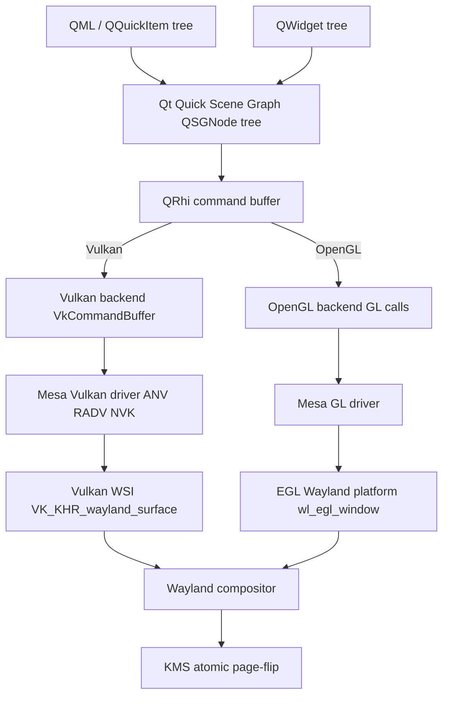
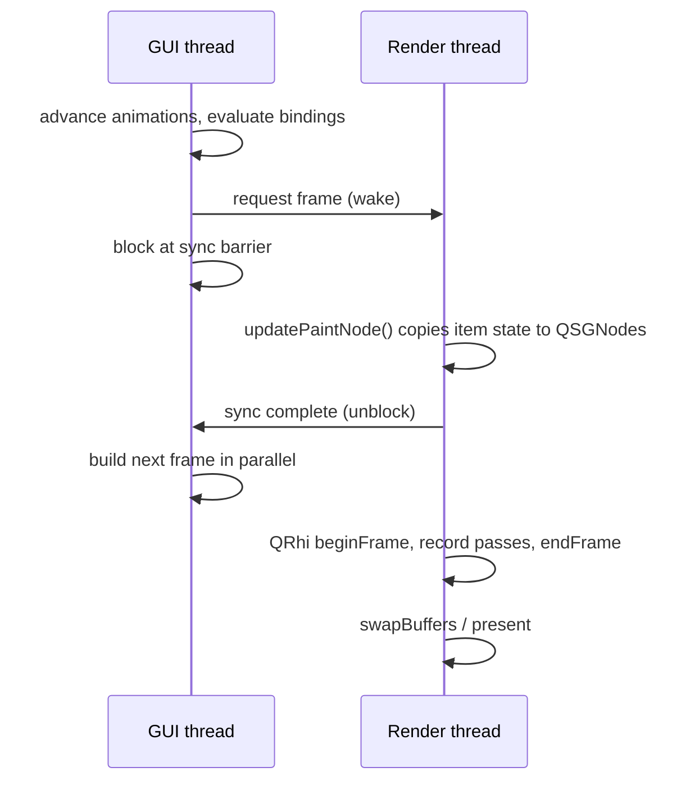
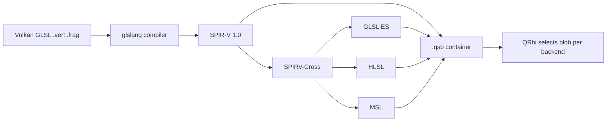

# Chapter 39a: Qt6 — GPU Rendering, Wayland Integration, and the QML Runtime

> **Part**: Part VII-C — Desktop Frameworks
> **Audience**: Graphics application developers building Qt6/QML applications; systems developers tracing the rendering pipeline from `QRhi` down to the KMS page-flip
> **Status**: First draft — 2026-07-24

## Table of Contents

- [Overview](#overview)
- [1. Qt6 Architecture Overview](#1-qt6-architecture-overview)
  - [1.1 Module Structure](#11-module-structure)
  - [1.2 Licensing](#12-licensing)
  - [1.3 What Changed from Qt5](#13-what-changed-from-qt5)
- [2. QRhi: The Rendering Hardware Interface](#2-qrhi-the-rendering-hardware-interface)
  - [2.1 Design Goals and the Semi-Public API](#21-design-goals-and-the-semi-public-api)
  - [2.2 Backend Selection](#22-backend-selection)
  - [2.3 Core Classes](#23-core-classes)
  - [2.4 Frame Lifecycle](#24-frame-lifecycle)
  - [2.5 Resource Management](#25-resource-management)
- [3. Qt Quick Scene Graph](#3-qt-quick-scene-graph)
  - [3.1 Node Types](#31-node-types)
  - [3.2 Threading Model](#32-threading-model)
  - [3.3 QSGRenderLoop Variants](#33-qsgrenderloop-variants)
  - [3.4 Custom QSGMaterial and QSGMaterialShader](#34-custom-qsgmaterial-and-qsgmaterialshader)
  - [3.5 QQuickRenderControl for Off-Screen Rendering](#35-qquickrendercontrol-for-off-screen-rendering)
- [4. The Qt Meta-Object System](#4-the-qt-meta-object-system)
  - [4.1 QObject, Q_OBJECT, moc](#41-qobject-q_object-moc)
  - [4.2 Signals and Slots](#42-signals-and-slots)
  - [4.3 Q_PROPERTY and QProperty Reactive Bindings](#43-q_property-and-qproperty-reactive-bindings)
  - [4.4 QMetaObject Runtime Introspection](#44-qmetaobject-runtime-introspection)
  - [4.5 QQmlEngine and the V4 JavaScript Engine](#45-qqmlengine-and-the-v4-javascript-engine)
  - [4.6 Comparison with GObject](#46-comparison-with-gobject)
- [5. QtWayland: Platform Integration](#5-qtwayland-platform-integration)
  - [5.1 QPA Architecture](#51-qpa-architecture)
  - [5.2 QWaylandIntegration, QWaylandWindow](#52-qwaylandintegration-qwaylandwindow)
  - [5.3 Vulkan Swapchain](#53-vulkan-swapchain)
  - [5.4 OpenGL/EGL Path](#54-openglegl-path)
  - [5.5 Frame Pacing](#55-frame-pacing)
  - [5.6 Explicit Sync: Where It Actually Lives](#56-explicit-sync-where-it-actually-lives)
  - [5.7 linux-dmabuf Zero-Copy](#57-linux-dmabuf-zero-copy)
- [6. Qt Shader Tools: qsb and the SPIR-V Pipeline](#6-qt-shader-tools-qsb-and-the-spir-v-pipeline)
  - [6.1 The qsb Tool](#61-the-qsb-tool)
  - [6.2 The .qsb Binary Format](#62-the-qsb-binary-format)
  - [6.3 qt_add_shaders CMake Integration](#63-qt_add_shaders-cmake-integration)
  - [6.4 Runtime Shader Selection](#64-runtime-shader-selection)
- [7. Qt Multimedia and PipeWire](#7-qt-multimedia-and-pipewire)
  - [7.1 QMediaPlayer, QAudioOutput, QCamera](#71-qmediaplayer-qaudiooutput-qcamera)
  - [7.2 The FFmpeg Backend (Linux Default)](#72-the-ffmpeg-backend-linux-default)
  - [7.3 Screen Capture via XDG Portal and PipeWire](#73-screen-capture-via-xdg-portal-and-pipewire)
  - [7.4 Video Output: QVideoSink and QRhiTexture](#74-video-output-qvideosink-and-qrhitexture)
- [8. Qt Accessibility and Theming](#8-qt-accessibility-and-theming)
  - [8.1 QStyle and Platform Integration](#81-qstyle-and-platform-integration)
  - [8.2 QAccessible and AT-SPI2 on Linux](#82-qaccessible-and-at-spi2-on-linux)
- [9. Performance and Debugging](#9-performance-and-debugging)
- [10. Integrations](#10-integrations)
- [References](#references)

---

## Overview

**Qt6** is a C++ application framework whose graphics story was rebuilt around a single abstraction: the **Qt Rendering Hardware Interface (`QRhi`)**. Where Qt5's Qt Quick spoke OpenGL directly, Qt6 routes every draw call through `QRhi`, a portable command-buffer API layered over **Vulkan**, **OpenGL ES 2.0+/OpenGL 3.x**, **Direct3D 11/12**, **Metal**, and a **Null** backend. This chapter traces a Qt6 frame from the moment QML declares a scene, through the **Qt Quick scene graph** that turns that declaration into a retained tree of `QSGNode` objects, through `QRhi`'s translation of that tree into backend command buffers, and out across the **Wayland** wire to a compositor that ultimately hands the buffer to KMS for scan-out. On the way it examines the **meta-object system** — `QObject`, `moc`, signals/slots, and the Qt6 `QProperty<T>` reactive-binding engine — that makes QML's declarative bindings possible, and the **V4** JavaScript engine that executes QML expressions.

The rendering path has three collaborating layers. At the top, QML and the C++ widget stack build scene-graph nodes on the **GUI thread**. A **render thread** then synchronises with the GUI thread across a barrier, walks the node tree, and records a frame through `QRhi`. `QRhi` selects a backend at runtime — on Linux, typically the OpenGL backend historically and increasingly the Vulkan backend — and emits native API calls: `vkCmdDraw`/`vkQueueSubmit` for Vulkan, `glDrawElements` for OpenGL. Shaders are not written per-backend; instead Qt authors **Vulkan-flavoured GLSL**, compiles it once with the **`qsb`** tool into a `.qsb` container holding SPIR-V plus cross-compiled GLSL ES, HLSL, and MSL variants, and lets `QRhi` pick the right blob at pipeline-creation time.

Beneath the toolkit sits **QtWayland**, the Qt Platform Abstraction (**QPA**) plugin that implements windowing on Wayland. It creates the `wl_surface`, negotiates `xdg-shell` roles, and — critically — delegates buffer submission to the graphics API layer: the **Vulkan WSI** (`VK_KHR_wayland_surface`) or the **EGL Wayland platform** (`wl_egl_window`). That delegation is why buffer synchronisation, including **explicit sync** via `wp_linux_drm_syncobj_v1`, is provided by **Mesa's** WSI rather than by Qt itself — a nuance this chapter takes care to get right. The remaining sections cover **Qt Multimedia**, whose default Linux backend since Qt 6.5 is **FFmpeg** (not GStreamer), and which captures the screen through the **XDG Desktop Portal ScreenCast/PipeWire** path; **accessibility** via the `QSpiAccessibleBridge` AT-SPI2 plugin; theming via `QStyle`; and the environment-variable and profiler toolbox (`QSG_RENDER_TIMING`, `QSG_INFO`, `qmlprofiler`) used to diagnose a stalling frame.

---

## 1. Qt6 Architecture Overview

### 1.1 Module Structure

Qt6 is delivered as a set of CMake-built modules. Four matter most for graphics:

- **`qtbase`** — the foundation: `QtCore` (the meta-object system, `QObject`, `QProperty`), `QtGui` (windowing, the `QRhi` graphics abstraction under `src/gui/rhi`, the QPA plugin interface), `QtWidgets` (the classic desktop widget set), and `QtNetwork`. The `QRhi` sources live at [`qtbase/src/gui/rhi`](https://code.qt.io/cgit/qt/qtbase.git/tree/src/gui/rhi).
- **`qtdeclarative`** — Qt Quick, QML, the V4 JavaScript engine, and the scene graph (`QSGNode`, `QSGRenderer`, `QSGMaterial`).
- **`qtwayland`** — both the client-side QPA plugin (`src/client`, `src/plugins/platforms/wayland`) and the `QtWaylandCompositor` server framework for building compositors in QML.
- **`qtshadertools`** — the `qsb` command-line shader baker and the `QShader`/`QShaderDescription` runtime container types.
- **`qtmultimedia`** — `QMediaPlayer`, `QCamera`, `QAudioOutput`, `QScreenCapture`, and the pluggable FFmpeg/GStreamer backends.

The modular structure means an embedded Qt Quick application can link `qtbase` + `qtdeclarative` + `qtwayland` and omit `QtWidgets` entirely.

### 1.2 Licensing

Qt is dual-licensed. The open-source editions are available under **LGPL v3** and **GPL v3** (with some modules GPL-only or subject to The Qt Company's licensing terms), alongside a **commercial** license that removes LGPL obligations such as the requirement to allow relinking. [Source](https://doc.qt.io/qt-6/licensing.html) LGPL v3 permits dynamic linking from proprietary applications provided the user can substitute a modified Qt; static linking or modifying Qt itself triggers the copyleft obligations. Some add-on modules (for example, certain automotive and MCU offerings) are commercial-only, which is why the exact module set matters for compliance in shipped products.

### 1.3 What Changed from Qt5

Three architectural shifts define the Qt5 → Qt6 transition for graphics developers:

1. **`QRhi` replaces direct OpenGL.** In Qt5, Qt Quick's scene graph issued OpenGL calls directly, and porting to Vulkan or Metal meant maintaining parallel back-ends. Qt6 inserts `QRhi` as a hard abstraction boundary; the scene graph now knows nothing about the underlying API. [Source](https://www.qt.io/blog/graphics-in-qt-6.0-qrhi-qt-quick-qt-quick-3d)
2. **CMake-first build.** Qt6 itself is built with CMake, and CMake — not `qmake` — is the recommended and best-supported build system for Qt6 applications. `qmake` remains for compatibility but the tooling (`qt_add_executable`, `qt_add_qml_module`, `qt_add_shaders`) is CMake-native.
3. **`QProperty<T>` bindable properties.** Qt6 adds a C++ reactive property system that brings QML-style bindings to plain C++ objects, independent of the `Q_PROPERTY`/`NOTIFY` signal machinery (§4.3).

---

## 2. QRhi: The Rendering Hardware Interface

### 2.1 Design Goals and the Semi-Public API

`QRhi` abstracts "hardware-accelerated graphics APIs, such as OpenGL, OpenGL ES, Direct3D, Metal, and Vulkan," presenting a Vulkan-and-Metal-shaped modern API — explicit pipelines, command buffers, and resource-update batches — that maps cleanly onto both the newer explicit APIs and, with more work inside the backend, onto OpenGL. [Source](https://doc.qt.io/qt-6/qrhi.html)

An important status caveat: although `QRhi` had existed internally since the late Qt5 series, it became available for application use only in **Qt 6.6**, and even then as a **semi-public** API. It sits "in a similar category as the QPA family of classes: neither fully public nor fully private," carrying a **more limited source- and binary-compatibility promise** than ordinary public Qt API, while still shipping full documentation. [Source](https://doc.qt.io/qt-6/qrhi.html) Practically, this means an application may use `QRhi` directly — for example, to render custom 3D content inside a `QRhiWidget` or a `QQuickRhiItem` — but must accept that signatures can change between minor releases and pin its Qt version accordingly.

### 2.2 Backend Selection

`QRhi` supports `QRhi::Vulkan`, `QRhi::OpenGLES2` (covering desktop OpenGL 3.x as well as GLES), `QRhi::D3D11`, `QRhi::D3D12`, `QRhi::Metal`, and `QRhi::Null`. On Linux the practical choices are OpenGL and Vulkan. Qt Quick selects the scene-graph backend from the `QSG_RHI_BACKEND` environment variable (values `vulkan`, `opengl`, `d3d11`, `d3d12`, `metal`, `null`) or programmatically via `QQuickWindow::setGraphicsApi()`; a raw `QRhi` user passes the enum to `QRhi::create()`.

```cpp
// Initialising QRhi with the Vulkan backend, following the pattern in
// qtbase/examples/gui/rhiwindow (QRhiWindow::init()).
#include <rhi/qrhi.h>

std::unique_ptr<QRhi> createRhi(QWindow *window, QVulkanInstance *inst)
{
#if QT_CONFIG(vulkan)
    QRhiVulkanInitParams params;
    params.inst = inst;                 // the QVulkanInstance backing VkInstance
    params.window = window;             // used to derive a compatible VkSurfaceKHR
    return std::unique_ptr<QRhi>(QRhi::create(QRhi::Vulkan, &params));
#else
    QRhiGles2InitParams params;
    params.fallbackSurface = QRhiGles2InitParams::newFallbackSurface();
    params.window = window;
    return std::unique_ptr<QRhi>(QRhi::create(QRhi::OpenGLES2, &params));
#endif
}
```

Each backend has its own `*InitParams` struct (`QRhiVulkanInitParams`, `QRhiGles2InitParams`, `QRhiD3D11InitParams`, `QRhiMetalInitParams`). [Source](https://doc.qt.io/qt-6/qrhi.html)

### 2.3 Core Classes

`QRhi` owns a family of resource and command types:

| Class | Role |
|---|---|
| `QRhi` | The device/context; factory for all resources |
| `QRhiSwapChain` | Ties a `QWindow` to a presentable set of render targets |
| `QRhiTexture` | GPU texture (sampled, storage, or render target) |
| `QRhiBuffer` | Vertex/index/uniform/storage buffer with `Immutable`, `Static`, or `Dynamic` usage |
| `QRhiSampler` | Filtering/addressing state |
| `QRhiShaderResourceBindings` | The descriptor-set equivalent: binds uniform buffers, sampled textures |
| `QRhiGraphicsPipeline` | Immutable pipeline: shader stages, vertex layout, blend/depth state |
| `QRhiCommandBuffer` | Records passes and draw calls |
| `QRhiResourceUpdateBatch` | Deferred uploads/readbacks applied at pass begin |

Resources are created (`QRhi::newBuffer()`, `newTexture()`, `newGraphicsPipeline()`, …) then `create()`- d to allocate their native objects. [Source](https://doc.qt.io/qt-6/qrhi.html)

### 2.4 Frame Lifecycle

A `QRhi` frame is bracketed by `beginFrame()`/`endFrame()` on a swapchain. The swapchain hands back a per-frame command buffer and render target; the application records one or more passes and submits. The example below mirrors the upstream RHI window example. [Source](https://doc.qt.io/qt-6/qtgui-rhiwindow-example.html)

```cpp
void RhiWindow::render()
{
    if (!m_hasSwapChain)
        return;

    // The swapchain can become out of date across a resize or output change.
    QRhi::FrameOpResult r = m_rhi->beginFrame(m_sc.get());
    if (r == QRhi::FrameOpSwapChainOutOfDate) {
        if (!resizeSwapChain())
            return;
        r = m_rhi->beginFrame(m_sc.get());
    }
    if (r != QRhi::FrameOpSuccess)
        return;

    QRhiCommandBuffer *cb = m_sc->currentFrameCommandBuffer();
    QRhiRenderTarget  *rt = m_sc->currentFrameRenderTarget();
    const QSize outputSize = m_sc->currentPixelSize();

    // Deferred resource updates (uploads) are recorded into a batch and
    // consumed by beginPass().
    QRhiResourceUpdateBatch *u = m_rhi->nextResourceUpdateBatch();
    QMatrix4x4 mvp = m_rhi->clipSpaceCorrMatrix();   // per-backend clip fixup
    mvp.perspective(45.0f, outputSize.width() / (float) outputSize.height(),
                    0.01f, 1000.0f);
    mvp.translate(0, 0, -4);
    u->updateDynamicBuffer(m_ubuf.get(), 0, 64, mvp.constData());

    const QColor clearColor = QColor::fromRgbF(0.4f, 0.7f, 0.0f, 1.0f);
    cb->beginPass(rt, clearColor, { 1.0f, 0 }, u);      // depth 1.0, stencil 0

    cb->setGraphicsPipeline(m_pipeline.get());
    cb->setViewport({ 0, 0, float(outputSize.width()), float(outputSize.height()) });
    cb->setShaderResources();                            // bind SRB from pipeline
    const QRhiCommandBuffer::VertexInput vbufBinding(m_vbuf.get(), 0);
    cb->setVertexInput(0, 1, &vbufBinding);
    cb->draw(3);

    cb->endPass();
    m_rhi->endFrame(m_sc.get());   // present (queue the swapchain image)
}
```

Two details deserve emphasis. `QRhi::clipSpaceCorrMatrix()` returns a correction matrix that hides the differences in normalised-device-coordinate conventions between backends — OpenGL's `[-1, 1]` depth range and bottom-left origin versus Vulkan/D3D/Metal's `[0, 1]` depth and top-left origin — so a single shader works everywhere. And `beginFrame()` can return `FrameOpSwapChainOutOfDate`, the portable signal for the Vulkan `VK_ERROR_OUT_OF_DATE_KHR`/`VK_SUBOPTIMAL_KHR` condition that a Wayland resize produces.

### 2.5 Resource Management

Uploads never happen inline. Instead they are queued into a `QRhiResourceUpdateBatch` and flushed when passed to `beginPass()` (or `resourceUpdate()`). Static geometry is uploaded once with `uploadStaticBuffer()`; per-frame uniforms use `updateDynamicBuffer()` on a `QRhiBuffer` created with `QRhiBuffer::Dynamic` usage and `UniformBuffer`. Textures are filled with `uploadTexture()` taking a `QRhiTextureUploadDescription`. This batching model matches the staging/transfer discipline of Vulkan and Metal and lets the OpenGL backend coalesce `glBufferSubData` calls. [Source](https://doc.qt.io/qt-6/qrhiresourceupdatebatch.html)



---

## 3. Qt Quick Scene Graph

### 3.1 Node Types

Qt Quick does not paint items directly. Each visible `QQuickItem` contributes to a **retained scene graph** of `QSGNode` objects via `QQuickItem::updatePaintNode()`, called on the render thread. [Source](https://doc.qt.io/qt-6/qtquick-visualcanvas-scenegraph.html) The principal node types:

- **`QSGGeometryNode`** — the only node that actually draws; pairs a `QSGGeometry` (vertex/index data and primitive type) with a `QSGMaterial` (shaders + uniforms).
- **`QSGTransformNode`** — applies a `QMatrix4x4` to its subtree.
- **`QSGOpacityNode`** — multiplies subtree opacity, feeding `qt_Opacity` into materials.
- **`QSGClipNode`** — sets a scissor or stencil clip.
- **`QSGRenderNode`** — the extension point for injecting raw `QRhi` (or native API) rendering into the scene graph.

The renderer batches geometry nodes that share material state to minimise draw calls and state changes — a key reason custom materials should implement `compare()` correctly (§3.4).

### 3.2 Threading Model

The scene graph runs a two-thread model. The **GUI (main) thread** runs the event loop, QML bindings, and animations, and owns the `QQuickItem` tree. The **render thread** owns the OpenGL/Vulkan context, the `QSGNode` tree, and the `QRhi`. Between them sits a **synchronisation barrier**: when a new frame is due, the GUI thread is briefly blocked while the render thread copies changed state from items into scene-graph nodes (the `updatePaintNode()` pass). Once synchronisation completes, the GUI thread is unblocked and resumes producing the next frame's animation state **in parallel** with the render thread rasterising the current frame. [Source](https://doc.qt.io/qt-6/qtquick-visualcanvas-scenegraph.html#threaded-render-loop) This is why `updatePaintNode()` must touch only node state and never item members without care — it executes while the GUI thread is stopped, the one safe window for cross-thread data transfer.



### 3.3 QSGRenderLoop Variants

The render loop is chosen by `QSGRenderLoop` at startup, overridable with the `QSG_RENDER_LOOP` environment variable:

- **`threaded`** — the default where the driver is known-good; render thread as described above.
- **`basic`** — single-threaded; rendering happens on the GUI thread. Used as a fallback on drivers with unsafe threading, and forced by `QSG_RENDER_LOOP=basic` for debugging.
- **`windows`** — a single-threaded loop historically specific to certain Windows/driver combinations.

[Source](https://doc.qt.io/qt-6/qtquick-visualcanvas-scenegraph.html#scene-graph-and-rendering)

### 3.4 Custom QSGMaterial and QSGMaterialShader

A custom material is two classes: a `QSGMaterial` holding per-instance uniform values and identifying a `QSGMaterialType`, and a `QSGMaterialShader` that names the compiled `.qsb` shaders and marshals uniforms into the pipeline's uniform buffer. The uniform buffer follows Qt's convention: the combined MVP matrix `qt_Matrix` occupies bytes `0..63`, and `qt_Opacity` follows at byte `64`. [Source](https://doc.qt.io/qt-6/qsgmaterialshader.html)

```cpp
// Custom material: a horizontal colour gradient driven by one float uniform.
class RampMaterial : public QSGMaterial
{
public:
    RampMaterial() { setFlag(Blending, true); }

    QSGMaterialType *type() const override {
        static QSGMaterialType t;         // one static instance == one material type
        return &t;
    }
    QSGMaterialShader *createShader(QSGRendererInterface::RenderMode) const override;

    int compare(const QSGMaterial *o) const override {
        auto *m = static_cast<const RampMaterial *>(o);
        // Order deterministically so the renderer can batch equal materials.
        return (phase < m->phase) ? -1 : (phase > m->phase) ? 1 : 0;
    }

    float phase = 0.0f;
};

class RampShader : public QSGMaterialShader
{
public:
    RampShader() {
        setShaderFileName(VertexStage,   QLatin1String(":/shaders/ramp.vert.qsb"));
        setShaderFileName(FragmentStage, QLatin1String(":/shaders/ramp.frag.qsb"));
    }

    bool updateUniformData(RenderState &state,
                           QSGMaterial *newMat, QSGMaterial *) override
    {
        QByteArray *buf = state.uniformData();
        Q_ASSERT(buf->size() >= 72);           // 64 (mat4) + 4 (opacity) + 4 (phase)

        if (state.isMatrixDirty()) {
            const QMatrix4x4 m = state.combinedMatrix();
            memcpy(buf->data(), m.constData(), 64);
        }
        if (state.isOpacityDirty()) {
            const float opacity = state.opacity();
            memcpy(buf->data() + 64, &opacity, 4);
        }
        const float phase = static_cast<RampMaterial *>(newMat)->phase;
        memcpy(buf->data() + 68, &phase, 4);     // written every frame
        return true;                             // uniforms always updated
    }
};

QSGMaterialShader *RampMaterial::createShader(QSGRendererInterface::RenderMode) const
{
    return new RampShader;
}
```

The matching fragment shader is authored in Vulkan-flavoured GLSL with an explicit `std140` uniform block whose layout the C++ above must mirror:

```glsl
#version 440
layout(location = 0) in vec2 v_texcoord;
layout(location = 0) out vec4 fragColor;
layout(std140, binding = 0) uniform buf {
    mat4  qt_Matrix;
    float qt_Opacity;
    float phase;
};
void main() {
    float t = fract(v_texcoord.x + phase);
    vec3 c = mix(vec3(0.1, 0.2, 0.9), vec3(0.9, 0.3, 0.1), t);
    fragColor = vec4(c, 1.0) * qt_Opacity;
}
```

### 3.5 QQuickRenderControl for Off-Screen Rendering

`QQuickRenderControl` drives a `QQuickWindow` that renders into an application-supplied render target instead of an on-screen surface — the mechanism behind rendering QML into a texture for compositing into a larger 3D scene, into a Vulkan swapchain owned by the host, or headlessly for server-side image generation. The host calls `polishItems()`, `beginFrame()`, `sync()`, `render()`, and `endFrame()` manually, supplying the `QRhiRenderTarget` via `QQuickRenderTarget::fromRhiRenderTarget()`. [Source](https://doc.qt.io/qt-6/qquickrendercontrol.html) This is how Qt Quick is embedded into Qt Quick 3D, into Qt WebEngine overlays, and into custom Vulkan/Metal applications.

---

## 4. The Qt Meta-Object System

### 4.1 QObject, Q_OBJECT, moc

Every Qt type that participates in signals/slots, properties, or run-time type information derives from `QObject` and declares the `Q_OBJECT` macro. The **Meta-Object Compiler (`moc`)** parses the header, finds `Q_OBJECT`, and generates a `moc_*.cpp` translation unit containing a static `QMetaObject` — a table of signals, slots, properties, and enums, plus the `qt_metacall()` dispatcher. `QObject`s form parent-owned trees: deleting a parent deletes its children, the ownership model that lets QML manage lifetimes. [Source](https://doc.qt.io/qt-6/qobject.html)

### 4.2 Signals and Slots

Qt offers two connection syntaxes. The **string-based** form (`SIGNAL()`/`SLOT()` macros) resolves at run time through the `QMetaObject` and can fail silently on a typo. The **pointer-to-member (functor) form**, preferred in Qt5/6, is checked at **compile time** and supports lambdas:

```cpp
QObject::connect(sender, &Sender::valueChanged,
                 receiver, &Receiver::onValueChanged);

QObject::connect(button, &QPushButton::clicked, this, [this] {
    m_model->refresh();
});
```

The compile-time form also permits automatic argument conversion checks and works across threads via `Qt::QueuedConnection`, which marshals the signal's arguments into an event posted to the receiver's thread. [Source](https://doc.qt.io/qt-6/signalsandslots.html)

### 4.3 Q_PROPERTY and QProperty Reactive Bindings

`Q_PROPERTY` declares a named, introspectable property with `READ`/`WRITE`/`NOTIFY` accessors; QML reads and binds to these through the meta-object. Qt6 adds a distinct, lower-level facility: **`QProperty<T>`**, a value wrapper that supports **lazy, automatically-tracked bindings** without any signal/slot involvement.

```cpp
#include <QProperty>

struct Box {
    QProperty<int> width { 10 };
    QProperty<int> height { 5 };
    QProperty<int> area;

    Box() {
        // The lambda's reads of width/height are auto-tracked; area re-evaluates
        // lazily the next time it is read after either dependency changes.
        area.setBinding([this] { return width.value() * height.value(); });
    }
};

Box b;
b.width = 20;                 // does not compute area yet (lazy)
int a = b.area.value();       // evaluates now: 20 * 5 == 100
```

For `QObject`-integrated properties that must also emit a `NOTIFY` signal for QML, Qt6 provides `Q_OBJECT_BINDABLE_PROPERTY`, wiring a `QProperty` into the meta-object so both the C++ binding engine and QML observe the same storage. [Source](https://doc.qt.io/qt-6/qproperty.html) The binding engine detects cycles and evaluates in dependency order, replacing the ad-hoc, eager `NOTIFY`-signal cascades of Qt5.

### 4.4 QMetaObject Runtime Introspection

The generated `QMetaObject` is queryable at run time: `metaObject()->methodCount()`, `property(i)`, `indexOfSignal()`, and dynamic invocation via `QMetaObject::invokeMethod()`. This reflection underpins QML's ability to instantiate and wire C++ types by name, the `QVariant`-based property system, and Qt's D-Bus and serialization bindings.

```cpp
const QMetaObject *mo = obj->metaObject();
for (int i = mo->propertyOffset(); i < mo->propertyCount(); ++i) {
    QMetaProperty p = mo->property(i);
    qDebug() << p.name() << "=" << p.read(obj);
}
QMetaObject::invokeMethod(obj, "refresh", Qt::QueuedConnection);
```

[Source](https://doc.qt.io/qt-6/qmetaobject.html)

### 4.5 QQmlEngine and the V4 JavaScript Engine

QML documents are executed by a `QQmlEngine`, which owns the **V4** JavaScript engine — Qt's own ECMAScript implementation with a bytecode interpreter and a JIT on supported architectures. Bindings in QML are JavaScript expressions compiled to V4 bytecode; property reads inside them are captured to build the same dependency graph the `QProperty` engine uses. The modern entry point is `QQmlApplicationEngine::loadFromModule()`, pairing with `qt_add_qml_module()` in CMake:

```cpp
int main(int argc, char *argv[])
{
    QGuiApplication app(argc, argv);
    QQmlApplicationEngine engine;
    QObject::connect(&engine, &QQmlApplicationEngine::objectCreationFailed,
                     &app, [] { QCoreApplication::exit(-1); },
                     Qt::QueuedConnection);
    engine.loadFromModule("MyApp", "Main");   // URI + component name
    return app.exec();
}
```

[Source](https://doc.qt.io/qt-6/qqmlapplicationengine.html) Qt6 can also **ahead-of-time compile** QML to C++ via `qmltc` and to bytecode caches via `qmlcachegen`, cutting first-load JavaScript compilation cost.

### 4.6 Comparison with GObject

Qt's meta-object system and GLib's **GObject** (used by GTK4, Ch39) solve the same problem — run-time introspection, signals, and properties for a language (C++/C) that lacks them natively — with different mechanics. GObject encodes classes, signals, and properties through **run-time registration functions** (`g_type_register_static`, `g_signal_new`, `g_object_class_install_property`) and relies on `GParamSpec` and closures; there is no code generator, but the boilerplate is written by hand or via macros. Qt instead relies on the **`moc` code generator** to emit the meta-object at compile time, trading a build step for terse, type-checked source. GObject signals dispatch through `g_signal_emit` with run-time name lookup; Qt's functor connections resolve at compile time. Both support cross-language binding — GObject-Introspection produces typelibs consumed by Python/JavaScript, while Qt exposes its meta-object to QML, PySide, and Qt for Python.

---

## 5. QtWayland: Platform Integration

### 5.1 QPA Architecture

Qt abstracts the windowing system behind the **Qt Platform Abstraction (QPA)**. A platform plugin implements interfaces — `QPlatformIntegration`, `QPlatformWindow`, `QPlatformOpenGLContext`, `QPlatformVulkanInstance`, `QPlatformBackingStore` — and Qt loads exactly one at startup, chosen by `QT_QPA_PLATFORM` (`wayland`, `xcb`, `eglfs`, `offscreen`, …) or auto-detected. On a Wayland session Qt loads the **`wayland`** plugin from `qtwayland`. [Source](https://doc.qt.io/qt-6/qpa.html)

### 5.2 QWaylandIntegration, QWaylandWindow

The client plugin's core classes live in [`qtwayland/src/client`](https://code.qt.io/cgit/qt/qtwayland.git/tree/src/client):

- **`QWaylandIntegration`** — the `QPlatformIntegration`; opens the `wl_display`, binds globals (`wl_compositor`, `xdg_wm_base`, `wl_seat`, `wp_presentation`, `zwp_linux_dmabuf_v1`), and creates windows.
- **`QWaylandDisplay`** — owns the registry and the roundtrip/dispatch machinery.
- **`QWaylandWindow`** — the `QPlatformWindow`; creates the `wl_surface`, assigns it an `xdg_surface` + `xdg_toplevel` (or popup) role, and drives commits.

The `wl_surface` created here is the object every rendering path ultimately attaches buffers to.

### 5.3 Vulkan Swapchain

Qt's Vulkan integration is anchored by `QVulkanInstance`, which wraps a `VkInstance` and, through the platform plugin, enables the correct WSI surface extension. On Wayland, [`qtwayland/src/client/qwaylandvulkaninstance.cpp`](https://code.qt.io/cgit/qt/qtwayland.git/tree/src/client) enables `VK_KHR_surface` + `VK_KHR_wayland_surface`, and [`qwaylandvulkanwindow.cpp`](https://code.qt.io/cgit/qt/qtwayland.git/tree/src/client) creates the `VkSurfaceKHR` from the window's `wl_surface` via `vkCreateWaylandSurfaceKHR`.

```cpp
// Application-level setup; the qtwayland plugin does the vkCreateWaylandSurfaceKHR.
QVulkanInstance inst;
inst.setApiVersion(QVersionNumber(1, 3));
#ifndef QT_NO_DEBUG
inst.setLayers({ "VK_LAYER_KHRONOS_validation" });
#endif
if (!inst.create())
    qFatal("Vulkan instance creation failed: %d", inst.errorCode());

QWindow window;
window.setSurfaceType(QSurface::VulkanSurface);
window.setVulkanInstance(&inst);
window.resize(1280, 720);
window.show();

// The VkSurfaceKHR wrapping the wl_surface, ready for swapchain creation:
VkSurfaceKHR surface = QVulkanInstance::surfaceForWindow(&window);
```

Under the hood the qtwayland plugin fills a `VkWaylandSurfaceCreateInfoKHR` with the `wl_display` and the window's `wl_surface`. From that point the **Vulkan WSI in Mesa** — not Qt — owns `VkSwapchainKHR` creation, image acquisition (`vkAcquireNextImageKHR`), and presentation (`vkQueuePresentKHR`), which is where Wayland buffer commits actually occur.

### 5.4 OpenGL/EGL Path

On the OpenGL path the plugin uses `EGL_PLATFORM_WAYLAND_KHR`: `QWaylandGLContext` and the wayland-egl client integration create a **`wl_egl_window`** wrapping the `wl_surface`, then an `EGLSurface` over it. Rendering with `eglSwapBuffers()` triggers the EGL Wayland platform (again in Mesa) to attach the rendered buffer to the `wl_surface` and commit. The `wl_egl_window` is resizable via `wl_egl_window_resize()`, which the plugin calls on `QWaylandWindow` geometry changes so the buffer dimensions track the surface.

### 5.5 Frame Pacing

Qt paces rendering to the compositor using **`wl_surface.frame`** callbacks: after committing a buffer, the client requests a `wl_callback` that the compositor fires when the surface is about to be repainted, signalling the client to produce the next frame. This throttles a Qt Quick animation to the compositor's refresh cadence rather than spinning. For **presentation timing**, qtwayland ships the **`wp_presentation`** protocol ([`src/3rdparty/protocol/presentation-time`](https://code.qt.io/cgit/qt/qtwayland.git/tree/src/3rdparty/protocol)), whose `presented` events report the actual scan-out timestamp and refresh interval — the data a frame-timing overlay or an adaptive animation needs.

### 5.6 Explicit Sync: Where It Actually Lives

Qt does **not** implement Wayland **explicit synchronisation** (`wp_linux_drm_syncobj_v1`) in its Wayland plugin. As of Qt 6.11, **qtwayland neither vendors the `linux-drm-syncobj-v1` protocol nor references it in its client buffer-submission code** — the vendored protocol set contains `linux-dmabuf` and `presentation-time` but no `syncobj`, and the client commit path (`qwaylandwindow.cpp`, `qwaylandeglwindow.cpp`, `qwaylandvulkanwindow.cpp`) contains no `syncobj`/acquire-release timeline references. The "What's New" release notes for Qt 6.8 through 6.11 list no explicit-sync entry under Wayland. [Source](https://doc.qt.io/qt-6/whatsnew611.html)

The reason is structural. For the accelerated paths, Qt does **not** commit buffers to the `wl_surface` itself — it delegates to the Vulkan WSI (§5.3) or the EGL Wayland platform (§5.4). The `linux-drm-syncobj-v1` specification notes precisely this division of responsibility: graphics APIs "like EGL or Vulkan, that manage the buffer queue and commits of a `wl_surface` themselves, are likely to be using this extension internally." [Source](https://wayland.app/protocols/linux-drm-syncobj-v1) Explicit sync for a Qt client therefore comes from **Mesa**: the Vulkan WSI gained `wp_linux_drm_syncobj_v1` support in **Mesa 24.1** (2024), and the EGL Wayland platform carries its own implementation. [Source](https://www.phoronix.com/news/Mesa-24.1-Vulkan-Wayland-Exp) A Qt Vulkan application running on Mesa ≥ 24.1 against a compositor that advertises `wp_linux_drm_syncobj_v1` (KWin, Mutter, wlroots-based) gets timeline-semaphore-based acquire/release sync transparently, with no Qt-level code. Absent that, submission falls back to **implicit synchronisation**: the dma-fence attached to the dmabuf via the `linux-dmabuf` protocol orders the compositor's texturing after the client's rendering completes.

> **Note**: The layer that owns the `wl_surface` commit owns the sync protocol. For Qt's accelerated paths that layer is Mesa's WSI/EGL, not qtwayland — so explicit sync is a property of the Mesa version and compositor in use, not of the Qt version.

### 5.7 linux-dmabuf Zero-Copy

For zero-copy buffer sharing, both the Vulkan WSI and the EGL platform allocate GPU buffers and export them as dmabufs, advertised to the compositor through **`zwp_linux_dmabuf_v1`** (vendored at [`qtwayland/src/3rdparty/protocol/linux-dmabuf`](https://code.qt.io/cgit/qt/qtwayland.git/tree/src/3rdparty/protocol)). The compositor imports the dmabuf directly as a texture or, in the best case, scans it out via a KMS plane without an intermediate copy. On the compositor side of qtwayland, `QtWaylandCompositor`'s dmabuf integration ([`src/hardwareintegration/compositor/linux-dmabuf-unstable-v1`](https://code.qt.io/cgit/qt/qtwayland.git/tree/src/hardwareintegration/compositor/linux-dmabuf-unstable-v1)) implements the server half for Qt-based compositors.

---

## 6. Qt Shader Tools: qsb and the SPIR-V Pipeline

### 6.1 The qsb Tool

Because `QRhi` targets five backends, shaders cannot be shipped as raw GLSL or HLSL. Qt authors shaders **once**, in Vulkan-flavoured GLSL, and compiles them with **`qsb`** (the Qt Shader Baker) from `qtshadertools`. `qsb` integrates **glslang** to compile GLSL → SPIR-V, then **SPIRV-Cross** to translate SPIR-V → GLSL/GLSL ES, HLSL, and MSL, optionally invoking `spirv-opt` or `fxc`, and packages everything into a `.qsb` file. [Source](https://doc.qt.io/qt-6/qtshadertools-qsb.html) The stage is inferred from the extension (`.vert`, `.frag`, `.comp`, `.tesc`, `.tese`, `.geom`).

```bash
# Single-target (SPIR-V only, for a Vulkan-only build):
qsb -o ramp.frag.qsb ramp.frag

# Multi-target: SPIR-V (implicit) plus GLSL ES 100, GLSL 120/150, HLSL 5.0, MSL 1.2
qsb --glsl "100 es,120,150" --hlsl 50 --msl 12 -o ramp.frag.qsb ramp.frag

# With scene-graph batching support enabled (-b rewrites for Qt Quick batching):
qsb -b --glsl 330 -o ramp.vert.qsb ramp.vert
```

[Source](https://doc.qt.io/qt-6/qtshadertools-qsb.html)



### 6.2 The .qsb Binary Format

A `.qsb` file is a binary container holding, per requested target, the compiled shader blob (SPIR-V bytecode, GLSL/HLSL/MSL source text), plus a **`QShaderDescription`** — JSON reflection metadata listing inputs, outputs, uniform-block members and offsets, sampled images, and push constants. At run time, `QShader::fromSerialized()` loads the container and `QShader::shader()` selects the variant matching the active `QRhi` backend and version. The reflection data lets `QRhi` bind uniform-block members without hard-coded offsets. `qsb` can also dump a `.qsb` (`qsb -d file.qsb`) to inspect its variants and reflection — invaluable when a custom material's uniform layout does not match its C++ marshalling.

### 6.3 qt_add_shaders CMake Integration

In a CMake project, `qt_add_shaders()` runs `qsb` at build time and embeds the `.qsb` outputs into the Qt resource system under a chosen prefix, so `:/shaders/ramp.frag.qsb` resolves at run time:

```cmake
qt_add_executable(myapp main.cpp rampmaterial.cpp)

qt_add_shaders(myapp "ramp_shaders"
    PREFIX
        "/shaders"
    FILES
        shaders/ramp.vert
        shaders/ramp.frag
)

target_link_libraries(myapp PRIVATE Qt6::Quick Qt6::Gui)
```

The generated `.qsb` files are placed on the resource path `PREFIX + base name + .qsb`, matching the `setShaderFileName(":/shaders/ramp.frag.qsb")` calls in §3.4. [Source](https://doc.qt.io/qt-6/qt-add-shaders.html)

### 6.4 Runtime Shader Selection

At pipeline creation, `QRhiGraphicsPipeline::setShaderStages()` receives `QRhiShaderStage` objects each wrapping a `QShader`. The backend queries the `QShader` for the blob matching its needs: SPIR-V handed to `vkCreateShaderModule()` on Vulkan; GLSL/GLSL ES source handed to `glShaderSource()`/`glCompileShader()` on OpenGL; HLSL (or DXBC after `fxc`) on D3D; MSL on Metal. Because compiling a native pipeline is expensive, `QRhi` supports a **pipeline cache** — `QRhi::pipelineCacheData()` serialises driver-compiled pipeline state (backed by `VkPipelineCache` on Vulkan and program binaries on OpenGL) so it can be persisted and reloaded to cut warm-start shader-compilation cost. [Source](https://doc.qt.io/qt-6/qrhi.html)

---

## 7. Qt Multimedia and PipeWire

### 7.1 QMediaPlayer, QAudioOutput, QCamera

Qt Multimedia's high-level objects wire together through explicit session/sink connections. `QMediaPlayer` decodes a source; `QAudioOutput` routes audio to a device; a video sink (`QVideoWidget`, a QML `VideoOutput`, or a bare `QVideoSink`) receives frames.

```cpp
QMediaPlayer player;
QAudioOutput audioOut;
QVideoWidget videoWidget;

player.setAudioOutput(&audioOut);
player.setVideoOutput(&videoWidget);
player.setSource(QUrl::fromLocalFile("/home/user/clip.mp4"));
audioOut.setVolume(0.8f);
player.play();
videoWidget.show();
```

Capture uses `QMediaCaptureSession` as the hub, to which a `QCamera` (or `QScreenCapture`), an audio input, a `QMediaRecorder`, and a preview sink are attached. [Source](https://doc.qt.io/qt-6/qtmultimedia-index.html)

### 7.2 The FFmpeg Backend (Linux Default)

A significant change from earlier Qt6 releases: since **Qt 6.5**, the **FFmpeg** framework is the **default** Qt Multimedia backend on Windows, macOS, Android, and Linux (except Yocto-based device builds). In Qt 6.4 and earlier the platform-native backends were default — **GStreamer** on Linux, AVFoundation on macOS, WMF on Windows. [Source](https://doc.qt.io/qt-6/qtmultimedia-index.html) The GStreamer backend remains available on Linux but with more limited support; the backend is selected at run time via the **`QT_MEDIA_BACKEND`** environment variable (`ffmpeg` — the default — or `gstreamer`). [Source](https://doc.qt.io/qt-6/qtmultimedia-gstreamer.html)

```bash
# Force the legacy GStreamer backend instead of the default FFmpeg one.
QT_MEDIA_BACKEND=gstreamer ./myplayer
```

The FFmpeg backend uses libavcodec/libavformat and, on Linux, hardware decode through **VA-API** (and VDPAU where present), so decoded frames can stay on the GPU. This is the pipeline that matters for the graphics stack: a hardware-decoded frame arrives as a VA-API surface backed by a dmabuf.

### 7.3 Screen Capture via XDG Portal and PipeWire

Qt 6.8 implemented **screen capture using the ScreenCast service via the XDG Desktop Portal in Qt Multimedia**. [Source](https://doc.qt.io/qt-6/whatsnew68.html) On a Wayland session there is no direct framebuffer access; `QScreenCapture` therefore requests a stream through the portal's ScreenCast interface, which — after the user grants permission through the portal dialog — hands back a **PipeWire** node id. Qt then consumes the PipeWire stream, so PipeWire is the transport underneath Wayland screen capture even though the application only touches `QScreenCapture`.

```cpp
QMediaCaptureSession session;
QScreenCapture screenCapture;
QVideoSink sink;

session.setScreenCapture(&screenCapture);
session.setVideoSink(&sink);

QObject::connect(&sink, &QVideoSink::videoFrameChanged,
                 [](const QVideoFrame &frame) {
    // Each captured frame; on Wayland it originated from a PipeWire stream
    // negotiated through the XDG Desktop Portal ScreenCast interface.
    Q_UNUSED(frame);
});

screenCapture.setScreen(QGuiApplication::primaryScreen());
screenCapture.start();      // triggers the portal permission dialog on Wayland
```

[Source](https://doc.qt.io/qt-6/qscreencapture.html)

### 7.4 Video Output: QVideoSink and QRhiTexture

`QVideoSink` delivers `QVideoFrame` objects. A frame may be a CPU buffer or, importantly, a **hardware surface** whose `handleType()` is `QVideoFrame::RhiTextureHandle`, exposing the underlying `QRhiTexture` directly. When it is, the QML `VideoOutput` and `QVideoWidget` composite the frame into the scene graph as a texture node **without a GPU→CPU→GPU round trip** — the VA-API-decoded dmabuf is imported straight into `QRhi` as a texture. This zero-copy path from FFmpeg/VA-API decode into the `QRhi` scene graph is the reason the FFmpeg backend's hardware decode integrates cleanly with Qt Quick compositing. [Source](https://doc.qt.io/qt-6/qvideoframe.html)

---

## 8. Qt Accessibility and Theming

### 8.1 QStyle and Platform Integration

For the classic `QtWidgets` stack, `QStyle` abstracts the look of primitive and complex controls; a widget asks its style to draw each element (`drawControl()`, `drawPrimitive()`), so a single widget renders natively across platforms. The built-in **Fusion** style is a platform-agnostic style that looks identical everywhere and serves as the base for custom styles; platform styles integrate with the desktop theme. [Source](https://doc.qt.io/qt-6/qstyle.html) Qt Quick has a parallel mechanism in **Qt Quick Controls** styles (Basic, Fusion, Material, Universal, and the platform-native styles), selected via `QT_QUICK_CONTROLS_STYLE` or `qtquickcontrols2.conf`.

### 8.2 QAccessible and AT-SPI2 on Linux

Accessibility is exposed through `QAccessibleInterface`, which describes each UI element's role, state, and relationships to assistive technologies. On Linux the bridge to the desktop accessibility bus is the **`QSpiAccessibleBridge`** plugin, which maps `QAccessibleInterface` onto **AT-SPI2** over D-Bus — the same bus screen readers such as Orca listen on. The plugin lives at [`qtbase/src/gui/accessible/linux`](https://code.qt.io/cgit/qt/qtbase.git/tree/src/gui/accessible) (`qspiaccessiblebridge.cpp`). Applications register custom accessible objects via `QAccessible::installFactory()` and update assistive tech with `QAccessible::updateAccessibility()` events. [Source](https://doc.qt.io/qt-6/qaccessible.html)

---

## 9. Performance and Debugging

Qt exposes a rich set of environment variables and tools for diagnosing the render pipeline:

- **`QSG_INFO=1`** — logs scene-graph and `QRhi` initialisation: chosen backend, render loop, adapter, and driver. The first thing to check when a frame renders on the wrong backend.
- **`QSG_RENDER_TIMING=1`** — prints per-frame timing broken into polish, sync, render, and swap phases, isolating whether a stall is in binding evaluation (GUI thread) or rasterisation (render thread).
- **`QSG_RENDER_LOOP=basic|threaded|windows`** — forces a render loop; `basic` (single-threaded) is the standard way to rule out threading/driver interaction bugs.
- **`QSG_RHI_BACKEND=vulkan|opengl`** — forces the scene-graph backend.
- **`QSG_VISUALIZE=overdraw|batches|clip|changes`** — visualises overdraw, batch boundaries, clipping, and dirty regions directly in the window.
- **`QT_RHI_LEAK_CHECK`** and the backend's own validation — on Vulkan, enabling `VK_LAYER_KHRONOS_validation` through `QVulkanInstance::setLayers()` routes validation output through Qt's logging, catching synchronisation and resource-lifetime errors in the `QRhi` command stream.

For QML-level profiling, **`qmlprofiler`** attaches to an application started with `-qmljsdebugger=port:...` (or via Qt Creator) and records binding evaluation, signal handling, scene-graph timings, and JavaScript execution on a timeline. [Source](https://doc.qt.io/qt-6/qtquick-profiling.html) Combined with `QSG_RENDER_TIMING`, it distinguishes a slow binding from a slow shader. Finally, persisting `QRhi::pipelineCacheData()` (§6.4) across runs removes cold-start pipeline compilation from steady-state frame budgets.

---

## 10. Integrations

- **Chapter 39 (Qt and GTK GPU Rendering)** — the companion chapter contrasting Qt's `QRhi`/scene-graph model with GTK4's `GskRenderer`; this chapter is the deep-dive on the Qt side.
- **Chapter 18 / Mesa Vulkan drivers** — Qt's `QRhi` Vulkan backend is a client of Mesa's Vulkan drivers (ANV, RADV, NVK); the SPIR-V emitted by `qsb` enters those drivers and is lowered to **NIR (Ch14)**.
- **Chapter 14 (NIR)** — Qt-baked SPIR-V feeds the NIR intermediate representation inside Mesa.
- **Chapter 3 (Explicit Sync) / Chapter 20 (linux-dmabuf)** — Qt surfaces submit via the Vulkan WSI / EGL platform, which use `linux-dmabuf` (Ch20) and, on Mesa ≥ 24.1, `wp_linux_drm_syncobj_v1` explicit sync (Ch3); §5.6 explains why this lives in Mesa, not qtwayland.
- **Chapter 21 (wlroots) / Chapter 22 (Mutter) / KWin** — these compositors serve Qt's `wl_surface`s and import their dmabufs; input arrives through the libinput event chain (Ch21).
- **Chapter 38 (PipeWire)** — the transport underneath Qt Multimedia's XDG-portal screen capture (§7.3).
- **Chapter 26 (Hardware Video)** — VA-API decode feeds the FFmpeg backend, arriving as dmabuf-backed `QVideoFrame`s imported zero-copy into `QRhi` (§7.4).
- **Chapter 47 (Font and Text Rendering)** — Qt text uses FreeType + HarfBuzz with a glyph atlas uploaded as a `QRhiTexture`.
- **Chapter 17 (Shader Toolchain)** — `qsb` wraps glslang and SPIRV-Cross, the same tools discussed in the shader-toolchain chapter.

---

## References

- QRhi Class — Qt GUI: https://doc.qt.io/qt-6/qrhi.html
- RHI Window Example — Qt GUI: https://doc.qt.io/qt-6/qtgui-rhiwindow-example.html
- Graphics in Qt 6.0: QRhi, Qt Quick, Qt Quick 3D: https://www.qt.io/blog/graphics-in-qt-6.0-qrhi-qt-quick-qt-quick-3d
- qtbase src/gui/rhi: https://code.qt.io/cgit/qt/qtbase.git/tree/src/gui/rhi
- Qt Quick Scene Graph: https://doc.qt.io/qt-6/qtquick-visualcanvas-scenegraph.html
- QSGMaterialShader Class: https://doc.qt.io/qt-6/qsgmaterialshader.html
- QQuickRenderControl Class: https://doc.qt.io/qt-6/qquickrendercontrol.html
- QObject Class: https://doc.qt.io/qt-6/qobject.html
- Signals & Slots: https://doc.qt.io/qt-6/signalsandslots.html
- QProperty Class: https://doc.qt.io/qt-6/qproperty.html
- QMetaObject Class: https://doc.qt.io/qt-6/qmetaobject.html
- QQmlApplicationEngine Class: https://doc.qt.io/qt-6/qqmlapplicationengine.html
- Qt Platform Abstraction: https://doc.qt.io/qt-6/qpa.html
- qtwayland src/client: https://code.qt.io/cgit/qt/qtwayland.git/tree/src/client
- Wayland and Qt: https://doc.qt.io/qt-6/wayland-and-qt.html
- What's New in Qt 6.8: https://doc.qt.io/qt-6/whatsnew68.html
- DRM synchronization object protocol (linux-drm-syncobj-v1): https://wayland.app/protocols/linux-drm-syncobj-v1
- Mesa 24.1 Vulkan Wayland explicit sync: https://www.phoronix.com/news/Mesa-24.1-Vulkan-Wayland-Exp
- QSB Manual (Qt Shader Tools): https://doc.qt.io/qt-6/qtshadertools-qsb.html
- qt_add_shaders: https://doc.qt.io/qt-6/qt-add-shaders.html
- Qt Multimedia: https://doc.qt.io/qt-6/qtmultimedia-index.html
- Qt Multimedia GStreamer backend: https://doc.qt.io/qt-6/qtmultimedia-gstreamer.html
- QScreenCapture Class: https://doc.qt.io/qt-6/qscreencapture.html
- QVideoFrame Class: https://doc.qt.io/qt-6/qvideoframe.html
- QStyle Class: https://doc.qt.io/qt-6/qstyle.html
- QAccessible Class: https://doc.qt.io/qt-6/qaccessible.html
- Qt Quick Profiling: https://doc.qt.io/qt-6/qtquick-profiling.html
- Qt Licensing: https://doc.qt.io/qt-6/licensing.html
