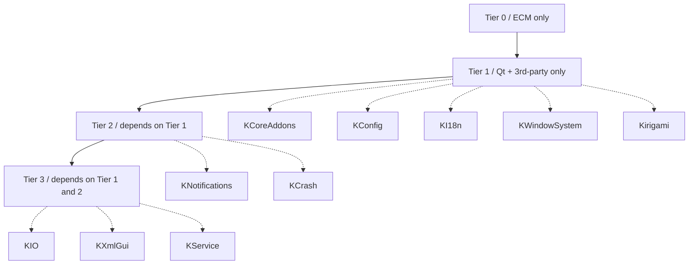
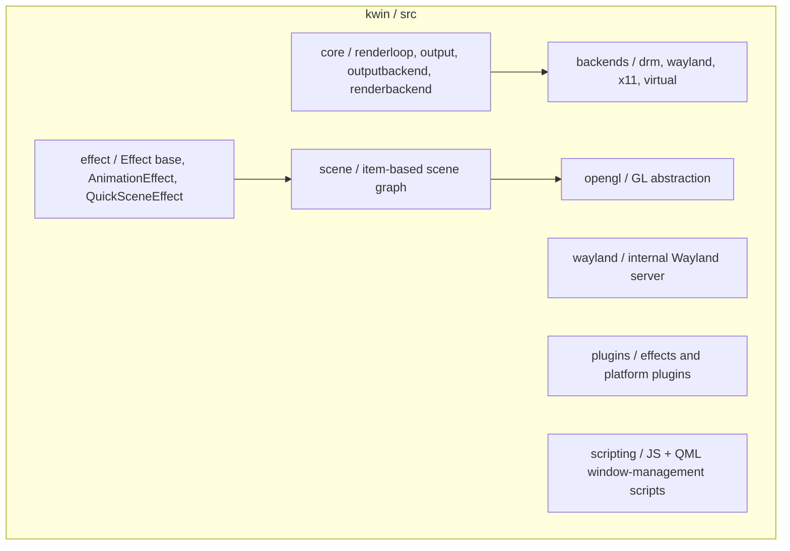
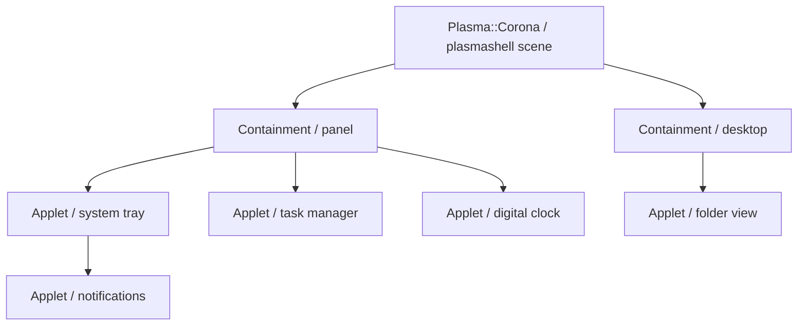
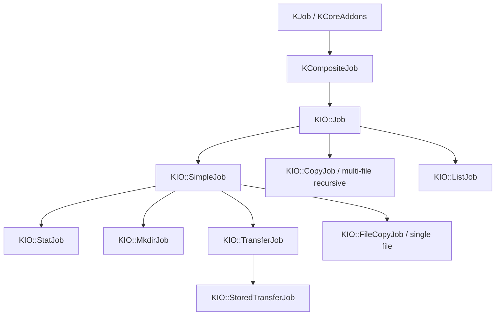

# Chapter 39b: KDE Plasma — Framework Architecture, KWin, and Kirigami

> **Part**: Part VII-C — Desktop Frameworks
> **Audience**: Desktop application developers targeting KDE Plasma; systems developers interested in the KWin compositor internals and the KDE Framework architecture
> **Status**: First draft — 2026-07-24

## Table of Contents

- [Overview](#overview)
- [1. KDE Frameworks 6 (KF6) Architecture](#1-kde-frameworks-6-kf6-architecture)
  - [1.1 Framework Tiers](#11-framework-tiers)
  - [1.2 Key Frameworks](#12-key-frameworks)
  - [1.3 CMake Packaging and Extra CMake Modules](#13-cmake-packaging-and-extra-cmake-modules)
  - [1.4 KDE PIM and Domain Frameworks](#14-kde-pim-and-domain-frameworks)
  - [1.5 Porting from KF5 to KF6](#15-porting-from-kf5-to-kf6)
- [2. KWin: The KDE Wayland Compositor](#2-kwin-the-kde-wayland-compositor)
  - [2.1 Architecture: Scene, RenderLoop, OutputBackend, InputBackend](#21-architecture-scene-renderloop-outputbackend-inputbackend)
  - [2.2 The DRM/KMS Backend](#22-the-drmkms-backend)
  - [2.3 OpenGL Compositing](#23-opengl-compositing)
  - [2.4 The Vulkan Path](#24-the-vulkan-path)
  - [2.5 The Effect System](#25-the-effect-system)
  - [2.6 QML Effects: QuickSceneEffect](#26-qml-effects-quicksceneeffect)
  - [2.7 KScreen and Display Management](#27-kscreen-and-display-management)
  - [2.8 HDR and VRR](#28-hdr-and-vrr)
- [3. Plasma Shell and Plasmoids](#3-plasma-shell-and-plasmoids)
  - [3.1 plasmashell, Containments, and Coronas](#31-plasmashell-containments-and-coronas)
  - [3.2 Plasma::Applet and Plasma::Containment](#32-plasmaapplet-and-plasmacontainment)
  - [3.3 QML Plasmoids: PlasmoidItem and metadata.json](#33-qml-plasmoids-plasmoiditem-and-metadatajson)
  - [3.4 Theming: KSvg and Plasma::Theme](#34-theming-ksvg-and-plasmatheme)
  - [3.5 DataEngines and their Deprecation](#35-dataengines-and-their-deprecation)
- [4. Kirigami: Adaptive UI Framework](#4-kirigami-adaptive-ui-framework)
  - [4.1 The org.kde.kirigami Module](#41-the-orgkdekirigami-module)
  - [4.2 ApplicationWindow and the Page Model](#42-applicationwindow-and-the-page-model)
  - [4.3 Adaptive Layouts: PageRow and wideScreen](#43-adaptive-layouts-pagerow-and-widescreen)
  - [4.4 Cards, ActionToolBar, and InlineMessage](#44-cards-actiontoolbar-and-inlinemessage)
  - [4.5 Kirigami.Theme and Kirigami.Units](#45-kirigamitheme-and-kirigamiunits)
  - [4.6 A Responsive Settings Application](#46-a-responsive-settings-application)
- [5. KWindowSystem and Wayland Integration](#5-kwindowsystem-and-wayland-integration)
  - [5.1 The KWindowSystem Abstraction](#51-the-kwindowsystem-abstraction)
  - [5.2 The KWin-Internal Wayland Server](#52-the-kwin-internal-wayland-server)
  - [5.3 Layer Shell Surfaces for Panels](#53-layer-shell-surfaces-for-panels)
  - [5.4 plasma-wayland-protocols](#54-plasma-wayland-protocols)
- [6. KDE Build System: CMake and ECM](#6-kde-build-system-cmake-and-ecm)
  - [6.1 ECM Modules](#61-ecm-modules)
  - [6.2 KDEInstallDirs6, KDECMakeSettings, KDECompilerSettings](#62-kdeinstalldirs6-kdecmakesettings-kdecompilersettings)
  - [6.3 A Typical KF6 CMakeLists.txt](#63-a-typical-kf6-cmakeliststxt)
  - [6.4 Flatpak Packaging](#64-flatpak-packaging)
- [7. KIO: Network-Transparent I/O](#7-kio-network-transparent-io)
  - [7.1 The KIO::Job Hierarchy](#71-the-kiojob-hierarchy)
  - [7.2 KIO Workers](#72-kio-workers)
  - [7.3 KFileWidget, KDirModel, KDirOperator](#73-kfilewidget-kdirmodel-kdiroperator)
- [8. Performance and Debugging](#8-performance-and-debugging)
- [9. Integrations](#9-integrations)
- [References](#references)

---

## Overview

**KDE Plasma** is one of the two dominant Linux desktop environments (the other being GNOME, covered in the companion chapter). Where GNOME is built almost entirely on **GTK4** and **libadwaita**, Plasma is built on **Qt6** and a large, tiered collection of libraries called **KDE Frameworks 6** (**KF6**). This chapter traces the Plasma stack from the bottom up: the framework layering that keeps low-level utilities usable outside of KDE, the **KWin** Wayland compositor that owns the display, the **plasmashell** process that draws panels and the desktop, and **Kirigami** — the adaptive QML toolkit that lets a single codebase run on a phone and a workstation.

Three architectural themes recur. First, **layering discipline**: KF6 is explicitly organised into dependency tiers so that a library like **KArchive** or **KConfig** can be pulled into an unrelated Qt project without dragging in a window manager. Second, **QML everywhere**: Plasma's shell, its widgets ("plasmoids"), and most modern KWin effects are written in **QML** driven by a C++ core, so the same **Qt Quick** scene graph that renders an application also renders the desktop that hosts it. Third, **Wayland-first**: since Plasma 6.0 (released February 2024) the default session is a Wayland session, and KWin is simultaneously a compositor, a Wayland server, and a KMS/DRM display driver.

This chapter is deliberately framework-architecture-focused. KWin's role as a *production compositor* — its place among Mutter and wlroots, explicit sync, and the broader Wayland ecosystem — is treated in Chapter 22; the deep KMS/HDR/VRR/color-pipeline mechanics live in the display chapters. Here the emphasis is on how the pieces of KDE fit together and how an application developer writes against them.

---

## 1. KDE Frameworks 6 (KF6) Architecture

**KDE Frameworks** is a set of over 70 libraries that grew out of the old monolithic `kdelibs`. The 5.x series (KF5, targeting Qt5) began in 2014; **KF6**, ported to **Qt6**, shipped its first stable release (6.0) in February 2024 alongside Plasma 6. [Source](https://develop.kde.org/products/frameworks/) The defining design goal is that most of these libraries are independent, well-isolated, and usable by *any* Qt application, not only by KDE software.

### 1.1 Framework Tiers

Every framework is assigned a **tier** according to what it is allowed to depend on. The tier system is the mechanism that enforces the "usable outside KDE" promise. [Source](https://develop.kde.org/products/frameworks/)



- **Tier 0** contains a single item: **Extra CMake Modules (ECM)**. ECM is not a C++ library at all — it is a bundle of CMake modules shared across every other framework. Because it has no dependencies, it sits below everything else. [Source](https://api.kde.org/ecm/)
- **Tier 1** frameworks depend only on **Qt** (and possibly small third-party libraries such as `zlib` or `libxml2`), never on another KDE framework. This makes them trivially droppable into a plain Qt project. The Tier 1 set includes **KConfig**, **KCoreAddons**, **KI18n**, **KWidgetsAddons**, **KWindowSystem**, **KGuiAddons**, **KArchive**, **KCodecs**, **KItemModels**, **Solid**, **Sonnet**, and — importantly for this chapter — **Kirigami**. [Source](https://develop.kde.org/products/frameworks/)
- **Tier 2** frameworks may additionally depend on Tier 1. Examples: **KNotifications**, **KCrash**, **KAuth**, **KJobWidgets**, **KWallet**.
- **Tier 3** frameworks have the richest dependency graph and may pull in Tier 1 and Tier 2. The largest and most consequential is **KIO** (network-transparent I/O, §7); others include **KXmlGui**, **KConfigWidgets**, **KService**, **KDeclarative**, **KParts**, and **KRunner**.

A fourth informal category, sometimes called "Tier 4" or simply *integration plugins*, contains platform-integration modules (e.g. `frameworkintegration`, `plasma-integration`) that wire the frameworks into the running Plasma session's look and feel.

### 1.2 Key Frameworks

A working knowledge of the following Tier 1 frameworks covers most application code:

| Framework | Namespace / key classes | Role |
| --- | --- | --- |
| **KCoreAddons** | `KJob`, `KAboutData`, `KProcess`, `KFormat`, `KUser` | Non-GUI core utilities; `KJob` is the base of the entire KIO job hierarchy |
| **KConfig** | `KConfig`, `KConfigGroup`, `KSharedConfig`, generated `KConfigSkeleton` | INI-file and cascading XDG configuration; codegen from `.kcfg` |
| **KI18n** | `i18n()`, `i18nc()`, `ki18n()` | Gettext-based translation, exposed to both C++ and QML |
| **KWidgetsAddons** | `KMessageBox`, `KPageDialog`, `KActionMenu` | Additional `QWidget`-based widgets beyond Qt Widgets |
| **KWindowSystem** | `KWindowSystem`, `KWindowInfo`, `KX11Extras` | Cross-platform (X11 + Wayland) window-management queries (§5) |
| **Kirigami** | `Kirigami.ApplicationWindow`, `Kirigami.Page` | Adaptive QML UI toolkit (§4) |

[Source](https://api.kde.org/frameworks/kcoreaddons/html/index.html)

**KConfig** deserves a note because it underpins all of Plasma's settings. It reads a *cascade* of configuration files following the XDG Base Directory specification — system defaults in `/etc/xdg`, then per-user overrides in `~/.config` — and merges them. The `KConfigGroup` API is group-oriented (INI `[Section]` blocks), and the `kconfig_compiler` tool generates strongly-typed accessor classes from an XML `.kcfg` schema plus a `.kcfgc` codegen file, which is how KWin, plasmashell, and System Settings share a single source of truth for their preferences. [Source](https://api.kde.org/frameworks/kconfig/html/index.html)

### 1.3 CMake Packaging and Extra CMake Modules

Every framework ships a CMake *package config* file, so a consumer writes `find_package(KF6CoreAddons)` and links against the imported target `KF6::CoreAddons`. The `KF6::` namespace prefix is one of the most visible KF5→KF6 changes (KF5 used `KF5::`). Frameworks also install their public QML modules and translation catalogs through ECM helpers (§6). Because ECM is Tier 0, *every* KDE build begins with `find_package(ECM REQUIRED)` and then extends `CMAKE_MODULE_PATH` with ECM's module directory. [Source](https://api.kde.org/ecm/manual/ecm.7.html)

### 1.4 KDE PIM and Domain Frameworks

Beyond the general-purpose frameworks, KDE ships several *domain* framework groups that are versioned and released together with Frameworks but address specific problem spaces:

- **KDE PIM** (Personal Information Management) is built on **Akonadi**, a caching layer and D-Bus service for mail, calendars, and contacts, plus the data-type libraries **KMime**, **KContacts**, and **KCalendarCore** (the last is Tier 1 because it is pure data manipulation with no storage dependency). Applications such as KMail, KOrganizer, and KAddressBook are Akonadi clients. [Source](https://api.kde.org/kdepim/akonadi/html/index.html)
- **KDE Multimedia / graphics data**: **Prison** (barcode/QR generation), **KQuickCharts** (a GPU-accelerated QML charting module that renders with SDF-based shaders), and **KSyntaxHighlighting** (the highlighting engine shared by Kate, KDevelop, and KTextEditor).

### 1.5 Porting from KF5 to KF6

The KF5→KF6 transition tracks the Qt5→Qt6 transition and touches every application. The main mechanical changes are:

- **CMake namespace**: `KF5::Foo` becomes `KF6::Foo`; `find_package(KF5Foo)` becomes `find_package(KF6Foo)`. The `kf5-config` tool is gone.
- **Versionless QML imports**: Qt6/QML no longer requires version numbers. `import org.kde.kirigami 2.20` becomes `import org.kde.kirigami as Kirigami`, and `import org.kde.plasma.core 2.0` becomes `import org.kde.plasma.core as PlasmaCore`. This is a frequent source of subtle breakage when porting plasmoids. [Source](https://develop.kde.org/docs/plasma/widget/porting_kf6/)
- **Removed compatibility layers**: `KDELibs4Support` — the KF5 shim that eased the kdelibs4→KF5 migration — was dropped entirely in KF6, so any remaining use of its classes must be rewritten.
- **Library reorganisation in Plasma 6**: The old `plasma-framework` was split. The C++/QML runtime became **libplasma** (`Plasma::Applet`, `Plasma::Containment`), while the SVG theming engine was extracted into a new framework, **KSvg** (`KSvg::Svg`, `KSvg::ImageSet`, exposed to QML as `org.kde.ksvg`). Plasmoid `main.qml` files must now use a `PlasmoidItem` root (§3.3), replacing the KF5 pattern of a bare `Item` with a `plasmoid` context property. [Source](https://develop.kde.org/docs/plasma/widget/porting_kf6/)

---

## 2. KWin: The KDE Wayland Compositor

**KWin** is Plasma's compositor and window manager. It began life as an X11 window manager and now runs as a native **Wayland** compositor (the `kwin_wayland` binary) while retaining an X11 mode (`kwin_x11`) and always launching an integrated **XWayland** server for legacy clients. Its source lives at `invent.kde.org/plasma/kwin`; the `src/` directory is organised into the subsystems shown below. [Source](https://invent.kde.org/plasma/kwin)



### 2.1 Architecture: Scene, RenderLoop, OutputBackend, InputBackend

KWin's rendering is organised around three abstractions in `src/core/`:

- **`OutputBackend`** (`src/core/outputbackend.h`) is the platform abstraction for *where* frames go. Concrete subclasses live in `src/backends/`: `DrmBackend` (real hardware via KMS), `WaylandBackend` (KWin nested inside another compositor, for development), `X11WindowedBackend`, and `VirtualBackend` (headless, for CI). Each backend enumerates a set of **`Output`** objects (`src/core/output.h`), one per display. [Source](https://invent.kde.org/plasma/kwin/-/tree/master/src/core)
- **`RenderLoop`** (`src/core/renderloop.cpp`) drives per-output frame scheduling. It tracks the display's refresh rate and vblank timing, decides *when* the next frame should be painted to hit the next presentation deadline, and emits the signal that triggers a repaint. Since Plasma 6.2 the render loop can log frame-timing statistics to a file for pacing analysis. [Source](https://kde.org/announcements/changelogs/plasma/6/6.1.5-6.2.0/)
- **`RenderBackend`** (`src/core/renderbackend.h`) abstracts *how* pixels are produced — the OpenGL backend and the nascent Vulkan backend (§2.4) both implement it — and hands out **`OutputLayer`** objects (`src/core/outputlayer.h`) that map onto KMS planes for direct scanout.

The **scene** (`src/scene/`) is an *item-based* retained scene graph: the workspace is a tree of items (`WorkspaceScene`, window items, surface items, decoration items, cursor items). On each frame the scene computes the damaged region, and the render backend repaints only the affected items — KWin has never done full-screen repaint by default. Input is handled by a parallel input stack that consumes **libinput** events (through the session's seat) and routes them through a filter chain to the focused surface.

### 2.2 The DRM/KMS Backend

The `DrmBackend` (`src/backends/drm/`) is what runs on a normal Linux desktop. Its object model mirrors the KMS object model described in the kernel chapters:

- **`DrmBackend`** opens the DRM device(s) via the session (logind or seatd) and manages hotplug.
- **`DrmGpu`** wraps one `/dev/dri/cardN` device — its planes, CRTCs, and connectors — and is the unit of multi-GPU handling.
- **`DrmOutput`** represents one connected display (a connector + CRTC + plane pipeline) and is the `Output` the render loop paints to.
- Presentation uses **KMS atomic commits**: KWin assembles a `drmModeAtomicReq` describing the framebuffer, plane positions, and — where supported — the color pipeline (DEGAMMA/CTM/GAMMA and, on newer kernels, per-plane color operations), then commits it, optionally with the `DRM_MODE_PAGE_FLIP_EVENT` flag so the render loop learns the exact presentation time. [Source](https://invent.kde.org/plasma/kwin/-/tree/master/src/backends/drm)

Buffers handed to KMS are allocated through `src/core/`'s graphics-buffer allocators — `GbmGraphicsBufferAllocator` (GBM/DMA-BUF for GPU scanout) and `ShmGraphicsBufferAllocator` (shared memory) — which is also how client `wl_buffer`s and KWin's own render targets are represented uniformly as `GraphicsBuffer` objects.

### 2.3 OpenGL Compositing

The default render backend is **OpenGL** (via EGL). KWin wraps GL resources in thin abstractions under `src/opengl/`: `GLTexture`, `GLFramebuffer`, `GLShader`, `GLVertexBuffer`, and a `ShaderManager` that owns the built-in shader traits (which combination of texture sampling, modulation, and color-management transforms a given draw needs). Effects and the scene never issue raw `glDrawArrays` calls against a hand-written shader; they request a shader from `ShaderManager` with a `ShaderTraits` bitmask and bind it. This indirection is what allows KWin to inject the color-management and HDR transforms (§2.8) into every draw without each effect knowing about them.

A minimal illustration of the shader-binding pattern used pervasively inside effects:

```cpp
// Simplified from KWin effect render code — see src/opengl/glshadermanager.h
// [https://invent.kde.org/plasma/kwin/-/tree/master/src/opengl]
using namespace KWin;

ShaderBinder binder(ShaderTrait::MapTexture | ShaderTrait::Modulate);
GLShader *shader = binder.shader();
shader->setUniform(GLShader::Mat4Uniform::ModelViewProjectionMatrix, mvp);
shader->setUniform(GLShader::FloatUniform::Saturation, 1.0f);
texture->bind();
vbo->render(GL_TRIANGLES);
texture->unbind();
```

The `ShaderBinder` RAII object binds the requested shader on construction and restores state on destruction; `ShaderTrait` flags select the ubershader permutation. This is the same machinery the scene uses to draw window surface items.

### 2.4 The Vulkan Path

For most of its life KWin has been OpenGL-only, and a Vulkan renderer was a long-standing request. The first concrete step landed in mainline in **early 2026**: a generic multi-GPU copy swapchain with initial **Vulkan** support for the DRM backend, merged as an alternative render path to OpenGL. [Source](https://www.phoronix.com/news/KDE-KWin-Vulkan-First-Step) At the time of writing this is *experimental infrastructure*, not a complete compositing path — there is no top-level `src/vulkan/` scene renderer yet, and performance on the tested configurations was roughly at parity with OpenGL, with the notable motivation that an NVIDIA-primary GPU can be driven more efficiently through Vulkan than through the NVIDIA EGL stack. The broader "roadmap to Vulkan" is tracked as an open issue on the KWin project. [Source](https://invent.kde.org/plasma/kwin/-/issues/169) Application and effect developers should treat the OpenGL backend as the target for the foreseeable future.

### 2.5 The Effect System

KWin's compositing effects (wobbly windows, the "Overview" and "Desktop Grid" presenters, blur, minimise animations) are plugins that hook into the scene's paint cycle. The base class is **`KWin::Effect`** in `src/effect/effect.h`. Effects override paint hooks that the scene calls in a defined order for every frame. In KWin 6 these hooks gained `RenderTarget` and `RenderViewport` parameters (so effects know which framebuffer and logical viewport they are drawing into) and now pass timing as `std::chrono::milliseconds`. The exact signatures are: [Source](https://invent.kde.org/plasma/kwin/-/blob/master/src/effect/effect.h)

```cpp
// src/effect/effect.h — KWin::Effect virtual paint hooks (KWin 6)
class Effect : public QObject
{
public:
    virtual void prePaintScreen(ScreenPrePaintData &data,
                                std::chrono::milliseconds presentTime);
    virtual void paintScreen(const RenderTarget &renderTarget,
                             const RenderViewport &viewport,
                             int mask, const QRegion &region, Output *screen);
    virtual void postPaintScreen();

    virtual void prePaintWindow(EffectWindow *w, WindowPrePaintData &data,
                                std::chrono::milliseconds presentTime);
    virtual void paintWindow(const RenderTarget &renderTarget,
                             const RenderViewport &viewport,
                             EffectWindow *w, int mask, QRegion region,
                             WindowPaintData &data);
    virtual void postPaintWindow(EffectWindow *w);

    virtual void reconfigure(ReconfigureFlags flags);
    virtual int requestedEffectChainPosition() const;
};
```

The paint cycle is: `prePaintScreen` (each effect may add to the repaint region and set `mask` flags such as "transformed"), then per-window `prePaintWindow` → `paintWindow` → `postPaintWindow`, then `postPaintScreen`. An effect that wants continuous animation calls `effects->addRepaintFull()` (or a region variant) in `postPaintScreen` to schedule the next frame.

For time-based animations, **`KWin::AnimationEffect`** (`src/effect/animationeffect.h`) is a richer base class that manages a set of `TimeLine`-driven animations (`src/effect/timeline.h`), interpolating an attribute (opacity, scale, translation, rotation) over a duration with an easing curve, so subclasses do not hand-roll per-frame interpolation.

Effects are registered as plugins through a factory macro. Three variants exist depending on whether the effect declares a `supported()` and/or `enabledByDefault()` check: [Source](https://invent.kde.org/plasma/kwin/-/blob/master/src/effect/effect.h)

```cpp
// Register an effect plugin. jsonFile carries the KPluginMetaData.
KWIN_EFFECT_FACTORY(FadeEffect, "metadata.json")
// Variant that gates on a static supported() method:
KWIN_EFFECT_FACTORY_SUPPORTED(BlurEffect, "metadata.json", BlurEffect::supported())
// Variant that gates on enabledByDefault():
KWIN_EFFECT_FACTORY_ENABLED(WobblyEffect, "metadata.json",
                            WobblyEffect::enabledByDefault())
```

A minimal fade-on-open effect subclass looks like:

```cpp
// Simplified illustrative C++ effect — see kwin src/plugins/ for real examples
// [https://invent.kde.org/plasma/kwin/-/tree/master/src/plugins]
#include "effect/animationeffect.h"

class FadeInEffect : public KWin::AnimationEffect
{
    Q_OBJECT
public:
    FadeInEffect()
    {
        connect(effects, &KWin::EffectsHandler::windowAdded,
                this, &FadeInEffect::onWindowAdded);
    }

    void onWindowAdded(KWin::EffectWindow *w)
    {
        if (!w->isNormalWindow())
            return;
        // animate Opacity from 0.0 -> 1.0 over 250 ms, cubic ease-out
        animate(w, KWin::AnimationEffect::Opacity, 0, 250 /*ms*/,
                KWin::FPx2(1.0), QEasingCurve(QEasingCurve::OutCubic),
                0, KWin::FPx2(0.0));
    }

    int requestedEffectChainPosition() const override { return 40; }
};

KWIN_EFFECT_FACTORY(FadeInEffect, "metadata.json")
```

`AnimationEffect::animate()` takes the target window, the animated attribute, an optional meta value, the duration, the end value (`FPx2` is a fixed-point 2-component value), an easing curve, a delay, and a start value. The base class advances the timeline every frame and applies it in its own `paintWindow` override, so the subclass writes no per-frame code.

### 2.6 QML Effects: QuickSceneEffect

Modern full-screen presenters — Overview, Desktop Grid, the window switcher — are not written in C++ paint code at all. They subclass **`KWin::QuickSceneEffect`** (`src/effect/quickeffect.h`), which renders a **QML** scene into an offscreen texture and composites it as the effect's output. Each such effect ships a QML package that imports the `org.kde.kwin` QML module (exposing `EffectWindow`, screen geometry, and thumbnail item types). The effect's `main.qml` describes the layout — for example, the Overview lays out `WindowThumbnailItem` instances in a grid with `Kirigami`-style animations — and the C++ side only manages activation, input forwarding, and screen assignment. This is why writing a new KWin presenter today is mostly QML work. [Source](https://invent.kde.org/plasma/kwin/-/blob/master/src/effect/quickeffect.h)

A related base class, **`KWin::OffscreenEffect`** (`src/effect/offscreeneffect.h`), renders a window into an offscreen texture so the effect can distort it (the wobbly-windows and magic-lamp effects use it), decoupling the geometric distortion from the window's real surface.

### 2.7 KScreen and Display Management

Multi-monitor configuration — resolution, refresh rate, position, scale, primary display, and per-output rotation — is handled by **libkscreen**, the KScreen library (`KScreen::Config`, `KScreen::Output`, `KScreen::GetConfigOperation`, `KScreen::SetConfigOperation`). libkscreen is backend-abstracted: on a Wayland session its backend talks to KWin over the KDE output-management Wayland protocol (part of `plasma-wayland-protocols`, §5.4), and on X11 it uses **XRandR**. The `kscreen-doctor` command-line tool is a thin front end over the same API and is the fastest way to script or debug output configuration:

```bash
# Inspect and reconfigure outputs from the CLI (Wayland or X11)
kscreen-doctor --outputs
kscreen-doctor output.DP-1.mode.2560x1440@144
kscreen-doctor output.DP-1.scale.1.5
kscreen-doctor output.HDMI-A-1.disable
```

[Source](https://invent.kde.org/plasma/libkscreen) The daemon (`kscreen` KDED module) remembers per-connector-set configurations, so re-docking a laptop restores the previous layout.

### 2.8 HDR and VRR

Since Plasma 6.1 (June 2024), KWin has supported **HDR** output and **variable refresh rate** (VRR / adaptive sync) on the Wayland session. On the HDR path KWin drives the KMS `HDR_OUTPUT_METADATA`, `Colorspace`, and color-pipeline properties, performs tone mapping in the ICtCp domain, and exposes color management to clients via the `wp_color_management_v1` Wayland protocol (merged into wayland-protocols in early 2025). VRR is toggled per-output through the DRM `VRR_ENABLED` CRTC property and surfaced in the display settings. These display-pipeline mechanics — the KMS color properties, HDR metadata, tone-mapping operators, and the VRR timing model — are covered in depth in the display and HDR chapters and are only referenced here as capabilities of the compositor; from a framework standpoint the important point is that they are transparent to Qt/Kirigami applications, which keep submitting sRGB (or, opt-in, scRGB/BT.2020) surfaces while KWin handles the output transform.

---

## 3. Plasma Shell and Plasmoids

### 3.1 plasmashell, Containments, and Coronas

The Plasma desktop UI — panels, the desktop wallpaper layer, the system tray, the application launcher — is drawn by a single process, **`plasmashell`**, part of the `plasma-workspace` repository. plasmashell is a QML application built on **libplasma**. Its top-level object is a **`Plasma::Corona`**: the scene that owns all containments across all screens. A **`Plasma::Containment`** is a special applet that *contains* other applets — a panel is a containment, and so is each screen's desktop. Ordinary widgets are **`Plasma::Applet`** instances ("plasmoids") hosted inside a containment. [Source](https://api.kde.org/plasma/libplasma/html/index.html)



### 3.2 Plasma::Applet and Plasma::Containment

On the C++ side, `Plasma::Applet` (from libplasma) is the runtime object for a plasmoid. It owns the widget's configuration (`KConfigGroup`-backed), its `KPluginMetaData`, its geometry constraints, and the bridge to its QML representation. Most plasmoids never subclass `Applet` in C++ — they are pure QML plus metadata — but a plasmoid *may* provide a C++ plugin (subclassing `Plasma::Applet`) when it needs native code, registered through the same `KPluginFactory` mechanism as other KDE plugins. `Plasma::Containment` extends `Applet` with the ability to lay out and manage child applets and to expose containment-level actions (add widgets, configure panel, etc.). [Source](https://api.kde.org/plasma/libplasma/html/classPlasma_1_1Applet.html)

### 3.3 QML Plasmoids: PlasmoidItem and metadata.json

A plasmoid is a **KPackage** — a directory with a fixed layout and a JSON manifest:

```
com.example.helloworld/
├── metadata.json
└── contents/
    └── ui/
        └── main.qml
```

The manifest, `metadata.json`, uses the Plasma 6 format: a top-level **`KPackageStructure`** of `"Plasma/Applet"`, an **`X-Plasma-API-Minimum-Version`** gate (without which Plasma 6 assumes the widget is a Plasma 5 plasmoid and ignores it), and a nested **`KPlugin`** object carrying the id, name, version, icon, and category. [Source](https://develop.kde.org/docs/plasma/widget/setup/)

```json
{
    "KPackageStructure": "Plasma/Applet",
    "X-Plasma-API-Minimum-Version": "6.0",
    "KPlugin": {
        "Id": "com.example.helloworld",
        "Name": "Hello World",
        "Description": "A minimal Plasma 6 widget",
        "Icon": "battery",
        "Category": "System Information",
        "Version": "1",
        "Authors": [
            { "Name": "Author", "Email": "author@example.com" }
        ]
    }
}
```

The `main.qml` root must be a **`PlasmoidItem`** from `org.kde.plasma.plasmoid`. A plasmoid has two representations: a **compact** form (the icon shown in a panel) and a **full** form (the popup or on-desktop content). Plasma chooses which to show based on available space. [Source](https://develop.kde.org/docs/plasma/widget/setup/)

```qml
import QtQuick
import QtQuick.Layouts
import org.kde.plasma.plasmoid
import org.kde.plasma.components as PlasmaComponents
import org.kde.kirigami as Kirigami

PlasmoidItem {
    id: root

    // Shown when collapsed into a panel
    compactRepresentation: PlasmaComponents.Label {
        text: "Hi"
    }

    // Shown when expanded (popup or desktop widget)
    fullRepresentation: ColumnLayout {
        Layout.minimumWidth: Kirigami.Units.gridUnit * 12
        Layout.minimumHeight: Kirigami.Units.gridUnit * 8
        spacing: Kirigami.Units.smallSpacing

        PlasmaComponents.Label {
            Layout.alignment: Qt.AlignHCenter
            text: i18n("Hello, Plasma 6")
        }
        PlasmaComponents.Button {
            Layout.alignment: Qt.AlignHCenter
            text: i18n("Click me")
            onClicked: root.Plasmoid.expanded = false
        }
    }
}
```

Note the versionless imports (a KF6 hallmark, §1.5), the use of `Kirigami.Units` for spacing (so the widget scales with the system font/DPI), and `i18n()` exposed directly to QML by KI18n. During development the widget can be run standalone with `plasmoidviewer -a ./com.example.helloworld` or embedded in a window with `plasmawindowed`. [Source](https://develop.kde.org/docs/plasma/widget/setup/)

### 3.4 Theming: KSvg and Plasma::Theme

Plasma's visual style is **SVG-based** and scalable rather than raster. In Plasma 6 the SVG rendering engine was extracted from plasma-framework into the standalone **KSvg** framework. A theme is a set of SVG assets (with named element ids for nine-patch-style stretching) plus a color palette; `KSvg::Svg` renders a named element from a themed SVG at the current DPI, and `KSvg::ImageSet` (formerly `Plasma::Theme`) resolves which theme file backs a given path and supplies the color scheme. Because assets are SVG, a Plasma panel renders crisply at any fractional scale factor. `Plasma::Theme` in libplasma still exists as the higher-level policy object (which color scheme, dark/light, blur behind panels) that feeds KSvg. [Source](https://api.kde.org/frameworks/ksvg/html/index.html) QML code accesses these through `import org.kde.ksvg as KSvg` and the `PlasmaCore.Theme` singleton.

### 3.5 DataEngines and their Deprecation

Historically, plasmoids obtained live data (battery status, weather, system load, now-playing track) through **DataEngines** — plugins exposing a polled, key/value data-source model consumed in QML via a `DataSource` element. In Plasma 6 this pattern is **deprecated** for most uses: widgets are encouraged to consume data through purpose-built QML modules and C++ models directly (for example `org.kde.plasma.networkmanagement`, or a plasmoid's own `QAbstractListModel`), which are type-safe and avoid the stringly-typed DataEngine indirection. New plasmoids should not reach for DataEngines; existing ones are being migrated. This is worth stating plainly because much older tutorial material still centres on DataEngines.

---

## 4. Kirigami: Adaptive UI Framework

### 4.1 The org.kde.kirigami Module

**Kirigami** is KDE's convergent QML application framework: a Tier 1 framework (Qt-only dependencies) that provides a set of QML components implementing the **KDE Human Interface Guidelines** and adapting automatically between desktop ("widescreen") and mobile ("narrow") form factors. It is the basis of KDE's mobile apps and of many desktop apps (System Settings' modern KCMs, Discover, Neochat, and others). Applications import it versionlessly: `import org.kde.kirigami as Kirigami`. [Source](https://develop.kde.org/docs/getting-started/kirigami/)

### 4.2 ApplicationWindow and the Page Model

The root of a Kirigami app is **`Kirigami.ApplicationWindow`**, which provides a built-in `pageStack`, a `globalDrawer` (the hamburger/menu drawer), and a `contextDrawer` (a context-sensitive action drawer). The UI is organised as a stack of **pages** — "the different screens of an app" — managed by the `pageStack`. The initial page is set with `pageStack.initialPage`, and navigation pushes and pops pages. `Kirigami.ScrollablePage` adds an automatic scrollbar and pull-to-refresh; `Kirigami.Page` is the plain container. [Source](https://develop.kde.org/docs/getting-started/kirigami/introduction-pages/)

```qml
import QtQuick
import QtQuick.Controls as Controls
import org.kde.kirigami as Kirigami

Kirigami.ApplicationWindow {
    id: root
    title: i18nc("@title:window", "Kountdown")
    width: Kirigami.Units.gridUnit * 30
    height: Kirigami.Units.gridUnit * 25

    globalDrawer: Kirigami.GlobalDrawer {
        title: i18n("Kountdown")
        titleIcon: "applications-graphics"
        actions: [
            Kirigami.Action {
                text: i18n("About")
                icon.name: "help-about"
                onTriggered: root.pageStack.push(aboutPage)
            },
            Kirigami.Action {
                text: i18n("Quit")
                icon.name: "application-exit"
                onTriggered: Qt.quit()
            }
        ]
    }

    contextDrawer: Kirigami.ContextDrawer {}

    pageStack.initialPage: Kirigami.ScrollablePage {
        title: i18nc("@title", "Countdowns")
        actions: [
            Kirigami.Action {
                text: i18n("Add")
                icon.name: "list-add"
                onTriggered: console.log("add clicked")
            }
        ]
        Controls.Label {
            text: i18n("No countdowns yet")
        }
    }

    Component { id: aboutPage; Kirigami.Page { title: i18n("About") } }
}
```

`Kirigami.Action` is the unified action type used across drawers, page headers, and toolbars — it carries `text`, `icon.name` (a freedesktop icon-theme name), `onTriggered`, and can nest children to form menus.

### 4.3 Adaptive Layouts: PageRow and wideScreen

The `pageStack` is a **`Kirigami.PageRow`** — a column-based navigation container. On a wide screen it can show *multiple* pages side by side (a list page and its detail page, like a two-pane view); on a narrow screen it collapses to show only the top page, and navigation becomes back/forward. The boolean `Kirigami.Settings.isMobile` and each page's `wideScreen`-aware bindings let a single QML file present as a multi-column desktop layout or a single-column phone layout with no separate code paths. This convergence is Kirigami's central value proposition. [Source](https://develop.kde.org/docs/getting-started/kirigami/introduction-pages/) A related pattern, `Kirigami.OverlaySheet`, presents modal content that becomes a full-screen sheet on mobile and a centered overlay on desktop.

### 4.4 Cards, ActionToolBar, and InlineMessage

Kirigami ships a component vocabulary that maps to the HIG:

- **`Kirigami.Card`** (with `Kirigami.CardsListView` / `Kirigami.CardsLayout`) presents a piece of content with an optional banner image, header, and action buttons — the standard way to show a list of rich items.
- **`Kirigami.ActionToolBar`** takes a list of `Kirigami.Action`s and lays them out responsively, automatically overflowing actions that do not fit into a `...` menu — so a page header degrades gracefully as the window narrows.
- **`Kirigami.InlineMessage`** is a non-modal, in-layout notification band (info/positive/warning/error) that appears within the content rather than as a popup, matching the HIG preference for inline over modal feedback.
- **`Kirigami.FormLayout`** arranges label/field pairs in the aligned two-column form style used throughout System Settings.

### 4.5 Kirigami.Theme and Kirigami.Units

Two singletons make Kirigami apps consistent and scalable:

- **`Kirigami.Units`** exposes DPI-independent metrics: `gridUnit` (the width of a capital "M", the base unit for all sizing), `smallSpacing`, `largeSpacing`, `iconSizes`, and animation `Units.longDuration` / `shortDuration`. Sizing everything in multiples of `gridUnit` is what makes a Kirigami layout scale correctly across DPIs and fractional scale factors.
- **`Kirigami.Theme`** exposes the active color palette as semantic roles — `textColor`, `backgroundColor`, `highlightColor`, `positiveTextColor`, `negativeTextColor`, and so on — plus a `colorSet` attached property (`View`, `Window`, `Button`, `Complementary`) so a subtree can adopt a different part of the palette. Because these track the system color scheme, a correctly written Kirigami app themes itself with no per-app color code. [Source](https://api.kde.org/frameworks/kirigami/html/index.html)

### 4.6 A Responsive Settings Application

Putting the pieces together, a small responsive settings page using `FormLayout` and semantic theming:

```qml
import QtQuick
import QtQuick.Controls as Controls
import org.kde.kirigami as Kirigami

Kirigami.ScrollablePage {
    title: i18nc("@title", "Settings")

    Kirigami.FormLayout {
        Controls.TextField {
            Kirigami.FormData.label: i18n("Display name:")
            placeholderText: i18n("Enter a name")
        }
        Controls.Switch {
            Kirigami.FormData.label: i18n("Enable sync:")
        }
        Controls.ComboBox {
            Kirigami.FormData.label: i18n("Theme:")
            model: [i18n("System"), i18n("Light"), i18n("Dark")]
        }
        Kirigami.InlineMessage {
            Layout.fillWidth: true
            visible: true
            type: Kirigami.MessageType.Information
            text: i18n("Changes apply immediately.")
        }
    }
}
```

The `FormData.label` attached property drives the two-column alignment; on a narrow window Kirigami keeps the labels above their fields. No pixel measurements appear anywhere — spacing and the message band all inherit from `Kirigami.Units` and `Kirigami.Theme`.

---

## 5. KWindowSystem and Wayland Integration

### 5.1 The KWindowSystem Abstraction

**KWindowSystem** (Tier 1) is the framework that lets an application query and influence window-management state without hard-coding a windowing system. It abstracts over X11 and Wayland: on X11 it wraps EWMH/ICCCM (via `KX11Extras` for the X11-specific extras like the window list and virtual-desktop count), while on Wayland — where most such operations are deliberately restricted by the security model — it maps the supported subset onto Wayland protocols. Typical uses: requesting attention (`demandAttention`), setting a window type or state, activating a window (`activateWindow`, subject to activation-token rules on Wayland), and querying whether a compositing manager is active. [Source](https://api.kde.org/frameworks/kwindowsystem/html/classKWindowSystem.html)

```cpp
// Cross-platform window operations via KWindowSystem (KF6)
#include <KWindowSystem>
#include <KX11Extras>

// Ask the compositor to draw attention to our top-level window
KWindowSystem::demandAttention(window->winId(), true);

// Activate a window using a Wayland activation token when present
KWindowSystem::activateWindow(window);

// X11-only extras degrade gracefully on Wayland
if (KWindowSystem::isPlatformX11()) {
    const QList<WId> windows = KX11Extras::windows();
    // ... inspect the stacking order ...
}
```

The key design point is that `KWindowSystem` never assumes X11; `isPlatformWayland()` / `isPlatformX11()` let portable code branch, and X11-only capabilities are quarantined in `KX11Extras` so linking them is an explicit choice.

### 5.2 The KWin-Internal Wayland Server

On the server side, KWin implements the Wayland protocols itself. Historically the low-level protocol-object code lived in a separate framework, **KWaylandServer**, but it was folded *into* KWin — it now lives inside the KWin tree at `src/wayland/` (interfaces such as the compositor, seat, XDG-shell, layer-shell, data-device, and the KDE-private protocols) rather than shipping as a standalone library. The *client*-side **KWayland** framework still exists in KF6 but is largely deprecated for application use: portable applications are steered toward **KWindowSystem** and Qt's own Wayland support instead of talking raw Wayland client protocol. [Source](https://invent.kde.org/plasma/kwin/-/tree/master/src/wayland) This consolidation means the Wayland server implementation and the compositor that uses it version and evolve together, avoiding the interface-drift problems of a separately released server library.

### 5.3 Layer Shell Surfaces for Panels

Plasma's panels, the desktop, on-screen displays, and notification popups are not ordinary application windows — they are **layer-shell surfaces**, anchored to a screen edge and assigned to a compositor layer (background, bottom, top, overlay). plasmashell creates them through **`layer-shell-qt`**, a small Qt/QML library exposing the `wlr-layer-shell` protocol (`LayerShellQt::Window`) so that a `QWindow`/`QQuickWindow` can be turned into an anchored layer surface with a defined exclusive zone. KWin implements the server side of `wlr-layer-shell` (in `src/wayland/`), so the same protocol that positions a wlroots panel positions a Plasma panel. [Source](https://invent.kde.org/plasma/layer-shell-qt) Application developers rarely touch layer-shell directly, but it is the mechanism behind every piece of Plasma "chrome" and behind third-party panels/launchers written in Qt.

### 5.4 plasma-wayland-protocols

Some Plasma functionality has no counterpart in upstream `wayland-protocols` and is served by KDE-private protocols shipped in the **`plasma-wayland-protocols`** repository. These include `org_kde_plasma_shell` (privileged surface roles for the shell), `org_kde_plasma_window_management` (the task-manager's view of all windows — titles, icons, minimise/activate — which is intentionally not something a normal Wayland client can see), `org_kde_kwin_appmenu` (global menu export), and `kde-output-management` / `kde-output-device` (the protocols libkscreen uses for display configuration, §2.7). KWin implements them server-side; plasmashell and System Settings are the privileged clients. [Source](https://invent.kde.org/plasma/plasma-wayland-protocols) The existence of a *private* protocol set is a recurring pattern in desktop-shell design: the shell needs capabilities (enumerate every window, place privileged surfaces) that the security model correctly denies to ordinary applications, so the compositor grants them only to its own trusted shell.

---

## 6. KDE Build System: CMake and ECM

### 6.1 ECM Modules

**Extra CMake Modules** is the shared CMake toolbox every KDE project builds on. Rather than each project reinventing install-path logic, translation handling, and compiler flags, ECM provides reusable modules and functions. Notable ones for application authors: [Source](https://api.kde.org/ecm/manual/ecm.7.html)

- **`KDEInstallDirs6`** — canonical, relocatable install destinations (`KDE_INSTALL_BINDIR`, `KDE_INSTALL_LIBDIR`, `KDE_INSTALL_QMLDIR`, `KDE_INSTALL_DATADIR`, etc.) that respect the platform's conventions and `CMAKE_INSTALL_PREFIX`.
- **`KDECMakeSettings`** — sensible project defaults (out-of-source build enforcement, RPATH handling, uninstall target, test setup).
- **`KDECompilerSettings`** — a curated set of warning and hardening flags plus C++ standard selection consistent across all of KDE.
- **`ecm_add_qml_module()`** — declares a QML module with its URI, registering C++ types and installing the QML files and `qmldir` in one call (the modern replacement for hand-written `qmldir` installs).
- **`ki18n_install()`** — installs Gettext `.po` translation catalogs.
- **`kdoctools_create_handbook()`** — builds DocBook documentation into the KDE Help Center format.

### 6.2 KDEInstallDirs6, KDECMakeSettings, KDECompilerSettings

These three are included together at the top of virtually every KDE `CMakeLists.txt`, immediately after locating ECM and extending the module path. `KDEInstallDirs6` is the KF6 version (KF5 used `KDEInstallDirs`); mixing the two is a common porting error. The trio establishes the environment in which all subsequent `install()` calls and targets operate, so ordering matters — they must be included before targets are defined.

### 6.3 A Typical KF6 CMakeLists.txt

A complete, minimal build for a Kirigami application that links a few frameworks:

```cmake
cmake_minimum_required(VERSION 3.16)
project(helloworld VERSION 1.0)

set(QT_MIN_VERSION 6.6.0)
set(KF6_MIN_VERSION 6.0.0)

# Tier 0: locate ECM first and extend the module path with it.
find_package(ECM ${KF6_MIN_VERSION} REQUIRED NO_MODULE)
set(CMAKE_MODULE_PATH ${ECM_MODULE_PATH})

include(KDEInstallDirs6)
include(KDECMakeSettings)
include(KDECompilerSettings NO_POLICY_SCOPE)
include(ECMQmlModule)

find_package(Qt6 ${QT_MIN_VERSION} REQUIRED COMPONENTS Quick QuickControls2)
find_package(KF6 ${KF6_MIN_VERSION} REQUIRED COMPONENTS
    CoreAddons
    I18n
    Kirigami
    Config
)

add_executable(helloworld src/main.cpp)

target_link_libraries(helloworld PRIVATE
    Qt6::Quick
    KF6::CoreAddons
    KF6::I18n
    KF6::ConfigCore
)

install(TARGETS helloworld ${KDE_INSTALL_TARGETS_DEFAULT_ARGS})
ki18n_install(po)
```

The imported-target names are the payoff of the package-config system: `KF6::Kirigami`, `KF6::CoreAddons`, `KF6::ConfigCore`. The `KDE_INSTALL_TARGETS_DEFAULT_ARGS` variable (from `KDEInstallDirs6`) expands to the right `RUNTIME`/`LIBRARY`/`BUNDLE` destinations for the platform. [Source](https://api.kde.org/ecm/manual/ecm.7.html)

### 6.4 Flatpak Packaging

KDE applications are commonly distributed as **Flatpaks** built against the **KDE runtime** (`org.kde.Platform` / `org.kde.Sdk`), which bundles Qt6 and the KDE Frameworks so the manifest only builds the application and any non-runtime dependencies. A manifest builds the app with the same CMake invocation used locally:

```yaml
# org.example.HelloWorld.yaml — Flatpak manifest
id: org.example.HelloWorld
runtime: org.kde.Platform
runtime-version: '6.7'
sdk: org.kde.Sdk
command: helloworld
finish-args:
  - --socket=wayland
  - --socket=fallback-x11
  - --share=ipc
  - --device=dri            # GPU access for Qt Quick rendering
modules:
  - name: helloworld
    buildsystem: cmake-ninja
    config-opts:
      - -DCMAKE_BUILD_TYPE=Release
    sources:
      - type: dir
        path: .
```

[Source](https://develop.kde.org/docs/packaging/flatpak/) The `--device=dri` finish-arg is what grants the sandbox the DRI render node it needs for hardware-accelerated Qt Quick rendering; without it the app falls back to software rasterisation. The `org.kde.Platform` runtime version (e.g. `6.7`) pins both the Qt and Frameworks version. The Flatpak GPU-sandbox mechanics are covered in the Flatpak graphics chapter.

---

## 7. KIO: Network-Transparent I/O

### 7.1 The KIO::Job Hierarchy

**KIO** (Tier 3) is KDE's asynchronous, network-transparent I/O framework. Its central abstraction is the **job**: an asynchronous operation that runs without blocking the UI thread and reports progress and completion through signals. All KIO jobs descend from **`KJob`** (the base lives in KCoreAddons); `KJob` provides the universal `result(KJob*)` completion signal and progress reporting. The KIO-specific hierarchy is: [Source](https://api.kde.org/frameworks/kio/html/index.html)



`KIO::Job` inherits from `KCompositeJob` (so a job may aggregate sub-jobs), which inherits from `KJob`. `TransferJob` streams data incrementally via a `data(KIO::Job*, const QByteArray&)` signal (and `dataReq(...)` for uploads), whereas its subclass `StoredTransferJob` accumulates the whole payload and hands it back at the end. Convenience factory functions create the right job: `KIO::get(url)` returns a `TransferJob` for download, `KIO::storedGet(url)` a `StoredTransferJob`, `KIO::put(url, ...)` for upload, `KIO::copy(src, dest)` a `CopyJob`, and `KIO::file_copy(src, dest)` a `FileCopyJob`.

A streaming download that reports progress:

```cpp
// Asynchronous, network-transparent download with progress (KF6 KIO)
#include <KIO/TransferJob>

KIO::TransferJob *job = KIO::get(QUrl("https://example.org/big.iso"));

// Incremental data as it arrives (empty QByteArray signals end-of-stream)
QObject::connect(job, &KIO::TransferJob::data,
                 [](KIO::Job *, const QByteArray &chunk) {
                     if (!chunk.isEmpty())
                         sink.write(chunk);
                 });

// Progress: percent() and other signals are inherited from KJob
QObject::connect(job, &KJob::percent,
                 [](KJob *, unsigned long pct) {
                     progressBar->setValue(int(pct));
                 });

// Completion: result() is the universal KJob terminator
QObject::connect(job, &KJob::result, [](KJob *j) {
    if (j->error())
        qWarning() << "download failed:" << j->errorString();
    else
        qInfo() << "download complete";
});
```

Because the URL is a `QUrl`, the *same* code downloads over HTTPS, SFTP, SMB, WebDAV, an MTP phone, or a local file — the scheme selects a worker. That transparency is KIO's reason for existing. [Source](https://api.kde.org/frameworks/kio/html/classKIO_1_1TransferJob.html)

### 7.2 KIO Workers

The per-protocol logic lives in **KIO workers** (called *slaves* before the terminology was retired). A worker is an out-of-process executable implementing one URL scheme — `kio_http`, `kio_sftp`, `kio_smb`, `kio_mtp`, `kio_archive`, `kio_fish`, and so on — that KIO launches on demand and communicates with over a socket. Running the protocol handler in a separate process is a robustness and security decision: a crash or exploit in the SMB parser cannot take down the application, and workers can be sandboxed independently. A worker declares the schemes it handles through a JSON plugin manifest and implements the worker interface (`get`, `put`, `stat`, `listDir`, `mkdir`, …). Applications never instantiate workers directly; they submit jobs against URLs and KIO routes each job to the right worker. [Source](https://api.kde.org/frameworks/kio/html/index.html)

### 7.3 KFileWidget, KDirModel, KDirOperator

KIO also supplies the widgets and models behind KDE's file dialogs, all of which speak KIO URLs and therefore browse remote locations as naturally as local ones:

- **`KDirModel`** is a `QAbstractItemModel` populated by a `KIO::ListJob` under the hood — attach it to any Qt view to browse a (possibly remote) directory. It watches for changes and updates incrementally.
- **`KDirOperator`** is the reusable directory-browsing widget (icon/detail views, navigation, sorting) that forms the body of the file dialog.
- **`KFileWidget`** wraps `KDirOperator` with a location bar, filter combo, and places panel to form the complete file chooser; `KFileWidget::getOpenUrl()` and the `KIO::OpenFileManagerWindowJob` helpers give the familiar open/save experience. Because these are KIO-backed, entering `sftp://host/path` in the location bar just works. [Source](https://api.kde.org/frameworks/kio/html/classKDirModel.html)

---

## 8. Performance and Debugging

KWin, plasmashell, and Kirigami apps expose several observability hooks.

**KWin logging.** KWin uses Qt's categorized logging (`QLoggingCategory`) throughout — categories such as `kwin_core`, `kwin_wayland_drm`, `kwin_scene_opengl`, and `kwin_libinput`. On a Wayland session KWin runs inside the user's graphical session, so its output goes to the systemd journal:

```bash
# Follow the compositor's log
journalctl --user -f -t kwin_wayland

# Enable specific debug categories at runtime
QT_LOGGING_RULES="kwin_*.debug=true" kwin_wayland --replace &

# Or manage categories interactively
kdebugsettings
```

The `kdebugsettings` GUI (and the `~/.config/QtProject/qtlogging.ini` file it writes) toggles categories persistently. Since Plasma 6.2 the render loop can additionally dump per-frame timing statistics to a file for frame-pacing analysis (§2.1). [Source](https://kde.org/announcements/changelogs/plasma/6/6.1.5-6.2.0/)

**Plasma shell.** `plasmashell --replace` restarts the shell without a full logout. During plasmoid development, `plasmoidviewer -a <package>` runs a widget in isolation, and `plasmawindowed <plugin-id>` embeds it in a normal window, both far faster than restarting the whole shell. plasmashell also honours the general Qt Quick diagnostics below.

**Qt Quick / QML profiling.** Because plasmashell and Kirigami apps are Qt Quick, the standard Qt Quick performance environment variables apply:

```bash
# Print per-frame scene-graph render timing to stderr
QSG_RENDER_TIMING=1 plasmawindowed org.example.helloworld

# Verbose Qt Quick render-loop and animation timing
QT_LOGGING_RULES="qt.scenegraph.*=true;qt.quick.dirty=true" ./myapp
```

Deeper profiling uses the **QML Profiler** in Qt Creator (or the standalone `qmlprofiler` connected to an app started with `-qmljsdebugger=port:1234`), which attributes time to bindings, signal handlers, and scene-graph passes. **GammaRay** (a KDASsociates/Qt introspection tool) can attach to a running Qt process to inspect the live Qobject tree, QML bindings, and scene-graph nodes — invaluable for diagnosing why a Kirigami layout is not converging or a binding loop is thrashing. [Source](https://doc.qt.io/qtcreator/creator-qml-performance-monitor.html)

The general debugging philosophy across the Plasma stack is uniform because it is all Qt: categorized logging for the C++ layers, the Qt Quick scene-graph timing environment for the QML layers, and journal integration on Wayland so a compositor bug leaves a trail.

---

## 9. Integrations

This chapter sits within a broader narrative about how a desktop is assembled from the graphics stack up. Key related chapters:

- **Chapter 22 (Production Compositors)**: covers KWin from the *compositor ecosystem* angle — its place beside Mutter and wlroots, explicit sync adoption, and multi-compositor concerns. This chapter's §2 is the framework-architecture complement (scene, effect system, render backends); read them together for the full KWin picture.
- **Chapter 39 (Qt and GTK GPU Rendering)**: the Qt6 `QRhi` and Qt Quick scene graph described there are exactly what every Kirigami app and plasmoid renders through. plasmashell is a Qt Quick application, so its GPU path *is* the Qt path from Chapter 39.
- **Chapter 39a (GNOME)**: the companion desktop-frameworks chapter. GNOME's GTK4/libadwaita/Mutter stack is the direct architectural counterpart to KDE's Qt6/Kirigami/KWin stack; the two chapters are best read as a pair to understand Linux desktop convergence.
- **Chapters on KMS atomic modesetting and advanced display features**: KWin's DRM backend (§2.2) programs the KMS atomic API, plane pipeline, and color properties documented there; the HDR color pipeline and the `HDR_OUTPUT_METADATA`/`Colorspace`/`CTM`/`GAMMA_LUT` properties KWin drives (§2.8) are specified in those chapters.
- **HDR/Wide-Gamut and VRR chapters**: the tone-mapping operators, `wp_color_management_v1` protocol, and `VRR_ENABLED` timing model referenced in §2.8 are treated end-to-end there; this chapter only names them as compositor capabilities.
- **Chapter 20 (Wayland Protocol Fundamentals) and Chapter 46 (Wayland Protocol Ecosystem)**: the core Wayland objects KWin's internal server (§5.2) implements, and the layer-shell (§5.3) and staging protocols, are specified in those chapters. The KDE-private protocols of §5.4 are the counterexample — capabilities the shell needs that the security model denies ordinary clients.
- **Chapter 207 (xdg-desktop-portal)**: `xdg-desktop-portal-kde` is the KDE portal backend, implementing screenshot/screencast/file-chooser portals with the Qt/KF6 dialogs and KWin's capture APIs described here; it is how sandboxed and cross-desktop apps reach Plasma services.
- **Flatpak graphics chapter**: expands §6.4 — the `org.kde.Platform` runtime, `--device=dri` render-node access, and the GPU sandbox model for KDE Flatpaks.
- **Font and text rendering chapter**: Kirigami and plasmoid text is laid out by the same FreeType/HarfBuzz/Qt text stack; `Kirigami.Units.gridUnit` derives from the rendered font metrics.

---

## References

- KDE Frameworks product overview and tiers: [https://develop.kde.org/products/frameworks/](https://develop.kde.org/products/frameworks/)
- KCoreAddons API reference: [https://api.kde.org/frameworks/kcoreaddons/html/index.html](https://api.kde.org/frameworks/kcoreaddons/html/index.html)
- KConfig API reference: [https://api.kde.org/frameworks/kconfig/html/index.html](https://api.kde.org/frameworks/kconfig/html/index.html)
- Extra CMake Modules manual: [https://api.kde.org/ecm/manual/ecm.7.html](https://api.kde.org/ecm/manual/ecm.7.html)
- Porting Plasmoids to KF6: [https://develop.kde.org/docs/plasma/widget/porting_kf6/](https://develop.kde.org/docs/plasma/widget/porting_kf6/)
- KWin source repository: [https://invent.kde.org/plasma/kwin](https://invent.kde.org/plasma/kwin)
- KWin src/core (RenderLoop, Output, OutputBackend): [https://invent.kde.org/plasma/kwin/-/tree/master/src/core](https://invent.kde.org/plasma/kwin/-/tree/master/src/core)
- KWin src/backends/drm: [https://invent.kde.org/plasma/kwin/-/tree/master/src/backends/drm](https://invent.kde.org/plasma/kwin/-/tree/master/src/backends/drm)
- KWin src/effect (Effect, AnimationEffect, QuickSceneEffect): [https://invent.kde.org/plasma/kwin/-/blob/master/src/effect/effect.h](https://invent.kde.org/plasma/kwin/-/blob/master/src/effect/effect.h)
- KDE's KWin lands first step toward Vulkan (Phoronix, 2026): [https://www.phoronix.com/news/KDE-KWin-Vulkan-First-Step](https://www.phoronix.com/news/KDE-KWin-Vulkan-First-Step)
- KWin "Roadmap to Vulkan" issue: [https://invent.kde.org/plasma/kwin/-/issues/169](https://invent.kde.org/plasma/kwin/-/issues/169)
- Plasma 6.2.0 changelog (render-loop frame statistics): [https://kde.org/announcements/changelogs/plasma/6/6.1.5-6.2.0/](https://kde.org/announcements/changelogs/plasma/6/6.1.5-6.2.0/)
- libplasma API reference: [https://api.kde.org/plasma/libplasma/html/index.html](https://api.kde.org/plasma/libplasma/html/index.html)
- Plasma widget setup (metadata.json, PlasmoidItem): [https://develop.kde.org/docs/plasma/widget/setup/](https://develop.kde.org/docs/plasma/widget/setup/)
- KSvg API reference: [https://api.kde.org/frameworks/ksvg/html/index.html](https://api.kde.org/frameworks/ksvg/html/index.html)
- Getting started with Kirigami: [https://develop.kde.org/docs/getting-started/kirigami/](https://develop.kde.org/docs/getting-started/kirigami/)
- Kirigami pages tutorial: [https://develop.kde.org/docs/getting-started/kirigami/introduction-pages/](https://develop.kde.org/docs/getting-started/kirigami/introduction-pages/)
- Kirigami API reference: [https://api.kde.org/frameworks/kirigami/html/index.html](https://api.kde.org/frameworks/kirigami/html/index.html)
- KWindowSystem API reference: [https://api.kde.org/frameworks/kwindowsystem/html/classKWindowSystem.html](https://api.kde.org/frameworks/kwindowsystem/html/classKWindowSystem.html)
- KWin internal Wayland server (src/wayland): [https://invent.kde.org/plasma/kwin/-/tree/master/src/wayland](https://invent.kde.org/plasma/kwin/-/tree/master/src/wayland)
- layer-shell-qt: [https://invent.kde.org/plasma/layer-shell-qt](https://invent.kde.org/plasma/layer-shell-qt)
- plasma-wayland-protocols: [https://invent.kde.org/plasma/plasma-wayland-protocols](https://invent.kde.org/plasma/plasma-wayland-protocols)
- libkscreen: [https://invent.kde.org/plasma/libkscreen](https://invent.kde.org/plasma/libkscreen)
- KIO API reference: [https://api.kde.org/frameworks/kio/html/index.html](https://api.kde.org/frameworks/kio/html/index.html)
- KIO::TransferJob reference: [https://api.kde.org/frameworks/kio/html/classKIO_1_1TransferJob.html](https://api.kde.org/frameworks/kio/html/classKIO_1_1TransferJob.html)
- KDE Flatpak packaging: [https://develop.kde.org/docs/packaging/flatpak/](https://develop.kde.org/docs/packaging/flatpak/)
- Qt Creator QML Profiler: [https://doc.qt.io/qtcreator/creator-qml-performance-monitor.html](https://doc.qt.io/qtcreator/creator-qml-performance-monitor.html)

---

*Copyright © 2026 jreuben11. Licensed under [CC BY 4.0](https://creativecommons.org/licenses/by/4.0/).*
