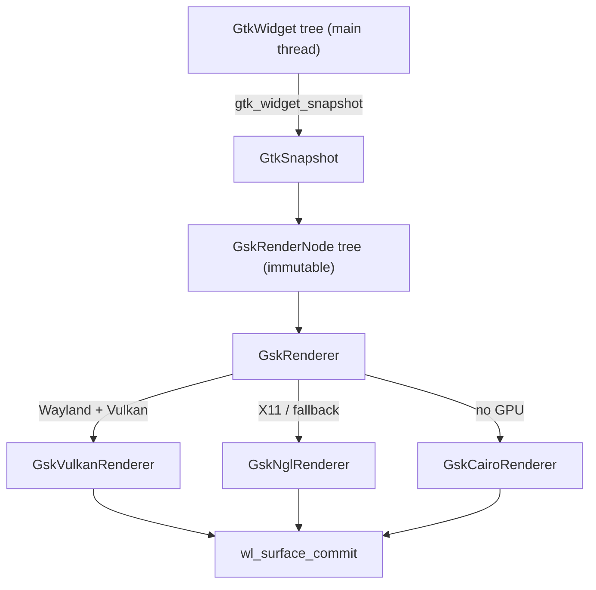
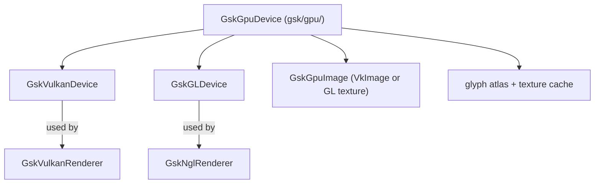
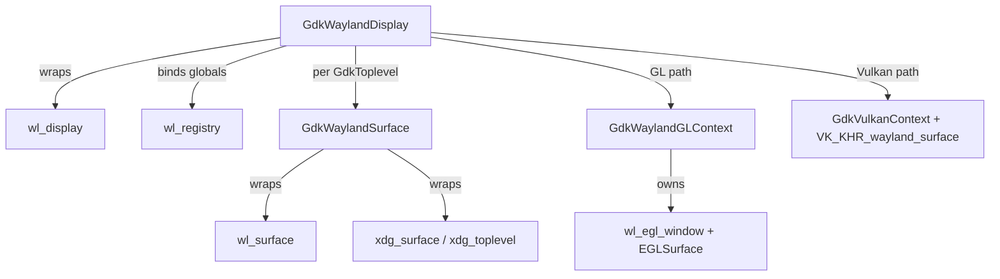
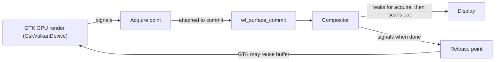
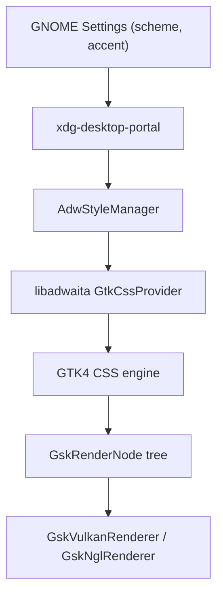
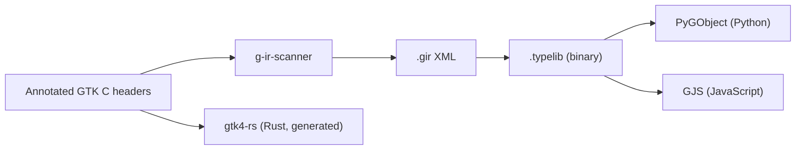
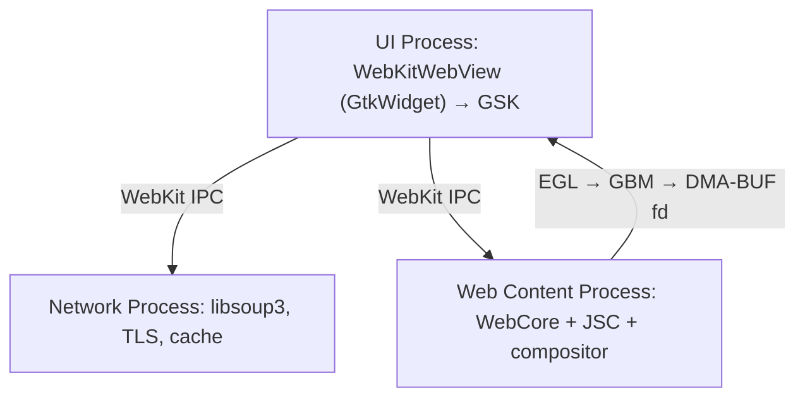
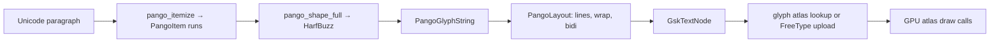

# Chapter 39c: GTK4 — GskRenderer, Wayland Integration, and the CSS Pipeline

> **Part**: Part VII-C — Desktop Frameworks
> **Audience**: Application developers using GTK4; systems developers tracing how GTK4 frames reach the Wayland compositor
> **Status**: First draft — 2026-07-24

## Table of Contents

- [Overview](#overview)
- [1. GTK4 Architecture Overview](#1-gtk4-architecture-overview)
  - [1.1 The Three-Layer Model](#11-the-three-layer-model)
  - [1.2 What Changed From GTK3](#12-what-changed-from-gtk3)
  - [1.3 Module Structure: gdk, gsk, gtk](#13-module-structure-gdk-gsk-gtk)
  - [1.4 Licensing and Versioning](#14-licensing-and-versioning)
- [2. The GskRenderNode Tree](#2-the-gskrendernode-tree)
  - [2.1 Node Type Taxonomy](#21-node-type-taxonomy)
  - [2.2 Building Nodes: The GtkSnapshot API](#22-building-nodes-the-gtksnapshot-api)
  - [2.3 Overriding GtkWidget snapshot()](#23-overriding-gtkwidget-snapshot)
  - [2.4 Node Serialisation for Debugging](#24-node-serialisation-for-debugging)
- [3. GskRenderer Implementations](#3-gskrenderer-implementations)
  - [3.1 The Unified GPU Renderer](#31-the-unified-gpu-renderer)
  - [3.2 GskVulkanRenderer](#32-gskvulkanrenderer)
  - [3.3 GskNglRenderer](#33-gsknglrenderer)
  - [3.4 Legacy and Cairo Fallback](#34-legacy-and-cairo-fallback)
  - [3.5 Selecting a Renderer](#35-selecting-a-renderer)
- [4. The GDK Wayland Backend](#4-the-gdk-wayland-backend)
  - [4.1 Display, Surface, and GL Context](#41-display-surface-and-gl-context)
  - [4.2 The EGL Path](#42-the-egl-path)
  - [4.3 The Vulkan Path](#43-the-vulkan-path)
  - [4.4 Explicit Synchronisation](#44-explicit-synchronisation)
  - [4.5 Damage Tracking](#45-damage-tracking)
  - [4.6 Subsurfaces and GskSubsurfaceNode](#46-subsurfaces-and-gsksubsurfacenode)
- [5. The GTK4 CSS Pipeline](#5-the-gtk4-css-pipeline)
  - [5.1 The Cascade and State Classes](#51-the-cascade-and-state-classes)
  - [5.2 CSS Properties Mapped to Render Nodes](#52-css-properties-mapped-to-render-nodes)
  - [5.3 GtkCssProvider and Custom Theming](#53-gtkcssprovider-and-custom-theming)
- [6. GtkGLArea: Custom OpenGL Rendering](#6-gtkglarea-custom-opengl-rendering)
  - [6.1 The Widget and Its FBO](#61-the-widget-and-its-fbo)
  - [6.2 Signal Handlers](#62-signal-handlers)
  - [6.3 Wrapping GL Output as a GdkTexture](#63-wrapping-gl-output-as-a-gdktexture)
  - [6.4 Dmabuf Interop](#64-dmabuf-interop)
- [7. libadwaita: GNOME HIG Adaptive Widgets](#7-libadwaita-gnome-hig-adaptive-widgets)
- [8. The GObject Type System](#8-the-gobject-type-system)
- [9. WebKitGTK: Embedding Web Content](#9-webkitgtk-embedding-web-content)
- [10. Font and Text Rendering](#10-font-and-text-rendering)
- [11. Performance and Debugging](#11-performance-and-debugging)
- [12. Integrations](#12-integrations)
- [References](#references)

---

## Overview

**GTK4** is the fourth major version of GTK, a C-language widget toolkit developed under the GNOME Project and used by GNOME Shell applications, the GIMP, Inkscape, and a large fraction of the Linux desktop. Its 2020 release replaced GTK3's Cairo-based immediate-mode drawing model with a retained-mode, GPU-first architecture built around three libraries — **GDK** (windowing and input), **GSK** (the GTK Scene Kit render pipeline), and **GTK** (widgets). This chapter traces a GTK4 frame from a widget's `snapshot()` method, through the `GskRenderNode` tree, into the `GskVulkanRenderer` or `GskNglRenderer`, and out through the GDK Wayland backend to the compositor. [Source](https://docs.gtk.org/gtk4/)

For **application developers** the practical consequence is that GPU acceleration is now automatic: there is no OpenGL boilerplate in ordinary widget code, and CSS visual effects (blur, shadow, rounded clipping, gradients) map onto GPU shader passes. For **systems developers** tracing a frame, the path from application to KMS page-flip is longer and more structured than in the GTK3 era — a snapshot pass builds an immutable node tree, a renderer translates it to Vulkan or OpenGL commands, and the GDK Wayland backend attaches the resulting buffer to a `wl_surface` with explicit GPU synchronisation via `wp_linux_drm_syncobj_v1`.

This chapter also covers the surrounding stack that a real GTK4 application depends on: **libadwaita** (the GNOME Human Interface Guidelines widget library and colour-scheme system), the **GObject** type system that underlies every GTK class and its language bindings (Python, JavaScript, Rust), **WebKitGTK** for embedded web content, and the **Pango**-based text pipeline. It closes with the debugging tooling — the GTK Inspector, `GSK_DEBUG`, and `gtk4-rendernode-tool` — that makes the render pipeline observable.

---

## 1. GTK4 Architecture Overview

### 1.1 The Three-Layer Model

GTK4 rendering is organised into three distinct layers, and keeping them separate is the key to understanding both the code and the frame lifecycle:

1. **Widget tree** (`GtkWidget` hierarchy) — the application-visible object model: buttons, labels, boxes, list views. Widgets describe *what* to render, not *how*. This tree lives on the main thread and can be mutated freely.
2. **Render node tree** (`GskRenderNode` hierarchy) — a serialisable, immutable tree of GPU-oriented drawing primitives, produced by snapshotting the widget tree once per frame.
3. **Renderer** (`GskRenderer`) — consumes the render node tree and emits GPU commands via Vulkan or OpenGL.

The boundary between the widget tree and the node tree is a hand-off: once `gtk_widget_snapshot()` has produced the immutable node tree, it can be handed to a renderer that may use a separate GL/Vulkan context, serialised to disk for debugging, or diffed against the previous frame for damage tracking — none of which touches widget code.



### 1.2 What Changed From GTK3

GTK3 widgets implemented a `draw` virtual function that received a `cairo_t` and painted immediately into it. Cairo's default backend is a CPU rasteriser; GPU acceleration in GTK3 was partial and bolted on. GTK4 replaces this entirely:

| GTK3 | GTK4 |
|---|---|
| `GtkWidgetClass.draw(widget, cairo_t*)` | `GtkWidgetClass.snapshot(widget, GtkSnapshot*)` |
| Immediate-mode Cairo painting | Retained `GskRenderNode` tree |
| `GdkWindow` per widget (subwindows) | One `GdkSurface` per top-level; widgets are windowless |
| `gtk_widget_queue_draw_area()` | `gtk_widget_queue_draw()` + node diffing |
| Cairo software raster (default) | Vulkan / OpenGL GPU renderers |
| Manual `GdkEventExpose` handling | `GdkFrameClock`-driven frame scheduling |

The `snapshot` method never rasterises anything itself. It records drawing intent as nodes; rasterisation happens later in the renderer. This is what lets GTK4 defer the choice of GPU API to runtime and re-render only the damaged subtree. [Source](https://docs.gtk.org/gtk4/migrating-3to4.html)

### 1.3 Module Structure: gdk, gsk, gtk

GTK4 ships as one shared library (`libgtk-4.so`) but its source tree is cleanly partitioned into three namespaces, each with a distinct responsibility:

- **GDK** (`gdk/`, GIR namespace `Gdk`) — the windowing and input abstraction. `GdkDisplay`, `GdkSurface`, `GdkMonitor`, `GdkGLContext`, `GdkVulkanContext`, `GdkTexture`, `GdkFrameClock`, and the event types. Backends live in `gdk/wayland/`, `gdk/x11/`, `gdk/macos/`, `gdk/win32/`.
- **GSK** (`gsk/`, GIR namespace `Gsk`) — the render pipeline. `GskRenderNode` and its subtypes, `GskRenderer` and its backends, and the shared GPU renderer in `gsk/gpu/`.
- **GTK** (`gtk/`, GIR namespace `Gtk`) — the widgets, layout managers, the CSS engine, and `GtkSnapshot`.

The dependency direction is strictly `gtk → gsk → gdk`. Widgets know about render nodes; render nodes know about textures and surfaces; GDK knows nothing about widgets. [Source](https://gitlab.gnome.org/GNOME/gtk)

### 1.4 Licensing and Versioning

GTK is licensed under the **GNU LGPL, version 2.1 or later**, which permits linking from both free and proprietary applications. [Source](https://gitlab.gnome.org/GNOME/gtk/-/blob/main/COPYING) GTK4 follows an even/odd minor-version convention: stable releases carry even minor numbers (4.10, 4.12, 4.14, 4.16, 4.18), and the ABI is stable across the entire 4.x series. Feature landmarks referenced throughout this chapter:

- **GTK 4.0** (2020) — the GSK/snapshot architecture ships.
- **GTK 4.12** (2023) — `gdk_gl_texture_new()` deprecated in favour of `GdkGLTextureBuilder`.
- **GTK 4.14** (2024) — the unified GPU renderer in `gsk/gpu/`; `GdkDmabufTexture` / `GdkDmabufTextureBuilder`.
- **GTK 4.16** (2024) — `GskVulkanRenderer` becomes the default on Wayland; `wp_linux_drm_syncobj_v1` explicit sync. The 4.16.0 NEWS states: "This release changes the default GSK renderer to be Vulkan, on Wayland. Other platforms still use ngl." [Source](https://gitlab.gnome.org/GNOME/gtk/-/blob/4.16.0/NEWS)

---

## 2. The GskRenderNode Tree

### 2.1 Node Type Taxonomy

`GskRenderNode` is an abstract base class; all drawing is expressed through immutable, specialised subtypes. Once constructed a node cannot be modified — this immutability is what makes cross-frame diffing and cross-thread hand-off safe. The principal node types and their GPU mapping [Source](https://docs.gtk.org/gsk4/class.RenderNode.html):

| Node type | Purpose | GPU treatment |
|---|---|---|
| `GskColorNode` | Solid-colour rectangle | Flat-colour draw |
| `GskTextureNode` | Sample a `GdkTexture` | Textured quad |
| `GskTextureScaleNode` | Scaled texture with a filter mode | Textured quad + sampler |
| `GskLinearGradientNode` | CSS linear gradient | Gradient shader |
| `GskRadialGradientNode` | CSS radial gradient | Gradient shader |
| `GskConicGradientNode` | CSS conic gradient | Gradient shader |
| `GskBorderNode` | Widget border (up to 4 colours/widths) | Per-edge quads |
| `GskRoundedClipNode` | Clip child to a rounded rectangle | Shader-based clip |
| `GskClipNode` | Clip child to a plain rectangle | Scissor / shader clip |
| `GskTransformNode` | Apply a `GskTransform` to a child | Matrix in vertex stage |
| `GskOpacityNode` | Multiply child alpha | Blend state / offscreen |
| `GskBlurNode` | Gaussian blur of a child | Separable convolution |
| `GskShadowNode` | Drop shadow behind a child | Blur + offset + blend |
| `GskOutsetShadowNode` / `GskInsetShadowNode` | CSS `box-shadow` | Blur + translate + blend |
| `GskCrossFadeNode` | Blend two children by a factor | Two-source blend |
| `GskContainerNode` | Ordered list of children | Sequential draw |
| `GskCairoNode` | Fallback: paint via a `cairo_t` | CPU raster → texture upload |
| `GskTextNode` | A run of Pango glyphs | Glyph-atlas draw calls |
| `GskSubsurfaceNode` | Delegate a child to a Wayland subsurface | `wl_subsurface` / KMS plane |
| `GskGLShaderNode` | Custom GLSL fragment shader (deprecated) | Direct shader execution |

`GskContainerNode` is the workhorse: almost every widget produces a container node holding its children's subtrees. `GskCairoNode` is the escape hatch — a widget that has no GSK-native way to draw something (a complex vector path, for instance) can fall back to Cairo, at the cost of a CPU rasterisation and a texture upload each frame.

### 2.2 Building Nodes: The GtkSnapshot API

Application and widget code rarely constructs `GskRenderNode` objects directly. Instead it uses `GtkSnapshot`, a stateful builder that maintains a stack of transforms and clips and emits nodes as `append_*` / `push_*` / `pop` calls are made. `push_*` opens a modifier (a clip, an opacity, a transform) that applies to everything until the matching `pop`; `append_*` adds a leaf node at the current state. [Source](https://docs.gtk.org/gtk4/class.Snapshot.html)

```c
/* Build: a rounded-clipped card with a gradient fill and a texture on top */
static void
draw_card (GtkSnapshot *snapshot, GdkTexture *icon, const graphene_rect_t *bounds)
{
    GskRoundedRect clip;
    gsk_rounded_rect_init_from_rect (&clip, bounds, 12.0f /* corner radius */);

    /* Everything until the matching pop is clipped to the rounded rect */
    gtk_snapshot_push_rounded_clip (snapshot, &clip);

    const GskColorStop stops[] = {
        { 0.0f, { 0.16f, 0.22f, 0.42f, 1.0f } },
        { 1.0f, { 0.10f, 0.13f, 0.25f, 1.0f } },
    };
    graphene_point_t start = GRAPHENE_POINT_INIT (bounds->origin.x, bounds->origin.y);
    graphene_point_t end   = GRAPHENE_POINT_INIT (bounds->origin.x,
                                                  bounds->origin.y + bounds->size.height);
    gtk_snapshot_append_linear_gradient (snapshot, bounds, &start, &end,
                                         stops, G_N_ELEMENTS (stops));

    graphene_rect_t icon_bounds =
        GRAPHENE_RECT_INIT (bounds->origin.x + 16, bounds->origin.y + 16, 48, 48);
    gtk_snapshot_append_texture (snapshot, icon, &icon_bounds);

    gtk_snapshot_pop (snapshot);  /* closes the rounded clip */
}
```

The `push_*` family that opens a modifier scope includes `gtk_snapshot_push_opacity()`, `gtk_snapshot_push_clip()`, `gtk_snapshot_push_rounded_clip()`, `gtk_snapshot_push_blur()`, `gtk_snapshot_push_shadow()`, and `gtk_snapshot_push_cross_fade()`; the `append_*` family adds leaves: `append_color()`, `append_texture()`, `append_linear_gradient()`, `append_border()`, `append_layout()` (Pango text), and more. Transforms are applied with `gtk_snapshot_transform()`, `gtk_snapshot_translate()`, `gtk_snapshot_scale()`, and `gtk_snapshot_rotate()`, which push onto the transform stack and are unwound by a matching `gtk_snapshot_restore()` after `gtk_snapshot_save()`.

### 2.3 Overriding GtkWidget snapshot()

Custom widgets implement drawing by overriding the `snapshot` vfunc in their class-init. GTK calls it whenever the widget needs redrawing, passing a `GtkSnapshot` already positioned at the widget's origin and clipped to its allocation:

```c
struct _MeterWidget { GtkWidget parent_instance; double fraction; };
G_DEFINE_TYPE (MeterWidget, meter_widget, GTK_TYPE_WIDGET)

static void
meter_widget_snapshot (GtkWidget *widget, GtkSnapshot *snapshot)
{
    MeterWidget *self = METER_WIDGET (widget);
    int w = gtk_widget_get_width (widget);
    int h = gtk_widget_get_height (widget);

    /* Track background */
    GdkRGBA track = { 0.2f, 0.2f, 0.2f, 1.0f };
    graphene_rect_t track_r = GRAPHENE_RECT_INIT (0, 0, w, h);
    gtk_snapshot_append_color (snapshot, &track, &track_r);

    /* Filled portion, driven by self->fraction */
    GdkRGBA fill = { 0.20f, 0.55f, 0.95f, 1.0f };
    graphene_rect_t fill_r = GRAPHENE_RECT_INIT (0, 0, w * self->fraction, h);
    gtk_snapshot_append_color (snapshot, &fill, &fill_r);
}

static void
meter_widget_class_init (MeterWidgetClass *klass)
{
    GTK_WIDGET_CLASS (klass)->snapshot = meter_widget_snapshot;
}
```

To trigger a redraw when `fraction` changes, the widget calls `gtk_widget_queue_draw(widget)`, which marks the widget dirty; GTK re-invokes `snapshot()` on the next `GdkFrameClock` tick. A widget must never assume `snapshot()` runs every frame — it runs only when the widget (or an ancestor) has been invalidated.

### 2.4 Node Serialisation for Debugging

Because the node tree is immutable and self-contained, GSK can serialise it to a textual `.node` representation. `gsk_render_node_serialize()` returns a `GBytes`; `gsk_render_node_write_to_file()` is a convenience wrapper equivalent to serialising and then `g_file_set_contents()`, and is designed to be called from inside a debugger to dump the current frame. `gsk_render_node_deserialize()` reads it back. [Source](https://docs.gtk.org/gsk4/method.RenderNode.serialize.html) [Source](https://docs.gtk.org/gsk4/method.RenderNode.write_to_file.html)

```c
/* Dump the last-rendered node tree from a GDB session:
 *   (gdb) call gsk_render_node_write_to_file(node, "/tmp/frame.node", 0)
 */
gsk_render_node_write_to_file (root_node, "/tmp/frame.node", NULL);
```

The format is explicitly a debugging/testing/benchmarking aid, not a storage format: GTK only guarantees that the *same* version can round-trip, and later versions will cleanly reject files written by earlier ones. [Source](https://docs.gtk.org/gsk4/method.RenderNode.serialize.html) The companion CLI, `gtk4-rendernode-tool`, operates on these files — `gtk4-rendernode-tool info frame.node` reports the node count and tree depth, and `gtk4-rendernode-tool show frame.node` opens a window rendering the tree. [Source](https://docs.gtk.org/gtk4/gtk4-rendernode-tool.html) A `.node` fragment looks like:

```
container {
  color {
    bounds: 0 0 200 120;
    color: rgb(51,51,51);
  }
  rounded-clip {
    clip: 0 0 200 120 / 12;
    linear-gradient {
      bounds: 0 0 200 120;
      start: 0 0;  end: 0 120;
      stops: 0 rgb(41,56,107), 1 rgb(26,33,64);
    }
  }
}
```

---

## 3. GskRenderer Implementations

A `GskRenderer` takes a `GskRenderNode` tree plus a target `GdkSurface` and produces a rendered frame. GTK4 provides several implementations; the important distinction since GTK 4.14 is between the **unified GPU renderer** (shared code in `gsk/gpu/`, presenting two faces — Vulkan and NGL) and the older per-backend renderers.

### 3.1 The Unified GPU Renderer

The unified renderer in `gsk/gpu/` was introduced in GTK 4.14 to end the duplication between the old GL and Vulkan code paths. It is modelled on Vulkan concepts and shares its scene-graph traversal, batching, and glyph/texture caching between an OpenGL back-end and a Vulkan back-end. Its central abstractions are:

- **`GskGpuDevice`** — the abstract base (in `gsk/gpu/gskgpudevice.c`) that owns resource allocation, the glyph atlas, and the texture cache. Concrete subclasses are `GskVulkanDevice` and `GskGLDevice`.
- **`GskGpuImage`** — the renderer's abstraction over a GPU image (a `VkImage` or a GL texture), used for render targets, uploaded textures, and atlas pages.
- **`GskGpuFrame`** — the per-frame command recording context.

It avoids offscreen intermediate rendering for the common case and uses a two-tier shader strategy: fast per-node-type shaders for common nodes (colour, texture, gradient) and an "ubershader" that interprets a node-type token packed into a GPU buffer for complex trees. [Source](https://blog.gtk.org/2024/01/28/new-renderers-for-gtk/)



### 3.2 GskVulkanRenderer

`GskVulkanRenderer` targets Vulkan 1.0+ and, since GTK 4.16, is the **default renderer on Wayland** when a capable Vulkan driver is present. [Source](https://gitlab.gnome.org/GNOME/gtk/-/blob/4.16.0/NEWS) It compiles its shaders from the shared `gsk/gpu/shaders/` GLSL sources to **SPIR-V at GTK build time** (via `glslang`) and embeds the SPIR-V in the binary, so no runtime shader compilation from source is needed. At startup it builds `VkPipeline` objects per shader variant, and per draw it binds descriptor sets for textures and small uniform data. Per-draw constants (transform, colour, opacity) are passed as Vulkan push constants to avoid `vkUpdateDescriptorSets()` churn; larger per-node parameter arrays for the ubershader travel in GPU buffers. This SPIR-V feeds Mesa's Vulkan drivers (ANV, RADV, NVK) and, through them, the NIR shader IR.

### 3.3 GskNglRenderer

`GskNglRenderer` (the "new GL" renderer) is the OpenGL face of the same `gsk/gpu/` code, targeting OpenGL 3.3+ and OpenGL ES 3.0+. It is the default on X11 and on platforms without a usable Vulkan driver. It compiles the same GLSL sources at runtime through the GL driver. Because it shares the unified traversal and caching with the Vulkan path, its output matches `GskVulkanRenderer` node-for-node; only the device abstraction (`GskGLDevice`) and the command submission differ.

### 3.4 Legacy and Cairo Fallback

Two older renderers remain for compatibility:

- **Legacy `GskGLRenderer`** (`gsk/gl/`) — the pre-4.14 GL renderer with per-node-type programs and frequent offscreen passes. Deprecated in favour of the unified renderer but still selectable.
- **`GskCairoRenderer`** — the software fallback. It renders the node tree into a Cairo image surface on the CPU and uploads the result. Correct but slow; used when no GPU is available (headless CI, broken drivers, `GSK_RENDERER=cairo`).

### 3.5 Selecting a Renderer

The renderer is chosen at application startup and can be forced with the `GSK_RENDERER` environment variable [Source](https://docs.gtk.org/gtk4/running.html):

```bash
GSK_RENDERER=vulkan myapp   # force the Vulkan renderer
GSK_RENDERER=ngl    myapp   # force the unified OpenGL renderer
GSK_RENDERER=gl     myapp   # force the legacy GL renderer
GSK_RENDERER=cairo  myapp   # force the software fallback
GSK_RENDERER=help   myapp   # list available renderers and exit
```

Absent an override, GDK detects driver capability and selects `GskVulkanRenderer` on Wayland (4.16+) or `GskNglRenderer` otherwise, falling back to Cairo if no GPU renderer initialises. The chosen renderer is reported by `GSK_DEBUG=renderer` (§11).

---

## 4. The GDK Wayland Backend

### 4.1 Display, Surface, and GL Context

GTK4's Wayland integration lives in `gdk/wayland/`. It is selected automatically when `$WAYLAND_DISPLAY` is set, or forced with `GDK_BACKEND=wayland`. The core types:

- **`GdkWaylandDisplay`** — wraps `wl_display`; owns the connection and the `wl_registry` listener that binds globals (`wl_compositor`, `xdg_wm_base`, `wp_linux_dmabuf_v1`, `wp_linux_drm_syncobj_manager_v1`, `zwp_linux_explicit_synchronization_v1`, and so on).
- **`GdkWaylandSurface`** — wraps a `wl_surface` plus an `xdg_surface`/`xdg_toplevel` (or popup role). One exists per `GdkToplevel` or `GdkPopup`.
- **`GdkWaylandGLContext`** — the EGL context for the GL renderer; owns the `wl_egl_window` and `EGLSurface`.



### 4.2 The EGL Path

The NGL renderer submits frames through EGL. GDK creates a `wl_egl_window` (the libwayland-egl abstraction that Mesa understands) around the `wl_surface`, wraps it in an `EGLSurface`, and at frame end calls `eglSwapBuffers()`. Mesa's EGL Wayland platform translates the swap into `wl_surface_attach()` of the freshly rendered `wl_buffer` followed by `wl_surface_commit()`.

```c
struct wl_egl_window *egl_window =
    wl_egl_window_create (wl_surface, width, height);
EGLSurface egl_surface =
    eglCreateWindowSurface (egl_display, config,
                            (EGLNativeWindowType) egl_window, NULL);
/* ... GskNglRenderer issues GL draw calls into egl_surface ... */
eglSwapBuffers (egl_display, egl_surface);   /* → wl_surface_attach + commit */
```

Damage is reported with `wl_surface_damage_buffer()` (buffer-space coordinates, correct under arbitrary buffer transforms) before the commit, and the `EGL_KHR_partial_update` extension restricts fragment work to the dirty region. [Source](https://docs.gtk.org/gtk4/wayland.html)

### 4.3 The Vulkan Path

For the Vulkan renderer, GDK creates a `GdkVulkanContext` that owns a `VkSurfaceKHR` per `GdkWaylandSurface` via `VK_KHR_wayland_surface`, and a `VkSwapchainKHR`. Frames are presented with `vkQueuePresentKHR()`, which drives the compositor-side buffer import. The swapchain uses `VK_PRESENT_MODE_FIFO_KHR` (vsync) by default. If the `wl_surface` is destroyed and recreated (e.g. on unmap/remap), the surface and swapchain are torn down and rebuilt.

### 4.4 Explicit Synchronisation

GTK 4.16 added support for the `wp_linux_drm_syncobj_v1` Wayland protocol, implementing GPU-native explicit synchronisation with DRM timeline syncobjs. [Source](https://wayland.app/protocols/linux-drm-syncobj-v1) Without it, the compositor must rely on implicit fencing or stall its pipeline before importing a client buffer. With it, each surface commit carries two timeline points:

- **Acquire point** — the compositor waits for this before scanning out the buffer; it is signalled when GTK's GPU rendering completes.
- **Release point** — the compositor signals this when it has finished with the buffer, letting GTK reuse it safely.

This removes the buffer-import stall and enables correct zero-copy sharing — historically critical on NVIDIA, which lacked implicit sync on Wayland, and beneficial everywhere.



### 4.5 Damage Tracking

The unified renderer diffs the current `GskRenderNode` tree against the previous frame's tree. Unchanged subtrees are not re-rendered, and the union of changed regions becomes the damage rectangle passed to `wl_surface_damage_buffer()`. On the GL path the damage region also bounds fragment work via `EGL_KHR_partial_update`. This node-diffing is why `gtk_widget_queue_draw()` on a single widget does not force a full-window repaint. `GSK_DEBUG=diff` prints the computed diff regions. [Source](https://docs.gtk.org/gsk4/class.Renderer.html)

### 4.6 Subsurfaces and GskSubsurfaceNode

`GskSubsurfaceNode` lets a subtree be delegated to a dedicated Wayland subsurface rather than being composited into the main window buffer. GTK uses this for content that benefits from **zero-copy overlay-plane scanout** — video (via a dmabuf `GdkTexture`) or an embedded WebKit surface. When a subsurface node's content is a suitable dmabuf and the compositor can promote it, GDK attaches the buffer to a `wl_subsurface`; the compositor may then place it directly on a KMS overlay plane through a `TEST_ONLY` atomic commit, bypassing GPU composition entirely. If promotion fails, GDK falls back to compositing the texture into the parent buffer as an ordinary `GskTextureNode`. Forcing the fallback for debugging is possible with `GDK_DEBUG=no-offload`; `GDK_DEBUG=force-offload` forces the offload path. This is the same overlay-plane mechanism terminal emulators use for image protocols (Ch45).

---

## 5. The GTK4 CSS Pipeline

### 5.1 The Cascade and State Classes

GTK4 styles widgets with a CSS engine that is a substantial subset of the web CSS specification, adapted to the widget tree. Every widget has a **CSS node** with an element name (`button`, `label`, `entry`), a set of **style classes** (`.suggested-action`, `.flat`, `.pill`), and **state pseudo-classes** that GTK toggles automatically as the widget's state changes: `:hover`, `:active`, `:checked`, `:disabled`, `:focus`, `:selected`, plus link states such as `:link` and `:visited`. Selectors, specificity, inheritance, and the cascade work as on the web. [Source](https://docs.gtk.org/gtk4/css-overview.html)

```css
/* Selectors combine element name, style class, and state pseudo-class */
button.suggested-action {
    background-color: @accent_bg_color;
    color: @accent_fg_color;
    border-radius: 8px;
}
button.suggested-action:hover  { filter: brightness(1.08); }
button.suggested-action:active { filter: brightness(0.92); }
button:disabled                { opacity: 0.5; }
```

When a pseudo-class toggles (say `:hover` on pointer entry), GTK recomputes the affected widgets' styles and re-snapshots them on the next frame; the changed CSS values flow into a fresh `GskRenderNode` subtree. Style computation is animated: GTK's CSS engine can interpolate properties over a `transition`, ticking the interpolation off `GdkFrameClock`.

### 5.2 CSS Properties Mapped to Render Nodes

The connection between CSS and the GPU is direct: each supported visual property is realised as a specific render-node type, which the renderer turns into a shader pass. [Source](https://docs.gtk.org/gsk4/class.RenderNode.html)

| CSS property | GskRenderNode | GPU effect |
|---|---|---|
| `background-color` | `GskColorNode` | Flat-colour draw |
| `background: linear-gradient(...)` | `GskLinearGradientNode` | Gradient shader |
| `border-radius` | `GskRoundedClipNode` | Rounded clip in shader |
| `border` | `GskBorderNode` | Per-edge quads |
| `box-shadow` | `GskOutsetShadowNode` / `GskInsetShadowNode` | Blur + translate + blend |
| `filter: blur(4px)` | `GskBlurNode` | Separable Gaussian convolution |
| `opacity: 0.5` | `GskOpacityNode` | Alpha blend of child |
| `transform: rotate(...)` | `GskTransformNode` | Matrix in vertex stage |
| `color` (text) | `GskTextNode` foreground | Glyph-atlas draw |

Because the mapping is one-directional and mechanical, a themer editing CSS is really editing the render-node tree indirectly, and a system developer inspecting the render-node tree (§2.4, §11) can read back which CSS produced each node.

### 5.3 GtkCssProvider and Custom Theming

Applications add CSS through a `GtkCssProvider`, registered against a `GdkDisplay` at a priority that determines where it sits in the cascade relative to the theme:

```c
static void
install_app_css (GdkDisplay *display)
{
    GtkCssProvider *provider = gtk_css_provider_new ();
    gtk_css_provider_load_from_string (provider,
        ".card {"
        "  background-color: @card_bg_color;"
        "  border-radius: 12px;"
        "  padding: 12px;"
        "  box-shadow: 0 1px 3px alpha(black, 0.3);"
        "}"
        ".accent-title { color: @accent_color; font-weight: bold; }");

    gtk_style_context_add_provider_for_display (display,
        GTK_STYLE_PROVIDER (provider),
        GTK_STYLE_PROVIDER_PRIORITY_APPLICATION);
    g_object_unref (provider);
}
```

`gtk_css_provider_load_from_string()` (and `load_from_bytes()`, `load_from_file()`, `load_from_resource()`) parse the CSS; `GTK_STYLE_PROVIDER_PRIORITY_APPLICATION` places app CSS above the theme but below inline `GTK_STYLE_PROVIDER_PRIORITY_USER` overrides. Widgets opt into a class with `gtk_widget_add_css_class(widget, "card")`. The `@card_bg_color` / `@accent_color` references resolve against the named colours that the active theme — or libadwaita (§7) — defines, so the same CSS automatically adapts to light and dark schemes. Older code used the now-deprecated `gtk_css_provider_load_from_data()`; `load_from_string()` is the current API.

---

## 6. GtkGLArea: Custom OpenGL Rendering

### 6.1 The Widget and Its FBO

Most widgets never touch the GPU directly — they emit render nodes and let GSK do the work. `GtkGLArea` is the exception: it lets application code issue raw OpenGL commands while remaining a well-behaved participant in GTK's frame lifecycle. It creates and manages a **framebuffer object (FBO)** and guarantees that this FBO is the bound render target when the application draws, so application GL code never sees the window's default framebuffer. [Source](https://docs.gtk.org/gtk4/class.GLArea.html) The FBO's colour attachment is subsequently wrapped as a `GdkTexture` and inserted into the main render-node tree as a `GskTextureNode`, so the custom GL content is composited, transformed, and damage-tracked exactly like any other widget.

### 6.2 Signal Handlers

`GtkGLArea` exposes three signals plus the inherited `GtkWidget::realize`:

- **`realize`** (inherited) — the GL context now exists and is current; upload textures, compile shaders, create VBOs here.
- **`resize`** — `void (GtkGLArea*, int width, int height)` — emitted at realize and on every size change; update the viewport and projection.
- **`render`** — `gboolean (GtkGLArea*, GdkGLContext*)` — emitted each frame with the context current and the FBO bound; issue draw calls and return `TRUE` to stop further propagation.
- **`create-context`** — `GdkGLContext* (GtkGLArea*)` — optional; return a custom context (e.g. a specific GL version or a shared context).

[Source](https://docs.gtk.org/gtk4/class.GLArea.html)

```c
static guint program, vao;

static void
on_realize (GtkGLArea *area)
{
    gtk_gl_area_make_current (area);
    if (gtk_gl_area_get_error (area) != NULL)
        return;
    program = build_shader_program ();   /* application-defined */
    vao     = build_triangle_vao ();
}

static void
on_resize (GtkGLArea *area, int width, int height)
{
    glViewport (0, 0, width, height);
}

static gboolean
on_render (GtkGLArea *area, GdkGLContext *context)
{
    glClearColor (0.0f, 0.0f, 0.0f, 1.0f);
    glClear (GL_COLOR_BUFFER_BIT);
    glUseProgram (program);
    glBindVertexArray (vao);
    glDrawArrays (GL_TRIANGLES, 0, 3);
    return TRUE;   /* handled; do not propagate */
}

static GtkWidget *
make_gl_area (void)
{
    GtkWidget *area = gtk_gl_area_new ();
    gtk_gl_area_set_required_version (GTK_GL_AREA (area), 3, 3);
    gtk_gl_area_set_has_depth_buffer (GTK_GL_AREA (area), TRUE);
    g_signal_connect (area, "realize", G_CALLBACK (on_realize), NULL);
    g_signal_connect (area, "resize",  G_CALLBACK (on_resize),  NULL);
    g_signal_connect (area, "render",  G_CALLBACK (on_render),  NULL);
    return area;
}
```

To animate, call `gtk_gl_area_queue_render(area)` from a `GdkFrameClock` tick or a `gtk_widget_add_tick_callback()` handler; GTK re-emits `render` on the next frame.

### 6.3 Wrapping GL Output as a GdkTexture

When custom GL content must feed *into* the node tree from outside a `GtkGLArea` (for example a background thread that renders into a shared GL texture), it is wrapped as a `GdkTexture` from a GL texture id. The historical constructor is `gdk_gl_texture_new(context, id, width, height, destroy, data)`, but it was **deprecated in GTK 4.12** in favour of `GdkGLTextureBuilder`, which supports specifying the format, mipmaps, and a sync fence: [Source](https://docs.gtk.org/gdk4/ctor.GLTexture.new.html)

```c
GdkGLTextureBuilder *b = gdk_gl_texture_builder_new ();
gdk_gl_texture_builder_set_context (b, gl_context);
gdk_gl_texture_builder_set_id      (b, gl_texture_id);
gdk_gl_texture_builder_set_width   (b, width);
gdk_gl_texture_builder_set_height  (b, height);
gdk_gl_texture_builder_set_format  (b, GDK_MEMORY_R8G8B8A8_PREMULTIPLIED);
/* destroy notify frees the GL texture when the GdkTexture is finalised */
GdkTexture *tex = gdk_gl_texture_builder_build (b, destroy_gl_texture, user_data);
g_object_unref (b);

gtk_snapshot_append_texture (snapshot, tex, &bounds);   /* → GskTextureNode */
```

### 6.4 Dmabuf Interop

The most important cross-API path in GTK 4.14+ is importing a **DMA-BUF** as a `GdkTexture` via `GdkDmabufTextureBuilder`. This is how zero-copy content from another process or API — a Vulkan renderer, a hardware video decoder (VA-API), a GStreamer pipeline, or a WebKit web-content process — reaches the GTK node tree without a CPU round-trip. [Source](https://docs.gtk.org/gdk4/class.DmabufTextureBuilder.html)

```c
GdkDmabufTextureBuilder *b = gdk_dmabuf_texture_builder_new ();
gdk_dmabuf_texture_builder_set_display  (b, display);
gdk_dmabuf_texture_builder_set_width    (b, width);
gdk_dmabuf_texture_builder_set_height   (b, height);
gdk_dmabuf_texture_builder_set_fourcc   (b, DRM_FORMAT_XRGB8888);
gdk_dmabuf_texture_builder_set_modifier (b, modifier);   /* e.g. tiling layout */
gdk_dmabuf_texture_builder_set_n_planes (b, 1);
gdk_dmabuf_texture_builder_set_fd       (b, 0, dmabuf_fd);
gdk_dmabuf_texture_builder_set_stride   (b, 0, stride);
gdk_dmabuf_texture_builder_set_offset   (b, 0, 0);

GError *error = NULL;
GdkTexture *tex = gdk_dmabuf_texture_builder_build (b, NULL, NULL, &error);
g_object_unref (b);
```

The resulting `GdkTexture` is imported into the active renderer as a `VkImage` (with external memory) on the Vulkan path or an `EGLImage` (via `EGL_LINUX_DMA_BUF_EXT`) on the GL path. Placed under a `GskSubsurfaceNode` (§4.6), such a dmabuf texture becomes a candidate for KMS overlay-plane promotion. `GDK_DEBUG=dmabuf` traces the import negotiation, including which fourcc/modifier combinations the driver accepts.

---

## 7. libadwaita: GNOME HIG Adaptive Widgets

**libadwaita** (`libadwaita-1`) is the official implementation of the GNOME Human Interface Guidelines on top of GTK4. Where GTK4 supplies the rendering engine, libadwaita adds HIG-conformant widgets, a colour-scheme system, a physics-based animation framework, and adaptive layout. Every libadwaita widget is a `GtkWidget` subclass and renders through the ordinary `GtkSnapshot → GskRenderNode → GskRenderer` pipeline — there is no libadwaita-specific GPU code. [Source](https://gnome.pages.gitlab.gnome.org/libadwaita/)

**AdwApplication and AdwApplicationWindow.** The entry point is `AdwApplication`, a `GtkApplication` subclass. Constructing it runs `adw_init()`, which registers libadwaita's types, installs its `GtkCssProvider` into the display's cascade, and connects to the `org.freedesktop.appearance.color-scheme` portal:

```c
#include <adwaita.h>

static void
on_activate (GtkApplication *app)
{
    GtkWidget *win = adw_application_window_new (app);

    AdwToolbarView *tv = ADW_TOOLBAR_VIEW (adw_toolbar_view_new ());
    adw_toolbar_view_add_top_bar (tv, adw_header_bar_new ());
    adw_toolbar_view_set_content (tv, build_content ());

    adw_application_window_set_content (ADW_APPLICATION_WINDOW (win),
                                        GTK_WIDGET (tv));
    gtk_window_present (GTK_WINDOW (win));
}

int
main (int argc, char **argv)
{
    AdwApplication *app =
        adw_application_new ("com.example.App", G_APPLICATION_DEFAULT_FLAGS);
    g_signal_connect (app, "activate", G_CALLBACK (on_activate), NULL);
    return g_application_run (G_APPLICATION (app), argc, argv);
}
```

**AdwStyleManager and CSS tokens.** `AdwStyleManager` is the per-display singleton controlling the colour scheme. It bridges the system `color-scheme` preference (delivered by `xdg-desktop-portal`) into GTK4's CSS cascade, and since GNOME 47 also the system **accent colour**:

```c
AdwStyleManager *mgr = adw_style_manager_get_default ();
adw_style_manager_set_color_scheme (mgr, ADW_COLOR_SCHEME_DEFAULT);  /* follow system */
gboolean dark = adw_style_manager_get_dark (mgr);
```

libadwaita's CSS defines named colours — `@accent_bg_color`, `@window_bg_color`, `@headerbar_bg_color`, `@card_bg_color`, `@destructive_bg_color`, and more — that resolve during style computation into `GskColorNode`, `GskLinearGradientNode`, and `GskTextNode` values. Switching from light to dark invalidates the whole cascade and triggers a re-snapshot on the next frame; no application code runs.

**AdwAnimation.** `AdwTimedAnimation` (curve over a fixed duration) and `AdwSpringAnimation` (physics spring: damping, mass, stiffness) both tick off `GdkFrameClock`, writing an interpolated value to a target property each frame and calling `gtk_widget_queue_draw()`. The result is a rebuilt `GskOpacityNode` or `GskTransformNode` per frame — smooth GPU-composited animation with no custom rendering.

**Adaptive layout.** `AdwBreakpoint` lets one widget tree reflow at different widths. Attached to an `AdwBreakpointBin` (or the top-level `AdwApplicationWindow`), a breakpoint condition such as `max-width: 500px` sets properties — collapsing an `AdwNavigationSplitView` from a dual-pane sidebar to a single-pane stack — which is just a property change producing a structurally different node tree. `AdwToolbarView`, `AdwHeaderBar`, `AdwNavigationView`, and `AdwDialog` (the GTK4-era replacement for `GtkDialog`, rendered as an adaptive in-window overlay within the parent surface rather than a separate toplevel) round out the HIG widget set.



---

## 8. The GObject Type System

Every GTK4 type — `GtkWidget`, `GskRenderer`, `GdkTexture`, `AdwApplication` — is a **GObject**. GObject is GLib's runtime type system: single inheritance, interfaces, properties, and signals for C, with no preprocessor step. Understanding it is required to read GTK internals, write custom widgets, or use the language bindings. [Source](https://docs.gtk.org/gobject/)

**GType and G_DEFINE_TYPE.** Each type has a `GType` id obtained lazily from a generated `*_get_type()` function. `G_DEFINE_TYPE` generates that function plus class-init and instance-init hooks; `G_DEFINE_ABSTRACT_TYPE` does the same for a non-instantiable base:

```c
G_DEFINE_TYPE (MeterWidget, meter_widget, GTK_TYPE_WIDGET)

static void
meter_widget_class_init (MeterWidgetClass *klass)
{
    GObjectClass   *object_class = G_OBJECT_CLASS (klass);
    GtkWidgetClass *widget_class = GTK_WIDGET_CLASS (klass);
    object_class->dispose  = meter_widget_dispose;   /* release refs / GPU objs */
    object_class->finalize = meter_widget_finalize;  /* free C memory, runs once */
    widget_class->snapshot = meter_widget_snapshot;
}

static void
meter_widget_init (MeterWidget *self) { self->fraction = 0.0; }
```

Releasing GPU or referenced resources belongs in `dispose` (which may run more than once) and freeing owned memory in `finalize` (which runs exactly once) — a distinction that matters because another object can briefly re-ref during teardown.

**Signals.** GObject signals are typed, named hooks registered at runtime in class-init with `g_signal_new()` and fired with `g_signal_emit()`:

```c
signals[VALUE_CHANGED] =
    g_signal_new ("value-changed", G_TYPE_FROM_CLASS (klass),
                  G_SIGNAL_RUN_LAST, 0, NULL, NULL, NULL,
                  G_TYPE_NONE, 1, G_TYPE_DOUBLE);   /* one double argument */
```

Connections are dynamic: `g_signal_connect(obj, "value-changed", G_CALLBACK(cb), data)`. `G_CALLBACK` is a cast that silences the mismatch between the concrete handler signature and `GCallback`; unlike Qt's `moc`-checked connections there is no compile-time type check, but the marshaller validates argument count and types at emission.

**Properties.** Properties are named, typed, introspectable slots declared with a `GParamSpec` in class-init and accessed with `g_object_get()` / `g_object_set()`:

```c
props[PROP_FRACTION] =
    g_param_spec_double ("fraction", NULL, NULL,
                         0.0, 1.0, 0.0,
                         G_PARAM_READWRITE | G_PARAM_STATIC_STRINGS);
g_object_class_install_properties (object_class, N_PROPS, props);
/* Elsewhere: */
g_object_set (meter, "fraction", 0.75, NULL);
```

GTK's CSS animation engine and libadwaita's `AdwPropertyAnimationTarget` both drive animations by setting properties; the `notify::` signal that fires on change triggers a re-snapshot.

**Reference counting and floating refs.** GObjects are heap-allocated and refcounted (`g_object_ref` / `g_object_unref`; zero invokes `dispose` then `finalize`). `GskRenderNode` and `GtkWidget` derive from `GInitiallyUnowned` and begin with a *floating* reference that the first `g_object_ref_sink()` (or container adoption) claims — which is why you can pass a freshly created widget straight into a container without an explicit ref.

**GObject Introspection.** `g-ir-scanner` parses annotated GTK headers into `.gir` XML, compiled to binary `.typelib` files. These typelibs are what let non-C languages call GTK without hand-written bindings — the same C ABI is projected into each language at runtime. This is the mechanism behind GTK's Python, JavaScript, and Rust bindings. [Source](https://gi.readthedocs.io/en/latest/)



**Python (PyGObject).** PyGObject reads the typelibs at runtime via `gi.repository`: [Source](https://pygobject.gnome.org/)

```python
import gi
gi.require_version("Gtk", "4.0")
gi.require_version("Adw", "1")
from gi.repository import Gtk, Adw

def on_activate(app):
    win = Adw.ApplicationWindow(application=app)
    win.set_content(Gtk.Label(label="Hello from PyGObject"))
    win.present()

app = Adw.Application(application_id="com.example.Py")
app.connect("activate", on_activate)
app.run(None)
```

**JavaScript (GJS).** GJS embeds the SpiderMonkey engine and binds the same typelibs; it is the language GNOME Shell extensions are written in: [Source](https://gjs.guide/)

```javascript
import Gtk from 'gi://Gtk?version=4.0';
import Adw from 'gi://Adw?version=1';

const app = new Adw.Application({ application_id: 'com.example.Gjs' });
app.connect('activate', () => {
    const win = new Adw.ApplicationWindow({ application: app });
    win.set_content(new Gtk.Label({ label: 'Hello from GJS' }));
    win.present();
});
app.run([]);
```

**Rust (gtk4-rs).** The `gtk4` crate wraps the C library with a safe, idiomatic Rust API generated from the GIR data; signals become closures and refcounting is expressed through `clone!`-style handles: [Source](https://gtk-rs.org/)

```rust
use gtk4::prelude::*;
use gtk4::{Application, ApplicationWindow, Label};

fn main() {
    let app = Application::builder()
        .application_id("com.example.Rs")
        .build();
    app.connect_activate(|app| {
        ApplicationWindow::builder()
            .application(app)
            .child(&Label::new(Some("Hello from gtk4-rs")))
            .build()
            .present();
    });
    app.run();
}
```

---

## 9. WebKitGTK: Embedding Web Content

**WebKitGTK** is the GTK port of the WebKit engine — the primary way to embed live HTML/CSS/JavaScript in a native GTK application. Its consumers include GNOME Web (Epiphany), Geary, Evolution, and Tauri's Linux backend (Ch193). From GTK4's perspective the `WebKitWebView` is an ordinary `GtkWidget`; behind it sits a full multi-process browser with its own GPU compositor.

**API versions.** Two series coexist: `webkit2gtk-4.1` (GTK3, libsoup3, namespace `WebKit2`) and `webkitgtk-6.0` (GTK4, libsoup3, namespace `WebKit`). The `4.x`/`6.0` numbers are WebKit API sonames, not GTK versions; GTK4 applications use `webkitgtk-6.0`. Both can be installed side by side.

**Multi-process architecture.** A `WebKitWebView` spawns a **Web Content Process** (WebCore layout + JavaScriptCore JIT + WebKit's threaded compositor) and shares a **Network Process** (libsoup3, DNS, TLS, cache). The three communicate over WebKit's own IPC sockets, independent of Wayland and the GTK main loop.



**GPU rendering.** The Web Content Process renders web content into an offscreen GBM-backed surface using **OpenGL ES via Mesa** (not ANGLE, not Vulkan by default), then exports the result as a DMA-BUF fd through `gbm_bo_get_fd()`. The UI process imports that fd — via `GdkDmabufTextureBuilder` (§6.4) — as a `GdkTexture` and presents it either as a `GskTextureNode` or, when explicit sync is available, a `GskSubsurfaceNode` for zero-copy overlay scanout.

```c
#include <webkit/webkit.h>

WebKitWebView *view = WEBKIT_WEB_VIEW (webkit_web_view_new ());
WebKitSettings *settings = webkit_web_view_get_settings (view);
webkit_settings_set_hardware_acceleration_policy (settings,
    WEBKIT_HARDWARE_ACCELERATION_POLICY_ALWAYS);
gtk_box_append (GTK_BOX (box), GTK_WIDGET (view));   /* it is a GtkWidget */
webkit_web_view_load_uri (view, "https://gnome.org/");
```

**Security.** With `webkit_web_context_set_sandbox_enabled(ctx, TRUE)`, the Web Content Process is confined by **bubblewrap** namespaces and a **seccomp-BPF** syscall allowlist, with only the DRM render node (`/dev/dri/renderD128`) exposed. Unlike Chromium there is no separate GPU-process boundary — the content process holds the EGL context directly — so the sandbox is somewhat weaker, but it blocks the common kernel-escape syscalls. GNOME Web enables it by default; embedders of untrusted content should too.

---

## 10. Font and Text Rendering

GTK4 routes all text through **Pango**, which layers over the shared FreeType/HarfBuzz/Fontconfig stack covered in depth in Ch105. The pipeline for a paragraph:

1. `pango_itemize()` splits the text into `PangoItem` runs, one per font/script/direction combination.
2. `pango_shape_full()` calls **HarfBuzz** to shape each run into a `PangoGlyphString` (glyph ids + positions), applying OpenType features, ligatures, mark positioning, and bidirectional ordering.
3. A `PangoLayout` assembles the runs into wrapped, bidi-reordered lines.
4. GTK appends the layout to the snapshot with `gtk_snapshot_append_layout()`, producing a `GskTextNode`.



**Glyph atlas.** When the unified renderer meets a `GskTextNode`, it resolves each glyph against a GPU glyph cache (`GskGpuCachedGlyph` in the shared `GskGpuCache`). On a miss, Pango/FreeType rasterises the glyph at the requested size and subpixel offset and uploads it as an atlas tile; the cache handles eviction and compaction. This is a per-size bitmap cache, distinct from Qt Quick's signed-distance-field approach. [Source](https://blog.gtk.org/2024/01/28/new-renderers-for-gtk/)

**Subpixel rendering.** LCD subpixel anti-aliasing composes incorrectly onto unknown/transparent backgrounds, so GTK4 uses greyscale anti-aliasing (`FT_RENDER_MODE_NORMAL`) for composited text under Wayland, where every window is alpha-composited. Fontconfig's `rgba`/`lcdfilter` settings only affect the X11 path with a background-aware compositor.

**Colour emoji.** COLR/CBDT/sbix colour fonts are rasterised to RGBA — HarfBuzz's `hb_paint_*` callback API (7.0+) traverses COLRv1 layers (gradients, per-layer transforms) — and the resulting bitmaps are placed in the atlas or submitted as per-glyph textures.

---

## 11. Performance and Debugging

GTK4's render pipeline is unusually observable, because the node tree is a first-class serialisable object and every stage is gated behind a debug flag.

**GSK_DEBUG.** Controls renderer diagnostics. Useful values: `renderer` (which renderer was chosen and why), `shaders` (shader compilation), `fallback` (where GSK fell back to Cairo — a red flag for performance), `cache` (glyph/texture cache activity), `diff` (computed damage regions), `opacity`, and `geometry`. [Source](https://docs.gtk.org/gtk4/running.html)

```bash
GSK_DEBUG=renderer,fallback myapp     # confirm the GPU renderer and catch Cairo fallbacks
GSK_DEBUG=cache,diff        myapp     # observe atlas churn and per-frame damage
```

**GDK_DEBUG.** Controls windowing/backend diagnostics: `opengl`, `vulkan`, `dmabuf` (import/format negotiation), `frames` (frame-clock timing), `events`, `eventloop`. `GDK_DEBUG=force-offload` / `no-offload` toggle the subsurface overlay path (§4.6). [Source](https://docs.gtk.org/gtk4/running.html)

```bash
GDK_DEBUG=dmabuf,vulkan myapp         # trace dmabuf import and Vulkan surface setup
```

**GTK Inspector.** GTK's interactive debugger opens with **Ctrl+Shift+D** (or **Ctrl+Shift+I**), or by launching with `GTK_DEBUG=interactive`. [Source](https://docs.gtk.org/gtk4/running.html) It exposes the live widget tree, per-widget CSS, the current node tree in a **Recorder** tab (which can save frames as `.node` files), a "Show Graphic Updates" toggle that flashes repainted regions, and live theme/CSS editing. The Recorder is the fastest way to see exactly which render nodes a widget produces.

**gtk4-rendernode-tool.** The CLI companion for saved `.node` files: `info` reports node count and tree depth, `show` renders the tree in a window, and it can convert nodes to PNG or SVG. Paired with `gsk_render_node_write_to_file()` from a debugger (§2.4), it turns a live frame into an inspectable artefact. [Source](https://docs.gtk.org/gtk4/gtk4-rendernode-tool.html) A separate demo application, `gtk4-node-editor` (shipped with GTK's demos), provides an interactive editor for `.node` text with a live preview — handy for isolating a rendering bug to a minimal node tree.

**Typical workflow.** To diagnose a stutter: run with `GSK_DEBUG=fallback` to confirm no Cairo fallback; check `GDK_DEBUG=frames` for frame-clock jitter; open the Inspector Recorder to inspect the node tree of the janky widget; if a specific effect is slow, save the node with the Recorder and reduce it in `gtk4-node-editor` until the expensive node (often an oversized `GskBlurNode` or an unpromoted texture) is isolated.

---

## 12. Integrations

- **Ch2 (KMS Atomic API and Overlay Planes)** — `GskSubsurfaceNode` (§4.6) drives `wl_subsurface` promotion to KMS overlay planes via `TEST_ONLY` atomic commits, the same zero-copy scanout mechanism used for video and terminal graphics.
- **Ch4 (GPU Memory Management)** — the GEM/DMA-BUF/GBM and DRM-format-modifier primitives; `GdkDmabufTextureBuilder` (§6.4) imports GBM-allocated dmabufs and negotiates modifiers, and the WebKit content process (§9) exports frames the same way.
- **Ch150 (EGL Architecture and DMA-BUF Integration)** — the EGL Wayland platform (`wl_egl_window`, `eglSwapBuffers`) behind the GL path (§4.2) and the `EGL_LINUX_DMA_BUF_EXT` import used to turn a dmabuf into a GL texture (§6.4).
- **Ch14 (NIR Shader IR) / Ch16 (Mesa Vulkan Common, WSI)** — `GskVulkanRenderer`'s build-time SPIR-V (§3.2) feeds Mesa Vulkan drivers and NIR; WSI explicit sync underpins §4.4.
- **Ch18 (Mesa Vulkan Drivers)** — `GskVulkanRenderer` is a client of ANV/RADV/NVK; `GskNglRenderer` and WebKit's content process use Mesa's OpenGL/GLES state trackers.
- **Ch20 (Wayland Protocol Fundamentals)** — the GDK Wayland backend (§4) binds `wl_compositor`, `xdg_wm_base`, `wp_linux_dmabuf_v1`, and drives `wl_surface_commit`.
- **Ch39 (Qt and GTK GPU Rendering)** — the parent comparison chapter; contrasts `GskRenderer` with Qt's `QRhi` and the `moc` meta-object system with GObject.
- **Ch39a/Ch39b (Qt, other Desktop Frameworks)** — sibling chapters in this part; §8's GObject bindings mirror Qt's PyQt/PySide and `qmetaobject-rs` story.
- **Ch45 (Terminal Integration with the Compositor Stack)** — VTE (the GNOME terminal widget) is a GTK4 widget rendering through this exact GSK pipeline; shares the overlay-plane path of §4.6.
- **Ch105 (Font Rendering — FreeType2, HarfBuzz, and the Text Pipeline)** — the text primitives beneath Pango (§10); glyph-atlas management is shared conceptual ground with Skia and terminal renderers.
- **Ch75 (Explicit GPU Synchronisation)** — `wp_linux_drm_syncobj_v1` (§4.4) in the broader context of DRM timeline syncobjs.
- **Ch193 (Tauri)** — embeds WebKitGTK (§9) as its Linux WebView; tracks the `webkit2gtk-4.1` → `webkitgtk-6.0` migration.

---

## References

- GTK4 API reference — https://docs.gtk.org/gtk4/
- GSK4 API reference — https://docs.gtk.org/gsk4/
- GDK4 API reference — https://docs.gtk.org/gdk4/
- GtkSnapshot — https://docs.gtk.org/gtk4/class.Snapshot.html
- GskRenderNode — https://docs.gtk.org/gsk4/class.RenderNode.html
- GskRenderNode.serialize — https://docs.gtk.org/gsk4/method.RenderNode.serialize.html
- GskRenderNode.write_to_file — https://docs.gtk.org/gsk4/method.RenderNode.write_to_file.html
- gtk4-rendernode-tool — https://docs.gtk.org/gtk4/gtk4-rendernode-tool.html
- GtkGLArea — https://docs.gtk.org/gtk4/class.GLArea.html
- GdkGLTexture constructor — https://docs.gtk.org/gdk4/ctor.GLTexture.new.html
- GdkDmabufTextureBuilder — https://docs.gtk.org/gdk4/class.DmabufTextureBuilder.html
- GTK4 running / debug flags — https://docs.gtk.org/gtk4/running.html
- GTK4 CSS overview — https://docs.gtk.org/gtk4/css-overview.html
- Migrating from GTK3 to GTK4 — https://docs.gtk.org/gtk4/migrating-3to4.html
- "New renderers for GTK" — https://blog.gtk.org/2024/01/28/new-renderers-for-gtk/
- GTK 4.16.0 NEWS (Vulkan default on Wayland) — https://gitlab.gnome.org/GNOME/gtk/-/blob/4.16.0/NEWS
- linux-drm-syncobj-v1 protocol — https://wayland.app/protocols/linux-drm-syncobj-v1
- libadwaita — https://gnome.pages.gitlab.gnome.org/libadwaita/
- GObject reference — https://docs.gtk.org/gobject/
- GObject Introspection — https://gi.readthedocs.io/en/latest/
- PyGObject — https://pygobject.gnome.org/
- GJS — https://gjs.guide/
- gtk4-rs — https://gtk-rs.org/
- GTK source — https://gitlab.gnome.org/GNOME/gtk
