# Chapter 39c: GTK4 — GskRenderer, Wayland Integration, and the CSS Pipeline

> **Part**: Part VII-C — Desktop Frameworks
> **Audience**: Application developers using GTK4; systems developers tracing how GTK4 frames reach the Wayland compositor
> **Status**: First draft — 2026-07-24

## Table of Contents

- [Overview](#overview)
- [1. GTK4 Architecture Overview](#1-gtk4-architecture-overview)
  - [1.1 The Three-Layer Model](#11-the-three-layer-model)
  - [1.2 What Changed From GTK3](#12-what-changed-from-gtk3)
  - [1.3 Module Structure: gdk, gsk, gtk](#13-module-structure-gdk-gsk-gtk)
  - [1.4 Licensing and Versioning](#14-licensing-and-versioning)
  - [1.5 What is GSK (GTK Scene Kit)?](#15-what-is-gsk-gtk-scene-kit)
  - [1.6 What is GskRenderer?](#16-what-is-gskrenderer)
  - [1.7 What is GDK?](#17-what-is-gdk)
- [2. The GskRenderNode Tree](#2-the-gskrendernode-tree)
  - [2.1 Node Type Taxonomy](#21-node-type-taxonomy)
  - [2.2 Building Nodes: The GtkSnapshot API](#22-building-nodes-the-gtksnapshot-api)
  - [2.3 Overriding GtkWidget snapshot()](#23-overriding-gtkwidget-snapshot)
  - [2.4 Node Serialisation for Debugging](#24-node-serialisation-for-debugging)
- [3. GskRenderer Implementations](#3-gskrenderer-implementations)
  - [3.1 The Unified GPU Renderer](#31-the-unified-gpu-renderer)
  - [3.2 GskVulkanRenderer](#32-gskvulkanrenderer)
  - [3.3 GskNglRenderer](#33-gsknglrenderer)
  - [3.4 Legacy and Cairo Fallback](#34-legacy-and-cairo-fallback)
  - [3.5 Selecting a Renderer](#35-selecting-a-renderer)
- [4. The GDK Wayland Backend](#4-the-gdk-wayland-backend)
  - [4.1 Display, Surface, and GL Context](#41-display-surface-and-gl-context)
  - [4.2 The EGL Path](#42-the-egl-path)
  - [4.3 The Vulkan Path](#43-the-vulkan-path)
  - [4.4 Explicit Synchronisation](#44-explicit-synchronisation)
  - [4.5 Damage Tracking](#45-damage-tracking)
  - [4.6 Subsurfaces and GskSubsurfaceNode](#46-subsurfaces-and-gsksubsurfacenode)
- [5. The GTK4 CSS Pipeline](#5-the-gtk4-css-pipeline)
  - [5.1 The Cascade and State Classes](#51-the-cascade-and-state-classes)
  - [5.2 CSS Properties Mapped to Render Nodes](#52-css-properties-mapped-to-render-nodes)
  - [5.3 GtkCssProvider and Custom Theming](#53-gtkcssprovider-and-custom-theming)
- [6. GtkGLArea: Custom OpenGL Rendering](#6-gtkglarea-custom-opengl-rendering)
  - [6.1 The Widget and Its FBO](#61-the-widget-and-its-fbo)
  - [6.2 Signal Handlers](#62-signal-handlers)
  - [6.3 Wrapping GL Output as a GdkTexture](#63-wrapping-gl-output-as-a-gdktexture)
  - [6.4 Dmabuf Interop](#64-dmabuf-interop)
  - [6.5 GdkPixbuf: Raster Images into the GPU Texture Pipeline](#65-gdkpixbuf-raster-images-into-the-gpu-texture-pipeline)
- [7. The GTK4 Widget System](#7-the-gtk4-widget-system)
- [8. libadwaita: GNOME HIG Adaptive Widgets](#8-libadwaita-gnome-hig-adaptive-widgets)
- [9. The GObject Type System](#9-the-gobject-type-system)
  - [9.1 Instance and Class Struct Layout](#91-instance-and-class-struct-layout)
  - [9.2 G_DEFINE_TYPE: What the Macro Generates](#92-g_define_type-what-the-macro-generates)
  - [9.3 Class Casting: G_OBJECT_CLASS, GTK_WIDGET_CLASS, and G_TYPE_FROM_CLASS](#93-class-casting-g_object_class-gtk_widget_class-and-g_type_from_class)
  - [9.4 GObjectClass Vtable: constructed, dispose, finalize, set_property](#94-gobjectclass-vtable-constructed-dispose-finalize-set_property)
  - [9.5 GtkWidgetClass Vtable: snapshot, measure, size_allocate](#95-gtkwidgetclass-vtable-snapshot-measure-size_allocate)
  - [9.6 Properties](#96-properties)
  - [9.7 Signals](#97-signals)
  - [9.8 G_DEFINE_TYPE Variants and GInterfaces](#98-g_define_type-variants-and-ginterfaces)
  - [9.9 Reference Counting and Floating References](#99-reference-counting-and-floating-references)
  - [9.10 GObject Introspection and Language Bindings](#910-gobject-introspection-and-language-bindings)
- [10. GLib: The Foundation Library](#10-glib-the-foundation-library)
  - [10.0 Primitive Type Aliases](#100-primitive-type-aliases-glibtypesh)
  - [10.1 Event Loop: GMainLoop and GMainContext](#101-event-loop-gmainloop-and-gmaincontext)
  - [10.2 Async Work: GTask](#102-async-work-gtask)
  - [10.3 Type-Safe Values: GVariant](#103-type-safe-values-gvariant)
  - [10.4 Process Spawning and Utilities](#104-process-spawning-and-utilities)
  - [10.5 Strings, Paths, and Internationalisation](#105-strings-paths-and-internationalisation)
  - [10.6 Logging and Diagnostics](#106-logging-and-diagnostics)
  - [10.7 Command-Line Parsing: GOptionContext](#107-command-line-parsing-goptioncontext)
  - [10.8 Threading and Synchronisation](#108-threading-and-synchronisation)
- [11. GIO: Files, Settings, and D-Bus](#11-gio-files-settings-and-d-bus)
- [12. Language Bindings and Rust Support](#12-language-bindings-and-rust-support)
  - [12.1 PyGObject: Async Patterns](#121-pygobject-async-patterns)
  - [12.2 The gtk4-rs Crate Ecosystem](#122-the-gtk4-rs-crate-ecosystem)
  - [12.3 Object Handles and the clone! Macro](#123-object-handles-and-the-clone-macro)
  - [12.4 Properties and Property Bindings in Rust](#124-properties-and-property-bindings-in-rust)
  - [12.5 Async Rust with GLib](#125-async-rust-with-glib)
  - [12.6 Custom Widgets and Composite Templates in Rust](#126-custom-widgets-and-composite-templates-in-rust)
  - [12.7 relm4: The Elm Architecture for GTK4](#127-relm4-the-elm-architecture-for-gtk4)
- [13. GTK4 Application Programming Guide](#13-gtk4-application-programming-guide)
  - [13.1 Project Structure and Meson Build](#131-project-structure-and-meson-build)
  - [13.2 GResource: Bundling Assets](#132-gresource-bundling-assets)
  - [13.3 Blueprint: Ergonomic UI Description](#133-blueprint-ergonomic-ui-description)
  - [13.4 GSettings Schema](#134-gsettings-schema)
  - [13.5 Flatpak Packaging](#135-flatpak-packaging)
- [14. WebKitGTK: Embedding Web Content](#14-webkitgtk-embedding-web-content)
- [15. Font and Text Rendering](#15-font-and-text-rendering)
- [16. Performance and Debugging](#16-performance-and-debugging)
- [17. Roadmap and Release Cadence](#17-roadmap-and-release-cadence)
- [18. Integrations](#18-integrations)
- [References](#references)

---

## Overview

**GTK4** is the fourth major version of GTK, a C-language widget toolkit developed under the GNOME Project and used by GNOME Shell applications, the GIMP, Inkscape, and a large fraction of the Linux desktop. Its 2020 release replaced GTK3's Cairo-based immediate-mode drawing model with a retained-mode, GPU-first architecture built around three libraries — **GDK** (windowing and input), **GSK** (the GTK Scene Kit render pipeline), and **GTK** (widgets). This chapter traces a GTK4 frame from a widget's `snapshot()` method, through the `GskRenderNode` tree, into the `GskVulkanRenderer` or `GskNglRenderer`, and out through the GDK Wayland backend to the compositor. [Source](https://docs.gtk.org/gtk4/)

For **application developers** the practical consequence is that GPU acceleration is now automatic: there is no OpenGL boilerplate in ordinary widget code, and CSS visual effects (blur, shadow, rounded clipping, gradients) map onto GPU shader passes. For **systems developers** tracing a frame, the path from application to KMS page-flip is longer and more structured than in the GTK3 era — a snapshot pass builds an immutable node tree, a renderer translates it to Vulkan or OpenGL commands, and the GDK Wayland backend attaches the resulting buffer to a `wl_surface` with explicit GPU synchronisation via `wp_linux_drm_syncobj_v1`.

This chapter also covers the surrounding stack that a real GTK4 application depends on: **libadwaita** (the GNOME Human Interface Guidelines widget library and colour-scheme system), the **GObject** type system that underlies every GTK class and its language bindings (Python, JavaScript, Rust), **WebKitGTK** for embedded web content, and the **Pango**-based text pipeline. It closes with the debugging tooling — the GTK Inspector, `GSK_DEBUG`, and `gtk4-rendernode-tool` — that makes the render pipeline observable.

---

## 1. GTK4 Architecture Overview

### 1.1 The Three-Layer Model

GTK4 rendering is organised into three distinct layers, and keeping them separate is the key to understanding both the code and the frame lifecycle:

1. **Widget tree** (`GtkWidget` hierarchy) — the application-visible object model: buttons, labels, boxes, list views. Widgets describe *what* to render, not *how*. This tree lives on the main thread and can be mutated freely.
2. **Render node tree** (`GskRenderNode` hierarchy) — a serialisable, immutable tree of GPU-oriented drawing primitives, produced by snapshotting the widget tree once per frame.
3. **Renderer** (`GskRenderer`) — consumes the render node tree and emits GPU commands via Vulkan or OpenGL.

The boundary between the widget tree and the node tree is a hand-off: once `gtk_widget_snapshot()` has produced the immutable node tree, it can be handed to a renderer that may use a separate GL/Vulkan context, serialised to disk for debugging, or diffed against the previous frame for damage tracking — none of which touches widget code.

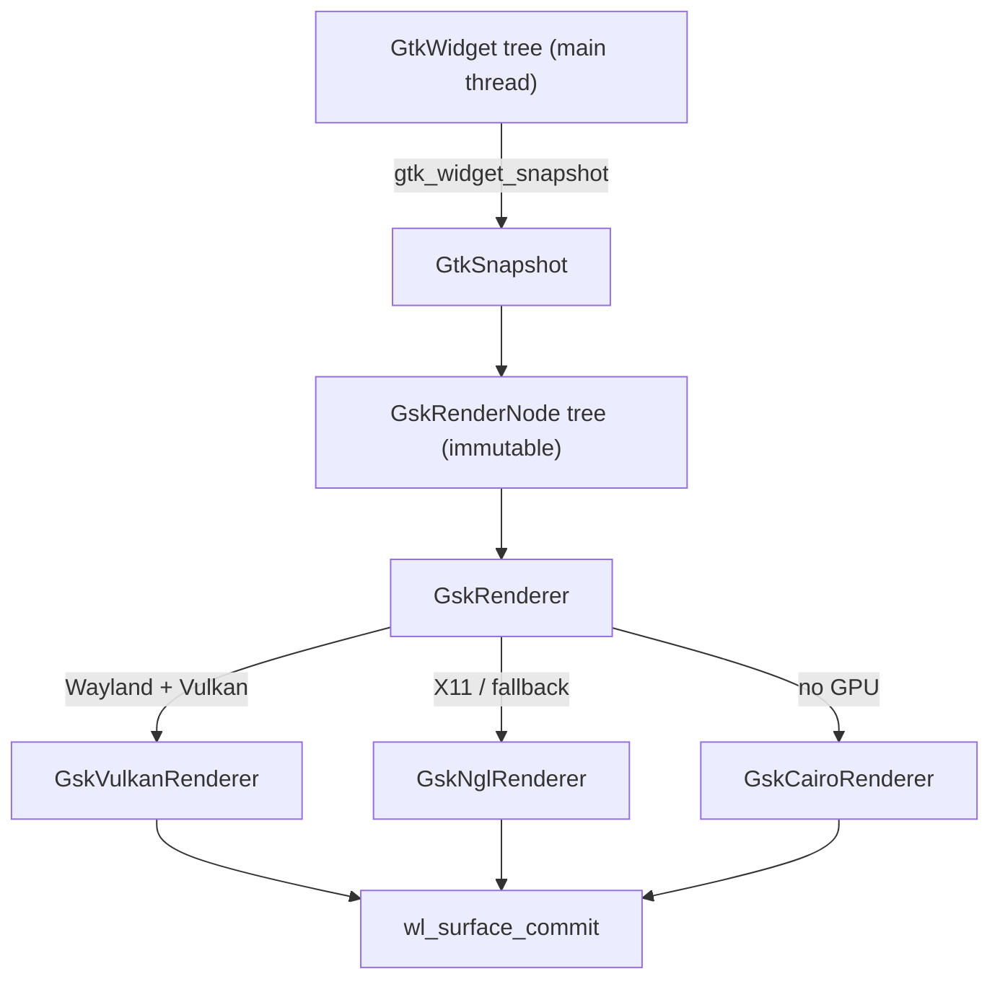
```mermaid
graph TD
    A["GtkWidget tree (main thread)"] -->|gtk_widget_snapshot| B["GtkSnapshot"]
    B --> C["GskRenderNode tree (immutable)"]
    C --> D["GskRenderer"]
    D -->|Wayland + Vulkan| E["GskVulkanRenderer"]
    D -->|X11 / fallback| F["GskNglRenderer"]
    D -->|no GPU| G["GskCairoRenderer"]
    E --> H["wl_surface_commit"]
    F --> H
    G --> H
```

### 1.2 What Changed From GTK3

GTK3 widgets implemented a `draw` virtual function that received a `cairo_t` and painted immediately into it. Cairo's default backend is a CPU rasteriser; GPU acceleration in GTK3 was partial and bolted on. GTK4 replaces this entirely:

| GTK3 | GTK4 |
|---|---|
| `GtkWidgetClass.draw(widget, cairo_t*)` | `GtkWidgetClass.snapshot(widget, GtkSnapshot*)` |
| Immediate-mode Cairo painting | Retained `GskRenderNode` tree |
| `GdkWindow` per widget (subwindows) | One `GdkSurface` per top-level; widgets are windowless |
| `gtk_widget_queue_draw_area()` | `gtk_widget_queue_draw()` + node diffing |
| Cairo software raster (default) | Vulkan / OpenGL GPU renderers |
| Manual `GdkEventExpose` handling | `GdkFrameClock`-driven frame scheduling |

The `snapshot` method never rasterises anything itself. It records drawing intent as nodes; rasterisation happens later in the renderer. This is what lets GTK4 defer the choice of GPU API to runtime and re-render only the damaged subtree. [Source](https://docs.gtk.org/gtk4/migrating-3to4.html)

### 1.3 Module Structure: gdk, gsk, gtk

GTK4 ships as one shared library (`libgtk-4.so`) but its source tree is cleanly partitioned into three namespaces, each with a distinct responsibility:

- **GDK** (`gdk/`, GIR namespace `Gdk`) — the windowing and input abstraction. `GdkDisplay`, `GdkSurface`, `GdkMonitor`, `GdkGLContext`, `GdkVulkanContext`, `GdkTexture`, `GdkFrameClock`, and the event types. Backends live in `gdk/wayland/`, `gdk/x11/`, `gdk/macos/`, `gdk/win32/`.
- **GSK** (`gsk/`, GIR namespace `Gsk`) — the render pipeline. `GskRenderNode` and its subtypes, `GskRenderer` and its backends, and the shared GPU renderer in `gsk/gpu/`.
- **GTK** (`gtk/`, GIR namespace `Gtk`) — the widgets, layout managers, the CSS engine, and `GtkSnapshot`.

The dependency direction is strictly `gtk → gsk → gdk`. Widgets know about render nodes; render nodes know about textures and surfaces; GDK knows nothing about widgets. [Source](https://gitlab.gnome.org/GNOME/gtk)

### 1.4 Licensing and Versioning

GTK is licensed under the **GNU LGPL, version 2.1 or later**, which permits linking from both free and proprietary applications. [Source](https://gitlab.gnome.org/GNOME/gtk/-/blob/main/COPYING) GTK4 follows an even/odd minor-version convention: stable releases carry even minor numbers (4.10, 4.12, 4.14, 4.16, 4.18), and the ABI is stable across the entire 4.x series. Feature landmarks referenced throughout this chapter:

- **GTK 4.0** (2020) — the GSK/snapshot architecture ships.
- **GTK 4.12** (2023) — `gdk_gl_texture_new()` deprecated in favour of `GdkGLTextureBuilder`.
- **GTK 4.14** (2024) — the unified GPU renderer in `gsk/gpu/`; `GdkDmabufTexture` / `GdkDmabufTextureBuilder`.
- **GTK 4.16** (2024) — `GskVulkanRenderer` becomes the default on Wayland; `wp_linux_drm_syncobj_v1` explicit sync. The 4.16.0 NEWS states: "This release changes the default GSK renderer to be Vulkan, on Wayland. Other platforms still use ngl." [Source](https://gitlab.gnome.org/GNOME/gtk/-/blob/4.16.0/NEWS)

### 1.5 What is GSK (GTK Scene Kit)?

GSK — the GTK Scene Kit — is the retained-mode rendering layer that sits between the GTK widget tree and the GPU. It defines two primary abstractions: the `GskRenderNode` type hierarchy, which represents a frame as an immutable tree of compositing operations, and the `GskRenderer` interface, which consumes that tree and issues the corresponding GPU commands. The design follows the retained-mode scene graph pattern: instead of each widget painting directly into a surface pixel buffer, it contributes an immutable subtree of nodes describing what to draw, and the renderer decides how and when to execute those draw calls. The immutability property is load-bearing — it allows the renderer to operate on a separate thread or GPU context from the widget tree, supports cross-frame diffing for incremental damage tracking, and makes the frame state serialisable for offline inspection with `gtk4-rendernode-tool`. GSK lives in the `gsk/` subdirectory of the GTK source tree and is exposed under the `Gsk` GIR namespace. The concrete node subtypes (colour fills, texture quads, gradient shaders, rounded clip passes, blur and shadow nodes) are catalogued in Section 2. GPU renderer implementations reside in `gsk/gpu/` and are discussed in Section 3. [Source](https://docs.gtk.org/gsk4/)

### 1.6 What is GskRenderer?

`GskRenderer` is the abstract interface through which GSK drives the GPU. A renderer accepts a `GskRenderNode` tree and a `GdkSurface`, traverses the node hierarchy, and emits the Vulkan command buffers or OpenGL draw calls that produce the final pixel output. GTK4 ships four concrete renderer backends: `GskVulkanRenderer`, which uses Vulkan and became the default on Wayland in GTK 4.16; `GskNglRenderer`, which uses modern OpenGL without deprecated fixed-function state; `GskGLRenderer`, the older OpenGL path retained for compatibility; and `GskCairoRenderer`, a CPU-only fallback for environments without usable GPU drivers. The renderer is selected at application startup based on the active display backend and the `GSK_RENDERER` environment variable. Because the `GskRenderNode` tree is a stable, backend-agnostic representation, swapping renderers at runtime requires no changes to widget or application code. The unified GPU renderer infrastructure in `gsk/gpu/`, introduced in GTK 4.14, allows the Vulkan and OpenGL backends to share shader logic and differ only in their command-emission layers, reducing the maintenance cost of supporting two GPU APIs simultaneously. Section 3 covers each backend in detail. [Source](https://docs.gtk.org/gsk4/class.Renderer.html)

### 1.7 What is GDK?

GDK — the GTK Display Kit — is the windowing and input abstraction layer that isolates GTK and GSK from the specifics of the underlying window system. On Linux, GDK ships two primary backends: the Wayland backend in `gdk/wayland/` and the X11 backend in `gdk/x11/`. The Wayland backend creates `wl_surface` objects, obtains EGL or Vulkan surfaces for GPU rendering, negotiates DMA-BUF formats with the compositor via `zwp_linux_dmabuf_v1`, and manages explicit GPU synchronisation fences through `wp_linux_drm_syncobj_v1`. The key GDK types are `GdkDisplay` (a connection to the compositor or X server), `GdkSurface` (a toplevel window or popup), `GdkGLContext` and `GdkVulkanContext` (GPU context handles bound to a surface), `GdkTexture` (a GPU- or CPU-resident image that can wrap a DMA-BUF), and `GdkFrameClock` (the vsync-driven frame scheduler that paces rendering to the display refresh cycle). Widget code never calls Wayland protocol functions directly; it interacts with GDK abstractions that the backend translates into the appropriate compositor protocol at runtime. This separation makes GTK applications portable across Wayland, X11, macOS, and Windows without changes above the GDK layer. Section 4 covers the GDK Wayland backend in depth. [Source](https://docs.gtk.org/gdk4/)

---

## 2. The GskRenderNode Tree

### 2.1 Node Type Taxonomy

`GskRenderNode` is an abstract base class; all drawing is expressed through immutable, specialised subtypes. Once constructed a node cannot be modified — this immutability is what makes cross-frame diffing and cross-thread hand-off safe. The principal node types and their GPU mapping [Source](https://docs.gtk.org/gsk4/class.RenderNode.html):

| Node type | Purpose | GPU treatment |
|---|---|---|
| `GskColorNode` | Solid-colour rectangle | Flat-colour draw |
| `GskTextureNode` | Sample a `GdkTexture` | Textured quad |
| `GskTextureScaleNode` | Scaled texture with a filter mode | Textured quad + sampler |
| `GskLinearGradientNode` | CSS linear gradient | Gradient shader |
| `GskRadialGradientNode` | CSS radial gradient | Gradient shader |
| `GskConicGradientNode` | CSS conic gradient | Gradient shader |
| `GskBorderNode` | Widget border (up to 4 colours/widths) | Per-edge quads |
| `GskRoundedClipNode` | Clip child to a rounded rectangle | Shader-based clip |
| `GskClipNode` | Clip child to a plain rectangle | Scissor / shader clip |
| `GskTransformNode` | Apply a `GskTransform` to a child | Matrix in vertex stage |
| `GskOpacityNode` | Multiply child alpha | Blend state / offscreen |
| `GskBlurNode` | Gaussian blur of a child | Separable convolution |
| `GskShadowNode` | Drop shadow behind a child | Blur + offset + blend |
| `GskOutsetShadowNode` / `GskInsetShadowNode` | CSS `box-shadow` | Blur + translate + blend |
| `GskCrossFadeNode` | Blend two children by a factor | Two-source blend |
| `GskContainerNode` | Ordered list of children | Sequential draw |
| `GskCairoNode` | Fallback: paint via a `cairo_t` | CPU raster → texture upload |
| `GskTextNode` | A run of Pango glyphs | Glyph-atlas draw calls |
| `GskSubsurfaceNode` | Delegate a child to a Wayland subsurface | `wl_subsurface` / KMS plane |
| `GskGLShaderNode` | Custom GLSL fragment shader (deprecated) | Direct shader execution |

`GskContainerNode` is the workhorse: almost every widget produces a container node holding its children's subtrees. `GskCairoNode` is the escape hatch — a widget that has no GSK-native way to draw something (a complex vector path, for instance) can fall back to Cairo, at the cost of a CPU rasterisation and a texture upload each frame.

### 2.2 Building Nodes: The GtkSnapshot API

Application and widget code rarely constructs `GskRenderNode` objects directly. Instead it uses `GtkSnapshot`, a stateful builder that maintains a stack of transforms and clips and emits nodes as `append_*` / `push_*` / `pop` calls are made. `push_*` opens a modifier (a clip, an opacity, a transform) that applies to everything until the matching `pop`; `append_*` adds a leaf node at the current state. [Source](https://docs.gtk.org/gtk4/class.Snapshot.html)

```c
/* Build: a rounded-clipped card with a gradient fill and a texture on top */
static void
draw_card (GtkSnapshot *snapshot, GdkTexture *icon, const graphene_rect_t *bounds)
{
    GskRoundedRect clip;
    gsk_rounded_rect_init_from_rect (&clip, bounds, 12.0f /* corner radius */);

    /* Everything until the matching pop is clipped to the rounded rect */
    gtk_snapshot_push_rounded_clip (snapshot, &clip);

    const GskColorStop stops[] = {
        { 0.0f, { 0.16f, 0.22f, 0.42f, 1.0f } },
        { 1.0f, { 0.10f, 0.13f, 0.25f, 1.0f } },
    };
    graphene_point_t start = GRAPHENE_POINT_INIT (bounds->origin.x, bounds->origin.y);
    graphene_point_t end   = GRAPHENE_POINT_INIT (bounds->origin.x,
                                                  bounds->origin.y + bounds->size.height);
    gtk_snapshot_append_linear_gradient (snapshot, bounds, &start, &end,
                                         stops, G_N_ELEMENTS (stops));

    graphene_rect_t icon_bounds =
        GRAPHENE_RECT_INIT (bounds->origin.x + 16, bounds->origin.y + 16, 48, 48);
    gtk_snapshot_append_texture (snapshot, icon, &icon_bounds);

    gtk_snapshot_pop (snapshot);  /* closes the rounded clip */
}
```

The `push_*` family that opens a modifier scope includes `gtk_snapshot_push_opacity()`, `gtk_snapshot_push_clip()`, `gtk_snapshot_push_rounded_clip()`, `gtk_snapshot_push_blur()`, `gtk_snapshot_push_shadow()`, and `gtk_snapshot_push_cross_fade()`; the `append_*` family adds leaves: `append_color()`, `append_texture()`, `append_linear_gradient()`, `append_border()`, `append_layout()` (Pango text), and more. Transforms are applied with `gtk_snapshot_transform()`, `gtk_snapshot_translate()`, `gtk_snapshot_scale()`, and `gtk_snapshot_rotate()`, which push onto the transform stack and are unwound by a matching `gtk_snapshot_restore()` after `gtk_snapshot_save()`.

### 2.3 Overriding GtkWidget snapshot()

Custom widgets implement drawing by overriding the `snapshot` vfunc in their class-init. GTK calls it whenever the widget needs redrawing, passing a `GtkSnapshot` already positioned at the widget's origin and clipped to its allocation:

```c
struct _MeterWidget { GtkWidget parent_instance; double fraction; };
G_DEFINE_TYPE (MeterWidget, meter_widget, GTK_TYPE_WIDGET)

static void
meter_widget_snapshot (GtkWidget *widget, GtkSnapshot *snapshot)
{
    MeterWidget *self = METER_WIDGET (widget);
    int w = gtk_widget_get_width (widget);
    int h = gtk_widget_get_height (widget);

    /* Track background */
    GdkRGBA track = { 0.2f, 0.2f, 0.2f, 1.0f };
    graphene_rect_t track_r = GRAPHENE_RECT_INIT (0, 0, w, h);
    gtk_snapshot_append_color (snapshot, &track, &track_r);

    /* Filled portion, driven by self->fraction */
    GdkRGBA fill = { 0.20f, 0.55f, 0.95f, 1.0f };
    graphene_rect_t fill_r = GRAPHENE_RECT_INIT (0, 0, w * self->fraction, h);
    gtk_snapshot_append_color (snapshot, &fill, &fill_r);
}

static void
meter_widget_class_init (MeterWidgetClass *klass)
{
    GTK_WIDGET_CLASS (klass)->snapshot = meter_widget_snapshot;
}
```

To trigger a redraw when `fraction` changes, the widget calls `gtk_widget_queue_draw(widget)`, which marks the widget dirty; GTK re-invokes `snapshot()` on the next `GdkFrameClock` tick. A widget must never assume `snapshot()` runs every frame — it runs only when the widget (or an ancestor) has been invalidated.

### 2.4 Node Serialisation for Debugging

Because the node tree is immutable and self-contained, GSK can serialise it to a textual `.node` representation. `gsk_render_node_serialize()` returns a `GBytes`; `gsk_render_node_write_to_file()` is a convenience wrapper equivalent to serialising and then `g_file_set_contents()`, and is designed to be called from inside a debugger to dump the current frame. `gsk_render_node_deserialize()` reads it back. [Source](https://docs.gtk.org/gsk4/method.RenderNode.serialize.html) [Source](https://docs.gtk.org/gsk4/method.RenderNode.write_to_file.html)

```c
/* Dump the last-rendered node tree from a GDB session:
 *   (gdb) call gsk_render_node_write_to_file(node, "/tmp/frame.node", 0)
 */
gsk_render_node_write_to_file (root_node, "/tmp/frame.node", NULL);
```

The format is explicitly a debugging/testing/benchmarking aid, not a storage format: GTK only guarantees that the *same* version can round-trip, and later versions will cleanly reject files written by earlier ones. [Source](https://docs.gtk.org/gsk4/method.RenderNode.serialize.html) The companion CLI, `gtk4-rendernode-tool`, operates on these files — `gtk4-rendernode-tool info frame.node` reports the node count and tree depth, and `gtk4-rendernode-tool show frame.node` opens a window rendering the tree. [Source](https://docs.gtk.org/gtk4/gtk4-rendernode-tool.html) A `.node` fragment looks like:

```
container {
  color {
    bounds: 0 0 200 120;
    color: rgb(51,51,51);
  }
  rounded-clip {
    clip: 0 0 200 120 / 12;
    linear-gradient {
      bounds: 0 0 200 120;
      start: 0 0;  end: 0 120;
      stops: 0 rgb(41,56,107), 1 rgb(26,33,64);
    }
  }
}
```

---

## 3. GskRenderer Implementations

A `GskRenderer` takes a `GskRenderNode` tree plus a target `GdkSurface` and produces a rendered frame. GTK4 provides several implementations; the important distinction since GTK 4.14 is between the **unified GPU renderer** (shared code in `gsk/gpu/`, presenting two faces — Vulkan and NGL) and the older per-backend renderers.

### 3.1 The Unified GPU Renderer

The unified renderer in `gsk/gpu/` was introduced in GTK 4.14 to end the duplication between the old GL and Vulkan code paths. It is modelled on Vulkan concepts and shares its scene-graph traversal, batching, and glyph/texture caching between an OpenGL back-end and a Vulkan back-end. Its central abstractions are:

- **`GskGpuDevice`** — the abstract base (in `gsk/gpu/gskgpudevice.c`) that owns resource allocation, the glyph atlas, and the texture cache. Concrete subclasses are `GskVulkanDevice` and `GskGLDevice`.
- **`GskGpuImage`** — the renderer's abstraction over a GPU image (a `VkImage` or a GL texture), used for render targets, uploaded textures, and atlas pages.
- **`GskGpuFrame`** — the per-frame command recording context.

It avoids offscreen intermediate rendering for the common case and uses a two-tier shader strategy: fast per-node-type shaders for common nodes (colour, texture, gradient) and an "ubershader" that interprets a node-type token packed into a GPU buffer for complex trees. [Source](https://blog.gtk.org/2024/01/28/new-renderers-for-gtk/)

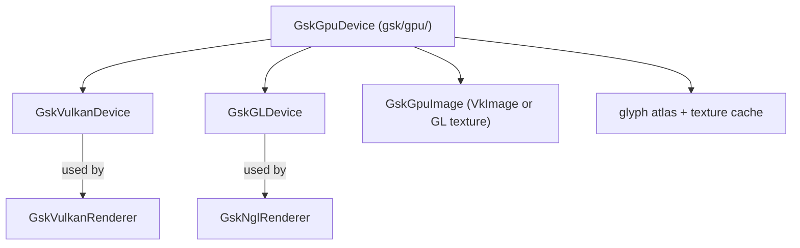
```mermaid
graph TD
    A["GskGpuDevice (gsk/gpu/)"] --> B["GskVulkanDevice"]
    A --> C["GskGLDevice"]
    B -->|used by| D["GskVulkanRenderer"]
    C -->|used by| E["GskNglRenderer"]
    A --> F["GskGpuImage (VkImage or GL texture)"]
    A --> G["glyph atlas + texture cache"]
```

### 3.2 GskVulkanRenderer

`GskVulkanRenderer` targets Vulkan 1.0+ and, since GTK 4.16, is the **default renderer on Wayland** when a capable Vulkan driver is present. [Source](https://gitlab.gnome.org/GNOME/gtk/-/blob/4.16.0/NEWS) It compiles its shaders from the shared `gsk/gpu/shaders/` GLSL sources to **SPIR-V at GTK build time** (via `glslang`) and embeds the SPIR-V in the binary, so no runtime shader compilation from source is needed. At startup it builds `VkPipeline` objects per shader variant, and per draw it binds descriptor sets for textures and small uniform data. Per-draw constants (transform, colour, opacity) are passed as Vulkan push constants to avoid `vkUpdateDescriptorSets()` churn; larger per-node parameter arrays for the ubershader travel in GPU buffers. This SPIR-V feeds Mesa's Vulkan drivers (ANV, RADV, NVK) and, through them, the NIR shader IR.

### 3.3 GskNglRenderer

`GskNglRenderer` (the "new GL" renderer) is the OpenGL face of the same `gsk/gpu/` code, targeting OpenGL 3.3+ and OpenGL ES 3.0+. It is the default on X11 and on platforms without a usable Vulkan driver. It compiles the same GLSL sources at runtime through the GL driver. Because it shares the unified traversal and caching with the Vulkan path, its output matches `GskVulkanRenderer` node-for-node; only the device abstraction (`GskGLDevice`) and the command submission differ.

### 3.4 Legacy and Cairo Fallback

Two older renderers remain for compatibility:

- **Legacy `GskGLRenderer`** (`gsk/gl/`) — the pre-4.14 GL renderer with per-node-type programs and frequent offscreen passes. Deprecated in favour of the unified renderer but still selectable.
- **`GskCairoRenderer`** — the software fallback. It renders the node tree into a Cairo image surface on the CPU and uploads the result. Correct but slow; used when no GPU is available (headless CI, broken drivers, `GSK_RENDERER=cairo`).

### 3.5 Selecting a Renderer

The renderer is chosen at application startup and can be forced with the `GSK_RENDERER` environment variable [Source](https://docs.gtk.org/gtk4/running.html):

```bash
GSK_RENDERER=vulkan myapp   # force the Vulkan renderer
GSK_RENDERER=ngl    myapp   # force the unified OpenGL renderer
GSK_RENDERER=gl     myapp   # force the legacy GL renderer
GSK_RENDERER=cairo  myapp   # force the software fallback
GSK_RENDERER=help   myapp   # list available renderers and exit
```

Absent an override, GDK detects driver capability and selects `GskVulkanRenderer` on Wayland (4.16+) or `GskNglRenderer` otherwise, falling back to Cairo if no GPU renderer initialises. The chosen renderer is reported by `GSK_DEBUG=renderer` (§16).

---

## 4. The GDK Wayland Backend

### 4.1 Display, Surface, and GL Context

GTK4's Wayland integration lives in `gdk/wayland/`. It is selected automatically when `$WAYLAND_DISPLAY` is set, or forced with `GDK_BACKEND=wayland`. The core types:

- **`GdkWaylandDisplay`** — wraps `wl_display`; owns the connection and the `wl_registry` listener that binds globals (`wl_compositor`, `xdg_wm_base`, `wp_linux_dmabuf_v1`, `wp_linux_drm_syncobj_manager_v1`, `zwp_linux_explicit_synchronization_v1`, and so on).
- **`GdkWaylandSurface`** — wraps a `wl_surface` plus an `xdg_surface`/`xdg_toplevel` (or popup role). One exists per `GdkToplevel` or `GdkPopup`.
- **`GdkWaylandGLContext`** — the EGL context for the GL renderer; owns the `wl_egl_window` and `EGLSurface`.

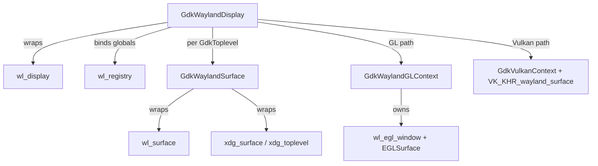
```mermaid
graph TD
    A["GdkWaylandDisplay"] -->|wraps| B["wl_display"]
    A -->|binds globals| C["wl_registry"]
    A -->|per GdkToplevel| D["GdkWaylandSurface"]
    D -->|wraps| E["wl_surface"]
    D -->|wraps| F["xdg_surface / xdg_toplevel"]
    A -->|GL path| G["GdkWaylandGLContext"]
    G -->|owns| H["wl_egl_window + EGLSurface"]
    A -->|Vulkan path| I["GdkVulkanContext + VK_KHR_wayland_surface"]
```

### 4.2 The EGL Path

The NGL renderer submits frames through EGL. GDK creates a `wl_egl_window` (the libwayland-egl abstraction that Mesa understands) around the `wl_surface`, wraps it in an `EGLSurface`, and at frame end calls `eglSwapBuffers()`. Mesa's EGL Wayland platform translates the swap into `wl_surface_attach()` of the freshly rendered `wl_buffer` followed by `wl_surface_commit()`.

```c
struct wl_egl_window *egl_window =
    wl_egl_window_create (wl_surface, width, height);
EGLSurface egl_surface =
    eglCreateWindowSurface (egl_display, config,
                            (EGLNativeWindowType) egl_window, NULL);
/* ... GskNglRenderer issues GL draw calls into egl_surface ... */
eglSwapBuffers (egl_display, egl_surface);   /* → wl_surface_attach + commit */
```

Damage is reported with `wl_surface_damage_buffer()` (buffer-space coordinates, correct under arbitrary buffer transforms) before the commit, and the `EGL_KHR_partial_update` extension restricts fragment work to the dirty region. [Source](https://docs.gtk.org/gtk4/wayland.html)

### 4.3 The Vulkan Path

For the Vulkan renderer, GDK creates a `GdkVulkanContext` that owns a `VkSurfaceKHR` per `GdkWaylandSurface` via `VK_KHR_wayland_surface`, and a `VkSwapchainKHR`. Frames are presented with `vkQueuePresentKHR()`, which drives the compositor-side buffer import. The swapchain uses `VK_PRESENT_MODE_FIFO_KHR` (vsync) by default. If the `wl_surface` is destroyed and recreated (e.g. on unmap/remap), the surface and swapchain are torn down and rebuilt.

### 4.4 Explicit Synchronisation

GTK 4.16 added support for the `wp_linux_drm_syncobj_v1` Wayland protocol, implementing GPU-native explicit synchronisation with DRM timeline syncobjs. [Source](https://wayland.app/protocols/linux-drm-syncobj-v1) Without it, the compositor must rely on implicit fencing or stall its pipeline before importing a client buffer. With it, each surface commit carries two timeline points:

- **Acquire point** — the compositor waits for this before scanning out the buffer; it is signalled when GTK's GPU rendering completes.
- **Release point** — the compositor signals this when it has finished with the buffer, letting GTK reuse it safely.

This removes the buffer-import stall and enables correct zero-copy sharing — historically critical on NVIDIA, which lacked implicit sync on Wayland, and beneficial everywhere.

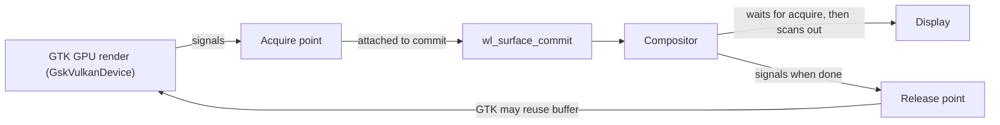
```mermaid
graph LR
    A["GTK GPU render (GskVulkanDevice)"] -->|signals| B["Acquire point"]
    B -->|attached to commit| C["wl_surface_commit"]
    C --> D["Compositor"]
    D -->|waits for acquire, then scans out| E["Display"]
    D -->|signals when done| F["Release point"]
    F -->|GTK may reuse buffer| A
```

### 4.5 Damage Tracking

The unified renderer diffs the current `GskRenderNode` tree against the previous frame's tree. Unchanged subtrees are not re-rendered, and the union of changed regions becomes the damage rectangle passed to `wl_surface_damage_buffer()`. On the GL path the damage region also bounds fragment work via `EGL_KHR_partial_update`. This node-diffing is why `gtk_widget_queue_draw()` on a single widget does not force a full-window repaint. `GSK_DEBUG=diff` prints the computed diff regions. [Source](https://docs.gtk.org/gsk4/class.Renderer.html)

### 4.6 Subsurfaces and GskSubsurfaceNode

`GskSubsurfaceNode` lets a subtree be delegated to a dedicated Wayland subsurface rather than being composited into the main window buffer. GTK uses this for content that benefits from **zero-copy overlay-plane scanout** — video (via a dmabuf `GdkTexture`) or an embedded WebKit surface. When a subsurface node's content is a suitable dmabuf and the compositor can promote it, GDK attaches the buffer to a `wl_subsurface`; the compositor may then place it directly on a KMS overlay plane through a `TEST_ONLY` atomic commit, bypassing GPU composition entirely. If promotion fails, GDK falls back to compositing the texture into the parent buffer as an ordinary `GskTextureNode`. Forcing the fallback for debugging is possible with `GDK_DEBUG=no-offload`; `GDK_DEBUG=force-offload` forces the offload path. This is the same overlay-plane mechanism terminal emulators use for image protocols (Ch45).

---

## 5. The GTK4 CSS Pipeline

### 5.1 The Cascade and State Classes

GTK4 styles widgets with a CSS engine that is a substantial subset of the web CSS specification, adapted to the widget tree. Every widget has a **CSS node** with an element name (`button`, `label`, `entry`), a set of **style classes** (`.suggested-action`, `.flat`, `.pill`), and **state pseudo-classes** that GTK toggles automatically as the widget's state changes: `:hover`, `:active`, `:checked`, `:disabled`, `:focus`, `:selected`, plus link states such as `:link` and `:visited`. Selectors, specificity, inheritance, and the cascade work as on the web. [Source](https://docs.gtk.org/gtk4/css-overview.html)

```css
/* Selectors combine element name, style class, and state pseudo-class */
button.suggested-action {
    background-color: @accent_bg_color;
    color: @accent_fg_color;
    border-radius: 8px;
}
button.suggested-action:hover  { filter: brightness(1.08); }
button.suggested-action:active { filter: brightness(0.92); }
button:disabled                { opacity: 0.5; }
```

When a pseudo-class toggles (say `:hover` on pointer entry), GTK recomputes the affected widgets' styles and re-snapshots them on the next frame; the changed CSS values flow into a fresh `GskRenderNode` subtree. Style computation is animated: GTK's CSS engine can interpolate properties over a `transition`, ticking the interpolation off `GdkFrameClock`.

### 5.2 CSS Properties Mapped to Render Nodes

The connection between CSS and the GPU is direct: each supported visual property is realised as a specific render-node type, which the renderer turns into a shader pass. [Source](https://docs.gtk.org/gsk4/class.RenderNode.html)

| CSS property | GskRenderNode | GPU effect |
|---|---|---|
| `background-color` | `GskColorNode` | Flat-colour draw |
| `background: linear-gradient(...)` | `GskLinearGradientNode` | Gradient shader |
| `border-radius` | `GskRoundedClipNode` | Rounded clip in shader |
| `border` | `GskBorderNode` | Per-edge quads |
| `box-shadow` | `GskOutsetShadowNode` / `GskInsetShadowNode` | Blur + translate + blend |
| `filter: blur(4px)` | `GskBlurNode` | Separable Gaussian convolution |
| `opacity: 0.5` | `GskOpacityNode` | Alpha blend of child |
| `transform: rotate(...)` | `GskTransformNode` | Matrix in vertex stage |
| `color` (text) | `GskTextNode` foreground | Glyph-atlas draw |

Because the mapping is one-directional and mechanical, a themer editing CSS is really editing the render-node tree indirectly, and a system developer inspecting the render-node tree (§2.4, §16) can read back which CSS produced each node.

### 5.3 GtkCssProvider and Custom Theming

Applications add CSS through a `GtkCssProvider`, registered against a `GdkDisplay` at a priority that determines where it sits in the cascade relative to the theme:

```c
static void
install_app_css (GdkDisplay *display)
{
    GtkCssProvider *provider = gtk_css_provider_new ();
    gtk_css_provider_load_from_string (provider,
        ".card {"
        "  background-color: @card_bg_color;"
        "  border-radius: 12px;"
        "  padding: 12px;"
        "  box-shadow: 0 1px 3px alpha(black, 0.3);"
        "}"
        ".accent-title { color: @accent_color; font-weight: bold; }");

    gtk_style_context_add_provider_for_display (display,
        GTK_STYLE_PROVIDER (provider),
        GTK_STYLE_PROVIDER_PRIORITY_APPLICATION);
    g_object_unref (provider);
}
```

`gtk_css_provider_load_from_string()` (and `load_from_bytes()`, `load_from_file()`, `load_from_resource()`) parse the CSS; `GTK_STYLE_PROVIDER_PRIORITY_APPLICATION` places app CSS above the theme but below inline `GTK_STYLE_PROVIDER_PRIORITY_USER` overrides. Widgets opt into a class with `gtk_widget_add_css_class(widget, "card")`. The `@card_bg_color` / `@accent_color` references resolve against the named colours that the active theme — or libadwaita (§7) — defines, so the same CSS automatically adapts to light and dark schemes. Older code used the now-deprecated `gtk_css_provider_load_from_data()`; `load_from_string()` is the current API.

---

## 6. GtkGLArea: Custom OpenGL Rendering

### 6.1 The Widget and Its FBO

Most widgets never touch the GPU directly — they emit render nodes and let GSK do the work. `GtkGLArea` is the exception: it lets application code issue raw OpenGL commands while remaining a well-behaved participant in GTK's frame lifecycle. It creates and manages a **framebuffer object (FBO)** and guarantees that this FBO is the bound render target when the application draws, so application GL code never sees the window's default framebuffer. [Source](https://docs.gtk.org/gtk4/class.GLArea.html) The FBO's colour attachment is subsequently wrapped as a `GdkTexture` and inserted into the main render-node tree as a `GskTextureNode`, so the custom GL content is composited, transformed, and damage-tracked exactly like any other widget.

### 6.2 Signal Handlers

`GtkGLArea` exposes three signals plus the inherited `GtkWidget::realize`:

- **`realize`** (inherited) — the GL context now exists and is current; upload textures, compile shaders, create VBOs here.
- **`resize`** — `void (GtkGLArea*, int width, int height)` — emitted at realize and on every size change; update the viewport and projection.
- **`render`** — `gboolean (GtkGLArea*, GdkGLContext*)` — emitted each frame with the context current and the FBO bound; issue draw calls and return `TRUE` to stop further propagation.
- **`create-context`** — `GdkGLContext* (GtkGLArea*)` — optional; return a custom context (e.g. a specific GL version or a shared context).

[Source](https://docs.gtk.org/gtk4/class.GLArea.html)

```c
static guint program, vao;

static void
on_realize (GtkGLArea *area)
{
    gtk_gl_area_make_current (area);
    if (gtk_gl_area_get_error (area) != NULL)
        return;
    program = build_shader_program ();   /* application-defined */
    vao     = build_triangle_vao ();
}

static void
on_resize (GtkGLArea *area, int width, int height)
{
    glViewport (0, 0, width, height);
}

static gboolean
on_render (GtkGLArea *area, GdkGLContext *context)
{
    glClearColor (0.0f, 0.0f, 0.0f, 1.0f);
    glClear (GL_COLOR_BUFFER_BIT);
    glUseProgram (program);
    glBindVertexArray (vao);
    glDrawArrays (GL_TRIANGLES, 0, 3);
    return TRUE;   /* handled; do not propagate */
}

static GtkWidget *
make_gl_area (void)
{
    GtkWidget *area = gtk_gl_area_new ();
    gtk_gl_area_set_required_version (GTK_GL_AREA (area), 3, 3);
    gtk_gl_area_set_has_depth_buffer (GTK_GL_AREA (area), TRUE);
    g_signal_connect (area, "realize", G_CALLBACK (on_realize), NULL);
    g_signal_connect (area, "resize",  G_CALLBACK (on_resize),  NULL);
    g_signal_connect (area, "render",  G_CALLBACK (on_render),  NULL);
    return area;
}
```

To animate, call `gtk_gl_area_queue_render(area)` from a `GdkFrameClock` tick or a `gtk_widget_add_tick_callback()` handler; GTK re-emits `render` on the next frame.

### 6.3 Wrapping GL Output as a GdkTexture

When custom GL content must feed *into* the node tree from outside a `GtkGLArea` (for example a background thread that renders into a shared GL texture), it is wrapped as a `GdkTexture` from a GL texture id. The historical constructor is `gdk_gl_texture_new(context, id, width, height, destroy, data)`, but it was **deprecated in GTK 4.12** in favour of `GdkGLTextureBuilder`, which supports specifying the format, mipmaps, and a sync fence: [Source](https://docs.gtk.org/gdk4/ctor.GLTexture.new.html)

```c
GdkGLTextureBuilder *b = gdk_gl_texture_builder_new ();
gdk_gl_texture_builder_set_context (b, gl_context);
gdk_gl_texture_builder_set_id      (b, gl_texture_id);
gdk_gl_texture_builder_set_width   (b, width);
gdk_gl_texture_builder_set_height  (b, height);
gdk_gl_texture_builder_set_format  (b, GDK_MEMORY_R8G8B8A8_PREMULTIPLIED);
/* destroy notify frees the GL texture when the GdkTexture is finalised */
GdkTexture *tex = gdk_gl_texture_builder_build (b, destroy_gl_texture, user_data);
g_object_unref (b);

gtk_snapshot_append_texture (snapshot, tex, &bounds);   /* → GskTextureNode */
```

### 6.4 Dmabuf Interop

The most important cross-API path in GTK 4.14+ is importing a **DMA-BUF** as a `GdkTexture` via `GdkDmabufTextureBuilder`. This is how zero-copy content from another process or API — a Vulkan renderer, a hardware video decoder (VA-API), a GStreamer pipeline, or a WebKit web-content process — reaches the GTK node tree without a CPU round-trip. [Source](https://docs.gtk.org/gdk4/class.DmabufTextureBuilder.html)

```c
GdkDmabufTextureBuilder *b = gdk_dmabuf_texture_builder_new ();
gdk_dmabuf_texture_builder_set_display  (b, display);
gdk_dmabuf_texture_builder_set_width    (b, width);
gdk_dmabuf_texture_builder_set_height   (b, height);
gdk_dmabuf_texture_builder_set_fourcc   (b, DRM_FORMAT_XRGB8888);
gdk_dmabuf_texture_builder_set_modifier (b, modifier);   /* e.g. tiling layout */
gdk_dmabuf_texture_builder_set_n_planes (b, 1);
gdk_dmabuf_texture_builder_set_fd       (b, 0, dmabuf_fd);
gdk_dmabuf_texture_builder_set_stride   (b, 0, stride);
gdk_dmabuf_texture_builder_set_offset   (b, 0, 0);

GError *error = NULL;
GdkTexture *tex = gdk_dmabuf_texture_builder_build (b, NULL, NULL, &error);
g_object_unref (b);
```

The resulting `GdkTexture` is imported into the active renderer as a `VkImage` (with external memory) on the Vulkan path or an `EGLImage` (via `EGL_LINUX_DMA_BUF_EXT`) on the GL path. Placed under a `GskSubsurfaceNode` (§4.6), such a dmabuf texture becomes a candidate for KMS overlay-plane promotion. `GDK_DEBUG=dmabuf` traces the import negotiation, including which fourcc/modifier combinations the driver accepts.

### 6.5 GdkPixbuf: Raster Images into the GPU Texture Pipeline

**`GdkPixbuf`** (package `gdk-pixbuf-2.0`) is GTK's image loading library. It decodes JPEG, PNG, WebP, TIFF, and other formats into a CPU-side RGBA pixel buffer. From a GPU rendering perspective its role is narrow but important: it is the traditional path by which raster images from disk enter the `GskTextureNode` pipeline.

```c
/* Load a PNG file from disk into a CPU-side pixel buffer */
GError *err = NULL;
GdkPixbuf *pixbuf = gdk_pixbuf_new_from_file("icon.png", &err);

/* Upload to the GPU: GdkTexture wraps the pixbuf and owns a GL/Vulkan texture object */
GdkTexture *texture = gdk_texture_new_for_pixbuf(pixbuf);
g_object_unref(pixbuf);   /* GPU copy exists; CPU buffer can be freed */

/* Use in a widget snapshot — becomes a GskTextureNode in the render tree */
gtk_snapshot_append_texture(snapshot, texture, &bounds);
```

The conversion chain is:
```
gdk_pixbuf_new_from_file()   → GdkPixbuf  (CPU RGBA buffer)
gdk_texture_new_for_pixbuf() → GdkTexture (uploads to GL texture / VkImage on first use)
gtk_snapshot_append_texture()→ GskTextureNode in render node tree
gsk_renderer_render()        → textured quad draw call
```

GTK 4.12+ introduces `GdkTexture` constructors (`gdk_texture_new_from_resource()`) that bypass `GdkPixbuf` entirely by loading directly into a GPU texture from compressed data, avoiding the CPU round-trip. For static assets embedded in a GResource bundle this is the preferred modern path. `GdkPixbuf` also provides CPU-side pixel manipulation — scaling (`gdk_pixbuf_scale_simple()`), compositing, and colour-space transforms — before the texture upload. GTK 5 plans to deprecate `GdkPixbuf` in favour of `GdkTexture` and `GdkPaintable`.

---

## 7. The GTK4 Widget System

GTK4's widget layer provides the complete set of interactive controls that an application assembles into a UI. This section covers the widget lifecycle, the list model architecture (the biggest architectural change since GTK3), the UI description language via `GtkBuilder`, input handling through the gesture framework, and drag-and-drop.

### 7.1 Widget Lifecycle and Layout

Every widget is a `GtkWidget` subclass. The lifecycle phases are:

- **realize** — a `GdkSurface` (or a position on one) is assigned; GPU resources can be allocated.
- **map / unmap** — the widget becomes visible / invisible on screen.
- **size request** — GTK queries `measure(orientation, for_size, min, nat, min_baseline, nat_baseline)` for each axis to determine natural and minimum sizes.
- **size allocation** — `size_allocate(width, height, baseline)` assigns the final bounds; layout managers drive this recursively down the widget tree.
- **snapshot** — the widget's `snapshot()` vfunc runs each dirty frame to produce render nodes (§2.3).
- **unrealize / destroy** — GPU resources are freed; the object is eventually finalized.

CSS nodes mirror the widget tree: each widget registers one or more CSS nodes with element name and style classes via `gtk_widget_class_set_css_name()` at class-init. Applications add per-instance classes with `gtk_widget_add_css_class(widget, "my-class")` and query the current state with `gtk_widget_has_css_class()`. [Source](https://docs.gtk.org/gtk4/class.Widget.html)

### 7.2 List Model Architecture

GTK4 replaces the GTK3 `GtkTreeModel`/`GtkTreeView` hierarchy with a composable pipeline based on `GListModel`:

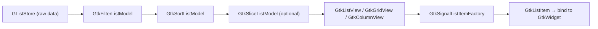
```mermaid
graph LR
    Source["GListStore (raw data)"] --> Filter["GtkFilterListModel"]
    Filter --> Sort["GtkSortListModel"]
    Sort --> Slice["GtkSliceListModel (optional)"]
    Slice --> View["GtkListView / GtkGridView / GtkColumnView"]
    View --> Factory["GtkSignalListItemFactory"]
    Factory --> Item["GtkListItem → bind to GtkWidget"]
```

The factory pattern separates data from presentation. `GtkSignalListItemFactory` emits `setup` (create widgets) and `bind` (populate widgets from item data) signals per visible row, recycling widget rows as the user scrolls:

```c
GtkListItemFactory *factory = gtk_signal_list_item_factory_new ();
g_signal_connect (factory, "setup", G_CALLBACK (on_setup), NULL);
g_signal_connect (factory, "bind",  G_CALLBACK (on_bind),  NULL);

static void on_setup (GtkListItemFactory *f, GtkListItem *item) {
    gtk_list_item_set_child (item, gtk_label_new (NULL));
}
static void on_bind (GtkListItemFactory *f, GtkListItem *item) {
    GtkLabel *label = GTK_LABEL (gtk_list_item_get_child (item));
    MyObject *obj   = MY_OBJECT (gtk_list_item_get_item (item));
    gtk_label_set_text (label, my_object_get_name (obj));
}

GtkWidget *view = gtk_list_view_new (
    GTK_SELECTION_MODEL (gtk_single_selection_new (list_model)), factory);
```

`GtkColumnView` provides a multi-column view with sortable headers; each column gets its own `GtkListItemFactory`. `GtkFilterListModel` wraps any `GListModel` and applies a `GtkFilter` (subclasses: `GtkStringFilter`, `GtkCustomFilter`). `GtkSortListModel` applies a `GtkSorter` (`GtkColumnViewSorter` for column-click sorting, `GtkCustomSorter` for arbitrary comparators). [Source](https://docs.gtk.org/gtk4/class.ListView.html)

### 7.3 GtkBuilder and Composite Templates

`GtkBuilder` loads a UI description from XML (`.ui` files, GNOME's `.blp` Blueprint language compiles to the same format), creating and linking the described widgets:

```xml
<?xml version="1.0" encoding="UTF-8"?>
<interface>
  <template class="MyWindow" parent="GtkApplicationWindow">
    <child>
      <object class="GtkBox" id="main_box">
        <property name="orientation">vertical</property>
        <child>
          <object class="GtkLabel" id="title_label">
            <property name="label" translatable="yes">Hello</property>
          </object>
        </child>
      </object>
    </child>
  </template>
</interface>
```

Composite widget templates are declared in class-init and linked to instance members automatically:

```c
static void my_window_class_init (MyWindowClass *klass) {
    gtk_widget_class_set_template_from_resource (
        GTK_WIDGET_CLASS (klass), "/com/example/my-window.ui");
    gtk_widget_class_bind_template_child (
        GTK_WIDGET_CLASS (klass), MyWindow, title_label);
}
```

After `gtk_widget_init_template(self)` in instance-init, `self->title_label` is set to the live widget. [Source](https://docs.gtk.org/gtk4/class.Builder.html)

### 7.4 Gestures and Input Controllers

GTK4 replaces the monolithic `GtkEventBox` pattern with composable **event controllers** attached to any widget:

```c
/* Click gesture: primary/secondary button, double-click */
GtkGesture *click = gtk_gesture_click_new ();
gtk_gesture_single_set_button (GTK_GESTURE_SINGLE (click), GDK_BUTTON_PRIMARY);
g_signal_connect (click, "pressed", G_CALLBACK (on_pressed), widget);
gtk_widget_add_controller (widget, GTK_EVENT_CONTROLLER (click));

/* Drag gesture: threshold distance before drag starts */
GtkGesture *drag = gtk_gesture_drag_new ();
g_signal_connect (drag, "drag-update", G_CALLBACK (on_drag), widget);
gtk_widget_add_controller (widget, GTK_EVENT_CONTROLLER (drag));

/* Key events */
GtkEventController *key = gtk_event_controller_key_new ();
g_signal_connect (key, "key-pressed", G_CALLBACK (on_key), widget);
gtk_widget_add_controller (widget, key);
```

Swipe, zoom (pinch), and rotation gestures are `GtkGestureSwipe`, `GtkGestureZoom`, and `GtkGestureRotate`. Scroll events are `GtkEventControllerScroll`. Focus tracking uses `GtkEventControllerFocus`. [Source](https://docs.gtk.org/gtk4/class.EventController.html)

### 7.5 Drag and Drop

GTK4's drag-and-drop uses `GtkDragSource` and `GtkDropTarget` controllers:

```c
/* Drag source: attach a GdkContentProvider with the data to drag */
GtkDragSource *src = gtk_drag_source_new ();
gtk_drag_source_set_content (src, gdk_content_provider_new_typed (
    G_TYPE_STRING, "dragged text"));
gtk_drag_source_set_icon (src, gdk_paintable, hot_x, hot_y);
gtk_widget_add_controller (widget, GTK_EVENT_CONTROLLER (src));

/* Drop target: specify accepted types */
GtkDropTarget *dst = gtk_drop_target_new (G_TYPE_STRING, GDK_ACTION_COPY);
g_signal_connect (dst, "drop", G_CALLBACK (on_drop), NULL);
gtk_widget_add_controller (target_widget, GTK_EVENT_CONTROLLER (dst));

static gboolean on_drop (GtkDropTarget *tgt, const GValue *value,
                         double x, double y, gpointer data) {
    g_print ("Dropped: %s\n", g_value_get_string (value));
    return TRUE;
}
```

The `GdkContentProvider` / `GdkContentFormats` type system ensures type-safe, asynchronous data transfer, including cross-application X11 and Wayland drag-and-drop. [Source](https://docs.gtk.org/gtk4/class.DragSource.html)

---

## 8. libadwaita: GNOME HIG Adaptive Widgets

**libadwaita** (`libadwaita-1`) is the official implementation of the GNOME Human Interface Guidelines on top of GTK4. Where GTK4 supplies the rendering engine, libadwaita adds HIG-conformant widgets, a colour-scheme system, a physics-based animation framework, and adaptive layout. Every libadwaita widget is a `GtkWidget` subclass and renders through the ordinary `GtkSnapshot → GskRenderNode → GskRenderer` pipeline — there is no libadwaita-specific GPU code. [Source](https://gnome.pages.gitlab.gnome.org/libadwaita/)

**AdwApplication and AdwApplicationWindow.** The entry point is `AdwApplication`, a `GtkApplication` subclass. Constructing it runs `adw_init()`, which registers libadwaita's types, installs its `GtkCssProvider` into the display's cascade, and connects to the `org.freedesktop.appearance.color-scheme` portal:

```c
#include <adwaita.h>

static void
on_activate (GtkApplication *app)
{
    GtkWidget *win = adw_application_window_new (app);

    AdwToolbarView *tv = ADW_TOOLBAR_VIEW (adw_toolbar_view_new ());
    adw_toolbar_view_add_top_bar (tv, adw_header_bar_new ());
    adw_toolbar_view_set_content (tv, build_content ());

    adw_application_window_set_content (ADW_APPLICATION_WINDOW (win),
                                        GTK_WIDGET (tv));
    gtk_window_present (GTK_WINDOW (win));
}

int
main (int argc, char **argv)
{
    AdwApplication *app =
        adw_application_new ("com.example.App", G_APPLICATION_DEFAULT_FLAGS);
    g_signal_connect (app, "activate", G_CALLBACK (on_activate), NULL);
    return g_application_run (G_APPLICATION (app), argc, argv);
}
```

**AdwStyleManager and CSS tokens.** `AdwStyleManager` is the per-display singleton controlling the colour scheme. It bridges the system `color-scheme` preference (delivered by `xdg-desktop-portal`) into GTK4's CSS cascade, and since GNOME 47 also the system **accent colour**:

```c
AdwStyleManager *mgr = adw_style_manager_get_default ();
adw_style_manager_set_color_scheme (mgr, ADW_COLOR_SCHEME_DEFAULT);  /* follow system */
gboolean dark = adw_style_manager_get_dark (mgr);
```

libadwaita's CSS defines named colours — `@accent_bg_color`, `@window_bg_color`, `@headerbar_bg_color`, `@card_bg_color`, `@destructive_bg_color`, and more — that resolve during style computation into `GskColorNode`, `GskLinearGradientNode`, and `GskTextNode` values. Switching from light to dark invalidates the whole cascade and triggers a re-snapshot on the next frame; no application code runs.

**AdwAnimation.** `AdwTimedAnimation` (curve over a fixed duration) and `AdwSpringAnimation` (physics spring: damping, mass, stiffness) both tick off `GdkFrameClock`, writing an interpolated value to a target property each frame and calling `gtk_widget_queue_draw()`. The result is a rebuilt `GskOpacityNode` or `GskTransformNode` per frame — smooth GPU-composited animation with no custom rendering.

**Adaptive layout.** `AdwBreakpoint` lets one widget tree reflow at different widths. Attached to an `AdwBreakpointBin` (or the top-level `AdwApplicationWindow`), a breakpoint condition such as `max-width: 500px` sets properties — collapsing an `AdwNavigationSplitView` from a dual-pane sidebar to a single-pane stack — which is just a property change producing a structurally different node tree. `AdwToolbarView`, `AdwHeaderBar`, `AdwNavigationView`, and `AdwDialog` (the GTK4-era replacement for `GtkDialog`, rendered as an adaptive in-window overlay within the parent surface rather than a separate toplevel) round out the HIG widget set.

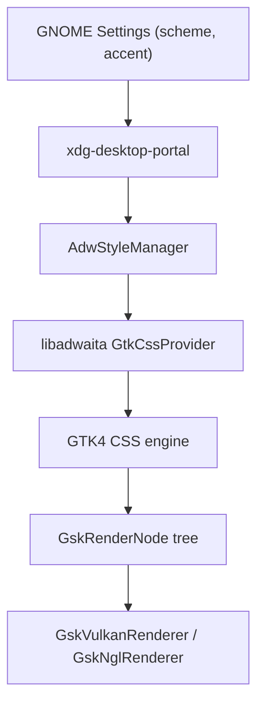
```mermaid
graph TD
    Settings["GNOME Settings (scheme, accent)"] --> Portal["xdg-desktop-portal"]
    Portal --> StyleMgr["AdwStyleManager"]
    StyleMgr --> Provider["libadwaita GtkCssProvider"]
    Provider --> Engine["GTK4 CSS engine"]
    Engine --> Nodes["GskRenderNode tree"]
    Nodes --> Renderer["GskVulkanRenderer / GskNglRenderer"]
```

**AdwAnimation: spring and timed animations.** Both animation types tick off `GdkFrameClock` and write an interpolated value to a target property each frame, driving `gtk_widget_queue_draw()`.

```c
/* Fade a widget from 0 to 1 opacity over 300 ms with ease-out-cubic */
AdwAnimationTarget *target =
    adw_property_animation_target_new(G_OBJECT(widget), "opacity");

AdwTimedAnimation *anim = ADW_TIMED_ANIMATION(
    adw_timed_animation_new(widget, 0.0, 1.0, 300, target));
adw_timed_animation_set_easing(anim, ADW_EASING_EASE_OUT_CUBIC);
adw_animation_play(ADW_ANIMATION(anim));

/* Spring-driven position animation — natural deceleration without explicit duration */
AdwSpringParams *spring = adw_spring_params_new(
    0.8,    /* damping ratio: < 1 underdamped (overshoot), 1 critically damped */
    1.0,    /* mass */
    500.0   /* stiffness */
);
AdwAnimationTarget *pos_target =
    adw_property_animation_target_new(G_OBJECT(widget), "margin-start");
AdwSpringAnimation *spring_anim = ADW_SPRING_ANIMATION(
    adw_spring_animation_new(widget, 0.0, 240.0, spring, pos_target));
adw_animation_play(ADW_ANIMATION(spring_anim));
adw_spring_params_unref(spring);
```

Both animation types register with the widget's `GdkFrameClock` via `gdk_frame_clock_begin_updating()`. Each tick rebuilds a `GskOpacityNode` or `GskTransformNode`, achieving smooth GPU-composited animation with no libadwaita-specific GPU code.

**AdwBreakpoint: adaptive layout with code.** For programmatic configuration of responsive layout:

```c
AdwBreakpointBin *bin = ADW_BREAKPOINT_BIN(adw_breakpoint_bin_new());
adw_breakpoint_bin_set_child(bin, GTK_WIDGET(split_view));

/* Collapse the navigation split view when width drops below 500px */
AdwBreakpoint *bp = adw_breakpoint_new(
    adw_breakpoint_condition_parse("max-width: 500px"));

GValue collapsed = G_VALUE_INIT;
g_value_init(&collapsed, G_TYPE_BOOLEAN);
g_value_set_boolean(&collapsed, TRUE);
adw_breakpoint_add_setter(bp, G_OBJECT(split_view), "collapsed", &collapsed);
adw_breakpoint_bin_add_breakpoint(bin, bp);
```

The breakpoint transition is a GTK4 property change — the sidebar column's `visible` state changes, causing the widget snapshot to produce a structurally different `GskRenderNode` tree. No special GPU path is involved.

**Notable rendering-relevant widgets.** `AdwAvatar` clips a circular user-picture texture via `gtk_snapshot_push_rounded_clip()` → `gtk_snapshot_append_texture()`, producing a `GskRoundedClipNode → GskTextureNode` pair resolved entirely in the GPU ubershader. `AdwSpinner` is implemented as a CSS `@keyframes` rotation of a shaped fill — a `GskTransformNode` stepped each frame by the CSS animation engine. `AdwDialog` (libadwaita 1.5+, the replacement for `GtkDialog`) requests the `xdg-dialog` role via the `xdg-toplevel-dialog` protocol extension, giving the compositor correct modal semantics without a separate `wl_surface` stack:

```c
AdwAlertDialog *dialog = ADW_ALERT_DIALOG(
    adw_alert_dialog_new("Delete File?", "This action cannot be undone."));
adw_alert_dialog_add_response(dialog, "cancel", "Cancel");
adw_alert_dialog_add_response(dialog, "delete", "Delete");
adw_alert_dialog_set_response_appearance(dialog, "delete", ADW_RESPONSE_DESTRUCTIVE);
g_signal_connect(dialog, "response", G_CALLBACK(on_response), NULL);
adw_dialog_present(ADW_DIALOG(dialog), GTK_WIDGET(parent_window));
```

`AdwNavigationView` and `AdwNavigationPage` implement a push/pop navigation stack with a slide animation: an `AdwSpringAnimation` on a `GskTransformNode` (X-axis translation), composited in the normal GSK render tree.

---

## 9. The GObject Type System

Every GTK4 type — `GtkWidget`, `GskRenderer`, `GdkTexture`, `AdwApplication` — is a **GObject**. GObject is GLib's runtime type system for C: single inheritance, interfaces, reference counting, signals, and introspectable properties, with zero preprocessor dependency beyond a handful of registration macros. Understanding its mechanics is required to read GTK internals, write custom widgets, implement GInterfaces, or understand how language bindings project the C API into other languages. [Source](https://docs.gtk.org/gobject/)

**GTK4 widget type hierarchy — overview.** The diagram below maps the major `GtkWidget` subclasses and sibling GObject families (GDK, GSK, GDK textures). Every node is a GObject subclass unless marked otherwise.

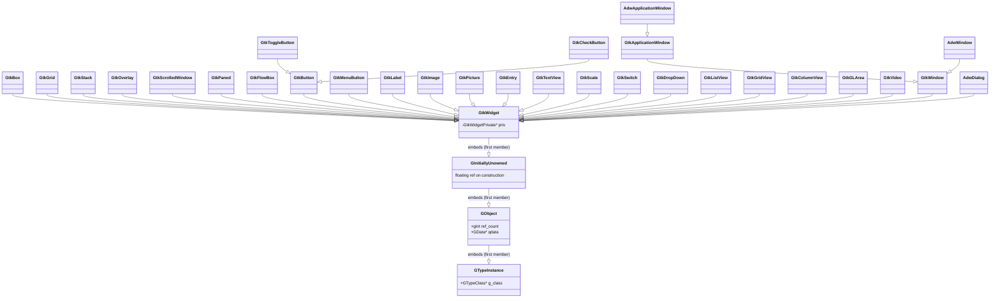
```mermaid
classDiagram
    direction TB
    class GTypeInstance {
        +GTypeClass* g_class
    }
    class GObject {
        +gint ref_count
        +GData* qdata
    }
    class GInitiallyUnowned {
        floating ref on construction
    }
    class GtkWidget {
        -GtkWidgetPrivate* priv
    }

    GObject --|> GTypeInstance : embeds (first member)
    GInitiallyUnowned --|> GObject : embeds (first member)
    GtkWidget --|> GInitiallyUnowned : embeds (first member)

    GtkBox --|> GtkWidget
    GtkGrid --|> GtkWidget
    GtkStack --|> GtkWidget
    GtkOverlay --|> GtkWidget
    GtkScrolledWindow --|> GtkWidget
    GtkPaned --|> GtkWidget
    GtkFlowBox --|> GtkWidget

    GtkButton --|> GtkWidget
    GtkToggleButton --|> GtkButton
    GtkCheckButton --|> GtkButton
    GtkMenuButton --|> GtkWidget

    GtkLabel --|> GtkWidget
    GtkImage --|> GtkWidget
    GtkPicture --|> GtkWidget
    GtkEntry --|> GtkWidget
    GtkTextView --|> GtkWidget
    GtkScale --|> GtkWidget
    GtkSwitch --|> GtkWidget
    GtkDropDown --|> GtkWidget

    GtkListView --|> GtkWidget
    GtkGridView --|> GtkWidget
    GtkColumnView --|> GtkWidget

    GtkGLArea --|> GtkWidget
    GtkVideo --|> GtkWidget

    GtkWindow --|> GtkWidget
    GtkApplicationWindow --|> GtkWindow
    AdwApplicationWindow --|> GtkApplicationWindow
    AdwWindow --|> GtkWindow
    AdwDialog --|> GtkWidget
```

**Key sibling GObject families (not GtkWidget).** These types are GObject subclasses used by the GTK rendering pipeline but are not widgets themselves.

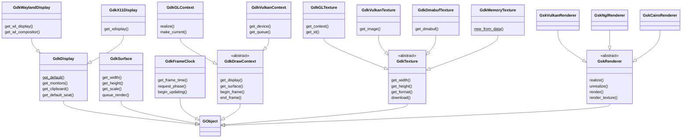
```mermaid
classDiagram
    direction TB
    class GObject
    class GdkDisplay {
        get_default()$
        get_monitors()
        get_clipboard()
        get_default_seat()
    }
    class GdkWaylandDisplay {
        get_wl_display()
        get_wl_compositor()
    }
    class GdkX11Display {
        get_xdisplay()
    }
    class GdkSurface {
        get_width()
        get_height()
        get_scale()
        queue_render()
    }
    class GdkFrameClock {
        get_frame_time()
        request_phase()
        begin_updating()
    }
    class GdkDrawContext {
        <<abstract>>
        get_display()
        get_surface()
        begin_frame()
        end_frame()
    }
    class GdkGLContext {
        realize()
        make_current()
    }
    class GdkVulkanContext {
        get_device()
        get_queue()
    }
    class GdkTexture {
        <<abstract>>
        get_width()
        get_height()
        get_format()
        download()
    }
    class GdkGLTexture {
        get_context()
        get_id()
    }
    class GdkVulkanTexture {
        get_image()
    }
    class GdkDmabufTexture {
        get_dmabuf()
    }
    class GdkMemoryTexture {
        new_from_data()$
    }
    class GskRenderer {
        <<abstract>>
        realize()
        unrealize()
        render()
        render_texture()
    }
    class GskVulkanRenderer
    class GskNglRenderer
    class GskCairoRenderer

    GdkDisplay --|> GObject
    GdkWaylandDisplay --|> GdkDisplay
    GdkX11Display --|> GdkDisplay
    GdkSurface --|> GObject
    GdkFrameClock --|> GObject
    GdkDrawContext --|> GObject
    GdkGLContext --|> GdkDrawContext
    GdkVulkanContext --|> GdkDrawContext
    GdkTexture --|> GObject
    GdkGLTexture --|> GdkTexture
    GdkVulkanTexture --|> GdkTexture
    GdkDmabufTexture --|> GdkTexture
    GdkMemoryTexture --|> GdkTexture
    GskRenderer --|> GObject
    GskVulkanRenderer --|> GskRenderer
    GskNglRenderer --|> GskRenderer
    GskCairoRenderer --|> GskRenderer
```

### 9.1 Instance and Class Struct Layout

GObject implements single inheritance through **C struct embedding**: the first member of every instance struct must be its parent's instance struct, and the first member of every class struct must be its parent's class struct. Because C guarantees a struct's address equals the address of its first member, a pointer to a subtype can be safely cast to a pointer to any ancestor type — no offset adjustment required.

```c
/* ── Instance structs ─────────────────────────────────────────────────── */

/* GLib internal (simplified): */
struct _GObject {
    GTypeInstance  g_type_instance;   /* MUST be first in every GObject */
    volatile gint  ref_count;
    GData         *qdata;             /* arbitrary attached data via g_object_set_data() */
};

/* GtkWidget (simplified, actual fields are in private data): */
struct _GtkWidget {
    GInitiallyUnowned parent_instance;  /* GInitiallyUnowned extends GObject */
    GtkWidgetPrivate *priv;
};

/* Your custom type: */
struct _MeterWidget {
    GtkWidget parent_instance;   /* MUST be first; gives us the full GtkWidget layout */
    gdouble   fraction;          /* custom state follows */
    GdkRGBA   fill_color;
};

/* ── Class structs (vtables) ──────────────────────────────────────────── */

struct _GObjectClass {
    GTypeClass   g_type_class;      /* MUST be first; contains the GType id */
    /* virtual functions overridable by subclasses: */
    GObject *   (*constructor)     (GType, guint, GObjectConstructParam *);
    void        (*set_property)    (GObject *, guint, const GValue *, GParamSpec *);
    void        (*get_property)    (GObject *, guint, GValue *, GParamSpec *);
    void        (*dispose)         (GObject *);
    void        (*finalize)        (GObject *);
    void        (*notify)          (GObject *, GParamSpec *);
    void        (*constructed)     (GObject *);
    /* ... more fields omitted */
};

struct _GtkWidgetClass {
    GObjectClass parent_class;     /* GObjectClass embedded first */
    /* GTK-specific vtable entries: */
    void     (*snapshot)           (GtkWidget *, GtkSnapshot *);
    void     (*size_allocate)      (GtkWidget *, int width, int height, int baseline);
    void     (*measure)            (GtkWidget *, GtkOrientation, int for_size,
                                    int *min, int *nat, int *min_baseline, int *nat_baseline);
    void     (*realize)            (GtkWidget *);
    void     (*unrealize)          (GtkWidget *);
    void     (*map)                (GtkWidget *);
    void     (*unmap)              (GtkWidget *);
    gboolean (*focus)              (GtkWidget *, GtkDirectionType);
    void     (*css_changed)        (GtkWidget *, GtkCssStyleChange *);
    void     (*state_flags_changed)(GtkWidget *, GtkStateFlags old_flags);
    /* ... many more */
};

struct _MeterWidgetClass {
    GtkWidgetClass parent_class;   /* GtkWidgetClass embedded first */
    /* custom virtual functions this type exposes to subclasses: */
    void (*value_changed) (MeterWidget *self, gdouble new_value);
};
```

The hierarchy of embedded structs forms a **linear prefix**: any `MeterWidget *` is simultaneously a valid `GtkWidget *`, `GObject *`, and `GTypeInstance *` by C's pointer-to-first-member rule. The casting macros (§9.3) validate and document these casts.

**What each foundational type is and provides.**

**`GTypeInstance`** is the minimum "I am a typed object" contract — a single pointer (`g_class`) to the shared class struct for this type. It is the non-negotiable first member of every GObject-derived C struct. Its sole job is to make runtime type identity O(1): any cast, type check, or vtable dispatch begins by reading `g_class`. The macros `G_TYPE_FROM_INSTANCE(obj)` (reads `obj->g_class->g_type`) and `g_type_check_instance_is_a()` (walks the ancestry chain) work entirely through this pointer. `GTypeInstance` alone provides no reference counting, no signals, no properties — it is purely the type-identity hook that makes the rest of GObject possible. [Source](https://docs.gtk.org/gobject/struct.TypeInstance.html)

**`GTypeClass`** is the mandatory first member of every class (vtable) struct. Its sole field, `g_type`, is the integer `GType` identifier assigned when the type was registered. There is exactly **one** `GTypeClass`-derived struct per registered type, regardless of how many instances exist — it is the shared vtable, allocated lazily on first reference via `g_type_class_ref()` and freed via `g_type_class_unref()` (GTK's static types are never evicted in practice). All virtual-function pointers — `snapshot`, `dispose`, `set_property` — live in structs whose first member is `GTypeClass`. `G_TYPE_FROM_CLASS(klass)` reads `((GTypeClass *)(klass))->g_type` in O(1); the casting macros `G_OBJECT_CLASS(klass)` and `GTK_WIDGET_CLASS(klass)` use `G_TYPE_CHECK_CLASS_CAST` to validate and reinterpret a class pointer up or down the ancestry. [Source](https://docs.gtk.org/gobject/struct.TypeClass.html)

**`GData` (the `qdata` field)** is a quark-keyed heterogeneous dictionary attached to each `GObject` instance. A `GQuark` is an interned string mapped to a small integer, giving constant-time lookup by key. The public API is `g_object_set_data(obj, "key", ptr)` / `g_object_get_data(obj, "key")`, optionally with a `GDestroyNotify` callback that fires when the value is replaced or the object is finalized. Internally, `GData` is also the storage back-end for signal handler lists, weak-reference callbacks, and toggle references — keeping them off the hot path of the fixed-size `GObject` struct. The `GObject` struct therefore stays small (two machine words beyond `GTypeInstance`) even for objects with many attached resources. [Source](https://docs.gtk.org/glib/struct.Data.html)

**`GObject`** adds three capability layers on top of `GTypeInstance`:

- **Reference counting.** `ref_count` is incremented by `g_object_ref()` and decremented by `g_object_unref()`. When the count reaches zero, GLib calls `dispose()` — the idempotent teardown that clears referenced objects and signal handlers and *may* temporarily resurrect a ref — then `finalize()` once the count is permanently zero, freeing raw memory. The two-phase destruction exists because `dispose()` must be safe to call multiple times (e.g., from a `GWeakRef` callback that fires mid-dispose) while `finalize()` runs exactly once.
- **Attached data.** The `qdata`/`GData` pointer described above, providing `g_object_set_data()`, weak references (`g_object_weak_ref()`, `GWeakRef`), and toggle references (used by PyGObject and GJS to bridge garbage-collector boundaries).
- **Properties and signals.** The `GObjectClass` vtable entries `set_property`, `get_property`, and `notify` power the GObject property system (`g_object_set()`, `g_object_get()`, `g_object_bind_property()`). Signal registration (`g_signal_new()`) and emission (`g_signal_emit()`) are also provided at this level. These features make GObject instances introspectable — GObject Introspection, language bindings, and GUI builders all depend on them being uniformly available on every `GObject` subtype.

[Source](https://docs.gtk.org/gobject/class.Object.html)

**`GInitiallyUnowned`** is a thin `GObject` subclass whose only addition is the **floating reference** convention. A freshly constructed `GInitiallyUnowned` has `ref_count == 1` but an internal "floating" flag set. The first call to `g_object_ref_sink()` claims the floating ref by clearing the flag *without* incrementing the count; subsequent calls on a non-floating object behave as a normal `g_object_ref()`. The purpose is ergonomic widget construction: `gtk_box_append(box, gtk_label_new("text"))` works because `gtk_label_new` returns a floating ref and `gtk_box_append` sinks it — no leak, no explicit `g_object_unref()` required. Without this convention, every freshly created widget passed to a parent would need a temporary variable and a balancing unref. `GInitiallyUnownedClass` adds no new vtable slots; the floating-ref logic lives entirely in GObject's `ref`/`unref`/`ref_sink` paths. All `GtkWidget` subclasses inherit from `GInitiallyUnowned`. [Source](https://docs.gtk.org/gobject/class.InitiallyUnowned.html)

**GLib type system core machinery.** The three structs that everything builds on. Every instance struct starts with `GTypeInstance`; every class (vtable) struct starts with `GTypeClass`; every interface vtable struct starts with `GTypeInterface`.

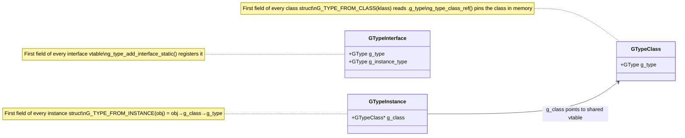
```mermaid
classDiagram
    direction LR
    class GTypeClass {
        +GType g_type
    }
    class GTypeInstance {
        +GTypeClass* g_class
    }
    class GTypeInterface {
        +GType g_type
        +GType g_instance_type
    }
    GTypeInstance --> GTypeClass : g_class points to shared vtable
    note for GTypeClass "First field of every class struct\nG_TYPE_FROM_CLASS(klass) reads .g_type\ng_type_class_ref() pins the class in memory"
    note for GTypeInstance "First field of every instance struct\nG_TYPE_FROM_INSTANCE(obj) = obj→g_class→g_type"
    note for GTypeInterface "First field of every interface vtable\ng_type_add_interface_static() registers it"
```

**Instance struct embedding chain** — the C pseudo-inheritance model from `GTypeInstance` down to a custom widget.

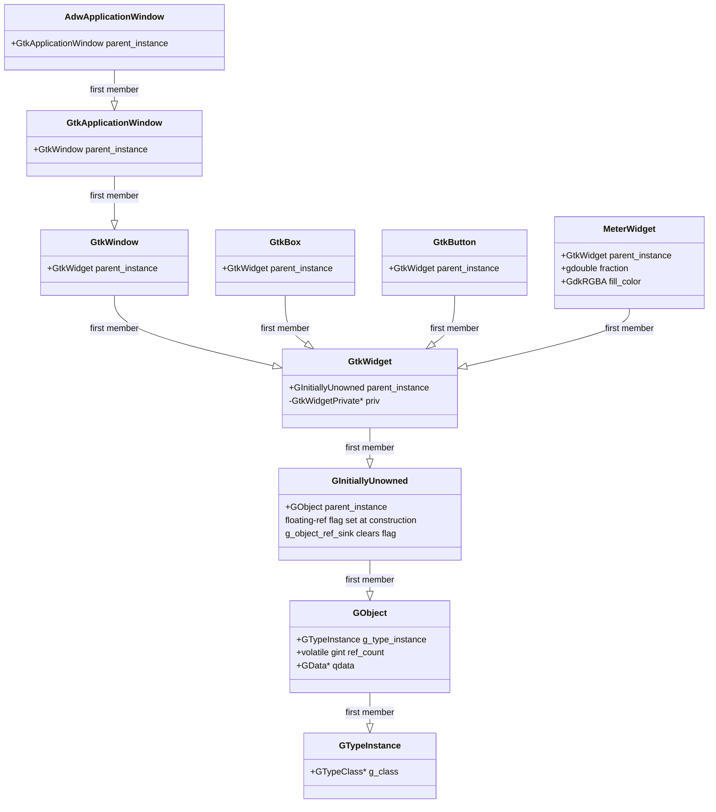
```mermaid
classDiagram
    direction TB
    class GTypeInstance {
        +GTypeClass* g_class
    }
    class GObject {
        +GTypeInstance g_type_instance
        +volatile gint ref_count
        +GData* qdata
    }
    class GInitiallyUnowned {
        +GObject parent_instance
        floating-ref flag set at construction
        g_object_ref_sink clears flag
    }
    class GtkWidget {
        +GInitiallyUnowned parent_instance
        -GtkWidgetPrivate* priv
    }
    class GtkWindow {
        +GtkWidget parent_instance
    }
    class GtkApplicationWindow {
        +GtkWindow parent_instance
    }
    class AdwApplicationWindow {
        +GtkApplicationWindow parent_instance
    }
    class GtkBox {
        +GtkWidget parent_instance
    }
    class GtkButton {
        +GtkWidget parent_instance
    }
    class MeterWidget {
        +GtkWidget parent_instance
        +gdouble fraction
        +GdkRGBA fill_color
    }

    GObject --|> GTypeInstance : first member
    GInitiallyUnowned --|> GObject : first member
    GtkWidget --|> GInitiallyUnowned : first member
    GtkWindow --|> GtkWidget : first member
    GtkApplicationWindow --|> GtkWindow : first member
    AdwApplicationWindow --|> GtkApplicationWindow : first member
    GtkBox --|> GtkWidget : first member
    GtkButton --|> GtkWidget : first member
    MeterWidget --|> GtkWidget : first member
```

**Class struct (vtable) embedding chain** — the parallel chain of shared class structs, one per type registered in the type system.

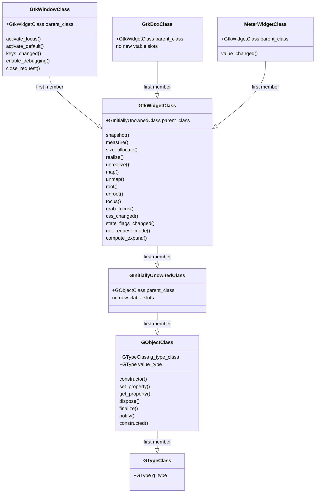
```mermaid
classDiagram
    direction TB
    class GTypeClass {
        +GType g_type
    }
    class GObjectClass {
        +GTypeClass g_type_class
        +GType value_type
        constructor()
        set_property()
        get_property()
        dispose()
        finalize()
        notify()
        constructed()
    }
    class GInitiallyUnownedClass {
        +GObjectClass parent_class
        no new vtable slots
    }
    class GtkWidgetClass {
        +GInitiallyUnownedClass parent_class
        snapshot()
        measure()
        size_allocate()
        realize()
        unrealize()
        map()
        unmap()
        root()
        unroot()
        focus()
        grab_focus()
        css_changed()
        state_flags_changed()
        get_request_mode()
        compute_expand()
    }
    class GtkWindowClass {
        +GtkWidgetClass parent_class
        activate_focus()
        activate_default()
        keys_changed()
        enable_debugging()
        close_request()
    }
    class GtkBoxClass {
        +GtkWidgetClass parent_class
        no new vtable slots
    }
    class MeterWidgetClass {
        +GtkWidgetClass parent_class
        value_changed()
    }

    GObjectClass --|> GTypeClass : first member
    GInitiallyUnownedClass --|> GObjectClass : first member
    GtkWidgetClass --|> GInitiallyUnownedClass : first member
    GtkWindowClass --|> GtkWidgetClass : first member
    GtkBoxClass --|> GtkWidgetClass : first member
    MeterWidgetClass --|> GtkWidgetClass : first member
```

### 9.2 G_DEFINE_TYPE: What the Macro Generates

`G_DEFINE_TYPE(TypeName, type_name, TYPE_PARENT)` is the canonical way to register a new GObject type. It expands to roughly the following code (paraphrased from `gobject/gtype.h`): [Source](https://docs.gtk.org/gobject/func.type_register_static.html)

```c
/* What G_DEFINE_TYPE (MeterWidget, meter_widget, GTK_TYPE_WIDGET) expands to: */

/* 1. Forward-declare the two user-supplied init functions */
static void meter_widget_class_init (MeterWidgetClass *klass);
static void meter_widget_init       (MeterWidget      *self);

/* 2. Expose a parent_class pointer so chain-up can find the parent vtable */
static gpointer meter_widget_parent_class = NULL;

/* 3. Generate the *_get_type() function — thread-safe, runs once via g_once_init */
GType
meter_widget_get_type (void)
{
    static gsize type_id_volatile = 0;          /* zero-initialised; 0 means "not yet registered" */
    if (g_once_init_enter (&type_id_volatile)) {
        GType type_id;
        static const GTypeInfo info = {
            .class_size     = sizeof (MeterWidgetClass),
            .base_init      = NULL,
            .base_finalize  = NULL,
            .class_init     = (GClassInitFunc) meter_widget_class_init,
            .class_finalize = NULL,
            .class_data     = NULL,
            .instance_size  = sizeof (MeterWidget),
            .n_preallocs    = 0,
            .instance_init  = (GInstanceInitFunc) meter_widget_init,
        };
        /* Register with the GLib type system under the parent type */
        type_id = g_type_register_static (
                      GTK_TYPE_WIDGET,                 /* parent GType */
                      g_intern_static_string ("MeterWidget"), /* type name string */
                      &info, 0 /* GTypeFlags */);
        /* Stash the parent class pointer for chain-up use */
        meter_widget_parent_class = g_type_class_peek_parent (
                      g_type_class_ref (type_id));
        g_once_init_leave (&type_id_volatile, type_id);
    }
    return (GType) type_id_volatile;
}

/* 4. Convenience macro: METER_TYPE_WIDGET expands to meter_widget_get_type() */
#define METER_TYPE_WIDGET (meter_widget_get_type ())
```

**`g_once_init_enter` / `g_once_init_leave`** guarantee the registration block runs exactly once even under concurrent calls from multiple threads, using an atomic compare-and-swap. The `GTypeInfo` struct passed to `g_type_register_static()` tells the type system the sizes of the class and instance structs (so it can allocate them) and the pointers to the class-init and instance-init functions.

**`GTypeInfo`** is a plain C struct — not a GObject subtype — that carries all the metadata the type system needs to create and manage a new type: `class_size` and `instance_size` tell it how many bytes to allocate for the shared vtable and per-instance memory respectively; `class_init` and `instance_init` are the initialisation callbacks; `class_finalize` handles type unregistration (rarely used for GTK's permanent types); `base_init`/`base_finalize` run per-inheritance-level for diamond-shaped multi-inheritance (only relevant for GInterfaces). `GTypeInfo` is only needed during registration — the type system copies or uses it at `g_type_register_static()` time and it can be stack-allocated immediately afterwards. [Source](https://docs.gtk.org/gobject/struct.TypeInfo.html)

**`GType`** is a `gulong` integer that uniquely identifies each registered type within a process. The type system assigns identifiers at registration time; the integer value is opaque but stable for the lifetime of the process. Built-in fundamental types have fixed constants: `G_TYPE_OBJECT`, `G_TYPE_STRING`, `G_TYPE_DOUBLE`, `G_TYPE_BOOLEAN`, `G_TYPE_POINTER`, `G_TYPE_NONE`, and so on; GTK's own types such as `GTK_TYPE_WIDGET` and `GDK_TYPE_RGBA` are registered on library init. Derived application types receive a dynamically assigned identifier. `G_TYPE_INVALID` (0) is the sentinel for "no type". `G_TYPE_FROM_INSTANCE(obj)`, `G_TYPE_FROM_CLASS(klass)`, and `G_TYPE_FROM_INTERFACE(iface)` all ultimately return a `GType`; `g_type_name(t)` converts it back to the registered string for debugging. [Source](https://docs.gtk.org/gobject/alias.Type.html)

**`GQuark`** is a `guint32` interned string identifier. `g_quark_from_string("my-key")` maps an arbitrary string to a small integer that is stable for the life of the process, and repeated calls with the same string return the same integer — enabling O(1) dictionary lookups instead of `strcmp` chains. `g_quark_to_string(q)` retrieves the original string. Quarks are used everywhere strings need to be compared frequently and cheaply: signal names, `g_object_set_data()` keys, `GError` domain identifiers, CSS property names, and the `GData` dictionary that backs `qdata`. [Source](https://docs.gtk.org/glib/alias.Quark.html)

**class_init** runs once when the type is first used (not per-instance). It receives an already-zeroed, freshly allocated `MeterWidgetClass` that has been chain-initialised: the type system first calls the parent chain's `class_init` functions from `GObject` down to `GtkWidget`, then calls `meter_widget_class_init`. This means `GObjectClass` and `GtkWidgetClass` vtable slots are already populated with GTK defaults before your code runs — you override only the entries you need.

**instance_init** (`meter_widget_init`) runs once per object allocation, after the instance memory has been zeroed and the parent's `instance_init` chain has completed.

### 9.3 Class Casting: G_OBJECT_CLASS, GTK_WIDGET_CLASS, and G_TYPE_FROM_CLASS

Inside `class_init`, the parameter is typed as `MeterWidgetClass *klass`, but you need to access the vtable slots of parent classes. The casting macros make this safe and self-documenting. [Source](https://docs.gtk.org/gobject/type_system.html)

```c
/* G_OBJECT_CLASS upcast: MeterWidgetClass* → GObjectClass* */
#define G_OBJECT_CLASS(klass) \
    (G_TYPE_CHECK_CLASS_CAST ((klass), G_TYPE_OBJECT, GObjectClass))

/* GTK_WIDGET_CLASS upcast: MeterWidgetClass* → GtkWidgetClass* */
#define GTK_WIDGET_CLASS(klass) \
    (G_TYPE_CHECK_CLASS_CAST ((klass), GTK_TYPE_WIDGET, GtkWidgetClass))

/* Your own type's class cast: GObject* → MeterWidgetClass* */
#define METER_WIDGET_CLASS(klass) \
    (G_TYPE_CHECK_CLASS_CAST ((klass), METER_TYPE_WIDGET, MeterWidgetClass))
```

`G_TYPE_CHECK_CLASS_CAST` is a **safe upcast** — since `MeterWidgetClass` begins with `GtkWidgetClass` which begins with `GObjectClass`, the pointer value is unchanged; only the C type changes. In debug builds (`--enable-debug` or `GOBJECT_DEBUG=instance-count`) it additionally asserts that the class pointer's embedded `GTypeClass.g_type` is a descendant of the target type, catching mistakes at runtime. In release builds it reduces to a plain C cast with zero overhead.

```c
static void
meter_widget_class_init (MeterWidgetClass *klass)
{
    /* Upcast to GObjectClass to override the dispose/finalize/properties vtable */
    GObjectClass *object_class = G_OBJECT_CLASS (klass);
    object_class->dispose      = meter_widget_dispose;
    object_class->finalize     = meter_widget_finalize;
    object_class->set_property = meter_widget_set_property;
    object_class->get_property = meter_widget_get_property;

    /* Upcast to GtkWidgetClass to override the rendering/layout vtable */
    GtkWidgetClass *widget_class = GTK_WIDGET_CLASS (klass);
    widget_class->snapshot       = meter_widget_snapshot;
    widget_class->measure        = meter_widget_measure;

    /* Install properties (see §9.5) */
    g_object_class_install_properties (object_class, N_PROPS, props);

    /* Register a custom signal (see §9.6) */
    signals[SIG_VALUE_CHANGED] =
        g_signal_new ("value-changed",
                      G_TYPE_FROM_CLASS (klass),   /* ← extract GType from class ptr */
                      G_SIGNAL_RUN_LAST, 0,
                      NULL, NULL, NULL,
                      G_TYPE_NONE, 1, G_TYPE_DOUBLE);

    /* Set CSS name for styling: button { } vs .meter { } */
    gtk_widget_class_set_css_name (widget_class, "meter");

    /* Optionally load a composite template */
    gtk_widget_class_set_template_from_resource (
        widget_class, "/com/example/my-app/meter-widget.ui");
}
```

**`G_TYPE_FROM_CLASS(klass)`** extracts the `GType` id from any class pointer:

```c
#define G_TYPE_FROM_CLASS(klass)  (((GTypeClass *)(klass))->g_type)
```

The very first field of every class struct is a `GTypeClass` which contains the `GType` integer identifier for this class's type. `G_TYPE_FROM_CLASS` casts the pointer to `GTypeClass *` and reads `.g_type`. This is needed for `g_signal_new()` — which takes a `GType` argument, not a class pointer — and for any other API that identifies a type by its `GType` integer.

**Instance casting macros** mirror the class variants; declare them in the type's public header:

```c
/* Cast an arbitrary GObject* to MeterWidget* (with debug type check) */
#define METER_WIDGET(obj) \
    (G_TYPE_CHECK_INSTANCE_CAST ((obj), METER_TYPE_WIDGET, MeterWidget))

/* Boolean type test — returns TRUE if obj is a MeterWidget or subclass */
#define IS_METER_WIDGET(obj) \
    (G_TYPE_CHECK_INSTANCE_TYPE ((obj), METER_TYPE_WIDGET))

/* Retrieve the class vtable from any instance */
#define METER_WIDGET_GET_CLASS(obj) \
    (G_TYPE_INSTANCE_GET_CLASS ((obj), METER_TYPE_WIDGET, MeterWidgetClass))
```

`G_TYPE_CHECK_INSTANCE_CAST` performs a **downcast**: it asserts (in debug builds) that `obj->g_type_instance.g_class->g_type` is `METER_TYPE_WIDGET` or a descendant. `IS_METER_WIDGET` is the corresponding `instanceof` check. `METER_WIDGET_GET_CLASS` recovers the class pointer from an instance — useful when a virtual method override needs to read class-level data.

**Runtime instance ↔ class pointer relationship.** Each instance carries `g_type_instance.g_class`, a pointer to the **single shared class struct** for that type. All `GtkBox` instances share the same `GtkBoxClass` vtable object in memory. Up-casting a class pointer (e.g. `G_OBJECT_CLASS(klass)`) is safe because class structs embed their parent as the first member.

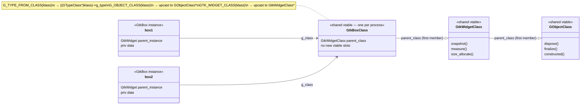
```mermaid
classDiagram
    direction LR
    class box1 {
        <<GtkBox instance>>
        GtkWidget parent_instance
        priv data
    }
    class box2 {
        <<GtkBox instance>>
        GtkWidget parent_instance
        priv data
    }
    class GtkBoxClass {
        <<shared vtable — one per process>>
        GtkWidgetClass parent_class
        no new vtable slots
    }
    class GtkWidgetClass {
        <<shared vtable>>
        snapshot()
        measure()
        size_allocate()
    }
    class GObjectClass {
        <<shared vtable>>
        dispose()
        finalize()
        constructed()
    }

    box1 --> GtkBoxClass : g_class
    box2 --> GtkBoxClass : g_class
    GtkBoxClass --|> GtkWidgetClass : parent_class (first member)
    GtkWidgetClass --|> GObjectClass : parent_class (first member)

    note for GtkBoxClass "G_TYPE_FROM_CLASS(klass)\n  → ((GTypeClass*)klass)->g_type\nG_OBJECT_CLASS(klass)\n  → upcast to GObjectClass*\nGTK_WIDGET_CLASS(klass)\n  → upcast to GtkWidgetClass*"
```

### 9.4 GObjectClass Vtable: constructed, dispose, finalize, set_property

`GObjectClass` is the **shared class struct (vtable) for `GObject`** and the first class struct that every GObject subclass chain encounters. Its first member is `GTypeClass` (holding the `GType` integer); the remaining fields are function pointers — virtual methods that govern the lifecycle and property/signal behaviour of every object of this type. There is exactly one `GObjectClass` allocation per registered concrete type, shared by all instances. The type system allocates it on first `g_type_class_ref()`, chain-initialises it by calling each ancestor's `class_init` from `GObject` downward, and keeps it alive until the type is unregistered (which GTK's built-in types never do). Subclasses embed `GObjectClass` as the first member of their own class struct and override only the function pointers they need; the `G_OBJECT_CLASS(klass)` macro provides a typed pointer to the `GObjectClass` portion without any pointer arithmetic. [Source](https://docs.gtk.org/gobject/class.Object.html)

The `GObjectClass` vtable entries you most commonly override: [Source](https://docs.gtk.org/gobject/class.Object.html)

| Field | When called | Typical use |
|---|---|---|
| `constructed` | After all `g_object_new()` properties are set | Safe to access all installed properties; chain up with `G_OBJECT_CLASS(parent_class)->constructed(obj)` |
| `dispose` | When refcount drops to 0 — **may be called multiple times** if the object is re-referenced during teardown | Release references to other GObjects (`g_clear_object`), disconnect signals, free GPU resources |
| `finalize` | After `dispose`, when refcount is permanently 0 — **runs exactly once** | Free raw memory allocations (`g_free`); do **not** call `g_object_ref` here |
| `set_property` | On `g_object_set()` / `g_object_new()` property args | Store the `GValue` into the instance and invalidate/redraw |
| `get_property` | On `g_object_get()` | Copy instance state into the `GValue` |
| `notify` | After any property changes and `g_object_notify()` fires | Rarely overridden; watch with `g_signal_connect(obj, "notify::prop", ...)` instead |

```c
static void
meter_widget_dispose (GObject *object)
{
    MeterWidget *self = METER_WIDGET (object);

    /* Drop all references to other objects here */
    g_clear_object (&self->texture);          /* nulls the pointer after unref */
    g_clear_signal_handler (&self->handler_id, self->model);

    /* Always chain up to parent — GtkWidget's dispose does critical cleanup */
    G_OBJECT_CLASS (meter_widget_parent_class)->dispose (object);
}

static void
meter_widget_finalize (GObject *object)
{
    MeterWidget *self = METER_WIDGET (object);

    g_free (self->label_text);    /* free raw allocations */

    /* Chain up last */
    G_OBJECT_CLASS (meter_widget_parent_class)->finalize (object);
}

static void
meter_widget_constructed (GObject *object)
{
    MeterWidget *self = METER_WIDGET (object);

    /* All properties passed to g_object_new() are already applied here */
    self->animation = adw_timed_animation_new (GTK_WIDGET (self),
                          0.0, self->fraction, 300, self->target);

    G_OBJECT_CLASS (meter_widget_parent_class)->constructed (object);
}
```

**`meter_widget_parent_class`** is the static pointer set by `G_DEFINE_TYPE`. It points to a `GtkWidgetClass` (the parent's class struct, not `MeterWidgetClass`), so casting it through `G_OBJECT_CLASS()` yields the `GObjectClass` vtable of `GtkWidget`'s registered class. This is the standard chain-up idiom throughout GTK.

### 9.5 GtkWidgetClass Vtable: snapshot, measure, size_allocate

`GtkWidgetClass` is the **shared class struct (vtable) for `GtkWidget`** and all its descendants. Its first member is `GInitiallyUnownedClass` (which embeds `GObjectClass`, which embeds `GTypeClass`), giving it the full GObject vtable as a prefix followed by GTK-specific rendering and lifecycle function pointers. There is one `GtkWidgetClass` allocation per concrete widget type; it is allocated and populated by the type system before your `class_init` callback runs, so GTK's default implementations of all vtable slots are already in place — custom widgets only override the entries they need. The function pointers fall into four semantic groups: **rendering** (`snapshot`, `measure`, `size_allocate`), **window-system lifecycle** (`realize`/`unrealize`, `map`/`unmap`, `root`/`unroot`), **input and focus** (`focus`, `grab_focus`), and **style** (`css_changed`, `state_flags_changed`, `direction_changed`). `GTK_WIDGET_CLASS(klass)` gives a typed pointer to this struct from any subclass's `class_init` parameter; `gtk_widget_class_set_css_name()`, `gtk_widget_class_set_template()`, and similar helpers are also called on this pointer. [Source](https://docs.gtk.org/gtk4/class.Widget.html)

The most-overridden entries: [Source](https://docs.gtk.org/gtk4/class.Widget.html)

| Field | Signature | When called |
|---|---|---|
| `snapshot` | `void (GtkWidget*, GtkSnapshot*)` | Each dirty frame; populate the render node tree |
| `measure` | `void (GtkWidget*, GtkOrientation, int for_size, int *min, int *nat, int *min_baseline, int *nat_baseline)` | Size negotiation; return minimum and natural size |
| `size_allocate` | `void (GtkWidget*, int width, int height, int baseline)` | Final size assigned by parent; re-layout children |
| `realize` | `void (GtkWidget*)` | Window system resources available; allocate GPU objects |
| `unrealize` | `void (GtkWidget*)` | Window gone; free GPU objects |
| `map` / `unmap` | `void (GtkWidget*)` | Widget becomes visible / invisible |
| `focus` | `gboolean (GtkWidget*, GtkDirectionType)` | Keyboard focus traversal into this widget |
| `grab_focus` | `void (GtkWidget*)` | Unconditional focus request |
| `css_changed` | `void (GtkWidget*, GtkCssStyleChange*)` | CSS property values changed; re-snapshot typically happens automatically |
| `state_flags_changed` | `void (GtkWidget*, GtkStateFlags old)` | Hover/active/focus/disabled state changed |
| `root` / `unroot` | `void (GtkWidget*)` | Widget inserted into / removed from the widget tree |

A minimal custom widget overriding `measure` and `snapshot`:

```c
static void
meter_widget_measure (GtkWidget *widget, GtkOrientation orientation,
                      int for_size,
                      int *min, int *nat, int *min_baseline, int *nat_baseline)
{
    /* Natural size 200×24; minimum 40×16 */
    if (orientation == GTK_ORIENTATION_HORIZONTAL) {
        *min = 40;  *nat = 200;
    } else {
        *min = 16;  *nat = 24;
    }
    /* Baselines are only relevant for text-containing widgets */
    *min_baseline = *nat_baseline = -1;
}

static void
meter_widget_snapshot (GtkWidget *widget, GtkSnapshot *snapshot)
{
    MeterWidget *self = METER_WIDGET (widget);
    int w = gtk_widget_get_width  (widget);
    int h = gtk_widget_get_height (widget);

    /* Track */
    gtk_snapshot_append_color (snapshot,
        &(GdkRGBA){0.2f, 0.2f, 0.2f, 1.0f},
        &GRAPHENE_RECT_INIT (0, 0, w, h));
    /* Fill */
    gtk_snapshot_append_color (snapshot,
        &self->fill_color,
        &GRAPHENE_RECT_INIT (0, 0, (float)w * self->fraction, h));

    /* Chain up so GTK can snapshot child widgets, focus rings, etc. */
    GTK_WIDGET_CLASS (meter_widget_parent_class)->snapshot (widget, snapshot);
}

static void
meter_widget_class_init (MeterWidgetClass *klass)
{
    GtkWidgetClass *widget_class = GTK_WIDGET_CLASS (klass);
    widget_class->measure      = meter_widget_measure;
    widget_class->snapshot     = meter_widget_snapshot;
    gtk_widget_class_set_css_name (widget_class, "meter");
}
```

### 9.6 Properties

**`GParamSpec`** is the **property descriptor** — a GObject-registered object (itself a GObject subtype, with its own `GType`) that describes one property: its canonical hyphenated name, the value type it holds, valid range or allowed values, default value, and access flags (`G_PARAM_READABLE`, `G_PARAM_WRITABLE`, `G_PARAM_CONSTRUCT`, `G_PARAM_CONSTRUCT_ONLY`, etc.). Each C value type has a concrete `GParamSpec` subtype — `GParamSpecDouble`, `GParamSpecString`, `GParamSpecBoxed`, `GParamSpecObject`, `GParamSpecBoolean` — instantiated by the corresponding `g_param_spec_double()`, `g_param_spec_string()`, etc. constructor. `g_object_class_install_properties()` registers the array of `GParamSpec` pointers with the type system, making each property visible to GObject Introspection and language bindings. [Source](https://docs.gtk.org/gobject/class.ParamSpec.html)

**`GValue`** is GLib's **generic value container** — a tagged union that holds a single typed value without knowing its concrete type at compile time. Internally it is a `GType` tag plus a `GValueData` union large enough for a pointer, a `gdouble`, a `gint64`, or similar scalar. Properties pass values between the caller and `set_property`/`get_property` through `GValue`; signal marshallers pack arguments and return values the same way. Typed accessors (`g_value_get_double()`, `g_value_set_boxed()`, `g_value_get_object()`, …) assert that the tag matches the accessor type in debug builds. `g_value_transform()` converts between compatible registered types (e.g. `G_TYPE_INT` → `G_TYPE_DOUBLE`). Language bindings use `GValue` as the canonical intermediate representation when reflecting properties and signal arguments through an FFI boundary. [Source](https://docs.gtk.org/gobject/struct.Value.html)

Properties are named, typed, introspectable slots declared with a `GParamSpec` in `class_init` and accessed generically with `g_object_get()` / `g_object_set()`. They are the mechanism through which `g_object_new()` keyword-argument construction, CSS animation, and language bindings set state. [Source](https://docs.gtk.org/gobject/class.ParamSpec.html)

```c
enum { PROP_0, PROP_FRACTION, PROP_FILL_COLOR, N_PROPS };
static GParamSpec *props[N_PROPS];

static void
meter_widget_class_init (MeterWidgetClass *klass)
{
    GObjectClass *object_class = G_OBJECT_CLASS (klass);
    object_class->set_property = meter_widget_set_property;
    object_class->get_property = meter_widget_get_property;

    props[PROP_FRACTION] =
        g_param_spec_double ("fraction",
                             NULL, NULL,           /* nick, blurb (rarely used now) */
                             0.0, 1.0, 0.0,        /* min, max, default */
                             G_PARAM_READWRITE | G_PARAM_STATIC_STRINGS);

    props[PROP_FILL_COLOR] =
        g_param_spec_boxed ("fill-color", NULL, NULL,
                            GDK_TYPE_RGBA,         /* boxed type for GdkRGBA */
                            G_PARAM_READWRITE | G_PARAM_STATIC_STRINGS);

    g_object_class_install_properties (object_class, N_PROPS, props);
}

static void
meter_widget_set_property (GObject *object, guint prop_id,
                           const GValue *value, GParamSpec *pspec)
{
    MeterWidget *self = METER_WIDGET (object);
    switch (prop_id) {
    case PROP_FRACTION:
        self->fraction = g_value_get_double (value);
        gtk_widget_queue_draw (GTK_WIDGET (self));
        break;
    case PROP_FILL_COLOR:
        self->fill_color = *(GdkRGBA *) g_value_get_boxed (value);
        gtk_widget_queue_draw (GTK_WIDGET (self));
        break;
    default:
        G_OBJECT_WARN_INVALID_PROPERTY_ID (object, prop_id, pspec);
    }
}

static void
meter_widget_get_property (GObject *object, guint prop_id,
                           GValue *value, GParamSpec *pspec)
{
    MeterWidget *self = METER_WIDGET (object);
    switch (prop_id) {
    case PROP_FRACTION:   g_value_set_double (value, self->fraction);                 break;
    case PROP_FILL_COLOR: g_value_set_boxed  (value, &self->fill_color);             break;
    default:              G_OBJECT_WARN_INVALID_PROPERTY_ID (object, prop_id, pspec);
    }
}
```

`G_PARAM_STATIC_STRINGS` signals that the name/nick/blurb strings are `static const` and don't need copying — mandatory for all new code. `G_PARAM_CONSTRUCT` allows the property to be set via `g_object_new()`. `G_PARAM_CONSTRUCT_ONLY` additionally disables setting after construction. After a `set_property` call, GObject automatically emits the `notify::fraction` signal — the mechanism that drives property bindings and CSS animation.

### 9.7 Signals

**`GClosure`** is GLib's **callable value** — it wraps a C function pointer (or a language-binding-specific callback object) together with optional user data and a list of `GClosureNotify` callbacks that fire when the closure is invalidated. Every `g_signal_connect()` call wraps its callback in a closure internally. `GCClosure` is the concrete subtype for plain C callbacks of the form `void cb(GObject *obj, ..., gpointer user_data)`. Language bindings create closure subtypes that hold a reference to a managed-language object as the target; `g_closure_add_invalidate_notifier()` lets the binding disconnect the closure automatically when the target is collected. The marshaller function embedded in the closure handles the `GValue[]` → native type conversion for each argument and return value.

GObject signals are runtime-registered, typed hooks that any code can connect to and that the object emits at defined points. Unlike Qt's compile-time `moc` mechanism, GObject signals are registered with a string name and a marshaller that validates argument types at emission. [Source](https://docs.gtk.org/gobject/concepts.html#signals)

```c
enum { SIG_VALUE_CHANGED, SIG_LEVEL_WARNING, N_SIGNALS };
static guint signals[N_SIGNALS];

/* In class_init: */
signals[SIG_VALUE_CHANGED] =
    g_signal_new ("value-changed",
                  G_TYPE_FROM_CLASS (klass),       /* which GType owns this signal */
                  G_SIGNAL_RUN_LAST,               /* emission order: RUN_FIRST | RUN_LAST | RUN_CLEANUP */
                  G_STRUCT_OFFSET (MeterWidgetClass, value_changed), /* default handler offset in class struct; 0 if none */
                  NULL, NULL,                      /* accumulator, accumulator_data */
                  NULL,                            /* marshaller; NULL = auto-generated */
                  G_TYPE_NONE,                     /* return type */
                  1, G_TYPE_DOUBLE);               /* 1 argument of type gdouble */

signals[SIG_LEVEL_WARNING] =
    g_signal_new ("level-warning",
                  G_TYPE_FROM_CLASS (klass),
                  G_SIGNAL_RUN_FIRST,
                  0, NULL, NULL, NULL,
                  G_TYPE_NONE, 0);                 /* no arguments */
```

**Emission flags:**
- `G_SIGNAL_RUN_FIRST` — default class handler runs before user-connected handlers.
- `G_SIGNAL_RUN_LAST` — class handler runs after user handlers (default for most GTK signals; lets user handlers "see" the signal before the class handles it).
- `G_SIGNAL_ACTION` — signal is synchronous and may be emitted from key bindings.
- `G_SIGNAL_DETAILED` — signal carries a detail string (e.g. `notify::fraction` is `notify` with detail `fraction`).

**Emitting a signal:**

```c
/* Emit value-changed with the new fraction value */
static void
meter_widget_set_fraction (MeterWidget *self, gdouble fraction)
{
    if (self->fraction == fraction) return;
    self->fraction = fraction;
    gtk_widget_queue_draw (GTK_WIDGET (self));
    g_signal_emit (self, signals[SIG_VALUE_CHANGED], 0 /* detail */, fraction);
    g_object_notify_by_pspec (G_OBJECT (self), props[PROP_FRACTION]);
}
```

**Connecting to a signal:**

```c
static void on_value_changed (MeterWidget *meter, gdouble value, gpointer user_data) {
    g_print ("meter: %.2f\n", value);
}

gulong handler_id = g_signal_connect (meter, "value-changed",
                                      G_CALLBACK (on_value_changed), NULL);

/* Disconnect later: */
g_signal_handler_disconnect (meter, handler_id);
/* Or disconnect all matching: */
g_signal_handlers_disconnect_by_func (meter, on_value_changed, NULL);
```

`G_CALLBACK` is a `(GCallback)` cast that silences the function-pointer type mismatch between the concrete handler signature and the generic `void (*GCallback)(void)`. The GObject marshaller validates the actual argument types at emission time in debug builds.

### 9.8 G_DEFINE_TYPE Variants and GInterfaces

**Macro variants** cover common specialisations: [Source](https://docs.gtk.org/gobject/func.type_register_static.html)

```c
/* Non-instantiable abstract base */
G_DEFINE_ABSTRACT_TYPE (GskRenderer, gsk_renderer, G_TYPE_OBJECT)

/* With a code block executed inside get_type() — used to implement interfaces */
G_DEFINE_TYPE_WITH_CODE (MeterWidget, meter_widget, GTK_TYPE_WIDGET,
    G_IMPLEMENT_INTERFACE (GTK_TYPE_ACCESSIBLE, meter_widget_accessible_iface_init)
    G_IMPLEMENT_INTERFACE (GTK_TYPE_ORIENTABLE, meter_widget_orientable_iface_init))

/* With private instance data hidden from the header (GLib ≥ 2.38) */
G_DEFINE_TYPE_WITH_PRIVATE (MeterWidget, meter_widget, GTK_TYPE_WIDGET)
/* Private data accessed via the generated helper: */
MeterWidgetPrivate *priv = meter_widget_get_instance_private (self);

/* Prevent subclassing — enforced at registration (GTK 4.12+) */
G_DEFINE_FINAL_TYPE (MeterWidget, meter_widget, GTK_TYPE_WIDGET)
```

**Implementing a GInterface.** GObject interfaces (`GTypeInterface`) are declared similarly to abstract classes but carry only virtual function pointers and no instance data. Implementing one requires:

```c
/* 1. Declare the interface init function (implement all required vfuncs) */
static void
meter_widget_accessible_iface_init (GtkAccessibleInterface *iface)
{
    iface->get_at_context       = meter_widget_get_at_context;
    iface->get_platform_state   = meter_widget_get_platform_state;
    iface->get_accessible_parent = meter_widget_get_accessible_parent;
    iface->get_first_accessible_child = meter_widget_get_first_accessible_child;
    iface->get_next_accessible_sibling = meter_widget_get_next_accessible_sibling;
}

/* 2. Register the implementation in get_type() via G_IMPLEMENT_INTERFACE */
G_DEFINE_TYPE_WITH_CODE (MeterWidget, meter_widget, GTK_TYPE_WIDGET,
    G_IMPLEMENT_INTERFACE (GTK_TYPE_ACCESSIBLE, meter_widget_accessible_iface_init))

/* 3. Use the interface from calling code */
GtkAccessible *accessible = GTK_ACCESSIBLE (meter);  /* upcast through the interface */
gtk_accessible_update_state (accessible, GTK_ACCESSIBLE_STATE_BUSY, TRUE, -1);
```

`G_IMPLEMENT_INTERFACE` inside the `_WITH_CODE` block calls `g_type_add_interface_static()`, registering the interface for this type and providing the vtable. At query time, `G_TYPE_CHECK_INSTANCE_TYPE(obj, GTK_TYPE_ACCESSIBLE)` traverses the interface list to confirm the cast is valid.

**GtkWidget interface implementations.** `GtkWidget` implements three base interfaces unconditionally; concrete subclasses add more depending on their semantics.


```mermaid
classDiagram
    direction TB
    class GtkAccessible {
        <<interface>>
        get_at_context()
        get_platform_state()
        get_accessible_parent()
        get_first_accessible_child()
        get_next_accessible_sibling()
        update_state()
        update_property()
        update_relation()
        reset_state()
        reset_property()
        reset_relation()
    }
    class GtkBuildable {
        <<interface>>
        get_id()
        set_id()
        add_child()
        set_buildable_property()
        parser_finished()
        get_internal_child()
    }
    class GtkConstraintTarget {
        <<interface>>
        no methods — marker interface
    }
    class GtkOrientable {
        <<interface>>
        get_orientation()
        set_orientation()
    }
    class GtkScrollable {
        <<interface>>
        get_hadjustment()
        set_hadjustment()
        get_vadjustment()
        set_vadjustment()
        get_border()
    }
    class GtkEditable {
        <<interface>>
        get_text()
        set_text()
        get_position()
        set_position()
        select_region()
        delete_selection()
        get_selection_bounds()
    }
    class GtkActionable {
        <<interface>>
        get_action_name()
        set_action_name()
        get_action_target_value()
        set_action_target_value()
    }
    class GtkWidget {
        ALL widgets implement the three base interfaces
    }
    class GtkBox
    class GtkGrid
    class GtkListBase
    class GtkScrolledWindow
    class GtkViewport
    class GtkEntry
    class GtkText
    class GtkSearchEntry
    class GtkButton
    class GtkToggleButton
    class GtkCheckButton

    GtkWidget ..|> GtkAccessible
    GtkWidget ..|> GtkBuildable
    GtkWidget ..|> GtkConstraintTarget
    GtkBox ..|> GtkOrientable
    GtkGrid ..|> GtkOrientable
    GtkListBase ..|> GtkOrientable
    GtkListBase ..|> GtkScrollable
    GtkScrolledWindow ..|> GtkScrollable
    GtkViewport ..|> GtkScrollable
    GtkEntry ..|> GtkEditable
    GtkText ..|> GtkEditable
    GtkSearchEntry ..|> GtkEditable
    GtkButton ..|> GtkActionable
    GtkToggleButton ..|> GtkActionable
    GtkCheckButton ..|> GtkActionable
```

### 9.9 Reference Counting and Floating References

GObjects are heap-allocated and reference-counted: `g_object_ref()` increments, `g_object_unref()` decrements. When the count reaches zero, `dispose` is called (clearing references and potentially triggering re-reference), then, once the count is permanently zero, `finalize` runs (freeing memory). [Source](https://docs.gtk.org/gobject/method.Object.unref.html)

`GInitiallyUnowned` (the parent of `GtkWidget`) adds a **floating reference**: a freshly created `GInitiallyUnowned` has a refcount of 1 but its floating flag is set. The first `g_object_ref_sink()` call — which container adoption performs automatically — clears the floating flag and claims ownership. This is why you can write:

```c
gtk_box_append (GTK_BOX (box), gtk_label_new ("Hello"));
/* ↑ gtk_label_new returns a floating ref; gtk_box_append sinks it — no leak */
```

Without floating references you would need an explicit `g_object_unref()` after every widget construction, or an intermediate variable to hold the ref until the container adopts it. `g_object_ref_sink()` on a non-floating object simply increments the count, so it is safe to call unconditionally. `g_clear_object(&ptr)` is `g_object_unref(*ptr); *ptr = NULL` — the standard `dispose` pattern that nulls the pointer after releasing.

### 9.10 GObject Introspection and Language Bindings

**GObject Introspection (GI)** makes GTK's C API reachable from other languages without hand-written binding code. `g-ir-scanner` reads annotated GTK headers (the `(transfer full)`, `(nullable)`, `(element-type T)`, `(scope notified)` GIR annotations) and produces `.gir` XML. `g-ir-compiler` compiles that to binary `.typelib` files installed alongside the library. At runtime, any GI-capable language loads the typelib and constructs calls through the C ABI without an intermediate C layer. [Source](https://gi.readthedocs.io/en/latest/)

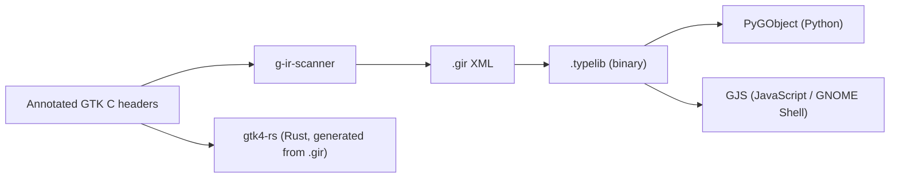
```mermaid
graph LR
    Headers["Annotated GTK C headers"] --> Scanner["g-ir-scanner"]
    Scanner --> Gir[".gir XML"]
    Gir --> Typelib[".typelib (binary)"]
    Typelib --> PyGObject["PyGObject (Python)"]
    Typelib --> GJS["GJS (JavaScript / GNOME Shell)"]
    Headers --> gtkrs["gtk4-rs (Rust, generated from .gir)"]
```

**Python (PyGObject).** Reads typelibs at runtime via `gi.repository`. Property names use Python's `keyword=value` convention in constructors: [Source](https://pygobject.gnome.org/)

```python
import gi
gi.require_version("Gtk", "4.0")
gi.require_version("Adw", "1")
from gi.repository import Gtk, Adw

def on_activate(app):
    win = Adw.ApplicationWindow(application=app)
    win.set_content(Gtk.Label(label="Hello from PyGObject"))
    win.present()

app = Adw.Application(application_id="com.example.Py")
app.connect("activate", on_activate)
app.run(None)
```

**JavaScript (GJS).** Embeds SpiderMonkey; the language GNOME Shell extensions are written in: [Source](https://gjs.guide/)

```javascript
import Gtk from 'gi://Gtk?version=4.0';
import Adw from 'gi://Adw?version=1';

const app = new Adw.Application({ application_id: 'com.example.Gjs' });
app.connect('activate', () => {
    const win = new Adw.ApplicationWindow({ application: app });
    win.set_content(new Gtk.Label({ label: 'Hello from GJS' }));
    win.present();
});
app.run([]);
```

**Rust (gtk4-rs).** Generated from the `.gir` data at the gtk4-rs crate-build time; signals become typed closures and properties become strongly-typed setter/getter methods. Section §12 covers the gtk4-rs ecosystem in depth. [Source](https://gtk-rs.org/)

```rust
use gtk4::prelude::*;
use gtk4::{Application, ApplicationWindow, Label};

fn main() {
    let app = Application::builder()
        .application_id("com.example.Rs")
        .build();
    app.connect_activate(|app| {
        ApplicationWindow::builder()
            .application(app)
            .child(&Label::new(Some("Hello from gtk4-rs")))
            .build()
            .present();
    });
    app.run();
}
```

#### The `.gir` XML Format

A `.gir` file is the machine-readable description of a GLib/GObject-based library's public API. It is installed alongside the library (e.g. `/usr/share/gir-1.0/Gtk-4.0.gir`) and is the source of truth that `g-ir-compiler` converts to the binary `.typelib`. The root element is `<repository>`; inside it, each library is a `<namespace>`. Types, functions, signals, and properties are all described as XML elements with rich metadata attributes. [Source](https://gi.readthedocs.io/en/latest/annotations/gir-format.html)

```xml
<?xml version="1.0"?>
<!-- Simplified excerpt from Gtk-4.0.gir -->
<repository version="1.2"
            xmlns="http://www.gtk.org/introspection/core/1.0"
            xmlns:c="http://www.gtk.org/introspection/c/1.0"
            xmlns:glib="http://www.gtk.org/introspection/glib/1.0">
  <include name="GObject" version="2.0"/>
  <include name="Gdk"     version="4.0"/>

  <namespace name="Gtk" version="4.0"
             c:identifier-prefixes="Gtk"
             c:symbol-prefixes="gtk">

    <class name="Label"
           c:type="GtkLabel"
           abstract="0"
           parent="GObject.InitiallyUnowned"
           glib:type-name="GtkLabel"
           glib:get-type="gtk_label_get_type"
           glib:type-struct="LabelClass">

      <!-- Constructor — annotated nullable parameter -->
      <constructor name="new" c:identifier="gtk_label_new">
        <parameters>
          <parameter name="str" nullable="1" transfer-ownership="none">
            <type name="utf8" c:type="const char*"/>
          </parameter>
        </parameters>
        <return-value transfer-ownership="none">
          <type name="Widget" c:type="GtkWidget*"/>
        </return-value>
      </constructor>

      <!-- Regular method -->
      <method name="set_text" c:identifier="gtk_label_set_text">
        <parameters>
          <instance-parameter name="self" transfer-ownership="none">
            <type name="Label" c:type="GtkLabel*"/>
          </instance-parameter>
          <parameter name="str" transfer-ownership="none">
            <type name="utf8" c:type="const char*"/>
          </parameter>
        </parameters>
        <return-value transfer-ownership="none">
          <type name="none"/>
        </return-value>
      </method>

      <!-- Property -->
      <property name="label" writable="1" transfer-ownership="none">
        <type name="utf8" c:type="const char*"/>
      </property>

      <!-- Signal -->
      <glib:signal name="activate-link">
        <parameters>
          <parameter name="uri" transfer-ownership="none">
            <type name="utf8" c:type="const char*"/>
          </parameter>
        </parameters>
        <return-value transfer-ownership="none">
          <type name="gboolean" c:type="gboolean"/>
        </return-value>
      </glib:signal>

    </class>

    <!-- Standalone function — out-parameter example -->
    <function name="init" c:identifier="gtk_init">
      <return-value transfer-ownership="none">
        <type name="none"/>
      </return-value>
    </function>

    <!-- Enum -->
    <enumeration name="Orientation" c:type="GtkOrientation"
                 glib:type-name="GtkOrientation"
                 glib:get-type="gtk_orientation_get_type">
      <member name="horizontal" value="0" c:identifier="GTK_ORIENTATION_HORIZONTAL"/>
      <member name="vertical"   value="1" c:identifier="GTK_ORIENTATION_VERTICAL"/>
    </enumeration>

  </namespace>
</repository>
```

Key XML elements: `<class>` for GObject subtypes, `<interface>` for GInterfaces, `<record>` for plain C structs (boxed types), `<enumeration>` / `<bitfield>` for enums/flags, `<function>` for module-level functions, `<callback>` for function pointer typedefs, `<constant>` for `#define` constants. Each carries a `c:type` attribute giving the verbatim C type name and a `glib:*` family of attributes linking to the GType registration.

#### GIR Annotation Reference

Annotations appear in gtk-doc comments in GTK source headers and are consumed by `g-ir-scanner`. They control how the binding generator represents each parameter or return value. [Source](https://gi.readthedocs.io/en/latest/annotations/giannotations.html)

```c
/**
 * gtk_label_new:
 * @str: (nullable): the text, or %NULL for an empty label
 *
 * Returns: (transfer none): a new #GtkLabel widget
 */
GtkWidget *gtk_label_new (const gchar *str);

/**
 * g_list_copy_deep:
 * @list: (element-type utf8): list of strings
 * @func: (scope call) (closure user_data): copy function
 * @user_data: (closure): data for @func
 *
 * Returns: (transfer full) (element-type utf8): deep-copied list
 */
GList *g_list_copy_deep (GList *list, GCopyFunc func, gpointer user_data);
```

| Annotation | Meaning |
|---|---|
| `(transfer none)` | Callee borrows the value; caller retains ownership and must free |
| `(transfer full)` | Ownership passes: callee must free a parameter; caller must free a return value |
| `(transfer container)` | Outer container transfers but elements do not (e.g. `GList*` where the list is new but string elements are borrowed) |
| `(nullable)` | This pointer parameter or return value may be `NULL` |
| `(not nullable)` | Explicitly asserts the pointer is never `NULL` (overrides default inference) |
| `(optional)` | An out-parameter may be `NULL` to indicate the caller doesn't want the value |
| `(out)` | Parameter is an output pointer; the binding generates an out-variable or tuple element |
| `(out caller-allocates)` | The caller allocates storage and passes a pointer; callee writes into it |
| `(inout)` | Parameter is both read on entry and written before return |
| `(array)` | Parameter is a C array (length inferred or zero-terminated) |
| `(array length=n)` | C array; companion parameter at index `n` is the element count |
| `(array zero-terminated=1)` | C array terminated by a `NULL` or zero sentinel |
| `(array fixed-size=n)` | C array of exactly `n` elements |
| `(element-type T)` | Collection element type (`GList*`, `GPtrArray*`, `GHashTable*` values) |
| `(element-type K V)` | Key and value types for `GHashTable` |
| `(scope call)` | Callback is only valid for the duration of the function call; binding may use a stack-allocated closure |
| `(scope async)` | Callback is valid until the async operation completes |
| `(scope notified)` | Callback is valid until the companion `GDestroyNotify` fires; binding must keep the closure alive |
| `(closure n)` | Parameter at index `n` is the `user_data` for the callback at another index |
| `(destroy n)` | Parameter at index `n` is the `GDestroyNotify` for the closure |
| `(skip)` | Exclude this symbol entirely from the generated binding |
| `(constructor)` | This method is a constructor even if its name doesn't start with `new` |
| `(type T)` | Override the inferred GI type with type `T` (for opaque pointers or forward-declared types) |
| `(allow-none)` | Deprecated alias for `(nullable)` on parameters; still seen in older GTK headers |

#### Meson Integration for GIR Generation

The Meson GNOME module can generate and install `.gir`/`.typelib` pairs for project libraries:

```meson
# Generate GIR for a library target
gnome = import('gnome')

my_lib_gir = gnome.generate_gir(my_lib,
  sources:             my_lib_sources + my_lib_headers,
  namespace:           'MyApp',
  nsversion:           '1.0',
  identifier_prefix:   'MyApp',
  symbol_prefix:       'my_app',
  includes:            ['GObject-2.0', 'Gtk-4.0'],
  install:             true,
  install_dir_gir:     get_option('datadir') / 'gir-1.0',
  install_dir_typelib: get_option('libdir') / 'girepository-1.0',
)
# my_lib_gir[0] is the .gir target, my_lib_gir[1] is the .typelib target
```

**GskRenderNode type hierarchy.** `GskRenderNode` is registered as a GType but is **not** a `GObject` — it uses its own reference counting via `gsk_render_node_ref()`/`gsk_render_node_unref()`. Every node type has a corresponding `GskRenderNodeType` enum value returned by `gsk_render_node_get_node_type()`. [Source](https://docs.gtk.org/gsk4/class.RenderNode.html)


```mermaid
classDiagram
    direction TB
    class GskRenderNode {
        <<GTypeInstance — NOT GObject>>
        +GskRenderNodeType node_type
        ref()
        unref()
        get_node_type()
        get_bounds()
        serialize()
        write_to_file()
    }
    class GskContainerNode {
        get_n_children()
        get_child()
    }
    class GskColorNode {
        get_color()
    }
    class GskTextureNode {
        get_texture()
    }
    class GskTextureScaleNode {
        get_texture()
        get_filter()
    }
    class GskLinearGradientNode {
        get_start()
        get_end()
        get_n_color_stops()
        get_color_stops()
    }
    class GskRadialGradientNode {
        get_center()
        get_hradius()
        get_vradius()
    }
    class GskTransformNode {
        get_transform()
        get_child()
    }
    class GskOpacityNode {
        get_opacity()
        get_child()
    }
    class GskBlurNode {
        get_radius()
        get_child()
    }
    class GskShadowNode {
        get_n_shadows()
        get_shadow()
        get_child()
    }
    class GskRoundedClipNode {
        get_clip()
        get_child()
    }
    class GskClipNode {
        get_clip()
        get_child()
    }
    class GskTextNode {
        get_font()
        get_glyphs()
        get_color()
        get_offset()
    }
    class GskBorderNode {
        get_outline()
        get_widths()
        get_colors()
    }
    class GskSubsurfaceNode {
        get_child()
        delegates to wl_subsurface or KMS plane
    }
    class GskCairoNode {
        get_draw_context()
        CPU rasterisation fallback
    }
    class GskGLShaderNode {
        get_shader()
        get_n_children()
        get_args()
    }
    class GskMaskNode {
        get_source()
        get_mask()
        get_mask_mode()
    }
    class GskBlendNode {
        get_bottom_child()
        get_top_child()
        get_blend_mode()
    }

    GskContainerNode --|> GskRenderNode
    GskColorNode --|> GskRenderNode
    GskTextureNode --|> GskRenderNode
    GskTextureScaleNode --|> GskRenderNode
    GskLinearGradientNode --|> GskRenderNode
    GskRadialGradientNode --|> GskRenderNode
    GskTransformNode --|> GskRenderNode
    GskOpacityNode --|> GskRenderNode
    GskBlurNode --|> GskRenderNode
    GskShadowNode --|> GskRenderNode
    GskRoundedClipNode --|> GskRenderNode
    GskClipNode --|> GskRenderNode
    GskTextNode --|> GskRenderNode
    GskBorderNode --|> GskRenderNode
    GskSubsurfaceNode --|> GskRenderNode
    GskCairoNode --|> GskRenderNode
    GskGLShaderNode --|> GskRenderNode
    GskMaskNode --|> GskRenderNode
    GskBlendNode --|> GskRenderNode
```

### 9.11 GObject vs QObject vs kernel kobject

See **Ch39i §1** for the full cross-system comparison of GObject, QObject, and `struct kobject` — covering origins, type registration, ownership models, signal/event mechanisms, property systems, and design philosophy tradeoffs.

<!-- Content moved to ch39i-desktop-framework-comparisons.md §1 -->


---

## 10. GLib: The Foundation Library

**GLib** is the C utility library underlying GTK and GObject. It provides the event loop, async task model, data structures, and type-safe value boxing used throughout the GTK stack. [Source](https://docs.gtk.org/glib/)

### 10.0 Primitive Type Aliases (`glib/gtypes.h`)

Before any of the higher-level APIs, GLib defines a complete set of `typedef` aliases for C's primitive types. These appear throughout every GTK header and source file and serve two purposes: **platform neutrality** (the sizes are guaranteed across LP64, LLP64, and ILP32 ABIs) and **semantic documentation** (a `gpointer` in a function signature signals "opaque, GLib-managed" in a way `void *` alone does not). [Source](https://docs.gtk.org/glib/index.html#type-aliases)

| Alias | Underlying C type | Notes |
|---|---|---|
| `gpointer` | `void *` | Generic opaque pointer; used for user-data parameters in every callback |
| `gconstpointer` | `const void *` | Read-only opaque pointer; used where the callee must not free |
| `gboolean` | `gint` (not `_Bool`) | `TRUE`/`FALSE` macros; intentionally `int`-sized for ABI stability across C89 and C99 boundaries |
| `gchar` / `guchar` | `char` / `unsigned char` | Used where GLib owns encoding (almost always UTF-8); `gchar *` implies `g_free()` ownership |
| `gshort` / `gushort` | `short` / `unsigned short` | Rarely used directly; present for completeness |
| `gint` / `guint` | `int` / `unsigned int` | At least 32-bit; the default integer in GLib APIs |
| `glong` / `gulong` | `long` / `unsigned long` | Platform-width (32-bit on ILP32/LLP64, 64-bit on LP64) |
| `gint8` / `guint8` | `signed char` / `unsigned char` | Exactly 8 bits |
| `gint16` / `guint16` | `short` / `unsigned short` | Exactly 16 bits |
| `gint32` / `guint32` | `int` / `unsigned int` | Exactly 32 bits |
| `gint64` / `guint64` | `long long` / `unsigned long long` (or `__int64` on MSVC) | Exactly 64 bits; `G_GINT64_CONSTANT(v)` appends the right suffix |
| `gfloat` | `float` | Single-precision; guaranteed IEEE 754 |
| `gdouble` | `double` | Double-precision; the default floating-point type in GLib/GTK |
| `gsize` | `unsigned long` (LP64) / `unsigned int` (ILP32) | Matches `sizeof` result; used for counts and byte lengths |
| `gssize` | `long` (LP64) / `int` (ILP32) | Signed counterpart to `gsize`; used for error-return lengths |
| `goffset` | `gint64` | File/stream byte offset; always 64-bit regardless of platform |

**`GDestroyNotify`** is the ubiquitous free-callback typedef: `typedef void (*GDestroyNotify)(gpointer data)`. It appears wherever GLib takes ownership of a pointer and needs to know how to release it: `g_object_set_data_full()`, `g_hash_table_new_full()`, `g_source_set_callback()`, `GClosure` invalidation notifiers, and many more. Passing `g_free` as a `GDestroyNotify` is the most common usage; passing `g_object_unref` releases a GObject when the container drops its reference.

**`TRUE` / `FALSE`** are `#define`d as `1` / `0` (not `(gboolean)1`). Code that tests `if (gboolean_var == TRUE)` is incorrect — always use `if (gboolean_var)` or `if (!gboolean_var)`, as any non-zero `gint` is truthy regardless of whether it equals exactly `1`.

**Integer formatting macros.** Because `gint64` and `guint64` may be `long long` or `__int64` depending on the compiler, GLib provides `G_GINT64_FORMAT` and `G_GUINT64_FORMAT` for use with `printf`/`g_strdup_printf`. Similarly `G_GSIZE_FORMAT` and `G_GSSIZE_FORMAT` handle `gsize`/`gssize`. Always use these instead of `%lld` to stay portable.

```c
gint64  ts = g_get_monotonic_time ();   /* microseconds since an arbitrary epoch */
g_print ("timestamp: %" G_GINT64_FORMAT " µs\n", ts);

gsize   n  = g_utf8_strlen (str, -1);
g_print ("length: %" G_GSIZE_FORMAT " code points\n", n);
```

### 10.1 Event Loop: GMainLoop and GMainContext

```c
/* A standalone GLib event loop (GTK creates one automatically) */
GMainContext *ctx  = g_main_context_new ();
GMainLoop    *loop = g_main_loop_new (ctx, FALSE);

/* Attach a one-shot idle source */
GSource *idle = g_idle_source_new ();
g_source_set_callback (idle, run_once_cb, loop, NULL);
g_source_attach (idle, ctx);
g_source_unref (idle);

g_main_loop_run (loop);   /* blocks until g_main_loop_quit() */
```

`GMainContext` holds a set of `GSource` objects (idle, timeout, file-descriptor, child-watch). GTK's `GdkFrameClock` is built on top. Per-thread contexts allow library code to have its own loop without interfering with the application's: `g_main_context_push_thread_default(ctx)` makes `ctx` the default for the calling thread. [Source](https://docs.gtk.org/glib/class.MainLoop.html)

### 10.2 Async Work: GTask

`GTask` models a single asynchronous operation with a clear caller / worker / completer pattern. The worker runs in a thread pool (or a custom thread); the result is delivered on the caller's `GMainContext`:

```c
/* Caller: start the async work */
GTask *task = g_task_new (source_object, cancellable, on_done, user_data);
g_task_set_task_data (task, g_strdup (path), g_free);
g_task_run_in_thread (task, load_file_thread);
g_object_unref (task);

/* Worker: runs in a GLib thread-pool thread */
static void load_file_thread (GTask *t, gpointer src, gpointer data,
                               GCancellable *cancel) {
    char *path = data;
    GError *err = NULL;
    char *contents = NULL;
    gsize len;
    if (!g_file_get_contents (path, &contents, &len, &err))
        g_task_return_error (t, err);
    else
        g_task_return_pointer (t, contents, g_free);
}

/* Completion: called on the GMainContext of the GTask's creator */
static void on_done (GObject *src, GAsyncResult *res, gpointer data) {
    GError *err = NULL;
    char *text = g_task_propagate_pointer (G_TASK (res), &err);
    if (err) { g_warning ("%s", err->message); g_error_free (err); return; }
    use_text (text);
    g_free (text);
}
```

`GCancellable` propagates cancellation across the entire async call chain; check `g_task_return_error_if_cancelled()` in the worker. [Source](https://docs.gtk.org/gio/class.Task.html)

### 10.3 Type-Safe Values: GVariant

`GVariant` is GLib's dynamically-typed, immutable value type, used as the wire format for D-Bus messages and GSettings values. Format strings encode the type:

```c
/* Build a GVariant dict of string→variant */
GVariantBuilder b;
g_variant_builder_init (&b, G_VARIANT_TYPE ("a{sv}"));
g_variant_builder_add  (&b, "{sv}", "name",    g_variant_new_string ("example"));
g_variant_builder_add  (&b, "{sv}", "count",   g_variant_new_uint32 (42));
g_variant_builder_add  (&b, "{sv}", "enabled", g_variant_new_boolean (TRUE));
GVariant *dict = g_variant_builder_end (&b);

/* Access */
const char *name;
guint32 count;
g_variant_lookup (dict, "name",  "&s", &name);   /* borrows the string */
g_variant_lookup (dict, "count", "u",  &count);
g_variant_unref (dict);
```

Common format strings: `s` (string), `u` (uint32), `i` (int32), `b` (boolean), `t` (uint64), `d` (double), `v` (variant), `a{sv}` (dict of string→variant), `(ii)` (tuple). [Source](https://docs.gtk.org/glib/struct.Variant.html)

### 10.4 Process Spawning and Utilities

`GSubprocess` wraps `fork`/`exec` with a clean GLib-async API:

```c
GError *err = NULL;
GSubprocess *proc = g_subprocess_new (
    G_SUBPROCESS_FLAGS_STDOUT_PIPE | G_SUBPROCESS_FLAGS_STDERR_PIPE,
    &err, "ls", "-la", "/tmp", NULL);
g_subprocess_communicate_utf8_async (proc, NULL, NULL, on_ls_done, NULL);
```

Data containers: `GHashTable` (open addressing, configurable hash/equal/free functions), `GList`/`GSList` (doubly/singly linked), `GQueue` (double-ended queue), `GArray`/`GPtrArray`/`GByteArray` (typed growable arrays), `GBytes` (immutable reference-counted byte array), `GString` (mutable string builder). Regex: `GRegex` (PCRE2). Date/time: `GDateTime` (timezone-aware, gregorian), `GDate` (calendar-only). [Source](https://docs.gtk.org/glib/)

### 10.5 Strings, Paths, and Internationalisation

GLib provides string utilities that avoid common C pitfalls around allocation and encoding. [Source](https://docs.gtk.org/glib/)

```c
/* Formatted allocation — always allocates, never truncates */
char *msg = g_strdup_printf ("frame %d / %d (%.1f%%)", cur, total, pct);
g_free (msg);

/* Platform-neutral path construction */
char *path = g_build_filename (g_get_user_data_dir (), "myapp", "cache.db", NULL);
char *base = g_path_get_basename (path);   /* "cache.db" */
char *dir  = g_path_get_dirname  (path);   /* ".../myapp" */
g_free (path); g_free (base); g_free (dir);

/* Prefix / suffix tests (no allocations) */
if (g_str_has_prefix (filename, "tmp_")) { /* ... */ }
if (g_str_has_suffix (filename, ".gresource")) { /* ... */ }

/* Split and rejoin */
char **parts  = g_str_split (csv_line, ",", -1);  /* -1 = unlimited fields */
char  *rejoin = g_strjoinv  ("|", parts);          /* "a|b|c" */
g_strfreev (parts);
g_free (rejoin);

/* Mutable string builder */
GString *sb = g_string_new ("Hello");
g_string_append (sb, ", ");
g_string_append_printf (sb, "world #%d", 42);
char *result = g_string_free (sb, FALSE);  /* hand off the buffer, free the GString shell */
g_free (result);

/* Unicode validation and length (in characters, not bytes) */
if (!g_utf8_validate (user_input, -1, NULL))
    return;
glong n_chars = g_utf8_strlen (user_input, -1);
```

**Internationalisation.** GLib integrates with `gettext`. Mark translatable strings with `_()` and string-literal constants with `N_()` (extracted by `xgettext` but not translated at that point). `g_dngettext()` handles plural forms:

```c
#include <glib/gi18n.h>
/* In main() before first use: */
bindtextdomain ("com.example.myapp", LOCALEDIR);
bind_textdomain_codeset ("com.example.myapp", "UTF-8");
textdomain ("com.example.myapp");

const char *label = _("Open File");                                   /* translated */
const char *fmt   = g_dngettext (NULL, "%d item", "%d items", count);
char       *msg   = g_strdup_printf (fmt, count);
g_free (msg);
```

### 10.6 Logging and Diagnostics

GLib's logging infrastructure replaces raw `fprintf(stderr)`. Log levels have defined severity and — at `G_LOG_LEVEL_ERROR` — fatal behaviour: [Source](https://docs.gtk.org/glib/func.log.html)

```c
/* Set G_LOG_DOMAIN in CFLAGS: -DG_LOG_DOMAIN=\"com.example.myapp\" */
g_message  ("Loaded %s in %d ms", path, elapsed);    /* informational */
g_info     ("Cache hit ratio: %.0f%%", ratio * 100); /* less urgent than message */
g_debug    ("Frame %d: %d nodes", frame, n_nodes);   /* only if G_MESSAGES_DEBUG matches */
g_warning  ("Icon not found: %s", icon_name);        /* non-fatal */
g_critical ("Internal state inconsistent at %s", func); /* non-fatal but alarming */
g_error    ("Cannot open display: %s", err->message);   /* FATAL — calls abort() */
```

`G_MESSAGES_DEBUG=all` (or a space-separated list of log domains) enables `g_debug()` and `g_info()`. **Structured logging** passes key-value pairs consumed by systemd-journald:

```c
g_log_structured (G_LOG_DOMAIN, G_LOG_LEVEL_MESSAGE,
    "CODE_FILE",    __FILE__,
    "CODE_LINE",    G_STRINGIFY (__LINE__),
    "MESSAGE",      "frame rendered in %d ms", elapsed_ms);
```

Custom handlers registered via `g_log_set_handler()` can route to syslog, a JSON sink, or a test-capture buffer.

### 10.7 Command-Line Parsing: GOptionContext

`GOptionContext` provides GNU-compatible argument parsing with automatic `--help` generation and type coercion. [Source](https://docs.gtk.org/glib/struct.OptionContext.html)

```c
static gchar   *output_file = NULL;
static gint     quality     = 90;
static gboolean verbose     = FALSE;

static const GOptionEntry entries[] = {
    /* long,     short, flags, arg-type,               dest,         description,     arg-name */
    { "output",  'o', 0, G_OPTION_ARG_FILENAME, &output_file, "Output file", "FILE" },
    { "quality", 'q', 0, G_OPTION_ARG_INT,      &quality,     "JPEG quality (1-100)", "N" },
    { "verbose", 'v', 0, G_OPTION_ARG_NONE,     &verbose,     "Verbose output", NULL },
    G_OPTION_ENTRY_NULL
};

int main (int argc, char **argv)
{
    GError         *err = NULL;
    GOptionContext *ctx = g_option_context_new ("[INPUT-FILE...]");
    g_option_context_add_main_entries (ctx, entries, NULL /* gettext domain */);
    g_option_context_add_group (ctx, gtk_get_option_group (TRUE));  /* add GTK flags */
    if (!g_option_context_parse (ctx, &argc, &argv, &err)) {
        g_printerr ("option parsing failed: %s\n", err->message);
        return 1;
    }
    g_option_context_free (ctx);
    /* argv[1..argc-1] are remaining positional arguments */
}
```

For GTK4 applications the preferred entry point is `g_application_add_main_option_entries()`, which registers options processed before the `startup` signal — avoiding the need to call `gtk_get_option_group()` manually.

### 10.8 Threading and Synchronisation

GLib provides POSIX-like primitives that integrate with the main loop. [Source](https://docs.gtk.org/glib/struct.Thread.html)

```c
/* Basic mutex and condition variable */
GMutex mtx;   g_mutex_init (&mtx);
GCond  cond;  g_cond_init  (&cond);

g_mutex_lock (&mtx);
while (!data_ready)
    g_cond_wait (&cond, &mtx);   /* atomically releases mutex and blocks */
g_mutex_unlock (&mtx);

/* Elsewhere (producer thread): */
g_mutex_lock (&mtx);
data_ready = TRUE;
g_cond_signal (&cond);
g_mutex_unlock (&mtx);

/* Read-write lock (many readers, one writer) */
GRWLock rw;   g_rw_lock_init (&rw);
g_rw_lock_reader_lock   (&rw);  /* ... read shared data ... */
g_rw_lock_reader_unlock (&rw);
g_rw_lock_writer_lock   (&rw);  /* ... mutate ... */
g_rw_lock_writer_unlock (&rw);

/* Named thread */
GThread *t = g_thread_new ("loader", loader_func, user_data);
gpointer result = g_thread_join (t);  /* blocks; returns loader_func() return value */

/* Thread pool for parallel work items */
GThreadPool *pool = g_thread_pool_new (process_item, NULL,
                                       4 /* max threads */, TRUE /* exclusive */, NULL);
for (int i = 0; i < n_items; i++)
    g_thread_pool_push (pool, items[i], NULL);
g_thread_pool_free (pool, FALSE /* do not cancel pending */, TRUE /* wait */);

/* Lock-free atomic operations */
gint counter = 0;
g_atomic_int_inc (&counter);
gboolean was_one = g_atomic_int_compare_and_exchange (&counter, 1, 0);
```

For GTK4 applications, prefer `GTask` (§10.2) or `gio::spawn_blocking()` in Rust (§12.5) over raw threads: they marshal results back to the GLib main context automatically. When raw threads must call back into GTK, use `g_main_context_invoke(NULL, callback, data)` to schedule the callback on the main thread. The `G_LOCK_DEFINE` / `G_LOCK` / `G_UNLOCK` macros wrap `GMutex` with compile-time-identifier safety for simple global guards.

---

## 11. GIO: Files, Settings, and D-Bus

**GIO** is GLib's I/O and system-services library — file access, settings storage, D-Bus, and network. Everything is async-first with `GCancellable`/`GAsyncResult`. [Source](https://docs.gtk.org/gio/)

### 11.1 GFile: Async File I/O

`GFile` is the central file/URI abstraction. It is a `GInterface`, not a class; the same API backs local files, SFTP, MTP, GVfs virtual filesystems, and GNOME's trash:

```c
GFile *f = g_file_new_for_path ("/home/user/notes.txt");

/* Async load */
g_file_load_contents_async (f, NULL, on_loaded, NULL);

static void on_loaded (GObject *src, GAsyncResult *res, gpointer data) {
    char *text; gsize len;
    g_file_load_contents_finish (G_FILE (src), res, &text, &len, NULL, NULL);
    use (text, len); g_free (text);
}

/* Watch for changes */
GFileMonitor *mon = g_file_monitor_file (f, G_FILE_MONITOR_NONE, NULL, NULL);
g_signal_connect (mon, "changed", G_CALLBACK (on_changed), NULL);
```

`g_file_replace_contents_async()` writes atomically (temp file + rename). [Source](https://docs.gtk.org/gio/iface.File.html)

### 11.2 GSettings: Schema-Based Configuration

`GSettings` provides type-safe, schema-validated application settings backed by `dconf` (the GNOME configuration database):

```c
/* Requires a compiled .gschema.xml installed under $XDG_DATA_DIRS/glib-2.0/schemas/ */
GSettings *s = g_settings_new ("com.example.myapp");

/* Typed read */
gint max_items = g_settings_get_int (s, "max-items");

/* Bind to a GObject property: two-way, auto-sync */
g_settings_bind (s, "show-toolbar",
                 toolbar, "visible",
                 G_SETTINGS_BIND_DEFAULT);

/* Watch for external changes */
g_signal_connect (s, "changed::max-items",
                  G_CALLBACK (on_max_items_changed), NULL);
```

Schema files use `glib-compile-schemas` (run as part of package install) and live under `share/glib-2.0/schemas/`. Relocatable schemas allow per-instance settings (e.g. per-account configs). `gsettings get/set/reset/list-keys` inspects settings from the CLI. [Source](https://docs.gtk.org/gio/class.Settings.html)

### 11.3 GDBusConnection: D-Bus Integration

```c
/* Call a D-Bus method asynchronously */
GDBusConnection *bus = g_bus_get_sync (G_BUS_TYPE_SESSION, NULL, NULL);

g_dbus_connection_call (bus,
    "org.freedesktop.portal.Desktop",         /* bus name */
    "/org/freedesktop/portal/desktop",        /* object path */
    "org.freedesktop.portal.OpenURI",         /* interface */
    "OpenURI",                                /* method */
    g_variant_new ("(ssa{sv})", "", "https://gnome.org/", NULL),
    G_VARIANT_TYPE ("(u)"), G_DBUS_CALL_FLAGS_NONE, -1,
    NULL, on_portal_done, NULL);

/* Export an object */
GDBusNodeInfo *introspection =
    g_dbus_node_info_new_for_xml (my_introspection_xml, NULL);
g_dbus_connection_register_object (bus, "/com/example/obj",
    introspection->interfaces[0], &vtable, self, NULL, NULL);
```

`GDBusProxy` simplifies method calls and signal subscriptions on a known interface, auto-generating wrapper methods from the D-Bus introspection XML. `g_bus_own_name()` / `g_bus_watch_name()` handle service name ownership and watching. [Source](https://docs.gtk.org/gio/class.DBusConnection.html)

### 11.4 GNetworkMonitor and GVfs

`GNetworkMonitor` emits `network-changed` when connectivity changes and provides `g_network_monitor_get_connectivity()` (values: `NONE`, `LOCAL`, `LIMITED`, `FULL`). `GResolver` handles async DNS (`g_resolver_lookup_by_name_async()`).

`GVfs` exposes virtual filesystems through the same `GFile` API: `GMount`/`GVolume`/`GDrive` for removable storage (automount via udisks); `trash:///` for the FreeDesktop trash; `sftp://`, `ftp://`, `smb://` via gvfs daemon backends. `GMountOperation` provides the authentication dialog callbacks. [Source](https://docs.gtk.org/gio/class.Vfs.html)

---

## 12. Language Bindings and Rust Support

The GObject type system (§9) and GObject Introspection generate typelibs consumed by language bindings. The three primary bindings are demonstrated in §9 (Python/PyGObject, JavaScript/GJS, Rust/gtk4-rs). This section covers async patterns for Python and a deep treatment of the gtk4-rs Rust bindings, which are the focus of the plan.md scope. [Source](https://gtk-rs.org/)

### 12.1 PyGObject: Async Patterns

GLib's main loop integrates with Python's `asyncio` via `GLib.idle_add()` or the `gbulb` package that installs a GLib event loop as the `asyncio` runner. The standard GIO-async idiom without external dependencies:

```python
from gi.repository import GLib, Gio

def load_file_async(path, on_done):
    f = Gio.File.new_for_path(path)
    f.load_contents_async(None, lambda src, res: on_done(
        src.load_contents_finish(res)[1].decode()))

load_file_async("/etc/hostname", lambda text: print("hostname:", text.strip()))
GLib.MainLoop().run()
```

### 12.2 The gtk4-rs Crate Ecosystem

The gtk4-rs project publishes safe, idiomatic Rust bindings for the entire GTK4 + GLib stack as a family of crates that mirror the C namespace hierarchy. [Source](https://gtk-rs.org/)

| Crate | Wraps | Key types |
|---|---|---|
| `glib` | GLib + GObject | `MainContext`, `GString`, `Variant`, `Object`, `subclass` |
| `gio` | GIO | `File`, `Settings`, `DBusConnection`, `Task`, `Cancellable` |
| `gdk4` | GDK | `Display`, `Surface`, `Texture`, `RGBA`, `FrameClock` |
| `gsk4` | GSK | `RenderNode` and subtypes (rarely used directly) |
| `gtk4` | GTK widgets | `Widget`, `Application`, `Snapshot`, `Builder`, `ListModel` |
| `libadwaita` | libadwaita | `Application`, `StyleManager`, `Animation`, `BreakpointBin` |

```toml
# Cargo.toml
[dependencies]
gtk4       = { version = "0.9", features = ["v4_16"] }
libadwaita = { version = "0.7", features = ["v1_6"] }
```

The `v4_16` / `v1_6` feature flags gate APIs added in those library versions and enable compile-time rejection of calls to unavailable functions. A minimal hello-world from §9 reproduced for reference:

```rust
use gtk4::prelude::*;
use gtk4::{Application, ApplicationWindow, Label};

fn main() {
    let app = Application::builder()
        .application_id("com.example.Rs")
        .build();
    app.connect_activate(|app| {
        ApplicationWindow::builder()
            .application(app)
            .child(&Label::new(Some("Hello from gtk4-rs")))
            .build()
            .present();
    });
    app.run();
}
```

### 12.3 Object Handles and the clone! Macro

gtk4-rs wraps every GObject in a reference-counted handle (`glib::Object`). Handles are `Clone + Send + Sync` and `Deref` into the concrete widget type; cloning is `g_object_ref()` under the hood — cheap and pointer-sized. The canonical pattern for signal callbacks is to clone handles before moving them into the closure:

```rust
let button = gtk4::Button::with_label("Click me");
let label  = gtk4::Label::new(Some("waiting…"));

let label_clone = label.clone();   // cheap: just bumps the GObject refcount
button.connect_clicked(move |_| {
    label_clone.set_text("clicked!");
});
```

The `glib::clone!` macro eliminates the boilerplate and provides explicit strong/weak capture semantics: [Source](https://gtk-rs.org/gtk4-rs/stable/latest/docs/glib/macro.clone.html)

```rust
use glib::clone;

// #[weak] downgrades to a Weak reference in the closure; auto-upgraded on entry.
// The guard expression `return` runs if the upgrade fails (object was finalized).
button.connect_clicked(clone!(
    #[weak] label,
    #[weak] window,
    move |_| {
        label.set_text("clicked!");
        window.set_title(Some("done"));
    }
));

// #[strong] captures a strong clone (the default before the macro was available).
button.connect_clicked(clone!(
    #[strong] model,
    move |_| model.append(&new_item()),
));
```

Prefer `#[weak]` for long-lived signal handlers (objects that outlive the closure) to avoid reference cycles. `#[strong]` is appropriate for short-lived closures whose captured object must not be finalized mid-call.

### 12.4 Properties and Property Bindings in Rust

The gtk4-rs generator creates strongly-typed accessor methods for every GObject property, plus `connect_*_notify()` helpers. [Source](https://gtk-rs.org/gtk4-rs/stable/latest/docs/gtk4/prelude/trait.WidgetExt.html)

```rust
// Typed property accessors
let visible: bool = widget.is_visible();
widget.set_visible(false);
widget.set_opacity(0.5);

// Listen for property changes
label.connect_label_notify(|lbl| println!("label changed to: {}", lbl.label()));

// GObject property binding: keeps label text synchronised with entry text
let binding = entry
    .bind_property("text", &label, "label")
    .bidirectional()      // changes propagate in both directions
    .sync_create()        // immediately copies source value to target
    .build();
// binding.unbind() to release; also auto-released when either object is finalized.
```

`bind_property()` calls `g_object_bind_property()` and returns a `glib::Binding` handle. Use `transform_to` / `transform_from` closures on the builder for type-converting or filtering bindings.

### 12.5 Async Rust with GLib

GLib's `MainContext` is the native async executor for gtk4-rs. `MainContext::default().spawn_local()` drives a `Future` on the current GLib main loop — there is no separate async runtime; Tokio or async-std are not needed for GTK4 applications. [Source](https://gtk-rs.org/gtk4-rs/stable/latest/docs/glib/struct.MainContext.html)

```rust
use glib::MainContext;

fn load_and_display(file: gio::File, label: gtk4::Label) {
    MainContext::default().spawn_local(async move {
        match file.load_contents_future().await {
            Ok((bytes, _etag)) => {
                let text = String::from_utf8_lossy(&bytes);
                label.set_text(&text[..text.len().min(200)]);
            }
            Err(e) => label.set_text(&format!("Error: {e}")),
        }
    });
}
```

The convention `g_file_load_contents_async()` → `gio::File::load_contents_future()` is uniform: every GIO async function `foo_async()` has a corresponding `foo_future()` method that returns an `impl Future`. Background work that must not block the UI thread:

```rust
// spawn_blocking submits to a thread pool and returns a Future on the main context.
let handle = gio::spawn_blocking(|| {
    std::fs::read_to_string("/etc/os-release")  // blocking I/O — safe on worker thread
});
let contents = handle.await.unwrap();  // awaited on the main context
```

`GCancellable` integrates with async: `cancellable.cancel()` propagates a `Cancelled` error to any in-flight `_future()` call that accepted it.

### 12.6 Custom Widgets and Composite Templates in Rust

**Subclassing a widget.** The `glib::subclass` module enables defining new GObject types in Rust, including GObject properties and signals:

```rust
use gtk4::glib;
use gtk4::subclass::prelude::*;
use std::cell::Cell;

#[derive(Default)]
pub struct MeterWidget {
    fraction: Cell<f64>,
}

#[glib::object_subclass]
impl ObjectSubclass for MeterWidget {
    const NAME: &'static str = "MeterWidget";   // globally unique in the process
    type Type = super::MeterWidget;              // the public handle type
    type ParentType = gtk4::Widget;
}

impl ObjectImpl for MeterWidget {
    fn properties() -> &'static [glib::ParamSpec] {
        static PROPS: std::sync::OnceLock<Vec<glib::ParamSpec>> = std::sync::OnceLock::new();
        PROPS.get_or_init(|| vec![
            glib::ParamSpecDouble::builder("fraction")
                .minimum(0.0).maximum(1.0).default_value(0.0)
                .build(),
        ])
    }
    fn set_property(&self, _id: usize, value: &glib::Value, pspec: &glib::ParamSpec) {
        match pspec.name() {
            "fraction" => {
                self.fraction.set(value.get::<f64>().unwrap());
                self.obj().queue_draw();
            }
            _ => unimplemented!(),
        }
    }
    fn property(&self, _id: usize, pspec: &glib::ParamSpec) -> glib::Value {
        match pspec.name() {
            "fraction" => self.fraction.get().to_value(),
            _          => unimplemented!(),
        }
    }
}

impl WidgetImpl for MeterWidget {
    fn snapshot(&self, snapshot: &gtk4::Snapshot) {
        let w    = self.obj().width()  as f32;
        let h    = self.obj().height() as f32;
        let frac = self.fraction.get() as f32;
        snapshot.append_color(
            &gdk4::RGBA::new(0.2, 0.2, 0.2, 1.0),
            &graphene::Rect::new(0.0, 0.0, w, h));
        snapshot.append_color(
            &gdk4::RGBA::new(0.2, 0.55, 0.95, 1.0),
            &graphene::Rect::new(0.0, 0.0, w * frac, h));
    }
}

// Public GObject handle — the type the rest of the crate uses.
glib::wrapper! {
    pub struct MeterWidget(ObjectSubclass<imp::MeterWidget>) @extends gtk4::Widget;
}
impl MeterWidget {
    pub fn new() -> Self { glib::Object::new() }
    pub fn set_fraction(&self, v: f64) { self.set_property("fraction", v); }
}
```

The `#[glib::object_subclass]` procedural macro generates the `get_type()` registration. `ObjectImpl`/`WidgetImpl` traits correspond to the C class-init vtable overrides.  [Source](https://gtk-rs.org/gtk4-rs/stable/latest/docs/gtk4/index.html)

**Composite templates.** The `CompositeTemplate` derive macro wires `#[template_child]` fields to named ids in a `.ui` file, calling `bind_template()` and `init_template()` at the correct lifecycle points: [Source](https://gtk-rs.org/gtk4-rs/stable/latest/docs/gtk4/subclass/widget/trait.CompositeTemplate.html)

```rust
use gtk4::{glib, CompositeTemplate};
use gtk4::subclass::prelude::*;

#[derive(Default, CompositeTemplate)]
#[template(resource = "/com/example/myapp/window.ui")]
pub struct MyWindow {
    #[template_child]
    pub header_bar:  TemplateChild<libadwaita::HeaderBar>,
    #[template_child]
    pub count_label: TemplateChild<gtk4::Label>,
    #[template_child]
    pub open_button: TemplateChild<gtk4::Button>,
}

#[glib::object_subclass]
impl ObjectSubclass for MyWindow {
    const NAME: &'static str = "MyWindow";
    type Type = super::MyWindow;
    type ParentType = libadwaita::ApplicationWindow;

    fn class_init(klass: &mut Self::Class) {
        klass.bind_template();
        // Optionally bind template callbacks declared in the .ui file
        klass.bind_template_callbacks();
    }
    fn instance_init(obj: &glib::subclass::InitializingObject<Self>) {
        obj.init_template();
    }
}
impl ObjectImpl   for MyWindow { fn constructed(&self) { self.parent_constructed(); } }
impl WidgetImpl   for MyWindow {}
impl WindowImpl   for MyWindow {}
impl ApplicationWindowImpl for MyWindow {}
impl AdwApplicationWindowImpl for MyWindow {}
```

The `TemplateChild<T>` field is a smart pointer that panics if accessed before `init_template()` — which fires during `g_object_new()`, so by the time `ObjectImpl::constructed()` runs it is safe to access all children.

### 12.7 relm4: The Elm Architecture for GTK4

**relm4** is an independently maintained crate that layers an Elm/Redux message-passing architecture over gtk4-rs: a component declares its state model, an `update()` function handling typed messages, and a `view!` macro that generates widget construction + property wiring. [Source](https://relm4.org/)

```rust
use relm4::prelude::*;

struct App { counter: u8 }

#[derive(Debug)]
enum Msg { Increment, Decrement }

#[relm4::component]
impl SimpleComponent for App {
    type Init   = u8;
    type Input  = Msg;
    type Output = ();

    view! {
        gtk4::Window {
            set_title: Some("relm4 counter"),
            set_default_size: (300, 100),

            gtk4::Box {
                set_orientation: gtk4::Orientation::Vertical,
                set_spacing: 8,
                set_margin_all: 16,

                gtk4::Label {
                    #[watch] set_label: &format!("Counter: {}", model.counter),
                },
                gtk4::Button::with_label("+") {
                    connect_clicked => Msg::Increment,
                },
                gtk4::Button::with_label("−") {
                    connect_clicked => Msg::Decrement,
                },
            }
        }
    }

    fn init(init: u8, root: Self::Root, sender: ComponentSender<Self>) -> ComponentParts<Self> {
        let model   = App { counter: init };
        let widgets = view_output!();
        ComponentParts { model, widgets }
    }

    fn update(&mut self, msg: Msg, _sender: ComponentSender<Self>) {
        match msg {
            Msg::Increment => self.counter = self.counter.saturating_add(1),
            Msg::Decrement => self.counter = self.counter.saturating_sub(1),
        }
    }
}

fn main() {
    let app = RelmApp::new("com.example.relm4");
    app.run::<App>(0);
}
```

The `#[watch]` annotation re-evaluates the expression each time `update()` returns and calls `queue_draw()`; property setters that are not `#[watch]`-annotated run only during `init`. relm4 `Worker` components run `update()` on a background thread — suitable for compute-heavy logic — while `AsyncComponent` uses an async update loop driven by `glib::MainContext`. The macro expands to gtk4-rs calls, so relm4 is a zero-overhead ergonomic layer, not a separate rendering path.

---

## 13. GTK4 Application Programming Guide

This section covers the project-level infrastructure a production GTK4 application needs: the Meson build system, GResource asset bundling, the Blueprint UI language, GSettings schemas, and Flatpak packaging.

### 13.1 Project Structure and Meson Build

GTK4 projects use **Meson** as the canonical build system. The GNOME Meson module (`import('gnome')`) provides helpers for GResource compilation, GSettings schema compilation, GIR generation, and Blueprint transpilation. A minimal layout: [Source](https://mesonbuild.com/GNOME-module.html)

```
my-app/
├── meson.build
├── data/
│   ├── com.example.MyApp.gschema.xml
│   └── resources/
│       ├── my-app.gresource.xml
│       ├── window.blp          (Blueprint source)
│       └── style.css
├── po/                         (translation files)
└── src/
    ├── main.c
    ├── my-window.c
    └── my-window.h
```

```meson
# meson.build
project('my-app', 'c',
  version: '1.0.0',
  default_options: ['c_std=c17', 'warning_level=2'])

gnome  = import('gnome')
cc     = meson.get_compiler('c')

gtk4_dep = dependency('gtk4',        version: '>= 4.14')
adw_dep  = dependency('libadwaita-1', version: '>= 1.5')

# Compile GResource bundle (embeds assets into a C translation unit)
resources = gnome.compile_resources(
  'my-app-resources',
  'data/resources/my-app.gresource.xml',
  source_dir: 'data/resources',
  c_name: 'my_app',
)

# Compile GSettings schemas for development (installed separately via install_data)
gnome.compile_schemas(
  depend_files: 'data/com.example.MyApp.gschema.xml')

executable('my-app',
  sources: ['src/main.c', 'src/my-window.c', resources],
  dependencies: [gtk4_dep, adw_dep],
  install: true,
)

install_data('data/com.example.MyApp.gschema.xml',
  install_dir: get_option('datadir') / 'glib-2.0' / 'schemas')
```

Building:

```bash
meson setup _build --prefix=/usr
ninja -C _build
GSETTINGS_SCHEMA_DIR=_build/data ninja -C _build run   # dev run with local schemas
```

**Rust projects** use `cargo` directly or the `meson-cargo` integration. The most common pattern is a `build.rs` script that calls `blueprint-compiler` and `glib-compile-resources`; alternatively, the GNOME Meson module can wrap a Cargo build target.

### 13.2 GResource: Bundling Assets

GResource embeds application assets (UI files, CSS, icons, shader sources) into the binary as a read-only section, eliminating runtime file-system dependency and making the application relocatable. [Source](https://docs.gtk.org/gio/struct.Resource.html)

```xml
<!-- data/resources/my-app.gresource.xml -->
<?xml version="1.0" encoding="UTF-8"?>
<gresources>
  <gresource prefix="/com/example/MyApp">
    <file preprocess="xml-stripblanks">window.ui</file>  <!-- strip whitespace from XML -->
    <file compressed="true">style.css</file>             <!-- zlib-compress at build time -->
    <file>icons/app-icon.svg</file>
  </gresource>
</gresources>
```

`glib-compile-resources` (invoked by `gnome.compile_resources()`) processes the XML and produces a C source file containing a `g_resources_register()` call at library-init time. At runtime, resources are accessed via the `resource://` URI scheme or the API directly:

```c
/* Load a resource as bytes */
GBytes *css_bytes = g_resources_lookup_data (
    "/com/example/MyApp/style.css", G_RESOURCE_LOOKUP_FLAGS_NONE, NULL);

/* Install bundled CSS */
GtkCssProvider *prov = gtk_css_provider_new ();
gtk_css_provider_load_from_resource (prov, "/com/example/MyApp/style.css");
gtk_style_context_add_provider_for_display (
    gdk_display_get_default (), GTK_STYLE_PROVIDER (prov),
    GTK_STYLE_PROVIDER_PRIORITY_APPLICATION);

/* GtkBuilder loads .ui from a resource URI */
GtkBuilder *builder = gtk_builder_new_from_resource ("/com/example/MyApp/window.ui");
```

In Rust, `gio::resources_register_include!("my-app-resources.gresource")` (generated by `build.rs`) embeds the compiled resource bundle as a `&'static [u8]` and registers it at startup.

### 13.3 Blueprint: Ergonomic UI Description

**Blueprint** (`.blp`) is a modern, concise alternative to the raw XML `.ui` format. The Blueprint compiler (`blueprint-compiler`) transpiles `.blp` to `.ui` at build time; the output is identical to hand-written XML and is consumed by `GtkBuilder` unchanged. Blueprint has a typed schema of GTK's property/signal system, so typos in property names or mismatched signal signatures are caught at compile time — not at runtime. [Source](https://jwestman.pages.gitlab.gnome.org/blueprint-compiler/)

```blp
// window.blp
using Gtk 4.0;
using Adw 1;

template $MyWindow : Adw.ApplicationWindow {
  title: _("My App");
  default-width: 800;
  default-height: 600;

  Adw.ToolbarView {
    [top]
    Adw.HeaderBar {
      [end]
      Button open_button {
        label: _("Open…");
        styles ["suggested-action"]
      }
    }

    content: Adw.StatusPage {
      title: _("Welcome");
      description: _("Open a file to get started.");
      icon-name: "document-open-symbolic";
    };
  }
}
```

Integrate Blueprint in the Meson build:

```meson
blueprint_compiler = find_program('blueprint-compiler')

blueprints = custom_target('blueprints',
  input:   files('data/resources/window.blp'),
  output:  'window.ui',
  command: [blueprint_compiler, 'compile', '--output', '@OUTPUT@', '@INPUT@'],
)

# Pass blueprints as a dependency of compile_resources so Meson orders them correctly.
resources = gnome.compile_resources(
  'my-app-resources',
  'data/resources/my-app.gresource.xml',
  source_dir:   'data/resources',
  dependencies: blueprints,
)
```

Blueprint supports `styles`, `bind` expressions (one-way property binding in the UI file), `Gtk.Expression`-based bindings, signal connections, child type annotations (`[top]`, `[end]`, `[overlay]`), and translation markup (`_("…")`). The GNOME Builder IDE provides Blueprint syntax highlighting and completion.

#### Signal Connections

Signal handlers are declared with `=>` and refer to template methods using the `$` prefix, or to named object methods. The binding is validated at compile time against the signal's parameter types.

```blp
using Gtk 4.0;
using Adw 1;

template $MyWindow : Adw.ApplicationWindow {
  Button open_button {
    label: _("Open…");
    // $on_open_clicked = method on the MyWindow template class
    clicked => $on_open_clicked();
  }

  SearchEntry search_entry {
    // search-changed passes the SearchEntry as first arg — Blueprint checks this
    search-changed => $on_search_changed();
    // stop-search takes no extra args
    stop-search    => $on_search_stopped();
  }

  // GtkDropTarget signal: drop passes (GValue, x, y) — return gboolean
  DropTarget drop_target {
    actions: copy;
    gtypes [typeof<Gio.File>];
    drop => $on_drop();
  }
}
```

In the template's C implementation, the handler signatures must exactly match the signal:

```c
/* Connected to SearchEntry::search-changed — (GtkSearchEntry*) */
static void
my_window_on_search_changed (MyWindow *self, GtkSearchEntry *entry)
{
    const char *text = gtk_editable_get_text (GTK_EDITABLE (entry));
    /* … filter model … */
}
```

#### `bind` Expressions

`bind` introduces a **one-way `GtkExpression` binding** — the target property updates whenever the source expression value changes. The source chain walks GObject property names separated by `.`; `self` refers to the template object. [Source](https://jwestman.pages.gitlab.gnome.org/blueprint-compiler/reference/expressions.html)

```blp
using Gtk 4.0;

template $StatusRow : Gtk.ListBoxRow {
  // Simple property chain: label mirrors the entry's current text
  Gtk.Label mirror {
    label: bind name_entry.text;
  }

  // Bind from template self
  Gtk.Label title_label {
    label: bind template.title;
  }

  // Bind with a closure expression calling a C function
  Gtk.Label word_count {
    label: bind template.document transform-to $format_word_count();
    //         ┗━━ source ━━━━━━━━━━━━━━ transform-to ━━━━━━━━━━━━━┛
    // format_word_count(GBinding*, GValue* from, GValue* to, gpointer)
  }

  // Bidirectional binding requires g_object_bind_property in C;
  // Blueprint's bind is always one-way (source → target).
}
```

The bound property updates on every `notify::` of the source property. Cycles are not detected; avoid binding A → B → A.

#### Menu Models

Blueprint can define `GMenuModel` trees inline. The result is a `GtkBuilder`-managed `GMenu` that can be attached to a `GtkMenuButton`, `GtkPopoverMenu`, or `AdwApplicationWindow`. [Source](https://jwestman.pages.gitlab.gnome.org/blueprint-compiler/reference/menus.html)

```blp
using Gtk 4.0;
using Adw 1;

menu primary_menu {
  section {
    item {
      label:  _("New Window");
      action: "app.new-window";
    }
  }
  section {
    item {
      label:  _("Preferences");
      action: "app.preferences";
    }
    item {
      label:  _("Keyboard Shortcuts");
      action: "win.show-help-overlay";
    }
    item {
      label:  _("About My App");
      action: "app.about";
    }
  }
}

template $MyWindow : Adw.ApplicationWindow {
  Adw.HeaderBar {
    [end]
    Gtk.MenuButton {
      icon-name:  "open-menu-symbolic";
      menu-model: primary_menu;
      primary:    true;
    }
  }
}
```

Submenus are `submenu { label: "…"; … }` blocks. `item` elements also accept `icon` for a named icon.

#### String Lists and Combo Rows

`StringList` is a `GListModel` of strings; it is the lightest way to populate a `GtkDropDown` or `AdwComboRow` when the options are static.

```blp
using Gtk 4.0;
using Adw 1;

template $PrefsPage : Adw.PreferencesPage {
  Adw.PreferencesGroup {
    title: _("Appearance");

    // GtkDropDown with a static StringList model
    Adw.ActionRow {
      title: _("Theme");
      [suffix]
      Gtk.DropDown theme_drop {
        valign: center;
        model: Gtk.StringList {
          strings [_("System"), _("Light"), _("Dark")]
        };
      }
    }

    // AdwComboRow — higher-level, includes a built-in list model
    Adw.ComboRow font_size_row {
      title: _("Font Size");
      model: Gtk.StringList {
        strings ["Small", "Medium", "Large", "Huge"]
      };
    }
  }
}
```

#### `AdwAlertDialog` Responses

`Adw.AlertDialog` (Adwaita 1.5+) declares its button set with a `responses` block. Each response has an id (an identifier, not a string), a label, and optional modifiers `destructive` or `suggested`. [Source](https://gnome.pages.gitlab.gnome.org/libadwaita/doc/main/class.AlertDialog.html)

```blp
using Adw 1;

Adw.AlertDialog discard_dialog {
  heading: _("Discard Changes?");
  body:    _("All unsaved changes will be permanently lost.");

  responses [
    cancel:  _("Cancel"),
    discard: _("Discard") destructive,
  ]

  default-response: "cancel";
  close-response:   "cancel";
}
```

Connect to `response` in the template:

```blp
  discard_dialog {
    response => $on_discard_response();
  }
```

The `response` signal delivers the response id as a `const char *`; your handler switches on it:

```c
static void
my_window_on_discard_response (MyWindow *self, const char *response,
                               AdwAlertDialog *dialog)
{
    if (g_str_equal (response, "discard"))
        my_window_do_discard (self);
}
```

#### Accessibility Annotations

Blueprint can attach `GtkAccessible` role and relation metadata directly in the UI description, replacing `gtk_accessible_update_property()` calls for static attributes.

```blp
using Gtk 4.0;

template $SearchBar : Gtk.Box {
  Gtk.SearchEntry search_entry {
    placeholder-text: _("Search…");
    accessibility {
      label:       _("Search files");
      // Override the default button role inferred from the widget type:
      // role: search-box;
    }
  }

  Gtk.Button clear_button {
    icon-name: "edit-clear-symbolic";
    accessibility {
      label:        _("Clear search");
      // labelled-by: [search_entry];
    }
  }
}
```

#### Translation Markup

Blueprint offers three translation variants for string properties:

```blp
// Standard gettext — wraps in _()
label: _("Open File");

// Gettext with disambiguation context — wraps in C_()
label: C_("verb", "File");

// Numeric plural forms — wraps in ngettext()
label: ngettext("One item", "{} items", n_items);

// No translation (default when no wrapper is used)
label: "internal-only-string";
```

#### Blueprint File Structure Reference

A complete `.blp` file follows this layout:

```blp
// 1. Namespace declarations (required; sets the GtkBuilder version constraints)
using Gtk 4.0;
using Adw 1;

// 2. Top-level menu definitions (optional; can be referenced by id)
menu app_menu { … }

// 3. Template declaration (the root widget class this file defines)
template $MyWindow : Adw.ApplicationWindow {
  // 4. Properties
  title: _("My Application");
  default-width:  900;
  default-height: 600;

  // 5. Child widgets — anonymous or with an id
  Adw.ToolbarView {
    // 6. Child type annotations for positional slots
    [top]
    Adw.HeaderBar header_bar {
      [end]
      Gtk.MenuButton {
        menu-model: app_menu;
        icon-name: "open-menu-symbolic";
      }
    }

    // 7. Named content slot
    content: Gtk.ScrolledWindow {
      Gtk.ListView list_view { … }
    };
  }
}
```

Widgets without an id are anonymous and inaccessible from C via `gtk_widget_get_template_child()`; give a widget an id only when the implementation code needs to reach it directly.

### 13.4 GSettings Schema

GSettings provides type-safe, validated, schema-backed application configuration stored in `dconf`. The schema file is installed to `$datadir/glib-2.0/schemas/` and compiled with `glib-compile-schemas`. [Source](https://docs.gtk.org/gio/class.Settings.html)

```xml
<!-- com.example.MyApp.gschema.xml -->
<?xml version="1.0" encoding="UTF-8"?>
<schemalist>
  <schema id="com.example.MyApp" path="/com/example/my-app/">
    <key name="window-width"  type="i">
      <default>800</default>
      <summary>Window width</summary>
    </key>
    <key name="window-height" type="i">
      <default>600</default>
    </key>
    <key name="show-toolbar"  type="b">
      <default>true</default>
    </key>
    <key name="sort-order" enum="com.example.MyApp.SortOrder">
      <default>'name'</default>
    </key>
  </schema>
  <enum id="com.example.MyApp.SortOrder">
    <value nick="name" value="0"/>
    <value nick="date" value="1"/>
  </enum>
</schemalist>
```

Use the schema from C:

```c
GSettings *s = g_settings_new ("com.example.MyApp");

/* Typed read/write */
int width = g_settings_get_int (s, "window-width");
g_settings_set_int (s, "window-width", gtk_widget_get_width (GTK_WIDGET (window)));

/* Two-way binding to a widget property */
g_settings_bind (s, "show-toolbar",
                 toolbar, "visible",
                 G_SETTINGS_BIND_DEFAULT);

/* React to external changes (e.g. gsettings set … from another process) */
g_signal_connect (s, "changed::sort-order",
                  G_CALLBACK (on_sort_changed), self);
```

During development, `GSETTINGS_SCHEMA_DIR=_build/data` makes the uninstalled schema visible. `gsettings get com.example.MyApp window-width` inspects values from the CLI; `dconf watch /com/example/my-app/` streams live changes.

### 13.5 Flatpak Packaging

Most GNOME applications are distributed as **Flatpaks** using the `org.gnome.Platform` runtime, which bundles GTK4, libadwaita, GLib, WebKitGTK, and the GNOME stack. [Source](https://docs.flatpak.org/en/latest/)

```yaml
# com.example.MyApp.yml
app-id: com.example.MyApp
runtime: org.gnome.Platform
runtime-version: '48'
sdk: org.gnome.Sdk
command: my-app

finish-args:
  - --share=ipc
  - --socket=wayland          # Wayland socket access
  - --socket=fallback-x11     # XWayland fallback for non-Wayland desktops
  - --device=dri              # /dev/dri/* for GPU rendering
  - --filesystem=home         # user home directory access

modules:
  - name: my-app
    buildsystem: meson
    config-opts:
      - -Dbuildtype=release
    sources:
      - type: dir
        path: .
```

`--device=dri` grants `openat("/dev/dri/renderD128")` through the Flatpak portal, required for `GskVulkanRenderer` and `GskNglRenderer`. The Flatpak sandbox intercepts the system call and forwards it. `--filesystem=home` can be narrowed to `--filesystem=xdg-documents` or `--filesystem=xdg-download` for least-privilege access; the `org.freedesktop.portal.FileChooser` portal (Ch111) provides sandboxed file picker access without `--filesystem`.

Build and test a Flatpak locally:

```bash
flatpak-builder --user --install --force-clean _flatpak-build com.example.MyApp.yml
flatpak run com.example.MyApp
```

**Rust applications** replace the Meson module with a Cargo module in the Flatpak manifest, using `buildsystem: simple` and a `build-commands` section that runs `cargo build --release` with the Flatpak SDK's Rust toolchain or a pre-downloaded cargo sources extension.

---

## 14. WebKitGTK: Embedding Web Content

**WebKitGTK** is the GTK port of the WebKit engine — the primary way to embed live HTML/CSS/JavaScript in a native GTK application. Its consumers include GNOME Web (Epiphany), Geary, Evolution, and Tauri's Linux backend (Ch193). From GTK4's perspective the `WebKitWebView` is an ordinary `GtkWidget`; behind it sits a full multi-process browser with its own GPU compositor.

**API versions.** Two series coexist: `webkit2gtk-4.1` (GTK3, libsoup3, namespace `WebKit2`) and `webkitgtk-6.0` (GTK4, libsoup3, namespace `WebKit`). The `4.x`/`6.0` numbers are WebKit API sonames, not GTK versions; GTK4 applications use `webkitgtk-6.0`. Both can be installed side by side.

**Multi-process architecture.** A `WebKitWebView` spawns a **Web Content Process** (WebCore layout + JavaScriptCore JIT + WebKit's threaded compositor) and shares a **Network Process** (libsoup3, DNS, TLS, cache). The three communicate over WebKit's own IPC sockets, independent of Wayland and the GTK main loop.

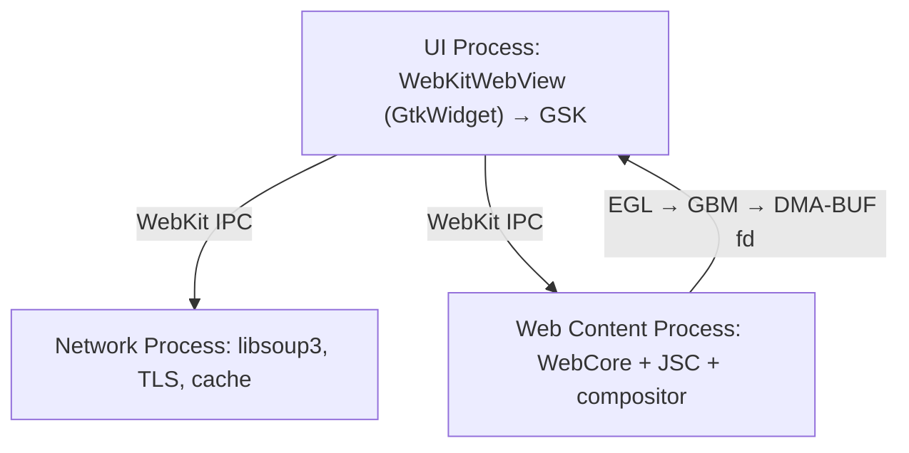
```mermaid
graph TD
    UI["UI Process: WebKitWebView (GtkWidget) → GSK"]
    Net["Network Process: libsoup3, TLS, cache"]
    Web["Web Content Process: WebCore + JSC + compositor"]
    UI -->|WebKit IPC| Net
    UI -->|WebKit IPC| Web
    Web -->|EGL → GBM → DMA-BUF fd| UI
```

**GPU rendering.** The Web Content Process renders web content into an offscreen GBM-backed surface using **OpenGL ES via Mesa** (not ANGLE, not Vulkan by default), then exports the result as a DMA-BUF fd through `gbm_bo_get_fd()`. The UI process imports that fd — via `GdkDmabufTextureBuilder` (§6.4) — as a `GdkTexture` and presents it either as a `GskTextureNode` or, when explicit sync is available, a `GskSubsurfaceNode` for zero-copy overlay scanout.

```c
#include <webkit/webkit.h>

WebKitWebView *view = WEBKIT_WEB_VIEW (webkit_web_view_new ());
WebKitSettings *settings = webkit_web_view_get_settings (view);
webkit_settings_set_hardware_acceleration_policy (settings,
    WEBKIT_HARDWARE_ACCELERATION_POLICY_ALWAYS);
gtk_box_append (GTK_BOX (box), GTK_WIDGET (view));   /* it is a GtkWidget */
webkit_web_view_load_uri (view, "https://gnome.org/");
```

**Security.** With `webkit_web_context_set_sandbox_enabled(ctx, TRUE)`, the Web Content Process is confined by **bubblewrap** namespaces and a **seccomp-BPF** syscall allowlist, with only the DRM render node (`/dev/dri/renderD128`) exposed. Unlike Chromium there is no separate GPU-process boundary — the content process holds the EGL context directly — so the sandbox is somewhat weaker, but it blocks the common kernel-escape syscalls. GNOME Web enables it by default; embedders of untrusted content should too.

**Detailed C API.** Beyond the basic `webkit_web_view_new()` + `webkit_web_view_load_uri()` pattern, the key APIs for application integration are:

```c
/* Cookie and private browsing management */
WebKitCookieManager *cookies =
    webkit_web_context_get_cookie_manager(ctx);
webkit_cookie_manager_set_persistent_storage(cookies,
    "/home/user/.local/share/myapp/cookies.db",
    WEBKIT_COOKIE_PERSISTENT_STORAGE_SQLITE);

/* Ephemeral (private) context — no on-disk storage */
WebKitWebContext *private_ctx = webkit_web_context_new_ephemeral();
WebKitWebView *private_view = WEBKIT_WEB_VIEW(
    webkit_web_view_new_with_context(private_ctx));

/* JavaScript injection and message passing */
WebKitUserContentManager *mgr =
    webkit_web_view_get_user_content_manager(view);
webkit_user_content_manager_register_script_message_handler(mgr, "myapp", NULL);
g_signal_connect(mgr, "script-message-received::myapp",
    G_CALLBACK(on_message_received), NULL);

WebKitUserScript *script = webkit_user_script_new(
    "window.myAppVersion = '1.0';",
    WEBKIT_USER_CONTENT_INJECT_ALL_FRAMES,
    WEBKIT_USER_SCRIPT_INJECT_AT_DOCUMENT_START,
    NULL, NULL);
webkit_user_content_manager_add_script(mgr, script);
webkit_user_script_unref(script);

/* Custom URI scheme handler — serve app assets without a network server */
webkit_web_context_register_uri_scheme(ctx, "app",
    uri_scheme_request_cb, NULL, NULL);
```

**GNOME Web (Epiphany) as a reference consumer.** GNOME Web (`epiphany-browser`) illustrates patterns for GTK4+WebKit applications: each tab owns a separate `WebKitWebView` instance sharing a common `WebKitWebContext` (shared cookies/localStorage/cache; independent Web Content Processes). Web extensions loaded into the content process via `webkit_web_context_set_web_process_extensions_directory()` can intercept DOM events and communicate back to the UI process via GDBus. GNOME Web 45 (2023) completed the migration from `webkit2gtk-4.1` (GTK3) to `webkitgtk-6.0` (GTK4), gaining the `GskSubsurfaceNode` zero-copy presentation path and improved fractional scaling support.

**WPE: WebKitGTK without GTK.** **WPE WebKit** (`wpe-webkit`) removes the GTK dependency entirely, rendering directly to a GBM surface or DMA-BUF buffer and submitting it to the display system without a GTK compositor layer:

```
WPE architecture on embedded Linux:
  WebCore + JSC + WPE compositor
    │  GL ES → GBM buffer → DMA-BUF
    ▼
  wpe-backend-fdo (Wayland) or wpe-backend-drm (direct KMS)
    │
  Wayland compositor or DRM atomic commit
    │
  Display
```

WPE targets automotive HMI, smart TV/STB UIs, kiosk displays, and embedded IoT — contexts where there is no desktop compositor and the WebKit surface is scanned out directly via KMS. Unlike WebKitGTK there is no GTK rendering pipeline, no GSK compositor, and no `GdkWaylandSurface`. The Tauri project tracks a WPE backend for Wry as a long-term goal for embedded Linux targets.

---

## 15. Font and Text Rendering

GTK4 routes all text through **Pango**, which layers over the shared FreeType/HarfBuzz/Fontconfig stack covered in depth in Ch105. The pipeline for a paragraph:

1. `pango_itemize()` splits the text into `PangoItem` runs, one per font/script/direction combination.
2. `pango_shape_full()` calls **HarfBuzz** to shape each run into a `PangoGlyphString` (glyph ids + positions), applying OpenType features, ligatures, mark positioning, and bidirectional ordering.
3. A `PangoLayout` assembles the runs into wrapped, bidi-reordered lines.
4. GTK appends the layout to the snapshot with `gtk_snapshot_append_layout()`, producing a `GskTextNode`.

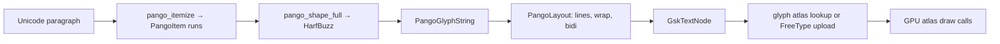
```mermaid
graph LR
    A["Unicode paragraph"] --> B["pango_itemize → PangoItem runs"]
    B --> C["pango_shape_full → HarfBuzz"]
    C --> D["PangoGlyphString"]
    D --> E["PangoLayout: lines, wrap, bidi"]
    E --> F["GskTextNode"]
    F --> G["glyph atlas lookup or FreeType upload"]
    G --> H["GPU atlas draw calls"]
```

**Glyph atlas.** When the unified renderer meets a `GskTextNode`, it resolves each glyph against a GPU glyph cache (`GskGpuCachedGlyph` in the shared `GskGpuCache`). On a miss, Pango/FreeType rasterises the glyph at the requested size and subpixel offset and uploads it as an atlas tile; the cache handles eviction and compaction. This is a per-size bitmap cache, distinct from Qt Quick's signed-distance-field approach. [Source](https://blog.gtk.org/2024/01/28/new-renderers-for-gtk/)

**Subpixel rendering.** LCD subpixel anti-aliasing composes incorrectly onto unknown/transparent backgrounds, so GTK4 uses greyscale anti-aliasing (`FT_RENDER_MODE_NORMAL`) for composited text under Wayland, where every window is alpha-composited. Fontconfig's `rgba`/`lcdfilter` settings only affect the X11 path with a background-aware compositor.

**Colour emoji.** COLR/CBDT/sbix colour fonts are rasterised to RGBA — HarfBuzz's `hb_paint_*` callback API (7.0+) traverses COLRv1 layers (gradients, per-layer transforms) — and the resulting bitmaps are placed in the atlas or submitted as per-glyph textures.

---

## 16. Performance and Debugging

GTK4's render pipeline is unusually observable, because the node tree is a first-class serialisable object and every stage is gated behind a debug flag.

**GSK_DEBUG.** Controls renderer diagnostics. Useful values: `renderer` (which renderer was chosen and why), `shaders` (shader compilation), `fallback` (where GSK fell back to Cairo — a red flag for performance), `cache` (glyph/texture cache activity), `diff` (computed damage regions), `opacity`, and `geometry`. [Source](https://docs.gtk.org/gtk4/running.html)

```bash
GSK_DEBUG=renderer,fallback myapp     # confirm the GPU renderer and catch Cairo fallbacks
GSK_DEBUG=cache,diff        myapp     # observe atlas churn and per-frame damage
```

**GDK_DEBUG.** Controls windowing/backend diagnostics: `opengl`, `vulkan`, `dmabuf` (import/format negotiation), `frames` (frame-clock timing), `events`, `eventloop`. `GDK_DEBUG=force-offload` / `no-offload` toggle the subsurface overlay path (§4.6). [Source](https://docs.gtk.org/gtk4/running.html)

```bash
GDK_DEBUG=dmabuf,vulkan myapp         # trace dmabuf import and Vulkan surface setup
```

**GTK Inspector.** GTK's interactive debugger opens with **Ctrl+Shift+D** (or **Ctrl+Shift+I**), or by launching with `GTK_DEBUG=interactive`. [Source](https://docs.gtk.org/gtk4/running.html) It exposes the live widget tree, per-widget CSS, the current node tree in a **Recorder** tab (which can save frames as `.node` files), a "Show Graphic Updates" toggle that flashes repainted regions, and live theme/CSS editing. The Recorder is the fastest way to see exactly which render nodes a widget produces.

**gtk4-rendernode-tool.** The CLI companion for saved `.node` files: `info` reports node count and tree depth, `show` renders the tree in a window, and it can convert nodes to PNG or SVG. Paired with `gsk_render_node_write_to_file()` from a debugger (§2.4), it turns a live frame into an inspectable artefact. [Source](https://docs.gtk.org/gtk4/gtk4-rendernode-tool.html) A separate demo application, `gtk4-node-editor` (shipped with GTK's demos), provides an interactive editor for `.node` text with a live preview — handy for isolating a rendering bug to a minimal node tree.

**Typical workflow.** To diagnose a stutter: run with `GSK_DEBUG=fallback` to confirm no Cairo fallback; check `GDK_DEBUG=frames` for frame-clock jitter; open the Inspector Recorder to inspect the node tree of the janky widget; if a specific effect is slow, save the node with the Recorder and reduce it in `gtk4-node-editor` until the expensive node (often an oversized `GskBlurNode` or an unpromoted texture) is isolated.

---

## 17. Roadmap and Release Cadence

GTK 4 releases in lock-step with GNOME: a stable even-minor release ships with each GNOME cycle in March and September. GTK 4.22 shipped with GNOME 50 (March 2026); GTK 4.24 is the current development target for GNOME 51 (September 2026). GLib follows the same cadence (GLib 2.88 paired with GNOME 50).

| GTK Version | GNOME | Date | Highlights |
|-------------|-------|------|------------|
| 4.16 | 47 | Sep 2024 | `GskGpuRenderer` default — Vulkan on Wayland, `ngl` on X11/other |
| 4.18 | 48 | Mar 2025 | AccessKit a11y backend (Windows/macOS); AT-SPI2 remains default on Linux |
| 4.20 | 49 | Sep 2025 | GSK renderer refactoring; libadwaita 1.8 (`AdwShortcutsDialog`) |
| 4.22 | 50 | Mar 2026 | GSK profiling; stateful animated symbolic icons; libadwaita 1.9 (`AdwSidebar`) |
| **4.24** | **51** | **Sep 2026** | SVG filter CSS; AT-SPI collection interface; C11 baseline; libadwaita 1.10 |

**GskGpuRenderer is the default.** Since GTK 4.16 the unified GPU renderer selects the Vulkan backend when available (Wayland sessions) and falls back to the `ngl` (new GL) backend on X11, Windows, and macOS. The legacy `gl` and `cairo` renderers remain only as environment-variable overrides (`GSK_RENDERER=gl` / `GSK_RENDERER=cairo`). GTK 4.22 added GSK profiling hooks and continued the renderer refactoring. [[Source](https://www.phoronix.com/news/GTK-4.16-Released)]

**Planned for GTK 4.24.** The active development cycle targets: SVG filter support in CSS (via `rsvg`), the AT-SPI collection interface (bulk accessibility-tree queries required by LibreOffice), deferred session saving, and bumping the minimum C standard from C99 to C11 to exploit standard atomics. [[Source](https://blogs.gnome.org/gtk/2026/02/06/gtk-hackfest-2026-edition/)]

**GTK 5.** No release date or development branch exists as of mid-2026. GTK 5 is being prepared through deliberate API deprecations in the 4.x line. Confirmed removals include: the X11 and Broadway (HTML5) backends; cell-based widgets (`GtkTreeView`, `GtkIconView`, `GtkComboBox`) in favour of list/column/grid views and `GtkDropDown`; `GtkDialog` and `GtkMessageDialog` in favour of `GtkAlertDialog`; `GdkPixbuf` in favour of `GdkTexture` and `GdkPaintable`; and CSS colour-manipulation functions (`lighter()`, `darker()`, `shade()`, `alpha()`, `mix()`) in favour of CSS custom properties. [[Source](https://docs.gtk.org/gtk4/migrating-4to5.html)]

**libadwaita.** The 1.9 release (March 2026, GNOME 50) introduced `AdwSidebar` — a generic sidebar with section grouping, search filtering, context menus, and a mobile-adaptive page-collapse mode — and `AdwViewSwitcherSidebar` replacing `GtkStackSidebar`. The 1.8 release (September 2025) added `AdwShortcutsDialog` replacing the deprecated `GtkShortcutsWindow`. libadwaita 1.10 targets GNOME 51.

**Accessibility.** The AccessKit backend merged in GTK 4.18, providing real accessibility support on Windows and macOS for the first time. On Linux, AT-SPI2 remains the default; AccessKit on Linux is opt-in via `GTK_A11Y=accesskit`. Near-term work targets the AT-SPI collection interface and improved feature negotiation between applications and assistive technology services. A reduced-motion support option shipped in GTK 4.22.

**Blueprint.** The Blueprint declarative UI compiler remains pre-1.0 (breaking changes possible) but is now distributed in the GNOME SDK and has language-server support in GNOME Builder, Workbench, and KDE Kate. No 1.0 stabilisation date has been announced. See §13.3 for the Blueprint syntax reference.

## 18. Integrations

- **Ch2 (KMS Atomic API and Overlay Planes)** — `GskSubsurfaceNode` (§4.6) drives `wl_subsurface` promotion to KMS overlay planes via `TEST_ONLY` atomic commits, the same zero-copy scanout mechanism used for video and terminal graphics.
- **Ch4 (GPU Memory Management)** — the GEM/DMA-BUF/GBM and DRM-format-modifier primitives; `GdkDmabufTextureBuilder` (§6.4) imports GBM-allocated dmabufs and negotiates modifiers, and the WebKit content process (§14) exports frames the same way.
- **Ch150 (EGL Architecture and DMA-BUF Integration)** — the EGL Wayland platform (`wl_egl_window`, `eglSwapBuffers`) behind the GL path (§4.2) and the `EGL_LINUX_DMA_BUF_EXT` import used to turn a dmabuf into a GL texture (§6.4).
- **Ch14 (NIR Shader IR) / Ch16 (Mesa Vulkan Common, WSI)** — `GskVulkanRenderer`'s build-time SPIR-V (§3.2) feeds Mesa Vulkan drivers and NIR; WSI explicit sync underpins §4.4.
- **Ch18 (Mesa Vulkan Drivers)** — `GskVulkanRenderer` is a client of ANV/RADV/NVK; `GskNglRenderer` and WebKit's content process use Mesa's OpenGL/GLES state trackers.
- **Ch20 (Wayland Protocol Fundamentals)** — the GDK Wayland backend (§4) binds `wl_compositor`, `xdg_wm_base`, `wp_linux_dmabuf_v1`, and drives `wl_surface_commit`.
- **Ch39i (Desktop Framework Comparisons)** — cross-system comparison of GObject, QObject, and kernel kobject (§9.11 pointer); comparison of COSMIC, GNOME, KDE, and elementary as desktop stacks.
- **Ch39a/Ch39b (Qt, other Desktop Frameworks)** — sibling chapters in this part; §8's GObject bindings mirror Qt's PyQt/PySide and `qmetaobject-rs` story.
- **Ch45 (Terminal Integration with the Compositor Stack)** — VTE (the GNOME terminal widget) is a GTK4 widget rendering through this exact GSK pipeline; shares the overlay-plane path of §4.6.
- **Ch105 (Font Rendering — FreeType2, HarfBuzz, and the Text Pipeline)** — the text primitives beneath Pango (§10); glyph-atlas management is shared conceptual ground with Skia and terminal renderers.
- **Ch75 (Explicit GPU Synchronisation)** — `wp_linux_drm_syncobj_v1` (§4.4) in the broader context of DRM timeline syncobjs.
- **Ch193 (Tauri)** — embeds WebKitGTK (§14) as its Linux WebView; tracks the `webkit2gtk-4.1` → `webkitgtk-6.0` migration.

---

## References

- GTK4 API reference — https://docs.gtk.org/gtk4/
- GSK4 API reference — https://docs.gtk.org/gsk4/
- GDK4 API reference — https://docs.gtk.org/gdk4/
- GtkSnapshot — https://docs.gtk.org/gtk4/class.Snapshot.html
- GskRenderNode — https://docs.gtk.org/gsk4/class.RenderNode.html
- GskRenderNode.serialize — https://docs.gtk.org/gsk4/method.RenderNode.serialize.html
- GskRenderNode.write_to_file — https://docs.gtk.org/gsk4/method.RenderNode.write_to_file.html
- gtk4-rendernode-tool — https://docs.gtk.org/gtk4/gtk4-rendernode-tool.html
- GtkGLArea — https://docs.gtk.org/gtk4/class.GLArea.html
- GdkGLTexture constructor — https://docs.gtk.org/gdk4/ctor.GLTexture.new.html
- GdkDmabufTextureBuilder — https://docs.gtk.org/gdk4/class.DmabufTextureBuilder.html
- GTK4 running / debug flags — https://docs.gtk.org/gtk4/running.html
- GTK4 CSS overview — https://docs.gtk.org/gtk4/css-overview.html
- Migrating from GTK3 to GTK4 — https://docs.gtk.org/gtk4/migrating-3to4.html
- "New renderers for GTK" — https://blog.gtk.org/2024/01/28/new-renderers-for-gtk/
- GTK 4.16.0 NEWS (Vulkan default on Wayland) — https://gitlab.gnome.org/GNOME/gtk/-/blob/4.16.0/NEWS
- linux-drm-syncobj-v1 protocol — https://wayland.app/protocols/linux-drm-syncobj-v1
- libadwaita — https://gnome.pages.gitlab.gnome.org/libadwaita/
- GObject reference — https://docs.gtk.org/gobject/
- GObject Introspection — https://gi.readthedocs.io/en/latest/
- PyGObject — https://pygobject.gnome.org/
- GJS — https://gjs.guide/
- gtk4-rs — https://gtk-rs.org/
- GTK source — https://gitlab.gnome.org/GNOME/gtk
- GLib API reference — https://docs.gtk.org/glib/
- GMainLoop — https://docs.gtk.org/glib/class.MainLoop.html
- GVariant — https://docs.gtk.org/glib/struct.Variant.html
- GIO API reference — https://docs.gtk.org/gio/
- GTask — https://docs.gtk.org/gio/class.Task.html
- GFile — https://docs.gtk.org/gio/iface.File.html
- GSettings — https://docs.gtk.org/gio/class.Settings.html
- GDBusConnection — https://docs.gtk.org/gio/class.DBusConnection.html
- GVfs — https://docs.gtk.org/gio/class.Vfs.html
- GtkWidget — https://docs.gtk.org/gtk4/class.Widget.html
- GtkListView — https://docs.gtk.org/gtk4/class.ListView.html
- GtkBuilder — https://docs.gtk.org/gtk4/class.Builder.html
- GtkDragSource — https://docs.gtk.org/gtk4/class.DragSource.html
- GtkEventController — https://docs.gtk.org/gtk4/class.EventController.html
- gtk4-rs (Rust bindings) — https://gtk-rs.org/gtk4-rs/stable/latest/docs/gtk4/index.html
- gtk4-rs glib::clone! macro — https://gtk-rs.org/gtk4-rs/stable/latest/docs/glib/macro.clone.html
- gtk4-rs glib::MainContext — https://gtk-rs.org/gtk4-rs/stable/latest/docs/glib/struct.MainContext.html
- gtk4-rs CompositeTemplate — https://gtk-rs.org/gtk4-rs/stable/latest/docs/gtk4/subclass/widget/trait.CompositeTemplate.html
- relm4 — https://relm4.org/
- Blueprint compiler — https://jwestman.pages.gitlab.gnome.org/blueprint-compiler/
- GLib option context — https://docs.gtk.org/glib/struct.OptionContext.html
- GLib logging — https://docs.gtk.org/glib/func.log.html
- GLib threading — https://docs.gtk.org/glib/struct.Thread.html
- GLib GResource — https://docs.gtk.org/gio/struct.Resource.html
- Meson GNOME module — https://mesonbuild.com/GNOME-module.html
- Flatpak documentation — https://docs.flatpak.org/en/latest/
