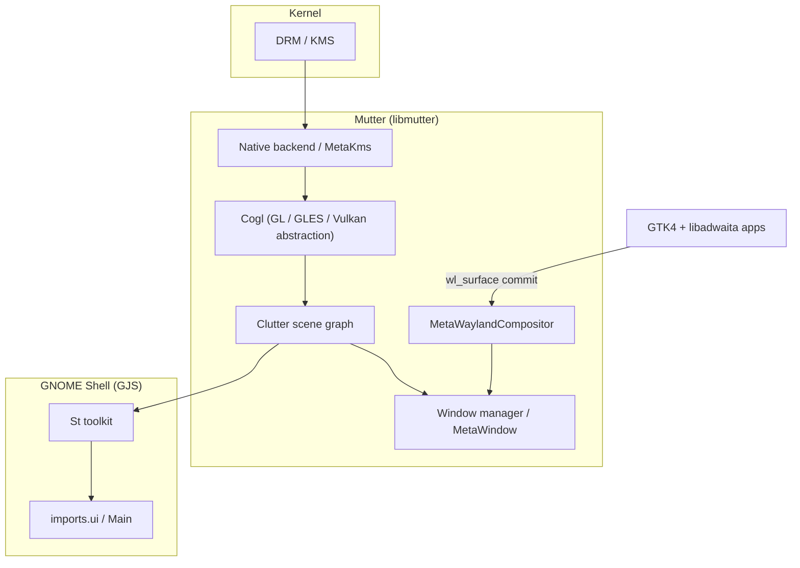
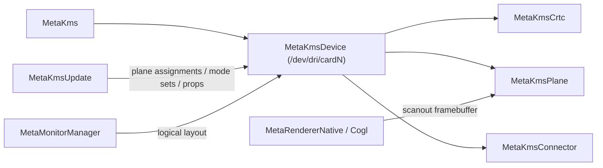
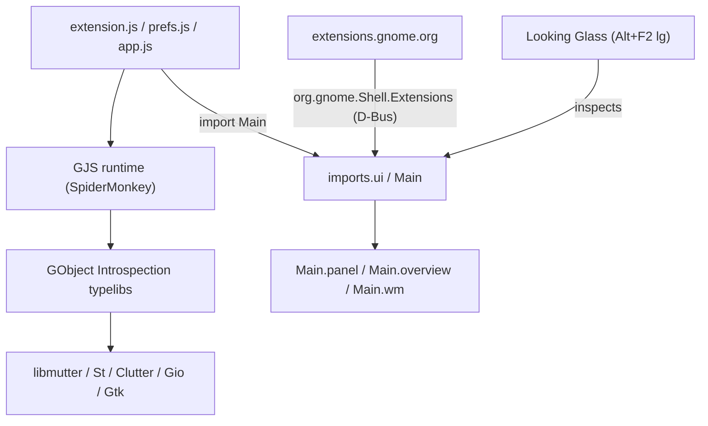

# Chapter 39d: GNOME — Shell, Mutter Compositor, and the Application Platform

> **Part**: Part VII-C — Desktop Frameworks
> **Audience**: GNOME application developers building apps with GTK4/libadwaita and GJS; systems developers who need to understand how GNOME Shell composites the desktop using Mutter, Clutter, and Cogl, and how the session is wired together over D-Bus
> **Status**: First draft — 2026-07-24

## Table of Contents

- [Overview](#overview)
- [1. GNOME Architecture Overview](#1-gnome-architecture-overview)
  - [1.1 Component Map: Mutter → GNOME Shell → libadwaita → Apps](#11-component-map-mutter--gnome-shell--libadwaita--apps)
  - [1.2 Release Cadence and Versioning](#12-release-cadence-and-versioning)
  - [1.3 Technology Stack: C + GObject and JavaScript (GJS)](#13-technology-stack-c--gobject-and-javascript-gjs)
- [2. Mutter: The GNOME Wayland Compositor](#2-mutter-the-gnome-wayland-compositor)
  - [2.1 MetaDisplay, MetaMonitorManager, and the Fate of MetaScreen](#21-metadisplay-metamonitormanager-and-the-fate-of-metascreen)
  - [2.2 DRM/KMS Backend: MetaKms, MetaKmsDevice, MetaKmsCrtc, MetaKmsPlane](#22-drmkms-backend-metakms-metakmsdevice-metakmscrtc-metakmsplane)
  - [2.3 Cogl and OpenGL Compositing: MetaShapedTexture](#23-cogl-and-opengl-compositing-metashapedtexture)
  - [2.4 Clutter: ClutterActor Tree, ClutterStage, Timelines](#24-clutter-clutteractor-tree-clutterstage-timelines)
  - [2.5 Window Management: MetaWindow, MetaWorkspace, MetaStack](#25-window-management-metawindow-metaworkspace-metastack)
  - [2.6 MetaWaylandCompositor: The Wayland Server Inside Mutter](#26-metawaylandcompositor-the-wayland-server-inside-mutter)
  - [2.7 Colour Management](#27-colour-management)
  - [2.8 HDR Output](#28-hdr-output)
- [3. GNOME Shell](#3-gnome-shell)
  - [3.1 Shell as a GJS Application Running Inside Mutter](#31-shell-as-a-gjs-application-running-inside-mutter)
  - [3.2 St (Shell Toolkit): Clutter + CSS](#32-st-shell-toolkit-clutter--css)
  - [3.3 Overview and Workspaces](#33-overview-and-workspaces)
  - [3.4 Dash, Panel, and Notifications](#34-dash-panel-and-notifications)
  - [3.5 GNOME Shell Extensions](#35-gnome-shell-extensions)
  - [3.6 Session D-Bus Interfaces](#36-session-d-bus-interfaces)
  - [3.7 ScreenCast and RemoteDesktop D-Bus APIs](#37-screencast-and-remotedesktop-d-bus-apis)
- [4. GNOME Application Development](#4-gnome-application-development)
  - [4.1 The Human Interface Guidelines](#41-the-human-interface-guidelines)
  - [4.2 Template-Based Widgets with GtkBuilder XML](#42-template-based-widgets-with-gtkbuilder-xml)
  - [4.3 Blueprint: A Modern UI Description Language](#43-blueprint-a-modern-ui-description-language)
  - [4.4 GAction and GMenu](#44-gaction-and-gmenu)
  - [4.5 GSettings and the dconf Backend](#45-gsettings-and-the-dconf-backend)
  - [4.6 GNotification and Portal Notifications](#46-gnotification-and-portal-notifications)
- [5. GJS: JavaScript Bindings for GNOME](#5-gjs-javascript-bindings-for-gnome)
  - [5.1 GJS Architecture: SpiderMonkey + GObject Introspection](#51-gjs-architecture-spidermonkey--gobject-introspection)
  - [5.2 Importing Typelibs](#52-importing-typelibs)
  - [5.3 Writing a Modern Shell Extension](#53-writing-a-modern-shell-extension)
  - [5.4 Async Programming: The GLib Main Loop](#54-async-programming-the-glib-main-loop)
  - [5.5 GJS vs PyGObject vs gtk-rs](#55-gjs-vs-pygobject-vs-gtk-rs)
- [6. D-Bus Integration in GNOME](#6-d-bus-integration-in-gnome)
- [7. GNOME Files, Nautilus, and GVfs](#7-gnome-files-nautilus-and-gvfs)
- [8. Flatpak and GNOME](#8-flatpak-and-gnome)
- [9. Performance and Debugging](#9-performance-and-debugging)
- [10. Integrations](#10-integrations)
- [References](#references)

---

## Overview

**GNOME** is not a single program but a layered platform. At the bottom sits **Mutter** (`libmutter`), a Wayland compositor and X11 window manager that owns the display, drives **KMS** page-flips, and runs the GPU scene graph. On top of Mutter runs **GNOME Shell**, the desktop UI — panel, overview, workspaces, system menus — written almost entirely in **JavaScript** and executed by **GJS**, a SpiderMonkey-based runtime, *inside the compositor's own process*. Applications are built with **GTK4** and **libadwaita** and talk to Mutter as ordinary Wayland clients while integrating with the session over **D-Bus** and **xdg-desktop-portal**.

This chapter targets two readers. For **GNOME application developers**, it covers the platform APIs that shape an app's structure — `GAction`/`GMenu`, `GSettings`, GtkBuilder templates and Blueprint, `GFile`, `GNotification`, and D-Bus — and the language bindings (GJS, PyGObject, gtk-rs) that expose them. For **systems developers**, it opens up Mutter's native backend (the `MetaKms*` KMS abstraction, Cogl, and the Clutter scene graph), the Wayland server embedded in the compositor, the colour-management and HDR pipelines, and the ScreenCast/RemoteDesktop D-Bus surfaces that route screen contents through PipeWire.

GTK4's GPU renderer internals — `GskRenderer`, `GskVulkanRenderer`, the `GskRenderNode` tree, and libadwaita's adaptive widgets — are covered in depth in **Chapter 39 (Qt and GTK GPU Rendering)**. This chapter treats GTK as the toolkit an app *author* uses and Mutter as the compositor that *consumes* the resulting Wayland surfaces, and cross-links to Chapter 39 wherever the rendering pipeline is the subject.

---

## 1. GNOME Architecture Overview

### 1.1 Component Map: Mutter → GNOME Shell → libadwaita → Apps

GNOME's runtime layering is unusual among desktops because the compositor and the shell UI share a single process. Mutter is a *library* (`libmutter`) rather than a standalone binary; `gnome-shell` links against it and calls `meta_context_new()` / `meta_context_start()` to become the compositor. The Shell's JavaScript then decorates that compositor with the panel, overview, and system menus using **St**, a Clutter-based widget toolkit. This is why a crashing Shell extension can take down the whole session: the extension runs in the compositor process.



Application-facing components stack the other way: **GLib/GObject** (types, main loop, `GVariant`, `GFile`) → **GTK4** (widgets, GSK rendering) → **libadwaita** (GNOME Human Interface Guidelines widgets, adaptive layouts, style manager). An app never links Mutter or the Shell; it is a Wayland client that additionally uses D-Bus and portals to reach session services.

### 1.2 Release Cadence and Versioning

GNOME ships on a fixed **six-month cadence**, in March and September. Recent releases: **GNOME 46** (March 2024), **47** (September 2024), **48** (March 2025), **49** (September 2025), and **50** ("Tokyo", March 2026), which is the current stable series at the time of writing. [Source](https://release.gnome.org/50/) Core modules are version-locked to the platform number: GNOME 50 ships **Mutter 50** and **GNOME Shell 50**. GTK follows an independent stream (GTK 4.x minor releases), and libadwaita tracks GTK.

The 6-month train has direct consequences for the graphics stack, because compositor-level features land against specific GNOME numbers. Explicit GPU synchronisation via `wp_linux_drm_syncobj_v1` landed in the Mutter 46 series [Source](https://gitlab.gnome.org/GNOME/mutter); Wayland colour management (`wp_color_management_v1`) merged for GNOME 48 [Source](https://gitlab.gnome.org/GNOME/mutter/-/merge_requests/4291); HDR screen sharing arrived around GNOME 50. [Source](https://release.gnome.org/50/) When a feature's exact landing release is uncertain, this chapter says "recent Mutter releases" rather than guess a number.

### 1.3 Technology Stack: C + GObject and JavaScript (GJS)

GNOME uses two languages by design. Infrastructure — GLib, GObject, GTK, libadwaita, Mutter's core, Cogl, Clutter — is written in **C** on top of the **GObject** type system, which provides classes, signals, properties, interfaces, and reference counting to a language that has none of these natively. Every GObject-based library ships machine-readable **GObject Introspection** (`.gir`/`.typelib`) metadata describing its classes and methods, which is what makes the same C API callable from JavaScript, Python, and Rust without hand-written bindings.

**GNOME Shell itself is a JavaScript application.** The UI layer (`js/ui/`) is written in JavaScript executed by **GJS**, using GObject Introspection to call into `libmutter`, `Clutter`, `St`, and `Gio`. This keeps the fast-changing desktop UI in a garbage-collected, hot-reloadable language while the performance-critical compositor primitives stay in C. Extensions plug into this same JavaScript layer (§3.5, §5.3).

---

## 2. Mutter: The GNOME Wayland Compositor

Mutter grew out of Metacity (the GNOME 2 X11 window manager) and absorbed vendored forks of **Clutter** (a scene-graph/animation toolkit) and **Cogl** (a GPU abstraction over OpenGL/GLES, with a Vulkan path). These are no longer standalone projects — they live in the Mutter tree under `clutter/` and `cogl/` and are maintained as part of it. [Source](https://en.wikipedia.org/wiki/Mutter_(software)) Mutter supports two backends: a **native** backend that drives KMS directly (the Wayland session), and an **X11** backend where Mutter is a compositing window manager under an X server.

### 2.1 MetaDisplay, MetaMonitorManager, and the Fate of MetaScreen

The top-level object is **`MetaDisplay`** (`src/core/display.c`), which represents the display server connection and owns window management state, the input focus, keybindings, and the stack. Older Mutter also had a **`MetaScreen`** object representing a single X screen — but multi-monitor support made a per-X-screen abstraction obsolete, and `MetaScreen` was **removed** (its responsibilities folded into `MetaDisplay` and `MetaMonitorManager`) well before the current era. Code and tutorials that reference `MetaScreen` predate that refactor; on modern Mutter you will not find it.

Physical outputs are handled by **`MetaMonitorManager`** (`src/backends/meta-monitor-manager.c`), which enumerates connectors, reads EDID, computes the logical monitor layout (position, scale, transform), and exposes the configuration over the `org.gnome.Mutter.DisplayConfig` D-Bus interface that GNOME Settings' Displays panel drives. A `MetaMonitor` is a physical display; a `MetaLogicalMonitor` is a placed, scaled region of the global coordinate space.

### 2.2 DRM/KMS Backend: MetaKms, MetaKmsDevice, MetaKmsCrtc, MetaKmsPlane

On a Wayland session, Mutter's native backend talks to **KMS** through a dedicated abstraction whose design is documented in the tree at `doc/mutter-kms-abstractions.md`. [Source](https://github.com/GNOME/mutter/blob/main/doc/mutter-kms-abstractions.md) The entry point is **`MetaKms`**, used by the native backend to create devices and post updates. Each **`MetaKmsDevice`** wraps a DRM device node (`/dev/dri/cardN`) and exposes its KMS objects: **`MetaKmsCrtc`** (a CRTC, holding current mode and coordinates), **`MetaKmsConnector`**, and **`MetaKmsPlane`** (a hardware plane). [Source](https://gitlab.gnome.org/GNOME/mutter/-/blob/main/src/backends/native/meta-kms-crtc.c)

Display changes are expressed as transactions. A **`MetaKmsUpdate`** collects plane assignments, mode sets, and property entries for a single device, then is posted — processed **atomically** when the driver supports atomic KMS, or emulated via legacy ioctls otherwise:

```c
/* Conceptual shape of the native backend's commit path.
   See src/backends/native/meta-kms-update.c and meta-kms-device.c
   in the Mutter tree for the real APIs. */
MetaKmsUpdate *update = meta_kms_update_new (device);

meta_kms_update_assign_plane (update,
                              crtc,       /* MetaKmsCrtc  */
                              plane,      /* MetaKmsPlane (primary) */
                              fb_id,      /* scanout framebuffer    */
                              src_rect, dst_rect,
                              META_KMS_ASSIGN_PLANE_FLAG_NONE);

meta_kms_update_set_crtc_gamma (update, crtc, gamma_lut);

/* Posted through MetaKmsImpl; may become a single atomic commit. */
meta_kms_device_post_update (device, update, META_KMS_UPDATE_FLAG_NONE);
```

This transactional model is what lets Mutter drive KMS colour pipeline properties (DEGAMMA_LUT, CTM, GAMMA_LUT), VRR toggles, and direct-scanout plane assignments in one atomic commit. The buffers scanned out come from `MetaRendererNative` (`src/backends/native/meta-renderer-native.c`), which manages GBM buffer objects and EGL/GLES (or Vulkan-via-Cogl) rendering per CRTC. When a client surface's buffer has a compatible DRM format modifier and no compositor effects apply, Mutter can promote it directly to a KMS plane, skipping GPU composition — the same overlay-plane path discussed in the direct-scanout chapters.



### 2.3 Cogl and OpenGL Compositing: MetaShapedTexture

Above KMS, Mutter composites with **Cogl**, its GPU abstraction. Cogl presents a scene of textured primitives and lowers them to OpenGL, OpenGL ES, or (increasingly) Vulkan, hiding the GL context and extension differences from higher layers. Clutter (§2.4) is built on Cogl.

Every on-screen window surface is wrapped by a **`MetaShapedTexture`** (`src/compositor/meta-shaped-texture.c`), a `ClutterContent` implementation that paints a client's buffer as a Cogl texture. "Shaped" refers to its ability to apply an input/opaque region and clip mask so the compositor only paints and only treats as opaque the parts the client declared — important for rounded corners, CSD shadows, and damage-limited repaints. When a client commits a new Wayland buffer, Mutter attaches it to the corresponding `MetaShapedTexture`, which imports it as a Cogl texture (via EGLImage/dma-buf for zero-copy GPU buffers) and queues a redraw of the affected region.

### 2.4 Clutter: ClutterActor Tree, ClutterStage, Timelines

**Clutter** provides the retained scene graph. The root is a single **`ClutterStage`** (one per display); everything visible is a **`ClutterActor`** in a tree beneath it. Each actor has a transform, allocation, opacity, and paint node, and Mutter's window-management layer plus GNOME Shell's UI are *both* expressed as actors on the same stage. A window's `MetaWindowActor` contains its `MetaShapedTexture`; the Shell's panel is an `St` widget which is itself a `ClutterActor`. This unified tree is why Shell UI and window contents composite together seamlessly and why an extension can, say, animate a window actor.

Clutter also owns animation. A **`ClutterTimeline`** drives a normalised progress value through an easing curve; property transitions (`clutter_actor_save_easing_state()` / `set_easing_duration()`) and explicit `ClutterTransition` objects animate actor properties frame-by-frame, synchronised to the compositor's frame clock so animations are vsync-paced. GNOME Shell's overview zoom, workspace slides, and app-grid transitions are all Clutter animations.

### 2.5 Window Management: MetaWindow, MetaWorkspace, MetaStack

Window management is backend-agnostic — the same objects serve Wayland toplevels and X11 windows. A **`MetaWindow`** (`src/core/window.c`) is the logical window: title, geometry, window type, min/max/fullscreen state, and the frame. On Wayland it is backed by an `xdg_toplevel`; on X11 by a managed X window. **`MetaWorkspace`** models a virtual desktop and tracks which windows belong to it, while **`MetaStack`** maintains the global stacking order (Z-order) used both for input hit-testing and paint order.

GNOME Shell interposes on this machinery through `Main.wm` (a `WindowManager` wrapper in `js/ui/windowManager.js`), which hooks Mutter's `map`, `destroy`, `size-change`, and `switch-workspace` signals to attach the JavaScript-driven animations. Window placement policy, focus-follows behaviour, and tiling are Mutter's; the *look* of transitions is the Shell's.

### 2.6 MetaWaylandCompositor: The Wayland Server Inside Mutter

The Wayland server lives in `src/wayland/`. **`MetaWaylandCompositor`** (`src/wayland/meta-wayland.c`) creates the `wl_display`, adds the listening socket (`wayland-0`), and instantiates the global objects that clients bind: `wl_compositor`, `wl_seat`, `wl_output`, `xdg_wm_base`, `wp_presentation`, `zwp_linux_dmabuf_v1`, `wp_linux_drm_syncobj_v1`, and — in recent releases — `wp_color_management_v1`. Each client surface is a **`MetaWaylandSurface`**, promoted to a window when it takes an `xdg_toplevel` role; buffer attachment routes to the `MetaShapedTexture` described above.

Mutter deliberately does *not* implement `wlr-*` protocols; where wlroots-based compositors expose `wlr_screencopy` and `wlr_layer_shell`, GNOME routes the equivalent functionality through D-Bus (ScreenCast/RemoteDesktop, §3.7) and keeps panel/overview surfaces internal to the Shell rather than exposing a layer-shell protocol to clients. This is a recurring GNOME design choice: prefer a policy-carrying D-Bus API with portal mediation over a raw Wayland protocol.

Input arrives through `MetaSeatNative` (native backend, via libinput) or the X11 seat, is routed to the focused surface, and delivered as `wl_pointer`/`wl_keyboard`/`wl_touch` events. Text input and IMEs are bridged to IBus over D-Bus rather than exposed purely through `zwp_input_method_v2`.

### 2.7 Colour Management

Mutter's colour handling is coordinated by `MetaColorManager` (`src/backends/meta-color-manager.c`), which associates each output with a `MetaColorDevice` and its ICC profile, integrating with `colord` for profile storage and per-output assignment through GNOME Settings' Color panel. On the KMS side, the profile's tone response is programmed into the CRTC's GAMMA_LUT/DEGAMMA_LUT and CTM properties via the `MetaKmsUpdate` transaction path (§2.2).

For clients, the **`wp_color_management_v1`** Wayland protocol lets a surface declare its image description — transfer function and primaries — so the compositor can colour-manage it correctly rather than assuming everything is sRGB. Support was merged for **GNOME 48**. [Source](https://gitlab.gnome.org/GNOME/mutter/-/merge_requests/4291) [Source](https://www.phoronix.com/news/GNOME-wp_color_management_v1) Named transfer functions (`st2084_pq`, `srgb`, `bt1886`) and primaries (`bt2020`, `displayp3`) match the protocol's enums. The `wp_color_management_v1` wire format and the underlying KMS colour-pipeline mechanics (CTM/LUTs) are analysed in full in the colour-management chapter.

### 2.8 HDR Output

HDR builds on the same protocol path but adds an output pipeline that Mutter developed incrementally across the 46–48 cycle: a linear, high-precision intermediate framebuffer for compositing, an SDR reference-white luminance target for blending SDR content into an HDR scene, and `hdr_output_metadata` programmed on the connector for PQ/BT.2020 signalling to the display. A surface's mastering luminance, carried through `wp_color_management_v1`, feeds this pipeline. HDR support continued to mature through the GNOME 49–50 series, with HDR screen sharing added around GNOME 50. [Source](https://release.gnome.org/50/) The compositor-side tone-mapping and connector-metadata details are covered in the advanced-display and HDR chapters.

---

## 3. GNOME Shell

### 3.1 Shell as a GJS Application Running Inside Mutter

GNOME Shell's source is dominated by JavaScript under `js/`, split into `js/ui/` (the desktop UI) and `js/misc/` (helpers). At startup `gnome-shell` initialises `libmutter`, then GJS loads `js/ui/main.js`, whose `start()` constructs the singleton managers — `Main.panel`, `Main.overview`, `Main.wm`, `Main.layoutManager`, `Main.sessionMode`, `Main.notify` — and adds their actors to the Clutter stage. Because this JavaScript runs *in the compositor process*, it can reach Mutter, Clutter, and St objects directly through introspection, with no IPC.

This architecture buys hot iteration (the UI is scripts, not a recompiled binary) at the cost of coupling UI faults to compositor stability, which is the central risk that the extension review process (§3.5) exists to manage.

### 3.2 St (Shell Toolkit): Clutter + CSS

The Shell does not use GTK for its own chrome. Instead it uses **St** ("Shell Toolkit"), a widget set built on Clutter and styled with **CSS**. The base widget **`StWidget`** subclasses `ClutterActor` and adds a CSS style node; concrete widgets include **`StBoxLayout`** (flexbox-like container), **`StLabel`**, **`StButton`**, **`StIcon`**, **`StEntry`**, and **`StScrollView`**. Layout and appearance come from a stylesheet (`data/theme/gnome-shell.css`), resolved per widget through `StThemeContext`/`StThemeNode`, so the panel, menus, and overview are themed with familiar CSS selectors, pseudo-classes (`:hover`, `:active`), and properties.

```javascript
// St widgets are Clutter actors with CSS styling.
const box = new St.BoxLayout({
    style_class: 'panel-status-indicators-box',
    vertical: false,
});
const label = new St.Label({
    text: 'Hello',
    style_class: 'my-indicator-label',
    y_align: Clutter.ActorAlign.CENTER,
});
box.add_child(label);
```

St is the reason Shell extensions style their UI with CSS rather than GTK theming: an extension ships a `stylesheet.css` whose classes are applied to the St widgets it inserts.

### 3.3 Overview and Workspaces

The **Overview** (`js/ui/overview.js`, `Main.overview`) is the Activities view, toggled with the Super key. It is a full-stage Clutter animation layered over the *live* window actors: rather than rendering static screenshots, it reparents and scales the real `MetaWindowActor`s so that the transition is continuous and windows keep updating while shown. It presents three coordinated elements — window thumbnails (`js/ui/workspace.js`), the **workspaces** switcher (`js/ui/workspacesView.js`, backed by Mutter's `MetaWorkspace` from §2.5), and the searchable **app grid** (`js/ui/appDisplay.js`). Workspace switching, whether from the overview or a keyboard shortcut, drives the same Mutter workspace change that `Main.wm` animates (§2.5), so the JavaScript view and the compositor's window-management state stay in lockstep.

### 3.4 Dash, Panel, and Notifications

The remaining desktop chrome is assembled from St actors managed by `Main`:

- **Panel** (`js/ui/panel.js`, `Main.panel`) — the top bar: Activities button, app menu region, clock/date centre, and the **system status area** on the right. Extensions add indicators here with `Main.panel.addToStatusArea()`.
- **Dash** (`js/ui/dash.js`) — the favourites/running-apps strip inside the overview.
- **System status / Quick Settings** (`js/ui/quickSettings.js`, `js/ui/status/`) — the aggregate menu for network, sound, power, and the toggles surfaced in the Quick Settings panel.
- **Notifications** (`js/ui/messageTray.js`, `Main.messageTray`) — the banner and message-tray system that renders `GNotification`s (§4.6) delivered over D-Bus.

### 3.5 GNOME Shell Extensions

Extensions are the supported way to modify the Shell without patching it. An extension is a small bundle of JavaScript loaded into the Shell process. Its layout:

```
example@example.com/
├── metadata.json     # uuid, name, shell-version, settings-schema
├── extension.js      # default export: class extends Extension
├── prefs.js          # optional: class extends ExtensionPreferences
├── stylesheet.css    # optional St styling
└── schemas/          # optional compiled GSettings schema
```

`metadata.json` declares compatibility and identity:

```json
{
    "uuid": "example@example.com",
    "name": "Example Indicator",
    "description": "Adds a status indicator to the panel.",
    "shell-version": ["48", "49", "50"],
    "url": "https://github.com/example/example",
    "settings-schema": "org.gnome.shell.extensions.example"
}
```

**GNOME 45 was a hard break.** The Shell migrated from GJS's custom `imports.*` module system to standard **ECMAScript Modules (ESM)**, and the old `ExtensionUtils` convenience module was replaced by an **`Extension`** base class imported from a GResource URI. An extension written for GNOME 45+ will not load on 44 and earlier, and vice versa. [Source](https://blogs.gnome.org/shell-dev/2023/09/02/extensions-in-gnome-45/) [Source](https://gjs.guide/extensions/upgrading/gnome-shell-45.html) The modern `extension.js` exports a default class with `enable()`/`disable()`:

```javascript
// extension.js — GNOME 45+ ESM form
import GObject from 'gi://GObject';
import St from 'gi://St';

import {Extension} from 'resource:///org/gnome/shell/extensions/extension.js';
import * as Main from 'resource:///org/gnome/shell/ui/main.js';
import * as PanelMenu from 'resource:///org/gnome/shell/ui/panelMenu.js';

export default class ExampleExtension extends Extension {
    enable() {
        this._indicator = new PanelMenu.Button(0.0, this.metadata.name, false);
        this._indicator.add_child(new St.Icon({
            icon_name: 'face-smile-symbolic',
            style_class: 'system-status-icon',
        }));
        Main.panel.addToStatusArea(this.uuid, this._indicator);
    }

    disable() {
        // Must fully tear down: extensions are disabled on lock screen.
        this._indicator?.destroy();
        this._indicator = null;
    }
}
```

Preferences live in `prefs.js` as a class extending **`ExtensionPreferences`** (imported from `resource:///org/gnome/Shell/Extensions/prefs.js`), which builds an Adw/GTK4 dialog — notably, `prefs.js` runs in a *separate* GTK process, not in the Shell, so it may use GTK freely while `extension.js` must not. The `disable()` contract is strict: because extensions are disabled whenever the screen locks, `disable()` must release every actor, signal handler, and timeout, or the extension will leak into the lock screen and be rejected in review. The distribution channel is `extensions.gnome.org` (EGO), whose review guidelines forbid, among other things, leaking objects across enable/disable cycles and importing GTK into `extension.js`. [Source](https://gjs.guide/extensions/review-guidelines/review-guidelines.html)

### 3.6 Session D-Bus Interfaces

The Shell exports several session-bus interfaces on the name `org.gnome.Shell`:

- **`org.gnome.Shell`** — the core interface. It historically offered an `Eval` method to run arbitrary JavaScript in the Shell; this is disabled in production builds for security and only available in unlocked developer/debug configurations.
- **`org.gnome.Shell.Extensions`** (object `/org/gnome/Shell/Extensions`) — the management surface behind the Extensions app and EGO's browser integration: `ListExtensions`, `GetExtensionInfo`, `EnableExtension`, `DisableExtension`, `InstallRemoteExtension`, `OpenExtensionPrefs`, plus an `ExtensionStateChanged` signal.
- **`org.gnome.Shell.Screenshot`** — programmatic screenshots and screen-region picking.

```bash
# Enumerate installed extensions via the session bus.
gdbus call --session \
  --dest org.gnome.Shell.Extensions \
  --object-path /org/gnome/Shell/Extensions \
  --method org.gnome.Shell.Extensions.ListExtensions
```

### 3.7 ScreenCast and RemoteDesktop D-Bus APIs

Screen capture and remote control are exposed by **`libmutter`** (not the Shell) as two D-Bus services: **`org.gnome.Mutter.ScreenCast`** and **`org.gnome.Mutter.RemoteDesktop`**. [Source](https://gitlab.gnome.org/GNOME/mutter/-/tree/main/src/backends) Rather than handing raw buffers over D-Bus, they publish the captured contents as a **PipeWire** stream and return only the PipeWire node id, so the heavy pixel path stays in PipeWire's shared-memory/dma-buf transport.

The flow: a consumer calls `CreateSession` on `org.gnome.Mutter.ScreenCast` to get a session object, then records a source — `RecordMonitor`, `RecordWindow`, `RecordArea`, or `RecordVirtual` — which returns a stream object path. Starting the session emits **`PipeWireStreamAdded`** on the stream, carrying the PipeWire `node_id` the consumer then connects to:

```bash
# Sketch: create a ScreenCast session and record a monitor.
# Real clients (xdg-desktop-portal-gnome, gnome-remote-desktop) use
# generated proxies; this shows the interface shape.
gdbus call --session \
  --dest org.gnome.Mutter.ScreenCast \
  --object-path /org/gnome/Mutter/ScreenCast \
  --method org.gnome.Mutter.ScreenCast.CreateSession "{}"
# -> returns a session object path; RecordMonitor(...) on it yields a
#    stream whose PipeWireStreamAdded signal delivers the node id.
```

`RemoteDesktop` complements this by accepting synthetic pointer, keyboard, and touch events for the same session, which is what lets `gnome-remote-desktop` implement RDP and VNC servers on Wayland. In normal desktop use, applications do **not** call these interfaces directly; they go through **`xdg-desktop-portal`**, whose GNOME backend (`xdg-desktop-portal-gnome`) translates the portal's `org.freedesktop.portal.ScreenCast` request into these Mutter APIs after showing the user a consent dialog. That portal/PipeWire path — used by OBS, browsers, and WebRTC — is detailed in the screen-capture and portal chapters.

---

## 4. GNOME Application Development

This section covers the platform APIs that shape a GNOME app's structure. The GTK4 rendering pipeline and libadwaita widgets are in Chapter 39; here the focus is application *architecture*.

### 4.1 The Human Interface Guidelines

The **GNOME Human Interface Guidelines (HIG)** are the design contract that libadwaita encodes. [Source](https://developer.gnome.org/hig/) Its load-bearing principles for developers: prefer a single primary window with adaptive layout over many dialogs; put primary actions in a `AdwHeaderBar`; use a hamburger/primary menu backed by `GMenu` rather than a menubar; support both mouse and touch; and adapt between narrow (phone) and wide (desktop) form factors via `AdwBreakpoint`. Because libadwaita ships widgets that *are* the HIG (`AdwApplicationWindow`, `AdwToolbarView`, `AdwNavigationView`, `AdwPreferencesWindow`), following the guidelines is largely a matter of composing those widgets rather than reading a document — the HIG and the toolkit co-evolve.

### 4.2 Template-Based Widgets with GtkBuilder XML

GTK encourages defining widget trees declaratively in **GtkBuilder XML** (`.ui` files) and binding them to a widget subclass as a *template*. The XML uses a `<template>` element naming the subclass and its parent:

```xml
<?xml version="1.0" encoding="UTF-8"?>
<interface>
  <template class="ExampleAppWindow" parent="AdwApplicationWindow">
    <property name="title" translatable="yes">Example</property>
    <property name="default-width">600</property>
    <child>
      <object class="AdwToolbarView">
        <child type="top">
          <object class="AdwHeaderBar"/>
        </child>
        <property name="content">
          <object class="GtkLabel" id="greeting">
            <property name="label" translatable="yes">Hello, World!</property>
          </object>
        </property>
      </object>
    </child>
  </template>
</interface>
```

The C side registers the template and binds child widgets to struct fields in `class_init`:

```c
static void
example_app_window_class_init (ExampleAppWindowClass *klass)
{
  GtkWidgetClass *widget_class = GTK_WIDGET_CLASS (klass);

  gtk_widget_class_set_template_from_resource (widget_class,
      "/org/example/App/window.ui");
  gtk_widget_class_bind_template_child (widget_class,
      ExampleAppWindow, greeting);   /* now (self)->greeting is wired */
}
```

The `.ui` file is normally compiled into the binary as a **GResource** (`glib-compile-resources`), so `set_template_from_resource()` loads it from memory with no filesystem access — important for Flatpak apps.

### 4.3 Blueprint: A Modern UI Description Language

Writing GtkBuilder XML by hand is verbose, so GNOME apps increasingly use **Blueprint**, a concise, typed markup language that compiles to `.ui` XML via `blueprint-compiler`. [Source](https://jwestman.pages.gitlab.gnome.org/blueprint-compiler/) The same window in a `.blp` file:

```blueprint
using Gtk 4.0;
using Adw 1;

template $ExampleAppWindow : Adw.ApplicationWindow {
  title: _("Example");
  default-width: 600;

  content: Adw.ToolbarView {
    [top]
    Adw.HeaderBar {}

    Gtk.Label greeting {
      label: _("Hello, World!");
    }
  };
}
```

Blueprint adds compile-time type checking, real `_("...")` translation syntax, and far less boilerplate than XML, while producing identical `.ui` output that the GTK runtime consumes unchanged. Meson build integration runs `blueprint-compiler` to generate the `.ui` files at build time; the runtime never sees Blueprint. It is not part of GTK itself but is a first-class part of the modern GNOME app toolchain, and is what GNOME Builder scaffolds by default.

### 4.4 GAction and GMenu

GNOME apps are structured around **actions** rather than direct signal callbacks. A **`GAction`** is a named, optionally stateful, optionally parameterised operation; **`GMenu`** is an abstract menu model that references actions by name. Decoupling *what* (the action) from *where it is triggered* (menu item, keyboard accelerator, D-Bus call) is the backbone of GTK's menu and shortcut system.

```c
static void
quit_activated (GSimpleAction *action, GVariant *parameter, gpointer user_data)
{
  g_application_quit (G_APPLICATION (user_data));
}

static const GActionEntry app_entries[] = {
  { "quit",  quit_activated,  NULL, NULL, NULL },
  { "about", about_activated, NULL, NULL, NULL },
};

static void
example_app_startup (GApplication *app)
{
  g_action_map_add_action_entries (G_ACTION_MAP (app),
                                   app_entries, G_N_ELEMENTS (app_entries),
                                   app);

  /* Bind an accelerator to the "app.quit" action. */
  const char *quit_accels[] = { "<Ctrl>Q", NULL };
  gtk_application_set_accels_for_action (GTK_APPLICATION (app),
                                         "app.quit", quit_accels);
}
```

Actions are namespaced: `app.*` actions live on the `GApplication`, `win.*` on a window. A `GMenu` item references `"app.quit"`; the same action can be invoked from a `GtkShortcutController`, a `AdwHeaderBar` menu button, or `GMenuModel`-driven UI without duplicating logic. [Source](https://developer.gnome.org/documentation/tutorials/actions.html)

### 4.5 GSettings and the dconf Backend

Configuration uses **`GSettings`**, a typed key–value store defined by a compiled XML schema and stored, by default, in the **dconf** binary database. A schema fixes each key's type (as a `GVariant` type string), default, and range:

```xml
<?xml version="1.0" encoding="UTF-8"?>
<schemalist>
  <schema id="org.example.App" path="/org/example/App/">
    <key name="window-width" type="i">
      <default>800</default>
      <summary>Main window width</summary>
    </key>
    <key name="dark-mode" type="b">
      <default>false</default>
      <summary>Prefer the dark colour scheme</summary>
    </key>
    <key name="recent-files" type="as">
      <default>[]</default>
      <summary>Recently opened file URIs</summary>
    </key>
  </schema>
</schemalist>
```

After compiling schemas with `glib-compile-schemas`, the C API is type-safe per key, and — crucially — `g_settings_bind()` two-way-binds a key to a GObject property so the widget and the stored value stay in sync automatically:

```c
GSettings *settings = g_settings_new ("org.example.App");

int width = g_settings_get_int (settings, "window-width");

/* Persist the window's width automatically as the user resizes. */
g_settings_bind (settings, "window-width",
                 G_OBJECT (window), "default-width",
                 G_SETTINGS_BIND_DEFAULT);
```

The `dconf` backend stores all keys in a single mmapped binary file per user and delivers change notifications over D-Bus, so a setting changed in one process (or in `dconf-editor`) fires `changed::key` in every other process bound to it. GNOME itself is configured this way — `org.gnome.desktop.interface`, `org.gnome.mutter`, and `org.gnome.shell.extensions.*` are all GSettings schemas readable with `gsettings get`.

### 4.6 GNotification and Portal Notifications

Desktop notifications use **`GNotification`**, a high-level model attached to a `GApplication`:

```c
GNotification *n = g_notification_new ("Download complete");
g_notification_set_body (n, "example.iso finished downloading.");
g_notification_set_default_action (n, "app.show-downloads");
g_notification_add_button (n, "Open Folder", "app.open-downloads");
g_application_send_notification (G_APPLICATION (app), "dl-done", n);
```

Notification buttons invoke `GAction`s (§4.4), so the app is activated and the action runs even if it had exited. Under the hood, `g_application_send_notification()` talks to `org.freedesktop.Notifications` on a normal session, or — inside a Flatpak sandbox — routes through `xdg-desktop-portal`'s Notification portal, which the GNOME backend forwards to the Shell's message tray (§3.4). The app code is identical in both cases; the portal indirection is transparent.

---

## 5. GJS: JavaScript Bindings for GNOME

### 5.1 GJS Architecture: SpiderMonkey + GObject Introspection

**GJS** couples Mozilla's **SpiderMonkey** JavaScript engine to **GObject Introspection**. [Source](https://gjs.guide/) At load time GJS reads a library's `.typelib` (compiled introspection data) and synthesises JavaScript objects whose methods, properties, and signals proxy directly onto the underlying C calls — no glue code per library. GObject classes appear as JS classes; GObject signals become `object.connect('signal', handler)`; C `out` parameters are returned as array elements; and `GVariant`/`GValue` marshal to native JS types. Modern GJS tracks recent ECMAScript (classes, `async`/`await`, ESM). This is the same engine that runs GNOME Shell, which is why Shell extensions and GJS apps share one programming model.

### 5.2 Importing Typelibs

Two import mechanisms coexist. The **legacy** `imports.gi` namespace, used in older code and still valid in plain (non-ESM) GJS, requires pinning a version *before* first import:

```javascript
// Legacy GJS imports — pin the version, then import.
imports.gi.versions.Gtk = '4.0';
const Gtk = imports.gi.Gtk;
const Gio = imports.gi.Gio;
```

The **modern ESM** form — mandatory in GNOME 45+ Shell code and preferred for new apps — uses `gi://` module specifiers with the version as a query parameter:

```javascript
// Modern ESM imports (GJS >= 1.72, required in GNOME Shell 45+).
import Gtk from 'gi://Gtk?version=4.0';
import Adw from 'gi://Adw?version=1';
import Gio from 'gi://Gio';
```

[Source](https://gjs.guide/extensions/overview/imports-and-modules.html) Version pinning matters because multiple ABI-incompatible versions of a library (GTK 3 and GTK 4) can be installed at once; requesting the wrong one, or letting GJS auto-pick, is a common startup failure. (The `gi.require('Gtk', '4.0')` spelling sometimes seen in informal notes is not a GJS API; the two forms above are the real ones.)

### 5.3 Writing a Modern Shell Extension

The `extension.js` skeleton in §3.5 is the canonical entry point. The mechanics worth emphasising for a developer coming from other UI toolkits:

- **Lifecycle is enable/disable, not main().** `enable()` is called each time the extension activates (including after unlock); `disable()` each time it deactivates. Everything created in `enable()` must be destroyed in `disable()`.
- **Settings** are reached with `this.getSettings()` (from the `Extension` base class), which loads the schema declared by `settings-schema` in `metadata.json`.
- **Translations** use `this.gettext()` / the imported `gettext` binding.
- **Preferences UI** lives in a separate `prefs.js` class extending `ExtensionPreferences`, which returns an `Adw.PreferencesPage`; it runs in its own GTK process, decoupled from the Shell.

```javascript
// prefs.js — runs in a separate GTK4 process, may use Adw/GTK freely.
import Adw from 'gi://Adw';
import Gtk from 'gi://Gtk';
import {ExtensionPreferences} from 'resource:///org/gnome/Shell/Extensions/prefs.js';

export default class ExamplePrefs extends ExtensionPreferences {
    fillPreferencesWindow(window) {
        const page = new Adw.PreferencesPage();
        const group = new Adw.PreferencesGroup({title: 'General'});
        const row = new Adw.SwitchRow({title: 'Show label'});
        group.add(row);
        page.add(group);
        window.add(page);

        this.getSettings().bind('show-label', row, 'active',
            Gio.SettingsBindFlags.DEFAULT);
    }
}
```

### 5.4 Async Programming: The GLib Main Loop

GJS has no Node.js event loop; it drives the **GLib main loop** (`GLib.MainLoop`, or the loop GTK/GNOME Shell already runs). Asynchrony is expressed with GLib sources and GIO's async pattern:

- `GLib.timeout_add(priority, ms, callback)` and `GLib.idle_add(priority, callback)` schedule work; returning `GLib.SOURCE_REMOVE` (false) unregisters the source. Every returned source id must be removed in `disable()`.
- GIO methods come in `*_async`/`*_finish` pairs. GJS can wrap them into promises with `Gio._promisify()`, letting `async`/`await` replace nested callbacks:

```javascript
import Gio from 'gi://Gio';
import GLib from 'gi://GLib';

Gio._promisify(Gio.File.prototype, 'load_contents_async',
               'load_contents_finish');

async function readOsRelease() {
    const file = Gio.File.new_for_path('/etc/os-release');
    const [bytes] = await file.load_contents_async(null);
    return new TextDecoder().decode(bytes);
}
```

Blocking the main loop freezes the compositor when the code is a Shell extension, so long or synchronous I/O must always use the async variants.

### 5.5 GJS vs PyGObject vs gtk-rs

Because bindings all consume the same introspection data, the *same* GNOME APIs are reachable from several languages, differing mainly in idiom and integration depth:

| Aspect | GJS (JavaScript) | PyGObject (Python) | gtk-rs (Rust) |
|---|---|---|---|
| Binding mechanism | Runtime introspection (typelib) | Runtime introspection (typelib) | Compile-time generated from `.gir` |
| Version pinning | `gi://Gtk?version=4.0` / `imports.gi.versions` | `gi.require_version('Gtk', '4.0')` | Cargo feature (`gtk4`) |
| Memory model | GC (SpiderMonkey) | GC (CPython refcount) | Ownership + `Rc`/`clone!` for closures |
| Main loop | GLib main loop | GLib main loop | GLib main loop (`glib::MainContext`) |
| Shell extensions | **Only supported language** | No | No |
| Typical use | Shell extensions, GNOME apps | Scripts, apps, prototyping | Performance-sensitive native apps |

GJS is the *only* language for GNOME Shell extensions, since the Shell's JavaScript context is what extensions plug into. For applications, PyGObject offers the fastest prototyping, gtk-rs offers compile-time safety and a single static binary, and GJS sits between — dynamic like Python but sharing the Shell's exact runtime. All three call identical C APIs, so a GObject class, signal connection, or `GSettings` binding looks structurally the same across them.

---

## 6. D-Bus Integration in GNOME

D-Bus is GNOME's session IPC. Apps use GIO's D-Bus layer rather than libdbus directly. The two workhorses are **`Gio.DBusProxy`** (a client handle to a remote object, with cached properties and signal relay) and **`Gio.DBusConnection`** (the raw bus connection for exporting objects or making one-off calls).

```javascript
// Query GNOME Shell's extension service via a D-Bus proxy (GJS).
import Gio from 'gi://Gio';

const proxy = Gio.DBusProxy.new_for_bus_sync(
    Gio.BusType.SESSION,
    Gio.DBusProxyFlags.NONE,
    null,                                   // interface info (introspected)
    'org.gnome.Shell.Extensions',           // bus name
    '/org/gnome/Shell/Extensions',          // object path
    'org.gnome.Shell.Extensions',           // interface
    null);

const [extensions] = proxy.call_sync(
    'ListExtensions', null,
    Gio.DBusCallFlags.NONE, -1, null).recursiveUnpack();
```

An application that wants to *export* a service does so through **`GApplication`**, which owns a bus name for free: setting `G_APPLICATION_FLAGS` and overriding `dbus_register`/`dbus_unregister` lets an app publish its own objects on the name it already holds for single-instance/uniqueness handling. GNOME's single-instance model (a second launch forwards its command line to the first over D-Bus, firing `activate`/`open`/`command-line`) is built on this.

Two GNOME-relevant service families sit on top of these primitives:

- **`xdg-desktop-portal`** — the sandbox-safe API surface (`org.freedesktop.portal.*`) for file chooser, screen cast, camera, notifications, and settings. A GNOME app calls the portal; `xdg-desktop-portal-gnome` implements the backend using GTK dialogs and Mutter's D-Bus APIs (§3.7). This is the mediation layer that lets a Flatpak app open a file it has no filesystem access to, because the *portal* (outside the sandbox) shows the chooser and hands back a document-portal fd.
- **Secret Service** (`org.freedesktop.secrets`) — password/credential storage accessed through **libsecret**, backed on GNOME by **GNOME Keyring**. `secret_password_store_sync()` / `secret_password_lookup_sync()` store and retrieve secrets in a collection unlocked with the login keyring, so apps never touch the storage format directly.

---

## 7. GNOME Files, Nautilus, and GVfs

### 7.1 GVfs: Virtual Filesystem over GIO

**GVfs** extends GIO's `GFile` abstraction beyond the local disk to network and virtual locations — `sftp://`, `smb://`, `mtp://`, `google-drive://`, `trash://`, `recent://`. It runs as a set of per-mount D-Bus daemons; when GIO resolves a URI whose scheme it does not handle natively, it dispatches to the matching GVfs backend over D-Bus, and (for schemes that can be presented as a directory tree) FUSE-mounts them under `/run/user/UID/gvfs/` so even non-GIO programs can read them. To the application, a remote SFTP file and a local file are both just `GFile` handles.

### 7.2 GFile: URI-Based, Async I/O

**`GFile`** is the uniform file handle. It is constructed from a path or URI and used for both metadata and streaming I/O, with synchronous and asynchronous variants throughout:

```c
/* Asynchronous read of a (possibly remote) file. */
GFile *file = g_file_new_for_uri ("sftp://host/home/user/notes.txt");

g_file_load_contents_async (file, cancellable, on_loaded, user_data);

static void
on_loaded (GObject *source, GAsyncResult *res, gpointer user_data)
{
  g_autofree char *contents = NULL;
  gsize length = 0;
  g_autoptr(GError) error = NULL;

  if (g_file_load_contents_finish (G_FILE (source), res,
                                   &contents, &length, NULL, &error))
    g_print ("read %" G_GSIZE_FORMAT " bytes\n", length);
  else
    g_warning ("load failed: %s", error->message);
}
```

The async form is essential for GVfs paths, where a "file read" can involve a network round-trip that must not block the UI thread. For streaming, `g_file_read()` yields a `GInputStream`, and `GFileMonitor` reports changes (used by Nautilus to live-update views).

### 7.3 Nautilus (GNOME Files)

**Nautilus** ("GNOME Files") is the reference GVfs consumer. It models entries as `NautilusFile` objects, drives navigation and the list/grid views on top of GTK4, and offloads slow work to worker threads: recursive **search** (with optional tracker/`localsearch` full-text indexing), and a **thumbnail pipeline** that shells out to `.thumbnailer` helpers to produce cached previews under the freedesktop thumbnail spec directory. Nautilus is also extensible through the `NautilusExtension` interface (context-menu items, property pages, column providers), which is how integrations like version-control status overlays attach to the file manager.

---

## 8. Flatpak and GNOME

### 8.1 The GNOME Runtime on Flathub

Flatpak apps build against a **runtime** that supplies the shared platform. GNOME publishes the `org.gnome.Platform` runtime (with a matching `org.gnome.Sdk`) on **Flathub**, versioned per GNOME release, bundling GTK4, libadwaita, GLib, and the wider GNOME stack so an app only ships its own code. A GNOME app's Flatpak manifest declares this runtime and lists finish-args granting Wayland, dma-buf/DRI access, and the portals it needs:

```json
{
    "app-id": "org.example.App",
    "runtime": "org.gnome.Platform",
    "runtime-version": "50",
    "sdk": "org.gnome.Sdk",
    "finish-args": [
        "--socket=wayland",
        "--socket=fallback-x11",
        "--device=dri",
        "--talk-name=org.freedesktop.portal.Desktop"
    ]
}
```

`--device=dri` is what gives the sandboxed app access to `/dev/dri` for GPU acceleration; without it, GTK4's Vulkan/GL renderer falls back to software. The GPU-sandbox details are covered in the Flatpak graphics chapter.

### 8.2 GNOME Builder

**GNOME Builder** is the platform's IDE, and its defining feature is that it builds and runs projects *inside* a Flatpak SDK sandbox by default — the same `org.gnome.Sdk` the app will ship against — so "works on my machine" matches "works in the Flatpak." It scaffolds new projects with Meson, Blueprint UI files, and a Flatpak manifest, and runs the app under the runtime with one action, which makes it the path of least resistance for producing a Flathub-ready GNOME app.

### 8.3 Portal Usage from Flatpak GNOME Apps

Inside the sandbox, an app has no direct access to the user's files, screen, or camera. Every such capability is brokered by **`xdg-desktop-portal`** (§6): the file chooser returns a document-portal fd rather than a raw path; `GNotification` routes through the Notification portal; screen capture goes through the ScreenCast portal to Mutter (§3.7). Because GIO and GTK detect the sandbox and switch to portal-backed implementations automatically, well-written GNOME app code is *identical* sandboxed or not — the developer calls `GtkFileDialog` or `g_application_send_notification()` and the portal indirection is invisible.

---

## 9. Performance and Debugging

### 9.1 GNOME Shell: Looking Glass

The Shell ships an in-process JavaScript inspector, **Looking Glass**, opened with **Alt+F2 → `lg`**. Because it runs in the compositor's JS context, it can evaluate expressions against live objects — inspect `Main.panel`, walk the actor tree, poke an extension's state — and includes an actor picker and an Extensions tab. It is the fastest way to probe why an extension misbehaves, since the objects it created are directly reachable.

### 9.2 Mutter Frame Timing and Logs

Mutter reads the **`MUTTER_DEBUG`** environment variable (and related `MUTTER_DEBUG_*` toggles) to emit categorised diagnostics — KMS commits, frame timing, input, and more. Since the Shell runs under systemd's user session, its output lands in the journal:

```bash
# Follow live GNOME Shell / Mutter output.
journalctl --user -f -o cat /usr/bin/gnome-shell

# Restart Mutter with KMS/backend debug categories (Wayland session:
# safest inside a nested session, see below).
env MUTTER_DEBUG=kms,backend dbus-run-session -- gnome-shell --wayland --nested
```

Running Mutter **nested** (`gnome-shell --nested` inside an existing session, or `--wayland --nested`) is the standard way to debug the compositor without risking the live desktop: it opens a window on the host compositor and runs a full Shell inside it.

### 9.3 Renderer and GL/Vulkan Debug Flags

The Cogl/Clutter layer exposes toggles for the GPU path. Historically `COGL_DEBUG` categories (and offscreen/blit-related flags such as the GLES2 offscreen blit path) surface renderer behaviour, and `CLUTTER_PAINT=damage-region` overlays the damaged regions each frame so you can see over-drawing. Mutter can also be pushed onto a specific renderer or forced through software (`llvmpipe`) to isolate whether a glitch is driver-side; the exact variable set shifts between releases, so consult the running Mutter version's docs rather than assuming a fixed list.

### 9.4 GTK Inspector

For the *application* side, **GTK Inspector** (Ctrl+Shift+D, or `GTK_DEBUG=interactive`) is the equivalent of a browser's devtools for GTK4 apps: it exposes the widget tree, live CSS, GObject properties, GSK render-node dumps, and a recorder for captured frames. Combined with `GSK_RENDERER` and `GDK_DEBUG` (covered in Chapter 39), it is how an app author sees whether their UI is hitting the Vulkan renderer and where GTK is spending paint time — separate from, and complementary to, the Mutter-side tools above.



---

## 10. Integrations

- **Chapter 39 (Qt and GTK GPU Rendering)**: The GTK4 rendering pipeline this chapter treats as a black box — `GskRenderer`, `GskVulkanRenderer`, the `GskRenderNode` tree, and libadwaita's adaptive widgets and `AdwStyleManager` — is covered end to end there. Read the two chapters together to see both the app-author's platform APIs (here) and the GPU frame path they feed (Ch39).

- **Chapter 2 / Chapter 3 (KMS Atomic and Advanced Display)**: Mutter's `MetaKmsUpdate` transactions program exactly the atomic-commit, plane-assignment, VRR, and colour-pipeline (GAMMA_LUT/DEGAMMA_LUT/CTM) properties described in those chapters. `MetaKmsDevice` is Mutter's wrapper over the DRM device those chapters open directly.

- **Chapter 4 (GEM / DMA-BUF)**: `MetaShapedTexture` imports client Wayland buffers as Cogl textures via EGLImage/dma-buf, the zero-copy import path detailed there; `MetaRendererNative` allocates GBM buffer objects for scanout.

- **Chapter 20 (Wayland Protocol Fundamentals)**: `MetaWaylandCompositor` is a full Wayland server — the `wl_surface`, `xdg_toplevel`, `wp_presentation`, and `zwp_linux_dmabuf_v1` mechanics of that chapter are what Mutter implements for GTK4/GJS clients.

- **Chapter 22 (Mutter and KWin)**: The compositor-comparison chapter frames Mutter against KWin and wlroots; this chapter drills into Mutter's internals (native backend, Clutter, Wayland server) that the comparison references.

- **Advanced-display / Colour-management chapters**: `wp_color_management_v1` (merged for GNOME 48) and the HDR output pipeline (linear intermediate framebuffer, SDR reference white, `hdr_output_metadata`) sketched in §2.7–§2.8 are analysed in full in the colour and HDR chapters; `MetaColorManager` bridges to `colord`.

- **PipeWire / Screen-capture chapters**: `org.gnome.Mutter.ScreenCast` and `RemoteDesktop` publish captured screen content as PipeWire streams (`PipeWireStreamAdded` node id), the transport those chapters cover; `gnome-remote-desktop` is the RDP/VNC consumer.

- **xdg-desktop-portal chapter**: `xdg-desktop-portal-gnome` translates `org.freedesktop.portal.*` requests into Mutter's D-Bus APIs and GTK dialogs; every sandboxed GNOME app reaches files, screen, and notifications through this backend.

- **Flatpak graphics chapter**: The `org.gnome.Platform` runtime, `--device=dri` GPU access, and portal-mediated capabilities in §8 are the GNOME-specific instance of the Flatpak sandbox model detailed there.

- **Chapter 47 (Font and Text Rendering)**: St and GTK text both flow through Pango/HarfBuzz/FreeType; the Shell's panel and menu glyphs use the same stack an app's `GtkLabel` does.

---

## References

- GNOME developer documentation portal: [https://developer.gnome.org/](https://developer.gnome.org/)
- GNOME Human Interface Guidelines: [https://developer.gnome.org/hig/](https://developer.gnome.org/hig/)
- Mutter source (GNOME GitLab): [https://gitlab.gnome.org/GNOME/mutter](https://gitlab.gnome.org/GNOME/mutter)
- Mutter KMS abstractions design doc: [https://github.com/GNOME/mutter/blob/main/doc/mutter-kms-abstractions.md](https://github.com/GNOME/mutter/blob/main/doc/mutter-kms-abstractions.md)
- Mutter `meta-kms-crtc.c`: [https://gitlab.gnome.org/GNOME/mutter/-/blob/main/src/backends/native/meta-kms-crtc.c](https://gitlab.gnome.org/GNOME/mutter/-/blob/main/src/backends/native/meta-kms-crtc.c)
- Mutter MR !4291 — enable `wp_color_management_v1`: [https://gitlab.gnome.org/GNOME/mutter/-/merge_requests/4291](https://gitlab.gnome.org/GNOME/mutter/-/merge_requests/4291)
- Phoronix — GNOME 48 Mutter merges `wp_color_management_v1`: [https://www.phoronix.com/news/GNOME-wp_color_management_v1](https://www.phoronix.com/news/GNOME-wp_color_management_v1)
- Mutter backends (ScreenCast / RemoteDesktop / native KMS): [https://gitlab.gnome.org/GNOME/mutter/-/tree/main/src/backends](https://gitlab.gnome.org/GNOME/mutter/-/tree/main/src/backends)
- GNOME Shell source (GNOME GitLab): [https://gitlab.gnome.org/GNOME/gnome-shell](https://gitlab.gnome.org/GNOME/gnome-shell)
- Extensions in GNOME 45 (ESM migration): [https://blogs.gnome.org/shell-dev/2023/09/02/extensions-in-gnome-45/](https://blogs.gnome.org/shell-dev/2023/09/02/extensions-in-gnome-45/)
- Port extensions to GNOME Shell 45: [https://gjs.guide/extensions/upgrading/gnome-shell-45.html](https://gjs.guide/extensions/upgrading/gnome-shell-45.html)
- GNOME Shell extensions review guidelines: [https://gjs.guide/extensions/review-guidelines/review-guidelines.html](https://gjs.guide/extensions/review-guidelines/review-guidelines.html)
- GJS guide: [https://gjs.guide/](https://gjs.guide/)
- GJS imports and modules: [https://gjs.guide/extensions/overview/imports-and-modules.html](https://gjs.guide/extensions/overview/imports-and-modules.html)
- GJS API documentation: [https://gjs-docs.gnome.org/](https://gjs-docs.gnome.org/)
- GTK4 GtkBuilder / templates: [https://docs.gtk.org/gtk4/class.Builder.html](https://docs.gtk.org/gtk4/class.Builder.html)
- Blueprint compiler documentation: [https://jwestman.pages.gitlab.gnome.org/blueprint-compiler/](https://jwestman.pages.gitlab.gnome.org/blueprint-compiler/)
- GAction / GMenu tutorial: [https://developer.gnome.org/documentation/tutorials/actions.html](https://developer.gnome.org/documentation/tutorials/actions.html)
- GSettings (GIO) documentation: [https://docs.gtk.org/gio/class.Settings.html](https://docs.gtk.org/gio/class.Settings.html)
- GFile (GIO) documentation: [https://docs.gtk.org/gio/iface.File.html](https://docs.gtk.org/gio/iface.File.html)
- GVfs source: [https://gitlab.gnome.org/GNOME/gvfs](https://gitlab.gnome.org/GNOME/gvfs)
- Nautilus (GNOME Files) source: [https://gitlab.gnome.org/GNOME/nautilus](https://gitlab.gnome.org/GNOME/nautilus)
- libsecret documentation: [https://gnome.pages.gitlab.gnome.org/libsecret/](https://gnome.pages.gitlab.gnome.org/libsecret/)
- xdg-desktop-portal documentation: [https://flatpak.github.io/xdg-desktop-portal/](https://flatpak.github.io/xdg-desktop-portal/)
- GNOME Platform runtime (Flathub): [https://flathub.org/](https://flathub.org/)
- GNOME 50 release notes: [https://release.gnome.org/50/](https://release.gnome.org/50/)
- GNOME 49 release notes: [https://release.gnome.org/49/](https://release.gnome.org/49/)

---

*Copyright © 2026 jreuben11. Licensed under [CC BY 4.0](https://creativecommons.org/licenses/by/4.0/).*
