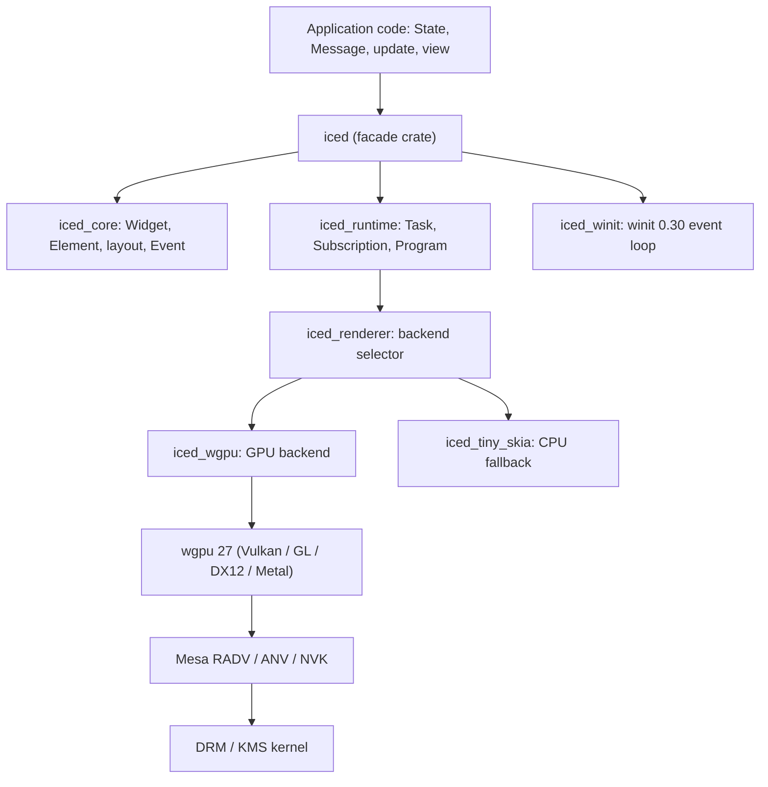
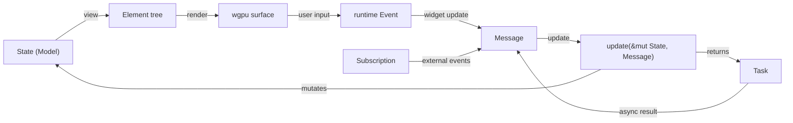
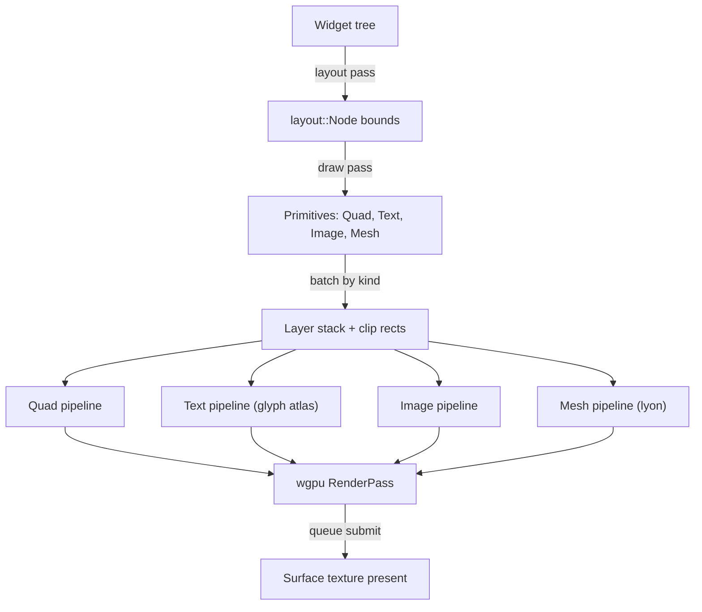

# Chapter 39e: iced — Rust-Native GPU GUI with the Elm Architecture

> **Part**: Part VII-C — Desktop Frameworks
> **Audience**: Rust application developers building desktop GUIs; systems developers interested in **wgpu**-based rendering and the **Wayland** integration paths (upstream **winit** vs. the **iced_layershell** and **libcosmic** forks)
> **Status**: First draft — 2026-07-24

## Table of Contents

- [Overview](#overview)
- [1. iced Architecture: The Elm Model](#1-iced-architecture-the-elm-model)
  - [1.6 What is iced?](#16-what-is-iced)
  - [1.7 What is the Elm Architecture?](#17-what-is-the-elm-architecture)
  - [1.8 What is wgpu?](#18-what-is-wgpu)
- [2. Widget System](#2-widget-system)
- [3. wgpu Rendering Backend](#3-wgpu-rendering-backend)
- [4. Wayland Integration: winit, iced_layershell, and iced_sctk](#4-wayland-integration-winit-iced_layershell-and-iced_sctk)
- [5. Custom GPU Shaders in iced](#5-custom-gpu-shaders-in-iced)
- [6. Theming and Styling](#6-theming-and-styling)
- [7. Async Programming and the Runtime](#7-async-programming-and-the-runtime)
  - [7.4 Animation with Time Subscriptions](#74-animation-with-time-subscriptions)
- [8. Accessibility](#8-accessibility)
- [9. Performance and Debugging](#9-performance-and-debugging)
- [Integrations](#integrations)
- [References](#references)

---

## Overview

**iced** is a cross-platform GUI library for **Rust**, inspired by the **Elm Architecture** — a strict unidirectional data flow in which application state is a plain value, the UI is a pure function of that state, and all mutation happens through a single `update` function that consumes messages. On native platforms it renders through **wgpu**, the same Rust WebGPU-subset abstraction that drives **Bevy** (Chapter 40) and, via **Dawn**, the browser **WebGPU** implementation (Chapter 35). This shared substrate means an iced frame follows a path this book has traced repeatedly — application code, then **wgpu**, then **Mesa**'s **RADV**/**ANV**/**NVK** Vulkan drivers, then **DRM**/**KMS** — but from the perspective of a retained-immediate hybrid GUI toolkit rather than a game engine. iced is also the foundation of **libcosmic** and the **System76 COSMIC** desktop, making it the most consequential pure-Rust desktop toolkit in the ecosystem.[^iced-repo][^cosmic]

This chapter targets iced **0.14.0**, released 2025-12-07, which is the current stable release and the first to consolidate the *functional* application API introduced in 0.13 (September 2024).[^releases][^cratesio] Because iced's API has moved quickly on the road to 1.0, the chapter is explicit about version boundaries: the pre-0.13 `Application`/`Sandbox` traits, the 0.13 `Task`/functional-API rewrite, and the 0.14 shader-pipeline and subscription (`sipper`) refinements.

Section 1 covers the Elm model: the `update`/`view`/`subscription` triad, the functional `iced::application()` and `iced::run()` entry points, `Task` and `Subscription`, and the crate split (`iced` facade over `iced_core`, `iced_runtime`, `iced_renderer`, `iced_wgpu`, `iced_tiny_skia`, `iced_winit`). Section 2 dissects the `Widget` trait — `size`/`layout`/`draw`/`update` — the layout solver, and how to author a custom widget and a `Canvas` program. Section 3 opens the `iced_wgpu` backend: the shared `Engine`, the quad/text/image/mesh pipelines, the **cosmic-text**/**guillotiere** glyph atlas, and the `iced_tiny_skia` CPU fallback. Section 4 corrects a common misconception: upstream iced's Wayland support is the **winit** backend (winit 0.30), while **layer-shell** panels come from the third-party **iced_layershell** crate and from the **pop-os** fork's `iced_sctk`.[^winit-deps][^layershell] Section 5 walks the custom-shader widget (`shader::Program`, `shader::Primitive`, `shader::Pipeline`) with a Mandelbrot example. Sections 6–9 cover theming, the async runtime, the (still-experimental) accessibility story, and profiling.



---

## 1. iced Architecture: The Elm Model

### 1.1 Model, Update, View

iced organises an application around three ideas borrowed from Elm: a **state** (the model) that holds all application data, a **message** enum that enumerates every event the application can react to, and two functions — `update`, which folds a message into the state, and `view`, which produces the widget tree from the current state.[^book-arch] Since 0.13 these are ordinary functions rather than trait methods, and an application is assembled by handing them to `iced::application()` or `iced::run()`.[^releases]

```rust
use iced::widget::{button, column, text};
use iced::{Element, Task, Theme};

#[derive(Default)]
struct Counter {
    value: i64,
}

#[derive(Debug, Clone, Copy)]
enum Message {
    Increment,
    Decrement,
}

fn update(state: &mut Counter, message: Message) -> Task<Message> {
    match message {
        Message::Increment => state.value += 1,
        Message::Decrement => state.value -= 1,
    }
    Task::none()
}

fn view(state: &Counter) -> Element<'_, Message> {
    column![
        button("Increment").on_press(Message::Increment),
        text(state.value).size(48),
        button("Decrement").on_press(Message::Decrement),
    ]
    .into()
}

fn main() -> iced::Result {
    iced::application(Counter::default, update, view)
        .title("Counter")
        .theme(|_state| Theme::Dark)
        .run()
}
```

The signature contract is the load-bearing detail: `update(&mut State, Message) -> Task<Message>` and `view(&State) -> Element<'_, Message>`.[^docs-app] `view` borrows the state immutably and returns a fresh `Element` tree every frame; the tree is *retained* between frames only as far as widget internal state is concerned (Section 2.1), but the description of the UI is rebuilt each time state changes. `update` is the sole place state mutates, and its return value — a `Task<Message>` — is how the pure world requests impure work from the runtime (Section 7).

`iced::application(boot, update, view)` takes a `boot` argument that produces the initial state; a bare `State::default` (a `Fn() -> State`) works, and a closure returning `(State, Task<Message>)` lets an application dispatch startup work.[^docs-app] The builder returned by `application()` exposes `.title()`, `.theme()`, `.subscription()`, `.settings()`, `.window()`, `.centered()`, and finally `.run()`. The terser `iced::run(update, view)` covers the common case where `State: Default` and no builder configuration is needed.[^docs-app]



### 1.2 Subscription: Passive Event Sources

`Task` handles one-shot side effects; **`Subscription`** handles *ongoing* passive event streams that the runtime should keep alive as long as the application declares them. A `subscription(&State) -> Subscription<Message>` function is registered via the builder, and the runtime diffs the returned subscriptions frame-to-frame, starting new ones and tearing down those no longer present.[^docs-sub] Typical sources are timers, raw keyboard/mouse events, window events, and long-lived worker channels.

```rust
use std::time::Duration;
use iced::keyboard::{self, key::Named};
use iced::{time, Subscription};

fn subscription(_state: &Clock) -> Subscription<Message> {
    Subscription::batch([
        time::every(Duration::from_secs(1)).map(Message::Tick),
        keyboard::on_key_press(|key, _modifiers| match key {
            keyboard::Key::Named(Named::Escape) => Some(Message::Quit),
            _ => None,
        }),
    ])
}
```

`time::every` yields a `Subscription<Instant>` that fires on an interval; `.map()` adapts its item type into the application `Message`. `keyboard::on_key_press` produces a message only when its closure returns `Some`.[^docs-sub] `Subscription::batch` merges several sources into one.

### 1.3 Task: Asynchronous Side Effects

A **`Task<Message>`** is a description of concurrent work the runtime will perform, ultimately producing zero or more `Message`s fed back into `update`. The core constructors are `Task::none()` (do nothing), `Task::done(value)` (emit a value immediately), `Task::perform(future, f)` (run a future and map its output into a message), `Task::future(future)`, `Task::stream(stream)`, and `Task::batch(tasks)`.[^docs-task] Combinators `map`, `then`, `chain`, and `abortable` compose them; `abortable` returns a `Handle` so an in-flight task can be cancelled (useful for search-as-you-type or cancellable downloads).

```rust
fn update(state: &mut App, message: Message) -> Task<Message> {
    match message {
        Message::Search(query) => {
            state.query = query.clone();
            Task::perform(fetch_results(query), Message::ResultsLoaded)
        }
        Message::ResultsLoaded(results) => {
            state.results = results;
            Task::none()
        }
    }
}
```

Widget-oriented tasks live in the widget modules — for example `text_input::focus(id)` returns a `Task` that focuses a specific input, and `window::change_mode(...)` manipulates a window.[^docs-task] Because a `Task` is a value, `update` can decide at runtime which effects to request, and can `batch` several together.

### 1.4 Version History: 0.10 → 0.14

iced's API changed substantially across four minor releases; getting the version right is essential when reading examples online.[^releases]

- **0.10 (2023)** overhauled text: font fallback, complex-script shaping via **cosmic-text**, and a rewritten `iced_wgpu` glyph path.
- **0.12 (2024-02-15)** added the custom **`shader` widget**, multi-window support, and bumped **wgpu** to 0.19.
- **0.13 (2024-09-18)** was the pivotal rewrite: the `Application`/`Sandbox` traits were replaced by the functional `iced::application()`/`iced::run()` entry points, and `Command` was renamed to **`Task`** with a richer combinator set. The `Widget::on_event` method was folded into `Widget::update`.
- **0.14 (2025-12-07)** refined the custom-shader `Primitive` trait to carry an associated `Pipeline` type, adopted the **`sipper`** crate for channel-style subscriptions, added `rich_text`/`markdown`/`stack`/`hover` widgets and `row` wrapping, and moved to **wgpu 27** and **winit 0.30**.[^cratesio][^wgpu-dep][^winit-deps]

Per the project roadmap only one more experimental release (0.15) is planned before 1.0.[^faq]

### 1.5 Crate Structure

The `iced` crate a user depends on is a thin **facade** re-exporting a workspace of focused crates. Understanding the split clarifies where each abstraction lives:[^wgpu-readme]

- **`iced_core`** — foundational types with no runtime: `Widget`, `Element`, `Length`, `Rectangle`, `Color`, `Event`, and the `layout` module.
- **`iced_runtime`** — the Elm loop machinery: `Program`, `Task`, `Subscription`, and the command/subscription runtime.
- **`iced_renderer`** — a façade that dispatches to a GPU or CPU backend at runtime, falling back from `iced_wgpu` to `iced_tiny_skia` if no adapter is available.
- **`iced_wgpu`** — the **wgpu** backend: quad/text/image/mesh pipelines and the shared `Engine`.
- **`iced_tiny_skia`** — a pure-CPU rasteriser (Section 3.7).
- **`iced_graphics`** — backend-agnostic geometry, the layer/mesh abstractions, and text infrastructure shared by both backends.
- **`iced_widget`** — the built-in widget library (`button`, `text`, `text_input`, `scrollable`, `canvas`, `shader`, …).
- **`iced_winit`** — the native shell: a **winit 0.30** event loop, surface creation, and clipboard integration.[^winit-deps]

### 1.6 What is iced?

iced is a cross-platform GUI library for Rust that follows the Elm Architecture pattern to build native desktop applications. It renders through wgpu, a Rust implementation of the WebGPU API that provides a safe, portable abstraction over Vulkan, Direct3D 12, Metal, and OpenGL ES. On Linux, wgpu dispatches to Mesa's Vulkan drivers — RADV for AMD hardware, ANV for Intel, and NVK for NVIDIA — before presenting through DRM/KMS kernel interfaces.

Unlike classical retained-mode toolkits such as GTK or Qt, iced does not maintain a persistent mutable widget tree. Instead, the `view` function rebuilds a description of the interface from application state on every state change, and the runtime reconciles this description against internal widget state to produce minimal GPU commands. This hybrid approach gives the programmer the simplicity of immediate-mode thinking while preserving per-widget state that enables smooth animations and incremental rendering.

iced's crate structure reflects a deliberate separation of concerns: `iced_core` holds foundational types with no runtime dependencies, `iced_runtime` implements the Elm loop, and `iced_wgpu` and `iced_tiny_skia` provide GPU and CPU backends respectively. The `iced` crate itself is a thin facade re-exporting from this workspace. iced serves as the foundation of the System76 COSMIC desktop environment through the libcosmic library, making it the most widely deployed pure-Rust GUI toolkit in the Linux ecosystem at the time of writing.

### 1.7 What is the Elm Architecture?

The Elm Architecture is a unidirectional data flow pattern originating in the Elm programming language, a statically typed functional language that compiles to JavaScript for browser applications. The pattern structures an application around three components: a model that holds all application state as a plain value, an `update` function that transforms the model in response to messages, and a `view` function that derives a description of the UI purely from the current model. No mutation happens except through `update`; the view is a pure function with no side channels.

This design has several consequences for correctness and reasoning. Because state is a single value, reasoning about the application at any point reduces to reasoning about that value. Because `view` is pure, the rendered interface is fully determined by state — there is no hidden widget state that can desynchronise from the model. Because all events flow through a single `Message` type, the set of things that can happen to the application is explicit and enumerable at compile time.

In iced, the pattern is realised through the `update(&mut State, Message) -> Task<Message>` and `view(&State) -> Element<'_, Message>` function pair. The `Task` return type extends the pattern to cover asynchronous side effects — network requests, file I/O, timer subscriptions — without breaking the purity of `update` at the call site. The runtime drives the loop: it calls `view` when state changes, distributes events to widgets, collects the resulting messages, and calls `update` with each one in turn.

### 1.8 What is wgpu?

wgpu is a Rust library that implements the WebGPU API specification on native platforms, providing a safe abstraction over Vulkan, Direct3D 12, Metal, and OpenGL ES through a unified command-queue model. It is maintained under the gfx-rs organisation and serves as the GPU backend for Firefox's WebGPU implementation, the Bevy game engine (Chapter 40), and — as described in this chapter — the iced GUI toolkit.

The WebGPU API models GPU work as a series of command buffers submitted to a queue. Resources — buffers, textures, bind groups, render pipelines — are created against a `Device`; commands are encoded into a `CommandEncoder`; and the resulting `CommandBuffer` is submitted to the `Queue`. On Linux with Vulkan drivers, wgpu translates these operations to Vulkan command buffers, descriptor sets, and pipeline objects, with the Mesa driver handling the final translation to hardware instructions.

Within iced, wgpu provides the rendering surface for the `iced_wgpu` backend. The backend maintains a shared `Engine` that holds pipeline objects for four drawing primitives — quads (colored rectangles), text glyphs from the cosmic-text atlas, images and SVGs, and triangle meshes — and composes them into a frame. Custom shader widgets gain direct access to wgpu's `Device` and `Queue` through the `shader::Pipeline` trait, allowing application code to write arbitrary WGSL shaders while remaining within the iced render loop. iced 0.14 targets wgpu 27, which is the version used throughout this chapter.

---

## 2. Widget System

### 2.1 The Widget Trait

Every renderable element implements the **`Widget`** trait, defined in `iced::advanced::widget`. Its required methods are `size`, `layout`, and `draw`; the rest are provided with sensible defaults.[^docs-widget] In 0.14 the trait is generic over `Message`, `Theme`, and `Renderer`:

```rust
pub trait Widget<Message, Theme, Renderer>
where
    Renderer: renderer::Renderer,
{
    // Required
    fn size(&self) -> Size<Length>;
    fn layout(&mut self, tree: &mut Tree, renderer: &Renderer, limits: &Limits) -> Node;
    fn draw(
        &self,
        tree: &Tree,
        renderer: &mut Renderer,
        theme: &Theme,
        style: &renderer::Style,
        layout: Layout<'_>,
        cursor: mouse::Cursor,
        viewport: &Rectangle,
    );

    // Provided (defaults)
    fn tag(&self) -> tree::Tag { ... }
    fn state(&self) -> tree::State { ... }
    fn children(&self) -> Vec<Tree> { ... }
    fn diff(&self, tree: &mut Tree) { ... }
    fn update(
        &mut self,
        tree: &mut Tree,
        event: &Event,
        layout: Layout<'_>,
        cursor: mouse::Cursor,
        renderer: &Renderer,
        clipboard: &mut dyn Clipboard,
        shell: &mut Shell<'_, Message>,
        viewport: &Rectangle,
    ) { ... }
    fn mouse_interaction(&self, ...) -> mouse::Interaction { ... }
    fn operate(&mut self, ...) { ... }
    fn overlay<'a>(&'a mut self, ...) -> Option<overlay::Element<'a, Message, Theme, Renderer>> { ... }
}
```

Two design points distinguish this from a purely immediate-mode toolkit like **egui**. First, widget *description* is immediate — `view` rebuilds the `Element` tree every update — but widget *state* is retained: the `tag`/`state`/`children`/`diff` methods let the runtime keep a parallel `Tree` of internal widget state (a text cursor position, a scroll offset) across frames, reconciled against the freshly-built tree by `diff`.[^docs-widget] Second, event handling changed in 0.13/0.14: the former `on_event` (which returned an `event::Status`) became `update`, which returns `()` and instead reports interest by mutating the `Shell` — calling `shell.publish(message)` to emit a message, `shell.capture_event()` to stop propagation, or `shell.request_redraw()` to schedule a frame.

### 2.2 Built-in Widgets

`iced_widget` ships the standard toolkit: `text`, `button`, `text_input`, `checkbox`, `radio`, `toggler`, `slider`, `pick_list`, `combo_box`, `progress_bar`; the layout containers `column`, `row` (with `row::Wrapping` in 0.14), `container`, `scrollable`, `stack`, and `pane_grid`; and the media/vector widgets `image`, `svg`, `canvas`, and `shader`.[^releases] The `column![...]` and `row![...]` macros are ergonomic constructors. Widgets are configured with a builder-style fluent API — `.width(Length::Fill)`, `.padding(10)`, `.spacing(8)`, `.on_press(msg)` — and turned into a type-erased `Element` via `.into()`.

### 2.3 The Layout Algorithm

Layout is a single top-down pass. Each widget's `layout(tree, renderer, limits)` receives a `Limits` (a min/max `Size` box) and returns a `Node` describing its resolved bounds plus the bounds of its children.[^docs-widget] A widget's `size()` returns a `Size<Length>` where each axis is a `Length`: `Fill`, `FillPortion(n)`, `Shrink`, or `Fixed(px)`. `Fill` widgets expand to consume the limits; `Shrink` widgets collapse to their content. A `column` distributes its main-axis space among children according to their `Length`s, subtracting spacing and padding, then recurses. Because layout is pure and deterministic given the `Element` tree, it can run on any thread and is re-executed whenever the tree or window size changes rather than continuously.

### 2.4 A Custom Widget

Implementing `Widget` directly is the escape hatch for bespoke drawing that does not need a full GPU pipeline. The following draws a filled circle sized to its radius, using the `Renderer::fill_quad` primitive with a rounded border to approximate a disc.[^docs-widget]

```rust
use iced::advanced::layout::{self, Layout};
use iced::advanced::renderer;
use iced::advanced::widget::{self, Widget};
use iced::advanced::Renderer as _;
use iced::{mouse, Border, Color, Element, Length, Rectangle, Size};

pub struct Circle {
    radius: f32,
}

impl<Message, Theme, Renderer> Widget<Message, Theme, Renderer> for Circle
where
    Renderer: renderer::Renderer,
{
    fn size(&self) -> Size<Length> {
        Size::new(Length::Shrink, Length::Shrink)
    }

    fn layout(
        &mut self,
        _tree: &mut widget::Tree,
        _renderer: &Renderer,
        _limits: &layout::Limits,
    ) -> layout::Node {
        layout::Node::new(Size::new(self.radius * 2.0, self.radius * 2.0))
    }

    fn draw(
        &self,
        _tree: &widget::Tree,
        renderer: &mut Renderer,
        _theme: &Theme,
        _style: &renderer::Style,
        layout: Layout<'_>,
        _cursor: mouse::Cursor,
        _viewport: &Rectangle,
    ) {
        renderer.fill_quad(
            renderer::Quad {
                bounds: layout.bounds(),
                border: Border {
                    radius: self.radius.into(),
                    ..Border::default()
                },
                ..renderer::Quad::default()
            },
            Color::from_rgb(0.2, 0.6, 1.0),
        );
    }
}

impl<'a, Message, Theme, Renderer> From<Circle>
    for Element<'a, Message, Theme, Renderer>
where
    Renderer: renderer::Renderer,
{
    fn from(circle: Circle) -> Self {
        Self::new(circle)
    }
}
```

The `From<Circle> for Element` impl is the idiomatic bridge: it lets `Circle` be dropped into any `column![]`/`row![]` alongside built-in widgets. A widget that needs to react to clicks would override `update`, inspect the incoming `Event`, and call `shell.publish(...)`.

### 2.5 The Canvas Widget

For 2D vector drawing without a custom `Widget`, the `canvas` widget hosts a **`canvas::Program`**. Its `draw` method receives a `Frame` and returns a `Vec<Geometry>`; the toolkit caches and composites those geometries.[^docs-canvas] The `Program` also has an associated `State` and an `update(&self, &mut State, &Event, bounds, cursor) -> Option<canvas::Action<Message>>` method, so an interactive canvas (a drawing surface, a chart with hover) can mutate its own state and emit messages.

```rust
use iced::widget::canvas::{self, Frame, Geometry, Path, Stroke};
use iced::{mouse, Color, Point, Rectangle, Renderer, Theme};

struct Dial {
    angle: f32,
}

impl<Message> canvas::Program<Message> for Dial {
    type State = ();

    fn draw(
        &self,
        _state: &Self::State,
        renderer: &Renderer,
        _theme: &Theme,
        bounds: Rectangle,
        _cursor: mouse::Cursor,
    ) -> Vec<Geometry> {
        let mut frame = Frame::new(renderer, bounds.size());
        let center = frame.center();
        let radius = frame.width().min(frame.height()) / 2.0 - 4.0;

        frame.fill(&Path::circle(center, radius), Color::from_rgb(0.1, 0.1, 0.15));

        let hand = Path::line(
            center,
            center + iced::Vector::new(radius * self.angle.cos(), radius * self.angle.sin()),
        );
        frame.stroke(&hand, Stroke::default().with_width(3.0).with_color(Color::WHITE));

        vec![frame.into_geometry()]
    }
}
```

`Path` builds vector geometry (`circle`, `line`, `rectangle`, arbitrary Bézier paths via `Path::new(|builder| ...)`), and `frame.fill`/`frame.stroke` rasterise it. Under `iced_wgpu`, `Geometry` becomes triangle meshes tessellated with **lyon** (Section 3.2); under `iced_tiny_skia`, it is rasterised on the CPU.[^wgpu-readme]

### 2.6 Overlays

The provided `Widget::overlay` method returns an optional `overlay::Element` drawn in a second pass above the normal tree, escaping the parent's clipping and z-order. This is how tooltips, dropdown menus, and `pick_list` popups position themselves over sibling content without the parent container needing to reserve space.[^docs-widget]

---

## 3. wgpu Rendering Backend

### 3.1 iced_wgpu: Renderer, Engine, and Layers

`iced_wgpu` is the default native renderer.[^wgpu-readme] Its central types are the shared **`Engine`** — which owns the `wgpu::Device`, `wgpu::Queue`, and every render pipeline, and is cloned across windows so a multi-window application does not duplicate GPU resources — and per-window **`Renderer`** instances that record draw commands. The renderer accumulates primitives into a **layer stack**: each layer batches primitives of the same kind (quads, text, images, meshes) plus a clip rectangle, so the whole frame collapses into a small, fixed number of pipeline switches rather than one draw call per widget.

`iced_wgpu` supports four primitive families:[^wgpu-readme]

- **Quads** — axis-aligned rectangles with a solid or gradient fill, rounded borders, and drop shadows; the workhorse for backgrounds, buttons, and borders.
- **Text** — rendered through a **cosmic-text**-shaped glyph atlas (Section 3.4).
- **Images and SVG** — bitmap and (via **resvg**) rasterised vector images uploaded as `wgpu` textures.
- **Meshes** — arbitrary triangle geometry from the `canvas` widget, tessellated with **lyon**.



### 3.2 wgpu Primitives Underneath

Each pipeline maps onto the standard **wgpu** object model that Chapter 40 covers in depth: a `wgpu::Device` and `wgpu::Queue` obtained from an adapter, `wgpu::Buffer`s for vertices/instances/uniforms, `wgpu::BindGroup`s binding those resources, a `wgpu::RenderPipeline` compiled from **WGSL**, and a `wgpu::CommandEncoder` that records a `wgpu::RenderPass` per frame, submitted with a single `queue.submit(...)`.[^wgpu-crate] On Linux, wgpu's **Vulkan** backend (`wgpu-hal/src/vulkan/`) requests `VK_KHR_swapchain` and `VK_KHR_dynamic_rendering` from a Mesa driver; the WGSL is lowered to **SPIR-V** by **naga** and enters Mesa's **NIR** through `vk_spirv_to_nir()` (Chapters 14, 18). iced 0.14 pins wgpu to the 27.x series.[^wgpu-dep]

### 3.3 The Quad Pipeline

Quads are the most-used primitive and are drawn with **instanced rendering**: a single unit quad's vertices are reused, and one instance buffer entry per rectangle carries its position, size, colour (or gradient stops), border radius/width/colour, and shadow parameters. The WGSL fragment shader computes a signed-distance function for the rounded rectangle so borders and corners are anti-aliased analytically rather than via multisampling, which keeps the quad pipeline cheap even for UIs with hundreds of bordered elements.[^wgpu-readme] This is structurally the same rounded-rect SDF approach used by GTK4's `GskGpu` renderer and by browser compositors.

### 3.4 The Glyph Atlas

Text is the most complex primitive. iced shapes runs with **cosmic-text** — which layers **rustybuzz** (a Rust port of HarfBuzz) for complex-script shaping and **fontdb**/**fontconfig** for font resolution — producing positioned glyphs.[^cosmictext] Rasterised glyph bitmaps are packed into a GPU texture atlas whose free space is managed by a dynamic allocator; iced_wgpu 0.14 depends on **guillotiere** for atlas allocation.[^wgpu-dep] The atlas is an LRU cache: glyphs are rasterised on first use, reused across frames at the same size, and evicted under pressure — the same architecture described generically in Chapter 47's glyph-atlas discussion, and originally packaged as the **glyphon** crate that iced's text pipeline descends from.[^glyphon] Each visible glyph becomes one instanced quad sampling its atlas sub-rectangle; a page of text is therefore one draw call over an instance buffer.

### 3.5 Image Rendering

`image` and `svg` widgets decode to RGBA pixels (SVG via **resvg** tessellation-free rasterisation), upload them once to a `wgpu::Texture`, and draw a textured quad.[^wgpu-dep] The image pipeline maintains its own atlas so many small images share a texture and a draw call. Because the upload is retained, static images cost nothing after the first frame.

### 3.6 Custom Shader Pipelines

For content beyond the four built-in primitives — a 3D scene, a fractal, a particle system — the `shader` widget grants direct access to `wgpu`. This is the subject of Section 5.

### 3.7 The tiny-skia Fallback

When no compatible GPU adapter is available — a headless CI runner, a VM without virtio-gpu, a remote session, or a deliberately software-only deployment — `iced_renderer` falls back to **`iced_tiny_skia`**, a pure-CPU rasteriser built on the **tiny-skia** crate (a Rust subset of Skia's software backend).[^wgpu-readme][^tinyskia] The same `Element` tree and layout drive it; only the backend differs, so an application need not know which renderer is active. tiny-skia trades frame rate for universality: it is adequate for forms and dashboards but not for shader-heavy UIs.

---

## 4. Wayland Integration: winit, iced_layershell, and iced_sctk

A frequent misconception is that upstream iced talks to Wayland through a dedicated `iced_sctk` crate. It does not. **Upstream iced's Linux windowing is the winit backend.** The distinct Wayland integration paths are worth separating carefully.

### 4.1 Upstream: the winit Backend

`iced_winit` drives native windows through **winit 0.30** (with the `rwh_06` feature for `raw-window-handle` 0.6).[^winit-deps] winit, in turn, contains the Wayland client implementation: it binds `wl_compositor`, creates a `wl_surface` and an `xdg_surface`/`xdg_toplevel` via `xdg_wm_base`, and handles the `configure`/`ack_configure` handshake, `wl_seat` input (`wl_keyboard`, `wl_pointer`, `wl_touch`), and output/scale events. iced hands winit's `raw-window-handle` to `wgpu`, which calls `vkCreateWaylandSurfaceKHR` (Chapter 20) to obtain a `VkSurfaceKHR`, then configures a swapchain via `wgpu::Surface::configure`. Since winit 0.30 the event loop is expressed through the **`ApplicationHandler`** trait, and iced's runtime implements it internally so the application author never touches winit directly.[^winit-repo]

This path gives iced the standard **xdg_shell** toplevel lifecycle and, through winit and `wgpu`, DMA-BUF-backed swapchains and fractional scaling (`wp_fractional_scale_v1`) as winit exposes them. What it does *not* give is `wlr-layer-shell` — the protocol panels, docks, notification daemons, and lock screens need — because winit models only ordinary application windows.

### 4.2 Layer Shell via iced_layershell

The **`wlr-layer-shell`** protocol (`zwlr_layer_shell_v1`) creates surfaces anchored to a screen edge at a defined z-layer (`Background`, `Bottom`, `Top`, `Overlay`), with an optional exclusive zone that reserves space so tiled windows do not overlap the panel (Chapter 21). Because upstream iced's winit path cannot request it, layer-shell support comes from the third-party **`iced_layershell`** crate (part of the `waycrate`/`exwlshell` project), which reimplements the shell using **smithay-client-toolkit (sctk)** directly instead of winit. iced_layershell 0.19.x targets iced 0.14.[^layershell]

```rust
// iced_layershell 0.19 — a top-anchored bar panel.
// Import paths follow the crate's build_pattern/settings modules; see the
// crate docs, as this is third-party API outside the iced workspace.
use iced_layershell::build_pattern::application;
use iced_layershell::settings::{LayerShellSettings, Settings};
use iced_layershell::reexport::{Anchor, KeyboardInteractivity, Layer};

fn main() -> Result<(), iced_layershell::Error> {
    application(Panel::new, Panel::namespace, Panel::update, Panel::view)
        .settings(Settings {
            layer_settings: LayerShellSettings {
                size: Some((0, 40)),
                anchor: Anchor::Top | Anchor::Left | Anchor::Right,
                exclusive_zone: 40,
                layer: Layer::Top,
                keyboard_interactivity: KeyboardInteractivity::None,
                ..Default::default()
            },
            ..Default::default()
        })
        .run()
}
```

The `application(init, namespace, update, view)` builder mirrors upstream iced's functional API with an extra `namespace` function (the layer-shell namespace string a compositor uses to identify the surface). `LayerShellSettings` maps directly onto the protocol: `anchor` bitflags select the edges, `exclusive_zone` reserves pixels, `layer` chooses the z-band, and `keyboard_interactivity` controls focus behaviour.[^layershell] A companion crate, `iced_sessionlock`, exposes `ext-session-lock-v1` for lock screens.

### 4.3 The libcosmic / pop-os Fork: iced_sctk

The **System76 COSMIC** desktop needs layer-shell surfaces, session-lock, virtual-keyboard, and multi-surface behaviour throughout its shell, so it does not use upstream iced's winit backend at all. Instead, **libcosmic** builds on a **fork of iced** (`pop-os/iced`) that adds an **`iced_sctk`** backend — an alternative to `iced_winit` built on smithay-client-toolkit — giving first-class Wayland-protocol access.[^cosmic][^popos-iced] This is the `iced_sctk` the ecosystem refers to: a fork-local crate, not part of the upstream `iced` workspace. libcosmic layers its own widget set, the COSMIC design-token theming system, and applets on top. The COSMIC desktop (cosmic-comp compositor plus these iced-based applications) is the case study for a fully Rust desktop stack referenced in Part III's compositor chapters.

### 4.4 Input, IME, and Scaling

On the upstream winit path, keyboard, pointer, and touch events arrive as winit events that iced translates into its own `Event` type before dispatching to `Widget::update`. Text input for complex scripts and CJK relies on the compositor's input-method support surfaced through winit; the fork-based `iced_sctk` path can bind `zwp_text_input_v3` and `zwp_input_method_v2` more directly, which is why COSMIC's shell can host its own on-screen keyboard. Fractional scaling (`wp_fractional_scale_v1`) is applied as a viewport scale factor so widget bounds are computed in logical pixels and rasterised at device pixels (Chapters 20, 105).

### 4.5 Multi-Window

Multi-window support (0.12+) lets one application own several toplevels sharing a single `iced_wgpu::Engine` and event loop; the `iced::daemon` entry point runs an application with no initial window, suitable for tray/background programs that open windows on demand.[^releases] Each window gets its own `Renderer` and surface but draws from the shared device and pipeline set.

---

## 5. Custom GPU Shaders in iced

### 5.1 The shader Widget

The `shader` widget (added in 0.12) embeds an application-controlled `wgpu` pipeline inside the widget tree, composited with the rest of the UI. It is parameterised by a **`shader::Program`**, which owns widget state and produces a **`shader::Primitive`** to draw.[^docs-shader][^example-shader] In 0.14 the trait shapes are:

```rust
// iced::widget::shader
pub trait Program<Message> {
    type State: Default + 'static;
    type Primitive: Primitive + 'static;

    fn draw(
        &self,
        state: &Self::State,
        cursor: mouse::Cursor,
        bounds: Rectangle,
    ) -> Self::Primitive;

    // provided:
    fn update(&self, state: &mut Self::State, event: &Event,
              bounds: Rectangle, cursor: mouse::Cursor) -> Option<shader::Action<Message>> { None }
    fn mouse_interaction(&self, ...) -> mouse::Interaction { ... }
}
```

### 5.2 Primitive and Pipeline

The rendering contract is split across two traits, verified against the 0.14 source.[^src-primitive] A **`Primitive`** is a cheap, `Send + Sync` snapshot of what to draw this frame; it names an associated **`Pipeline`** that holds the expensive, persistent GPU objects:

```rust
// iced_wgpu::primitive (re-exported via iced::widget::shader)
pub trait Primitive: Debug + Send + Sync + 'static {
    type Pipeline: Pipeline;

    fn prepare(
        &self,
        pipeline: &mut Self::Pipeline,
        device: &wgpu::Device,
        queue: &wgpu::Queue,
        bounds: &Rectangle,
        viewport: &Viewport,
    );

    // Draw into the shared iced render pass; return true if handled here.
    fn draw(&self, pipeline: &Self::Pipeline, render_pass: &mut wgpu::RenderPass<'_>) -> bool { false }

    // Or take an owned encoder/target for a private pass.
    fn render(
        &self,
        pipeline: &Self::Pipeline,
        encoder: &mut wgpu::CommandEncoder,
        target: &wgpu::TextureView,
        clip_bounds: &Rectangle<u32>,
    ) {}
}

pub trait Pipeline: Any + Send + Sync {
    fn new(device: &wgpu::Device, queue: &wgpu::Queue, format: wgpu::TextureFormat) -> Self
    where
        Self: Sized;
    fn trim(&mut self) {}
}
```

The lifecycle is the important part. iced keeps a `Storage` — a `HashMap<TypeId, Box<dyn Pipeline>>` — inside the `Engine`. The first time a given `Primitive` type is drawn, iced calls `Pipeline::new(device, queue, format)` and stores the result; on every frame it looks the pipeline up by `TypeId`, calls `Primitive::prepare` with a mutable reference to it (upload uniforms, resize buffers), then calls either `draw` (to record into iced's shared render pass, preserving correct compositing order) or `render` (to run a fully private pass into a target).[^src-primitive] Because the `Pipeline` is created once and cached, pipeline compilation never happens on the hot path.

### 5.3 A Mandelbrot Primitive

The canonical minimal example is a full-screen fragment shader — a Mandelbrot renderer needs no vertex buffers, generating a fullscreen triangle from `vertex_index`, and carries only a small uniform block for the pan/zoom viewport.[^example-frag] The `Program` snapshots the current view into a `Primitive`; the `Primitive` uploads it in `prepare` and issues a 3-vertex draw in `render`.

```rust
use iced::widget::shader::{self, wgpu, Viewport};
use iced::{mouse, Rectangle};

#[derive(Copy, Clone, bytemuck::Pod, bytemuck::Zeroable)]
#[repr(C)]
struct Uniforms {
    center: [f32; 2],
    scale: f32,
    _pad: f32,
}

#[derive(Debug)]
struct Fractal {
    uniforms: Uniforms,
}

impl shader::Primitive for Fractal {
    type Pipeline = FractalPipeline;

    fn prepare(
        &self,
        pipeline: &mut Self::Pipeline,
        _device: &wgpu::Device,
        queue: &wgpu::Queue,
        _bounds: &Rectangle,
        _viewport: &Viewport,
    ) {
        queue.write_buffer(&pipeline.uniforms, 0, bytemuck::bytes_of(&self.uniforms));
    }

    fn render(
        &self,
        pipeline: &Self::Pipeline,
        encoder: &mut wgpu::CommandEncoder,
        target: &wgpu::TextureView,
        clip_bounds: &Rectangle<u32>,
    ) {
        let mut pass = encoder.begin_render_pass(&wgpu::RenderPassDescriptor {
            label: Some("mandelbrot.pass"),
            color_attachments: &[Some(wgpu::RenderPassColorAttachment {
                view: target,
                resolve_target: None,
                ops: wgpu::Operations {
                    load: wgpu::LoadOp::Load, // preserve the UI drawn beneath
                    store: wgpu::StoreOp::Store,
                },
            })],
            depth_stencil_attachment: None,
            timestamp_writes: None,
            occlusion_query_set: None,
        });
        pass.set_scissor_rect(
            clip_bounds.x, clip_bounds.y, clip_bounds.width, clip_bounds.height,
        );
        pass.set_pipeline(&pipeline.pipeline);
        pass.set_bind_group(0, &pipeline.bind_group, &[]);
        pass.draw(0..3, 0..1);
    }
}
```

The `Pipeline::new` constructor builds the persistent objects once:

```rust
struct FractalPipeline {
    pipeline: wgpu::RenderPipeline,
    uniforms: wgpu::Buffer,
    bind_group: wgpu::BindGroup,
}

impl shader::Pipeline for FractalPipeline {
    fn new(device: &wgpu::Device, _queue: &wgpu::Queue, format: wgpu::TextureFormat) -> Self {
        let shader = device.create_shader_module(wgpu::ShaderModuleDescriptor {
            label: Some("mandelbrot.wgsl"),
            source: wgpu::ShaderSource::Wgsl(include_str!("mandelbrot.wgsl").into()),
        });
        let uniforms = device.create_buffer(&wgpu::BufferDescriptor {
            label: Some("mandelbrot.uniforms"),
            size: std::mem::size_of::<Uniforms>() as u64,
            usage: wgpu::BufferUsages::UNIFORM | wgpu::BufferUsages::COPY_DST,
            mapped_at_creation: false,
        });
        // bind-group layout, bind group, and render pipeline creation elided
        // for brevity; the render pipeline targets `format` with a fullscreen
        // triangle vertex stage and the Mandelbrot fragment stage.
        todo!("build bind_group + pipeline, then return FractalPipeline")
    }
}
```

The WGSL generates the fullscreen triangle in the vertex stage and iterates the escape-time algorithm in the fragment stage:

```wgsl
struct Uniforms { center: vec2<f32>, scale: f32, _pad: f32 };
@group(0) @binding(0) var<uniform> u: Uniforms;

@vertex
fn vs_main(@builtin(vertex_index) i: u32) -> @builtin(position) vec4<f32> {
    // 3 vertices covering the viewport (a fullscreen triangle).
    let x = f32((i << 1u) & 2u) * 2.0 - 1.0;
    let y = f32(i & 2u) * 2.0 - 1.0;
    return vec4<f32>(x, y, 0.0, 1.0);
}

@fragment
fn fs_main(@builtin(position) frag: vec4<f32>) -> @location(0) vec4<f32> {
    let c = u.center + (frag.xy * u.scale);
    var z = vec2<f32>(0.0);
    var n = 0u;
    loop {
        if (n >= 256u || dot(z, z) > 4.0) { break; }
        z = vec2<f32>(z.x * z.x - z.y * z.y, 2.0 * z.x * z.y) + c;
        n = n + 1u;
    }
    let t = f32(n) / 256.0;
    return vec4<f32>(t, t * t, sqrt(t), 1.0);
}
```

Mouse pan/zoom is wired through `Program::update`: it mutates the program's `State`, and the next `draw` produces a `Primitive` carrying updated `center`/`scale`.[^example-frag] Passing textures follows the same shape — bind a `wgpu::TextureView` in the `Pipeline`, upload in `prepare`, sample in the fragment stage.

---

## 6. Theming and Styling

### 6.1 The Theme Type

iced's built-in **`Theme`** enum ships numerous presets — `Light`, `Dark`, `Dracula`, `Nord`, `SolarizedLight`, `TokyoNight`, `CatppuccinMocha`, and more — plus a `Theme::Custom` variant built from a `theme::Palette`.[^docs-theme] The active theme is selected by the `.theme(|state| ...)` builder closure, which is re-evaluated so an application can switch themes at runtime (e.g. following the system light/dark preference; on Linux the optional **mundy** dependency reads the freedesktop `org.freedesktop.appearance` color-scheme setting).[^winit-deps]

### 6.2 Per-Widget Styling

Since 0.13, styling is *functional*: each stylable widget accepts a closure `Fn(&Theme, Status) -> Style` via a `.style(...)` builder method, where `Status` reflects interaction state (`Active`, `Hovered`, `Pressed`, `Disabled`) and `Style` is the widget-specific appearance struct.[^releases] A custom button style, for instance:

```rust
use iced::widget::button;
use iced::{Background, Border, Color, Theme};

fn accent_button(theme: &Theme, status: button::Status) -> button::Style {
    let palette = theme.extended_palette();
    let base = button::Style {
        background: Some(Background::Color(palette.primary.strong.color)),
        text_color: palette.primary.strong.text,
        border: Border { radius: 6.0.into(), ..Border::default() },
        ..button::Style::default()
    };
    match status {
        button::Status::Hovered => button::Style {
            background: Some(Background::Color(palette.primary.base.color)),
            ..base
        },
        _ => base,
    }
}

// usage: button("Save").style(accent_button)
```

### 6.3 Palettes and Semantic Tokens

A `Theme` exposes a `palette()` of raw colours and an `extended_palette()` of *semantic* tokens: `primary`, `secondary`, `success`, `danger`, `background`, each with `base`/`weak`/`strong` variants and a matching `text` colour chosen for contrast.[^docs-theme] Styling against semantic tokens rather than literal colours is what lets one widget style work across every theme — the same principle **libcosmic** scales up into a full design-token system for COSMIC, where tokens are resolved from a user-configurable accent colour and exported to every COSMIC application for a consistent look.[^cosmic]

---

## 7. Async Programming and the Runtime

### 7.1 The Runtime Executor

The Elm loop is single-threaded for `update`/`view`, but `Task`s and `Subscription`s run on an async executor the runtime owns. On native platforms iced defaults to a **smol**/**tokio**-compatible executor; the specific executor is configurable through `Settings`, and applications that already run a tokio runtime can supply it.[^book-arch] The key guarantee is that `update` is never called concurrently with itself — messages are serialised — so state mutation needs no locking even though the effects producing those messages ran in parallel.

### 7.2 Subscriptions from Streams

Beyond the built-in event subscriptions (Section 1.2), an application can lift any `Stream` into a subscription with **`Subscription::run`**, which takes a function returning a stream and keeps it alive across frames, deduplicating by the function's type identity.[^docs-sub] iced 0.14 adopted the **`sipper`** crate to express workers that both emit events *and* accept commands, replacing the earlier `stream::channel` helper.[^example-ws] A background worker that owns a resource (a socket, a database handle) and talks to the UI bidirectionally looks like this:

```rust
use iced::futures::channel::mpsc;
use iced::futures::{SinkExt, StreamExt};
use iced::Subscription;
use sipper::{sipper, Never, Sipper};

#[derive(Debug, Clone)]
enum Event {
    Ready(mpsc::Sender<Command>),
    Line(String),
}

fn worker() -> impl Sipper<Never, Event> {
    sipper(async |mut output| {
        // Hand the UI a sender so it can push Commands back into this task.
        let (sender, mut receiver) = mpsc::channel(64);
        output.send(Event::Ready(sender)).await;

        loop {
            let command = receiver.select_next_some().await;
            let line = handle(command).await;
            output.send(Event::Line(line)).await;
        }
    })
}

fn subscription(_state: &App) -> Subscription<Event> {
    Subscription::run(worker)
}
```

The first emitted `Event::Ready` carries an `mpsc::Sender` the UI stores in its state; `update` then pushes `Command`s through it, and the worker streams `Event::Line` messages back. This is the idiomatic pattern for chat clients, log tailers, and device I/O in iced.[^example-ws]

### 7.3 Tasks vs Subscriptions

The distinction is lifetime. A **`Task`** is fire-and-forget: `update` returns it, it runs to completion, its results become messages, and it is gone. A **`Subscription`** is declarative and persistent: it exists for exactly as long as `subscription(&state)` keeps returning it, and the runtime starts/stops it by diffing. Use a `Task` for "load this file now"; use a `Subscription` for "watch this file for changes".

### 7.4 Animation with Time Subscriptions

Frame-rate animations are driven by `iced::time::every(duration)`, which yields a `Subscription<Instant>` that fires a message on each tick. The runtime merges these ticks into the event loop without busy-waiting — the subscription is backed by a `tokio::time::interval` on the async executor, not by a spin loop. A clock widget that redraws every second looks like:

```rust
use iced::widget::{canvas, text};
use iced::{Element, Subscription, Task, Theme};
use std::time::{Duration, Instant};

#[derive(Default)]
struct Clock {
    now: Option<Instant>,
}

#[derive(Debug, Clone)]
enum Message {
    Tick(Instant),
}

fn update(state: &mut Clock, msg: Message) -> Task<Message> {
    match msg {
        Message::Tick(t) => state.now = Some(t),
    }
    Task::none()
}

fn view(state: &Clock) -> Element<'_, Message> {
    // Render the time as text; swap for a canvas to draw clock hands.
    let time = state.now
        .map(|t| format!("{:?}", t.elapsed()))
        .unwrap_or_else(|| "…".to_string());
    text(time).size(24).into()
}

fn subscription(_state: &Clock) -> Subscription<Message> {
    // Fire once per second; return Subscription::none() to stop animation.
    iced::time::every(Duration::from_secs(1)).map(Message::Tick)
}

fn main() -> iced::Result {
    iced::application("Clock", update, view)
        .subscription(subscription)
        .run()
}
```

The subscription is re-evaluated after every `update` call. Returning `Subscription::none()` while animation is paused stops the interval; returning `iced::time::every(...)` again restarts it. The runtime diffs the returned subscriptions by type+parameters, so toggling a boolean in state is sufficient to start and stop frame-rate animations without explicitly managing timers.[^docs-sub]

For smooth 60 fps animations, the same pattern applies with `Duration::from_nanos(16_666_667)`. However, this means iced calls `update` and `view` at the requested rate regardless of whether the output changed — it does not skip frames when the state is quiescent. Applications that need vsync-aligned delivery can instead use `iced::window::frames()`, a subscription that delivers one message per compositor frame event (via the platform's presentation feedback, exposed through winit on Wayland).[^releases] This is the correct choice for smooth animations that must stay in sync with the display refresh rate.

---

## 8. Accessibility

Accessibility is the weakest part of the upstream iced story, and honesty about its status matters for anyone choosing the toolkit. **Upstream iced does not yet ship a merged accessibility tree.** The tracking issue (#552, open since 2020) remains the coordination point, and integration with **AccessKit** — the cross-platform accessibility abstraction that bridges to Linux **AT-SPI2**, Windows UI Automation, and macOS `NSAccessibility` — has been prototyped in forks rather than landed in the mainline crate.[^a11y-issue][^accesskit] Notably, **plushie-iced** is a vendored fork that wires AccessKit through the widget tree, and the `accesskit_winit` adapter provides the winit-side plumbing that an upstream integration would build on.[^plushie][^accesskit-winit]

Where accessibility *does* work in the iced ecosystem today is **COSMIC**: libcosmic and the COSMIC shell integrate AccessKit through the `pop-os/iced` fork, and COSMIC's compositor is developing a push-based Wayland accessibility protocol (`cosmic-atspi-unstable-v1`) to carry AccessKit trees for non-GTK Rust applications — the same infrastructure Alacritty and Ghostty use on Wayland (Chapter on Wayland accessibility).[^cosmic] For an application that must be accessible today, this means either targeting libcosmic/COSMIC, tracking a fork, or accepting that keyboard navigation works but screen-reader support does not. This is a genuine gap, not a documentation oversight, and should weigh on toolkit selection for regulated or public-sector software.

---

## 9. Performance and Debugging

### 9.1 Frame Timing and the Debug Overlay

iced computes layout only when the widget tree or window size changes and redraws only when a message, animation, or subscription requests it — an application at rest submits no frames, which matters for battery life on laptops and for idle desktop panels. Building with the `debug` feature enables an on-screen overlay reporting layout time, draw time, and frame timing, toggled at runtime, letting a developer see whether a janky frame is spending its budget in layout, tessellation, or GPU submission.[^book-arch]

### 9.2 wgpu Validation

Because the backend is `wgpu`, all of wgpu's diagnostics apply. Setting `WGPU_BACKEND=vulkan` pins the backend, and enabling the Vulkan validation layers (`VK_INSTANCE_LAYERS=VK_LAYER_KHRONOS_validation`) surfaces API misuse in custom `shader`-widget pipelines — mismatched bind-group layouts, buffer-usage errors, or missing barriers — exactly as it would for a Bevy or Dawn client (Chapters 40, 35). wgpu's own error scopes and the `RUST_LOG=wgpu_core=warn` log filter catch resource leaks and validation failures.[^wgpu-crate]

### 9.3 GPU Profiling

For frame-level profiling, an iced application built on wgpu can be captured with **RenderDoc** (its Vulkan submissions are ordinary `vkQueueSubmit` calls) to inspect per-pass timing and pipeline state. CPU-side, the **puffin** and **tracy** profilers integrate through `tracing` spans to attribute time across layout, tessellation, and the render passes. The combination — RenderDoc for the GPU timeline, tracy for the CPU timeline — localises whether a performance problem lives in the application's `view`/layout, in iced's batching, or in the driver.

---

## Integrations

- **Chapter 40 (Bevy and wgpu)** — iced and Bevy share the entire **wgpu** → **naga** → **SPIR-V** → **Mesa NIR** substrate; the wgpu object model, gpu-allocator, and DMA-BUF interop described there apply identically to iced's `iced_wgpu` backend and its custom `shader` widget.
- **Chapter 35 (Dawn and WebGPU)** — the browser WebGPU implementation is iced's sibling: both emit a WebGPU-subset command stream, one via Rust/naga and one via C++/Tint, into the same Mesa drivers.
- **Chapter 18 (Mesa Vulkan) and Chapter 14 (NIR)** — iced's shaders enter RADV/ANV/NVK exactly like any Vulkan client; naga's SPIR-V is opaque to Mesa and lowered through `vk_spirv_to_nir()`.
- **Chapter 39 (Qt and GTK GPU Rendering)** — the toolkit-comparison chapter contrasts iced's retained-Elm/wgpu model with Qt's `QRhi` scene graph and GTK4's `GskGpu` renderer; this chapter is its deep-dive counterpart.
- **Chapter 20 (Wayland Protocol Fundamentals)** — upstream iced reaches Wayland through winit's `xdg_shell` client and `vkCreateWaylandSurfaceKHR`; the layer-shell and session-lock paths (iced_layershell, iced_sctk) bind `zwlr_layer_shell_v1` and `ext-session-lock-v1` directly.
- **Chapter 21 (wlroots) and the COSMIC compositor** — libcosmic's iced fork and cosmic-comp form the fully-Rust desktop stack; iced_layershell panels are clients of any layer-shell-capable compositor.
- **Chapter 47 (Font and Text Rendering)** — iced's text pipeline is a concrete instance of the cosmic-text/rustybuzz shaping and glyph-atlas architecture described generically there.
- **Chapters 3 and 75 (Explicit GPU Synchronisation)** — iced inherits wgpu's swapchain synchronisation and, on Wayland, the compositor's explicit-sync handshake via winit and Mesa's WSI.
- **Chapter 105 (HiDPI and Fractional Scaling)** — iced applies `wp_fractional_scale_v1` as a viewport scale so logical-pixel layout rasterises at device resolution.

## References

[^iced-repo]: iced repository. https://github.com/iced-rs/iced
[^cosmic]: libcosmic and the COSMIC desktop. https://github.com/pop-os/libcosmic
[^releases]: iced releases (0.10–0.14 changelogs). https://github.com/iced-rs/iced/releases
[^cratesio]: iced on crates.io (0.14.0, published 2025-12-07). https://crates.io/crates/iced
[^book-arch]: The iced book — architecture and runtime. https://book.iced.rs
[^docs-app]: `iced::application` and `iced::run`, docs.rs 0.14. https://docs.rs/iced/0.14.0/iced/application/index.html
[^docs-sub]: `iced::Subscription`, docs.rs 0.14. https://docs.rs/iced/0.14.0/iced/struct.Subscription.html
[^docs-task]: `iced::Task`, docs.rs 0.14. https://docs.rs/iced/0.14.0/iced/struct.Task.html
[^faq]: iced FAQ — roadmap to 1.0. https://book.iced.rs/faq.html
[^wgpu-readme]: `iced_wgpu` README (renderer, supported primitives). https://github.com/iced-rs/iced/blob/0.14.0/wgpu/README.md
[^winit-deps]: `iced_winit` 0.14.0 dependencies (winit ^0.30, rwh_06). https://crates.io/crates/iced_winit/0.14.0/dependencies
[^wgpu-dep]: `iced_wgpu` 0.14.0 dependencies (wgpu ^27, guillotiere ^0.6, resvg ^0.45). https://crates.io/crates/iced_wgpu/0.14.0/dependencies
[^docs-widget]: `iced::advanced::widget::Widget` trait, docs.rs 0.14. https://docs.rs/iced/0.14.0/iced/advanced/widget/trait.Widget.html
[^docs-canvas]: `iced::widget::canvas::Program`, docs.rs 0.14. https://docs.rs/iced/0.14.0/iced/widget/canvas/trait.Program.html
[^wgpu-crate]: wgpu repository. https://github.com/gfx-rs/wgpu
[^cosmictext]: cosmic-text — text layout and shaping. https://github.com/pop-os/cosmic-text
[^glyphon]: glyphon — wgpu text rendering with cosmic-text and etagere. https://github.com/grovesNL/glyphon
[^tinyskia]: tiny-skia — a Rust software rasteriser. https://github.com/RazrFalcon/tiny-skia
[^winit-repo]: winit — `ApplicationHandler` (0.30). https://github.com/rust-windowing/winit
[^layershell]: iced_layershell (waycrate). https://docs.rs/iced_layershell
[^popos-iced]: pop-os/iced fork (iced_sctk backend). https://github.com/pop-os/iced
[^docs-shader]: `iced::widget::shader`, docs.rs 0.14. https://docs.rs/iced/0.14.0/iced/widget/shader/index.html
[^example-shader]: iced custom_shader example (0.14.0). https://github.com/iced-rs/iced/tree/0.14.0/examples/custom_shader
[^src-primitive]: `iced_wgpu` primitive/pipeline traits, source at tag 0.14.0. https://github.com/iced-rs/iced/blob/0.14.0/wgpu/src/primitive.rs
[^example-frag]: Minimal fragment-shader widget example (pannable Mandelbrot). https://github.com/w23/iced-fragment-shader-widget-example
[^docs-theme]: `iced::Theme` and palettes, docs.rs 0.14. https://docs.rs/iced/0.14.0/iced/enum.Theme.html
[^example-ws]: iced websocket example — sipper subscription (0.14.0). https://github.com/iced-rs/iced/blob/0.14.0/examples/websocket/src/echo.rs
[^a11y-issue]: iced issue #552 — implement accessibility support. https://github.com/iced-rs/iced/issues/552
[^accesskit]: AccessKit — UI accessibility infrastructure. https://accesskit.dev
[^plushie]: plushie-iced — iced fork with AccessKit. https://lib.rs/crates/plushie-iced
[^accesskit-winit]: accesskit_winit adapter. https://docs.rs/accesskit_winit
