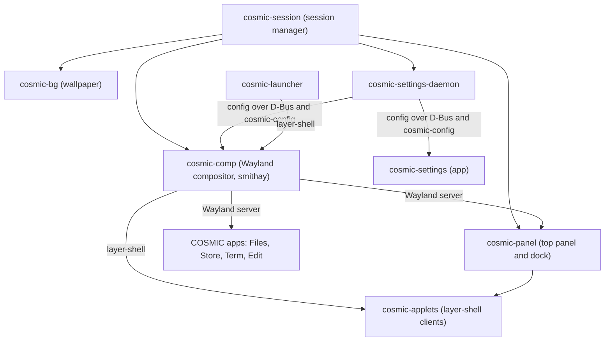
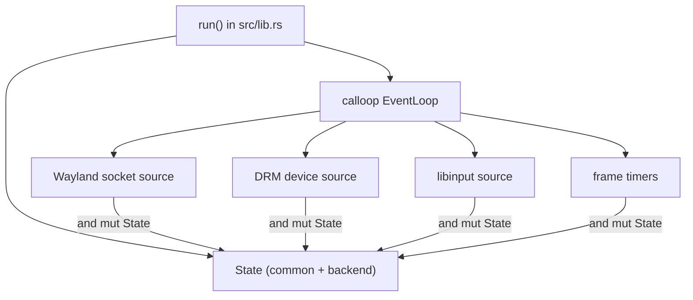
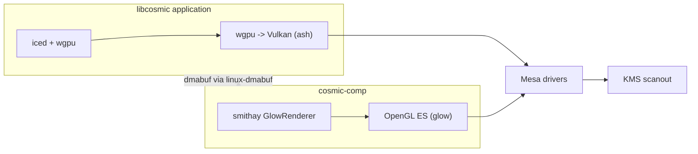

# Chapter 39f: libcosmic and the COSMIC Desktop — A Rust-Native Desktop Stack

> **Part**: Part VII-C — Desktop Frameworks
> **Audience**: Rust desktop application developers building COSMIC applications and applets; systems developers interested in a fully Rust desktop stack from the Wayland compositor up to the application widget library
> **Status**: First draft — 2026-07-24

## Table of Contents

- [Overview](#overview)
- [1. COSMIC Desktop Architecture](#1-cosmic-desktop-architecture)
  - [1.1 Motivation and Release Timeline](#11-motivation-and-release-timeline)
  - [1.2 Component Map](#12-component-map)
  - [1.3 A Pure-Rust Stack](#13-a-pure-rust-stack)
  - [1.4 Packaging and the COSMIC Store](#14-packaging-and-the-cosmic-store)
  - [1.5 What is the COSMIC Desktop?](#15-what-is-the-cosmic-desktop)
  - [1.6 What is libcosmic?](#16-what-is-libcosmic)
  - [1.7 What is smithay?](#17-what-is-smithay)
- [2. cosmic-comp: The Smithay-Based Compositor](#2-cosmic-comp-the-smithay-based-compositor)
  - [2.1 smithay: A Pure-Rust Wayland Server Library](#21-smithay-a-pure-rust-wayland-server-library)
  - [2.2 The DRM/KMS Backend](#22-the-drmkms-backend)
  - [2.3 cosmic-comp State Hierarchy and the calloop Event Loop](#23-cosmic-comp-state-hierarchy-and-the-calloop-event-loop)
  - [2.4 Wayland Protocol Support](#24-wayland-protocol-support)
  - [2.5 Input Handling](#25-input-handling)
  - [2.6 GPU Rendering: GlowRenderer, not wgpu](#26-gpu-rendering-glowrenderer-not-wgpu)
- [3. libcosmic Architecture](#3-libcosmic-architecture)
  - [3.1 Relationship to iced](#31-relationship-to-iced)
  - [3.2 The cosmic::Application Trait](#32-the-cosmicapplication-trait)
  - [3.3 cosmic::app::Settings and Core](#33-cosmicappsettings-and-core)
  - [3.4 Crate Structure](#34-crate-structure)
- [4. The COSMIC Widget Library](#4-the-cosmic-widget-library)
- [5. COSMIC Theming System](#5-cosmic-theming-system)
- [6. Building a COSMIC Application](#6-building-a-cosmic-application)
  - [6.5 Building a Panel Applet](#65-building-a-panel-applet)
- [7. cosmic-settings: Anatomy of a Real COSMIC App](#7-cosmic-settings-anatomy-of-a-real-cosmic-app)
- [8. XWayland and Legacy Application Support](#8-xwayland-and-legacy-application-support)
- [9. Comparison: COSMIC vs GNOME vs KDE vs elementary](#9-comparison-cosmic-vs-gnome-vs-kde-vs-elementary)
- [Integrations](#integrations)
- [References](#references)

---

## Overview

The COSMIC desktop environment is System76's from-scratch replacement for the GNOME-based desktop that shipped on earlier Pop!_OS releases. What makes it interesting for a book about the Linux graphics stack is not that it is another desktop — it is that the *entire* stack, from the Wayland compositor that drives KMS scanout up to the widget library that lays out buttons, is written in Rust with no C GUI-toolkit dependency in the critical path. Where a GNOME session runs Mutter (C) plus GTK4 (C) plus libadwaita (C), and a KDE Plasma session runs KWin (C++) plus Qt (C++), a COSMIC session runs `cosmic-comp` (Rust, on the `smithay` library) plus `libcosmic` (Rust, on the `iced` toolkit). [Source](https://github.com/pop-os/cosmic-epoch)

This chapter treats libcosmic as a framework and the COSMIC desktop as a case study. It has two natural readerships. The first is the application developer who wants to ship a COSMIC-native GUI and needs the current `cosmic::Application` API, the widget set, the theming model, and the `cosmic-config` persistence layer. The second is the systems developer who wants to see how a Rust compositor implements the same DRM/KMS atomic-commit and GBM buffer paths (Ch2, Ch4) as wlroots-based compositors (Ch21) and Mutter (Ch22), but with a different type discipline.

A note on scope and overlap. Chapter 39 §9 already covers the *rendering mechanics* of the iced toolkit — the Elm-architecture model, the `iced_wgpu::Engine`, the primitive render loop that turns quads, text, and images into `wgpu` command buffers, and the software `tiny_skia` fallback. This chapter does not re-derive those; where the widget or theming sections touch iced's renderer, they cross-link Ch39 and instead go deeper on what is specific to *COSMIC*: the compositor internals, the current application API, `cosmic-config`, `cosmic-settings` as a worked example, XWayland support, and the desktop-stack framing.

One correction is worth stating up front because it recurs. libcosmic *applications* render through `wgpu` (via iced), and on Linux `wgpu` resolves to the Vulkan backend against Mesa drivers (Ch18). The `cosmic-comp` *compositor*, however, does **not** render through `wgpu` — it uses smithay's OpenGL ES renderer (`GlowRenderer`, over the `glow` crate). The two layers of the "pure-Rust GPU stack" therefore reach the GPU by different routes, and §2.6 spells this out.

A second orientation point: **COSMIC's public API is explicitly not yet stable.** The upstream example source carries the line "The libcosmic API is not stable yet." [Source](https://github.com/pop-os/libcosmic/blob/master/examples/application/src/main.rs) The code in this chapter is drawn from upstream examples current as of mid-2026 (COSMIC Epoch 1.0, released December 2025), and should be treated as representative of the shape of the API rather than a frozen contract.

---

## 1. COSMIC Desktop Architecture

### 1.1 Motivation and Release Timeline

System76 had shipped Pop!_OS as a GNOME derivative for years, layering shell extensions and a GTK theme on top of the stock GNOME session. The stated motivation for building COSMIC from scratch was that the extension model imposed a ceiling: GNOME Shell is a single JavaScript-driven process, extensions are fragile across GNOME versions, and features System76 wanted (auto-tiling window management, a configurable panel and dock, deep theming) fought the platform rather than composing with it. Rather than continue patching GNOME, System76 chose to write a new environment in Rust. [Source](https://blog.system76.com/post/cosmic-a-new-desktop-environment)

The release timeline as of mid-2026:

| Milestone | Date | Notes |
|---|---|---|
| First alpha | 5 August 2024 | Installable on Pop!_OS and packaged for several other distros |
| First beta (Epoch 1 beta) | 25 September 2025 | Feature-complete target for 1.0 |
| Epoch 1 (COSMIC 1.0) | 11 December 2025 | Shipped as the default desktop on Pop!_OS 24.04 LTS |

[Source](https://www.phoronix.com/news/Pop-OS-24.04-In-December) [Source](https://en.wikipedia.org/wiki/COSMIC_(desktop_environment))

Pop!_OS 24.04 LTS was the first Pop!_OS release to ship COSMIC by default rather than GNOME. By mid-2026 COSMIC had received point releases in the 1.0.x series and was packaged in the repositories of several independent distributions (Fedora COSMIC spin, an Arch package set, NixOS module), reflecting that COSMIC is a distribution-agnostic desktop rather than a Pop!_OS-only component. [Source](https://wiki.archlinux.org/title/COSMIC)

### 1.2 Component Map

A COSMIC session is a set of cooperating processes rather than a monolith. `cosmic-session` is the session manager launched by the display manager (or a TTY startup script); it starts `cosmic-comp` and the shell components and restarts them if they crash. The compositor is the Wayland server; every other graphical component is a Wayland client of it.



The shell components — `cosmic-panel`, `cosmic-applets`, `cosmic-launcher`, `cosmic-bg`, and the OSD/notification surfaces — are themselves libcosmic programs. They differ from ordinary applications in that they are placed on-screen through the `wlr-layer-shell` protocol (background, top, overlay layers) rather than as ordinary `xdg-shell` toplevels, and they run as *applets* using a lighter entry point (§4, §6.5-equivalent in this chapter's §4). `cosmic-settings-daemon` is a headless service that owns global configuration and hardware state (backlight, keyboard layout, theme mode) and exposes it over D-Bus and `cosmic-config`. [Source](https://github.com/pop-os/cosmic-epoch)

### 1.3 A Pure-Rust Stack

The distinguishing property is the absence of a C GUI toolkit in the rendering path. The three load-bearing layers are:

- **smithay** — a Rust library of building blocks for Wayland *servers* (not a binding to wlroots; a native reimplementation of the same responsibilities). `cosmic-comp` is built on it. [Source](https://github.com/Smithay/smithay)
- **iced** — a cross-platform Rust GUI toolkit using the Elm architecture and a `wgpu` renderer (covered mechanically in Ch39 §9). [Source](https://github.com/iced-rs/iced)
- **libcosmic** — System76's widget library and application framework on top of iced, adding a design system, theming, accessibility, and a higher-level `Application` API. [Source](https://github.com/pop-os/libcosmic)

This does not mean *zero* C: Mesa (the Vulkan/GLES driver stack), the kernel DRM subsystem, `libinput`, `libwayland`'s wire protocol conventions, and system libraries like `fontconfig` and `freetype` (Ch39 §7, reached transitively) are all still C. The claim is narrower and more precise: the compositor and the widget toolkit — the parts a desktop project would normally take from GTK/Qt/Mutter/KWin — are Rust. This is the concrete instance of the "Rust in the graphics stack" theme that also appears in Mesa's Rust components (Ch4), NVK/rusticl, and the `nova` DRM driver work.

### 1.4 Packaging and the COSMIC Store

COSMIC ships its own application store, `cosmic-store`, itself a libcosmic application. It is a front end over multiple packaging backends rather than a new package format: it aggregates Flatpak (Ch111) applications from Flathub, native distribution packages (`apt` on Pop!_OS), and AppStream metadata to present a unified catalogue with screenshots and descriptions. [Source](https://github.com/pop-os/cosmic-store) Because COSMIC applications are ordinary Wayland clients, they run unmodified under Flatpak sandboxing, using `xdg-desktop-portal` (Ch23) for file dialogs, screenshots, and camera access — the same portal path GTK and Qt applications use.

### 1.5 What is the COSMIC Desktop?

The COSMIC desktop environment is a complete graphical shell for Linux, developed by System76 as the default environment for Pop!_OS. Unlike most existing Linux desktops, which are built on C or C++ toolkit stacks (GTK for GNOME, Qt for KDE Plasma), COSMIC is designed from the ground up in Rust, with the compositor, widget library, and shell utilities sharing the same language and type system. COSMIC implements the Wayland display protocol: every application and shell component connects to the `cosmic-comp` Wayland compositor, and no X11 server is required for native sessions — X11 applications run through the XWayland compatibility layer, covered in §8.

The desktop follows a standard compositor architecture. `cosmic-comp` acts as the Wayland server and KMS output manager, driving DRM scanout for connected displays (Ch2). The shell surfaces — panel, dock, applet overlays, and wallpaper — are implemented as Wayland clients connected to the compositor via the `wlr-layer-shell` protocol. Configuration state flows through the `cosmic-config` key-value store and `cosmic-settings-daemon`. Applications are ordinary `xdg-shell` Wayland clients, regardless of whether they use libcosmic, GTK, Qt, or another toolkit.

COSMIC 1.0 (Epoch 1) shipped in December 2025 as the default desktop on Pop!_OS 24.04 LTS and is independently packaged for Fedora, Arch Linux, and NixOS. The component organization of a running COSMIC session is shown in §1.2.

### 1.6 What is libcosmic?

libcosmic is the Rust application framework and widget library that System76 provides for building COSMIC-native desktop applications and shell applets. It sits between the iced GUI toolkit (Ch39 §9) and the application developer: it adds the COSMIC design system (spacing constants, typography scales, icon handling), a configurable theme with light and dark modes, accessibility metadata, the `cosmic::Application` trait that unifies the entry point for both full applications and lightweight applets, and the `cosmic-config` library for persistent per-application key-value settings.

A libcosmic program implements the `cosmic::Application` trait on a state struct, declares a `Settings` value specifying window geometry and application metadata, and calls `cosmic::app::run()`. libcosmic wraps iced's `Application` trait, intercepts the event loop, injects COSMIC window decorations and theming, and delegates layout and rendering to iced's existing machinery — the Elm-architecture model, the `iced_wgpu::Engine` for GPU-accelerated output, and the `tiny_skia` software fallback. The GPU rendering path therefore runs: libcosmic widget tree → iced primitive renderer → `wgpu` → Mesa Vulkan driver (Ch18). libcosmic's API is described fully in §3 and §4; the current API is representative of its shape but not yet declared stable.

### 1.7 What is smithay?

smithay is a Rust library of primitives for building Wayland server (compositor) implementations. It is not a binding to the C wlroots library; it is an independent implementation of the same problem domain — DRM/KMS atomic output management, GBM buffer allocation, EGL/GLES rendering, `libinput` event routing, and protocol dispatch for dozens of Wayland extensions — written natively in Rust. `cosmic-comp` uses smithay as infrastructure the same way Sway or Hyprland use wlroots: a collection of proven, composable building blocks that handles low-level plumbing while the compositor itself provides window-management policy (tiling layout, workspace model, panel placement).

Two design decisions in smithay propagate through `cosmic-comp`. First, smithay is built around the `calloop` event loop, a single-threaded callback reactor: every event source (the Wayland socket, DRM device fds, `libinput` fd, timers) registers a callback that receives exclusive mutable access to the compositor's central state struct, eliminating lock contention on the compositor's hot path. Second, smithay uses a trait-based handler pattern: the compositor implements traits such as `CompositorHandler`, `XdgShellHandler`, and `SeatHandler` on its state type, and `delegate_*!` macros wire Wayland protocol dispatch to those trait implementations. Both decisions shape the `cosmic-comp` source structure described in §2.3.

---

## 2. cosmic-comp: The Smithay-Based Compositor

### 2.1 smithay: A Pure-Rust Wayland Server Library

smithay is to `cosmic-comp` what wlroots is to Sway and Hyprland (Ch21): a library of the pieces a Wayland *server* needs, leaving window-management policy to the compositor. It is not a Rust binding to the C wlroots library — it is an independent implementation of the same problem space (DRM/KMS output management, GBM buffer allocation, EGL/GLES rendering, `libinput` event handling, and a large collection of Wayland protocol implementations) written natively in Rust. [Source](https://github.com/Smithay/smithay)

Two design choices in smithay shape everything downstream. First, it is built around the **`calloop`** event loop, which is a callback-based single-threaded reactor: every source (the Wayland socket, DRM device fds, `libinput`'s fd, timers, inter-thread channels) registers a callback, and each callback receives `&mut` access to a single centralized state struct. Because callbacks are invoked sequentially on one thread, the compositor gets shared mutable state without locks. [Source](https://docs.rs/calloop) Second, smithay uses Rust traits as *handler* interfaces: a compositor implements traits such as `CompositorHandler`, `XdgShellHandler`, `SeatHandler`, and `OutputHandler` on its state type, and macros like `delegate_compositor!` wire the generated dispatch glue. This trait-and-delegate pattern is smithay's equivalent of wlroots' signal/listener callbacks.

### 2.2 The DRM/KMS Backend

For native hardware, smithay provides a DRM/KMS backend that exercises the same kernel interfaces described in Ch2 and Ch4. The relevant types live under `smithay::backend::drm` and `smithay::backend::allocator`:

- **`DrmDevice`** — wraps an open DRM device node (`/dev/dri/cardN`); enumerates connectors, CRTCs, and planes; performs atomic mode-setting commits.
- **`DrmSurface`** — "a part of a `Device` that may output a picture to a number of connectors"; it drives page flips for one output. [Source](https://smithay.github.io/smithay/smithay/backend/drm/index.html)
- **`GbmDevice`** / **`GbmAllocator`** — allocate scanout-capable buffers via Mesa's GBM (Ch4), producing dmabufs that can be imported by the renderer and scanned out by KMS.
- **`DrmCompositor`** — a higher-level helper that "provides a simplified way to utilize DRM planes for using hardware composition," automatically assigning surfaces to overlay/primary/cursor planes where the hardware allows, and falling back to GPU composition otherwise. [Source](https://smithay.github.io/smithay/smithay/backend/drm/compositor/struct.DrmCompositor.html)

The atomic-commit and GBM-allocation code paths here are the same ones described for wlroots' DRM backend in Ch21 and for KMS in Ch2; the difference is entirely in the language and type discipline, not in the kernel ABI.

### 2.3 cosmic-comp State Hierarchy and the calloop Event Loop

`cosmic-comp` organizes its state in a small number of nested structs owned exclusively by the main-thread event loop. The top-level type is `State`, which holds a `Common` (shared, backend-independent state) and a `BackendData` (the graphics implementation currently in use):

```rust
// Shape of cosmic-comp's top-level state (src/state.rs), simplified.
pub struct State {
    pub common: Common,
    pub backend: BackendData,
    // initialization synchronization, frame-scheduling bookkeeping...
}

pub struct Common {
    pub shell: Arc<RwLock<Shell>>,          // windows, workspaces, tiling
    pub config: Config,                     // from cosmic-config
    pub display_handle: DisplayHandle,      // Wayland display
    pub event_loop_handle: LoopHandle<'static, State>,
    // 30+ Wayland protocol state objects...
}

pub enum BackendData {
    Kms(KmsState),        // native hardware (DRM/KMS + GBM + GLES)
    X11(X11State),        // nested inside an X11 server, for development
    Winit(WinitState),    // nested inside another Wayland/X11 window
}
```

[Source](https://github.com/pop-os/cosmic-comp/blob/master/src/state.rs)

The three-way `BackendData` enum is what lets the same compositor run on bare metal (the `Kms` variant) and in a developer's existing session for testing (the `X11` and `Winit` variants) without changing the shell logic. The `Shell` — held behind an `Arc<RwLock<…>>` because a few auxiliary threads read it — owns the workspace model, the floating and tiling layers, and the mapping from Wayland surfaces to managed windows.

The `run` entry point (in `src/lib.rs`) performs the standard smithay bring-up sequence: create the `calloop` event loop, create the Wayland display and insert its socket as an event source, initialize `State`, establish session IPC with `cosmic-session`, optionally integrate with systemd, then select and initialize the backend (KMS on real hardware; X11 or winit when a display server is already present). [Source](https://github.com/pop-os/cosmic-comp/blob/master/src/lib.rs) Because `calloop` hands each callback a `&mut State`, the compositor accesses all of this centralized state without synchronization on the hot path.



### 2.4 Wayland Protocol Support

`cosmic-comp` implements a large protocol surface — the compositor documentation describes "30+ protocol handlers." [Source](https://deepwiki.com/pop-os/cosmic-comp) The load-bearing ones for a desktop are:

- **`wl_compositor` / `wl_subcompositor` / `wl_shm`** — core surface and shared-memory buffer protocols.
- **`xdg-shell`** — the standard application-window protocol (`xdg_toplevel`, `xdg_popup`), used by every ordinary COSMIC and third-party application.
- **`wlr-layer-shell`** (`zwlr_layer_shell_v1`) — anchored surfaces for the panel, dock, applets, wallpaper, and lock screen. COSMIC's shell components are all layer-shell clients.
- **`linux-dmabuf`** (Ch20) — zero-copy buffer sharing, letting GPU clients (Vulkan/GLES applications, browsers) hand the compositor a dmabuf rather than an SHM copy.
- **`wp_presentation`** and the **explicit-sync** protocol (`wp_linux_drm_syncobj_v1`, Ch3) — presentation-time feedback and DRM timeline syncobj acquire/release points, the latter important for NVIDIA and other drivers lacking implicit sync.
- **`wlr-screencopy`** / `ext-image-copy-capture` — screen capture, the path `xdg-desktop-portal-cosmic` uses to serve PipeWire (Ch26, Ch38) screencast requests.

COSMIC additionally defines its own protocol extensions (under the `cosmic-protocols` repository) for workspace management, toplevel information, and the panel/applet relationship — for example, so an applet can learn the panel's size and anchor and request popup placement. [Source](https://github.com/pop-os/cosmic-protocols)

### 2.5 Input Handling

Input flows through smithay's `libinput` integration. `cosmic-comp` opens input devices through a session/seat manager (`libseat`, which brokers device access without requiring the compositor to run as root), feeds the `libinput` fd into `calloop`, and translates the resulting `libinput` events into smithay's `InputBackend` events. Those are then routed through the `Seat`/`SeatHandler` machinery to focus the correct surface and dispatch `wl_pointer`, `wl_keyboard`, and `wl_touch` events to clients. [Source](https://docs.rs/smithay/latest/smithay/backend/input/index.html) This is the same `libinput` event chain described from the wlroots side in Ch21; the events a COSMIC application ultimately receives are ordinary Wayland input events, indistinguishable from those a wlroots compositor would send.

### 2.6 GPU Rendering: GlowRenderer, not wgpu

This is the point most likely to be misunderstood, so it is worth stating precisely. `cosmic-comp` renders using smithay's OpenGL ES renderer, **`GlesRenderer`** (and its `glow`-crate wrapper, **`GlowRenderer`**) — *not* `wgpu`. All three backends (`Kms`, `X11`, `Winit`) share this common rendering interface. [Source](https://smithay.github.io/smithay/smithay/backend/renderer/gles/struct.GlesRenderer.html)

For multi-GPU laptops (the common System76 case of an integrated Intel/AMD GPU plus a discrete NVIDIA GPU), smithay provides **`MultiRenderer`** under `smithay::backend::renderer::multigpu`, backed by a `GbmGlesBackend`. A `MultiRenderer` "transparently copies rendering results to another GPU, as well as transparently importing client buffers residing on different GPUs" — so a client rendering on the integrated GPU can be composited and scanned out on an output driven by the discrete GPU, with the cross-GPU dmabuf copy handled inside the renderer. [Source](https://smithay.github.io/smithay/smithay/backend/renderer/multigpu/struct.MultiRenderer.html)

A native Vulkan renderer for the compositor has been discussed upstream (tracked as an open issue) but is not the shipping default as of mid-2026; the compositor path remains GLES. [Source](https://github.com/pop-os/cosmic-comp/issues/2055)

The result is that the "pure-Rust GPU stack" reaches the GPU by *two different routes* at its two layers:



An application submits its frame as a dmabuf (produced by wgpu/Vulkan) through `linux-dmabuf`; the compositor imports that dmabuf into its GLES renderer, composites it with other surfaces and shell chrome, and either scans it out directly on a KMS plane (via `DrmCompositor`, when a hardware plane is free) or composites to the primary framebuffer. Understanding that the toolkit is Vulkan-via-wgpu while the compositor is GLES is essential when tracing a frame from application to page-flip.

---

## 3. libcosmic Architecture

### 3.1 Relationship to iced

libcosmic is best understood as an *opinionated superset* of iced. iced provides the toolkit foundation — the Elm-style Model-View-Update loop, the `Element` widget tree, the `wgpu` renderer, and platform integration through winit or (on Wayland) the SCTK layer-shell backend. Those internals are covered in Ch39 §9 and are not repeated here. What libcosmic adds on top is:

1. A design system: the COSMIC visual language expressed as design tokens (§5).
2. Additional widgets that iced does not ship: header bars, navigation sidebars, context drawers, segmented buttons, settings sections (§4).
3. A higher-level application API (`cosmic::Application`) that bakes in COSMIC conventions — window decorations, the header bar, navigation, theme subscription — so applications do not reimplement them (§3.2).
4. Integration crates: `cosmic-config` for persistence, `cosmic-theme` for theming, accessibility via AccessKit, and D-Bus helpers.

Notably, libcosmic tracks System76's own fork of iced rather than upstream iced directly, because COSMIC needs Wayland-specific features (layer-shell surfaces, fractional scaling behavior, multi-window handling) faster than they land upstream. [Source](https://github.com/pop-os/libcosmic)

### 3.2 The cosmic::Application Trait

The central abstraction for a COSMIC program is the `cosmic::Application` trait. It follows the same MVU shape as `iced::Application` but threads a `Core` object through the framework and returns `cosmic::app::Task` values from lifecycle methods. The minimal required surface is:

```rust
use cosmic::app::Task;
use cosmic::{Core, Element};

impl cosmic::Application for App {
    // Async executor (tokio by default).
    type Executor = cosmic::executor::Default;
    // Data passed in at startup (flags).
    type Flags = ();
    // The application's message type.
    type Message = Message;
    // Reverse-DNS app ID given to the window manager.
    const APP_ID: &'static str = "org.cosmic.AppDemo";

    fn core(&self) -> &Core { &self.core }
    fn core_mut(&mut self) -> &mut Core { &mut self.core }

    // Construct the model; optionally emit a startup Task.
    fn init(core: Core, flags: Self::Flags) -> (Self, Task<Self::Message>);

    // Handle a message, mutate state, return follow-up work.
    fn update(&mut self, message: Self::Message) -> Task<Self::Message>;

    // Build the UI from current state.
    fn view(&self) -> Element<'_, Self::Message>;
}
```

[Source](https://pop-os.github.io/libcosmic-book/application-trait.html)

The differences from plain iced are worth calling out:

- **`core` / `core_mut`** are mandatory accessors. The framework stores window geometry, the active theme, navigation and context-drawer state inside `Core`, and reaches it through these methods.
- **`init` takes the `Core`** the framework constructed (rather than the application constructing its own window) and returns `(Self, Task)`.
- **`update` returns `cosmic::app::Task<Message>`.** As of the current API this is `Task`, the successor to iced's older `Command` type; `Task::none()` is the "nothing to do" value. Application logic in `update` must be fast — "anything requiring asynchronous or long execution time should be returned as a `Task` or placed into a `Subscription`," because `update` runs on the UI event loop and blocking it freezes the window. [Source](https://pop-os.github.io/libcosmic-book/application-trait.html)

The trait also exposes many *optional* methods with sensible defaults, the important ones being `nav_model()` (return a navigation sidebar model), `on_nav_select()` (react to sidebar selection), `header_start()` / `header_end()` (populate the header bar), `context_drawer()` (secondary panel content), and `subscription()` (long-lived event streams such as timers or theme-change watchers). Sections 4 and 6 use these.

An application is launched with `cosmic::app::run`, parameterized by the application type and given a `Settings` plus the startup flags:

```rust
fn main() -> cosmic::iced::Result {
    let settings = cosmic::app::Settings::default();
    cosmic::app::run::<App>(settings, /* flags: */ ())
}
```

Panel *applets* use a parallel entry point, `cosmic::applet::run`, instead of `cosmic::app::run`; an applet is a layer-shell surface managed by `cosmic-panel` rather than an `xdg-shell` toplevel, so it has a lighter lifecycle and a different helper type. [Source](https://pop-os.github.io/libcosmic-book/panel-applets.html)

### 3.3 cosmic::app::Settings and Core

`cosmic::app::Settings` configures the window and framework behavior at startup. It is a builder:

```rust
use cosmic::iced::Size;

let settings = cosmic::app::Settings::default()
    .size(Size::new(1024.0, 768.0))   // initial window size
    .debug(false);                    // toggle the iced debug overlay
```

`Core` is the framework-state object handed to `init`. Beyond the theme and window geometry, it carries flags such as `core.window.context_is_overlay` (whether the context drawer overlays the content or sits beside it), and helper methods used from `update` like `set_header_title()`, `set_window_title(title, window_id)`, and `main_window_id()`. Because the widgets are stateless — "they rely on the application model as the source for their state" — `Core` plus the application's own struct fields are the single source of truth the `view` reads from each frame. [Source](https://pop-os.github.io/libcosmic-book/application-trait.html)

### 3.4 Crate Structure

libcosmic is a workspace of focused crates; an application depends on a subset:

| Crate | Role |
|---|---|
| `libcosmic` (`cosmic`) | The umbrella crate: `Application`, widgets, theme, prelude; feature-gated |
| `cosmic-config` | RON-backed configuration store with atomic writes and file watching |
| `cosmic-theme` | The `Theme` design-token model and light/dark/accent derivation |
| `cosmic-settings-daemon` (client) | D-Bus client for global settings and theme state |
| `cosmic-panel-config` | Applet/panel geometry configuration types |

[Source](https://github.com/pop-os/libcosmic) The `cosmic::prelude` re-exports the common types (`Application`, `Element`, `Task`, `Core`, `ApplicationExt`) so most files begin with `use cosmic::prelude::*;`.

---

## 4. The COSMIC Widget Library

`cosmic::widget` re-exports iced's widgets and adds COSMIC-specific ones. The mechanics of how any widget becomes GPU primitives is Ch39 §9 material; here the focus is the *set* libcosmic adds and the builder patterns for them.

**Navigation and chrome widgets:**

| Widget | Role |
|---|---|
| `nav_bar` (`nav_bar::Model`) | The left navigation sidebar; a single-selection model of pages |
| `header_bar()` | Title bar with start/center/end slots (populated via `header_start`/`header_end`) |
| `context_drawer()` | Slide-in secondary panel, overlay or side-by-side per `core.window.context_is_overlay` |
| `segmented_button` | Tab-bar / radio-style selector; the primitive underlying `nav_bar` |
| `menu` | Popover menus and the responsive menu bar (`responsive_menu_bar()`) |
| `dialog` | Modal dialog with action buttons |

The navigation sidebar is driven by a `nav_bar::Model`, populated with a chained builder. Each entry gets display text, an optional icon, and arbitrary attached `data`:

```rust
use cosmic::widget::nav_bar;

let mut nav_model = nav_bar::Model::default();
nav_model.insert().text("Page 1").data::<String>("content 1".into());
nav_model.insert().text("Page 2").data::<String>("content 2".into());
nav_model.activate_position(0);
```

The active entry's attached data is retrieved in `view` with `active_data::<T>()`, and selection is handled by implementing `on_nav_select`:

```rust
fn nav_model(&self) -> Option<&nav_bar::Model> {
    Some(&self.nav_model)
}

fn on_nav_select(&mut self, id: nav_bar::Id) -> cosmic::app::Task<Self::Message> {
    self.nav_model.activate(id);
    self.update_title()   // e.g. update header/window title to the new page
}
```

[Source](https://github.com/pop-os/libcosmic/blob/master/examples/application/src/main.rs)

**Settings and list widgets.** For the extremely common case of a settings page — a titled section containing labeled rows each holding a control — libcosmic provides the `settings` module and `list_column`:

| Widget | Role |
|---|---|
| `settings::view_column(children)` | A column of settings sections with COSMIC spacing |
| `settings::section().title(..).add(..)` | A titled group of settings items |
| `settings::item(label, control)` | A single labeled row |
| `list_column()` | A separated list container |
| `toggler`, `spin_button`, `slider`, `dropdown` | Controls used inside settings items |

**Input, feedback, and icons.** The example application also exercises `text_input::text_input`, `text_input::secure_input` (password field), `text_input::search_input`, `slider`, `button::suggested` (an accented "primary" button), and the `progress_bar::linear` / `progress_bar::circular` families. [Source](https://github.com/pop-os/libcosmic/blob/master/examples/application/src/main.rs) Icons are loaded by *name* from the active icon theme rather than by path — `cosmic::widget::icon::from_name("screenshot-window-symbolic")` resolves against the freedesktop icon theme, so applications inherit the user's icon theme automatically. Spacing is likewise never hardcoded; `cosmic::theme::spacing().space_s` (and `space_xs`, `space_m`, …) returns theme-driven spacing values so layouts respond to the user's density preference.

---

## 5. COSMIC Theming System

COSMIC's theming is a *design-token* model: applications never hardcode a colour, radius, or spacing value. They reference semantic tokens, and the framework resolves them at render time from the active `Theme`. Ch39 §9.2 introduced the token concept; this section covers the concrete `cosmic-theme` types and how the values reach an application and change live.

### 5.1 The Theme Model

The `cosmic_theme::Theme` struct "contains the complete state for a theme, including color containers for different layers and accessibility flags." Its principal fields:

- `is_dark: bool` — dark vs light variant.
- `is_high_contrast: bool` — accessibility high-contrast mode.
- `background`, `primary`, `secondary` — `Container` types, each a layer with its own base colour plus derived component colours (the surface, the text drawn on it, hover/pressed states).
- `accent`, `destructive`, `warning`, `success` — semantic accent colours for interactive and status elements.
- `palette` — a `CosmicPaletteInner`, "the base colors from which others are derived."

[Source](https://deepwiki.com/pop-os/libcosmic) The layered `Container` idea (background → primary → secondary) is what gives COSMIC its sense of stacked surfaces: a window's base is `background`, a card on it is `primary`, a nested control area is `secondary`, and each layer carries a matching "on" colour for legible text.

### 5.2 Persistence and Live Changes via cosmic-config

The active theme is not compiled in; it lives in `cosmic-config` and is edited by `cosmic-settings`. The relevant configuration IDs are:

| Config ID | Purpose |
|---|---|
| `com.system76.CosmicTheme.Dark` | The active dark theme |
| `com.system76.CosmicTheme.Light` | The active light theme |
| `com.system76.CosmicTheme.Dark.Builder` | Parameters (accent, corner radius) used to *derive* the dark theme |
| `com.system76.CosmicTheme.Light.Builder` | Same, for light |
| `com.system76.CosmicTheme.Mode` | Which of light/dark is currently selected |

The `Theme` type itself `derive`s `CosmicConfigEntry`, so it serializes to and from RON with schema versioning (§6.4). [Source](https://deepwiki.com/pop-os/libcosmic) When a user changes the accent colour or toggles dark mode in `cosmic-settings`, the daemon rewrites the `*.Builder` and `Mode` entries; because `cosmic-config` watches those files, every running libcosmic application is notified and re-renders with the new tokens — no restart, no per-application theme code. libcosmic wires this watch into a `Subscription` so the application receives it as an ordinary message stream.

### 5.3 Export to Other Toolkits

So that non-COSMIC applications on a COSMIC session look consistent, `cosmic-theme` can *export* the active theme to other toolkits: `as_gtk4()` emits GTK4 CSS custom properties, and there are exporters for KDE's `KColorScheme` and for `qt5ct`/`qt6ct`. Convenience wrappers (`apply_exports()` / `write_exports()`) trigger all of these at once so a GTK or Qt application (Ch39) picks up COSMIC's accent colour and light/dark mode. [Source](https://deepwiki.com/pop-os/libcosmic)

### 5.4 How Tokens Reach iced

Under the hood, libcosmic maps its tokens onto iced's `Theme` and per-widget style closures. An application selects styling through libcosmic's `cosmic::theme` style enums (e.g. a `button::suggested` chooses the accent style) rather than constructing iced `StyleSheet` values directly; the `Core`-held `Theme` is what those style functions read. The practical rule for application authors is simply: pick the *semantic* widget variant (suggested/destructive/standard), never a literal colour, and theming follows for free.

---

## 6. Building a COSMIC Application

This section assembles the pieces into a small but complete two-pane application: a navigation sidebar on the left and page content on the right, with a header bar and persistent settings.

### 6.1 Cargo.toml

A libcosmic dependency is taken from git (crates.io releases lag the fast-moving API) with an explicit feature set. The upstream examples enable, at minimum, a windowing backend, an async runtime, accessibility, and multi-window support:

```toml
[package]
name = "cosmic-appdemo"
version = "0.1.0"
edition = "2021"

[dependencies]
env_logger = "0.11"

[dependencies.libcosmic]
git = "https://github.com/pop-os/libcosmic.git"
default-features = false
features = [
    "winit",         # windowing backend
    "tokio",         # async executor
    "wayland",       # Wayland (layer-shell) support
    "multi-window",  # multiple top-level windows
    "a11y",          # AccessKit accessibility
    "wgpu",          # GPU renderer (vs. tiny-skia software fallback)
    "dbus-config",   # use cosmic-settings-daemon for config on Linux
]
```

[Source](https://github.com/pop-os/libcosmic/blob/master/examples/application/Cargo.toml) [Source](https://github.com/pop-os/libcosmic/blob/master/Cargo.toml) The `wgpu` feature selects GPU rendering; dropping it (leaving only the software path) yields a `tiny_skia` build useful for headless CI. The `applet` feature (not enabled here) pulls in `cosmic-panel-config` and switches the target to a panel applet.

### 6.2 A Complete Two-Pane Application

```rust
// Copyright example, SPDX-License-Identifier: MPL-2.0
use cosmic::app::{Core, Settings, Task};
use cosmic::iced::{Alignment, Length, Size};
use cosmic::prelude::*;
use cosmic::widget::{self, nav_bar};

#[derive(Clone, Copy)]
enum Page { General, Appearance, About }

impl Page {
    const fn title(self) -> &'static str {
        match self {
            Page::General => "General",
            Page::Appearance => "Appearance",
            Page::About => "About",
        }
    }
}

#[derive(Clone, Debug)]
enum Message {
    ToggleAnimations(bool),
    ScaleChanged(f32),
}

struct App {
    core: Core,
    nav_model: nav_bar::Model,
    animations: bool,
    scale: f32,
}

impl cosmic::Application for App {
    type Executor = cosmic::executor::Default;
    type Flags = ();
    type Message = Message;
    const APP_ID: &'static str = "org.cosmic.AppDemo";

    fn core(&self) -> &Core { &self.core }
    fn core_mut(&mut self) -> &mut Core { &mut self.core }

    fn init(core: Core, _flags: ()) -> (Self, Task<Self::Message>) {
        let mut nav_model = nav_bar::Model::default();
        for page in [Page::General, Page::Appearance, Page::About] {
            nav_model
                .insert()
                .text(page.title())
                .icon(widget::icon::from_name("preferences-system-symbolic"))
                .data::<Page>(page);
        }
        nav_model.activate_position(0);

        let app = App { core, nav_model, animations: true, scale: 1.0 };
        (app, Task::none())
    }

    // Provide the sidebar model to the framework.
    fn nav_model(&self) -> Option<&nav_bar::Model> {
        Some(&self.nav_model)
    }

    // React to sidebar selection.
    fn on_nav_select(&mut self, id: nav_bar::Id) -> Task<Self::Message> {
        self.nav_model.activate(id);
        Task::none()
    }

    fn update(&mut self, message: Message) -> Task<Self::Message> {
        match message {
            Message::ToggleAnimations(v) => self.animations = v,
            Message::ScaleChanged(v) => self.scale = v,
        }
        Task::none()
    }

    fn view(&self) -> Element<'_, Self::Message> {
        let page = self
            .nav_model
            .active_data::<Page>()
            .copied()
            .unwrap_or(Page::General);

        let content = match page {
            Page::General => widget::settings::view_column(vec![
                widget::settings::section()
                    .title("Behavior")
                    .add(widget::settings::item(
                        "Enable animations",
                        widget::toggler(self.animations)
                            .on_toggle(Message::ToggleAnimations),
                    ))
                    .into(),
            ]),
            Page::Appearance => widget::settings::view_column(vec![
                widget::settings::section()
                    .title("Display")
                    .add(widget::settings::item(
                        "Interface scale",
                        widget::slider(0.5..=2.0, self.scale, Message::ScaleChanged)
                            .step(0.25),
                    ))
                    .into(),
            ]),
            Page::About => widget::settings::view_column(vec![
                widget::text::title3("COSMIC AppDemo").into(),
                widget::text::body("A minimal two-pane libcosmic application.").into(),
            ]),
        };

        widget::container(content)
            .width(Length::Fill)
            .height(Length::Fill)
            .align_x(Alignment::Center)
            .into()
    }
}

fn main() -> cosmic::iced::Result {
    let settings = Settings::default().size(Size::new(900.0, 640.0));
    cosmic::app::run::<App>(settings, ())
}
```

The structure mirrors the upstream `examples/application` program, reduced to a settings-style shape. [Source](https://github.com/pop-os/libcosmic/blob/master/examples/application/src/main.rs) The framework renders the navigation sidebar automatically because `nav_model()` returns `Some(...)`; the application only supplies the model and the per-page content in `view`. Note that no colours appear anywhere — `toggler`, `slider`, and the settings section all draw themselves from the active theme.

### 6.3 Persisting Settings with cosmic-config

To make the toggles above survive a restart, back them with `cosmic-config`. The low-level API is a typed key-value store over RON files with atomic writes and change watching:

```rust
use cosmic_config::{Config, ConfigGet, ConfigSet};

// Open (or create) this app's config, schema version 1.
let config = Config::new("org.cosmic.AppDemo", 1)?;

// Write and read typed values.
config.set("animations", true)?;
let animations: bool = config.get("animations")?;

// Group related writes atomically.
let tx = config.transaction();
tx.set("animations", false)?;
tx.set("scale", 1.25_f32)?;
tx.commit()?;

// React to external edits (e.g. cosmic-settings changing the same file).
let _watcher = config.watch(|config, keys| {
    for key in keys {
        println!("changed: {key} = {:?}", config.get::<ron::Value>(key));
    }
})?;
```

[Source](https://github.com/pop-os/libcosmic/blob/master/examples/config/src/main.rs) `Config::new(id, version)` stores under `~/.config/cosmic/<id>/v<version>/`; there are sibling constructors `Config::new_state` (for `~/.local/state`, transient UI state) and `Config::new_data` (for larger data). Writes are atomic (write-to-temp-then-rename) so a crash mid-write cannot corrupt the file, and the `watch` closure fires when the file changes on disk — which is exactly how live theme updates and cross-application config sync work.

For the common case of an entire config *struct*, applications derive `CosmicConfigEntry` and define a `CONFIG_VERSION` constant, letting libcosmic serialize the whole struct and handle migration when the version changes:

```rust
use cosmic_config::CosmicConfigEntry;
use serde::{Deserialize, Serialize};

const CONFIG_VERSION: u64 = 1;

#[derive(Clone, Debug, Serialize, Deserialize, CosmicConfigEntry)]
pub struct AppConfig {
    pub animations: bool,
    pub scale: f32,
}

impl Default for AppConfig {
    fn default() -> Self { Self { animations: true, scale: 1.0 } }
}
```

[Source](https://github.com/pop-os/cosmic-term) The derive generates the load/save/version-migration glue; `cosmic-term`, `cosmic-files`, and `cosmic-settings` all use this pattern for their configuration.

### 6.4 Multi-Window Support

With the `multi-window` feature enabled (COSMIC 1.0 ships multi-window support), an application can open additional top-level windows. Rather than one hidden global window, libcosmic tracks each window by id; `core.main_window_id()` returns the primary window, and title/geometry helpers take a window id (`set_window_title(title, window_id)`). Additional windows are opened by returning window-creation `Task`s from `update`, and each window's content is produced by a view keyed on the window id. [Source](https://github.com/pop-os/libcosmic/tree/master/examples/multi-window)

### 6.5 Building a Panel Applet

Panel applets are small libcosmic programs embedded in **`cosmic-panel`**, the desktop's top and/or bottom bars. They are ordinary libcosmic applications compiled with the `applet` feature flag, which switches several defaults: the windowing target becomes a `wlr-layer-shell` anchor surface (via `iced_sctk` / `iced_layershell`), the window is sized to match the panel height, and the framework provides a special `AppletHelper` for sizing and popup management. [Source](https://pop-os.github.io/libcosmic-book/panel-applets.html)

#### Feature Flag and Cargo Setup

```toml
[dependencies.libcosmic]
git = "https://github.com/pop-os/libcosmic.git"
default-features = false
features = [
    "applet",     # switches to layer-shell target, exposes cosmic::applet module
    "tokio",
    "wayland",
]
```

The `applet` feature is mutually exclusive with `winit` at the binary level — an applet is not a windowed application. A workspace can have both a main application crate (with `winit`) and an applet crate (with `applet`), sharing logic in a library crate.

#### The Applet Application Trait

An applet implements the same `cosmic::Application` trait as a regular app, but with three applet-specific additions:

```rust
use cosmic::app::{Core, Task};
use cosmic::iced::widget::row;
use cosmic::prelude::*;
use cosmic::widget;

struct BatteryApplet {
    core: Core,
    level: u8,   // battery percentage, 0–100
}

#[derive(Clone, Debug)]
enum Message {
    UpdateLevel(u8),
    TogglePopup,
}

impl cosmic::Application for BatteryApplet {
    type Executor = cosmic::executor::Default;
    type Flags = ();
    type Message = Message;

    const APP_ID: &'static str = "org.cosmic.BatteryApplet";

    fn core(&self) -> &Core { &self.core }
    fn core_mut(&mut self) -> &mut Core { &mut self.core }

    fn init(core: Core, _flags: ()) -> (Self, Task<Message>) {
        (Self { core, level: 100 }, Task::none())
    }

    fn view(&self) -> cosmic::Element<'_, Message> {
        // The applet button: an icon + label in the panel bar.
        // Clicking it should toggle a popup.
        self.core
            .applet
            .icon_button("battery-full-symbolic")
            .on_press(Message::TogglePopup)
            .into()
    }

    fn update(&mut self, msg: Message) -> Task<Message> {
        match msg {
            Message::UpdateLevel(l) => { self.level = l; Task::none() }
            // Toggle or create the popup.
            Message::TogglePopup => {
                if let Some(id) = self.core.main_window_id() {
                    self.core.applet.get_popup(id)
                } else {
                    Task::none()
                }
            }
        }
    }

    // The popup is a separate surface shown when icon_button is clicked.
    fn view_window(&self, _id: cosmic::iced::window::Id)
        -> cosmic::Element<'_, Message>
    {
        self.core
            .applet
            .popup_container(
                widget::column()
                    .push(widget::text::title4(format!("Battery: {}%", self.level)))
                    .push(widget::progress_bar::linear(0.0..=100.0, self.level as f32))
                    .into(),
            )
            .into()
    }
}

fn main() -> cosmic::iced::Result {
    cosmic::applet::run::<BatteryApplet>(true, ())
}
```

[Source: COSMIC Toolkit Book — Panel Applets](https://pop-os.github.io/libcosmic-book/panel-applets.html)

#### How cosmic-panel Embeds Applets

`cosmic-panel` is configured via `cosmic-config` with a list of applet IDs for each panel position (start/center/end, left/right). When the panel starts (or when configuration changes), it launches each applet process, connects their layer-shell surfaces to the panel's logical strip, and sizes each applet to the panel's configured height. Applets can expand to fill available width (flex-fill) or size-to-content; the `AppletHelper::size` function provides the current panel size so the applet view can use it for layout. Because applets are separate processes, a crashing applet does not affect the panel or other applets. [Source](https://pop-os.github.io/libcosmic-book/panel-applets.html)

---

## 7. cosmic-settings: Anatomy of a Real COSMIC App

`cosmic-settings` is the system settings application and the most instructive full-scale libcosmic program to study, because it exercises nearly every framework feature at once: a navigation sidebar of top-level categories, sub-page navigation, live D-Bus integration with system services, and heavy use of `cosmic-config`. [Source](https://github.com/pop-os/cosmic-settings)

### 7.1 Source Structure

The repository is organized as a workspace: a `cosmic-settings` binary crate that owns the shell (the window, the outer navigation, page routing) plus a set of *page* crates. The outer application holds a `nav_bar::Model` of the top-level categories (Networking, Bluetooth, Displays, Appearance, Input Devices, Power, System) and delegates the content pane to whichever page is active.

### 7.2 The Page System

Settings pages are modeled as trait objects so that categories can be registered dynamically rather than hard-wired into one giant `view`. A page implements a `Page` trait (its title, its info for the sidebar, its own `view` and message handling); the shell keeps a collection of boxed pages and dispatches to the active one. This is the same "pluggable page via dynamic dispatch" pattern GNOME's settings and KDE's System Settings use, expressed in Rust as `Box<dyn Page>`. The benefit is that a page's state, view, and D-Bus subscriptions are encapsulated in its own module and the shell need not know their internals.

> **Note — needs verification.** The precise trait names and module layout in `cosmic-settings` change frequently and were not pinned to a specific commit while writing. Treat the "page trait object" description as the architectural shape rather than an exact API; consult the current `cosmic-settings` source for the concrete trait definition.

### 7.3 D-Bus Integration

Most settings pages are thin GUIs over system D-Bus services, reached with the `zbus` crate (a pure-Rust D-Bus implementation — keeping the "no C" property intact for this layer too):

- **NetworkManager** (`org.freedesktop.NetworkManager`) — Wi-Fi and wired configuration on the Networking page.
- **UPower** (`org.freedesktop.UPower`) — battery and power state on the Power page.
- **AccountsService** (`org.freedesktop.Accounts`) — user account and avatar management.
- **cosmic-settings-daemon** — COSMIC's own daemon for backlight, theme mode, and keyboard layout.

Each page opens the relevant D-Bus proxy and turns its signals into libcosmic messages through a `Subscription`, so, for example, unplugging AC power causes UPower to emit a signal that the Power page receives as an ordinary `Message` and re-renders from.

### 7.4 Async Operations with tokio

Because `update` must not block, all of this D-Bus and hardware I/O runs on the tokio executor selected by `type Executor = cosmic::executor::Default`. A page issues an async call by returning a `Task` that awaits the D-Bus method and maps its result into a follow-up `Message`; the framework drives the future to completion off the UI path and re-enters `update` with the result. This is the same discipline every libcosmic app follows (§3.2) — the settings app simply has far more of it, since almost every control is backed by an asynchronous system service.

---

## 8. XWayland and Legacy Application Support

COSMIC is a Wayland-only desktop — there is no X11 session — so legacy X11 applications run through XWayland, using smithay's XWayland support.

### 8.1 smithay's XWayland Integration

smithay exposes an `XWayland` type that manages a running XWayland process. Standing up XWayland requires two connections working together: a Wayland socket, on which XWayland (acting as a Wayland *client* of `cosmic-comp`) creates a surface for each X11 window, and an X11 socket, on which the compositor's built-in X11 window manager connects to handle X11 events. [Source](https://docs.rs/smithay/latest/smithay/xwayland/struct.XWayland.html) The compositor implements that window manager through smithay's `X11Wm`, whose `start_wm` associates the X11 connection with the compositor state. `cosmic-comp` starts XWayland lazily and reaps it when no X11 clients remain.

### 8.2 X11 Window Mapping and Decoration

The X11 window manager side of `cosmic-comp` translates between X11 semantics and COSMIC's window model: each X11 top-level maps to a managed window in the same `Shell` that owns native Wayland windows, so an `xterm` and a COSMIC app tile and stack together. Because X11 applications do not draw client-side decorations, the compositor supplies server-side decorations for them, and it bridges the clipboard and drag-and-drop between the X11 and Wayland worlds (smithay's recent `X11Wm` changes added DnD-focus handling for exactly this). [Source](https://github.com/Smithay/smithay/blob/master/CHANGELOG.md)

### 8.3 GTK and Qt Application Compatibility

Native GTK3/GTK4 and Qt5/Qt6 applications generally run as Wayland clients directly (both toolkits have mature Wayland backends — Ch39), so they do not need XWayland at all; XWayland is the fallback for applications that are X11-only. Visual consistency for those native GTK/Qt applications comes from the theme-export mechanism of §5.3: `cosmic-theme` writes GTK4 CSS variables and Qt platform-theme colours so a GTK or Qt window on a COSMIC session picks up the user's accent colour and light/dark preference rather than looking foreign.

---

## 9. Comparison: COSMIC vs GNOME vs KDE vs elementary

| Dimension | COSMIC | GNOME | KDE Plasma | elementary OS (Pantheon) |
|---|---|---|---|---|
| Implementation language | Rust | C (Shell in JS) | C++ | Vala / C |
| Compositor | cosmic-comp (smithay) | Mutter | KWin | Gala (on Mutter) |
| Compositor renderer | GLES (`GlowRenderer`) | GL / Vulkan | GL / Vulkan (Qt/KWin) | GL |
| Widget toolkit | libcosmic (on iced) | GTK4 + libadwaita | Qt6 + Kirigami | GTK4 (Granite) |
| App GPU rendering | wgpu → Vulkan | GSK (Vulkan/GL) | Qt RHI (Vulkan/GL) | GSK |
| Config system | cosmic-config (RON files) | GSettings / dconf | KConfig (INI) | GSettings / dconf |
| Extension model | Separate applets/processes | GNOME Shell JS extensions | Plasmoids (QML) | Limited |
| Window management | Auto-tiling + floating built in | Floating (extensions for tiling) | Floating (+ scripts) | Floating |
| Session protocol | Wayland only | Wayland (X11 legacy) | Wayland + X11 | Wayland + X11 |
| Primary sponsor | System76 | GNOME Foundation | KDE e.V. | elementary, Inc. |

The COSMIC-specific rows are the ones that matter for this book. Its compositor renders through GLES while its applications render through wgpu/Vulkan (§2.6) — a split none of the other three share, since GNOME and KDE use one toolkit's renderer end to end. Its configuration is human-readable RON files with per-application file watching (§5, §6.3) rather than a binary/keyed database like dconf or an INI store like KConfig. And auto-tiling is a first-class, built-in window-management mode rather than an extension or script. What COSMIC does *not* yet have, relative to GNOME and KDE, is a decade of ecosystem maturity: the API is explicitly unstable, the third-party application set is young, and some polish and accessibility work is ongoing as the 1.0.x series matures.

---

## Integrations

- **KMS/DRM and GBM (Ch2, Ch4)**: `cosmic-comp`'s smithay DRM backend (`DrmDevice`, `DrmSurface`, `DrmCompositor`, `GbmAllocator`) drives the same atomic mode-setting and GBM buffer-allocation paths as wlroots and Mutter. §2.2, §2.3.
- **Wayland protocols (Ch20)**: `linux-dmabuf`, `wp_presentation`, and explicit sync (`wp_linux_drm_syncobj_v1`) are how application frames reach the compositor; layer-shell anchors the COSMIC shell components. §2.4.
- **KMS colour and explicit sync (Ch3)**: the DRM timeline syncobj acquire/release points COSMIC attaches to commits are the explicit-sync mechanism from Ch3. §2.4, §2.6.
- **wlroots compositors (Ch21)**: smithay is the Rust counterpart to wlroots; the `libinput` event chain and DRM paths are architecturally parallel. §2.1, §2.5.
- **Mutter and KWin (Ch22)**: `cosmic-comp` is a third major desktop compositor alongside these; §9 compares the three.
- **Mesa Vulkan and GLES drivers (Ch18, Ch19)**: application `wgpu` resolves to Vulkan (ANV/RADV/NVK) while the compositor's `GlowRenderer` uses GLES — both are Mesa. §2.6.
- **Qt and GTK GPU rendering (Ch39)**: Ch39 §9 owns the iced/wgpu rendering mechanics this chapter builds on; §5.3's theme export targets GTK4 CSS and Qt platform themes so those toolkits' windows match on a COSMIC session.
- **PipeWire and screen capture (Ch26, Ch38)**: `xdg-desktop-portal-cosmic` serves screencast requests via the compositor's `wlr-screencopy` implementation into a PipeWire stream. §2.4.
- **xdg-desktop-portal (Ch23)**: COSMIC provides `xdg-desktop-portal-cosmic` for file dialogs, screenshots, and screencast; COSMIC apps use it directly when sandboxed. §1.4, §2.4.
- **Flatpak (Ch111)**: `cosmic-store` aggregates Flathub; COSMIC apps run unmodified under Flatpak using portals. §1.4.
- **Rust in the graphics stack (Ch4, and the NVK/nova threads)**: COSMIC is the largest single instance of the pure-Rust-desktop theme — compositor, toolkit, config, and D-Bus (`zbus`) layers are all Rust. §1.3.

---

## References

- libcosmic (GUI toolkit) — <https://github.com/pop-os/libcosmic>
- libcosmic application example (authoritative current API) — <https://github.com/pop-os/libcosmic/blob/master/examples/application/src/main.rs>
- libcosmic config example — <https://github.com/pop-os/libcosmic/blob/master/examples/config/src/main.rs>
- libcosmic feature flags (Cargo.toml) — <https://github.com/pop-os/libcosmic/blob/master/Cargo.toml>
- COSMIC Toolkit Book — <https://pop-os.github.io/libcosmic-book/>
- COSMIC Toolkit Book, Application Trait — <https://pop-os.github.io/libcosmic-book/application-trait.html>
- COSMIC Toolkit Book, Panel Applets — <https://pop-os.github.io/libcosmic-book/panel-applets.html>
- cosmic-comp (compositor) — <https://github.com/pop-os/cosmic-comp>
- cosmic-comp state (`src/state.rs`) — <https://github.com/pop-os/cosmic-comp/blob/master/src/state.rs>
- cosmic-comp Vulkan renderer tracking issue — <https://github.com/pop-os/cosmic-comp/issues/2055>
- cosmic-settings — <https://github.com/pop-os/cosmic-settings>
- cosmic-store — <https://github.com/pop-os/cosmic-store>
- cosmic-protocols — <https://github.com/pop-os/cosmic-protocols>
- cosmic-epoch (session meta-repository) — <https://github.com/pop-os/cosmic-epoch>
- smithay (Wayland server library) — <https://github.com/Smithay/smithay>
- smithay DRM backend docs — <https://smithay.github.io/smithay/smithay/backend/drm/index.html>
- smithay GlesRenderer docs — <https://smithay.github.io/smithay/smithay/backend/renderer/gles/struct.GlesRenderer.html>
- smithay MultiRenderer (multi-GPU) docs — <https://smithay.github.io/smithay/smithay/backend/renderer/multigpu/struct.MultiRenderer.html>
- smithay XWayland docs — <https://docs.rs/smithay/latest/smithay/xwayland/struct.XWayland.html>
- smithay CHANGELOG — <https://github.com/Smithay/smithay/blob/master/CHANGELOG.md>
- iced (toolkit) — <https://github.com/iced-rs/iced>
- System76 blog, "COSMIC: A New Desktop Environment" — <https://blog.system76.com/post/cosmic-a-new-desktop-environment>
- Phoronix, Pop!_OS 24.04 / COSMIC December release — <https://www.phoronix.com/news/Pop-OS-24.04-In-December>
- COSMIC desktop (release timeline) — <https://en.wikipedia.org/wiki/COSMIC_(desktop_environment)>
- Arch Wiki, COSMIC — <https://wiki.archlinux.org/title/COSMIC>
