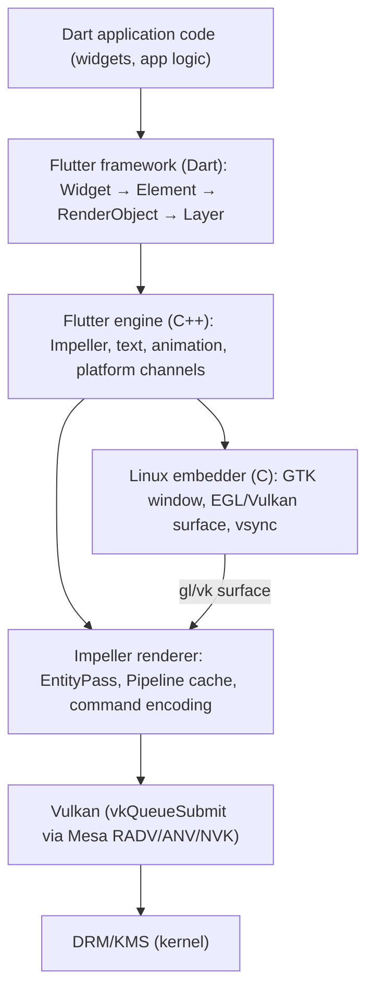

# Chapter 39g: Flutter on Linux — Impeller, the Dart Runtime, and Native Embedding

> **Part**: Part VII-C — Desktop Frameworks
> **Audience**: Application developers targeting the Flutter Linux desktop embedding; graphics engineers interested in how Impeller's Vulkan renderer maps onto the Mesa and DRM stack described in earlier parts of this book
> **Status**: First draft — 2026-07-24

## Table of Contents

- [Overview](#overview)
- [1. Flutter Architecture](#1-flutter-architecture)
  - [1.1 The Three-Layer Model: Framework, Engine, and Embedder](#11-the-three-layer-model-framework-engine-and-embedder)
  - [1.2 The Dart Runtime](#12-the-dart-runtime)
  - [1.3 Dart Isolates and the Event Loop](#13-dart-isolates-and-the-event-loop)
- [2. The Linux Embedder](#2-the-linux-embedder)
  - [2.1 Flutter Desktop Embedding for Linux: the GTK Path](#21-flutter-desktop-embedding-for-linux-the-gtk-path)
  - [2.2 flutter-elinux: the Wayland-Direct Path](#22-flutter-elinux-the-wayland-direct-path)
  - [2.3 EGL Surface Creation and the GL/Vulkan Handoff](#23-egl-surface-creation-and-the-glvulkan-handoff)
- [3. Impeller: Flutter's GPU Renderer](#3-impeller-flutters-gpu-renderer)
  - [3.1 Why Skia Was Replaced](#31-why-skia-was-replaced)
  - [3.2 Impeller's Architecture: Entity, Pass, and Pipeline](#32-impellers-architecture-entity-pass-and-pipeline)
  - [3.3 The Vulkan Backend](#33-the-vulkan-backend)
  - [3.4 Shader Compilation: GLSL → SPIRV-Cross → SPIR-V](#34-shader-compilation-glsl--spirv-cross--spir-v)
  - [3.5 The Software / Skia Fallback](#35-the-software--skia-fallback)
- [4. The Rendering Pipeline](#4-the-rendering-pipeline)
  - [4.1 Widget → Element → RenderObject](#41-widget--element--renderobject)
  - [4.2 Layer Tree and Compositing](#42-layer-tree-and-compositing)
  - [4.3 The Rasterizer Thread](#43-the-rasterizer-thread)
- [5. Platform Channels and FFI](#5-platform-channels-and-ffi)
  - [5.1 MethodChannel](#51-methodchannel)
  - [5.2 BasicMessageChannel and EventChannel](#52-basicmessagechannel-and-eventchannel)
  - [5.3 dart:ffi for Direct Native Calls](#53-dartffi-for-direct-native-calls)
- [6. Text Rendering](#6-text-rendering)
  - [6.1 LibTxt and the Paragraph Engine](#61-libtxt-and-the-paragraph-engine)
  - [6.2 HarfBuzz and FreeType Integration](#62-harfbuzz-and-freetype-integration)
- [7. Theming and Material 3](#7-theming-and-material-3)
- [8. Building and Deploying on Linux](#8-building-and-deploying-on-linux)
  - [8.1 Build System: CMake and flutter build linux](#81-build-system-cmake-and-flutter-build-linux)
  - [8.2 Packaging: Snap, AppImage, and Flatpak](#82-packaging-snap-appimage-and-flatpak)
- [9. Performance and Debugging](#9-performance-and-debugging)
- [10. Integrations](#10-integrations)
- [References](#references)

---

## Overview

**Flutter** is Google's open-source UI SDK for building cross-platform applications from a single Dart codebase. Unlike Qt or GTK, Flutter does not delegate rendering to the host OS's widget toolkit; every pixel is painted by Flutter's own GPU renderer into a surface provided by the native embedder. On Linux this means a Dart application's `Column`, `Text`, and `ElevatedButton` widgets are rasterised by **Impeller** — Flutter's Vulkan-capable renderer — using Mesa drivers and the same DRM/KMS scanout path as any other native client. This makes Flutter an unusual entrant in the desktop toolkit landscape: it achieves visual consistency across mobile and desktop at the cost of being independent from the system's GTK or Qt theming.

Flutter reached official stable support for Linux in Flutter 3.0 (May 2022), with the **GTK embedding** as the primary path. Flutter 3.22 (2024) brought **Impeller** to Linux stable, replacing the legacy Skia-based renderer. [Source: Flutter 3.22 release notes](https://docs.flutter.dev/release/release-notes/release-notes-3.22.0)

This chapter covers Flutter on Linux from the engine downward. Section 1 explains the three-layer architecture (framework, engine, embedder) and the Dart runtime model. Section 2 covers the two Linux embedder paths — the official GTK embedding and the community `flutter-elinux` Wayland-direct path — and how each creates a surface for the renderer. Section 3 is the heart of the chapter: Impeller's entity-pass-pipeline architecture, SPIR-V shader compilation at build time, and the Vulkan backend that places Flutter squarely in the same Mesa driver path as the rest of this book's toolkit stack. Sections 4–7 cover the widget rendering pipeline, platform channels (the Dart↔native IPC), text rendering, and theming. Sections 8–9 cover Linux packaging and profiling.



---

## 1. Flutter Architecture

### 1.1 The Three-Layer Model: Framework, Engine, and Embedder

Flutter is structured in three layers with clean C API boundaries between them. [Source: Flutter architectural overview](https://docs.flutter.dev/resources/architectural-overview)

**The Flutter framework** is written entirely in Dart and lives in the `flutter/packages/flutter` directory. Its sub-layers are:

- **Foundation** — core utilities (`ChangeNotifier`, `Key`, `Value`, bit manipulations).
- **Animation** — ticker and animation controller abstractions.
- **Painting** — 2D canvas API (`Canvas`, `Paint`, `Path`, `Image`), the `TextPainter` interface.
- **Rendering** — the `RenderObject` tree: layout, hit-testing, and the compositing layer pipeline.
- **Widgets** — the `Widget`/`Element`/`State` reactive UI model.
- **Material / Cupertino** — Material Design 3 and iOS-styled widget sets.

**The Flutter engine** is a C++ library (`libflutter.so` on Linux). It is responsible for:
- Hosting the Dart runtime (the Dart VM).
- Driving the rasterizer (Impeller or Skia).
- Implementing `dart:ui` — the bridge between Dart and the C++ rendering layer.
- Text layout via LibTxt (§6).
- Platform channel dispatch.

**The embedder** is a thin C/C++ layer that adapts the engine to the host platform. The Linux embedder (under `shell/platform/linux/`) creates a GTK window, sets up an EGL or Vulkan surface, drives the event loop, and feeds vsync signals, input events, and clipboard data into the engine's C API (`FlutterEngine*` from `flutter_embedder.h`). The engine API is stable and public, which is how third-party embedders like `flutter-elinux` exist. [Source: flutter_embedder.h](https://github.com/flutter/flutter/blob/main/engine/src/flutter/shell/platform/embedder/flutter_embedder.h)

### 1.2 The Dart Runtime

Flutter compiles Dart in two modes:
- **JIT (debug/profile)**: the Dart VM compiles Dart bytecode at runtime using a kernel snapshot (`.dill`), enabling hot reload — editing Dart source and pressing `r` in the flutter CLI updates the running application in under a second without losing state. This is the primary developer-experience feature.
- **AOT (release)**: `flutter build linux --release` compiles Dart to native machine code via `dart2native`/gen_snapshot. The output is a self-contained `app.so` shared library and a small snapshot. No JIT machinery is loaded at runtime, which reduces startup time and eliminates JIT pauses.

```bash
# Debug build: JIT, hot reload, Dart DevTools enabled.
flutter run -d linux

# Release build: AOT, Impeller enabled, no debug symbols.
flutter build linux --release
```

[Source: Dart compilation modes](https://dart.dev/overview#platform)

### 1.3 Dart Isolates and the Event Loop

Dart's concurrency model is **isolates**: each isolate has its own heap (no shared mutable memory between isolates) and communicates only through message passing via `SendPort`/`ReceivePort`. The main Flutter UI isolate runs the widget tree, the `build` method, and user callbacks. Long-running work should run in a `compute()` helper (which spawns a fresh isolate, runs a function, and returns the result to the UI isolate) or in an explicit `Isolate.spawn()`. [Source: Dart isolates](https://dart.dev/language/isolates)

Within a single isolate, Dart uses an **event loop** with two queues:

1. **Microtask queue** — processed to exhaustion before any event. `Future.microtask()` and `scheduleMicrotask()` post here.
2. **Event queue** — each iteration of the event loop dequeues one event (timer, I/O completion, user input, isolate message). `Future.delayed(Duration.zero, ...)` posts here.

```dart
void main() async {
  // Async/await is sugar over Future and the event loop.
  // This does not block the UI thread — it suspends this
  // function and lets the event loop run other callbacks
  // while awaiting the file load.
  final content = await File('/etc/os-release').readAsString();
  print(content.lines.first);
}
```

Flutter's engine drives this loop: it wakes the Dart event queue on vsync (from the embedder's vsync callback), input events, and timer completions. Because `build` runs synchronously on the UI thread, a long `build` call stalls the frame — the equivalent of blocking GTK's main loop or iced's `update`.

---

## 2. The Linux Embedder

### 2.1 Flutter Desktop Embedding for Linux: the GTK Path

The official Linux embedding (`shell/platform/linux/`) creates a **GTK4** (since Flutter 3.27) application window and a child `GtkGLArea` or `GtkWidget` to host the render surface. The embedding registers with GTK's main loop for frame callbacks and drives the engine via the `FlutterEngine*` C API. [Source: Flutter desktop Linux](https://docs.flutter.dev/platform-integration/linux/install-linux)

From an application author's perspective the entry point is the generated `CMakeLists.txt` that Flutter creates under `linux/`:

```cmake
# linux/CMakeLists.txt (generated by flutter create)
cmake_minimum_required(VERSION 3.13)
project(runner LANGUAGES CXX)

set(FLUTTER_MANAGED_DIR "${CMAKE_CURRENT_SOURCE_DIR}/flutter")
add_subdirectory(${FLUTTER_MANAGED_DIR})

# The runner target: links against flutter_linux_gtk and the app bundle.
add_executable(${BINARY_NAME} "main.cc" ...)
target_link_libraries(${BINARY_NAME} PRIVATE flutter_linux_gtk)
```

`flutter_linux_gtk` is the Flutter desktop library (`libflutter_linux_gtk.so`), built from the engine and the GTK embedding layer, distributed as a prebuilt binary alongside the Flutter SDK. On Wayland sessions the GTK window is backed by the GDK Wayland backend (Ch39c §6), so the surface it provides to the Flutter engine is a Wayland-protocol `wl_surface`.

### 2.2 flutter-elinux: the Wayland-Direct Path

**flutter-elinux** (formerly flutter-embedded-linux, maintained by Sony) is a community embedder that bypasses GTK entirely, binding the Wayland protocols (`wl_compositor`, `xdg_shell`, `zwlr_layer_shell_v1`) directly via libwayland-client. [Source: flutter-elinux](https://github.com/sony/flutter-elinux) This makes it suitable for:

- Embedded Linux platforms without GTK installed (automotive, kiosks).
- Wayland compositors that do not support GTK's Wayland backend.
- Layer-shell surfaces (panels, kiosks) via `zwlr_layer_shell_v1`.

flutter-elinux ships four backends: `wayland`, `x11`, `eglfs` (direct KMS framebuffer via EGL), and `gbm` (direct GBM/DRM without a compositor). The GBM backend makes Flutter a DRM-direct client, rendering into GBM buffer objects and submitting them via KMS atomic commit — the same path Chapter 4 describes for libdrm clients.

```bash
# Run a Flutter app with the flutter-elinux Wayland backend.
flutter-elinux run -d elinux-wayland

# Run directly on KMS (no compositor) via the GBM backend.
flutter-elinux run -d elinux-gbm
```

### 2.3 EGL Surface Creation and the GL/Vulkan Handoff

Both embedders create a rendering surface and hand it to Impeller. The GTK path exposes the surface through a `GdkGLContext` (on OpenGL sessions) or via `gdk_wayland_surface_create_vulkan_surface()` (on Vulkan). The flutter-elinux Wayland path calls `eglCreateWindowSurface` with the Wayland surface's native handle (a `wl_egl_window`) for OpenGL/ES, or `vkCreateWaylandSurfaceKHR` for Vulkan. [Source: flutter-elinux backends](https://github.com/sony/flutter-elinux/tree/main/src/backends)

With Impeller's Vulkan backend active (the default since Flutter 3.22 on Linux), the flow is:

1. Embedder creates a `VkSurfaceKHR` from the Wayland surface via `vkCreateWaylandSurfaceKHR`.
2. Impeller initialises a `VkDevice` and `VkSwapchainKHR` against that surface.
3. Each frame: Impeller acquires a swapchain image, records an `EntityPass`, submits `VkCommandBuffer`s via `vkQueueSubmit`, then presents via `vkQueuePresentKHR`.
4. The Mesa Vulkan driver (RADV/ANV/NVK) handles the platform-specific present path, which on Wayland is the `VK_KHR_wayland_surface` extension (Chapter 20).

---

## 3. Impeller: Flutter's GPU Renderer

### 3.1 Why Skia Was Replaced

Flutter originally used **Skia** (also used by Chrome — Chapter 32) as its 2D renderer. Skia compiles GPU shaders from source at runtime when a new paint operation is first encountered, producing **shader compilation jank**: a 16–100 ms stall on the first frame that uses a particular stroke, gradient, or image filter. On mobile, where GPUs are slower and users notice 100 ms hitches, this was unacceptable. [Source: Impeller design doc](https://github.com/flutter/flutter/blob/main/engine/src/flutter/impeller/docs/README.md)

**Impeller** solves this by compiling all shaders *at build time* — they are included as pre-compiled SPIR-V (and, on other platforms, MSL/HLSL) in the engine binary. At runtime, Impeller creates `VkPipeline` objects once per shader on startup rather than on first use, eliminating first-frame jank entirely. The trade-off is a fixed shader set: Impeller cannot express arbitrary Skia effects (some advanced `MaskFilter`s and `ImageFilter`s had to be reimplemented or are approximated), and the engine binary is larger. For the vast majority of Material 3 UI use cases, Impeller covers everything Skia covered. [Source: Impeller on GitHub](https://github.com/flutter/flutter/tree/main/engine/src/flutter/impeller)

### 3.2 Impeller's Architecture: Entity, Pass, and Pipeline

Impeller's core abstractions are: [Source: Impeller internals](https://github.com/flutter/flutter/blob/main/engine/src/flutter/impeller/docs/README.md)

- **`Entity`** — a drawing command: a geometry (filled rectangle, stroked path, image) plus a transform and a `Contents` object that provides the shading.
- **`EntityPass`** — a container for a list of `Entity` objects with a shared off-screen render target (or the on-screen surface). Passes are the unit of GPU render pass recording.
- **`Pipeline`** — a compiled `VkPipeline` (on Vulkan), cached by the `PipelineLibrary` keyed on (vertex descriptor, fragment descriptor, blend mode, sample count). All pipelines are created from pre-compiled SPIR-V on startup.
- **`Allocator`** — manages `VkDeviceMemory` (on Vulkan) for textures, vertex buffers, and uniform buffers.
- **`CommandBuffer`** / **`RenderPass`** — thin wrappers over `VkCommandBuffer` / `vkBeginRenderPass`.

```
EntityPass::Render():
  for each Entity e in the pass:
    look up Pipeline from PipelineLibrary (instant — already compiled)
    bind vertex/index buffers
    write uniforms to buffer
    bind descriptor sets
    call vkCmdDrawIndexed
  end for
  call vkCmdEndRenderPass
```

Nested `EntityPass`es handle the sub-pass stack: a `ClipSaveLayer` creates a child pass that renders into an off-screen texture, which the parent pass then composites with the correct blend mode (Coverage blending, DestOver, etc.). This is the mechanism that maps Flutter's `saveLayer` / `restoreToCount` canvas calls into GPU render passes.

### 3.3 The Vulkan Backend

Impeller's Vulkan backend (`impeller/renderer/backend/vulkan/`) initialises Vulkan through a standard vkInstance/vkDevice selection path. It requests:

- `VK_KHR_swapchain` for presentation.
- `VK_KHR_dynamic_rendering` (Vulkan 1.3 core) to avoid render-pass compatibility constraints.
- `VK_EXT_extended_dynamic_state` for pipeline flexibility without full PSO recompilation.
- `VK_KHR_external_memory_fd` / `VK_KHR_external_semaphore_fd` for Wayland DMA-BUF interop and explicit-sync when the compositor supports it.

[Source: Impeller Vulkan feature queries](https://github.com/flutter/flutter/blob/main/engine/src/flutter/impeller/renderer/backend/vulkan/capabilities_vk.cc)

The device selection prefers discrete GPUs but falls back to integrated graphics; it creates separate `VkQueue` objects for graphics, transfer, and (if available) asynchronous compute. The transfer queue is used for texture upload — uploading image data from CPU staging buffers is parallelised with in-flight rendering frames.

### 3.4 Shader Compilation: GLSL → SPIRV-Cross → SPIR-V

Impeller's build-time shader pipeline (`impellerc`) processes shaders written in a GLSL subset, optimises them with SPIRV-Cross, and emits SPIR-V for inclusion in the engine binary. Unlike a typical Vulkan application that calls `glslang` or `shaderc` at startup, Impeller runs this at `ninja` build time:

```
impeller/shaders/*.glsl
  → impellerc (GLSL → SPIR-V via glslang)
  → spirv-cross (optimisation, reflection, metal/hlsl cross-compilation)
  → .sprv / .msl / .hlsl  (embedded in the engine binary as byte arrays)
```

At runtime, `PipelineLibrary::GetPipeline(descriptor)` calls `vkCreateGraphicsPipelines` with the embedded SPIR-V, but because all shaders are known at compile time this creates a closed set of pipelines. No shader source is needed at runtime; no `glCompileShader`-style stall occurs. [Source: Impeller shader build rules](https://github.com/flutter/flutter/blob/main/engine/src/flutter/impeller/shaders/)

### 3.5 The Software / Skia Fallback

On Linux systems without a Vulkan-capable GPU, or when the `--no-impeller` flag is passed, Flutter falls back to the **Skia** renderer using a software-rasterised path (`SoftwareRasterizer`). This path produces correct output but at low frame rates and without hardware acceleration. The Skia/OpenGL path (the prior default) is still available via `--enable-impeller=false` for diagnostics and comparison. [Source: Flutter Impeller flag](https://github.com/flutter/flutter/blob/main/engine/src/flutter/shell/common/switches.h)

---

## 4. The Rendering Pipeline

### 4.1 Widget → Element → RenderObject

Flutter's rendering is structured in three parallel trees, each with a distinct role: [Source: Flutter rendering architecture](https://docs.flutter.dev/resources/architectural-overview#rendering-and-layout)

- **Widget tree** — immutable descriptions rebuilt on every `setState` call. `StatelessWidget.build` and `StatefulWidget.build` return new widget subtrees.
- **Element tree** — the mutable reconciliation layer. Elements persist across rebuilds; Flutter compares old and new widget trees and reuses elements where the widget type and key match, calling `Widget.updateRenderObject` to patch the render object rather than recreating it.
- **RenderObject tree** — the layout and painting layer. `RenderBox` (most widgets) implements 2D box layout with `BoxConstraints`. `performLayout` computes sizes; `paint` calls the `Canvas` / `PaintingContext` to record draw commands.

```dart
// A minimal stateful widget cycle:
class Counter extends StatefulWidget {
  @override
  State<Counter> createState() => _CounterState();
}

class _CounterState extends State<Counter> {
  int _count = 0;

  @override
  Widget build(BuildContext context) {
    return Column(children: [
      Text('Count: $_count'),
      ElevatedButton(
        onPressed: () => setState(() => _count++),
        child: const Text('Increment'),
      ),
    ]);
  }
}
```

`setState` marks the element dirty and schedules a frame. On the next vsync, Flutter walks the dirty subtree, calls `build` again, diffs against the previous widget tree, and calls `RenderObject.markNeedsLayout`/`markNeedsPaint` on changed render objects.

### 4.2 Layer Tree and Compositing

After the paint phase, Flutter composites `PictureLayer` and `TransformLayer` objects into an **`ui.Scene`** via `SceneBuilder`. `Scene.toImage()` or the engine's rasterizer thread consumes this scene: it plays back the recorded `Picture` objects by invoking Impeller's entity system. Opacity layers, clip layers, and shader-mask layers each become a nested `EntityPass` with the appropriate blend/clip state.

```
RenderObject.paint(context, offset)
  → context.canvas.drawRect(...)   // records into a Picture
  → context.pushLayer(ClipRectLayer(...))  // starts a sub-layer

SceneBuilder:
  addPicture(offset, picture)  → EntityPass.AddEntity(entity)
  pushClipRect(...)            → nested EntityPass
  build()                      → Scene (a list of EntityPasses)

Rasterizer thread:
  scene.render() → Impeller submits VkCommandBuffers
```

[Source: dart:ui SceneBuilder](https://api.flutter.dev/flutter/dart-ui/SceneBuilder-class.html)

### 4.3 The Rasterizer Thread

Flutter maintains two threads of interest: the **UI thread** (runs the Dart isolate: `build`, layout, paint) and the **rasterizer thread** (drives Impeller: records Vulkan command buffers, presents the swapchain). These are distinct to allow the UI thread to continue preparing the next frame while the GPU consumes the current one. The engine's `LayerTree` object is the handoff between them: the UI thread produces a `LayerTree` per frame and posts it to the rasterizer thread, which rasterises and presents it without calling back into Dart.

---

## 5. Platform Channels and FFI

### 5.1 MethodChannel

**Platform channels** are Flutter's Dart↔native IPC mechanism. A `MethodChannel` sends method calls (name + arguments as `dynamic`, encoded as a `StandardMethodCodec` binary blob) to a handler registered in the platform (C/C++ on Linux). [Source: Flutter platform channels](https://docs.flutter.dev/platform-integration/platform-channels)

```dart
// Dart side: call a Linux-specific method.
const _channel = MethodChannel('org.example/sysinfo');

Future<String> getKernelVersion() async {
  final version = await _channel.invokeMethod<String>('getKernelVersion');
  return version ?? 'unknown';
}
```

```cpp
// C++ side (Linux embedder plugin):
// Registered with FlutterDesktopPluginRegistrarGetMessenger.
void SysinfoPlugin::HandleMethodCall(
    const flutter::MethodCall<>& call,
    std::unique_ptr<flutter::MethodResult<>> result) {
  if (call.method_name() == "getKernelVersion") {
    struct utsname uts;
    uname(&uts);
    result->Success(flutter::EncodableValue(std::string(uts.release)));
  } else {
    result->NotImplemented();
  }
}
```

The `StandardMethodCodec` maps Dart `dynamic` values to a typed binary encoding: `null`, `bool`, `int`, `double`, `String`, `Uint8List`, `List`, and `Map` are all transmittable. The round-trip overhead is roughly 1–2 ms on a modern Linux machine — acceptable for one-shot calls but too slow for per-frame GPU buffer exchanges, which should use `dart:ffi` instead.

### 5.2 BasicMessageChannel and EventChannel

- **`BasicMessageChannel`** — raw message exchange without the method call / result semantics; used for streaming data where the direction is caller-defined.
- **`EventChannel`** — a stream of events from native to Dart, modelled as a `Stream<dynamic>` on the Dart side. Used for ongoing system events: file-system changes, sensor data, D-Bus signal subscriptions. The native side calls `event_sink->Success(value)` on each event.

```dart
// EventChannel: receive D-Bus network state changes as a Dart stream.
const _events = EventChannel('org.example/network-state');

Stream<bool> networkConnected() =>
    _events.receiveBroadcastStream().map((e) => e as bool);
```

### 5.3 dart:ffi for Direct Native Calls

`dart:ffi` exposes a foreign-function interface for calling C functions from Dart without the channel serialisation overhead. It is the correct choice for per-frame or high-frequency calls:

```dart
import 'dart:ffi';
import 'package:ffi/ffi.dart';

// Bind a native function.
final _lib = DynamicLibrary.open('libvulkan.so.1');
final vkGetPhysicalDeviceProperties = _lib.lookupFunction<
    Void Function(Pointer<Void>, Pointer<Void>),
    void Function(Pointer<Void>, Pointer<Void>)>('vkGetPhysicalDeviceProperties');
```

Flutter plugins that need bulk data transfer (e.g. a video texture plugin writing decoded YUV frames) use `dart:ffi` to pass `Pointer<Uint8>` buffers directly rather than marshalling through the channel codec. [Source: dart:ffi documentation](https://dart.dev/interop/c-interop)

---

## 6. Text Rendering

### 6.1 LibTxt and the Paragraph Engine

Flutter's text rendering is handled by **LibTxt**, a C++ library (`third_party/txt/`) inside the Flutter engine derived from Android's Minikin library. LibTxt provides `txt::Paragraph`, which takes a `StyledText` (runs of text with `txt::TextStyle` metadata) and produces a laidout paragraph with line breaks, glyph positions, and `txt::TextBox` hit-test rectangles. [Source: txt library](https://github.com/flutter/flutter/tree/main/engine/src/third_party/txt)

The flow for rendering a `Text` widget:

1. The `RenderParagraph` widget calls `TextPainter.layout(constraints)`, which calls into `dart:ui`'s `Paragraph.layout`.
2. `dart:ui` delegates to LibTxt's `ParagraphBuilder::Build()` / `Paragraph::Layout()`.
3. LibTxt breaks lines with its Unicode line-break algorithm (ICU UAX #14), applies bidirectional text ordering (ICU UBA), and calls HarfBuzz for per-run shaping.
4. Shaped glyphs are rasterised through FreeType and cached in Impeller's glyph atlas (a `VkImage` texture).
5. The paragraph's `Paint()` call emits textured-quad draw calls: one quad per glyph, UV-mapped into the atlas.

### 6.2 HarfBuzz and FreeType Integration

LibTxt uses **HarfBuzz** (the same library used by GTK, Qt, and the GNOME stack — Ch47) for complex-script shaping: Arabic, Devanagari, Hebrew, CJK cursive joins. Each text run (a maximal sequence of characters with the same script, direction, and style) passes through `hb_shape()` to produce a sequence of `(glyph_id, advance, x_offset, y_offset)` tuples. Glyph rendering uses **FreeType 2**: LibTxt calls `FT_Load_Glyph` with `FT_LOAD_RENDER`, which produces an 8-bit alpha bitmap rasterised at the current scale, and uploads it to the glyph atlas.

Font resolution on Linux uses **fontconfig** for the initial font match (by family name and style attributes), then **FreeType** to open the file. LibTxt bundles a stripped subset of the Noto fonts as engine assets so a minimal Flutter app can render multilingual text without system fonts; for production deployments, applications specify fonts in `pubspec.yaml` and they are bundled in the app asset bundle.

---

## 7. Theming and Material 3

Flutter's built-in widget set implements **Material Design 3** (also called Material You), Google's design language. Theming is expressed through a `ThemeData` object passed to the root `MaterialApp`:

```dart
MaterialApp(
  theme: ThemeData(
    colorScheme: ColorScheme.fromSeed(seedColor: Colors.indigo),
    useMaterial3: true,
  ),
  home: const MyHomePage(),
)
```

`ColorScheme.fromSeed` derives a full 30-colour Material 3 palette (primary, secondary, tertiary, error, surface, background, and their "on-" variants) from a single seed colour using the **HCT** colour space (Hue/Chroma/Tone, developed for perceptual accessibility). This system automatically produces light and dark scheme variants, and handles contrast requirements for text-on-surface legibility. [Source: Material 3 color system](https://m3.material.io/styles/color/system/overview)

Unlike Qt (which reads system palette colours via QPA) or GTK (which reads GSettings `org.gnome.desktop.interface.color-scheme`), Flutter's `ThemeData` is entirely self-contained — it does not natively read the Linux desktop's accent colour or dark-mode preference. Applications that want to follow the system's colour scheme must read it themselves (typically via a D-Bus call to `org.freedesktop.portal.Settings` → `org.freedesktop.appearance` → `color-scheme`) and propagate it into the `MaterialApp.theme`/`.darkTheme` parameters.

---

## 8. Building and Deploying on Linux

### 8.1 Build System: CMake and flutter build linux

Flutter's Linux build is CMake-driven. Running `flutter create myapp` generates a `linux/` directory:

```
linux/
├── CMakeLists.txt         # top-level: finds flutter_linux_gtk, the runner, and plugins
├── runner/
│   ├── CMakeLists.txt
│   ├── main.cc            # GTK entry point
│   └── my_application.cc  # FlApplication subclass
└── flutter/
    ├── CMakeLists.txt     # adds the engine prebuilt and ephemeral plugin deps
    └── generated_plugins.cmake
```

`flutter build linux --release` runs `cmake --build` with Release configuration, producing a self-contained directory `build/linux/x64/release/bundle/`:

```
bundle/
├── my_app               # the executable (links libflutter_linux_gtk.so)
├── lib/
│   └── libflutter_linux_gtk.so  # pre-built Flutter engine
├── data/
│   └── flutter_assets/  # Dart kernel snapshot, fonts, assets
└── lib/*.so             # any Dart AOT .so (app.so) and plugin .so files
```

[Source: Flutter Linux build](https://docs.flutter.dev/platform-integration/linux/install-linux#building-the-engine)

### 8.2 Packaging: Snap, AppImage, and Flatpak

**Snap** is the officially supported Linux distribution format for Flutter apps:

```bash
flutter build linux --release
snapcraft pack  # reads snapcraft.yaml, bundles the bundle/ directory
```

`snapcraft.yaml` declares `confinement: strict` and plugs for `opengl`, `wayland`, `x11`, and `network`. Flutter snaps use the `flutter-engine` content snap to share the engine library rather than bundling it per-app, reducing download size. [Source: Flutter snap documentation](https://docs.flutter.dev/platform-integration/linux/building-snap)

**AppImage** is community-supported; `linuxdeploy` with the `linuxdeploy-plugin-flutter` can bundle a Flutter release build into a portable `.AppImage`. **Flatpak** support is also community-driven; the key finish-arg requirements are `--device=dri` (for Vulkan/GPU access) and `--socket=wayland` (or `--socket=fallback-x11`). The Vulkan sandbox gap (§8.2 of Ch39d applies here too) means the user must confirm device access; the Flatpak `org.freedesktop.Platform` runtime does not bundle the Flutter engine, so it must be bundled in the application.

---

## 9. Performance and Debugging

### 9.1 Flutter DevTools and the Timeline

**Flutter DevTools** is the primary performance tool, a web-based UI launched with `dart devtools` or `flutter run --devtools`:

- **Performance overlay** — toggles a heads-up display showing the UI thread and rasterizer thread frame durations, making it easy to identify whether jank is Dart-side (long `build`) or GPU-side (long rasterisation).
- **Timeline view** — a Perfetto-compatible trace of `flutter.frames`, `dart.ui.microtask`, `Impeller:EntityPass`, and `GpuCommandBuffer` events, comparable to `perf` and `renderdoc` traces from the perspective of the GPU timeline.
- **Widget inspector** — the widget tree at runtime; clicking on the rendered UI highlights the widget responsible, comparable to GTK Inspector for GTK apps.

[Source: Flutter DevTools](https://docs.flutter.dev/tools/devtools)

### 9.2 RenderDoc Integration

Impeller's Vulkan backend is fully compatible with **RenderDoc**: launch the Flutter app under RenderDoc's capture overlay and trigger a frame capture to inspect the `VkCommandBuffer` contents, pipeline state, and texture contents per draw call. Because Impeller's shader set is fixed and fully SPIR-V (with debug names embedded by the build pipeline), RenderDoc shows meaningful pipeline stage names rather than opaque hashes. This is the standard path for debugging rendering artefacts in custom `Canvas` drawing code or shader-widget passes.

### 9.3 Dart Profiling

For CPU-bound frames, Dart's built-in `dart:developer` profiler works in both JIT and AOT builds; the DevTools CPU profiler tab captures and aggregates stack samples, identifying whether time is in `build`, layout, painting, or application logic. `Timeline.startSync`/`finishSync` annotate custom regions:

```dart
Timeline.startSync('MyExpensiveWidget.build');
// ... expensive build ...
Timeline.finishSync();
```

These annotations appear in both the DevTools timeline and any `perf`/`systrace` capture that maps the Dart thread.

---

## 10. Integrations

- **Chapter 18 (Mesa Vulkan)** — Impeller's Vulkan backend is a standard Vulkan client: it calls `vkCreateInstance`, selects a physical device from Mesa's RADV, ANV, or NVK, and submits `VkCommandBuffer`s through `vkQueueSubmit`. The shader pipeline (SPIR-V compiled at build time, loaded as byte arrays) enters Mesa's NIR through `vk_spirv_to_nir()` exactly as described in Ch18.
- **Chapter 20 (Wayland Protocol Fundamentals)** — the GTK embedder reaches the Wayland compositor through GDK's Wayland backend; flutter-elinux binds `wl_compositor` and `vkCreateWaylandSurfaceKHR` directly. Explicit sync (`wp_linux_drm_syncobj_v1`) will be wired through the embedder's `FlutterCompositor` callbacks as compositors enable it.
- **Chapter 4 (GEM / DMA-BUF)** — flutter-elinux's GBM backend allocates `struct gbm_bo` objects for its swapchain surfaces and submits them via KMS atomic commit, the same path as a drm-direct client. The Vulkan path uses `VK_EXT_image_drm_format_modifier` to import GBM BOs as Vulkan images.
- **Chapter 39c (GTK4)** — the official Flutter Linux embedder uses GTK4 as its windowing layer: `GtkApplicationWindow`, `GtkGLArea`, and GTK's Wayland backend are the underlying substrate. Applications can mix GTK4 widgets with Flutter content via platform view embedding (Platform Views on Linux are in early support).
- **Chapter 47 (Font and Text Rendering)** — LibTxt uses the same HarfBuzz shaping library and FreeType rasteriser as GTK4, Qt, and the GNOME stack. Font resolution goes through fontconfig. The glyph atlas architecture (LRU-cached, upload on first use) is the same pattern as iced's cosmic-text atlas and GTK's glyph cache.
- **Chapter 30 (Debugging and Profiling)** — RenderDoc captures work end-to-end for Impeller's Vulkan path; Flutter DevTools provides Dart-level profiling. The two tools together give a full CPU-to-GPU profile analogous to a RenderDoc + perf capture for a Bevy or Qt application.
- **Chapter 39e (iced)** and **Chapter 39f (libcosmic)** — iced and Flutter are the two Dart/Rust-language entrants in Part VII-C and share the wgpu/Vulkan rendering philosophy (pre-compiled shader pipeline, engine-owned rendering). The key difference is Dart vs Rust and single-codebase mobile/desktop vs Linux-first.

---

## References

- Flutter architectural overview: [https://docs.flutter.dev/resources/architectural-overview](https://docs.flutter.dev/resources/architectural-overview)
- Flutter 3.22 release notes (Impeller on Linux stable): [https://docs.flutter.dev/release/release-notes/release-notes-3.22.0](https://docs.flutter.dev/release/release-notes/release-notes-3.22.0)
- flutter_embedder.h (Embedder C API): [https://github.com/flutter/flutter/blob/main/engine/src/flutter/shell/platform/embedder/flutter_embedder.h](https://github.com/flutter/flutter/blob/main/engine/src/flutter/shell/platform/embedder/flutter_embedder.h)
- Impeller design documentation: [https://github.com/flutter/flutter/blob/main/engine/src/flutter/impeller/docs/README.md](https://github.com/flutter/flutter/blob/main/engine/src/flutter/impeller/docs/README.md)
- Impeller Vulkan capabilities: [https://github.com/flutter/flutter/blob/main/engine/src/flutter/impeller/renderer/backend/vulkan/capabilities_vk.cc](https://github.com/flutter/flutter/blob/main/engine/src/flutter/impeller/renderer/backend/vulkan/capabilities_vk.cc)
- Impeller shaders directory: [https://github.com/flutter/flutter/blob/main/engine/src/flutter/impeller/shaders/](https://github.com/flutter/flutter/blob/main/engine/src/flutter/impeller/shaders/)
- flutter-elinux (Sony): [https://github.com/sony/flutter-elinux](https://github.com/sony/flutter-elinux)
- flutter-elinux backends: [https://github.com/sony/flutter-elinux/tree/main/src/backends](https://github.com/sony/flutter-elinux/tree/main/src/backends)
- Flutter Linux desktop embedding: [https://docs.flutter.dev/platform-integration/linux/install-linux](https://docs.flutter.dev/platform-integration/linux/install-linux)
- Flutter platform channels: [https://docs.flutter.dev/platform-integration/platform-channels](https://docs.flutter.dev/platform-integration/platform-channels)
- dart:ffi C interop: [https://dart.dev/interop/c-interop](https://dart.dev/interop/c-interop)
- dart:ui SceneBuilder: [https://api.flutter.dev/flutter/dart-ui/SceneBuilder-class.html](https://api.flutter.dev/flutter/dart-ui/SceneBuilder-class.html)
- LibTxt source (txt/): [https://github.com/flutter/flutter/tree/main/engine/src/third_party/txt](https://github.com/flutter/flutter/tree/main/engine/src/third_party/txt)
- Material 3 colour system: [https://m3.material.io/styles/color/system/overview](https://m3.material.io/styles/color/system/overview)
- Flutter DevTools: [https://docs.flutter.dev/tools/devtools](https://docs.flutter.dev/tools/devtools)
- Flutter Snap packaging: [https://docs.flutter.dev/platform-integration/linux/building-snap](https://docs.flutter.dev/platform-integration/linux/building-snap)
- Dart isolates: [https://dart.dev/language/isolates](https://dart.dev/language/isolates)
- Dart compilation modes: [https://dart.dev/overview#platform](https://dart.dev/overview#platform)
- Flutter rendering (widget-to-layer): [https://docs.flutter.dev/resources/architectural-overview#rendering-and-layout](https://docs.flutter.dev/resources/architectural-overview#rendering-and-layout)
