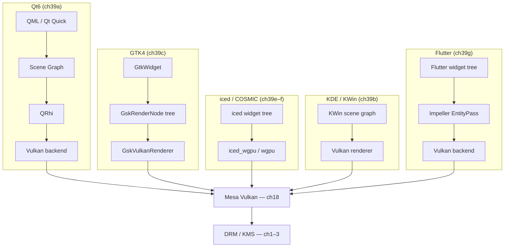

# Part VII-C: Desktop Frameworks

**Part of**: The Linux Graphics Stack: From Kernel to Compositor, Browser, and Terminal

**Audience**: Graphics application developers building native Linux desktop applications; systems
developers understanding how toolkits integrate with the Wayland/KMS stack beneath them; Rust
ecosystem developers evaluating modern UI frameworks.

---

## Overview

Part VII-C covers the six major desktop application frameworks on Linux, examining each from its
rendering architecture down to the GPU stack described in earlier parts of this book. Where Part
VII-A established the GPU API layer (Vulkan, EGL, `QRhi`, Mesa) and Part VII-B covered multimedia
pipelines (PipeWire, ALSA, GStreamer), this part shows how user-facing applications are built on top
of those foundations.

Each chapter traces a different framework — its widget system, rendering backend, Wayland integration,
language bindings, and ecosystem tooling. The chapters are independent: a reader building GTK4
applications can go straight to Chapter 39c without reading Chapter 39a. Cross-references are provided
throughout.

---

## Chapters in this Part

| Chapter | Framework | Language | Renderer | Compositor Integration |
|---------|-----------|----------|----------|------------------------|
| [39a](ch39a-qt6.md) | Qt6 | C++ / QML | QRhi (Vulkan / OpenGL ES / D3D / Metal) | QtWayland QPA |
| [39b](ch39b-kde.md) | KDE Frameworks 6 + KWin | C++ / QML | KWin scene graph (Vulkan experimental) | KWin is the compositor |
| [39c](ch39c-gtk4.md) | GTK4 + libadwaita | C / Rust / Python | GskVulkanRenderer (GTK 4.16+ default) | GDK Wayland backend |
| [39d](ch39d-gnome.md) | GNOME Shell + Mutter | JavaScript (GJS) / C | Clutter / Mutter Vulkan path | Mutter is the compositor |
| [39e](ch39e-iced.md) | iced 0.14 | Rust | iced_wgpu (wgpu/Vulkan) | winit + iced_layershell |
| [39f](ch39f-libcosmic.md) | libcosmic / COSMIC | Rust | iced_wgpu | cosmic-comp (smithay) |
| [39g](ch39g-flutter.md) | Flutter | Dart / C++ | Impeller (Vulkan) | GTK embedder / flutter-elinux |

---

## Rendering Architecture at a Glance

---

## Cross-Part Dependencies

- **Part I–III** (DRM, KMS, GBM): All renderers allocate `dma_buf`-backed framebuffers via GBM
  and submit them through KMS atomic commits.
- **Part VII-A** (Vulkan, EGL, Mesa): `QRhi`, `GskVulkanRenderer`, and `iced_wgpu` are clients
  of Mesa's Vulkan drivers (ANV, RADV, NVK). SPIR-V shaders enter Mesa's NIR compiler pipeline
  (Ch14). EGL context creation is covered in Ch24.
- **Part VII-B** (PipeWire, GStreamer): Qt Multimedia's Linux FFmpeg backend (Ch39a) and
  GStreamer's GTK sink (Ch39c) both route audio through PipeWire (Ch38).
- **Part IX** (Chromium/WebGPU): Chapter 39a (Qt WebEngine) and Chapter 39c (WebKitGTK) are the
  browser-embedding surfaces for the two dominant web platform engines on Linux.
- **Chapter 47** (Font rendering): All six frameworks use FreeType and HarfBuzz for glyph
  rasterisation and text shaping. Chapter 39a, 39c, and 39d each discuss their specific glyph-atlas
  implementations.
- **Chapter 111** (Flatpak): Deployment paths for Qt, KDE, GTK, and GNOME apps through the
  Flatpak sandbox are described in context in each chapter and unified in Ch111.
