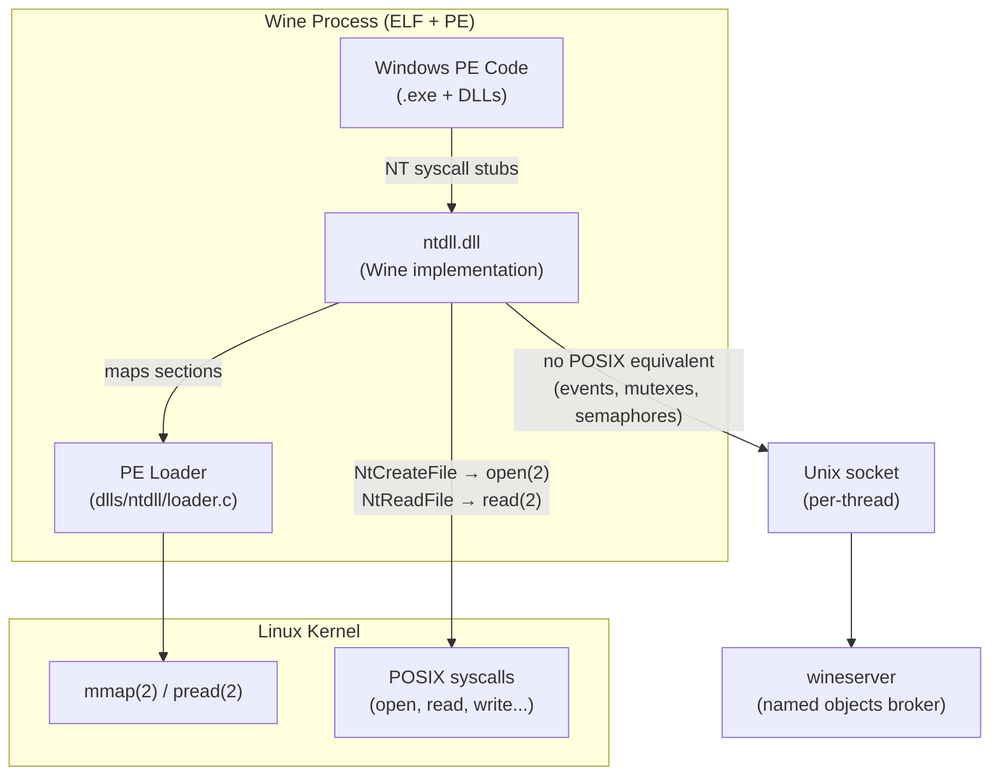
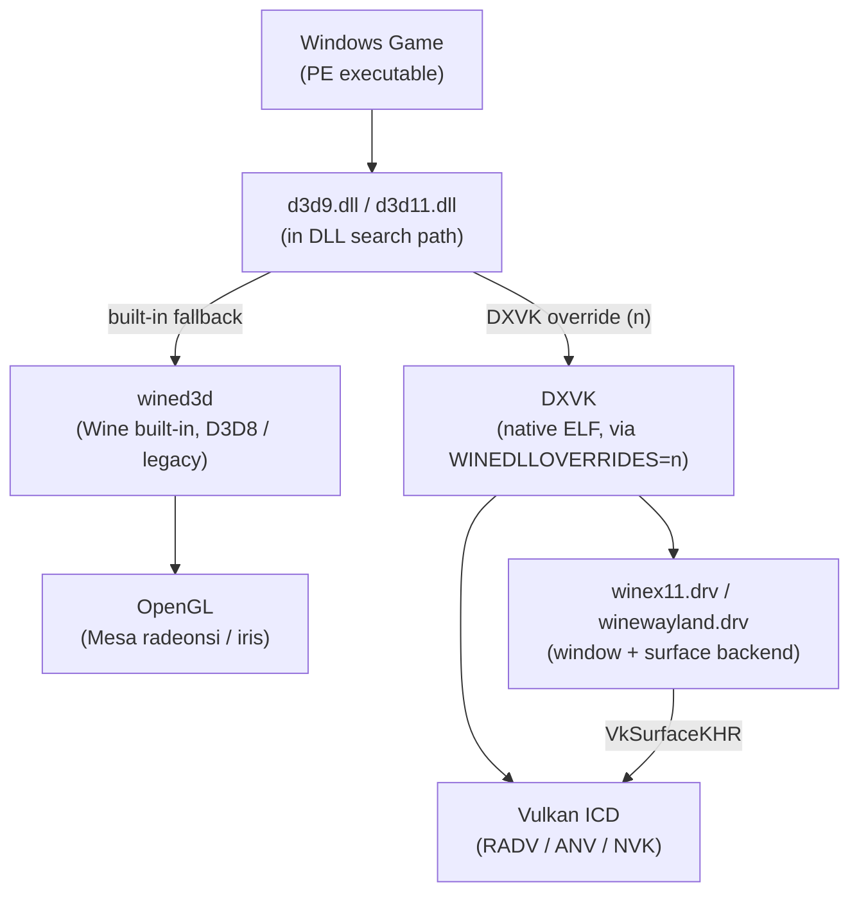
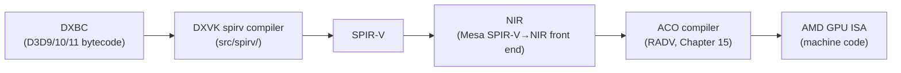
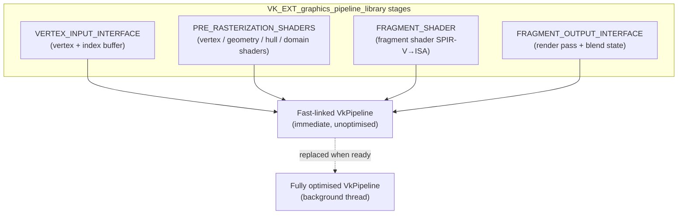
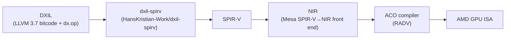
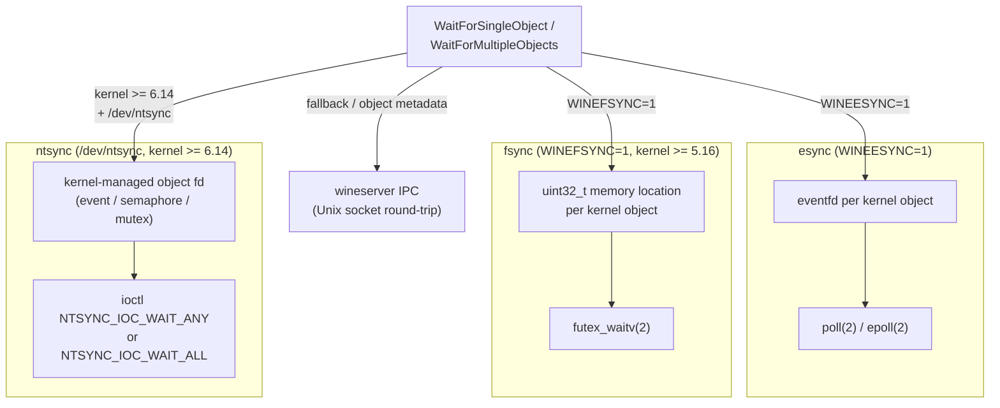
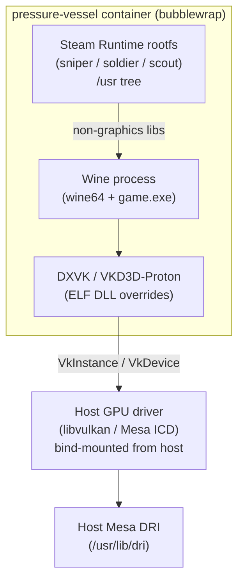
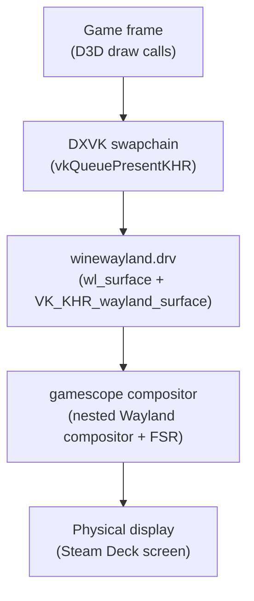
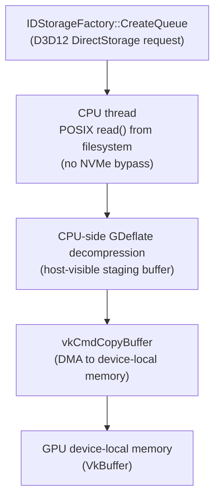

# Chapter 28: Windows Compatibility Layer

**Part VIII — The Gaming Layer**

**Audiences:** Systems developers who need to understand the translation-layer internals, synchronisation mechanisms, and kernel interfaces; application developers who need the practical deployment model, performance characteristics, and debugging workflow for games running under Proton.

---

## Table of Contents

1. [Wine: Architecture and the PE Loader](#1-wine-architecture-and-the-pe-loader)
2. [Wine Graphics Driver Shims](#2-wine-graphics-driver-shims)
3. [DXVK: D3D9/10/11 to Vulkan Translation](#3-dxvk-d3d91011-to-vulkan-translation)
4. [VKD3D-Proton: D3D12 to Vulkan Translation](#4-vkd3d-proton-d3d12-to-vulkan-translation)
5. [The Synchronisation Story: esync, fsync, and ntsync](#5-the-synchronisation-story-esync-fsync-and-ntsync)
6. [Proton: The Distribution Framework](#6-proton-the-distribution-framework)
7. [DirectStorage on Linux: Current State and Workarounds](#7-directstorage-on-linux-current-state-and-workarounds)
8. [Performance Characteristics and Remaining Gaps](#8-performance-characteristics-and-remaining-gaps)
9. [Integrations](#9-integrations)
10. [References](#10-references)

---

## 1. Wine: Architecture and the PE Loader

Linux gaming has been transformed not by native ports but by a layered compatibility stack that translates Windows application **ABI**s and **GPU** APIs into their Linux equivalents at runtime. At the foundation of this stack sits **Wine** — an acronym for "Wine Is Not an Emulator" — and that name is technically precise in a way that matters deeply for understanding the entire chapter. **Wine** is a high-level emulator (**HLE**): it re-implements the **Win32** API surface in terms of Linux system calls and libraries, but it does not emulate the **CPU** or the **x86** instruction set. A Windows binary running under **Wine** on an **x86-64** Linux machine executes its machine code natively on the processor; only the operating system interface is intercepted.

**Wine**'s **PE** loader (`dlls/ntdll/loader.c`) — anchored in `LdrInitializeThunk` and `load_dll` — maps **Portable Executable** images into the Linux process address space using `NtMapViewOfSection` and resolves imported **DLL** names through the `WINEDLLOVERRIDES` environment variable. **NT** system call stubs such as `NtCreateFile` and `NtReadFile` are translated function-by-function into **POSIX** equivalents (`open(2)`, `read(2)`); Win32 kernel objects that have no direct **POSIX** equivalent — named mutexes, manual-reset events, semaphores — are brokered by the **wineserver**, a separate Unix process reachable over a per-thread Unix socket using the protocol defined in `server/request.h`.

A significant fraction of the gaming catalogue consists of 32-bit **PE** executables. **Wine**'s single-process **WoW64** mode (`wow64.dll`-based, introduced in Wine 7.x) translates 32-bit **NT** calls into 64-bit **NT** calls without requiring 32-bit system libraries on the host, which is critical on distributions that have dropped 32-bit support and on the **Steam Deck**'s 64-bit-only **SteamOS**. At every boundary between **Windows PE** code and Linux-native **ELF** code, calling-convention translation is required: the **Microsoft x64 ABI** (arguments in **RCX**, **RDX**, **R8**, **R9**; shadow space) must be mapped to the **System V AMD64 ABI** (arguments in **RDI**, **RSI**, **RDX**, **RCX**, **R8**, **R9**; no shadow space). The **Thread Environment Block** (**TEB**), accessed via `%gs` in Windows code, is allocated and registered by **Wine** before entering **PE** code.

On the graphics side, **Wine** provides driver backends **`winex11.drv`** (legacy **X11** path) and **`winewayland.drv`** (Wayland-native, production-quality since Wine 8.x) to handle window creation, display enumeration, and frame submission. The D3D API dispatch path routes **D3D8** and legacy workloads through **wined3d** (an **OpenGL**-backed **Direct3D** translator built into **Wine**), while **DXVK** — a native **ELF** implementation of **`d3d9.dll`**, **`d3d10core.dll`**, and **`d3d11.dll`** — replaces **wined3d** for performance-sensitive **D3D9** through **D3D11** workloads via `WINEDLLOVERRIDES`. **`winewayland.drv`** creates native **`wl_surface`** objects and submits **Vulkan** swapchain images via **`VK_KHR_wayland_surface`**, eliminating the **XWayland** compositing hop.

**DXVK** translates **DXBC** (DirectX Bytecode) shader programs to **SPIR-V** via its `src/spirv/` compiler, which is then lowered through **Mesa**'s **SPIR-V**→**NIR** front end and compiled to **GPU ISA** by drivers such as **RADV**'s **ACO** compiler. The infamous shader compilation stutter caused by **Vulkan**'s requirement for immutable **`VkPipeline`** objects is addressed by **`VK_EXT_graphics_pipeline_library`** (**GPL**), which allows fast-linking of pipeline libraries on background threads while the heavyweight **SPIR-V**→**ISA** compilation proceeds asynchronously. **DXVK** also maintains an on-disk state cache (`~/.cache/dxvk/`) to warm pipelines across sessions, performs explicit resource hazard tracking and emits **`vkCmdPipelineBarrier`** calls in place of **D3D11**'s implicit hazard model, infers **Vulkan** render pass boundaries from **D3D11** draw sequences, and implements its **`IDXGISwapChain`** by wrapping native **`VkSurfaceKHR`** objects from the active windowing backend.

**VKD3D-Proton** handles **D3D12**→**Vulkan** translation. It maps **D3D12** descriptor heaps (flat **CBV**/**SRV**/**UAV** arrays) to **Vulkan** bindless descriptors via **`VK_EXT_descriptor_indexing`** and **`VK_EXT_mutable_descriptor_type`**, and uses **`VK_EXT_buffer_device_address`** for **D3D12** root constants. **D3D12** shaders arrive as **DXIL** (**LLVM** 3.7 bitcode with `dx.op` intrinsics) and are translated to **SPIR-V** via the **`dxil-spirv`** library. **D3D12** command lists (**`ID3D12CommandList`**) map to **`VkCommandBuffer`**, queues map to **Vulkan** queue families, and `ResourceBarrier` transitions map to **`VkImageMemoryBarrier2`**. **DXR** (DirectX Raytracing) maps to **`VK_KHR_ray_tracing_pipeline`** and **`VK_KHR_acceleration_structure`**. Sub-allocations within **D3D12** heap types are managed via the **Vulkan Memory Allocator** (**VMA**) library.

The synchronisation story traces an arc from user-space hacks to a kernel feature: **esync** uses `eventfd(2)` file descriptors waited on via `poll(2)` (enabled with `WINEESYNC=1`); **fsync** uses `futex_waitv` memory locations (enabled with `WINEFSYNC=1`, requiring Linux ≥ 5.16); and **ntsync** (`drivers/misc/ntsync.c`, `/dev/ntsync`, merged in Linux 6.14) implements full **Win32** wait semantics — including atomic `WAIT_ALL` and abandoned-mutex detection — as kernel-managed objects, eliminating the spin-retry limitations of the earlier approaches.

**Proton** packages **Wine**, **DXVK**, and **VKD3D-Proton** into a deployable product. Its container technology, **pressure-vessel**, uses **bubblewrap** (`bwrap`) to mount a Valve-curated **Steam Runtime** rootfs (`scout`, `soldier`, `sniper`) while bind-mounting the host's **Mesa** and **Vulkan** driver libraries. A per-game compatibility database drives **DXVK** version selection, environment variable overrides (`PROTON_USE_EAC_LINUX`, `VKD3D_CONFIG`, `RADV_PERFTEST`), and registry tweaks. **`dxvk-nvapi`** emulates enough of the **NVAPI** surface to unblock games that query GPU information via **NVIDIA**'s proprietary interface. On the **Steam Deck**, **Proton** games run as nested **Wayland** clients inside the **gamescope** compositor, with **FSR** applied post-frame. **MangoHud** provides in-game overlays by intercepting **`vkQueuePresentKHR`** as a **Vulkan** layer. The community **Proton-GE** fork carries additional patches including proprietary codec support via **Windows Media Foundation**.

**DirectStorage** on Linux is implemented in **VKD3D-Proton** as a **CPU**-side staging-buffer fallback: assets are read with **POSIX** `read()`, decompressed from **GDeflate** on the **CPU** into a host-visible staging buffer, then uploaded via **`vkCmdCopyBuffer`** — neither the **NVMe** IO bypass nor **GPU**-native **GDeflate** decompression is currently implemented. The Linux-native equivalent combines **`io_uring`** async IO with `O_DIRECT` reads into **Vulkan**-mapped buffers and a dedicated **`VK_QUEUE_TRANSFER_BIT`** queue.

Performance analysis covers **API** translation overhead, shader compilation stutter on cold cache, and background compilation thread contention. Anti-cheat compatibility varies: **EasyAntiCheat** (**EAC**) and **BattleEye** provide Linux-native modules, while kernel-level systems such as **Vanguard** are architecturally incompatible. Known gaps include partial **D3D12 Mesh Shader** support, the **DirectStorage** staging fallback, absence of **DirectML**, and partial **D3D12 Work Graphs** support pending **`VK_EXT_device_generated_commands`**.

Finally, **RTX Remix** 1.0 demonstrates the full **NVIDIA** proprietary stack in a concrete open-source context: **`dxvk-remix`** forks **DXVK**'s **D3D9** translation layer and augments it with **OptiX** path tracing and **RTXDI** direct-light sampling, while the **`rtx-remix`** runtime provides **USD**-based scene capture and asset overlay, **DLSS 4** Multi Frame Generation via the **NGX SDK**, and **Neural Radiance Cache** (**NRC**) multi-bounce indirect illumination. **RTX Remix** runs on Linux via **Proton** with proprietary **NVIDIA** driver ≥ 535 and **Ada Lovelace** (**RTX 40xx**) or newer hardware for **DLSS 4** features.

### The PE Loader

Windows executables and DLLs are encoded in the Portable Executable (PE) format. When Wine launches a `.exe`, the job of mapping it into the Linux process address space falls to `dlls/ntdll/loader.c` in the Wine tree — specifically the loader functions rooted at `LdrInitializeThunk` and `load_dll`. The loader begins by parsing the PE headers to determine the preferred load address, then calls `NtMapViewOfSection` (which Wine's ntdll maps to `mmap(2)`) to place the `.text`, `.data`, `.rdata`, and other PE sections at the right offsets. If the image cannot be loaded at its preferred base, the loader applies base relocations from the `.reloc` section.

After the image is mapped, the loader walks the import directory. For each imported DLL name it discovers (e.g., `kernel32.dll`, `d3d11.dll`), it searches for a matching Wine built-in, a native Windows DLL placed by the user, or a DLL override specified via `WINEDLLOVERRIDES`. Once a provider is found, its export table is parsed and each thunked function address is written into the calling module's import address table. The key insight is that this whole process mirrors what `ntdll.dll` does inside a real Windows process — Wine's `ntdll` is simply a Linux implementation of the same contract.

```c
/* dlls/ntdll/loader.c (Wine) — simplified DLL load entry */
static NTSTATUS load_dll( LPCWSTR load_path, LPCWSTR libname,
                           DWORD flags, WINE_MODREF **pwm,
                           BOOL system )
{
    WINE_MODREF *wm = NULL;
    NTSTATUS nts;

    /* 1. find and open the file (searching load_path) */
    /* 2. map PE sections into address space via NtMapViewOfSection */
    /* 3. walk import directory, recurse for each dependency */
    /* 4. apply base relocations if load address != preferred */
    /* 5. run TLS callbacks, call DllMain with DLL_PROCESS_ATTACH */
    nts = build_module( load_path, &nt, mapping, image_info,
                        id, flags, system, &wm );
    *pwm = wm;
    return nts;
}
```

*Source: `dlls/ntdll/loader.c` in the Wine source tree at [`https://gitlab.winehq.org/wine/wine`](https://gitlab.winehq.org/wine/wine)*

The function `LdrInitializeThunk` is the very first thing called in a new Wine process after the Linux `exec` returns. In the 64-bit implementation, `LdrInitializeThunk` sets up the Process Environment Block (PEB), registers `ntdll` itself, then chains into `load_dll` for the main executable and its import closure.

### Thunk Layers and NT System Calls

When Wine code calls Windows NT system call stubs — `NtCreateFile`, `NtReadFile`, `NtQuerySystemInformation`, and several hundred others — Wine's `ntdll.dll` intercepts them at the point that would normally trigger a `syscall` instruction into the Windows kernel. Instead, the Wine thunk translates the NT call into one or more equivalent POSIX calls: `NtCreateFile` → `open(2)` (with additional `O_CREAT`/`O_RDWR` flag mapping), `NtReadFile` → `read(2)` or `pread(2)`, and so on. This is the core of Wine's implementation strategy: a systematic mapping of the NT API onto the POSIX surface, function by function.

Not every NT call has a clean POSIX equivalent, and that is where the wineserver enters.



### The Wineserver

The wineserver (`server/` directory in the Wine tree) is a separate Unix process that acts as a broker for Win32 kernel objects that have no direct Linux equivalent: named mutexes, manual-reset events, semaphores, file change notifications, and the object namespace. Every Wine thread maintains a Unix socket connection to the wineserver; when a thread needs to create or wait on a kernel object, it sends a request message over that socket and blocks until the wineserver replies.

The IPC protocol is defined in `server/request.h` as a family of packed C structures, each beginning with a `struct request_header`:

```c
/* server/request.h (Wine) */
struct request_header
{
    int          req;          /* request code */
    data_size_t  request_size; /* request variable data size */
    data_size_t  reply_size;   /* reply variable data size */
};
```

A `CreateEvent` round-trip, for example, packs a `create_event_request` struct (event name, initial state, manual-reset flag, access mask) into the socket, the wineserver receives it, allocates a kernel object record, generates a handle, and sends back a `create_event_reply` containing the 32-bit handle value. The round-trip takes on the order of a few microseconds on a modern desktop — negligible for one-off setup operations, but catastrophic for games that spin tight wait-loops polling hundreds of synchronisation objects per frame. Section 5 examines how the Linux gaming community solved this.

### WoW64: 32-Bit Games on 64-Bit Linux

A significant fraction of the gaming catalogue still consists of 32-bit PE executables, requiring the WoW64 (Windows 32-bit on Windows 64-bit) emulation layer. Wine historically provided this via a bi-arch installation: the host ran 64-bit Wine, but a full parallel 32-bit Wine installation was needed because every DLL call into system libraries had to go through 32-bit code paths. This approach required users to maintain both `i386` and `amd64` libraries on their system — an increasingly difficult requirement as distributions dropped 32-bit support.

Wine 7.x introduced a "single-process WoW64" mode (`--enable-wow64`, also called `wow64.dll`-based WoW64). In this model, a 64-bit Wine process loads the 32-bit PE image and uses a `wow64.dll` shim to translate 32-bit NT calls (with their 32-bit stack frames and pointer widths) into 64-bit NT calls before executing them. The 64-bit Wine `ntdll` can then map them to 64-bit Linux syscalls without any 32-bit libraries present on the host. Proton adopted this approach progressively; its adoption is significant for Steam Deck users because SteamOS ships only 64-bit userland.

### Windows ABI vs. System V AMD64 ABI

At every boundary between Windows PE code and Linux-native ELF code — such as the Wine thunk stubs that call into `glibc` — a calling convention translation must occur. Windows uses the Microsoft x64 ABI (first four integer arguments in RCX, RDX, R8, R9; shadow space on the stack; XMM0–XMM3 for floating-point) while Linux uses the System V AMD64 ABI (first six integer arguments in RDI, RSI, RDX, RCX, R8, R9; no shadow space). Each Wine thunk stub that calls a Linux library function must arrange arguments accordingly.

The Thread Environment Block (TEB) — the per-thread Windows data structure accessible via `%gs` on 64-bit Windows — must also be set up by Wine. Wine allocates TEB storage in the process address space and loads its address into `%gs` before entering Windows PE code, ensuring that code that reads from `%gs:0x30` (the Self pointer) or `%gs:0x8` (the current stack limit) gets correct values.

---

## 2. Wine Graphics Driver Shims

Wine must replicate the Windows display driver model well enough that games can enumerate displays, create windows, and submit rendered frames. Wine does this through a family of graphics driver backends that live in `dlls/`: `winex11.drv` (legacy X11 path, present since Wine's beginnings), and `winewayland.drv` (the newer Wayland-native path that reached production quality in Wine 8.x and was covered in [LWN's "Wine and Wayland" article](https://lwn.net/Articles/902468/)).

When a game calls `CreateWindowEx` or `wglCreateContext`, Wine's `user32.dll` and `gdi32.dll` route the call into the active graphics driver backend. On a session running under XWayland, `winex11.drv` handles this by creating an X11 window and forwarding drawable handles. Under a native Wayland session with `DISPLAY` unset, `winewayland.drv` takes over, creating a Wayland surface and interfacing directly with the compositor.

### The D3D API Dispatch Path

When a game links against `d3d9.dll`, `d3d10core.dll`, or `d3d11.dll`, Wine provides built-in implementations of those interfaces backed by **wined3d** — a software/OpenGL-based D3D translator that has been part of Wine since the early 2000s. Wined3d translates D3D draw calls into OpenGL calls, ultimately landing in Mesa's `radeonsi` or `iris` driver (see Chapter 19). For legacy D3D8 and below, wined3d is still the primary path. For D3D9 through D3D11 in performance-sensitive workloads, DXVK has completely supplanted it.



**DXVK** works by placing a native (Linux ELF) implementation of `d3d9.dll`, `d3d10core.dll`, and `d3d11.dll` earlier in the DLL search path than Wine's built-in. This is controlled by the `WINEDLLOVERRIDES` environment variable:

```bash
WINEDLLOVERRIDES="d3d9=n;d3d10core=n;d3d11=n;dxgi=n" wine game.exe
```

The `n` directive tells Wine's loader to prefer *native* (real ELF DLLs placed in the Wine prefix) over built-in. When the game calls `Direct3DCreate9()` or `D3D11CreateDevice()`, the call lands in DXVK's ELF implementation rather than wined3d. Proton sets these overrides automatically for all games that DXVK is enabled for; the user never needs to configure it manually.

### Wayland-Native Rendering

`winewayland.drv` takes the graphics path a step further. Rather than creating an X11 window and relying on XWayland to marshal frames to the Wayland compositor, it creates a native `wl_surface` and submits Vulkan swapchain images directly via `wl_surface_attach`. DXVK detects the Wayland backend and creates its `VkSurfaceKHR` using `VK_KHR_wayland_surface` instead of the X11 variant. This eliminates an entire XWayland compositing hop and reduces input latency — a measurable benefit on the Steam Deck where the gamescope compositor (Chapter 22) is the final consumer of frames.

---

## 3. DXVK: D3D9/10/11 to Vulkan Translation

DXVK ([`github.com/doitsujin/dxvk`](https://github.com/doitsujin/dxvk), primary author Philip Rebohle with Joshua Ashton and others) translates Direct3D 9, 10, and 11 API calls into Vulkan. An important scope boundary to establish at the outset: DXVK handles only D3D9 through D3D11 and their DXBC shader bytecode. D3D12 is handled by VKD3D-Proton (Section 4). Confusing these two is one of the most common misconceptions in Linux gaming; they are separate codebases with different authors solving different translation problems.

### DXBC to SPIR-V: The Shader Translation Pipeline

Direct3D 9/10/11 shaders are compiled offline (or at load time) into DXBC — DirectX Bytecode — a binary format that encodes a stream of shader instructions over typed virtual registers. DXVK's shader compiler (`src/spirv/`) parses DXBC and emits SPIR-V.

The translation proceeds in three phases. First, DXVK parses the DXBC container to extract the shader type, resource binding declarations (CBVs — constant buffer views, SRVs — shader resource views, UAVs — unordered access views, and samplers), and the instruction stream. Second, it maps the D3D resource register space (`cb0–cb13`, `t0–t127`, `s0–s15`, `u0–u7`) to Vulkan descriptor set bindings; DXVK maintains a small number of fixed descriptor sets across all DXVK shaders, packed as densely as the Vulkan descriptor model allows. Third, it emits SPIR-V opcodes instruction by instruction.

A representative example: the DXBC `dp4` instruction (four-component dot product, used heavily in matrix transforms) maps to the SPIR-V `OpDot` instruction over four-component float vectors:

```cpp
// src/spirv/spirv_module.cpp (DXVK) — dp4 emission
// DXBC: dp4 r0.x, v0.xyzw, cb0[0].xyzw
// Becomes:
uint32_t dot = m_module.opDot(
    m_module.defFloatType(32),   // result type: float32
    srcVec4A,                    // first operand (v0.xyzw)
    srcVec4B);                   // second operand (cb0[0].xyzw)
m_module.opStore(dstScalar, dot);
```

The emitted SPIR-V is then handed to Mesa's SPIR-V→NIR front end (Chapter 14), which lowers it to NIR. On AMD hardware, RADV's ACO compiler (Chapter 15) takes the NIR and produces AMD GPU machine code. The full DXBC-to-ISA chain is therefore: **DXBC → SPIR-V (DXVK) → NIR (Mesa) → ACO ISA (RADV)**.



### D3D11 Pipeline State and the Stutter Problem

D3D11's pipeline state model is deferred and implicit: an application calls individual `IASetVertexBuffers`, `VSSetShader`, `RSSetState`, `OMSetRenderTargets`, and similar calls at any time, and the driver assembles the full pipeline state internally at draw time. Vulkan's model is the opposite: a complete, immutable `VkPipeline` object must be created (and compiled) before it can be used, encapsulating vertex input layout, shader stages, rasterisation state, blend state, and render pass compatibility all at once.

The mismatch creates the famous **shader compilation stutter**: when a D3D11 game first draws with a new combination of pipeline states, DXVK must invoke `vkCreateGraphicsPipelines` synchronously. Driver-side pipeline compilation can take tens of milliseconds, causing visible frame-time spikes. This stutter was one of the most widely reported quality-of-life problems in early Proton gaming.

**The dxvk-async patch era.** The community response was the `dxvk-async` patch (never part of official DXVK), which compiled pipelines on background threads while submitting draws with a placeholder (often a no-op or a previous pipeline). This eliminated stutter but introduced correctness problems: the placeholder pipeline might have incompatible vertex attribute formats or render targets, causing GPU errors or incorrect rendering until the real pipeline arrived. The approach was unsupported by DXVK upstream precisely because it was not safe.

**VK_EXT_graphics_pipeline_library (GPL).** DXVK 2.0 (released 2022) adopted `VK_EXT_graphics_pipeline_library`, a Vulkan extension that splits pipeline compilation into four independently compilable library stages:

- `VK_GRAPHICS_PIPELINE_LIBRARY_VERTEX_INPUT_INTERFACE_BIT_EXT` — vertex input and index buffer descriptions
- `VK_GRAPHICS_PIPELINE_LIBRARY_PRE_RASTERIZATION_SHADERS_BIT_EXT` — vertex, geometry, and hull/domain shaders
- `VK_GRAPHICS_PIPELINE_LIBRARY_FRAGMENT_SHADER_BIT_EXT` — fragment shader
- `VK_GRAPHICS_PIPELINE_LIBRARY_FRAGMENT_OUTPUT_INTERFACE_BIT_EXT` — render pass attachment and blend state

The vertex-input and fragment-output libraries contain no shader code and compile nearly instantaneously. The pre-rasterisation and fragment-shader libraries contain the heavyweight SPIR-V→ISA compilation work. GPL allows DXVK to compile these heavy libraries on background threads as soon as the shader is loaded, while immediately fast-linking a complete (if unoptimised) pipeline from the already-available library pieces:

```cpp
// src/dxvk/dxvk_graphics.cpp (DXVK) — GPL fast-link path
VkPipelineLibraryCreateInfoKHR libInfo = {};
libInfo.sType = VK_STRUCTURE_TYPE_PIPELINE_LIBRARY_CREATE_INFO_KHR;
libInfo.libraryCount = 4;
libInfo.pLibraries = libraryHandles; // vertex-input, pre-raster, frag-shader, frag-output

VkGraphicsPipelineCreateInfo pipeInfo = {};
pipeInfo.sType = VK_STRUCTURE_TYPE_GRAPHICS_PIPELINE_CREATE_INFO;
pipeInfo.pNext = &libInfo;
pipeInfo.flags = VK_PIPELINE_CREATE_LINK_TIME_OPTIMIZATION_BIT_EXT;

vkCreateGraphicsPipelines(device, VK_NULL_HANDLE, 1, &pipeInfo, NULL, &fastPipeline);
```

The fast-linked pipeline is syntactically and semantically correct — the GPU executes it without errors — but is not fully optimised (driver link-time optimisation across library boundaries is deferred). DXVK submits draws with the fast-linked pipeline immediately, then replaces it with a fully optimised version compiled in the background. From the player's perspective, there is no stutter and no visual corruption.

GPL requires Vulkan 1.3 or specific driver support: on NVIDIA it became available from driver 520.56.06 on Linux; RADV enabled it by default in Mesa 23.1. DXVK 2.0 made GPL the default when the driver advertises support.



### The DXVK State Cache

Even with GPL, first-time pipeline creation still takes CPU time. DXVK maintains an on-disk state cache (`~/.cache/dxvk/` or within the Proton compat data directory) that stores a hash-keyed record of each compiled `VkPipeline`'s input parameters. On subsequent launches, DXVK warms the pipeline cache during load time before the game's first draw calls arrive:

```cpp
// src/dxvk/dxvk_state_cache.cpp (DXVK) — cache key lookup
DxvkStateCacheKey key;
key.vs = vsHash;   // hash of vertex shader SPIR-V
key.fs = fsHash;   // hash of fragment shader SPIR-V
key.rs = rsHash;   // hash of rasterisation and blend state

auto entry = m_entries.find(key);
if (entry != m_entries.end())
    return compilePipelineFromCache(entry->second);
```

The Steam Deck also ships a community-contributed pipeline cache pre-compilation service (`steamrt-utils`) that downloads cached DXVK state for popular games, almost eliminating first-play stutter.

### Resource Hazard Tracking and Render Pass Inference

D3D11's resource hazard tracking is implicit: the runtime tracks which resources are bound as render targets or shader inputs and inserts barriers as needed. Vulkan requires explicit `vkCmdPipelineBarrier` calls with source and destination stage masks and access flags. DXVK performs this translation in `src/dxvk/dxvk_context.cpp`, tracking the usage state of every bound resource and emitting barriers when a hazard is detected.

Vulkan also requires all rendering to occur inside an explicit render pass with a compatible `VkRenderPass` object specifying attachment load/store operations. D3D11 has no render pass concept; DXVK infers render pass boundaries from the sequence of `OMSetRenderTargets`, `ClearRenderTargetView`, and draw calls, opening a new Vulkan render pass when the set of render targets changes and closing it before operations that require render-pass-external access (e.g., reading a render target as a texture). The inference logic in `dxvk_context.cpp` handles the common patterns but must be conservative in edge cases.

### DXVK's Swapchain Implementation

DXVK does **not** use `VK_KHR_win32_surface`. Instead, its `IDXGISwapChain` implementation wraps native Vulkan surface objects (`VkSurfaceKHR`) obtained from either the `winex11.drv` X11 window or the `winewayland.drv` Wayland surface, adapting the presentation model to whichever windowing backend is active. Frame presentation calls `vkQueuePresentKHR` with the appropriately managed swapchain.

---

## 4. VKD3D-Proton: D3D12 to Vulkan Translation

VKD3D-Proton ([`github.com/HansKristian-Work/vkd3d-proton`](https://github.com/HansKristian-Work/vkd3d-proton), primary author Hans-Kristian Arntzen) is a fork of the Wine project's upstream `vkd3d` library that has diverged significantly in pursuit of game performance and compatibility. Both projects translate Direct3D 12 to Vulkan, but VKD3D-Proton makes aggressive use of modern Vulkan extensions, accepts driver-specific workarounds, and moves on a faster release cadence than the upstream project is willing to match. Understanding the fork is impossible without understanding the D3D12 resource model.

### D3D12 Descriptor Heaps and Vulkan Bindless

D3D12's descriptor model centres on **descriptor heaps**: large CPU-accessible and optionally GPU-accessible arrays of descriptors (CBVs, SRVs, UAVs, and samplers) that shaders access by index. A shader can read any descriptor in the GPU-visible heap at any time by index, making D3D12 effectively a bindless API at the hardware level.

Mapping this to Vulkan's traditional descriptor set model is painful: Vulkan traditionally requires descriptors to be laid out in explicit sets and bindings, with the set layout known at pipeline creation time. The extension that resolves this mismatch is `VK_EXT_descriptor_indexing` (core in Vulkan 1.2), which allows a descriptor set to contain a large variable-size array with the `VK_DESCRIPTOR_BINDING_PARTIALLY_BOUND_BIT` and `VK_DESCRIPTOR_BINDING_UPDATE_AFTER_BIND_BIT` flags. VKD3D-Proton uses this to represent the D3D12 CBV/SRV/UAV heap as a single large Vulkan descriptor set:

```c
/* libs/vkd3d/device.c (VKD3D-Proton) — descriptor heap creation (simplified) */
VkDescriptorPoolCreateInfo pool_info = {
    .sType = VK_STRUCTURE_TYPE_DESCRIPTOR_POOL_CREATE_INFO,
    .flags = VK_DESCRIPTOR_POOL_CREATE_UPDATE_AFTER_BIND_BIT,
    .maxSets = 1,
    .poolSizeCount = ARRAY_SIZE(pool_sizes),
    .pPoolSizes = pool_sizes,  /* SampledImage, StorageImage, UniformBuffer... */
};

VkDescriptorSetLayoutBindingFlagsCreateInfo binding_flags = {
    .sType = VK_STRUCTURE_TYPE_DESCRIPTOR_SET_LAYOUT_BINDING_FLAGS_CREATE_INFO,
    .pBindingFlags = flags_array,  /* PARTIALLY_BOUND | UPDATE_AFTER_BIND for each binding */
};
```

The extension `VK_EXT_mutable_descriptor_type` (initially shipped as `VK_VALVE_mutable_descriptor_type` — an RADV-specific extension created specifically for VKD3D-Proton) allows a single Vulkan binding slot to hold descriptors of *different* types (sampled image, storage image, uniform buffer, storage buffer) in different array elements. This is a direct match for D3D12's CBV/SRV/UAV heap, which holds mixed types in a single flat array. The upstream `vkd3d` project was unwilling to accept workarounds targeting a single vendor's extension, which was the core technical motivation for the fork.

`VK_EXT_buffer_device_address` (also core in Vulkan 1.2) allows GPU virtual addresses to be passed directly to shaders. VKD3D-Proton uses this for D3D12 root constants and descriptor table pointers, which in D3D12 are also plain GPU virtual addresses.

VKD3D-Proton 3.0 (May 2026) introduced `VK_EXT_descriptor_buffer` support — a newer extension that goes further than descriptor indexing by representing descriptor heaps as plain GPU buffer memory, matching D3D12's model even more closely. RADV support arrived in Mesa 26.1, NVIDIA in driver 595.44.02, and Intel ANV in Mesa 26.x.

### DXIL to SPIR-V via dxil-spirv

While DXVK processes DXBC (the older shader bytecode used through D3D11), D3D12 shaders are encoded in **DXIL** — DirectX Intermediate Language — which is LLVM 3.7 bitcode with shader-specific extensions (the `dx.op` intrinsic family) and resource metadata encoded in LLVM metadata nodes. VKD3D-Proton does not implement its own LLVM parser; instead it calls into `dxil-spirv` ([`github.com/HansKristian-Work/dxil-spirv`](https://github.com/HansKristian-Work/dxil-spirv)), a library written by the same author that implements a minimal LLVM C++ API subset sufficient to parse and lower DXIL to SPIR-V.

The challenge of DXIL translation is non-trivial. DXIL is scalar-focused: vector operations from HLSL are unrolled into component-wise scalar operations. SPIR-V is fundamentally vector-capable. The translator must reconstruct vectors where profitable. DXIL uses `dx.op` intrinsics for everything not representable in raw LLVM (texture samples, atomics, wave operations); each intrinsic must be pattern-matched and emitted as the appropriate SPIR-V instruction. Control flow in DXIL can be unstructured (arbitrary `goto`-style branches); SPIR-V requires structured control flow, so the translator must run a structuralisation pass.

```c
/* VKD3D-Proton dxil-spirv integration (conceptual) */
struct dxil_spirv_object spirv_out;
struct dxil_spirv_compile_arguments args = {
    .entry_point = "main",
    .stage = DXIL_SPIRV_SHADER_PIXEL,
    .bindless_cbv_ssbo_emulation = true,
    .descriptor_heap_cbv_srv_uav = descriptor_set_index,
};

/* shader->pShaderBytecode is the DXIL blob extracted from the D3D12 PSO */
dxil_spirv_binary_to_spirv(
    shader->pShaderBytecode, shader->BytecodeLength,
    &args,
    &spirv_out);
/* spirv_out.obj.code / .size contains valid SPIR-V */
```

The resulting SPIR-V is handed to Mesa's SPIR-V→NIR front end, and from there to RADV's ACO compiler — the same final path as DXVK's DXBC shaders, just with a different pre-NIR translation step.



### D3D12 Command Lists, Queues, and Barriers

D3D12's execution model maps closely onto Vulkan's: command lists (`ID3D12CommandList`) correspond to `VkCommandBuffer`, command queues (`ID3D12CommandQueue`) correspond to Vulkan queue families, and command list bundles (secondary reusable command lists) correspond to Vulkan secondary command buffers. D3D12 exposes Direct, Compute, and Copy queue types; VKD3D-Proton maps these to the corresponding Vulkan queue families (graphics, compute, transfer).

D3D12's `ResourceBarrier` API requires the application to explicitly declare resource state transitions — from `D3D12_RESOURCE_STATE_RENDER_TARGET` to `D3D12_RESOURCE_STATE_PIXEL_SHADER_RESOURCE`, for example, when a render target is to be read as a texture. This maps directly to Vulkan's `VkImageMemoryBarrier2`:

```c
/* libs/vkd3d/command.c (VKD3D-Proton) — barrier translation (simplified) */
static void vkd3d_translate_image_barrier(
        const D3D12_RESOURCE_TRANSITION_BARRIER *transition,
        VkImageMemoryBarrier2 *vk_barrier)
{
    vk_barrier->sType = VK_STRUCTURE_TYPE_IMAGE_MEMORY_BARRIER_2;
    vk_barrier->srcStageMask  = vkd3d_stage_mask_from_d3d12(transition->StateBefore);
    vk_barrier->srcAccessMask = vkd3d_access_mask_from_d3d12(transition->StateBefore);
    vk_barrier->dstStageMask  = vkd3d_stage_mask_from_d3d12(transition->StateAfter);
    vk_barrier->dstAccessMask = vkd3d_access_mask_from_d3d12(transition->StateAfter);
    vk_barrier->oldLayout     = vkd3d_layout_from_d3d12(transition->StateBefore);
    vk_barrier->newLayout     = vkd3d_layout_from_d3d12(transition->StateAfter);
    vk_barrier->image         = d3d12_resource_get_vk_image(transition->pResource);
}
```

VKD3D-Proton batches barriers where possible and optimises away redundant transitions that D3D12 applications insert defensively.

### DXR: DirectX Raytracing on Vulkan

DXR (DirectX Raytracing, introduced in D3D12 Ultimate) maps to Vulkan's `VK_KHR_ray_tracing_pipeline` and `VK_KHR_acceleration_structure` extensions. D3D12 bottom-level acceleration structures (BLASes, encoding triangle geometry) map to `VkAccelerationStructureKHR` build operations; D3D12 top-level acceleration structures (TLASes, encoding instances) map to Vulkan TLAS builds. DXR shader tables (arrays of shader identifiers and root constants used to dispatch ray generation, miss, and hit shaders) map to the Vulkan shader binding table model.

VKD3D-Proton's DXR backend (`libs/vkd3d/raytracing.c`) implements this mapping. RADV's ray tracing support reached production quality in Mesa 21.x (Navi 10 / RDNA 2); VKD3D-Proton tracks RADV capabilities and enables the DXR path when the underlying driver is capable. As of 2025, D3D12 games with DXR enabled run correctly on RDNA 2+ hardware via Proton, though performance relative to Windows varies by workload.

### D3D12 Memory and Vulkan Memory Allocator

D3D12 exposes three heap types: Default (device-local, not CPU-accessible), Upload (CPU-write, GPU-read), and Readback (CPU-read, GPU-write). VKD3D-Proton maps these to appropriate Vulkan memory types: `VK_MEMORY_PROPERTY_DEVICE_LOCAL_BIT` for Default, `VK_MEMORY_PROPERTY_HOST_VISIBLE_BIT | COHERENT_BIT` for Upload, and `HOST_VISIBLE | CACHED` for Readback. Sub-allocations within heaps are managed via the Vulkan Memory Allocator (VMA) library, which tracks block fragmentation and handles placed resources (D3D12 resources placed at explicit offsets within a heap) as fixed-offset VMA allocations.

---

## 5. The Synchronisation Story: esync, fsync, and ntsync

No aspect of the Linux gaming compatibility story better illustrates the arc from ad-hoc user-space hack to kernel feature than the evolution of Win32 synchronisation object support. The problem, the solutions, and the eventual kernel integration form a case study in how gaming requirements become mainstream kernel APIs.

### The Problem: Wineserver IPC Overhead

Win32 synchronisation — `WaitForSingleObject`, `WaitForMultipleObjects`, `ReleaseMutex`, `SetEvent`, and their NT-layer equivalents — flows through the wineserver's IPC channel (Section 1). Each wait incurs two Unix socket operations: one to send the request to the wineserver and one to receive the reply. On a quiet system this round-trip costs on the order of 2–5 microseconds. That is negligible for a single wait, but modern games — particularly those built on engine middleware that uses Win32 synchronisation heavily — can issue thousands of synchronisation operations per frame. At 60 fps, a game budget is ~16.7 ms per frame; if 4,000 wineserver round-trips at 3 µs each consume 12 ms of that budget, the game drops well below its target frame rate.

### esync: eventfd-Based Synchronisation

The first widely-deployed solution was **esync** (eventfd sync), developed by Zebediah Figura (GitHub: `zfigura`) beginning in 2018. The core insight is that Linux's `eventfd(2)` facility provides a file descriptor that can be read and written atomically — and crucially, multiple eventfd file descriptors can be waited on simultaneously using `poll(2)` or `epoll(2)`. By associating a Linux eventfd with each Wine kernel object (event, semaphore, mutex), a Wine thread can call `poll()` directly on the set of file descriptors it wants to wait on, entirely bypassing the wineserver IPC:

```c
/* Conceptual esync wait — Wine dlls/ntdll/unix/sync.c */
/* Instead of wineserver round-trip: */
/*   SERVER_START_REQ(wait_for_objects) { ... } SERVER_END_REQ; */

/* esync path: */
int fds[n_handles];
for (int i = 0; i < n_handles; i++)
    fds[i] = esync_get_fd(handles[i]);   /* look up pre-created eventfd */

struct pollfd pfd[n_handles];
for (int i = 0; i < n_handles; i++) {
    pfd[i].fd = fds[i];
    pfd[i].events = POLLIN;
}
poll(pfd, n_handles, timeout_ms);        /* directly in the game thread */
```

esync is enabled with `WINEESYNC=1`. The wineserver still creates and tracks object metadata (names, handles), but the actual blocking wait never touches it. Automatic-reset events and semaphores require an atomic read-decrement on the eventfd; the implementation spins carefully to simulate Win32 semantics.

esync lived outside Wine mainline for years — Wine upstream was reluctant to accept it because it introduced a non-portable dependency on `eventfd` and the kernel object lifetime model was complex. It was carried in Wine-staging and Proton's Wine fork (`ValveSoftware/wine`). Valve's 2018 announcement of Proton brought esync to mainstream attention via the LWN article "Eventfd-based synchronization for Wine."

### fsync: futex_waitv-Based Synchronisation

**fsync** (futex sync) succeeded esync by using `futex_waitv` — a system call added in Linux 5.16 (2022) that allows atomic multi-object waits on futex memory locations. Where esync uses file descriptors (with the kernel's file descriptor table as overhead), fsync uses direct memory locations, reducing the overhead per-object from O(fd) to O(sizeof(uint32_t)). For single-object waits in particular, a futex wait completes with substantially lower kernel overhead than an `eventfd` read.

```c
/* fsync path — simplified */
struct futex_waitv waitv[n_handles];
for (int i = 0; i < n_handles; i++) {
    waitv[i].uaddr = (uintptr_t)fsync_get_addr(handles[i]);
    waitv[i].val   = 0;       /* wait while value is 0 (unsignaled) */
    waitv[i].flags = FUTEX_32;
}
sys_futex_waitv(waitv, n_handles, 0, &timeout, CLOCK_MONOTONIC);
```

fsync is enabled with `WINEFSYNC=1` and requires Linux kernel ≥ 5.16. It was merged into Wine-staging and Proton; like esync, it remained outside Wine mainline pending a cleaner kernel-side solution.

### ntsync: The Kernel Module

Both esync and fsync share a fundamental limitation: they simulate Win32 semantics using Linux primitives that are close but not identical. The `WaitForMultipleObjects(WAIT_ALL)` semantic — atomically acquiring *all* specified objects simultaneously — cannot be implemented perfectly with `poll()` on eventfds without a spin-retry loop; the spin introduces latency spikes under contention. And neither approach handles the Win32 mutex "abandoned mutex" semantic (where a thread that owns a mutex terminates, marking it abandoned) in a way the kernel can enforce.

**ntsync** (`drivers/misc/ntsync.c`) is the kernel-side answer. Merged into Linux 6.10 (July 2024) in preliminary form and completed in Linux 6.14, ntsync adds a character device at `/dev/ntsync` that exposes Win32-like kernel objects (events, semaphores, mutexes) as kernel-managed file descriptors. The kernel implements the full Win32 wait semantics, including atomic WAIT_ALL and abandoned mutex detection, inside the kernel scheduler:

```c
/* drivers/misc/ntsync.c — IOCTL definitions */
#define NTSYNC_IOC_CREATE_SEM    _IOWR('N', 0x80, struct ntsync_sem_args)
#define NTSYNC_IOC_CREATE_MUTEX  _IOWR('N', 0x81, struct ntsync_mutex_args)
#define NTSYNC_IOC_CREATE_EVENT  _IOWR('N', 0x82, struct ntsync_event_args)

struct ntsync_event_args {
    __u32 signaled;   /* initial state: 0 = not signaled, 1 = signaled */
    __u32 manual;     /* 0 = auto-reset, 1 = manual-reset */
};

#define NTSYNC_IOC_WAIT_ANY  _IOWR('N', 0x83, struct ntsync_wait_args)
#define NTSYNC_IOC_WAIT_ALL  _IOWR('N', 0x84, struct ntsync_wait_args)

struct ntsync_wait_args {
    __u64 timeout;  /* absolute timeout in nanoseconds */
    __u64 objs;     /* pointer to array of ntsync object file descriptors */
    __u32 count;    /* number of objects */
    __u32 owner;    /* calling thread's TID, for mutex ownership */
    __u32 index;    /* output: index of object that woke the wait */
    __u32 alert;    /* optional alert event fd (0 if unused) */
    __u32 flags;    /* NTSYNC_WAIT_REALTIME = use CLOCK_REALTIME */
    __u32 pad;
};
```

Wine's ntsync client-side lives in `dlls/ntdll/unix/sync.c`. When `WaitForSingleObject` is called with an ntsync-backed handle, the ntdll implementation calls `ioctl(ntsync_fd, NTSYNC_IOC_WAIT_ANY, &args)`, passing the object file descriptor and timeout. The kernel blocks the thread using its wait queue mechanism, waking it exactly when the object is signaled — with correct semantics, no spin loops, and full atomic multi-object support for WAIT_ALL.



The ntsync design resolved the concerns that had kept esync and fsync out of the kernel for years. Earlier proposals put Win32 object state in user-space memory (futex keys), requiring the kernel to trust user-space state — a security and correctness risk. ntsync keeps all object state in kernel memory under the kernel's control; user-space only passes file descriptors. The `/dev/ntsync` device manages object lifetimes via file descriptor reference counting, making leak and use-after-free handling straightforward.

Wine 9.x shipped ntsync client support; Proton 9.0 adopted ntsync as the default synchronisation backend when the host kernel is ≥ 6.14. The runtime selection logic checks: if `PROTON_NO_ESYNC=1`, skip esync; if kernel < 5.16, fall back to esync; if kernel ≥ 6.14 and `/dev/ntsync` exists, use ntsync; else use fsync if kernel ≥ 5.16; else use esync.

---

## 6. Proton: The Distribution Framework

Proton ([`github.com/ValveSoftware/Proton`](https://github.com/ValveSoftware/Proton)) is Valve's distribution that packages Wine, DXVK, VKD3D-Proton, and a collection of additional patches and utilities into a single deployable product. It is what most users mean when they say a game "runs on Linux via Steam." Understanding Proton requires understanding both the container technology (pressure-vessel) and the compatibility database that drives per-game tuning.

### pressure-vessel: The Container Technology

Raw Wine running against the host system's libraries faces a reproducibility problem: library versions differ between distributions, runtime environments vary, and updating `glibc` or Mesa can break a previously working game. Proton solves this via **pressure-vessel**, a container launcher that mounts a Valve-curated Steam Runtime rootfs as the root filesystem for the Wine process.

pressure-vessel is built on **bubblewrap** (`bwrap`), a lightweight, unprivileged user-namespace container runner. Unlike Docker or Flatpak containers that fully isolate from the host, pressure-vessel takes a hybrid approach: it mounts the Steam Runtime's `/usr` tree into the container but bind-mounts the host system's graphics driver libraries (libvulkan, libGL, and the Mesa ICD) over the container's driver paths. This ensures that the game uses a stable, well-tested library environment for all non-graphics code, but uses the host's GPU driver — which must match the hardware — for actual rendering.

```bash
# Simplified pressure-vessel invocation (from pv-wrap.c)
bwrap \
  --ro-bind /path/to/steam-runtime-sniper/usr /usr \
  --bind /run/host/usr/lib/dri /usr/lib/dri \        # host Mesa
  --bind /run/host/usr/share/vulkan /usr/share/vulkan \ # host Vulkan ICDs
  --setenv WINEPREFIX /path/to/compat/data/pfx \
  --setenv WINEESYNC 1 \
  --setenv DXVK_STATE_CACHE_PATH /path/to/shadercache \
  /path/to/wine64 /path/to/game.exe
```

Valve ships three Steam Runtime container generations: `scout` (Ubuntu 12.04-era ABI baseline, for maximum compatibility), `soldier` (Debian 10-era), and `sniper` (Debian 11-era, the default for current Proton). Most current Proton releases use the `sniper` runtime.



### The Compatibility Database

Proton's per-game configuration lives in `steam_compat_data` alongside the game's own files and in Proton's internal override database. Each game can be configured with:

- Which DXVK version to use (or whether to disable DXVK entirely and use wined3d)
- Which VKD3D-Proton version to use
- Environment variable overrides (`PROTON_USE_EAC_LINUX`, `PROTON_ENABLE_NVAPI`, `DXVK_ASYNC`, `VKD3D_CONFIG`, `RADV_PERFTEST`, etc.)
- Wine version selection
- Pre-launch scripts for registry tweaks

This database is one of the most practically valuable parts of Proton: it captures collective community knowledge about which configuration flags actually make each title work.

### NVAPI Emulation via dxvk-nvapi

Many games query GPU information through NVIDIA's proprietary NVAPI interface — not because they require it, but because they ship with NVIDIA-specific code paths that fail if NVAPI returns errors. `dxvk-nvapi` ([`github.com/jp7677/dxvk-nvapi`](https://github.com/jp7677/dxvk-nvapi)) implements enough of the NVAPI surface — GPU information queries (`NvAPI_GPU_GetPhysicalGPUFromDisplayId`), display information, and partial DLSS bridge support — to unblock these games on both AMD and NVIDIA hardware running through Proton. It does not implement the full NVAPI; notably, the DLSS inference path requires the actual NVIDIA driver infrastructure and only works on NVIDIA hardware.

### GameScope Integration on Steam Deck

On the Steam Deck, Proton games run as nested Wayland clients inside gamescope (Chapter 22). The pressure-vessel container sets `WAYLAND_DISPLAY` to the gamescope-provided socket and `SDL_VIDEODRIVER=wayland` before exec-ing Wine, ensuring that Wine's `winewayland.drv` connects to gamescope rather than any system compositor. Gamescope then scales and post-processes the game's frames with FSR (FidelityFX Super Resolution) before presenting them to the physical display. This nesting — game frame → DXVK swapchain → winewayland.drv → gamescope compositor → display — is the complete graphics path for a Steam Deck game.



### MangoHud Integration

**MangoHud** (Chapter 29) provides in-game performance overlays (FPS counter, GPU/CPU utilisation, frame times). It is implemented as a Vulkan layer that intercepts `vkQueuePresentKHR`. Enabling it under Proton is as simple as setting `MANGOHUD=1` in the launch options; pressure-vessel injects the MangoHud layer library into the container. Because DXVK and VKD3D-Proton ultimately call Vulkan, the MangoHud layer intercepts their presentation calls transparently.

### The Proton GE Fork

GloriousEggroll's community fork (Proton-GE, [`github.com/GloriousEggroll/proton-ge-custom`](https://github.com/GloriousEggroll/proton-ge-custom)) carries additional patches that Valve has not yet merged or deliberately excluded: proprietary codec support for games that use Windows Media Foundation, more aggressive dxvk-async and other experimental patches, and game-specific fixes that the official compatibility database does not yet cover. Proton-GE is not officially supported by Valve; users who encounter regressions with it are expected to first reproduce with official Proton before filing bugs.

---

## 7. DirectStorage on Linux: Current State and Workarounds

### What DirectStorage Does

Microsoft's DirectStorage API, introduced with Windows 11 storage improvements and available on Windows 10 with NVMe hardware, is designed to eliminate CPU bottlenecks in asset streaming for large open-world games. It has two distinct components that are frequently conflated:

**Component 1 — NVMe IO bypass:** DirectStorage routes NVMe read requests directly from the storage hardware into GPU-accessible memory, bypassing the kernel page cache and avoiding unnecessary CPU copies. On Windows, this uses the NVMe queue infrastructure to DMA-transfer asset data into GPU address space without the CPU being the intermediary.

**Component 2 — GPU decompression (GDeflate/BCPack):** Compressed assets (GDeflate-compressed textures and geometry) are decompressed by compute shaders running on the GPU, rather than by the CPU. A DirectStorage-capable title can load a level by streaming compressed data from NVMe directly to the GPU and then dispatching a compute shader to decompress it in parallel with the next NVMe read — the CPU is largely idle during the load screen.

Games like *Ratchet & Clank: Rift Apart* and *Forspoken* ship DirectStorage as their primary asset-streaming path; without some form of DirectStorage support, they would fail to load assets correctly.

### VKD3D-Proton's Current Implementation

VKD3D-Proton implements a **staging-buffer fallback path** for DirectStorage. When a D3D12 game calls `IDStorageFactory::CreateQueue` and begins submitting compressed asset read requests:

1. VKD3D-Proton reads the asset data from the filesystem synchronously on a CPU thread using standard POSIX `read()` calls — no NVMe bypass, no io_uring, no O_DIRECT.
2. Decompression is performed on the CPU: GDeflate-compressed blocks are inflated by a CPU-side software decompressor into a host-visible staging buffer.
3. The decompressed data is uploaded to the GPU's device-local memory via `vkCmdCopyBuffer` using a standard DMA transfer.

This means neither DirectStorage component is natively implemented: there is no NVMe IO bypass and no GPU-native GDeflate decompression. Games that require DirectStorage do not crash — they work — but they work significantly slower than on Windows during load screens because the CPU decompression becomes the bottleneck.



**Diagnostic approach.** The first step when a game loads slowly on Linux but not Windows is:
```bash
VKD3D_CONFIG=no_dstorage %command%
```
This disables VKD3D-Proton's DirectStorage emulation entirely. If load times worsen, the staging path was at least partially helping. If load times are unchanged, the game is not meaningfully using DirectStorage on this hardware configuration. Profile with `radeontop` (AMD) or `intel_gpu_top` (Intel) during load screens: if the GPU is idle while the CPU is at 100%, CPU-side decompression is the bottleneck — confirmation that native GPU decompression would help.

### The Linux-Native Equivalent

A correct Linux-native equivalent to DirectStorage, for use by Linux-native Vulkan titles (not through Proton), combines io_uring and Vulkan's async transfer queue:

```c
/* io_uring async read into GPU-mapped VkBuffer */
struct io_uring ring;
io_uring_queue_init(128, &ring, 0);

/* VkBuffer allocated with HOST_VISIBLE|COHERENT, mapped with vkMapMemory */
void *mapped_ptr;
vkMapMemory(device, staging_memory, 0, asset_size, 0, &mapped_ptr);

/* Open asset file with O_DIRECT to bypass page cache */
int asset_fd = open("/path/to/asset.dat", O_RDONLY | O_DIRECT);

/* Submit async read directly into the mapped GPU buffer */
struct io_uring_sqe *sqe = io_uring_get_sqe(&ring);
io_uring_prep_read(sqe, asset_fd, mapped_ptr, asset_size, file_offset);
io_uring_sqe_set_flags(sqe, IOSQE_FIXED_FILE);
io_uring_submit(&ring);

/* Wait for completion */
struct io_uring_cqe *cqe;
io_uring_wait_cqe(&ring, &cqe);
io_uring_cqe_seen(&ring, cqe);

/* Unmap and submit VkCmdCopyBuffer on async transfer queue */
vkUnmapMemory(device, staging_memory);
/* ... submit copy to device-local memory via transfer queue ... */
```

The `O_DIRECT` flag causes the NVMe read to bypass the kernel page cache, writing directly into the `mmap`-ed GPU buffer. With `io_uring`, multiple such reads can be in flight simultaneously. Submission on a dedicated `VK_QUEUE_TRANSFER_BIT` queue family — separate from the main graphics queue — allows DMA uploads to overlap with rendering.

This Linux-native pattern achieves the same architectural goal as DirectStorage's NVMe bypass component: the CPU is not the intermediary for the data path. GPU decompression on Linux would additionally require a GDeflate compute shader, which is technically straightforward (it is just a compute dispatch) but is not currently wired into VKD3D-Proton.

As of 2025, VKD3D-Proton's issue tracker contains open items for native io_uring integration and GDeflate GPU decompression; no committed timeline has been announced.

---

## 8. Performance Characteristics and Remaining Gaps

### Where the Overhead Lives

The translation layers introduced in this chapter add CPU overhead that native Vulkan applications do not incur. The primary costs are:

**API translation overhead.** Each D3D11 draw call through DXVK involves at least one round-trip through DXVK's state machine to update dirty state, emit barriers, and encode a `vkCmdDraw`. For CPU-heavy games that submit many small draw calls per frame, this overhead is measurable (5–10% in heavily-threaded D3D11 workloads). For GPU-bound games where the CPU submits commands well ahead of GPU consumption, it is largely invisible.

**Shader compilation stutter (cold cache).** Even with GPL, the first play of a game involves background pipeline compilation. A game with tens of thousands of unique pipeline state combinations will still show occasional micro-stutters during first traversal of new areas. The state cache eliminates this on subsequent plays; the Steam Deck's pre-compiled shader cache service reduces it on first play.

**DXVK and VKD3D-Proton CPU-thread usage.** Both translators use worker threads for background compilation. On a machine with few CPU cores (e.g., a 4-core laptop), these threads compete with the game's own threads during shader compilation bursts.

### Anti-Cheat: The Architectural Barrier

Anti-cheat support is one of the most frequently asked questions in Linux gaming. The situation varies sharply by anti-cheat vendor:

**EasyAntiCheat (EAC)** and **BattleEye** both provide Linux-native runtime modules that run inside the Wine process. Valve worked with both vendors to ship these modules; many EAC-protected and BattleEye-protected titles are playable on Linux as a result. Games must opt into Linux support in the Epic and BattleEye dashboards; not all do.

**Kernel-level anti-cheat** (Vanguard for Valorant, FACEIT for competitive CS) remains fundamentally incompatible. These systems load a Windows kernel-mode driver (`ring-0`) that has physical access to process memory, kernel data structures, and hardware. There is no Linux equivalent: a `ring-0` Windows driver cannot run inside Wine (Wine does not implement a Windows kernel mode), and even if it could, the Linux security model — with its namespaces, cgroup restrictions, and absence of a common kernel object namespace accessible to arbitrary user-space — would prevent the anti-cheat from performing its intended inspections. This is an architectural incompatibility, not a missing implementation detail.

### 32-Bit Support and WoW64

A non-trivial fraction of the gaming catalogue — older titles from the 2000s and 2010s — ships only 32-bit executables. Wine's WoW64 single-process mode (`wine-wow64`) reduces the overhead of running these titles by eliminating the need for 32-bit system libraries on the host, but the 32-bit→64-bit thunk layer itself adds cost. As distributions drop 32-bit library packages, the single-process WoW64 approach becomes increasingly important. Proton has integrated it progressively from Wine 7.x onward.

### DX9/10/11 vs. DX12 Performance Parity

A common empirical observation in the Linux gaming community is that well-optimised DXVK D3D11 workloads sometimes *outperform* native Windows D3D11 on the same hardware. This is partly because DXVK, by converting the D3D11 implicit render pass model to explicit Vulkan render passes, enables tile-based-render optimisations on mobile silicon and reduces unnecessary memory bandwidth on desktop GPUs. D3D12 translation via VKD3D-Proton is more variable: the bindless descriptor model and command list recording are already close to Vulkan in structure, so overhead is lower than D3D11 translation, but shader compilation parity and driver-specific extension support gaps can cause regressions on specific titles.

### Known Gaps as of 2025

- **D3D12 Mesh Shaders**: partially supported in VKD3D-Proton; RADV mesh shader support landed in Mesa 23.x; some complex mesh shader workloads are not yet fully emulated.
- **DirectStorage**: staging fallback only, as described in Section 7; GPU GDeflate decompression and NVMe bypass not implemented.
- **DirectML**: no Vulkan equivalent exists for DirectML's machine-learning inference API; DirectML-dependent features (DLSS 3.5 Frame Generation, neural texture decompression) are unavailable through VKD3D-Proton.
- **D3D12 Work Graphs**: an experimental D3D12 feature for GPU-driven workload dispatch; VKD3D-Proton support is partial as of 2025, tracking driver availability of `VK_EXT_device_generated_commands`.
- **Kernel-level anti-cheat**: architectural barrier, not a compatibility gap with a near-term solution.

---

## 9. RTX Remix: Open-Source Neural Rendering Remastering

RTX Remix 1.0 (released March 2025, MIT license) is a game remastering toolkit that replaces the legacy D3D8/D3D9 rendering in classic titles with full path tracing, DLSS 4, and Neural Radiance Cache, using open asset replacement via USD. [Source: RTX Remix GitHub, github.com/NVIDIAGameWorks/rtx-remix](https://github.com/NVIDIAGameWorks/rtx-remix)

RTX Remix demonstrates the full NVIDIA proprietary stack (Chapters 67–70) in a concrete, open-source context and connects directly to the DXVK/VKD3D-Proton translation pipeline described earlier in this chapter.

### Architecture

RTX Remix consists of two open-source components:

**`dxvk-remix`** — a fork of DXVK (§3) that intercepts D3D8 and D3D9 API calls and translates them to Vulkan, then augments the translated frame with path tracing. Unlike standard DXVK, which faithfully emulates the D3D rasterisation pipeline, dxvk-remix injects OptiX ray tracing and RTXDI direct light sampling at the Vulkan level, replacing rasterised lighting with path-traced illumination. The original game's geometry and legacy textures become the scene description; modders can overlay high-resolution USD assets using the Remix runtime.

**`rtx-remix` runtime** — a DLL loaded alongside dxvk-remix that provides:
- Scene capture to USD (records all draw calls, meshes, and textures to a USD stage for offline asset replacement)
- USD asset overlay (replaces captured meshes and textures with high-resolution PBR equivalents at runtime)
- Integration with DLSS 4 Super Resolution and Multi Frame Generation via the NGX SDK (Ch68)
- Integration with NRD for denoising the path-traced output (Ch70)
- RTXGI NRC for multi-bounce indirect illumination (Ch70)

The asset replacement workflow is purely USD-based: a modder uses NVIDIA's Omniverse Remix application to open the captured USD stage, replace meshes and textures with high-resolution PBR assets, and export an override USD layer. At game runtime, the RTX Remix runtime composites the override layer over the captured scene via USD's `over` composition arc.

### Running RTX Remix on Linux via Proton

RTX Remix is a Windows DLL injection system — it ships as `d3d8.dll`/`d3d9.dll` drop-in replacements. On Linux, it runs under Wine/Proton using the `dxvk-remix` fork instead of the standard DXVK that Proton ships:

```bash
# Manual setup: replace Proton's dxvk dlls with dxvk-remix builds
# 1. Build dxvk-remix for Windows targets (cross-compile via mingw64 or MSVC)
git clone https://github.com/NVIDIAGameWorks/rtx-remix --recursive
cd rtx-remix/submodules/dxvk-remix
./package-release.sh master ~/dxvk-remix-build

# 2. Copy dlls into the game's Proton prefix
GAME_DIR="$HOME/.steam/steam/steamapps/common/Portal"
cp ~/dxvk-remix-build/x64/d3d9.dll "$GAME_DIR/"
cp ~/dxvk-remix-build/x64/NvRemixBridge.exe "$GAME_DIR/"

# 3. Launch via Steam with PROTON_NO_DXVK=1 to prevent Proton overriding the dll
PROTON_NO_DXVK=1 %command%
```

The GamingOnLinux community has confirmed RTX Remix working with Portal (D3D9) and several other classic titles under Proton on Linux with proprietary NVIDIA driver ≥ 535. RTX Remix 1.0 added official Linux CI testing for the `dxvk-remix` Vulkan translation layer, though the broader RTX Remix runtime does not have an official NVIDIA Linux support statement.

**Driver requirements on Linux**: proprietary NVIDIA driver ≥ 535 (for path tracing via the OptiX runtime embedded in dxvk-remix); DLSS 4 features require Ada Lovelace (RTX 40xx) or newer. NVK is not supported — the OptiX dependency requires the proprietary kernel module.

### RTX Remix 1.0 Feature Set

RTX Remix 1.0 added:
- **DLSS 4 Multi Frame Generation** — generates up to 3 intermediate frames, enabling smooth 60+ fps from path-traced renders at 15–20 fps native
- **Neural Radiance Cache (NRC)** — multi-bounce indirect illumination via the same RTXGI NRC integrated into Omniverse (Ch70 §4.2); this significantly improves lighting quality of indoor scenes that previously had flat ambient illumination in the original D3D9 renderer
- **Portal RTX** and **Half-Life 2 RTX** are the reference RTX Remix titles demonstrating the full stack on Linux via Proton

### Connection to This Chapter's Earlier Content

RTX Remix sits at the convergence of three threads from this chapter:
- **DXVK** (§3): dxvk-remix forks DXVK's D3D9 translation layer; all of §3's analysis of DXBC→SPIR-V translation, state cache, and resource hazard tracking applies directly
- **VKD3D-Proton** (§4): while Remix targets D3D8/9 (not D3D12), the same `VK_KHR_timeline_semaphore` and bindless synchronisation model applies to the Vulkan submission in dxvk-remix
- **NVAPI emulation via dxvk-nvapi** (§6): dxvk-remix uses the same dxvk-nvapi layer to expose `NvAPI_D3D_GetCurrentSLIState` and `NvAPI_D3D11_IsNvShaderExtnOpCodeSupported` stubs needed by some game shaders

---

## 10. Integrations

**Chapter 1 (DRM Architecture and Render Nodes).** Wine, DXVK, and VKD3D-Proton processes open `/dev/dri/renderDN` render nodes directly for GPU access. The unprivileged render node model is essential: it allows the Wine process running inside a pressure-vessel bubblewrap container — which may not have root — to access the GPU without privilege escalation. The render node permission model is detailed in Chapter 1.

**Chapter 3 (Explicit Synchronisation).** ntsync's kernel design — moving sync-object semantics into the kernel as first-class objects managed by the scheduler — parallels the explicit sync work for Wayland (`wp_linux_drm_syncobj`) covered in Chapter 3. Both represent the pattern of promoting synchronisation semantics from user-space hacks into kernel infrastructure. DXVK's and VKD3D-Proton's timeline semaphore usage connects to the explicit sync path in Mesa covered in Chapters 3 and 18.

**Chapter 4 (DMA-BUF and GEM).** DXVK and VKD3D-Proton allocate Vulkan device memory that ultimately comes from GEM objects in `amdgpu` or `i915`. The memory type selection (device-local BAR vs. host-visible) described in Chapter 4 determines which `VkMemoryType` DXVK picks for staging buffers vs. render-target allocations. The DirectStorage staging fallback (Section 7) uses host-visible GEM-backed memory for the CPU-written staging buffer.

**Chapter 14 (NIR).** DXVK converts DXBC to SPIR-V and hands it to Mesa's SPIR-V→NIR front end; VKD3D-Proton converts DXIL to SPIR-V via `dxil-spirv` and takes the same NIR path. The async compilation jobs in DXVK are essentially parallel NIR compilation threads exercising Mesa's concurrent compiler infrastructure.

**Chapter 15 (ACO).** RADV's ACO compiler is the most performance-sensitive consumer of DXVK and VKD3D-Proton shaders. ACO's fast compile time (vs. LLVM) is specifically why DXVK's GPL fast-link path is viable on AMD hardware: the background full-pipeline compilation completes before the fast-linked pipeline causes visible performance degradation. ACO's Wave32 default on RDNA hardware was partly motivated by gaming shader profiles from DXVK workloads.

**Chapter 16 (Mesa Vulkan Common).** DXVK and VKD3D-Proton's Vulkan API calls land in Mesa's Vulkan common layer. The descriptor set infrastructure and pipeline cache serialisation described in Chapter 16 are exercised heavily by both translation layers.

**Chapter 18 (RADV).** RADV is the primary target for Proton on AMD hardware. `VK_VALVE_mutable_descriptor_type` / `VK_EXT_mutable_descriptor_type` was an RADV extension added specifically to support VKD3D-Proton's descriptor heap model. Pipeline caching in RADV is tuned partly for DXVK workload patterns.

**Chapter 19 (radeonsi and iris).** Wine's `wined3d` path still exercises `radeonsi` and `iris` for D3D8 and D3D9 in non-DXVK configurations. Glamor-backed X11 GDI drawing inside XWayland uses OpenGL and lands in these drivers.

**Chapter 22 (gamescope).** Proton games on the Steam Deck run nested inside gamescope. The interaction between DXVK's swapchain, Proton's pressure-vessel environment, `winewayland.drv`, and gamescope's nested Wayland compositor constitutes the complete end-to-end graphics path for Steam Deck gaming, covered in Chapter 22.

**Chapter 25 (GPU Compute and io_uring).** The io_uring async IO substrate discussed in Section 7 as the Linux-native DirectStorage equivalent is the same kernel interface covered in Chapter 25 for GPU compute workloads. The `O_DIRECT` + `io_uring_prep_read` into GPU-mapped buffers pattern connects asset streaming and compute chapters.

**Chapter 27 (VR/AR with OpenXR).** OpenXR runtimes like Monado and the SteamVR Linux runtime must interoperate with DXVK and VKD3D-Proton for VR-enabled games running through Proton. Swapchain image sharing between the D3D translation layer and the OpenXR compositor uses Vulkan external memory and external semaphore extensions.

**Chapter 29 (Upscaling and Overlays).** gamescope's FSR operates on top of the Proton layer, post-processing the final composited frame after the game's swapchain presents. MangoHud is enabled via a Vulkan layer that intercepts DXVK's and VKD3D-Proton's `vkQueuePresentKHR` calls.

**Chapter 30 (Debugging and Profiling).** RenderDoc can capture DXVK frames at the Vulkan API boundary; the DXVK HUD (`DXVK_HUD=full`) exposes internal DXVK metrics including pipeline compilation counts and frame times. `VK_LAYER_KHRONOS_validation` intercepts DXVK's Vulkan calls for correctness debugging. `radeontop` and `intel_gpu_top`, introduced in Section 7 for DirectStorage diagnosis, are the primary GPU-utilisation tools in Chapter 30's profiling workflow.

---

## 10. References

1. Wine source tree: [`https://gitlab.winehq.org/wine/wine`](https://gitlab.winehq.org/wine/wine) — `dlls/ntdll/loader.c`, `server/request.h`, `dlls/ntdll/unix/sync.c`

2. DXVK repository: [`https://github.com/doitsujin/dxvk`](https://github.com/doitsujin/dxvk) — release notes, `src/dxvk/dxvk_graphics.cpp`, `src/dxvk/dxvk_context.cpp`, `src/spirv/`, `src/dxvk/dxvk_state_cache.cpp`

3. VKD3D-Proton repository: [`https://github.com/HansKristian-Work/vkd3d-proton`](https://github.com/HansKristian-Work/vkd3d-proton) — `libs/vkd3d/command.c`, `libs/vkd3d/device.c`, `libs/vkd3d/raytracing.c`

4. ntsync kernel documentation: [`https://docs.kernel.org/userspace-api/ntsync.html`](https://docs.kernel.org/userspace-api/ntsync.html)

5. Linux 6.10 NTSYNC merge coverage: [`https://www.phoronix.com/news/Linux-6.10-Merging-NTSYNC`](https://www.phoronix.com/news/Linux-6.10-Merging-NTSYNC)

6. Proton repository: [`https://github.com/ValveSoftware/Proton`](https://github.com/ValveSoftware/Proton) — `proton_release_notes.md`, compatibility database

7. pressure-vessel documentation: [`https://gitlab.steamos.cloud/steamrt/steam-runtime-tools/-/tree/main/pressure-vessel`](https://gitlab.steamos.cloud/steamrt/steam-runtime-tools/-/tree/main/pressure-vessel)

8. esync README by Zebediah Figura: [`https://github.com/zfigura/wine/blob/esync/README.esync`](https://github.com/zfigura/wine/blob/esync/README.esync)

9. `VK_EXT_graphics_pipeline_library` specification: [`https://registry.khronos.org/vulkan/specs/latest/man/html/VK_EXT_graphics_pipeline_library.html`](https://registry.khronos.org/vulkan/specs/latest/man/html/VK_EXT_graphics_pipeline_library.html)

10. DXVK Graphics Pipeline Library issue tracker: [`https://github.com/doitsujin/dxvk/issues/2798`](https://github.com/doitsujin/dxvk/issues/2798)

11. dxil-spirv repository: [`https://github.com/HansKristian-Work/dxil-spirv`](https://github.com/HansKristian-Work/dxil-spirv)

12. "My personal hell of translating DXIL to SPIR-V — part 1" (Hans-Kristian Arntzen, Maister's Graphics Adventures, 2021): [`https://themaister.net/blog/2021/09/05/my-personal-hell-of-translating-dxil-to-spir-v-part-1/`](https://themaister.net/blog/2021/09/05/my-personal-hell-of-translating-dxil-to-spir-v-part-1/)

13. `VK_EXT_mutable_descriptor_type` specification: [`https://registry.khronos.org/vulkan/specs/latest/man/html/VK_EXT_mutable_descriptor_type.html`](https://registry.khronos.org/vulkan/specs/latest/man/html/VK_EXT_mutable_descriptor_type.html)

14. VKD3D-Proton descriptor heap merge coverage: [`https://www.phoronix.com/news/VKD3D-Proton-Descriptor-Heaps`](https://www.phoronix.com/news/VKD3D-Proton-Descriptor-Heaps)

15. LWN: "Wine and Wayland" (2022): [`https://lwn.net/Articles/902468/`](https://lwn.net/Articles/902468/)

16. VKD3D-Proton 3.0.1 release notes: [`https://gamingonlinux.com/2026/05/vkd3d-proton-3-0-1-brings-many-linux-gaming-enhancements-for-direct3d-12-via-vulkan/`](https://gamingonlinux.com/2026/05/vkd3d-proton-3-0-1-brings-many-linux-gaming-enhancements-for-direct3d-12-via-vulkan/)

17. Microsoft DirectStorage documentation: [`https://devblogs.microsoft.com/directx/directstorage-api-available-on-pc/`](https://devblogs.microsoft.com/directx/directstorage-api-available-on-pc/)

18. io_uring paper (Jens Axboe): [`https://kernel.dk/io_uring.pdf`](https://kernel.dk/io_uring.pdf) — async IO substrate underpinning the Linux-native DirectStorage equivalent

19. liburing: [`https://github.com/axboe/liburing`](https://github.com/axboe/liburing) — io_uring user-space library

20. `VK_EXT_device_generated_commands` specification: [`https://registry.khronos.org/vulkan/specs/latest/man/html/VK_EXT_device_generated_commands.html`](https://registry.khronos.org/vulkan/specs/latest/man/html/VK_EXT_device_generated_commands.html)

21. radeontop: [`https://github.com/clbr/radeontop`](https://github.com/clbr/radeontop) — AMD GPU utilisation profiling

22. Intel GPU Tools (intel_gpu_top): [`https://gitlab.freedesktop.org/drm/igt-gpu-tools`](https://gitlab.freedesktop.org/drm/igt-gpu-tools)

23. XDC 2019 — "DXVK: Direct3D for Vulkan" (Philip Rebohle, Joshua Ashton): XDC 2019 archive [`https://xdc2019.x.org/event/5/contributions/`](https://xdc2019.x.org/event/5/contributions/)

24. Notes on Wine architecture and process startup (ArcaneNibble): [`https://arcanenibble.github.io/notes-on-wine-architecture-and-process-startup.html`](https://arcanenibble.github.io/notes-on-wine-architecture-and-process-startup.html)

25. Wine 11.0 NTSYNC and WoW64 coverage: [`https://windowsforum.com/threads/wine-11-0-ntsync-wow64-overhaul-and-wayland-updates-for-better-linux-gaming.406839/`](https://windowsforum.com/threads/wine-11-0-ntsync-wow64-overhaul-and-wayland-updates-for-better-linux-gaming.406839/)

---

*Copyright © 2026 jreuben11. Licensed under [CC BY 4.0](https://creativecommons.org/licenses/by/4.0/).*
