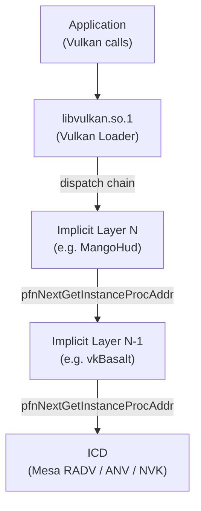
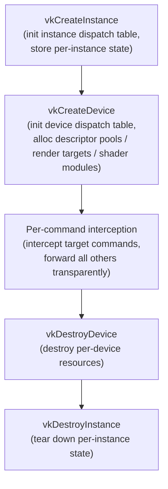
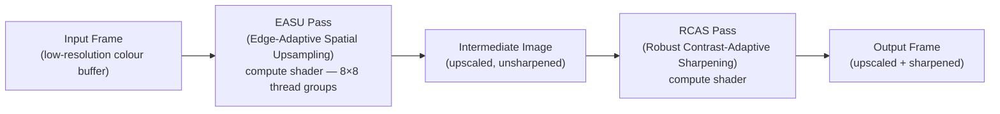
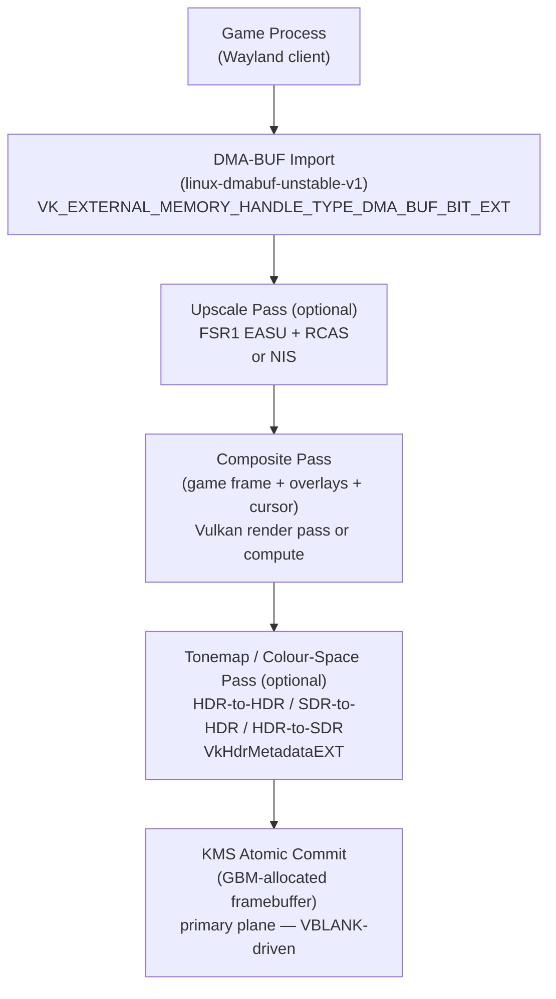
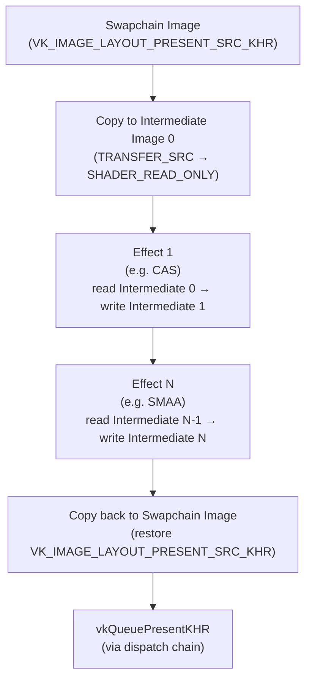
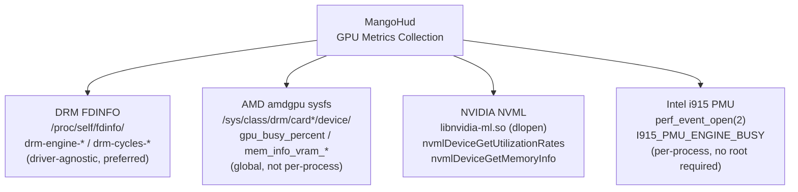
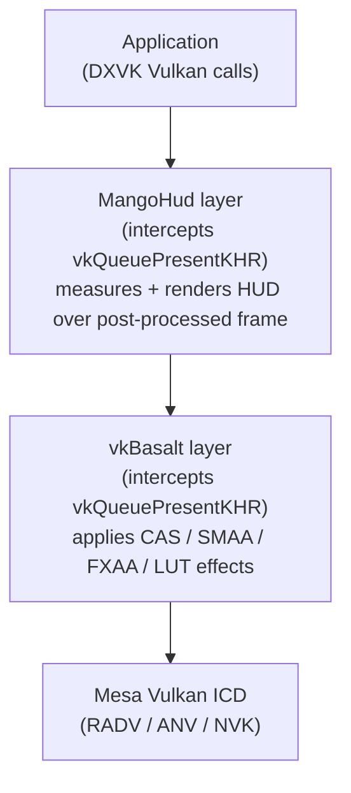

# Chapter 29: Upscaling, Post-Processing, and Overlays

**Part VIII — The Gaming Layer**

**Audience**: This chapter targets both application developers who need to understand the Vulkan layer mechanism well enough to write or consume layers, and systems developers who need the gamescope integration details, the DMA-BUF pipeline, and the compositor-level upscaling architecture. Readers are assumed to be familiar with the Vulkan API at an intermediate level, the KMS display stack (Chapters 2–3), and the DMA-BUF buffer sharing model (Chapter 4).

---

## Table of Contents

1. [The Vulkan Layer Mechanism](#1-the-vulkan-layer-mechanism)
2. [FSR 1, 2, and 3: Algorithms and Architecture](#2-fsr-1-2-and-3-algorithms-and-architecture)
3. [gamescope Integration: FSR, NIS, and HDR](#3-gamescope-integration-fsr-nis-and-hdr)
4. [vkBasalt: Vulkan Layer Post-Processing](#4-vkbasalt-vulkan-layer-post-processing)
5. [MangoHud: Metrics Overlay Implementation](#5-mangohud-metrics-overlay-implementation)
6. [Upscaling and Framepacing: XeSS, DLSS, and LatencyFleX](#6-upscaling-and-framepacing-xess-dlss-and-latencyflex)
7. [GameMode: OS-Level Performance Governor](#7-gamemode-os-level-performance-governor)
8. [ReShade and the FX Effect Ecosystem](#8-reshade-and-the-fx-effect-ecosystem)
9. [Performance Considerations and Deployment Patterns](#9-performance-considerations-and-deployment-patterns)
10. [Integrations](#integrations)
11. [References](#references)

---

## 1. The Vulkan Layer Mechanism

Modern Linux gaming depends on a collection of tools — **FSR** upscalers, visual post-processors, performance overlays — that intercept and augment **Vulkan** rendering without any modification to the game's source code. The technical foundation that makes this possible is the **Vulkan** **layer mechanism**, defined by the **Vulkan** loader specification and implemented by the Khronos **Vulkan** Loader (**`libvulkan.so.1`**). Understanding this mechanism is a prerequisite for everything that follows in this chapter.

The loader acts as a dispatch hub, maintaining **dispatch tables** — arrays of function pointers — at both the instance and device levels for every dispatchable **Vulkan** handle (**`VkInstance`**, **`VkPhysicalDevice`**, **`VkDevice`**, **`VkQueue`**, **`VkCommandBuffer`**). The **dispatch_key trick** exploits this invariant to allow layers to recover per-device state from any dispatchable handle. Layers divide into two kinds: **explicit layers**, which must be opted into via **`VK_INSTANCE_LAYERS`** or **`ppEnabledLayerNames`** in **`VkInstanceCreateInfo`**, and **implicit layers**, which are active for every **Vulkan** application unless suppressed via **`VK_LOADER_LAYERS_DISABLE`** or per-layer **`disable_environment`** keys. Each layer is described by a **JSON** manifest file that specifies its **`library_path`**, **`enable_environment`**, and **`disable_environment`** keys; starting with **`VK_EXT_layer_settings`** (**`VkLayerSettingsCreateInfoEXT`**), programmatic configuration replaces environment variables for new layers. The dispatch chain is bootstrapped through **`vkCreateInstance`** and **`vkCreateDevice`** using **`VkLayerInstanceCreateInfo`** / **`VkLayerDeviceCreateInfo`** and **`pfnNextGetInstanceProcAddr`** / **`pfnNextGetDeviceProcAddr`**. Per-command interception — e.g., of **`vkQueueSubmit`** or **`vkQueuePresentKHR`** — then follows a fixed pattern of exporting the function, performing the layer's work, and forwarding through the stored next-pointer. The layer lifecycle runs through **`vkCreateInstance`**, **`vkCreateDevice`**, per-command interception, **`vkDestroyDevice`**, and **`vkDestroyInstance`**.

Building on this mechanism, the chapter covers the **FidelityFX Super Resolution** (**FSR**) family — **FSR1**'s spatial **EASU** (Edge-Adaptive Spatial Upsampling) and **RCAS** (Robust Contrast-Adaptive Sharpening) compute passes, **FSR2**'s temporal accumulation requiring motion vectors and depth, and **FSR3**'s optical-flow frame generation — and explains why **gamescope** uses **FSR1** rather than **FSR2** at the compositor level. The **gamescope** integration section details the full frame pipeline: **DMA-BUF** import via **`VK_EXTERNAL_MEMORY_HANDLE_TYPE_DMA_BUF_BIT_EXT`**, the **FSR1** compute dispatch, **NIS** (**NVIDIA Image Scaling**) as an alternative spatial upscaler, the **HDR** tonemap pipeline (**`VkHdrMetadataEXT`**, **`VK_EXT_hdr_metadata`**, **`DRM_FORMAT_ARGB2101010`**), and **KMS** atomic commit driven by **VBLANK** events.

**vkBasalt** is examined as an implicit **Vulkan** layer performing in-process post-processing by intercepting **`vkCreateSwapchainKHR`** and **`vkQueuePresentKHR`**: its effect pipeline supports **CAS** (Contrast Adaptive Sharpening via **`ffx_cas.h`**), **SMAA** (Subpixel Morphological Anti-Aliasing), **FXAA** (Fast Approximate Anti-Aliasing), **LUT** colour grading, depth of field, and **ReShade FX** shaders compiled to **SPIR-V**.

**MangoHud** is covered as both a **Vulkan** implicit layer and an **OpenGL** **`LD_PRELOAD`** overlay, rendering real-time metrics via **Dear ImGui** (**`imgui`**) and **`imgui_impl_vulkan.cpp`**. Its GPU metrics collection has four paths: the driver-agnostic **DRM FDINFO** interface (**`/proc/self/fdinfo/`**, **`drm-engine-*`**, **`drm-cycles-*`**, **`drm-memory-*`** keys); the **AMD** **`amdgpu`** sysfs interface (**`gpu_busy_percent`**, **`mem_info_vram_used`**, **`pp_dpm_sclk`**, **hwmon**); the **NVIDIA** **NVML** path (**`libnvidia-ml.so`**, **`nvmlDeviceGetUtilizationRates`**, **`nvmlDeviceGetMemoryInfo`**); and the **Intel** **i915 PMU** via **`perf_event_open(2)`** (**`I915_PMU_ENGINE_BUSY`**). The **mangoapp** companion process for **gamescope** integration is also described.

Section 6 covers cross-vendor and proprietary temporal upscalers and framepacing: **Intel XeSS** (**Xe Super Sampling**) with its **XMX** and **DP4a** generic **Vulkan** paths (**`xessVKInit`**, **`xessVKExecute`**); **DLSS** (Deep Learning Super Sampling) via the **NGX SDK** (**`libnvidia-ngx.so.1`**), **Proton**/**DXVK** bridging, and **dlss-to-fsr** translation; and **LatencyFleX** as a software framepacing layer that eliminates GPU queue stuffing without driver support, complementing driver-native solutions such as **`VK_NV_low_latency2`** and **`VK_AMD_anti_lag`**.

**GameMode** (**`gamemoded`**) is covered as an OS-level performance governor that responds to a **D-Bus** API (**`com.feralinteractive.GameMode`**), pinning the **CPU** frequency governor to `performance`, applying **GPU** performance hints via **`amdgpu`** sysfs and **`nvidia-smi`**, and supporting custom start/end hooks in **`gamemode.ini`**.

The **ReShade** and **FX** effect ecosystem is examined in two deployment contexts: the **gamescope** compositor-level **`reshade_effect_manager`** (applying **ReShade FX** shaders to the final composited image before **KMS** commit) and the **vkBasalt** in-process **ReShade FX** pipeline.

Finally, performance and deployment considerations cover: layer interception overhead and GPU effect timings (by effect, at 1080p on **RDNA2**); layer stacking order and the **`VK_LOADER_DEBUG`** diagnostic variable; **Flatpak** sandboxing constraints on implicit layer discovery; limitations of **MangoHud**'s **OpenGL** path via **`glXSwapBuffers`** / **`eglSwapBuffers`** interception; and the **`disable_environment`** anti-cheat mechanism used by **EAC** and **BattlEye** via **`DISABLE_MANGOHUD`** / **`DISABLE_VKBASALT`**.

### The Loader as Dispatch Hub

When a Vulkan application calls `vkCreateInstance`, it is not calling into the ICD (Installable Client Driver, i.e., the GPU driver) directly. It is calling into the loader, `libvulkan.so.1`, which acts as a broker. The loader discovers available layers from their JSON manifests on disk, constructs an ordered dispatch chain, and inserts the layer chain between the application and the ICD. Every subsequent Vulkan call the application makes passes through this chain.

The loader implements **dispatch tables** — arrays of function pointers — at both the instance and device levels. Every dispatchable Vulkan handle (`VkInstance`, `VkPhysicalDevice`, `VkDevice`, `VkQueue`, `VkCommandBuffer`) is, at the ABI level, a pointer to a structure whose first word is a pointer to the relevant dispatch table. This layout is not optional: the Vulkan specification mandates it so that the loader and layers can retrieve the correct dispatch table from any dispatchable handle without knowing its concrete type.

The **dispatch_key trick** exploits this invariant. Given any dispatchable handle, you can retrieve its dispatch table pointer with a simple cast:

```c
// From Vulkan-Loader/loader/loader.h (conceptually)
static inline void *get_dispatch_key(const void *object) {
    return *(void **)object;   // first word of any dispatchable handle
}
```

Because all `VkCommandBuffer` objects created from the same `VkDevice` share the same device dispatch table pointer, that pointer uniquely identifies the device. Layers use this pointer as the key into a `std::unordered_map<void *, LayerDeviceData>` to retrieve their per-device state when they intercept commands that carry only a `VkCommandBuffer` handle — handles from which the `VkDevice` is otherwise not recoverable. [Source: KhronosGroup/Vulkan-Loader, `docs/LoaderLayerInterface.md`][1]



### Layer Types: Explicit and Implicit

Layers divide into two kinds:

**Explicit layers** must be opted into by the application (via `VK_INSTANCE_LAYERS` environment variable or programmatically via `ppEnabledLayerNames` in `VkInstanceCreateInfo`). The Khronos Validation Layer (`VK_LAYER_KHRONOS_validation`) is the canonical explicit layer.

**Implicit layers** are active for every Vulkan application on the system unless explicitly suppressed. They are discovered via JSON manifest files placed in well-known directories:

- System-wide: `/usr/share/vulkan/implicit_layer.d/`
- User-local: `$XDG_DATA_HOME/vulkan/implicit_layer.d/` (typically `~/.local/share/vulkan/implicit_layer.d/`)
- Additional search paths via `VK_ADD_LAYER_PATH`

MangoHud and vkBasalt both ship as implicit layers; they activate automatically for every Vulkan application unless the application or user sets a disable environment variable. Starting with Vulkan Loader built with **1.3.234** headers, `VK_LOADER_LAYERS_ENABLE` provides fine-grained per-layer opt-in control; `VK_LOADER_LAYERS_DISABLE` was added later in loaders built with **1.3.262** headers and later. Together these supersede the older `VK_INSTANCE_LAYERS` mechanism for implicit layer management.

### Layer Manifest JSON

Each layer is described by a JSON manifest file. A minimal implicit layer manifest looks like:

```json
{
    "file_format_version": "1.0.0",
    "layer": {
        "name": "VK_LAYER_MY_post_process",
        "type": "GLOBAL",
        "library_path": "/usr/lib/libmy_post_process.so",
        "api_version": "1.3.0",
        "implementation_version": "1",
        "description": "My post-processing layer",
        "enable_environment": {
            "ENABLE_MY_LAYER": "1"
        },
        "disable_environment": {
            "DISABLE_MY_LAYER": "1"
        }
    }
}
```

The `enable_environment` key means the implicit layer only activates when the named environment variable is set to a non-empty value. The `disable_environment` key is required for implicit layers; when set, it overrides and disables the layer regardless of `enable_environment`. If both variables are set simultaneously, the layer is disabled. This mechanism is important for anti-cheat compatibility: games can set the disable variable to prevent post-processing layers from altering their visual output.

The `library_path` field accepts a filename (searched via `dlopen` rules), a relative path (relative to the manifest file), or an absolute path. The loader resolves `library_path` at application startup, calls `dlopen`, and then looks up the layer's entry points. [Source: KhronosGroup/Vulkan-Loader, `docs/LoaderLayerInterface.md`][1]

Starting with Vulkan 1.3.272, the `VK_EXT_layer_settings` extension (`VkLayerSettingsCreateInfoEXT` in the `VkInstanceCreateInfo` pNext chain) provides a standardised, programmatic way to pass configuration to layers without environment variables or config files. [Source: VK_EXT_layer_settings specification, September 2023][10] Layers predating this extension — vkBasalt, MangoHud — use environment variables and config files; new layers should prefer `VK_EXT_layer_settings`.

### The Dispatch Chain Bootstrap

When a Vulkan application calls `vkCreateInstance`, the loader intercepts the call and invokes the chain of layer `vkCreateInstance` implementations in sequence. Each layer's implementation must:

1. Walk the `pNext` chain of the incoming `VkInstanceCreateInfo` looking for a `VkLayerInstanceCreateInfo` node with `function == VK_LAYER_LINK_INFO`.
2. Extract the next entity's `pfnNextGetInstanceProcAddr` from `pLayerInfo`.
3. Advance `pLayerInfo` to the next node in the chain (so the next layer down sees the right pointer).
4. Call through using the extracted `pfnNextGetInstanceProcAddr` to create the actual instance.
5. Store the next `pfnNextGetInstanceProcAddr` and populate a `VkLayerInstanceDispatchTable` by calling it for each function the layer needs to forward.

```c
// Skeleton vkCreateInstance for an implicit layer
VKAPI_ATTR VkResult VKAPI_CALL layer_vkCreateInstance(
    const VkInstanceCreateInfo *pCreateInfo,
    const VkAllocationCallbacks *pAllocator,
    VkInstance *pInstance)
{
    VkLayerInstanceCreateInfo *chain_info =
        (VkLayerInstanceCreateInfo *)pCreateInfo->pNext;

    // Walk pNext to find the loader link info
    while (chain_info &&
           !(chain_info->sType == VK_STRUCTURE_TYPE_LOADER_INSTANCE_CREATE_INFO &&
             chain_info->function == VK_LAYER_LINK_INFO))
        chain_info = (VkLayerInstanceCreateInfo *)chain_info->pNext;

    PFN_vkGetInstanceProcAddr fpGetInstanceProcAddr =
        chain_info->u.pLayerInfo->pfnNextGetInstanceProcAddr;
    PFN_vkCreateInstance fpCreateInstance =
        (PFN_vkCreateInstance)fpGetInstanceProcAddr(NULL, "vkCreateInstance");

    // Advance the chain pointer for layers below us
    chain_info->u.pLayerInfo = chain_info->u.pLayerInfo->pNext;

    VkResult result = fpCreateInstance(pCreateInfo, pAllocator, pInstance);
    if (result != VK_SUCCESS) return result;

    // Populate our per-instance dispatch table
    layer_store_instance(*pInstance, fpGetInstanceProcAddr);
    return VK_SUCCESS;
}
```

Device creation follows an identical pattern using `VkLayerDeviceCreateInfo` and `pfnNextGetDeviceProcAddr`. [Source: Khronos Vulkan-Loader `docs/LoaderLayerInterface.md`][1] [Source: RenderDoc Vulkan Layer Guide][11]

### Per-Command Interception

Once the layer has stored the next entity's function pointers in its dispatch table, intercepting any Vulkan command is straightforward: export the function with the correct name and `VKAPI_CALL` calling convention, perform the desired work, then call the stored next-pointer. For example, a layer intercepting `vkQueueSubmit` to log command buffer counts:

```c
VKAPI_ATTR VkResult VKAPI_CALL layer_vkQueueSubmit(
    VkQueue queue,
    uint32_t submitCount,
    const VkSubmitInfo *pSubmits,
    VkFence fence)
{
    // dispatch_key trick: first word of queue handle is dispatch table ptr
    LayerDeviceData *data = get_device_data(get_dispatch_key(queue));

    uint32_t total_cbs = 0;
    for (uint32_t i = 0; i < submitCount; i++)
        total_cbs += pSubmits[i].commandBufferCount;
    fprintf(stderr, "vkQueueSubmit: %u command buffers\n", total_cbs);

    return data->dispatch.QueueSubmit(queue, submitCount, pSubmits, fence);
}
```

### Layer Lifecycle Summary

The complete lifecycle of a layer activation, from application start to application exit, runs:

1. `vkCreateInstance` — layer initialises instance dispatch table, stores per-instance state.
2. `vkCreateDevice` — layer initialises device dispatch table, allocates per-device resources (descriptor pools, render targets, shader modules).
3. Per-command interception — the layer intercepts the commands it cares about, forwarding all others transparently.
4. `vkDestroyDevice` — layer destroys per-device resources.
5. `vkDestroyInstance` — layer tears down per-instance state.

The key invariant throughout is that the layer must forward every call it intercepts (calling the next pointer), even if it adds work before or after. Failing to forward destroys the application's rendering or creates resource leaks.



---

## 2. FSR 1, 2, and 3: Algorithms and Architecture

FidelityFX Super Resolution (FSR) is AMD's family of GPU-accelerated upscaling techniques, shipped as open-source HLSL/GLSL shader headers as part of the FidelityFX SDK. [Source: GPUOpen FidelityFX SDK][4] The three major versions represent fundamentally different algorithmic approaches, and the architectural difference has direct consequences for where in the stack each version can be applied.

### FSR1: Spatial-Only Upscaling (2021)

FSR1, released June 2021, is a purely **spatial** upscaler: it examines only the current frame, with no knowledge of previous frames, no motion vectors, and no depth buffer. It consists of two compute passes:

**EASU (Edge-Adaptive Spatial Upsampling)** is the upscaling pass. It is often described loosely as a "Lanczos filter", but that description understates its sophistication. EASU analyses a neighbourhood of input pixels to detect gradient reversals — discontinuities where the gradient of luminance or colour changes direction. These reversals signal the presence of edges. At each output pixel, EASU determines whether the local neighbourhood is dominated by a diagonal, horizontal, or vertical edge, and then applies a *directional* 4-tap reconstruction filter whose shape is stretched along the detected edge orientation. This anisotropic shaping prevents the ringing artifacts that isotropic Lanczos filters produce at edges while recovering high-frequency detail in smooth regions. The filter kernel weights are computed from the relative magnitudes of the gradient reversal signals, not from a fixed Lanczos lobe. The mathematical derivation is in `ffx_fsr1.h` in the FidelityFX SDK, in the `FsrEasuF` and `FsrEasuH` (FP16) functions. [Source: FidelityFX-SDK, `ffx_fsr1.h`][4]

**RCAS (Robust Contrast-Adaptive Sharpening)** is the second pass, applied after EASU to the upscaled image. RCAS is *not* a simple unsharp mask. It is a contrast-adaptive algorithm that amplifies local contrast differentially based on the surrounding gradient environment. In regions with low spatial frequency (flat colours), it applies stronger sharpening; near already-sharp edges, it applies weaker sharpening to avoid edge halos and ringing. The "robust" qualifier in the name refers to its resistance to amplifying noise: very small-amplitude high-frequency signals that fall below a noise threshold are suppressed rather than amplified. The sharpness strength is a single scalar constant passed via push constants.

EASU and RCAS are both compute shaders. The canonical dispatch thread group size is 8×8 output pixels per group, with each invocation handling one output pixel. For a 1080p→4K upscale (2× linear), EASU dispatches `ceil(3840/8) × ceil(2160/8) = 480 × 270 = 129,600` thread groups.



FSR1's quality modes are simply different input-to-output scaling ratios:

| Mode          | Scale Factor (linear) | Area Ratio |
|---------------|-----------------------|------------|
| Ultra Quality | 1.3×                  | 1.69×      |
| Quality       | 1.5×                  | 2.25×      |
| Balanced      | 1.7×                  | 2.89×      |
| Performance   | 2.0×                  | 4.0×       |
| Ultra Perf    | 3.0×                  | 9.0×       |

The `FsrEasuCon` macro (or its Vulkan equivalent `FsrEasuConOffset`) computes four `vec4` constants from the input and output viewport dimensions:

```hlsl
// From ffx_fsr1.h — compute the four EASU constants
// con0..con3 are four vec4 push constants
void FsrEasuCon(
    out AU4 con0, out AU4 con1, out AU4 con2, out AU4 con3,
    AF1 inputViewportInPixelsX,  AF1 inputViewportInPixelsY,
    AF1 inputSizeInPixelsX,      AF1 inputSizeInPixelsY,
    AF1 outputSizeInPixelsX,     AF1 outputSizeInPixelsY)
{
    // con0.xy = reciprocal of input viewport size (uv scale)
    // con0.zw = 0.5 * reciprocal - 0.5 (uv offset for centred sampling)
    // con1.xy = reciprocal of input texture size
    // con1.zw = input viewport size / input texture size (viewport fraction)
    // con2.xy = viewport_size / output_size (the actual upscale ratio)
    // con3 = jitter-related constants (unused in FSR1)
    ...
}
```

These constants are passed as Vulkan push constants to the EASU compute shader and consume four `vec4` (128 bytes total). The shader uses them to compute the correct input texture coordinates and gradient detection windows for each output pixel.

### FSR2: Temporal Upscaling (2022)

FSR2, released January 2022, is a fundamentally different algorithm. It is a **temporal** upscaler: it accumulates colour, depth, and motion information across multiple frames to reconstruct sub-pixel detail that no single frame contains. Each frame, FSR2 requires from the application:

- **Motion vectors**: per-pixel screen-space vectors indicating where each pixel was located in the previous frame. These must be computed inside the game's rendering pipeline, typically from the difference between current and previous MVP transforms.
- **Depth buffer**: the current frame's depth values, used for disocclusion detection and to distinguish foreground from background motion.
- **Jitter offsets**: the sub-pixel offsets applied to the projection matrix each frame (the Halton sequence is standard), which FSR2 uses to determine where within the pixel grid each sample was taken.
- **Exposure/reactive masks**: optional data controlling the blending of accumulated history in bright or transparent regions.

Because FSR2 has access to temporally accumulated sub-pixel samples, it produces substantially higher quality output than FSR1, especially in motion. At equivalent scaling ratios it approaches the quality of DLSS 2 and Intel XeSS, which use similar architectures.

### FSR3: Frame Generation (2023)

FSR3, released October 2023, extends FSR2 by adding an **optical-flow frame generation** component. After FSR2 produces an upscaled reconstructed frame, FSR3 synthesises an *additional* intermediate frame by computing an optical flow between consecutive reconstructed frames and interpolating pixel motion. This effectively halves the perceived frame-time at the cost of approximately one frame of added latency. FSR3.1 (2024) separated the temporal upscaler from the frame generation module, allowing the temporal upscaler to be used independently or alongside DLSS 3.5 frame generation.

### Why gamescope Uses FSR1

The architectural reason gamescope uses FSR1 rather than FSR2 or FSR3 is not a quality preference — it is a hard constraint imposed by where in the pipeline gamescope operates.

gamescope is a **compositor**. It receives frames that games have already fully rendered and presented via Wayland's `linux-dmabuf` protocol. By the time a frame arrives at gamescope, the game's internal render targets — the depth buffer, the motion vector buffer, the jitter history — have been discarded or overwritten. gamescope has no access to any of this per-frame auxiliary data.

FSR2 *requires* motion vectors and a depth buffer. Without them, its temporal accumulation produces ghosting, smearing, and disocclusion artifacts worse than FSR1. FSR2 integration at the compositor level would require either (a) modifications to the game engine to export these buffers via a side channel (a Proton extension, a Wine hook, or a custom protocol), or (b) inaccurate optical-flow estimation from the colour buffer alone — which is what NVK/DLSS attempts in certain modes but with dedicated ML hardware for flow estimation. As of 2026, FSR2 integration in gamescope remains architecturally incomplete for precisely these reasons; the open GitHub issue #615 on the gamescope repository tracks the discussion. [Source: gamescope issue tracker][3]

FSR1, requiring only the current frame's colour buffer, is therefore the appropriate choice for any compositor-level upscaler operating on fully composited output.

---

## 3. gamescope Integration: FSR, NIS, and HDR

gamescope (discussed architecturally in Chapter 22) is a micro-compositor developed by Valve for Linux gaming, deployed on Steam Deck and on desktop Linux. It operates either as a nested Wayland compositor (games see a virtual display and communicate via Wayland) or in KMS direct mode (it takes exclusive control of a DRM display). In both modes the game's rendered frames arrive at gamescope as DMA-BUF file descriptors via the `linux-dmabuf-unstable-v1` Wayland protocol, and gamescope produces the final composited image via KMS.

### The Frame Pipeline

The frame pipeline inside gamescope, from game frame receipt to KMS scanout, consists of several optional stages:

1. **DMA-BUF import**: the game submits a `linux-dmabuf` buffer containing its rendered frame. gamescope imports this into Vulkan as an external memory object using `VK_EXTERNAL_MEMORY_HANDLE_TYPE_DMA_BUF_BIT_EXT`, creating a `VkImage` backed by the DMA-BUF without a copy. The relevant Vulkan extensions are `VK_KHR_external_memory_fd` and `VK_EXT_external_memory_dma_buf`. [Source: VK_KHR_external_memory_fd specification][7]

2. **Upscale pass (optional)**: if FSR1 or NIS upscaling is enabled (the game rendered at a lower resolution than the display), gamescope dispatches the EASU compute shader, writing upscaled output to an intermediate `VkImage`. A second dispatch runs RCAS for sharpening.

3. **Composite pass**: gamescope composites all surface layers — the game frame (possibly upscaled), overlay surfaces, and cursor — into a single output image. This uses either a Vulkan render pass or compute.

4. **Tonemap/colour-space pass (optional)**: when HDR output is enabled and the display supports it, gamescope runs a tonemap pass to convert from the game's colour space (scRGB, PQ) to the display's HDR transfer function, or to tone-map HDR content to SDR.

5. **KMS atomic commit**: the final composited image, backed by a GBM-allocated buffer, is committed to the KMS primary plane via an atomic commit. KMS VBLANK events drive the pacing of this loop (see Chapter 2 for the page-flip event mechanism).

The key source files are `src/rendervulkan.cpp` (Vulkan renderer, FSR shader dispatch), `src/steamcompmgr.cpp` (compositor logic, frame pacing), and `src/reshade_effect_manager.cpp` (ReShade effect pipeline). [Source: ValveSoftware/gamescope][3]



### FSR1 Dispatch in gamescope

gamescope's FSR integration works by compiling the EASU and RCAS HLSL shader headers (`ffx_fsr1.h`, `ffx_a.h`) to SPIR-V offline and embedding the resulting bytecode as C header files (`cs_easu.h`, `cs_easu_fp16.h`, `cs_composite_rcas.h`). These are loaded at startup as `VkShaderModule` objects.

A simplified view of the EASU compute dispatch:

```cpp
// src/rendervulkan.cpp (simplified from gamescope source)
// Push constants for EASU: four vec4 constants computed by FsrEasuCon
struct EasuPushConstants {
    uint32_t con0[4];
    uint32_t con1[4];
    uint32_t con2[4];
    uint32_t con3[4];
};

void do_fsr_easu(VkCommandBuffer cmd,
                 VkImage inputImage,    // imported DMA-BUF image
                 VkImage outputImage,   // intermediate upscaled image
                 VkExtent2D inputSize,
                 VkExtent2D outputSize)
{
    EasuPushConstants pc;
    // Compute EASU constants from input/output resolution
    FsrEasuCon((AU4*)pc.con0, (AU4*)pc.con1,
               (AU4*)pc.con2, (AU4*)pc.con3,
               inputSize.width,  inputSize.height,
               inputSize.width,  inputSize.height,
               outputSize.width, outputSize.height);

    vkCmdBindPipeline(cmd, VK_PIPELINE_BIND_POINT_COMPUTE, g_easu_pipeline);
    vkCmdPushConstants(cmd, g_easu_pipeline_layout,
                       VK_SHADER_STAGE_COMPUTE_BIT, 0,
                       sizeof(EasuPushConstants), &pc);
    vkCmdBindDescriptorSets(cmd, VK_PIPELINE_BIND_POINT_COMPUTE,
                            g_easu_pipeline_layout, 0, 1, &easu_desc_set, 0, nullptr);

    // 8×8 pixels per thread group
    uint32_t groups_x = (outputSize.width  + 7) / 8;
    uint32_t groups_y = (outputSize.height + 7) / 8;
    vkCmdDispatch(cmd, groups_x, groups_y, 1);
}
```

The descriptor set binds the input image as a `sampler2D` and the output image as a `image2D` for store operations. After EASU, an image memory barrier transitions the output image to `VK_IMAGE_LAYOUT_SHADER_READ_ONLY_OPTIMAL`, and the RCAS pass reads it as input.

gamescope provides user-adjustable FSR sharpness via keyboard shortcuts (`Super+I` / `Super+O` to adjust the RCAS strength scalar) and a `-F fsr` command-line flag to enable FSR mode. The game's render resolution must be set lower than the display resolution for upscaling to take effect; on Steam Deck this is surfaced as the "Game Resolution" setting in the Steam Deck UI.

### NIS: NVIDIA Image Scaling

gamescope also integrates **NIS (NVIDIA Image Scaling) v1.0.3** as an alternative upscaler, activated with `-F nis`. NIS is a different spatial algorithm developed by NVIDIA and open-sourced under MIT. Where FSR1's EASU uses an edge-adaptive directional filter, NIS uses a different sharpening kernel with a distinct frequency-response profile. In practice both algorithms perform comparably at equivalent quality settings, with FSR1 performing slightly better at lower scale factors and NIS having a different sharpening character that some users prefer. NIS is also hardware-agnostic — it runs on any GPU with compute shader support, not only AMD hardware.

### HDR Pipeline

When the connected display supports HDR (detected via KMS property `HDR_OUTPUT_METADATA` and the EDID HDR capabilities block, covered in Chapter 3), gamescope activates an HDR tonemap pass. The pipeline handles several scenarios:

- **HDR-to-HDR passthrough**: a game that renders in scRGB or PQ (using `VK_EXT_swapchain_colorspace` with `VK_COLOR_SPACE_HDR10_ST2084_EXT`) has its gamut and transfer function preserved through the compositor. gamescope's HDR tonemap pass performs gamut mapping from the game's colour volume to the display's reported colour volume (from EDID) without clipping.

- **SDR-to-HDR uplifting**: for SDR games on HDR displays, gamescope applies a sRGB→PQ conversion with a configurable peak luminance, lifting the image into the display's HDR tone range.

- **HDR-to-SDR fallback**: on SDR displays, HDR game output is tone-mapped using a Reinhard or Uchimura operator.

The KMS scanout buffer for HDR is typically `VK_FORMAT_A2R10G10B10_UNORM_PACK32` (mapping to `DRM_FORMAT_ARGB2101010`), providing 10 bits per colour channel. gamescope populates a `VkHdrMetadataEXT` struct (from `VK_EXT_hdr_metadata`) with the mastering display primaries and MaxCLL/MaxFALL values derived from the game's HDR metadata, and passes this to the display via the KMS `HDR_OUTPUT_METADATA` property. [Source: VK_EXT_hdr_metadata specification][6]

The HDR mode is controlled by the `STEAM_GAMESCOPE_HDR_ENABLED` and `STEAM_GAMESCOPE_COLOR_SPACE` environment variables, which Steam sets based on the user's display configuration. The `GAMESCOPE_ALLOW_TEARING` environment variable interacts with VRR (FreeSync/G-Sync) to permit tearing presents for lowest latency (Chapter 3).

---

## 4. vkBasalt: Vulkan Layer Post-Processing

vkBasalt is an implicit Vulkan layer that inserts post-processing render passes between an application's frame rendering and the compositor's frame consumption. It runs *inside* the application process, operating on the swapchain images before they are presented to the Wayland compositor or X server. The current release is version 0.3.2.10 (2023). [Source: DadSchoorse/vkBasalt][2]

### Activation and Manifest

vkBasalt ships a manifest at `/usr/share/vulkan/implicit_layer.d/vkBasalt.json` (or equivalent XDG path):

```json
{
    "file_format_version": "1.0.0",
    "layer": {
        "name": "VK_LAYER_vkBasalt_post_processing",
        "type": "GLOBAL",
        "library_path": "libvkbasalt.so",
        "api_version": "1.2.0",
        "implementation_version": "1",
        "description": "VkBasalt post processing layer",
        "enable_environment": {
            "ENABLE_VKBASALT": "1"
        },
        "disable_environment": {
            "DISABLE_VKBASALT": "1"
        }
    }
}
```

The `ENABLE_VKBASALT=1` environment variable activates the layer. This is why running a game with `ENABLE_VKBASALT=1 %command%` in Steam's launch options activates post-processing. By default the layer is dormant even though it is installed, because `enable_environment` requires explicit opt-in.

### Swapchain Interception

vkBasalt's interception strategy hinges on two Vulkan commands: `vkCreateSwapchainKHR` and `vkQueuePresentKHR`.

When the application calls `vkCreateSwapchainKHR`, vkBasalt's override runs:

```cpp
// src/effect_manager.cpp (conceptual reconstruction from vkBasalt source)
VkResult EffectManager::CreateSwapchain(
    VkDevice device,
    const VkSwapchainCreateInfoKHR *pCreateInfo,
    const VkAllocationCallbacks *pAllocator,
    VkSwapchainKHR *pSwapchain)
{
    // Record the swapchain's image format and extent
    m_format = pCreateInfo->imageFormat;
    m_extent = pCreateInfo->imageExtent;

    // Create the actual swapchain via the next layer/driver
    VkResult result = m_dispatch.CreateSwapchainKHR(
        device, pCreateInfo, pAllocator, pSwapchain);
    if (result != VK_SUCCESS) return result;

    // Allocate intermediate render target (same format, same extent)
    // This is the image that effect shaders write into
    CreateIntermediateImages(device, m_format, m_extent);

    // Compile/load effect pipeline modules for this format
    InitEffects(device, m_format, m_extent);

    return VK_SUCCESS;
}
```

The intermediate images are `VkImage` objects with `VK_IMAGE_USAGE_COLOR_ATTACHMENT_BIT | VK_IMAGE_USAGE_SAMPLED_BIT | VK_IMAGE_USAGE_STORAGE_BIT`, allocated from device-local memory. They serve as ping-pong buffers between chained effects.

When `vkQueuePresentKHR` is called by the application:

1. vkBasalt acquires the current swapchain image index from the present info.
2. It transitions the swapchain image from `VK_IMAGE_LAYOUT_PRESENT_SRC_KHR` to `VK_IMAGE_LAYOUT_TRANSFER_SRC_OPTIMAL` and copies it to the first intermediate image.
3. Each enabled effect is applied in order, reading from one intermediate image and writing to the next.
4. The final processed image is copied back to the swapchain image.
5. Image barriers restore the swapchain image to `VK_IMAGE_LAYOUT_PRESENT_SRC_KHR`.
6. The real `vkQueuePresentKHR` is called via the dispatch chain.

The semaphore chain is critical: the application's render-complete semaphore drives the first copy, and a new semaphore signals present-ready after the final copy. vkBasalt replaces the application's present wait semaphore with its own. [Source: DadSchoorse/vkBasalt, `src/effect_manager.cpp`][2]



### Effect Pipeline

vkBasalt supports the following effects, individually or chained in user-defined order:

**CAS (Contrast Adaptive Sharpening)** — AMD FidelityFX CAS (`ffx_cas.h`). This is a compute-based sharpening filter that adapts its strength based on local contrast. CAS operates in a single compute pass with an 8×8 thread group (one thread per output pixel). It is the most commonly used vkBasalt effect and the most efficient, adding roughly 0.2–0.5 ms at 1080p on mid-range AMD hardware:

```cpp
// src/cas.cpp (conceptual)
void CAS::applyEffect(VkCommandBuffer cmd, VkImage src, VkImage dst)
{
    // Barrier: src image must be SHADER_READ_ONLY before CAS reads it
    VkImageMemoryBarrier barrier = {};
    barrier.sType = VK_STRUCTURE_TYPE_IMAGE_MEMORY_BARRIER;
    barrier.srcAccessMask = VK_ACCESS_COLOR_ATTACHMENT_WRITE_BIT;
    barrier.dstAccessMask = VK_ACCESS_SHADER_READ_BIT;
    barrier.oldLayout = VK_IMAGE_LAYOUT_COLOR_ATTACHMENT_OPTIMAL;
    barrier.newLayout = VK_IMAGE_LAYOUT_SHADER_READ_ONLY_OPTIMAL;
    barrier.image = src;
    // ... (subresource range omitted)
    vkCmdPipelineBarrier(cmd,
        VK_PIPELINE_STAGE_COLOR_ATTACHMENT_OUTPUT_BIT,
        VK_PIPELINE_STAGE_COMPUTE_SHADER_BIT,
        0, 0, nullptr, 0, nullptr, 1, &barrier);

    // CAS push constants: sharpness strength (0.0 = max, 1.0 = no sharpening)
    float sharpness = m_config.casSharpness;
    uint32_t cas_con[8];
    CasSetup(cas_con, cas_con + 4,
             sharpness,
             m_extent.width, m_extent.height,
             m_extent.width, m_extent.height);

    vkCmdBindPipeline(cmd, VK_PIPELINE_BIND_POINT_COMPUTE, m_pipeline);
    vkCmdPushConstants(cmd, m_pipeline_layout,
                       VK_SHADER_STAGE_COMPUTE_BIT, 0,
                       sizeof(cas_con), cas_con);
    vkCmdBindDescriptorSets(cmd, VK_PIPELINE_BIND_POINT_COMPUTE,
                            m_pipeline_layout, 0, 1, &m_desc_set, 0, nullptr);

    uint32_t groups_x = (m_extent.width  + 15) / 16;
    uint32_t groups_y = (m_extent.height + 15) / 16;
    vkCmdDispatch(cmd, groups_x, groups_y, 1);
}
```

**SMAA (Subpixel Morphological Anti-Aliasing)** — vkBasalt implements SMAA from the reference HLSL source by Jimenez et al. [Source: iryoku/smaa][8] SMAA is a three-pass rasterisation algorithm: edge detection (detecting colour discontinuities), blending weight calculation (computing the shape of the detected edge for sub-pixel blending), and neighbourhood blending (applying the computed blend weights). Each pass is a full-screen fragment shader render pass. SMAA operates at quality levels 1x, T2x, S2x, and 4x; higher levels trade GPU time for reduced temporal aliasing. At 1080p, SMAA 1x adds approximately 0.8 ms; SMAA 4x adds 2–3 ms. [Source: DadSchoorse/vkBasalt, `src/effect_smaa.cpp`][2]

**FXAA (Fast Approximate Anti-Aliasing)** — a single-pass fragment shader that detects edges from luminance gradients and applies a sub-pixel blend along the detected edge. FXAA is cheaper than SMAA (< 0.5 ms at 1080p) but produces softer output. It uses no intermediate render targets beyond the output image.

**LUT colour grading** — loads a 3D colour lookup table from a `.png` file specified in `vkbasalt.conf` (`lutFile = /path/to/lut.png`). The LUT is uploaded to a `VkImage` (3D texture or 2D strip encoding a 3D grid) at startup; the pass is a fragment shader sampling the input colour and remapping via the LUT texture. LUTs can simulate film emulation, fix game colour calibration errors, or apply accessibility colour transformations.

**Depth of Field** — a Bokeh DoF effect requiring a depth buffer. In practice, vkBasalt operates on swapchain colour images and cannot access depth; this pass is rarely used on real games.

### Configuration

vkBasalt reads `$XDG_CONFIG_HOME/vkBasalt/vkBasalt.conf` (typically `~/.config/vkBasalt/vkBasalt.conf`) or `/etc/vkBasalt.conf`, or uses the path in `VKBASALT_CONFIG_FILE`. A representative configuration:

```
# vkBasalt.conf
effects = cas:smaa            # colon-separated effect chain
cas.sharpness = 0.4           # 0.0 = maximum sharpness, 1.0 = none
smaa.preset = HIGH            # LOW, MEDIUM, HIGH, ULTRA
```

The `effects` key determines both which effects are active and their application order. The first effect in the chain reads from the swapchain copy; subsequent effects chain through intermediate images; the last effect writes to the swapchain.

---

## 5. MangoHud: Metrics Overlay Implementation

MangoHud is a Vulkan and OpenGL overlay that renders real-time performance metrics — frame timing graphs, GPU/CPU utilisation, temperature, clock frequencies, VRAM usage, fan speed, battery level, network throughput — on top of the application's rendered output. Current version is v0.8.4 (May 2026). [Source: flightlessmango/MangoHud][5]

### Activation Mechanism

The **Vulkan path** uses an implicit layer (`MangoHud.json` in `implicit_layer.d/`), activated by `MANGOHUD=1`. The **OpenGL path** uses `LD_PRELOAD` of `libMangoHud.so`, which intercepts `glXSwapBuffers` and `eglSwapBuffers` via symbol interposition. The OpenGL path has lower fidelity because MangoHud cannot insert a proper render pass; it renders overlay geometry via OpenGL state it controls, which may interact with application state.

### Interception: vkQueuePresentKHR

MangoHud's Vulkan layer intercepts `vkQueuePresentKHR` and inserts a render pass that draws the HUD into the swapchain image immediately before present. The interception point is the same as vkBasalt; when both layers are active simultaneously, their respective `vkQueuePresentKHR` overrides chain in the loader-determined order (see §7 on layer stacking).

MangoHud's HUD renderer is built on **Dear ImGui** (`imgui`). The text, graphs, and widget layout are described via Dear ImGui's immediate-mode API; the actual draw calls are issued through `imgui_impl_vulkan.cpp`, which generates `VkCommandBuffer` commands drawing quad geometry with texture-mapped text. The font atlas is a pre-rendered SDF (signed-distance field) texture uploaded to a `VkImage`. [Source: flightlessmango/MangoHud, `src/overlay.cpp`][5]

Frame timing is measured by recording `clock_gettime(CLOCK_MONOTONIC)` at each `vkQueuePresentKHR` call. The delta between successive calls is one frame time. These deltas are pushed into a circular buffer; the 1% and 0.1% lows are computed from the sorted tail of this buffer; the frame-time graph widget calls `ImGui::PlotLines` with the circular buffer as its data source. This measurement is *CPU-side* frame time — the interval between present calls. GPU-side frame time would require `VK_EXT_calibrated_timestamps` or timestamps baked into command buffers; MangoHud uses CPU frame time for the graph because it is universally available and correctly captures stall intervals between presents.

```cpp
// src/overlay.cpp (conceptual)
void MangoHud::on_present(VkQueue queue, uint32_t presentCount,
                          const VkPresentInfoKHR *pPresentInfo)
{
    struct timespec ts;
    clock_gettime(CLOCK_MONOTONIC, &ts);
    uint64_t now_ns = (uint64_t)ts.tv_sec * 1'000'000'000ULL + ts.tv_nsec;

    if (last_present_ns != 0) {
        float frame_time_ms = (now_ns - last_present_ns) / 1e6f;
        frame_times.push(frame_time_ms);  // circular buffer
    }
    last_present_ns = now_ns;

    // Render HUD into swapchain image, then call real present
    render_hud(queue, pPresentInfo);
    dispatch.QueuePresentKHR(queue, pPresentInfo);
}
```

### GPU Metrics Collection

GPU metrics collection is MangoHud's most complex subsystem, because the interfaces differ by GPU vendor and kernel version. MangoHud implements three primary paths:



#### DRM FDINFO (Driver-Agnostic, Preferred Path)

The **DRM FDINFO** interface was designed to provide a standardised, per-client view of GPU resource consumption without requiring root access or vendor-specific APIs. It is implemented in the Linux kernel's DRM subsystem and exposed via `/proc/<pid>/fdinfo/<fd>` for the process's DRM file descriptor. [Source: Linux DRM Usage Stats documentation][9]

The key-value pairs in a DRM FDINFO file follow the format `key: value`, e.g.:

```
drm-driver: amdgpu
drm-pdev: 0000:03:00.0
drm-client-id: 7
drm-engine-gfx: 12345678 ns
drm-engine-compute: 0 ns
drm-engine-dma: 4096 ns
drm-cycles-gfx: 98765
drm-total-cycles-gfx: 1000000
drm-maxfreq-gfx: 2700 MHz
drm-memory-vram: 1024 MiB
drm-memory-gtt: 256 MiB
```

The key families are:

- `drm-engine-<name>`: cumulative nanoseconds the named engine has been busy for this client. MangoHud computes GPU utilisation by sampling this value twice, dividing the delta by the elapsed wall-clock time, and expressing it as a percentage. This is the number of *nanoseconds the engine ran workloads for this process*, not a hardware ALU utilisation figure — it does not distinguish between a compute-bound shader running at 100% ALU utilisation and a memory-bandwidth-limited shader that has ALUs mostly idle.

- `drm-cycles-<name>` / `drm-total-cycles-<name>`: cycle counts for clock-domain-accurate utilisation calculation. The ratio `drm-cycles-<name> / drm-total-cycles-<name>` gives engine utilisation independent of frequency scaling.

- `drm-memory-<region>`: memory consumption in the named region (e.g., `vram`, `gtt`, `system`). Note: `drm-memory-*` is deprecated in recent kernels in favour of `drm-total-<region>`, `drm-shared-<region>`, `drm-resident-<region>`, `drm-active-<region>`. amdgpu still populates `drm-memory-*` for compatibility.

DRM FDINFO support was introduced across drivers over a span of kernel versions:
- **amdgpu**: kernel 5.19 (basic engine time), extended in 6.x with cycle counts and memory regions
- **i915**: kernel 6.2 (engine time and memory)
- **Intel Xe**: kernel 6.8+ (full fdinfo support)
- **Panfrost/Panthor** (Mali): kernel 6.6+
- **Nouveau**: partial as of kernel 6.8; full support ongoing

MangoHud parses fdinfo by opening `/proc/self/fdinfo/` (or `/proc/<pid>/fdinfo/` for external monitoring), enumerating file descriptors, checking `drm-driver:` to confirm it's a DRM fd, and then parsing the key-value pairs. A key concern is deduplication: if the process has multiple file descriptors pointing to the same DRM device (e.g., the Mesa Vulkan driver opens one fd, and MangoHud opens another), MangoHud must deduplicate by `drm-client-id` to avoid reporting double GPU utilisation.

```cpp
// src/gpu_fdinfo.cpp (MangoHud, conceptual)
struct fdinfo_data {
    uint64_t engine_ns;       // drm-engine-render: ns
    uint64_t cycles;          // drm-cycles-render
    uint64_t total_cycles;    // drm-total-cycles-render
    uint64_t vram_used_bytes; // drm-memory-vram or drm-total-vram
    uint64_t client_id;       // drm-client-id (for dedup)
};

bool read_fdinfo(int fd, fdinfo_data &out) {
    char path[64];
    snprintf(path, sizeof(path), "/proc/self/fdinfo/%d", fd);
    FILE *f = fopen(path, "r");
    if (!f) return false;

    char line[256];
    bool is_drm = false;
    while (fgets(line, sizeof(line), f)) {
        if (strncmp(line, "drm-driver:", 11) == 0)
            is_drm = true;
        else if (strncmp(line, "drm-engine-render:", 18) == 0)
            sscanf(line + 18, " %llu ns", &out.engine_ns);
        else if (strncmp(line, "drm-cycles-render:", 18) == 0)
            sscanf(line + 18, " %llu", &out.cycles);
        else if (strncmp(line, "drm-total-cycles-render:", 24) == 0)
            sscanf(line + 24, " %llu", &out.total_cycles);
        else if (strncmp(line, "drm-memory-vram:", 16) == 0)
            parse_memory_value(line + 16, &out.vram_used_bytes);
        else if (strncmp(line, "drm-client-id:", 14) == 0)
            sscanf(line + 14, " %llu", &out.client_id);
    }
    fclose(f);
    return is_drm;
}
```

#### AMD amdgpu sysfs Path

Before DRM FDINFO matured, MangoHud collected AMD metrics from amdgpu's sysfs interface. The key nodes are under `/sys/class/drm/card<N>/device/`:

- `gpu_busy_percent`: percentage of time the GPU was not idle in the last polling interval. This is a *global* metric (all clients, not per-process) and does not distinguish between graphics, compute, and DMA engines.
- `mem_info_vram_used` / `mem_info_vram_total`: current VRAM usage in bytes.
- `mem_info_gtt_used` / `mem_info_gtt_total`: GTT (graphics translation table, i.e., system memory mapped for GPU use) usage.

GPU temperature and power are read from the hwmon interface under `/sys/class/hwmon/hwmon<N>/` (where the hwmon device's `name` file reads `amdgpu`):

```bash
# Temperature (millidegrees Celsius)
cat /sys/class/hwmon/hwmon1/temp1_input   # GPU die junction temperature
cat /sys/class/hwmon/hwmon1/temp2_input   # GPU hotspot (RDNA junction)

# Power (microwatts)
cat /sys/class/hwmon/hwmon1/power1_average

# Clock frequencies
cat /sys/class/drm/card0/device/pp_dpm_sclk   # shader clock states
cat /sys/class/drm/card0/device/pp_dpm_mclk   # memory clock states
```

The `pp_dpm_sclk` file lists all available SCLK P-states with the current state marked with `*`. MangoHud parses this to extract the current shader clock frequency. This sysfs path is deprecated in favour of DRM FDINFO for per-process metrics, but it remains the only source for certain aggregate measurements (total power, fan speed). [Source: Linux hwmon documentation][12]

A critical distinction MangoHud's documentation and this chapter must both state clearly: **`gpu_busy_percent` is not GPU shader ALU utilisation**. It reports the fraction of elapsed time during which the GPU's clock was not gated (the GPU was "busy" from a power management perspective). A kernel doing 1% of the GPU's ALU compute capacity but keeping the GPU clock ungated will show near 100% `gpu_busy_percent`. The DRM FDINFO `drm-engine-*` metric, while per-client, has the same fundamental limitation: it measures engine scheduling time, not ALU occupancy.

#### NVIDIA NVML Path

For NVIDIA's proprietary driver, MangoHud loads `libnvidia-ml.so` at runtime via `dlopen` and uses NVML (NVIDIA Management Library) functions:

```c
// MangoHud dynamic NVML calls
nvmlDeviceGetUtilizationRates(device, &util);  // util.gpu = GPU util %
nvmlDeviceGetTemperature(device, NVML_TEMPERATURE_GPU, &temp);
nvmlDeviceGetClockInfo(device, NVML_CLOCK_GRAPHICS, &graphics_clock_mhz);
nvmlDeviceGetClockInfo(device, NVML_CLOCK_MEM, &memory_clock_mhz);
nvmlDeviceGetMemoryInfo(device, &meminfo); // meminfo.used, meminfo.total
nvmlDeviceGetPowerUsage(device, &power_mw);
```

NVML is dynamically linked so MangoHud can run on systems without NVIDIA hardware. If `libnvidia-ml.so` is absent, MangoHud falls back to DRM FDINFO if NVK (the open-source Nouveau Vulkan driver) is in use.

#### Intel i915 PMU Path

For Intel integrated and discrete graphics with the i915 or Xe kernel driver, MangoHud uses the **i915 PMU** (Performance Monitoring Unit) interface via `perf_event_open(2)`. The i915 driver exposes synthetic perf events for engine utilisation via the `PERF_TYPE_SOFTWARE` type with i915-specific event codes (`I915_PMU_ENGINE_BUSY`, `I915_PMU_ENGINE_WAIT`). Reading these events via a `perf_event_open` file descriptor provides per-process engine utilisation without root. The Xe driver (introduced in kernel 6.2 for discrete Intel GPUs) provides equivalent functionality through DRM FDINFO in kernel 6.8+.

### mangoapp: gamescope Integration

When MangoHud is used inside gamescope (on Steam Deck, for example), the normal `vkQueuePresentKHR` interception approach creates friction: gamescope is itself a Vulkan application, and inserting a HUD layer into every application's present chain would render the HUD in each game window separately, duplicating it.

The solution is **mangoapp**: a separate companion process launched alongside gamescope with `gamescope --mangoapp -- %command%`. mangoapp communicates with gamescope via a shared memory segment (`MANGOHUD_SHARED_CONTROL=1`), reading per-frame metrics that gamescope collects from all client applications. gamescope renders the HUD into its own overlay compositor layer (a separate DRM plane or a Vulkan overlay surface), so the HUD appears once over the final composited output rather than per-application. This avoids the overhead of running the MangoHud layer in every Vulkan process managed by gamescope.

---

## 6. Upscaling and Framepacing: XeSS, DLSS, and LatencyFleX

The Linux gaming ecosystem in 2026 encompasses a broad range of upscaling technologies that differ significantly in their algorithmic foundations, hardware requirements, and degree of open-source availability. Understanding these differences is essential for developers choosing an upscaling path and for system integrators evaluating Proton compatibility — an upscaler that delivers excellent quality on Windows may behave quite differently on Linux depending on driver support, proprietary SDK requirements, and whether frame generation is available via open paths. The table below summarises the current landscape across the five major upscaling technologies relevant to Linux gaming.

| Technology | Vendor | Algorithm | Hardware requirement | Open source | Proton/Linux support | Quality tiers | Frame generation |
|---|---|---|---|---|---|---|---|
| FSR 4 (FidelityFX Super Resolution 4) | AMD | ML-based (transformer, replaces spatial FSR 3) | RDNA 3+ (RX 7000 series) for ML mode; FSR 3 spatial for older | Yes (MIT, GPUOpen) | Yes (via Proton + vkd3d-proton; also native Vulkan) | Native AA, Quality, Balanced, Performance | Yes (Fluid Motion Frames 2, RDNA 3+) |
| FSR 3 / FSR 2 | AMD | Spatial (TAAU-based) | Any GPU with Vulkan/DX12 | Yes (MIT, GPUOpen) | Yes (excellent; works on NVIDIA/Intel too) | Quality, Balanced, Performance, Ultra Performance | FSR 3: Frame Generation (AFMF, any GPU) |
| DLSS 4 (Deep Learning Super Sampling) | NVIDIA | Transformer-based neural (replaces CNN in DLSS 3) | NVIDIA RTX (Tensor Cores required; Blackwell/Ada for transformer) | No (proprietary SDK) | Yes (via Proton NVNGX; requires NVIDIA GPU) | Quality, Balanced, Performance, Ultra Performance | Yes (DLSS 4 Frame Generation, multi-frame on Blackwell) |
| XeSS 2 (Xe Super Sampling) | Intel | ML-based (DP4a path for non-Intel; XMX path for Arc) | Any GPU (DP4a path); Intel Arc (XMX path for best quality) | Partially (DP4a path open; XMX proprietary) | Yes (via Proton) | Quality, Balanced, Performance, Ultra Performance | Yes (Xe Frame Generation, Arc Battlemage+) |
| NIS (NVIDIA Image Scaling) | NVIDIA | Spatial (sharpening + upscale, no ML) | Any GPU | Yes (MIT) | Yes | Single quality mode | No |

### Intel XeSS (Xe Super Sampling)

**Intel XeSS** ([github.com/intel/xess](https://github.com/intel/xess)) is Intel's temporal upscaling algorithm. Unlike DLSS — which uses tensor cores specific to NVIDIA hardware — XeSS has two code paths:

- **XMX path:** uses Intel's Xe Matrix Extensions (INT8 matrix multiply units present in Intel Arc/DG2 and later) for highest quality. This path is only available on Intel Arc and later GPUs.
- **DP4a generic path:** uses the `DP4a` dot-product instruction available on AMD RDNA2+, NVIDIA Turing+, and Intel Xe. This path runs on any modern GPU via a generic Vulkan compute shader.

The generic Vulkan path (`libxess.so`) means XeSS works on RADV, NVK, and ANV — making it the most cross-vendor temporal upscaler available on Linux. The API is a C library:

```c
#include <xess/xess_vk.h>

xess_context_handle_t xessCtx;
xessVKCreateContext(device, &xessCtx);

xess_vk_init_params_t initParams = {
    .outputResolution = {displayWidth, displayHeight},
    .qualitySettings = XESS_QUALITY_SETTING_QUALITY,
    .initFlags = XESS_INIT_FLAG_NONE,
};
xessVKInit(xessCtx, &initParams);

/* Per-frame: */
xess_vk_execute_params_t execParams = {
    .jitterOffsetX = jitterX,   /* Sub-pixel jitter for temporal accumulation */
    .jitterOffsetY = jitterY,
    .resetHistory = false,
    .pColorTexture = &colorInput,   /* Low-res rendered frame */
    .pVelocityTexture = &motionVectors,
    .pDepthTexture = &depthBuffer,
    .pOutputTexture = &upscaledOutput, /* Display-resolution output */
};
xessVKExecute(xessCtx, commandBuffer, &execParams);
```

[Source: Intel XeSS SDK](https://github.com/intel/xess), [XeSS Vulkan integration](https://github.com/intel/xess/blob/master/doc/XeSS_Integration_Guide.pdf)

XeSS requires the application to provide:
1. A low-resolution rendered frame (jittered sub-pixel offset each frame via Halton sequence)
2. Per-pixel motion vectors in NDC space (x: [-1,1], y: [-1,1])
3. Depth buffer (for disocclusion detection)

These are the same inputs required by other temporal upscalers (FSR2, DLSS), so game engines with existing TAA or FSR2 integration can adapt to XeSS by swapping the upscale dispatch.

**Native Linux game integration:** XeSS is used in native Linux games via the Vulkan API. Proton-based games using DXVK/VKD3D-Proton can also expose XeSS if the game's DirectX XeSS integration calls through VKD3D-Proton's DXGI/D3D12 layer, which forwards the underlying Vulkan dispatch.

### DLSS on Linux

NVIDIA DLSS (Deep Learning Super Sampling) uses Tensor Core matrix multiply units available only on NVIDIA Turing (RTX 20xx) and later GPUs. On Linux, DLSS availability is complicated by the proprietary NVIDIA NGX SDK, which the open-source NVIDIA drivers do not support:

**DLSS with the proprietary NVIDIA driver:** the NGX SDK (`libnvidia-ngx.so.1`) is part of the proprietary NVIDIA driver package. Applications using Vulkan DLSS (`VK_NV_low_latency2`, NGX Vulkan interface) work normally. Native Linux games using NGX must distribute the NGX SDK shared libraries (`nvngx_dlss.dll` or the Linux equivalent `libnvngx_*.so`).

**DLSS in Proton (Wine/DXVK) games:** the `wine-nvml` layer bridges Windows `nvml.dll` calls to the Linux `libnvidia-ml.so` library. The NGX runtime for DLSS (`nvngx.dll`) is forwarded via `winenvml` and the DXVK/VKD3D-Proton layer. This allows DLSS-enabled Windows games to use DLSS through Proton if the proprietary NVIDIA driver is installed.

**DLSS-to-FSR translation:** for NVIDIA GPUs without DLSS support (or when using RADV/NVK), community projects like **dlss-to-fsr** intercept NGX API calls and redirect them to FidelityFX Super Resolution compute shaders. This allows games that only expose a DLSS upscaling path to run with FSR quality on AMD hardware.

**Open-source NVIDIA drivers (NVK):** NVK gained DLSS super-resolution support in Mesa 26.2 (August 2026), contributed by Autumn Ashton (Valve). The implementation uses two NVIDIA vendor extensions: `VK_NVX_binary_import` (import pre-compiled CUDA binaries as Vulkan shader objects) and `VK_NVX_image_view_handle` (expose `VkImageView` handles as CUDA texture references). DLSS reduces to dispatching these cubin shaders against the rendered frame without requiring any tensor-core firmware paths inside NVK itself — the network weights run as pre-compiled CUDA binaries supplied by the NGX SDK. Enable with the `NVK_EXPERIMENTAL=dlss` environment variable. Frame generation (DLSS-G / MFG) and Ray Reconstruction are not supported; SR only. FSR2 and XeSS remain the recommended alternatives on NVK for parity with AMD/Intel GPUs and for frame generation.

### LatencyFleX: Software Framepacing Without Runtime Support

**LatencyFleX** ([github.com/ishitatsuyuki/LatencyFleX](https://github.com/ishitatsuyuki/LatencyFleX)) is a Vulkan layer that implements *implicit latency reduction* — reducing input-to-photon latency by precisely timing `vkQueueSubmit` calls to avoid queuing GPU work ahead of the display's actual frame deadline.

The core insight: GPU drivers maintain an internal submission queue. If the CPU submits work faster than the GPU can process it, the driver queue fills and added latency accumulates — the "GPU queue stuffing" problem. NVIDIA Reflex and AMD Anti-Lag address this in the driver layer with proprietary APIs (`VK_NV_low_latency2`, `VK_AMD_anti_lag`). LatencyFleX solves the same problem entirely in userspace, without requiring driver support, by throttling CPU submission timing.

```bash
# Install LatencyFleX Vulkan layer
cp LatencyFleX/layer/liblatencyflex_layer.so /usr/lib/
cp LatencyFleX/layer/LatencyFleX.json /usr/share/vulkan/implicit_layer.d/

# Enable globally (or per-application via Steam launch options)
ENABLE_LATENCYFLEX=1 %command%
```

LatencyFleX intercepts `vkQueuePresentKHR` and `vkQueueSubmit` to measure the actual display-to-CPU-to-GPU timing loop. Using a feedback control loop, it computes the optimal CPU-side sleep before the next submission to minimise queue depth while maintaining frame throughput. On uncapped-framerate titles (no vsync), this reduces effective input latency by 10–40 ms in typical gaming scenarios without any application modification.

[Source: LatencyFleX](https://github.com/ishitatsuyuki/LatencyFleX), [Vulkan layer specification](https://vulkan.lunarg.com/doc/sdk/latest/linux/layer_configuration.html)

---

## 7. GameMode: OS-Level Performance Governor

**GameMode** ([github.com/FeralInteractive/gamemode](https://github.com/FeralInteractive/gamemode)) is a daemon developed by Feral Interactive that applies OS-level performance tuning when a game is active. It runs as `gamemoded` and exposes a D-Bus API that games and launchers use to request "game mode" activation.

### Architecture

```
Game / Steam launch option: gamemode %command%
        ↓
gamemoderun (wrapper binary)
        ↓
D-Bus: com.feralinteractive.GameMode.RegisterGame(pid)
        ↓
gamemoded daemon
  ├── CPU governor: performance
  ├── CPU scheduler: SCHED_RR (optional, requires CAP_SYS_NICE)
  ├── GPU performance mode: amdgpu/nvidia/intel power hint
  ├── inhibit screen blanking (idle inhibit)
  └── custom scripts: gamemode.ini start/end hooks
```

**CPU governor:** gamemoded writes `performance` to `/sys/devices/system/cpu/cpu*/cpufreq/scaling_governor`, pinning all CPU cores to maximum frequency during the game session. This eliminates frequency scaling latency (P-state transitions) that can cause micro-stutters in CPU-bound scenes.

**GPU performance hints:** gamemoded communicates with the GPU driver via sysfs:

```bash
# AMD GPU: force high performance power profile
echo "high" > /sys/class/drm/card0/device/power_dpm_force_performance_level

# Intel GPU: set to max frequency
echo 1200000 > /sys/class/drm/card0/gt/gt0/rps_cur_freq_mhz  # not standard; varies by platform
```

For NVIDIA GPUs, gamemoded uses the `nvidia-smi` interface to set persistence mode and maximum performance state.

**Custom hooks:** `gamemode.ini` (`~/.config/gamemode.ini` or `/etc/gamemode.ini`) supports `[custom]` start/end scripts that run when game mode is activated. Common uses: disable background sync (Syncthing, Dropbox), unload CPU-heavy services.

### D-Bus API and Integration

Games and launchers communicate with `gamemoded` via D-Bus:

```c
/* Using the libgamemode client library */
#include <gamemode_client.h>

if (gamemode_request_start() < 0)
    fprintf(stderr, "GameMode request failed: %s\n", gamemode_error_string());

/* ... game loop ... */

gamemode_request_end();
```

Steam automatically invokes GameMode for all titles when the "Enable GameMode" option is set in Steam Play settings. The `gamemode %command%` Steam launch option format wraps the game process with the `gamemoderun` binary, which registers the game PID with `gamemoded` on start and deregisters on exit. Multiple simultaneous games are handled by a reference count: governor changes are applied when the count goes above 0 and reverted when it returns to 0.

[Source: Feral GameMode](https://github.com/FeralInteractive/gamemode)

---

## 8. ReShade and the FX Effect Ecosystem

ReShade is a post-processing framework that originated on Windows, where it sits as a D3D/OpenGL interception layer and supports a large community library of `.fx` shaders written in the ReShade FX language (a C-like HLSL dialect with texture sampling annotations). ReShade effects span the gamut from minor sharpening tweaks to complete visual style overhauls (film grain, vignette, chromatic aberration, ambient occlusion, ray-traced reflections).

Linux support for ReShade has existed via a Wine/Proton in-process path (ReShade is injected into the DXVK or VKD3D-Proton process and intercepts D3D calls before they reach Vulkan), but this path has limitations around depth buffer access: the Vulkan specification does not guarantee depth buffer readback in the way Direct3D 11 does, and ReShade's network guard (`GLOBAL_PREPROCESSOR_DEFINITIONS`) partially disables depth-based effects on Vulkan.

### gamescope ReShade Effect Manager

gamescope 3.14.x introduced a compositor-level ReShade integration: the `reshade_effect_manager` (`src/reshade_effect_manager.cpp`). This loads ReShade FX shaders *inside the compositor process* and applies them as Vulkan compute or fragment passes in gamescope's render graph, after the FSR upscale but before the final KMS commit. The key advantage over in-process ReShade is that gamescope's ReShade operates on the final composited image at display resolution, applying effects uniformly regardless of the underlying game API (Vulkan, Wine/DXVK, native OpenGL).

Deployment uses the `--reshade-effect <path>` command-line argument or the `RESHADE_PRESET` environment variable. The ReShade FX compiler integrated into gamescope parses the `.fx` source, identifies `texture` and `sampler` bindings, and translates them to Vulkan descriptor set bindings. Effects that require the depth buffer fail gracefully at shader compilation time, since gamescope's compositor does not have a scene depth buffer.

On Steam Deck, the Decky plugin ecosystem provides a front-end for applying ReShade presets system-wide via gamescope, including community-created HDR tone-mapping presets for SDR games.

### vkBasalt ReShade FX Support

vkBasalt 0.3.x added the ability to load ReShade FX shaders directly, alongside its built-in CAS/SMAA/FXAA effects. The config entries `reshadeTexturePath` and `reshadeIncludePath` point to the ReShade texture and include directories; effect `.fx` files are listed in the `effects` chain using their filenames (without the `.fx` extension). vkBasalt compiles the FX shaders to SPIR-V via a bundled FXC-compatible compiler and creates Vulkan compute/fragment pipelines from the result.

---

## 9. Performance Considerations and Deployment Patterns

### Layer Interception Overhead

Each Vulkan layer interception of a command adds one indirect function call through a stored function pointer. For commands called infrequently — `vkQueuePresentKHR`, `vkCreateSwapchainKHR` — this overhead is immeasurable. For commands called in hot paths — `vkCmdDraw`, `vkCmdDispatch` — the aggregate overhead of multiple implicit layers is measurable. A benchmark of `vkCmdDraw`-heavy workloads (drawing 100,000 objects per frame) shows a cumulative overhead of approximately 0.3–0.7% with both MangoHud and vkBasalt active, on modern AMD hardware. This is because MangoHud and vkBasalt do not intercept `vkCmdDraw`; they intercept only `vkQueuePresentKHR` and a handful of setup commands. The dominant cost is the GPU time consumed by the post-process shaders themselves, not the CPU interception.

### GPU Effect Overhead

Representative GPU timings on a mid-range AMD RDNA2 GPU at 1080p output resolution:

| Effect                    | Additional GPU Time (approximate) |
|---------------------------|----------------------------------|
| MangoHud HUD render       | 0.1–0.2 ms                       |
| CAS (vkBasalt)            | 0.2–0.5 ms                       |
| FXAA (vkBasalt)           | 0.3–0.6 ms                       |
| SMAA 1x (vkBasalt)        | 0.8–1.2 ms                       |
| SMAA 4x (vkBasalt)        | 2.0–3.0 ms                       |
| FSR1 EASU+RCAS 1080p→1440p| 1.0–2.0 ms                       |
| FSR1 EASU+RCAS 1080p→4K  | 2.5–4.5 ms                       |

These are additive: running MangoHud + vkBasalt CAS + FSR1 in gamescope adds approximately 2–3 ms of GPU time at 1080p→1440p, a meaningful but typically acceptable overhead on a 144 Hz display (6.9 ms budget).

### Layer Stacking Order

When multiple implicit layers are active, the Vulkan loader chains them in an order determined first by the `priority` field in the manifest (lower number = closer to the application, farther from the driver), then alphabetically by layer name for equal priorities. A typical active chain for a DXVK game session looks like:

```
Application (DXVK Vulkan calls)
  → MangoHud layer (intercepts vkQueuePresentKHR)
    → vkBasalt layer (intercepts vkQueuePresentKHR)
      → Mesa Vulkan ICD (RADV/ANV/NVK)
```

MangoHud should be *above* vkBasalt in the chain (closer to the application) so that it measures and renders the frame *after* vkBasalt's effects have been applied — the user sees the same post-processed image that MangoHud is timing and rendering over. If the order were reversed, MangoHud would measure and render over the pre-vkBasalt frame, and vkBasalt would process the image including MangoHud's HUD overlay text.



Debugging layer stacks: `VK_LOADER_DEBUG=all` causes the loader to print the full discovered and activated layer chain at application start, invaluable for diagnosing unexpected layer ordering or missing layer activation.

### Flatpak Sandboxing

Flatpak applications run in a container that restricts filesystem access. System-installed implicit Vulkan layers in `/usr/share/vulkan/implicit_layer.d/` are **not visible** inside the Flatpak sandbox by default. MangoHud and vkBasalt must be installed as Flatpak user extensions, or the game must be launched with `--filesystem=home` and `VK_ADD_LAYER_PATH` pointing to the host system's layer directory. The xdg-desktop-portal does not bridge Vulkan layer loading; this is a known deployment gap for sandboxed Linux gaming. The Flatpak-packaged MangoHud extension (`org.freedesktop.Platform.VulkanLayer.MangoHud`) solves this for MangoHud specifically by installing the layer inside the runtime.

### OpenGL Path Limitations

MangoHud's OpenGL path (via `LD_PRELOAD`) does not have access to the clean render-pass insertion mechanism available in Vulkan. MangoHud intercepts `glXSwapBuffers` / `eglSwapBuffers`, saves and restores OpenGL state around the HUD draw, and renders the HUD using its own OpenGL context shared with the application. This is more fragile than the Vulkan path: applications that use non-default framebuffer bindings, unconventional GLSL versions, or extensions like `GL_ARB_direct_state_access` in ways that conflict with MangoHud's saved/restored state can produce visual glitches or crashes. The Vulkan implicit layer path avoids these problems entirely because it operates on the swapchain image (a known format) via its own separate command buffer.

### anti-cheat and disable_environment

Anti-cheat systems (EAC, BattlEye) running on Linux via Proton may explicitly set the `disable_environment` variables for MangoHud and vkBasalt (`DISABLE_MANGOHUD=1`, `DISABLE_VKBASALT=1`) to prevent modification of rendered frames. Applications that set these variables cause the respective layers to skip their interception entirely — the layer is loaded by the loader but returns the next entity's function pointers unmodified, adding essentially zero overhead. This is the correct and intended mechanism; the `disable_environment` key exists precisely for this use case.

---

## Integrations

### Backward References

**Chapter 1 (DRM performance counters)**: MangoHud's most portable GPU utilisation path reads DRM FDINFO from `/proc/self/fdinfo/<drm_fd>`. The `drm-engine-*` keys are populated by the amdgpu, i915, Xe, and (partially) nouveau DRM drivers as part of the per-client scheduling statistics infrastructure described in Chapter 1's treatment of the DRM scheduler and performance counters.

**Chapter 2 (KMS atomic commit)**: gamescope's FSR-upscaled, composited frame reaches the display via a KMS atomic commit. The GBM-allocated framebuffer carrying the final composited image is the primary-plane framebuffer in that commit. KMS VBLANK events drive gamescope's present timing loop, providing the synchronisation boundary that determines when the next FSR+composite cycle runs.

**Chapter 3 (Explicit sync / VRR / HDR)**: gamescope's FSR compute pass must complete — and a `VkSemaphore` or DRM syncobj must signal — before the KMS commit fires. The `GAMESCOPE_ALLOW_TEARING` path bypasses the VBLANK wait for lowest-latency gaming, interacting directly with the VRR/FreeSync mechanism described in Chapter 3. gamescope's HDR tonemap pass uses KMS's `HDR_OUTPUT_METADATA` property and EDID HDR capability parsing, both covered in Chapter 3.

**Chapter 4 (DMA-BUF)**: the game's swapchain image arrives at gamescope as a DMA-BUF file descriptor via `linux-dmabuf-unstable-v1`. gamescope imports it into Vulkan via `VK_EXTERNAL_MEMORY_HANDLE_TYPE_DMA_BUF_BIT_EXT`. The FSR output is a GBM-allocated buffer whose DMA-BUF is exported to KMS. Chapter 4's treatment of cross-process buffer sharing underpins the entire gamescope frame pipeline.

**Chapter 12 (Mesa disk shader cache)**: vkBasalt's CAS, SMAA, and FXAA shaders are Vulkan compute/fragment shaders compiled through Mesa on the driver side. They are subject to Mesa's disk shader cache; the first application launch with vkBasalt enabled will trigger a pipeline compilation stall while the shaders are compiled and cached. Subsequent launches use the cached pipeline state objects.

**Chapter 14 (NIR)** and **Chapter 15 (ACO)**: FSR1's EASU pass is a compute-intensive shader that benefits from ACO's Wave32 default on RDNA GPUs. The HLSL source uses extensive 16-bit float (`half`) operations that ACO maps to FP16 packed-VALU instructions, roughly doubling throughput on RDNA relative to FP32.

**Chapter 18 (Vulkan drivers)**: vkBasalt and MangoHud sit directly above the Mesa Vulkan drivers (RADV for AMD, ANV for Intel, NVK for NVIDIA). Their intermediate `VkImage` objects allocated for effect ping-pong become GEM objects managed by the respective driver.

**Chapter 20 (linux-dmabuf)**: the protocol mechanism by which game frames arrive at gamescope is `linux-dmabuf-unstable-v1`. This is the Wayland protocol that carries the DMA-BUF file descriptor and its metadata (format, modifier, size) from the game's Wayland client to gamescope's compositor.

**Chapter 22 (gamescope compositor)**: the FSR, NIS, HDR, and ReShade passes described in this chapter are the effect subsystem of the gamescope compositor architecture described in Chapter 22. That chapter's treatment of nested vs. KMS-direct modes applies equally to both FSR code paths; the Vulkan render pipeline is identical in both operating modes.

**Chapter 24 (Vulkan swapchain)**: vkBasalt intercepts `vkCreateSwapchainKHR` and `vkQueuePresentKHR` — the two terminal points of the swapchain lifecycle described in Chapter 24. The image format negotiated between the application and the Vulkan WSI surface determines the pixel format vkBasalt's shaders receive; `VK_FORMAT_B8G8R8A8_UNORM` and `VK_FORMAT_B8G8R8A8_SRGB` require different colour-space handling in CAS.

**Chapter 25 (GPU Compute)**: FSR1's EASU and RCAS, vkBasalt's CAS, and several SMAA passes are Vulkan compute dispatches. The compute pipeline setup, descriptor set model, and push constant mechanism described in Chapter 25 apply directly to the effect shader dispatches examined in this chapter.

**Chapter 28 (Proton / DXVK)**: MangoHud and vkBasalt are most commonly activated over DXVK/VKD3D-Proton game sessions. The implicit layer chain for a typical Steam game session on Linux runs MangoHud → vkBasalt → DXVK's Vulkan calls → Mesa ICD. Understanding layer stacking order relative to DXVK is essential for correct deployment.

### Forward References

**Chapter 30 (RenderDoc)**: RenderDoc inserts itself into the Vulkan layer chain via `VK_LAYER_RENDERDOC_Capture`. When RenderDoc captures a frame from an application also running with vkBasalt, the capture includes vkBasalt's post-process command buffers in the frame. Careful layer ordering is required to capture only the application's rendering, not vkBasalt's overlay work.

**Chapter 31 (Conformance testing / dEQP)**: Implicit layers active on a development machine can corrupt dEQP conformance runs. CI systems should set `VK_LOADER_LAYERS_DISABLE=*` or `DISABLE_MANGOHUD=1` / `DISABLE_VKBASALT=1` to ensure implicit layers do not interfere with conformance test frame comparisons.

---

## References

1. KhronosGroup/Vulkan-Loader — Loader and Layer Interface specification: <https://github.com/KhronosGroup/Vulkan-Loader/blob/main/docs/LoaderLayerInterface.md>

2. DadSchoorse/vkBasalt — source repository, README, effect shader sources: <https://github.com/DadSchoorse/vkBasalt>

3. ValveSoftware/gamescope — FSR integration, HDR pipeline, ReShade effect manager: <https://github.com/ValveSoftware/gamescope>

4. AMD FidelityFX SDK (FSR1/2/3 source, EASU/RCAS HLSL headers): <https://github.com/GPUOpen-Effects/FidelityFX-SDK>

5. flightlessmango/MangoHud — source repository, configuration reference: <https://github.com/flightlessmango/MangoHud>

6. VK_EXT_hdr_metadata specification — Khronos Vulkan Registry: <https://registry.khronos.org/vulkan/specs/latest/man/html/VK_EXT_hdr_metadata.html>

7. VK_KHR_external_memory_fd specification — Khronos Vulkan Registry: <https://registry.khronos.org/vulkan/specs/latest/man/html/VK_KHR_external_memory_fd.html>

8. iryoku/smaa — SMAA reference implementation (HLSL/GLSL): <https://github.com/iryoku/smaa>

9. Linux kernel DRM usage stats (DRM FDINFO) documentation: <https://www.kernel.org/doc/html/latest/gpu/drm-usage-stats.html>

10. VK_EXT_layer_settings specification — Vulkan Documentation Project: <https://registry.khronos.org/vulkan/specs/latest/man/html/VK_EXT_layer_settings.html>

11. RenderDoc Vulkan Layer Guide (Baldur Karlsson): <https://renderdoc.org/vulkan-layer-guide.html>

12. Linux hwmon kernel documentation: <https://www.kernel.org/doc/html/latest/hwmon/>

13. Vulkan Loader Architecture Overview: <https://github.com/KhronosGroup/Vulkan-Loader/blob/main/docs/LoaderInterfaceArchitecture.md>

14. GPUOpen — FidelityFX Super Resolution 1.2 integration guide: <https://gpuopen.com/manuals/fidelityfx_sdk/techniques/super-resolution-spatial/>

15. AMD FidelityFX CAS source and integration guide: <https://github.com/GPUOpen-Effects/FidelityFX-CAS>

16. gamescope FSR2 support issue (architectural discussion): <https://github.com/Plagman/gamescope/issues/615>

17. MangoHud Pull Request #1499 — GPU fdinfo bug fixes, Intel support: <https://github.com/flightlessmango/MangoHud/pull/1499>

18. LWN — "Vulkan's layer system" (Jonathan Corbet, 2017): <https://lwn.net/Articles/724956/>

---

*Copyright © 2026 jreuben11. Licensed under [CC BY 4.0](https://creativecommons.org/licenses/by/4.0/).*
