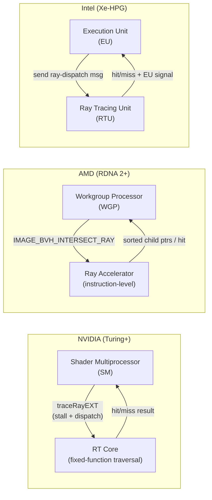
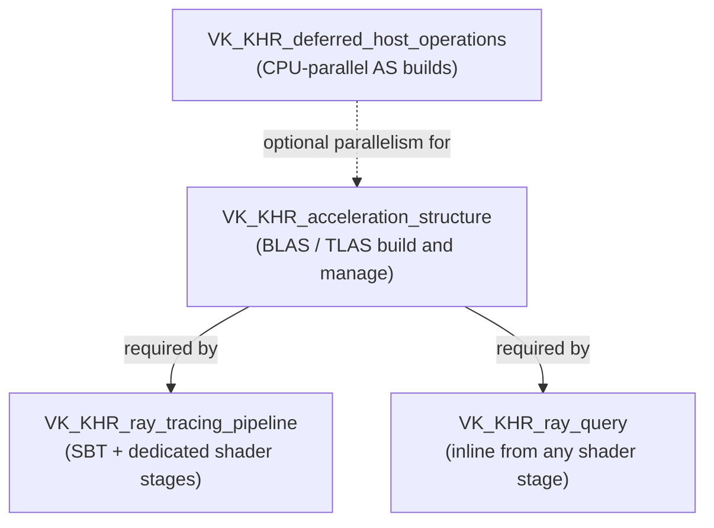
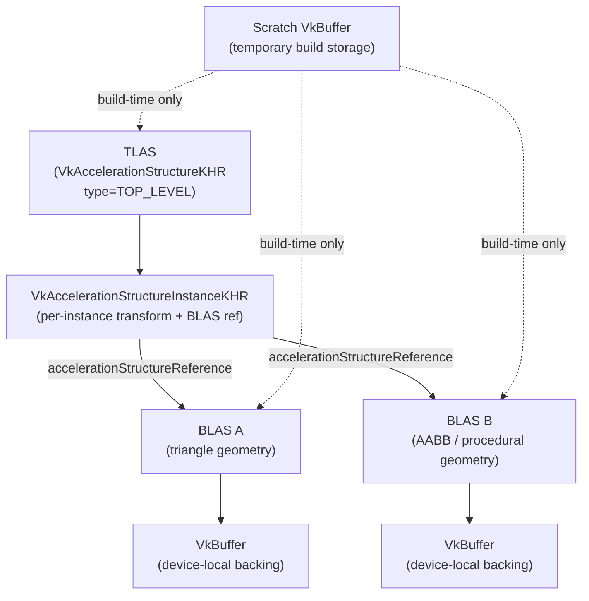
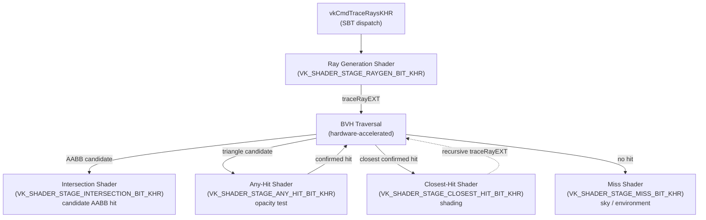
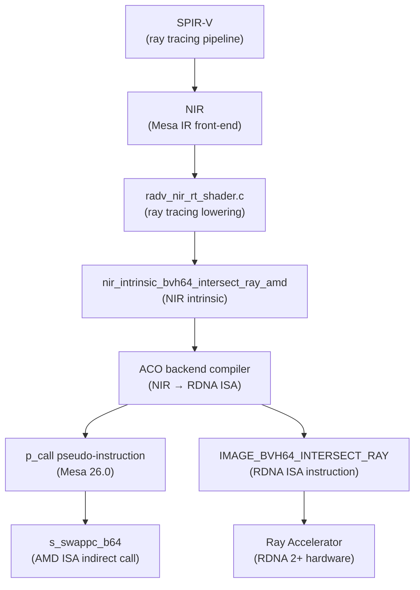
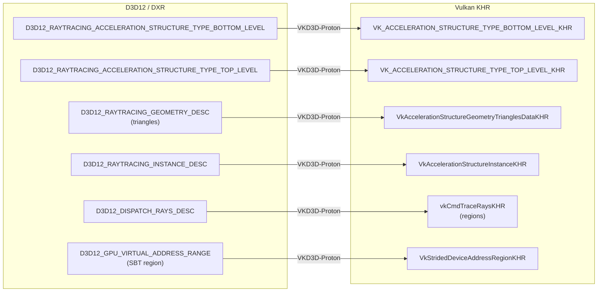
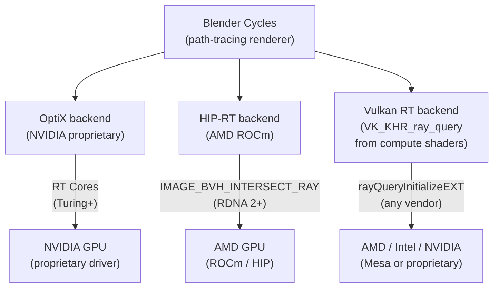

# Chapter 56: Ray Tracing on Linux

This chapter targets **systems and driver developers** who need to understand how ray tracing hardware is exposed through the Linux graphics stack, and **graphics application developers** who want to use Vulkan's ray tracing extensions efficiently on AMD, Intel, and NVIDIA hardware. It covers the full path from silicon — BVH-traversal accelerators inside the GPU — through Vulkan's four KHR extensions, into the RADV, ANV, and NVK Mesa drivers, and out to real-world workloads such as Proton/VKD3D-Proton game compatibility and Blender Cycles rendering.

---

## Table of Contents

1. [Hardware Ray Tracing Overview](#1-hardware-ray-tracing-overview)
2. [Vulkan Ray Tracing Extension Suite](#2-vulkan-ray-tracing-extension-suite)
3. [Acceleration Structure Lifecycle](#3-acceleration-structure-lifecycle)
4. [Ray Tracing Shader Model](#4-ray-tracing-shader-model)
5. [RADV Ray Tracing](#5-radv-ray-tracing)
6. [ANV Ray Tracing](#6-anv-ray-tracing)
7. [NVK Ray Tracing](#7-nvk-ray-tracing)
8. [DXR via VKD3D-Proton](#8-dxr-via-vkd3d-proton)
9. [Blender Cycles](#9-blender-cycles)
10. [Ray Marching and Signed Distance Field Rendering](#10-ray-marching-and-signed-distance-field-rendering)
11. [Temporal Anti-Aliasing, DLAA, and the Upsampling Ecosystem](#11-temporal-anti-aliasing-dlaa-and-the-upsampling-ecosystem)
12. [Subsurface Scattering on the GPU](#12-subsurface-scattering-on-the-gpu)
13. [Integrations](#integrations)

---

## 1. Hardware Ray Tracing Overview

Ray tracing — the simulation of light transport by casting rays against scene geometry — has been the dominant rendering technique in offline production since the 1980s, but only became practical in real-time graphics with the introduction of dedicated **BVH**-traversal hardware in 2018. Three major GPU vendors have shipped hardware ray tracing on Linux: **NVIDIA** via **RT Cores** (**Turing** onwards), **AMD** via **Ray Accelerators** in **RDNA 2** and later, and **Intel** via **Ray Tracing Units** in **Xe-HPG** (**Arc**/**DG2** and later). Despite different names and microarchitectural choices, all three share the same fundamental design goal: offload the hot inner loop of **BVH** traversal off the programmable shader pipeline and into fixed-function or semi-fixed-function silicon.

The chapter begins with a **BVH** primer explaining how **BVH4** structures (four child **AABB**s per internal node) partition scene geometry into a tree that hardware traverses using a stack-based descent, and how **NVIDIA RT Cores** handle traversal autonomously in fixed-function hardware while **AMD**'s **Ray Accelerators** expose an instruction-level interface (**`IMAGE_BVH_INTERSECT_RAY`** / **`IMAGE_BVH64_INTERSECT_RAY`**) that the driver compiler controls through software traversal loops, with **Intel**'s **RTU**s falling between the two in autonomy level. Hardware specifics are covered for **NVIDIA** **Turing** and **Ampere** **RT Cores**, **AMD** **RDNA 2**, **RDNA 3**, and **RDNA 4** **Ray Accelerators**, and **Intel** **Xe-HPG** **RTUs** with their compressed **AABB** node format.

The **Vulkan KHR** ray tracing extension suite is then detailed across four extensions: **`VK_KHR_acceleration_structure`** (providing **`VkAccelerationStructureKHR`**, **`vkCmdBuildAccelerationStructuresKHR`**, **`vkBuildAccelerationStructuresKHR`**, and compaction commands), **`VK_KHR_ray_tracing_pipeline`** (introducing five shader stages and **`vkCmdTraceRaysKHR`** dispatch via a **shader binding table**), **`VK_KHR_ray_query`** (inline ray queries via **`rayQueryEXT`** from any shader stage without **SBT** machinery), and **`VK_KHR_deferred_host_operations`** (CPU-parallel **AS** builds via **`vkDeferredOperationJoinKHR`**).

The acceleration structure lifecycle covers building **BLAS** (bottom-level **AS**) from **`VkAccelerationStructureGeometryTrianglesDataKHR`** triangle geometry and **TLAS** (top-level **AS**) from **`VkAccelerationStructureInstanceKHR`** instances, update and refit using **`VK_BUILD_ACCELERATION_STRUCTURE_MODE_UPDATE_KHR`** for dynamic scenes, compaction via **`vkCmdWriteAccelerationStructuresPropertiesKHR`** and **`vkCmdCopyAccelerationStructureKHR`**, and serialisation for disk caching using **`vkCmdCopyAccelerationStructureToMemoryKHR`**.

The ray tracing shader model details the five pipeline shader stages (**ray generation**, **intersection**, **any-hit**, **closest-hit**, **miss**) and their call semantics, **shader binding table** (**SBT**) layout using **`VkStridedDeviceAddressRegionKHR`** and **`VkPhysicalDeviceRayTracingPipelinePropertiesKHR`**, concrete **GLSL** shader examples using **`GL_EXT_ray_tracing`** and **SPIR-V** 1.4 built-ins (**`gl_LaunchIDEXT`**, **`gl_ObjectToWorldEXT`**, **`traceRayEXT`**, **`rayPayloadEXT`**), **ray payload** and **callable shaders** (**`executeCallableEXT`**, **`callableDataEXT`**), and shader record stride calculation.

On the driver side, **RADV** (the open-source **AMD** **Vulkan** driver in **Mesa**) is covered in depth: capability detection via **GFX IP** level (**GFX10.3** for **RDNA 2**, **GFX11** for **RDNA 3**, **GFX12** for **RDNA 4**), emission of **`IMAGE_BVH64_INTERSECT_RAY`** through the **NIR** ray tracing lowering pass in **`src/amd/vulkan/nir/radv_nir_rt_shader.c`** via the **`nir_intrinsic_bvh64_intersect_ray_amd`** intrinsic compiled by the **ACO** backend, the traversal shader architecture and how **Mesa** 26.0 replaced megashader inlining with proper **`p_call`** / **`s_swappc_b64`** function calls, the **`RADV_DEBUG=rt`** and **`RADV_PERFTEST=emulate_rt`** debug environment variables, and conformance status against **dEQP-VK**. **ANV** (the **Intel** **Vulkan** driver in **Mesa**) is covered with its **Xe-HPG** **RTU** hardware model, the **GRL** (**Graphics Library**) shaders in **`src/intel/vulkan/grl/`** that implement **PLOC** (**Parallel Locally-Ordered Clustering**) BVH construction on-device, and **ISA**-level ray tracing via `send`-message opcodes lowered from **`OpTraceRayKHR`** / **`OpRayQueryInitializeKHR`** in **`src/intel/compiler/brw_nir_lower_rt_intrinsics.c`**. **NVK** (the open-source **NVIDIA** **Vulkan** driver in **Mesa**) does not yet implement ray tracing; the chapter explains the reverse-engineering challenges around **NVIDIA**'s proprietary **RT Core** shader **ABI**, **Turing**/**Ampere** **RT Core** mapping, **GSP** (**GPU System Processor**) firmware interaction, and the conformance timeline.

**DXR** (**DirectX Raytracing**) translation via **VKD3D-Proton** (enabled by default since version 2.11) is covered, including the mapping of **`ID3D12Device5::CreateRaytracingAccelerationStructure`** and **`D3D12_BUILD_RAYTRACING_ACCELERATION_STRUCTURE_DESC`** to **`vkCmdBuildAccelerationStructuresKHR`**, translation of **`D3D12_RAYTRACING_INSTANCE_DESC`** to **`VkAccelerationStructureInstanceKHR`**, **SBT** translation from **`D3D12_DISPATCH_RAYS_DESC`** to **`vkCmdTraceRaysKHR`** regions, **DXIL** shader group translation to **SPIR-V** 1.4, local root signature handling via **`ShaderRecordBufferKHR`**, and game compatibility across **AMD**/**RADV**, **Intel**/**ANV**, and **NVIDIA** with the proprietary driver or **NVK**.

Finally, the chapter surveys **Blender Cycles** as the primary production path-tracing consumer: the **OptiX** backend on **NVIDIA** (using **RT Cores** via **CUDA**, requiring driver ≥ 535 for **OptiX** 8.x, with kernels under **`intern/cycles/device/optix/`**), the **HIP-RT** backend on **AMD** (using **`IMAGE_BVH_INTERSECT_RAY`** on **RDNA 2+**, updated to **HIP-RT** 3.0 in **Blender** 5.0 with compressed **BVH8**, **OBB**s, and **ROCm** 7.0+ requirement), and the work-in-progress **Vulkan RT** path using **`VK_KHR_ray_query`** inline from compute shaders in the wavefront integrator via **`rayQueryInitializeEXT`** and **`rayQueryProceedEXT`**.



### 1.1 Bounding Volume Hierarchy Primer

A BVH partitions scene geometry into a tree of axis-aligned bounding boxes (AABBs). Each internal node stores several child boxes; each leaf stores one or a small number of primitives. A ray traversal descends the tree by testing the ray against each node's bounding boxes — rejecting subtrees that cannot be hit — and evaluates full ray/triangle intersection only at leaf primitives. In hardware the tree is materialised as a GPU buffer and traversal is driven by dedicated state machines rather than programmable shader threads.

All three hardware vendors implement a **BVH4** structure (four child bounding boxes per internal node) at the level that is exposed to the driver, though they differ in leaf packing and memory layout. The GPU's texture memory subsystem is reused to fetch BVH node data because it already has the high-bandwidth, low-latency cache hierarchy needed for random pointer-chasing access patterns.

The software traversal algorithm — even when partially or fully replaced by hardware — follows a stack-based descent:

1. Push the TLAS root node onto a local stack.
2. Pop the top node. If it is an internal box node, intersect the ray against all four child AABBs. Push child nodes whose boxes were hit, in order of increasing intersection distance (closer children first, so they are tested first after popping).
3. If the node is an instance node, apply the instance's world-to-object transform to the ray and push the root of the referenced BLAS.
4. If the node is a triangle leaf, compute the full Möller–Trumbore ray/triangle intersection. On a confirmed hit that is closer than the current `tmax`, update `tmax` and record the hit.
5. Repeat until the stack is empty.

AMD's `IMAGE_BVH_INTERSECT_RAY` instruction handles steps 2 and 4 in one clock, returning the sorted child pointers or the triangle hit result. NVIDIA's RT Cores execute the entire loop including stack management in fixed-function hardware. Intel's RTUs fall between the two: they traverse autonomously but signal the EU for any-hit and intersection shader invocations.

### 1.2 NVIDIA RT Cores (Turing and Later)

NVIDIA's Turing architecture (2018) introduced RT Cores as dedicated SM-adjacent accelerators on each Streaming Multiprocessor. Each RT Core performs:

- Fixed-function BVH node traversal (box tests)
- Fixed-function ray/triangle intersection

[Source: NVIDIA Turing Architecture In-Depth](https://developer.nvidia.com/blog/nvidia-turing-architecture-in-depth/)

When a shader dispatches a ray (via `traceRayEXT` in GLSL or the equivalent SPIR-V `OpTraceRayKHR`), the thread stalls and the RT Core takes over. The RT Core traverses the BVH autonomously, using the SM's data cache for node fetches, until it either finds a hit or determines a miss. Only then does the SM thread resume, executing the closest-hit or miss shader. In Ampere (2020), NVIDIA doubled the second-generation RT Core throughput relative to Turing for the same compute budget.

Because traversal is entirely fixed-function, NVIDIA drivers do not emit any programmable BVH-traversal shader. The acceleration structure memory layout is proprietary and opaque at the API level.

### 1.3 AMD Ray Accelerators (RDNA 2+)

AMD's RDNA 2 architecture (2020) introduced a Ray Accelerator (RA) unit inside each Workgroup Processor (WGP). Each WGP contains two RA units. Rather than adding a fully autonomous fixed-function traversal engine like NVIDIA, AMD exposed the RA as an **instruction-level accelerator** that the shader compiler controls:

- **`IMAGE_BVH_INTERSECT_RAY`** — takes a BVH node pointer (32-bit offset into a buffer treated as a 1D image), ray origin, direction, and inverse-direction VGPRs, and returns up to four sorted child node pointers (for box nodes) or an intersection distance and triangle ID (for leaf nodes).
- **`IMAGE_BVH64_INTERSECT_RAY`** — the 64-bit pointer variant for large acceleration structures.

[Source: RDNA 2 Hardware Raytracing – Interplay of Light](https://interplayoflight.wordpress.com/2020/12/27/rdna-2-hardware-raytracing/)

Each RA performs four ray/box intersection tests per clock or one ray/triangle intersection per clock. The BVH traversal loop itself is implemented as **software shader code** generated by the driver compiler (NIR → ACO), with the `IMAGE_BVH_INTERSECT_RAY` instruction providing the per-node acceleration. This means RADV must emit and compile a dedicated traversal shader, whereas NVIDIA drivers do not. This software traversal loop is sometimes called the **traversal shader** in AMD/RADV documentation.

In RDNA 3 and RDNA 4 the RA units are enlarged and additional BVH node types are supported (e.g., compressed BVH8 and triangle packets in RDNA 4), but the same instruction-level interface is preserved.

### 1.4 Intel Ray Tracing Units (Xe-HPG)

Intel's Xe-HPG architecture (DG2/Arc Alchemist, 2022) includes a Ray Tracing Unit (RTU) per Render Slice. The RTU handles BVH traversal, ray/box intersection, ray/triangle intersection, and instance transform application. Intel's implementation is architecturally closest to NVIDIA's: the RTU is a semi-autonomous accelerator that takes over from EU (Execution Unit) threads.

The ANV (Intel's Vulkan driver in Mesa) exposes ray tracing through `VK_KHR_ray_tracing_pipeline` and `VK_KHR_ray_query` for DG2 and later hardware. Intel's internal BVH memory format is documented in the ANV source under `src/intel/vulkan/grl/` and differs from both AMD's and NVIDIA's layouts. The BVH node coordinates are compressed to 8-bit integers in memory, decompressed on load. [Source: Intel Arc Graphics Developer Guide for Real-time Ray Tracing](https://www.intel.com/content/www/us/en/developer/articles/guide/real-time-ray-tracing-in-games.html)

---

## 2. Vulkan Ray Tracing Extension Suite

The Vulkan KHR ray tracing extensions were promoted from NV-specific extensions and finalised in 2020. Four extensions form the core:

| Extension | Purpose |
|---|---|
| `VK_KHR_acceleration_structure` | Build and manage BLAS/TLAS on GPU or CPU |
| `VK_KHR_ray_tracing_pipeline` | Full ray tracing pipeline with SBT and dedicated shader stages |
| `VK_KHR_ray_query` | Inline ray queries from any shader stage |
| `VK_KHR_deferred_host_operations` | CPU-side parallelism for AS builds and pipeline compiles |



[Source: Ray Tracing in Vulkan – Khronos Blog](https://www.khronos.org/blog/ray-tracing-in-vulkan)

### 2.1 VK_KHR_acceleration_structure

This extension provides the data structures and commands for building, updating, copying, and querying acceleration structures (AS). It defines:

- `VkAccelerationStructureKHR` — opaque handle for a BLAS or TLAS
- `vkCreateAccelerationStructureKHR` / `vkDestroyAccelerationStructureKHR`
- `vkCmdBuildAccelerationStructuresKHR` — GPU-side build
- `vkBuildAccelerationStructuresKHR` — CPU-side build (requires `accelerationStructureHostCommands` feature)
- `vkCmdCopyAccelerationStructureKHR` — clone for compaction
- `vkCmdWriteAccelerationStructuresPropertiesKHR` — query compacted size

The feature is gated by `VkPhysicalDeviceAccelerationStructureFeaturesKHR::accelerationStructure`.

### 2.2 VK_KHR_ray_tracing_pipeline

This extension introduces five new shader stages and the shader binding table (SBT) dispatch model:

- Ray generation (`VK_SHADER_STAGE_RAYGEN_BIT_KHR`)
- Intersection (`VK_SHADER_STAGE_INTERSECTION_BIT_KHR`)
- Any-hit (`VK_SHADER_STAGE_ANY_HIT_BIT_KHR`)
- Closest-hit (`VK_SHADER_STAGE_CLOSEST_HIT_BIT_KHR`)
- Miss (`VK_SHADER_STAGE_MISS_BIT_KHR`)

It adds `vkCmdTraceRaysKHR` for launching a ray tracing dispatch and `vkCreateRayTracingPipelinesKHR` for pipeline creation. Pipelines may be created with `VK_PIPELINE_CREATE_RAY_TRACING_SHADER_GROUP_HANDLE_CAPTURE_REPLAY_BIT_KHR` to support replay capture tools.

### 2.3 VK_KHR_ray_query

Ray queries allow any shader stage (compute, vertex, fragment, mesh, etc.) to cast rays inline without the SBT machinery:

```glsl
// In a compute or fragment shader
rayQueryEXT rq;
rayQueryInitializeEXT(rq, topLevelAS, gl_RayFlagsOpaqueEXT,
                      0xFF, origin, tMin, direction, tMax);
while (rayQueryProceedEXT(rq)) {
    if (rayQueryGetIntersectionTypeEXT(rq, false) ==
            gl_RayQueryCandidateIntersectionTriangleEXT) {
        rayQueryConfirmIntersectionEXT(rq);
    }
}
float t = rayQueryGetIntersectionTEXT(rq, true);
```

Ray queries are the most portable ray tracing path: they work on any hardware that supports `VK_KHR_ray_query`, are driven by regular compute or graphics dispatches, and require no SBT. On AMD, RADV uses `IMAGE_BVH_INTERSECT_RAY` to accelerate the traversal loop even in ray query mode.

### 2.4 VK_KHR_deferred_host_operations

Acceleration structure builds are CPU-expensive when performed with `vkBuildAccelerationStructuresKHR` on the host. `VK_KHR_deferred_host_operations` provides a mechanism to spread work across application-managed thread pools:

```c
VkDeferredOperationKHR deferredOp;
vkCreateDeferredOperationKHR(device, NULL, &deferredOp);

// Pass deferredOp to the build call
vkBuildAccelerationStructuresKHR(device, deferredOp, 1, &buildInfo, ppRangeInfos);

// From N worker threads:
VkResult res;
do {
    res = vkDeferredOperationJoinKHR(device, deferredOp);
} while (res == VK_THREAD_IDLE_KHR);

// After all threads complete:
vkGetDeferredOperationResultKHR(device, deferredOp);
vkDestroyDeferredOperationKHR(device, NULL, &deferredOp);
```

`vkDeferredOperationJoinKHR` returns `VK_THREAD_IDLE_KHR` when there is no work left for the calling thread to do but the operation is not yet complete, and `VK_THREAD_DONE_KHR` when the calling thread finished its portion and other threads are still working. The design puts all thread lifecycle management in the application.

---

## 3. Acceleration Structure Lifecycle

An acceleration structure is a VkBuffer-backed GPU object. The application allocates the buffer, queries the required scratch size, and then submits a build command. This section traces that lifecycle in code.



### 3.1 Bottom-Level AS (BLAS) from Triangle Geometry

[Source: Vulkan spec — VkAccelerationStructureGeometryTrianglesDataKHR](https://registry.khronos.org/vulkan/specs/latest/man/html/VkAccelerationStructureGeometryTrianglesDataKHR.html)

```c
// src/app/rt_scene.c (application code)

// Describe vertex and index buffers
VkAccelerationStructureGeometryTrianglesDataKHR triangles = {
    .sType = VK_STRUCTURE_TYPE_ACCELERATION_STRUCTURE_GEOMETRY_TRIANGLES_DATA_KHR,
    .vertexFormat  = VK_FORMAT_R32G32B32_SFLOAT,
    .vertexData    = { .deviceAddress = vertexBufferDeviceAddress },
    .vertexStride  = sizeof(float) * 3,
    .maxVertex     = vertexCount - 1,
    .indexType     = VK_INDEX_TYPE_UINT32,
    .indexData     = { .deviceAddress = indexBufferDeviceAddress },
    .transformData = { .deviceAddress = 0 },  // identity
};

VkAccelerationStructureGeometryKHR geometry = {
    .sType        = VK_STRUCTURE_TYPE_ACCELERATION_STRUCTURE_GEOMETRY_KHR,
    .geometryType = VK_GEOMETRY_TYPE_TRIANGLES_KHR,
    .geometry     = { .triangles = triangles },
    .flags        = VK_GEOMETRY_OPAQUE_BIT_KHR,
};

VkAccelerationStructureBuildGeometryInfoKHR buildInfo = {
    .sType         = VK_STRUCTURE_TYPE_ACCELERATION_STRUCTURE_BUILD_GEOMETRY_INFO_KHR,
    .type          = VK_ACCELERATION_STRUCTURE_TYPE_BOTTOM_LEVEL_KHR,
    .flags         = VK_BUILD_ACCELERATION_STRUCTURE_PREFER_FAST_TRACE_BIT_KHR,
    .mode          = VK_BUILD_ACCELERATION_STRUCTURE_MODE_BUILD_KHR,
    .geometryCount = 1,
    .pGeometries   = &geometry,
};

// Query required sizes
VkAccelerationStructureBuildSizesInfoKHR sizeInfo = {
    .sType = VK_STRUCTURE_TYPE_ACCELERATION_STRUCTURE_BUILD_SIZES_INFO_KHR,
};
uint32_t maxPrimCount = triangleCount;
vkGetAccelerationStructureBuildSizesKHR(
    device, VK_ACCELERATION_STRUCTURE_BUILD_TYPE_DEVICE_KHR,
    &buildInfo, &maxPrimCount, &sizeInfo);

// Allocate backing storage (VkBuffer, device-local)
VkBuffer blasBuffer;
allocateDeviceLocalBuffer(sizeInfo.accelerationStructureSize, &blasBuffer);

// Create the AS object pointing at the buffer
VkAccelerationStructureCreateInfoKHR createInfo = {
    .sType  = VK_STRUCTURE_TYPE_ACCELERATION_STRUCTURE_CREATE_INFO_KHR,
    .buffer = blasBuffer,
    .size   = sizeInfo.accelerationStructureSize,
    .type   = VK_ACCELERATION_STRUCTURE_TYPE_BOTTOM_LEVEL_KHR,
};
VkAccelerationStructureKHR blas;
vkCreateAccelerationStructureKHR(device, &createInfo, NULL, &blas);

// Fill in destination and scratch
buildInfo.dstAccelerationStructure  = blas;
buildInfo.scratchData.deviceAddress = scratchBufferDeviceAddress;

VkAccelerationStructureBuildRangeInfoKHR rangeInfo = {
    .primitiveCount  = triangleCount,
    .primitiveOffset = 0,
    .firstVertex     = 0,
    .transformOffset = 0,
};
const VkAccelerationStructureBuildRangeInfoKHR *pRangeInfo = &rangeInfo;

vkCmdBuildAccelerationStructuresKHR(cmdBuf, 1, &buildInfo, &pRangeInfo);
```

### 3.2 Top-Level AS (TLAS) from Instances

A TLAS holds an array of `VkAccelerationStructureInstanceKHR` entries, each pointing at a BLAS:

```c
VkAccelerationStructureInstanceKHR instance = {
    // Row-major 3x4 affine transform stored as three rows of four floats
    .transform = {
        .matrix = { {1,0,0,0}, {0,1,0,0}, {0,0,1,0} }
    },
    .instanceCustomIndex                    = 0,
    .mask                                   = 0xFF,
    .instanceShaderBindingTableRecordOffset = 0,
    .flags                                  = VK_GEOMETRY_INSTANCE_TRIANGLE_FACING_CULL_DISABLE_BIT_KHR,
    .accelerationStructureReference        = blasDeviceAddress,
};
```

[Source: Vulkan spec — VkAccelerationStructureInstanceKHR](https://registry.khronos.org/vulkan/specs/latest/man/html/VkAccelerationStructureInstanceKHR.html)

The instance buffer must be uploaded to device-local memory before `vkCmdBuildAccelerationStructuresKHR` is called for the TLAS.

### 3.2b Update and Refit

Dynamic scenes require updating acceleration structures each frame. Rather than rebuilding from scratch, a BLAS with `VK_BUILD_ACCELERATION_STRUCTURE_ALLOW_UPDATE_BIT_KHR` can be updated in-place by passing the existing AS as `srcAccelerationStructure` and setting `mode = VK_BUILD_ACCELERATION_STRUCTURE_MODE_UPDATE_KHR`:

```c
// src/app/rt_scene.c (application code)
buildInfo.mode                   = VK_BUILD_ACCELERATION_STRUCTURE_MODE_UPDATE_KHR;
buildInfo.srcAccelerationStructure = blas;   // update from existing
buildInfo.dstAccelerationStructure = blas;   // in-place update

vkCmdBuildAccelerationStructuresKHR(cmdBuf, 1, &buildInfo, &pRangeInfo);
```

[Source: Vulkan spec — vkCmdBuildAccelerationStructuresKHR](https://registry.khronos.org/vulkan/specs/latest/man/html/vkCmdBuildAccelerationStructuresKHR.html)

An update is a **refit**: the BVH topology (node connectivity) is frozen from the original build; only the bounding boxes and primitive data are recomputed to account for vertex movement. Refits are 5–10x faster than full rebuilds but gradually degrade tree quality as geometry deforms. The common pattern for skinned characters or cloth is to refit every frame and rebuild every N frames (or when quality falls below a threshold measured by ray cost).

The three build-flag tradeoffs to know:

| Flag | Meaning |
|---|---|
| `PREFER_FAST_TRACE` | Optimise the BVH tree for trace performance (slower build, better ray traversal) |
| `PREFER_FAST_BUILD` | Build quickly at the cost of higher traversal times |
| `ALLOW_UPDATE` | Reserve internal state needed for refit; slightly increases AS size and build time |
| `ALLOW_COMPACTION` | Allows querying and performing compaction after build |

`PREFER_FAST_TRACE` and `PREFER_FAST_BUILD` are mutually exclusive. `ALLOW_UPDATE` and `ALLOW_COMPACTION` can be combined with either.

### 3.3 Compaction

Freshly built acceleration structures are often 2–3x larger than necessary. Compaction reclaims memory:

```c
// After BLAS build, query compacted size
VkQueryPoolCreateInfo qpci = {
    .sType      = VK_STRUCTURE_TYPE_QUERY_POOL_CREATE_INFO,
    .queryType  = VK_QUERY_TYPE_ACCELERATION_STRUCTURE_COMPACTED_SIZE_KHR,
    .queryCount = 1,
};
VkQueryPool queryPool;
vkCreateQueryPool(device, &qpci, NULL, &queryPool);

vkCmdResetQueryPool(cmdBuf, queryPool, 0, 1);
vkCmdWriteAccelerationStructuresPropertiesKHR(
    cmdBuf, 1, &blas,
    VK_QUERY_TYPE_ACCELERATION_STRUCTURE_COMPACTED_SIZE_KHR,
    queryPool, 0);

// After fence wait, read back the compacted size, allocate
// a smaller buffer, and call vkCmdCopyAccelerationStructureKHR
// with VK_COPY_ACCELERATION_STRUCTURE_MODE_COMPACT_KHR.
```

Compaction requires a pipeline barrier between the build and the property write, and another between the property write and the copy.

### 3.4 Serialisation for Disk Caching

`vkCmdCopyAccelerationStructureToMemoryKHR` serialises an AS into a driver-defined binary blob. Combined with a content hash of the input geometry, this enables persistent disk caches so scene load times are reduced after the first build. The blob is not portable between GPU vendors or driver versions; the header includes a driver UUID for validation. [Source: Vulkan spec — vkCmdCopyAccelerationStructureToMemoryKHR](https://registry.khronos.org/vulkan/specs/latest/man/html/vkCmdCopyAccelerationStructureToMemoryKHR.html)

---

## 4. Ray Tracing Shader Model

### 4.1 Shader Stages

The full ray tracing pipeline involves five shader stages with well-defined call semantics:

| Stage | Trigger | Purpose |
|---|---|---|
| Ray generation | `vkCmdTraceRaysKHR` dispatch | Calls `traceRayEXT`; owns the outermost loop |
| Intersection | Candidate AABB hit | Custom primitive (procedural geometry) |
| Any-hit | Triangle candidate hit | Opacity test; may call `ignoreIntersectionEXT` |
| Closest-hit | Closest confirmed hit | Shading; may recurse via `traceRayEXT` |
| Miss | No geometry hit | Sky / environment lighting |



Ray generation shaders are analogous to compute shaders: they launch a 3D grid via `vkCmdTraceRaysKHR`, and each invocation typically casts one or more primary rays. Closest-hit and miss shaders compute the final radiance sample. Any-hit shaders are the canonical place for alpha-test transparency. Callable shaders (also part of `VK_KHR_ray_tracing_pipeline`) are omitted from the traversal-triggered stages in the table above, though Vulkan defines `VK_SHADER_STAGE_CALLABLE_BIT_KHR` as a distinct shader stage. They are invoked via `executeCallableEXT` from raygen, closest-hit, or miss shaders, not by the traversal engine itself.

### 4.2 Shader Binding Table Layout

The SBT is a GPU buffer containing **shader records**. Each record is: `[handle (shaderGroupHandleSize bytes)] [application data (0 or more bytes)]`. Records must be aligned to `shaderGroupHandleAlignment` and the stride must not exceed `maxShaderGroupStride`. Both properties live in `VkPhysicalDeviceRayTracingPipelinePropertiesKHR`.

```c
VkPhysicalDeviceRayTracingPipelinePropertiesKHR rtPipeProps = {
    .sType = VK_STRUCTURE_TYPE_PHYSICAL_DEVICE_RAY_TRACING_PIPELINE_PROPERTIES_KHR,
};
VkPhysicalDeviceProperties2 props2 = {
    .sType = VK_STRUCTURE_TYPE_PHYSICAL_DEVICE_PROPERTIES_2,
    .pNext = &rtPipeProps,
};
vkGetPhysicalDeviceProperties2(physDev, &props2);

uint32_t handleSize  = rtPipeProps.shaderGroupHandleSize;        // typically 32
uint32_t handleAlign = rtPipeProps.shaderGroupHandleAlignment;   // typically 32
uint32_t stride      = align_up(handleSize + appDataSize, handleAlign);
```

The SBT is divided into four regions by `vkCmdTraceRaysKHR`:

[Source: Vulkan spec — vkCmdTraceRaysKHR](https://registry.khronos.org/vulkan/specs/latest/man/html/vkCmdTraceRaysKHR.html)

```c
void vkCmdTraceRaysKHR(
    VkCommandBuffer                      commandBuffer,
    const VkStridedDeviceAddressRegionKHR *pRaygenShaderBindingTable,
    const VkStridedDeviceAddressRegionKHR *pMissShaderBindingTable,
    const VkStridedDeviceAddressRegionKHR *pHitShaderBindingTable,
    const VkStridedDeviceAddressRegionKHR *pCallableShaderBindingTable,
    uint32_t                              width,
    uint32_t                              height,
    uint32_t                              depth);
```

`VkStridedDeviceAddressRegionKHR` carries a device address, a stride, and a size. For the raygen region, `stride` must equal `size` (exactly one record). For the hit region, the hardware selects the record at:

```
hitShaderBindingTable.deviceAddress
  + hitShaderBindingTable.stride × (
        instanceShaderBindingTableRecordOffset
      + geometryIndex × sbtRecordStride
      + sbtRecordOffset
    )
```

[Source: Vulkan spec — VkStridedDeviceAddressRegionKHR](https://registry.khronos.org/vulkan/specs/latest/man/html/VkStridedDeviceAddressRegionKHR.html)

### 4.2b Concrete Shader Example

The following GLSL pair shows a minimal ray generation shader and a closest-hit shader that computes diffuse lighting. Both use `GL_EXT_ray_tracing` and target SPIR-V 1.4.

```glsl
// raygen.rgen — ray generation shader
#version 460
#extension GL_EXT_ray_tracing : require

layout(set = 0, binding = 0) uniform accelerationStructureEXT topLevelAS;
layout(set = 0, binding = 1, rgba32f) uniform image2D outputImage;

// Payload written by closest-hit or miss shader
layout(location = 0) rayPayloadEXT vec3 hitColor;

void main() {
    const vec2 pixelCenter = vec2(gl_LaunchIDEXT.xy) + vec2(0.5);
    const vec2 inUV        = pixelCenter / vec2(gl_LaunchSizeEXT.xy);
    const vec2 d           = inUV * 2.0 - 1.0;

    // Simple perspective camera: origin shifts per pixel, direction points at z=0 plane
    vec3 origin    = vec3(0.0, 0.0, -2.0);
    vec3 direction = normalize(vec3(d.x, -d.y, 1.0));

    traceRayEXT(
        topLevelAS,
        gl_RayFlagsOpaqueEXT,
        0xFF,               // cull mask
        0,                  // sbtRecordOffset
        0,                  // sbtRecordStride
        0,                  // miss shader index
        origin,
        0.001,              // tMin
        direction,
        10000.0,            // tMax
        0                   // payload location
    );

    imageStore(outputImage, ivec2(gl_LaunchIDEXT.xy), vec4(hitColor, 1.0));
}
```

```glsl
// closesthit.rchit — closest-hit shader
#version 460
#extension GL_EXT_ray_tracing : require

// Per-vertex normals fetched from a storage buffer
layout(set = 0, binding = 2) readonly buffer Normals { vec3 normals[]; };

layout(location = 0) rayPayloadInEXT vec3 hitColor;

// Barycentric coordinates set by the fixed-function triangle intersector
hitAttributeEXT vec2 baryCoords;

void main() {
    // Reconstruct full barycentric weights from the two hardware-provided values
    vec3 bary = vec3(1.0 - baryCoords.x - baryCoords.y,
                     baryCoords.x, baryCoords.y);

    // Interpolate per-vertex normals.  gl_PrimitiveID is the triangle index
    // within the geometry; multiply by 3 to index into a flat vertex array.
    // (A real engine would use gl_InstanceCustomIndexEXT to look up per-mesh
    // offsets into the normal buffer.)
    uint base  = gl_PrimitiveID * 3;
    vec3 n     = normalize(bary.x * normals[base + 0]
                         + bary.y * normals[base + 1]
                         + bary.z * normals[base + 2]);

    // Transform interpolated normal to world space
    vec3 worldN = normalize(mat3(gl_ObjectToWorldEXT) * n);

    // Lambert diffuse against a hardcoded directional light
    vec3 lightDir = normalize(vec3(1.0, 2.0, 1.0));
    float ndotl   = max(dot(worldN, lightDir), 0.0);
    hitColor      = vec3(0.8, 0.5, 0.2) * ndotl;
}
```

```glsl
// miss.rmiss — miss shader (sky)
#version 460
#extension GL_EXT_ray_tracing : require

layout(location = 0) rayPayloadInEXT vec3 hitColor;

void main() {
    hitColor = vec3(0.1, 0.1, 0.3);  // dark blue sky
}
```

Key built-ins used here:

| Built-in | Stage | Meaning |
|---|---|---|
| `gl_LaunchIDEXT` | raygen | Current invocation's 3D coordinates within the dispatch grid (`uvec3`; analogous to `gl_GlobalInvocationID` in compute) |
| `gl_LaunchSizeEXT` | raygen | Total dispatch dimensions (width × height × depth) |
| `gl_ObjectToWorldEXT` | closest-hit | 4×3 object-to-world transform matrix |
| `baryCoords` (hitAttributeEXT) | closest-hit | Barycentric u/v coordinates of the hit point |

[Source: Vulkan spec — VK_KHR_ray_tracing_pipeline shader stages](https://registry.khronos.org/vulkan/specs/latest/man/html/VK_KHR_ray_tracing_pipeline.html)

### 4.3 Ray Payload and Callable Shaders

Shaders communicate through a **ray payload** declared in GLSL with `layout(location = 0) rayPayloadEXT` (in the raygen or closest-hit caller) and `layout(location = 0) rayPayloadInEXT` (in closest-hit and miss). The payload is passed by reference through the call stack and is entirely driver-managed in registers or scratch memory. Its size contributes to the per-lane scratch footprint, so large payloads hurt occupancy.

**Callable shaders** use `layout(location = 0) callableDataEXT` / `callableDataInEXT` in the same pattern. They are dispatched via `executeCallableEXT(sbtIndex, callableDataLocation)` and provide a runtime-polymorphic material call without requiring shader permutations.

### 4.4 Shader Record Stride Calculation

The stride between records must satisfy:

```
stride ≡ 0  (mod shaderGroupHandleAlignment)
stride ≤ maxShaderGroupStride
```

A common pattern is to set `stride = align_up(handleSize + sizeof(MaterialData), handleAlign)`, where `MaterialData` holds per-geometry material parameters (texture indices, roughness, etc.) that the closest-hit shader reads from `shaderRecordEXT` in GLSL.

---

## 5. RADV Ray Tracing

RADV is the open-source AMD Vulkan driver in Mesa, maintained primarily by Valve and Red Hat engineers. Its ray tracing implementation has matured significantly from its initial experimental state in Mesa 22.0 to production quality by Mesa 23.2, when ray tracing was enabled by default. Mesa 26.0 (released February 2026) brought an additional 30% performance improvement on RDNA 2 through BVH4 update optimisations. [Source: Phoronix — RADV RT RDNA2 30% Faster in Mesa 26.0](https://www.phoronix.com/news/Mesa-26.0-RADV-RT-RDNA2-Faster)

### 5.1 Hardware Capability Detection

RADV queries the GFX IP level to determine whether ray tracing hardware is available. RDNA 2 corresponds to GFX10.3 (gfx1030–gfx1036); RDNA 3 is GFX11; RDNA 4 (RX 9070 series) is GFX12. The driver exposes the `VK_KHR_acceleration_structure`, `VK_KHR_ray_tracing_pipeline`, and `VK_KHR_ray_query` extensions on GFX10.3 and later when ray tracing is not disabled.

**Note: needs verification** — The plan.md outline references a function `radv_device_supports_rt()`. As of the time of writing, the exact symbol name could not be confirmed against current Mesa source. The gating logic is likely in `src/amd/vulkan/radv_physical_device.c`; check that file in the Mesa repository for the authoritative function name.

### 5.2 RDNA 2+ `IMAGE_BVH_INTERSECT_RAY` in RADV

RADV emits the `IMAGE_BVH_INTERSECT_RAY` and `IMAGE_BVH64_INTERSECT_RAY` instructions through the NIR ray tracing lowering pass in `src/amd/vulkan/nir/radv_nir_rt_shader.c`. The traversal loop — descend box nodes, push children, pop next candidate, test leaf triangles — is written as NIR intrinsics that ACO (the backend compiler) eventually lower to the actual ISA instructions.

The critical NIR intrinsic is `nir_intrinsic_bvh64_intersect_ray_amd`, which maps directly to `IMAGE_BVH64_INTERSECT_RAY`. The instruction takes the BVH buffer descriptor, a node offset, and the ray parameters (origin, direction, tmin, tmax, inverse-direction) packed across 16 VGPRs, and returns 4 packed results per box test. [Source: Mesa GitLab — src/amd/vulkan/nir/radv_nir_rt_shader.c](https://gitlab.freedesktop.org/mesa/mesa/-/blob/main/src/amd/vulkan/nir/radv_nir_rt_shader.c)

### 5.3 Traversal Shader Architecture

RADV implements BVH traversal as a **traversal shader** — a driver-generated shader that runs the traversal loop and calls any-hit and intersection shaders as subroutines. Until Mesa 26.0, any-hit and intersection shaders were inlined into this megashader, causing compilation times that could stretch to minutes for complex scenes.

Mesa 26.0 addressed this through proper **function calls** in the ACO compiler backend. The key change was implementing `p_call` pseudo-instructions that lower to `s_swappc_b64` (AMD's "swap PC" instruction for indirect calls) and defining an ABI for register preservation across call boundaries. With this change, any-hit and intersection shaders compile independently and are called at runtime via their addresses stored in the SBT. [Source: pixelcluster.github.io — Inside Mesa 26.0's RADV RT Improvements](https://pixelcluster.github.io/Mesa-26/)



The result is that compilation can proceed in parallel across shader groups, and the megashader explosion is contained to the traversal logic itself.

### 5.4 RADV_DEBUG=rt

RADV's debug environment variable exposes ray tracing shader assembly:

```bash
RADV_DEBUG=rt ./my_rt_app
```

This dumps the compiled assembly for every ray tracing shader (traversal, raygen, closest-hit, miss, any-hit) to stderr. A companion flag:

```bash
RADV_DEBUG=nort ./my_rt_app
```

skips execution of `vkCmdTraceRays` and ray query traversals while still advertising the RT extensions — useful for isolating whether a crash is inside ray tracing dispatch or elsewhere. [Source: Mesa Environment Variables documentation](https://docs.mesa3d.org/envvars.html)

For software emulation on pre-RDNA2 hardware:

```bash
RADV_PERFTEST=emulate_rt ./my_rt_app
```

This enables the RT extensions on GFX10_3 and below by substituting a pure-shader BVH traversal for the `IMAGE_BVH_INTERSECT_RAY` instruction path.

### 5.5 Conformance Status

RADV's ray tracing implementation is tested against the Khronos dEQP-VK (Vulkan conformance test suite). As of Mesa 23.2, RADV passed enough dEQP-VK ray tracing tests to expose the extensions by default. The conformance posture continues to improve; specific test counts and pass rates are tracked in the Mesa issue tracker and in periodic conformance submissions at the Khronos Adopters Programme. Ray queries (`VK_KHR_ray_query`) have higher pass rates than the full ray tracing pipeline because they do not require the callable-shader and SBT dispatch machinery.

---

## 6. ANV Ray Tracing

ANV is the Intel Vulkan driver in Mesa, supporting Gen8 (Broadwell) through current Intel Arc hardware. Ray tracing support is limited to Xe-HPG (DG2/Alchemist, Battlemage, and later) and is exposed via `VK_KHR_ray_tracing_pipeline` and `VK_KHR_ray_query` on those devices.

### 6.1 Xe-HPG BVH Hardware

Each Xe-HPG Render Slice contains four Xe Cores and four Ray Tracing Units (RTUs). Each RTU is a semi-autonomous accelerator capable of:

- BVH node traversal (box tests)
- Ray/triangle intersection
- Instance transform application
- Hit-shader dispatch signalling

The RTU is tightly coupled to the EU (Execution Unit) thread scheduler. When an EU thread encounters a `traceRayEXT` operation, it issues a ray-dispatch message to the RTU. The RTU traverses the BVH, potentially recursing through instance nodes that redirect into BLAS structures, and signals back when a hit or miss is determined. The EU thread is released to do other work while the RTU operates. [Source: Intel Arc & Xe-HPG Architecture Introduction](https://www.intel.com/content/www/us/en/developer/articles/technical/introduction-to-the-xe-hpg-architecture.html)

### 6.2 ANV Acceleration Structure Layout

ANV's acceleration structure format is defined in the GRL (Graphics Library) shaders under `src/intel/vulkan/grl/`. The memory layout stores internal BVH nodes with compressed 8-bit integer coordinates (quantised bounding box extents), decompressed on fetch. Instance nodes store the 3×4 instance transform matrix, the BLAS device address, and hit-group offset and mask fields that mirror `VkAccelerationStructureInstanceKHR`.

ANV builds acceleration structures on the GPU using GRL compute shaders for the BVH construction algorithm (PLOC — Parallel Locally-Ordered Clustering, or the Morton code-based builder). The scratch requirements are queried through `vkGetAccelerationStructureBuildSizesKHR` just as for other drivers.

### 6.3 ISA-Level Ray Tracing

Intel's Gen12+ ISA (the Xe core instruction set) includes ray tracing messages dispatched via the `send` instruction family. These messages are not exposed as user-visible named instructions in GLSL/SPIR-V; instead, they are emitted by the compiler backend (Intel NIR → Intel EU backend in Mesa's `src/intel/compiler/`) when lowering `OpTraceRayKHR` and `OpRayQueryInitializeKHR` SPIR-V instructions.

The compiler backend lowers these through NIR intrinsics in `src/intel/compiler/brw_nir_lower_rt_intrinsics.c`. A ray trace operation becomes a `send` with a message descriptor targeting the RTU's SFID (Shared Function ID). The RTU message carries:

- Ray origin and direction (packed VGPRs)
- `tmin` and `tmax` bounds
- BVH root address (as a 64-bit GPU VA)
- Instance mask and ray flags

On return, the thread receives the intersection result — whether a hit occurred, the hit distance `t`, instance index, geometry index, and primitive index — packed into message return registers.

**Note: needs verification** — The plan.md outline references a specific instruction named `xe_ray_query`. The actual mechanism involves `send`-message opcodes to the RTU rather than a named ISA mnemonic in the public ISA documentation. Inspecting IGC (Intel Graphics Compiler) output via `intel_nir_print_shader` or looking at the ANV GRL shader disassembly will show the specific message encoding. The relevant Mesa source files are `src/intel/compiler/brw_nir_lower_rt_intrinsics.c` and `src/intel/vulkan/grl/`.

ANV exposes `VkPhysicalDeviceRayTracingPipelinePropertiesKHR` with the appropriate `maxRayRecursionDepth` and `shaderGroupHandleSize` for Xe-HPG hardware. The BVH builder uses GPU-executed GRL shaders (GPGPU compute kernels written in OpenCL C and compiled offline) to construct the PLOC tree entirely on-device, avoiding CPU-side BVH construction latency.

---

## 7. NVK Ray Tracing

NVK is the open-source NVIDIA Vulkan driver in Mesa, developed by Collabora and contributors. As of mid-2026, NVK has achieved Vulkan 1.4 conformance on Maxwell, Pascal, Volta, Turing, Ampere, and Ada architectures, and has begun consumer Blackwell support. However, **ray tracing is not yet implemented in NVK**. [Source: Phoronix — NVK Status Update 2025](https://www.phoronix.com/news/NVK-Status-Update-2025)

### 7.1 Turing/Ampere RT Core Mapping

On NVIDIA hardware with hardware RT Cores (Turing RTX 2000 series and later), the RT Core accelerates BVH traversal autonomously at the hardware level. Unlike AMD's approach, traversal is not driven by software shader loops — the SM dispatches a ray and blocks until the RT Core returns a result. Exposing this to NVK requires:

1. Reverse-engineering NVIDIA's proprietary acceleration structure memory format
2. Mapping Vulkan `VkAccelerationStructureKHR` build semantics to the hardware's expected layout
3. Implementing the ray tracing shader model (SBT dispatch, recursive call conventions) in terms of NVIDIA's closed shader ABI

Steps 1 and 3 are the primary blockers. NVIDIA's shader ABI for RT Cores — how the SM thread suspends, how the RT Core signals back, how ray payloads and hit attributes are passed — is not publicly documented and must be inferred through GPU shader disassembly and microarchitecture documentation.

Faith Ekstrand (lead NVK developer) has noted that while some reverse engineering progress has been made on the data structures, reliable information on the shader-side protocol for RT dispatch is still lacking. The development team acknowledges being resource-constrained across NVK and the Nouveau/Nova kernel driver work simultaneously. [Source: GamingOnLinux — Mesa NVK Vulkan 1.4 Conformant](https://www.gamingonlinux.com/2025/04/mesa-nvk-nvidia-vulkan-driver-now-vulkan-1-4-conformant-on-maxwell-pascal-and-volta-gpus/)

### 7.2 GSP and RT Capabilities

NVIDIA's GSP (GPU System Processor, covered in Ch9) handles firmware-side resource management on Turing and later GPUs. For ray tracing, the GSP firmware initialises the RT Core units and may expose capability queries through the host RM (Resource Manager) interface. Any NVK ray tracing implementation will need to communicate RT Core readiness through the Nova/Nouveau kernel driver's GSP abstraction (Ch9).

### 7.3 Conformance Timeline

As of the writing of this chapter (mid-2026), NVK does not advertise `VK_KHR_ray_tracing_pipeline` or `VK_KHR_acceleration_structure`. The team has not published a target date for ray tracing conformance. Users requiring ray tracing on NVIDIA hardware on Linux must use the proprietary NVIDIA driver.

---

## 8. DXR via VKD3D-Proton

VKD3D-Proton is Valve's fork of VKD3D, used in Proton to translate Direct3D 12 games to Vulkan on Linux and Steam Deck (Ch28). DirectX Raytracing (DXR) is the D3D12 ray tracing API and has been enabled by default in VKD3D-Proton since version 2.11 (November 2023). [Source: GamingOnLinux — VKD3D-Proton 2.11 DXR Default](https://www.gamingonlinux.com/2023/11/vkd3d-proton-211-released-with-directx-raytracing-enabled-by-default/)

### 8.1 D3D12 to Vulkan Acceleration Structure Translation

D3D12's `ID3D12Device5::CreateRaytracingAccelerationStructure` takes a `D3D12_BUILD_RAYTRACING_ACCELERATION_STRUCTURE_DESC`. VKD3D-Proton translates this into `vkCmdBuildAccelerationStructuresKHR` by mapping:

- `D3D12_RAYTRACING_ACCELERATION_STRUCTURE_TYPE_BOTTOM_LEVEL` → `VK_ACCELERATION_STRUCTURE_TYPE_BOTTOM_LEVEL_KHR`
- `D3D12_RAYTRACING_ACCELERATION_STRUCTURE_TYPE_TOP_LEVEL` → `VK_ACCELERATION_STRUCTURE_TYPE_TOP_LEVEL_KHR`
- `D3D12_RAYTRACING_GEOMETRY_DESC` for triangle geometry → `VkAccelerationStructureGeometryTrianglesDataKHR`
- `D3D12_RAYTRACING_INSTANCE_DESC` → `VkAccelerationStructureInstanceKHR`



The build flags (`D3D12_RAYTRACING_ACCELERATION_STRUCTURE_BUILD_FLAG_PREFER_FAST_TRACE`, `FAST_BUILD`, `ALLOW_UPDATE`, `ALLOW_COMPACTION`) map directly to `VK_BUILD_ACCELERATION_STRUCTURE_PREFER_FAST_TRACE_BIT_KHR` and siblings.

The AS backing memory is a D3D12 resource (`ID3D12Resource`) under the hood, which VKD3D-Proton represents as a Vulkan `VkBuffer`. This mapping works naturally because `VK_KHR_acceleration_structure` requires the AS to be backed by a `VkBuffer` with the `VK_BUFFER_USAGE_ACCELERATION_STRUCTURE_STORAGE_BIT_KHR` flag — matching D3D12's model of treating the AS as an opaque buffer region.

The implementation lives in `libs/vkd3d/raytracing_pipeline.c` in the VKD3D-Proton source tree. [Source: VKD3D-Proton DXIL ray tracing pipeline commit](https://github.com/HansKristian-Work/vkd3d-proton/commit/859066cd9b92c8ac1dd2bd10c2d9770b2af53a7b)

### 8.2 Shader Binding Table Translation

DXR uses a shader binding table conceptually similar to Vulkan's but with several API-level differences:

| DXR | Vulkan KHR |
|---|---|
| `D3D12_DISPATCH_RAYS_DESC` | `vkCmdTraceRaysKHR` regions |
| `D3D12_GPU_VIRTUAL_ADDRESS_RANGE` | `VkStridedDeviceAddressRegionKHR` |
| `D3D12_SHADER_IDENTIFIER_SIZE_IN_BYTES` (32 bytes) | `shaderGroupHandleSize` (typically 32 bytes) |
| Local root signatures in SBT records | `shaderRecordEXT` GLSL block |

VKD3D-Proton translates DXIL (DirectX Intermediate Language) ray tracing shader groups into SPIR-V 1.4, which is required by `VK_KHR_ray_tracing_pipeline`. SPIR-V 1.4 is itself a dependency of the Vulkan 1.2 core and is unconditionally available on conformant Vulkan 1.2 implementations.

Local root signatures — a DXR mechanism for per-shader-record resource binding — are parsed by VKD3D-Proton through the same root-signature infrastructure as global root signatures, but with `D3D12_ROOT_SIGNATURE_FLAG_LOCAL_SIGNATURE` set. The resulting binding data is stored in the SBT record's application-data region and accessed in SPIR-V via a `ShaderRecordBufferKHR` decorated storage buffer. [Source: VKD3D-Proton DeepWiki — Raytracing](https://deepwiki.com/HansKristian-Work/vkd3d-proton/3.6-raytracing)

### 8.3 Game Compatibility and Performance

Since DXR is now enabled by default in VKD3D-Proton, titles that use D3D12 ray tracing work out of the box on Linux provided the underlying Vulkan driver supports `VK_KHR_ray_tracing_pipeline`. This means:

- On **AMD** with RADV (Mesa 23.2+): ray tracing games work and are broadly compatible, with performance improving each Mesa release.
- On **Intel Arc** with ANV: ray tracing pipeline support is present for DG2 and later; game compatibility is generally good for Tier 1 DXR titles.
- On **NVIDIA** with the **proprietary driver**: full DXR tier 1 and tier 2 compatibility.
- On **NVIDIA** with **NVK**: ray tracing games will fall back to non-RT code paths (or fail to launch if DXR is required and the extension is not advertised).

One known overhead is the SBT stride translation: where D3D12 games use variable-size SBT records with inline material data, VKD3D-Proton must ensure the stride aligns to Vulkan's `shaderGroupHandleAlignment` constraint, which occasionally requires padding. This is a constant-time operation and does not introduce per-frame CPU overhead.

---

## 9. Blender Cycles

Blender Cycles is a production path-tracing renderer integrated into Blender. It targets multiple GPU backends: CUDA and OptiX for NVIDIA, HIP and HIP-RT for AMD, and (progressively) a Vulkan RT path for vendor-neutral hardware acceleration. Blender 5.0 ships the most recent HIP-RT update relevant to Linux.



### 9.1 OptiX on NVIDIA (Linux)

OptiX is NVIDIA's GPU-accelerated ray tracing SDK. Cycles uses OptiX when the user selects "OptiX" as the render device on NVIDIA hardware. OptiX:

- Uses Turing+ RT Cores for BVH traversal and ray/triangle intersection
- Requires NVIDIA driver ≥ 535 on Linux for OptiX 8.x
- Uses CUDA as the host API to launch OptiX programs; Cycles embeds OptiX kernel PTX that is JIT-compiled by the driver

OptiX provides roughly 60–80% higher throughput than pure-CUDA Cycles rendering because it offloads traversal to RT Cores, freeing CUDA cores for shading. The kernel source for Cycles OptiX is under `intern/cycles/device/optix/` in the Blender source tree. [Source: Blender Manual — GPU Rendering](https://docs.blender.org/manual/en/latest/render/cycles/gpu_rendering.html)

### 9.2 HIP-RT on AMD (Linux)

HIP-RT is AMD's ray tracing library for HIP. It uses `IMAGE_BVH_INTERSECT_RAY` on RDNA 2+ for hardware BVH traversal, and falls back to a pure-shader traversal on older AMD hardware that supports HIP but lacks Ray Accelerators. [Source: AMD GPUOpen — HIP Ray Tracing](https://gpuopen.com/hiprt/)

Blender 5.0 updated to HIP-RT 3.0, which adds:

- Compressed BVH8 and triangle packets for RDNA 4
- Intersectable instances (motion blur via transform updates)
- Oriented bounding boxes (OBBs) for better tree quality on elongated geometry

The update requires ROCm 7.0+ on Linux (or HIP SDK 6.4+ on Windows). If the installed ROCm version is older, HIP-RT falls back to the prior codepath at a 15–20% performance penalty. [Source: Phoronix — Blender 5 HIP-RT Update](https://www.phoronix.com/news/Blender-5-HIP-RT-Update-Coming)

```bash
# Check HIP-RT hardware support and fallback status on AMD
CYCLES_DEBUG=1 blender -b scene.blend -o //out/ -f 1 2>&1 | grep -i hiprt
```

### 9.3 Vulkan RT Path

Blender Cycles has a work-in-progress Vulkan backend. The compute pipeline portion (kernel translation to GLSL/SPIR-V) is more mature; the ray tracing pipeline uses `VK_KHR_ray_query` for inline traversal from compute shaders rather than the full ray tracing pipeline. Ray queries are preferred here because:

1. Cycles drives rendering through a custom kernel loop (wavefront or megakernel), not a GPU-side ray dispatch.
2. `VK_KHR_ray_query` works from compute stages without needing SBT setup.
3. Portability: ray queries are supported on all three vendors' hardware.

The Vulkan Cycles backend targets a cross-vendor path that runs on AMD (RADV), Intel (ANV), and NVIDIA (proprietary). It does not yet reach parity with OptiX or HIP-RT performance but provides a functional open-standards alternative.

The Cycles GLSL/SPIR-V kernels call `rayQueryInitializeEXT` and `rayQueryProceedEXT` in compute shaders dispatched by the wavefront integrator. Each wavefront kernel processes a batch of in-flight paths simultaneously, and the ray query for each path proceeds inline in that compute shader invocation. This contrasts with path tracers that use the full `VK_KHR_ray_tracing_pipeline` model (raygen → closest-hit → miss recursion), which would require significant architectural changes to Cycles' explicit wavefront loop. The ray query approach preserves Cycles' existing path state management while gaining hardware BVH acceleration. [Source: Khronos — Vulkan Ray Tracing Best Practices for Hybrid Rendering](https://www.khronos.org/blog/vulkan-ray-tracing-best-practices-for-hybrid-rendering)

---

## 10. Ray Marching and Signed Distance Field Rendering

Hardware ray tracing (BVH traversal via RT cores) is the dominant technique in this chapter, but a complementary GPU rendering approach — **ray marching** — operates entirely in compute or fragment shaders without hardware acceleration or mesh geometry. Understanding when to use each, and how they interact on the Linux GPU stack, rounds out the picture.

### What is Ray Marching?

Ray marching (also called **sphere marching**) is a technique for rendering implicit surfaces defined by **Signed Distance Functions (SDFs)**. Instead of a mesh, geometry is described by a function `f(p) → ℝ` that returns the signed distance from point `p` to the nearest surface (negative inside, positive outside, zero on the surface).

The rendering loop advances a ray from the camera, stepping forward by `f(p)` at each step — the sphere marching insight: if the SDF returns 2.0, it's safe to advance 2.0 units before checking again, guaranteeing no surface is skipped:

```glsl
/* GLSL fragment shader — basic sphere marching */
float map(vec3 p) {
    /* SDF for a unit sphere at origin */
    return length(p) - 1.0;
}

vec3 march(vec3 ro, vec3 rd) {
    float t = 0.0;
    for (int i = 0; i < 128; i++) {
        vec3  p = ro + rd * t;
        float d = map(p);
        if (d < 0.001) return p;          /* hit */
        if (t > 100.0) break;             /* miss */
        t += d;                           /* safe step */
    }
    return vec3(0.0);                     /* background */
}

/* Surface normal from gradient of SDF */
vec3 normal(vec3 p) {
    vec2 e = vec2(0.001, 0.0);
    return normalize(vec3(
        map(p + e.xyy) - map(p - e.xyy),
        map(p + e.yxy) - map(p - e.yxy),
        map(p + e.yyx) - map(p - e.yyx)
    ));
}
```

### SDF Primitives and CSG Operations

The power of SDFs is composability via **Constructive Solid Geometry (CSG)** operations that combine primitives mathematically:

```glsl
/* Primitive SDFs */
float sdSphere(vec3 p, float r)          { return length(p) - r; }
float sdBox(vec3 p, vec3 b)              { vec3 q = abs(p) - b; return length(max(q,0.)) + min(max(q.x,max(q.y,q.z)),0.); }
float sdTorus(vec3 p, vec2 t)            { return length(vec2(length(p.xz)-t.x,p.y))-t.y; }
float sdCapsule(vec3 p, vec3 a, vec3 b, float r) { vec3 pa=p-a,ba=b-a; float h=clamp(dot(pa,ba)/dot(ba,ba),0.,1.); return length(pa-ba*h)-r; }

/* CSG operations */
float opUnion    (float d1, float d2) { return min(d1, d2); }
float opSubtract (float d1, float d2) { return max(-d1, d2); }
float opIntersect(float d1, float d2) { return max(d1, d2); }
float opSmoothUnion(float d1, float d2, float k) {
    float h = clamp(0.5 + 0.5*(d2-d1)/k, 0., 1.);
    return mix(d2, d1, h) - k*h*(1.-h); /* smooth blend radius k */
}
```

`opSmoothUnion` (k > 0) creates organic blending between shapes — impossible with polygon meshes without remeshing.

### When Ray Marching Beats Hardware RT

| Use case | Ray marching | Hardware RT (BVH) |
|---|---|---|
| **Procedural/fractal geometry** | Ideal — no mesh needed, infinite detail | Poor — mesh must be pre-built; fractals have infinite faces |
| **Smooth morphing surfaces** | Trivial — interpolate SDF params | Expensive — BLAS rebuild every frame |
| **Volumetric effects** (fog, fire, clouds) | Natural — step through volume density | Awkward — requires custom intersection shaders |
| **True reflections/shadows in SDF scene** | Self-contained — one shader | Requires RT pipeline + SBT |
| **Large polygon scenes** (games, CAD) | Poor — no mesh = no triangle rasterisation | Ideal — BVH accelerates millions of triangles |
| **Denoising** | Must use TAA or custom filter | DLSS-RR, NRD, OptiX denoiser |

### Linux GPU Performance Characteristics

Ray marching is a **wavefront-hostile** workload: divergent step counts between rays cause SIMD lane underutilisation. On AMD RDNA hardware (wave32), divergence across 32 lanes in the same wavefront means some lanes idle while others complete their march. Mitigation strategies:

- **Maximum step budget** (`if (i > 128) break`) bounds worst-case divergence
- **Texture-based SDF lookup** for complex scenes: precompute SDF into a 3D volume texture (`GL_R32F` / `VK_FORMAT_R32_SFLOAT`) and ray march through it using trilinear filtering — converts procedural divergence to memory-bandwidth-bound execution
- **Compute over fragment**: a compute shader dispatching one thread per pixel with `gl_LocalInvocationID`-based early exit gives better GPU utilisation than fragment shaders (which cannot early-exit a draw call)

### ShaderToy and the Linux Development Environment

[ShaderToy](https://www.shadertoy.com) is the de facto research and demo platform for ray marching. Its GLSL fragment shader environment maps directly to Vulkan fragment shaders via GLSL → SPIR-V compilation. Porting a ShaderToy shader to a standalone Linux Vulkan application:

```bash
# Compile ShaderToy-style GLSL to SPIR-V (add Vulkan built-ins header)
glslc --target-env=vulkan1.3 -fshader-stage=frag shadertoy_port.glsl -o frag.spv

# Or via glslangValidator with ShaderToy compatibility defines
glslangValidator -V -DSHADERTOY_COMPAT shadertoy_port.glsl -o frag.spv
```

The main adaptation required: replace `iResolution`, `iTime`, `iMouse` uniforms with a Vulkan push-constant or UBO block.

### Combining Ray Marching with Hardware RT

Modern effects pipelines can **hybrid** the two techniques in a single frame:

1. Rasterise opaque polygon meshes normally (GBuffer pass)
2. Ray march SDF volumetrics (smoke, clouds) as a fullscreen compute pass reading the GBuffer depth
3. Hardware RT for sharp reflections/shadows on the polygon geometry
4. Composite: SDF volume result × (1 − opacity) + RT reflections

This approach is used in Unreal Engine 5's Lumen (software ray marching for distant GI, hardware RT for near-field) and in custom Vulkan demos via `VK_KHR_ray_query` inline queries from the same compute shader that does the SDF march.

---

## 11. Temporal Anti-Aliasing, DLAA, and the Upsampling Ecosystem

Ray-traced images are inherently noisy — even after hardware denoising (Ch70), the final frame needs temporally stable, alias-free output. The temporal anti-aliasing family solves this by accumulating information across frames via a history buffer. This section covers the TAA algorithm, NVIDIA's neural DLAA extension, Intel XeSS, and AMD's FSR Native AA.

### 11.1 Temporal Anti-Aliasing (TAA): Algorithm

TAA jitters the camera's projection matrix each frame by a sub-pixel offset drawn from a Halton(2,3) low-discrepancy sequence. Over 8–16 frames, jittered samples reconstruct a band-limited estimate of the scene signal. A velocity buffer (screen-space motion vectors written by geometry shaders) enables reprojecting each pixel back to its position in the previous frame.

**Reprojection and blend:**

```glsl
// TAA resolve — fragment shader
layout(binding = 0) uniform sampler2D uCurrent;   // jittered current frame
layout(binding = 1) uniform sampler2D uHistory;   // previous resolved frame
layout(binding = 2) uniform sampler2D uVelocity;  // screen-space motion (UV offset)

const float BLEND_ALPHA = 0.1;  // weight for current sample

void main() {
    vec2 velocity  = texture(uVelocity, texCoord).xy;
    vec2 histCoord = texCoord - velocity;       // reproject to previous frame

    vec3 current = texture(uCurrent, texCoord).rgb;
    vec3 history = texture(uHistory, histCoord).rgb;

    // Variance clipping: constrain history to 3×3 neighbourhood AABB
    vec3 minC = vec3(1.0), maxC = vec3(0.0);
    for (int i = -1; i <= 1; ++i)
        for (int j = -1; j <= 1; ++j) {
            vec3 s = texture(uCurrent, texCoord + vec2(i,j) * texelSize).rgb;
            minC = min(minC, s); maxC = max(maxC, s);
        }
    history = clamp(history, minC, maxC);       // kills ghosting on moving edges

    fragColor = vec4(mix(history, current, BLEND_ALPHA), 1.0);
}
```

**Velocity buffer generation:**

```glsl
// Velocity write — vertex shader: outputs UV-space motion offset
vec4 currClip = uMVP_current * worldPos;
vec4 prevClip = uMVP_previous * worldPos;
vec2 currNDC  = currClip.xy / currClip.w;
vec2 prevNDC  = prevClip.xy / prevClip.w;
vVelocity     = (currNDC - prevNDC) * 0.5;  // NDC delta → UV delta
```

[Source: Brian Karis, "High Quality Temporal Supersampling", SIGGRAPH 2014 Advances in Real-Time Rendering](https://de45xmedrsdbp.cloudfront.net/resources/files/TemporalAA_small-1009853114.pdf)

**Known failure modes:**

| Failure | Cause | Mitigation |
|---------|-------|-----------|
| Ghosting on fast objects | Stale history outside valid colour region | Variance clipping or neighbourhood rejection |
| Thin feature smearing | Sub-pixel jitter displaces thin edges | Sharpening pass (bicubic + CAS) after TAA resolve |
| Disocclusion artifacts | History sampled from behind newly visible surface | Depth-based rejection: discard history if depth delta > threshold |
| Transparent geometry | Velocity buffer undefined for particles | Separate accumulation buffer for alpha-blended objects |

### 11.2 DLAA (NVIDIA Deep Learning Anti-Aliasing)

DLAA uses the same NGX SDK infrastructure as DLSS (Ch68 §3) but runs at **native resolution** — it produces stable, alias-free output without upscaling. The neural network has been trained on a wide corpus of rendering scenarios, and empirically reduces ghosting under fast motion compared to variance-clipped TAA.

**Requirements:** NVIDIA Turing or later GPU; NVIDIA driver ≥ 520 on Linux; NGX SDK ≥ 3.x.

**Enabling DLAA in Vulkan:** Pass `NVSDK_NGX_PerfQuality_Value_DLAA` (= 5 in NGX 3.x) with equal input and output resolution:

```c
// NGX DLAA initialisation — same NVSDK_NGX_Feature_DLSS, different quality value
NVSDK_NGX_Parameter_SetUI(params,
    NVSDK_NGX_Parameter_Width,  renderWidth);   // input == output dimensions
NVSDK_NGX_Parameter_SetUI(params,
    NVSDK_NGX_Parameter_Height, renderHeight);
NVSDK_NGX_Parameter_SetUI(params,
    NVSDK_NGX_Parameter_PerfQualityValue,
    NVSDK_NGX_PerfQuality_Value_DLAA);          // value 5 = DLAA mode

NVSDK_NGX_VULKAN_CreateFeature(cmdBuf, NVSDK_NGX_Feature_DLSS,
                                params, &featureHandle);
```

Per-frame execution is identical to DLSS SR — pass current colour, depth, motion vectors, jitter offsets, and retrieve the resolved output. [Source: NVIDIA NGX Programming Guide, developer.nvidia.com/dlss-getting-started](https://developer.nvidia.com/dlss-getting-started)

### 11.3 Intel XeSS 2.x

XeSS 2 (MIT, [github.com/GameTechDev/XeSS](https://github.com/GameTechDev/XeSS)) provides two hardware paths: **XMX mode** (Intel Arc, using native Xe Matrix Extensions) and **DP4a mode** (all GPUs, using `int8` dot-product instructions). A native-resolution AA mode (`XESS_QUALITY_SETTING_AA`) was added in XeSS 2.0.

**Vulkan integration:**

```c
// XeSS 2.x Vulkan — initialise context
xess_context_handle_t ctx;
xessVkCreateContext(device, physicalDevice, &ctx);

xess_vk_init_params_t init = {
    .sType           = XESS_STRUCTURE_TYPE_VK_INIT_PARAMS,
    .qualitySettings = XESS_QUALITY_SETTING_AA,   // native AA (no upscale)
    .outputResolution= { outputW, outputH },
    .initFlags       = XESS_INIT_FLAG_INVERTED_DEPTH |
                       XESS_INIT_FLAG_JITTERED_MV,
};
xessVkInit(ctx, &init);

// Per-frame execute
xess_vk_execute_params_t exec = {
    .pColorTexture   = inputColorView,
    .pOutputTexture  = outputView,
    .pMotionTexture  = velocityView,
    .pDepthTexture   = depthView,
    .jitterOffsetX   = haltonX,
    .jitterOffsetY   = haltonY,
};
xessVkExecute(ctx, cmdBuf, &exec);
```

[Source: XeSS 2 Programming Guide, github.com/GameTechDev/XeSS/blob/main/doc/](https://github.com/GameTechDev/XeSS)

### 11.4 AMD FSR 3 Native AA

FidelityFX Super Resolution 3 (MIT, [github.com/GPUOpen-LibrariesAndSDKs/FidelityFX-SDK](https://github.com/GPUOpen-LibrariesAndSDKs/FidelityFX-SDK)) at `FFX_FSR3_QUALITY_MODE_NATIVEAA` runs at 1:1 input:output with temporal accumulation equivalent to TAA but with AMD's jitter-cancellation and sharpening filter applied.

```c
FfxFsr3ContextDescription desc = {
    .qualityMode   = FFX_FSR3_QUALITY_MODE_NATIVEAA,
    .displaySize   = { outputW, outputH },
    .maxRenderSize = { outputW, outputH },
    .flags         = FFX_FSR3_ENABLE_MOTION_VECTORS_JITTER_CANCELLATION |
                     FFX_FSR3_ENABLE_DEPTH_INVERTED,
    .backendInterface = &vulkanInterface,
};
ffxFsr3ContextCreate(&fsr3Context, &desc);
```

### 11.5 Comparison

| Feature | Manual TAA | DLAA | XeSS 2 (DP4a) | FSR3 Native AA |
|---------|-----------|------|----------------|----------------|
| GPU requirement | Any | NVIDIA Turing+ | Any discrete | Any |
| Open source | Yes (DIY) | No (NGX) | Yes (MIT) | Yes (MIT) |
| Ghost reduction | Medium | Best | Very good | Good |
| Sharpness | Needs CAS | Excellent | Excellent | Good |
| AMD ROCm support | Yes | No | DP4a path | Yes |
| Linux Vulkan path | Native | NGX SDK required | `xessVkExecute` | FFX SDK |

---

## 12. Subsurface Scattering on the GPU

Subsurface scattering (SSS) describes light that penetrates a translucent surface, scatters inside the medium, and exits at a different point — the dominant appearance mechanism for human skin, marble, wax, and plant leaves. Three GPU techniques span the accuracy–cost tradeoff.

### 12.1 Screen-Space Subsurface Scattering (SSSS)

Jimenez et al.'s separable SSS (EGSR 2015) approximates SSS in screen space with a separable bilateral blur applied to the diffuse lighting buffer. The blur kernel encodes a **Burley diffusion profile** — a two-lobe sum of Gaussians fitted to measured skin reflectance data.

**Algorithm:**
1. Render deferred diffuse lighting into `SSSS_INPUT` with stencil marking SSS pixels
2. **Horizontal pass**: bilateral blur along rows using depth-aware weights
3. **Vertical pass**: bilateral blur along columns

```glsl
// SSSS horizontal scatter — fragment shader
layout(binding = 0) uniform sampler2D uDiffuse;
layout(binding = 1) uniform sampler2D uDepth;
uniform float sssWidth;   // world-space scatter radius in UV space (tune per material)

// 6-tap Burley-profile kernel (fitted to caucasian skin, scattering in mm)
const int   NTAPS = 6;
const float kw[6] = float[](0.006, 0.061, 0.242, 0.383, 0.242, 0.061);
const float kr[6] = float[](2.0,   1.33,  0.67,  0.0,  -0.67, -1.33);

void main() {
    float depth = texture(uDepth, texCoord).r;
    vec3 accum  = vec3(0.0);

    for (int i = 0; i < NTAPS; ++i) {
        vec2 uv    = texCoord + vec2(kr[i] * sssWidth, 0.0) * texelSize;
        vec3 col   = texture(uDiffuse, uv).rgb;
        float sd   = texture(uDepth, uv).r;
        float depW = exp(-abs(depth - sd) * 50.0);  // depth-discontinuity rejection
        accum += col * kw[i] * depW;
    }
    fragColor = vec4(accum, 1.0);
}
// Repeat with kr[] rotated 90° for the vertical pass
```

[Source: Jimenez et al., "Separable Subsurface Scattering", EGSR 2015, iryoku.com/separable-sse/](https://iryoku.com/separable-sse/)

### 12.2 Pre-Integrated Skin Shading

Pre-integrated skin shading (Penner & Mitchell 2011) bakes the SSS response into a 2D LUT indexed by `NdotL` and surface curvature. A single texture lookup at runtime replaces the bilateral blur pass — ideal for deferred renderers with many SSS-enabled characters.

```glsl
// Pre-integrated skin LUT — fragment shader (deferred lighting pass)
layout(binding = 2) uniform sampler2D uSkinLUT;  // 512×512 precomputed LUT

// Curvature approximated from screen-space normal derivatives
float curvature = clamp(length(vec2(dFdx(worldNormal.x),
                                   dFdy(worldNormal.y))) * curvScale, 0.0, 1.0);
float ndotl     = dot(N, L) * 0.5 + 0.5;  // remap [-1,1] → [0,1] for LUT indexing

vec3 sssColor = texture(uSkinLUT, vec2(ndotl, curvature)).rgb;
vec3 diffuse  = albedo * sssColor;
```

The LUT is precomputed offline by numerically integrating the Burley normalised diffusion profile for three spectral channels (R σ_d ≈ 3.67 mm, G σ_d ≈ 1.37 mm, B σ_d ≈ 0.68 mm for unit-scale geometry). [Source: Penner & Mitchell, "Pre-Integrated Skin Shading", GPU Pro 2, 2011](https://advances.realtimerendering.com/s2011/)

### 12.3 Path-Traced Volumetric SSS

For path tracing pipelines (`VK_KHR_ray_tracing_pipeline`), SSS is handled as a **volumetric random walk** inside any-hit shaders. Rays entering the medium scatter according to the Henyey-Greenstein phase function and are absorbed according to σ_a:

```glsl
// Any-hit shader — volumetric SSS random walk (simplified)
// sigmaT = sigmaS + sigmaA (total extinction)
float freePath   = -log(1.0 - rng()) / sigmaT;  // Beer-Lambert free path length
float actualDist = min(freePath, hitT);

if (freePath < hitT) {
    // Scatter inside medium: sample new direction via Henyey-Greenstein
    float cosTheta  = sampleHenyeyGreenstein(g_anisotropy, rng());
    float phi       = 2.0 * PI * rng();
    vec3  scattered = localToWorld(cosTheta, phi, incomingDir);

    // Continue tracing from scatter point
    payload.origin    = hitPos + scattered * 0.001;
    payload.direction = scattered;
    ignoreIntersectionEXT();  // mark current surface as transparent to this ray
}
// If freePath >= hitT, ray exits the volume without scatter — shade normally
```

Path-traced SSS produces the most physically accurate results but requires 3–10× more rays per pixel than opaque surface shading. NRD RELAX (Ch70 §5.1) is the recommended denoiser — its separate diffuse/specular history buffers handle the correlated sub-surface exit distribution well.

### 12.4 Technique Comparison

| Technique | Quality | GPU cost | When to use |
|-----------|---------|----------|-------------|
| SSSS (screen-space blur) | Medium | ~0.5 ms 1080p (2 passes) | Real-time games, character skin |
| Pre-integrated LUT | Medium-low | ~0.1 ms | Deferred, mobile, many SSS characters |
| Path-traced random walk | High | 3–10× spp overhead | Hybrid ray-traced renderers |
| Dipole/BSSRDF (CPU) | Reference | Offline | Blender Cycles CPU, VFX offline |

---

## Roadmap

### Near-term (6–12 months)

- **RADV HPLOC BVH builder shipping in Mesa 26.x**: Valve's Konstantin Seurer merged Hierarchical Parallel Locally-Ordered Clustering (HPLOC) for top-level AS builds into RADV ahead of Mesa 26.0, saving ~1 ms of frame time and boosting Cyberpunk 2077 by ~5%. Ongoing tuning of HPLOC parameters and BLAS-level application is expected in Mesa 26.1–26.2. [Source: Phoronix — RADV HPLOC](https://www.phoronix.com/news/RADV-Vulkan-Driver-HPLOC-Valve)
- **RADV launch-ID swizzle rework for Unreal Engine 5 Lumen**: Natalie Vock (Valve) has an open Mesa MR to rework RADV's launch-ID swizzling in ray tracing shaders to fix Lumen's global illumination and reflection system, which misfire on certain dispatch shapes. Landing is expected in Mesa 26.1. [Source: Phoronix — RADV RT Performance 2026](https://www.phoronix.com/news/RADV-More-RT-Performance-2026)
- **NVK experimental DLSS via `VK_NVX_binary_import`**: Experimental DLSS support is slated to merge into NVK in Mesa 26.2 (targeting August 2026 stable). Although not ray tracing per se, the `VK_NVX_binary_import` path that enables it also unblocks future NVIDIA-proprietary RT shader ABI research by exposing the binary extension infrastructure inside NVK. [Source: TechPowerUp — NVK DLSS](https://www.techpowerup.com/350134/nvidia-open-source-linux-nvk-driver-gets-experimental-dlss-support)
- **Blender Cycles Vulkan RT path toward parity**: The Cycles Vulkan backend's `VK_KHR_ray_query`-based compute path is being brought closer to feature parity with the OptiX and HIP-RT backends; shader compilation and ray-query dispatch correctness fixes are expected across Blender 5.x point releases. Note: needs verification of specific milestone commits.
- **Vulkan 2026 Roadmap baseline adoption**: The Khronos Vulkan 2026 Roadmap Milestone (including Variable Rate Shading and additional maintenance extensions) is being adopted by RADV and ANV as a new capability baseline, which will raise the floor for RT extensions that drivers are required to expose. [Source: VideoCardz — Vulkan 2026 Roadmap](https://videocardz.com/newz/vulkan-api-sets-2026-feature-baseline-roadmap-milestone-with-variable-rate-shading)

### Medium-term (1–3 years)

- **NVK hardware ray tracing via RT Core ABI reverse engineering**: NVK developers have identified the Turing/Ampere RT Core shader ABI as the primary blocker for open-source NVIDIA ray tracing. Ongoing reverse-engineering work on GSP firmware interaction and opaque BVH memory layout is in progress; a conformant `VK_KHR_ray_tracing_pipeline` implementation remains a multi-year effort. [Source: Phoronix — NVK Status 2025](https://www.phoronix.com/news/NVK-Status-Update-2025)
- **RDNA 4 compressed BVH8 and OBB support in RADV**: RDNA 4 hardware exposes compressed BVH8 node formats and Oriented Bounding Boxes (OBBs) that can improve tree quality for elongated geometry. HIP-RT 3.0 (Blender 5.0) already consumes these via ROCm; extending RADV's AS builder to emit RDNA-4-native BVH8 nodes rather than falling back to BVH4 is a medium-term driver work item. [Source: Phoronix — Blender 5 HIP-RT](https://www.phoronix.com/news/Blender-5-HIP-RT-Update-Coming)
- **`VK_KHR_ray_tracing_maintenance1` universally enabled**: `vkCmdTraceRaysIndirect2KHR` and the `VK_PIPELINE_STAGE_2_ACCELERATION_STRUCTURE_COPY_BIT_KHR` pipeline stage from `VK_KHR_ray_tracing_maintenance1` are in the process of being enabled across RADV, ANV, and NVK; full enablement will allow engines to use indirect dispatch without fallback code paths. [Source: Khronos — VK_KHR_ray_tracing_maintenance1](https://khronos.org/registry/vulkan/specs/1.3-extensions/man/html/VK_KHR_ray_tracing_maintenance1.html)
- **ANV PLOC → HPLOC BVH builder migration**: Intel ANV currently uses PLOC (Parallel Locally-Ordered Clustering) via GRL shaders for on-device BVH construction. Following RADV's HPLOC adoption, a parallel ANV migration to HPLOC is expected to reduce AS build times on Arc and Battlemage hardware. Note: needs verification of specific Mesa MR status.
- **VKD3D-Proton SBT stride alignment improvements**: SBT stride padding to meet `shaderGroupHandleAlignment` constraints is a known source of compatibility friction in DXR-heavy games; VKD3D-Proton developers have flagged this for a future refactor that consolidates stride calculation into a single codepath rather than per-game workarounds. Note: needs verification of specific issue tracker reference.

### Long-term

- **NVK full `VK_KHR_ray_tracing_pipeline` conformance**: Full open-source NVIDIA ray tracing via NVK — including hardware RT Core invocation rather than software emulation — is a long-term goal contingent on complete RT Core shader ABI documentation or sufficiently detailed reverse engineering. Achieving this would make NVIDIA GPUs first-class Linux ray tracing citizens without the proprietary driver. Note: needs verification of timeline.
- **Portable real-time ray tracing via Vulkan across all three vendors**: As NVK matures and RADV/ANV reach conformance parity with proprietary drivers, the Vulkan KHR ray tracing suite becomes the single portable real-time ray tracing API on Linux, enabling game engines (Unreal Engine 5 Lumen, Unity HDRP) to ship a single Linux codepath backed by RADV, ANV, or NVK.
- **Khronos ray tracing extensions for neural rendering**: Khronos working groups are exploring extensions to support AI/neural-rendering features such as opacity micromaps (`VK_EXT_opacity_micromap`) being promoted further, and potential future extensions for radiance caching and neural irradiance fields that would interact with the BVH traversal pipeline. Note: needs verification against Khronos working group minutes.
- **RDNA-native BVH format serialisation for disk caching**: Long-term, AMD and Mesa developers have discussed a stable serialised BVH format that applications can write to disk and reload without rebuilding, reusing `vkCmdCopyAccelerationStructureToMemoryKHR` semantics but backed by a vendor-neutral layout. This would reduce first-launch stutter in ray-traced games on Linux.

---

## Integrations

This chapter connects to several other chapters in the book:

**Ch4 — DRM Buffer Objects and Ch24 — Vulkan Memory Management**: Acceleration structures are `VkBuffer`-backed allocations in device-local memory. The `VK_BUFFER_USAGE_ACCELERATION_STRUCTURE_STORAGE_BIT_KHR` flag routes through the same `vkAllocateMemory` / `vkBindBufferMemory` path as any other GPU buffer. Understanding RADV's `radv_bo` abstraction (Ch4) and the VMA (Vulkan Memory Allocator) patterns used by real-world engines (Ch24) is prerequisite for efficient AS memory management.

**Ch14 — NIR: The Mesa IR** and **Ch15 — ACO: RADV's Backend Compiler**: RADV's ray tracing shaders compile through NIR for the front-end lowering (`radv_nir_rt_shader.c`) and ACO for the RDNA ISA backend. The `p_call` / `s_swappc_b64` function call mechanism introduced in Mesa 26.0 (Section 5.3 above) is a direct extension of ACO's instruction scheduling and register allocation infrastructure described in Ch15.

**Ch28 — Windows Compatibility (Wine, Proton, VKD3D-Proton)**: VKD3D-Proton is the primary consumer of Vulkan ray tracing on Linux for gaming. The DXR translation layer described in Section 8 depends on the Vulkan RT extensions being available in the underlying Mesa or NVIDIA driver. Chapter 28 covers the full D3D12-to-Vulkan translation stack; this chapter extends it for the ray tracing extension subset.

**Ch42 — Blender and the Creative Tools Stack**: Blender Cycles (Section 9) is the canonical creative-tools client for ray tracing. Chapter 42 covers the broader Blender/Mesa interaction, EEVEE-Next's Vulkan port, and OpenColorIO integration. The HIP-RT and OptiX backends described here are the accelerated rendering paths for production work.

**Ch25 — Compute Shaders and GPGPU**: Ray queries (Section 2.3) are the most portable ray tracing path because they work from compute shaders without any SBT infrastructure. The `rayQueryEXT` GLSL built-in compiles through the same SPIR-V compute pipeline described in Ch25. RADV emits `IMAGE_BVH_INTERSECT_RAY` for ray queries just as for the full pipeline, making the hardware acceleration transparent to the GLSL source.

**Ch9 — NVIDIA GSP Firmware** and **Ch10 — Nova (Rust NVIDIA Kernel Driver)**: NVK's path to ray tracing support (Section 7) depends on the kernel-side infrastructure for exposing RT Core capabilities. Chapter 9 covers GSP firmware initialisation of GPU resources including RT Cores; Chapter 10 covers the Nova Rust kernel driver that will eventually replace Nouveau and provide the kernel-side foundation for NVK ray tracing.

---

*Copyright © 2026 jreuben11. Licensed under [CC BY 4.0](https://creativecommons.org/licenses/by/4.0/).*
