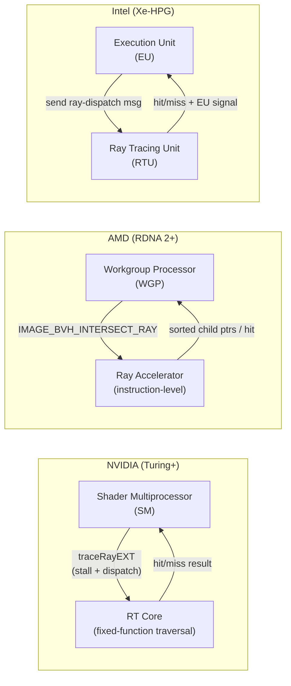
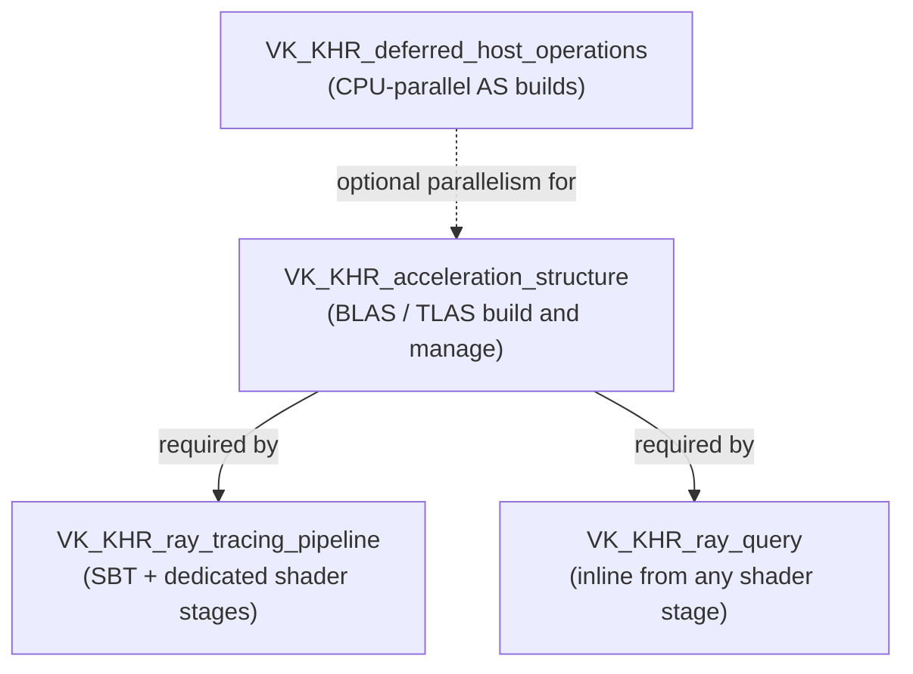
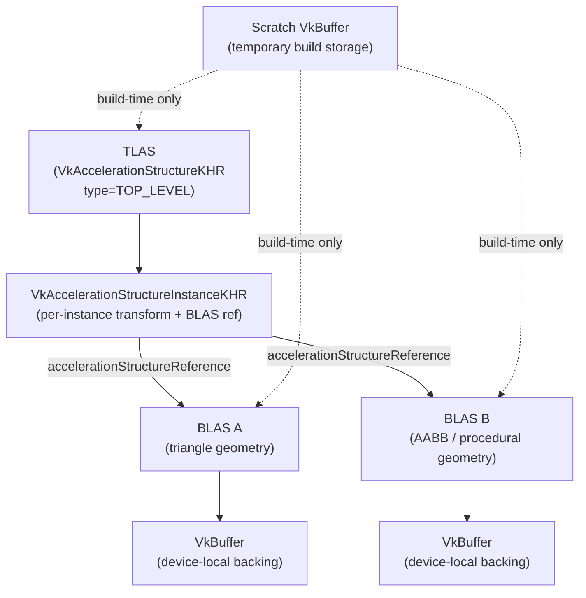
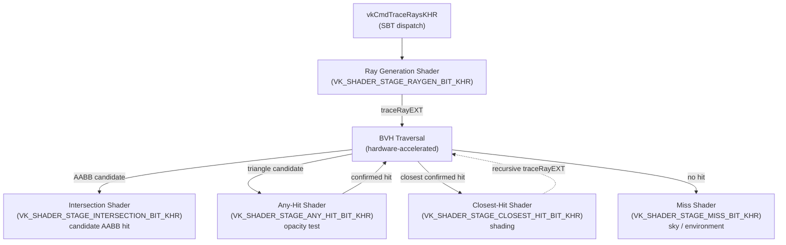
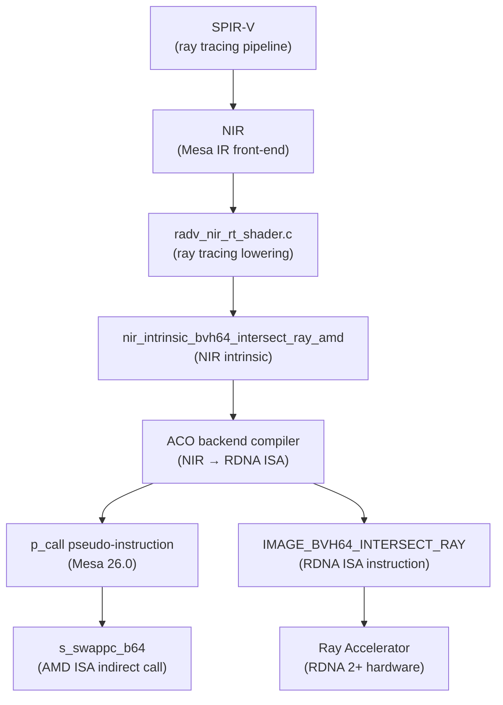
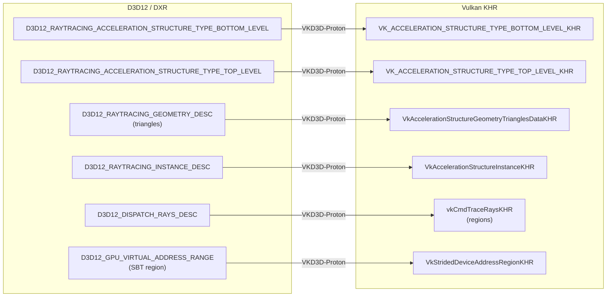
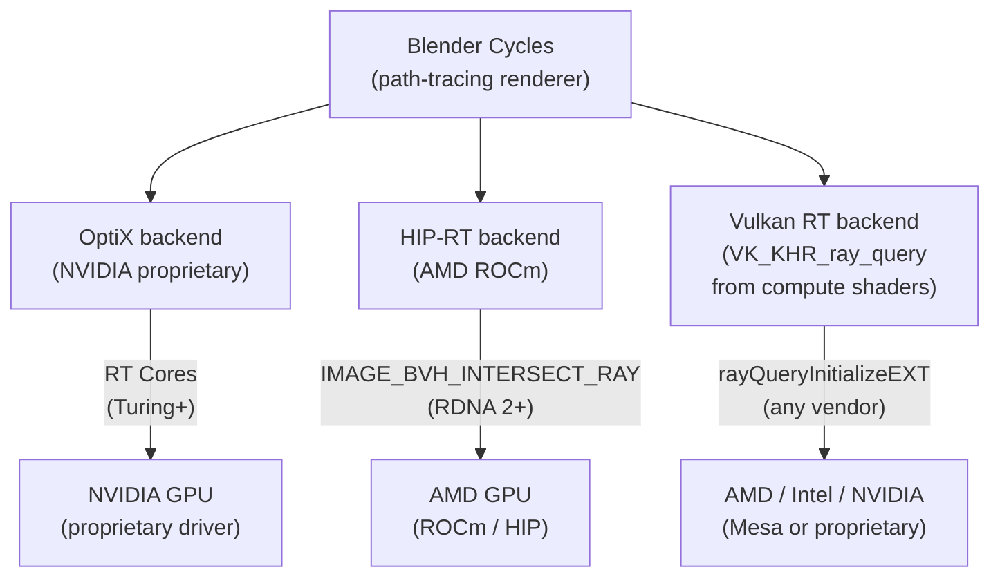

# Chapter 56: Ray Tracing on Linux

This chapter targets **systems and driver developers** who need to understand how ray tracing hardware is exposed through the Linux graphics stack, and **graphics application developers** who want to use Vulkan's ray tracing extensions efficiently on AMD, Intel, and NVIDIA hardware. It covers the full path from silicon — BVH-traversal accelerators inside the GPU — through Vulkan's four KHR extensions, into the RADV, ANV, and NVK Mesa drivers, and out to real-world workloads such as Proton/VKD3D-Proton game compatibility and Blender Cycles rendering.

---

## Table of Contents

1. [Hardware Ray Tracing Overview](#1-hardware-ray-tracing-overview)
2. [Vulkan Ray Tracing Extension Suite](#2-vulkan-ray-tracing-extension-suite)
3. [Acceleration Structure Lifecycle](#3-acceleration-structure-lifecycle)
4. [Ray Tracing Shader Model](#4-ray-tracing-shader-model)
5. [RADV Ray Tracing](#5-radv-ray-tracing)
6. [ANV Ray Tracing](#6-anv-ray-tracing)
7. [NVK Ray Tracing](#7-nvk-ray-tracing)
8. [DXR via VKD3D-Proton](#8-dxr-via-vkd3d-proton)
9. [Blender Cycles](#9-blender-cycles)
10. [Integrations](#integrations)

---

## 1. Hardware Ray Tracing Overview

Ray tracing — the simulation of light transport by casting rays against scene geometry — has been the dominant rendering technique in offline production since the 1980s, but only became practical in real-time graphics with the introduction of dedicated BVH-traversal hardware in 2018. Three major GPU vendors have shipped hardware ray tracing on Linux: NVIDIA via RT Cores (Turing onwards), AMD via Ray Accelerators in RDNA 2 and later, and Intel via Ray Tracing Units in Xe-HPG (Arc/DG2 and later). Despite different names and microarchitectural choices, all three share the same fundamental design goal: offload the hot inner loop of BVH traversal off the programmable shader pipeline and into fixed-function or semi-fixed-function silicon.



### 1.1 Bounding Volume Hierarchy Primer

A BVH partitions scene geometry into a tree of axis-aligned bounding boxes (AABBs). Each internal node stores several child boxes; each leaf stores one or a small number of primitives. A ray traversal descends the tree by testing the ray against each node's bounding boxes — rejecting subtrees that cannot be hit — and evaluates full ray/triangle intersection only at leaf primitives. In hardware the tree is materialised as a GPU buffer and traversal is driven by dedicated state machines rather than programmable shader threads.

All three hardware vendors implement a **BVH4** structure (four child bounding boxes per internal node) at the level that is exposed to the driver, though they differ in leaf packing and memory layout. The GPU's texture memory subsystem is reused to fetch BVH node data because it already has the high-bandwidth, low-latency cache hierarchy needed for random pointer-chasing access patterns.

The software traversal algorithm — even when partially or fully replaced by hardware — follows a stack-based descent:

1. Push the TLAS root node onto a local stack.
2. Pop the top node. If it is an internal box node, intersect the ray against all four child AABBs. Push child nodes whose boxes were hit, in order of increasing intersection distance (closer children first, so they are tested first after popping).
3. If the node is an instance node, apply the instance's world-to-object transform to the ray and push the root of the referenced BLAS.
4. If the node is a triangle leaf, compute the full Möller–Trumbore ray/triangle intersection. On a confirmed hit that is closer than the current `tmax`, update `tmax` and record the hit.
5. Repeat until the stack is empty.

AMD's `IMAGE_BVH_INTERSECT_RAY` instruction handles steps 2 and 4 in one clock, returning the sorted child pointers or the triangle hit result. NVIDIA's RT Cores execute the entire loop including stack management in fixed-function hardware. Intel's RTUs fall between the two: they traverse autonomously but signal the EU for any-hit and intersection shader invocations.

### 1.2 NVIDIA RT Cores (Turing and Later)

NVIDIA's Turing architecture (2018) introduced RT Cores as dedicated SM-adjacent accelerators on each Streaming Multiprocessor. Each RT Core performs:

- Fixed-function BVH node traversal (box tests)
- Fixed-function ray/triangle intersection

[Source: NVIDIA Turing Architecture In-Depth](https://developer.nvidia.com/blog/nvidia-turing-architecture-in-depth/)

When a shader dispatches a ray (via `traceRayEXT` in GLSL or the equivalent SPIR-V `OpTraceRayKHR`), the thread stalls and the RT Core takes over. The RT Core traverses the BVH autonomously, using the SM's data cache for node fetches, until it either finds a hit or determines a miss. Only then does the SM thread resume, executing the closest-hit or miss shader. In Ampere (2020), NVIDIA doubled the second-generation RT Core throughput relative to Turing for the same compute budget.

Because traversal is entirely fixed-function, NVIDIA drivers do not emit any programmable BVH-traversal shader. The acceleration structure memory layout is proprietary and opaque at the API level.

### 1.3 AMD Ray Accelerators (RDNA 2+)

AMD's RDNA 2 architecture (2020) introduced a Ray Accelerator (RA) unit inside each Workgroup Processor (WGP). Each WGP contains two RA units. Rather than adding a fully autonomous fixed-function traversal engine like NVIDIA, AMD exposed the RA as an **instruction-level accelerator** that the shader compiler controls:

- **`IMAGE_BVH_INTERSECT_RAY`** — takes a BVH node pointer (32-bit offset into a buffer treated as a 1D image), ray origin, direction, and inverse-direction VGPRs, and returns up to four sorted child node pointers (for box nodes) or an intersection distance and triangle ID (for leaf nodes).
- **`IMAGE_BVH64_INTERSECT_RAY`** — the 64-bit pointer variant for large acceleration structures.

[Source: RDNA 2 Hardware Raytracing – Interplay of Light](https://interplayoflight.wordpress.com/2020/12/27/rdna-2-hardware-raytracing/)

Each RA performs four ray/box intersection tests per clock or one ray/triangle intersection per clock. The BVH traversal loop itself is implemented as **software shader code** generated by the driver compiler (NIR → ACO), with the `IMAGE_BVH_INTERSECT_RAY` instruction providing the per-node acceleration. This means RADV must emit and compile a dedicated traversal shader, whereas NVIDIA drivers do not. This software traversal loop is sometimes called the **traversal shader** in AMD/RADV documentation.

In RDNA 3 and RDNA 4 the RA units are enlarged and additional BVH node types are supported (e.g., compressed BVH8 and triangle packets in RDNA 4), but the same instruction-level interface is preserved.

### 1.4 Intel Ray Tracing Units (Xe-HPG)

Intel's Xe-HPG architecture (DG2/Arc Alchemist, 2022) includes a Ray Tracing Unit (RTU) per Render Slice. The RTU handles BVH traversal, ray/box intersection, ray/triangle intersection, and instance transform application. Intel's implementation is architecturally closest to NVIDIA's: the RTU is a semi-autonomous accelerator that takes over from EU (Execution Unit) threads.

The ANV (Intel's Vulkan driver in Mesa) exposes ray tracing through `VK_KHR_ray_tracing_pipeline` and `VK_KHR_ray_query` for DG2 and later hardware. Intel's internal BVH memory format is documented in the ANV source under `src/intel/vulkan/grl/` and differs from both AMD's and NVIDIA's layouts. The BVH node coordinates are compressed to 8-bit integers in memory, decompressed on load. [Source: Intel Arc Graphics Developer Guide for Real-time Ray Tracing](https://www.intel.com/content/www/us/en/developer/articles/guide/real-time-ray-tracing-in-games.html)

---

## 2. Vulkan Ray Tracing Extension Suite

The Vulkan KHR ray tracing extensions were promoted from NV-specific extensions and finalised in 2020. Four extensions form the core:

| Extension | Purpose |
|---|---|
| `VK_KHR_acceleration_structure` | Build and manage BLAS/TLAS on GPU or CPU |
| `VK_KHR_ray_tracing_pipeline` | Full ray tracing pipeline with SBT and dedicated shader stages |
| `VK_KHR_ray_query` | Inline ray queries from any shader stage |
| `VK_KHR_deferred_host_operations` | CPU-side parallelism for AS builds and pipeline compiles |



[Source: Ray Tracing in Vulkan – Khronos Blog](https://www.khronos.org/blog/ray-tracing-in-vulkan)

### 2.1 VK_KHR_acceleration_structure

This extension provides the data structures and commands for building, updating, copying, and querying acceleration structures (AS). It defines:

- `VkAccelerationStructureKHR` — opaque handle for a BLAS or TLAS
- `vkCreateAccelerationStructureKHR` / `vkDestroyAccelerationStructureKHR`
- `vkCmdBuildAccelerationStructuresKHR` — GPU-side build
- `vkBuildAccelerationStructuresKHR` — CPU-side build (requires `accelerationStructureHostCommands` feature)
- `vkCmdCopyAccelerationStructureKHR` — clone for compaction
- `vkCmdWriteAccelerationStructuresPropertiesKHR` — query compacted size

The feature is gated by `VkPhysicalDeviceAccelerationStructureFeaturesKHR::accelerationStructure`.

### 2.2 VK_KHR_ray_tracing_pipeline

This extension introduces five new shader stages and the shader binding table (SBT) dispatch model:

- Ray generation (`VK_SHADER_STAGE_RAYGEN_BIT_KHR`)
- Intersection (`VK_SHADER_STAGE_INTERSECTION_BIT_KHR`)
- Any-hit (`VK_SHADER_STAGE_ANY_HIT_BIT_KHR`)
- Closest-hit (`VK_SHADER_STAGE_CLOSEST_HIT_BIT_KHR`)
- Miss (`VK_SHADER_STAGE_MISS_BIT_KHR`)

It adds `vkCmdTraceRaysKHR` for launching a ray tracing dispatch and `vkCreateRayTracingPipelinesKHR` for pipeline creation. Pipelines may be created with `VK_PIPELINE_CREATE_RAY_TRACING_SHADER_GROUP_HANDLE_CAPTURE_REPLAY_BIT_KHR` to support replay capture tools.

### 2.3 VK_KHR_ray_query

Ray queries allow any shader stage (compute, vertex, fragment, mesh, etc.) to cast rays inline without the SBT machinery:

```glsl
// In a compute or fragment shader
rayQueryEXT rq;
rayQueryInitializeEXT(rq, topLevelAS, gl_RayFlagsOpaqueEXT,
                      0xFF, origin, tMin, direction, tMax);
while (rayQueryProceedEXT(rq)) {
    if (rayQueryGetIntersectionTypeEXT(rq, false) ==
            gl_RayQueryCandidateIntersectionTriangleEXT) {
        rayQueryConfirmIntersectionEXT(rq);
    }
}
float t = rayQueryGetIntersectionTEXT(rq, true);
```

Ray queries are the most portable ray tracing path: they work on any hardware that supports `VK_KHR_ray_query`, are driven by regular compute or graphics dispatches, and require no SBT. On AMD, RADV uses `IMAGE_BVH_INTERSECT_RAY` to accelerate the traversal loop even in ray query mode.

### 2.4 VK_KHR_deferred_host_operations

Acceleration structure builds are CPU-expensive when performed with `vkBuildAccelerationStructuresKHR` on the host. `VK_KHR_deferred_host_operations` provides a mechanism to spread work across application-managed thread pools:

```c
VkDeferredOperationKHR deferredOp;
vkCreateDeferredOperationKHR(device, NULL, &deferredOp);

// Pass deferredOp to the build call
vkBuildAccelerationStructuresKHR(device, deferredOp, 1, &buildInfo, ppRangeInfos);

// From N worker threads:
VkResult res;
do {
    res = vkDeferredOperationJoinKHR(device, deferredOp);
} while (res == VK_THREAD_IDLE_KHR);

// After all threads complete:
vkGetDeferredOperationResultKHR(device, deferredOp);
vkDestroyDeferredOperationKHR(device, NULL, &deferredOp);
```

`vkDeferredOperationJoinKHR` returns `VK_THREAD_IDLE_KHR` when there is no work left for the calling thread to do but the operation is not yet complete, and `VK_THREAD_DONE_KHR` when the calling thread finished its portion and other threads are still working. The design puts all thread lifecycle management in the application.

---

## 3. Acceleration Structure Lifecycle

An acceleration structure is a VkBuffer-backed GPU object. The application allocates the buffer, queries the required scratch size, and then submits a build command. This section traces that lifecycle in code.



### 3.1 Bottom-Level AS (BLAS) from Triangle Geometry

[Source: Vulkan spec — VkAccelerationStructureGeometryTrianglesDataKHR](https://registry.khronos.org/vulkan/specs/latest/man/html/VkAccelerationStructureGeometryTrianglesDataKHR.html)

```c
// src/app/rt_scene.c (application code)

// Describe vertex and index buffers
VkAccelerationStructureGeometryTrianglesDataKHR triangles = {
    .sType = VK_STRUCTURE_TYPE_ACCELERATION_STRUCTURE_GEOMETRY_TRIANGLES_DATA_KHR,
    .vertexFormat  = VK_FORMAT_R32G32B32_SFLOAT,
    .vertexData    = { .deviceAddress = vertexBufferDeviceAddress },
    .vertexStride  = sizeof(float) * 3,
    .maxVertex     = vertexCount - 1,
    .indexType     = VK_INDEX_TYPE_UINT32,
    .indexData     = { .deviceAddress = indexBufferDeviceAddress },
    .transformData = { .deviceAddress = 0 },  // identity
};

VkAccelerationStructureGeometryKHR geometry = {
    .sType        = VK_STRUCTURE_TYPE_ACCELERATION_STRUCTURE_GEOMETRY_KHR,
    .geometryType = VK_GEOMETRY_TYPE_TRIANGLES_KHR,
    .geometry     = { .triangles = triangles },
    .flags        = VK_GEOMETRY_OPAQUE_BIT_KHR,
};

VkAccelerationStructureBuildGeometryInfoKHR buildInfo = {
    .sType         = VK_STRUCTURE_TYPE_ACCELERATION_STRUCTURE_BUILD_GEOMETRY_INFO_KHR,
    .type          = VK_ACCELERATION_STRUCTURE_TYPE_BOTTOM_LEVEL_KHR,
    .flags         = VK_BUILD_ACCELERATION_STRUCTURE_PREFER_FAST_TRACE_BIT_KHR,
    .mode          = VK_BUILD_ACCELERATION_STRUCTURE_MODE_BUILD_KHR,
    .geometryCount = 1,
    .pGeometries   = &geometry,
};

// Query required sizes
VkAccelerationStructureBuildSizesInfoKHR sizeInfo = {
    .sType = VK_STRUCTURE_TYPE_ACCELERATION_STRUCTURE_BUILD_SIZES_INFO_KHR,
};
uint32_t maxPrimCount = triangleCount;
vkGetAccelerationStructureBuildSizesKHR(
    device, VK_ACCELERATION_STRUCTURE_BUILD_TYPE_DEVICE_KHR,
    &buildInfo, &maxPrimCount, &sizeInfo);

// Allocate backing storage (VkBuffer, device-local)
VkBuffer blasBuffer;
allocateDeviceLocalBuffer(sizeInfo.accelerationStructureSize, &blasBuffer);

// Create the AS object pointing at the buffer
VkAccelerationStructureCreateInfoKHR createInfo = {
    .sType  = VK_STRUCTURE_TYPE_ACCELERATION_STRUCTURE_CREATE_INFO_KHR,
    .buffer = blasBuffer,
    .size   = sizeInfo.accelerationStructureSize,
    .type   = VK_ACCELERATION_STRUCTURE_TYPE_BOTTOM_LEVEL_KHR,
};
VkAccelerationStructureKHR blas;
vkCreateAccelerationStructureKHR(device, &createInfo, NULL, &blas);

// Fill in destination and scratch
buildInfo.dstAccelerationStructure  = blas;
buildInfo.scratchData.deviceAddress = scratchBufferDeviceAddress;

VkAccelerationStructureBuildRangeInfoKHR rangeInfo = {
    .primitiveCount  = triangleCount,
    .primitiveOffset = 0,
    .firstVertex     = 0,
    .transformOffset = 0,
};
const VkAccelerationStructureBuildRangeInfoKHR *pRangeInfo = &rangeInfo;

vkCmdBuildAccelerationStructuresKHR(cmdBuf, 1, &buildInfo, &pRangeInfo);
```

### 3.2 Top-Level AS (TLAS) from Instances

A TLAS holds an array of `VkAccelerationStructureInstanceKHR` entries, each pointing at a BLAS:

```c
VkAccelerationStructureInstanceKHR instance = {
    // Row-major 3x4 affine transform stored as three rows of four floats
    .transform = {
        .matrix = { {1,0,0,0}, {0,1,0,0}, {0,0,1,0} }
    },
    .instanceCustomIndex                    = 0,
    .mask                                   = 0xFF,
    .instanceShaderBindingTableRecordOffset = 0,
    .flags                                  = VK_GEOMETRY_INSTANCE_TRIANGLE_FACING_CULL_DISABLE_BIT_KHR,
    .accelerationStructureReference        = blasDeviceAddress,
};
```

[Source: Vulkan spec — VkAccelerationStructureInstanceKHR](https://registry.khronos.org/vulkan/specs/latest/man/html/VkAccelerationStructureInstanceKHR.html)

The instance buffer must be uploaded to device-local memory before `vkCmdBuildAccelerationStructuresKHR` is called for the TLAS.

### 3.2b Update and Refit

Dynamic scenes require updating acceleration structures each frame. Rather than rebuilding from scratch, a BLAS with `VK_BUILD_ACCELERATION_STRUCTURE_ALLOW_UPDATE_BIT_KHR` can be updated in-place by passing the existing AS as `srcAccelerationStructure` and setting `mode = VK_BUILD_ACCELERATION_STRUCTURE_MODE_UPDATE_KHR`:

```c
// src/app/rt_scene.c (application code)
buildInfo.mode                   = VK_BUILD_ACCELERATION_STRUCTURE_MODE_UPDATE_KHR;
buildInfo.srcAccelerationStructure = blas;   // update from existing
buildInfo.dstAccelerationStructure = blas;   // in-place update

vkCmdBuildAccelerationStructuresKHR(cmdBuf, 1, &buildInfo, &pRangeInfo);
```

[Source: Vulkan spec — vkCmdBuildAccelerationStructuresKHR](https://registry.khronos.org/vulkan/specs/latest/man/html/vkCmdBuildAccelerationStructuresKHR.html)

An update is a **refit**: the BVH topology (node connectivity) is frozen from the original build; only the bounding boxes and primitive data are recomputed to account for vertex movement. Refits are 5–10x faster than full rebuilds but gradually degrade tree quality as geometry deforms. The common pattern for skinned characters or cloth is to refit every frame and rebuild every N frames (or when quality falls below a threshold measured by ray cost).

The three build-flag tradeoffs to know:

| Flag | Meaning |
|---|---|
| `PREFER_FAST_TRACE` | Optimise the BVH tree for trace performance (slower build, better ray traversal) |
| `PREFER_FAST_BUILD` | Build quickly at the cost of higher traversal times |
| `ALLOW_UPDATE` | Reserve internal state needed for refit; slightly increases AS size and build time |
| `ALLOW_COMPACTION` | Allows querying and performing compaction after build |

`PREFER_FAST_TRACE` and `PREFER_FAST_BUILD` are mutually exclusive. `ALLOW_UPDATE` and `ALLOW_COMPACTION` can be combined with either.

### 3.3 Compaction

Freshly built acceleration structures are often 2–3x larger than necessary. Compaction reclaims memory:

```c
// After BLAS build, query compacted size
VkQueryPoolCreateInfo qpci = {
    .sType      = VK_STRUCTURE_TYPE_QUERY_POOL_CREATE_INFO,
    .queryType  = VK_QUERY_TYPE_ACCELERATION_STRUCTURE_COMPACTED_SIZE_KHR,
    .queryCount = 1,
};
VkQueryPool queryPool;
vkCreateQueryPool(device, &qpci, NULL, &queryPool);

vkCmdResetQueryPool(cmdBuf, queryPool, 0, 1);
vkCmdWriteAccelerationStructuresPropertiesKHR(
    cmdBuf, 1, &blas,
    VK_QUERY_TYPE_ACCELERATION_STRUCTURE_COMPACTED_SIZE_KHR,
    queryPool, 0);

// After fence wait, read back the compacted size, allocate
// a smaller buffer, and call vkCmdCopyAccelerationStructureKHR
// with VK_COPY_ACCELERATION_STRUCTURE_MODE_COMPACT_KHR.
```

Compaction requires a pipeline barrier between the build and the property write, and another between the property write and the copy.

### 3.4 Serialisation for Disk Caching

`vkCmdCopyAccelerationStructureToMemoryKHR` serialises an AS into a driver-defined binary blob. Combined with a content hash of the input geometry, this enables persistent disk caches so scene load times are reduced after the first build. The blob is not portable between GPU vendors or driver versions; the header includes a driver UUID for validation. [Source: Vulkan spec — vkCmdCopyAccelerationStructureToMemoryKHR](https://registry.khronos.org/vulkan/specs/latest/man/html/vkCmdCopyAccelerationStructureToMemoryKHR.html)

---

## 4. Ray Tracing Shader Model

### 4.1 Shader Stages

The full ray tracing pipeline involves five shader stages with well-defined call semantics:

| Stage | Trigger | Purpose |
|---|---|---|
| Ray generation | `vkCmdTraceRaysKHR` dispatch | Calls `traceRayEXT`; owns the outermost loop |
| Intersection | Candidate AABB hit | Custom primitive (procedural geometry) |
| Any-hit | Triangle candidate hit | Opacity test; may call `ignoreIntersectionEXT` |
| Closest-hit | Closest confirmed hit | Shading; may recurse via `traceRayEXT` |
| Miss | No geometry hit | Sky / environment lighting |



Ray generation shaders are analogous to compute shaders: they launch a 3D grid via `vkCmdTraceRaysKHR`, and each invocation typically casts one or more primary rays. Closest-hit and miss shaders compute the final radiance sample. Any-hit shaders are the canonical place for alpha-test transparency. Callable shaders (also part of `VK_KHR_ray_tracing_pipeline`) are omitted from the traversal-triggered stages in the table above, though Vulkan defines `VK_SHADER_STAGE_CALLABLE_BIT_KHR` as a distinct shader stage. They are invoked via `executeCallableEXT` from raygen, closest-hit, or miss shaders, not by the traversal engine itself.

### 4.2 Shader Binding Table Layout

The SBT is a GPU buffer containing **shader records**. Each record is: `[handle (shaderGroupHandleSize bytes)] [application data (0 or more bytes)]`. Records must be aligned to `shaderGroupHandleAlignment` and the stride must not exceed `maxShaderGroupStride`. Both properties live in `VkPhysicalDeviceRayTracingPipelinePropertiesKHR`.

```c
VkPhysicalDeviceRayTracingPipelinePropertiesKHR rtPipeProps = {
    .sType = VK_STRUCTURE_TYPE_PHYSICAL_DEVICE_RAY_TRACING_PIPELINE_PROPERTIES_KHR,
};
VkPhysicalDeviceProperties2 props2 = {
    .sType = VK_STRUCTURE_TYPE_PHYSICAL_DEVICE_PROPERTIES_2,
    .pNext = &rtPipeProps,
};
vkGetPhysicalDeviceProperties2(physDev, &props2);

uint32_t handleSize  = rtPipeProps.shaderGroupHandleSize;        // typically 32
uint32_t handleAlign = rtPipeProps.shaderGroupHandleAlignment;   // typically 32
uint32_t stride      = align_up(handleSize + appDataSize, handleAlign);
```

The SBT is divided into four regions by `vkCmdTraceRaysKHR`:

[Source: Vulkan spec — vkCmdTraceRaysKHR](https://registry.khronos.org/vulkan/specs/latest/man/html/vkCmdTraceRaysKHR.html)

```c
void vkCmdTraceRaysKHR(
    VkCommandBuffer                      commandBuffer,
    const VkStridedDeviceAddressRegionKHR *pRaygenShaderBindingTable,
    const VkStridedDeviceAddressRegionKHR *pMissShaderBindingTable,
    const VkStridedDeviceAddressRegionKHR *pHitShaderBindingTable,
    const VkStridedDeviceAddressRegionKHR *pCallableShaderBindingTable,
    uint32_t                              width,
    uint32_t                              height,
    uint32_t                              depth);
```

`VkStridedDeviceAddressRegionKHR` carries a device address, a stride, and a size. For the raygen region, `stride` must equal `size` (exactly one record). For the hit region, the hardware selects the record at:

```
hitShaderBindingTable.deviceAddress
  + hitShaderBindingTable.stride × (
        instanceShaderBindingTableRecordOffset
      + geometryIndex × sbtRecordStride
      + sbtRecordOffset
    )
```

[Source: Vulkan spec — VkStridedDeviceAddressRegionKHR](https://registry.khronos.org/vulkan/specs/latest/man/html/VkStridedDeviceAddressRegionKHR.html)

### 4.2b Concrete Shader Example

The following GLSL pair shows a minimal ray generation shader and a closest-hit shader that computes diffuse lighting. Both use `GL_EXT_ray_tracing` and target SPIR-V 1.4.

```glsl
// raygen.rgen — ray generation shader
#version 460
#extension GL_EXT_ray_tracing : require

layout(set = 0, binding = 0) uniform accelerationStructureEXT topLevelAS;
layout(set = 0, binding = 1, rgba32f) uniform image2D outputImage;

// Payload written by closest-hit or miss shader
layout(location = 0) rayPayloadEXT vec3 hitColor;

void main() {
    const vec2 pixelCenter = vec2(gl_LaunchIDEXT.xy) + vec2(0.5);
    const vec2 inUV        = pixelCenter / vec2(gl_LaunchSizeEXT.xy);
    const vec2 d           = inUV * 2.0 - 1.0;

    // Simple perspective camera: origin shifts per pixel, direction points at z=0 plane
    vec3 origin    = vec3(0.0, 0.0, -2.0);
    vec3 direction = normalize(vec3(d.x, -d.y, 1.0));

    traceRayEXT(
        topLevelAS,
        gl_RayFlagsOpaqueEXT,
        0xFF,               // cull mask
        0,                  // sbtRecordOffset
        0,                  // sbtRecordStride
        0,                  // miss shader index
        origin,
        0.001,              // tMin
        direction,
        10000.0,            // tMax
        0                   // payload location
    );

    imageStore(outputImage, ivec2(gl_LaunchIDEXT.xy), vec4(hitColor, 1.0));
}
```

```glsl
// closesthit.rchit — closest-hit shader
#version 460
#extension GL_EXT_ray_tracing : require

// Per-vertex normals fetched from a storage buffer
layout(set = 0, binding = 2) readonly buffer Normals { vec3 normals[]; };

layout(location = 0) rayPayloadInEXT vec3 hitColor;

// Barycentric coordinates set by the fixed-function triangle intersector
hitAttributeEXT vec2 baryCoords;

void main() {
    // Reconstruct full barycentric weights from the two hardware-provided values
    vec3 bary = vec3(1.0 - baryCoords.x - baryCoords.y,
                     baryCoords.x, baryCoords.y);

    // Interpolate per-vertex normals.  gl_PrimitiveID is the triangle index
    // within the geometry; multiply by 3 to index into a flat vertex array.
    // (A real engine would use gl_InstanceCustomIndexEXT to look up per-mesh
    // offsets into the normal buffer.)
    uint base  = gl_PrimitiveID * 3;
    vec3 n     = normalize(bary.x * normals[base + 0]
                         + bary.y * normals[base + 1]
                         + bary.z * normals[base + 2]);

    // Transform interpolated normal to world space
    vec3 worldN = normalize(mat3(gl_ObjectToWorldEXT) * n);

    // Lambert diffuse against a hardcoded directional light
    vec3 lightDir = normalize(vec3(1.0, 2.0, 1.0));
    float ndotl   = max(dot(worldN, lightDir), 0.0);
    hitColor      = vec3(0.8, 0.5, 0.2) * ndotl;
}
```

```glsl
// miss.rmiss — miss shader (sky)
#version 460
#extension GL_EXT_ray_tracing : require

layout(location = 0) rayPayloadInEXT vec3 hitColor;

void main() {
    hitColor = vec3(0.1, 0.1, 0.3);  // dark blue sky
}
```

Key built-ins used here:

| Built-in | Stage | Meaning |
|---|---|---|
| `gl_LaunchIDEXT` | raygen | Current invocation's 3D coordinates within the dispatch grid (`uvec3`; analogous to `gl_GlobalInvocationID` in compute) |
| `gl_LaunchSizeEXT` | raygen | Total dispatch dimensions (width × height × depth) |
| `gl_ObjectToWorldEXT` | closest-hit | 4×3 object-to-world transform matrix |
| `baryCoords` (hitAttributeEXT) | closest-hit | Barycentric u/v coordinates of the hit point |

[Source: Vulkan spec — VK_KHR_ray_tracing_pipeline shader stages](https://registry.khronos.org/vulkan/specs/latest/man/html/VK_KHR_ray_tracing_pipeline.html)

### 4.3 Ray Payload and Callable Shaders

Shaders communicate through a **ray payload** declared in GLSL with `layout(location = 0) rayPayloadEXT` (in the raygen or closest-hit caller) and `layout(location = 0) rayPayloadInEXT` (in closest-hit and miss). The payload is passed by reference through the call stack and is entirely driver-managed in registers or scratch memory. Its size contributes to the per-lane scratch footprint, so large payloads hurt occupancy.

**Callable shaders** use `layout(location = 0) callableDataEXT` / `callableDataInEXT` in the same pattern. They are dispatched via `executeCallableEXT(sbtIndex, callableDataLocation)` and provide a runtime-polymorphic material call without requiring shader permutations.

### 4.4 Shader Record Stride Calculation

The stride between records must satisfy:

```
stride ≡ 0  (mod shaderGroupHandleAlignment)
stride ≤ maxShaderGroupStride
```

A common pattern is to set `stride = align_up(handleSize + sizeof(MaterialData), handleAlign)`, where `MaterialData` holds per-geometry material parameters (texture indices, roughness, etc.) that the closest-hit shader reads from `shaderRecordEXT` in GLSL.

---

## 5. RADV Ray Tracing

RADV is the open-source AMD Vulkan driver in Mesa, maintained primarily by Valve and Red Hat engineers. Its ray tracing implementation has matured significantly from its initial experimental state in Mesa 22.0 to production quality by Mesa 23.2, when ray tracing was enabled by default. Mesa 26.0 (released February 2026) brought an additional 30% performance improvement on RDNA 2 through BVH4 update optimisations. [Source: Phoronix — RADV RT RDNA2 30% Faster in Mesa 26.0](https://www.phoronix.com/news/Mesa-26.0-RADV-RT-RDNA2-Faster)

### 5.1 Hardware Capability Detection

RADV queries the GFX IP level to determine whether ray tracing hardware is available. RDNA 2 corresponds to GFX10.3 (gfx1030–gfx1036); RDNA 3 is GFX11; RDNA 4 (RX 9070 series) is GFX12. The driver exposes the `VK_KHR_acceleration_structure`, `VK_KHR_ray_tracing_pipeline`, and `VK_KHR_ray_query` extensions on GFX10.3 and later when ray tracing is not disabled.

**Note: needs verification** — The plan.md outline references a function `radv_device_supports_rt()`. As of the time of writing, the exact symbol name could not be confirmed against current Mesa source. The gating logic is likely in `src/amd/vulkan/radv_physical_device.c`; check that file in the Mesa repository for the authoritative function name.

### 5.2 RDNA 2+ `IMAGE_BVH_INTERSECT_RAY` in RADV

RADV emits the `IMAGE_BVH_INTERSECT_RAY` and `IMAGE_BVH64_INTERSECT_RAY` instructions through the NIR ray tracing lowering pass in `src/amd/vulkan/nir/radv_nir_rt_shader.c`. The traversal loop — descend box nodes, push children, pop next candidate, test leaf triangles — is written as NIR intrinsics that ACO (the backend compiler) eventually lower to the actual ISA instructions.

The critical NIR intrinsic is `nir_intrinsic_bvh64_intersect_ray_amd`, which maps directly to `IMAGE_BVH64_INTERSECT_RAY`. The instruction takes the BVH buffer descriptor, a node offset, and the ray parameters (origin, direction, tmin, tmax, inverse-direction) packed across 16 VGPRs, and returns 4 packed results per box test. [Source: Mesa GitLab — src/amd/vulkan/nir/radv_nir_rt_shader.c](https://gitlab.freedesktop.org/mesa/mesa/-/blob/main/src/amd/vulkan/nir/radv_nir_rt_shader.c)

### 5.3 Traversal Shader Architecture

RADV implements BVH traversal as a **traversal shader** — a driver-generated shader that runs the traversal loop and calls any-hit and intersection shaders as subroutines. Until Mesa 26.0, any-hit and intersection shaders were inlined into this megashader, causing compilation times that could stretch to minutes for complex scenes.

Mesa 26.0 addressed this through proper **function calls** in the ACO compiler backend. The key change was implementing `p_call` pseudo-instructions that lower to `s_swappc_b64` (AMD's "swap PC" instruction for indirect calls) and defining an ABI for register preservation across call boundaries. With this change, any-hit and intersection shaders compile independently and are called at runtime via their addresses stored in the SBT. [Source: pixelcluster.github.io — Inside Mesa 26.0's RADV RT Improvements](https://pixelcluster.github.io/Mesa-26/)



The result is that compilation can proceed in parallel across shader groups, and the megashader explosion is contained to the traversal logic itself.

### 5.4 RADV_DEBUG=rt

RADV's debug environment variable exposes ray tracing shader assembly:

```bash
RADV_DEBUG=rt ./my_rt_app
```

This dumps the compiled assembly for every ray tracing shader (traversal, raygen, closest-hit, miss, any-hit) to stderr. A companion flag:

```bash
RADV_DEBUG=nort ./my_rt_app
```

skips execution of `vkCmdTraceRays` and ray query traversals while still advertising the RT extensions — useful for isolating whether a crash is inside ray tracing dispatch or elsewhere. [Source: Mesa Environment Variables documentation](https://docs.mesa3d.org/envvars.html)

For software emulation on pre-RDNA2 hardware:

```bash
RADV_PERFTEST=emulate_rt ./my_rt_app
```

This enables the RT extensions on GFX10_3 and below by substituting a pure-shader BVH traversal for the `IMAGE_BVH_INTERSECT_RAY` instruction path.

### 5.5 Conformance Status

RADV's ray tracing implementation is tested against the Khronos dEQP-VK (Vulkan conformance test suite). As of Mesa 23.2, RADV passed enough dEQP-VK ray tracing tests to expose the extensions by default. The conformance posture continues to improve; specific test counts and pass rates are tracked in the Mesa issue tracker and in periodic conformance submissions at the Khronos Adopters Programme. Ray queries (`VK_KHR_ray_query`) have higher pass rates than the full ray tracing pipeline because they do not require the callable-shader and SBT dispatch machinery.

---

## 6. ANV Ray Tracing

ANV is the Intel Vulkan driver in Mesa, supporting Gen8 (Broadwell) through current Intel Arc hardware. Ray tracing support is limited to Xe-HPG (DG2/Alchemist, Battlemage, and later) and is exposed via `VK_KHR_ray_tracing_pipeline` and `VK_KHR_ray_query` on those devices.

### 6.1 Xe-HPG BVH Hardware

Each Xe-HPG Render Slice contains four Xe Cores and four Ray Tracing Units (RTUs). Each RTU is a semi-autonomous accelerator capable of:

- BVH node traversal (box tests)
- Ray/triangle intersection
- Instance transform application
- Hit-shader dispatch signalling

The RTU is tightly coupled to the EU (Execution Unit) thread scheduler. When an EU thread encounters a `traceRayEXT` operation, it issues a ray-dispatch message to the RTU. The RTU traverses the BVH, potentially recursing through instance nodes that redirect into BLAS structures, and signals back when a hit or miss is determined. The EU thread is released to do other work while the RTU operates. [Source: Intel Arc & Xe-HPG Architecture Introduction](https://www.intel.com/content/www/us/en/developer/articles/technical/introduction-to-the-xe-hpg-architecture.html)

### 6.2 ANV Acceleration Structure Layout

ANV's acceleration structure format is defined in the GRL (Graphics Library) shaders under `src/intel/vulkan/grl/`. The memory layout stores internal BVH nodes with compressed 8-bit integer coordinates (quantised bounding box extents), decompressed on fetch. Instance nodes store the 3×4 instance transform matrix, the BLAS device address, and hit-group offset and mask fields that mirror `VkAccelerationStructureInstanceKHR`.

ANV builds acceleration structures on the GPU using GRL compute shaders for the BVH construction algorithm (PLOC — Parallel Locally-Ordered Clustering, or the Morton code-based builder). The scratch requirements are queried through `vkGetAccelerationStructureBuildSizesKHR` just as for other drivers.

### 6.3 ISA-Level Ray Tracing

Intel's Gen12+ ISA (the Xe core instruction set) includes ray tracing messages dispatched via the `send` instruction family. These messages are not exposed as user-visible named instructions in GLSL/SPIR-V; instead, they are emitted by the compiler backend (Intel NIR → Intel EU backend in Mesa's `src/intel/compiler/`) when lowering `OpTraceRayKHR` and `OpRayQueryInitializeKHR` SPIR-V instructions.

The compiler backend lowers these through NIR intrinsics in `src/intel/compiler/brw_nir_lower_rt_intrinsics.c`. A ray trace operation becomes a `send` with a message descriptor targeting the RTU's SFID (Shared Function ID). The RTU message carries:

- Ray origin and direction (packed VGPRs)
- `tmin` and `tmax` bounds
- BVH root address (as a 64-bit GPU VA)
- Instance mask and ray flags

On return, the thread receives the intersection result — whether a hit occurred, the hit distance `t`, instance index, geometry index, and primitive index — packed into message return registers.

**Note: needs verification** — The plan.md outline references a specific instruction named `xe_ray_query`. The actual mechanism involves `send`-message opcodes to the RTU rather than a named ISA mnemonic in the public ISA documentation. Inspecting IGC (Intel Graphics Compiler) output via `intel_nir_print_shader` or looking at the ANV GRL shader disassembly will show the specific message encoding. The relevant Mesa source files are `src/intel/compiler/brw_nir_lower_rt_intrinsics.c` and `src/intel/vulkan/grl/`.

ANV exposes `VkPhysicalDeviceRayTracingPipelinePropertiesKHR` with the appropriate `maxRayRecursionDepth` and `shaderGroupHandleSize` for Xe-HPG hardware. The BVH builder uses GPU-executed GRL shaders (GPGPU compute kernels written in OpenCL C and compiled offline) to construct the PLOC tree entirely on-device, avoiding CPU-side BVH construction latency.

---

## 7. NVK Ray Tracing

NVK is the open-source NVIDIA Vulkan driver in Mesa, developed by Collabora and contributors. As of mid-2026, NVK has achieved Vulkan 1.4 conformance on Maxwell, Pascal, Volta, Turing, Ampere, and Ada architectures, and has begun consumer Blackwell support. However, **ray tracing is not yet implemented in NVK**. [Source: Phoronix — NVK Status Update 2025](https://www.phoronix.com/news/NVK-Status-Update-2025)

### 7.1 Turing/Ampere RT Core Mapping

On NVIDIA hardware with hardware RT Cores (Turing RTX 2000 series and later), the RT Core accelerates BVH traversal autonomously at the hardware level. Unlike AMD's approach, traversal is not driven by software shader loops — the SM dispatches a ray and blocks until the RT Core returns a result. Exposing this to NVK requires:

1. Reverse-engineering NVIDIA's proprietary acceleration structure memory format
2. Mapping Vulkan `VkAccelerationStructureKHR` build semantics to the hardware's expected layout
3. Implementing the ray tracing shader model (SBT dispatch, recursive call conventions) in terms of NVIDIA's closed shader ABI

Steps 1 and 3 are the primary blockers. NVIDIA's shader ABI for RT Cores — how the SM thread suspends, how the RT Core signals back, how ray payloads and hit attributes are passed — is not publicly documented and must be inferred through GPU shader disassembly and microarchitecture documentation.

Faith Ekstrand (lead NVK developer) has noted that while some reverse engineering progress has been made on the data structures, reliable information on the shader-side protocol for RT dispatch is still lacking. The development team acknowledges being resource-constrained across NVK and the Nouveau/Nova kernel driver work simultaneously. [Source: GamingOnLinux — Mesa NVK Vulkan 1.4 Conformant](https://www.gamingonlinux.com/2025/04/mesa-nvk-nvidia-vulkan-driver-now-vulkan-1-4-conformant-on-maxwell-pascal-and-volta-gpus/)

### 7.2 GSP and RT Capabilities

NVIDIA's GSP (GPU System Processor, covered in Ch9) handles firmware-side resource management on Turing and later GPUs. For ray tracing, the GSP firmware initialises the RT Core units and may expose capability queries through the host RM (Resource Manager) interface. Any NVK ray tracing implementation will need to communicate RT Core readiness through the Nova/Nouveau kernel driver's GSP abstraction (Ch9).

### 7.3 Conformance Timeline

As of the writing of this chapter (mid-2026), NVK does not advertise `VK_KHR_ray_tracing_pipeline` or `VK_KHR_acceleration_structure`. The team has not published a target date for ray tracing conformance. Users requiring ray tracing on NVIDIA hardware on Linux must use the proprietary NVIDIA driver.

---

## 8. DXR via VKD3D-Proton

VKD3D-Proton is Valve's fork of VKD3D, used in Proton to translate Direct3D 12 games to Vulkan on Linux and Steam Deck (Ch28). DirectX Raytracing (DXR) is the D3D12 ray tracing API and has been enabled by default in VKD3D-Proton since version 2.11 (November 2023). [Source: GamingOnLinux — VKD3D-Proton 2.11 DXR Default](https://www.gamingonlinux.com/2023/11/vkd3d-proton-211-released-with-directx-raytracing-enabled-by-default/)

### 8.1 D3D12 to Vulkan Acceleration Structure Translation

D3D12's `ID3D12Device5::CreateRaytracingAccelerationStructure` takes a `D3D12_BUILD_RAYTRACING_ACCELERATION_STRUCTURE_DESC`. VKD3D-Proton translates this into `vkCmdBuildAccelerationStructuresKHR` by mapping:

- `D3D12_RAYTRACING_ACCELERATION_STRUCTURE_TYPE_BOTTOM_LEVEL` → `VK_ACCELERATION_STRUCTURE_TYPE_BOTTOM_LEVEL_KHR`
- `D3D12_RAYTRACING_ACCELERATION_STRUCTURE_TYPE_TOP_LEVEL` → `VK_ACCELERATION_STRUCTURE_TYPE_TOP_LEVEL_KHR`
- `D3D12_RAYTRACING_GEOMETRY_DESC` for triangle geometry → `VkAccelerationStructureGeometryTrianglesDataKHR`
- `D3D12_RAYTRACING_INSTANCE_DESC` → `VkAccelerationStructureInstanceKHR`



The build flags (`D3D12_RAYTRACING_ACCELERATION_STRUCTURE_BUILD_FLAG_PREFER_FAST_TRACE`, `FAST_BUILD`, `ALLOW_UPDATE`, `ALLOW_COMPACTION`) map directly to `VK_BUILD_ACCELERATION_STRUCTURE_PREFER_FAST_TRACE_BIT_KHR` and siblings.

The AS backing memory is a D3D12 resource (`ID3D12Resource`) under the hood, which VKD3D-Proton represents as a Vulkan `VkBuffer`. This mapping works naturally because `VK_KHR_acceleration_structure` requires the AS to be backed by a `VkBuffer` with the `VK_BUFFER_USAGE_ACCELERATION_STRUCTURE_STORAGE_BIT_KHR` flag — matching D3D12's model of treating the AS as an opaque buffer region.

The implementation lives in `libs/vkd3d/raytracing_pipeline.c` in the VKD3D-Proton source tree. [Source: VKD3D-Proton DXIL ray tracing pipeline commit](https://github.com/HansKristian-Work/vkd3d-proton/commit/859066cd9b92c8ac1dd2bd10c2d9770b2af53a7b)

### 8.2 Shader Binding Table Translation

DXR uses a shader binding table conceptually similar to Vulkan's but with several API-level differences:

| DXR | Vulkan KHR |
|---|---|
| `D3D12_DISPATCH_RAYS_DESC` | `vkCmdTraceRaysKHR` regions |
| `D3D12_GPU_VIRTUAL_ADDRESS_RANGE` | `VkStridedDeviceAddressRegionKHR` |
| `D3D12_SHADER_IDENTIFIER_SIZE_IN_BYTES` (32 bytes) | `shaderGroupHandleSize` (typically 32 bytes) |
| Local root signatures in SBT records | `shaderRecordEXT` GLSL block |

VKD3D-Proton translates DXIL (DirectX Intermediate Language) ray tracing shader groups into SPIR-V 1.4, which is required by `VK_KHR_ray_tracing_pipeline`. SPIR-V 1.4 is itself a dependency of the Vulkan 1.2 core and is unconditionally available on conformant Vulkan 1.2 implementations.

Local root signatures — a DXR mechanism for per-shader-record resource binding — are parsed by VKD3D-Proton through the same root-signature infrastructure as global root signatures, but with `D3D12_ROOT_SIGNATURE_FLAG_LOCAL_SIGNATURE` set. The resulting binding data is stored in the SBT record's application-data region and accessed in SPIR-V via a `ShaderRecordBufferKHR` decorated storage buffer. [Source: VKD3D-Proton DeepWiki — Raytracing](https://deepwiki.com/HansKristian-Work/vkd3d-proton/3.6-raytracing)

### 8.3 Game Compatibility and Performance

Since DXR is now enabled by default in VKD3D-Proton, titles that use D3D12 ray tracing work out of the box on Linux provided the underlying Vulkan driver supports `VK_KHR_ray_tracing_pipeline`. This means:

- On **AMD** with RADV (Mesa 23.2+): ray tracing games work and are broadly compatible, with performance improving each Mesa release.
- On **Intel Arc** with ANV: ray tracing pipeline support is present for DG2 and later; game compatibility is generally good for Tier 1 DXR titles.
- On **NVIDIA** with the **proprietary driver**: full DXR tier 1 and tier 2 compatibility.
- On **NVIDIA** with **NVK**: ray tracing games will fall back to non-RT code paths (or fail to launch if DXR is required and the extension is not advertised).

One known overhead is the SBT stride translation: where D3D12 games use variable-size SBT records with inline material data, VKD3D-Proton must ensure the stride aligns to Vulkan's `shaderGroupHandleAlignment` constraint, which occasionally requires padding. This is a constant-time operation and does not introduce per-frame CPU overhead.

---

## 9. Blender Cycles

Blender Cycles is a production path-tracing renderer integrated into Blender. It targets multiple GPU backends: CUDA and OptiX for NVIDIA, HIP and HIP-RT for AMD, and (progressively) a Vulkan RT path for vendor-neutral hardware acceleration. Blender 5.0 ships the most recent HIP-RT update relevant to Linux.



### 9.1 OptiX on NVIDIA (Linux)

OptiX is NVIDIA's GPU-accelerated ray tracing SDK. Cycles uses OptiX when the user selects "OptiX" as the render device on NVIDIA hardware. OptiX:

- Uses Turing+ RT Cores for BVH traversal and ray/triangle intersection
- Requires NVIDIA driver ≥ 535 on Linux for OptiX 8.x
- Uses CUDA as the host API to launch OptiX programs; Cycles embeds OptiX kernel PTX that is JIT-compiled by the driver

OptiX provides roughly 60–80% higher throughput than pure-CUDA Cycles rendering because it offloads traversal to RT Cores, freeing CUDA cores for shading. The kernel source for Cycles OptiX is under `intern/cycles/device/optix/` in the Blender source tree. [Source: Blender Manual — GPU Rendering](https://docs.blender.org/manual/en/latest/render/cycles/gpu_rendering.html)

### 9.2 HIP-RT on AMD (Linux)

HIP-RT is AMD's ray tracing library for HIP. It uses `IMAGE_BVH_INTERSECT_RAY` on RDNA 2+ for hardware BVH traversal, and falls back to a pure-shader traversal on older AMD hardware that supports HIP but lacks Ray Accelerators. [Source: AMD GPUOpen — HIP Ray Tracing](https://gpuopen.com/hiprt/)

Blender 5.0 updated to HIP-RT 3.0, which adds:

- Compressed BVH8 and triangle packets for RDNA 4
- Intersectable instances (motion blur via transform updates)
- Oriented bounding boxes (OBBs) for better tree quality on elongated geometry

The update requires ROCm 7.0+ on Linux (or HIP SDK 6.4+ on Windows). If the installed ROCm version is older, HIP-RT falls back to the prior codepath at a 15–20% performance penalty. [Source: Phoronix — Blender 5 HIP-RT Update](https://www.phoronix.com/news/Blender-5-HIP-RT-Update-Coming)

```bash
# Check HIP-RT hardware support and fallback status on AMD
CYCLES_DEBUG=1 blender -b scene.blend -o //out/ -f 1 2>&1 | grep -i hiprt
```

### 9.3 Vulkan RT Path

Blender Cycles has a work-in-progress Vulkan backend. The compute pipeline portion (kernel translation to GLSL/SPIR-V) is more mature; the ray tracing pipeline uses `VK_KHR_ray_query` for inline traversal from compute shaders rather than the full ray tracing pipeline. Ray queries are preferred here because:

1. Cycles drives rendering through a custom kernel loop (wavefront or megakernel), not a GPU-side ray dispatch.
2. `VK_KHR_ray_query` works from compute stages without needing SBT setup.
3. Portability: ray queries are supported on all three vendors' hardware.

The Vulkan Cycles backend targets a cross-vendor path that runs on AMD (RADV), Intel (ANV), and NVIDIA (proprietary). It does not yet reach parity with OptiX or HIP-RT performance but provides a functional open-standards alternative.

The Cycles GLSL/SPIR-V kernels call `rayQueryInitializeEXT` and `rayQueryProceedEXT` in compute shaders dispatched by the wavefront integrator. Each wavefront kernel processes a batch of in-flight paths simultaneously, and the ray query for each path proceeds inline in that compute shader invocation. This contrasts with path tracers that use the full `VK_KHR_ray_tracing_pipeline` model (raygen → closest-hit → miss recursion), which would require significant architectural changes to Cycles' explicit wavefront loop. The ray query approach preserves Cycles' existing path state management while gaining hardware BVH acceleration. [Source: Khronos — Vulkan Ray Tracing Best Practices for Hybrid Rendering](https://www.khronos.org/blog/vulkan-ray-tracing-best-practices-for-hybrid-rendering)

---

## Integrations

This chapter connects to several other chapters in the book:

**Ch4 — DRM Buffer Objects and Ch24 — Vulkan Memory Management**: Acceleration structures are `VkBuffer`-backed allocations in device-local memory. The `VK_BUFFER_USAGE_ACCELERATION_STRUCTURE_STORAGE_BIT_KHR` flag routes through the same `vkAllocateMemory` / `vkBindBufferMemory` path as any other GPU buffer. Understanding RADV's `radv_bo` abstraction (Ch4) and the VMA (Vulkan Memory Allocator) patterns used by real-world engines (Ch24) is prerequisite for efficient AS memory management.

**Ch14 — NIR: The Mesa IR** and **Ch15 — ACO: RADV's Backend Compiler**: RADV's ray tracing shaders compile through NIR for the front-end lowering (`radv_nir_rt_shader.c`) and ACO for the RDNA ISA backend. The `p_call` / `s_swappc_b64` function call mechanism introduced in Mesa 26.0 (Section 5.3 above) is a direct extension of ACO's instruction scheduling and register allocation infrastructure described in Ch15.

**Ch28 — Windows Compatibility (Wine, Proton, VKD3D-Proton)**: VKD3D-Proton is the primary consumer of Vulkan ray tracing on Linux for gaming. The DXR translation layer described in Section 8 depends on the Vulkan RT extensions being available in the underlying Mesa or NVIDIA driver. Chapter 28 covers the full D3D12-to-Vulkan translation stack; this chapter extends it for the ray tracing extension subset.

**Ch42 — Blender and the Creative Tools Stack**: Blender Cycles (Section 9) is the canonical creative-tools client for ray tracing. Chapter 42 covers the broader Blender/Mesa interaction, EEVEE-Next's Vulkan port, and OpenColorIO integration. The HIP-RT and OptiX backends described here are the accelerated rendering paths for production work.

**Ch25 — Compute Shaders and GPGPU**: Ray queries (Section 2.3) are the most portable ray tracing path because they work from compute shaders without any SBT infrastructure. The `rayQueryEXT` GLSL built-in compiles through the same SPIR-V compute pipeline described in Ch25. RADV emits `IMAGE_BVH_INTERSECT_RAY` for ray queries just as for the full pipeline, making the hardware acceleration transparent to the GLSL source.

**Ch9 — NVIDIA GSP Firmware** and **Ch10 — Nova (Rust NVIDIA Kernel Driver)**: NVK's path to ray tracing support (Section 7) depends on the kernel-side infrastructure for exposing RT Core capabilities. Chapter 9 covers GSP firmware initialisation of GPU resources including RT Cores; Chapter 10 covers the Nova Rust kernel driver that will eventually replace Nouveau and provide the kernel-side foundation for NVK ray tracing.
