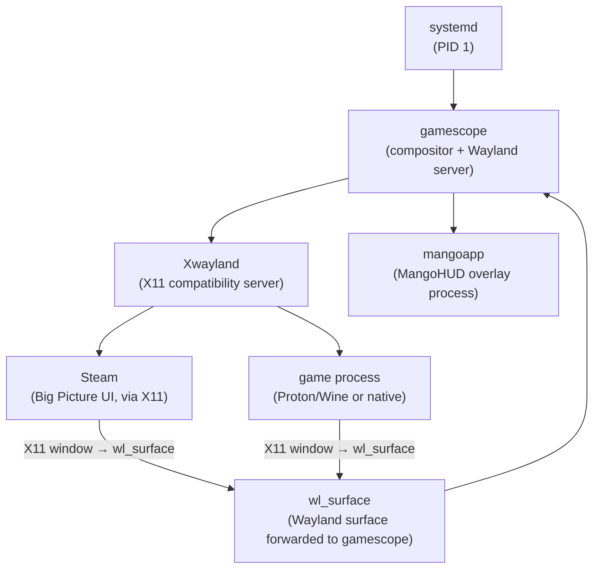
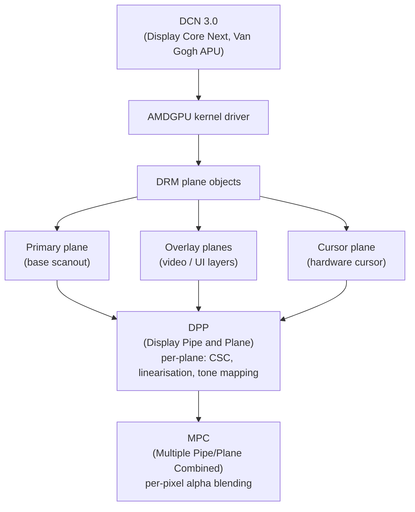
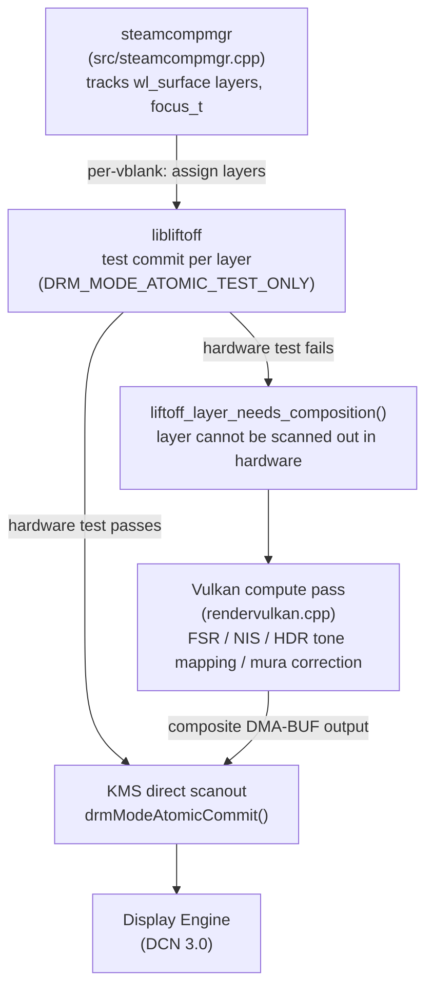
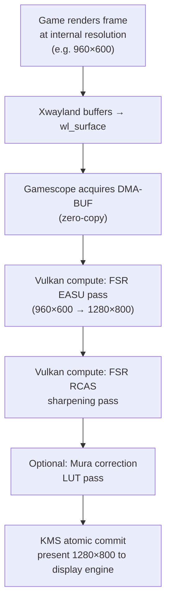
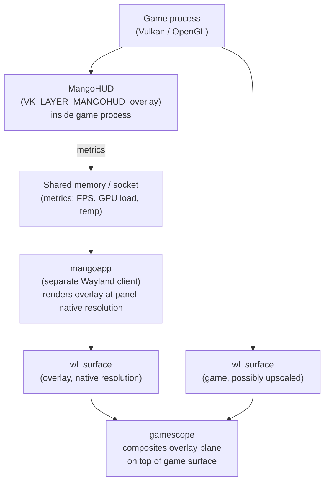
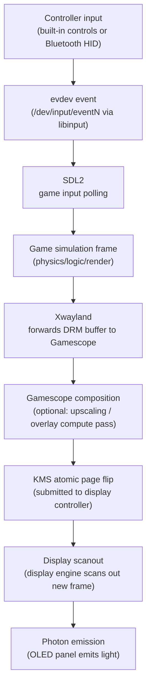

# Chapter 78 — Gamescope and the Steam Deck: A Complete Gaming Graphics Stack

**Target audiences**: Systems and driver developers who need to understand how a shipping gaming appliance integrates every layer of the Linux graphics stack; graphics application developers who want to understand how games run inside a micro-compositor; browser and web platform engineers who need to contrast the gaming graphics path with their own compositor model.

---

## Table of Contents

1. [Steam Deck Hardware: The Van Gogh APU](#1-steam-deck-hardware-the-van-gogh-apu)
2. [SteamOS 3 Architecture](#2-steamos-3-architecture)
3. [Gamescope Architecture](#3-gamescope-architecture)
4. [FSR Scaling in Gamescope](#4-fsr-scaling-in-gamescope)
5. [VRR and Frame Pacing](#5-vrr-and-frame-pacing)
6. [HDR in Gamescope](#6-hdr-in-gamescope)
7. [Mura Correction](#7-mura-correction)
8. [MangoHUD and Performance Overlay](#8-mangohud-and-performance-overlay)
9. [Input Latency Pipeline](#9-input-latency-pipeline)
10. [Docking and External Display](#10-docking-and-external-display)
11. [Integrations](#11-integrations)

---

## 1. Steam Deck Hardware: The Van Gogh APU

The Steam Deck's system-on-chip, codenamed **Van Gogh** internally and designated **AMD Custom GPU 0405** in firmware, is a bespoke **TSMC 7nm** monolithic die that pairs four **AMD Zen 2** CPU cores with an **RDNA 2** GPU fabric on the same piece of silicon. The OLED revision (Sephiroth) shrinks this to **TSMC 6nm**. This integration is the single most consequential hardware decision in the Steam Deck's design: it eliminates the **PCIe** bus entirely between CPU and GPU and allows both to share the same physical **DRAM**. [Source: Chips and Cheese, Van Gogh analysis](https://chipsandcheese.com/p/van-gogh-amds-steam-deck-apu)

The CPU side consists of four **Zen 2** cores in a single **CCX** (Core Complex) with a shared 15 W **TDP** pool dynamically split between CPU and GPU. The GPU contains 8 **Compute Units** organised as 4 **WGPs** (Work Group Processors) running at up to 1.6 GHz, backed by 16 KB per-CU vector **L1** cache, 128 KB shared **L1** per **WGP** pair, and a 1 MB **L2** cache — deliberately sized to compensate for the absence of **Infinity Cache**. Both LCD and OLED models ship with 16 GB **LPDDR5** in a 128-bit unified memory pool; the **amdgpu** kernel driver manages residency via **TTM** (Translation Table Manager), enabling zero-copy paths where **Gamescope** can present a game's **DMA-BUF** framebuffer directly to the display engine. The display engine implements **DCN 3.0** (**Display Core Next** generation 3) and drives a 7-inch 1280×800 **IPS** panel (LCD model, 60 Hz) or a 7.4-inch 1280×800 **OLED** panel (90 Hz, 1000 nits peak **HDR10**, **P3** colour gamut) — the latter being the hardware prerequisite for the **HDR** and mura-correction pipelines described later in this chapter.

**SteamOS 3**, the purpose-built OS layer, derives from **Arch Linux** with an immutable root filesystem and an **A/B partition** scheme for atomic **OTA** updates. The OS exposes two runtime personalities: **Desktop Mode** runs a full **KDE Plasma** session on **Wayland** via **KWin**, while **Game Mode** boots directly into **Gamescope** as the session compositor with **Steam** Big Picture running as its first **Wayland** client.

**Gamescope** ([`https://github.com/ValveSoftware/gamescope`](https://github.com/ValveSoftware/gamescope)) is the micro-compositor at the heart of the gaming stack. It implements its own **Wayland** server (initialised via `wlserver_init()`), embedding **XWayland** for **X11** application compatibility and extending the protocol with custom extensions such as **`gamescope_action_binding`**, **`wp_linux_drm_syncobj_v1`**, and **`gamescope_input_method`**. Its backend abstraction supports **DRM** (native **KMS** direct scanout), **SDL**, nested **Wayland**, and headless modes. At the core of the compositor loop, **`steamcompmgr`** (`src/steamcompmgr.cpp`) decides each vblank whether to directly scanout the game's framebuffer via **`drmModeAtomicCommit()`** or issue an async **Vulkan** compute pass (`src/rendervulkan.cpp`) for composition. Plane assignment is delegated to **libliftoff**, which performs atomic test commits (**`DRM_MODE_ATOMIC_TEST_ONLY`**) to determine which **DCN 3.0** overlay planes can be used in hardware, falling back to the **Vulkan** compositor for layers that fail.

The upscaling pipeline supports **FSR 1** (spatial, two-pass **EASU**/**RCAS** compute shaders), **FSR 2** (temporal with motion vector accumulation), **NIS** (**NVIDIA Image Scaling**, spatial), and integer scaling for pixel art. **Variable Refresh Rate** (**VRR**/**FreeSync**) is negotiated via the **`VRR_ENABLED`** **CRTC** property and managed by `CVBlankTimer`, which predicts vblank events and schedules compositor wakeups via `timerfd_settime()`. **HDR** output uses a **Vulkan** swapchain with **`VK_COLOR_SPACE_HDR10_ST2084_EXT`** and sets the **`HDR_OUTPUT_METADATA`** **KMS** property; tone mapping applies **inverse tone mapping** (**ITM**) for **SDR** content and a peak-brightness reduction pass for native **HDR10** games. **Mura compensation** (introduced in **SteamOS 3.6**) corrects OLED panel luminance non-uniformity via a per-pixel **2D LUT** stored in a **`VkImage`** and applied as a **Vulkan** compute pass after upscaling.

**MangoHUD** provides the on-screen performance overlay, hooking into **Vulkan** applications via the **implicit layer** mechanism (intercepting **`vkQueuePresentKHR`** and **`vkGetDeviceProcAddr`**) and into **OpenGL** games via **`LD_PRELOAD`** wrapping of **`glXSwapBuffers`**/**`eglSwapBuffers`**. Hardware metrics (**GPU** load, **VRAM**, temperature, **AMD RAPL** power) are read from **AMDGPU** sysfs nodes. Inside Gamescope, a dedicated **`mangoapp`** process renders the overlay as a native-resolution **`wl_surface`** to avoid upscaling artefacts on overlay text.

The input latency pipeline runs from **USB HID** or **Bluetooth HID** controller reports through the kernel **evdev** interface and **libinput**, then **SDL2** game polling, **XWayland**, Gamescope composition, and finally a **KMS** atomic page flip to the **OLED** display. Latency is minimised by the frame limiter's just-in-time vblank submission, **`--immediate-flips`** (`DRM_MODE_PAGE_FLIP_ASYNC`) for tear-tolerant scenarios, latency marker **Wayland** extensions, and **`SCHED_FIFO`** real-time scheduling of critical Gamescope threads via **`CAP_SYS_NICE`**.

Docking via **DisplayPort Alternate Mode** (**DP Alt Mode**) over **USB-C** adds an external display path: the **AMDGPU** driver detects connector hotplug via the **DP Aux** channel, re-enumerates connectors with `drmModeGetResources()`, reads **EDID** capabilities, and Gamescope adapts its output resolution and **HDR** metadata accordingly. Docked mode also lifts the **TDP** constraint and adds **USB-A** input peripherals handled transparently by **libinput** and **SDL2**, while **HDMI**/**DP** audio device switching is managed by **PipeWire**. [Source: Chips and Cheese, Van Gogh analysis](https://chipsandcheese.com/p/van-gogh-amds-steam-deck-apu)

### 1.1 CPU

Four Zen 2 cores occupy a single CCX (Core Complex), with boost clocks up to 3.5 GHz. The Steam Deck firmware exposes the CPU TDP as a sliding pool shared with the GPU — the total thermal envelope is 15 W configurable between the two, so a CPU-heavy game can steal budget from the GPU and vice versa. [Source: Steam Deck Specifications, wccftech](https://wccftech.com/steam-deck-specifications-revealed-features-amd-van-gogh-apu-with-zen-2-cpu-rdna-2-gpu-cores/)

### 1.2 GPU

The RDNA 2 GPU contains 8 Compute Units (512 stream processors) organised as 4 Work Group Processors (WGPs), each WGP containing two CUs. Peak clock is 1.6 GHz, yielding about 1.6 TFLOPS FP32. The GPU hierarchy of caches is as follows:

- 16 KB vector L1 cache per CU
- 128 KB shared L1 cache per WGP pair  
- 1 MB L2 cache (deliberately oversized relative to CU count to compensate for DRAM latency)
- No Infinity Cache (unlike discrete RDNA 2 cards) — the bandwidth budget is served directly from LPDDR5

The absence of Infinity Cache is deliberate: at 88 GB/s (LCD) or 102.4 GB/s (OLED), the LPDDR5 bus delivers console-class bandwidth per compute unit. [Source: Chips and Cheese](https://chipsandcheese.com/p/van-gogh-amds-steam-deck-apu) [Source: Tom's Hardware die analysis](https://www.tomshardware.com/pc-components/cpus/steam-decks-custom-amd-processor-exposed)

### 1.3 Unified Memory

Both the LCD and OLED Steam Decks ship with 16 GB LPDDR5 in a four-channel 128-bit configuration. The critical architectural point is that this pool is _unified_: the kernel's amdgpu driver allocates GPU buffers from the same physical address space as ordinary system RAM, using TTM (Translation Table Manager) to control residency. There is no DMA copy from system RAM to a discrete GPU's VRAM — a game's vertex buffers, textures, and framebuffers all live in the same pool.

The implication for the graphics stack: when Gamescope composites a frame, the game's framebuffer DMA-BUF is already in the same memory the display engine reads from. The copy budget is near zero. The drawback is the CPU side of the memory interface: LPDDR5 imposes ~150 ns latency for CPU cache misses, which is noticeably worse than DDR5 channels on desktop platforms. [Source: Chips and Cheese, memory subsystem analysis](https://chipsandcheese.com/p/van-gogh-amds-steam-deck-apu)

### 1.4 Display Engine and Panel

The LCD model ships with a 7-inch 1280×800 IPS panel running at 60 Hz. The OLED model upgrades to a 7.4-inch 1280×800 OLED panel supporting up to 90 Hz refresh and rated at 1000 nits peak HDR brightness (600 nits for SDR). The OLED model's wider colour gamut (P3) and per-pixel self-emission are the hardware prerequisites for Gamescope's HDR and mura-correction pipelines described later in this chapter.

The APU includes AMD's integrated display engine which handles the final scanout: colour-space conversion, gamma encoding, and atomic plane composition are all managed through the standard AMDGPU KMS driver paths. [Source: Notebookcheck, Steam Deck OLED review](https://www.notebookcheck.com/Valve-enthuellt-Steam-Deck-OLED-mit-1-000-Nits-Display-laengerer-Laufzeit-6-nm-APU-und-transparentem-Gehaeuse.766775.0.html)

### 1.5 Why Integration Matters for the Graphics Stack

A discrete GPU connected via PCIe adds at least two heavyweight cost factors to the compositing path:

1. **PCIe DMA latency** — moving a frame from VRAM to system memory (or vice versa) for CPU-driven processing takes microseconds and saturates PCIe bandwidth.
2. **Separate memory pools** — a discrete GPU cannot directly read the CPU's working set without an explicit copy or pinning operation.

On the Steam Deck both constraints vanish. Gamescope can perform zero-copy direct scanout when the game's output framebuffer satisfies the display hardware's format requirements. When compositing is needed — for overlays, upscaling, or HDR tone mapping — the Vulkan compute pass operates on the same physical pages the game just rendered into, without staging buffers.

---

## 2. SteamOS 3 Architecture

SteamOS 3 is Valve's purpose-built OS for the Steam Deck. Its design philosophy is "appliance first": the OS is not a general-purpose desktop distribution with a gaming mode bolted on, but a gaming appliance where a full desktop mode is a secondary capability.

### 2.1 Base and Package Management

SteamOS 3 is derived from Arch Linux and ships packages from the standard Arch repositories (with Valve's own overlays). Critically, the root filesystem is **immutable** — changes applied during a session are discarded at next boot. Persistent user configuration and installed applications live under `/home` and `/var`, which are writeable overlays. [Source: SteamOS Wikipedia](https://en.wikipedia.org/wiki/SteamOS)

System updates use an **A/B partition scheme** similar to Android or ChromeOS: the inactive partition receives the full new root image, and a boot-loader switchover atomically moves the system to the new version at next boot. Rollback is as simple as marking the previous partition active. This gives Valve the ability to ship rapid, atomic OTA updates to millions of handheld devices — a critical operational requirement for a consumer product.

### 2.2 Desktop Mode vs Game Mode

SteamOS 3 offers two runtime personalities:

- **Desktop Mode**: A conventional KDE Plasma session (Plasma 6 in recent SteamOS releases) running on Wayland (KWin compositor). The user gets a full Linux desktop. This mode is reached by switching from the Game Mode overlay. [Source: SteamOS 3.8 Preview, Phoronix](https://www.phoronix.com/news/SteamOS-3.8-Preview)

- **Game Mode**: The default boot target for the Steam Deck. Instead of launching a display manager and a full desktop session, the boot process launches **Gamescope** directly as the compositor. Steam's Big Picture Mode UI runs _inside_ Gamescope as one of its Wayland clients. When a game is launched, it too becomes a Wayland client of Gamescope.

The session switch between modes works via a systemd service toggle. The Game Mode session file (`gamescope-session.service`) is what SteamOS boots into by default. A typical embedded session invocation looks like: [Source: gamescope-session GitHub](https://github.com/Sunderland93/gamescope-session)

```bash
# Simplified gamescope invocation from the SteamOS session unit
gamescope \
    --embedded \
    --xwayland-count 2 \
    --adaptive-sync \
    --hdr-enabled \
    --framerate-limit 60 \
    --mangoapp \
    -- steam -gamepadui -steamos3 -steampal -steamdeck
```

Key flags in Game Mode:
- `--embedded` — KMS/DRM mode, takes control of the display directly
- `--xwayland-count 2` — two XWayland instances, one for Steam UI and one for the game (isolation)
- `--adaptive-sync` — enable FreeSync/VRR if the panel reports capability
- `--hdr-enabled` — enable HDR pipeline on the OLED model
- `--mangoapp` — spawn the mangoapp overlay process

### 2.3 Gamescope as the Session Compositor

Unlike a general-purpose compositor such as KWin or Mutter, Gamescope is a _single-application_ compositor. It does not manage a multi-window desktop; it manages exactly one focused application (the game) plus optional overlays. This narrow scope allows it to make assumptions that general compositors cannot:

- There is always exactly one "primary" surface to display.
- That surface's resolution is under Gamescope's control, not the application's.
- All rendering passes (upscaling, tone mapping, mura correction) are applied deterministically between game frames.

---

## 3. Gamescope Architecture

Gamescope ([`https://github.com/ValveSoftware/gamescope`](https://github.com/ValveSoftware/gamescope)) is written in C++ and builds on several lower-level Linux graphics infrastructure components. Its stated design goal is: _micro-compositor for gaming, with KMS direct scanout for zero-copy, async Vulkan compute for compositing, and liftoff for plane assignment_. [Source: Gamescope GitHub README](https://github.com/ValveSoftware/gamescope/blob/master/README.md)

### 3.1 Session Architecture

When running as an embedded session (Game Mode), the Gamescope process hierarchy is:

```
systemd (PID 1)
  └─ gamescope (compositor + Wayland server)
       ├─ Xwayland (X11 compatibility server)
       │    └─ Steam (Big Picture UI, via X11)
       │    └─ game process (via Proton/Wine or native)
       └─ mangoapp (optional MangoHUD overlay process)
```



Games launched from Steam run as children of the Steam process. Whether the game is a native Linux build or a Windows game running under Proton, it ultimately renders to an X11 window served by the embedded Xwayland instance. Xwayland forwards these surfaces to Gamescope via the Wayland protocol, so Gamescope sees the game's output as a Wayland `wl_surface`.

Because the game lives inside a private Xwayland sandbox, it "sees" a virtual display of Gamescope's choosing. The game believes it is rendering at (for example) 800p; Gamescope then upscales to the panel's native resolution. The game cannot detect or interfere with the host display environment. [Source: Gamescope README](https://github.com/ValveSoftware/gamescope/blob/master/README.md)

### 3.2 Backend Abstraction

Gamescope implements a backend abstraction layer with four concrete backends:

| Backend | Use Case |
|---------|----------|
| **DRM** | Native KMS/DRM access — the Steam Deck Game Mode path |
| **SDL** | Windowed mode for development/testing on a desktop |
| **Wayland** | Nested mode — Gamescope running inside another compositor |
| **Headless** | Automated testing, remote streaming |

The DRM backend uses `libdrm` to open the GPU device node, enumerate connectors and CRTCs, and perform atomic page flips. This is the path that enables direct scanout: Gamescope can present a game's DMA-BUF framebuffer directly to the display engine without any GPU copy. [Source: DeepWiki Gamescope Architecture](https://deepwiki.com/ValveSoftware/gamescope/2-architecture)

### 3.3 Wayland Server and Protocol Extensions

Gamescope implements its own Wayland server rather than embedding an existing library compositor. Initialisation proceeds through `wlserver_init()`, which:

1. Creates a `wl_display`
2. Sets up backends (multi/headless/libinput)
3. Creates a `wl_compositor` and a `wl_seat`
4. Launches an embedded XWayland instance (`gamescope_xwayland_server_t`) for X11 application compatibility
5. Initialises libinput for keyboard and pointer events

The server runs in its own thread via `wlserver_run()`, separated from the compositor thread. Frame commits from clients are queued (via `xdg_commit_queue` and `wayland_commit_queue`) and consumed by the compositor loop. Thread safety is maintained by `wlserver_lock`. [Source: DeepWiki Gamescope Wayland Server](https://deepwiki.com/ValveSoftware/gamescope/2.3-wayland-server)

Gamescope extends standard Wayland with custom protocols:

- **`gamescope_action_binding`** — global hotkey registration (used by Steam to detect overlay activation, e.g., pressing the Steam button)
- **`wp_linux_drm_syncobj_v1`** — explicit GPU synchronisation using DRM syncobjs in place of implicit kernel fences, critical for correct HDR and multi-pass rendering
- **`gamescope_input_method`** — text input optimised for overlay interfaces (e.g., the on-screen keyboard in Big Picture Mode)

**X11 surface tracking**: The XWayland path requires a two-stage match. When an X11 application creates a window, XWayland maps it to a `wl_surface`; Gamescope uses the `WLSurfaceIDAtom` X11 atom to correlate the X11 window ID with the corresponding Wayland surface ID. The `xwayland_surface_commit()` handler then forwards the surface's framebuffer to the compositor manager. [Source: DeepWiki Gamescope Architecture](https://deepwiki.com/ValveSoftware/gamescope/2-architecture)

### 3.4 AMD Display Core Next (DCN) Hardware Planes

The Van Gogh APU's display engine implements **DCN 3.0** (Display Core Next generation 3). DCN 3.0 exposes multiple hardware planes to the AMDGPU kernel driver, which in turn exposes them as DRM plane objects:

- **Primary plane** — the base scanout plane
- **Overlay planes** — general-purpose planes for video or UI layers
- **Cursor plane** — a dedicated hardware cursor overlay

DCN's **DPP (Display Pipe and Plane)** block performs per-plane processing: colour space conversion, linearisation, and tone mapping. The **MPC (Multiple Pipe/Plane Combined)** block blends multiple planes using per-pixel alpha. Atomic register updates in DCN are driven by `VSTARTUP`, `VUPDATE`, and `VREADY` global sync signals, ensuring race-free plane swaps during vblank. [Source: Linux kernel DCN documentation](https://docs.kernel.org/gpu/amdgpu/display/dcn-overview.html)



Gamescope's libliftoff integration maps each active Wayland surface to a DCN overlay plane via DRM atomic requests. When all surfaces fit within available hardware planes, the GPU idle time is near zero — the display engine reads directly from the game's framebuffer pages.

### 3.5 The Compositor Manager: steamcompmgr

The heart of Gamescope is `steamcompmgr` (`src/steamcompmgr.cpp`). This component:

- Tracks all active Wayland surfaces via `steamcompmgr_win_t` window structures
- Maintains focus state (`focus_t`) to know which surface is the "primary" game window
- Decides on each vblank whether to: (a) directly scanout the game's framebuffer via KMS, or (b) issue a Vulkan compute pass to composite multiple layers
- Handles window lifecycle events from both Xwayland and native Wayland clients

[Source: Gamescope steamcompmgr.cpp](https://github.com/ValveSoftware/gamescope/blob/master/src/steamcompmgr.cpp)



### 3.6 Plane Assignment with libliftoff

Direct scanout of multiple surfaces simultaneously requires assigning them to the hardware overlay planes exposed by the DRM/KMS driver. The RDNA 2 display engine provides several overlay planes beyond the primary plane: video planes, cursor planes, and general-purpose overlay planes.

Gamescope uses **libliftoff** ([`https://github.com/emersion/libliftoff`](https://github.com/emersion/libliftoff)) to automate this plane assignment. The workflow is:

```c
/* Compositor creates one liftoff_layer per Wayland surface */
struct liftoff_layer *game_layer = liftoff_layer_create(output);
struct liftoff_layer *overlay_layer = liftoff_layer_create(output);

/* Set KMS properties on each layer */
liftoff_layer_set_property(game_layer, "FB_ID", game_fb_id);
liftoff_layer_set_property(game_layer, "CRTC_W", panel_width);
liftoff_layer_set_property(game_layer, "CRTC_H", panel_height);
liftoff_layer_set_property(game_layer, "zpos", 0);

/* Let libliftoff assign hardware planes */
struct drm_atomic_request *req = drmModeAtomicAlloc();
liftoff_output_apply(output, req, flags);
drmModeAtomicCommit(fd, req, DRM_MODE_PAGE_FLIP_EVENT, NULL);
```

libliftoff internally performs atomic _test_ commits (using `DRM_MODE_ATOMIC_TEST_ONLY`) with various plane assignment combinations to determine which layers can be scanned out in hardware. If a layer fails all hardware tests — due to unsupported formats, bandwidth limits, or z-position conflicts — it sets the `liftoff_layer_needs_composition()` flag, telling Gamescope to include that layer in the Vulkan composition pass instead. [Source: libliftoff compositor.md](https://github.com/emersion/libliftoff/blob/master/doc/compositor.md) [Source: FOSDEM 2020 libliftoff](https://archive.fosdem.org/2020/schedule/event/kms_planes/)

### 3.7 Vulkan Renderer

When direct scanout is impossible (upscaling required, mura correction active, HDR tone mapping needed, or overlays present), Gamescope composites into a new framebuffer using **async Vulkan compute**. The Vulkan path (`src/rendervulkan.cpp`) uses compute shaders to:

1. Sample the game's input surface
2. Apply any active upscaling filter (FSR, NIS, or bilinear)
3. Apply HDR tone mapping
4. Apply mura correction
5. Write the final pixels into a DRM-importable DMA-BUF

By using Vulkan compute rather than graphics pipeline rendering, Gamescope avoids allocating a render pass, framebuffer object, and depth buffer — all of which would be unnecessary overhead for a 2D composition task. The async compute queue allows the pass to overlap with any GPU work the game is still completing for the _next_ frame. [Source: Gamescope rendervulkan.cpp](https://github.com/ValveSoftware/gamescope/blob/master/src/rendervulkan.cpp)

---

## 4. FSR Scaling in Gamescope

One of Gamescope's most visible features is its built-in upscaling pipeline. Rather than requiring games to natively support upscaling techniques, Gamescope intercepts the game's output framebuffer and applies the upscaler as a post-process compute pass. This is fundamentally different from in-game FSR: the game renders at a lower resolution, and Gamescope upscales to the panel.

### 4.1 FSR 1 (Spatial Upscaling)

AMD FidelityFX Super Resolution 1.0 is a purely spatial algorithm. Its two-pass structure is:

1. **EASU** (Edge-Adaptive Spatial Upsampling) — a Lanczos-like upscaling kernel that detects edges in the input image and applies directional filtering to preserve them. Implemented as a single compute dispatch.
2. **RCAS** (Robust Contrast Adaptive Sharpening) — an optional second pass that restores fine detail lost during upscaling by applying local contrast enhancement.

Enable in Gamescope with:

```bash
gamescope -w 960 -h 600 -W 1280 -H 800 -F fsr -- %command%
```

Here `-w/-h` is the game's internal render resolution; `-W/-H` is the output panel resolution; `-F fsr` routes the upscaling through the FSR EASU/RCAS compute shaders. Sharpness is adjustable at runtime via `Super+U` (toggle) and `Super+I`/`Super+O` (intensity). [Source: Gamescope README](https://github.com/ValveSoftware/gamescope/blob/master/README.md)

### 4.2 FSR 2 (Temporal Upscaling)

FSR 2 extends the algorithm with temporal accumulation. Rather than using only the current frame, FSR 2 accumulates history frames using motion vectors provided by the game engine. This produces significantly higher quality at comparable upscale ratios, at the cost of requiring game integration to output motion vector and depth information.

In the Gamescope context, FSR 2 support requires games to explicitly output a motion vector buffer alongside the colour buffer — this is available only in games that have integrated FSR 2 natively (e.g., via the AMD FSR 2 SDK). When the game provides motion vectors, Gamescope can feed them into the temporal accumulation pass.

**Note: needs verification** — the exact interface by which games pass motion vectors to Gamescope's FSR 2 path (whether via a Gamescope-specific Wayland protocol or a standard hint) is not fully documented in public sources as of this writing. Check the Gamescope wiki and commit history for the current status.

### 4.3 NIS (NVIDIA Image Scaling)

NVIDIA Image Scaling v1.0.3 is available as a fallback upscaler (`-F nis`). Like FSR 1, NIS is a purely spatial compute shader, but it uses a different sharpening approach (directional scaled scaling algorithm). Despite its name, NIS runs on any Vulkan-capable GPU including RDNA 2. [Source: Gamescope README](https://github.com/ValveSoftware/gamescope/blob/master/README.md)

### 4.4 Integer Scaling and Pixel Art

For retro games and pixel art titles, Gamescope supports integer scaling (`-S integer`), which scales each source pixel to a precise integer multiple of destination pixels. This avoids the blurring inherent in fractional upscaling and preserves sharp pixel boundaries.

### 4.5 The Scaling Pipeline in Practice

The scaling compute dispatch in Gamescope runs after the game's last frame has been acquired from Xwayland/Wayland but before the KMS page flip. The pipeline within a single frame looks like:



```
Game renders frame at (960×600) → Xwayland buffers → wl_surface
  ↓
Gamescope acquires DMA-BUF (zero-copy)
  ↓
Vulkan compute: FSR EASU pass (960×600 → 1280×800)
  ↓
Vulkan compute: FSR RCAS sharpening pass
  ↓
[Optional] Mura correction LUT pass
  ↓
KMS atomic commit: present 1280×800 output to display engine
```

---

## 5. VRR and Frame Pacing

### 5.1 VRR Support

Gamescope supports Variable Refresh Rate via the `--adaptive-sync` command-line flag. The implementation lives in the DRM backend (`src/drm.cpp`) and exposes three X11 root window atoms for application communication:

- `GAMESCOPE_VRR_ENABLED` — user-requested preference
- `GAMESCOPE_VRR_CAPABLE` — whether the connector's KMS properties indicate VRR support
- `GAMESCOPE_VRR_FEEDBACK` — whether VRR is actually active

The DRM backend detects VRR capability by checking the `vrr_capable` property on the connector and the `VRR_ENABLED` property on the CRTC. When VRR is activated, the atomic commit request sets `VRR_ENABLED=1` on the relevant CRTC, and the kernel's AMDGPU display driver negotiates FreeSync (VESA Adaptive Sync) with the connected panel. [Source: Gamescope VRR commit](https://github.com/ValveSoftware/gamescope/commit/ec6bd30bb61e63d29536fc1e39c0326c11da7b5c)

**Note**: The original Steam Deck LCD panel does not support VRR. The OLED panel supports 48–90 Hz VRR. External displays connected via the USB-C dock may support VRR depending on the monitor.

### 5.2 The 40 fps / 40 Hz Sweet Spot

Valve's specific innovation for Steam Deck battery life is the **40 fps at 40 Hz** operating point. The LCD Steam Deck supports a 40 Hz display mode (SteamOS 3.2 introduced per-game refresh rate control). At 40 fps:

- Frame time is exactly 25 ms, positioned halfway between 30 fps (33 ms) and 60 fps (16.7 ms)
- Perceived smoothness is substantially better than 30 fps
- GPU power budget can be reduced relative to 60 fps targets
- The frame limiter and display refresh are perfectly synchronised (no tearing, no judder)

[Source: SteamOS 3.2 refresh rate feature, GSMArena](https://m.gsmarena.com/newscomm-54457.php)

### 5.3 VBlank Timing: CVBlankTimer

Gamescope's frame pacing system is centred on the `CVBlankTimer` class, which predicts display vblank events and schedules wakeups accordingly. The timing model uses three components:

1. **Draw time feedback loop**: After each composite pass, the actual wall-clock duration is recorded via `UpdateLastDrawTime()`. This feeds into an exponential rolling average (98% retention factor, default 3 ms rolling maximum).

2. **Safety margin (red zone)**: A fixed 1.65 ms buffer is added to the rolling draw time estimate. This ensures Gamescope wakes up early enough to complete composition and submit the atomic flip before the vblank deadline even under scheduling jitter.

3. **Wakeup scheduling**: `CalcNextWakeupTime()` computes the wakeup timestamp as `next_vblank_predicted - rolling_draw_time - safety_margin`. The wakeup is programmed either via `timerfd_settime()` (precise kernel-level timer) or via a dedicated nudge thread that writes to a pipe.

[Source: DeepWiki Display Synchronization](https://deepwiki.com/ValveSoftware/gamescope/3.2-display-synchronization)

### 5.4 VRR Mode Frame Timing

When VRR is active, the fixed-interval timing model becomes unnecessary. The CRTC will adapt its refresh rate to match whenever a new frame is submitted (within the FreeSync range). Gamescope therefore:

- Bypasses the rolling draw-time calculation
- Uses a minimal 300 µs red zone (`kVRRFlushingTime`) instead of 1.65 ms
- Submits frames as soon as the application and compositor are ready, allowing the display to adapt dynamically

The epoll-based main event loop (`CWaiter` / `IWaitable` abstraction) handles both the timerfd path and socket events from Wayland clients in a single poll call, minimising latency between a new frame arriving and its submission to the display. [Source: DeepWiki Display Synchronization](https://deepwiki.com/ValveSoftware/gamescope/3.2-display-synchronization)

### 5.5 Frame Rate Limiting

The `-r N` flag limits the game's effective frame rate. When enabled, Gamescope withholds the DRM page flip until the appropriate deadline, preventing the game from queuing more frames than the display can consume. This gives predictable frame times but can introduce slight input latency relative to the uncapped case — a known trade-off discussed in more detail in Section 9.

---

## 6. HDR in Gamescope

### 6.1 Hardware Prerequisites

The Steam Deck OLED's 7.4-inch panel is HDR10-capable: 1280×800 pixels at up to 90 Hz, with 1000 nits peak HDR brightness and a P3 colour gamut. HDR output requires the KMS `HDR_OUTPUT_METADATA` property to be set on the connector, which the AMDGPU driver supports via the standard Linux HDR metadata infrastructure. [Source: Steam Deck OLED specs, Notebookcheck](https://www.notebookcheck.com/Valve-enthuellt-Steam-Deck-OLED-mit-1-000-Nits-Display-laengerer-Laufzeit-6-nm-APU-und-transparentem-Gehaeuse.766775.0.html)

### 6.2 Enabling HDR

HDR is enabled in Gamescope with:

```bash
gamescope --hdr-enabled -- %command%
```

Internally, Gamescope creates its Vulkan swapchain with the `VK_COLOR_SPACE_HDR10_ST2084_EXT` color space, signalling to the driver that the compositor will deliver HDR10 PQ-encoded content. On the KMS side, Gamescope sets the `HDR_OUTPUT_METADATA` blob on the DRMC connector with the static HDR metadata (MaxCLL, MaxFALL, primaries) sourced from the display's EDID. [Source: Gamescope HDR issue #617](https://github.com/Plagman/gamescope/issues/617)

For games running via Proton that support HDR, Gamescope uses a custom Wayland protocol alongside a Vulkan layer to allow HDR content to bypass Xwayland without colour space conversions. As described in KWin HDR documentation, the `frog_color_management_v1` protocol allows a Wayland client to assert its colour space and transfer function directly to the compositor. [Source: KWin HDR blog](https://zamundaaa.github.io/wayland/2024/05/11/more-hdr-and-color.html)

### 6.3 Tone Mapping

For SDR games running in an HDR session, Gamescope applies **inverse tone mapping** (ITM) — lifting the 0–100 nit SDR signal into a brighter HDR range. This is controlled by:

```bash
--hdr-itm-enabled                   # enable SDR→HDR inverse tone mapping
--hdr-itm-sdr-nits 100              # assumed brightness of SDR content (default 100 nits)
--hdr-itm-target-nits 1000          # target peak brightness for HDR output (default 1000 nits)
```

For native HDR games, the game provides HDR10 PQ content directly. Gamescope may apply a **tone mapping** pass to ensure the game's stated peak brightness (which could be 4000+ nits) is correctly mapped to the panel's actual 1000-nit capability. [Source: Gamescope HDR ITM issue](https://github.com/ValveSoftware/gamescope/issues/1487)

### 6.4 OLED Colour Calibration

The Steam Deck OLED ships with a factory calibration profile for each unit, encoding the measured ICC-style colour transformation for that specific panel. Gamescope loads this profile and applies the colour matrix as part of the Vulkan composite pass, correcting for panel-to-panel variation in white point and colour primaries. This is particularly important for HDR content where inaccurate primaries produce visibly wrong colours.

---

## 7. Mura Correction

### 7.1 What Is OLED Mura?

**Mura** (Japanese for "unevenness") describes luminance and colour non-uniformity in OLED panels caused by pixel-level variation in the organic emitter deposition process. On a 1000-nit OLED at a mid-grey level, mura appears as subtle patches of lighter or darker areas across the panel — invisible on most content but visible on flat-colour test patterns or dark scenes. All OLED panels exhibit some degree of mura; factory calibration on the steam Deck OLED measures it and stores a per-panel correction profile.

### 7.2 Why Compositor-Level Correction?

Mura correction must be performed _after_ all content rendering and _before_ the signal reaches the panel. A game cannot correct for mura because it does not know the panel's individual calibration data. The display hardware itself (the display controller's lookup table) could in principle apply correction, but it would need to operate after any compositor post-processing (upscaling, HDR tone mapping) to avoid compounding errors. The compositor is the last GPU-side processing stage before the display engine, making it the correct location.

### 7.3 Implementation in Gamescope

SteamOS 3.6 introduced Mura Compensation as an official Gamescope feature. The implementation applies a per-pixel luminance correction using a **2D LUT** (Look-Up Table) stored in a Vulkan `VkImage`. Each texel in the LUT encodes the offset to apply to the raw pixel value at that screen position.

The Vulkan compute shader for mura correction runs as a pass in the composition pipeline:

```glsl
// Simplified illustrative compute shader (not verbatim Gamescope source)
layout(local_size_x = 8, local_size_y = 8) in;

layout(set = 0, binding = 0) uniform sampler2D inputImage;
layout(set = 0, binding = 1) uniform sampler2D muraLUT;   // per-pixel correction offsets
layout(set = 0, binding = 2, rgba16f) uniform writeonly image2D outputImage;

void main() {
    ivec2 coord = ivec2(gl_GlobalInvocationID.xy);
    vec2 uv = (vec2(coord) + 0.5) / vec2(imageSize(outputImage));

    vec4 color = texture(inputImage, uv);
    vec4 correction = texture(muraLUT, uv);  // per-pixel correction

    // Apply multiplicative luminance correction
    color.rgb *= correction.rgb;

    imageStore(outputImage, coord, color);
}
```

The mura LUT is loaded from the per-device calibration file during Gamescope initialisation. Valve generates these calibration files during factory testing by photographing the panel under controlled illumination at multiple brightness levels. [Source: SteamOS 3.6 mura compensation, GamingOnLinux](https://www.gamingonlinux.com/2024/10/steam-deck-steamos-36-officially-out-with-improved-performance-mura-compensation-lots-more/)

### 7.4 Enabling and Disabling Mura Compensation

Mura compensation can be toggled via an X11 atom:

```bash
DISPLAY=:0 xprop -root -f GAMESCOPE_COLOR_MURA_CORRECTION_DISABLED 32c \
    -set GAMESCOPE_COLOR_MURA_CORRECTION_DISABLED 0   # enable
    -set GAMESCOPE_COLOR_MURA_CORRECTION_DISABLED 1   # disable
```

Known interaction: mura compensation and FSR/NIS upscaling interact at the pass ordering level. When upscaling is active, the mura LUT (which encodes per-panel-pixel corrections) must be applied _after_ upscaling (since upscaling changes the pixel correspondence). Early implementations had ordering bugs where the mura map was composited before upscaling, producing washed-out output with NIS. [Source: Gamescope issue #1142](https://github.com/ValveSoftware/gamescope/issues/1142)

---

## 8. MangoHUD and Performance Overlay

### 8.1 Overview

MangoHUD ([`https://github.com/flightlessmango/MangoHud`](https://github.com/flightlessmango/MangoHud)) is the standard on-screen performance monitoring overlay for Linux gaming. On the Steam Deck it is integrated into the Quick Access Menu, displaying FPS, GPU/CPU load, temperatures, frame time graphs, and VRAM usage.

### 8.2 Vulkan Implicit Layer Mechanism

MangoHUD hooks into Vulkan applications via the **implicit layer** mechanism defined by the Vulkan Loader specification. An implicit layer loads into every Vulkan application without explicit opt-in by the application.

The layer is registered by placing a JSON manifest in a standard discovery path:

```
~/.local/share/vulkan/implicit_layer.d/MangoHud.x86_64.json   (64-bit)
~/.local/share/vulkan/implicit_layer.d/MangoHud.x86.json       (32-bit)
```

A typical manifest:

```json
{
    "file_format_version" : "1.0.0",
    "layer" : {
        "name": "VK_LAYER_MANGOHUD_overlay_x86_64",
        "type": "GLOBAL",
        "library_path": "/usr/lib/mangohud/libMangoHud.so",
        "api_version" : "1.2.203",
        "implementation_version" : "1",
        "description" : "Vulkan overlay layer",
        "enable_environment": { "MANGOHUD": "1" },
        "functions": {
            "vkGetInstanceProcAddr": "overlay_vkGetInstanceProcAddr",
            "vkGetDeviceProcAddr":   "overlay_vkGetDeviceProcAddr"
        }
    }
}
```

The Vulkan loader calls `vkGetInstanceProcAddr` from the layer for every Vulkan function, allowing MangoHUD to wrap `vkQueuePresentKHR` to measure present-to-present intervals (the basis of the FPS counter). [Source: MangoHUD GitHub](https://github.com/flightlessmango/MangoHud) [Source: MangoHUD README](https://github.com/flightlessmango/MangoHud/blob/master/README.md)

### 8.3 The VkInstance Interception Path

At a lower level, MangoHUD's Vulkan layer works by intercepting `vkGetInstanceProcAddr` and `vkGetDeviceProcAddr`. The Vulkan loader calls these functions on each layer in the chain. MangoHUD returns its own wrapper for functions it wants to monitor:

```c
/* Simplified illustration of MangoHUD's layer dispatch table override */
PFN_vkVoidFunction VKAPI_CALL overlay_vkGetDeviceProcAddr(
    VkDevice device, const char *pName)
{
    if (strcmp(pName, "vkQueuePresentKHR") == 0)
        return (PFN_vkVoidFunction)&overlay_vkQueuePresentKHR;
    if (strcmp(pName, "vkCreateSwapchainKHR") == 0)
        return (PFN_vkVoidFunction)&overlay_vkCreateSwapchainKHR;
    /* Fall through to next layer */
    return device_dispatch[device].GetDeviceProcAddr(device, pName);
}
```

The `overlay_vkQueuePresentKHR` wrapper records a timestamp before calling down to the next layer's `vkQueuePresentKHR`. The delta between successive calls is the frame time, from which FPS is derived. The overlay itself is rendered between the game's last draw and the present call, using a secondary command buffer that blends into the swapchain image. [Source: MangoHUD GitHub](https://github.com/flightlessmango/MangoHud)

### 8.4 Hardware Counter Collection

MangoHUD collects hardware metrics through Linux kernel interfaces:

- **GPU load and clock**: Read from `/sys/class/drm/card0/device/gpu_busy_percent` and `/sys/class/drm/card0/device/pp_dpm_sclk` — sysfs files exported by the AMDGPU driver's power management subsystem.
- **VRAM usage**: Read from `/sys/class/drm/card0/device/mem_info_vram_used` and `mem_info_vram_total`.
- **GPU temperature**: Via hwmon at `/sys/class/hwmon/hwmon*/temp*_input`, where the relevant hwmon device is the one associated with the AMDGPU PCI device.
- **CPU temperature**: Via hwmon sensors, with support for custom sensor paths via `cpu_custom_temp_sensor=` in `MANGOHUD_CONFIG`.
- **CPU power**: Uses AMD RAPL (Running Average Power Limit) via `/sys/class/powercap/intel-rapl` or AMD Zen-specific drivers (`zenpower3`, `zenergy`).
- **Frame time**: Measured at the `vkQueuePresentKHR` boundary within the Vulkan layer.

[Source: MangoHUD README](https://github.com/flightlessmango/MangoHud/blob/master/README.md)

### 8.5 OpenGL Hooking

For OpenGL games (including those using DXVK's OpenGL path or native OpenGL titles), MangoHUD uses `LD_PRELOAD` and `dlsym` hooking to intercept `glXSwapBuffers` (GLX) and `eglSwapBuffers` (EGL). The overlay renders using a secondary OpenGL context that shares the display connection but renders to a separate framebuffer composited on top of the game's output. [Source: MangoHUD README](https://github.com/flightlessmango/MangoHud/blob/master/README.md)

### 8.6 Gamescope Integration: mangoapp

When running inside Gamescope, the standard MangoHUD injection approach — inserting into the game process — means the overlay is composited into the game surface before Gamescope sees it. This prevents Gamescope from applying upscaling only to the game content while keeping the overlay at native resolution (upscaling text produces blurry results).

The solution is **mangoapp**, a separate process that runs alongside Gamescope:

```bash
gamescope --mangoapp -- %command%
```

`mangoapp` is a dedicated Wayland client that renders the performance overlay at the panel's native resolution as a separate `wl_surface`. Gamescope composites it as an overlay plane on top of the (possibly upscaled) game surface. The information displayed by `mangoapp` is communicated from MangoHUD (inside the game process) to `mangoapp` via shared memory or a socket. This architecture ensures the overlay is always crisp regardless of the internal render resolution. [Source: MangoHUD README](https://github.com/flightlessmango/MangoHud/blob/master/README.md)



---

## 9. Input Latency Pipeline

### 9.1 The Input-to-Photon Chain

On the Steam Deck, the full latency chain from physical input to photon emission runs through:

1. **Controller input** (Steam Deck built-in controls or Bluetooth controller) → USB HID or Bluetooth HID report arriving in the kernel's input subsystem
2. **evdev event** delivered to the `libinput` session via the kernel's `/dev/input/eventN` interface
3. **SDL2** game input polling (most games use SDL2 for input, even under Proton)
4. **Game simulation frame** — the game samples input, runs physics/logic, and submits a rendered frame
5. **Xwayland** — the rendered frame (as a DRM buffer) is forwarded to Gamescope
6. **Gamescope composition** (if needed) — upscaling/overlay compute pass
7. **KMS atomic page flip** — submitted to the display controller
8. **Display scanout** — the display engine starts scanning out the new frame
9. **Photon emission** — the OLED panel emits light within microseconds of the scan line reaching the pixel



The dominant latency contributors are steps 4 (game frame latency, proportional to 1/FPS) and 5–8 (compositor processing and display pipeline). [Source: Gamescope input latency issue #474](https://github.com/ValveSoftware/gamescope/issues/474)

### 9.2 Minimising Queued Frames

The primary latency reduction strategy in Gamescope is to keep the number of frames queued for display to a minimum. The naive approach — let the game render as fast as possible and buffer frames — adds frame-pipeline latency of one or more frame times (16.7 ms at 60 fps).

Gamescope's frame limiter (Section 5.5) controls this by withholding the flip signal until just before the next vblank, allowing the game to render _one_ frame ahead rather than several. The `CVBlankTimer` wakeup mechanism (Section 5.3) attempts to deliver the new game frame to the display at the optimal moment: as late as possible while still meeting the vblank deadline.

### 9.3 Immediate Flips

For further latency reduction, `--immediate-flips` tells Gamescope to submit the page flip with `DRM_MODE_PAGE_FLIP_ASYNC`, bypassing vblank synchronisation. This can introduce tearing (the display may scan out a partially-updated buffer) but eliminates the wait for the next vblank. Competitive gaming scenarios where sub-frame latency matters more than tear-free output may benefit from this mode. [Source: Gamescope README](https://github.com/ValveSoftware/gamescope/blob/master/README.md)

### 9.4 Frame Latency Markers

Gamescope exposes a Wayland extension that allows Steam and game clients to send **latency markers** — timestamps embedded in the frame metadata indicating when the input event that caused this frame was sampled. This allows Gamescope to align its display scheduling to minimise the time between input sampling and pixel display. The markers propagate through the Xwayland path via X11 atoms and are consumed by the Gamescope DRM backend to fine-tune the flip timing. [Source: DeepWiki Display Synchronization](https://deepwiki.com/ValveSoftware/gamescope/3.2-display-synchronization)

### 9.5 realtime Scheduling

When running as the session compositor on the Steam Deck, Gamescope holds `CAP_SYS_NICE` capability and sets its critical threads (the epoll main loop, the Vulkan submit thread) to SCHED_FIFO (real-time FIFO scheduling) at an elevated priority. This prevents kernel scheduler jitter from delaying the vblank deadline submission. The `libliftoff` documentation notes that this capability "significantly reduces latency and improves frame pacing." [Source: libliftoff documentation and gamescope issues](https://github.com/emersion/libliftoff)

---

## 10. Docking and External Display

### 10.1 USB-C DisplayPort Alt Mode

The Steam Deck's USB-C port implements **DisplayPort Alternate Mode (DP Alt Mode)** over the USB4/USB 3.2 physical interface. This allows the USB-C connector to carry native DisplayPort 1.4 signals alongside USB data and power delivery — no DisplayPort conversion or re-encoding is involved. The official Valve Steam Deck Docking Station and third-party docks expose an HDMI 2.0 port (which receives the DP signal and re-encodes it to HDMI) and optionally a native DP port.

**Capability**: DP 1.4 over USB-C supports up to 8K@60 Hz or 4K@120 Hz in theory; in practice the Steam Deck dock targets 4K@60 Hz for HDMI 2.0 output. [Source: USB-C DP Alt Mode, Steam Deck forum](https://github.com/ValveSoftware/SteamOS/issues/1140)

### 10.2 KMS Mode Detection and Hotplug

When a dock is connected, the AMDGPU driver detects the new connector via a hotplug interrupt from the DP Aux channel. The kernel generates a DRM hotplug uevent, which Gamescope receives via a `udev` monitor. Gamescope then:

1. Re-enumerates available connectors via `drmModeGetResources()`
2. Reads the new connector's EDID (capabilities, supported modes, HDR metadata if present)
3. Negotiates a new display mode with the CRTC
4. Updates its internal output resolution and restarts the composition pipeline

If both the built-in panel and an external display are connected, Gamescope selects the appropriate output based on system configuration (typically prioritising the external display when docked).

### 10.3 Resolution and Refresh Adaptation

When switching from the built-in 1280×800 panel (60 or 90 Hz) to an external 1920×1080 or 3840×2160 display, Gamescope adapts its output resolution without requiring a game restart. The game continues running at its configured internal resolution (e.g., 960×540) and Gamescope rescales to the new output. The FSR or NIS upscale pass simply changes its output dimensions.

### 10.4 HDR on Docked External Displays

HDR behaviour on docked displays depends on the external monitor's capabilities as advertised in its EDID. If the EDID declares HDR10 support (via the `HDR Static Metadata` data block in the HDMI/DP EDID), Gamescope will pass HDR10 PQ content and set the `HDR_OUTPUT_METADATA` KMS property accordingly. If the external display is SDR, Gamescope applies its tone mapping pipeline to produce an SDR signal from HDR content.

A known compatibility issue: some displays connected via HDMI 2.0 (which re-encodes DP 1.4) drop the HDR capability advertisement even on HDR-capable monitors. This is a firmware/EDID parsing issue in the dock rather than a Gamescope limitation. [Source: SteamOS issue #1140](https://github.com/ValveSoftware/SteamOS/issues/1140)

### 10.5 Handheld vs. Docked Mode

Beyond display resolution changes, docking also affects:

- **TDP allocation**: The Steam Deck can sustain higher GPU clocks when plugged into wall power via the dock (the power delivery removes the battery-discharge constraint).
- **Refresh rate**: External displays typically offer 60 Hz or 144 Hz; the 40 Hz optimisation is irrelevant for most external monitors.
- **Input**: The dock exposes USB-A ports for mice, keyboards, and controllers; SDL2 and libinput handle these transparently.
- **Audio**: HDMI/DP audio is exposed via a new ALSA/PipeWire audio device, which Gamescope does not manage directly (PipeWire handles device switching).

---

## Roadmap

### Near-term (6–12 months)

- **Expanded hardware platform support**: Gamescope 3.x (SteamOS 3.8.7+) has landed initial Intel Arc GPU support, with MSI Claw 8 AI+ and Arc B580 desktop GPUs running SteamOS/Gamescope as of June 2026. Ongoing work targets VRR flickering on FreeSync+HDR Intel paths. [Source: HotHardware, SteamOS Intel Arc support](https://hothardware.com/news/valve-steamos-gain-intel-gpu-support) [Source: PC Guide](https://www.pcguide.com/news/steamos-support-for-intel-hardware-means-you-can-now-install-it-on-an-msi-claw-or-arc-b580-desktop/)
- **FSR 3 / frame generation integration**: AMD FidelityFX Super Resolution 3 (frame generation via Fluid Motion Frames) has been shipping in the FidelityFX SDK; integration into Gamescope's Vulkan compute compositor — where it would benefit all games uniformly rather than requiring per-title support — is actively discussed on the Gamescope issue tracker. Note: no merged PR confirmed at time of writing; needs verification.
- **HDR and Wayland colour-management stabilisation**: Gamescope's HDR handshake with KWin's `xx-color-management-v4` Wayland protocol is a known breakage point (Gamescope issue #2000, #2037). Near-term work focuses on aligning Gamescope's colour management extension with the standardised `wp_color_management_v1` protocol being ratified on the Wayland freedesktop list. [Source: Gamescope issue #2037](https://github.com/ValveSoftware/gamescope/issues/2037)
- **VRAM budget management for low-VRAM GPUs**: A Valve developer landed improvements to reduce VRAM pressure for GPUs with limited memory (under 8 GB), enabling Gamescope's compositor targets to spill more gracefully. [Source: ProPakistani, Valve VRAM improvement April 2026](https://propakistani.pk/2026/04/10/valve-dev-brings-new-linux-gaming-improvement-for-gpus-with-limited-vram/)
- **Improved desktop-mode VRR**: SteamOS 3.x updates are bringing VRR support to KDE Plasma desktop mode (not just Game Mode), aligning the Desktop Mode KWin session with the Gamescope Game Mode feature set. [Source: SteamOS 3.8 Preview, Phoronix](https://www.phoronix.com/news/SteamOS-3.8-Preview)

### Medium-term (1–3 years)

- **Steam Deck 2 / next-generation APU**: Valve has confirmed it is waiting for a major silicon architecture leap (beyond RDNA 4 / Zen 5 iterations) before shipping Steam Deck 2. The next platform will likely require Gamescope to support higher native resolutions (900p or 1080p handheld target), LPDDR5X unified memory, and updated DCN display engine paths. [Source: Tom's Hardware, Valve Steam Deck 2 silicon comments](https://www.tomshardware.com/video-games/handheld-gaming/valve-is-waiting-for-major-architectural-improvements-on-future-silicon-before-creating-the-steam-deck-2-drastically-better-performance-with-the-same-battery-life-is-not-enough)
- **Native Wayland application support in Game Mode**: Gamescope currently embeds XWayland for all X11 games; native Wayland game support (Vulkan WSI over Wayland without XWayland) is planned but gated on Wayland swapchain feedback latency-marker extensions being deployed broadly. The `wp_fifo_v1` and `wp_commit_timing_v1` Wayland protocols are candidates to replace the current Gamescope latency-marker extension. [Source: Arch Wiki Gamescope](https://wiki.archlinux.org/title/Gamescope)
- **Steam Machine 2026 platform**: Valve is launching a Steam Machine product in 2026, extending SteamOS/Gamescope to desktop-class GPUs from AMD, Intel, and potentially NVIDIA. This broadens Gamescope from a single-hardware compositor to a multi-vendor platform requiring more robust IHV-neutral paths. [Source: Geeky Gadgets, Valve Steam Machine 2026](https://www.geeky-gadgets.com/valve-steam-machine-2026-launch-2026/)
- **AI-upscaling integration**: With AMD XESS-style neural upscalers and AMD's own AI Super Resolution landing on RDNA 4+, integration of ML-accelerated upscaling passes into Gamescope's compositor pipeline is under discussion, replacing or supplementing FSR spatial passes for hardware that supports NPU/shader-based inference. Note: no confirmed Gamescope implementation; needs verification.
- **Mura correction generalisation**: The per-panel 2D LUT mura correction introduced for the Steam Deck OLED is expected to generalise to future handheld OLED panels across partner hardware running SteamOS. Note: needs verification of public roadmap.

### Long-term

- **Kernel-mode scheduling integration**: Long-term Gamescope latency improvements may depend on in-kernel compositor-aware scheduling (similar to what is proposed in the DRM scheduler / `drm_sched` rework) so that the kernel can prioritise Gamescope's Vulkan submit queue above other GPU workloads without requiring `SCHED_FIFO` userspace workarounds. Note: no confirmed kernel patchset targeting this; needs verification.
- **Unified SteamOS gaming compositor across form factors**: Valve's trajectory suggests a single Gamescope binary (with backend plugins for handheld DRM, desktop Wayland nested, and headless) spanning Steam Deck, Steam Machines, and potential future VR/AR hardware, sharing the same FSR/HDR/colour-management Vulkan passes. [Source: Geeky Gadgets, Steam Machine 2026](https://www.geeky-gadgets.com/valve-steam-machine-2026-launch-2026/)
- **Frame-timing protocol standardisation on Wayland**: Gamescope's custom latency-marker and frame-pacing Wayland extensions may eventually be submitted to the Wayland protocol working group for standardisation, enabling other compositors (KWin, Mutter) to implement the same just-in-time vblank scheduling that gives Gamescope its input-to-photon latency advantage. Note: speculative; no active freedesktop proposal confirmed at time of writing.

---

## 11. Integrations

This chapter intersects with the following chapters throughout the book:

- **Ch2 — KMS Display Pipeline**: Gamescope's DRM backend (`src/drm.cpp`) is a client of the KMS atomic commit API described in Ch2. All plane assignments, CRTC mode changes, and page flips flow through `drmModeAtomicCommit()`. VRR is enabled via the `VRR_ENABLED` CRTC property defined in Ch2.

- **Ch3 — Advanced Display Features**: VRR (FreeSync/Adaptive Sync) negotiation between the AMDGPU driver and the panel is the mechanism Ch3 describes. Gamescope's `drm_set_vrr_enabled()` function exercises this path. HDR metadata passthrough via `HDR_OUTPUT_METADATA` is also a Ch3 topic.

- **Ch5 — x86 GPU Drivers (AMDGPU)**: The Van Gogh APU is managed by the AMDGPU kernel driver. TTM memory management (Ch5) governs how game framebuffers and Gamescope's composition targets are allocated in unified LPDDR5 memory. MangoHUD's sysfs metrics are exported by AMDGPU's power management subsystem (Ch5).

- **Ch21 — Building Compositors with wlroots**: While Gamescope does not use wlroots directly in its current form (it has its own Wayland server implementation), many concepts — backend abstraction, surface lifecycle, Wayland protocol handling — parallel the wlroots patterns described in Ch21. The Gamescope issue tracker discusses past wlroots integration attempts.

- **Ch22 — Production Compositors**: Gamescope is itself a production compositor, contrasting with KWin (Desktop Mode on SteamOS) and Mutter. Ch22's treatment of compositor architecture, direct scanout, and overlay plane management applies directly to Gamescope's DRM backend.

- **Ch24 — Vulkan Swapchains and WSI**: Gamescope's HDR swapchain uses `VK_EXT_swapchain_colorspace` with `VK_COLOR_SPACE_HDR10_ST2084_EXT`. The swapchain WSI integration between games and Gamescope is the WSI layer Ch24 describes.

- **Ch25 — Vulkan Compute Shaders**: All of Gamescope's scaling (FSR, NIS), mura correction, and HDR tone mapping passes are Vulkan compute dispatches. Ch25's treatment of compute queues, descriptor sets, and push constants applies directly to these passes.

- **Ch28 — Windows Compatibility (Proton/DXVK)**: Games running under Proton are Gamescope's most common clients. The game's D3D11/D3D12 calls are translated by DXVK/VKD3D-Proton to Vulkan, which Xwayland captures and forwards to Gamescope. Ch28 describes this translation layer.

- **Ch29 — Upscaling, Effects, and Overlays**: FSR 1, FSR 2, NIS, and MangoHUD are all covered in depth in Ch29. This chapter examines their integration specifically within Gamescope's compositor pipeline; Ch29 covers the algorithms and Vulkan layer mechanisms in isolation.

- **Ch30 — Debugging and RenderDoc**: RenderDoc can attach to Gamescope's Vulkan device to capture the composition frames. This is useful for debugging mura correction or HDR tone mapping artifacts. Ch30 covers the RenderDoc capture mechanism.

- **Ch72 — AMD FidelityFX**: The FSR 1 EASU/RCAS shaders in Gamescope are the reference FidelityFX implementation. Ch72 covers the full FidelityFX SDK including FSR 3 (frame generation), which is not yet in Gamescope at time of writing.

- **Ch74 — HDR on Linux**: Ch74 covers the full Linux HDR stack from KMS `HDR_OUTPUT_METADATA` through compositor colour management protocols. Gamescope's HDR implementation is a concrete instance of the mechanisms Ch74 describes.

- **Ch75 — Explicit GPU Synchronisation**: When Gamescope acquires a game's DMA-BUF for composition, it uses explicit sync (`VK_EXT_external_memory_dma_buf` + `VK_EXT_image_drm_format_modifier` + sync file / `VK_EXT_sync2`) to ensure the game's GPU write is complete before Gamescope reads the buffer. Ch75 describes the sync file and Vulkan timeline semaphore mechanisms underpinning this.

---

*Copyright © 2026 jreuben11. Licensed under [CC BY 4.0](https://creativecommons.org/licenses/by/4.0/).*
