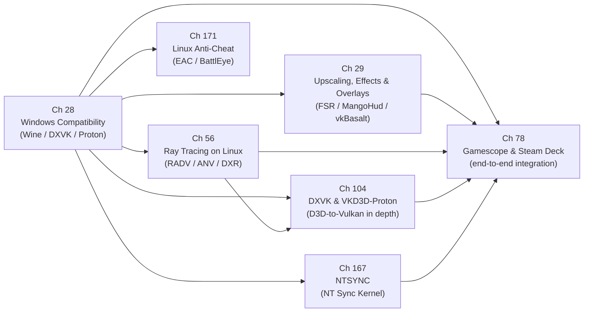

# Part VIII — The Gaming Layer

Linux gaming has been transformed over the past decade from a niche curiosity into a first-class target, and that transformation rests entirely on the layers that sit between the raw kernel graphics interfaces documented in earlier parts of this book and the Windows-native games that players actually run. Part VIII examines those layers: the translation machinery that maps Windows GPU APIs onto **Vulkan**, the post-processing and overlay infrastructure that rides on top, the hardware ray tracing support that the open-source driver stack now exposes, and the end-to-end integration that the **Steam Deck** and **gamescope** represent. Together these chapters show how every primitive discussed earlier — **DRM/KMS** atomic modesetting, **DMA-BUF** buffer sharing, **Mesa** driver architecture, **SPIR-V** compilation, **Vulkan** layers — is composed into a coherent gaming product.

## Chapters in This Part

**Chapter 28 — Windows Compatibility: Wine, DXVK, and Proton** covers the foundational translation stack that makes the Windows game catalogue run on Linux. It traces the path from **Wine**'s **PE** loader and **wineserver** synchronisation model through **DXVK**'s **D3D9/10/11**→**Vulkan** translation and **VKD3D-Proton**'s **D3D12**→**Vulkan** translation, and explains how **Proton** packages everything into a deployable product via the **pressure-vessel** container and **Steam Runtime**. The chapter is distinctive in covering the synchronisation arc from **esync** through **fsync** to the kernel **ntsync** driver, and in giving a frank account of remaining gaps — **DirectStorage**, partial **Mesh Shader** support, anti-cheat constraints.

**Chapter 29 — Upscaling, Effects, and Overlays: FSR, DLSS, and MangoHud** builds directly on Chapter 28 by examining the **Vulkan** layer mechanism that sits above the translation stack. It dissects **FSR 1/2/3** algorithm differences, explains why **gamescope** uses **FSR1** rather than **FSR2** at the compositor level, and covers **MangoHud**'s four GPU-metrics collection paths (**DRM FDINFO**, **amdgpu** sysfs, **NVML**, **i915 PMU**), **vkBasalt**'s in-process effect pipeline, and the **GameMode** OS-level performance governor. Where Chapter 28 is concerned with making games run, Chapter 29 is concerned with making them look and perform better without touching game source code.

**Chapter 56 — Ray Tracing on Linux** steps back from the Proton-specific context to document the full path from silicon to **Vulkan** API for hardware-accelerated ray tracing across **NVIDIA RT Cores**, **AMD Ray Accelerators**, and **Intel Ray Tracing Units**. It details the four **VK_KHR** ray tracing extensions, the acceleration structure lifecycle, and driver-level implementations in **RADV**, **ANV**, and the in-progress **NVK**. The chapter then closes the loop to the gaming context by covering **DXR** translation via **VKD3D-Proton** and the **Blender Cycles** production path-tracing workload.

**Chapter 104 — DXVK and VKD3D-Proton: Direct3D on Vulkan in Depth** is the most technically detailed treatment of D3D-to-Vulkan translation in the book, complementing Chapter 28's survey with a rigorous architectural dissection. It examines D3D9/10/11 and D3D12 API models side by side with the DXVK and VKD3D-Proton implementations: the DXBC/DXIL → SPIR-V shader translation pipeline, the DXVK state cache for eliminating pipeline-compilation stutter, VKD3D-Proton's use of VK_EXT_descriptor_buffer and VK_KHR_ray_tracing_pipeline to translate D3D12 ray tracing, and the Proton packaging that serves the 7 million Linux Steam users who are the dominant source of Vulkan commands reaching Mesa on the desktop.

**Chapter 167 — NTSYNC: NT Synchronization Primitives in the Linux Kernel** covers the kernel module that solves the long-standing atomicity problem in Wine/Proton synchronization. It traces the history from **esync** (eventfd-based, 2018) through **fsync** (futex-based) to the in-kernel **ntsync** character device (`/dev/ntsync`) merged in **Linux 6.14** by Elizabeth Figura (CodeWeavers). The chapter documents the kernel UAPI (`include/uapi/linux/ntsync.h`): `NTSYNC_TYPE_SEM`, `NTSYNC_TYPE_MUTEX`, and `NTSYNC_TYPE_EVENT` objects; the `NTSYNC_IOC_WAIT_ALL` ioctl that provides the atomic multi-object wait semantics that `WaitForMultipleObjects` requires; and the Wine 10.x and GE-Proton integration paths. Performance benchmarks from the cover-letter patch series (Dirt 3 +678%, RE2 +196%) illustrate why the kernel-native approach matters for competitive gaming titles.

**Chapter 171 — Linux Gaming Anti-Cheat: EasyAntiCheat, BattlEye, and the Ring-0 Problem** examines why Windows kernel-mode anti-cheat systems (Ring 0 drivers) cannot run on Linux, and what the industry has done instead. It covers the **EasyAntiCheat** and **BattlEye** Linux native PE DLL architecture (both announced September 2021, executed inside Wine's PE loader), the **Steam Linux Runtime** container delivery mechanism for anti-cheat runtimes, `PROTON_EAC_RUNTIME` / `PROTON_BATTLEYE_RUNTIME` environment variables, and anti-cheat systems that permanently block Linux: **Riot Vanguard**, **XIGNCODE3**, and **nProtect GameGuard**. The chapter gives a frank account of the architectural gap: without a signed kernel module path equivalent to Windows KMDF driver signing, kernel-level integrity verification cannot be achieved on Linux.

**Chapter 78 — Gamescope and the Steam Deck: A Complete Gaming Graphics Stack** synthesises the part by examining a single real shipping product that integrates every layer. It covers the **Van Gogh APU** unified memory architecture, the **SteamOS 3** immutable OS design, and **gamescope**'s role as a micro-compositor implementing its own **Wayland** server, embedding **XWayland**, delegating plane assignment to **libliftoff**, and optionally applying **FSR**, **NIS**, or **VRR** before the **KMS** atomic commit. The chapter also addresses the **OLED**-specific **HDR** and mura-correction pipelines, input latency minimisation, and docking via **DisplayPort Alternate Mode**.

## How the Chapters Interrelate

The seven chapters form a layered dependency graph that mirrors the software stack itself.

Chapter 28 is the foundation. Before any upscaling, overlay, or ray tracing discussion can be grounded, the reader must understand how a Windows game's **D3D11** or **D3D12** API calls are translated into **Vulkan** commands by **DXVK** or **VKD3D-Proton**, how **DXBC** and **DXIL** shaders are lowered through **SPIR-V** into **Mesa** driver pipelines, and how **Proton**'s **pressure-vessel** container establishes the library environment. The **ntsync** synchronisation story also connects directly to the Linux kernel; readers who have not yet read Part I (DRM/KMS) and Part IV (Mesa architecture) should do so before this chapter.

Chapter 29 depends on Chapter 28 in two specific ways: **MangoHud** inserts itself into the **Vulkan** layer chain that **DXVK** and **VKD3D-Proton** consume, and the **gamescope** integration section presupposes an understanding of how **Proton** games submit frames to a nested **Wayland** compositor. Chapter 29 also introduces the **Vulkan** layer mechanism (**`VkLayerInstanceCreateInfo`**, dispatch tables, the dispatch-key trick) at greater depth than any other chapter in the book, making it a useful cross-reference for Part V (Vulkan driver internals).

Chapter 56 is the most self-contained of the four — it can be read after Chapter 28 because the **DXR**→**VKD3D-Proton** section presupposes the translation-layer model, but it does not depend on Chapter 29. Its primary dependency chain runs upward into the Mesa driver chapters (Part IV) for **RADV** and **ANV** internals, and downward into the gaming context only in the **DXR** and **Blender** sections. Readers who arrive from a driver or API background rather than a gaming background may find it the most natural entry point for the part.

Chapter 104 depends on Chapter 28 (survey-level) and Chapter 56 (ray tracing): it opens the DXVK/VKD3D-Proton implementations at source-code level and shows the Vulkan engineering that makes Windows-game compatibility possible at scale. Readers who have read Chapter 28 will recognise the same concepts; Chapter 104 supplies the implementation depth.

Chapter 78 is the integrating capstone and should be read last. It calls back to every prior chapter: **DXVK**/**VKD3D-Proton** frame submission from Chapters 28 and 104, **FSR**/**NIS** compute passes and **MangoHud mangoapp** from Chapter 29, and hardware ray tracing capability on **RDNA 2** from Chapter 56. It also connects forward to Part VI (display stack) for **KMS** atomic modesetting, **VRR**, and **HDR** metadata, and to Part IX (tooling) for debugging the composite stack.

The shared technical threads across all five chapters are: the **Vulkan** API as the common GPU command interface; **SPIR-V** as the shared shader intermediate representation that all translation paths produce and all **Mesa** drivers consume; **DMA-BUF** as the zero-copy buffer handoff mechanism between game, compositor, and display engine; and the **Vulkan** layer mechanism as the non-invasive interposition point for overlays, upscalers, and debugging tools.

## Prerequisites and What Comes Next

Readers should be comfortable with the **DRM/KMS** subsystem (Parts I–II), the **Vulkan** driver model and **SPIR-V** pipeline as described in Parts IV–V, and the **DMA-BUF** buffer sharing model introduced in Part I before tackling this part. Part IX (Tooling and Contributing) builds directly on Part VIII by covering the debugging and profiling workflows — **RenderDoc**, **RADV_DEBUG**, **vkBasalt** introspection — needed to diagnose the composite gaming stack described here; Part VI (Display Stack) expands the **KMS**, **VRR**, and **HDR** topics that Chapter 78 introduces in the gamescope context.

---
