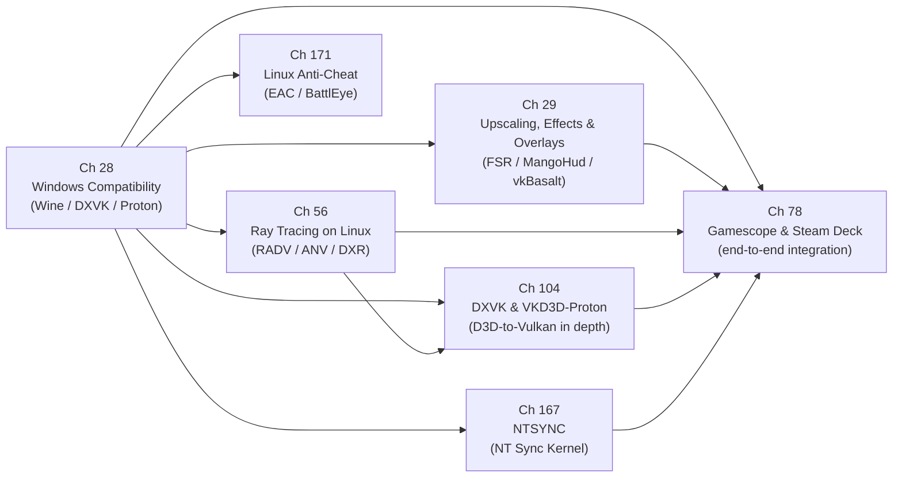

# Part VIII — The Gaming Layer

Linux gaming has been transformed over the past decade from a niche curiosity into a first-class target, and that transformation rests entirely on the layers that sit between the raw kernel graphics interfaces documented in earlier parts of this book and the Windows-native games that players actually run. Part VIII examines those layers: the translation machinery that maps Windows GPU APIs onto **Vulkan**, the post-processing and overlay infrastructure that rides on top, the hardware ray tracing support that the open-source driver stack now exposes, and the end-to-end integration that the **Steam Deck** and **gamescope** represent. Together these chapters show how every primitive discussed earlier — **DRM/KMS** atomic modesetting, **DMA-BUF** buffer sharing, **Mesa** driver architecture, **SPIR-V** compilation, **Vulkan** layers — is composed into a coherent gaming product.

## Chapters in This Part

**Chapter 28 — Windows Compatibility: Wine, DXVK, and Proton** covers the foundational translation stack that makes the Windows game catalogue run on Linux. It traces the path from **Wine**'s **PE** loader and **wineserver** synchronisation model through **DXVK**'s **D3D9/10/11**→**Vulkan** translation and **VKD3D-Proton**'s **D3D12**→**Vulkan** translation, and explains how **Proton** packages everything into a deployable product via the **pressure-vessel** container and **Steam Runtime**. The chapter is distinctive in covering the synchronisation arc from **esync** through **fsync** to the kernel **ntsync** driver, and in giving a frank account of remaining gaps — **DirectStorage**, partial **Mesh Shader** support, anti-cheat constraints.

**Chapter 29 — Upscaling, Effects, and Overlays: FSR, DLSS, and MangoHud** builds directly on Chapter 28 by examining the **Vulkan** layer mechanism that sits above the translation stack. It dissects **FSR 1/2/3** algorithm differences, explains why **gamescope** uses **FSR1** rather than **FSR2** at the compositor level, and covers **MangoHud**'s four GPU-metrics collection paths (**DRM FDINFO**, **amdgpu** sysfs, **NVML**, **i915 PMU**), **vkBasalt**'s in-process effect pipeline, and the **GameMode** OS-level performance governor. Where Chapter 28 is concerned with making games run, Chapter 29 is concerned with making them look and perform better without touching game source code.

**Chapter 56 — Ray Tracing on Linux** steps back from the Proton-specific context to document the full path from silicon to **Vulkan** API for hardware-accelerated ray tracing across **NVIDIA RT Cores**, **AMD Ray Accelerators**, and **Intel Ray Tracing Units**. It details the four **VK_KHR** ray tracing extensions, the acceleration structure lifecycle, and driver-level implementations in **RADV**, **ANV**, and the in-progress **NVK**. The chapter then closes the loop to the gaming context by covering **DXR** translation via **VKD3D-Proton** and the **Blender Cycles** production path-tracing workload.

**Chapter 104 — DXVK and VKD3D-Proton: Direct3D on Vulkan in Depth** is the most technically detailed treatment of D3D-to-Vulkan translation in the book, complementing Chapter 28's survey with a rigorous architectural dissection. It examines D3D9/10/11 and D3D12 API models side by side with the DXVK and VKD3D-Proton implementations: the DXBC/DXIL → SPIR-V shader translation pipeline, the DXVK state cache for eliminating pipeline-compilation stutter, VKD3D-Proton's use of VK_EXT_descriptor_buffer and VK_KHR_ray_tracing_pipeline to translate D3D12 ray tracing, and the Proton packaging that serves the 7 million Linux Steam users who are the dominant source of Vulkan commands reaching Mesa on the desktop.

**Chapter 167 — NTSYNC: NT Synchronization Primitives in the Linux Kernel** covers the kernel module that solves the long-standing atomicity problem in Wine/Proton synchronization. It traces the history from **esync** (eventfd-based, 2018) through **fsync** (futex-based) to the in-kernel **ntsync** character device (`/dev/ntsync`) merged in **Linux 6.14** by Elizabeth Figura (CodeWeavers). The chapter documents the kernel UAPI (`include/uapi/linux/ntsync.h`): `NTSYNC_TYPE_SEM`, `NTSYNC_TYPE_MUTEX`, and `NTSYNC_TYPE_EVENT` objects; the `NTSYNC_IOC_WAIT_ALL` ioctl that provides the atomic multi-object wait semantics that `WaitForMultipleObjects` requires; and the Wine 10.x and GE-Proton integration paths. Performance benchmarks from the cover-letter patch series (Dirt 3 +678%, RE2 +196%) illustrate why the kernel-native approach matters for competitive gaming titles.

**Chapter 171 — Linux Gaming Anti-Cheat: EasyAntiCheat, BattlEye, and the Ring-0 Problem** examines why Windows kernel-mode anti-cheat systems (Ring 0 drivers) cannot run on Linux, and what the industry has done instead. It covers the **EasyAntiCheat** and **BattlEye** Linux native PE DLL architecture (both announced September 2021, executed inside Wine's PE loader), the **Steam Linux Runtime** container delivery mechanism for anti-cheat runtimes, `PROTON_EAC_RUNTIME` / `PROTON_BATTLEYE_RUNTIME` environment variables, and anti-cheat systems that permanently block Linux: **Riot Vanguard**, **XIGNCODE3**, and **nProtect GameGuard**. The chapter gives a frank account of the architectural gap: without a signed kernel module path equivalent to Windows KMDF driver signing, kernel-level integrity verification cannot be achieved on Linux.

**Chapter 78 — Gamescope and the Steam Deck: A Complete Gaming Graphics Stack** synthesises the part by examining a single real shipping product that integrates every layer. It covers the **Van Gogh APU** unified memory architecture, the **SteamOS 3** immutable OS design, and **gamescope**'s role as a micro-compositor implementing its own **Wayland** server, embedding **XWayland**, delegating plane assignment to **libliftoff**, and optionally applying **FSR**, **NIS**, or **VRR** before the **KMS** atomic commit. The chapter also addresses the **OLED**-specific **HDR** and mura-correction pipelines, input latency minimisation, and docking via **DisplayPort Alternate Mode**.

## Does Windows / DirectX Still Dominate PC Gaming?

Yes — overwhelmingly, and understanding this context is essential for reading this part correctly. As of 2026, approximately 98% of commercial PC game titles target Windows as their primary platform. **DirectX 11** and **DirectX 12** together account for the dominant share of GPU API calls from games reaching real hardware. Native Vulkan Linux titles exist — a growing but still small fraction of the Steam catalogue (~15,000 of ~120,000 titles). The practical consequence for Linux players and platform engineers is that *the default is running Windows games on Linux*, not building for Linux natively.

The calculus changed materially with the **Steam Deck**. Valve shipped over 5 million units running **SteamOS** (Arch Linux with gamescope), and every Windows title in a player's Steam library runs via Proton with no action required. This single product transformed the Linux gaming compatibility story from hobbyist workaround to first-class commercial delivery target — and motivated the engineering investment in DXVK, VKD3D-Proton, ntsync, and FSR integration described in this part.

**The remaining Windows exclusivity factors** that Proton does not solve:
- **Kernel-mode anti-cheat** (Riot Vanguard, XIGNCODE3, nProtect GameGuard): requires a signed Windows kernel driver; structurally incompatible with Linux
- **DirectStorage**: requires NVMe hardware queue bypass via `IDStorageFactory`; not yet implemented in VKD3D-Proton; titles that require DS fail or fall back to the slow software path
- **HWID-locked DRM** that fingerprints Windows kernel objects: some Denuvo and Arxan implementations probe structures absent in Wine
- **Windows kernel driver dependencies**: any title that installs a Windows `.sys` driver at setup time is incompatible
- **Shader Model 6.7 features** (Work Graphs, Wave Mesh Nodes): partial in VKD3D-Proton and not all tested
- **Media Foundation video decode**: used by some cutscene playback; Wine's MF implementation is incomplete for some proprietary video formats

## Key Concepts

### Wine and the PE Loader

**Wine** (Wine Is Not an Emulator) is not a virtual machine — it translates Windows system call semantics into Linux/POSIX calls at the API boundary, with no CPU instruction emulation. It implements the Windows `NT kernel` ABI: the `ntdll.dll` layer converts Windows NT native calls (`NtCreateFile`, `NtAllocateVirtualMemory`) into Linux syscalls; the `wineserver` background process emulates the Windows Object Manager, Registry, and the shared-memory region of `NTDLL` that Windows processes normally access via kernel-mapped pages.

The **PE loader** (`loader/preloader.c`) loads Windows `.exe` and `.dll` files in **PE (Portable Executable)** format directly into the Wine process address space. Unlike compatibility layers that translate binaries, Wine executes PE code natively on the CPU — Windows x86-64 instructions run unmodified; only the system call boundary differs. This is why Wine requires the game's code to execute on the same CPU architecture as the host (x86-64 to x86-64); it is not an emulator in the QEMU sense.

**wineserver** runs as a single shared background process per Wine prefix. It holds all kernel object state — event handles, mutexes, process handles, file mappings — that games synchronise on via `WaitForSingleObject` / `WaitForMultipleObjects`. The synchronisation latency of the original Wine wineserver model was a major gaming bottleneck; the **esync → fsync → ntsync** evolution (Chapter 167) addresses this.

### DXVK: Direct3D 9/10/11 → Vulkan

**DXVK** is a Wine DLL replacement for `d3d9.dll`, `d3d10core.dll`, and `d3d11.dll`. When a game calls a D3D11 API like `ID3D11DeviceContext::DrawIndexed()`, DXVK intercepts it inside the Wine process and emits equivalent **Vulkan** commands. This is possible because D3D11 and Vulkan share a conceptually similar GPU execution model (command lists, pipeline state objects, resource descriptors), though the specific mapping is non-trivial: D3D11's implicit resource hazard tracking must be converted to explicit Vulkan pipeline barriers; D3D11's fixed-function blend state must be compiled into `VkPipelineColorBlendStateCreateInfo`; and D3D11's DXBC shader bytecode must be translated to SPIR-V (via **dxvk-spirv**, which internally uses **spirv-cross** headers and its own DXBC → SPIR-V translation library).

The **DXVK state cache** (`.dxvk-cache` files in the game directory) persists compiled `VkPipeline` objects across runs. On first run, new `VkPipeline` objects are compiled on-demand, causing the **pipeline stutter** familiar to many Linux gamers; on subsequent runs, the cache provides near-instant pipeline retrieval. Chapter 104 examines the DXVK and VKD3D-Proton implementations in depth.

### VKD3D-Proton: Direct3D 12 → Vulkan

**VKD3D-Proton** is the Valve-maintained fork of the Wine `vkd3d` project that translates **Direct3D 12** to **Vulkan**. D3D12 and Vulkan are closely aligned — both are explicit APIs with command lists, descriptor heaps, and explicit synchronisation — but the mapping is still complex: D3D12 root signatures must be translated to Vulkan pipeline layouts; D3D12 descriptor heaps must map onto `VK_EXT_descriptor_buffer` or a fallback emulation; D3D12 ray tracing (`DXR`, via the `ID3D12GraphicsCommandList4` ray tracing command interface) must map onto `VK_KHR_ray_tracing_pipeline`.

**DXBC and DXIL** are the two shader bytecode formats D3D shaders use. **DXBC** (DirectX Bytecode) is the older format used by D3D9–D3D11 shaders, compiled from HLSL by the `fxc.exe` compiler. **DXIL** (DirectX Intermediate Language) is the LLVM bitcode-based format used by D3D12 shaders, compiled by DXC (the LLVM-based `dxcompiler.dll`). Both must be translated to **SPIR-V** before Mesa can consume them. DXVK handles DXBC translation; VKD3D-Proton handles both DXBC and DXIL, the latter via a DXIL → SPIR-V compiler built on top of LLVM. The translation quality — especially register allocation and ISA efficiency after Mesa's SPIR-V → NIR → ACO/BRW pipeline — directly impacts game performance relative to native Windows.

### Proton and pressure-vessel

**Proton** is Valve's distribution of the Wine + DXVK + VKD3D-Proton gaming stack. It ships as a Steam Tool — a versioned directory under `~/.steam/root/compatibilitytools.d/` or `steamapps/common/Proton 9.0/` — and is selected per-game in Steam's compatibility settings.

**pressure-vessel** is the container runtime that establishes the library environment inside which Proton runs. The Steam client itself runs on the host OS with its own library dependencies, but the game inside Proton must see a specific, tested set of graphics libraries — the **Steam Runtime** (currently **Steam Runtime 3 "sniper"**, a Debian Bullseye-based container image with specific Mesa, libdxvk, libvkd3d-proton, libc, and Steam-specific libraries). pressure-vessel uses **bubblewrap** (`bwrap`) to bind-mount the Steam Runtime image into a new namespace, ensuring that a game's `libvulkan.so.1` is the Steam Runtime version rather than whatever the distribution ships. This eliminates the "works on my distro" class of breakage and is why Steam gaming on an obscure distribution works as reliably as on Ubuntu.

The flow: Steam client → selects Proton version → invokes `pressure-vessel-wrap` → `bwrap` namespace with Steam Runtime libraries → Wine PE loader → DXVK/VKD3D-Proton → Mesa Vulkan → kernel DRM.

### Valve's Ecosystem Role

**Valve** is not merely a distributor; it is the primary engineering force behind modern Linux gaming compatibility:
- Funds and employs DXVK and VKD3D-Proton maintainers
- Shipped the Steam Deck, creating a 5M-unit commercial Linux gaming platform
- Merged `ntsync` into the Linux kernel (upstream in Linux 6.14, funded by Valve/CodeWeavers)
- Funded Mesa RADV driver performance work (GE-Proton RADV ACO path)
- Developed gamescope and libliftoff
- Funds FSR integration into gamescope
- Operates the Linux game compatibility tracking infrastructure (ProtonDB, Steam Deck Verified program)

### FSR: FidelityFX Super Resolution

**FSR (FidelityFX Super Resolution)** is AMD's open-source spatial and temporal upscaling library, distributed under MIT licence. Three major algorithm versions exist:

- **FSR 1.0**: Single-pass spatial upscaler using an EASU (Edge-Adaptive Spatial Upsampling) filter followed by RCAS (Robust Contrast-Adaptive Sharpening). Works on any GPU, no temporal data required, low latency. Integrated directly into gamescope for output-level upscaling.
- **FSR 2.x**: Temporal accumulation + jitter-based antialiasing + spatial reconstruction. Requires per-frame motion vectors and depth buffers from the game engine; significantly sharper than FSR 1 but requires engine integration. Used in game engines via the FSR 2 SDK.
- **FSR 4**: Uses a transformer-based neural network (trained on AMD RDNA4, requires ML execution units) for superior reconstruction quality. AMD-hardware-specific but results are far superior to temporal FSR.

In the gamescope context, **FSR 1** is used at the compositor level — gamescope renders the game at native resolution and upscales the compositor output, requiring zero game engine integration. FSR 2/3 require game-side integration, though Proton's Steamworks Integration Layer can inject FSR 2 into some games.

### Gamescope

**gamescope** is a micro-compositor — a standalone **Wayland** compositor purpose-built for gaming. Unlike general-purpose compositors (KWin, Mutter), gamescope does exactly one thing: takes a single game window, optionally upscales or filters it, and outputs it to the display via KMS atomic commit. It implements its own Wayland server (accepting a game's Wayland or XWayland surface), manages **libliftoff** for hardware plane assignment, and supports **VRR**, **HDR**, and **FSR** as output-level post-processing passes.

gamescope serves two roles in the Steam Deck ecosystem:
1. **Embedded mode** (Steam Deck): gamescope *is* the session compositor; SteamOS boots directly to gamescope, which hosts the Steam UI and all games with no intermediate desktop compositor
2. **Nested mode** (Linux desktop): gamescope runs inside a Wayland desktop session, presenting a game in a bordered window; useful for VRR, HDR, and FSR on titles that don't natively support those features

The key engineering innovations in gamescope: zero-copy DMA-BUF buffer passing from XWayland client to KMS plane via libliftoff (no GPU compositing pass for full-screen games), HDR metadata injection via `DRM_CLIENT_CAP_WRITEBACK_CONNECTORS`, and the `GAMESCOPE_WAYLAND_DISPLAY` socket for Steam overlay injection.

### GameMode

**GameMode** (by Feral Interactive, open source) is a daemon that applies OS-level performance optimisations when a game launches. It does not touch the GPU driver directly; instead it adjusts the CPU governor (`performance` or `schedutil`), CPU and GPU scheduler hints, process priority (`nice`/`ionice`), and platform-specific power profiles. Applications request GameMode via:
- **D-Bus** API (`com.feralinteractive.GameMode`)
- `gamemoderun %command%` wrapper in Steam launch options
- Proton automatic integration (Proton 8.0+ calls `gamemoded` if available)

GameMode's impact on rendering latency is measurable on CPU-bound titles (3–8% improvement in frame rate) and on AMD platforms where switching from the `powersave` governor to `performance` prevents CPU frequency stalls during shader compilation.

### MangoHud and DRM FDINFO

**MangoHud** is an in-game overlay that displays real-time GPU and CPU performance metrics. It injects itself as a **Vulkan layer** (or Mesa OpenGL extension) and draws a configurable HUD into the game's framebuffer. The four metrics collection paths it uses are:

1. **DRM FDINFO** (`/proc/<pid>/fdinfo/<drm_fd>`): the kernel's standardised per-client GPU metrics interface (merged Linux 5.19). Each open DRM file descriptor exposes a `drm-engine-*` entry with time-accumulated GPU busy metrics and `drm-memory-*` entries for VRAM usage. Works on AMD, Intel, and (via `nouveau`) older NVIDIA hardware. Zero kernel permission requirement beyond DRM render node access.
2. **amdgpu sysfs** (`/sys/class/drm/card*/device/hwmon/*/`): per-sensor temperature, fan RPM, power draw. More granular than FDINFO but AMD-specific.
3. **NVML** (`libnvidia-ml.so`): NVIDIA Management Library; provides GPU utilisation, memory, temperature, and clock data on proprietary NVIDIA drivers. Requires the NVIDIA management library.
4. **i915 PMU** (Intel): hardware performance counters via `perf_event_open()` with `PERF_TYPE_RAW` events for Gen9/Xe GPU.

MangoHud's HUD is rendered directly into the Vulkan or OpenGL framebuffer using a `VkRenderPass` that composites the overlay on top of the game frame, making it visible in game capture output (OBS, gamescope's screenshot path).

## How the Chapters Interrelate

The seven chapters form a layered dependency graph that mirrors the software stack itself.

Chapter 28 is the foundation. Before any upscaling, overlay, or ray tracing discussion can be grounded, the reader must understand how a Windows game's **D3D11** or **D3D12** API calls are translated into **Vulkan** commands by **DXVK** or **VKD3D-Proton**, how **DXBC** and **DXIL** shaders are lowered through **SPIR-V** into **Mesa** driver pipelines, and how **Proton**'s **pressure-vessel** container establishes the library environment. The **ntsync** synchronisation story also connects directly to the Linux kernel; readers who have not yet read Part I (DRM/KMS) and Part IV (Mesa architecture) should do so before this chapter.

Chapter 29 depends on Chapter 28 in two specific ways: **MangoHud** inserts itself into the **Vulkan** layer chain that **DXVK** and **VKD3D-Proton** consume, and the **gamescope** integration section presupposes an understanding of how **Proton** games submit frames to a nested **Wayland** compositor. Chapter 29 also introduces the **Vulkan** layer mechanism (**`VkLayerInstanceCreateInfo`**, dispatch tables, the dispatch-key trick) at greater depth than any other chapter in the book, making it a useful cross-reference for Part V (Vulkan driver internals).

Chapter 56 is the most self-contained of the four — it can be read after Chapter 28 because the **DXR**→**VKD3D-Proton** section presupposes the translation-layer model, but it does not depend on Chapter 29. Its primary dependency chain runs upward into the Mesa driver chapters (Part IV) for **RADV** and **ANV** internals, and downward into the gaming context only in the **DXR** and **Blender** sections. Readers who arrive from a driver or API background rather than a gaming background may find it the most natural entry point for the part.

Chapter 104 depends on Chapter 28 (survey-level) and Chapter 56 (ray tracing): it opens the DXVK/VKD3D-Proton implementations at source-code level and shows the Vulkan engineering that makes Windows-game compatibility possible at scale. Readers who have read Chapter 28 will recognise the same concepts; Chapter 104 supplies the implementation depth.

Chapter 78 is the integrating capstone and should be read last. It calls back to every prior chapter: **DXVK**/**VKD3D-Proton** frame submission from Chapters 28 and 104, **FSR**/**NIS** compute passes and **MangoHud mangoapp** from Chapter 29, and hardware ray tracing capability on **RDNA 2** from Chapter 56. It also connects forward to Part VI (display stack) for **KMS** atomic modesetting, **VRR**, and **HDR** metadata, and to Part IX (tooling) for debugging the composite stack.

The shared technical threads across all five chapters are: the **Vulkan** API as the common GPU command interface; **SPIR-V** as the shared shader intermediate representation that all translation paths produce and all **Mesa** drivers consume; **DMA-BUF** as the zero-copy buffer handoff mechanism between game, compositor, and display engine; and the **Vulkan** layer mechanism as the non-invasive interposition point for overlays, upscalers, and debugging tools.

## Prerequisites and What Comes Next

Readers should be comfortable with the **DRM/KMS** subsystem (Parts I–II), the **Vulkan** driver model and **SPIR-V** pipeline as described in Parts IV–V, and the **DMA-BUF** buffer sharing model introduced in Part I before tackling this part. Part IX (Tooling and Contributing) builds directly on Part VIII by covering the debugging and profiling workflows — **RenderDoc**, **RADV_DEBUG**, **vkBasalt** introspection — needed to diagnose the composite gaming stack described here; Part VI (Display Stack) expands the **KMS**, **VRR**, and **HDR** topics that Chapter 78 introduces in the gamescope context.

---

## Part Roadmap Summary

*Synthesised from the Roadmap sections of this part's chapters.*

### Near-term (6–12 months)

- **Translation-layer shader compiler consolidation.** VKD3D-Proton 3.0 rewrote the DXBC backend and unified it with DXVK's frontend; follow-on 3.0.x releases are closing correctness gaps and stabilising Work Graphs (`D3D12_WORK_GRAPHS`) and `VK_EXT_descriptor_heap` descriptor-heap mapping. DLSS 4 integration for the NVIDIA path remains the most-requested outstanding item across both DXVK and VKD3D-Proton.
- **Wine 11 / Proton 11 stabilisation with ntsync and WoW64.** Linux 6.14 shipped the `/dev/ntsync` character device; Wine 11.0 and Proton 11 integrated it as the default synchronisation back-end. Near-term work targets regression-fixing in 32-bit game titles, WoW64 dispatch interoperability, and distro enablement (Ubuntu 26.04 LTS, Fedora) so that `CONFIG_NTSYNC=m` reaches users automatically.
- **Anti-cheat runtime hardening.** Valve is expanding Steam Deck compatibility validation to verify EasyAntiCheat and BattlEye behaviour under ntsync-dispatched synchronisation. EAC ARM64 Linux support exists in EOS SDK 1.17.1.3 (August 2025); near-term focus is pushing publishers to opt in. The GTA V BattlEye opt-in situation remains unresolved.
- **Ray tracing driver improvements across RADV, ANV, and NVK.** RADV HPLOC BVH builder (Mesa 26.x), the RADV launch-ID swizzle rework for UE5 Lumen, and experimental DLSS via `VK_NVX_binary_import` in NVK (Mesa 26.2) are all in-flight. Blender Cycles' Vulkan ray-query path is being brought to parity with OptiX and HIP-RT.
- **Gamescope multi-vendor expansion and HDR stabilisation.** Gamescope 3.x added Intel Arc GPU support (MSI Claw 8, Arc B580). Near-term work covers VRR on Intel FreeSync+HDR paths, aligning the HDR colour-management handshake with the ratified `wp_color_management_v1` Wayland protocol, and VRAM budget management for sub-8 GB GPUs.
- **FSR 4 and ML upscaling at compositor level.** VKD3D-Proton 3.0 added AMD FSR4 via `VK_KHR_cooperative_matrix` / `VK_KHR_shader_float8`; integration of FSR 4's compute path into gamescope (replacing FSR 1) is underway for RDNA 3/4 hardware with FSR 1/2 fallback. MangoHud 0.8.x continues broadening platform coverage (Intel, Panfrost, Qualcomm KGSL).

### Medium-term (1–3 years)

- **DirectStorage and GPU decompression on Linux.** VKD3D-Proton's current DirectStorage path uses a CPU staging-buffer fallback. The production solution requires `VK_NV_memory_decompression` (NVIDIA) and an AMD equivalent for GPU-native GDeflate, plus `io_uring` `O_DIRECT` bypass for NVMe queue access — a coordinated kernel and Vulkan driver effort.
- **NVK hardware ray tracing and DXVK/VKD3D-Proton on NVK.** NVK's primary RT blocker is the Turing/Ampere RT Core shader ABI. Ongoing reverse-engineering of GSP firmware interaction and opaque BVH memory layout makes conformant `VK_KHR_ray_tracing_pipeline` a multi-year driver effort; meanwhile, DXVK and VKD3D-Proton running on NVK as a supported Vulkan target is a stated goal.
- **Anti-cheat ecosystem evolution: IMA attestation and server-side ML detection.** Kernel-mode AC systems (Vanguard, XIGNCODE3, nProtect) remain structurally incompatible with Linux. Medium-term mitigations under discussion include Linux IMA-based TPM attestation logs as a partial substitute for Windows Secure Boot posture, and growing reliance on server-side ML behavioural detection (aim trajectory, hit-rate heuristics) as an OS-agnostic detection layer.
- **Container and sandbox integration for ntsync and Proton.** Fully declarative per-app `/dev/ntsync` access in Flatpak, Toolbox, and Distrobox requires coordinated work between the Flatpak runtime team and Steam's runtime container; a proposed `ntsync` xdg-desktop-portal entry is being tracked. The Steam Runtime "sniper" successor container (updated Mesa/LLVM/glibc baseline) is also expected in this window.
- **RDNA 4 BVH8/OBB acceleration and `VK_KHR_ray_tracing_maintenance1` universal enablement.** RDNA 4 exposes compressed BVH8 nodes and Oriented Bounding Boxes; extending RADV's AS builder to emit native BVH8 rather than BVH4 will improve ray tracing performance for elongated geometry. Full `VK_KHR_ray_tracing_maintenance1` enablement (indirect RT dispatch, pipeline-stage flags) across RADV, ANV, and NVK eliminates per-game fallback code paths.
- **Steam Deck 2 / Steam Machine 2026 and Gamescope multi-form-factor evolution.** Valve is waiting for a major silicon leap before Steam Deck 2; the 2026 Steam Machine launch on AMD/Intel/NVIDIA GPUs broadens Gamescope to a multi-vendor platform. Gamescope will need to support higher handheld resolutions (900p/1080p), LPDDR5X unified memory, and native Wayland game support without XWayland (gated on `wp_fifo_v1` / `wp_commit_timing_v1`).

### Long-term

- **Unified D3D-to-Vulkan compiler pipeline.** The shared long-term vision across VKD3D-Proton, DXVK, and Mesa contributors is a single DXBC/DXIL→SPIR-V→NIR pipeline with Mesa NIR as the canonical IR, eliminating the forked `dxil-spirv` and `vkd3d-shader` paths and converging with Wine's upstream translation approach. Native DirectStorage via `io_uring` fixed-buffer reads, GPU GDeflate, and Vulkan timeline semaphore signalling from NVMe completion queues is the complementary asset-streaming endpoint.
- **Confidential computing / TEE-based anti-cheat attestation.** Intel TDX and AMD SEV-SNP trusted execution environments could provide a hardware-rooted attestation anchor on Linux (via virtual TPM) that satisfies kernel-mode AC requirements without a signed kernel driver — at the cost of hardware requirements and latency overhead. No gaming vendor has announced a production deployment.
- **NVK full `VK_KHR_ray_tracing_pipeline` conformance and portable RT across all three vendors.** As NVK matures to full Vulkan 1.3 + RT extension coverage, the Vulkan KHR ray tracing suite becomes the single portable real-time ray tracing API on Linux, enabling Unreal Engine 5 Lumen and Unity HDRP to ship a single Linux codepath backed by RADV, ANV, or NVK. Khronos working groups are simultaneously exploring extensions for neural rendering (radiance caching, neural irradiance fields) that would extend the BVH traversal pipeline.
- **Gamescope as the canonical Linux gaming compositor standard.** Valve's trajectory points to a single Gamescope binary spanning Steam Deck, Steam Machines, and potential VR/AR hardware, sharing FSR/HDR/colour-management Vulkan passes across form factors. Its custom latency-marker and frame-pacing Wayland extensions may be submitted to the Wayland protocol working group for standardisation, allowing KWin and Mutter to implement the same just-in-time vblank scheduling that gives Gamescope its input-to-photon latency advantage.

---

*Copyright © 2026 jreuben11. Licensed under [CC BY 4.0](https://creativecommons.org/licenses/by/4.0/).*
