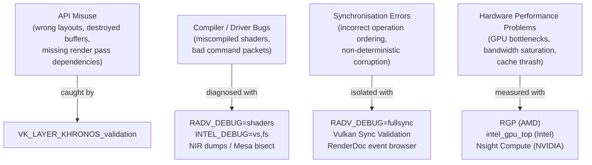
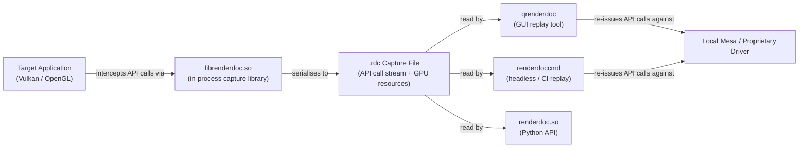
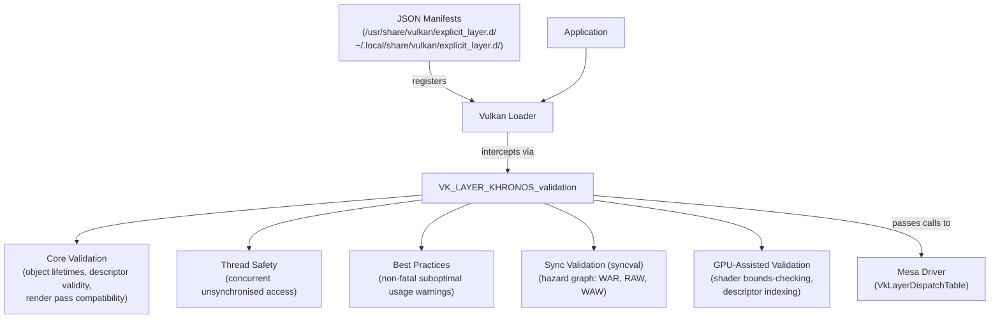
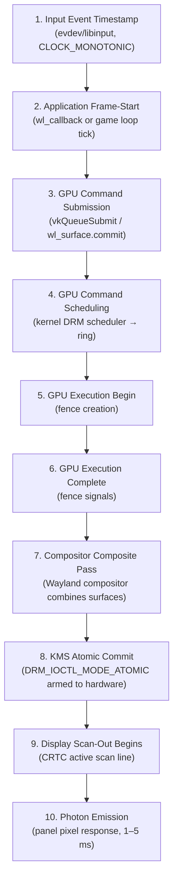
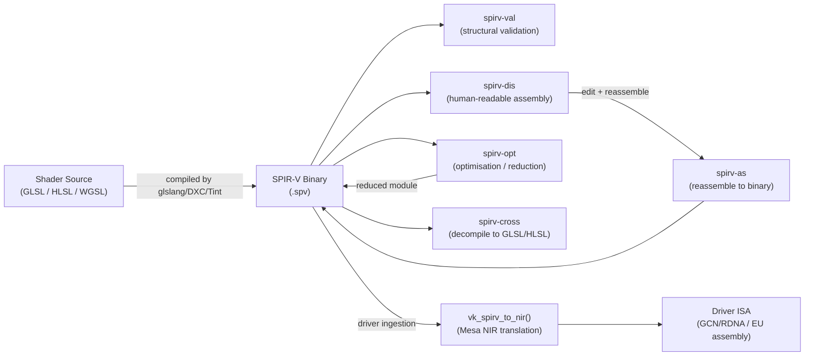

# Chapter 30: Debugging and Profiling

**Part IX — Tooling and Contributing**

**Audiences**: This chapter serves both systems/driver developers and graphics application developers. Sections 4 (Mesa Environment Variables) and 7 (Kernel-Level GPU Debugging) are weighted toward driver and kernel developers; Sections 2 (RenderDoc), 3 (Validation Layers), 5 (Frame Latency), 6 (Hardware Counters), and 8 (CPU Profiling) serve both audiences. Section markers indicate where the split is significant.

> **Scope:** Ch30 covers **development-time debugging tools** — RenderDoc, Vulkan validation layers, Mesa debug environment variables, gdb integration, and kernel GPU debugging via `dyndbg`. **Ch93** covers GPU performance analysis *methodology* (how to structure a bottleneck investigation, interpret counter data, move from symptom to root cause). **Ch137** surveys the Linux GPU profiling tool ecosystem (MangoHud, RenderDoc frame analysis, vendor profilers, Perfetto GPU timeline).

---

## Table of Contents

1. [The Debugging Landscape: Layers of Visibility](#1-the-debugging-landscape-layers-of-visibility)
2. [RenderDoc: Frame Capture and Replay](#2-renderdoc-frame-capture-and-replay)
3. [Vulkan Validation Layers: API Correctness](#3-vulkan-validation-layers-api-correctness)
4. [Mesa Environment Variables and Debug Infrastructure](#4-mesa-environment-variables-and-debug-infrastructure)
5. [Frame Latency and Pacing Measurement](#5-frame-latency-and-pacing-measurement)
6. [GPU Hardware Performance Counters via DRM](#6-gpu-hardware-performance-counters-via-drm)
7. [Kernel-Level GPU Debugging](#7-kernel-level-gpu-debugging)
8. [Profiling the CPU Side: Frame Pacing and Driver Overhead](#8-profiling-the-cpu-side-frame-pacing-and-driver-overhead)
9. [SPIR-V Shader Debugging Toolchain](#9-spir-v-shader-debugging-toolchain)
10. [eBPF and bpftrace for Graphics Stack Debugging](#10-ebpf-and-bpftrace-for-graphics-stack-debugging)
11. [Integrations](#integrations)
12. [References](#references)

---

## 1. The Debugging Landscape: Layers of Visibility

Debugging GPU work on Linux is categorically harder than CPU debugging for three fundamental reasons: asynchronous execution, compiler opacity, and implicit state. When a CPU instruction faults, the program counter at the point of fault is directly observable. When GPU work produces wrong output — a corrupt triangle, a stall, a device lost — the GPU may have completed that work thousands of microseconds ago, the driver may have transformed the shader through multiple intermediate representations, and the hardware may have been in a state that no user-visible API surface exposes.

Bugs in GPU workloads cluster into four distinct layers, each requiring different tools. **API misuse** encompasses incorrect **Vulkan** or **OpenGL** usage: an image transition in the wrong layout, a descriptor set pointing to a destroyed buffer, missing render pass dependencies. These bugs are caught by the **Vulkan Validation Layers** before they reach the driver. **Compiler and driver bugs** manifest as incorrect pixel output or GPU faults caused by the driver miscompiling a shader or generating bad command packets. These require **Mesa** environment variables that expose intermediate compiler state — **NIR** dumps, **ACO** IR, hardware assembly — and the ability to bisect **Mesa** across commit ranges. **Synchronisation errors** are the most pernicious class: correct individual operations that are ordered incorrectly relative to each other, causing one pass to read a resource before another pass has finished writing it. They appear as non-deterministic corruption that varies by workload and driver version. **Vulkan** Sync Validation and **RenderDoc**'s event browser are the primary tools. **Hardware performance problems** — GPU bottlenecks, memory bandwidth saturation, cache thrash — require hardware performance counters accessed via vendor tools such as **RadeonGPUProfiler** and **intel_gpu_top**.

Mapping tools to layers helps avoid wasted effort. For API misuse, enable **`VK_LAYER_KHRONOS_validation`** immediately in every development build. For compiler bugs, **`RADV_DEBUG=shaders`** or **`INTEL_DEBUG=vs,fs`** dumps the compiled assembly so you can verify the shader is correct. For synchronisation errors, **`RADV_DEBUG=fullsync`** serialises all operations to narrow the window, then Sync Validation pinpoints the missing barrier. For performance, **RGP** (AMD), **GPA**/**intel_gpu_top** (Intel), or **Nsight Compute** (**NVIDIA** proprietary) are the right instruments.



Several system-level prerequisites affect tool availability. Intel's GPU counter infrastructure (**`i915_perf`** OA stream) and some AMD counter capture paths require **`perf_event_paranoid`** `<= 1` (**`/proc/sys/kernel/perf_event_paranoid`**). Since Linux 5.8, **`CAP_PERFMON`** is the preferred capability for unprivileged counter access. **RenderDoc** and most **Mesa** debug tools require only a valid render node (**`/dev/dri/renderDN`**) opened without elevated privilege. Some tools — notably **`umr`** for AMD ring decoding and **`debugfs`** inspection — require **`CAP_SYS_ADMIN`** or root, and on distributions with strict **AppArmor** or **seccomp** policies this may require profile adjustments.

Build type matters substantially. Release **Mesa** builds (**`-Dbuildtype=release`**) compile out most validation code, ASSERTS, and the **NIR** validator. A debug **Mesa** build (**`-Dbuildtype=debug`**) or a `debugoptimized` build (**`-Dbuildtype=debugoptimized`**, the recommended middle ground for development) enables the **NIR** validator after each pass, the **ACO** IR validator, and additional error-checking paths throughout the driver. When chasing a **Mesa** regression, always reproduce against a debug or debugoptimized build first. The **Vulkan** loader has its own debug mode: setting **`VK_LOADER_DEBUG=all`** traces every layer and driver enumeration step.

**AddressSanitizer** and **UBSan** integrate naturally with **Mesa**. Building **Mesa** with `CC="clang" CFLAGS="-fsanitize=address,undefined"` and running the target application under **ASAN** will catch heap overflows and undefined behaviour in the **Mesa** driver code. Chapter 31 covers the conformance testing CI pipeline where these sanitiser builds are exercised; this chapter sets the context that those tools operate at the **Mesa** driver C code level, not at the GPU shader level.

Section 2 covers **RenderDoc** ([renderdoc.org](https://renderdoc.org/)), the premier open-source frame capture and replay tool. **RenderDoc** records an **`.rdc`** capture file via its in-process **`librenderdoc.so`** capture library and replays it using either the **`qrenderdoc`** GUI or the headless **`renderdoccmd`** CLI. The **RenderDoc** Python bindings (**`renderdoc.so`**) enable automated frame analysis and regression testing in CI environments. Section 3 covers the full **`VK_LAYER_KHRONOS_validation`** layer: its sub-components — **Core Validation**, **Thread Safety**, **Best Practices**, **Synchronisation Validation** (**syncval**), and **GPU-Assisted Validation** (**GAV**) — plus the **`VK_LAYER_LUNARG_api_dump`** layer and CI integration patterns. Section 4 covers **Mesa**'s environment-variable debug infrastructure in depth: universal variables such as **`MESA_DEBUG`**, **`LIBGL_DEBUG`**, **`GALLIUM_DRIVER`**, and **`MESA_LOADER_DRIVER_OVERRIDE`**; **`NIR_DEBUG`** flags for tracing the **NIR** optimisation pipeline (including **`NIR_DEBUG=print`**, **`NIR_DEBUG=validate`**, and **`NIR_DEBUG=spirv_to_nir`**); **`RADV_DEBUG`** flags for the **RADV** Vulkan driver (including **`RADV_DEBUG=hang`**, **`RADV_DEBUG=zerovram`**, **`RADV_DEBUG=nocache`**, **`RADV_DEBUG=dumpibs`**, and **`RADV_DEBUG=metashaders`**); **`ACO_DEBUG`** flags for **ACO**'s compiler pipeline (**`ACO_DEBUG=validateir`**, **`ACO_DEBUG=validatera`**, **`ACO_DEBUG=force-waitcnt`**, **`ACO_DEBUG=perfinfo`**); **`INTEL_DEBUG`** and **`INTEL_MEASURE`** for **ANV**/**iris**; **NVK**/**Nouveau** debug variables; and **`MESA_SHADER_DUMP_PATH`** for writing compiled shader binaries to disk for offline analysis with **`umr`** or **`iga64`**.

Section 5 covers frame latency and pacing measurement, explaining why P99 frame time is a better smoothness metric than average **FPS**, and decomposing the motion-to-photon latency chain into ten discrete stages from **`evdev`**/**`libinput`** input timestamps through **`DRM_IOCTL_MODE_ATOMIC`** and scan-out. Tools covered include the **`wp_presentation`** Wayland protocol for per-frame compositor presentation timestamps, **MangoHud** for in-game frame timing overlays and CSV logging, **`ftrace`** **DRM** trace points (**`drm:drm_vblank_event`**, **`drm:drm_atomic_commit_arm`**) captured with **`trace-cmd`**, **`perf sched`** for compositor thread scheduling latency, and **gamescope** latency monitoring. Section 6 covers GPU hardware performance counters: the **`CAP_PERFMON`** permission model, **AMD**'s **SQTT**-based **RadeonGPUProfiler (RGP)**, **RadeonGPUDetective (RGD)** for post-mortem crash analysis, **`umr`** for ring and register access, Intel's **OA** counter infrastructure via **`intel_gpu_top`** and **`INTEL_MEASURE`**, **NVIDIA**'s **Nsight Graphics**, **Nsight Compute** (**`ncu`**), **Nsight Systems** (**`nsys`**), **`nvidia-smi`**, **`NVTX`** annotations, and the **NvPerf SDK** for embedded counter collection with the **NvPerf Range Profiler**. Generic tools covered include **gpuvis** for **`ftrace`**-based GPU timeline visualisation and **gfxreconstruct** for headless **Vulkan** frame capture. **`VkQueryPool`** timestamp queries and **`VK_EXT_calibrated_timestamps`** for correlating GPU and **`CLOCK_MONOTONIC`** CPU timestamps are also detailed.

Section 7 covers kernel-level GPU debugging: reading structured **`dmesg`** output for **`amdgpu`** ring timeouts and **`i915_error_state`**, inspecting **DRM** **`debugfs`** entries under **`/sys/kernel/debug/dri/N/`** (including **`amdgpu_pm_info`**, **`amdgpu_fence_info`**, **`amdgpu_vram_mm`**, and **`syncobj`**), a systematic AMD GPU hang debugging workflow combining **`RADV_DEBUG=hang`**, **`RADV_DEBUG=fullsync`**, **`ACO_DEBUG=force-waitcnt`**, and **`umr`**, and **KMS** atomic debugging with **`drm_info`** and **`CONFIG_DRM_DEBUG_SELFTEST`**. Section 8 covers CPU-side profiling: **`perf record`** and FlameGraph generation for driver overhead in **RADV**'s hot paths (**`radv_CmdDraw`**, **`radv_flush_descriptors`**, **`radv_pipeline_create`**), **`VK_EXT_calibrated_timestamps`** for unified CPU+GPU timeline correlation, **`apitrace`** for **OpenGL**/**OpenGL ES** call stream tracing and replay, the **Tracy** profiler with **Vulkan** GPU zones using **`vkCmdWriteTimestamp`**, and **`VK_EXT_pipeline_creation_feedback`** for diagnosing pipeline compilation stalls. Section 9 covers the **SPIR-V** shader debugging toolchain: **`spirv-val`** for structural validation, **`spirv-dis`** and **`spirv-as`** for disassembly and reassembly, **`spirv-opt`** for optimisation and fault reduction, **`spirv-cross`** for cross-compilation to **GLSL**/**HLSL** and shader reflection, driver-side **SPIR-V** debugging via **`MESA_SHADER_DUMP_PATH`** and **`NIR_SPIRV_DEBUG`**, and **Zink**'s **`ZINK_DEBUG=spirv`** for inspecting **SPIR-V** modules emitted by the **OpenGL**-over-**Vulkan** translation layer, with a systematic workflow for isolating driver shader bugs using **gfxreconstruct** and **Mesa** **`git bisect`**.

---

## 2. RenderDoc: Frame Capture and Replay

RenderDoc ([https://renderdoc.org/](https://renderdoc.org/)) is the premier open-source frame capture and replay tool for Vulkan, OpenGL, and OpenGL ES on Linux. Its architecture centres on two components: an in-process capture library (`librenderdoc.so`) injected into the target application that intercepts API calls and serialises GPU resources, and the replay tool (`qrenderdoc` for the GUI, `renderdoccmd` for headless operation) that reads `.rdc` capture files and re-issues the API calls against the local driver, making resources inspectable at any draw call boundary.



### Capture Workflow

The simplest capture path on Linux uses the command-line wrapper:

```bash
renderdoccmd capture --wait-for-exit -c my_capture.rdc -- ./my_vulkan_app
```

This launches the application with `librenderdoc.so` preloaded, captures one frame when you press F12 (the default hotkey), and writes the `.rdc` file. For applications you cannot launch directly — a Wayland compositor, a game under Steam — RenderDoc's UI provides a "Inject into Process" workflow that attaches to a running process by PID. The environment-variable path is also available: `RENDERDOC_HOOK_EGL=1` enables capture for EGL-based applications including GLES and some Wayland-native apps. When `LD_PRELOAD` injection is needed without the launcher wrapper, preloading `librenderdoc.so` directly will initialise the capture library.

Wayland considerations: RenderDoc requires `VK_KHR_wayland_surface` to capture native Wayland Vulkan surfaces. Support has improved substantially through versions 1.26–1.28 and later. On compositors or applications that do not cleanly expose the Wayland surface handle for capture — particularly when XWayland compatibility is in play — falling back to running the application via XWayland (`DISPLAY=:0 ./app`) remains a reliable fallback. Check the RenderDoc changelog for the version shipping with your distribution to understand the current Wayland capture status.

### The `.rdc` Capture Format

A `.rdc` file is a structured binary archive serialising the complete API call stream, all GPU resource contents (textures, buffers, pipeline objects) at the frame boundary, and sufficient state to re-drive the Vulkan driver from frame start to any arbitrary event. The replay tool does not record GPU commands from the original hardware; it reconstructs them from the captured API call log. This means replay is always against the local Mesa (or NVIDIA/AMD proprietary) driver, which matters when debugging driver-specific behaviour.

### Resource Inspector

The texture viewer decodes any format that Vulkan or GL exposes — including compressed formats (BC1–BC7, ASTC, ETC2), depth-stencil images, and multisampled attachments — allowing pixel-level inspection with exact numeric values. Buffer contents are displayable as struct arrays once you provide a struct definition matching the buffer layout, making vertex buffer inspection and uniform buffer auditing straightforward. The SPIR-V viewer disassembles any shader module captured in the frame.

### Draw Call List and Event Browser

The event browser lists every Vulkan call in submission order. Render passes appear as collapsible groups; barriers, `vkCmdPipelineBarrier` calls, and `vkCmdSetEvent`/`vkCmdWaitEvents` are listed inline. Selecting any draw call updates all resource views to show the state immediately after that call executes, including render target contents, depth buffer, descriptor set bindings, and pipeline state. The pipeline state viewer shows the full Vulkan pipeline configuration: vertex input bindings, descriptor set layouts, active render pass, all dynamic state.

### Shader Debugger

RenderDoc's shader debugger allows stepping through a SPIR-V shader applied to a specific invocation — a selected vertex, a selected fragment pixel. On Linux, the implementation cross-compiles SPIR-V to a debug-friendly intermediate form using SPIRV-Cross. Coverage and reliability vary by driver and GPU vendor as of 2024–2025: the fragment shader debugger works reasonably well on Intel (ANV) and AMD (RADV) for simple shaders. Complex shaders with extensive control flow, or compute shaders performing async dispatch, are not supported for live stepping. Pixel history is more reliable: selecting a pixel in the render target output shows every draw call that contributed to that pixel, with pre/post-draw colour values, depth test result, and the shader outputs.

### The Replay API (Python Bindings)

RenderDoc exposes its replay functionality as a Python module (`renderdoc.so`), enabling automated analysis, regression testing, and CI integration without a display. The canonical usage pattern follows the official documentation at [https://renderdoc.org/docs/python_api/](https://renderdoc.org/docs/python_api/):

```python
import renderdoc as rd
import sys

def load_capture(path):
    rd.InitialiseReplay(rd.GlobalEnvironment(), [])

    cap = rd.OpenCaptureFile()
    result = cap.OpenFile(path, '', None)
    if result != rd.ResultCode.Succeeded:
        raise RuntimeError(f"Failed to open capture: {result}")
    if not cap.LocalReplaySupport():
        raise RuntimeError("Capture cannot be replayed on this machine")

    result, controller = cap.OpenCapture(rd.ReplayOptions(), None)
    if result != rd.ResultCode.Succeeded:
        raise RuntimeError(f"Replay init failed: {result}")
    return cap, controller

def extract_final_backbuffer(capture_path, output_png):
    cap, controller = load_capture(capture_path)

    # Get all top-level actions (draw calls, dispatches, etc.)
    actions = controller.GetRootActions()
    print(f"{len(actions)} top-level actions in capture")

    # Move to the last action in the frame
    last = actions[-1]
    controller.SetFrameEvent(last.eventId, True)

    # Get the list of textures and find the swapchain image
    textures = controller.GetTextures()
    for tex in textures:
        if rd.IsDepthOrStencilFormat(tex.format.type):
            continue
        if tex.width > 0 and tex.height > 0:
            # Save = extract pixel data as raw bytes
            save_data = rd.TextureSave()
            save_data.resourceId = tex.resourceId
            save_data.destType = rd.FileType.PNG
            save_data.mip = 0
            save_data.slice.sliceIndex = 0
            controller.SaveTexture(save_data, output_png)
            print(f"Saved texture {tex.resourceId} -> {output_png}")
            break

    controller.Shutdown()
    cap.Shutdown()

if __name__ == '__main__':
    extract_final_backbuffer(sys.argv[1], sys.argv[2])
```

This pattern runs on a headless CI machine by invoking `python3 -c "..." -- test.rdc output.png` after setting `LD_LIBRARY_PATH` to include the RenderDoc installation's library directory. Automated pixel regression testing compares `output.png` across Mesa commits to flag visual regressions without requiring a human reviewer.

### Limitations

RenderDoc operates purely at the API boundary. It cannot see inside the driver: NIR compilation decisions, command ring encoding, or DMA-BUF sharing paths are invisible. Shader debugging on async compute queues is not supported. RenderDoc is not a profiler — it measures nothing about GPU timing or performance counters. For those needs, the hardware counter tools in Section 6 are required.

---

## 3. Vulkan Validation Layers: API Correctness

The Vulkan loader's layer system provides an extensibility mechanism where JSON manifests in `/usr/share/vulkan/explicit_layer.d/` (system-wide) or `~/.local/share/vulkan/explicit_layer.d/` (per-user) register shared libraries that intercept Vulkan calls. Each layer receives an entry in the `VkLayerDispatchTable` and can inspect, modify, or block API calls. The Khronos Validation Layer (`VK_LAYER_KHRONOS_validation`) bundles multiple validation subsystems into a single layer and is the primary correctness tool for Vulkan development.



### Enabling Layers

The simplest activation uses the environment variable:

```bash
VK_INSTANCE_LAYERS=VK_LAYER_KHRONOS_validation ./my_app
```

Programmatically, in `VkInstanceCreateInfo`:

```c
const char *layers[] = { "VK_LAYER_KHRONOS_validation" };

VkInstanceCreateInfo create_info = {
    .sType                   = VK_STRUCTURE_TYPE_INSTANCE_CREATE_INFO,
    .enabledLayerCount       = 1,
    .ppEnabledLayerNames     = layers,
};
```

The debug messenger extension receives validation output:

```c
VkDebugUtilsMessengerCreateInfoEXT dbg = {
    .sType           = VK_STRUCTURE_TYPE_DEBUG_UTILS_MESSENGER_CREATE_INFO_EXT,
    .messageSeverity = VK_DEBUG_UTILS_MESSAGE_SEVERITY_WARNING_BIT_EXT
                     | VK_DEBUG_UTILS_MESSAGE_SEVERITY_ERROR_BIT_EXT,
    .messageType     = VK_DEBUG_UTILS_MESSAGE_TYPE_VALIDATION_BIT_EXT
                     | VK_DEBUG_UTILS_MESSAGE_TYPE_PERFORMANCE_BIT_EXT,
    .pfnUserCallback = debug_callback,
};

/* Pass as pNext to VkInstanceCreateInfo */
create_info.pNext = &dbg;
```

### Sub-Layer Components

**Core Validation** is enabled by default. It checks object lifetimes, descriptor set validity, render pass compatibility, format feature support, and a broad class of parameter validation. Most `vkCreate*` and `vkCmd*` calls are checked. Core validation is the starting point for any new Vulkan application.

**Thread Safety** validation instruments Vulkan object access to detect concurrent unsynchronised calls from multiple threads — for example, recording commands into the same `VkCommandBuffer` from two threads simultaneously without external synchronisation.

**Object Lifetimes** tracks every `vkCreate*`/`vkAllocate*` call and its corresponding `vkDestroy*`/`vkFree*` to detect use-after-free and double-free. This is particularly valuable during resource management refactoring.

**Best Practices** emits non-fatal warnings for suboptimal usage: using `VK_IMAGE_LAYOUT_GENERAL` where a more specific layout would enable driver optimisations, failing to use `VK_IMAGE_USAGE_SAMPLED_BIT` when sampling an image, or creating descriptor pools without appropriate `VK_DESCRIPTOR_POOL_CREATE_FREE_DESCRIPTOR_SET_BIT` semantics.

**Synchronisation Validation (syncval)** is the most powerful and most expensive sub-layer. It builds a hazard graph from the pipeline stage and memory access scope of every read and write operation, then verifies that each write is properly guarded by a barrier before the next operation that uses the same memory region.

### Synchronisation Validation Deep Dive

Syncval models the Vulkan memory model in terms of `(access_scope, pipeline_stage)` pairs. Each `vkCmdDraw`, `vkCmdCopy`, `vkCmdDispatch`, and layout transition registers a set of memory accesses tagged with the pipeline stages that perform them. A `vkCmdPipelineBarrier` narrows a src/dst stage mask and src/dst access mask; syncval verifies that the access pattern between two operations is fully covered by an intervening barrier.

The three hazard categories are:
- **Write-After-Read (WAR)**: A subsequent write begins before an earlier read completes. Common when writing to a render target attachment that was sampled in the previous pass without an image layout transition.
- **Read-After-Write (RAW)**: A read begins before an earlier write completes. The classic case: writing to a storage image in a compute pass, then sampling it in a fragment shader pass without a `VK_ACCESS_SHADER_WRITE_BIT → VK_ACCESS_SHADER_READ_BIT` barrier with appropriate stage masks.
- **Write-After-Write (WAW)**: Two writes to overlapping memory regions without a barrier between them.

A representative syncval error message:

```
Validation Error: [ SYNC-HAZARD-READ-AFTER-WRITE ]
  vkCmdDraw: Hazard READ_AFTER_WRITE in subpass 0 for attachment 0
  Access info:
    write: VK_PIPELINE_STAGE_COLOR_ATTACHMENT_OUTPUT_BIT /
           VK_ACCESS_COLOR_ATTACHMENT_WRITE_BIT @ vkCmdBeginRenderPass
    read:  VK_PIPELINE_STAGE_FRAGMENT_SHADER_BIT /
           VK_ACCESS_INPUT_ATTACHMENT_READ_BIT @ vkCmdDraw
```

This error tells you exactly which operation performed the write (the render pass attachment output at `vkCmdBeginRenderPass`) and which operation attempts to read before the write is visible (the input attachment read in the fragment shader). The fix is a subpass dependency with the appropriate src/dst stage and access masks.

Timeline semaphores and `vkQueueSubmit2` (Vulkan 1.3 / `VK_KHR_synchronization2`) are fully tracked by syncval. Known limitations include some conservatism around external subpass dependencies and sparse resources. These can generate false positives in specific patterns; the layer supports message suppression via VUID strings in `vk_layer_settings.txt`.

### GPU-Assisted Validation (GAV)

GPU-Assisted Validation instruments shaders at compile time with bounds-checking code that writes errors to a feedback buffer, then reads that buffer back after submission. This enables runtime checks that the CPU-side layer cannot perform: verifying that a buffer device address computed by a shader is within a valid allocation, checking that an index into a descriptor array accessed via `VK_EXT_descriptor_indexing` is within bounds, and validating `OpRayQuery`/`OpTraceRay` parameters.

GAV is configured via `vk_layer_settings.txt` placed in the application's working directory or the system layer configuration path:

```ini
# vk_layer_settings.txt
khronos_validation.enables = VK_VALIDATION_FEATURE_ENABLE_GPU_ASSISTED_EXT,\
                              VK_VALIDATION_FEATURE_ENABLE_GPU_ASSISTED_RESERVE_BINDING_SLOT_EXT
khronos_validation.gpuav_descriptor_checks = true
khronos_validation.gpuav_buffer_address_oob = true
khronos_validation.gpuav_max_buffer_device_addresses = 10000
```

The overhead is significant: 2–10x slower than unvalidated execution depending on shader complexity and descriptor count. This is expected — GAV inserts real shader instructions into every kernel. Do not use GAV for performance benchmarking.

A more modern way to configure GAV uses `VkLayerSettingsCreateInfoEXT` (from `VK_EXT_layer_settings`, which became an official Vulkan extension in SDK 1.3.272+) as a `pNext` chain on `VkInstanceCreateInfo`, allowing programmatic configuration without a settings file. This is the preferred approach for CI pipelines where the working directory cannot be controlled.

### The API Dump Layer

`VK_LAYER_LUNARG_api_dump` traces every Vulkan call to stdout or a file, including all parameters in a human-readable format. This is invaluable for diffing two runs of an application — one that produces correct output and one that does not — to identify which call sequence diverges. Enable with `VK_INSTANCE_LAYERS=VK_LAYER_LUNARG_api_dump` and redirect stderr to a file.

### CI Integration

For CI pipelines, set `VK_INSTANCE_LAYERS=VK_LAYER_KHRONOS_validation` and configure the debug callback to call `abort()` on error. The layer also supports a `log_filename` setting that writes errors to a file for test-runner consumption. The `VK_LAYER_ENABLES` environment variable can select individual sub-features without a settings file:

```bash
VK_LAYER_ENABLES=VK_VALIDATION_FEATURE_ENABLE_SYNCHRONIZATION_VALIDATION_EXT \
  ./run_tests
```

---

## 4. Mesa Environment Variables and Debug Infrastructure

Mesa's debug variable system is implemented in `src/util/debug.c` (Mesa repository: `https://gitlab.freedesktop.org/mesa/mesa`). The `debug_get_flags_option()` function reads a string environment variable and converts it to a bitmask by matching comma-separated tokens against a table of flag definitions. Each Mesa driver and subsystem registers its own flag table; the `MESA_DEBUG`, `NIR_DEBUG`, `RADV_DEBUG`, and `ACO_DEBUG` variables are parsed through this mechanism. The complete list is always authoritative at `https://docs.mesa3d.org/envvars.html`.

### Universal Mesa Variables

`MESA_DEBUG` accepts a comma-separated flag list. The `context` flag creates a GL debug context and routes all `GL_KHR_debug` messages to stderr. The `flush` flag inserts a glFlush after every drawing command — useful for isolating timing-related corruption. `incomplete_tex` and `incomplete_fbo` add extra messages when texture completeness or FBO completeness checks fail.

`LIBGL_DEBUG=verbose` enables loader-level tracing: driver selection logic, the path from which `radeonsi_dri.so` or `iris_dri.so` was loaded, dri2 vs. dri3 protocol negotiation. This is the first variable to set when a Mesa driver fails to load at all.

`MESA_LOADER_DRIVER_OVERRIDE=radeonsi` bypasses PCI ID detection and forces a specific driver. This is useful for verifying that an application works correctly with a specific driver even if the detected hardware would normally select a different one.

`GALLIUM_DRIVER=llvmpipe` overrides the Gallium driver selection to use the software renderer, enabling functionality testing on machines without suitable hardware or inside containers and VMs.

### NIR Debug Flags (`NIR_DEBUG`)

NIR (the Mesa intermediate representation, covered in depth in Chapter 14) passes through a sequence of optimisation and lowering passes before being handed to a backend compiler. `NIR_DEBUG` is a comma-separated flag list that instruments this pipeline.

`NIR_DEBUG=print` dumps the complete NIR for every shader at every pass boundary. The output for a simple vertex shader looks like:

```nir
impl main {
  block b0:  // preds:
    %0 = deref_var &gl_Position (shader_out vec4)
    %1 = deref_var &in_pos (shader_in vec3)
    %2:vec3 = @load_deref (%1) (access=none)
    %3:float = mov %2.x
    %4:float = mov %2.y
    %5:float = mov %2.z
    %6:float = load_const (0x3f800000 = 1.000000)
    %7:vec4 = vec4 %3, %4, %5, %6
    @store_deref (%0, %7) (wrmask=xyzw, access=none)
    /* succs: b1 */
  block b1:
}
```

The `%N` names are SSA definitions. `@load_deref` and `@store_deref` are NIR intrinsics. The `deref_var` instructions reference named shader variables before variable-to-register lowering. Understanding this format is a prerequisite for bisecting shader compiler regressions.

`NIR_DEBUG=print_fs` restricts the dump to fragment shaders only (similarly `print_vs`, `print_cs`). This dramatically reduces output volume when you know which stage has the bug.

`NIR_DEBUG=validate` runs the NIR validator after every pass. The validator checks structural invariants: all uses of an SSA value must be dominated by its definition, all phi node sources must come from the correct predecessor blocks, all instruction operands must have types consistent with the instruction's type constraints. When a compiler pass introduces a broken invariant, `validate` will catch it immediately at the pass that introduced the bug rather than allowing the corruption to propagate silently into the backend.

`NIR_DEBUG=spirv_to_nir` traces SPIR-V deserialization decisions, logging every SPIR-V instruction processed and its NIR translation. This is the correct tool when a SPIR-V shader compiles and links correctly but produces wrong NIR, or when debugging a SPIR-V extension that is not handled correctly by Mesa's SPIR-V translator (`src/compiler/spirv/spirv_to_nir.c`).

Use `NIR_SKIP=pass_name` to skip specific optimization passes and narrow down which pass is responsible for a miscompile.

### RADV-Specific Debug Flags (`RADV_DEBUG`)

The RADV Vulkan driver (Mesa's AMD Vulkan implementation, `src/amd/vulkan/`) has an extensive debug flag set. Key flags for driver development:

`RADV_DEBUG=nocache` disables the pipeline cache. This is **essential** any time you are measuring shader compilation overhead or debugging a shader compilation bug — without it, the first run may compile and cache a shader while subsequent runs serve the cached binary, masking the bug.

`RADV_DEBUG=shaders` (equivalent to `RADV_DEBUG=asm`) prints the compiled hardware assembly for every shader. For AMD hardware this is the GCN/RDNA assembly produced by either the ACO compiler backend (default) or LLVM. The output includes the SGPR and VGPR allocation counts and the number of scratch registers — essential data for identifying register pressure issues.

`RADV_DEBUG=preoptir` dumps the backend IR (ACO or LLVM) before any optimisations. Comparing this with the output of `RADV_DEBUG=shaders` shows what the optimiser changed.

`RADV_DEBUG=nir` dumps NIR for the shader stages being compiled by RADV, equivalent to targeting NIR_DEBUG at the RADV path.

`RADV_DEBUG=checkir` validates the LLVM IR before LLVM compiles it. Only relevant when using the LLVM backend (forced with `RADV_DEBUG=llvm` on builds that include LLVM support).

`RADV_DEBUG=fullsync` inserts a full device synchronisation (equivalent to `vkDeviceWaitIdle`) after every draw call and dispatch. This serialises GPU execution completely, turning asynchronous corruption bugs into deterministic ones. The resulting output may be visually correct — the serialisation removes the race — or it may expose missing barriers that were previously hidden by coincidental ordering.

`RADV_DEBUG=hang` is the recommended first step when a GPU hang occurs. It enables RADV's automated hang-detection infrastructure: trace markers are inserted between draw calls, and when a timeout is detected RADV dumps a diagnostic archive to `~/radv_dumps_<pid>_<timestamp>/` containing: `umr_waves.log` (per-wavefront register state including SGPR/VGPR dumps, program counter, and the active shader's instruction address), `pipeline.log` (the ISA disassembly with instruction addresses annotated), `trace.log` (the PM4 command stream up to the hang, with user data register assignments decoded), and `bo_history.log` (memory allocation/deallocation history for the GPU buffers involved).

`RADV_DEBUG=zerovram` zero-initialises all VRAM allocations. Many GPU hardware bugs and unintialised-read bugs only manifest when VRAM contains residual data from a previous allocation. This flag catches such bugs by ensuring allocations start clean.

`RADV_DEBUG=nobinning` disables primitive binning (the GFX9+ tiler optimisation). `RADV_DEBUG=nohiz` disables Hierarchical Z. `RADV_DEBUG=nodcc` disables Delta Color Compression. These feature-disable flags isolate hardware optimisation features as sources of corruption.

`RADV_DEBUG=metashaders` dumps the internal meta-operation shaders — the blit, clear, and resolve shaders that RADV generates internally for operations like `vkCmdClearColorImage` and `vkCmdResolveImage`. These are compiled once at driver startup and are a source of bugs when the meta shader path has a regression.

`RADV_DEBUG=dumpibs` dumps the complete command stream (Indirect Buffers / IBs) for every queue submission. The output is raw PM4 packet data that can be decoded with `umr`.

### ACO Debug Flags (`ACO_DEBUG`)

ACO is RADV's custom shader compiler backend (Chapter 15). Its debug flags instrument the compilation pipeline from ACO IR to hardware ISA.

`ACO_DEBUG=validateir` validates the ACO intermediate representation after each compilation pass. ACO's IR is an SSA-based representation of AMD GPU computation; the validator checks register class constraints, operand type compatibility, and basic block structure.

`ACO_DEBUG=validatera` validates register assignment after register allocation completes. Register allocation on AMD hardware must respect hard constraints: VGPRs (vector registers) can only hold per-lane data, SGPRs (scalar registers) must hold uniform data across the wavefront. `validatera` catches RA bugs that produce code where these constraints are violated — which typically manifests as a GPU fault or a silent miscompute.

`ACO_DEBUG=force-waitcnt` inserts wait instructions (`s_waitcnt`) after every instruction that produces a memory result. This is the ACO equivalent of RADV's `fullsync` — it eliminates GPU-side pipeline hazards by forcing full completion of every memory operation. If a GPU hang disappears with this flag, the hang is caused by a missing or incorrect waitcnt.

`ACO_DEBUG=perfinfo` prints performance-relevant information for each compiled shader: the estimated number of VGPR-spills, scratch buffer usage, and the estimated ALU/memory instruction ratio.

### Intel (ANV/iris) Debug Variables

`INTEL_DEBUG` is a comma-separated flag list (complete reference: `https://docs.mesa3d.org/envvars.html`). Key flags:

`INTEL_DEBUG=vs,fs,cs` dumps the EU (Execution Unit) assembly for vertex, fragment, and compute shaders respectively. Intel EU assembly uses a completely different ISA from AMD; the output shows SIMD width (SIMD8/SIMD16/SIMD32), register pressure, and EU instructions.

`INTEL_DEBUG=bat` (batch) dumps the GPU command batch for every submission, including the 3D STATE packets and MI_ packets. This is the Intel equivalent of `RADV_DEBUG=dumpibs`.

`INTEL_DEBUG=submit` logs statistics about each batch buffer submission: size, number of commands, GPU timestamps.

`INTEL_DEBUG=sync` inserts a CPU wait after every batch submission, equivalent to `vkDeviceWaitIdle` after every `vkQueueSubmit`. Like `RADV_DEBUG=fullsync`, this serialises GPU work and turns race conditions into deterministic failures.

`INTEL_MEASURE=draw` activates the Intel Mesa measurement infrastructure, which inserts GPU timestamp queries around every draw call and outputs a CSV of per-draw GPU times. This is discussed further in Section 6.

`ANV_ENABLE_PIPELINE_CACHE=0` disables the ANV pipeline cache, equivalent to `RADV_DEBUG=nocache`.

### NVK/Nouveau Debug Variables

NVK (the new open-source NVIDIA Vulkan driver in the Mesa tree) and Nouveau (the kernel driver) each have debug flags. `NVK_DEBUG` accepts flags including `push_dump` (dump the NVIDIA pushbuffer contents for each submission), `zero_memory` (zero GPU memory allocations), and `syncobj` (trace sync object operations). The NVK driver is under rapid development as of 2024–2025; consult `src/nouveau/vulkan/nvk_debug.h` in the Mesa repository for the current list.

### Using `MESA_SHADER_DUMP_PATH`

Setting `MESA_SHADER_DUMP_PATH=/tmp/shaders` causes Mesa to write compiled shader binaries (the hardware-specific binary, not SPIR-V or NIR) to that directory, one file per shader keyed by shader hash. These binaries can be loaded offline with `umr` for AMD or `iga64` (Intel Graphics Assembler) for Intel to inspect the final instruction stream without running the application.

---

## 5. Frame Latency and Pacing Measurement

### Why Frame Pacing Matters More Than Average FPS

Average frames per second is a poor predictor of perceived smoothness. A renderer producing 60 fps with ±2 ms frame interval variance is perceptibly smoother than one producing 63 fps with ±8 ms variance. The reason is that display hardware presents at fixed refresh intervals (16.67 ms at 60 Hz); a frame that arrives 1 ms late misses its vblank and is held for another 16.67 ms, producing a visible 33 ms frame. P99 frame time latency — the 99th percentile interval between presented frames — is a much better proxy for perceived stutter than mean FPS.

The motion-to-photon latency chain decomposes into discrete, measurable stages:
1. Input event timestamp (kernel evdev/libinput timestamp via `CLOCK_MONOTONIC`)
2. Application frame-start (Wayland `wl_callback` or game loop tick)
3. GPU command submission (`vkQueueSubmit` / `wl_surface.commit`)
4. GPU command scheduling (kernel DRM scheduler dispatches work to the ring)
5. GPU execution begin (fence creation)
6. GPU execution complete (fence signals)
7. Compositor composite pass (Wayland compositor combines surfaces)
8. KMS atomic commit (`DRM_IOCTL_MODE_ATOMIC` armed to hardware)
9. Display scan-out begins (CRTC active scan line)
10. Photon emission (panel pixel response time, 1–5 ms depending on setting)



At 60 Hz the total budget is 16.67 ms. A typical breakdown: application GPU work 8–10 ms, compositor composite 2–3 ms, KMS and scan-out 1–2 ms, panel 1–5 ms. Any individual stage that overruns its budget pushes the entire chain past the vblank deadline.

### wp_presentation Feedback

The `wp_presentation` Wayland protocol (`presentation-time.xml`, stable in wayland-protocols) provides per-frame presentation timestamps directly from the compositor. Before calling `wl_surface.commit`, the application calls `wp_presentation.feedback(surface)` to obtain a `wp_presentation_feedback` object. When the compositor presents the surface's content to the display, it sends the `presented` event containing the presentation timestamp (`tv_sec`, `tv_nsec`), the display refresh interval (`refresh` in nanoseconds), the sequence number, and a `flags` bitmask.

A minimal C frame-timing logger:

```c
#include <wayland-client.h>
#include "presentation-time-client-protocol.h"
#include <stdio.h>
#include <time.h>

static FILE *csv_out;
static uint64_t prev_present_ns = 0;

static void feedback_presented(void *data,
    struct wp_presentation_feedback *feedback,
    uint32_t tv_sec_hi, uint32_t tv_sec_lo,
    uint32_t tv_nsec, uint32_t refresh_ns,
    uint32_t seq_hi, uint32_t seq_lo, uint32_t flags)
{
    uint64_t ts_ns = ((uint64_t)tv_sec_hi << 32 | tv_sec_lo) * 1000000000ULL
                   + tv_nsec;
    if (prev_present_ns > 0) {
        double interval_ms = (ts_ns - prev_present_ns) / 1.0e6;
        fprintf(csv_out, "%.3f\n", interval_ms);
    }
    prev_present_ns = ts_ns;

    /* Interpret flags */
    bool vsync       = flags & WP_PRESENTATION_FEEDBACK_KIND_VSYNC;
    bool hw_clock    = flags & WP_PRESENTATION_FEEDBACK_KIND_HW_CLOCK;
    bool hw_complete = flags & WP_PRESENTATION_FEEDBACK_KIND_HW_COMPLETION;
    bool zero_copy   = flags & WP_PRESENTATION_FEEDBACK_KIND_ZERO_COPY;
    (void)vsync; (void)hw_clock; (void)hw_complete; (void)zero_copy;

    wp_presentation_feedback_destroy(feedback);
}

static void feedback_discarded(void *data,
    struct wp_presentation_feedback *feedback)
{
    /* Frame was superseded before presentation — count as dropped */
    fprintf(csv_out, "discarded\n");
    wp_presentation_feedback_destroy(feedback);
}

static const struct wp_presentation_feedback_listener fb_listener = {
    .sync_output = NULL,  /* not used in this example */
    .presented   = feedback_presented,
    .discarded   = feedback_discarded,
};

/* In the render loop, before wl_surface.commit: */
void register_feedback(struct wp_presentation *presentation,
                       struct wl_surface *surface)
{
    struct wp_presentation_feedback *fb =
        wp_presentation_feedback(presentation, surface);
    wp_presentation_feedback_add_listener(fb, &fb_listener, NULL);
}
```

The `flags` field tells you about the presentation path. `WP_PRESENTATION_FEEDBACK_KIND_VSYNC` means the presentation was synchronised to a display vblank. `WP_PRESENTATION_FEEDBACK_KIND_HW_CLOCK` means the timestamp was obtained from hardware (more accurate than software-estimated timestamps). `WP_PRESENTATION_FEEDBACK_KIND_ZERO_COPY` means the compositor performed a direct scanout — the application's buffer was scanned out directly without a compositing blit, the lowest-latency path.

Compositor support as of 2025: `wp_presentation` is supported in Weston (the Wayland reference compositor), KWin (KDE Plasma 5.20+), and Mutter (GNOME 44+). Applications must handle the absence of the protocol gracefully by falling back to `wl_callback`-only timing, which gives the frame submission timestamp rather than the actual presentation timestamp.

### MangoHud for In-Game Frame Timing

MangoHud ([https://github.com/flightlessmango/MangoHud](https://github.com/flightlessmango/MangoHud)) is a Vulkan and OpenGL overlay layer that renders an HUD showing real-time performance metrics. Enabling it is a single environment variable: `MANGOHUD=1 ./game`. The frametime graph overlay displays frame-to-frame intervals as a histogram, providing an immediate visual sense of frame pacing variance.

MangoHud can log frame timing data to a CSV for offline analysis:

```bash
MANGOHUD=1 MANGOHUD_CONFIG="log_duration=30,output_file=/tmp/frame_log.csv" ./game
```

Offline analysis with Python:

```python
import pandas as pd
import matplotlib.pyplot as plt

df = pd.read_csv('/tmp/frame_log.csv', skiprows=3)
ft = df['frametime'].dropna() / 1000.0  # microseconds to milliseconds

quantiles = ft.quantile([0.50, 0.95, 0.99])
print(f"P50: {quantiles[0.50]:.2f} ms")
print(f"P95: {quantiles[0.95]:.2f} ms")
print(f"P99: {quantiles[0.99]:.2f} ms")

fig, ax = plt.subplots(figsize=(12, 4))
ax.plot(ft.reset_index(drop=True), linewidth=0.5, label='Frame time (ms)')
ax.axhline(y=16.67, color='r', linestyle='--', label='16.67 ms target')
ax.axhline(y=quantiles[0.99], color='orange', linestyle=':', label=f'P99 ({quantiles[0.99]:.1f} ms)')

spikes = ft[ft > quantiles[0.99]]
ax.scatter(spikes.index, spikes.values, color='red', s=10, zorder=5, label='P99 spikes')

ax.set_xlabel('Frame index')
ax.set_ylabel('Frame time (ms)')
ax.legend()
plt.savefig('frametimes.png', dpi=150)
```

**Important limitation**: MangoHud measures the interval between CPU-side frame submissions — the time from one `vkQueueSubmit` (or equivalent) to the next. It does not measure GPU completion timestamps. A frame whose GPU work completes late (because the GPU was busy with work from the previous frame) can appear smooth in MangoHud's frametime graph while actually presenting late on the display. For GPU-accurate frame timing, use `VkQueryPool` timestamps (Section 8) combined with `VK_EXT_calibrated_timestamps` to correlate with CPU wall time.

### DRM Tracing Infrastructure

The Linux kernel's `ftrace` subsystem exposes DRM trace points under the `drm:` category. These fire on the kernel's execution path, providing ground-truth timing for display events independent of userspace scheduling.

Key trace events for latency measurement:

- `drm:drm_vblank_event`: fires on each vertical blank interrupt. Contains the CRTC index and sequence number. Use this as the reference timestamp for "display actually updated" timing.
- `drm:drm_atomic_commit_arm`: the KMS atomic commit has been armed to hardware. This is the last CPU-visible point before the page flip is dispatched to the display engine.
- `amdgpu:amdgpu_flip_scheduled`: AMD-specific event when a display flip is scheduled to the DCN (Display Core Next) hardware.
- `i915:intel_pipe_update_start` / `i915:intel_pipe_update_end`: Intel-specific events bracketing the period when the CRTC registers are being updated.

Capturing these events with `trace-cmd`:

```bash
# Record DRM vblank and commit events while running the compositor for 10 seconds
sudo trace-cmd record \
    -e drm:drm_vblank_event \
    -e drm:drm_atomic_commit_arm \
    -P $(pidof compositor) \
    -- sleep 10

# Analyse the log to compute commit-to-vblank delta
trace-cmd report | awk '
/drm_atomic_commit_arm/ { commit_ts = $1 }
/drm_vblank_event/      { if (commit_ts > 0) {
    delta_ms = ($1 - commit_ts) * 1000
    printf "Commit-to-vblank: %.3f ms\n", delta_ms
    commit_ts = 0
}}'
```

A healthy system running at 60 Hz shows commit-to-vblank deltas clustered around 2–4 ms. A spike to 18+ ms means the commit arrived too late and the flip was deferred to the next vblank, doubling the presentation latency.

`perf sched` complements DRM tracing by measuring compositor thread scheduling latency:

```bash
sudo perf sched record -a -- sleep 5
sudo perf sched latency
```

This reports per-thread scheduling latency distribution. A compositor that wakes up 4 ms late because the CPU scheduler preempted it will miss the vblank deadline even if the GPU work completed on time.

### gamescope Latency Monitoring

gamescope ([https://github.com/ValveSoftware/gamescope](https://github.com/ValveSoftware/gamescope)) is Valve's compositing window manager designed for Steam and SteamOS. It has explicit latency-reduction features: `--immediate-flips` and `GAMESCOPE_ALLOW_TEARING=1` enable presenting frames immediately when GPU work completes rather than waiting for the next vblank, reducing worst-case latency at the cost of potential tearing on displays without adaptive sync.

gamescope integrates with `libliftoff` to detect when a game's surface can be scanned out directly (bypassing the compositor composite pass), reducing the latency chain by one compositor frame. When `/run/gamescope-stats` is accessible, it reports per-frame timings: application frame time, composite time, flip time, and total pipeline latency. Note that the gamescope stats interface is not a stable public API and its format has changed across versions.

---

## 6. GPU Hardware Performance Counters via DRM

### Permissions and Access Model

Hardware performance counters expose detailed GPU behaviour: shader ALU utilisation, memory bandwidth, cache hit rates, and pipeline stall cycles. This data is security-sensitive (it can leak information about other processes' GPU work) and is therefore controlled by permissions.

On Linux, counter access is gated by `CAP_PERFMON` (introduced in kernel 5.8 as a split from `CAP_SYS_ADMIN`). On older kernels, `CAP_SYS_ADMIN` is required. Alternatively, setting `/proc/sys/kernel/perf_event_paranoid` to 1 or lower grants counter access to unprivileged users. Most desktop Linux distributions default `perf_event_paranoid=2`, which restricts counter access. For development work, setting it to `1` is the standard approach:

```bash
echo 1 | sudo tee /proc/sys/kernel/perf_event_paranoid
```

To persist across reboots: add `kernel.perf_event_paranoid = 1` to `/etc/sysctl.d/99-perf.conf`.

### AMD: RadeonGPUProfiler and Related Tools

**RadeonGPUProfiler (RGP)** captures per-wavefront instruction timing using the SQTT (Shader Queue Thread Trace) mechanism. SQTT records a timestamped trace of every wave dispatch, completion, stall, and cache event across all compute units. The capture is triggered via the `VK_AMD_GPA_interface` extension (RADV exposes this when `RADV_PERFTEST=sqtt` is set) or via the RGP CLI:

```bash
rgp --capture --output-file frame.rgp -- ./my_vulkan_app
```

On the Steam Deck and AMD systems with `perf_event_paranoid <= 1`, the SQTT capture path works without root. On tighter configurations, running with `sudo` or with `CAP_PERFMON` is required.

The RGP timeline view shows every pipeline stage active on the shader processors across the capture interval. Key bottleneck signatures: a workload where the VALU (Vector ALU) occupancy is near 100% and the memory wait time is low is VALU-bound; a workload with high VMEM (Vector Memory) stall cycles is texture-fetch or L2 cache bound. LDS (Local Data Share) bank conflicts appear as elevated LDS stall counters. VGPR pressure above the register-spill threshold (typically 256 VGPRs per CU on RDNA2) causes scratch buffer usage, visible as elevated VGPR-spill traffic.

**RadeonGPUDetective (RGD)** is the post-mortem counterpart: after a GPU crash (`amdgpu` VM fault or ring timeout), RGD analyses the crash dump to identify the shader instruction and draw call that triggered the fault.

**`umr` (User Mode Register Debugger)** ([https://gitlab.freedesktop.org/tomstdenis/umr](https://gitlab.freedesktop.org/tomstdenis/umr)) provides direct register and ring access for AMD GPUs. The key workflow for GPU hang debugging:

```bash
# Check the Graphics Ring Buffer Management status
sudo umr -g grbm.STATUS

# Read the ring contents and decode PM4 packets
# (ring name varies: gfx_0, comp_1_0, etc.)
sudo umr --ring-stream gfx_0 | head -200

# Decode a specific IB (Indirect Buffer) address from dmesg
# (substitute the actual address from the dmesg ring timeout output)
sudo umr -d ib 0xdeadbeef 64

# Dump all active wavefronts with their register state
sudo umr -O bits,waves
```

The `VK_AMD_shader_info` extension and `VK_KHR_performance_query` (with the AMD implementation via `VK_AMD_pipeline_statistics_query`) provide in-process counter collection without requiring the full RGP capture path.

### Intel: GPA and intel_gpu_top

Intel's GPU counter infrastructure is built on the OA (Observation Architecture) unit in the i915/Xe driver, accessed via `perf_event_open` with `perf_event_attr.type` set to the i915 perf PMU type. The full OA infrastructure is documented in `drivers/gpu/drm/i915/i915_perf.c` (kernel source) and the IGT GPU tools source at `https://gitlab.freedesktop.org/drm/igt-gpu-tools`.

**`intel_gpu_top`** (from the `igt-gpu-tools` package) provides a live display of GPU engine utilisation:

```
intel-gpu-top - 1050/15000 MHz; 25% RC6; 12.46 Watts; 1800 irqs/s

      IMC reads:   12345 MiB/s
     IMC writes:    5678 MiB/s

          ENGINE      BUSY                    MI_SEMA MI_WAIT
     Render/3D/0  85.21%  ||||||||||||||||         0%      2%
       Blitter/0   0.00%                            0%      0%
         Video/0  12.43%  ||                        0%      0%
  VideoEnhance/0   0.00%                            0%      0%
```

The columns show: `BUSY` — percentage of time the engine is doing useful GPU work; `MI_SEMA` — time spent in semaphore waits (GPU waiting for another GPU queue); `MI_WAIT` — time waiting on pipeline completion. A `Render/3D/0 BUSY` near 100% indicates the 3D/compute queue is the bottleneck. A high `MI_SEMA` indicates the GPU is waiting on semaphore signals, pointing to synchronisation or scheduler issues.

**`INTEL_MEASURE`** inserts GPU timestamp queries around draw calls via a Mesa infrastructure in `src/intel/perf/intel_measure.c`. Set `INTEL_MEASURE=draw` to timestamp every draw call:

```bash
INTEL_MEASURE=draw ./app 2>&1 | head -20
# Output: draw call index, GPU start time, GPU end time, GPU duration (ns)
```

Intel Graphics Performance Analyzers (GPA) Frame Analyzer on Linux provides a GUI workflow for per-draw GPU timing and counter visualisation using the same OA counter infrastructure.

### NVIDIA: Nsight and nvidia-smi

For NVIDIA GPUs running the proprietary driver, **Nsight Graphics** provides frame capture and GPU timeline analysis analogous to RenderDoc + RGP combined. **Nsight Compute** (`ncu`) profiles individual compute kernels with counter-level detail including roofline analysis (comparing achieved throughput against the memory bandwidth and compute throughput ceilings).

`nvidia-smi` provides coarse real-time monitoring: SM (Streaming Multiprocessor) utilisation percentage, memory bandwidth in GB/s, PCIe transfer rates, temperature, and power draw. For automated monitoring:

```bash
nvidia-smi dmon -s pucvmet -d 1
```

The **NVTX** (NVIDIA Tools Extension) library allows annotating CPU code with named GPU work ranges, correlating the CPU timeline with GPU kernel execution in Nsight:

```c
#include <nvtx3/nvToolsExt.h>
nvtxRangePushA("RenderScene");
/* vkQueueSubmit etc. */
nvtxRangePop();
```

For **NVK** (the open-source NVIDIA Vulkan driver) and **nouveau**, hardware counter support is limited as of early 2025. NVK is under active development but performance counter access via the Vulkan `VK_KHR_performance_query` extension is not yet exposed. Nsight Compute requires the proprietary kernel driver and does not work with NVK/nouveau. This is an honest gap in the open-source NVIDIA tooling and should be expected to improve as NVK matures.

#### NvPerf SDK: Embedded GPU Counter Collection

The **NvPerf SDK** (part of the Nsight Perf SDK package, available at developer.nvidia.com/nsight-perf-sdk) provides a C++ API for embedding GPU performance counter collection directly into application code, without launching the Nsight GUI. This is useful for automated regression testing, CI-integrated performance budgets, and production telemetry. [Source: NvPerf SDK documentation](https://docs.nvidia.com/nsight-perf-sdk/index.html)

NvPerf ships two shared libraries: `libnvperf_host.so` (host-side counter scheduling and decoding) and `libnvperf_target.so` (injected into the GPU driver for counter collection). On Linux, counter collection requires either `CAP_SYS_ADMIN` or the perf event paranoia level set to ≤ 0:

```bash
# Check current paranoia level
cat /proc/sys/kernel/perf_event_paranoid
# -1 = unrestricted, 0 = normal, 1 = no kernel profiling, 2 = disallowed

# Set for the session (requires root, resets on reboot)
sudo sh -c 'echo 0 > /proc/sys/kernel/perf_event_paranoid'
# Or persistent via /etc/sysctl.d/99-gpu-perf.conf:
# kernel.perf_event_paranoid = 0

# Alternative: grant CAP_SYS_ADMIN to the application binary
sudo setcap cap_sys_admin+ep ./my_renderer
```

NvPerf integrates with Vulkan via the **NvPerf Range Profiler**, which surrounds Vulkan command buffer submissions with counter-collection ranges:

```cpp
#include "NvPerfVulkan.h"
#include "NvPerfRangeProfiler.h"

// Initialise NvPerf for the Vulkan device — once
NvperfVulkanLoadDriver(vkInstance);
NvperfVulkanInitDevice(vkPhysicalDevice, vkDevice, vkQueue);

// Create a range profiler session
nv::perf::profiler::RangeProfilerVulkan profiler;
profiler.BeginSession(vkQueue, numRangesPerPass, numFrames);

// Per-frame — wrap submissions in named ranges
profiler.BeginFrame();

vkBeginCommandBuffer(cmd, &beginInfo);
profiler.PushRange(cmd, "ShadowPass");
    // ... shadow pass commands ...
profiler.PushRange(cmd, "GBuffer");
    // ... G-buffer commands ...
profiler.PopRange(cmd);  // GBuffer
profiler.PopRange(cmd);  // ShadowPass
vkEndCommandBuffer(cmd);

profiler.EndFrame();

// Collect results (available after GPU completes the profiled passes)
nv::perf::profiler::RangeProfilerSessionMetrics metrics;
if (profiler.IsCollecting(&metrics)) {
    for (auto& range : metrics.ranges) {
        printf("Range '%s': SM Active = %.1f%%,  L2 Hit = %.1f%%\n",
               range.name.c_str(),
               range.GetMetricValue("sm__active_cycles_avg.pct_of_peak_sustained_active"),
               range.GetMetricValue("lts__t_sector_hit_rate.pct"));
    }
}
```

Key counter groups available on NVIDIA GPUs:
- `sm__*`: SM (Streaming Multiprocessor) occupancy, warp efficiency, instruction throughput
- `l1tex__*`: L1 texture cache hit rates, sector reads/writes
- `lts__*`: L2 cache (LTS) hit rates, sector traffic
- `dram__*`: DRAM bandwidth utilisation (bytes read/written per second)
- `gpu__*`: overall GPU utilisation, elapsed clocks

The `Nsight Compute` CLI tool (`ncu`) provides the same counter set with no code changes:

```bash
# Profile a single Vulkan frame capture
ncu --set full --target-processes all \
    --export profile_$(date +%s).ncu-rep \
    ./my_renderer --headless --frames 1

# Query specific counters
ncu --metrics sm__active_cycles_avg.pct_of_peak_sustained_active,\
              dram__bytes_read.sum.per_second \
    ./my_renderer
```

`nsys` (Nsight Systems) captures the full system timeline including Vulkan API calls, CUDA kernel dispatches, CPU threads, and GPU engine utilisation:

```bash
# Capture 10 seconds of a running renderer
nsys profile --trace=cuda,vulkan,nvtx,opengl \
             --gpu-metrics-set=l2_read_hit_rate \
             --duration=10 \
             --output=profile \
             ./my_renderer
nsys-ui profile.nsys-rep   # Open in GUI
```

### Generic Tools: gpuvis and gfxreconstruct

**gpuvis** ([https://github.com/mikesart/gpuvis](https://github.com/mikesart/gpuvis)) visualises GPU trace data from `ftrace` — specifically the `amdgpu:` and `i915:` trace point families. It provides a timeline view of GPU queue occupancy, fence events, and command submission timing, analogous to Chrome's `about:tracing` for CPU/GPU work. Capture:

```bash
sudo trace-cmd record -e amdgpu:* -e drm:* -a -- sleep 5
trace-cmd report > trace.txt
gpuvis trace.txt
```

**gfxreconstruct** ([https://github.com/LunarG/gfxreconstruct](https://github.com/LunarG/gfxreconstruct)) is an alternative to RenderDoc for headless Vulkan frame capture, designed for CI and replay-based regression testing. It records at the Vulkan call boundary (like the API dump layer) and can replay captures against any Vulkan driver. It is particularly useful for capturing on a device without a display and replaying offline.

### VkQueryPool Timestamp Measurement

For precise in-application GPU timing, Vulkan timestamp queries provide hardware-accurate timestamps at pipeline stage granularity:

```c
/* Query pool creation */
VkQueryPoolCreateInfo qpci = {
    .sType      = VK_STRUCTURE_TYPE_QUERY_POOL_CREATE_INFO,
    .queryType  = VK_QUERY_TYPE_TIMESTAMP,
    .queryCount = 2,   /* before and after render pass */
};
VkQueryPool qpool;
vkCreateQueryPool(device, &qpci, NULL, &qpool);

/* In the command buffer, using KHR_synchronization2 */
vkCmdResetQueryPool(cmd, qpool, 0, 2);

vkCmdWriteTimestamp2(cmd,
    VK_PIPELINE_STAGE_2_TOP_OF_PIPE_BIT, qpool, 0);

/* ... render pass ... */

vkCmdWriteTimestamp2(cmd,
    VK_PIPELINE_STAGE_2_BOTTOM_OF_PIPE_BIT, qpool, 1);

/* After submission completes, retrieve results */
uint64_t timestamps[2];
vkGetQueryPoolResults(device, qpool, 0, 2,
    sizeof(timestamps), timestamps, sizeof(uint64_t),
    VK_QUERY_RESULT_64_BIT | VK_QUERY_RESULT_WAIT_BIT);

/* Convert to nanoseconds */
VkPhysicalDeviceProperties props;
vkGetPhysicalDeviceProperties(physdev, &props);
double period_ns = props.limits.timestampPeriod;
double duration_ms =
    (timestamps[1] - timestamps[0]) * period_ns / 1.0e6;
printf("Render pass duration: %.3f ms\n", duration_ms);
```

`timestampPeriod` is the number of nanoseconds per timestamp increment. On AMD RDNA hardware this is typically 1.0 ns; on Intel it varies by platform. Always check `timestampComputeAndGraphics` in `VkPhysicalDeviceLimits` to confirm timestamp support on both graphics and compute queues. `VK_EXT_calibrated_timestamps` allows correlating GPU timestamps with CPU `clock_gettime(CLOCK_MONOTONIC)` values, enabling end-to-end latency measurement from CPU submission to GPU completion.

---

## 7. Kernel-Level GPU Debugging

### `dmesg` for GPU Errors

The kernel DRM drivers print structured error messages to the kernel ring buffer. When a GPU hang occurs on AMD hardware, `dmesg` contains a message sequence like:

```
[drm:amdgpu_job_timedout [amdgpu]] *ERROR*
  ring gfx_0.0.0, job:0x... timedout after 10000ms
  last signaled fence seqno:0x1234 last emitted:0x1240
  driver progress fence:0x1238 signaled:0
  hw_ip:0 hw_ring:0 IB:0xdeadbeef00000000 size:1024
```

The critical fields are:
- `ring gfx_0.0.0`: the specific ring that timed out (graphics queue 0, priority 0, instance 0)
- `IB:0xdeadbeef00000000`: the GPU virtual address of the Indirect Buffer being executed at timeout
- `last signaled / last emitted`: the fence sequence numbers around the stuck job; the difference is the number of jobs backed up

After a timeout, AMD resets the GPU and prints additional state including GRBM (Graphics Ring Buffer Management) register dumps, the CP_HQD (Command Processor Hardware Queue Descriptor) state, and the WPTR/RPTR values showing where in the IB the GPU stalled.

For Intel, `i915_error_state` in debugfs captures the full GPU hang state:

```bash
cat /sys/kernel/debug/dri/0/i915_error_state
```

This includes ring buffer contents (typically 32 KB around the stall point), batch buffer disassembly, and the register state of all active render engines.

### DRM debugfs Entries

The `/sys/kernel/debug/dri/N/` tree (where N is the DRM device minor number, typically 0 for the primary GPU) exposes extensive driver state:

```bash
# AMD GPU power management state
cat /sys/kernel/debug/dri/0/amdgpu_pm_info

# Current GPU fence status
cat /sys/kernel/debug/dri/0/amdgpu_fence_info

# Memory allocations
cat /sys/kernel/debug/dri/0/amdgpu_vram_mm

# Intel error state (last hang)
cat /sys/kernel/debug/dri/0/i915_error_state

# DRM sync objects with pending fences
cat /sys/kernel/debug/dri/0/syncobj
```

The `syncobj` debugfs entry lists all `drm_syncobj` objects currently in the driver, their fence state, and their reference counts. In a Wayland compositor using explicit sync (as described in Chapter 3 and Chapter 22), sync objects represent the per-frame explicit sync points. A compositor deadlock caused by a missing signal on a sync object will appear here as a sync object with a pending fence that never completes.

### GPU Hang Debugging Workflow (AMD)

The recommended systematic workflow for an AMD GPU hang:

1. **First run with RADV_DEBUG=hang**: RADV inserts draw-call trace markers and generates a diagnostic dump in `~/radv_dumps_<pid>_<time>/`. Inspect `trace.log` to find the last draw call that successfully wrote its trace marker — the hang occurred on the draw call after that marker.

2. **Narrow with RADV_DEBUG=fullsync**: If the trace log is ambiguous, `fullsync` serialises every draw and dispatch. If the hang disappears under `fullsync`, the bug is a synchronisation race. If it persists, it is caused by a specific draw call or shader.

3. **Isolate the shader**: Once the failing draw call is identified (via trace.log), extract the shader hash from the dump. Use `RADV_DEBUG=shaders,nocache` to regenerate the assembly and examine whether the shader is correct.

4. **Use ACO_DEBUG=force-waitcnt**: If a GPU hang is suspected to be a missing waitcnt (a hazard where the shader reads a result before the memory transaction completes), this forces insertion of wait states after every memory instruction. If the hang disappears, a waitcnt was missing.

5. **Ring decode with umr**: For crashes where the automated dump is incomplete, set `amdgpu.gpu_recovery=0` in the kernel command line to prevent automatic GPU reset. Then use `umr --ring-stream gfx_0` and `umr -d ib <address>` to decode the PM4 stream at the point of the hang.

### KMS Atomic Debugging

`drm_info` ([https://github.com/emersion/drm_info](https://github.com/emersion/drm_info)) dumps the complete KMS state tree — all connectors, CRTCs, planes, and their properties — in a human-readable hierarchical format. This is the preferred alternative to manually parsing `/sys/class/drm/`. It is particularly useful for debugging display configuration issues: incorrect plane formats, connector link status, CRTC active state.

Enabling KMS atomic commit tracing via ftrace:

```bash
sudo trace-cmd record -e drm:drm_atomic_state_init \
    -e drm:drm_atomic_commit_arm \
    -e drm:drm_vblank_event \
    -P $(pidof compositor) -- sleep 5
```

`CONFIG_DRM_DEBUG_SELFTEST=y` in the kernel config enables a set of in-kernel KMS selftest modules (`igt_kms_*`) that exercise atomic commit paths including stress-testing rapid commit sequences and connector hotplug events.

---

## 8. Profiling the CPU Side: Frame Pacing and Driver Overhead

### Why CPU Time Matters

In many desktop and game scenarios, the bottleneck is the CPU rather than the GPU. Mesa Vulkan drivers perform significant work on the CPU: Vulkan command buffer recording, descriptor set management, SPIR-V to NIR compilation (when pipeline cache is cold), shader variant selection, and kernel ioctl submission. A driver that spends 4 ms recording a 500-draw-call frame in CPU time leaves only 12 ms of GPU budget at 60 Hz.

### perf record and Flamegraphs

`perf record` with frame pointer unwinding provides call-graph profiles of Mesa driver CPU overhead:

```bash
# Record with 99 Hz sampling, callgraph using frame pointers
sudo perf record -F 99 -g --call-graph fp -p $(pidof app) -- sleep 10
sudo perf report --stdio --no-children | head -60
```

For RADV, the hot paths revealed by perf typically include `radv_CmdDraw` → `radv_emit_draw_packets`, descriptor set flushing (`radv_flush_descriptors`), and NIR compilation on pipeline cache misses (`radv_pipeline_create`). Flamegraph generation from perf data:

```bash
sudo perf script | stackcollapse-perf.pl | flamegraph.pl > perf.svg
```

(The `stackcollapse-perf.pl` and `flamegraph.pl` scripts are from Brendan Gregg's FlameGraph repository at `https://github.com/brendangregg/FlameGraph`.)

### VK_EXT_calibrated_timestamps

`VK_EXT_calibrated_timestamps` allows retrieving a GPU timestamp and a CPU timestamp atomically, establishing a correspondence between the GPU clock domain and `CLOCK_MONOTONIC`. This enables correlating the GPU execution timeline (from `VkQueryPool` timestamp queries) with CPU profiling data:

```c
VkCalibratedTimestampInfoEXT info = {
    .sType      = VK_STRUCTURE_TYPE_CALIBRATED_TIMESTAMP_INFO_EXT,
    .timeDomain = VK_TIME_DOMAIN_CLOCK_MONOTONIC_EXT,
};
uint64_t timestamps[1], max_deviation;
vkGetCalibratedTimestampsEXT(device, 1, &info, timestamps, &max_deviation);
```

With this calibration point, GPU frame start/end timestamps from `VkQueryPool` can be mapped to `CLOCK_MONOTONIC` nanoseconds, enabling overlay of GPU and CPU profiling data in a unified timeline (e.g. Perfetto or a custom visualiser).

### apitrace for OpenGL

`apitrace` ([https://github.com/apitrace/apitrace](https://github.com/apitrace/apitrace)) traces and replays OpenGL and OpenGL ES call streams at the API level. Unlike RenderDoc, which captures at the frame level, apitrace records every GL call to a `.trace` file and replays them faithfully. This is useful for isolating OpenGL driver bugs by replaying the same trace against different Mesa versions, and for submitting minimal reproducers to Mesa bug trackers.

```bash
apitrace trace --output=app.trace ./gl_app
apitrace replay app.trace
glretrace -b app.trace   # benchmark mode: replay without display
```

### Tracy Profiler Integration

Tracy ([https://github.com/wolfpld/tracy](https://github.com/wolfpld/tracy)) is a real-time CPU+GPU profiler that provides a web-based visualisation of zone timings. Some Mesa drivers expose Tracy integration. RADV has Tracy zones in pipeline compilation paths (`src/amd/vulkan/radv_pipeline.c`) when compiled with `RADV_FORCE_FAMILY` and appropriate build options. The zones appear in the Tracy GUI as annotated spans showing how long each pipeline compilation takes, making it straightforward to identify cold-cache compilation stalls.

For application developers, Tracy's Vulkan GPU zones use `vkCmdWriteTimestamp` internally and correlate with CPU zones:

```c
#include "tracy/TracyVulkan.hpp"
TracyVkCtx tracyCtx = TracyVkContext(physDev, device, queue, cmd);

/* In render loop */
TracyVkZone(tracyCtx, cmd, "RenderScene");
/* ... vkCmdDraw etc. ... */
TracyVkCollect(tracyCtx, cmd);
```

### Pipeline Compilation Stalls

A common source of frame stutter in Vulkan applications is pipeline compilation occurring on the first draw call that uses a given pipeline, blocking the render thread for 10–200 ms. `VK_EXT_pipeline_creation_feedback` reports how long each pipeline took to compile and whether the result came from the driver's internal cache:

```c
VkPipelineCreationFeedback feedback = {};
VkPipelineCreationFeedbackCreateInfo fci = {
    .sType                      = VK_STRUCTURE_TYPE_PIPELINE_CREATION_FEEDBACK_CREATE_INFO,
    .pPipelineCreationFeedback  = &feedback,
    .pipelineStageCreationFeedbackCount = 0,
};
/* Pass fci as pNext in VkGraphicsPipelineCreateInfo */
```

After pipeline creation, `feedback.flags` includes `VK_PIPELINE_CREATION_FEEDBACK_VALID_BIT` and optionally `VK_PIPELINE_CREATION_FEEDBACK_APPLICATION_PIPELINE_CACHE_HIT_BIT` (pipeline was in the application's cache) and `VK_PIPELINE_CREATION_FEEDBACK_BASE_PIPELINE_ACCELERATION_BIT`. `feedback.duration` gives the compilation time in nanoseconds. Applications with systematic pipeline stutter should log these durations to identify which pipelines are being compiled late and should be pre-created at startup.

---

## 9. SPIR-V Shader Debugging Toolchain

SPIR-V is the binary intermediate representation consumed by all Vulkan drivers (via `vk_spirv_to_nir()` in Mesa, or the proprietary driver's front end). When a shader misbehaves — producing wrong results, crashing the driver, or failing validation — the SPIR-V toolchain provides the diagnostic and transformation tools to isolate the problem. These tools operate on the binary module between the application's shader compiler and the driver's NIR/ISA compiler.



### spirv-val: Validation

`spirv-val` from the SPIRV-Tools suite ([github.com/KhronosGroup/SPIRV-Tools](https://github.com/KhronosGroup/SPIRV-Tools)) validates a SPIR-V binary against the Khronos specification. It catches structural violations (missing `OpEntryPoint`, invalid capability declarations, type mismatches) that would otherwise cause driver crashes or undefined behaviour:

```bash
# Validate a SPIR-V binary
spirv-val --target-env vulkan1.3 shader.spv

# Common errors caught:
# error: ID '42' is not defined
# error: OpVariable must be in a function or in the global scope
# error: Operand 3 of OpImageSample* must be an image type with depth=0
```

Mesa's Vulkan drivers run `spirv-val` internally in debug builds (`MESA_DEBUG=spirv` enables this at runtime) before passing the module to `vk_spirv_to_nir()`. For Vulkan Validation Layers (`VK_LAYER_KHRONOS_validation`), `spirv-val` is invoked on every `vkCreateShaderModule` call when `VkShaderModuleValidationCacheCreateInfoEXT` or the `VALIDATION_CHECK_ENABLE_VENDOR_SPECIFIC_SHADERS` flag is set.

### spirv-dis and spirv-as: Disassembly and Assembly

`spirv-dis` produces a human-readable SPIR-V assembly listing. `spirv-as` converts it back to binary. The round-trip allows manual editing of SPIR-V to isolate driver bugs:

```bash
# Capture SPIR-V from an application (via vkCreateShaderModule interception)
VK_ADD_LAYER_PATH=. ENABLE_SHADER_CAPTURE=1 ./app
# (depends on a capture layer — or use gfxreconstruct: see Section 7)

# Disassemble to text
spirv-dis shader.spv -o shader.spvasm

# Inspect and hand-edit to isolate the bug:
# Remove suspect instructions, simplify control flow, etc.

# Reassemble
spirv-as shader.spvasm -o shader_edited.spv

# Inject back for testing via RADV_OVERRIDE_SPIRV or a custom loader layer
```

The SPIR-V assembly format uses OpCode mnemonics directly:

```spirv
; Fragment shader computing: color = vec4(uv, 0.0, 1.0)
               OpCapability Shader
               OpMemoryModel Logical GLSL450
               OpEntryPoint Fragment %main "main" %uv_in %color_out
               OpExecutionMode %main OriginUpperLeft
       %float = OpTypeFloat 32
     %v4float = OpTypeVector %float 4
          %13 = OpLoad %v2float %uv_in
    %x = OpCompositeExtract %float %13 0
    %y = OpCompositeExtract %float %13 1
    %zero = OpConstant %float 0.0
    %one  = OpConstant %float 1.0
    %color = OpCompositeConstruct %v4float %x %y %zero %one
               OpStore %color_out %color
               OpReturn
               OpFunctionEnd
```

[Source: SPIRV-Tools](https://github.com/KhronosGroup/SPIRV-Tools), [SPIR-V specification](https://registry.khronos.org/SPIR-V/specs/unified1/SPIRV.html)

### spirv-opt: Optimisation and Reduction

`spirv-opt` applies Khronos-standard optimisation passes to a SPIR-V module. In debugging workflows, it is more commonly used for *reduction* than optimisation: removing passes one by one to find the minimal SPIR-V module that reproduces a bug:

```bash
# Full optimisation (as a driver would see it after -O2)
spirv-opt -O shader.spv -o shader_opt.spv

# Apply specific passes for debugging:
spirv-opt --eliminate-dead-code-aggressive shader.spv -o reduced.spv
spirv-opt --inline-entry-points-exhaustive shader.spv -o inlined.spv
spirv-opt --eliminate-dead-branches --merge-blocks shader.spv -o simplified.spv

# Check if the bug reproduces with the reduced module
spirv-val --target-env vulkan1.3 reduced.spv && ./app_with_override
```

**SPIR-V fuzz testing:** `spirv-fuzz` (also in SPIRV-Tools) applies semantics-preserving transformations to a SPIR-V module and checks whether the driver produces the same result. Mesa's CI uses spirv-fuzz as part of its shader testing infrastructure for RADV and ANV.

### spirv-cross: Cross-Compilation for Inspection

`spirv-cross` ([github.com/KhronosGroup/SPIRV-Cross](https://github.com/KhronosGroup/SPIRV-Cross)) decompiles SPIR-V to GLSL, HLSL, MSL, or GLSL ES. Its primary debugging use is inspecting what a shader actually does at the source level after it has been compiled to SPIR-V:

```bash
# Decompile to GLSL for readability
spirv-cross shader.spv --output shader_decompiled.glsl

# Decompile to HLSL (useful when the shader originated as HLSL via DXC)
spirv-cross shader.spv --hlsl --output shader_decompiled.hlsl

# Reflection: print all uniforms, inputs, outputs
spirv-cross shader.spv --reflect
```

The reflection output (`--reflect`) is particularly useful for debugging descriptor binding mismatches: it lists every buffer, texture, and sampler binding by set and binding number, which can be compared against the `VkDescriptorSetLayout` and `VkWriteDescriptorSet` the application creates.

### Driver-Side SPIR-V Debugging: MESA_SHADER_DUMP_PATH

Mesa can dump the internal NIR representation at various stages of the compilation pipeline using environment variables:

```bash
# Dump NIR after SPIR-V → NIR translation (before any optimisation)
MESA_SHADER_DUMP_PATH=/tmp/shaders NIR_SPIRV_DEBUG=1 ./app

# RADV-specific: dump ACO ISA
RADV_DEBUG=shaders ./app

# ANV-specific: dump GEN assembly
INTEL_DEBUG=vs,fs ./app   # 'vs' = vertex shader, 'fs' = fragment shader

# Zink (OpenGL → Vulkan): dump SPIR-V modules Zink emits
ZINK_DEBUG=spirv ./app
```

These dumps expose the NIR representation that the driver's ISA compiler receives, allowing correlation between SPIR-V semantics and the final ISA output — essential for isolating whether a bug is in SPIR-V translation, NIR optimisation, or ISA code generation.

### Workflow: Isolating a Driver Shader Bug

A systematic shader bug isolation workflow:

1. **Capture SPIR-V** using gfxreconstruct (`gfxrecon-capture`) or `VK_LAYER_LUNARG_screenshot` with shader dumps enabled.
2. **Validate with spirv-val** — if validation fails, the bug is in the application's shader compiler (glslang, DXC, Tint), not the driver.
3. **Disassemble with spirv-dis** and inspect the module structure.
4. **Reduce with spirv-opt** — remove optimisation passes until you have the minimal failing module.
5. **Cross-compile with spirv-cross** to GLSL for readability; compare against original source intent.
6. **Set MESA_SHADER_DUMP_PATH** and compare NIR dumps between a working and non-working driver version (e.g., via `git bisect`).
7. **File a Mesa bug** with the minimal SPIR-V module (validated, reduced), the NIR dump, and the driver version (`glxinfo -B` or `vulkaninfo`).

[Source: SPIRV-Tools](https://github.com/KhronosGroup/SPIRV-Tools), [SPIRV-Cross](https://github.com/KhronosGroup/SPIRV-Cross), [Mesa SPIR-V front end](https://gitlab.freedesktop.org/mesa/mesa/-/tree/main/src/compiler/spirv)

---

## 10. eBPF and bpftrace for Graphics Stack Debugging

eBPF (extended Berkeley Packet Filter) provides a means to attach small, verified programs to kernel and userspace probing points at runtime, without modifying the target binary or restarting the process. For graphics stack debugging, this addresses a gap between the tools already covered: `gdb` can inspect any state but requires attaching to and pausing the process; Mesa environment variables like `MESA_DEBUG` and `RADV_DEBUG` require setting the variable before the process starts and restarting to change the probe; `WAYLAND_DEBUG=1` floods stdout with every protocol message. bpftrace ([https://github.com/bpftrace/bpftrace](https://github.com/bpftrace/bpftrace)) is the high-level frontend to eBPF, providing a scripting language close to awk with built-in map aggregations and probe attachment. On Ubuntu 22.04+, Fedora 36+, and Arch Linux, bpftrace is available from standard package repositories and requires only root privilege (or `CAP_BPF` + `CAP_PERFMON` on kernels ≥ 5.8).

[Source: bpftrace reference guide](https://github.com/bpftrace/bpftrace/blob/master/docs/reference_guide.md), [kernel eBPF documentation](https://www.kernel.org/doc/html/latest/bpf/index.html)

### Quick-Attach Debugging Without Recompilation

The defining advantage of bpftrace uprobes over the alternatives is that they attach to a running process instantly and inject observability without any source modification, recompilation, or process restart:

- **vs. gdb**: `gdb --pid N` attaches and pauses the process at the attachment point, which immediately stalls compositors and GPU-bound renderers that rely on frame deadlines. bpftrace uprobes do not pause the target; the probe handler executes inline within the target thread's execution context and returns in microseconds.
- **vs. `MESA_DEBUG` / `RADV_DEBUG`**: These variables are read at Mesa initialisation during `dlopen`. Changing them requires killing the process and re-launching, potentially losing the rare state that was about to reproduce the bug. bpftrace uprobes can be attached while the application is already running in the problematic state.
- **vs. `WAYLAND_DEBUG=1`**: This environment variable must also be set before process launch; it routes every protocol message to stderr with no filtering. A bpftrace uprobe on the same code path can be attached to a live compositor, filter by process ID, opcode, or proxy type, and emit only the messages relevant to the bug under investigation.

The general uprobe syntax targets an exported symbol in a shared library:

```bash
# Probe a userspace function: symbol must be exported (T flag in nm -D output)
bpftrace -e 'uprobe:/path/to/libfoo.so:function_name { ... }'
```

The probe fires on every entry to the function. `arg0`, `arg1`, … map to the first arguments passed in the System V AMD64 calling convention registers (`rdi`, `rsi`, `rdx`, `rcx`, `r8`, `r9`). Return values are captured with `uretprobe` and accessed as `retval`.

### Tracing Wayland Protocol Traffic

Diagnosing unexpected protocol sequences — an application sending a commit before attaching a buffer, or a compositor sending a `wl_surface.enter` to the wrong surface — previously required either `WAYLAND_DEBUG=1` (process restart, no filtering) or inserting debug prints into compositor source code. bpftrace uprobes on libwayland provide a live, filtered view.

On libwayland 1.20+ (verified on 1.24.0), client-side request marshalling routes through two exported functions. Legacy callers use `wl_proxy_marshal_array`; generated protocol code emitted by `wayland-scanner` since libwayland 1.20 uses `wl_proxy_marshal_flags` (varargs) and `wl_proxy_marshal_array_flags` (pre-built argument array). Both are confirmed exported symbols in `/lib/x86_64-linux-gnu/libwayland-client.so.0` (verified with `nm -D`):

```bash
# Trace ALL client-side Wayland requests from a specific PID
# wl_proxy_marshal_flags(struct wl_proxy *proxy, uint32_t opcode,
#                        const struct wl_interface *interface,
#                        uint32_t version, uint32_t flags, ...)
bpftrace -e '
uprobe:/lib/x86_64-linux-gnu/libwayland-client.so.0:wl_proxy_marshal_flags
/pid == $1/ {
    printf("client request: pid=%d proxy=%p opcode=%d\n", pid, arg0, arg1);
}'
-- <target-pid>
```

For the older code path still used by some applications:

```bash
# wl_proxy_marshal_array(struct wl_proxy *p, uint32_t opcode,
#                        union wl_argument *args)
bpftrace -e '
uprobe:/lib/x86_64-linux-gnu/libwayland-client.so.0:wl_proxy_marshal_array
/pid == $1/ {
    printf("client send (array): proxy=%p opcode=%d\n", arg0, arg1);
}'
-- <target-pid>
```

For server-side event delivery (compositor → client), the compositor's libwayland-server exports `wl_resource_post_event` and `wl_resource_post_event_array` as confirmed exported symbols (`nm -D /lib/x86_64-linux-gnu/libwayland-server.so.0`). These fire when the compositor sends an event back to a client resource:

```bash
# Trace compositor event delivery:
# wl_resource_post_event_array(struct wl_resource *resource,
#                               uint32_t opcode, union wl_argument *args)
# arg0 = wl_resource*, arg1 = opcode
bpftrace -e '
uprobe:/lib/x86_64-linux-gnu/libwayland-server.so.0:wl_resource_post_event_array
/pid == $1/ {
    printf("compositor event: resource=%p opcode=%d\n", arg0, arg1);
}'
-- <compositor-pid>
```

Note: `wl_client_dispatch` (cited in some older bpftrace examples) is not an exported symbol in libwayland-server — it is a static internal function. `wl_resource_post_event_array` is the correct uprobe target for compositor-to-client events.

Compared with `WAYLAND_DEBUG=1`, the uprobe approach has three practical advantages: it can be attached to a running process without restart, it can filter by PID or proxy address, and it adds negligible overhead when the condition filter does not match.

[Source: libwayland-client symbol table verified via `nm -D /lib/x86_64-linux-gnu/libwayland-client.so.0`; wayland source `src/wayland-client.c`](https://gitlab.freedesktop.org/wayland/wayland/-/blob/main/src/wayland-client.c)

### DRM ioctl Error Tracing

In production environments, intermittent DRM ioctl failures — "failed to submit CS", "GPU VM fault", "drm_sched_run_job failed" — are difficult to reproduce under validation layers because their root causes are timing-dependent. Adding `RADV_DEBUG=hang` requires an application restart and changes the execution timing enough to hide the bug. A kretprobe on `drm_ioctl` fires on the kernel's return path from every DRM ioctl and can filter on non-zero return values:

```bash
# Log all DRM ioctl failures without kernel debug logging or process restart
# drm_ioctl is confirmed present in /proc/kallsyms
sudo bpftrace -e '
kretprobe:drm_ioctl
/retval != 0/ {
    printf("drm_ioctl error: pid=%-6d comm=%-16s ret=%d\n",
           pid, comm, retval);
}'
```

`retval` in a kretprobe holds the function's return value (negative errno for errors). `comm` is the bpftrace built-in for the current process name. This probe fires only on failing ioctls, producing output like:

```
drm_ioctl error: pid=12345  comm=weston          ret=-16
drm_ioctl error: pid=67890  comm=my_vulkan_app   ret=-5
```

`-16` is `-EBUSY` (resource busy); `-5` is `-EIO` (I/O error). Cross-referencing with the DRM ioctl request code requires reading `arg1` from the entry probe and saving it per-thread, since kretprobe does not have access to the original arguments. A combined entry/return pattern:

```bash
sudo bpftrace -e '
kprobe:drm_ioctl {
    @req[tid] = arg1;  /* unsigned long request */
}
kretprobe:drm_ioctl
/retval != 0/ {
    printf("drm_ioctl failed: pid=%d comm=%s req=0x%lx ret=%d\n",
           pid, comm, @req[tid], retval);
    delete(@req[tid]);
}
kretprobe:drm_ioctl
/retval == 0/ {
    delete(@req[tid]);
}'
```

This pattern is useful for diagnosing cases where a Vulkan application silently swallows DRM errors that only manifest as visual corruption frames later. The ioctl request codes are defined in `include/uapi/drm/drm.h` and `include/uapi/drm/amdgpu_drm.h` in the kernel source — `DRM_IOCTL_AMDGPU_SUBMIT` is `0xC0186444`, for example.

[Source: kernel `drivers/gpu/drm/drm_ioctl.c`](https://github.com/torvalds/linux/blob/master/drivers/gpu/drm/drm_ioctl.c), [DRM UAPI headers](https://github.com/torvalds/linux/blob/master/include/uapi/drm/drm.h)

### EGL/GL Call Tracing and Context Loss Diagnosis

`eglSwapBuffers` and `eglCreateContext` are confirmed exported symbols in `/lib/x86_64-linux-gnu/libEGL.so.1` (Mesa EGL implementation, verified with `nm -D`). Attaching uretprobes to these functions provides context-loss and swap-timing diagnostics without modifying the application:

```bash
# Measure eglSwapBuffers latency histogram for a specific PID
# Useful for diagnosing deferred swaps and throttling behaviour
sudo bpftrace -e '
uprobe:/lib/x86_64-linux-gnu/libEGL.so.1:eglSwapBuffers
/pid == $1/ {
    @swap_start[tid] = nsecs;
}
uretprobe:/lib/x86_64-linux-gnu/libEGL.so.1:eglSwapBuffers
/pid == $1 && @swap_start[tid]/ {
    @swap_latency_us = hist((nsecs - @swap_start[tid]) / 1000);
    delete(@swap_start[tid]);
}
END {
    print(@swap_latency_us);
}'
-- <pid>
```

The `hist()` aggregation function in bpftrace produces a power-of-two histogram automatically. A healthy 60 Hz application shows `eglSwapBuffers` returning in 0–2 ms normally (the swap blocks only when the driver's internal buffer queue is full). Latency spikes to 16+ ms indicate the driver is throttling due to the display not consuming frames fast enough — the classic symptom of a compositor that has stalled or missed a vblank.

Context loss detection uses `eglCreateContext` as a proxy — context recreation after loss is an application-observable event:

```bash
# Log every EGL context creation: useful for detecting context loss + recovery loops
# eglCreateContext(EGLDisplay dpy, EGLConfig config,
#                  EGLContext share_context, const EGLint *attrib_list)
sudo bpftrace -e '
uprobe:/lib/x86_64-linux-gnu/libEGL.so.1:eglCreateContext {
    printf("eglCreateContext: pid=%d comm=%s dpy=%p share=%p\n",
           pid, comm, arg0, arg2);
    printf("  stack: %s\n", ustack);
}'
```

The `ustack` built-in prints the userspace call stack at the probe point, making it straightforward to see whether context creation is being called from the application's normal startup path or from an error-recovery handler deep in a driver-abstraction layer.

[Source: EGL symbol table verified via `nm -D /lib/x86_64-linux-gnu/libEGL.so.1`; Mesa EGL source `src/egl/main/eglapi.c`](https://gitlab.freedesktop.org/mesa/mesa/-/blob/main/src/egl/main/eglapi.c)

### GPU Hang Forensics with eBPF Ring Buffers

When a GPU hang occurs — signalled by a `SIGBUS` from the DRM device node, an `amdgpu` ring timeout in `dmesg`, or a `VK_ERROR_DEVICE_LOST` return from a Vulkan call — the sequence of DRM ioctls leading up to the hang is often the critical diagnostic artifact. By the time the process exits, this history is gone.

bpftrace's `@map` built-in with a per-process key provides a lightweight rolling window of recent ioctl calls. The following script records the last 64 `drm_ioctl` calls per process in a hash map keyed by `(pid, index)`, then dumps the map when any process exits via `tracepoint:sched:sched_process_exit`:

```bash
sudo bpftrace -e '
/* Record each drm_ioctl call in a rotating slot */
kprobe:drm_ioctl {
    $slot = @counter[pid] % 64;
    @history[pid, $slot] = arg1;  /* store ioctl request code */
    @counter[pid]++;
}

/* On process exit, dump the last N ioctls */
tracepoint:sched:sched_process_exit {
    if (@counter[pid] > 0) {
        printf("Process %d (%s) exited after %llu ioctls. Last slot: %llu\n",
               pid, comm, @counter[pid], @counter[pid] % 64);
    }
    delete(@counter[pid]);
}
'
```

This approach uses bpftrace's hash maps (`@map[key1, key2] = value`), which are backed by `BPF_MAP_TYPE_HASH` kernel maps. The rolling window overwrites old entries: index `@counter[pid] % 64` gives the current write position, so the 64 most recent request codes are always retained. On process exit, the `@history[pid, *]` entries remain in the map and can be read; bpftrace dumps all maps at program termination via the `END` probe if desired.

For more structured ring buffer semantics — where the kernel side uses `BPF_MAP_TYPE_RINGBUF` with lockless single-producer/single-consumer ordering — a C libbpf program is required rather than bpftrace. The libbpf approach is described in the kernel eBPF documentation and is appropriate when DRM ioctl frequency is so high that hash map contention becomes a concern (typically >100K ioctls/second per CPU). For debugging purposes, the bpftrace hash map approach is sufficient.

The combination of the rolling ioctl history with the `dmesg` ring timeout message (which includes the IB address and ring name) provides the context needed to identify whether the hang was triggered by a specific sequence of `DRM_IOCTL_AMDGPU_SUBMIT` calls from a particular shader workload, rather than a transient hardware event.

[Source: bpftrace map documentation](https://github.com/bpftrace/bpftrace/blob/master/docs/reference_guide.md#maps), [kernel kprobe documentation](https://www.kernel.org/doc/html/latest/trace/kprobes.html), [BPF ringbuf documentation](https://www.kernel.org/doc/html/latest/bpf/ringbuf.html)

### Practical Notes

**Symbol verification.** Before writing a uprobe, always confirm the target symbol is exported: `nm -D /path/to/lib.so | grep symbol_name`. Static or local symbols (shown without `T` in `nm` output) cannot be targeted by uprobes. The `wl_client_dispatch` symbol seen in older blog posts is a static internal function in libwayland-server and is not attachable via uprobe on any released version of libwayland.

**Privilege requirements.** bpftrace requires either root or the combination of `CAP_BPF` and `CAP_PERFMON`. On kernels before 5.8, only `CAP_SYS_ADMIN` covers both. On distribution kernels with `CONFIG_BPF_UNPRIV_DEFAULT_OFF=y` (the default on Ubuntu 22.04+), even setting `kernel.unprivileged_bpf_disabled=0` may not be sufficient for kprobes; root is the reliable path for kretprobe:drm_ioctl.

**Overhead.** Uprobes on hot paths (such as `wl_proxy_marshal_flags`, which fires on every Wayland request) add approximately 100–400 ns per invocation on x86-64. On a compositor processing 1000 requests/second, this is 0.1–0.4 ms total overhead per second — acceptable for debugging, but do not leave probes attached during performance measurements.

**bpftrace version.** The examples here are verified against bpftrace 0.20.2 (available on Ubuntu 24.04 as `apt install bpftrace`). Older versions (≤ 0.14) use `args->field` syntax for tracepoint arguments rather than positional `arg0`; verify with `bpftrace --version` before adapting scripts.

---

## Roadmap

### Near-term (6–12 months)

- **RenderDoc ray-tracing capture support**: RenderDoc currently does not support debugging `VK_KHR_ray_tracing_pipeline` or `VK_KHR_acceleration_structure` workloads, as per the [RenderDoc ray-tracing documentation](https://renderdoc.org/docs/behind_scenes/raytracing.html). Active work toward ray-tracing pipeline replay is the most-requested missing feature; watch the [RenderDoc GitHub releases](https://github.com/baldurk/renderdoc/releases) for progress.
- **RenderDoc mesh shader visualisation**: Version 1.31 introduced a mesh shader visualisation view; subsequent releases are expected to extend it with amplification-shader inspection and per-primitive attribute overlays. [Source](https://github.com/baldurk/renderdoc/releases/tag/v1.31)
- **GPU-Assisted Validation (GAV) expanded coverage**: Khronos is tracking ongoing GPU-AV improvements including enhanced `VK_EXT_buffer_device_address` out-of-bounds detection and descriptor indexing validation for ray-tracing pipelines. [Source](https://github.com/KhronosGroup/Vulkan-ValidationLayers/blob/main/docs/gpu_validation.md)
- **`amdgpu_top` maturation**: The Rust-based `amdgpu_top` tool (exposing fdinfo, AMDGPU performance counters, and sensor data with a TUI similar to `intel_gpu_top`) continues active development toward feature parity with `radeontop` for RDNA 3/4 hardware. [Source](https://github.com/Umio-Yasuno/amdgpu_top)
- **Radeon GPU Profiler RDNA 4 support**: RGP 2026 releases include disassembler fixes for RDNA 4 profiles and improved ray-tracing interoperability with Radeon GPU Analyzer. [Source](https://github.com/GPUOpen-Tools/radeon_gpu_profiler/releases)

### Medium-term (1–3 years)

- **eBPF-native GPU tracing**: The eBPF Foundation fellowship is actively exploring eBPF probes for GPU and AI infrastructure, with research into attaching eBPF programs to GPU kernel launches at the driver level. This would enable zero-instrumentation GPU workload tracing without `uprobe` symbol-visibility limitations. [Source](https://ebpf.foundation/ebpf-fellowship-update-tutorials-research-and-expanding-ebpf-into-gpu-and-ai/)
- **Vulkan syncval phase-2 expansion**: Khronos Vulkan-ValidationLayers sync validation is on a multi-release trajectory to cover `VK_KHR_synchronization2` timeline semaphores, multi-queue synchronisation, and sparse-binding hazards more completely. Note: needs verification against current open issues at [KhronosGroup/Vulkan-ValidationLayers](https://github.com/KhronosGroup/Vulkan-ValidationLayers).
- **Source-level SPIR-V shader debugging in RenderDoc**: RenderDoc 1.28+ supports `NonSemantic.Shader.DebugInfo.100` for source-level stepping in Vulkan shaders compiled with `glslang -gVS` or `dxc -fspv-debug=vulkan-with-source`. Broader coverage for compute and mesh shaders, and integration with HLSL sources via DXC, is expected over the next few Mesa/Vulkan SDK release cycles. [Source](https://renderdoc.org/docs/how/how_debug_shader.html)
- **`VK_EXT_device_fault` wider driver adoption**: This extension exposes structured GPU-fault information (faulting VA, fault type) to debugging tools without requiring vendor-specific `debugfs` access. RADV and ANV support is in-tree; NVK support is Note: needs verification — watch Mesa MR tracker at [gitlab.freedesktop.org/mesa/mesa](https://gitlab.freedesktop.org/mesa/mesa).
- **Perfetto GPU timeline integration**: Perfetto's `gpu.counters` and `gpu.renderstages` data sources are gaining wider Mesa/Linux driver support, enabling unified CPU+GPU timeline traces consumable in the Perfetto UI alongside Android-style render stages. Note: needs verification for Mesa upstream status.

### Long-term

- **Unified cross-vendor GPU debugging API**: The long-term goal articulated in DRM community discussions is a standardised kernel-level GPU debugging interface (extending `perf_event` and `CAP_PERFMON`) that abstracts vendor-specific OA streams (`i915_perf`, AMDGPU SQTT, NV PMU) behind a common UAPI, enabling a single tool stack across AMD, Intel, and NVIDIA open-source drivers. Note: needs verification — track `dri-devel` mailing list at [lists.freedesktop.org](https://lists.freedesktop.org/mailman/listinfo/dri-devel).
- **GPU UBSan / ASAN analogues**: Research directions include GPU-side undefined-behaviour sanitisers that instrument NIR passes to emit bounds-checking code for every buffer access, analogous to CPU UBSan. Early prototypes exist in academia (NeutriNo, [OSDI 2025](https://www.usenix.org/system/files/osdi25-huang-songlin.pdf)); upstreaming into Mesa would require NIR infrastructure and significant performance budgeting.
- **Standardised GPU crash dump format**: AMD's `RadeonGPUDetective` (RGD) is the first production tool providing structured post-mortem GPU crash analysis from a crash dump. A vendor-neutral crash dump format and toolchain, analogous to Linux kernel `kdump`, is a long-term goal that would require both DRM UAPI and userspace coordination. [Source](https://gpuopen.com/rgp/)

---

## Integrations

**Chapter 1 (DRM Architecture)**: Render nodes (`/dev/dri/renderDN`) are the access point for RenderDoc injection, profiling tool counter collection (Intel OA), and debugfs-based state inspection. The `perf_event_paranoid` and `CAP_PERFMON` permission model described here governs access to the render node's counter infrastructure at the kernel DRM level described in Chapter 1.

**Chapter 3 (Advanced Display Features)**: DRM sync object debugfs entries (Section 7) are the kernel-visible half of the explicit sync story introduced in Chapter 3. The `drm:drm_vblank_event` trace points used in Section 5's frame latency infrastructure are the same kernel events that back the vblank timestamps exposed to compositors in Chapter 3's display programming model.

**Chapter 4 (GPU Memory Management)**: `RADV_DEBUG=zerovram` exercises the GEM object initialisation path described in Chapter 4. RenderDoc buffer inspection provides a window into the contents of DMA-BUF-backed GEM objects. GPU-Assisted Validation descriptor checks verify addresses that resolve through the GEM handle tables maintained by the driver.

**Chapter 14 (NIR)**: `NIR_DEBUG=print,validate` is the primary observability tool for the NIR optimisation pipeline described in Chapter 14. Reading NIR dump output is a prerequisite skill for contributing to NIR passes or diagnosing NIR-level compiler bugs.

**Chapter 15 (ACO)**: `RADV_DEBUG=shaders`, `ACO_DEBUG=validateir,validatera,perfinfo` are the primary instruments for ACO compiler work described in Chapter 15. ACO disassembly interpretation — reading VGPR allocation, SGPR count, and the instruction schedule — is a direct application of the ACO internal model described in Chapter 15.

**Chapter 16 (Mesa Vulkan Common)**: Validation Layers intercept calls above the Mesa `vk_object` dispatch layer described in Chapter 16. Pipeline cache debugging (using `RADV_DEBUG=nocache,psocachestats`) interacts with the pipeline cache layer described in Chapter 16.

**Chapter 22 (Wayland Compositing)**: Section 5's frame latency measurement using `wp_presentation_feedback` is the application-side view of the compositor presentation path described in Chapter 22. The compositor-side view — how `wlr_output_commit` triggers the KMS page flip and generates the `presented` event — is in Chapter 22's compositor scheduling section. gamescope as a compositor is introduced in Chapter 22.

**Chapter 25 (GPU Compute)**: Nsight Compute and `VK_KHR_performance_query` operate on compute kernels described in Chapter 25. GPU-Assisted Validation's descriptor indexing checks are particularly relevant for compute pipelines that use `VK_EXT_descriptor_indexing` for bindless resource access.

**Chapter 28 (Windows Compatibility)**: DXVK and VKD3D-Proton translate Direct3D calls to Vulkan. Validation Layers can be enabled under DXVK with `DXVK_CONFIG=dxvk.enableValidation=True`. RenderDoc captures DXVK frames as native Vulkan frames, allowing the same RenderDoc workflow described in Section 2 to debug Windows games running via Proton.

**Chapter 29 (Upscaling, Effects, and Overlays)**: MangoHud is built on the same Vulkan layer injection mechanism as the Validation Layers. The overlay Vulkan layer architecture described in Chapter 29 is the foundation both share.

**Chapter 31 (Conformance Testing)**: Sanitiser builds (`-fsanitize=address,undefined`) and debug Mesa builds used in conformance testing (Chapter 31) directly use the debug infrastructure described in this chapter. `MESA_DEBUG` and `NIR_DEBUG=validate` are exercised in the conformance CI pipelines. The coverage tools described in Chapter 31 instrument Mesa at the same C source level as the debug variables described here.

---

## References

1. RenderDoc documentation: [https://renderdoc.org/docs/](https://renderdoc.org/docs/)
2. RenderDoc Python API: [https://renderdoc.org/docs/python_api/index.html](https://renderdoc.org/docs/python_api/index.html)
3. RenderDoc source repository: [https://github.com/baldurk/renderdoc](https://github.com/baldurk/renderdoc) — `renderdoc/driver/vulkan/` for the Vulkan layer implementation
4. Vulkan Validation Layers repository: [https://github.com/KhronosGroup/Vulkan-ValidationLayers](https://github.com/KhronosGroup/Vulkan-ValidationLayers) — `layers/core_checks/`, `layers/sync/sync_validation.cpp`
5. Vulkan Validation Layers sync validation documentation: [https://github.com/KhronosGroup/Vulkan-ValidationLayers/blob/main/docs/synchronization_validation.md](https://github.com/KhronosGroup/Vulkan-ValidationLayers/blob/main/docs/synchronization_validation.md)
6. GPU-Assisted Validation documentation: [https://vulkan.lunarg.com/doc/view/latest/windows/gpu_validation.html](https://vulkan.lunarg.com/doc/view/latest/windows/gpu_validation.html)
7. Mesa environment variable reference: [https://docs.mesa3d.org/envvars.html](https://docs.mesa3d.org/envvars.html)
8. Mesa RADV driver documentation: [https://docs.mesa3d.org/drivers/radv.html](https://docs.mesa3d.org/drivers/radv.html)
9. Mesa RADV hang debugging guide: [https://docs.mesa3d.org/drivers/amd/hang-debugging.html](https://docs.mesa3d.org/drivers/amd/hang-debugging.html)
10. Mesa RADV debug source: `src/amd/vulkan/radv_debug.c` — [https://gitlab.freedesktop.org/mesa/mesa/-/blob/main/src/amd/vulkan/radv_debug.c](https://gitlab.freedesktop.org/mesa/mesa/-/blob/main/src/amd/vulkan/radv_debug.c)
11. Mesa debug utility: `src/util/debug.c` — [https://gitlab.freedesktop.org/mesa/mesa/-/blob/main/src/util/debug.c](https://gitlab.freedesktop.org/mesa/mesa/-/blob/main/src/util/debug.c)
12. Kernel AMDGPU debugfs documentation: [https://docs.kernel.org/gpu/amdgpu/debugfs.html](https://docs.kernel.org/gpu/amdgpu/debugfs.html)
13. Kernel i915 documentation: [https://www.kernel.org/doc/html/latest/gpu/i915.html](https://www.kernel.org/doc/html/latest/gpu/i915.html)
14. UMR (User Mode Register debugger) documentation: [https://umr.readthedocs.io/](https://umr.readthedocs.io/) — ring and IB decode reference
15. UMR source repository: [https://gitlab.freedesktop.org/tomstdenis/umr](https://gitlab.freedesktop.org/tomstdenis/umr)
16. RadeonGPUProfiler (GPUOpen): [https://gpuopen.com/rgp/](https://gpuopen.com/rgp/) — Linux capture and SQTT documentation
17. IGT GPU tools (intel_gpu_top): [https://gitlab.freedesktop.org/drm/igt-gpu-tools](https://gitlab.freedesktop.org/drm/igt-gpu-tools) — `tools/intel_gpu_top.c`
18. gpuvis: [https://github.com/mikesart/gpuvis](https://github.com/mikesart/gpuvis) — FTRACE event format documentation
19. gfxreconstruct: [https://github.com/LunarG/gfxreconstruct](https://github.com/LunarG/gfxreconstruct)
20. apitrace: [https://github.com/apitrace/apitrace](https://github.com/apitrace/apitrace)
21. Tracy profiler: [https://github.com/wolfpld/tracy](https://github.com/wolfpld/tracy) — Vulkan GPU zone documentation
22. wp_presentation Wayland protocol XML: [https://cgit.freedesktop.org/wayland/wayland-protocols/tree/stable/presentation-time/presentation-time.xml](https://cgit.freedesktop.org/wayland/wayland-protocols/tree/stable/presentation-time/presentation-time.xml)
23. MangoHud: [https://github.com/flightlessmango/MangoHud](https://github.com/flightlessmango/MangoHud) — configuration reference and CSV log format
24. gamescope: [https://github.com/ValveSoftware/gamescope](https://github.com/ValveSoftware/gamescope) — `src/main.cpp` flip scheduling logic
25. trace-cmd documentation: [https://trace-cmd.org/](https://trace-cmd.org/)
26. kernelshark documentation: [https://kernelshark.org/](https://kernelshark.org/)
27. Maister's blog — Hardcore Vulkan debugging on Linux + AMDGPU (2023): [https://themaister.net/blog/2023/08/20/hardcore-vulkan-debugging-digging-deep-on-linux-amdgpu/](https://themaister.net/blog/2023/08/20/hardcore-vulkan-debugging-digging-deep-on-linux-amdgpu/)
28. Vulkan timestamp queries documentation: [https://docs.vulkan.org/samples/latest/samples/api/timestamp_queries/README.html](https://docs.vulkan.org/samples/latest/samples/api/timestamp_queries/README.html)
29. drm_info tool: [https://github.com/emersion/drm_info](https://github.com/emersion/drm_info)
30. FlameGraph scripts: [https://github.com/brendangregg/FlameGraph](https://github.com/brendangregg/FlameGraph)
31. bpftrace GitHub repository and reference guide: [https://github.com/bpftrace/bpftrace/blob/master/docs/reference_guide.md](https://github.com/bpftrace/bpftrace/blob/master/docs/reference_guide.md)
32. Linux kernel eBPF documentation: [https://www.kernel.org/doc/html/latest/bpf/index.html](https://www.kernel.org/doc/html/latest/bpf/index.html)
33. Linux kernel kprobe/kretprobe documentation: [https://www.kernel.org/doc/html/latest/trace/kprobes.html](https://www.kernel.org/doc/html/latest/trace/kprobes.html)
34. BPF ringbuf documentation: [https://www.kernel.org/doc/html/latest/bpf/ringbuf.html](https://www.kernel.org/doc/html/latest/bpf/ringbuf.html)
35. libwayland source — `src/wayland-client.c` (wl_proxy_marshal_flags, wl_proxy_marshal_array_flags): [https://gitlab.freedesktop.org/wayland/wayland/-/blob/main/src/wayland-client.c](https://gitlab.freedesktop.org/wayland/wayland/-/blob/main/src/wayland-client.c)
36. libwayland-server source — `src/wayland-server.c` (wl_resource_post_event_array): [https://gitlab.freedesktop.org/wayland/wayland/-/blob/main/src/wayland-server.c](https://gitlab.freedesktop.org/wayland/wayland/-/blob/main/src/wayland-server.c)
37. Mesa EGL source — `src/egl/main/eglapi.c` (eglSwapBuffers, eglCreateContext): [https://gitlab.freedesktop.org/mesa/mesa/-/blob/main/src/egl/main/eglapi.c](https://gitlab.freedesktop.org/mesa/mesa/-/blob/main/src/egl/main/eglapi.c)
38. Linux kernel DRM ioctl implementation: [https://github.com/torvalds/linux/blob/master/drivers/gpu/drm/drm_ioctl.c](https://github.com/torvalds/linux/blob/master/drivers/gpu/drm/drm_ioctl.c)
39. DRM UAPI headers (ioctl request codes): [https://github.com/torvalds/linux/blob/master/include/uapi/drm/drm.h](https://github.com/torvalds/linux/blob/master/include/uapi/drm/drm.h)

---

*Copyright © 2026 jreuben11. Licensed under [CC BY 4.0](https://creativecommons.org/licenses/by/4.0/).*
