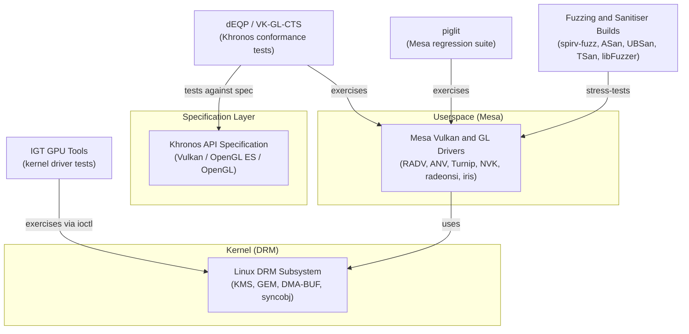
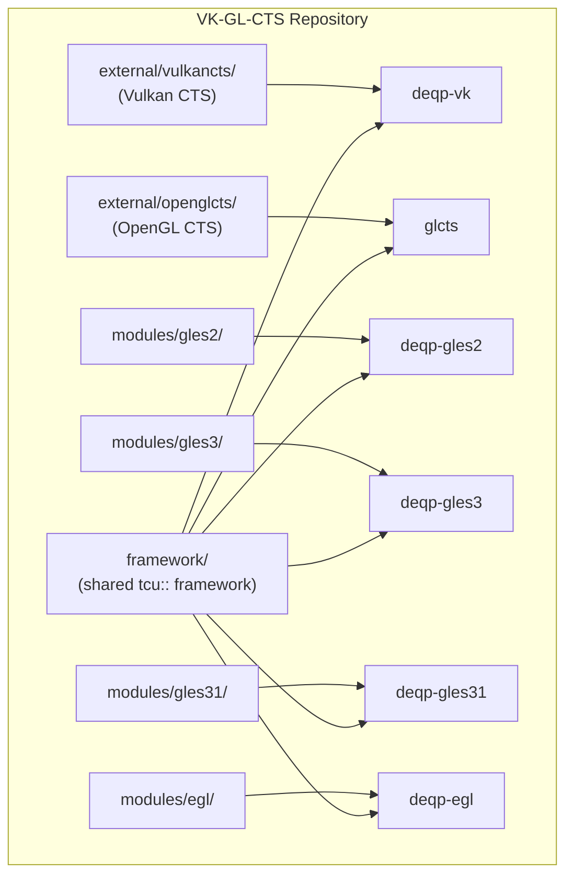
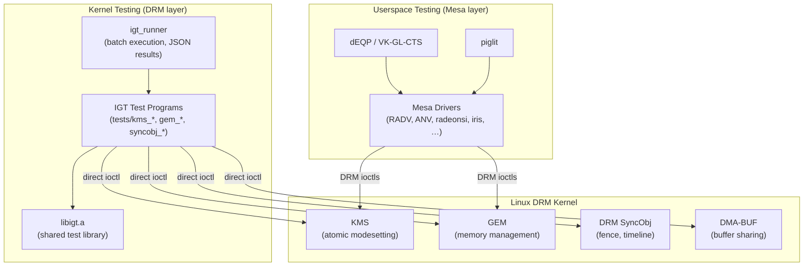
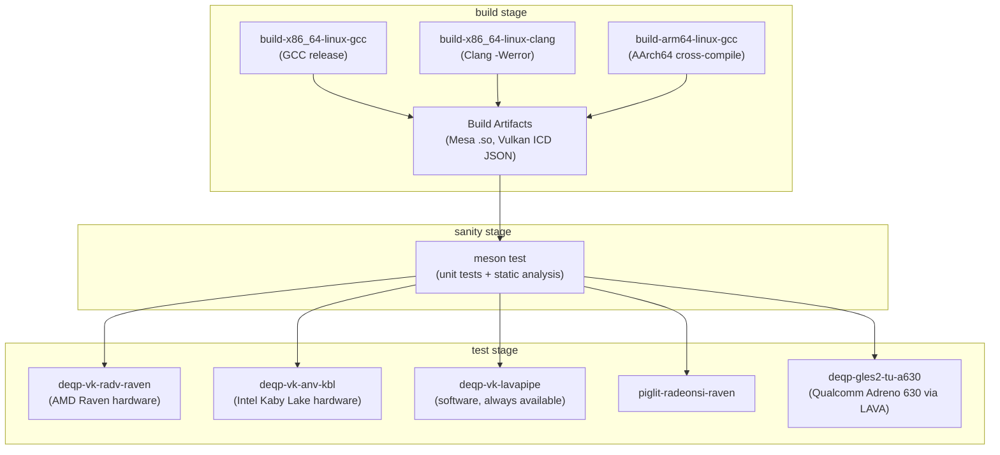
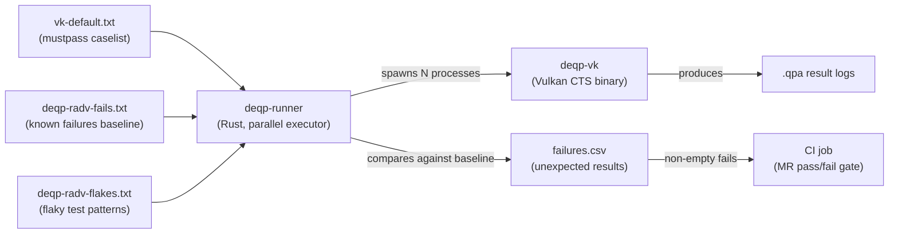
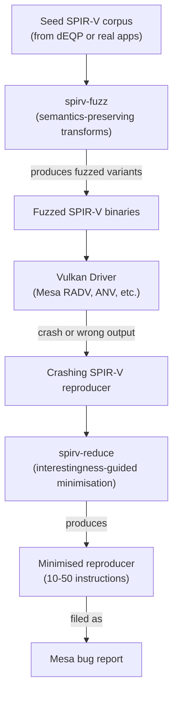

# Chapter 31: Conformance and Regression Testing

**Part IX — Tooling and Contributing**

**Audiences**: Systems and driver developers primarily — conformance and regression testing is the daily discipline of GPU driver development. Application developers benefit from understanding how the specification is tested, what a conformance failure implies for their code, and how to write a targeted test case when filing a Mesa bug report.

---

## Table of Contents

1. [Why Conformance Testing Is Different from Unit Testing](#1-why-conformance-testing-is-different-from-unit-testing)
2. [dEQP: The Khronos Conformance Test Suite](#2-deqp-the-khronos-conformance-test-suite)
   - [Repository Structure and Build System](#21-repository-structure-and-build-system)
   - [Test Name Encoding](#22-test-name-encoding)
   - [Running dEQP-VK Locally](#23-running-deqp-vk-locally)
   - [Result Files and Analysis Tools](#24-result-files-and-analysis-tools)
   - [The Vulkan CTS Mustpass List](#25-the-vulkan-cts-mustpass-list)
   - [OpenGL and OpenGL ES CTS](#26-opengl-and-opengl-es-cts)
3. [IGT GPU Tools: Kernel Driver Testing](#3-igt-gpu-tools-kernel-driver-testing)
   - [Repository Layout and Runner Infrastructure](#31-repository-layout-and-runner-infrastructure)
   - [KMS Tests](#32-kms-tests)
   - [GEM and Memory Management Tests](#33-gem-and-memory-management-tests)
   - [Synchronisation Object Tests](#34-synchronisation-object-tests)
   - [Writing a New IGT Test](#35-writing-a-new-igt-test)
4. [piglit: Mesa's GPU Regression Suite](#4-piglit-mesas-gpu-regression-suite)
   - [Test Categories and Running piglit](#41-test-categories-and-running-piglit)
   - [Comparing Results and Bisecting](#42-comparing-results-and-bisecting)
   - [The shader_test Format](#43-the-shader_test-format)
5. [Mesa's GitLab CI Pipeline](#5-mesas-gitlab-ci-pipeline)
   - [Build Stages](#51-build-stages)
   - [Test Stages and Hardware Runners](#52-test-stages-and-hardware-runners)
   - [deqp-runner: Mesa's Parallel CTS Executor](#53-deqp-runner-mesas-parallel-cts-executor)
   - [Handling Flaky Tests and Baselines](#54-handling-flaky-tests-and-baselines)
   - [shader-db: Instruction-Count Regression Tracking](#55-shader-db-instruction-count-regression-tracking)
6. [Fuzzing and Sanitiser Builds](#6-fuzzing-and-sanitiser-builds)
   - [spirv-fuzz and spirv-reduce](#61-spirv-fuzz-and-spirv-reduce)
   - [AddressSanitizer and UndefinedBehaviourSanitizer](#62-addresssanitizer-and-undefinedbehavioursanitizer)
   - [ThreadSanitizer for Race Detection](#63-threadsanitizer-for-race-detection)
   - [libFuzzer Integration and OSS-Fuzz](#64-libfuzzer-integration-and-oss-fuzz)
   - [Kernel Fuzzing with syzkaller](#65-kernel-fuzzing-with-syzkaller)
7. [Conformance Certification and the Khronos Adopter Program](#7-conformance-certification-and-the-khronos-adopter-program)
8. [Integrations](#integrations)
9. [References](#references)

---

## 1. Why Conformance Testing Is Different from Unit Testing

A **GPU** driver is a specification interpreter. Its correctness is defined not by internal invariants but by whether its observable outputs match what the **API** specification requires across an enormous space of inputs: shader programs, texture formats, pipeline state combinations, synchronisation patterns, memory aliasing scenarios, and extension interactions. Unit tests that verify a specific internal function in isolation — say, that **`nir_lower_io`** correctly rewrites an **`SSBO`** access when a particular flag is set — are valuable but insufficient. They test implementation structure, not specification compliance. Conformance tests are deliberately blind to implementation structure: they submit **API** calls and compare the resulting pixels, buffer contents, or timing values against what the specification mandates.

The **Khronos Group** formalises this distinction through the **Adopter Program**. Vendors who wish to use the **OpenGL**, **OpenGL ES**, or **Vulkan** trade names must submit conformance test results to **Khronos** and receive written approval. The submission package includes a test log produced by the **Khronos**-maintained test suite, a statement of which hardware configurations were tested, and documentation of any tests that were waived. Only then does the driver become an officially *conformant* implementation. **Mesa**'s **Vulkan** drivers — **RADV** (AMD), **ANV** (Intel), **Turnip** (Qualcomm/**Adreno**), **NVK** (NVIDIA), and **Honeykrisp** (Apple M1/M2) — have all gone through this process, with **RADV**, **ANV**, **Turnip**, **NVK**, and **Honeykrisp** achieving **Vulkan** 1.4 day-zero conformance when **Vulkan** 1.4 was released in January 2025 [[1](#ref1)]. Section 7 covers the full **Khronos Adopter Program** certification workflow, including the **mustpass list** submission process, **QualityWarning** and **CompatibilityWarning** result codes, and test waiving.

Regression testing is a different concern. Once a driver is conformant, every subsequent change must be verified to preserve that conformance. The full **Vulkan CTS** (**`dEQP-VK`**) comprises more than 700,000 test cases and takes eight or more hours to run on real hardware. No contributor can run the full suite before posting a merge request. **Mesa**'s solution is a layered strategy: a fast subset of known-sensitive tests runs in the merge request pipeline on actual hardware within roughly ten minutes; the full **mustpass list** runs nightly; and specific extension test groups run when the MR modifies code related to that extension.

The four testing pillars covered in this chapter are:

- **dEQP** / **VK-GL-CTS**: **Khronos**-maintained conformance tests for **Vulkan**, **OpenGL**, **OpenGL ES**, and **EGL**. Section 2 covers the **VK-GL-CTS** repository structure and **CMake** build system, the hierarchical dot-separated **test name encoding** scheme, running **`deqp-vk`** locally (including headless runs via **Lavapipe**), parsing **`.qpa`** result files with analysis tools such as **`testlog-to-csv`** and the **cherry** web viewer, the **Vulkan CTS mustpass list** at `external/vulkancts/mustpass/main/vk-default.txt`, and the **OpenGL** and **OpenGL ES CTS** binaries (**`glcts`**, **`deqp-gles31`**, and **Zink**'s inherited **GLES** conformance).
- **IGT GPU Tools**: The primary test suite for **Linux DRM** kernel drivers, covering **KMS**, **GEM**, **DMA-BUF**, and synchronisation objects. Section 3 examines the **`igt_runner`** infrastructure and **JSON** result format; **KMS** tests including **`kms_atomic`**, **`kms_plane`**, **`kms_cursor_crc`**, **`kms_flip`**, **`kms_vrr`**, and **`kms_color`**; **GEM** and memory management tests such as **`gem_mmap_gtt`**, **`gem_mmap_offset`**, **`gem_exec_store`**, and **`prime_vgem`**; **DRM synchronisation object** tests covering **`syncobj_basic`**, **`syncobj_timeline`**, and **`syncobj_wait`**; and a complete guide to writing a new **IGT** test using the **`igt_main`** macro framework.
- **piglit**: **Mesa**'s long-standing **GPU** regression suite, covering thousands of **OpenGL**, **GLSL**, and extension-specific behaviours with a format optimised for quick per-patch runs. Section 4 describes test categories (**`quick.py`**, **`gpu.py`**, **`all.py`**), running **piglit** with **`llvmpipe`** or **`softpipe`**, comparing results between runs with **`piglit summary`**, bisecting regressions using **`MESA_SHADER_DUMP_PATH`** and **NIR** IR diffs, and the **`.shader_test`** format used by **`shader_runner`**.
- **Fuzzing and sanitiser builds**: Stress-testing shader compilers and **API** surfaces with mutated inputs and memory-error-detecting instrumented builds. Section 6 covers **`spirv-fuzz`** and **`spirv-reduce`** for metamorphic **SPIR-V** testing, **AddressSanitizer** (**ASan**) and **UndefinedBehaviourSanitizer** (**UBSan**) builds for catching **NIR** array overflows and **`VkCommandPool`** use-after-free bugs, **ThreadSanitizer** (**TSan**) for detecting races in **`VK_KHR_pipeline_library`** background compilation, **libFuzzer** integration via the **`spirv_to_nir_fuzz`** and **GLSL** compiler fuzz targets and the **OSS-Fuzz** continuous service, and kernel-level fuzzing with **syzkaller** targeting the **DRM** ioctl surface.

**Mesa**'s **GitLab CI** pipeline (Section 5) ties the pillars together: the **build stage** compiles **Mesa** under **GCC**, **Clang**, and **AArch64** cross-compile toolchains; the **test stage** dispatches **dEQP**, **piglit**, and trace-replay jobs to bare-metal **GPU** runners (including **AMD Raven**, **Intel Kaby Lake**, and **Qualcomm Adreno 630** machines managed via **LAVA**); **`deqp-runner`** parallelises **CTS** execution and compares results against per-driver **`deqp-*-fails.txt`** baselines and **`deqp-*-flakes.txt`** retry lists; and **`mesa-shader-db`** tracks instruction-count regressions in **ACO** and **NIR** compiler changes using a corpus of real game shaders.



Understanding all four pillars is essential for anyone contributing to the **Linux** graphics stack. **Mesa** requires that new features pass the relevant **dEQP** modules before merge; kernel **DRM** patches must not introduce **KMS** or memory management regressions caught by **IGT**.

---

## 2. dEQP: The Khronos Conformance Test Suite

### 2.1 Repository Structure and Build System

dEQP (drawElements Quality Program) began at drawElements Oy and was acquired by Google, which donated it to Khronos in 2015. Today it lives in the **VK-GL-CTS** repository at `https://github.com/KhronosGroup/VK-GL-CTS`, which hosts conformance tests for all current Khronos graphics APIs under one roof [[2](#ref2)].

The repository is organised by API:

```
external/vulkancts/     — Vulkan CTS (dEQP-VK)
external/openglcts/     — OpenGL and OpenGL ES CTS
modules/gles2/          — GLES 2.0 test module
modules/gles3/          — GLES 3.0 test module
modules/gles31/         — GLES 3.1 test module
modules/egl/            — EGL test module
framework/              — Shared test framework (tcu::)
execserver/             — Remote execution server
```

Each API module produces a standalone binary. The Vulkan binary is `deqp-vk`; the desktop OpenGL binary is `glcts`; GLES binaries are `deqp-gles2`, `deqp-gles3`, and `deqp-gles31`; the EGL binary is `deqp-egl`.



Before building, external dependency sources must be fetched:

```bash
# Clone the repository
git clone https://github.com/KhronosGroup/VK-GL-CTS.git
cd VK-GL-CTS

# Fetch SPIRV-Tools, glslang, and other dependencies
python3 external/fetch_sources.py
```

The build uses CMake. The most important configure-time variable is `DEQP_TARGET`, which controls the windowing system backend:

```bash
# X11 (default on desktop Linux)
cmake -S . -B build-x11 \
    -DCMAKE_BUILD_TYPE=Release \
    -DDEQP_TARGET=x11_glx

# Wayland (requires wayland-devel, wayland-egl-devel)
cmake -S . -B build-wayland \
    -DCMAKE_BUILD_TYPE=Release \
    -DDEQP_TARGET=wayland

# Headless / null platform (no display required — uses Vulkan directly)
cmake -S . -B build-null \
    -DCMAKE_BUILD_TYPE=Release \
    -DDEQP_TARGET=null

# Build only deqp-vk to save time
cmake --build build-null \
    --target deqp-vk \
    -j$(nproc)
```

The `null` target is the most practical for CI and for developers working over SSH. For GPU conformance runs, Vulkan does not need a windowing system: the CTS creates off-screen surfaces directly via `VK_KHR_surface` or renders to `VkImage` objects without presenting.

To target a specific Mesa build rather than the system driver, point `VK_ICD_FILENAMES` at the Mesa ICD JSON:

```bash
export MESA_BUILD=$HOME/mesa-build
export VK_ICD_FILENAMES=$MESA_BUILD/share/vulkan/icd.d/radeon_icd.x86_64.json
```

### 2.2 Test Name Encoding

Every dEQP test has a hierarchical dot-separated name that encodes its location in the test tree. Understanding this encoding is essential for identifying which extension or feature a failing test is exercising.

Consider:
```
dEQP-VK.pipeline.monolithic.extended_dynamic_state3.misc.polygon_mode_to_lines
```

Breaking this down from left to right:
- `dEQP-VK` — the test binary (Vulkan CTS)
- `pipeline` — the top-level module grouping (`external/vulkancts/modules/vulkan/pipeline/`)
- `monolithic` — subgroup differentiating monolithic vs. pipeline library paths
- `extended_dynamic_state3` — maps to the `VK_EXT_extended_dynamic_state3` extension
- `misc` — a miscellaneous subgroup within that extension's tests
- `polygon_mode_to_lines` — the specific test: setting polygon mode to `VK_POLYGON_MODE_LINE` via dynamic state

To enumerate all tests matching a pattern:

```bash
./build-null/external/vulkancts/modules/vulkan/deqp-vk \
    --deqp-case="dEQP-VK.pipeline.monolithic.extended_dynamic_state3.*" \
    --list-cases
```

To search for all tests touching ray tracing:

```bash
./build-null/external/vulkancts/modules/vulkan/deqp-vk \
    --deqp-case="dEQP-VK.ray_tracing_pipeline.*" \
    --list-cases | wc -l
```

Key top-level modules in `dEQP-VK`:
- `dEQP-VK.api` — API object creation, feature queries, format properties
- `dEQP-VK.pipeline` — graphics and compute pipelines, dynamic state, pipeline libraries
- `dEQP-VK.synchronization` — barriers, events, semaphores, fences, timeline semaphores
- `dEQP-VK.synchronization2` — `VK_KHR_synchronization2` specific paths
- `dEQP-VK.memory` — allocation, binding, mapping, dedicated allocation
- `dEQP-VK.image` — image creation, layout transitions, multisampling, compression
- `dEQP-VK.ray_tracing_pipeline` — `VK_KHR_ray_tracing_pipeline` CTS
- `dEQP-VK.mesh_shader` — `VK_EXT_mesh_shader` CTS
- `dEQP-VK.fragment_shading_rate` — `VK_KHR_fragment_shading_rate`
- `dEQP-VK.spirv_assembly` — tests that compile hand-written SPIR-V and execute it

### 2.3 Running dEQP-VK Locally

The minimal invocation for Vulkan CTS uses a caselist file that specifies which tests to run, and a log filename for results:

```bash
# Run from the VK-GL-CTS source directory
DEQP_BIN=./build-null/external/vulkancts/modules/vulkan/deqp-vk

# Run the full Vulkan mustpass (warning: ~8 hours on real hardware)
$DEQP_BIN \
    --deqp-caselist-file=external/vulkancts/mustpass/main/vk-default.txt \
    --deqp-log-filename=results-full.qpa \
    --deqp-log-images=disable \
    --deqp-log-shader-sources=disable

# Run just the synchronisation tests
$DEQP_BIN \
    --deqp-case="dEQP-VK.synchronization.*" \
    --deqp-log-filename=results-sync.qpa

# Run a single test with verbose output
$DEQP_BIN \
    --deqp-case="dEQP-VK.pipeline.monolithic.extended_dynamic_state3.misc.polygon_mode_to_lines" \
    --deqp-log-filename=results-single.qpa
```

For headless CPU-only testing using Lavapipe (Mesa's software Vulkan implementation):

```bash
export VK_ICD_FILENAMES=/usr/share/vulkan/icd.d/lvp_icd.x86_64.json
$DEQP_BIN \
    --deqp-case="dEQP-VK.api.*" \
    --deqp-log-filename=results-lavapipe.qpa
```

For CI runs where parallelism is critical, Mesa's strategy is to split the caselist across multiple job instances. With N jobs, job K receives tests `K, K+N, K+2N, ...` from the full caselist. The `deqp-runner` tool (Section 5.3) automates this splitting.

### 2.4 Result Files and Analysis Tools

dEQP writes results in the `.qpa` format, an XML dialect:

```xml
#!deqp-begin-session
<TestCaseResult Version="0.3.4" CasePath="dEQP-VK.api.object_management.allocs_free_in_order.command_pool" Duration="123">
  <Text>Test completed</Text>
  <Result StatusCode="Pass">Pass</Result>
</TestCaseResult>

<TestCaseResult Version="0.3.4" CasePath="dEQP-VK.pipeline.monolithic.blend.dual_source.rgba8_unorm.src1_one_minus_src_alpha">
  <Text>Expected: ...; Got: ...</Text>
  <Result StatusCode="Fail">Color comparison failed</Result>
</TestCaseResult>
```

Status codes [[2](#ref2)]:
- `Pass` — test passed all checks
- `Fail` — a specification requirement was not met
- `NotSupported` — the feature is not supported; this is a valid result for optional extensions
- `InternalError` — the CTS itself encountered an error (e.g., driver crash, timeout)
- `QualityWarning` — the result is within specification but below recommended quality
- `CompatibilityWarning` — conformance submission concern but not a failure
- `Waiver` — test waived in the conformance submission with Khronos approval

A Python script to extract all failures from a `.qpa` file:

```python
import xml.etree.ElementTree as ET
import sys

def extract_failures(qpa_path):
    """Parse a dEQP .qpa file and print failing test names."""
    failures = []
    # .qpa is not well-formed XML (multiple roots); parse incrementally
    with open(qpa_path, 'r', errors='replace') as f:
        content = f.read()
    # Wrap in a root element for parsing
    wrapped = f"<root>{content}</root>"
    try:
        root = ET.fromstring(wrapped)
    except ET.ParseError as e:
        # Fall back to line-by-line scanning for malformed files
        for line in content.splitlines():
            if 'StatusCode="Fail"' in line or 'StatusCode="InternalError"' in line:
                # Extract CasePath from preceding TestCaseResult open tag
                print(f"[FAIL] {line.strip()}")
        return

    for tc in root.findall('TestCaseResult'):
        result = tc.find('Result')
        if result is not None and result.get('StatusCode') in ('Fail', 'InternalError'):
            failures.append({
                'name': tc.get('CasePath'),
                'status': result.get('StatusCode'),
                'message': result.text or ''
            })
    for f in failures:
        print(f"[{f['status']}] {f['name']}: {f['message']}")
    print(f"\nTotal failures: {len(failures)}")

if __name__ == '__main__':
    extract_failures(sys.argv[1])
```

The `testlog-to-csv` utility (found in `VK-GL-CTS/external/vulkancts/scripts/`) converts `.qpa` files to CSV for spreadsheet-based comparison across driver versions. The VK-GL-CTS also ships a web-based `cherry` result viewer at `scripts/build_and_run_cherry.py` that renders a hierarchical pass/fail tree.

### 2.5 The Vulkan CTS Mustpass List

Not all 700,000+ dEQP-VK tests are required for Khronos conformance. The **mustpass list** at `external/vulkancts/mustpass/main/vk-default.txt` specifies the exact set of tests that must pass for a conformance submission to be accepted. Tests not in the mustpass list may be present in the repository but are optional — typically new tests being developed for a forthcoming extension before the extension is finalised.

Mesa's CI pipeline uses this mustpass list as the gate. A driver that passes all mustpass tests without unexpected failures is a candidate for a Khronos conformance submission. The actual submission process involves running on specific hardware configurations documented in the submission package, generating a tarball of `.qpa` logs, and uploading them through the Khronos Adopter portal.

The mustpass list is versioned alongside the CTS. Mesa's CI pins to a specific CTS commit (visible in `.gitlab-ci.yml` under the `DEQP_VK_VERSION` or similar variable). This pinning is critical: test names are sometimes restructured between CTS versions, so a test that passes in CTS 1.3.5 may not appear in CTS 1.3.7 under the same name. Contributors must use the same CTS commit that Mesa CI uses.

Note on embargo: some Vulkan CTS tests are developed under a 6-month Khronos embargo period. The tests exist in the Khronos-internal CTS repository before they are merged to the public `main` branch. During this period, driver developers working within a Khronos member organisation may be testing against unpublished tests. For community contributors, the public `main` branch is the correct reference.

### 2.6 OpenGL and OpenGL ES CTS

The same VK-GL-CTS repository contains the OpenGL and OpenGL ES conformance tests. The `deqp-gles31` binary covers OpenGL ES 3.1 and 3.2; the `glcts` binary covers desktop OpenGL 4.x:

```bash
# Run GLES 3.1 tests against Mesa (e.g., radeonsi or iris via GLES)
export MESA_BUILD=$HOME/mesa-build
export LIBGL_DRIVERS_PATH=$MESA_BUILD/lib/x86_64-linux-gnu/dri

./build-x11/modules/gles31/deqp-gles31 \
    --deqp-caselist-file=external/openglcts/data/mustpass/gles/aosp_mustpass/3.2/gles32-master.txt \
    --deqp-log-filename=results-gles32.qpa
```

A particularly important case is **Zink** — Mesa's OpenGL implementation built on top of Vulkan. Zink's GLES conformance is inherited from the Vulkan driver it targets: a Zink + RADV stack passes GLES tests to the extent that RADV's Vulkan support is complete. This makes the GLES CTS useful for surfacing Vulkan driver gaps indirectly. See Chapter 19 for Zink's architecture.

---

## 3. IGT GPU Tools: Kernel Driver Testing

### 3.1 Repository Layout and Runner Infrastructure

IGT GPU Tools (`igt-gpu-tools`) is the primary test suite for Linux DRM kernel drivers. While dEQP and piglit test the userspace Mesa stack, IGT drops below the Mesa layer and directly exercises DRM kernel interfaces via `ioctl`. The repository lives at `https://gitlab.freedesktop.org/drm/igt-gpu-tools` [[4](#ref4)].



The directory structure:

```
tests/          — Test programs (kms_*, gem_*, syncobj_*, perf*)
benchmarks/     — Performance measurement programs
lib/            — Shared test library (libigt.a)
runner/         — igt_runner binary for batch execution
tools/          — Utilities (intel_gpu_top, intel_reg, etc.)
docs/           — Documentation
scripts/        — run-tests.sh, helper scripts
```

Tests are standalone executables. Each executable may contain multiple *subtests* that are enumerated and run individually by the `igt_runner`. The runner produces results in JSON format compatible with KernelCI.

To run tests:

```bash
# List all subtests of kms_atomic
./build/tests/kms_atomic --list-subtests

# Run a specific subtest
./build/tests/kms_atomic --run-subtest atomic-invalid-params

# Run all kms_atomic subtests (requires root, no compositor)
sudo ./build/tests/kms_atomic

# Run all KMS tests using run-tests.sh
sudo scripts/run-tests.sh -t kms_

# Exclude slow tests
sudo scripts/run-tests.sh -t kms_ -x slow
```

Most tests must run as root with no X or Wayland compositor active, because they take exclusive control of the display hardware. An exception is tests that use the `vgem` (virtual GEM) driver, which can run without hardware.

### 3.2 KMS Tests

The KMS test set (`tests/kms_*.c`) verifies kernel mode-setting behaviour. These tests are critical for compositor developers and DRM driver authors.

**`kms_atomic`** tests the atomic modesetting commit interface introduced in Linux 4.2. Key subtests include:
- `atomic-invalid-params`: verify that the kernel correctly rejects malformed `DRM_IOCTL_MODE_ATOMIC` calls with `EINVAL`
- `test-only`: commit with `DRM_MODE_ATOMIC_TEST_ONLY` and verify that no visible state change occurs
- `atomic-plane-damage`: test the `FB_DAMAGE_CLIPS` property for partial-update optimisations

**`kms_plane`** tests plane functionality — format support, z-ordering, rotation, and scaling:
- `plane-panning-bottom-right`: verify that plane position registers are written correctly at the hardware boundary
- `pixel-format`: enumerate all driver-advertised pixel formats and render a test pattern verifying each one

**`kms_cursor_crc`** uses hardware CRC capture to verify that the cursor plane renders identically to what a software reference produces:

```c
/* Simplified from tests/kms_cursor_crc.c */
igt_fixture {
    data.drm_fd = drm_open_driver_master(DRIVER_ANY);
    igt_display_require(&data.display, data.drm_fd);
    igt_display_require_output(&data.display);
}

igt_subtest_with_dynamic("cursor-size-change") {
    /* For each pipe with CRC support */
    for_each_pipe_with_valid_output(&data.display, pipe, output) {
        igt_dynamic_f("pipe-%s-%s", kmstest_pipe_name(pipe),
                       igt_output_name(output)) {
            test_cursor_size_change(&data, pipe, output);
        }
    }
}
```

The CRC comparison mechanism works through the `CRTC_CRC` DRM property available on supported hardware (primarily Intel and AMD). The test uses `igt_pipe_crc_collect_crc()` to read the hardware-computed CRC of the rendered frame and compares it against a reference CRC. This catches rendering differences invisible to the human eye but indicative of incorrect blending or compositing. CRC tests cannot run in VMs using `virtio-gpu` because the virtual device does not implement the `CRTC_CRC` property.

**`kms_flip`** exercises page flip events and VBLANK synchronisation — the core mechanism compositors use for tear-free presentation. Subtests verify that flip completion events arrive with correct timestamps, that `DRM_EVENT_FLIP_COMPLETE` fires reliably after `DRM_IOCTL_MODE_PAGE_FLIP`, and that VBLANK counters increment correctly.

**`kms_vrr`** tests Variable Refresh Rate support (`VK_KHR_present_id` on the Vulkan side; `VRR_ENABLED` DRM property on the KMS side). Subtests enable VRR on outputs that advertise adaptive sync support and verify that the kernel adjusts the VBLANK period in response to frame delivery timing.

**`kms_color`** verifies the colour management pipeline: gamma LUT upload via `GAMMA_LUT`, degamma LUT via `DEGAMMA_LUT`, and the colour transformation matrix via `CTM`. HDR metadata submission via `HDR_OUTPUT_METADATA` is tested for drivers that support `VK_EXT_hdr_metadata` equivalent functionality.

### 3.3 GEM and Memory Management Tests

The GEM tests (`tests/gem_*.c`) directly exercise the kernel graphics memory manager. Most apply to Intel hardware (i915) where GEM originated, but many are now generalised to any DRM driver exposing GEM-compatible interfaces.

**`gem_mmap_gtt`** and **`gem_mmap_offset`** test CPU-side mapping of GEM objects. `gem_mmap_gtt` uses the legacy GTT (graphics translation table) aperture mapping; `gem_mmap_offset` uses the newer `DRM_IOCTL_MODE_MAP_DUMB` / `DRM_IOCTL_PRIME_FD_TO_HANDLE` path. Key subtests verify page-fault handling, write-combined vs. cached mapping behaviour, and memory coherence after GPU writes.

**`gem_exec_store`** and **`gem_exec_fence`** test command submission and fence signalling. These tests submit simple GPU workloads (a store of a known value to a buffer object) and verify that the fence signals correctly and that the result matches the expected value. They are the minimal smoke test for the execbuf submission path.

**`prime_self_import`** and **`prime_vgem`** test DMA-BUF import/export via `DRM_IOCTL_PRIME_HANDLE_TO_FD` and `DRM_IOCTL_PRIME_FD_TO_HANDLE`. These tests are essential for verifying cross-driver buffer sharing — the mechanism that underlies zero-copy compositing and VA-API video decode (Chapter 23).

### 3.4 Synchronisation Object Tests

**`syncobj_basic`** tests the basic DRM synchronisation object lifecycle: creation via `DRM_IOCTL_SYNCOBJ_CREATE`, signalling via `DRM_IOCTL_SYNCOBJ_SIGNAL`, and waiting via `DRM_IOCTL_SYNCOBJ_WAIT`. These primitives underlie Vulkan's `VkFence` and `VkSemaphore` implementations in RADV and ANV.

**`syncobj_timeline`** tests the timeline sync object extension (`DRM_IOCTL_SYNCOBJ_TIMELINE_WAIT`, `DRM_IOCTL_SYNCOBJ_TIMELINE_SIGNAL`), which is the kernel-level primitive underlying Vulkan timeline semaphores (`VK_KHR_timeline_semaphore`). Subtests verify that waits with specific point values block correctly and unblock when the timeline advances.

**`syncobj_wait`** tests multi-object wait semantics: waiting for any one of N sync objects vs. waiting for all N, with and without timeout.

### 3.5 Writing a New IGT Test

IGT tests use a macro-based framework. A complete minimal KMS test:

```c
/* tests/kms_example.c — minimal IGT KMS test skeleton */
#include "igt.h"

typedef struct {
    int drm_fd;
    igt_display_t display;
} data_t;

static data_t data;

igt_main
{
    igt_fixture {
        data.drm_fd = drm_open_driver_master(DRIVER_ANY);
        igt_require_pipe_crc(data.drm_fd);
        igt_display_require(&data.display, data.drm_fd);
        igt_display_require_output(&data.display);
    }

    igt_subtest("basic-atomic-commit") {
        enum pipe pipe = PIPE_A;
        igt_output_t *output;

        for_each_valid_output_on_pipe(&data.display, pipe, output) {
            igt_plane_t *primary = igt_output_get_plane_type(
                output, DRM_PLANE_TYPE_PRIMARY);
            struct igt_fb fb;

            igt_create_color_fb(data.drm_fd, 1920, 1080,
                                DRM_FORMAT_XRGB8888,
                                DRM_FORMAT_MOD_LINEAR,
                                1.0, 0.0, 0.0, &fb);

            igt_plane_set_fb(primary, &fb);
            igt_assert_eq(igt_display_commit_atomic(
                &data.display, DRM_MODE_ATOMIC_ALLOW_MODESET, NULL), 0);

            igt_remove_fb(data.drm_fd, &fb);
        }
    }

    igt_fixture {
        igt_display_fini(&data.display);
        drm_close_driver(data.drm_fd);
    }
}
```

Key patterns:
- `igt_main` replaces `main()`; the framework handles argument parsing, subtest enumeration, and result reporting.
- `igt_fixture { }` runs setup/teardown around all subtests. A fixture failure skips remaining tests rather than aborting.
- `igt_subtest("name") { }` defines an individual test case. The `--run-subtest` argument selects one.
- `igt_assert_eq(a, b)` prints a diagnostic message and marks the test as failed if `a != b`, but continues execution. `igt_require(cond)` skips the test if the condition is false.
- Dynamic subtests (`igt_subtest_with_dynamic`, `igt_dynamic_f`) allow the set of subtests to vary based on hardware enumeration at runtime, producing names like `basic-atomic-commit@pipe-A-HDMI-1`.

New IGT tests are submitted as patches to the `dri-devel` mailing list with the subject prefix `[i-g-t]`.

---

## 4. piglit: Mesa's GPU Regression Suite

### 4.1 Test Categories and Running piglit

piglit predates dEQP and was created specifically for Mesa regression testing. Where dEQP is comprehensive and specification-driven, piglit is targeted and pragmatic: it accumulates tests for every driver bug ever fixed in Mesa, making it excellent at catching regressions in driver-specific quirks, extension edge cases, and GLSL compiler behaviours. The repository is at `https://gitlab.freedesktop.org/mesa/piglit` [[5](#ref5)].

Test categories:

```
spec/                    — Specification-derived tests, organised by extension
  arb_gpu_shader5/       — ARB_gpu_shader5 extension tests
  arb_compute_shader/    — ARB_compute_shader tests
  glsl-1.30/             — GLSL 1.30 language tests
  ...
tests/                   — Older single-binary tests
quick.py                 — Curated fast subset (~5 minutes on real hardware)
gpu.py                   — GPU-specific subset including extension tests
all.py                   — The full suite (several hours)
```

Running piglit:

```bash
# Run the quick suite with 4 parallel workers
python3 piglit run quick.py results/run1 -j4

# Run only ARB_gpu_shader5 tests
python3 piglit run tests/spec/arb_gpu_shader5/ results/arb5 -j4

# Run with pattern filtering
python3 piglit run quick.py results/run2 -j4 -t "glsl"

# Exclude slow tests
python3 piglit run gpu.py results/run3 -j4 -x slow

# Run with llvmpipe (headless, no hardware required)
GALLIUM_DRIVER=llvmpipe python3 piglit run quick.py results/llvmpipe -j4

# Run with softpipe (the original Mesa software rasteriser)
MESA_LOADER_DRIVER_OVERRIDE=softpipe python3 piglit run quick.py results/softpipe -j4
```

Results are stored in `results/<name>/` as JSON files. The most useful result file is `results/<name>/results.json.bz2`.

### 4.2 Comparing Results and Bisecting

The power of piglit for regression tracking lies in its comparison tools:

```bash
# Generate an HTML side-by-side comparison (open results/compare/index.html)
python3 piglit summary html results/compare results/run1 results/run2

# Terminal comparison showing regressions and fixes
python3 piglit summary console results/run1 results/run2
```

The console summary groups tests by status change (pass→fail, fail→pass, new failures, etc.). Status codes: `pass`, `fail`, `skip`, `warn`, `crash`, `timeout`.

**Bisecting a regression with piglit**:

```bash
# Step 1: Confirm the test fails on the current HEAD
GALLIUM_DRIVER=llvmpipe python3 piglit run \
    tests/spec/arb_shader_image_load_store/ results/bad -j1
# Confirm: results/bad shows a failure in the target test

# Step 2: Set up git bisect
git bisect start
git bisect bad HEAD
git bisect good v24.0.0

# Step 3: Create a bisect driver script
cat > /tmp/run-piglit-test.sh << 'EOF'
#!/bin/bash
set -e
cd /home/dev/mesa
meson setup build-bisect \
    -Dgallium-drivers=swrast \
    -Dvulkan-drivers="" \
    -Dbuildtype=debugoptimized \
    --wipe > /dev/null 2>&1
ninja -C build-bisect -j$(nproc) > /dev/null 2>&1

export GALLIUM_DRIVER=llvmpipe
export LIBGL_DRIVERS_PATH=build-bisect/src/gallium/targets/dri
python3 /home/dev/piglit/piglit run \
    tests/spec/arb_shader_image_load_store/image-load-store-qualifiers.c \
    /tmp/bisect-result -j1

# Exit 1 (bad) if the test failed; exit 0 (good) otherwise
python3 /home/dev/piglit/piglit summary console /tmp/bisect-result \
    | grep -q "^fail:" && exit 1 || exit 0
EOF
chmod +x /tmp/run-piglit-test.sh

# Step 4: Run the bisect
git bisect run /tmp/run-piglit-test.sh
```

For isolating shader compiler regressions, `MESA_SHADER_DUMP_PATH` can capture NIR for every compiled shader on both good and bad Mesa revisions, allowing direct diff of the IR:

```bash
MESA_SHADER_DUMP_PATH=/tmp/shaders-good GALLIUM_DRIVER=llvmpipe \
    python3 piglit run tests/spec/arb_gpu_shader5/ results/good -j1

# After rebuilding with the suspected bad commit:
MESA_SHADER_DUMP_PATH=/tmp/shaders-bad GALLIUM_DRIVER=llvmpipe \
    python3 piglit run tests/spec/arb_gpu_shader5/ results/bad -j1

diff -r /tmp/shaders-good /tmp/shaders-bad | head -100
```

### 4.3 The shader_test Format

piglit includes a `shader_runner` binary that executes `.shader_test` files — a compact format for testing GLSL behaviour without writing full C test programs. This format is used extensively in `tests/spec/`:

```glsl
# tests/spec/arb_texture_query_lod/textureQueryLOD-fragment.shader_test
# Tests ARB_texture_query_lod in a fragment shader.

[require]
GLSL >= 1.30
GL_ARB_texture_query_lod

[vertex shader]
#version 130
in vec4 piglit_vertex;
out vec2 texcoord;

void main() {
    gl_Position = piglit_vertex;
    texcoord = piglit_vertex.xy * 0.5 + 0.5;
}

[fragment shader]
#version 130
#extension GL_ARB_texture_query_lod : require

uniform sampler2D tex;
in vec2 texcoord;
out vec4 color;

void main() {
    vec2 lod = textureQueryLOD(tex, texcoord);
    // If LOD query returns reasonable values, output green
    color = (lod.x >= 0.0 && lod.y >= 0.0) ? vec4(0, 1, 0, 1)
                                              : vec4(1, 0, 0, 1);
}

[test]
uniform int tex 0
texture rgbw 0 (8, 8)
draw rect -1 -1 2 2
probe all rgb 0.0 1.0 0.0
```

The `[require]` section declares GL version and extension requirements — piglit skips the test with `NotSupported` if the requirements are not met. The `[test]` section commands are interpreted by `shader_runner`: `draw rect` submits a full-screen quad; `probe rgb` reads a pixel back and compares it against the expected value (tolerance-checked for float precision).

To submit a new shader test, place it in the appropriate `tests/spec/<extension>/` subdirectory and send a patch to `mesa-dev@lists.freedesktop.org` with the subject prefix `[piglit]`.

---

## 5. Mesa's GitLab CI Pipeline

### 5.1 Build Stages

Mesa's continuous integration runs on `gitlab.freedesktop.org/mesa/mesa` and is defined in the `.gitlab-ci.yml` file at the repository root, which includes hundreds of YAML fragments from `.gitlab-ci/` subdirectories [[3](#ref3), [15](#ref15)].

The pipeline is split into stages that run sequentially:

- **`build`**: Compiles Mesa with multiple toolchain/option combinations. Key jobs include `build-x86_64-linux-gcc` (GCC release build), `build-x86_64-linux-clang` (Clang with `-Werror`), `build-arm64-linux-gcc` (cross-compile for AArch64), and a matrix of `meson` option combinations that verify all feature flags compile cleanly. Build artifacts (Mesa `.so` files, Vulkan ICD JSON files) are archived and passed to test stages.
- **`sanity`**: Runs `meson test` (unit tests built into Mesa itself) and static analysis.
- **`test`**: Runs dEQP, piglit, and trace replay against hardware or software renderers.



### 5.2 Test Stages and Hardware Runners

Mesa's CI farm includes dedicated bare-metal machines with specific GPUs. Jobs like `deqp-vk-radv-raven` target AMD Raven Ridge (APU) hardware; `deqp-vk-anv-kbl` targets Intel Kaby Lake; `deqp-gles3-freedreno-a630` targets a Qualcomm Adreno 630 on an ARM development board managed via LAVA [[3](#ref3)].

Typical test job names follow the pattern `<suite>-<driver>-<hardware>`:
- `deqp-vk-radv-raven`: RADV Vulkan CTS on AMD Raven
- `deqp-vk-anv-kbl`: ANV Vulkan CTS on Intel Kaby Lake
- `piglit-radeonsi-raven`: piglit quick suite on radeonsi
- `deqp-gles2-tu-a630`: Turnip GLES 2.0 CTS on Adreno 630
- `deqp-vk-lavapipe`: Full Lavapipe Vulkan CTS (software, always available)
- `glcts-iris-kbl`: Desktop GL CTS on Intel iris

Hardware runners are not publicly accessible. To replicate a CI environment locally, use the Docker images that CI jobs pull:

```bash
# Pull the Mesa CI image for a specific job (hash from .gitlab-ci.yml)
docker pull registry.freedesktop.org/mesa/mesa/debian/x86_64_test-gl:2024-03-01

# Run an interactive shell inside the CI environment
docker run --rm -it \
    --device=/dev/dri/renderD128 \
    -v $HOME/mesa:/mesa \
    registry.freedesktop.org/mesa/mesa/debian/x86_64_test-gl:2024-03-01 \
    bash
```

The exact image tag for each job is specified in `.gitlab-ci/image-tags.yml`.

### 5.3 deqp-runner: Mesa's Parallel CTS Executor

`deqp-runner` (hosted at `https://gitlab.freedesktop.org/mesa/parallel-deqp-runner`) is a Rust utility written by Emma Anholt that parallelises dEQP runs and compares results to a baseline [[6](#ref6)]. It is Mesa-specific tooling — not part of the upstream Khronos CTS — and new contributors sometimes confuse the two.

Key capabilities:
- Distributes tests across CPU cores, running multiple `deqp-vk` processes simultaneously
- Automatically re-runs failing tests to distinguish flakes from genuine regressions
- Compares results against a per-driver baseline file; reports only unexpected changes
- Supports partial test lists for CI job splitting



Core invocation:

```bash
deqp-runner run \
    --deqp ./build/external/vulkancts/modules/vulkan/deqp-vk \
    --caselist external/vulkancts/mustpass/main/vk-default.txt \
    --output results/ \
    --jobs $(nproc) \
    --timeout 60 \
    --flakes .gitlab-ci/deqp-radv-flakes.txt \
    --baseline .gitlab-ci/deqp-radv-fails.txt \
    -- \
    --deqp-log-images=disable \
    --deqp-log-shader-sources=disable
```

Arguments after `--` are passed verbatim to the `deqp-vk` process. The `--baseline` file lists tests that are known to fail on this driver (the `deqp-*-fails.txt` files in Mesa's `.gitlab-ci/` directory). `deqp-runner` exits with a non-zero status if any test that is not in the baseline fails, or if any test that is in the baseline unexpectedly passes (a "fix" that should be removed from the baseline). The `--flakes` file lists regex patterns for tests whose results are non-deterministic; these are retried and treated as success if they pass on any attempt.

For CI job splitting (running 1/N of the test list per job):

```bash
deqp-runner suite \
    --suite .gitlab-ci/deqp-radv-vk-suite.toml \
    --output results/ \
    --jobs $(nproc) \
    --fraction 1/8   # This job runs tests 0, 8, 16, ...
```

Output from `deqp-runner` includes a `failures.csv` file listing test name, result, and any previous baseline status. The CI job marks the MR as failed if `failures.csv` is non-empty.

### 5.4 Handling Flaky Tests and Baselines

GPU driver testing is inherently subject to flakiness: timing-sensitive synchronisation tests may occasionally fail due to system load; precision tests may differ in the last ULP depending on GPU clock state. Mesa handles this in two ways:

1. **`deqp-*-flakes.txt`**: Per-driver files in `.gitlab-ci/` listing test-name regexes for known-flaky tests. `deqp-runner` retries these automatically.

2. **`deqp-*-fails.txt` (baselines)**: Per-driver, per-hardware lists of tests that are known to fail. These represent genuine driver gaps — tests the driver does not yet pass — rather than regressions.

A representative skip/flake file (`deqp-radv-raven-fails.txt` excerpt):

```
# Known failures on RADV Raven (gfx9 / Vega Mobile)
# Added 2024-01-15: ray tracing not supported on gfx9
dEQP-VK\.ray_tracing_pipeline\..*
dEQP-VK\.acceleration_structure\..*

# Added 2024-03-20: mesh shader extension not enabled on gfx9
dEQP-VK\.mesh_shader\..*

# Flaky timing issue, see Mesa issue #10234
# dEQP-VK\.synchronization2\.timeline_semaphore\..*device_overflow.*
```

Lines starting with `#` are comments. Non-comment lines are Python regular expressions matched against test names. The convention is to annotate each block with a date and a brief reason. When a driver fix makes a previously failing test pass, the corresponding line must be removed from the baseline — `deqp-runner` will fail the CI job on unexpected passes to enforce this discipline.

### 5.5 shader-db: Instruction-Count Regression Tracking

`mesa-shader-db` (at `https://gitlab.freedesktop.org/mesa/shader-db`) is a corpus of real game shaders used to track whether compiler changes regress instruction count or compile time. ACO and NIR changes frequently affect instruction counts, and a change that fixes correctness but doubles instruction count in a common game shader is unacceptable [[8](#ref8)].

The workflow:

```bash
# Clone shader-db
git clone https://gitlab.freedesktop.org/mesa/shader-db
cd shader-db

# Run against the new Mesa build (compiles all shaders, records stats)
SHADER_DB_SHOW_DIFFS=1 ./run.sh /path/to/new-mesa/build \
                                /path/to/old-mesa/build

# Output example:
# Totals from 1247 shaders:
#   Instrs in shared programs: 48291 -> 48187 (-0.22%)
#   Loops in shared programs:  1203 -> 1203 (0.00%)
#   Spills in shared programs: 23 -> 21 (-8.70%)
# Regressions:
#   src/some/shader.spv: 45 -> 52 instrs (+15.6%)
```

If `run.sh` reports regressions exceeding a threshold (typically any increase greater than a few percent in a single shader), the MR is expected to either fix the regression or justify it with a measured performance benefit from the correctness fix.

---

## 6. Fuzzing and Sanitiser Builds

### 6.1 spirv-fuzz and spirv-reduce

GPU shader compilers are complex, receive adversarial input in production (user-provided shaders, malicious web content in WebGPU contexts), and are written in C/C++ — a combination that historically produces exploitable memory-safety bugs. Fuzzing is the most effective way to find these bugs systematically.

**spirv-fuzz**, part of SPIRV-Tools [[11](#ref11)], takes a valid SPIR-V binary and applies semantics-preserving transformations to produce a new, more complex binary that should produce identical results when executed by a conformant driver. The "semantics-preserving" property is the key insight: if the original and transformed shaders produce different output, the driver is wrong — the test is self-referential. This metamorphic testing approach was pioneered by the GraphicsFuzz project [[12](#ref12)].



```bash
# Fuzz a corpus of shaders in a loop
mkdir -p fuzz_corpus fuzz_output
# Seed the corpus with some SPIR-V shaders from dEQP or real applications

for seed in fuzz_corpus/*.spv; do
    spirv-fuzz "$seed" \
        --seed=$RANDOM \
        --output "fuzz_output/$(basename $seed .spv)_fuzzed_$RANDOM.spv"
done

# Test each fuzzed shader against the driver
for shader in fuzz_output/*.spv; do
    VK_ICD_FILENAMES=$MESA_BUILD/share/vulkan/icd.d/radeon_icd.x86_64.json \
    glslangValidator --target-env vulkan1.3 "$shader" 2>&1 | grep -i "error\|crash\|segfault"
    # Or feed directly to a custom Vulkan test harness
done
```

When a crash is found, **spirv-reduce** minimises the SPIR-V to the smallest reproducer:

```bash
# Create an interestingness test script
cat > /tmp/test_interesting.sh << 'EOF'
#!/bin/bash
VK_ICD_FILENAMES=$MESA_BUILD/share/vulkan/icd.d/radeon_icd.x86_64.json \
timeout 5 ./vulkan_crash_reproducer "$1"
# Exit 0 if the crash/wrong-result is reproduced, 1 otherwise
EOF
chmod +x /tmp/test_interesting.sh

# Reduce the crashing SPIR-V
spirv-reduce crasher.spv \
    --output reduced.spv \
    --interestingness-test /tmp/test_interesting.sh
```

A well-reduced reproducer is often 10–50 instructions that reliably crashes or produces wrong output — suitable for a Mesa bug report. The combination of `spirv-fuzz` + `spirv-reduce` has found hundreds of shader compiler bugs across Mesa, LLVM, and proprietary drivers.

### 6.2 AddressSanitizer and UndefinedBehaviourSanitizer

Building Mesa with ASan and UBSan enabled finds memory-safety and undefined-behaviour bugs at runtime that would otherwise cause silent corruption or crashes in production.

```bash
# Configure Mesa with ASan + UBSan
meson setup build-asan \
    -Db_sanitize=address,undefined \
    -Db_lundef=false \
    -Dvulkan-drivers=amd,intel \
    -Dgallium-drivers=radeonsi,iris,swrast \
    -Dbuildtype=debugoptimized \
    -Dglx=dri

ninja -C build-asan -j$(nproc)
```

The `-Db_lundef=false` flag is required because ASan interceptors use dynamic linking that conflicts with the default `-Wl,-z,now` linker behaviour.

Running with ASan:

```bash
export LD_LIBRARY_PATH=$PWD/build-asan/src/gallium/targets/dri:$LD_LIBRARY_PATH
export VK_ICD_FILENAMES=$PWD/build-asan/share/vulkan/icd.d/radeon_icd.x86_64.json
export ASAN_OPTIONS=detect_leaks=1:fast_unwind_on_malloc=0:abort_on_error=1

# Run dEQP-VK against the ASan build
./deqp-vk --deqp-case="dEQP-VK.pipeline.*" --deqp-log-filename=results-asan.qpa
```

`fast_unwind_on_malloc=0` is important on AMD hardware because the GPU driver uses setjmp/longjmp internally; without it, stack traces point to wrong locations.

Common findings in Mesa ASan runs:
- **Out-of-bounds NIR array accesses**: The NIR IR stores instructions in arrays that grow dynamically; incorrect index arithmetic produces OOB reads that are silent without ASan.
- **Use-after-free in command buffer recording**: RADV pre-allocates command stream memory; releasing a `VkCommandPool` with in-flight command buffers that reference that memory produces UAF.
- **Stack buffer overflow in shader variant key hashing**: Fixed-size keys that do not account for all driver-specific state bits.

UBSan catches:
- **Signed integer overflow in constant folding**: GLSL `int` overflow is undefined in C, but the NIR constant folder may perform `int32_t` arithmetic expecting wraparound.
- **Misaligned pointer reads**: Certain GPU hardware structures are packed; casting a `uint8_t*` offset to a `uint32_t*` violates alignment requirements.
- **Null pointer arithmetic**: `ptr + 0` where `ptr == NULL` is technically UB even though the result is often never dereferenced.

### 6.3 ThreadSanitizer for Race Detection

Mesa performs asynchronous shader compilation — the `VK_KHR_pipeline_library` and pipeline cache mechanisms compile shaders in background threads. This is a common source of data races.

```bash
meson setup build-tsan \
    -Db_sanitize=thread \
    -Db_lundef=false \
    -Dvulkan-drivers=amd \
    -Dbuildtype=debugoptimized

ninja -C build-tsan -j$(nproc)

export TSAN_OPTIONS=halt_on_error=1:history_size=7
export VK_ICD_FILENAMES=$PWD/build-tsan/share/vulkan/icd.d/radeon_icd.x86_64.json

# Run a multi-threaded benchmark or the dEQP pipeline tests
./deqp-vk --deqp-case="dEQP-VK.pipeline.pipeline_library.*" \
           --deqp-log-filename=results-tsan.qpa
```

TSan has a higher false-positive rate than ASan. Mesa maintains TSan suppression files that silence known false positives. The compiler-level blacklist lives at `build-support/tsan-blacklist.txt` (moved from the repository root in Mesa 24.2.0); a runtime suppressions file covers race reports that the compiler blacklist cannot suppress:

> **Note: needs verification** — the exact path of Mesa's runtime TSan suppressions file varies between Mesa versions; check `build-support/` and `src/util/` in the current Mesa tree. The suppression format is:

```
# Runtime TSan suppressions (representative excerpt)
# hash_table_u64 uses relaxed atomic access intentionally
race:hash_table_u64_search
# util_queue uses a lock-free ring that TSan cannot model accurately
race:util_queue_add_job
```

### 6.4 libFuzzer Integration and OSS-Fuzz

Mesa is an OSS-Fuzz target. The project configuration at `https://github.com/google/oss-fuzz/tree/master/projects/mesa` [[7](#ref7)] sets up continuous fuzzing of Mesa's shader compiler front ends. OSS-Fuzz runs Mesa fuzz targets continuously on Google's infrastructure and files bugs automatically when crashes are found.

Mesa ships libFuzzer harness targets in its source tree. The key targets are:

**`spirv_to_nir_fuzz`** (`src/compiler/spirv/tests/`): Feeds arbitrary byte sequences to `spirv_to_nir()`, exercising the SPIR-V front end and all subsequent NIR lowering passes. This is the highest-value target because SPIR-V input is user-controlled in Vulkan.

**GLSL compiler fuzzer** (`src/compiler/glsl/tests/`): Feeds arbitrary GLSL source strings to Mesa's GLSL compiler front end, exercising lexing, parsing, and IR generation before the SPIR-V path.

Building and running locally:

```bash
meson setup build-fuzz \
    -Db_sanitize=address,undefined \
    -Db_lundef=false \
    -Dfuzzing-engine=libfuzzer \
    -Dvulkan-drivers=amd \
    -Dbuildtype=debugoptimized

ninja -C build-fuzz src/compiler/spirv/spirv_to_nir_fuzz

# Seed the corpus with SPIR-V files from VK-GL-CTS
mkdir corpus
find /path/to/VK-GL-CTS -name "*.spv" -exec cp {} corpus/ \;

./build-fuzz/src/compiler/spirv/spirv_to_nir_fuzz \
    -jobs=$(nproc) \
    -timeout=10 \
    corpus/
```

When OSS-Fuzz finds a crash, it files a bug in the Mesa issue tracker with a minimised reproducer and the sanitiser stack trace. The typical turnaround from crash discovery to Mesa fix is days to weeks for security-relevant findings.

### 6.5 Kernel Fuzzing with syzkaller

The DRM subsystem kernel interfaces are fuzzed by **syzkaller** [[14](#ref14)], Google's coverage-guided kernel syscall fuzzer. Syzkaller uses system call description files (`sys/linux/drm.txt`, `sys/linux/gpu.txt`) that enumerate the DRM ioctls, their argument structures, and the valid value ranges for each field. The fuzzer generates random sequences of ioctls and monitors for kernel panics, `WARN_ON` triggers, and KASAN/UBSAN reports.

Syzbot (the continuous fuzzing service) sends monthly DRM bug reports to the `dri-devel` mailing list. In 2024, recurring findings included NULL pointer dereferences in `drm_syncobj_array_find`, use-after-free in GEM fence tracking, and assertion failures in the atomic modesetting validation path. The syzbot dashboard at `https://syzkaller.appspot.com/upstream/s/dri` tracks open and fixed DRM bugs [[14](#ref14)].

Known gaps in syzkaller's DRM coverage: the fuzzer operates at the ioctl level and cannot easily generate semantically meaningful GPU command buffers. As a result, GEM execbuf paths that require valid GPU commands are under-fuzzed; shader compiler inputs via Vulkan driver ioctls are also not covered by the ioctl-level descriptions. spirv-fuzz (Section 6.1) addresses this gap at the userspace layer.

---

## 7. Conformance Certification and the Khronos Adopter Program

Khronos certification is the formal process by which a graphics implementation is recognised as conformant with an API specification. For GPU vendors using the Vulkan or OpenGL trade name, certification is legally required under the Khronos Adopter Agreement. For open-source Mesa drivers, certification is voluntary but strongly desired: it provides a credible correctness guarantee and enables downstream distributors (Linux distributions, ChromeOS, SteamOS) to ship the driver with confidence.

The process begins with the implementer running the CTS mustpass list against their implementation and collecting `.qpa` result logs. The logs are submitted through the Khronos Adopter portal along with metadata: hardware specifications, driver version, CTS version, and operating system. Khronos staff review the submission; if the logs show no unexpected failures, the submission is approved and appears in the public conformance database at `https://www.khronos.org/conformance/adopters/conformant-products/vulkan` [[9](#ref9)].

**Mesa driver conformance status as of December 2024 / early 2025**:

- **RADV (AMD)**: Conformant Vulkan 1.4. Multiple submissions covering generations from GFX6 (Southern Islands / GCN 1.0) through GFX11 (RDNA3). Submissions include both Valve-contributed (Steam Deck) and AMD-contributed hardware configurations. Vulkan 1.4 day-zero conformance achieved at the Vulkan 1.4 release in January 2025 [[1](#ref1)].
- **ANV (Intel)**: Conformant Vulkan 1.4. Covers Intel Gen9 (Kaby Lake) through Xe (Meteor Lake). Day-zero Vulkan 1.4 conformance [[1](#ref1)].
- **Turnip (Qualcomm Adreno)**: Conformant Vulkan 1.4. Primarily driven by Collabora. Covers Adreno 6xx and 7xx series. Day-zero Vulkan 1.4 conformance [[1](#ref1)].
- **NVK (NVIDIA open-source)**: Reached Vulkan 1.0 conformance in late 2023 on NVIDIA Turing (RTX 20xx) hardware [[10](#ref10)]. Progressed to Vulkan 1.4 day-zero conformance in early 2025 [[1](#ref1)].
- **Honeykrisp (Apple)**: Conformant Vulkan 1.4 day-zero for Apple M1/M2 [[1](#ref1)].

For `QualityWarning` and `CompatibilityWarning` results: these are not failures in the conformance sense. A `QualityWarning` indicates that the result was numerically within spec but below Khronos's recommended quality threshold. A `CompatibilityWarning` raises a concern about potential interoperability issues without constituting a specification violation. Conformance submissions track these separately and they appear in the submission documentation.

**Test waiving** is the formal mechanism for documenting a known limitation. If a conformant implementation genuinely cannot pass a specific test due to a hardware limitation that the specification explicitly permits, the implementer may file a waiver request with Khronos. The waiver documents the specific test names, the hardware limitation, and the specification clause that permits the behaviour. Waivers require Khronos Working Group approval and are rare.

The relationship between Mesa CI passing and Khronos certification is important to understand: Mesa's CI pipeline uses the same mustpass list and the same CTS version as a conformance submission. If Mesa's CI is fully green for a driver, that driver is functionally ready for a conformance submission. The submission itself is a periodic administrative exercise — it does not happen for every Mesa release, but typically when the team has been passing cleanly for some months and wishes to certify a new spec version.

New Vulkan extension tests enter the CTS through Khronos's internal review process, then are merged to the public `main` branch after a 6-month embargo. Implementers at Khronos member organisations can access the internal CTS repository, which means community contributors without Khronos membership may discover that a new extension's CTS tests are not yet public when they first implement the extension. In practice, Mesa uses the public `main` CTS commit as its CI reference, so the CI gap is narrow for most extensions.

---

## Roadmap

### Near-term (6–12 months)

- **Vulkan SC 1.0 CTS broadening**: The Vulkan SC Emulation Driver Stack released by the Khronos Vulkan SC Working Group in February 2025 is expected to drive expansion of the Vulkan SC CTS coverage, making it easier for Mesa-based safety-critical prototypes to run conformance tests without dedicated hardware. [Source](https://www.khronos.org/vulkansc/)
- **skqp integration in Mesa CI**: A draft merge request (`!18771`) exists to add `deqp-runner` support for Skia's GPU test suite (skqp), which would extend Mesa CI's coverage to include Skia's GPU rendering paths as used by Chrome and Flutter. [Source](https://gitlab.freedesktop.org/mesa/mesa/-/merge_requests/18771)
- **Additional Valve-sponsored bare-metal dEQP runners**: Valve has been actively adding more bare-metal GPU runner capacity to Mesa CI (e.g., `!14660`). Near-term expansion is expected to cover a broader range of RADV and Turnip hardware configurations, reducing the gap between the nightly full-mustpass run and per-MR fast subset. [Source](https://gitlab.freedesktop.org/mesa/mesa/-/merge_requests/14660)
- **CTS 6-month embargo reduction for Vulkan extensions**: There is ongoing discussion within the Khronos Vulkan Working Group about shortening or eliminating the 6-month embargo period on new extension CTS tests, which would allow community implementers in Mesa to access tests earlier and reduce the conformance delay for new extensions. Note: needs verification of specific timeline.
- **syzkaller DRM syscall descriptor improvements**: The `sys/linux/drm.txt` syscall descriptions in syzkaller are periodically updated as new DRM ioctls are added. With the introduction of the DRM GPUVM and VM_BIND interfaces, updates to syzkaller's DRM coverage are expected to appear within 6–12 months. [Source](https://github.com/google/syzkaller)

### Medium-term (1–3 years)

- **Vulkan 1.4 CTS mustpass list stabilisation and Vulkan 1.5 preparation**: Following the January 2025 Vulkan 1.4 day-zero conformance achievement by RADV, ANV, Turnip, NVK, and Honeykrisp, the medium-term focus will shift to hardening Vulkan 1.4 extension coverage (mesh shaders, ray tracing, cooperative matrices) and preparing the CTS infrastructure for a potential Vulkan 1.5 or next-generation API revision. [Source](https://www.khronos.org/blog/vulkan-continuing-to-forge-ahead-siggraph-2025)
- **piglit OpenGL ES retirement and migration to dEQP-GLES**: piglit's GLES test coverage has historically overlapped with `dEQP-GLES31`. As dEQP's GLES modules have matured, the Mesa community has discussed gradually retiring redundant piglit GLES tests in favour of dEQP, reducing maintenance burden while retaining piglit's fast `quick.py` subset for CI. Note: needs verification of formal deprecation plans.
- **AI-assisted shader fuzzing**: The SPIRV-Tools `spirv-fuzz` tool uses structured metamorphic transformations; there is growing academic interest (following the GraphicsFuzz line of work) in using machine-learning-guided mutation strategies to generate more semantically realistic shader test cases that exercise corner cases in register allocators and instruction selectors. [Source](https://github.com/google/graphicsfuzz)
- **parallel-deqp-runner GPU-side result streaming**: The `parallel-deqp-runner` Rust tool currently aggregates results after test completion. Planned improvements (tracked in the Mesa GitLab issue [#2046](https://gitlab.freedesktop.org/mesa/mesa/-/issues/2046) for faster Mesa CI) include streaming partial results to the CI dashboard in real time, enabling earlier failure detection on long hardware runs.
- **DRM kernel CI integration with KernelCI**: The DRM subsystem's IGT-based testing is progressively being integrated into the broader KernelCI infrastructure, which aggregates results from many kernel subsystems. Medium-term plans involve standardising the DRM CI reporting format with KernelCI's schema to enable cross-tree regression correlation. [Source](https://docs.kernel.org/gpu/automated_testing.html)

### Long-term

- **Unified Khronos conformance database and automated submission**: Currently, conformance submission is a periodic manual administrative process. A long-term goal articulated within Khronos discussions is a more automated submission pipeline where drivers that continuously pass the mustpass list on hardware can receive provisional conformance status without a separate submission ceremony. Note: needs verification.
- **GPU-accelerated CTS execution**: The Vulkan CTS `deqp-vk` test executor itself runs entirely on the CPU; each test case launches GPU workloads and reads back results on the CPU. As Vulkan extensions such as `VK_KHR_device_group` and compute-only pipelines mature, there is architectural interest in moving CTS result validation and image comparison onto the GPU to reduce per-test CPU overhead and allow the 700,000+ test suite to run faster on constrained hardware. Note: needs verification.
- **Formal methods integration**: Academic research groups are exploring the use of formal GPU memory model checkers (e.g., the Alloy-based Vulkan memory model verification work) as a complement to CTS testing, with the goal of providing mechanical proofs that specific synchronisation patterns are correctly handled. Long-term, such tools could be integrated into the spirv-fuzz / spirv-reduce pipeline to generate synchronisation stress tests that are provably distinguishing. [Source](https://github.com/nicowillis/gpu-memory-models)
- **piglit archival and preservation**: piglit's test suite encodes decades of GPU driver bug history. A long-term goal is to curate and preserve the piglit corpus as a historical reference even if active development migrates fully to dEQP, ensuring that regressions involving legacy OpenGL behaviour remain detectable on old hardware configurations still in use in embedded and industrial systems. Note: needs verification of formal plans.

---

## Integrations

**Chapter 10 (NVK)**: NVK's Vulkan conformance journey is a concrete example of the Khronos Adopter Program process described in Section 7. NVK was tested with dEQP-VK throughout development; the test modules that NVK was passing (and failing) at each stage are visible in the Mesa CI history. NVK's path from a partial implementation to Vulkan 1.4 day-zero conformance is the best-documented recent example of the full testing pipeline.

**Chapter 14 (NIR)**: NIR compiler bugs are the most common source of dEQP-VK and piglit failures. The spirv-fuzz workflow (Section 6.1) directly exercises the SPIR-V → NIR front end described in Chapter 14. `NIR_DEBUG=validate` (covered in Chapter 30's debugging section) is the standard companion to dEQP runs: it inserts NIR invariant-checking passes after every lowering pass, making many latent compiler bugs manifest immediately rather than producing wrong output downstream.

**Chapter 15 (ACO)**: ACO register allocation bugs produce incorrect shader output that dEQP-VK precision tests catch. The shader-db regression tracking described in Section 5.5 is primarily used to monitor ACO instruction counts. `ACO_DEBUG=validatera` (the RA validation mode) is complementary to dEQP in finding register allocation bugs before they reach hardware.

**Chapter 17 (Software Renderers)**: Lavapipe and llvmpipe are the primary CI targets for headless dEQP and piglit runs. Chapter 17's coverage of why Lavapipe can pass most of the Vulkan CTS without real hardware explains why Mesa CI can provide broad conformance coverage even for test configurations that lack dedicated GPU hardware runners.

**Chapter 18 (Vulkan Drivers)**: RADV and ANV conformance certification, the per-driver `deqp-*-fails.txt` baseline files, and RADV's ray tracing and mesh shader CTS coverage are all direct applications of this chapter's content. The skip files in `.gitlab-ci/` reflect the current gap between a driver's capabilities and full mustpass compliance.

**Chapter 19 (OpenGL Drivers)**: radeonsi and iris are the primary targets for the GLES CTS and piglit `gpu.py` runs. Zink's GLES conformance depends on the underlying Vulkan driver's certification status, creating a dependency chain where a RADV regression can surface as a Zink GLES failure in piglit.

**Chapter 28 (Windows Compatibility Layer)**: VKD3D-Proton uses the Vulkan driver it runs on, so a RADV regression caught by dEQP-VK will also break VKD3D-Proton workloads. DXVK regressions are sometimes diagnosed by running the failing VKD3D pipeline through `dEQP-VK.pipeline.*` to find the underlying Vulkan driver failure.

**Chapter 30 (Debugging)**: Sanitiser builds (Section 6) are constructed using the same Meson patterns as debug builds in Chapter 30. RenderDoc can capture a failing dEQP-VK frame and replay it with full GPU introspection — a particularly effective technique for diagnosing `dEQP-VK.pipeline.*` and `dEQP-VK.synchronization.*` failures.

**Chapter 32 (Contributing)**: CI passing is a requirement for Mesa MR merge. Chapter 32 covers the contributor workflow that this chapter's CI sections enable: how to add a new Vulkan extension, the sequence of steps to update the mustpass list with new extension tests, and how to handle the case where new CTS tests are added for an extension you are implementing.

---

## References

<a name="ref1"></a>[1] Khronos Group. "Vulkan 1.4 Day-Zero Conformance Announcement." January 2025. Multiple Mesa drivers (RADV, ANV, Turnip, NVK, Honeykrisp) achieve Vulkan 1.4 conformance simultaneously with the spec release. See the Khronos conformance database: `https://www.khronos.org/conformance/adopters/conformant-products/vulkan`

<a name="ref2"></a>[2] KhronosGroup. *VK-GL-CTS: Khronos Vulkan, OpenGL, and OpenGL ES Conformance Tests*. GitHub. `https://github.com/KhronosGroup/VK-GL-CTS` — See especially `external/vulkancts/README.md` for build instructions and `external/vulkancts/mustpass/main/vk-default.txt` for the mustpass list.

<a name="ref3"></a>[3] Mesa Project. *Continuous Integration — The Mesa 3D Graphics Library*. `https://docs.mesa3d.org/ci/` — Architecture overview of Mesa's GitLab CI pipeline.

<a name="ref4"></a>[4] freedesktop.org. *IGT GPU Tools*. GitLab repository. `https://gitlab.freedesktop.org/drm/igt-gpu-tools` — Running tests: `https://drm.pages.freedesktop.org/igt-gpu-tools/running_tests/`

<a name="ref5"></a>[5] Mesa Project. *piglit*. GitLab repository. `https://gitlab.freedesktop.org/mesa/piglit` — README and `doc/` directory.

<a name="ref6"></a>[6] Anholt, Emma; Stone, Daniel; Ekstrand, Faith. *parallel-deqp-runner*. Mesa GitLab. `https://gitlab.freedesktop.org/mesa/parallel-deqp-runner` — Rust utility for parallelising dEQP runs against a baseline.

<a name="ref7"></a>[7] Google. *OSS-Fuzz: Mesa project configuration*. `https://github.com/google/oss-fuzz/tree/master/projects/mesa` — Mesa's fuzzing targets for OSS-Fuzz continuous fuzzing.

<a name="ref8"></a>[8] Mesa Project. *shader-db*. GitLab repository. `https://gitlab.freedesktop.org/mesa/shader-db` — Game shader corpus for instruction-count regression tracking.

<a name="ref9"></a>[9] Khronos Group. *Vulkan Conformant Products*. `https://www.khronos.org/conformance/adopters/conformant-products/vulkan` — The public database of all conformance submissions.

<a name="ref10"></a>[10] Collabora. "NVK reaches Vulkan 1.0 conformance." 2023. `https://www.collabora.com/news-and-blog/news-and-events/nvk-reaches-vulkan-conformance.html`

<a name="ref11"></a>[11] KhronosGroup. *SPIRV-Tools: spirv-fuzz documentation*. `https://github.com/KhronosGroup/SPIRV-Tools/blob/main/docs/spirv-fuzz.md`

<a name="ref12"></a>[12] Google. *GraphicsFuzz: A testing framework for automatically finding and simplifying bugs in graphics shader compilers*. `https://github.com/google/graphicsfuzz` — The metamorphic testing approach that inspired spirv-fuzz.

<a name="ref13"></a>[13] Google. *OSS-Fuzz documentation*. `https://google.github.io/oss-fuzz/` — How to add a project, run locally, interpret reports.

<a name="ref14"></a>[14] Google. *syzkaller: Coverage-guided kernel fuzzer*. `https://github.com/google/syzkaller` — DRM syscall descriptions at `sys/linux/drm.txt`; syzbot DRM dashboard at `https://syzkaller.appspot.com/upstream/s/dri`.

<a name="ref15"></a>[15] Mesa Project. *Mesa GitLab CI configuration*. `https://gitlab.freedesktop.org/mesa/mesa/-/blob/main/.gitlab-ci.yml` — The root CI definition file; driver-specific test jobs in `.gitlab-ci/`.

<a name="ref16"></a>[16] Iglesias Gonsálvez, Samuel. "piglit (III): How to write GLSL shader tests." Igalia blog, 2015. `https://blogs.igalia.com/siglesias/2015/05/29/piglit-iii-how-to-write-glsl-shader-tests/`

<a name="ref17"></a>[17] IGT GPU Tools project. *IGT 1.29 release announcement.* September 2024. `https://lists.x.org/archives/xorg-announce/2024-September/003531.html`

<a name="ref18"></a>[18] syzbot. *Monthly DRI report, December 2024*. dri-devel mailing list. `https://www.mail-archive.com/dri-devel@lists.freedesktop.org/msg521925.html`

---

*Copyright © 2026 jreuben11. Licensed under [CC BY 4.0](https://creativecommons.org/licenses/by/4.0/).*
