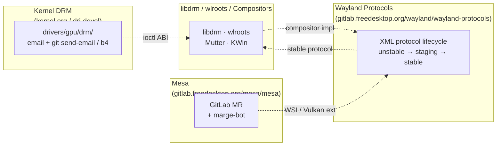
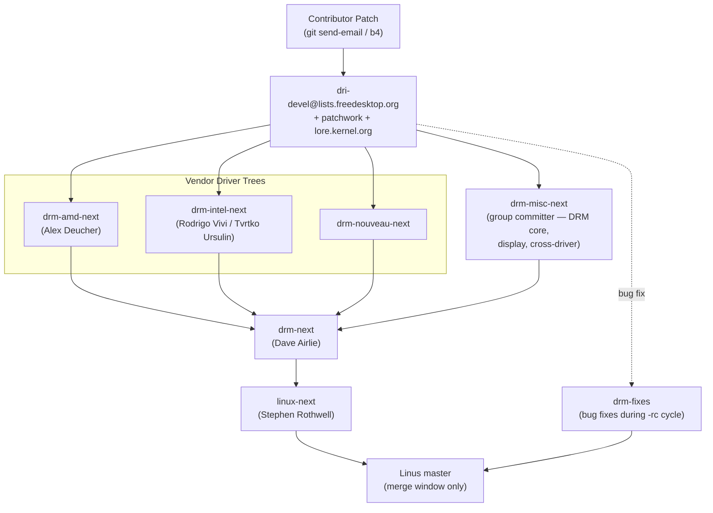
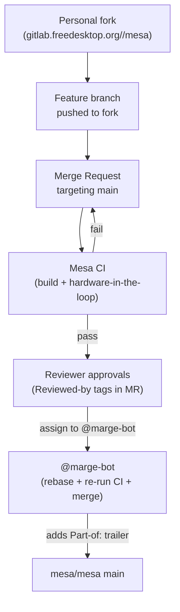
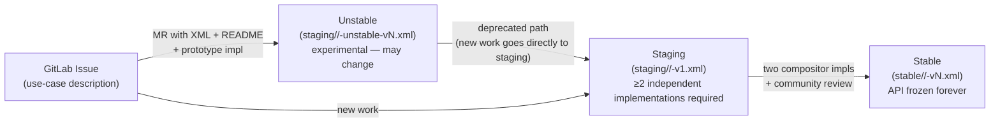
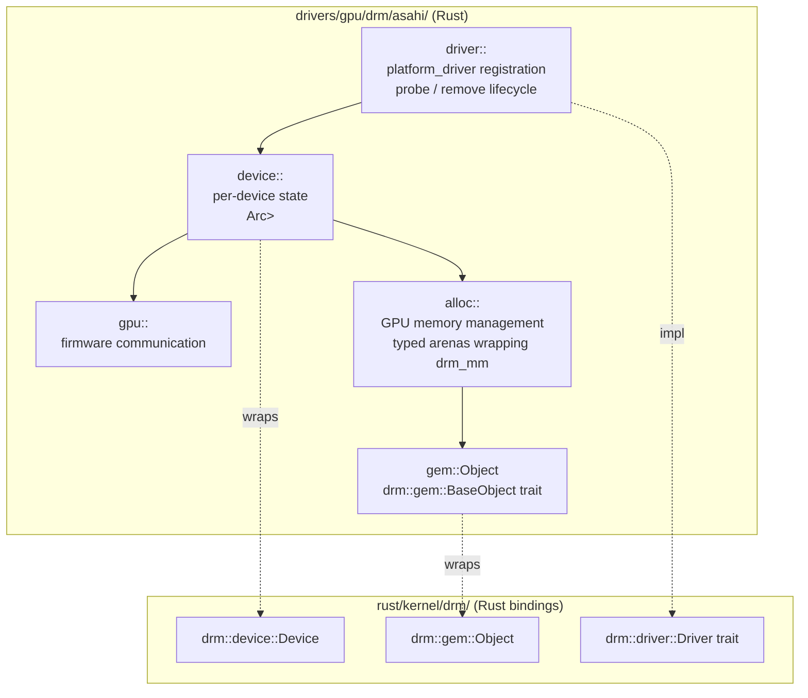
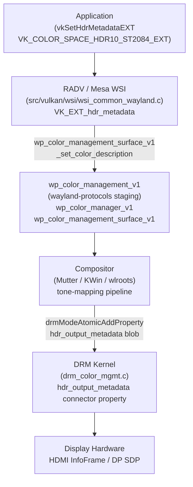

# Chapter 32: Contributing to the Linux Graphics Stack

**Audiences**: Systems and driver developers contributing kernel DRM or Mesa code; application developers wanting to understand protocol design and upstream processes; anyone wishing to participate in open-source graphics development across the full stack.

---

## Table of Contents

1. [The Four Contributing Domains](#1-the-four-contributing-domains)
2. [Contributing to the Linux Kernel DRM Subsystem](#2-contributing-to-the-linux-kernel-drm-subsystem)
3. [Contributing to Mesa](#3-contributing-to-mesa)
4. [Contributing to Wayland Protocols](#4-contributing-to-wayland-protocols)
5. [Building Mesa from Source with Meson](#5-building-mesa-from-source-with-meson)
6. [Rust in the Linux Graphics Stack](#6-rust-in-the-linux-graphics-stack)
7. [Finding Good First Issues and the Community Onramp](#7-finding-good-first-issues-and-the-community-onramp)
8. [Cross-Cutting Feature Case Study: HDR Support End to End](#8-cross-cutting-feature-case-study-hdr-support-end-to-end)
9. [Patch Etiquette, Review Culture, and Long-Term Contribution](#9-patch-etiquette-review-culture-and-long-term-contribution)
10. [Integrations](#integrations)
11. [References](#references)

---

## 1. The Four Contributing Domains

Contributing to the **Linux graphics stack** means participating in at least four distinct communities simultaneously, each with its own tooling, review culture, release cadence, and definition of "done." A single user-visible improvement — say, enabling **HDR** rendering on a wide-gamut display — may require coordinated changes in the kernel **DRM** subsystem, the **Mesa** Vulkan driver, a **Wayland** protocol extension, and one or more compositor implementations. The developer who wants to see that feature exist must understand each domain well enough to move changes through all four queues without being surprised by the process.

**Linux kernel DRM** lives at `kernel.org`. The **DRM** subsystem is hosted under **`drivers/gpu/drm/`** in Linus Torvalds' tree, with patches flowing through a hierarchy of subsystem trees. The primary mailing list for graphics-related kernel patches is **`dri-devel@lists.freedesktop.org`**, which is hosted on the **freedesktop.org** Mailman infrastructure and archived permanently at **`lore.kernel.org/dri-devel/`**. Patches are submitted by email using **`git send-email`** or the **`b4`** tool; GitLab merge requests are not used for upstream kernel work. The subsystem is maintained under a maintainer model: Dave Airlie and Daniel Vetter have historically been the primary **`drm-next`** maintainers, with vendor-specific trees for AMD (**`drm-amd-next`**, maintained by Alex Deucher), Intel (**`drm-intel-next`**, maintained by Rodrigo Vivi and Tvrtko Ursulin), and Nouveau (**`drm-nouveau-next`**). Cross-driver changes and display subsystem fixes flow through **`drm-misc`**, maintained collectively by a group committer model. Submitting kernel patches requires mastering the email patch workflow with **`git format-patch`** and **`b4`**, understanding the tree structure and merge window timing (features must be in **`drm-next`** by `-rc6` of the previous cycle), writing commit messages in the correct format with **`Fixes:`**, **`Signed-off-by:`**, and **`Cc: stable@vger.kernel.org`** trailers, and passing **`scripts/checkpatch.pl --strict`** before sending. After submission, patch status is tracked via **`patchwork.freedesktop.org`** and CI results from Intel's **`intel-gfx-ci.01.org`** infrastructure appear as replies on **`dri-devel`**.

**Mesa** lives at `gitlab.freedesktop.org/mesa/mesa`. Mesa's contribution model is entirely **GitLab**-based: contributors fork the repository, push to a personal branch, and open a merge request (MR) that is merged exclusively via **`@marge-bot`** after CI passes and reviewers add **`Reviewed-by:`** tags. Unlike the kernel, **Mesa** has no stable branches — distributions backport independently. The `main` branch is always the development target. **Mesa** has no formal **`MAINTAINERS`** file mapping every path to a named maintainer; ownership is implicit and determined by who reviews what, and component maintainership conventions must often be inferred from **`git shortlog`** history or the **`#mesa-dev`** IRC channel on OFTC. Mesa contributions also cover commit message format (component-prefix conventions such as **`radv:`**, **`nir:`**, **`anv:`**), code style enforcement via **`clang-format`**, understanding **CI** requirements (including **`deqp_skips.txt`** and hardware-in-the-loop jobs), and adding new **NIR** optimisation passes in **`src/compiler/nir/`**. The **Mesa** release cycle is approximately quarterly; the **`@marge-bot`** enforces the no-direct-push rule on `main`.

**Wayland protocols** are developed at `gitlab.freedesktop.org/wayland/wayland-protocols`. The **`wayland-protocols`** repository contains extensions to the core **Wayland** protocol that have been accepted through a formal lifecycle process: unstable → staging → stable. The core **Wayland** protocol itself is at `gitlab.freedesktop.org/wayland/wayland`, but it is far more conservative — new interfaces are rarely added there. The protocols repository is maintained by Simon Ser with input from the broader compositor community. Contributing a new protocol means writing **XML** interface definitions processed by **`wayland-scanner`** into C bindings, following established protocol design principles (surface roles, avoiding global state, enumerating all error conditions), and navigating the proposal process: opening a **GitLab** issue before writing **XML**, then an MR with a prototype implementation and a **`README.md`**, subject to security and race-condition review by the **Mutter**, **KWin**, **wlroots**, and **Weston** communities. The **`wp_color_management_v1`** protocol — which took five years to stabilise — is the canonical example of this process.

**libdrm, wlroots, and compositors** occupy the fourth domain. **`libdrm`** (`gitlab.freedesktop.org/mesa/drm`) is the thin userspace library wrapping **DRM** kernel ioctls; its primary maintainer is Simon Ser (also Pekka Paalanen historically). **`wlroots`** (`gitlab.freedesktop.org/wlroots/wlroots`) is the reference compositor toolkit used by Sway, Hyprland, and others; it has a more fluid maintainership but an active review community. Compositor projects like **Mutter** (GNOME) and **KWin** (KDE) have their own contribution workflows within their respective project infrastructures (GNOME GitLab and KDE Invent).

What all four domains share is a set of community norms that underpin the **freedesktop.org** ecosystem: all design discussion is public, no NDA-gated features can be proposed or reviewed, and protocol extensions must have reference implementations before they can be stabilised. The **freedesktop.org** infrastructure team provides **GitLab**, CI runners, mailing list hosting, and the **`lore.kernel.org`** archiving service (via **public-inbox**) that makes all mailing list discussions permanently searchable.



Building and testing patches locally requires building **Mesa** from source using **Meson**, targeting specific drivers (e.g., `-Dvulkan-drivers=amd`, `-Dgallium-drivers=radeonsi`) with debug symbols (**`-Dbuildtype=debug`**), controlling which Mesa installation an application uses via **`VK_ICD_FILENAMES`** and **`LIBGL_DRIVERS_PATH`**, and running sanitiser builds (**AddressSanitizer** via **`-Db_sanitize=address`**, **UndefinedBehaviorSanitizer** via **`-Db_sanitize=undefined`**) to catch memory errors before submission. Build times are kept manageable with **`ccache`**. Kernel **DRM** module development uses **`make menuconfig`** with **`CONFIG_DRM_AMDGPU=m`** and supports incremental module-only builds via `make M=drivers/gpu/drm/amdgpu` and **KUnit** tests.

**Rust** is a growing presence across the stack. The kernel has accepted **Rust** as a second language since Linux 6.1; the **`rust/kernel/drm/`** bindings provide safe wrappers for **DRM** types including **`drm::gem::Object<T>`** and **`drm::driver::Driver`**. The **Asahi** driver for Apple **M1**/**M2** GPUs is the leading production Rust kernel GPU driver, with its **UAPI** header queued in **`drm-misc-next`** for Linux 6.16. **NAK** (Nouveau Assembler Kit) is a **Rust**-written shader compiler backend for **NVK** merged in **Mesa** 24.0, living in **`src/nouveau/compiler/`**. The **Panthor/Tyr** Rust firmware interface layer targets **Mali CSF** GPUs and demonstrates using Rust for statically typed firmware protocol definitions. The kernel pins a **Rust** nightly via **`rust-toolchain.toml`** and requires **`bindgen`** at a pinned version; patches to **`rust/kernel/drm/`** must be CC'd to **`rust-for-linux@vger.kernel.org`** for dual review by both DRM maintainers and the **Rust-for-Linux** team. **Nova** (NVIDIA Turing+) and **Tyr** (**ARM Mali CSF**) are two additional Rust **DRM** drivers that share the same **`rust/kernel/drm/`** abstraction layer.

Finding good first issues follows domain-specific paths: kernel contributors search for **`TODO`**/**`FIXME`** markers in **`drivers/gpu/drm/`**, fix **`checkpatch.pl`** warnings in **`linux-staging`** drivers, or participate in the **LKMP** mentorship program at **`kernelnewbies.org`**. **Mesa** contributors filter the issue tracker by the `Good First Issue` label or investigate **`shader-db`** regressions reported by the CI bot. **Wayland** contributors improve protocol descriptions via `protocol-clarification` issues. Adding **`piglit`** or **dEQP** test cases for already-fixed bugs is always valued across all three domains, particularly on non-x86 platforms. Community channels — **`#dri-devel`**, **`#mesa-dev`**, and **`#wayland`** on OFTC (bridged to **Matrix**), and their corresponding mailing lists — are the fastest path to reviewer guidance.

The chapter concludes with a complete cross-cutting case study of **HDR** support, tracing the feature from the **`hdr_output_metadata`** DRM connector property through **Mesa** **`VK_EXT_hdr_metadata`** and **`VK_COLOR_SPACE_HDR10_ST2084_EXT`** support, through the five-year design of **`wp_color_management_v1`**, to compositor integration in **Mutter** and **KWin**. Patch etiquette and review culture are covered in depth: responding to feedback on **`[PATCH v2]`** series, understanding the distinction between **`Reviewed-by:`**, **`Acked-by:`**, and **`Tested-by:`** tags, managing review latency, navigating corporate versus community dynamics at AMD, Intel, Collabora, and Red Hat, and sustaining long-term contribution health with tools like **`git worktree`** and **`b4 prep`**.

The community gathers in person at three major annual events. The **X.Org Developer Conference (XDC)** is the primary venue for graphics stack design discussions; talks from 2022 onwards are archived at `indico.freedesktop.org`. The **Linux Plumbers Conference (LPC)** has a dedicated graphics microconference where kernel-level decisions are made. **FOSDEM** in Brussels features a graphics devroom and is particularly useful for cross-project conversations. Many features that appear as merge requests months later were first sketched on a whiteboard at one of these events.

### 1.1 What is the Linux Kernel DRM Subsystem?

The Direct Rendering Manager (DRM) is the kernel subsystem that interfaces Linux with GPU hardware. It lives under `drivers/gpu/drm/` and exposes two classes of device node: `/dev/dri/cardN` for display modesetting and `/dev/dri/renderDN` for GPU compute and rendering work. The subsystem divides into a shared core — covering memory management through GEM, command scheduling through the job/fence infrastructure, and display control through Kernel Mode-Setting (KMS) — and per-vendor driver modules such as `amdgpu`, `i915`, `nouveau`, `panfrost`, and `vc4`. KMS models display hardware as a set of kernel objects: planes, CRTCs, encoders, and connectors. Compositors use the atomic KMS commit API to drive display output, and the userspace ABI those objects expose is what Mesa drivers, libdrm, and Wayland compositors build on. Patches to the DRM subsystem travel by email to the `dri-devel@lists.freedesktop.org` mailing list, flow through per-vendor trees such as `drm-amd-next` or the collective `drm-misc-next` tree, and are aggregated into `drm-next` for each kernel release cycle. Understanding DRM's architecture is prerequisite background for all four contributing domains in this chapter because Mesa, libdrm, and compositor-level protocol work all depend on the UAPI surface the DRM subsystem defines.

### 1.2 What is Mesa?

Mesa is the open-source implementation of the OpenGL, OpenGL ES, Vulkan, and OpenCL specifications for Linux. It resides at `gitlab.freedesktop.org/mesa/mesa` and comprises several major subsystems: the Gallium3D state-tracker framework for OpenGL and OpenCL; per-vendor Vulkan drivers (RADV for AMD, ANV for Intel, NVK for NVIDIA, Turnip for Qualcomm); the NIR (New Intermediate Representation) shader compiler infrastructure shared across all backends; and the EGL and GLX frontend libraries that bind graphics contexts to Wayland or X11 surfaces. Mesa does not implement a window system or compositor: it provides the graphics API implementations that applications call, and it communicates with the kernel through DRM render nodes opened via libdrm. Unlike the kernel, Mesa uses GitLab merge requests for contributions, enforces code formatting with `clang-format`, uses the `@marge-bot` automation to gate merges on CI, and ships quarterly releases from a `main` branch that is always the development target. Commit messages follow a component-prefix convention (`radv:`, `nir:`, `anv:`) that identifies the affected subsystem. Contributing to Mesa means navigating implicit code ownership established through review history rather than a formal `MAINTAINERS` file, and understanding which CI test suites — `dEQP`, `piglit`, and `shader-db` — are relevant to a given change.

### 1.3 What is the Wayland Protocol Ecosystem?

Wayland is the display server protocol that has largely replaced X11 on modern Linux desktops. The core protocol, hosted at `gitlab.freedesktop.org/wayland/wayland`, defines the wire format for communication between a compositor — the process that owns the display hardware — and client applications. The `wayland-protocols` repository at `gitlab.freedesktop.org/wayland/wayland-protocols` extends the core with interface definitions covering XDG shell surfaces, explicit GPU synchronisation, fractional scaling, color management, and security context controls. Each extension is specified as an XML file that `wayland-scanner` compiles into C header and glue code; compositors and clients implement whichever side of the interface they need. Protocol extensions progress through a formal lifecycle: `unstable` during active design, `staging` once a prototype implementation exists, and `stable` once the interface is frozen and guaranteed not to change. Contributing a new protocol means opening a GitLab issue before writing XML, providing a working implementation in at least one compositor and one client, and passing security review that checks for races, privilege escalation paths, and inadvertent global state. Wayland protocols are the third contributing domain in this chapter because display features such as HDR and color management require simultaneous changes in kernel DRM, Mesa, and the protocol extension layer that exposes new capabilities to compositors and applications.

---

## 2. Contributing to the Linux Kernel DRM Subsystem

### The Patch Email Workflow

The Linux kernel does not accept contributions via GitLab merge requests for upstream work. All patches go by email to the `dri-devel@lists.freedesktop.org` mailing list. This is not a historical accident — it reflects a deliberate philosophy that patches should be reviewable inline in a plain-text email client, independent of any proprietary platform. Every sent patch is automatically archived at `lore.kernel.org/dri-devel/`, where it receives a permanent URL of the form `https://lore.kernel.org/dri-devel/<message-id>/`.

The standard tooling for patch preparation is `git format-patch`. For a single commit:

```bash
# Format a single patch with a custom subject prefix
git format-patch -1 HEAD \
    --subject-prefix="PATCH drm-misc" \
    --cover-letter \
    --base=origin/drm-misc-next \
    -o ~/patches/

# Edit the cover letter (0000-cover-letter.patch) before sending
```

For a series of commits, replace `-1` with `-N` or use a commit range such as `origin/drm-misc-next..HEAD`. The `--cover-letter` flag produces a `0000-cover-letter.patch` file that becomes the `[PATCH 0/N]` series introduction. The `--base` flag records the base commit against which the series was prepared, helping reviewers understand context.

Sending patches uses `git send-email` or, increasingly, the `b4` tool. A minimal `~/.gitconfig` configuration for sending to the DRM list is:

```ini
[sendemail]
    smtpserver = smtp.example.com
    smtpuser = you@example.com
    smtpencryption = tls
    smtpserverport = 587
    confirm = always
    suppresscc = self

[format]
    subjectprefix = PATCH
```

With this configuration, sending a series looks like:

```bash
git send-email \
    --to=dri-devel@lists.freedesktop.org \
    --cc=you@example.com \
    ~/patches/*.patch
```

For a patch series, the first invocation sends `0000-cover-letter.patch` and subsequent patches must be threaded in reply to it using `--in-reply-to=<message-id>`. Getting threading right is critical: reviewers who read the thread in order expect patch 3 to appear nested under patch 2, not as a top-level message.

### Modern Patch Tooling: b4, Patchwork, and lore.kernel.org

**`b4`** (documented at `https://b4.docs.kernel.org`) is the modern alternative to raw `git send-email` and is now the preferred tool for most DRM contributors. It handles cover letter tracking, message threading, trailer collection, and submission to the kernel's web endpoint automatically.

The contributor workflow with `b4`:

```bash
# Initialise a patch series tracking branch
b4 prep -n "fix-memory-leak-amdgpu-bo"

# After making commits, prepare the cover letter interactively
b4 prep --edit-cover

# Collect To/Cc addresses automatically from MAINTAINERS and git history
b4 prep --auto-to-cc

# Send as a dry run first to verify the email content
b4 send --dry-run

# Send for real
b4 send

# After review feedback, resend as v2 — b4 tracks the threading
b4 send --resend v2
```

When a reviewer leaves `Reviewed-by` or `Tested-by` tags on the mailing list, `b4 trailers` collects them back into the local branch automatically:

```bash
# Pull review trailers from the mailing list into the local branch
b4 trailers --apply
```

Applying a colleague's patch from the mailing list uses `b4 am` with a lore.kernel.org URL or Message-ID:

```bash
# Apply a patch series directly from a lore.kernel.org URL
b4 am https://lore.kernel.org/dri-devel/20240301-fix-radeon-v1-0-abc123@example.com/

# Or using the Message-ID directly
b4 am 20240301-fix-radeon-v1-0-abc123@example.com
```

The `b4 shazam` command combines fetch and apply in a single step, also running `git am` on the result. Note that `b4 shazam` was introduced in the 0.12.x series; older packaged versions may not have it. Always check `b4 --help` for the commands available in your installed version.

**`patchwork.freedesktop.org`** is the patch-tracking system for the `dri-devel` list. Every email sent to the list is automatically imported and assigned a state: `New`, `Under Review`, `Accepted`, `Rejected`, `Superseded`, or `RFC`. The `pw-client` CLI tool queries patchwork programmatically:

```bash
# Check whether your patch arrived in patchwork
pw-client list --project dri-devel --state new --submitter "Your Name"

# Show full details for a specific patch
pw-client show <patch-id>

# Check CI results attached to a patch
pw-client check <patch-id>
```

When your patch disappears from the `New` queue and appears as `Accepted`, it has been applied to a maintainer tree. If it shows `Superseded`, a newer version of the same patch was sent.

**`lore.kernel.org`** is the canonical, permanent, public mailing list archive. The URL format is `https://lore.kernel.org/dri-devel/<message-id>/` and the search syntax uses `s=` for full-text queries: `https://lore.kernel.org/dri-devel/?q=s:amdgpu+memory+leak`. Since the Mailman3 migration of kernel mailing lists, lore is the primary reference for patch history.

### Tree Structure and the Merge Window

Understanding the tree hierarchy prevents confusion about where your patch needs to go and when it will reach Linus:

- **Driver trees** (`drm-amd-next`, `drm-intel-next`, `drm-nouveau-next`): vendor-maintained trees where driver-specific patches are applied by the vendor maintainer. A patch for `drivers/gpu/drm/amdgpu/` goes to `amd-gfx@lists.freedesktop.org` and is applied to `drm-amd-next`.
- **`drm-misc-next`**: the collective tree for display subsystem (KMS), DRM core, cross-driver changes, and any driver not large enough to have its own tree. Maintained by a group committer model; contributors send to `dri-devel@` and request an `drm-misc` maintainer to apply the patch.
- **`drm-next`** (Dave Airlie): aggregates `drm-misc-next`, `drm-amd-next`, `drm-intel-next`, and the other driver trees. Opened to feature work after each `-rc1`; fed into `linux-next` continuously.
- **`linux-next`** (Stephen Rothwell): the integration tree for all kernel subsystems. If your patch is in `drm-next`, it will appear in `linux-next` the next day.
- **Linus' `master`**: receives a pull request from `drm-next` during the two-week merge window that opens after each `-rc1` release.

The **merge window** is the critical timing constraint that surprises new contributors. After a new kernel version is tagged (e.g., `v6.10`), Linus opens a two-week merge window during which `drm-next` is pulled. After `-rc1` is tagged, the merge window closes and **no new features** can enter `drm-next` until the next merge window. Bug fixes can still be applied throughout the `-rc` cycle via `drm-fixes`, which targets the current release. The implication: if your feature misses the `drm-next` pull, it must wait an entire kernel cycle (approximately 9–10 weeks) for the next merge window. Maintainers typically require feature patches to be in `drm-next` by `-rc6` of the previous cycle to have enough review time. Plan accordingly.



### Commit Message Format

A correct DRM kernel commit message is critical; maintainers reject patches for format errors before reviewing the code itself. Here is a complete example:

```
drm/amdgpu: fix memory leak in amdgpu_bo_create_reserved

When amdgpu_bo_create_reserved() fails after allocating the BO but
before pinning it, the reference acquired by ttm_bo_init_reserved()
is never dropped, leaking the backing memory.

Call drm_gem_object_put() on the error path to balance the reference.

Fixes: 3a7b1234abcd ("drm/amdgpu: add reserved BO creation helper")
Cc: stable@vger.kernel.org
Reported-by: User Name <user@example.com>
Closes: https://gitlab.freedesktop.org/drm/amd/issues/1234
Signed-off-by: Your Name <you@example.com>
```

Key elements to understand:

- **Subject prefix**: `drm/amdgpu:` matches the DRM driver path; must be lowercase; max 72 characters total.
- **Body**: explains *why* the fix is needed, not just *what* changed. Describe the bug, not the diff.
- **`Fixes:` tag**: 12-character abbreviated SHA followed by the quoted first line of the commit being fixed, in double quotes. The exact format matters — `checkpatch.pl` validates it. Generate it with `git log --oneline --abbrev=12 <commit>`.
- **`Cc: stable@vger.kernel.org`**: requests backport to stable kernels. Include this for any fix that addresses a regression or security issue.
- **`Reported-by:`**: credits the person who filed the bug report. Requires their permission; link to the public report with `Closes:` or `Link:`.
- **`Signed-off-by:`**: the Developer Certificate of Origin (DCO). Generated automatically by `git commit -s`. Without this, the patch is rejected outright.

### checkpatch.pl

Run `scripts/checkpatch.pl --strict` on every patch before sending. This is non-negotiable — maintainers will not manually point out formatting errors that the script catches:

```bash
# Check a formatted patch file
./scripts/checkpatch.pl --strict 0001-drm-amdgpu-fix-memory-leak.patch

# Check in terse mode for CI scripting (one line per finding)
./scripts/checkpatch.pl --terse --strict 0001-fix.patch

# Auto-fix whitespace and formatting issues
./scripts/checkpatch.pl --fix --strict 0001-fix.patch
```

The three severity levels are:
- **ERROR**: must fix before sending. Examples: missing `Signed-off-by`, malformed `Fixes:` tag, `typedef` in a header, CamelCase identifier where underscore_case is required, use of `BUG()` where `WARN()` is appropriate.
- **WARNING**: must review carefully; most are genuine problems. Examples: line exceeding 100 characters, missing blank line after declaration, `printk` without log level, `drm_WARN_ON` vs. `WARN_ON` convention violations.
- **CHECK** (enabled by `--strict`): style suggestions; use judgement. Examples: whitespace before tabs, overly long function names.

Integrate `checkpatch.pl` as a git pre-push hook to catch errors before they leave your machine:

```bash
#!/bin/bash
# .git/hooks/pre-push

while read local_ref local_sha remote_ref remote_sha; do
    git format-patch --stdout "${remote_sha}..${local_sha}" | \
        ./scripts/checkpatch.pl --terse --strict --no-signoff - && true
    if [ $? -ne 0 ]; then
        echo "checkpatch.pl found errors. Fix before pushing."
        exit 1
    fi
done
```

### The Review Process and CI

After your patch lands on `dri-devel`, Intel's CI infrastructure (`intel-gfx-ci.01.org`) runs automated tests against the `drm-tip` tree, which aggregates all DRM subsystem trees. Results appear as replies to your patch email and are also recorded in patchwork. The primary test suite is IGT (see Chapter 31); a CI failure in a test that previously passed is a strong signal that your patch caused a regression.

Review tags have specific meanings: `Reviewed-by` means the reviewer read the code and considers it correct; `Acked-by` means the reviewer approves the change going in without necessarily doing a line-by-line review (common for adjacent subsystem maintainers); `Tested-by` means the patch was tested on hardware. A patch typically needs at least one `Reviewed-by` from someone knowledgeable about the affected subsystem before a maintainer will apply it. DRM core changes additionally require sign-off from a `drm-misc` reviewer.

Common reasons for patches being ignored or rejected: absence of a `Fixes:` tag on a bug fix, no `Reported-by:` when a user filed the bug, violation of the `drm_WARN_ON(dev, cond)` convention (driver code should use the `drm_WARN_ON` variant rather than bare `WARN_ON` to include the DRM device identifier in the warning), and failure to pair `drm_dev_put()` with `drm_dev_get()` on all error paths.

---

## 3. Contributing to Mesa

### The GitLab MR Workflow

Mesa's contribution model is entirely GitLab-based. There is no email patch submission; contributions arrive exclusively as merge requests (MRs) on `gitlab.freedesktop.org/mesa/mesa`. The workflow is:

1. Fork `mesa/mesa` to your personal namespace on freedesktop.org GitLab.
2. Create a branch from `main` for your change.
3. Push to your fork and open an MR targeting `main`.
4. Wait for CI to run; address any failures.
5. Request reviews from relevant maintainers or wait for organic review.
6. Once `Reviewed-by` tags appear in the MR and CI passes, assign the MR to `@marge-bot`.

The `@marge-bot` pseudo-user is the sole merge mechanism for Mesa. Direct pushes to `main` are forbidden and will trigger a CI block. `marge-bot` rebases the MR on top of `main`, reruns CI, and merges if everything passes. It automatically adds `Part-of: <MR-URL>` trailers to all commits in the series when merging, which makes it easy to find all commits from the same MR later.



### Commit Message Format

Mesa commit messages use component-prefix conventions:

```
radv: fix pipeline cache corruption when using shader specialisation

When two shaders with different specialisation constants hash to the
same pipeline cache entry due to the constants not being included in
the hash key, the second shader silently overwrites the first.

Include the specialisation constant values in the cache hash key.

Fixes: 7a3f9b12c456 ("radv: implement pipeline cache lookup")
Closes: https://gitlab.freedesktop.org/mesa/mesa/-/issues/9876
Reviewed-by: Reviewer Name <reviewer@example.com>
```

Component prefix conventions: `radv:` for the AMD Vulkan driver, `anv:` for Intel Vulkan, `nir:` for NIR middle-end passes, `util:` for shared utilities, `vulkan/wsi:` for window-system integration, `docs:`, `ci:`, `meson:`. The prefix must match the primary path being changed — check `git log --oneline -- <file>` to see what convention is used for a given file.

The `Closes: <full URL>` tag (not `Closes: #1234`) automatically closes a GitLab issue when the MR is merged. The full URL is required because Mesa GitLab is one of several freedesktop projects and the short form is ambiguous.

### CI Requirements

Mesa CI is a hard gate: an MR cannot be merged until all required CI jobs pass. The CI matrix is large — it includes build jobs for dozens of driver/platform combinations, `meson test` unit test runs, and hardware-in-the-loop jobs on physical GPUs. Understanding which jobs are required for your change prevents wasted iteration:

- Changes under `src/amd/vulkan/` will trigger `radv-` prefixed hardware jobs.
- Changes under `src/compiler/nir/` trigger build jobs for all drivers plus unit tests under `nir-unit-tests`.
- CI configuration lives in `.gitlab-ci.yml` and `src/ci/` — reading the YAML tells you exactly which jobs are triggered by which file paths.

When CI jobs fail, the failure details are in the job log accessible from the GitLab MR pipeline view. A job annotated `[FLAKY]` in the CI configuration is known to fail intermittently; re-running such a job from the GitLab UI is acceptable. For genuine failures, diagnose the test before re-running.

The `deqp_skips.txt` files in each driver's `ci/` subdirectory list dEQP tests that are deliberately skipped. Adding a skip to hide a pre-existing failure is acceptable only if you open a tracking issue; adding a skip to hide a regression you introduced is not.

### Code Style

Mesa uses `clang-format` with the `.clang-format` file at the repository root. Run it on changed files before committing:

```bash
# Format changed files (tracked by git)
git diff --name-only HEAD | xargs clang-format -i

# Or format a specific file
clang-format -i src/amd/vulkan/radv_pipeline.c
```

The `u_` prefix is the convention for utility functions in `src/util/`; `vk_` for Vulkan common infrastructure; `radv_` for RADV-specific code. New functions in the wrong namespace are a common first-contributor error that reviewers will catch.

### Component Maintainership

Mesa lacks a formal `MAINTAINERS` file. Implicit ownership is determined by who consistently reviews particular paths:

- `src/amd/vulkan/` (RADV): Samuel Pitoiset and Timur Kristóf are frequent reviewers.
- `src/intel/vulkan/` (ANV): Faith Ekstrand (now at Collabora) and various Intel engineers.
- `src/compiler/nir/`: Connor Abbott is the primary NIR maintainer; multiple contributors review.
- `src/vulkan/wsi/`: Simon Ser and the display stack team.

When uncertain who to request a review from, look at `git shortlog --summary --numbered -- <path>` to see who has committed most to that area, then look at recent MR activity to see who reviews. The `#mesa-dev` IRC channel on OFTC is the fastest path to finding the right reviewer — describe your change and ask.

### Adding a New NIR Pass

NIR optimisation passes are the most common Mesa contribution for compiler-focused developers. A new pass lives in `src/compiler/nir/nir_opt_<name>.c`:

```c
/* src/compiler/nir/nir_opt_redundant_mov.c */
#include "nir.h"
#include "nir_builder.h"

/**
 * nir_opt_redundant_mov - Remove mov instructions where src == dest.
 *
 * This trivial pass removes mov instructions where the source and
 * destination are the same SSA value, which can arise after other
 * optimisations.
 */
bool
nir_opt_redundant_mov(nir_shader *shader)
{
   bool progress = false;
   nir_foreach_function_impl(impl, shader) {
      nir_foreach_block(block, impl) {
         nir_foreach_instr_safe(instr, block) {
            if (instr->type != nir_instr_type_alu)
               continue;
            nir_alu_instr *alu = nir_instr_as_alu(instr);
            if (alu->op != nir_op_mov)
               continue;
            if (nir_src_is_const(alu->src[0].src))
               continue;
            /* Check if dest == src (same SSA def index) */
            if (alu->dest.dest.ssa.index ==
                alu->src[0].src.ssa->index) {
               nir_instr_remove(instr);
               progress = true;
            }
         }
      }
   }
   return progress;
}
```

Register the pass in the driver's optimisation loop (for RADV, in `src/amd/vulkan/radv_shader.c`; for NIR's general pass list, add it to `src/compiler/nir/nir.h` and the appropriate `nir_lower_*` or `nir_opt_*` collections). Add unit tests in `src/compiler/nir/tests/` and ensure CI runs them.

### The Marge-Bot and the Release Cycle

Mesa releases approximately quarterly: `24.0`, `24.1`, `24.2`, `24.3` within a calendar year. Only `.0` releases are feature releases; `.x` point releases are bug-fix only. There are no Mesa stable branches maintained upstream — distributors (Arch, Fedora, Ubuntu) backport fixes independently. Contributions targeting a specific Mesa version need to be merged to `main` well before the `.0` branch-cut, which is announced on `mesa-dev@lists.freedesktop.org` roughly 6–8 weeks before release.

---

## 4. Contributing to Wayland Protocols

### The Protocol Lifecycle

The `wayland-protocols` repository at `gitlab.freedesktop.org/wayland/wayland-protocols` manages extensions to the core Wayland protocol through a three-stage lifecycle:

**Unstable** (`staging/<name>/<name>-unstable-vN.xml`): The protocol is experimental. The `_unstable_vN` suffix signals to clients and compositors that the protocol can change at any point and must not be depended on for production use. This stage is deprecated in favour of staging for new work.

**Staging** (`staging/<name>/<name>-v1.xml`): The protocol is under active development with the intent to stabilise. The `_vN` version suffix may be dropped. At least two independent implementations (typically a compositor and a client toolkit) are required before the protocol can advance. This two-implementation rule exists to prevent half-baked designs from being frozen — historical examples exist of protocols that seemed reasonable until a second implementation revealed fundamental ambiguities.

**Stable** (`stable/<name>/<name>-vN.xml`): The protocol API is frozen. Breaking changes are forbidden. New versions may be added alongside the existing version, but the existing `vN` interface must remain valid forever. This is the stage at which application developers can safely depend on the protocol.



### Protocol XML Format

A Wayland protocol is defined in XML. Here is a minimal example illustrating the canonical structure:

```xml
<?xml version="1.0" encoding="UTF-8"?>
<protocol name="example_surface_role">
  <copyright>
    Copyright 2024 The Example Project
    SPDX-License-Identifier: MIT
  </copyright>

  <description summary="example surface role extension">
    This protocol adds a surface role for demonstration purposes.
  </description>

  <interface name="example_manager_v1" version="1">
    <description summary="factory for example surface roles">
      A global singleton that creates example surface objects.
    </description>

    <request name="get_example_surface">
      <description summary="create an example surface object">
        Creates an example_surface_v1 for the given wl_surface.
        Raises already_constructed if the surface already has this role.
      </description>
      <arg name="id" type="new_id" interface="example_surface_v1"
           summary="the new example surface object"/>
      <arg name="surface" type="object" interface="wl_surface"
           summary="the surface to give the role to"/>
    </request>

    <request name="destroy" type="destructor">
      <description summary="destroy the manager">
        Destroys the manager. Existing example_surface_v1 objects
        remain valid.
      </description>
    </request>
  </interface>

  <interface name="example_surface_v1" version="1">
    <description summary="an example surface role object"/>

    <enum name="error">
      <entry name="already_constructed" value="0"
             summary="surface already has this role"/>
    </enum>

    <event name="done">
      <description summary="role assignment completed"/>
    </event>

    <request name="destroy" type="destructor"/>
  </interface>
</protocol>
```

`wayland-scanner` generates C header and implementation files from this XML:

```bash
# Generate the protocol header
wayland-scanner client-header \
    example-surface-role-v1.xml \
    example-surface-role-v1-protocol.h

# Generate the implementation (dispatching glue)
wayland-scanner private-code \
    example-surface-role-v1.xml \
    example-surface-role-v1-protocol.c
```

### Protocol Design Principles

Good Wayland protocol design follows several hard-won principles. First, protocols extend `wl_surface` or other existing interfaces through the role mechanism — they do not create parallel surface hierarchies. Second, global state should be avoided; a protocol should be fully expressible in terms of per-surface or per-output state. Third, protocols must handle the creation-before-compositor-support case gracefully: a client that binds a global before the compositor has finished setting up state should receive events in a well-defined order.

Security is reviewed explicitly. Reviewers check whether a protocol exposes sensitive information (input events, screen content) to unauthorised clients, whether it creates denial-of-service vectors (unbounded resource creation), and whether all error conditions are enumerated in the XML.

When a feature might belong in an **XDG portal** rather than a Wayland protocol, the distinction is: Wayland protocols govern the rendering and windowing layer (surface roles, presentation timing, input methods); portals govern application-level capabilities that require user permission (file access, screenshot, screen share). If your feature needs user consent and a security boundary, it likely belongs in a portal.

### The Proposal Process

Before writing XML, open a GitLab issue on `wayland-protocols` describing the use case. Explain what application capability you are trying to enable, which existing protocols are insufficient and why, and a rough sketch of the design. This early discussion often surfaces objections or existing solutions before design work has been invested.

After initial discussion, open an MR with the XML, a `README.md` explaining the protocol rationale, and at least a prototype implementation in one compositor. Reviewers from the Mutter (GNOME), KWin (KDE), wlroots, and Weston communities will comment on protocol semantics, race conditions, and security implications. Expect this review to take months — the `wp_color_management_v1` MR, opened in 2020, accumulated 820 comments over five years before merging in February 2025 with wayland-protocols 1.41. The process is slow because broken stable protocols are very costly to fix.

---

## 5. Building Mesa from Source with Meson

### Why Build from Source

Testing a patch before submission requires a Mesa build with debug symbols and the specific changes applied. System Mesa packages are typically 6–12 months behind upstream; reporting a bug against Mesa 24.x when upstream is at 25.x is wasted effort. Building from source also enables sanitisers to catch memory errors before reviewers encounter them.

### Minimal Contributor Build

The complete sequence for a minimal RADV contributor build with debug symbols, installed to a private prefix:

```bash
# Clone Mesa
git clone https://gitlab.freedesktop.org/mesa/mesa.git
cd mesa

# Set up a debug build for AMD Vulkan only
meson setup builddir \
    -Dvulkan-drivers=amd \
    -Dgallium-drivers=radeonsi \
    -Dglx=dri \
    -Dbuildtype=debug \
    -Dprefix=$HOME/mesa-install \
    -Dllvm=disabled

# Build and install
ninja -C builddir
ninja -C builddir install
```

Key option explanations:
- `-Dvulkan-drivers=amd`: build only the AMD Vulkan driver, reducing build time dramatically compared to building all drivers.
- `-Dgallium-drivers=radeonsi`: the AMD OpenGL Gallium driver; include `zink` to test the Vulkan driver through OpenGL.
- `-Dglx=dri`: the correct GLX backend for modern Mesa.
- `-Dbuildtype=debug`: disables optimisation (`-O0`), enables assertions; required for accurate gdb/rr backtraces.
- `-Dllvm=disabled`: skips the LLVM backend; safe when working only on RADV (which uses the ACO compiler backend) or NIR.
- `-Dprefix=$HOME/mesa-install`: private install path, no root access required.

For performance work where you need debug symbols but acceptable performance, use `-Dbuildtype=debugoptimized` instead (the default; `-O2 -g`).

### Environment Setup for Side-by-Side Builds

After installing to a private prefix, configure environment variables to direct applications to your build rather than the system Mesa. Put these in a `mesa-build-env.sh` script:

```bash
#!/bin/bash
# mesa-build-env.sh — source this before running a test application
# Usage: source mesa-build-env.sh && my-vulkan-app

export MESA_INSTALL=$HOME/mesa-install
export LIBGL_DRIVERS_PATH=$MESA_INSTALL/lib/x86_64-linux-gnu/dri
export VK_ICD_FILENAMES=$MESA_INSTALL/share/vulkan/icd.d/radeon_icd.x86_64.json
export PKG_CONFIG_PATH=$MESA_INSTALL/lib/x86_64-linux-gnu/pkgconfig:$PKG_CONFIG_PATH

# Verify the active build:
# glxinfo | grep "OpenGL renderer"
# vulkaninfo --summary
```

**Important Wayland caveat**: in a Wayland session, the compositor itself uses Mesa for rendering. Setting `LIBGL_DRIVERS_PATH` or `VK_ICD_FILENAMES` globally in your shell startup files will cause the compositor to use your debug build, which can result in instability. Always scope environment variable overrides to a specific application invocation:

```bash
# Correct: scope to just this app
VK_ICD_FILENAMES=$HOME/mesa-install/share/vulkan/icd.d/radeon_icd.x86_64.json \
    vkcube

# Dangerous in a Wayland session: affects the compositor too
export VK_ICD_FILENAMES=$HOME/mesa-install/share/vulkan/icd.d/radeon_icd.x86_64.json
```

Verify the active Mesa version:

```bash
glxinfo | grep "OpenGL version"
vulkaninfo --summary | grep driverVersion
# A Mesa git build includes the git hash in the version string
```

### Sanitiser Builds

AddressSanitizer catches use-after-free and buffer overflow bugs before reviewers encounter them. A Mesa sanitiser build:

```bash
meson setup builddir-asan \
    -Dvulkan-drivers=amd \
    -Dgallium-drivers=radeonsi \
    -Dglx=dri \
    -Dbuildtype=debug \
    -Db_sanitize=address \
    -Db_lundef=false \
    -Dprefix=$HOME/mesa-asan-install

ninja -C builddir-asan

# Run with leak detection enabled
ASAN_OPTIONS=detect_leaks=1 \
    VK_ICD_FILENAMES=$HOME/mesa-asan-install/share/vulkan/icd.d/radeon_icd.x86_64.json \
    vkcube
```

The `-Db_lundef=false` flag is required with ASAN because the sanitiser inserts symbols at link time that would otherwise be treated as unresolved. UndefinedBehaviorSanitizer (`-Db_sanitize=undefined`) catches integer overflow, misaligned memory access, and null dereference without the memory overhead of ASAN — useful for running the full dEQP suite.

### Build Caching with ccache

Mesa's full build from scratch takes 15–20 minutes on a 16-core machine. `ccache` reduces subsequent builds with unchanged files to 2–3 minutes. Meson detects `ccache` automatically if it is on the `PATH`. Verify cache utilisation with `ccache -s` — a hit rate above 80% on a warm cache is normal for iterative development.

### Kernel DRM Module Build Contrast

Kernel DRM driver development uses an entirely different build system. Relevant Kconfig options live under `Device Drivers → Graphics support` in `make menuconfig`. Enable `CONFIG_DRM_AMDGPU=m` for the AMD GPU driver as a loadable module.

For iterative development, build only the modified driver module rather than the full kernel:

```bash
# Build just the AMDGPU driver module (much faster than a full kernel build)
make -j$(nproc) M=drivers/gpu/drm/amdgpu

# Load the freshly built module (requires matching kernel version)
sudo rmmod amdgpu
sudo insmod drivers/gpu/drm/amdgpu/amdgpu.ko
```

Enable kernel-side DRM unit tests:

```bash
# Enable in Kconfig
make menuconfig  # Device Drivers → Graphics support → DRM → Enable DRM KUnit tests

# Run KUnit tests (no QEMU required for unit tests)
./tools/testing/kunit/kunit.py run --kunitconfig drivers/gpu/drm/
```

---

## 6. Rust in the Linux Graphics Stack

### The Rust-in-Kernel Initiative

Rust was accepted as a second language in the Linux kernel beginning with Linux 6.1. The rationale is straightforward: C's manual memory management and lack of type-enforced ownership rules are the root cause of a significant fraction of kernel security vulnerabilities, particularly use-after-free and data race bugs. Rust's borrow checker enforces memory safety invariants at compile time — the same invariants that C kernel developers enforce by convention and documentation but that are routinely violated under complex error paths.

The `rust/kernel/` crate provides safe Rust bindings that wrap unsafe C kernel APIs. Driver code does not call C kernel APIs directly; instead it uses the Rust abstractions, which implement the required invariants in their type signatures. The `kernel` crate is the sole entry point for all kernel Rust code.

GPU drivers are a particularly compelling target for Rust adoption. GEM buffer objects, DRM framebuffers, and device references are all reference-counted objects with complex ownership semantics. In C, a missed `drm_gem_object_put()` call on an error path causes a memory leak; an extra call causes a use-after-free. Rust's `Arc`-based reference counting, mirroring the kernel's `kref`, makes these errors impossible to compile: the object is freed exactly when the last `Arc` handle is dropped.

### The DRM Rust Bindings

The kernel DRM Rust bindings live in `rust/kernel/drm/` and provide safe wrappers for the core DRM types:

```rust
// rust/kernel/drm/device.rs (illustrative — check current upstream for exact API)
use kernel::prelude::*;
use kernel::drm;

/// A DRM device, parameterised over driver-specific data.
///
/// Wraps `struct drm_device`. The driver-specific data `T` is embedded
/// inside the device struct using the driver_data pointer, eliminating
/// the need for container_of() casts that are a common source of bugs
/// in C DRM drivers.
pub struct Device<T: drm::driver::Driver> {
    // ... internal fields
}
```

The `drm::gem::Object<T>` type wraps `struct drm_gem_object` with Rust lifetime rules:

```rust
// Illustrative pattern from drivers/gpu/drm/asahi/gem.rs
use kernel::drm::gem;

pub struct AsahiGem {
    base: gem::Object<AsahiGem>,
    gpu_addr: u64,
    size: usize,
}

impl gem::BaseObject for AsahiGem {
    // Required GEM operations — the compiler verifies all are implemented
    fn size(&self) -> usize { self.size }
    // ... other required methods
}
```

In C, the equivalent `struct drm_gem_object_funcs` function pointer table can have NULL entries that cause a kernel oops if called. The Rust trait implementation requires all methods to be present at compile time.

### The Asahi (Apple GPU) Driver

The Asahi DRM driver for Apple M1/M2 GPUs is the leading example of a production Rust GPU driver targeting the Linux kernel. As of mid-2025, the UAPI header (`include/uapi/drm/asahi_drm.h`) was queued in `drm-misc-next` for Linux 6.16 — notably merged independently of the driver itself, an unprecedented arrangement approved by the DRM maintainers to allow upstream Mesa to target the stable ABI. The full Rust driver implementation in `drivers/gpu/drm/asahi/` depends on a significant number of Rust kernel abstractions still being upstreamed and has not yet landed in mainline; readers should check `https://lore.kernel.org/dri-devel/?q=asahi` for current merge status. The driver source in the Asahi Linux tree at `drivers/gpu/drm/asahi/` remains the canonical reference for idiomatic Rust kernel GPU driver architecture.

Key structural patterns in the Asahi driver:

- **Typed arena allocators**: GPU command objects are allocated from typed arenas wrapping `drm_mm`, with compile-time-typed handles that prevent mixing object types — a common bug in C GPU drivers where command objects are passed as `void *`.
- **`Arc<Mutex<AsahiInner>>`**: shared device state follows Rust's standard interior-mutability pattern; the borrow checker enforces that the lock is held whenever mutable fields are accessed.
- **Module decomposition**: `driver::` (platform_driver registration and probe/remove lifecycle), `device::` (per-device state), `gpu::` (firmware communication), `alloc::` (GPU memory management). Each module boundary corresponds to a well-defined ownership boundary.



Beyond Asahi, two other Rust DRM drivers represent the current state of the art: **Nova** (`drivers/nova/` + `drivers/gpu/drm/nova/`), NVIDIA's clean-sheet Rust driver for Turing+ GPUs using GSP-RM firmware (Linux 6.10+, expanded in Linux 7.2 with Turing bring-up and GPUVM immediate-mode support — see Chapter 10), and **Tyr**, a Rust DRM driver for ARM Mali CSF GPUs receiving parallel improvements in the same Linux 7.2 DRM Rust cycle. Both share the same `rust/kernel/drm/` abstraction layer as Asahi. Nova in particular required upstream additions to the DRM Rust bindings — notably the Higher-Ranked Lifetime Types (HRT) constraint for GPUVM VA handles — that benefit all future Rust DRM driver work.

The driver registration illustrates how Rust replaces the C `struct drm_driver` vtable with a trait:

```rust
// drivers/gpu/drm/asahi/driver.rs (illustrative structure)
use kernel::drm;
use kernel::platform;

struct AsahiDriver;

impl drm::driver::Driver for AsahiDriver {
    type Data = Arc<AsahiDevice>;
    type File = AsahiFile;
    type Object = AsahiGem;

    const INFO: drm::driver::DriverInfo = drm::driver::DriverInfo {
        major: 1,
        minor: 0,
        name: c_str!("asahi"),
        desc: c_str!("Apple AGX Graphics"),
        date: c_str!("20231219"),
    };

    // Registered ioctls — verified at compile time against the trait
    kernel::declare_drm_ioctls! {
        (ASAHI_GET_PARAMS, AsahiGetParams, ioctl_get_params),
        (ASAHI_VM_CREATE, AsahiVmCreate, ioctl_vm_create),
        // ...
    }
}
```

This replaces the C pattern of a static `struct drm_driver` with function pointers, where a NULL pointer causes a kernel oops if an unimplemented ioctl is called.

### NAK: The Nouveau/NVK Rust Compiler Backend

NAK (Nouveau Assembler Kit — self-deprecatingly, "NVIDIA All-Kludge") is a Rust-written shader compiler backend for the Nouveau Gallium3D driver and the NVK Vulkan driver. It was merged into Mesa 24.0 (not Mesa 23.3 as initially planned) after approximately 425 commits from lead author Faith Ekstrand. As of Mesa 24.1, NAK is the default compiler for RTX 20 "Turing" and newer NVIDIA GPUs, and NVK is both Vulkan 1.3 and OpenGL 4.6 conformant.

NAK lives in `src/nouveau/compiler/` in the Mesa tree. It is designed as an SSA-based compiler with NIR as its input IR, targeting multiple generations of NVIDIA GPU ISAs. The use of Rust is motivated by the same properties that make it attractive in the kernel: pattern matching over Rust enums is exhaustive (the compiler warns if a new instruction variant is added without handling it in a compiler pass), and ownership tracking in the register allocator ensures live ranges are correctly managed.

The core instruction type:

```rust
// src/nouveau/compiler/src/ir.rs (illustrative)
/// An NVIDIA ISA instruction, as an exhaustive Rust enum.
/// Adding a new variant forces every pattern match to be updated.
pub enum Op {
    FAdd(OpFAdd),
    FMul(OpFMul),
    FMad(OpFMad),
    IAdd3(OpIAdd3),
    IMad(OpIMad),
    // ... all instruction variants
    Ld(OpLd),
    St(OpSt),
    // Adding a variant here forces compiler pass updates
}
```

The FFI boundary between NAK (Rust) and NVK (C) is minimal:

```rust
// src/nouveau/compiler/src/lib.rs
use std::ffi::c_void;

/// Entry point called from C code in NVK.
/// The unsafe block is confined to this FFI boundary.
#[no_mangle]
pub extern "C" fn nak_compile_shader(
    nir: *const c_void,  // *const nir_shader in C
    options: *const NakCompileOptions,
    info_out: *mut NakShaderInfo,
) -> *mut u8 {  // returns heap-allocated shader binary
    // SAFETY: NVK guarantees nir is a valid, aligned nir_shader pointer
    // for the duration of this call. We wrap it immediately in a safe type.
    let nir = unsafe { NirShader::from_raw(nir) };
    
    match compile_shader_inner(&nir, unsafe { &*options }) {
        Ok(binary) => {
            // ... fill info_out and return binary
        }
        Err(e) => std::ptr::null_mut(),
    }
}
```

To work on NAK specifically:

```bash
# Build just the NAK Rust crate
ninja -C builddir src/nouveau/compiler/libnak.a

# Run NAK's unit tests directly via cargo (faster than a full Mesa build)
cargo test --manifest-path src/nouveau/compiler/Cargo.toml

# Check formatting before committing (run by Mesa CI)
cargo fmt --manifest-path src/nouveau/compiler/Cargo.toml --check
```

### The Panthor/Tyr Rust Firmware Interface Layer

Tyr is a Rust port of the firmware communication layer in the Panthor driver — the upstream Mali CSF (Command Stream Frontend) driver that covers Arm Mali-G610 and later GPU generations. Where Asahi and NAK demonstrate Rust applied to driver registration and compiler IR respectively, Tyr addresses a third use case: making a hardware firmware protocol statically typed. The C implementation of the Panthor firmware protocol uses hand-written byte-packing code that is error-prone and difficult to audit; Tyr replaces it with Rust structs whose layout is enforced by the type system.

As of mid-2025, Tyr patches have been posted to `dri-devel@lists.freedesktop.org` for review but have not yet been merged into `drm-misc-next`. The series serves as a second kernel example (alongside the Asahi driver tree) of Rust being used for a real production GPU driver component, and the review discussion on `lore.kernel.org` is instructive for contributors wanting to understand how the DRM community evaluates Rust kernel patches:

```bash
# Search for Tyr/Panthor Rust patches on lore
# https://lore.kernel.org/dri-devel/?q=tyr+rust+panthor
```

The review feedback on the Tyr series highlights a recurring theme: new Rust kernel code is evaluated both on its correctness as a driver and on whether the Rust abstractions it introduces are the right generalisations. Patches that add `rust/kernel/drm/` bindings as a side effect of a driver contribution — as Tyr does for firmware message layout types — are reviewed by both the DRM maintainers and the Rust-for-Linux team, increasing the review surface and timeline compared to a pure C patch.

### Rust Toolchain Setup for Kernel Development

The kernel pins an exact Rust nightly version via `rust-toolchain.toml` at the repository root. Do not install a Rust version manually — let rustup read the file:

```bash
# Install rustup if not present
curl --proto '=https' --tlsv1.2 -sSf https://sh.rustup.rs | sh

# cd into the kernel tree — rustup reads rust-toolchain.toml automatically
cd linux/

# Install the pinned toolchain and required components
rustup show  # installs the pinned nightly if not present
rustup component add rustfmt clippy rust-src

# Install bindgen at the version pinned in Documentation/rust/quick-start.rst
# (check that file for the exact version — it changes with each kernel update)
cargo install bindgen-cli --version <pinned-version>

# Verify the Rust toolchain is complete for kernel builds
make LLVM=1 rustavailable

# Enable Rust in Kconfig
make LLVM=1 menuconfig  # → General setup → Rust support → [*] Rust support

# Run in-kernel Rust unit tests (no QEMU, runs on host)
make LLVM=1 rusttest

# Build the kernel Rust API documentation
make LLVM=1 rustdoc
# Open Documentation/output/rust/kernel/drm/index.html in a browser
```

The toolchain version in `rust-toolchain.toml` advances with each kernel release. Do not quote a specific nightly version in scripts or documentation — always read from the file.

### Contributing to Rust DRM Code

Patches touching `rust/kernel/drm/` require sign-off from both the DRM maintainers and a Rust-for-Linux reviewer. Always CC `rust-for-linux@vger.kernel.org` from the first revision:

```bash
git send-email \
    --to=dri-devel@lists.freedesktop.org \
    --cc=rust-for-linux@vger.kernel.org \
    0001-rust-drm-add-gem-object-mmap-support.patch
```

The doubled review surface means longer timelines compared to a C DRM patch. Expect 4–8 weeks to collect both DRM and Rust-for-Linux approvals for a non-trivial change. The `MAINTAINERS` entries `RUST [DRM BINDINGS]` and the per-driver entries list the correct reviewers; always run `scripts/get_maintainer.pl` on the changed files.

---

## 7. Finding Good First Issues and the Community Onramp

### Kernel DRM Entry Points

The lowest-friction kernel DRM contributions are documentation improvements, test coverage additions, and fixing clearly described bugs. Starting points:

```bash
# Search for TODO/FIXME/HACK markers in a driver directory
grep -r "TODO\|FIXME\|HACK" drivers/gpu/drm/amdgpu/ | head -20
```

The `linux-staging` tree (`drivers/staging/`) contains drivers that have not yet met the quality bar for mainline; fixing `checkpatch.pl` warnings, adding documentation, or improving error handling in staging GPU drivers is explicitly encouraged and is how many kernel contributors start. The Kernel Mentorship Program at `kernelnewbies.org` and the Linux Foundation's LKMP program (`wiki.linuxfoundation.org/lkmp/home`) provide structured mentorship for first-time kernel contributors.

### Mesa GitLab Issues

The Mesa GitLab issue tracker at `gitlab.freedesktop.org/mesa/mesa/-/issues` is the canonical list of known bugs. Filter by the `Good First Issue` label for well-scoped introductory bugs. The `needs-investigation` label marks issues where the cause is not yet identified; these are harder but deeply educational.

The `mesa/shader-db` CI bot posts comments on MRs that change shader instruction counts. A bot comment showing `+5 instructions (1.2% increase)` on a regression is a concrete, well-scoped problem — finding and fixing the regression is valuable and bounded work.

### Wayland Protocol Contributions

The `wayland-protocols` GitLab has issues labelled `protocol-clarification` for improving the descriptions and examples in existing protocol XML. These require no compositor implementation and are a good way to learn the XML format before attempting a new protocol.

### piglit and dEQP Test Additions

Adding a test case for a bug that was fixed without tests is always welcome. For Mesa, adding a dEQP-VK or piglit case that reproduces a bug that was fixed in a recent MR is straightforward: find the MR, read the fix, write a minimal reproducer in the test framework, and submit it to the relevant repository. Test contributions on non-x86 platforms (RISC-V, PowerPC, 32-bit ARM) are particularly valued because these architectures are under-tested.

### Community Channels

| Community | IRC (OFTC) | Mailing List |
|---|---|---|
| DRM Kernel (all drivers) | `#dri-devel` | `dri-devel@lists.freedesktop.org` |
| Mesa | `#mesa-dev` | `mesa-dev@lists.freedesktop.org` |
| Wayland | `#wayland` | `wayland-devel@lists.freedesktop.org` |
| AMD GPU | `#amd-gfx` | `amd-gfx@lists.freedesktop.org` |
| Intel GPU | `#intel-gpu` | `intel-gfx@lists.freedesktop.org` |
| Nouveau | `#nouveau` | `nouveau@lists.freedesktop.org` |

All IRC channels are bridged to Matrix; connect to `#dri-devel:oftc.net` from any Matrix client. The IRC channels are the fastest way to get a response to a specific technical question during European or US business hours.

Set expectations correctly: response times on mailing lists are measured in days to weeks, not hours. Review is voluntary. Maintainers receive dozens of patches per week; a patch that sits for two weeks without response is not being ignored personally — send a polite reply-to-self ping after two weeks.

---

## 8. Cross-Cutting Feature Case Study: HDR Support End to End

HDR support on Linux is the canonical example of a cross-cutting feature: it touches every layer from EDID parsing to application swapchain, requires coordinated API design across kernel, Mesa, and Wayland, and demonstrates the coordination overhead that distinguishes large stack-wide features from single-subsystem patches. The HDR effort began in earnest around 2021 and reached a major milestone in February 2025 when `wp_color_management_v1` was merged into `wayland-protocols`.



### Step 1: DRM Colour Management (Kernel)

The kernel foundation for HDR is the DRM colour management infrastructure in `drivers/gpu/drm/drm_color_mgmt.c`. Several properties were already present for legacy colour management:

- **`COLOR_ENCODING`** plane property: specifies the YCbCr encoding standard (`BT601`, `BT709`, `BT2020`).
- **`COLOR_RANGE`** plane property: full vs. limited range YCbCr.
- **`CTM`** CRTC property: a 3×3 colour transformation matrix blob.
- **`DEGAMMA_LUT`** / **`GAMMA_LUT`**: `drm_color_lut` arrays for the degamma and gamma lookup tables.

The HDR-specific additions introduced the `hdr_output_metadata` connector property (type `DRM_MODE_PROP_BLOB`), which carries a `struct hdr_output_metadata` blob:

```c
/* include/linux/hdmi.h */
struct hdr_static_metadata {
    __u8 eotf;        /* HDMI_EOTF_TRADITIONAL_GAMMA_SDR = 0,
                         HDMI_EOTF_TRADITIONAL_GAMMA_HDR = 1,
                         HDMI_EOTF_SMPTE_ST2084 = 2 (PQ),
                         HDMI_EOTF_BT_2100_HLG = 3 */
    __u8 metadata_type;
    struct {
        __u16 x, y;   /* chromaticity coordinates × 50000 */
    } display_primaries[3];
    struct { __u16 x, y; } white_point;
    __u16 max_display_mastering_luminance;  /* in 1 cd/m² units */
    __u16 min_display_mastering_luminance;  /* in 0.0001 cd/m² units */
    __u16 max_cll;   /* MaxCLL: maximum content light level */
    __u16 max_fall;  /* MaxFALL: maximum frame average light level */
};
```

Setting this property in a KMS atomic commit via `libdrm`:

```c
/* Construct the HDR metadata structure */
struct hdr_output_metadata meta = {
    .metadata_type = 0,  /* static metadata type 1 */
    .hdmi_metadata_type1 = {
        .eotf = HDMI_EOTF_SMPTE_ST2084,  /* PQ curve for HDR10 */
        .metadata_type = 0,
        /* Rec. 2020 primaries (ITU-R BT.2020) */
        .display_primaries = {
            { .x = 13250, .y = 34500 },  /* Red */
            { .x =  7500, .y =  3000 },  /* Green */
            { .x =  3127, .y =  3290 },  /* Blue */
        },
        .white_point = { .x = 15635, .y = 16450 },
        .max_display_mastering_luminance = 1000,  /* 1000 cd/m² */
        .min_display_mastering_luminance = 5,     /* 0.0005 cd/m² */
        .max_cll = 1000,
        .max_fall = 400,
    },
};

/* Create a DRM property blob */
uint32_t blob_id;
drmModeCreatePropertyBlob(fd, &meta, sizeof(meta), &blob_id);

/* Add to an atomic commit request */
drmModeAtomicAddProperty(req, connector_id, hdr_metadata_prop_id, blob_id);
drmModeAtomicCommit(fd, req, DRM_MODE_ATOMIC_NONBLOCK, NULL);
```

The kernel patch for HDR metadata support went through `drm-misc` because it touches `drm_color_mgmt.c` (DRM core), `include/drm/drm_connector.h`, and the HDMI helpers — none of which are AMD- or Intel-specific. The patch series spanned multiple kernel cycles and required changes in multiple driver implementations (AMDGPU, i915, nouveau) to actually propagate the metadata to the hardware.

### Step 2: Mesa Colour Management (Vulkan WSI)

On the Mesa side, HDR support required implementing two Vulkan extensions:

- **`VK_EXT_hdr_metadata`**: allows applications to set HDR static metadata on a swapchain via `vkSetHdrMetadataEXT`. The metadata is forwarded through the WSI layer to the KMS `hdr_output_metadata` property.
- **`VK_KHR_swapchain_colorspace`** / **`VK_EXT_swapchain_colorspace`**: add HDR colour space values — `VK_COLOR_SPACE_HDR10_ST2084_EXT` (HDR10 with PQ curve) and `VK_COLOR_SPACE_DISPLAY_P3_NONLINEAR_EXT`.

In RADV, extension registration uses a Python-driven code generation step (`src/amd/vulkan/radv_extensions.py`):

```python
# src/amd/vulkan/radv_extensions.py (illustrative)
EXTENSIONS = [
    # ...
    Extension('VK_EXT_hdr_metadata', version=2,
              enable=True,  # condition: device supports HDR
              features='VkPhysicalDeviceHdrMetadataFeaturesEXT'),
    Extension('VK_EXT_swapchain_colorspace', version=4,
              enable=True),
]
```

The WSI layer in `src/vulkan/wsi/wsi_common_wayland.c` translates the Vulkan colour space to the Wayland colour management protocol:

```c
/* src/vulkan/wsi/wsi_common_wayland.c (illustrative path) */
static void
wsi_wl_swapchain_set_hdr_metadata(struct wsi_swapchain *drv_chain,
                                   const VkHdrMetadataEXT *metadata)
{
    struct wsi_wl_swapchain *chain =
        container_of(drv_chain, struct wsi_wl_swapchain, base);
    
    /* Forward HDR metadata to the Wayland color management protocol */
    if (chain->surface->color_mgmt_surface) {
        /* Set the color description on the surface via wp_color_management_surface_v1 */
        wp_color_management_surface_v1_set_color_description(
            chain->surface->color_mgmt_surface,
            WP_COLOR_MANAGER_V1_COLOR_PRIMARIES_BT2020,
            WP_COLOR_MANAGER_V1_TRANSFER_FUNCTION_ST2084_PQ);
    }
}
```

### Step 3: The Wayland Color Management Protocol

After five years of design discussion, `wp_color_management_v1` was merged into `wayland-protocols` staging on February 13, 2025, with wayland-protocols 1.41. The key interfaces are:

- **`wp_color_manager_v1`**: the global singleton factory; advertised by the compositor.
- **`wp_color_image_description_v1`**: describes a colour space (primaries + transfer function).
- **`wp_color_management_surface_v1`**: per-surface colour management; created from the manager.

A client binding the protocol and setting an HDR colour description:

```c
/* Minimal client: bind wp_color_manager_v1 and set HDR on a surface */

/* In the wl_registry listener: */
static void
registry_global(void *data, struct wl_registry *registry,
                uint32_t name, const char *interface, uint32_t version)
{
    if (strcmp(interface, wp_color_manager_v1_interface.name) == 0) {
        app->color_manager = wl_registry_bind(registry, name,
            &wp_color_manager_v1_interface, 1);
    }
}

/* After creating the wl_surface: */
static void
setup_hdr_surface(struct app_state *app, struct wl_surface *surface)
{
    /* Create a color management surface object */
    struct wp_color_management_surface_v1 *cm_surface =
        wp_color_manager_v1_get_surface(app->color_manager, surface);

    /* Create an image description for HDR10 (BT.2020 + PQ) */
    struct wp_image_description_creator_params_v1 *params =
        wp_color_manager_v1_new_parametric_creator(app->color_manager);
    wp_image_description_creator_params_v1_set_primaries_named(
        params, WP_COLOR_MANAGER_V1_COLOR_PRIMARIES_BT2020);
    wp_image_description_creator_params_v1_set_tf_named(
        params, WP_COLOR_MANAGER_V1_TRANSFER_FUNCTION_ST2084_PQ);
    struct wp_image_description_v1 *desc =
        wp_image_description_creator_params_v1_create(params);

    /* Apply to the surface */
    wp_color_management_surface_v1_set_image_description(
        cm_surface, desc,
        WP_COLOR_MANAGEMENT_SURFACE_V1_RENDER_INTENT_PERCEPTUAL);
}
```

### Step 4: Compositor Integration

On the compositor side, GNOME 48 (Mutter) merged `wp_color_management_v1` support in March 2025, shortly after the protocol was accepted into wayland-protocols. KWin (KDE) and wlroots also have active implementations. The gamescope compositor (Chapter 22) was an early adopter of HDR, implementing its own colour management pipeline before the standard protocol existed; the gamescope implementation served as a reference for the protocol design.

### Coordination and Lessons

The HDR case study illustrates several principles that apply to any cross-cutting feature:

**Identify the critical path.** The kernel ABI change — the `hdr_output_metadata` DRM property — was the blocker that prevented compositors and Mesa from doing anything useful. Getting that property merged and stable was the first milestone.

**Require two implementations before stabilising protocols.** The five-year incubation of `wp_color_management_v1` was not bureaucracy for its own sake. The accumulated 820 review comments identified and resolved dozens of design issues (particularly around tone mapping intent and ICC profile support) that would have been much more costly to fix after stabilisation.

**Track progress publicly.** The freedesktop.org HDR tracker wiki page and the associated GitLab epics provided a shared reference for all four communities to see which pieces were merged and which remained.

**Key discussion venues.** Design decisions for HDR were made at XDC 2022 ("HDR on Linux: State of the Stack") and XDC 2023 ("Color Management in Wayland"); the talks are archived at `indico.freedesktop.org`. Reading these talks before opening an MR or patch series on a related topic avoids relitigating settled questions.

---

## 9. Patch Etiquette, Review Culture, and Long-Term Contribution

### Responding to Review Feedback

When a reviewer comments on your patch or MR, address every comment before sending a revised version. Do not silently ignore a comment you disagree with — either explain why you disagree (with technical reasoning) or ask for clarification. For kernel patches, revised versions are sent as `[PATCH v2]` series with a changelog at the end of the cover letter body listing what changed from v1:

```
Changes in v2:
- Addressed review from Reviewer Name: replaced open-coded loop with
  drm_for_each_connector_iter() (patch 2)
- Added missing Fixes: tag (patch 1)
- Collected Reviewed-by: Reviewer Name <reviewer@example.com>
```

The `--in-reply-to` flag on `git send-email` (or `b4 send --resend`) ensures v2 appears as a reply to the v1 cover letter, making the thread navigable. Never send v2 as a new top-level thread — reviewers lose context.

### Understanding Review Tags

The three review tags have distinct meanings that are not interchangeable:

- **`Reviewed-by:`** means the reviewer read the code in detail, checked for correctness, and considers it ready to merge. This is the strongest tag and is what maintainers primarily look for before applying a patch.
- **`Acked-by:`** means the reviewer accepts the change going forward without necessarily having done a line-by-line review. Common for adjacent subsystem maintainers (e.g., a drm-misc maintainer acking a change that primarily affects a specific driver tree).
- **`Tested-by:`** means the patch was tested on hardware or in a specific environment. Valuable for bug fixes, especially those affecting hardware you may not personally have.

These tags require the person's explicit permission (except `Cc:`, `Reported-by:`, and `Suggested-by:`). Never add `Reviewed-by:` tags on behalf of someone who has not confirmed they have reviewed the patch.

### When Review Goes Quiet

If your patch has not received a response in two weeks, send a polite reply-to-self ping:

```
On <date>, You wrote:
> [PATCH drm/amdgpu: fix memory leak in amdgpu_bo_create_reserved]

Gentle ping — is there anything blocking this patch?

Thanks
```

Two weeks is the norm; one week is too soon. Do not ping more frequently than every two weeks. Do not Cc additional people without understanding why the original recipients have not responded.

### Corporate vs. Community Dynamics

AMD, Intel, Collabora, Red Hat, and increasingly NVIDIA employ engineers who contribute to the Linux graphics stack as their primary job. These employed contributors can invest weeks of review effort that volunteer contributors cannot match. The community's norms accommodate this without being deferential to corporate affiliation: code quality is evaluated on technical merit, not employer status. Reviewers are expected to engage as individuals. A patch from an AMD employee that violates kernel coding standards will be rejected on the same grounds as one from a hobby contributor.

The flip side: large feature sets upstreamed by vendor teams (e.g., a new AMD GPU generation's initial driver support) often arrive as hundreds of patches in a single series. These are typically reviewed by the vendor team internally before submission and arrive in a more finished state than an individual contributor's first patch. Do not be discouraged by the difference in polish — every experienced contributor started with rough first patches.

### Long-Term Contribution Health

Sustaining a contribution practice over months requires managing the mechanical overhead. For kernel work, use `git worktree` to maintain parallel branches for different features without disrupting your main checkout. Use `b4 prep` to track patch series with cover letters and version history. Subscribe to the `dri-devel@lists.freedesktop.org` digest mode if full-volume (100+ messages/day) is unmanageable, but be aware that digest mode makes threading difficult.

For Mesa work, subscribe to GitLab label notifications for the components you care about. The path from first contribution to subsystem co-maintainer in kernel DRM is measured in years and dozens of patches — trust is built incrementally by consistently producing correct, well-formatted, well-documented patches that respect the review process.

---

## Integrations

**Chapter 3 (Advanced Display Features)**: The HDR case study in Section 8 implements the DRM colour management pipeline — `hdr_output_metadata`, EOTF types, `drm_color_lut` — introduced in Chapter 3. The kernel patch step in the case study touches `drivers/gpu/drm/drm_color_mgmt.c` and `include/drm/drm_connector.h`, the same files described structurally in Chapter 3.

**Chapter 5 (Mesa Architecture)**: The Mesa source tree layout described in Chapter 5 (`src/compiler/`, `src/gallium/`, `src/vulkan/`, `src/amd/`, `src/intel/`) is the map a contributor follows when navigating where to make changes. Section 5 of this chapter references those same directories when describing `-Dgallium-drivers` and `-Dvulkan-drivers` Meson options.

**Chapter 7 (GEM Buffer Objects and Memory Management)**: The Rust GEM bindings (`drm::gem::Object<T>`, `drm::gem::BaseObject`) in Section 6 implement the same GEM object lifecycle — creation, reference counting, mmap, PRIME export — described in Chapter 7. The Rust section shows how the borrow checker enforces the invariants that Chapter 7 describes in terms of C `kref` usage.

**Chapter 8 (DRM Driver Architecture)**: The `struct drm_driver` function pointer table described in Chapter 8 is exactly what the Rust `drm::driver::Driver` trait replaces in the Asahi driver. The trait-vs-vtable contrast is the central pedagogical point of Section 6.

**Chapter 14 (NIR)**: Contributing a new NIR optimisation pass is one of the most common Mesa contributions. The process described in Section 3 — adding to `src/compiler/nir/`, registering in pass lists, writing unit tests — is a worked example of the Mesa workflow and connects directly to Chapter 14's coverage of NIR pass architecture.

**Chapter 16 (Mesa Vulkan Common)**: Adding a new Vulkan extension requires changes to the common infrastructure described in Chapter 16: the `vk_object` registration, feature struct chain, and pipeline cache key modifications are part of the extension addition workflow described in Section 3.

**Chapter 17 (NVK)**: NAK is the compiler backend for NVK. Chapter 17 describes the NVK driver architecture and the `nvk_compile_nir` call that crosses into NAK; Section 6 of this chapter shows the Rust side of that same boundary and explains the FFI design.

**Chapter 20 (Wayland Protocol Fundamentals)**: The protocol design principles in Chapter 20 are the foundation for the protocol contribution process in Section 4. Understanding why protocols are designed the way they are informs writing new ones.

**Chapter 22 (Production Compositors)**: Compositor developers are key stakeholders in Wayland protocol stabilisation. The HDR case study names Mutter and KWin codepaths that changed, connecting to Chapter 22's coverage of those compositors.

**Chapter 24 (Vulkan and EGL)**: The `VK_EXT_hdr_metadata` and `VK_COLOR_SPACE_HDR10_ST2084_EXT` extensions described in the HDR case study are consumed by application developers as described in Chapter 24. Chapter 32 shows the other side: how those extensions got into Mesa.

**Chapter 30 (Debugging)**: The Meson sanitiser build options (`-Db_sanitize=address,undefined`) in Section 5 are the contributor's counterpart to the debugging tools in Chapter 30. The `RADV_DEBUG` and `NIR_DEBUG` environment variables from Chapter 30 are tools the contributor uses during development before submitting a fix.

**Chapter 31 (Conformance Testing)**: CI passing (described in Chapter 31) is a hard gate on Mesa MR merge. The relationship between `shader-db` tracking and ACO compiler changes connects Chapter 31's shader-db section to the performance regression policy in Section 3.

---

## Roadmap

### Near-term (6–12 months)

- **Rust mandatory for new DRM kernel drivers**: DRM subsystem maintainer Dave Airlie has signalled that new DRM drivers in C will be blocked in approximately one year, accelerating the pace at which contributors must be fluent in the `rust/kernel/drm/` abstractions. Contributors writing new drivers for NVIDIA (Nova), ARM Mali (Tyr), or other hardware will need to target Rust from day one. [Source](https://www.phoronix.com/news/Rust-DRM-For-Linux-7.1)
- **Expanded Rust DRM abstractions in Linux 7.1**: Linux 7.1 is landing reworked DMA coherent API bindings, GPU buddy allocator abstractions, DRM shared memory GEM helper abstractions, and I/O infrastructure improvements in Rust — all in `rust/kernel/drm/`. Contributors working on DRM drivers will find a richer safe API surface to build against. [Source](https://www.phoronix.com/news/Rust-DRM-For-Linux-7.1)
- **wayland-protocols 1.48 and XDG session management**: Released April 2026, wayland-protocols 1.48 adds the long-awaited XDG Session Management protocol (window position/state restoration), `xx-cutouts`, `xx-zones`, and `xx-keyboard-filter` experimental protocols, and text-input v3 fixes. Protocol contributors should target these staged interfaces for compositor implementation work. [Source](https://www.phoronix.com/news/Wayland-Protocols-1.48)
- **b4 tooling improvements**: The `b4` patch submission tool continues to receive updates that streamline threading, cover-letter tracking, and trailer collection, reducing friction for first-time kernel contributors. Monitoring `b4.docs.kernel.org` for release notes is recommended for contributors targeting `dri-devel`. [Source](https://b4.docs.kernel.org)
- **Mesa CI hardware-in-the-loop expansion**: The Mesa project is expanding hardware-in-the-loop CI coverage for ARM Mali, NVIDIA NVK, and Intel Xe drivers, meaning MR authors will receive pass/fail results on real hardware before marge-bot merge. Expect stricter CI gates for new driver contributions. Note: needs verification

### Medium-term (1–3 years)

- **Asahi DRM UAPI stabilisation**: The Asahi Apple Silicon DRM driver, with its UAPI header queued in `drm-misc-next` for Linux 6.16, is expected to complete its stabilisation process and become the canonical example of an all-Rust kernel GPU driver with a stable binary interface for Mesa NVK-style userspace. Contributors studying Rust DRM driver patterns should track `drivers/gpu/drm/asahi/`. [Source](https://kernel-recipes.org/en/2025/schedule/a-rusty-odyssey-a-timeline-of-rust-in-the-drm-subsystem/)
- **wayland-protocols governance evolution**: Ongoing discussion about `wayland-protocols` scope and governance (visible on `wayland-devel@lists.freedesktop.org`) may lead to a formal technical steering committee, clearer protocol lifecycle timelines, and a documented security review process — reducing the multi-year stabilisation delays seen with `wp_color_management_v1`. [Source](https://lists.freedesktop.org/hyperkitty/list/wayland-devel@lists.freedesktop.org/message/D34F25WMKN7PP7UGLLCCH4UO2J2RCXQX/)
- **GitLab-based kernel patch submission**: Freedesktop.org infrastructure experimentation with GitLab-native kernel patch workflows (complementing but not replacing the `dri-devel` email flow) may lower the barrier for contributors unfamiliar with `git send-email`. Note: needs verification — watch `lore.kernel.org/dri-devel/` for pilot announcements.
- **Mesa contributor onboarding tooling**: The Mesa project is expected to improve `Good First Issue` labelling, automated component-ownership inference (replacing the current `git shortlog`-based convention), and interactive CI failure triage to reduce the onboarding cliff for new contributors. Note: needs verification
- **`wp_color_representation_v1` and HDR follow-on protocols**: Following the stabilisation of `wp_color_management_v1`, the next wave of display-pipeline protocols — covering tone-mapping, gamut mapping metadata, and per-surface luminance hints — is in early design on the `wayland-devel` list, requiring coordinated kernel DRM property additions, Mesa WSI extensions, and compositor implementations. Note: needs verification

### Long-term

- **Full Rust DRM subsystem**: With new C drivers blocked and existing drivers (AMDGPU, i915, `nouveau`) accumulating Rust-rewritten subsections, the long-term trajectory is a DRM subsystem that is predominantly Rust with C only in legacy paths. This would fundamentally change the skills expected of new DRM contributors and shift the emphasis of `checkpatch.pl`-style review toward Rust's ownership/lifetime model. [Source](https://www.programming-helper.com/tech/rust-in-the-linux-kernel-2026-memory-safe-drivers-future-kernel-development)
- **Unified freedesktop.org contribution portal**: A long-term goal discussed at XDC and LPC is a single contributor entry point that maps a proposed change across kernel DRM, Mesa, `wayland-protocols`, and compositor repositories simultaneously — reducing the coordination overhead of the "four-domain" model described in Section 1. Note: needs verification
- **AI-assisted patch review tooling**: Experimental use of static-analysis and ML-based review bots (analogous to but separate from Patchwork's CI integration) is under informal discussion for pre-screening `dri-devel` patches for common `checkpatch.pl` violations, missing `Fixes:` tags, and ABI breakage — potentially reducing reviewer load for high-volume subsystems. Note: needs verification

---

## References

1. Linux kernel submitting patches guide: [https://www.kernel.org/doc/html/latest/process/submitting-patches.html](https://www.kernel.org/doc/html/latest/process/submitting-patches.html)

2. Linux kernel DRM GPU introduction and contributor guide: [https://docs.kernel.org/gpu/introduction.html](https://docs.kernel.org/gpu/introduction.html)

3. Mesa submitting patches guide: [https://docs.mesa3d.org/submittingpatches.html](https://docs.mesa3d.org/submittingpatches.html)

4. Mesa GitLab repository: [https://gitlab.freedesktop.org/mesa/mesa](https://gitlab.freedesktop.org/mesa/mesa)

5. wayland-protocols repository and CONTRIBUTING.md: [https://gitlab.freedesktop.org/wayland/wayland-protocols/-/blob/main/CONTRIBUTING.md](https://gitlab.freedesktop.org/wayland/wayland-protocols/-/blob/main/CONTRIBUTING.md)

6. `b4` end-user documentation: [https://b4.docs.kernel.org/en/latest/](https://b4.docs.kernel.org/en/latest/)

7. `b4` source repository: [https://git.kernel.org/pub/scm/utils/b4/b4.git](https://git.kernel.org/pub/scm/utils/b4/b4.git)

8. Patchwork freedesktop.org DRM tracking: [https://patchwork.freedesktop.org/project/dri-devel/](https://patchwork.freedesktop.org/project/dri-devel/)

9. lore.kernel.org DRI-devel archive: [https://lore.kernel.org/dri-devel/](https://lore.kernel.org/dri-devel/)

10. Mesa issue tracker: [https://gitlab.freedesktop.org/mesa/mesa/-/issues](https://gitlab.freedesktop.org/mesa/mesa/-/issues)

11. `checkpatch.pl` documentation: [https://docs.kernel.org/dev-tools/checkpatch.html](https://docs.kernel.org/dev-tools/checkpatch.html)

12. Mesa build documentation (Meson options): [https://docs.mesa3d.org/install.html](https://docs.mesa3d.org/install.html)

13. Mesa cross-compilation files: [https://gitlab.freedesktop.org/mesa/mesa/-/tree/main/crossfiles](https://gitlab.freedesktop.org/mesa/mesa/-/tree/main/crossfiles)

14. Rust-for-Linux project home: [https://rust-for-linux.com](https://rust-for-linux.com)

15. Kernel Rust quick-start guide: `Documentation/rust/quick-start.rst` in the kernel tree; online at [https://docs.kernel.org/rust/quick-start.html](https://docs.kernel.org/rust/quick-start.html)

16. Kernel Rust coding guidelines: `Documentation/rust/coding-guidelines.rst`; online at [https://docs.kernel.org/rust/coding-guidelines.html](https://docs.kernel.org/rust/coding-guidelines.html)

17. Asahi DRM driver source: `drivers/gpu/drm/asahi/` in the Linux kernel tree; lore thread: [https://lore.kernel.org/dri-devel/?q=asahi](https://lore.kernel.org/dri-devel/?q=asahi)

18. NAK (Nouveau Assembler Kit) in Mesa: [https://gitlab.freedesktop.org/mesa/mesa/-/tree/main/src/nouveau/compiler](https://gitlab.freedesktop.org/mesa/mesa/-/tree/main/src/nouveau/compiler)

19. NAK merged in Mesa 24.0 — Phoronix report: [https://www.phoronix.com/news/NAK-Merged-Mesa-24.0](https://www.phoronix.com/news/NAK-Merged-Mesa-24.0)

20. DRM maintainer tools documentation (`drm-misc`): [https://drm.pages.freedesktop.org/maintainer-tools/drm-misc.html](https://drm.pages.freedesktop.org/maintainer-tools/drm-misc.html)

21. `wp_color_management_v1` in wayland-protocols staging: [https://gitlab.freedesktop.org/wayland/wayland-protocols/-/tree/main/staging/color-management](https://gitlab.freedesktop.org/wayland/wayland-protocols/-/tree/main/staging/color-management)

22. Pekka Paalanen on Wayland color management history: [https://ppaalanen.blogspot.com/2025/03/wayland-color-management-sdr-vs-hdr-and.html](https://ppaalanen.blogspot.com/2025/03/wayland-color-management-sdr-vs-hdr-and.html)

23. Collabora: 12 years of incubating Wayland color management: [https://www.collabora.com/news-and-blog/news-and-events/12-years-of-incubating-wayland-color-management.html](https://www.collabora.com/news-and-blog/news-and-events/12-years-of-incubating-wayland-color-management.html)

24. GNOME 48 Mutter `wp_color_management_v1` support: [https://www.phoronix.com/news/GNOME-wp_color_management_v1](https://www.phoronix.com/news/GNOME-wp_color_management_v1)

25. Rust DRM subsystem abstractions (LWN): [https://lwn.net/Articles/925500/](https://lwn.net/Articles/925500/)

26. RVKMS and Rust KMS bindings (LWN): [https://lwn.net/Articles/997850/](https://lwn.net/Articles/997850/)

27. `pw-client` (patchwork CLI) documentation: [https://pypi.org/project/patchwork/](https://pypi.org/project/patchwork/)

28. Kernel Mentorship Program: [https://wiki.linuxfoundation.org/lkmp/home](https://wiki.linuxfoundation.org/lkmp/home)

29. kernelnewbies.org: [https://kernelnewbies.org/](https://kernelnewbies.org/)

30. ccache documentation: [https://ccache.dev/documentation.html](https://ccache.dev/documentation.html)

31. Kconfig language documentation: [https://www.kernel.org/doc/html/latest/kbuild/kconfig-language.html](https://www.kernel.org/doc/html/latest/kbuild/kconfig-language.html)

32. "Sending a kernel patch with b4" — Konstantin Ryabitsev: [https://people.kernel.org/monsieuricon/sending-a-kernel-patch-with-b4-part-1](https://people.kernel.org/monsieuricon/sending-a-kernel-patch-with-b4-part-1)

33. XDC 2022/2023 proceedings (HDR and color management talks): [https://indico.freedesktop.org/](https://indico.freedesktop.org/)

34. Wayland Explorer — color-management-v1 protocol reference: [https://wayland.app/protocols/color-management-v1](https://wayland.app/protocols/color-management-v1)

---

*Copyright © 2026 jreuben11. Licensed under [CC BY 4.0](https://creativecommons.org/licenses/by/4.0/).*
