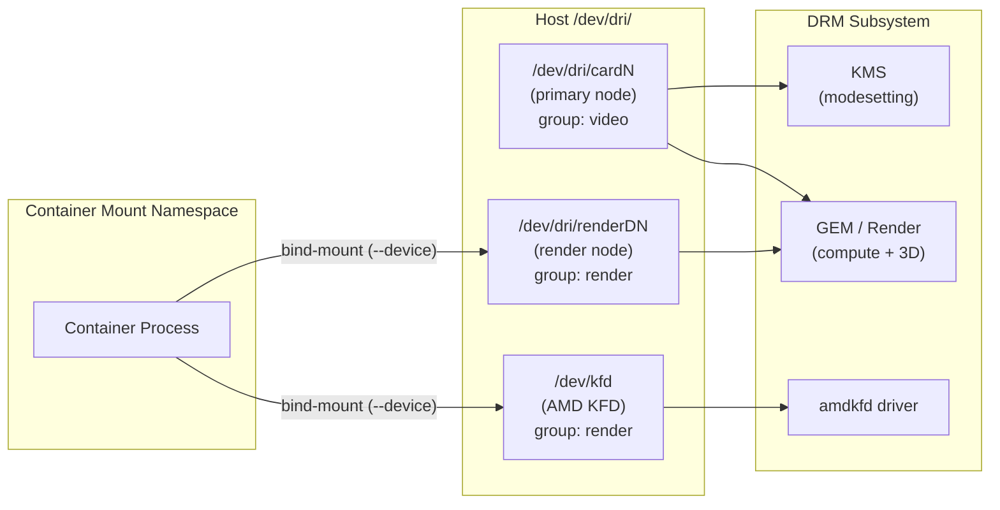
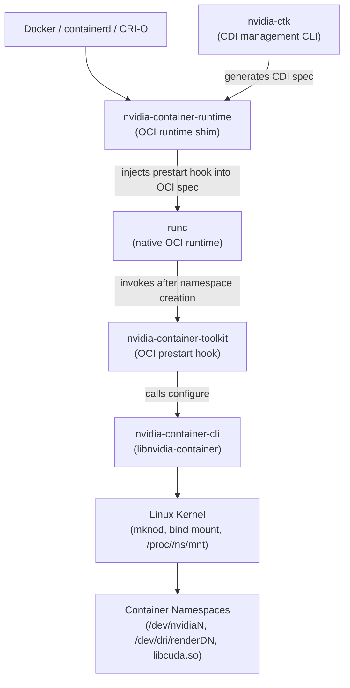
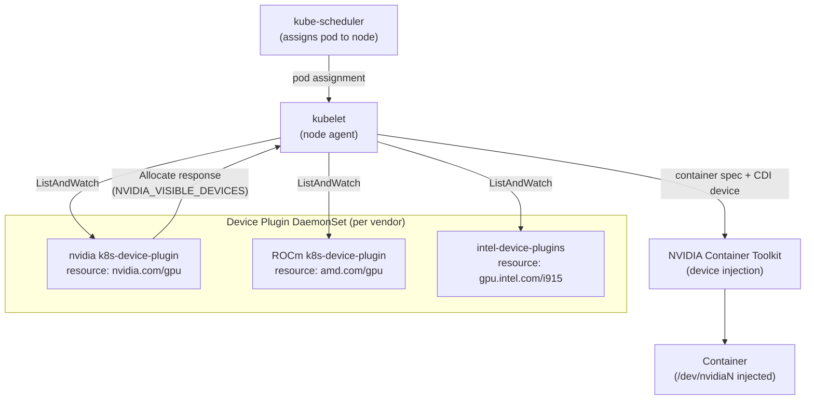
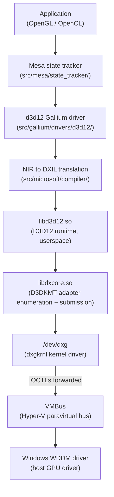
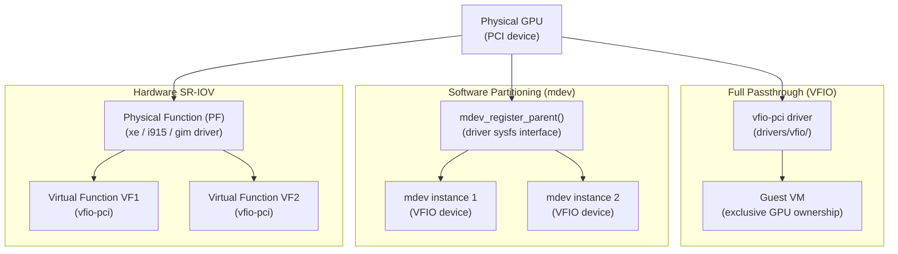

# Chapter 55: GPU Containers and Cloud Compute

**Audiences**: Systems and driver developers deploying GPU workloads in containers or virtual machines; graphics application developers targeting cloud GPU instances or WSL2 environments.

---

## Table of Contents

1. [Container GPU Access Model](#1-container-gpu-access-model)
2. [NVIDIA Container Toolkit](#2-nvidia-container-toolkit)
3. [ROCm in Containers](#3-rocm-in-containers)
4. [Intel GPU in Containers](#4-intel-gpu-in-containers)
5. [Kubernetes GPU Scheduling](#5-kubernetes-gpu-scheduling)
6. [WSL2 GPU Path](#6-wsl2-gpu-path)
7. [GPU Virtualisation](#7-gpu-virtualisation)
8. [Cloud GPU Instances](#8-cloud-gpu-instances)
9. [Integrations](#integrations)

---

## 1. Container GPU Access Model

Linux containers built on **namespaces**, **cgroups**, and union filesystems provide process isolation, but they do not provide device isolation at the GPU level. Namespaces partition kernel resources — PIDs, mount points, network stacks, IPC, UTS, and (since Linux 3.8) user credentials — but the character devices under `/dev/dri/` and `/dev/kfd` are ordinary inode entries backed by the **VFS**. A mount namespace can hide them from a container's view of the filesystem, but the **DRM** subsystem itself has no namespace-aware access control: opening the same `/dev/dri/renderD128` from two processes in different mount namespaces yields two file descriptors that submit commands to the identical hardware queue.

The practical consequence is that GPU access inside a container is achieved by bind-mounting the relevant device files into the container's mount namespace, together with any required library and firmware paths. Security is enforced by standard Unix **DAC**: the container process must have the appropriate group membership or capabilities.

The **DRM** subsystem exposes three classes of device node per GPU: the primary node (`/dev/dri/cardN`) for **KMS** modesetting, the render node (`/dev/dri/renderDN`) for unprivileged 3D and compute submission, and `/dev/kfd` (the **AMD** Kernel Fusion Driver node) required by the **ROCm** compute stack. **udev** rules assign render nodes to the `render` group and primary nodes to the `video` group. Rootless containers (**Podman**, rootless **Docker**) rely on host-user group membership in `render` to make the bind-mounted render node readable inside the container's user namespace.

For **NVIDIA** GPUs, the **NVIDIA Container Toolkit** automates device and library injection into **OCI** containers using an **OCI** prestart hook implemented by **nvidia-container-toolkit**, the `libnvidia-container` C library, and the `nvidia-container-runtime` shim. The toolkit injects `/dev/nvidiaN`, `/dev/nvidiactl`, `/dev/nvidia-uvm`, `libcuda.so`, and related libraries at container start time based on the `NVIDIA_VISIBLE_DEVICES` environment variable. The **CDI** (**Container Device Interface**) specification, generated by `nvidia-ctk`, provides a vendor-neutral declarative alternative to the hook mechanism, and is supported by any **CDI**-aware **OCI** runtime. `nvidia-smi` and **NVML** (`libnvidia-ml.so`) operate inside containers when the appropriate device nodes are injected.

For **AMD** GPUs, containers require both `/dev/kfd` and a **DRM** render node. The **ROCm** userspace version in the container must be compatible with the `amdgpu` kernel driver version on the host. AMD publishes official container images under the `rocm/` namespace on Docker Hub. `amd-smi` (from the `amd-smi-lib` package, superseding `rocm-smi` in **ROCm** 5.7+) filters GPU visibility to only the devices passed into the container, making per-container GPU accounting straightforward. The **AMD Container Toolkit** (`AMD_VISIBLE_DEVICES` semantics and **CDI** generation) mirrors the **NVIDIA Container Toolkit** approach for AMD hardware.

For **Intel** GPUs, containers only require `/dev/dri/renderDN`. **VA-API** video encode/decode, the **Intel Compute Runtime** for **OpenCL** and **Level Zero**, and `intel-gpu-tools` (including `intel_gpu_top` with **i915_oa** performance counters) all operate through the render node. Multi-GPU containers using separate render nodes get separate **GEM** contexts but share GPU **DRAM** bandwidth without hard **QoS** partitioning on most hardware; the **Mesa** shader cache path (`MESA_SHADER_CACHE_DIR`) must be configured explicitly in containers with ephemeral root filesystems.

**Kubernetes** does not natively understand GPU resources. The *Device Plugin API* (a **gRPC** interface between per-node daemonsets and the **kubelet**) is the standard extension mechanism: the **NVIDIA** `k8s-device-plugin` exposes `nvidia.com/gpu` resources, the **ROCm** device plugin exposes `amd.com/gpu`, and the **Intel** device plugins expose `gpu.intel.com/i915` and `gpu.intel.com/xe`. **MIG** (**Multi-Instance GPU**), available on **A100**, **H100**, **H200**, **B200**, and **GB200**, partitions a GPU at hardware level into spatially isolated instances with dedicated memory bandwidth, **L2** cache, and **SM** compute slices. GPU time-slicing provides logical GPU sharing without spatial isolation for hardware lacking **MIG**. **Kubernetes** 1.31 promoted **Dynamic Resource Allocation** (**DRA**) to stable, allowing structured device claims and GPU-topology-aware scheduling.

**WSL2** (**Windows Subsystem for Linux 2**) runs a Linux kernel in a **Hyper-V** VM and provides GPU access through a paravirtualisation stack: the `dxgkrnl` kernel driver (upstreamed in Linux 6.1 under `drivers/hv/dxgkrnl/`) exposes `/dev/dxg`, and the `libdxcore.so` userspace library wraps its **D3DKMT** IOCTLs. The **Mesa** `d3d12` **Gallium** driver translates OpenGL and OpenCL calls into **D3D12** command lists via a **NIR**→**DXIL** translation step, submitted through `libd3d12.so` and `libdxcore.so` to `dxgkrnl` across **VMBus**. Rendered framebuffers reach the Windows Desktop Window Manager via the `wsl-opengl-iosurface` IPC bridge (a cross-VM shared-memory mechanism analogous to **DMA-BUF**). For ML inference, **DirectML** (`libDirectML.so`) provides GPU-accelerated neural network operations over **D3D12**, used by **ONNX Runtime** through the DirectML execution provider.

GPU virtualisation enables sharing a single physical GPU among multiple VMs. **VFIO** (`drivers/vfio/`) gives a VM exclusive ownership of a PCI device for near-bare-metal performance. The `mdev` framework (`drivers/vfio/mdev/`) allows software-partitioned virtual device instances; Intel **GVT-g** (deprecated, Gen9–Gen11 only) used this path. **Intel Xe SR-IOV** (Arc Alchemist and later) creates hardware Virtual Functions via `sriov_numvfs` sysfs, each with a guaranteed time-slice and partitioned VRAM. **AMD MxGPU** uses **SR-IOV** with the open-source `gim` (GPU-IOV Module) driver, offering **SPX** and **CPX** partitioning modes for Instinct accelerators.

Cloud GPU instances add a driver version compatibility dimension to container deployments. **AWS** GPU instance families include `g4dn` (**NVIDIA T4**), `g5` (**NVIDIA A10G**), `p4d`/`p4de` (**NVIDIA A100**), and `p5` (**NVIDIA H100**); multi-GPU instances use **NVLink**/**NVSwitch** and **EFA** (**Elastic Fabric Adapter**) for inter-node **RDMA**. **GPUDirect RDMA** (via the `nvidia-peermem` module and the `peer_memory_client` interface) allows the **EFA** NIC to DMA directly into GPU **VRAM**, enabling **NCCL**-based distributed training without CPU memory copies. **GCP** offers **A2** (**A100**), **G2** (**L4**), and **A3** (**H100**) instance families, with driver pinning via the `install-gpu-driver` metadata key and **Container-Optimized OS** (**COS**) managing the NVIDIA kernel module outside **DKMS**. Kernel driver version pinning is critical on both platforms: the `NVIDIA_REQUIRE_CUDA` constraint in container images encodes the minimum host driver version required.

### Device Nodes

The DRM subsystem exposes three classes of node for each GPU:

- `/dev/dri/cardN` — the primary node, combining KMS (modesetting) and 3D render access. Opening this node requires `DRM_AUTH` from the DRM master, historically the compositor. Modern usage is mostly for KMS-only (display server) code.
- `/dev/dri/renderDN` — the render node (introduced in Linux 3.15), which allows unprivileged render/compute submission without a DRM master. Render nodes cannot perform modesetting. This is the correct node to expose to containers for OpenGL, Vulkan, and compute workloads.
- `/dev/kfd` — the AMD Kernel Fusion Driver node, required for ROCm compute on AMD GPUs. It has no DRM parallel; it is a separate character device registered by the `amdkfd` driver.

The render node number N in `renderDN` is assigned per-physical-device and does not change across reboots unless the PCI enumeration order changes. On a single-GPU system `renderD128` is typical; on multi-GPU systems `renderD128`, `renderD129`, etc. appear.



### udev Groups

The `udev` rules shipped by most distributions assign render nodes to the `render` group and primary nodes to the `video` group. The default udev rules from `libdrm` (at `rules.d/91-drm-modeset.rules` in the source tree, installed to `/usr/lib/udev/rules.d/`) are:

```bash
# /usr/lib/udev/rules.d/91-drm-modeset.rules  (from libdrm)
SUBSYSTEM=="drm", KERNEL=="card[0-9]*", GROUP="video", MODE="0660"
SUBSYSTEM=="drm", KERNEL=="renderD[0-9]*", GROUP="render", MODE="0660"
```

AMD additionally assigns `/dev/kfd` to the `render` (or on some distributions `video`) group:

```bash
# /usr/lib/udev/rules.d/70-amdgpu.rules  (from amdgpu-pro or DKMS package)
SUBSYSTEM=="kfd", KERNEL=="kfd", GROUP="render", MODE="0666"
```

[Source: libdrm udev rules](https://gitlab.freedesktop.org/mesa/drm/-/blob/main/rules.d/91-drm-modeset.rules)

### Rootless Container GPU Access

Rootless containers (Podman without root, rootless Docker, rootless containerd) run as a non-root host user. Because `renderDN` belongs to the `render` group and has `0660` permissions, the host user must be in the `render` group for the bind-mount to be readable inside the container. The container runtime maps the host UID/GID into the container's user namespace.

```bash
# Add current user to render and video groups (requires logout/login to take effect)
sudo usermod -aG render,video $USER

# Rootless Podman container with render node access
podman run --rm \
    --device /dev/dri/renderD128 \
    --group-add keep-groups \
    docker.io/mesa-demos:latest glxinfo
```

The `--group-add keep-groups` option in Podman preserves the host user's supplementary group set inside the container. Docker's rootless mode achieves the same via `--group-add $(getent group render | cut -d: -f3)`.

For Kubernetes workloads, the device plugin (see §5) injects device file paths into the container spec, and the kubelet configures the container's cgroup to allow access to the device major:minor numbers.

---

## 2. NVIDIA Container Toolkit

The NVIDIA Container Toolkit is the standard mechanism for exposing NVIDIA GPUs to OCI containers. It wraps any OCI-compliant runtime (runc, crun, containerd-shim) and injects the GPU device files, driver libraries, and required firmware into a container at start time, without baking them into the image. [Source: NVIDIA Container Toolkit architecture](https://docs.nvidia.com/datacenter/cloud-native/container-toolkit/latest/arch-overview.html)

### Component Stack

The toolkit is structured as four cooperating layers:

1. **libnvidia-container** — a C library and companion CLI (`nvidia-container-cli`) that performs the actual device and library injection using Linux kernel primitives (`mknod`, bind mounts into the container's mount namespace, `ldcache` updates).
2. **nvidia-container-toolkit** — the OCI `prestart` hook binary. After the container runtime creates the container namespaces but before the init process starts, `runc` invokes this hook with the path to the container's `config.json`. The hook reads `NVIDIA_VISIBLE_DEVICES` from the OCI environment, then calls `nvidia-container-cli` to inject the devices.
3. **nvidia-container-runtime** — a thin shim around the system's native `runc` that injects the prestart hook into the OCI spec before passing it to `runc`. This is what Docker, containerd, and CRI-O register as their OCI runtime.
4. **nvidia-ctk** — the CLI for managing CDI specifications and runtime configuration.



### OCI Hook Mechanism

```json
// Injected into config.json by nvidia-container-runtime before runc exec
{
  "hooks": {
    "prestart": [{
      "path": "/usr/bin/nvidia-container-runtime-hook",
      "args": ["nvidia-container-runtime-hook", "prestart"],
      "env": []
    }]
  }
}
```

After the Linux namespaces are created but before `execve()` of the container's init, `runc` calls the hook. The hook resolves `NVIDIA_VISIBLE_DEVICES` from the container environment and calls `nvidia-container-cli configure` which:

1. Binds `/dev/nvidia0`, `/dev/nvidiactl`, `/dev/nvidia-modeset`, `/dev/nvidia-uvm`, and `/dev/dri/renderDN` into the container's `/dev/`.
2. Bind-mounts `/usr/lib/x86_64-linux-gnu/libnvidia-*.so.*` and related libraries into the container's library search path.
3. Creates a `/proc/driver/nvidia` symlink if needed for `nvidia-smi`.

### NVIDIA_VISIBLE_DEVICES

The primary control variable is `NVIDIA_VISIBLE_DEVICES`. It is read by the hook from the container's environment (set via `docker run -e` or the pod spec):

| Value | Effect |
|-------|--------|
| `all` | All GPUs |
| `0,2` | GPUs at physical indices 0 and 2 |
| `GPU-uuid` | GPU by UUID (stable across reboots) |
| `none` | No GPUs; toolkit still injects driver libraries |
| `void` | No GPU injection at all (bypass toolkit) |

```bash
docker run --rm \
    --runtime=nvidia \
    -e NVIDIA_VISIBLE_DEVICES=0 \
    -e NVIDIA_DRIVER_CAPABILITIES=compute,utility \
    nvidia/cuda:12.4-base-ubuntu22.04 \
    nvidia-smi
```

`NVIDIA_DRIVER_CAPABILITIES` controls which library sets to inject. `compute` injects `libcuda.so` and `libnvidia-ml.so`; `graphics` adds `libGL.so` and `libEGL.so`; `video` adds `libnvidia-encode.so` and `libnvidia-decode.so`.

### CDI (Container Device Interface)

CDI is a vendor-neutral OCI specification for describing how to inject complex device resources — multiple files, library mounts, environment variables, and OCI hooks — into a container in a single, declarative YAML file. [Source: Container Device Interface spec](https://docs.docker.com/build/building/cdi/)

Starting with NVIDIA Container Toolkit v1.12.0, `nvidia-ctk` can generate a CDI specification file that replaces the hook-based approach. As of v1.18.0, a systemd service (`nvidia-cdi-refresh`) automatically regenerates the specification at `/var/run/cdi/nvidia.yaml` whenever the driver or toolkit is updated.

```bash
# Generate CDI spec manually
nvidia-ctk cdi generate --output=/etc/cdi/nvidia.yaml

# List CDI-visible devices
nvidia-ctk cdi list
# nvidia.com/gpu=0
# nvidia.com/gpu=1
# nvidia.com/gpu=all
```

The CDI YAML format embeds all injection rules so that any CDI-aware runtime can inject an NVIDIA GPU without NVIDIA-specific runtime code:

```yaml
# /var/run/cdi/nvidia.yaml  (abridged, generated output)
cdiVersion: "0.7.0"
kind: nvidia.com/gpu
devices:
  - name: "0"
    containerEdits:
      deviceNodes:
        - path: /dev/nvidia0
          hostPath: /dev/nvidia0
          type: c
          major: 195
          minor: 0
          fileMode: 0666
        - path: /dev/nvidiactl
          hostPath: /dev/nvidiactl
      mounts:
        - hostPath: /usr/lib/x86_64-linux-gnu/libcuda.so.535.183.01
          containerPath: /usr/lib/x86_64-linux-gnu/libcuda.so.535.183.01
      env:
        - NVIDIA_VISIBLE_DEVICES=0
```

With CDI, a container is started via:

```bash
# Docker (CDI-native, no NVIDIA runtime shim needed)
docker run --rm --device nvidia.com/gpu=0 nvidia/cuda:12.4-base-ubuntu22.04 nvidia-smi
```

### libnvidia-container Internals

`libnvidia-container` is the component that performs the actual Linux-level manipulation. Its `nvidia-container-cli` tool, invoked by the hook, performs the following operations in order:

1. Opens the target container's mount namespace via `/proc/<pid>/ns/mnt`.
2. Calls `mknod` inside the container's `/dev/` to create the GPU character device nodes (`/dev/nvidia0`, `/dev/nvidiactl`, `/dev/nvidia-uvm`, `/dev/dri/renderD128`).
3. Uses `mount --bind` to bind the host's driver libraries (`libcuda.so`, `libEGL_nvidia.so`, `libGLX_nvidia.so`, etc.) into a path inside the container's filesystem visible to the dynamic linker.
4. Updates the container's `/etc/ld.so.cache` or sets `LD_LIBRARY_PATH` so the container's `ldconfig` finds the injected libraries.
5. Mounts any required firmware blobs from `/lib/firmware/nvidia/` into the container's firmware search path.

The result is that the container image itself contains no NVIDIA binaries — it can be built with generic CUDA headers but no runtime libraries — while the host's driver libraries are injected at start time. This model means a single container image works against any compatible host driver, bounded only by the `NVIDIA_REQUIRE_CUDA` minimum version constraint.

[Source: libnvidia-container GitHub](https://github.com/NVIDIA/libnvidia-container)

### nvidia-smi and NVML Inside Containers

`nvidia-smi` uses NVML (the NVIDIA Management Library, `libnvidia-ml.so`) to query device state. Because NVML communicates with the kernel driver through `/dev/nvidiactl` and the GPU-specific `/dev/nvidiaN` device files, it works inside containers when `NVIDIA_DRIVER_CAPABILITIES=utility` is set. However, `nvidia-smi` inside a container shows all GPU properties of the physical GPU, not a virtualised subset — it reports full VRAM, full SM count, and thermals for the whole chip regardless of how many containers share the GPU.

---

## 3. ROCm in Containers

ROCm (Radeon Open Compute platform) requires two device interfaces: `/dev/kfd` for the compute command processor and `/dev/dri/renderDN` for the GPU command rings and memory management via the DRM subsystem. [Source: ROCm Docker documentation](https://rocm.docs.amd.com/projects/install-on-linux/en/latest/how-to/docker.html)

### Manual Device Passthrough

```bash
docker run --rm -it \
    --device /dev/kfd \
    --device /dev/dri/renderD128 \
    --group-add render \
    --group-add video \
    --security-opt seccomp=unconfined \
    rocm/dev-ubuntu-22.04:6.2-complete \
    rocminfo
```

The `--security-opt seccomp=unconfined` flag is required for HPC workloads that use `mmap` with `PROT_EXEC` on GPU memory regions, since the default Docker seccomp profile blocks several memory-mapping syscalls used by the ROCm runtime for large BAR mappings.

To limit a container to a specific GPU on a multi-GPU host, pass only the targeted render node:

```bash
# First GPU: renderD128; second GPU: renderD129
docker run --rm -it \
    --device /dev/kfd \
    --device /dev/dri/renderD128 \
    --group-add render \
    rocm/dev-ubuntu-22.04:6.2 \
    rocminfo
```

On hosts with partitioned GPUs (CPX mode on MI300X), each partition appears as a separate render node starting at `renderD128`. A 8-way CPX partition of a single MI300X would produce `renderD128` through `renderD135`.

### AMD Official Images

AMD publishes container images to Docker Hub under the `rocm/` namespace. The naming convention is:

```
rocm/dev-<distro>-<distro-version>:<rocm-version>[-complete]
```

For example: `rocm/dev-ubuntu-22.04:6.2-complete` includes the ROCm stack plus common ML frameworks. Base images (`rocm/dev-ubuntu-22.04:6.2`) contain the ROCm runtime but no frameworks.

### ROCm Version vs. Kernel Driver Compatibility

A critical operational constraint: the ROCm userspace version in the container must be compatible with the `amdgpu` kernel driver version on the host. The compatibility matrix is published in the ROCm documentation. The relevant rule is that the ROCm major version must not exceed what the installed kernel driver supports — the `amdgpu` driver version is set when the DKMS or distribution package is installed and does not track the container image's ROCm version.

```bash
# Check amdgpu kernel driver version on host
cat /sys/class/drm/renderD128/device/driver_info 2>/dev/null \
    || modinfo amdgpu | grep ^version

# Check ROCm version inside container
cat /opt/rocm/.info/version
```

If the container ROCm version is newer than the host kernel driver, `rocminfo` will typically fail with `HSA_STATUS_ERROR_INVALID_ISA` or silently report zero agents.

### rocm-smi Inside Containers

`rocm-smi` (now superseded by `amd-smi` in ROCm 5.7+) uses sysfs and `/dev/kfd` to query GPU state. Unlike `nvidia-smi`, ROCm tools _do_ filter visibility — they only enumerate GPUs whose render nodes and KFD queue handles were passed into the container:

```bash
# Inside container with only renderD128 passed
amd-smi list
# GPU 0: gfx90a (Aldebaran) — only the first physical GPU visible
```

This makes `amd-smi` correct for per-container GPU accounting, which is useful in multi-tenant Kubernetes deployments.

### ROCm SMI Monitoring: Tracking per-Container GPU Usage

A common operational need in multi-tenant environments is GPU utilisation accounting per container. ROCm provides two complementary tools:

- `amd-smi` (`amd-smi-lib` package): the current tool (ROCm 5.7+), replacing `rocm-smi`. Supports `amd-smi monitor` for streaming utilisation metrics.
- `rocm-smi` (legacy): still present in older images.

Both tools filter to only the GPUs visible in the container (render nodes bound in via `--device`). On the host, `amd-smi` shows all GPUs. In a container with only `renderD128` bound, `amd-smi` shows a single GPU with index 0 mapped to the physical GPU at `renderD128`. This makes container-level GPU accounting straightforward: a monitoring sidecar can run `amd-smi monitor --csv` and report per-container utilisation without needing host-level access.

### AMD Container Toolkit

AMD has released an AMD Container Toolkit analogous to NVIDIA's, published at [github.com/ROCm/container-toolkit](https://github.com/ROCm/container-toolkit). It provides `AMD_VISIBLE_DEVICES` semantics and CDI generation for ROCm GPUs, reducing the need for manual device flag management.

The toolkit generates a CDI specification under `/var/run/cdi/amd.yaml` and an OCI hook that performs device injection equivalent to the NVIDIA toolkit's `nvidia-container-cli configure`. The CDI device naming for AMD GPUs uses the `amd.com/gpu=<index>` convention:

```bash
# Generate AMD CDI spec
amd-ctk cdi generate --output=/var/run/cdi/amd.yaml
amd-ctk cdi list
# amd.com/gpu=0
# amd.com/gpu=1
```

---

## 4. Intel GPU in Containers

Intel GPU access in containers follows the same render-node model. No special runtime toolkit is required for basic workloads — a plain `--device` flag suffices.

### Basic Device Passthrough

```bash
docker run --rm -it \
    --device /dev/dri/renderD128 \
    --group-add render \
    intel/oneapi-basekit:latest \
    clinfo
```

For video-encode/decode workloads (VA-API), no additional device nodes are needed beyond `renderD128`. VA-API communicates with the Intel ME/Iris/Xe driver entirely through the DRM render node interface.

### Verifying VA-API Inside a Container

`vainfo` from the `libva-utils` package queries VA-API profiles supported by the driver accessible via the render node. To ensure the container uses the injected device rather than the first enumerated one:

```bash
docker run --rm \
    --device /dev/dri/renderD128 \
    --group-add render \
    -e LIBVA_DRIVER_NAME=iHD \
    -e LIBVA_DRIVERS_PATH=/usr/lib/x86_64-linux-gnu/dri \
    intel/media-runtime:latest \
    vainfo --display drm --device /dev/dri/renderD128
```

`LIBVA_DRIVER_NAME=iHD` selects the Intel Media Driver (`libigfxcmrt.so` / `iHD_drv_video.so`) rather than the older `i965` driver. `LIBVA_DRIVERS_PATH` must point to wherever the driver `.so` is installed inside the container image.

### Intel Compute Runtime ICD Path

The Intel Graphics Compute Runtime for OpenCL and Level Zero (`intel-opencl-icd` package) installs its ICDs at:

- OpenCL: `/etc/OpenCL/vendors/intel.icd` — contains the path `/usr/lib/x86_64-linux-gnu/intel-opencl/libigdrcl.so`
- Level Zero: `/usr/lib/x86_64-linux-gnu/libze_intel_gpu.so` — discovered by the Level Zero loader via `ZES_ENABLE_SYSMAN=1`

Container images must include the runtime. When building images:

```dockerfile
# Dockerfile fragment for Intel OpenCL compute
FROM ubuntu:22.04
RUN apt-get install -y intel-opencl-icd level-zero intel-level-zero-gpu
# ICD is automatically registered at /etc/OpenCL/vendors/intel.icd
```

Inside the container, `clinfo` will enumerate the Intel GPU only if `/dev/dri/renderD128` is bind-mounted and the container process is in the `render` group.

### intel-gpu-tools and Performance Counters

`intel-gpu-tools` (`igt-gpu-tools` package) provides `intel_gpu_top`, `intel_reg`, and other low-level tools. Performance counters on Intel GPUs are accessed via the `perf` subsystem with `i915_oa` (Observation Architecture) metrics. Inside a container, `intel_gpu_top` requires:

1. `/dev/dri/renderD128` bind-mounted.
2. `SYS_ADMIN` capability (or relaxed `perf_event_paranoid`), because `i915_oa` metrics are gated by `CAP_PERFMON` (Linux 5.9+).

```bash
docker run --rm -it \
    --device /dev/dri/renderD128 \
    --cap-add SYS_ADMIN \
    ubuntu:22.04 \
    bash -c "apt-get install -y igt-gpu-tools && intel_gpu_top -d drm:/dev/dri/renderD128"
```

Note: `CAP_PERFMON` (available since Linux 5.8) is the minimal required capability in place of `SYS_ADMIN` for perf-counter access on kernels >= 5.9. Using `SYS_ADMIN` is a broader privilege; production deployments should prefer `CAP_PERFMON`.

### Multi-GPU Containers and Isolation Caveats

When multiple containers on the same host each receive a separate render node, they get separate DRM file descriptors and separate GPU context objects (maintained by the kernel driver's GEM/scheduler). The GPU hardware enforces isolation at the level of command ring submission — each context has its own GPU registers and GGTT (Global GTT) or per-process GTT entry. However:

- **Memory bandwidth**: No hard QoS partition exists on most consumer and server GPUs outside of MIG (NVIDIA) or CPX (AMD). Multiple containers can saturate shared GPU DRAM bandwidth and affect each other's effective memory throughput.
- **Shader compiler**: The Mesa driver (or NVIDIA's NVRTC/PTXAS) compiles shaders per-context and uses a per-process shader cache at `~/.cache/mesa_shader_cache/` or `/var/cache/nvidia/ComputeCache`. In containers with read-only or ephemeral root filesystems, the shader cache path must be explicitly configured via `MESA_SHADER_CACHE_DIR` or the equivalent environment variable, otherwise compilation occurs on every container start.
- **GPU reset recovery**: If a container's workload triggers a GPU reset (TDR — Timeout Detection and Recovery), on NVIDIA GPUs all contexts on the same physical device are terminated. On AMD GPUs with per-VM page tables (GPUVM), the kernel's `amdgpu_device_gpu_recover()` path attempts to recover individual contexts. Whether recovery is per-context or per-device depends on GPU generation and driver configuration.

---

## 5. Kubernetes GPU Scheduling

Kubernetes does not natively understand GPUs. GPU resources are exposed through the *Device Plugin* API, a gRPC interface between a per-node daemonset (the device plugin) and the kubelet. The device plugin API (`k8s.io/kubelet/pkg/apis/deviceplugin/v1beta1`) defines three RPC calls: `ListAndWatch` (stream available devices), `Allocate` (inject devices into a container), and `GetDevicePluginOptions`. [Source: Kubernetes device plugin documentation](https://kubernetes.io/docs/concepts/extend-kubernetes/compute-storage-net/device-plugins/)



### NVIDIA GPU Device Plugin

The NVIDIA k8s device plugin ([github.com/NVIDIA/k8s-device-plugin](https://github.com/nvidia/k8s-device-plugin)) runs as a DaemonSet and registers each physical GPU as a `nvidia.com/gpu` allocatable resource with the kubelet. A pod requests a GPU via:

```yaml
# pod-gpu.yaml
apiVersion: v1
kind: Pod
spec:
  containers:
  - name: cuda-job
    image: nvidia/cuda:12.4-base-ubuntu22.04
    resources:
      limits:
        nvidia.com/gpu: 1
    command: ["nvidia-smi"]
```

When the scheduler assigns this pod to a node, the kubelet calls `Allocate` on the device plugin, which returns the CDI device names or environment variables (`NVIDIA_VISIBLE_DEVICES=0`) to inject into the container spec. The container runtime then invokes the NVIDIA Container Toolkit (§2) to perform the actual device injection.

### MIG (Multi-Instance GPU)

NVIDIA MIG is available on A100, H100, H200, B200, and GB200 GPUs. MIG partitions a GPU at the hardware level into independent instances, each with its own memory bandwidth slice, L2 cache, SM compute partition, and NVLink bandwidth allocation. Unlike time-slicing, MIG instances are spatially isolated: a fault in one MIG instance cannot corrupt another's memory. [Source: NVIDIA MIG User Guide](https://docs.nvidia.com/datacenter/tesla/mig-user-guide/latest/)

An A100 80GB can be divided into up to 7 instances following predefined profiles (the A100's 7 GPCs and 8 HBM stacks constrain the geometry):

| Profile | Memory | SMs | Max instances |
|---------|--------|-----|---------------|
| `1g.10gb` | 10 GB | 1 GPC | 7 |
| `2g.20gb` | 20 GB | 2 GPC | 3 |
| `3g.40gb` | 40 GB | 3 GPC | 2 |
| `7g.80gb` | 80 GB | 7 GPC | 1 |

MIG is enabled per-device via `nvidia-smi -i 0 --mig-mode=ENABLED`. Profiles are then created:

```bash
# Enable MIG on GPU 0
nvidia-smi -i 0 --mig-mode=ENABLED

# Create two 3g.40gb GPU instances (leaves one GPC and memory slice unused)
nvidia-smi mig -i 0 -cgi 3g.40gb,3g.40gb -C

# List resulting compute instances
nvidia-smi mig -i 0 -lci
```

In Kubernetes with the MIG-mixed strategy, the device plugin exposes resources like `nvidia.com/mig-3g.40gb`, `nvidia.com/mig-1g.10gb`, allowing pods to request specific partition sizes:

```yaml
resources:
  limits:
    nvidia.com/mig-3g.40gb: 1
```

### GPU Time-Slicing

For GPUs without MIG support (or when finer sharing is needed), the NVIDIA device plugin supports time-slicing via replica configuration. This creates N logical references to the same physical GPU; the GPU's compute scheduler time-multiplexes between concurrent workloads. There is no memory isolation — all replicas share the GPU's full DRAM and the OS does not enforce per-replica memory limits. [Source: NVIDIA GPU time-slicing](https://docs.nvidia.com/datacenter/cloud-native/gpu-operator/latest/gpu-sharing.html)

```yaml
# ConfigMap for device plugin with 4 replicas per GPU
apiVersion: v1
kind: ConfigMap
metadata:
  name: nvidia-device-plugin-config
  namespace: nvidia-device-plugin
data:
  config.yaml: |
    version: v1
    sharing:
      timeSlicing:
        renameByDefault: false
        resources:
        - name: nvidia.com/gpu
          replicas: 4
```

### AMD ROCm Device Plugin

The AMD device plugin ([github.com/RadeonOpenCompute/k8s-device-plugin](https://github.com/RadeonOpenCompute/k8s-device-plugin)) exposes AMD GPUs as `amd.com/gpu` resources:

```yaml
resources:
  limits:
    amd.com/gpu: 1
```

The plugin maps GPU indices to their `/dev/kfd` and `/dev/dri/renderDN` pairs and injects both into the container spec via the Allocate response.

### Intel GPU Device Plugin

The Intel device plugin ([github.com/intel/intel-device-plugins-for-kubernetes](https://github.com/intel/intel-device-plugins-for-kubernetes)) registers resources for each kernel driver in use:

| Resource | Kernel driver | GPU generation |
|----------|--------------|----------------|
| `gpu.intel.com/i915` | i915 (upstream) | Gen9–Arc/Alchemist |
| `gpu.intel.com/xe` | xe (upstream) | Xe2 / Battlemage+ |
| `gpu.intel.com/monitoring` | either | Cross-device monitoring |

[Source: Intel GPU device plugin docs](https://intel.github.io/intel-device-plugins-for-kubernetes/cmd/gpu_plugin/README.html)

A pod requesting Intel GPU compute access:

```yaml
resources:
  limits:
    gpu.intel.com/i915: 1
```

The plugin injects `/dev/dri/renderDN` into the container via the device plugin Allocate response, and sets `SYCL_DEVICE_FILTER=opencl:gpu` or `ZE_FLAT_DEVICE_HIERARCHY=COMPOSITE` as appropriate for the compute framework.

### Dynamic Resource Allocation (DRA)

Kubernetes 1.31 promoted Dynamic Resource Allocation (DRA) to stable. DRA is a more flexible replacement for the device plugin API, using the `resource.k8s.io/v1beta1` API group. Rather than exposing a flat count of identical devices, DRA allows device plugins to describe structured device attributes (compute capability, memory size, NVLink topology) and allows pods to express structured device claims:

```yaml
# DRA ResourceClaim for NVIDIA MIG partition (Kubernetes 1.31+)
apiVersion: resource.k8s.io/v1beta1
kind: ResourceClaim
metadata:
  name: gpu-claim
spec:
  devices:
    requests:
    - name: gpu
      deviceClassName: gpu.nvidia.com
      selectors:
      - cel:
          expression: device.attributes["nvidia.com"].memoryMiB >= 20480
```

DRA enables GPU-topology-aware scheduling — for example, ensuring that two pods requiring NVLink-connected GPUs are co-scheduled on GPUs that share an NVSwitch path. The NVIDIA GPU Operator provides a DRA driver as of version 25.x alongside the legacy device plugin.

---

## 6. WSL2 GPU Path

Windows Subsystem for Linux 2 (WSL2) runs a Linux kernel in a lightweight Hyper-V virtual machine. GPU access is implemented through a paravirtualisation stack that allows the Windows host's GPU driver to service GPU commands issued by Linux processes — without needing a Linux GPU driver for the physical hardware. [Source: DirectX Heart Linux blog](https://devblogs.microsoft.com/directx/directx-heart-linux/)

### dxcore and dxgkrnl

The kernel side consists of two components:

1. **dxgkrnl** — a Linux kernel driver that exposes `/dev/dxg` to userspace. `/dev/dxg` provides IOCTLs that closely mirror the Windows WDDM `D3DKMT` kernel service layer. When a Linux process issues an IOCTL on `/dev/dxg`, `dxgkrnl` forwards it across the VMBus (Hyper-V's paravirtual bus) to the Windows host's WDDM driver stack. The source was upstreamed into the Linux kernel in 6.1 under `drivers/hv/dxgkrnl/`.
2. **dxcore** (libdxcore.so) — the userspace library that wraps the `/dev/dxg` IOCTLs with a D3DKMT-compatible API. It is a simplified version of DXGI used by drivers on Windows to talk to the GPU.

[Source: WSL Graphics Architecture (XDC 2021)](https://lpc.events/event/9/contributions/610/attachments/700/1295/XDC_-_WSL_Graphics_Architecture.pdf)

```c
// dxgkrnl exposed ioctls – simplified from drivers/hv/dxgkrnl/dxgkrnl.h (Linux 6.1+)
// IOCTLs match Windows WDDM D3DKMT opcodes for cross-host forwarding
#define LX_DXOPENADAPTERFROMLUID    _IOWR(0x47, 0x01, struct d3dkmt_openadapterfromluid)
#define LX_DXCREATEDEVICE           _IOWR(0x47, 0x03, struct d3dkmt_createdevice)
#define LX_DXSUBMITCOMMAND          _IOWR(0x47, 0x15, struct d3dkmt_submitcommand)
```

[Source: dxgkrnl in Linux kernel](https://github.com/torvalds/linux/tree/master/drivers/hv/dxgkrnl)

### Mesa d3d12 Gallium Driver

The Mesa `d3d12` driver is a Gallium driver that emits D3D12 API calls rather than targeting a specific GPU ISA. It translates Mesa's TGSI/NIR shader IR and state-tracker draw calls into D3D12 command lists, which are then submitted through `libd3d12.so` (compiled from the same source as `d3d12.dll` on Windows) and ultimately through `libdxcore.so` to `dxgkrnl`. [Source: Mesa d3d12 driver documentation](https://docs.mesa3d.org/drivers/d3d12.html)

The translation stack on WSL2:

```
Application (OpenGL / OpenCL)
        │
Mesa state tracker (src/mesa/state_tracker/)
        │
d3d12 Gallium driver (src/gallium/drivers/d3d12/)
        │
NIR → DXIL translation (src/microsoft/compiler/)
        │
libd3d12.so  (D3D12 runtime, userspace)
        │
libdxcore.so  (D3DKMT adapter enumeration + submission)
        │
/dev/dxg  ←→  VMBus  ←→  Windows WDDM driver
```



The DXIL (DirectX Intermediate Language) translator in Mesa converts NIR (Mesa's internal shader IR, see Ch14) to DXIL bytecode. This means GLSL and SPIR-V shaders (after Vulkan → OpenGL API translation if needed) go through NIR → DXIL, not through the vendor's native ISA compiler.

### GPU Selection

On systems with multiple GPUs (e.g., integrated + discrete), Mesa selects the D3D12 adapter via:

```bash
export MESA_D3D12_DEFAULT_ADAPTER_NAME="NVIDIA"
```

The substring is matched against the adapter description string returned by DXCore enumeration.

### wsl-opengl-iosurface IPC Bridge

WSL2 renders its X11 and Wayland applications through WSLg (Windows Subsystem for Linux GUI), which runs a Wayland compositor (Weston) and an X server (XWayland) inside the VM. Rendered framebuffers are exported from the VM to the host Windows compositor through a shared memory mechanism called `wsl-opengl-iosurface`. Conceptually similar to DMA-BUF (Ch4) on native Linux, it allows a GPU-resident buffer produced by the VM's Mesa driver to be scanned out by the Windows Desktop Window Manager (DWM) without a readback to CPU memory. [Source: D3D12 GPU video acceleration blog](https://devblogs.microsoft.com/commandline/d3d12-gpu-video-acceleration-in-the-windows-subsystem-for-linux-now-available/)

The mechanism works through cross-VM memory sharing: the `d3d12` Gallium driver allocates a D3D12 resource backed by a cross-adapter heap, and `dxgkrnl` provides a handle that the Windows host can open as a shared surface. The Windows compositor maps this surface into DWM's rendering pipeline for display, eliminating a GPU→CPU→GPU round-trip.

### DirectML for ML Inference

For machine-learning inference, WSL2 provides DirectML via `libDirectML.so`, a GPU-accelerated library for neural network operations on top of D3D12. This is the recommended path for ML on WSL2 because it avoids the overhead of CUDA emulation and directly leverages the Windows driver's optimised DX12 compute pipeline.

ONNX Runtime on WSL2 uses the DirectML execution provider, which calls into `libDirectML.so` → `libd3d12.so` → `libdxcore.so` → `dxgkrnl` → VMBus → Windows WDDM. This path supports NVIDIA, AMD, and Intel GPUs uniformly — whichever Windows driver is installed on the host — without requiring a vendor-specific WSL2 GPU driver.

### WSL2 Limitations vs. Native Linux

WSL2's paravirtualised GPU path has several architectural constraints relative to native Linux:

| Capability | Native Linux | WSL2 |
|------------|-------------|------|
| Vulkan compute | Full support | Via MESA_VK_WSI_DISPLAY/DX12 (experimental) |
| DMA-BUF | Yes | No — no IOMMU-mapped DMA, VMBus used instead |
| NVML / ROCm | Yes (with physical driver) | No — no `/dev/kfd`, no `/dev/nvidiaN` |
| OpenGL 4.6 | Depends on driver | OpenGL 3.3 via d3d12 Gallium |
| VA-API | Yes | Limited (D3D12 video decode path) |
| GPU reset | Full DRM GPU recovery | Handled by Windows host WDDM TDR |

No `DMA-BUF` means zero-copy buffer sharing between GPU and network/storage (as used in P2P DMA for ML training, Ch4) is unavailable in WSL2. Container GPU access under WSL2 is possible — NVIDIA provides a WSL2 container toolkit variant — but it still uses the paravirtualised `/dev/dxg` path for non-CUDA workloads.

---

## 7. GPU Virtualisation

GPU virtualisation addresses the need to share a single physical GPU among multiple virtual machines, with stronger isolation than container-level sharing.



### VFIO GPU Passthrough

VFIO (Virtual Function I/O, `drivers/vfio/` in the kernel) enables a VM to own a PCI device exclusively. For GPU passthrough:

1. Bind the GPU to `vfio-pci` instead of the native driver at boot.
2. Assign the VFIO device to a QEMU/KVM VM.
3. The VM's guest OS loads its own GPU driver (NVIDIA, amdgpu, i915) against the physical hardware.

[Source: VFIO kernel documentation](https://www.kernel.org/doc/html/latest/driver-api/vfio.html)

```bash
# On the host: bind GPU to vfio-pci
PCI_ADDR="0000:01:00.0"
echo "vfio-pci" > /sys/bus/pci/devices/$PCI_ADDR/driver_override
echo "$PCI_ADDR" > /sys/bus/pci/drivers/vfio-pci/bind

# QEMU invocation fragment
qemu-system-x86_64 \
    -device vfio-pci,host=01:00.0,x-igd-opregion=on \
    -device vfio-pci,host=01:00.1 \   # Audio function of the same GPU
    ...
```

The GPU must be in its own IOMMU group for safe passthrough. Platforms with ACS (Access Control Services) support on PCI switches give the finest IOMMU group granularity. VFIO passthrough delivers near-bare-metal GPU performance but gives the VM exclusive access to the entire physical GPU — there is no sharing.

### Mediated Devices (mdev)

The `mdev` framework (`drivers/vfio/mdev/`) allows a physical device driver to create multiple virtualised device instances, each exposed to a separate VM as a VFIO device. Unlike SR-IOV, mdev partitioning is performed in software by the driver rather than in PCI firmware. [Source: VFIO mediated device documentation](https://docs.kernel.org/driver-api/vfio-mediated-device.html)

A driver registers a mediated device parent via `mdev_register_parent()`, which creates `mdev_supported_types/` entries in sysfs. The hypervisor or administrator creates mdev instances by writing to the sysfs `create` file:

```bash
# Intel GVT-g mdev creation (legacy, Gen9-Gen11 only)
GPU_PCI="0000:00:02.0"
UUID=$(uuidgen)
echo "$UUID" > /sys/bus/pci/devices/$GPU_PCI/mdev_supported_types/i915-GVTg_V5_4/create
# Creates /sys/bus/mdev/devices/$UUID/

# Assign to QEMU
qemu-system-x86_64 \
    -device vfio-pci,sysfsdev=/sys/bus/mdev/devices/$UUID \
    ...
```

Intel GVT-g is deprecated and only supported on 5th through 10th generation Intel CPUs (Broadwell through Comet Lake). It is replaced by SR-IOV for Xe architecture GPUs.

### Intel Xe SR-IOV

Intel's Xe GPU architecture (Arc Alchemist and later, Xe-HPC) supports PCIe SR-IOV. The physical function (PF) driver (`xe` or `i915` for older Xe) can create virtual functions (VFs), each of which gets a guaranteed time-slice of GPU execution time and a partitioned region of video memory:

```bash
# Enable SR-IOV Virtual Functions on Intel Xe GPU (PF bound to xe driver)
echo 4 > /sys/bus/pci/devices/0000:03:00.0/sriov_numvfs
# Creates 0000:03:00.1 through 0000:03:00.4 as VF PCI devices

# Each VF can be assigned to a VM via vfio-pci
echo "vfio-pci" > /sys/bus/pci/devices/0000:03:00.1/driver_override
echo "0000:03:00.1" > /sys/bus/pci/drivers/vfio-pci/bind
```

Inside the guest VM, the VF appears as an independent Intel GPU with its own DRM device nodes.

### AMD MxGPU SR-IOV

AMD MxGPU uses SR-IOV for spatial partitioning of Instinct accelerators. The host loads the `gim` (GPU-IOV Module) driver, which was open-sourced by AMD in April 2025 ([github.com/amd/MxGPU-Virtualization](https://github.com/amd/MxGPU-Virtualization)). [Source: AMD GIM open source announcement](https://www.phoronix.com/news/AMD-GIM-Open-Source)

```bash
# Load GIM with 4 virtual functions per GPU
sudo modprobe gim vf_num=4

# Each VF appears as a separate PCI device
lspci | grep AMD  # Shows PF + 4 VFs
```

MxGPU supports two partitioning modes:

- **SPX** (Single Partition) — 1 VF, full GPU resources dedicated to a single guest.
- **CPX** (Compute Partition) — up to 8 VFs (on MI300X), each receiving 1/N of the XCDs (compute dies) and a proportional HBM region. Each VF is spatially isolated: cache flushes at the partition boundary prevent cross-VM memory visibility.

For MI300X with 8 CPX VFs, each VF has approximately 24 GB of HBM3 and access to 1/8 of the XCD compute resources. Inside each guest VM, the amdgpu driver loads against the VF and ROCm operates normally through the standard `/dev/kfd` + `/dev/dri/renderDN` interface.

---

## 8. Cloud GPU Instances

Cloud GPU instances add a kernel driver version compatibility dimension to the container GPU problem: the host kernel and NVIDIA/AMD driver are managed by the cloud provider's AMI/OS image, and they may not match what a container image was built against.

### AWS GPU Instance Types

AWS offers several GPU instance families relevant to Linux graphics and compute workloads:

| Family | GPU | Use case |
|--------|-----|----------|
| `g4dn` | NVIDIA T4 (Turing, 16 GB GDDR6) | Inference, graphics |
| `g5` | NVIDIA A10G (Ampere, 24 GB GDDR6) | Inference, rendering |
| `p4d` | 8× NVIDIA A100 40GB (NVSwitch) | Large-scale training |
| `p4de` | 8× NVIDIA A100 80GB | Large-scale training |
| `p5` | 8× NVIDIA H100 80GB SXM5 | Transformer training |
| `g5g` | NVIDIA T4G (Turing, ARM) | ARM-native inference |

[Source: AWS EC2 GPU instance types](https://aws.amazon.com/ec2/instance-types/p4/)

The `p4d` and `p5` instances expose multiple A100/H100 GPUs interconnected by NVLink/NVSwitch. Between instances, AWS provides EFA (Elastic Fabric Adapter), a low-latency RDMA-capable network interface.

### EFA and GPU RDMA (GPUDirect)

GPUDirect RDMA allows the EFA network interface to DMA data directly into and out of GPU VRAM, bypassing the CPU and system DRAM. This is critical for multi-node distributed training: all-reduce operations in frameworks like PyTorch use NCCL (NVIDIA Collective Communications Library), which calls into the `nccl-net` EFA plugin to issue RDMA operations directly to GPU memory.

The kernel mechanism relies on peer-to-peer DMA (Ch4): the EFA driver uses `peer_memory_client` callbacks to map GPU physical addresses into the IOMMU window of the EFA NIC. This requires the NVIDIA driver to be compiled with `CONFIG_NVIDIA_P2P` support, and the EFA driver to be a compatible version.

A longstanding compatibility issue arose when the Linux kernel's module export namespace system (commit `b2c19e3`, Linux 5.16) broke the proprietary NVIDIA driver's ability to call `get_user_pages_fast()` from EFA's peer memory path. AWS resolved this by migrating DLAMIs to the NVIDIA open-source kernel module (OpenRM), which is linked against the public `EXPORT_SYMBOL` surface and is compatible with the EFA driver's P2P interface. [Source: AWS EFA NVIDIA kernel compatibility](https://github.com/aws/aws-parallelcluster/wiki/Newer-Linux-kernels-are-no-longer-compatible-with-EFA-and-closed-Source-Nvidia-drivers-in-instances-with-GPU-Direct-RDMA-support)

### Kernel Driver Version Pinning

Cloud AMIs ship with a specific kernel + GPU driver pair validated together. Updating the kernel without updating the driver DKMS module produces a driver version mismatch that prevents the GPU from initialising:

```bash
# Check driver and kernel module compatibility on EC2
nvidia-smi  # Will fail if driver module doesn't match running kernel
modinfo nvidia | grep vermagic  # Must match `uname -r`

# Pin kernel version in /etc/apt/preferences.d/ (Ubuntu)
cat > /etc/apt/preferences.d/pin-kernel << 'EOF'
Package: linux-image-*
Pin: version 5.15.0-1054-aws
Pin-Priority: 1001
EOF
```

For containerised workloads on fixed AMIs, the NVIDIA driver version inside the container must match the host driver. This is why NVIDIA CUDA images are versioned by driver (`nvidia/cuda:12.4-base-ubuntu22.04` requires host driver >= 535). The `NVIDIA_REQUIRE_CUDA` environment variable in the container image encodes the minimum driver requirement checked at container start.

### GCP GPU Instances

Google Cloud Platform offers:

- **A2** family: NVIDIA A100 40 GB and 80 GB, for training
- **G2** family: NVIDIA L4 (24 GB GDDR6), for inference and 3D rendering
- **A3** family: NVIDIA H100 80 GB SXM5 (up to 8 per VM), for frontier models

GCP supports driver version pinning via the `install-gpu-driver` metadata key:

```bash
# Pin to NVIDIA driver branch R535 (GCP Compute Engine)
gcloud compute instances create gpu-vm \
    --accelerator type=nvidia-tesla-a100,count=1 \
    --metadata install-gpu-driver=true,install-gpu-driver-version=535.183.01
```

The Container-Optimized OS (COS) images on GCP manage the NVIDIA kernel module separately from the root filesystem using a read-only partition scheme; driver updates on COS go through Google's own signing and push process rather than DKMS.

### Practical Container Launch on Cloud GPUs

A complete workflow on an AWS `g5` instance running Amazon Linux 2023:

```bash
# 1. Verify driver and CUDA
nvidia-smi
# NVIDIA-SMI 535.183.01  Driver Version: 535.183.01  CUDA Version: 12.2

# 2. Install NVIDIA Container Toolkit (CDI path)
curl -fsSL https://nvidia.github.io/libnvidia-container/gpgkey | sudo gpg --dearmor \
    -o /usr/share/keyrings/nvidia-container-toolkit-keyring.gpg
# ... apt/dnf install nvidia-container-toolkit

# 3. Generate CDI spec
sudo nvidia-ctk cdi generate --output=/etc/cdi/nvidia.yaml
sudo nvidia-ctk runtime configure --runtime=docker --cdi.enabled

# 4. Run training container
docker run --rm \
    --device nvidia.com/gpu=all \
    -e NCCL_SOCKET_IFNAME=efa0 \
    -e FI_PROVIDER=efa \
    nvcr.io/nvidia/pytorch:24.02-py3 \
    python3 -c "import torch; print(torch.cuda.device_count())"
```

The EFA environment variables (`FI_PROVIDER=efa`, `NCCL_SOCKET_IFNAME=efa0`) are needed alongside the GPU device because NCCL uses EFA for inter-node collective communication. The EFA network interface is exposed to the container as a standard network device (not a `/dev/dri` device) and is injected via the Amazon EFA CNI plugin in EKS environments.

---

## Roadmap

### Near-term (6–12 months)

- **DRA vendor-neutral governance**: NVIDIA donated its Kubernetes DRA driver to the CNCF at KubeCon EU 2026, placing the `nvidia.com/gpu` ResourceSlice/ResourceClaim implementation under neutral stewardship. AMD and Intel are expected to align their DRA drivers to the same CNCF interface, making topology-aware GPU scheduling portable across vendors. [Source: Kubernetes v1.36 DRA updates](https://kubernetes.io/blog/2026/05/07/kubernetes-v1-36-dra-136-updates/)
- **Device Plugin → DRA migration path**: With DRA graduating to GA in Kubernetes 1.34 and DRA v1.36 bringing multi-driver coordination, the ecosystem is actively migrating away from the integer-count Device Plugin API. GPU Operators from NVIDIA, AMD, and Intel are expected to ship DRA-only modes by end of 2026. [Source: Kubernetes GPU Orchestration 2026](https://www.spheron.network/blog/kubernetes-gpu-orchestration-2026/)
- **AMD amdgpu SR-IOV improvements in Linux 6.19**: AMD is upstreaming a new SR-IOV mailbox interface and additional virtual-function resource-management APIs for the `amdgpu` driver, targeting Linux 6.19. This enables finer-grained per-VF memory and compute quota control for MxGPU deployments. [Source: Phoronix/gamegpu AMDGPU SR-IOV Linux 6.19](https://en.gamegpu.com/news/zhelezo/amd-gotovit-pervoe-obnovlenie-drajvera-amdgpu-dlya-linux-6-19-s-uluchsheniyami-sr-iov-dcn-i-ras)
- **Intel Xe VFIO SR-IOV in Linux 6.19**: The Intel Xe driver is landing VFIO SR-IOV support in Linux 6.19, exposing Arc Alchemist and later GPUs as multiple Virtual Functions to KVM guests without requiring the proprietary GVT-g mediated device path (which only covered Gen9–Gen11). [Source: Intel Xe VFIO SR-IOV Medium](https://canartuc.medium.com/intel-xe-vfio-driver-gpu-virtualization-enters-the-mainstream-09982a2f6cd5)
- **GPU confidential computing on Blackwell with Kata/TDX**: NVIDIA's April 2026 deployment guide documents Confidential Computing (CC) mode for Blackwell GPUs inside TDX-protected Kata containers, with Fabric Manager requiring explicit CC-mode configuration. AMD SEV-SNP support for ROCm containers is progressing in the same kernel window. [Source: NVIDIA CC Deployment Guide TDX](https://docs.nvidia.com/cc-deployment-guide-tdx.pdf)

### Medium-term (1–3 years)

- **DRM namespace isolation**: There is ongoing discussion in the DRM and container communities about proper kernel-level GPU namespace support, analogous to network or PID namespaces, to provide isolation stronger than the current bind-mount + DAC model. No merged patchset exists yet; RFC-level design work is expected. Note: needs verification.
- **CDI as the universal GPU injection standard**: The Container Device Interface specification is expected to become the default injection mechanism across Docker, containerd, CRI-O, and Podman, superseding the NVIDIA prestart-hook path. The OCI Runtime Spec will likely absorb CDI device semantics natively. [Source: NVIDIA CDI Operator docs](https://docs.nvidia.com/datacenter/cloud-native/gpu-operator/latest/cdi.html)
- **Topology-aware and workload-aware GPU scheduling (KAI Scheduler + DRA)**: The NVIDIA-contributed KAI scheduler and the forthcoming upstream Kubernetes scheduler plugins will use DRA ResourceSlice topology attributes (NVLink domain, memory bandwidth, PCIe locality) for gang-scheduling distributed training jobs optimally across GPU nodes. [Source: Kubernetes GPU Orchestration 2026](https://www.spheron.network/blog/kubernetes-gpu-orchestration-2026/)
- **DRA on AKS with vGPU**: Microsoft Azure is integrating DRA with NVIDIA vGPU on AKS, allowing fractional GPU allocation through structured ResourceClaims rather than the time-slicing approximation. This extends MIG-style partitioning semantics to vGPU environments without requiring bare-metal A100/H100. [Source: AKS DRA vGPU blog](https://blog.aks.azure.com/2026/03/06/dra-with-vGPUs-on-aks)
- **Confidential GPU containers entering production**: With NVIDIA Hopper and Blackwell attestation paths stabilised and Kata CoCo (Confidential Containers) integrating TDX + AMD SEV-SNP, cloud providers are expected to expose confidential GPU instance types to tenants who require cryptographic proof of GPU firmware and driver integrity. [Source: Red Hat confidential containers with NVIDIA](https://www.redhat.com/en/blog/power-confidential-containers-red-hat-openshift-nvidia-gpus)

### Long-term

- **Unified GPU device model across containers and VMs**: The long-term architectural goal is a single unified Linux kernel device model — likely an evolution of DRM + SR-IOV + cgroups v2 device controller — that provides equal-quality isolation for containers, VMs, and bare-metal workloads from a single driver code path. VFIO, `mdev`, and render-node bind-mounting would become implementation strategies within a common abstraction. Note: needs verification.
- **GPU cgroups v3 resource controllers**: The current GPU resource accounting in Linux is approximate (device-plugin counts, MIG static partitions). Future cgroups v3 work may introduce first-class GPU memory and compute controllers analogous to the existing memory and CPU controllers, enabling per-pod GPU bandwidth and VRAM quotas enforced by the kernel rather than by userspace drivers. Note: needs verification.
- **Seamless multi-cloud GPU portability**: As CDI matures and DRA stabilises, workload portability across AWS, GCP, Azure, and on-premises Kubernetes clusters is expected to improve. Driver version pinning constraints (`NVIDIA_REQUIRE_CUDA`, ROCm ABI) remain a hard coupling; a future firmware abstraction layer or stable userspace ABI freeze could decouple container images from host driver versions. Note: needs verification.

---

## Integrations

This chapter connects to several other parts of the stack:

**PRIME device selection (Ch49)**: In multi-GPU containers (e.g., a render node with both integrated and discrete GPU), PRIME offloading governs which GPU performs rendering. The `DRI_PRIME=1` or `DRI_PRIME=pci-XXXX_YY_ZZ_W` variable selects the discrete GPU's render node. When only a specific `renderDN` is bind-mounted into the container, the PRIME selection is implicitly resolved — only the injected node is visible — which simplifies multi-GPU targeting in containerised environments.

**P2P DMA (Ch4)**: The EFA + GPUDirect RDMA path on AWS `p4d`/`p5` instances relies on peer-to-peer DMA between the GPU and the EFA NIC. The `peer_memory_client` mechanism (Ch4) underpins the `nvidia-peermem` kernel module that bridges the NVIDIA driver's physical memory ranges into the EFA driver's DMA address space. ROCm uses an equivalent mechanism via the `amdgpu` driver's `drm_buddy` allocator and the HMM (Heterogeneous Memory Management) framework.

**virtio-gpu (Appendix F)**: Where full VFIO passthrough is not possible — cloud environments without SR-IOV passthrough, development VMs, or CI pipelines — `virtio-gpu` provides a paravirtual display and 3D acceleration path using the `virgl` protocol. WSL2's `/dev/dxg` path is architecturally analogous to `virtio-gpu`: both translate GPU commands across a hypervisor boundary rather than targeting physical hardware directly. `virtio-gpu` uses the Virtio transport; WSL2 uses VMBus.

**WSL2 d3d12 Gallium driver and Zink (Ch17)**: Zink (Ch17) is a Gallium driver that translates OpenGL to Vulkan. The Mesa `d3d12` Gallium driver follows the same architectural pattern — a translation-layer Gallium driver that converts the Mesa gallium interface to a foreign GPU API (D3D12 instead of Vulkan). Both Zink and d3d12 benefit from Mesa's common NIR shader optimisation passes; `d3d12` has an additional NIR→DXIL translation step not needed by Zink.

**GPU power management (Ch51)**: In containerised and cloud environments, NVIDIA GPU persistence mode (`nvidia-smi -pm 1`) prevents the GPU from powering down between container runs. Without persistence mode, each container startup incurs a cold-initialisation latency (hundreds of milliseconds) as the driver re-initialises the GPU's firmware and clock domains. On Kubernetes nodes that host many short-lived inference pods, persistence mode is essential for maintaining target latency SLOs. For AMD GPUs, the equivalent is the amdgpu `runpm` sysfs control at `/sys/bus/pci/devices/<BDF>/power/control`.

**ROCm (Ch48)**: The ROCm stack described in this chapter for container deployment sits on top of the kernel interfaces (HSA, `/dev/kfd`) described in detail in Ch48. The ROCm version pinning constraint discussed here — where the container's ROCm userspace version must not exceed the host kernel driver's supported ABI — is a direct consequence of the HSA runtime's use of `KFD_IOC_*` ioctls, which are versioned by the kernel driver.

---

*References*

- [NVIDIA Container Toolkit Architecture](https://docs.nvidia.com/datacenter/cloud-native/container-toolkit/latest/arch-overview.html)
- [NVIDIA CDI Support](https://docs.nvidia.com/datacenter/cloud-native/container-toolkit/latest/cdi-support.html)
- [NVIDIA k8s Device Plugin](https://github.com/nvidia/k8s-device-plugin)
- [NVIDIA MIG User Guide](https://docs.nvidia.com/datacenter/tesla/mig-user-guide/latest/)
- [NVIDIA GPU Time-Slicing in Kubernetes](https://docs.nvidia.com/datacenter/cloud-native/gpu-operator/latest/gpu-sharing.html)
- [ROCm Docker Documentation](https://rocm.docs.amd.com/projects/install-on-linux/en/latest/how-to/docker.html)
- [AMD Container Toolkit](https://github.com/ROCm/container-toolkit)
- [AMD GIM Open Source Driver](https://github.com/amd/MxGPU-Virtualization)
- [Intel GPU Device Plugin for Kubernetes](https://intel.github.io/intel-device-plugins-for-kubernetes/cmd/gpu_plugin/README.html)
- [Mesa D3D12 Driver](https://docs.mesa3d.org/drivers/d3d12.html)
- [WSL2 Graphics Architecture (XDC 2021)](https://lpc.events/event/9/contributions/610/attachments/700/1295/XDC_-_WSL_Graphics_Architecture.pdf)
- [DirectX on Linux Blog](https://devblogs.microsoft.com/directx/directx-heart-linux/)
- [Linux dxgkrnl source](https://github.com/torvalds/linux/tree/master/drivers/hv/dxgkrnl)
- [VFIO Mediated Device Framework](https://docs.kernel.org/driver-api/vfio-mediated-device.html)
- [AMD MxGPU Virtualization (GIM)](https://instinct.docs.amd.com/projects/virt-drv/en/latest/)
- [AWS EC2 P4d Instance Type](https://aws.amazon.com/ec2/instance-types/p4/)
- [AWS EFA + NVIDIA Open-Source Driver Compatibility](https://github.com/aws/aws-parallelcluster/wiki/Newer-Linux-kernels-are-no-longer-compatible-with-EFA-and-closed-Source-Nvidia-drivers-in-instances-with-GPU-Direct-RDMA-support)
- [GCP GPU Instance Types](https://cloud.google.com/compute/docs/gpus)
- [libdrm udev rules](https://gitlab.freedesktop.org/mesa/drm/-/blob/main/rules.d/91-drm-modeset.rules)
