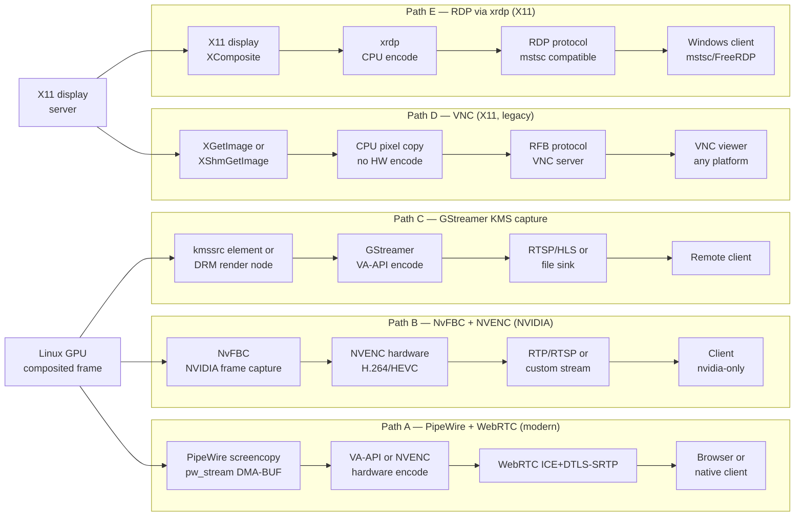
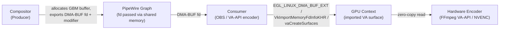
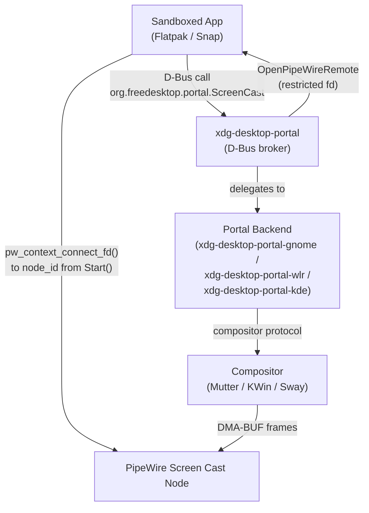
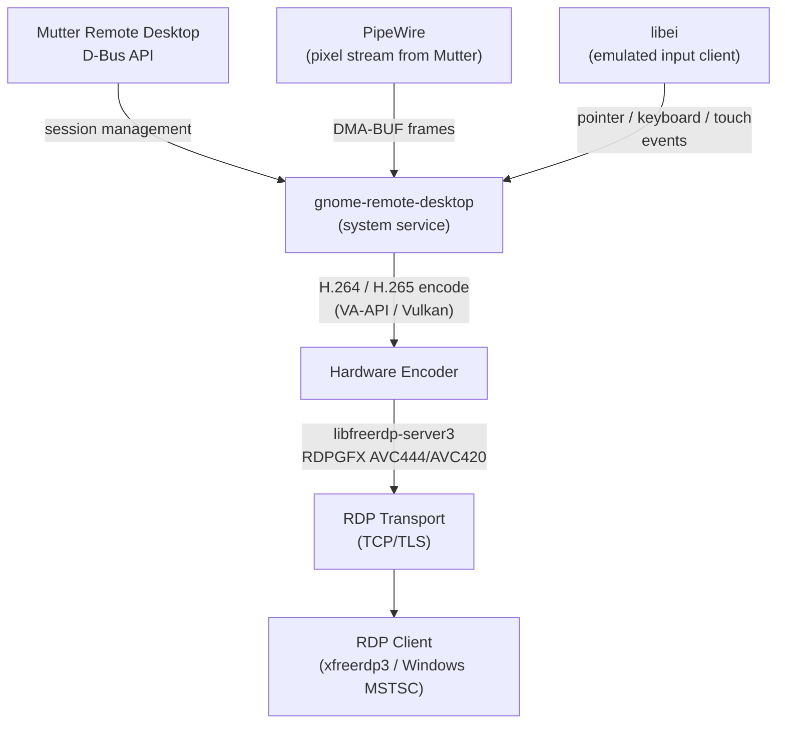
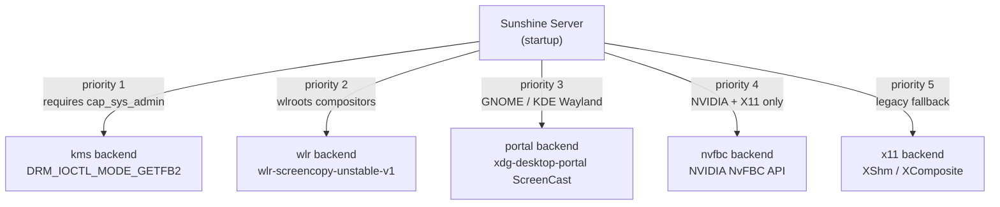
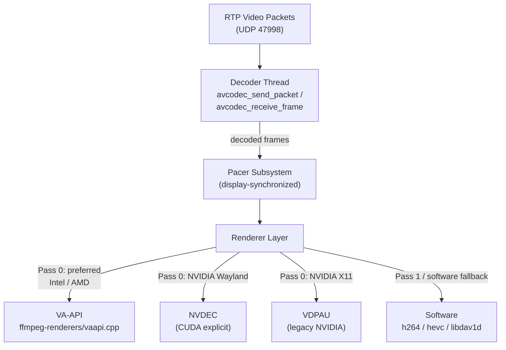

# Chapter 79 — Remote Display, Screen Casting, and GPU-Accelerated Game Streaming

**Target audiences**: Systems and driver developers building capture or encoding pipelines; graphics application developers integrating PipeWire screen capture or RDP into Wayland applications; browser and web platform engineers needing zero-copy video pipelines; terminal and TUI developers who need to understand how the underlying display stack supports remote sessions.

---

## Table of Contents

1. [The Remote Graphics Landscape](#1-the-remote-graphics-landscape)
2. [PipeWire Screen Capture: The pw_stream API](#2-pipewire-screen-capture-the-pw_stream-api)
3. [xdg-desktop-portal: Brokered Screen Capture for Sandboxed Apps](#3-xdg-desktop-portal-brokered-screen-capture-for-sandboxed-apps)
4. [RDP on Linux — FreeRDP and GNOME Remote Desktop](#4-rdp-on-linux--freerdp-and-gnome-remote-desktop)
5. [OBS Studio with PipeWire](#5-obs-studio-with-pipewire)
6. [Sunshine: GPU-Accelerated Game Streaming Server](#6-sunshine-gpu-accelerated-game-streaming-server)
7. [NvFBC — NVIDIA Framebuffer Capture](#7-nvfbc--nvidia-framebuffer-capture)
8. [Moonlight Client](#8-moonlight-client)
9. [Virtual Displays and Headless GPU](#9-virtual-displays-and-headless-gpu)
10. [Latency Analysis: The Full Frame Chain](#10-latency-analysis-the-full-frame-chain)
11. [Integrations](#11-integrations)

---

## 1. The Remote Graphics Landscape

Remote display on Linux spans three distinct use cases, each placing different demands on the graphics stack:

**Screen casting** (**PipeWire** + **xdg-desktop-portal**) shares a desktop session with another application — **OBS Studio**, a video call client, or a browser — running on the same machine or a nearby network node. The frame path is: compositor → **DMA-BUF** → **PipeWire** producer → consumer application. No network encoding is strictly required, but **H.264**/**AV1** output streams are common. The **PipeWire** capture API centres on the **`pw_stream`** object: a consumer negotiates video formats via the **SPA (Simple Plugin API)** parameter system using **`struct spa_video_info_raw`**, exchanges buffer parameters (**`SPA_PARAM_Buffers`**, **`SPA_DATA_DmaBuf`**), and receives frames in a **`PROCESS`** callback where **DMA-BUF** file descriptors are imported into **EGL** or **Vulkan** for a zero-copy GPU path. On sandboxed (**Flatpak**/**Snap**) desktops, the **`org.freedesktop.portal.ScreenCast`** **D-Bus** interface brokers access through compositor-specific portal backends (**xdg-desktop-portal-gnome**, **xdg-desktop-portal-wlr**, **xdg-desktop-portal-kde**), delivering a restricted **PipeWire** file descriptor via **`pw_context_connect_fd()`**. **OBS Studio** builds on this path: its **`plugins/linux-pipewire/`** plugin negotiates **DRM** format modifiers, imports frames as **EGL** images, and supports GPU hardware encode via **VA-API**, **NVENC**, and **AMF**; **OBS** 31 added explicit **GPU** synchronization using **DRM syncobj** timeline file descriptors (**`SPA_META_SyncTimeline`**, **`drm_syncobj_wait()`**) to eliminate **`glFinish()`** stalls, and supports multi-track recording with up to six audio tracks via **PipeWire** audio capture (**`pw_stream`** with media type `audio`).

**Remote desktop** (**RDP**, **VNC**, **SSH** X-forwarding) remotes an interactive session over a network. The key cost is encode latency: a CPU-only encode pipeline can introduce 10–30 ms per frame, whereas **VA-API** or **NVENC** hardware encode typically keeps encode below 2 ms. **FreeRDP** and **GNOME Remote Desktop** both support **H.264** acceleration via **VA-API** for this reason. **FreeRDP** functions as both client (**`xfreerdp3`**, using **VA-API** hardware decode) and server library (**`libfreerdp-server3`**), delivering frames via the **RemoteFX** Graphics Pipeline Extension (**RDPGFX**, **AVC444**/**AVC420** codec) over **TCP/TLS**. **GNOME Remote Desktop** (**`gnome-remote-desktop`**) embeds **`libfreerdp-server3`** and integrates **PipeWire** for pixel transport from **Mutter**, **libei** for emulated input (pointer, keyboard, touch) on **Wayland** (replacing **`virtual-keyboard-unstable-v1`** and the **XTest** extension), and **VA-API**/**Vulkan** encode for **H.264**/**H.265** output. The standalone **xrdp** daemon provides an alternative **RDP** server fronting an **X11** session with **H.264** via the Graphics Pipeline Extension (**EGX**), though native **VA-API** integration remains in development. **RDP** virtual channels — **CLIPRDR** (clipboard), **RDPDR** (device redirection), and **RDPSND** (audio) — are multiplexed over the main transport without **GPU** involvement.

**Game streaming** (**Sunshine**/**Moonlight**, formerly **NVIDIA GameStream**) demands sub-20 ms end-to-end latency at 4K/120 Hz, which requires direct **GPU** framebuffer capture (**KMS**/**DRM** or **NvFBC**), hardware encode (**NVENC**, **VA-API**, or **Vulkan Video**), and a low-latency **UDP** transport (**RTSP** + **RTP**). Even a single CPU copy of a 4K frame adds ~4 ms on a memory-bandwidth-limited path. **Sunshine** selects among several Linux capture backends in priority order — the **KMS** backend via **`DRM_IOCTL_MODE_GETFB2`** (requires **`CAP_SYS_ADMIN`**), **`wlr-screencopy-unstable-v1`** for wlroots compositors, the **xdg-desktop-portal** **ScreenCast** backend, **NvFBC** (NVIDIA/X11 only), and **XShm**/**XComposite** — and configures encode through **VA-API** (**`VAEntrypointEncSliceLP`**/**`VAEntrypointEncSlice`**), **CUDA**+**NVENC**, or **Vulkan Video** (**`h264_vulkan`**, **`hevc_vulkan`**, **`av1_vulkan`**). Session establishment follows a four-phase handshake: pairing (AES-GCM), capability negotiation via **RTSP**/**JSON** serverinfo, stream setup via **RTSP**/**SDP**, and streaming over **UDP** with Reference Frame Invalidation (**RFI**) for loss recovery. **NvFBC** (NVIDIA Framebuffer Capture, **Capture SDK**) provides a complementary capture path on NVIDIA hardware: **`NvFBCCreateInstance()`** returns a function-pointer table used for session creation, frame grabbing to system memory or **CUDA** device memory (**`NVFBC_CAPTURE_SHARED_CUDA`**, completing in ~50 µs vs. ~1.8 ms for system capture), with driver requirements of NVIDIA ≥ 515.57 and no native **Wayland** support. **Moonlight** decodes the **RTP** video stream using **FFmpeg**'s **`avcodec_send_packet()`**/**`avcodec_receive_frame()`** in a dedicated decoder thread, routing frames through a **Pacer** subsystem to hardware renderers — **VA-API** (Intel/AMD), **NVDEC** (NVIDIA **Wayland**), or **VDPAU** (NVIDIA **X11**) — and outputs audio decoded by **libopus** to **PipeWire** or **ALSA**, with adaptive bitrate control driven by **RTCP** receiver reports.

Cloud and headless streaming setups that lack a physical monitor rely on virtual display mechanisms. **VKMS** (Virtual Kernel Modesetting, **`CONFIG_DRM_VKMS`**, kernel v4.19+) creates a software **DRM** device with **Configfs** support for **CI** environments. For GPU-accelerated headless **NVIDIA** streaming, **`nvidia-drm`** is loaded with **`modeset=1`** and a virtual monitor is created via **EDID** injection (**`drm.edid_firmware`** kernel parameter). In virtual machines, **`virtio-gpu`** provides a paravirtualized **KMS** device, while **VFIO** GPU passthrough exposes the physical **DRM** device directly inside the **VM**. A complete headless stack combines **EDID** injection with a headless **Wayland** compositor such as **Sway** (using **`WLR_BACKENDS=drm`**) or **Cage** (a single-application compositor), on top of which **Sunshine**'s **`wlr-screencopy-unstable-v1`** backend operates normally.

End-to-end latency analysis (covered in §10) traces the full frame chain from GPU render through capture, color conversion (**RGB→NV12** via GPU shader or **CUDA** kernel), hardware encode, **RTP** packetization, LAN **UDP** transmission, jitter buffer, hardware decode, compositor present, and display output — totalling 8–25 ms with GPU acceleration versus 25–60 ms with software encode/decode. Measurement tools include **Moonlight** on-screen stats (`Ctrl+Alt+Shift+S`), the **Sunshine** web UI, **`pw-top`** for **PipeWire** node timing, and **Linux** `perf` + **eBPF** tracepoints on **`drm_vblank_event`** and **`vaBeginPicture`**/**`vaEndPicture`**.

```mermaid
graph TD
    subgraph "Screen Casting"
        SC_Comp["Compositor"] -- "DMA-BUF" --> SC_PW["PipeWire Producer"]
        SC_PW -- "pw_stream" --> SC_App["Consumer App\n(OBS, video call)"]
    end
    subgraph "Remote Desktop"
        RD_Comp["Compositor\n(Mutter / KWin)"] -- "PipeWire" --> RD_Enc["VA-API / NVENC\nH.264 Encode"]
        RD_Enc -- "RDP / VNC" --> RD_Net["Network Transport\n(TCP/TLS)"]
        RD_Net --> RD_Client["Remote Client\n(FreeRDP / xrdp)"]
    end
    subgraph "Game Streaming"
        GS_GPU["GPU Framebuffer"] -- "KMS / NvFBC\nDMA-BUF" --> GS_Enc["NVENC / VA-API /\nVulkan Video Encode"]
        GS_Enc -- "RTP / UDP" --> GS_Client["Moonlight Client\nNVDEC / VA-API Decode"]
    end
```



**GPU** acceleration matters for all three categories:

- **Encode quality and bitrate efficiency**: **NVENC** and **VA-API** support constant-QP and constant-bitrate modes with fine-grained rate control unavailable in software codecs at real-time speeds.
- **Latency**: Hardware encode pipelines typically complete in 1–3 ms vs. 8–15 ms for software **x264** at comparable quality.
- **Host CPU savings**: A software encoder for 4K/60 **H.264** consumes 4–8 CPU cores; the same operation on an **NVENC** block is effectively free in CPU terms, leaving the host CPU for the game or application.

### Remote Display Pipeline Paths

Five distinct architectures exist for getting a Linux desktop or GPU frame to a remote client. They differ in hardware encode support, protocol, latency, and Wayland-native support.



**Path comparison**:

| Path | HW encode | Protocol | Wayland-native | Sandbox-safe | Latency | GPU dependency |
|---|---|---|---|---|---|---|
| A — PipeWire + WebRTC | Yes (VA-API/NVENC) | WebRTC ICE+DTLS-SRTP | Yes | Yes (portal) | Low (2–8 ms encode) | Any GPU with VA-API or NVENC |
| B — NvFBC + NVENC | Yes (NVENC) | RTP/RTSP or custom | No (X11 only) | No | Very low (~0.05 ms capture) | NVIDIA only |
| C — GStreamer KMS | Yes (VA-API) | RTSP/HLS | Partial (KMS) | No (requires cap) | Low–medium | Any VA-API GPU |
| D — VNC | No (CPU copy) | RFB | No (X11 only) | No | High (CPU limited) | None |
| E — RDP via xrdp | No (CPU encode) | RDP (RDPGFX) | No (X11 only) | No | Medium (CPU encode) | None |

**Architecture analysis**: Path A (PipeWire + WebRTC) is the modern recommended architecture for Wayland screen sharing — it is the basis for GNOME Remote Desktop's WebRTC mode and OBS browser streaming, and is the only path that is both Wayland-native and sandbox-safe via the xdg-desktop-portal ScreenCast interface. Path B (NvFBC + NVENC) is NVIDIA-specific and delivers the lowest capture latency (~50 µs in CUDA mode) because NvFBC captures frames in GPU memory before they are blitted to the display pipeline, but it requires X11 and an NVIDIA GPU, making it unsuitable for Wayland or multi-vendor environments. Path C (GStreamer KMS) covers the GStreamer ecosystem — `kmssrc` or a DRM render node feeds directly into `vaapih264enc` or `vaapih265enc` elements for RTSP/HLS delivery without a Wayland compositor intermediary, but the KMS backend requires elevated privileges. Paths D (VNC) and E (xrdp/RDP) are X11-only legacy paths that rely on CPU pixel copies with no hardware encode; they remain relevant for enterprise remote desktop scenarios where GPU hardware is unavailable or where compatibility with VNC viewers and Windows MSTSC clients is required.

### 1.1 What is PipeWire?

PipeWire is a server and API for handling multimedia data streams — audio, video, and MIDI — on Linux. It operates as a unified graph-based routing daemon that replaces the fragmented landscape of PulseAudio (desktop audio), JACK (low-latency audio), and V4L2 (video capture) with a single session-managed infrastructure. The PipeWire daemon (`pipewire`) runs in the user session alongside a session manager (`wireplumber`) that applies policy rules to connect nodes and manage device permissions.

In the remote display context, PipeWire functions as the transport layer between a compositor and consumer applications. A compositor such as Mutter, KWin, or a wlroots-based compositor registers itself as a PipeWire producer node and exports display frames through the graph. Consumer applications — screen recorders, video call clients, browser tabs — connect as consumer nodes and receive frames through the `pw_stream` API. PipeWire negotiates buffer types (DMA-BUF or shared memory), pixel formats, DRM format modifiers, and frame rates through the SPA (Simple Plugin API) parameter system, without requiring the consumer to have compositor-specific knowledge. This abstraction makes PipeWire the common foundation for all modern Wayland screen sharing on Linux, including the xdg-desktop-portal ScreenCast interface, OBS Studio capture, and GNOME Remote Desktop pixel transport. The protocol is defined at [gitlab.freedesktop.org/pipewire/pipewire](https://gitlab.freedesktop.org/pipewire/pipewire).

### 1.2 What is DMA-BUF?

DMA-BUF is a Linux kernel framework for sharing memory buffers between devices without copying data through the CPU. Introduced in kernel 3.3, it provides a file-descriptor-based API: a driver or heap allocates a buffer and exports it as an `O_RDWR` file descriptor that can be passed between processes using standard Unix socket ancillary data. Any driver or subsystem participating in DMA-BUF can import a foreign fd, map it into its own address space, and synchronize access using explicit fence objects (`sync_file` / `dma_fence`).

In the remote display pipeline, DMA-BUF is the mechanism that achieves zero-copy frame transport. A compositor renders a frame into a GPU-allocated buffer (a GEM object on Intel, AMD, or NVIDIA), exports it as a DMA-BUF file descriptor, and hands that fd to a PipeWire producer stream. A consumer application receives the same fd, imports it into EGL via `eglCreateImageKHR` with `EGL_LINUX_DMA_BUF_EXT`, or into Vulkan via `VkImportMemoryFdInfoKHR`, and the GPU operates directly on the compositor's buffer without a CPU copy. DRM format modifiers — 64-bit tokens such as `I915_FORMAT_MOD_X_TILED` or `AMD_FMT_MOD` — travel alongside the fd to describe the GPU-specific memory layout (tiling, compression), allowing the importer to interpret the buffer correctly regardless of hardware generation. This kernel mechanism underlies all high-performance screen casting and game streaming capture paths described in this chapter. The kernel interface is documented at [kernel.org/doc/html/latest/driver-api/dma-buf.html](https://www.kernel.org/doc/html/latest/driver-api/dma-buf.html).

### 1.3 What is VA-API?

VA-API (Video Acceleration API) is an open-source library and specification that provides access to GPU-based video encode and decode acceleration on Linux. The API is defined in `libva` and exposes a set of C functions — `vaInitialize`, `vaCreateConfig`, `vaCreateContext`, `vaCreateSurfaces`, `vaBeginPicture`, `vaRenderPicture`, `vaEndPicture`, `vaSyncSurface` — that map codec operations onto driver-implemented hardware pipelines. Platform-specific backend drivers expose hardware encode blocks through the common API surface: `iHD` for Intel Quick Sync, Mesa's `libva-mesa-driver` for AMD Video Core Next, and `libva-nvidia-driver` for NVIDIA NVENC.

In the remote display context, VA-API is the primary hardware encode path for screen cast and RDP workloads on Intel and AMD hardware. When a compositor frame arrives as a DMA-BUF, a VA-API encoder imports that surface using `vaExportSurfaceHandle()` with the `VA_SURFACE_ATTRIB_MEM_TYPE_DRM_PRIME_2` attribute, performs in-GPU color conversion from RGB to NV12, and encodes to H.264 or H.265 bitstream with encode latency typically under 2 ms — versus 8–15 ms for software `x264` at comparable quality. The entry points `VAEntrypointEncSlice` (best quality, higher power) and `VAEntrypointEncSliceLP` (low-power, lowest latency) let applications select the quality-latency trade-off. VA-API hardware encode is used by GNOME Remote Desktop, FreeRDP, OBS Studio, Sunshine, and GStreamer's `vaapih264enc` element, all covered in subsequent sections. The specification lives at [github.com/intel/libva](https://github.com/intel/libva).

### 1.4 What is xdg-desktop-portal?

xdg-desktop-portal is a D-Bus service (`org.freedesktop.portal.Desktop`) that brokers privileged desktop operations — file access, screen capture, camera, printing, and more — for sandboxed applications running inside Flatpak or Snap containers. Because sandboxed applications cannot directly open `/dev/dri/` devices or connect to the Wayland compositor socket, they request capabilities through the portal, which delegates to a compositor-specific backend (`xdg-desktop-portal-gnome`, `xdg-desktop-portal-wlr`, `xdg-desktop-portal-kde`) that presents a confirmation dialog and returns a restricted capability to the caller.

For screen capture, the relevant interface is `org.freedesktop.portal.ScreenCast`. An application calls `CreateSession`, then `SelectSources` (specifying monitor, window, or virtual output capture and cursor embedding options), and then `Start`. The compositor backend creates a PipeWire stream node and returns a node ID. The application calls `OpenPipeWireRemote` to receive a PipeWire file descriptor over D-Bus, connects using `pw_context_connect_fd()`, and subscribes to the node through the `pw_stream` API. The indirect path means a sandboxed application never gains direct DRM or compositor socket access — the compositor retains control over which outputs are shared and for how long. Non-sandboxed applications can also use the portal to benefit from the consistent consent interface that compositors implement for screen sharing requests. The portal specification is maintained at [github.com/flatpak/xdg-desktop-portal](https://github.com/flatpak/xdg-desktop-portal).

---

## 2. PipeWire Screen Capture: The pw_stream API

PipeWire ([gitlab.freedesktop.org/pipewire/pipewire](https://gitlab.freedesktop.org/pipewire/pipewire)) provides a unified media routing graph. A compositor (Mutter, KWin, wlroots) acts as a PipeWire **producer**, exporting display frames as a stream. An application acts as a **consumer**, connecting to that stream and receiving buffers — typically as DMA-BUFs containing GPU-tiled data.

### 2.1 Creating a Video Capture Stream

The core object is `struct pw_stream`. A consumer creates one with media properties that describe a video capture role:

```c
/* Source: PipeWire tutorial5.c — https://docs.pipewire.org/tutorial5_8c-example.html */
struct pw_properties *props = pw_properties_new(
    PW_KEY_MEDIA_TYPE,     "Video",
    PW_KEY_MEDIA_CATEGORY, "Capture",
    PW_KEY_MEDIA_ROLE,     "Screen",
    NULL);

struct pw_stream *stream = pw_stream_new_simple(
    pw_main_loop_get_loop(loop),
    "screen-capture",
    props,
    &stream_events,   /* struct pw_stream_events */
    &userdata);
```

The stream events structure wires three callbacks — `param_changed`, `process`, and `state_changed` — to the stream lifecycle. [Source](https://docs.pipewire.org/page_tutorial5.html)

### 2.2 SPA Format Negotiation: spa_video_info_raw

Before the stream starts delivering frames, PipeWire negotiates the video format through the **SPA (Simple Plugin API)** parameter system. The consumer offers a set of acceptable formats as `SPA_PARAM_EnumFormat` parameters:

```c
/* Build a format param for RGBA DMA-BUF or MemFd fallback */
uint8_t buffer[1024];
struct spa_pod_builder b = SPA_POD_BUILDER_INIT(buffer, sizeof(buffer));

/* Preferred: DMA-BUF with explicit modifier list */
static uint64_t modifiers[] = {
    DRM_FORMAT_MOD_LINEAR,
    I915_FORMAT_MOD_X_TILED,   /* e.g. Intel X-tile */
};
const struct spa_pod *params[2];
params[0] = spa_pod_builder_add_object(&b,
    SPA_TYPE_OBJECT_Format, SPA_PARAM_EnumFormat,
    SPA_FORMAT_mediaType,        SPA_POD_Id(SPA_MEDIA_TYPE_video),
    SPA_FORMAT_mediaSubtype,     SPA_POD_Id(SPA_MEDIA_SUBTYPE_raw),
    SPA_FORMAT_VIDEO_format,     SPA_POD_Id(SPA_VIDEO_FORMAT_BGRx),
    SPA_FORMAT_VIDEO_modifier,
        SPA_POD_CHOICE_FLAGS_Long(SPA_CHOICE_Enum,
            SPA_POD_Long(DRM_FORMAT_MOD_INVALID),   /* sentinel */
            modifiers, SPA_N_ELEMENTS(modifiers)),
    SPA_FORMAT_VIDEO_size,
        SPA_POD_CHOICE_RANGE_Rectangle(
            &SPA_RECTANGLE(320, 240),
            &SPA_RECTANGLE(1, 1),
            &SPA_RECTANGLE(4096, 4096)),
    SPA_FORMAT_VIDEO_framerate,
        SPA_POD_CHOICE_RANGE_Fraction(
            &SPA_FRACTION(60, 1),
            &SPA_FRACTION(0, 1),
            &SPA_FRACTION(240, 1)),
    0);
/* Fallback: shared memory */
params[1] = spa_pod_builder_add_object(&b,
    SPA_TYPE_OBJECT_Format, SPA_PARAM_EnumFormat,
    SPA_FORMAT_mediaType,    SPA_POD_Id(SPA_MEDIA_TYPE_video),
    SPA_FORMAT_mediaSubtype, SPA_POD_Id(SPA_MEDIA_SUBTYPE_raw),
    SPA_FORMAT_VIDEO_format, SPA_POD_Id(SPA_VIDEO_FORMAT_BGRx),
    SPA_FORMAT_VIDEO_size,   SPA_POD_CHOICE_RANGE_Rectangle(...),
    0);
```

When negotiation completes, PipeWire calls `param_changed` with the agreed `SPA_PARAM_Format`. The consumer extracts negotiated values into `struct spa_video_info_raw`:

```c
static void on_param_changed(void *userdata, uint32_t id,
                              const struct spa_pod *param)
{
    struct data *d = userdata;
    if (id != SPA_PARAM_Format || param == NULL)
        return;

    if (spa_format_video_raw_parse(param, &d->format.info.raw) < 0)
        return;

    printf("format=%s size=%dx%d modifier=0x%"PRIx64"\n",
        spa_debug_type_find_name(spa_type_video_format,
            d->format.info.raw.format),
        d->format.info.raw.size.width,
        d->format.info.raw.size.height,
        d->format.info.raw.modifier);
}
```

The `struct spa_video_info_raw` ([docs.pipewire.org/structspa__video__info__raw.html](https://docs.pipewire.org/structspa__video__info__raw.html)) carries every negotiated attribute:

| Field | Type | Purpose |
|---|---|---|
| `format` | `enum spa_video_format` | Pixel format (BGRx, NV12, P010, …) |
| `modifier` | `uint64_t` | DRM format modifier (tiling/compression) |
| `size` | `struct spa_rectangle` | Frame dimensions |
| `framerate` | `struct spa_fraction` | Fixed rate, or 0/1 for variable |
| `color_matrix` | `enum spa_video_color_matrix` | BT.601/709/2020 |
| `transfer_function` | `enum spa_video_transfer_function` | SDR/PQ/HLG |
| `color_primaries` | `enum spa_video_color_primaries` | Primaries set |

### 2.3 Connecting the Stream

```c
pw_stream_connect(stream,
    PW_DIRECTION_INPUT,
    PW_ID_ANY,                            /* auto-connect */
    PW_STREAM_FLAG_AUTOCONNECT |
    PW_STREAM_FLAG_MAP_BUFFERS,           /* map MemPtr buffers; skip for DMA-BUF */
    params, 2);
```

`PW_STREAM_FLAG_MAP_BUFFERS` is appropriate for shared-memory paths. For DMA-BUF, buffers must be imported via the GPU API — direct `mmap()` on a GPU-tiled DMA-BUF is undefined behaviour on discrete GPUs and risks cache incoherence.

### 2.4 The PROCESS Callback and DMA-BUF Import

Each time a new frame is available, PipeWire calls the `process` event:

```c
static void on_process(void *userdata)
{
    struct data *d = userdata;
    struct pw_buffer *b;

    if ((b = pw_stream_dequeue_buffer(d->stream)) == NULL) {
        pw_log_warn("out of buffers: %m");
        return;
    }

    struct spa_buffer *buf = b->buffer;
    struct spa_data *sdata = &buf->datas[0];

    if (sdata->type == SPA_DATA_DmaBuf) {
        int fd = sdata->fd;          /* DMA-BUF file descriptor */
        uint64_t mod = d->format.info.raw.modifier;
        /* Import fd into EGL/Vulkan here, e.g.: */
        /* eglCreateImageKHR(dpy, EGL_NO_CONTEXT, EGL_LINUX_DMA_BUF_EXT, ...) */
        import_dmabuf_frame(fd, mod,
            sdata->chunk->offset, sdata->chunk->stride,
            d->format.info.raw.size.width,
            d->format.info.raw.size.height);
    } else {
        /* Shared memory fallback */
        void *pixels = SPA_PTROFF(sdata->data,
                                  sdata->chunk->offset, void);
        process_shm_frame(pixels, sdata->chunk->size);
    }

    pw_stream_queue_buffer(d->stream, b);   /* return buffer to pool */
}
```

[Source: PipeWire Tutorial 5](https://docs.pipewire.org/page_tutorial5.html)

### 2.5 Buffer Parameter Negotiation After Format Fixation

After `param_changed` confirms the format, the consumer must also respond with a `SPA_PARAM_Buffers` parameter that tells PipeWire how many buffers to allocate, their size, and which data types it accepts:

```c
/* In on_param_changed, after parsing the format */
uint8_t buf2[512];
struct spa_pod_builder b2 = SPA_POD_BUILDER_INIT(buf2, sizeof(buf2));

bool use_dmabuf = (d->format.info.raw.modifier != DRM_FORMAT_MOD_INVALID);

const struct spa_pod *buf_param = spa_pod_builder_add_object(&b2,
    SPA_TYPE_OBJECT_ParamBuffers, SPA_PARAM_Buffers,
    SPA_PARAM_BUFFERS_buffers,  SPA_POD_CHOICE_RANGE_Int(4, 1, 32),
    SPA_PARAM_BUFFERS_blocks,   SPA_POD_Int(1),
    SPA_PARAM_BUFFERS_size,     SPA_POD_Int(
        d->format.info.raw.size.width *
        d->format.info.raw.size.height * 4),
    SPA_PARAM_BUFFERS_stride,   SPA_POD_Int(
        d->format.info.raw.size.width * 4),
    SPA_PARAM_BUFFERS_dataType, SPA_POD_CHOICE_FLAGS_Int(
        use_dmabuf
            ? (1 << SPA_DATA_DmaBuf)
            : (1 << SPA_DATA_MemFd) | (1 << SPA_DATA_MemPtr)),
    0);

pw_stream_update_params(d->stream, &buf_param, 1);
```

The key line is `SPA_PARAM_BUFFERS_dataType`: by setting `1 << SPA_DATA_DmaBuf` when modifiers were negotiated, the consumer signals that it can handle GPU-tiled DMA-BUF memory. If the consumer sets both DmaBuf and MemFd bits, PipeWire will prefer DmaBuf if the producer can supply it. [Source: PipeWire DMA-BUF Sharing](https://daissi.pages.freedesktop.org/pipewire/page_dma_buf.html)

### 2.6 Zero-Copy DMA-BUF Pipeline

PipeWire's DMA-BUF sharing ([docs.pipewire.org/page_dma_buf.html](https://docs.pipewire.org/page_dma_buf.html)) achieves zero-copy between GPU and encoder:

1. **Producer** (compositor) allocates a GBM buffer, composites the frame into it, and exports it as a DMA-BUF fd with an associated DRM modifier.
2. **PipeWire graph** passes the fd metadata through shared memory — the pixel data itself never moves.
3. **Consumer** imports the fd into its GPU context (EGL `EGL_LINUX_DMA_BUF_EXT`, Vulkan `VkImportMemoryFdInfoKHR`, or VA-API `vaCreateSurfaces` with `VA_SURFACE_ATTRIB_MEM_TYPE_DRM_PRIME_2`).
4. **Encoder** (e.g., FFmpeg VA-API) reads directly from the imported VA surface without a CPU round-trip.

The modifier (`uint64_t`) is a DRM concept that encodes tiling geometry (linear, X-tiled, Y-tiled, AFBC, etc.). Both producer and consumer must support the same modifier for the GPU to read the buffer without a decompression blit.



---

## 3. xdg-desktop-portal: Brokered Screen Capture for Sandboxed Apps

Flatpak and Snap applications run in a sandbox that denies direct compositor protocol access. The **xdg-desktop-portal** ([github.com/flatpak/xdg-desktop-portal](https://github.com/flatpak/xdg-desktop-portal)) provides a D-Bus broker that lets sandboxed clients request screen capture with user consent. The compositor-specific work is delegated to a **portal backend** (xdg-desktop-portal-gnome, xdg-desktop-portal-wlr, xdg-desktop-portal-kde, etc.).



### 3.1 The org.freedesktop.portal.ScreenCast Interface

The interface (version 6 as of 2025) is defined in `data/org.freedesktop.portal.ScreenCast.xml` [Source](https://github.com/flatpak/xdg-desktop-portal/blob/main/data/org.freedesktop.portal.ScreenCast.xml). It exposes:

| Method | Purpose |
|---|---|
| `CreateSession` | Creates a session object; returns a handle |
| `SelectSources` | Lets the user select monitor/window/virtual sources |
| `Start` | Presents the consent dialog; returns PipeWire stream nodes |
| `OpenPipeWireRemote` | Returns a Unix fd connected to a sandboxed PipeWire remote |

**Properties**:
- `AvailableSourceTypes` — bitmask: `MONITOR=1`, `WINDOW=2`, `VIRTUAL=4`
- `AvailableCursorModes` — bitmask: `HIDDEN=1`, `EMBEDDED=2`, `METADATA=4`

### 3.2 D-Bus Call Sequence for Screen Capture

A Flatpak application performing screen capture follows this sequence:

```python
# Pseudo-code for the D-Bus call sequence (gdbus or python-dbus bindings)
# Real implementations use async D-Bus calls and handle Request/Response objects.

# Step 1: Call CreateSession
session_handle = portal.call("CreateSession", {
    "handle_token":         "my_app_session_0",
    "session_handle_token": "my_app_session_token_0",
})
# Wait for org.freedesktop.portal.Request::Response signal → session_path

# Step 2: Call SelectSources
portal.call("SelectSources", session_path, {
    "types":        dbus.UInt32(1),   # MONITOR
    "multiple":     dbus.Boolean(False),
    "cursor_mode":  dbus.UInt32(2),   # EMBEDDED
})
# Wait for Response signal (no useful return data, selection done in compositor UI)

# Step 3: Call Start (shows user consent dialog)
portal.call("Start", session_path, "parent_window_id", {})
# Wait for Response signal → streams array
# streams: [(node_id, {source_type, position, size, mapping_id, ...})]

# Step 4: Obtain PipeWire fd
fd = portal.call("OpenPipeWireRemote", session_path, {})
# fd is a Unix file descriptor to a PipeWire remote

# Step 5: Connect to PipeWire using the restricted fd
pw_core = pw_context_connect_fd(pw_context, fd, NULL, 0)
# Now use node_id from streams to link pw_stream to the screencast node
```

[Source: XDG Desktop Portal ScreenCast documentation](https://flatpak.github.io/xdg-desktop-portal/docs/doc-org.freedesktop.portal.ScreenCast.html)

The fd returned by `OpenPipeWireRemote` is a restricted connection to a PipeWire instance containing only the permitted screen cast nodes. The client calls `pw_context_connect_fd()` (replacing the deprecated 0.2-era `pw_remote_connect_fd()`) to obtain a `pw_core`, then creates a `pw_stream` linked to the node IDs reported by `Start`. This design confines sandbox-escape risk to the portal daemon, which runs outside the sandbox.

### 3.3 Portal Backends

**xdg-desktop-portal-gnome** (used on GNOME/Mutter) hooks into Mutter's `org.gnome.Mutter.ScreenCast` D-Bus interface, which internally uses PipeWire and DMA-BUF. [Source](https://github.com/flatpak/ppa-xdg-desktop-portal-gtk/blob/ppa/focal/data/org.gnome.Mutter.ScreenCast.xml)

**xdg-desktop-portal-wlr** ([github.com/emersion/xdg-desktop-portal-wlr](https://github.com/emersion/xdg-desktop-portal-wlr)) supports wlroots-based compositors (Sway, Hyprland, River) via the `wlr-screencopy-unstable-v1` protocol (or the newer `ext-image-copy-capture-v1`). It creates PipeWire streams and copies compositor frames into them. Configuration in `/etc/xdg/xdg-desktop-portal/portals.conf`:

```ini
# /etc/xdg/xdg-desktop-portal/portals.conf (wlroots compositors)
[preferred]
default=gtk
org.freedesktop.impl.portal.ScreenCast=wlr
org.freedesktop.impl.portal.Screenshot=wlr
```

[Source: xdg-desktop-portal-wlr README](https://github.com/emersion/xdg-desktop-portal-wlr)

---

## 4. RDP on Linux — FreeRDP and GNOME Remote Desktop

### 4.1 FreeRDP as Both Client and Server

FreeRDP ([github.com/FreeRDP/FreeRDP](https://github.com/FreeRDP/FreeRDP)) is the primary open-source RDP implementation on Linux. As a **client** (`xfreerdp3`), it decodes RemoteFX/H.264 streams using VA-API hardware decode (built with `-DWITH_VAAPI=ON`). As a **server library** (`libfreerdp-server3`), it is embedded in GNOME Remote Desktop to provide the RDP transport.

The FreeRDP server pipeline for H.264:

```
Compositor frame (DMA-BUF)
    → color conversion (NV12 via GPU shader)
    → VA-API encode (VAEntrypointEncSlice, VAProfileH264High)
    → RemoteFX Graphics Pipeline Extension (GFX, AVC444/AVC420 codec)
    → RDP virtual channel (DRDYNVC + RDPGFX)
    → TCP/TLS transport
```

VA-API integration is enabled at compile time with `WITH_VAAPI_H264_ENCODING=ON`. The runtime path uses `LIBVA_DRIVER_NAME` to select the iHD (Intel), amdgpu (AMD), or nvidia (NVIDIA unofficial) VA-API driver.

### 4.2 GNOME Remote Desktop

`gnome-remote-desktop` ([gitlab.gnome.org/GNOME/gnome-remote-desktop](https://gitlab.gnome.org/GNOME/gnome-remote-desktop)) is the system service managing remote access sessions in GNOME. Its RDP server path (available since GNOME 42) embeds libfreerdp-server and integrates:

- **PipeWire** for pixel stream transport from Mutter
- **libei** for input event plumbing (emulated keyboard/pointer)
- **Mutter remote desktop D-Bus API** for session management
- **VA-API/Vulkan encode** for GPU-accelerated H.264/H.265 output



A merge request ([gitlab.gnome.org/GNOME/gnome-remote-desktop/-/merge_requests/294](https://gitlab.gnome.org/GNOME/gnome-remote-desktop/-/merge_requests/294)) added zero-copy rendering via Vulkan+VAAPI. To enable the accelerated path (debug flag during development):

```bash
GNOME_REMOTE_DESKTOP_ENABLE_VKVA_RENDERER=1 gnome-remote-desktop-daemon
```

Capability exchange on connection verifies both sides support AVC (H.264):

```
RDP RDPGFX_CAPS_ADVERTISE:
  RDPGFX_CAPSET_VERSION10 → AVC444, AVC420 supported
Server: vainfo | grep VAProfileH264High.*VAEntrypointEncSlice
```

### 4.3 xrdp

The **xrdp** project ([github.com/neutrinolabs/xrdp](https://github.com/neutrinolabs/xrdp)) provides a standalone RDP server daemon that fronts an X11 session. xrdp supports H.264 via the Graphics Pipeline Extension (EGX), but GPU-accelerated encode requires a separately configured encoder backend. Native VA-API integration in the core xrdp daemon remains under development as of 2025.

### 4.4 Input Plumbing: libei on Wayland

The traditional RDP server approach on X11 was to inject input via the XTest extension. On Wayland, X11 is absent, so gnome-remote-desktop uses **libei** (library for emulated input, [gitlab.freedesktop.org/libinput/libei](https://gitlab.freedesktop.org/libinput/libei)) which implements a client/server model that mirrors the libinput-to-compositor connection:

- The compositor runs a **libeis** (server) endpoint, registered via the `xdg-desktop-portal` RemoteDesktop portal.
- `gnome-remote-desktop` connects as a **libei** client, sends emulated pointer/keyboard/touch events.
- The compositor processes them as trusted input, indistinguishable from a real device.

This replaces the older `virtual-keyboard-unstable-v1` and `pointer-constraints-unstable-v1` Wayland protocol approach, which was compositor-specific and lacked a standard permission model. libei provides privilege separation: a RemoteDesktop portal session must be established first, giving the user a consent dialog before any input injection is permitted. [Source: libei GitLab](https://gitlab.freedesktop.org/libinput/libei/-/issues/2)

Sunshine uses a different mechanism: **InputTino** via `uinput`, which creates virtual kernel input devices (`/dev/input/eventN`) and requires either `CAP_SYS_ADMIN` or membership in the `input` group and a udev rule from the `60-sunshine.rules` file installed by the Sunshine package.

### 4.5 VirtualChannels: Clipboard and Drives

RDP VirtualChannels are logical sub-channels multiplexed over the main transport. `CLIPRDR` (clipboard), `RDPDR` (device redirection), and `RDPSND` (audio) are the most common. FreeRDP implements these in `channels/` and they are available in both client and server modes with no GPU involvement.

---

## 5. OBS Studio with PipeWire

OBS Studio ([github.com/obsproject/obs-studio](https://github.com/obsproject/obs-studio)) is the dominant open-source recording and streaming application on Linux. On Wayland, direct compositor protocol access is denied; PipeWire is the only supported capture path.

### 5.1 PipeWire Screen Capture Plugin Architecture

OBS uses the xdg-desktop-portal `ScreenCast` interface to obtain a PipeWire stream fd, then routes that stream through an OBS source plugin. The core implementation is in `plugins/linux-pipewire/` in the OBS tree. The plugin:

1. Calls the portal D-Bus `CreateSession` / `SelectSources` / `Start` sequence.
2. Connects to the PipeWire remote via `pw_context_connect_fd()`.
3. Creates a `pw_stream` with a `process` callback that feeds frames into the OBS texture pipeline.
4. Negotiates DMA-BUF format modifiers: if the compositor offers DMA-BUF, the plugin imports the fd into an EGL image and uploads it as an OBS texture without a CPU copy.

```c
/* Simplified OBS pw source process callback (obs-studio/plugins/linux-pipewire/) */
static void pipewire_capture_process(void *data)
{
    struct obs_pipewire_data *opd = data;
    struct pw_buffer *b = pw_stream_dequeue_buffer(opd->stream);
    if (!b) return;

    struct spa_buffer *buf = b->buffer;
    struct spa_data   *d   = &buf->datas[0];

    if (d->type == SPA_DATA_DmaBuf) {
        /* Import DMA-BUF into OBS GL texture via EGL */
        obs_enter_graphics();
        import_dmabuf_to_gs_texture(opd, d->fd,
            d->chunk->stride, opd->format.width,
            opd->format.height, opd->drm_modifier);
        obs_leave_graphics();
    }
    pw_stream_queue_buffer(opd->stream, b);
}
```

[Source: OBS Linux PipeWire plugin](https://github.com/obsproject/obs-studio)

### 5.2 Hardware Encode Pipeline

OBS supports three GPU encode paths on Linux, selectable in Settings → Output → Encoder:

| Encoder | Backend | Codecs |
|---|---|---|
| `VA-API H.264` | FFmpeg + libva | H.264, HEVC, AV1 (OBS 30.1+) |
| `NVIDIA NVENC H.264` | CUDA + NVENC | H.264, HEVC, AV1 (RTX 40+) |
| `AMD HW H.264` | AMF via VA-API | H.264, HEVC |

OBS 30.1 (March 2024) added AV1 encode support for VA-API. NVENC on Wayland works without extra configuration since NVIDIA driver 555+ (June 2024). OBS 31+ on NVIDIA requires no X11 for capture. [Source: AlternativeTo OBS 30.1 release notes](https://alternativeto.net/news/2024/3/obs-studio-30-1-released-with-av1-support-for-va-api-pipewire-video-capture-and-more/)

### 5.3 Explicit Sync Support

OBS 31 added explicit GPU synchronization for the PipeWire path via DRM syncobj file descriptors. Before explicit sync, OBS had to flush the GL pipeline (`glFinish()`) before releasing a PipeWire buffer back to the compositor, adding several milliseconds of stall. With explicit sync:

1. PipeWire passes a `SPA_DATA_DmaBuf` buffer whose associated `SPA_META_SyncTimeline` metadata contains a DRM syncobj and a timeline point.
2. OBS imports the DRM syncobj and waits for the timeline point using `drm_syncobj_wait()` before reading the texture.
3. After rendering, OBS signals a new timeline point on the compositor's output syncobj, allowing the compositor to reuse the buffer without a CPU stall.

This is implemented in `plugins/linux-pipewire/` using a new `gs_sync_t` abstraction over EGL's `EGL_KHR_fence_sync` and DRM syncobj primitives. [Source: OBS explicit sync PR #11708](https://github.com/obsproject/obs-studio/pull/11708)

### 5.4 Multi-Track Recording

OBS supports up to 6 audio tracks and unlimited video tracks in recordings, with per-track bitrate control. PipeWire audio sources appear as standard OBS audio inputs via JACK or PipeWire audio capture sources, which use `pw_stream` with media type `audio` and role `Capture`.

---

## 6. Sunshine: GPU-Accelerated Game Streaming Server

Sunshine ([github.com/LizardByte/Sunshine](https://github.com/LizardByte/Sunshine)) is the open-source replacement for NVIDIA's discontinued GeForce Experience GameStream server. It streams games and desktops to Moonlight clients over a LAN or WAN.

### 6.1 Architecture Overview

```
┌─────────────────────────────────────────────────────────────┐
│                     Sunshine Server                          │
│  ┌──────────────┐   ┌──────────────┐   ┌───────────────┐   │
│  │ Capture      │   │ Color Conv.  │   │ HW Encoder    │   │
│  │ Backend      │──▶│ (GPU shader/ │──▶│ NVENC/VA-API/ │   │
│  │ KMS/NvFBC/   │   │ CUDA kernel) │   │ Vulkan Video  │   │
│  │ PipeWire/X11 │   └──────────────┘   └───────┬───────┘   │
│  └──────────────┘                               │           │
│                         RTSP signalling (TCP)   │           │
│  ┌──────────────────────────────────────────┐   │           │
│  │  Network Transport                        │◀──┘           │
│  │  RTSP/SDP (TCP 47984/47989)               │               │
│  │  RTP video (UDP 47998–48000)              │               │
│  │  Input (UDP 47999)                        │               │
│  │  Audio (UDP 48000)                        │               │
│  └──────────────────────────────────────────┘               │
└─────────────────────────────────────────────────────────────┘
```

[Source: LizardByte/Sunshine](https://github.com/LizardByte/Sunshine)

### 6.2 Linux Capture Backends

Sunshine selects a capture backend at startup based on what the system supports (in priority order):

| Backend | Method | Notes |
|---|---|---|
| `kms` | `DRM_IOCTL_MODE_GETFB2` on the DRM fd | Requires `cap_sys_admin` capability; only path for HDR |
| `wlr` | `wlr-screencopy-unstable-v1` Wayland protocol | wlroots compositors (Sway, Hyprland) |
| `portal` | xdg-desktop-portal ScreenCast | GNOME/KDE Wayland |
| `nvfbc` | NVIDIA NvFBC API | NVIDIA GPUs, X11 only |
| `x11` | XShm / XComposite | Legacy, high CPU cost |



The KMS backend reads the framebuffer directly via the DRM kernel interface, avoiding the compositor entirely. This requires Sunshine to be granted `CAP_SYS_ADMIN`:

```bash
sudo setcap cap_sys_admin+ep $(which sunshine)
```

For Wayland sessions without elevated privileges, Sunshine uses the portal or wlr backends. [Source: Sunshine Getting Started](https://docs.lizardbyte.dev/projects/sunshine/latest/md_docs_2getting__started.html)

### 6.3 GPU Encode Paths

**VA-API (Intel/AMD)**: The `va::va_t` class opens the DRM render node, creates a GBM device and EGL context, selects the highest-priority encode entrypoint (`VAEntrypointEncSliceLP` preferred over `VAEntrypointEncSlice`), and exports VA surfaces as DMA-BUFs for EGL import. Color conversion from RGB/BGR to NV12/P010 is performed by GPU fragment shaders.

**CUDA + NVENC (NVIDIA)**: The `cuda::cuda_t` class dynamically loads `libcuda.so.1`, maps OpenGL textures to CUDA graphics resources, runs a CUDA kernel for RGB→NV12 conversion (32×32 thread blocks), and passes the resulting CUDA arrays directly to NVENC without system-memory involvement. This is a fully zero-copy path from compositor to encoded bitstream.

**Vulkan Video** (added in Sunshine v2026.413, April 2026): A new FFmpeg-based Vulkan encoder supports `h264_vulkan`, `hevc_vulkan`, and `av1_vulkan`, importing DMA-BUFs via Vulkan external memory and performing RGB→YUV conversion in Vulkan compute shaders with no EGL/GL dependency. [Source: Phoronix Sunshine v2026.413](https://www.phoronix.com/news/Sunshine-v2026.413.143228)

### 6.4 Sample Configuration (sunshine.conf)

```toml
# /etc/sunshine/sunshine.conf (or ~/.config/sunshine/sunshine.conf)
# Force KMS capture (requires cap_sys_admin)
capture = kms

# Encoder selection: auto, nvenc, vaapi, software
encoder = vaapi

# VA-API device node
adapter_name = /dev/dri/renderD128

# Video settings
hevc_encoder =   # empty → use default H.265 if available
av1_encoder  =   # empty → use AV1 if GPU supports it

# Network
port = 47989
address = 0.0.0.0

# Logging
min_log_level = info
log_path = /var/log/sunshine.log
```

[Source: Sunshine Advanced Usage](https://docs.lizardbyte.dev/projects/sunshine/v0.22.2/about/advanced_usage.html)

### 6.5 Network Protocol and Session Handshake

Sunshine implements a protocol that is wire-compatible with NVIDIA's original GameStream protocol, which Moonlight was designed to consume. The handshake proceeds as follows:

**Phase 1 — Pairing**: Client and server exchange a PIN via a PIN entry dialog, establishing an encrypted pairing credential (AES-GCM). The pairing is persisted in Sunshine's configuration directory (`~/.config/sunshine/clients.json`).

**Phase 2 — Capability Negotiation (RTSP)**: The client connects to `https://<host>:47989/serverinfo` to retrieve server capabilities as a JSON document: GPU model, supported codecs (H.264, HEVC, AV1), supported resolutions and framerates, HDR support flag, supported audio channels. This drives the UI in the Moonlight client.

**Phase 3 — Stream Setup (RTSP/SDP)**: When the user starts streaming, RTSP negotiation over port 47989 exchanges an SDP (Session Description Protocol) describing:
  - Video: codec type, resolution, framerate, bitrate, packetization mode
  - Audio: Opus, channel count (stereo/5.1/7.1), sample rate (48 kHz)
  - Encryption: AES-128-GCM for control and data channels

**Phase 4 — Streaming (UDP)**:
- **Video** (UDP 47998): H.264/H.265/AV1 NAL units fragmented across RTP packets (MTU 1400 bytes). Sunshine prefixes packets with a proprietary header carrying frame sequence number and flags (IDR, reference frame invalidation).
- **Control** (UDP 47999): Binary protocol for input events — absolute/relative mouse, keyboard scancodes, gamepad axis/button. Sub-1 ms transmission path from Moonlight to Sunshine to `uinput`.
- **Audio** (UDP 48000): Opus RTP, variable packet size based on jitter buffer configuration.

Reference Frame Invalidation (RFI) is a loss-recovery mechanism: when the client detects a missing packet, it sends an RFI request; Sunshine responds with an IDR for the specific reference frame that was lost rather than a full keyframe, saving 50–90% of the bandwidth a full IDR would cost. [Source: Moonlight GitHub](https://github.com/moonlight-stream/moonlight-qt)

---

## 7. NvFBC — NVIDIA Framebuffer Capture

### 7.1 API Overview

NvFBC (NVIDIA Framebuffer Capture) is part of the NVIDIA Capture SDK ([developer.nvidia.com/capture-sdk](https://developer.nvidia.com/capture-sdk)). It allows the NVIDIA X driver or the NVIDIA KMS driver to composite frames directly into NvFBC-owned buffers, eliminating GPU→CPU→GPU round-trips for display capture.

The API is accessed through a function pointer table obtained via `NvFBCCreateInstance()`:

```c
/* NvFBC.h — from Sunshine third-party headers:
   https://github.com/LizardByte/Sunshine/blob/master/third-party/nvfbc/NvFBC.h */
#include "NvFBC.h"

NVFBC_API_FUNCTION_LIST fns = { .dwVersion = NVFBC_VERSION };
NVFBCSTATUS status = NvFBCCreateInstance(&fns);
if (status != NVFBC_SUCCESS) { /* handle error */ }
```

### 7.2 Session Creation and Capture

```c
/* Create an NvFBC handle */
NVFBC_CREATE_HANDLE_PARAMS create_params = {
    .dwVersion = NVFBC_CREATE_HANDLE_PARAMS_VER,
};
NVFBC_SESSION_HANDLE handle;
fns.nvFBCCreateHandle(&handle, &create_params);

/* Create a capture session targeting system memory */
NVFBC_CREATE_CAPTURE_SESSION_PARAMS session_params = {
    .dwVersion     = NVFBC_CREATE_CAPTURE_SESSION_PARAMS_VER,
    .eCaptureType  = NVFBC_CAPTURE_TO_SYS,       /* or NVFBC_CAPTURE_SHARED_CUDA */
    .eTrackingType = NVFBC_TRACKING_OUTPUT,       /* specific output/connector */
    .dwOutputId    = output_id,
    .bWithCursor   = NVFBC_TRUE,
    .bPushModel    = NVFBC_TRUE,   /* interrupt-driven, not polling */
};
fns.nvFBCCreateCaptureSession(handle, &session_params);

/* Grab a frame into system memory */
NVFBC_TOSYS_GRAB_FRAME_PARAMS grab_params = {
    .dwVersion      = NVFBC_TOSYS_GRAB_FRAME_PARAMS_VER,
    .dwFlags        = NVFBC_TOSYS_GRAB_FLAGS_NOWAIT_IF_NEW_FRAME_READY,
    .pFrameGrabInfo = &frame_info,       /* NVFBC_FRAME_GRAB_INFO */
};
fns.nvFBCToSysGrabFrame(handle, &grab_params);
```

`NVFBC_FRAME_GRAB_INFO` returns metadata: `dwWidth`, `dwHeight`, `dwByteSize`, `bIsNewFrame`, `ulTimestampUs`, `dwMissedFrames`, `bDirectCapture`. When `bDirectCapture` is `NVFBC_TRUE`, the X driver wrote into NvFBC buffers directly without a blit — this is the lowest-latency path. [Source: NvFBC.h, Sunshine repo](https://github.com/LizardByte/Sunshine/blob/master/third-party/nvfbc/NvFBC.h)

### 7.3 CUDA Interop

For zero-copy NVIDIA-to-NVENC paths, use `NVFBC_CAPTURE_SHARED_CUDA`:

```c
/* With CUDA capture type, frames land in CUDA device memory */
NVFBC_CREATE_CAPTURE_SESSION_PARAMS cuda_session = {
    .eCaptureType = NVFBC_CAPTURE_SHARED_CUDA,
    /* ... */
};
/* Then grab via nvFBCToCudaGrabFrame — returns a CUdeviceptr */
```

Performance measurements show `NVFBC_CAPTURE_SHARED_CUDA` completes a capture in ~50 µs, versus ~1813 µs for `NVFBC_CAPTURE_TO_SYS`, because the latter requires a GPU→CPU DMA transfer. [Source: nvfbc-v4l2 benchmark](https://github.com/t1stm/nvfbc-v4l2)

### 7.4 Linux Driver Requirements

NvFBC on Linux requires:
- NVIDIA driver ≥ 515.57 (improvements to capture timing and cursor compositing)
- NVIDIA Capture SDK 9.0.0 requires driver ≥ 570.86.16 for full feature support
- An X11 display server or NVIDIA KMS/DRM modeset=1 with a virtual display
- NvFBC does **not** support Wayland compositors directly (no HDR, no DMA-BUF output)

Sunshine eliminated the need for driver patching (previously required by consumer-grade GPU NvFBC restrictions) for game streaming use cases. [Source: Phoronix NVIDIA 515.57](https://www.phoronix.com/news/NVIDIA-515.57-Linux-Driver)

### 7.5 KMS vs. NvFBC Latency Comparison

| Capture Method | Typical Latency | CPU Cost | DMA-BUF Output | HDR |
|---|---|---|---|---|
| KMS (DRM_IOCTL_MODE_GETFB2) | 1–3 ms | Low | Yes | Yes |
| NvFBC CUDA | ~0.05 ms | Negligible | No (CUdeviceptr) | No |
| NvFBC System | ~1.8 ms | Low (DMA) | No | No |
| X11 XShm | 5–15 ms | High | No | No |
| PipeWire (wlr-screencopy) | 3–8 ms | Medium | Yes (compositor-dependent) | No |

---

## 8. Moonlight Client

Moonlight ([github.com/moonlight-stream/moonlight-qt](https://github.com/moonlight-stream/moonlight-qt)) is the open-source cross-platform client for NVIDIA GameStream and Sunshine. The Qt6 application decodes H.264/H.265/AV1 video streams using GPU hardware decoders and renders them at up to 4K/120 Hz with HDR.

### 8.1 Video Decode Architecture

The `FFmpegVideoDecoder` class manages the decode pipeline using a pull model:

1. A dedicated **decoder thread** calls `avcodec_send_packet()` / `avcodec_receive_frame()` in a loop.
2. Decoded frames are passed to a **Pacer** subsystem for display-synchronized rendering.
3. The **renderer** layer maps to platform decoders:
   - **VA-API** (`ffmpeg-renderers/vaapi.cpp`): Preferred on Linux for Intel/AMD. The renderer selects the VA-API driver at runtime, attempting `iHD` for Intel and RadeonSI for AMD. On Wayland with NVIDIA, it uses the unofficial NVIDIA VA-API driver over NVDEC/CUDA; on X11 it prefers VDPAU for NVIDIA.
   - **VDPAU**: Legacy NVIDIA X11 acceleration, lower latency than software on older drivers.
   - **NVDEC**: Explicit NVIDIA decoder via CUDA, for Wayland NVIDIA paths.
   - **Software**: `h264`/`hevc`/`libdav1d` fallback via libavcodec.

[Source: moonlight-qt vaapi.cpp](https://github.com/moonlight-stream/moonlight-qt/blob/master/app/streaming/video/ffmpeg-renderers/vaapi.cpp)



The hardware backend selection follows a two-pass hierarchy: Pass 0 tries the preferred hardware accelerator; Pass 1 tries fallback hardware; then software. The decoder queries `getDecoderCapabilities()` which checks VA-API profiles, NVDEC capability bits, and Reference Frame Invalidation (RFI) support — RFI allows the server to invalidate specific reference frames to recover from packet loss without a full IDR. [Source: DeepWiki Moonlight-qt video system](https://deepwiki.com/moonlight-stream/moonlight-qt/4.2-video-decoding-system)

### 8.2 Streaming Capabilities

- **Resolution**: Up to 4K (3840×2160) [Source: BrightCoding Moonlight-qt overview](https://www.blog.brightcoding.dev/2025/09/28/moonlight-qt-the-ultimate-open-source-pc-client-for-game-streaming-from-your-own-server/)
- **Framerate**: Up to 120 FPS (requires 120 Hz display and server)
- **Codecs**: H.264, H.265/HEVC (better quality/bitrate at same resolution), AV1 (client-dependent)
- **Audio**: 7.1 surround, Opus codec; PipeWire or ALSA audio output
- **HDR**: Passthrough when using a Sunshine KMS capture + HDR-capable client display
- **Input**: Gamepad with force feedback (up to 4 controllers), keyboard, mouse; touchscreen mouse emulation

### 8.3 Audio Pipeline

Moonlight-Qt receives Opus-encoded audio over UDP and decodes it with libopus. On Linux, output goes through the system audio API — PipeWire (via the ALSA-on-PipeWire compatibility layer or a native PipeWire sink) or direct ALSA. The audio thread uses a ring buffer to absorb network jitter, with adaptive buffer sizing to balance latency vs. dropout risk.

Moonlight requests 5.1 or 7.1 surround if the server supports it. The Opus multichannel configuration maps to: Front L/R, Center, LFE, Surround L/R, Rear L/R (7.1). On PipeWire, the correct channel map is set via `pw_properties_set(props, PW_KEY_AUDIO_CHANNEL_MAP, "FL,FR,FC,LFE,SL,SR,RL,RR")` so PipeWire can correctly route to the physical output topology.

### 8.4 Adaptive Bitrate and Quality Control

Moonlight monitors the RTP packet loss ratio and RTT from RTCP receiver reports, feeding them back to Sunshine via the control channel. Sunshine's encoder responds by adjusting:

- **Bitrate**: Reduced by 10–25% per second of sustained loss >1%; restored gradually on recovery.
- **IDR interval**: Shortened if loss is high, at the cost of higher bandwidth, to recover picture quality faster.
- **Codec profile**: On connections that cannot sustain 4K H.265, Sunshine may fall back to lower resolution at the same bitrate on reconnect.

This adaptive behaviour is controlled by Sunshine's `encoder.rs` (Rust components) or equivalent C++ rate controller, and is exposed in the web UI as a bitrate floor/ceiling setting.

### 8.5 Input Latency

Moonlight sends input events over a dedicated UDP control channel with its own sequence numbering. Events are transmitted on the order of 1–4 ms after the user action, independent of video frame timing. The server-side (Sunshine) applies the input immediately via `uinput` virtual devices (keyboard, mouse, gamepad through InputTino).

---

## 9. Virtual Displays and Headless GPU

Cloud gaming servers, CI/CD rendering environments, and headless streaming setups often lack a physical monitor. Linux provides several mechanisms to create virtual displays.

### 9.1 VKMS — Virtual KMS Driver

VKMS (Virtual Kernel Modesetting) is a software DRM driver built into the kernel since v4.19 (CONFIG_DRM_VKMS). It creates a fully functional KMS device with no hardware dependency:

```bash
# Load VKMS
sudo modprobe vkms

# Verify
ls /dev/dri/          # shows cardN and renderDN for vkms
drminfo /dev/dri/card1  # (if vkms is card1)
```

VKMS supports Configfs for creating multiple instances with custom display pipelines:

```bash
# Mount configfs
mount -t configfs none /sys/kernel/config

# Create a custom VKMS device with a 1920×1080 connector
mkdir /sys/kernel/config/vkms/my_virtual
mkdir /sys/kernel/config/vkms/my_virtual/connectors/conn0
# ... set encoder, CRTC, plane parameters via configfs
```

[Source: kernel.org VKMS documentation](https://docs.kernel.org/gpu/vkms.html)

VKMS is suitable for Weston and wlroots compositors in CI environments. It does not use any GPU hardware — all rendering is in software, so it is unsuitable for GPU-accelerated game streaming on a real GPU.

### 9.2 Headless NVIDIA: nvidia-drm with modeset=1

For GPU-accelerated headless streaming on NVIDIA, the `nvidia-drm` kernel module must be loaded with KMS enabled:

```bash
# In /etc/modprobe.d/nvidia-drm.conf
options nvidia-drm modeset=1 fbdev=1
```

With no physical monitor attached, NVIDIA reports no connected outputs. Sunshine's KMS capture backend requires at least one active CRTC. The solution is **EDID injection**: provide a fake EDID describing a virtual monitor.

### 9.3 EDID Injection

```bash
# 1. Obtain a virtual EDID binary (e.g., from linuxtv v4l-utils EDID samples)
#    https://git.linuxtv.org/v4l-utils.git/tree/utils/edid-decode/data
# 2. Copy to firmware directory
sudo cp 1920x1080.bin /lib/firmware/edid/virtual.bin

# 3. Pass kernel parameter to pin EDID to a DRM connector
# In /etc/default/grub GRUB_CMDLINE_LINUX_DEFAULT:
drm.edid_firmware=DP-1:edid/virtual.bin

# 4. Rebuild GRUB config and reboot
sudo update-grub
```

After reboot, the DRM connector appears as connected with the modes defined in the EDID. Sunshine's KMS backend can then capture from it. For 4K/120 Hz streaming:

```bash
# EDID claiming 3840×2160@120Hz (obtain from real display or generate with edid-decode)
drm.edid_firmware=HDMI-A-1:edid/3840x2160_120hz.bin
```

[Source: Arch Linux Headless wiki](https://wiki.archlinux.org/title/Headless) | [Source: Sunshine headless guide](https://www.azdanov.dev/articles/2025/how-to-create-a-virtual-display-for-sunshine-on-arch-linux)

### 9.4 virtio-gpu and DRM Render Nodes

In virtual machines (QEMU/KVM), `virtio-gpu` provides a paravirtualized GPU with KMS support. For GPU passthrough (VFIO), the physical NVIDIA/AMD GPU appears as a standard DRM device inside the VM, enabling NvFBC or KMS capture exactly as on bare metal.

Render-only nodes (`/dev/dri/renderDN`, no associated card node) are available on modern drivers for compute and encode workloads without display output — useful when the display head is held by the host and the guest only needs the encoder.

### 9.5 Headless Wayland Session for Cloud Streaming

A complete headless streaming stack for a cloud server combines:

```bash
# 1. Load nvidia-drm with KMS and inject a virtual EDID
options nvidia-drm modeset=1
# /lib/firmware/edid/3840x2160_120hz.bin injected via drm.edid_firmware=DP-1:edid/3840x2160_120hz.bin

# 2. Start a headless Wayland compositor (e.g., Sway or Cage)
WLR_BACKENDS=drm WLR_DRM_DEVICES=/dev/dri/card0 \
  sway --config /etc/sunshine/sway-headless.conf &

# 3. Start Sunshine against the virtual display
WAYLAND_DISPLAY=wayland-headless \
  sunshine /etc/sunshine/sunshine.conf &
```

For wlroots compositors, the `WLR_BACKENDS=drm` environment variable forces the compositor to use the DRM backend even without a physical display, as long as a valid CRTC/connector is available (via EDID injection). Sunshine's wlroots capture backend (`wlr-screencopy-unstable-v1`) then works normally.

An alternative is **Cage** (a single-application Wayland compositor) for game servers where only one application needs display access:

```bash
cage -- /opt/game/game_server --headless
```

Cage exits when the application exits, making it suitable for containerized ephemeral game server sessions. [Source: AlynxZhou/reframe — DRM-based remote desktop for Linux](https://github.com/AlynxZhou/reframe)

---

## 10. Latency Analysis: The Full Frame Chain

The end-to-end latency from a pixel changing on the server GPU to it being visible on the client display involves several stages, each with a GPU-acceleration benefit:

### 10.1 Latency Chain

```
[Server side]
GPU renders frame                    ~0 ms      (async, already in flight)
  │
  ▼
Capture: compositor → DMA-BUF       1–3 ms     KMS: ~1 ms / PipeWire: ~3 ms
  │
  ▼
Color conversion (RGB→NV12)         0.1–0.5 ms GPU shader or CUDA kernel
  │
  ▼
Hardware encode (NVENC/VA-API)      1–3 ms     vs. x264 software: 8–20 ms
  │
  ▼
RTP packetization                   <0.1 ms
  │
[Network]
LAN UDP transmission                0.1–2 ms   (per-hop, ~gigabit LAN)
  │
[Client side]
RTP receive / jitter buffer         0–5 ms     adaptive, adds ~1-2 ms
  │
  ▼
Hardware decode (NVDEC/VA-API)      1–3 ms     vs. software: 5–15 ms
  │
  ▼
Compositor present (client)         0–16 ms    depends on Vsync timing
  │
  ▼
Display output                      0–8 ms     display panel latency
```

**Total typical (GPU-accelerated, LAN)**: 8–25 ms
**Total typical (software encode/decode, LAN)**: 25–60 ms

The largest contributors are panel latency (unavoidable), Vsync jitter (mitigated by low-latency presentation modes), and encode latency (GPU reduces this by 5–15 ms).

### 10.2 Measurement Tools

**Moonlight on-screen stats** (`Ctrl+Alt+Shift+S` on the client): displays current latency breakdown — network RTT, video decode time, render time, and audio latency.

**Sunshine web UI** (https://localhost:47990): Per-stream statistics including encode time, capture time, and dropped frames. The Sunshine log at `DEBUG` level shows frame-level timing:

```
[debug] capture: 1.2 ms, color_convert: 0.3 ms, encode: 1.8 ms, send: 0.1 ms
```

**PipeWire pw-top**: Shows buffer timing statistics for PipeWire nodes, useful for measuring compositor-to-PipeWire latency in OBS or portal-based capture paths.

**Linux `perf` + eBPF**: Frame timing can be traced via DRM vblank events and VA-API driver entry/exit points using BPF tracepoints on `drm_vblank_event` and `vaBeginPicture`/`vaEndPicture`.

### 10.3 Where GPU Acceleration Saves Time

| Stage | Software | GPU-Accelerated | Saving |
|---|---|---|---|
| Encode (H.264 4K/60) | 15–25 ms (8 cores) | 1–3 ms (NVENC/VA-API) | ~20 ms |
| Color convert (RGB→NV12 4K) | 3–8 ms (SIMD) | 0.1–0.5 ms (GPU shader) | ~5 ms |
| Decode (H.264 4K/60) | 8–15 ms (8 cores) | 1–3 ms (NVDEC/VA-API) | ~10 ms |
| Capture (4K framebuffer) | 3–5 ms (memcpy) | 0–1 ms (DMA-BUF zero-copy) | ~4 ms |

Total GPU benefit for a 4K/60 pipeline: roughly **35–40 ms** end-to-end latency reduction, enabling sub-20 ms streaming that is imperceptible for most games.

---

## Roadmap

### Near-term (6–12 months)

- **Vulkan Video AV1 encode in game streaming**: Sunshine's Vulkan Video encode path (landed April 2026 for H.264/HEVC) is being extended to AV1 via `VK_KHR_video_encode_av1`; FFmpeg 8.0 already ships the `av1_vulkan` encoder and GStreamer's `vulkanh264enc` element is maturing. Full cross-driver AV1 streaming at 4K/60 over Moonlight is the near-term goal. [Source](https://www.phoronix.com/forums/forum/software/linux-gaming/1626828-sunshine-game-streaming-introduces-vulkan-video-encode-support)
- **Event-driven XDG portal capture in Sunshine**: The new `xdg-desktop-portal` ScreenCast backend added in Sunshine v2026.516 captures frames as soon as the compositor renders them rather than at a fixed polling interval, improving frame pacing and reducing capture latency. Further integration work to make this the default path on Wayland compositors that implement `ext-image-copy-capture-v1` is underway. [Source](https://www.gamingonlinux.com/2026/05/sunshine-game-streaming-tool-adds-vulkan-encoding-plus-xdg-pipewire-and-kwin-direct-screencast-capture/)
- **KWin direct screencast capture**: Sunshine v2026.516 added a KWin-specific screencopy path bypassing the portal D-Bus round-trip, reducing capture overhead on KDE Plasma/Wayland desktops. Hyprland and other wlroots-derived compositors are expected to follow via `ext-image-copy-capture-v1`. [Source](https://www.gamingonlinux.com/2026/05/sunshine-game-streaming-tool-adds-vulkan-encoding-plus-xdg-pipewire-and-kwin-direct-screencast-capture/)
- **GNOME Remote Desktop on Ubuntu 26.04 / Wayland-only distros**: With Ubuntu 26.04 LTS dropping X11 server support, `gnome-remote-desktop`'s Wayland RDP path (PipeWire + libei + FreeRDP) is the only remaining remote desktop path on major distros. Near-term work focuses on GDM headless login reliability, multi-monitor support, and reducing black-screen-on-connect regressions. [Source](https://terrencemiao.github.io/blog/2026/06/02/Gnome-Remote-Desktop-on-Ubuntu-26-04/)
- **PipeWire `SPA_META_SyncTimeline` DRM syncobj adoption**: OBS 31 introduced explicit GPU synchronisation using DRM syncobj timeline fds to eliminate `glFinish()` stalls in the PipeWire capture path. Broader adoption across other PipeWire consumers (GNOME Remote Desktop, Chromium's PipeWire capturer) is planned for 2026. Note: needs verification for specific consumer timelines.

### Medium-term (1–3 years)

- **`ext-image-copy-capture-v1` as the universal Wayland capture protocol**: The `wlr-screencopy-unstable-v1` protocol is in maintenance mode and `ext-image-copy-capture-v1` is the agreed successor in the Wayland protocol registry. All major compositors (Mutter, KWin, wlroots, Mir) are expected to implement it, unifying the capture backend for Sunshine, xdg-desktop-portal-wlr, and OBS without requiring compositor-specific forks. [Source](https://wayland.app/protocols/ext-image-copy-capture-v1)
- **Vulkan Video decode acceleration in Moonlight**: Moonlight-Qt currently uses VA-API, NVDEC, and VDPAU for hardware-accelerated decode. A Vulkan Video decode path (`VK_KHR_video_decode_h264`, `VK_KHR_video_decode_av1`) would unify decode across vendor drivers and is feasible once FFmpeg's Vulkan decode path matures. Note: needs verification against Moonlight roadmap issues.
- **RDP over Wayland without X11 fallback (xrdp)**: `xrdp` historically required an X11 session as its display backend. A native Wayland backend using `ext-image-copy-capture-v1` and libei for input is a medium-term design goal discussed in the xrdp community, enabling headless Wayland sessions over RDP without Xwayland. Note: needs verification against xrdp upstream tracking issues.
- **HDR 10-bit streaming end-to-end (P010 / BT.2020)**: With KMS capture now supporting 10-bit DRM formats and VA-API gaining BT.2020/PQ encode profiles, Sunshine and Moonlight are working toward a complete HDR pipeline where the EDID of the virtual display signals HDR capability, the compositor tone-maps or passes through in P010, and the client renders with HDR output on OLED/HDR displays. [Source](https://www.phoronix.com/news/Sunshine-v2026.413.143228)
- **WebRTC-based browser game streaming**: Replacing the proprietary RTSP/RTP transport in Sunshine with a WebRTC path (ICE + DTLS-SRTP) would allow browser clients to stream without installing Moonlight. PipeWire integration with GStreamer's `webrtcsink` element is a candidate implementation path. Note: needs verification against Sunshine WebRTC tracking issues.

### Long-term

- **GPU-direct NIC streaming (zero-copy to network)**: For ultra-low-latency LAN game streaming, a path from KMS DMA-BUF directly to RDMA/GPUDirect NIC memory (bypassing CPU and system RAM) is theoretically possible with `p2p_dma` kernel infrastructure and NVIDIA GPUDirect or AMD XGMI-equivalent technology. This eliminates the encode→system-memory→kernel-send copy chain, targeting sub-5 ms end-to-end latency. Note: needs verification; no production implementation exists as of mid-2026.
- **AI-assisted adaptive super-resolution in streaming**: Client-side neural super-resolution (comparable to NVIDIA DLSS or AMD FSR on the client GPU) applied to a lower-bitrate stream could dramatically reduce bandwidth requirements for 4K streaming. Moonlight's renderer architecture (pluggable `FFmpegVideoDecoder` + renderer chain) is architecturally suited to inserting a post-decode upscale pass via Vulkan compute. Note: needs verification against Moonlight roadmap.
- **Federated cloud gaming with DRM-free open protocols**: Long-term, the community is interested in open alternatives to proprietary cloud gaming (GeForce NOW, Xbox Cloud) built on Sunshine + Moonlight + open codecs (AV1) + WebRTC, potentially with decentralised session brokering. The infrastructure pieces (Vulkan Video AV1 encode, WebRTC transport, open session protocols) are converging, but a production-grade open cloud gaming stack remains a 3–5 year horizon. Note: speculative.
- **Wayland remote desktop with full GPU passthrough isolation**: Paravirtualized GPU streaming (virtio-gpu-venus for Vulkan, virtio-gpu for display) combined with Wayland-native remote desktop could enable isolated multi-tenant GPU sharing for cloud workstations without the security risks of full VFIO passthrough. This requires kernel virtio-gpu Vulkan completeness and compositor integration that remains under active research. Note: needs verification.

---

## 11. Integrations

This chapter connects to the following chapters throughout the book:

**Ch2 — KMS Display Pipeline**: The DRM ioctl (`DRM_IOCTL_MODE_GETFB2`) used by Sunshine's KMS capture backend reads the current scanout framebuffer from the KMS pipeline. Understanding CRTC, plane, and connector objects is prerequisite to understanding what KMS capture retrieves and why it requires `cap_sys_admin`.

**Ch20 — Wayland Protocol Fundamentals**: `ext-image-copy-capture-v1` (successor to `wlr-screencopy-unstable-v1`) is the Wayland protocol through which xdg-desktop-portal-wlr and Sunshine's wlroots backend pull frames from compositors. The DMA-BUF modifier exchange in Wayland buffer negotiation feeds directly into the PipeWire format negotiation described in §2.

**Ch22 — Production Compositors**: Mutter (GNOME) and KWin (KDE) implement the compositor side of PipeWire screen capture — they allocate the GBM/DRM buffers, composite the scene, and export DMA-BUFs to PipeWire producers. Their integration with GNOME Remote Desktop and the portal backend is a direct expression of the compositor architecture.

**Ch23 — Legacy and Sandboxed App Support**: The xdg-desktop-portal ScreenCast interface described in §3 is the canonical mechanism for Flatpak apps to access screen content. The portal's security model — restricted PipeWire fd, user consent dialog — is the Wayland-era answer to X11's unrestricted screen access.

**Ch26 — Hardware Video Acceleration (VA-API/VDPAU)**: VA-API is the encode/decode API used by Sunshine, FreeRDP, OBS, and Moonlight. Understanding VAProfile, VAEntrypoint, VA surfaces, and DMA-BUF export (`VA_SURFACE_ATTRIB_MEM_TYPE_DRM_PRIME_2`) is necessary to follow the encode pipeline described in §6.3 and §4.1.

**Ch38 — PipeWire**: This chapter is a consumer of Ch38. PipeWire's graph model, SPA parameter negotiation, and buffer lifecycle are foundational to §2. The DMA-BUF sharing documentation (`page_dma_buf`) is detailed in Ch38.

**Ch55 — GPU Containers and Cloud**: Cloud game streaming over NVIDIA GPUs in containers requires the NVIDIA Container Toolkit (Ch55) to expose `/dev/nvidia*` and NvFBC capabilities inside the container. EDID injection and headless display setup (§9) are the prerequisite for a containerized streaming server.

**Ch57 — FFmpeg**: OBS's VA-API and NVENC encoders are built on FFmpeg's `avcodec`/`avformat` libraries. The Moonlight decoder uses `avcodec_send_packet`/`avcodec_receive_frame`. The PipeWire grab device for FFmpeg (`libavdevice/pipewiregrab`) enables `ffmpeg -f pipewire` capture.

**Ch58 — GStreamer**: GStreamer pipelines using `pipewiresrc` feed into `vaapih264enc` or `nvh264enc` for GPU-accelerated streaming to RTSP servers — an alternative architecture to Sunshine for non-game-streaming use cases (e.g., camera feeds, desktop sharing).

**Ch60b — Streaming Protocols**: The RTSP/RTP protocol used by Sunshine is described in detail in Ch60b. The SDP format exchanged during RTSP setup encodes codec parameters (SPS/PPS for H.264, VPS/SPS/PPS for H.265) and transport parameters (port, payload type, SSRC).

**Ch66 — CUDA**: Sunshine's CUDA encode path (§6.3) uses CUDA graphics resource interop to map OpenGL textures to CUDA arrays, which are then passed to NVENC. NvFBC's CUDA capture mode (§7.3) returns a `CUdeviceptr` directly. Both require understanding CUDA context management and GPU memory types.

**Ch74 — HDR on Linux**: HDR streaming requires the KMS capture backend (the only path that preserves the 10-bit P010 DRM format), a BT.2020/PQ VA-API encode profile, and HDR metadata in the RTP stream. The EDID of the virtual display (§9.3) must claim HDR capability flags to enable the HDR mode-set in the compositor.

---

*Sources referenced in this chapter:*

- [PipeWire Tutorial 5: Capturing Video Frames](https://docs.pipewire.org/page_tutorial5.html)
- [PipeWire DMA-BUF Sharing](https://daissi.pages.freedesktop.org/pipewire/page_dma_buf.html)
- [spa_video_info_raw Struct Reference](https://docs.pipewire.org/structspa__video__info__raw.html)
- [XDG Desktop Portal ScreenCast Interface](https://flatpak.github.io/xdg-desktop-portal/docs/doc-org.freedesktop.portal.ScreenCast.html)
- [xdg-desktop-portal ScreenCast XML](https://github.com/flatpak/xdg-desktop-portal/blob/main/data/org.freedesktop.portal.ScreenCast.xml)
- [xdg-desktop-portal-wlr](https://github.com/emersion/xdg-desktop-portal-wlr)
- [LizardByte/Sunshine](https://github.com/LizardByte/Sunshine)
- [Sunshine Linux Platform Implementation](https://deepwiki.com/LizardByte/Sunshine/8.2-linux-platform-implementation)
- [Sunshine Hardware Acceleration](https://deepwiki.com/qiin2333/Sunshine-Foundation/5.2.2-hardware-acceleration)
- [Sunshine Vulkan Video Encode (Phoronix, April 2026)](https://www.phoronix.com/news/Sunshine-v2026.413.143228)
- [NvFBC.h — Sunshine third-party headers](https://github.com/LizardByte/Sunshine/blob/master/third-party/nvfbc/NvFBC.h)
- [NVIDIA Capture SDK](https://developer.nvidia.com/capture-sdk)
- [moonlight-stream/moonlight-qt](https://github.com/moonlight-stream/moonlight-qt)
- [Moonlight-qt VA-API renderer](https://github.com/moonlight-stream/moonlight-qt/blob/master/app/streaming/video/ffmpeg-renderers/vaapi.cpp)
- [Moonlight Video Decoding System (DeepWiki)](https://deepwiki.com/moonlight-stream/moonlight-qt/4.2-video-decoding-system)
- [FreeRDP](https://github.com/FreeRDP/FreeRDP)
- [GNOME Remote Desktop Vulkan+VAAPI MR](https://gitlab.gnome.org/GNOME/gnome-remote-desktop/-/merge_requests/294)
- [OBS Studio](https://github.com/obsproject/obs-studio)
- [OBS 30.1 VA-API AV1 support](https://alternativeto.net/news/2024/3/obs-studio-30-1-released-with-av1-support-for-va-api-pipewire-video-capture-and-more/)
- [VKMS kernel documentation](https://docs.kernel.org/gpu/vkms.html)
- [Arch Linux Headless](https://wiki.archlinux.org/title/Headless)
- [NVIDIA 515.57 NvFBC improvements](https://www.phoronix.com/news/NVIDIA-515.57-Linux-Driver)
- [Sunshine Advanced Usage](https://docs.lizardbyte.dev/projects/sunshine/v0.22.2/about/advanced_usage.html)
- [nvfbc-v4l2 capture latency benchmark](https://github.com/t1stm/nvfbc-v4l2)

---

*Copyright © 2026 jreuben11. Licensed under [CC BY 4.0](https://creativecommons.org/licenses/by/4.0/).*
