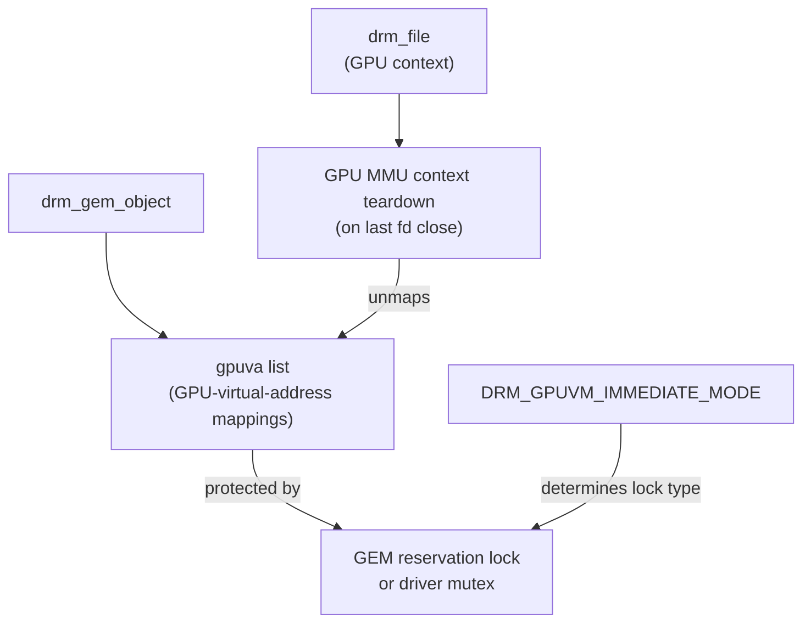
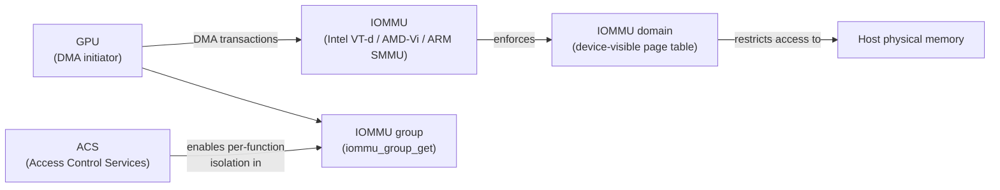
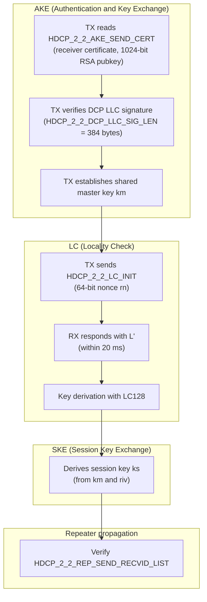
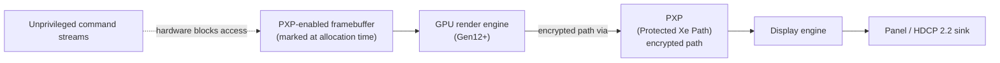
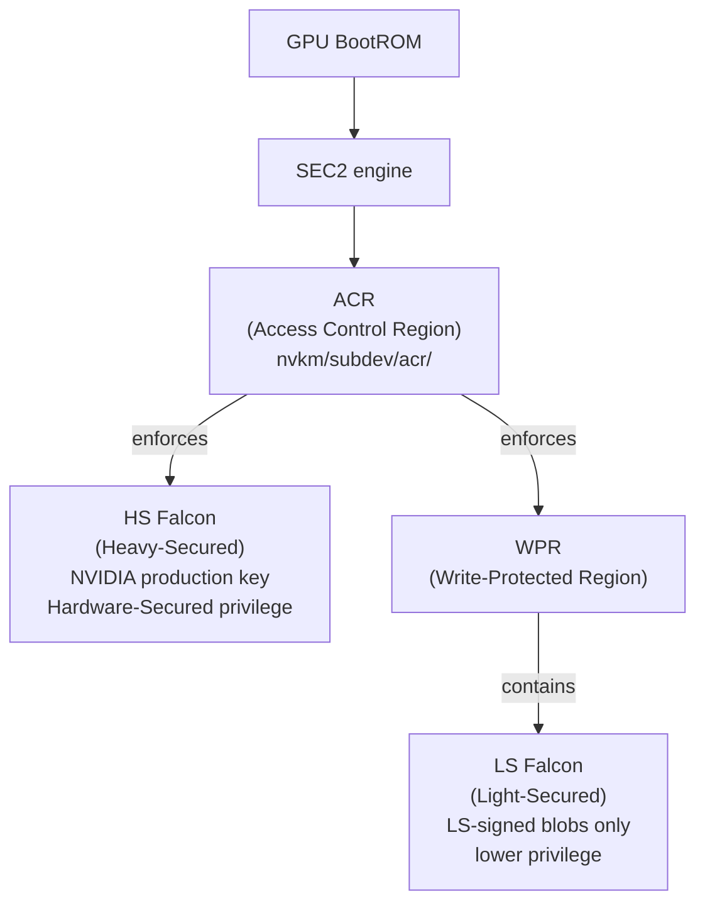
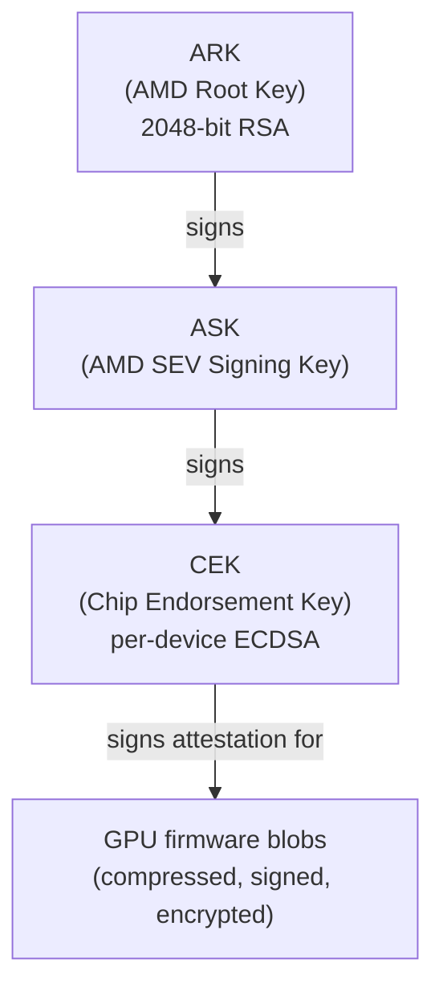
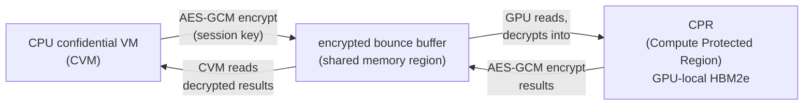
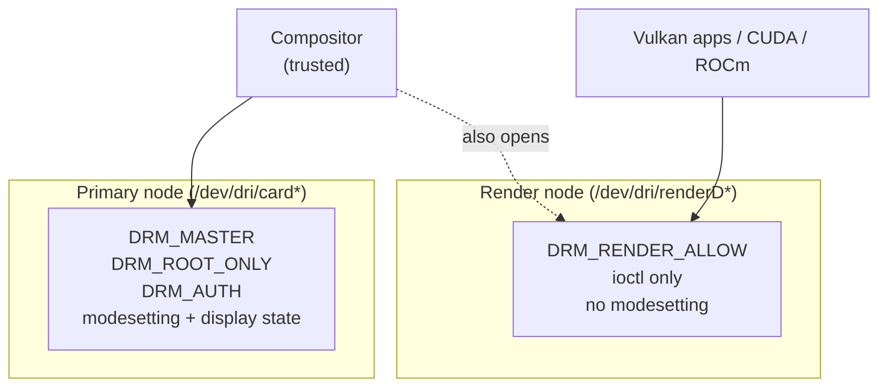

# Chapter 80 — GPU Security: Isolation, Content Protection, and Confidential Computing

**Target audiences:** Systems and driver developers who need to reason about GPU attack surface, process isolation, and firmware trust; graphics application developers integrating content protection or confidential AI workloads; security researchers auditing the Linux DRM subsystem.

---

## Table of Contents

1. [GPU Attack Surface Overview](#1-gpu-attack-surface-overview)
2. [GPU Process Isolation](#2-gpu-process-isolation)
3. [IOMMU and DMA Attack Mitigation](#3-iommu-and-dma-attack-mitigation)
4. [HDCP 2.2 — Content Protection in the Kernel](#4-hdcp-22--content-protection-in-the-kernel)
5. [Secure Display Path](#5-secure-display-path)
6. [GPU Firmware Signing and Secure Boot](#6-gpu-firmware-signing-and-secure-boot)
7. [AMD SEV-SNP and GPU Confidential Computing](#7-amd-sev-snp-and-gpu-confidential-computing)
8. [NVIDIA H100 Confidential Computing](#8-nvidia-h100-confidential-computing)
9. [GPU Side-Channel Attacks](#9-gpu-side-channel-attacks)
10. [Driver Security Hardening](#10-driver-security-hardening)
11. [Integrations](#11-integrations)

---

## 1. GPU Attack Surface Overview

GPUs sit at an unusually exposed position in the system security model. Unlike a CPU, a GPU is a multi-tenant accelerator: many processes share the same physical die simultaneously, each with its own command stream and memory allocations but all executing on the same compute engines and memory buses. This creates an attack surface that spans several distinct categories.

**Process isolation failures.** If the kernel driver does not correctly enforce per-process GPU virtual address spaces — or fails to scrub GPU memory and registers between contexts — a compromised or malicious process can read another process's framebuffer, texture data, model weights, or encryption keys that happen to reside in GPU-local DRAM.

**DMA attacks.** GPUs perform direct memory access to host DRAM in both directions. Without an IOMMU in the data path, a GPU driver vulnerability that allows an attacker to redirect DMA can compromise the entire host. The same risk applies to GPU passthrough in virtualisation environments: a guest VM given direct GPU access must be isolated at the IOMMU level.

**Content protection bypass.** Premium 4K content distribution relies on HDCP (High-bandwidth Digital Content Protection) to prevent interception on the display link. If the GPU driver does not correctly implement the HDCP authentication state machine, or if a compositor captures a protected framebuffer, content owners' DRM obligations are violated and the hardware may be blocklisted.

**Firmware supply-chain trust.** Modern GPUs load multiple signed firmware blobs during initialisation: GSP-RM on NVIDIA, GuC/HuC on Intel, and PSP firmware on AMD. If the firmware verification chain is weak or absent, a compromised binary could give an attacker persistent ring-0-equivalent access to the GPU — surviving both reboots and OS reinstalls.

**Side-channel attacks.** GPU memory systems exhibit timing and power characteristics that leak information across security boundaries. Cache occupancy timing, DRAM row-hammer bit-flips across GDDR6 rows, and performance counter telemetry are all exploitable channels in shared-GPU cloud deployments.

**Confidential computing.** As AI workloads migrate to the cloud, customers demand that their model weights and inference data remain encrypted even from the cloud operator. This requires a GPU Trusted Execution Environment (TEE) with hardware-enforced memory isolation and a remote attestation path. NVIDIA's Hopper architecture delivered the first GPU TEE; AMD is extending SEV-SNP toward GPU workloads.

The remainder of this chapter addresses each category in depth.

---

## 2. GPU Process Isolation

### 2.1 Per-Process GPU Virtual Address Spaces

On the CPU side, virtual memory gives every process its own address space backed by the MMU. GPUs replicate this architecture on the device. Each rendering or compute context is associated with a per-process GPU page table (GPUVA), so a process's GPU virtual addresses are translated by the GPU's own memory management unit (iommu on the device side, often called the GMMU or GPU MMU) before they reach physical VRAM addresses. A bug in the translation tables — a missing entry, a protection bit left off, or an uninitialized page — is required before one process can access another's VRAM via the GPU's own address translation.

The DRM subsystem exposes this through the `DRM_GPUVM` framework. A `drm_gem_object` carries a `gpuva` list of all GPU-virtual-address mappings pointing to that object, protected by either the GEM reservation lock or the driver's own mutex depending on whether the driver opts into `DRM_GPUVM_IMMEDIATE_MODE` [Source](https://www.kernel.org/doc/html/latest/gpu/drm-mm.html). The GPU MMU context is torn down in the `drm_file` release path when the last file descriptor referencing the GPU context is closed.



### 2.2 What Happens When a Process Exits

Context teardown is the most security-sensitive moment in GPU process lifecycle. The driver must:

1. Stop all pending command ring submissions from the dying context.
2. Wait for any in-flight GPU commands to drain or forcibly reset the engine.
3. Unmap all GPU page table entries referencing the dead context's memory.
4. Return VRAM allocations to the free pool — but crucially, ensure those pages cannot be read by the next allocator.

Step 4 is where VRAM scrubbing matters. DRAM (both host DRAM and GPU VRAM) retains its contents after deallocation. Without explicit zeroing, the next process to allocate a page will inherit the previous tenant's data. In the CPU world the kernel zeroes pages before handing them to userspace (`clear_page`); the GPU world has historically been weaker.

Research published by Barrack AI in 2024 confirmed that CUDA's default allocator (`cudaMalloc`) does not scrub VRAM between allocations, meaning tenants in a shared GPU cluster can sometimes read prior tenants' residues [Source](https://blog.barrack.ai/nvidia-cuda-never-clears-gpu-memory/). The Linux `nvidia-open` kernel driver and Nouveau do not currently implement VRAM zeroing on context exit at the kernel level (Note: needs verification for the latest open-driver releases).

### 2.3 AMDGPU Cleaner Shader

AMD implemented an architectural solution starting with CDNA2/GFX9.4.2 and extending through GFX11.5. The **cleaner shader** is a small GPU program that the kernel driver schedules after every process's last job completes, clearing:

- **LDS** (Local Data Store) — 32–64 KB of per-workgroup scratchpad
- **VGPRs** (Vector General Purpose Registers) — up to 256 × 32-bit per lane
- **SGPRs** (Scalar General Purpose Registers)

The driver exposes two sysfs interfaces under the GPU device node [Source](https://docs.kernel.org/gpu/amdgpu/process-isolation.html):

```bash
# Enable automatic isolation (serialize engine access + run cleaner shader between jobs)
echo 1 > /sys/bus/pci/devices/<BDF>/enforce_isolation

# Manually trigger the cleaner shader (useful at user logout)
echo 0 > /sys/bus/pci/devices/<BDF>/run_cleaner_shader
```

On multi-partition GPUs (SPX/DPX/QPX modes) each field accepts space-separated values, one per partition. The `enforce_isolation` interface serializes access to the graphics engine and schedules the cleaner shader automatically at context boundaries. A login manager such as GDM can call `run_cleaner_shader` on user logout to guarantee register hygiene before the next user's session.

The cleaner shader patches shipped via the `[PATCH v2 2/2] drm/amdgpu/gfx9: Enable Cleaner Shader for GFX9.4.2 Hardware` series on the amd-gfx mailing list [Source](https://www.mail-archive.com/amd-gfx@lists.freedesktop.org/msg114259.html) and expanded with GFX11.5 support in 2025 [Source](https://lists.freedesktop.org/archives/amd-gfx/2025-March/121647.html).

---

## 3. IOMMU and DMA Attack Mitigation

### 3.1 How the IOMMU Protects GPU DMA

Without an Input-Output Memory Management Unit (IOMMU), a GPU that can initiate DMA has unrestricted access to host physical memory — making it a potential tool for bypassing the CPU MMU entirely. The IOMMU interposes on DMA transactions and enforces a device-visible page table (an IOMMU domain) that restricts which host physical pages a device can access. A driver bug that lets a GPU or its attacker-controlled command stream issue DMA to an arbitrary physical address is blocked at the IOMMU boundary.

On x86 the two IOMMU implementations are **Intel VT-d** (Virtualisation Technology for Directed I/O) and **AMD-Vi** (AMD I/O Virtualisation). On ARM systems the **ARM SMMU** (System Memory Management Unit) provides equivalent isolation. The kernel's unified IOMMU API lives in `include/linux/iommu.h`.



The relevant current API includes:

```c
/* Allocate a paging-capable IOMMU domain for a device */
struct iommu_domain *iommu_paging_domain_alloc_flags(struct device *dev,
                                                      unsigned int flags);

/* Attach the domain to a device, so DMA from that device goes through it */
extern int iommu_attach_device(struct iommu_domain *domain,
                               struct device *dev);

/* Get the IOMMU group a device belongs to */
extern struct iommu_group *iommu_group_get(struct device *dev);
```

[Source: `include/linux/iommu.h`, torvalds/linux HEAD](https://github.com/torvalds/linux/blob/master/include/linux/iommu.h)

Note that `iommu_domain_alloc()` was replaced by `iommu_paging_domain_alloc_flags()` in recent kernel releases; downstream code still using the old API should be updated.

### 3.2 IOMMU Groups and ACS

The kernel groups PCIe devices that cannot be reliably isolated from each other into **IOMMU groups**. If two devices share an upstream PCIe bridge that lacks **ACS (Access Control Services)** capability, the IOMMU cannot prevent one device from issuing peer-to-peer DMA to the other — so they are placed in the same group and must be either both assigned to a VM or both kept on the host.

ACS is a PCIe specification feature that enables per-function isolation at the switch or root-port level. On systems where a GPU shares an upstream port with other devices and that port lacks ACS, the GPU and its neighbours cannot be cleanly separated for secure passthrough. The workaround, `pcie_acs_override=downstream,multifunction`, forces the kernel to treat certain ports as isolated — but this reduces IOMMU security guarantees and should not be used in production security-sensitive deployments [Source](https://github.com/benbaker76/linux-acs-override).

### 3.3 VFIO for GPU Passthrough

**VFIO** (Virtual Function I/O) is the Linux framework for assigning PCIe devices directly to virtual machines while maintaining host-kernel safety. VFIO requires an operational IOMMU and uses it to enforce DMA isolation. The sequence for GPU passthrough:

```bash
# Load VFIO driver
modprobe vfio-pci

# Bind the GPU to vfio-pci instead of the native driver
echo "10de 2684" > /sys/bus/pci/drivers/vfio-pci/new_id

# Pass the IOMMU group through to a QEMU VM
qemu-system-x86_64 -device vfio-pci,host=01:00.0 ...
```

Without a properly scoped IOMMU group, VFIO refuses to expose the device — protecting the host from a compromised guest that attempts to escape via GPU DMA.

---

## 4. HDCP 2.2 — Content Protection in the Kernel

### 4.1 Overview

**HDCP (High-bandwidth Digital Content Protection)** is the cryptographic protocol used to authenticate display sinks (monitors, TV panels, AV receivers) before transmitting protected premium video content. HDCP is required by content owners for 4K Ultra HD and for "Type 1" restricted streams that the HDCP specification limits to HDCP 2.2-capable paths only.

The Linux kernel implements HDCP primarily in:

- `drivers/gpu/drm/display/drm_hdcp_helper.c` — generic HDCP helper library
- `include/drm/display/drm_hdcp.h` — protocol constants and message structures
- `include/drm/display/drm_hdcp_helper.h` — helper API declarations
- `drivers/gpu/drm/i915/display/intel_hdcp.c` — Intel i915 implementation
- `drivers/gpu/drm/xe/display/xe_hdcp_gsc.c` — Intel Xe implementation
- `drivers/gpu/drm/amd/display/modules/hdcp/` — AMD display HDCP implementation

[Source: `drivers/gpu/drm/display/drm_hdcp_helper.c`, torvalds/linux](https://github.com/torvalds/linux/blob/master/drivers/gpu/drm/display/drm_hdcp_helper.c)

### 4.2 HDCP Protocol Versions

**HDCP 1.4** uses a 56-bit symmetric key protocol over DDC (I²C). The transmitter sends its key selection vector (AKSV) and a random nonce (An); the receiver responds with its BKSV and a challenge response. The HDCP 1.4 SRM (System Renewability Message) is a signed revocation list allowing the DCP LLC to revoke compromised receivers; the kernel's `drm_hdcp_check_ksvs_revoked()` function validates KSVs against the loaded SRM.

**HDCP 2.2** — the version implemented in the Linux DRM subsystem — uses a more modern authentication exchange. (Note: HDCP 2.3 is a subsequent revision of the specification; the kernel headers use `HDCP_2_2_*` naming throughout and there are no `HDCP_2_3_*` constants upstream. The same message set covers both 2.2 and 2.3 operation.)

- **AKE (Authentication and Key Exchange):** The transmitter reads the receiver's certificate (`HDCP_2_2_AKE_SEND_CERT`) containing the receiver's 1024-bit RSA public key (`HDCP_2_2_K_PUB_RX_MOD_N_LEN` = 128 bytes) and verifies the DCP LLC signature on that certificate (`HDCP_2_2_DCP_LLC_SIG_LEN` = 384 bytes, i.e., an RSA-3072 signature from DCP's Certificate Authority). The transmitter then establishes a shared master key `km`.
- **LC (Locality Check):** The transmitter sends `LC_INIT` with a 64-bit nonce `rn`; the receiver must respond with `L'` within 20 ms — proving physical locality and preventing routing attacks. Key derivation at this stage also incorporates **LC128**, a 128-bit global constant that all DCP-licensed HDCP 2.x devices share, used as an additional input to the key derivation functions. LC128 is obtained through the DCP licensing agreement and is not published publicly.
- **SKE (Session Key Exchange):** Derives the session encryption key `ks` from `km` and `riv`.
- **Repeater propagation:** For HDMI/DP repeaters, the receiver ID list is verified with `HDCP_2_2_REP_SEND_RECVID_LIST` and acknowledged.



The kernel defines the complete message ID table in `include/drm/display/drm_hdcp.h` [Source](https://github.com/torvalds/linux/blob/master/include/drm/display/drm_hdcp.h):

```c
/* Protocol message definition for HDCP2.2 specification */
#define HDCP_2_2_AKE_INIT          2
#define HDCP_2_2_AKE_SEND_CERT    3
#define HDCP_2_2_AKE_NO_STORED_KM 4
#define HDCP_2_2_AKE_STORED_KM    5
#define HDCP_2_2_AKE_SEND_HPRIME  7
#define HDCP_2_2_LC_INIT           9
#define HDCP_2_2_LC_SEND_LPRIME   10
#define HDCP_2_2_SKE_SEND_EKS     11
```

### 4.3 Content Type: Type 0 vs. Type 1

The kernel introduces a **content type** property on HDCP 2.2 connections [Source](https://github.com/torvalds/linux/blob/master/include/drm/display/drm_hdcp.h):

```c
/*
 * Protected content streams are classified into 2 types:
 * - Type0: Can be transmitted with HDCP 1.4+
 * - Type1: Can be transmitted with HDCP 2.2+
 */
#define HDCP_STREAM_TYPE0  0x00
#define HDCP_STREAM_TYPE1  0x01

#define DRM_MODE_HDCP_CONTENT_TYPE0  0
#define DRM_MODE_HDCP_CONTENT_TYPE1  1
```

Type 1 content — used for premium 4K titles — must only flow over HDCP 2.2-authenticated links. Even if a display supports HDCP 1.4, a Type 1 stream cannot be sent to it. The compositor and media pipeline are responsible for tagging content streams with the appropriate type.

### 4.4 DRM Content Protection Property

The connector-level API uses three UAPIs defined in `include/uapi/drm/drm_mode.h`:

```c
/* Content Protection Flags */
#define DRM_MODE_CONTENT_PROTECTION_UNDESIRED  0
#define DRM_MODE_CONTENT_PROTECTION_DESIRED    1
#define DRM_MODE_CONTENT_PROTECTION_ENABLED    2
```

A media player sets the "Content Protection" connector property to `DESIRED`; the driver's HDCP implementation completes authentication and transitions it to `ENABLED`. The `drm_connector_attach_content_protection_property()` function from `drm_hdcp_helper.h` registers this property on a connector:

```c
int drm_connector_attach_content_protection_property(
        struct drm_connector *connector,
        bool hdcp_content_type);
```

The `hdcp_content_type` flag, when true, also registers the "HDCP Content Type" property allowing userspace to select between Type 0 and Type 1.

### 4.5 Intel i915/Xe Implementation

Intel's HDCP support routes HDCP 2.2 authentication through the **GSC (Graphics Security Controller)**, a dedicated security microcontroller present on DG2 (Alchemist) and later. The file `drivers/gpu/drm/i915/display/intel_hdcp_gsc_message.c` manages the message exchange between the display driver and GSC over the GSCCS (Graphics Security Controller Command Streamer) engine. For older platforms (Gen10–Gen12), authentication passed through the **MEI (Management Engine Interface)** via `drivers/misc/mei/hdcp/mei_hdcp.c` [Source: `Documentation/driver-api/mei/hdcp.rst`](https://github.com/torvalds/linux/blob/master/Documentation/driver-api/mei/hdcp.rst).

A NULL pointer dereference in Intel i915's HDCP 2.x capability query path was assigned CVE-2024-53050 and fixed in the 6.12 stable series [Source: NVD CVE-2024-53050](https://nvd.nist.gov/vuln/detail/CVE-2024-53050).

---

## 5. Secure Display Path

### 5.1 Protected Content and the Compositor

When HDCP 2.2 Type 1 authentication is active, the display pipeline from GPU framebuffer to panel must be completely sealed. No intermediate stage — including the Wayland compositor — should be able to capture or redirect the pixel data. This creates a fundamental tension: the compositor is the entity that composites all windows, so it has structural access to every surface unless the hardware enforces an exception.

The solution used on Intel platforms is **PXP (Protected Xe Path)**, a hardware feature on Gen12+ that creates a separate encrypted path from the GPU's render engine to the display engine for protected content. PXP-enabled framebuffers are marked at allocation time and the hardware ensures they cannot be accessed by unprivileged command streams. The Intel Xe driver exposes this through `xe_hdcp_gsc.c` [Source](https://github.com/torvalds/linux/blob/master/drivers/gpu/drm/xe/display/xe_hdcp_gsc.c).



At the DRM level, "protected" framebuffers are not currently a generic kernel feature with a universal `FLAG_PROTECTED` flag — the protection is vendor-specific (Intel PXP, AMD Display Core's protected surface support). The compositor is expected to honour the protection by not compositing protected surfaces through unprotected paths.

### 5.2 Wayland Content Protection Protocol

The Wayland protocol extension for content protection provides a minimal API: a client requests protection for one of its surfaces and the compositor replies with a status event [Source](https://wayland.app/protocols/weston-content-protection):

```
zwp_linux_content_type_manager_v1 → zwp_content_type_v1
  protected_surface → status { disabled | enabled }
```

The compositor (trusted) decides where each surface appears. If all connected displays support the requested HDCP content type, the compositor sets HDCP up on those outputs and reports `enabled`. If any display on the output chain cannot authenticate, the compositor must either hide the protected surface or blank it.

The practical limitation is that this model trusts the compositor entirely. On traditional desktop systems where the compositor is owned by the logged-in user, this is acceptable. On set-top-box or kiosk deployments the compositor is a fixed trusted component and the model works correctly. Mixed untrusted compositor scenarios (malicious compositor, remote compositor) remain out of scope for this protocol.

---

## 6. GPU Firmware Signing and Secure Boot

### 6.1 NVIDIA GSP-RM Firmware

The NVIDIA open-source kernel driver (`nvidia-open`) loads the GPU System Processor firmware (`gsp.bin`) from the standard Linux firmware path (`/lib/firmware/nvidia/<chip>/`). The Nouveau driver uses `nvkm_firmware_get()` to locate and load firmware blobs [Source: `drivers/gpu/drm/nouveau/nvkm/core/firmware.c`](https://github.com/torvalds/linux/blob/master/drivers/gpu/drm/nouveau/nvkm/core/firmware.c):

```c
/**
 * nvkm_firmware_get - load firmware from the official nvidia/chip/ directory
 * @subdev:  subdevice that will use that firmware
 * @fwname:  name of firmware file to load
 * @ver:     firmware version to load
 * @fw:      firmware structure to load to
 *
 * Use this function to load firmware files in the form nvidia/chip/fwname.bin.
 * Firmware files released by NVIDIA will always follow this format.
 */
int
nvkm_firmware_get(const struct nvkm_subdev *subdev, const char *fwname,
                  int ver, const struct firmware **fw)
```

The firmware itself is PKC (public-key cryptography) signed by NVIDIA; the GPU's Boot ROM validates the signature before granting the GSP execution privilege. (The exact padding scheme — PKCS#1 v1.5 vs PSS — has not been confirmed from public sources and needs verification.) The NVIDIA ACR (Access Control Region) subsystem in Nouveau (`nvkm/subdev/acr/`) manages the privilege levels for Light-Secured (LS) and Heavy-Secured (HS) Falcon microcontrollers. HS Falcons run code signed with NVIDIA's production key and execute at elevated Hardware-Secured privilege; LS Falcons run inside a WPR (Write-Protected Region) enforced by the HS ACR firmware at lower privilege. Drivers receive only LS-signed blobs; the GPU BootROM and SEC2 engine maintain the separation [Source: `include/nvkm/subdev/acr.h`](https://github.com/torvalds/linux/blob/master/drivers/gpu/drm/nouveau/include/nvkm/subdev/acr.h). The Nova (Rust NVIDIA driver) documentation describes the HS/LS privilege model from an architectural standpoint [Source: Ch10 — Nova].



### 6.2 Intel GuC and HuC Firmware

Intel's **GuC** (Graphics Microcontroller) handles GPU scheduling and power management; **HuC** (HEVC Microcontroller) accelerates video encode/decode. Both are loaded by `intel_uc_fw_fetch()` in the i915/Xe drivers [Source: `drivers/gpu/drm/i915/gt/uc/intel_uc_fw.c`](https://github.com/torvalds/linux/blob/master/drivers/gpu/drm/i915/gt/uc/intel_uc_fw.c):

```c
int intel_uc_fw_fetch(struct intel_uc_fw *uc_fw)
{
    struct intel_gt *gt = __uc_fw_to_gt(uc_fw);
    ...
    err = try_firmware_load(uc_fw, &fw);
    ...
    while (err == -ENOENT) { /* try older versions */ }
```

Both firmware blobs carry a Command Security System (CSS) header containing the firmware's signature; the GPU's hardware boot validation path uses this header to authenticate the firmware before execution. (The precise details of the CSS verification mechanism have not been confirmed from public kernel documentation and need further verification against Intel's firmware signing specifications.) Failure to authenticate results in GuC/HuC being disabled and GuC-based scheduling falling back to host scheduling. HuC specifically requires PXP support on DG2 and later, meaning the Intel Management Engine must be present and operational.

### 6.3 AMD Platform Security Processor (PSP)

The AMD **PSP** (Platform Security Processor, now "AMD Secure Processor") is an ARMv7 Cortex-A5 core embedded in every AMD APU and GPU. It owns the root of trust for the entire SoC. Its functions in the GPU security context include:

- Validating all GPU firmware blobs against AMD's ARK (AMD Root Key) certificate chain before allowing them to execute on the GPU's internal processors.
- Mediating SEV (Secure Encrypted Virtualization) key operations, including SEV-SNP page state management.
- Providing HDCP authentication services on AMD display hardware via `drivers/gpu/drm/amd/display/modules/hdcp/hdcp_psp.c`.

The firmware signing chain: ARK (2048-bit RSA) → ASK (AMD SEV Signing Key) → CEK (Chip Endorsement Key, per-device ECDSA) [Source](https://dayzerosec.com/blog/2023/04/17/reversing-the-amd-secure-processor-psp.html). GPU firmware files are compressed, signed, and for recent revisions also encrypted. The PSP 14.0 block added for RDNA4 continues this pattern [Source](https://www.phoronix.com/news/AMDGPU-Enabling-PSP-14.0).



### 6.4 UEFI Secure Boot and Kernel Module Signing

On a UEFI Secure Boot system the GPU kernel module (`nvidia.ko`, `amdgpu.ko`, `i915.ko`) must be signed by a key enrolled in the MOK (Machine Owner Key) database or the distribution's signing infrastructure. An unsigned module will be rejected by the kernel when `CONFIG_MODULE_SIG_FORCE=y` is set. Distributions such as RHEL and Ubuntu pre-sign the GPU modules with their distribution key; out-of-tree proprietary modules require users to enroll their own key with `mokutil`. The firmware blobs themselves are not subject to UEFI Secure Boot enforcement — they are validated by the GPU hardware or PSP independently.

---

## 7. AMD SEV-SNP and GPU Confidential Computing

### 7.1 SEV-SNP Background

**AMD SEV** (Secure Encrypted Virtualization) encrypts virtual machine memory using AES-128 with a per-VM key managed by the PSP. **SEV-SNP** (Secure Nested Paging) adds integrity protection, preventing a malicious hypervisor from injecting plaintext pages into the encrypted VM's address space. The guest attestation report, signed by the CEK, allows a remote party to verify the VM's identity and launch configuration.

### 7.2 GPU Workloads in a SEV-SNP VM

When a confidential VM (CVM) running under SEV-SNP wants to use a GPU, the interaction model depends on whether the GPU supports confidential computing mode itself. For legacy GPUs — or current non-CC-enabled configurations — the GPU is treated as an untrusted device:

- DMA buffers shared between the GPU driver and the CVM must be unencrypted (marked `C=0` in the SEV page attribute table) to allow the GPU to read/write them. This means data leaving the CVM for the GPU crosses a trust boundary.
- The CPU TEE boundary does not extend to the GPU's internal memory.

AMD is developing mechanisms to pass encrypted DMA pages to CC-capable GPUs, extending the trust domain. This work involves changes to the AMDGPU driver, the ROCm stack, and the PSP firmware to negotiate page encryption attributes. As of mid-2026 this work is still in progress for the open-source stack (Note: specific kernel commit references need verification against the upstream amd-gfx mailing list).

### 7.3 HSMP and SMI Transfer

The **HSMP** (Host System Management Port) interface allows privileged software to query and configure AMD processor features — including certain power and thermal parameters. **SMI Transfer** (System Management Interface Transfer) is used by the PSP to communicate with firmware components across isolation boundaries. These interfaces are relevant to confidential computing because a hypervisor that can manipulate HSMP or intercept SMI transfers can potentially interfere with SEV-SNP operations; mitigations are part of the broader AMD SNP-enabled host kernel patches. (Note: specific mitigation details in the Linux kernel need further verification against AMD's SEV-SNP host support patches in `arch/x86/kvm/svm/`.)

---

## 8. NVIDIA H100 Confidential Computing

### 8.1 The Hopper CC Model

The NVIDIA H100 (Hopper architecture) is the first GPU to provide a hardware-enforced Trusted Execution Environment (TEE). When operated in **CC-On** mode, the GPU partitions its memory into:

- **CPR (Compute Protected Region):** GPU-local HBM2e memory that is inaccessible from outside the GPU die. Code and data executing inside the TEE reside here.
- **Shared (unprotected) memory:** A shared region in system DRAM used for CPU-GPU communication, secured by encryption.

Three CC operational modes exist in the H100 driver:

| Mode | Description |
|------|-------------|
| **CC-Off** | Standard GPU operation; no TEE, full performance |
| **CC-On** | Full confidential computing; hardware firewalls active; performance counters disabled |
| **CC-DevTools** | Partial CC mode with security disabled; allows profiling for developer use |

[Source: "Confidential Computing on H100 GPUs for Secure and Trustworthy AI", NVIDIA Developer Blog](https://developer.nvidia.com/blog/confidential-computing-on-h100-gpus-for-secure-and-trustworthy-ai/)

### 8.2 Memory Protection and Bounce Buffers

The H100 in CC-On mode **does not encrypt its on-card HBM memory at rest** — the CPR isolation is enforced by hardware access control rather than encryption [Source](https://www.edgeless.systems/wiki/hardware/nvidia-hopper-h100). This distinguishes it from CPU-side SEV which encrypts DRAM. Instead:

- When the CPU's confidential VM writes data destined for the GPU (model inputs, activations), it encrypts the data using **AES-GCM** with a session key and places it in an **encrypted bounce buffer** in the shared memory region.
- The GPU reads from the bounce buffer, decrypts into the CPR, and processes the data entirely within the protected region.
- Results are encrypted with AES-GCM before leaving the CPR back through the shared bounce buffer.



The AES-GCM implementation conforms to NIST SP800-38D. The session key is established via the SPDM (Security Protocol and Data Model) protocol exchange.

### 8.3 SPDM Attestation and the ECC-384 Root of Trust

Every H100 GPU contains a **device-unique ECC-384 key pair** whose private component is burned into on-die fuses at production time. NVIDIA's CA issues a certificate binding the public key to the GPU's device identity. During confidential computing initialisation:

1. The GPU measures its firmware through a secure boot sequence — each stage's hash is extended into an on-die measurement register.
2. The GPU driver (within the CPU's TEE) opens an **SPDM session** to the GPU. SPDM is a DMTF standard for device authentication; the GPU signs its firmware measurements with its private ECC-384 key.
3. The driver verifies the SPDM attestation report against NVIDIA's certificate chain, establishing that the correct, unmodified firmware is running.
4. The SPDM session derives a symmetric session key used for all subsequent AES-GCM-encrypted bounce buffer traffic.

For remote attestation, the CUDA driver within the CVM can forward the attestation report to **NRAS (NVIDIA Remote Attestation Service)** for online verification, or perform offline verification in air-gapped environments [Source](https://developer.nvidia.com/blog/confidential-computing-on-h100-gpus-for-secure-and-trustworthy-ai/). The open-source tools for this are in the **nvtrust** repository on GitHub [Source](https://github.com/NVIDIA/nvtrust).

### 8.4 CUDA Device Attributes and CC Capability Probing

CUDA exposes device attributes that applications can query at runtime to determine GPU capabilities. One attribute relevant to shared-memory GPU workloads is `CU_DEVICE_ATTRIBUTE_GPU_DIRECT_RDMA_WITH_CUDA_VMM_SUPPORTED`, which reports whether the GPU supports GPUDirect RDMA combined with CUDA Virtual Memory Management. This is distinct from confidential computing: it relates to peer-to-peer RDMA access to GPU memory using the CUDA VMM API, not the H100 TEE mechanism. (Note: the relationship between this attribute and CC-mode operation has not been confirmed in public NVIDIA documentation; its presence in a CC context likely indicates a capability check for memory management interoperability, not a gate to enabling CC mode.)

### 8.5 Performance Overhead

Benchmark research (USENIX adjacent, arXiv:2409.03992, 2024) shows that TEE overhead for large language model inference typically remains below 5%, because the GPU's internal HBM computation is unaffected. Overhead concentrates in CPU-GPU I/O — particularly the encrypt/decrypt overhead on the bounce buffer path over PCIe. For I/O-bound workloads (small batch sizes, frequent host-device transfers) overhead can be higher.

In CC-On mode the H100 **disables GPU performance counters** to prevent side-channel information leakage through counter telemetry [Source](https://www.edgeless.systems/wiki/hardware/nvidia-hopper-h100). This means standard CUDA profiling tools (`nsight-compute`, `nvperf`) cannot profile CC-On workloads. The CC-DevTools mode re-enables counters at the cost of removing security guarantees.

---

## 9. GPU Side-Channel Attacks

### 9.1 Cache and Timing Attacks

GPU caches — L1/L2 data caches, the texture cache, the L2 shared between SMs — exhibit timing behaviour that can leak information across security boundaries. Classic Prime+Probe and Flush+Reload attacks assume shared physical memory and the ability to measure access latency; GPUs with shared L2 caches in multi-process mode are susceptible to similar attacks. Published research from 2016 onward demonstrated that GPU cache timing can leak AES round keys from co-located GPGPU workloads.

### 9.2 GPUHammer: Rowhammer on GDDR6

**Rowhammer** is a DRAM vulnerability where repeatedly reading the same memory row causes bit flips in adjacent rows due to electrical coupling. It was believed to apply only to CPU DRAM, but in 2025 researchers from the University of Toronto published **GPUHammer**, the first demonstrated Rowhammer attack on discrete GPU GDDR6 memory [Source: "GPUHammer: Rowhammer Attacks on GPU Memories are Practical", USENIX Security 2025](https://www.usenix.org/conference/usenixsecurity25/presentation/lin-shaopeng).

Key findings:

- GPUHammer achieves up to **8 bit-flips** across 4 DRAM banks on an NVIDIA A6000 with GDDR6 memory.
- The attack is mounted via standard CUDA compute kernels without elevated privilege.
- The primary demonstrated impact is **AI model accuracy degradation**: an image classification model's accuracy dropped from 80% to under 1% after targeted bit-flip injection into model weights.
- In shared GPU cloud environments, a malicious tenant can exploit GPUHammer to tamper with another tenant's model parameters.
- GDDR6's proprietary bank/row address mapping and refresh mitigations make the attack more complex than LPDDR4 Rowhammer but not impractical.

[Source: GPUHammer paper PDF](https://gururaj-s.github.io/assets/pdf/SEC25_GPUHammer.pdf)

### 9.3 Power Side Channels

Intel's RAPL (Running Average Power Limit) interface on CPUs has been exploited for cross-process AES key recovery (Platypus, 2020). NVIDIA does not expose a RAPL equivalent, but the `NVML` library's `nvmlDeviceGetPowerUsage()` call returns per-device wattage at ~10 Hz resolution — potentially usable for coarse power analysis in long-running workloads. AMD's ROCm `rsmi_dev_power_ave_get()` provides similar resolution. Whether this is practically exploitable for GPU-side key recovery from shared workloads has not been established in published research (Note: needs verification against forthcoming academic work).

### 9.4 Mitigations in the Linux Stack

**Performance counter access restriction.** The kernel's `kernel.perf_event_paranoid` sysctl limits which users can open perf events:

```bash
# Value 2: Only privileged users can access CPU perf counters
echo 2 > /proc/sys/kernel/perf_event_paranoid
```

For GPU-specific counters, each driver implements its own access model. AMDGPU exposes hardware performance counters through `amdgpu_perfcnt_ioctl`, restricted to root or DRM-master by default. Intel i915/Xe exposes OA (Observation Architecture) counters via `perf_open` with driver-side checks against the process's capabilities.

NVIDIA H100 in CC-On mode disables GPU performance counters entirely — this is a deliberate architectural decision rather than a software mitigation. On non-CC GPUs, NVIDIA's proprietary driver restricts raw hardware counter access to the process that owns the GPU context.

**ECC.** Hardware ECC on GPU DRAM (present on A100, H100, and AMD MI300 datacenter parts) corrects single-bit errors and detects double-bit errors, partially mitigating Rowhammer bit-flip injection — though sufficiently many flips or attacks targeting the ECC syndrome bits themselves may still succeed.

---

## 10. Driver Security Hardening

### 10.1 DRM ioctl Permission Model

The DRM subsystem controls access to sensitive operations through per-ioctl permission flags defined in `include/drm/drm_ioctl.h` [Source](https://github.com/torvalds/linux/blob/master/include/drm/drm_ioctl.h):

```c
/**
 * DRM_AUTH — for ioctl used for rendering; requires authenticated fd
 * or render node.
 */
#define DRM_AUTH        BIT(0)

/**
 * DRM_MASTER — must be set for any ioctl which can change modeset
 * or display state; requires active DRM master.
 */
#define DRM_MASTER      BIT(1)

/**
 * DRM_ROOT_ONLY — requires CAP_SYS_ADMIN; used for SETMASTER/DROPMASTER.
 */
#define DRM_ROOT_ONLY   BIT(2)

/**
 * DRM_RENDER_ALLOW — for render-only ioctl on drivers with render nodes.
 * Should be set alongside DRM_AUTH for all new render drivers.
 */
#define DRM_RENDER_ALLOW BIT(5)
```

The separation of **render nodes** (`/dev/dri/renderD*`) from **primary nodes** (`/dev/dri/card*`) is a key security boundary:

- Render nodes expose only rendering ioctl (those with `DRM_RENDER_ALLOW`). No modesetting, no master operations.
- Applications that only need GPU compute or rendering — Vulkan apps, CUDA, ROCm — should open the render node and never need access to the primary node.
- The primary node, which can change display state, should only be opened by the compositor.



This separation prevents a compromised application from issuing a `DRM_IOCTL_SET_MASTER` and interfering with the display pipeline.

### 10.2 Fuzzing the DRM Subsystem

**syzkaller** is the kernel fuzzer developed at Google that has found thousands of kernel security bugs. Its GPU coverage includes the DRM core ioctl dispatch path, the GEM buffer management, and driver-specific ioctl handlers. Syzkaller generates random sequences of DRM ioctl calls with semi-valid arguments — exercising error paths, integer overflow checks, and NULL dereference guards that developers often overlook.

Notable areas that syzkaller and manual auditing have historically caught in GPU drivers include:

- **Integer overflow in buffer size arithmetic** — when `width * height * bpp` overflows 32 bits before bounds checks.
- **Use-after-free in fence signalling** — DRM fences are reference-counted objects; incorrect reference handling creates UAF windows.
- **Uninitialized memory in ioctl output structures** — kernel data leaking to userspace if padding bytes are not zeroed before copyout (`copy_to_user`).
- **Missing capability checks on privileged ioctl** — allowing unprivileged processes to change display parameters or access VRAM apertures.

CVE-2024-53050 (i915 HDCP NULL pointer dereference) is a recent example caught through code review of the HDCP 2.x path [Source: NVD CVE-2024-53050](https://nvd.nist.gov/vuln/detail/CVE-2024-53050).

### 10.3 The drm_ioctl Dispatch and Capability Checks

The DRM core dispatches ioctl through `drm_ioctl()` in `drivers/gpu/drm/drm_ioctl.c`, which checks the permission flags before calling the driver-specific handler:

```c
/* Simplified from drm_ioctl.c */
if (ioctl->flags & DRM_ROOT_ONLY && !capable(CAP_SYS_ADMIN))
    return -EACCES;

if (ioctl->flags & DRM_MASTER && !drm_is_current_master(file_priv))
    return -EACCES;

if (ioctl->flags & DRM_AUTH && !file_priv->authenticated)
    return -EACCES;
```

Driver-specific ioctl handlers (e.g., `amdgpu_info_ioctl`, `i915_gem_execbuffer2_ioctl`) add further validation: buffer handle validity, size range checks, and alignment requirements.

### 10.4 amdgpu CVE History

The amdgpu driver has accumulated a number of CVEs related to bounds checking in media accelerator paths (VCN video decode/encode), particularly in the argument validation for VCPU job submission. These vulnerabilities can result in out-of-bounds reads (kernel data leak) or, in some cases, privilege escalation if write primitives are available. The pattern is consistent: ioctls that accept user-provided array sizes and indices must validate every field before use. The AMDGPU KFD (Kernel Fusion Driver, the HPC/ML path) has a distinct ioctl surface and has also been the subject of VRAM attribute exposure vulnerabilities.

---

## 11. Integrations

This chapter connects to many other parts of the book:

- **Ch1 — DRM Architecture:** The DRM ioctl permission model, master/auth/render-node separation, and the `drm_file` lifecycle that triggers GPU context teardown are all foundational DRM architecture topics.

- **Ch4 — GPU Memory Management:** Per-process GPUVA spaces, the `DRM_GPUVM` framework, GEM buffer reference counting, and VRAM scrubbing all live in the GPU memory management layer.

- **Ch5 — x86 GPU Drivers:** Intel i915 and Xe are the primary HDCP implementors in the kernel; PXP (Protected Xe Path) and the GSCCS security engine are Xe-specific features.

- **Ch9 — GSP-RM Firmware:** NVIDIA's GSP firmware signing, the Falcon HS/LS security model, and the ACR (Access Control Region) mechanism for firmware privilege separation are covered in the GSP-RM chapter.

- **Ch22 — Production Compositors:** The Wayland content protection protocol, compositor trust model for HDCP, and the requirement that compositors honour protected surface requests without capturing them.

- **Ch25 — GPU Compute:** GPGPU context isolation, CUDA's lack of VRAM zeroing, and the GPU compute security model under multi-tenant workloads.

- **Ch30 — Debugging and Profiling:** GPU performance counters, the OA (Observation Architecture) interface, and the restriction of counter access to authorized processes are covered in the profiling chapter.

- **Ch32 — Contributing:** Security-sensitive patches to DRM must be sent via the `security@kernel.org` embargoed disclosure path; CVE assignment and stable-tree backport processes for GPU driver vulnerabilities.

- **Ch55 — GPU Containers and Cloud:** Container-level GPU isolation, the Kubernetes GPU plugin, VFIO-based passthrough for VMs, and the security model for shared GPU clusters where GPUHammer and VRAM leakage are most relevant.

- **Ch66 — CUDA:** CUDA's `cudaMalloc` and VRAM allocation lifecycle, the lack of memory scrubbing by default, and CC-mode cuMemcpy through encrypted channels.

- **Ch71 — Intel Xe:** PXP (Protected Xe Path), GSCCS (Graphics Security Controller Command Streamer), and HuC firmware authentication via the Management Engine are Xe-specific topics detailed in the Intel stack chapter.

- **Ch72 — AMD Radeon Tools:** AMD's ROCm stack, the AMDGPU KFD ioctl surface, and the `rsmi` (ROCm SMI) interface for power telemetry that could be used as a side channel.

---

*Sources consulted for this chapter:*

- [Linux kernel DRM HDCP helper (`drivers/gpu/drm/display/drm_hdcp_helper.c`)](https://github.com/torvalds/linux/blob/master/drivers/gpu/drm/display/drm_hdcp_helper.c)
- [Linux kernel DRM HDCP header (`include/drm/display/drm_hdcp.h`)](https://github.com/torvalds/linux/blob/master/include/drm/display/drm_hdcp.h)
- [Linux kernel IOMMU API (`include/linux/iommu.h`)](https://github.com/torvalds/linux/blob/master/include/linux/iommu.h)
- [AMDGPU Process Isolation — The Linux Kernel documentation](https://docs.kernel.org/gpu/amdgpu/process-isolation.html)
- [NVIDIA Confidential Computing on H100 — NVIDIA Developer Blog](https://developer.nvidia.com/blog/confidential-computing-on-h100-gpus-for-secure-and-trustworthy-ai/)
- [Creating the First Confidential GPUs — ACM Queue](https://queue.acm.org/detail.cfm?id=3623391)
- [GPUHammer: Rowhammer Attacks on GPU Memories are Practical — USENIX Security 2025](https://www.usenix.org/conference/usenixsecurity25/presentation/lin-shaopeng)
- [Confidential Computing on NVIDIA H100 GPU: A Performance Benchmark Study — arXiv:2409.03992](https://arxiv.org/html/2409.03992v2)
- [NVIDIA nvtrust open-source repository](https://github.com/NVIDIA/nvtrust)
- [Reversing the AMD Secure Processor (PSP) — Day Zero Security](https://dayzerosec.com/blog/2023/04/17/reversing-the-amd-secure-processor-psp.html)
- [Weston content protection protocol — Wayland Explorer](https://wayland.app/protocols/weston-content-protection)
- [CUDA Never Clears GPU Memory — Barrack AI](https://blog.barrack.ai/nvidia-cuda-never-clears-gpu-memory/)
- [PCI Passthrough via OVMF — ArchWiki](https://wiki.archlinux.org/title/PCI_passthrough_via_OVMF)
