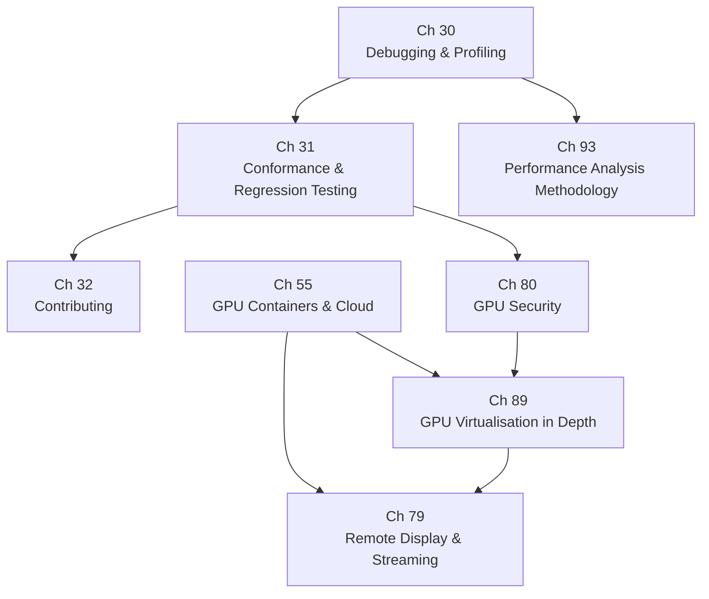

# Part IX — Tooling & Contributing

The earlier parts of this book built the Linux graphics stack layer by layer: the **DRM** kernel subsystem and its memory management, the **Mesa** compiler pipeline and Vulkan drivers, the **Wayland** compositor and display engine, video decode and encode via **VA-API** and **V4L2**, and the browser and terminal rendering stacks above them. Part IX steps back from implementation and asks the operational questions: how do engineers observe, measure, secure, deploy, and improve this stack in practice? These chapters cover the tools that make the graphics stack legible — profilers, conformance suites, contribution workflows — alongside the deployment and security concerns that arise when GPUs move into containers, virtual machines, remote sessions, and multi-tenant cloud environments.

## Chapters in This Part

**Chapter 30 — Debugging and Profiling the Graphics Stack** is the practitioner's entry point to the entire part. It maps the four distinct bug layers — API misuse, compiler and driver bugs, synchronisation errors, and hardware performance problems — to the tools that address each: **VK_LAYER_KHRONOS_validation**, **RenderDoc**, **Mesa** environment variables (**`RADV_DEBUG`**, **`ACO_DEBUG`**, **`INTEL_DEBUG`**, **`NIR_DEBUG`**), frame-latency instrumentation via **`wp_presentation`** and **`ftrace`** DRM tracepoints, and hardware counters via **`intel_gpu_top`**, **RadeonGPUProfiler (RGP)**, and **Nsight**. The chapter also explains the **`SPIR-V`** shader debugging toolchain, **`VkQueryPool`** timestamp queries, and the **`CAP_PERFMON`** capability model that gates counter access.

**Chapter 31 — Conformance and Regression Testing** shifts from ad-hoc debugging to systematic correctness verification. It covers the four testing pillars of Mesa driver development: **dEQP** / **VK-GL-CTS** (Khronos conformance, including the **Vulkan CTS mustpass list** and the **`deqp-runner`** parallel executor), **IGT GPU Tools** for kernel **DRM** driver testing (**`kms_atomic`**, **`gem_exec_store`**, **`syncobj_timeline`**), **piglit** for Mesa OpenGL regression, and fuzzing with **`spirv-fuzz`**, **AddressSanitizer**, and **`syzkaller`**. The chapter also explains **Mesa**'s **GitLab CI** pipeline, hardware-in-the-loop test stages, and the **Khronos Adopter Program** certification workflow that grants drivers the right to use the **Vulkan** and **OpenGL** trade names.

**Chapter 32 — Contributing to the Linux Graphics Stack** is the community guide. It explains the four contributing domains — **Linux kernel DRM** (email patches via **`git send-email`** and **`b4`** to **`dri-devel@lists.freedesktop.org`**), **Mesa** (**GitLab** merge requests merged by **`@marge-bot`**), **Wayland protocols** (the unstable → staging → stable lifecycle in **`wayland-protocols`**), and **libdrm** / **wlroots** / compositor projects — each with its own tooling, review culture, and release cadence. A case study traces HDR support end to end across all four domains, and a dedicated section covers the growing role of **Rust** in the kernel (**`rust/kernel/drm/`**), in **Mesa** (**NAK** shader compiler for **NVK**), and in emerging drivers such as **Nova** and **Tyr**.

**Chapter 55 — GPU Containers and Cloud Compute** addresses how GPU hardware is exposed inside containers, virtual machines, and cloud instances. It explains the **DRM** render node (`/dev/dri/renderDN`), KFD node (`/dev/kfd`), and the bind-mount plus DAC model that gates container GPU access; the **NVIDIA Container Toolkit** and its **CDI** (Container Device Interface) alternative; **ROCm** containers and the **AMD Container Toolkit**; **Intel** GPU containers via the render node; **Kubernetes** GPU scheduling via the device plugin API, **MIG** partitions, time-slicing, and **Dynamic Resource Allocation (DRA)**; and the **WSL2** GPU path through **`dxgkrnl`**, **`libdxcore.so`**, and the **Mesa** **`d3d12`** Gallium driver.

**Chapter 79 — Remote Display, Screen Casting, and GPU-Accelerated Game Streaming** covers how GPU-rendered frames leave the local machine. It traces three distinct pipelines: screen casting via **PipeWire** **`pw_stream`** and **`xdg-desktop-portal`** **ScreenCast** with zero-copy **DMA-BUF** import into **EGL** or **Vulkan**; remote desktop via **FreeRDP**, **GNOME Remote Desktop**, and **xrdp** with **VA-API** / **NVENC** hardware encode of **H.264** / **H.265**; and game streaming via **Sunshine** and **Moonlight** at sub-20 ms end-to-end latency using **KMS** or **NvFBC** framebuffer capture, **Vulkan Video** or **VA-API** encode, and **RTP** over UDP. Virtual and headless display via **VKMS** and **EDID** injection ties the chapter back to containerised and CI environments.

**Chapter 80 — GPU Security: Isolation, Content Protection, and Confidential Computing** enumerates the GPU attack surface and the mitigations the Linux stack deploys against it. Topics span GPU process isolation via the **DRM_GPUVM** framework and the AMD **cleaner shader** (GFX9.4.2+); IOMMU-backed DMA attack mitigation via **Intel VT-d**, **AMD-Vi**, and **ARM SMMU**; **HDCP 2.2** content protection through the DRM connector property API and Intel **PXP** (Protected Xe Path); GPU firmware supply-chain trust (**GSP-RM**, **GuC**/**HuC**, **PSP**, and **MOK**-signed kernel modules under **CONFIG_MODULE_SIG_FORCE**); GPU side-channel attacks including **GPUHammer** on **GDDR6**; and confidential computing via **NVIDIA H100 CC mode** (CPR, AES-GCM, SPDM attestation) and **AMD SEV-SNP** extensions toward GPU TEEs.

**Chapter 89 — GPU Virtualisation in Depth** provides the detailed technical treatment of every GPU sharing strategy: **VFIO** passthrough (with **VT-d**/**AMD-Vi**, **IOMMU groups**, and **PCIe FLR**); **Intel GVT-g** (Gen8–Gen12 via **mdev**/**kvmgt**) and its successor **Xe SR-IOV** (Arc, Battlemage, Linux 6.8+); **AMD MxGPU SR-IOV** with the **GIM** host module; **NVIDIA vGPU** time-slicing and **MIG** GPU/Compute Instances on A100–Blackwell; **virtio-gpu** paravirtualisation for display and **VirGL** OpenGL forwarding; and **Venus** for near-verbatim **Vulkan** command forwarding over a **`vn_ring`** shared-memory ring. The chapter closes with a performance comparison across all strategies and a decision guide for cloud gaming, VDI, multi-tenant ML training, and CI pipelines.

**Chapter 93 — GPU Performance Analysis Methodology** completes the part with a rigorous, top-down methodology for diagnosing slow correct behaviour. It introduces frame time decomposition using **`vkCmdWriteTimestamp2`**, hardware counter collection via **`VK_KHR_performance_query`**, and GPU-bound vs CPU-bound diagnosis with **MangoHUD**, **nvtop**, and **radeontop**. Deep-dive sections address occupancy and wave/warp analysis (**VGPR**/**SGPR** pressure, **RDNA** wave64 vs wave32 via **`VK_EXT_subgroup_size_control`**), memory bandwidth profiling against the arithmetic intensity roofline, and a pipeline stall taxonomy (TMU latency, LDS bank conflicts, RDNA export stalls). Vendor-specific sections cover **RGP** and **radeon_gpu_analyzer** for AMD, **ncu** and **nsys** for NVIDIA, and **`intel_gpu_top`** with **VK_INTEL_performance_query** for Intel.

## How the Chapters Interrelate

The chapters in this part are grouped into three conceptual clusters that share data structures, kernel interfaces, and operational concerns, while remaining largely independent reading tracks at the chapter level.

**The core tooling triad** — Chapters 30, 31, and 93 — forms a coherent discipline of observation. Chapter 30 maps tools to bug categories and establishes the essential vocabulary: **NIR** IR dumps, **DRM** `ftrace` tracepoints, **`VkQueryPool`** timestamps, and the **`CAP_PERFMON`** permission model. Chapter 31 builds directly on Chapter 30: the **AddressSanitizer** and **`spirv-fuzz`** sanitiser builds that Chapter 30 mentions in passing become the main subject of Chapter 31's fuzzing section, and the **GitLab CI** pipeline described in Chapter 31 is precisely where **Mesa** debug builds and **dEQP** runs intersect. Chapter 93 picks up where Chapter 30 ends: where Chapter 30 introduces **RGP**, **`intel_gpu_top`**, and **`ncu`** as tools, Chapter 93 explains *how to think with them* — the top-down measurement hierarchy (system → API → hardware counter → ISA), the roofline model, and stall taxonomy. A reader should encounter these chapters in order: 30 → 31 → 93.

Chapter 32 is the community complement to the tooling triad. It explains how to move a patch from a locally reproduced bug (found with Chapter 30's tools, validated by Chapter 31's tests) through the upstream review process. It can be read independently but benefits from Chapter 31's explanation of **dEQP** CI and the **Meson** build system.

**The deployment cluster** — Chapters 55, 79, and 89 — shares the DRM render node abstraction as its common substrate. All three chapters open with `/dev/dri/renderDN` as the fundamental GPU access primitive. Chapter 55 establishes the container bind-mount model; Chapter 89 extends this into full VM-level partitioning (VFIO, SR-IOV, virtio-gpu, Venus, MIG), explicitly cross-referencing Chapter 55's container sections for the Kubernetes and WSL2 subsections. Chapter 79 depends on the display pipeline anatomy from Part VI (display stack) but can be read alongside Chapter 89: headless virtual display via **VKMS** in Chapter 79 is the complement to **virtio-gpu** paravirtualised display in Chapter 89, and the **WSL2 GPU path** appears in both. Chapters 55 and 89 can be read in either order; Chapter 79 is best read after Chapter 55 because PipeWire screen casting assumes a running compositor on a real or virtual display device.

**Chapter 80 — Security** threads through both clusters. Its **IOMMU** and **VFIO** material dovetails with Chapter 89's VFIO passthrough sections; Chapter 80 explicitly defers confidential computing VM details to Chapter 89. Its **DRM render node** isolation analysis and **ioctl** permission model (Chapter 80 §10) complement the container GPU access model in Chapter 55. The **`syzkaller`** kernel fuzzer cited in Chapter 80 §10 is also the kernel-level fuzzing tool introduced in Chapter 31 §6.5, providing a natural cross-link between the security and testing clusters.

## Prerequisites and What Comes Next

Readers should be comfortable with the DRM kernel subsystem (Part I), Mesa's compiler pipeline and Vulkan driver architecture (Parts II–III), and the Wayland compositor and display stack (Part VI) before tackling the chapters in this part — Chapter 30 in particular assumes familiarity with **NIR**, **SPIR-V**, **`DRM_IOCTL_MODE_ATOMIC`**, and **Vulkan** synchronisation primitives that Parts I–III develop in detail. The deployment chapters (55, 79, 89) additionally draw on VA-API and video encode knowledge from Part V. Part IX's contribution and conformance material (Chapters 31 and 32) flows directly into Part X (vendor-specific deep dives), which assumes a reader can read a Mesa merge request, interpret a **dEQP** result, and locate relevant kernel source paths — skills this part develops.

---
