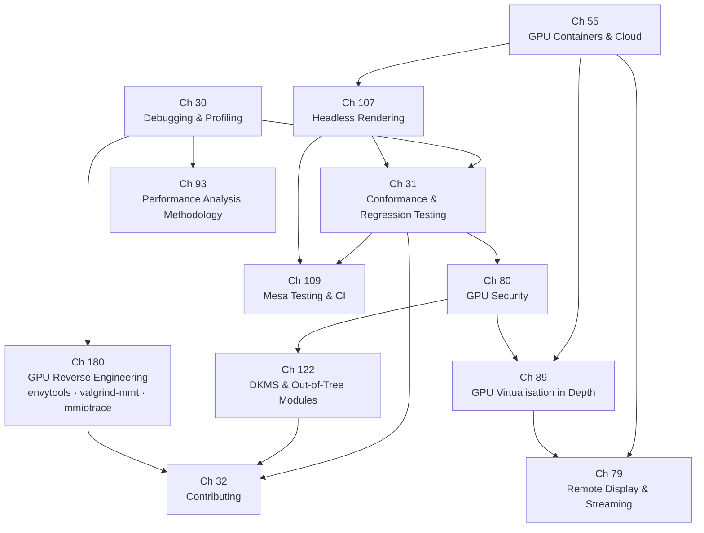

# Part IX — Tooling & Contributing

The earlier parts of this book built the Linux graphics stack layer by layer: the **DRM** kernel subsystem and its memory management, the **Mesa** compiler pipeline and Vulkan drivers, the **Wayland** compositor and display engine, video decode and encode via **VA-API** and **V4L2**, and the browser and terminal rendering stacks above them. Part IX steps back from implementation and asks the operational questions: how do engineers observe, measure, secure, deploy, and improve this stack in practice? These chapters cover the tools that make the graphics stack legible — profilers, conformance suites, contribution workflows — alongside the deployment and security concerns that arise when GPUs move into containers, virtual machines, remote sessions, and multi-tenant cloud environments. Three additional chapters address the infrastructure concerns that become urgent as GPU software matures: running the stack without any display attached, sustaining the Mesa CI pipeline that prevents regressions, and managing GPU kernel modules across the kernel version boundary.

## Chapters in This Part

**Chapter 30 — Debugging and Profiling the Graphics Stack** is the practitioner's entry point to the entire part. It maps the four distinct bug layers — API misuse, compiler and driver bugs, synchronisation errors, and hardware performance problems — to the tools that address each: **VK_LAYER_KHRONOS_validation**, **RenderDoc**, **Mesa** environment variables (**`RADV_DEBUG`**, **`ACO_DEBUG`**, **`INTEL_DEBUG`**, **`NIR_DEBUG`**), frame-latency instrumentation via **`wp_presentation`** and **`ftrace`** DRM tracepoints, and hardware counters via **`intel_gpu_top`**, **RadeonGPUProfiler (RGP)**, and **Nsight**. The chapter also explains the **`SPIR-V`** shader debugging toolchain, **`VkQueryPool`** timestamp queries, and the **`CAP_PERFMON`** capability model that gates counter access.

**Chapter 31 — Conformance and Regression Testing** shifts from ad-hoc debugging to systematic correctness verification. It covers the four testing pillars of Mesa driver development: **dEQP** / **VK-GL-CTS** (Khronos conformance, including the **Vulkan CTS mustpass list** and the **`deqp-runner`** parallel executor), **IGT GPU Tools** for kernel **DRM** driver testing (**`kms_atomic`**, **`gem_exec_store`**, **`syncobj_timeline`**), **piglit** for Mesa OpenGL regression, and fuzzing with **`spirv-fuzz`**, **AddressSanitizer**, and **`syzkaller`**. The chapter also explains **Mesa**'s **GitLab CI** pipeline, hardware-in-the-loop test stages, and the **Khronos Adopter Program** certification workflow that grants drivers the right to use the **Vulkan** and **OpenGL** trade names.

**Chapter 32 — Contributing to the Linux Graphics Stack** is the community guide. It explains the four contributing domains — **Linux kernel DRM** (email patches via **`git send-email`** and **`b4`** to **`dri-devel@lists.freedesktop.org`**), **Mesa** (**GitLab** merge requests merged by **`@marge-bot`**), **Wayland protocols** (the unstable → staging → stable lifecycle in **`wayland-protocols`**), and **libdrm** / **wlroots** / compositor projects — each with its own tooling, review culture, and release cadence. A case study traces HDR support end to end across all four domains, and a dedicated section covers the growing role of **Rust** in the kernel (**`rust/kernel/drm/`**), in **Mesa** (**NAK** shader compiler for **NVK**), and in emerging drivers such as **Nova** and **Tyr**.

**Chapter 55 — GPU Containers and Cloud Compute** addresses how GPU hardware is exposed inside containers, virtual machines, and cloud instances. It explains the **DRM** render node (`/dev/dri/renderDN`), KFD node (`/dev/kfd`), and the bind-mount plus DAC model that gates container GPU access; the **NVIDIA Container Toolkit** and its **CDI** (Container Device Interface) alternative; **ROCm** containers and the **AMD Container Toolkit**; **Intel** GPU containers via the render node; **Kubernetes** GPU scheduling via the device plugin API, **MIG** partitions, time-slicing, and **Dynamic Resource Allocation (DRA)**; and the **WSL2** GPU path through **`dxgkrnl`**, **`libdxcore.so`**, and the **Mesa** **`d3d12`** Gallium driver.

**Chapter 79 — Remote Display, Screen Casting, and GPU-Accelerated Game Streaming** covers how GPU-rendered frames leave the local machine. It traces three distinct pipelines: screen casting via **PipeWire** **`pw_stream`** and **`xdg-desktop-portal`** **ScreenCast** with zero-copy **DMA-BUF** import into **EGL** or **Vulkan**; remote desktop via **FreeRDP**, **GNOME Remote Desktop**, and **xrdp** with **VA-API** / **NVENC** hardware encode of **H.264** / **H.265**; and game streaming via **Sunshine** and **Moonlight** at sub-20 ms end-to-end latency using **KMS** or **NvFBC** framebuffer capture, **Vulkan Video** or **VA-API** encode, and **RTP** over UDP. Virtual and headless display via **VKMS** and **EDID** injection ties the chapter back to containerised and CI environments.

**Chapter 80 — GPU Security: Isolation, Content Protection, and Confidential Computing** enumerates the GPU attack surface and the mitigations the Linux stack deploys against it. Topics span GPU process isolation via the **DRM_GPUVM** framework and the AMD **cleaner shader** (GFX9.4.2+); IOMMU-backed DMA attack mitigation via **Intel VT-d**, **AMD-Vi**, and **ARM SMMU**; **HDCP 2.2** content protection through the DRM connector property API and Intel **PXP** (Protected Xe Path); GPU firmware supply-chain trust (**GSP-RM**, **GuC**/**HuC**, **PSP**, and **MOK**-signed kernel modules under **CONFIG_MODULE_SIG_FORCE**); GPU side-channel attacks including **GPUHammer** on **GDDR6**; and confidential computing via **NVIDIA H100 CC mode** (CPR, AES-GCM, SPDM attestation) and **AMD SEV-SNP** extensions toward GPU TEEs.

**Chapter 89 — GPU Virtualisation in Depth** provides the detailed technical treatment of every GPU sharing strategy: **VFIO** passthrough (with **VT-d**/**AMD-Vi**, **IOMMU groups**, and **PCIe FLR**); **Intel GVT-g** (Gen8–Gen12 via **mdev**/**kvmgt**) and its successor **Xe SR-IOV** (Arc, Battlemage, Linux 6.8+); **AMD MxGPU SR-IOV** with the **GIM** host module; **NVIDIA vGPU** time-slicing and **MIG** GPU/Compute Instances on A100–Blackwell; **virtio-gpu** paravirtualisation for display and **VirGL** OpenGL forwarding; and **Venus** for near-verbatim **Vulkan** command forwarding over a **`vn_ring`** shared-memory ring. The chapter closes with a performance comparison across all strategies and a decision guide for cloud gaming, VDI, multi-tenant ML training, and CI pipelines.

**Chapter 93 — GPU Performance Analysis Methodology** completes the part with a rigorous, top-down methodology for diagnosing slow correct behaviour. It introduces frame time decomposition using **`vkCmdWriteTimestamp2`**, hardware counter collection via **`VK_KHR_performance_query`**, and GPU-bound vs CPU-bound diagnosis with **MangoHUD**, **nvtop**, and **radeontop**. Deep-dive sections address occupancy and wave/warp analysis (**VGPR**/**SGPR** pressure, **RDNA** wave64 vs wave32 via **`VK_EXT_subgroup_size_control`**), memory bandwidth profiling against the arithmetic intensity roofline, and a pipeline stall taxonomy (TMU latency, LDS bank conflicts, RDNA export stalls). Vendor-specific sections cover **RGP** and **radeon_gpu_analyzer** for AMD, **ncu** and **nsys** for NVIDIA, and **`intel_gpu_top`** with **VK_INTEL_performance_query** for Intel.

**Chapter 107 — Headless Rendering and Off-Screen GPU Contexts** explains how to render with GPUs — or without them — on machines that have no physical display connected and no running compositor. The chapter systematically removes the EGL/Wayland/X11 surface assumptions layer by layer: it begins with Mesa's CPU software rasterizers (**llvmpipe** for OpenGL, **lavapipe** for Vulkan) that require no GPU at all, then covers the **EGL surfaceless platform** (`EGL_PLATFORM_SURFACELESS_MESA`) and **GBM**-based offscreen rendering via render nodes, the **Xvfb** virtual framebuffer for legacy X11 test harnesses, headless Wayland compositors (**Sway** with `WLR_BACKENDS=headless`, **Cage**, **`wlroots`** headless backend), and Vulkan headless via **`VkHeadlessSurface`** and the **`VK_EXT_headless_surface`** extension. Practical sections address GPU access inside containers and cloud VMs, server-side rendering use cases (headless Chromium, FFmpeg VAAPI on a bare-metal encode server), and virtual display injection via **VKMS** and **EDID** override for CI pipelines. This chapter is the operational bridge between Chapter 55 (GPU containers) and Chapter 109 (Mesa CI), showing how a CI runner obtains a valid GPU context when no monitor is attached.

**Chapter 109 — Mesa Testing and CI Infrastructure** is the operational companion to Chapter 31. Where Chapter 31 explains the theory of conformance suites and their certification role, Chapter 109 explains how Mesa's testing infrastructure works day-to-day: the tools contributors run locally, the GitLab CI pipeline that gates every merge request, the hardware farms that execute tests on real GPUs, and the workflows for writing and maintaining tests. It covers **piglit** test categories and the `.shader_test` format; **dEQP** / **VK-GL-CTS** modules, QPA log files, and mustpass caselist management; **`deqp-runner`** parallel execution, baseline tracking, flake handling, and sharding for CI; the five-stage Mesa CI pipeline (container build → Meson build → fast subset tests → hardware tests → nightly full CTS); **LAVA** (Linaro Automation and Validation Architecture) for ARM GPU hardware-in-the-loop testing and its successor **CI-tron**; **shader-db** for compiler regression metrics without requiring a GPU; trace-based render comparison testing via **apitrace** and piglit's replayer; and performance microbenchmarks via **vkmark**, **glmark2**, and the Phoronix Test Suite. The chapter bridges Chapter 31 (what the suites test) and Chapter 32 (how to submit a patch with a test), filling in the CI mechanics that govern every Mesa merge request.

**Chapter 122 — DKMS and Out-of-Tree GPU Kernel Modules** addresses the recompilation problem: GPU kernel modules must be rebuilt for every kernel the system runs, yet many are distributed outside the kernel tree. The chapter explains why Linux deliberately provides no stable in-kernel ABI, how `vermagic` strings and **`CONFIG_MODVERSIONS`** CRC checksums enforce compatibility, and how **DKMS** (Dynamic Kernel Module Support) automates recompilation on kernel updates via its `dkms.conf` hooks and `kernel_postinst.d` integration. It then surveys each vendor's position on the proprietary-to-upstream spectrum: **NVIDIA proprietary** modules (closed C source + binary stub, DKMS-distributed, `EXPORT_SYMBOL_GPL` complications), **NVIDIA open kernel modules** (MIT/GPL dual-licensed, Turing and later, supported alongside the proprietary flavour), **AMD amdgpu** (fully upstreamed; DKMS only for the `amdgpu-pro` proprietary userspace shim), and **Intel i915/Xe** (fully upstreamed; no DKMS, but requiring separate `linux-firmware` firmware blob packages). A dedicated section covers module signing under **Secure Boot** — **MOK** (Machine Owner Key) enrollment, `mokutil`, and `CONFIG_MODULE_SIG_FORCE` — and the chapter closes with distribution packaging strategies for RPM (`kmod`) and Debian (`dkms` and `linux-headers`) ecosystems. This chapter complements Chapter 80's treatment of firmware supply-chain trust and Chapter 32's contributing guide, which discusses the upstream-first policy that makes DKMS unnecessary for well-maintained in-tree drivers.

**Chapter 180 — GPU Reverse Engineering: Tools, Methodology, and Case Studies** addresses the engineering discipline that underlies every open-source driver for undocumented GPU hardware. It covers the four-layer RE target (MMIO register space, command-stream format, firmware protocol, shader ISA), the **envytools** suite (**nva** direct MMIO access, **rnndb** XML register database, **envydis**/**envyas** ISA disassembly and assembly), **valgrind-mmt** and **demmt** for capturing and decoding proprietary command streams, **mmiotrace** via the `x86` tracing subsystem, and the LD_PRELOAD intercept libraries used in each driver project (**libwrap**/**cffdump**/.rd format for freedreno, **panwrap**/**panloader** for Panfrost, **viv_interpose**/**libvivhook** for etnaviv). Four case studies trace RE methodology from bare hardware to a working driver: Nouveau and envytools (mmiotrace → rnndb register names → firmware reverse engineering with Ghidra), Panfrost and the Mali job descriptor format (panwrap traces → Midgard/Bifrost ISA recovery), Asahi Linux and the Apple AGX firmware (m1n1 hypervisor tracing + macOS dyld_shared_cache analysis → AGX command-stream model), and etnaviv and the Vivante GC series (viv_interpose intercepts → GC800–GC7000 command-stream reconstruction). The chapter closes with a legal considerations section on the clean-room methodology that has allowed all these drivers to co-exist with proprietary vendor software.

**Chapter 125 — RenderDoc on Linux** covers the open-source GPU frame capture and replay tool in depth: the Vulkan and OpenGL capture layers, in-application overlay, remote capture via RenderDoc server, the shader debugger and disassembler, performance counters via `VK_AMD_shader_info` and `VK_AMD_buffer_marker`, and the command-line replay infrastructure used in automated regression testing.

**Chapter 136 — WSL2 and the Linux Graphics Stack** explains how GPU-accelerated graphics reaches Windows Subsystem for Linux 2: the `dxgkrnl` kernel module, the `libdxcore.so` D3D12 backend, the Mesa `d3d12` Gallium driver, `VirtIOGPU` display for WSLg GUI applications, and the VA-API and Vulkan capability limitations of the WSL2 translation path.

**Chapter 137 — GPU Performance Profiling: A Practical Workflow** is a practitioner's guide to systematically profiling GPU workloads across vendors: using `perf` and DRM FDINFO for coarse attribution, vendor tools (RGP, Nsight, VTune) for deep-dive analysis, frame time budget decomposition, identifying GPU-bound vs CPU-bound bottlenecks, and writing reproducible benchmark harnesses.

**Chapter 153 — OBS Studio and the GPU Pipeline** documents how OBS Studio captures, encodes, and streams desktop content using the Linux graphics stack: DMA-BUF zero-copy screen capture via the PipeWire portal, VA-API and NVENC hardware encoding, the OBS Vulkan rendering pipeline for scenes and effects, and performance considerations for simultaneous gaming and streaming.

## Key Concepts

### Video Acceleration: VA-API and V4L2

**VA-API (Video Acceleration API)** is a vendor-neutral C API for hardware-accelerated video decode, encode, and processing on Linux. The `libva` library dispatches through backend drivers (e.g. `libva-mesa-driver` for AMD/Intel open, `nvidia-vaapi-driver` for NVIDIA) to GPU hardware via DRM render nodes. A decode call allocates `VASurface` objects (GPU-resident frame buffers), submits bitstream data via `VABuffer`s, and signals completion via `vaSyncSurface()`. VA-API surfaces integrate with EGL via `EGLImage`/`EGL_EXT_image_dma_buf_import` and with Vulkan via `VK_EXT_external_memory_dma_buf`, enabling zero-copy GPU video pipelines.

**V4L2 (Video4Linux2)** is the kernel subsystem for capture devices (cameras, capture cards) and memory-to-memory codec hardware. It uses `ioctl`-based operations: `VIDIOC_QUERYCAP`, `VIDIOC_S_FMT`, `VIDIOC_REQBUFS`, `VIDIOC_QBUF`/`VIDIOC_DQBUF`. Buffer memory types include `V4L2_MEMORY_MMAP`, `V4L2_MEMORY_USERPTR`, and `V4L2_MEMORY_DMABUF` (zero-copy to GPU). Unlike VA-API which is codec-focused, V4L2 covers capture and stateless codec paths; many ARM SoCs implement H.264 decode via V4L2 stateless rather than VA-API.

**Vulkan Video vs. VA-API:**

| Feature | VA-API | Vulkan Video |
|---|---|---|
| API style | C procedural (`libva`) | Vulkan extension (`VK_KHR_video_queue`) |
| Buffer model | `VABuffer` IDs | `VkBuffer` + `VkVideoSessionKHR` |
| Sync model | `vaSyncSurface()` | Vulkan timeline semaphores |
| Decode codecs | H.264/H.265/AV1/VP9/VP8 | H.264/H.265/AV1 |
| Zero-copy to GL | `EGLImage` from `VASurface` | `vkImportSemaphoreFdKHR` + `VkImage` |
| Stability | Mature (20+ years) | Newer (Vulkan 1.3+ extensions) |

VA-API remains the dominant production path on Linux in 2026. Vulkan Video offers tighter integration with Vulkan pipelines and explicit synchronisation but requires Mesa 23.1+ or vendor driver support.

### Frame Capture and Replay: RenderDoc

**RenderDoc** is an MIT-licensed GPU frame debugger and replay tool. It injects as a Vulkan layer or OpenGL interceptor, capturing every API call, GPU buffer, and texture in a single frame into a `.rdc` file. The Qt-based UI allows stepping through draw calls, inspecting pipeline state, viewing texture contents at any stage, and running a SPIR-V shader debugger. Remote capture is supported via `renderdoccmd remoteserver`; automated regression testing can replay `.rdc` files headlessly via `renderdoccmd replay` and compare output images.

### Conformance: CTS Mustpass and IGT

The **CTS mustpass list** is the subset of the full Khronos CTS that a driver **must** pass before it may be submitted to the Khronos Adopter Program to claim API conformance. The full VK-GL-CTS suite contains millions of test cases; the mustpass set (typically ~100,000–200,000 cases for a given Vulkan version) is the certification-required subset defined per API version and extension set. Mesa tracks baselines as `deqp-runner`-managed flake files in the CI pipeline.

**IGT GPU Tools** is the test suite for Linux kernel DRM drivers. IGT tests run in a minimal environment (no compositor, DRM master via `drmSetMaster()`) and exercise hardware directly: `kms_atomic` exercises `drmModeAtomicCommit()`, `gem_exec_store` validates ring submission, `syncobj_timeline` exercises DMA-fence timeline sync. IGT is run in Mesa's CI on real hardware; failures block driver patches from landing. IGT validates the kernel DRM ABI the same way dEQP validates the userspace Mesa API.

### Compute Device Interfaces: KFD and DAC

**KFD** (`/dev/kfd`) is the AMD **Kernel Fusion Driver** character device exposing the HSA compute interface. Unlike the DRM render node, KFD provides queue creation (`AMDKFD_IOC_CREATE_QUEUE`), event signals, and per-process GPU virtual address space management — the primitives that ROCm's `libhsakmt.so` uses to submit compute work without a graphics context. Both KFD and the DRM render node (`renderDN`) are backed by `amdgpu.ko`; they expose different IOCTLs for compute vs. graphics contexts.

**DAC (Discretionary Access Control)** is the Linux permission model applied to DRM device nodes. `/dev/dri/cardN` (KMS master) requires root or `CAP_SYS_ADMIN`; `/dev/dri/renderDN` (render-only) is readable by members of the `render` group (GID 108 on most distributions). Containers get GPU access by bind-mounting `/dev/dri/renderDN` with the container in the `render` group — no root required. `/dev/kfd` similarly requires `render` group membership. CDI (Container Device Interface) formalises how container runtimes inject device nodes and group memberships.

### NVIDIA Hardware Video: NVENC and NvFBC

**NVENC** is NVIDIA's dedicated hardware video encoder block on Kepler and later GPUs. It supports H.264, H.265, AV1 (Ada Lovelace+), and VP9 encode via the NVENC SDK and is also accessible via VA-API through `nvidia-vaapi-driver`. NVENC is the encoder backend for OBS Studio, Sunshine, and game streaming pipelines, offering 10–20× the throughput of software encoders at equal quality.

**NvFBC (NVIDIA Framebuffer Capture)** is NVIDIA's proprietary GPU-side screen capture API. Unlike PipeWire-based capture (which requires compositor cooperation), NvFBC captures the framebuffer directly from the GPU output stage without a compositor round-trip. It is used by Sunshine for low-latency capture. NvFBC is not available on open-source NVIDIA drivers and requires the proprietary `nvidia-drm.ko`.

### Game Streaming: Sunshine and Moonlight

**Sunshine** is an open-source GPU-accelerated game streaming server. It captures the desktop using NvFBC (NVIDIA), VA-API / KMS DMA-BUF (AMD/Intel), or the PipeWire portal, encodes with NVENC or VA-API, and streams encoded frames over **RTP** over UDP at ~10–20 ms end-to-end latency using the Moonlight protocol (NVIDIA GameStream-compatible). **Moonlight** is the open-source client that decodes the RTP stream using VA-API, Vulkan Video, or software decode and presents frames at sub-20 ms total latency over local network or WireGuard VPN. Together they form the primary GPU-accelerated remote gaming pipeline on Linux.

**RTP (Real-Time Transport Protocol)** is a UDP-based protocol for time-sensitive media transport. Each RTP packet carries a sequence number, timestamp, and SSRC identifier, enabling receivers to reorder, detect loss, and synchronise streams. RTP is paired with **RTCP** for transmission statistics and feedback. In game streaming, RTP carries H.264/HEVC/AV1 NAL units; in WebRTC, RTP carries encoded audio/video between peers.

### Content Protection: HDCP

**HDCP 2.2 (High-bandwidth Digital Content Protection)** is a DRM scheme for protecting video over HDMI/DisplayPort. Kernel support lives in `drivers/gpu/drm/*/` as DRM connector properties (`Content Protection`, `HDCP Content Type`). Applications set `DRM_MODE_CONTENT_TYPE_HDCP_TYPE0/1` on the connector; the kernel performs the HDCP 2.2 authentication handshake with the sink. Intel PXP (Protected Xe Path) enables GPU-to-display HDCP 2.3. Content protected via HDCP cannot be captured by NvFBC or PipeWire portal.

### GPU Firmware: GSP-RM, GuC/HuC, PSP

**GSP-RM** (GPU System Processor Resource Manager) is NVIDIA's closed firmware blob running on an ARM Falcon / RISC-V microprocessor embedded in the GPU. On Turing and later, it handles all GPU resource management IOCTLs — engine scheduling, power states, display PHY programming — previously handled by the host driver. The open kernel module submits IOCTLs via an RPC ring buffer; GSP-RM is a signed binary distributed with the NVIDIA driver package that cannot be replaced by open-source equivalents.

**GuC** (Graphics Microcontroller) and **HuC** (HEVC Microcontroller) are Intel GPU co-processors. GuC handles GPU command scheduling (CT firmware-mediated H2G/G2H mailbox on Xe), workload prioritisation, and power management. HuC offloads HEVC encode/decode bitstream processing from the host CPU. Both run signed firmware blobs loaded by `i915.ko`/`xe.ko` from the `linux-firmware` package.

**PSP** (Platform Security Processor) is AMD's ARM Cortex-M security processor embedded in RDNA/CDNA GPUs. It authenticates VBIOS and firmware, handles `amdgpu` firmware loading, and manages the Trusted Execution Environment. PSP authentication failures prevent `amdgpu.ko` from initialising the GPU.

### Secure Boot: MOK

**MOK (Machine Owner Key)** is the Secure Boot trust anchor for custom kernel modules. Under `CONFIG_MODULE_SIG_FORCE`, Linux refuses to load unsigned modules. For out-of-tree modules (NVIDIA proprietary, DKMS modules), the module is signed with a private key; the corresponding public key is enrolled into UEFI via `mokutil --import`. DKMS automates re-signing on kernel update when the key is configured at install time.

### GPU Virtualisation: VFIO

**VFIO (Virtual Function I/O)** is the Linux kernel framework for safe GPU passthrough to VMs. A physical GPU is unbound from its native driver and bound to `vfio-pci`; KVM + QEMU maps the GPU's BARs and interrupts into the VM's address space. The IOMMU (Intel VT-d or AMD-Vi) enforces DMA isolation: the VM's GPU driver can only DMA into its own IOMMU group pages. VFIO passthrough gives near-native GPU performance (~1–5% overhead) but dedicates the GPU to one VM. SR-IOV (AMD MxGPU, Intel Xe) extends this to hardware partitioning of a single GPU into multiple virtual functions.

### Shader Register Pressure: VGPR/SGPR and RDNA Wave

**VGPR (Vector General Purpose Register)** holds per-lane (per-thread) data in AMD GPU compute units; **SGPR (Scalar General Purpose Register)** holds per-wavefront (uniform) data. Each compute unit has a fixed register file. A shader using more VGPRs per thread occupies fewer concurrent wavefronts → lower GPU utilisation. This is **VGPR pressure**: complex shaders with high register usage reduce the GPU's ability to hide memory latency via wavefront switching. Reducing VGPR usage is a primary shader optimisation target measured with MangoHud and AMD Radeon GPU Profiler.

A **wave** (wavefront) is the SIMD execution unit in AMD GPUs: 64 threads in wave64 mode (GCN/RDNA default) or 32 threads in wave32 mode (RDNA-specific). RDNA's `VK_EXT_subgroup_size_control` lets drivers choose wave32 or wave64 per pipeline, reducing divergence penalty for branchy code. The RDNA3 wave32 path is significantly faster for ray tracing and ML workloads.

### Virtual Display: VKMS and EDID

**VKMS (Virtual KMS)** is an in-kernel software DRM driver (`drivers/gpu/drm/vkms/`) that presents a virtual display without physical hardware. It supports atomic KMS, writeback connector output, and multiple virtual CRTCs. VKMS is used in CI pipelines (Mesa GitLab CI hardware-less stages), headless containers, and test environments where a physical monitor is unavailable but a KMS master is required.

**EDID (Extended Display Identification Data)** is a 128-byte EEPROM structure broadcast by display hardware over DDC/I2C or DisplayPort AUX. It describes supported resolutions, refresh rates, HDR capabilities, and physical dimensions. The kernel parses EDID via `drivers/video/edid.c` and exposes connector properties via DRM. Overriding EDID with a custom blob (`drm.edid_firmware=DP-1:edid/1920x1080.bin`) allows testing specific display configurations without physical hardware — a common CI and embedding technique.

### Kernel Modules: vermagic and DKMS

**vermagic** is a string embedded in every compiled Linux kernel module encoding the kernel version, compiler version, and relevant `CONFIG_` flags (e.g. `6.8.0-124-generic SMP preempt mod_unload`). The kernel checks `vermagic` on `insmod` and refuses modules compiled for a different kernel. If `CONFIG_MODVERSIONS` is enabled, per-symbol CRC checksums provide finer-grained ABI checking beyond `vermagic`.

**DKMS (Dynamic Kernel Module Support)** automatically recompiles out-of-tree kernel modules when a new kernel is installed. A `dkms.conf` file specifies build instructions; `kernel_postinst.d/dkms` hooks trigger recompilation. Used for the NVIDIA proprietary module and other out-of-tree drivers. On Secure Boot systems, DKMS must also re-sign modules with the enrolled MOK key.

### GPU Metrics: DRM FDINFO

**DRM FDINFO** is the kernel's per-client GPU metrics interface standardised in Linux 5.19 (`/proc/<pid>/fdinfo/<drm_fd>`). Each entry exposes:
- `drm-engine-*`: time-accumulated GPU engine busy counters (render, video decode, compute, copy)
- `drm-memory-*`: per-heap VRAM/GTT/shared memory usage in bytes
- `drm-cycles-*`: GPU execution cycle counts (where hardware supports it)

FDINFO is the mechanism MangoHud, `nvtop`, and `radeontop` use for real-time GPU utilisation display without requiring root or vendor-specific APIs. All major Mesa drivers (radeonsi, iris, RADV, ANV) and the NVIDIA kernel module implement FDINFO.

### Streaming Production: OBS Studio

**OBS Studio (Open Broadcaster Software)** is the dominant open-source screen capture and streaming application on Linux. Its GPU pipeline uses: (1) the PipeWire `xdg-desktop-portal` ScreenCast API for zero-copy DMA-BUF screen capture from the compositor; (2) a Vulkan or OpenGL rendering pipeline for scene compositing, transitions, and effects; (3) NVENC (NVIDIA), VA-API (AMD/Intel), or software x264/x265 for output encoding; (4) RTMP, SRT, or local file output. OBS exposes plugin APIs for custom sources, filters, and outputs; Chapter 153 covers the full GPU pipeline in depth.

## How the Chapters Interrelate

The chapters in this part are grouped into four conceptual clusters that share data structures, kernel interfaces, and operational concerns, while remaining largely independent reading tracks at the chapter level.

**The core tooling triad** — Chapters 30, 31, and 93 — forms a coherent discipline of observation. Chapter 30 maps tools to bug categories and establishes the essential vocabulary: **NIR** IR dumps, **DRM** `ftrace` tracepoints, **`VkQueryPool`** timestamps, and the **`CAP_PERFMON`** permission model. Chapter 31 builds directly on Chapter 30: the **AddressSanitizer** and **`spirv-fuzz`** sanitiser builds that Chapter 30 mentions in passing become the main subject of Chapter 31's fuzzing section, and the **GitLab CI** pipeline described in Chapter 31 is precisely where **Mesa** debug builds and **dEQP** runs intersect. Chapter 93 picks up where Chapter 30 ends: where Chapter 30 introduces **RGP**, **`intel_gpu_top`**, and **`ncu`** as tools, Chapter 93 explains *how to think with them* — the top-down measurement hierarchy (system → API → hardware counter → ISA), the roofline model, and stall taxonomy. A reader should encounter these chapters in order: 30 → 31 → 93.

Chapter 32 is the community complement to the tooling triad. It explains how to move a patch from a locally reproduced bug (found with Chapter 30's tools, validated by Chapter 31's tests) through the upstream review process. It can be read independently but benefits from Chapter 31's explanation of **dEQP** CI and the **Meson** build system.

**Chapter 180** (GPU Reverse Engineering) sits at the deepest end of the spectrum: where Chapter 30 assumes the register maps and command-stream formats are already known, Chapter 180 explains how those maps are discovered in the first place. It is the prerequisite that makes contributing a *new* driver possible — the Chapter 32 contributing guide presupposes that the hardware is already understood well enough to write an independent implementation, and Chapter 180 explains the observational methodology that reaches that point. Chapter 30's **mmiotrace** and **ftrace** DRM tracepoints are also the primary MMIO observation tools described in Chapter 180 §6, making Chapter 30 a useful prerequisite. Readers intending to contribute a driver for undocumented hardware should read 180 → 32 in sequence; readers already working on an in-tree driver can treat Chapter 180 as historical context.

**The CI and testing cluster** — Chapters 31, 109, and 107 — addresses the automated infrastructure that validates every Mesa change. Chapter 31 describes the conformance suite landscape and certification theory. Chapter 109 goes deeper into operational mechanics: how **`deqp-runner`** shards a 700,000-case CTS run across hardware farm nodes, how **LAVA** and **CI-tron** flash and exercise ARM GPU boards, and how **shader-db** catches compiler regressions without a GPU. Chapter 107 provides the prerequisite for both: it explains how CI runners obtain a valid GPU context when no monitor is attached — whether via **llvmpipe**/**lavapipe** software rendering, the **EGL surfaceless platform**, **GBM** render-node access, or **VKMS** virtual display injection. The natural reading order within this sub-cluster is 107 → 31 → 109.

**The deployment cluster** — Chapters 55, 79, and 89 — shares the DRM render node abstraction as its common substrate. All three chapters open with `/dev/dri/renderDN` as the fundamental GPU access primitive. Chapter 55 establishes the container bind-mount model; Chapter 89 extends this into full VM-level partitioning (VFIO, SR-IOV, virtio-gpu, Venus, MIG), explicitly cross-referencing Chapter 55's container sections for the Kubernetes and WSL2 subsections. Chapter 79 depends on the display pipeline anatomy from Part VI (display stack) but can be read alongside Chapter 89: headless virtual display via **VKMS** in Chapter 79 is the complement to **virtio-gpu** paravirtualised display in Chapter 89, and the **WSL2 GPU path** appears in both. Chapters 55 and 89 can be read in either order; Chapter 79 is best read after Chapter 55 because PipeWire screen casting assumes a running compositor on a real or virtual display device. Chapter 107's headless rendering techniques also slot naturally after Chapter 55: the same render-node bind-mount that Chapter 55 uses to give containers GPU access is the foundation on which Chapter 107 builds EGL surfaceless and GBM offscreen pipelines.

**Chapter 80 — Security** and **Chapter 122 — DKMS** thread through multiple clusters. Chapter 80's **IOMMU** and **VFIO** material dovetails with Chapter 89's VFIO passthrough sections; Chapter 80 explicitly defers confidential computing VM details to Chapter 89. Its **DRM render node** isolation analysis and **ioctl** permission model complement the container GPU access model in Chapter 55. The **`syzkaller`** kernel fuzzer cited in Chapter 80 §10 is also the kernel-level fuzzing tool introduced in Chapter 31 §6.5, providing a natural cross-link between the security and testing clusters. Chapter 122 connects to Chapter 80 through the **Secure Boot** module-signing material: the **MOK** enrollment workflow and **`CONFIG_MODULE_SIG_FORCE`** in Chapter 122 are the deployment-time complement to Chapter 80's treatment of firmware supply-chain trust. Chapter 122 also connects to Chapter 32: the upstream-first contributing policy explained in Chapter 32 is precisely what makes DKMS unnecessary for well-maintained in-tree drivers; Chapter 122 is the argument for why upstreaming matters operationally.

## Prerequisites and What Comes Next

Readers should be comfortable with the DRM kernel subsystem (Part I), Mesa's compiler pipeline and Vulkan driver architecture (Parts II–III), and the Wayland compositor and display stack (Part VI) before tackling the chapters in this part — Chapter 30 in particular assumes familiarity with **NIR**, **SPIR-V**, **`DRM_IOCTL_MODE_ATOMIC`**, and **Vulkan** synchronisation primitives that Parts I–III develop in detail. The deployment chapters (55, 79, 89) additionally draw on VA-API and video encode knowledge from Part V. Chapter 107 on headless rendering is largely self-contained but benefits from Chapter 55 for the container GPU-access model and from Part VI for the Wayland compositor concepts it deliberately removes. Chapter 109 on Mesa CI presupposes the test-suite landscape laid out in Chapter 31. Chapter 122 on DKMS requires familiarity with Linux kernel module mechanics from Part I and with Secure Boot concepts introduced in Chapter 80.

Part IX's contribution and conformance material (Chapters 31, 32, and 109) flows directly into Part X (vendor-specific deep dives), which assumes a reader can read a Mesa merge request, interpret a **dEQP** result, and locate relevant kernel source paths — skills this part develops. The headless and CI infrastructure material (Chapters 107 and 109) is also a prerequisite for Part XII (terminal graphics CI) and any appendix that describes running code samples from this book in a GPU-less environment.

---

## Part Roadmap Summary

*Synthesised from the Roadmap sections of this part's chapters.*

### Near-term (6–12 months)

- **Rust adoption accelerating across the kernel GPU stack.** DRM subsystem maintainers have signalled that new DRM drivers must be written in Rust (Ch32); Nova (Rust NVIDIA driver) is maturing in Linux 6.15–6.17 (Ch122, Ch180); Linux 7.1 expands Rust DRM abstractions for GEM, buddy allocator, and DMA coherent APIs. Contributors working on any new in-tree driver — Nova, Tyr, Asahi — must target `rust/kernel/drm/` from day one.
- **GPU virtualisation and container infrastructure converging on SR-IOV + DRA.** Intel Xe SR-IOV lands in Linux 6.19 (Ch55, Ch89); AMD amdgpu SR-IOV mailbox improvements also target 6.19; Kubernetes DRA (GA in 1.31–1.36) is replacing the integer-count Device Plugin API across NVIDIA, AMD, and Intel GPU operators, with CNCF-neutral governance following the NVIDIA DRA driver donation at KubeCon EU 2026.
- **Vulkan Video AV1 encode reaching production across streaming and encoding pipelines.** Sunshine now ships Vulkan Video H.264/HEVC encode (landed April 2026) and is extending to AV1 via `VK_KHR_video_encode_av1` (Ch79); OBS Studio 33.x is refining AV1 VA-API and NVENC paths (Ch153); Mesa RADV and ANV are maturing `VK_KHR_video_encode_queue` support as a direct replacement for the VA-API encode detour.
- **CI and testing infrastructure improvements: CI-tron, lavapipe, and blame-aware test selection.** Mesa CI is completing the LAVA → CI-tron migration for ARM hardware-in-the-loop testing (Ch109); lavapipe Vulkan extension coverage is expanding to close WebGL2 and Vulkan Roadmap 2026 gaps for CPU-only CI runners (Ch107); per-MR blame-aware test selection (rather than static 1-in-N sharding) is under active development to reduce CI latency.
- **GPU profiling tooling maturing across all vendors.** RGP 2.7 adds RDNA 4 SQTT support and instruction-level divergence metrics (Ch137); Nsight Systems 2026.x now distributes a native Linux GUI (Ch93); `drm_fdinfo` counter coverage is expanding to Panfrost, Nouveau, and media engines (Ch137, Ch30); Mesa's Perfetto `gpu_memory` data source is being stabilised for CPU+GPU co-profiling.
- **Security hardening: GPU rowhammer mitigations and confidential computing attestation.** GDDR7 on-die ECC is arriving in consumer GPUs following GPUHammer/GDDRHammer disclosures against GDDR6 (Ch80); NVIDIA CC attestation via SPDM and `nvtrust` is stabilising on Blackwell inside TDX-protected Kata containers (Ch55, Ch80); AMD vIOMMU hardware acceleration patches (March 2026) are entering final review.
- **Wayland protocol ecosystem advancing: XDG session management, explicit sync, `ext-image-copy-capture-v1`.** wayland-protocols 1.48 (April 2026) adds XDG Session Management; PipeWire DRM syncobj explicit sync is spreading from OBS 31 to GNOME Remote Desktop and Chromium (Ch79, Ch153); `ext-image-copy-capture-v1` is replacing `wlr-screencopy-unstable-v1` across Mutter, KWin, and wlroots.

### Medium-term (1–3 years)

- **Rust GPU drivers reaching full DRM feature parity and upstream submission.** Nova-drm (the DRM modesetting and render layer atop nova-core) targets a fully upstream DKMS-free open driver for Turing+ NVIDIA GPUs (Ch122); Asahi DRM UAPI is completing stabilisation in `drm-misc-next` (Ch32); the long-term trajectory is a DRM subsystem predominantly in Rust with C remaining only in legacy paths (Ch32). This shift will make DKMS unnecessary for mainstream GPU drivers as AMD amdgpu, Intel xe, and NVIDIA Nova all converge in-tree.
- **GPU confidential computing entering production: SEV-SNP + TDX + attestation pipelines.** AMD SEV-SNP extensions for GPU VRAM resident memory are progressing (Ch80, Ch89); NVIDIA CC vGPU integration for MIG partitions is on the roadmap (Ch89); a unified kernel `trusted_io` attestation ABI targeting Linux 6.18–6.22 is under discussion at the Confidential Computing microconference (Ch80). Cloud providers are expected to expose confidential GPU instance types commercially.
- **Mesa CI scaling to Vulkan 1.4+ and performance-regression blocking.** VK-GL-CTS has exceeded 700,000 test cases and continues growing with each Vulkan extension (Ch109); medium-term CI work targets making performance regressions merge-blocking for core NIR and driver backend changes, with Grafana dashboard tracking per-commit perf data (Ch109); Vulkan 1.4 mustpass hardening is the current focus after day-zero conformance by RADV, ANV, Turnip, NVK, and Honeykrisp.
- **Standardised cross-vendor GPU profiling and observability.** `VK_KHR_performance_query` coverage is expanding to NVK and all Mesa Vulkan drivers (Ch93, Ch137); Perfetto GPU timeline is gaining a stable DRM-backend counter source for Linux desktop (Ch93, Ch30); the eBPF GPU instrumentation research programme (eGPU/bpftime, eBPF struct_ops for DRM scheduler) is expected to enable warp-level shader observability on NVIDIA and eventually AMD RDNA and Intel Xe without proprietary tooling.
- **VirtIO-GPU native context replacing VirGL across all CI and VM workloads.** Mesa 26.1 dropped VirGL support; the medium-term migration path runs through `virtio-gpu` native contexts for Intel Iris/Crocus/ANV and the `rutabaga_gfx` Rust crate integrating into upstream QEMU (Ch107); Venus Vulkan is expected to absorb OpenGL workloads via Zink-over-Venus, eliminating the TGSI translation tier (Ch89).
- **Remote display and streaming protocol consolidation.** `ext-image-copy-capture-v1` is the agreed successor to `wlr-screencopy-unstable-v1` across all major compositors (Ch79); Moonlight plans a Vulkan Video decode path for cross-vendor hardware acceleration; xrdp is targeting a native Wayland backend using `ext-image-copy-capture-v1` and libei to eliminate the X11 session dependency (Ch79); HDR 10-bit P010/BT.2020 streaming is under active development in Sunshine and Moonlight.
- **AI-assisted tooling across testing, profiling, and patch review.** AI/ML scene processing hooks using TensorRT and ROCm are planned for OBS 33.x (Ch153); ML-guided shader fuzzing via `spirv-fuzz` successors is an emerging research direction (Ch31); LLM-assisted firmware decompilation via GhidraMCP is entering GPU reverse-engineering workflows for NVIDIA GSP and Apple ASC firmware analysis (Ch180); automated counter-analysis for bottleneck classification (`VK_KHR_performance_query` streams) has early academic prototypes (Ch93).

### Long-term

- **Unified kernel GPU infrastructure eliminating fragmentation.** A standardised kernel-level GPU debugging UAPI extending `perf_event` and `CAP_PERFMON` to abstract AMD SQTT, i915/Xe OA streams, and NV PMU behind a common interface (Ch30); first-class GPU cgroups v3 memory and compute controllers analogous to existing CPU/memory cgroup controllers (Ch55); DRM namespace isolation providing kernel-level container GPU isolation stronger than bind-mount + DAC (Ch55); DRM atomic commit latency histograms exported via `sysfs`/`debugfs` for zero-setup frame delivery measurement (Ch93).
- **GPU vendor documentation convergence reducing reverse-engineering burden.** NVIDIA GSP firmware protocol documentation (required for Nova to function without the binary blob) is the critical near-horizon item; ARM Panthor CSF documentation for Valhall firmware scheduling is expected; broader partial-cooperation trends (Qualcomm Adreno docs, NVIDIA open-gpu-kernel-modules headers) may eventually reduce GPU bringup to driver integration work rather than protocol discovery (Ch180). A unified cross-driver trace capture and register database format to replace the fragmented freedreno `.rd` / envytools rnndb / panwrap ecosystem is a long-term architectural goal.
- **Cross-vendor GPU security certification and hardware-enforced isolation.** Common Criteria and FIPS 140-3 certification demand for GPU TEE paths will drive standardisation of attestation report formats across AMD, Intel, and NVIDIA (Ch80); future GPU architectures may expose sub-allocation hardware memory cells for intra-process VRAM isolation beyond IOMMU granularity (Ch80); formal verification of DRM ioctl permission logic via Kani/CBMC is a long-term correctness goal as Rust formalisation tooling matures (Ch80).
- **Fully open cloud GPU stack: WebGPU, open streaming protocols, and unified headless contexts.** Dawn/wgpu headless compute modes collapsing the rendering/compute distinction for server-side CI (Ch107); federated open cloud gaming built on Sunshine + Moonlight + AV1 + WebRTC is a 3–5 year horizon goal (Ch79); a ratified cross-vendor KHR headless EGL/Vulkan extension replacing the current patchwork of vendor environment variables (`LIBGL_ALWAYS_SOFTWARE`, `VK_DRIVER_FILES`, `WLR_BACKENDS`) would make headless setup portable across all drivers and distributions (Ch107).
